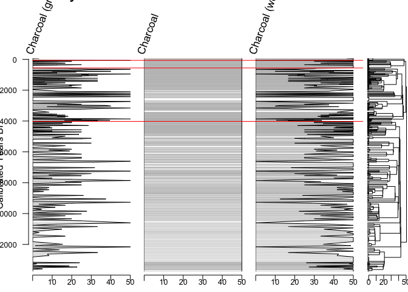
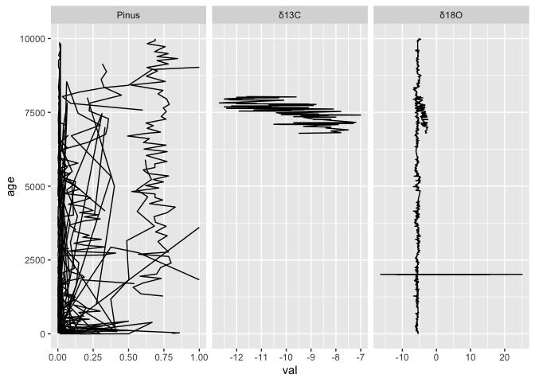

## Introduction

This document is intended to act as a primer for the use of the Neotoma R package, `neotoma2` and is the companion to the [*Introduction to Neotoma* presentation](https://docs.google.com/presentation/d/1Fwp5yMAvIdgYpiC04xhgV7OQZ-olZIcUiGnLfyLPUt4/edit?usp=sharing). Some users may be working with this document as part of a workshop for which there is a Binder instance. The Binder instance will run RStudio in your browser, with all the required packages installed.

If you are using this workflow on its own, or want to use the package directly, [the `neotoma2` package](https://github.com/NeotomaDB/neotoma2) is available on CRAN by running:

```r
install.packages("remotes") 
devtools::install_github("NeotomaDB/neotoma2@dev")
library(neotoma2)
```

Your version should be at or above 1.0.6.

This workshop will also require other packages. To maintain the flow of this document we've placed instructions at the end of the document in the section labelled "[Installing packages on your own](#localinstall)". Please install these packages, and make sure they are at the lastest version.

## Learning Goals

In this tutorial you will learn how to:

1. [Site Searches](#3-site-searches): Search for sites using site names and geographic parameters.
2. [Filter Results](#33-filter-records-tabset): Filter results using temporal and spatial parameters.
3. [Explore Data](#34-pulling-in-sample-data): Obtain sample information for the selected datasets.
4. [Visualize Data](#4-simple-analytics): Perform basic Stratigraphic Plotting

## Background

### Getting Help with Neotoma

If you're planning on working with Neotoma, please join us on [Slack](https://join.slack.com/t/neotomadb/shared_invite/zt-cvsv53ep-wjGeCTkq7IhP6eUNA9NxYQ) where we manage a channel specifically for questions about the R package (the *#it_r* channel, or *#it_r_es* for R help in Spanish and *#it_r_jp* in Japanese). You may also wish to join the Neotoma community through our Google Groups mailing lists; please [see the information on our website](https://www.neotomadb.org/about/join-the-neotoma-community) to be added.

### Understanding Data Structures in Neotoma

Data in the Neotoma database itself is structured as a set of linked relationships to express different elements of paleoecological analysis:

* space and time
  * Where is a sample located in latitude and longitude?
  * Where is a sample along a depth profile?
  * What is the estimated age of that sample?
  * What is the recorded age of elements within or adjacent to the sample?
* observations
  * What is being counted or measured?
  * What units are being used?
  * Who observed it?
* scientific methods
  * What statistical model was used to calculate age?
  * What uncertainty terms are used in describing an observation?
* conceptual data models
  * How do observations in one sample relate to other samples within the same collection?
  * How does an observation of a fossil relate to extant or extinct relatives?

These relationships can be complex because paleoecology is a broad and evolving discipline. As such, the database itself is highly structured, and normalized, to allow new relationships and facts to be added, while maintaining a stable central data model. If you want to better understand concepts within the database, you can read the [Neotoma Database Manual](https://open.neotomadb.org/manual), or take a look at [the database schema itself](https://open.neotomadb.org/dbschema).

In this workshop we want to highlight two key structural concepts:
  
  1. The way data is structured conceptually within Neotoma (Sites, Collection Units and Datasets).
  2. The way that this structure is adapted within the `neotoma2` R package.

#### Data Structure in the Neotoma Database

{width=50%}  
  
Data in Neotoma is associated with **sites** -- specific locations with latitude and longitude coordinates.

Within a **site**, there may be one or more [**collection units**](https://open.neotomadb.org/manual/dataset-collection-related-tables-1.html#CollectionUnits) -- locations at which samples are physically collected within the site:

* a cave **site** may have one or more **collection units**, cores within specific speleothem **entities**
* an archaeological **site** may have one or more **collection units**, pits within a broader dig site
* a pollen sampling **site** on a lake may have multiple **collection units** -- core sites within the lake basin.
* A bog sample **site** may have multiple **collection units** -- a transect of surface samples within the bog.

Collection units may have higher resolution GPS locations than the site location, but are considered to be part of the broader site.

Data within a **collection unit** is collected at various [**analysis units**](https://open.neotomadb.org/manual/sample-related-tables-1.html#AnalysisUnits).

* All sediment at 10cm depth in the depth profile of a cutbank (the collection unit) along an oxbow lake (the site) is one analysis unit.
* All material in a single surface sample (the collection unit) from a bog (the site) is an analysis unit.
* All fossil remains in a buried layer from a bone pile (the collection unit) in a cave (the site) is an analysis unit.

Any data sampled within an analysis unit is grouped by the dataset type (charcoal, diatom, dinoflagellate, etc.) and aggregated into a [**sample**](https://open.neotomadb.org/manual/sample-related-tables-1.html#Samples). The set of samples for a collection unit of a particular dataset type is then assigned to a [**dataset**](https://open.neotomadb.org/manual/dataset-collection-related-tables-1.html#Datasets).

* A sample would be all diatoms (the dataset type) extracted from sediment at 12cm (the analysis unit) in a core (the collection unit) obtained from a lake (the site).
* A sample would be the record of a single mammoth bone (sample and analysis unit, dataset type is vertebrate fauna) embeded in a riverbank (here the site, and collection unit).

#### Data Structures in `neotoma2` {#222-data-structures-in-neotoma2}

  

If we look at the [UML diagram](https://en.wikipedia.org/wiki/Unified_Modeling_Language) for the objects in the `neotoma2` R package we can see that the data structure generally mimics the structure within the database itself.  As we will see in the [Site Searches section](#3-site-searches), we can search for these objects, and begin to manipulate them (in the [Simple Analysis section](#4-simple-analytics)).

It is important to note: *within the `neotoma2` R package, most objects are `sites` objects, they just contain more or less data*.  There are a set of functions that can operate on `sites`.  As we add to `sites` objects, using `get_datasets()` or `get_downloads()`, we are able to use more of these helper functions.

## Site Searches

### `get_sites()`

There are several ways to find sites in `neotoma2`, but we think of `sites` as being spatial objects primarily. They have names, locations, and are found within the context of geopolitical units, but within the API and the package, the site itself does not have associated information about taxa, dataset types or ages.  It is simply the container into which we add that information.  So, when we search for sites we can search by:

| Parameter | Description |
| --------- | ----------- |
| sitename | A valid site name (case insensitive) using `%` as a wildcard. |
| siteid | A unique numeric site id from the Neotoma Database |
| loc | A bounding box vector, geoJSON or WKT string. |
| altmin | Lower altitude bound for sites. |
| altmax | Upper altitude bound for site locations. |
| database | The constituent database from which the records are pulled. |
| datasettype | The kind of dataset (see `get_tables(datasettypes)`) |
| datasetid | Unique numeric dataset identifier in Neotoma |
| doi | A valid dataset DOI in Neotoma |
| gpid | A unique numeric identifier, or text string identifying a geopolitical unit in Neotoma |
| keywords | Unique sample keywords for records in Neotoma. |
| contacts | A name or numeric id for individuals associuated with sites. |
| taxa | Unique numeric identifiers or taxon names associated with sites. |

All sites in Neotoma contain one or more datasets. It's worth noting that the results of these search parameters may be slightly unexpected. For example, searching for sites by sitename, latitude, or altitude will return all of the datasets for the particular site. Searching for terms such as datasettype, datasetid or taxa will return the site, but the only datasets returned will be those matching the dataset-specific search terms. We'll see this later.

#### Site names: `sitename="%cave%"` {.tabset}

We may know exactly what site we're looking for ("Wonderwerk Cave"), or have an approximate guess for the site name (for example, we know it's something like "Wonderwerk", but we're not sure how it was entered specifically), or we may want to search all sites that have a specific term, for example, *cave*.

We use the general format: `get_sites(sitename="%cave%")` for searching by name.

PostgreSQL (and the API) uses the percent sign as a wildcard.  So `"%cave%"` would pick up ["Wonderwerk Cave"](https://data.neotomadb.org/52262) for us (and picks up "Equus Cave" and "Spring Cave shelter").  Note that the search query is also case insensitive.

##### Code


``` r
Sys.setenv(APIPOINT="dev")

cave_sites <- neotoma2::get_sites(sitename = "%cave%")
plotLeaflet(cave_sites)
```

##### Result


```{=html}
<div class="leaflet html-widget html-fill-item" id="htmlwidget-59b4571630503d7138c2" style="width:672px;height:480px;"></div>
<script type="application/json" data-for="htmlwidget-59b4571630503d7138c2">{"x":{"options":{"crs":{"crsClass":"L.CRS.EPSG3857","code":null,"proj4def":null,"projectedBounds":null,"options":{}}},"calls":[{"method":"addTiles","args":["https://{s}.tile.openstreetmap.org/{z}/{x}/{y}.png",null,null,{"minZoom":0,"maxZoom":18,"tileSize":256,"subdomains":"abc","errorTileUrl":"","tms":false,"noWrap":false,"zoomOffset":0,"zoomReverse":false,"opacity":1,"zIndex":1,"detectRetina":false,"attribution":"&copy; <a href=\"https://openstreetmap.org/copyright/\">OpenStreetMap<\/a>,  <a href=\"https://opendatacommons.org/licenses/odbl/\">ODbL<\/a>"}]},{"method":"addCircleMarkers","args":[[37.36667,50.18833,35,35.86667,44.28139,41.75,42.61667,43.86667,44.86667,38.83333,38.08611,36.45833,36.29028,37.86667,38.85194,42.76667,40.78389,40.91691,38.9,38.73333,43.36667,39,49.63611,37,38.06667],[-110.86667,-114.51833,-101.86667,-93,-112.91528,-105.36667,-105.61667,-107.61667,-108.11667,-79.28333000000001,-79.65694000000001,-82.46666999999999,-85.37361,-92.25,-92.28055999999999,-114.21667,-122.28083,-122.23787,-91.56667,-91.75,-112.61667,-113,-114.64,-81.86667,-79.89167],10,null,null,{"interactive":true,"draggable":false,"keyboard":true,"title":"","alt":"","zIndexOffset":0,"opacity":1,"riseOnHover":true,"riseOffset":250,"stroke":true,"color":"#03F","weight":5,"opacity.1":0.5,"fill":true,"fillColor":"#03F","fillOpacity":0.2},{"showCoverageOnHover":true,"zoomToBoundsOnClick":true,"spiderfyOnMaxZoom":true,"removeOutsideVisibleBounds":true,"spiderLegPolylineOptions":{"weight":1.5,"color":"#222","opacity":0.5},"freezeAtZoom":false},null,["<b>Bechan Cave<\/b><br><b>Description:<\/b> Large sandstone cave. Physiography: canyon lands. Surrounding vegetation: open juniper woodland.<br><a href=http://apps.neotomadb.org/explorer/?siteids=244>Explorer Link<\/a>","<b>January Cave [EbPp-Vp]<\/b><br><b>Description:<\/b> Cave. Physiography: SSW facing slope of Plateau Mountain. Surrounding vegetation: Picea/Abies/Pinus.<br><a href=http://apps.neotomadb.org/explorer/?siteids=1135>Explorer Link<\/a>","<b>Canyon City Club Cave [A251]<\/b><br><b>Description:<\/b> NA<br><a href=http://apps.neotomadb.org/explorer/?siteids=3540>Explorer Link<\/a>","<b>Peccary Cave<\/b><br><b>Description:<\/b> NA<br><a href=http://apps.neotomadb.org/explorer/?siteids=3546>Explorer Link<\/a>","<b>Jaguar Cave [Cave No. 2]<\/b><br><b>Description:<\/b> NA<br><a href=http://apps.neotomadb.org/explorer/?siteids=3549>Explorer Link<\/a>","<b>Bell Cave [48AB304]<\/b><br><b>Description:<\/b> NA<br><a href=http://apps.neotomadb.org/explorer/?siteids=3551>Explorer Link<\/a>","<b>Little Box Elder Cave [48CO287]<\/b><br><b>Description:<\/b> NA<br><a href=http://apps.neotomadb.org/explorer/?siteids=3552>Explorer Link<\/a>","<b>Little Canyon Creek Cave [48WA323]<\/b><br><b>Description:<\/b> NA<br><a href=http://apps.neotomadb.org/explorer/?siteids=3553>Explorer Link<\/a>","<b>Natural Trap Cave<\/b><br><b>Description:<\/b> NA<br><a href=http://apps.neotomadb.org/explorer/?siteids=3554>Explorer Link<\/a>","<b>Eagle Cave [Eagle Rock Cave]<\/b><br><b>Description:<\/b> NA<br><a href=http://apps.neotomadb.org/explorer/?siteids=3559>Explorer Link<\/a>","<b>Clark's Cave<\/b><br><b>Description:<\/b> NA<br><a href=http://apps.neotomadb.org/explorer/?siteids=3561>Explorer Link<\/a>","<b>Baker Bluff Cave<\/b><br><b>Description:<\/b> NA<br><a href=http://apps.neotomadb.org/explorer/?siteids=3562>Explorer Link<\/a>","<b>Robinson Cave<\/b><br><b>Description:<\/b> NA<br><a href=http://apps.neotomadb.org/explorer/?siteids=3563>Explorer Link<\/a>","<b>Bat Cave (US:Missouri:Pulaski)<\/b><br><b>Description:<\/b> NA<br><a href=http://apps.neotomadb.org/explorer/?siteids=3565>Explorer Link<\/a>","<b>Brynjulfson Cave #1<\/b><br><b>Description:<\/b> NA<br><a href=http://apps.neotomadb.org/explorer/?siteids=3566>Explorer Link<\/a>","<b>Wilson Butte Cave [10Je6]<\/b><br><b>Description:<\/b> NA<br><a href=http://apps.neotomadb.org/explorer/?siteids=3567>Explorer Link<\/a>","<b>Potter Creek Cave [5357,1055]<\/b><br><b>Description:<\/b> NA<br><a href=http://apps.neotomadb.org/explorer/?siteids=3568>Explorer Link<\/a>","<b>Samwell Cave<\/b><br><b>Description:<\/b> NA<br><a href=http://apps.neotomadb.org/explorer/?siteids=3569>Explorer Link<\/a>","<b>Graham Cave<\/b><br><b>Description:<\/b> NA<br><a href=http://apps.neotomadb.org/explorer/?siteids=3577>Explorer Link<\/a>","<b>Arnold Research Cave [23CY64]<\/b><br><b>Description:<\/b> NA<br><a href=http://apps.neotomadb.org/explorer/?siteids=3578>Explorer Link<\/a>","<b>Middle Butte Cave<\/b><br><b>Description:<\/b> NA<br><a href=http://apps.neotomadb.org/explorer/?siteids=3585>Explorer Link<\/a>","<b>Crystal Ball Cave<\/b><br><b>Description:<\/b> NA<br><a href=http://apps.neotomadb.org/explorer/?siteids=3586>Explorer Link<\/a>","<b>Eagle Cave [DjPp-100]<\/b><br><b>Description:<\/b> NA<br><a href=http://apps.neotomadb.org/explorer/?siteids=3587>Explorer Link<\/a>","<b>Loop Creek Quarry Cave<\/b><br><b>Description:<\/b> NA<br><a href=http://apps.neotomadb.org/explorer/?siteids=3590>Explorer Link<\/a>","<b>Back Creek Cave 1<\/b><br><b>Description:<\/b> NA<br><a href=http://apps.neotomadb.org/explorer/?siteids=3591>Explorer Link<\/a>"],null,null,{"interactive":false,"permanent":false,"direction":"auto","opacity":1,"offset":[0,0],"textsize":"10px","textOnly":false,"className":"","sticky":true},null]}],"limits":{"lat":[35,50.18833],"lng":[-122.28083,-79.28333000000001]}},"evals":[],"jsHooks":[]}</script>
```

#### Location: `loc=c()` {.tabset}

The original `neotoma` package used a bounding box for locations, structured as a vector of latitude and longitude values: `c(xmin, ymin, xmax, ymax)`.  The `neotoma2` R package supports both this simple bounding box, but also more complex spatial objects, using the [`sf` package](https://r-spatial.github.io/sf/). Using the `sf` package allows us to more easily work with raster and polygon data in R, and to select sites from more complex spatial objects.  The `loc` parameter works with the simple vector, [WKT](https://arthur-e.github.io/Wicket/sandbox-gmaps3.html), [geoJSON](http://geojson.io/#map=2/20.0/0.0) objects and native `sf` objects in R.

As an example of searching for sites using a location, we've created a rough representation of Africa as a polygon.  To work with this spatial object in R we also transformed the `geoJSON` element to an object for the `sf` package.  There are many other tools to work with spatial objects in R. Regardless of how you get the data into R, `neotoma2` works with almost all objects in the `sf` package.


``` r
geoJSON <- '{"type": "Polygon",
        "coordinates": [[
            [-7.030,  36.011],
            [-18.807, 23.537],
            [-19.247, 10.282],
            [-9.139,  -0.211],
            [18.370, -37.546],
            [35.069, -36.352],
            [49.571, -27.097],
            [58.185,   0.755],
            [53.351,  13.807],
            [43.946,  12.008],
            [31.202,  33.629],
            [18.897,  34.648],
            [12.393,  35.583],
            [11.075,  38.184],
            [-7.030,  36.011]
          ]
        ]}'

africa_sf <- geojsonsf::geojson_sf(geoJSON)

# Note here we use the `all_data` flag to capture all the sites within the polygon.
# We're using `all_data` here because we know that the site information is relatively small
# for Africa. If we were working in a new area or with a new search we would limit the
# search size.
africa_sites <- neotoma2::get_sites(loc = africa_sf, all_data = TRUE)
```

You can always simply `plot()` the `sites` objects, but you will lose some of the geographic context.  The `plotLeaflet()` function returns a `leaflet()` map, and allows you to further customize it, or add additional spatial data (like our original bounding polygon, `sa_sf`, which works directly with the R `leaflet` package):

##### Code

Note the use of the `%>%` pipe here. If you are not familiar with this symbol, check our ["Piping in R" section](#piping-in-r) of the Appendix.


``` r
neotoma2::plotLeaflet(africa_sites) %>% 
  leaflet::addPolygons(map = ., 
                       data = africa_sf, 
                       color = "green")
```

##### Result


```{=html}
<div class="leaflet html-widget html-fill-item" id="htmlwidget-b3c5626c89be995661d9" style="width:672px;height:480px;"></div>
<script type="application/json" data-for="htmlwidget-b3c5626c89be995661d9">{"x":{"options":{"crs":{"crsClass":"L.CRS.EPSG3857","code":null,"proj4def":null,"projectedBounds":null,"options":{}}},"calls":[{"method":"addTiles","args":["https://{s}.tile.openstreetmap.org/{z}/{x}/{y}.png",null,null,{"minZoom":0,"maxZoom":18,"tileSize":256,"subdomains":"abc","errorTileUrl":"","tms":false,"noWrap":false,"zoomOffset":0,"zoomReverse":false,"opacity":1,"zIndex":1,"detectRetina":false,"attribution":"&copy; <a href=\"https://openstreetmap.org/copyright/\">OpenStreetMap<\/a>,  <a href=\"https://opendatacommons.org/licenses/odbl/\">ODbL<\/a>"}]},{"method":"addCircleMarkers","args":[[31.3,31.10833,31.125,31.21667,-3.43333,-3.30782,-3.31422,-3.32369,36.81825,36.72631,36.72595,36.601358,36.5975,36.6,37.15,37.148646,37.15294,37.13333,36.14333,5.934466,5.925018,15.26667,-0.43619,36.81833,16.20611],[31.6,31.71667,31.86667,32.03333,29.61667,37.68392,37.71247,37.68653,8.77474,8.709709999999999,8.708959999999999,8.396094,8.39472,8.4,9.1,9.097978000000001,9.0984,9.08333,-2.62111,10.243308,10.242784,-16.8,35.799776,8.33333,-15.882124],10,null,null,{"interactive":true,"draggable":false,"keyboard":true,"title":"","alt":"","zIndexOffset":0,"opacity":1,"riseOnHover":true,"riseOffset":250,"stroke":true,"color":"#03F","weight":5,"opacity.1":0.5,"fill":true,"fillColor":"#03F","fillOpacity":0.2},{"showCoverageOnHover":true,"zoomToBoundsOnClick":true,"spiderfyOnMaxZoom":true,"removeOutsideVisibleBounds":true,"spiderLegPolylineOptions":{"weight":1.5,"color":"#222","opacity":0.5},"freezeAtZoom":false},null,["<b>Nile Delta S2<\/b><br><b>Description:<\/b> Physiography: Nile Delta.<br><a href=http://apps.neotomadb.org/explorer/?siteids=1744>Explorer Link<\/a>","<b>Nile Delta S6<\/b><br><b>Description:<\/b> Physiography: Nile Delta.<br><a href=http://apps.neotomadb.org/explorer/?siteids=1745>Explorer Link<\/a>","<b>Nile Delta S7<\/b><br><b>Description:<\/b> Physiography: Nile Delta.<br><a href=http://apps.neotomadb.org/explorer/?siteids=1746>Explorer Link<\/a>","<b>Nile Delta S8<\/b><br><b>Description:<\/b> Physiography: Nile Delta.<br><a href=http://apps.neotomadb.org/explorer/?siteids=1747>Explorer Link<\/a>","<b>Rusaka Swamp<\/b><br><b>Description:<\/b> Raised mire, drained for agriculture. Physiography: Burundi highlands. Surrounding vegetation: sweet potato, bean, and manihot fields.<br><a href=http://apps.neotomadb.org/explorer/?siteids=2233>Explorer Link<\/a>","<b>Lake Challa Savannah<\/b><br><b>Description:<\/b> Savanna dominated by Acacia nilotica and A. senegal. Site is located ~500 m northwest of Lake Challa.<br><a href=http://apps.neotomadb.org/explorer/?siteids=13802>Explorer Link<\/a>","<b>Lake Challa Lakeshore<\/b><br><b>Description:<\/b> Evergreen forest along east shore of Lake Challa with Sorindeia madagascariensis, Ficus sycomorus, and Trichilia emetica.<br><a href=http://apps.neotomadb.org/explorer/?siteids=13814>Explorer Link<\/a>","<b>Lake Challa Crater Rim<\/b><br><b>Description:<\/b> Site is located on the crater rim. The upper part of the inner crater slope is dry forest occurs with succulents such as Euphorbia quinquecostata and deciduous species such as Commiphora baluensis and Haplocoelum foliolosum dominating the tree layer. The outer crater slopes are covered with dry savanna woodlands, with a lower and more open canopy dominated by stunted, fruit tree-like appearance of the woody species mainly belonging to Combretaceae, Burseraceae and Anacardiaceae.<br><a href=http://apps.neotomadb.org/explorer/?siteids=13815>Explorer Link<\/a>","<b>Dar Fatma<\/b><br><b>Description:<\/b> Peaty marsh. Physiography: Several bowls in peak area. Surrounding vegetation: Oakwood Q.suber Erica Agrimonia Calycoto.<br><a href=http://apps.neotomadb.org/explorer/?siteids=15750>Explorer Link<\/a>","<b>Beni M'tir<\/b><br><b>Description:<\/b> Marsh. Physiography: Depression. Surrounding vegetation: Mixed oakwood Quercus Erica Arbutus Cist.<br><a href=http://apps.neotomadb.org/explorer/?siteids=15751>Explorer Link<\/a>","<b>Beni M'tir<\/b><br><b>Description:<\/b> Marsh. Physiography: Depression. Surrounding vegetation: Mixed oakwood Quercus Erica Arbutus Cist.<br><a href=http://apps.neotomadb.org/explorer/?siteids=15752>Explorer Link<\/a>","<b>Kef Eddbaâ<\/b><br><b>Description:<\/b> Little bog. Surrounding vegetation: Grove of Zeen oak (Quercus canariensis Willd).<br><a href=http://apps.neotomadb.org/explorer/?siteids=15756>Explorer Link<\/a>","<b>Djebel El Ghorra<\/b><br><b>Description:<\/b> Vegetation formation: Humid.<br><a href=http://apps.neotomadb.org/explorer/?siteids=15757>Explorer Link<\/a>","<b>Ouinet Ennessours<\/b><br><b>Description:<\/b> Little bog on a mountain crest. Physiography: Peak area. Surrounding vegetation: Degraded oakwood with pasture.<br><a href=http://apps.neotomadb.org/explorer/?siteids=15758>Explorer Link<\/a>","<b>Abiare<\/b><br><b>Description:<\/b> Bog. Surrounding vegetation: Matorral with cultivated Pinus pinea.<br><a href=http://apps.neotomadb.org/explorer/?siteids=15759>Explorer Link<\/a>","<b>Majen El Orbi<\/b><br><b>Description:<\/b> Marsh with peaty border. Physiography: Depression. Surrounding vegetation: Myrtus Erica Pistacia Phillyrea Arbutus.<br><a href=http://apps.neotomadb.org/explorer/?siteids=15761>Explorer Link<\/a>","<b>Majen El Orbi<\/b><br><b>Description:<\/b> Marsh with peaty border. Physiography: Depression. Surrounding vegetation: Myrtus Erica Pistacia Phillyrea Arbutus.<br><a href=http://apps.neotomadb.org/explorer/?siteids=15762>Explorer Link<\/a>","<b>Majen Ben H'mida<\/b><br><b>Description:<\/b> Peaty zone. Physiography: Clearing dominated by Pteridium aquilinum. Surrounding vegetation: Quercus Erica Arbutus Myrtus Pistacia.<br><a href=http://apps.neotomadb.org/explorer/?siteids=15811>Explorer Link<\/a>","<b>MD95-2043<\/b><br><b>Description:<\/b> Marine deep site. Physiography: Alboran basin.<br><a href=http://apps.neotomadb.org/explorer/?siteids=16514>Explorer Link<\/a>","<b>Bambili 1<\/b><br><b>Description:<\/b> Crater lake<br><a href=http://apps.neotomadb.org/explorer/?siteids=23662>Explorer Link<\/a>","<b>Bambili 2<\/b><br><b>Description:<\/b> Bambili upper crater (swamp)<br><a href=http://apps.neotomadb.org/explorer/?siteids=23664>Explorer Link<\/a>","<b>Diogo<\/b><br><b>Description:<\/b> Niayes interdune depression. Physiography: Sand and red dunes. Surrounding vegetation: Hygrophile vegetation in interdune.<br><a href=http://apps.neotomadb.org/explorer/?siteids=23750>Explorer Link<\/a>","<b>Enapuiyapui Swamp<\/b><br><b>Description:<\/b> Site is a high elevation fen covered by Cyperaceae and Poaceae with patches of Juncaceae. Indiginous forest was dominated by Croton, Dombeya, Ficus, Juniperus, Olea, Podocarpus, Polyscias, Prunus, and Schefflea, of which minor pockets remain. Area is now dominated by plantaions with Juniperus procera, Pinus patula, Cupressus lusitanica, and Corymbia maculata. Site is situated on the Mau Escarpment that forms part of the western face of the Great Rift Valley.<br><a href=http://apps.neotomadb.org/explorer/?siteids=23773>Explorer Link<\/a>","<b>Garaat El-Ouez<\/b><br><b>Description:<\/b> Marsh. Physiography: Depression. Vegetation formation: Thermo-mediterranean climate.<br><a href=http://apps.neotomadb.org/explorer/?siteids=23779>Explorer Link<\/a>","<b>Lake Guiers<\/b><br><b>Description:<\/b> Lake Guiers is located in a depression between Pleistocene dunes of Ogolian age at the mouth of the Ferlo River, a former tributary of the Senegal River, which current feeds the lake via the Taoué channel. The lake is natural, but today is highly controlled by dams. An initial dam was built in 1916 to prevent saltwater inflow. Currently, water level is regulated by the Richard-Toll dam on the north and Keur Momar Sarr's Dike on the south. The upland vegetation is Sahelian savanna with Acacia raddiana, A. seyal, A. senegal, Balanites aegyptiaca, species of the Capparidaceae, Combretaceae, and Poaceae. Shoreline floodplain vegetation includes Tamarix senegalensis, Typha australis, Jussiaea repens, Phragmites vulgaris, Pycreus mudtii, Vetiveria nigritana. Nymphaea lotus and Pistia stratiotes grow in oopen water.<br><a href=http://apps.neotomadb.org/explorer/?siteids=23782>Explorer Link<\/a>"],null,null,{"interactive":false,"permanent":false,"direction":"auto","opacity":1,"offset":[0,0],"textsize":"10px","textOnly":false,"className":"","sticky":true},null]},{"method":"addPolygons","args":[[[[{"lng":[-7.03,-18.807,-19.247,-9.138999999999999,18.37,35.069,49.571,58.185,53.351,43.946,31.202,18.897,12.393,11.075,-7.03],"lat":[36.011,23.537,10.282,-0.211,-37.546,-36.352,-27.097,0.755,13.807,12.008,33.629,34.648,35.583,38.184,36.011]}]]],null,null,{"interactive":true,"className":"","stroke":true,"color":"green","weight":5,"opacity":0.5,"fill":true,"fillColor":"green","fillOpacity":0.2,"smoothFactor":1,"noClip":false},null,null,null,{"interactive":false,"permanent":false,"direction":"auto","opacity":1,"offset":[0,0],"textsize":"10px","textOnly":false,"className":"","sticky":true},null]}],"limits":{"lat":[-37.546,38.184],"lng":[-19.247,58.185]}},"evals":[],"jsHooks":[]}</script>
```

#### `site` Object Helpers {.tabset}

If we look at the [data structure diagram](#222-data-structures-in-neotoma2) for the objects in the `neotoma2` R package we can see that there are a set of functions that can operate on `sites`.  As we retrieve more information for `sites` objects, using `get_datasets()` or `get_downloads()`, we are able to use more of these helper functions.

As it is, we can take advantage of functions like `summary()` to get a more complete sense of the types of data we have in `africa_sites`.  The following code gives the summary table. We do some R magic here to change the way the data is displayed (turning it into a [`DT::datatable()`](https://rstudio.github.io/DT/) object), but the main piece is the `summary()` call.

##### Code


``` r
# Give information about the sites themselves, site names &cetera.
neotoma2::summary(africa_sites)
# Give the unique identifiers for sites, collection units and datasets found at those sites.
neotoma2::getids(africa_sites)
```

##### Result


```{=html}
<div class="datatables html-widget html-fill-item" id="htmlwidget-58b7a8aa9d9d14d2f726" style="width:100%;height:auto;"></div>
<script type="application/json" data-for="htmlwidget-58b7a8aa9d9d14d2f726">{"x":{"filter":"none","vertical":false,"data":[["1744","1744","1745","1745","1746","1746","1747","1747","2233","2233","13802","13814","13815","15750","15750","15750","15750","15750","15751","15751","15752","15752","15756","15757","15757","15757","15758","15758","15759","15759","15761","15761","15761","15762","15762","15811","15811","16514","16514","23662","23662","23664","23664","23750","23750","23750","23750","23773","23773","23773","23779","23779","23782","23782","23782","23782"],["Nile Delta S2","Nile Delta S2","Nile Delta S6","Nile Delta S6","Nile Delta S7","Nile Delta S7","Nile Delta S8","Nile Delta S8","Rusaka Swamp","Rusaka Swamp","Lake Challa Savannah","Lake Challa Lakeshore","Lake Challa Crater Rim","Dar Fatma","Dar Fatma","Dar Fatma","Dar Fatma","Dar Fatma","Beni M'tir","Beni M'tir","Beni M'tir","Beni M'tir","Kef Eddbaâ","Djebel El Ghorra","Djebel El Ghorra","Djebel El Ghorra","Ouinet Ennessours","Ouinet Ennessours","Abiare","Abiare","Majen El Orbi","Majen El Orbi","Majen El Orbi","Majen El Orbi","Majen El Orbi","Majen Ben H'mida","Majen Ben H'mida","MD95-2043","MD95-2043","Bambili 1","Bambili 1","Bambili 2","Bambili 2","Diogo","Diogo","Diogo","Diogo","Enapuiyapui Swamp","Enapuiyapui Swamp","Enapuiyapui Swamp","Garaat El-Ouez","Garaat El-Ouez","Lake Guiers","Lake Guiers","Lake Guiers","Lake Guiers"],["NILEDS2","NILEDS2","NILEDS6","NILEDS6","NILEDS7","NILEDS7","NILEDS8","NILEDS8","RUSAKA","RUSAKA","CHALLASV","CHALLALS","CHALLACR","DARFATMA","DARFATMA","FATMA3","FATMA4","FATMA4","BMTIRBOG","BMTIRBOG","BMTIRMAR","BMTIRMAR","KEFEDDBA","GHORRA01","GHORRA01","GHORRA04","OUINETEN","OUINETEN","ABIARE","ABIARE","MAJORBOG","MAJORBOG","ORBI1","MAJORMAR","MAJORMAR","MAJENHMI","MAJENHMI","MD952043","MD952043","BAMBILI1","BAMBILI1","BAMBILI2","BAMBILI2","01DIOGO","01DIOGO","02DIOGO","02DIOGO","ENAPUI","ENAPUI","ENAPUI","GARATOUE","GARATOUE","02GUIERS","02GUIERS","03GUIERS","03GUIERS"],[0,0,0,0,0,0,0,0,0,0,0,0,0,0,0,0,0,0,0,0,0,0,0,0,0,0,0,0,0,0,0,0,0,0,0,0,0,0,0,0,0,0,0,0,0,0,0,0,0,0,0,0,0,0,0,0],[1,1,1,1,1,1,1,1,1,1,1,1,1,1,1,1,1,1,1,1,1,1,1,1,1,1,1,1,1,1,1,1,1,1,1,1,1,1,1,1,1,1,1,1,1,1,1,1,1,1,1,1,1,1,1,1],["pollen","geochronologic","pollen","geochronologic","pollen","geochronologic","pollen","geochronologic","pollen","geochronologic","modern biochemistry","modern biochemistry","modern biochemistry","geochronologic","pollen","pollen","geochronologic","pollen","geochronologic","pollen","geochronologic","pollen","pollen","geochronologic","pollen","pollen","geochronologic","pollen","geochronologic","pollen","geochronologic","pollen","pollen","geochronologic","pollen","geochronologic","pollen","geochronologic","pollen","geochronologic","pollen","geochronologic","pollen","geochronologic","pollen","geochronologic","pollen","geochronologic","macroinvertebrate","paleomagnetic","geochronologic","pollen","geochronologic","pollen","geochronologic","pollen"]],"container":"<table class=\"display\">\n  <thead>\n    <tr>\n      <th>siteid<\/th>\n      <th>sitename<\/th>\n      <th>collectionunit<\/th>\n      <th>chronologies<\/th>\n      <th>datasets<\/th>\n      <th>types<\/th>\n    <\/tr>\n  <\/thead>\n<\/table>","options":{"scrollX":"100%","dom":"t","columnDefs":[{"className":"dt-right","targets":[3,4]},{"name":"siteid","targets":0},{"name":"sitename","targets":1},{"name":"collectionunit","targets":2},{"name":"chronologies","targets":3},{"name":"datasets","targets":4},{"name":"types","targets":5}],"order":[],"autoWidth":false,"orderClasses":false}},"evals":[],"jsHooks":[]}</script>
```

In this document we list only the first 10 records (there are more, you can use `length(datasets(africa_sites))` to see how many datasets you've got). We can see that there are no chronologies associated with the `site` objects. This is because, at present, we have not pulled in the `dataset` information we need. In Neotoma, a chronology is associated with a collection unit (and that metadata is pulled by `get_datasets()` or `get_downloads()`). All we know from `get_sites()` are the kinds of datasets we have and the location of the sites that contain the datasets.

### `get_datasets()` {.tabset}

Within Neotoma, collection units and datasets are contained within sites.  Similarly, a `sites` object contains `collectionunits` which contain `datasets`. From the table above (Result tab in Section 3.1.3.2) we can see that some of the sites we've looked at contain pollen records, some contain geochronologic data and some contain other dataset types. We could write something like this: `table(summary(africa_sites)$types)` to see the different datasettypes and their counts.

With a `sites` object we can directly call `get_datasets()` to pull in more metadata about the datasets.  The `get_datasets()` method also supports any of the search terms listed above in the [Site Search](#3-site-searches) section. At any time we can use `datasets()` to get more information about any datasets that a `sites` object may contain.  Compare the output of `datasets(africa_sites)` to the output of a similar call using the following:

#### Code


``` r
# This may be slow, because there's a lot of sites!

africa_datasets <- neotoma2::get_datasets(loc = africa_sf, all_data = TRUE)

datasets(africa_datasets)
```

#### Result


```{=html}
<div class="datatables html-widget html-fill-item" id="htmlwidget-13e59f8a61d8ab7d1904" style="width:100%;height:auto;"></div>
<script type="application/json" data-for="htmlwidget-13e59f8a61d8ab7d1904">{"x":{"filter":"none","vertical":false,"data":[["1","2","3","4","5","6","7","8","9","10","11","12","13","14","15","16","17","18","19","20","21","22","23","24","25","26","27","28","29","30","31","32","33","34","35","36","37","38","39","40","41","42","43"],["8435","1802","1803","8436","1804","8437","1805","8438","2312","8575","21119","21147","21148","24198","24199","24201","24200","24205","24209","24210","24212","24211","24218","24217","24322","24323","25835","25834","40940","40939","40945","40944","24196","24197","58877","58878","58879","24206","24207","24208","24216","24215","24219"],["African Pollen Database","African Pollen Database","African Pollen Database","African Pollen Database","African Pollen Database","African Pollen Database","African Pollen Database","African Pollen Database","African Pollen Database","African Pollen Database","Neotoma","Neotoma","Neotoma","European Pollen Database","European Pollen Database","European Pollen Database","European Pollen Database","European Pollen Database","European Pollen Database","European Pollen Database","European Pollen Database","European Pollen Database","European Pollen Database","European Pollen Database","European Pollen Database","European Pollen Database","European Pollen Database","European Pollen Database","African Pollen Database","African Pollen Database","African Pollen Database","African Pollen Database","European Pollen Database","European Pollen Database","European Pollen Database","European Pollen Database","European Pollen Database","European Pollen Database","European Pollen Database","European Pollen Database","European Pollen Database","European Pollen Database","European Pollen Database"],["geochronologic","pollen","pollen","geochronologic","pollen","geochronologic","pollen","geochronologic","pollen","geochronologic","modern biochemistry","modern biochemistry","modern biochemistry","geochronologic","pollen","pollen","geochronologic","pollen","geochronologic","pollen","pollen","geochronologic","pollen","geochronologic","geochronologic","pollen","pollen","geochronologic","pollen","geochronologic","pollen","geochronologic","geochronologic","pollen","pollen","geochronologic","pollen","geochronologic","pollen","pollen","pollen","geochronologic","pollen"],[null,2935,3944,null,5280,null,7457,null,46666,null,2014,2014,2014,null,null,null,null,null,null,null,null,null,5850,null,null,11638,48113,null,20109,null,88932,null,null,44370,null,null,null,null,6726,null,5585,null,null],[null,1398,3605,null,2889,null,3972,null,796,null,2013,2013,2013,null,null,null,null,null,null,null,null,null,103,null,null,103,1279,null,-1,null,20312,null,null,106,null,null,null,null,100,null,585,null,null],[null,"Radiocarbon years BP","Radiocarbon years BP",null,"Radiocarbon years BP",null,"Radiocarbon years BP",null,"Radiocarbon years BP",null,"Calendar years AD/BC","Calendar years AD/BC","Calendar years AD/BC",null,null,null,null,null,null,null,null,null,"Calibrated radiocarbon years BP",null,null,"Calibrated radiocarbon years BP","Calibrated radiocarbon years BP",null,"Calibrated radiocarbon years BP",null,"Calibrated radiocarbon years BP",null,null,"Calibrated radiocarbon years BP",null,null,null,null,"Calibrated radiocarbon years BP",null,"Calibrated radiocarbon years BP",null,null],[null,null,null,null,null,null,null,null,null,null,"The δ18O and δD values were determined using Cavity Ringdown 150 Spectrometry (WS-CRDS, L2120-i, Picarro, USA). The reference scale for δ18O and δD is VSMOW.","The δ18O and δD values were determined using Cavity Ringdown 150 Spectrometry (WS-CRDS, L2120-i, Picarro, USA). The reference scale for δ18O and δD is VSMOW.","The δ18O and δD values were determined using Cavity Ringdown 150 Spectrometry (WS-CRDS, L2120-i, Picarro, USA). The reference scale for δ18O and δD is VSMOW.",null,"Data contributed by de Beaulieu Jacques Louis.","Data contributed by de Beaulieu Jacques Louis.",null,"Data contributed by de Beaulieu Jacques Louis.",null,"Data contributed by de Beaulieu Jacques Louis.","Data contributed by de Beaulieu Jacques Louis.",null,"Data contributed by de Beaulieu Jacques Louis.",null,null,"Data contributed by de Beaulieu Jacques Louis.","Data contributed by PANGAEA (doi:10.1594/PANGAEA.711649).",null,null,null,"Pollen was counted by Louis Février and Kévin Lemonnier.",null,null,"Data contributed by de Beaulieu Jacques Louis.","Data contributed by Reille, M. to the EPD/Neotoma.",null,"Data contributed by Reille, M. to the EPD/Neotoma.",null,"Data contributed by de Beaulieu Jacques Louis.","Data contributed by de Beaulieu Jacques Louis.","Data contributed by de Beaulieu Jacques Louis.",null,"Data contributed by de Beaulieu Jacques Louis."]],"container":"<table class=\"display\">\n  <thead>\n    <tr>\n      <th> <\/th>\n      <th>datasetid<\/th>\n      <th>database<\/th>\n      <th>datasettype<\/th>\n      <th>age_range_old<\/th>\n      <th>age_range_young<\/th>\n      <th>age_units<\/th>\n      <th>notes<\/th>\n    <\/tr>\n  <\/thead>\n<\/table>","options":{"scrollX":"100%","dom":"t","columnDefs":[{"className":"dt-right","targets":[4,5]},{"orderable":false,"targets":0},{"name":" ","targets":0},{"name":"datasetid","targets":1},{"name":"database","targets":2},{"name":"datasettype","targets":3},{"name":"age_range_old","targets":4},{"name":"age_range_young","targets":5},{"name":"age_units","targets":6},{"name":"notes","targets":7}],"order":[],"autoWidth":false,"orderClasses":false}},"evals":[],"jsHooks":[]}</script>
```

You can see that this provides information only about the specific dataset, not the site! For a more complete record we can join site information from `summary()` to dataset information using `datasets()` using the `getids()` function which links sites, and all the collection units and datasets they contain.

### `filter()` Records {.tabset}
  
If we choose to pull in information about only a single dataset type, or if there is additional filtering we want to do before we download the data, we can use the `filter()` function.  For example, if we only want sedimentary pollen records (as opposed to pollen surface samples), and want records with known chronologies, we can filter by `datasettype` and by the presence of an `age_range_young`, which would indicate that there is a chronology that defines bounds for ages within the record.

**Note**: At present filtering on some of the speleothem entity parameters isn't built into the `neotoma2` R package. We would love to work on this with folks!

#### Code


``` r
africa_speleothem <- africa_datasets %>% 
  neotoma2::filter(datasettype == 'speleothem')

neotoma2::summary(africa_speleothem)

# We've removed records, so the new object should be shorter than the original.
length(africa_speleothem) < length(africa_datasets)
```

#### Result


```{=html}
<div class="datatables html-widget html-fill-item" id="htmlwidget-fbc8a8983b12d5a96f36" style="width:100%;height:auto;"></div>
<script type="application/json" data-for="htmlwidget-fbc8a8983b12d5a96f36">{"x":null,"evals":[],"jsHooks":[]}</script>
```

We can see now that the data table looks different (comparing it to the [table above](#322-result)), and there are fewer total sites. Again, there is no explicit chronology for these records, we need to pull down the complete download for these records, but we begin to get a sense of what kind of data we have.

### Pulling in `sample()` data

Because sample data adds a lot of overhead (for this pollen data, the object that includes the dataset with samples is 20 times larger than the `dataset` alone), we try to call `get_downloads()` only after we've done our preliminary filtering. After `get_datasets()` you have enough information to filter based on location, time bounds and dataset type. When we move to `get_download()` we can do more fine-tuned filtering at the analysis unit or taxon level.

The following call can take some time, but we've frozen the object as an RDS data file. You can run this command on your own, and let it run for a bit, or you can just load the object in.


``` r
## This line is commented out because we've already run it for you.
## africa_dl <- africa_datasets %>% get_downloads(all_data = TRUE)
## saveRDS(africa_dl, "data/africaDownload.RDS")
africa_dl <- readRDS("data/africaDownload.RDS")
```

Once we've downloaded, we now have information for each site about all the associated collection units, the datasets, and, for each dataset, all the samples associated with the datasets. To extract samples all downloads we can call:


``` r
allSamp <- samples(africa_dl)
```

When we've done this, we get a `data.frame` that is 380641 rows long and 38 columns wide.  The reason the table is so wide is that we are returning data in a **long** format.  Each row contains all the information you should need to properly interpret it:


```
##  [1] "age"             "agetype"         "ageolder"        "ageyounger"     
##  [5] "chronologyid"    "chronologyname"  "units"           "value"          
##  [9] "context"         "element"         "taxonid"         "symmetry"       
## [13] "taxongroup"      "elementtype"     "variablename"    "ecologicalgroup"
## [17] "analysisunitid"  "sampleanalyst"   "sampleid"        "depth"          
## [21] "thickness"       "samplename"      "datasetid"       "database"       
## [25] "datasettype"     "age_range_old"   "age_range_young" "age_units"      
## [29] "datasetnotes"    "siteid"          "sitename"        "lat"            
## [33] "long"            "area"            "sitenotes"       "description"    
## [37] "elev"            "collunitid"
```

For some dataset types or analyses, some of these columns may not be needed, however, for other dataset types they may be critically important.  To allow the `neotoma2` package to be as useful as possible for the community we've included as many as we can.

What is critically important to note as you work is that any variable is explicitly defined as the combination of the `variablename`, the `units`, and then `context` ans `symmetry`. This is because Neotoma contains both instrument measured data, but also faunal remains and plant element, so we might describe δ^18^O in *per mille* units, but also the left half of an oxen skull measured using MNI (minimum number of individuals).

It's also important to note that the date of a single sample is identified using the `age`, and the `agetype`, along with a pointer to the `chronology` used for the record and the uncertainty (as `ageolder` and `ageyounger` for the sample.

### Ensuring we have entity information

There are two tables associated with `SISALv3` entities if we want more information about them. In the future we will be adding more support for speleothems in the R package, but for now we can connect the individual entity attributes to the samples table using some SQL magic in R:


``` r
entities <- get_table('speleothems', limit = 5000)
en_join <- get_table('speleothemcollectionunit', limit = 5000)

allSamp <- allSamp %>% mutate(collunitid = as.integer(collunitid))

samp_w_entity <- allSamp %>%
  left_join(en_join, by = join_by(collunitid == collectionunitid)) %>%
  left_join(entities, by = join_by(entityid == entityid))
```

As we move forward we will improve the integration of entity data within Neotoma.

#### Extracting Taxa {.tabset}

If you want to know what has been masured in the records you can use the helper function `taxa()` on the sites object. The `taxa()` function gives us not only the unique taxa, but two additional columns -- `sites` and `samples` -- that tell us how many sites the taxa appear in, and how many samples the taxa appear in, to help us better understand how common individual taxa are.

##### Code


``` r
neotomatx <- neotoma2::taxa(africa_dl)

# OR just the 'taxa' in the speleothems:
sisal_tx <- africa_dl %>% neotoma2::filter(datasettype == 'speleothem') %>% taxa()
```

##### Results


```{=html}
<div class="datatables html-widget html-fill-item" id="htmlwidget-3642e15d95a380f9c567" style="width:100%;height:auto;"></div>
<script type="application/json" data-for="htmlwidget-3642e15d95a380f9c567">{"x":{"filter":"none","vertical":false,"data":[["per mille","per mille"],[null,null],[null,null],[27851,27853],[null,null],["Stable isotopes","Stable isotopes"],[null,null],["δ13C","δ18O"],["ITOP","ITOP"],[204,1779],[2,3]],"container":"<table class=\"c(&quot;per mille&quot;, &quot;per mille&quot;) c(NA, NA) c(NA, NA) c(27851, 27853) c(NA, NA) c(&quot;Stable isotopes&quot;, &quot;Stable isotopes&quot;) c(NA, NA) c(&quot;δ13C&quot;, &quot;δ18O&quot;) c(&quot;ITOP&quot;, &quot;ITOP&quot;) c(204, 1779) 2:3\">\n  <thead>\n    <tr>\n      <th>units<\/th>\n      <th>context<\/th>\n      <th>element<\/th>\n      <th>taxonid<\/th>\n      <th>symmetry<\/th>\n      <th>taxongroup<\/th>\n      <th>elementtype<\/th>\n      <th>variablename<\/th>\n      <th>ecologicalgroup<\/th>\n      <th>samples<\/th>\n      <th>sites<\/th>\n    <\/tr>\n  <\/thead>\n<\/table>","options":{"scrollX":"100%","dom":"t","columnDefs":[{"className":"dt-right","targets":[3,9,10]},{"name":"units","targets":0},{"name":"context","targets":1},{"name":"element","targets":2},{"name":"taxonid","targets":3},{"name":"symmetry","targets":4},{"name":"taxongroup","targets":5},{"name":"elementtype","targets":6},{"name":"variablename","targets":7},{"name":"ecologicalgroup","targets":8},{"name":"samples","targets":9},{"name":"sites","targets":10}],"order":[],"autoWidth":false,"orderClasses":false}},"evals":[],"jsHooks":[]}</script>
```

#### Understanding Taxonomies in Neotoma {-}

Taxonomies in Neotoma are not as straightforward as we might expect. Taxonomic identification in paleoecology can be complex, impacted by the morphology of the object we are trying to identify, the condition of the palynomorph, the expertise of the analyst, and many other conditions. You can read more about concepts of taxonomy within Neotoma in the Neotoma Manual's [section on Taxonomic concepts](https://open.neotomadb.org/manual/database-design-concepts.html#taxonomy-and-synonymy).

We use the unique identifiers (*e.g.*, `taxonid`, `siteid`, `analysisunitid`) throughout the package, since they help us to link between records. The `taxonid` values returned by the `taxa()` call can be linked to the `taxonid` column in the `samples()` table.  This allows us to build taxon harmonization tables if we choose to. You may also note that the `taxonname` is in the field `variablename`.  Individual sample counts are reported in Neotoma as [`variables`](https://open.neotomadb.org/manual/taxonomy-related-tables-1.html#Variables). A "variable" may be either a species, something like laboratory measurements, or a non-organic proxy, like charcoal or XRF measurements, and includes the units of measurement and the value.

## Simple Analytics

### Stratigraphic Plotting {.tabset}

To plot at strategraphic diargram we are only interested in one site and in one dataset. By looking at the summary of downloads we can see that Lake Solsø has two collection units that both have a pollen record. Lets look at the SOLSOE81 collection unit, which is the second download. To get the samples from just that one collection unit by specifying that you want only the samples from the second download. 

We can use packages like `rioja` to do stratigraphic plotting for a single record, but first we need to do some different data management.  Although we could do harmonization again we're going to simply take the taxa at a single site and plot them in a stratigraphic diagram. However, if you would like to plot multiple sites and you want them to have harmonized taxa we have provided examples on how to do both. 

#### Raw Taxon

``` r
# Get a particular site, in this case we are simply subsetting the
# `africa_dl` object to get Lake Solsø:
plottingSite <- africa_dl %>%
  neotoma2::filter(datasettype == 'speleothem')

# Select only pollen measured using NISP and convert to a "wide"
# table, using proportions. The first column will be "age".
# This turns our "long" table into a "wide" table:
values <- plottingSite[[2]] %>%
  samples() %>%
  toWide(ecologicalgroup = c("ITOP"),
         unit = c("per mille"),
         groupby = "age",
         elementtype = NA,
         operation = "sum") %>%
  arrange(age) %>% na.omit()
```

### {.tabset}

Hopefully the code is pretty straightforward. The `toWide()` function provides you with significant control over the taxa, units and other elements of your data before you get them into the wide matrix (`depth` by `taxon`) that most statistical tools such as the `vegan` package or `rioja` use.

To plot the data we can use `rioja`'s `strat.plot()`, sorting the taxa using weighted averaging scores (`wa.order`). I've also added a CONISS plot to the edge of the the plot, to show how the new *wide* data frame works with distance metric funcitons.

#### Raw Isotope Values


``` r
# Perform constrained clustering:
clust <- rioja::chclust(dist(values),
                        method = "coniss")

# Plot the stratigraphic plot, converting proportions to percentages:
plot <- rioja::strat.plot(values[,-1], yvar = values$age,
                  title = plottingSite[[2]]$sitename,
                  ylabel = "Years BP",
                  xlabel = "Isotope Measurements",
                  srt.xlabel = 70,
                  y.rev = TRUE,
                  clust = clust,
                  scale.percent = FALSE)

rioja::addClustZone(plot, clust, 4, col = "red")
```



### Multi-proxy Analysis {.tabset}

#### Code


``` r
spSamp <- allSamp %>%
  filter(ecologicalgroup %in% c('TRSH', 'ITOP')) %>%
  filter(units %in% c('per mille', 'NISP'))
  
spPct <- spSamp %>%
  group_by(sitename, depth) %>%
  mutate(val = ifelse(units == 'NISP', value / sum(value), value)) %>%
  ungroup() %>%
  filter(variablename %in% c('δ13C', 'δ18O', 'Pinus')) %>%
  filter(!agetype == 'Calendar years AD/BC')

ggplot(spPct, aes(x = val, y = age, color = sitename)) +
  theme(legend.position="none") +
  geom_path() +
  facet_wrap(~variablename, scale = 'free_x') +
  coord_cartesian(ylim = c(0, 10000))
```

#### Results


``` r
spSamp <- allSamp %>%
  filter(ecologicalgroup %in% c('TRSH', 'ITOP')) %>%
  filter(units %in% c('per mille', 'NISP'))
  
spPct <- spSamp %>%
  group_by(sitename, depth) %>%
  mutate(val = ifelse(units == 'NISP', value / sum(value), value)) %>%
  ungroup() %>%
  filter(variablename %in% c('δ13C', 'δ18O', 'Pinus'))

ggplot(spPct, aes(x = val, y = age)) +
  theme(legend.position="none") +
  geom_path() +
  facet_wrap(~variablename, scale = 'free_x') +
  ylim(c(0, 10000))
```

<!-- -->

## Conclusion

So, we've done a lot in this example.  We've (1) searched for sites using site names and geographic parameters, (2) filtered results using temporal and spatial parameters, (3) obtained sample information for the selected datasets and (4) performed basic analysis including the use of climate data from rasters.  Hopefully you can use these examples as templates for your own future work, or as a building block for something new and cool!

## Appendix Sections

### Installing packages on your own {#localinstall}

We use several packages in this document, including `leaflet`, `sf` and others. We load the packages using the `pacman` package, which will automatically install the packages if they do not currently exist in your set of packages.


``` r
options(warn = -1)
pacman::p_load(neotoma2, dplyr, ggplot2, sf, geojsonsf, leaflet, terra, DT, readr, stringr, rioja)
```

Note that R is sensitive to the order in which packages are loaded.  Using `neotoma2::` tells R explicitly that you want to use the `neotoma2` package to run a particular function. So, for a function like `filter()`, which exists in other packages such as `dplyr`, you may see an error that looks like:

```bash
Error in UseMethod("filter") : 
  no applicable method for 'filter' applied to an object of class "sites"
```

In that case it's likely that the wrong package is trying to run `filter()`, and so explicitly adding `dplyr::` or `neotoma2::` in front of the function name (i.e., `neotoma2::filter()`)is good practice.

### Piping in `R` {.tabset}

Piping is a technique that simplifies the process of chaining multiple operations on a data object. It involves using either of these operators: `|>` or `%>%`. `|>` is a base R operator while `%>%` comes from the `tidyverse` ecosystem in R. In `neotoma2` we use `%>%`.

The pipe operator works as a real-life pipe, which carries water from one location to another. In programming, the output of the function on the left-hand side of the pipe is taken as the initial argument for the function on the right-hand side of the pipe. It helps by making code easier to write and read. Additionally, it reduces the number of intermediate objects created during data processing, which can make code more memory-efficient and faster.

Without using pipes you can use the `neotoma2` R package to retrieve a site and then plot it by doing:

```r
# Retrieve the site
plot_site <- neotoma2::get_sites(sitename = "%ø%")
# Plot the site
neotoma2::plotLeaflet(object = plot_site)
```

This would create a variable `plot_site` that we will not need any more, but it was necessary so that we could pass it to the `plotLeaflet` function.

With the pipe (`%>%`) we do not need to create the variable, we can just rewrite our code.  Notice that `plotLeaflet()` doesn't need the `object` argument because the response of `get_sites(sitename = "%ø%")` gets passed directly into the function.

#### 2.2.3.1. Code


``` r
# get_sites and pipe. The `object` parameter for plotLeaflet will be the
# result of the `get_sites()` function.
get_sites(sitename = "%ø%") %>%
  plotLeaflet()>
```

#### 2.2.3.2. Result


```{=html}
<div class="leaflet html-widget html-fill-item" id="htmlwidget-490fa0b0569b9e93d82e" style="width:672px;height:480px;"></div>
<script type="application/json" data-for="htmlwidget-490fa0b0569b9e93d82e">{"x":{"options":{"crs":{"crsClass":"L.CRS.EPSG3857","code":null,"proj4def":null,"projectedBounds":null,"options":{}}},"calls":[{"method":"addTiles","args":["https://{s}.tile.openstreetmap.org/{z}/{x}/{y}.png",null,null,{"minZoom":0,"maxZoom":18,"tileSize":256,"subdomains":"abc","errorTileUrl":"","tms":false,"noWrap":false,"zoomOffset":0,"zoomReverse":false,"opacity":1,"zIndex":1,"detectRetina":false,"attribution":"&copy; <a href=\"https://openstreetmap.org/copyright/\">OpenStreetMap<\/a>,  <a href=\"https://opendatacommons.org/licenses/odbl/\">ODbL<\/a>"}]},{"method":"addCircleMarkers","args":[[64.91074400000001,56.12833,82.333,62.331198,60.71667,61.41667,59.81667,61.5625,68.44417,59.625946,59.34349,59.669884,58.537336,59.76475,79.73999999999999,62.46667,62.38333,62.32361,62.4,79.73999999999999,78.09999999999999,78.2,78.2,78.2,78.2],[11.6594,8.613125999999999,-23.846,10.397466,7,8.66667,6,10.26778,18.07167,7.986352,7.30483,7.540184,7.73367,7.433998,10.80421,9.616669999999999,9.66667,9.738329999999999,9.68333,10.80421,14.1,15.75,15.75,15.75,15.75],10,null,null,{"interactive":true,"draggable":false,"keyboard":true,"title":"","alt":"","zIndexOffset":0,"opacity":1,"riseOnHover":true,"riseOffset":250,"stroke":true,"color":"#03F","weight":5,"opacity.1":0.5,"fill":true,"fillColor":"#03F","fillOpacity":0.2},{"showCoverageOnHover":true,"zoomToBoundsOnClick":true,"spiderfyOnMaxZoom":true,"removeOutsideVisibleBounds":true,"spiderLegPolylineOptions":{"weight":1.5,"color":"#222","opacity":0.5},"freezeAtZoom":false},null,["<b>Blåvasstjønn<\/b><br><b>Description:<\/b> Lake with surrounding fen. Physiography: underlying bedrock (Amphibole/Gneiss). Surrounding vegetation: mixed pine/spruce forest/ombrogenic mire.<br><a href=http://apps.neotomadb.org/explorer/?siteids=3022>Explorer Link<\/a>","<b>Lake Solsø<\/b><br><b>Description:<\/b> Strongly drained lake, now mostly fen. Physiography: almost flat landscape, 30-90 asl heights. Surrounding vegetation: dry-moist pasture, fertilized.<br><a href=http://apps.neotomadb.org/explorer/?siteids=3432>Explorer Link<\/a>","<b>Kap København<\/b><br><b>Description:<\/b> The Kap København Formation consists of shallow marine deposits containing terrestrially-derived organic materials. Outcrops occur about 230 m above Mudderbugt as a result of glacioisostatic and eustatic sea-level changes. <br><a href=http://apps.neotomadb.org/explorer/?siteids=10066>Explorer Link<\/a>","<b>Lake Flåfattjønna<\/b><br><b>Description:<\/b> Lake. Physiography: Plateau. Surrounding vegetation: Birch forest. Vegetation formation: Alpine zone.<br><a href=http://apps.neotomadb.org/explorer/?siteids=13383>Explorer Link<\/a>","<b>Trettetjørn<\/b><br><b>Description:<\/b> Bedrock basin. Physiography: Plateau. Surrounding vegetation: Betula pubescens and scattered birch. Vegetation formation: Low-alpine vegetation zone.<br><a href=http://apps.neotomadb.org/explorer/?siteids=13390>Explorer Link<\/a>","<b>Brurskardtjørni<\/b><br><b>Description:<\/b> Bedrock basin. Physiography: Montain. Surrounding vegetation: Salix and Betula shrubs, open grassland. Vegetation formation: Low alpine vegetation.<br><a href=http://apps.neotomadb.org/explorer/?siteids=13391>Explorer Link<\/a>","<b>Vestre Øykjamyrtjørn<\/b><br><b>Description:<\/b> Bedrock basin. Physiography: Fjord. Surrounding vegetation: Just above tree-line Betula alnus. Vegetation formation: Boreonemoral zone.<br><a href=http://apps.neotomadb.org/explorer/?siteids=13392>Explorer Link<\/a>","<b>Måsåtjørnet<\/b><br><b>Description:<\/b> Lake. Physiography: Hilly area. Surrounding vegetation: Forest. Vegetation formation: Mid-boreal.<br><a href=http://apps.neotomadb.org/explorer/?siteids=26129>Explorer Link<\/a>","<b>Bjørnfjelltjørn<\/b><br><b>Description:<\/b> Lake. Physiography: Valley. Surrounding vegetation: Above Betula pub. forest limit. Vegetation formation: Low Alpine.<br><a href=http://apps.neotomadb.org/explorer/?siteids=26169>Explorer Link<\/a>","<b>Øygardstjønn<\/b><br><b>Description:<\/b> Lake. Physiography: Hilly area. Surrounding vegetation: Forest. Vegetation formation: Middle-boreal.<br><a href=http://apps.neotomadb.org/explorer/?siteids=26212>Explorer Link<\/a>","<b>Lisletjønn<\/b><br><b>Description:<\/b> Lake. Physiography: Hilly area. Surrounding vegetation: Forest. Vegetation formation: Middle-boreal.<br><a href=http://apps.neotomadb.org/explorer/?siteids=26213>Explorer Link<\/a>","<b>Flotatjønn<\/b><br><b>Description:<\/b> Lake. Physiography: Hilly area. Surrounding vegetation: Shrubs. Vegetation formation: Northern-boreal.<br><a href=http://apps.neotomadb.org/explorer/?siteids=26214>Explorer Link<\/a>","<b>Grostjørna<\/b><br><b>Description:<\/b> Lake. Physiography: Hilly area. Surrounding vegetation: Forest. Vegetation formation: Southern-boreal.<br><a href=http://apps.neotomadb.org/explorer/?siteids=26217>Explorer Link<\/a>","<b>Isbenttjønn<\/b><br><b>Description:<\/b> Lake. Physiography: Hilly area. Surrounding vegetation: Shrubs and herbs. Vegetation formation: North-Boreal.<br><a href=http://apps.neotomadb.org/explorer/?siteids=26221>Explorer Link<\/a>","<b>Søre Salatberget<\/b><br><b>Description:<\/b> steep, rocky bird cliff<br><a href=http://apps.neotomadb.org/explorer/?siteids=28135>Explorer Link<\/a>","<b>Lake Ristjønna<\/b><br><b>Description:<\/b> Lake. Physiography: Valley. Surrounding vegetation: dwarf-shrub tundra.<br><a href=http://apps.neotomadb.org/explorer/?siteids=28411>Explorer Link<\/a>","<b>Lake Topptjønna<\/b><br><b>Description:<\/b> Lake. Physiography: Valley. Surrounding vegetation: dwarf-shrub tundra.<br><a href=http://apps.neotomadb.org/explorer/?siteids=28412>Explorer Link<\/a>","<b>Lake Heimtjønna<\/b><br><b>Description:<\/b> Lake. Physiography: depression. Surrounding vegetation: dwarf-shrub tundra.<br><a href=http://apps.neotomadb.org/explorer/?siteids=28431>Explorer Link<\/a>","<b>Lake Store Finnsjøen<\/b><br><b>Description:<\/b> Lake. Physiography: depression in Mt Finnshø. Surrounding vegetation: lichen dominated dwarf-shrub tundra.<br><a href=http://apps.neotomadb.org/explorer/?siteids=28440>Explorer Link<\/a>","<b>Søre Salatberget<\/b><br><b>Description:<\/b> NA<br><a href=http://apps.neotomadb.org/explorer/?siteids=28575>Explorer Link<\/a>","<b>Bjørndalen<\/b><br><b>Description:<\/b> Erosion material near stream<br><a href=http://apps.neotomadb.org/explorer/?siteids=28578>Explorer Link<\/a>","<b>Lindholmhøgda 1<\/b><br><b>Description:<\/b> Rather dry closed moss tundra<br><a href=http://apps.neotomadb.org/explorer/?siteids=28648>Explorer Link<\/a>","<b>Lindholmhøgda 2<\/b><br><b>Description:<\/b> Rather moist closed moss tundra<br><a href=http://apps.neotomadb.org/explorer/?siteids=28652>Explorer Link<\/a>","<b>Lindholmhøgda 3<\/b><br><b>Description:<\/b> Wet peaty gully<br><a href=http://apps.neotomadb.org/explorer/?siteids=28653>Explorer Link<\/a>","<b>Lindholmhøgda 4<\/b><br><b>Description:<\/b> Very wet shallow peaty gullet<br><a href=http://apps.neotomadb.org/explorer/?siteids=28654>Explorer Link<\/a>"],null,null,{"interactive":false,"permanent":false,"direction":"auto","opacity":1,"offset":[0,0],"textsize":"10px","textOnly":false,"className":"","sticky":true},null]}],"limits":{"lat":[56.12833,82.333],"lng":[-23.846,18.07167]}},"evals":[],"jsHooks":[]}</script>
```
