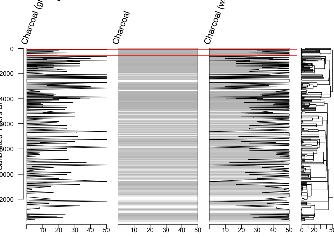

## Introduction

This document is intended to act as a primer for the use of the new Neotoma R package, `neotoma2` and is the companion to the [*Introduction to Neotoma* presentation](https://docs.google.com/presentation/d/1Fwp5yMAvIdgYpiC04xhgV7OQZ-olZIcUiGnLfyLPUt4/edit?usp=sharing). Some users may be working with this document as part of a workshop for which there is a Binder instance. The Binder instance will run RStudio in your browser, with all the required packages installed.

If you are using this workflow on its own, or want to use the package directly, [the `neotoma2` package](https://github.com/NeotomaDB/neotoma2) is available on CRAN by running:

``` r
install.packages('neotoma2')
library(neotoma2)
```

Your version should be at or above 1.0.11.

This workshop will also require other packages. To maintain the flow of this document we've placed instructions at the end of the document in the section labelled "[Installing packages on your own](#localinstall)". Please install these packages, and make sure they are at the lastest version.

## Learning Goals

In this tutorial you will learn how to:

1.  [Site Searches](#3-site-searches): Search for sites using site names and geographic parameters.
2.  [Filter Results](#33-filter-records-tabset): Filter results using temporal and spatial parameters.
3.  [Explore Data](#34-pulling-in-sample-data): Obtain sample information for the selected datasets.
4.  [Visualize Data](#4-simple-analytics): Perform basic Stratigraphic Plotting

## Background

### Getting Help with Neotoma

If you're planning on working with Neotoma, please join us on [Slack](https://join.slack.com/t/neotomadb/shared_invite/zt-cvsv53ep-wjGeCTkq7IhP6eUNA9NxYQ) where we manage a channel specifically for questions about the R package (the *#it_r* channel, or *#it_r_es* for R help in Spanish and *#it_r_jp* in Japanese). You may also wish to join the Neotoma community through our Google Groups mailing lists; please [see the information on our website](https://www.neotomadb.org/about/join-the-neotoma-community) to be added.

### Understanding Data Structures in Neotoma

Data in the Neotoma database itself is structured as a set of linked relationships to express different elements of paleoecological analysis:

-   space and time
    -   Where is a sample located in latitude and longitude?
    -   Where is a sample along a depth profile?
    -   What is the estimated age of that sample?
    -   What is the recorded age of elements within or adjacent to the sample?
-   observations
    -   What is being counted or measured?
    -   What units are being used?
    -   Who observed it?
-   scientific methods
    -   What statistical model was used to calculate age?
    -   What uncertainty terms are used in describing an observation?
-   conceptual data models
    -   How do observations in one sample relate to other samples within the same collection?
    -   How does an observation of a fossil relate to extant or extinct relatives?

These relationships can be complex because paleoecology is a broad and evolving discipline. As such, the database itself is highly structured, and normalized, to allow new relationships and facts to be added, while maintaining a stable central data model. If you want to better understand concepts within the database, you can read the [Neotoma Database Manual](https://open.neotomadb.org/manual), or take a look at [the database schema itself](https://open.neotomadb.org/dbschema).

In this workshop we want to highlight two key structural concepts:

1.  The way data is structured conceptually within Neotoma (Sites, Collection Units and Datasets).
2.  The way that this structure is adapted within the `neotoma2` R package.

#### Data Structure in the Neotoma Database

{width="50%"}

Data in Neotoma is associated with **sites** -- specific locations with latitude and longitude coordinates.

Within a **site**, there may be one or more [**collection units**](https://open.neotomadb.org/manual/dataset-collection-related-tables-1.html#CollectionUnits) -- locations at which samples are physically collected within the site:

-   an archaeological **site** may have one or more **collection units**, pits within a broader dig site
-   a pollen sampling **site** on a lake may have multiple **collection units** -- core sites within the lake basin.
-   A bog sample **site** may have multiple **collection units** -- a transect of surface samples within the bog.

Collection units may have higher resolution GPS locations than the site location, but are considered to be part of the broader site.

Data within a **collection unit** is collected at various [**analysis units**](https://open.neotomadb.org/manual/sample-related-tables-1.html#AnalysisUnits).

-   All sediment at 10cm depth in the depth profile of a cutbank (the collection unit) along an oxbow lake (the site) is one analysis unit.
-   All material in a single surface sample (the collection unit) from a bog (the site) is an analysis unit.
-   All fossil remains in a buried layer from a bone pile (the collection unit) in a cave (the site) is an analysis unit.

Any data sampled within an analysis unit is grouped by the dataset type (charcoal, diatom, dinoflagellate, etc.) and aggregated into a [**sample**](https://open.neotomadb.org/manual/sample-related-tables-1.html#Samples). The set of samples for a collection unit of a particular dataset type is then assigned to a [**dataset**](https://open.neotomadb.org/manual/dataset-collection-related-tables-1.html#Datasets).

-   A sample would be all diatoms (the dataset type) extracted from sediment at 12cm (the analysis unit) in a core (the collection unit) obtained from a lake (the site).
-   A sample would be the record of a single mammoth bone (sample and analysis unit, dataset type is vertebrate fauna) embeded in a riverbank (here the site, and collection unit).

#### Data Structures in `neotoma2` {#222-data-structures-in-neotoma2}


If we look at the [UML diagram](https://en.wikipedia.org/wiki/Unified_Modeling_Language) for the objects in the `neotoma2` R package we can see that the data structure generally mimics the structure within the database itself. As we will see in the [Site Searches section](#3-site-searches), we can search for these objects, and begin to manipulate them (in the [Simple Analysis section](#4-simple-analytics)).

It is important to note: *within the `neotoma2` R package, most objects are `sites` objects, they just contain more or less data*. There are a set of functions that can operate on `sites`. As we add to `sites` objects, using `get_datasets()` or `get_downloads()`, we are able to use more of these helper functions.

## Site Searches

### `get_sites()`

There are several ways to find sites in `neotoma2`, but we think of `sites` as being spatial objects primarily. They have names, locations, and are found within the context of geopolitical units, but within the API and the package, the site itself does not have associated information about taxa, dataset types or ages. It is simply the container into which we add that information. So, when we search for sites we can search by:

| Parameter | Description |
|---------------------------------|---------------------------------------|
| sitename | A valid site name (case insensitive) using `%` as a wildcard. |
| siteid | A unique numeric site id from the Neotoma Database |
| loc | A bounding box vector, geoJSON or WKT string. |
| altmin | Lower altitude bound for sites. |
| altmax | Upper altitude bound for site locations. |
| database | The constituent database from which the records are pulled. |
| datasettype | The kind of dataset (see `get_tables(datasettypes)`) |
| datasetid | Unique numeric dataset identifier in Neotoma |
| doi | A valid dataset DOI in Neotoma |
| gpid | A unique numeric identifier, or text string identifying a geopolitical unit in Neotoma |
| keywords | Unique sample keywords for records in Neotoma. |
| contacts | A name or numeric id for individuals associuated with sites. |
| taxa | Unique numeric identifiers or taxon names associated with sites. |

All sites in Neotoma contain one or more datasets. It's worth noting that the results of these search parameters may be slightly unexpected. For example, searching for sites by sitename, latitude, or altitude will return all of the datasets for the particular site. Searching for terms such as datasettype, datasetid or taxa will return the site, but the only datasets returned will be those matching the dataset-specific search terms. We'll see this later.

#### Site names: `sitename="%Catemaco%"` {.tabset}

We may know exactly what site we're looking for ("Lago Catemaco"), or have an approximate guess for the site name (for example, we know it's something like "Catem", but we're not sure how it was entered specifically), or we may want to search all sites that have a specific term, for example, *Lago*.

We use the general format: `get_sites(sitename="%Catem%")` for searching by name.

PostgreSQL (and the API) uses the percent sign as a wildcard. So `"%Catem%"` would pick up ["Lago Catemaco"](<https://data.neotomadb.org/10473> for us (and picks up "Atescatempa" as well). Note that the search query is also case insensitive.

##### Code


``` r
lago_catemaco <- neotoma2::get_sites(sitename = "%Catem%")
plotLeaflet(lago_catemaco)
```

##### Result


```{=html}
<div class="leaflet html-widget html-fill-item" id="htmlwidget-41801463bf2860b175f2" style="width:672px;height:480px;"></div>
<script type="application/json" data-for="htmlwidget-41801463bf2860b175f2">{"x":{"options":{"crs":{"crsClass":"L.CRS.EPSG3857","code":null,"proj4def":null,"projectedBounds":null,"options":{}}},"calls":[{"method":"addTiles","args":["https://{s}.tile.openstreetmap.org/{z}/{x}/{y}.png",null,null,{"minZoom":0,"maxZoom":18,"tileSize":256,"subdomains":"abc","errorTileUrl":"","tms":false,"noWrap":false,"zoomOffset":0,"zoomReverse":false,"opacity":1,"zIndex":1,"detectRetina":false,"attribution":"&copy; <a href=\"https://openstreetmap.org/copyright/\">OpenStreetMap<\/a>,  <a href=\"https://opendatacommons.org/licenses/odbl/\">ODbL<\/a>"}]},{"method":"addCircleMarkers","args":[[18.66667,14.22],[-95,-89.69],10,null,null,{"interactive":true,"draggable":false,"keyboard":true,"title":"","alt":"","zIndexOffset":0,"opacity":1,"riseOnHover":true,"riseOffset":250,"stroke":true,"color":"#03F","weight":5,"opacity.1":0.5,"fill":true,"fillColor":"#03F","fillOpacity":0.2},{"showCoverageOnHover":true,"zoomToBoundsOnClick":true,"spiderfyOnMaxZoom":true,"removeOutsideVisibleBounds":true,"spiderLegPolylineOptions":{"weight":1.5,"color":"#222","opacity":0.5},"freezeAtZoom":false},null,["<b>Lago Catemaco<\/b><br><b>Description:<\/b> NA<br><a href=http://apps.neotomadb.org/explorer/?siteids=340>Explorer Link<\/a>","<b>Atescatempa<\/b><br><b>Description:<\/b> NA<br><a href=http://apps.neotomadb.org/explorer/?siteids=30167>Explorer Link<\/a>"],null,null,{"interactive":false,"permanent":false,"direction":"auto","opacity":1,"offset":[0,0],"textsize":"10px","textOnly":false,"className":"","sticky":true},null]}],"limits":{"lat":[14.22,18.66667],"lng":[-95,-89.69]}},"evals":[],"jsHooks":[]}</script>
```

#### Location: `loc=c()` {.tabset}

The original `neotoma` package used a bounding box for locations, structured as a vector of latitude and longitude values: `c(xmin, ymin, xmax, ymax)`. The `neotoma2` R package supports both this simple bounding box, but also more complex spatial objects, using the [`sf` package](https://r-spatial.github.io/sf/). Using the `sf` package allows us to more easily work with raster and polygon data in R, and to select sites from more complex spatial objects. The `loc` parameter works with the simple vector, [WKT](https://arthur-e.github.io/Wicket/sandbox-gmaps3.html), [geoJSON](http://geojson.io/#map=2/20.0/0.0) objects and native `sf` objects in R.

As an example of searching for sites using a location, we've created a rough representation of africa as a polygon. To work with this spatial object in R we also transformed the `geoJSON` element to an object for the `sf` package. There are many other tools to work with spatial objects in R. Regardless of how you get the data into R, `neotoma2` works with almost all objects in the `sf` package.

##### Code


``` r
geoJSON <- '{"type": "Polygon",
        "coordinates": [[
            [-7.030,  36.011],
            [-18.807, 23.537],
            [-19.247, 10.282],
            [-9.139,  -0.211],
            [18.370, -37.546],
            [35.069, -36.352],
            [49.571, -27.097],
            [58.185,   0.755],
            [53.351,  13.807],
            [43.946,  12.008],
            [31.202,  33.629],
            [18.897,  34.648],
            [12.393,  35.583],
            [11.075,  38.184],
            [-7.030,  36.011]
          ]
        ]}'

africa_sf <- geojsonsf::geojson_sf(geoJSON)

# Note here we use the `all_data` flag to capture all the sites within the polygon.
# We're using `all_data` here because we know that the site information is relatively small
# for Africa. If we were working in a new area or with a new search we would limit the
# search size.
africa_sites <- neotoma2::get_sites(loc = africa_sf, all_data = TRUE)
```

##### Result


```{=html}
<div class="datatables html-widget html-fill-item" id="htmlwidget-7082469c9ff7a4300812" style="width:100%;height:auto;"></div>
<script type="application/json" data-for="htmlwidget-7082469c9ff7a4300812">{"x":{"filter":"none","vertical":false,"data":[[1744,1745,1746,1747,2233,13802,13814,13815,15750,15751,15752,15756,15757,15758,15759,15761,15762,15811,16514,23662,23664,23750,23773,23779,23782,23783,23784,23785,23814,23815,23816,23817,23821,23827,23828,23835,23836,23837,23931,23936,23937,23946,23947,23949,23950,23951,24180,26011,26573,26584,26585,26635,26636,26637,26639,26640,26660,26661,26662,26663,26664,26665,26666,26667,26668,26669,26670,26677,26737,26739,26755,27021,27027,27148,27149,27159,27167,27168,27348,27409,27416,27424,27428,27499,27508,27509,27515,27528,27551,27552,27556,27557,27558,27561,27562,27563,27676,27684,27685,27697,27699,27707,27757,27813,27815,27841,27842,27849,28030,28032,28034,28062,28099,28125,28126,28156,28161,28162,28166,28167,28191,28195,28196,28199,28203,28219,28220,28221,28222,28223,28224,28226,28227,28238,28247,28248,28249,28251,28252,28286,28289,28291,28292,28293,28294,28296,28298,28299,28300,28301,28302,28303,28304,28305,28306,28307,28308,28309,28310,28311,28312,28313,28314,28315,28316,28319,28322,28323,28326,28344,28346,28349,28350,28351,28352,28360,28384,28385,28389,28390,28391,28392,28398,28404,28406,28407,28497,28509,28522,28523,28524,28525,28526,28527,28541,28796,28809,28938,28939,28941,28951,28970,29060,29063,29064,29066,29091,29166,29205,30332,30333,30396,30401,30402,30403,30463,31131,31406,31731,31732,31733,31734,31735,31736,31737,31738,31739,31740,31741,31744,31745,31746,31747,31748,31750,32934,32935,33133,33134,33135,33296,36533,36868,36870,36904,36921,36931,36932,36944,36956,36964,37013,37089,37099,37171,37194,37297,37341,37346,37347,37386,37430,37435,37493,37499,37545,37550,37552,37556,37571,37573,37713,37838,37924,37960,38254,38292,38339,38379,38405,38417,38446,38453,38492,38508,38545,38584,38592,38628,38684,38959,38963,39199,39201,39241,39348,39389,39425,39478,39487,39499,39567,39586,39595,39607,39657,39667,39723,39730,39818,39829,39838,39877,39894,39896,39907,39927,40120,40141,40155,40384,40597,40646,40669,40951,40970,41034,41305,41343,41411,41487,41496,41502,41503,41572,41601,160749869],["Nile Delta S2","Nile Delta S6","Nile Delta S7","Nile Delta S8","Rusaka Swamp","Lake Challa Savannah","Lake Challa Lakeshore","Lake Challa Crater Rim","Dar Fatma","Beni M'tir","Beni M'tir","Kef Eddbaâ","Djebel El Ghorra","Ouinet Ennessours","Abiare","Majen El Orbi","Majen El Orbi","Majen Ben H'mida","MD95-2043","Bambili 1","Bambili 2","Diogo","Enapuiyapui Swamp","Garaat El-Ouez","Lake Guiers","ODP Site 658","Bourdim","Oumm el-Khaled","Small Momela Lake","Lake Abhé","Tigalmamine","Ifri Oudadane","Albitrunca Cliff","Dassie Rock [Whale Rock]","Lake Albert WHOI core 3PC","Harubes","Sling Cliff","Stone Age Site","Badda bog","Lake Albert WHOI core 2PC","Danka Valley Bog","Mahoma Lake","Kitandara Lake","Bujuku Lake","Craigrossie","Elim Swamp","El Zafrín","Afalou Bou Rhummel","Lake Andolonomby","Belinga","Makokou","Kogyae Plot 3 (Savannah plot)","Kogyae Plot 2 (Transition plot)","Kogyae Plot 1 (Forest plot)","Ankasa (ANK02)","Bobiri (BOB01)","Lake Edward","Klaarfontein Springs","Deva-Deva","Kitumbako","Oblong Tarn, Mt Kenya, Kenya","Lake Malawi MAL05-1","Mare d'Oursi","RUMUIKU","Vankervelsvlei","Rietvlei-Still Bay","Mt Shengena","Lake Tritrivakely","Driehoek Vlei","Sneeuberg Vlei","Malahlapanga","Kashiru Swamp","Lake Malawi MAL05-2","Grootdrift - Verlorenvlei","Bois de Bilanko","CORAF","Songolo","Eilandvlei","Lake Tanganyika","Lake Kavitaha","Mbalang [M4]","Lake Tilla","Tizong [T2]","Lake Masoko","Ndurumu Swamp","Lake Tanganyika [north basin]","Lake Mitsinjo","Bal Lake","Nyamuswaga Valley","Ahakagyezi Swamp","Aansser peat bog","Bab El Karn","Dayet M'Had","Ras El Ma","Lake Hachlaf","Lake Sidi Ali","Shum Laka","Mukibongo Valley","Lake Otjikoto","Laboot Swamp","Pearly Beach","Kajemarum Oasis","Lake Kimili","Muchoya Swamp","Rietvlei","Hayla Cave","Tate Vondo","Lake Tanganyika [LTBP cores]","Oyo","Katenga Swamp","Muisbosskerm se Groot Sloot section","Deelpan Meriba 1","Matupi cave","Elands Bay Cave","Wonderkrater","Garba Guracha Lake","Wonderwerk Cave","Equus Cave (coprolites)","Lake Qarun","Saqqara","Pakhuis Pass","Upper Section Pond","Pretoria Saltpan","Gutter","Selima","Spring Cave shelter","Tamsaa Swamp","Channel 2","Lake Tanganyika [SD cores]","Windhoek","Mubwindi swamp","Kuruyange","Lake Sinnda","Bir Atrun","Kaigama","Kuluwu Oasis","Chemchane Sebkha 1","South-west Fourtchiak","Hughdale Farm","Fort Portal","DROTSKY'S CAVE","Lake Chad Basin","Koitoboss Bog","Lodoba","Scot","Dega Sala swamp","Lake Abiyata II","Base Section","Eksteenfontein","Ngamakala Pound","Lake Ikimba","Kamala","Kiizi Marsh","Lake Langeno","Lake Albert (ou Lake Mobutu Sese Seko)","Lompoul","Lake Turkana","Mubwindi swamp II","Eastern Niger Delta","Lake Ossa","Lake Ossa 2","Potou","Touba N'Diaye","Voordrag","Ampasambazimba","Matembe Marsh","Hima - Kibale","Sanzu Swamp","Sacred Lake","Crescent Island Crater Lake","Kouka","Kamiranzovu swamp","Lake Wandakara","Adrar Bous","El Atrun","Lake Yoa","Lake Abijata","Lake Abiyata I","Kiguhu","Musisi-Karashoma","Rugezi","Mukukwe","Mfabeni swamp","Jikariya","Kitina Lake","Lake Eteza","Lake Victoria I","Pilkington Bay","Kalwira","Lake Tritrivakely I","Blydefontein Stream Mouth 97","Goho","Bounei","MBORO","Namonte","Lake Emakat","Esambu","Bemba Yanga","Khatu","Lake Chad","Kisima Ngeda","Marura","Nemra","Rooiberg Shelter I","Galana Boi Beds","Mboadong","AliwalN","SEK","Florisbad","Lake Rukwa","Tjéri","Thiaye","Yéviédié","Lake Hayk","Lake Bogoria","Lake Alaotra","Mhiris el Hamrane","Baviaanskloof","Mbi Crater","Lake Malawi [project PROBE]","Lake Monoun","Lake Maudit","KW31","Lake Sélé","Sibaya","Braamhoek","Princess Vlei","Maundi Crater","Namelok","Lake Nokoué","Teleki","Lake Chala","Lake Victoria II","Lake Tilo","Tswaing Crater","Merja Kahla","Merja Zerga","Lake Victoria (Shirati Bay) LV1","Lake Victoria (Shirati Bay) LV2","Lake Victoria (Shirati Bay) LV4","Lake Nakuru","Lagoa Amélia","Herolds Bay Cave","Matupi Cave","Efflux Cave","Gueldaman Cave","Chaara Cave","Achere Cave","Cango Cave","La Mine Cave","Goda Mea Cave","Sudwala Cave","Rukiessa Cave","Grotte De Piste","Cold Air Cave","Ifoulki Cave","Wintimdouine","Buffalo Cave","Bero Cave","Wadi Sannur Cave","Mitoho","Andriamaniloke","New St Michael'S Cave","Anjohibe","Dante Cave","Lobatse Cave","Staircase Cave","Pp29","Crevice Cave","Wolkberg Cave","Anjokipoty","Ghazaouet + ","Tafsout + ","Arrecife (Puerto De Naos) + Reservoir","Ghar Boumaza + ","Betancuria + Well At Sign 37","Tafna + ","Vega De Rio Palmas + Reservoir Las Penitas","Betancuria + Open Well","Source De La Tafna + ","Dawwar Ad Duwaymis + Reservoir","Tindouf + Well","Ain El Haman + ","South Of Bouda + ","Betancuria + Closed Well S. Of Church","Tassili-N-Ajjer (National Park) + Iherir (Guelta)","Vega De Rio Palmas + Res. Las Penitas (Pond)","Tassili-N-Ajjer (National Park) + Oued Tesselata","Betancuria + Open Well S. Of Church","Ain Badelos + ","Punto De Mujeres + Salt Mill","Gran Tarajal + Open Well","Algiers + ","Casablanca + ","Oued Dfali + ","Oued Chouly Valley + ","Casa De Joros + Man-Made Container","Algiers + ","Barranco Del Esquinzo + Brook","Barranco De La Solapa + Open Well","Presa De Las Penitas + Above Reservoir","Presa De Las Penitas + Below Reservoir","Barranco Del Garabato + Open Well","Oued Bel Abbes (Imama) + ","Los Molinos + Reservoir","W. Saida + Ben-Ikhou","Antigua (Villa Nueva) + Partly Open Well","Oued Saf-Saf + ","Barranco De Trimijov + ","Barranco De Machin + Closed Well","Barranco De Trimijov + Spring Stream &amp; Pools","Oued Sebdou + ","Alto De Aguaje + New Well","Antigua (Zona Carbon) + Closed Well","Mts Tassili N'Ajjer + ","Antigua (Villa Nueva) + Open Well","Toto + Well","Almodovar Del Pinar + ","Ain-Es-Suk + ","W. Saida + ","W. Saida + ","Villaverde To Corralejo Road + Malpais Huriamen","Las Playitas + Closed Well","Ochba + ","Guedira De Larache + En Musgos","Presa De Las Penitas + Below Reservoir","Presa De Las Penitas + Rockpool Above Reservoir","Puertito De Los Molinos + Brook With Marine Infl.","La Palma + Spring-Brook With Pools","Jandia (North Side) + Agua De Camellos","Tesjuate + River Cabras","Valle De Santa Ines + Brook","Teskraia + Stream","Gc-640 Road At Km Sign 1 + Partly Open Well","Jandia (North Side) + Agua De Camellos","Reservoir + ",null],[31.3,31.10833,31.125,31.21667,-3.43333,-3.30782,-3.31422,-3.32369,36.81825,36.72631,36.72595,36.601358,36.5975,36.6,37.15,37.148646,37.15294,37.13333,36.14333,5.934466,5.925018,15.26667,-0.43619,36.81833,16.20611,20.74917,36.80333,35.08333,-3.229196,11.179412,32.9,35.21278,-23.66348,-23.58367,1.52,-23.66502,-23.67567,-23.67992,7.86667,1.48667,6.958,0.343984,0.347692,0.376438,-28.53103,-28.490736,35.17722,36.63389,-23.05598,1.12096,0.5477,7.30114,7.30214,7.26164,5.26833,6.70417,-0.430246,-32.42389,-7.1222,-7.14533,-0.14531,-11.29433,14.6468,-0.271,-34.01322800000001,-34.35415,-4.292,-19.778756,-32.44,-32.44667,-22.88889,-3.45,-10.01833,-32.4007,-3.51385,-4.74201,-4.7662,-33.994446,-6.633748,-19.04167,7.31667,10.39556,7.25,-9.334488,-2.71667,-4.19,-16.03333,13.30694,-2.9,-1.11667,35.0175,35.02278,35.12833,33.47361,33.55056,33.06806,5.85,-3.15833,-19.16667,0.95,-34.648,13.30833,1.1,-1.28333,-25.83333,10.76,-22.89583,-6.417354,19.26,-1.2,-32.14139,-29.18333,1.5,-32.31389,-24.43,6.87798,-27.84583,-27.6,29.47083,29.85278,-32.1,-30.13333,-25.41667,-30.15,21.37,-32.32139,7.13333,-30.13472,-4.96667,-22.63333,-1.08194,-3.91667,-3.83556,18.16667,13.25278,13.21722,25.93333,15.95,-31.15,0.66639,-19.997,13.38333,1.13333,13.68,-22.95,7.81667,7.61667,-31.15,-28.81667,-4.075,-1.43583,14.03333,-1.41083,7.5,1.83333,15.35,4,-1.08,4.55,3.75222,3.80139,15.75,15.16667,-27.74167,-18.91667,1.38806,0.8833299999999999,-3.35833,0.04793,0.75,13.1,-2.55,0.41667,20.31667,18.01667,19.03,7.6,7.7,-1.48333,-2.27111,-1.4,-2.5,-28.14861,13.31367,-4.27,-28.48671,-0.58,0.3,-2.53333,-19.78333,-30.15,6.44306,-12.87639,15.14913,-22.12513,-2.91667,-2.71191,16.52513,-27.66,14.5975,-3.48569,0.36642,16.3,-28.51667,3.7,4.45,-30.31202,-29.60083,-28.76667,-8.41972,13.73333,14.91667,6.535,11.35,0.242066,-17.47667,36.79556,-33.53,6.08927,-12.2167,5.56604,-12.582,3.51694,7.15,-27.34417,-28.23333,-34.04589,-3.17431,-2.91458,6.495,-0.1672,-3.31667,-0.97778,7.0625,-25.40821,34.86833,34.83887,-1.11523,-1.13083,-1.04943,-0.375,0.27911,-34.05,1.25,-33.41,36.4333,33.9558,8.6036,-33.3925,36.03,9.49,-25.37,8.6036,33.95,-24,30.708,30.77,-24.1428,8.424099999999999,28.6167,-24.0477,-24.051,36.1261,-15.53,-19.4,-25.21,-34.2071,-34.2078,-34.21,-24.1,-15.5784,35.09306,35.18528,28.96333,34.68333,28.42472,34.68333,28.38833,28.42472,34.69139,37.20917,27.67528,36.56667,34.56667,28.42472,25.405,28.38833,25.81278,28.42472,34.68333,29.14528,28.21444,36.75,33.51833,34.85,34.83194,28.07056,36.83333,28.61667,28.345,28.38806,28.38806,28.38667,34.86667,28.51194,32.6,28.415,36.25944,28.5,28.31556,28.5,34.63722,28.345,28.415,25.81,28.415,28.35944,34.725,34.83306,34.8,34.9,28.685,28.23194,34.9,35.18333,28.38833,28.38806,28.54361,28.58333,28.09944,28.48972,28.46194,37.19583,28.41528,28.05111,37.19694,null],[31.6,31.71667,31.86667,32.03333,29.61667,37.68392,37.71247,37.68653,8.77474,8.709709999999999,8.708959999999999,8.396094,8.39472,8.4,9.1,9.097978000000001,9.0984,9.08333,-2.62111,10.243308,10.242784,-16.8,35.799776,8.33333,-15.882124,-18.58083,8.25389,7.6,36.89502,41.77536,-5.35,-3.25833,15.26802,15.06566,30.575,15.33466,15.36519,15.37752,39.36667,30.715,39.788,29.96691,29.886226,29.893348,28.47147,28.415452,-2.43861,5.34917,43.58707,13.17029,12.85014,-1.16494,-1.18061,-1.15006,-2.69389,-1.31833,29.55015,18.49444,37.62053,37.63133,37.30171,34.43583,-0.4876,37.545,22.903354,21.53545,37.92283,46.918804,19.16,19.14861,31.0405,29.53333,34.18667,18.47406,15.35116,11.84659,11.86641,22.640128,29.926054,46.78333,13.73333,12.12972,13.58333,33.75559,29.96667,29.31026,45.85,10.94944,29.98333,29.9,-4.99278,-5.20694,-5.43861,-5.13861,-4.99472,-4.99833,10.05,30.58333,17.91667,34.56667,19.505,11.03694,34.56694,29.8,28.33333,47.3,30.32667,29.554718,26.18,29.81,18.30917,25.75,36,18.36278,28.74333,39.86152,23.55528,24.61,30.63722,31.2375,19.06667,25.01667,28.03333,25.08333,29.31,18.33,39.76667,25.01722,29.36667,17.08333,29.75833,29.68333,12.80417,26.65,11.56889,11.55083,-12.21667,18.45,25.06667,30.27583,21.3248,14.75,34.6,16.55,29.4,39.33333,38.61667,25.01667,17.23333,15.38333,31.59278,16.31667,31.77611,38.5,31.16667,-16.71667,36.08333,29.75,6.43333,10.06861,10.75,-16.5,-16.86667,31.325,46.66667,31.71333,30.37778,30.38333,37.52887,36.33333,15.63333,29,30.26667,8.98333,27.15,20.31,38.55,38.6,29.71667,28.66028,29.83333,28.55,32.51861,11.077,12,32.15885,33.27,33.33333,28.76667,46.91667,25.08333,2.57917,45.09028,-16.90928,43.40634,35.83333,37.55435,2.18726,23.01,13.0083,35.34819,36.7221,18.55,28.41667,36.98333,9.2689,26.35529,29.265,26.06667,32.72167,16.5,-17.5,2.37833,39.71667,36.108428,48.50861,8.78444,23.76,10.34855,34.63338,10.58191,49.15,5.56694,2.43333,32.61217,29.58333,18.4851,37.51828,37.50647,2.38806,37.21043,37.7,33.45528,38.09583,28.08191,-6.25944,-6.2889,33.9191,33.94633,33.79613,36.0822,6.60842,22.39,29.82,22.34,4.5667,-4.2461,40.3729,22.2147,9.68,37.66,20.7,40.3772,-4.246,29.1833,-9.327500000000001,-9.49,29.177,40.3073,31.2833,43.7533,43.7569,-5.3455,46.88,17.8833,25.68,22.0899,22.0876,22.09,29.88,46.7344,-1.86167,-1.64722,-13.54167,-1.3,-14.05722,-1.3,-14.09944,-14.05722,-1.31333,9.669169999999999,-8.12833,4.03333,-2.71667,-14.05722,8.40667,-14.09944,8.134169999999999,-14.05722,-2.7,-13.44611,-14.02028,3.05,-7.05167,-1.36667,-1.17944,-14.39972,3,-13.99139,-14.13944,-14.09556,-14.09556,-14.12222,-1.35,-14.03167,-0.85,-14.01111,5.57389,-14,-14.12667,-14,-1.32611,-14.14056,-14.01111,8.133889999999999,-14.01111,-14.08722,-1.90139,-1.10083,0.1,-0.21667,-13.89278,-13.98472,-1.25,-6.15,-14.10056,-14.09556,-14.06333,-13.91667,-14.27583,-13.93806,-14.04139,9.58583,-14.00667,-14.32972,9.401669999999999,null],[null,null,null,null,null,null,null,null,null,null,null,null,null,null,null,null,null,null,null,null,null,null,null,null,null,null,null,null,null,null,null,null,null,null,null,null,null,null,null,null,null,null,null,null,null,null,null,null,null,null,null,null,null,null,null,null,null,null,null,null,null,null,null,null,null,null,null,null,null,null,null,null,null,null,null,null,null,null,null,null,null,null,null,null,null,null,null,null,null,null,null,null,null,null,null,null,null,null,null,null,null,null,null,null,null,null,null,null,null,null,null,null,null,null,null,null,null,null,null,null,null,null,null,null,null,null,null,null,null,null,null,null,null,null,null,null,null,null,null,null,null,null,null,null,null,null,null,null,null,null,null,null,null,null,null,null,null,null,null,null,null,null,null,null,null,null,null,null,null,null,null,null,null,null,null,null,null,null,null,null,null,null,null,null,null,null,null,null,null,null,null,null,null,null,null,null,null,null,null,null,null,null,null,null,null,null,null,null,null,null,null,null,null,null,null,null,null,null,null,null,null,null,null,null,null,null,null,null,null,null,null,null,null,null,null,null,null,null,null,null,null,null,null,null,null,null,null,null,null,null,null,null,null,null,null,null,null,null,null,null,null,null,null,null,null,null,null,null,null,null,null,null,null,null,null,null,null,null,null,null,null,null,null,null,null,null,null,null,null,null,null,null,null,null,null,null,null,null,null,null,null,null,null,null,null,null,null,null,null,null,null,null,null,null,null,null,null,null,null,null,null,null,null,null,null,null,null,null,null,null,null,null,null,null,null,null,null],[null,null,null,null,null,null,null,null,null,null,null,null,null,null,null,null,null,null,null,null,null,null,null,null,null,null,null,null,null,null,null,null,null,null,null,null,null,null,null,null,null,null,null,null,null,null,null,null,null,null,null,null,null,null,null,null,null,null,null,null,null,null,null,null,null,null,null,null,null,null,null,null,null,null,null,null,null,null,null,null,null,null,null,null,null,null,null,null,null,null,null,null,null,null,null,null,null,null,null,null,null,null,null,null,null,null,null,null,null,null,null,null,null,null,null,null,null,null,null,null,null,null,null,null,null,null,null,null,null,null,null,null,null,null,null,null,null,null,null,null,null,null,null,null,null,null,null,null,null,null,null,null,null,null,null,null,null,null,null,null,null,null,null,null,null,null,null,null,null,null,null,null,null,null,null,null,null,null,null,null,null,null,null,null,null,null,null,null,null,null,null,null,null,null,null,null,null,null,null,null,null,null,null,null,null,null,null,null,null,null,null,null,null,null,null,null,null,null,null,null,null,null,null,null,null,null,null,null,null,null,null,null,null,null,null,null,null,null,null,null,null,null,null,null,null,null,null,null,null,null,null,null,null,null,null,null,null,null,null,null,null,null,null,null,null,null,null,null,null,null,null,null,null,null,null,null,null,null,null,null,null,null,null,null,null,null,null,null,null,null,null,null,null,null,null,null,null,null,null,null,null,null,null,null,null,null,null,null,null,null,null,null,null,null,null,null,null,null,null,null,null,null,null,null,null,null,null,null,null,null,null,null,null,null,null,null,null],[null,null,null,null,null,null,null,null,null,null,null,null,null,null,null,null,null,null,null,null,null,null,null,null,null,null,null,null,null,null,null,null,null,null,null,null,null,null,null,null,null,null,null,null,null,null,null,null,null,null,null,null,null,null,null,null,null,null,null,null,null,null,null,null,null,null,null,null,null,null,null,null,null,null,null,null,null,null,null,null,null,null,null,null,null,null,null,null,null,null,null,null,null,null,null,null,null,null,null,null,null,null,null,null,null,null,null,null,null,null,null,null,null,null,null,null,null,null,null,null,null,null,null,null,null,null,null,null,null,null,null,null,null,null,null,null,null,null,null,null,null,null,null,null,null,null,null,null,null,null,null,null,null,null,null,null,null,null,null,null,null,null,null,null,null,null,null,null,null,null,null,null,null,null,null,null,null,null,null,null,null,null,null,null,null,null,null,null,null,null,null,null,null,null,null,null,null,null,null,null,null,null,null,null,null,null,null,null,null,null,null,null,null,null,null,null,null,null,null,null,null,null,null,null,null,null,null,null,null,null,null,null,null,null,null,null,null,null,null,null,null,null,null,null,null,null,null,null,null,null,null,null,null,null,null,null,null,null,null,null,null,null,null,null,null,null,null,null,null,null,null,null,null,null,null,null,null,null,null,null,null,null,null,null,null,null,null,null,null,null,null,null,null,null,null,null,null,null,null,null,null,null,null,null,null,null,null,null,null,null,null,null,null,null,null,null,null,null,null,null,null,null,null,null,null,null,null,null,null,null,null,null,null,null,null,null,null],[5,9,9,6,2078,925,862,1043,774,628,628,985,1163,1135,186,211,132,247,-1862,2257,2305,8,2913,35,14,-2263,10,1057,1422,234,1653,17,452,411,624,465,485,482,3713,625,3817,2967,3964,3892,1732,1875,-15,36,6,877,482,192,203,211,124,234,911,8,2419,2397,4353,482,259,1426,115,-3,1923,1749,888,1194,367,2251,478,6,744,5,6,-18,1307,1264,1101,534,1096,844,1407,776,32,320,1595,1837,1301,1203,777,1620,1674,2093,1399,1523,1224,2685,13,334,4154,2399,1520,2164,1200,786,511,2119,8,1272,885,2,1110,3990,1635,1233,-50,10,487,1334,1117,1339,250,81,3032,1331,797,1730,2104,2000,105,505,315,317,326,271,1668,1507,941,280,3896,269,833,3303,1561,1809,695,437,1187,280,1348,1545,668,24,360,2157,13,24,218,7,11,944,1073,1064,730,1638,2335,1554,279,1667,1162,946,594,431,1585,1567,1772,2328,2188,1586,9,315,7,13,1142,1141,1918,1749,1339,9,-53,4,8,2175,1187,297,1167,326,1028,1796,282,1804,606,112,1492,2899,1260,795,261,-249,4,1909,1013,760,556,918,2015,470,1191,1253,0,8,20,1259,7,2780,1146,47,2950,880,1139,1545,1085,1,1,1135,1135,1135,1760,1340,5,1110,716,507,1260,1534,687,975,1574,975,1618,1260,1420,1250,1250,1140,1363,200,20,20,325,131,1400,1200,30,10,14,1450,43,null,null,null,null,null,null,null,null,null,null,null,null,null,null,null,null,null,null,null,null,null,null,null,null,null,null,null,null,null,null,null,null,null,null,null,null,null,null,null,null,null,null,null,null,null,null,null,null,null,null,null,null,null,null,null,null,null,null,null,null,null,null,null,null,null,null]],"container":"<table class=\"display\">\n  <thead>\n    <tr>\n      <th>siteid<\/th>\n      <th>sitename<\/th>\n      <th>lat<\/th>\n      <th>long<\/th>\n      <th>area<\/th>\n      <th>notes<\/th>\n      <th>description<\/th>\n      <th>elev<\/th>\n    <\/tr>\n  <\/thead>\n<\/table>","options":{"scrollX":"100%","dom":"t","columnDefs":[{"className":"dt-right","targets":[0,2,3,4,7]},{"name":"siteid","targets":0},{"name":"sitename","targets":1},{"name":"lat","targets":2},{"name":"long","targets":3},{"name":"area","targets":4},{"name":"notes","targets":5},{"name":"description","targets":6},{"name":"elev","targets":7}],"order":[],"autoWidth":false,"orderClasses":false}},"evals":[],"jsHooks":[]}</script>
```

#### Plotting with `plotLeaflet()` {.tabset}

You can always simply `plot()` the `sites` objects, but you will lose some of the geographic context. The `plotLeaflet()` function returns a `leaflet()` map, and allows you to further customize it, or add additional spatial data (like our original bounding polygon, `sa_sf`, which works directly with the R `leaflet` package):

##### Code


``` r
neotoma2::plotLeaflet(africa_sites) %>% 
  leaflet::addPolygons(map = ., 
                       data = africa_sf, 
                       color = "green")
```

##### Result


```{=html}
<div class="leaflet html-widget html-fill-item" id="htmlwidget-4806196503036a1785df" style="width:672px;height:480px;"></div>
<script type="application/json" data-for="htmlwidget-4806196503036a1785df">{"x":{"options":{"crs":{"crsClass":"L.CRS.EPSG3857","code":null,"proj4def":null,"projectedBounds":null,"options":{}}},"calls":[{"method":"addTiles","args":["https://{s}.tile.openstreetmap.org/{z}/{x}/{y}.png",null,null,{"minZoom":0,"maxZoom":18,"tileSize":256,"subdomains":"abc","errorTileUrl":"","tms":false,"noWrap":false,"zoomOffset":0,"zoomReverse":false,"opacity":1,"zIndex":1,"detectRetina":false,"attribution":"&copy; <a href=\"https://openstreetmap.org/copyright/\">OpenStreetMap<\/a>,  <a href=\"https://opendatacommons.org/licenses/odbl/\">ODbL<\/a>"}]},{"method":"addCircleMarkers","args":[[31.3,31.10833,31.125,31.21667,-3.43333,-3.30782,-3.31422,-3.32369,36.81825,36.72631,36.72595,36.601358,36.5975,36.6,37.15,37.148646,37.15294,37.13333,36.14333,5.934466,5.925018,15.26667,-0.43619,36.81833,16.20611,20.74917,36.80333,35.08333,-3.229196,11.179412,32.9,35.21278,-23.66348,-23.58367,1.52,-23.66502,-23.67567,-23.67992,7.86667,1.48667,6.958,0.343984,0.347692,0.376438,-28.53103,-28.490736,35.17722,36.63389,-23.05598,1.12096,0.5477,7.30114,7.30214,7.26164,5.26833,6.70417,-0.430246,-32.42389,-7.1222,-7.14533,-0.14531,-11.29433,14.6468,-0.271,-34.01322800000001,-34.35415,-4.292,-19.778756,-32.44,-32.44667,-22.88889,-3.45,-10.01833,-32.4007,-3.51385,-4.74201,-4.7662,-33.994446,-6.633748,-19.04167,7.31667,10.39556,7.25,-9.334488,-2.71667,-4.19,-16.03333,13.30694,-2.9,-1.11667,35.0175,35.02278,35.12833,33.47361,33.55056,33.06806,5.85,-3.15833,-19.16667,0.95,-34.648,13.30833,1.1,-1.28333,-25.83333,10.76,-22.89583,-6.417354,19.26,-1.2,-32.14139,-29.18333,1.5,-32.31389,-24.43,6.87798,-27.84583,-27.6,29.47083,29.85278,-32.1,-30.13333,-25.41667,-30.15,21.37,-32.32139,7.13333,-30.13472,-4.96667,-22.63333,-1.08194,-3.91667,-3.83556,18.16667,13.25278,13.21722,25.93333,15.95,-31.15,0.66639,-19.997,13.38333,1.13333,13.68,-22.95,7.81667,7.61667,-31.15,-28.81667,-4.075,-1.43583,14.03333,-1.41083,7.5,1.83333,15.35,4,-1.08,4.55,3.75222,3.80139,15.75,15.16667,-27.74167,-18.91667,1.38806,0.8833299999999999,-3.35833,0.04793,0.75,13.1,-2.55,0.41667,20.31667,18.01667,19.03,7.6,7.7,-1.48333,-2.27111,-1.4,-2.5,-28.14861,13.31367,-4.27,-28.48671,-0.58,0.3,-2.53333,-19.78333,-30.15,6.44306,-12.87639,15.14913,-22.12513,-2.91667,-2.71191,16.52513,-27.66,14.5975,-3.48569,0.36642,16.3,-28.51667,3.7,4.45,-30.31202,-29.60083,-28.76667,-8.41972,13.73333,14.91667,6.535,11.35,0.242066,-17.47667,36.79556,-33.53,6.08927,-12.2167,5.56604,-12.582,3.51694,7.15,-27.34417,-28.23333,-34.04589,-3.17431,-2.91458,6.495,-0.1672,-3.31667,-0.97778,7.0625,-25.40821,34.86833,34.83887,-1.11523,-1.13083,-1.04943,-0.375,0.27911,-34.05,1.25,-33.41,36.4333,33.9558,8.6036,-33.3925,36.03,9.49,-25.37,8.6036,33.95,-24,30.708,30.77,-24.1428,8.424099999999999,28.6167,-24.0477,-24.051,36.1261,-15.53,-19.4,-25.21,-34.2071,-34.2078,-34.21,-24.1,-15.5784,35.09306,35.18528,28.96333,34.68333,28.42472,34.68333,28.38833,28.42472,34.69139,37.20917,27.67528,36.56667,34.56667,28.42472,25.405,28.38833,25.81278,28.42472,34.68333,29.14528,28.21444,36.75,33.51833,34.85,34.83194,28.07056,36.83333,28.61667,28.345,28.38806,28.38806,28.38667,34.86667,28.51194,32.6,28.415,36.25944,28.5,28.31556,28.5,34.63722,28.345,28.415,25.81,28.415,28.35944,34.725,34.83306,34.8,34.9,28.685,28.23194,34.9,35.18333,28.38833,28.38806,28.54361,28.58333,28.09944,28.48972,28.46194,37.19583,28.41528,28.05111,37.19694,null],[31.6,31.71667,31.86667,32.03333,29.61667,37.68392,37.71247,37.68653,8.77474,8.709709999999999,8.708959999999999,8.396094,8.39472,8.4,9.1,9.097978000000001,9.0984,9.08333,-2.62111,10.243308,10.242784,-16.8,35.799776,8.33333,-15.882124,-18.58083,8.25389,7.6,36.89502,41.77536,-5.35,-3.25833,15.26802,15.06566,30.575,15.33466,15.36519,15.37752,39.36667,30.715,39.788,29.96691,29.886226,29.893348,28.47147,28.415452,-2.43861,5.34917,43.58707,13.17029,12.85014,-1.16494,-1.18061,-1.15006,-2.69389,-1.31833,29.55015,18.49444,37.62053,37.63133,37.30171,34.43583,-0.4876,37.545,22.903354,21.53545,37.92283,46.918804,19.16,19.14861,31.0405,29.53333,34.18667,18.47406,15.35116,11.84659,11.86641,22.640128,29.926054,46.78333,13.73333,12.12972,13.58333,33.75559,29.96667,29.31026,45.85,10.94944,29.98333,29.9,-4.99278,-5.20694,-5.43861,-5.13861,-4.99472,-4.99833,10.05,30.58333,17.91667,34.56667,19.505,11.03694,34.56694,29.8,28.33333,47.3,30.32667,29.554718,26.18,29.81,18.30917,25.75,36,18.36278,28.74333,39.86152,23.55528,24.61,30.63722,31.2375,19.06667,25.01667,28.03333,25.08333,29.31,18.33,39.76667,25.01722,29.36667,17.08333,29.75833,29.68333,12.80417,26.65,11.56889,11.55083,-12.21667,18.45,25.06667,30.27583,21.3248,14.75,34.6,16.55,29.4,39.33333,38.61667,25.01667,17.23333,15.38333,31.59278,16.31667,31.77611,38.5,31.16667,-16.71667,36.08333,29.75,6.43333,10.06861,10.75,-16.5,-16.86667,31.325,46.66667,31.71333,30.37778,30.38333,37.52887,36.33333,15.63333,29,30.26667,8.98333,27.15,20.31,38.55,38.6,29.71667,28.66028,29.83333,28.55,32.51861,11.077,12,32.15885,33.27,33.33333,28.76667,46.91667,25.08333,2.57917,45.09028,-16.90928,43.40634,35.83333,37.55435,2.18726,23.01,13.0083,35.34819,36.7221,18.55,28.41667,36.98333,9.2689,26.35529,29.265,26.06667,32.72167,16.5,-17.5,2.37833,39.71667,36.108428,48.50861,8.78444,23.76,10.34855,34.63338,10.58191,49.15,5.56694,2.43333,32.61217,29.58333,18.4851,37.51828,37.50647,2.38806,37.21043,37.7,33.45528,38.09583,28.08191,-6.25944,-6.2889,33.9191,33.94633,33.79613,36.0822,6.60842,22.39,29.82,22.34,4.5667,-4.2461,40.3729,22.2147,9.68,37.66,20.7,40.3772,-4.246,29.1833,-9.327500000000001,-9.49,29.177,40.3073,31.2833,43.7533,43.7569,-5.3455,46.88,17.8833,25.68,22.0899,22.0876,22.09,29.88,46.7344,-1.86167,-1.64722,-13.54167,-1.3,-14.05722,-1.3,-14.09944,-14.05722,-1.31333,9.669169999999999,-8.12833,4.03333,-2.71667,-14.05722,8.40667,-14.09944,8.134169999999999,-14.05722,-2.7,-13.44611,-14.02028,3.05,-7.05167,-1.36667,-1.17944,-14.39972,3,-13.99139,-14.13944,-14.09556,-14.09556,-14.12222,-1.35,-14.03167,-0.85,-14.01111,5.57389,-14,-14.12667,-14,-1.32611,-14.14056,-14.01111,8.133889999999999,-14.01111,-14.08722,-1.90139,-1.10083,0.1,-0.21667,-13.89278,-13.98472,-1.25,-6.15,-14.10056,-14.09556,-14.06333,-13.91667,-14.27583,-13.93806,-14.04139,9.58583,-14.00667,-14.32972,9.401669999999999,null],10,null,null,{"interactive":true,"draggable":false,"keyboard":true,"title":"","alt":"","zIndexOffset":0,"opacity":1,"riseOnHover":true,"riseOffset":250,"stroke":true,"color":"#03F","weight":5,"opacity.1":0.5,"fill":true,"fillColor":"#03F","fillOpacity":0.2},{"showCoverageOnHover":true,"zoomToBoundsOnClick":true,"spiderfyOnMaxZoom":true,"removeOutsideVisibleBounds":true,"spiderLegPolylineOptions":{"weight":1.5,"color":"#222","opacity":0.5},"freezeAtZoom":false},null,["<b>Nile Delta S2<\/b><br><b>Description:<\/b> NA<br><a href=http://apps.neotomadb.org/explorer/?siteids=1744>Explorer Link<\/a>","<b>Nile Delta S6<\/b><br><b>Description:<\/b> NA<br><a href=http://apps.neotomadb.org/explorer/?siteids=1745>Explorer Link<\/a>","<b>Nile Delta S7<\/b><br><b>Description:<\/b> NA<br><a href=http://apps.neotomadb.org/explorer/?siteids=1746>Explorer Link<\/a>","<b>Nile Delta S8<\/b><br><b>Description:<\/b> NA<br><a href=http://apps.neotomadb.org/explorer/?siteids=1747>Explorer Link<\/a>","<b>Rusaka Swamp<\/b><br><b>Description:<\/b> NA<br><a href=http://apps.neotomadb.org/explorer/?siteids=2233>Explorer Link<\/a>","<b>Lake Challa Savannah<\/b><br><b>Description:<\/b> NA<br><a href=http://apps.neotomadb.org/explorer/?siteids=13802>Explorer Link<\/a>","<b>Lake Challa Lakeshore<\/b><br><b>Description:<\/b> NA<br><a href=http://apps.neotomadb.org/explorer/?siteids=13814>Explorer Link<\/a>","<b>Lake Challa Crater Rim<\/b><br><b>Description:<\/b> NA<br><a href=http://apps.neotomadb.org/explorer/?siteids=13815>Explorer Link<\/a>","<b>Dar Fatma<\/b><br><b>Description:<\/b> NA<br><a href=http://apps.neotomadb.org/explorer/?siteids=15750>Explorer Link<\/a>","<b>Beni M'tir<\/b><br><b>Description:<\/b> NA<br><a href=http://apps.neotomadb.org/explorer/?siteids=15751>Explorer Link<\/a>","<b>Beni M'tir<\/b><br><b>Description:<\/b> NA<br><a href=http://apps.neotomadb.org/explorer/?siteids=15752>Explorer Link<\/a>","<b>Kef Eddbaâ<\/b><br><b>Description:<\/b> NA<br><a href=http://apps.neotomadb.org/explorer/?siteids=15756>Explorer Link<\/a>","<b>Djebel El Ghorra<\/b><br><b>Description:<\/b> NA<br><a href=http://apps.neotomadb.org/explorer/?siteids=15757>Explorer Link<\/a>","<b>Ouinet Ennessours<\/b><br><b>Description:<\/b> NA<br><a href=http://apps.neotomadb.org/explorer/?siteids=15758>Explorer Link<\/a>","<b>Abiare<\/b><br><b>Description:<\/b> NA<br><a href=http://apps.neotomadb.org/explorer/?siteids=15759>Explorer Link<\/a>","<b>Majen El Orbi<\/b><br><b>Description:<\/b> NA<br><a href=http://apps.neotomadb.org/explorer/?siteids=15761>Explorer Link<\/a>","<b>Majen El Orbi<\/b><br><b>Description:<\/b> NA<br><a href=http://apps.neotomadb.org/explorer/?siteids=15762>Explorer Link<\/a>","<b>Majen Ben H'mida<\/b><br><b>Description:<\/b> NA<br><a href=http://apps.neotomadb.org/explorer/?siteids=15811>Explorer Link<\/a>","<b>MD95-2043<\/b><br><b>Description:<\/b> NA<br><a href=http://apps.neotomadb.org/explorer/?siteids=16514>Explorer Link<\/a>","<b>Bambili 1<\/b><br><b>Description:<\/b> NA<br><a href=http://apps.neotomadb.org/explorer/?siteids=23662>Explorer Link<\/a>","<b>Bambili 2<\/b><br><b>Description:<\/b> NA<br><a href=http://apps.neotomadb.org/explorer/?siteids=23664>Explorer Link<\/a>","<b>Diogo<\/b><br><b>Description:<\/b> NA<br><a href=http://apps.neotomadb.org/explorer/?siteids=23750>Explorer Link<\/a>","<b>Enapuiyapui Swamp<\/b><br><b>Description:<\/b> NA<br><a href=http://apps.neotomadb.org/explorer/?siteids=23773>Explorer Link<\/a>","<b>Garaat El-Ouez<\/b><br><b>Description:<\/b> NA<br><a href=http://apps.neotomadb.org/explorer/?siteids=23779>Explorer Link<\/a>","<b>Lake Guiers<\/b><br><b>Description:<\/b> NA<br><a href=http://apps.neotomadb.org/explorer/?siteids=23782>Explorer Link<\/a>","<b>ODP Site 658<\/b><br><b>Description:<\/b> NA<br><a href=http://apps.neotomadb.org/explorer/?siteids=23783>Explorer Link<\/a>","<b>Bourdim<\/b><br><b>Description:<\/b> NA<br><a href=http://apps.neotomadb.org/explorer/?siteids=23784>Explorer Link<\/a>","<b>Oumm el-Khaled<\/b><br><b>Description:<\/b> NA<br><a href=http://apps.neotomadb.org/explorer/?siteids=23785>Explorer Link<\/a>","<b>Small Momela Lake<\/b><br><b>Description:<\/b> NA<br><a href=http://apps.neotomadb.org/explorer/?siteids=23814>Explorer Link<\/a>","<b>Lake Abhé<\/b><br><b>Description:<\/b> NA<br><a href=http://apps.neotomadb.org/explorer/?siteids=23815>Explorer Link<\/a>","<b>Tigalmamine<\/b><br><b>Description:<\/b> NA<br><a href=http://apps.neotomadb.org/explorer/?siteids=23816>Explorer Link<\/a>","<b>Ifri Oudadane<\/b><br><b>Description:<\/b> NA<br><a href=http://apps.neotomadb.org/explorer/?siteids=23817>Explorer Link<\/a>","<b>Albitrunca Cliff<\/b><br><b>Description:<\/b> NA<br><a href=http://apps.neotomadb.org/explorer/?siteids=23821>Explorer Link<\/a>","<b>Dassie Rock [Whale Rock]<\/b><br><b>Description:<\/b> NA<br><a href=http://apps.neotomadb.org/explorer/?siteids=23827>Explorer Link<\/a>","<b>Lake Albert WHOI core 3PC<\/b><br><b>Description:<\/b> NA<br><a href=http://apps.neotomadb.org/explorer/?siteids=23828>Explorer Link<\/a>","<b>Harubes<\/b><br><b>Description:<\/b> NA<br><a href=http://apps.neotomadb.org/explorer/?siteids=23835>Explorer Link<\/a>","<b>Sling Cliff<\/b><br><b>Description:<\/b> NA<br><a href=http://apps.neotomadb.org/explorer/?siteids=23836>Explorer Link<\/a>","<b>Stone Age Site<\/b><br><b>Description:<\/b> NA<br><a href=http://apps.neotomadb.org/explorer/?siteids=23837>Explorer Link<\/a>","<b>Badda bog<\/b><br><b>Description:<\/b> NA<br><a href=http://apps.neotomadb.org/explorer/?siteids=23931>Explorer Link<\/a>","<b>Lake Albert WHOI core 2PC<\/b><br><b>Description:<\/b> NA<br><a href=http://apps.neotomadb.org/explorer/?siteids=23936>Explorer Link<\/a>","<b>Danka Valley Bog<\/b><br><b>Description:<\/b> NA<br><a href=http://apps.neotomadb.org/explorer/?siteids=23937>Explorer Link<\/a>","<b>Mahoma Lake<\/b><br><b>Description:<\/b> NA<br><a href=http://apps.neotomadb.org/explorer/?siteids=23946>Explorer Link<\/a>","<b>Kitandara Lake<\/b><br><b>Description:<\/b> NA<br><a href=http://apps.neotomadb.org/explorer/?siteids=23947>Explorer Link<\/a>","<b>Bujuku Lake<\/b><br><b>Description:<\/b> NA<br><a href=http://apps.neotomadb.org/explorer/?siteids=23949>Explorer Link<\/a>","<b>Craigrossie<\/b><br><b>Description:<\/b> NA<br><a href=http://apps.neotomadb.org/explorer/?siteids=23950>Explorer Link<\/a>","<b>Elim Swamp<\/b><br><b>Description:<\/b> NA<br><a href=http://apps.neotomadb.org/explorer/?siteids=23951>Explorer Link<\/a>","<b>El Zafrín<\/b><br><b>Description:<\/b> NA<br><a href=http://apps.neotomadb.org/explorer/?siteids=24180>Explorer Link<\/a>","<b>Afalou Bou Rhummel<\/b><br><b>Description:<\/b> NA<br><a href=http://apps.neotomadb.org/explorer/?siteids=26011>Explorer Link<\/a>","<b>Lake Andolonomby<\/b><br><b>Description:<\/b> NA<br><a href=http://apps.neotomadb.org/explorer/?siteids=26573>Explorer Link<\/a>","<b>Belinga<\/b><br><b>Description:<\/b> NA<br><a href=http://apps.neotomadb.org/explorer/?siteids=26584>Explorer Link<\/a>","<b>Makokou<\/b><br><b>Description:<\/b> NA<br><a href=http://apps.neotomadb.org/explorer/?siteids=26585>Explorer Link<\/a>","<b>Kogyae Plot 3 (Savannah plot)<\/b><br><b>Description:<\/b> NA<br><a href=http://apps.neotomadb.org/explorer/?siteids=26635>Explorer Link<\/a>","<b>Kogyae Plot 2 (Transition plot)<\/b><br><b>Description:<\/b> NA<br><a href=http://apps.neotomadb.org/explorer/?siteids=26636>Explorer Link<\/a>","<b>Kogyae Plot 1 (Forest plot)<\/b><br><b>Description:<\/b> NA<br><a href=http://apps.neotomadb.org/explorer/?siteids=26637>Explorer Link<\/a>","<b>Ankasa (ANK02)<\/b><br><b>Description:<\/b> NA<br><a href=http://apps.neotomadb.org/explorer/?siteids=26639>Explorer Link<\/a>","<b>Bobiri (BOB01)<\/b><br><b>Description:<\/b> NA<br><a href=http://apps.neotomadb.org/explorer/?siteids=26640>Explorer Link<\/a>","<b>Lake Edward<\/b><br><b>Description:<\/b> NA<br><a href=http://apps.neotomadb.org/explorer/?siteids=26660>Explorer Link<\/a>","<b>Klaarfontein Springs<\/b><br><b>Description:<\/b> NA<br><a href=http://apps.neotomadb.org/explorer/?siteids=26661>Explorer Link<\/a>","<b>Deva-Deva<\/b><br><b>Description:<\/b> NA<br><a href=http://apps.neotomadb.org/explorer/?siteids=26662>Explorer Link<\/a>","<b>Kitumbako<\/b><br><b>Description:<\/b> NA<br><a href=http://apps.neotomadb.org/explorer/?siteids=26663>Explorer Link<\/a>","<b>Oblong Tarn, Mt Kenya, Kenya<\/b><br><b>Description:<\/b> NA<br><a href=http://apps.neotomadb.org/explorer/?siteids=26664>Explorer Link<\/a>","<b>Lake Malawi MAL05-1<\/b><br><b>Description:<\/b> NA<br><a href=http://apps.neotomadb.org/explorer/?siteids=26665>Explorer Link<\/a>","<b>Mare d'Oursi<\/b><br><b>Description:<\/b> NA<br><a href=http://apps.neotomadb.org/explorer/?siteids=26666>Explorer Link<\/a>","<b>RUMUIKU<\/b><br><b>Description:<\/b> NA<br><a href=http://apps.neotomadb.org/explorer/?siteids=26667>Explorer Link<\/a>","<b>Vankervelsvlei<\/b><br><b>Description:<\/b> NA<br><a href=http://apps.neotomadb.org/explorer/?siteids=26668>Explorer Link<\/a>","<b>Rietvlei-Still Bay<\/b><br><b>Description:<\/b> NA<br><a href=http://apps.neotomadb.org/explorer/?siteids=26669>Explorer Link<\/a>","<b>Mt Shengena<\/b><br><b>Description:<\/b> NA<br><a href=http://apps.neotomadb.org/explorer/?siteids=26670>Explorer Link<\/a>","<b>Lake Tritrivakely<\/b><br><b>Description:<\/b> NA<br><a href=http://apps.neotomadb.org/explorer/?siteids=26677>Explorer Link<\/a>","<b>Driehoek Vlei<\/b><br><b>Description:<\/b> NA<br><a href=http://apps.neotomadb.org/explorer/?siteids=26737>Explorer Link<\/a>","<b>Sneeuberg Vlei<\/b><br><b>Description:<\/b> NA<br><a href=http://apps.neotomadb.org/explorer/?siteids=26739>Explorer Link<\/a>","<b>Malahlapanga<\/b><br><b>Description:<\/b> NA<br><a href=http://apps.neotomadb.org/explorer/?siteids=26755>Explorer Link<\/a>","<b>Kashiru Swamp<\/b><br><b>Description:<\/b> NA<br><a href=http://apps.neotomadb.org/explorer/?siteids=27021>Explorer Link<\/a>","<b>Lake Malawi MAL05-2<\/b><br><b>Description:<\/b> NA<br><a href=http://apps.neotomadb.org/explorer/?siteids=27027>Explorer Link<\/a>","<b>Grootdrift - Verlorenvlei<\/b><br><b>Description:<\/b> NA<br><a href=http://apps.neotomadb.org/explorer/?siteids=27148>Explorer Link<\/a>","<b>Bois de Bilanko<\/b><br><b>Description:<\/b> NA<br><a href=http://apps.neotomadb.org/explorer/?siteids=27149>Explorer Link<\/a>","<b>CORAF<\/b><br><b>Description:<\/b> NA<br><a href=http://apps.neotomadb.org/explorer/?siteids=27159>Explorer Link<\/a>","<b>Songolo<\/b><br><b>Description:<\/b> NA<br><a href=http://apps.neotomadb.org/explorer/?siteids=27167>Explorer Link<\/a>","<b>Eilandvlei<\/b><br><b>Description:<\/b> NA<br><a href=http://apps.neotomadb.org/explorer/?siteids=27168>Explorer Link<\/a>","<b>Lake Tanganyika<\/b><br><b>Description:<\/b> NA<br><a href=http://apps.neotomadb.org/explorer/?siteids=27348>Explorer Link<\/a>","<b>Lake Kavitaha<\/b><br><b>Description:<\/b> NA<br><a href=http://apps.neotomadb.org/explorer/?siteids=27409>Explorer Link<\/a>","<b>Mbalang [M4]<\/b><br><b>Description:<\/b> NA<br><a href=http://apps.neotomadb.org/explorer/?siteids=27416>Explorer Link<\/a>","<b>Lake Tilla<\/b><br><b>Description:<\/b> NA<br><a href=http://apps.neotomadb.org/explorer/?siteids=27424>Explorer Link<\/a>","<b>Tizong [T2]<\/b><br><b>Description:<\/b> NA<br><a href=http://apps.neotomadb.org/explorer/?siteids=27428>Explorer Link<\/a>","<b>Lake Masoko<\/b><br><b>Description:<\/b> NA<br><a href=http://apps.neotomadb.org/explorer/?siteids=27499>Explorer Link<\/a>","<b>Ndurumu Swamp<\/b><br><b>Description:<\/b> NA<br><a href=http://apps.neotomadb.org/explorer/?siteids=27508>Explorer Link<\/a>","<b>Lake Tanganyika [north basin]<\/b><br><b>Description:<\/b> NA<br><a href=http://apps.neotomadb.org/explorer/?siteids=27509>Explorer Link<\/a>","<b>Lake Mitsinjo<\/b><br><b>Description:<\/b> NA<br><a href=http://apps.neotomadb.org/explorer/?siteids=27515>Explorer Link<\/a>","<b>Bal Lake<\/b><br><b>Description:<\/b> NA<br><a href=http://apps.neotomadb.org/explorer/?siteids=27528>Explorer Link<\/a>","<b>Nyamuswaga Valley<\/b><br><b>Description:<\/b> NA<br><a href=http://apps.neotomadb.org/explorer/?siteids=27551>Explorer Link<\/a>","<b>Ahakagyezi Swamp<\/b><br><b>Description:<\/b> NA<br><a href=http://apps.neotomadb.org/explorer/?siteids=27552>Explorer Link<\/a>","<b>Aansser peat bog<\/b><br><b>Description:<\/b> NA<br><a href=http://apps.neotomadb.org/explorer/?siteids=27556>Explorer Link<\/a>","<b>Bab El Karn<\/b><br><b>Description:<\/b> NA<br><a href=http://apps.neotomadb.org/explorer/?siteids=27557>Explorer Link<\/a>","<b>Dayet M'Had<\/b><br><b>Description:<\/b> NA<br><a href=http://apps.neotomadb.org/explorer/?siteids=27558>Explorer Link<\/a>","<b>Ras El Ma<\/b><br><b>Description:<\/b> NA<br><a href=http://apps.neotomadb.org/explorer/?siteids=27561>Explorer Link<\/a>","<b>Lake Hachlaf<\/b><br><b>Description:<\/b> NA<br><a href=http://apps.neotomadb.org/explorer/?siteids=27562>Explorer Link<\/a>","<b>Lake Sidi Ali<\/b><br><b>Description:<\/b> NA<br><a href=http://apps.neotomadb.org/explorer/?siteids=27563>Explorer Link<\/a>","<b>Shum Laka<\/b><br><b>Description:<\/b> NA<br><a href=http://apps.neotomadb.org/explorer/?siteids=27676>Explorer Link<\/a>","<b>Mukibongo Valley<\/b><br><b>Description:<\/b> NA<br><a href=http://apps.neotomadb.org/explorer/?siteids=27684>Explorer Link<\/a>","<b>Lake Otjikoto<\/b><br><b>Description:<\/b> NA<br><a href=http://apps.neotomadb.org/explorer/?siteids=27685>Explorer Link<\/a>","<b>Laboot Swamp<\/b><br><b>Description:<\/b> NA<br><a href=http://apps.neotomadb.org/explorer/?siteids=27697>Explorer Link<\/a>","<b>Pearly Beach<\/b><br><b>Description:<\/b> NA<br><a href=http://apps.neotomadb.org/explorer/?siteids=27699>Explorer Link<\/a>","<b>Kajemarum Oasis<\/b><br><b>Description:<\/b> NA<br><a href=http://apps.neotomadb.org/explorer/?siteids=27707>Explorer Link<\/a>","<b>Lake Kimili<\/b><br><b>Description:<\/b> NA<br><a href=http://apps.neotomadb.org/explorer/?siteids=27757>Explorer Link<\/a>","<b>Muchoya Swamp<\/b><br><b>Description:<\/b> NA<br><a href=http://apps.neotomadb.org/explorer/?siteids=27813>Explorer Link<\/a>","<b>Rietvlei<\/b><br><b>Description:<\/b> NA<br><a href=http://apps.neotomadb.org/explorer/?siteids=27815>Explorer Link<\/a>","<b>Hayla Cave<\/b><br><b>Description:<\/b> NA<br><a href=http://apps.neotomadb.org/explorer/?siteids=27841>Explorer Link<\/a>","<b>Tate Vondo<\/b><br><b>Description:<\/b> NA<br><a href=http://apps.neotomadb.org/explorer/?siteids=27842>Explorer Link<\/a>","<b>Lake Tanganyika [LTBP cores]<\/b><br><b>Description:<\/b> NA<br><a href=http://apps.neotomadb.org/explorer/?siteids=27849>Explorer Link<\/a>","<b>Oyo<\/b><br><b>Description:<\/b> NA<br><a href=http://apps.neotomadb.org/explorer/?siteids=28030>Explorer Link<\/a>","<b>Katenga Swamp<\/b><br><b>Description:<\/b> NA<br><a href=http://apps.neotomadb.org/explorer/?siteids=28032>Explorer Link<\/a>","<b>Muisbosskerm se Groot Sloot section<\/b><br><b>Description:<\/b> NA<br><a href=http://apps.neotomadb.org/explorer/?siteids=28034>Explorer Link<\/a>","<b>Deelpan Meriba 1<\/b><br><b>Description:<\/b> NA<br><a href=http://apps.neotomadb.org/explorer/?siteids=28062>Explorer Link<\/a>","<b>Matupi cave<\/b><br><b>Description:<\/b> NA<br><a href=http://apps.neotomadb.org/explorer/?siteids=28099>Explorer Link<\/a>","<b>Elands Bay Cave<\/b><br><b>Description:<\/b> NA<br><a href=http://apps.neotomadb.org/explorer/?siteids=28125>Explorer Link<\/a>","<b>Wonderkrater<\/b><br><b>Description:<\/b> NA<br><a href=http://apps.neotomadb.org/explorer/?siteids=28126>Explorer Link<\/a>","<b>Garba Guracha Lake<\/b><br><b>Description:<\/b> NA<br><a href=http://apps.neotomadb.org/explorer/?siteids=28156>Explorer Link<\/a>","<b>Wonderwerk Cave<\/b><br><b>Description:<\/b> NA<br><a href=http://apps.neotomadb.org/explorer/?siteids=28161>Explorer Link<\/a>","<b>Equus Cave (coprolites)<\/b><br><b>Description:<\/b> NA<br><a href=http://apps.neotomadb.org/explorer/?siteids=28162>Explorer Link<\/a>","<b>Lake Qarun<\/b><br><b>Description:<\/b> NA<br><a href=http://apps.neotomadb.org/explorer/?siteids=28166>Explorer Link<\/a>","<b>Saqqara<\/b><br><b>Description:<\/b> NA<br><a href=http://apps.neotomadb.org/explorer/?siteids=28167>Explorer Link<\/a>","<b>Pakhuis Pass<\/b><br><b>Description:<\/b> NA<br><a href=http://apps.neotomadb.org/explorer/?siteids=28191>Explorer Link<\/a>","<b>Upper Section Pond<\/b><br><b>Description:<\/b> NA<br><a href=http://apps.neotomadb.org/explorer/?siteids=28195>Explorer Link<\/a>","<b>Pretoria Saltpan<\/b><br><b>Description:<\/b> NA<br><a href=http://apps.neotomadb.org/explorer/?siteids=28196>Explorer Link<\/a>","<b>Gutter<\/b><br><b>Description:<\/b> NA<br><a href=http://apps.neotomadb.org/explorer/?siteids=28199>Explorer Link<\/a>","<b>Selima<\/b><br><b>Description:<\/b> NA<br><a href=http://apps.neotomadb.org/explorer/?siteids=28203>Explorer Link<\/a>","<b>Spring Cave shelter<\/b><br><b>Description:<\/b> NA<br><a href=http://apps.neotomadb.org/explorer/?siteids=28219>Explorer Link<\/a>","<b>Tamsaa Swamp<\/b><br><b>Description:<\/b> NA<br><a href=http://apps.neotomadb.org/explorer/?siteids=28220>Explorer Link<\/a>","<b>Channel 2<\/b><br><b>Description:<\/b> NA<br><a href=http://apps.neotomadb.org/explorer/?siteids=28221>Explorer Link<\/a>","<b>Lake Tanganyika [SD cores]<\/b><br><b>Description:<\/b> NA<br><a href=http://apps.neotomadb.org/explorer/?siteids=28222>Explorer Link<\/a>","<b>Windhoek<\/b><br><b>Description:<\/b> NA<br><a href=http://apps.neotomadb.org/explorer/?siteids=28223>Explorer Link<\/a>","<b>Mubwindi swamp<\/b><br><b>Description:<\/b> NA<br><a href=http://apps.neotomadb.org/explorer/?siteids=28224>Explorer Link<\/a>","<b>Kuruyange<\/b><br><b>Description:<\/b> NA<br><a href=http://apps.neotomadb.org/explorer/?siteids=28226>Explorer Link<\/a>","<b>Lake Sinnda<\/b><br><b>Description:<\/b> NA<br><a href=http://apps.neotomadb.org/explorer/?siteids=28227>Explorer Link<\/a>","<b>Bir Atrun<\/b><br><b>Description:<\/b> NA<br><a href=http://apps.neotomadb.org/explorer/?siteids=28238>Explorer Link<\/a>","<b>Kaigama<\/b><br><b>Description:<\/b> NA<br><a href=http://apps.neotomadb.org/explorer/?siteids=28247>Explorer Link<\/a>","<b>Kuluwu Oasis<\/b><br><b>Description:<\/b> NA<br><a href=http://apps.neotomadb.org/explorer/?siteids=28248>Explorer Link<\/a>","<b>Chemchane Sebkha 1<\/b><br><b>Description:<\/b> NA<br><a href=http://apps.neotomadb.org/explorer/?siteids=28249>Explorer Link<\/a>","<b>South-west Fourtchiak<\/b><br><b>Description:<\/b> NA<br><a href=http://apps.neotomadb.org/explorer/?siteids=28251>Explorer Link<\/a>","<b>Hughdale Farm<\/b><br><b>Description:<\/b> NA<br><a href=http://apps.neotomadb.org/explorer/?siteids=28252>Explorer Link<\/a>","<b>Fort Portal<\/b><br><b>Description:<\/b> NA<br><a href=http://apps.neotomadb.org/explorer/?siteids=28286>Explorer Link<\/a>","<b>DROTSKY'S CAVE<\/b><br><b>Description:<\/b> NA<br><a href=http://apps.neotomadb.org/explorer/?siteids=28289>Explorer Link<\/a>","<b>Lake Chad Basin<\/b><br><b>Description:<\/b> NA<br><a href=http://apps.neotomadb.org/explorer/?siteids=28291>Explorer Link<\/a>","<b>Koitoboss Bog<\/b><br><b>Description:<\/b> NA<br><a href=http://apps.neotomadb.org/explorer/?siteids=28292>Explorer Link<\/a>","<b>Lodoba<\/b><br><b>Description:<\/b> NA<br><a href=http://apps.neotomadb.org/explorer/?siteids=28293>Explorer Link<\/a>","<b>Scot<\/b><br><b>Description:<\/b> NA<br><a href=http://apps.neotomadb.org/explorer/?siteids=28294>Explorer Link<\/a>","<b>Dega Sala swamp<\/b><br><b>Description:<\/b> NA<br><a href=http://apps.neotomadb.org/explorer/?siteids=28296>Explorer Link<\/a>","<b>Lake Abiyata II<\/b><br><b>Description:<\/b> NA<br><a href=http://apps.neotomadb.org/explorer/?siteids=28298>Explorer Link<\/a>","<b>Base Section<\/b><br><b>Description:<\/b> NA<br><a href=http://apps.neotomadb.org/explorer/?siteids=28299>Explorer Link<\/a>","<b>Eksteenfontein<\/b><br><b>Description:<\/b> NA<br><a href=http://apps.neotomadb.org/explorer/?siteids=28300>Explorer Link<\/a>","<b>Ngamakala Pound<\/b><br><b>Description:<\/b> NA<br><a href=http://apps.neotomadb.org/explorer/?siteids=28301>Explorer Link<\/a>","<b>Lake Ikimba<\/b><br><b>Description:<\/b> NA<br><a href=http://apps.neotomadb.org/explorer/?siteids=28302>Explorer Link<\/a>","<b>Kamala<\/b><br><b>Description:<\/b> NA<br><a href=http://apps.neotomadb.org/explorer/?siteids=28303>Explorer Link<\/a>","<b>Kiizi Marsh<\/b><br><b>Description:<\/b> NA<br><a href=http://apps.neotomadb.org/explorer/?siteids=28304>Explorer Link<\/a>","<b>Lake Langeno<\/b><br><b>Description:<\/b> NA<br><a href=http://apps.neotomadb.org/explorer/?siteids=28305>Explorer Link<\/a>","<b>Lake Albert (ou Lake Mobutu Sese Seko)<\/b><br><b>Description:<\/b> NA<br><a href=http://apps.neotomadb.org/explorer/?siteids=28306>Explorer Link<\/a>","<b>Lompoul<\/b><br><b>Description:<\/b> NA<br><a href=http://apps.neotomadb.org/explorer/?siteids=28307>Explorer Link<\/a>","<b>Lake Turkana<\/b><br><b>Description:<\/b> NA<br><a href=http://apps.neotomadb.org/explorer/?siteids=28308>Explorer Link<\/a>","<b>Mubwindi swamp II<\/b><br><b>Description:<\/b> NA<br><a href=http://apps.neotomadb.org/explorer/?siteids=28309>Explorer Link<\/a>","<b>Eastern Niger Delta<\/b><br><b>Description:<\/b> NA<br><a href=http://apps.neotomadb.org/explorer/?siteids=28310>Explorer Link<\/a>","<b>Lake Ossa<\/b><br><b>Description:<\/b> NA<br><a href=http://apps.neotomadb.org/explorer/?siteids=28311>Explorer Link<\/a>","<b>Lake Ossa 2<\/b><br><b>Description:<\/b> NA<br><a href=http://apps.neotomadb.org/explorer/?siteids=28312>Explorer Link<\/a>","<b>Potou<\/b><br><b>Description:<\/b> NA<br><a href=http://apps.neotomadb.org/explorer/?siteids=28313>Explorer Link<\/a>","<b>Touba N'Diaye<\/b><br><b>Description:<\/b> NA<br><a href=http://apps.neotomadb.org/explorer/?siteids=28314>Explorer Link<\/a>","<b>Voordrag<\/b><br><b>Description:<\/b> NA<br><a href=http://apps.neotomadb.org/explorer/?siteids=28315>Explorer Link<\/a>","<b>Ampasambazimba<\/b><br><b>Description:<\/b> NA<br><a href=http://apps.neotomadb.org/explorer/?siteids=28316>Explorer Link<\/a>","<b>Matembe Marsh<\/b><br><b>Description:<\/b> NA<br><a href=http://apps.neotomadb.org/explorer/?siteids=28319>Explorer Link<\/a>","<b>Hima - Kibale<\/b><br><b>Description:<\/b> NA<br><a href=http://apps.neotomadb.org/explorer/?siteids=28322>Explorer Link<\/a>","<b>Sanzu Swamp<\/b><br><b>Description:<\/b> NA<br><a href=http://apps.neotomadb.org/explorer/?siteids=28323>Explorer Link<\/a>","<b>Sacred Lake<\/b><br><b>Description:<\/b> NA<br><a href=http://apps.neotomadb.org/explorer/?siteids=28326>Explorer Link<\/a>","<b>Crescent Island Crater Lake<\/b><br><b>Description:<\/b> NA<br><a href=http://apps.neotomadb.org/explorer/?siteids=28344>Explorer Link<\/a>","<b>Kouka<\/b><br><b>Description:<\/b> NA<br><a href=http://apps.neotomadb.org/explorer/?siteids=28346>Explorer Link<\/a>","<b>Kamiranzovu swamp<\/b><br><b>Description:<\/b> NA<br><a href=http://apps.neotomadb.org/explorer/?siteids=28349>Explorer Link<\/a>","<b>Lake Wandakara<\/b><br><b>Description:<\/b> NA<br><a href=http://apps.neotomadb.org/explorer/?siteids=28350>Explorer Link<\/a>","<b>Adrar Bous<\/b><br><b>Description:<\/b> NA<br><a href=http://apps.neotomadb.org/explorer/?siteids=28351>Explorer Link<\/a>","<b>El Atrun<\/b><br><b>Description:<\/b> NA<br><a href=http://apps.neotomadb.org/explorer/?siteids=28352>Explorer Link<\/a>","<b>Lake Yoa<\/b><br><b>Description:<\/b> NA<br><a href=http://apps.neotomadb.org/explorer/?siteids=28360>Explorer Link<\/a>","<b>Lake Abijata<\/b><br><b>Description:<\/b> NA<br><a href=http://apps.neotomadb.org/explorer/?siteids=28384>Explorer Link<\/a>","<b>Lake Abiyata I<\/b><br><b>Description:<\/b> NA<br><a href=http://apps.neotomadb.org/explorer/?siteids=28385>Explorer Link<\/a>","<b>Kiguhu<\/b><br><b>Description:<\/b> NA<br><a href=http://apps.neotomadb.org/explorer/?siteids=28389>Explorer Link<\/a>","<b>Musisi-Karashoma<\/b><br><b>Description:<\/b> NA<br><a href=http://apps.neotomadb.org/explorer/?siteids=28390>Explorer Link<\/a>","<b>Rugezi<\/b><br><b>Description:<\/b> NA<br><a href=http://apps.neotomadb.org/explorer/?siteids=28391>Explorer Link<\/a>","<b>Mukukwe<\/b><br><b>Description:<\/b> NA<br><a href=http://apps.neotomadb.org/explorer/?siteids=28392>Explorer Link<\/a>","<b>Mfabeni swamp<\/b><br><b>Description:<\/b> NA<br><a href=http://apps.neotomadb.org/explorer/?siteids=28398>Explorer Link<\/a>","<b>Jikariya<\/b><br><b>Description:<\/b> NA<br><a href=http://apps.neotomadb.org/explorer/?siteids=28404>Explorer Link<\/a>","<b>Kitina Lake<\/b><br><b>Description:<\/b> NA<br><a href=http://apps.neotomadb.org/explorer/?siteids=28406>Explorer Link<\/a>","<b>Lake Eteza<\/b><br><b>Description:<\/b> NA<br><a href=http://apps.neotomadb.org/explorer/?siteids=28407>Explorer Link<\/a>","<b>Lake Victoria I<\/b><br><b>Description:<\/b> NA<br><a href=http://apps.neotomadb.org/explorer/?siteids=28497>Explorer Link<\/a>","<b>Pilkington Bay<\/b><br><b>Description:<\/b> NA<br><a href=http://apps.neotomadb.org/explorer/?siteids=28509>Explorer Link<\/a>","<b>Kalwira<\/b><br><b>Description:<\/b> NA<br><a href=http://apps.neotomadb.org/explorer/?siteids=28522>Explorer Link<\/a>","<b>Lake Tritrivakely I<\/b><br><b>Description:<\/b> NA<br><a href=http://apps.neotomadb.org/explorer/?siteids=28523>Explorer Link<\/a>","<b>Blydefontein Stream Mouth 97<\/b><br><b>Description:<\/b> NA<br><a href=http://apps.neotomadb.org/explorer/?siteids=28524>Explorer Link<\/a>","<b>Goho<\/b><br><b>Description:<\/b> NA<br><a href=http://apps.neotomadb.org/explorer/?siteids=28525>Explorer Link<\/a>","<b>Bounei<\/b><br><b>Description:<\/b> NA<br><a href=http://apps.neotomadb.org/explorer/?siteids=28526>Explorer Link<\/a>","<b>MBORO<\/b><br><b>Description:<\/b> NA<br><a href=http://apps.neotomadb.org/explorer/?siteids=28527>Explorer Link<\/a>","<b>Namonte<\/b><br><b>Description:<\/b> NA<br><a href=http://apps.neotomadb.org/explorer/?siteids=28541>Explorer Link<\/a>","<b>Lake Emakat<\/b><br><b>Description:<\/b> NA<br><a href=http://apps.neotomadb.org/explorer/?siteids=28796>Explorer Link<\/a>","<b>Esambu<\/b><br><b>Description:<\/b> NA<br><a href=http://apps.neotomadb.org/explorer/?siteids=28809>Explorer Link<\/a>","<b>Bemba Yanga<\/b><br><b>Description:<\/b> NA<br><a href=http://apps.neotomadb.org/explorer/?siteids=28938>Explorer Link<\/a>","<b>Khatu<\/b><br><b>Description:<\/b> NA<br><a href=http://apps.neotomadb.org/explorer/?siteids=28939>Explorer Link<\/a>","<b>Lake Chad<\/b><br><b>Description:<\/b> NA<br><a href=http://apps.neotomadb.org/explorer/?siteids=28941>Explorer Link<\/a>","<b>Kisima Ngeda<\/b><br><b>Description:<\/b> NA<br><a href=http://apps.neotomadb.org/explorer/?siteids=28951>Explorer Link<\/a>","<b>Marura<\/b><br><b>Description:<\/b> NA<br><a href=http://apps.neotomadb.org/explorer/?siteids=28970>Explorer Link<\/a>","<b>Nemra<\/b><br><b>Description:<\/b> NA<br><a href=http://apps.neotomadb.org/explorer/?siteids=29060>Explorer Link<\/a>","<b>Rooiberg Shelter I<\/b><br><b>Description:<\/b> NA<br><a href=http://apps.neotomadb.org/explorer/?siteids=29063>Explorer Link<\/a>","<b>Galana Boi Beds<\/b><br><b>Description:<\/b> NA<br><a href=http://apps.neotomadb.org/explorer/?siteids=29064>Explorer Link<\/a>","<b>Mboadong<\/b><br><b>Description:<\/b> NA<br><a href=http://apps.neotomadb.org/explorer/?siteids=29066>Explorer Link<\/a>","<b>AliwalN<\/b><br><b>Description:<\/b> NA<br><a href=http://apps.neotomadb.org/explorer/?siteids=29091>Explorer Link<\/a>","<b>SEK<\/b><br><b>Description:<\/b> NA<br><a href=http://apps.neotomadb.org/explorer/?siteids=29166>Explorer Link<\/a>","<b>Florisbad<\/b><br><b>Description:<\/b> NA<br><a href=http://apps.neotomadb.org/explorer/?siteids=29205>Explorer Link<\/a>","<b>Lake Rukwa<\/b><br><b>Description:<\/b> NA<br><a href=http://apps.neotomadb.org/explorer/?siteids=30332>Explorer Link<\/a>","<b>Tjéri<\/b><br><b>Description:<\/b> NA<br><a href=http://apps.neotomadb.org/explorer/?siteids=30333>Explorer Link<\/a>","<b>Thiaye<\/b><br><b>Description:<\/b> NA<br><a href=http://apps.neotomadb.org/explorer/?siteids=30396>Explorer Link<\/a>","<b>Yéviédié<\/b><br><b>Description:<\/b> NA<br><a href=http://apps.neotomadb.org/explorer/?siteids=30401>Explorer Link<\/a>","<b>Lake Hayk<\/b><br><b>Description:<\/b> NA<br><a href=http://apps.neotomadb.org/explorer/?siteids=30402>Explorer Link<\/a>","<b>Lake Bogoria<\/b><br><b>Description:<\/b> NA<br><a href=http://apps.neotomadb.org/explorer/?siteids=30403>Explorer Link<\/a>","<b>Lake Alaotra<\/b><br><b>Description:<\/b> NA<br><a href=http://apps.neotomadb.org/explorer/?siteids=30463>Explorer Link<\/a>","<b>Mhiris el Hamrane<\/b><br><b>Description:<\/b> NA<br><a href=http://apps.neotomadb.org/explorer/?siteids=31131>Explorer Link<\/a>","<b>Baviaanskloof<\/b><br><b>Description:<\/b> NA<br><a href=http://apps.neotomadb.org/explorer/?siteids=31406>Explorer Link<\/a>","<b>Mbi Crater<\/b><br><b>Description:<\/b> NA<br><a href=http://apps.neotomadb.org/explorer/?siteids=31731>Explorer Link<\/a>","<b>Lake Malawi [project PROBE]<\/b><br><b>Description:<\/b> NA<br><a href=http://apps.neotomadb.org/explorer/?siteids=31732>Explorer Link<\/a>","<b>Lake Monoun<\/b><br><b>Description:<\/b> NA<br><a href=http://apps.neotomadb.org/explorer/?siteids=31733>Explorer Link<\/a>","<b>Lake Maudit<\/b><br><b>Description:<\/b> NA<br><a href=http://apps.neotomadb.org/explorer/?siteids=31734>Explorer Link<\/a>","<b>KW31<\/b><br><b>Description:<\/b> NA<br><a href=http://apps.neotomadb.org/explorer/?siteids=31735>Explorer Link<\/a>","<b>Lake Sélé<\/b><br><b>Description:<\/b> NA<br><a href=http://apps.neotomadb.org/explorer/?siteids=31736>Explorer Link<\/a>","<b>Sibaya<\/b><br><b>Description:<\/b> NA<br><a href=http://apps.neotomadb.org/explorer/?siteids=31737>Explorer Link<\/a>","<b>Braamhoek<\/b><br><b>Description:<\/b> NA<br><a href=http://apps.neotomadb.org/explorer/?siteids=31738>Explorer Link<\/a>","<b>Princess Vlei<\/b><br><b>Description:<\/b> NA<br><a href=http://apps.neotomadb.org/explorer/?siteids=31739>Explorer Link<\/a>","<b>Maundi Crater<\/b><br><b>Description:<\/b> NA<br><a href=http://apps.neotomadb.org/explorer/?siteids=31740>Explorer Link<\/a>","<b>Namelok<\/b><br><b>Description:<\/b> NA<br><a href=http://apps.neotomadb.org/explorer/?siteids=31741>Explorer Link<\/a>","<b>Lake Nokoué<\/b><br><b>Description:<\/b> NA<br><a href=http://apps.neotomadb.org/explorer/?siteids=31744>Explorer Link<\/a>","<b>Teleki<\/b><br><b>Description:<\/b> NA<br><a href=http://apps.neotomadb.org/explorer/?siteids=31745>Explorer Link<\/a>","<b>Lake Chala<\/b><br><b>Description:<\/b> NA<br><a href=http://apps.neotomadb.org/explorer/?siteids=31746>Explorer Link<\/a>","<b>Lake Victoria II<\/b><br><b>Description:<\/b> NA<br><a href=http://apps.neotomadb.org/explorer/?siteids=31747>Explorer Link<\/a>","<b>Lake Tilo<\/b><br><b>Description:<\/b> NA<br><a href=http://apps.neotomadb.org/explorer/?siteids=31748>Explorer Link<\/a>","<b>Tswaing Crater<\/b><br><b>Description:<\/b> NA<br><a href=http://apps.neotomadb.org/explorer/?siteids=31750>Explorer Link<\/a>","<b>Merja Kahla<\/b><br><b>Description:<\/b> NA<br><a href=http://apps.neotomadb.org/explorer/?siteids=32934>Explorer Link<\/a>","<b>Merja Zerga<\/b><br><b>Description:<\/b> NA<br><a href=http://apps.neotomadb.org/explorer/?siteids=32935>Explorer Link<\/a>","<b>Lake Victoria (Shirati Bay) LV1<\/b><br><b>Description:<\/b> NA<br><a href=http://apps.neotomadb.org/explorer/?siteids=33133>Explorer Link<\/a>","<b>Lake Victoria (Shirati Bay) LV2<\/b><br><b>Description:<\/b> NA<br><a href=http://apps.neotomadb.org/explorer/?siteids=33134>Explorer Link<\/a>","<b>Lake Victoria (Shirati Bay) LV4<\/b><br><b>Description:<\/b> NA<br><a href=http://apps.neotomadb.org/explorer/?siteids=33135>Explorer Link<\/a>","<b>Lake Nakuru<\/b><br><b>Description:<\/b> NA<br><a href=http://apps.neotomadb.org/explorer/?siteids=33296>Explorer Link<\/a>","<b>Lagoa Amélia<\/b><br><b>Description:<\/b> NA<br><a href=http://apps.neotomadb.org/explorer/?siteids=36533>Explorer Link<\/a>","<b>Herolds Bay Cave<\/b><br><b>Description:<\/b> NA<br><a href=http://apps.neotomadb.org/explorer/?siteids=36868>Explorer Link<\/a>","<b>Matupi Cave<\/b><br><b>Description:<\/b> NA<br><a href=http://apps.neotomadb.org/explorer/?siteids=36870>Explorer Link<\/a>","<b>Efflux Cave<\/b><br><b>Description:<\/b> NA<br><a href=http://apps.neotomadb.org/explorer/?siteids=36904>Explorer Link<\/a>","<b>Gueldaman Cave<\/b><br><b>Description:<\/b> NA<br><a href=http://apps.neotomadb.org/explorer/?siteids=36921>Explorer Link<\/a>","<b>Chaara Cave<\/b><br><b>Description:<\/b> NA<br><a href=http://apps.neotomadb.org/explorer/?siteids=36931>Explorer Link<\/a>","<b>Achere Cave<\/b><br><b>Description:<\/b> NA<br><a href=http://apps.neotomadb.org/explorer/?siteids=36932>Explorer Link<\/a>","<b>Cango Cave<\/b><br><b>Description:<\/b> NA<br><a href=http://apps.neotomadb.org/explorer/?siteids=36944>Explorer Link<\/a>","<b>La Mine Cave<\/b><br><b>Description:<\/b> NA<br><a href=http://apps.neotomadb.org/explorer/?siteids=36956>Explorer Link<\/a>","<b>Goda Mea Cave<\/b><br><b>Description:<\/b> NA<br><a href=http://apps.neotomadb.org/explorer/?siteids=36964>Explorer Link<\/a>","<b>Sudwala Cave<\/b><br><b>Description:<\/b> NA<br><a href=http://apps.neotomadb.org/explorer/?siteids=37013>Explorer Link<\/a>","<b>Rukiessa Cave<\/b><br><b>Description:<\/b> NA<br><a href=http://apps.neotomadb.org/explorer/?siteids=37089>Explorer Link<\/a>","<b>Grotte De Piste<\/b><br><b>Description:<\/b> NA<br><a href=http://apps.neotomadb.org/explorer/?siteids=37099>Explorer Link<\/a>","<b>Cold Air Cave<\/b><br><b>Description:<\/b> NA<br><a href=http://apps.neotomadb.org/explorer/?siteids=37171>Explorer Link<\/a>","<b>Ifoulki Cave<\/b><br><b>Description:<\/b> NA<br><a href=http://apps.neotomadb.org/explorer/?siteids=37194>Explorer Link<\/a>","<b>Wintimdouine<\/b><br><b>Description:<\/b> NA<br><a href=http://apps.neotomadb.org/explorer/?siteids=37297>Explorer Link<\/a>","<b>Buffalo Cave<\/b><br><b>Description:<\/b> NA<br><a href=http://apps.neotomadb.org/explorer/?siteids=37341>Explorer Link<\/a>","<b>Bero Cave<\/b><br><b>Description:<\/b> NA<br><a href=http://apps.neotomadb.org/explorer/?siteids=37346>Explorer Link<\/a>","<b>Wadi Sannur Cave<\/b><br><b>Description:<\/b> NA<br><a href=http://apps.neotomadb.org/explorer/?siteids=37347>Explorer Link<\/a>","<b>Mitoho<\/b><br><b>Description:<\/b> NA<br><a href=http://apps.neotomadb.org/explorer/?siteids=37386>Explorer Link<\/a>","<b>Andriamaniloke<\/b><br><b>Description:<\/b> NA<br><a href=http://apps.neotomadb.org/explorer/?siteids=37430>Explorer Link<\/a>","<b>New St Michael'S Cave<\/b><br><b>Description:<\/b> NA<br><a href=http://apps.neotomadb.org/explorer/?siteids=37435>Explorer Link<\/a>","<b>Anjohibe<\/b><br><b>Description:<\/b> NA<br><a href=http://apps.neotomadb.org/explorer/?siteids=37493>Explorer Link<\/a>","<b>Dante Cave<\/b><br><b>Description:<\/b> NA<br><a href=http://apps.neotomadb.org/explorer/?siteids=37499>Explorer Link<\/a>","<b>Lobatse Cave<\/b><br><b>Description:<\/b> NA<br><a href=http://apps.neotomadb.org/explorer/?siteids=37545>Explorer Link<\/a>","<b>Staircase Cave<\/b><br><b>Description:<\/b> NA<br><a href=http://apps.neotomadb.org/explorer/?siteids=37550>Explorer Link<\/a>","<b>Pp29<\/b><br><b>Description:<\/b> NA<br><a href=http://apps.neotomadb.org/explorer/?siteids=37552>Explorer Link<\/a>","<b>Crevice Cave<\/b><br><b>Description:<\/b> NA<br><a href=http://apps.neotomadb.org/explorer/?siteids=37556>Explorer Link<\/a>","<b>Wolkberg Cave<\/b><br><b>Description:<\/b> NA<br><a href=http://apps.neotomadb.org/explorer/?siteids=37571>Explorer Link<\/a>","<b>Anjokipoty<\/b><br><b>Description:<\/b> NA<br><a href=http://apps.neotomadb.org/explorer/?siteids=37573>Explorer Link<\/a>","<b>Ghazaouet + <\/b><br><b>Description:<\/b> NA<br><a href=http://apps.neotomadb.org/explorer/?siteids=37713>Explorer Link<\/a>","<b>Tafsout + <\/b><br><b>Description:<\/b> NA<br><a href=http://apps.neotomadb.org/explorer/?siteids=37838>Explorer Link<\/a>","<b>Arrecife (Puerto De Naos) + Reservoir<\/b><br><b>Description:<\/b> NA<br><a href=http://apps.neotomadb.org/explorer/?siteids=37924>Explorer Link<\/a>","<b>Ghar Boumaza + <\/b><br><b>Description:<\/b> NA<br><a href=http://apps.neotomadb.org/explorer/?siteids=37960>Explorer Link<\/a>","<b>Betancuria + Well At Sign 37<\/b><br><b>Description:<\/b> NA<br><a href=http://apps.neotomadb.org/explorer/?siteids=38254>Explorer Link<\/a>","<b>Tafna + <\/b><br><b>Description:<\/b> NA<br><a href=http://apps.neotomadb.org/explorer/?siteids=38292>Explorer Link<\/a>","<b>Vega De Rio Palmas + Reservoir Las Penitas<\/b><br><b>Description:<\/b> NA<br><a href=http://apps.neotomadb.org/explorer/?siteids=38339>Explorer Link<\/a>","<b>Betancuria + Open Well<\/b><br><b>Description:<\/b> NA<br><a href=http://apps.neotomadb.org/explorer/?siteids=38379>Explorer Link<\/a>","<b>Source De La Tafna + <\/b><br><b>Description:<\/b> NA<br><a href=http://apps.neotomadb.org/explorer/?siteids=38405>Explorer Link<\/a>","<b>Dawwar Ad Duwaymis + Reservoir<\/b><br><b>Description:<\/b> NA<br><a href=http://apps.neotomadb.org/explorer/?siteids=38417>Explorer Link<\/a>","<b>Tindouf + Well<\/b><br><b>Description:<\/b> NA<br><a href=http://apps.neotomadb.org/explorer/?siteids=38446>Explorer Link<\/a>","<b>Ain El Haman + <\/b><br><b>Description:<\/b> NA<br><a href=http://apps.neotomadb.org/explorer/?siteids=38453>Explorer Link<\/a>","<b>South Of Bouda + <\/b><br><b>Description:<\/b> NA<br><a href=http://apps.neotomadb.org/explorer/?siteids=38492>Explorer Link<\/a>","<b>Betancuria + Closed Well S. Of Church<\/b><br><b>Description:<\/b> NA<br><a href=http://apps.neotomadb.org/explorer/?siteids=38508>Explorer Link<\/a>","<b>Tassili-N-Ajjer (National Park) + Iherir (Guelta)<\/b><br><b>Description:<\/b> NA<br><a href=http://apps.neotomadb.org/explorer/?siteids=38545>Explorer Link<\/a>","<b>Vega De Rio Palmas + Res. Las Penitas (Pond)<\/b><br><b>Description:<\/b> NA<br><a href=http://apps.neotomadb.org/explorer/?siteids=38584>Explorer Link<\/a>","<b>Tassili-N-Ajjer (National Park) + Oued Tesselata<\/b><br><b>Description:<\/b> NA<br><a href=http://apps.neotomadb.org/explorer/?siteids=38592>Explorer Link<\/a>","<b>Betancuria + Open Well S. Of Church<\/b><br><b>Description:<\/b> NA<br><a href=http://apps.neotomadb.org/explorer/?siteids=38628>Explorer Link<\/a>","<b>Ain Badelos + <\/b><br><b>Description:<\/b> NA<br><a href=http://apps.neotomadb.org/explorer/?siteids=38684>Explorer Link<\/a>","<b>Punto De Mujeres + Salt Mill<\/b><br><b>Description:<\/b> NA<br><a href=http://apps.neotomadb.org/explorer/?siteids=38959>Explorer Link<\/a>","<b>Gran Tarajal + Open Well<\/b><br><b>Description:<\/b> NA<br><a href=http://apps.neotomadb.org/explorer/?siteids=38963>Explorer Link<\/a>","<b>Algiers + <\/b><br><b>Description:<\/b> NA<br><a href=http://apps.neotomadb.org/explorer/?siteids=39199>Explorer Link<\/a>","<b>Casablanca + <\/b><br><b>Description:<\/b> NA<br><a href=http://apps.neotomadb.org/explorer/?siteids=39201>Explorer Link<\/a>","<b>Oued Dfali + <\/b><br><b>Description:<\/b> NA<br><a href=http://apps.neotomadb.org/explorer/?siteids=39241>Explorer Link<\/a>","<b>Oued Chouly Valley + <\/b><br><b>Description:<\/b> NA<br><a href=http://apps.neotomadb.org/explorer/?siteids=39348>Explorer Link<\/a>","<b>Casa De Joros + Man-Made Container<\/b><br><b>Description:<\/b> NA<br><a href=http://apps.neotomadb.org/explorer/?siteids=39389>Explorer Link<\/a>","<b>Algiers + <\/b><br><b>Description:<\/b> NA<br><a href=http://apps.neotomadb.org/explorer/?siteids=39425>Explorer Link<\/a>","<b>Barranco Del Esquinzo + Brook<\/b><br><b>Description:<\/b> NA<br><a href=http://apps.neotomadb.org/explorer/?siteids=39478>Explorer Link<\/a>","<b>Barranco De La Solapa + Open Well<\/b><br><b>Description:<\/b> NA<br><a href=http://apps.neotomadb.org/explorer/?siteids=39487>Explorer Link<\/a>","<b>Presa De Las Penitas + Above Reservoir<\/b><br><b>Description:<\/b> NA<br><a href=http://apps.neotomadb.org/explorer/?siteids=39499>Explorer Link<\/a>","<b>Presa De Las Penitas + Below Reservoir<\/b><br><b>Description:<\/b> NA<br><a href=http://apps.neotomadb.org/explorer/?siteids=39567>Explorer Link<\/a>","<b>Barranco Del Garabato + Open Well<\/b><br><b>Description:<\/b> NA<br><a href=http://apps.neotomadb.org/explorer/?siteids=39586>Explorer Link<\/a>","<b>Oued Bel Abbes (Imama) + <\/b><br><b>Description:<\/b> NA<br><a href=http://apps.neotomadb.org/explorer/?siteids=39595>Explorer Link<\/a>","<b>Los Molinos + Reservoir<\/b><br><b>Description:<\/b> NA<br><a href=http://apps.neotomadb.org/explorer/?siteids=39607>Explorer Link<\/a>","<b>W. Saida + Ben-Ikhou<\/b><br><b>Description:<\/b> NA<br><a href=http://apps.neotomadb.org/explorer/?siteids=39657>Explorer Link<\/a>","<b>Antigua (Villa Nueva) + Partly Open Well<\/b><br><b>Description:<\/b> NA<br><a href=http://apps.neotomadb.org/explorer/?siteids=39667>Explorer Link<\/a>","<b>Oued Saf-Saf + <\/b><br><b>Description:<\/b> NA<br><a href=http://apps.neotomadb.org/explorer/?siteids=39723>Explorer Link<\/a>","<b>Barranco De Trimijov + <\/b><br><b>Description:<\/b> NA<br><a href=http://apps.neotomadb.org/explorer/?siteids=39730>Explorer Link<\/a>","<b>Barranco De Machin + Closed Well<\/b><br><b>Description:<\/b> NA<br><a href=http://apps.neotomadb.org/explorer/?siteids=39818>Explorer Link<\/a>","<b>Barranco De Trimijov + Spring Stream & Pools<\/b><br><b>Description:<\/b> NA<br><a href=http://apps.neotomadb.org/explorer/?siteids=39829>Explorer Link<\/a>","<b>Oued Sebdou + <\/b><br><b>Description:<\/b> NA<br><a href=http://apps.neotomadb.org/explorer/?siteids=39838>Explorer Link<\/a>","<b>Alto De Aguaje + New Well<\/b><br><b>Description:<\/b> NA<br><a href=http://apps.neotomadb.org/explorer/?siteids=39877>Explorer Link<\/a>","<b>Antigua (Zona Carbon) + Closed Well<\/b><br><b>Description:<\/b> NA<br><a href=http://apps.neotomadb.org/explorer/?siteids=39894>Explorer Link<\/a>","<b>Mts Tassili N'Ajjer + <\/b><br><b>Description:<\/b> NA<br><a href=http://apps.neotomadb.org/explorer/?siteids=39896>Explorer Link<\/a>","<b>Antigua (Villa Nueva) + Open Well<\/b><br><b>Description:<\/b> NA<br><a href=http://apps.neotomadb.org/explorer/?siteids=39907>Explorer Link<\/a>","<b>Toto + Well<\/b><br><b>Description:<\/b> NA<br><a href=http://apps.neotomadb.org/explorer/?siteids=39927>Explorer Link<\/a>","<b>Almodovar Del Pinar + <\/b><br><b>Description:<\/b> NA<br><a href=http://apps.neotomadb.org/explorer/?siteids=40120>Explorer Link<\/a>","<b>Ain-Es-Suk + <\/b><br><b>Description:<\/b> NA<br><a href=http://apps.neotomadb.org/explorer/?siteids=40141>Explorer Link<\/a>","<b>W. Saida + <\/b><br><b>Description:<\/b> NA<br><a href=http://apps.neotomadb.org/explorer/?siteids=40155>Explorer Link<\/a>","<b>W. Saida + <\/b><br><b>Description:<\/b> NA<br><a href=http://apps.neotomadb.org/explorer/?siteids=40384>Explorer Link<\/a>","<b>Villaverde To Corralejo Road + Malpais Huriamen<\/b><br><b>Description:<\/b> NA<br><a href=http://apps.neotomadb.org/explorer/?siteids=40597>Explorer Link<\/a>","<b>Las Playitas + Closed Well<\/b><br><b>Description:<\/b> NA<br><a href=http://apps.neotomadb.org/explorer/?siteids=40646>Explorer Link<\/a>","<b>Ochba + <\/b><br><b>Description:<\/b> NA<br><a href=http://apps.neotomadb.org/explorer/?siteids=40669>Explorer Link<\/a>","<b>Guedira De Larache + En Musgos<\/b><br><b>Description:<\/b> NA<br><a href=http://apps.neotomadb.org/explorer/?siteids=40951>Explorer Link<\/a>","<b>Presa De Las Penitas + Below Reservoir<\/b><br><b>Description:<\/b> NA<br><a href=http://apps.neotomadb.org/explorer/?siteids=40970>Explorer Link<\/a>","<b>Presa De Las Penitas + Rockpool Above Reservoir<\/b><br><b>Description:<\/b> NA<br><a href=http://apps.neotomadb.org/explorer/?siteids=41034>Explorer Link<\/a>","<b>Puertito De Los Molinos + Brook With Marine Infl.<\/b><br><b>Description:<\/b> NA<br><a href=http://apps.neotomadb.org/explorer/?siteids=41305>Explorer Link<\/a>","<b>La Palma + Spring-Brook With Pools<\/b><br><b>Description:<\/b> NA<br><a href=http://apps.neotomadb.org/explorer/?siteids=41343>Explorer Link<\/a>","<b>Jandia (North Side) + Agua De Camellos<\/b><br><b>Description:<\/b> NA<br><a href=http://apps.neotomadb.org/explorer/?siteids=41411>Explorer Link<\/a>","<b>Tesjuate + River Cabras<\/b><br><b>Description:<\/b> NA<br><a href=http://apps.neotomadb.org/explorer/?siteids=41487>Explorer Link<\/a>","<b>Valle De Santa Ines + Brook<\/b><br><b>Description:<\/b> NA<br><a href=http://apps.neotomadb.org/explorer/?siteids=41496>Explorer Link<\/a>","<b>Teskraia + Stream<\/b><br><b>Description:<\/b> NA<br><a href=http://apps.neotomadb.org/explorer/?siteids=41502>Explorer Link<\/a>","<b>Gc-640 Road At Km Sign 1 + Partly Open Well<\/b><br><b>Description:<\/b> NA<br><a href=http://apps.neotomadb.org/explorer/?siteids=41503>Explorer Link<\/a>","<b>Jandia (North Side) + Agua De Camellos<\/b><br><b>Description:<\/b> NA<br><a href=http://apps.neotomadb.org/explorer/?siteids=41572>Explorer Link<\/a>","<b>Reservoir + <\/b><br><b>Description:<\/b> NA<br><a href=http://apps.neotomadb.org/explorer/?siteids=41601>Explorer Link<\/a>","<b>NA<\/b><br><b>Description:<\/b> NA<br><a href=http://apps.neotomadb.org/explorer/?siteids=160749869>Explorer Link<\/a>"],null,null,{"interactive":false,"permanent":false,"direction":"auto","opacity":1,"offset":[0,0],"textsize":"10px","textOnly":false,"className":"","sticky":true},null]},{"method":"addPolygons","args":[[[[{"lng":[-7.03,-18.807,-19.247,-9.138999999999999,18.37,35.069,49.571,58.185,53.351,43.946,31.202,18.897,12.393,11.075,-7.03],"lat":[36.011,23.537,10.282,-0.211,-37.546,-36.352,-27.097,0.755,13.807,12.008,33.629,34.648,35.583,38.184,36.011]}]]],null,null,{"interactive":true,"className":"","stroke":true,"color":"green","weight":5,"opacity":0.5,"fill":true,"fillColor":"green","fillOpacity":0.2,"smoothFactor":1,"noClip":false},null,null,null,{"interactive":false,"permanent":false,"direction":"auto","opacity":1,"offset":[0,0],"textsize":"10px","textOnly":false,"className":"","sticky":true},null]}],"limits":{"lat":[-37.546,38.184],"lng":[-19.247,58.185]}},"evals":[],"jsHooks":[]}</script>
```

###

Note the use of the `%>%` pipe here. If you are not familiar with this symbol, check our ["Piping in R" section](#piping-in-r) of the Appendix.

#### `site` Object Helpers {.tabset}

If we look at the [data structure diagram](#222-data-structures-in-neotoma2) for the objects in the `neotoma2` R package we can see that there are a set of functions that can operate on `sites`. As we retrieve more information for `sites` objects, using `get_datasets()` or `get_downloads()`, we are able to use more of these helper functions.

As it is, we can take advantage of functions like `summary()` to get a more complete sense of the types of data we have in `africa_sites`. The following code gives the summary table. We do some R magic here to change the way the data is displayed (turning it into a [`DT::datatable()`](https://rstudio.github.io/DT/) object), but the main piece is the `summary()` call.

##### Code


``` r
# Give information about the sites themselves, site names, etc.
neotoma2::summary(africa_sites)
# Give the unique identifiers for sites, collection units and datasets found at those sites.
neotoma2::getids(africa_sites)
```

##### Result


```{=html}
<div class="datatables html-widget html-fill-item" id="htmlwidget-179b12713be41f6e583e" style="width:100%;height:auto;"></div>
<script type="application/json" data-for="htmlwidget-179b12713be41f6e583e">{"x":{"filter":"none","vertical":false,"data":[[1744,1744,1745,1745,1746,1746,1747,1747,2233,2233,13802,13814,13815,15750,15750,15750,15750,15750,15751,15751,15752,15752,15756,15757,15757,15757,15758,15758,15759,15759,15761,15761,15761,15762,15762,15811,15811,16514,16514,23662,23662,23664,23664,23750,23750,23750,23750,23773,23773,23773,23779,23779,23782,23782,23782,23782,23783,23783,23783,23784,23784,23785,23785,23814,23814,23815,23815,23816,23816,23817,23821,23821,23821,23821,23827,23827,23827,23827,23828,23828,23835,23835,23835,23835,23836,23836,23837,23837,23931,23931,23936,23937,23937,23946,23946,23947,23947,23947,23949,23949,23950,23950,23951,23951,24180,26011,26573,26573,26584,26585,26585,26585,26585,26585,26585,26585,26585,26585,26585,26585,26585,26585,26585,26585,26635,26635,26635,26635,26635,26636,26636,26636,26636,26636,26637,26637,26637,26637,26637,26639,26639,26639,26639,26639,26639,26640,26640,26640,26640,26640,26640,26660,26660,26660,26660,26660,26660,26661,26661,26662,26662,26663,26663,26664,26664,26665,26665,26665,26665,26666,26666,26667,26667,26668,26668,26668,26668,26668,26668,26668,26668,26668,26668,26668,26668,26668,26668,26668,26669,26669,26669,26670,26670,26677,26677,26737,26737,26739,26739,26755,26755,26755,27021,27021,27021,27021,27027,27027,27148,27148,27148,27148,27149,27149,27149,27149,27149,27149,27159,27159,27159,27159,27167,27167,27168,27168,27168,27168,27168,27348,27348,27348,27348,27348,27348,27348,27348,27348,27348,27409,27409,27416,27416,27424,27424,27428,27428,27499,27499,27499,27499,27508,27508,27508,27508,27509,27509,27509,27509,27515,27515,27528,27528,27551,27551,27552,27552,27552,27552,27556,27556,27557,27557,27558,27558,27561,27561,27562,27562,27563,27563,27676,27676,27684,27684,27685,27685,27697,27697,27697,27697,27699,27699,27699,27707,27707,27757,27757,27757,27757,27813,27813,27813,27813,27815,27815,27841,27841,27842,27842,27849,27849,27849,27849,27849,27849,27849,27849,28030,28030,28032,28034,28034,28062,28062,28099,28099,28125,28125,28126,28126,28126,28126,28156,28156,28156,28156,28156,28161,28161,28162,28162,28166,28167,28167,28191,28191,28191,28191,28191,28191,28191,28191,28195,28195,28196,28196,28199,28199,28203,28203,28219,28219,28220,28220,28221,28221,28222,28222,28223,28223,28224,28224,28226,28226,28226,28227,28227,28227,28227,28238,28238,28247,28247,28248,28248,28249,28249,28251,28251,28252,28252,28286,28286,28286,28289,28289,28291,28291,28292,28292,28293,28294,28294,28296,28296,28298,28298,28299,28299,28300,28300,28301,28301,28301,28301,28302,28302,28303,28304,28305,28305,28306,28306,28307,28307,28308,28308,28309,28309,28310,28310,28311,28311,28312,28312,28313,28313,28314,28314,28315,28315,28316,28316,28319,28322,28322,28323,28323,28326,28326,28344,28344,28346,28346,28349,28349,28350,28350,28351,28352,28352,28360,28360,28384,28384,28385,28385,28389,28389,28390,28390,28391,28391,28392,28392,28398,28398,28404,28404,28406,28406,28407,28407,28497,28497,28509,28509,28522,28522,28523,28523,28524,28524,28525,28525,28526,28526,28527,28527,28541,28541,28796,28796,28809,28809,28938,28938,28939,28939,28941,28941,28951,28951,28970,28970,29060,29060,29063,29063,29064,29064,29066,29066,29091,29091,29166,29166,29205,29205,30332,30332,30333,30333,30396,30396,30401,30401,30402,30402,30403,30403,30403,30403,30403,30403,30463,30463,30463,31131,31406,31406,31731,31731,31732,31732,31732,31732,31733,31733,31733,31734,31734,31735,31735,31736,31736,31737,31737,31737,31738,31738,31738,31739,31739,31739,31740,31740,31741,31741,31744,31744,31745,31745,31746,31746,31747,31747,31748,31748,31750,31750,31750,32934,32934,32935,32935,33133,33133,33134,33134,33135,33135,33296,33296,36533,36533,36533,36868,36868,36868,36868,36868,36868,36868,36868,36868,36868,36870,36870,36870,36870,36870,36870,36904,36904,36904,36904,36904,36904,36904,36904,36904,36904,36904,36904,36921,36921,36921,36921,36931,36931,36931,36931,36931,36931,36932,36932,36944,36944,36956,36956,36964,36964,37013,37013,37089,37089,37089,37089,37099,37099,37099,37099,37171,37171,37171,37171,37171,37171,37171,37171,37171,37171,37194,37194,37194,37194,37297,37297,37297,37297,37297,37297,37297,37297,37341,37341,37346,37346,37347,37347,37386,37386,37430,37430,37435,37435,37493,37493,37493,37493,37493,37493,37493,37493,37493,37493,37499,37499,37499,37499,37545,37545,37545,37545,37550,37550,37550,37550,37550,37550,37550,37550,37550,37550,37550,37550,37550,37550,37550,37550,37552,37552,37552,37552,37552,37552,37552,37552,37552,37552,37552,37552,37552,37552,37552,37552,37552,37552,37556,37556,37571,37571,37573,37573,37713,37838,37924,37960,38254,38292,38339,38379,38405,38417,38446,38453,38492,38508,38545,38584,38592,38628,38684,38959,38963,39199,39201,39241,39348,39389,39425,39478,39487,39499,39567,39586,39595,39607,39657,39667,39723,39730,39818,39829,39838,39877,39894,39896,39907,39927,40120,40141,40155,40384,40597,40646,40669,40951,40970,41034,41305,41343,41411,41487,41496,41502,41503,41572,41601,160749869,160749869,160749869,160749869],["Nile Delta S2","Nile Delta S2","Nile Delta S6","Nile Delta S6","Nile Delta S7","Nile Delta S7","Nile Delta S8","Nile Delta S8","Rusaka Swamp","Rusaka Swamp","Lake Challa Savannah","Lake Challa Lakeshore","Lake Challa Crater Rim","Dar Fatma","Dar Fatma","Dar Fatma","Dar Fatma","Dar Fatma","Beni M'tir","Beni M'tir","Beni M'tir","Beni M'tir","Kef Eddbaâ","Djebel El Ghorra","Djebel El Ghorra","Djebel El Ghorra","Ouinet Ennessours","Ouinet Ennessours","Abiare","Abiare","Majen El Orbi","Majen El Orbi","Majen El Orbi","Majen El Orbi","Majen El Orbi","Majen Ben H'mida","Majen Ben H'mida","MD95-2043","MD95-2043","Bambili 1","Bambili 1","Bambili 2","Bambili 2","Diogo","Diogo","Diogo","Diogo","Enapuiyapui Swamp","Enapuiyapui Swamp","Enapuiyapui Swamp","Garaat El-Ouez","Garaat El-Ouez","Lake Guiers","Lake Guiers","Lake Guiers","Lake Guiers","ODP Site 658","ODP Site 658","ODP Site 658","Bourdim","Bourdim","Oumm el-Khaled","Oumm el-Khaled","Small Momela Lake","Small Momela Lake","Lake Abhé","Lake Abhé","Tigalmamine","Tigalmamine","Ifri Oudadane","Albitrunca Cliff","Albitrunca Cliff","Albitrunca Cliff","Albitrunca Cliff","Dassie Rock [Whale Rock]","Dassie Rock [Whale Rock]","Dassie Rock [Whale Rock]","Dassie Rock [Whale Rock]","Lake Albert WHOI core 3PC","Lake Albert WHOI core 3PC","Harubes","Harubes","Harubes","Harubes","Sling Cliff","Sling Cliff","Stone Age Site","Stone Age Site","Badda bog","Badda bog","Lake Albert WHOI core 2PC","Danka Valley Bog","Danka Valley Bog","Mahoma Lake","Mahoma Lake","Kitandara Lake","Kitandara Lake","Kitandara Lake","Bujuku Lake","Bujuku Lake","Craigrossie","Craigrossie","Elim Swamp","Elim Swamp","El Zafrín","Afalou Bou Rhummel","Lake Andolonomby","Lake Andolonomby","Belinga","Makokou","Makokou","Makokou","Makokou","Makokou","Makokou","Makokou","Makokou","Makokou","Makokou","Makokou","Makokou","Makokou","Makokou","Makokou","Kogyae Plot 3 (Savannah plot)","Kogyae Plot 3 (Savannah plot)","Kogyae Plot 3 (Savannah plot)","Kogyae Plot 3 (Savannah plot)","Kogyae Plot 3 (Savannah plot)","Kogyae Plot 2 (Transition plot)","Kogyae Plot 2 (Transition plot)","Kogyae Plot 2 (Transition plot)","Kogyae Plot 2 (Transition plot)","Kogyae Plot 2 (Transition plot)","Kogyae Plot 1 (Forest plot)","Kogyae Plot 1 (Forest plot)","Kogyae Plot 1 (Forest plot)","Kogyae Plot 1 (Forest plot)","Kogyae Plot 1 (Forest plot)","Ankasa (ANK02)","Ankasa (ANK02)","Ankasa (ANK02)","Ankasa (ANK02)","Ankasa (ANK02)","Ankasa (ANK02)","Bobiri (BOB01)","Bobiri (BOB01)","Bobiri (BOB01)","Bobiri (BOB01)","Bobiri (BOB01)","Bobiri (BOB01)","Lake Edward","Lake Edward","Lake Edward","Lake Edward","Lake Edward","Lake Edward","Klaarfontein Springs","Klaarfontein Springs","Deva-Deva","Deva-Deva","Kitumbako","Kitumbako","Oblong Tarn, Mt Kenya, Kenya","Oblong Tarn, Mt Kenya, Kenya","Lake Malawi MAL05-1","Lake Malawi MAL05-1","Lake Malawi MAL05-1","Lake Malawi MAL05-1","Mare d'Oursi","Mare d'Oursi","RUMUIKU","RUMUIKU","Vankervelsvlei","Vankervelsvlei","Vankervelsvlei","Vankervelsvlei","Vankervelsvlei","Vankervelsvlei","Vankervelsvlei","Vankervelsvlei","Vankervelsvlei","Vankervelsvlei","Vankervelsvlei","Vankervelsvlei","Vankervelsvlei","Vankervelsvlei","Vankervelsvlei","Rietvlei-Still Bay","Rietvlei-Still Bay","Rietvlei-Still Bay","Mt Shengena","Mt Shengena","Lake Tritrivakely","Lake Tritrivakely","Driehoek Vlei","Driehoek Vlei","Sneeuberg Vlei","Sneeuberg Vlei","Malahlapanga","Malahlapanga","Malahlapanga","Kashiru Swamp","Kashiru Swamp","Kashiru Swamp","Kashiru Swamp","Lake Malawi MAL05-2","Lake Malawi MAL05-2","Grootdrift - Verlorenvlei","Grootdrift - Verlorenvlei","Grootdrift - Verlorenvlei","Grootdrift - Verlorenvlei","Bois de Bilanko","Bois de Bilanko","Bois de Bilanko","Bois de Bilanko","Bois de Bilanko","Bois de Bilanko","CORAF","CORAF","CORAF","CORAF","Songolo","Songolo","Eilandvlei","Eilandvlei","Eilandvlei","Eilandvlei","Eilandvlei","Lake Tanganyika","Lake Tanganyika","Lake Tanganyika","Lake Tanganyika","Lake Tanganyika","Lake Tanganyika","Lake Tanganyika","Lake Tanganyika","Lake Tanganyika","Lake Tanganyika","Lake Kavitaha","Lake Kavitaha","Mbalang [M4]","Mbalang [M4]","Lake Tilla","Lake Tilla","Tizong [T2]","Tizong [T2]","Lake Masoko","Lake Masoko","Lake Masoko","Lake Masoko","Ndurumu Swamp","Ndurumu Swamp","Ndurumu Swamp","Ndurumu Swamp","Lake Tanganyika [north basin]","Lake Tanganyika [north basin]","Lake Tanganyika [north basin]","Lake Tanganyika [north basin]","Lake Mitsinjo","Lake Mitsinjo","Bal Lake","Bal Lake","Nyamuswaga Valley","Nyamuswaga Valley","Ahakagyezi Swamp","Ahakagyezi Swamp","Ahakagyezi Swamp","Ahakagyezi Swamp","Aansser peat bog","Aansser peat bog","Bab El Karn","Bab El Karn","Dayet M'Had","Dayet M'Had","Ras El Ma","Ras El Ma","Lake Hachlaf","Lake Hachlaf","Lake Sidi Ali","Lake Sidi Ali","Shum Laka","Shum Laka","Mukibongo Valley","Mukibongo Valley","Lake Otjikoto","Lake Otjikoto","Laboot Swamp","Laboot Swamp","Laboot Swamp","Laboot Swamp","Pearly Beach","Pearly Beach","Pearly Beach","Kajemarum Oasis","Kajemarum Oasis","Lake Kimili","Lake Kimili","Lake Kimili","Lake Kimili","Muchoya Swamp","Muchoya Swamp","Muchoya Swamp","Muchoya Swamp","Rietvlei","Rietvlei","Hayla Cave","Hayla Cave","Tate Vondo","Tate Vondo","Lake Tanganyika [LTBP cores]","Lake Tanganyika [LTBP cores]","Lake Tanganyika [LTBP cores]","Lake Tanganyika [LTBP cores]","Lake Tanganyika [LTBP cores]","Lake Tanganyika [LTBP cores]","Lake Tanganyika [LTBP cores]","Lake Tanganyika [LTBP cores]","Oyo","Oyo","Katenga Swamp","Muisbosskerm se Groot Sloot section","Muisbosskerm se Groot Sloot section","Deelpan Meriba 1","Deelpan Meriba 1","Matupi cave","Matupi cave","Elands Bay Cave","Elands Bay Cave","Wonderkrater","Wonderkrater","Wonderkrater","Wonderkrater","Garba Guracha Lake","Garba Guracha Lake","Garba Guracha Lake","Garba Guracha Lake","Garba Guracha Lake","Wonderwerk Cave","Wonderwerk Cave","Equus Cave (coprolites)","Equus Cave (coprolites)","Lake Qarun","Saqqara","Saqqara","Pakhuis Pass","Pakhuis Pass","Pakhuis Pass","Pakhuis Pass","Pakhuis Pass","Pakhuis Pass","Pakhuis Pass","Pakhuis Pass","Upper Section Pond","Upper Section Pond","Pretoria Saltpan","Pretoria Saltpan","Gutter","Gutter","Selima","Selima","Spring Cave shelter","Spring Cave shelter","Tamsaa Swamp","Tamsaa Swamp","Channel 2","Channel 2","Lake Tanganyika [SD cores]","Lake Tanganyika [SD cores]","Windhoek","Windhoek","Mubwindi swamp","Mubwindi swamp","Kuruyange","Kuruyange","Kuruyange","Lake Sinnda","Lake Sinnda","Lake Sinnda","Lake Sinnda","Bir Atrun","Bir Atrun","Kaigama","Kaigama","Kuluwu Oasis","Kuluwu Oasis","Chemchane Sebkha 1","Chemchane Sebkha 1","South-west Fourtchiak","South-west Fourtchiak","Hughdale Farm","Hughdale Farm","Fort Portal","Fort Portal","Fort Portal","DROTSKY'S CAVE","DROTSKY'S CAVE","Lake Chad Basin","Lake Chad Basin","Koitoboss Bog","Koitoboss Bog","Lodoba","Scot","Scot","Dega Sala swamp","Dega Sala swamp","Lake Abiyata II","Lake Abiyata II","Base Section","Base Section","Eksteenfontein","Eksteenfontein","Ngamakala Pound","Ngamakala Pound","Ngamakala Pound","Ngamakala Pound","Lake Ikimba","Lake Ikimba","Kamala","Kiizi Marsh","Lake Langeno","Lake Langeno","Lake Albert (ou Lake Mobutu Sese Seko)","Lake Albert (ou Lake Mobutu Sese Seko)","Lompoul","Lompoul","Lake Turkana","Lake Turkana","Mubwindi swamp II","Mubwindi swamp II","Eastern Niger Delta","Eastern Niger Delta","Lake Ossa","Lake Ossa","Lake Ossa 2","Lake Ossa 2","Potou","Potou","Touba N'Diaye","Touba N'Diaye","Voordrag","Voordrag","Ampasambazimba","Ampasambazimba","Matembe Marsh","Hima - Kibale","Hima - Kibale","Sanzu Swamp","Sanzu Swamp","Sacred Lake","Sacred Lake","Crescent Island Crater Lake","Crescent Island Crater Lake","Kouka","Kouka","Kamiranzovu swamp","Kamiranzovu swamp","Lake Wandakara","Lake Wandakara","Adrar Bous","El Atrun","El Atrun","Lake Yoa","Lake Yoa","Lake Abijata","Lake Abijata","Lake Abiyata I","Lake Abiyata I","Kiguhu","Kiguhu","Musisi-Karashoma","Musisi-Karashoma","Rugezi","Rugezi","Mukukwe","Mukukwe","Mfabeni swamp","Mfabeni swamp","Jikariya","Jikariya","Kitina Lake","Kitina Lake","Lake Eteza","Lake Eteza","Lake Victoria I","Lake Victoria I","Pilkington Bay","Pilkington Bay","Kalwira","Kalwira","Lake Tritrivakely I","Lake Tritrivakely I","Blydefontein Stream Mouth 97","Blydefontein Stream Mouth 97","Goho","Goho","Bounei","Bounei","MBORO","MBORO","Namonte","Namonte","Lake Emakat","Lake Emakat","Esambu","Esambu","Bemba Yanga","Bemba Yanga","Khatu","Khatu","Lake Chad","Lake Chad","Kisima Ngeda","Kisima Ngeda","Marura","Marura","Nemra","Nemra","Rooiberg Shelter I","Rooiberg Shelter I","Galana Boi Beds","Galana Boi Beds","Mboadong","Mboadong","AliwalN","AliwalN","SEK","SEK","Florisbad","Florisbad","Lake Rukwa","Lake Rukwa","Tjéri","Tjéri","Thiaye","Thiaye","Yéviédié","Yéviédié","Lake Hayk","Lake Hayk","Lake Bogoria","Lake Bogoria","Lake Bogoria","Lake Bogoria","Lake Bogoria","Lake Bogoria","Lake Alaotra","Lake Alaotra","Lake Alaotra","Mhiris el Hamrane","Baviaanskloof","Baviaanskloof","Mbi Crater","Mbi Crater","Lake Malawi [project PROBE]","Lake Malawi [project PROBE]","Lake Malawi [project PROBE]","Lake Malawi [project PROBE]","Lake Monoun","Lake Monoun","Lake Monoun","Lake Maudit","Lake Maudit","KW31","KW31","Lake Sélé","Lake Sélé","Sibaya","Sibaya","Sibaya","Braamhoek","Braamhoek","Braamhoek","Princess Vlei","Princess Vlei","Princess Vlei","Maundi Crater","Maundi Crater","Namelok","Namelok","Lake Nokoué","Lake Nokoué","Teleki","Teleki","Lake Chala","Lake Chala","Lake Victoria II","Lake Victoria II","Lake Tilo","Lake Tilo","Tswaing Crater","Tswaing Crater","Tswaing Crater","Merja Kahla","Merja Kahla","Merja Zerga","Merja Zerga","Lake Victoria (Shirati Bay) LV1","Lake Victoria (Shirati Bay) LV1","Lake Victoria (Shirati Bay) LV2","Lake Victoria (Shirati Bay) LV2","Lake Victoria (Shirati Bay) LV4","Lake Victoria (Shirati Bay) LV4","Lake Nakuru","Lake Nakuru","Lagoa Amélia","Lagoa Amélia","Lagoa Amélia","Herolds Bay Cave","Herolds Bay Cave","Herolds Bay Cave","Herolds Bay Cave","Herolds Bay Cave","Herolds Bay Cave","Herolds Bay Cave","Herolds Bay Cave","Herolds Bay Cave","Herolds Bay Cave","Matupi Cave","Matupi Cave","Matupi Cave","Matupi Cave","Matupi Cave","Matupi Cave","Efflux Cave","Efflux Cave","Efflux Cave","Efflux Cave","Efflux Cave","Efflux Cave","Efflux Cave","Efflux Cave","Efflux Cave","Efflux Cave","Efflux Cave","Efflux Cave","Gueldaman Cave","Gueldaman Cave","Gueldaman Cave","Gueldaman Cave","Chaara Cave","Chaara Cave","Chaara Cave","Chaara Cave","Chaara Cave","Chaara Cave","Achere Cave","Achere Cave","Cango Cave","Cango Cave","La Mine Cave","La Mine Cave","Goda Mea Cave","Goda Mea Cave","Sudwala Cave","Sudwala Cave","Rukiessa Cave","Rukiessa Cave","Rukiessa Cave","Rukiessa Cave","Grotte De Piste","Grotte De Piste","Grotte De Piste","Grotte De Piste","Cold Air Cave","Cold Air Cave","Cold Air Cave","Cold Air Cave","Cold Air Cave","Cold Air Cave","Cold Air Cave","Cold Air Cave","Cold Air Cave","Cold Air Cave","Ifoulki Cave","Ifoulki Cave","Ifoulki Cave","Ifoulki Cave","Wintimdouine","Wintimdouine","Wintimdouine","Wintimdouine","Wintimdouine","Wintimdouine","Wintimdouine","Wintimdouine","Buffalo Cave","Buffalo Cave","Bero Cave","Bero Cave","Wadi Sannur Cave","Wadi Sannur Cave","Mitoho","Mitoho","Andriamaniloke","Andriamaniloke","New St Michael'S Cave","New St Michael'S Cave","Anjohibe","Anjohibe","Anjohibe","Anjohibe","Anjohibe","Anjohibe","Anjohibe","Anjohibe","Anjohibe","Anjohibe","Dante Cave","Dante Cave","Dante Cave","Dante Cave","Lobatse Cave","Lobatse Cave","Lobatse Cave","Lobatse Cave","Staircase Cave","Staircase Cave","Staircase Cave","Staircase Cave","Staircase Cave","Staircase Cave","Staircase Cave","Staircase Cave","Staircase Cave","Staircase Cave","Staircase Cave","Staircase Cave","Staircase Cave","Staircase Cave","Staircase Cave","Staircase Cave","Pp29","Pp29","Pp29","Pp29","Pp29","Pp29","Pp29","Pp29","Pp29","Pp29","Pp29","Pp29","Pp29","Pp29","Pp29","Pp29","Pp29","Pp29","Crevice Cave","Crevice Cave","Wolkberg Cave","Wolkberg Cave","Anjokipoty","Anjokipoty","Ghazaouet + ","Tafsout + ","Arrecife (Puerto De Naos) + Reservoir","Ghar Boumaza + ","Betancuria + Well At Sign 37","Tafna + ","Vega De Rio Palmas + Reservoir Las Penitas","Betancuria + Open Well","Source De La Tafna + ","Dawwar Ad Duwaymis + Reservoir","Tindouf + Well","Ain El Haman + ","South Of Bouda + ","Betancuria + Closed Well S. Of Church","Tassili-N-Ajjer (National Park) + Iherir (Guelta)","Vega De Rio Palmas + Res. Las Penitas (Pond)","Tassili-N-Ajjer (National Park) + Oued Tesselata","Betancuria + Open Well S. Of Church","Ain Badelos + ","Punto De Mujeres + Salt Mill","Gran Tarajal + Open Well","Algiers + ","Casablanca + ","Oued Dfali + ","Oued Chouly Valley + ","Casa De Joros + Man-Made Container","Algiers + ","Barranco Del Esquinzo + Brook","Barranco De La Solapa + Open Well","Presa De Las Penitas + Above Reservoir","Presa De Las Penitas + Below Reservoir","Barranco Del Garabato + Open Well","Oued Bel Abbes (Imama) + ","Los Molinos + Reservoir","W. Saida + Ben-Ikhou","Antigua (Villa Nueva) + Partly Open Well","Oued Saf-Saf + ","Barranco De Trimijov + ","Barranco De Machin + Closed Well","Barranco De Trimijov + Spring Stream &amp; Pools","Oued Sebdou + ","Alto De Aguaje + New Well","Antigua (Zona Carbon) + Closed Well","Mts Tassili N'Ajjer + ","Antigua (Villa Nueva) + Open Well","Toto + Well","Almodovar Del Pinar + ","Ain-Es-Suk + ","W. Saida + ","W. Saida + ","Villaverde To Corralejo Road + Malpais Huriamen","Las Playitas + Closed Well","Ochba + ","Guedira De Larache + En Musgos","Presa De Las Penitas + Below Reservoir","Presa De Las Penitas + Rockpool Above Reservoir","Puertito De Los Molinos + Brook With Marine Infl.","La Palma + Spring-Brook With Pools","Jandia (North Side) + Agua De Camellos","Tesjuate + River Cabras","Valle De Santa Ines + Brook","Teskraia + Stream","Gc-640 Road At Km Sign 1 + Partly Open Well","Jandia (North Side) + Agua De Camellos","Reservoir + ",null,null,null,null],["NILEDS2","NILEDS2","NILEDS6","NILEDS6","NILEDS7","NILEDS7","NILEDS8","NILEDS8","RUSAKA","RUSAKA","CHALLASV","CHALLALS","CHALLACR","DARFATMA","DARFATMA","FATMA3","FATMA4","FATMA4","BMTIRBOG","BMTIRBOG","BMTIRMAR","BMTIRMAR","KEFEDDBA","GHORRA01","GHORRA01","GHORRA04","OUINETEN","OUINETEN","ABIARE","ABIARE","MAJORBOG","MAJORBOG","ORBI1","MAJORMAR","MAJORMAR","MAJENHMI","MAJENHMI","MD952043","MD952043","BAMBILI1","BAMBILI1","BAMBILI2","BAMBILI2","01DIOGO","01DIOGO","02DIOGO","02DIOGO","ENAPUI","ENAPUI","ENAPUI","GARATOUE","GARATOUE","02GUIERS","02GUIERS","03GUIERS","03GUIERS","ODP658A","ODP658A","ODP658B","BOURDIM","BOURDIM","ELKHALED","ELKHALED","SMOM","SMOM","ABHE","ABHE","TIGAL","TIGAL","IFRIOUD","ALBITR1","ALBITR1","ALBITR2","ALBITR2","DASEAST","DASEAST","DASSIER","DASSIER","ALB3PC","ALB3PC","HARUB1","HARUB1","HARUB2","HARUB2","SLINGCL","SLINGCL","STONEAS","STONEAS","BADDA","BADDA","ALB2PC","DANKA","DANKA","MAHOMA","MAHOMA","KITANDA2","KITANDA2","KITANDRA","BUJUKU","BUJUKU","CRAIG","CRAIG","ELIMSEQ","ELIMSEQ","ZAFRIN","AFALOU","ANDOLO","ANDOLO","APD0575","APD0576","APD0577","APD0578","APD0579","APD0580","APD0581","APD0582","APD0583","APD0584","APD0585","APD0586","APD0587","APD0588","APD0589","APD0590","KOG05-T51","KOG05-T53","KOG05-T55","KOG05-T57","KOG05-T59","KOG04-T61","KOG04-T63","KOG04-T65","KOG04-T67","KOG04-T69","KOG02-T71","KOG02-T73","KOG02-T76","KOG02-T77","KOG02-T79","ANK02-T24","ANK02-T25","ANK02-T26","ANK02-T28","ANK02-T31","ANK02-T33","BOBIRI11","BOBIRI13","BOBIRI15","BOBIRI17","BOBIRI18","BOBIRI20","E96-1P","E96-1P","E96-1P","E96-5M","E96-5M","E96-5M","KLAARFONT","KLAARFONT","DEVA-DEVA","DEVA-DEVA","KITUMBAKO","KITUMBAKO","OBLONG","OBLONG","MAL05-1B","MAL05-1B","MAL05-1C","MAL05-1C","OURSI","OURSI","RUMUIKU","RUMUIKU","VANKER1","VANKER2","VVV","VVV","VVV","VVV16","VVV16","VVV16","VVV16","VVV16","VVV16","VVV16","VVV16","VVV16","VVV16","RVSB","RVSB","RVSB","SHENGENA","SHENGENA","TRIVA","TRIVA","DRIEHOEK","DRIEHOEK","SNEEUBERG","SNEEUBERG","MALAHLAPAN","MALAHLAPAN","MALAHLAPAN","KA1","KA1","KA3","KA3","MAL05-2A","MAL05-2A","GDV4","GDV4","GROOTDRIFT","GROOTDRIFT","LH1","LH1","LH3","LH3","LS3","LS3","CORAF2","CORAF2","CORAFT","CORAFT","SONGOLO","SONGOLO","EV11","EV11","EV13","EV13","EV13","KH3","KH3","KH3","KH4","KH4","KH4","MPU11TAN","MPU11TAN","MPU12TAN","MPU12TAN","KAVITAHA","KAVITAHA","MBALA","MBALA","TILLA","TILLA","TIZONG","TIZONG","M96","M96","MASOKO","MASOKO","NDU1","NDU1","NDU2","NDU2","SD14TAN","SD14TAN","SD24TAN","SD24TAN","MITSINLA","MITSINLA","BAL","BAL","NW1","NW1","AH1","AH1","AH2","AH2","ANS","ANS","BEK","BEK","MHD","MHD","REM","REM","HACHLAF1","HACHLAF1","SALI0110","SALI0110","SHUM","SHUM","MK1","MK1","OTJIKOTO","OTJIKOTO","LABOOTA","LABOOTA","LABOOTB","LABOOTB","PB1","PB1","PB1","KAJ","KAJ","KIMILIA","KIMILIA","KIMILIB","KIMILIB","MC2[MC2]","MC2[MC2]","MC4[MC4]","MC4[MC4]","RIETV2A","RIETV2A","HL","HL","VENDA","VENDA","LT9812M","LT9812M","LT98-2M","LT98-2M","LT9837M","LT9837M","LT9858M","LT9858M","OYO","OYO","KATENGA","MBS","MBS","DEELMER1","DEELMER1","MATUPI","MATUPI","ELANDSBA","ELANDSBA","WKRB3","WKRB3","WKRB4","WKRB4","GGSU","GGSU","GGSU","GGU","GGU","WWPORC","WWPORC","EQUUSCO","EQUUSCO","QARU09","SAQA22","SAQA22","PAK1160","PAK1160","PAK1166","PAK1166","PAK1168","PAK1168","PAK1173","PAK1173","USP","USP","SALTPAN","SALTPAN","GUTTER","GUTTER","SELIMA","SELIMA","SPC","SPC","TAMSAA","TAMSAA","CH2","CH2","SD36TAN","SD36TAN","WINDHOEK","WINDHOEK","MB3","MB3","KU1","KU2","KU2","SN2","SN2","SN3","SN3","BIRATRUN","BIRATRUN","KAI","KAI","KUL","KUL","CHEM1","CHEM1","FOURTCHI","FOURTCHI","HUGDA","HUGDA","FPORTAL1","FPORTAL2","FPORTAL2","DROTSKY","DROTSKY","MANDI","MANDI","KOITOBOS","KOITOBOS","LODOBA","SCOTBOR1","SCOTBOR1","DEGASALA","DEGASALA","AB5CV","AB5CV","BASESECT","BASESECT","EKSTEENF","EKSTEENF","GAMA2","GAMA2","GAMA4","GAMA4","IKIMBA2","IKIMBA2","KAMALA","KIIZI2","LC","LC","LKMBTU5","LKMBTU5","LPOUL","LPOUL","LT84-8P","LT84-8P","MB6","MB6","NIGERDC2","NIGERDC2","OSSA1","OSSA1","OW4","OW4","POTOU","POTOU","TND2","TND2","VOORDRAG","VOORDRAG","AMPASAMB","AMPASAMB","MATEMBE3","HIMAKIBA","HIMAKIBA","SA1","SA1","SACRED","SACRED","NAIVASHA","NAIVASHA","KOUKA","KOUKA","KAMI","KAMI","WANDAK","WANDAK","BOUS","ELATRUN","ELATRUN","YOA","YOA","ABIJATA","ABIJATA","ABIYATA","ABIYATA","KIG2","KIG2","MUSISI","MUSISI","RUG1","RUG1","MUKUKWE","MUKUKWE","MFABENI","MFABENI","JIKARIYA","JIKARIYA","KT3","KT3","ETEZA","ETEZA","V95-2P","V95-2P","PB-P2","PB-P2","KALWIRA","KALWIRA","TRITRIVA","TRITRIVA","BSM97","BSM97","GOHO","GOHO","BOUNEI","BOUNEI","MBORO","MBORO","NAMONTE","NAMONTE","E4","E4","ESAMBU","ESAMBU","BEMBA","BEMBA","KHATU","KHATU","LT1","LT1","KN1A","KN1A","MARURA","MARURA","NEMRA","NEMRA","ROOIBG1","ROOIBG1","GALANA","GALANA","MBOADONG","MBOADONG","ALIWAL","ALIWAL","SEK","SEK","FLORIS","FLORIS","RUKWA","RUKWA","TJERI","TJERI","THIAYE","THIAYE","YEV1","YEV1","HYK99-1","HYK99-1","BOG1","BOG1","BOG2","BOG2","BOG3","BOG3","ALOATRA","ALOATRA","ALOATRA","MHIRIS","BK-2-2","BK-2-2","MBI","MBI","M86-18P","M86-18P","M86-22P","M86-22P","MONOUN","MONOUN","MONOUN","MAUDIT","MAUDIT","KW31","KW31","SELE","SELE","SWM-SB","SWM-SB","SWM-SB","BRAAMHOEK","BRAAMHOEK","BRAAMHOEK","PRINCESS","PRINCESS","PRINCESS","MAUNDI","MAUNDI","NAMELOK","NAMELOK","SOA-99","SOA-99","TELEKI","TELEKI","CHALA","CHALA","V95-2PB","V95-2PB","TILO","TILO","TSWAING2","TSWAING2","TSWAING2","KH1A","KH1A","CN1","CN1","LVC18_S1","LVC18_S1","LVC18_S2","LVC18_S2","LVC18_S4","LVC18_S4","NAK2004","NAK2004","LGAMELIA","LGAMELIA","LGAMELIA","162520","162520","162527-1","162527-1","162527-2","162527-2","162528","162528","Herolds_ba","Herolds_ba","MAT1","MAT1","MAT12","MAT12","MAT23","MAT23","142843","142843","142846","142846","142847-758","142847-758","142848","142848","142849","142849","Efflux_com","Efflux_com","stm2","stm2","stm4","stm4","589-Cha1","589-Cha1","Cha2_2018","Cha2_2018","Cha2_2019","Cha2_2019","Ach-1","Ach-1","V3","V3","Min-stm1","Min-stm1","GM1","GM1","SC1","SC1","Asfa-3","Asfa-3","Merc-1","Merc-1","GP2","GP2","GP5","GP5","T5","T5","T7_1999","T7_1999","T7_2001","T7_2001","T7_2013-49","T7_2013-49","T8","T8","IFK1","IFK1","IFK2","IFK2","WIN1","WIN1","WIN2","WIN2","WIN3","WIN3","WIN_compos","WIN_compos","Buffalo Ca","Buffalo Ca","Bero-1","Bero-1","WS-5d","WS-5d","MT1","MT1","AD4","AD4","Gib04a","Gib04a","AB2-188","AB2-188","AB3-187","AB3-187","ABC-1-738","ABC-1-738","ANJB-2-190","ANJB-2-190","MA3-189","MA3-189","DP1_2013-1","DP1_2013-1","DP1_2016-1","DP1_2016-1","LII4-103","LII4-103","LII4-KH-10","LII4-KH-10","142819","142819","142820","142820","46322","46322","46330-a","46330-a","46330-b","46330-b","46861","46861","50100","50100","Staircase_","Staircase_","138862.1","138862.1","138862.2a","138862.2a","138862.2b","138862.2b","142828","142828","46745","46745","46746-a","46746-a","46746-b","46746-b","46747","46747","PP29_compo","PP29_compo","Crevice_co","Crevice_co","W5-377","W5-377","MAJ-5-107","MAJ-5-107","NODE-R1106","NODE-R3664","NODE-R151","NODE-R1105","NODE-R383","NODE-R3663","NODE-R3892","NODE-R382","NODE-R3500","NODE-R802","NODE-R3714","NODE-R39","NODE-R3502","NODE-R380","NODE-R3674","NODE-R3891","NODE-R3675","NODE-R381","NODE-R38","NODE-R3003","NODE-R1166","NODE-R71","NODE-R647","NODE-R2697","NODE-R2696","NODE-R646","NODE-R72","NODE-R268","NODE-R254","NODE-R2938","NODE-R2939","NODE-R269","NODE-R2695","NODE-R2118","NODE-R4000","NODE-R112","NODE-R2698","NODE-R264","NODE-R259","NODE-R265","NODE-R2699","NODE-R94","NODE-R113","NODE-R2464","NODE-R111","NODE-R3750","NODE-R83","NODE-R40","NODE-R3999","NODE-R3998","NODE-R3964","NODE-R1899","NODE-R2610","NODE-R1246","NODE-R2940","NODE-R2941","NODE-R2987","NODE-R1685","NODE-R1446","NODE-R3696","NODE-R3867","NODE-R3697","NODE-R1080","NODE-R1447","NODE-R3046","DEGASALA","oNODE-5470","oNODE-9229","oNODE-9237"],[0,0,0,0,0,0,0,0,0,0,0,0,0,0,0,0,0,0,0,0,0,0,0,0,0,0,0,0,0,0,0,0,0,0,0,0,0,0,0,0,0,0,0,0,0,0,0,0,0,0,0,0,0,0,0,0,0,0,0,0,0,0,0,0,0,0,0,0,0,0,0,0,0,0,0,0,0,0,0,0,0,0,0,0,0,0,0,0,0,0,0,0,0,0,0,0,0,0,0,0,0,0,0,0,0,0,0,0,0,0,0,0,0,0,0,0,0,0,0,0,0,0,0,0,0,0,0,0,0,0,0,0,0,0,0,0,0,0,0,0,0,0,0,0,0,0,0,0,0,0,0,0,0,0,0,0,0,0,0,0,0,0,0,0,0,0,0,0,0,0,0,0,0,0,0,0,0,0,0,0,0,0,0,0,0,0,0,0,0,0,0,0,0,0,0,0,0,0,0,0,0,0,0,0,0,0,0,0,0,0,0,0,0,0,0,0,0,0,0,0,0,0,0,0,0,0,0,0,0,0,0,0,0,0,0,0,0,0,0,0,0,0,0,0,0,0,0,0,0,0,0,0,0,0,0,0,0,0,0,0,0,0,0,0,0,0,0,0,0,0,0,0,0,0,0,0,0,0,0,0,0,0,0,0,0,0,0,0,0,0,0,0,0,0,0,0,0,0,0,0,0,0,0,0,0,0,0,0,0,0,0,0,0,0,0,0,0,0,0,0,0,0,0,0,0,0,0,0,0,0,0,0,0,0,0,0,0,0,0,0,0,0,0,0,0,0,0,0,0,0,0,0,0,0,0,0,0,0,0,0,0,0,0,0,0,0,0,0,0,0,0,0,0,0,0,0,0,0,0,0,0,0,0,0,0,0,0,0,0,0,0,0,0,0,0,0,0,0,0,0,0,0,0,0,0,0,0,0,0,0,0,0,0,0,0,0,0,0,0,0,0,0,0,0,0,0,0,0,0,0,0,0,0,0,0,0,0,0,0,0,0,0,0,0,0,0,0,0,0,0,0,0,0,0,0,0,0,0,0,0,0,0,0,0,0,0,0,0,0,0,0,0,0,0,0,0,0,0,0,0,0,0,0,0,0,0,0,0,0,0,0,0,0,0,0,0,0,0,0,0,0,0,0,0,0,0,0,0,0,0,0,0,0,0,0,0,0,0,0,0,0,0,0,0,0,0,0,0,0,0,0,0,0,0,0,0,0,0,0,0,0,0,0,0,0,0,0,0,0,0,0,0,0,0,0,0,0,0,0,0,0,0,0,0,0,0,0,0,0,0,0,0,0,0,0,0,0,0,0,0,0,0,0,0,0,0,0,0,0,0,0,0,0,0,0,0,0,0,0,0,0,0,0,0,0,0,0,0,0,0,0,0,0,0,0,0,0,0,0,0,0,0,0,0,0,0,0,0,0,0,0,0,0,0,0,0,0,0,0,0,0,0,0,0,0,0,0,0,0,0,0,0,0,0,0,0,0,0,0,0,0,0,0,0,0,0,0,0,0,0,0,0,0,0,0,0,0,0,0,0,0,0,0,0,0,0,0,0,0,0,0,0,0,0,0,0,0,0,0,0,0,0,0,0,0,0,0,0,0,0,0,0,0,0,0,0,0,0,0,0,0,0,0,0,0,0,0,0,0,0,0,0,0,0,0,0,0,0,0,0,0,0,0,0,0,0,0,0,0,0,0,0,0,0,0,0,0,0,0,0,0,0,0,0,0,0,0,0,0,0,0,0,0,0,0,0,0,0,0,0,0,0,0,0,0,0,0,0,0,0,0,0,0,0,0,0,0,0,0,0,0,0,0,0,0,0,0,0,0,0,0,0,0,0,0,0,0,0,0,0,0,0,0,0,0],[1,1,1,1,1,1,1,1,1,1,1,1,1,1,1,1,1,1,1,1,1,1,1,1,1,1,1,1,1,1,1,1,1,1,1,1,1,1,1,1,1,1,1,1,1,1,1,1,1,1,1,1,1,1,1,1,1,1,1,1,1,1,1,1,1,1,1,1,1,1,1,1,1,1,1,1,1,1,1,1,1,1,1,1,1,1,1,1,1,1,1,1,1,1,1,1,1,1,1,1,1,1,1,1,1,1,1,1,1,1,1,1,1,1,1,1,1,1,1,1,1,1,1,1,1,1,1,1,1,1,1,1,1,1,1,1,1,1,1,1,1,1,1,1,1,1,1,1,1,1,1,1,1,1,1,1,1,1,1,1,1,1,1,1,1,1,1,1,1,1,1,1,1,1,1,1,1,1,1,1,1,1,1,1,1,1,1,1,1,1,1,1,1,1,1,1,1,1,1,1,1,1,1,1,1,1,1,1,1,1,1,1,1,1,1,1,1,1,1,1,1,1,1,1,1,1,1,1,1,1,1,1,1,1,1,1,1,1,1,1,1,1,1,1,1,1,1,1,1,1,1,1,1,1,1,1,1,1,1,1,1,1,1,1,1,1,1,1,1,1,1,1,1,1,1,1,1,1,1,1,1,1,1,1,1,1,1,1,1,1,1,1,1,1,1,1,1,1,1,1,1,1,1,1,1,1,1,1,1,1,1,1,1,1,1,1,1,1,1,1,1,1,1,1,1,1,1,1,1,1,1,1,1,1,1,1,1,1,1,1,1,1,1,1,1,1,1,1,1,1,1,1,1,1,1,1,1,1,1,1,1,1,1,1,1,1,1,1,1,1,1,1,1,1,1,1,1,1,1,1,1,1,1,1,1,1,1,1,1,1,1,1,1,1,1,1,1,1,1,1,1,1,1,1,1,1,1,1,1,1,1,1,1,1,1,1,1,1,1,1,1,1,1,1,1,1,1,1,1,1,1,1,1,1,1,1,1,1,1,1,1,1,1,1,1,1,1,1,1,1,1,1,1,1,1,1,1,1,1,1,1,1,1,1,1,1,1,1,1,1,1,1,1,1,1,1,1,1,1,1,1,1,1,1,1,1,1,1,1,1,1,1,1,1,1,1,1,1,1,1,1,1,1,1,1,1,1,1,1,1,1,1,1,1,1,1,1,1,1,1,1,1,1,1,1,1,1,1,1,1,1,1,1,1,1,1,1,1,1,1,1,1,1,1,1,1,1,1,1,1,1,1,1,1,1,1,1,1,1,1,1,1,1,1,1,1,1,1,1,1,1,1,1,1,1,1,1,1,1,1,1,1,1,1,1,1,1,1,1,1,1,1,1,1,1,1,1,1,1,1,1,1,1,1,1,1,1,1,1,1,1,1,1,1,1,1,1,1,1,1,1,1,1,1,1,1,1,1,1,1,1,1,1,1,1,1,1,1,1,1,1,1,1,1,1,1,1,1,1,1,1,1,1,1,1,1,1,1,1,1,1,1,1,1,1,1,1,1,1,1,1,1,1,1,1,1,1,1,1,1,1,1,1,1,1,1,1,1,1,1,1,1,1,1,1,1,1,1,1,1,1,1,1,1,1,1,1,1,1,1,1,1,1,1,1,1,1,1,1,1,1,1,1,1,1,1,1,1,1,1,1,1,1,1,1,1,1,1,1,1,1,1,1,1,1,1,1,1,1,1,1,1,1,1,1,1,1,1,1,1,1,1,1,1,1,1,1,1,1,1,1,1,1,1,1,1,1,1,1,1,1,1,1,1,1,1,1,1,1,1,1,1,1,1,1,1,1,1,1,1,1,1,1,1,1,1,1,1,1,1,1,1,1,1,1,1,1,1,1,1,1,1,1,1,1],["pollen","geochronologic","pollen","geochronologic","pollen","geochronologic","pollen","geochronologic","pollen","geochronologic","modern biochemistry","modern biochemistry","modern biochemistry","geochronologic","pollen","pollen","geochronologic","pollen","geochronologic","pollen","geochronologic","pollen","pollen","geochronologic","pollen","pollen","geochronologic","pollen","geochronologic","pollen","geochronologic","pollen","pollen","geochronologic","pollen","geochronologic","pollen","geochronologic","pollen","geochronologic","pollen","geochronologic","pollen","geochronologic","pollen","geochronologic","pollen","geochronologic","macroinvertebrate","paleomagnetic","geochronologic","pollen","geochronologic","pollen","geochronologic","pollen","pollen","pollen","pollen","geochronologic","pollen","geochronologic","pollen","geochronologic","pollen","geochronologic","pollen","geochronologic","pollen","pollen","geochronologic","pollen","geochronologic","pollen","geochronologic","pollen","geochronologic","pollen","geochronologic","pollen","geochronologic","pollen","geochronologic","pollen","geochronologic","pollen","geochronologic","pollen","geochronologic","pollen","pollen","geochronologic","pollen","geochronologic","pollen","geochronologic","pollen","pollen","geochronologic","pollen","geochronologic","pollen","geochronologic","pollen","pollen","pollen","geochronologic","pollen","pollen surface sample","pollen surface sample","pollen surface sample","pollen surface sample","pollen surface sample","pollen surface sample","pollen surface sample","pollen surface sample","pollen surface sample","pollen surface sample","pollen surface sample","pollen surface sample","pollen surface sample","pollen surface sample","pollen surface sample","pollen surface sample","pollen surface sample","pollen surface sample","pollen surface sample","pollen surface sample","pollen surface sample","pollen surface sample","pollen surface sample","pollen surface sample","pollen surface sample","pollen surface sample","pollen surface sample","pollen surface sample","pollen surface sample","pollen surface sample","pollen surface sample","pollen trap","pollen trap","pollen trap","pollen trap","pollen trap","pollen trap","pollen surface sample","pollen surface sample","pollen trap","pollen trap","pollen surface sample","pollen trap","geochronologic","microcharcoal","pollen","geochronologic","microcharcoal","pollen","geochronologic","pollen","geochronologic","pollen","geochronologic","pollen","geochronologic","pollen","geochronologic","pollen","geochronologic","pollen","geochronologic","pollen","geochronologic","pollen","NA","NA","geochronologic","microcharcoal","pollen","geochronologic","microcharcoal","pollen","geochronologic","microcharcoal","pollen","geochronologic","microcharcoal","microcharcoal","pollen","geochronologic","pollen","microcharcoal","geochronologic","pollen","geochronologic","pollen","geochronologic","pollen","geochronologic","pollen","geochronologic","microcharcoal","pollen","geochronologic","pollen","geochronologic","pollen","geochronologic","pollen","geochronologic","pollen","geochronologic","pollen","geochronologic","pollen","geochronologic","pollen","geochronologic","pollen","geochronologic","pollen","geochronologic","pollen","geochronologic","pollen","geochronologic","pollen","geochronologic","microcharcoal","pollen","geochronologic","microcharcoal","pollen","geochronologic","microcharcoal","pollen","geochronologic","pollen","geochronologic","pollen","geochronologic","pollen","geochronologic","pollen","geochronologic","pollen","geochronologic","pollen","geochronologic","pollen","geochronologic","pollen","geochronologic","pollen","geochronologic","pollen","geochronologic","pollen","geochronologic","pollen","geochronologic","pollen","geochronologic","pollen","geochronologic","pollen","geochronologic","pollen","geochronologic","pollen","geochronologic","pollen","geochronologic","pollen","geochronologic","pollen","geochronologic","pollen","geochronologic","pollen","geochronologic","pollen","geochronologic","pollen","geochronologic","pollen","geochronologic","pollen","geochronologic","pollen","geochronologic","pollen","geochronologic","charcoal","pollen","geochronologic","pollen","geochronologic","pollen","geochronologic","pollen","geochronologic","pollen","geochronologic","pollen","geochronologic","pollen","geochronologic","pollen","geochronologic","pollen","geochronologic","pollen","geochronologic","pollen","geochronologic","pollen","geochronologic","pollen","geochronologic","pollen","pollen","geochronologic","pollen","geochronologic","pollen","geochronologic","pollen","geochronologic","pollen","geochronologic","pollen","geochronologic","pollen","geochronologic","pollen","pollen","geochronologic","pollen","geochronologic","pollen","geochronologic","pollen","pollen","geochronologic","pollen","geochronologic","pollen","geochronologic","pollen","geochronologic","pollen","geochronologic","pollen","geochronologic","pollen","geochronologic","pollen","geochronologic","pollen","geochronologic","pollen","geochronologic","pollen","geochronologic","pollen","geochronologic","pollen","geochronologic","pollen","geochronologic","pollen","geochronologic","pollen","geochronologic","geochronologic","pollen","geochronologic","pollen","geochronologic","pollen","geochronologic","pollen","geochronologic","pollen","geochronologic","pollen","geochronologic","pollen","geochronologic","pollen","geochronologic","pollen","pollen","geochronologic","pollen","geochronologic","pollen","geochronologic","pollen","geochronologic","pollen","pollen","geochronologic","pollen","geochronologic","pollen","geochronologic","pollen","geochronologic","pollen","geochronologic","pollen","geochronologic","pollen","geochronologic","pollen","geochronologic","pollen","NA","pollen","geochronologic","pollen","geochronologic","pollen","geochronologic","pollen","geochronologic","pollen","geochronologic","pollen","geochronologic","pollen","geochronologic","pollen","geochronologic","pollen","geochronologic","pollen","geochronologic","pollen","geochronologic","pollen","geochronologic","pollen","pollen","geochronologic","pollen","geochronologic","pollen","geochronologic","pollen","geochronologic","pollen","geochronologic","pollen","geochronologic","pollen","geochronologic","pollen","pollen","geochronologic","pollen","geochronologic","pollen","geochronologic","pollen","geochronologic","pollen","geochronologic","pollen","geochronologic","pollen","geochronologic","pollen","geochronologic","pollen","geochronologic","pollen","geochronologic","pollen","geochronologic","pollen","geochronologic","pollen","geochronologic","pollen","geochronologic","pollen","geochronologic","pollen","geochronologic","pollen","geochronologic","pollen","geochronologic","pollen","geochronologic","pollen","geochronologic","pollen","geochronologic","pollen","geochronologic","pollen","geochronologic","pollen","geochronologic","pollen","geochronologic","pollen","geochronologic","pollen","geochronologic","pollen","geochronologic","pollen","geochronologic","pollen","geochronologic","pollen","geochronologic","pollen","geochronologic","pollen","geochronologic","pollen","geochronologic","pollen","geochronologic","pollen","geochronologic","pollen","geochronologic","pollen","geochronologic","pollen","geochronologic","pollen","geochronologic","pollen","geochronologic","pollen","geochronologic","pollen","geochronologic","pollen","geochronologic","pollen","microcharcoal","pollen","geochronologic","pollen","geochronologic","pollen","geochronologic","pollen","geochronologic","pollen","geochronologic","microcharcoal","pollen","geochronologic","pollen","geochronologic","pollen","geochronologic","pollen","geochronologic","microcharcoal","pollen","geochronologic","microcharcoal","pollen","geochronologic","microcharcoal","pollen","geochronologic","pollen","geochronologic","pollen","geochronologic","pollen","geochronologic","pollen","geochronologic","pollen","geochronologic","pollen","geochronologic","pollen","geochronologic","microcharcoal","pollen","geochronologic","pollen","geochronologic","pollen","geochronologic","charcoal","geochronologic","charcoal","geochronologic","charcoal","geochronologic","diatom","geochronologic","pollen","charcoal","speleothem","geochronologic","speleothem","geochronologic","speleothem","geochronologic","speleothem","geochronologic","speleothem","geochronologic","speleothem","geochronologic","speleothem","geochronologic","speleothem","geochronologic","speleothem","geochronologic","speleothem","geochronologic","speleothem","geochronologic","speleothem","geochronologic","speleothem","geochronologic","speleothem","geochronologic","speleothem","geochronologic","speleothem","geochronologic","speleothem","geochronologic","speleothem","geochronologic","speleothem","geochronologic","speleothem","geochronologic","speleothem","geochronologic","speleothem","geochronologic","speleothem","geochronologic","speleothem","geochronologic","speleothem","geochronologic","speleothem","geochronologic","speleothem","geochronologic","speleothem","geochronologic","speleothem","geochronologic","speleothem","geochronologic","speleothem","geochronologic","speleothem","geochronologic","speleothem","geochronologic","speleothem","geochronologic","speleothem","geochronologic","speleothem","geochronologic","speleothem","geochronologic","speleothem","geochronologic","speleothem","geochronologic","speleothem","geochronologic","speleothem","geochronologic","speleothem","geochronologic","speleothem","geochronologic","speleothem","geochronologic","speleothem","geochronologic","speleothem","geochronologic","speleothem","geochronologic","speleothem","geochronologic","speleothem","geochronologic","speleothem","geochronologic","speleothem","geochronologic","speleothem","geochronologic","speleothem","geochronologic","speleothem","geochronologic","speleothem","geochronologic","speleothem","geochronologic","speleothem","geochronologic","speleothem","geochronologic","speleothem","geochronologic","speleothem","geochronologic","speleothem","geochronologic","speleothem","geochronologic","speleothem","geochronologic","speleothem","geochronologic","speleothem","geochronologic","speleothem","geochronologic","speleothem","geochronologic","speleothem","geochronologic","speleothem","geochronologic","speleothem","geochronologic","speleothem","geochronologic","speleothem","geochronologic","speleothem","geochronologic","speleothem","geochronologic","ostracode surface sample","ostracode surface sample","ostracode surface sample","ostracode surface sample","ostracode surface sample","ostracode surface sample","ostracode surface sample","ostracode surface sample","ostracode surface sample","ostracode surface sample","ostracode surface sample","ostracode surface sample","ostracode surface sample","ostracode surface sample","ostracode surface sample","ostracode surface sample","ostracode surface sample","ostracode surface sample","ostracode surface sample","ostracode surface sample","ostracode surface sample","ostracode surface sample","ostracode surface sample","ostracode surface sample","ostracode surface sample","ostracode surface sample","ostracode surface sample","ostracode surface sample","ostracode surface sample","ostracode surface sample","ostracode surface sample","ostracode surface sample","ostracode surface sample","ostracode surface sample","ostracode surface sample","ostracode surface sample","ostracode surface sample","ostracode surface sample","ostracode surface sample","ostracode surface sample","ostracode surface sample","ostracode surface sample","ostracode surface sample","ostracode surface sample","ostracode surface sample","ostracode surface sample","ostracode surface sample","ostracode surface sample","ostracode surface sample","ostracode surface sample","ostracode surface sample","ostracode surface sample","ostracode surface sample","ostracode surface sample","ostracode surface sample","ostracode surface sample","ostracode surface sample","ostracode surface sample","ostracode surface sample","ostracode surface sample","ostracode surface sample","ostracode surface sample","ostracode surface sample","ostracode surface sample","ostracode surface sample","geochronologic","ostracode surface sample","ostracode surface sample","ostracode surface sample"]],"container":"<table class=\"display\">\n  <thead>\n    <tr>\n      <th>siteid<\/th>\n      <th>sitename<\/th>\n      <th>collunit_name<\/th>\n      <th>n_chronologies<\/th>\n      <th>n_datasets<\/th>\n      <th>dataset_types<\/th>\n    <\/tr>\n  <\/thead>\n<\/table>","options":{"scrollX":"100%","dom":"t","columnDefs":[{"className":"dt-right","targets":[0,3,4]},{"name":"siteid","targets":0},{"name":"sitename","targets":1},{"name":"collunit_name","targets":2},{"name":"n_chronologies","targets":3},{"name":"n_datasets","targets":4},{"name":"dataset_types","targets":5}],"order":[],"autoWidth":false,"orderClasses":false}},"evals":[],"jsHooks":[]}</script>
```

###

In this document we list only the first 10 records (there are more, you can use `length(datasets(africa_sites))` to see how many datasets you've got). We can see that there are no chronologies associated with the `site` objects. This is because, at present, we have not pulled in the `dataset` information we need. In Neotoma, a chronology is associated with a collection unit (and that metadata is pulled by `get_datasets()` or `get_downloads()`). All we know from `get_sites()` are the kinds of datasets we have and the location of the sites that contain the datasets.

### `get_datasets()` {.tabset}

Within Neotoma, collection units and datasets are contained within sites. Similarly, a `sites` object contains `collectionunits` which contain `datasets`. From the table above (Result tab in Section 3.1.3.2) we can see that some of the sites we've looked at contain pollen records, some contain geochronologic data and some contain other dataset types. We could write something like this: `table(summary(africa_sites)$types)` to see the different datasettypes and their counts.

With a `sites` object we can directly call `get_datasets()` to pull in more metadata about the datasets. The `get_datasets()` method also supports any of the search terms listed above in the [Site Search](#3-site-searches) section. At any time we can use `datasets()` to get more information about any datasets that a `sites` object may contain. Compare the output of `datasets(africa_sites)` to the output of a similar call using the following:

#### Code


``` r
# Depending on the number of sites, this could be slow.
africa_datasets <- neotoma2::get_datasets(loc = africa_sf,
                                           datasettype = "charcoal",
                                           all_data = TRUE)

datasets(africa_datasets)
```

#### Result


```{=html}
<div class="datatables html-widget html-fill-item" id="htmlwidget-b2df01e876fd69f75d92" style="width:100%;height:auto;"></div>
<script type="application/json" data-for="htmlwidget-b2df01e876fd69f75d92">{"x":{"filter":"none","vertical":false,"data":[["1","2","3","4","5"],[49977,61783,61785,61787,66077],["African Pollen Database","Alpine Palynological Database","Alpine Palynological Database","Alpine Palynological Database","Neotoma"],["charcoal","charcoal","charcoal","charcoal","charcoal"],[25322,13868,15445,16660,null],[295,-65,-53,-23,null],[null,null,null,null,null],["2021-06-26","2025-02-10","2025-02-10","2025-02-10","2025-09-20"],[null,null,null,null,null]],"container":"<table class=\"display\">\n  <thead>\n    <tr>\n      <th> <\/th>\n      <th>datasetid<\/th>\n      <th>database<\/th>\n      <th>datasettype<\/th>\n      <th>age_range_old<\/th>\n      <th>age_range_young<\/th>\n      <th>age_units<\/th>\n      <th>recdatecreated<\/th>\n      <th>notes<\/th>\n    <\/tr>\n  <\/thead>\n<\/table>","options":{"scrollX":"100%","dom":"t","columnDefs":[{"className":"dt-right","targets":[1,4,5]},{"orderable":false,"targets":0},{"name":" ","targets":0},{"name":"datasetid","targets":1},{"name":"database","targets":2},{"name":"datasettype","targets":3},{"name":"age_range_old","targets":4},{"name":"age_range_young","targets":5},{"name":"age_units","targets":6},{"name":"recdatecreated","targets":7},{"name":"notes","targets":8}],"order":[],"autoWidth":false,"orderClasses":false}},"evals":[],"jsHooks":[]}</script>
```

### 

You can see that this provides information only about the specific dataset, not the site! For a more complete record we can join site information from `summary()` to dataset information using `datasets()` using the `getids()` function which links sites, and all the collection units and datasets they contain.

### `filter()` Records {.tabset}

If we choose to pull in information about only a single dataset type, or if there is additional filtering we want to do before we download the data, we can use the `filter()` function. For example, if we only want sedimentary pollen records (as opposed to pollen surface samples), and want records with known chronologies, we can filter by `datasettype` and by the presence of an `age_range_young`, which would indicate that there is a chronology that defines bounds for ages within the record.

#### Code


``` r
africa_records <- africa_datasets %>% 
  neotoma2::filter(!is.na(age_range_young))

neotoma2::summary(africa_records)

# We've removed records, so the new object should be shorter than the original.
length(africa_records) < length(africa_datasets)
```

#### Result


```{=html}
<div class="datatables html-widget html-fill-item" id="htmlwidget-49ad4f967ad6964894d2" style="width:100%;height:auto;"></div>
<script type="application/json" data-for="htmlwidget-49ad4f967ad6964894d2">{"x":{"filter":"none","vertical":false,"data":[["1","2","3","4"],[27699,33133,33134,33135],["Pearly Beach","Lake Victoria (Shirati Bay) LV1","Lake Victoria (Shirati Bay) LV2","Lake Victoria (Shirati Bay) LV4"],["PB1","LVC18_S1","LVC18_S2","LVC18_S4"],[0,0,0,0],[1,1,1,1],["charcoal","charcoal","charcoal","charcoal"]],"container":"<table class=\"display\">\n  <thead>\n    <tr>\n      <th> <\/th>\n      <th>siteid<\/th>\n      <th>sitename<\/th>\n      <th>collunit_name<\/th>\n      <th>n_chronologies<\/th>\n      <th>n_datasets<\/th>\n      <th>dataset_types<\/th>\n    <\/tr>\n  <\/thead>\n<\/table>","options":{"scrollX":"100%","dom":"t","columnDefs":[{"className":"dt-right","targets":[1,4,5]},{"orderable":false,"targets":0},{"name":" ","targets":0},{"name":"siteid","targets":1},{"name":"sitename","targets":2},{"name":"collunit_name","targets":3},{"name":"n_chronologies","targets":4},{"name":"n_datasets","targets":5},{"name":"dataset_types","targets":6}],"order":[],"autoWidth":false,"orderClasses":false}},"evals":[],"jsHooks":[]}</script>
```

### 

We can see now that the data table looks different (comparing it to the [table above](#322-result)), and there are fewer total sites. Again, there is no explicit chronology for these records, we need to pull down the complete download for these records, but we begin to get a sense of what kind of data we have.

### Pulling in `sample()` data {.tabset}

Because sample data adds a lot of overhead (for this pollen data, the object that includes the dataset with samples is 20 times larger than the `dataset` alone), we try to call `get_downloads()` only after we've done our preliminary filtering. After `get_datasets()` you have enough information to filter based on location, time bounds and dataset type. When we move to `get_download()` we can do more fine-tuned filtering at the analysis unit or taxon level.

The following call can take some time, but we've frozen the object as an RDS data file. You can run this command on your own, and let it run for a bit, or you can just load the object in.

#### Code


``` r
africa_dl <- africa_records %>% get_downloads(all_data = TRUE)
```

#### Result


```{=html}
<div class="datatables html-widget html-fill-item" id="htmlwidget-eae5330e246796ef995c" style="width:100%;height:auto;"></div>
<script type="application/json" data-for="htmlwidget-eae5330e246796ef995c">{"x":{"filter":"none","vertical":false,"data":[[27699,33133,33134,33135],["Pearly Beach","Lake Victoria (Shirati Bay) LV1","Lake Victoria (Shirati Bay) LV2","Lake Victoria (Shirati Bay) LV4"],[-34.648,-1.11523,-1.13083,-1.04943],[19.505,33.9191,33.94633,33.79613],[null,null,null,null],[null,null,null,null],[null,null,null,null],[13,1135,1135,1135]],"container":"<table class=\"display\">\n  <thead>\n    <tr>\n      <th>siteid<\/th>\n      <th>sitename<\/th>\n      <th>lat<\/th>\n      <th>long<\/th>\n      <th>area<\/th>\n      <th>notes<\/th>\n      <th>description<\/th>\n      <th>elev<\/th>\n    <\/tr>\n  <\/thead>\n<\/table>","options":{"scrollX":"100%","dom":"t","columnDefs":[{"className":"dt-right","targets":[0,2,3,4,7]},{"name":"siteid","targets":0},{"name":"sitename","targets":1},{"name":"lat","targets":2},{"name":"long","targets":3},{"name":"area","targets":4},{"name":"notes","targets":5},{"name":"description","targets":6},{"name":"elev","targets":7}],"order":[],"autoWidth":false,"orderClasses":false}},"evals":[],"jsHooks":[]}</script>
```

###  {.tabset}

Once we've downloaded, we now have information for each site about all the associated collection units, the datasets, and, for each dataset, all the samples associated with the datasets. To extract samples all downloads we can call:

#### Code


``` r
allSamp <- samples(africa_dl)
```

#### Result


```{=html}
<div class="datatables html-widget html-fill-item" id="htmlwidget-8e2bf66666faa75ae261" style="width:100%;height:auto;"></div>
<script type="application/json" data-for="htmlwidget-8e2bf66666faa75ae261">{"x":{"filter":"none","vertical":false,"data":[[295,295,295,295,295,419,419,419,419,419,606,606,606,606,606,1036,1036,1036,1036,1036,1895,1895,1895,1895,1895,2323,2323,2323,2323,2323,3210,3210,3210,3210,3210,4355,4355,4355,4355,4355,4686,4686,4686,4686,4686,5057,5057,5057,5057,5057,5820,5820,5820,5820,5820,6211,6211,6211,6211,6211,7764,7764,7764,7764,7764,12081,12081,12081,12081,12081,12512,12512,12512,12512,12512,12943,12943,12943,12943,12943,13129,13129,13129,13129,13129,13315,13315,13315,13315,13315,13436,13436,13436,13436,13436,13557,13557,13557,13557,13557,13670,13670,13670,13670,13670,13782,13782,13782,13782,13782,13896,13896,13896,13896,13896,14010,14010,14010,14010,14010,14303,14303,14303,14303,14303,14694,14694,14694,14694,14694,15085,15085,15085,15085,15085,15493,15493,15493,15493,15493,15901,15901,15901,15901,15901,16712,16712,16712,16712,16712,18088,18088,18088,18088,18088,18408,18408,18408,18408,18408,20077,20077,20077,20077,20077,20902,20902,20902,20902,20902,21056,21056,21056,21056,21056,21670,21670,21670,21670,21670,21812,21812,21812,21812,21812,21954,21954,21954,21954,21954,22082,22082,22082,22082,22082,22210,22210,22210,22210,22210,22338,22338,22338,22338,22338,22466,22466,22466,22466,22466,22595,22595,22595,22595,22595,22725,22725,22725,22725,22725,22848,22848,22848,22848,22848,22972,22972,22972,22972,22972,23096,23096,23096,23096,23096,23220,23220,23220,23220,23220,23346,23346,23346,23346,23346,23473,23473,23473,23473,23473,23722,23722,23722,23722,23722,23837,23837,23837,23837,23837,23951,23951,23951,23951,23951,24062,24062,24062,24062,24062,24172,24172,24172,24172,24172,24390,24390,24390,24390,24390,24611,24611,24611,24611,24611,25322,25322,25322,25322,25322,-65,-65,-65,-65,-65,-65,-65,-65,-65,-59,-59,-59,-59,-59,-59,-59,-59,-59,-53,-53,-53,-53,-53,-53,-53,-53,-53,-46,-46,-46,-46,-46,-46,-46,-46,-46,-41,-41,-41,-41,-41,-41,-41,-41,-41,-34,-34,-34,-34,-34,-34,-34,-34,-34,-28,-28,-28,-28,-28,-28,-28,-28,-28,-22,-22,-22,-22,-22,-22,-22,-22,-22,-16,-16,-16,-16,-16,-16,-16,-16,-16,-10,-10,-10,-10,-10,-10,-10,-10,-10,8,8,8,8,8,8,8,8,8,25,25,25,25,25,25,25,25,25,43,43,43,43,43,43,43,43,43,59,59,59,59,59,59,59,59,59,75,75,75,75,75,75,75,75,75,89,89,89,89,89,89,89,89,89,104,104,104,104,104,104,104,104,104,118,118,118,118,118,118,118,118,118,132,132,132,132,132,132,132,132,132,147,147,147,147,147,147,147,147,147,173,173,173,173,173,173,173,173,173,203,203,203,203,203,203,203,203,203,229,229,229,229,229,229,229,229,229,255,255,255,255,255,255,255,255,255,281,281,281,281,281,281,281,281,281,304,304,304,304,304,304,304,304,304,328,328,328,328,328,328,328,328,328,351,351,351,351,351,351,351,351,351,374,374,374,374,374,374,374,374,374,394,394,394,394,394,394,394,394,394,421,421,421,421,421,421,421,421,421,447,447,447,447,447,447,447,447,447,474,474,474,474,474,474,474,474,474,499,499,499,499,499,499,499,499,499,524,524,524,524,524,524,524,524,524,550,550,550,550,550,550,550,550,550,574,574,574,574,574,574,574,574,574,599,599,599,599,599,599,599,599,599,624,624,624,624,624,624,624,624,624,648,648,648,648,648,648,648,648,648,673,673,673,673,673,673,673,673,673,698,698,698,698,698,698,698,698,698,723,723,723,723,723,723,723,723,723,750,750,750,750,750,750,750,750,750,779,779,779,779,779,779,779,779,779,805,805,805,805,805,805,805,805,805,831,831,831,831,831,831,831,831,831,858,858,858,858,858,858,858,858,858,882,882,882,882,882,882,882,882,882,906,906,906,906,906,906,906,906,906,929,929,929,929,929,929,929,929,929,954,954,954,954,954,954,954,954,954,980,980,980,980,980,980,980,980,980,1005,1005,1005,1005,1005,1005,1005,1005,1005,1031,1031,1031,1031,1031,1031,1031,1031,1031,1055,1055,1055,1055,1055,1055,1055,1055,1055,1082,1082,1082,1082,1082,1082,1082,1082,1082,1106,1106,1106,1106,1106,1106,1106,1106,1106,1131,1131,1131,1131,1131,1131,1131,1131,1131,1157,1157,1157,1157,1157,1157,1157,1157,1157,1180,1180,1180,1180,1180,1180,1180,1180,1180,1204,1204,1204,1204,1204,1204,1204,1204,1204,1226,1226,1226,1226,1226,1226,1226,1226,1226,1249,1249,1249,1249,1249,1249,1249,1249,1249,1277,1277,1277,1277,1277,1277,1277,1277,1277,1302,1302,1302,1302,1302,1302,1302,1302,1302,1326,1326,1326,1326,1326,1326,1326,1326,1326,1349,1349,1349,1349,1349,1349,1349,1349,1349,1373,1373,1373,1373,1373,1373,1373,1373,1373,1399,1399,1399,1399,1399,1399,1399,1399,1399,1425,1425,1425,1425,1425,1425,1425,1425,1425,1452,1452,1452,1452,1452,1452,1452,1452,1452,1474,1474,1474,1474,1474,1474,1474,1474,1474,1501,1501,1501,1501,1501,1501,1501,1501,1501,1527,1527,1527,1527,1527,1527,1527,1527,1527,1554,1554,1554,1554,1554,1554,1554,1554,1554,1584,1584,1584,1584,1584,1584,1584,1584,1584,1606,1606,1606,1606,1606,1606,1606,1606,1606,1633,1633,1633,1633,1633,1633,1633,1633,1633,1659,1659,1659,1659,1659,1659,1659,1659,1659,1699,1699,1699,1699,1699,1699,1699,1699,1699,1737,1737,1737,1737,1737,1737,1737,1737,1737,1778,1778,1778,1778,1778,1778,1778,1778,1778,1819,1819,1819,1819,1819,1819,1819,1819,1819,1858,1858,1858,1858,1858,1858,1858,1858,1858,1898,1898,1898,1898,1898,1898,1898,1898,1898,1934,1934,1934,1934,1934,1934,1934,1934,1934,1968,1968,1968,1968,1968,1968,1968,1968,1968,2002,2002,2002,2002,2002,2002,2002,2002,2002,2036,2036,2036,2036,2036,2036,2036,2036,2036,2076,2076,2076,2076,2076,2076,2076,2076,2076,2113,2113,2113,2113,2113,2113,2113,2113,2113,2153,2153,2153,2153,2153,2153,2153,2153,2153,2193,2193,2193,2193,2193,2193,2193,2193,2193,2234,2234,2234,2234,2234,2234,2234,2234,2234,2274,2274,2274,2274,2274,2274,2274,2274,2274,2313,2313,2313,2313,2313,2313,2313,2313,2313,2351,2351,2351,2351,2351,2351,2351,2351,2351,2383,2383,2383,2383,2383,2383,2383,2383,2383,2420,2420,2420,2420,2420,2420,2420,2420,2420,2459,2459,2459,2459,2459,2459,2459,2459,2459,2497,2497,2497,2497,2497,2497,2497,2497,2497,2536,2536,2536,2536,2536,2536,2536,2536,2536,2574,2574,2574,2574,2574,2574,2574,2574,2574,2610,2610,2610,2610,2610,2610,2610,2610,2610,2652,2652,2652,2652,2652,2652,2652,2652,2652,2692,2692,2692,2692,2692,2692,2692,2692,2692,2733,2733,2733,2733,2733,2733,2733,2733,2733,2770,2770,2770,2770,2770,2770,2770,2770,2770,2808,2808,2808,2808,2808,2808,2808,2808,2808,2843,2843,2843,2843,2843,2843,2843,2843,2843,2879,2879,2879,2879,2879,2879,2879,2879,2879,2916,2916,2916,2916,2916,2916,2916,2916,2916,2953,2953,2953,2953,2953,2953,2953,2953,2953,2992,2992,2992,2992,2992,2992,2992,2992,2992,3032,3032,3032,3032,3032,3032,3032,3032,3032,3072,3072,3072,3072,3072,3072,3072,3072,3072,3116,3116,3116,3116,3116,3116,3116,3116,3116,3157,3157,3157,3157,3157,3157,3157,3157,3157,3197,3197,3197,3197,3197,3197,3197,3197,3197,3233,3233,3233,3233,3233,3233,3233,3233,3233,3269,3269,3269,3269,3269,3269,3269,3269,3269,3307,3307,3307,3307,3307,3307,3307,3307,3307,3347,3347,3347,3347,3347,3347,3347,3347,3347,3385,3385,3385,3385,3385,3385,3385,3385,3385,3427,3427,3427,3427,3427,3427,3427,3427,3427,3469,3469,3469,3469,3469,3469,3469,3469,3469,3511,3511,3511,3511,3511,3511,3511,3511,3511,3554,3554,3554,3554,3554,3554,3554,3554,3554,3595,3595,3595,3595,3595,3595,3595,3595,3595,3620,3620,3620,3620,3620,3620,3620,3620,3620,3644,3644,3644,3644,3644,3644,3644,3644,3644,3669,3669,3669,3669,3669,3669,3669,3669,3669,3697,3697,3697,3697,3697,3697,3697,3697,3697,3724,3724,3724,3724,3724,3724,3724,3724,3724,3750,3750,3750,3750,3750,3750,3750,3750,3750,3776,3776,3776,3776,3776,3776,3776,3776,3776,3802,3802,3802,3802,3802,3802,3802,3802,3802,3828,3828,3828,3828,3828,3828,3828,3828,3828,3851,3851,3851,3851,3851,3851,3851,3851,3851,3868,3868,3868,3868,3868,3868,3868,3868,3868,3883,3883,3883,3883,3883,3883,3883,3883,3883,3898,3898,3898,3898,3898,3898,3898,3898,3898,3916,3916,3916,3916,3916,3916,3916,3916,3916,3934,3934,3934,3934,3934,3934,3934,3934,3934,3952,3952,3952,3952,3952,3952,3952,3952,3952,3970,3970,3970,3970,3970,3970,3970,3970,3970,3989,3989,3989,3989,3989,3989,3989,3989,3989,4003,4003,4003,4003,4003,4003,4003,4003,4003,4016,4016,4016,4016,4016,4016,4016,4016,4016,4031,4031,4031,4031,4031,4031,4031,4031,4031,4045,4045,4045,4045,4045,4045,4045,4045,4045,4058,4058,4058,4058,4058,4058,4058,4058,4058,4072,4072,4072,4072,4072,4072,4072,4072,4072,4085,4085,4085,4085,4085,4085,4085,4085,4085,4099,4099,4099,4099,4099,4099,4099,4099,4099,4112,4112,4112,4112,4112,4112,4112,4112,4112,4127,4127,4127,4127,4127,4127,4127,4127,4127,4140,4140,4140,4140,4140,4140,4140,4140,4140,4153,4153,4153,4153,4153,4153,4153,4153,4153,4173,4173,4173,4173,4173,4173,4173,4173,4173,4192,4192,4192,4192,4192,4192,4192,4192,4192,4212,4212,4212,4212,4212,4212,4212,4212,4212,4231,4231,4231,4231,4231,4231,4231,4231,4231,4252,4252,4252,4252,4252,4252,4252,4252,4252,4273,4273,4273,4273,4273,4273,4273,4273,4273,4293,4293,4293,4293,4293,4293,4293,4293,4293,4312,4312,4312,4312,4312,4312,4312,4312,4312,4332,4332,4332,4332,4332,4332,4332,4332,4332,4352,4352,4352,4352,4352,4352,4352,4352,4352,4374,4374,4374,4374,4374,4374,4374,4374,4374,4396,4396,4396,4396,4396,4396,4396,4396,4396,4419,4419,4419,4419,4419,4419,4419,4419,4419,4443,4443,4443,4443,4443,4443,4443,4443,4443,4464,4464,4464,4464,4464,4464,4464,4464,4464,4485,4485,4485,4485,4485,4485,4485,4485,4485,4507,4507,4507,4507,4507,4507,4507,4507,4507,4529,4529,4529,4529,4529,4529,4529,4529,4529,4552,4552,4552,4552,4552,4552,4552,4552,4552,4573,4573,4573,4573,4573,4573,4573,4573,4573,4597,4597,4597,4597,4597,4597,4597,4597,4597,4621,4621,4621,4621,4621,4621,4621,4621,4621,4645,4645,4645,4645,4645,4645,4645,4645,4645,4665,4665,4665,4665,4665,4665,4665,4665,4665,4686,4686,4686,4686,4686,4686,4686,4686,4686,4710,4710,4710,4710,4710,4710,4710,4710,4710,4732,4732,4732,4732,4732,4732,4732,4732,4732,4755,4755,4755,4755,4755,4755,4755,4755,4755,4779,4779,4779,4779,4779,4779,4779,4779,4779,4801,4801,4801,4801,4801,4801,4801,4801,4801,4834,4834,4834,4834,4834,4834,4834,4834,4834,4869,4869,4869,4869,4869,4869,4869,4869,4869,4904,4904,4904,4904,4904,4904,4904,4904,4904,4941,4941,4941,4941,4941,4941,4941,4941,4941,4979,4979,4979,4979,4979,4979,4979,4979,4979,5014,5014,5014,5014,5014,5014,5014,5014,5014,5049,5049,5049,5049,5049,5049,5049,5049,5049,5083,5083,5083,5083,5083,5083,5083,5083,5083,5119,5119,5119,5119,5119,5119,5119,5119,5119,5150,5150,5150,5150,5150,5150,5150,5150,5150,5190,5190,5190,5190,5190,5190,5190,5190,5190,5229,5229,5229,5229,5229,5229,5229,5229,5229,5271,5271,5271,5271,5271,5271,5271,5271,5271,5313,5313,5313,5313,5313,5313,5313,5313,5313,5353,5353,5353,5353,5353,5353,5353,5353,5353,5396,5396,5396,5396,5396,5396,5396,5396,5396,5434,5434,5434,5434,5434,5434,5434,5434,5434,5470,5470,5470,5470,5470,5470,5470,5470,5470,5507,5507,5507,5507,5507,5507,5507,5507,5507,5543,5543,5543,5543,5543,5543,5543,5543,5543,5599,5599,5599,5599,5599,5599,5599,5599,5599,5655,5655,5655,5655,5655,5655,5655,5655,5655,5713,5713,5713,5713,5713,5713,5713,5713,5713,5772,5772,5772,5772,5772,5772,5772,5772,5772,5829,5829,5829,5829,5829,5829,5829,5829,5829,5886,5886,5886,5886,5886,5886,5886,5886,5886,5941,5941,5941,5941,5941,5941,5941,5941,5941,5998,5998,5998,5998,5998,5998,5998,5998,5998,6048,6048,6048,6048,6048,6048,6048,6048,6048,6100,6100,6100,6100,6100,6100,6100,6100,6100,6148,6148,6148,6148,6148,6148,6148,6148,6148,6198,6198,6198,6198,6198,6198,6198,6198,6198,6247,6247,6247,6247,6247,6247,6247,6247,6247,6302,6302,6302,6302,6302,6302,6302,6302,6302,6356,6356,6356,6356,6356,6356,6356,6356,6356,6409,6409,6409,6409,6409,6409,6409,6409,6409,6459,6459,6459,6459,6459,6459,6459,6459,6459,6511,6511,6511,6511,6511,6511,6511,6511,6511,6562,6562,6562,6562,6562,6562,6562,6562,6562,6610,6610,6610,6610,6610,6610,6610,6610,6610,6662,6662,6662,6662,6662,6662,6662,6662,6662,6711,6711,6711,6711,6711,6711,6711,6711,6711,6760,6760,6760,6760,6760,6760,6760,6760,6760,6812,6812,6812,6812,6812,6812,6812,6812,6812,6865,6865,6865,6865,6865,6865,6865,6865,6865,6923,6923,6923,6923,6923,6923,6923,6923,6923,6976,6976,6976,6976,6976,6976,6976,6976,6976,7026,7026,7026,7026,7026,7026,7026,7026,7026,7078,7078,7078,7078,7078,7078,7078,7078,7078,7126,7126,7126,7126,7126,7126,7126,7126,7126,7166,7166,7166,7166,7166,7166,7166,7166,7166,7209,7209,7209,7209,7209,7209,7209,7209,7209,7249,7249,7249,7249,7249,7249,7249,7249,7249,7289,7289,7289,7289,7289,7289,7289,7289,7289,7331,7331,7331,7331,7331,7331,7331,7331,7331,7373,7373,7373,7373,7373,7373,7373,7373,7373,7414,7414,7414,7414,7414,7414,7414,7414,7414,7460,7460,7460,7460,7460,7460,7460,7460,7460,7504,7504,7504,7504,7504,7504,7504,7504,7504,7545,7545,7545,7545,7545,7545,7545,7545,7545,7582,7582,7582,7582,7582,7582,7582,7582,7582,7624,7624,7624,7624,7624,7624,7624,7624,7624,7664,7664,7664,7664,7664,7664,7664,7664,7664,7702,7702,7702,7702,7702,7702,7702,7702,7702,7743,7743,7743,7743,7743,7743,7743,7743,7743,7782,7782,7782,7782,7782,7782,7782,7782,7782,7820,7820,7820,7820,7820,7820,7820,7820,7820,7856,7856,7856,7856,7856,7856,7856,7856,7856,7895,7895,7895,7895,7895,7895,7895,7895,7895,7933,7933,7933,7933,7933,7933,7933,7933,7933,7974,7974,7974,7974,7974,7974,7974,7974,7974,8014,8014,8014,8014,8014,8014,8014,8014,8014,8056,8056,8056,8056,8056,8056,8056,8056,8056,8101,8101,8101,8101,8101,8101,8101,8101,8101,8143,8143,8143,8143,8143,8143,8143,8143,8143,8184,8184,8184,8184,8184,8184,8184,8184,8184,8229,8229,8229,8229,8229,8229,8229,8229,8229,8271,8271,8271,8271,8271,8271,8271,8271,8271,8311,8311,8311,8311,8311,8311,8311,8311,8311,8349,8349,8349,8349,8349,8349,8349,8349,8349,8383,8383,8383,8383,8383,8383,8383,8383,8383,8418,8418,8418,8418,8418,8418,8418,8418,8418,8453,8453,8453,8453,8453,8453,8453,8453,8453,8492,8492,8492,8492,8492,8492,8492,8492,8492,8532,8532,8532,8532,8532,8532,8532,8532,8532,8569,8569,8569,8569,8569,8569,8569,8569,8569,8606,8606,8606,8606,8606,8606,8606,8606,8606,8645,8645,8645,8645,8645,8645,8645,8645,8645,8681,8681,8681,8681,8681,8681,8681,8681,8681,8719,8719,8719,8719,8719,8719,8719,8719,8719,8773,8773,8773,8773,8773,8773,8773,8773,8773,8829,8829,8829,8829,8829,8829,8829,8829,8829,8890,8890,8890,8890,8890,8890,8890,8890,8890,8948,8948,8948,8948,8948,8948,8948,8948,8948,9002,9002,9002,9002,9002,9002,9002,9002,9002,9057,9057,9057,9057,9057,9057,9057,9057,9057,9109,9109,9109,9109,9109,9109,9109,9109,9109,9163,9163,9163,9163,9163,9163,9163,9163,9163,9214,9214,9214,9214,9214,9214,9214,9214,9214,9266,9266,9266,9266,9266,9266,9266,9266,9266,9330,9330,9330,9330,9330,9330,9330,9330,9330,9394,9394,9394,9394,9394,9394,9394,9394,9394,9461,9461,9461,9461,9461,9461,9461,9461,9461,9530,9530,9530,9530,9530,9530,9530,9530,9530,9598,9598,9598,9598,9598,9598,9598,9598,9598,9664,9664,9664,9664,9664,9664,9664,9664,9664,9729,9729,9729,9729,9729,9729,9729,9729,9729,9791,9791,9791,9791,9791,9791,9791,9791,9791,9850,9850,9850,9850,9850,9850,9850,9850,9850,9907,9907,9907,9907,9907,9907,9907,9907,9907,9965,9965,9965,9965,9965,9965,9965,9965,9965,10023,10023,10023,10023,10023,10023,10023,10023,10023,10083,10083,10083,10083,10083,10083,10083,10083,10083,10143,10143,10143,10143,10143,10143,10143,10143,10143,10209,10209,10209,10209,10209,10209,10209,10209,10209,10274,10274,10274,10274,10274,10274,10274,10274,10274,10342,10342,10342,10342,10342,10342,10342,10342,10342,10405,10405,10405,10405,10405,10405,10405,10405,10405,10470,10470,10470,10470,10470,10470,10470,10470,10470,10534,10534,10534,10534,10534,10534,10534,10534,10534,10605,10605,10605,10605,10605,10605,10605,10605,10605,10683,10683,10683,10683,10683,10683,10683,10683,10683,10764,10764,10764,10764,10764,10764,10764,10764,10764,10847,10847,10847,10847,10847,10847,10847,10847,10847,10931,10931,10931,10931,10931,10931,10931,10931,10931,11015,11015,11015,11015,11015,11015,11015,11015,11015,11096,11096,11096,11096,11096,11096,11096,11096,11096,11166,11166,11166,11166,11166,11166,11166,11166,11166,11234,11234,11234,11234,11234,11234,11234,11234,11234,11300,11300,11300,11300,11300,11300,11300,11300,11300,11381,11381,11381,11381,11381,11381,11381,11381,11381,11464,11464,11464,11464,11464,11464,11464,11464,11464,11547,11547,11547,11547,11547,11547,11547,11547,11547,11642,11642,11642,11642,11642,11642,11642,11642,11642,11738,11738,11738,11738,11738,11738,11738,11738,11738,11823,11823,11823,11823,11823,11823,11823,11823,11823,11911,11911,11911,11911,11911,11911,11911,11911,11911,11993,11993,11993,11993,11993,11993,11993,11993,11993,12081,12081,12081,12081,12081,12081,12081,12081,12081,12161,12161,12161,12161,12161,12161,12161,12161,12161,12257,12257,12257,12257,12257,12257,12257,12257,12257,12350,12350,12350,12350,12350,12350,12350,12350,12350,12441,12441,12441,12441,12441,12441,12441,12441,12441,12531,12531,12531,12531,12531,12531,12531,12531,12531,12624,12624,12624,12624,12624,12624,12624,12624,12624,12721,12721,12721,12721,12721,12721,12721,12721,12721,12814,12814,12814,12814,12814,12814,12814,12814,12814,12915,12915,12915,12915,12915,12915,12915,12915,12915,13021,13021,13021,13021,13021,13021,13021,13021,13021,13123,13123,13123,13123,13123,13123,13123,13123,13123,13157,13157,13157,13157,13157,13157,13157,13157,13157,13190,13190,13190,13190,13190,13190,13190,13190,13190,13223,13223,13223,13223,13223,13223,13223,13223,13223,13258,13258,13258,13258,13258,13258,13258,13258,13258,13292,13292,13292,13292,13292,13292,13292,13292,13292,13326,13326,13326,13326,13326,13326,13326,13326,13326,13361,13361,13361,13361,13361,13361,13361,13361,13361,13396,13396,13396,13396,13396,13396,13396,13396,13396,13432,13432,13432,13432,13432,13432,13432,13432,13432,13467,13467,13467,13467,13467,13467,13467,13467,13467,13510,13510,13510,13510,13510,13510,13510,13510,13510,13547,13547,13547,13547,13547,13547,13547,13547,13547,13585,13585,13585,13585,13585,13585,13585,13585,13585,13624,13624,13624,13624,13624,13624,13624,13624,13624,13659,13659,13659,13659,13659,13659,13659,13659,13659,13694,13694,13694,13694,13694,13694,13694,13694,13694,13729,13729,13729,13729,13729,13729,13729,13729,13729,13761,13761,13761,13761,13761,13761,13761,13761,13761,13796,13796,13796,13796,13796,13796,13796,13796,13796,13826,13826,13826,13826,13826,13826,13826,13826,13826,13868,13868,13868,13868,13868,13868,13868,13868,13868,-53,-53,-53,-53,-53,-53,-53,-53,-53,-38,-38,-38,-38,-38,-38,-38,-38,-38,-22,-22,-22,-22,-22,-22,-22,-22,-22,-7,-7,-7,-7,-7,-7,-7,-7,-7,8,8,8,8,8,8,8,8,8,24,24,24,24,24,24,24,24,24,40,40,40,40,40,40,40,40,40,55,55,55,55,55,55,55,55,55,71,71,71,71,71,71,71,71,71,87,87,87,87,87,87,87,87,87,106,106,106,106,106,106,106,106,106,126,126,126,126,126,126,126,126,126,146,146,146,146,146,146,146,146,146,168,168,168,168,168,168,168,168,168,189,189,189,189,189,189,189,189,189,211,211,211,211,211,211,211,211,211,230,230,230,230,230,230,230,230,230,250,250,250,250,250,250,250,250,250,267,267,267,267,267,267,267,267,267,284,284,284,284,284,284,284,284,284,306,306,306,306,306,306,306,306,306,323,323,323,323,323,323,323,323,323,343,343,343,343,343,343,343,343,343,365,365,365,365,365,365,365,365,365,386,386,386,386,386,386,386,386,386,408,408,408,408,408,408,408,408,408,431,431,431,431,431,431,431,431,431,451,451,451,451,451,451,451,451,451,470,470,470,470,470,470,470,470,470,488,488,488,488,488,488,488,488,488,511,511,511,511,511,511,511,511,511,534,534,534,534,534,534,534,534,534,559,559,559,559,559,559,559,559,559,583,583,583,583,583,583,583,583,583,603,603,603,603,603,603,603,603,603,624,624,624,624,624,624,624,624,624,647,647,647,647,647,647,647,647,647,667,667,667,667,667,667,667,667,667,686,686,686,686,686,686,686,686,686,708,708,708,708,708,708,708,708,708,732,732,732,732,732,732,732,732,732,751,751,751,751,751,751,751,751,751,779,779,779,779,779,779,779,779,779,804,804,804,804,804,804,804,804,804,831,831,831,831,831,831,831,831,831,855,855,855,855,855,855,855,855,855,881,881,881,881,881,881,881,881,881,901,901,901,901,901,901,901,901,901,924,924,924,924,924,924,924,924,924,947,947,947,947,947,947,947,947,947,965,965,965,965,965,965,965,965,965,984,984,984,984,984,984,984,984,984,1004,1004,1004,1004,1004,1004,1004,1004,1004,1025,1025,1025,1025,1025,1025,1025,1025,1025,1042,1042,1042,1042,1042,1042,1042,1042,1042,1060,1060,1060,1060,1060,1060,1060,1060,1060,1081,1081,1081,1081,1081,1081,1081,1081,1081,1104,1104,1104,1104,1104,1104,1104,1104,1104,1121,1121,1121,1121,1121,1121,1121,1121,1121,1139,1139,1139,1139,1139,1139,1139,1139,1139,1160,1160,1160,1160,1160,1160,1160,1160,1160,1180,1180,1180,1180,1180,1180,1180,1180,1180,1200,1200,1200,1200,1200,1200,1200,1200,1200,1219,1219,1219,1219,1219,1219,1219,1219,1219,1238,1238,1238,1238,1238,1238,1238,1238,1238,1257,1257,1257,1257,1257,1257,1257,1257,1257,1274,1274,1274,1274,1274,1274,1274,1274,1274,1299,1299,1299,1299,1299,1299,1299,1299,1299,1317,1317,1317,1317,1317,1317,1317,1317,1317,1336,1336,1336,1336,1336,1336,1336,1336,1336,1357,1357,1357,1357,1357,1357,1357,1357,1357,1379,1379,1379,1379,1379,1379,1379,1379,1379,1401,1401,1401,1401,1401,1401,1401,1401,1401,1422,1422,1422,1422,1422,1422,1422,1422,1422,1444,1444,1444,1444,1444,1444,1444,1444,1444,1465,1465,1465,1465,1465,1465,1465,1465,1465,1486,1486,1486,1486,1486,1486,1486,1486,1486,1510,1510,1510,1510,1510,1510,1510,1510,1510,1536,1536,1536,1536,1536,1536,1536,1536,1536,1556,1556,1556,1556,1556,1556,1556,1556,1556,1578,1578,1578,1578,1578,1578,1578,1578,1578,1599,1599,1599,1599,1599,1599,1599,1599,1599,1622,1622,1622,1622,1622,1622,1622,1622,1622,1644,1644,1644,1644,1644,1644,1644,1644,1644,1668,1668,1668,1668,1668,1668,1668,1668,1668,1692,1692,1692,1692,1692,1692,1692,1692,1692,1716,1716,1716,1716,1716,1716,1716,1716,1716,1739,1739,1739,1739,1739,1739,1739,1739,1739,1758,1758,1758,1758,1758,1758,1758,1758,1758,1779,1779,1779,1779,1779,1779,1779,1779,1779,1805,1805,1805,1805,1805,1805,1805,1805,1805,1836,1836,1836,1836,1836,1836,1836,1836,1836,1861,1861,1861,1861,1861,1861,1861,1861,1861,1887,1887,1887,1887,1887,1887,1887,1887,1887,1914,1914,1914,1914,1914,1914,1914,1914,1914,1942,1942,1942,1942,1942,1942,1942,1942,1942,1974,1974,1974,1974,1974,1974,1974,1974,1974,2000,2000,2000,2000,2000,2000,2000,2000,2000,2024,2024,2024,2024,2024,2024,2024,2024,2024,2050,2050,2050,2050,2050,2050,2050,2050,2050,2081,2081,2081,2081,2081,2081,2081,2081,2081,2108,2108,2108,2108,2108,2108,2108,2108,2108,2139,2139,2139,2139,2139,2139,2139,2139,2139,2172,2172,2172,2172,2172,2172,2172,2172,2172,2203,2203,2203,2203,2203,2203,2203,2203,2203,2235,2235,2235,2235,2235,2235,2235,2235,2235,2268,2268,2268,2268,2268,2268,2268,2268,2268,2295,2295,2295,2295,2295,2295,2295,2295,2295,2323,2323,2323,2323,2323,2323,2323,2323,2323,2352,2352,2352,2352,2352,2352,2352,2352,2352,2382,2382,2382,2382,2382,2382,2382,2382,2382,2414,2414,2414,2414,2414,2414,2414,2414,2414,2444,2444,2444,2444,2444,2444,2444,2444,2444,2479,2479,2479,2479,2479,2479,2479,2479,2479,2516,2516,2516,2516,2516,2516,2516,2516,2516,2545,2545,2545,2545,2545,2545,2545,2545,2545,2579,2579,2579,2579,2579,2579,2579,2579,2579,2612,2612,2612,2612,2612,2612,2612,2612,2612,2642,2642,2642,2642,2642,2642,2642,2642,2642,2672,2672,2672,2672,2672,2672,2672,2672,2672,2714,2714,2714,2714,2714,2714,2714,2714,2714,2750,2750,2750,2750,2750,2750,2750,2750,2750,2791,2791,2791,2791,2791,2791,2791,2791,2791,2832,2832,2832,2832,2832,2832,2832,2832,2832,2876,2876,2876,2876,2876,2876,2876,2876,2876,2916,2916,2916,2916,2916,2916,2916,2916,2916,2953,2953,2953,2953,2953,2953,2953,2953,2953,2994,2994,2994,2994,2994,2994,2994,2994,2994,3033,3033,3033,3033,3033,3033,3033,3033,3033,3075,3075,3075,3075,3075,3075,3075,3075,3075,3117,3117,3117,3117,3117,3117,3117,3117,3117,3167,3167,3167,3167,3167,3167,3167,3167,3167,3219,3219,3219,3219,3219,3219,3219,3219,3219,3263,3263,3263,3263,3263,3263,3263,3263,3263,3312,3312,3312,3312,3312,3312,3312,3312,3312,3357,3357,3357,3357,3357,3357,3357,3357,3357,3404,3404,3404,3404,3404,3404,3404,3404,3404,3451,3451,3451,3451,3451,3451,3451,3451,3451,3504,3504,3504,3504,3504,3504,3504,3504,3504,3550,3550,3550,3550,3550,3550,3550,3550,3550,3604,3604,3604,3604,3604,3604,3604,3604,3604,3665,3665,3665,3665,3665,3665,3665,3665,3665,3723,3723,3723,3723,3723,3723,3723,3723,3723,3785,3785,3785,3785,3785,3785,3785,3785,3785,3851,3851,3851,3851,3851,3851,3851,3851,3851,3919,3919,3919,3919,3919,3919,3919,3919,3919,3980,3980,3980,3980,3980,3980,3980,3980,3980,4046,4046,4046,4046,4046,4046,4046,4046,4046,4106,4106,4106,4106,4106,4106,4106,4106,4106,4174,4174,4174,4174,4174,4174,4174,4174,4174,4218,4218,4218,4218,4218,4218,4218,4218,4218,4260,4260,4260,4260,4260,4260,4260,4260,4260,4303,4303,4303,4303,4303,4303,4303,4303,4303,4348,4348,4348,4348,4348,4348,4348,4348,4348,4391,4391,4391,4391,4391,4391,4391,4391,4391,4436,4436,4436,4436,4436,4436,4436,4436,4436,4484,4484,4484,4484,4484,4484,4484,4484,4484,4537,4537,4537,4537,4537,4537,4537,4537,4537,4585,4585,4585,4585,4585,4585,4585,4585,4585,4639,4639,4639,4639,4639,4639,4639,4639,4639,4671,4671,4671,4671,4671,4671,4671,4671,4671,4705,4705,4705,4705,4705,4705,4705,4705,4705,4737,4737,4737,4737,4737,4737,4737,4737,4737,4772,4772,4772,4772,4772,4772,4772,4772,4772,4803,4803,4803,4803,4803,4803,4803,4803,4803,4832,4832,4832,4832,4832,4832,4832,4832,4832,4860,4860,4860,4860,4860,4860,4860,4860,4860,4892,4892,4892,4892,4892,4892,4892,4892,4892,4920,4920,4920,4920,4920,4920,4920,4920,4920,4951,4951,4951,4951,4951,4951,4951,4951,4951,4988,4988,4988,4988,4988,4988,4988,4988,4988,5027,5027,5027,5027,5027,5027,5027,5027,5027,5069,5069,5069,5069,5069,5069,5069,5069,5069,5110,5110,5110,5110,5110,5110,5110,5110,5110,5151,5151,5151,5151,5151,5151,5151,5151,5151,5195,5195,5195,5195,5195,5195,5195,5195,5195,5230,5230,5230,5230,5230,5230,5230,5230,5230,5273,5273,5273,5273,5273,5273,5273,5273,5273,5307,5307,5307,5307,5307,5307,5307,5307,5307,5347,5347,5347,5347,5347,5347,5347,5347,5347,5385,5385,5385,5385,5385,5385,5385,5385,5385,5422,5422,5422,5422,5422,5422,5422,5422,5422,5460,5460,5460,5460,5460,5460,5460,5460,5460,5501,5501,5501,5501,5501,5501,5501,5501,5501,5547,5547,5547,5547,5547,5547,5547,5547,5547,5588,5588,5588,5588,5588,5588,5588,5588,5588,5628,5628,5628,5628,5628,5628,5628,5628,5628,5669,5669,5669,5669,5669,5669,5669,5669,5669,5708,5708,5708,5708,5708,5708,5708,5708,5708,5741,5741,5741,5741,5741,5741,5741,5741,5741,5774,5774,5774,5774,5774,5774,5774,5774,5774,5809,5809,5809,5809,5809,5809,5809,5809,5809,5840,5840,5840,5840,5840,5840,5840,5840,5840,5871,5871,5871,5871,5871,5871,5871,5871,5871,5904,5904,5904,5904,5904,5904,5904,5904,5904,5935,5935,5935,5935,5935,5935,5935,5935,5935,5964,5964,5964,5964,5964,5964,5964,5964,5964,5996,5996,5996,5996,5996,5996,5996,5996,5996,6036,6036,6036,6036,6036,6036,6036,6036,6036,6079,6079,6079,6079,6079,6079,6079,6079,6079,6104,6104,6104,6104,6104,6104,6104,6104,6104,6120,6120,6120,6120,6120,6120,6120,6120,6120,6129,6129,6129,6129,6129,6129,6129,6129,6129,6142,6142,6142,6142,6142,6142,6142,6142,6142,6156,6156,6156,6156,6156,6156,6156,6156,6156,6171,6171,6171,6171,6171,6171,6171,6171,6171,6188,6188,6188,6188,6188,6188,6188,6188,6188,6203,6203,6203,6203,6203,6203,6203,6203,6203,6217,6217,6217,6217,6217,6217,6217,6217,6217,6231,6231,6231,6231,6231,6231,6231,6231,6231,6251,6251,6251,6251,6251,6251,6251,6251,6251,6273,6273,6273,6273,6273,6273,6273,6273,6273,6294,6294,6294,6294,6294,6294,6294,6294,6294,6318,6318,6318,6318,6318,6318,6318,6318,6318,6342,6342,6342,6342,6342,6342,6342,6342,6342,6368,6368,6368,6368,6368,6368,6368,6368,6368,6387,6387,6387,6387,6387,6387,6387,6387,6387,6406,6406,6406,6406,6406,6406,6406,6406,6406,6424,6424,6424,6424,6424,6424,6424,6424,6424,6444,6444,6444,6444,6444,6444,6444,6444,6444,6501,6501,6501,6501,6501,6501,6501,6501,6501,6559,6559,6559,6559,6559,6559,6559,6559,6559,6617,6617,6617,6617,6617,6617,6617,6617,6617,6677,6677,6677,6677,6677,6677,6677,6677,6677,6739,6739,6739,6739,6739,6739,6739,6739,6739,6797,6797,6797,6797,6797,6797,6797,6797,6797,6856,6856,6856,6856,6856,6856,6856,6856,6856,6914,6914,6914,6914,6914,6914,6914,6914,6914,6970,6970,6970,6970,6970,6970,6970,6970,6970,7025,7025,7025,7025,7025,7025,7025,7025,7025,7055,7055,7055,7055,7055,7055,7055,7055,7055,7084,7084,7084,7084,7084,7084,7084,7084,7084,7113,7113,7113,7113,7113,7113,7113,7113,7113,7144,7144,7144,7144,7144,7144,7144,7144,7144,7175,7175,7175,7175,7175,7175,7175,7175,7175,7205,7205,7205,7205,7205,7205,7205,7205,7205,7233,7233,7233,7233,7233,7233,7233,7233,7233,7264,7264,7264,7264,7264,7264,7264,7264,7264,7294,7294,7294,7294,7294,7294,7294,7294,7294,7321,7321,7321,7321,7321,7321,7321,7321,7321,7360,7360,7360,7360,7360,7360,7360,7360,7360,7395,7395,7395,7395,7395,7395,7395,7395,7395,7430,7430,7430,7430,7430,7430,7430,7430,7430,7465,7465,7465,7465,7465,7465,7465,7465,7465,7503,7503,7503,7503,7503,7503,7503,7503,7503,7536,7536,7536,7536,7536,7536,7536,7536,7536,7568,7568,7568,7568,7568,7568,7568,7568,7568,7598,7598,7598,7598,7598,7598,7598,7598,7598,7630,7630,7630,7630,7630,7630,7630,7630,7630,7660,7660,7660,7660,7660,7660,7660,7660,7660,7698,7698,7698,7698,7698,7698,7698,7698,7698,7745,7745,7745,7745,7745,7745,7745,7745,7745,7788,7788,7788,7788,7788,7788,7788,7788,7788,7826,7826,7826,7826,7826,7826,7826,7826,7826,7872,7872,7872,7872,7872,7872,7872,7872,7872,7920,7920,7920,7920,7920,7920,7920,7920,7920,7967,7967,7967,7967,7967,7967,7967,7967,7967,8011,8011,8011,8011,8011,8011,8011,8011,8011,8051,8051,8051,8051,8051,8051,8051,8051,8051,8091,8091,8091,8091,8091,8091,8091,8091,8091,8132,8132,8132,8132,8132,8132,8132,8132,8132,8175,8175,8175,8175,8175,8175,8175,8175,8175,8219,8219,8219,8219,8219,8219,8219,8219,8219,8263,8263,8263,8263,8263,8263,8263,8263,8263,8308,8308,8308,8308,8308,8308,8308,8308,8308,8353,8353,8353,8353,8353,8353,8353,8353,8353,8400,8400,8400,8400,8400,8400,8400,8400,8400,8451,8451,8451,8451,8451,8451,8451,8451,8451,8498,8498,8498,8498,8498,8498,8498,8498,8498,8542,8542,8542,8542,8542,8542,8542,8542,8542,8577,8577,8577,8577,8577,8577,8577,8577,8577,8610,8610,8610,8610,8610,8610,8610,8610,8610,8643,8643,8643,8643,8643,8643,8643,8643,8643,8683,8683,8683,8683,8683,8683,8683,8683,8683,8726,8726,8726,8726,8726,8726,8726,8726,8726,8766,8766,8766,8766,8766,8766,8766,8766,8766,8808,8808,8808,8808,8808,8808,8808,8808,8808,8850,8850,8850,8850,8850,8850,8850,8850,8850,8890,8890,8890,8890,8890,8890,8890,8890,8890,8925,8925,8925,8925,8925,8925,8925,8925,8925,8957,8957,8957,8957,8957,8957,8957,8957,8957,8990,8990,8990,8990,8990,8990,8990,8990,8990,9021,9021,9021,9021,9021,9021,9021,9021,9021,9052,9052,9052,9052,9052,9052,9052,9052,9052,9081,9081,9081,9081,9081,9081,9081,9081,9081,9114,9114,9114,9114,9114,9114,9114,9114,9114,9142,9142,9142,9142,9142,9142,9142,9142,9142,9168,9168,9168,9168,9168,9168,9168,9168,9168,9198,9198,9198,9198,9198,9198,9198,9198,9198,9226,9226,9226,9226,9226,9226,9226,9226,9226,9252,9252,9252,9252,9252,9252,9252,9252,9252,9278,9278,9278,9278,9278,9278,9278,9278,9278,9306,9306,9306,9306,9306,9306,9306,9306,9306,9338,9338,9338,9338,9338,9338,9338,9338,9338,9369,9369,9369,9369,9369,9369,9369,9369,9369,9397,9397,9397,9397,9397,9397,9397,9397,9397,9423,9423,9423,9423,9423,9423,9423,9423,9423,9451,9451,9451,9451,9451,9451,9451,9451,9451,9481,9481,9481,9481,9481,9481,9481,9481,9481,9509,9509,9509,9509,9509,9509,9509,9509,9509,9551,9551,9551,9551,9551,9551,9551,9551,9551,9588,9588,9588,9588,9588,9588,9588,9588,9588,9633,9633,9633,9633,9633,9633,9633,9633,9633,9684,9684,9684,9684,9684,9684,9684,9684,9684,9733,9733,9733,9733,9733,9733,9733,9733,9733,9788,9788,9788,9788,9788,9788,9788,9788,9788,9841,9841,9841,9841,9841,9841,9841,9841,9841,9893,9893,9893,9893,9893,9893,9893,9893,9893,9945,9945,9945,9945,9945,9945,9945,9945,9945,9994,9994,9994,9994,9994,9994,9994,9994,9994,10030,10030,10030,10030,10030,10030,10030,10030,10030,10065,10065,10065,10065,10065,10065,10065,10065,10065,10102,10102,10102,10102,10102,10102,10102,10102,10102,10134,10134,10134,10134,10134,10134,10134,10134,10134,10166,10166,10166,10166,10166,10166,10166,10166,10166,10199,10199,10199,10199,10199,10199,10199,10199,10199,10231,10231,10231,10231,10231,10231,10231,10231,10231,10267,10267,10267,10267,10267,10267,10267,10267,10267,10308,10308,10308,10308,10308,10308,10308,10308,10308,10348,10348,10348,10348,10348,10348,10348,10348,10348,10376,10376,10376,10376,10376,10376,10376,10376,10376,10406,10406,10406,10406,10406,10406,10406,10406,10406,10432,10432,10432,10432,10432,10432,10432,10432,10432,10457,10457,10457,10457,10457,10457,10457,10457,10457,10481,10481,10481,10481,10481,10481,10481,10481,10481,10506,10506,10506,10506,10506,10506,10506,10506,10506,10529,10529,10529,10529,10529,10529,10529,10529,10529,10550,10550,10550,10550,10550,10550,10550,10550,10550,10572,10572,10572,10572,10572,10572,10572,10572,10572,10596,10596,10596,10596,10596,10596,10596,10596,10596,10710,10710,10710,10710,10710,10710,10710,10710,10710,10824,10824,10824,10824,10824,10824,10824,10824,10824,10939,10939,10939,10939,10939,10939,10939,10939,10939,11055,11055,11055,11055,11055,11055,11055,11055,11055,11169,11169,11169,11169,11169,11169,11169,11169,11169,11283,11283,11283,11283,11283,11283,11283,11283,11283,11400,11400,11400,11400,11400,11400,11400,11400,11400,11518,11518,11518,11518,11518,11518,11518,11518,11518,11628,11628,11628,11628,11628,11628,11628,11628,11628,11741,11741,11741,11741,11741,11741,11741,11741,11741,11778,11778,11778,11778,11778,11778,11778,11778,11778,11815,11815,11815,11815,11815,11815,11815,11815,11815,11849,11849,11849,11849,11849,11849,11849,11849,11849,11884,11884,11884,11884,11884,11884,11884,11884,11884,11918,11918,11918,11918,11918,11918,11918,11918,11918,11953,11953,11953,11953,11953,11953,11953,11953,11953,11991,11991,11991,11991,11991,11991,11991,11991,11991,12026,12026,12026,12026,12026,12026,12026,12026,12026,12058,12058,12058,12058,12058,12058,12058,12058,12058,12096,12096,12096,12096,12096,12096,12096,12096,12096,12136,12136,12136,12136,12136,12136,12136,12136,12136,12183,12183,12183,12183,12183,12183,12183,12183,12183,12230,12230,12230,12230,12230,12230,12230,12230,12230,12277,12277,12277,12277,12277,12277,12277,12277,12277,12327,12327,12327,12327,12327,12327,12327,12327,12327,12378,12378,12378,12378,12378,12378,12378,12378,12378,12430,12430,12430,12430,12430,12430,12430,12430,12430,12476,12476,12476,12476,12476,12476,12476,12476,12476,12516,12516,12516,12516,12516,12516,12516,12516,12516,12559,12559,12559,12559,12559,12559,12559,12559,12559,12611,12611,12611,12611,12611,12611,12611,12611,12611,12660,12660,12660,12660,12660,12660,12660,12660,12660,12710,12710,12710,12710,12710,12710,12710,12710,12710,12763,12763,12763,12763,12763,12763,12763,12763,12763,12817,12817,12817,12817,12817,12817,12817,12817,12817,12868,12868,12868,12868,12868,12868,12868,12868,12868,12920,12920,12920,12920,12920,12920,12920,12920,12920,12972,12972,12972,12972,12972,12972,12972,12972,12972,13025,13025,13025,13025,13025,13025,13025,13025,13025,13077,13077,13077,13077,13077,13077,13077,13077,13077,13146,13146,13146,13146,13146,13146,13146,13146,13146,13217,13217,13217,13217,13217,13217,13217,13217,13217,13292,13292,13292,13292,13292,13292,13292,13292,13292,13374,13374,13374,13374,13374,13374,13374,13374,13374,13446,13446,13446,13446,13446,13446,13446,13446,13446,13518,13518,13518,13518,13518,13518,13518,13518,13518,13586,13586,13586,13586,13586,13586,13586,13586,13586,13652,13652,13652,13652,13652,13652,13652,13652,13652,13721,13721,13721,13721,13721,13721,13721,13721,13721,13785,13785,13785,13785,13785,13785,13785,13785,13785,13871,13871,13871,13871,13871,13871,13871,13871,13871,13955,13955,13955,13955,13955,13955,13955,13955,13955,14040,14040,14040,14040,14040,14040,14040,14040,14040,14131,14131,14131,14131,14131,14131,14131,14131,14131,14212,14212,14212,14212,14212,14212,14212,14212,14212,14297,14297,14297,14297,14297,14297,14297,14297,14297,14369,14369,14369,14369,14369,14369,14369,14369,14369,14451,14451,14451,14451,14451,14451,14451,14451,14451,14525,14525,14525,14525,14525,14525,14525,14525,14525,14603,14603,14603,14603,14603,14603,14603,14603,14603,14679,14679,14679,14679,14679,14679,14679,14679,14679,14758,14758,14758,14758,14758,14758,14758,14758,14758,14837,14837,14837,14837,14837,14837,14837,14837,14837,14915,14915,14915,14915,14915,14915,14915,14915,14915,14999,14999,14999,14999,14999,14999,14999,14999,14999,15080,15080,15080,15080,15080,15080,15080,15080,15080,15163,15163,15163,15163,15163,15163,15163,15163,15163,15243,15243,15243,15243,15243,15243,15243,15243,15243,15323,15323,15323,15323,15323,15323,15323,15323,15323,15404,15404,15404,15404,15404,15404,15404,15404,15404,15445,15445,15445,15445,15445,15445,15445,15445,15445,-23,-23,-23,-23,-23,-23,-23,-23,-23,23,23,23,23,23,23,23,23,23,69,69,69,69,69,69,69,69,69,115,115,115,115,115,115,115,115,115,161,161,161,161,161,161,161,161,161,207,207,207,207,207,207,207,207,207,253,253,253,253,253,253,253,253,253,299,299,299,299,299,299,299,299,299,346,346,346,346,346,346,346,346,346,392,392,392,392,392,392,392,392,392,451,451,451,451,451,451,451,451,451,512,512,512,512,512,512,512,512,512,584,584,584,584,584,584,584,584,584,645,645,645,645,645,645,645,645,645,707,707,707,707,707,707,707,707,707,768,768,768,768,768,768,768,768,768,828,828,828,828,828,828,828,828,828,886,886,886,886,886,886,886,886,886,941,941,941,941,941,941,941,941,941,998,998,998,998,998,998,998,998,998,1052,1052,1052,1052,1052,1052,1052,1052,1052,1115,1115,1115,1115,1115,1115,1115,1115,1115,1175,1175,1175,1175,1175,1175,1175,1175,1175,1241,1241,1241,1241,1241,1241,1241,1241,1241,1314,1314,1314,1314,1314,1314,1314,1314,1314,1381,1381,1381,1381,1381,1381,1381,1381,1381,1451,1451,1451,1451,1451,1451,1451,1451,1451,1523,1523,1523,1523,1523,1523,1523,1523,1523,1588,1588,1588,1588,1588,1588,1588,1588,1588,1647,1647,1647,1647,1647,1647,1647,1647,1647,1699,1699,1699,1699,1699,1699,1699,1699,1699,1746,1746,1746,1746,1746,1746,1746,1746,1746,1799,1799,1799,1799,1799,1799,1799,1799,1799,1848,1848,1848,1848,1848,1848,1848,1848,1848,1897,1897,1897,1897,1897,1897,1897,1897,1897,1950,1950,1950,1950,1950,1950,1950,1950,1950,2001,2001,2001,2001,2001,2001,2001,2001,2001,2057,2057,2057,2057,2057,2057,2057,2057,2057,2106,2106,2106,2106,2106,2106,2106,2106,2106,2154,2154,2154,2154,2154,2154,2154,2154,2154,2202,2202,2202,2202,2202,2202,2202,2202,2202,2250,2250,2250,2250,2250,2250,2250,2250,2250,2303,2303,2303,2303,2303,2303,2303,2303,2303,2349,2349,2349,2349,2349,2349,2349,2349,2349,2398,2398,2398,2398,2398,2398,2398,2398,2398,2451,2451,2451,2451,2451,2451,2451,2451,2451,2505,2505,2505,2505,2505,2505,2505,2505,2505,2558,2558,2558,2558,2558,2558,2558,2558,2558,2612,2612,2612,2612,2612,2612,2612,2612,2612,2668,2668,2668,2668,2668,2668,2668,2668,2668,2711,2711,2711,2711,2711,2711,2711,2711,2711,2752,2752,2752,2752,2752,2752,2752,2752,2752,2794,2794,2794,2794,2794,2794,2794,2794,2794,2833,2833,2833,2833,2833,2833,2833,2833,2833,2878,2878,2878,2878,2878,2878,2878,2878,2878,2924,2924,2924,2924,2924,2924,2924,2924,2924,2973,2973,2973,2973,2973,2973,2973,2973,2973,3025,3025,3025,3025,3025,3025,3025,3025,3025,3081,3081,3081,3081,3081,3081,3081,3081,3081,3134,3134,3134,3134,3134,3134,3134,3134,3134,3163,3163,3163,3163,3163,3163,3163,3163,3163,3192,3192,3192,3192,3192,3192,3192,3192,3192,3223,3223,3223,3223,3223,3223,3223,3223,3223,3253,3253,3253,3253,3253,3253,3253,3253,3253,3285,3285,3285,3285,3285,3285,3285,3285,3285,3314,3314,3314,3314,3314,3314,3314,3314,3314,3345,3345,3345,3345,3345,3345,3345,3345,3345,3373,3373,3373,3373,3373,3373,3373,3373,3373,3403,3403,3403,3403,3403,3403,3403,3403,3403,3432,3432,3432,3432,3432,3432,3432,3432,3432,3465,3465,3465,3465,3465,3465,3465,3465,3465,3502,3502,3502,3502,3502,3502,3502,3502,3502,3539,3539,3539,3539,3539,3539,3539,3539,3539,3574,3574,3574,3574,3574,3574,3574,3574,3574,3609,3609,3609,3609,3609,3609,3609,3609,3609,3644,3644,3644,3644,3644,3644,3644,3644,3644,3679,3679,3679,3679,3679,3679,3679,3679,3679,3713,3713,3713,3713,3713,3713,3713,3713,3713,3746,3746,3746,3746,3746,3746,3746,3746,3746,3780,3780,3780,3780,3780,3780,3780,3780,3780,3825,3825,3825,3825,3825,3825,3825,3825,3825,3872,3872,3872,3872,3872,3872,3872,3872,3872,3921,3921,3921,3921,3921,3921,3921,3921,3921,3968,3968,3968,3968,3968,3968,3968,3968,3968,4018,4018,4018,4018,4018,4018,4018,4018,4018,4069,4069,4069,4069,4069,4069,4069,4069,4069,4116,4116,4116,4116,4116,4116,4116,4116,4116,4166,4166,4166,4166,4166,4166,4166,4166,4166,4212,4212,4212,4212,4212,4212,4212,4212,4212,4257,4257,4257,4257,4257,4257,4257,4257,4257,4286,4286,4286,4286,4286,4286,4286,4286,4286,4320,4320,4320,4320,4320,4320,4320,4320,4320,4354,4354,4354,4354,4354,4354,4354,4354,4354,4387,4387,4387,4387,4387,4387,4387,4387,4387,4421,4421,4421,4421,4421,4421,4421,4421,4421,4455,4455,4455,4455,4455,4455,4455,4455,4455,4487,4487,4487,4487,4487,4487,4487,4487,4487,4518,4518,4518,4518,4518,4518,4518,4518,4518,4549,4549,4549,4549,4549,4549,4549,4549,4549,4579,4579,4579,4579,4579,4579,4579,4579,4579,4614,4614,4614,4614,4614,4614,4614,4614,4614,4655,4655,4655,4655,4655,4655,4655,4655,4655,4696,4696,4696,4696,4696,4696,4696,4696,4696,4736,4736,4736,4736,4736,4736,4736,4736,4736,4774,4774,4774,4774,4774,4774,4774,4774,4774,4811,4811,4811,4811,4811,4811,4811,4811,4811,4844,4844,4844,4844,4844,4844,4844,4844,4844,4874,4874,4874,4874,4874,4874,4874,4874,4874,4909,4909,4909,4909,4909,4909,4909,4909,4909,4942,4942,4942,4942,4942,4942,4942,4942,4942,4993,4993,4993,4993,4993,4993,4993,4993,4993,5045,5045,5045,5045,5045,5045,5045,5045,5045,5098,5098,5098,5098,5098,5098,5098,5098,5098,5159,5159,5159,5159,5159,5159,5159,5159,5159,5213,5213,5213,5213,5213,5213,5213,5213,5213,5263,5263,5263,5263,5263,5263,5263,5263,5263,5314,5314,5314,5314,5314,5314,5314,5314,5314,5364,5364,5364,5364,5364,5364,5364,5364,5364,5414,5414,5414,5414,5414,5414,5414,5414,5414,5462,5462,5462,5462,5462,5462,5462,5462,5462,5508,5508,5508,5508,5508,5508,5508,5508,5508,5554,5554,5554,5554,5554,5554,5554,5554,5554,5603,5603,5603,5603,5603,5603,5603,5603,5603,5655,5655,5655,5655,5655,5655,5655,5655,5655,5707,5707,5707,5707,5707,5707,5707,5707,5707,5763,5763,5763,5763,5763,5763,5763,5763,5763,5817,5817,5817,5817,5817,5817,5817,5817,5817,5871,5871,5871,5871,5871,5871,5871,5871,5871,5924,5924,5924,5924,5924,5924,5924,5924,5924,5974,5974,5974,5974,5974,5974,5974,5974,5974,6015,6015,6015,6015,6015,6015,6015,6015,6015,6056,6056,6056,6056,6056,6056,6056,6056,6056,6103,6103,6103,6103,6103,6103,6103,6103,6103,6150,6150,6150,6150,6150,6150,6150,6150,6150,6202,6202,6202,6202,6202,6202,6202,6202,6202,6249,6249,6249,6249,6249,6249,6249,6249,6249,6297,6297,6297,6297,6297,6297,6297,6297,6297,6337,6337,6337,6337,6337,6337,6337,6337,6337,6380,6380,6380,6380,6380,6380,6380,6380,6380,6418,6418,6418,6418,6418,6418,6418,6418,6418,6453,6453,6453,6453,6453,6453,6453,6453,6453,6489,6489,6489,6489,6489,6489,6489,6489,6489,6528,6528,6528,6528,6528,6528,6528,6528,6528,6563,6563,6563,6563,6563,6563,6563,6563,6563,6599,6599,6599,6599,6599,6599,6599,6599,6599,6633,6633,6633,6633,6633,6633,6633,6633,6633,6666,6666,6666,6666,6666,6666,6666,6666,6666,6695,6695,6695,6695,6695,6695,6695,6695,6695,6726,6726,6726,6726,6726,6726,6726,6726,6726,6756,6756,6756,6756,6756,6756,6756,6756,6756,6798,6798,6798,6798,6798,6798,6798,6798,6798,6840,6840,6840,6840,6840,6840,6840,6840,6840,6880,6880,6880,6880,6880,6880,6880,6880,6880,6925,6925,6925,6925,6925,6925,6925,6925,6925,6971,6971,6971,6971,6971,6971,6971,6971,6971,7016,7016,7016,7016,7016,7016,7016,7016,7016,7059,7059,7059,7059,7059,7059,7059,7059,7059,7105,7105,7105,7105,7105,7105,7105,7105,7105,7146,7146,7146,7146,7146,7146,7146,7146,7146,7187,7187,7187,7187,7187,7187,7187,7187,7187,7226,7226,7226,7226,7226,7226,7226,7226,7226,7262,7262,7262,7262,7262,7262,7262,7262,7262,7300,7300,7300,7300,7300,7300,7300,7300,7300,7341,7341,7341,7341,7341,7341,7341,7341,7341,7385,7385,7385,7385,7385,7385,7385,7385,7385,7429,7429,7429,7429,7429,7429,7429,7429,7429,7474,7474,7474,7474,7474,7474,7474,7474,7474,7518,7518,7518,7518,7518,7518,7518,7518,7518,7556,7556,7556,7556,7556,7556,7556,7556,7556,7593,7593,7593,7593,7593,7593,7593,7593,7593,7647,7647,7647,7647,7647,7647,7647,7647,7647,7700,7700,7700,7700,7700,7700,7700,7700,7700,7752,7752,7752,7752,7752,7752,7752,7752,7752,7805,7805,7805,7805,7805,7805,7805,7805,7805,7855,7855,7855,7855,7855,7855,7855,7855,7855,7904,7904,7904,7904,7904,7904,7904,7904,7904,7953,7953,7953,7953,7953,7953,7953,7953,7953,8002,8002,8002,8002,8002,8002,8002,8002,8002,8053,8053,8053,8053,8053,8053,8053,8053,8053,8102,8102,8102,8102,8102,8102,8102,8102,8102,8149,8149,8149,8149,8149,8149,8149,8149,8149,8197,8197,8197,8197,8197,8197,8197,8197,8197,8245,8245,8245,8245,8245,8245,8245,8245,8245,8292,8292,8292,8292,8292,8292,8292,8292,8292,8344,8344,8344,8344,8344,8344,8344,8344,8344,8398,8398,8398,8398,8398,8398,8398,8398,8398,8453,8453,8453,8453,8453,8453,8453,8453,8453,8506,8506,8506,8506,8506,8506,8506,8506,8506,8557,8557,8557,8557,8557,8557,8557,8557,8557,8608,8608,8608,8608,8608,8608,8608,8608,8608,8644,8644,8644,8644,8644,8644,8644,8644,8644,8677,8677,8677,8677,8677,8677,8677,8677,8677,8712,8712,8712,8712,8712,8712,8712,8712,8712,8749,8749,8749,8749,8749,8749,8749,8749,8749,8791,8791,8791,8791,8791,8791,8791,8791,8791,8830,8830,8830,8830,8830,8830,8830,8830,8830,8871,8871,8871,8871,8871,8871,8871,8871,8871,8907,8907,8907,8907,8907,8907,8907,8907,8907,8945,8945,8945,8945,8945,8945,8945,8945,8945,8978,8978,8978,8978,8978,8978,8978,8978,8978,9006,9006,9006,9006,9006,9006,9006,9006,9006,9036,9036,9036,9036,9036,9036,9036,9036,9036,9068,9068,9068,9068,9068,9068,9068,9068,9068,9100,9100,9100,9100,9100,9100,9100,9100,9100,9134,9134,9134,9134,9134,9134,9134,9134,9134,9165,9165,9165,9165,9165,9165,9165,9165,9165,9200,9200,9200,9200,9200,9200,9200,9200,9200,9233,9233,9233,9233,9233,9233,9233,9233,9233,9265,9265,9265,9265,9265,9265,9265,9265,9265,9296,9296,9296,9296,9296,9296,9296,9296,9296,9329,9329,9329,9329,9329,9329,9329,9329,9329,9362,9362,9362,9362,9362,9362,9362,9362,9362,9395,9395,9395,9395,9395,9395,9395,9395,9395,9429,9429,9429,9429,9429,9429,9429,9429,9429,9462,9462,9462,9462,9462,9462,9462,9462,9462,9494,9494,9494,9494,9494,9494,9494,9494,9494,9524,9524,9524,9524,9524,9524,9524,9524,9524,9554,9554,9554,9554,9554,9554,9554,9554,9554,9584,9584,9584,9584,9584,9584,9584,9584,9584,9613,9613,9613,9613,9613,9613,9613,9613,9613,9645,9645,9645,9645,9645,9645,9645,9645,9645,9677,9677,9677,9677,9677,9677,9677,9677,9677,9712,9712,9712,9712,9712,9712,9712,9712,9712,9745,9745,9745,9745,9745,9745,9745,9745,9745,9780,9780,9780,9780,9780,9780,9780,9780,9780,9816,9816,9816,9816,9816,9816,9816,9816,9816,9851,9851,9851,9851,9851,9851,9851,9851,9851,9886,9886,9886,9886,9886,9886,9886,9886,9886,9919,9919,9919,9919,9919,9919,9919,9919,9919,9951,9951,9951,9951,9951,9951,9951,9951,9951,9983,9983,9983,9983,9983,9983,9983,9983,9983,10016,10016,10016,10016,10016,10016,10016,10016,10016,10050,10050,10050,10050,10050,10050,10050,10050,10050,10081,10081,10081,10081,10081,10081,10081,10081,10081,10116,10116,10116,10116,10116,10116,10116,10116,10116,10151,10151,10151,10151,10151,10151,10151,10151,10151,10182,10182,10182,10182,10182,10182,10182,10182,10182,10212,10212,10212,10212,10212,10212,10212,10212,10212,10244,10244,10244,10244,10244,10244,10244,10244,10244,10276,10276,10276,10276,10276,10276,10276,10276,10276,10294,10294,10294,10294,10294,10294,10294,10294,10294,10314,10314,10314,10314,10314,10314,10314,10314,10314,10335,10335,10335,10335,10335,10335,10335,10335,10335,10356,10356,10356,10356,10356,10356,10356,10356,10356,10376,10376,10376,10376,10376,10376,10376,10376,10376,10396,10396,10396,10396,10396,10396,10396,10396,10396,10415,10415,10415,10415,10415,10415,10415,10415,10415,10431,10431,10431,10431,10431,10431,10431,10431,10431,10449,10449,10449,10449,10449,10449,10449,10449,10449,10466,10466,10466,10466,10466,10466,10466,10466,10466,10485,10485,10485,10485,10485,10485,10485,10485,10485,10502,10502,10502,10502,10502,10502,10502,10502,10502,10522,10522,10522,10522,10522,10522,10522,10522,10522,10540,10540,10540,10540,10540,10540,10540,10540,10540,10558,10558,10558,10558,10558,10558,10558,10558,10558,10577,10577,10577,10577,10577,10577,10577,10577,10577,10594,10594,10594,10594,10594,10594,10594,10594,10594,10611,10611,10611,10611,10611,10611,10611,10611,10611,10628,10628,10628,10628,10628,10628,10628,10628,10628,10643,10643,10643,10643,10643,10643,10643,10643,10643,10666,10666,10666,10666,10666,10666,10666,10666,10666,10691,10691,10691,10691,10691,10691,10691,10691,10691,10715,10715,10715,10715,10715,10715,10715,10715,10715,10741,10741,10741,10741,10741,10741,10741,10741,10741,10765,10765,10765,10765,10765,10765,10765,10765,10765,10792,10792,10792,10792,10792,10792,10792,10792,10792,10817,10817,10817,10817,10817,10817,10817,10817,10817,10844,10844,10844,10844,10844,10844,10844,10844,10844,10870,10870,10870,10870,10870,10870,10870,10870,10870,10895,10895,10895,10895,10895,10895,10895,10895,10895,10940,10940,10940,10940,10940,10940,10940,10940,10940,10984,10984,10984,10984,10984,10984,10984,10984,10984,11033,11033,11033,11033,11033,11033,11033,11033,11033,11076,11076,11076,11076,11076,11076,11076,11076,11076,11119,11119,11119,11119,11119,11119,11119,11119,11119,11159,11159,11159,11159,11159,11159,11159,11159,11159,11197,11197,11197,11197,11197,11197,11197,11197,11197,11232,11232,11232,11232,11232,11232,11232,11232,11232,11270,11270,11270,11270,11270,11270,11270,11270,11270,11304,11304,11304,11304,11304,11304,11304,11304,11304,11361,11361,11361,11361,11361,11361,11361,11361,11361,11423,11423,11423,11423,11423,11423,11423,11423,11423,11480,11480,11480,11480,11480,11480,11480,11480,11480,11538,11538,11538,11538,11538,11538,11538,11538,11538,11597,11597,11597,11597,11597,11597,11597,11597,11597,11653,11653,11653,11653,11653,11653,11653,11653,11653,11708,11708,11708,11708,11708,11708,11708,11708,11708,11763,11763,11763,11763,11763,11763,11763,11763,11763,11817,11817,11817,11817,11817,11817,11817,11817,11817,11867,11867,11867,11867,11867,11867,11867,11867,11867,11917,11917,11917,11917,11917,11917,11917,11917,11917,11967,11967,11967,11967,11967,11967,11967,11967,11967,12021,12021,12021,12021,12021,12021,12021,12021,12021,12076,12076,12076,12076,12076,12076,12076,12076,12076,12128,12128,12128,12128,12128,12128,12128,12128,12128,12180,12180,12180,12180,12180,12180,12180,12180,12180,12234,12234,12234,12234,12234,12234,12234,12234,12234,12286,12286,12286,12286,12286,12286,12286,12286,12286,12335,12335,12335,12335,12335,12335,12335,12335,12335,12384,12384,12384,12384,12384,12384,12384,12384,12384,12430,12430,12430,12430,12430,12430,12430,12430,12430,12477,12477,12477,12477,12477,12477,12477,12477,12477,12523,12523,12523,12523,12523,12523,12523,12523,12523,12571,12571,12571,12571,12571,12571,12571,12571,12571,12613,12613,12613,12613,12613,12613,12613,12613,12613,12658,12658,12658,12658,12658,12658,12658,12658,12658,12703,12703,12703,12703,12703,12703,12703,12703,12703,12744,12744,12744,12744,12744,12744,12744,12744,12744,12788,12788,12788,12788,12788,12788,12788,12788,12788,12832,12832,12832,12832,12832,12832,12832,12832,12832,12871,12871,12871,12871,12871,12871,12871,12871,12871,12910,12910,12910,12910,12910,12910,12910,12910,12910,12947,12947,12947,12947,12947,12947,12947,12947,12947,12988,12988,12988,12988,12988,12988,12988,12988,12988,13030,13030,13030,13030,13030,13030,13030,13030,13030,13064,13064,13064,13064,13064,13064,13064,13064,13064,13104,13104,13104,13104,13104,13104,13104,13104,13104,13144,13144,13144,13144,13144,13144,13144,13144,13144,13187,13187,13187,13187,13187,13187,13187,13187,13187,13229,13229,13229,13229,13229,13229,13229,13229,13229,13275,13275,13275,13275,13275,13275,13275,13275,13275,13324,13324,13324,13324,13324,13324,13324,13324,13324,13372,13372,13372,13372,13372,13372,13372,13372,13372,13421,13421,13421,13421,13421,13421,13421,13421,13421,13474,13474,13474,13474,13474,13474,13474,13474,13474,13530,13530,13530,13530,13530,13530,13530,13530,13530,13585,13585,13585,13585,13585,13585,13585,13585,13585,13642,13642,13642,13642,13642,13642,13642,13642,13642,13691,13691,13691,13691,13691,13691,13691,13691,13691,13744,13744,13744,13744,13744,13744,13744,13744,13744,13786,13786,13786,13786,13786,13786,13786,13786,13786,13829,13829,13829,13829,13829,13829,13829,13829,13829,13873,13873,13873,13873,13873,13873,13873,13873,13873,13922,13922,13922,13922,13922,13922,13922,13922,13922,13974,13974,13974,13974,13974,13974,13974,13974,13974,14024,14024,14024,14024,14024,14024,14024,14024,14024,14072,14072,14072,14072,14072,14072,14072,14072,14072,14121,14121,14121,14121,14121,14121,14121,14121,14121,14163,14163,14163,14163,14163,14163,14163,14163,14163,14205,14205,14205,14205,14205,14205,14205,14205,14205,14244,14244,14244,14244,14244,14244,14244,14244,14244,14280,14280,14280,14280,14280,14280,14280,14280,14280,14320,14320,14320,14320,14320,14320,14320,14320,14320,14359,14359,14359,14359,14359,14359,14359,14359,14359,14400,14400,14400,14400,14400,14400,14400,14400,14400,14439,14439,14439,14439,14439,14439,14439,14439,14439,14480,14480,14480,14480,14480,14480,14480,14480,14480,14516,14516,14516,14516,14516,14516,14516,14516,14516,14551,14551,14551,14551,14551,14551,14551,14551,14551,14584,14584,14584,14584,14584,14584,14584,14584,14584,14647,14647,14647,14647,14647,14647,14647,14647,14647,14712,14712,14712,14712,14712,14712,14712,14712,14712,14765,14765,14765,14765,14765,14765,14765,14765,14765,14815,14815,14815,14815,14815,14815,14815,14815,14815,14864,14864,14864,14864,14864,14864,14864,14864,14864,14917,14917,14917,14917,14917,14917,14917,14917,14917,14965,14965,14965,14965,14965,14965,14965,14965,14965,15015,15015,15015,15015,15015,15015,15015,15015,15015,15069,15069,15069,15069,15069,15069,15069,15069,15069,15116,15116,15116,15116,15116,15116,15116,15116,15116,15171,15171,15171,15171,15171,15171,15171,15171,15171,15234,15234,15234,15234,15234,15234,15234,15234,15234,15293,15293,15293,15293,15293,15293,15293,15293,15293,15360,15360,15360,15360,15360,15360,15360,15360,15360,15428,15428,15428,15428,15428,15428,15428,15428,15428,15495,15495,15495,15495,15495,15495,15495,15495,15495,15561,15561,15561,15561,15561,15561,15561,15561,15561,15626,15626,15626,15626,15626,15626,15626,15626,15626,15688,15688,15688,15688,15688,15688,15688,15688,15688,15748,15748,15748,15748,15748,15748,15748,15748,15748,15804,15804,15804,15804,15804,15804,15804,15804,15804,15859,15859,15859,15859,15859,15859,15859,15859,15859,15913,15913,15913,15913,15913,15913,15913,15913,15913,15969,15969,15969,15969,15969,15969,15969,15969,15969,16028,16028,16028,16028,16028,16028,16028,16028,16028,16086,16086,16086,16086,16086,16086,16086,16086,16086,16148,16148,16148,16148,16148,16148,16148,16148,16148,16212,16212,16212,16212,16212,16212,16212,16212,16212,16271,16271,16271,16271,16271,16271,16271,16271,16271,16331,16331,16331,16331,16331,16331,16331,16331,16331,16364,16364,16364,16364,16364,16364,16364,16364,16364,16406,16406,16406,16406,16406,16406,16406,16406,16406,16440,16440,16440,16440,16440,16440,16440,16440,16440,16476,16476,16476,16476,16476,16476,16476,16476,16476,16513,16513,16513,16513,16513,16513,16513,16513,16513,16551,16551,16551,16551,16551,16551,16551,16551,16551,16589,16589,16589,16589,16589,16589,16589,16589,16589,16626,16626,16626,16626,16626,16626,16626,16626,16626,16660,16660,16660,16660,16660,16660,16660,16660,16660],["Calibrated radiocarbon years BP","Calibrated radiocarbon years BP","Calibrated radiocarbon years BP","Calibrated radiocarbon years BP","Calibrated radiocarbon years BP","Calibrated radiocarbon years BP","Calibrated radiocarbon years BP","Calibrated radiocarbon years BP","Calibrated radiocarbon years BP","Calibrated radiocarbon years BP","Calibrated radiocarbon years BP","Calibrated radiocarbon years BP","Calibrated radiocarbon years BP","Calibrated radiocarbon years BP","Calibrated radiocarbon years BP","Calibrated radiocarbon years BP","Calibrated radiocarbon years BP","Calibrated radiocarbon years BP","Calibrated radiocarbon years BP","Calibrated radiocarbon years BP","Calibrated radiocarbon years BP","Calibrated radiocarbon years BP","Calibrated radiocarbon years BP","Calibrated radiocarbon years BP","Calibrated radiocarbon years BP","Calibrated radiocarbon years BP","Calibrated radiocarbon years BP","Calibrated radiocarbon years BP","Calibrated radiocarbon years BP","Calibrated radiocarbon years BP","Calibrated radiocarbon years BP","Calibrated radiocarbon years BP","Calibrated radiocarbon years BP","Calibrated radiocarbon years BP","Calibrated radiocarbon years BP","Calibrated radiocarbon years BP","Calibrated radiocarbon years BP","Calibrated radiocarbon years BP","Calibrated radiocarbon years BP","Calibrated radiocarbon years BP","Calibrated radiocarbon years BP","Calibrated radiocarbon years BP","Calibrated radiocarbon years BP","Calibrated radiocarbon years BP","Calibrated radiocarbon years BP","Calibrated radiocarbon years BP","Calibrated radiocarbon years BP","Calibrated radiocarbon years BP","Calibrated radiocarbon years BP","Calibrated radiocarbon years BP","Calibrated radiocarbon years BP","Calibrated radiocarbon years BP","Calibrated radiocarbon years BP","Calibrated radiocarbon years BP","Calibrated radiocarbon years BP","Calibrated radiocarbon years BP","Calibrated radiocarbon years BP","Calibrated radiocarbon years BP","Calibrated radiocarbon years BP","Calibrated radiocarbon years BP","Calibrated radiocarbon years BP","Calibrated radiocarbon years BP","Calibrated radiocarbon years BP","Calibrated radiocarbon years BP","Calibrated radiocarbon years BP","Calibrated radiocarbon years BP","Calibrated radiocarbon years BP","Calibrated radiocarbon years BP","Calibrated radiocarbon years BP","Calibrated radiocarbon years BP","Calibrated radiocarbon years BP","Calibrated radiocarbon years BP","Calibrated radiocarbon years BP","Calibrated radiocarbon years BP","Calibrated radiocarbon years BP","Calibrated radiocarbon years BP","Calibrated radiocarbon years BP","Calibrated radiocarbon years BP","Calibrated radiocarbon years BP","Calibrated radiocarbon years BP","Calibrated radiocarbon years BP","Calibrated radiocarbon years BP","Calibrated radiocarbon years BP","Calibrated radiocarbon years BP","Calibrated radiocarbon years BP","Calibrated radiocarbon years BP","Calibrated radiocarbon years BP","Calibrated radiocarbon years BP","Calibrated radiocarbon years BP","Calibrated radiocarbon years BP","Calibrated radiocarbon years BP","Calibrated radiocarbon years BP","Calibrated radiocarbon years BP","Calibrated radiocarbon years BP","Calibrated radiocarbon years BP","Calibrated radiocarbon years BP","Calibrated radiocarbon years BP","Calibrated radiocarbon years BP","Calibrated radiocarbon years BP","Calibrated radiocarbon years BP","Calibrated radiocarbon years BP","Calibrated radiocarbon years BP","Calibrated radiocarbon years BP","Calibrated radiocarbon years BP","Calibrated radiocarbon years BP","Calibrated radiocarbon years BP","Calibrated radiocarbon years BP","Calibrated radiocarbon years BP","Calibrated radiocarbon years BP","Calibrated radiocarbon years BP","Calibrated radiocarbon years BP","Calibrated radiocarbon years BP","Calibrated radiocarbon years BP","Calibrated radiocarbon years BP","Calibrated radiocarbon years BP","Calibrated radiocarbon years BP","Calibrated radiocarbon years BP","Calibrated radiocarbon years BP","Calibrated radiocarbon years BP","Calibrated radiocarbon years BP","Calibrated radiocarbon years BP","Calibrated radiocarbon years BP","Calibrated radiocarbon years BP","Calibrated radiocarbon years BP","Calibrated radiocarbon years BP","Calibrated radiocarbon years BP","Calibrated radiocarbon years BP","Calibrated radiocarbon years BP","Calibrated radiocarbon years BP","Calibrated radiocarbon years BP","Calibrated radiocarbon years BP","Calibrated radiocarbon years BP","Calibrated radiocarbon years BP","Calibrated radiocarbon years BP","Calibrated radiocarbon years BP","Calibrated radiocarbon years BP","Calibrated radiocarbon years BP","Calibrated radiocarbon years BP","Calibrated radiocarbon years BP","Calibrated radiocarbon years BP","Calibrated radiocarbon years BP","Calibrated radiocarbon years BP","Calibrated radiocarbon years BP","Calibrated radiocarbon years BP","Calibrated radiocarbon years BP","Calibrated radiocarbon years BP","Calibrated radiocarbon years BP","Calibrated radiocarbon years BP","Calibrated radiocarbon years BP","Calibrated radiocarbon years BP","Calibrated radiocarbon years BP","Calibrated radiocarbon years BP","Calibrated radiocarbon years BP","Calibrated radiocarbon years BP","Calibrated radiocarbon years BP","Calibrated radiocarbon years BP","Calibrated radiocarbon years BP","Calibrated radiocarbon years BP","Calibrated radiocarbon years BP","Calibrated radiocarbon years BP","Calibrated radiocarbon years BP","Calibrated radiocarbon years BP","Calibrated radiocarbon years BP","Calibrated radiocarbon years BP","Calibrated radiocarbon years BP","Calibrated radiocarbon years BP","Calibrated radiocarbon years BP","Calibrated radiocarbon years BP","Calibrated radiocarbon years BP","Calibrated radiocarbon years BP","Calibrated radiocarbon years BP","Calibrated radiocarbon years BP","Calibrated radiocarbon years BP","Calibrated radiocarbon years BP","Calibrated radiocarbon years BP","Calibrated radiocarbon years BP","Calibrated radiocarbon years BP","Calibrated radiocarbon years BP","Calibrated radiocarbon years BP","Calibrated radiocarbon years BP","Calibrated radiocarbon years BP","Calibrated radiocarbon years BP","Calibrated radiocarbon years BP","Calibrated radiocarbon years BP","Calibrated radiocarbon years BP","Calibrated radiocarbon years BP","Calibrated radiocarbon years BP","Calibrated radiocarbon years BP","Calibrated radiocarbon years BP","Calibrated radiocarbon years BP","Calibrated radiocarbon years BP","Calibrated radiocarbon years BP","Calibrated radiocarbon years BP","Calibrated radiocarbon years BP","Calibrated radiocarbon years BP","Calibrated radiocarbon years BP","Calibrated radiocarbon years BP","Calibrated radiocarbon years BP","Calibrated radiocarbon years BP","Calibrated radiocarbon years BP","Calibrated radiocarbon years BP","Calibrated radiocarbon years BP","Calibrated radiocarbon years BP","Calibrated radiocarbon years BP","Calibrated radiocarbon years BP","Calibrated radiocarbon years BP","Calibrated radiocarbon years BP","Calibrated radiocarbon years BP","Calibrated radiocarbon years BP","Calibrated radiocarbon years BP","Calibrated radiocarbon years BP","Calibrated radiocarbon years BP","Calibrated radiocarbon years BP","Calibrated radiocarbon years BP","Calibrated radiocarbon years BP","Calibrated radiocarbon years BP","Calibrated radiocarbon years BP","Calibrated radiocarbon years BP","Calibrated radiocarbon years BP","Calibrated radiocarbon years BP","Calibrated radiocarbon years BP","Calibrated radiocarbon years BP","Calibrated radiocarbon years BP","Calibrated radiocarbon years BP","Calibrated radiocarbon years BP","Calibrated radiocarbon years BP","Calibrated radiocarbon years BP","Calibrated radiocarbon years BP","Calibrated radiocarbon years BP","Calibrated radiocarbon years BP","Calibrated radiocarbon years BP","Calibrated radiocarbon years BP","Calibrated radiocarbon years BP","Calibrated radiocarbon years BP","Calibrated radiocarbon years BP","Calibrated radiocarbon years BP","Calibrated radiocarbon years BP","Calibrated radiocarbon years BP","Calibrated radiocarbon years BP","Calibrated radiocarbon years BP","Calibrated radiocarbon years BP","Calibrated radiocarbon years BP","Calibrated radiocarbon years BP","Calibrated radiocarbon years BP","Calibrated radiocarbon years BP","Calibrated radiocarbon years BP","Calibrated radiocarbon years BP","Calibrated radiocarbon years BP","Calibrated radiocarbon years BP","Calibrated radiocarbon years BP","Calibrated radiocarbon years BP","Calibrated radiocarbon years BP","Calibrated radiocarbon years BP","Calibrated radiocarbon years BP","Calibrated radiocarbon years BP","Calibrated radiocarbon years BP","Calibrated radiocarbon years BP","Calibrated radiocarbon years BP","Calibrated radiocarbon years BP","Calibrated radiocarbon years BP","Calibrated radiocarbon years BP","Calibrated radiocarbon years BP","Calibrated radiocarbon years BP","Calibrated radiocarbon years BP","Calibrated radiocarbon years BP","Calibrated radiocarbon years BP","Calibrated radiocarbon years BP","Calibrated radiocarbon years BP","Calibrated radiocarbon years BP","Calibrated radiocarbon years BP","Calibrated radiocarbon years BP","Calibrated radiocarbon years BP","Calibrated radiocarbon years BP","Calibrated radiocarbon years BP","Calibrated radiocarbon years BP","Calibrated radiocarbon years BP","Calibrated radiocarbon years BP","Calibrated radiocarbon years BP","Calibrated radiocarbon years BP","Calibrated radiocarbon years BP","Calibrated radiocarbon years BP","Calibrated radiocarbon years BP","Calibrated radiocarbon years BP","Calibrated radiocarbon years BP","Calibrated radiocarbon years BP","Calibrated radiocarbon years BP","Calibrated radiocarbon years BP","Calibrated radiocarbon years BP","Calibrated radiocarbon years BP","Calibrated radiocarbon years BP","Calendar years BP","Calendar years BP","Calendar years BP","Calendar years BP","Calendar years BP","Calendar years BP","Calendar years BP","Calendar years BP","Calendar years BP","Calendar years BP","Calendar years BP","Calendar years BP","Calendar years BP","Calendar years BP","Calendar years BP","Calendar years BP","Calendar years BP","Calendar years BP","Calendar years BP","Calendar years BP","Calendar years BP","Calendar years BP","Calendar years BP","Calendar years BP","Calendar years BP","Calendar years BP","Calendar years BP","Calendar years BP","Calendar years BP","Calendar years BP","Calendar years BP","Calendar years BP","Calendar years BP","Calendar years BP","Calendar years BP","Calendar years BP","Calendar years BP","Calendar years BP","Calendar years BP","Calendar years BP","Calendar years BP","Calendar years BP","Calendar years BP","Calendar years BP","Calendar years BP","Calendar years BP","Calendar years BP","Calendar years BP","Calendar years BP","Calendar years BP","Calendar years BP","Calendar years BP","Calendar years BP","Calendar years BP","Calendar years BP","Calendar years BP","Calendar years BP","Calendar years BP","Calendar years BP","Calendar years BP","Calendar years BP","Calendar years BP","Calendar years BP","Calendar years BP","Calendar years BP","Calendar years BP","Calendar years BP","Calendar years BP","Calendar years BP","Calendar years BP","Calendar years BP","Calendar years BP","Calendar years BP","Calendar years BP","Calendar years BP","Calendar years BP","Calendar years BP","Calendar years BP","Calendar years BP","Calendar years BP","Calendar years BP","Calendar years BP","Calendar years BP","Calendar years BP","Calendar years BP","Calendar years BP","Calendar years BP","Calendar years BP","Calendar years BP","Calendar years BP","Calendar years BP","Calendar years BP","Calendar years BP","Calendar years BP","Calendar years BP","Calendar years BP","Calendar years BP","Calendar years BP","Calendar years BP","Calendar years BP","Calendar years BP","Calendar years BP","Calendar years BP","Calendar years BP","Calendar years BP","Calendar years BP","Calendar years BP","Calendar years BP","Calendar years BP","Calendar years BP","Calendar years BP","Calendar years BP","Calendar years BP","Calendar years BP","Calendar years BP","Calendar years BP","Calendar years BP","Calendar years BP","Calendar years BP","Calendar years BP","Calendar years BP","Calendar years BP","Calendar years BP","Calendar years BP","Calendar years BP","Calendar years BP","Calendar years BP","Calendar years BP","Calendar years BP","Calendar years BP","Calendar years BP","Calendar years BP","Calendar years BP","Calendar years BP","Calendar years BP","Calendar years BP","Calendar years BP","Calendar years BP","Calendar years BP","Calendar years BP","Calendar years BP","Calendar years BP","Calendar years BP","Calendar years BP","Calendar years BP","Calendar years BP","Calendar years BP","Calendar years BP","Calendar years BP","Calendar years BP","Calendar years BP","Calendar years BP","Calendar years BP","Calendar years BP","Calendar years BP","Calendar years BP","Calendar years BP","Calendar years BP","Calendar years BP","Calendar years BP","Calendar years BP","Calendar years BP","Calendar years BP","Calendar years BP","Calendar years BP","Calendar years BP","Calendar years BP","Calendar years BP","Calendar years BP","Calendar years BP","Calendar years BP","Calendar years BP","Calendar years BP","Calendar years BP","Calendar years BP","Calendar years BP","Calendar years BP","Calendar years BP","Calendar years BP","Calendar years BP","Calendar years BP","Calendar years BP","Calendar years BP","Calendar years BP","Calendar years BP","Calendar years BP","Calendar years BP","Calendar years BP","Calendar years BP","Calendar years BP","Calendar years BP","Calendar years BP","Calendar years BP","Calendar years BP","Calendar years BP","Calendar years BP","Calendar years BP","Calendar years BP","Calendar years BP","Calendar years BP","Calendar years BP","Calendar years BP","Calendar years BP","Calendar years BP","Calendar years BP","Calendar years BP","Calendar years BP","Calendar years BP","Calendar years BP","Calendar years BP","Calendar years BP","Calendar years BP","Calendar years BP","Calendar years BP","Calendar years BP","Calendar years BP","Calendar years BP","Calendar years BP","Calendar years BP","Calendar years BP","Calendar years BP","Calendar years BP","Calendar years BP","Calendar years BP","Calendar years BP","Calendar years BP","Calendar years BP","Calendar years BP","Calendar years BP","Calendar years BP","Calendar years BP","Calendar years BP","Calendar years BP","Calendar years BP","Calendar years BP","Calendar years BP","Calendar years BP","Calendar years BP","Calendar years BP","Calendar years BP","Calendar years BP","Calendar years BP","Calendar years BP","Calendar years BP","Calendar years BP","Calendar years BP","Calendar years BP","Calendar years BP","Calendar years BP","Calendar years BP","Calendar years BP","Calendar years BP","Calendar years BP","Calendar years BP","Calendar years BP","Calendar years BP","Calendar years BP","Calendar years BP","Calendar years BP","Calendar years BP","Calendar years BP","Calendar years BP","Calendar years BP","Calendar years BP","Calendar years BP","Calendar years BP","Calendar years BP","Calendar years BP","Calendar years BP","Calendar years BP","Calendar years BP","Calendar years BP","Calendar years BP","Calendar years BP","Calendar years BP","Calendar years BP","Calendar years BP","Calendar years BP","Calendar years BP","Calendar years BP","Calendar years BP","Calendar years BP","Calendar years BP","Calendar years BP","Calendar years BP","Calendar years BP","Calendar years BP","Calendar years BP","Calendar years BP","Calendar years BP","Calendar years BP","Calendar years BP","Calendar years BP","Calendar years BP","Calendar years BP","Calendar years BP","Calendar years BP","Calendar years BP","Calendar years BP","Calendar years BP","Calendar years BP","Calendar years BP","Calendar years BP","Calendar years BP","Calendar years BP","Calendar years BP","Calendar years BP","Calendar years BP","Calendar years BP","Calendar years BP","Calendar years BP","Calendar years BP","Calendar years BP","Calendar years BP","Calendar years BP","Calendar years BP","Calendar years BP","Calendar years BP","Calendar years BP","Calendar years BP","Calendar years BP","Calendar years BP","Calendar years BP","Calendar years BP","Calendar years BP","Calendar years BP","Calendar years BP","Calendar years BP","Calendar years BP","Calendar years BP","Calendar years BP","Calendar years BP","Calendar years BP","Calendar years BP","Calendar years BP","Calendar years BP","Calendar years BP","Calendar years BP","Calendar years BP","Calendar years BP","Calendar years BP","Calendar years BP","Calendar years BP","Calendar years BP","Calendar years BP","Calendar years BP","Calendar years BP","Calendar years BP","Calendar years BP","Calendar years BP","Calendar years BP","Calendar years BP","Calendar years BP","Calendar years BP","Calendar years BP","Calendar years BP","Calendar years BP","Calendar years BP","Calendar years BP","Calendar years BP","Calendar years BP","Calendar years BP","Calendar years BP","Calendar years BP","Calendar years BP","Calendar years BP","Calendar years BP","Calendar years BP","Calendar years BP","Calendar years BP","Calendar years BP","Calendar years BP","Calendar years BP","Calendar years BP","Calendar years BP","Calendar years BP","Calendar years BP","Calendar years BP","Calendar years BP","Calendar years BP","Calendar years BP","Calendar years BP","Calendar years BP","Calendar years BP","Calendar years BP","Calendar years BP","Calendar years BP","Calendar years BP","Calendar years BP","Calendar years BP","Calendar years BP","Calendar years BP","Calendar years BP","Calendar years BP","Calendar years BP","Calendar years BP","Calendar years BP","Calendar years BP","Calendar years BP","Calendar years BP","Calendar years BP","Calendar years BP","Calendar years BP","Calendar years BP","Calendar years BP","Calendar years BP","Calendar years BP","Calendar years BP","Calendar years BP","Calendar years BP","Calendar years BP","Calendar years BP","Calendar years BP","Calendar years BP","Calendar years BP","Calendar years BP","Calendar years BP","Calendar years BP","Calendar years BP","Calendar years BP","Calendar years BP","Calendar years BP","Calendar years BP","Calendar years BP","Calendar years BP","Calendar years BP","Calendar years BP","Calendar years BP","Calendar years BP","Calendar years BP","Calendar years BP","Calendar years BP","Calendar years BP","Calendar years BP","Calendar years BP","Calendar years BP","Calendar years BP","Calendar years BP","Calendar years BP","Calendar years BP","Calendar years BP","Calendar years BP","Calendar years BP","Calendar years BP","Calendar years BP","Calendar years BP","Calendar years BP","Calendar years BP","Calendar years BP","Calendar years BP","Calendar years BP","Calendar years BP","Calendar years BP","Calendar years BP","Calendar years BP","Calendar years BP","Calendar years BP","Calendar years BP","Calendar years BP","Calendar years BP","Calendar years BP","Calendar years BP","Calendar years BP","Calendar years BP","Calendar years BP","Calendar years BP","Calendar years BP","Calendar years BP","Calendar years BP","Calendar years BP","Calendar years BP","Calendar years BP","Calendar years BP","Calendar years BP","Calendar years BP","Calendar years BP","Calendar years BP","Calendar years BP","Calendar years BP","Calendar years BP","Calendar years BP","Calendar years BP","Calendar years BP","Calendar years BP","Calendar years BP","Calendar years BP","Calendar years BP","Calendar years BP","Calendar years BP","Calendar years BP","Calendar years BP","Calendar years BP","Calendar years BP","Calendar years BP","Calendar years BP","Calendar years BP","Calendar years BP","Calendar years BP","Calendar years BP","Calendar years BP","Calendar years BP","Calendar years BP","Calendar years BP","Calendar years BP","Calendar years BP","Calendar years BP","Calendar years BP","Calendar years BP","Calendar years BP","Calendar years BP","Calendar years BP","Calendar years BP","Calendar years BP","Calendar years BP","Calendar years BP","Calendar years BP","Calendar years BP","Calendar years BP","Calendar years BP","Calendar years BP","Calendar years BP","Calendar years BP","Calendar years BP","Calendar years BP","Calendar years BP","Calendar years BP","Calendar years BP","Calendar years BP","Calendar years BP","Calendar years BP","Calendar years BP","Calendar years BP","Calendar years BP","Calendar years BP","Calendar years BP","Calendar years BP","Calendar years BP","Calendar years BP","Calendar years BP","Calendar years BP","Calendar years BP","Calendar years BP","Calendar years BP","Calendar years BP","Calendar years BP","Calendar years BP","Calendar years BP","Calendar years BP","Calendar years BP","Calendar years BP","Calendar years BP","Calendar years BP","Calendar years BP","Calendar years BP","Calendar years BP","Calendar years BP","Calendar years BP","Calendar years BP","Calendar years BP","Calendar years BP","Calendar years BP","Calendar years BP","Calendar years BP","Calendar years BP","Calendar years BP","Calendar years BP","Calendar years BP","Calendar years BP","Calendar years BP","Calendar years BP","Calendar years BP","Calendar years BP","Calendar years BP","Calendar years BP","Calendar years BP","Calendar years BP","Calendar years BP","Calendar years BP","Calendar years BP","Calendar years BP","Calendar years BP","Calendar years BP","Calendar years BP","Calendar years BP","Calendar years BP","Calendar years BP","Calendar years BP","Calendar years BP","Calendar years BP","Calendar years BP","Calendar years BP","Calendar years BP","Calendar years BP","Calendar years BP","Calendar years BP","Calendar years BP","Calendar years BP","Calendar years BP","Calendar years BP","Calendar years BP","Calendar years BP","Calendar years BP","Calendar years BP","Calendar years BP","Calendar years BP","Calendar years BP","Calendar years BP","Calendar years BP","Calendar years BP","Calendar years BP","Calendar years BP","Calendar years BP","Calendar years BP","Calendar years BP","Calendar years BP","Calendar years BP","Calendar years BP","Calendar years BP","Calendar years BP","Calendar years BP","Calendar years BP","Calendar years BP","Calendar years BP","Calendar years BP","Calendar years BP","Calendar years BP","Calendar years BP","Calendar years BP","Calendar years BP","Calendar years BP","Calendar years BP","Calendar years BP","Calendar years BP","Calendar years BP","Calendar years BP","Calendar years BP","Calendar years BP","Calendar years BP","Calendar years BP","Calendar years BP","Calendar years BP","Calendar years BP","Calendar years BP","Calendar years BP","Calendar years BP","Calendar years BP","Calendar years BP","Calendar years BP","Calendar years BP","Calendar years BP","Calendar years BP","Calendar years BP","Calendar years BP","Calendar years BP","Calendar years BP","Calendar years BP","Calendar years BP","Calendar years BP","Calendar years BP","Calendar years BP","Calendar years BP","Calendar years BP","Calendar years BP","Calendar years BP","Calendar years BP","Calendar years BP","Calendar years BP","Calendar years BP","Calendar years BP","Calendar years BP","Calendar years BP","Calendar years BP","Calendar years BP","Calendar years BP","Calendar years BP","Calendar years BP","Calendar years BP","Calendar years BP","Calendar years BP","Calendar years BP","Calendar years BP","Calendar years BP","Calendar years BP","Calendar years BP","Calendar years BP","Calendar years BP","Calendar years BP","Calendar years BP","Calendar years BP","Calendar years BP","Calendar years BP","Calendar years BP","Calendar years BP","Calendar years BP","Calendar years BP","Calendar years BP","Calendar years BP","Calendar years BP","Calendar years BP","Calendar years BP","Calendar years BP","Calendar years BP","Calendar years BP","Calendar years BP","Calendar years BP","Calendar years BP","Calendar years BP","Calendar years BP","Calendar years BP","Calendar years BP","Calendar years BP","Calendar years BP","Calendar years BP","Calendar years BP","Calendar years BP","Calendar years BP","Calendar years BP","Calendar years BP","Calendar years BP","Calendar years BP","Calendar years BP","Calendar years BP","Calendar years BP","Calendar years BP","Calendar years BP","Calendar years BP","Calendar years BP","Calendar years BP","Calendar years BP","Calendar years BP","Calendar years BP","Calendar years BP","Calendar years BP","Calendar years BP","Calendar years BP","Calendar years BP","Calendar years BP","Calendar years BP","Calendar years BP","Calendar years BP","Calendar years BP","Calendar years BP","Calendar years BP","Calendar years BP","Calendar years BP","Calendar years BP","Calendar years BP","Calendar years BP","Calendar years BP","Calendar years BP","Calendar years BP","Calendar years BP","Calendar years BP","Calendar years BP","Calendar years BP","Calendar years BP","Calendar years BP","Calendar years BP","Calendar years BP","Calendar years BP","Calendar years BP","Calendar years BP","Calendar years BP","Calendar years BP","Calendar years BP","Calendar years BP","Calendar years BP","Calendar years BP","Calendar years BP","Calendar years BP","Calendar years BP","Calendar years BP","Calendar years BP","Calendar years BP","Calendar years BP","Calendar years BP","Calendar years BP","Calendar years BP","Calendar years BP","Calendar years BP","Calendar years BP","Calendar years BP","Calendar years BP","Calendar years BP","Calendar years BP","Calendar years BP","Calendar years BP","Calendar years BP","Calendar years BP","Calendar years BP","Calendar years BP","Calendar years BP","Calendar years BP","Calendar years BP","Calendar years BP","Calendar years BP","Calendar years BP","Calendar years BP","Calendar years BP","Calendar years BP","Calendar years BP","Calendar years BP","Calendar years BP","Calendar years BP","Calendar years BP","Calendar years BP","Calendar years BP","Calendar years BP","Calendar years BP","Calendar years BP","Calendar years BP","Calendar years BP","Calendar years BP","Calendar years BP","Calendar years BP","Calendar years BP","Calendar years BP","Calendar years BP","Calendar years BP","Calendar years BP","Calendar years BP","Calendar years BP","Calendar years BP","Calendar years BP","Calendar years BP","Calendar years BP","Calendar years BP","Calendar years BP","Calendar years BP","Calendar years BP","Calendar years BP","Calendar years BP","Calendar years BP","Calendar years BP","Calendar years BP","Calendar years BP","Calendar years BP","Calendar years BP","Calendar years BP","Calendar years BP","Calendar years BP","Calendar years BP","Calendar years BP","Calendar years BP","Calendar years BP","Calendar years BP","Calendar years BP","Calendar years BP","Calendar years BP","Calendar years BP","Calendar years BP","Calendar years BP","Calendar years BP","Calendar years BP","Calendar years BP","Calendar years BP","Calendar years BP","Calendar years BP","Calendar years BP","Calendar years BP","Calendar years BP","Calendar years BP","Calendar years BP","Calendar years BP","Calendar years BP","Calendar years BP","Calendar years BP","Calendar years BP","Calendar years BP","Calendar years BP","Calendar years BP","Calendar years BP","Calendar years BP","Calendar years BP","Calendar years BP","Calendar years BP","Calendar years BP","Calendar years BP","Calendar years BP","Calendar years BP","Calendar years BP","Calendar years BP","Calendar years BP","Calendar years BP","Calendar years BP","Calendar years BP","Calendar years BP","Calendar years BP","Calendar years BP","Calendar years BP","Calendar years BP","Calendar years BP","Calendar years BP","Calendar years BP","Calendar years BP","Calendar years BP","Calendar years BP","Calendar years BP","Calendar years BP","Calendar years BP","Calendar years BP","Calendar years BP","Calendar years BP","Calendar years BP","Calendar years BP","Calendar years BP","Calendar years BP","Calendar years BP","Calendar years BP","Calendar years BP","Calendar years BP","Calendar years BP","Calendar years BP","Calendar years BP","Calendar years BP","Calendar years BP","Calendar years BP","Calendar years BP","Calendar years BP","Calendar years BP","Calendar years BP","Calendar years BP","Calendar years BP","Calendar years BP","Calendar years BP","Calendar years BP","Calendar years BP","Calendar years BP","Calendar years BP","Calendar years BP","Calendar years BP","Calendar years BP","Calendar years BP","Calendar years BP","Calendar years BP","Calendar years BP","Calendar years BP","Calendar years BP","Calendar years BP","Calendar years BP","Calendar years BP","Calendar years BP","Calendar years BP","Calendar years BP","Calendar years BP","Calendar years BP","Calendar years BP","Calendar years BP","Calendar years BP","Calendar years BP","Calendar years BP","Calendar years BP","Calendar years BP","Calendar years BP","Calendar years BP","Calendar years BP","Calendar years BP","Calendar years BP","Calendar years BP","Calendar years BP","Calendar years BP","Calendar years BP","Calendar years BP","Calendar years BP","Calendar years BP","Calendar years BP","Calendar years BP","Calendar years BP","Calendar years BP","Calendar years BP","Calendar years BP","Calendar years BP","Calendar years BP","Calendar years BP","Calendar years BP","Calendar years BP","Calendar years BP","Calendar years BP","Calendar years BP","Calendar years BP","Calendar years BP","Calendar years BP","Calendar years BP","Calendar years BP","Calendar years BP","Calendar years BP","Calendar years BP","Calendar years BP","Calendar years BP","Calendar years BP","Calendar years BP","Calendar years BP","Calendar years BP","Calendar years BP","Calendar years BP","Calendar years BP","Calendar years BP","Calendar years BP","Calendar years BP","Calendar years BP","Calendar years BP","Calendar years BP","Calendar years BP","Calendar years BP","Calendar years BP","Calendar years BP","Calendar years BP","Calendar years BP","Calendar years BP","Calendar years BP","Calendar years BP","Calendar years BP","Calendar years BP","Calendar years BP","Calendar years BP","Calendar years BP","Calendar years BP","Calendar years BP","Calendar years BP","Calendar years BP","Calendar years BP","Calendar years BP","Calendar years BP","Calendar years BP","Calendar years BP","Calendar years BP","Calendar years BP","Calendar years BP","Calendar years BP","Calendar years BP","Calendar years BP","Calendar years BP","Calendar years BP","Calendar years BP","Calendar years BP","Calendar years BP","Calendar years BP","Calendar years BP","Calendar years BP","Calendar years BP","Calendar years BP","Calendar years BP","Calendar years BP","Calendar years BP","Calendar years BP","Calendar years BP","Calendar years BP","Calendar years BP","Calendar years BP","Calendar years BP","Calendar years BP","Calendar years BP","Calendar years BP","Calendar years BP","Calendar years BP","Calendar years BP","Calendar years BP","Calendar years BP","Calendar years BP","Calendar years BP","Calendar years BP","Calendar years BP","Calendar years BP","Calendar years BP","Calendar years BP","Calendar years BP","Calendar years BP","Calendar years BP","Calendar years BP","Calendar years BP","Calendar years BP","Calendar years BP","Calendar years BP","Calendar years BP","Calendar years BP","Calendar years BP","Calendar years BP","Calendar years BP","Calendar years BP","Calendar years BP","Calendar years BP","Calendar years BP","Calendar years BP","Calendar years BP","Calendar years BP","Calendar years BP","Calendar years BP","Calendar years BP","Calendar years BP","Calendar years BP","Calendar years BP","Calendar years BP","Calendar years BP","Calendar years BP","Calendar years BP","Calendar years BP","Calendar years BP","Calendar years BP","Calendar years BP","Calendar years BP","Calendar years BP","Calendar years BP","Calendar years BP","Calendar years BP","Calendar years BP","Calendar years BP","Calendar years BP","Calendar years BP","Calendar years BP","Calendar years BP","Calendar years BP","Calendar years BP","Calendar years BP","Calendar years BP","Calendar years BP","Calendar years BP","Calendar years BP","Calendar years BP","Calendar years BP","Calendar years BP","Calendar years BP","Calendar years BP","Calendar years BP","Calendar years BP","Calendar years BP","Calendar years BP","Calendar years BP","Calendar years BP","Calendar years BP","Calendar years BP","Calendar years BP","Calendar years BP","Calendar years BP","Calendar years BP","Calendar years BP","Calendar years BP","Calendar years BP","Calendar years BP","Calendar years BP","Calendar years BP","Calendar years BP","Calendar years BP","Calendar years BP","Calendar years BP","Calendar years BP","Calendar years BP","Calendar years BP","Calendar years BP","Calendar years BP","Calendar years BP","Calendar years BP","Calendar years BP","Calendar years BP","Calendar years BP","Calendar years BP","Calendar years BP","Calendar years BP","Calendar years BP","Calendar years BP","Calendar years BP","Calendar years BP","Calendar years BP","Calendar years BP","Calendar years BP","Calendar years BP","Calendar years BP","Calendar years BP","Calendar years BP","Calendar years BP","Calendar years BP","Calendar years BP","Calendar years BP","Calendar years BP","Calendar years BP","Calendar years BP","Calendar years BP","Calendar years BP","Calendar years BP","Calendar years BP","Calendar years BP","Calendar years BP","Calendar years BP","Calendar years BP","Calendar years BP","Calendar years BP","Calendar years BP","Calendar years BP","Calendar years BP","Calendar years BP","Calendar years BP","Calendar years BP","Calendar years BP","Calendar years BP","Calendar years BP","Calendar years BP","Calendar years BP","Calendar years BP","Calendar years BP","Calendar years BP","Calendar years BP","Calendar years BP","Calendar years BP","Calendar years BP","Calendar years BP","Calendar years BP","Calendar years BP","Calendar years BP","Calendar years BP","Calendar years BP","Calendar years BP","Calendar years BP","Calendar years BP","Calendar years BP","Calendar years BP","Calendar years BP","Calendar years BP","Calendar years BP","Calendar years BP","Calendar years BP","Calendar years BP","Calendar years BP","Calendar years BP","Calendar years BP","Calendar years BP","Calendar years BP","Calendar years BP","Calendar years BP","Calendar years BP","Calendar years BP","Calendar years BP","Calendar years BP","Calendar years BP","Calendar years BP","Calendar years BP","Calendar years BP","Calendar years BP","Calendar years BP","Calendar years BP","Calendar years BP","Calendar years BP","Calendar years BP","Calendar years BP","Calendar years BP","Calendar years BP","Calendar years BP","Calendar years BP","Calendar years BP","Calendar years BP","Calendar years BP","Calendar years BP","Calendar years BP","Calendar years BP","Calendar years BP","Calendar years BP","Calendar years BP","Calendar years BP","Calendar years BP","Calendar years BP","Calendar years BP","Calendar years BP","Calendar years BP","Calendar years BP","Calendar years BP","Calendar years BP","Calendar years BP","Calendar years BP","Calendar years BP","Calendar years BP","Calendar years BP","Calendar years BP","Calendar years BP","Calendar years BP","Calendar years BP","Calendar years BP","Calendar years BP","Calendar years BP","Calendar years BP","Calendar years BP","Calendar years BP","Calendar years BP","Calendar years BP","Calendar years BP","Calendar years BP","Calendar years BP","Calendar years BP","Calendar years BP","Calendar years BP","Calendar years BP","Calendar years BP","Calendar years BP","Calendar years BP","Calendar years BP","Calendar years BP","Calendar years BP","Calendar years BP","Calendar years BP","Calendar years BP","Calendar years BP","Calendar years BP","Calendar years BP","Calendar years BP","Calendar years BP","Calendar years BP","Calendar years BP","Calendar years BP","Calendar years BP","Calendar years BP","Calendar years BP","Calendar years BP","Calendar years BP","Calendar years BP","Calendar years BP","Calendar years BP","Calendar years BP","Calendar years BP","Calendar years BP","Calendar years BP","Calendar years BP","Calendar years BP","Calendar years BP","Calendar years BP","Calendar years BP","Calendar years BP","Calendar years BP","Calendar years BP","Calendar years BP","Calendar years BP","Calendar years BP","Calendar years BP","Calendar years BP","Calendar years BP","Calendar years BP","Calendar years BP","Calendar years BP","Calendar years BP","Calendar years BP","Calendar years BP","Calendar years BP","Calendar years BP","Calendar years BP","Calendar years BP","Calendar years BP","Calendar years BP","Calendar years BP","Calendar years BP","Calendar years BP","Calendar years BP","Calendar years BP","Calendar years BP","Calendar years BP","Calendar years BP","Calendar years BP","Calendar years BP","Calendar years BP","Calendar years BP","Calendar years BP","Calendar years BP","Calendar years BP","Calendar years BP","Calendar years BP","Calendar years BP","Calendar years BP","Calendar years BP","Calendar years BP","Calendar years BP","Calendar years BP","Calendar years BP","Calendar years BP","Calendar years BP","Calendar years BP","Calendar years BP","Calendar years BP","Calendar years BP","Calendar years BP","Calendar years BP","Calendar years BP","Calendar years BP","Calendar years BP","Calendar years BP","Calendar years BP","Calendar years BP","Calendar years BP","Calendar years BP","Calendar years BP","Calendar years BP","Calendar years BP","Calendar years BP","Calendar years BP","Calendar years BP","Calendar years BP","Calendar years BP","Calendar years BP","Calendar years BP","Calendar years BP","Calendar years BP","Calendar years BP","Calendar years BP","Calendar years BP","Calendar years BP","Calendar years BP","Calendar years BP","Calendar years BP","Calendar years BP","Calendar years BP","Calendar years BP","Calendar years BP","Calendar years BP","Calendar years BP","Calendar years BP","Calendar years BP","Calendar years BP","Calendar years BP","Calendar years BP","Calendar years BP","Calendar years BP","Calendar years BP","Calendar years BP","Calendar years BP","Calendar years BP","Calendar years BP","Calendar years BP","Calendar years BP","Calendar years BP","Calendar years BP","Calendar years BP","Calendar years BP","Calendar years BP","Calendar years BP","Calendar years BP","Calendar years BP","Calendar years BP","Calendar years BP","Calendar years BP","Calendar years BP","Calendar years BP","Calendar years BP","Calendar years BP","Calendar years BP","Calendar years BP","Calendar years BP","Calendar years BP","Calendar years BP","Calendar years BP","Calendar years BP","Calendar years BP","Calendar years BP","Calendar years BP","Calendar years BP","Calendar years BP","Calendar years BP","Calendar years BP","Calendar years BP","Calendar years BP","Calendar years BP","Calendar years BP","Calendar years BP","Calendar years BP","Calendar years BP","Calendar years BP","Calendar years BP","Calendar years BP","Calendar years BP","Calendar years BP","Calendar years BP","Calendar years BP","Calendar years BP","Calendar years BP","Calendar years BP","Calendar years BP","Calendar years BP","Calendar years BP","Calendar years BP","Calendar years BP","Calendar years BP","Calendar years BP","Calendar years BP","Calendar years BP","Calendar years BP","Calendar years BP","Calendar years BP","Calendar years BP","Calendar years BP","Calendar years BP","Calendar years BP","Calendar years BP","Calendar years BP","Calendar years BP","Calendar years BP","Calendar years BP","Calendar years BP","Calendar years BP","Calendar years BP","Calendar years BP","Calendar years BP","Calendar years BP","Calendar years BP","Calendar years BP","Calendar years BP","Calendar years BP","Calendar years BP","Calendar years BP","Calendar years BP","Calendar years BP","Calendar years BP","Calendar years BP","Calendar years BP","Calendar years BP","Calendar years BP","Calendar years BP","Calendar years BP","Calendar years BP","Calendar years BP","Calendar years BP","Calendar years BP","Calendar years BP","Calendar years BP","Calendar years BP","Calendar years BP","Calendar years BP","Calendar years BP","Calendar years BP","Calendar years BP","Calendar years BP","Calendar years BP","Calendar years BP","Calendar years BP","Calendar years BP","Calendar years BP","Calendar years BP","Calendar years BP","Calendar years BP","Calendar years BP","Calendar years BP","Calendar years BP","Calendar years BP","Calendar years BP","Calendar years BP","Calendar years BP","Calendar years BP","Calendar years BP","Calendar years BP","Calendar years BP","Calendar years BP","Calendar years BP","Calendar years BP","Calendar years BP","Calendar years BP","Calendar years BP","Calendar years BP","Calendar years BP","Calendar years BP","Calendar years BP","Calendar years BP","Calendar years BP","Calendar years BP","Calendar years BP","Calendar years BP","Calendar years BP","Calendar years BP","Calendar years BP","Calendar years BP","Calendar years BP","Calendar years BP","Calendar years BP","Calendar years BP","Calendar years BP","Calendar years BP","Calendar years BP","Calendar years BP","Calendar years BP","Calendar years BP","Calendar years BP","Calendar years BP","Calendar years BP","Calendar years BP","Calendar years BP","Calendar years BP","Calendar years BP","Calendar years BP","Calendar years BP","Calendar years BP","Calendar years BP","Calendar years BP","Calendar years BP","Calendar years BP","Calendar years BP","Calendar years BP","Calendar years BP","Calendar years BP","Calendar years BP","Calendar years BP","Calendar years BP","Calendar years BP","Calendar years BP","Calendar years BP","Calendar years BP","Calendar years BP","Calendar years BP","Calendar years BP","Calendar years BP","Calendar years BP","Calendar years BP","Calendar years BP","Calendar years BP","Calendar years BP","Calendar years BP","Calendar years BP","Calendar years BP","Calendar years BP","Calendar years BP","Calendar years BP","Calendar years BP","Calendar years BP","Calendar years BP","Calendar years BP","Calendar years BP","Calendar years BP","Calendar years BP","Calendar years BP","Calendar years BP","Calendar years BP","Calendar years BP","Calendar years BP","Calendar years BP","Calendar years BP","Calendar years BP","Calendar years BP","Calendar years BP","Calendar years BP","Calendar years BP","Calendar years BP","Calendar years BP","Calendar years BP","Calendar years BP","Calendar years BP","Calendar years BP","Calendar years BP","Calendar years BP","Calendar years BP","Calendar years BP","Calendar years BP","Calendar years BP","Calendar years BP","Calendar years BP","Calendar years BP","Calendar years BP","Calendar years BP","Calendar years BP","Calendar years BP","Calendar years BP","Calendar years BP","Calendar years BP","Calendar years BP","Calendar years BP","Calendar years BP","Calendar years BP","Calendar years BP","Calendar years BP","Calendar years BP","Calendar years BP","Calendar years BP","Calendar years BP","Calendar years BP","Calendar years BP","Calendar years BP","Calendar years BP","Calendar years BP","Calendar years BP","Calendar years BP","Calendar years BP","Calendar years BP","Calendar years BP","Calendar years BP","Calendar years BP","Calendar years BP","Calendar years BP","Calendar years BP","Calendar years BP","Calendar years BP","Calendar years BP","Calendar years BP","Calendar years BP","Calendar years BP","Calendar years BP","Calendar years BP","Calendar years BP","Calendar years BP","Calendar years BP","Calendar years BP","Calendar years BP","Calendar years BP","Calendar years BP","Calendar years BP","Calendar years BP","Calendar years BP","Calendar years BP","Calendar years BP","Calendar years BP","Calendar years BP","Calendar years BP","Calendar years BP","Calendar years BP","Calendar years BP","Calendar years BP","Calendar years BP","Calendar years BP","Calendar years BP","Calendar years BP","Calendar years BP","Calendar years BP","Calendar years BP","Calendar years BP","Calendar years BP","Calendar years BP","Calendar years BP","Calendar years BP","Calendar years BP","Calendar years BP","Calendar years BP","Calendar years BP","Calendar years BP","Calendar years BP","Calendar years BP","Calendar years BP","Calendar years BP","Calendar years BP","Calendar years BP","Calendar years BP","Calendar years BP","Calendar years BP","Calendar years BP","Calendar years BP","Calendar years BP","Calendar years BP","Calendar years BP","Calendar years BP","Calendar years BP","Calendar years BP","Calendar years BP","Calendar years BP","Calendar years BP","Calendar years BP","Calendar years BP","Calendar years BP","Calendar years BP","Calendar years BP","Calendar years BP","Calendar years BP","Calendar years BP","Calendar years BP","Calendar years BP","Calendar years BP","Calendar years BP","Calendar years BP","Calendar years BP","Calendar years BP","Calendar years BP","Calendar years BP","Calendar years BP","Calendar years BP","Calendar years BP","Calendar years BP","Calendar years BP","Calendar years BP","Calendar years BP","Calendar years BP","Calendar years BP","Calendar years BP","Calendar years BP","Calendar years BP","Calendar years BP","Calendar years BP","Calendar years BP","Calendar years BP","Calendar years BP","Calendar years BP","Calendar years BP","Calendar years BP","Calendar years BP","Calendar years BP","Calendar years BP","Calendar years BP","Calendar years BP","Calendar years BP","Calendar years BP","Calendar years BP","Calendar years BP","Calendar years BP","Calendar years BP","Calendar years BP","Calendar years BP","Calendar years BP","Calendar years BP","Calendar years BP","Calendar years BP","Calendar years BP","Calendar years BP","Calendar years BP","Calendar years BP","Calendar years BP","Calendar years BP","Calendar years BP","Calendar years BP","Calendar years BP","Calendar years BP","Calendar years BP","Calendar years BP","Calendar years BP","Calendar years BP","Calendar years BP","Calendar years BP","Calendar years BP","Calendar years BP","Calendar years BP","Calendar years BP","Calendar years BP","Calendar years BP","Calendar years BP","Calendar years BP","Calendar years BP","Calendar years BP","Calendar years BP","Calendar years BP","Calendar years BP","Calendar years BP","Calendar years BP","Calendar years BP","Calendar years BP","Calendar years BP","Calendar years BP","Calendar years BP","Calendar years BP","Calendar years BP","Calendar years BP","Calendar years BP","Calendar years BP","Calendar years BP","Calendar years BP","Calendar years BP","Calendar years BP","Calendar years BP","Calendar years BP","Calendar years BP","Calendar years BP","Calendar years BP","Calendar years BP","Calendar years BP","Calendar years BP","Calendar years BP","Calendar years BP","Calendar years BP","Calendar years BP","Calendar years BP","Calendar years BP","Calendar years BP","Calendar years BP","Calendar years BP","Calendar years BP","Calendar years BP","Calendar years BP","Calendar years BP","Calendar years BP","Calendar years BP","Calendar years BP","Calendar years BP","Calendar years BP","Calendar years BP","Calendar years BP","Calendar years BP","Calendar years BP","Calendar years BP","Calendar years BP","Calendar years BP","Calendar years BP","Calendar years BP","Calendar years BP","Calendar years BP","Calendar years BP","Calendar years BP","Calendar years BP","Calendar years BP","Calendar years BP","Calendar years BP","Calendar years BP","Calendar years BP","Calendar years BP","Calendar years BP","Calendar years BP","Calendar years BP","Calendar years BP","Calendar years BP","Calendar years BP","Calendar years BP","Calendar years BP","Calendar years BP","Calendar years BP","Calendar years BP","Calendar years BP","Calendar years BP","Calendar years BP","Calendar years BP","Calendar years BP","Calendar years BP","Calendar years BP","Calendar years BP","Calendar years BP","Calendar years BP","Calendar years BP","Calendar years BP","Calendar years BP","Calendar years BP","Calendar years BP","Calendar years BP","Calendar years BP","Calendar years BP","Calendar years BP","Calendar years BP","Calendar years BP","Calendar years BP","Calendar years BP","Calendar years BP","Calendar years BP","Calendar years BP","Calendar years BP","Calendar years BP","Calendar years BP","Calendar years BP","Calendar years BP","Calendar years BP","Calendar years BP","Calendar years BP","Calendar years BP","Calendar years BP","Calendar years BP","Calendar years BP","Calendar years BP","Calendar years BP","Calendar years BP","Calendar years BP","Calendar years BP","Calendar years BP","Calendar years BP","Calendar years BP","Calendar years BP","Calendar years BP","Calendar years BP","Calendar years BP","Calendar years BP","Calendar years BP","Calendar years BP","Calendar years BP","Calendar years BP","Calendar years BP","Calendar years BP","Calendar years BP","Calendar years BP","Calendar years BP","Calendar years BP","Calendar years BP","Calendar years BP","Calendar years BP","Calendar years BP","Calendar years BP","Calendar years BP","Calendar years BP","Calendar years BP","Calendar years BP","Calendar years BP","Calendar years BP","Calendar years BP","Calendar years BP","Calendar years BP","Calendar years BP","Calendar years BP","Calendar years BP","Calendar years BP","Calendar years BP","Calendar years BP","Calendar years BP","Calendar years BP","Calendar years BP","Calendar years BP","Calendar years BP","Calendar years BP","Calendar years BP","Calendar years BP","Calendar years BP","Calendar years BP","Calendar years BP","Calendar years BP","Calendar years BP","Calendar years BP","Calendar years BP","Calendar years BP","Calendar years BP","Calendar years BP","Calendar years BP","Calendar years BP","Calendar years BP","Calendar years BP","Calendar years BP","Calendar years BP","Calendar years BP","Calendar years BP","Calendar years BP","Calendar years BP","Calendar years BP","Calendar years BP","Calendar years BP","Calendar years BP","Calendar years BP","Calendar years BP","Calendar years BP","Calendar years BP","Calendar years BP","Calendar years BP","Calendar years BP","Calendar years BP","Calendar years BP","Calendar years BP","Calendar years BP","Calendar years BP","Calendar years BP","Calendar years BP","Calendar years BP","Calendar years BP","Calendar years BP","Calendar years BP","Calendar years BP","Calendar years BP","Calendar years BP","Calendar years BP","Calendar years BP","Calendar years BP","Calendar years BP","Calendar years BP","Calendar years BP","Calendar years BP","Calendar years BP","Calendar years BP","Calendar years BP","Calendar years BP","Calendar years BP","Calendar years BP","Calendar years BP","Calendar years BP","Calendar years BP","Calendar years BP","Calendar years BP","Calendar years BP","Calendar years BP","Calendar years BP","Calendar years BP","Calendar years BP","Calendar years BP","Calendar years BP","Calendar years BP","Calendar years BP","Calendar years BP","Calendar years BP","Calendar years BP","Calendar years BP","Calendar years BP","Calendar years BP","Calendar years BP","Calendar years BP","Calendar years BP","Calendar years BP","Calendar years BP","Calendar years BP","Calendar years BP","Calendar years BP","Calendar years BP","Calendar years BP","Calendar years BP","Calendar years BP","Calendar years BP","Calendar years BP","Calendar years BP","Calendar years BP","Calendar years BP","Calendar years BP","Calendar years BP","Calendar years BP","Calendar years BP","Calendar years BP","Calendar years BP","Calendar years BP","Calendar years BP","Calendar years BP","Calendar years BP","Calendar years BP","Calendar years BP","Calendar years BP","Calendar years BP","Calendar years BP","Calendar years BP","Calendar years BP","Calendar years BP","Calendar years BP","Calendar years BP","Calendar years BP","Calendar years BP","Calendar years BP","Calendar years BP","Calendar years BP","Calendar years BP","Calendar years BP","Calendar years BP","Calendar years BP","Calendar years BP","Calendar years BP","Calendar years BP","Calendar years BP","Calendar years BP","Calendar years BP","Calendar years BP","Calendar years BP","Calendar years BP","Calendar years BP","Calendar years BP","Calendar years BP","Calendar years BP","Calendar years BP","Calendar years BP","Calendar years BP","Calendar years BP","Calendar years BP","Calendar years BP","Calendar years BP","Calendar years BP","Calendar years BP","Calendar years BP","Calendar years BP","Calendar years BP","Calendar years BP","Calendar years BP","Calendar years BP","Calendar years BP","Calendar years BP","Calendar years BP","Calendar years BP","Calendar years BP","Calendar years BP","Calendar years BP","Calendar years BP","Calendar years BP","Calendar years BP","Calendar years BP","Calendar years BP","Calendar years BP","Calendar years BP","Calendar years BP","Calendar years BP","Calendar years BP","Calendar years BP","Calendar years BP","Calendar years BP","Calendar years BP","Calendar years BP","Calendar years BP","Calendar years BP","Calendar years BP","Calendar years BP","Calendar years BP","Calendar years BP","Calendar years BP","Calendar years BP","Calendar years BP","Calendar years BP","Calendar years BP","Calendar years BP","Calendar years BP","Calendar years BP","Calendar years BP","Calendar years BP","Calendar years BP","Calendar years BP","Calendar years BP","Calendar years BP","Calendar years BP","Calendar years BP","Calendar years BP","Calendar years BP","Calendar years BP","Calendar years BP","Calendar years BP","Calendar years BP","Calendar years BP","Calendar years BP","Calendar years BP","Calendar years BP","Calendar years BP","Calendar years BP","Calendar years BP","Calendar years BP","Calendar years BP","Calendar years BP","Calendar years BP","Calendar years BP","Calendar years BP","Calendar years BP","Calendar years BP","Calendar years BP","Calendar years BP","Calendar years BP","Calendar years BP","Calendar years BP","Calendar years BP","Calendar years BP","Calendar years BP","Calendar years BP","Calendar years BP","Calendar years BP","Calendar years BP","Calendar years BP","Calendar years BP","Calendar years BP","Calendar years BP","Calendar years BP","Calendar years BP","Calendar years BP","Calendar years BP","Calendar years BP","Calendar years BP","Calendar years BP","Calendar years BP","Calendar years BP","Calendar years BP","Calendar years BP","Calendar years BP","Calendar years BP","Calendar years BP","Calendar years BP","Calendar years BP","Calendar years BP","Calendar years BP","Calendar years BP","Calendar years BP","Calendar years BP","Calendar years BP","Calendar years BP","Calendar years BP","Calendar years BP","Calendar years BP","Calendar years BP","Calendar years BP","Calendar years BP","Calendar years BP","Calendar years BP","Calendar years BP","Calendar years BP","Calendar years BP","Calendar years BP","Calendar years BP","Calendar years BP","Calendar years BP","Calendar years BP","Calendar years BP","Calendar years BP","Calendar years BP","Calendar years BP","Calendar years BP","Calendar years BP","Calendar years BP","Calendar years BP","Calendar years BP","Calendar years BP","Calendar years BP","Calendar years BP","Calendar years BP","Calendar years BP","Calendar years BP","Calendar years BP","Calendar years BP","Calendar years BP","Calendar years BP","Calendar years BP","Calendar years BP","Calendar years BP","Calendar years BP","Calendar years BP","Calendar years BP","Calendar years BP","Calendar years BP","Calendar years BP","Calendar years BP","Calendar years BP","Calendar years BP","Calendar years BP","Calendar years BP","Calendar years BP","Calendar years BP","Calendar years BP","Calendar years BP","Calendar years BP","Calendar years BP","Calendar years BP","Calendar years BP","Calendar years BP","Calendar years BP","Calendar years BP","Calendar years BP","Calendar years BP","Calendar years BP","Calendar years BP","Calendar years BP","Calendar years BP","Calendar years BP","Calendar years BP","Calendar years BP","Calendar years BP","Calendar years BP","Calendar years BP","Calendar years BP","Calendar years BP","Calendar years BP","Calendar years BP","Calendar years BP","Calendar years BP","Calendar years BP","Calendar years BP","Calendar years BP","Calendar years BP","Calendar years BP","Calendar years BP","Calendar years BP","Calendar years BP","Calendar years BP","Calendar years BP","Calendar years BP","Calendar years BP","Calendar years BP","Calendar years BP","Calendar years BP","Calendar years BP","Calendar years BP","Calendar years BP","Calendar years BP","Calendar years BP","Calendar years BP","Calendar years BP","Calendar years BP","Calendar years BP","Calendar years BP","Calendar years BP","Calendar years BP","Calendar years BP","Calendar years BP","Calendar years BP","Calendar years BP","Calendar years BP","Calendar years BP","Calendar years BP","Calendar years BP","Calendar years BP","Calendar years BP","Calendar years BP","Calendar years BP","Calendar years BP","Calendar years BP","Calendar years BP","Calendar years BP","Calendar years BP","Calendar years BP","Calendar years BP","Calendar years BP","Calendar years BP","Calendar years BP","Calendar years BP","Calendar years BP","Calendar years BP","Calendar years BP","Calendar years BP","Calendar years BP","Calendar years BP","Calendar years BP","Calendar years BP","Calendar years BP","Calendar years BP","Calendar years BP","Calendar years BP","Calendar years BP","Calendar years BP","Calendar years BP","Calendar years BP","Calendar years BP","Calendar years BP","Calendar years BP","Calendar years BP","Calendar years BP","Calendar years BP","Calendar years BP","Calendar years BP","Calendar years BP","Calendar years BP","Calendar years BP","Calendar years BP","Calendar years BP","Calendar years BP","Calendar years BP","Calendar years BP","Calendar years BP","Calendar years BP","Calendar years BP","Calendar years BP","Calendar years BP","Calendar years BP","Calendar years BP","Calendar years BP","Calendar years BP","Calendar years BP","Calendar years BP","Calendar years BP","Calendar years BP","Calendar years BP","Calendar years BP","Calendar years BP","Calendar years BP","Calendar years BP","Calendar years BP","Calendar years BP","Calendar years BP","Calendar years BP","Calendar years BP","Calendar years BP","Calendar years BP","Calendar years BP","Calendar years BP","Calendar years BP","Calendar years BP","Calendar years BP","Calendar years BP","Calendar years BP","Calendar years BP","Calendar years BP","Calendar years BP","Calendar years BP","Calendar years BP","Calendar years BP","Calendar years BP","Calendar years BP","Calendar years BP","Calendar years BP","Calendar years BP","Calendar years BP","Calendar years BP","Calendar years BP","Calendar years BP","Calendar years BP","Calendar years BP","Calendar years BP","Calendar years BP","Calendar years BP","Calendar years BP","Calendar years BP","Calendar years BP","Calendar years BP","Calendar years BP","Calendar years BP","Calendar years BP","Calendar years BP","Calendar years BP","Calendar years BP","Calendar years BP","Calendar years BP","Calendar years BP","Calendar years BP","Calendar years BP","Calendar years BP","Calendar years BP","Calendar years BP","Calendar years BP","Calendar years BP","Calendar years BP","Calendar years BP","Calendar years BP","Calendar years BP","Calendar years BP","Calendar years BP","Calendar years BP","Calendar years BP","Calendar years BP","Calendar years BP","Calendar years BP","Calendar years BP","Calendar years BP","Calendar years BP","Calendar years BP","Calendar years BP","Calendar years BP","Calendar years BP","Calendar years BP","Calendar years BP","Calendar years BP","Calendar years BP","Calendar years BP","Calendar years BP","Calendar years BP","Calendar years BP","Calendar years BP","Calendar years BP","Calendar years BP","Calendar years BP","Calendar years BP","Calendar years BP","Calendar years BP","Calendar years BP","Calendar years BP","Calendar years BP","Calendar years BP","Calendar years BP","Calendar years BP","Calendar years BP","Calendar years BP","Calendar years BP","Calendar years BP","Calendar years BP","Calendar years BP","Calendar years BP","Calendar years BP","Calendar years BP","Calendar years BP","Calendar years BP","Calendar years BP","Calendar years BP","Calendar years BP","Calendar years BP","Calendar years BP","Calendar years BP","Calendar years BP","Calendar years BP","Calendar years BP","Calendar years BP","Calendar years BP","Calendar years BP","Calendar years BP","Calendar years BP","Calendar years BP","Calendar years BP","Calendar years BP","Calendar years BP","Calendar years BP","Calendar years BP","Calendar years BP","Calendar years BP","Calendar years BP","Calendar years BP","Calendar years BP","Calendar years BP","Calendar years BP","Calendar years BP","Calendar years BP","Calendar years BP","Calendar years BP","Calendar years BP","Calendar years BP","Calendar years BP","Calendar years BP","Calendar years BP","Calendar years BP","Calendar years BP","Calendar years BP","Calendar years BP","Calendar years BP","Calendar years BP","Calendar years BP","Calendar years BP","Calendar years BP","Calendar years BP","Calendar years BP","Calendar years BP","Calendar years BP","Calendar years BP","Calendar years BP","Calendar years BP","Calendar years BP","Calendar years BP","Calendar years BP","Calendar years BP","Calendar years BP","Calendar years BP","Calendar years BP","Calendar years BP","Calendar years BP","Calendar years BP","Calendar years BP","Calendar years BP","Calendar years BP","Calendar years BP","Calendar years BP","Calendar years BP","Calendar years BP","Calendar years BP","Calendar years BP","Calendar years BP","Calendar years BP","Calendar years BP","Calendar years BP","Calendar years BP","Calendar years BP","Calendar years BP","Calendar years BP","Calendar years BP","Calendar years BP","Calendar years BP","Calendar years BP","Calendar years BP","Calendar years BP","Calendar years BP","Calendar years BP","Calendar years BP","Calendar years BP","Calendar years BP","Calendar years BP","Calendar years BP","Calendar years BP","Calendar years BP","Calendar years BP","Calendar years BP","Calendar years BP","Calendar years BP","Calendar years BP","Calendar years BP","Calendar years BP","Calendar years BP","Calendar years BP","Calendar years BP","Calendar years BP","Calendar years BP","Calendar years BP","Calendar years BP","Calendar years BP","Calendar years BP","Calendar years BP","Calendar years BP","Calendar years BP","Calendar years BP","Calendar years BP","Calendar years BP","Calendar years BP","Calendar years BP","Calendar years BP","Calendar years BP","Calendar years BP","Calendar years BP","Calendar years BP","Calendar years BP","Calendar years BP","Calendar years BP","Calendar years BP","Calendar years BP","Calendar years BP","Calendar years BP","Calendar years BP","Calendar years BP","Calendar years BP","Calendar years BP","Calendar years BP","Calendar years BP","Calendar years BP","Calendar years BP","Calendar years BP","Calendar years BP","Calendar years BP","Calendar years BP","Calendar years BP","Calendar years BP","Calendar years BP","Calendar years BP","Calendar years BP","Calendar years BP","Calendar years BP","Calendar years BP","Calendar years BP","Calendar years BP","Calendar years BP","Calendar years BP","Calendar years BP","Calendar years BP","Calendar years BP","Calendar years BP","Calendar years BP","Calendar years BP","Calendar years BP","Calendar years BP","Calendar years BP","Calendar years BP","Calendar years BP","Calendar years BP","Calendar years BP","Calendar years BP","Calendar years BP","Calendar years BP","Calendar years BP","Calendar years BP","Calendar years BP","Calendar years BP","Calendar years BP","Calendar years BP","Calendar years BP","Calendar years BP","Calendar years BP","Calendar years BP","Calendar years BP","Calendar years BP","Calendar years BP","Calendar years BP","Calendar years BP","Calendar years BP","Calendar years BP","Calendar years BP","Calendar years BP","Calendar years BP","Calendar years BP","Calendar years BP","Calendar years BP","Calendar years BP","Calendar years BP","Calendar years BP","Calendar years BP","Calendar years BP","Calendar years BP","Calendar years BP","Calendar years BP","Calendar years BP","Calendar years BP","Calendar years BP","Calendar years BP","Calendar years BP","Calendar years BP","Calendar years BP","Calendar years BP","Calendar years BP","Calendar years BP","Calendar years BP","Calendar years BP","Calendar years BP","Calendar years BP","Calendar years BP","Calendar years BP","Calendar years BP","Calendar years BP","Calendar years BP","Calendar years BP","Calendar years BP","Calendar years BP","Calendar years BP","Calendar years BP","Calendar years BP","Calendar years BP","Calendar years BP","Calendar years BP","Calendar years BP","Calendar years BP","Calendar years BP","Calendar years BP","Calendar years BP","Calendar years BP","Calendar years BP","Calendar years BP","Calendar years BP","Calendar years BP","Calendar years BP","Calendar years BP","Calendar years BP","Calendar years BP","Calendar years BP","Calendar years BP","Calendar years BP","Calendar years BP","Calendar years BP","Calendar years BP","Calendar years BP","Calendar years BP","Calendar years BP","Calendar years BP","Calendar years BP","Calendar years BP","Calendar years BP","Calendar years BP","Calendar years BP","Calendar years BP","Calendar years BP","Calendar years BP","Calendar years BP","Calendar years BP","Calendar years BP","Calendar years BP","Calendar years BP","Calendar years BP","Calendar years BP","Calendar years BP","Calendar years BP","Calendar years BP","Calendar years BP","Calendar years BP","Calendar years BP","Calendar years BP","Calendar years BP","Calendar years BP","Calendar years BP","Calendar years BP","Calendar years BP","Calendar years BP","Calendar years BP","Calendar years BP","Calendar years BP","Calendar years BP","Calendar years BP","Calendar years BP","Calendar years BP","Calendar years BP","Calendar years BP","Calendar years BP","Calendar years BP","Calendar years BP","Calendar years BP","Calendar years BP","Calendar years BP","Calendar years BP","Calendar years BP","Calendar years BP","Calendar years BP","Calendar years BP","Calendar years BP","Calendar years BP","Calendar years BP","Calendar years BP","Calendar years BP","Calendar years BP","Calendar years BP","Calendar years BP","Calendar years BP","Calendar years BP","Calendar years BP","Calendar years BP","Calendar years BP","Calendar years BP","Calendar years BP","Calendar years BP","Calendar years BP","Calendar years BP","Calendar years BP","Calendar years BP","Calendar years BP","Calendar years BP","Calendar years BP","Calendar years BP","Calendar years BP","Calendar years BP","Calendar years BP","Calendar years BP","Calendar years BP","Calendar years BP","Calendar years BP","Calendar years BP","Calendar years BP","Calendar years BP","Calendar years BP","Calendar years BP","Calendar years BP","Calendar years BP","Calendar years BP","Calendar years BP","Calendar years BP","Calendar years BP","Calendar years BP","Calendar years BP","Calendar years BP","Calendar years BP","Calendar years BP","Calendar years BP","Calendar years BP","Calendar years BP","Calendar years BP","Calendar years BP","Calendar years BP","Calendar years BP","Calendar years BP","Calendar years BP","Calendar years BP","Calendar years BP","Calendar years BP","Calendar years BP","Calendar years BP","Calendar years BP","Calendar years BP","Calendar years BP","Calendar years BP","Calendar years BP","Calendar years BP","Calendar years BP","Calendar years BP","Calendar years BP","Calendar years BP","Calendar years BP","Calendar years BP","Calendar years BP","Calendar years BP","Calendar years BP","Calendar years BP","Calendar years BP","Calendar years BP","Calendar years BP","Calendar years BP","Calendar years BP","Calendar years BP","Calendar years BP","Calendar years BP","Calendar years BP","Calendar years BP","Calendar years BP","Calendar years BP","Calendar years BP","Calendar years BP","Calendar years BP","Calendar years BP","Calendar years BP","Calendar years BP","Calendar years BP","Calendar years BP","Calendar years BP","Calendar years BP","Calendar years BP","Calendar years BP","Calendar years BP","Calendar years BP","Calendar years BP","Calendar years BP","Calendar years BP","Calendar years BP","Calendar years BP","Calendar years BP","Calendar years BP","Calendar years BP","Calendar years BP","Calendar years BP","Calendar years BP","Calendar years BP","Calendar years BP","Calendar years BP","Calendar years BP","Calendar years BP","Calendar years BP","Calendar years BP","Calendar years BP","Calendar years BP","Calendar years BP","Calendar years BP","Calendar years BP","Calendar years BP","Calendar years BP","Calendar years BP","Calendar years BP","Calendar years BP","Calendar years BP","Calendar years BP","Calendar years BP","Calendar years BP","Calendar years BP","Calendar years BP","Calendar years BP","Calendar years BP","Calendar years BP","Calendar years BP","Calendar years BP","Calendar years BP","Calendar years BP","Calendar years BP","Calendar years BP","Calendar years BP","Calendar years BP","Calendar years BP","Calendar years BP","Calendar years BP","Calendar years BP","Calendar years BP","Calendar years BP","Calendar years BP","Calendar years BP","Calendar years BP","Calendar years BP","Calendar years BP","Calendar years BP","Calendar years BP","Calendar years BP","Calendar years BP","Calendar years BP","Calendar years BP","Calendar years BP","Calendar years BP","Calendar years BP","Calendar years BP","Calendar years BP","Calendar years BP","Calendar years BP","Calendar years BP","Calendar years BP","Calendar years BP","Calendar years BP","Calendar years BP","Calendar years BP","Calendar years BP","Calendar years BP","Calendar years BP","Calendar years BP","Calendar years BP","Calendar years BP","Calendar years BP","Calendar years BP","Calendar years BP","Calendar years BP","Calendar years BP","Calendar years BP","Calendar years BP","Calendar years BP","Calendar years BP","Calendar years BP","Calendar years BP","Calendar years BP","Calendar years BP","Calendar years BP","Calendar years BP","Calendar years BP","Calendar years BP","Calendar years BP","Calendar years BP","Calendar years BP","Calendar years BP","Calendar years BP","Calendar years BP","Calendar years BP","Calendar years BP","Calendar years BP","Calendar years BP","Calendar years BP","Calendar years BP","Calendar years BP","Calendar years BP","Calendar years BP","Calendar years BP","Calendar years BP","Calendar years BP","Calendar years BP","Calendar years BP","Calendar years BP","Calendar years BP","Calendar years BP","Calendar years BP","Calendar years BP","Calendar years BP","Calendar years BP","Calendar years BP","Calendar years BP","Calendar years BP","Calendar years BP","Calendar years BP","Calendar years BP","Calendar years BP","Calendar years BP","Calendar years BP","Calendar years BP","Calendar years BP","Calendar years BP","Calendar years BP","Calendar years BP","Calendar years BP","Calendar years BP","Calendar years BP","Calendar years BP","Calendar years BP","Calendar years BP","Calendar years BP","Calendar years BP","Calendar years BP","Calendar years BP","Calendar years BP","Calendar years BP","Calendar years BP","Calendar years BP","Calendar years BP","Calendar years BP","Calendar years BP","Calendar years BP","Calendar years BP","Calendar years BP","Calendar years BP","Calendar years BP","Calendar years BP","Calendar years BP","Calendar years BP","Calendar years BP","Calendar years BP","Calendar years BP","Calendar years BP","Calendar years BP","Calendar years BP","Calendar years BP","Calendar years BP","Calendar years BP","Calendar years BP","Calendar years BP","Calendar years BP","Calendar years BP","Calendar years BP","Calendar years BP","Calendar years BP","Calendar years BP","Calendar years BP","Calendar years BP","Calendar years BP","Calendar years BP","Calendar years BP","Calendar years BP","Calendar years BP","Calendar years BP","Calendar years BP","Calendar years BP","Calendar years BP","Calendar years BP","Calendar years BP","Calendar years BP","Calendar years BP","Calendar years BP","Calendar years BP","Calendar years BP","Calendar years BP","Calendar years BP","Calendar years BP","Calendar years BP","Calendar years BP","Calendar years BP","Calendar years BP","Calendar years BP","Calendar years BP","Calendar years BP","Calendar years BP","Calendar years BP","Calendar years BP","Calendar years BP","Calendar years BP","Calendar years BP","Calendar years BP","Calendar years BP","Calendar years BP","Calendar years BP","Calendar years BP","Calendar years BP","Calendar years BP","Calendar years BP","Calendar years BP","Calendar years BP","Calendar years BP","Calendar years BP","Calendar years BP","Calendar years BP","Calendar years BP","Calendar years BP","Calendar years BP","Calendar years BP","Calendar years BP","Calendar years BP","Calendar years BP","Calendar years BP","Calendar years BP","Calendar years BP","Calendar years BP","Calendar years BP","Calendar years BP","Calendar years BP","Calendar years BP","Calendar years BP","Calendar years BP","Calendar years BP","Calendar years BP","Calendar years BP","Calendar years BP","Calendar years BP","Calendar years BP","Calendar years BP","Calendar years BP","Calendar years BP","Calendar years BP","Calendar years BP","Calendar years BP","Calendar years BP","Calendar years BP","Calendar years BP","Calendar years BP","Calendar years BP","Calendar years BP","Calendar years BP","Calendar years BP","Calendar years BP","Calendar years BP","Calendar years BP","Calendar years BP","Calendar years BP","Calendar years BP","Calendar years BP","Calendar years BP","Calendar years BP","Calendar years BP","Calendar years BP","Calendar years BP","Calendar years BP","Calendar years BP","Calendar years BP","Calendar years BP","Calendar years BP","Calendar years BP","Calendar years BP","Calendar years BP","Calendar years BP","Calendar years BP","Calendar years BP","Calendar years BP","Calendar years BP","Calendar years BP","Calendar years BP","Calendar years BP","Calendar years BP","Calendar years BP","Calendar years BP","Calendar years BP","Calendar years BP","Calendar years BP","Calendar years BP","Calendar years BP","Calendar years BP","Calendar years BP","Calendar years BP","Calendar years BP","Calendar years BP","Calendar years BP","Calendar years BP","Calendar years BP","Calendar years BP","Calendar years BP","Calendar years BP","Calendar years BP","Calendar years BP","Calendar years BP","Calendar years BP","Calendar years BP","Calendar years BP","Calendar years BP","Calendar years BP","Calendar years BP","Calendar years BP","Calendar years BP","Calendar years BP","Calendar years BP","Calendar years BP","Calendar years BP","Calendar years BP","Calendar years BP","Calendar years BP","Calendar years BP","Calendar years BP","Calendar years BP","Calendar years BP","Calendar years BP","Calendar years BP","Calendar years BP","Calendar years BP","Calendar years BP","Calendar years BP","Calendar years BP","Calendar years BP","Calendar years BP","Calendar years BP","Calendar years BP","Calendar years BP","Calendar years BP","Calendar years BP","Calendar years BP","Calendar years BP","Calendar years BP","Calendar years BP","Calendar years BP","Calendar years BP","Calendar years BP","Calendar years BP","Calendar years BP","Calendar years BP","Calendar years BP","Calendar years BP","Calendar years BP","Calendar years BP","Calendar years BP","Calendar years BP","Calendar years BP","Calendar years BP","Calendar years BP","Calendar years BP","Calendar years BP","Calendar years BP","Calendar years BP","Calendar years BP","Calendar years BP","Calendar years BP","Calendar years BP","Calendar years BP","Calendar years BP","Calendar years BP","Calendar years BP","Calendar years BP","Calendar years BP","Calendar years BP","Calendar years BP","Calendar years BP","Calendar years BP","Calendar years BP","Calendar years BP","Calendar years BP","Calendar years BP","Calendar years BP","Calendar years BP","Calendar years BP","Calendar years BP","Calendar years BP","Calendar years BP","Calendar years BP","Calendar years BP","Calendar years BP","Calendar years BP","Calendar years BP","Calendar years BP","Calendar years BP","Calendar years BP","Calendar years BP","Calendar years BP","Calendar years BP","Calendar years BP","Calendar years BP","Calendar years BP","Calendar years BP","Calendar years BP","Calendar years BP","Calendar years BP","Calendar years BP","Calendar years BP","Calendar years BP","Calendar years BP","Calendar years BP","Calendar years BP","Calendar years BP","Calendar years BP","Calendar years BP","Calendar years BP","Calendar years BP","Calendar years BP","Calendar years BP","Calendar years BP","Calendar years BP","Calendar years BP","Calendar years BP","Calendar years BP","Calendar years BP","Calendar years BP","Calendar years BP","Calendar years BP","Calendar years BP","Calendar years BP","Calendar years BP","Calendar years BP","Calendar years BP","Calendar years BP","Calendar years BP","Calendar years BP","Calendar years BP","Calendar years BP","Calendar years BP","Calendar years BP","Calendar years BP","Calendar years BP","Calendar years BP","Calendar years BP","Calendar years BP","Calendar years BP","Calendar years BP","Calendar years BP","Calendar years BP","Calendar years BP","Calendar years BP","Calendar years BP","Calendar years BP","Calendar years BP","Calendar years BP","Calendar years BP","Calendar years BP","Calendar years BP","Calendar years BP","Calendar years BP","Calendar years BP","Calendar years BP","Calendar years BP","Calendar years BP","Calendar years BP","Calendar years BP","Calendar years BP","Calendar years BP","Calendar years BP","Calendar years BP","Calendar years BP","Calendar years BP","Calendar years BP","Calendar years BP","Calendar years BP","Calendar years BP","Calendar years BP","Calendar years BP","Calendar years BP","Calendar years BP","Calendar years BP","Calendar years BP","Calendar years BP","Calendar years BP","Calendar years BP","Calendar years BP","Calendar years BP","Calendar years BP","Calendar years BP","Calendar years BP","Calendar years BP","Calendar years BP","Calendar years BP","Calendar years BP","Calendar years BP","Calendar years BP","Calendar years BP","Calendar years BP","Calendar years BP","Calendar years BP","Calendar years BP","Calendar years BP","Calendar years BP","Calendar years BP","Calendar years BP","Calendar years BP","Calendar years BP","Calendar years BP","Calendar years BP","Calendar years BP","Calendar years BP","Calendar years BP","Calendar years BP","Calendar years BP","Calendar years BP","Calendar years BP","Calendar years BP","Calendar years BP","Calendar years BP","Calendar years BP","Calendar years BP","Calendar years BP","Calendar years BP","Calendar years BP","Calendar years BP","Calendar years BP","Calendar years BP","Calendar years BP","Calendar years BP","Calendar years BP","Calendar years BP","Calendar years BP","Calendar years BP","Calendar years BP","Calendar years BP","Calendar years BP","Calendar years BP","Calendar years BP","Calendar years BP","Calendar years BP","Calendar years BP","Calendar years BP","Calendar years BP","Calendar years BP","Calendar years BP","Calendar years BP","Calendar years BP","Calendar years BP","Calendar years BP","Calendar years BP","Calendar years BP","Calendar years BP","Calendar years BP","Calendar years BP","Calendar years BP","Calendar years BP","Calendar years BP","Calendar years BP","Calendar years BP","Calendar years BP","Calendar years BP","Calendar years BP","Calendar years BP","Calendar years BP","Calendar years BP","Calendar years BP","Calendar years BP","Calendar years BP","Calendar years BP","Calendar years BP","Calendar years BP","Calendar years BP","Calendar years BP","Calendar years BP","Calendar years BP","Calendar years BP","Calendar years BP","Calendar years BP","Calendar years BP","Calendar years BP","Calendar years BP","Calendar years BP","Calendar years BP","Calendar years BP","Calendar years BP","Calendar years BP","Calendar years BP","Calendar years BP","Calendar years BP","Calendar years BP","Calendar years BP","Calendar years BP","Calendar years BP","Calendar years BP","Calendar years BP","Calendar years BP","Calendar years BP","Calendar years BP","Calendar years BP","Calendar years BP","Calendar years BP","Calendar years BP","Calendar years BP","Calendar years BP","Calendar years BP","Calendar years BP","Calendar years BP","Calendar years BP","Calendar years BP","Calendar years BP","Calendar years BP","Calendar years BP","Calendar years BP","Calendar years BP","Calendar years BP","Calendar years BP","Calendar years BP","Calendar years BP","Calendar years BP","Calendar years BP","Calendar years BP","Calendar years BP","Calendar years BP","Calendar years BP","Calendar years BP","Calendar years BP","Calendar years BP","Calendar years BP","Calendar years BP","Calendar years BP","Calendar years BP","Calendar years BP","Calendar years BP","Calendar years BP","Calendar years BP","Calendar years BP","Calendar years BP","Calendar years BP","Calendar years BP","Calendar years BP","Calendar years BP","Calendar years BP","Calendar years BP","Calendar years BP","Calendar years BP","Calendar years BP","Calendar years BP","Calendar years BP","Calendar years BP","Calendar years BP","Calendar years BP","Calendar years BP","Calendar years BP","Calendar years BP","Calendar years BP","Calendar years BP","Calendar years BP","Calendar years BP","Calendar years BP","Calendar years BP","Calendar years BP","Calendar years BP","Calendar years BP","Calendar years BP","Calendar years BP","Calendar years BP","Calendar years BP","Calendar years BP","Calendar years BP","Calendar years BP","Calendar years BP","Calendar years BP","Calendar years BP","Calendar years BP","Calendar years BP","Calendar years BP","Calendar years BP","Calendar years BP","Calendar years BP","Calendar years BP","Calendar years BP","Calendar years BP","Calendar years BP","Calendar years BP","Calendar years BP","Calendar years BP","Calendar years BP","Calendar years BP","Calendar years BP","Calendar years BP","Calendar years BP","Calendar years BP","Calendar years BP","Calendar years BP","Calendar years BP","Calendar years BP","Calendar years BP","Calendar years BP","Calendar years BP","Calendar years BP","Calendar years BP","Calendar years BP","Calendar years BP","Calendar years BP","Calendar years BP","Calendar years BP","Calendar years BP","Calendar years BP","Calendar years BP","Calendar years BP","Calendar years BP","Calendar years BP","Calendar years BP","Calendar years BP","Calendar years BP","Calendar years BP","Calendar years BP","Calendar years BP","Calendar years BP","Calendar years BP","Calendar years BP","Calendar years BP","Calendar years BP","Calendar years BP","Calendar years BP","Calendar years BP","Calendar years BP","Calendar years BP","Calendar years BP","Calendar years BP","Calendar years BP","Calendar years BP","Calendar years BP","Calendar years BP","Calendar years BP","Calendar years BP","Calendar years BP","Calendar years BP","Calendar years BP","Calendar years BP","Calendar years BP","Calendar years BP","Calendar years BP","Calendar years BP","Calendar years BP","Calendar years BP","Calendar years BP","Calendar years BP","Calendar years BP","Calendar years BP","Calendar years BP","Calendar years BP","Calendar years BP","Calendar years BP","Calendar years BP","Calendar years BP","Calendar years BP","Calendar years BP","Calendar years BP","Calendar years BP","Calendar years BP","Calendar years BP","Calendar years BP","Calendar years BP","Calendar years BP","Calendar years BP","Calendar years BP","Calendar years BP","Calendar years BP","Calendar years BP","Calendar years BP","Calendar years BP","Calendar years BP","Calendar years BP","Calendar years BP","Calendar years BP","Calendar years BP","Calendar years BP","Calendar years BP","Calendar years BP","Calendar years BP","Calendar years BP","Calendar years BP","Calendar years BP","Calendar years BP","Calendar years BP","Calendar years BP","Calendar years BP","Calendar years BP","Calendar years BP","Calendar years BP","Calendar years BP","Calendar years BP","Calendar years BP","Calendar years BP","Calendar years BP","Calendar years BP","Calendar years BP","Calendar years BP","Calendar years BP","Calendar years BP","Calendar years BP","Calendar years BP","Calendar years BP","Calendar years BP","Calendar years BP","Calendar years BP","Calendar years BP","Calendar years BP","Calendar years BP","Calendar years BP","Calendar years BP","Calendar years BP","Calendar years BP","Calendar years BP","Calendar years BP","Calendar years BP","Calendar years BP","Calendar years BP","Calendar years BP","Calendar years BP","Calendar years BP","Calendar years BP","Calendar years BP","Calendar years BP","Calendar years BP","Calendar years BP","Calendar years BP","Calendar years BP","Calendar years BP","Calendar years BP","Calendar years BP","Calendar years BP","Calendar years BP","Calendar years BP","Calendar years BP","Calendar years BP","Calendar years BP","Calendar years BP","Calendar years BP","Calendar years BP","Calendar years BP","Calendar years BP","Calendar years BP","Calendar years BP","Calendar years BP","Calendar years BP","Calendar years BP","Calendar years BP","Calendar years BP","Calendar years BP","Calendar years BP","Calendar years BP","Calendar years BP","Calendar years BP","Calendar years BP","Calendar years BP","Calendar years BP","Calendar years BP","Calendar years BP","Calendar years BP","Calendar years BP","Calendar years BP","Calendar years BP","Calendar years BP","Calendar years BP","Calendar years BP","Calendar years BP","Calendar years BP","Calendar years BP","Calendar years BP","Calendar years BP","Calendar years BP","Calendar years BP","Calendar years BP","Calendar years BP","Calendar years BP","Calendar years BP","Calendar years BP","Calendar years BP","Calendar years BP","Calendar years BP","Calendar years BP","Calendar years BP","Calendar years BP","Calendar years BP","Calendar years BP","Calendar years BP","Calendar years BP","Calendar years BP","Calendar years BP","Calendar years BP","Calendar years BP","Calendar years BP","Calendar years BP","Calendar years BP","Calendar years BP","Calendar years BP","Calendar years BP","Calendar years BP","Calendar years BP","Calendar years BP","Calendar years BP","Calendar years BP","Calendar years BP","Calendar years BP","Calendar years BP","Calendar years BP","Calendar years BP","Calendar years BP","Calendar years BP","Calendar years BP","Calendar years BP","Calendar years BP","Calendar years BP","Calendar years BP","Calendar years BP","Calendar years BP","Calendar years BP","Calendar years BP","Calendar years BP","Calendar years BP","Calendar years BP","Calendar years BP","Calendar years BP","Calendar years BP","Calendar years BP","Calendar years BP","Calendar years BP","Calendar years BP","Calendar years BP","Calendar years BP","Calendar years BP","Calendar years BP","Calendar years BP","Calendar years BP","Calendar years BP","Calendar years BP","Calendar years BP","Calendar years BP","Calendar years BP","Calendar years BP","Calendar years BP","Calendar years BP","Calendar years BP","Calendar years BP","Calendar years BP","Calendar years BP","Calendar years BP","Calendar years BP","Calendar years BP","Calendar years BP","Calendar years BP","Calendar years BP","Calendar years BP","Calendar years BP","Calendar years BP","Calendar years BP","Calendar years BP","Calendar years BP","Calendar years BP","Calendar years BP","Calendar years BP","Calendar years BP","Calendar years BP","Calendar years BP","Calendar years BP","Calendar years BP","Calendar years BP","Calendar years BP","Calendar years BP","Calendar years BP","Calendar years BP","Calendar years BP","Calendar years BP","Calendar years BP","Calendar years BP","Calendar years BP","Calendar years BP","Calendar years BP","Calendar years BP","Calendar years BP","Calendar years BP","Calendar years BP","Calendar years BP","Calendar years BP","Calendar years BP","Calendar years BP","Calendar years BP","Calendar years BP","Calendar years BP","Calendar years BP","Calendar years BP","Calendar years BP","Calendar years BP","Calendar years BP","Calendar years BP","Calendar years BP","Calendar years BP","Calendar years BP","Calendar years BP","Calendar years BP","Calendar years BP","Calendar years BP","Calendar years BP","Calendar years BP","Calendar years BP","Calendar years BP","Calendar years BP","Calendar years BP","Calendar years BP","Calendar years BP","Calendar years BP","Calendar years BP","Calendar years BP","Calendar years BP","Calendar years BP","Calendar years BP","Calendar years BP","Calendar years BP","Calendar years BP","Calendar years BP","Calendar years BP","Calendar years BP","Calendar years BP","Calendar years BP","Calendar years BP","Calendar years BP","Calendar years BP","Calendar years BP","Calendar years BP","Calendar years BP","Calendar years BP","Calendar years BP","Calendar years BP","Calendar years BP","Calendar years BP","Calendar years BP","Calendar years BP","Calendar years BP","Calendar years BP","Calendar years BP","Calendar years BP","Calendar years BP","Calendar years BP","Calendar years BP","Calendar years BP","Calendar years BP","Calendar years BP","Calendar years BP","Calendar years BP","Calendar years BP","Calendar years BP","Calendar years BP","Calendar years BP","Calendar years BP","Calendar years BP","Calendar years BP","Calendar years BP","Calendar years BP","Calendar years BP","Calendar years BP","Calendar years BP","Calendar years BP","Calendar years BP","Calendar years BP","Calendar years BP","Calendar years BP","Calendar years BP","Calendar years BP","Calendar years BP","Calendar years BP","Calendar years BP","Calendar years BP","Calendar years BP","Calendar years BP","Calendar years BP","Calendar years BP","Calendar years BP","Calendar years BP","Calendar years BP","Calendar years BP","Calendar years BP","Calendar years BP","Calendar years BP","Calendar years BP","Calendar years BP","Calendar years BP","Calendar years BP","Calendar years BP","Calendar years BP","Calendar years BP","Calendar years BP","Calendar years BP","Calendar years BP","Calendar years BP","Calendar years BP","Calendar years BP","Calendar years BP","Calendar years BP","Calendar years BP","Calendar years BP","Calendar years BP","Calendar years BP","Calendar years BP","Calendar years BP","Calendar years BP","Calendar years BP","Calendar years BP","Calendar years BP","Calendar years BP","Calendar years BP","Calendar years BP","Calendar years BP","Calendar years BP","Calendar years BP","Calendar years BP","Calendar years BP","Calendar years BP","Calendar years BP","Calendar years BP","Calendar years BP","Calendar years BP","Calendar years BP","Calendar years BP","Calendar years BP","Calendar years BP","Calendar years BP","Calendar years BP","Calendar years BP","Calendar years BP","Calendar years BP","Calendar years BP","Calendar years BP","Calendar years BP","Calendar years BP","Calendar years BP","Calendar years BP","Calendar years BP","Calendar years BP","Calendar years BP","Calendar years BP","Calendar years BP","Calendar years BP","Calendar years BP","Calendar years BP","Calendar years BP","Calendar years BP","Calendar years BP","Calendar years BP","Calendar years BP","Calendar years BP","Calendar years BP","Calendar years BP","Calendar years BP","Calendar years BP","Calendar years BP","Calendar years BP","Calendar years BP","Calendar years BP","Calendar years BP","Calendar years BP","Calendar years BP","Calendar years BP","Calendar years BP","Calendar years BP","Calendar years BP","Calendar years BP","Calendar years BP","Calendar years BP","Calendar years BP","Calendar years BP","Calendar years BP","Calendar years BP","Calendar years BP","Calendar years BP","Calendar years BP","Calendar years BP","Calendar years BP","Calendar years BP","Calendar years BP","Calendar years BP","Calendar years BP","Calendar years BP","Calendar years BP","Calendar years BP","Calendar years BP","Calendar years BP","Calendar years BP","Calendar years BP","Calendar years BP","Calendar years BP","Calendar years BP","Calendar years BP","Calendar years BP","Calendar years BP","Calendar years BP","Calendar years BP","Calendar years BP","Calendar years BP","Calendar years BP","Calendar years BP","Calendar years BP","Calendar years BP","Calendar years BP","Calendar years BP","Calendar years BP","Calendar years BP","Calendar years BP","Calendar years BP","Calendar years BP","Calendar years BP","Calendar years BP","Calendar years BP","Calendar years BP","Calendar years BP","Calendar years BP","Calendar years BP","Calendar years BP","Calendar years BP","Calendar years BP","Calendar years BP","Calendar years BP","Calendar years BP","Calendar years BP","Calendar years BP","Calendar years BP","Calendar years BP","Calendar years BP","Calendar years BP","Calendar years BP","Calendar years BP","Calendar years BP","Calendar years BP","Calendar years BP","Calendar years BP","Calendar years BP","Calendar years BP","Calendar years BP","Calendar years BP","Calendar years BP","Calendar years BP","Calendar years BP","Calendar years BP","Calendar years BP","Calendar years BP","Calendar years BP","Calendar years BP","Calendar years BP","Calendar years BP","Calendar years BP","Calendar years BP","Calendar years BP","Calendar years BP","Calendar years BP","Calendar years BP","Calendar years BP","Calendar years BP","Calendar years BP","Calendar years BP","Calendar years BP","Calendar years BP","Calendar years BP","Calendar years BP","Calendar years BP","Calendar years BP","Calendar years BP","Calendar years BP","Calendar years BP","Calendar years BP","Calendar years BP","Calendar years BP","Calendar years BP","Calendar years BP","Calendar years BP","Calendar years BP","Calendar years BP","Calendar years BP","Calendar years BP","Calendar years BP","Calendar years BP","Calendar years BP","Calendar years BP","Calendar years BP","Calendar years BP","Calendar years BP","Calendar years BP","Calendar years BP","Calendar years BP","Calendar years BP","Calendar years BP","Calendar years BP","Calendar years BP","Calendar years BP","Calendar years BP","Calendar years BP","Calendar years BP","Calendar years BP","Calendar years BP","Calendar years BP","Calendar years BP","Calendar years BP","Calendar years BP","Calendar years BP","Calendar years BP","Calendar years BP","Calendar years BP","Calendar years BP","Calendar years BP","Calendar years BP","Calendar years BP","Calendar years BP","Calendar years BP","Calendar years BP","Calendar years BP","Calendar years BP","Calendar years BP","Calendar years BP","Calendar years BP","Calendar years BP","Calendar years BP","Calendar years BP","Calendar years BP","Calendar years BP","Calendar years BP","Calendar years BP","Calendar years BP","Calendar years BP","Calendar years BP","Calendar years BP","Calendar years BP","Calendar years BP","Calendar years BP","Calendar years BP","Calendar years BP","Calendar years BP","Calendar years BP","Calendar years BP","Calendar years BP","Calendar years BP","Calendar years BP","Calendar years BP","Calendar years BP","Calendar years BP","Calendar years BP","Calendar years BP","Calendar years BP","Calendar years BP","Calendar years BP","Calendar years BP","Calendar years BP","Calendar years BP","Calendar years BP","Calendar years BP","Calendar years BP","Calendar years BP","Calendar years BP","Calendar years BP","Calendar years BP","Calendar years BP","Calendar years BP","Calendar years BP","Calendar years BP","Calendar years BP","Calendar years BP","Calendar years BP","Calendar years BP","Calendar years BP","Calendar years BP","Calendar years BP","Calendar years BP","Calendar years BP","Calendar years BP","Calendar years BP","Calendar years BP","Calendar years BP","Calendar years BP","Calendar years BP","Calendar years BP","Calendar years BP","Calendar years BP","Calendar years BP","Calendar years BP","Calendar years BP","Calendar years BP","Calendar years BP","Calendar years BP","Calendar years BP","Calendar years BP","Calendar years BP","Calendar years BP","Calendar years BP","Calendar years BP","Calendar years BP","Calendar years BP","Calendar years BP","Calendar years BP","Calendar years BP","Calendar years BP","Calendar years BP","Calendar years BP","Calendar years BP","Calendar years BP","Calendar years BP","Calendar years BP","Calendar years BP","Calendar years BP","Calendar years BP","Calendar years BP","Calendar years BP","Calendar years BP","Calendar years BP","Calendar years BP","Calendar years BP","Calendar years BP","Calendar years BP","Calendar years BP","Calendar years BP","Calendar years BP","Calendar years BP","Calendar years BP","Calendar years BP","Calendar years BP","Calendar years BP","Calendar years BP","Calendar years BP","Calendar years BP","Calendar years BP","Calendar years BP","Calendar years BP","Calendar years BP","Calendar years BP","Calendar years BP","Calendar years BP","Calendar years BP","Calendar years BP","Calendar years BP","Calendar years BP","Calendar years BP","Calendar years BP","Calendar years BP","Calendar years BP","Calendar years BP","Calendar years BP","Calendar years BP","Calendar years BP","Calendar years BP","Calendar years BP","Calendar years BP","Calendar years BP","Calendar years BP","Calendar years BP","Calendar years BP","Calendar years BP","Calendar years BP","Calendar years BP","Calendar years BP","Calendar years BP","Calendar years BP","Calendar years BP","Calendar years BP","Calendar years BP","Calendar years BP","Calendar years BP","Calendar years BP","Calendar years BP","Calendar years BP","Calendar years BP","Calendar years BP","Calendar years BP","Calendar years BP","Calendar years BP","Calendar years BP","Calendar years BP","Calendar years BP","Calendar years BP","Calendar years BP","Calendar years BP","Calendar years BP","Calendar years BP","Calendar years BP","Calendar years BP","Calendar years BP","Calendar years BP","Calendar years BP","Calendar years BP","Calendar years BP","Calendar years BP","Calendar years BP","Calendar years BP","Calendar years BP","Calendar years BP","Calendar years BP","Calendar years BP","Calendar years BP","Calendar years BP","Calendar years BP","Calendar years BP","Calendar years BP","Calendar years BP","Calendar years BP","Calendar years BP","Calendar years BP","Calendar years BP","Calendar years BP","Calendar years BP","Calendar years BP","Calendar years BP","Calendar years BP","Calendar years BP","Calendar years BP","Calendar years BP","Calendar years BP","Calendar years BP","Calendar years BP","Calendar years BP","Calendar years BP","Calendar years BP","Calendar years BP","Calendar years BP","Calendar years BP","Calendar years BP","Calendar years BP","Calendar years BP","Calendar years BP","Calendar years BP","Calendar years BP","Calendar years BP","Calendar years BP","Calendar years BP","Calendar years BP","Calendar years BP","Calendar years BP","Calendar years BP","Calendar years BP","Calendar years BP","Calendar years BP","Calendar years BP","Calendar years BP","Calendar years BP","Calendar years BP","Calendar years BP","Calendar years BP","Calendar years BP","Calendar years BP","Calendar years BP","Calendar years BP","Calendar years BP","Calendar years BP","Calendar years BP","Calendar years BP","Calendar years BP","Calendar years BP","Calendar years BP","Calendar years BP","Calendar years BP","Calendar years BP","Calendar years BP","Calendar years BP","Calendar years BP","Calendar years BP","Calendar years BP","Calendar years BP","Calendar years BP","Calendar years BP","Calendar years BP","Calendar years BP","Calendar years BP","Calendar years BP","Calendar years BP","Calendar years BP","Calendar years BP","Calendar years BP","Calendar years BP","Calendar years BP","Calendar years BP","Calendar years BP","Calendar years BP","Calendar years BP","Calendar years BP","Calendar years BP","Calendar years BP","Calendar years BP","Calendar years BP","Calendar years BP","Calendar years BP","Calendar years BP","Calendar years BP","Calendar years BP","Calendar years BP","Calendar years BP","Calendar years BP","Calendar years BP","Calendar years BP","Calendar years BP","Calendar years BP","Calendar years BP","Calendar years BP","Calendar years BP","Calendar years BP","Calendar years BP","Calendar years BP","Calendar years BP","Calendar years BP","Calendar years BP","Calendar years BP","Calendar years BP","Calendar years BP","Calendar years BP","Calendar years BP","Calendar years BP","Calendar years BP","Calendar years BP","Calendar years BP","Calendar years BP","Calendar years BP","Calendar years BP","Calendar years BP","Calendar years BP","Calendar years BP","Calendar years BP","Calendar years BP","Calendar years BP","Calendar years BP","Calendar years BP","Calendar years BP","Calendar years BP","Calendar years BP","Calendar years BP","Calendar years BP","Calendar years BP","Calendar years BP","Calendar years BP","Calendar years BP","Calendar years BP","Calendar years BP","Calendar years BP","Calendar years BP","Calendar years BP","Calendar years BP","Calendar years BP","Calendar years BP","Calendar years BP","Calendar years BP","Calendar years BP","Calendar years BP","Calendar years BP","Calendar years BP","Calendar years BP","Calendar years BP","Calendar years BP","Calendar years BP","Calendar years BP","Calendar years BP","Calendar years BP","Calendar years BP","Calendar years BP","Calendar years BP","Calendar years BP","Calendar years BP","Calendar years BP","Calendar years BP","Calendar years BP","Calendar years BP","Calendar years BP","Calendar years BP","Calendar years BP","Calendar years BP","Calendar years BP","Calendar years BP","Calendar years BP","Calendar years BP","Calendar years BP","Calendar years BP","Calendar years BP","Calendar years BP","Calendar years BP","Calendar years BP","Calendar years BP","Calendar years BP","Calendar years BP","Calendar years BP","Calendar years BP","Calendar years BP","Calendar years BP","Calendar years BP","Calendar years BP","Calendar years BP","Calendar years BP","Calendar years BP","Calendar years BP","Calendar years BP","Calendar years BP","Calendar years BP","Calendar years BP","Calendar years BP","Calendar years BP","Calendar years BP","Calendar years BP","Calendar years BP","Calendar years BP","Calendar years BP","Calendar years BP","Calendar years BP","Calendar years BP","Calendar years BP","Calendar years BP","Calendar years BP","Calendar years BP","Calendar years BP","Calendar years BP","Calendar years BP","Calendar years BP","Calendar years BP","Calendar years BP","Calendar years BP","Calendar years BP","Calendar years BP","Calendar years BP","Calendar years BP","Calendar years BP","Calendar years BP","Calendar years BP","Calendar years BP","Calendar years BP","Calendar years BP","Calendar years BP","Calendar years BP","Calendar years BP","Calendar years BP","Calendar years BP","Calendar years BP","Calendar years BP","Calendar years BP","Calendar years BP","Calendar years BP","Calendar years BP","Calendar years BP","Calendar years BP","Calendar years BP","Calendar years BP","Calendar years BP","Calendar years BP","Calendar years BP","Calendar years BP","Calendar years BP","Calendar years BP","Calendar years BP","Calendar years BP","Calendar years BP","Calendar years BP","Calendar years BP","Calendar years BP","Calendar years BP","Calendar years BP","Calendar years BP","Calendar years BP","Calendar years BP","Calendar years BP","Calendar years BP","Calendar years BP","Calendar years BP","Calendar years BP","Calendar years BP","Calendar years BP","Calendar years BP","Calendar years BP","Calendar years BP","Calendar years BP","Calendar years BP","Calendar years BP","Calendar years BP","Calendar years BP","Calendar years BP","Calendar years BP","Calendar years BP","Calendar years BP","Calendar years BP","Calendar years BP","Calendar years BP","Calendar years BP","Calendar years BP","Calendar years BP","Calendar years BP","Calendar years BP","Calendar years BP","Calendar years BP","Calendar years BP","Calendar years BP","Calendar years BP","Calendar years BP","Calendar years BP","Calendar years BP","Calendar years BP","Calendar years BP","Calendar years BP","Calendar years BP","Calendar years BP","Calendar years BP","Calendar years BP","Calendar years BP","Calendar years BP","Calendar years BP","Calendar years BP","Calendar years BP","Calendar years BP","Calendar years BP","Calendar years BP","Calendar years BP","Calendar years BP","Calendar years BP","Calendar years BP","Calendar years BP","Calendar years BP","Calendar years BP","Calendar years BP","Calendar years BP","Calendar years BP","Calendar years BP","Calendar years BP","Calendar years BP","Calendar years BP","Calendar years BP","Calendar years BP","Calendar years BP","Calendar years BP","Calendar years BP","Calendar years BP","Calendar years BP","Calendar years BP","Calendar years BP","Calendar years BP","Calendar years BP","Calendar years BP","Calendar years BP","Calendar years BP","Calendar years BP","Calendar years BP","Calendar years BP","Calendar years BP","Calendar years BP","Calendar years BP","Calendar years BP","Calendar years BP","Calendar years BP","Calendar years BP","Calendar years BP","Calendar years BP","Calendar years BP","Calendar years BP","Calendar years BP","Calendar years BP","Calendar years BP","Calendar years BP","Calendar years BP","Calendar years BP","Calendar years BP","Calendar years BP","Calendar years BP","Calendar years BP","Calendar years BP","Calendar years BP","Calendar years BP","Calendar years BP","Calendar years BP","Calendar years BP","Calendar years BP","Calendar years BP","Calendar years BP","Calendar years BP","Calendar years BP","Calendar years BP","Calendar years BP","Calendar years BP","Calendar years BP","Calendar years BP","Calendar years BP","Calendar years BP","Calendar years BP","Calendar years BP","Calendar years BP","Calendar years BP","Calendar years BP","Calendar years BP","Calendar years BP","Calendar years BP","Calendar years BP","Calendar years BP","Calendar years BP","Calendar years BP","Calendar years BP","Calendar years BP","Calendar years BP","Calendar years BP","Calendar years BP","Calendar years BP","Calendar years BP","Calendar years BP","Calendar years BP","Calendar years BP","Calendar years BP","Calendar years BP","Calendar years BP","Calendar years BP","Calendar years BP","Calendar years BP","Calendar years BP","Calendar years BP","Calendar years BP","Calendar years BP","Calendar years BP","Calendar years BP","Calendar years BP","Calendar years BP","Calendar years BP","Calendar years BP","Calendar years BP","Calendar years BP","Calendar years BP","Calendar years BP","Calendar years BP","Calendar years BP","Calendar years BP","Calendar years BP","Calendar years BP","Calendar years BP","Calendar years BP","Calendar years BP","Calendar years BP","Calendar years BP","Calendar years BP","Calendar years BP","Calendar years BP","Calendar years BP","Calendar years BP","Calendar years BP","Calendar years BP","Calendar years BP","Calendar years BP","Calendar years BP","Calendar years BP","Calendar years BP","Calendar years BP","Calendar years BP","Calendar years BP","Calendar years BP","Calendar years BP","Calendar years BP","Calendar years BP","Calendar years BP","Calendar years BP","Calendar years BP","Calendar years BP","Calendar years BP","Calendar years BP","Calendar years BP","Calendar years BP","Calendar years BP","Calendar years BP","Calendar years BP","Calendar years BP","Calendar years BP","Calendar years BP","Calendar years BP","Calendar years BP","Calendar years BP","Calendar years BP","Calendar years BP","Calendar years BP","Calendar years BP","Calendar years BP","Calendar years BP","Calendar years BP","Calendar years BP","Calendar years BP","Calendar years BP","Calendar years BP","Calendar years BP","Calendar years BP","Calendar years BP","Calendar years BP","Calendar years BP","Calendar years BP","Calendar years BP","Calendar years BP","Calendar years BP","Calendar years BP","Calendar years BP","Calendar years BP","Calendar years BP","Calendar years BP","Calendar years BP","Calendar years BP","Calendar years BP","Calendar years BP","Calendar years BP","Calendar years BP","Calendar years BP","Calendar years BP","Calendar years BP","Calendar years BP","Calendar years BP","Calendar years BP","Calendar years BP","Calendar years BP","Calendar years BP","Calendar years BP","Calendar years BP","Calendar years BP","Calendar years BP","Calendar years BP","Calendar years BP","Calendar years BP","Calendar years BP","Calendar years BP","Calendar years BP","Calendar years BP","Calendar years BP","Calendar years BP","Calendar years BP","Calendar years BP","Calendar years BP","Calendar years BP","Calendar years BP","Calendar years BP","Calendar years BP","Calendar years BP","Calendar years BP","Calendar years BP","Calendar years BP","Calendar years BP","Calendar years BP","Calendar years BP","Calendar years BP","Calendar years BP","Calendar years BP","Calendar years BP","Calendar years BP","Calendar years BP","Calendar years BP","Calendar years BP","Calendar years BP","Calendar years BP","Calendar years BP","Calendar years BP","Calendar years BP","Calendar years BP","Calendar years BP","Calendar years BP","Calendar years BP","Calendar years BP","Calendar years BP","Calendar years BP","Calendar years BP","Calendar years BP","Calendar years BP","Calendar years BP","Calendar years BP","Calendar years BP","Calendar years BP","Calendar years BP","Calendar years BP","Calendar years BP","Calendar years BP","Calendar years BP","Calendar years BP","Calendar years BP","Calendar years BP","Calendar years BP","Calendar years BP","Calendar years BP","Calendar years BP","Calendar years BP","Calendar years BP","Calendar years BP","Calendar years BP","Calendar years BP","Calendar years BP","Calendar years BP","Calendar years BP","Calendar years BP","Calendar years BP","Calendar years BP","Calendar years BP","Calendar years BP","Calendar years BP","Calendar years BP","Calendar years BP","Calendar years BP","Calendar years BP","Calendar years BP","Calendar years BP","Calendar years BP","Calendar years BP","Calendar years BP","Calendar years BP","Calendar years BP","Calendar years BP","Calendar years BP","Calendar years BP","Calendar years BP","Calendar years BP","Calendar years BP","Calendar years BP","Calendar years BP","Calendar years BP","Calendar years BP","Calendar years BP","Calendar years BP","Calendar years BP","Calendar years BP","Calendar years BP","Calendar years BP","Calendar years BP","Calendar years BP","Calendar years BP","Calendar years BP","Calendar years BP","Calendar years BP","Calendar years BP","Calendar years BP","Calendar years BP","Calendar years BP","Calendar years BP","Calendar years BP","Calendar years BP","Calendar years BP","Calendar years BP","Calendar years BP","Calendar years BP","Calendar years BP","Calendar years BP","Calendar years BP","Calendar years BP","Calendar years BP","Calendar years BP","Calendar years BP","Calendar years BP","Calendar years BP","Calendar years BP","Calendar years BP","Calendar years BP","Calendar years BP","Calendar years BP","Calendar years BP","Calendar years BP","Calendar years BP","Calendar years BP","Calendar years BP","Calendar years BP","Calendar years BP","Calendar years BP","Calendar years BP","Calendar years BP","Calendar years BP","Calendar years BP","Calendar years BP","Calendar years BP","Calendar years BP","Calendar years BP","Calendar years BP","Calendar years BP","Calendar years BP","Calendar years BP","Calendar years BP","Calendar years BP","Calendar years BP","Calendar years BP","Calendar years BP","Calendar years BP","Calendar years BP","Calendar years BP","Calendar years BP","Calendar years BP","Calendar years BP","Calendar years BP","Calendar years BP","Calendar years BP","Calendar years BP","Calendar years BP","Calendar years BP","Calendar years BP","Calendar years BP","Calendar years BP","Calendar years BP","Calendar years BP","Calendar years BP","Calendar years BP","Calendar years BP","Calendar years BP","Calendar years BP","Calendar years BP","Calendar years BP","Calendar years BP","Calendar years BP","Calendar years BP","Calendar years BP","Calendar years BP","Calendar years BP","Calendar years BP","Calendar years BP","Calendar years BP","Calendar years BP","Calendar years BP","Calendar years BP","Calendar years BP","Calendar years BP","Calendar years BP","Calendar years BP","Calendar years BP","Calendar years BP","Calendar years BP","Calendar years BP","Calendar years BP","Calendar years BP","Calendar years BP","Calendar years BP","Calendar years BP","Calendar years BP","Calendar years BP","Calendar years BP","Calendar years BP","Calendar years BP","Calendar years BP","Calendar years BP","Calendar years BP","Calendar years BP","Calendar years BP","Calendar years BP","Calendar years BP","Calendar years BP","Calendar years BP","Calendar years BP","Calendar years BP","Calendar years BP","Calendar years BP","Calendar years BP","Calendar years BP","Calendar years BP","Calendar years BP","Calendar years BP","Calendar years BP","Calendar years BP","Calendar years BP","Calendar years BP","Calendar years BP","Calendar years BP","Calendar years BP","Calendar years BP","Calendar years BP","Calendar years BP","Calendar years BP","Calendar years BP","Calendar years BP","Calendar years BP","Calendar years BP","Calendar years BP","Calendar years BP","Calendar years BP","Calendar years BP","Calendar years BP","Calendar years BP","Calendar years BP","Calendar years BP","Calendar years BP","Calendar years BP","Calendar years BP","Calendar years BP","Calendar years BP","Calendar years BP","Calendar years BP","Calendar years BP","Calendar years BP","Calendar years BP","Calendar years BP","Calendar years BP","Calendar years BP","Calendar years BP","Calendar years BP","Calendar years BP","Calendar years BP","Calendar years BP","Calendar years BP","Calendar years BP","Calendar years BP","Calendar years BP","Calendar years BP","Calendar years BP","Calendar years BP","Calendar years BP","Calendar years BP","Calendar years BP","Calendar years BP","Calendar years BP","Calendar years BP","Calendar years BP","Calendar years BP","Calendar years BP","Calendar years BP","Calendar years BP","Calendar years BP","Calendar years BP","Calendar years BP","Calendar years BP","Calendar years BP","Calendar years BP","Calendar years BP","Calendar years BP","Calendar years BP","Calendar years BP","Calendar years BP","Calendar years BP","Calendar years BP","Calendar years BP","Calendar years BP","Calendar years BP","Calendar years BP","Calendar years BP","Calendar years BP","Calendar years BP","Calendar years BP","Calendar years BP","Calendar years BP","Calendar years BP","Calendar years BP","Calendar years BP","Calendar years BP","Calendar years BP","Calendar years BP","Calendar years BP","Calendar years BP","Calendar years BP","Calendar years BP","Calendar years BP","Calendar years BP","Calendar years BP","Calendar years BP","Calendar years BP","Calendar years BP","Calendar years BP","Calendar years BP","Calendar years BP","Calendar years BP","Calendar years BP","Calendar years BP","Calendar years BP","Calendar years BP","Calendar years BP","Calendar years BP","Calendar years BP","Calendar years BP","Calendar years BP","Calendar years BP","Calendar years BP","Calendar years BP","Calendar years BP","Calendar years BP","Calendar years BP","Calendar years BP","Calendar years BP","Calendar years BP","Calendar years BP","Calendar years BP","Calendar years BP","Calendar years BP","Calendar years BP","Calendar years BP","Calendar years BP","Calendar years BP","Calendar years BP","Calendar years BP","Calendar years BP","Calendar years BP","Calendar years BP","Calendar years BP","Calendar years BP","Calendar years BP","Calendar years BP","Calendar years BP","Calendar years BP","Calendar years BP","Calendar years BP","Calendar years BP","Calendar years BP","Calendar years BP","Calendar years BP","Calendar years BP","Calendar years BP","Calendar years BP","Calendar years BP","Calendar years BP","Calendar years BP","Calendar years BP","Calendar years BP","Calendar years BP","Calendar years BP","Calendar years BP","Calendar years BP","Calendar years BP","Calendar years BP","Calendar years BP","Calendar years BP","Calendar years BP","Calendar years BP","Calendar years BP","Calendar years BP","Calendar years BP","Calendar years BP","Calendar years BP","Calendar years BP","Calendar years BP","Calendar years BP","Calendar years BP","Calendar years BP","Calendar years BP","Calendar years BP","Calendar years BP","Calendar years BP","Calendar years BP","Calendar years BP","Calendar years BP","Calendar years BP","Calendar years BP","Calendar years BP","Calendar years BP","Calendar years BP","Calendar years BP","Calendar years BP","Calendar years BP","Calendar years BP","Calendar years BP","Calendar years BP","Calendar years BP","Calendar years BP","Calendar years BP","Calendar years BP","Calendar years BP","Calendar years BP","Calendar years BP","Calendar years BP","Calendar years BP","Calendar years BP","Calendar years BP","Calendar years BP","Calendar years BP","Calendar years BP","Calendar years BP","Calendar years BP","Calendar years BP","Calendar years BP","Calendar years BP","Calendar years BP","Calendar years BP","Calendar years BP","Calendar years BP","Calendar years BP","Calendar years BP","Calendar years BP","Calendar years BP","Calendar years BP","Calendar years BP","Calendar years BP","Calendar years BP","Calendar years BP","Calendar years BP","Calendar years BP","Calendar years BP","Calendar years BP","Calendar years BP","Calendar years BP","Calendar years BP","Calendar years BP","Calendar years BP","Calendar years BP","Calendar years BP","Calendar years BP","Calendar years BP","Calendar years BP","Calendar years BP","Calendar years BP","Calendar years BP","Calendar years BP","Calendar years BP","Calendar years BP","Calendar years BP","Calendar years BP","Calendar years BP","Calendar years BP","Calendar years BP","Calendar years BP","Calendar years BP","Calendar years BP","Calendar years BP","Calendar years BP","Calendar years BP","Calendar years BP","Calendar years BP","Calendar years BP","Calendar years BP","Calendar years BP","Calendar years BP","Calendar years BP","Calendar years BP","Calendar years BP","Calendar years BP","Calendar years BP","Calendar years BP","Calendar years BP","Calendar years BP","Calendar years BP","Calendar years BP","Calendar years BP","Calendar years BP","Calendar years BP","Calendar years BP","Calendar years BP","Calendar years BP","Calendar years BP","Calendar years BP","Calendar years BP","Calendar years BP","Calendar years BP","Calendar years BP","Calendar years BP","Calendar years BP","Calendar years BP","Calendar years BP","Calendar years BP","Calendar years BP","Calendar years BP","Calendar years BP","Calendar years BP","Calendar years BP","Calendar years BP","Calendar years BP","Calendar years BP","Calendar years BP","Calendar years BP","Calendar years BP","Calendar years BP","Calendar years BP","Calendar years BP","Calendar years BP","Calendar years BP","Calendar years BP","Calendar years BP","Calendar years BP","Calendar years BP","Calendar years BP","Calendar years BP","Calendar years BP","Calendar years BP","Calendar years BP","Calendar years BP","Calendar years BP","Calendar years BP","Calendar years BP","Calendar years BP","Calendar years BP","Calendar years BP","Calendar years BP","Calendar years BP","Calendar years BP","Calendar years BP","Calendar years BP","Calendar years BP","Calendar years BP","Calendar years BP","Calendar years BP","Calendar years BP","Calendar years BP","Calendar years BP","Calendar years BP","Calendar years BP","Calendar years BP","Calendar years BP","Calendar years BP","Calendar years BP","Calendar years BP","Calendar years BP","Calendar years BP","Calendar years BP","Calendar years BP","Calendar years BP","Calendar years BP","Calendar years BP","Calendar years BP","Calendar years BP","Calendar years BP","Calendar years BP","Calendar years BP","Calendar years BP","Calendar years BP","Calendar years BP","Calendar years BP","Calendar years BP","Calendar years BP","Calendar years BP","Calendar years BP","Calendar years BP","Calendar years BP","Calendar years BP","Calendar years BP","Calendar years BP","Calendar years BP","Calendar years BP","Calendar years BP","Calendar years BP","Calendar years BP","Calendar years BP","Calendar years BP","Calendar years BP","Calendar years BP","Calendar years BP","Calendar years BP","Calendar years BP","Calendar years BP","Calendar years BP","Calendar years BP","Calendar years BP","Calendar years BP","Calendar years BP","Calendar years BP","Calendar years BP","Calendar years BP","Calendar years BP","Calendar years BP","Calendar years BP","Calendar years BP","Calendar years BP","Calendar years BP","Calendar years BP","Calendar years BP","Calendar years BP","Calendar years BP","Calendar years BP","Calendar years BP","Calendar years BP","Calendar years BP","Calendar years BP","Calendar years BP","Calendar years BP","Calendar years BP","Calendar years BP","Calendar years BP","Calendar years BP","Calendar years BP","Calendar years BP","Calendar years BP","Calendar years BP","Calendar years BP","Calendar years BP","Calendar years BP","Calendar years BP","Calendar years BP","Calendar years BP","Calendar years BP","Calendar years BP","Calendar years BP","Calendar years BP","Calendar years BP","Calendar years BP","Calendar years BP","Calendar years BP","Calendar years BP","Calendar years BP","Calendar years BP","Calendar years BP","Calendar years BP","Calendar years BP","Calendar years BP","Calendar years BP","Calendar years BP","Calendar years BP","Calendar years BP","Calendar years BP","Calendar years BP","Calendar years BP","Calendar years BP","Calendar years BP","Calendar years BP","Calendar years BP","Calendar years BP","Calendar years BP","Calendar years BP","Calendar years BP","Calendar years BP","Calendar years BP","Calendar years BP","Calendar years BP","Calendar years BP","Calendar years BP","Calendar years BP","Calendar years BP","Calendar years BP","Calendar years BP","Calendar years BP","Calendar years BP","Calendar years BP","Calendar years BP","Calendar years BP","Calendar years BP","Calendar years BP","Calendar years BP","Calendar years BP","Calendar years BP","Calendar years BP","Calendar years BP","Calendar years BP","Calendar years BP","Calendar years BP","Calendar years BP","Calendar years BP","Calendar years BP","Calendar years BP","Calendar years BP","Calendar years BP","Calendar years BP","Calendar years BP","Calendar years BP","Calendar years BP","Calendar years BP","Calendar years BP","Calendar years BP","Calendar years BP","Calendar years BP","Calendar years BP","Calendar years BP","Calendar years BP","Calendar years BP","Calendar years BP","Calendar years BP","Calendar years BP","Calendar years BP","Calendar years BP","Calendar years BP","Calendar years BP","Calendar years BP","Calendar years BP","Calendar years BP","Calendar years BP","Calendar years BP","Calendar years BP","Calendar years BP","Calendar years BP","Calendar years BP","Calendar years BP","Calendar years BP","Calendar years BP","Calendar years BP","Calendar years BP","Calendar years BP","Calendar years BP","Calendar years BP","Calendar years BP","Calendar years BP","Calendar years BP","Calendar years BP","Calendar years BP","Calendar years BP","Calendar years BP","Calendar years BP","Calendar years BP","Calendar years BP","Calendar years BP","Calendar years BP","Calendar years BP","Calendar years BP","Calendar years BP","Calendar years BP","Calendar years BP","Calendar years BP","Calendar years BP","Calendar years BP","Calendar years BP","Calendar years BP","Calendar years BP","Calendar years BP","Calendar years BP","Calendar years BP","Calendar years BP","Calendar years BP","Calendar years BP","Calendar years BP","Calendar years BP","Calendar years BP","Calendar years BP","Calendar years BP","Calendar years BP","Calendar years BP","Calendar years BP","Calendar years BP","Calendar years BP","Calendar years BP","Calendar years BP","Calendar years BP","Calendar years BP","Calendar years BP","Calendar years BP","Calendar years BP","Calendar years BP","Calendar years BP","Calendar years BP","Calendar years BP","Calendar years BP","Calendar years BP","Calendar years BP","Calendar years BP","Calendar years BP","Calendar years BP","Calendar years BP","Calendar years BP","Calendar years BP","Calendar years BP","Calendar years BP","Calendar years BP","Calendar years BP","Calendar years BP","Calendar years BP","Calendar years BP","Calendar years BP","Calendar years BP","Calendar years BP","Calendar years BP","Calendar years BP","Calendar years BP","Calendar years BP","Calendar years BP","Calendar years BP","Calendar years BP","Calendar years BP","Calendar years BP","Calendar years BP","Calendar years BP","Calendar years BP","Calendar years BP","Calendar years BP","Calendar years BP","Calendar years BP","Calendar years BP","Calendar years BP","Calendar years BP","Calendar years BP","Calendar years BP","Calendar years BP","Calendar years BP","Calendar years BP","Calendar years BP","Calendar years BP","Calendar years BP","Calendar years BP","Calendar years BP","Calendar years BP","Calendar years BP","Calendar years BP","Calendar years BP","Calendar years BP","Calendar years BP","Calendar years BP","Calendar years BP","Calendar years BP","Calendar years BP","Calendar years BP","Calendar years BP","Calendar years BP","Calendar years BP","Calendar years BP","Calendar years BP","Calendar years BP","Calendar years BP","Calendar years BP","Calendar years BP","Calendar years BP","Calendar years BP","Calendar years BP","Calendar years BP","Calendar years BP","Calendar years BP","Calendar years BP","Calendar years BP","Calendar years BP","Calendar years BP","Calendar years BP","Calendar years BP","Calendar years BP","Calendar years BP","Calendar years BP","Calendar years BP","Calendar years BP","Calendar years BP","Calendar years BP","Calendar years BP","Calendar years BP","Calendar years BP","Calendar years BP","Calendar years BP","Calendar years BP","Calendar years BP","Calendar years BP","Calendar years BP","Calendar years BP","Calendar years BP","Calendar years BP","Calendar years BP","Calendar years BP","Calendar years BP","Calendar years BP","Calendar years BP","Calendar years BP","Calendar years BP","Calendar years BP","Calendar years BP","Calendar years BP","Calendar years BP","Calendar years BP","Calendar years BP","Calendar years BP","Calendar years BP","Calendar years BP","Calendar years BP","Calendar years BP","Calendar years BP","Calendar years BP","Calendar years BP","Calendar years BP","Calendar years BP","Calendar years BP","Calendar years BP","Calendar years BP","Calendar years BP","Calendar years BP","Calendar years BP","Calendar years BP","Calendar years BP","Calendar years BP","Calendar years BP","Calendar years BP","Calendar years BP","Calendar years BP","Calendar years BP","Calendar years BP","Calendar years BP","Calendar years BP","Calendar years BP","Calendar years BP","Calendar years BP","Calendar years BP","Calendar years BP","Calendar years BP","Calendar years BP","Calendar years BP","Calendar years BP","Calendar years BP","Calendar years BP","Calendar years BP","Calendar years BP","Calendar years BP","Calendar years BP","Calendar years BP","Calendar years BP","Calendar years BP","Calendar years BP","Calendar years BP","Calendar years BP","Calendar years BP","Calendar years BP","Calendar years BP","Calendar years BP","Calendar years BP","Calendar years BP","Calendar years BP","Calendar years BP","Calendar years BP","Calendar years BP","Calendar years BP","Calendar years BP","Calendar years BP","Calendar years BP","Calendar years BP","Calendar years BP","Calendar years BP","Calendar years BP","Calendar years BP","Calendar years BP","Calendar years BP","Calendar years BP","Calendar years BP","Calendar years BP","Calendar years BP","Calendar years BP","Calendar years BP","Calendar years BP","Calendar years BP","Calendar years BP","Calendar years BP","Calendar years BP","Calendar years BP","Calendar years BP","Calendar years BP","Calendar years BP","Calendar years BP","Calendar years BP","Calendar years BP","Calendar years BP","Calendar years BP","Calendar years BP","Calendar years BP","Calendar years BP","Calendar years BP","Calendar years BP","Calendar years BP","Calendar years BP","Calendar years BP","Calendar years BP","Calendar years BP","Calendar years BP","Calendar years BP","Calendar years BP","Calendar years BP","Calendar years BP","Calendar years BP","Calendar years BP","Calendar years BP","Calendar years BP","Calendar years BP","Calendar years BP","Calendar years BP","Calendar years BP","Calendar years BP","Calendar years BP","Calendar years BP","Calendar years BP","Calendar years BP","Calendar years BP","Calendar years BP","Calendar years BP","Calendar years BP","Calendar years BP","Calendar years BP","Calendar years BP","Calendar years BP","Calendar years BP","Calendar years BP","Calendar years BP","Calendar years BP","Calendar years BP","Calendar years BP","Calendar years BP","Calendar years BP","Calendar years BP","Calendar years BP","Calendar years BP","Calendar years BP","Calendar years BP","Calendar years BP","Calendar years BP","Calendar years BP","Calendar years BP","Calendar years BP","Calendar years BP","Calendar years BP","Calendar years BP","Calendar years BP","Calendar years BP","Calendar years BP","Calendar years BP","Calendar years BP","Calendar years BP","Calendar years BP","Calendar years BP","Calendar years BP","Calendar years BP","Calendar years BP","Calendar years BP","Calendar years BP","Calendar years BP","Calendar years BP","Calendar years BP","Calendar years BP","Calendar years BP","Calendar years BP","Calendar years BP","Calendar years BP","Calendar years BP","Calendar years BP","Calendar years BP","Calendar years BP","Calendar years BP","Calendar years BP","Calendar years BP","Calendar years BP","Calendar years BP","Calendar years BP","Calendar years BP","Calendar years BP","Calendar years BP","Calendar years BP","Calendar years BP","Calendar years BP","Calendar years BP","Calendar years BP","Calendar years BP","Calendar years BP","Calendar years BP","Calendar years BP","Calendar years BP","Calendar years BP","Calendar years BP","Calendar years BP","Calendar years BP","Calendar years BP","Calendar years BP","Calendar years BP","Calendar years BP","Calendar years BP","Calendar years BP","Calendar years BP","Calendar years BP","Calendar years BP","Calendar years BP","Calendar years BP","Calendar years BP","Calendar years BP","Calendar years BP","Calendar years BP","Calendar years BP","Calendar years BP","Calendar years BP","Calendar years BP","Calendar years BP","Calendar years BP","Calendar years BP","Calendar years BP","Calendar years BP","Calendar years BP","Calendar years BP","Calendar years BP","Calendar years BP","Calendar years BP","Calendar years BP","Calendar years BP","Calendar years BP","Calendar years BP","Calendar years BP","Calendar years BP","Calendar years BP","Calendar years BP","Calendar years BP","Calendar years BP","Calendar years BP","Calendar years BP","Calendar years BP","Calendar years BP","Calendar years BP","Calendar years BP","Calendar years BP","Calendar years BP","Calendar years BP","Calendar years BP","Calendar years BP","Calendar years BP","Calendar years BP","Calendar years BP","Calendar years BP","Calendar years BP","Calendar years BP","Calendar years BP","Calendar years BP","Calendar years BP","Calendar years BP","Calendar years BP","Calendar years BP","Calendar years BP","Calendar years BP","Calendar years BP","Calendar years BP","Calendar years BP","Calendar years BP","Calendar years BP","Calendar years BP","Calendar years BP","Calendar years BP","Calendar years BP","Calendar years BP","Calendar years BP","Calendar years BP","Calendar years BP","Calendar years BP","Calendar years BP","Calendar years BP","Calendar years BP","Calendar years BP","Calendar years BP","Calendar years BP","Calendar years BP","Calendar years BP","Calendar years BP","Calendar years BP","Calendar years BP","Calendar years BP","Calendar years BP","Calendar years BP","Calendar years BP","Calendar years BP","Calendar years BP","Calendar years BP","Calendar years BP","Calendar years BP","Calendar years BP","Calendar years BP","Calendar years BP","Calendar years BP","Calendar years BP","Calendar years BP","Calendar years BP","Calendar years BP","Calendar years BP","Calendar years BP","Calendar years BP","Calendar years BP","Calendar years BP","Calendar years BP","Calendar years BP","Calendar years BP","Calendar years BP","Calendar years BP","Calendar years BP","Calendar years BP","Calendar years BP","Calendar years BP","Calendar years BP","Calendar years BP","Calendar years BP","Calendar years BP","Calendar years BP","Calendar years BP","Calendar years BP","Calendar years BP","Calendar years BP","Calendar years BP","Calendar years BP","Calendar years BP","Calendar years BP","Calendar years BP","Calendar years BP","Calendar years BP","Calendar years BP","Calendar years BP","Calendar years BP","Calendar years BP","Calendar years BP","Calendar years BP","Calendar years BP","Calendar years BP","Calendar years BP","Calendar years BP","Calendar years BP","Calendar years BP","Calendar years BP","Calendar years BP","Calendar years BP","Calendar years BP","Calendar years BP","Calendar years BP","Calendar years BP","Calendar years BP","Calendar years BP","Calendar years BP","Calendar years BP","Calendar years BP","Calendar years BP","Calendar years BP","Calendar years BP","Calendar years BP","Calendar years BP","Calendar years BP","Calendar years BP","Calendar years BP","Calendar years BP","Calendar years BP","Calendar years BP","Calendar years BP","Calendar years BP","Calendar years BP","Calendar years BP","Calendar years BP","Calendar years BP","Calendar years BP","Calendar years BP","Calendar years BP","Calendar years BP","Calendar years BP","Calendar years BP","Calendar years BP","Calendar years BP","Calendar years BP","Calendar years BP","Calendar years BP","Calendar years BP","Calendar years BP","Calendar years BP","Calendar years BP","Calendar years BP","Calendar years BP","Calendar years BP","Calendar years BP","Calendar years BP","Calendar years BP","Calendar years BP","Calendar years BP","Calendar years BP","Calendar years BP","Calendar years BP","Calendar years BP","Calendar years BP","Calendar years BP","Calendar years BP","Calendar years BP","Calendar years BP","Calendar years BP","Calendar years BP","Calendar years BP","Calendar years BP","Calendar years BP","Calendar years BP","Calendar years BP","Calendar years BP","Calendar years BP","Calendar years BP","Calendar years BP","Calendar years BP","Calendar years BP","Calendar years BP","Calendar years BP","Calendar years BP","Calendar years BP","Calendar years BP","Calendar years BP","Calendar years BP","Calendar years BP","Calendar years BP","Calendar years BP","Calendar years BP","Calendar years BP","Calendar years BP","Calendar years BP","Calendar years BP","Calendar years BP","Calendar years BP","Calendar years BP","Calendar years BP","Calendar years BP","Calendar years BP","Calendar years BP","Calendar years BP","Calendar years BP","Calendar years BP","Calendar years BP","Calendar years BP","Calendar years BP","Calendar years BP","Calendar years BP","Calendar years BP","Calendar years BP","Calendar years BP","Calendar years BP","Calendar years BP","Calendar years BP","Calendar years BP","Calendar years BP","Calendar years BP","Calendar years BP","Calendar years BP","Calendar years BP","Calendar years BP","Calendar years BP","Calendar years BP","Calendar years BP","Calendar years BP","Calendar years BP","Calendar years BP","Calendar years BP","Calendar years BP","Calendar years BP","Calendar years BP","Calendar years BP","Calendar years BP","Calendar years BP","Calendar years BP","Calendar years BP","Calendar years BP","Calendar years BP","Calendar years BP","Calendar years BP","Calendar years BP","Calendar years BP","Calendar years BP","Calendar years BP","Calendar years BP","Calendar years BP","Calendar years BP","Calendar years BP","Calendar years BP","Calendar years BP","Calendar years BP","Calendar years BP","Calendar years BP","Calendar years BP","Calendar years BP","Calendar years BP","Calendar years BP","Calendar years BP","Calendar years BP","Calendar years BP","Calendar years BP","Calendar years BP","Calendar years BP","Calendar years BP","Calendar years BP","Calendar years BP","Calendar years BP","Calendar years BP","Calendar years BP","Calendar years BP","Calendar years BP","Calendar years BP","Calendar years BP","Calendar years BP","Calendar years BP","Calendar years BP","Calendar years BP","Calendar years BP","Calendar years BP","Calendar years BP","Calendar years BP","Calendar years BP","Calendar years BP","Calendar years BP","Calendar years BP","Calendar years BP","Calendar years BP","Calendar years BP","Calendar years BP","Calendar years BP","Calendar years BP","Calendar years BP","Calendar years BP","Calendar years BP","Calendar years BP","Calendar years BP","Calendar years BP","Calendar years BP","Calendar years BP","Calendar years BP","Calendar years BP","Calendar years BP","Calendar years BP","Calendar years BP","Calendar years BP","Calendar years BP","Calendar years BP","Calendar years BP","Calendar years BP","Calendar years BP","Calendar years BP","Calendar years BP","Calendar years BP","Calendar years BP","Calendar years BP","Calendar years BP","Calendar years BP","Calendar years BP","Calendar years BP","Calendar years BP","Calendar years BP","Calendar years BP","Calendar years BP","Calendar years BP","Calendar years BP","Calendar years BP","Calendar years BP","Calendar years BP","Calendar years BP","Calendar years BP","Calendar years BP","Calendar years BP","Calendar years BP","Calendar years BP","Calendar years BP","Calendar years BP","Calendar years BP","Calendar years BP","Calendar years BP","Calendar years BP","Calendar years BP","Calendar years BP","Calendar years BP","Calendar years BP","Calendar years BP","Calendar years BP","Calendar years BP","Calendar years BP","Calendar years BP","Calendar years BP","Calendar years BP","Calendar years BP","Calendar years BP","Calendar years BP","Calendar years BP","Calendar years BP","Calendar years BP","Calendar years BP","Calendar years BP","Calendar years BP","Calendar years BP","Calendar years BP","Calendar years BP","Calendar years BP","Calendar years BP","Calendar years BP","Calendar years BP","Calendar years BP","Calendar years BP","Calendar years BP","Calendar years BP","Calendar years BP","Calendar years BP","Calendar years BP","Calendar years BP","Calendar years BP","Calendar years BP","Calendar years BP","Calendar years BP","Calendar years BP","Calendar years BP","Calendar years BP","Calendar years BP","Calendar years BP","Calendar years BP","Calendar years BP","Calendar years BP","Calendar years BP","Calendar years BP","Calendar years BP","Calendar years BP","Calendar years BP","Calendar years BP","Calendar years BP","Calendar years BP","Calendar years BP","Calendar years BP","Calendar years BP","Calendar years BP","Calendar years BP","Calendar years BP","Calendar years BP","Calendar years BP","Calendar years BP","Calendar years BP","Calendar years BP","Calendar years BP","Calendar years BP","Calendar years BP","Calendar years BP","Calendar years BP","Calendar years BP","Calendar years BP","Calendar years BP","Calendar years BP","Calendar years BP","Calendar years BP","Calendar years BP","Calendar years BP","Calendar years BP","Calendar years BP","Calendar years BP","Calendar years BP","Calendar years BP","Calendar years BP","Calendar years BP","Calendar years BP","Calendar years BP","Calendar years BP","Calendar years BP","Calendar years BP","Calendar years BP","Calendar years BP","Calendar years BP","Calendar years BP","Calendar years BP","Calendar years BP","Calendar years BP","Calendar years BP","Calendar years BP","Calendar years BP","Calendar years BP","Calendar years BP","Calendar years BP","Calendar years BP","Calendar years BP","Calendar years BP","Calendar years BP","Calendar years BP","Calendar years BP","Calendar years BP","Calendar years BP","Calendar years BP","Calendar years BP","Calendar years BP","Calendar years BP","Calendar years BP","Calendar years BP","Calendar years BP","Calendar years BP","Calendar years BP","Calendar years BP","Calendar years BP","Calendar years BP","Calendar years BP","Calendar years BP","Calendar years BP","Calendar years BP","Calendar years BP","Calendar years BP","Calendar years BP","Calendar years BP","Calendar years BP","Calendar years BP","Calendar years BP","Calendar years BP","Calendar years BP","Calendar years BP","Calendar years BP","Calendar years BP","Calendar years BP","Calendar years BP","Calendar years BP","Calendar years BP","Calendar years BP","Calendar years BP","Calendar years BP","Calendar years BP","Calendar years BP","Calendar years BP","Calendar years BP","Calendar years BP","Calendar years BP","Calendar years BP","Calendar years BP","Calendar years BP","Calendar years BP","Calendar years BP","Calendar years BP","Calendar years BP","Calendar years BP","Calendar years BP","Calendar years BP","Calendar years BP","Calendar years BP","Calendar years BP","Calendar years BP","Calendar years BP","Calendar years BP","Calendar years BP","Calendar years BP","Calendar years BP","Calendar years BP","Calendar years BP","Calendar years BP","Calendar years BP","Calendar years BP","Calendar years BP","Calendar years BP","Calendar years BP","Calendar years BP","Calendar years BP","Calendar years BP","Calendar years BP","Calendar years BP","Calendar years BP","Calendar years BP","Calendar years BP","Calendar years BP","Calendar years BP","Calendar years BP","Calendar years BP","Calendar years BP","Calendar years BP","Calendar years BP","Calendar years BP","Calendar years BP","Calendar years BP","Calendar years BP","Calendar years BP","Calendar years BP","Calendar years BP","Calendar years BP","Calendar years BP","Calendar years BP","Calendar years BP","Calendar years BP","Calendar years BP","Calendar years BP","Calendar years BP","Calendar years BP","Calendar years BP","Calendar years BP","Calendar years BP","Calendar years BP","Calendar years BP","Calendar years BP","Calendar years BP","Calendar years BP","Calendar years BP","Calendar years BP","Calendar years BP","Calendar years BP","Calendar years BP","Calendar years BP","Calendar years BP","Calendar years BP","Calendar years BP","Calendar years BP","Calendar years BP","Calendar years BP","Calendar years BP","Calendar years BP","Calendar years BP","Calendar years BP","Calendar years BP","Calendar years BP","Calendar years BP","Calendar years BP","Calendar years BP","Calendar years BP","Calendar years BP","Calendar years BP","Calendar years BP","Calendar years BP","Calendar years BP","Calendar years BP","Calendar years BP","Calendar years BP","Calendar years BP","Calendar years BP","Calendar years BP","Calendar years BP","Calendar years BP","Calendar years BP","Calendar years BP","Calendar years BP","Calendar years BP","Calendar years BP","Calendar years BP","Calendar years BP","Calendar years BP","Calendar years BP","Calendar years BP","Calendar years BP","Calendar years BP","Calendar years BP","Calendar years BP","Calendar years BP","Calendar years BP","Calendar years BP","Calendar years BP","Calendar years BP","Calendar years BP","Calendar years BP","Calendar years BP","Calendar years BP","Calendar years BP","Calendar years BP","Calendar years BP","Calendar years BP","Calendar years BP","Calendar years BP","Calendar years BP","Calendar years BP","Calendar years BP","Calendar years BP","Calendar years BP","Calendar years BP","Calendar years BP","Calendar years BP","Calendar years BP","Calendar years BP","Calendar years BP","Calendar years BP","Calendar years BP","Calendar years BP","Calendar years BP","Calendar years BP","Calendar years BP","Calendar years BP","Calendar years BP","Calendar years BP","Calendar years BP","Calendar years BP","Calendar years BP","Calendar years BP","Calendar years BP","Calendar years BP","Calendar years BP","Calendar years BP","Calendar years BP","Calendar years BP","Calendar years BP","Calendar years BP","Calendar years BP","Calendar years BP","Calendar years BP","Calendar years BP","Calendar years BP","Calendar years BP","Calendar years BP","Calendar years BP","Calendar years BP","Calendar years BP","Calendar years BP","Calendar years BP","Calendar years BP","Calendar years BP","Calendar years BP","Calendar years BP","Calendar years BP","Calendar years BP","Calendar years BP","Calendar years BP","Calendar years BP","Calendar years BP","Calendar years BP","Calendar years BP","Calendar years BP","Calendar years BP","Calendar years BP","Calendar years BP","Calendar years BP","Calendar years BP","Calendar years BP","Calendar years BP","Calendar years BP","Calendar years BP","Calendar years BP","Calendar years BP","Calendar years BP","Calendar years BP","Calendar years BP","Calendar years BP","Calendar years BP","Calendar years BP","Calendar years BP","Calendar years BP","Calendar years BP","Calendar years BP","Calendar years BP","Calendar years BP","Calendar years BP","Calendar years BP","Calendar years BP","Calendar years BP","Calendar years BP","Calendar years BP","Calendar years BP","Calendar years BP","Calendar years BP","Calendar years BP","Calendar years BP","Calendar years BP","Calendar years BP","Calendar years BP","Calendar years BP","Calendar years BP","Calendar years BP","Calendar years BP","Calendar years BP","Calendar years BP","Calendar years BP","Calendar years BP","Calendar years BP","Calendar years BP","Calendar years BP","Calendar years BP","Calendar years BP","Calendar years BP","Calendar years BP","Calendar years BP","Calendar years BP","Calendar years BP","Calendar years BP","Calendar years BP","Calendar years BP","Calendar years BP","Calendar years BP","Calendar years BP","Calendar years BP","Calendar years BP","Calendar years BP","Calendar years BP","Calendar years BP","Calendar years BP","Calendar years BP","Calendar years BP","Calendar years BP","Calendar years BP","Calendar years BP","Calendar years BP","Calendar years BP","Calendar years BP","Calendar years BP","Calendar years BP","Calendar years BP","Calendar years BP","Calendar years BP","Calendar years BP","Calendar years BP","Calendar years BP","Calendar years BP","Calendar years BP","Calendar years BP","Calendar years BP","Calendar years BP","Calendar years BP","Calendar years BP","Calendar years BP","Calendar years BP","Calendar years BP","Calendar years BP","Calendar years BP","Calendar years BP","Calendar years BP","Calendar years BP","Calendar years BP","Calendar years BP","Calendar years BP","Calendar years BP","Calendar years BP","Calendar years BP","Calendar years BP","Calendar years BP","Calendar years BP","Calendar years BP","Calendar years BP","Calendar years BP","Calendar years BP","Calendar years BP","Calendar years BP","Calendar years BP","Calendar years BP","Calendar years BP","Calendar years BP","Calendar years BP","Calendar years BP","Calendar years BP","Calendar years BP","Calendar years BP","Calendar years BP","Calendar years BP","Calendar years BP","Calendar years BP","Calendar years BP","Calendar years BP","Calendar years BP","Calendar years BP","Calendar years BP","Calendar years BP","Calendar years BP","Calendar years BP","Calendar years BP","Calendar years BP","Calendar years BP","Calendar years BP","Calendar years BP","Calendar years BP","Calendar years BP","Calendar years BP","Calendar years BP","Calendar years BP","Calendar years BP","Calendar years BP","Calendar years BP","Calendar years BP","Calendar years BP","Calendar years BP","Calendar years BP","Calendar years BP","Calendar years BP","Calendar years BP","Calendar years BP","Calendar years BP","Calendar years BP","Calendar years BP","Calendar years BP","Calendar years BP","Calendar years BP","Calendar years BP","Calendar years BP","Calendar years BP","Calendar years BP","Calendar years BP","Calendar years BP","Calendar years BP","Calendar years BP","Calendar years BP","Calendar years BP","Calendar years BP","Calendar years BP","Calendar years BP","Calendar years BP","Calendar years BP","Calendar years BP","Calendar years BP","Calendar years BP","Calendar years BP","Calendar years BP","Calendar years BP","Calendar years BP","Calendar years BP","Calendar years BP","Calendar years BP","Calendar years BP","Calendar years BP","Calendar years BP","Calendar years BP","Calendar years BP","Calendar years BP","Calendar years BP","Calendar years BP","Calendar years BP","Calendar years BP","Calendar years BP","Calendar years BP","Calendar years BP","Calendar years BP","Calendar years BP","Calendar years BP","Calendar years BP","Calendar years BP","Calendar years BP","Calendar years BP","Calendar years BP","Calendar years BP","Calendar years BP","Calendar years BP","Calendar years BP","Calendar years BP","Calendar years BP","Calendar years BP","Calendar years BP","Calendar years BP","Calendar years BP","Calendar years BP","Calendar years BP","Calendar years BP","Calendar years BP","Calendar years BP","Calendar years BP","Calendar years BP","Calendar years BP","Calendar years BP","Calendar years BP","Calendar years BP","Calendar years BP","Calendar years BP","Calendar years BP","Calendar years BP","Calendar years BP","Calendar years BP","Calendar years BP","Calendar years BP","Calendar years BP","Calendar years BP","Calendar years BP","Calendar years BP","Calendar years BP","Calendar years BP","Calendar years BP","Calendar years BP","Calendar years BP","Calendar years BP","Calendar years BP","Calendar years BP","Calendar years BP","Calendar years BP","Calendar years BP","Calendar years BP","Calendar years BP","Calendar years BP","Calendar years BP","Calendar years BP","Calendar years BP","Calendar years BP","Calendar years BP","Calendar years BP","Calendar years BP","Calendar years BP","Calendar years BP","Calendar years BP","Calendar years BP","Calendar years BP","Calendar years BP","Calendar years BP","Calendar years BP","Calendar years BP","Calendar years BP","Calendar years BP","Calendar years BP","Calendar years BP","Calendar years BP","Calendar years BP","Calendar years BP","Calendar years BP","Calendar years BP","Calendar years BP","Calendar years BP","Calendar years BP","Calendar years BP","Calendar years BP","Calendar years BP","Calendar years BP","Calendar years BP","Calendar years BP","Calendar years BP","Calendar years BP","Calendar years BP","Calendar years BP","Calendar years BP","Calendar years BP","Calendar years BP","Calendar years BP","Calendar years BP","Calendar years BP","Calendar years BP","Calendar years BP","Calendar years BP","Calendar years BP","Calendar years BP","Calendar years BP","Calendar years BP","Calendar years BP","Calendar years BP","Calendar years BP","Calendar years BP","Calendar years BP","Calendar years BP","Calendar years BP","Calendar years BP","Calendar years BP","Calendar years BP","Calendar years BP","Calendar years BP","Calendar years BP","Calendar years BP","Calendar years BP","Calendar years BP","Calendar years BP","Calendar years BP","Calendar years BP","Calendar years BP","Calendar years BP","Calendar years BP","Calendar years BP","Calendar years BP","Calendar years BP","Calendar years BP","Calendar years BP","Calendar years BP","Calendar years BP","Calendar years BP","Calendar years BP","Calendar years BP","Calendar years BP","Calendar years BP","Calendar years BP","Calendar years BP","Calendar years BP","Calendar years BP","Calendar years BP","Calendar years BP","Calendar years BP","Calendar years BP","Calendar years BP","Calendar years BP","Calendar years BP","Calendar years BP","Calendar years BP","Calendar years BP","Calendar years BP","Calendar years BP","Calendar years BP","Calendar years BP","Calendar years BP","Calendar years BP","Calendar years BP","Calendar years BP","Calendar years BP","Calendar years BP","Calendar years BP","Calendar years BP","Calendar years BP","Calendar years BP","Calendar years BP","Calendar years BP","Calendar years BP","Calendar years BP","Calendar years BP","Calendar years BP","Calendar years BP","Calendar years BP","Calendar years BP","Calendar years BP","Calendar years BP","Calendar years BP","Calendar years BP","Calendar years BP","Calendar years BP","Calendar years BP","Calendar years BP","Calendar years BP","Calendar years BP","Calendar years BP","Calendar years BP","Calendar years BP","Calendar years BP","Calendar years BP","Calendar years BP","Calendar years BP","Calendar years BP","Calendar years BP","Calendar years BP","Calendar years BP","Calendar years BP","Calendar years BP","Calendar years BP","Calendar years BP","Calendar years BP","Calendar years BP","Calendar years BP","Calendar years BP","Calendar years BP","Calendar years BP","Calendar years BP","Calendar years BP","Calendar years BP","Calendar years BP","Calendar years BP","Calendar years BP","Calendar years BP","Calendar years BP","Calendar years BP","Calendar years BP","Calendar years BP","Calendar years BP","Calendar years BP","Calendar years BP","Calendar years BP","Calendar years BP","Calendar years BP","Calendar years BP","Calendar years BP","Calendar years BP","Calendar years BP","Calendar years BP","Calendar years BP","Calendar years BP","Calendar years BP","Calendar years BP","Calendar years BP","Calendar years BP","Calendar years BP","Calendar years BP","Calendar years BP","Calendar years BP","Calendar years BP","Calendar years BP","Calendar years BP","Calendar years BP","Calendar years BP","Calendar years BP","Calendar years BP","Calendar years BP","Calendar years BP","Calendar years BP","Calendar years BP","Calendar years BP","Calendar years BP","Calendar years BP","Calendar years BP","Calendar years BP","Calendar years BP","Calendar years BP","Calendar years BP","Calendar years BP","Calendar years BP","Calendar years BP","Calendar years BP","Calendar years BP","Calendar years BP","Calendar years BP","Calendar years BP","Calendar years BP","Calendar years BP","Calendar years BP","Calendar years BP","Calendar years BP","Calendar years BP","Calendar years BP","Calendar years BP","Calendar years BP","Calendar years BP","Calendar years BP","Calendar years BP","Calendar years BP","Calendar years BP","Calendar years BP","Calendar years BP","Calendar years BP","Calendar years BP","Calendar years BP","Calendar years BP","Calendar years BP","Calendar years BP","Calendar years BP","Calendar years BP","Calendar years BP","Calendar years BP","Calendar years BP","Calendar years BP","Calendar years BP","Calendar years BP","Calendar years BP","Calendar years BP","Calendar years BP","Calendar years BP","Calendar years BP","Calendar years BP","Calendar years BP","Calendar years BP","Calendar years BP","Calendar years BP","Calendar years BP","Calendar years BP","Calendar years BP","Calendar years BP","Calendar years BP","Calendar years BP","Calendar years BP","Calendar years BP","Calendar years BP","Calendar years BP","Calendar years BP","Calendar years BP","Calendar years BP","Calendar years BP","Calendar years BP","Calendar years BP","Calendar years BP","Calendar years BP","Calendar years BP","Calendar years BP","Calendar years BP","Calendar years BP","Calendar years BP","Calendar years BP","Calendar years BP","Calendar years BP","Calendar years BP","Calendar years BP","Calendar years BP","Calendar years BP","Calendar years BP","Calendar years BP","Calendar years BP","Calendar years BP","Calendar years BP","Calendar years BP","Calendar years BP","Calendar years BP","Calendar years BP","Calendar years BP","Calendar years BP","Calendar years BP","Calendar years BP","Calendar years BP","Calendar years BP","Calendar years BP","Calendar years BP","Calendar years BP","Calendar years BP","Calendar years BP","Calendar years BP","Calendar years BP","Calendar years BP","Calendar years BP","Calendar years BP","Calendar years BP","Calendar years BP","Calendar years BP","Calendar years BP","Calendar years BP","Calendar years BP","Calendar years BP","Calendar years BP","Calendar years BP","Calendar years BP","Calendar years BP","Calendar years BP","Calendar years BP","Calendar years BP","Calendar years BP","Calendar years BP","Calendar years BP","Calendar years BP","Calendar years BP","Calendar years BP","Calendar years BP","Calendar years BP","Calendar years BP","Calendar years BP","Calendar years BP","Calendar years BP","Calendar years BP","Calendar years BP","Calendar years BP","Calendar years BP","Calendar years BP","Calendar years BP","Calendar years BP","Calendar years BP","Calendar years BP","Calendar years BP","Calendar years BP","Calendar years BP","Calendar years BP","Calendar years BP","Calendar years BP","Calendar years BP","Calendar years BP","Calendar years BP","Calendar years BP","Calendar years BP","Calendar years BP","Calendar years BP","Calendar years BP","Calendar years BP","Calendar years BP","Calendar years BP","Calendar years BP","Calendar years BP","Calendar years BP","Calendar years BP","Calendar years BP","Calendar years BP","Calendar years BP","Calendar years BP","Calendar years BP","Calendar years BP","Calendar years BP","Calendar years BP","Calendar years BP","Calendar years BP","Calendar years BP","Calendar years BP","Calendar years BP","Calendar years BP","Calendar years BP","Calendar years BP","Calendar years BP","Calendar years BP","Calendar years BP","Calendar years BP","Calendar years BP","Calendar years BP","Calendar years BP","Calendar years BP","Calendar years BP","Calendar years BP","Calendar years BP","Calendar years BP","Calendar years BP","Calendar years BP","Calendar years BP","Calendar years BP","Calendar years BP","Calendar years BP","Calendar years BP","Calendar years BP","Calendar years BP","Calendar years BP","Calendar years BP","Calendar years BP","Calendar years BP","Calendar years BP","Calendar years BP","Calendar years BP","Calendar years BP","Calendar years BP","Calendar years BP","Calendar years BP","Calendar years BP","Calendar years BP","Calendar years BP","Calendar years BP","Calendar years BP","Calendar years BP","Calendar years BP","Calendar years BP","Calendar years BP","Calendar years BP","Calendar years BP","Calendar years BP","Calendar years BP","Calendar years BP","Calendar years BP","Calendar years BP","Calendar years BP","Calendar years BP","Calendar years BP","Calendar years BP","Calendar years BP","Calendar years BP","Calendar years BP","Calendar years BP","Calendar years BP","Calendar years BP","Calendar years BP","Calendar years BP","Calendar years BP","Calendar years BP","Calendar years BP","Calendar years BP","Calendar years BP","Calendar years BP","Calendar years BP","Calendar years BP","Calendar years BP","Calendar years BP","Calendar years BP","Calendar years BP","Calendar years BP","Calendar years BP","Calendar years BP","Calendar years BP","Calendar years BP","Calendar years BP","Calendar years BP","Calendar years BP","Calendar years BP","Calendar years BP","Calendar years BP","Calendar years BP","Calendar years BP","Calendar years BP","Calendar years BP","Calendar years BP","Calendar years BP","Calendar years BP","Calendar years BP","Calendar years BP","Calendar years BP","Calendar years BP","Calendar years BP","Calendar years BP","Calendar years BP","Calendar years BP","Calendar years BP","Calendar years BP","Calendar years BP","Calendar years BP","Calendar years BP","Calendar years BP","Calendar years BP","Calendar years BP","Calendar years BP","Calendar years BP","Calendar years BP","Calendar years BP","Calendar years BP","Calendar years BP","Calendar years BP","Calendar years BP","Calendar years BP","Calendar years BP","Calendar years BP","Calendar years BP","Calendar years BP","Calendar years BP","Calendar years BP","Calendar years BP","Calendar years BP","Calendar years BP","Calendar years BP","Calendar years BP","Calendar years BP","Calendar years BP","Calendar years BP","Calendar years BP","Calendar years BP","Calendar years BP","Calendar years BP","Calendar years BP","Calendar years BP","Calendar years BP","Calendar years BP","Calendar years BP","Calendar years BP","Calendar years BP","Calendar years BP","Calendar years BP","Calendar years BP","Calendar years BP","Calendar years BP","Calendar years BP","Calendar years BP","Calendar years BP","Calendar years BP","Calendar years BP","Calendar years BP","Calendar years BP","Calendar years BP","Calendar years BP","Calendar years BP","Calendar years BP","Calendar years BP","Calendar years BP","Calendar years BP","Calendar years BP","Calendar years BP","Calendar years BP","Calendar years BP","Calendar years BP","Calendar years BP","Calendar years BP","Calendar years BP","Calendar years BP","Calendar years BP","Calendar years BP","Calendar years BP","Calendar years BP","Calendar years BP","Calendar years BP","Calendar years BP","Calendar years BP","Calendar years BP","Calendar years BP","Calendar years BP","Calendar years BP","Calendar years BP","Calendar years BP","Calendar years BP","Calendar years BP","Calendar years BP","Calendar years BP","Calendar years BP","Calendar years BP","Calendar years BP","Calendar years BP","Calendar years BP","Calendar years BP","Calendar years BP","Calendar years BP","Calendar years BP","Calendar years BP","Calendar years BP","Calendar years BP","Calendar years BP","Calendar years BP","Calendar years BP","Calendar years BP","Calendar years BP","Calendar years BP","Calendar years BP","Calendar years BP","Calendar years BP","Calendar years BP","Calendar years BP","Calendar years BP","Calendar years BP","Calendar years BP","Calendar years BP","Calendar years BP","Calendar years BP","Calendar years BP","Calendar years BP","Calendar years BP","Calendar years BP","Calendar years BP","Calendar years BP","Calendar years BP","Calendar years BP","Calendar years BP","Calendar years BP","Calendar years BP","Calendar years BP","Calendar years BP","Calendar years BP","Calendar years BP","Calendar years BP","Calendar years BP","Calendar years BP","Calendar years BP","Calendar years BP","Calendar years BP","Calendar years BP","Calendar years BP","Calendar years BP","Calendar years BP","Calendar years BP","Calendar years BP","Calendar years BP","Calendar years BP","Calendar years BP","Calendar years BP","Calendar years BP","Calendar years BP","Calendar years BP","Calendar years BP","Calendar years BP","Calendar years BP","Calendar years BP","Calendar years BP","Calendar years BP","Calendar years BP","Calendar years BP","Calendar years BP","Calendar years BP","Calendar years BP","Calendar years BP","Calendar years BP","Calendar years BP","Calendar years BP","Calendar years BP","Calendar years BP","Calendar years BP","Calendar years BP","Calendar years BP","Calendar years BP","Calendar years BP","Calendar years BP","Calendar years BP","Calendar years BP","Calendar years BP","Calendar years BP","Calendar years BP","Calendar years BP","Calendar years BP","Calendar years BP","Calendar years BP","Calendar years BP","Calendar years BP","Calendar years BP","Calendar years BP","Calendar years BP","Calendar years BP","Calendar years BP","Calendar years BP","Calendar years BP","Calendar years BP","Calendar years BP","Calendar years BP","Calendar years BP","Calendar years BP","Calendar years BP","Calendar years BP","Calendar years BP","Calendar years BP","Calendar years BP","Calendar years BP","Calendar years BP","Calendar years BP","Calendar years BP","Calendar years BP","Calendar years BP","Calendar years BP","Calendar years BP","Calendar years BP","Calendar years BP","Calendar years BP","Calendar years BP","Calendar years BP","Calendar years BP","Calendar years BP","Calendar years BP","Calendar years BP","Calendar years BP","Calendar years BP","Calendar years BP","Calendar years BP","Calendar years BP","Calendar years BP","Calendar years BP","Calendar years BP","Calendar years BP","Calendar years BP","Calendar years BP","Calendar years BP","Calendar years BP","Calendar years BP","Calendar years BP","Calendar years BP","Calendar years BP","Calendar years BP","Calendar years BP","Calendar years BP","Calendar years BP","Calendar years BP","Calendar years BP","Calendar years BP","Calendar years BP","Calendar years BP","Calendar years BP","Calendar years BP","Calendar years BP","Calendar years BP","Calendar years BP","Calendar years BP","Calendar years BP","Calendar years BP","Calendar years BP","Calendar years BP","Calendar years BP","Calendar years BP","Calendar years BP","Calendar years BP","Calendar years BP","Calendar years BP","Calendar years BP","Calendar years BP","Calendar years BP","Calendar years BP","Calendar years BP","Calendar years BP","Calendar years BP","Calendar years BP","Calendar years BP","Calendar years BP","Calendar years BP","Calendar years BP","Calendar years BP","Calendar years BP","Calendar years BP","Calendar years BP","Calendar years BP","Calendar years BP","Calendar years BP","Calendar years BP","Calendar years BP","Calendar years BP","Calendar years BP","Calendar years BP","Calendar years BP","Calendar years BP","Calendar years BP","Calendar years BP","Calendar years BP","Calendar years BP","Calendar years BP","Calendar years BP","Calendar years BP","Calendar years BP","Calendar years BP","Calendar years BP","Calendar years BP","Calendar years BP","Calendar years BP","Calendar years BP","Calendar years BP","Calendar years BP","Calendar years BP","Calendar years BP","Calendar years BP","Calendar years BP","Calendar years BP","Calendar years BP","Calendar years BP","Calendar years BP","Calendar years BP","Calendar years BP","Calendar years BP","Calendar years BP","Calendar years BP","Calendar years BP","Calendar years BP","Calendar years BP","Calendar years BP","Calendar years BP","Calendar years BP","Calendar years BP","Calendar years BP","Calendar years BP","Calendar years BP","Calendar years BP","Calendar years BP","Calendar years BP","Calendar years BP","Calendar years BP","Calendar years BP","Calendar years BP","Calendar years BP","Calendar years BP","Calendar years BP","Calendar years BP","Calendar years BP","Calendar years BP","Calendar years BP","Calendar years BP","Calendar years BP","Calendar years BP","Calendar years BP","Calendar years BP","Calendar years BP","Calendar years BP","Calendar years BP","Calendar years BP","Calendar years BP","Calendar years BP","Calendar years BP","Calendar years BP","Calendar years BP","Calendar years BP","Calendar years BP","Calendar years BP","Calendar years BP","Calendar years BP","Calendar years BP","Calendar years BP","Calendar years BP","Calendar years BP","Calendar years BP","Calendar years BP","Calendar years BP","Calendar years BP","Calendar years BP","Calendar years BP","Calendar years BP","Calendar years BP","Calendar years BP","Calendar years BP","Calendar years BP","Calendar years BP","Calendar years BP","Calendar years BP","Calendar years BP","Calendar years BP","Calendar years BP","Calendar years BP","Calendar years BP","Calendar years BP","Calendar years BP","Calendar years BP","Calendar years BP","Calendar years BP","Calendar years BP","Calendar years BP","Calendar years BP","Calendar years BP","Calendar years BP","Calendar years BP","Calendar years BP","Calendar years BP","Calendar years BP","Calendar years BP","Calendar years BP","Calendar years BP","Calendar years BP","Calendar years BP","Calendar years BP","Calendar years BP","Calendar years BP","Calendar years BP","Calendar years BP","Calendar years BP","Calendar years BP","Calendar years BP","Calendar years BP","Calendar years BP","Calendar years BP","Calendar years BP","Calendar years BP","Calendar years BP","Calendar years BP","Calendar years BP","Calendar years BP","Calendar years BP","Calendar years BP","Calendar years BP","Calendar years BP","Calendar years BP","Calendar years BP","Calendar years BP","Calendar years BP","Calendar years BP","Calendar years BP","Calendar years BP","Calendar years BP","Calendar years BP","Calendar years BP","Calendar years BP","Calendar years BP","Calendar years BP","Calendar years BP","Calendar years BP","Calendar years BP","Calendar years BP","Calendar years BP","Calendar years BP","Calendar years BP","Calendar years BP","Calendar years BP","Calendar years BP","Calendar years BP","Calendar years BP","Calendar years BP","Calendar years BP","Calendar years BP","Calendar years BP","Calendar years BP","Calendar years BP","Calendar years BP","Calendar years BP","Calendar years BP","Calendar years BP","Calendar years BP","Calendar years BP","Calendar years BP","Calendar years BP","Calendar years BP","Calendar years BP","Calendar years BP","Calendar years BP","Calendar years BP","Calendar years BP","Calendar years BP","Calendar years BP","Calendar years BP","Calendar years BP","Calendar years BP","Calendar years BP","Calendar years BP","Calendar years BP","Calendar years BP","Calendar years BP","Calendar years BP","Calendar years BP","Calendar years BP","Calendar years BP","Calendar years BP","Calendar years BP","Calendar years BP","Calendar years BP","Calendar years BP","Calendar years BP","Calendar years BP","Calendar years BP","Calendar years BP","Calendar years BP","Calendar years BP","Calendar years BP","Calendar years BP","Calendar years BP","Calendar years BP","Calendar years BP","Calendar years BP","Calendar years BP","Calendar years BP","Calendar years BP","Calendar years BP","Calendar years BP","Calendar years BP","Calendar years BP","Calendar years BP","Calendar years BP","Calendar years BP","Calendar years BP","Calendar years BP","Calendar years BP","Calendar years BP","Calendar years BP","Calendar years BP","Calendar years BP","Calendar years BP","Calendar years BP","Calendar years BP","Calendar years BP","Calendar years BP","Calendar years BP","Calendar years BP","Calendar years BP","Calendar years BP","Calendar years BP","Calendar years BP","Calendar years BP","Calendar years BP","Calendar years BP","Calendar years BP","Calendar years BP","Calendar years BP","Calendar years BP","Calendar years BP","Calendar years BP","Calendar years BP","Calendar years BP","Calendar years BP","Calendar years BP","Calendar years BP","Calendar years BP","Calendar years BP","Calendar years BP","Calendar years BP","Calendar years BP","Calendar years BP","Calendar years BP","Calendar years BP","Calendar years BP","Calendar years BP","Calendar years BP","Calendar years BP","Calendar years BP","Calendar years BP","Calendar years BP","Calendar years BP","Calendar years BP","Calendar years BP","Calendar years BP","Calendar years BP","Calendar years BP","Calendar years BP","Calendar years BP","Calendar years BP","Calendar years BP","Calendar years BP","Calendar years BP","Calendar years BP","Calendar years BP","Calendar years BP","Calendar years BP","Calendar years BP","Calendar years BP","Calendar years BP","Calendar years BP","Calendar years BP","Calendar years BP","Calendar years BP","Calendar years BP","Calendar years BP","Calendar years BP","Calendar years BP","Calendar years BP","Calendar years BP","Calendar years BP","Calendar years BP","Calendar years BP","Calendar years BP","Calendar years BP","Calendar years BP","Calendar years BP","Calendar years BP","Calendar years BP","Calendar years BP","Calendar years BP","Calendar years BP","Calendar years BP","Calendar years BP","Calendar years BP","Calendar years BP","Calendar years BP","Calendar years BP","Calendar years BP","Calendar years BP","Calendar years BP","Calendar years BP","Calendar years BP","Calendar years BP","Calendar years BP","Calendar years BP","Calendar years BP","Calendar years BP","Calendar years BP","Calendar years BP","Calendar years BP","Calendar years BP","Calendar years BP","Calendar years BP","Calendar years BP","Calendar years BP","Calendar years BP","Calendar years BP","Calendar years BP","Calendar years BP","Calendar years BP","Calendar years BP","Calendar years BP","Calendar years BP","Calendar years BP","Calendar years BP","Calendar years BP","Calendar years BP","Calendar years BP","Calendar years BP","Calendar years BP","Calendar years BP","Calendar years BP","Calendar years BP","Calendar years BP","Calendar years BP","Calendar years BP","Calendar years BP","Calendar years BP","Calendar years BP","Calendar years BP","Calendar years BP","Calendar years BP","Calendar years BP","Calendar years BP","Calendar years BP","Calendar years BP","Calendar years BP","Calendar years BP","Calendar years BP","Calendar years BP","Calendar years BP","Calendar years BP","Calendar years BP","Calendar years BP","Calendar years BP","Calendar years BP","Calendar years BP","Calendar years BP","Calendar years BP","Calendar years BP","Calendar years BP","Calendar years BP","Calendar years BP","Calendar years BP","Calendar years BP","Calendar years BP","Calendar years BP","Calendar years BP","Calendar years BP","Calendar years BP","Calendar years BP","Calendar years BP","Calendar years BP","Calendar years BP","Calendar years BP","Calendar years BP","Calendar years BP","Calendar years BP","Calendar years BP","Calendar years BP","Calendar years BP","Calendar years BP","Calendar years BP","Calendar years BP","Calendar years BP","Calendar years BP","Calendar years BP","Calendar years BP","Calendar years BP","Calendar years BP","Calendar years BP","Calendar years BP","Calendar years BP","Calendar years BP","Calendar years BP","Calendar years BP","Calendar years BP","Calendar years BP","Calendar years BP","Calendar years BP","Calendar years BP","Calendar years BP","Calendar years BP","Calendar years BP","Calendar years BP","Calendar years BP","Calendar years BP","Calendar years BP","Calendar years BP","Calendar years BP","Calendar years BP","Calendar years BP","Calendar years BP","Calendar years BP","Calendar years BP","Calendar years BP","Calendar years BP","Calendar years BP","Calendar years BP","Calendar years BP","Calendar years BP","Calendar years BP","Calendar years BP","Calendar years BP","Calendar years BP","Calendar years BP","Calendar years BP","Calendar years BP","Calendar years BP","Calendar years BP","Calendar years BP","Calendar years BP","Calendar years BP","Calendar years BP","Calendar years BP","Calendar years BP","Calendar years BP","Calendar years BP","Calendar years BP","Calendar years BP","Calendar years BP","Calendar years BP","Calendar years BP","Calendar years BP","Calendar years BP","Calendar years BP","Calendar years BP","Calendar years BP","Calendar years BP","Calendar years BP","Calendar years BP","Calendar years BP","Calendar years BP","Calendar years BP","Calendar years BP","Calendar years BP","Calendar years BP","Calendar years BP","Calendar years BP","Calendar years BP","Calendar years BP","Calendar years BP","Calendar years BP","Calendar years BP","Calendar years BP","Calendar years BP","Calendar years BP","Calendar years BP","Calendar years BP","Calendar years BP","Calendar years BP","Calendar years BP","Calendar years BP","Calendar years BP","Calendar years BP","Calendar years BP","Calendar years BP","Calendar years BP","Calendar years BP","Calendar years BP","Calendar years BP","Calendar years BP","Calendar years BP","Calendar years BP","Calendar years BP","Calendar years BP","Calendar years BP","Calendar years BP","Calendar years BP","Calendar years BP","Calendar years BP","Calendar years BP","Calendar years BP","Calendar years BP","Calendar years BP","Calendar years BP","Calendar years BP","Calendar years BP","Calendar years BP","Calendar years BP","Calendar years BP","Calendar years BP","Calendar years BP","Calendar years BP","Calendar years BP","Calendar years BP","Calendar years BP","Calendar years BP","Calendar years BP","Calendar years BP","Calendar years BP","Calendar years BP","Calendar years BP","Calendar years BP","Calendar years BP","Calendar years BP","Calendar years BP","Calendar years BP","Calendar years BP","Calendar years BP","Calendar years BP","Calendar years BP","Calendar years BP","Calendar years BP","Calendar years BP","Calendar years BP","Calendar years BP","Calendar years BP","Calendar years BP","Calendar years BP","Calendar years BP","Calendar years BP","Calendar years BP","Calendar years BP","Calendar years BP","Calendar years BP","Calendar years BP","Calendar years BP","Calendar years BP","Calendar years BP","Calendar years BP","Calendar years BP","Calendar years BP","Calendar years BP","Calendar years BP","Calendar years BP","Calendar years BP","Calendar years BP","Calendar years BP","Calendar years BP","Calendar years BP","Calendar years BP","Calendar years BP","Calendar years BP","Calendar years BP","Calendar years BP","Calendar years BP","Calendar years BP","Calendar years BP","Calendar years BP","Calendar years BP","Calendar years BP","Calendar years BP","Calendar years BP","Calendar years BP","Calendar years BP","Calendar years BP","Calendar years BP","Calendar years BP","Calendar years BP","Calendar years BP","Calendar years BP","Calendar years BP","Calendar years BP","Calendar years BP","Calendar years BP","Calendar years BP","Calendar years BP","Calendar years BP","Calendar years BP","Calendar years BP","Calendar years BP","Calendar years BP","Calendar years BP","Calendar years BP","Calendar years BP","Calendar years BP","Calendar years BP","Calendar years BP","Calendar years BP","Calendar years BP","Calendar years BP","Calendar years BP","Calendar years BP","Calendar years BP","Calendar years BP","Calendar years BP","Calendar years BP","Calendar years BP","Calendar years BP","Calendar years BP","Calendar years BP","Calendar years BP","Calendar years BP","Calendar years BP","Calendar years BP","Calendar years BP","Calendar years BP","Calendar years BP","Calendar years BP","Calendar years BP","Calendar years BP","Calendar years BP","Calendar years BP","Calendar years BP","Calendar years BP","Calendar years BP","Calendar years BP","Calendar years BP","Calendar years BP","Calendar years BP","Calendar years BP","Calendar years BP","Calendar years BP","Calendar years BP","Calendar years BP","Calendar years BP","Calendar years BP","Calendar years BP","Calendar years BP","Calendar years BP","Calendar years BP","Calendar years BP","Calendar years BP","Calendar years BP","Calendar years BP","Calendar years BP","Calendar years BP","Calendar years BP","Calendar years BP","Calendar years BP","Calendar years BP","Calendar years BP","Calendar years BP","Calendar years BP","Calendar years BP","Calendar years BP","Calendar years BP","Calendar years BP","Calendar years BP","Calendar years BP","Calendar years BP","Calendar years BP","Calendar years BP","Calendar years BP","Calendar years BP","Calendar years BP","Calendar years BP","Calendar years BP","Calendar years BP","Calendar years BP","Calendar years BP","Calendar years BP","Calendar years BP","Calendar years BP","Calendar years BP","Calendar years BP","Calendar years BP","Calendar years BP","Calendar years BP","Calendar years BP","Calendar years BP","Calendar years BP","Calendar years BP","Calendar years BP","Calendar years BP","Calendar years BP","Calendar years BP","Calendar years BP","Calendar years BP","Calendar years BP","Calendar years BP","Calendar years BP","Calendar years BP","Calendar years BP","Calendar years BP","Calendar years BP","Calendar years BP","Calendar years BP","Calendar years BP","Calendar years BP","Calendar years BP","Calendar years BP","Calendar years BP","Calendar years BP","Calendar years BP","Calendar years BP","Calendar years BP","Calendar years BP","Calendar years BP","Calendar years BP","Calendar years BP","Calendar years BP","Calendar years BP","Calendar years BP","Calendar years BP","Calendar years BP","Calendar years BP","Calendar years BP","Calendar years BP","Calendar years BP","Calendar years BP","Calendar years BP","Calendar years BP","Calendar years BP","Calendar years BP","Calendar years BP","Calendar years BP","Calendar years BP","Calendar years BP","Calendar years BP","Calendar years BP","Calendar years BP","Calendar years BP","Calendar years BP","Calendar years BP","Calendar years BP","Calendar years BP","Calendar years BP","Calendar years BP","Calendar years BP","Calendar years BP","Calendar years BP","Calendar years BP","Calendar years BP","Calendar years BP","Calendar years BP","Calendar years BP","Calendar years BP","Calendar years BP","Calendar years BP","Calendar years BP","Calendar years BP","Calendar years BP","Calendar years BP","Calendar years BP","Calendar years BP","Calendar years BP","Calendar years BP","Calendar years BP","Calendar years BP","Calendar years BP","Calendar years BP","Calendar years BP","Calendar years BP","Calendar years BP","Calendar years BP","Calendar years BP","Calendar years BP","Calendar years BP","Calendar years BP","Calendar years BP","Calendar years BP","Calendar years BP","Calendar years BP","Calendar years BP","Calendar years BP","Calendar years BP","Calendar years BP","Calendar years BP","Calendar years BP","Calendar years BP","Calendar years BP","Calendar years BP","Calendar years BP","Calendar years BP","Calendar years BP","Calendar years BP","Calendar years BP","Calendar years BP","Calendar years BP","Calendar years BP","Calendar years BP","Calendar years BP","Calendar years BP","Calendar years BP","Calendar years BP","Calendar years BP","Calendar years BP","Calendar years BP","Calendar years BP","Calendar years BP","Calendar years BP","Calendar years BP","Calendar years BP","Calendar years BP","Calendar years BP","Calendar years BP","Calendar years BP","Calendar years BP","Calendar years BP","Calendar years BP","Calendar years BP","Calendar years BP","Calendar years BP","Calendar years BP","Calendar years BP","Calendar years BP","Calendar years BP","Calendar years BP","Calendar years BP","Calendar years BP","Calendar years BP","Calendar years BP","Calendar years BP","Calendar years BP","Calendar years BP","Calendar years BP","Calendar years BP","Calendar years BP","Calendar years BP","Calendar years BP","Calendar years BP","Calendar years BP","Calendar years BP","Calendar years BP","Calendar years BP","Calendar years BP","Calendar years BP","Calendar years BP","Calendar years BP","Calendar years BP","Calendar years BP","Calendar years BP","Calendar years BP","Calendar years BP","Calendar years BP","Calendar years BP","Calendar years BP","Calendar years BP","Calendar years BP","Calendar years BP","Calendar years BP","Calendar years BP","Calendar years BP","Calendar years BP","Calendar years BP","Calendar years BP","Calendar years BP","Calendar years BP","Calendar years BP","Calendar years BP","Calendar years BP","Calendar years BP","Calendar years BP","Calendar years BP","Calendar years BP","Calendar years BP","Calendar years BP","Calendar years BP","Calendar years BP","Calendar years BP","Calendar years BP","Calendar years BP","Calendar years BP","Calendar years BP","Calendar years BP","Calendar years BP","Calendar years BP","Calendar years BP","Calendar years BP","Calendar years BP","Calendar years BP","Calendar years BP","Calendar years BP","Calendar years BP","Calendar years BP","Calendar years BP","Calendar years BP","Calendar years BP","Calendar years BP","Calendar years BP","Calendar years BP","Calendar years BP","Calendar years BP","Calendar years BP","Calendar years BP","Calendar years BP","Calendar years BP","Calendar years BP","Calendar years BP","Calendar years BP","Calendar years BP","Calendar years BP","Calendar years BP","Calendar years BP","Calendar years BP","Calendar years BP","Calendar years BP","Calendar years BP","Calendar years BP","Calendar years BP","Calendar years BP","Calendar years BP","Calendar years BP","Calendar years BP","Calendar years BP","Calendar years BP","Calendar years BP","Calendar years BP","Calendar years BP","Calendar years BP","Calendar years BP","Calendar years BP","Calendar years BP","Calendar years BP","Calendar years BP","Calendar years BP","Calendar years BP","Calendar years BP","Calendar years BP","Calendar years BP","Calendar years BP","Calendar years BP","Calendar years BP","Calendar years BP","Calendar years BP","Calendar years BP","Calendar years BP","Calendar years BP","Calendar years BP","Calendar years BP","Calendar years BP","Calendar years BP","Calendar years BP","Calendar years BP","Calendar years BP","Calendar years BP","Calendar years BP","Calendar years BP","Calendar years BP","Calendar years BP","Calendar years BP","Calendar years BP","Calendar years BP","Calendar years BP","Calendar years BP","Calendar years BP","Calendar years BP","Calendar years BP","Calendar years BP","Calendar years BP","Calendar years BP","Calendar years BP","Calendar years BP","Calendar years BP","Calendar years BP","Calendar years BP","Calendar years BP","Calendar years BP","Calendar years BP","Calendar years BP","Calendar years BP","Calendar years BP","Calendar years BP","Calendar years BP","Calendar years BP","Calendar years BP","Calendar years BP","Calendar years BP","Calendar years BP","Calendar years BP","Calendar years BP","Calendar years BP","Calendar years BP","Calendar years BP","Calendar years BP","Calendar years BP","Calendar years BP","Calendar years BP","Calendar years BP","Calendar years BP","Calendar years BP","Calendar years BP","Calendar years BP","Calendar years BP","Calendar years BP","Calendar years BP","Calendar years BP","Calendar years BP","Calendar years BP","Calendar years BP","Calendar years BP","Calendar years BP","Calendar years BP","Calendar years BP","Calendar years BP","Calendar years BP","Calendar years BP","Calendar years BP","Calendar years BP","Calendar years BP","Calendar years BP","Calendar years BP","Calendar years BP","Calendar years BP","Calendar years BP","Calendar years BP","Calendar years BP","Calendar years BP","Calendar years BP","Calendar years BP","Calendar years BP","Calendar years BP","Calendar years BP","Calendar years BP","Calendar years BP","Calendar years BP","Calendar years BP","Calendar years BP","Calendar years BP","Calendar years BP","Calendar years BP","Calendar years BP","Calendar years BP","Calendar years BP","Calendar years BP","Calendar years BP","Calendar years BP","Calendar years BP","Calendar years BP","Calendar years BP","Calendar years BP","Calendar years BP","Calendar years BP","Calendar years BP","Calendar years BP","Calendar years BP","Calendar years BP","Calendar years BP","Calendar years BP","Calendar years BP","Calendar years BP","Calendar years BP","Calendar years BP","Calendar years BP","Calendar years BP","Calendar years BP","Calendar years BP","Calendar years BP","Calendar years BP","Calendar years BP","Calendar years BP","Calendar years BP","Calendar years BP","Calendar years BP","Calendar years BP","Calendar years BP","Calendar years BP","Calendar years BP","Calendar years BP","Calendar years BP","Calendar years BP","Calendar years BP","Calendar years BP","Calendar years BP","Calendar years BP","Calendar years BP","Calendar years BP","Calendar years BP","Calendar years BP","Calendar years BP","Calendar years BP","Calendar years BP","Calendar years BP","Calendar years BP","Calendar years BP","Calendar years BP","Calendar years BP","Calendar years BP","Calendar years BP","Calendar years BP","Calendar years BP","Calendar years BP","Calendar years BP","Calendar years BP","Calendar years BP","Calendar years BP","Calendar years BP","Calendar years BP","Calendar years BP","Calendar years BP","Calendar years BP","Calendar years BP","Calendar years BP","Calendar years BP","Calendar years BP","Calendar years BP","Calendar years BP","Calendar years BP","Calendar years BP","Calendar years BP","Calendar years BP","Calendar years BP","Calendar years BP","Calendar years BP","Calendar years BP","Calendar years BP","Calendar years BP","Calendar years BP","Calendar years BP","Calendar years BP","Calendar years BP","Calendar years BP","Calendar years BP","Calendar years BP","Calendar years BP","Calendar years BP","Calendar years BP","Calendar years BP","Calendar years BP","Calendar years BP","Calendar years BP","Calendar years BP","Calendar years BP","Calendar years BP","Calendar years BP","Calendar years BP","Calendar years BP","Calendar years BP","Calendar years BP","Calendar years BP","Calendar years BP","Calendar years BP","Calendar years BP","Calendar years BP","Calendar years BP","Calendar years BP","Calendar years BP","Calendar years BP","Calendar years BP","Calendar years BP","Calendar years BP","Calendar years BP","Calendar years BP","Calendar years BP","Calendar years BP","Calendar years BP","Calendar years BP","Calendar years BP","Calendar years BP","Calendar years BP","Calendar years BP","Calendar years BP","Calendar years BP","Calendar years BP","Calendar years BP","Calendar years BP","Calendar years BP","Calendar years BP","Calendar years BP","Calendar years BP","Calendar years BP","Calendar years BP","Calendar years BP","Calendar years BP","Calendar years BP","Calendar years BP","Calendar years BP","Calendar years BP","Calendar years BP","Calendar years BP","Calendar years BP","Calendar years BP","Calendar years BP","Calendar years BP","Calendar years BP","Calendar years BP","Calendar years BP","Calendar years BP","Calendar years BP","Calendar years BP","Calendar years BP","Calendar years BP","Calendar years BP","Calendar years BP","Calendar years BP","Calendar years BP","Calendar years BP","Calendar years BP","Calendar years BP","Calendar years BP","Calendar years BP","Calendar years BP","Calendar years BP","Calendar years BP","Calendar years BP","Calendar years BP","Calendar years BP","Calendar years BP","Calendar years BP","Calendar years BP","Calendar years BP","Calendar years BP","Calendar years BP","Calendar years BP","Calendar years BP","Calendar years BP","Calendar years BP","Calendar years BP","Calendar years BP","Calendar years BP","Calendar years BP","Calendar years BP","Calendar years BP","Calendar years BP","Calendar years BP","Calendar years BP","Calendar years BP","Calendar years BP","Calendar years BP","Calendar years BP","Calendar years BP","Calendar years BP","Calendar years BP","Calendar years BP","Calendar years BP","Calendar years BP","Calendar years BP","Calendar years BP","Calendar years BP","Calendar years BP","Calendar years BP","Calendar years BP","Calendar years BP","Calendar years BP","Calendar years BP","Calendar years BP","Calendar years BP","Calendar years BP","Calendar years BP","Calendar years BP","Calendar years BP","Calendar years BP","Calendar years BP","Calendar years BP","Calendar years BP","Calendar years BP","Calendar years BP","Calendar years BP","Calendar years BP","Calendar years BP","Calendar years BP","Calendar years BP","Calendar years BP","Calendar years BP","Calendar years BP","Calendar years BP","Calendar years BP","Calendar years BP","Calendar years BP","Calendar years BP","Calendar years BP","Calendar years BP","Calendar years BP","Calendar years BP","Calendar years BP","Calendar years BP","Calendar years BP","Calendar years BP","Calendar years BP","Calendar years BP","Calendar years BP","Calendar years BP","Calendar years BP","Calendar years BP","Calendar years BP","Calendar years BP","Calendar years BP","Calendar years BP","Calendar years BP","Calendar years BP","Calendar years BP","Calendar years BP","Calendar years BP","Calendar years BP","Calendar years BP","Calendar years BP","Calendar years BP","Calendar years BP","Calendar years BP","Calendar years BP","Calendar years BP","Calendar years BP","Calendar years BP","Calendar years BP","Calendar years BP","Calendar years BP","Calendar years BP","Calendar years BP","Calendar years BP","Calendar years BP","Calendar years BP","Calendar years BP","Calendar years BP","Calendar years BP","Calendar years BP","Calendar years BP","Calendar years BP","Calendar years BP","Calendar years BP","Calendar years BP","Calendar years BP","Calendar years BP","Calendar years BP","Calendar years BP","Calendar years BP","Calendar years BP","Calendar years BP","Calendar years BP","Calendar years BP","Calendar years BP","Calendar years BP","Calendar years BP","Calendar years BP","Calendar years BP","Calendar years BP","Calendar years BP","Calendar years BP","Calendar years BP","Calendar years BP","Calendar years BP","Calendar years BP","Calendar years BP","Calendar years BP","Calendar years BP","Calendar years BP","Calendar years BP","Calendar years BP","Calendar years BP","Calendar years BP","Calendar years BP","Calendar years BP","Calendar years BP","Calendar years BP","Calendar years BP","Calendar years BP","Calendar years BP","Calendar years BP","Calendar years BP","Calendar years BP","Calendar years BP","Calendar years BP","Calendar years BP","Calendar years BP","Calendar years BP","Calendar years BP","Calendar years BP","Calendar years BP","Calendar years BP","Calendar years BP","Calendar years BP","Calendar years BP","Calendar years BP","Calendar years BP","Calendar years BP","Calendar years BP","Calendar years BP","Calendar years BP","Calendar years BP","Calendar years BP","Calendar years BP","Calendar years BP","Calendar years BP","Calendar years BP","Calendar years BP","Calendar years BP","Calendar years BP","Calendar years BP","Calendar years BP","Calendar years BP","Calendar years BP","Calendar years BP","Calendar years BP","Calendar years BP","Calendar years BP","Calendar years BP","Calendar years BP","Calendar years BP","Calendar years BP","Calendar years BP","Calendar years BP","Calendar years BP","Calendar years BP","Calendar years BP","Calendar years BP","Calendar years BP","Calendar years BP","Calendar years BP","Calendar years BP","Calendar years BP","Calendar years BP","Calendar years BP","Calendar years BP","Calendar years BP","Calendar years BP","Calendar years BP","Calendar years BP","Calendar years BP","Calendar years BP","Calendar years BP","Calendar years BP","Calendar years BP","Calendar years BP","Calendar years BP","Calendar years BP","Calendar years BP","Calendar years BP","Calendar years BP","Calendar years BP","Calendar years BP","Calendar years BP","Calendar years BP","Calendar years BP","Calendar years BP","Calendar years BP","Calendar years BP","Calendar years BP","Calendar years BP","Calendar years BP","Calendar years BP","Calendar years BP","Calendar years BP","Calendar years BP","Calendar years BP","Calendar years BP","Calendar years BP","Calendar years BP","Calendar years BP","Calendar years BP","Calendar years BP","Calendar years BP","Calendar years BP","Calendar years BP","Calendar years BP","Calendar years BP","Calendar years BP","Calendar years BP","Calendar years BP","Calendar years BP","Calendar years BP","Calendar years BP","Calendar years BP","Calendar years BP","Calendar years BP","Calendar years BP","Calendar years BP","Calendar years BP","Calendar years BP","Calendar years BP","Calendar years BP","Calendar years BP","Calendar years BP","Calendar years BP","Calendar years BP","Calendar years BP","Calendar years BP","Calendar years BP","Calendar years BP","Calendar years BP","Calendar years BP","Calendar years BP","Calendar years BP","Calendar years BP","Calendar years BP","Calendar years BP","Calendar years BP","Calendar years BP","Calendar years BP","Calendar years BP","Calendar years BP","Calendar years BP","Calendar years BP","Calendar years BP","Calendar years BP","Calendar years BP","Calendar years BP","Calendar years BP","Calendar years BP","Calendar years BP","Calendar years BP","Calendar years BP","Calendar years BP","Calendar years BP","Calendar years BP","Calendar years BP","Calendar years BP","Calendar years BP","Calendar years BP","Calendar years BP","Calendar years BP","Calendar years BP","Calendar years BP","Calendar years BP","Calendar years BP","Calendar years BP","Calendar years BP","Calendar years BP","Calendar years BP","Calendar years BP","Calendar years BP","Calendar years BP","Calendar years BP","Calendar years BP","Calendar years BP","Calendar years BP","Calendar years BP","Calendar years BP","Calendar years BP","Calendar years BP","Calendar years BP","Calendar years BP","Calendar years BP","Calendar years BP","Calendar years BP","Calendar years BP","Calendar years BP","Calendar years BP","Calendar years BP","Calendar years BP","Calendar years BP","Calendar years BP","Calendar years BP","Calendar years BP","Calendar years BP","Calendar years BP","Calendar years BP","Calendar years BP","Calendar years BP","Calendar years BP","Calendar years BP","Calendar years BP","Calendar years BP","Calendar years BP","Calendar years BP","Calendar years BP","Calendar years BP","Calendar years BP","Calendar years BP","Calendar years BP","Calendar years BP","Calendar years BP","Calendar years BP","Calendar years BP","Calendar years BP","Calendar years BP","Calendar years BP","Calendar years BP","Calendar years BP","Calendar years BP","Calendar years BP","Calendar years BP","Calendar years BP","Calendar years BP","Calendar years BP","Calendar years BP","Calendar years BP","Calendar years BP","Calendar years BP","Calendar years BP","Calendar years BP","Calendar years BP","Calendar years BP","Calendar years BP","Calendar years BP","Calendar years BP","Calendar years BP","Calendar years BP","Calendar years BP","Calendar years BP","Calendar years BP","Calendar years BP","Calendar years BP","Calendar years BP","Calendar years BP","Calendar years BP","Calendar years BP","Calendar years BP","Calendar years BP","Calendar years BP","Calendar years BP","Calendar years BP","Calendar years BP","Calendar years BP","Calendar years BP","Calendar years BP","Calendar years BP","Calendar years BP","Calendar years BP","Calendar years BP","Calendar years BP","Calendar years BP","Calendar years BP","Calendar years BP","Calendar years BP","Calendar years BP","Calendar years BP","Calendar years BP","Calendar years BP","Calendar years BP","Calendar years BP","Calendar years BP","Calendar years BP","Calendar years BP","Calendar years BP","Calendar years BP","Calendar years BP","Calendar years BP","Calendar years BP","Calendar years BP","Calendar years BP","Calendar years BP","Calendar years BP","Calendar years BP","Calendar years BP","Calendar years BP","Calendar years BP","Calendar years BP","Calendar years BP","Calendar years BP","Calendar years BP","Calendar years BP","Calendar years BP","Calendar years BP","Calendar years BP","Calendar years BP","Calendar years BP","Calendar years BP","Calendar years BP","Calendar years BP","Calendar years BP","Calendar years BP","Calendar years BP","Calendar years BP","Calendar years BP","Calendar years BP","Calendar years BP","Calendar years BP","Calendar years BP","Calendar years BP","Calendar years BP","Calendar years BP","Calendar years BP","Calendar years BP","Calendar years BP","Calendar years BP","Calendar years BP","Calendar years BP","Calendar years BP","Calendar years BP","Calendar years BP","Calendar years BP","Calendar years BP","Calendar years BP","Calendar years BP","Calendar years BP","Calendar years BP","Calendar years BP","Calendar years BP","Calendar years BP","Calendar years BP","Calendar years BP","Calendar years BP","Calendar years BP","Calendar years BP","Calendar years BP","Calendar years BP","Calendar years BP","Calendar years BP","Calendar years BP","Calendar years BP","Calendar years BP","Calendar years BP","Calendar years BP","Calendar years BP","Calendar years BP","Calendar years BP","Calendar years BP","Calendar years BP","Calendar years BP","Calendar years BP","Calendar years BP","Calendar years BP","Calendar years BP","Calendar years BP","Calendar years BP","Calendar years BP","Calendar years BP","Calendar years BP","Calendar years BP","Calendar years BP","Calendar years BP","Calendar years BP","Calendar years BP","Calendar years BP","Calendar years BP","Calendar years BP","Calendar years BP","Calendar years BP","Calendar years BP","Calendar years BP","Calendar years BP","Calendar years BP","Calendar years BP","Calendar years BP","Calendar years BP","Calendar years BP","Calendar years BP","Calendar years BP","Calendar years BP","Calendar years BP","Calendar years BP","Calendar years BP","Calendar years BP","Calendar years BP","Calendar years BP","Calendar years BP","Calendar years BP","Calendar years BP","Calendar years BP","Calendar years BP","Calendar years BP","Calendar years BP","Calendar years BP","Calendar years BP","Calendar years BP","Calendar years BP","Calendar years BP","Calendar years BP","Calendar years BP","Calendar years BP","Calendar years BP","Calendar years BP","Calendar years BP","Calendar years BP","Calendar years BP","Calendar years BP","Calendar years BP","Calendar years BP","Calendar years BP","Calendar years BP","Calendar years BP","Calendar years BP","Calendar years BP","Calendar years BP","Calendar years BP","Calendar years BP","Calendar years BP","Calendar years BP","Calendar years BP","Calendar years BP","Calendar years BP","Calendar years BP","Calendar years BP","Calendar years BP","Calendar years BP","Calendar years BP","Calendar years BP","Calendar years BP","Calendar years BP","Calendar years BP","Calendar years BP","Calendar years BP","Calendar years BP","Calendar years BP","Calendar years BP","Calendar years BP","Calendar years BP","Calendar years BP","Calendar years BP","Calendar years BP","Calendar years BP","Calendar years BP","Calendar years BP","Calendar years BP","Calendar years BP","Calendar years BP","Calendar years BP","Calendar years BP","Calendar years BP","Calendar years BP","Calendar years BP","Calendar years BP","Calendar years BP","Calendar years BP","Calendar years BP","Calendar years BP","Calendar years BP","Calendar years BP","Calendar years BP","Calendar years BP","Calendar years BP","Calendar years BP","Calendar years BP","Calendar years BP","Calendar years BP","Calendar years BP","Calendar years BP","Calendar years BP","Calendar years BP","Calendar years BP","Calendar years BP","Calendar years BP","Calendar years BP","Calendar years BP","Calendar years BP","Calendar years BP","Calendar years BP","Calendar years BP","Calendar years BP","Calendar years BP","Calendar years BP","Calendar years BP","Calendar years BP","Calendar years BP","Calendar years BP","Calendar years BP","Calendar years BP","Calendar years BP","Calendar years BP","Calendar years BP","Calendar years BP","Calendar years BP","Calendar years BP","Calendar years BP","Calendar years BP","Calendar years BP","Calendar years BP","Calendar years BP","Calendar years BP","Calendar years BP","Calendar years BP","Calendar years BP","Calendar years BP","Calendar years BP","Calendar years BP","Calendar years BP","Calendar years BP","Calendar years BP","Calendar years BP","Calendar years BP","Calendar years BP","Calendar years BP","Calendar years BP","Calendar years BP","Calendar years BP","Calendar years BP","Calendar years BP","Calendar years BP","Calendar years BP","Calendar years BP","Calendar years BP","Calendar years BP","Calendar years BP","Calendar years BP","Calendar years BP","Calendar years BP","Calendar years BP","Calendar years BP","Calendar years BP","Calendar years BP","Calendar years BP","Calendar years BP","Calendar years BP","Calendar years BP","Calendar years BP","Calendar years BP","Calendar years BP","Calendar years BP","Calendar years BP","Calendar years BP","Calendar years BP","Calendar years BP","Calendar years BP","Calendar years BP","Calendar years BP","Calendar years BP","Calendar years BP","Calendar years BP","Calendar years BP","Calendar years BP","Calendar years BP","Calendar years BP","Calendar years BP","Calendar years BP","Calendar years BP","Calendar years BP","Calendar years BP","Calendar years BP","Calendar years BP","Calendar years BP","Calendar years BP","Calendar years BP","Calendar years BP","Calendar years BP","Calendar years BP","Calendar years BP","Calendar years BP","Calendar years BP","Calendar years BP","Calendar years BP","Calendar years BP","Calendar years BP","Calendar years BP","Calendar years BP","Calendar years BP","Calendar years BP","Calendar years BP","Calendar years BP","Calendar years BP","Calendar years BP","Calendar years BP","Calendar years BP","Calendar years BP","Calendar years BP","Calendar years BP","Calendar years BP","Calendar years BP","Calendar years BP","Calendar years BP","Calendar years BP","Calendar years BP","Calendar years BP","Calendar years BP","Calendar years BP","Calendar years BP","Calendar years BP","Calendar years BP","Calendar years BP","Calendar years BP","Calendar years BP","Calendar years BP","Calendar years BP","Calendar years BP","Calendar years BP","Calendar years BP","Calendar years BP","Calendar years BP","Calendar years BP","Calendar years BP","Calendar years BP","Calendar years BP","Calendar years BP","Calendar years BP","Calendar years BP","Calendar years BP","Calendar years BP","Calendar years BP","Calendar years BP","Calendar years BP","Calendar years BP","Calendar years BP","Calendar years BP","Calendar years BP","Calendar years BP","Calendar years BP","Calendar years BP","Calendar years BP","Calendar years BP","Calendar years BP","Calendar years BP","Calendar years BP","Calendar years BP","Calendar years BP","Calendar years BP","Calendar years BP","Calendar years BP","Calendar years BP","Calendar years BP","Calendar years BP","Calendar years BP","Calendar years BP","Calendar years BP","Calendar years BP","Calendar years BP","Calendar years BP","Calendar years BP","Calendar years BP","Calendar years BP","Calendar years BP","Calendar years BP","Calendar years BP","Calendar years BP","Calendar years BP","Calendar years BP","Calendar years BP","Calendar years BP","Calendar years BP","Calendar years BP","Calendar years BP","Calendar years BP","Calendar years BP","Calendar years BP","Calendar years BP","Calendar years BP","Calendar years BP","Calendar years BP","Calendar years BP","Calendar years BP","Calendar years BP","Calendar years BP","Calendar years BP","Calendar years BP","Calendar years BP","Calendar years BP","Calendar years BP","Calendar years BP","Calendar years BP","Calendar years BP","Calendar years BP","Calendar years BP","Calendar years BP","Calendar years BP","Calendar years BP","Calendar years BP","Calendar years BP","Calendar years BP","Calendar years BP","Calendar years BP","Calendar years BP","Calendar years BP","Calendar years BP","Calendar years BP","Calendar years BP","Calendar years BP","Calendar years BP","Calendar years BP","Calendar years BP","Calendar years BP","Calendar years BP","Calendar years BP","Calendar years BP","Calendar years BP","Calendar years BP","Calendar years BP","Calendar years BP","Calendar years BP","Calendar years BP","Calendar years BP","Calendar years BP","Calendar years BP","Calendar years BP","Calendar years BP","Calendar years BP","Calendar years BP","Calendar years BP","Calendar years BP","Calendar years BP","Calendar years BP","Calendar years BP","Calendar years BP","Calendar years BP","Calendar years BP","Calendar years BP","Calendar years BP","Calendar years BP","Calendar years BP","Calendar years BP","Calendar years BP","Calendar years BP","Calendar years BP","Calendar years BP","Calendar years BP","Calendar years BP","Calendar years BP","Calendar years BP","Calendar years BP","Calendar years BP","Calendar years BP","Calendar years BP","Calendar years BP","Calendar years BP","Calendar years BP","Calendar years BP","Calendar years BP","Calendar years BP","Calendar years BP","Calendar years BP","Calendar years BP","Calendar years BP","Calendar years BP","Calendar years BP","Calendar years BP","Calendar years BP","Calendar years BP","Calendar years BP","Calendar years BP","Calendar years BP","Calendar years BP","Calendar years BP","Calendar years BP","Calendar years BP","Calendar years BP","Calendar years BP","Calendar years BP","Calendar years BP","Calendar years BP","Calendar years BP","Calendar years BP","Calendar years BP","Calendar years BP","Calendar years BP","Calendar years BP","Calendar years BP","Calendar years BP","Calendar years BP","Calendar years BP","Calendar years BP","Calendar years BP","Calendar years BP","Calendar years BP","Calendar years BP","Calendar years BP","Calendar years BP","Calendar years BP","Calendar years BP","Calendar years BP","Calendar years BP","Calendar years BP","Calendar years BP","Calendar years BP","Calendar years BP","Calendar years BP","Calendar years BP","Calendar years BP","Calendar years BP","Calendar years BP","Calendar years BP","Calendar years BP","Calendar years BP","Calendar years BP","Calendar years BP","Calendar years BP","Calendar years BP","Calendar years BP","Calendar years BP","Calendar years BP","Calendar years BP","Calendar years BP","Calendar years BP","Calendar years BP","Calendar years BP","Calendar years BP","Calendar years BP","Calendar years BP","Calendar years BP","Calendar years BP","Calendar years BP","Calendar years BP","Calendar years BP","Calendar years BP","Calendar years BP","Calendar years BP","Calendar years BP","Calendar years BP","Calendar years BP","Calendar years BP","Calendar years BP","Calendar years BP","Calendar years BP","Calendar years BP","Calendar years BP","Calendar years BP","Calendar years BP","Calendar years BP","Calendar years BP","Calendar years BP","Calendar years BP","Calendar years BP","Calendar years BP","Calendar years BP","Calendar years BP","Calendar years BP","Calendar years BP","Calendar years BP","Calendar years BP","Calendar years BP","Calendar years BP","Calendar years BP","Calendar years BP","Calendar years BP","Calendar years BP","Calendar years BP","Calendar years BP","Calendar years BP","Calendar years BP","Calendar years BP","Calendar years BP","Calendar years BP","Calendar years BP","Calendar years BP","Calendar years BP","Calendar years BP","Calendar years BP","Calendar years BP","Calendar years BP","Calendar years BP","Calendar years BP","Calendar years BP","Calendar years BP","Calendar years BP","Calendar years BP","Calendar years BP","Calendar years BP","Calendar years BP","Calendar years BP","Calendar years BP","Calendar years BP","Calendar years BP","Calendar years BP","Calendar years BP","Calendar years BP","Calendar years BP","Calendar years BP","Calendar years BP","Calendar years BP","Calendar years BP","Calendar years BP","Calendar years BP","Calendar years BP","Calendar years BP","Calendar years BP","Calendar years BP","Calendar years BP","Calendar years BP","Calendar years BP","Calendar years BP","Calendar years BP","Calendar years BP","Calendar years BP","Calendar years BP","Calendar years BP","Calendar years BP","Calendar years BP","Calendar years BP","Calendar years BP","Calendar years BP","Calendar years BP","Calendar years BP","Calendar years BP","Calendar years BP","Calendar years BP","Calendar years BP","Calendar years BP","Calendar years BP","Calendar years BP","Calendar years BP","Calendar years BP","Calendar years BP","Calendar years BP","Calendar years BP","Calendar years BP","Calendar years BP","Calendar years BP","Calendar years BP","Calendar years BP","Calendar years BP","Calendar years BP","Calendar years BP","Calendar years BP","Calendar years BP","Calendar years BP","Calendar years BP","Calendar years BP","Calendar years BP","Calendar years BP","Calendar years BP","Calendar years BP","Calendar years BP","Calendar years BP","Calendar years BP","Calendar years BP","Calendar years BP","Calendar years BP","Calendar years BP","Calendar years BP","Calendar years BP","Calendar years BP","Calendar years BP","Calendar years BP","Calendar years BP","Calendar years BP","Calendar years BP","Calendar years BP","Calendar years BP","Calendar years BP","Calendar years BP","Calendar years BP","Calendar years BP","Calendar years BP","Calendar years BP","Calendar years BP","Calendar years BP","Calendar years BP","Calendar years BP","Calendar years BP","Calendar years BP","Calendar years BP","Calendar years BP","Calendar years BP","Calendar years BP","Calendar years BP","Calendar years BP","Calendar years BP","Calendar years BP","Calendar years BP","Calendar years BP","Calendar years BP","Calendar years BP","Calendar years BP","Calendar years BP","Calendar years BP","Calendar years BP","Calendar years BP","Calendar years BP","Calendar years BP","Calendar years BP","Calendar years BP","Calendar years BP","Calendar years BP","Calendar years BP","Calendar years BP","Calendar years BP","Calendar years BP","Calendar years BP","Calendar years BP","Calendar years BP","Calendar years BP","Calendar years BP","Calendar years BP","Calendar years BP","Calendar years BP","Calendar years BP","Calendar years BP","Calendar years BP","Calendar years BP","Calendar years BP","Calendar years BP","Calendar years BP","Calendar years BP","Calendar years BP","Calendar years BP","Calendar years BP","Calendar years BP","Calendar years BP","Calendar years BP","Calendar years BP","Calendar years BP","Calendar years BP","Calendar years BP","Calendar years BP","Calendar years BP","Calendar years BP","Calendar years BP","Calendar years BP","Calendar years BP","Calendar years BP","Calendar years BP","Calendar years BP","Calendar years BP","Calendar years BP","Calendar years BP","Calendar years BP","Calendar years BP","Calendar years BP","Calendar years BP","Calendar years BP","Calendar years BP","Calendar years BP","Calendar years BP","Calendar years BP","Calendar years BP","Calendar years BP","Calendar years BP","Calendar years BP","Calendar years BP","Calendar years BP","Calendar years BP","Calendar years BP","Calendar years BP","Calendar years BP","Calendar years BP","Calendar years BP","Calendar years BP","Calendar years BP","Calendar years BP","Calendar years BP","Calendar years BP","Calendar years BP","Calendar years BP","Calendar years BP","Calendar years BP","Calendar years BP","Calendar years BP","Calendar years BP","Calendar years BP","Calendar years BP","Calendar years BP","Calendar years BP","Calendar years BP","Calendar years BP","Calendar years BP","Calendar years BP","Calendar years BP","Calendar years BP","Calendar years BP","Calendar years BP","Calendar years BP","Calendar years BP","Calendar years BP","Calendar years BP","Calendar years BP","Calendar years BP","Calendar years BP","Calendar years BP","Calendar years BP","Calendar years BP","Calendar years BP","Calendar years BP","Calendar years BP","Calendar years BP","Calendar years BP","Calendar years BP","Calendar years BP","Calendar years BP","Calendar years BP","Calendar years BP","Calendar years BP","Calendar years BP","Calendar years BP","Calendar years BP","Calendar years BP","Calendar years BP","Calendar years BP","Calendar years BP","Calendar years BP","Calendar years BP","Calendar years BP","Calendar years BP","Calendar years BP","Calendar years BP","Calendar years BP","Calendar years BP","Calendar years BP","Calendar years BP","Calendar years BP","Calendar years BP","Calendar years BP","Calendar years BP","Calendar years BP","Calendar years BP","Calendar years BP","Calendar years BP","Calendar years BP","Calendar years BP","Calendar years BP","Calendar years BP","Calendar years BP","Calendar years BP","Calendar years BP","Calendar years BP","Calendar years BP","Calendar years BP","Calendar years BP","Calendar years BP","Calendar years BP","Calendar years BP","Calendar years BP","Calendar years BP","Calendar years BP","Calendar years BP","Calendar years BP","Calendar years BP","Calendar years BP","Calendar years BP","Calendar years BP","Calendar years BP","Calendar years BP","Calendar years BP","Calendar years BP","Calendar years BP","Calendar years BP","Calendar years BP","Calendar years BP","Calendar years BP","Calendar years BP","Calendar years BP","Calendar years BP","Calendar years BP","Calendar years BP","Calendar years BP","Calendar years BP","Calendar years BP","Calendar years BP","Calendar years BP","Calendar years BP","Calendar years BP","Calendar years BP","Calendar years BP","Calendar years BP","Calendar years BP","Calendar years BP","Calendar years BP","Calendar years BP","Calendar years BP","Calendar years BP","Calendar years BP","Calendar years BP","Calendar years BP","Calendar years BP","Calendar years BP","Calendar years BP","Calendar years BP","Calendar years BP","Calendar years BP","Calendar years BP","Calendar years BP","Calendar years BP","Calendar years BP","Calendar years BP","Calendar years BP","Calendar years BP","Calendar years BP","Calendar years BP","Calendar years BP","Calendar years BP","Calendar years BP","Calendar years BP","Calendar years BP","Calendar years BP","Calendar years BP","Calendar years BP","Calendar years BP","Calendar years BP","Calendar years BP","Calendar years BP","Calendar years BP","Calendar years BP","Calendar years BP","Calendar years BP","Calendar years BP","Calendar years BP","Calendar years BP"],[null,null,null,null,null,null,null,null,null,null,null,null,null,null,null,null,null,null,null,null,null,null,null,null,null,null,null,null,null,null,null,null,null,null,null,null,null,null,null,null,null,null,null,null,null,null,null,null,null,null,null,null,null,null,null,null,null,null,null,null,null,null,null,null,null,null,null,null,null,null,null,null,null,null,null,null,null,null,null,null,null,null,null,null,null,null,null,null,null,null,null,null,null,null,null,null,null,null,null,null,null,null,null,null,null,null,null,null,null,null,null,null,null,null,null,null,null,null,null,null,null,null,null,null,null,null,null,null,null,null,null,null,null,null,null,null,null,null,null,null,null,null,null,null,null,null,null,null,null,null,null,null,null,null,null,null,null,null,null,null,null,null,null,null,null,null,null,null,null,null,null,null,null,null,null,null,null,null,null,null,null,null,null,null,null,null,null,null,null,null,null,null,null,null,null,null,null,null,null,null,null,null,null,null,null,null,null,null,null,null,null,null,null,null,null,null,null,null,null,null,null,null,null,null,null,null,null,null,null,null,null,null,null,null,null,null,null,null,null,null,null,null,null,null,null,null,null,null,null,null,null,null,null,null,null,null,null,null,null,null,null,null,null,null,null,null,null,null,null,null,null,null,null,null,null,null,null,null,null,null,null,null,null,null,null,null,null,null,null,null,null,null,null,null,null,null,null,null,null,null,null,null,null,null,null,null,null,null,null,null,null,null,null,null,null,null,null,null,null,null,null,null,null,null,null,null,null,null,null,null,null,null,null,null,null,null,null,null,null,null,null,null,null,null,null,null,null,null,null,null,null,null,null,null,null,null,null,null,null,null,null,null,null,null,null,null,null,null,null,null,null,null,null,null,null,null,null,null,null,null,null,null,null,null,null,null,null,null,null,null,null,null,null,null,null,null,null,null,null,null,null,null,null,null,null,null,null,null,null,null,null,null,null,null,null,null,null,null,null,null,null,null,null,null,null,null,null,null,null,null,null,null,null,null,null,null,null,null,null,null,null,null,null,null,null,null,null,null,null,null,null,null,null,null,null,null,null,null,null,null,null,null,null,null,null,null,null,null,null,null,null,null,null,null,null,null,null,null,null,null,null,null,null,null,null,null,null,null,null,null,null,null,null,null,null,null,null,null,null,null,null,null,null,null,null,null,null,null,null,null,null,null,null,null,null,null,null,null,null,null,null,null,null,null,null,null,null,null,null,null,null,null,null,null,null,null,null,null,null,null,null,null,null,null,null,null,null,null,null,null,null,null,null,null,null,null,null,null,null,null,null,null,null,null,null,null,null,null,null,null,null,null,null,null,null,null,null,null,null,null,null,null,null,null,null,null,null,null,null,null,null,null,null,null,null,null,null,null,null,null,null,null,null,null,null,null,null,null,null,null,null,null,null,null,null,null,null,null,null,null,null,null,null,null,null,null,null,null,null,null,null,null,null,null,null,null,null,null,null,null,null,null,null,null,null,null,null,null,null,null,null,null,null,null,null,null,null,null,null,null,null,null,null,null,null,null,null,null,null,null,null,null,null,null,null,null,null,null,null,null,null,null,null,null,null,null,null,null,null,null,null,null,null,null,null,null,null,null,null,null,null,null,null,null,null,null,null,null,null,null,null,null,null,null,null,null,null,null,null,null,null,null,null,null,null,null,null,null,null,null,null,null,null,null,null,null,null,null,null,null,null,null,null,null,null,null,null,null,null,null,null,null,null,null,null,null,null,null,null,null,null,null,null,null,null,null,null,null,null,null,null,null,null,null,null,null,null,null,null,null,null,null,null,null,null,null,null,null,null,null,null,null,null,null,null,null,null,null,null,null,null,null,null,null,null,null,null,null,null,null,null,null,null,null,null,null,null,null,null,null,null,null,null,null,null,null,null,null,null,null,null,null,null,null,null,null,null,null,null,null,null,null,null,null,null,null,null,null,null,null,null,null,null,null,null,null,null,null,null,null,null,null,null,null,null,null,null,null,null,null,null,null,null,null,null,null,null,null,null,null,null,null,null,null,null,null,null,null,null,null,null,null,null,null,null,null,null,null,null,null,null,null,null,null,null,null,null,null,null,null,null,null,null,null,null,null,null,null,null,null,null,null,null,null,null,null,null,null,null,null,null,null,null,null,null,null,null,null,null,null,null,null,null,null,null,null,null,null,null,null,null,null,null,null,null,null,null,null,null,null,null,null,null,null,null,null,null,null,null,null,null,null,null,null,null,null,null,null,null,null,null,null,null,null,null,null,null,null,null,null,null,null,null,null,null,null,null,null,null,null,null,null,null,null,null,null,null,null,null,null,null,null,null,null,null,null,null,null,null,null,null,null,null,null,null,null,null,null,null,null,null,null,null,null,null,null,null,null,null,null,null,null,null,null,null,null,null,null,null,null,null,null,null,null,null,null,null,null,null,null,null,null,null,null,null,null,null,null,null,null,null,null,null,null,null,null,null,null,null,null,null,null,null,null,null,null,null,null,null,null,null,null,null,null,null,null,null,null,null,null,null,null,null,null,null,null,null,null,null,null,null,null,null,null,null,null,null,null,null,null,null,null,null,null,null,null,null,null,null,null,null,null,null,null,null,null,null,null,null,null,null,null,null,null,null,null,null,null,null,null,null,null,null,null,null,null,null,null,null,null,null,null,null,null,null,null,null,null,null,null,null,null,null,null,null,null,null,null,null,null,null,null,null,null,null,null,null,null,null,null,null,null,null,null,null,null,null,null,null,null,null,null,null,null,null,null,null,null,null,null,null,null,null,null,null,null,null,null,null,null,null,null,null,null,null,null,null,null,null,null,null,null,null,null,null,null,null,null,null,null,null,null,null,null,null,null,null,null,null,null,null,null,null,null,null,null,null,null,null,null,null,null,null,null,null,null,null,null,null,null,null,null,null,null,null,null,null,null,null,null,null,null,null,null,null,null,null,null,null,null,null,null,null,null,null,null,null,null,null,null,null,null,null,null,null,null,null,null,null,null,null,null,null,null,null,null,null,null,null,null,null,null,null,null,null,null,null,null,null,null,null,null,null,null,null,null,null,null,null,null,null,null,null,null,null,null,null,null,null,null,null,null,null,null,null,null,null,null,null,null,null,null,null,null,null,null,null,null,null,null,null,null,null,null,null,null,null,null,null,null,null,null,null,null,null,null,null,null,null,null,null,null,null,null,null,null,null,null,null,null,null,null,null,null,null,null,null,null,null,null,null,null,null,null,null,null,null,null,null,null,null,null,null,null,null,null,null,null,null,null,null,null,null,null,null,null,null,null,null,null,null,null,null,null,null,null,null,null,null,null,null,null,null,null,null,null,null,null,null,null,null,null,null,null,null,null,null,null,null,null,null,null,null,null,null,null,null,null,null,null,null,null,null,null,null,null,null,null,null,null,null,null,null,null,null,null,null,null,null,null,null,null,null,null,null,null,null,null,null,null,null,null,null,null,null,null,null,null,null,null,null,null,null,null,null,null,null,null,null,null,null,null,null,null,null,null,null,null,null,null,null,null,null,null,null,null,null,null,null,null,null,null,null,null,null,null,null,null,null,null,null,null,null,null,null,null,null,null,null,null,null,null,null,null,null,null,null,null,null,null,null,null,null,null,null,null,null,null,null,null,null,null,null,null,null,null,null,null,null,null,null,null,null,null,null,null,null,null,null,null,null,null,null,null,null,null,null,null,null,null,null,null,null,null,null,null,null,null,null,null,null,null,null,null,null,null,null,null,null,null,null,null,null,null,null,null,null,null,null,null,null,null,null,null,null,null,null,null,null,null,null,null,null,null,null,null,null,null,null,null,null,null,null,null,null,null,null,null,null,null,null,null,null,null,null,null,null,null,null,null,null,null,null,null,null,null,null,null,null,null,null,null,null,null,null,null,null,null,null,null,null,null,null,null,null,null,null,null,null,null,null,null,null,null,null,null,null,null,null,null,null,null,null,null,null,null,null,null,null,null,null,null,null,null,null,null,null,null,null,null,null,null,null,null,null,null,null,null,null,null,null,null,null,null,null,null,null,null,null,null,null,null,null,null,null,null,null,null,null,null,null,null,null,null,null,null,null,null,null,null,null,null,null,null,null,null,null,null,null,null,null,null,null,null,null,null,null,null,null,null,null,null,null,null,null,null,null,null,null,null,null,null,null,null,null,null,null,null,null,null,null,null,null,null,null,null,null,null,null,null,null,null,null,null,null,null,null,null,null,null,null,null,null,null,null,null,null,null,null,null,null,null,null,null,null,null,null,null,null,null,null,null,null,null,null,null,null,null,null,null,null,null,null,null,null,null,null,null,null,null,null,null,null,null,null,null,null,null,null,null,null,null,null,null,null,null,null,null,null,null,null,null,null,null,null,null,null,null,null,null,null,null,null,null,null,null,null,null,null,null,null,null,null,null,null,null,null,null,null,null,null,null,null,null,null,null,null,null,null,null,null,null,null,null,null,null,null,null,null,null,null,null,null,null,null,null,null,null,null,null,null,null,null,null,null,null,null,null,null,null,null,null,null,null,null,null,null,null,null,null,null,null,null,null,null,null,null,null,null,null,null,null,null,null,null,null,null,null,null,null,null,null,null,null,null,null,null,null,null,null,null,null,null,null,null,null,null,null,null,null,null,null,null,null,null,null,null,null,null,null,null,null,null,null,null,null,null,null,null,null,null,null,null,null,null,null,null,null,null,null,null,null,null,null,null,null,null,null,null,null,null,null,null,null,null,null,null,null,null,null,null,null,null,null,null,null,null,null,null,null,null,null,null,null,null,null,null,null,null,null,null,null,null,null,null,null,null,null,null,null,null,null,null,null,null,null,null,null,null,null,null,null,null,null,null,null,null,null,null,null,null,null,null,null,null,null,null,null,null,null,null,null,null,null,null,null,null,null,null,null,null,null,null,null,null,null,null,null,null,null,null,null,null,null,null,null,null,null,null,null,null,null,null,null,null,null,null,null,null,null,null,null,null,null,null,null,null,null,null,null,null,null,null,null,null,null,null,null,null,null,null,null,null,null,null,null,null,null,null,null,null,null,null,null,null,null,null,null,null,null,null,null,null,null,null,null,null,null,null,null,null,null,null,null,null,null,null,null,null,null,null,null,null,null,null,null,null,null,null,null,null,null,null,null,null,null,null,null,null,null,null,null,null,null,null,null,null,null,null,null,null,null,null,null,null,null,null,null,null,null,null,null,null,null,null,null,null,null,null,null,null,null,null,null,null,null,null,null,null,null,null,null,null,null,null,null,null,null,null,null,null,null,null,null,null,null,null,null,null,null,null,null,null,null,null,null,null,null,null,null,null,null,null,null,null,null,null,null,null,null,null,null,null,null,null,null,null,null,null,null,null,null,null,null,null,null,null,null,null,null,null,null,null,null,null,null,null,null,null,null,null,null,null,null,null,null,null,null,null,null,null,null,null,null,null,null,null,null,null,null,null,null,null,null,null,null,null,null,null,null,null,null,null,null,null,null,null,null,null,null,null,null,null,null,null,null,null,null,null,null,null,null,null,null,null,null,null,null,null,null,null,null,null,null,null,null,null,null,null,null,null,null,null,null,null,null,null,null,null,null,null,null,null,null,null,null,null,null,null,null,null,null,null,null,null,null,null,null,null,null,null,null,null,null,null,null,null,null,null,null,null,null,null,null,null,null,null,null,null,null,null,null,null,null,null,null,null,null,null,null,null,null,null,null,null,null,null,null,null,null,null,null,null,null,null,null,null,null,null,null,null,null,null,null,null,null,null,null,null,null,null,null,null,null,null,null,null,null,null,null,null,null,null,null,null,null,null,null,null,null,null,null,null,null,null,null,null,null,null,null,null,null,null,null,null,null,null,null,null,null,null,null,null,null,null,null,null,null,null,null,null,null,null,null,null,null,null,null,null,null,null,null,null,null,null,null,null,null,null,null,null,null,null,null,null,null,null,null,null,null,null,null,null,null,null,null,null,null,null,null,null,null,null,null,null,null,null,null,null,null,null,null,null,null,null,null,null,null,null,null,null,null,null,null,null,null,null,null,null,null,null,null,null,null,null,null,null,null,null,null,null,null,null,null,null,null,null,null,null,null,null,null,null,null,null,null,null,null,null,null,null,null,null,null,null,null,null,null,null,null,null,null,null,null,null,null,null,null,null,null,null,null,null,null,null,null,null,null,null,null,null,null,null,null,null,null,null,null,null,null,null,null,null,null,null,null,null,null,null,null,null,null,null,null,null,null,null,null,null,null,null,null,null,null,null,null,null,null,null,null,null,null,null,null,null,null,null,null,null,null,null,null,null,null,null,null,null,null,null,null,null,null,null,null,null,null,null,null,null,null,null,null,null,null,null,null,null,null,null,null,null,null,null,null,null,null,null,null,null,null,null,null,null,null,null,null,null,null,null,null,null,null,null,null,null,null,null,null,null,null,null,null,null,null,null,null,null,null,null,null,null,null,null,null,null,null,null,null,null,null,null,null,null,null,null,null,null,null,null,null,null,null,null,null,null,null,null,null,null,null,null,null,null,null,null,null,null,null,null,null,null,null,null,null,null,null,null,null,null,null,null,null,null,null,null,null,null,null,null,null,null,null,null,null,null,null,null,null,null,null,null,null,null,null,null,null,null,null,null,null,null,null,null,null,null,null,null,null,null,null,null,null,null,null,null,null,null,null,null,null,null,null,null,null,null,null,null,null,null,null,null,null,null,null,null,null,null,null,null,null,null,null,null,null,null,null,null,null,null,null,null,null,null,null,null,null,null,null,null,null,null,null,null,null,null,null,null,null,null,null,null,null,null,null,null,null,null,null,null,null,null,null,null,null,null,null,null,null,null,null,null,null,null,null,null,null,null,null,null,null,null,null,null,null,null,null,null,null,null,null,null,null,null,null,null,null,null,null,null,null,null,null,null,null,null,null,null,null,null,null,null,null,null,null,null,null,null,null,null,null,null,null,null,null,null,null,null,null,null,null,null,null,null,null,null,null,null,null,null,null,null,null,null,null,null,null,null,null,null,null,null,null,null,null,null,null,null,null,null,null,null,null,null,null,null,null,null,null,null,null,null,null,null,null,null,null,null,null,null,null,null,null,null,null,null,null,null,null,null,null,null,null,null,null,null,null,null,null,null,null,null,null,null,null,null,null,null,null,null,null,null,null,null,null,null,null,null,null,null,null,null,null,null,null,null,null,null,null,null,null,null,null,null,null,null,null,null,null,null,null,null,null,null,null,null,null,null,null,null,null,null,null,null,null,null,null,null,null,null,null,null,null,null,null,null,null,null,null,null,null,null,null,null,null,null,null,null,null,null,null,null,null,null,null,null,null,null,null,null,null,null,null,null,null,null,null,null,null,null,null,null,null,null,null,null,null,null,null,null,null,null,null,null,null,null,null,null,null,null,null,null,null,null,null,null,null,null,null,null,null,null,null,null,null,null,null,null,null,null,null,null,null,null,null,null,null,null,null,null,null,null,null,null,null,null,null,null,null,null,null,null,null,null,null,null,null,null,null,null,null,null,null,null,null,null,null,null,null,null,null,null,null,null,null,null,null,null,null,null,null,null,null,null,null,null,null,null,null,null,null,null,null,null,null,null,null,null,null,null,null,null,null,null,null,null,null,null,null,null,null,null,null,null,null,null,null,null,null,null,null,null,null,null,null,null,null,null,null,null,null,null,null,null,null,null,null,null,null,null,null,null,null,null,null,null,null,null,null,null,null,null,null,null,null,null,null,null,null,null,null,null,null,null,null,null,null,null,null,null,null,null,null,null,null,null,null,null,null,null,null,null,null,null,null,null,null,null,null,null,null,null,null,null,null,null,null,null,null,null,null,null,null,null,null,null,null,null,null,null,null,null,null,null,null,null,null,null,null,null,null,null,null,null,null,null,null,null,null,null,null,null,null,null,null,null,null,null,null,null,null,null,null,null,null,null,null,null,null,null,null,null,null,null,null,null,null,null,null,null,null,null,null,null,null,null,null,null,null,null,null,null,null,null,null,null,null,null,null,null,null,null,null,null,null,null,null,null,null,null,null,null,null,null,null,null,null,null,null,null,null,null,null,null,null,null,null,null,null,null,null,null,null,null,null,null,null,null,null,null,null,null,null,null,null,null,null,null,null,null,null,null,null,null,null,null,null,null,null,null,null,null,null,null,null,null,null,null,null,null,null,null,null,null,null,null,null,null,null,null,null,null,null,null,null,null,null,null,null,null,null,null,null,null,null,null,null,null,null,null,null,null,null,null,null,null,null,null,null,null,null,null,null,null,null,null,null,null,null,null,null,null,null,null,null,null,null,null,null,null,null,null,null,null,null,null,null,null,null,null,null,null,null,null,null,null,null,null,null,null,null,null,null,null,null,null,null,null,null,null,null,null,null,null,null,null,null,null,null,null,null,null,null,null,null,null,null,null,null,null,null,null,null,null,null,null,null,null,null,null,null,null,null,null,null,null,null,null,null,null,null,null,null,null,null,null,null,null,null,null,null,null,null,null,null,null,null,null,null,null,null,null,null,null,null,null,null,null,null,null,null,null,null,null,null,null,null,null,null,null,null,null,null,null,null,null,null,null,null,null,null,null,null,null,null,null,null,null,null,null,null,null,null,null,null,null,null,null,null,null,null,null,null,null,null,null,null,null,null,null,null,null,null,null,null,null,null,null,null,null,null,null,null,null,null,null,null,null,null,null,null,null,null,null,null,null,null,null,null,null,null,null,null,null,null,null,null,null,null,null,null,null,null,null,null,null,null,null,null,null,null,null,null,null,null,null,null,null,null,null,null,null,null,null,null,null,null,null,null,null,null,null,null,null,null,null,null,null,null,null,null,null,null,null,null,null,null,null,null,null,null,null,null,null,null,null,null,null,null,null,null,null,null,null,null,null,null,null,null,null,null,null,null,null,null,null,null,null,null,null,null,null,null,null,null,null,null,null,null,null,null,null,null,null,null,null,null,null,null,null,null,null,null,null,null,null,null,null,null,null,null,null,null,null,null,null,null,null,null,null,null,null,null,null,null,null,null,null,null,null,null,null,null,null,null,null,null,null,null,null,null,null,null,null,null,null,null,null,null,null,null,null,null,null,null,null,null,null,null,null,null,null,null,null,null,null,null,null,null,null,null,null,null,null,null,null,null,null,null,null,null,null,null,null,null,null,null,null,null,null,null,null,null,null,null,null,null,null,null,null,null,null,null,null,null,null,null,null,null,null,null,null,null,null,null,null,null,null,null,null,null,null,null,null,null,null,null,null,null,null,null,null,null,null,null,null,null,null,null,null,null,null,null,null,null,null,null,null,null,null,null,null,null,null,null,null,null,null,null,null,null,null,null,null,null,null,null,null,null,null,null,null,null,null,null,null,null,null,null,null,null,null,null,null,null,null,null,null,null,null,null,null,null,null,null,null,null,null,null,null,null,null,null,null,null,null,null,null,null,null,null,null,null,null,null,null,null,null,null,null,null,null,null,null,null,null,null,null,null,null,null,null,null,null,null,null,null,null,null,null,null,null,null,null,null,null,null,null,null,null,null,null,null,null,null,null,null,null,null,null,null,null,null,null,null,null,null,null,null,null,null,null,null,null,null,null,null,null,null,null,null,null,null,null,null,null,null,null,null,null,null,null,null,null,null,null,null,null,null,null,null,null,null,null,null,null,null,null,null,null,null,null,null,null,null,null,null,null,null,null,null,null,null,null,null,null,null,null,null,null,null,null,null,null,null,null,null,null,null,null,null,null,null,null,null,null,null,null,null,null,null,null,null,null,null,null,null,null,null,null,null,null,null,null,null,null,null,null,null,null,null,null,null,null,null,null,null,null,null,null,null,null,null,null,null,null,null,null,null,null,null,null,null,null,null,null,null,null,null,null,null,null,null,null,null,null,null,null,null,null,null,null,null,null,null,null,null,null,null,null,null,null,null,null,null,null,null,null,null,null,null,null,null,null,null,null,null,null,null,null,null,null,null,null,null,null,null,null,null,null,null,null,null,null,null,null,null,null,null,null,null,null,null,null,null,null,null,null,null,null,null,null,null,null,null,null,null,null,null,null,null,null,null,null,null,null,null,null,null,null,null,null,null,null,null,null,null,null,null,null,null,null,null,null,null,null,null,null,null,null,null,null,null,null,null,null,null,null,null,null,null,null,null,null,null,null,null,null,null,null,null,null,null,null,null,null,null,null,null,null,null,null,null,null,null,null,null,null,null,null,null,null,null,null,null,null,null,null,null,null,null,null,null,null,null,null,null,null,null,null,null,null,null,null,null,null,null,null,null,null,null,null,null,null,null,null,null,null,null,null,null,null,null,null,null,null,null,null,null,null,null,null,null,null,null,null,null,null,null,null,null,null,null,null,null,null,null,null,null,null,null,null,null,null,null,null,null,null,null,null,null,null,null,null,null,null,null,null,null,null,null,null,null,null,null,null,null,null,null,null,null,null,null,null,null,null,null,null,null,null,null,null,null,null,null,null,null,null,null,null,null,null,null,null,null,null,null,null,null,null,null,null,null,null,null,null,null,null,null,null,null,null,null,null,null,null,null,null,null,null,null,null,null,null,null,null,null,null,null,null,null,null,null,null,null,null,null,null,null,null,null,null,null,null,null,null,null,null,null,null,null,null,null,null,null,null,null,null,null,null,null,null,null,null,null,null,null,null,null,null,null,null,null,null,null,null,null,null,null,null,null,null,null,null,null,null,null,null,null,null,null,null,null,null,null,null,null,null,null,null,null,null,null,null,null,null,null,null,null,null,null,null,null,null,null,null,null,null,null,null,null,null,null,null,null,null,null,null,null,null,null,null,null,null,null,null,null,null,null,null,null,null,null,null,null,null,null,null,null,null,null,null,null,null,null,null,null,null,null,null,null,null,null,null,null,null,null,null,null,null,null,null,null,null,null,null,null,null,null,null,null,null,null,null,null,null,null,null,null,null,null,null,null,null,null,null,null,null,null,null,null,null,null,null,null,null,null,null,null,null,null,null,null,null,null,null,null,null,null,null,null,null,null,null,null,null,null,null,null,null,null,null,null,null,null,null,null,null,null,null,null,null,null,null,null,null,null,null,null,null,null,null,null,null,null,null,null,null,null,null,null,null,null,null,null,null,null,null,null,null,null,null,null,null,null,null,null,null,null,null,null,null,null,null,null,null,null,null,null,null,null,null,null,null,null,null,null,null,null,null,null,null,null,null,null,null,null,null,null,null,null,null,null,null,null,null,null,null,null,null,null,null,null,null,null,null,null,null,null,null,null,null,null,null,null,null,null,null,null,null,null,null,null,null,null,null,null,null,null,null,null,null,null,null,null,null,null,null,null,null,null,null,null,null,null,null,null,null,null,null,null,null,null,null,null,null,null,null,null,null,null,null,null,null,null,null,null,null,null,null,null,null,null,null,null,null,null,null,null,null,null,null,null,null,null,null,null,null,null,null,null,null,null,null,null,null,null,null,null,null,null,null,null,null,null,null,null,null,null,null,null,null,null,null,null,null,null,null,null,null,null,null,null,null,null,null,null,null,null,null,null,null,null,null,null,null,null,null,null,null,null,null,null,null,null,null,null,null,null,null,null,null,null,null,null,null,null,null,null,null,null,null,null,null,null,null,null,null,null,null,null,null,null,null,null,null,null,null,null,null,null,null,null,null,null,null,null,null,null,null,null,null,null,null,null,null,null,null,null,null,null,null,null,null,null,null,null,null,null,null,null,null,null,null,null,null,null,null,null,null,null,null,null,null,null,null,null,null,null,null,null,null,null,null,null,null,null,null,null,null,null,null,null,null,null,null,null,null,null,null,null,null,null,null,null,null,null,null,null,null,null,null,null,null,null,null,null,null,null,null,null,null,null,null,null,null,null,null,null,null,null,null,null,null,null,null,null,null,null,null,null,null,null,null,null,null,null,null,null,null,null,null,null,null,null,null,null,null,null,null,null,null,null,null,null,null,null,null,null,null,null,null,null,null,null,null,null,null,null,null,null,null,null,null,null,null,null,null,null,null,null,null,null,null,null,null,null,null,null,null,null,null,null,null,null,null,null,null,null,null,null,null,null,null,null,null,null,null,null,null,null,null,null,null,null,null,null,null,null,null,null,null,null,null,null,null,null,null,null,null,null,null,null,null,null,null,null,null,null,null,null,null,null,null,null,null,null,null,null,null,null,null,null,null,null,null,null,null,null,null,null,null,null,null,null,null,null,null,null,null,null,null,null,null,null,null,null,null,null,null,null,null,null,null,null,null,null,null,null,null,null,null,null,null,null,null,null,null,null,null,null,null,null,null,null,null,null,null,null,null,null,null,null,null,null,null,null,null,null,null,null,null,null,null,null,null,null,null,null,null,null,null,null,null,null,null,null,null,null,null,null,null,null,null,null,null,null,null,null,null,null,null,null,null,null,null,null,null,null,null,null,null,null,null,null,null,null,null,null,null,null,null,null,null,null,null,null,null,null,null,null,null,null,null,null,null,null,null,null,null,null,null,null,null,null,null,null,null,null,null,null,null,null,null,null,null,null,null,null,null,null,null,null,null,null,null,null,null,null,null,null,null,null,null,null,null,null,null,null,null,null,null,null,null,null,null,null,null,null,null,null,null,null,null,null,null,null,null,null,null,null,null,null,null,null,null,null,null,null,null,null,null,null,null,null,null,null,null,null,null,null,null,null,null,null,null,null,null,null,null,null,null,null,null,null,null,null,null,null,null,null,null,null,null,null,null,null,null,null,null,null,null,null,null,null,null,null,null,null,null,null,null,null,null,null,null,null,null,null,null,null,null,null,null,null,null,null,null,null,null,null,null,null,null,null,null,null,null,null,null,null,null,null,null,null,null,null,null,null,null,null,null,null,null,null,null,null,null,null,null,null,null,null,null,null,null,null,null,null,null,null,null,null,null,null,null,null,null,null,null,null,null,null,null,null,null,null,null,null,null,null,null,null,null,null,null,null,null,null,null,null,null,null,null,null,null,null,null,null,null,null,null,null,null,null,null,null,null,null,null,null,null,null,null,null,null,null,null,null,null,null,null,null,null,null,null,null,null,null,null,null,null,null,null,null,null,null,null,null,null,null,null,null,null,null,null,null,null,null,null,null,null,null,null,null,null,null,null,null,null,null,null,null,null,null,null,null,null,null,null,null,null,null,null,null,null,null,null,null,null,null,null,null,null,null,null,null,null,null,null,null,null,null,null,null,null,null,null,null,null,null,null,null,null,null,null,null,null,null,null,null,null,null,null,null,null,null,null,null,null,null,null,null,null,null,null,null,null,null,null,null,null,null,null,null,null,null,null,null,null,null,null,null,null,null,null,null,null,null,null,null,null,null,null,null,null,null,null,null,null,null,null,null,null,null,null,null,null,null,null,null,null,null,null,null,null,null,null,null,null,null,null,null,null,null,null,null,null,null,null,null,null,null,null,null,null,null,null,null,null,null,null,null,null,null,null,null,null,null,null,null,null,null,null,null,null,null,null,null,null,null,null,null,null,null,null,null,null,null,null,null,null,null,null,null,null,null,null,null,null,null,null,null,null,null,null,null,null,null,null,null,null,null,null,null,null,null,null,null,null,null,null,null,null,null,null,null,null,null,null,null,null,null,null,null,null,null,null,null,null,null,null,null,null,null,null,null,null,null,null,null,null,null,null,null,null,null,null,null,null,null,null,null,null,null,null,null,null,null,null,null,null,null,null,null,null,null,null,null,null,null,null,null,null,null,null,null,null,null,null,null,null,null,null,null,null,null,null,null,null,null,null,null,null,null,null,null,null,null,null,null,null,null,null,null,null,null,null,null,null,null,null,null,null,null,null,null,null,null,null,null,null,null,null,null,null,null,null,null,null,null,null,null,null,null,null,null,null,null,null,null,null,null,null,null,null,null,null,null,null,null,null,null,null,null,null,null,null,null,null,null,null,null,null,null,null,null,null,null,null,null,null,null,null,null,null,null,null,null,null,null,null,null,null,null,null,null,null,null,null,null,null,null,null,null,null,null,null,null,null,null,null,null,null,null,null,null,null,null,null,null,null,null,null,null,null,null,null,null,null,null,null,null,null,null,null,null,null,null,null,null,null,null,null,null,null,null,null,null,null,null,null,null,null,null,null,null,null,null,null,null,null,null,null,null,null,null,null,null,null,null,null,null,null,null,null,null,null,null,null,null,null,null,null,null,null,null,null,null,null,null,null,null,null,null,null,null,null,null,null,null,null,null,null,null,null,null,null,null,null,null,null,null,null,null,null,null,null,null,null,null,null,null,null,null,null,null,null,null,null,null,null,null,null,null,null,null,null,null,null,null,null,null,null,null,null,null,null,null,null,null,null,null,null,null,null,null,null,null,null,null,null,null,null,null,null,null,null,null,null,null,null,null,null,null,null,null,null,null,null,null,null,null,null,null,null,null,null,null,null,null,null,null,null,null,null,null,null,null,null,null,null,null,null,null,null,null,null,null,null,null,null,null,null,null,null,null,null,null,null,null,null,null,null,null,null,null,null,null,null,null,null,null,null,null,null,null,null,null,null,null,null,null,null,null,null,null,null,null,null,null,null,null,null,null,null,null,null,null,null,null,null,null,null,null,null,null,null,null,null,null,null,null,null,null,null,null,null,null,null,null,null,null,null,null,null,null,null,null,null,null,null,null,null,null,null,null,null,null,null,null,null,null,null,null,null,null,null,null,null,null,null,null,null,null,null,null,null,null,null,null,null,null,null,null,null,null,null,null,null,null,null,null,null,null,null,null,null,null,null,null,null,null,null,null,null,null,null,null,null,null,null,null,null,null,null,null,null,null,null,null,null,null,null,null,null,null,null,null,null,null,null,null,null,null,null,null,null,null,null,null,null,null,null,null,null,null,null,null,null,null,null,null,null,null,null,null,null,null,null,null,null,null,null,null,null,null,null,null,null,null,null,null,null,null,null,null,null,null,null,null,null,null,null,null,null,null,null,null,null,null,null,null,null,null,null,null,null,null,null,null,null,null,null,null,null,null,null,null,null,null,null,null,null,null,null,null,null,null,null,null,null,null,null,null,null,null,null,null,null,null,null,null,null,null,null,null,null,null,null,null,null,null,null,null,null,null,null,null,null,null,null,null,null,null,null,null,null,null,null,null,null,null,null,null,null,null,null,null,null,null,null,null,null,null,null,null,null,null,null,null,null,null,null,null,null,null,null,null,null,null,null,null,null,null,null,null,null,null,null,null,null,null,null,null,null,null,null,null,null,null,null,null,null,null,null,null,null,null,null,null,null,null,null,null,null,null,null,null,null,null,null,null,null,null,null,null,null,null,null,null,null,null,null,null,null,null,null,null,null,null,null,null,null,null,null,null,null,null,null,null,null,null,null,null,null,null,null,null,null,null,null,null,null,null,null,null,null,null,null,null,null,null,null,null,null,null,null,null,null,null,null,null,null,null,null,null,null,null,null,null,null,null,null,null,null,null,null,null,null,null,null,null,null,null,null,null,null,null,null,null,null,null,null,null,null,null,null,null,null,null,null,null,null,null,null,null,null,null,null,null,null,null,null,null,null,null,null,null,null,null,null,null,null,null,null,null,null,null,null,null,null,null,null,null,null,null,null,null,null,null,null,null,null,null,null,null,null,null,null,null,null,null,null,null,null,null,null,null,null,null,null,null,null,null,null,null,null,null,null,null,null,null,null,null,null,null,null,null,null,null,null,null,null,null,null,null,null,null,null,null,null,null,null,null,null,null,null,null,null,null,null,null,null,null,null,null,null,null,null,null,null,null,null,null,null,null,null,null,null,null,null,null,null,null,null,null,null,null,null,null,null,null,null,null,null,null,null,null,null,null,null,null,null,null,null,null,null,null,null,null,null,null,null,null,null,null,null,null,null,null,null,null,null,null,null,null,null,null,null,null,null,null,null,null,null,null,null,null,null,null,null,null,null,null,null,null,null,null,null,null,null,null,null,null,null,null,null,null,null,null,null,null,null,null,null,null,null,null,null,null,null,null,null,null,null,null,null,null,null,null,null,null,null,null,null,null,null,null,null,null,null,null,null,null,null,null,null,null,null,null,null,null,null,null,null,null,null,null,null,null,null,null,null,null,null,null,null,null,null,null,null,null,null,null,null,null,null,null,null,null,null,null,null,null,null,null,null,null,null,null,null,null,null,null,null,null,null,null,null,null,null,null,null,null,null,null,null,null,null,null,null,null,null,null,null,null,null,null,null,null,null,null,null,null,null,null,null,null,null,null,null,null,null,null,null,null,null,null,null,null,null,null,null,null,null,null,null,null,null,null,null,null,null,null,null,null,null,null,null,null,null,null,null,null,null,null,null,null,null,null,null,null,null,null,null,null,null,null,null,null,null,null,null,null,null,null,null,null,null,null,null,null,null,null,null,null,null,null,null,null,null,null,null,null,null,null,null,null,null,null,null,null,null,null,null,null,null,null,null,null,null,null,null,null,null,null,null,null,null,null,null,null,null,null,null,null,null,null,null,null,null,null,null,null,null,null,null,null,null,null,null,null,null,null,null,null,null,null,null,null,null,null,null,null,null,null,null,null,null,null,null,null,null,null,null,null,null,null,null,null,null,null,null,null,null,null,null,null,null,null,null,null,null,null,null,null,null,null,null,null,null,null,null,null,null,null,null,null,null,null,null,null,null,null,null,null,null,null,null,null,null,null,null,null,null,null,null,null,null,null,null,null,null,null,null,null,null,null,null,null,null,null,null,null,null,null,null,null,null,null,null,null,null,null,null,null,null,null,null,null,null,null,null,null,null,null,null,null,null,null,null,null,null,null,null,null,null,null,null,null,null,null,null,null,null,null,null,null,null,null,null,null,null,null,null,null,null,null,null,null,null,null,null,null,null,null,null,null,null,null,null,null,null,null,null,null,null,null,null,null,null,null,null,null,null,null,null,null,null,null,null,null,null,null,null,null,null,null,null,null,null,null,null,null,null,null,null,null,null,null,null,null,null,null,null,null,null,null,null,null,null,null,null,null,null,null,null,null,null,null,null,null,null,null,null,null,null,null,null,null,null,null,null,null,null,null,null,null,null,null,null,null,null,null,null,null,null,null,null,null,null,null,null,null,null,null,null,null,null,null,null,null,null,null,null,null,null,null,null,null,null,null,null,null,null,null,null,null,null,null,null,null,null,null,null,null,null,null,null,null,null,null,null,null,null,null,null,null,null,null,null,null,null,null,null,null,null,null,null,null,null,null,null,null,null,null,null,null,null,null,null,null,null,null,null,null,null,null,null,null,null,null,null,null,null,null,null,null,null,null,null,null,null,null,null,null,null,null,null,null,null,null,null,null,null,null,null,null,null,null,null,null,null,null,null,null,null,null,null,null,null,null,null,null,null,null,null,null,null,null,null,null,null,null,null,null,null,null,null,null,null,null,null,null,null,null,null,null,null,null,null,null,null,null,null,null,null,null,null,null,null,null,null,null,null,null,null,null,null,null,null,null,null,null,null,null,null,null,null,null,null,null,null,null,null,null,null,null,null,null,null,null,null,null,null,null,null,null,null,null,null,null,null,null,null,null,null,null,null,null,null,null,null,null,null,null,null,null,null,null,null,null,null,null,null,null,null,null,null,null,null,null,null,null,null,null,null,null,null,null,null,null,null,null,null,null,null,null,null,null,null,null,null,null,null,null,null,null,null,null,null,null,null,null,null,null,null,null,null,null,null,null,null,null,null,null,null,null,null,null,null,null,null,null,null,null,null,null,null,null,null,null,null,null,null,null,null,null,null,null,null,null,null,null,null,null,null,null,null,null,null,null,null,null,null,null,null,null,null,null,null,null,null,null,null,null,null,null,null,null,null,null,null,null,null,null,null,null,null,null,null,null,null,null,null,null,null,null,null,null,null,null,null,null,null,null,null,null,null,null,null,null,null,null,null,null,null,null,null,null,null,null,null,null,null,null,null,null,null,null,null,null,null,null,null,null,null,null,null,null,null,null,null,null,null,null,null,null,null,null,null,null,null,null,null,null,null,null,null,null,null,null,null,null,null,null,null,null,null,null,null,null,null,null,null,null,null,null,null,null,null,null,null,null,null,null,null,null,null,null,null,null,null,null,null,null,null,null,null,null,null,null,null,null,null,null,null,null,null,null,null,null,null,null,null,null,null,null,null,null,null,null,null,null,null,null,null,null,null,null,null,null,null,null,null,null,null,null,null,null,null,null,null,null,null,null,null,null,null,null,null,null,null,null,null,null,null,null,null,null,null,null,null,null,null,null,null,null,null,null,null,null,null,null,null,null,null,null,null,null,null,null,null,null,null,null,null,null,null,null,null,null,null,null,null,null,null,null,null,null,null,null,null,null,null,null,null,null,null,null,null,null,null,null,null,null,null,null,null,null,null,null,null,null,null,null,null,null,null,null,null,null,null,null,null,null,null,null,null,null,null,null,null,null,null,null,null,null,null,null,null,null,null,null,null,null,null,null,null,null,null,null,null,null,null,null,null,null,null,null,null,null,null,null,null,null,null,null,null,null,null,null,null,null,null,null,null,null,null,null,null,null,null,null,null,null,null,null,null,null,null,null,null,null,null,null,null,null,null,null,null,null,null,null,null,null,null,null,null,null,null,null,null,null,null,null,null,null,null,null,null,null,null,null,null,null,null,null,null,null,null,null,null,null,null,null,null,null,null,null,null,null,null,null,null,null,null,null,null,null,null,null,null,null,null,null,null,null,null,null,null,null,null,null,null,null,null,null,null,null,null,null,null,null,null,null,null,null,null,null,null,null,null,null,null,null,null,null,null,null,null,null,null,null,null,null,null,null,null,null,null,null,null,null,null,null,null,null,null,null,null,null,null,null,null,null,null,null,null,null,null,null,null,null,null,null,null,null,null,null,null,null,null,null,null,null,null,null,null,null,null,null,null,null,null,null,null,null,null,null,null,null,null,null,null,null,null,null,null,null,null,null,null,null,null,null,null,null,null,null,null,null,null,null,null,null,null,null,null,null,null,null,null,null,null,null,null,null,null,null,null,null,null,null,null,null,null,null,null,null,null,null,null,null,null,null,null,null,null,null,null,null,null,null,null,null,null,null,null,null,null,null,null,null,null,null,null,null,null,null,null,null,null,null,null,null,null,null,null,null,null,null,null,null,null,null,null,null,null,null,null,null,null,null,null,null,null,null,null,null,null,null,null,null,null,null,null,null,null,null,null,null,null,null,null,null,null,null,null,null,null,null,null,null,null,null,null,null,null,null,null,null,null,null,null,null,null,null,null,null,null,null,null,null,null,null,null,null,null,null,null,null,null,null,null,null,null,null,null,null,null,null,null,null,null,null,null,null,null,null,null,null,null,null,null,null,null,null,null,null,null,null,null,null,null,null,null,null,null,null,null,null,null,null,null,null,null,null,null,null,null,null,null,null,null,null,null,null,null,null,null,null,null,null,null,null,null,null,null,null,null,null,null,null,null,null,null,null,null,null,null,null,null,null,null,null,null,null,null,null,null,null,null,null,null,null,null,null,null,null,null,null,null,null,null,null,null,null,null,null,null,null,null,null,null,null,null,null,null,null,null,null,null,null,null,null,null,null,null,null,null,null,null,null,null,null,null,null,null,null,null,null,null,null,null,null,null,null,null,null,null,null,null,null,null,null,null,null,null,null,null,null,null,null,null,null,null,null,null,null,null,null,null,null,null,null,null,null,null,null,null,null,null,null,null,null,null,null,null,null,null,null,null,null,null,null,null,null,null,null,null,null,null,null,null,null,null,null,null,null,null,null,null,null,null,null,null,null,null,null,null,null,null,null,null,null,null,null,null,null,null,null,null,null,null,null,null,null,null,null,null,null,null,null,null,null,null,null,null,null,null,null,null,null,null,null,null,null,null,null,null,null,null,null,null,null,null,null,null,null,null,null,null,null,null,null,null,null,null,null,null,null,null,null,null,null,null,null,null,null,null,null,null,null,null,null,null,null,null,null,null,null,null,null,null,null,null,null,null,null,null,null,null,null,null,null,null,null,null,null,null,null,null,null,null,null,null,null,null,null,null,null,null,null,null,null,null,null,null,null,null,null,null,null,null,null,null,null,null,null,null,null,null,null,null,null,null,null,null,null,null,null,null,null,null,null,null,null,null,null,null,null,null,null,null,null,null,null,null,null,null,null,null,null,null,null,null,null,null,null,null,null,null,null,null,null,null,null,null,null,null,null,null,null,null,null,null,null,null,null,null,null,null,null,null,null,null,null,null,null,null,null,null,null,null,null,null,null,null,null,null,null,null,null,null,null,null,null,null,null,null,null,null,null,null,null,null,null,null,null,null,null,null,null,null,null,null,null,null,null,null,null,null,null,null,null,null,null,null,null,null,null,null,null,null,null,null,null,null,null,null,null,null,null,null,null,null,null,null,null,null,null,null,null,null,null,null,null,null,null,null,null,null,null,null,null,null,null,null,null,null,null,null,null,null,null,null,null,null,null,null,null,null,null,null,null,null,null,null,null,null,null,null,null,null,null,null,null,null,null,null,null,null,null,null,null,null,null,null,null,null,null,null,null,null,null,null,null,null,null,null,null,null,null,null,null,null,null,null,null,null,null,null,null,null,null,null,null,null,null,null,null,null,null,null,null,null,null,null,null,null,null,null,null,null,null,null,null,null,null,null,null,null,null,null,null,null,null,null,null,null,null,null,null,null,null,null,null,null,null,null,null,null,null,null,null,null,null,null,null,null,null,null,null,null,null,null,null,null,null,null,null,null,null,null,null,null,null,null,null,null,null,null,null,null,null,null,null,null,null,null,null,null,null,null,null,null,null,null,null,null,null,null,null,null,null,null,null,null,null,null,null,null,null,null,null,null,null,null,null,null,null,null,null,null,null,null,null,null,null,null,null,null,null,null,null,null,null,null,null,null,null,null,null,null,null,null,null,null,null,null,null,null,null,null,null,null,null,null,null,null,null,null,null,null,null,null,null,null,null,null,null,null,null,null,null,null,null,null,null,null,null,null,null,null,null,null,null,null,null,null,null,null,null,null,null,null,null,null,null,null,null,null,null,null,null,null,null,null,null,null,null,null,null,null,null,null,null,null,null,null,null,null,null,null,null,null,null,null,null,null,null,null,null,null,null,null,null,null,null,null,null,null,null,null,null,null,null,null,null,null,null,null,null,null,null,null,null,null,null,null,null,null,null,null,null,null,null,null,null,null,null,null,null,null,null,null,null,null,null,null,null,null,null,null,null,null,null,null,null,null,null,null,null,null,null,null,null,null,null,null,null,null,null,null,null,null,null,null,null,null,null,null,null,null,null,null,null,null,null,null,null,null,null,null,null,null,null,null,null,null,null,null,null,null,null,null,null,null,null,null,null,null,null,null,null,null,null,null,null,null,null,null,null,null,null,null,null,null,null,null,null,null,null,null,null,null,null,null,null,null,null,null,null,null,null,null,null,null,null,null,null,null,null,null,null,null,null,null,null,null,null,null,null,null,null,null,null,null,null,null,null,null,null,null,null,null,null,null,null,null,null,null,null,null,null,null,null,null,null,null,null,null,null,null,null,null,null,null,null,null,null,null,null,null,null,null,null,null,null,null,null,null,null,null,null,null,null,null,null,null,null,null,null,null,null,null,null,null,null,null,null,null,null,null,null,null,null,null,null,null,null,null,null,null,null,null,null,null,null,null,null,null,null,null,null,null,null,null,null,null,null,null,null,null,null,null,null,null,null,null,null,null,null,null,null,null,null,null,null,null,null,null,null,null,null,null,null,null,null,null,null,null,null,null,null,null,null,null,null,null,null,null,null,null,null,null,null,null,null,null,null,null,null,null,null,null,null,null,null,null,null,null,null,null,null,null,null,null,null,null,null,null,null,null,null,null,null,null,null,null,null,null,null,null,null,null,null,null,null,null,null,null,null,null,null,null,null,null,null,null,null,null,null,null,null,null,null,null,null,null,null,null,null,null,null,null,null,null,null,null,null,null,null,null,null,null,null,null,null,null,null,null,null,null,null,null,null,null,null,null,null,null,null,null,null,null,null,null,null,null,null,null,null,null,null,null,null,null,null,null,null,null,null,null,null,null,null,null,null,null,null,null,null,null,null,null,null,null,null,null,null,null,null,null,null,null,null,null,null,null,null,null,null,null,null,null,null,null,null,null,null,null,null,null,null,null,null,null,null,null,null,null,null,null,null,null,null,null,null,null,null,null,null,null,null,null,null,null,null,null,null,null,null,null,null,null,null,null,null,null,null,null,null,null,null,null,null,null,null,null,null,null,null,null,null,null,null,null,null,null,null,null,null,null,null,null,null,null,null,null,null,null,null,null,null,null,null,null,null,null,null,null,null,null,null,null,null,null,null,null,null,null,null,null,null,null,null,null,null,null,null,null,null,null,null,null,null,null,null,null,null,null,null,null,null,null,null,null,null,null,null,null,null,null,null,null,null,null,null,null,null,null,null,null,null,null,null,null,null,null,null,null,null,null,null,null,null,null,null,null,null,null,null,null,null,null,null,null,null,null,null,null,null,null,null,null,null,null,null,null,null,null,null,null,null,null,null,null,null,null,null,null,null,null,null,null,null,null,null,null,null,null,null,null,null,null,null,null,null,null,null,null,null,null,null,null,null,null,null,null,null,null,null,null,null,null,null,null,null,null,null,null,null,null,null,null,null,null,null,null,null,null,null,null,null,null,null,null,null,null,null,null,null,null,null,null,null,null,null,null,null,null,null,null,null,null,null,null,null,null,null,null,null,null,null,null,null,null,null,null,null,null,null,null,null,null,null,null,null,null,null,null,null,null,null,null,null,null,null,null,null,null,null,null,null,null,null,null,null,null,null,null,null,null,null,null,null,null,null,null,null,null,null,null,null,null,null,null,null,null,null,null,null,null,null,null,null,null,null,null,null,null,null,null,null,null,null,null,null,null,null,null,null,null,null,null,null,null,null,null,null,null,null,null,null,null,null,null,null,null,null,null,null,null,null,null,null,null,null,null,null,null,null,null,null,null,null,null,null,null,null,null,null,null,null,null,null,null,null,null,null,null,null,null,null,null,null,null,null,null,null,null,null,null,null,null,null,null,null,null,null,null,null,null,null,null,null,null,null,null,null,null,null,null,null,null,null,null,null,null,null,null,null,null,null,null,null,null,null,null,null,null,null,null,null,null,null,null,null,null,null,null,null,null,null,null,null,null,null,null,null,null,null,null,null,null,null,null,null,null,null,null,null,null,null,null,null,null,null,null,null,null,null,null,null,null,null,null,null,null,null,null,null,null,null,null,null,null,null,null,null,null,null,null,null,null,null,null,null,null,null,null,null,null,null,null,null,null,null,null,null,null,null,null,null,null,null,null,null,null,null,null,null,null,null,null,null,null,null,null,null,null,null,null,null,null,null,null,null,null,null,null,null,null,null,null,null,null,null,null,null,null,null,null,null,null,null,null,null,null,null,null,null,null,null,null,null,null,null,null,null,null,null,null,null,null,null,null,null,null,null,null,null,null,null,null,null,null,null,null,null,null,null,null,null,null,null,null,null,null,null,null,null,null,null,null,null,null,null,null,null,null,null,null,null,null,null,null,null,null,null,null,null,null,null,null,null,null,null,null,null,null,null,null,null,null,null,null,null,null,null,null,null,null,null,null,null,null,null,null,null,null,null,null,null,null,null,null,null,null,null,null,null,null,null,null,null,null,null,null,null,null,null,null,null,null,null,null,null,null,null,null,null,null,null,null,null,null,null,null,null,null,null,null,null,null,null,null,null,null,null,null,null,null,null,null,null,null,null,null,null,null,null,null,null,null,null,null,null,null,null,null,null,null,null,null,null,null,null,null,null,null,null,null,null,null,null,null,null,null,null,null,null,null,null,null,null,null,null,null,null,null,null,null,null,null,null,null,null,null,null,null,null,null,null,null,null,null,null,null,null,null,null,null,null,null,null,null,null,null,null,null,null,null,null,null,null,null,null,null,null,null,null,null,null,null,null,null,null,null,null,null,null,null,null,null,null,null,null,null,null,null,null,null,null,null,null,null,null,null,null,null,null,null,null,null,null,null,null,null,null,null,null,null,null,null,null,null,null,null,null,null,null,null,null,null,null,null,null,null,null,null,null,null,null,null,null,null,null,null,null,null,null,null,null,null,null,null,null,null,null,null,null,null,null,null,null,null,null,null,null,null,null,null,null,null,null,null,null,null,null,null,null,null,null,null,null,null],[null,null,null,null,null,null,null,null,null,null,null,null,null,null,null,null,null,null,null,null,null,null,null,null,null,null,null,null,null,null,null,null,null,null,null,null,null,null,null,null,null,null,null,null,null,null,null,null,null,null,null,null,null,null,null,null,null,null,null,null,null,null,null,null,null,null,null,null,null,null,null,null,null,null,null,null,null,null,null,null,null,null,null,null,null,null,null,null,null,null,null,null,null,null,null,null,null,null,null,null,null,null,null,null,null,null,null,null,null,null,null,null,null,null,null,null,null,null,null,null,null,null,null,null,null,null,null,null,null,null,null,null,null,null,null,null,null,null,null,null,null,null,null,null,null,null,null,null,null,null,null,null,null,null,null,null,null,null,null,null,null,null,null,null,null,null,null,null,null,null,null,null,null,null,null,null,null,null,null,null,null,null,null,null,null,null,null,null,null,null,null,null,null,null,null,null,null,null,null,null,null,null,null,null,null,null,null,null,null,null,null,null,null,null,null,null,null,null,null,null,null,null,null,null,null,null,null,null,null,null,null,null,null,null,null,null,null,null,null,null,null,null,null,null,null,null,null,null,null,null,null,null,null,null,null,null,null,null,null,null,null,null,null,null,null,null,null,null,null,null,null,null,null,null,null,null,null,null,null,null,null,null,null,null,null,null,null,null,null,null,null,null,null,null,null,null,null,null,null,null,null,null,null,null,null,null,null,null,null,null,null,null,null,null,null,null,null,null,null,null,null,null,null,null,null,null,null,null,null,null,null,null,null,null,null,null,null,null,null,null,null,null,null,null,null,null,null,null,null,null,null,null,null,null,null,null,null,null,null,null,null,null,null,null,null,null,null,null,null,null,null,null,null,null,null,null,null,null,null,null,null,null,null,null,null,null,null,null,null,null,null,null,null,null,null,null,null,null,null,null,null,null,null,null,null,null,null,null,null,null,null,null,null,null,null,null,null,null,null,null,null,null,null,null,null,null,null,null,null,null,null,null,null,null,null,null,null,null,null,null,null,null,null,null,null,null,null,null,null,null,null,null,null,null,null,null,null,null,null,null,null,null,null,null,null,null,null,null,null,null,null,null,null,null,null,null,null,null,null,null,null,null,null,null,null,null,null,null,null,null,null,null,null,null,null,null,null,null,null,null,null,null,null,null,null,null,null,null,null,null,null,null,null,null,null,null,null,null,null,null,null,null,null,null,null,null,null,null,null,null,null,null,null,null,null,null,null,null,null,null,null,null,null,null,null,null,null,null,null,null,null,null,null,null,null,null,null,null,null,null,null,null,null,null,null,null,null,null,null,null,null,null,null,null,null,null,null,null,null,null,null,null,null,null,null,null,null,null,null,null,null,null,null,null,null,null,null,null,null,null,null,null,null,null,null,null,null,null,null,null,null,null,null,null,null,null,null,null,null,null,null,null,null,null,null,null,null,null,null,null,null,null,null,null,null,null,null,null,null,null,null,null,null,null,null,null,null,null,null,null,null,null,null,null,null,null,null,null,null,null,null,null,null,null,null,null,null,null,null,null,null,null,null,null,null,null,null,null,null,null,null,null,null,null,null,null,null,null,null,null,null,null,null,null,null,null,null,null,null,null,null,null,null,null,null,null,null,null,null,null,null,null,null,null,null,null,null,null,null,null,null,null,null,null,null,null,null,null,null,null,null,null,null,null,null,null,null,null,null,null,null,null,null,null,null,null,null,null,null,null,null,null,null,null,null,null,null,null,null,null,null,null,null,null,null,null,null,null,null,null,null,null,null,null,null,null,null,null,null,null,null,null,null,null,null,null,null,null,null,null,null,null,null,null,null,null,null,null,null,null,null,null,null,null,null,null,null,null,null,null,null,null,null,null,null,null,null,null,null,null,null,null,null,null,null,null,null,null,null,null,null,null,null,null,null,null,null,null,null,null,null,null,null,null,null,null,null,null,null,null,null,null,null,null,null,null,null,null,null,null,null,null,null,null,null,null,null,null,null,null,null,null,null,null,null,null,null,null,null,null,null,null,null,null,null,null,null,null,null,null,null,null,null,null,null,null,null,null,null,null,null,null,null,null,null,null,null,null,null,null,null,null,null,null,null,null,null,null,null,null,null,null,null,null,null,null,null,null,null,null,null,null,null,null,null,null,null,null,null,null,null,null,null,null,null,null,null,null,null,null,null,null,null,null,null,null,null,null,null,null,null,null,null,null,null,null,null,null,null,null,null,null,null,null,null,null,null,null,null,null,null,null,null,null,null,null,null,null,null,null,null,null,null,null,null,null,null,null,null,null,null,null,null,null,null,null,null,null,null,null,null,null,null,null,null,null,null,null,null,null,null,null,null,null,null,null,null,null,null,null,null,null,null,null,null,null,null,null,null,null,null,null,null,null,null,null,null,null,null,null,null,null,null,null,null,null,null,null,null,null,null,null,null,null,null,null,null,null,null,null,null,null,null,null,null,null,null,null,null,null,null,null,null,null,null,null,null,null,null,null,null,null,null,null,null,null,null,null,null,null,null,null,null,null,null,null,null,null,null,null,null,null,null,null,null,null,null,null,null,null,null,null,null,null,null,null,null,null,null,null,null,null,null,null,null,null,null,null,null,null,null,null,null,null,null,null,null,null,null,null,null,null,null,null,null,null,null,null,null,null,null,null,null,null,null,null,null,null,null,null,null,null,null,null,null,null,null,null,null,null,null,null,null,null,null,null,null,null,null,null,null,null,null,null,null,null,null,null,null,null,null,null,null,null,null,null,null,null,null,null,null,null,null,null,null,null,null,null,null,null,null,null,null,null,null,null,null,null,null,null,null,null,null,null,null,null,null,null,null,null,null,null,null,null,null,null,null,null,null,null,null,null,null,null,null,null,null,null,null,null,null,null,null,null,null,null,null,null,null,null,null,null,null,null,null,null,null,null,null,null,null,null,null,null,null,null,null,null,null,null,null,null,null,null,null,null,null,null,null,null,null,null,null,null,null,null,null,null,null,null,null,null,null,null,null,null,null,null,null,null,null,null,null,null,null,null,null,null,null,null,null,null,null,null,null,null,null,null,null,null,null,null,null,null,null,null,null,null,null,null,null,null,null,null,null,null,null,null,null,null,null,null,null,null,null,null,null,null,null,null,null,null,null,null,null,null,null,null,null,null,null,null,null,null,null,null,null,null,null,null,null,null,null,null,null,null,null,null,null,null,null,null,null,null,null,null,null,null,null,null,null,null,null,null,null,null,null,null,null,null,null,null,null,null,null,null,null,null,null,null,null,null,null,null,null,null,null,null,null,null,null,null,null,null,null,null,null,null,null,null,null,null,null,null,null,null,null,null,null,null,null,null,null,null,null,null,null,null,null,null,null,null,null,null,null,null,null,null,null,null,null,null,null,null,null,null,null,null,null,null,null,null,null,null,null,null,null,null,null,null,null,null,null,null,null,null,null,null,null,null,null,null,null,null,null,null,null,null,null,null,null,null,null,null,null,null,null,null,null,null,null,null,null,null,null,null,null,null,null,null,null,null,null,null,null,null,null,null,null,null,null,null,null,null,null,null,null,null,null,null,null,null,null,null,null,null,null,null,null,null,null,null,null,null,null,null,null,null,null,null,null,null,null,null,null,null,null,null,null,null,null,null,null,null,null,null,null,null,null,null,null,null,null,null,null,null,null,null,null,null,null,null,null,null,null,null,null,null,null,null,null,null,null,null,null,null,null,null,null,null,null,null,null,null,null,null,null,null,null,null,null,null,null,null,null,null,null,null,null,null,null,null,null,null,null,null,null,null,null,null,null,null,null,null,null,null,null,null,null,null,null,null,null,null,null,null,null,null,null,null,null,null,null,null,null,null,null,null,null,null,null,null,null,null,null,null,null,null,null,null,null,null,null,null,null,null,null,null,null,null,null,null,null,null,null,null,null,null,null,null,null,null,null,null,null,null,null,null,null,null,null,null,null,null,null,null,null,null,null,null,null,null,null,null,null,null,null,null,null,null,null,null,null,null,null,null,null,null,null,null,null,null,null,null,null,null,null,null,null,null,null,null,null,null,null,null,null,null,null,null,null,null,null,null,null,null,null,null,null,null,null,null,null,null,null,null,null,null,null,null,null,null,null,null,null,null,null,null,null,null,null,null,null,null,null,null,null,null,null,null,null,null,null,null,null,null,null,null,null,null,null,null,null,null,null,null,null,null,null,null,null,null,null,null,null,null,null,null,null,null,null,null,null,null,null,null,null,null,null,null,null,null,null,null,null,null,null,null,null,null,null,null,null,null,null,null,null,null,null,null,null,null,null,null,null,null,null,null,null,null,null,null,null,null,null,null,null,null,null,null,null,null,null,null,null,null,null,null,null,null,null,null,null,null,null,null,null,null,null,null,null,null,null,null,null,null,null,null,null,null,null,null,null,null,null,null,null,null,null,null,null,null,null,null,null,null,null,null,null,null,null,null,null,null,null,null,null,null,null,null,null,null,null,null,null,null,null,null,null,null,null,null,null,null,null,null,null,null,null,null,null,null,null,null,null,null,null,null,null,null,null,null,null,null,null,null,null,null,null,null,null,null,null,null,null,null,null,null,null,null,null,null,null,null,null,null,null,null,null,null,null,null,null,null,null,null,null,null,null,null,null,null,null,null,null,null,null,null,null,null,null,null,null,null,null,null,null,null,null,null,null,null,null,null,null,null,null,null,null,null,null,null,null,null,null,null,null,null,null,null,null,null,null,null,null,null,null,null,null,null,null,null,null,null,null,null,null,null,null,null,null,null,null,null,null,null,null,null,null,null,null,null,null,null,null,null,null,null,null,null,null,null,null,null,null,null,null,null,null,null,null,null,null,null,null,null,null,null,null,null,null,null,null,null,null,null,null,null,null,null,null,null,null,null,null,null,null,null,null,null,null,null,null,null,null,null,null,null,null,null,null,null,null,null,null,null,null,null,null,null,null,null,null,null,null,null,null,null,null,null,null,null,null,null,null,null,null,null,null,null,null,null,null,null,null,null,null,null,null,null,null,null,null,null,null,null,null,null,null,null,null,null,null,null,null,null,null,null,null,null,null,null,null,null,null,null,null,null,null,null,null,null,null,null,null,null,null,null,null,null,null,null,null,null,null,null,null,null,null,null,null,null,null,null,null,null,null,null,null,null,null,null,null,null,null,null,null,null,null,null,null,null,null,null,null,null,null,null,null,null,null,null,null,null,null,null,null,null,null,null,null,null,null,null,null,null,null,null,null,null,null,null,null,null,null,null,null,null,null,null,null,null,null,null,null,null,null,null,null,null,null,null,null,null,null,null,null,null,null,null,null,null,null,null,null,null,null,null,null,null,null,null,null,null,null,null,null,null,null,null,null,null,null,null,null,null,null,null,null,null,null,null,null,null,null,null,null,null,null,null,null,null,null,null,null,null,null,null,null,null,null,null,null,null,null,null,null,null,null,null,null,null,null,null,null,null,null,null,null,null,null,null,null,null,null,null,null,null,null,null,null,null,null,null,null,null,null,null,null,null,null,null,null,null,null,null,null,null,null,null,null,null,null,null,null,null,null,null,null,null,null,null,null,null,null,null,null,null,null,null,null,null,null,null,null,null,null,null,null,null,null,null,null,null,null,null,null,null,null,null,null,null,null,null,null,null,null,null,null,null,null,null,null,null,null,null,null,null,null,null,null,null,null,null,null,null,null,null,null,null,null,null,null,null,null,null,null,null,null,null,null,null,null,null,null,null,null,null,null,null,null,null,null,null,null,null,null,null,null,null,null,null,null,null,null,null,null,null,null,null,null,null,null,null,null,null,null,null,null,null,null,null,null,null,null,null,null,null,null,null,null,null,null,null,null,null,null,null,null,null,null,null,null,null,null,null,null,null,null,null,null,null,null,null,null,null,null,null,null,null,null,null,null,null,null,null,null,null,null,null,null,null,null,null,null,null,null,null,null,null,null,null,null,null,null,null,null,null,null,null,null,null,null,null,null,null,null,null,null,null,null,null,null,null,null,null,null,null,null,null,null,null,null,null,null,null,null,null,null,null,null,null,null,null,null,null,null,null,null,null,null,null,null,null,null,null,null,null,null,null,null,null,null,null,null,null,null,null,null,null,null,null,null,null,null,null,null,null,null,null,null,null,null,null,null,null,null,null,null,null,null,null,null,null,null,null,null,null,null,null,null,null,null,null,null,null,null,null,null,null,null,null,null,null,null,null,null,null,null,null,null,null,null,null,null,null,null,null,null,null,null,null,null,null,null,null,null,null,null,null,null,null,null,null,null,null,null,null,null,null,null,null,null,null,null,null,null,null,null,null,null,null,null,null,null,null,null,null,null,null,null,null,null,null,null,null,null,null,null,null,null,null,null,null,null,null,null,null,null,null,null,null,null,null,null,null,null,null,null,null,null,null,null,null,null,null,null,null,null,null,null,null,null,null,null,null,null,null,null,null,null,null,null,null,null,null,null,null,null,null,null,null,null,null,null,null,null,null,null,null,null,null,null,null,null,null,null,null,null,null,null,null,null,null,null,null,null,null,null,null,null,null,null,null,null,null,null,null,null,null,null,null,null,null,null,null,null,null,null,null,null,null,null,null,null,null,null,null,null,null,null,null,null,null,null,null,null,null,null,null,null,null,null,null,null,null,null,null,null,null,null,null,null,null,null,null,null,null,null,null,null,null,null,null,null,null,null,null,null,null,null,null,null,null,null,null,null,null,null,null,null,null,null,null,null,null,null,null,null,null,null,null,null,null,null,null,null,null,null,null,null,null,null,null,null,null,null,null,null,null,null,null,null,null,null,null,null,null,null,null,null,null,null,null,null,null,null,null,null,null,null,null,null,null,null,null,null,null,null,null,null,null,null,null,null,null,null,null,null,null,null,null,null,null,null,null,null,null,null,null,null,null,null,null,null,null,null,null,null,null,null,null,null,null,null,null,null,null,null,null,null,null,null,null,null,null,null,null,null,null,null,null,null,null,null,null,null,null,null,null,null,null,null,null,null,null,null,null,null,null,null,null,null,null,null,null,null,null,null,null,null,null,null,null,null,null,null,null,null,null,null,null,null,null,null,null,null,null,null,null,null,null,null,null,null,null,null,null,null,null,null,null,null,null,null,null,null,null,null,null,null,null,null,null,null,null,null,null,null,null,null,null,null,null,null,null,null,null,null,null,null,null,null,null,null,null,null,null,null,null,null,null,null,null,null,null,null,null,null,null,null,null,null,null,null,null,null,null,null,null,null,null,null,null,null,null,null,null,null,null,null,null,null,null,null,null,null,null,null,null,null,null,null,null,null,null,null,null,null,null,null,null,null,null,null,null,null,null,null,null,null,null,null,null,null,null,null,null,null,null,null,null,null,null,null,null,null,null,null,null,null,null,null,null,null,null,null,null,null,null,null,null,null,null,null,null,null,null,null,null,null,null,null,null,null,null,null,null,null,null,null,null,null,null,null,null,null,null,null,null,null,null,null,null,null,null,null,null,null,null,null,null,null,null,null,null,null,null,null,null,null,null,null,null,null,null,null,null,null,null,null,null,null,null,null,null,null,null,null,null,null,null,null,null,null,null,null,null,null,null,null,null,null,null,null,null,null,null,null,null,null,null,null,null,null,null,null,null,null,null,null,null,null,null,null,null,null,null,null,null,null,null,null,null,null,null,null,null,null,null,null,null,null,null,null,null,null,null,null,null,null,null,null,null,null,null,null,null,null,null,null,null,null,null,null,null,null,null,null,null,null,null,null,null,null,null,null,null,null,null,null,null,null,null,null,null,null,null,null,null,null,null,null,null,null,null,null,null,null,null,null,null,null,null,null,null,null,null,null,null,null,null,null,null,null,null,null,null,null,null,null,null,null,null,null,null,null,null,null,null,null,null,null,null,null,null,null,null,null,null,null,null,null,null,null,null,null,null,null,null,null,null,null,null,null,null,null,null,null,null,null,null,null,null,null,null,null,null,null,null,null,null,null,null,null,null,null,null,null,null,null,null,null,null,null,null,null,null,null,null,null,null,null,null,null,null,null,null,null,null,null,null,null,null,null,null,null,null,null,null,null,null,null,null,null,null,null,null,null,null,null,null,null,null,null,null,null,null,null,null,null,null,null,null,null,null,null,null,null,null,null,null,null,null,null,null,null,null,null,null,null,null,null,null,null,null,null,null,null,null,null,null,null,null,null,null,null,null,null,null,null,null,null,null,null,null,null,null,null,null,null,null,null,null,null,null,null,null,null,null,null,null,null,null,null,null,null,null,null,null,null,null,null,null,null,null,null,null,null,null,null,null,null,null,null,null,null,null,null,null,null,null,null,null,null,null,null,null,null,null,null,null,null,null,null,null,null,null,null,null,null,null,null,null,null,null,null,null,null,null,null,null,null,null,null,null,null,null,null,null,null,null,null,null,null,null,null,null,null,null,null,null,null,null,null,null,null,null,null,null,null,null,null,null,null,null,null,null,null,null,null,null,null,null,null,null,null,null,null,null,null,null,null,null,null,null,null,null,null,null,null,null,null,null,null,null,null,null,null,null,null,null,null,null,null,null,null,null,null,null,null,null,null,null,null,null,null,null,null,null,null,null,null,null,null,null,null,null,null,null,null,null,null,null,null,null,null,null,null,null,null,null,null,null,null,null,null,null,null,null,null,null,null,null,null,null,null,null,null,null,null,null,null,null,null,null,null,null,null,null,null,null,null,null,null,null,null,null,null,null,null,null,null,null,null,null,null,null,null,null,null,null,null,null,null,null,null,null,null,null,null,null,null,null,null,null,null,null,null,null,null,null,null,null,null,null,null,null,null,null,null,null,null,null,null,null,null,null,null,null,null,null,null,null,null,null,null,null,null,null,null,null,null,null,null,null,null,null,null,null,null,null,null,null,null,null,null,null,null,null,null,null,null,null,null,null,null,null,null,null,null,null,null,null,null,null,null,null,null,null,null,null,null,null,null,null,null,null,null,null,null,null,null,null,null,null,null,null,null,null,null,null,null,null,null,null,null,null,null,null,null,null,null,null,null,null,null,null,null,null,null,null,null,null,null,null,null,null,null,null,null,null,null,null,null,null,null,null,null,null,null,null,null,null,null,null,null,null,null,null,null,null,null,null,null,null,null,null,null,null,null,null,null,null,null,null,null,null,null,null,null,null,null,null,null,null,null,null,null,null,null,null,null,null,null,null,null,null,null,null,null,null,null,null,null,null,null,null,null,null,null,null,null,null,null,null,null,null,null,null,null,null,null,null,null,null,null,null,null,null,null,null,null,null,null,null,null,null,null,null,null,null,null,null,null,null,null,null,null,null,null,null,null,null,null,null,null,null,null,null,null,null,null,null,null,null,null,null,null,null,null,null,null,null,null,null,null,null,null,null,null,null,null,null,null,null,null,null,null,null,null,null,null,null,null,null,null,null,null,null,null,null,null,null,null,null,null,null,null,null,null,null,null,null,null,null,null,null,null,null,null,null,null,null,null,null,null,null,null,null,null,null,null,null,null,null,null,null,null,null,null,null,null,null,null,null,null,null,null,null,null,null,null,null,null,null,null,null,null,null,null,null,null,null,null,null,null,null,null,null,null,null,null,null,null,null,null,null,null,null,null,null,null,null,null,null,null,null,null,null,null,null,null,null,null,null,null,null,null,null,null,null,null,null,null,null,null,null,null,null,null,null,null,null,null,null,null,null,null,null,null,null,null,null,null,null,null,null,null,null,null,null,null,null,null,null,null,null,null,null,null,null,null,null,null,null,null,null,null,null,null,null,null,null,null,null,null,null,null,null,null,null,null,null,null,null,null,null,null,null,null,null,null,null,null,null,null,null,null,null,null,null,null,null,null,null,null,null,null,null,null,null,null,null,null,null,null,null,null,null,null,null,null,null,null,null,null,null,null,null,null,null,null,null,null,null,null,null,null,null,null,null,null,null,null,null,null,null,null,null,null,null,null,null,null,null,null,null,null,null,null,null,null,null,null,null,null,null,null,null,null,null,null,null,null,null,null,null,null,null,null,null,null,null,null,null,null,null,null,null,null,null,null,null,null,null,null,null,null,null,null,null,null,null,null,null,null,null,null,null,null,null,null,null,null,null,null,null,null,null,null,null,null,null,null,null,null,null,null,null,null,null,null,null,null,null,null,null,null,null,null,null,null,null,null,null,null,null,null,null,null,null,null,null,null,null,null,null,null,null,null,null,null,null,null,null,null,null,null,null,null,null,null,null,null,null,null,null,null,null,null,null,null,null,null,null,null,null,null,null,null,null,null,null,null,null,null,null,null,null,null,null,null,null,null,null,null,null,null,null,null,null,null,null,null,null,null,null,null,null,null,null,null,null,null,null,null,null,null,null,null,null,null,null,null,null,null,null,null,null,null,null,null,null,null,null,null,null,null,null,null,null,null,null,null,null,null,null,null,null,null,null,null,null,null,null,null,null,null,null,null,null,null,null,null,null,null,null,null,null,null,null,null,null,null,null,null,null,null,null,null,null,null,null,null,null,null,null,null,null,null,null,null,null,null,null,null,null,null,null,null,null,null,null,null,null,null,null,null,null,null,null,null,null,null,null,null,null,null,null,null,null,null,null,null,null,null,null,null,null,null,null,null,null,null,null,null,null,null,null,null,null,null,null,null,null,null,null,null,null,null,null,null,null,null,null,null,null,null,null,null,null,null,null,null,null,null,null,null,null,null,null,null,null,null,null,null,null,null,null,null,null,null,null,null,null,null,null,null,null,null,null,null,null,null,null,null,null,null,null,null,null,null,null,null,null,null,null,null,null,null,null,null,null,null,null,null,null,null,null,null,null,null,null,null,null,null,null,null,null,null,null,null,null,null,null,null,null,null,null,null,null,null,null,null,null,null,null,null,null,null,null,null,null,null,null,null,null,null,null,null,null,null,null,null,null,null,null,null,null,null,null,null,null,null,null,null,null,null,null,null,null,null,null,null,null,null,null,null,null,null,null,null,null,null,null,null,null,null,null,null,null,null,null,null,null,null,null,null,null,null,null,null,null,null,null,null,null,null,null,null,null,null,null,null,null,null,null,null,null,null,null,null,null,null,null,null,null,null,null,null,null,null,null,null,null,null,null,null,null,null,null,null,null,null,null,null,null,null,null,null,null,null,null,null,null,null,null,null,null,null,null,null,null,null,null,null,null,null,null,null,null,null,null,null,null,null,null,null,null,null,null,null,null,null,null,null,null,null,null,null,null,null,null,null,null,null,null,null,null,null,null,null,null,null,null,null,null,null,null,null,null,null,null,null,null,null,null,null,null,null,null,null,null,null,null,null,null,null,null,null,null,null,null,null,null,null,null,null,null,null,null,null,null,null,null,null,null,null,null,null,null,null,null,null,null,null,null,null,null,null,null,null,null,null,null,null,null,null,null,null,null,null,null,null,null,null,null,null,null,null,null,null,null,null,null,null,null,null,null,null,null,null,null,null,null,null,null,null,null,null,null,null,null,null,null,null,null,null,null,null,null,null,null,null,null,null,null,null,null,null,null,null,null,null,null,null,null,null,null,null,null,null,null,null,null,null,null,null,null,null,null,null,null,null,null,null,null,null,null,null,null,null,null,null,null,null,null,null,null,null,null,null,null,null,null,null,null,null,null,null,null,null,null,null,null,null,null,null,null,null,null,null,null,null,null,null,null,null,null,null,null,null,null,null,null,null,null,null,null,null,null,null,null,null,null,null,null,null,null,null,null,null,null,null,null,null,null,null,null,null,null,null,null,null,null,null,null,null,null,null,null,null,null,null,null,null,null,null,null,null,null,null,null,null,null,null,null,null,null,null,null,null,null,null,null,null,null,null,null,null,null,null,null,null,null,null,null,null,null,null,null,null,null,null,null,null,null,null,null,null,null,null,null,null,null,null,null,null,null,null,null,null,null,null,null,null,null,null,null,null,null,null,null,null,null,null,null,null,null,null,null,null,null,null,null,null,null,null,null,null,null,null,null,null,null,null,null,null,null,null,null,null,null,null,null,null,null,null,null,null,null,null,null,null,null,null,null,null,null,null,null,null,null,null,null,null,null,null,null,null,null,null,null,null,null,null,null,null,null,null,null,null,null,null,null,null,null,null,null,null,null,null,null,null,null,null,null,null,null,null,null,null,null,null,null,null,null,null,null,null,null,null,null,null,null,null,null,null,null,null,null,null,null,null,null,null,null,null,null,null,null,null,null,null,null,null,null,null,null,null,null,null,null,null,null,null,null,null,null,null,null,null,null,null,null,null,null,null,null,null,null,null,null,null,null,null,null,null,null,null,null,null,null,null,null,null,null,null,null,null,null,null,null,null,null,null,null,null,null,null,null,null,null,null,null,null,null,null,null,null,null,null,null,null,null,null,null,null,null,null,null,null,null,null,null,null,null,null,null,null,null,null,null,null,null,null,null,null,null,null,null,null,null,null,null,null,null,null,null,null,null,null,null,null,null,null,null,null,null,null,null,null,null,null,null,null,null,null,null,null,null,null,null,null,null,null,null,null,null,null,null,null,null,null,null,null,null,null,null,null,null,null,null,null,null,null,null,null,null,null,null,null,null,null,null,null,null,null,null,null,null,null,null,null,null,null,null,null,null,null,null,null,null,null,null,null,null,null,null,null,null,null,null,null,null,null,null,null,null,null,null,null,null,null,null,null,null,null,null,null,null,null,null,null,null,null,null,null,null,null,null,null,null,null,null,null,null,null,null,null,null,null,null,null,null,null,null,null,null,null,null,null,null,null,null,null,null,null,null,null,null,null,null,null,null,null,null,null,null,null,null,null,null,null,null,null,null,null,null,null,null,null,null,null,null,null,null,null,null,null,null,null,null,null,null,null,null,null,null,null,null,null,null,null,null,null,null,null,null,null,null,null,null,null,null,null,null,null,null,null,null,null,null,null,null,null,null,null,null,null,null,null,null,null,null,null,null,null,null,null,null,null,null,null,null,null,null,null,null,null,null,null,null,null,null,null,null,null,null,null,null,null,null,null,null,null,null,null,null,null,null,null,null,null,null,null,null,null,null,null,null,null,null,null,null,null,null,null,null,null,null,null,null,null,null,null,null,null,null,null,null,null,null,null,null,null,null,null,null,null,null,null,null,null,null,null,null,null,null,null,null,null,null,null,null,null,null,null,null,null,null,null,null,null,null,null,null,null,null,null,null,null,null,null,null,null,null,null,null,null,null,null,null,null,null,null,null,null,null,null,null,null,null,null,null,null,null,null,null,null,null,null,null,null,null,null,null,null,null,null,null,null,null,null,null,null,null,null,null,null,null,null,null,null,null,null,null,null,null,null,null,null,null,null,null,null,null,null,null,null,null,null,null,null,null,null,null,null,null,null,null,null,null,null,null,null,null,null,null,null,null,null,null,null,null,null,null,null,null,null,null,null,null,null,null,null,null,null,null,null,null,null,null,null,null,null,null,null,null,null,null,null,null,null,null,null,null,null,null,null,null,null,null,null,null,null,null,null,null,null,null,null,null,null,null,null,null,null,null,null,null,null,null,null,null,null,null,null,null,null,null,null,null,null,null,null,null,null,null,null,null,null,null,null,null,null,null,null,null,null,null,null,null,null,null,null,null,null,null,null,null,null,null,null,null,null,null,null,null,null,null,null,null,null,null,null,null,null,null,null,null,null,null,null,null,null,null,null,null,null,null,null,null,null,null,null,null,null,null,null,null,null,null,null,null,null,null,null,null,null,null,null,null,null,null,null,null,null,null,null,null,null,null,null,null,null,null,null,null,null,null,null,null,null,null,null,null,null,null,null,null,null,null,null,null,null,null,null,null,null,null,null,null,null,null,null,null,null,null,null,null,null,null,null,null,null,null,null,null,null,null,null,null,null,null,null,null,null,null,null,null,null,null,null,null,null,null,null,null,null,null,null,null,null,null,null,null,null,null,null,null,null,null,null,null,null,null,null,null,null,null,null,null,null,null,null,null,null,null,null,null,null,null,null,null,null,null,null,null,null,null,null,null,null,null,null,null,null,null,null,null,null,null,null,null,null,null,null,null,null,null,null,null,null,null,null,null,null,null,null,null,null,null,null,null,null,null,null,null,null,null,null,null,null,null,null,null,null,null,null,null,null,null,null,null,null,null,null,null,null,null,null,null,null,null,null,null,null,null,null,null,null,null,null,null,null,null,null,null,null,null,null,null,null,null,null,null,null,null,null,null,null,null,null,null,null,null,null,null,null,null,null,null,null,null,null,null,null,null,null,null,null,null,null,null,null,null,null,null,null,null,null,null,null,null,null,null,null,null,null,null,null,null,null,null,null,null,null,null,null,null,null,null,null,null,null,null,null,null,null,null,null,null,null,null,null,null,null,null,null,null,null,null,null,null,null,null,null,null,null,null,null,null,null,null,null,null,null,null,null,null,null,null,null,null,null,null,null,null,null,null,null,null,null,null,null,null,null,null,null,null,null,null,null,null,null,null,null,null,null,null,null,null,null,null,null,null,null,null,null,null,null,null,null,null,null,null,null,null,null,null,null,null,null,null,null,null,null,null,null,null,null,null,null,null,null,null,null,null,null,null,null,null,null,null,null,null,null,null,null,null,null,null,null,null,null,null,null,null,null,null,null,null,null,null,null,null,null,null,null,null,null,null,null,null,null,null,null,null,null,null,null,null,null,null,null,null,null,null,null,null,null,null,null,null,null,null,null,null,null,null,null,null,null,null,null,null,null,null,null,null,null,null,null,null,null,null,null,null,null,null,null,null,null,null,null,null,null,null,null,null,null,null,null,null,null,null,null,null,null,null,null,null,null,null,null,null,null,null,null,null,null,null,null,null,null,null,null,null,null,null,null,null,null,null,null,null,null,null,null,null,null,null,null,null,null,null,null,null,null,null,null,null,null,null,null,null,null,null,null,null,null,null,null,null,null,null,null,null,null,null,null,null,null,null,null,null,null,null,null,null,null,null,null,null,null,null,null,null,null,null,null,null,null,null,null,null,null,null,null,null,null,null,null,null,null,null,null,null,null,null,null,null,null,null,null,null,null,null,null,null,null,null,null,null,null,null,null,null,null,null,null,null,null,null,null,null,null,null,null,null,null,null,null,null,null,null,null,null,null,null,null,null,null,null,null,null,null,null,null,null,null,null,null,null,null,null,null,null,null,null,null,null,null,null,null,null,null,null,null,null,null,null,null,null,null,null,null,null,null,null,null,null,null,null,null,null,null,null,null,null,null,null,null,null,null,null,null,null,null,null,null,null,null,null,null,null,null,null,null,null,null,null,null,null,null,null,null,null,null,null,null,null,null,null,null,null,null,null,null,null,null,null,null,null,null,null,null,null,null,null,null,null,null,null,null,null,null,null,null,null,null,null,null,null,null,null,null,null,null,null,null,null,null,null,null,null,null,null,null,null,null,null,null,null,null,null,null,null,null,null,null,null,null,null,null,null,null,null,null,null,null,null,null,null,null,null,null,null,null,null,null,null,null,null,null,null,null,null,null,null,null,null,null,null,null,null,null,null,null,null,null,null,null,null,null,null,null,null,null,null,null,null,null,null,null,null,null,null,null,null,null,null,null,null,null,null,null,null,null,null,null,null,null,null,null,null,null,null,null,null,null,null,null,null,null,null,null,null,null,null,null,null,null,null,null,null,null,null,null,null,null,null,null,null,null,null,null,null,null,null,null,null,null,null,null,null,null,null,null,null,null,null,null,null,null,null,null,null,null,null,null,null,null,null,null,null,null,null,null,null,null,null,null,null,null,null,null,null,null,null,null,null,null,null,null,null,null,null,null,null,null,null,null,null,null,null,null,null,null,null,null,null,null,null,null,null,null,null,null,null,null,null,null,null,null,null,null,null,null,null,null,null,null,null,null,null,null,null,null,null,null,null,null,null,null,null,null,null,null,null,null,null,null,null,null,null,null,null,null,null,null,null,null,null,null,null,null,null,null,null,null,null,null,null,null,null,null,null,null,null,null,null,null,null,null,null,null,null,null,null,null,null,null,null,null,null,null,null,null,null,null,null,null,null,null,null,null,null,null,null,null,null,null,null,null,null,null,null,null,null,null,null,null,null,null,null,null,null,null,null,null,null,null,null,null,null,null,null,null,null,null,null,null,null,null,null,null,null,null,null,null,null,null,null,null,null,null,null,null,null,null,null,null,null,null,null,null,null,null,null,null,null,null,null,null,null,null,null,null,null,null,null,null,null,null,null,null,null,null,null,null,null,null,null,null,null,null,null,null,null,null,null,null,null,null,null,null,null,null,null,null,null,null,null,null,null,null,null,null,null,null,null,null,null,null,null,null,null,null,null,null,null,null,null,null,null,null,null,null,null,null,null,null,null,null,null,null,null,null,null,null,null,null,null,null,null,null,null,null,null,null,null,null,null,null,null,null,null,null,null,null,null,null,null,null,null,null,null,null,null,null,null,null,null,null,null,null,null,null,null,null,null,null,null,null,null,null,null,null,null,null,null,null,null,null,null,null,null,null,null,null,null,null,null,null,null,null,null,null,null,null,null,null,null,null,null,null,null,null,null,null,null,null,null,null,null,null,null,null,null,null,null,null,null,null,null,null,null,null,null,null,null,null,null,null,null,null,null,null,null,null,null,null,null,null,null,null,null,null,null,null,null,null,null,null,null,null,null,null,null,null,null,null,null,null,null,null,null,null,null,null,null,null,null,null,null,null,null,null,null,null,null,null,null,null,null,null,null,null,null,null,null,null,null,null,null,null,null,null,null,null,null,null,null,null,null,null,null,null,null,null,null,null,null,null,null,null,null,null,null,null,null,null,null,null,null,null,null,null,null,null,null,null,null,null,null,null,null,null,null,null,null,null,null,null,null,null,null,null,null,null,null,null,null,null,null,null,null,null,null,null,null,null,null,null,null,null,null,null,null,null,null,null,null,null,null,null,null,null,null,null,null,null,null,null,null,null,null,null,null,null,null,null,null,null,null,null,null,null,null,null,null,null,null,null,null,null,null,null,null,null,null,null,null,null,null,null,null,null,null,null,null,null,null,null,null,null,null,null,null,null,null,null,null,null,null,null,null,null,null,null,null,null,null,null,null,null,null,null,null,null,null,null,null,null,null,null,null,null,null,null,null,null,null,null,null,null,null,null,null,null,null,null,null,null,null,null,null,null,null,null,null,null,null,null,null,null,null,null,null,null,null,null,null,null,null,null,null,null,null,null,null,null,null,null,null,null,null,null,null,null,null,null,null,null,null,null,null,null,null,null,null,null,null,null,null,null,null,null,null,null,null,null,null,null,null,null,null,null,null,null,null,null,null,null,null,null,null,null,null,null,null,null,null,null,null,null,null,null,null,null,null,null,null,null,null,null,null,null,null,null,null,null,null,null,null,null,null,null,null,null,null,null,null,null,null,null,null,null,null,null,null,null,null,null,null,null,null,null,null,null,null,null,null,null,null,null,null,null,null,null,null,null,null,null,null,null,null,null,null,null,null,null,null,null,null,null,null,null,null,null,null,null,null,null,null,null,null,null,null,null,null,null,null,null,null,null,null,null,null,null,null,null,null,null,null,null,null,null,null,null,null,null,null,null,null,null,null,null,null,null,null,null,null,null,null,null,null,null,null,null,null,null,null,null,null,null,null,null,null,null,null,null,null,null,null,null,null,null,null,null,null,null,null,null,null,null,null,null,null,null,null,null,null,null,null,null,null,null,null,null,null,null,null,null,null,null,null,null,null,null,null,null,null,null,null,null,null,null,null,null,null,null,null,null,null,null,null,null,null,null,null,null,null,null,null,null,null,null,null,null,null,null,null,null,null,null,null,null,null,null,null,null,null,null,null,null,null,null,null,null,null,null,null,null,null,null,null,null,null,null,null,null,null,null,null,null,null,null,null,null,null,null,null,null,null,null,null,null,null,null,null,null,null,null,null,null,null,null,null,null,null,null,null,null,null,null,null,null,null,null,null,null,null,null,null,null,null,null,null,null,null,null,null,null,null,null,null,null,null,null,null,null,null,null,null,null,null,null,null,null,null,null,null,null,null,null,null,null,null,null,null,null,null,null,null,null,null,null,null,null,null,null,null,null,null,null,null,null,null,null,null,null,null,null,null,null,null,null,null,null,null,null,null,null,null,null,null,null,null,null,null,null,null,null,null,null,null,null,null,null,null,null,null,null,null,null,null,null,null,null,null,null,null,null,null,null,null,null,null,null,null,null,null,null,null,null,null,null,null,null,null,null,null,null,null,null,null,null,null,null,null,null,null,null,null,null,null,null,null,null,null,null,null,null,null,null,null,null,null,null,null,null,null,null,null,null,null,null,null,null,null,null,null,null,null,null,null,null,null,null,null,null,null,null,null,null,null,null,null,null,null,null,null,null,null,null,null,null,null,null,null,null,null,null,null,null,null,null,null,null,null,null,null,null,null,null,null,null,null,null,null,null,null,null,null,null,null,null,null,null,null,null,null,null,null,null,null,null,null,null,null,null,null,null,null,null,null,null,null,null,null,null,null,null,null,null,null,null,null,null,null,null,null,null,null,null,null,null,null,null,null,null,null,null,null,null,null,null,null,null,null,null,null,null,null,null,null,null,null,null,null,null,null,null,null,null,null,null,null,null,null,null,null,null,null,null,null,null,null,null,null,null,null,null,null,null,null,null,null,null,null,null,null,null,null,null,null,null,null,null,null,null,null,null,null,null,null,null,null,null,null,null,null,null,null,null,null,null,null,null,null,null,null,null,null,null,null,null,null,null,null,null,null,null,null,null,null,null,null,null,null,null,null,null,null,null,null,null,null,null,null,null,null,null,null,null,null,null,null,null,null,null,null,null,null,null,null,null,null,null,null,null,null,null,null,null,null,null,null,null,null,null,null,null,null,null,null,null,null,null,null,null,null,null,null,null,null,null,null,null,null,null,null,null,null,null,null,null,null,null,null,null,null,null,null,null,null,null,null,null,null,null,null,null,null,null,null,null,null,null,null,null,null,null,null,null,null,null,null,null,null,null,null,null,null,null,null,null,null,null,null,null,null,null,null,null,null,null,null,null,null,null,null,null,null,null,null,null,null,null,null,null,null,null,null,null,null,null,null,null,null,null,null,null,null,null,null,null,null,null,null,null,null,null,null,null,null,null,null,null,null,null,null,null,null,null,null,null,null,null,null,null,null,null,null,null,null,null,null,null,null,null,null,null,null,null,null,null,null,null,null,null,null,null,null,null,null,null,null,null,null,null,null,null,null,null,null,null,null,null,null,null,null,null,null,null,null,null,null,null,null,null,null,null,null,null,null,null,null,null,null,null,null,null,null,null,null,null,null,null,null,null,null,null,null,null,null,null,null,null,null,null,null,null,null,null,null,null,null,null,null,null,null,null,null,null,null,null,null,null,null,null,null,null,null,null,null,null,null,null,null,null,null,null,null,null,null,null,null,null,null,null,null,null,null,null,null,null,null,null,null,null,null,null,null,null,null,null,null,null,null,null,null,null,null,null,null,null,null,null,null,null,null,null,null,null,null,null,null,null,null,null,null,null,null,null,null,null,null,null,null,null,null,null,null,null,null,null,null,null,null,null,null,null,null,null,null,null,null,null,null,null,null,null,null,null,null,null,null,null,null,null,null,null,null,null,null,null,null,null,null,null,null,null,null,null,null,null,null,null,null,null,null,null,null,null,null,null,null,null,null,null,null,null,null,null,null,null,null,null,null,null,null,null,null,null,null,null,null,null,null,null,null,null,null,null,null,null,null,null,null,null,null,null,null,null,null,null,null,null,null,null,null,null,null,null,null,null,null,null,null,null,null,null,null,null,null,null,null,null,null,null,null,null,null,null,null,null,null,null,null,null,null,null,null,null,null,null,null,null,null,null,null,null,null,null,null,null,null,null,null,null,null,null,null,null,null,null,null,null,null,null,null,null,null,null,null,null,null,null,null,null,null,null,null,null,null,null,null,null,null,null,null,null,null,null,null,null,null,null,null,null,null,null,null,null,null,null,null,null,null,null,null,null,null,null,null,null,null,null,null,null,null,null,null,null,null,null,null,null,null,null,null,null,null,null,null,null,null,null,null,null,null,null,null,null,null,null,null,null,null,null,null,null,null,null,null,null,null,null,null,null,null,null,null,null,null,null,null,null,null,null,null,null,null,null,null,null,null,null,null,null,null,null,null,null,null,null,null,null,null,null,null,null,null,null,null,null,null,null,null,null,null,null,null,null,null,null,null,null,null,null,null,null,null,null,null,null,null,null,null,null,null,null,null,null,null,null,null,null,null,null,null,null,null,null,null,null,null,null,null,null,null,null,null,null,null,null,null,null,null,null,null,null,null,null,null,null,null,null,null,null,null,null,null,null,null,null,null,null,null,null,null,null,null,null,null,null,null,null,null,null,null,null,null,null,null,null,null,null,null,null,null,null,null,null,null,null,null,null,null,null,null,null,null,null,null,null,null,null,null,null,null,null,null,null,null,null,null,null,null,null,null,null,null,null,null,null,null,null,null,null,null,null,null,null,null,null,null,null,null,null,null,null,null,null,null,null,null,null,null,null,null,null,null,null,null,null,null,null,null,null,null,null,null,null,null,null,null,null,null,null,null,null,null,null,null,null,null,null,null,null,null,null,null,null,null,null,null,null,null,null,null,null,null,null,null,null,null,null,null,null,null,null,null,null,null,null,null,null,null,null,null,null,null,null,null,null,null,null,null,null,null,null,null,null,null,null,null,null,null,null,null,null,null,null,null,null,null,null,null,null,null,null,null,null,null,null,null,null,null,null,null,null,null,null,null,null,null,null,null,null,null,null,null,null,null,null,null,null,null,null,null,null,null,null,null,null,null,null,null,null,null,null,null,null,null,null,null,null,null,null,null,null,null,null,null,null,null,null,null,null,null,null,null,null,null,null,null,null,null,null,null,null,null,null,null,null,null,null,null,null,null,null,null,null,null,null,null,null,null,null,null,null,null,null,null,null,null,null,null,null,null,null,null,null,null,null,null,null,null,null,null,null,null,null,null,null,null,null,null,null,null,null,null,null,null,null,null,null,null,null,null,null,null,null,null,null,null,null,null,null,null,null,null,null,null,null,null,null,null,null,null,null,null,null,null,null,null,null,null,null,null,null,null,null,null,null,null,null,null,null,null,null,null,null,null,null,null,null,null,null,null,null,null,null,null,null,null,null,null,null,null,null,null,null,null,null,null,null,null,null,null,null,null,null,null,null,null,null,null,null,null,null,null,null,null,null,null,null,null,null,null,null,null,null,null,null,null,null,null,null,null,null,null,null,null,null,null,null,null,null,null,null,null,null,null,null,null,null,null,null,null,null,null,null,null,null,null,null,null,null,null,null,null,null,null,null,null,null,null,null,null,null,null,null,null,null,null,null,null,null,null,null,null,null,null,null,null,null,null,null,null,null,null,null,null,null,null,null,null,null,null,null,null,null,null,null,null,null,null,null,null,null,null,null,null,null,null,null,null,null,null,null,null,null,null,null,null,null,null,null,null,null,null,null,null,null,null,null,null,null,null,null,null,null,null,null,null,null,null,null,null,null,null,null,null,null,null,null,null,null,null,null,null,null,null,null,null,null,null,null,null,null,null,null,null,null,null,null,null,null,null,null,null,null,null,null,null,null,null,null,null,null,null,null,null,null,null,null,null,null,null,null,null,null,null,null,null,null,null,null,null,null,null,null,null,null,null,null,null,null,null,null,null,null,null,null,null,null,null,null,null,null,null,null,null,null,null,null,null,null,null,null,null,null,null,null,null,null,null,null,null,null,null,null,null,null,null,null,null,null,null,null,null,null,null,null,null,null,null,null,null,null,null,null,null,null,null,null,null,null,null,null,null,null,null,null,null,null,null,null,null,null,null,null,null,null,null,null,null,null,null,null,null,null,null,null,null,null,null,null,null,null,null,null,null,null,null,null,null,null,null,null,null,null,null,null,null,null,null,null,null,null,null,null,null,null,null,null,null,null,null,null,null,null,null,null,null,null,null,null,null,null,null,null,null,null,null,null,null,null,null,null,null,null,null,null,null,null,null,null,null,null,null,null,null,null,null,null,null,null,null,null,null,null,null,null,null,null,null,null,null,null,null,null,null,null,null,null,null,null,null,null,null,null,null,null,null,null,null,null,null,null,null,null,null,null,null,null,null,null,null,null,null,null,null,null,null,null,null,null,null,null,null,null,null,null,null,null,null,null,null,null,null,null,null,null,null,null,null,null,null,null,null,null,null,null,null,null,null,null,null,null,null,null,null,null,null,null,null,null,null,null,null,null,null,null,null,null,null,null,null,null,null,null,null,null,null,null,null,null,null,null,null,null,null,null,null,null,null,null,null,null,null,null,null,null,null,null,null,null,null,null,null,null,null,null,null,null,null,null,null,null,null,null,null,null,null,null,null,null,null,null,null,null,null,null,null,null,null,null,null,null,null,null,null,null,null,null,null,null,null,null,null,null,null,null,null,null,null,null,null,null,null,null,null,null,null,null,null,null,null,null,null,null,null,null,null,null,null,null,null,null,null,null,null,null,null,null,null,null,null,null,null,null,null,null,null,null,null,null,null,null,null,null,null,null,null,null,null,null,null,null,null,null,null,null,null,null,null,null,null,null,null,null,null,null,null,null,null,null,null,null,null,null,null,null,null,null,null,null,null,null,null,null,null,null,null,null,null,null,null,null,null,null,null,null,null,null,null,null,null,null,null,null,null,null,null,null,null,null,null,null,null,null,null,null,null,null,null,null,null,null,null,null,null,null,null,null,null,null,null,null,null,null,null,null,null,null,null,null,null,null,null,null,null,null,null,null,null,null,null,null,null,null,null,null,null,null,null,null,null,null,null,null,null,null,null,null,null,null,null,null,null,null,null,null,null,null,null,null,null,null,null,null,null,null,null,null,null,null,null,null,null,null,null,null,null,null,null,null,null,null,null,null,null,null,null,null,null,null,null,null,null,null,null,null,null,null,null,null,null,null,null,null,null,null,null,null,null,null,null,null,null,null,null,null,null,null,null,null,null,null,null,null,null,null,null,null,null,null,null,null,null,null,null,null,null,null,null,null,null,null,null,null,null,null,null,null,null,null,null,null,null,null,null,null,null,null,null,null,null,null,null,null,null,null,null,null,null,null,null,null,null,null,null,null,null,null,null,null,null,null,null,null,null,null,null,null,null,null,null,null,null,null,null,null,null,null,null,null,null,null,null,null,null,null,null,null,null,null,null,null,null,null,null,null,null,null,null,null,null,null,null,null,null,null,null,null,null,null,null,null,null,null,null,null,null,null,null,null,null,null,null,null,null,null,null,null,null,null,null,null,null,null,null,null,null,null,null,null,null,null,null,null,null,null,null,null,null,null,null,null,null,null,null,null,null,null,null,null,null,null,null,null,null,null,null,null,null,null,null,null,null,null,null,null,null,null,null,null,null,null,null,null,null,null,null,null,null,null,null,null,null,null,null,null,null,null,null,null,null,null,null,null,null,null,null,null,null,null,null,null,null,null,null,null,null,null,null,null,null,null,null,null,null,null,null,null,null,null,null,null,null,null,null,null,null,null,null,null,null,null,null,null,null,null,null,null,null,null,null,null,null,null,null,null,null,null,null,null,null,null,null,null,null,null,null,null,null,null,null,null,null,null,null,null,null,null,null,null,null,null,null,null,null,null,null,null,null,null,null,null,null,null,null,null,null,null,null,null,null,null,null,null,null,null,null,null,null,null,null,null,null,null,null,null,null,null,null,null,null,null,null,null,null,null,null,null,null,null,null,null,null,null,null,null,null,null,null,null,null,null,null,null,null,null,null,null,null,null,null,null,null,null,null,null,null,null,null,null,null,null,null,null,null,null,null,null,null,null,null,null,null,null,null,null,null,null,null,null,null,null,null,null,null,null,null,null,null,null,null,null,null,null,null,null,null,null,null,null,null,null,null,null,null,null,null,null,null,null,null,null,null,null,null,null,null,null,null,null,null,null,null,null,null,null,null,null,null,null,null,null,null,null,null,null,null,null,null,null,null,null,null,null,null,null,null,null,null,null,null,null,null,null,null,null,null,null,null,null,null,null,null,null,null,null,null,null,null,null,null,null,null,null,null,null,null,null,null,null,null,null,null,null,null,null,null,null,null,null,null,null,null,null,null,null,null,null,null,null,null,null,null,null,null,null,null,null,null,null,null,null,null,null,null,null,null,null,null,null,null,null,null,null],[35271,35271,35271,35271,35271,35271,35271,35271,35271,35271,35271,35271,35271,35271,35271,35271,35271,35271,35271,35271,35271,35271,35271,35271,35271,35271,35271,35271,35271,35271,35271,35271,35271,35271,35271,35271,35271,35271,35271,35271,35271,35271,35271,35271,35271,35271,35271,35271,35271,35271,35271,35271,35271,35271,35271,35271,35271,35271,35271,35271,35271,35271,35271,35271,35271,35271,35271,35271,35271,35271,35271,35271,35271,35271,35271,35271,35271,35271,35271,35271,35271,35271,35271,35271,35271,35271,35271,35271,35271,35271,35271,35271,35271,35271,35271,35271,35271,35271,35271,35271,35271,35271,35271,35271,35271,35271,35271,35271,35271,35271,35271,35271,35271,35271,35271,35271,35271,35271,35271,35271,35271,35271,35271,35271,35271,35271,35271,35271,35271,35271,35271,35271,35271,35271,35271,35271,35271,35271,35271,35271,35271,35271,35271,35271,35271,35271,35271,35271,35271,35271,35271,35271,35271,35271,35271,35271,35271,35271,35271,35271,35271,35271,35271,35271,35271,35271,35271,35271,35271,35271,35271,35271,35271,35271,35271,35271,35271,35271,35271,35271,35271,35271,35271,35271,35271,35271,35271,35271,35271,35271,35271,35271,35271,35271,35271,35271,35271,35271,35271,35271,35271,35271,35271,35271,35271,35271,35271,35271,35271,35271,35271,35271,35271,35271,35271,35271,35271,35271,35271,35271,35271,35271,35271,35271,35271,35271,35271,35271,35271,35271,35271,35271,35271,35271,35271,35271,35271,35271,35271,35271,35271,35271,35271,35271,35271,35271,35271,35271,35271,35271,35271,35271,35271,35271,35271,35271,35271,35271,35271,35271,35271,35271,35271,35271,35271,35271,35271,35271,35271,35271,35271,35271,35271,35271,35271,35271,35271,35271,35271,35271,35271,35271,35271,35271,35271,35271,35271,35271,35271,35271,43786,43786,43786,43786,43786,43786,43786,43786,43786,43786,43786,43786,43786,43786,43786,43786,43786,43786,43786,43786,43786,43786,43786,43786,43786,43786,43786,43786,43786,43786,43786,43786,43786,43786,43786,43786,43786,43786,43786,43786,43786,43786,43786,43786,43786,43786,43786,43786,43786,43786,43786,43786,43786,43786,43786,43786,43786,43786,43786,43786,43786,43786,43786,43786,43786,43786,43786,43786,43786,43786,43786,43786,43786,43786,43786,43786,43786,43786,43786,43786,43786,43786,43786,43786,43786,43786,43786,43786,43786,43786,43786,43786,43786,43786,43786,43786,43786,43786,43786,43786,43786,43786,43786,43786,43786,43786,43786,43786,43786,43786,43786,43786,43786,43786,43786,43786,43786,43786,43786,43786,43786,43786,43786,43786,43786,43786,43786,43786,43786,43786,43786,43786,43786,43786,43786,43786,43786,43786,43786,43786,43786,43786,43786,43786,43786,43786,43786,43786,43786,43786,43786,43786,43786,43786,43786,43786,43786,43786,43786,43786,43786,43786,43786,43786,43786,43786,43786,43786,43786,43786,43786,43786,43786,43786,43786,43786,43786,43786,43786,43786,43786,43786,43786,43786,43786,43786,43786,43786,43786,43786,43786,43786,43786,43786,43786,43786,43786,43786,43786,43786,43786,43786,43786,43786,43786,43786,43786,43786,43786,43786,43786,43786,43786,43786,43786,43786,43786,43786,43786,43786,43786,43786,43786,43786,43786,43786,43786,43786,43786,43786,43786,43786,43786,43786,43786,43786,43786,43786,43786,43786,43786,43786,43786,43786,43786,43786,43786,43786,43786,43786,43786,43786,43786,43786,43786,43786,43786,43786,43786,43786,43786,43786,43786,43786,43786,43786,43786,43786,43786,43786,43786,43786,43786,43786,43786,43786,43786,43786,43786,43786,43786,43786,43786,43786,43786,43786,43786,43786,43786,43786,43786,43786,43786,43786,43786,43786,43786,43786,43786,43786,43786,43786,43786,43786,43786,43786,43786,43786,43786,43786,43786,43786,43786,43786,43786,43786,43786,43786,43786,43786,43786,43786,43786,43786,43786,43786,43786,43786,43786,43786,43786,43786,43786,43786,43786,43786,43786,43786,43786,43786,43786,43786,43786,43786,43786,43786,43786,43786,43786,43786,43786,43786,43786,43786,43786,43786,43786,43786,43786,43786,43786,43786,43786,43786,43786,43786,43786,43786,43786,43786,43786,43786,43786,43786,43786,43786,43786,43786,43786,43786,43786,43786,43786,43786,43786,43786,43786,43786,43786,43786,43786,43786,43786,43786,43786,43786,43786,43786,43786,43786,43786,43786,43786,43786,43786,43786,43786,43786,43786,43786,43786,43786,43786,43786,43786,43786,43786,43786,43786,43786,43786,43786,43786,43786,43786,43786,43786,43786,43786,43786,43786,43786,43786,43786,43786,43786,43786,43786,43786,43786,43786,43786,43786,43786,43786,43786,43786,43786,43786,43786,43786,43786,43786,43786,43786,43786,43786,43786,43786,43786,43786,43786,43786,43786,43786,43786,43786,43786,43786,43786,43786,43786,43786,43786,43786,43786,43786,43786,43786,43786,43786,43786,43786,43786,43786,43786,43786,43786,43786,43786,43786,43786,43786,43786,43786,43786,43786,43786,43786,43786,43786,43786,43786,43786,43786,43786,43786,43786,43786,43786,43786,43786,43786,43786,43786,43786,43786,43786,43786,43786,43786,43786,43786,43786,43786,43786,43786,43786,43786,43786,43786,43786,43786,43786,43786,43786,43786,43786,43786,43786,43786,43786,43786,43786,43786,43786,43786,43786,43786,43786,43786,43786,43786,43786,43786,43786,43786,43786,43786,43786,43786,43786,43786,43786,43786,43786,43786,43786,43786,43786,43786,43786,43786,43786,43786,43786,43786,43786,43786,43786,43786,43786,43786,43786,43786,43786,43786,43786,43786,43786,43786,43786,43786,43786,43786,43786,43786,43786,43786,43786,43786,43786,43786,43786,43786,43786,43786,43786,43786,43786,43786,43786,43786,43786,43786,43786,43786,43786,43786,43786,43786,43786,43786,43786,43786,43786,43786,43786,43786,43786,43786,43786,43786,43786,43786,43786,43786,43786,43786,43786,43786,43786,43786,43786,43786,43786,43786,43786,43786,43786,43786,43786,43786,43786,43786,43786,43786,43786,43786,43786,43786,43786,43786,43786,43786,43786,43786,43786,43786,43786,43786,43786,43786,43786,43786,43786,43786,43786,43786,43786,43786,43786,43786,43786,43786,43786,43786,43786,43786,43786,43786,43786,43786,43786,43786,43786,43786,43786,43786,43786,43786,43786,43786,43786,43786,43786,43786,43786,43786,43786,43786,43786,43786,43786,43786,43786,43786,43786,43786,43786,43786,43786,43786,43786,43786,43786,43786,43786,43786,43786,43786,43786,43786,43786,43786,43786,43786,43786,43786,43786,43786,43786,43786,43786,43786,43786,43786,43786,43786,43786,43786,43786,43786,43786,43786,43786,43786,43786,43786,43786,43786,43786,43786,43786,43786,43786,43786,43786,43786,43786,43786,43786,43786,43786,43786,43786,43786,43786,43786,43786,43786,43786,43786,43786,43786,43786,43786,43786,43786,43786,43786,43786,43786,43786,43786,43786,43786,43786,43786,43786,43786,43786,43786,43786,43786,43786,43786,43786,43786,43786,43786,43786,43786,43786,43786,43786,43786,43786,43786,43786,43786,43786,43786,43786,43786,43786,43786,43786,43786,43786,43786,43786,43786,43786,43786,43786,43786,43786,43786,43786,43786,43786,43786,43786,43786,43786,43786,43786,43786,43786,43786,43786,43786,43786,43786,43786,43786,43786,43786,43786,43786,43786,43786,43786,43786,43786,43786,43786,43786,43786,43786,43786,43786,43786,43786,43786,43786,43786,43786,43786,43786,43786,43786,43786,43786,43786,43786,43786,43786,43786,43786,43786,43786,43786,43786,43786,43786,43786,43786,43786,43786,43786,43786,43786,43786,43786,43786,43786,43786,43786,43786,43786,43786,43786,43786,43786,43786,43786,43786,43786,43786,43786,43786,43786,43786,43786,43786,43786,43786,43786,43786,43786,43786,43786,43786,43786,43786,43786,43786,43786,43786,43786,43786,43786,43786,43786,43786,43786,43786,43786,43786,43786,43786,43786,43786,43786,43786,43786,43786,43786,43786,43786,43786,43786,43786,43786,43786,43786,43786,43786,43786,43786,43786,43786,43786,43786,43786,43786,43786,43786,43786,43786,43786,43786,43786,43786,43786,43786,43786,43786,43786,43786,43786,43786,43786,43786,43786,43786,43786,43786,43786,43786,43786,43786,43786,43786,43786,43786,43786,43786,43786,43786,43786,43786,43786,43786,43786,43786,43786,43786,43786,43786,43786,43786,43786,43786,43786,43786,43786,43786,43786,43786,43786,43786,43786,43786,43786,43786,43786,43786,43786,43786,43786,43786,43786,43786,43786,43786,43786,43786,43786,43786,43786,43786,43786,43786,43786,43786,43786,43786,43786,43786,43786,43786,43786,43786,43786,43786,43786,43786,43786,43786,43786,43786,43786,43786,43786,43786,43786,43786,43786,43786,43786,43786,43786,43786,43786,43786,43786,43786,43786,43786,43786,43786,43786,43786,43786,43786,43786,43786,43786,43786,43786,43786,43786,43786,43786,43786,43786,43786,43786,43786,43786,43786,43786,43786,43786,43786,43786,43786,43786,43786,43786,43786,43786,43786,43786,43786,43786,43786,43786,43786,43786,43786,43786,43786,43786,43786,43786,43786,43786,43786,43786,43786,43786,43786,43786,43786,43786,43786,43786,43786,43786,43786,43786,43786,43786,43786,43786,43786,43786,43786,43786,43786,43786,43786,43786,43786,43786,43786,43786,43786,43786,43786,43786,43786,43786,43786,43786,43786,43786,43786,43786,43786,43786,43786,43786,43786,43786,43786,43786,43786,43786,43786,43786,43786,43786,43786,43786,43786,43786,43786,43786,43786,43786,43786,43786,43786,43786,43786,43786,43786,43786,43786,43786,43786,43786,43786,43786,43786,43786,43786,43786,43786,43786,43786,43786,43786,43786,43786,43786,43786,43786,43786,43786,43786,43786,43786,43786,43786,43786,43786,43786,43786,43786,43786,43786,43786,43786,43786,43786,43786,43786,43786,43786,43786,43786,43786,43786,43786,43786,43786,43786,43786,43786,43786,43786,43786,43786,43786,43786,43786,43786,43786,43786,43786,43786,43786,43786,43786,43786,43786,43786,43786,43786,43786,43786,43786,43786,43786,43786,43786,43786,43786,43786,43786,43786,43786,43786,43786,43786,43786,43786,43786,43786,43786,43786,43786,43786,43786,43786,43786,43786,43786,43786,43786,43786,43786,43786,43786,43786,43786,43786,43786,43786,43786,43786,43786,43786,43786,43786,43786,43786,43786,43786,43786,43786,43786,43786,43786,43786,43786,43786,43786,43786,43786,43786,43786,43786,43786,43786,43786,43786,43786,43786,43786,43786,43786,43786,43786,43786,43786,43786,43786,43786,43786,43786,43786,43786,43786,43786,43786,43786,43786,43786,43786,43786,43786,43786,43786,43786,43786,43786,43786,43786,43786,43786,43786,43786,43786,43786,43786,43786,43786,43786,43786,43786,43786,43786,43786,43786,43786,43786,43786,43786,43786,43786,43786,43786,43786,43786,43786,43786,43786,43786,43786,43786,43786,43786,43786,43786,43786,43786,43786,43786,43786,43786,43786,43786,43786,43786,43786,43786,43786,43786,43786,43786,43786,43786,43786,43786,43786,43786,43786,43786,43786,43786,43786,43786,43786,43786,43786,43786,43786,43786,43786,43786,43786,43786,43786,43786,43786,43786,43786,43786,43786,43786,43786,43786,43786,43786,43786,43786,43786,43786,43786,43786,43786,43786,43786,43786,43786,43786,43786,43786,43786,43786,43786,43786,43786,43786,43786,43786,43786,43786,43786,43786,43786,43786,43786,43786,43786,43786,43786,43786,43786,43786,43786,43786,43786,43786,43786,43786,43786,43786,43786,43786,43786,43786,43786,43786,43786,43786,43786,43786,43786,43786,43786,43786,43786,43786,43786,43786,43786,43786,43786,43786,43786,43786,43786,43786,43786,43786,43786,43786,43786,43786,43786,43786,43786,43786,43786,43786,43786,43786,43786,43786,43786,43786,43786,43786,43786,43786,43786,43786,43786,43786,43786,43786,43786,43786,43786,43786,43786,43786,43786,43786,43786,43786,43786,43786,43786,43786,43786,43786,43786,43786,43786,43786,43786,43786,43786,43786,43786,43786,43786,43786,43786,43786,43786,43786,43786,43786,43786,43786,43786,43786,43786,43786,43786,43786,43786,43786,43786,43786,43786,43786,43786,43786,43786,43786,43786,43786,43786,43786,43786,43786,43786,43786,43786,43786,43786,43786,43786,43786,43786,43786,43786,43786,43786,43786,43786,43786,43786,43786,43786,43786,43786,43786,43786,43786,43786,43786,43786,43786,43786,43786,43786,43786,43786,43786,43786,43786,43786,43786,43786,43786,43786,43786,43786,43786,43786,43786,43786,43786,43786,43786,43786,43786,43786,43786,43786,43786,43786,43786,43786,43786,43786,43786,43786,43786,43786,43786,43786,43786,43786,43786,43786,43786,43786,43786,43786,43786,43786,43786,43786,43786,43786,43786,43786,43786,43786,43786,43786,43786,43786,43786,43786,43786,43786,43786,43786,43786,43786,43786,43786,43786,43786,43786,43786,43786,43786,43786,43786,43786,43786,43786,43786,43786,43786,43786,43786,43786,43786,43786,43786,43786,43786,43786,43786,43786,43786,43786,43786,43786,43786,43786,43786,43786,43786,43786,43786,43786,43786,43786,43786,43786,43786,43786,43786,43786,43786,43786,43786,43786,43786,43786,43786,43786,43786,43786,43786,43786,43786,43786,43786,43786,43786,43786,43786,43786,43786,43786,43786,43786,43786,43786,43786,43786,43786,43786,43786,43786,43786,43786,43786,43786,43786,43786,43786,43786,43786,43786,43786,43786,43786,43786,43786,43786,43786,43786,43786,43786,43786,43786,43786,43786,43786,43786,43786,43786,43786,43786,43786,43786,43786,43786,43786,43786,43786,43786,43786,43786,43786,43786,43786,43786,43786,43786,43786,43786,43786,43786,43786,43786,43786,43786,43786,43786,43786,43786,43786,43786,43786,43786,43786,43786,43786,43786,43786,43786,43786,43786,43786,43786,43786,43786,43786,43786,43786,43786,43786,43786,43786,43786,43786,43786,43786,43786,43786,43786,43786,43786,43786,43786,43786,43786,43786,43786,43786,43786,43786,43786,43786,43786,43786,43786,43786,43786,43786,43786,43786,43786,43786,43786,43786,43786,43786,43786,43786,43786,43786,43786,43786,43786,43786,43786,43786,43786,43786,43786,43786,43786,43786,43786,43786,43786,43786,43786,43786,43786,43786,43786,43786,43786,43786,43786,43786,43786,43786,43786,43786,43786,43786,43786,43786,43786,43786,43786,43786,43786,43786,43786,43786,43786,43786,43786,43786,43786,43786,43786,43786,43786,43786,43786,43786,43786,43786,43786,43786,43786,43786,43786,43786,43786,43786,43786,43786,43786,43786,43786,43786,43786,43786,43786,43786,43786,43786,43786,43786,43786,43786,43786,43786,43786,43786,43786,43786,43786,43786,43786,43786,43786,43786,43786,43786,43786,43786,43786,43786,43786,43786,43786,43786,43786,43786,43786,43786,43786,43786,43786,43786,43786,43786,43786,43786,43786,43786,43786,43786,43786,43786,43786,43786,43786,43786,43786,43786,43786,43786,43786,43786,43786,43786,43786,43786,43786,43786,43786,43786,43786,43786,43786,43786,43786,43786,43786,43786,43786,43786,43786,43786,43786,43786,43786,43786,43786,43786,43786,43786,43786,43786,43786,43786,43786,43786,43786,43786,43786,43786,43786,43786,43786,43786,43786,43786,43786,43786,43786,43786,43786,43786,43786,43786,43786,43786,43786,43786,43786,43786,43786,43786,43786,43786,43786,43786,43786,43786,43786,43786,43786,43786,43786,43786,43786,43786,43786,43786,43786,43786,43786,43786,43786,43786,43786,43786,43786,43786,43786,43786,43786,43786,43786,43786,43786,43786,43786,43786,43786,43786,43786,43786,43786,43786,43786,43786,43786,43786,43786,43786,43786,43786,43786,43786,43786,43786,43786,43786,43786,43786,43786,43786,43786,43786,43786,43786,43786,43786,43786,43786,43786,43786,43786,43786,43786,43786,43786,43786,43786,43786,43786,43786,43786,43786,43786,43786,43786,43786,43786,43786,43786,43786,43786,43786,43786,43786,43786,43786,43786,43786,43786,43786,43786,43786,43786,43786,43786,43786,43786,43786,43786,43786,43786,43786,43786,43786,43786,43786,43786,43786,43786,43786,43786,43786,43786,43786,43786,43786,43786,43786,43786,43786,43786,43786,43786,43786,43786,43786,43786,43786,43786,43786,43786,43786,43786,43786,43786,43786,43786,43786,43786,43786,43786,43786,43786,43786,43786,43786,43786,43786,43786,43786,43786,43786,43786,43786,43786,43786,43786,43786,43786,43786,43786,43786,43786,43786,43786,43786,43786,43786,43786,43786,43786,43786,43786,43786,43786,43786,43786,43786,43786,43786,43786,43786,43786,43786,43786,43786,43786,43786,43786,43786,43786,43786,43786,43786,43786,43786,43786,43786,43786,43786,43786,43786,43786,43786,43786,43786,43786,43786,43786,43786,43786,43786,43786,43786,43786,43786,43786,43786,43786,43786,43786,43786,43786,43786,43786,43786,43786,43786,43786,43786,43786,43786,43786,43786,43786,43786,43786,43786,43786,43786,43786,43786,43786,43786,43786,43786,43786,43786,43786,43786,43786,43786,43786,43786,43786,43786,43786,43786,43786,43786,43786,43786,43786,43786,43786,43786,43786,43786,43786,43786,43786,43786,43786,43786,43786,43786,43786,43786,43786,43786,43786,43786,43786,43786,43786,43786,43786,43786,43786,43786,43786,43786,43786,43786,43786,43786,43786,43786,43786,43786,43786,43786,43786,43786,43786,43786,43786,43786,43786,43786,43786,43786,43786,43786,43786,43786,43786,43786,43786,43786,43786,43786,43786,43786,43786,43786,43786,43786,43786,43786,43786,43786,43786,43786,43786,43786,43786,43786,43786,43786,43786,43786,43786,43786,43786,43786,43786,43786,43786,43786,43786,43786,43786,43786,43786,43786,43786,43786,43786,43786,43786,43786,43786,43786,43786,43786,43786,43786,43786,43786,43786,43786,43786,43786,43786,43786,43786,43786,43786,43786,43786,43786,43786,43786,43786,43786,43786,43786,43786,43786,43786,43786,43786,43786,43786,43786,43786,43786,43786,43786,43786,43786,43786,43786,43786,43786,43786,43786,43786,43786,43786,43786,43786,43786,43786,43786,43786,43786,43786,43786,43786,43786,43786,43786,43786,43786,43786,43786,43786,43786,43786,43786,43786,43786,43786,43786,43786,43786,43786,43786,43786,43786,43786,43786,43786,43786,43786,43786,43786,43786,43786,43786,43786,43786,43786,43786,43786,43786,43786,43786,43786,43786,43786,43786,43786,43786,43786,43786,43786,43786,43786,43786,43786,43786,43786,43786,43786,43786,43786,43786,43786,43786,43786,43786,43786,43786,43786,43786,43786,43786,43786,43786,43786,43786,43786,43786,43786,43786,43786,43786,43786,43786,43786,43786,43786,43786,43786,43786,43786,43786,43786,43786,43786,43786,43786,43786,43786,43786,43786,43786,43786,43786,43786,43786,43786,43786,43786,43786,43786,43786,43786,43786,43786,43786,43786,43786,43786,43786,43786,43786,43786,43786,43786,43786,43786,43786,43786,43786,43786,43786,43786,43786,43786,43786,43786,43786,43786,43786,43786,43786,43786,43786,43786,43786,43786,43786,43786,43786,43786,43786,43786,43786,43786,43786,43786,43786,43786,43786,43786,43786,43786,43786,43786,43786,43786,43786,43786,43786,43786,43786,43786,43786,43786,43786,43786,43786,43786,43786,43786,43786,43786,43786,43786,43786,43786,43786,43786,43786,43786,43786,43786,43786,43786,43786,43786,43786,43786,43786,43786,43786,43786,43786,43786,43786,43786,43786,43786,43786,43786,43786,43786,43786,43786,43786,43786,43786,43786,43786,43786,43786,43786,43786,43786,43786,43786,43786,43786,43786,43786,43786,43786,43786,43786,43786,43786,43786,43786,43786,43786,43786,43786,43786,43786,43786,43786,43786,43786,43786,43786,43786,43786,43786,43786,43786,43786,43786,43786,43786,43786,43786,43786,43786,43786,43786,43786,43786,43786,43786,43786,43786,43786,43786,43786,43786,43786,43786,43786,43786,43786,43786,43786,43786,43786,43786,43786,43786,43786,43786,43786,43786,43786,43786,43786,43786,43786,43786,43786,43786,43786,43786,43786,43786,43786,43786,43786,43786,43786,43786,43786,43786,43786,43786,43786,43786,43786,43786,43786,43786,43786,43786,43786,43786,43786,43786,43786,43786,43786,43786,43786,43786,43786,43786,43786,43786,43786,43786,43786,43786,43786,43786,43786,43786,43786,43786,43786,43786,43786,43786,43786,43786,43786,43786,43786,43786,43786,43786,43786,43786,43786,43786,43786,43786,43786,43786,43786,43786,43786,43786,43786,43786,43786,43786,43786,43786,43786,43786,43786,43786,43786,43786,43786,43786,43786,43786,43786,43786,43786,43786,43786,43786,43786,43786,43786,43786,43786,43786,43786,43786,43786,43786,43786,43786,43786,43786,43786,43786,43786,43786,43786,43786,43786,43786,43786,43786,43786,43786,43786,43786,43786,43786,43786,43786,43786,43786,43786,43786,43786,43786,43786,43786,43786,43786,43786,43786,43786,43786,43786,43786,43786,43786,43786,43786,43786,43786,43786,43786,43786,43786,43786,43786,43786,43786,43786,43786,43786,43786,43786,43786,43786,43786,43786,43786,43786,43786,43786,43786,43786,43786,43786,43786,43786,43786,43786,43786,43786,43786,43786,43786,43786,43786,43786,43786,43786,43786,43786,43786,43786,43786,43786,43786,43786,43786,43786,43786,43786,43786,43786,43786,43786,43786,43786,43786,43786,43786,43786,43786,43786,43786,43786,43786,43786,43786,43786,43786,43786,43786,43786,43786,43786,43786,43786,43786,43786,43786,43786,43786,43786,43786,43786,43786,43786,43786,43786,43786,43786,43786,43786,43786,43786,43786,43786,43786,43786,43786,43786,43786,43786,43786,43786,43786,43786,43786,43786,43786,43786,43786,43786,43786,43786,43786,43786,43786,43786,43786,43786,43786,43786,43786,43786,43786,43786,43786,43786,43786,43786,43786,43786,43786,43786,43786,43786,43786,43786,43786,43786,43786,43786,43786,43786,43786,43786,43786,43786,43786,43786,43786,43786,43786,43786,43786,43786,43786,43786,43786,43786,43786,43786,43786,43786,43786,43786,43786,43786,43786,43786,43786,43786,43786,43786,43786,43786,43786,43786,43786,43786,43786,43786,43786,43786,43786,43786,43786,43786,43786,43786,43786,43786,43786,43786,43786,43786,43786,43786,43786,43786,43786,43786,43786,43786,43786,43786,43786,43786,43786,43786,43786,43786,43786,43786,43786,43786,43786,43786,43786,43786,43786,43786,43786,43786,43786,43786,43786,43786,43786,43786,43786,43786,43786,43786,43786,43786,43786,43786,43786,43786,43786,43786,43786,43786,43786,43786,43786,43786,43786,43786,43786,43786,43786,43786,43786,43786,43786,43786,43786,43786,43786,43786,43787,43787,43787,43787,43787,43787,43787,43787,43787,43787,43787,43787,43787,43787,43787,43787,43787,43787,43787,43787,43787,43787,43787,43787,43787,43787,43787,43787,43787,43787,43787,43787,43787,43787,43787,43787,43787,43787,43787,43787,43787,43787,43787,43787,43787,43787,43787,43787,43787,43787,43787,43787,43787,43787,43787,43787,43787,43787,43787,43787,43787,43787,43787,43787,43787,43787,43787,43787,43787,43787,43787,43787,43787,43787,43787,43787,43787,43787,43787,43787,43787,43787,43787,43787,43787,43787,43787,43787,43787,43787,43787,43787,43787,43787,43787,43787,43787,43787,43787,43787,43787,43787,43787,43787,43787,43787,43787,43787,43787,43787,43787,43787,43787,43787,43787,43787,43787,43787,43787,43787,43787,43787,43787,43787,43787,43787,43787,43787,43787,43787,43787,43787,43787,43787,43787,43787,43787,43787,43787,43787,43787,43787,43787,43787,43787,43787,43787,43787,43787,43787,43787,43787,43787,43787,43787,43787,43787,43787,43787,43787,43787,43787,43787,43787,43787,43787,43787,43787,43787,43787,43787,43787,43787,43787,43787,43787,43787,43787,43787,43787,43787,43787,43787,43787,43787,43787,43787,43787,43787,43787,43787,43787,43787,43787,43787,43787,43787,43787,43787,43787,43787,43787,43787,43787,43787,43787,43787,43787,43787,43787,43787,43787,43787,43787,43787,43787,43787,43787,43787,43787,43787,43787,43787,43787,43787,43787,43787,43787,43787,43787,43787,43787,43787,43787,43787,43787,43787,43787,43787,43787,43787,43787,43787,43787,43787,43787,43787,43787,43787,43787,43787,43787,43787,43787,43787,43787,43787,43787,43787,43787,43787,43787,43787,43787,43787,43787,43787,43787,43787,43787,43787,43787,43787,43787,43787,43787,43787,43787,43787,43787,43787,43787,43787,43787,43787,43787,43787,43787,43787,43787,43787,43787,43787,43787,43787,43787,43787,43787,43787,43787,43787,43787,43787,43787,43787,43787,43787,43787,43787,43787,43787,43787,43787,43787,43787,43787,43787,43787,43787,43787,43787,43787,43787,43787,43787,43787,43787,43787,43787,43787,43787,43787,43787,43787,43787,43787,43787,43787,43787,43787,43787,43787,43787,43787,43787,43787,43787,43787,43787,43787,43787,43787,43787,43787,43787,43787,43787,43787,43787,43787,43787,43787,43787,43787,43787,43787,43787,43787,43787,43787,43787,43787,43787,43787,43787,43787,43787,43787,43787,43787,43787,43787,43787,43787,43787,43787,43787,43787,43787,43787,43787,43787,43787,43787,43787,43787,43787,43787,43787,43787,43787,43787,43787,43787,43787,43787,43787,43787,43787,43787,43787,43787,43787,43787,43787,43787,43787,43787,43787,43787,43787,43787,43787,43787,43787,43787,43787,43787,43787,43787,43787,43787,43787,43787,43787,43787,43787,43787,43787,43787,43787,43787,43787,43787,43787,43787,43787,43787,43787,43787,43787,43787,43787,43787,43787,43787,43787,43787,43787,43787,43787,43787,43787,43787,43787,43787,43787,43787,43787,43787,43787,43787,43787,43787,43787,43787,43787,43787,43787,43787,43787,43787,43787,43787,43787,43787,43787,43787,43787,43787,43787,43787,43787,43787,43787,43787,43787,43787,43787,43787,43787,43787,43787,43787,43787,43787,43787,43787,43787,43787,43787,43787,43787,43787,43787,43787,43787,43787,43787,43787,43787,43787,43787,43787,43787,43787,43787,43787,43787,43787,43787,43787,43787,43787,43787,43787,43787,43787,43787,43787,43787,43787,43787,43787,43787,43787,43787,43787,43787,43787,43787,43787,43787,43787,43787,43787,43787,43787,43787,43787,43787,43787,43787,43787,43787,43787,43787,43787,43787,43787,43787,43787,43787,43787,43787,43787,43787,43787,43787,43787,43787,43787,43787,43787,43787,43787,43787,43787,43787,43787,43787,43787,43787,43787,43787,43787,43787,43787,43787,43787,43787,43787,43787,43787,43787,43787,43787,43787,43787,43787,43787,43787,43787,43787,43787,43787,43787,43787,43787,43787,43787,43787,43787,43787,43787,43787,43787,43787,43787,43787,43787,43787,43787,43787,43787,43787,43787,43787,43787,43787,43787,43787,43787,43787,43787,43787,43787,43787,43787,43787,43787,43787,43787,43787,43787,43787,43787,43787,43787,43787,43787,43787,43787,43787,43787,43787,43787,43787,43787,43787,43787,43787,43787,43787,43787,43787,43787,43787,43787,43787,43787,43787,43787,43787,43787,43787,43787,43787,43787,43787,43787,43787,43787,43787,43787,43787,43787,43787,43787,43787,43787,43787,43787,43787,43787,43787,43787,43787,43787,43787,43787,43787,43787,43787,43787,43787,43787,43787,43787,43787,43787,43787,43787,43787,43787,43787,43787,43787,43787,43787,43787,43787,43787,43787,43787,43787,43787,43787,43787,43787,43787,43787,43787,43787,43787,43787,43787,43787,43787,43787,43787,43787,43787,43787,43787,43787,43787,43787,43787,43787,43787,43787,43787,43787,43787,43787,43787,43787,43787,43787,43787,43787,43787,43787,43787,43787,43787,43787,43787,43787,43787,43787,43787,43787,43787,43787,43787,43787,43787,43787,43787,43787,43787,43787,43787,43787,43787,43787,43787,43787,43787,43787,43787,43787,43787,43787,43787,43787,43787,43787,43787,43787,43787,43787,43787,43787,43787,43787,43787,43787,43787,43787,43787,43787,43787,43787,43787,43787,43787,43787,43787,43787,43787,43787,43787,43787,43787,43787,43787,43787,43787,43787,43787,43787,43787,43787,43787,43787,43787,43787,43787,43787,43787,43787,43787,43787,43787,43787,43787,43787,43787,43787,43787,43787,43787,43787,43787,43787,43787,43787,43787,43787,43787,43787,43787,43787,43787,43787,43787,43787,43787,43787,43787,43787,43787,43787,43787,43787,43787,43787,43787,43787,43787,43787,43787,43787,43787,43787,43787,43787,43787,43787,43787,43787,43787,43787,43787,43787,43787,43787,43787,43787,43787,43787,43787,43787,43787,43787,43787,43787,43787,43787,43787,43787,43787,43787,43787,43787,43787,43787,43787,43787,43787,43787,43787,43787,43787,43787,43787,43787,43787,43787,43787,43787,43787,43787,43787,43787,43787,43787,43787,43787,43787,43787,43787,43787,43787,43787,43787,43787,43787,43787,43787,43787,43787,43787,43787,43787,43787,43787,43787,43787,43787,43787,43787,43787,43787,43787,43787,43787,43787,43787,43787,43787,43787,43787,43787,43787,43787,43787,43787,43787,43787,43787,43787,43787,43787,43787,43787,43787,43787,43787,43787,43787,43787,43787,43787,43787,43787,43787,43787,43787,43787,43787,43787,43787,43787,43787,43787,43787,43787,43787,43787,43787,43787,43787,43787,43787,43787,43787,43787,43787,43787,43787,43787,43787,43787,43787,43787,43787,43787,43787,43787,43787,43787,43787,43787,43787,43787,43787,43787,43787,43787,43787,43787,43787,43787,43787,43787,43787,43787,43787,43787,43787,43787,43787,43787,43787,43787,43787,43787,43787,43787,43787,43787,43787,43787,43787,43787,43787,43787,43787,43787,43787,43787,43787,43787,43787,43787,43787,43787,43787,43787,43787,43787,43787,43787,43787,43787,43787,43787,43787,43787,43787,43787,43787,43787,43787,43787,43787,43787,43787,43787,43787,43787,43787,43787,43787,43787,43787,43787,43787,43787,43787,43787,43787,43787,43787,43787,43787,43787,43787,43787,43787,43787,43787,43787,43787,43787,43787,43787,43787,43787,43787,43787,43787,43787,43787,43787,43787,43787,43787,43787,43787,43787,43787,43787,43787,43787,43787,43787,43787,43787,43787,43787,43787,43787,43787,43787,43787,43787,43787,43787,43787,43787,43787,43787,43787,43787,43787,43787,43787,43787,43787,43787,43787,43787,43787,43787,43787,43787,43787,43787,43787,43787,43787,43787,43787,43787,43787,43787,43787,43787,43787,43787,43787,43787,43787,43787,43787,43787,43787,43787,43787,43787,43787,43787,43787,43787,43787,43787,43787,43787,43787,43787,43787,43787,43787,43787,43787,43787,43787,43787,43787,43787,43787,43787,43787,43787,43787,43787,43787,43787,43787,43787,43787,43787,43787,43787,43787,43787,43787,43787,43787,43787,43787,43787,43787,43787,43787,43787,43787,43787,43787,43787,43787,43787,43787,43787,43787,43787,43787,43787,43787,43787,43787,43787,43787,43787,43787,43787,43787,43787,43787,43787,43787,43787,43787,43787,43787,43787,43787,43787,43787,43787,43787,43787,43787,43787,43787,43787,43787,43787,43787,43787,43787,43787,43787,43787,43787,43787,43787,43787,43787,43787,43787,43787,43787,43787,43787,43787,43787,43787,43787,43787,43787,43787,43787,43787,43787,43787,43787,43787,43787,43787,43787,43787,43787,43787,43787,43787,43787,43787,43787,43787,43787,43787,43787,43787,43787,43787,43787,43787,43787,43787,43787,43787,43787,43787,43787,43787,43787,43787,43787,43787,43787,43787,43787,43787,43787,43787,43787,43787,43787,43787,43787,43787,43787,43787,43787,43787,43787,43787,43787,43787,43787,43787,43787,43787,43787,43787,43787,43787,43787,43787,43787,43787,43787,43787,43787,43787,43787,43787,43787,43787,43787,43787,43787,43787,43787,43787,43787,43787,43787,43787,43787,43787,43787,43787,43787,43787,43787,43787,43787,43787,43787,43787,43787,43787,43787,43787,43787,43787,43787,43787,43787,43787,43787,43787,43787,43787,43787,43787,43787,43787,43787,43787,43787,43787,43787,43787,43787,43787,43787,43787,43787,43787,43787,43787,43787,43787,43787,43787,43787,43787,43787,43787,43787,43787,43787,43787,43787,43787,43787,43787,43787,43787,43787,43787,43787,43787,43787,43787,43787,43787,43787,43787,43787,43787,43787,43787,43787,43787,43787,43787,43787,43787,43787,43787,43787,43787,43787,43787,43787,43787,43787,43787,43787,43787,43787,43787,43787,43787,43787,43787,43787,43787,43787,43787,43787,43787,43787,43787,43787,43787,43787,43787,43787,43787,43787,43787,43787,43787,43787,43787,43787,43787,43787,43787,43787,43787,43787,43787,43787,43787,43787,43787,43787,43787,43787,43787,43787,43787,43787,43787,43787,43787,43787,43787,43787,43787,43787,43787,43787,43787,43787,43787,43787,43787,43787,43787,43787,43787,43787,43787,43787,43787,43787,43787,43787,43787,43787,43787,43787,43787,43787,43787,43787,43787,43787,43787,43787,43787,43787,43787,43787,43787,43787,43787,43787,43787,43787,43787,43787,43787,43787,43787,43787,43787,43787,43787,43787,43787,43787,43787,43787,43787,43787,43787,43787,43787,43787,43787,43787,43787,43787,43787,43787,43787,43787,43787,43787,43787,43787,43787,43787,43787,43787,43787,43787,43787,43787,43787,43787,43787,43787,43787,43787,43787,43787,43787,43787,43787,43787,43787,43787,43787,43787,43787,43787,43787,43787,43787,43787,43787,43787,43787,43787,43787,43787,43787,43787,43787,43787,43787,43787,43787,43787,43787,43787,43787,43787,43787,43787,43787,43787,43787,43787,43787,43787,43787,43787,43787,43787,43787,43787,43787,43787,43787,43787,43787,43787,43787,43787,43787,43787,43787,43787,43787,43787,43787,43787,43787,43787,43787,43787,43787,43787,43787,43787,43787,43787,43787,43787,43787,43787,43787,43787,43787,43787,43787,43787,43787,43787,43787,43787,43787,43787,43787,43787,43787,43787,43787,43787,43787,43787,43787,43787,43787,43787,43787,43787,43787,43787,43787,43787,43787,43787,43787,43787,43787,43787,43787,43787,43787,43787,43787,43787,43787,43787,43787,43787,43787,43787,43787,43787,43787,43787,43787,43787,43787,43787,43787,43787,43787,43787,43787,43787,43787,43787,43787,43787,43787,43787,43787,43787,43787,43787,43787,43787,43787,43787,43787,43787,43787,43787,43787,43787,43787,43787,43787,43787,43787,43787,43787,43787,43787,43787,43787,43787,43787,43787,43787,43787,43787,43787,43787,43787,43787,43787,43787,43787,43787,43787,43787,43787,43787,43787,43787,43787,43787,43787,43787,43787,43787,43787,43787,43787,43787,43787,43787,43787,43787,43787,43787,43787,43787,43787,43787,43787,43787,43787,43787,43787,43787,43787,43787,43787,43787,43787,43787,43787,43787,43787,43787,43787,43787,43787,43787,43787,43787,43787,43787,43787,43787,43787,43787,43787,43787,43787,43787,43787,43787,43787,43787,43787,43787,43787,43787,43787,43787,43787,43787,43787,43787,43787,43787,43787,43787,43787,43787,43787,43787,43787,43787,43787,43787,43787,43787,43787,43787,43787,43787,43787,43787,43787,43787,43787,43787,43787,43787,43787,43787,43787,43787,43787,43787,43787,43787,43787,43787,43787,43787,43787,43787,43787,43787,43787,43787,43787,43787,43787,43787,43787,43787,43787,43787,43787,43787,43787,43787,43787,43787,43787,43787,43787,43787,43787,43787,43787,43787,43787,43787,43787,43787,43787,43787,43787,43787,43787,43787,43787,43787,43787,43787,43787,43787,43787,43787,43787,43787,43787,43787,43787,43787,43787,43787,43787,43787,43787,43787,43787,43787,43787,43787,43787,43787,43787,43787,43787,43787,43787,43787,43787,43787,43787,43787,43787,43787,43787,43787,43787,43787,43787,43787,43787,43787,43787,43787,43787,43787,43787,43787,43787,43787,43787,43787,43787,43787,43787,43787,43787,43787,43787,43787,43787,43787,43787,43787,43787,43787,43787,43787,43787,43787,43787,43787,43787,43787,43787,43787,43787,43787,43787,43787,43787,43787,43787,43787,43787,43787,43787,43787,43787,43787,43787,43787,43787,43787,43787,43787,43787,43787,43787,43787,43787,43787,43787,43787,43787,43787,43787,43787,43787,43787,43787,43787,43787,43787,43787,43787,43787,43787,43787,43787,43787,43787,43787,43787,43787,43787,43787,43787,43787,43787,43787,43787,43787,43787,43787,43787,43787,43787,43787,43787,43787,43787,43787,43787,43787,43787,43787,43787,43787,43787,43787,43787,43787,43787,43787,43787,43787,43787,43787,43787,43787,43787,43787,43787,43787,43787,43787,43787,43787,43787,43787,43787,43787,43787,43787,43787,43787,43787,43787,43787,43787,43787,43787,43787,43787,43787,43787,43787,43787,43787,43787,43787,43787,43787,43787,43787,43787,43787,43787,43787,43787,43787,43787,43787,43787,43787,43787,43787,43787,43787,43787,43787,43787,43787,43787,43787,43787,43787,43787,43787,43787,43787,43787,43787,43787,43787,43787,43787,43787,43787,43787,43787,43787,43787,43787,43787,43787,43787,43787,43787,43787,43787,43787,43787,43787,43787,43787,43787,43787,43787,43787,43787,43787,43787,43787,43787,43787,43787,43787,43787,43787,43787,43787,43787,43787,43787,43787,43787,43787,43787,43787,43787,43787,43787,43787,43787,43787,43787,43787,43787,43787,43787,43787,43787,43787,43787,43787,43787,43787,43787,43787,43787,43787,43787,43787,43787,43787,43787,43787,43787,43787,43787,43787,43787,43787,43787,43787,43787,43787,43787,43787,43787,43787,43787,43787,43787,43787,43787,43787,43787,43787,43787,43787,43787,43787,43787,43787,43787,43787,43787,43787,43787,43787,43787,43787,43787,43787,43787,43787,43787,43787,43787,43787,43787,43787,43787,43787,43787,43787,43787,43787,43787,43787,43787,43787,43787,43787,43787,43787,43787,43787,43787,43787,43787,43787,43787,43787,43787,43787,43787,43787,43787,43787,43787,43787,43787,43787,43787,43787,43787,43787,43787,43787,43787,43787,43787,43787,43787,43787,43787,43787,43787,43787,43787,43787,43787,43787,43787,43787,43787,43787,43787,43787,43787,43787,43787,43787,43787,43787,43787,43787,43787,43787,43787,43787,43787,43787,43787,43787,43787,43787,43787,43787,43787,43787,43787,43787,43787,43787,43787,43787,43787,43787,43787,43787,43787,43787,43787,43787,43787,43787,43787,43787,43787,43787,43787,43787,43787,43787,43787,43787,43787,43787,43787,43787,43787,43787,43787,43787,43787,43787,43787,43787,43787,43787,43787,43787,43787,43787,43787,43787,43787,43787,43787,43787,43787,43787,43787,43787,43787,43787,43787,43787,43787,43787,43787,43787,43787,43787,43787,43787,43787,43787,43787,43787,43787,43787,43787,43787,43787,43787,43787,43787,43787,43787,43787,43787,43787,43787,43787,43787,43787,43787,43787,43787,43787,43787,43787,43787,43787,43787,43787,43787,43787,43787,43787,43787,43787,43787,43787,43787,43787,43787,43787,43787,43787,43787,43787,43787,43787,43787,43787,43787,43787,43787,43787,43787,43787,43787,43787,43787,43787,43787,43787,43787,43787,43787,43787,43787,43787,43787,43787,43787,43787,43787,43787,43787,43787,43787,43787,43787,43787,43787,43787,43787,43787,43787,43787,43787,43787,43787,43787,43787,43787,43787,43787,43787,43787,43787,43787,43787,43787,43787,43787,43787,43787,43787,43787,43787,43787,43787,43787,43787,43787,43787,43787,43787,43787,43787,43787,43787,43787,43787,43787,43787,43787,43787,43787,43787,43787,43787,43787,43787,43787,43787,43787,43787,43787,43787,43787,43787,43787,43787,43787,43787,43787,43787,43787,43787,43787,43787,43787,43787,43787,43787,43787,43787,43787,43787,43787,43787,43787,43787,43787,43787,43787,43787,43787,43787,43787,43787,43787,43787,43787,43787,43787,43787,43787,43787,43787,43787,43787,43787,43787,43787,43787,43787,43787,43787,43787,43787,43787,43787,43787,43787,43787,43787,43787,43787,43787,43787,43787,43787,43787,43787,43787,43787,43787,43787,43787,43787,43787,43787,43787,43787,43787,43787,43787,43787,43787,43787,43787,43787,43787,43787,43787,43787,43787,43787,43787,43787,43787,43787,43787,43787,43787,43787,43787,43787,43787,43787,43787,43787,43787,43787,43787,43787,43787,43787,43787,43787,43787,43787,43787,43787,43787,43787,43787,43787,43787,43787,43787,43787,43787,43787,43787,43787,43787,43787,43787,43787,43787,43787,43787,43787,43787,43787,43787,43787,43787,43787,43787,43787,43787,43787,43787,43787,43787,43787,43787,43787,43787,43787,43787,43787,43787,43787,43787,43787,43787,43787,43787,43787,43787,43787,43787,43787,43787,43787,43787,43787,43787,43787,43787,43787,43787,43787,43787,43787,43787,43787,43787,43787,43787,43787,43787,43787,43787,43787,43787,43787,43787,43787,43787,43787,43787,43787,43787,43787,43787,43787,43787,43787,43787,43787,43787,43787,43787,43787,43787,43787,43787,43787,43787,43787,43787,43787,43787,43787,43787,43787,43787,43787,43787,43787,43787,43787,43787,43787,43787,43787,43787,43787,43787,43787,43787,43787,43787,43787,43787,43787,43787,43787,43787,43787,43787,43787,43787,43787,43787,43787,43787,43787,43787,43787,43787,43787,43787,43787,43787,43787,43787,43787,43787,43787,43787,43787,43787,43787,43787,43787,43787,43787,43787,43787,43787,43787,43787,43787,43787,43787,43787,43787,43787,43787,43787,43787,43787,43787,43787,43787,43787,43787,43787,43787,43787,43787,43787,43787,43787,43787,43787,43787,43787,43787,43787,43787,43787,43787,43787,43787,43787,43787,43787,43787,43787,43787,43787,43787,43787,43787,43787,43787,43787,43787,43787,43787,43787,43787,43787,43787,43787,43787,43787,43787,43787,43787,43787,43787,43787,43787,43787,43787,43787,43787,43787,43787,43787,43787,43787,43787,43787,43787,43787,43787,43787,43787,43787,43787,43787,43787,43787,43787,43787,43787,43787,43787,43787,43787,43787,43787,43787,43787,43787,43787,43787,43787,43787,43787,43787,43787,43787,43787,43787,43787,43787,43787,43787,43787,43787,43787,43787,43787,43787,43787,43787,43787,43787,43787,43787,43787,43787,43787,43787,43787,43787,43787,43787,43787,43787,43787,43787,43787,43787,43787,43787,43787,43787,43787,43787,43787,43787,43787,43787,43787,43787,43787,43787,43787,43787,43787,43787,43787,43787,43787,43787,43787,43787,43787,43787,43787,43787,43787,43787,43787,43787,43787,43787,43787,43787,43787,43787,43787,43787,43787,43787,43787,43787,43787,43787,43787,43787,43787,43787,43787,43787,43787,43787,43787,43787,43787,43787,43787,43787,43787,43787,43787,43787,43787,43787,43787,43787,43787,43787,43787,43787,43787,43787,43787,43787,43787,43787,43787,43787,43787,43787,43787,43787,43787,43787,43787,43787,43787,43787,43787,43787,43787,43787,43787,43787,43787,43787,43787,43787,43787,43787,43787,43787,43787,43787,43787,43787,43787,43787,43787,43787,43787,43787,43787,43787,43787,43787,43787,43787,43787,43787,43787,43787,43787,43787,43787,43787,43787,43787,43787,43787,43787,43787,43787,43787,43787,43787,43787,43787,43787,43787,43787,43787,43787,43787,43787,43787,43787,43787,43787,43787,43787,43787,43787,43787,43787,43787,43787,43787,43787,43787,43787,43787,43787,43787,43787,43787,43787,43787,43787,43787,43787,43787,43787,43787,43787,43787,43787,43787,43787,43787,43787,43787,43787,43787,43787,43787,43787,43787,43787,43787,43787,43787,43787,43787,43787,43787,43787,43787,43787,43787,43787,43787,43787,43787,43787,43787,43787,43787,43787,43787,43787,43787,43787,43787,43787,43787,43787,43787,43787,43787,43787,43787,43787,43787,43787,43787,43787,43787,43787,43787,43787,43787,43787,43787,43787,43787,43787,43787,43787,43787,43787,43787,43787,43787,43787,43787,43787,43787,43787,43787,43787,43787,43787,43787,43787,43787,43787,43787,43787,43787,43787,43787,43787,43787,43787,43787,43787,43787,43787,43787,43787,43787,43787,43787,43787,43787,43787,43787,43787,43787,43787,43787,43787,43787,43787,43787,43787,43787,43787,43787,43787,43787,43787,43787,43787,43787,43787,43787,43787,43787,43787,43787,43787,43787,43787,43787,43787,43787,43787,43787,43787,43787,43787,43787,43787,43787,43787,43787,43787,43787,43787,43787,43787,43787,43787,43787,43787,43787,43787,43787,43787,43787,43787,43787,43787,43787,43787,43787,43787,43787,43787,43787,43787,43787,43787,43787,43787,43787,43787,43787,43787,43787,43787,43787,43787,43787,43787,43787,43787,43787,43787,43787,43787,43787,43787,43787,43787,43787,43787,43787,43787,43787,43787,43787,43787,43787,43787,43787,43787,43787,43787,43787,43787,43787,43787,43787,43787,43787,43787,43787,43787,43787,43787,43787,43787,43787,43787,43787,43787,43787,43787,43787,43787,43787,43787,43787,43787,43787,43787,43787,43787,43787,43787,43787,43787,43787,43787,43787,43787,43787,43787,43787,43787,43787,43787,43787,43787,43787,43787,43787,43787,43787,43787,43787,43787,43787,43787,43787,43787,43787,43787,43787,43787,43787,43787,43787,43787,43787,43787,43787,43787,43787,43787,43787,43787,43787,43787,43787,43787,43787,43787,43787,43787,43787,43787,43787,43787,43787,43787,43787,43787,43787,43787,43787,43787,43787,43787,43787,43787,43787,43787,43787,43787,43787,43787,43787,43787,43787,43787,43787,43787,43787,43787,43787,43787,43787,43787,43787,43787,43787,43787,43787,43787,43787,43787,43787,43787,43787,43787,43787,43787,43787,43787,43787,43787,43787,43787,43787,43787,43787,43787,43787,43787,43787,43787,43787,43787,43787,43787,43787,43787,43787,43787,43787,43787,43787,43787,43787,43787,43787,43787,43787,43787,43787,43787,43787,43787,43787,43787,43787,43787,43787,43787,43787,43787,43787,43787,43787,43787,43787,43787,43787,43787,43787,43787,43787,43787,43787,43787,43787,43787,43787,43787,43787,43787,43787,43787,43787,43788,43788,43788,43788,43788,43788,43788,43788,43788,43788,43788,43788,43788,43788,43788,43788,43788,43788,43788,43788,43788,43788,43788,43788,43788,43788,43788,43788,43788,43788,43788,43788,43788,43788,43788,43788,43788,43788,43788,43788,43788,43788,43788,43788,43788,43788,43788,43788,43788,43788,43788,43788,43788,43788,43788,43788,43788,43788,43788,43788,43788,43788,43788,43788,43788,43788,43788,43788,43788,43788,43788,43788,43788,43788,43788,43788,43788,43788,43788,43788,43788,43788,43788,43788,43788,43788,43788,43788,43788,43788,43788,43788,43788,43788,43788,43788,43788,43788,43788,43788,43788,43788,43788,43788,43788,43788,43788,43788,43788,43788,43788,43788,43788,43788,43788,43788,43788,43788,43788,43788,43788,43788,43788,43788,43788,43788,43788,43788,43788,43788,43788,43788,43788,43788,43788,43788,43788,43788,43788,43788,43788,43788,43788,43788,43788,43788,43788,43788,43788,43788,43788,43788,43788,43788,43788,43788,43788,43788,43788,43788,43788,43788,43788,43788,43788,43788,43788,43788,43788,43788,43788,43788,43788,43788,43788,43788,43788,43788,43788,43788,43788,43788,43788,43788,43788,43788,43788,43788,43788,43788,43788,43788,43788,43788,43788,43788,43788,43788,43788,43788,43788,43788,43788,43788,43788,43788,43788,43788,43788,43788,43788,43788,43788,43788,43788,43788,43788,43788,43788,43788,43788,43788,43788,43788,43788,43788,43788,43788,43788,43788,43788,43788,43788,43788,43788,43788,43788,43788,43788,43788,43788,43788,43788,43788,43788,43788,43788,43788,43788,43788,43788,43788,43788,43788,43788,43788,43788,43788,43788,43788,43788,43788,43788,43788,43788,43788,43788,43788,43788,43788,43788,43788,43788,43788,43788,43788,43788,43788,43788,43788,43788,43788,43788,43788,43788,43788,43788,43788,43788,43788,43788,43788,43788,43788,43788,43788,43788,43788,43788,43788,43788,43788,43788,43788,43788,43788,43788,43788,43788,43788,43788,43788,43788,43788,43788,43788,43788,43788,43788,43788,43788,43788,43788,43788,43788,43788,43788,43788,43788,43788,43788,43788,43788,43788,43788,43788,43788,43788,43788,43788,43788,43788,43788,43788,43788,43788,43788,43788,43788,43788,43788,43788,43788,43788,43788,43788,43788,43788,43788,43788,43788,43788,43788,43788,43788,43788,43788,43788,43788,43788,43788,43788,43788,43788,43788,43788,43788,43788,43788,43788,43788,43788,43788,43788,43788,43788,43788,43788,43788,43788,43788,43788,43788,43788,43788,43788,43788,43788,43788,43788,43788,43788,43788,43788,43788,43788,43788,43788,43788,43788,43788,43788,43788,43788,43788,43788,43788,43788,43788,43788,43788,43788,43788,43788,43788,43788,43788,43788,43788,43788,43788,43788,43788,43788,43788,43788,43788,43788,43788,43788,43788,43788,43788,43788,43788,43788,43788,43788,43788,43788,43788,43788,43788,43788,43788,43788,43788,43788,43788,43788,43788,43788,43788,43788,43788,43788,43788,43788,43788,43788,43788,43788,43788,43788,43788,43788,43788,43788,43788,43788,43788,43788,43788,43788,43788,43788,43788,43788,43788,43788,43788,43788,43788,43788,43788,43788,43788,43788,43788,43788,43788,43788,43788,43788,43788,43788,43788,43788,43788,43788,43788,43788,43788,43788,43788,43788,43788,43788,43788,43788,43788,43788,43788,43788,43788,43788,43788,43788,43788,43788,43788,43788,43788,43788,43788,43788,43788,43788,43788,43788,43788,43788,43788,43788,43788,43788,43788,43788,43788,43788,43788,43788,43788,43788,43788,43788,43788,43788,43788,43788,43788,43788,43788,43788,43788,43788,43788,43788,43788,43788,43788,43788,43788,43788,43788,43788,43788,43788,43788,43788,43788,43788,43788,43788,43788,43788,43788,43788,43788,43788,43788,43788,43788,43788,43788,43788,43788,43788,43788,43788,43788,43788,43788,43788,43788,43788,43788,43788,43788,43788,43788,43788,43788,43788,43788,43788,43788,43788,43788,43788,43788,43788,43788,43788,43788,43788,43788,43788,43788,43788,43788,43788,43788,43788,43788,43788,43788,43788,43788,43788,43788,43788,43788,43788,43788,43788,43788,43788,43788,43788,43788,43788,43788,43788,43788,43788,43788,43788,43788,43788,43788,43788,43788,43788,43788,43788,43788,43788,43788,43788,43788,43788,43788,43788,43788,43788,43788,43788,43788,43788,43788,43788,43788,43788,43788,43788,43788,43788,43788,43788,43788,43788,43788,43788,43788,43788,43788,43788,43788,43788,43788,43788,43788,43788,43788,43788,43788,43788,43788,43788,43788,43788,43788,43788,43788,43788,43788,43788,43788,43788,43788,43788,43788,43788,43788,43788,43788,43788,43788,43788,43788,43788,43788,43788,43788,43788,43788,43788,43788,43788,43788,43788,43788,43788,43788,43788,43788,43788,43788,43788,43788,43788,43788,43788,43788,43788,43788,43788,43788,43788,43788,43788,43788,43788,43788,43788,43788,43788,43788,43788,43788,43788,43788,43788,43788,43788,43788,43788,43788,43788,43788,43788,43788,43788,43788,43788,43788,43788,43788,43788,43788,43788,43788,43788,43788,43788,43788,43788,43788,43788,43788,43788,43788,43788,43788,43788,43788,43788,43788,43788,43788,43788,43788,43788,43788,43788,43788,43788,43788,43788,43788,43788,43788,43788,43788,43788,43788,43788,43788,43788,43788,43788,43788,43788,43788,43788,43788,43788,43788,43788,43788,43788,43788,43788,43788,43788,43788,43788,43788,43788,43788,43788,43788,43788,43788,43788,43788,43788,43788,43788,43788,43788,43788,43788,43788,43788,43788,43788,43788,43788,43788,43788,43788,43788,43788,43788,43788,43788,43788,43788,43788,43788,43788,43788,43788,43788,43788,43788,43788,43788,43788,43788,43788,43788,43788,43788,43788,43788,43788,43788,43788,43788,43788,43788,43788,43788,43788,43788,43788,43788,43788,43788,43788,43788,43788,43788,43788,43788,43788,43788,43788,43788,43788,43788,43788,43788,43788,43788,43788,43788,43788,43788,43788,43788,43788,43788,43788,43788,43788,43788,43788,43788,43788,43788,43788,43788,43788,43788,43788,43788,43788,43788,43788,43788,43788,43788,43788,43788,43788,43788,43788,43788,43788,43788,43788,43788,43788,43788,43788,43788,43788,43788,43788,43788,43788,43788,43788,43788,43788,43788,43788,43788,43788,43788,43788,43788,43788,43788,43788,43788,43788,43788,43788,43788,43788,43788,43788,43788,43788,43788,43788,43788,43788,43788,43788,43788,43788,43788,43788,43788,43788,43788,43788,43788,43788,43788,43788,43788,43788,43788,43788,43788,43788,43788,43788,43788,43788,43788,43788,43788,43788,43788,43788,43788,43788,43788,43788,43788,43788,43788,43788,43788,43788,43788,43788,43788,43788,43788,43788,43788,43788,43788,43788,43788,43788,43788,43788,43788,43788,43788,43788,43788,43788,43788,43788,43788,43788,43788,43788,43788,43788,43788,43788,43788,43788,43788,43788,43788,43788,43788,43788,43788,43788,43788,43788,43788,43788,43788,43788,43788,43788,43788,43788,43788,43788,43788,43788,43788,43788,43788,43788,43788,43788,43788,43788,43788,43788,43788,43788,43788,43788,43788,43788,43788,43788,43788,43788,43788,43788,43788,43788,43788,43788,43788,43788,43788,43788,43788,43788,43788,43788,43788,43788,43788,43788,43788,43788,43788,43788,43788,43788,43788,43788,43788,43788,43788,43788,43788,43788,43788,43788,43788,43788,43788,43788,43788,43788,43788,43788,43788,43788,43788,43788,43788,43788,43788,43788,43788,43788,43788,43788,43788,43788,43788,43788,43788,43788,43788,43788,43788,43788,43788,43788,43788,43788,43788,43788,43788,43788,43788,43788,43788,43788,43788,43788,43788,43788,43788,43788,43788,43788,43788,43788,43788,43788,43788,43788,43788,43788,43788,43788,43788,43788,43788,43788,43788,43788,43788,43788,43788,43788,43788,43788,43788,43788,43788,43788,43788,43788,43788,43788,43788,43788,43788,43788,43788,43788,43788,43788,43788,43788,43788,43788,43788,43788,43788,43788,43788,43788,43788,43788,43788,43788,43788,43788,43788,43788,43788,43788,43788,43788,43788,43788,43788,43788,43788,43788,43788,43788,43788,43788,43788,43788,43788,43788,43788,43788,43788,43788,43788,43788,43788,43788,43788,43788,43788,43788,43788,43788,43788,43788,43788,43788,43788,43788,43788,43788,43788,43788,43788,43788,43788,43788,43788,43788,43788,43788,43788,43788,43788,43788,43788,43788,43788,43788,43788,43788,43788,43788,43788,43788,43788,43788,43788,43788,43788,43788,43788,43788,43788,43788,43788,43788,43788,43788,43788,43788,43788,43788,43788,43788,43788,43788,43788,43788,43788,43788,43788,43788,43788,43788,43788,43788,43788,43788,43788,43788,43788,43788,43788,43788,43788,43788,43788,43788,43788,43788,43788,43788,43788,43788,43788,43788,43788,43788,43788,43788,43788,43788,43788,43788,43788,43788,43788,43788,43788,43788,43788,43788,43788,43788,43788,43788,43788,43788,43788,43788,43788,43788,43788,43788,43788,43788,43788,43788,43788,43788,43788,43788,43788,43788,43788,43788,43788,43788,43788,43788,43788,43788,43788,43788,43788,43788,43788,43788,43788,43788,43788,43788,43788,43788,43788,43788,43788,43788,43788,43788,43788,43788,43788,43788,43788,43788,43788,43788,43788,43788,43788,43788,43788,43788,43788,43788,43788,43788,43788,43788,43788,43788,43788,43788,43788,43788,43788,43788,43788,43788,43788,43788,43788,43788,43788,43788,43788,43788,43788,43788,43788,43788,43788,43788,43788,43788,43788,43788,43788,43788,43788,43788,43788,43788,43788,43788,43788,43788,43788,43788,43788,43788,43788,43788,43788,43788,43788,43788,43788,43788,43788,43788,43788,43788,43788,43788,43788,43788,43788,43788,43788,43788,43788,43788,43788,43788,43788,43788,43788,43788,43788,43788,43788,43788,43788,43788,43788,43788,43788,43788,43788,43788,43788,43788,43788,43788,43788,43788,43788,43788,43788,43788,43788,43788,43788,43788,43788,43788,43788,43788,43788,43788,43788,43788,43788,43788,43788,43788,43788,43788,43788,43788,43788,43788,43788,43788,43788,43788,43788,43788,43788,43788,43788,43788,43788,43788,43788,43788,43788,43788,43788,43788,43788,43788,43788,43788,43788,43788,43788,43788,43788,43788,43788,43788,43788,43788,43788,43788,43788,43788,43788,43788,43788,43788,43788,43788,43788,43788,43788,43788,43788,43788,43788,43788,43788,43788,43788,43788,43788,43788,43788,43788,43788,43788,43788,43788,43788,43788,43788,43788,43788,43788,43788,43788,43788,43788,43788,43788,43788,43788,43788,43788,43788,43788,43788,43788,43788,43788,43788,43788,43788,43788,43788,43788,43788,43788,43788,43788,43788,43788,43788,43788,43788,43788,43788,43788,43788,43788,43788,43788,43788,43788,43788,43788,43788,43788,43788,43788,43788,43788,43788,43788,43788,43788,43788,43788,43788,43788,43788,43788,43788,43788,43788,43788,43788,43788,43788,43788,43788,43788,43788,43788,43788,43788,43788,43788,43788,43788,43788,43788,43788,43788,43788,43788,43788,43788,43788,43788,43788,43788,43788,43788,43788,43788,43788,43788,43788,43788,43788,43788,43788,43788,43788,43788,43788,43788,43788,43788,43788,43788,43788,43788,43788,43788,43788,43788,43788,43788,43788,43788,43788,43788,43788,43788,43788,43788,43788,43788,43788,43788,43788,43788,43788,43788,43788,43788,43788,43788,43788,43788,43788,43788,43788,43788,43788,43788,43788,43788,43788,43788,43788,43788,43788,43788,43788,43788,43788,43788,43788,43788,43788,43788,43788,43788,43788,43788,43788,43788,43788,43788,43788,43788,43788,43788,43788,43788,43788,43788,43788,43788,43788,43788,43788,43788,43788,43788,43788,43788,43788,43788,43788,43788,43788,43788,43788,43788,43788,43788,43788,43788,43788,43788,43788,43788,43788,43788,43788,43788,43788,43788,43788,43788,43788,43788,43788,43788,43788,43788,43788,43788,43788,43788,43788,43788,43788,43788,43788,43788,43788,43788,43788,43788,43788,43788,43788,43788,43788,43788,43788,43788,43788,43788,43788,43788,43788,43788,43788,43788,43788,43788,43788,43788,43788,43788,43788,43788,43788,43788,43788,43788,43788,43788,43788,43788,43788,43788,43788,43788,43788,43788,43788,43788,43788,43788,43788,43788,43788,43788,43788,43788,43788,43788,43788,43788,43788,43788,43788,43788,43788,43788,43788,43788,43788,43788,43788,43788,43788,43788,43788,43788,43788,43788,43788,43788,43788,43788,43788,43788,43788,43788,43788,43788,43788,43788,43788,43788,43788,43788,43788,43788,43788,43788,43788,43788,43788,43788,43788,43788,43788,43788,43788,43788,43788,43788,43788,43788,43788,43788,43788,43788,43788,43788,43788,43788,43788,43788,43788,43788,43788,43788,43788,43788,43788,43788,43788,43788,43788,43788,43788,43788,43788,43788,43788,43788,43788,43788,43788,43788,43788,43788,43788,43788,43788,43788,43788,43788,43788,43788,43788,43788,43788,43788,43788,43788,43788,43788,43788,43788,43788,43788,43788,43788,43788,43788,43788,43788,43788,43788,43788,43788,43788,43788,43788,43788,43788,43788,43788,43788,43788,43788,43788,43788,43788,43788,43788,43788,43788,43788,43788,43788,43788,43788,43788,43788,43788,43788,43788,43788,43788,43788,43788,43788,43788,43788,43788,43788,43788,43788,43788,43788,43788,43788,43788,43788,43788,43788,43788,43788,43788,43788,43788,43788,43788,43788,43788,43788,43788,43788,43788,43788,43788,43788,43788,43788,43788,43788,43788,43788,43788,43788,43788,43788,43788,43788,43788,43788,43788,43788,43788,43788,43788,43788,43788,43788,43788,43788,43788,43788,43788,43788,43788,43788,43788,43788,43788,43788,43788,43788,43788,43788,43788,43788,43788,43788,43788,43788,43788,43788,43788,43788,43788,43788,43788,43788,43788,43788,43788,43788,43788,43788,43788,43788,43788,43788,43788,43788,43788,43788,43788,43788,43788,43788,43788,43788,43788,43788,43788,43788,43788,43788,43788,43788,43788,43788,43788,43788,43788,43788,43788,43788,43788,43788,43788,43788,43788,43788,43788,43788,43788,43788,43788,43788,43788,43788,43788,43788,43788,43788,43788,43788,43788,43788,43788,43788,43788,43788,43788,43788,43788,43788,43788,43788,43788,43788,43788,43788,43788,43788,43788,43788,43788,43788,43788,43788,43788,43788,43788,43788,43788,43788,43788,43788,43788,43788,43788,43788,43788,43788,43788,43788,43788,43788,43788,43788,43788,43788,43788,43788,43788,43788,43788,43788,43788,43788,43788,43788,43788,43788,43788,43788,43788,43788,43788,43788,43788,43788,43788,43788,43788,43788,43788,43788,43788,43788,43788,43788,43788,43788,43788,43788,43788,43788,43788,43788,43788,43788,43788,43788,43788,43788,43788,43788,43788,43788,43788,43788,43788,43788,43788,43788,43788,43788,43788,43788,43788,43788,43788,43788,43788,43788,43788,43788,43788,43788,43788,43788,43788,43788,43788,43788,43788,43788,43788,43788,43788,43788,43788,43788,43788,43788,43788,43788,43788,43788,43788,43788,43788,43788,43788,43788,43788,43788,43788,43788,43788,43788,43788,43788,43788,43788,43788,43788,43788,43788,43788,43788,43788,43788,43788,43788,43788,43788,43788,43788,43788,43788,43788,43788,43788,43788,43788,43788,43788,43788,43788,43788,43788,43788,43788,43788,43788,43788,43788,43788,43788,43788,43788,43788,43788,43788,43788,43788,43788,43788,43788,43788,43788,43788,43788,43788,43788,43788,43788,43788,43788,43788,43788,43788,43788,43788,43788,43788,43788,43788,43788,43788,43788,43788,43788,43788,43788,43788,43788,43788,43788,43788,43788,43788,43788,43788,43788,43788,43788,43788,43788,43788,43788,43788,43788,43788,43788,43788,43788,43788,43788,43788,43788,43788,43788,43788,43788,43788,43788,43788,43788,43788,43788,43788,43788,43788,43788,43788,43788,43788,43788,43788,43788,43788,43788,43788,43788,43788,43788,43788,43788,43788,43788,43788,43788,43788,43788,43788,43788,43788,43788,43788,43788,43788,43788,43788,43788,43788,43788,43788,43788,43788,43788,43788,43788,43788,43788,43788,43788,43788,43788,43788,43788,43788,43788,43788,43788,43788,43788,43788,43788,43788,43788,43788,43788,43788,43788,43788,43788,43788,43788,43788,43788,43788,43788,43788,43788,43788,43788,43788,43788,43788,43788,43788,43788,43788,43788,43788,43788,43788,43788,43788,43788,43788,43788,43788,43788,43788,43788,43788,43788,43788,43788,43788,43788,43788,43788,43788,43788,43788,43788,43788,43788,43788,43788,43788,43788,43788,43788,43788,43788,43788,43788,43788,43788,43788,43788,43788,43788,43788,43788,43788,43788,43788,43788,43788,43788,43788,43788,43788,43788,43788,43788,43788,43788,43788,43788,43788,43788,43788,43788,43788,43788,43788,43788,43788,43788,43788,43788,43788,43788,43788,43788,43788,43788,43788,43788,43788,43788,43788,43788,43788,43788,43788,43788,43788,43788,43788,43788,43788,43788,43788,43788,43788,43788,43788,43788,43788,43788,43788,43788,43788,43788,43788,43788,43788,43788,43788,43788,43788,43788,43788,43788,43788,43788,43788,43788,43788,43788,43788,43788,43788,43788,43788,43788,43788,43788,43788,43788,43788,43788,43788,43788,43788,43788,43788,43788,43788,43788,43788,43788,43788,43788,43788,43788,43788,43788,43788,43788,43788,43788,43788,43788,43788,43788,43788,43788,43788,43788,43788,43788,43788,43788,43788,43788,43788,43788,43788,43788,43788,43788,43788,43788,43788,43788,43788,43788,43788,43788,43788,43788,43788,43788,43788,43788,43788,43788,43788,43788,43788,43788,43788,43788,43788,43788,43788,43788,43788,43788,43788,43788,43788,43788,43788,43788,43788,43788,43788,43788,43788,43788,43788,43788,43788,43788,43788,43788,43788,43788,43788,43788,43788,43788,43788,43788,43788,43788,43788,43788,43788,43788,43788,43788,43788,43788,43788,43788,43788,43788,43788,43788,43788,43788,43788,43788,43788,43788,43788,43788,43788,43788,43788,43788,43788,43788,43788,43788,43788,43788,43788,43788,43788,43788,43788,43788,43788,43788,43788,43788,43788,43788,43788,43788,43788,43788,43788,43788,43788,43788,43788,43788,43788,43788,43788,43788,43788,43788,43788,43788,43788,43788,43788,43788,43788,43788,43788,43788,43788,43788,43788,43788,43788,43788,43788,43788,43788,43788,43788,43788,43788,43788,43788,43788,43788,43788,43788,43788,43788,43788,43788,43788,43788,43788,43788,43788,43788,43788,43788,43788,43788,43788,43788,43788,43788,43788,43788,43788,43788,43788,43788,43788,43788,43788,43788,43788,43788,43788,43788,43788,43788,43788,43788,43788,43788,43788,43788,43788,43788,43788,43788,43788,43788,43788,43788,43788,43788,43788,43788,43788,43788,43788,43788,43788,43788,43788,43788,43788,43788,43788,43788,43788,43788,43788,43788,43788,43788,43788,43788,43788,43788,43788,43788,43788,43788,43788,43788,43788,43788,43788,43788,43788,43788,43788,43788,43788,43788,43788,43788,43788,43788,43788,43788,43788,43788,43788,43788,43788,43788,43788,43788,43788,43788,43788,43788,43788,43788,43788,43788,43788,43788,43788,43788,43788,43788,43788,43788,43788,43788,43788,43788,43788,43788,43788,43788,43788,43788,43788,43788,43788,43788,43788,43788,43788,43788,43788,43788,43788,43788,43788,43788,43788,43788,43788,43788,43788,43788,43788,43788,43788,43788,43788,43788,43788,43788,43788,43788,43788,43788,43788,43788,43788,43788,43788,43788,43788,43788,43788,43788,43788,43788,43788,43788,43788,43788,43788,43788,43788,43788,43788,43788,43788,43788,43788,43788,43788,43788,43788,43788,43788,43788,43788,43788,43788,43788,43788,43788,43788,43788,43788,43788,43788,43788,43788,43788,43788,43788,43788,43788,43788,43788,43788,43788,43788,43788,43788,43788,43788,43788,43788,43788,43788,43788,43788,43788,43788,43788,43788,43788,43788,43788,43788,43788,43788,43788,43788,43788,43788,43788,43788,43788,43788,43788,43788,43788,43788,43788,43788,43788,43788,43788,43788,43788,43788,43788,43788,43788,43788,43788,43788,43788,43788,43788,43788,43788,43788,43788,43788,43788,43788,43788,43788,43788,43788,43788,43788,43788,43788,43788,43788,43788,43788,43788,43788,43788,43788,43788,43788,43788,43788,43788,43788,43788,43788,43788,43788,43788,43788,43788,43788,43788,43788,43788,43788,43788,43788,43788,43788,43788,43788,43788,43788,43788,43788,43788,43788,43788,43788,43788,43788,43788,43788,43788,43788,43788,43788,43788,43788,43788,43788,43788,43788,43788,43788,43788,43788,43788,43788,43788,43788,43788,43788,43788,43788,43788,43788,43788,43788,43788,43788,43788,43788,43788,43788,43788,43788,43788,43788,43788,43788,43788,43788,43788,43788,43788,43788,43788,43788,43788,43788,43788,43788,43788,43788,43788,43788,43788,43788,43788,43788,43788,43788,43788,43788,43788,43788,43788,43788,43788,43788,43788,43788,43788,43788,43788,43788,43788,43788,43788,43788,43788,43788,43788,43788,43788,43788,43788,43788,43788,43788,43788,43788,43788,43788,43788,43788,43788,43788,43788,43788,43788,43788,43788,43788,43788,43788,43788,43788,43788,43788,43788,43788,43788,43788,43788,43788,43788,43788,43788,43788,43788,43788,43788,43788,43788,43788,43788,43788,43788,43788,43788,43788,43788,43788,43788,43788,43788,43788,43788,43788,43788,43788,43788,43788,43788,43788,43788,43788,43788,43788,43788,43788,43788,43788,43788,43788,43788,43788,43788,43788,43788,43788,43788,43788,43788,43788,43788,43788,43788,43788,43788,43788,43788,43788,43788,43788,43788,43788,43788,43788,43788,43788,43788,43788,43788,43788,43788,43788,43788,43788,43788,43788,43788,43788,43788,43788,43788,43788,43788,43788,43788,43788,43788,43788,43788,43788,43788,43788,43788,43788,43788,43788,43788,43788,43788,43788,43788,43788,43788,43788,43788,43788,43788,43788,43788,43788,43788,43788,43788,43788,43788,43788,43788,43788,43788,43788,43788,43788,43788,43788,43788,43788,43788,43788,43788,43788,43788,43788,43788,43788,43788,43788,43788,43788,43788,43788,43788,43788,43788,43788,43788,43788,43788,43788,43788,43788,43788,43788,43788,43788,43788,43788,43788,43788,43788,43788,43788,43788,43788,43788,43788,43788,43788,43788,43788,43788,43788,43788,43788,43788,43788,43788,43788,43788,43788,43788,43788,43788,43788,43788,43788,43788,43788,43788,43788,43788,43788,43788,43788,43788,43788],["Quick et al 2021","Quick et al 2021","Quick et al 2021","Quick et al 2021","Quick et al 2021","Quick et al 2021","Quick et al 2021","Quick et al 2021","Quick et al 2021","Quick et al 2021","Quick et al 2021","Quick et al 2021","Quick et al 2021","Quick et al 2021","Quick et al 2021","Quick et al 2021","Quick et al 2021","Quick et al 2021","Quick et al 2021","Quick et al 2021","Quick et al 2021","Quick et al 2021","Quick et al 2021","Quick et al 2021","Quick et al 2021","Quick et al 2021","Quick et al 2021","Quick et al 2021","Quick et al 2021","Quick et al 2021","Quick et al 2021","Quick et al 2021","Quick et al 2021","Quick et al 2021","Quick et al 2021","Quick et al 2021","Quick et al 2021","Quick et al 2021","Quick et al 2021","Quick et al 2021","Quick et al 2021","Quick et al 2021","Quick et al 2021","Quick et al 2021","Quick et al 2021","Quick et al 2021","Quick et al 2021","Quick et al 2021","Quick et al 2021","Quick et al 2021","Quick et al 2021","Quick et al 2021","Quick et al 2021","Quick et al 2021","Quick et al 2021","Quick et al 2021","Quick et al 2021","Quick et al 2021","Quick et al 2021","Quick et al 2021","Quick et al 2021","Quick et al 2021","Quick et al 2021","Quick et al 2021","Quick et al 2021","Quick et al 2021","Quick et al 2021","Quick et al 2021","Quick et al 2021","Quick et al 2021","Quick et al 2021","Quick et al 2021","Quick et al 2021","Quick et al 2021","Quick et al 2021","Quick et al 2021","Quick et al 2021","Quick et al 2021","Quick et al 2021","Quick et al 2021","Quick et al 2021","Quick et al 2021","Quick et al 2021","Quick et al 2021","Quick et al 2021","Quick et al 2021","Quick et al 2021","Quick et al 2021","Quick et al 2021","Quick et al 2021","Quick et al 2021","Quick et al 2021","Quick et al 2021","Quick et al 2021","Quick et al 2021","Quick et al 2021","Quick et al 2021","Quick et al 2021","Quick et al 2021","Quick et al 2021","Quick et al 2021","Quick et al 2021","Quick et al 2021","Quick et al 2021","Quick et al 2021","Quick et al 2021","Quick et al 2021","Quick et al 2021","Quick et al 2021","Quick et al 2021","Quick et al 2021","Quick et al 2021","Quick et al 2021","Quick et al 2021","Quick et al 2021","Quick et al 2021","Quick et al 2021","Quick et al 2021","Quick et al 2021","Quick et al 2021","Quick et al 2021","Quick et al 2021","Quick et al 2021","Quick et al 2021","Quick et al 2021","Quick et al 2021","Quick et al 2021","Quick et al 2021","Quick et al 2021","Quick et al 2021","Quick et al 2021","Quick et al 2021","Quick et al 2021","Quick et al 2021","Quick et al 2021","Quick et al 2021","Quick et al 2021","Quick et al 2021","Quick et al 2021","Quick et al 2021","Quick et al 2021","Quick et al 2021","Quick et al 2021","Quick et al 2021","Quick et al 2021","Quick et al 2021","Quick et al 2021","Quick et al 2021","Quick et al 2021","Quick et al 2021","Quick et al 2021","Quick et al 2021","Quick et al 2021","Quick et al 2021","Quick et al 2021","Quick et al 2021","Quick et al 2021","Quick et al 2021","Quick et al 2021","Quick et al 2021","Quick et al 2021","Quick et al 2021","Quick et al 2021","Quick et al 2021","Quick et al 2021","Quick et al 2021","Quick et al 2021","Quick et al 2021","Quick et al 2021","Quick et al 2021","Quick et al 2021","Quick et al 2021","Quick et al 2021","Quick et al 2021","Quick et al 2021","Quick et al 2021","Quick et al 2021","Quick et al 2021","Quick et al 2021","Quick et al 2021","Quick et al 2021","Quick et al 2021","Quick et al 2021","Quick et al 2021","Quick et al 2021","Quick et al 2021","Quick et al 2021","Quick et al 2021","Quick et al 2021","Quick et al 2021","Quick et al 2021","Quick et al 2021","Quick et al 2021","Quick et al 2021","Quick et al 2021","Quick et al 2021","Quick et al 2021","Quick et al 2021","Quick et al 2021","Quick et al 2021","Quick et al 2021","Quick et al 2021","Quick et al 2021","Quick et al 2021","Quick et al 2021","Quick et al 2021","Quick et al 2021","Quick et al 2021","Quick et al 2021","Quick et al 2021","Quick et al 2021","Quick et al 2021","Quick et al 2021","Quick et al 2021","Quick et al 2021","Quick et al 2021","Quick et al 2021","Quick et al 2021","Quick et al 2021","Quick et al 2021","Quick et al 2021","Quick et al 2021","Quick et al 2021","Quick et al 2021","Quick et al 2021","Quick et al 2021","Quick et al 2021","Quick et al 2021","Quick et al 2021","Quick et al 2021","Quick et al 2021","Quick et al 2021","Quick et al 2021","Quick et al 2021","Quick et al 2021","Quick et al 2021","Quick et al 2021","Quick et al 2021","Quick et al 2021","Quick et al 2021","Quick et al 2021","Quick et al 2021","Quick et al 2021","Quick et al 2021","Quick et al 2021","Quick et al 2021","Quick et al 2021","Quick et al 2021","Quick et al 2021","Quick et al 2021","Quick et al 2021","Quick et al 2021","Quick et al 2021","Quick et al 2021","Quick et al 2021","Quick et al 2021","Quick et al 2021","Quick et al 2021","Quick et al 2021","Quick et al 2021","Quick et al 2021","Quick et al 2021","Quick et al 2021","Quick et al 2021","Quick et al 2021","Quick et al 2021","Quick et al 2021","Quick et al 2021","Quick et al 2021","Quick et al 2021","Quick et al 2021","Quick et al 2021","Quick et al 2021","Quick et al 2021","Quick et al 2021","Quick et al 2021","Quick et al 2021","Quick et al 2021","Quick et al 2021","Quick et al 2021","Quick et al 2021","Quick et al 2021","Quick et al 2021","Quick et al 2021","Quick et al 2021","Quick et al 2021","Quick et al 2021","Quick et al 2021","Quick et al 2021","Quick et al 2021","Temoltzin-Loranca et al. (2023)","Temoltzin-Loranca et al. (2023)","Temoltzin-Loranca et al. (2023)","Temoltzin-Loranca et al. (2023)","Temoltzin-Loranca et al. (2023)","Temoltzin-Loranca et al. (2023)","Temoltzin-Loranca et al. (2023)","Temoltzin-Loranca et al. (2023)","Temoltzin-Loranca et al. (2023)","Temoltzin-Loranca et al. (2023)","Temoltzin-Loranca et al. (2023)","Temoltzin-Loranca et al. (2023)","Temoltzin-Loranca et al. (2023)","Temoltzin-Loranca et al. (2023)","Temoltzin-Loranca et al. (2023)","Temoltzin-Loranca et al. (2023)","Temoltzin-Loranca et al. (2023)","Temoltzin-Loranca et al. (2023)","Temoltzin-Loranca et al. (2023)","Temoltzin-Loranca et al. (2023)","Temoltzin-Loranca et al. (2023)","Temoltzin-Loranca et al. (2023)","Temoltzin-Loranca et al. (2023)","Temoltzin-Loranca et al. (2023)","Temoltzin-Loranca et al. (2023)","Temoltzin-Loranca et al. (2023)","Temoltzin-Loranca et al. (2023)","Temoltzin-Loranca et al. (2023)","Temoltzin-Loranca et al. (2023)","Temoltzin-Loranca et al. (2023)","Temoltzin-Loranca et al. (2023)","Temoltzin-Loranca et al. (2023)","Temoltzin-Loranca et al. (2023)","Temoltzin-Loranca et al. (2023)","Temoltzin-Loranca et al. (2023)","Temoltzin-Loranca et al. (2023)","Temoltzin-Loranca et al. (2023)","Temoltzin-Loranca et al. (2023)","Temoltzin-Loranca et al. (2023)","Temoltzin-Loranca et al. (2023)","Temoltzin-Loranca et al. (2023)","Temoltzin-Loranca et al. (2023)","Temoltzin-Loranca et al. (2023)","Temoltzin-Loranca et al. (2023)","Temoltzin-Loranca et al. (2023)","Temoltzin-Loranca et al. (2023)","Temoltzin-Loranca et al. (2023)","Temoltzin-Loranca et al. (2023)","Temoltzin-Loranca et al. (2023)","Temoltzin-Loranca et al. (2023)","Temoltzin-Loranca et al. (2023)","Temoltzin-Loranca et al. (2023)","Temoltzin-Loranca et al. (2023)","Temoltzin-Loranca et al. (2023)","Temoltzin-Loranca et al. (2023)","Temoltzin-Loranca et al. (2023)","Temoltzin-Loranca et al. (2023)","Temoltzin-Loranca et al. (2023)","Temoltzin-Loranca et al. (2023)","Temoltzin-Loranca et al. (2023)","Temoltzin-Loranca et al. (2023)","Temoltzin-Loranca et al. (2023)","Temoltzin-Loranca et al. (2023)","Temoltzin-Loranca et al. (2023)","Temoltzin-Loranca et al. (2023)","Temoltzin-Loranca et al. (2023)","Temoltzin-Loranca et al. (2023)","Temoltzin-Loranca et al. (2023)","Temoltzin-Loranca et al. (2023)","Temoltzin-Loranca et al. (2023)","Temoltzin-Loranca et al. (2023)","Temoltzin-Loranca et al. (2023)","Temoltzin-Loranca et al. (2023)","Temoltzin-Loranca et al. (2023)","Temoltzin-Loranca et al. (2023)","Temoltzin-Loranca et al. (2023)","Temoltzin-Loranca et al. (2023)","Temoltzin-Loranca et al. (2023)","Temoltzin-Loranca et al. (2023)","Temoltzin-Loranca et al. (2023)","Temoltzin-Loranca et al. (2023)","Temoltzin-Loranca et al. (2023)","Temoltzin-Loranca et al. (2023)","Temoltzin-Loranca et al. (2023)","Temoltzin-Loranca et al. (2023)","Temoltzin-Loranca et al. (2023)","Temoltzin-Loranca et al. (2023)","Temoltzin-Loranca et al. (2023)","Temoltzin-Loranca et al. (2023)","Temoltzin-Loranca et al. (2023)","Temoltzin-Loranca et al. (2023)","Temoltzin-Loranca et al. (2023)","Temoltzin-Loranca et al. (2023)","Temoltzin-Loranca et al. (2023)","Temoltzin-Loranca et al. (2023)","Temoltzin-Loranca et al. (2023)","Temoltzin-Loranca et al. (2023)","Temoltzin-Loranca et al. (2023)","Temoltzin-Loranca et al. (2023)","Temoltzin-Loranca et al. (2023)","Temoltzin-Loranca et al. (2023)","Temoltzin-Loranca et al. (2023)","Temoltzin-Loranca et al. (2023)","Temoltzin-Loranca et al. (2023)","Temoltzin-Loranca et al. (2023)","Temoltzin-Loranca et al. (2023)","Temoltzin-Loranca et al. (2023)","Temoltzin-Loranca et al. (2023)","Temoltzin-Loranca et al. (2023)","Temoltzin-Loranca et al. (2023)","Temoltzin-Loranca et al. (2023)","Temoltzin-Loranca et al. (2023)","Temoltzin-Loranca et al. (2023)","Temoltzin-Loranca et al. (2023)","Temoltzin-Loranca et al. (2023)","Temoltzin-Loranca et al. (2023)","Temoltzin-Loranca et al. (2023)","Temoltzin-Loranca et al. (2023)","Temoltzin-Loranca et al. (2023)","Temoltzin-Loranca et al. (2023)","Temoltzin-Loranca et al. (2023)","Temoltzin-Loranca et al. (2023)","Temoltzin-Loranca et al. (2023)","Temoltzin-Loranca et al. (2023)","Temoltzin-Loranca et al. (2023)","Temoltzin-Loranca et al. (2023)","Temoltzin-Loranca et al. (2023)","Temoltzin-Loranca et al. (2023)","Temoltzin-Loranca et al. (2023)","Temoltzin-Loranca et al. (2023)","Temoltzin-Loranca et al. (2023)","Temoltzin-Loranca et al. (2023)","Temoltzin-Loranca et al. (2023)","Temoltzin-Loranca et al. (2023)","Temoltzin-Loranca et al. (2023)","Temoltzin-Loranca et al. (2023)","Temoltzin-Loranca et al. (2023)","Temoltzin-Loranca et al. (2023)","Temoltzin-Loranca et al. (2023)","Temoltzin-Loranca et al. (2023)","Temoltzin-Loranca et al. (2023)","Temoltzin-Loranca et al. (2023)","Temoltzin-Loranca et al. (2023)","Temoltzin-Loranca et al. (2023)","Temoltzin-Loranca et al. (2023)","Temoltzin-Loranca et al. (2023)","Temoltzin-Loranca et al. (2023)","Temoltzin-Loranca et al. (2023)","Temoltzin-Loranca et al. (2023)","Temoltzin-Loranca et al. (2023)","Temoltzin-Loranca et al. (2023)","Temoltzin-Loranca et al. (2023)","Temoltzin-Loranca et al. (2023)","Temoltzin-Loranca et al. (2023)","Temoltzin-Loranca et al. (2023)","Temoltzin-Loranca et al. (2023)","Temoltzin-Loranca et al. (2023)","Temoltzin-Loranca et al. (2023)","Temoltzin-Loranca et al. (2023)","Temoltzin-Loranca et al. (2023)","Temoltzin-Loranca et al. (2023)","Temoltzin-Loranca et al. (2023)","Temoltzin-Loranca et al. (2023)","Temoltzin-Loranca et al. (2023)","Temoltzin-Loranca et al. (2023)","Temoltzin-Loranca et al. (2023)","Temoltzin-Loranca et al. (2023)","Temoltzin-Loranca et al. (2023)","Temoltzin-Loranca et al. (2023)","Temoltzin-Loranca et al. (2023)","Temoltzin-Loranca et al. (2023)","Temoltzin-Loranca et al. (2023)","Temoltzin-Loranca et al. (2023)","Temoltzin-Loranca et al. (2023)","Temoltzin-Loranca et al. (2023)","Temoltzin-Loranca et al. (2023)","Temoltzin-Loranca et al. (2023)","Temoltzin-Loranca et al. (2023)","Temoltzin-Loranca et al. (2023)","Temoltzin-Loranca et al. (2023)","Temoltzin-Loranca et al. (2023)","Temoltzin-Loranca et al. (2023)","Temoltzin-Loranca et al. (2023)","Temoltzin-Loranca et al. (2023)","Temoltzin-Loranca et al. (2023)","Temoltzin-Loranca et al. (2023)","Temoltzin-Loranca et al. (2023)","Temoltzin-Loranca et al. (2023)","Temoltzin-Loranca et al. (2023)","Temoltzin-Loranca et al. (2023)","Temoltzin-Loranca et al. (2023)","Temoltzin-Loranca et al. (2023)","Temoltzin-Loranca et al. (2023)","Temoltzin-Loranca et al. (2023)","Temoltzin-Loranca et al. (2023)","Temoltzin-Loranca et al. (2023)","Temoltzin-Loranca et al. (2023)","Temoltzin-Loranca et al. (2023)","Temoltzin-Loranca et al. (2023)","Temoltzin-Loranca et al. (2023)","Temoltzin-Loranca et al. (2023)","Temoltzin-Loranca et al. (2023)","Temoltzin-Loranca et al. (2023)","Temoltzin-Loranca et al. (2023)","Temoltzin-Loranca et al. (2023)","Temoltzin-Loranca et al. (2023)","Temoltzin-Loranca et al. (2023)","Temoltzin-Loranca et al. (2023)","Temoltzin-Loranca et al. (2023)","Temoltzin-Loranca et al. (2023)","Temoltzin-Loranca et al. (2023)","Temoltzin-Loranca et al. (2023)","Temoltzin-Loranca et al. (2023)","Temoltzin-Loranca et al. (2023)","Temoltzin-Loranca et al. (2023)","Temoltzin-Loranca et al. (2023)","Temoltzin-Loranca et al. (2023)","Temoltzin-Loranca et al. (2023)","Temoltzin-Loranca et al. (2023)","Temoltzin-Loranca et al. (2023)","Temoltzin-Loranca et al. (2023)","Temoltzin-Loranca et al. (2023)","Temoltzin-Loranca et al. (2023)","Temoltzin-Loranca et al. (2023)","Temoltzin-Loranca et al. (2023)","Temoltzin-Loranca et al. (2023)","Temoltzin-Loranca et al. (2023)","Temoltzin-Loranca et al. (2023)","Temoltzin-Loranca et al. (2023)","Temoltzin-Loranca et al. (2023)","Temoltzin-Loranca et al. (2023)","Temoltzin-Loranca et al. (2023)","Temoltzin-Loranca et al. (2023)","Temoltzin-Loranca et al. (2023)","Temoltzin-Loranca et al. (2023)","Temoltzin-Loranca et al. (2023)","Temoltzin-Loranca et al. (2023)","Temoltzin-Loranca et al. (2023)","Temoltzin-Loranca et al. (2023)","Temoltzin-Loranca et al. (2023)","Temoltzin-Loranca et al. (2023)","Temoltzin-Loranca et al. (2023)","Temoltzin-Loranca et al. (2023)","Temoltzin-Loranca et al. (2023)","Temoltzin-Loranca et al. (2023)","Temoltzin-Loranca et al. (2023)","Temoltzin-Loranca et al. (2023)","Temoltzin-Loranca et al. (2023)","Temoltzin-Loranca et al. (2023)","Temoltzin-Loranca et al. (2023)","Temoltzin-Loranca et al. (2023)","Temoltzin-Loranca et al. (2023)","Temoltzin-Loranca et al. (2023)","Temoltzin-Loranca et al. (2023)","Temoltzin-Loranca et al. (2023)","Temoltzin-Loranca et al. (2023)","Temoltzin-Loranca et al. (2023)","Temoltzin-Loranca et al. (2023)","Temoltzin-Loranca et al. (2023)","Temoltzin-Loranca et al. (2023)","Temoltzin-Loranca et al. (2023)","Temoltzin-Loranca et al. (2023)","Temoltzin-Loranca et al. (2023)","Temoltzin-Loranca et al. (2023)","Temoltzin-Loranca et al. (2023)","Temoltzin-Loranca et al. (2023)","Temoltzin-Loranca et al. (2023)","Temoltzin-Loranca et al. (2023)","Temoltzin-Loranca et al. (2023)","Temoltzin-Loranca et al. (2023)","Temoltzin-Loranca et al. (2023)","Temoltzin-Loranca et al. (2023)","Temoltzin-Loranca et al. (2023)","Temoltzin-Loranca et al. (2023)","Temoltzin-Loranca et al. (2023)","Temoltzin-Loranca et al. (2023)","Temoltzin-Loranca et al. (2023)","Temoltzin-Loranca et al. (2023)","Temoltzin-Loranca et al. (2023)","Temoltzin-Loranca et al. (2023)","Temoltzin-Loranca et al. (2023)","Temoltzin-Loranca et al. (2023)","Temoltzin-Loranca et al. (2023)","Temoltzin-Loranca et al. (2023)","Temoltzin-Loranca et al. (2023)","Temoltzin-Loranca et al. (2023)","Temoltzin-Loranca et al. (2023)","Temoltzin-Loranca et al. (2023)","Temoltzin-Loranca et al. (2023)","Temoltzin-Loranca et al. (2023)","Temoltzin-Loranca et al. (2023)","Temoltzin-Loranca et al. (2023)","Temoltzin-Loranca et al. (2023)","Temoltzin-Loranca et al. (2023)","Temoltzin-Loranca et al. (2023)","Temoltzin-Loranca et al. (2023)","Temoltzin-Loranca et al. (2023)","Temoltzin-Loranca et al. (2023)","Temoltzin-Loranca et al. (2023)","Temoltzin-Loranca et al. (2023)","Temoltzin-Loranca et al. (2023)","Temoltzin-Loranca et al. (2023)","Temoltzin-Loranca et al. (2023)","Temoltzin-Loranca et al. (2023)","Temoltzin-Loranca et al. (2023)","Temoltzin-Loranca et al. (2023)","Temoltzin-Loranca et al. (2023)","Temoltzin-Loranca et al. (2023)","Temoltzin-Loranca et al. (2023)","Temoltzin-Loranca et al. (2023)","Temoltzin-Loranca et al. (2023)","Temoltzin-Loranca et al. (2023)","Temoltzin-Loranca et al. (2023)","Temoltzin-Loranca et al. (2023)","Temoltzin-Loranca et al. (2023)","Temoltzin-Loranca et al. (2023)","Temoltzin-Loranca et al. (2023)","Temoltzin-Loranca et al. (2023)","Temoltzin-Loranca et al. (2023)","Temoltzin-Loranca et al. (2023)","Temoltzin-Loranca et al. (2023)","Temoltzin-Loranca et al. (2023)","Temoltzin-Loranca et al. (2023)","Temoltzin-Loranca et al. (2023)","Temoltzin-Loranca et al. (2023)","Temoltzin-Loranca et al. (2023)","Temoltzin-Loranca et al. (2023)","Temoltzin-Loranca et al. (2023)","Temoltzin-Loranca et al. (2023)","Temoltzin-Loranca et al. (2023)","Temoltzin-Loranca et al. (2023)","Temoltzin-Loranca et al. (2023)","Temoltzin-Loranca et al. (2023)","Temoltzin-Loranca et al. (2023)","Temoltzin-Loranca et al. (2023)","Temoltzin-Loranca et al. (2023)","Temoltzin-Loranca et al. (2023)","Temoltzin-Loranca et al. (2023)","Temoltzin-Loranca et al. (2023)","Temoltzin-Loranca et al. (2023)","Temoltzin-Loranca et al. (2023)","Temoltzin-Loranca et al. (2023)","Temoltzin-Loranca et al. (2023)","Temoltzin-Loranca et al. (2023)","Temoltzin-Loranca et al. (2023)","Temoltzin-Loranca et al. (2023)","Temoltzin-Loranca et al. (2023)","Temoltzin-Loranca et al. (2023)","Temoltzin-Loranca et al. (2023)","Temoltzin-Loranca et al. (2023)","Temoltzin-Loranca et al. (2023)","Temoltzin-Loranca et al. (2023)","Temoltzin-Loranca et al. (2023)","Temoltzin-Loranca et al. (2023)","Temoltzin-Loranca et al. (2023)","Temoltzin-Loranca et al. (2023)","Temoltzin-Loranca et al. (2023)","Temoltzin-Loranca et al. (2023)","Temoltzin-Loranca et al. (2023)","Temoltzin-Loranca et al. (2023)","Temoltzin-Loranca et al. (2023)","Temoltzin-Loranca et al. (2023)","Temoltzin-Loranca et al. (2023)","Temoltzin-Loranca et al. (2023)","Temoltzin-Loranca et al. (2023)","Temoltzin-Loranca et al. (2023)","Temoltzin-Loranca et al. (2023)","Temoltzin-Loranca et al. (2023)","Temoltzin-Loranca et al. (2023)","Temoltzin-Loranca et al. (2023)","Temoltzin-Loranca et al. (2023)","Temoltzin-Loranca et al. (2023)","Temoltzin-Loranca et al. (2023)","Temoltzin-Loranca et al. (2023)","Temoltzin-Loranca et al. (2023)","Temoltzin-Loranca et al. (2023)","Temoltzin-Loranca et al. (2023)","Temoltzin-Loranca et al. (2023)","Temoltzin-Loranca et al. (2023)","Temoltzin-Loranca et al. (2023)","Temoltzin-Loranca et al. (2023)","Temoltzin-Loranca et al. (2023)","Temoltzin-Loranca et al. (2023)","Temoltzin-Loranca et al. (2023)","Temoltzin-Loranca et al. (2023)","Temoltzin-Loranca et al. (2023)","Temoltzin-Loranca et al. (2023)","Temoltzin-Loranca et al. (2023)","Temoltzin-Loranca et al. (2023)","Temoltzin-Loranca et al. (2023)","Temoltzin-Loranca et al. (2023)","Temoltzin-Loranca et al. (2023)","Temoltzin-Loranca et al. (2023)","Temoltzin-Loranca et al. (2023)","Temoltzin-Loranca et al. (2023)","Temoltzin-Loranca et al. (2023)","Temoltzin-Loranca et al. (2023)","Temoltzin-Loranca et al. (2023)","Temoltzin-Loranca et al. (2023)","Temoltzin-Loranca et al. (2023)","Temoltzin-Loranca et al. (2023)","Temoltzin-Loranca et al. (2023)","Temoltzin-Loranca et al. (2023)","Temoltzin-Loranca et al. (2023)","Temoltzin-Loranca et al. (2023)","Temoltzin-Loranca et al. (2023)","Temoltzin-Loranca et al. (2023)","Temoltzin-Loranca et al. (2023)","Temoltzin-Loranca et al. (2023)","Temoltzin-Loranca et al. (2023)","Temoltzin-Loranca et al. (2023)","Temoltzin-Loranca et al. (2023)","Temoltzin-Loranca et al. (2023)","Temoltzin-Loranca et al. (2023)","Temoltzin-Loranca et al. (2023)","Temoltzin-Loranca et al. (2023)","Temoltzin-Loranca et al. (2023)","Temoltzin-Loranca et al. (2023)","Temoltzin-Loranca et al. (2023)","Temoltzin-Loranca et al. (2023)","Temoltzin-Loranca et al. (2023)","Temoltzin-Loranca et al. (2023)","Temoltzin-Loranca et al. (2023)","Temoltzin-Loranca et al. (2023)","Temoltzin-Loranca et al. (2023)","Temoltzin-Loranca et al. (2023)","Temoltzin-Loranca et al. (2023)","Temoltzin-Loranca et al. (2023)","Temoltzin-Loranca et al. (2023)","Temoltzin-Loranca et al. (2023)","Temoltzin-Loranca et al. (2023)","Temoltzin-Loranca et al. (2023)","Temoltzin-Loranca et al. (2023)","Temoltzin-Loranca et al. (2023)","Temoltzin-Loranca et al. (2023)","Temoltzin-Loranca et al. (2023)","Temoltzin-Loranca et al. (2023)","Temoltzin-Loranca et al. (2023)","Temoltzin-Loranca et al. (2023)","Temoltzin-Loranca et al. (2023)","Temoltzin-Loranca et al. (2023)","Temoltzin-Loranca et al. (2023)","Temoltzin-Loranca et al. (2023)","Temoltzin-Loranca et al. (2023)","Temoltzin-Loranca et al. (2023)","Temoltzin-Loranca et al. (2023)","Temoltzin-Loranca et al. (2023)","Temoltzin-Loranca et al. (2023)","Temoltzin-Loranca et al. (2023)","Temoltzin-Loranca et al. (2023)","Temoltzin-Loranca et al. (2023)","Temoltzin-Loranca et al. (2023)","Temoltzin-Loranca et al. (2023)","Temoltzin-Loranca et al. (2023)","Temoltzin-Loranca et al. (2023)","Temoltzin-Loranca et al. (2023)","Temoltzin-Loranca et al. (2023)","Temoltzin-Loranca et al. (2023)","Temoltzin-Loranca et al. (2023)","Temoltzin-Loranca et al. (2023)","Temoltzin-Loranca et al. (2023)","Temoltzin-Loranca et al. (2023)","Temoltzin-Loranca et al. (2023)","Temoltzin-Loranca et al. (2023)","Temoltzin-Loranca et al. (2023)","Temoltzin-Loranca et al. (2023)","Temoltzin-Loranca et al. (2023)","Temoltzin-Loranca et al. (2023)","Temoltzin-Loranca et al. (2023)","Temoltzin-Loranca et al. (2023)","Temoltzin-Loranca et al. (2023)","Temoltzin-Loranca et al. (2023)","Temoltzin-Loranca et al. (2023)","Temoltzin-Loranca et al. (2023)","Temoltzin-Loranca et al. (2023)","Temoltzin-Loranca et al. (2023)","Temoltzin-Loranca et al. (2023)","Temoltzin-Loranca et al. (2023)","Temoltzin-Loranca et al. (2023)","Temoltzin-Loranca et al. (2023)","Temoltzin-Loranca et al. (2023)","Temoltzin-Loranca et al. (2023)","Temoltzin-Loranca et al. (2023)","Temoltzin-Loranca et al. (2023)","Temoltzin-Loranca et al. (2023)","Temoltzin-Loranca et al. (2023)","Temoltzin-Loranca et al. (2023)","Temoltzin-Loranca et al. (2023)","Temoltzin-Loranca et al. (2023)","Temoltzin-Loranca et al. (2023)","Temoltzin-Loranca et al. (2023)","Temoltzin-Loranca et al. (2023)","Temoltzin-Loranca et al. (2023)","Temoltzin-Loranca et al. (2023)","Temoltzin-Loranca et al. (2023)","Temoltzin-Loranca et al. (2023)","Temoltzin-Loranca et al. (2023)","Temoltzin-Loranca et al. (2023)","Temoltzin-Loranca et al. (2023)","Temoltzin-Loranca et al. (2023)","Temoltzin-Loranca et al. (2023)","Temoltzin-Loranca et al. (2023)","Temoltzin-Loranca et al. (2023)","Temoltzin-Loranca et al. (2023)","Temoltzin-Loranca et al. (2023)","Temoltzin-Loranca et al. (2023)","Temoltzin-Loranca et al. (2023)","Temoltzin-Loranca et al. (2023)","Temoltzin-Loranca et al. (2023)","Temoltzin-Loranca et al. (2023)","Temoltzin-Loranca et al. (2023)","Temoltzin-Loranca et al. (2023)","Temoltzin-Loranca et al. (2023)","Temoltzin-Loranca et al. (2023)","Temoltzin-Loranca et al. (2023)","Temoltzin-Loranca et al. (2023)","Temoltzin-Loranca et al. (2023)","Temoltzin-Loranca et al. (2023)","Temoltzin-Loranca et al. (2023)","Temoltzin-Loranca et al. (2023)","Temoltzin-Loranca et al. (2023)","Temoltzin-Loranca et al. (2023)","Temoltzin-Loranca et al. (2023)","Temoltzin-Loranca et al. (2023)","Temoltzin-Loranca et al. (2023)","Temoltzin-Loranca et al. (2023)","Temoltzin-Loranca et al. (2023)","Temoltzin-Loranca et al. (2023)","Temoltzin-Loranca et al. (2023)","Temoltzin-Loranca et al. (2023)","Temoltzin-Loranca et al. (2023)","Temoltzin-Loranca et al. (2023)","Temoltzin-Loranca et al. (2023)","Temoltzin-Loranca et al. (2023)","Temoltzin-Loranca et al. (2023)","Temoltzin-Loranca et al. (2023)","Temoltzin-Loranca et al. (2023)","Temoltzin-Loranca et al. (2023)","Temoltzin-Loranca et al. (2023)","Temoltzin-Loranca et al. (2023)","Temoltzin-Loranca et al. (2023)","Temoltzin-Loranca et al. (2023)","Temoltzin-Loranca et al. (2023)","Temoltzin-Loranca et al. (2023)","Temoltzin-Loranca et al. (2023)","Temoltzin-Loranca et al. (2023)","Temoltzin-Loranca et al. (2023)","Temoltzin-Loranca et al. (2023)","Temoltzin-Loranca et al. (2023)","Temoltzin-Loranca et al. (2023)","Temoltzin-Loranca et al. (2023)","Temoltzin-Loranca et al. (2023)","Temoltzin-Loranca et al. (2023)","Temoltzin-Loranca et al. (2023)","Temoltzin-Loranca et al. (2023)","Temoltzin-Loranca et al. (2023)","Temoltzin-Loranca et al. (2023)","Temoltzin-Loranca et al. (2023)","Temoltzin-Loranca et al. (2023)","Temoltzin-Loranca et al. (2023)","Temoltzin-Loranca et al. (2023)","Temoltzin-Loranca et al. (2023)","Temoltzin-Loranca et al. (2023)","Temoltzin-Loranca et al. (2023)","Temoltzin-Loranca et al. (2023)","Temoltzin-Loranca et al. (2023)","Temoltzin-Loranca et al. (2023)","Temoltzin-Loranca et al. (2023)","Temoltzin-Loranca et al. (2023)","Temoltzin-Loranca et al. (2023)","Temoltzin-Loranca et al. (2023)","Temoltzin-Loranca et al. (2023)","Temoltzin-Loranca et al. (2023)","Temoltzin-Loranca et al. (2023)","Temoltzin-Loranca et al. (2023)","Temoltzin-Loranca et al. (2023)","Temoltzin-Loranca et al. (2023)","Temoltzin-Loranca et al. (2023)","Temoltzin-Loranca et al. (2023)","Temoltzin-Loranca et al. (2023)","Temoltzin-Loranca et al. (2023)","Temoltzin-Loranca et al. (2023)","Temoltzin-Loranca et al. (2023)","Temoltzin-Loranca et al. (2023)","Temoltzin-Loranca et al. (2023)","Temoltzin-Loranca et al. (2023)","Temoltzin-Loranca et al. (2023)","Temoltzin-Loranca et al. (2023)","Temoltzin-Loranca et al. (2023)","Temoltzin-Loranca et al. (2023)","Temoltzin-Loranca et al. (2023)","Temoltzin-Loranca et al. (2023)","Temoltzin-Loranca et al. (2023)","Temoltzin-Loranca et al. (2023)","Temoltzin-Loranca et al. (2023)","Temoltzin-Loranca et al. (2023)","Temoltzin-Loranca et al. (2023)","Temoltzin-Loranca et al. (2023)","Temoltzin-Loranca et al. (2023)","Temoltzin-Loranca et al. (2023)","Temoltzin-Loranca et al. (2023)","Temoltzin-Loranca et al. (2023)","Temoltzin-Loranca et al. (2023)","Temoltzin-Loranca et al. (2023)","Temoltzin-Loranca et al. (2023)","Temoltzin-Loranca et al. (2023)","Temoltzin-Loranca et al. (2023)","Temoltzin-Loranca et al. (2023)","Temoltzin-Loranca et al. (2023)","Temoltzin-Loranca et al. (2023)","Temoltzin-Loranca et al. (2023)","Temoltzin-Loranca et al. (2023)","Temoltzin-Loranca et al. (2023)","Temoltzin-Loranca et al. (2023)","Temoltzin-Loranca et al. (2023)","Temoltzin-Loranca et al. (2023)","Temoltzin-Loranca et al. (2023)","Temoltzin-Loranca et al. (2023)","Temoltzin-Loranca et al. (2023)","Temoltzin-Loranca et al. (2023)","Temoltzin-Loranca et al. (2023)","Temoltzin-Loranca et al. (2023)","Temoltzin-Loranca et al. (2023)","Temoltzin-Loranca et al. (2023)","Temoltzin-Loranca et al. (2023)","Temoltzin-Loranca et al. (2023)","Temoltzin-Loranca et al. (2023)","Temoltzin-Loranca et al. (2023)","Temoltzin-Loranca et al. (2023)","Temoltzin-Loranca et al. (2023)","Temoltzin-Loranca et al. (2023)","Temoltzin-Loranca et al. (2023)","Temoltzin-Loranca et al. (2023)","Temoltzin-Loranca et al. (2023)","Temoltzin-Loranca et al. (2023)","Temoltzin-Loranca et al. (2023)","Temoltzin-Loranca et al. (2023)","Temoltzin-Loranca et al. (2023)","Temoltzin-Loranca et al. (2023)","Temoltzin-Loranca et al. (2023)","Temoltzin-Loranca et al. (2023)","Temoltzin-Loranca et al. (2023)","Temoltzin-Loranca et al. (2023)","Temoltzin-Loranca et al. (2023)","Temoltzin-Loranca et al. (2023)","Temoltzin-Loranca et al. (2023)","Temoltzin-Loranca et al. (2023)","Temoltzin-Loranca et al. (2023)","Temoltzin-Loranca et al. (2023)","Temoltzin-Loranca et al. (2023)","Temoltzin-Loranca et al. (2023)","Temoltzin-Loranca et al. (2023)","Temoltzin-Loranca et al. (2023)","Temoltzin-Loranca et al. (2023)","Temoltzin-Loranca et al. (2023)","Temoltzin-Loranca et al. (2023)","Temoltzin-Loranca et al. (2023)","Temoltzin-Loranca et al. (2023)","Temoltzin-Loranca et al. (2023)","Temoltzin-Loranca et al. (2023)","Temoltzin-Loranca et al. (2023)","Temoltzin-Loranca et al. (2023)","Temoltzin-Loranca et al. (2023)","Temoltzin-Loranca et al. (2023)","Temoltzin-Loranca et al. (2023)","Temoltzin-Loranca et al. (2023)","Temoltzin-Loranca et al. (2023)","Temoltzin-Loranca et al. (2023)","Temoltzin-Loranca et al. (2023)","Temoltzin-Loranca et al. (2023)","Temoltzin-Loranca et al. (2023)","Temoltzin-Loranca et al. (2023)","Temoltzin-Loranca et al. (2023)","Temoltzin-Loranca et al. (2023)","Temoltzin-Loranca et al. (2023)","Temoltzin-Loranca et al. (2023)","Temoltzin-Loranca et al. (2023)","Temoltzin-Loranca et al. (2023)","Temoltzin-Loranca et al. (2023)","Temoltzin-Loranca et al. (2023)","Temoltzin-Loranca et al. (2023)","Temoltzin-Loranca et al. (2023)","Temoltzin-Loranca et al. (2023)","Temoltzin-Loranca et al. (2023)","Temoltzin-Loranca et al. (2023)","Temoltzin-Loranca et al. (2023)","Temoltzin-Loranca et al. (2023)","Temoltzin-Loranca et al. (2023)","Temoltzin-Loranca et al. (2023)","Temoltzin-Loranca et al. (2023)","Temoltzin-Loranca et al. (2023)","Temoltzin-Loranca et al. (2023)","Temoltzin-Loranca et al. (2023)","Temoltzin-Loranca et al. (2023)","Temoltzin-Loranca et al. (2023)","Temoltzin-Loranca et al. (2023)","Temoltzin-Loranca et al. (2023)","Temoltzin-Loranca et al. (2023)","Temoltzin-Loranca et al. (2023)","Temoltzin-Loranca et al. (2023)","Temoltzin-Loranca et al. (2023)","Temoltzin-Loranca et al. (2023)","Temoltzin-Loranca et al. (2023)","Temoltzin-Loranca et al. (2023)","Temoltzin-Loranca et al. (2023)","Temoltzin-Loranca et al. (2023)","Temoltzin-Loranca et al. (2023)","Temoltzin-Loranca et al. (2023)","Temoltzin-Loranca et al. (2023)","Temoltzin-Loranca et al. (2023)","Temoltzin-Loranca et al. (2023)","Temoltzin-Loranca et al. (2023)","Temoltzin-Loranca et al. (2023)","Temoltzin-Loranca et al. (2023)","Temoltzin-Loranca et al. (2023)","Temoltzin-Loranca et al. (2023)","Temoltzin-Loranca et al. (2023)","Temoltzin-Loranca et al. (2023)","Temoltzin-Loranca et al. (2023)","Temoltzin-Loranca et al. (2023)","Temoltzin-Loranca et al. (2023)","Temoltzin-Loranca et al. (2023)","Temoltzin-Loranca et al. (2023)","Temoltzin-Loranca et al. (2023)","Temoltzin-Loranca et al. (2023)","Temoltzin-Loranca et al. (2023)","Temoltzin-Loranca et al. (2023)","Temoltzin-Loranca et al. (2023)","Temoltzin-Loranca et al. (2023)","Temoltzin-Loranca et al. (2023)","Temoltzin-Loranca et al. (2023)","Temoltzin-Loranca et al. (2023)","Temoltzin-Loranca et al. (2023)","Temoltzin-Loranca et al. (2023)","Temoltzin-Loranca et al. (2023)","Temoltzin-Loranca et al. (2023)","Temoltzin-Loranca et al. (2023)","Temoltzin-Loranca et al. (2023)","Temoltzin-Loranca et al. (2023)","Temoltzin-Loranca et al. (2023)","Temoltzin-Loranca et al. (2023)","Temoltzin-Loranca et al. (2023)","Temoltzin-Loranca et al. (2023)","Temoltzin-Loranca et al. (2023)","Temoltzin-Loranca et al. (2023)","Temoltzin-Loranca et al. (2023)","Temoltzin-Loranca et al. (2023)","Temoltzin-Loranca et al. (2023)","Temoltzin-Loranca et al. (2023)","Temoltzin-Loranca et al. (2023)","Temoltzin-Loranca et al. (2023)","Temoltzin-Loranca et al. (2023)","Temoltzin-Loranca et al. (2023)","Temoltzin-Loranca et al. (2023)","Temoltzin-Loranca et al. (2023)","Temoltzin-Loranca et al. (2023)","Temoltzin-Loranca et al. (2023)","Temoltzin-Loranca et al. (2023)","Temoltzin-Loranca et al. (2023)","Temoltzin-Loranca et al. (2023)","Temoltzin-Loranca et al. (2023)","Temoltzin-Loranca et al. (2023)","Temoltzin-Loranca et al. (2023)","Temoltzin-Loranca et al. (2023)","Temoltzin-Loranca et al. (2023)","Temoltzin-Loranca et al. (2023)","Temoltzin-Loranca et al. (2023)","Temoltzin-Loranca et al. (2023)","Temoltzin-Loranca et al. (2023)","Temoltzin-Loranca et al. (2023)","Temoltzin-Loranca et al. (2023)","Temoltzin-Loranca et al. (2023)","Temoltzin-Loranca et al. (2023)","Temoltzin-Loranca et al. (2023)","Temoltzin-Loranca et al. (2023)","Temoltzin-Loranca et al. (2023)","Temoltzin-Loranca et al. (2023)","Temoltzin-Loranca et al. (2023)","Temoltzin-Loranca et al. (2023)","Temoltzin-Loranca et al. (2023)","Temoltzin-Loranca et al. (2023)","Temoltzin-Loranca et al. (2023)","Temoltzin-Loranca et al. (2023)","Temoltzin-Loranca et al. (2023)","Temoltzin-Loranca et al. (2023)","Temoltzin-Loranca et al. (2023)","Temoltzin-Loranca et al. (2023)","Temoltzin-Loranca et al. (2023)","Temoltzin-Loranca et al. (2023)","Temoltzin-Loranca et al. (2023)","Temoltzin-Loranca et al. (2023)","Temoltzin-Loranca et al. (2023)","Temoltzin-Loranca et al. (2023)","Temoltzin-Loranca et al. (2023)","Temoltzin-Loranca et al. (2023)","Temoltzin-Loranca et al. (2023)","Temoltzin-Loranca et al. (2023)","Temoltzin-Loranca et al. (2023)","Temoltzin-Loranca et al. (2023)","Temoltzin-Loranca et al. (2023)","Temoltzin-Loranca et al. (2023)","Temoltzin-Loranca et al. (2023)","Temoltzin-Loranca et al. (2023)","Temoltzin-Loranca et al. (2023)","Temoltzin-Loranca et al. (2023)","Temoltzin-Loranca et al. (2023)","Temoltzin-Loranca et al. (2023)","Temoltzin-Loranca et al. (2023)","Temoltzin-Loranca et al. (2023)","Temoltzin-Loranca et al. (2023)","Temoltzin-Loranca et al. (2023)","Temoltzin-Loranca et al. (2023)","Temoltzin-Loranca et al. (2023)","Temoltzin-Loranca et al. (2023)","Temoltzin-Loranca et al. (2023)","Temoltzin-Loranca et al. (2023)","Temoltzin-Loranca et al. (2023)","Temoltzin-Loranca et al. (2023)","Temoltzin-Loranca et al. (2023)","Temoltzin-Loranca et al. (2023)","Temoltzin-Loranca et al. (2023)","Temoltzin-Loranca et al. (2023)","Temoltzin-Loranca et al. (2023)","Temoltzin-Loranca et al. (2023)","Temoltzin-Loranca et al. (2023)","Temoltzin-Loranca et al. (2023)","Temoltzin-Loranca et al. (2023)","Temoltzin-Loranca et al. (2023)","Temoltzin-Loranca et al. (2023)","Temoltzin-Loranca et al. (2023)","Temoltzin-Loranca et al. (2023)","Temoltzin-Loranca et al. (2023)","Temoltzin-Loranca et al. (2023)","Temoltzin-Loranca et al. (2023)","Temoltzin-Loranca et al. (2023)","Temoltzin-Loranca et al. (2023)","Temoltzin-Loranca et al. (2023)","Temoltzin-Loranca et al. (2023)","Temoltzin-Loranca et al. (2023)","Temoltzin-Loranca et al. (2023)","Temoltzin-Loranca et al. (2023)","Temoltzin-Loranca et al. (2023)","Temoltzin-Loranca et al. (2023)","Temoltzin-Loranca et al. (2023)","Temoltzin-Loranca et al. (2023)","Temoltzin-Loranca et al. (2023)","Temoltzin-Loranca et al. (2023)","Temoltzin-Loranca et al. (2023)","Temoltzin-Loranca et al. (2023)","Temoltzin-Loranca et al. (2023)","Temoltzin-Loranca et al. (2023)","Temoltzin-Loranca et al. (2023)","Temoltzin-Loranca et al. (2023)","Temoltzin-Loranca et al. (2023)","Temoltzin-Loranca et al. (2023)","Temoltzin-Loranca et al. (2023)","Temoltzin-Loranca et al. (2023)","Temoltzin-Loranca et al. (2023)","Temoltzin-Loranca et al. (2023)","Temoltzin-Loranca et al. (2023)","Temoltzin-Loranca et al. (2023)","Temoltzin-Loranca et al. (2023)","Temoltzin-Loranca et al. (2023)","Temoltzin-Loranca et al. (2023)","Temoltzin-Loranca et al. (2023)","Temoltzin-Loranca et al. (2023)","Temoltzin-Loranca et al. (2023)","Temoltzin-Loranca et al. (2023)","Temoltzin-Loranca et al. (2023)","Temoltzin-Loranca et al. (2023)","Temoltzin-Loranca et al. (2023)","Temoltzin-Loranca et al. (2023)","Temoltzin-Loranca et al. (2023)","Temoltzin-Loranca et al. (2023)","Temoltzin-Loranca et al. (2023)","Temoltzin-Loranca et al. (2023)","Temoltzin-Loranca et al. (2023)","Temoltzin-Loranca et al. (2023)","Temoltzin-Loranca et al. (2023)","Temoltzin-Loranca et al. (2023)","Temoltzin-Loranca et al. (2023)","Temoltzin-Loranca et al. (2023)","Temoltzin-Loranca et al. (2023)","Temoltzin-Loranca et al. (2023)","Temoltzin-Loranca et al. (2023)","Temoltzin-Loranca et al. (2023)","Temoltzin-Loranca et al. (2023)","Temoltzin-Loranca et al. (2023)","Temoltzin-Loranca et al. (2023)","Temoltzin-Loranca et al. (2023)","Temoltzin-Loranca et al. (2023)","Temoltzin-Loranca et al. (2023)","Temoltzin-Loranca et al. (2023)","Temoltzin-Loranca et al. (2023)","Temoltzin-Loranca et al. (2023)","Temoltzin-Loranca et al. (2023)","Temoltzin-Loranca et al. (2023)","Temoltzin-Loranca et al. (2023)","Temoltzin-Loranca et al. (2023)","Temoltzin-Loranca et al. (2023)","Temoltzin-Loranca et al. (2023)","Temoltzin-Loranca et al. (2023)","Temoltzin-Loranca et al. (2023)","Temoltzin-Loranca et al. (2023)","Temoltzin-Loranca et al. (2023)","Temoltzin-Loranca et al. (2023)","Temoltzin-Loranca et al. (2023)","Temoltzin-Loranca et al. (2023)","Temoltzin-Loranca et al. (2023)","Temoltzin-Loranca et al. (2023)","Temoltzin-Loranca et al. (2023)","Temoltzin-Loranca et al. (2023)","Temoltzin-Loranca et al. (2023)","Temoltzin-Loranca et al. (2023)","Temoltzin-Loranca et al. (2023)","Temoltzin-Loranca et al. (2023)","Temoltzin-Loranca et al. (2023)","Temoltzin-Loranca et al. (2023)","Temoltzin-Loranca et al. (2023)","Temoltzin-Loranca et al. (2023)","Temoltzin-Loranca et al. (2023)","Temoltzin-Loranca et al. (2023)","Temoltzin-Loranca et al. (2023)","Temoltzin-Loranca et al. (2023)","Temoltzin-Loranca et al. (2023)","Temoltzin-Loranca et al. (2023)","Temoltzin-Loranca et al. (2023)","Temoltzin-Loranca et al. (2023)","Temoltzin-Loranca et al. (2023)","Temoltzin-Loranca et al. (2023)","Temoltzin-Loranca et al. (2023)","Temoltzin-Loranca et al. (2023)","Temoltzin-Loranca et al. (2023)","Temoltzin-Loranca et al. (2023)","Temoltzin-Loranca et al. (2023)","Temoltzin-Loranca et al. (2023)","Temoltzin-Loranca et al. (2023)","Temoltzin-Loranca et al. (2023)","Temoltzin-Loranca et al. (2023)","Temoltzin-Loranca et al. (2023)","Temoltzin-Loranca et al. (2023)","Temoltzin-Loranca et al. (2023)","Temoltzin-Loranca et al. (2023)","Temoltzin-Loranca et al. (2023)","Temoltzin-Loranca et al. (2023)","Temoltzin-Loranca et al. (2023)","Temoltzin-Loranca et al. (2023)","Temoltzin-Loranca et al. (2023)","Temoltzin-Loranca et al. (2023)","Temoltzin-Loranca et al. (2023)","Temoltzin-Loranca et al. (2023)","Temoltzin-Loranca et al. (2023)","Temoltzin-Loranca et al. (2023)","Temoltzin-Loranca et al. (2023)","Temoltzin-Loranca et al. (2023)","Temoltzin-Loranca et al. (2023)","Temoltzin-Loranca et al. (2023)","Temoltzin-Loranca et al. (2023)","Temoltzin-Loranca et al. (2023)","Temoltzin-Loranca et al. (2023)","Temoltzin-Loranca et al. (2023)","Temoltzin-Loranca et al. (2023)","Temoltzin-Loranca et al. (2023)","Temoltzin-Loranca et al. (2023)","Temoltzin-Loranca et al. (2023)","Temoltzin-Loranca et al. (2023)","Temoltzin-Loranca et al. (2023)","Temoltzin-Loranca et al. (2023)","Temoltzin-Loranca et al. (2023)","Temoltzin-Loranca et al. (2023)","Temoltzin-Loranca et al. (2023)","Temoltzin-Loranca et al. (2023)","Temoltzin-Loranca et al. (2023)","Temoltzin-Loranca et al. (2023)","Temoltzin-Loranca et al. (2023)","Temoltzin-Loranca et al. (2023)","Temoltzin-Loranca et al. (2023)","Temoltzin-Loranca et al. (2023)","Temoltzin-Loranca et al. (2023)","Temoltzin-Loranca et al. (2023)","Temoltzin-Loranca et al. (2023)","Temoltzin-Loranca et al. (2023)","Temoltzin-Loranca et al. (2023)","Temoltzin-Loranca et al. (2023)","Temoltzin-Loranca et al. (2023)","Temoltzin-Loranca et al. (2023)","Temoltzin-Loranca et al. (2023)","Temoltzin-Loranca et al. (2023)","Temoltzin-Loranca et al. (2023)","Temoltzin-Loranca et al. (2023)","Temoltzin-Loranca et al. (2023)","Temoltzin-Loranca et al. (2023)","Temoltzin-Loranca et al. (2023)","Temoltzin-Loranca et al. (2023)","Temoltzin-Loranca et al. (2023)","Temoltzin-Loranca et al. (2023)","Temoltzin-Loranca et al. (2023)","Temoltzin-Loranca et al. (2023)","Temoltzin-Loranca et al. (2023)","Temoltzin-Loranca et al. (2023)","Temoltzin-Loranca et al. (2023)","Temoltzin-Loranca et al. (2023)","Temoltzin-Loranca et al. (2023)","Temoltzin-Loranca et al. (2023)","Temoltzin-Loranca et al. (2023)","Temoltzin-Loranca et al. (2023)","Temoltzin-Loranca et al. (2023)","Temoltzin-Loranca et al. (2023)","Temoltzin-Loranca et al. (2023)","Temoltzin-Loranca et al. (2023)","Temoltzin-Loranca et al. (2023)","Temoltzin-Loranca et al. (2023)","Temoltzin-Loranca et al. (2023)","Temoltzin-Loranca et al. (2023)","Temoltzin-Loranca et al. (2023)","Temoltzin-Loranca et al. (2023)","Temoltzin-Loranca et al. (2023)","Temoltzin-Loranca et al. (2023)","Temoltzin-Loranca et al. (2023)","Temoltzin-Loranca et al. (2023)","Temoltzin-Loranca et al. (2023)","Temoltzin-Loranca et al. (2023)","Temoltzin-Loranca et al. (2023)","Temoltzin-Loranca et al. (2023)","Temoltzin-Loranca et al. (2023)","Temoltzin-Loranca et al. (2023)","Temoltzin-Loranca et al. (2023)","Temoltzin-Loranca et al. (2023)","Temoltzin-Loranca et al. (2023)","Temoltzin-Loranca et al. (2023)","Temoltzin-Loranca et al. (2023)","Temoltzin-Loranca et al. (2023)","Temoltzin-Loranca et al. (2023)","Temoltzin-Loranca et al. (2023)","Temoltzin-Loranca et al. (2023)","Temoltzin-Loranca et al. (2023)","Temoltzin-Loranca et al. (2023)","Temoltzin-Loranca et al. (2023)","Temoltzin-Loranca et al. (2023)","Temoltzin-Loranca et al. (2023)","Temoltzin-Loranca et al. (2023)","Temoltzin-Loranca et al. (2023)","Temoltzin-Loranca et al. (2023)","Temoltzin-Loranca et al. (2023)","Temoltzin-Loranca et al. (2023)","Temoltzin-Loranca et al. (2023)","Temoltzin-Loranca et al. (2023)","Temoltzin-Loranca et al. (2023)","Temoltzin-Loranca et al. (2023)","Temoltzin-Loranca et al. (2023)","Temoltzin-Loranca et al. (2023)","Temoltzin-Loranca et al. (2023)","Temoltzin-Loranca et al. (2023)","Temoltzin-Loranca et al. (2023)","Temoltzin-Loranca et al. (2023)","Temoltzin-Loranca et al. (2023)","Temoltzin-Loranca et al. (2023)","Temoltzin-Loranca et al. (2023)","Temoltzin-Loranca et al. (2023)","Temoltzin-Loranca et al. (2023)","Temoltzin-Loranca et al. (2023)","Temoltzin-Loranca et al. (2023)","Temoltzin-Loranca et al. (2023)","Temoltzin-Loranca et al. (2023)","Temoltzin-Loranca et al. (2023)","Temoltzin-Loranca et al. (2023)","Temoltzin-Loranca et al. (2023)","Temoltzin-Loranca et al. (2023)","Temoltzin-Loranca et al. (2023)","Temoltzin-Loranca et al. (2023)","Temoltzin-Loranca et al. (2023)","Temoltzin-Loranca et al. (2023)","Temoltzin-Loranca et al. (2023)","Temoltzin-Loranca et al. (2023)","Temoltzin-Loranca et al. (2023)","Temoltzin-Loranca et al. (2023)","Temoltzin-Loranca et al. (2023)","Temoltzin-Loranca et al. (2023)","Temoltzin-Loranca et al. (2023)","Temoltzin-Loranca et al. (2023)","Temoltzin-Loranca et al. (2023)","Temoltzin-Loranca et al. (2023)","Temoltzin-Loranca et al. (2023)","Temoltzin-Loranca et al. (2023)","Temoltzin-Loranca et al. (2023)","Temoltzin-Loranca et al. (2023)","Temoltzin-Loranca et al. (2023)","Temoltzin-Loranca et al. (2023)","Temoltzin-Loranca et al. (2023)","Temoltzin-Loranca et al. (2023)","Temoltzin-Loranca et al. (2023)","Temoltzin-Loranca et al. (2023)","Temoltzin-Loranca et al. (2023)","Temoltzin-Loranca et al. (2023)","Temoltzin-Loranca et al. (2023)","Temoltzin-Loranca et al. (2023)","Temoltzin-Loranca et al. (2023)","Temoltzin-Loranca et al. (2023)","Temoltzin-Loranca et al. (2023)","Temoltzin-Loranca et al. (2023)","Temoltzin-Loranca et al. (2023)","Temoltzin-Loranca et al. (2023)","Temoltzin-Loranca et al. (2023)","Temoltzin-Loranca et al. (2023)","Temoltzin-Loranca et al. (2023)","Temoltzin-Loranca et al. (2023)","Temoltzin-Loranca et al. (2023)","Temoltzin-Loranca et al. (2023)","Temoltzin-Loranca et al. (2023)","Temoltzin-Loranca et al. (2023)","Temoltzin-Loranca et al. (2023)","Temoltzin-Loranca et al. (2023)","Temoltzin-Loranca et al. (2023)","Temoltzin-Loranca et al. (2023)","Temoltzin-Loranca et al. (2023)","Temoltzin-Loranca et al. (2023)","Temoltzin-Loranca et al. (2023)","Temoltzin-Loranca et al. (2023)","Temoltzin-Loranca et al. (2023)","Temoltzin-Loranca et al. (2023)","Temoltzin-Loranca et al. (2023)","Temoltzin-Loranca et al. (2023)","Temoltzin-Loranca et al. (2023)","Temoltzin-Loranca et al. (2023)","Temoltzin-Loranca et al. (2023)","Temoltzin-Loranca et al. (2023)","Temoltzin-Loranca et al. (2023)","Temoltzin-Loranca et al. (2023)","Temoltzin-Loranca et al. (2023)","Temoltzin-Loranca et al. (2023)","Temoltzin-Loranca et al. (2023)","Temoltzin-Loranca et al. (2023)","Temoltzin-Loranca et al. (2023)","Temoltzin-Loranca et al. (2023)","Temoltzin-Loranca et al. (2023)","Temoltzin-Loranca et al. (2023)","Temoltzin-Loranca et al. (2023)","Temoltzin-Loranca et al. (2023)","Temoltzin-Loranca et al. (2023)","Temoltzin-Loranca et al. (2023)","Temoltzin-Loranca et al. (2023)","Temoltzin-Loranca et al. (2023)","Temoltzin-Loranca et al. (2023)","Temoltzin-Loranca et al. (2023)","Temoltzin-Loranca et al. (2023)","Temoltzin-Loranca et al. (2023)","Temoltzin-Loranca et al. (2023)","Temoltzin-Loranca et al. (2023)","Temoltzin-Loranca et al. (2023)","Temoltzin-Loranca et al. (2023)","Temoltzin-Loranca et al. (2023)","Temoltzin-Loranca et al. (2023)","Temoltzin-Loranca et al. (2023)","Temoltzin-Loranca et al. (2023)","Temoltzin-Loranca et al. (2023)","Temoltzin-Loranca et al. (2023)","Temoltzin-Loranca et al. (2023)","Temoltzin-Loranca et al. (2023)","Temoltzin-Loranca et al. (2023)","Temoltzin-Loranca et al. (2023)","Temoltzin-Loranca et al. (2023)","Temoltzin-Loranca et al. (2023)","Temoltzin-Loranca et al. (2023)","Temoltzin-Loranca et al. (2023)","Temoltzin-Loranca et al. (2023)","Temoltzin-Loranca et al. (2023)","Temoltzin-Loranca et al. (2023)","Temoltzin-Loranca et al. (2023)","Temoltzin-Loranca et al. (2023)","Temoltzin-Loranca et al. (2023)","Temoltzin-Loranca et al. (2023)","Temoltzin-Loranca et al. (2023)","Temoltzin-Loranca et al. (2023)","Temoltzin-Loranca et al. (2023)","Temoltzin-Loranca et al. (2023)","Temoltzin-Loranca et al. (2023)","Temoltzin-Loranca et al. (2023)","Temoltzin-Loranca et al. (2023)","Temoltzin-Loranca et al. (2023)","Temoltzin-Loranca et al. (2023)","Temoltzin-Loranca et al. (2023)","Temoltzin-Loranca et al. (2023)","Temoltzin-Loranca et al. (2023)","Temoltzin-Loranca et al. (2023)","Temoltzin-Loranca et al. (2023)","Temoltzin-Loranca et al. (2023)","Temoltzin-Loranca et al. (2023)","Temoltzin-Loranca et al. (2023)","Temoltzin-Loranca et al. (2023)","Temoltzin-Loranca et al. (2023)","Temoltzin-Loranca et al. (2023)","Temoltzin-Loranca et al. (2023)","Temoltzin-Loranca et al. (2023)","Temoltzin-Loranca et al. (2023)","Temoltzin-Loranca et al. (2023)","Temoltzin-Loranca et al. (2023)","Temoltzin-Loranca et al. (2023)","Temoltzin-Loranca et al. (2023)","Temoltzin-Loranca et al. (2023)","Temoltzin-Loranca et al. (2023)","Temoltzin-Loranca et al. (2023)","Temoltzin-Loranca et al. (2023)","Temoltzin-Loranca et al. (2023)","Temoltzin-Loranca et al. (2023)","Temoltzin-Loranca et al. (2023)","Temoltzin-Loranca et al. (2023)","Temoltzin-Loranca et al. (2023)","Temoltzin-Loranca et al. (2023)","Temoltzin-Loranca et al. (2023)","Temoltzin-Loranca et al. (2023)","Temoltzin-Loranca et al. (2023)","Temoltzin-Loranca et al. (2023)","Temoltzin-Loranca et al. (2023)","Temoltzin-Loranca et al. (2023)","Temoltzin-Loranca et al. (2023)","Temoltzin-Loranca et al. (2023)","Temoltzin-Loranca et al. (2023)","Temoltzin-Loranca et al. (2023)","Temoltzin-Loranca et al. (2023)","Temoltzin-Loranca et al. (2023)","Temoltzin-Loranca et al. (2023)","Temoltzin-Loranca et al. (2023)","Temoltzin-Loranca et al. (2023)","Temoltzin-Loranca et al. (2023)","Temoltzin-Loranca et al. (2023)","Temoltzin-Loranca et al. (2023)","Temoltzin-Loranca et al. (2023)","Temoltzin-Loranca et al. (2023)","Temoltzin-Loranca et al. (2023)","Temoltzin-Loranca et al. (2023)","Temoltzin-Loranca et al. (2023)","Temoltzin-Loranca et al. (2023)","Temoltzin-Loranca et al. (2023)","Temoltzin-Loranca et al. (2023)","Temoltzin-Loranca et al. (2023)","Temoltzin-Loranca et al. (2023)","Temoltzin-Loranca et al. (2023)","Temoltzin-Loranca et al. (2023)","Temoltzin-Loranca et al. (2023)","Temoltzin-Loranca et al. (2023)","Temoltzin-Loranca et al. (2023)","Temoltzin-Loranca et al. (2023)","Temoltzin-Loranca et al. (2023)","Temoltzin-Loranca et al. (2023)","Temoltzin-Loranca et al. (2023)","Temoltzin-Loranca et al. (2023)","Temoltzin-Loranca et al. (2023)","Temoltzin-Loranca et al. (2023)","Temoltzin-Loranca et al. (2023)","Temoltzin-Loranca et al. (2023)","Temoltzin-Loranca et al. (2023)","Temoltzin-Loranca et al. (2023)","Temoltzin-Loranca et al. (2023)","Temoltzin-Loranca et al. (2023)","Temoltzin-Loranca et al. (2023)","Temoltzin-Loranca et al. (2023)","Temoltzin-Loranca et al. (2023)","Temoltzin-Loranca et al. (2023)","Temoltzin-Loranca et al. (2023)","Temoltzin-Loranca et al. (2023)","Temoltzin-Loranca et al. (2023)","Temoltzin-Loranca et al. (2023)","Temoltzin-Loranca et al. (2023)","Temoltzin-Loranca et al. (2023)","Temoltzin-Loranca et al. (2023)","Temoltzin-Loranca et al. (2023)","Temoltzin-Loranca et al. (2023)","Temoltzin-Loranca et al. (2023)","Temoltzin-Loranca et al. (2023)","Temoltzin-Loranca et al. (2023)","Temoltzin-Loranca et al. (2023)","Temoltzin-Loranca et al. (2023)","Temoltzin-Loranca et al. (2023)","Temoltzin-Loranca et al. (2023)","Temoltzin-Loranca et al. (2023)","Temoltzin-Loranca et al. (2023)","Temoltzin-Loranca et al. (2023)","Temoltzin-Loranca et al. (2023)","Temoltzin-Loranca et al. (2023)","Temoltzin-Loranca et al. (2023)","Temoltzin-Loranca et al. (2023)","Temoltzin-Loranca et al. (2023)","Temoltzin-Loranca et al. (2023)","Temoltzin-Loranca et al. (2023)","Temoltzin-Loranca et al. (2023)","Temoltzin-Loranca et al. (2023)","Temoltzin-Loranca et al. (2023)","Temoltzin-Loranca et al. (2023)","Temoltzin-Loranca et al. (2023)","Temoltzin-Loranca et al. (2023)","Temoltzin-Loranca et al. (2023)","Temoltzin-Loranca et al. (2023)","Temoltzin-Loranca et al. (2023)","Temoltzin-Loranca et al. (2023)","Temoltzin-Loranca et al. (2023)","Temoltzin-Loranca et al. (2023)","Temoltzin-Loranca et al. (2023)","Temoltzin-Loranca et al. (2023)","Temoltzin-Loranca et al. (2023)","Temoltzin-Loranca et al. (2023)","Temoltzin-Loranca et al. (2023)","Temoltzin-Loranca et al. (2023)","Temoltzin-Loranca et al. (2023)","Temoltzin-Loranca et al. (2023)","Temoltzin-Loranca et al. (2023)","Temoltzin-Loranca et al. (2023)","Temoltzin-Loranca et al. (2023)","Temoltzin-Loranca et al. (2023)","Temoltzin-Loranca et al. (2023)","Temoltzin-Loranca et al. (2023)","Temoltzin-Loranca et al. (2023)","Temoltzin-Loranca et al. (2023)","Temoltzin-Loranca et al. (2023)","Temoltzin-Loranca et al. (2023)","Temoltzin-Loranca et al. (2023)","Temoltzin-Loranca et al. (2023)","Temoltzin-Loranca et al. (2023)","Temoltzin-Loranca et al. (2023)","Temoltzin-Loranca et al. (2023)","Temoltzin-Loranca et al. (2023)","Temoltzin-Loranca et al. (2023)","Temoltzin-Loranca et al. (2023)","Temoltzin-Loranca et al. (2023)","Temoltzin-Loranca et al. (2023)","Temoltzin-Loranca et al. (2023)","Temoltzin-Loranca et al. (2023)","Temoltzin-Loranca et al. (2023)","Temoltzin-Loranca et al. (2023)","Temoltzin-Loranca et al. (2023)","Temoltzin-Loranca et al. (2023)","Temoltzin-Loranca et al. (2023)","Temoltzin-Loranca et al. (2023)","Temoltzin-Loranca et al. (2023)","Temoltzin-Loranca et al. (2023)","Temoltzin-Loranca et al. (2023)","Temoltzin-Loranca et al. (2023)","Temoltzin-Loranca et al. (2023)","Temoltzin-Loranca et al. (2023)","Temoltzin-Loranca et al. (2023)","Temoltzin-Loranca et al. (2023)","Temoltzin-Loranca et al. (2023)","Temoltzin-Loranca et al. (2023)","Temoltzin-Loranca et al. (2023)","Temoltzin-Loranca et al. (2023)","Temoltzin-Loranca et al. (2023)","Temoltzin-Loranca et al. (2023)","Temoltzin-Loranca et al. (2023)","Temoltzin-Loranca et al. (2023)","Temoltzin-Loranca et al. (2023)","Temoltzin-Loranca et al. (2023)","Temoltzin-Loranca et al. (2023)","Temoltzin-Loranca et al. (2023)","Temoltzin-Loranca et al. (2023)","Temoltzin-Loranca et al. (2023)","Temoltzin-Loranca et al. (2023)","Temoltzin-Loranca et al. (2023)","Temoltzin-Loranca et al. (2023)","Temoltzin-Loranca et al. (2023)","Temoltzin-Loranca et al. (2023)","Temoltzin-Loranca et al. (2023)","Temoltzin-Loranca et al. (2023)","Temoltzin-Loranca et al. (2023)","Temoltzin-Loranca et al. (2023)","Temoltzin-Loranca et al. (2023)","Temoltzin-Loranca et al. (2023)","Temoltzin-Loranca et al. (2023)","Temoltzin-Loranca et al. (2023)","Temoltzin-Loranca et al. (2023)","Temoltzin-Loranca et al. (2023)","Temoltzin-Loranca et al. (2023)","Temoltzin-Loranca et al. (2023)","Temoltzin-Loranca et al. (2023)","Temoltzin-Loranca et al. (2023)","Temoltzin-Loranca et al. (2023)","Temoltzin-Loranca et al. (2023)","Temoltzin-Loranca et al. (2023)","Temoltzin-Loranca et al. (2023)","Temoltzin-Loranca et al. (2023)","Temoltzin-Loranca et al. (2023)","Temoltzin-Loranca et al. (2023)","Temoltzin-Loranca et al. (2023)","Temoltzin-Loranca et al. (2023)","Temoltzin-Loranca et al. (2023)","Temoltzin-Loranca et al. (2023)","Temoltzin-Loranca et al. (2023)","Temoltzin-Loranca et al. (2023)","Temoltzin-Loranca et al. (2023)","Temoltzin-Loranca et al. (2023)","Temoltzin-Loranca et al. (2023)","Temoltzin-Loranca et al. (2023)","Temoltzin-Loranca et al. (2023)","Temoltzin-Loranca et al. (2023)","Temoltzin-Loranca et al. (2023)","Temoltzin-Loranca et al. (2023)","Temoltzin-Loranca et al. (2023)","Temoltzin-Loranca et al. (2023)","Temoltzin-Loranca et al. (2023)","Temoltzin-Loranca et al. (2023)","Temoltzin-Loranca et al. (2023)","Temoltzin-Loranca et al. (2023)","Temoltzin-Loranca et al. (2023)","Temoltzin-Loranca et al. (2023)","Temoltzin-Loranca et al. (2023)","Temoltzin-Loranca et al. (2023)","Temoltzin-Loranca et al. (2023)","Temoltzin-Loranca et al. (2023)","Temoltzin-Loranca et al. (2023)","Temoltzin-Loranca et al. (2023)","Temoltzin-Loranca et al. (2023)","Temoltzin-Loranca et al. (2023)","Temoltzin-Loranca et al. (2023)","Temoltzin-Loranca et al. (2023)","Temoltzin-Loranca et al. (2023)","Temoltzin-Loranca et al. (2023)","Temoltzin-Loranca et al. (2023)","Temoltzin-Loranca et al. (2023)","Temoltzin-Loranca et al. (2023)","Temoltzin-Loranca et al. (2023)","Temoltzin-Loranca et al. (2023)","Temoltzin-Loranca et al. (2023)","Temoltzin-Loranca et al. (2023)","Temoltzin-Loranca et al. (2023)","Temoltzin-Loranca et al. (2023)","Temoltzin-Loranca et al. (2023)","Temoltzin-Loranca et al. (2023)","Temoltzin-Loranca et al. (2023)","Temoltzin-Loranca et al. (2023)","Temoltzin-Loranca et al. (2023)","Temoltzin-Loranca et al. (2023)","Temoltzin-Loranca et al. (2023)","Temoltzin-Loranca et al. (2023)","Temoltzin-Loranca et al. (2023)","Temoltzin-Loranca et al. (2023)","Temoltzin-Loranca et al. (2023)","Temoltzin-Loranca et al. (2023)","Temoltzin-Loranca et al. (2023)","Temoltzin-Loranca et al. (2023)","Temoltzin-Loranca et al. (2023)","Temoltzin-Loranca et al. (2023)","Temoltzin-Loranca et al. (2023)","Temoltzin-Loranca et al. (2023)","Temoltzin-Loranca et al. (2023)","Temoltzin-Loranca et al. (2023)","Temoltzin-Loranca et al. (2023)","Temoltzin-Loranca et al. (2023)","Temoltzin-Loranca et al. (2023)","Temoltzin-Loranca et al. (2023)","Temoltzin-Loranca et al. (2023)","Temoltzin-Loranca et al. (2023)","Temoltzin-Loranca et al. (2023)","Temoltzin-Loranca et al. (2023)","Temoltzin-Loranca et al. (2023)","Temoltzin-Loranca et al. (2023)","Temoltzin-Loranca et al. (2023)","Temoltzin-Loranca et al. (2023)","Temoltzin-Loranca et al. (2023)","Temoltzin-Loranca et al. (2023)","Temoltzin-Loranca et al. (2023)","Temoltzin-Loranca et al. (2023)","Temoltzin-Loranca et al. (2023)","Temoltzin-Loranca et al. (2023)","Temoltzin-Loranca et al. (2023)","Temoltzin-Loranca et al. (2023)","Temoltzin-Loranca et al. (2023)","Temoltzin-Loranca et al. (2023)","Temoltzin-Loranca et al. (2023)","Temoltzin-Loranca et al. (2023)","Temoltzin-Loranca et al. (2023)","Temoltzin-Loranca et al. (2023)","Temoltzin-Loranca et al. (2023)","Temoltzin-Loranca et al. (2023)","Temoltzin-Loranca et al. (2023)","Temoltzin-Loranca et al. (2023)","Temoltzin-Loranca et al. (2023)","Temoltzin-Loranca et al. (2023)","Temoltzin-Loranca et al. (2023)","Temoltzin-Loranca et al. (2023)","Temoltzin-Loranca et al. (2023)","Temoltzin-Loranca et al. (2023)","Temoltzin-Loranca et al. (2023)","Temoltzin-Loranca et al. (2023)","Temoltzin-Loranca et al. (2023)","Temoltzin-Loranca et al. (2023)","Temoltzin-Loranca et al. (2023)","Temoltzin-Loranca et al. (2023)","Temoltzin-Loranca et al. (2023)","Temoltzin-Loranca et al. (2023)","Temoltzin-Loranca et al. (2023)","Temoltzin-Loranca et al. (2023)","Temoltzin-Loranca et al. (2023)","Temoltzin-Loranca et al. (2023)","Temoltzin-Loranca et al. (2023)","Temoltzin-Loranca et al. (2023)","Temoltzin-Loranca et al. (2023)","Temoltzin-Loranca et al. (2023)","Temoltzin-Loranca et al. (2023)","Temoltzin-Loranca et al. (2023)","Temoltzin-Loranca et al. (2023)","Temoltzin-Loranca et al. (2023)","Temoltzin-Loranca et al. (2023)","Temoltzin-Loranca et al. (2023)","Temoltzin-Loranca et al. (2023)","Temoltzin-Loranca et al. (2023)","Temoltzin-Loranca et al. (2023)","Temoltzin-Loranca et al. (2023)","Temoltzin-Loranca et al. (2023)","Temoltzin-Loranca et al. (2023)","Temoltzin-Loranca et al. (2023)","Temoltzin-Loranca et al. (2023)","Temoltzin-Loranca et al. (2023)","Temoltzin-Loranca et al. (2023)","Temoltzin-Loranca et al. (2023)","Temoltzin-Loranca et al. (2023)","Temoltzin-Loranca et al. (2023)","Temoltzin-Loranca et al. (2023)","Temoltzin-Loranca et al. (2023)","Temoltzin-Loranca et al. (2023)","Temoltzin-Loranca et al. (2023)","Temoltzin-Loranca et al. (2023)","Temoltzin-Loranca et al. (2023)","Temoltzin-Loranca et al. (2023)","Temoltzin-Loranca et al. (2023)","Temoltzin-Loranca et al. (2023)","Temoltzin-Loranca et al. (2023)","Temoltzin-Loranca et al. (2023)","Temoltzin-Loranca et al. (2023)","Temoltzin-Loranca et al. (2023)","Temoltzin-Loranca et al. (2023)","Temoltzin-Loranca et al. (2023)","Temoltzin-Loranca et al. (2023)","Temoltzin-Loranca et al. (2023)","Temoltzin-Loranca et al. (2023)","Temoltzin-Loranca et al. (2023)","Temoltzin-Loranca et al. (2023)","Temoltzin-Loranca et al. (2023)","Temoltzin-Loranca et al. (2023)","Temoltzin-Loranca et al. (2023)","Temoltzin-Loranca et al. (2023)","Temoltzin-Loranca et al. (2023)","Temoltzin-Loranca et al. (2023)","Temoltzin-Loranca et al. (2023)","Temoltzin-Loranca et al. (2023)","Temoltzin-Loranca et al. (2023)","Temoltzin-Loranca et al. (2023)","Temoltzin-Loranca et al. (2023)","Temoltzin-Loranca et al. (2023)","Temoltzin-Loranca et al. (2023)","Temoltzin-Loranca et al. (2023)","Temoltzin-Loranca et al. (2023)","Temoltzin-Loranca et al. (2023)","Temoltzin-Loranca et al. (2023)","Temoltzin-Loranca et al. (2023)","Temoltzin-Loranca et al. (2023)","Temoltzin-Loranca et al. (2023)","Temoltzin-Loranca et al. (2023)","Temoltzin-Loranca et al. (2023)","Temoltzin-Loranca et al. (2023)","Temoltzin-Loranca et al. (2023)","Temoltzin-Loranca et al. (2023)","Temoltzin-Loranca et al. (2023)","Temoltzin-Loranca et al. (2023)","Temoltzin-Loranca et al. (2023)","Temoltzin-Loranca et al. (2023)","Temoltzin-Loranca et al. (2023)","Temoltzin-Loranca et al. (2023)","Temoltzin-Loranca et al. (2023)","Temoltzin-Loranca et al. (2023)","Temoltzin-Loranca et al. (2023)","Temoltzin-Loranca et al. (2023)","Temoltzin-Loranca et al. (2023)","Temoltzin-Loranca et al. (2023)","Temoltzin-Loranca et al. (2023)","Temoltzin-Loranca et al. (2023)","Temoltzin-Loranca et al. (2023)","Temoltzin-Loranca et al. (2023)","Temoltzin-Loranca et al. (2023)","Temoltzin-Loranca et al. (2023)","Temoltzin-Loranca et al. (2023)","Temoltzin-Loranca et al. (2023)","Temoltzin-Loranca et al. (2023)","Temoltzin-Loranca et al. (2023)","Temoltzin-Loranca et al. (2023)","Temoltzin-Loranca et al. (2023)","Temoltzin-Loranca et al. (2023)","Temoltzin-Loranca et al. (2023)","Temoltzin-Loranca et al. (2023)","Temoltzin-Loranca et al. (2023)","Temoltzin-Loranca et al. (2023)","Temoltzin-Loranca et al. (2023)","Temoltzin-Loranca et al. (2023)","Temoltzin-Loranca et al. (2023)","Temoltzin-Loranca et al. (2023)","Temoltzin-Loranca et al. (2023)","Temoltzin-Loranca et al. (2023)","Temoltzin-Loranca et al. (2023)","Temoltzin-Loranca et al. (2023)","Temoltzin-Loranca et al. (2023)","Temoltzin-Loranca et al. (2023)","Temoltzin-Loranca et al. (2023)","Temoltzin-Loranca et al. (2023)","Temoltzin-Loranca et al. (2023)","Temoltzin-Loranca et al. (2023)","Temoltzin-Loranca et al. (2023)","Temoltzin-Loranca et al. (2023)","Temoltzin-Loranca et al. (2023)","Temoltzin-Loranca et al. (2023)","Temoltzin-Loranca et al. (2023)","Temoltzin-Loranca et al. (2023)","Temoltzin-Loranca et al. (2023)","Temoltzin-Loranca et al. (2023)","Temoltzin-Loranca et al. (2023)","Temoltzin-Loranca et al. (2023)","Temoltzin-Loranca et al. (2023)","Temoltzin-Loranca et al. (2023)","Temoltzin-Loranca et al. (2023)","Temoltzin-Loranca et al. (2023)","Temoltzin-Loranca et al. (2023)","Temoltzin-Loranca et al. (2023)","Temoltzin-Loranca et al. (2023)","Temoltzin-Loranca et al. (2023)","Temoltzin-Loranca et al. (2023)","Temoltzin-Loranca et al. (2023)","Temoltzin-Loranca et al. (2023)","Temoltzin-Loranca et al. (2023)","Temoltzin-Loranca et al. (2023)","Temoltzin-Loranca et al. (2023)","Temoltzin-Loranca et al. (2023)","Temoltzin-Loranca et al. (2023)","Temoltzin-Loranca et al. (2023)","Temoltzin-Loranca et al. (2023)","Temoltzin-Loranca et al. (2023)","Temoltzin-Loranca et al. (2023)","Temoltzin-Loranca et al. (2023)","Temoltzin-Loranca et al. (2023)","Temoltzin-Loranca et al. (2023)","Temoltzin-Loranca et al. (2023)","Temoltzin-Loranca et al. (2023)","Temoltzin-Loranca et al. (2023)","Temoltzin-Loranca et al. (2023)","Temoltzin-Loranca et al. (2023)","Temoltzin-Loranca et al. (2023)","Temoltzin-Loranca et al. (2023)","Temoltzin-Loranca et al. (2023)","Temoltzin-Loranca et al. (2023)","Temoltzin-Loranca et al. (2023)","Temoltzin-Loranca et al. (2023)","Temoltzin-Loranca et al. (2023)","Temoltzin-Loranca et al. (2023)","Temoltzin-Loranca et al. (2023)","Temoltzin-Loranca et al. (2023)","Temoltzin-Loranca et al. (2023)","Temoltzin-Loranca et al. (2023)","Temoltzin-Loranca et al. (2023)","Temoltzin-Loranca et al. (2023)","Temoltzin-Loranca et al. (2023)","Temoltzin-Loranca et al. (2023)","Temoltzin-Loranca et al. (2023)","Temoltzin-Loranca et al. (2023)","Temoltzin-Loranca et al. (2023)","Temoltzin-Loranca et al. (2023)","Temoltzin-Loranca et al. (2023)","Temoltzin-Loranca et al. (2023)","Temoltzin-Loranca et al. (2023)","Temoltzin-Loranca et al. (2023)","Temoltzin-Loranca et al. (2023)","Temoltzin-Loranca et al. (2023)","Temoltzin-Loranca et al. (2023)","Temoltzin-Loranca et al. (2023)","Temoltzin-Loranca et al. (2023)","Temoltzin-Loranca et al. (2023)","Temoltzin-Loranca et al. (2023)","Temoltzin-Loranca et al. (2023)","Temoltzin-Loranca et al. (2023)","Temoltzin-Loranca et al. (2023)","Temoltzin-Loranca et al. (2023)","Temoltzin-Loranca et al. (2023)","Temoltzin-Loranca et al. (2023)","Temoltzin-Loranca et al. (2023)","Temoltzin-Loranca et al. (2023)","Temoltzin-Loranca et al. (2023)","Temoltzin-Loranca et al. (2023)","Temoltzin-Loranca et al. (2023)","Temoltzin-Loranca et al. (2023)","Temoltzin-Loranca et al. (2023)","Temoltzin-Loranca et al. (2023)","Temoltzin-Loranca et al. (2023)","Temoltzin-Loranca et al. (2023)","Temoltzin-Loranca et al. (2023)","Temoltzin-Loranca et al. (2023)","Temoltzin-Loranca et al. (2023)","Temoltzin-Loranca et al. (2023)","Temoltzin-Loranca et al. (2023)","Temoltzin-Loranca et al. (2023)","Temoltzin-Loranca et al. (2023)","Temoltzin-Loranca et al. (2023)","Temoltzin-Loranca et al. (2023)","Temoltzin-Loranca et al. (2023)","Temoltzin-Loranca et al. (2023)","Temoltzin-Loranca et al. (2023)","Temoltzin-Loranca et al. (2023)","Temoltzin-Loranca et al. (2023)","Temoltzin-Loranca et al. (2023)","Temoltzin-Loranca et al. (2023)","Temoltzin-Loranca et al. (2023)","Temoltzin-Loranca et al. (2023)","Temoltzin-Loranca et al. (2023)","Temoltzin-Loranca et al. (2023)","Temoltzin-Loranca et al. (2023)","Temoltzin-Loranca et al. (2023)","Temoltzin-Loranca et al. (2023)","Temoltzin-Loranca et al. (2023)","Temoltzin-Loranca et al. (2023)","Temoltzin-Loranca et al. (2023)","Temoltzin-Loranca et al. (2023)","Temoltzin-Loranca et al. (2023)","Temoltzin-Loranca et al. (2023)","Temoltzin-Loranca et al. (2023)","Temoltzin-Loranca et al. (2023)","Temoltzin-Loranca et al. (2023)","Temoltzin-Loranca et al. (2023)","Temoltzin-Loranca et al. (2023)","Temoltzin-Loranca et al. (2023)","Temoltzin-Loranca et al. (2023)","Temoltzin-Loranca et al. (2023)","Temoltzin-Loranca et al. (2023)","Temoltzin-Loranca et al. (2023)","Temoltzin-Loranca et al. (2023)","Temoltzin-Loranca et al. (2023)","Temoltzin-Loranca et al. (2023)","Temoltzin-Loranca et al. (2023)","Temoltzin-Loranca et al. (2023)","Temoltzin-Loranca et al. (2023)","Temoltzin-Loranca et al. (2023)","Temoltzin-Loranca et al. (2023)","Temoltzin-Loranca et al. (2023)","Temoltzin-Loranca et al. (2023)","Temoltzin-Loranca et al. (2023)","Temoltzin-Loranca et al. (2023)","Temoltzin-Loranca et al. (2023)","Temoltzin-Loranca et al. (2023)","Temoltzin-Loranca et al. (2023)","Temoltzin-Loranca et al. (2023)","Temoltzin-Loranca et al. (2023)","Temoltzin-Loranca et al. (2023)","Temoltzin-Loranca et al. (2023)","Temoltzin-Loranca et al. (2023)","Temoltzin-Loranca et al. (2023)","Temoltzin-Loranca et al. (2023)","Temoltzin-Loranca et al. (2023)","Temoltzin-Loranca et al. (2023)","Temoltzin-Loranca et al. (2023)","Temoltzin-Loranca et al. (2023)","Temoltzin-Loranca et al. (2023)","Temoltzin-Loranca et al. (2023)","Temoltzin-Loranca et al. (2023)","Temoltzin-Loranca et al. (2023)","Temoltzin-Loranca et al. (2023)","Temoltzin-Loranca et al. (2023)","Temoltzin-Loranca et al. (2023)","Temoltzin-Loranca et al. (2023)","Temoltzin-Loranca et al. (2023)","Temoltzin-Loranca et al. (2023)","Temoltzin-Loranca et al. (2023)","Temoltzin-Loranca et al. (2023)","Temoltzin-Loranca et al. (2023)","Temoltzin-Loranca et al. (2023)","Temoltzin-Loranca et al. (2023)","Temoltzin-Loranca et al. (2023)","Temoltzin-Loranca et al. (2023)","Temoltzin-Loranca et al. (2023)","Temoltzin-Loranca et al. (2023)","Temoltzin-Loranca et al. (2023)","Temoltzin-Loranca et al. (2023)","Temoltzin-Loranca et al. (2023)","Temoltzin-Loranca et al. (2023)","Temoltzin-Loranca et al. (2023)","Temoltzin-Loranca et al. (2023)","Temoltzin-Loranca et al. (2023)","Temoltzin-Loranca et al. (2023)","Temoltzin-Loranca et al. (2023)","Temoltzin-Loranca et al. (2023)","Temoltzin-Loranca et al. (2023)","Temoltzin-Loranca et al. (2023)","Temoltzin-Loranca et al. (2023)","Temoltzin-Loranca et al. (2023)","Temoltzin-Loranca et al. (2023)","Temoltzin-Loranca et al. (2023)","Temoltzin-Loranca et al. (2023)","Temoltzin-Loranca et al. (2023)","Temoltzin-Loranca et al. (2023)","Temoltzin-Loranca et al. (2023)","Temoltzin-Loranca et al. (2023)","Temoltzin-Loranca et al. (2023)","Temoltzin-Loranca et al. (2023)","Temoltzin-Loranca et al. (2023)","Temoltzin-Loranca et al. (2023)","Temoltzin-Loranca et al. (2023)","Temoltzin-Loranca et al. (2023)","Temoltzin-Loranca et al. (2023)","Temoltzin-Loranca et al. (2023)","Temoltzin-Loranca et al. (2023)","Temoltzin-Loranca et al. (2023)","Temoltzin-Loranca et al. (2023)","Temoltzin-Loranca et al. (2023)","Temoltzin-Loranca et al. (2023)","Temoltzin-Loranca et al. (2023)","Temoltzin-Loranca et al. (2023)","Temoltzin-Loranca et al. (2023)","Temoltzin-Loranca et al. (2023)","Temoltzin-Loranca et al. (2023)","Temoltzin-Loranca et al. (2023)","Temoltzin-Loranca et al. (2023)","Temoltzin-Loranca et al. (2023)","Temoltzin-Loranca et al. (2023)","Temoltzin-Loranca et al. (2023)","Temoltzin-Loranca et al. (2023)","Temoltzin-Loranca et al. (2023)","Temoltzin-Loranca et al. (2023)","Temoltzin-Loranca et al. (2023)","Temoltzin-Loranca et al. (2023)","Temoltzin-Loranca et al. (2023)","Temoltzin-Loranca et al. (2023)","Temoltzin-Loranca et al. (2023)","Temoltzin-Loranca et al. (2023)","Temoltzin-Loranca et al. (2023)","Temoltzin-Loranca et al. (2023)","Temoltzin-Loranca et al. (2023)","Temoltzin-Loranca et al. (2023)","Temoltzin-Loranca et al. (2023)","Temoltzin-Loranca et al. (2023)","Temoltzin-Loranca et al. (2023)","Temoltzin-Loranca et al. (2023)","Temoltzin-Loranca et al. (2023)","Temoltzin-Loranca et al. (2023)","Temoltzin-Loranca et al. (2023)","Temoltzin-Loranca et al. (2023)","Temoltzin-Loranca et al. (2023)","Temoltzin-Loranca et al. (2023)","Temoltzin-Loranca et al. (2023)","Temoltzin-Loranca et al. (2023)","Temoltzin-Loranca et al. (2023)","Temoltzin-Loranca et al. (2023)","Temoltzin-Loranca et al. (2023)","Temoltzin-Loranca et al. (2023)","Temoltzin-Loranca et al. (2023)","Temoltzin-Loranca et al. (2023)","Temoltzin-Loranca et al. (2023)","Temoltzin-Loranca et al. (2023)","Temoltzin-Loranca et al. (2023)","Temoltzin-Loranca et al. (2023)","Temoltzin-Loranca et al. (2023)","Temoltzin-Loranca et al. (2023)","Temoltzin-Loranca et al. (2023)","Temoltzin-Loranca et al. (2023)","Temoltzin-Loranca et al. (2023)","Temoltzin-Loranca et al. (2023)","Temoltzin-Loranca et al. (2023)","Temoltzin-Loranca et al. (2023)","Temoltzin-Loranca et al. (2023)","Temoltzin-Loranca et al. (2023)","Temoltzin-Loranca et al. (2023)","Temoltzin-Loranca et al. (2023)","Temoltzin-Loranca et al. (2023)","Temoltzin-Loranca et al. (2023)","Temoltzin-Loranca et al. (2023)","Temoltzin-Loranca et al. (2023)","Temoltzin-Loranca et al. (2023)","Temoltzin-Loranca et al. (2023)","Temoltzin-Loranca et al. (2023)","Temoltzin-Loranca et al. (2023)","Temoltzin-Loranca et al. (2023)","Temoltzin-Loranca et al. (2023)","Temoltzin-Loranca et al. (2023)","Temoltzin-Loranca et al. (2023)","Temoltzin-Loranca et al. (2023)","Temoltzin-Loranca et al. (2023)","Temoltzin-Loranca et al. (2023)","Temoltzin-Loranca et al. (2023)","Temoltzin-Loranca et al. (2023)","Temoltzin-Loranca et al. (2023)","Temoltzin-Loranca et al. (2023)","Temoltzin-Loranca et al. (2023)","Temoltzin-Loranca et al. (2023)","Temoltzin-Loranca et al. (2023)","Temoltzin-Loranca et al. (2023)","Temoltzin-Loranca et al. (2023)","Temoltzin-Loranca et al. (2023)","Temoltzin-Loranca et al. (2023)","Temoltzin-Loranca et al. (2023)","Temoltzin-Loranca et al. (2023)","Temoltzin-Loranca et al. (2023)","Temoltzin-Loranca et al. (2023)","Temoltzin-Loranca et al. (2023)","Temoltzin-Loranca et al. (2023)","Temoltzin-Loranca et al. (2023)","Temoltzin-Loranca et al. (2023)","Temoltzin-Loranca et al. (2023)","Temoltzin-Loranca et al. (2023)","Temoltzin-Loranca et al. (2023)","Temoltzin-Loranca et al. (2023)","Temoltzin-Loranca et al. (2023)","Temoltzin-Loranca et al. (2023)","Temoltzin-Loranca et al. (2023)","Temoltzin-Loranca et al. (2023)","Temoltzin-Loranca et al. (2023)","Temoltzin-Loranca et al. (2023)","Temoltzin-Loranca et al. (2023)","Temoltzin-Loranca et al. (2023)","Temoltzin-Loranca et al. (2023)","Temoltzin-Loranca et al. (2023)","Temoltzin-Loranca et al. (2023)","Temoltzin-Loranca et al. (2023)","Temoltzin-Loranca et al. (2023)","Temoltzin-Loranca et al. (2023)","Temoltzin-Loranca et al. (2023)","Temoltzin-Loranca et al. (2023)","Temoltzin-Loranca et al. (2023)","Temoltzin-Loranca et al. (2023)","Temoltzin-Loranca et al. (2023)","Temoltzin-Loranca et al. (2023)","Temoltzin-Loranca et al. (2023)","Temoltzin-Loranca et al. (2023)","Temoltzin-Loranca et al. (2023)","Temoltzin-Loranca et al. (2023)","Temoltzin-Loranca et al. (2023)","Temoltzin-Loranca et al. (2023)","Temoltzin-Loranca et al. (2023)","Temoltzin-Loranca et al. (2023)","Temoltzin-Loranca et al. (2023)","Temoltzin-Loranca et al. (2023)","Temoltzin-Loranca et al. (2023)","Temoltzin-Loranca et al. (2023)","Temoltzin-Loranca et al. (2023)","Temoltzin-Loranca et al. (2023)","Temoltzin-Loranca et al. (2023)","Temoltzin-Loranca et al. (2023)","Temoltzin-Loranca et al. (2023)","Temoltzin-Loranca et al. (2023)","Temoltzin-Loranca et al. (2023)","Temoltzin-Loranca et al. (2023)","Temoltzin-Loranca et al. (2023)","Temoltzin-Loranca et al. (2023)","Temoltzin-Loranca et al. (2023)","Temoltzin-Loranca et al. (2023)","Temoltzin-Loranca et al. (2023)","Temoltzin-Loranca et al. (2023)","Temoltzin-Loranca et al. (2023)","Temoltzin-Loranca et al. (2023)","Temoltzin-Loranca et al. (2023)","Temoltzin-Loranca et al. (2023)","Temoltzin-Loranca et al. (2023)","Temoltzin-Loranca et al. (2023)","Temoltzin-Loranca et al. (2023)","Temoltzin-Loranca et al. (2023)","Temoltzin-Loranca et al. (2023)","Temoltzin-Loranca et al. (2023)","Temoltzin-Loranca et al. (2023)","Temoltzin-Loranca et al. (2023)","Temoltzin-Loranca et al. (2023)","Temoltzin-Loranca et al. (2023)","Temoltzin-Loranca et al. (2023)","Temoltzin-Loranca et al. (2023)","Temoltzin-Loranca et al. (2023)","Temoltzin-Loranca et al. (2023)","Temoltzin-Loranca et al. (2023)","Temoltzin-Loranca et al. (2023)","Temoltzin-Loranca et al. (2023)","Temoltzin-Loranca et al. (2023)","Temoltzin-Loranca et al. (2023)","Temoltzin-Loranca et al. (2023)","Temoltzin-Loranca et al. (2023)","Temoltzin-Loranca et al. (2023)","Temoltzin-Loranca et al. (2023)","Temoltzin-Loranca et al. (2023)","Temoltzin-Loranca et al. (2023)","Temoltzin-Loranca et al. (2023)","Temoltzin-Loranca et al. (2023)","Temoltzin-Loranca et al. (2023)","Temoltzin-Loranca et al. (2023)","Temoltzin-Loranca et al. (2023)","Temoltzin-Loranca et al. (2023)","Temoltzin-Loranca et al. (2023)","Temoltzin-Loranca et al. (2023)","Temoltzin-Loranca et al. (2023)","Temoltzin-Loranca et al. (2023)","Temoltzin-Loranca et al. (2023)","Temoltzin-Loranca et al. (2023)","Temoltzin-Loranca et al. (2023)","Temoltzin-Loranca et al. (2023)","Temoltzin-Loranca et al. (2023)","Temoltzin-Loranca et al. (2023)","Temoltzin-Loranca et al. (2023)","Temoltzin-Loranca et al. (2023)","Temoltzin-Loranca et al. (2023)","Temoltzin-Loranca et al. (2023)","Temoltzin-Loranca et al. (2023)","Temoltzin-Loranca et al. (2023)","Temoltzin-Loranca et al. (2023)","Temoltzin-Loranca et al. (2023)","Temoltzin-Loranca et al. (2023)","Temoltzin-Loranca et al. (2023)","Temoltzin-Loranca et al. (2023)","Temoltzin-Loranca et al. (2023)","Temoltzin-Loranca et al. (2023)","Temoltzin-Loranca et al. (2023)","Temoltzin-Loranca et al. (2023)","Temoltzin-Loranca et al. (2023)","Temoltzin-Loranca et al. (2023)","Temoltzin-Loranca et al. (2023)","Temoltzin-Loranca et al. (2023)","Temoltzin-Loranca et al. (2023)","Temoltzin-Loranca et al. (2023)","Temoltzin-Loranca et al. (2023)","Temoltzin-Loranca et al. (2023)","Temoltzin-Loranca et al. (2023)","Temoltzin-Loranca et al. (2023)","Temoltzin-Loranca et al. (2023)","Temoltzin-Loranca et al. (2023)","Temoltzin-Loranca et al. (2023)","Temoltzin-Loranca et al. (2023)","Temoltzin-Loranca et al. (2023)","Temoltzin-Loranca et al. (2023)","Temoltzin-Loranca et al. (2023)","Temoltzin-Loranca et al. (2023)","Temoltzin-Loranca et al. (2023)","Temoltzin-Loranca et al. (2023)","Temoltzin-Loranca et al. (2023)","Temoltzin-Loranca et al. (2023)","Temoltzin-Loranca et al. (2023)","Temoltzin-Loranca et al. (2023)","Temoltzin-Loranca et al. (2023)","Temoltzin-Loranca et al. (2023)","Temoltzin-Loranca et al. (2023)","Temoltzin-Loranca et al. (2023)","Temoltzin-Loranca et al. (2023)","Temoltzin-Loranca et al. (2023)","Temoltzin-Loranca et al. (2023)","Temoltzin-Loranca et al. (2023)","Temoltzin-Loranca et al. (2023)","Temoltzin-Loranca et al. (2023)","Temoltzin-Loranca et al. (2023)","Temoltzin-Loranca et al. (2023)","Temoltzin-Loranca et al. (2023)","Temoltzin-Loranca et al. (2023)","Temoltzin-Loranca et al. (2023)","Temoltzin-Loranca et al. (2023)","Temoltzin-Loranca et al. (2023)","Temoltzin-Loranca et al. (2023)","Temoltzin-Loranca et al. (2023)","Temoltzin-Loranca et al. (2023)","Temoltzin-Loranca et al. (2023)","Temoltzin-Loranca et al. (2023)","Temoltzin-Loranca et al. (2023)","Temoltzin-Loranca et al. (2023)","Temoltzin-Loranca et al. (2023)","Temoltzin-Loranca et al. (2023)","Temoltzin-Loranca et al. (2023)","Temoltzin-Loranca et al. (2023)","Temoltzin-Loranca et al. (2023)","Temoltzin-Loranca et al. (2023)","Temoltzin-Loranca et al. (2023)","Temoltzin-Loranca et al. (2023)","Temoltzin-Loranca et al. (2023)","Temoltzin-Loranca et al. (2023)","Temoltzin-Loranca et al. (2023)","Temoltzin-Loranca et al. (2023)","Temoltzin-Loranca et al. (2023)","Temoltzin-Loranca et al. (2023)","Temoltzin-Loranca et al. (2023)","Temoltzin-Loranca et al. (2023)","Temoltzin-Loranca et al. (2023)","Temoltzin-Loranca et al. (2023)","Temoltzin-Loranca et al. (2023)","Temoltzin-Loranca et al. (2023)","Temoltzin-Loranca et al. (2023)","Temoltzin-Loranca et al. (2023)","Temoltzin-Loranca et al. (2023)","Temoltzin-Loranca et al. (2023)","Temoltzin-Loranca et al. (2023)","Temoltzin-Loranca et al. (2023)","Temoltzin-Loranca et al. (2023)","Temoltzin-Loranca et al. (2023)","Temoltzin-Loranca et al. (2023)","Temoltzin-Loranca et al. (2023)","Temoltzin-Loranca et al. (2023)","Temoltzin-Loranca et al. (2023)","Temoltzin-Loranca et al. (2023)","Temoltzin-Loranca et al. (2023)","Temoltzin-Loranca et al. (2023)","Temoltzin-Loranca et al. (2023)","Temoltzin-Loranca et al. (2023)","Temoltzin-Loranca et al. (2023)","Temoltzin-Loranca et al. (2023)","Temoltzin-Loranca et al. (2023)","Temoltzin-Loranca et al. (2023)","Temoltzin-Loranca et al. (2023)","Temoltzin-Loranca et al. (2023)","Temoltzin-Loranca et al. (2023)","Temoltzin-Loranca et al. (2023)","Temoltzin-Loranca et al. (2023)","Temoltzin-Loranca et al. (2023)","Temoltzin-Loranca et al. (2023)","Temoltzin-Loranca et al. (2023)","Temoltzin-Loranca et al. (2023)","Temoltzin-Loranca et al. (2023)","Temoltzin-Loranca et al. (2023)","Temoltzin-Loranca et al. (2023)","Temoltzin-Loranca et al. (2023)","Temoltzin-Loranca et al. (2023)","Temoltzin-Loranca et al. (2023)","Temoltzin-Loranca et al. (2023)","Temoltzin-Loranca et al. (2023)","Temoltzin-Loranca et al. (2023)","Temoltzin-Loranca et al. (2023)","Temoltzin-Loranca et al. (2023)","Temoltzin-Loranca et al. (2023)","Temoltzin-Loranca et al. (2023)","Temoltzin-Loranca et al. (2023)","Temoltzin-Loranca et al. (2023)","Temoltzin-Loranca et al. (2023)","Temoltzin-Loranca et al. (2023)","Temoltzin-Loranca et al. (2023)","Temoltzin-Loranca et al. (2023)","Temoltzin-Loranca et al. (2023)","Temoltzin-Loranca et al. (2023)","Temoltzin-Loranca et al. (2023)","Temoltzin-Loranca et al. (2023)","Temoltzin-Loranca et al. (2023)","Temoltzin-Loranca et al. (2023)","Temoltzin-Loranca et al. (2023)","Temoltzin-Loranca et al. (2023)","Temoltzin-Loranca et al. (2023)","Temoltzin-Loranca et al. (2023)","Temoltzin-Loranca et al. (2023)","Temoltzin-Loranca et al. (2023)","Temoltzin-Loranca et al. (2023)","Temoltzin-Loranca et al. (2023)","Temoltzin-Loranca et al. (2023)","Temoltzin-Loranca et al. (2023)","Temoltzin-Loranca et al. (2023)","Temoltzin-Loranca et al. (2023)","Temoltzin-Loranca et al. (2023)","Temoltzin-Loranca et al. (2023)","Temoltzin-Loranca et al. (2023)","Temoltzin-Loranca et al. (2023)","Temoltzin-Loranca et al. (2023)","Temoltzin-Loranca et al. (2023)","Temoltzin-Loranca et al. (2023)","Temoltzin-Loranca et al. (2023)","Temoltzin-Loranca et al. (2023)","Temoltzin-Loranca et al. (2023)","Temoltzin-Loranca et al. (2023)","Temoltzin-Loranca et al. (2023)","Temoltzin-Loranca et al. (2023)","Temoltzin-Loranca et al. (2023)","Temoltzin-Loranca et al. (2023)","Temoltzin-Loranca et al. (2023)","Temoltzin-Loranca et al. (2023)","Temoltzin-Loranca et al. (2023)","Temoltzin-Loranca et al. (2023)","Temoltzin-Loranca et al. (2023)","Temoltzin-Loranca et al. (2023)","Temoltzin-Loranca et al. (2023)","Temoltzin-Loranca et al. (2023)","Temoltzin-Loranca et al. (2023)","Temoltzin-Loranca et al. (2023)","Temoltzin-Loranca et al. (2023)","Temoltzin-Loranca et al. (2023)","Temoltzin-Loranca et al. (2023)","Temoltzin-Loranca et al. (2023)","Temoltzin-Loranca et al. (2023)","Temoltzin-Loranca et al. (2023)","Temoltzin-Loranca et al. (2023)","Temoltzin-Loranca et al. (2023)","Temoltzin-Loranca et al. (2023)","Temoltzin-Loranca et al. (2023)","Temoltzin-Loranca et al. (2023)","Temoltzin-Loranca et al. (2023)","Temoltzin-Loranca et al. (2023)","Temoltzin-Loranca et al. (2023)","Temoltzin-Loranca et al. (2023)","Temoltzin-Loranca et al. (2023)","Temoltzin-Loranca et al. (2023)","Temoltzin-Loranca et al. (2023)","Temoltzin-Loranca et al. (2023)","Temoltzin-Loranca et al. (2023)","Temoltzin-Loranca et al. (2023)","Temoltzin-Loranca et al. (2023)","Temoltzin-Loranca et al. (2023)","Temoltzin-Loranca et al. (2023)","Temoltzin-Loranca et al. (2023)","Temoltzin-Loranca et al. (2023)","Temoltzin-Loranca et al. (2023)","Temoltzin-Loranca et al. (2023)","Temoltzin-Loranca et al. (2023)","Temoltzin-Loranca et al. (2023)","Temoltzin-Loranca et al. (2023)","Temoltzin-Loranca et al. (2023)","Temoltzin-Loranca et al. (2023)","Temoltzin-Loranca et al. (2023)","Temoltzin-Loranca et al. (2023)","Temoltzin-Loranca et al. (2023)","Temoltzin-Loranca et al. (2023)","Temoltzin-Loranca et al. (2023)","Temoltzin-Loranca et al. (2023)","Temoltzin-Loranca et al. (2023)","Temoltzin-Loranca et al. (2023)","Temoltzin-Loranca et al. (2023)","Temoltzin-Loranca et al. (2023)","Temoltzin-Loranca et al. (2023)","Temoltzin-Loranca et al. (2023)","Temoltzin-Loranca et al. (2023)","Temoltzin-Loranca et al. (2023)","Temoltzin-Loranca et al. (2023)","Temoltzin-Loranca et al. (2023)","Temoltzin-Loranca et al. (2023)","Temoltzin-Loranca et al. (2023)","Temoltzin-Loranca et al. (2023)","Temoltzin-Loranca et al. (2023)","Temoltzin-Loranca et al. (2023)","Temoltzin-Loranca et al. (2023)","Temoltzin-Loranca et al. (2023)","Temoltzin-Loranca et al. (2023)","Temoltzin-Loranca et al. (2023)","Temoltzin-Loranca et al. (2023)","Temoltzin-Loranca et al. (2023)","Temoltzin-Loranca et al. (2023)","Temoltzin-Loranca et al. (2023)","Temoltzin-Loranca et al. (2023)","Temoltzin-Loranca et al. (2023)","Temoltzin-Loranca et al. (2023)","Temoltzin-Loranca et al. (2023)","Temoltzin-Loranca et al. (2023)","Temoltzin-Loranca et al. (2023)","Temoltzin-Loranca et al. (2023)","Temoltzin-Loranca et al. (2023)","Temoltzin-Loranca et al. (2023)","Temoltzin-Loranca et al. (2023)","Temoltzin-Loranca et al. (2023)","Temoltzin-Loranca et al. (2023)","Temoltzin-Loranca et al. (2023)","Temoltzin-Loranca et al. (2023)","Temoltzin-Loranca et al. (2023)","Temoltzin-Loranca et al. (2023)","Temoltzin-Loranca et al. (2023)","Temoltzin-Loranca et al. (2023)","Temoltzin-Loranca et al. (2023)","Temoltzin-Loranca et al. (2023)","Temoltzin-Loranca et al. (2023)","Temoltzin-Loranca et al. (2023)","Temoltzin-Loranca et al. (2023)","Temoltzin-Loranca et al. (2023)","Temoltzin-Loranca et al. (2023)","Temoltzin-Loranca et al. (2023)","Temoltzin-Loranca et al. (2023)","Temoltzin-Loranca et al. (2023)","Temoltzin-Loranca et al. (2023)","Temoltzin-Loranca et al. (2023)","Temoltzin-Loranca et al. (2023)","Temoltzin-Loranca et al. (2023)","Temoltzin-Loranca et al. (2023)","Temoltzin-Loranca et al. (2023)","Temoltzin-Loranca et al. (2023)","Temoltzin-Loranca et al. (2023)","Temoltzin-Loranca et al. (2023)","Temoltzin-Loranca et al. (2023)","Temoltzin-Loranca et al. (2023)","Temoltzin-Loranca et al. (2023)","Temoltzin-Loranca et al. (2023)","Temoltzin-Loranca et al. (2023)","Temoltzin-Loranca et al. (2023)","Temoltzin-Loranca et al. (2023)","Temoltzin-Loranca et al. (2023)","Temoltzin-Loranca et al. (2023)","Temoltzin-Loranca et al. (2023)","Temoltzin-Loranca et al. (2023)","Temoltzin-Loranca et al. (2023)","Temoltzin-Loranca et al. (2023)","Temoltzin-Loranca et al. (2023)","Temoltzin-Loranca et al. (2023)","Temoltzin-Loranca et al. (2023)","Temoltzin-Loranca et al. (2023)","Temoltzin-Loranca et al. (2023)","Temoltzin-Loranca et al. (2023)","Temoltzin-Loranca et al. (2023)","Temoltzin-Loranca et al. (2023)","Temoltzin-Loranca et al. (2023)","Temoltzin-Loranca et al. (2023)","Temoltzin-Loranca et al. (2023)","Temoltzin-Loranca et al. (2023)","Temoltzin-Loranca et al. (2023)","Temoltzin-Loranca et al. (2023)","Temoltzin-Loranca et al. (2023)","Temoltzin-Loranca et al. (2023)","Temoltzin-Loranca et al. (2023)","Temoltzin-Loranca et al. (2023)","Temoltzin-Loranca et al. (2023)","Temoltzin-Loranca et al. (2023)","Temoltzin-Loranca et al. (2023)","Temoltzin-Loranca et al. (2023)","Temoltzin-Loranca et al. (2023)","Temoltzin-Loranca et al. (2023)","Temoltzin-Loranca et al. (2023)","Temoltzin-Loranca et al. (2023)","Temoltzin-Loranca et al. (2023)","Temoltzin-Loranca et al. (2023)","Temoltzin-Loranca et al. (2023)","Temoltzin-Loranca et al. (2023)","Temoltzin-Loranca et al. (2023)","Temoltzin-Loranca et al. (2023)","Temoltzin-Loranca et al. (2023)","Temoltzin-Loranca et al. (2023)","Temoltzin-Loranca et al. (2023)","Temoltzin-Loranca et al. (2023)","Temoltzin-Loranca et al. (2023)","Temoltzin-Loranca et al. (2023)","Temoltzin-Loranca et al. (2023)","Temoltzin-Loranca et al. (2023)","Temoltzin-Loranca et al. (2023)","Temoltzin-Loranca et al. (2023)","Temoltzin-Loranca et al. (2023)","Temoltzin-Loranca et al. (2023)","Temoltzin-Loranca et al. (2023)","Temoltzin-Loranca et al. (2023)","Temoltzin-Loranca et al. (2023)","Temoltzin-Loranca et al. (2023)","Temoltzin-Loranca et al. (2023)","Temoltzin-Loranca et al. (2023)","Temoltzin-Loranca et al. (2023)","Temoltzin-Loranca et al. (2023)","Temoltzin-Loranca et al. (2023)","Temoltzin-Loranca et al. (2023)","Temoltzin-Loranca et al. (2023)","Temoltzin-Loranca et al. (2023)","Temoltzin-Loranca et al. (2023)","Temoltzin-Loranca et al. (2023)","Temoltzin-Loranca et al. (2023)","Temoltzin-Loranca et al. (2023)","Temoltzin-Loranca et al. (2023)","Temoltzin-Loranca et al. (2023)","Temoltzin-Loranca et al. (2023)","Temoltzin-Loranca et al. (2023)","Temoltzin-Loranca et al. (2023)","Temoltzin-Loranca et al. (2023)","Temoltzin-Loranca et al. (2023)","Temoltzin-Loranca et al. (2023)","Temoltzin-Loranca et al. (2023)","Temoltzin-Loranca et al. (2023)","Temoltzin-Loranca et al. (2023)","Temoltzin-Loranca et al. (2023)","Temoltzin-Loranca et al. (2023)","Temoltzin-Loranca et al. (2023)","Temoltzin-Loranca et al. (2023)","Temoltzin-Loranca et al. (2023)","Temoltzin-Loranca et al. (2023)","Temoltzin-Loranca et al. (2023)","Temoltzin-Loranca et al. (2023)","Temoltzin-Loranca et al. (2023)","Temoltzin-Loranca et al. (2023)","Temoltzin-Loranca et al. (2023)","Temoltzin-Loranca et al. (2023)","Temoltzin-Loranca et al. (2023)","Temoltzin-Loranca et al. (2023)","Temoltzin-Loranca et al. (2023)","Temoltzin-Loranca et al. (2023)","Temoltzin-Loranca et al. (2023)","Temoltzin-Loranca et al. (2023)","Temoltzin-Loranca et al. (2023)","Temoltzin-Loranca et al. (2023)","Temoltzin-Loranca et al. (2023)","Temoltzin-Loranca et al. (2023)","Temoltzin-Loranca et al. (2023)","Temoltzin-Loranca et al. (2023)","Temoltzin-Loranca et al. (2023)","Temoltzin-Loranca et al. (2023)","Temoltzin-Loranca et al. (2023)","Temoltzin-Loranca et al. (2023)","Temoltzin-Loranca et al. (2023)","Temoltzin-Loranca et al. (2023)","Temoltzin-Loranca et al. (2023)","Temoltzin-Loranca et al. (2023)","Temoltzin-Loranca et al. (2023)","Temoltzin-Loranca et al. (2023)","Temoltzin-Loranca et al. (2023)","Temoltzin-Loranca et al. (2023)","Temoltzin-Loranca et al. (2023)","Temoltzin-Loranca et al. (2023)","Temoltzin-Loranca et al. (2023)","Temoltzin-Loranca et al. (2023)","Temoltzin-Loranca et al. (2023)","Temoltzin-Loranca et al. (2023)","Temoltzin-Loranca et al. (2023)","Temoltzin-Loranca et al. (2023)","Temoltzin-Loranca et al. (2023)","Temoltzin-Loranca et al. (2023)","Temoltzin-Loranca et al. (2023)","Temoltzin-Loranca et al. (2023)","Temoltzin-Loranca et al. (2023)","Temoltzin-Loranca et al. (2023)","Temoltzin-Loranca et al. (2023)","Temoltzin-Loranca et al. (2023)","Temoltzin-Loranca et al. (2023)","Temoltzin-Loranca et al. (2023)","Temoltzin-Loranca et al. (2023)","Temoltzin-Loranca et al. (2023)","Temoltzin-Loranca et al. (2023)","Temoltzin-Loranca et al. (2023)","Temoltzin-Loranca et al. (2023)","Temoltzin-Loranca et al. (2023)","Temoltzin-Loranca et al. (2023)","Temoltzin-Loranca et al. (2023)","Temoltzin-Loranca et al. (2023)","Temoltzin-Loranca et al. (2023)","Temoltzin-Loranca et al. (2023)","Temoltzin-Loranca et al. (2023)","Temoltzin-Loranca et al. (2023)","Temoltzin-Loranca et al. (2023)","Temoltzin-Loranca et al. (2023)","Temoltzin-Loranca et al. (2023)","Temoltzin-Loranca et al. (2023)","Temoltzin-Loranca et al. (2023)","Temoltzin-Loranca et al. (2023)","Temoltzin-Loranca et al. (2023)","Temoltzin-Loranca et al. (2023)","Temoltzin-Loranca et al. (2023)","Temoltzin-Loranca et al. (2023)","Temoltzin-Loranca et al. (2023)","Temoltzin-Loranca et al. (2023)","Temoltzin-Loranca et al. (2023)","Temoltzin-Loranca et al. (2023)","Temoltzin-Loranca et al. (2023)","Temoltzin-Loranca et al. (2023)","Temoltzin-Loranca et al. (2023)","Temoltzin-Loranca et al. (2023)","Temoltzin-Loranca et al. (2023)","Temoltzin-Loranca et al. (2023)","Temoltzin-Loranca et al. (2023)","Temoltzin-Loranca et al. (2023)","Temoltzin-Loranca et al. (2023)","Temoltzin-Loranca et al. (2023)","Temoltzin-Loranca et al. (2023)","Temoltzin-Loranca et al. (2023)","Temoltzin-Loranca et al. (2023)","Temoltzin-Loranca et al. (2023)","Temoltzin-Loranca et al. (2023)","Temoltzin-Loranca et al. (2023)","Temoltzin-Loranca et al. (2023)","Temoltzin-Loranca et al. (2023)","Temoltzin-Loranca et al. (2023)","Temoltzin-Loranca et al. (2023)","Temoltzin-Loranca et al. (2023)","Temoltzin-Loranca et al. (2023)","Temoltzin-Loranca et al. (2023)","Temoltzin-Loranca et al. (2023)","Temoltzin-Loranca et al. (2023)","Temoltzin-Loranca et al. (2023)","Temoltzin-Loranca et al. (2023)","Temoltzin-Loranca et al. (2023)","Temoltzin-Loranca et al. (2023)","Temoltzin-Loranca et al. (2023)","Temoltzin-Loranca et al. (2023)","Temoltzin-Loranca et al. (2023)","Temoltzin-Loranca et al. (2023)","Temoltzin-Loranca et al. (2023)","Temoltzin-Loranca et al. (2023)","Temoltzin-Loranca et al. (2023)","Temoltzin-Loranca et al. (2023)","Temoltzin-Loranca et al. (2023)","Temoltzin-Loranca et al. (2023)","Temoltzin-Loranca et al. (2023)","Temoltzin-Loranca et al. (2023)","Temoltzin-Loranca et al. (2023)","Temoltzin-Loranca et al. (2023)","Temoltzin-Loranca et al. (2023)","Temoltzin-Loranca et al. (2023)","Temoltzin-Loranca et al. (2023)","Temoltzin-Loranca et al. (2023)","Temoltzin-Loranca et al. (2023)","Temoltzin-Loranca et al. (2023)","Temoltzin-Loranca et al. (2023)","Temoltzin-Loranca et al. (2023)","Temoltzin-Loranca et al. (2023)","Temoltzin-Loranca et al. (2023)","Temoltzin-Loranca et al. (2023)","Temoltzin-Loranca et al. (2023)","Temoltzin-Loranca et al. (2023)","Temoltzin-Loranca et al. (2023)","Temoltzin-Loranca et al. (2023)","Temoltzin-Loranca et al. (2023)","Temoltzin-Loranca et al. (2023)","Temoltzin-Loranca et al. (2023)","Temoltzin-Loranca et al. (2023)","Temoltzin-Loranca et al. (2023)","Temoltzin-Loranca et al. (2023)","Temoltzin-Loranca et al. (2023)","Temoltzin-Loranca et al. (2023)","Temoltzin-Loranca et al. (2023)","Temoltzin-Loranca et al. (2023)","Temoltzin-Loranca et al. (2023)","Temoltzin-Loranca et al. (2023)","Temoltzin-Loranca et al. (2023)","Temoltzin-Loranca et al. (2023)","Temoltzin-Loranca et al. (2023)","Temoltzin-Loranca et al. (2023)","Temoltzin-Loranca et al. (2023)","Temoltzin-Loranca et al. (2023)","Temoltzin-Loranca et al. (2023)","Temoltzin-Loranca et al. (2023)","Temoltzin-Loranca et al. (2023)","Temoltzin-Loranca et al. (2023)","Temoltzin-Loranca et al. (2023)","Temoltzin-Loranca et al. (2023)","Temoltzin-Loranca et al. (2023)","Temoltzin-Loranca et al. (2023)","Temoltzin-Loranca et al. (2023)","Temoltzin-Loranca et al. (2023)","Temoltzin-Loranca et al. (2023)","Temoltzin-Loranca et al. (2023)","Temoltzin-Loranca et al. (2023)","Temoltzin-Loranca et al. (2023)","Temoltzin-Loranca et al. (2023)","Temoltzin-Loranca et al. (2023)","Temoltzin-Loranca et al. (2023)","Temoltzin-Loranca et al. (2023)","Temoltzin-Loranca et al. (2023)","Temoltzin-Loranca et al. (2023)","Temoltzin-Loranca et al. (2023)","Temoltzin-Loranca et al. (2023)","Temoltzin-Loranca et al. (2023)","Temoltzin-Loranca et al. (2023)","Temoltzin-Loranca et al. (2023)","Temoltzin-Loranca et al. (2023)","Temoltzin-Loranca et al. (2023)","Temoltzin-Loranca et al. (2023)","Temoltzin-Loranca et al. (2023)","Temoltzin-Loranca et al. (2023)","Temoltzin-Loranca et al. (2023)","Temoltzin-Loranca et al. (2023)","Temoltzin-Loranca et al. (2023)","Temoltzin-Loranca et al. (2023)","Temoltzin-Loranca et al. (2023)","Temoltzin-Loranca et al. (2023)","Temoltzin-Loranca et al. (2023)","Temoltzin-Loranca et al. (2023)","Temoltzin-Loranca et al. (2023)","Temoltzin-Loranca et al. (2023)","Temoltzin-Loranca et al. (2023)","Temoltzin-Loranca et al. (2023)","Temoltzin-Loranca et al. (2023)","Temoltzin-Loranca et al. (2023)","Temoltzin-Loranca et al. (2023)","Temoltzin-Loranca et al. (2023)","Temoltzin-Loranca et al. (2023)","Temoltzin-Loranca et al. (2023)","Temoltzin-Loranca et al. (2023)","Temoltzin-Loranca et al. (2023)","Temoltzin-Loranca et al. (2023)","Temoltzin-Loranca et al. (2023)","Temoltzin-Loranca et al. (2023)","Temoltzin-Loranca et al. (2023)","Temoltzin-Loranca et al. (2023)","Temoltzin-Loranca et al. (2023)","Temoltzin-Loranca et al. (2023)","Temoltzin-Loranca et al. (2023)","Temoltzin-Loranca et al. (2023)","Temoltzin-Loranca et al. (2023)","Temoltzin-Loranca et al. (2023)","Temoltzin-Loranca et al. (2023)","Temoltzin-Loranca et al. (2023)","Temoltzin-Loranca et al. (2023)","Temoltzin-Loranca et al. (2023)","Temoltzin-Loranca et al. (2023)","Temoltzin-Loranca et al. (2023)","Temoltzin-Loranca et al. (2023)","Temoltzin-Loranca et al. (2023)","Temoltzin-Loranca et al. (2023)","Temoltzin-Loranca et al. (2023)","Temoltzin-Loranca et al. (2023)","Temoltzin-Loranca et al. (2023)","Temoltzin-Loranca et al. (2023)","Temoltzin-Loranca et al. (2023)","Temoltzin-Loranca et al. (2023)","Temoltzin-Loranca et al. (2023)","Temoltzin-Loranca et al. (2023)","Temoltzin-Loranca et al. (2023)","Temoltzin-Loranca et al. (2023)","Temoltzin-Loranca et al. (2023)","Temoltzin-Loranca et al. (2023)","Temoltzin-Loranca et al. (2023)","Temoltzin-Loranca et al. (2023)","Temoltzin-Loranca et al. (2023)","Temoltzin-Loranca et al. (2023)","Temoltzin-Loranca et al. (2023)","Temoltzin-Loranca et al. (2023)","Temoltzin-Loranca et al. (2023)","Temoltzin-Loranca et al. (2023)","Temoltzin-Loranca et al. (2023)","Temoltzin-Loranca et al. (2023)","Temoltzin-Loranca et al. (2023)","Temoltzin-Loranca et al. (2023)","Temoltzin-Loranca et al. (2023)","Temoltzin-Loranca et al. (2023)","Temoltzin-Loranca et al. (2023)","Temoltzin-Loranca et al. (2023)","Temoltzin-Loranca et al. (2023)","Temoltzin-Loranca et al. (2023)","Temoltzin-Loranca et al. (2023)","Temoltzin-Loranca et al. (2023)","Temoltzin-Loranca et al. (2023)","Temoltzin-Loranca et al. (2023)","Temoltzin-Loranca et al. (2023)","Temoltzin-Loranca et al. (2023)","Temoltzin-Loranca et al. (2023)","Temoltzin-Loranca et al. (2023)","Temoltzin-Loranca et al. (2023)","Temoltzin-Loranca et al. (2023)","Temoltzin-Loranca et al. (2023)","Temoltzin-Loranca et al. (2023)","Temoltzin-Loranca et al. (2023)","Temoltzin-Loranca et al. (2023)","Temoltzin-Loranca et al. (2023)","Temoltzin-Loranca et al. (2023)","Temoltzin-Loranca et al. (2023)","Temoltzin-Loranca et al. (2023)","Temoltzin-Loranca et al. (2023)","Temoltzin-Loranca et al. (2023)","Temoltzin-Loranca et al. (2023)","Temoltzin-Loranca et al. (2023)","Temoltzin-Loranca et al. (2023)","Temoltzin-Loranca et al. (2023)","Temoltzin-Loranca et al. (2023)","Temoltzin-Loranca et al. (2023)","Temoltzin-Loranca et al. (2023)","Temoltzin-Loranca et al. (2023)","Temoltzin-Loranca et al. (2023)","Temoltzin-Loranca et al. (2023)","Temoltzin-Loranca et al. (2023)","Temoltzin-Loranca et al. (2023)","Temoltzin-Loranca et al. (2023)","Temoltzin-Loranca et al. (2023)","Temoltzin-Loranca et al. (2023)","Temoltzin-Loranca et al. (2023)","Temoltzin-Loranca et al. (2023)","Temoltzin-Loranca et al. (2023)","Temoltzin-Loranca et al. (2023)","Temoltzin-Loranca et al. (2023)","Temoltzin-Loranca et al. (2023)","Temoltzin-Loranca et al. (2023)","Temoltzin-Loranca et al. (2023)","Temoltzin-Loranca et al. (2023)","Temoltzin-Loranca et al. (2023)","Temoltzin-Loranca et al. (2023)","Temoltzin-Loranca et al. (2023)","Temoltzin-Loranca et al. (2023)","Temoltzin-Loranca et al. (2023)","Temoltzin-Loranca et al. (2023)","Temoltzin-Loranca et al. (2023)","Temoltzin-Loranca et al. (2023)","Temoltzin-Loranca et al. (2023)","Temoltzin-Loranca et al. (2023)","Temoltzin-Loranca et al. (2023)","Temoltzin-Loranca et al. (2023)","Temoltzin-Loranca et al. (2023)","Temoltzin-Loranca et al. (2023)","Temoltzin-Loranca et al. (2023)","Temoltzin-Loranca et al. (2023)","Temoltzin-Loranca et al. (2023)","Temoltzin-Loranca et al. (2023)","Temoltzin-Loranca et al. (2023)","Temoltzin-Loranca et al. (2023)","Temoltzin-Loranca et al. (2023)","Temoltzin-Loranca et al. (2023)","Temoltzin-Loranca et al. (2023)","Temoltzin-Loranca et al. (2023)","Temoltzin-Loranca et al. (2023)","Temoltzin-Loranca et al. (2023)","Temoltzin-Loranca et al. (2023)","Temoltzin-Loranca et al. (2023)","Temoltzin-Loranca et al. (2023)","Temoltzin-Loranca et al. (2023)","Temoltzin-Loranca et al. (2023)","Temoltzin-Loranca et al. (2023)","Temoltzin-Loranca et al. (2023)","Temoltzin-Loranca et al. (2023)","Temoltzin-Loranca et al. (2023)","Temoltzin-Loranca et al. (2023)","Temoltzin-Loranca et al. (2023)","Temoltzin-Loranca et al. (2023)","Temoltzin-Loranca et al. (2023)","Temoltzin-Loranca et al. (2023)","Temoltzin-Loranca et al. (2023)","Temoltzin-Loranca et al. (2023)","Temoltzin-Loranca et al. (2023)","Temoltzin-Loranca et al. (2023)","Temoltzin-Loranca et al. (2023)","Temoltzin-Loranca et al. (2023)","Temoltzin-Loranca et al. (2023)","Temoltzin-Loranca et al. (2023)","Temoltzin-Loranca et al. (2023)","Temoltzin-Loranca et al. (2023)","Temoltzin-Loranca et al. (2023)","Temoltzin-Loranca et al. (2023)","Temoltzin-Loranca et al. (2023)","Temoltzin-Loranca et al. (2023)","Temoltzin-Loranca et al. (2023)","Temoltzin-Loranca et al. (2023)","Temoltzin-Loranca et al. (2023)","Temoltzin-Loranca et al. (2023)","Temoltzin-Loranca et al. (2023)","Temoltzin-Loranca et al. (2023)","Temoltzin-Loranca et al. (2023)","Temoltzin-Loranca et al. (2023)","Temoltzin-Loranca et al. (2023)","Temoltzin-Loranca et al. (2023)","Temoltzin-Loranca et al. (2023)","Temoltzin-Loranca et al. (2023)","Temoltzin-Loranca et al. (2023)","Temoltzin-Loranca et al. (2023)","Temoltzin-Loranca et al. (2023)","Temoltzin-Loranca et al. (2023)","Temoltzin-Loranca et al. (2023)","Temoltzin-Loranca et al. (2023)","Temoltzin-Loranca et al. (2023)","Temoltzin-Loranca et al. (2023)","Temoltzin-Loranca et al. (2023)","Temoltzin-Loranca et al. (2023)","Temoltzin-Loranca et al. (2023)","Temoltzin-Loranca et al. (2023)","Temoltzin-Loranca et al. (2023)","Temoltzin-Loranca et al. (2023)","Temoltzin-Loranca et al. (2023)","Temoltzin-Loranca et al. (2023)","Temoltzin-Loranca et al. (2023)","Temoltzin-Loranca et al. (2023)","Temoltzin-Loranca et al. (2023)","Temoltzin-Loranca et al. (2023)","Temoltzin-Loranca et al. (2023)","Temoltzin-Loranca et al. (2023)","Temoltzin-Loranca et al. (2023)","Temoltzin-Loranca et al. (2023)","Temoltzin-Loranca et al. (2023)","Temoltzin-Loranca et al. (2023)","Temoltzin-Loranca et al. (2023)","Temoltzin-Loranca et al. (2023)","Temoltzin-Loranca et al. (2023)","Temoltzin-Loranca et al. (2023)","Temoltzin-Loranca et al. (2023)","Temoltzin-Loranca et al. (2023)","Temoltzin-Loranca et al. (2023)","Temoltzin-Loranca et al. (2023)","Temoltzin-Loranca et al. (2023)","Temoltzin-Loranca et al. (2023)","Temoltzin-Loranca et al. (2023)","Temoltzin-Loranca et al. (2023)","Temoltzin-Loranca et al. (2023)","Temoltzin-Loranca et al. (2023)","Temoltzin-Loranca et al. (2023)","Temoltzin-Loranca et al. (2023)","Temoltzin-Loranca et al. (2023)","Temoltzin-Loranca et al. (2023)","Temoltzin-Loranca et al. (2023)","Temoltzin-Loranca et al. (2023)","Temoltzin-Loranca et al. (2023)","Temoltzin-Loranca et al. (2023)","Temoltzin-Loranca et al. (2023)","Temoltzin-Loranca et al. (2023)","Temoltzin-Loranca et al. (2023)","Temoltzin-Loranca et al. (2023)","Temoltzin-Loranca et al. (2023)","Temoltzin-Loranca et al. (2023)","Temoltzin-Loranca et al. (2023)","Temoltzin-Loranca et al. (2023)","Temoltzin-Loranca et al. (2023)","Temoltzin-Loranca et al. (2023)","Temoltzin-Loranca et al. (2023)","Temoltzin-Loranca et al. (2023)","Temoltzin-Loranca et al. (2023)","Temoltzin-Loranca et al. (2023)","Temoltzin-Loranca et al. (2023)","Temoltzin-Loranca et al. (2023)","Temoltzin-Loranca et al. (2023)","Temoltzin-Loranca et al. (2023)","Temoltzin-Loranca et al. (2023)","Temoltzin-Loranca et al. (2023)","Temoltzin-Loranca et al. (2023)","Temoltzin-Loranca et al. (2023)","Temoltzin-Loranca et al. (2023)","Temoltzin-Loranca et al. (2023)","Temoltzin-Loranca et al. (2023)","Temoltzin-Loranca et al. (2023)","Temoltzin-Loranca et al. (2023)","Temoltzin-Loranca et al. (2023)","Temoltzin-Loranca et al. (2023)","Temoltzin-Loranca et al. (2023)","Temoltzin-Loranca et al. (2023)","Temoltzin-Loranca et al. (2023)","Temoltzin-Loranca et al. (2023)","Temoltzin-Loranca et al. (2023)","Temoltzin-Loranca et al. (2023)","Temoltzin-Loranca et al. (2023)","Temoltzin-Loranca et al. (2023)","Temoltzin-Loranca et al. (2023)","Temoltzin-Loranca et al. (2023)","Temoltzin-Loranca et al. (2023)","Temoltzin-Loranca et al. (2023)","Temoltzin-Loranca et al. (2023)","Temoltzin-Loranca et al. (2023)","Temoltzin-Loranca et al. (2023)","Temoltzin-Loranca et al. (2023)","Temoltzin-Loranca et al. (2023)","Temoltzin-Loranca et al. (2023)","Temoltzin-Loranca et al. (2023)","Temoltzin-Loranca et al. (2023)","Temoltzin-Loranca et al. (2023)","Temoltzin-Loranca et al. (2023)","Temoltzin-Loranca et al. (2023)","Temoltzin-Loranca et al. (2023)","Temoltzin-Loranca et al. (2023)","Temoltzin-Loranca et al. (2023)","Temoltzin-Loranca et al. (2023)","Temoltzin-Loranca et al. (2023)","Temoltzin-Loranca et al. (2023)","Temoltzin-Loranca et al. (2023)","Temoltzin-Loranca et al. (2023)","Temoltzin-Loranca et al. (2023)","Temoltzin-Loranca et al. (2023)","Temoltzin-Loranca et al. (2023)","Temoltzin-Loranca et al. (2023)","Temoltzin-Loranca et al. (2023)","Temoltzin-Loranca et al. (2023)","Temoltzin-Loranca et al. (2023)","Temoltzin-Loranca et al. (2023)","Temoltzin-Loranca et al. (2023)","Temoltzin-Loranca et al. (2023)","Temoltzin-Loranca et al. (2023)","Temoltzin-Loranca et al. (2023)","Temoltzin-Loranca et al. (2023)","Temoltzin-Loranca et al. (2023)","Temoltzin-Loranca et al. (2023)","Temoltzin-Loranca et al. (2023)","Temoltzin-Loranca et al. (2023)","Temoltzin-Loranca et al. (2023)","Temoltzin-Loranca et al. (2023)","Temoltzin-Loranca et al. (2023)","Temoltzin-Loranca et al. (2023)","Temoltzin-Loranca et al. (2023)","Temoltzin-Loranca et al. (2023)","Temoltzin-Loranca et al. (2023)","Temoltzin-Loranca et al. (2023)","Temoltzin-Loranca et al. (2023)","Temoltzin-Loranca et al. (2023)","Temoltzin-Loranca et al. (2023)","Temoltzin-Loranca et al. (2023)","Temoltzin-Loranca et al. (2023)","Temoltzin-Loranca et al. (2023)","Temoltzin-Loranca et al. (2023)","Temoltzin-Loranca et al. (2023)","Temoltzin-Loranca et al. (2023)","Temoltzin-Loranca et al. (2023)","Temoltzin-Loranca et al. (2023)","Temoltzin-Loranca et al. (2023)","Temoltzin-Loranca et al. (2023)","Temoltzin-Loranca et al. (2023)","Temoltzin-Loranca et al. (2023)","Temoltzin-Loranca et al. (2023)","Temoltzin-Loranca et al. (2023)","Temoltzin-Loranca et al. (2023)","Temoltzin-Loranca et al. (2023)","Temoltzin-Loranca et al. (2023)","Temoltzin-Loranca et al. (2023)","Temoltzin-Loranca et al. (2023)","Temoltzin-Loranca et al. (2023)","Temoltzin-Loranca et al. (2023)","Temoltzin-Loranca et al. (2023)","Temoltzin-Loranca et al. (2023)","Temoltzin-Loranca et al. (2023)","Temoltzin-Loranca et al. (2023)","Temoltzin-Loranca et al. (2023)","Temoltzin-Loranca et al. (2023)","Temoltzin-Loranca et al. (2023)","Temoltzin-Loranca et al. (2023)","Temoltzin-Loranca et al. (2023)","Temoltzin-Loranca et al. (2023)","Temoltzin-Loranca et al. (2023)","Temoltzin-Loranca et al. (2023)","Temoltzin-Loranca et al. (2023)","Temoltzin-Loranca et al. (2023)","Temoltzin-Loranca et al. (2023)","Temoltzin-Loranca et al. (2023)","Temoltzin-Loranca et al. (2023)","Temoltzin-Loranca et al. (2023)","Temoltzin-Loranca et al. (2023)","Temoltzin-Loranca et al. (2023)","Temoltzin-Loranca et al. (2023)","Temoltzin-Loranca et al. (2023)","Temoltzin-Loranca et al. (2023)","Temoltzin-Loranca et al. (2023)","Temoltzin-Loranca et al. (2023)","Temoltzin-Loranca et al. (2023)","Temoltzin-Loranca et al. (2023)","Temoltzin-Loranca et al. (2023)","Temoltzin-Loranca et al. (2023)","Temoltzin-Loranca et al. (2023)","Temoltzin-Loranca et al. (2023)","Temoltzin-Loranca et al. (2023)","Temoltzin-Loranca et al. (2023)","Temoltzin-Loranca et al. (2023)","Temoltzin-Loranca et al. (2023)","Temoltzin-Loranca et al. (2023)","Temoltzin-Loranca et al. (2023)","Temoltzin-Loranca et al. (2023)","Temoltzin-Loranca et al. (2023)","Temoltzin-Loranca et al. (2023)","Temoltzin-Loranca et al. (2023)","Temoltzin-Loranca et al. (2023)","Temoltzin-Loranca et al. (2023)","Temoltzin-Loranca et al. (2023)","Temoltzin-Loranca et al. (2023)","Temoltzin-Loranca et al. (2023)","Temoltzin-Loranca et al. (2023)","Temoltzin-Loranca et al. (2023)","Temoltzin-Loranca et al. (2023)","Temoltzin-Loranca et al. (2023)","Temoltzin-Loranca et al. (2023)","Temoltzin-Loranca et al. (2023)","Temoltzin-Loranca et al. (2023)","Temoltzin-Loranca et al. (2023)","Temoltzin-Loranca et al. (2023)","Temoltzin-Loranca et al. (2023)","Temoltzin-Loranca et al. (2023)","Temoltzin-Loranca et al. (2023)","Temoltzin-Loranca et al. (2023)","Temoltzin-Loranca et al. (2023)","Temoltzin-Loranca et al. (2023)","Temoltzin-Loranca et al. (2023)","Temoltzin-Loranca et al. (2023)","Temoltzin-Loranca et al. (2023)","Temoltzin-Loranca et al. (2023)","Temoltzin-Loranca et al. (2023)","Temoltzin-Loranca et al. (2023)","Temoltzin-Loranca et al. (2023)","Temoltzin-Loranca et al. (2023)","Temoltzin-Loranca et al. (2023)","Temoltzin-Loranca et al. (2023)","Temoltzin-Loranca et al. (2023)","Temoltzin-Loranca et al. (2023)","Temoltzin-Loranca et al. (2023)","Temoltzin-Loranca et al. (2023)","Temoltzin-Loranca et al. (2023)","Temoltzin-Loranca et al. (2023)","Temoltzin-Loranca et al. (2023)","Temoltzin-Loranca et al. (2023)","Temoltzin-Loranca et al. (2023)","Temoltzin-Loranca et al. (2023)","Temoltzin-Loranca et al. (2023)","Temoltzin-Loranca et al. (2023)","Temoltzin-Loranca et al. (2023)","Temoltzin-Loranca et al. (2023)","Temoltzin-Loranca et al. (2023)","Temoltzin-Loranca et al. (2023)","Temoltzin-Loranca et al. (2023)","Temoltzin-Loranca et al. (2023)","Temoltzin-Loranca et al. (2023)","Temoltzin-Loranca et al. (2023)","Temoltzin-Loranca et al. (2023)","Temoltzin-Loranca et al. (2023)","Temoltzin-Loranca et al. (2023)","Temoltzin-Loranca et al. (2023)","Temoltzin-Loranca et al. (2023)","Temoltzin-Loranca et al. (2023)","Temoltzin-Loranca et al. (2023)","Temoltzin-Loranca et al. (2023)","Temoltzin-Loranca et al. (2023)","Temoltzin-Loranca et al. (2023)","Temoltzin-Loranca et al. (2023)","Temoltzin-Loranca et al. (2023)","Temoltzin-Loranca et al. (2023)","Temoltzin-Loranca et al. (2023)","Temoltzin-Loranca et al. (2023)","Temoltzin-Loranca et al. (2023)","Temoltzin-Loranca et al. (2023)","Temoltzin-Loranca et al. (2023)","Temoltzin-Loranca et al. (2023)","Temoltzin-Loranca et al. (2023)","Temoltzin-Loranca et al. (2023)","Temoltzin-Loranca et al. (2023)","Temoltzin-Loranca et al. (2023)","Temoltzin-Loranca et al. (2023)","Temoltzin-Loranca et al. (2023)","Temoltzin-Loranca et al. (2023)","Temoltzin-Loranca et al. (2023)","Temoltzin-Loranca et al. (2023)","Temoltzin-Loranca et al. (2023)","Temoltzin-Loranca et al. (2023)","Temoltzin-Loranca et al. (2023)","Temoltzin-Loranca et al. (2023)","Temoltzin-Loranca et al. (2023)","Temoltzin-Loranca et al. (2023)","Temoltzin-Loranca et al. (2023)","Temoltzin-Loranca et al. (2023)","Temoltzin-Loranca et al. (2023)","Temoltzin-Loranca et al. (2023)","Temoltzin-Loranca et al. (2023)","Temoltzin-Loranca et al. (2023)","Temoltzin-Loranca et al. (2023)","Temoltzin-Loranca et al. (2023)","Temoltzin-Loranca et al. (2023)","Temoltzin-Loranca et al. (2023)","Temoltzin-Loranca et al. (2023)","Temoltzin-Loranca et al. (2023)","Temoltzin-Loranca et al. (2023)","Temoltzin-Loranca et al. (2023)","Temoltzin-Loranca et al. (2023)","Temoltzin-Loranca et al. (2023)","Temoltzin-Loranca et al. (2023)","Temoltzin-Loranca et al. (2023)","Temoltzin-Loranca et al. (2023)","Temoltzin-Loranca et al. (2023)","Temoltzin-Loranca et al. (2023)","Temoltzin-Loranca et al. (2023)","Temoltzin-Loranca et al. (2023)","Temoltzin-Loranca et al. (2023)","Temoltzin-Loranca et al. (2023)","Temoltzin-Loranca et al. (2023)","Temoltzin-Loranca et al. (2023)","Temoltzin-Loranca et al. (2023)","Temoltzin-Loranca et al. (2023)","Temoltzin-Loranca et al. (2023)","Temoltzin-Loranca et al. (2023)","Temoltzin-Loranca et al. (2023)","Temoltzin-Loranca et al. (2023)","Temoltzin-Loranca et al. (2023)","Temoltzin-Loranca et al. (2023)","Temoltzin-Loranca et al. (2023)","Temoltzin-Loranca et al. (2023)","Temoltzin-Loranca et al. (2023)","Temoltzin-Loranca et al. (2023)","Temoltzin-Loranca et al. (2023)","Temoltzin-Loranca et al. (2023)","Temoltzin-Loranca et al. (2023)","Temoltzin-Loranca et al. (2023)","Temoltzin-Loranca et al. (2023)","Temoltzin-Loranca et al. (2023)","Temoltzin-Loranca et al. (2023)","Temoltzin-Loranca et al. (2023)","Temoltzin-Loranca et al. (2023)","Temoltzin-Loranca et al. (2023)","Temoltzin-Loranca et al. (2023)","Temoltzin-Loranca et al. (2023)","Temoltzin-Loranca et al. (2023)","Temoltzin-Loranca et al. (2023)","Temoltzin-Loranca et al. (2023)","Temoltzin-Loranca et al. (2023)","Temoltzin-Loranca et al. (2023)","Temoltzin-Loranca et al. (2023)","Temoltzin-Loranca et al. (2023)","Temoltzin-Loranca et al. (2023)","Temoltzin-Loranca et al. (2023)","Temoltzin-Loranca et al. (2023)","Temoltzin-Loranca et al. (2023)","Temoltzin-Loranca et al. (2023)","Temoltzin-Loranca et al. (2023)","Temoltzin-Loranca et al. (2023)","Temoltzin-Loranca et al. (2023)","Temoltzin-Loranca et al. (2023)","Temoltzin-Loranca et al. (2023)","Temoltzin-Loranca et al. (2023)","Temoltzin-Loranca et al. (2023)","Temoltzin-Loranca et al. (2023)","Temoltzin-Loranca et al. (2023)","Temoltzin-Loranca et al. (2023)","Temoltzin-Loranca et al. (2023)","Temoltzin-Loranca et al. (2023)","Temoltzin-Loranca et al. (2023)","Temoltzin-Loranca et al. (2023)","Temoltzin-Loranca et al. (2023)","Temoltzin-Loranca et al. (2023)","Temoltzin-Loranca et al. (2023)","Temoltzin-Loranca et al. (2023)","Temoltzin-Loranca et al. (2023)","Temoltzin-Loranca et al. (2023)","Temoltzin-Loranca et al. (2023)","Temoltzin-Loranca et al. (2023)","Temoltzin-Loranca et al. (2023)","Temoltzin-Loranca et al. (2023)","Temoltzin-Loranca et al. (2023)","Temoltzin-Loranca et al. (2023)","Temoltzin-Loranca et al. (2023)","Temoltzin-Loranca et al. (2023)","Temoltzin-Loranca et al. (2023)","Temoltzin-Loranca et al. (2023)","Temoltzin-Loranca et al. (2023)","Temoltzin-Loranca et al. (2023)","Temoltzin-Loranca et al. (2023)","Temoltzin-Loranca et al. (2023)","Temoltzin-Loranca et al. (2023)","Temoltzin-Loranca et al. (2023)","Temoltzin-Loranca et al. (2023)","Temoltzin-Loranca et al. (2023)","Temoltzin-Loranca et al. (2023)","Temoltzin-Loranca et al. (2023)","Temoltzin-Loranca et al. (2023)","Temoltzin-Loranca et al. (2023)","Temoltzin-Loranca et al. (2023)","Temoltzin-Loranca et al. (2023)","Temoltzin-Loranca et al. (2023)","Temoltzin-Loranca et al. (2023)","Temoltzin-Loranca et al. (2023)","Temoltzin-Loranca et al. (2023)","Temoltzin-Loranca et al. (2023)","Temoltzin-Loranca et al. (2023)","Temoltzin-Loranca et al. (2023)","Temoltzin-Loranca et al. (2023)","Temoltzin-Loranca et al. (2023)","Temoltzin-Loranca et al. (2023)","Temoltzin-Loranca et al. (2023)","Temoltzin-Loranca et al. (2023)","Temoltzin-Loranca et al. (2023)","Temoltzin-Loranca et al. (2023)","Temoltzin-Loranca et al. (2023)","Temoltzin-Loranca et al. (2023)","Temoltzin-Loranca et al. (2023)","Temoltzin-Loranca et al. (2023)","Temoltzin-Loranca et al. (2023)","Temoltzin-Loranca et al. (2023)","Temoltzin-Loranca et al. (2023)","Temoltzin-Loranca et al. (2023)","Temoltzin-Loranca et al. (2023)","Temoltzin-Loranca et al. (2023)","Temoltzin-Loranca et al. (2023)","Temoltzin-Loranca et al. (2023)","Temoltzin-Loranca et al. (2023)","Temoltzin-Loranca et al. (2023)","Temoltzin-Loranca et al. (2023)","Temoltzin-Loranca et al. (2023)","Temoltzin-Loranca et al. (2023)","Temoltzin-Loranca et al. (2023)","Temoltzin-Loranca et al. (2023)","Temoltzin-Loranca et al. (2023)","Temoltzin-Loranca et al. (2023)","Temoltzin-Loranca et al. (2023)","Temoltzin-Loranca et al. (2023)","Temoltzin-Loranca et al. (2023)","Temoltzin-Loranca et al. (2023)","Temoltzin-Loranca et al. (2023)","Temoltzin-Loranca et al. (2023)","Temoltzin-Loranca et al. (2023)","Temoltzin-Loranca et al. (2023)","Temoltzin-Loranca et al. (2023)","Temoltzin-Loranca et al. (2023)","Temoltzin-Loranca et al. (2023)","Temoltzin-Loranca et al. (2023)","Temoltzin-Loranca et al. (2023)","Temoltzin-Loranca et al. (2023)","Temoltzin-Loranca et al. (2023)","Temoltzin-Loranca et al. (2023)","Temoltzin-Loranca et al. (2023)","Temoltzin-Loranca et al. (2023)","Temoltzin-Loranca et al. (2023)","Temoltzin-Loranca et al. (2023)","Temoltzin-Loranca et al. (2023)","Temoltzin-Loranca et al. (2023)","Temoltzin-Loranca et al. (2023)","Temoltzin-Loranca et al. (2023)","Temoltzin-Loranca et al. (2023)","Temoltzin-Loranca et al. (2023)","Temoltzin-Loranca et al. (2023)","Temoltzin-Loranca et al. (2023)","Temoltzin-Loranca et al. (2023)","Temoltzin-Loranca et al. (2023)","Temoltzin-Loranca et al. (2023)","Temoltzin-Loranca et al. (2023)","Temoltzin-Loranca et al. (2023)","Temoltzin-Loranca et al. (2023)","Temoltzin-Loranca et al. (2023)","Temoltzin-Loranca et al. (2023)","Temoltzin-Loranca et al. (2023)","Temoltzin-Loranca et al. (2023)","Temoltzin-Loranca et al. (2023)","Temoltzin-Loranca et al. (2023)","Temoltzin-Loranca et al. (2023)","Temoltzin-Loranca et al. (2023)","Temoltzin-Loranca et al. (2023)","Temoltzin-Loranca et al. (2023)","Temoltzin-Loranca et al. (2023)","Temoltzin-Loranca et al. (2023)","Temoltzin-Loranca et al. (2023)","Temoltzin-Loranca et al. (2023)","Temoltzin-Loranca et al. (2023)","Temoltzin-Loranca et al. (2023)","Temoltzin-Loranca et al. (2023)","Temoltzin-Loranca et al. (2023)","Temoltzin-Loranca et al. (2023)","Temoltzin-Loranca et al. (2023)","Temoltzin-Loranca et al. (2023)","Temoltzin-Loranca et al. (2023)","Temoltzin-Loranca et al. (2023)","Temoltzin-Loranca et al. (2023)","Temoltzin-Loranca et al. (2023)","Temoltzin-Loranca et al. (2023)","Temoltzin-Loranca et al. (2023)","Temoltzin-Loranca et al. (2023)","Temoltzin-Loranca et al. (2023)","Temoltzin-Loranca et al. (2023)","Temoltzin-Loranca et al. (2023)","Temoltzin-Loranca et al. (2023)","Temoltzin-Loranca et al. (2023)","Temoltzin-Loranca et al. (2023)","Temoltzin-Loranca et al. (2023)","Temoltzin-Loranca et al. (2023)","Temoltzin-Loranca et al. (2023)","Temoltzin-Loranca et al. (2023)","Temoltzin-Loranca et al. (2023)","Temoltzin-Loranca et al. (2023)","Temoltzin-Loranca et al. (2023)","Temoltzin-Loranca et al. (2023)","Temoltzin-Loranca et al. (2023)","Temoltzin-Loranca et al. (2023)","Temoltzin-Loranca et al. (2023)","Temoltzin-Loranca et al. (2023)","Temoltzin-Loranca et al. (2023)","Temoltzin-Loranca et al. (2023)","Temoltzin-Loranca et al. (2023)","Temoltzin-Loranca et al. (2023)","Temoltzin-Loranca et al. (2023)","Temoltzin-Loranca et al. (2023)","Temoltzin-Loranca et al. (2023)","Temoltzin-Loranca et al. (2023)","Temoltzin-Loranca et al. (2023)","Temoltzin-Loranca et al. (2023)","Temoltzin-Loranca et al. (2023)","Temoltzin-Loranca et al. (2023)","Temoltzin-Loranca et al. (2023)","Temoltzin-Loranca et al. (2023)","Temoltzin-Loranca et al. (2023)","Temoltzin-Loranca et al. (2023)","Temoltzin-Loranca et al. (2023)","Temoltzin-Loranca et al. (2023)","Temoltzin-Loranca et al. (2023)","Temoltzin-Loranca et al. (2023)","Temoltzin-Loranca et al. (2023)","Temoltzin-Loranca et al. (2023)","Temoltzin-Loranca et al. (2023)","Temoltzin-Loranca et al. (2023)","Temoltzin-Loranca et al. (2023)","Temoltzin-Loranca et al. (2023)","Temoltzin-Loranca et al. (2023)","Temoltzin-Loranca et al. (2023)","Temoltzin-Loranca et al. (2023)","Temoltzin-Loranca et al. (2023)","Temoltzin-Loranca et al. (2023)","Temoltzin-Loranca et al. (2023)","Temoltzin-Loranca et al. (2023)","Temoltzin-Loranca et al. (2023)","Temoltzin-Loranca et al. (2023)","Temoltzin-Loranca et al. (2023)","Temoltzin-Loranca et al. (2023)","Temoltzin-Loranca et al. (2023)","Temoltzin-Loranca et al. (2023)","Temoltzin-Loranca et al. (2023)","Temoltzin-Loranca et al. (2023)","Temoltzin-Loranca et al. (2023)","Temoltzin-Loranca et al. (2023)","Temoltzin-Loranca et al. (2023)","Temoltzin-Loranca et al. (2023)","Temoltzin-Loranca et al. (2023)","Temoltzin-Loranca et al. (2023)","Temoltzin-Loranca et al. (2023)","Temoltzin-Loranca et al. (2023)","Temoltzin-Loranca et al. (2023)","Temoltzin-Loranca et al. (2023)","Temoltzin-Loranca et al. (2023)","Temoltzin-Loranca et al. (2023)","Temoltzin-Loranca et al. (2023)","Temoltzin-Loranca et al. (2023)","Temoltzin-Loranca et al. (2023)","Temoltzin-Loranca et al. (2023)","Temoltzin-Loranca et al. (2023)","Temoltzin-Loranca et al. (2023)","Temoltzin-Loranca et al. (2023)","Temoltzin-Loranca et al. (2023)","Temoltzin-Loranca et al. (2023)","Temoltzin-Loranca et al. (2023)","Temoltzin-Loranca et al. (2023)","Temoltzin-Loranca et al. (2023)","Temoltzin-Loranca et al. (2023)","Temoltzin-Loranca et al. (2023)","Temoltzin-Loranca et al. (2023)","Temoltzin-Loranca et al. (2023)","Temoltzin-Loranca et al. (2023)","Temoltzin-Loranca et al. (2023)","Temoltzin-Loranca et al. (2023)","Temoltzin-Loranca et al. (2023)","Temoltzin-Loranca et al. (2023)","Temoltzin-Loranca et al. (2023)","Temoltzin-Loranca et al. (2023)","Temoltzin-Loranca et al. (2023)","Temoltzin-Loranca et al. (2023)","Temoltzin-Loranca et al. (2023)","Temoltzin-Loranca et al. (2023)","Temoltzin-Loranca et al. (2023)","Temoltzin-Loranca et al. (2023)","Temoltzin-Loranca et al. (2023)","Temoltzin-Loranca et al. (2023)","Temoltzin-Loranca et al. (2023)","Temoltzin-Loranca et al. (2023)","Temoltzin-Loranca et al. (2023)","Temoltzin-Loranca et al. (2023)","Temoltzin-Loranca et al. (2023)","Temoltzin-Loranca et al. (2023)","Temoltzin-Loranca et al. (2023)","Temoltzin-Loranca et al. (2023)","Temoltzin-Loranca et al. (2023)","Temoltzin-Loranca et al. (2023)","Temoltzin-Loranca et al. (2023)","Temoltzin-Loranca et al. (2023)","Temoltzin-Loranca et al. (2023)","Temoltzin-Loranca et al. (2023)","Temoltzin-Loranca et al. (2023)","Temoltzin-Loranca et al. (2023)","Temoltzin-Loranca et al. (2023)","Temoltzin-Loranca et al. (2023)","Temoltzin-Loranca et al. (2023)","Temoltzin-Loranca et al. (2023)","Temoltzin-Loranca et al. (2023)","Temoltzin-Loranca et al. (2023)","Temoltzin-Loranca et al. (2023)","Temoltzin-Loranca et al. (2023)","Temoltzin-Loranca et al. (2023)","Temoltzin-Loranca et al. (2023)","Temoltzin-Loranca et al. (2023)","Temoltzin-Loranca et al. (2023)","Temoltzin-Loranca et al. (2023)","Temoltzin-Loranca et al. (2023)","Temoltzin-Loranca et al. (2023)","Temoltzin-Loranca et al. (2023)","Temoltzin-Loranca et al. (2023)","Temoltzin-Loranca et al. (2023)","Temoltzin-Loranca et al. (2023)","Temoltzin-Loranca et al. (2023)","Temoltzin-Loranca et al. (2023)","Temoltzin-Loranca et al. (2023)","Temoltzin-Loranca et al. (2023)","Temoltzin-Loranca et al. (2023)","Temoltzin-Loranca et al. (2023)","Temoltzin-Loranca et al. (2023)","Temoltzin-Loranca et al. (2023)","Temoltzin-Loranca et al. (2023)","Temoltzin-Loranca et al. (2023)","Temoltzin-Loranca et al. (2023)","Temoltzin-Loranca et al. (2023)","Temoltzin-Loranca et al. (2023)","Temoltzin-Loranca et al. (2023)","Temoltzin-Loranca et al. (2023)","Temoltzin-Loranca et al. (2023)","Temoltzin-Loranca et al. (2023)","Temoltzin-Loranca et al. (2023)","Temoltzin-Loranca et al. (2023)","Temoltzin-Loranca et al. (2023)","Temoltzin-Loranca et al. (2023)","Temoltzin-Loranca et al. (2023)","Temoltzin-Loranca et al. (2023)","Temoltzin-Loranca et al. (2023)","Temoltzin-Loranca et al. (2023)","Temoltzin-Loranca et al. (2023)","Temoltzin-Loranca et al. (2023)","Temoltzin-Loranca et al. (2023)","Temoltzin-Loranca et al. (2023)","Temoltzin-Loranca et al. (2023)","Temoltzin-Loranca et al. (2023)","Temoltzin-Loranca et al. (2023)","Temoltzin-Loranca et al. (2023)","Temoltzin-Loranca et al. (2023)","Temoltzin-Loranca et al. (2023)","Temoltzin-Loranca et al. (2023)","Temoltzin-Loranca et al. (2023)","Temoltzin-Loranca et al. (2023)","Temoltzin-Loranca et al. (2023)","Temoltzin-Loranca et al. (2023)","Temoltzin-Loranca et al. (2023)","Temoltzin-Loranca et al. (2023)","Temoltzin-Loranca et al. (2023)","Temoltzin-Loranca et al. (2023)","Temoltzin-Loranca et al. (2023)","Temoltzin-Loranca et al. (2023)","Temoltzin-Loranca et al. (2023)","Temoltzin-Loranca et al. (2023)","Temoltzin-Loranca et al. (2023)","Temoltzin-Loranca et al. (2023)","Temoltzin-Loranca et al. (2023)","Temoltzin-Loranca et al. (2023)","Temoltzin-Loranca et al. (2023)","Temoltzin-Loranca et al. (2023)","Temoltzin-Loranca et al. (2023)","Temoltzin-Loranca et al. (2023)","Temoltzin-Loranca et al. (2023)","Temoltzin-Loranca et al. (2023)","Temoltzin-Loranca et al. (2023)","Temoltzin-Loranca et al. (2023)","Temoltzin-Loranca et al. (2023)","Temoltzin-Loranca et al. (2023)","Temoltzin-Loranca et al. (2023)","Temoltzin-Loranca et al. (2023)","Temoltzin-Loranca et al. (2023)","Temoltzin-Loranca et al. (2023)","Temoltzin-Loranca et al. (2023)","Temoltzin-Loranca et al. (2023)","Temoltzin-Loranca et al. (2023)","Temoltzin-Loranca et al. (2023)","Temoltzin-Loranca et al. (2023)","Temoltzin-Loranca et al. (2023)","Temoltzin-Loranca et al. (2023)","Temoltzin-Loranca et al. (2023)","Temoltzin-Loranca et al. (2023)","Temoltzin-Loranca et al. (2023)","Temoltzin-Loranca et al. (2023)","Temoltzin-Loranca et al. (2023)","Temoltzin-Loranca et al. (2023)","Temoltzin-Loranca et al. (2023)","Temoltzin-Loranca et al. (2023)","Temoltzin-Loranca et al. (2023)","Temoltzin-Loranca et al. (2023)","Temoltzin-Loranca et al. (2023)","Temoltzin-Loranca et al. (2023)","Temoltzin-Loranca et al. (2023)","Temoltzin-Loranca et al. (2023)","Temoltzin-Loranca et al. (2023)","Temoltzin-Loranca et al. (2023)","Temoltzin-Loranca et al. (2023)","Temoltzin-Loranca et al. (2023)","Temoltzin-Loranca et al. (2023)","Temoltzin-Loranca et al. (2023)","Temoltzin-Loranca et al. (2023)","Temoltzin-Loranca et al. (2023)","Temoltzin-Loranca et al. (2023)","Temoltzin-Loranca et al. (2023)","Temoltzin-Loranca et al. (2023)","Temoltzin-Loranca et al. (2023)","Temoltzin-Loranca et al. (2023)","Temoltzin-Loranca et al. (2023)","Temoltzin-Loranca et al. (2023)","Temoltzin-Loranca et al. (2023)","Temoltzin-Loranca et al. (2023)","Temoltzin-Loranca et al. (2023)","Temoltzin-Loranca et al. (2023)","Temoltzin-Loranca et al. (2023)","Temoltzin-Loranca et al. (2023)","Temoltzin-Loranca et al. (2023)","Temoltzin-Loranca et al. (2023)","Temoltzin-Loranca et al. (2023)","Temoltzin-Loranca et al. (2023)","Temoltzin-Loranca et al. (2023)","Temoltzin-Loranca et al. (2023)","Temoltzin-Loranca et al. (2023)","Temoltzin-Loranca et al. (2023)","Temoltzin-Loranca et al. (2023)","Temoltzin-Loranca et al. (2023)","Temoltzin-Loranca et al. (2023)","Temoltzin-Loranca et al. (2023)","Temoltzin-Loranca et al. (2023)","Temoltzin-Loranca et al. (2023)","Temoltzin-Loranca et al. (2023)","Temoltzin-Loranca et al. (2023)","Temoltzin-Loranca et al. (2023)","Temoltzin-Loranca et al. (2023)","Temoltzin-Loranca et al. (2023)","Temoltzin-Loranca et al. (2023)","Temoltzin-Loranca et al. (2023)","Temoltzin-Loranca et al. (2023)","Temoltzin-Loranca et al. (2023)","Temoltzin-Loranca et al. (2023)","Temoltzin-Loranca et al. (2023)","Temoltzin-Loranca et al. (2023)","Temoltzin-Loranca et al. (2023)","Temoltzin-Loranca et al. (2023)","Temoltzin-Loranca et al. (2023)","Temoltzin-Loranca et al. (2023)","Temoltzin-Loranca et al. (2023)","Temoltzin-Loranca et al. (2023)","Temoltzin-Loranca et al. (2023)","Temoltzin-Loranca et al. (2023)","Temoltzin-Loranca et al. (2023)","Temoltzin-Loranca et al. (2023)","Temoltzin-Loranca et al. (2023)","Temoltzin-Loranca et al. (2023)","Temoltzin-Loranca et al. (2023)","Temoltzin-Loranca et al. (2023)","Temoltzin-Loranca et al. (2023)","Temoltzin-Loranca et al. (2023)","Temoltzin-Loranca et al. (2023)","Temoltzin-Loranca et al. (2023)","Temoltzin-Loranca et al. (2023)","Temoltzin-Loranca et al. (2023)","Temoltzin-Loranca et al. (2023)","Temoltzin-Loranca et al. (2023)","Temoltzin-Loranca et al. (2023)","Temoltzin-Loranca et al. (2023)","Temoltzin-Loranca et al. (2023)","Temoltzin-Loranca et al. (2023)","Temoltzin-Loranca et al. (2023)","Temoltzin-Loranca et al. (2023)","Temoltzin-Loranca et al. (2023)","Temoltzin-Loranca et al. (2023)","Temoltzin-Loranca et al. (2023)","Temoltzin-Loranca et al. (2023)","Temoltzin-Loranca et al. (2023)","Temoltzin-Loranca et al. (2023)","Temoltzin-Loranca et al. (2023)","Temoltzin-Loranca et al. (2023)","Temoltzin-Loranca et al. (2023)","Temoltzin-Loranca et al. (2023)","Temoltzin-Loranca et al. (2023)","Temoltzin-Loranca et al. (2023)","Temoltzin-Loranca et al. (2023)","Temoltzin-Loranca et al. (2023)","Temoltzin-Loranca et al. (2023)","Temoltzin-Loranca et al. (2023)","Temoltzin-Loranca et al. (2023)","Temoltzin-Loranca et al. (2023)","Temoltzin-Loranca et al. (2023)","Temoltzin-Loranca et al. (2023)","Temoltzin-Loranca et al. (2023)","Temoltzin-Loranca et al. (2023)","Temoltzin-Loranca et al. (2023)","Temoltzin-Loranca et al. (2023)","Temoltzin-Loranca et al. (2023)","Temoltzin-Loranca et al. (2023)","Temoltzin-Loranca et al. (2023)","Temoltzin-Loranca et al. (2023)","Temoltzin-Loranca et al. (2023)","Temoltzin-Loranca et al. (2023)","Temoltzin-Loranca et al. (2023)","Temoltzin-Loranca et al. (2023)","Temoltzin-Loranca et al. (2023)","Temoltzin-Loranca et al. (2023)","Temoltzin-Loranca et al. (2023)","Temoltzin-Loranca et al. (2023)","Temoltzin-Loranca et al. (2023)","Temoltzin-Loranca et al. (2023)","Temoltzin-Loranca et al. (2023)","Temoltzin-Loranca et al. (2023)","Temoltzin-Loranca et al. (2023)","Temoltzin-Loranca et al. (2023)","Temoltzin-Loranca et al. (2023)","Temoltzin-Loranca et al. (2023)","Temoltzin-Loranca et al. (2023)","Temoltzin-Loranca et al. (2023)","Temoltzin-Loranca et al. (2023)","Temoltzin-Loranca et al. (2023)","Temoltzin-Loranca et al. (2023)","Temoltzin-Loranca et al. (2023)","Temoltzin-Loranca et al. (2023)","Temoltzin-Loranca et al. (2023)","Temoltzin-Loranca et al. (2023)","Temoltzin-Loranca et al. (2023)","Temoltzin-Loranca et al. (2023)","Temoltzin-Loranca et al. (2023)","Temoltzin-Loranca et al. (2023)","Temoltzin-Loranca et al. (2023)","Temoltzin-Loranca et al. (2023)","Temoltzin-Loranca et al. (2023)","Temoltzin-Loranca et al. (2023)","Temoltzin-Loranca et al. (2023)","Temoltzin-Loranca et al. (2023)","Temoltzin-Loranca et al. (2023)","Temoltzin-Loranca et al. (2023)","Temoltzin-Loranca et al. (2023)","Temoltzin-Loranca et al. (2023)","Temoltzin-Loranca et al. (2023)","Temoltzin-Loranca et al. (2023)","Temoltzin-Loranca et al. (2023)","Temoltzin-Loranca et al. (2023)","Temoltzin-Loranca et al. (2023)","Temoltzin-Loranca et al. (2023)","Temoltzin-Loranca et al. (2023)","Temoltzin-Loranca et al. (2023)","Temoltzin-Loranca et al. (2023)","Temoltzin-Loranca et al. (2023)","Temoltzin-Loranca et al. (2023)","Temoltzin-Loranca et al. (2023)","Temoltzin-Loranca et al. (2023)","Temoltzin-Loranca et al. (2023)","Temoltzin-Loranca et al. (2023)","Temoltzin-Loranca et al. (2023)","Temoltzin-Loranca et al. (2023)","Temoltzin-Loranca et al. (2023)","Temoltzin-Loranca et al. (2023)","Temoltzin-Loranca et al. (2023)","Temoltzin-Loranca et al. (2023)","Temoltzin-Loranca et al. (2023)","Temoltzin-Loranca et al. (2023)","Temoltzin-Loranca et al. (2023)","Temoltzin-Loranca et al. (2023)","Temoltzin-Loranca et al. (2023)","Temoltzin-Loranca et al. (2023)","Temoltzin-Loranca et al. (2023)","Temoltzin-Loranca et al. (2023)","Temoltzin-Loranca et al. (2023)","Temoltzin-Loranca et al. (2023)","Temoltzin-Loranca et al. (2023)","Temoltzin-Loranca et al. (2023)","Temoltzin-Loranca et al. (2023)","Temoltzin-Loranca et al. (2023)","Temoltzin-Loranca et al. (2023)","Temoltzin-Loranca et al. (2023)","Temoltzin-Loranca et al. (2023)","Temoltzin-Loranca et al. (2023)","Temoltzin-Loranca et al. (2023)","Temoltzin-Loranca et al. (2023)","Temoltzin-Loranca et al. (2023)","Temoltzin-Loranca et al. (2023)","Temoltzin-Loranca et al. (2023)","Temoltzin-Loranca et al. (2023)","Temoltzin-Loranca et al. (2023)","Temoltzin-Loranca et al. (2023)","Temoltzin-Loranca et al. (2023)","Temoltzin-Loranca et al. (2023)","Temoltzin-Loranca et al. (2023)","Temoltzin-Loranca et al. (2023)","Temoltzin-Loranca et al. (2023)","Temoltzin-Loranca et al. (2023)","Temoltzin-Loranca et al. (2023)","Temoltzin-Loranca et al. (2023)","Temoltzin-Loranca et al. (2023)","Temoltzin-Loranca et al. (2023)","Temoltzin-Loranca et al. (2023)","Temoltzin-Loranca et al. (2023)","Temoltzin-Loranca et al. (2023)","Temoltzin-Loranca et al. (2023)","Temoltzin-Loranca et al. (2023)","Temoltzin-Loranca et al. (2023)","Temoltzin-Loranca et al. (2023)","Temoltzin-Loranca et al. (2023)","Temoltzin-Loranca et al. (2023)","Temoltzin-Loranca et al. (2023)","Temoltzin-Loranca et al. (2023)","Temoltzin-Loranca et al. (2023)","Temoltzin-Loranca et al. (2023)","Temoltzin-Loranca et al. (2023)","Temoltzin-Loranca et al. (2023)","Temoltzin-Loranca et al. (2023)","Temoltzin-Loranca et al. (2023)","Temoltzin-Loranca et al. (2023)","Temoltzin-Loranca et al. (2023)","Temoltzin-Loranca et al. (2023)","Temoltzin-Loranca et al. (2023)","Temoltzin-Loranca et al. (2023)","Temoltzin-Loranca et al. (2023)","Temoltzin-Loranca et al. (2023)","Temoltzin-Loranca et al. (2023)","Temoltzin-Loranca et al. (2023)","Temoltzin-Loranca et al. (2023)","Temoltzin-Loranca et al. (2023)","Temoltzin-Loranca et al. (2023)","Temoltzin-Loranca et al. (2023)","Temoltzin-Loranca et al. (2023)","Temoltzin-Loranca et al. (2023)","Temoltzin-Loranca et al. (2023)","Temoltzin-Loranca et al. (2023)","Temoltzin-Loranca et al. (2023)","Temoltzin-Loranca et al. (2023)","Temoltzin-Loranca et al. (2023)","Temoltzin-Loranca et al. (2023)","Temoltzin-Loranca et al. (2023)","Temoltzin-Loranca et al. (2023)","Temoltzin-Loranca et al. (2023)","Temoltzin-Loranca et al. (2023)","Temoltzin-Loranca et al. (2023)","Temoltzin-Loranca et al. (2023)","Temoltzin-Loranca et al. (2023)","Temoltzin-Loranca et al. (2023)","Temoltzin-Loranca et al. (2023)","Temoltzin-Loranca et al. (2023)","Temoltzin-Loranca et al. (2023)","Temoltzin-Loranca et al. (2023)","Temoltzin-Loranca et al. (2023)","Temoltzin-Loranca et al. (2023)","Temoltzin-Loranca et al. (2023)","Temoltzin-Loranca et al. (2023)","Temoltzin-Loranca et al. (2023)","Temoltzin-Loranca et al. (2023)","Temoltzin-Loranca et al. (2023)","Temoltzin-Loranca et al. (2023)","Temoltzin-Loranca et al. (2023)","Temoltzin-Loranca et al. (2023)","Temoltzin-Loranca et al. (2023)","Temoltzin-Loranca et al. (2023)","Temoltzin-Loranca et al. (2023)","Temoltzin-Loranca et al. (2023)","Temoltzin-Loranca et al. (2023)","Temoltzin-Loranca et al. (2023)","Temoltzin-Loranca et al. (2023)","Temoltzin-Loranca et al. (2023)","Temoltzin-Loranca et al. (2023)","Temoltzin-Loranca et al. (2023)","Temoltzin-Loranca et al. (2023)","Temoltzin-Loranca et al. (2023)","Temoltzin-Loranca et al. (2023)","Temoltzin-Loranca et al. (2023)","Temoltzin-Loranca et al. (2023)","Temoltzin-Loranca et al. (2023)","Temoltzin-Loranca et al. (2023)","Temoltzin-Loranca et al. (2023)","Temoltzin-Loranca et al. (2023)","Temoltzin-Loranca et al. (2023)","Temoltzin-Loranca et al. (2023)","Temoltzin-Loranca et al. (2023)","Temoltzin-Loranca et al. (2023)","Temoltzin-Loranca et al. (2023)","Temoltzin-Loranca et al. (2023)","Temoltzin-Loranca et al. (2023)","Temoltzin-Loranca et al. (2023)","Temoltzin-Loranca et al. (2023)","Temoltzin-Loranca et al. (2023)","Temoltzin-Loranca et al. (2023)","Temoltzin-Loranca et al. (2023)","Temoltzin-Loranca et al. (2023)","Temoltzin-Loranca et al. (2023)","Temoltzin-Loranca et al. (2023)","Temoltzin-Loranca et al. (2023)","Temoltzin-Loranca et al. (2023)","Temoltzin-Loranca et al. (2023)","Temoltzin-Loranca et al. (2023)","Temoltzin-Loranca et al. (2023)","Temoltzin-Loranca et al. (2023)","Temoltzin-Loranca et al. (2023)","Temoltzin-Loranca et al. (2023)","Temoltzin-Loranca et al. (2023)","Temoltzin-Loranca et al. (2023)","Temoltzin-Loranca et al. (2023)","Temoltzin-Loranca et al. (2023)","Temoltzin-Loranca et al. (2023)","Temoltzin-Loranca et al. (2023)","Temoltzin-Loranca et al. (2023)","Temoltzin-Loranca et al. (2023)","Temoltzin-Loranca et al. (2023)","Temoltzin-Loranca et al. (2023)","Temoltzin-Loranca et al. (2023)","Temoltzin-Loranca et al. (2023)","Temoltzin-Loranca et al. (2023)","Temoltzin-Loranca et al. (2023)","Temoltzin-Loranca et al. (2023)","Temoltzin-Loranca et al. (2023)","Temoltzin-Loranca et al. (2023)","Temoltzin-Loranca et al. (2023)","Temoltzin-Loranca et al. (2023)","Temoltzin-Loranca et al. (2023)","Temoltzin-Loranca et al. (2023)","Temoltzin-Loranca et al. (2023)","Temoltzin-Loranca et al. (2023)","Temoltzin-Loranca et al. (2023)","Temoltzin-Loranca et al. (2023)","Temoltzin-Loranca et al. (2023)","Temoltzin-Loranca et al. (2023)","Temoltzin-Loranca et al. (2023)","Temoltzin-Loranca et al. (2023)","Temoltzin-Loranca et al. (2023)","Temoltzin-Loranca et al. (2023)","Temoltzin-Loranca et al. (2023)","Temoltzin-Loranca et al. (2023)","Temoltzin-Loranca et al. (2023)","Temoltzin-Loranca et al. (2023)","Temoltzin-Loranca et al. (2023)","Temoltzin-Loranca et al. (2023)","Temoltzin-Loranca et al. (2023)","Temoltzin-Loranca et al. (2023)","Temoltzin-Loranca et al. (2023)","Temoltzin-Loranca et al. (2023)","Temoltzin-Loranca et al. (2023)","Temoltzin-Loranca et al. (2023)","Temoltzin-Loranca et al. (2023)","Temoltzin-Loranca et al. (2023)","Temoltzin-Loranca et al. (2023)","Temoltzin-Loranca et al. (2023)","Temoltzin-Loranca et al. (2023)","Temoltzin-Loranca et al. (2023)","Temoltzin-Loranca et al. (2023)","Temoltzin-Loranca et al. (2023)","Temoltzin-Loranca et al. (2023)","Temoltzin-Loranca et al. (2023)","Temoltzin-Loranca et al. (2023)","Temoltzin-Loranca et al. (2023)","Temoltzin-Loranca et al. (2023)","Temoltzin-Loranca et al. (2023)","Temoltzin-Loranca et al. (2023)","Temoltzin-Loranca et al. (2023)","Temoltzin-Loranca et al. (2023)","Temoltzin-Loranca et al. (2023)","Temoltzin-Loranca et al. (2023)","Temoltzin-Loranca et al. (2023)","Temoltzin-Loranca et al. (2023)","Temoltzin-Loranca et al. (2023)","Temoltzin-Loranca et al. (2023)","Temoltzin-Loranca et al. (2023)","Temoltzin-Loranca et al. (2023)","Temoltzin-Loranca et al. (2023)","Temoltzin-Loranca et al. (2023)","Temoltzin-Loranca et al. (2023)","Temoltzin-Loranca et al. (2023)","Temoltzin-Loranca et al. (2023)","Temoltzin-Loranca et al. (2023)","Temoltzin-Loranca et al. (2023)","Temoltzin-Loranca et al. (2023)","Temoltzin-Loranca et al. (2023)","Temoltzin-Loranca et al. (2023)","Temoltzin-Loranca et al. (2023)","Temoltzin-Loranca et al. (2023)","Temoltzin-Loranca et al. (2023)","Temoltzin-Loranca et al. (2023)","Temoltzin-Loranca et al. (2023)","Temoltzin-Loranca et al. (2023)","Temoltzin-Loranca et al. (2023)","Temoltzin-Loranca et al. (2023)","Temoltzin-Loranca et al. (2023)","Temoltzin-Loranca et al. (2023)","Temoltzin-Loranca et al. (2023)","Temoltzin-Loranca et al. (2023)","Temoltzin-Loranca et al. (2023)","Temoltzin-Loranca et al. (2023)","Temoltzin-Loranca et al. (2023)","Temoltzin-Loranca et al. (2023)","Temoltzin-Loranca et al. (2023)","Temoltzin-Loranca et al. (2023)","Temoltzin-Loranca et al. (2023)","Temoltzin-Loranca et al. (2023)","Temoltzin-Loranca et al. (2023)","Temoltzin-Loranca et al. (2023)","Temoltzin-Loranca et al. (2023)","Temoltzin-Loranca et al. (2023)","Temoltzin-Loranca et al. (2023)","Temoltzin-Loranca et al. (2023)","Temoltzin-Loranca et al. (2023)","Temoltzin-Loranca et al. (2023)","Temoltzin-Loranca et al. (2023)","Temoltzin-Loranca et al. (2023)","Temoltzin-Loranca et al. (2023)","Temoltzin-Loranca et al. (2023)","Temoltzin-Loranca et al. (2023)","Temoltzin-Loranca et al. (2023)","Temoltzin-Loranca et al. (2023)","Temoltzin-Loranca et al. (2023)","Temoltzin-Loranca et al. (2023)","Temoltzin-Loranca et al. (2023)","Temoltzin-Loranca et al. (2023)","Temoltzin-Loranca et al. (2023)","Temoltzin-Loranca et al. (2023)","Temoltzin-Loranca et al. (2023)","Temoltzin-Loranca et al. (2023)","Temoltzin-Loranca et al. (2023)","Temoltzin-Loranca et al. (2023)","Temoltzin-Loranca et al. (2023)","Temoltzin-Loranca et al. (2023)","Temoltzin-Loranca et al. (2023)","Temoltzin-Loranca et al. (2023)","Temoltzin-Loranca et al. (2023)","Temoltzin-Loranca et al. (2023)","Temoltzin-Loranca et al. (2023)","Temoltzin-Loranca et al. (2023)","Temoltzin-Loranca et al. (2023)","Temoltzin-Loranca et al. (2023)","Temoltzin-Loranca et al. (2023)","Temoltzin-Loranca et al. (2023)","Temoltzin-Loranca et al. (2023)","Temoltzin-Loranca et al. (2023)","Temoltzin-Loranca et al. (2023)","Temoltzin-Loranca et al. (2023)","Temoltzin-Loranca et al. (2023)","Temoltzin-Loranca et al. (2023)","Temoltzin-Loranca et al. (2023)","Temoltzin-Loranca et al. (2023)","Temoltzin-Loranca et al. (2023)","Temoltzin-Loranca et al. (2023)","Temoltzin-Loranca et al. (2023)","Temoltzin-Loranca et al. (2023)","Temoltzin-Loranca et al. (2023)","Temoltzin-Loranca et al. (2023)","Temoltzin-Loranca et al. (2023)","Temoltzin-Loranca et al. (2023)","Temoltzin-Loranca et al. (2023)","Temoltzin-Loranca et al. (2023)","Temoltzin-Loranca et al. (2023)","Temoltzin-Loranca et al. (2023)","Temoltzin-Loranca et al. (2023)","Temoltzin-Loranca et al. (2023)","Temoltzin-Loranca et al. (2023)","Temoltzin-Loranca et al. (2023)","Temoltzin-Loranca et al. (2023)","Temoltzin-Loranca et al. (2023)","Temoltzin-Loranca et al. (2023)","Temoltzin-Loranca et al. (2023)","Temoltzin-Loranca et al. (2023)","Temoltzin-Loranca et al. (2023)","Temoltzin-Loranca et al. (2023)","Temoltzin-Loranca et al. (2023)","Temoltzin-Loranca et al. (2023)","Temoltzin-Loranca et al. (2023)","Temoltzin-Loranca et al. (2023)","Temoltzin-Loranca et al. (2023)","Temoltzin-Loranca et al. (2023)","Temoltzin-Loranca et al. (2023)","Temoltzin-Loranca et al. (2023)","Temoltzin-Loranca et al. (2023)","Temoltzin-Loranca et al. (2023)","Temoltzin-Loranca et al. (2023)","Temoltzin-Loranca et al. (2023)","Temoltzin-Loranca et al. (2023)","Temoltzin-Loranca et al. (2023)","Temoltzin-Loranca et al. (2023)","Temoltzin-Loranca et al. (2023)","Temoltzin-Loranca et al. (2023)","Temoltzin-Loranca et al. (2023)","Temoltzin-Loranca et al. (2023)","Temoltzin-Loranca et al. (2023)","Temoltzin-Loranca et al. (2023)","Temoltzin-Loranca et al. (2023)","Temoltzin-Loranca et al. (2023)","Temoltzin-Loranca et al. (2023)","Temoltzin-Loranca et al. (2023)","Temoltzin-Loranca et al. (2023)","Temoltzin-Loranca et al. (2023)","Temoltzin-Loranca et al. (2023)","Temoltzin-Loranca et al. (2023)","Temoltzin-Loranca et al. (2023)","Temoltzin-Loranca et al. (2023)","Temoltzin-Loranca et al. (2023)","Temoltzin-Loranca et al. (2023)","Temoltzin-Loranca et al. (2023)","Temoltzin-Loranca et al. (2023)","Temoltzin-Loranca et al. (2023)","Temoltzin-Loranca et al. (2023)","Temoltzin-Loranca et al. (2023)","Temoltzin-Loranca et al. (2023)","Temoltzin-Loranca et al. (2023)","Temoltzin-Loranca et al. (2023)","Temoltzin-Loranca et al. (2023)","Temoltzin-Loranca et al. (2023)","Temoltzin-Loranca et al. (2023)","Temoltzin-Loranca et al. (2023)","Temoltzin-Loranca et al. (2023)","Temoltzin-Loranca et al. (2023)","Temoltzin-Loranca et al. (2023)","Temoltzin-Loranca et al. (2023)","Temoltzin-Loranca et al. (2023)","Temoltzin-Loranca et al. (2023)","Temoltzin-Loranca et al. (2023)","Temoltzin-Loranca et al. (2023)","Temoltzin-Loranca et al. (2023)","Temoltzin-Loranca et al. (2023)","Temoltzin-Loranca et al. (2023)","Temoltzin-Loranca et al. (2023)","Temoltzin-Loranca et al. (2023)","Temoltzin-Loranca et al. (2023)","Temoltzin-Loranca et al. (2023)","Temoltzin-Loranca et al. (2023)","Temoltzin-Loranca et al. (2023)","Temoltzin-Loranca et al. (2023)","Temoltzin-Loranca et al. (2023)","Temoltzin-Loranca et al. (2023)","Temoltzin-Loranca et al. (2023)","Temoltzin-Loranca et al. (2023)","Temoltzin-Loranca et al. (2023)","Temoltzin-Loranca et al. (2023)","Temoltzin-Loranca et al. (2023)","Temoltzin-Loranca et al. (2023)","Temoltzin-Loranca et al. (2023)","Temoltzin-Loranca et al. (2023)","Temoltzin-Loranca et al. (2023)","Temoltzin-Loranca et al. (2023)","Temoltzin-Loranca et al. (2023)","Temoltzin-Loranca et al. (2023)","Temoltzin-Loranca et al. (2023)","Temoltzin-Loranca et al. (2023)","Temoltzin-Loranca et al. (2023)","Temoltzin-Loranca et al. (2023)","Temoltzin-Loranca et al. (2023)","Temoltzin-Loranca et al. (2023)","Temoltzin-Loranca et al. (2023)","Temoltzin-Loranca et al. (2023)","Temoltzin-Loranca et al. (2023)","Temoltzin-Loranca et al. (2023)","Temoltzin-Loranca et al. (2023)","Temoltzin-Loranca et al. (2023)","Temoltzin-Loranca et al. (2023)","Temoltzin-Loranca et al. (2023)","Temoltzin-Loranca et al. (2023)","Temoltzin-Loranca et al. (2023)","Temoltzin-Loranca et al. (2023)","Temoltzin-Loranca et al. (2023)","Temoltzin-Loranca et al. (2023)","Temoltzin-Loranca et al. (2023)","Temoltzin-Loranca et al. (2023)","Temoltzin-Loranca et al. (2023)","Temoltzin-Loranca et al. (2023)","Temoltzin-Loranca et al. (2023)","Temoltzin-Loranca et al. (2023)","Temoltzin-Loranca et al. (2023)","Temoltzin-Loranca et al. (2023)","Temoltzin-Loranca et al. (2023)","Temoltzin-Loranca et al. (2023)","Temoltzin-Loranca et al. (2023)","Temoltzin-Loranca et al. (2023)","Temoltzin-Loranca et al. (2023)","Temoltzin-Loranca et al. (2023)","Temoltzin-Loranca et al. (2023)","Temoltzin-Loranca et al. (2023)","Temoltzin-Loranca et al. (2023)","Temoltzin-Loranca et al. (2023)","Temoltzin-Loranca et al. (2023)","Temoltzin-Loranca et al. (2023)","Temoltzin-Loranca et al. (2023)","Temoltzin-Loranca et al. (2023)","Temoltzin-Loranca et al. (2023)","Temoltzin-Loranca et al. (2023)","Temoltzin-Loranca et al. (2023)","Temoltzin-Loranca et al. (2023)","Temoltzin-Loranca et al. (2023)","Temoltzin-Loranca et al. (2023)","Temoltzin-Loranca et al. (2023)","Temoltzin-Loranca et al. (2023)","Temoltzin-Loranca et al. (2023)","Temoltzin-Loranca et al. (2023)","Temoltzin-Loranca et al. (2023)","Temoltzin-Loranca et al. (2023)","Temoltzin-Loranca et al. (2023)","Temoltzin-Loranca et al. (2023)","Temoltzin-Loranca et al. (2023)","Temoltzin-Loranca et al. (2023)","Temoltzin-Loranca et al. (2023)","Temoltzin-Loranca et al. (2023)","Temoltzin-Loranca et al. (2023)","Temoltzin-Loranca et al. (2023)","Temoltzin-Loranca et al. (2023)","Temoltzin-Loranca et al. (2023)","Temoltzin-Loranca et al. (2023)","Temoltzin-Loranca et al. (2023)","Temoltzin-Loranca et al. (2023)","Temoltzin-Loranca et al. (2023)","Temoltzin-Loranca et al. (2023)","Temoltzin-Loranca et al. (2023)","Temoltzin-Loranca et al. (2023)","Temoltzin-Loranca et al. (2023)","Temoltzin-Loranca et al. (2023)","Temoltzin-Loranca et al. (2023)","Temoltzin-Loranca et al. (2023)","Temoltzin-Loranca et al. (2023)","Temoltzin-Loranca et al. (2023)","Temoltzin-Loranca et al. (2023)","Temoltzin-Loranca et al. (2023)","Temoltzin-Loranca et al. (2023)","Temoltzin-Loranca et al. (2023)","Temoltzin-Loranca et al. (2023)","Temoltzin-Loranca et al. (2023)","Temoltzin-Loranca et al. (2023)","Temoltzin-Loranca et al. (2023)","Temoltzin-Loranca et al. (2023)","Temoltzin-Loranca et al. (2023)","Temoltzin-Loranca et al. (2023)","Temoltzin-Loranca et al. (2023)","Temoltzin-Loranca et al. (2023)","Temoltzin-Loranca et al. (2023)","Temoltzin-Loranca et al. (2023)","Temoltzin-Loranca et al. (2023)","Temoltzin-Loranca et al. (2023)","Temoltzin-Loranca et al. (2023)","Temoltzin-Loranca et al. (2023)","Temoltzin-Loranca et al. (2023)","Temoltzin-Loranca et al. (2023)","Temoltzin-Loranca et al. (2023)","Temoltzin-Loranca et al. (2023)","Temoltzin-Loranca et al. (2023)","Temoltzin-Loranca et al. (2023)","Temoltzin-Loranca et al. (2023)","Temoltzin-Loranca et al. (2023)","Temoltzin-Loranca et al. (2023)","Temoltzin-Loranca et al. (2023)","Temoltzin-Loranca et al. (2023)","Temoltzin-Loranca et al. (2023)","Temoltzin-Loranca et al. (2023)","Temoltzin-Loranca et al. (2023)","Temoltzin-Loranca et al. (2023)","Temoltzin-Loranca et al. (2023)","Temoltzin-Loranca et al. (2023)","Temoltzin-Loranca et al. (2023)","Temoltzin-Loranca et al. (2023)","Temoltzin-Loranca et al. (2023)","Temoltzin-Loranca et al. (2023)","Temoltzin-Loranca et al. (2023)","Temoltzin-Loranca et al. (2023)","Temoltzin-Loranca et al. (2023)","Temoltzin-Loranca et al. (2023)","Temoltzin-Loranca et al. (2023)","Temoltzin-Loranca et al. (2023)","Temoltzin-Loranca et al. (2023)","Temoltzin-Loranca et al. (2023)","Temoltzin-Loranca et al. (2023)","Temoltzin-Loranca et al. (2023)","Temoltzin-Loranca et al. (2023)","Temoltzin-Loranca et al. (2023)","Temoltzin-Loranca et al. (2023)","Temoltzin-Loranca et al. (2023)","Temoltzin-Loranca et al. (2023)","Temoltzin-Loranca et al. (2023)","Temoltzin-Loranca et al. (2023)","Temoltzin-Loranca et al. (2023)","Temoltzin-Loranca et al. (2023)","Temoltzin-Loranca et al. (2023)","Temoltzin-Loranca et al. (2023)","Temoltzin-Loranca et al. (2023)","Temoltzin-Loranca et al. (2023)","Temoltzin-Loranca et al. (2023)","Temoltzin-Loranca et al. (2023)","Temoltzin-Loranca et al. (2023)","Temoltzin-Loranca et al. (2023)","Temoltzin-Loranca et al. (2023)","Temoltzin-Loranca et al. (2023)","Temoltzin-Loranca et al. (2023)","Temoltzin-Loranca et al. (2023)","Temoltzin-Loranca et al. (2023)","Temoltzin-Loranca et al. (2023)","Temoltzin-Loranca et al. (2023)","Temoltzin-Loranca et al. (2023)","Temoltzin-Loranca et al. (2023)","Temoltzin-Loranca et al. (2023)","Temoltzin-Loranca et al. (2023)","Temoltzin-Loranca et al. (2023)","Temoltzin-Loranca et al. (2023)","Temoltzin-Loranca et al. (2023)","Temoltzin-Loranca et al. (2023)","Temoltzin-Loranca et al. (2023)","Temoltzin-Loranca et al. (2023)","Temoltzin-Loranca et al. (2023)","Temoltzin-Loranca et al. (2023)","Temoltzin-Loranca et al. (2023)","Temoltzin-Loranca et al. (2023)","Temoltzin-Loranca et al. (2023)","Temoltzin-Loranca et al. (2023)","Temoltzin-Loranca et al. (2023)","Temoltzin-Loranca et al. (2023)","Temoltzin-Loranca et al. (2023)","Temoltzin-Loranca et al. (2023)","Temoltzin-Loranca et al. (2023)","Temoltzin-Loranca et al. (2023)","Temoltzin-Loranca et al. (2023)","Temoltzin-Loranca et al. (2023)","Temoltzin-Loranca et al. (2023)","Temoltzin-Loranca et al. (2023)","Temoltzin-Loranca et al. (2023)","Temoltzin-Loranca et al. (2023)","Temoltzin-Loranca et al. (2023)","Temoltzin-Loranca et al. (2023)","Temoltzin-Loranca et al. (2023)","Temoltzin-Loranca et al. (2023)","Temoltzin-Loranca et al. (2023)","Temoltzin-Loranca et al. (2023)","Temoltzin-Loranca et al. (2023)","Temoltzin-Loranca et al. (2023)","Temoltzin-Loranca et al. (2023)","Temoltzin-Loranca et al. (2023)","Temoltzin-Loranca et al. (2023)","Temoltzin-Loranca et al. (2023)","Temoltzin-Loranca et al. (2023)","Temoltzin-Loranca et al. (2023)","Temoltzin-Loranca et al. (2023)","Temoltzin-Loranca et al. (2023)","Temoltzin-Loranca et al. (2023)","Temoltzin-Loranca et al. (2023)","Temoltzin-Loranca et al. (2023)","Temoltzin-Loranca et al. (2023)","Temoltzin-Loranca et al. (2023)","Temoltzin-Loranca et al. (2023)","Temoltzin-Loranca et al. (2023)","Temoltzin-Loranca et al. (2023)","Temoltzin-Loranca et al. (2023)","Temoltzin-Loranca et al. (2023)","Temoltzin-Loranca et al. (2023)","Temoltzin-Loranca et al. (2023)","Temoltzin-Loranca et al. (2023)","Temoltzin-Loranca et al. (2023)","Temoltzin-Loranca et al. (2023)","Temoltzin-Loranca et al. (2023)","Temoltzin-Loranca et al. (2023)","Temoltzin-Loranca et al. (2023)","Temoltzin-Loranca et al. (2023)","Temoltzin-Loranca et al. (2023)","Temoltzin-Loranca et al. (2023)","Temoltzin-Loranca et al. (2023)","Temoltzin-Loranca et al. (2023)","Temoltzin-Loranca et al. (2023)","Temoltzin-Loranca et al. (2023)","Temoltzin-Loranca et al. (2023)","Temoltzin-Loranca et al. (2023)","Temoltzin-Loranca et al. (2023)","Temoltzin-Loranca et al. (2023)","Temoltzin-Loranca et al. (2023)","Temoltzin-Loranca et al. (2023)","Temoltzin-Loranca et al. (2023)","Temoltzin-Loranca et al. (2023)","Temoltzin-Loranca et al. (2023)","Temoltzin-Loranca et al. (2023)","Temoltzin-Loranca et al. (2023)","Temoltzin-Loranca et al. (2023)","Temoltzin-Loranca et al. (2023)","Temoltzin-Loranca et al. (2023)","Temoltzin-Loranca et al. (2023)","Temoltzin-Loranca et al. (2023)","Temoltzin-Loranca et al. (2023)","Temoltzin-Loranca et al. (2023)","Temoltzin-Loranca et al. (2023)","Temoltzin-Loranca et al. (2023)","Temoltzin-Loranca et al. (2023)","Temoltzin-Loranca et al. (2023)","Temoltzin-Loranca et al. (2023)","Temoltzin-Loranca et al. (2023)","Temoltzin-Loranca et al. (2023)","Temoltzin-Loranca et al. (2023)","Temoltzin-Loranca et al. (2023)","Temoltzin-Loranca et al. (2023)","Temoltzin-Loranca et al. (2023)","Temoltzin-Loranca et al. (2023)","Temoltzin-Loranca et al. (2023)","Temoltzin-Loranca et al. (2023)","Temoltzin-Loranca et al. (2023)","Temoltzin-Loranca et al. (2023)","Temoltzin-Loranca et al. (2023)","Temoltzin-Loranca et al. (2023)","Temoltzin-Loranca et al. (2023)","Temoltzin-Loranca et al. (2023)","Temoltzin-Loranca et al. (2023)","Temoltzin-Loranca et al. (2023)","Temoltzin-Loranca et al. (2023)","Temoltzin-Loranca et al. (2023)","Temoltzin-Loranca et al. (2023)","Temoltzin-Loranca et al. (2023)","Temoltzin-Loranca et al. (2023)","Temoltzin-Loranca et al. (2023)","Temoltzin-Loranca et al. (2023)","Temoltzin-Loranca et al. (2023)","Temoltzin-Loranca et al. (2023)","Temoltzin-Loranca et al. (2023)","Temoltzin-Loranca et al. (2023)","Temoltzin-Loranca et al. (2023)","Temoltzin-Loranca et al. (2023)","Temoltzin-Loranca et al. (2023)","Temoltzin-Loranca et al. (2023)","Temoltzin-Loranca et al. (2023)","Temoltzin-Loranca et al. (2023)","Temoltzin-Loranca et al. (2023)","Temoltzin-Loranca et al. (2023)","Temoltzin-Loranca et al. (2023)","Temoltzin-Loranca et al. (2023)","Temoltzin-Loranca et al. (2023)","Temoltzin-Loranca et al. (2023)","Temoltzin-Loranca et al. (2023)","Temoltzin-Loranca et al. (2023)","Temoltzin-Loranca et al. (2023)","Temoltzin-Loranca et al. (2023)","Temoltzin-Loranca et al. (2023)","Temoltzin-Loranca et al. (2023)","Temoltzin-Loranca et al. (2023)","Temoltzin-Loranca et al. (2023)","Temoltzin-Loranca et al. (2023)","Temoltzin-Loranca et al. (2023)","Temoltzin-Loranca et al. (2023)","Temoltzin-Loranca et al. (2023)","Temoltzin-Loranca et al. (2023)","Temoltzin-Loranca et al. (2023)","Temoltzin-Loranca et al. (2023)","Temoltzin-Loranca et al. (2023)","Temoltzin-Loranca et al. (2023)","Temoltzin-Loranca et al. (2023)","Temoltzin-Loranca et al. (2023)","Temoltzin-Loranca et al. (2023)","Temoltzin-Loranca et al. (2023)","Temoltzin-Loranca et al. (2023)","Temoltzin-Loranca et al. (2023)","Temoltzin-Loranca et al. (2023)","Temoltzin-Loranca et al. (2023)","Temoltzin-Loranca et al. (2023)","Temoltzin-Loranca et al. (2023)","Temoltzin-Loranca et al. (2023)","Temoltzin-Loranca et al. (2023)","Temoltzin-Loranca et al. (2023)","Temoltzin-Loranca et al. (2023)","Temoltzin-Loranca et al. (2023)","Temoltzin-Loranca et al. (2023)","Temoltzin-Loranca et al. (2023)","Temoltzin-Loranca et al. (2023)","Temoltzin-Loranca et al. (2023)","Temoltzin-Loranca et al. (2023)","Temoltzin-Loranca et al. (2023)","Temoltzin-Loranca et al. (2023)","Temoltzin-Loranca et al. (2023)","Temoltzin-Loranca et al. (2023)","Temoltzin-Loranca et al. (2023)","Temoltzin-Loranca et al. (2023)","Temoltzin-Loranca et al. (2023)","Temoltzin-Loranca et al. (2023)","Temoltzin-Loranca et al. (2023)","Temoltzin-Loranca et al. (2023)","Temoltzin-Loranca et al. (2023)","Temoltzin-Loranca et al. (2023)","Temoltzin-Loranca et al. (2023)","Temoltzin-Loranca et al. (2023)","Temoltzin-Loranca et al. (2023)","Temoltzin-Loranca et al. (2023)","Temoltzin-Loranca et al. (2023)","Temoltzin-Loranca et al. (2023)","Temoltzin-Loranca et al. (2023)","Temoltzin-Loranca et al. (2023)","Temoltzin-Loranca et al. (2023)","Temoltzin-Loranca et al. (2023)","Temoltzin-Loranca et al. (2023)","Temoltzin-Loranca et al. (2023)","Temoltzin-Loranca et al. (2023)","Temoltzin-Loranca et al. (2023)","Temoltzin-Loranca et al. (2023)","Temoltzin-Loranca et al. (2023)","Temoltzin-Loranca et al. (2023)","Temoltzin-Loranca et al. (2023)","Temoltzin-Loranca et al. (2023)","Temoltzin-Loranca et al. (2023)","Temoltzin-Loranca et al. (2023)","Temoltzin-Loranca et al. (2023)","Temoltzin-Loranca et al. (2023)","Temoltzin-Loranca et al. (2023)","Temoltzin-Loranca et al. (2023)","Temoltzin-Loranca et al. (2023)","Temoltzin-Loranca et al. (2023)","Temoltzin-Loranca et al. (2023)","Temoltzin-Loranca et al. (2023)","Temoltzin-Loranca et al. (2023)","Temoltzin-Loranca et al. (2023)","Temoltzin-Loranca et al. (2023)","Temoltzin-Loranca et al. (2023)","Temoltzin-Loranca et al. (2023)","Temoltzin-Loranca et al. (2023)","Temoltzin-Loranca et al. (2023)","Temoltzin-Loranca et al. (2023)","Temoltzin-Loranca et al. (2023)","Temoltzin-Loranca et al. (2023)","Temoltzin-Loranca et al. (2023)","Temoltzin-Loranca et al. (2023)","Temoltzin-Loranca et al. (2023)","Temoltzin-Loranca et al. (2023)","Temoltzin-Loranca et al. (2023)","Temoltzin-Loranca et al. (2023)","Temoltzin-Loranca et al. (2023)","Temoltzin-Loranca et al. (2023)","Temoltzin-Loranca et al. (2023)","Temoltzin-Loranca et al. (2023)","Temoltzin-Loranca et al. (2023)","Temoltzin-Loranca et al. (2023)","Temoltzin-Loranca et al. (2023)","Temoltzin-Loranca et al. (2023)","Temoltzin-Loranca et al. (2023)","Temoltzin-Loranca et al. (2023)","Temoltzin-Loranca et al. (2023)","Temoltzin-Loranca et al. (2023)","Temoltzin-Loranca et al. (2023)","Temoltzin-Loranca et al. (2023)","Temoltzin-Loranca et al. (2023)","Temoltzin-Loranca et al. (2023)","Temoltzin-Loranca et al. (2023)","Temoltzin-Loranca et al. (2023)","Temoltzin-Loranca et al. (2023)","Temoltzin-Loranca et al. (2023)","Temoltzin-Loranca et al. (2023)","Temoltzin-Loranca et al. (2023)","Temoltzin-Loranca et al. (2023)","Temoltzin-Loranca et al. (2023)","Temoltzin-Loranca et al. (2023)","Temoltzin-Loranca et al. (2023)","Temoltzin-Loranca et al. (2023)","Temoltzin-Loranca et al. (2023)","Temoltzin-Loranca et al. (2023)","Temoltzin-Loranca et al. (2023)","Temoltzin-Loranca et al. (2023)","Temoltzin-Loranca et al. (2023)","Temoltzin-Loranca et al. (2023)","Temoltzin-Loranca et al. (2023)","Temoltzin-Loranca et al. (2023)","Temoltzin-Loranca et al. (2023)","Temoltzin-Loranca et al. (2023)","Temoltzin-Loranca et al. (2023)","Temoltzin-Loranca et al. (2023)","Temoltzin-Loranca et al. (2023)","Temoltzin-Loranca et al. (2023)","Temoltzin-Loranca et al. (2023)","Temoltzin-Loranca et al. (2023)","Temoltzin-Loranca et al. (2023)","Temoltzin-Loranca et al. (2023)","Temoltzin-Loranca et al. (2023)","Temoltzin-Loranca et al. (2023)","Temoltzin-Loranca et al. (2023)","Temoltzin-Loranca et al. (2023)","Temoltzin-Loranca et al. (2023)","Temoltzin-Loranca et al. (2023)","Temoltzin-Loranca et al. (2023)","Temoltzin-Loranca et al. (2023)","Temoltzin-Loranca et al. (2023)","Temoltzin-Loranca et al. (2023)","Temoltzin-Loranca et al. (2023)","Temoltzin-Loranca et al. (2023)","Temoltzin-Loranca et al. (2023)","Temoltzin-Loranca et al. (2023)","Temoltzin-Loranca et al. (2023)","Temoltzin-Loranca et al. (2023)","Temoltzin-Loranca et al. (2023)","Temoltzin-Loranca et al. (2023)","Temoltzin-Loranca et al. (2023)","Temoltzin-Loranca et al. (2023)","Temoltzin-Loranca et al. (2023)","Temoltzin-Loranca et al. (2023)","Temoltzin-Loranca et al. (2023)","Temoltzin-Loranca et al. (2023)","Temoltzin-Loranca et al. (2023)","Temoltzin-Loranca et al. (2023)","Temoltzin-Loranca et al. (2023)","Temoltzin-Loranca et al. (2023)","Temoltzin-Loranca et al. (2023)","Temoltzin-Loranca et al. (2023)","Temoltzin-Loranca et al. (2023)","Temoltzin-Loranca et al. (2023)","Temoltzin-Loranca et al. (2023)","Temoltzin-Loranca et al. (2023)","Temoltzin-Loranca et al. (2023)","Temoltzin-Loranca et al. (2023)","Temoltzin-Loranca et al. (2023)","Temoltzin-Loranca et al. (2023)","Temoltzin-Loranca et al. (2023)","Temoltzin-Loranca et al. (2023)","Temoltzin-Loranca et al. (2023)","Temoltzin-Loranca et al. (2023)","Temoltzin-Loranca et al. (2023)","Temoltzin-Loranca et al. (2023)","Temoltzin-Loranca et al. (2023)","Temoltzin-Loranca et al. (2023)","Temoltzin-Loranca et al. (2023)","Temoltzin-Loranca et al. (2023)","Temoltzin-Loranca et al. (2023)","Temoltzin-Loranca et al. (2023)","Temoltzin-Loranca et al. (2023)","Temoltzin-Loranca et al. (2023)","Temoltzin-Loranca et al. (2023)","Temoltzin-Loranca et al. (2023)","Temoltzin-Loranca et al. (2023)","Temoltzin-Loranca et al. (2023)","Temoltzin-Loranca et al. (2023)","Temoltzin-Loranca et al. (2023)","Temoltzin-Loranca et al. (2023)","Temoltzin-Loranca et al. (2023)","Temoltzin-Loranca et al. (2023)","Temoltzin-Loranca et al. (2023)","Temoltzin-Loranca et al. (2023)","Temoltzin-Loranca et al. (2023)","Temoltzin-Loranca et al. (2023)","Temoltzin-Loranca et al. (2023)","Temoltzin-Loranca et al. (2023)","Temoltzin-Loranca et al. (2023)","Temoltzin-Loranca et al. (2023)","Temoltzin-Loranca et al. (2023)","Temoltzin-Loranca et al. (2023)","Temoltzin-Loranca et al. (2023)","Temoltzin-Loranca et al. (2023)","Temoltzin-Loranca et al. (2023)","Temoltzin-Loranca et al. (2023)","Temoltzin-Loranca et al. (2023)","Temoltzin-Loranca et al. (2023)","Temoltzin-Loranca et al. (2023)","Temoltzin-Loranca et al. (2023)","Temoltzin-Loranca et al. (2023)","Temoltzin-Loranca et al. (2023)","Temoltzin-Loranca et al. (2023)","Temoltzin-Loranca et al. (2023)","Temoltzin-Loranca et al. (2023)","Temoltzin-Loranca et al. (2023)","Temoltzin-Loranca et al. (2023)","Temoltzin-Loranca et al. (2023)","Temoltzin-Loranca et al. (2023)","Temoltzin-Loranca et al. (2023)","Temoltzin-Loranca et al. (2023)","Temoltzin-Loranca et al. (2023)","Temoltzin-Loranca et al. (2023)","Temoltzin-Loranca et al. (2023)","Temoltzin-Loranca et al. (2023)","Temoltzin-Loranca et al. (2023)","Temoltzin-Loranca et al. (2023)","Temoltzin-Loranca et al. (2023)","Temoltzin-Loranca et al. (2023)","Temoltzin-Loranca et al. (2023)","Temoltzin-Loranca et al. (2023)","Temoltzin-Loranca et al. (2023)","Temoltzin-Loranca et al. (2023)","Temoltzin-Loranca et al. (2023)","Temoltzin-Loranca et al. (2023)","Temoltzin-Loranca et al. (2023)","Temoltzin-Loranca et al. (2023)","Temoltzin-Loranca et al. (2023)","Temoltzin-Loranca et al. (2023)","Temoltzin-Loranca et al. (2023)","Temoltzin-Loranca et al. (2023)","Temoltzin-Loranca et al. (2023)","Temoltzin-Loranca et al. (2023)","Temoltzin-Loranca et al. (2023)","Temoltzin-Loranca et al. (2023)","Temoltzin-Loranca et al. (2023)","Temoltzin-Loranca et al. (2023)","Temoltzin-Loranca et al. (2023)","Temoltzin-Loranca et al. (2023)","Temoltzin-Loranca et al. (2023)","Temoltzin-Loranca et al. (2023)","Temoltzin-Loranca et al. (2023)","Temoltzin-Loranca et al. (2023)","Temoltzin-Loranca et al. (2023)","Temoltzin-Loranca et al. (2023)","Temoltzin-Loranca et al. (2023)","Temoltzin-Loranca et al. (2023)","Temoltzin-Loranca et al. (2023)","Temoltzin-Loranca et al. (2023)","Temoltzin-Loranca et al. (2023)","Temoltzin-Loranca et al. (2023)","Temoltzin-Loranca et al. (2023)","Temoltzin-Loranca et al. (2023)","Temoltzin-Loranca et al. (2023)","Temoltzin-Loranca et al. (2023)","Temoltzin-Loranca et al. (2023)","Temoltzin-Loranca et al. (2023)","Temoltzin-Loranca et al. (2023)","Temoltzin-Loranca et al. (2023)","Temoltzin-Loranca et al. (2023)","Temoltzin-Loranca et al. (2023)","Temoltzin-Loranca et al. (2023)","Temoltzin-Loranca et al. (2023)","Temoltzin-Loranca et al. (2023)","Temoltzin-Loranca et al. (2023)","Temoltzin-Loranca et al. (2023)","Temoltzin-Loranca et al. (2023)","Temoltzin-Loranca et al. (2023)","Temoltzin-Loranca et al. (2023)","Temoltzin-Loranca et al. (2023)","Temoltzin-Loranca et al. (2023)","Temoltzin-Loranca et al. (2023)","Temoltzin-Loranca et al. (2023)","Temoltzin-Loranca et al. (2023)","Temoltzin-Loranca et al. (2023)","Temoltzin-Loranca et al. (2023)","Temoltzin-Loranca et al. (2023)","Temoltzin-Loranca et al. (2023)","Temoltzin-Loranca et al. (2023)","Temoltzin-Loranca et al. (2023)","Temoltzin-Loranca et al. (2023)","Temoltzin-Loranca et al. (2023)","Temoltzin-Loranca et al. (2023)","Temoltzin-Loranca et al. (2023)","Temoltzin-Loranca et al. (2023)","Temoltzin-Loranca et al. (2023)","Temoltzin-Loranca et al. (2023)","Temoltzin-Loranca et al. (2023)","Temoltzin-Loranca et al. (2023)","Temoltzin-Loranca et al. (2023)","Temoltzin-Loranca et al. (2023)","Temoltzin-Loranca et al. (2023)","Temoltzin-Loranca et al. (2023)","Temoltzin-Loranca et al. (2023)","Temoltzin-Loranca et al. (2023)","Temoltzin-Loranca et al. (2023)","Temoltzin-Loranca et al. (2023)","Temoltzin-Loranca et al. (2023)","Temoltzin-Loranca et al. (2023)","Temoltzin-Loranca et al. (2023)","Temoltzin-Loranca et al. (2023)","Temoltzin-Loranca et al. (2023)","Temoltzin-Loranca et al. (2023)","Temoltzin-Loranca et al. (2023)","Temoltzin-Loranca et al. (2023)","Temoltzin-Loranca et al. (2023)","Temoltzin-Loranca et al. (2023)","Temoltzin-Loranca et al. (2023)","Temoltzin-Loranca et al. (2023)","Temoltzin-Loranca et al. (2023)","Temoltzin-Loranca et al. (2023)","Temoltzin-Loranca et al. (2023)","Temoltzin-Loranca et al. (2023)","Temoltzin-Loranca et al. (2023)","Temoltzin-Loranca et al. (2023)","Temoltzin-Loranca et al. (2023)","Temoltzin-Loranca et al. (2023)","Temoltzin-Loranca et al. (2023)","Temoltzin-Loranca et al. (2023)","Temoltzin-Loranca et al. (2023)","Temoltzin-Loranca et al. (2023)","Temoltzin-Loranca et al. (2023)","Temoltzin-Loranca et al. (2023)","Temoltzin-Loranca et al. (2023)","Temoltzin-Loranca et al. (2023)","Temoltzin-Loranca et al. (2023)","Temoltzin-Loranca et al. (2023)","Temoltzin-Loranca et al. (2023)","Temoltzin-Loranca et al. (2023)","Temoltzin-Loranca et al. (2023)","Temoltzin-Loranca et al. (2023)","Temoltzin-Loranca et al. (2023)","Temoltzin-Loranca et al. (2023)","Temoltzin-Loranca et al. (2023)","Temoltzin-Loranca et al. (2023)","Temoltzin-Loranca et al. (2023)","Temoltzin-Loranca et al. (2023)","Temoltzin-Loranca et al. (2023)","Temoltzin-Loranca et al. (2023)","Temoltzin-Loranca et al. (2023)","Temoltzin-Loranca et al. (2023)","Temoltzin-Loranca et al. (2023)","Temoltzin-Loranca et al. (2023)","Temoltzin-Loranca et al. (2023)","Temoltzin-Loranca et al. (2023)","Temoltzin-Loranca et al. (2023)","Temoltzin-Loranca et al. (2023)","Temoltzin-Loranca et al. (2023)","Temoltzin-Loranca et al. (2023)","Temoltzin-Loranca et al. (2023)","Temoltzin-Loranca et al. (2023)","Temoltzin-Loranca et al. (2023)","Temoltzin-Loranca et al. (2023)","Temoltzin-Loranca et al. (2023)","Temoltzin-Loranca et al. (2023)","Temoltzin-Loranca et al. (2023)","Temoltzin-Loranca et al. (2023)","Temoltzin-Loranca et al. (2023)","Temoltzin-Loranca et al. (2023)","Temoltzin-Loranca et al. (2023)","Temoltzin-Loranca et al. (2023)","Temoltzin-Loranca et al. (2023)","Temoltzin-Loranca et al. (2023)","Temoltzin-Loranca et al. (2023)","Temoltzin-Loranca et al. (2023)","Temoltzin-Loranca et al. (2023)","Temoltzin-Loranca et al. (2023)","Temoltzin-Loranca et al. (2023)","Temoltzin-Loranca et al. (2023)","Temoltzin-Loranca et al. (2023)","Temoltzin-Loranca et al. (2023)","Temoltzin-Loranca et al. (2023)","Temoltzin-Loranca et al. (2023)","Temoltzin-Loranca et al. (2023)","Temoltzin-Loranca et al. (2023)","Temoltzin-Loranca et al. (2023)","Temoltzin-Loranca et al. (2023)","Temoltzin-Loranca et al. (2023)","Temoltzin-Loranca et al. (2023)","Temoltzin-Loranca et al. (2023)","Temoltzin-Loranca et al. (2023)","Temoltzin-Loranca et al. (2023)","Temoltzin-Loranca et al. (2023)","Temoltzin-Loranca et al. (2023)","Temoltzin-Loranca et al. (2023)","Temoltzin-Loranca et al. (2023)","Temoltzin-Loranca et al. (2023)","Temoltzin-Loranca et al. (2023)","Temoltzin-Loranca et al. (2023)","Temoltzin-Loranca et al. (2023)","Temoltzin-Loranca et al. (2023)","Temoltzin-Loranca et al. (2023)","Temoltzin-Loranca et al. (2023)","Temoltzin-Loranca et al. (2023)","Temoltzin-Loranca et al. (2023)","Temoltzin-Loranca et al. (2023)","Temoltzin-Loranca et al. (2023)","Temoltzin-Loranca et al. (2023)","Temoltzin-Loranca et al. (2023)","Temoltzin-Loranca et al. (2023)","Temoltzin-Loranca et al. (2023)","Temoltzin-Loranca et al. (2023)","Temoltzin-Loranca et al. (2023)","Temoltzin-Loranca et al. (2023)","Temoltzin-Loranca et al. (2023)","Temoltzin-Loranca et al. (2023)","Temoltzin-Loranca et al. (2023)","Temoltzin-Loranca et al. (2023)","Temoltzin-Loranca et al. (2023)","Temoltzin-Loranca et al. (2023)","Temoltzin-Loranca et al. (2023)","Temoltzin-Loranca et al. (2023)","Temoltzin-Loranca et al. (2023)","Temoltzin-Loranca et al. (2023)","Temoltzin-Loranca et al. (2023)","Temoltzin-Loranca et al. (2023)","Temoltzin-Loranca et al. (2023)","Temoltzin-Loranca et al. (2023)","Temoltzin-Loranca et al. (2023)","Temoltzin-Loranca et al. (2023)","Temoltzin-Loranca et al. (2023)","Temoltzin-Loranca et al. (2023)","Temoltzin-Loranca et al. (2023)","Temoltzin-Loranca et al. (2023)","Temoltzin-Loranca et al. (2023)","Temoltzin-Loranca et al. (2023)","Temoltzin-Loranca et al. (2023)","Temoltzin-Loranca et al. (2023)","Temoltzin-Loranca et al. (2023)","Temoltzin-Loranca et al. (2023)","Temoltzin-Loranca et al. (2023)","Temoltzin-Loranca et al. (2023)","Temoltzin-Loranca et al. (2023)","Temoltzin-Loranca et al. (2023)","Temoltzin-Loranca et al. (2023)","Temoltzin-Loranca et al. (2023)","Temoltzin-Loranca et al. (2023)","Temoltzin-Loranca et al. (2023)","Temoltzin-Loranca et al. (2023)","Temoltzin-Loranca et al. (2023)","Temoltzin-Loranca et al. (2023)","Temoltzin-Loranca et al. (2023)","Temoltzin-Loranca et al. (2023)","Temoltzin-Loranca et al. (2023)","Temoltzin-Loranca et al. (2023)","Temoltzin-Loranca et al. (2023)","Temoltzin-Loranca et al. (2023)","Temoltzin-Loranca et al. (2023)","Temoltzin-Loranca et al. (2023)","Temoltzin-Loranca et al. (2023)","Temoltzin-Loranca et al. (2023)","Temoltzin-Loranca et al. (2023)","Temoltzin-Loranca et al. (2023)","Temoltzin-Loranca et al. (2023)","Temoltzin-Loranca et al. (2023)","Temoltzin-Loranca et al. (2023)","Temoltzin-Loranca et al. (2023)","Temoltzin-Loranca et al. (2023)","Temoltzin-Loranca et al. (2023)","Temoltzin-Loranca et al. (2023)","Temoltzin-Loranca et al. (2023)","Temoltzin-Loranca et al. (2023)","Temoltzin-Loranca et al. (2023)","Temoltzin-Loranca et al. (2023)","Temoltzin-Loranca et al. (2023)","Temoltzin-Loranca et al. (2023)","Temoltzin-Loranca et al. (2023)","Temoltzin-Loranca et al. (2023)","Temoltzin-Loranca et al. (2023)","Temoltzin-Loranca et al. (2023)","Temoltzin-Loranca et al. (2023)","Temoltzin-Loranca et al. (2023)","Temoltzin-Loranca et al. (2023)","Temoltzin-Loranca et al. (2023)","Temoltzin-Loranca et al. (2023)","Temoltzin-Loranca et al. (2023)","Temoltzin-Loranca et al. (2023)","Temoltzin-Loranca et al. (2023)","Temoltzin-Loranca et al. (2023)","Temoltzin-Loranca et al. (2023)","Temoltzin-Loranca et al. (2023)","Temoltzin-Loranca et al. (2023)","Temoltzin-Loranca et al. (2023)","Temoltzin-Loranca et al. (2023)","Temoltzin-Loranca et al. (2023)","Temoltzin-Loranca et al. (2023)","Temoltzin-Loranca et al. (2023)","Temoltzin-Loranca et al. (2023)","Temoltzin-Loranca et al. (2023)","Temoltzin-Loranca et al. (2023)","Temoltzin-Loranca et al. (2023)","Temoltzin-Loranca et al. (2023)","Temoltzin-Loranca et al. (2023)","Temoltzin-Loranca et al. (2023)","Temoltzin-Loranca et al. (2023)","Temoltzin-Loranca et al. (2023)","Temoltzin-Loranca et al. (2023)","Temoltzin-Loranca et al. (2023)","Temoltzin-Loranca et al. (2023)","Temoltzin-Loranca et al. (2023)","Temoltzin-Loranca et al. (2023)","Temoltzin-Loranca et al. (2023)","Temoltzin-Loranca et al. (2023)","Temoltzin-Loranca et al. (2023)","Temoltzin-Loranca et al. (2023)","Temoltzin-Loranca et al. (2023)","Temoltzin-Loranca et al. (2023)","Temoltzin-Loranca et al. (2023)","Temoltzin-Loranca et al. (2023)","Temoltzin-Loranca et al. (2023)","Temoltzin-Loranca et al. (2023)","Temoltzin-Loranca et al. (2023)","Temoltzin-Loranca et al. (2023)","Temoltzin-Loranca et al. (2023)","Temoltzin-Loranca et al. (2023)","Temoltzin-Loranca et al. (2023)","Temoltzin-Loranca et al. (2023)","Temoltzin-Loranca et al. (2023)","Temoltzin-Loranca et al. (2023)","Temoltzin-Loranca et al. (2023)","Temoltzin-Loranca et al. (2023)","Temoltzin-Loranca et al. (2023)","Temoltzin-Loranca et al. (2023)","Temoltzin-Loranca et al. (2023)","Temoltzin-Loranca et al. (2023)","Temoltzin-Loranca et al. (2023)","Temoltzin-Loranca et al. (2023)","Temoltzin-Loranca et al. (2023)","Temoltzin-Loranca et al. (2023)","Temoltzin-Loranca et al. (2023)","Temoltzin-Loranca et al. (2023)","Temoltzin-Loranca et al. (2023)","Temoltzin-Loranca et al. (2023)","Temoltzin-Loranca et al. (2023)","Temoltzin-Loranca et al. (2023)","Temoltzin-Loranca et al. (2023)","Temoltzin-Loranca et al. (2023)","Temoltzin-Loranca et al. (2023)","Temoltzin-Loranca et al. (2023)","Temoltzin-Loranca et al. (2023)","Temoltzin-Loranca et al. (2023)","Temoltzin-Loranca et al. (2023)","Temoltzin-Loranca et al. (2023)","Temoltzin-Loranca et al. (2023)","Temoltzin-Loranca et al. (2023)","Temoltzin-Loranca et al. (2023)","Temoltzin-Loranca et al. (2023)","Temoltzin-Loranca et al. (2023)","Temoltzin-Loranca et al. (2023)","Temoltzin-Loranca et al. (2023)","Temoltzin-Loranca et al. (2023)","Temoltzin-Loranca et al. (2023)","Temoltzin-Loranca et al. (2023)","Temoltzin-Loranca et al. (2023)","Temoltzin-Loranca et al. (2023)","Temoltzin-Loranca et al. (2023)","Temoltzin-Loranca et al. (2023)","Temoltzin-Loranca et al. (2023)","Temoltzin-Loranca et al. (2023)","Temoltzin-Loranca et al. (2023)","Temoltzin-Loranca et al. (2023)","Temoltzin-Loranca et al. (2023)","Temoltzin-Loranca et al. (2023)","Temoltzin-Loranca et al. (2023)","Temoltzin-Loranca et al. (2023)","Temoltzin-Loranca et al. (2023)","Temoltzin-Loranca et al. (2023)","Temoltzin-Loranca et al. (2023)","Temoltzin-Loranca et al. (2023)","Temoltzin-Loranca et al. (2023)","Temoltzin-Loranca et al. (2023)","Temoltzin-Loranca et al. (2023)","Temoltzin-Loranca et al. (2023)","Temoltzin-Loranca et al. (2023)","Temoltzin-Loranca et al. (2023)","Temoltzin-Loranca et al. (2023)","Temoltzin-Loranca et al. (2023)","Temoltzin-Loranca et al. (2023)","Temoltzin-Loranca et al. (2023)","Temoltzin-Loranca et al. (2023)","Temoltzin-Loranca et al. (2023)","Temoltzin-Loranca et al. (2023)","Temoltzin-Loranca et al. (2023)","Temoltzin-Loranca et al. (2023)","Temoltzin-Loranca et al. (2023)","Temoltzin-Loranca et al. (2023)","Temoltzin-Loranca et al. (2023)","Temoltzin-Loranca et al. (2023)","Temoltzin-Loranca et al. (2023)","Temoltzin-Loranca et al. (2023)","Temoltzin-Loranca et al. (2023)","Temoltzin-Loranca et al. (2023)","Temoltzin-Loranca et al. (2023)","Temoltzin-Loranca et al. (2023)","Temoltzin-Loranca et al. (2023)","Temoltzin-Loranca et al. (2023)","Temoltzin-Loranca et al. (2023)","Temoltzin-Loranca et al. (2023)","Temoltzin-Loranca et al. (2023)","Temoltzin-Loranca et al. (2023)","Temoltzin-Loranca et al. (2023)","Temoltzin-Loranca et al. (2023)","Temoltzin-Loranca et al. (2023)","Temoltzin-Loranca et al. (2023)","Temoltzin-Loranca et al. (2023)","Temoltzin-Loranca et al. (2023)","Temoltzin-Loranca et al. (2023)","Temoltzin-Loranca et al. (2023)","Temoltzin-Loranca et al. (2023)","Temoltzin-Loranca et al. (2023)","Temoltzin-Loranca et al. (2023)","Temoltzin-Loranca et al. (2023)","Temoltzin-Loranca et al. (2023)","Temoltzin-Loranca et al. (2023)","Temoltzin-Loranca et al. (2023)","Temoltzin-Loranca et al. (2023)","Temoltzin-Loranca et al. (2023)","Temoltzin-Loranca et al. (2023)","Temoltzin-Loranca et al. (2023)","Temoltzin-Loranca et al. (2023)","Temoltzin-Loranca et al. (2023)","Temoltzin-Loranca et al. (2023)","Temoltzin-Loranca et al. (2023)","Temoltzin-Loranca et al. (2023)","Temoltzin-Loranca et al. (2023)","Temoltzin-Loranca et al. (2023)","Temoltzin-Loranca et al. (2023)","Temoltzin-Loranca et al. (2023)","Temoltzin-Loranca et al. (2023)","Temoltzin-Loranca et al. (2023)","Temoltzin-Loranca et al. (2023)","Temoltzin-Loranca et al. (2023)","Temoltzin-Loranca et al. (2023)","Temoltzin-Loranca et al. (2023)","Temoltzin-Loranca et al. (2023)","Temoltzin-Loranca et al. (2023)","Temoltzin-Loranca et al. (2023)","Temoltzin-Loranca et al. (2023)","Temoltzin-Loranca et al. (2023)","Temoltzin-Loranca et al. (2023)","Temoltzin-Loranca et al. (2023)","Temoltzin-Loranca et al. (2023)","Temoltzin-Loranca et al. (2023)","Temoltzin-Loranca et al. (2023)","Temoltzin-Loranca et al. (2023)","Temoltzin-Loranca et al. (2023)","Temoltzin-Loranca et al. (2023)","Temoltzin-Loranca et al. (2023)","Temoltzin-Loranca et al. (2023)","Temoltzin-Loranca et al. (2023)","Temoltzin-Loranca et al. (2023)","Temoltzin-Loranca et al. (2023)","Temoltzin-Loranca et al. (2023)","Temoltzin-Loranca et al. (2023)","Temoltzin-Loranca et al. (2023)","Temoltzin-Loranca et al. (2023)","Temoltzin-Loranca et al. (2023)","Temoltzin-Loranca et al. (2023)","Temoltzin-Loranca et al. (2023)","Temoltzin-Loranca et al. (2023)","Temoltzin-Loranca et al. (2023)","Temoltzin-Loranca et al. (2023)","Temoltzin-Loranca et al. (2023)","Temoltzin-Loranca et al. (2023)","Temoltzin-Loranca et al. (2023)","Temoltzin-Loranca et al. (2023)","Temoltzin-Loranca et al. (2023)","Temoltzin-Loranca et al. (2023)","Temoltzin-Loranca et al. (2023)","Temoltzin-Loranca et al. (2023)","Temoltzin-Loranca et al. (2023)","Temoltzin-Loranca et al. (2023)","Temoltzin-Loranca et al. (2023)","Temoltzin-Loranca et al. (2023)","Temoltzin-Loranca et al. (2023)","Temoltzin-Loranca et al. (2023)","Temoltzin-Loranca et al. (2023)","Temoltzin-Loranca et al. (2023)","Temoltzin-Loranca et al. (2023)","Temoltzin-Loranca et al. (2023)","Temoltzin-Loranca et al. (2023)","Temoltzin-Loranca et al. (2023)","Temoltzin-Loranca et al. (2023)","Temoltzin-Loranca et al. (2023)","Temoltzin-Loranca et al. (2023)","Temoltzin-Loranca et al. (2023)","Temoltzin-Loranca et al. (2023)","Temoltzin-Loranca et al. (2023)","Temoltzin-Loranca et al. (2023)","Temoltzin-Loranca et al. (2023)","Temoltzin-Loranca et al. (2023)","Temoltzin-Loranca et al. (2023)","Temoltzin-Loranca et al. (2023)","Temoltzin-Loranca et al. (2023)","Temoltzin-Loranca et al. (2023)","Temoltzin-Loranca et al. (2023)","Temoltzin-Loranca et al. (2023)","Temoltzin-Loranca et al. (2023)","Temoltzin-Loranca et al. (2023)","Temoltzin-Loranca et al. (2023)","Temoltzin-Loranca et al. (2023)","Temoltzin-Loranca et al. (2023)","Temoltzin-Loranca et al. (2023)","Temoltzin-Loranca et al. (2023)","Temoltzin-Loranca et al. (2023)","Temoltzin-Loranca et al. (2023)","Temoltzin-Loranca et al. (2023)","Temoltzin-Loranca et al. (2023)","Temoltzin-Loranca et al. (2023)","Temoltzin-Loranca et al. (2023)","Temoltzin-Loranca et al. (2023)","Temoltzin-Loranca et al. (2023)","Temoltzin-Loranca et al. (2023)","Temoltzin-Loranca et al. (2023)","Temoltzin-Loranca et al. (2023)","Temoltzin-Loranca et al. (2023)","Temoltzin-Loranca et al. (2023)","Temoltzin-Loranca et al. (2023)","Temoltzin-Loranca et al. (2023)","Temoltzin-Loranca et al. (2023)","Temoltzin-Loranca et al. (2023)","Temoltzin-Loranca et al. (2023)","Temoltzin-Loranca et al. (2023)","Temoltzin-Loranca et al. (2023)","Temoltzin-Loranca et al. (2023)","Temoltzin-Loranca et al. (2023)","Temoltzin-Loranca et al. (2023)","Temoltzin-Loranca et al. (2023)","Temoltzin-Loranca et al. (2023)","Temoltzin-Loranca et al. (2023)","Temoltzin-Loranca et al. (2023)","Temoltzin-Loranca et al. (2023)","Temoltzin-Loranca et al. (2023)","Temoltzin-Loranca et al. (2023)","Temoltzin-Loranca et al. (2023)","Temoltzin-Loranca et al. (2023)","Temoltzin-Loranca et al. (2023)","Temoltzin-Loranca et al. (2023)","Temoltzin-Loranca et al. (2023)","Temoltzin-Loranca et al. (2023)","Temoltzin-Loranca et al. (2023)","Temoltzin-Loranca et al. (2023)","Temoltzin-Loranca et al. (2023)","Temoltzin-Loranca et al. (2023)","Temoltzin-Loranca et al. (2023)","Temoltzin-Loranca et al. (2023)","Temoltzin-Loranca et al. (2023)","Temoltzin-Loranca et al. (2023)","Temoltzin-Loranca et al. (2023)","Temoltzin-Loranca et al. (2023)","Temoltzin-Loranca et al. (2023)","Temoltzin-Loranca et al. (2023)","Temoltzin-Loranca et al. (2023)","Temoltzin-Loranca et al. (2023)","Temoltzin-Loranca et al. (2023)","Temoltzin-Loranca et al. (2023)","Temoltzin-Loranca et al. (2023)","Temoltzin-Loranca et al. (2023)","Temoltzin-Loranca et al. (2023)","Temoltzin-Loranca et al. (2023)","Temoltzin-Loranca et al. (2023)","Temoltzin-Loranca et al. (2023)","Temoltzin-Loranca et al. (2023)","Temoltzin-Loranca et al. (2023)","Temoltzin-Loranca et al. (2023)","Temoltzin-Loranca et al. (2023)","Temoltzin-Loranca et al. (2023)","Temoltzin-Loranca et al. (2023)","Temoltzin-Loranca et al. (2023)","Temoltzin-Loranca et al. (2023)","Temoltzin-Loranca et al. (2023)","Temoltzin-Loranca et al. (2023)","Temoltzin-Loranca et al. (2023)","Temoltzin-Loranca et al. (2023)","Temoltzin-Loranca et al. (2023)","Temoltzin-Loranca et al. (2023)","Temoltzin-Loranca et al. (2023)","Temoltzin-Loranca et al. (2023)","Temoltzin-Loranca et al. (2023)","Temoltzin-Loranca et al. (2023)","Temoltzin-Loranca et al. (2023)","Temoltzin-Loranca et al. (2023)","Temoltzin-Loranca et al. (2023)","Temoltzin-Loranca et al. (2023)","Temoltzin-Loranca et al. (2023)","Temoltzin-Loranca et al. (2023)","Temoltzin-Loranca et al. (2023)","Temoltzin-Loranca et al. (2023)","Temoltzin-Loranca et al. (2023)","Temoltzin-Loranca et al. (2023)","Temoltzin-Loranca et al. (2023)","Temoltzin-Loranca et al. (2023)","Temoltzin-Loranca et al. (2023)","Temoltzin-Loranca et al. (2023)","Temoltzin-Loranca et al. (2023)","Temoltzin-Loranca et al. (2023)","Temoltzin-Loranca et al. (2023)","Temoltzin-Loranca et al. (2023)","Temoltzin-Loranca et al. (2023)","Temoltzin-Loranca et al. (2023)","Temoltzin-Loranca et al. (2023)","Temoltzin-Loranca et al. (2023)","Temoltzin-Loranca et al. (2023)","Temoltzin-Loranca et al. (2023)","Temoltzin-Loranca et al. (2023)","Temoltzin-Loranca et al. (2023)","Temoltzin-Loranca et al. (2023)","Temoltzin-Loranca et al. (2023)","Temoltzin-Loranca et al. (2023)","Temoltzin-Loranca et al. (2023)","Temoltzin-Loranca et al. (2023)","Temoltzin-Loranca et al. (2023)","Temoltzin-Loranca et al. (2023)","Temoltzin-Loranca et al. (2023)","Temoltzin-Loranca et al. (2023)","Temoltzin-Loranca et al. (2023)","Temoltzin-Loranca et al. (2023)","Temoltzin-Loranca et al. (2023)","Temoltzin-Loranca et al. (2023)","Temoltzin-Loranca et al. (2023)","Temoltzin-Loranca et al. (2023)","Temoltzin-Loranca et al. (2023)","Temoltzin-Loranca et al. (2023)","Temoltzin-Loranca et al. (2023)","Temoltzin-Loranca et al. (2023)","Temoltzin-Loranca et al. (2023)","Temoltzin-Loranca et al. (2023)","Temoltzin-Loranca et al. (2023)","Temoltzin-Loranca et al. (2023)","Temoltzin-Loranca et al. (2023)","Temoltzin-Loranca et al. (2023)","Temoltzin-Loranca et al. (2023)","Temoltzin-Loranca et al. (2023)","Temoltzin-Loranca et al. (2023)","Temoltzin-Loranca et al. (2023)","Temoltzin-Loranca et al. (2023)","Temoltzin-Loranca et al. (2023)","Temoltzin-Loranca et al. (2023)","Temoltzin-Loranca et al. (2023)","Temoltzin-Loranca et al. (2023)","Temoltzin-Loranca et al. (2023)","Temoltzin-Loranca et al. (2023)","Temoltzin-Loranca et al. (2023)","Temoltzin-Loranca et al. (2023)","Temoltzin-Loranca et al. (2023)","Temoltzin-Loranca et al. (2023)","Temoltzin-Loranca et al. (2023)","Temoltzin-Loranca et al. (2023)","Temoltzin-Loranca et al. (2023)","Temoltzin-Loranca et al. (2023)","Temoltzin-Loranca et al. (2023)","Temoltzin-Loranca et al. (2023)","Temoltzin-Loranca et al. (2023)","Temoltzin-Loranca et al. (2023)","Temoltzin-Loranca et al. (2023)","Temoltzin-Loranca et al. (2023)","Temoltzin-Loranca et al. (2023)","Temoltzin-Loranca et al. (2023)","Temoltzin-Loranca et al. (2023)","Temoltzin-Loranca et al. (2023)","Temoltzin-Loranca et al. (2023)","Temoltzin-Loranca et al. (2023)","Temoltzin-Loranca et al. (2023)","Temoltzin-Loranca et al. (2023)","Temoltzin-Loranca et al. (2023)","Temoltzin-Loranca et al. (2023)","Temoltzin-Loranca et al. (2023)","Temoltzin-Loranca et al. (2023)","Temoltzin-Loranca et al. (2023)","Temoltzin-Loranca et al. (2023)","Temoltzin-Loranca et al. (2023)","Temoltzin-Loranca et al. (2023)","Temoltzin-Loranca et al. (2023)","Temoltzin-Loranca et al. (2023)","Temoltzin-Loranca et al. (2023)","Temoltzin-Loranca et al. (2023)","Temoltzin-Loranca et al. (2023)","Temoltzin-Loranca et al. (2023)","Temoltzin-Loranca et al. (2023)","Temoltzin-Loranca et al. (2023)","Temoltzin-Loranca et al. (2023)","Temoltzin-Loranca et al. (2023)","Temoltzin-Loranca et al. (2023)","Temoltzin-Loranca et al. (2023)","Temoltzin-Loranca et al. (2023)","Temoltzin-Loranca et al. (2023)","Temoltzin-Loranca et al. (2023)","Temoltzin-Loranca et al. (2023)","Temoltzin-Loranca et al. (2023)","Temoltzin-Loranca et al. (2023)","Temoltzin-Loranca et al. (2023)","Temoltzin-Loranca et al. (2023)","Temoltzin-Loranca et al. (2023)","Temoltzin-Loranca et al. (2023)","Temoltzin-Loranca et al. (2023)","Temoltzin-Loranca et al. (2023)","Temoltzin-Loranca et al. (2023)","Temoltzin-Loranca et al. (2023)","Temoltzin-Loranca et al. (2023)","Temoltzin-Loranca et al. (2023)","Temoltzin-Loranca et al. (2023)","Temoltzin-Loranca et al. (2023)","Temoltzin-Loranca et al. (2023)","Temoltzin-Loranca et al. (2023)","Temoltzin-Loranca et al. (2023)","Temoltzin-Loranca et al. (2023)","Temoltzin-Loranca et al. (2023)","Temoltzin-Loranca et al. (2023)","Temoltzin-Loranca et al. (2023)","Temoltzin-Loranca et al. (2023)","Temoltzin-Loranca et al. (2023)","Temoltzin-Loranca et al. (2023)","Temoltzin-Loranca et al. (2023)","Temoltzin-Loranca et al. (2023)","Temoltzin-Loranca et al. (2023)","Temoltzin-Loranca et al. (2023)","Temoltzin-Loranca et al. (2023)","Temoltzin-Loranca et al. (2023)","Temoltzin-Loranca et al. (2023)","Temoltzin-Loranca et al. (2023)","Temoltzin-Loranca et al. (2023)","Temoltzin-Loranca et al. (2023)","Temoltzin-Loranca et al. (2023)","Temoltzin-Loranca et al. (2023)","Temoltzin-Loranca et al. (2023)","Temoltzin-Loranca et al. (2023)","Temoltzin-Loranca et al. (2023)","Temoltzin-Loranca et al. (2023)","Temoltzin-Loranca et al. (2023)","Temoltzin-Loranca et al. (2023)","Temoltzin-Loranca et al. (2023)","Temoltzin-Loranca et al. (2023)","Temoltzin-Loranca et al. (2023)","Temoltzin-Loranca et al. (2023)","Temoltzin-Loranca et al. (2023)","Temoltzin-Loranca et al. (2023)","Temoltzin-Loranca et al. (2023)","Temoltzin-Loranca et al. (2023)","Temoltzin-Loranca et al. (2023)","Temoltzin-Loranca et al. (2023)","Temoltzin-Loranca et al. (2023)","Temoltzin-Loranca et al. (2023)","Temoltzin-Loranca et al. (2023)","Temoltzin-Loranca et al. (2023)","Temoltzin-Loranca et al. (2023)","Temoltzin-Loranca et al. (2023)","Temoltzin-Loranca et al. (2023)","Temoltzin-Loranca et al. (2023)","Temoltzin-Loranca et al. (2023)","Temoltzin-Loranca et al. (2023)","Temoltzin-Loranca et al. (2023)","Temoltzin-Loranca et al. (2023)","Temoltzin-Loranca et al. (2023)","Temoltzin-Loranca et al. (2023)","Temoltzin-Loranca et al. (2023)","Temoltzin-Loranca et al. (2023)","Temoltzin-Loranca et al. (2023)","Temoltzin-Loranca et al. (2023)","Temoltzin-Loranca et al. (2023)","Temoltzin-Loranca et al. (2023)","Temoltzin-Loranca et al. (2023)","Temoltzin-Loranca et al. (2023)","Temoltzin-Loranca et al. (2023)","Temoltzin-Loranca et al. (2023)","Temoltzin-Loranca et al. (2023)","Temoltzin-Loranca et al. (2023)","Temoltzin-Loranca et al. (2023)","Temoltzin-Loranca et al. (2023)","Temoltzin-Loranca et al. (2023)","Temoltzin-Loranca et al. (2023)","Temoltzin-Loranca et al. (2023)","Temoltzin-Loranca et al. (2023)","Temoltzin-Loranca et al. (2023)","Temoltzin-Loranca et al. (2023)","Temoltzin-Loranca et al. (2023)","Temoltzin-Loranca et al. (2023)","Temoltzin-Loranca et al. (2023)","Temoltzin-Loranca et al. (2023)","Temoltzin-Loranca et al. (2023)","Temoltzin-Loranca et al. (2023)","Temoltzin-Loranca et al. (2023)","Temoltzin-Loranca et al. (2023)","Temoltzin-Loranca et al. (2023)","Temoltzin-Loranca et al. (2023)","Temoltzin-Loranca et al. (2023)","Temoltzin-Loranca et al. (2023)","Temoltzin-Loranca et al. (2023)","Temoltzin-Loranca et al. (2023)","Temoltzin-Loranca et al. (2023)","Temoltzin-Loranca et al. (2023)","Temoltzin-Loranca et al. (2023)","Temoltzin-Loranca et al. (2023)","Temoltzin-Loranca et al. (2023)","Temoltzin-Loranca et al. (2023)","Temoltzin-Loranca et al. (2023)","Temoltzin-Loranca et al. (2023)","Temoltzin-Loranca et al. (2023)","Temoltzin-Loranca et al. (2023)","Temoltzin-Loranca et al. (2023)","Temoltzin-Loranca et al. (2023)","Temoltzin-Loranca et al. (2023)","Temoltzin-Loranca et al. (2023)","Temoltzin-Loranca et al. (2023)","Temoltzin-Loranca et al. (2023)","Temoltzin-Loranca et al. (2023)","Temoltzin-Loranca et al. (2023)","Temoltzin-Loranca et al. (2023)","Temoltzin-Loranca et al. (2023)","Temoltzin-Loranca et al. (2023)","Temoltzin-Loranca et al. (2023)","Temoltzin-Loranca et al. (2023)","Temoltzin-Loranca et al. (2023)","Temoltzin-Loranca et al. (2023)","Temoltzin-Loranca et al. (2023)","Temoltzin-Loranca et al. (2023)","Temoltzin-Loranca et al. (2023)","Temoltzin-Loranca et al. (2023)","Temoltzin-Loranca et al. (2023)","Temoltzin-Loranca et al. (2023)","Temoltzin-Loranca et al. (2023)","Temoltzin-Loranca et al. (2023)","Temoltzin-Loranca et al. (2023)","Temoltzin-Loranca et al. (2023)","Temoltzin-Loranca et al. (2023)","Temoltzin-Loranca et al. (2023)","Temoltzin-Loranca et al. (2023)","Temoltzin-Loranca et al. (2023)","Temoltzin-Loranca et al. (2023)","Temoltzin-Loranca et al. (2023)","Temoltzin-Loranca et al. (2023)","Temoltzin-Loranca et al. (2023)","Temoltzin-Loranca et al. (2023)","Temoltzin-Loranca et al. (2023)","Temoltzin-Loranca et al. (2023)","Temoltzin-Loranca et al. (2023)","Temoltzin-Loranca et al. (2023)","Temoltzin-Loranca et al. (2023)","Temoltzin-Loranca et al. (2023)","Temoltzin-Loranca et al. (2023)","Temoltzin-Loranca et al. (2023)","Temoltzin-Loranca et al. (2023)","Temoltzin-Loranca et al. (2023)","Temoltzin-Loranca et al. (2023)","Temoltzin-Loranca et al. (2023)","Temoltzin-Loranca et al. (2023)","Temoltzin-Loranca et al. (2023)","Temoltzin-Loranca et al. (2023)","Temoltzin-Loranca et al. (2023)","Temoltzin-Loranca et al. (2023)","Temoltzin-Loranca et al. (2023)","Temoltzin-Loranca et al. (2023)","Temoltzin-Loranca et al. (2023)","Temoltzin-Loranca et al. (2023)","Temoltzin-Loranca et al. (2023)","Temoltzin-Loranca et al. (2023)","Temoltzin-Loranca et al. (2023)","Temoltzin-Loranca et al. (2023)","Temoltzin-Loranca et al. (2023)","Temoltzin-Loranca et al. (2023)","Temoltzin-Loranca et al. (2023)","Temoltzin-Loranca et al. (2023)","Temoltzin-Loranca et al. (2023)","Temoltzin-Loranca et al. (2023)","Temoltzin-Loranca et al. (2023)","Temoltzin-Loranca et al. (2023)","Temoltzin-Loranca et al. (2023)","Temoltzin-Loranca et al. (2023)","Temoltzin-Loranca et al. (2023)","Temoltzin-Loranca et al. (2023)","Temoltzin-Loranca et al. (2023)","Temoltzin-Loranca et al. (2023)","Temoltzin-Loranca et al. (2023)","Temoltzin-Loranca et al. (2023)","Temoltzin-Loranca et al. (2023)","Temoltzin-Loranca et al. (2023)","Temoltzin-Loranca et al. (2023)","Temoltzin-Loranca et al. (2023)","Temoltzin-Loranca et al. (2023)","Temoltzin-Loranca et al. (2023)","Temoltzin-Loranca et al. (2023)","Temoltzin-Loranca et al. (2023)","Temoltzin-Loranca et al. (2023)","Temoltzin-Loranca et al. (2023)","Temoltzin-Loranca et al. (2023)","Temoltzin-Loranca et al. (2023)","Temoltzin-Loranca et al. (2023)","Temoltzin-Loranca et al. (2023)","Temoltzin-Loranca et al. (2023)","Temoltzin-Loranca et al. (2023)","Temoltzin-Loranca et al. (2023)","Temoltzin-Loranca et al. (2023)","Temoltzin-Loranca et al. (2023)","Temoltzin-Loranca et al. (2023)","Temoltzin-Loranca et al. (2023)","Temoltzin-Loranca et al. (2023)","Temoltzin-Loranca et al. (2023)","Temoltzin-Loranca et al. (2023)","Temoltzin-Loranca et al. (2023)","Temoltzin-Loranca et al. (2023)","Temoltzin-Loranca et al. (2023)","Temoltzin-Loranca et al. (2023)","Temoltzin-Loranca et al. (2023)","Temoltzin-Loranca et al. (2023)","Temoltzin-Loranca et al. (2023)","Temoltzin-Loranca et al. (2023)","Temoltzin-Loranca et al. (2023)","Temoltzin-Loranca et al. (2023)","Temoltzin-Loranca et al. (2023)","Temoltzin-Loranca et al. (2023)","Temoltzin-Loranca et al. (2023)","Temoltzin-Loranca et al. (2023)","Temoltzin-Loranca et al. (2023)","Temoltzin-Loranca et al. (2023)","Temoltzin-Loranca et al. (2023)","Temoltzin-Loranca et al. (2023)","Temoltzin-Loranca et al. (2023)","Temoltzin-Loranca et al. (2023)","Temoltzin-Loranca et al. (2023)","Temoltzin-Loranca et al. (2023)","Temoltzin-Loranca et al. (2023)","Temoltzin-Loranca et al. (2023)","Temoltzin-Loranca et al. (2023)","Temoltzin-Loranca et al. (2023)","Temoltzin-Loranca et al. (2023)","Temoltzin-Loranca et al. (2023)","Temoltzin-Loranca et al. (2023)","Temoltzin-Loranca et al. (2023)","Temoltzin-Loranca et al. (2023)","Temoltzin-Loranca et al. (2023)","Temoltzin-Loranca et al. (2023)","Temoltzin-Loranca et al. (2023)","Temoltzin-Loranca et al. (2023)","Temoltzin-Loranca et al. (2023)","Temoltzin-Loranca et al. (2023)","Temoltzin-Loranca et al. (2023)","Temoltzin-Loranca et al. (2023)","Temoltzin-Loranca et al. (2023)","Temoltzin-Loranca et al. (2023)","Temoltzin-Loranca et al. (2023)","Temoltzin-Loranca et al. (2023)","Temoltzin-Loranca et al. (2023)","Temoltzin-Loranca et al. (2023)","Temoltzin-Loranca et al. (2023)","Temoltzin-Loranca et al. (2023)","Temoltzin-Loranca et al. (2023)","Temoltzin-Loranca et al. (2023)","Temoltzin-Loranca et al. (2023)","Temoltzin-Loranca et al. (2023)","Temoltzin-Loranca et al. (2023)","Temoltzin-Loranca et al. (2023)","Temoltzin-Loranca et al. (2023)","Temoltzin-Loranca et al. (2023)","Temoltzin-Loranca et al. (2023)","Temoltzin-Loranca et al. (2023)","Temoltzin-Loranca et al. (2023)","Temoltzin-Loranca et al. (2023)","Temoltzin-Loranca et al. (2023)","Temoltzin-Loranca et al. (2023)","Temoltzin-Loranca et al. (2023)","Temoltzin-Loranca et al. (2023)","Temoltzin-Loranca et al. (2023)","Temoltzin-Loranca et al. (2023)","Temoltzin-Loranca et al. (2023)","Temoltzin-Loranca et al. (2023)","Temoltzin-Loranca et al. (2023)","Temoltzin-Loranca et al. (2023)","Temoltzin-Loranca et al. (2023)","Temoltzin-Loranca et al. (2023)","Temoltzin-Loranca et al. (2023)","Temoltzin-Loranca et al. (2023)","Temoltzin-Loranca et al. (2023)","Temoltzin-Loranca et al. (2023)","Temoltzin-Loranca et al. (2023)","Temoltzin-Loranca et al. (2023)","Temoltzin-Loranca et al. (2023)","Temoltzin-Loranca et al. (2023)","Temoltzin-Loranca et al. (2023)","Temoltzin-Loranca et al. (2023)","Temoltzin-Loranca et al. (2023)","Temoltzin-Loranca et al. (2023)","Temoltzin-Loranca et al. (2023)","Temoltzin-Loranca et al. (2023)","Temoltzin-Loranca et al. (2023)","Temoltzin-Loranca et al. (2023)","Temoltzin-Loranca et al. (2023)","Temoltzin-Loranca et al. (2023)","Temoltzin-Loranca et al. (2023)","Temoltzin-Loranca et al. (2023)","Temoltzin-Loranca et al. (2023)","Temoltzin-Loranca et al. (2023)","Temoltzin-Loranca et al. (2023)","Temoltzin-Loranca et al. (2023)","Temoltzin-Loranca et al. (2023)","Temoltzin-Loranca et al. (2023)","Temoltzin-Loranca et al. (2023)","Temoltzin-Loranca et al. (2023)","Temoltzin-Loranca et al. (2023)","Temoltzin-Loranca et al. (2023)","Temoltzin-Loranca et al. (2023)","Temoltzin-Loranca et al. (2023)","Temoltzin-Loranca et al. (2023)","Temoltzin-Loranca et al. (2023)","Temoltzin-Loranca et al. (2023)","Temoltzin-Loranca et al. (2023)","Temoltzin-Loranca et al. (2023)","Temoltzin-Loranca et al. (2023)","Temoltzin-Loranca et al. (2023)","Temoltzin-Loranca et al. (2023)","Temoltzin-Loranca et al. (2023)","Temoltzin-Loranca et al. (2023)","Temoltzin-Loranca et al. (2023)","Temoltzin-Loranca et al. (2023)","Temoltzin-Loranca et al. (2023)","Temoltzin-Loranca et al. (2023)","Temoltzin-Loranca et al. (2023)","Temoltzin-Loranca et al. (2023)","Temoltzin-Loranca et al. (2023)","Temoltzin-Loranca et al. (2023)","Temoltzin-Loranca et al. (2023)","Temoltzin-Loranca et al. (2023)","Temoltzin-Loranca et al. (2023)","Temoltzin-Loranca et al. (2023)","Temoltzin-Loranca et al. (2023)","Temoltzin-Loranca et al. (2023)","Temoltzin-Loranca et al. (2023)","Temoltzin-Loranca et al. (2023)","Temoltzin-Loranca et al. (2023)","Temoltzin-Loranca et al. (2023)","Temoltzin-Loranca et al. (2023)","Temoltzin-Loranca et al. (2023)","Temoltzin-Loranca et al. (2023)","Temoltzin-Loranca et al. (2023)","Temoltzin-Loranca et al. (2023)","Temoltzin-Loranca et al. (2023)","Temoltzin-Loranca et al. (2023)","Temoltzin-Loranca et al. (2023)","Temoltzin-Loranca et al. (2023)","Temoltzin-Loranca et al. (2023)","Temoltzin-Loranca et al. (2023)","Temoltzin-Loranca et al. (2023)","Temoltzin-Loranca et al. (2023)","Temoltzin-Loranca et al. (2023)","Temoltzin-Loranca et al. (2023)","Temoltzin-Loranca et al. (2023)","Temoltzin-Loranca et al. (2023)","Temoltzin-Loranca et al. (2023)","Temoltzin-Loranca et al. (2023)","Temoltzin-Loranca et al. (2023)","Temoltzin-Loranca et al. (2023)","Temoltzin-Loranca et al. (2023)","Temoltzin-Loranca et al. (2023)","Temoltzin-Loranca et al. (2023)","Temoltzin-Loranca et al. (2023)","Temoltzin-Loranca et al. (2023)","Temoltzin-Loranca et al. (2023)","Temoltzin-Loranca et al. (2023)","Temoltzin-Loranca et al. (2023)","Temoltzin-Loranca et al. (2023)","Temoltzin-Loranca et al. (2023)","Temoltzin-Loranca et al. (2023)","Temoltzin-Loranca et al. (2023)","Temoltzin-Loranca et al. (2023)","Temoltzin-Loranca et al. (2023)","Temoltzin-Loranca et al. (2023)","Temoltzin-Loranca et al. (2023)","Temoltzin-Loranca et al. (2023)","Temoltzin-Loranca et al. (2023)","Temoltzin-Loranca et al. (2023)","Temoltzin-Loranca et al. (2023)","Temoltzin-Loranca et al. (2023)","Temoltzin-Loranca et al. (2023)","Temoltzin-Loranca et al. (2023)","Temoltzin-Loranca et al. (2023)","Temoltzin-Loranca et al. (2023)","Temoltzin-Loranca et al. (2023)","Temoltzin-Loranca et al. (2023)","Temoltzin-Loranca et al. (2023)","Temoltzin-Loranca et al. (2023)","Temoltzin-Loranca et al. (2023)","Temoltzin-Loranca et al. (2023)","Temoltzin-Loranca et al. (2023)","Temoltzin-Loranca et al. (2023)","Temoltzin-Loranca et al. (2023)","Temoltzin-Loranca et al. (2023)","Temoltzin-Loranca et al. (2023)","Temoltzin-Loranca et al. (2023)","Temoltzin-Loranca et al. (2023)","Temoltzin-Loranca et al. (2023)","Temoltzin-Loranca et al. (2023)","Temoltzin-Loranca et al. (2023)","Temoltzin-Loranca et al. (2023)","Temoltzin-Loranca et al. (2023)","Temoltzin-Loranca et al. (2023)","Temoltzin-Loranca et al. (2023)","Temoltzin-Loranca et al. (2023)","Temoltzin-Loranca et al. (2023)","Temoltzin-Loranca et al. (2023)","Temoltzin-Loranca et al. (2023)","Temoltzin-Loranca et al. (2023)","Temoltzin-Loranca et al. (2023)","Temoltzin-Loranca et al. (2023)","Temoltzin-Loranca et al. (2023)","Temoltzin-Loranca et al. (2023)","Temoltzin-Loranca et al. (2023)","Temoltzin-Loranca et al. (2023)","Temoltzin-Loranca et al. (2023)","Temoltzin-Loranca et al. (2023)","Temoltzin-Loranca et al. (2023)","Temoltzin-Loranca et al. (2023)","Temoltzin-Loranca et al. (2023)","Temoltzin-Loranca et al. (2023)","Temoltzin-Loranca et al. (2023)","Temoltzin-Loranca et al. (2023)","Temoltzin-Loranca et al. (2023)","Temoltzin-Loranca et al. (2023)","Temoltzin-Loranca et al. (2023)","Temoltzin-Loranca et al. (2023)","Temoltzin-Loranca et al. (2023)","Temoltzin-Loranca et al. (2023)","Temoltzin-Loranca et al. (2023)","Temoltzin-Loranca et al. (2023)","Temoltzin-Loranca et al. (2023)","Temoltzin-Loranca et al. (2023)","Temoltzin-Loranca et al. (2023)","Temoltzin-Loranca et al. (2023)","Temoltzin-Loranca et al. (2023)","Temoltzin-Loranca et al. (2023)","Temoltzin-Loranca et al. (2023)","Temoltzin-Loranca et al. (2023)","Temoltzin-Loranca et al. (2023)","Temoltzin-Loranca et al. (2023)","Temoltzin-Loranca et al. (2023)","Temoltzin-Loranca et al. (2023)","Temoltzin-Loranca et al. (2023)","Temoltzin-Loranca et al. (2023)","Temoltzin-Loranca et al. (2023)","Temoltzin-Loranca et al. (2023)","Temoltzin-Loranca et al. (2023)","Temoltzin-Loranca et al. (2023)","Temoltzin-Loranca et al. (2023)","Temoltzin-Loranca et al. (2023)","Temoltzin-Loranca et al. (2023)","Temoltzin-Loranca et al. (2023)","Temoltzin-Loranca et al. (2023)","Temoltzin-Loranca et al. (2023)","Temoltzin-Loranca et al. (2023)","Temoltzin-Loranca et al. (2023)","Temoltzin-Loranca et al. (2023)","Temoltzin-Loranca et al. (2023)","Temoltzin-Loranca et al. (2023)","Temoltzin-Loranca et al. (2023)","Temoltzin-Loranca et al. (2023)","Temoltzin-Loranca et al. (2023)","Temoltzin-Loranca et al. (2023)","Temoltzin-Loranca et al. (2023)","Temoltzin-Loranca et al. (2023)","Temoltzin-Loranca et al. (2023)","Temoltzin-Loranca et al. (2023)","Temoltzin-Loranca et al. (2023)","Temoltzin-Loranca et al. (2023)","Temoltzin-Loranca et al. (2023)","Temoltzin-Loranca et al. (2023)","Temoltzin-Loranca et al. (2023)","Temoltzin-Loranca et al. (2023)","Temoltzin-Loranca et al. (2023)","Temoltzin-Loranca et al. (2023)","Temoltzin-Loranca et al. (2023)","Temoltzin-Loranca et al. (2023)","Temoltzin-Loranca et al. (2023)","Temoltzin-Loranca et al. (2023)","Temoltzin-Loranca et al. (2023)","Temoltzin-Loranca et al. (2023)","Temoltzin-Loranca et al. (2023)","Temoltzin-Loranca et al. (2023)","Temoltzin-Loranca et al. (2023)","Temoltzin-Loranca et al. (2023)","Temoltzin-Loranca et al. (2023)","Temoltzin-Loranca et al. (2023)","Temoltzin-Loranca et al. (2023)","Temoltzin-Loranca et al. (2023)","Temoltzin-Loranca et al. (2023)","Temoltzin-Loranca et al. (2023)","Temoltzin-Loranca et al. (2023)","Temoltzin-Loranca et al. (2023)","Temoltzin-Loranca et al. (2023)","Temoltzin-Loranca et al. (2023)","Temoltzin-Loranca et al. (2023)","Temoltzin-Loranca et al. (2023)","Temoltzin-Loranca et al. (2023)","Temoltzin-Loranca et al. (2023)","Temoltzin-Loranca et al. (2023)","Temoltzin-Loranca et al. (2023)","Temoltzin-Loranca et al. (2023)","Temoltzin-Loranca et al. (2023)","Temoltzin-Loranca et al. (2023)","Temoltzin-Loranca et al. (2023)","Temoltzin-Loranca et al. (2023)","Temoltzin-Loranca et al. (2023)","Temoltzin-Loranca et al. (2023)","Temoltzin-Loranca et al. (2023)","Temoltzin-Loranca et al. (2023)","Temoltzin-Loranca et al. (2023)","Temoltzin-Loranca et al. (2023)","Temoltzin-Loranca et al. (2023)","Temoltzin-Loranca et al. (2023)","Temoltzin-Loranca et al. (2023)","Temoltzin-Loranca et al. (2023)","Temoltzin-Loranca et al. (2023)","Temoltzin-Loranca et al. (2023)","Temoltzin-Loranca et al. (2023)","Temoltzin-Loranca et al. (2023)","Temoltzin-Loranca et al. (2023)","Temoltzin-Loranca et al. (2023)","Temoltzin-Loranca et al. (2023)","Temoltzin-Loranca et al. (2023)","Temoltzin-Loranca et al. (2023)","Temoltzin-Loranca et al. (2023)","Temoltzin-Loranca et al. (2023)","Temoltzin-Loranca et al. (2023)","Temoltzin-Loranca et al. (2023)","Temoltzin-Loranca et al. (2023)","Temoltzin-Loranca et al. (2023)","Temoltzin-Loranca et al. (2023)","Temoltzin-Loranca et al. (2023)","Temoltzin-Loranca et al. (2023)","Temoltzin-Loranca et al. (2023)","Temoltzin-Loranca et al. (2023)","Temoltzin-Loranca et al. (2023)","Temoltzin-Loranca et al. (2023)","Temoltzin-Loranca et al. (2023)","Temoltzin-Loranca et al. (2023)","Temoltzin-Loranca et al. (2023)","Temoltzin-Loranca et al. (2023)","Temoltzin-Loranca et al. (2023)","Temoltzin-Loranca et al. (2023)","Temoltzin-Loranca et al. (2023)","Temoltzin-Loranca et al. (2023)","Temoltzin-Loranca et al. (2023)","Temoltzin-Loranca et al. (2023)","Temoltzin-Loranca et al. (2023)","Temoltzin-Loranca et al. (2023)","Temoltzin-Loranca et al. (2023)","Temoltzin-Loranca et al. (2023)","Temoltzin-Loranca et al. (2023)","Temoltzin-Loranca et al. (2023)","Temoltzin-Loranca et al. (2023)","Temoltzin-Loranca et al. (2023)","Temoltzin-Loranca et al. (2023)","Temoltzin-Loranca et al. (2023)","Temoltzin-Loranca et al. (2023)","Temoltzin-Loranca et al. (2023)","Temoltzin-Loranca et al. (2023)","Temoltzin-Loranca et al. (2023)","Temoltzin-Loranca et al. (2023)","Temoltzin-Loranca et al. (2023)","Temoltzin-Loranca et al. (2023)","Temoltzin-Loranca et al. (2023)","Temoltzin-Loranca et al. (2023)","Temoltzin-Loranca et al. (2023)","Temoltzin-Loranca et al. (2023)","Temoltzin-Loranca et al. (2023)","Temoltzin-Loranca et al. (2023)","Temoltzin-Loranca et al. (2023)","Temoltzin-Loranca et al. (2023)","Temoltzin-Loranca et al. (2023)","Temoltzin-Loranca et al. (2023)","Temoltzin-Loranca et al. (2023)","Temoltzin-Loranca et al. (2023)","Temoltzin-Loranca et al. (2023)","Temoltzin-Loranca et al. (2023)","Temoltzin-Loranca et al. (2023)","Temoltzin-Loranca et al. (2023)","Temoltzin-Loranca et al. (2023)","Temoltzin-Loranca et al. (2023)","Temoltzin-Loranca et al. (2023)","Temoltzin-Loranca et al. (2023)","Temoltzin-Loranca et al. (2023)","Temoltzin-Loranca et al. (2023)","Temoltzin-Loranca et al. (2023)","Temoltzin-Loranca et al. (2023)","Temoltzin-Loranca et al. (2023)","Temoltzin-Loranca et al. (2023)","Temoltzin-Loranca et al. (2023)","Temoltzin-Loranca et al. (2023)","Temoltzin-Loranca et al. (2023)","Temoltzin-Loranca et al. (2023)","Temoltzin-Loranca et al. (2023)","Temoltzin-Loranca et al. (2023)","Temoltzin-Loranca et al. (2023)","Temoltzin-Loranca et al. (2023)","Temoltzin-Loranca et al. (2023)","Temoltzin-Loranca et al. (2023)","Temoltzin-Loranca et al. (2023)","Temoltzin-Loranca et al. (2023)","Temoltzin-Loranca et al. (2023)","Temoltzin-Loranca et al. (2023)","Temoltzin-Loranca et al. (2023)","Temoltzin-Loranca et al. (2023)","Temoltzin-Loranca et al. (2023)","Temoltzin-Loranca et al. (2023)","Temoltzin-Loranca et al. (2023)","Temoltzin-Loranca et al. (2023)","Temoltzin-Loranca et al. (2023)","Temoltzin-Loranca et al. (2023)","Temoltzin-Loranca et al. (2023)","Temoltzin-Loranca et al. (2023)","Temoltzin-Loranca et al. (2023)","Temoltzin-Loranca et al. (2023)","Temoltzin-Loranca et al. (2023)","Temoltzin-Loranca et al. (2023)","Temoltzin-Loranca et al. (2023)","Temoltzin-Loranca et al. (2023)","Temoltzin-Loranca et al. (2023)","Temoltzin-Loranca et al. (2023)","Temoltzin-Loranca et al. (2023)","Temoltzin-Loranca et al. (2023)","Temoltzin-Loranca et al. (2023)","Temoltzin-Loranca et al. (2023)","Temoltzin-Loranca et al. (2023)","Temoltzin-Loranca et al. (2023)","Temoltzin-Loranca et al. (2023)","Temoltzin-Loranca et al. (2023)","Temoltzin-Loranca et al. (2023)","Temoltzin-Loranca et al. (2023)","Temoltzin-Loranca et al. (2023)","Temoltzin-Loranca et al. (2023)","Temoltzin-Loranca et al. (2023)","Temoltzin-Loranca et al. (2023)","Temoltzin-Loranca et al. (2023)","Temoltzin-Loranca et al. (2023)","Temoltzin-Loranca et al. (2023)","Temoltzin-Loranca et al. (2023)","Temoltzin-Loranca et al. (2023)","Temoltzin-Loranca et al. (2023)","Temoltzin-Loranca et al. (2023)","Temoltzin-Loranca et al. (2023)","Temoltzin-Loranca et al. (2023)","Temoltzin-Loranca et al. (2023)","Temoltzin-Loranca et al. (2023)","Temoltzin-Loranca et al. (2023)","Temoltzin-Loranca et al. (2023)","Temoltzin-Loranca et al. (2023)","Temoltzin-Loranca et al. (2023)","Temoltzin-Loranca et al. (2023)","Temoltzin-Loranca et al. (2023)","Temoltzin-Loranca et al. (2023)","Temoltzin-Loranca et al. (2023)","Temoltzin-Loranca et al. (2023)","Temoltzin-Loranca et al. (2023)","Temoltzin-Loranca et al. (2023)","Temoltzin-Loranca et al. (2023)","Temoltzin-Loranca et al. (2023)","Temoltzin-Loranca et al. (2023)","Temoltzin-Loranca et al. (2023)","Temoltzin-Loranca et al. (2023)","Temoltzin-Loranca et al. (2023)","Temoltzin-Loranca et al. (2023)","Temoltzin-Loranca et al. (2023)","Temoltzin-Loranca et al. (2023)","Temoltzin-Loranca et al. (2023)","Temoltzin-Loranca et al. (2023)","Temoltzin-Loranca et al. (2023)","Temoltzin-Loranca et al. (2023)","Temoltzin-Loranca et al. (2023)","Temoltzin-Loranca et al. (2023)","Temoltzin-Loranca et al. (2023)","Temoltzin-Loranca et al. (2023)","Temoltzin-Loranca et al. (2023)","Temoltzin-Loranca et al. (2023)","Temoltzin-Loranca et al. (2023)","Temoltzin-Loranca et al. (2023)","Temoltzin-Loranca et al. (2023)","Temoltzin-Loranca et al. (2023)","Temoltzin-Loranca et al. (2023)","Temoltzin-Loranca et al. (2023)","Temoltzin-Loranca et al. (2023)","Temoltzin-Loranca et al. (2023)","Temoltzin-Loranca et al. (2023)","Temoltzin-Loranca et al. (2023)","Temoltzin-Loranca et al. (2023)","Temoltzin-Loranca et al. (2023)","Temoltzin-Loranca et al. (2023)","Temoltzin-Loranca et al. (2023)","Temoltzin-Loranca et al. (2023)","Temoltzin-Loranca et al. (2023)","Temoltzin-Loranca et al. (2023)","Temoltzin-Loranca et al. (2023)","Temoltzin-Loranca et al. (2023)","Temoltzin-Loranca et al. (2023)","Temoltzin-Loranca et al. (2023)","Temoltzin-Loranca et al. (2023)","Temoltzin-Loranca et al. (2023)","Temoltzin-Loranca et al. (2023)","Temoltzin-Loranca et al. (2023)","Temoltzin-Loranca et al. (2023)","Temoltzin-Loranca et al. (2023)","Temoltzin-Loranca et al. (2023)","Temoltzin-Loranca et al. (2023)","Temoltzin-Loranca et al. (2023)","Temoltzin-Loranca et al. (2023)","Temoltzin-Loranca et al. (2023)","Temoltzin-Loranca et al. (2023)","Temoltzin-Loranca et al. (2023)","Temoltzin-Loranca et al. (2023)","Temoltzin-Loranca et al. (2023)","Temoltzin-Loranca et al. (2023)","Temoltzin-Loranca et al. (2023)","Temoltzin-Loranca et al. (2023)","Temoltzin-Loranca et al. (2023)","Temoltzin-Loranca et al. (2023)","Temoltzin-Loranca et al. (2023)","Temoltzin-Loranca et al. (2023)","Temoltzin-Loranca et al. (2023)","Temoltzin-Loranca et al. (2023)","Temoltzin-Loranca et al. (2023)","Temoltzin-Loranca et al. (2023)","Temoltzin-Loranca et al. (2023)","Temoltzin-Loranca et al. (2023)","Temoltzin-Loranca et al. (2023)","Temoltzin-Loranca et al. (2023)","Temoltzin-Loranca et al. (2023)","Temoltzin-Loranca et al. (2023)","Temoltzin-Loranca et al. (2023)","Temoltzin-Loranca et al. (2023)","Temoltzin-Loranca et al. (2023)","Temoltzin-Loranca et al. (2023)","Temoltzin-Loranca et al. (2023)","Temoltzin-Loranca et al. (2023)","Temoltzin-Loranca et al. (2023)","Temoltzin-Loranca et al. (2023)","Temoltzin-Loranca et al. (2023)","Temoltzin-Loranca et al. (2023)","Temoltzin-Loranca et al. (2023)","Temoltzin-Loranca et al. (2023)","Temoltzin-Loranca et al. (2023)","Temoltzin-Loranca et al. (2023)","Temoltzin-Loranca et al. (2023)","Temoltzin-Loranca et al. (2023)","Temoltzin-Loranca et al. (2023)","Temoltzin-Loranca et al. (2023)","Temoltzin-Loranca et al. (2023)","Temoltzin-Loranca et al. (2023)","Temoltzin-Loranca et al. (2023)","Temoltzin-Loranca et al. (2023)","Temoltzin-Loranca et al. (2023)","Temoltzin-Loranca et al. (2023)","Temoltzin-Loranca et al. (2023)","Temoltzin-Loranca et al. (2023)","Temoltzin-Loranca et al. (2023)","Temoltzin-Loranca et al. (2023)","Temoltzin-Loranca et al. (2023)","Temoltzin-Loranca et al. (2023)","Temoltzin-Loranca et al. (2023)","Temoltzin-Loranca et al. (2023)","Temoltzin-Loranca et al. (2023)","Temoltzin-Loranca et al. (2023)","Temoltzin-Loranca et al. (2023)","Temoltzin-Loranca et al. (2023)","Temoltzin-Loranca et al. (2023)","Temoltzin-Loranca et al. (2023)","Temoltzin-Loranca et al. (2023)","Temoltzin-Loranca et al. (2023)","Temoltzin-Loranca et al. (2023)","Temoltzin-Loranca et al. (2023)","Temoltzin-Loranca et al. (2023)","Temoltzin-Loranca et al. (2023)","Temoltzin-Loranca et al. (2023)","Temoltzin-Loranca et al. (2023)","Temoltzin-Loranca et al. (2023)","Temoltzin-Loranca et al. (2023)","Temoltzin-Loranca et al. (2023)","Temoltzin-Loranca et al. (2023)","Temoltzin-Loranca et al. (2023)","Temoltzin-Loranca et al. (2023)","Temoltzin-Loranca et al. (2023)","Temoltzin-Loranca et al. (2023)","Temoltzin-Loranca et al. (2023)","Temoltzin-Loranca et al. (2023)","Temoltzin-Loranca et al. (2023)","Temoltzin-Loranca et al. (2023)","Temoltzin-Loranca et al. (2023)","Temoltzin-Loranca et al. (2023)","Temoltzin-Loranca et al. (2023)","Temoltzin-Loranca et al. (2023)","Temoltzin-Loranca et al. (2023)","Temoltzin-Loranca et al. (2023)","Temoltzin-Loranca et al. (2023)","Temoltzin-Loranca et al. (2023)","Temoltzin-Loranca et al. (2023)","Temoltzin-Loranca et al. (2023)","Temoltzin-Loranca et al. (2023)","Temoltzin-Loranca et al. (2023)","Temoltzin-Loranca et al. (2023)","Temoltzin-Loranca et al. (2023)","Temoltzin-Loranca et al. (2023)","Temoltzin-Loranca et al. (2023)","Temoltzin-Loranca et al. (2023)","Temoltzin-Loranca et al. (2023)","Temoltzin-Loranca et al. (2023)","Temoltzin-Loranca et al. (2023)","Temoltzin-Loranca et al. (2023)","Temoltzin-Loranca et al. (2023)","Temoltzin-Loranca et al. (2023)","Temoltzin-Loranca et al. (2023)","Temoltzin-Loranca et al. (2023)","Temoltzin-Loranca et al. (2023)","Temoltzin-Loranca et al. (2023)","Temoltzin-Loranca et al. (2023)","Temoltzin-Loranca et al. (2023)","Temoltzin-Loranca et al. (2023)","Temoltzin-Loranca et al. (2023)","Temoltzin-Loranca et al. (2023)","Temoltzin-Loranca et al. (2023)","Temoltzin-Loranca et al. (2023)","Temoltzin-Loranca et al. (2023)","Temoltzin-Loranca et al. (2023)","Temoltzin-Loranca et al. (2023)","Temoltzin-Loranca et al. (2023)","Temoltzin-Loranca et al. (2023)","Temoltzin-Loranca et al. (2023)","Temoltzin-Loranca et al. (2023)","Temoltzin-Loranca et al. (2023)","Temoltzin-Loranca et al. (2023)","Temoltzin-Loranca et al. (2023)","Temoltzin-Loranca et al. (2023)","Temoltzin-Loranca et al. (2023)","Temoltzin-Loranca et al. (2023)","Temoltzin-Loranca et al. (2023)","Temoltzin-Loranca et al. (2023)","Temoltzin-Loranca et al. (2023)","Temoltzin-Loranca et al. (2023)","Temoltzin-Loranca et al. (2023)","Temoltzin-Loranca et al. (2023)","Temoltzin-Loranca et al. (2023)","Temoltzin-Loranca et al. (2023)","Temoltzin-Loranca et al. (2023)","Temoltzin-Loranca et al. (2023)","Temoltzin-Loranca et al. (2023)","Temoltzin-Loranca et al. (2023)","Temoltzin-Loranca et al. (2023)","Temoltzin-Loranca et al. (2023)","Temoltzin-Loranca et al. (2023)","Temoltzin-Loranca et al. (2023)","Temoltzin-Loranca et al. (2023)","Temoltzin-Loranca et al. (2023)","Temoltzin-Loranca et al. (2023)","Temoltzin-Loranca et al. (2023)","Temoltzin-Loranca et al. (2023)","Temoltzin-Loranca et al. (2023)","Temoltzin-Loranca et al. (2023)","Temoltzin-Loranca et al. (2023)","Temoltzin-Loranca et al. (2023)","Temoltzin-Loranca et al. (2023)","Temoltzin-Loranca et al. (2023)","Temoltzin-Loranca et al. (2023)","Temoltzin-Loranca et al. (2023)","Temoltzin-Loranca et al. (2023)","Temoltzin-Loranca et al. (2023)","Temoltzin-Loranca et al. (2023)","Temoltzin-Loranca et al. (2023)","Temoltzin-Loranca et al. (2023)","Temoltzin-Loranca et al. (2023)","Temoltzin-Loranca et al. (2023)","Temoltzin-Loranca et al. (2023)","Temoltzin-Loranca et al. (2023)","Temoltzin-Loranca et al. (2023)","Temoltzin-Loranca et al. (2023)","Temoltzin-Loranca et al. (2023)","Temoltzin-Loranca et al. (2023)","Temoltzin-Loranca et al. (2023)","Temoltzin-Loranca et al. (2023)","Temoltzin-Loranca et al. (2023)","Temoltzin-Loranca et al. (2023)","Temoltzin-Loranca et al. (2023)","Temoltzin-Loranca et al. (2023)","Temoltzin-Loranca et al. (2023)","Temoltzin-Loranca et al. (2023)","Temoltzin-Loranca et al. (2023)","Temoltzin-Loranca et al. (2023)","Temoltzin-Loranca et al. (2023)","Temoltzin-Loranca et al. (2023)","Temoltzin-Loranca et al. (2023)","Temoltzin-Loranca et al. (2023)","Temoltzin-Loranca et al. (2023)","Temoltzin-Loranca et al. (2023)","Temoltzin-Loranca et al. (2023)","Temoltzin-Loranca et al. (2023)","Temoltzin-Loranca et al. (2023)","Temoltzin-Loranca et al. (2023)","Temoltzin-Loranca et al. (2023)","Temoltzin-Loranca et al. (2023)","Temoltzin-Loranca et al. (2023)","Temoltzin-Loranca et al. (2023)","Temoltzin-Loranca et al. (2023)","Temoltzin-Loranca et al. (2023)","Temoltzin-Loranca et al. (2023)","Temoltzin-Loranca et al. (2023)","Temoltzin-Loranca et al. (2023)","Temoltzin-Loranca et al. (2023)","Temoltzin-Loranca et al. (2023)","Temoltzin-Loranca et al. (2023)","Temoltzin-Loranca et al. (2023)","Temoltzin-Loranca et al. (2023)","Temoltzin-Loranca et al. (2023)","Temoltzin-Loranca et al. (2023)","Temoltzin-Loranca et al. (2023)","Temoltzin-Loranca et al. (2023)","Temoltzin-Loranca et al. (2023)","Temoltzin-Loranca et al. (2023)","Temoltzin-Loranca et al. (2023)","Temoltzin-Loranca et al. (2023)","Temoltzin-Loranca et al. (2023)","Temoltzin-Loranca et al. (2023)","Temoltzin-Loranca et al. (2023)","Temoltzin-Loranca et al. (2023)","Temoltzin-Loranca et al. (2023)","Temoltzin-Loranca et al. (2023)","Temoltzin-Loranca et al. (2023)","Temoltzin-Loranca et al. (2023)","Temoltzin-Loranca et al. (2023)","Temoltzin-Loranca et al. (2023)","Temoltzin-Loranca et al. (2023)","Temoltzin-Loranca et al. (2023)","Temoltzin-Loranca et al. (2023)","Temoltzin-Loranca et al. (2023)","Temoltzin-Loranca et al. (2023)","Temoltzin-Loranca et al. (2023)","Temoltzin-Loranca et al. (2023)","Temoltzin-Loranca et al. (2023)","Temoltzin-Loranca et al. (2023)","Temoltzin-Loranca et al. (2023)","Temoltzin-Loranca et al. (2023)","Temoltzin-Loranca et al. (2023)","Temoltzin-Loranca et al. (2023)","Temoltzin-Loranca et al. (2023)","Temoltzin-Loranca et al. (2023)","Temoltzin-Loranca et al. (2023)","Temoltzin-Loranca et al. (2023)","Temoltzin-Loranca et al. (2023)","Temoltzin-Loranca et al. (2023)","Temoltzin-Loranca et al. (2023)","Temoltzin-Loranca et al. (2023)","Temoltzin-Loranca et al. (2023)","Temoltzin-Loranca et al. (2023)","Temoltzin-Loranca et al. (2023)","Temoltzin-Loranca et al. (2023)","Temoltzin-Loranca et al. (2023)","Temoltzin-Loranca et al. (2023)","Temoltzin-Loranca et al. (2023)","Temoltzin-Loranca et al. (2023)","Temoltzin-Loranca et al. (2023)","Temoltzin-Loranca et al. (2023)","Temoltzin-Loranca et al. (2023)","Temoltzin-Loranca et al. (2023)","Temoltzin-Loranca et al. (2023)","Temoltzin-Loranca et al. (2023)","Temoltzin-Loranca et al. (2023)","Temoltzin-Loranca et al. (2023)","Temoltzin-Loranca et al. (2023)","Temoltzin-Loranca et al. (2023)","Temoltzin-Loranca et al. (2023)","Temoltzin-Loranca et al. (2023)","Temoltzin-Loranca et al. (2023)","Temoltzin-Loranca et al. (2023)","Temoltzin-Loranca et al. (2023)","Temoltzin-Loranca et al. (2023)","Temoltzin-Loranca et al. (2023)","Temoltzin-Loranca et al. (2023)","Temoltzin-Loranca et al. (2023)","Temoltzin-Loranca et al. (2023)","Temoltzin-Loranca et al. (2023)","Temoltzin-Loranca et al. (2023)","Temoltzin-Loranca et al. (2023)","Temoltzin-Loranca et al. (2023)","Temoltzin-Loranca et al. (2023)","Temoltzin-Loranca et al. (2023)","Temoltzin-Loranca et al. (2023)","Temoltzin-Loranca et al. (2023)","Temoltzin-Loranca et al. (2023)","Temoltzin-Loranca et al. (2023)","Temoltzin-Loranca et al. (2023)","Temoltzin-Loranca et al. (2023)","Temoltzin-Loranca et al. (2023)","Temoltzin-Loranca et al. (2023)","Temoltzin-Loranca et al. (2023)","Temoltzin-Loranca et al. (2023)","Temoltzin-Loranca et al. (2023)","Temoltzin-Loranca et al. (2023)","Temoltzin-Loranca et al. (2023)","Temoltzin-Loranca et al. (2023)","Temoltzin-Loranca et al. (2023)","Temoltzin-Loranca et al. (2023)","Temoltzin-Loranca et al. (2023)","Temoltzin-Loranca et al. (2023)","Temoltzin-Loranca et al. (2023)","Temoltzin-Loranca et al. (2023)","Temoltzin-Loranca et al. (2023)","Temoltzin-Loranca et al. (2023)","Temoltzin-Loranca et al. (2023)","Temoltzin-Loranca et al. (2023)","Temoltzin-Loranca et al. (2023)","Temoltzin-Loranca et al. (2023)","Temoltzin-Loranca et al. (2023)","Temoltzin-Loranca et al. (2023)","Temoltzin-Loranca et al. (2023)","Temoltzin-Loranca et al. (2023)","Temoltzin-Loranca et al. (2023)","Temoltzin-Loranca et al. (2023)","Temoltzin-Loranca et al. (2023)","Temoltzin-Loranca et al. (2023)","Temoltzin-Loranca et al. (2023)","Temoltzin-Loranca et al. (2023)","Temoltzin-Loranca et al. (2023)","Temoltzin-Loranca et al. (2023)","Temoltzin-Loranca et al. (2023)","Temoltzin-Loranca et al. (2023)","Temoltzin-Loranca et al. (2023)","Temoltzin-Loranca et al. (2023)","Temoltzin-Loranca et al. (2023)","Temoltzin-Loranca et al. (2023)","Temoltzin-Loranca et al. (2023)","Temoltzin-Loranca et al. (2023)","Temoltzin-Loranca et al. (2023)","Temoltzin-Loranca et al. (2023)","Temoltzin-Loranca et al. (2023)","Temoltzin-Loranca et al. (2023)","Temoltzin-Loranca et al. (2023)","Temoltzin-Loranca et al. (2023)","Temoltzin-Loranca et al. (2023)","Temoltzin-Loranca et al. (2023)","Temoltzin-Loranca et al. (2023)","Temoltzin-Loranca et al. (2023)","Temoltzin-Loranca et al. (2023)","Temoltzin-Loranca et al. (2023)","Temoltzin-Loranca et al. (2023)","Temoltzin-Loranca et al. (2023)","Temoltzin-Loranca et al. (2023)","Temoltzin-Loranca et al. (2023)","Temoltzin-Loranca et al. (2023)","Temoltzin-Loranca et al. (2023)","Temoltzin-Loranca et al. (2023)","Temoltzin-Loranca et al. (2023)","Temoltzin-Loranca et al. (2023)","Temoltzin-Loranca et al. (2023)","Temoltzin-Loranca et al. (2023)","Temoltzin-Loranca et al. (2023)","Temoltzin-Loranca et al. (2023)","Temoltzin-Loranca et al. (2023)","Temoltzin-Loranca et al. (2023)","Temoltzin-Loranca et al. (2023)","Temoltzin-Loranca et al. (2023)","Temoltzin-Loranca et al. (2023)","Temoltzin-Loranca et al. (2023)","Temoltzin-Loranca et al. (2023)","Temoltzin-Loranca et al. (2023)","Temoltzin-Loranca et al. (2023)","Temoltzin-Loranca et al. (2023)","Temoltzin-Loranca et al. (2023)","Temoltzin-Loranca et al. (2023)","Temoltzin-Loranca et al. (2023)","Temoltzin-Loranca et al. (2023)","Temoltzin-Loranca et al. (2023)","Temoltzin-Loranca et al. (2023)","Temoltzin-Loranca et al. (2023)","Temoltzin-Loranca et al. (2023)","Temoltzin-Loranca et al. (2023)","Temoltzin-Loranca et al. (2023)","Temoltzin-Loranca et al. (2023)","Temoltzin-Loranca et al. (2023)","Temoltzin-Loranca et al. (2023)","Temoltzin-Loranca et al. (2023)","Temoltzin-Loranca et al. (2023)","Temoltzin-Loranca et al. (2023)","Temoltzin-Loranca et al. (2023)","Temoltzin-Loranca et al. (2023)","Temoltzin-Loranca et al. (2023)","Temoltzin-Loranca et al. (2023)","Temoltzin-Loranca et al. (2023)","Temoltzin-Loranca et al. (2023)","Temoltzin-Loranca et al. (2023)","Temoltzin-Loranca et al. (2023)","Temoltzin-Loranca et al. (2023)","Temoltzin-Loranca et al. (2023)","Temoltzin-Loranca et al. (2023)","Temoltzin-Loranca et al. (2023)","Temoltzin-Loranca et al. (2023)","Temoltzin-Loranca et al. (2023)","Temoltzin-Loranca et al. (2023)","Temoltzin-Loranca et al. (2023)","Temoltzin-Loranca et al. (2023)","Temoltzin-Loranca et al. (2023)","Temoltzin-Loranca et al. (2023)","Temoltzin-Loranca et al. (2023)","Temoltzin-Loranca et al. (2023)","Temoltzin-Loranca et al. (2023)","Temoltzin-Loranca et al. (2023)","Temoltzin-Loranca et al. (2023)","Temoltzin-Loranca et al. (2023)","Temoltzin-Loranca et al. (2023)","Temoltzin-Loranca et al. (2023)","Temoltzin-Loranca et al. (2023)","Temoltzin-Loranca et al. (2023)","Temoltzin-Loranca et al. (2023)","Temoltzin-Loranca et al. (2023)","Temoltzin-Loranca et al. (2023)","Temoltzin-Loranca et al. (2023)","Temoltzin-Loranca et al. (2023)","Temoltzin-Loranca et al. (2023)","Temoltzin-Loranca et al. (2023)","Temoltzin-Loranca et al. (2023)","Temoltzin-Loranca et al. (2023)","Temoltzin-Loranca et al. (2023)","Temoltzin-Loranca et al. (2023)","Temoltzin-Loranca et al. (2023)","Temoltzin-Loranca et al. (2023)","Temoltzin-Loranca et al. (2023)","Temoltzin-Loranca et al. (2023)","Temoltzin-Loranca et al. (2023)","Temoltzin-Loranca et al. (2023)","Temoltzin-Loranca et al. (2023)","Temoltzin-Loranca et al. (2023)","Temoltzin-Loranca et al. (2023)","Temoltzin-Loranca et al. (2023)","Temoltzin-Loranca et al. (2023)","Temoltzin-Loranca et al. (2023)","Temoltzin-Loranca et al. (2023)","Temoltzin-Loranca et al. (2023)","Temoltzin-Loranca et al. (2023)","Temoltzin-Loranca et al. (2023)","Temoltzin-Loranca et al. (2023)","Temoltzin-Loranca et al. (2023)","Temoltzin-Loranca et al. (2023)","Temoltzin-Loranca et al. (2023)","Temoltzin-Loranca et al. (2023)","Temoltzin-Loranca et al. (2023)","Temoltzin-Loranca et al. (2023)","Temoltzin-Loranca et al. (2023)","Temoltzin-Loranca et al. (2023)","Temoltzin-Loranca et al. (2023)","Temoltzin-Loranca et al. (2023)","Temoltzin-Loranca et al. (2023)","Temoltzin-Loranca et al. (2023)","Temoltzin-Loranca et al. (2023)","Temoltzin-Loranca et al. (2023)","Temoltzin-Loranca et al. (2023)","Temoltzin-Loranca et al. (2023)","Temoltzin-Loranca et al. (2023)","Temoltzin-Loranca et al. (2023)","Temoltzin-Loranca et al. (2023)","Temoltzin-Loranca et al. (2023)","Temoltzin-Loranca et al. (2023)","Temoltzin-Loranca et al. (2023)","Temoltzin-Loranca et al. (2023)","Temoltzin-Loranca et al. (2023)","Temoltzin-Loranca et al. (2023)","Temoltzin-Loranca et al. (2023)","Temoltzin-Loranca et al. (2023)","Temoltzin-Loranca et al. (2023)","Temoltzin-Loranca et al. (2023)","Temoltzin-Loranca et al. (2023)","Temoltzin-Loranca et al. (2023)","Temoltzin-Loranca et al. (2023)","Temoltzin-Loranca et al. (2023)","Temoltzin-Loranca et al. (2023)","Temoltzin-Loranca et al. (2023)","Temoltzin-Loranca et al. (2023)","Temoltzin-Loranca et al. (2023)","Temoltzin-Loranca et al. (2023)","Temoltzin-Loranca et al. (2023)","Temoltzin-Loranca et al. (2023)","Temoltzin-Loranca et al. (2023)","Temoltzin-Loranca et al. (2023)","Temoltzin-Loranca et al. (2023)","Temoltzin-Loranca et al. (2023)","Temoltzin-Loranca et al. (2023)","Temoltzin-Loranca et al. (2023)","Temoltzin-Loranca et al. (2023)","Temoltzin-Loranca et al. (2023)","Temoltzin-Loranca et al. (2023)","Temoltzin-Loranca et al. (2023)","Temoltzin-Loranca et al. (2023)","Temoltzin-Loranca et al. (2023)","Temoltzin-Loranca et al. (2023)","Temoltzin-Loranca et al. (2023)","Temoltzin-Loranca et al. (2023)","Temoltzin-Loranca et al. (2023)","Temoltzin-Loranca et al. (2023)","Temoltzin-Loranca et al. (2023)","Temoltzin-Loranca et al. (2023)","Temoltzin-Loranca et al. (2023)","Temoltzin-Loranca et al. (2023)","Temoltzin-Loranca et al. (2023)","Temoltzin-Loranca et al. (2023)","Temoltzin-Loranca et al. (2023)","Temoltzin-Loranca et al. (2023)","Temoltzin-Loranca et al. (2023)","Temoltzin-Loranca et al. (2023)","Temoltzin-Loranca et al. (2023)","Temoltzin-Loranca et al. (2023)","Temoltzin-Loranca et al. (2023)","Temoltzin-Loranca et al. (2023)","Temoltzin-Loranca et al. (2023)","Temoltzin-Loranca et al. (2023)","Temoltzin-Loranca et al. (2023)","Temoltzin-Loranca et al. (2023)","Temoltzin-Loranca et al. (2023)","Temoltzin-Loranca et al. (2023)","Temoltzin-Loranca et al. (2023)","Temoltzin-Loranca et al. (2023)","Temoltzin-Loranca et al. (2023)","Temoltzin-Loranca et al. (2023)","Temoltzin-Loranca et al. (2023)","Temoltzin-Loranca et al. (2023)","Temoltzin-Loranca et al. (2023)","Temoltzin-Loranca et al. (2023)","Temoltzin-Loranca et al. (2023)","Temoltzin-Loranca et al. (2023)","Temoltzin-Loranca et al. (2023)","Temoltzin-Loranca et al. (2023)","Temoltzin-Loranca et al. (2023)","Temoltzin-Loranca et al. (2023)","Temoltzin-Loranca et al. (2023)","Temoltzin-Loranca et al. (2023)","Temoltzin-Loranca et al. (2023)","Temoltzin-Loranca et al. (2023)","Temoltzin-Loranca et al. (2023)","Temoltzin-Loranca et al. (2023)","Temoltzin-Loranca et al. (2023)","Temoltzin-Loranca et al. (2023)","Temoltzin-Loranca et al. (2023)","Temoltzin-Loranca et al. (2023)","Temoltzin-Loranca et al. (2023)","Temoltzin-Loranca et al. (2023)","Temoltzin-Loranca et al. (2023)","Temoltzin-Loranca et al. (2023)","Temoltzin-Loranca et al. (2023)","Temoltzin-Loranca et al. (2023)","Temoltzin-Loranca et al. (2023)","Temoltzin-Loranca et al. (2023)","Temoltzin-Loranca et al. (2023)","Temoltzin-Loranca et al. (2023)","Temoltzin-Loranca et al. (2023)","Temoltzin-Loranca et al. (2023)","Temoltzin-Loranca et al. (2023)","Temoltzin-Loranca et al. (2023)","Temoltzin-Loranca et al. (2023)","Temoltzin-Loranca et al. (2023)","Temoltzin-Loranca et al. (2023)","Temoltzin-Loranca et al. (2023)","Temoltzin-Loranca et al. (2023)","Temoltzin-Loranca et al. (2023)","Temoltzin-Loranca et al. (2023)","Temoltzin-Loranca et al. (2023)","Temoltzin-Loranca et al. (2023)","Temoltzin-Loranca et al. (2023)","Temoltzin-Loranca et al. (2023)","Temoltzin-Loranca et al. (2023)","Temoltzin-Loranca et al. (2023)","Temoltzin-Loranca et al. (2023)","Temoltzin-Loranca et al. (2023)","Temoltzin-Loranca et al. (2023)","Temoltzin-Loranca et al. (2023)","Temoltzin-Loranca et al. (2023)","Temoltzin-Loranca et al. (2023)","Temoltzin-Loranca et al. (2023)","Temoltzin-Loranca et al. (2023)","Temoltzin-Loranca et al. (2023)","Temoltzin-Loranca et al. (2023)","Temoltzin-Loranca et al. (2023)","Temoltzin-Loranca et al. (2023)","Temoltzin-Loranca et al. (2023)","Temoltzin-Loranca et al. (2023)","Temoltzin-Loranca et al. (2023)","Temoltzin-Loranca et al. (2023)","Temoltzin-Loranca et al. (2023)","Temoltzin-Loranca et al. (2023)","Temoltzin-Loranca et al. (2023)","Temoltzin-Loranca et al. (2023)","Temoltzin-Loranca et al. (2023)","Temoltzin-Loranca et al. (2023)","Temoltzin-Loranca et al. (2023)","Temoltzin-Loranca et al. (2023)","Temoltzin-Loranca et al. (2023)","Temoltzin-Loranca et al. (2023)","Temoltzin-Loranca et al. (2023)","Temoltzin-Loranca et al. (2023)","Temoltzin-Loranca et al. (2023)","Temoltzin-Loranca et al. (2023)","Temoltzin-Loranca et al. (2023)","Temoltzin-Loranca et al. (2023)","Temoltzin-Loranca et al. (2023)","Temoltzin-Loranca et al. (2023)","Temoltzin-Loranca et al. (2023)","Temoltzin-Loranca et al. (2023)","Temoltzin-Loranca et al. (2023)","Temoltzin-Loranca et al. (2023)","Temoltzin-Loranca et al. (2023)","Temoltzin-Loranca et al. (2023)","Temoltzin-Loranca et al. (2023)","Temoltzin-Loranca et al. (2023)","Temoltzin-Loranca et al. (2023)","Temoltzin-Loranca et al. (2023)","Temoltzin-Loranca et al. (2023)","Temoltzin-Loranca et al. (2023)","Temoltzin-Loranca et al. (2023)","Temoltzin-Loranca et al. (2023)","Temoltzin-Loranca et al. (2023)","Temoltzin-Loranca et al. (2023)","Temoltzin-Loranca et al. (2023)","Temoltzin-Loranca et al. (2023)","Temoltzin-Loranca et al. (2023)","Temoltzin-Loranca et al. (2023)","Temoltzin-Loranca et al. (2023)","Temoltzin-Loranca et al. (2023)","Temoltzin-Loranca et al. (2023)","Temoltzin-Loranca et al. (2023)","Temoltzin-Loranca et al. (2023)","Temoltzin-Loranca et al. (2023)","Temoltzin-Loranca et al. (2023)","Temoltzin-Loranca et al. (2023)","Temoltzin-Loranca et al. (2023)","Temoltzin-Loranca et al. (2023)","Temoltzin-Loranca et al. (2023)","Temoltzin-Loranca et al. (2023)","Temoltzin-Loranca et al. (2023)","Temoltzin-Loranca et al. (2023)","Temoltzin-Loranca et al. (2023)","Temoltzin-Loranca et al. (2023)","Temoltzin-Loranca et al. (2023)","Temoltzin-Loranca et al. (2023)","Temoltzin-Loranca et al. (2023)","Temoltzin-Loranca et al. (2023)","Temoltzin-Loranca et al. (2023)","Temoltzin-Loranca et al. (2023)","Temoltzin-Loranca et al. (2023)","Temoltzin-Loranca et al. (2023)","Temoltzin-Loranca et al. (2023)","Temoltzin-Loranca et al. (2023)","Temoltzin-Loranca et al. (2023)","Temoltzin-Loranca et al. (2023)","Temoltzin-Loranca et al. (2023)","Temoltzin-Loranca et al. (2023)","Temoltzin-Loranca et al. (2023)","Temoltzin-Loranca et al. (2023)","Temoltzin-Loranca et al. (2023)","Temoltzin-Loranca et al. (2023)","Temoltzin-Loranca et al. (2023)","Temoltzin-Loranca et al. (2023)","Temoltzin-Loranca et al. (2023)","Temoltzin-Loranca et al. (2023)","Temoltzin-Loranca et al. (2023)","Temoltzin-Loranca et al. (2023)","Temoltzin-Loranca et al. (2023)","Temoltzin-Loranca et al. (2023)","Temoltzin-Loranca et al. (2023)","Temoltzin-Loranca et al. (2023)","Temoltzin-Loranca et al. (2023)","Temoltzin-Loranca et al. (2023)","Temoltzin-Loranca et al. (2023)","Temoltzin-Loranca et al. (2023)","Temoltzin-Loranca et al. (2023)","Temoltzin-Loranca et al. (2023)","Temoltzin-Loranca et al. (2023)","Temoltzin-Loranca et al. (2023)","Temoltzin-Loranca et al. (2023)","Temoltzin-Loranca et al. (2023)","Temoltzin-Loranca et al. (2023)","Temoltzin-Loranca et al. (2023)","Temoltzin-Loranca et al. (2023)","Temoltzin-Loranca et al. (2023)","Temoltzin-Loranca et al. (2023)","Temoltzin-Loranca et al. (2023)","Temoltzin-Loranca et al. (2023)","Temoltzin-Loranca et al. (2023)","Temoltzin-Loranca et al. (2023)","Temoltzin-Loranca et al. (2023)","Temoltzin-Loranca et al. (2023)","Temoltzin-Loranca et al. (2023)","Temoltzin-Loranca et al. (2023)","Temoltzin-Loranca et al. (2023)","Temoltzin-Loranca et al. (2023)","Temoltzin-Loranca et al. (2023)","Temoltzin-Loranca et al. (2023)","Temoltzin-Loranca et al. (2023)","Temoltzin-Loranca et al. (2023)","Temoltzin-Loranca et al. (2023)","Temoltzin-Loranca et al. (2023)","Temoltzin-Loranca et al. (2023)","Temoltzin-Loranca et al. (2023)","Temoltzin-Loranca et al. (2023)","Temoltzin-Loranca et al. (2023)","Temoltzin-Loranca et al. (2023)","Temoltzin-Loranca et al. (2023)","Temoltzin-Loranca et al. (2023)","Temoltzin-Loranca et al. (2023)","Temoltzin-Loranca et al. (2023)","Temoltzin-Loranca et al. (2023)","Temoltzin-Loranca et al. (2023)","Temoltzin-Loranca et al. (2023)","Temoltzin-Loranca et al. (2023)","Temoltzin-Loranca et al. (2023)","Temoltzin-Loranca et al. (2023)","Temoltzin-Loranca et al. (2023)","Temoltzin-Loranca et al. (2023)","Temoltzin-Loranca et al. (2023)","Temoltzin-Loranca et al. (2023)","Temoltzin-Loranca et al. (2023)","Temoltzin-Loranca et al. (2023)","Temoltzin-Loranca et al. (2023)","Temoltzin-Loranca et al. (2023)","Temoltzin-Loranca et al. (2023)","Temoltzin-Loranca et al. (2023)","Temoltzin-Loranca et al. (2023)","Temoltzin-Loranca et al. (2023)","Temoltzin-Loranca et al. (2023)","Temoltzin-Loranca et al. (2023)","Temoltzin-Loranca et al. (2023)","Temoltzin-Loranca et al. (2023)","Temoltzin-Loranca et al. (2023)","Temoltzin-Loranca et al. (2023)","Temoltzin-Loranca et al. (2023)","Temoltzin-Loranca et al. (2023)","Temoltzin-Loranca et al. (2023)","Temoltzin-Loranca et al. (2023)","Temoltzin-Loranca et al. (2023)","Temoltzin-Loranca et al. (2023)","Temoltzin-Loranca et al. (2023)","Temoltzin-Loranca et al. (2023)","Temoltzin-Loranca et al. (2023)","Temoltzin-Loranca et al. (2023)","Temoltzin-Loranca et al. (2023)","Temoltzin-Loranca et al. (2023)","Temoltzin-Loranca et al. (2023)","Temoltzin-Loranca et al. (2023)","Temoltzin-Loranca et al. (2023)","Temoltzin-Loranca et al. (2023)","Temoltzin-Loranca et al. (2023)","Temoltzin-Loranca et al. (2023)","Temoltzin-Loranca et al. (2023)","Temoltzin-Loranca et al. (2023)","Temoltzin-Loranca et al. (2023)","Temoltzin-Loranca et al. (2023)","Temoltzin-Loranca et al. (2023)","Temoltzin-Loranca et al. (2023)","Temoltzin-Loranca et al. (2023)","Temoltzin-Loranca et al. (2023)","Temoltzin-Loranca et al. (2023)","Temoltzin-Loranca et al. (2023)","Temoltzin-Loranca et al. (2023)","Temoltzin-Loranca et al. (2023)","Temoltzin-Loranca et al. (2023)","Temoltzin-Loranca et al. (2023)","Temoltzin-Loranca et al. (2023)","Temoltzin-Loranca et al. (2023)","Temoltzin-Loranca et al. (2023)","Temoltzin-Loranca et al. (2023)","Temoltzin-Loranca et al. (2023)","Temoltzin-Loranca et al. (2023)","Temoltzin-Loranca et al. (2023)","Temoltzin-Loranca et al. (2023)","Temoltzin-Loranca et al. (2023)","Temoltzin-Loranca et al. (2023)","Temoltzin-Loranca et al. (2023)","Temoltzin-Loranca et al. (2023)","Temoltzin-Loranca et al. (2023)","Temoltzin-Loranca et al. (2023)","Temoltzin-Loranca et al. (2023)","Temoltzin-Loranca et al. (2023)","Temoltzin-Loranca et al. (2023)","Temoltzin-Loranca et al. (2023)","Temoltzin-Loranca et al. (2023)","Temoltzin-Loranca et al. (2023)","Temoltzin-Loranca et al. (2023)","Temoltzin-Loranca et al. (2023)","Temoltzin-Loranca et al. (2023)","Temoltzin-Loranca et al. (2023)","Temoltzin-Loranca et al. (2023)","Temoltzin-Loranca et al. (2023)","Temoltzin-Loranca et al. (2023)","Temoltzin-Loranca et al. (2023)","Temoltzin-Loranca et al. (2023)","Temoltzin-Loranca et al. (2023)","Temoltzin-Loranca et al. (2023)","Temoltzin-Loranca et al. (2023)","Temoltzin-Loranca et al. (2023)","Temoltzin-Loranca et al. (2023)","Temoltzin-Loranca et al. (2023)","Temoltzin-Loranca et al. (2023)","Temoltzin-Loranca et al. (2023)","Temoltzin-Loranca et al. (2023)","Temoltzin-Loranca et al. (2023)","Temoltzin-Loranca et al. (2023)","Temoltzin-Loranca et al. (2023)","Temoltzin-Loranca et al. (2023)","Temoltzin-Loranca et al. (2023)","Temoltzin-Loranca et al. (2023)","Temoltzin-Loranca et al. (2023)","Temoltzin-Loranca et al. (2023)","Temoltzin-Loranca et al. (2023)","Temoltzin-Loranca et al. (2023)","Temoltzin-Loranca et al. (2023)","Temoltzin-Loranca et al. (2023)","Temoltzin-Loranca et al. (2023)","Temoltzin-Loranca et al. (2023)","Temoltzin-Loranca et al. (2023)","Temoltzin-Loranca et al. (2023)","Temoltzin-Loranca et al. (2023)","Temoltzin-Loranca et al. (2023)","Temoltzin-Loranca et al. (2023)","Temoltzin-Loranca et al. (2023)","Temoltzin-Loranca et al. (2023)","Temoltzin-Loranca et al. (2023)","Temoltzin-Loranca et al. (2023)","Temoltzin-Loranca et al. (2023)","Temoltzin-Loranca et al. (2023)","Temoltzin-Loranca et al. (2023)","Temoltzin-Loranca et al. (2023)","Temoltzin-Loranca et al. (2023)","Temoltzin-Loranca et al. (2023)","Temoltzin-Loranca et al. (2023)","Temoltzin-Loranca et al. (2023)","Temoltzin-Loranca et al. (2023)","Temoltzin-Loranca et al. (2023)","Temoltzin-Loranca et al. (2023)","Temoltzin-Loranca et al. (2023)","Temoltzin-Loranca et al. (2023)","Temoltzin-Loranca et al. (2023)","Temoltzin-Loranca et al. (2023)","Temoltzin-Loranca et al. (2023)","Temoltzin-Loranca et al. (2023)","Temoltzin-Loranca et al. (2023)","Temoltzin-Loranca et al. (2023)","Temoltzin-Loranca et al. (2023)","Temoltzin-Loranca et al. (2023)","Temoltzin-Loranca et al. (2023)","Temoltzin-Loranca et al. (2023)","Temoltzin-Loranca et al. (2023)","Temoltzin-Loranca et al. (2023)","Temoltzin-Loranca et al. (2023)","Temoltzin-Loranca et al. (2023)","Temoltzin-Loranca et al. (2023)","Temoltzin-Loranca et al. (2023)","Temoltzin-Loranca et al. (2023)","Temoltzin-Loranca et al. (2023)","Temoltzin-Loranca et al. (2023)","Temoltzin-Loranca et al. (2023)","Temoltzin-Loranca et al. (2023)","Temoltzin-Loranca et al. (2023)","Temoltzin-Loranca et al. (2023)","Temoltzin-Loranca et al. (2023)","Temoltzin-Loranca et al. (2023)","Temoltzin-Loranca et al. (2023)","Temoltzin-Loranca et al. (2023)","Temoltzin-Loranca et al. (2023)","Temoltzin-Loranca et al. (2023)","Temoltzin-Loranca et al. (2023)","Temoltzin-Loranca et al. (2023)","Temoltzin-Loranca et al. (2023)","Temoltzin-Loranca et al. (2023)","Temoltzin-Loranca et al. (2023)","Temoltzin-Loranca et al. (2023)","Temoltzin-Loranca et al. (2023)","Temoltzin-Loranca et al. (2023)","Temoltzin-Loranca et al. (2023)","Temoltzin-Loranca et al. (2023)","Temoltzin-Loranca et al. (2023)","Temoltzin-Loranca et al. (2023)","Temoltzin-Loranca et al. (2023)","Temoltzin-Loranca et al. (2023)","Temoltzin-Loranca et al. (2023)","Temoltzin-Loranca et al. (2023)","Temoltzin-Loranca et al. (2023)","Temoltzin-Loranca et al. (2023)","Temoltzin-Loranca et al. (2023)","Temoltzin-Loranca et al. (2023)","Temoltzin-Loranca et al. (2023)","Temoltzin-Loranca et al. (2023)","Temoltzin-Loranca et al. (2023)","Temoltzin-Loranca et al. (2023)","Temoltzin-Loranca et al. (2023)","Temoltzin-Loranca et al. (2023)","Temoltzin-Loranca et al. (2023)","Temoltzin-Loranca et al. (2023)","Temoltzin-Loranca et al. (2023)","Temoltzin-Loranca et al. (2023)","Temoltzin-Loranca et al. (2023)","Temoltzin-Loranca et al. (2023)","Temoltzin-Loranca et al. (2023)","Temoltzin-Loranca et al. (2023)","Temoltzin-Loranca et al. (2023)","Temoltzin-Loranca et al. (2023)","Temoltzin-Loranca et al. (2023)","Temoltzin-Loranca et al. (2023)","Temoltzin-Loranca et al. (2023)","Temoltzin-Loranca et al. (2023)","Temoltzin-Loranca et al. (2023)","Temoltzin-Loranca et al. (2023)","Temoltzin-Loranca et al. (2023)","Temoltzin-Loranca et al. (2023)","Temoltzin-Loranca et al. (2023)","Temoltzin-Loranca et al. (2023)","Temoltzin-Loranca et al. (2023)","Temoltzin-Loranca et al. (2023)","Temoltzin-Loranca et al. (2023)","Temoltzin-Loranca et al. (2023)","Temoltzin-Loranca et al. (2023)","Temoltzin-Loranca et al. (2023)","Temoltzin-Loranca et al. (2023)","Temoltzin-Loranca et al. (2023)","Temoltzin-Loranca et al. (2023)","Temoltzin-Loranca et al. (2023)","Temoltzin-Loranca et al. (2023)","Temoltzin-Loranca et al. (2023)","Temoltzin-Loranca et al. (2023)","Temoltzin-Loranca et al. (2023)","Temoltzin-Loranca et al. (2023)","Temoltzin-Loranca et al. (2023)","Temoltzin-Loranca et al. (2023)","Temoltzin-Loranca et al. (2023)","Temoltzin-Loranca et al. (2023)","Temoltzin-Loranca et al. (2023)","Temoltzin-Loranca et al. (2023)","Temoltzin-Loranca et al. (2023)","Temoltzin-Loranca et al. (2023)","Temoltzin-Loranca et al. (2023)","Temoltzin-Loranca et al. (2023)","Temoltzin-Loranca et al. (2023)","Temoltzin-Loranca et al. (2023)","Temoltzin-Loranca et al. (2023)","Temoltzin-Loranca et al. (2023)","Temoltzin-Loranca et al. (2023)","Temoltzin-Loranca et al. (2023)","Temoltzin-Loranca et al. (2023)","Temoltzin-Loranca et al. (2023)","Temoltzin-Loranca et al. (2023)","Temoltzin-Loranca et al. (2023)","Temoltzin-Loranca et al. (2023)","Temoltzin-Loranca et al. (2023)","Temoltzin-Loranca et al. (2023)","Temoltzin-Loranca et al. (2023)","Temoltzin-Loranca et al. (2023)","Temoltzin-Loranca et al. (2023)","Temoltzin-Loranca et al. (2023)","Temoltzin-Loranca et al. (2023)","Temoltzin-Loranca et al. (2023)","Temoltzin-Loranca et al. (2023)","Temoltzin-Loranca et al. (2023)","Temoltzin-Loranca et al. (2023)","Temoltzin-Loranca et al. (2023)","Temoltzin-Loranca et al. (2023)","Temoltzin-Loranca et al. (2023)","Temoltzin-Loranca et al. (2023)","Temoltzin-Loranca et al. (2023)","Temoltzin-Loranca et al. (2023)","Temoltzin-Loranca et al. (2023)","Temoltzin-Loranca et al. (2023)","Temoltzin-Loranca et al. (2023)","Temoltzin-Loranca et al. (2023)","Temoltzin-Loranca et al. (2023)","Temoltzin-Loranca et al. (2023)","Temoltzin-Loranca et al. (2023)","Temoltzin-Loranca et al. (2023)","Temoltzin-Loranca et al. (2023)","Temoltzin-Loranca et al. (2023)","Temoltzin-Loranca et al. (2023)","Temoltzin-Loranca et al. (2023)","Temoltzin-Loranca et al. (2023)","Temoltzin-Loranca et al. (2023)","Temoltzin-Loranca et al. (2023)","Temoltzin-Loranca et al. (2023)","Temoltzin-Loranca et al. (2023)","Temoltzin-Loranca et al. (2023)","Temoltzin-Loranca et al. (2023)","Temoltzin-Loranca et al. (2023)","Temoltzin-Loranca et al. (2023)","Temoltzin-Loranca et al. (2023)","Temoltzin-Loranca et al. (2023)","Temoltzin-Loranca et al. (2023)","Temoltzin-Loranca et al. (2023)","Temoltzin-Loranca et al. (2023)","Temoltzin-Loranca et al. (2023)","Temoltzin-Loranca et al. (2023)","Temoltzin-Loranca et al. (2023)","Temoltzin-Loranca et al. (2023)","Temoltzin-Loranca et al. (2023)","Temoltzin-Loranca et al. (2023)","Temoltzin-Loranca et al. (2023)","Temoltzin-Loranca et al. (2023)","Temoltzin-Loranca et al. (2023)","Temoltzin-Loranca et al. (2023)","Temoltzin-Loranca et al. (2023)","Temoltzin-Loranca et al. (2023)","Temoltzin-Loranca et al. (2023)","Temoltzin-Loranca et al. (2023)","Temoltzin-Loranca et al. (2023)","Temoltzin-Loranca et al. (2023)","Temoltzin-Loranca et al. (2023)","Temoltzin-Loranca et al. (2023)","Temoltzin-Loranca et al. (2023)","Temoltzin-Loranca et al. (2023)","Temoltzin-Loranca et al. (2023)","Temoltzin-Loranca et al. (2023)","Temoltzin-Loranca et al. (2023)","Temoltzin-Loranca et al. (2023)","Temoltzin-Loranca et al. (2023)","Temoltzin-Loranca et al. (2023)","Temoltzin-Loranca et al. (2023)","Temoltzin-Loranca et al. (2023)","Temoltzin-Loranca et al. (2023)","Temoltzin-Loranca et al. (2023)","Temoltzin-Loranca et al. (2023)","Temoltzin-Loranca et al. (2023)","Temoltzin-Loranca et al. (2023)","Temoltzin-Loranca et al. (2023)","Temoltzin-Loranca et al. (2023)","Temoltzin-Loranca et al. (2023)","Temoltzin-Loranca et al. (2023)","Temoltzin-Loranca et al. (2023)","Temoltzin-Loranca et al. (2023)","Temoltzin-Loranca et al. (2023)","Temoltzin-Loranca et al. (2023)","Temoltzin-Loranca et al. (2023)","Temoltzin-Loranca et al. (2023)","Temoltzin-Loranca et al. (2023)","Temoltzin-Loranca et al. (2023)","Temoltzin-Loranca et al. (2023)","Temoltzin-Loranca et al. (2023)","Temoltzin-Loranca et al. (2023)","Temoltzin-Loranca et al. (2023)","Temoltzin-Loranca et al. (2023)","Temoltzin-Loranca et al. (2023)","Temoltzin-Loranca et al. (2023)","Temoltzin-Loranca et al. (2023)","Temoltzin-Loranca et al. (2023)","Temoltzin-Loranca et al. (2023)","Temoltzin-Loranca et al. (2023)","Temoltzin-Loranca et al. (2023)","Temoltzin-Loranca et al. (2023)","Temoltzin-Loranca et al. (2023)","Temoltzin-Loranca et al. (2023)","Temoltzin-Loranca et al. (2023)","Temoltzin-Loranca et al. (2023)","Temoltzin-Loranca et al. (2023)","Temoltzin-Loranca et al. (2023)","Temoltzin-Loranca et al. (2023)","Temoltzin-Loranca et al. (2023)","Temoltzin-Loranca et al. (2023)","Temoltzin-Loranca et al. (2023)","Temoltzin-Loranca et al. (2023)","Temoltzin-Loranca et al. (2023)","Temoltzin-Loranca et al. (2023)","Temoltzin-Loranca et al. (2023)","Temoltzin-Loranca et al. (2023)","Temoltzin-Loranca et al. (2023)","Temoltzin-Loranca et al. (2023)","Temoltzin-Loranca et al. (2023)","Temoltzin-Loranca et al. (2023)","Temoltzin-Loranca et al. (2023)","Temoltzin-Loranca et al. (2023)","Temoltzin-Loranca et al. (2023)","Temoltzin-Loranca et al. (2023)","Temoltzin-Loranca et al. (2023)","Temoltzin-Loranca et al. (2023)","Temoltzin-Loranca et al. (2023)","Temoltzin-Loranca et al. (2023)","Temoltzin-Loranca et al. (2023)","Temoltzin-Loranca et al. (2023)","Temoltzin-Loranca et al. (2023)","Temoltzin-Loranca et al. (2023)","Temoltzin-Loranca et al. (2023)","Temoltzin-Loranca et al. (2023)","Temoltzin-Loranca et al. (2023)","Temoltzin-Loranca et al. (2023)","Temoltzin-Loranca et al. (2023)","Temoltzin-Loranca et al. (2023)","Temoltzin-Loranca et al. (2023)","Temoltzin-Loranca et al. (2023)","Temoltzin-Loranca et al. (2023)","Temoltzin-Loranca et al. (2023)","Temoltzin-Loranca et al. (2023)","Temoltzin-Loranca et al. (2023)","Temoltzin-Loranca et al. (2023)","Temoltzin-Loranca et al. (2023)","Temoltzin-Loranca et al. (2023)","Temoltzin-Loranca et al. (2023)","Temoltzin-Loranca et al. (2023)","Temoltzin-Loranca et al. (2023)","Temoltzin-Loranca et al. (2023)","Temoltzin-Loranca et al. (2023)","Temoltzin-Loranca et al. (2023)","Temoltzin-Loranca et al. (2023)","Temoltzin-Loranca et al. (2023)","Temoltzin-Loranca et al. (2023)","Temoltzin-Loranca et al. (2023)","Temoltzin-Loranca et al. (2023)","Temoltzin-Loranca et al. (2023)","Temoltzin-Loranca et al. (2023)","Temoltzin-Loranca et al. (2023)","Temoltzin-Loranca et al. (2023)","Temoltzin-Loranca et al. (2023)","Temoltzin-Loranca et al. (2023)","Temoltzin-Loranca et al. (2023)","Temoltzin-Loranca et al. (2023)","Temoltzin-Loranca et al. (2023)","Temoltzin-Loranca et al. (2023)","Temoltzin-Loranca et al. (2023)","Temoltzin-Loranca et al. (2023)","Temoltzin-Loranca et al. (2023)","Temoltzin-Loranca et al. (2023)","Temoltzin-Loranca et al. (2023)","Temoltzin-Loranca et al. (2023)","Temoltzin-Loranca et al. (2023)","Temoltzin-Loranca et al. (2023)","Temoltzin-Loranca et al. (2023)","Temoltzin-Loranca et al. (2023)","Temoltzin-Loranca et al. (2023)","Temoltzin-Loranca et al. (2023)","Temoltzin-Loranca et al. (2023)","Temoltzin-Loranca et al. (2023)","Temoltzin-Loranca et al. (2023)","Temoltzin-Loranca et al. (2023)","Temoltzin-Loranca et al. (2023)","Temoltzin-Loranca et al. (2023)","Temoltzin-Loranca et al. (2023)","Temoltzin-Loranca et al. (2023)","Temoltzin-Loranca et al. (2023)","Temoltzin-Loranca et al. (2023)","Temoltzin-Loranca et al. (2023)","Temoltzin-Loranca et al. (2023)","Temoltzin-Loranca et al. (2023)","Temoltzin-Loranca et al. (2023)","Temoltzin-Loranca et al. (2023)","Temoltzin-Loranca et al. (2023)","Temoltzin-Loranca et al. (2023)","Temoltzin-Loranca et al. (2023)","Temoltzin-Loranca et al. (2023)","Temoltzin-Loranca et al. (2023)","Temoltzin-Loranca et al. (2023)","Temoltzin-Loranca et al. (2023)","Temoltzin-Loranca et al. (2023)","Temoltzin-Loranca et al. (2023)","Temoltzin-Loranca et al. (2023)","Temoltzin-Loranca et al. (2023)","Temoltzin-Loranca et al. (2023)","Temoltzin-Loranca et al. (2023)","Temoltzin-Loranca et al. (2023)","Temoltzin-Loranca et al. (2023)","Temoltzin-Loranca et al. (2023)","Temoltzin-Loranca et al. (2023)","Temoltzin-Loranca et al. (2023)","Temoltzin-Loranca et al. (2023)","Temoltzin-Loranca et al. (2023)","Temoltzin-Loranca et al. (2023)","Temoltzin-Loranca et al. (2023)","Temoltzin-Loranca et al. (2023)","Temoltzin-Loranca et al. (2023)","Temoltzin-Loranca et al. (2023)","Temoltzin-Loranca et al. (2023)","Temoltzin-Loranca et al. (2023)","Temoltzin-Loranca et al. (2023)","Temoltzin-Loranca et al. (2023)","Temoltzin-Loranca et al. (2023)","Temoltzin-Loranca et al. (2023)","Temoltzin-Loranca et al. (2023)","Temoltzin-Loranca et al. (2023)","Temoltzin-Loranca et al. (2023)","Temoltzin-Loranca et al. (2023)","Temoltzin-Loranca et al. (2023)","Temoltzin-Loranca et al. (2023)","Temoltzin-Loranca et al. (2023)","Temoltzin-Loranca et al. (2023)","Temoltzin-Loranca et al. (2023)","Temoltzin-Loranca et al. (2023)","Temoltzin-Loranca et al. (2023)","Temoltzin-Loranca et al. (2023)","Temoltzin-Loranca et al. (2023)","Temoltzin-Loranca et al. (2023)","Temoltzin-Loranca et al. (2023)","Temoltzin-Loranca et al. (2023)","Temoltzin-Loranca et al. (2023)","Temoltzin-Loranca et al. (2023)","Temoltzin-Loranca et al. (2023)","Temoltzin-Loranca et al. (2023)","Temoltzin-Loranca et al. (2023)","Temoltzin-Loranca et al. (2023)","Temoltzin-Loranca et al. (2023)","Temoltzin-Loranca et al. (2023)","Temoltzin-Loranca et al. (2023)","Temoltzin-Loranca et al. (2023)","Temoltzin-Loranca et al. (2023)","Temoltzin-Loranca et al. (2023)","Temoltzin-Loranca et al. (2023)","Temoltzin-Loranca et al. (2023)","Temoltzin-Loranca et al. (2023)","Temoltzin-Loranca et al. (2023)","Temoltzin-Loranca et al. (2023)","Temoltzin-Loranca et al. (2023)","Temoltzin-Loranca et al. (2023)","Temoltzin-Loranca et al. (2023)","Temoltzin-Loranca et al. (2023)","Temoltzin-Loranca et al. (2023)","Temoltzin-Loranca et al. (2023)","Temoltzin-Loranca et al. (2023)","Temoltzin-Loranca et al. (2023)","Temoltzin-Loranca et al. (2023)","Temoltzin-Loranca et al. (2023)","Temoltzin-Loranca et al. (2023)","Temoltzin-Loranca et al. (2023)","Temoltzin-Loranca et al. (2023)","Temoltzin-Loranca et al. (2023)","Temoltzin-Loranca et al. (2023)","Temoltzin-Loranca et al. (2023)","Temoltzin-Loranca et al. (2023)","Temoltzin-Loranca et al. (2023)","Temoltzin-Loranca et al. (2023)","Temoltzin-Loranca et al. (2023)","Temoltzin-Loranca et al. (2023)","Temoltzin-Loranca et al. (2023)","Temoltzin-Loranca et al. (2023)","Temoltzin-Loranca et al. (2023)","Temoltzin-Loranca et al. (2023)","Temoltzin-Loranca et al. (2023)","Temoltzin-Loranca et al. (2023)","Temoltzin-Loranca et al. (2023)","Temoltzin-Loranca et al. (2023)","Temoltzin-Loranca et al. (2023)","Temoltzin-Loranca et al. (2023)","Temoltzin-Loranca et al. (2023)","Temoltzin-Loranca et al. (2023)","Temoltzin-Loranca et al. (2023)","Temoltzin-Loranca et al. (2023)","Temoltzin-Loranca et al. (2023)","Temoltzin-Loranca et al. (2023)","Temoltzin-Loranca et al. (2023)","Temoltzin-Loranca et al. (2023)","Temoltzin-Loranca et al. (2023)","Temoltzin-Loranca et al. (2023)","Temoltzin-Loranca et al. (2023)","Temoltzin-Loranca et al. (2023)","Temoltzin-Loranca et al. (2023)","Temoltzin-Loranca et al. (2023)","Temoltzin-Loranca et al. (2023)","Temoltzin-Loranca et al. (2023)","Temoltzin-Loranca et al. (2023)","Temoltzin-Loranca et al. (2023)","Temoltzin-Loranca et al. (2023)","Temoltzin-Loranca et al. (2023)","Temoltzin-Loranca et al. (2023)","Temoltzin-Loranca et al. (2023)","Temoltzin-Loranca et al. (2023)","Temoltzin-Loranca et al. (2023)","Temoltzin-Loranca et al. (2023)","Temoltzin-Loranca et al. (2023)","Temoltzin-Loranca et al. (2023)","Temoltzin-Loranca et al. (2023)","Temoltzin-Loranca et al. (2023)","Temoltzin-Loranca et al. (2023)","Temoltzin-Loranca et al. (2023)","Temoltzin-Loranca et al. (2023)","Temoltzin-Loranca et al. (2023)","Temoltzin-Loranca et al. (2023)","Temoltzin-Loranca et al. (2023)","Temoltzin-Loranca et al. (2023)","Temoltzin-Loranca et al. (2023)","Temoltzin-Loranca et al. (2023)","Temoltzin-Loranca et al. (2023)","Temoltzin-Loranca et al. (2023)","Temoltzin-Loranca et al. (2023)","Temoltzin-Loranca et al. (2023)","Temoltzin-Loranca et al. (2023)","Temoltzin-Loranca et al. (2023)","Temoltzin-Loranca et al. (2023)","Temoltzin-Loranca et al. (2023)","Temoltzin-Loranca et al. (2023)","Temoltzin-Loranca et al. (2023)","Temoltzin-Loranca et al. (2023)","Temoltzin-Loranca et al. (2023)","Temoltzin-Loranca et al. (2023)","Temoltzin-Loranca et al. (2023)","Temoltzin-Loranca et al. (2023)","Temoltzin-Loranca et al. (2023)","Temoltzin-Loranca et al. (2023)","Temoltzin-Loranca et al. (2023)","Temoltzin-Loranca et al. (2023)","Temoltzin-Loranca et al. (2023)","Temoltzin-Loranca et al. (2023)","Temoltzin-Loranca et al. (2023)","Temoltzin-Loranca et al. (2023)","Temoltzin-Loranca et al. (2023)","Temoltzin-Loranca et al. (2023)","Temoltzin-Loranca et al. (2023)","Temoltzin-Loranca et al. (2023)","Temoltzin-Loranca et al. (2023)","Temoltzin-Loranca et al. (2023)","Temoltzin-Loranca et al. (2023)","Temoltzin-Loranca et al. (2023)","Temoltzin-Loranca et al. (2023)","Temoltzin-Loranca et al. (2023)","Temoltzin-Loranca et al. (2023)","Temoltzin-Loranca et al. (2023)","Temoltzin-Loranca et al. (2023)","Temoltzin-Loranca et al. (2023)","Temoltzin-Loranca et al. (2023)","Temoltzin-Loranca et al. (2023)","Temoltzin-Loranca et al. (2023)","Temoltzin-Loranca et al. (2023)","Temoltzin-Loranca et al. (2023)","Temoltzin-Loranca et al. (2023)","Temoltzin-Loranca et al. (2023)","Temoltzin-Loranca et al. (2023)","Temoltzin-Loranca et al. (2023)","Temoltzin-Loranca et al. (2023)","Temoltzin-Loranca et al. (2023)","Temoltzin-Loranca et al. (2023)","Temoltzin-Loranca et al. (2023)","Temoltzin-Loranca et al. (2023)","Temoltzin-Loranca et al. (2023)","Temoltzin-Loranca et al. (2023)","Temoltzin-Loranca et al. (2023)","Temoltzin-Loranca et al. (2023)","Temoltzin-Loranca et al. (2023)","Temoltzin-Loranca et al. (2023)","Temoltzin-Loranca et al. (2023)","Temoltzin-Loranca et al. (2023)","Temoltzin-Loranca et al. (2023)","Temoltzin-Loranca et al. (2023)","Temoltzin-Loranca et al. (2023)","Temoltzin-Loranca et al. (2023)","Temoltzin-Loranca et al. (2023)","Temoltzin-Loranca et al. (2023)","Temoltzin-Loranca et al. (2023)","Temoltzin-Loranca et al. (2023)","Temoltzin-Loranca et al. (2023)","Temoltzin-Loranca et al. (2023)","Temoltzin-Loranca et al. (2023)","Temoltzin-Loranca et al. (2023)","Temoltzin-Loranca et al. (2023)","Temoltzin-Loranca et al. (2023)","Temoltzin-Loranca et al. (2023)","Temoltzin-Loranca et al. (2023)","Temoltzin-Loranca et al. (2023)","Temoltzin-Loranca et al. (2023)","Temoltzin-Loranca et al. (2023)","Temoltzin-Loranca et al. (2023)","Temoltzin-Loranca et al. (2023)","Temoltzin-Loranca et al. (2023)","Temoltzin-Loranca et al. (2023)","Temoltzin-Loranca et al. (2023)","Temoltzin-Loranca et al. (2023)","Temoltzin-Loranca et al. (2023)","Temoltzin-Loranca et al. (2023)","Temoltzin-Loranca et al. (2023)","Temoltzin-Loranca et al. (2023)","Temoltzin-Loranca et al. (2023)","Temoltzin-Loranca et al. (2023)","Temoltzin-Loranca et al. (2023)","Temoltzin-Loranca et al. (2023)","Temoltzin-Loranca et al. (2023)","Temoltzin-Loranca et al. (2023)","Temoltzin-Loranca et al. (2023)","Temoltzin-Loranca et al. (2023)","Temoltzin-Loranca et al. (2023)","Temoltzin-Loranca et al. (2023)","Temoltzin-Loranca et al. (2023)","Temoltzin-Loranca et al. (2023)","Temoltzin-Loranca et al. (2023)","Temoltzin-Loranca et al. (2023)","Temoltzin-Loranca et al. (2023)","Temoltzin-Loranca et al. (2023)","Temoltzin-Loranca et al. (2023)","Temoltzin-Loranca et al. (2023)","Temoltzin-Loranca et al. (2023)","Temoltzin-Loranca et al. (2023)","Temoltzin-Loranca et al. (2023)","Temoltzin-Loranca et al. (2023)","Temoltzin-Loranca et al. (2023)","Temoltzin-Loranca et al. (2023)","Temoltzin-Loranca et al. (2023)","Temoltzin-Loranca et al. (2023)","Temoltzin-Loranca et al. (2023)","Temoltzin-Loranca et al. (2023)","Temoltzin-Loranca et al. (2023)","Temoltzin-Loranca et al. (2023)","Temoltzin-Loranca et al. (2023)","Temoltzin-Loranca et al. (2023)","Temoltzin-Loranca et al. (2023)","Temoltzin-Loranca et al. (2023)","Temoltzin-Loranca et al. (2023)","Temoltzin-Loranca et al. (2023)","Temoltzin-Loranca et al. (2023)","Temoltzin-Loranca et al. (2023)","Temoltzin-Loranca et al. (2023)","Temoltzin-Loranca et al. (2023)","Temoltzin-Loranca et al. (2023)","Temoltzin-Loranca et al. (2023)","Temoltzin-Loranca et al. (2023)","Temoltzin-Loranca et al. (2023)","Temoltzin-Loranca et al. (2023)","Temoltzin-Loranca et al. (2023)","Temoltzin-Loranca et al. (2023)","Temoltzin-Loranca et al. (2023)","Temoltzin-Loranca et al. (2023)","Temoltzin-Loranca et al. (2023)","Temoltzin-Loranca et al. (2023)","Temoltzin-Loranca et al. (2023)","Temoltzin-Loranca et al. (2023)","Temoltzin-Loranca et al. (2023)","Temoltzin-Loranca et al. (2023)","Temoltzin-Loranca et al. (2023)","Temoltzin-Loranca et al. (2023)","Temoltzin-Loranca et al. (2023)","Temoltzin-Loranca et al. (2023)","Temoltzin-Loranca et al. (2023)","Temoltzin-Loranca et al. (2023)","Temoltzin-Loranca et al. (2023)","Temoltzin-Loranca et al. (2023)","Temoltzin-Loranca et al. (2023)","Temoltzin-Loranca et al. (2023)","Temoltzin-Loranca et al. (2023)","Temoltzin-Loranca et al. (2023)","Temoltzin-Loranca et al. (2023)","Temoltzin-Loranca et al. (2023)","Temoltzin-Loranca et al. (2023)","Temoltzin-Loranca et al. (2023)","Temoltzin-Loranca et al. (2023)","Temoltzin-Loranca et al. (2023)","Temoltzin-Loranca et al. (2023)","Temoltzin-Loranca et al. (2023)","Temoltzin-Loranca et al. (2023)","Temoltzin-Loranca et al. (2023)","Temoltzin-Loranca et al. (2023)","Temoltzin-Loranca et al. (2023)","Temoltzin-Loranca et al. (2023)","Temoltzin-Loranca et al. (2023)","Temoltzin-Loranca et al. (2023)","Temoltzin-Loranca et al. (2023)","Temoltzin-Loranca et al. (2023)","Temoltzin-Loranca et al. (2023)","Temoltzin-Loranca et al. (2023)","Temoltzin-Loranca et al. (2023)","Temoltzin-Loranca et al. (2023)","Temoltzin-Loranca et al. (2023)","Temoltzin-Loranca et al. (2023)","Temoltzin-Loranca et al. (2023)","Temoltzin-Loranca et al. (2023)","Temoltzin-Loranca et al. (2023)","Temoltzin-Loranca et al. (2023)","Temoltzin-Loranca et al. (2023)","Temoltzin-Loranca et al. (2023)","Temoltzin-Loranca et al. (2023)","Temoltzin-Loranca et al. (2023)","Temoltzin-Loranca et al. (2023)","Temoltzin-Loranca et al. (2023)","Temoltzin-Loranca et al. (2023)","Temoltzin-Loranca et al. (2023)","Temoltzin-Loranca et al. (2023)","Temoltzin-Loranca et al. (2023)","Temoltzin-Loranca et al. (2023)","Temoltzin-Loranca et al. (2023)","Temoltzin-Loranca et al. (2023)","Temoltzin-Loranca et al. (2023)","Temoltzin-Loranca et al. (2023)","Temoltzin-Loranca et al. (2023)","Temoltzin-Loranca et al. (2023)","Temoltzin-Loranca et al. (2023)","Temoltzin-Loranca et al. (2023)","Temoltzin-Loranca et al. (2023)","Temoltzin-Loranca et al. (2023)","Temoltzin-Loranca et al. (2023)","Temoltzin-Loranca et al. (2023)","Temoltzin-Loranca et al. (2023)","Temoltzin-Loranca et al. (2023)","Temoltzin-Loranca et al. (2023)","Temoltzin-Loranca et al. (2023)","Temoltzin-Loranca et al. (2023)","Temoltzin-Loranca et al. (2023)","Temoltzin-Loranca et al. (2023)","Temoltzin-Loranca et al. (2023)","Temoltzin-Loranca et al. (2023)","Temoltzin-Loranca et al. (2023)","Temoltzin-Loranca et al. (2023)","Temoltzin-Loranca et al. (2023)","Temoltzin-Loranca et al. (2023)","Temoltzin-Loranca et al. (2023)","Temoltzin-Loranca et al. (2023)","Temoltzin-Loranca et al. (2023)","Temoltzin-Loranca et al. (2023)","Temoltzin-Loranca et al. (2023)","Temoltzin-Loranca et al. (2023)","Temoltzin-Loranca et al. (2023)","Temoltzin-Loranca et al. (2023)","Temoltzin-Loranca et al. (2023)","Temoltzin-Loranca et al. (2023)","Temoltzin-Loranca et al. (2023)","Temoltzin-Loranca et al. (2023)","Temoltzin-Loranca et al. (2023)","Temoltzin-Loranca et al. (2023)","Temoltzin-Loranca et al. (2023)","Temoltzin-Loranca et al. (2023)","Temoltzin-Loranca et al. (2023)","Temoltzin-Loranca et al. (2023)","Temoltzin-Loranca et al. (2023)","Temoltzin-Loranca et al. (2023)","Temoltzin-Loranca et al. (2023)","Temoltzin-Loranca et al. (2023)","Temoltzin-Loranca et al. (2023)","Temoltzin-Loranca et al. (2023)","Temoltzin-Loranca et al. (2023)","Temoltzin-Loranca et al. (2023)","Temoltzin-Loranca et al. (2023)","Temoltzin-Loranca et al. (2023)","Temoltzin-Loranca et al. (2023)","Temoltzin-Loranca et al. (2023)","Temoltzin-Loranca et al. (2023)","Temoltzin-Loranca et al. (2023)","Temoltzin-Loranca et al. (2023)","Temoltzin-Loranca et al. (2023)","Temoltzin-Loranca et al. (2023)","Temoltzin-Loranca et al. (2023)","Temoltzin-Loranca et al. (2023)","Temoltzin-Loranca et al. (2023)","Temoltzin-Loranca et al. (2023)","Temoltzin-Loranca et al. (2023)","Temoltzin-Loranca et al. (2023)","Temoltzin-Loranca et al. (2023)","Temoltzin-Loranca et al. (2023)","Temoltzin-Loranca et al. (2023)","Temoltzin-Loranca et al. (2023)","Temoltzin-Loranca et al. (2023)","Temoltzin-Loranca et al. (2023)","Temoltzin-Loranca et al. (2023)","Temoltzin-Loranca et al. (2023)","Temoltzin-Loranca et al. (2023)","Temoltzin-Loranca et al. (2023)","Temoltzin-Loranca et al. (2023)","Temoltzin-Loranca et al. (2023)","Temoltzin-Loranca et al. (2023)","Temoltzin-Loranca et al. (2023)","Temoltzin-Loranca et al. (2023)","Temoltzin-Loranca et al. (2023)","Temoltzin-Loranca et al. (2023)","Temoltzin-Loranca et al. (2023)","Temoltzin-Loranca et al. (2023)","Temoltzin-Loranca et al. (2023)","Temoltzin-Loranca et al. (2023)","Temoltzin-Loranca et al. (2023)","Temoltzin-Loranca et al. (2023)","Temoltzin-Loranca et al. (2023)","Temoltzin-Loranca et al. (2023)","Temoltzin-Loranca et al. (2023)","Temoltzin-Loranca et al. (2023)","Temoltzin-Loranca et al. (2023)","Temoltzin-Loranca et al. (2023)","Temoltzin-Loranca et al. (2023)","Temoltzin-Loranca et al. (2023)","Temoltzin-Loranca et al. (2023)","Temoltzin-Loranca et al. (2023)","Temoltzin-Loranca et al. (2023)","Temoltzin-Loranca et al. (2023)","Temoltzin-Loranca et al. (2023)","Temoltzin-Loranca et al. (2023)","Temoltzin-Loranca et al. (2023)","Temoltzin-Loranca et al. (2023)","Temoltzin-Loranca et al. (2023)","Temoltzin-Loranca et al. (2023)","Temoltzin-Loranca et al. (2023)","Temoltzin-Loranca et al. (2023)","Temoltzin-Loranca et al. (2023)","Temoltzin-Loranca et al. (2023)","Temoltzin-Loranca et al. (2023)","Temoltzin-Loranca et al. (2023)","Temoltzin-Loranca et al. (2023)","Temoltzin-Loranca et al. (2023)","Temoltzin-Loranca et al. (2023)","Temoltzin-Loranca et al. (2023)","Temoltzin-Loranca et al. (2023)","Temoltzin-Loranca et al. (2023)","Temoltzin-Loranca et al. (2023)","Temoltzin-Loranca et al. (2023)","Temoltzin-Loranca et al. (2023)","Temoltzin-Loranca et al. (2023)","Temoltzin-Loranca et al. (2023)","Temoltzin-Loranca et al. (2023)","Temoltzin-Loranca et al. (2023)","Temoltzin-Loranca et al. (2023)","Temoltzin-Loranca et al. (2023)","Temoltzin-Loranca et al. (2023)","Temoltzin-Loranca et al. (2023)","Temoltzin-Loranca et al. (2023)","Temoltzin-Loranca et al. (2023)","Temoltzin-Loranca et al. (2023)","Temoltzin-Loranca et al. (2023)","Temoltzin-Loranca et al. (2023)","Temoltzin-Loranca et al. (2023)","Temoltzin-Loranca et al. (2023)","Temoltzin-Loranca et al. (2023)","Temoltzin-Loranca et al. (2023)","Temoltzin-Loranca et al. (2023)","Temoltzin-Loranca et al. (2023)","Temoltzin-Loranca et al. (2023)","Temoltzin-Loranca et al. (2023)","Temoltzin-Loranca et al. (2023)","Temoltzin-Loranca et al. (2023)","Temoltzin-Loranca et al. (2023)","Temoltzin-Loranca et al. (2023)","Temoltzin-Loranca et al. (2023)","Temoltzin-Loranca et al. (2023)","Temoltzin-Loranca et al. (2023)","Temoltzin-Loranca et al. (2023)","Temoltzin-Loranca et al. (2023)","Temoltzin-Loranca et al. (2023)","Temoltzin-Loranca et al. (2023)","Temoltzin-Loranca et al. (2023)","Temoltzin-Loranca et al. (2023)","Temoltzin-Loranca et al. (2023)","Temoltzin-Loranca et al. (2023)","Temoltzin-Loranca et al. (2023)","Temoltzin-Loranca et al. (2023)","Temoltzin-Loranca et al. (2023)","Temoltzin-Loranca et al. (2023)","Temoltzin-Loranca et al. (2023)","Temoltzin-Loranca et al. (2023)","Temoltzin-Loranca et al. (2023)","Temoltzin-Loranca et al. (2023)","Temoltzin-Loranca et al. (2023)","Temoltzin-Loranca et al. (2023)","Temoltzin-Loranca et al. (2023)","Temoltzin-Loranca et al. (2023)","Temoltzin-Loranca et al. (2023)","Temoltzin-Loranca et al. (2023)","Temoltzin-Loranca et al. (2023)","Temoltzin-Loranca et al. (2023)","Temoltzin-Loranca et al. (2023)","Temoltzin-Loranca et al. (2023)","Temoltzin-Loranca et al. (2023)","Temoltzin-Loranca et al. (2023)","Temoltzin-Loranca et al. (2023)","Temoltzin-Loranca et al. (2023)","Temoltzin-Loranca et al. (2023)","Temoltzin-Loranca et al. (2023)","Temoltzin-Loranca et al. (2023)","Temoltzin-Loranca et al. (2023)","Temoltzin-Loranca et al. (2023)","Temoltzin-Loranca et al. (2023)","Temoltzin-Loranca et al. (2023)","Temoltzin-Loranca et al. (2023)","Temoltzin-Loranca et al. (2023)","Temoltzin-Loranca et al. (2023)","Temoltzin-Loranca et al. (2023)","Temoltzin-Loranca et al. (2023)","Temoltzin-Loranca et al. (2023)","Temoltzin-Loranca et al. (2023)","Temoltzin-Loranca et al. (2023)","Temoltzin-Loranca et al. (2023)","Temoltzin-Loranca et al. (2023)","Temoltzin-Loranca et al. (2023)","Temoltzin-Loranca et al. (2023)","Temoltzin-Loranca et al. (2023)","Temoltzin-Loranca et al. (2023)","Temoltzin-Loranca et al. (2023)","Temoltzin-Loranca et al. (2023)","Temoltzin-Loranca et al. (2023)","Temoltzin-Loranca et al. (2023)","Temoltzin-Loranca et al. (2023)","Temoltzin-Loranca et al. (2023)","Temoltzin-Loranca et al. (2023)","Temoltzin-Loranca et al. (2023)","Temoltzin-Loranca et al. (2023)","Temoltzin-Loranca et al. (2023)","Temoltzin-Loranca et al. (2023)","Temoltzin-Loranca et al. (2023)","Temoltzin-Loranca et al. (2023)","Temoltzin-Loranca et al. (2023)","Temoltzin-Loranca et al. (2023)","Temoltzin-Loranca et al. (2023)","Temoltzin-Loranca et al. (2023)","Temoltzin-Loranca et al. (2023)","Temoltzin-Loranca et al. (2023)","Temoltzin-Loranca et al. (2023)","Temoltzin-Loranca et al. (2023)","Temoltzin-Loranca et al. (2023)","Temoltzin-Loranca et al. (2023)","Temoltzin-Loranca et al. (2023)","Temoltzin-Loranca et al. (2023)","Temoltzin-Loranca et al. (2023)","Temoltzin-Loranca et al. (2023)","Temoltzin-Loranca et al. (2023)","Temoltzin-Loranca et al. (2023)","Temoltzin-Loranca et al. (2023)","Temoltzin-Loranca et al. (2023)","Temoltzin-Loranca et al. (2023)","Temoltzin-Loranca et al. (2023)","Temoltzin-Loranca et al. (2023)","Temoltzin-Loranca et al. (2023)","Temoltzin-Loranca et al. (2023)","Temoltzin-Loranca et al. (2023)","Temoltzin-Loranca et al. (2023)","Temoltzin-Loranca et al. (2023)","Temoltzin-Loranca et al. (2023)","Temoltzin-Loranca et al. (2023)","Temoltzin-Loranca et al. (2023)","Temoltzin-Loranca et al. (2023)","Temoltzin-Loranca et al. (2023)","Temoltzin-Loranca et al. (2023)","Temoltzin-Loranca et al. (2023)","Temoltzin-Loranca et al. (2023)","Temoltzin-Loranca et al. (2023)","Temoltzin-Loranca et al. (2023)","Temoltzin-Loranca et al. (2023)","Temoltzin-Loranca et al. (2023)","Temoltzin-Loranca et al. (2023)","Temoltzin-Loranca et al. (2023)","Temoltzin-Loranca et al. (2023)","Temoltzin-Loranca et al. (2023)","Temoltzin-Loranca et al. (2023)","Temoltzin-Loranca et al. (2023)","Temoltzin-Loranca et al. (2023)","Temoltzin-Loranca et al. (2023)","Temoltzin-Loranca et al. (2023)","Temoltzin-Loranca et al. (2023)","Temoltzin-Loranca et al. (2023)","Temoltzin-Loranca et al. (2023)","Temoltzin-Loranca et al. (2023)","Temoltzin-Loranca et al. (2023)","Temoltzin-Loranca et al. (2023)","Temoltzin-Loranca et al. (2023)","Temoltzin-Loranca et al. (2023)","Temoltzin-Loranca et al. (2023)","Temoltzin-Loranca et al. (2023)","Temoltzin-Loranca et al. (2023)","Temoltzin-Loranca et al. (2023)","Temoltzin-Loranca et al. (2023)","Temoltzin-Loranca et al. (2023)","Temoltzin-Loranca et al. (2023)","Temoltzin-Loranca et al. (2023)","Temoltzin-Loranca et al. (2023)","Temoltzin-Loranca et al. (2023)","Temoltzin-Loranca et al. (2023)","Temoltzin-Loranca et al. (2023)","Temoltzin-Loranca et al. (2023)","Temoltzin-Loranca et al. (2023)","Temoltzin-Loranca et al. (2023)","Temoltzin-Loranca et al. (2023)","Temoltzin-Loranca et al. (2023)","Temoltzin-Loranca et al. (2023)","Temoltzin-Loranca et al. (2023)","Temoltzin-Loranca et al. (2023)","Temoltzin-Loranca et al. (2023)","Temoltzin-Loranca et al. (2023)","Temoltzin-Loranca et al. (2023)","Temoltzin-Loranca et al. (2023)","Temoltzin-Loranca et al. (2023)","Temoltzin-Loranca et al. (2023)","Temoltzin-Loranca et al. (2023)","Temoltzin-Loranca et al. (2023)","Temoltzin-Loranca et al. (2023)","Temoltzin-Loranca et al. (2023)","Temoltzin-Loranca et al. (2023)","Temoltzin-Loranca et al. (2023)","Temoltzin-Loranca et al. (2023)","Temoltzin-Loranca et al. (2023)","Temoltzin-Loranca et al. (2023)","Temoltzin-Loranca et al. (2023)","Temoltzin-Loranca et al. (2023)","Temoltzin-Loranca et al. (2023)","Temoltzin-Loranca et al. (2023)","Temoltzin-Loranca et al. (2023)","Temoltzin-Loranca et al. (2023)","Temoltzin-Loranca et al. (2023)","Temoltzin-Loranca et al. (2023)","Temoltzin-Loranca et al. (2023)","Temoltzin-Loranca et al. (2023)","Temoltzin-Loranca et al. (2023)","Temoltzin-Loranca et al. (2023)","Temoltzin-Loranca et al. (2023)","Temoltzin-Loranca et al. (2023)","Temoltzin-Loranca et al. (2023)","Temoltzin-Loranca et al. (2023)","Temoltzin-Loranca et al. (2023)","Temoltzin-Loranca et al. (2023)","Temoltzin-Loranca et al. (2023)","Temoltzin-Loranca et al. (2023)","Temoltzin-Loranca et al. (2023)","Temoltzin-Loranca et al. (2023)","Temoltzin-Loranca et al. (2023)","Temoltzin-Loranca et al. (2023)","Temoltzin-Loranca et al. (2023)","Temoltzin-Loranca et al. (2023)","Temoltzin-Loranca et al. (2023)","Temoltzin-Loranca et al. (2023)","Temoltzin-Loranca et al. (2023)","Temoltzin-Loranca et al. (2023)","Temoltzin-Loranca et al. (2023)","Temoltzin-Loranca et al. (2023)","Temoltzin-Loranca et al. (2023)","Temoltzin-Loranca et al. (2023)","Temoltzin-Loranca et al. (2023)","Temoltzin-Loranca et al. (2023)","Temoltzin-Loranca et al. (2023)","Temoltzin-Loranca et al. (2023)","Temoltzin-Loranca et al. (2023)","Temoltzin-Loranca et al. (2023)","Temoltzin-Loranca et al. (2023)","Temoltzin-Loranca et al. (2023)","Temoltzin-Loranca et al. (2023)","Temoltzin-Loranca et al. (2023)","Temoltzin-Loranca et al. (2023)","Temoltzin-Loranca et al. (2023)","Temoltzin-Loranca et al. (2023)","Temoltzin-Loranca et al. (2023)","Temoltzin-Loranca et al. (2023)","Temoltzin-Loranca et al. (2023)","Temoltzin-Loranca et al. (2023)","Temoltzin-Loranca et al. (2023)","Temoltzin-Loranca et al. (2023)","Temoltzin-Loranca et al. (2023)","Temoltzin-Loranca et al. (2023)","Temoltzin-Loranca et al. (2023)","Temoltzin-Loranca et al. (2023)","Temoltzin-Loranca et al. (2023)","Temoltzin-Loranca et al. (2023)","Temoltzin-Loranca et al. (2023)","Temoltzin-Loranca et al. (2023)","Temoltzin-Loranca et al. (2023)","Temoltzin-Loranca et al. (2023)","Temoltzin-Loranca et al. (2023)","Temoltzin-Loranca et al. (2023)","Temoltzin-Loranca et al. (2023)","Temoltzin-Loranca et al. (2023)","Temoltzin-Loranca et al. (2023)","Temoltzin-Loranca et al. (2023)","Temoltzin-Loranca et al. (2023)","Temoltzin-Loranca et al. (2023)","Temoltzin-Loranca et al. (2023)","Temoltzin-Loranca et al. (2023)","Temoltzin-Loranca et al. (2023)","Temoltzin-Loranca et al. (2023)","Temoltzin-Loranca et al. (2023)","Temoltzin-Loranca et al. (2023)","Temoltzin-Loranca et al. (2023)","Temoltzin-Loranca et al. (2023)","Temoltzin-Loranca et al. (2023)","Temoltzin-Loranca et al. (2023)","Temoltzin-Loranca et al. (2023)","Temoltzin-Loranca et al. (2023)","Temoltzin-Loranca et al. (2023)","Temoltzin-Loranca et al. (2023)","Temoltzin-Loranca et al. (2023)","Temoltzin-Loranca et al. (2023)","Temoltzin-Loranca et al. (2023)","Temoltzin-Loranca et al. (2023)","Temoltzin-Loranca et al. (2023)","Temoltzin-Loranca et al. (2023)","Temoltzin-Loranca et al. (2023)","Temoltzin-Loranca et al. (2023)","Temoltzin-Loranca et al. (2023)","Temoltzin-Loranca et al. (2023)","Temoltzin-Loranca et al. (2023)","Temoltzin-Loranca et al. (2023)","Temoltzin-Loranca et al. (2023)","Temoltzin-Loranca et al. (2023)","Temoltzin-Loranca et al. (2023)","Temoltzin-Loranca et al. (2023)","Temoltzin-Loranca et al. (2023)","Temoltzin-Loranca et al. (2023)","Temoltzin-Loranca et al. (2023)","Temoltzin-Loranca et al. (2023)","Temoltzin-Loranca et al. (2023)","Temoltzin-Loranca et al. (2023)","Temoltzin-Loranca et al. (2023)","Temoltzin-Loranca et al. (2023)","Temoltzin-Loranca et al. (2023)","Temoltzin-Loranca et al. (2023)","Temoltzin-Loranca et al. (2023)","Temoltzin-Loranca et al. (2023)","Temoltzin-Loranca et al. (2023)","Temoltzin-Loranca et al. (2023)","Temoltzin-Loranca et al. (2023)","Temoltzin-Loranca et al. (2023)","Temoltzin-Loranca et al. (2023)","Temoltzin-Loranca et al. (2023)","Temoltzin-Loranca et al. (2023)","Temoltzin-Loranca et al. (2023)","Temoltzin-Loranca et al. (2023)","Temoltzin-Loranca et al. (2023)","Temoltzin-Loranca et al. (2023)","Temoltzin-Loranca et al. (2023)","Temoltzin-Loranca et al. (2023)","Temoltzin-Loranca et al. (2023)","Temoltzin-Loranca et al. (2023)","Temoltzin-Loranca et al. (2023)","Temoltzin-Loranca et al. (2023)","Temoltzin-Loranca et al. (2023)","Temoltzin-Loranca et al. (2023)","Temoltzin-Loranca et al. (2023)","Temoltzin-Loranca et al. (2023)","Temoltzin-Loranca et al. (2023)","Temoltzin-Loranca et al. (2023)","Temoltzin-Loranca et al. (2023)","Temoltzin-Loranca et al. (2023)","Temoltzin-Loranca et al. (2023)","Temoltzin-Loranca et al. (2023)","Temoltzin-Loranca et al. (2023)","Temoltzin-Loranca et al. (2023)","Temoltzin-Loranca et al. (2023)","Temoltzin-Loranca et al. (2023)","Temoltzin-Loranca et al. (2023)","Temoltzin-Loranca et al. (2023)","Temoltzin-Loranca et al. (2023)","Temoltzin-Loranca et al. (2023)","Temoltzin-Loranca et al. (2023)","Temoltzin-Loranca et al. (2023)","Temoltzin-Loranca et al. (2023)","Temoltzin-Loranca et al. (2023)","Temoltzin-Loranca et al. (2023)","Temoltzin-Loranca et al. (2023)","Temoltzin-Loranca et al. (2023)","Temoltzin-Loranca et al. (2023)","Temoltzin-Loranca et al. (2023)","Temoltzin-Loranca et al. (2023)","Temoltzin-Loranca et al. (2023)","Temoltzin-Loranca et al. (2023)","Temoltzin-Loranca et al. (2023)","Temoltzin-Loranca et al. (2023)","Temoltzin-Loranca et al. (2023)","Temoltzin-Loranca et al. (2023)","Temoltzin-Loranca et al. (2023)","Temoltzin-Loranca et al. (2023)","Temoltzin-Loranca et al. (2023)","Temoltzin-Loranca et al. (2023)","Temoltzin-Loranca et al. (2023)","Temoltzin-Loranca et al. (2023)","Temoltzin-Loranca et al. (2023)","Temoltzin-Loranca et al. (2023)","Temoltzin-Loranca et al. (2023)","Temoltzin-Loranca et al. (2023)","Temoltzin-Loranca et al. (2023)","Temoltzin-Loranca et al. (2023)","Temoltzin-Loranca et al. (2023)","Temoltzin-Loranca et al. (2023)","Temoltzin-Loranca et al. (2023)","Temoltzin-Loranca et al. (2023)","Temoltzin-Loranca et al. (2023)","Temoltzin-Loranca et al. (2023)","Temoltzin-Loranca et al. (2023)","Temoltzin-Loranca et al. (2023)","Temoltzin-Loranca et al. (2023)","Temoltzin-Loranca et al. (2023)","Temoltzin-Loranca et al. (2023)","Temoltzin-Loranca et al. (2023)","Temoltzin-Loranca et al. (2023)","Temoltzin-Loranca et al. (2023)","Temoltzin-Loranca et al. (2023)","Temoltzin-Loranca et al. (2023)","Temoltzin-Loranca et al. (2023)","Temoltzin-Loranca et al. (2023)","Temoltzin-Loranca et al. (2023)","Temoltzin-Loranca et al. (2023)","Temoltzin-Loranca et al. (2023)","Temoltzin-Loranca et al. (2023)","Temoltzin-Loranca et al. (2023)","Temoltzin-Loranca et al. (2023)","Temoltzin-Loranca et al. (2023)","Temoltzin-Loranca et al. (2023)","Temoltzin-Loranca et al. (2023)","Temoltzin-Loranca et al. (2023)","Temoltzin-Loranca et al. (2023)","Temoltzin-Loranca et al. (2023)","Temoltzin-Loranca et al. (2023)","Temoltzin-Loranca et al. (2023)","Temoltzin-Loranca et al. (2023)","Temoltzin-Loranca et al. (2023)","Temoltzin-Loranca et al. (2023)","Temoltzin-Loranca et al. (2023)","Temoltzin-Loranca et al. (2023)","Temoltzin-Loranca et al. (2023)","Temoltzin-Loranca et al. (2023)","Temoltzin-Loranca et al. (2023)","Temoltzin-Loranca et al. (2023)","Temoltzin-Loranca et al. (2023)","Temoltzin-Loranca et al. (2023)","Temoltzin-Loranca et al. (2023)","Temoltzin-Loranca et al. (2023)","Temoltzin-Loranca et al. (2023)","Temoltzin-Loranca et al. (2023)","Temoltzin-Loranca et al. (2023)","Temoltzin-Loranca et al. (2023)","Temoltzin-Loranca et al. (2023)","Temoltzin-Loranca et al. (2023)","Temoltzin-Loranca et al. (2023)","Temoltzin-Loranca et al. (2023)","Temoltzin-Loranca et al. (2023)","Temoltzin-Loranca et al. (2023)","Temoltzin-Loranca et al. (2023)","Temoltzin-Loranca et al. (2023)","Temoltzin-Loranca et al. (2023)","Temoltzin-Loranca et al. (2023)","Temoltzin-Loranca et al. (2023)","Temoltzin-Loranca et al. (2023)","Temoltzin-Loranca et al. (2023)","Temoltzin-Loranca et al. (2023)","Temoltzin-Loranca et al. (2023)","Temoltzin-Loranca et al. (2023)","Temoltzin-Loranca et al. (2023)","Temoltzin-Loranca et al. (2023)","Temoltzin-Loranca et al. (2023)","Temoltzin-Loranca et al. (2023)","Temoltzin-Loranca et al. (2023)","Temoltzin-Loranca et al. (2023)","Temoltzin-Loranca et al. (2023)","Temoltzin-Loranca et al. (2023)","Temoltzin-Loranca et al. (2023)","Temoltzin-Loranca et al. (2023)","Temoltzin-Loranca et al. (2023)","Temoltzin-Loranca et al. (2023)","Temoltzin-Loranca et al. (2023)","Temoltzin-Loranca et al. (2023)","Temoltzin-Loranca et al. (2023)","Temoltzin-Loranca et al. (2023)","Temoltzin-Loranca et al. (2023)","Temoltzin-Loranca et al. (2023)","Temoltzin-Loranca et al. (2023)","Temoltzin-Loranca et al. (2023)","Temoltzin-Loranca et al. (2023)","Temoltzin-Loranca et al. (2023)","Temoltzin-Loranca et al. (2023)","Temoltzin-Loranca et al. (2023)","Temoltzin-Loranca et al. (2023)","Temoltzin-Loranca et al. (2023)","Temoltzin-Loranca et al. (2023)","Temoltzin-Loranca et al. (2023)","Temoltzin-Loranca et al. (2023)","Temoltzin-Loranca et al. (2023)","Temoltzin-Loranca et al. (2023)","Temoltzin-Loranca et al. (2023)","Temoltzin-Loranca et al. (2023)","Temoltzin-Loranca et al. (2023)","Temoltzin-Loranca et al. (2023)","Temoltzin-Loranca et al. (2023)","Temoltzin-Loranca et al. (2023)","Temoltzin-Loranca et al. (2023)","Temoltzin-Loranca et al. (2023)","Temoltzin-Loranca et al. (2023)","Temoltzin-Loranca et al. (2023)","Temoltzin-Loranca et al. (2023)","Temoltzin-Loranca et al. (2023)","Temoltzin-Loranca et al. (2023)","Temoltzin-Loranca et al. (2023)","Temoltzin-Loranca et al. (2023)","Temoltzin-Loranca et al. (2023)","Temoltzin-Loranca et al. (2023)","Temoltzin-Loranca et al. (2023)","Temoltzin-Loranca et al. (2023)","Temoltzin-Loranca et al. (2023)","Temoltzin-Loranca et al. (2023)","Temoltzin-Loranca et al. (2023)","Temoltzin-Loranca et al. (2023)","Temoltzin-Loranca et al. (2023)","Temoltzin-Loranca et al. (2023)","Temoltzin-Loranca et al. (2023)","Temoltzin-Loranca et al. (2023)","Temoltzin-Loranca et al. (2023)","Temoltzin-Loranca et al. (2023)","Temoltzin-Loranca et al. (2023)","Temoltzin-Loranca et al. (2023)","Temoltzin-Loranca et al. (2023)","Temoltzin-Loranca et al. (2023)","Temoltzin-Loranca et al. (2023)","Temoltzin-Loranca et al. (2023)","Temoltzin-Loranca et al. (2023)","Temoltzin-Loranca et al. (2023)","Temoltzin-Loranca et al. (2023)","Temoltzin-Loranca et al. (2023)","Temoltzin-Loranca et al. (2023)","Temoltzin-Loranca et al. (2023)","Temoltzin-Loranca et al. (2023)","Temoltzin-Loranca et al. (2023)","Temoltzin-Loranca et al. (2023)","Temoltzin-Loranca et al. (2023)","Temoltzin-Loranca et al. (2023)","Temoltzin-Loranca et al. (2023)","Temoltzin-Loranca et al. (2023)","Temoltzin-Loranca et al. (2023)","Temoltzin-Loranca et al. (2023)","Temoltzin-Loranca et al. (2023)","Temoltzin-Loranca et al. (2023)","Temoltzin-Loranca et al. (2023)","Temoltzin-Loranca et al. (2023)","Temoltzin-Loranca et al. (2023)","Temoltzin-Loranca et al. (2023)","Temoltzin-Loranca et al. (2023)","Temoltzin-Loranca et al. (2023)","Temoltzin-Loranca et al. (2023)","Temoltzin-Loranca et al. (2023)","Temoltzin-Loranca et al. (2023)","Temoltzin-Loranca et al. (2023)","Temoltzin-Loranca et al. (2023)","Temoltzin-Loranca et al. (2023)","Temoltzin-Loranca et al. (2023)","Temoltzin-Loranca et al. (2023)","Temoltzin-Loranca et al. (2023)","Temoltzin-Loranca et al. (2023)","Temoltzin-Loranca et al. (2023)","Temoltzin-Loranca et al. (2023)","Temoltzin-Loranca et al. (2023)","Temoltzin-Loranca et al. (2023)","Temoltzin-Loranca et al. (2023)","Temoltzin-Loranca et al. (2023)","Temoltzin-Loranca et al. (2023)","Temoltzin-Loranca et al. (2023)","Temoltzin-Loranca et al. (2023)","Temoltzin-Loranca et al. (2023)","Temoltzin-Loranca et al. (2023)","Temoltzin-Loranca et al. (2023)","Temoltzin-Loranca et al. (2023)","Temoltzin-Loranca et al. (2023)","Temoltzin-Loranca et al. (2023)","Temoltzin-Loranca et al. (2023)","Temoltzin-Loranca et al. (2023)","Temoltzin-Loranca et al. (2023)","Temoltzin-Loranca et al. (2023)","Temoltzin-Loranca et al. (2023)","Temoltzin-Loranca et al. (2023)","Temoltzin-Loranca et al. (2023)","Temoltzin-Loranca et al. (2023)","Temoltzin-Loranca et al. (2023)","Temoltzin-Loranca et al. (2023)","Temoltzin-Loranca et al. (2023)","Temoltzin-Loranca et al. (2023)","Temoltzin-Loranca et al. (2023)","Temoltzin-Loranca et al. (2023)","Temoltzin-Loranca et al. (2023)","Temoltzin-Loranca et al. (2023)","Temoltzin-Loranca et al. (2023)","Temoltzin-Loranca et al. (2023)","Temoltzin-Loranca et al. (2023)","Temoltzin-Loranca et al. (2023)","Temoltzin-Loranca et al. (2023)","Temoltzin-Loranca et al. (2023)","Temoltzin-Loranca et al. (2023)","Temoltzin-Loranca et al. (2023)","Temoltzin-Loranca et al. (2023)","Temoltzin-Loranca et al. (2023)","Temoltzin-Loranca et al. (2023)","Temoltzin-Loranca et al. (2023)","Temoltzin-Loranca et al. (2023)","Temoltzin-Loranca et al. (2023)","Temoltzin-Loranca et al. (2023)","Temoltzin-Loranca et al. (2023)","Temoltzin-Loranca et al. (2023)","Temoltzin-Loranca et al. (2023)","Temoltzin-Loranca et al. (2023)","Temoltzin-Loranca et al. (2023)","Temoltzin-Loranca et al. (2023)","Temoltzin-Loranca et al. (2023)","Temoltzin-Loranca et al. (2023)","Temoltzin-Loranca et al. (2023)","Temoltzin-Loranca et al. (2023)","Temoltzin-Loranca et al. (2023)","Temoltzin-Loranca et al. (2023)","Temoltzin-Loranca et al. (2023)","Temoltzin-Loranca et al. (2023)","Temoltzin-Loranca et al. (2023)","Temoltzin-Loranca et al. (2023)","Temoltzin-Loranca et al. (2023)","Temoltzin-Loranca et al. (2023)","Temoltzin-Loranca et al. (2023)","Temoltzin-Loranca et al. (2023)","Temoltzin-Loranca et al. (2023)","Temoltzin-Loranca et al. (2023)","Temoltzin-Loranca et al. (2023)","Temoltzin-Loranca et al. (2023)","Temoltzin-Loranca et al. (2023)","Temoltzin-Loranca et al. (2023)","Temoltzin-Loranca et al. (2023)","Temoltzin-Loranca et al. (2023)","Temoltzin-Loranca et al. (2023)","Temoltzin-Loranca et al. (2023)","Temoltzin-Loranca et al. (2023)","Temoltzin-Loranca et al. (2023)","Temoltzin-Loranca et al. (2023)","Temoltzin-Loranca et al. (2023)","Temoltzin-Loranca et al. (2023)","Temoltzin-Loranca et al. (2023)","Temoltzin-Loranca et al. (2023)","Temoltzin-Loranca et al. (2023)","Temoltzin-Loranca et al. (2023)","Temoltzin-Loranca et al. (2023)","Temoltzin-Loranca et al. (2023)","Temoltzin-Loranca et al. (2023)","Temoltzin-Loranca et al. (2023)","Temoltzin-Loranca et al. (2023)","Temoltzin-Loranca et al. (2023)","Temoltzin-Loranca et al. (2023)","Temoltzin-Loranca et al. (2023)","Temoltzin-Loranca et al. (2023)","Temoltzin-Loranca et al. (2023)","Temoltzin-Loranca et al. (2023)","Temoltzin-Loranca et al. (2023)","Temoltzin-Loranca et al. (2023)","Temoltzin-Loranca et al. (2023)","Temoltzin-Loranca et al. (2023)","Temoltzin-Loranca et al. (2023)","Temoltzin-Loranca et al. (2023)","Temoltzin-Loranca et al. (2023)","Temoltzin-Loranca et al. (2023)","Temoltzin-Loranca et al. (2023)","Temoltzin-Loranca et al. (2023)","Temoltzin-Loranca et al. (2023)","Temoltzin-Loranca et al. (2023)","Temoltzin-Loranca et al. (2023)","Temoltzin-Loranca et al. (2023)","Temoltzin-Loranca et al. (2023)","Temoltzin-Loranca et al. (2023)","Temoltzin-Loranca et al. (2023)","Temoltzin-Loranca et al. (2023)","Temoltzin-Loranca et al. (2023)","Temoltzin-Loranca et al. (2023)","Temoltzin-Loranca et al. (2023)","Temoltzin-Loranca et al. (2023)","Temoltzin-Loranca et al. (2023)","Temoltzin-Loranca et al. (2023)","Temoltzin-Loranca et al. (2023)","Temoltzin-Loranca et al. (2023)","Temoltzin-Loranca et al. (2023)","Temoltzin-Loranca et al. (2023)","Temoltzin-Loranca et al. (2023)","Temoltzin-Loranca et al. (2023)","Temoltzin-Loranca et al. (2023)","Temoltzin-Loranca et al. (2023)","Temoltzin-Loranca et al. (2023)","Temoltzin-Loranca et al. (2023)","Temoltzin-Loranca et al. (2023)","Temoltzin-Loranca et al. (2023)","Temoltzin-Loranca et al. (2023)","Temoltzin-Loranca et al. (2023)","Temoltzin-Loranca et al. (2023)","Temoltzin-Loranca et al. (2023)","Temoltzin-Loranca et al. (2023)","Temoltzin-Loranca et al. (2023)","Temoltzin-Loranca et al. (2023)","Temoltzin-Loranca et al. (2023)","Temoltzin-Loranca et al. (2023)","Temoltzin-Loranca et al. (2023)","Temoltzin-Loranca et al. (2023)","Temoltzin-Loranca et al. (2023)","Temoltzin-Loranca et al. (2023)","Temoltzin-Loranca et al. (2023)","Temoltzin-Loranca et al. (2023)","Temoltzin-Loranca et al. (2023)","Temoltzin-Loranca et al. (2023)","Temoltzin-Loranca et al. (2023)","Temoltzin-Loranca et al. (2023)","Temoltzin-Loranca et al. (2023)","Temoltzin-Loranca et al. (2023)","Temoltzin-Loranca et al. (2023)","Temoltzin-Loranca et al. (2023)","Temoltzin-Loranca et al. (2023)","Temoltzin-Loranca et al. (2023)","Temoltzin-Loranca et al. (2023)","Temoltzin-Loranca et al. (2023)","Temoltzin-Loranca et al. (2023)","Temoltzin-Loranca et al. (2023)","Temoltzin-Loranca et al. (2023)","Temoltzin-Loranca et al. (2023)","Temoltzin-Loranca et al. (2023)","Temoltzin-Loranca et al. (2023)","Temoltzin-Loranca et al. (2023)","Temoltzin-Loranca et al. (2023)","Temoltzin-Loranca et al. (2023)","Temoltzin-Loranca et al. (2023)","Temoltzin-Loranca et al. (2023)","Temoltzin-Loranca et al. (2023)","Temoltzin-Loranca et al. (2023)","Temoltzin-Loranca et al. (2023)","Temoltzin-Loranca et al. (2023)","Temoltzin-Loranca et al. (2023)","Temoltzin-Loranca et al. (2023)","Temoltzin-Loranca et al. (2023)","Temoltzin-Loranca et al. (2023)","Temoltzin-Loranca et al. (2023)","Temoltzin-Loranca et al. (2023)","Temoltzin-Loranca et al. (2023)","Temoltzin-Loranca et al. (2023)","Temoltzin-Loranca et al. (2023)","Temoltzin-Loranca et al. (2023)","Temoltzin-Loranca et al. (2023)","Temoltzin-Loranca et al. (2023)","Temoltzin-Loranca et al. (2023)","Temoltzin-Loranca et al. (2023)","Temoltzin-Loranca et al. (2023)","Temoltzin-Loranca et al. (2023)","Temoltzin-Loranca et al. (2023)","Temoltzin-Loranca et al. (2023)","Temoltzin-Loranca et al. (2023)","Temoltzin-Loranca et al. (2023)","Temoltzin-Loranca et al. (2023)","Temoltzin-Loranca et al. (2023)","Temoltzin-Loranca et al. (2023)","Temoltzin-Loranca et al. (2023)","Temoltzin-Loranca et al. (2023)","Temoltzin-Loranca et al. (2023)","Temoltzin-Loranca et al. (2023)","Temoltzin-Loranca et al. (2023)","Temoltzin-Loranca et al. (2023)","Temoltzin-Loranca et al. (2023)","Temoltzin-Loranca et al. (2023)","Temoltzin-Loranca et al. (2023)","Temoltzin-Loranca et al. (2023)","Temoltzin-Loranca et al. (2023)","Temoltzin-Loranca et al. (2023)","Temoltzin-Loranca et al. (2023)","Temoltzin-Loranca et al. (2023)","Temoltzin-Loranca et al. (2023)","Temoltzin-Loranca et al. (2023)","Temoltzin-Loranca et al. (2023)","Temoltzin-Loranca et al. (2023)","Temoltzin-Loranca et al. (2023)","Temoltzin-Loranca et al. (2023)","Temoltzin-Loranca et al. (2023)","Temoltzin-Loranca et al. (2023)","Temoltzin-Loranca et al. (2023)","Temoltzin-Loranca et al. (2023)","Temoltzin-Loranca et al. (2023)","Temoltzin-Loranca et al. (2023)","Temoltzin-Loranca et al. (2023)","Temoltzin-Loranca et al. (2023)","Temoltzin-Loranca et al. (2023)","Temoltzin-Loranca et al. (2023)","Temoltzin-Loranca et al. (2023)","Temoltzin-Loranca et al. (2023)","Temoltzin-Loranca et al. (2023)","Temoltzin-Loranca et al. (2023)","Temoltzin-Loranca et al. (2023)","Temoltzin-Loranca et al. (2023)","Temoltzin-Loranca et al. (2023)","Temoltzin-Loranca et al. (2023)","Temoltzin-Loranca et al. (2023)","Temoltzin-Loranca et al. (2023)","Temoltzin-Loranca et al. (2023)","Temoltzin-Loranca et al. (2023)","Temoltzin-Loranca et al. (2023)","Temoltzin-Loranca et al. (2023)","Temoltzin-Loranca et al. (2023)","Temoltzin-Loranca et al. (2023)","Temoltzin-Loranca et al. (2023)","Temoltzin-Loranca et al. (2023)","Temoltzin-Loranca et al. (2023)","Temoltzin-Loranca et al. (2023)","Temoltzin-Loranca et al. (2023)","Temoltzin-Loranca et al. (2023)","Temoltzin-Loranca et al. (2023)","Temoltzin-Loranca et al. (2023)","Temoltzin-Loranca et al. (2023)","Temoltzin-Loranca et al. (2023)","Temoltzin-Loranca et al. (2023)","Temoltzin-Loranca et al. (2023)","Temoltzin-Loranca et al. (2023)","Temoltzin-Loranca et al. (2023)","Temoltzin-Loranca et al. (2023)","Temoltzin-Loranca et al. (2023)","Temoltzin-Loranca et al. (2023)","Temoltzin-Loranca et al. (2023)","Temoltzin-Loranca et al. (2023)","Temoltzin-Loranca et al. (2023)","Temoltzin-Loranca et al. (2023)","Temoltzin-Loranca et al. (2023)","Temoltzin-Loranca et al. (2023)","Temoltzin-Loranca et al. (2023)","Temoltzin-Loranca et al. (2023)","Temoltzin-Loranca et al. (2023)","Temoltzin-Loranca et al. (2023)","Temoltzin-Loranca et al. (2023)","Temoltzin-Loranca et al. (2023)","Temoltzin-Loranca et al. (2023)","Temoltzin-Loranca et al. (2023)","Temoltzin-Loranca et al. (2023)","Temoltzin-Loranca et al. (2023)","Temoltzin-Loranca et al. (2023)","Temoltzin-Loranca et al. (2023)","Temoltzin-Loranca et al. (2023)","Temoltzin-Loranca et al. (2023)","Temoltzin-Loranca et al. (2023)","Temoltzin-Loranca et al. (2023)","Temoltzin-Loranca et al. (2023)","Temoltzin-Loranca et al. (2023)","Temoltzin-Loranca et al. (2023)","Temoltzin-Loranca et al. (2023)","Temoltzin-Loranca et al. (2023)","Temoltzin-Loranca et al. (2023)","Temoltzin-Loranca et al. (2023)","Temoltzin-Loranca et al. (2023)","Temoltzin-Loranca et al. (2023)","Temoltzin-Loranca et al. (2023)","Temoltzin-Loranca et al. (2023)","Temoltzin-Loranca et al. (2023)","Temoltzin-Loranca et al. (2023)","Temoltzin-Loranca et al. (2023)","Temoltzin-Loranca et al. (2023)","Temoltzin-Loranca et al. (2023)","Temoltzin-Loranca et al. (2023)","Temoltzin-Loranca et al. (2023)","Temoltzin-Loranca et al. (2023)","Temoltzin-Loranca et al. (2023)","Temoltzin-Loranca et al. (2023)","Temoltzin-Loranca et al. (2023)","Temoltzin-Loranca et al. (2023)","Temoltzin-Loranca et al. (2023)","Temoltzin-Loranca et al. (2023)","Temoltzin-Loranca et al. (2023)","Temoltzin-Loranca et al. (2023)","Temoltzin-Loranca et al. (2023)","Temoltzin-Loranca et al. (2023)","Temoltzin-Loranca et al. (2023)","Temoltzin-Loranca et al. (2023)","Temoltzin-Loranca et al. (2023)","Temoltzin-Loranca et al. (2023)","Temoltzin-Loranca et al. (2023)","Temoltzin-Loranca et al. (2023)","Temoltzin-Loranca et al. (2023)","Temoltzin-Loranca et al. (2023)","Temoltzin-Loranca et al. (2023)","Temoltzin-Loranca et al. (2023)","Temoltzin-Loranca et al. (2023)","Temoltzin-Loranca et al. (2023)","Temoltzin-Loranca et al. (2023)","Temoltzin-Loranca et al. (2023)","Temoltzin-Loranca et al. (2023)","Temoltzin-Loranca et al. (2023)","Temoltzin-Loranca et al. (2023)","Temoltzin-Loranca et al. (2023)","Temoltzin-Loranca et al. (2023)","Temoltzin-Loranca et al. (2023)","Temoltzin-Loranca et al. (2023)","Temoltzin-Loranca et al. (2023)","Temoltzin-Loranca et al. (2023)","Temoltzin-Loranca et al. (2023)","Temoltzin-Loranca et al. (2023)","Temoltzin-Loranca et al. (2023)","Temoltzin-Loranca et al. (2023)","Temoltzin-Loranca et al. (2023)","Temoltzin-Loranca et al. (2023)","Temoltzin-Loranca et al. (2023)","Temoltzin-Loranca et al. (2023)","Temoltzin-Loranca et al. (2023)","Temoltzin-Loranca et al. (2023)","Temoltzin-Loranca et al. (2023)","Temoltzin-Loranca et al. (2023)","Temoltzin-Loranca et al. (2023)","Temoltzin-Loranca et al. (2023)","Temoltzin-Loranca et al. (2023)","Temoltzin-Loranca et al. (2023)","Temoltzin-Loranca et al. (2023)","Temoltzin-Loranca et al. (2023)","Temoltzin-Loranca et al. (2023)","Temoltzin-Loranca et al. (2023)","Temoltzin-Loranca et al. (2023)","Temoltzin-Loranca et al. (2023)","Temoltzin-Loranca et al. (2023)","Temoltzin-Loranca et al. (2023)","Temoltzin-Loranca et al. (2023)","Temoltzin-Loranca et al. (2023)","Temoltzin-Loranca et al. (2023)","Temoltzin-Loranca et al. (2023)","Temoltzin-Loranca et al. (2023)","Temoltzin-Loranca et al. (2023)","Temoltzin-Loranca et al. (2023)","Temoltzin-Loranca et al. (2023)","Temoltzin-Loranca et al. (2023)","Temoltzin-Loranca et al. (2023)","Temoltzin-Loranca et al. (2023)","Temoltzin-Loranca et al. (2023)","Temoltzin-Loranca et al. (2023)","Temoltzin-Loranca et al. (2023)","Temoltzin-Loranca et al. (2023)","Temoltzin-Loranca et al. (2023)","Temoltzin-Loranca et al. (2023)","Temoltzin-Loranca et al. (2023)","Temoltzin-Loranca et al. (2023)","Temoltzin-Loranca et al. (2023)","Temoltzin-Loranca et al. (2023)","Temoltzin-Loranca et al. (2023)","Temoltzin-Loranca et al. (2023)","Temoltzin-Loranca et al. (2023)","Temoltzin-Loranca et al. (2023)","Temoltzin-Loranca et al. (2023)","Temoltzin-Loranca et al. (2023)","Temoltzin-Loranca et al. (2023)","Temoltzin-Loranca et al. (2023)","Temoltzin-Loranca et al. (2023)","Temoltzin-Loranca et al. (2023)","Temoltzin-Loranca et al. (2023)","Temoltzin-Loranca et al. (2023)","Temoltzin-Loranca et al. (2023)","Temoltzin-Loranca et al. (2023)","Temoltzin-Loranca et al. (2023)","Temoltzin-Loranca et al. (2023)","Temoltzin-Loranca et al. (2023)","Temoltzin-Loranca et al. (2023)","Temoltzin-Loranca et al. (2023)","Temoltzin-Loranca et al. (2023)","Temoltzin-Loranca et al. (2023)","Temoltzin-Loranca et al. (2023)","Temoltzin-Loranca et al. (2023)","Temoltzin-Loranca et al. (2023)","Temoltzin-Loranca et al. (2023)","Temoltzin-Loranca et al. (2023)","Temoltzin-Loranca et al. (2023)","Temoltzin-Loranca et al. (2023)","Temoltzin-Loranca et al. (2023)","Temoltzin-Loranca et al. (2023)","Temoltzin-Loranca et al. (2023)","Temoltzin-Loranca et al. (2023)","Temoltzin-Loranca et al. (2023)","Temoltzin-Loranca et al. (2023)","Temoltzin-Loranca et al. (2023)","Temoltzin-Loranca et al. (2023)","Temoltzin-Loranca et al. (2023)","Temoltzin-Loranca et al. (2023)","Temoltzin-Loranca et al. (2023)","Temoltzin-Loranca et al. (2023)","Temoltzin-Loranca et al. (2023)","Temoltzin-Loranca et al. (2023)","Temoltzin-Loranca et al. (2023)","Temoltzin-Loranca et al. (2023)","Temoltzin-Loranca et al. (2023)","Temoltzin-Loranca et al. (2023)","Temoltzin-Loranca et al. (2023)","Temoltzin-Loranca et al. (2023)","Temoltzin-Loranca et al. (2023)","Temoltzin-Loranca et al. (2023)","Temoltzin-Loranca et al. (2023)","Temoltzin-Loranca et al. (2023)","Temoltzin-Loranca et al. (2023)","Temoltzin-Loranca et al. (2023)","Temoltzin-Loranca et al. (2023)","Temoltzin-Loranca et al. (2023)","Temoltzin-Loranca et al. (2023)","Temoltzin-Loranca et al. (2023)","Temoltzin-Loranca et al. (2023)","Temoltzin-Loranca et al. (2023)","Temoltzin-Loranca et al. (2023)","Temoltzin-Loranca et al. (2023)","Temoltzin-Loranca et al. (2023)","Temoltzin-Loranca et al. (2023)","Temoltzin-Loranca et al. (2023)","Temoltzin-Loranca et al. (2023)","Temoltzin-Loranca et al. (2023)","Temoltzin-Loranca et al. (2023)","Temoltzin-Loranca et al. (2023)","Temoltzin-Loranca et al. (2023)","Temoltzin-Loranca et al. (2023)","Temoltzin-Loranca et al. (2023)","Temoltzin-Loranca et al. (2023)","Temoltzin-Loranca et al. (2023)","Temoltzin-Loranca et al. (2023)","Temoltzin-Loranca et al. (2023)","Temoltzin-Loranca et al. (2023)","Temoltzin-Loranca et al. (2023)","Temoltzin-Loranca et al. (2023)","Temoltzin-Loranca et al. (2023)","Temoltzin-Loranca et al. (2023)","Temoltzin-Loranca et al. (2023)","Temoltzin-Loranca et al. (2023)","Temoltzin-Loranca et al. (2023)","Temoltzin-Loranca et al. (2023)","Temoltzin-Loranca et al. (2023)","Temoltzin-Loranca et al. (2023)","Temoltzin-Loranca et al. (2023)","Temoltzin-Loranca et al. (2023)","Temoltzin-Loranca et al. (2023)","Temoltzin-Loranca et al. (2023)","Temoltzin-Loranca et al. (2023)","Temoltzin-Loranca et al. (2023)","Temoltzin-Loranca et al. (2023)","Temoltzin-Loranca et al. (2023)","Temoltzin-Loranca et al. (2023)","Temoltzin-Loranca et al. (2023)","Temoltzin-Loranca et al. (2023)","Temoltzin-Loranca et al. (2023)","Temoltzin-Loranca et al. (2023)","Temoltzin-Loranca et al. (2023)","Temoltzin-Loranca et al. (2023)","Temoltzin-Loranca et al. (2023)","Temoltzin-Loranca et al. (2023)","Temoltzin-Loranca et al. (2023)","Temoltzin-Loranca et al. (2023)","Temoltzin-Loranca et al. (2023)","Temoltzin-Loranca et al. (2023)","Temoltzin-Loranca et al. (2023)","Temoltzin-Loranca et al. (2023)","Temoltzin-Loranca et al. (2023)","Temoltzin-Loranca et al. (2023)","Temoltzin-Loranca et al. (2023)","Temoltzin-Loranca et al. (2023)","Temoltzin-Loranca et al. (2023)","Temoltzin-Loranca et al. (2023)","Temoltzin-Loranca et al. (2023)","Temoltzin-Loranca et al. (2023)","Temoltzin-Loranca et al. (2023)","Temoltzin-Loranca et al. (2023)","Temoltzin-Loranca et al. (2023)","Temoltzin-Loranca et al. (2023)","Temoltzin-Loranca et al. (2023)","Temoltzin-Loranca et al. (2023)","Temoltzin-Loranca et al. (2023)","Temoltzin-Loranca et al. (2023)","Temoltzin-Loranca et al. (2023)","Temoltzin-Loranca et al. (2023)","Temoltzin-Loranca et al. (2023)","Temoltzin-Loranca et al. (2023)","Temoltzin-Loranca et al. (2023)","Temoltzin-Loranca et al. (2023)","Temoltzin-Loranca et al. (2023)","Temoltzin-Loranca et al. (2023)","Temoltzin-Loranca et al. (2023)","Temoltzin-Loranca et al. (2023)","Temoltzin-Loranca et al. (2023)","Temoltzin-Loranca et al. (2023)","Temoltzin-Loranca et al. (2023)","Temoltzin-Loranca et al. (2023)","Temoltzin-Loranca et al. (2023)","Temoltzin-Loranca et al. (2023)","Temoltzin-Loranca et al. (2023)","Temoltzin-Loranca et al. (2023)","Temoltzin-Loranca et al. (2023)","Temoltzin-Loranca et al. (2023)","Temoltzin-Loranca et al. (2023)","Temoltzin-Loranca et al. (2023)","Temoltzin-Loranca et al. (2023)","Temoltzin-Loranca et al. (2023)","Temoltzin-Loranca et al. (2023)","Temoltzin-Loranca et al. (2023)","Temoltzin-Loranca et al. (2023)","Temoltzin-Loranca et al. (2023)","Temoltzin-Loranca et al. (2023)","Temoltzin-Loranca et al. (2023)","Temoltzin-Loranca et al. (2023)","Temoltzin-Loranca et al. (2023)","Temoltzin-Loranca et al. (2023)","Temoltzin-Loranca et al. (2023)","Temoltzin-Loranca et al. (2023)","Temoltzin-Loranca et al. (2023)","Temoltzin-Loranca et al. (2023)","Temoltzin-Loranca et al. (2023)","Temoltzin-Loranca et al. (2023)","Temoltzin-Loranca et al. (2023)","Temoltzin-Loranca et al. (2023)","Temoltzin-Loranca et al. (2023)","Temoltzin-Loranca et al. (2023)","Temoltzin-Loranca et al. (2023)","Temoltzin-Loranca et al. (2023)","Temoltzin-Loranca et al. (2023)","Temoltzin-Loranca et al. (2023)","Temoltzin-Loranca et al. (2023)","Temoltzin-Loranca et al. (2023)","Temoltzin-Loranca et al. (2023)","Temoltzin-Loranca et al. (2023)","Temoltzin-Loranca et al. (2023)","Temoltzin-Loranca et al. (2023)","Temoltzin-Loranca et al. (2023)","Temoltzin-Loranca et al. (2023)","Temoltzin-Loranca et al. (2023)","Temoltzin-Loranca et al. (2023)","Temoltzin-Loranca et al. (2023)","Temoltzin-Loranca et al. (2023)","Temoltzin-Loranca et al. (2023)","Temoltzin-Loranca et al. (2023)","Temoltzin-Loranca et al. (2023)","Temoltzin-Loranca et al. (2023)","Temoltzin-Loranca et al. (2023)","Temoltzin-Loranca et al. (2023)","Temoltzin-Loranca et al. (2023)","Temoltzin-Loranca et al. (2023)","Temoltzin-Loranca et al. (2023)","Temoltzin-Loranca et al. (2023)","Temoltzin-Loranca et al. (2023)","Temoltzin-Loranca et al. (2023)","Temoltzin-Loranca et al. (2023)","Temoltzin-Loranca et al. (2023)","Temoltzin-Loranca et al. (2023)","Temoltzin-Loranca et al. (2023)","Temoltzin-Loranca et al. (2023)","Temoltzin-Loranca et al. (2023)","Temoltzin-Loranca et al. (2023)","Temoltzin-Loranca et al. (2023)","Temoltzin-Loranca et al. (2023)","Temoltzin-Loranca et al. (2023)","Temoltzin-Loranca et al. (2023)","Temoltzin-Loranca et al. (2023)","Temoltzin-Loranca et al. (2023)","Temoltzin-Loranca et al. (2023)","Temoltzin-Loranca et al. (2023)","Temoltzin-Loranca et al. (2023)","Temoltzin-Loranca et al. (2023)","Temoltzin-Loranca et al. (2023)","Temoltzin-Loranca et al. (2023)","Temoltzin-Loranca et al. (2023)","Temoltzin-Loranca et al. (2023)","Temoltzin-Loranca et al. (2023)","Temoltzin-Loranca et al. (2023)","Temoltzin-Loranca et al. (2023)","Temoltzin-Loranca et al. (2023)","Temoltzin-Loranca et al. (2023)","Temoltzin-Loranca et al. (2023)","Temoltzin-Loranca et al. (2023)","Temoltzin-Loranca et al. (2023)","Temoltzin-Loranca et al. (2023)","Temoltzin-Loranca et al. (2023)","Temoltzin-Loranca et al. (2023)","Temoltzin-Loranca et al. (2023)","Temoltzin-Loranca et al. (2023)","Temoltzin-Loranca et al. (2023)","Temoltzin-Loranca et al. (2023)","Temoltzin-Loranca et al. (2023)","Temoltzin-Loranca et al. (2023)","Temoltzin-Loranca et al. (2023)","Temoltzin-Loranca et al. (2023)","Temoltzin-Loranca et al. (2023)","Temoltzin-Loranca et al. (2023)","Temoltzin-Loranca et al. (2023)","Temoltzin-Loranca et al. (2023)","Temoltzin-Loranca et al. (2023)","Temoltzin-Loranca et al. (2023)","Temoltzin-Loranca et al. (2023)","Temoltzin-Loranca et al. (2023)","Temoltzin-Loranca et al. (2023)","Temoltzin-Loranca et al. (2023)","Temoltzin-Loranca et al. (2023)","Temoltzin-Loranca et al. (2023)","Temoltzin-Loranca et al. (2023)","Temoltzin-Loranca et al. (2023)","Temoltzin-Loranca et al. (2023)","Temoltzin-Loranca et al. (2023)","Temoltzin-Loranca et al. (2023)","Temoltzin-Loranca et al. (2023)","Temoltzin-Loranca et al. (2023)","Temoltzin-Loranca et al. (2023)","Temoltzin-Loranca et al. (2023)","Temoltzin-Loranca et al. (2023)","Temoltzin-Loranca et al. (2023)","Temoltzin-Loranca et al. (2023)","Temoltzin-Loranca et al. (2023)","Temoltzin-Loranca et al. (2023)","Temoltzin-Loranca et al. (2023)","Temoltzin-Loranca et al. (2023)","Temoltzin-Loranca et al. (2023)","Temoltzin-Loranca et al. (2023)","Temoltzin-Loranca et al. (2023)","Temoltzin-Loranca et al. (2023)","Temoltzin-Loranca et al. (2023)","Temoltzin-Loranca et al. (2023)","Temoltzin-Loranca et al. (2023)","Temoltzin-Loranca et al. (2023)","Temoltzin-Loranca et al. (2023)","Temoltzin-Loranca et al. (2023)","Temoltzin-Loranca et al. (2023)","Temoltzin-Loranca et al. (2023)","Temoltzin-Loranca et al. (2023)","Temoltzin-Loranca et al. (2023)","Temoltzin-Loranca et al. (2023)","Temoltzin-Loranca et al. (2023)","Temoltzin-Loranca et al. (2023)","Temoltzin-Loranca et al. (2023)","Temoltzin-Loranca et al. (2023)","Temoltzin-Loranca et al. (2023)","Temoltzin-Loranca et al. (2023)","Temoltzin-Loranca et al. (2023)","Temoltzin-Loranca et al. (2023)","Temoltzin-Loranca et al. (2023)","Temoltzin-Loranca et al. (2023)","Temoltzin-Loranca et al. (2023)","Temoltzin-Loranca et al. (2023)","Temoltzin-Loranca et al. (2023)","Temoltzin-Loranca et al. (2023)","Temoltzin-Loranca et al. (2023)","Temoltzin-Loranca et al. (2023)","Temoltzin-Loranca et al. (2023)","Temoltzin-Loranca et al. (2023)","Temoltzin-Loranca et al. (2023)","Temoltzin-Loranca et al. (2023)","Temoltzin-Loranca et al. (2023)","Temoltzin-Loranca et al. (2023)","Temoltzin-Loranca et al. (2023)","Temoltzin-Loranca et al. (2023)","Temoltzin-Loranca et al. (2023)","Temoltzin-Loranca et al. (2023)","Temoltzin-Loranca et al. (2023)","Temoltzin-Loranca et al. (2023)","Temoltzin-Loranca et al. (2023)","Temoltzin-Loranca et al. (2023)","Temoltzin-Loranca et al. (2023)","Temoltzin-Loranca et al. (2023)","Temoltzin-Loranca et al. (2023)","Temoltzin-Loranca et al. (2023)","Temoltzin-Loranca et al. (2023)","Temoltzin-Loranca et al. (2023)","Temoltzin-Loranca et al. (2023)","Temoltzin-Loranca et al. (2023)","Temoltzin-Loranca et al. (2023)","Temoltzin-Loranca et al. (2023)","Temoltzin-Loranca et al. (2023)","Temoltzin-Loranca et al. (2023)","Temoltzin-Loranca et al. (2023)","Temoltzin-Loranca et al. (2023)","Temoltzin-Loranca et al. (2023)","Temoltzin-Loranca et al. (2023)","Temoltzin-Loranca et al. (2023)","Temoltzin-Loranca et al. (2023)","Temoltzin-Loranca et al. (2023)","Temoltzin-Loranca et al. (2023)","Temoltzin-Loranca et al. (2023)","Temoltzin-Loranca et al. (2023)","Temoltzin-Loranca et al. (2023)","Temoltzin-Loranca et al. (2023)","Temoltzin-Loranca et al. (2023)","Temoltzin-Loranca et al. (2023)","Temoltzin-Loranca et al. (2023)","Temoltzin-Loranca et al. (2023)","Temoltzin-Loranca et al. (2023)","Temoltzin-Loranca et al. (2023)","Temoltzin-Loranca et al. (2023)","Temoltzin-Loranca et al. (2023)","Temoltzin-Loranca et al. (2023)","Temoltzin-Loranca et al. (2023)","Temoltzin-Loranca et al. (2023)","Temoltzin-Loranca et al. (2023)","Temoltzin-Loranca et al. (2023)","Temoltzin-Loranca et al. (2023)","Temoltzin-Loranca et al. (2023)","Temoltzin-Loranca et al. (2023)","Temoltzin-Loranca et al. (2023)","Temoltzin-Loranca et al. (2023)","Temoltzin-Loranca et al. (2023)","Temoltzin-Loranca et al. (2023)","Temoltzin-Loranca et al. (2023)","Temoltzin-Loranca et al. (2023)","Temoltzin-Loranca et al. (2023)","Temoltzin-Loranca et al. (2023)","Temoltzin-Loranca et al. (2023)","Temoltzin-Loranca et al. (2023)","Temoltzin-Loranca et al. (2023)","Temoltzin-Loranca et al. (2023)","Temoltzin-Loranca et al. (2023)","Temoltzin-Loranca et al. (2023)","Temoltzin-Loranca et al. (2023)","Temoltzin-Loranca et al. (2023)","Temoltzin-Loranca et al. (2023)","Temoltzin-Loranca et al. (2023)","Temoltzin-Loranca et al. (2023)","Temoltzin-Loranca et al. (2023)","Temoltzin-Loranca et al. (2023)","Temoltzin-Loranca et al. (2023)","Temoltzin-Loranca et al. (2023)","Temoltzin-Loranca et al. (2023)","Temoltzin-Loranca et al. (2023)","Temoltzin-Loranca et al. (2023)","Temoltzin-Loranca et al. (2023)","Temoltzin-Loranca et al. (2023)","Temoltzin-Loranca et al. (2023)","Temoltzin-Loranca et al. (2023)","Temoltzin-Loranca et al. (2023)","Temoltzin-Loranca et al. (2023)","Temoltzin-Loranca et al. (2023)","Temoltzin-Loranca et al. (2023)","Temoltzin-Loranca et al. (2023)","Temoltzin-Loranca et al. (2023)","Temoltzin-Loranca et al. (2023)","Temoltzin-Loranca et al. (2023)","Temoltzin-Loranca et al. (2023)","Temoltzin-Loranca et al. (2023)","Temoltzin-Loranca et al. (2023)","Temoltzin-Loranca et al. (2023)","Temoltzin-Loranca et al. (2023)","Temoltzin-Loranca et al. (2023)","Temoltzin-Loranca et al. (2023)","Temoltzin-Loranca et al. (2023)","Temoltzin-Loranca et al. (2023)","Temoltzin-Loranca et al. (2023)","Temoltzin-Loranca et al. (2023)","Temoltzin-Loranca et al. (2023)","Temoltzin-Loranca et al. (2023)","Temoltzin-Loranca et al. (2023)","Temoltzin-Loranca et al. (2023)","Temoltzin-Loranca et al. (2023)","Temoltzin-Loranca et al. (2023)","Temoltzin-Loranca et al. (2023)","Temoltzin-Loranca et al. (2023)","Temoltzin-Loranca et al. (2023)","Temoltzin-Loranca et al. (2023)","Temoltzin-Loranca et al. (2023)","Temoltzin-Loranca et al. (2023)","Temoltzin-Loranca et al. (2023)","Temoltzin-Loranca et al. (2023)","Temoltzin-Loranca et al. (2023)","Temoltzin-Loranca et al. (2023)","Temoltzin-Loranca et al. (2023)","Temoltzin-Loranca et al. (2023)","Temoltzin-Loranca et al. (2023)","Temoltzin-Loranca et al. (2023)","Temoltzin-Loranca et al. (2023)","Temoltzin-Loranca et al. (2023)","Temoltzin-Loranca et al. (2023)","Temoltzin-Loranca et al. (2023)","Temoltzin-Loranca et al. (2023)","Temoltzin-Loranca et al. (2023)","Temoltzin-Loranca et al. (2023)","Temoltzin-Loranca et al. (2023)","Temoltzin-Loranca et al. (2023)","Temoltzin-Loranca et al. (2023)","Temoltzin-Loranca et al. (2023)","Temoltzin-Loranca et al. (2023)","Temoltzin-Loranca et al. (2023)","Temoltzin-Loranca et al. (2023)","Temoltzin-Loranca et al. (2023)","Temoltzin-Loranca et al. (2023)","Temoltzin-Loranca et al. (2023)","Temoltzin-Loranca et al. (2023)","Temoltzin-Loranca et al. (2023)","Temoltzin-Loranca et al. (2023)","Temoltzin-Loranca et al. (2023)","Temoltzin-Loranca et al. (2023)","Temoltzin-Loranca et al. (2023)","Temoltzin-Loranca et al. (2023)","Temoltzin-Loranca et al. (2023)","Temoltzin-Loranca et al. (2023)","Temoltzin-Loranca et al. (2023)","Temoltzin-Loranca et al. (2023)","Temoltzin-Loranca et al. (2023)","Temoltzin-Loranca et al. (2023)","Temoltzin-Loranca et al. (2023)","Temoltzin-Loranca et al. (2023)","Temoltzin-Loranca et al. (2023)","Temoltzin-Loranca et al. (2023)","Temoltzin-Loranca et al. (2023)","Temoltzin-Loranca et al. (2023)","Temoltzin-Loranca et al. (2023)","Temoltzin-Loranca et al. (2023)","Temoltzin-Loranca et al. (2023)","Temoltzin-Loranca et al. (2023)","Temoltzin-Loranca et al. (2023)","Temoltzin-Loranca et al. (2023)","Temoltzin-Loranca et al. (2023)","Temoltzin-Loranca et al. (2023)","Temoltzin-Loranca et al. (2023)","Temoltzin-Loranca et al. (2023)","Temoltzin-Loranca et al. (2023)","Temoltzin-Loranca et al. (2023)","Temoltzin-Loranca et al. (2023)","Temoltzin-Loranca et al. (2023)","Temoltzin-Loranca et al. (2023)","Temoltzin-Loranca et al. (2023)","Temoltzin-Loranca et al. (2023)","Temoltzin-Loranca et al. (2023)","Temoltzin-Loranca et al. (2023)","Temoltzin-Loranca et al. (2023)","Temoltzin-Loranca et al. (2023)","Temoltzin-Loranca et al. (2023)","Temoltzin-Loranca et al. (2023)","Temoltzin-Loranca et al. (2023)","Temoltzin-Loranca et al. (2023)","Temoltzin-Loranca et al. (2023)","Temoltzin-Loranca et al. (2023)","Temoltzin-Loranca et al. (2023)","Temoltzin-Loranca et al. (2023)","Temoltzin-Loranca et al. (2023)","Temoltzin-Loranca et al. (2023)","Temoltzin-Loranca et al. (2023)","Temoltzin-Loranca et al. (2023)","Temoltzin-Loranca et al. (2023)","Temoltzin-Loranca et al. (2023)","Temoltzin-Loranca et al. (2023)","Temoltzin-Loranca et al. (2023)","Temoltzin-Loranca et al. (2023)","Temoltzin-Loranca et al. (2023)","Temoltzin-Loranca et al. (2023)","Temoltzin-Loranca et al. (2023)","Temoltzin-Loranca et al. (2023)","Temoltzin-Loranca et al. (2023)","Temoltzin-Loranca et al. (2023)","Temoltzin-Loranca et al. (2023)","Temoltzin-Loranca et al. (2023)","Temoltzin-Loranca et al. (2023)","Temoltzin-Loranca et al. (2023)","Temoltzin-Loranca et al. (2023)","Temoltzin-Loranca et al. (2023)","Temoltzin-Loranca et al. (2023)","Temoltzin-Loranca et al. (2023)","Temoltzin-Loranca et al. (2023)","Temoltzin-Loranca et al. (2023)","Temoltzin-Loranca et al. (2023)","Temoltzin-Loranca et al. (2023)","Temoltzin-Loranca et al. (2023)","Temoltzin-Loranca et al. (2023)","Temoltzin-Loranca et al. (2023)","Temoltzin-Loranca et al. (2023)","Temoltzin-Loranca et al. (2023)","Temoltzin-Loranca et al. (2023)","Temoltzin-Loranca et al. (2023)","Temoltzin-Loranca et al. (2023)","Temoltzin-Loranca et al. (2023)","Temoltzin-Loranca et al. (2023)","Temoltzin-Loranca et al. (2023)","Temoltzin-Loranca et al. (2023)","Temoltzin-Loranca et al. (2023)","Temoltzin-Loranca et al. (2023)","Temoltzin-Loranca et al. (2023)","Temoltzin-Loranca et al. (2023)","Temoltzin-Loranca et al. (2023)","Temoltzin-Loranca et al. (2023)","Temoltzin-Loranca et al. (2023)","Temoltzin-Loranca et al. (2023)","Temoltzin-Loranca et al. (2023)","Temoltzin-Loranca et al. (2023)","Temoltzin-Loranca et al. (2023)","Temoltzin-Loranca et al. (2023)","Temoltzin-Loranca et al. (2023)","Temoltzin-Loranca et al. (2023)","Temoltzin-Loranca et al. (2023)","Temoltzin-Loranca et al. (2023)","Temoltzin-Loranca et al. (2023)","Temoltzin-Loranca et al. (2023)","Temoltzin-Loranca et al. (2023)","Temoltzin-Loranca et al. (2023)","Temoltzin-Loranca et al. (2023)","Temoltzin-Loranca et al. (2023)","Temoltzin-Loranca et al. (2023)","Temoltzin-Loranca et al. (2023)","Temoltzin-Loranca et al. (2023)","Temoltzin-Loranca et al. (2023)","Temoltzin-Loranca et al. (2023)","Temoltzin-Loranca et al. (2023)","Temoltzin-Loranca et al. (2023)","Temoltzin-Loranca et al. (2023)","Temoltzin-Loranca et al. (2023)","Temoltzin-Loranca et al. (2023)","Temoltzin-Loranca et al. (2023)","Temoltzin-Loranca et al. (2023)","Temoltzin-Loranca et al. (2023)","Temoltzin-Loranca et al. (2023)","Temoltzin-Loranca et al. (2023)","Temoltzin-Loranca et al. (2023)","Temoltzin-Loranca et al. (2023)","Temoltzin-Loranca et al. (2023)","Temoltzin-Loranca et al. (2023)","Temoltzin-Loranca et al. (2023)","Temoltzin-Loranca et al. (2023)","Temoltzin-Loranca et al. (2023)","Temoltzin-Loranca et al. (2023)","Temoltzin-Loranca et al. (2023)","Temoltzin-Loranca et al. (2023)","Temoltzin-Loranca et al. (2023)","Temoltzin-Loranca et al. (2023)","Temoltzin-Loranca et al. (2023)","Temoltzin-Loranca et al. (2023)","Temoltzin-Loranca et al. (2023)","Temoltzin-Loranca et al. (2023)","Temoltzin-Loranca et al. (2023)","Temoltzin-Loranca et al. (2023)","Temoltzin-Loranca et al. (2023)","Temoltzin-Loranca et al. (2023)","Temoltzin-Loranca et al. (2023)","Temoltzin-Loranca et al. (2023)","Temoltzin-Loranca et al. (2023)","Temoltzin-Loranca et al. (2023)","Temoltzin-Loranca et al. (2023)","Temoltzin-Loranca et al. (2023)","Temoltzin-Loranca et al. (2023)","Temoltzin-Loranca et al. (2023)","Temoltzin-Loranca et al. (2023)","Temoltzin-Loranca et al. (2023)","Temoltzin-Loranca et al. (2023)","Temoltzin-Loranca et al. (2023)","Temoltzin-Loranca et al. (2023)","Temoltzin-Loranca et al. (2023)","Temoltzin-Loranca et al. (2023)","Temoltzin-Loranca et al. (2023)","Temoltzin-Loranca et al. (2023)","Temoltzin-Loranca et al. (2023)","Temoltzin-Loranca et al. (2023)","Temoltzin-Loranca et al. (2023)","Temoltzin-Loranca et al. (2023)","Temoltzin-Loranca et al. (2023)","Temoltzin-Loranca et al. (2023)","Temoltzin-Loranca et al. (2023)","Temoltzin-Loranca et al. (2023)","Temoltzin-Loranca et al. (2023)","Temoltzin-Loranca et al. (2023)","Temoltzin-Loranca et al. (2023)","Temoltzin-Loranca et al. (2023)","Temoltzin-Loranca et al. (2023)","Temoltzin-Loranca et al. (2023)","Temoltzin-Loranca et al. (2023)","Temoltzin-Loranca et al. (2023)","Temoltzin-Loranca et al. (2023)","Temoltzin-Loranca et al. (2023)","Temoltzin-Loranca et al. (2023)","Temoltzin-Loranca et al. (2023)","Temoltzin-Loranca et al. (2023)","Temoltzin-Loranca et al. (2023)","Temoltzin-Loranca et al. (2023)","Temoltzin-Loranca et al. (2023)","Temoltzin-Loranca et al. (2023)","Temoltzin-Loranca et al. (2023)","Temoltzin-Loranca et al. (2023)","Temoltzin-Loranca et al. (2023)","Temoltzin-Loranca et al. (2023)","Temoltzin-Loranca et al. (2023)","Temoltzin-Loranca et al. (2023)","Temoltzin-Loranca et al. (2023)","Temoltzin-Loranca et al. (2023)","Temoltzin-Loranca et al. (2023)","Temoltzin-Loranca et al. (2023)","Temoltzin-Loranca et al. (2023)","Temoltzin-Loranca et al. (2023)","Temoltzin-Loranca et al. (2023)","Temoltzin-Loranca et al. (2023)","Temoltzin-Loranca et al. (2023)","Temoltzin-Loranca et al. (2023)","Temoltzin-Loranca et al. (2023)","Temoltzin-Loranca et al. (2023)","Temoltzin-Loranca et al. (2023)","Temoltzin-Loranca et al. (2023)","Temoltzin-Loranca et al. (2023)","Temoltzin-Loranca et al. (2023)","Temoltzin-Loranca et al. (2023)","Temoltzin-Loranca et al. (2023)","Temoltzin-Loranca et al. (2023)","Temoltzin-Loranca et al. (2023)","Temoltzin-Loranca et al. (2023)","Temoltzin-Loranca et al. (2023)","Temoltzin-Loranca et al. (2023)","Temoltzin-Loranca et al. (2023)","Temoltzin-Loranca et al. (2023)","Temoltzin-Loranca et al. (2023)","Temoltzin-Loranca et al. (2023)","Temoltzin-Loranca et al. (2023)","Temoltzin-Loranca et al. (2023)","Temoltzin-Loranca et al. (2023)","Temoltzin-Loranca et al. (2023)","Temoltzin-Loranca et al. (2023)","Temoltzin-Loranca et al. (2023)","Temoltzin-Loranca et al. (2023)","Temoltzin-Loranca et al. (2023)","Temoltzin-Loranca et al. (2023)","Temoltzin-Loranca et al. (2023)","Temoltzin-Loranca et al. (2023)","Temoltzin-Loranca et al. (2023)","Temoltzin-Loranca et al. (2023)","Temoltzin-Loranca et al. (2023)","Temoltzin-Loranca et al. (2023)","Temoltzin-Loranca et al. (2023)","Temoltzin-Loranca et al. (2023)","Temoltzin-Loranca et al. (2023)","Temoltzin-Loranca et al. (2023)","Temoltzin-Loranca et al. (2023)","Temoltzin-Loranca et al. (2023)","Temoltzin-Loranca et al. (2023)","Temoltzin-Loranca et al. (2023)","Temoltzin-Loranca et al. (2023)","Temoltzin-Loranca et al. (2023)","Temoltzin-Loranca et al. (2023)","Temoltzin-Loranca et al. (2023)","Temoltzin-Loranca et al. (2023)","Temoltzin-Loranca et al. (2023)","Temoltzin-Loranca et al. (2023)","Temoltzin-Loranca et al. (2023)","Temoltzin-Loranca et al. (2023)","Temoltzin-Loranca et al. (2023)","Temoltzin-Loranca et al. (2023)","Temoltzin-Loranca et al. (2023)","Temoltzin-Loranca et al. (2023)","Temoltzin-Loranca et al. (2023)","Temoltzin-Loranca et al. (2023)","Temoltzin-Loranca et al. (2023)","Temoltzin-Loranca et al. (2023)","Temoltzin-Loranca et al. (2023)","Temoltzin-Loranca et al. (2023)","Temoltzin-Loranca et al. (2023)","Temoltzin-Loranca et al. (2023)","Temoltzin-Loranca et al. (2023)","Temoltzin-Loranca et al. (2023)","Temoltzin-Loranca et al. (2023)","Temoltzin-Loranca et al. (2023)","Temoltzin-Loranca et al. (2023)","Temoltzin-Loranca et al. (2023)","Temoltzin-Loranca et al. (2023)","Temoltzin-Loranca et al. (2023)","Temoltzin-Loranca et al. (2023)","Temoltzin-Loranca et al. (2023)","Temoltzin-Loranca et al. (2023)","Temoltzin-Loranca et al. (2023)","Temoltzin-Loranca et al. (2023)","Temoltzin-Loranca et al. (2023)","Temoltzin-Loranca et al. (2023)","Temoltzin-Loranca et al. (2023)","Temoltzin-Loranca et al. (2023)","Temoltzin-Loranca et al. (2023)","Temoltzin-Loranca et al. (2023)","Temoltzin-Loranca et al. (2023)","Temoltzin-Loranca et al. (2023)","Temoltzin-Loranca et al. (2023)","Temoltzin-Loranca et al. (2023)","Temoltzin-Loranca et al. (2023)","Temoltzin-Loranca et al. (2023)","Temoltzin-Loranca et al. (2023)","Temoltzin-Loranca et al. (2023)","Temoltzin-Loranca et al. (2023)","Temoltzin-Loranca et al. (2023)","Temoltzin-Loranca et al. (2023)","Temoltzin-Loranca et al. (2023)","Temoltzin-Loranca et al. (2023)","Temoltzin-Loranca et al. (2023)","Temoltzin-Loranca et al. (2023)","Temoltzin-Loranca et al. (2023)","Temoltzin-Loranca et al. (2023)","Temoltzin-Loranca et al. (2023)","Temoltzin-Loranca et al. (2023)","Temoltzin-Loranca et al. (2023)","Temoltzin-Loranca et al. (2023)","Temoltzin-Loranca et al. (2023)","Temoltzin-Loranca et al. (2023)","Temoltzin-Loranca et al. (2023)","Temoltzin-Loranca et al. (2023)","Temoltzin-Loranca et al. (2023)","Temoltzin-Loranca et al. (2023)","Temoltzin-Loranca et al. (2023)","Temoltzin-Loranca et al. (2023)","Temoltzin-Loranca et al. (2023)","Temoltzin-Loranca et al. (2023)","Temoltzin-Loranca et al. (2023)","Temoltzin-Loranca et al. (2023)","Temoltzin-Loranca et al. (2023)","Temoltzin-Loranca et al. (2023)","Temoltzin-Loranca et al. (2023)","Temoltzin-Loranca et al. (2023)","Temoltzin-Loranca et al. (2023)","Temoltzin-Loranca et al. (2023)","Temoltzin-Loranca et al. (2023)","Temoltzin-Loranca et al. (2023)","Temoltzin-Loranca et al. (2023)","Temoltzin-Loranca et al. (2023)","Temoltzin-Loranca et al. (2023)","Temoltzin-Loranca et al. (2023)","Temoltzin-Loranca et al. (2023)","Temoltzin-Loranca et al. (2023)","Temoltzin-Loranca et al. (2023)","Temoltzin-Loranca et al. (2023)","Temoltzin-Loranca et al. (2023)","Temoltzin-Loranca et al. (2023)","Temoltzin-Loranca et al. (2023)","Temoltzin-Loranca et al. (2023)","Temoltzin-Loranca et al. (2023)","Temoltzin-Loranca et al. (2023)","Temoltzin-Loranca et al. (2023)","Temoltzin-Loranca et al. (2023)","Temoltzin-Loranca et al. (2023)","Temoltzin-Loranca et al. (2023)","Temoltzin-Loranca et al. (2023)","Temoltzin-Loranca et al. (2023)","Temoltzin-Loranca et al. (2023)","Temoltzin-Loranca et al. (2023)","Temoltzin-Loranca et al. (2023)","Temoltzin-Loranca et al. (2023)","Temoltzin-Loranca et al. (2023)","Temoltzin-Loranca et al. (2023)","Temoltzin-Loranca et al. (2023)","Temoltzin-Loranca et al. (2023)","Temoltzin-Loranca et al. (2023)","Temoltzin-Loranca et al. (2023)","Temoltzin-Loranca et al. (2023)","Temoltzin-Loranca et al. (2023)","Temoltzin-Loranca et al. (2023)","Temoltzin-Loranca et al. (2023)","Temoltzin-Loranca et al. (2023)","Temoltzin-Loranca et al. (2023)","Temoltzin-Loranca et al. (2023)","Temoltzin-Loranca et al. (2023)","Temoltzin-Loranca et al. (2023)","Temoltzin-Loranca et al. (2023)","Temoltzin-Loranca et al. (2023)","Temoltzin-Loranca et al. (2023)","Temoltzin-Loranca et al. (2023)","Temoltzin-Loranca et al. (2023)","Temoltzin-Loranca et al. (2023)","Temoltzin-Loranca et al. (2023)","Temoltzin-Loranca et al. (2023)","Temoltzin-Loranca et al. (2023)","Temoltzin-Loranca et al. (2023)","Temoltzin-Loranca et al. (2023)","Temoltzin-Loranca et al. (2023)","Temoltzin-Loranca et al. (2023)","Temoltzin-Loranca et al. (2023)","Temoltzin-Loranca et al. (2023)","Temoltzin-Loranca et al. (2023)","Temoltzin-Loranca et al. (2023)","Temoltzin-Loranca et al. (2023)","Temoltzin-Loranca et al. (2023)","Temoltzin-Loranca et al. (2023)","Temoltzin-Loranca et al. (2023)","Temoltzin-Loranca et al. (2023)","Temoltzin-Loranca et al. (2023)","Temoltzin-Loranca et al. (2023)","Temoltzin-Loranca et al. (2023)","Temoltzin-Loranca et al. (2023)","Temoltzin-Loranca et al. (2023)","Temoltzin-Loranca et al. (2023)","Temoltzin-Loranca et al. (2023)","Temoltzin-Loranca et al. (2023)","Temoltzin-Loranca et al. (2023)","Temoltzin-Loranca et al. (2023)","Temoltzin-Loranca et al. (2023)","Temoltzin-Loranca et al. (2023)","Temoltzin-Loranca et al. (2023)","Temoltzin-Loranca et al. (2023)","Temoltzin-Loranca et al. (2023)","Temoltzin-Loranca et al. (2023)","Temoltzin-Loranca et al. (2023)","Temoltzin-Loranca et al. (2023)","Temoltzin-Loranca et al. (2023)","Temoltzin-Loranca et al. (2023)","Temoltzin-Loranca et al. (2023)","Temoltzin-Loranca et al. (2023)","Temoltzin-Loranca et al. (2023)","Temoltzin-Loranca et al. (2023)","Temoltzin-Loranca et al. (2023)","Temoltzin-Loranca et al. (2023)","Temoltzin-Loranca et al. (2023)","Temoltzin-Loranca et al. (2023)","Temoltzin-Loranca et al. (2023)","Temoltzin-Loranca et al. (2023)","Temoltzin-Loranca et al. (2023)","Temoltzin-Loranca et al. (2023)","Temoltzin-Loranca et al. (2023)","Temoltzin-Loranca et al. (2023)","Temoltzin-Loranca et al. (2023)","Temoltzin-Loranca et al. (2023)","Temoltzin-Loranca et al. (2023)","Temoltzin-Loranca et al. (2023)","Temoltzin-Loranca et al. (2023)","Temoltzin-Loranca et al. (2023)","Temoltzin-Loranca et al. (2023)","Temoltzin-Loranca et al. (2023)","Temoltzin-Loranca et al. (2023)","Temoltzin-Loranca et al. (2023)","Temoltzin-Loranca et al. (2023)","Temoltzin-Loranca et al. (2023)","Temoltzin-Loranca et al. (2023)","Temoltzin-Loranca et al. (2023)","Temoltzin-Loranca et al. (2023)","Temoltzin-Loranca et al. (2023)","Temoltzin-Loranca et al. (2023)","Temoltzin-Loranca et al. (2023)","Temoltzin-Loranca et al. (2023)","Temoltzin-Loranca et al. (2023)","Temoltzin-Loranca et al. (2023)","Temoltzin-Loranca et al. (2023)","Temoltzin-Loranca et al. (2023)","Temoltzin-Loranca et al. (2023)","Temoltzin-Loranca et al. (2023)","Temoltzin-Loranca et al. (2023)","Temoltzin-Loranca et al. (2023)","Temoltzin-Loranca et al. (2023)","Temoltzin-Loranca et al. (2023)","Temoltzin-Loranca et al. (2023)","Temoltzin-Loranca et al. (2023)","Temoltzin-Loranca et al. (2023)","Temoltzin-Loranca et al. (2023)","Temoltzin-Loranca et al. (2023)","Temoltzin-Loranca et al. (2023)","Temoltzin-Loranca et al. (2023)","Temoltzin-Loranca et al. (2023)","Temoltzin-Loranca et al. (2023)","Temoltzin-Loranca et al. (2023)","Temoltzin-Loranca et al. (2023)","Temoltzin-Loranca et al. (2023)","Temoltzin-Loranca et al. (2023)","Temoltzin-Loranca et al. (2023)","Temoltzin-Loranca et al. (2023)","Temoltzin-Loranca et al. (2023)","Temoltzin-Loranca et al. (2023)","Temoltzin-Loranca et al. (2023)","Temoltzin-Loranca et al. (2023)","Temoltzin-Loranca et al. (2023)","Temoltzin-Loranca et al. (2023)","Temoltzin-Loranca et al. (2023)","Temoltzin-Loranca et al. (2023)","Temoltzin-Loranca et al. (2023)","Temoltzin-Loranca et al. (2023)","Temoltzin-Loranca et al. (2023)","Temoltzin-Loranca et al. (2023)","Temoltzin-Loranca et al. (2023)","Temoltzin-Loranca et al. (2023)","Temoltzin-Loranca et al. (2023)","Temoltzin-Loranca et al. (2023)","Temoltzin-Loranca et al. (2023)","Temoltzin-Loranca et al. (2023)","Temoltzin-Loranca et al. (2023)","Temoltzin-Loranca et al. (2023)","Temoltzin-Loranca et al. (2023)","Temoltzin-Loranca et al. (2023)","Temoltzin-Loranca et al. (2023)","Temoltzin-Loranca et al. (2023)","Temoltzin-Loranca et al. (2023)","Temoltzin-Loranca et al. (2023)","Temoltzin-Loranca et al. (2023)","Temoltzin-Loranca et al. (2023)","Temoltzin-Loranca et al. (2023)","Temoltzin-Loranca et al. (2023)","Temoltzin-Loranca et al. (2023)","Temoltzin-Loranca et al. (2023)","Temoltzin-Loranca et al. (2023)","Temoltzin-Loranca et al. (2023)","Temoltzin-Loranca et al. (2023)","Temoltzin-Loranca et al. (2023)","Temoltzin-Loranca et al. (2023)","Temoltzin-Loranca et al. (2023)","Temoltzin-Loranca et al. (2023)","Temoltzin-Loranca et al. (2023)","Temoltzin-Loranca et al. (2023)","Temoltzin-Loranca et al. (2023)","Temoltzin-Loranca et al. (2023)","Temoltzin-Loranca et al. (2023)","Temoltzin-Loranca et al. (2023)","Temoltzin-Loranca et al. (2023)","Temoltzin-Loranca et al. (2023)","Temoltzin-Loranca et al. (2023)","Temoltzin-Loranca et al. (2023)","Temoltzin-Loranca et al. (2023)","Temoltzin-Loranca et al. (2023)","Temoltzin-Loranca et al. (2023)","Temoltzin-Loranca et al. (2023)","Temoltzin-Loranca et al. (2023)","Temoltzin-Loranca et al. (2023)","Temoltzin-Loranca et al. (2023)","Temoltzin-Loranca et al. (2023)","Temoltzin-Loranca et al. (2023)","Temoltzin-Loranca et al. (2023)","Temoltzin-Loranca et al. (2023)","Temoltzin-Loranca et al. (2023)","Temoltzin-Loranca et al. (2023)","Temoltzin-Loranca et al. (2023)","Temoltzin-Loranca et al. (2023)","Temoltzin-Loranca et al. (2023)","Temoltzin-Loranca et al. (2023)","Temoltzin-Loranca et al. (2023)","Temoltzin-Loranca et al. (2023)","Temoltzin-Loranca et al. (2023)","Temoltzin-Loranca et al. (2023)","Temoltzin-Loranca et al. (2023)","Temoltzin-Loranca et al. (2023)","Temoltzin-Loranca et al. (2023)","Temoltzin-Loranca et al. (2023)","Temoltzin-Loranca et al. (2023)","Temoltzin-Loranca et al. (2023)","Temoltzin-Loranca et al. (2023)","Temoltzin-Loranca et al. (2023)","Temoltzin-Loranca et al. (2023)","Temoltzin-Loranca et al. (2023)","Temoltzin-Loranca et al. (2023)","Temoltzin-Loranca et al. (2023)","Temoltzin-Loranca et al. (2023)","Temoltzin-Loranca et al. (2023)","Temoltzin-Loranca et al. (2023)","Temoltzin-Loranca et al. (2023)","Temoltzin-Loranca et al. (2023)","Temoltzin-Loranca et al. (2023)","Temoltzin-Loranca et al. (2023)","Temoltzin-Loranca et al. (2023)","Temoltzin-Loranca et al. (2023)","Temoltzin-Loranca et al. (2023)","Temoltzin-Loranca et al. (2023)","Temoltzin-Loranca et al. (2023)","Temoltzin-Loranca et al. (2023)","Temoltzin-Loranca et al. (2023)","Temoltzin-Loranca et al. (2023)","Temoltzin-Loranca et al. (2023)","Temoltzin-Loranca et al. (2023)","Temoltzin-Loranca et al. (2023)","Temoltzin-Loranca et al. (2023)","Temoltzin-Loranca et al. (2023)","Temoltzin-Loranca et al. (2023)","Temoltzin-Loranca et al. (2023)","Temoltzin-Loranca et al. (2023)","Temoltzin-Loranca et al. (2023)","Temoltzin-Loranca et al. (2023)","Temoltzin-Loranca et al. (2023)","Temoltzin-Loranca et al. (2023)","Temoltzin-Loranca et al. (2023)","Temoltzin-Loranca et al. (2023)","Temoltzin-Loranca et al. (2023)","Temoltzin-Loranca et al. (2023)","Temoltzin-Loranca et al. (2023)","Temoltzin-Loranca et al. (2023)","Temoltzin-Loranca et al. (2023)","Temoltzin-Loranca et al. (2023)","Temoltzin-Loranca et al. (2023)","Temoltzin-Loranca et al. (2023)","Temoltzin-Loranca et al. (2023)","Temoltzin-Loranca et al. (2023)","Temoltzin-Loranca et al. (2023)","Temoltzin-Loranca et al. (2023)","Temoltzin-Loranca et al. (2023)","Temoltzin-Loranca et al. (2023)","Temoltzin-Loranca et al. (2023)","Temoltzin-Loranca et al. (2023)","Temoltzin-Loranca et al. (2023)","Temoltzin-Loranca et al. (2023)","Temoltzin-Loranca et al. (2023)","Temoltzin-Loranca et al. (2023)","Temoltzin-Loranca et al. (2023)","Temoltzin-Loranca et al. (2023)","Temoltzin-Loranca et al. (2023)","Temoltzin-Loranca et al. (2023)","Temoltzin-Loranca et al. (2023)","Temoltzin-Loranca et al. (2023)","Temoltzin-Loranca et al. (2023)","Temoltzin-Loranca et al. (2023)","Temoltzin-Loranca et al. (2023)","Temoltzin-Loranca et al. (2023)","Temoltzin-Loranca et al. (2023)","Temoltzin-Loranca et al. (2023)","Temoltzin-Loranca et al. (2023)","Temoltzin-Loranca et al. (2023)","Temoltzin-Loranca et al. (2023)","Temoltzin-Loranca et al. (2023)","Temoltzin-Loranca et al. (2023)","Temoltzin-Loranca et al. (2023)","Temoltzin-Loranca et al. (2023)","Temoltzin-Loranca et al. (2023)","Temoltzin-Loranca et al. (2023)","Temoltzin-Loranca et al. (2023)","Temoltzin-Loranca et al. (2023)","Temoltzin-Loranca et al. (2023)","Temoltzin-Loranca et al. (2023)","Temoltzin-Loranca et al. (2023)","Temoltzin-Loranca et al. (2023)","Temoltzin-Loranca et al. (2023)","Temoltzin-Loranca et al. (2023)","Temoltzin-Loranca et al. (2023)","Temoltzin-Loranca et al. (2023)","Temoltzin-Loranca et al. (2023)","Temoltzin-Loranca et al. (2023)","Temoltzin-Loranca et al. (2023)","Temoltzin-Loranca et al. (2023)","Temoltzin-Loranca et al. (2023)","Temoltzin-Loranca et al. (2023)","Temoltzin-Loranca et al. (2023)","Temoltzin-Loranca et al. (2023)","Temoltzin-Loranca et al. (2023)","Temoltzin-Loranca et al. (2023)","Temoltzin-Loranca et al. (2023)","Temoltzin-Loranca et al. (2023)","Temoltzin-Loranca et al. (2023)","Temoltzin-Loranca et al. (2023)","Temoltzin-Loranca et al. (2023)","Temoltzin-Loranca et al. (2023)","Temoltzin-Loranca et al. (2023)","Temoltzin-Loranca et al. (2023)","Temoltzin-Loranca et al. (2023)","Temoltzin-Loranca et al. (2023)","Temoltzin-Loranca et al. (2023)","Temoltzin-Loranca et al. (2023)","Temoltzin-Loranca et al. (2023)","Temoltzin-Loranca et al. (2023)","Temoltzin-Loranca et al. (2023)","Temoltzin-Loranca et al. (2023)","Temoltzin-Loranca et al. (2023)","Temoltzin-Loranca et al. (2023)","Temoltzin-Loranca et al. (2023)","Temoltzin-Loranca et al. (2023)","Temoltzin-Loranca et al. (2023)","Temoltzin-Loranca et al. (2023)","Temoltzin-Loranca et al. (2023)","Temoltzin-Loranca et al. (2023)","Temoltzin-Loranca et al. (2023)","Temoltzin-Loranca et al. (2023)","Temoltzin-Loranca et al. (2023)","Temoltzin-Loranca et al. (2023)","Temoltzin-Loranca et al. (2023)","Temoltzin-Loranca et al. (2023)","Temoltzin-Loranca et al. (2023)","Temoltzin-Loranca et al. (2023)","Temoltzin-Loranca et al. (2023)","Temoltzin-Loranca et al. (2023)","Temoltzin-Loranca et al. (2023)","Temoltzin-Loranca et al. (2023)","Temoltzin-Loranca et al. (2023)","Temoltzin-Loranca et al. (2023)","Temoltzin-Loranca et al. (2023)","Temoltzin-Loranca et al. (2023)","Temoltzin-Loranca et al. (2023)","Temoltzin-Loranca et al. (2023)","Temoltzin-Loranca et al. (2023)","Temoltzin-Loranca et al. (2023)","Temoltzin-Loranca et al. (2023)","Temoltzin-Loranca et al. (2023)","Temoltzin-Loranca et al. (2023)","Temoltzin-Loranca et al. (2023)","Temoltzin-Loranca et al. (2023)","Temoltzin-Loranca et al. (2023)","Temoltzin-Loranca et al. (2023)","Temoltzin-Loranca et al. (2023)","Temoltzin-Loranca et al. (2023)","Temoltzin-Loranca et al. (2023)","Temoltzin-Loranca et al. (2023)","Temoltzin-Loranca et al. (2023)","Temoltzin-Loranca et al. (2023)","Temoltzin-Loranca et al. (2023)","Temoltzin-Loranca et al. (2023)","Temoltzin-Loranca et al. (2023)","Temoltzin-Loranca et al. (2023)","Temoltzin-Loranca et al. (2023)","Temoltzin-Loranca et al. (2023)","Temoltzin-Loranca et al. (2023)","Temoltzin-Loranca et al. (2023)","Temoltzin-Loranca et al. (2023)","Temoltzin-Loranca et al. (2023)","Temoltzin-Loranca et al. (2023)","Temoltzin-Loranca et al. (2023)","Temoltzin-Loranca et al. (2023)","Temoltzin-Loranca et al. (2023)","Temoltzin-Loranca et al. (2023)","Temoltzin-Loranca et al. (2023)","Temoltzin-Loranca et al. (2023)","Temoltzin-Loranca et al. (2023)","Temoltzin-Loranca et al. (2023)","Temoltzin-Loranca et al. (2023)","Temoltzin-Loranca et al. (2023)","Temoltzin-Loranca et al. (2023)","Temoltzin-Loranca et al. (2023)","Temoltzin-Loranca et al. (2023)","Temoltzin-Loranca et al. (2023)","Temoltzin-Loranca et al. (2023)","Temoltzin-Loranca et al. (2023)","Temoltzin-Loranca et al. (2023)","Temoltzin-Loranca et al. (2023)","Temoltzin-Loranca et al. (2023)","Temoltzin-Loranca et al. (2023)","Temoltzin-Loranca et al. (2023)","Temoltzin-Loranca et al. (2023)","Temoltzin-Loranca et al. (2023)","Temoltzin-Loranca et al. (2023)","Temoltzin-Loranca et al. (2023)","Temoltzin-Loranca et al. (2023)","Temoltzin-Loranca et al. (2023)","Temoltzin-Loranca et al. (2023)","Temoltzin-Loranca et al. (2023)","Temoltzin-Loranca et al. (2023)","Temoltzin-Loranca et al. (2023)","Temoltzin-Loranca et al. (2023)","Temoltzin-Loranca et al. (2023)","Temoltzin-Loranca et al. (2023)","Temoltzin-Loranca et al. (2023)","Temoltzin-Loranca et al. (2023)","Temoltzin-Loranca et al. (2023)","Temoltzin-Loranca et al. (2023)","Temoltzin-Loranca et al. (2023)","Temoltzin-Loranca et al. (2023)","Temoltzin-Loranca et al. (2023)","Temoltzin-Loranca et al. (2023)","Temoltzin-Loranca et al. (2023)","Temoltzin-Loranca et al. (2023)","Temoltzin-Loranca et al. (2023)","Temoltzin-Loranca et al. (2023)","Temoltzin-Loranca et al. (2023)","Temoltzin-Loranca et al. (2023)","Temoltzin-Loranca et al. (2023)","Temoltzin-Loranca et al. (2023)","Temoltzin-Loranca et al. (2023)","Temoltzin-Loranca et al. (2023)","Temoltzin-Loranca et al. (2023)","Temoltzin-Loranca et al. (2023)","Temoltzin-Loranca et al. (2023)","Temoltzin-Loranca et al. (2023)","Temoltzin-Loranca et al. (2023)","Temoltzin-Loranca et al. (2023)","Temoltzin-Loranca et al. (2023)","Temoltzin-Loranca et al. (2023)","Temoltzin-Loranca et al. (2023)","Temoltzin-Loranca et al. (2023)","Temoltzin-Loranca et al. (2023)","Temoltzin-Loranca et al. (2023)","Temoltzin-Loranca et al. (2023)","Temoltzin-Loranca et al. (2023)","Temoltzin-Loranca et al. (2023)","Temoltzin-Loranca et al. (2023)","Temoltzin-Loranca et al. (2023)","Temoltzin-Loranca et al. (2023)","Temoltzin-Loranca et al. (2023)","Temoltzin-Loranca et al. (2023)","Temoltzin-Loranca et al. (2023)","Temoltzin-Loranca et al. (2023)","Temoltzin-Loranca et al. (2023)","Temoltzin-Loranca et al. (2023)","Temoltzin-Loranca et al. (2023)","Temoltzin-Loranca et al. (2023)","Temoltzin-Loranca et al. (2023)","Temoltzin-Loranca et al. (2023)","Temoltzin-Loranca et al. (2023)","Temoltzin-Loranca et al. (2023)","Temoltzin-Loranca et al. (2023)","Temoltzin-Loranca et al. (2023)","Temoltzin-Loranca et al. (2023)","Temoltzin-Loranca et al. (2023)","Temoltzin-Loranca et al. (2023)","Temoltzin-Loranca et al. (2023)","Temoltzin-Loranca et al. (2023)","Temoltzin-Loranca et al. (2023)","Temoltzin-Loranca et al. (2023)","Temoltzin-Loranca et al. (2023)","Temoltzin-Loranca et al. (2023)","Temoltzin-Loranca et al. (2023)","Temoltzin-Loranca et al. (2023)","Temoltzin-Loranca et al. (2023)","Temoltzin-Loranca et al. (2023)","Temoltzin-Loranca et al. (2023)","Temoltzin-Loranca et al. (2023)","Temoltzin-Loranca et al. (2023)","Temoltzin-Loranca et al. (2023)","Temoltzin-Loranca et al. (2023)","Temoltzin-Loranca et al. (2023)","Temoltzin-Loranca et al. (2023)","Temoltzin-Loranca et al. (2023)","Temoltzin-Loranca et al. (2023)","Temoltzin-Loranca et al. (2023)","Temoltzin-Loranca et al. (2023)","Temoltzin-Loranca et al. (2023)","Temoltzin-Loranca et al. (2023)","Temoltzin-Loranca et al. (2023)","Temoltzin-Loranca et al. (2023)","Temoltzin-Loranca et al. (2023)","Temoltzin-Loranca et al. (2023)","Temoltzin-Loranca et al. (2023)","Temoltzin-Loranca et al. (2023)","Temoltzin-Loranca et al. (2023)","Temoltzin-Loranca et al. (2023)","Temoltzin-Loranca et al. (2023)","Temoltzin-Loranca et al. (2023)","Temoltzin-Loranca et al. (2023)","Temoltzin-Loranca et al. (2023)","Temoltzin-Loranca et al. (2023)","Temoltzin-Loranca et al. (2023)","Temoltzin-Loranca et al. (2023)","Temoltzin-Loranca et al. (2023)","Temoltzin-Loranca et al. (2023)","Temoltzin-Loranca et al. (2023)","Temoltzin-Loranca et al. (2023)","Temoltzin-Loranca et al. (2023)","Temoltzin-Loranca et al. (2023)","Temoltzin-Loranca et al. (2023)","Temoltzin-Loranca et al. (2023)","Temoltzin-Loranca et al. (2023)","Temoltzin-Loranca et al. (2023)","Temoltzin-Loranca et al. (2023)","Temoltzin-Loranca et al. (2023)","Temoltzin-Loranca et al. (2023)","Temoltzin-Loranca et al. (2023)","Temoltzin-Loranca et al. (2023)","Temoltzin-Loranca et al. (2023)","Temoltzin-Loranca et al. (2023)","Temoltzin-Loranca et al. (2023)","Temoltzin-Loranca et al. (2023)","Temoltzin-Loranca et al. (2023)","Temoltzin-Loranca et al. (2023)","Temoltzin-Loranca et al. (2023)","Temoltzin-Loranca et al. (2023)","Temoltzin-Loranca et al. (2023)","Temoltzin-Loranca et al. (2023)","Temoltzin-Loranca et al. (2023)","Temoltzin-Loranca et al. (2023)","Temoltzin-Loranca et al. (2023)","Temoltzin-Loranca et al. (2023)","Temoltzin-Loranca et al. (2023)","Temoltzin-Loranca et al. (2023)","Temoltzin-Loranca et al. (2023)","Temoltzin-Loranca et al. (2023)","Temoltzin-Loranca et al. (2023)","Temoltzin-Loranca et al. (2023)","Temoltzin-Loranca et al. (2023)","Temoltzin-Loranca et al. (2023)","Temoltzin-Loranca et al. (2023)","Temoltzin-Loranca et al. (2023)","Temoltzin-Loranca et al. (2023)","Temoltzin-Loranca et al. (2023)","Temoltzin-Loranca et al. (2023)","Temoltzin-Loranca et al. (2023)","Temoltzin-Loranca et al. (2023)","Temoltzin-Loranca et al. (2023)","Temoltzin-Loranca et al. (2023)","Temoltzin-Loranca et al. (2023)","Temoltzin-Loranca et al. (2023)","Temoltzin-Loranca et al. (2023)","Temoltzin-Loranca et al. (2023)","Temoltzin-Loranca et al. (2023)","Temoltzin-Loranca et al. (2023)","Temoltzin-Loranca et al. (2023)","Temoltzin-Loranca et al. (2023)","Temoltzin-Loranca et al. (2023)","Temoltzin-Loranca et al. (2023)","Temoltzin-Loranca et al. (2023)","Temoltzin-Loranca et al. (2023)","Temoltzin-Loranca et al. (2023)","Temoltzin-Loranca et al. (2023)","Temoltzin-Loranca et al. (2023)","Temoltzin-Loranca et al. (2023)","Temoltzin-Loranca et al. (2023)","Temoltzin-Loranca et al. (2023)","Temoltzin-Loranca et al. (2023)","Temoltzin-Loranca et al. (2023)","Temoltzin-Loranca et al. (2023)","Temoltzin-Loranca et al. (2023)","Temoltzin-Loranca et al. (2023)","Temoltzin-Loranca et al. (2023)","Temoltzin-Loranca et al. (2023)","Temoltzin-Loranca et al. (2023)","Temoltzin-Loranca et al. (2023)","Temoltzin-Loranca et al. (2023)","Temoltzin-Loranca et al. (2023)","Temoltzin-Loranca et al. (2023)","Temoltzin-Loranca et al. (2023)","Temoltzin-Loranca et al. (2023)","Temoltzin-Loranca et al. (2023)","Temoltzin-Loranca et al. (2023)","Temoltzin-Loranca et al. (2023)","Temoltzin-Loranca et al. (2023)","Temoltzin-Loranca et al. (2023)","Temoltzin-Loranca et al. (2023)","Temoltzin-Loranca et al. (2023)","Temoltzin-Loranca et al. (2023)","Temoltzin-Loranca et al. (2023)","Temoltzin-Loranca et al. (2023)","Temoltzin-Loranca et al. (2023)","Temoltzin-Loranca et al. (2023)","Temoltzin-Loranca et al. (2023)","Temoltzin-Loranca et al. (2023)","Temoltzin-Loranca et al. (2023)","Temoltzin-Loranca et al. (2023)","Temoltzin-Loranca et al. (2023)","Temoltzin-Loranca et al. (2023)","Temoltzin-Loranca et al. (2023)","Temoltzin-Loranca et al. (2023)","Temoltzin-Loranca et al. (2023)","Temoltzin-Loranca et al. (2023)","Temoltzin-Loranca et al. (2023)","Temoltzin-Loranca et al. (2023)","Temoltzin-Loranca et al. (2023)","Temoltzin-Loranca et al. (2023)","Temoltzin-Loranca et al. (2023)","Temoltzin-Loranca et al. (2023)","Temoltzin-Loranca et al. (2023)","Temoltzin-Loranca et al. (2023)","Temoltzin-Loranca et al. (2023)","Temoltzin-Loranca et al. (2023)","Temoltzin-Loranca et al. (2023)","Temoltzin-Loranca et al. (2023)","Temoltzin-Loranca et al. (2023)","Temoltzin-Loranca et al. (2023)","Temoltzin-Loranca et al. (2023)","Temoltzin-Loranca et al. (2023)","Temoltzin-Loranca et al. (2023)","Temoltzin-Loranca et al. (2023)","Temoltzin-Loranca et al. (2023)","Temoltzin-Loranca et al. (2023)","Temoltzin-Loranca et al. (2023)","Temoltzin-Loranca et al. (2023)","Temoltzin-Loranca et al. (2023)","Temoltzin-Loranca et al. (2023)","Temoltzin-Loranca et al. (2023)","Temoltzin-Loranca et al. (2023)","Temoltzin-Loranca et al. (2023)","Temoltzin-Loranca et al. (2023)","Temoltzin-Loranca et al. (2023)","Temoltzin-Loranca et al. (2023)","Temoltzin-Loranca et al. (2023)","Temoltzin-Loranca et al. (2023)","Temoltzin-Loranca et al. (2023)","Temoltzin-Loranca et al. (2023)","Temoltzin-Loranca et al. (2023)","Temoltzin-Loranca et al. (2023)","Temoltzin-Loranca et al. (2023)","Temoltzin-Loranca et al. (2023)","Temoltzin-Loranca et al. (2023)","Temoltzin-Loranca et al. (2023)","Temoltzin-Loranca et al. (2023)","Temoltzin-Loranca et al. (2023)","Temoltzin-Loranca et al. (2023)","Temoltzin-Loranca et al. (2023)","Temoltzin-Loranca et al. (2023)","Temoltzin-Loranca et al. (2023)","Temoltzin-Loranca et al. (2023)","Temoltzin-Loranca et al. (2023)","Temoltzin-Loranca et al. (2023)","Temoltzin-Loranca et al. (2023)","Temoltzin-Loranca et al. (2023)","Temoltzin-Loranca et al. (2023)","Temoltzin-Loranca et al. (2023)","Temoltzin-Loranca et al. (2023)","Temoltzin-Loranca et al. (2023)","Temoltzin-Loranca et al. (2023)","Temoltzin-Loranca et al. (2023)","Temoltzin-Loranca et al. (2023)","Temoltzin-Loranca et al. (2023)","Temoltzin-Loranca et al. (2023)","Temoltzin-Loranca et al. (2023)","Temoltzin-Loranca et al. (2023)","Temoltzin-Loranca et al. (2023)","Temoltzin-Loranca et al. (2023)","Temoltzin-Loranca et al. (2023)","Temoltzin-Loranca et al. (2023)","Temoltzin-Loranca et al. (2023)","Temoltzin-Loranca et al. (2023)","Temoltzin-Loranca et al. (2023)","Temoltzin-Loranca et al. (2023)","Temoltzin-Loranca et al. (2023)","Temoltzin-Loranca et al. (2023)","Temoltzin-Loranca et al. (2023)","Temoltzin-Loranca et al. (2023)","Temoltzin-Loranca et al. (2023)","Temoltzin-Loranca et al. (2023)","Temoltzin-Loranca et al. (2023)","Temoltzin-Loranca et al. (2023)","Temoltzin-Loranca et al. (2023)","Temoltzin-Loranca et al. (2023)","Temoltzin-Loranca et al. (2023)","Temoltzin-Loranca et al. (2023)","Temoltzin-Loranca et al. (2023)","Temoltzin-Loranca et al. (2023)","Temoltzin-Loranca et al. (2023)","Temoltzin-Loranca et al. (2023)","Temoltzin-Loranca et al. (2023)","Temoltzin-Loranca et al. (2023)","Temoltzin-Loranca et al. (2023)","Temoltzin-Loranca et al. (2023)","Temoltzin-Loranca et al. (2023)","Temoltzin-Loranca et al. (2023)","Temoltzin-Loranca et al. (2023)","Temoltzin-Loranca et al. (2023)","Temoltzin-Loranca et al. (2023)","Temoltzin-Loranca et al. (2023)","Temoltzin-Loranca et al. (2023)","Temoltzin-Loranca et al. (2023)","Temoltzin-Loranca et al. (2023)","Temoltzin-Loranca et al. (2023)","Temoltzin-Loranca et al. (2023)","Temoltzin-Loranca et al. (2023)","Temoltzin-Loranca et al. (2023)","Temoltzin-Loranca et al. (2023)","Temoltzin-Loranca et al. (2023)","Temoltzin-Loranca et al. (2023)","Temoltzin-Loranca et al. (2023)","Temoltzin-Loranca et al. (2023)","Temoltzin-Loranca et al. (2023)","Temoltzin-Loranca et al. (2023)","Temoltzin-Loranca et al. (2023)","Temoltzin-Loranca et al. (2023)","Temoltzin-Loranca et al. (2023)","Temoltzin-Loranca et al. (2023)","Temoltzin-Loranca et al. (2023)","Temoltzin-Loranca et al. (2023)","Temoltzin-Loranca et al. (2023)","Temoltzin-Loranca et al. (2023)","Temoltzin-Loranca et al. (2023)","Temoltzin-Loranca et al. (2023)","Temoltzin-Loranca et al. (2023)","Temoltzin-Loranca et al. (2023)","Temoltzin-Loranca et al. (2023)","Temoltzin-Loranca et al. (2023)","Temoltzin-Loranca et al. (2023)","Temoltzin-Loranca et al. (2023)","Temoltzin-Loranca et al. (2023)","Temoltzin-Loranca et al. (2023)","Temoltzin-Loranca et al. (2023)","Temoltzin-Loranca et al. (2023)","Temoltzin-Loranca et al. (2023)","Temoltzin-Loranca et al. (2023)","Temoltzin-Loranca et al. (2023)","Temoltzin-Loranca et al. (2023)","Temoltzin-Loranca et al. (2023)","Temoltzin-Loranca et al. (2023)","Temoltzin-Loranca et al. (2023)","Temoltzin-Loranca et al. (2023)","Temoltzin-Loranca et al. (2023)","Temoltzin-Loranca et al. (2023)","Temoltzin-Loranca et al. (2023)","Temoltzin-Loranca et al. (2023)","Temoltzin-Loranca et al. (2023)","Temoltzin-Loranca et al. (2023)","Temoltzin-Loranca et al. (2023)","Temoltzin-Loranca et al. (2023)","Temoltzin-Loranca et al. (2023)","Temoltzin-Loranca et al. (2023)","Temoltzin-Loranca et al. (2023)","Temoltzin-Loranca et al. (2023)","Temoltzin-Loranca et al. (2023)","Temoltzin-Loranca et al. (2023)","Temoltzin-Loranca et al. (2023)","Temoltzin-Loranca et al. (2023)","Temoltzin-Loranca et al. (2023)","Temoltzin-Loranca et al. (2023)","Temoltzin-Loranca et al. (2023)","Temoltzin-Loranca et al. (2023)","Temoltzin-Loranca et al. (2023)","Temoltzin-Loranca et al. (2023)","Temoltzin-Loranca et al. (2023)","Temoltzin-Loranca et al. (2023)","Temoltzin-Loranca et al. (2023)","Temoltzin-Loranca et al. (2023)","Temoltzin-Loranca et al. (2023)","Temoltzin-Loranca et al. (2023)","Temoltzin-Loranca et al. (2023)","Temoltzin-Loranca et al. (2023)","Temoltzin-Loranca et al. (2023)","Temoltzin-Loranca et al. (2023)","Temoltzin-Loranca et al. (2023)","Temoltzin-Loranca et al. (2023)","Temoltzin-Loranca et al. (2023)","Temoltzin-Loranca et al. (2023)","Temoltzin-Loranca et al. (2023)","Temoltzin-Loranca et al. (2023)","Temoltzin-Loranca et al. (2023)","Temoltzin-Loranca et al. (2023)","Temoltzin-Loranca et al. (2023)","Temoltzin-Loranca et al. (2023)","Temoltzin-Loranca et al. (2023)","Temoltzin-Loranca et al. (2023)","Temoltzin-Loranca et al. (2023)","Temoltzin-Loranca et al. (2023)","Temoltzin-Loranca et al. (2023)","Temoltzin-Loranca et al. (2023)","Temoltzin-Loranca et al. (2023)","Temoltzin-Loranca et al. (2023)","Temoltzin-Loranca et al. (2023)","Temoltzin-Loranca et al. (2023)","Temoltzin-Loranca et al. (2023)","Temoltzin-Loranca et al. (2023)","Temoltzin-Loranca et al. (2023)","Temoltzin-Loranca et al. (2023)","Temoltzin-Loranca et al. (2023)","Temoltzin-Loranca et al. (2023)","Temoltzin-Loranca et al. (2023)","Temoltzin-Loranca et al. (2023)","Temoltzin-Loranca et al. (2023)","Temoltzin-Loranca et al. (2023)","Temoltzin-Loranca et al. (2023)","Temoltzin-Loranca et al. (2023)","Temoltzin-Loranca et al. (2023)","Temoltzin-Loranca et al. (2023)","Temoltzin-Loranca et al. (2023)","Temoltzin-Loranca et al. (2023)","Temoltzin-Loranca et al. (2023)","Temoltzin-Loranca et al. (2023)","Temoltzin-Loranca et al. (2023)","Temoltzin-Loranca et al. (2023)","Temoltzin-Loranca et al. (2023)","Temoltzin-Loranca et al. (2023)","Temoltzin-Loranca et al. (2023)","Temoltzin-Loranca et al. (2023)","Temoltzin-Loranca et al. (2023)","Temoltzin-Loranca et al. (2023)","Temoltzin-Loranca et al. (2023)","Temoltzin-Loranca et al. (2023)","Temoltzin-Loranca et al. (2023)","Temoltzin-Loranca et al. (2023)","Temoltzin-Loranca et al. (2023)","Temoltzin-Loranca et al. (2023)","Temoltzin-Loranca et al. (2023)","Temoltzin-Loranca et al. (2023)","Temoltzin-Loranca et al. (2023)","Temoltzin-Loranca et al. (2023)","Temoltzin-Loranca et al. (2023)","Temoltzin-Loranca et al. (2023)","Temoltzin-Loranca et al. (2023)","Temoltzin-Loranca et al. (2023)","Temoltzin-Loranca et al. (2023)","Temoltzin-Loranca et al. (2023)","Temoltzin-Loranca et al. (2023)","Temoltzin-Loranca et al. (2023)","Temoltzin-Loranca et al. (2023)","Temoltzin-Loranca et al. (2023)","Temoltzin-Loranca et al. (2023)","Temoltzin-Loranca et al. (2023)","Temoltzin-Loranca et al. (2023)","Temoltzin-Loranca et al. (2023)","Temoltzin-Loranca et al. (2023)","Temoltzin-Loranca et al. (2023)","Temoltzin-Loranca et al. (2023)","Temoltzin-Loranca et al. (2023)","Temoltzin-Loranca et al. (2023)","Temoltzin-Loranca et al. (2023)","Temoltzin-Loranca et al. (2023)","Temoltzin-Loranca et al. (2023)","Temoltzin-Loranca et al. (2023)","Temoltzin-Loranca et al. (2023)","Temoltzin-Loranca et al. (2023)","Temoltzin-Loranca et al. (2023)","Temoltzin-Loranca et al. (2023)","Temoltzin-Loranca et al. (2023)","Temoltzin-Loranca et al. (2023)","Temoltzin-Loranca et al. (2023)","Temoltzin-Loranca et al. (2023)","Temoltzin-Loranca et al. (2023)","Temoltzin-Loranca et al. (2023)","Temoltzin-Loranca et al. (2023)","Temoltzin-Loranca et al. (2023)","Temoltzin-Loranca et al. (2023)","Temoltzin-Loranca et al. (2023)","Temoltzin-Loranca et al. (2023)","Temoltzin-Loranca et al. (2023)","Temoltzin-Loranca et al. (2023)","Temoltzin-Loranca et al. (2023)","Temoltzin-Loranca et al. (2023)","Temoltzin-Loranca et al. (2023)","Temoltzin-Loranca et al. (2023)","Temoltzin-Loranca et al. (2023)","Temoltzin-Loranca et al. (2023)","Temoltzin-Loranca et al. (2023)","Temoltzin-Loranca et al. (2023)","Temoltzin-Loranca et al. (2023)","Temoltzin-Loranca et al. (2023)","Temoltzin-Loranca et al. (2023)","Temoltzin-Loranca et al. (2023)","Temoltzin-Loranca et al. (2023)","Temoltzin-Loranca et al. (2023)","Temoltzin-Loranca et al. (2023)","Temoltzin-Loranca et al. (2023)","Temoltzin-Loranca et al. (2023)","Temoltzin-Loranca et al. (2023)","Temoltzin-Loranca et al. (2023)","Temoltzin-Loranca et al. (2023)","Temoltzin-Loranca et al. (2023)","Temoltzin-Loranca et al. (2023)","Temoltzin-Loranca et al. (2023)","Temoltzin-Loranca et al. (2023)","Temoltzin-Loranca et al. (2023)","Temoltzin-Loranca et al. (2023)","Temoltzin-Loranca et al. (2023)","Temoltzin-Loranca et al. (2023)","Temoltzin-Loranca et al. (2023)","Temoltzin-Loranca et al. (2023)","Temoltzin-Loranca et al. (2023)","Temoltzin-Loranca et al. (2023)","Temoltzin-Loranca et al. (2023)","Temoltzin-Loranca et al. (2023)","Temoltzin-Loranca et al. (2023)","Temoltzin-Loranca et al. (2023)","Temoltzin-Loranca et al. (2023)","Temoltzin-Loranca et al. (2023)","Temoltzin-Loranca et al. (2023)","Temoltzin-Loranca et al. (2023)","Temoltzin-Loranca et al. (2023)","Temoltzin-Loranca et al. (2023)","Temoltzin-Loranca et al. (2023)","Temoltzin-Loranca et al. (2023)","Temoltzin-Loranca et al. (2023)","Temoltzin-Loranca et al. (2023)","Temoltzin-Loranca et al. (2023)","Temoltzin-Loranca et al. (2023)","Temoltzin-Loranca et al. (2023)","Temoltzin-Loranca et al. (2023)","Temoltzin-Loranca et al. (2023)","Temoltzin-Loranca et al. (2023)","Temoltzin-Loranca et al. (2023)","Temoltzin-Loranca et al. (2023)","Temoltzin-Loranca et al. (2023)","Temoltzin-Loranca et al. (2023)","Temoltzin-Loranca et al. (2023)","Temoltzin-Loranca et al. (2023)","Temoltzin-Loranca et al. (2023)","Temoltzin-Loranca et al. (2023)","Temoltzin-Loranca et al. (2023)","Temoltzin-Loranca et al. (2023)","Temoltzin-Loranca et al. (2023)","Temoltzin-Loranca et al. (2023)","Temoltzin-Loranca et al. (2023)","Temoltzin-Loranca et al. (2023)","Temoltzin-Loranca et al. (2023)","Temoltzin-Loranca et al. (2023)","Temoltzin-Loranca et al. (2023)","Temoltzin-Loranca et al. (2023)","Temoltzin-Loranca et al. (2023)","Temoltzin-Loranca et al. (2023)","Temoltzin-Loranca et al. (2023)","Temoltzin-Loranca et al. (2023)","Temoltzin-Loranca et al. (2023)","Temoltzin-Loranca et al. (2023)","Temoltzin-Loranca et al. (2023)","Temoltzin-Loranca et al. (2023)","Temoltzin-Loranca et al. (2023)","Temoltzin-Loranca et al. (2023)","Temoltzin-Loranca et al. (2023)","Temoltzin-Loranca et al. (2023)","Temoltzin-Loranca et al. (2023)","Temoltzin-Loranca et al. (2023)","Temoltzin-Loranca et al. (2023)","Temoltzin-Loranca et al. (2023)","Temoltzin-Loranca et al. (2023)","Temoltzin-Loranca et al. (2023)","Temoltzin-Loranca et al. (2023)","Temoltzin-Loranca et al. (2023)","Temoltzin-Loranca et al. (2023)","Temoltzin-Loranca et al. (2023)","Temoltzin-Loranca et al. (2023)","Temoltzin-Loranca et al. (2023)","Temoltzin-Loranca et al. (2023)","Temoltzin-Loranca et al. (2023)","Temoltzin-Loranca et al. (2023)","Temoltzin-Loranca et al. (2023)","Temoltzin-Loranca et al. (2023)","Temoltzin-Loranca et al. (2023)","Temoltzin-Loranca et al. (2023)","Temoltzin-Loranca et al. (2023)","Temoltzin-Loranca et al. (2023)","Temoltzin-Loranca et al. (2023)","Temoltzin-Loranca et al. (2023)","Temoltzin-Loranca et al. (2023)","Temoltzin-Loranca et al. (2023)","Temoltzin-Loranca et al. (2023)","Temoltzin-Loranca et al. (2023)","Temoltzin-Loranca et al. (2023)","Temoltzin-Loranca et al. (2023)","Temoltzin-Loranca et al. (2023)","Temoltzin-Loranca et al. (2023)","Temoltzin-Loranca et al. (2023)","Temoltzin-Loranca et al. (2023)","Temoltzin-Loranca et al. (2023)","Temoltzin-Loranca et al. (2023)","Temoltzin-Loranca et al. (2023)","Temoltzin-Loranca et al. (2023)","Temoltzin-Loranca et al. (2023)","Temoltzin-Loranca et al. (2023)","Temoltzin-Loranca et al. (2023)","Temoltzin-Loranca et al. (2023)","Temoltzin-Loranca et al. (2023)","Temoltzin-Loranca et al. (2023)","Temoltzin-Loranca et al. (2023)","Temoltzin-Loranca et al. (2023)","Temoltzin-Loranca et al. (2023)","Temoltzin-Loranca et al. (2023)","Temoltzin-Loranca et al. (2023)","Temoltzin-Loranca et al. (2023)","Temoltzin-Loranca et al. (2023)","Temoltzin-Loranca et al. (2023)","Temoltzin-Loranca et al. (2023)","Temoltzin-Loranca et al. (2023)","Temoltzin-Loranca et al. (2023)","Temoltzin-Loranca et al. (2023)","Temoltzin-Loranca et al. (2023)","Temoltzin-Loranca et al. (2023)","Temoltzin-Loranca et al. (2023)","Temoltzin-Loranca et al. (2023)","Temoltzin-Loranca et al. (2023)","Temoltzin-Loranca et al. (2023)","Temoltzin-Loranca et al. (2023)","Temoltzin-Loranca et al. (2023)","Temoltzin-Loranca et al. (2023)","Temoltzin-Loranca et al. (2023)","Temoltzin-Loranca et al. (2023)","Temoltzin-Loranca et al. (2023)","Temoltzin-Loranca et al. (2023)","Temoltzin-Loranca et al. (2023)","Temoltzin-Loranca et al. (2023)","Temoltzin-Loranca et al. (2023)","Temoltzin-Loranca et al. (2023)","Temoltzin-Loranca et al. (2023)","Temoltzin-Loranca et al. (2023)","Temoltzin-Loranca et al. (2023)","Temoltzin-Loranca et al. (2023)","Temoltzin-Loranca et al. (2023)","Temoltzin-Loranca et al. (2023)","Temoltzin-Loranca et al. (2023)","Temoltzin-Loranca et al. (2023)","Temoltzin-Loranca et al. (2023)","Temoltzin-Loranca et al. (2023)","Temoltzin-Loranca et al. (2023)","Temoltzin-Loranca et al. (2023)","Temoltzin-Loranca et al. (2023)","Temoltzin-Loranca et al. (2023)","Temoltzin-Loranca et al. (2023)","Temoltzin-Loranca et al. (2023)","Temoltzin-Loranca et al. (2023)","Temoltzin-Loranca et al. (2023)","Temoltzin-Loranca et al. (2023)","Temoltzin-Loranca et al. (2023)","Temoltzin-Loranca et al. (2023)","Temoltzin-Loranca et al. (2023)","Temoltzin-Loranca et al. (2023)","Temoltzin-Loranca et al. (2023)","Temoltzin-Loranca et al. (2023)","Temoltzin-Loranca et al. (2023)","Temoltzin-Loranca et al. (2023)","Temoltzin-Loranca et al. (2023)","Temoltzin-Loranca et al. (2023)","Temoltzin-Loranca et al. (2023)","Temoltzin-Loranca et al. (2023)","Temoltzin-Loranca et al. (2023)","Temoltzin-Loranca et al. (2023)","Temoltzin-Loranca et al. (2023)","Temoltzin-Loranca et al. (2023)","Temoltzin-Loranca et al. (2023)","Temoltzin-Loranca et al. (2023)","Temoltzin-Loranca et al. (2023)","Temoltzin-Loranca et al. (2023)","Temoltzin-Loranca et al. (2023)","Temoltzin-Loranca et al. (2023)","Temoltzin-Loranca et al. (2023)","Temoltzin-Loranca et al. (2023)","Temoltzin-Loranca et al. (2023)","Temoltzin-Loranca et al. (2023)","Temoltzin-Loranca et al. (2023)","Temoltzin-Loranca et al. (2023)","Temoltzin-Loranca et al. (2023)","Temoltzin-Loranca et al. (2023)","Temoltzin-Loranca et al. (2023)","Temoltzin-Loranca et al. (2023)","Temoltzin-Loranca et al. (2023)","Temoltzin-Loranca et al. (2023)","Temoltzin-Loranca et al. (2023)","Temoltzin-Loranca et al. (2023)","Temoltzin-Loranca et al. (2023)","Temoltzin-Loranca et al. (2023)","Temoltzin-Loranca et al. (2023)","Temoltzin-Loranca et al. (2023)","Temoltzin-Loranca et al. (2023)","Temoltzin-Loranca et al. (2023)","Temoltzin-Loranca et al. (2023)","Temoltzin-Loranca et al. (2023)","Temoltzin-Loranca et al. (2023)","Temoltzin-Loranca et al. (2023)","Temoltzin-Loranca et al. (2023)","Temoltzin-Loranca et al. (2023)","Temoltzin-Loranca et al. (2023)","Temoltzin-Loranca et al. (2023)","Temoltzin-Loranca et al. (2023)","Temoltzin-Loranca et al. (2023)","Temoltzin-Loranca et al. (2023)","Temoltzin-Loranca et al. (2023)","Temoltzin-Loranca et al. (2023)","Temoltzin-Loranca et al. (2023)","Temoltzin-Loranca et al. (2023)","Temoltzin-Loranca et al. (2023)","Temoltzin-Loranca et al. (2023)","Temoltzin-Loranca et al. (2023)","Temoltzin-Loranca et al. (2023)","Temoltzin-Loranca et al. (2023)","Temoltzin-Loranca et al. (2023)","Temoltzin-Loranca et al. (2023)","Temoltzin-Loranca et al. (2023)","Temoltzin-Loranca et al. (2023)","Temoltzin-Loranca et al. (2023)","Temoltzin-Loranca et al. (2023)","Temoltzin-Loranca et al. (2023)","Temoltzin-Loranca et al. (2023)","Temoltzin-Loranca et al. (2023)","Temoltzin-Loranca et al. (2023)","Temoltzin-Loranca et al. (2023)","Temoltzin-Loranca et al. (2023)","Temoltzin-Loranca et al. (2023)","Temoltzin-Loranca et al. (2023)","Temoltzin-Loranca et al. (2023)","Temoltzin-Loranca et al. (2023)","Temoltzin-Loranca et al. (2023)","Temoltzin-Loranca et al. (2023)","Temoltzin-Loranca et al. (2023)","Temoltzin-Loranca et al. (2023)","Temoltzin-Loranca et al. (2023)","Temoltzin-Loranca et al. (2023)","Temoltzin-Loranca et al. (2023)","Temoltzin-Loranca et al. (2023)","Temoltzin-Loranca et al. (2023)","Temoltzin-Loranca et al. (2023)","Temoltzin-Loranca et al. (2023)","Temoltzin-Loranca et al. (2023)","Temoltzin-Loranca et al. (2023)","Temoltzin-Loranca et al. (2023)","Temoltzin-Loranca et al. (2023)","Temoltzin-Loranca et al. (2023)","Temoltzin-Loranca et al. (2023)","Temoltzin-Loranca et al. (2023)","Temoltzin-Loranca et al. (2023)","Temoltzin-Loranca et al. (2023)","Temoltzin-Loranca et al. (2023)","Temoltzin-Loranca et al. (2023)","Temoltzin-Loranca et al. (2023)","Temoltzin-Loranca et al. (2023)","Temoltzin-Loranca et al. (2023)","Temoltzin-Loranca et al. (2023)","Temoltzin-Loranca et al. (2023)","Temoltzin-Loranca et al. (2023)","Temoltzin-Loranca et al. (2023)","Temoltzin-Loranca et al. (2023)","Temoltzin-Loranca et al. (2023)","Temoltzin-Loranca et al. (2023)","Temoltzin-Loranca et al. (2023)","Temoltzin-Loranca et al. (2023)","Temoltzin-Loranca et al. (2023)","Temoltzin-Loranca et al. (2023)","Temoltzin-Loranca et al. (2023)","Temoltzin-Loranca et al. (2023)","Temoltzin-Loranca et al. (2023)","Temoltzin-Loranca et al. (2023)","Temoltzin-Loranca et al. (2023)","Temoltzin-Loranca et al. (2023)","Temoltzin-Loranca et al. (2023)","Temoltzin-Loranca et al. (2023)","Temoltzin-Loranca et al. (2023)","Temoltzin-Loranca et al. (2023)","Temoltzin-Loranca et al. (2023)","Temoltzin-Loranca et al. (2023)","Temoltzin-Loranca et al. (2023)","Temoltzin-Loranca et al. (2023)","Temoltzin-Loranca et al. (2023)","Temoltzin-Loranca et al. (2023)","Temoltzin-Loranca et al. (2023)","Temoltzin-Loranca et al. (2023)","Temoltzin-Loranca et al. (2023)","Temoltzin-Loranca et al. (2023)","Temoltzin-Loranca et al. (2023)","Temoltzin-Loranca et al. (2023)","Temoltzin-Loranca et al. (2023)","Temoltzin-Loranca et al. (2023)","Temoltzin-Loranca et al. (2023)","Temoltzin-Loranca et al. (2023)","Temoltzin-Loranca et al. (2023)","Temoltzin-Loranca et al. (2023)","Temoltzin-Loranca et al. (2023)","Temoltzin-Loranca et al. (2023)","Temoltzin-Loranca et al. (2023)","Temoltzin-Loranca et al. (2023)","Temoltzin-Loranca et al. (2023)","Temoltzin-Loranca et al. (2023)","Temoltzin-Loranca et al. (2023)","Temoltzin-Loranca et al. (2023)","Temoltzin-Loranca et al. (2023)","Temoltzin-Loranca et al. (2023)","Temoltzin-Loranca et al. (2023)","Temoltzin-Loranca et al. (2023)","Temoltzin-Loranca et al. (2023)","Temoltzin-Loranca et al. (2023)","Temoltzin-Loranca et al. (2023)","Temoltzin-Loranca et al. (2023)","Temoltzin-Loranca et al. (2023)","Temoltzin-Loranca et al. (2023)","Temoltzin-Loranca et al. (2023)","Temoltzin-Loranca et al. (2023)","Temoltzin-Loranca et al. (2023)","Temoltzin-Loranca et al. (2023)","Temoltzin-Loranca et al. (2023)","Temoltzin-Loranca et al. (2023)","Temoltzin-Loranca et al. (2023)","Temoltzin-Loranca et al. (2023)","Temoltzin-Loranca et al. (2023)","Temoltzin-Loranca et al. (2023)","Temoltzin-Loranca et al. (2023)","Temoltzin-Loranca et al. (2023)","Temoltzin-Loranca et al. (2023)","Temoltzin-Loranca et al. (2023)","Temoltzin-Loranca et al. (2023)","Temoltzin-Loranca et al. (2023)","Temoltzin-Loranca et al. (2023)","Temoltzin-Loranca et al. (2023)","Temoltzin-Loranca et al. (2023)","Temoltzin-Loranca et al. (2023)","Temoltzin-Loranca et al. (2023)","Temoltzin-Loranca et al. (2023)","Temoltzin-Loranca et al. (2023)","Temoltzin-Loranca et al. (2023)","Temoltzin-Loranca et al. (2023)","Temoltzin-Loranca et al. (2023)","Temoltzin-Loranca et al. (2023)","Temoltzin-Loranca et al. (2023)","Temoltzin-Loranca et al. (2023)","Temoltzin-Loranca et al. (2023)","Temoltzin-Loranca et al. (2023)","Temoltzin-Loranca et al. (2023)","Temoltzin-Loranca et al. (2023)","Temoltzin-Loranca et al. (2023)","Temoltzin-Loranca et al. (2023)","Temoltzin-Loranca et al. (2023)","Temoltzin-Loranca et al. (2023)","Temoltzin-Loranca et al. (2023)","Temoltzin-Loranca et al. (2023)","Temoltzin-Loranca et al. (2023)","Temoltzin-Loranca et al. (2023)","Temoltzin-Loranca et al. (2023)","Temoltzin-Loranca et al. (2023)","Temoltzin-Loranca et al. (2023)","Temoltzin-Loranca et al. (2023)","Temoltzin-Loranca et al. (2023)"],["grains/g","number","number","number","number","grains/g","number","number","number","number","grains/g","number","number","number","number","grains/g","number","number","number","number","grains/g","number","number","number","number","grains/g","number","number","number","number","grains/g","number","number","number","number","grains/g","number","number","number","number","grains/g","number","number","number","number","grains/g","number","number","number","number","grains/g","number","number","number","number","grains/g","number","number","number","number","grains/g","number","number","number","number","grains/g","number","number","number","number","grains/g","number","number","number","number","grains/g","number","number","number","number","grains/g","number","number","number","number","grains/g","number","number","number","number","grains/g","number","number","number","number","grains/g","number","number","number","number","grains/g","number","number","number","number","grains/g","number","number","number","number","grains/g","number","number","number","number","grains/g","number","number","number","number","grains/g","number","number","number","number","grains/g","number","number","number","number","grains/g","number","number","number","number","grains/g","number","number","number","number","grains/g","number","number","number","number","grains/g","number","number","number","number","grains/g","number","number","number","number","grains/g","number","number","number","number","grains/g","number","number","number","number","grains/g","number","number","number","number","grains/g","number","number","number","number","grains/g","number","number","number","number","grains/g","number","number","number","number","grains/g","number","number","number","number","grains/g","number","number","number","number","grains/g","number","number","number","number","grains/g","number","number","number","number","grains/g","number","number","number","number","grains/g","number","number","number","number","grains/g","number","number","number","number","grains/g","number","number","number","number","grains/g","number","number","number","number","grains/g","number","number","number","number","grains/g","number","number","number","number","grains/g","number","number","number","number","grains/g","number","number","number","number","grains/g","number","number","number","number","grains/g","number","number","number","number","grains/g","number","number","number","number","grains/g","number","number","number","number","grains/g","number","number","number","number","grains/g","number","number","number","number","grains/g","number","number","number","number","grains/g","number","number","number","number","ml","mm^2","mm^2/cm^2/yr","mm^2/ml","number","number","number","particles/cm^2/yr","particles/ml","ml","mm^2","mm^2/cm^2/yr","mm^2/ml","number","number","number","particles/cm^2/yr","particles/ml","ml","mm^2","mm^2/cm^2/yr","mm^2/ml","number","number","number","particles/cm^2/yr","particles/ml","ml","mm^2","mm^2/cm^2/yr","mm^2/ml","number","number","number","particles/cm^2/yr","particles/ml","ml","mm^2","mm^2/cm^2/yr","mm^2/ml","number","number","number","particles/cm^2/yr","particles/ml","ml","mm^2","mm^2/cm^2/yr","mm^2/ml","number","number","number","particles/cm^2/yr","particles/ml","ml","mm^2","mm^2/cm^2/yr","mm^2/ml","number","number","number","particles/cm^2/yr","particles/ml","ml","mm^2","mm^2/cm^2/yr","mm^2/ml","number","number","number","particles/cm^2/yr","particles/ml","ml","mm^2","mm^2/cm^2/yr","mm^2/ml","number","number","number","particles/cm^2/yr","particles/ml","ml","mm^2","mm^2/cm^2/yr","mm^2/ml","number","number","number","particles/cm^2/yr","particles/ml","ml","mm^2","mm^2/cm^2/yr","mm^2/ml","number","number","number","particles/cm^2/yr","particles/ml","ml","mm^2","mm^2/cm^2/yr","mm^2/ml","number","number","number","particles/cm^2/yr","particles/ml","ml","mm^2","mm^2/cm^2/yr","mm^2/ml","number","number","number","particles/cm^2/yr","particles/ml","ml","mm^2","mm^2/cm^2/yr","mm^2/ml","number","number","number","particles/cm^2/yr","particles/ml","ml","mm^2","mm^2/cm^2/yr","mm^2/ml","number","number","number","particles/cm^2/yr","particles/ml","ml","mm^2","mm^2/cm^2/yr","mm^2/ml","number","number","number","particles/cm^2/yr","particles/ml","ml","mm^2","mm^2/cm^2/yr","mm^2/ml","number","number","number","particles/cm^2/yr","particles/ml","ml","mm^2","mm^2/cm^2/yr","mm^2/ml","number","number","number","particles/cm^2/yr","particles/ml","ml","mm^2","mm^2/cm^2/yr","mm^2/ml","number","number","number","particles/cm^2/yr","particles/ml","ml","mm^2","mm^2/cm^2/yr","mm^2/ml","number","number","number","particles/cm^2/yr","particles/ml","ml","mm^2","mm^2/cm^2/yr","mm^2/ml","number","number","number","particles/cm^2/yr","particles/ml","ml","mm^2","mm^2/cm^2/yr","mm^2/ml","number","number","number","particles/cm^2/yr","particles/ml","ml","mm^2","mm^2/cm^2/yr","mm^2/ml","number","number","number","particles/cm^2/yr","particles/ml","ml","mm^2","mm^2/cm^2/yr","mm^2/ml","number","number","number","particles/cm^2/yr","particles/ml","ml","mm^2","mm^2/cm^2/yr","mm^2/ml","number","number","number","particles/cm^2/yr","particles/ml","ml","mm^2","mm^2/cm^2/yr","mm^2/ml","number","number","number","particles/cm^2/yr","particles/ml","ml","mm^2","mm^2/cm^2/yr","mm^2/ml","number","number","number","particles/cm^2/yr","particles/ml","ml","mm^2","mm^2/cm^2/yr","mm^2/ml","number","number","number","particles/cm^2/yr","particles/ml","ml","mm^2","mm^2/cm^2/yr","mm^2/ml","number","number","number","particles/cm^2/yr","particles/ml","ml","mm^2","mm^2/cm^2/yr","mm^2/ml","number","number","number","particles/cm^2/yr","particles/ml","ml","mm^2","mm^2/cm^2/yr","mm^2/ml","number","number","number","particles/cm^2/yr","particles/ml","ml","mm^2","mm^2/cm^2/yr","mm^2/ml","number","number","number","particles/cm^2/yr","particles/ml","ml","mm^2","mm^2/cm^2/yr","mm^2/ml","number","number","number","particles/cm^2/yr","particles/ml","ml","mm^2","mm^2/cm^2/yr","mm^2/ml","number","number","number","particles/cm^2/yr","particles/ml","ml","mm^2","mm^2/cm^2/yr","mm^2/ml","number","number","number","particles/cm^2/yr","particles/ml","ml","mm^2","mm^2/cm^2/yr","mm^2/ml","number","number","number","particles/cm^2/yr","particles/ml","ml","mm^2","mm^2/cm^2/yr","mm^2/ml","number","number","number","particles/cm^2/yr","particles/ml","ml","mm^2","mm^2/cm^2/yr","mm^2/ml","number","number","number","particles/cm^2/yr","particles/ml","ml","mm^2","mm^2/cm^2/yr","mm^2/ml","number","number","number","particles/cm^2/yr","particles/ml","ml","mm^2","mm^2/cm^2/yr","mm^2/ml","number","number","number","particles/cm^2/yr","particles/ml","ml","mm^2","mm^2/cm^2/yr","mm^2/ml","number","number","number","particles/cm^2/yr","particles/ml","ml","mm^2","mm^2/cm^2/yr","mm^2/ml","number","number","number","particles/cm^2/yr","particles/ml","ml","mm^2","mm^2/cm^2/yr","mm^2/ml","number","number","number","particles/cm^2/yr","particles/ml","ml","mm^2","mm^2/cm^2/yr","mm^2/ml","number","number","number","particles/cm^2/yr","particles/ml","ml","mm^2","mm^2/cm^2/yr","mm^2/ml","number","number","number","particles/cm^2/yr","particles/ml","ml","mm^2","mm^2/cm^2/yr","mm^2/ml","number","number","number","particles/cm^2/yr","particles/ml","ml","mm^2","mm^2/cm^2/yr","mm^2/ml","number","number","number","particles/cm^2/yr","particles/ml","ml","mm^2","mm^2/cm^2/yr","mm^2/ml","number","number","number","particles/cm^2/yr","particles/ml","ml","mm^2","mm^2/cm^2/yr","mm^2/ml","number","number","number","particles/cm^2/yr","particles/ml","ml","mm^2","mm^2/cm^2/yr","mm^2/ml","number","number","number","particles/cm^2/yr","particles/ml","ml","mm^2","mm^2/cm^2/yr","mm^2/ml","number","number","number","particles/cm^2/yr","particles/ml","ml","mm^2","mm^2/cm^2/yr","mm^2/ml","number","number","number","particles/cm^2/yr","particles/ml","ml","mm^2","mm^2/cm^2/yr","mm^2/ml","number","number","number","particles/cm^2/yr","particles/ml","ml","mm^2","mm^2/cm^2/yr","mm^2/ml","number","number","number","particles/cm^2/yr","particles/ml","ml","mm^2","mm^2/cm^2/yr","mm^2/ml","number","number","number","particles/cm^2/yr","particles/ml","ml","mm^2","mm^2/cm^2/yr","mm^2/ml","number","number","number","particles/cm^2/yr","particles/ml","ml","mm^2","mm^2/cm^2/yr","mm^2/ml","number","number","number","particles/cm^2/yr","particles/ml","ml","mm^2","mm^2/cm^2/yr","mm^2/ml","number","number","number","particles/cm^2/yr","particles/ml","ml","mm^2","mm^2/cm^2/yr","mm^2/ml","number","number","number","particles/cm^2/yr","particles/ml","ml","mm^2","mm^2/cm^2/yr","mm^2/ml","number","number","number","particles/cm^2/yr","particles/ml","ml","mm^2","mm^2/cm^2/yr","mm^2/ml","number","number","number","particles/cm^2/yr","particles/ml","ml","mm^2","mm^2/cm^2/yr","mm^2/ml","number","number","number","particles/cm^2/yr","particles/ml","ml","mm^2","mm^2/cm^2/yr","mm^2/ml","number","number","number","particles/cm^2/yr","particles/ml","ml","mm^2","mm^2/cm^2/yr","mm^2/ml","number","number","number","particles/cm^2/yr","particles/ml","ml","mm^2","mm^2/cm^2/yr","mm^2/ml","number","number","number","particles/cm^2/yr","particles/ml","ml","mm^2","mm^2/cm^2/yr","mm^2/ml","number","number","number","particles/cm^2/yr","particles/ml","ml","mm^2","mm^2/cm^2/yr","mm^2/ml","number","number","number","particles/cm^2/yr","particles/ml","ml","mm^2","mm^2/cm^2/yr","mm^2/ml","number","number","number","particles/cm^2/yr","particles/ml","ml","mm^2","mm^2/cm^2/yr","mm^2/ml","number","number","number","particles/cm^2/yr","particles/ml","ml","mm^2","mm^2/cm^2/yr","mm^2/ml","number","number","number","particles/cm^2/yr","particles/ml","ml","mm^2","mm^2/cm^2/yr","mm^2/ml","number","number","number","particles/cm^2/yr","particles/ml","ml","mm^2","mm^2/cm^2/yr","mm^2/ml","number","number","number","particles/cm^2/yr","particles/ml","ml","mm^2","mm^2/cm^2/yr","mm^2/ml","number","number","number","particles/cm^2/yr","particles/ml","ml","mm^2","mm^2/cm^2/yr","mm^2/ml","number","number","number","particles/cm^2/yr","particles/ml","ml","mm^2","mm^2/cm^2/yr","mm^2/ml","number","number","number","particles/cm^2/yr","particles/ml","ml","mm^2","mm^2/cm^2/yr","mm^2/ml","number","number","number","particles/cm^2/yr","particles/ml","ml","mm^2","mm^2/cm^2/yr","mm^2/ml","number","number","number","particles/cm^2/yr","particles/ml","ml","mm^2","mm^2/cm^2/yr","mm^2/ml","number","number","number","particles/cm^2/yr","particles/ml","ml","mm^2","mm^2/cm^2/yr","mm^2/ml","number","number","number","particles/cm^2/yr","particles/ml","ml","mm^2","mm^2/cm^2/yr","mm^2/ml","number","number","number","particles/cm^2/yr","particles/ml","ml","mm^2","mm^2/cm^2/yr","mm^2/ml","number","number","number","particles/cm^2/yr","particles/ml","ml","mm^2","mm^2/cm^2/yr","mm^2/ml","number","number","number","particles/cm^2/yr","particles/ml","ml","mm^2","mm^2/cm^2/yr","mm^2/ml","number","number","number","particles/cm^2/yr","particles/ml","ml","mm^2","mm^2/cm^2/yr","mm^2/ml","number","number","number","particles/cm^2/yr","particles/ml","ml","mm^2","mm^2/cm^2/yr","mm^2/ml","number","number","number","particles/cm^2/yr","particles/ml","ml","mm^2","mm^2/cm^2/yr","mm^2/ml","number","number","number","particles/cm^2/yr","particles/ml","ml","mm^2","mm^2/cm^2/yr","mm^2/ml","number","number","number","particles/cm^2/yr","particles/ml","ml","mm^2","mm^2/cm^2/yr","mm^2/ml","number","number","number","particles/cm^2/yr","particles/ml","ml","mm^2","mm^2/cm^2/yr","mm^2/ml","number","number","number","particles/cm^2/yr","particles/ml","ml","mm^2","mm^2/cm^2/yr","mm^2/ml","number","number","number","particles/cm^2/yr","particles/ml","ml","mm^2","mm^2/cm^2/yr","mm^2/ml","number","number","number","particles/cm^2/yr","particles/ml","ml","mm^2","mm^2/cm^2/yr","mm^2/ml","number","number","number","particles/cm^2/yr","particles/ml","ml","mm^2","mm^2/cm^2/yr","mm^2/ml","number","number","number","particles/cm^2/yr","particles/ml","ml","mm^2","mm^2/cm^2/yr","mm^2/ml","number","number","number","particles/cm^2/yr","particles/ml","ml","mm^2","mm^2/cm^2/yr","mm^2/ml","number","number","number","particles/cm^2/yr","particles/ml","ml","mm^2","mm^2/cm^2/yr","mm^2/ml","number","number","number","particles/cm^2/yr","particles/ml","ml","mm^2","mm^2/cm^2/yr","mm^2/ml","number","number","number","particles/cm^2/yr","particles/ml","ml","mm^2","mm^2/cm^2/yr","mm^2/ml","number","number","number","particles/cm^2/yr","particles/ml","ml","mm^2","mm^2/cm^2/yr","mm^2/ml","number","number","number","particles/cm^2/yr","particles/ml","ml","mm^2","mm^2/cm^2/yr","mm^2/ml","number","number","number","particles/cm^2/yr","particles/ml","ml","mm^2","mm^2/cm^2/yr","mm^2/ml","number","number","number","particles/cm^2/yr","particles/ml","ml","mm^2","mm^2/cm^2/yr","mm^2/ml","number","number","number","particles/cm^2/yr","particles/ml","ml","mm^2","mm^2/cm^2/yr","mm^2/ml","number","number","number","particles/cm^2/yr","particles/ml","ml","mm^2","mm^2/cm^2/yr","mm^2/ml","number","number","number","particles/cm^2/yr","particles/ml","ml","mm^2","mm^2/cm^2/yr","mm^2/ml","number","number","number","particles/cm^2/yr","particles/ml","ml","mm^2","mm^2/cm^2/yr","mm^2/ml","number","number","number","particles/cm^2/yr","particles/ml","ml","mm^2","mm^2/cm^2/yr","mm^2/ml","number","number","number","particles/cm^2/yr","particles/ml","ml","mm^2","mm^2/cm^2/yr","mm^2/ml","number","number","number","particles/cm^2/yr","particles/ml","ml","mm^2","mm^2/cm^2/yr","mm^2/ml","number","number","number","particles/cm^2/yr","particles/ml","ml","mm^2","mm^2/cm^2/yr","mm^2/ml","number","number","number","particles/cm^2/yr","particles/ml","ml","mm^2","mm^2/cm^2/yr","mm^2/ml","number","number","number","particles/cm^2/yr","particles/ml","ml","mm^2","mm^2/cm^2/yr","mm^2/ml","number","number","number","particles/cm^2/yr","particles/ml","ml","mm^2","mm^2/cm^2/yr","mm^2/ml","number","number","number","particles/cm^2/yr","particles/ml","ml","mm^2","mm^2/cm^2/yr","mm^2/ml","number","number","number","particles/cm^2/yr","particles/ml","ml","mm^2","mm^2/cm^2/yr","mm^2/ml","number","number","number","particles/cm^2/yr","particles/ml","ml","mm^2","mm^2/cm^2/yr","mm^2/ml","number","number","number","particles/cm^2/yr","particles/ml","ml","mm^2","mm^2/cm^2/yr","mm^2/ml","number","number","number","particles/cm^2/yr","particles/ml","ml","mm^2","mm^2/cm^2/yr","mm^2/ml","number","number","number","particles/cm^2/yr","particles/ml","ml","mm^2","mm^2/cm^2/yr","mm^2/ml","number","number","number","particles/cm^2/yr","particles/ml","ml","mm^2","mm^2/cm^2/yr","mm^2/ml","number","number","number","particles/cm^2/yr","particles/ml","ml","mm^2","mm^2/cm^2/yr","mm^2/ml","number","number","number","particles/cm^2/yr","particles/ml","ml","mm^2","mm^2/cm^2/yr","mm^2/ml","number","number","number","particles/cm^2/yr","particles/ml","ml","mm^2","mm^2/cm^2/yr","mm^2/ml","number","number","number","particles/cm^2/yr","particles/ml","ml","mm^2","mm^2/cm^2/yr","mm^2/ml","number","number","number","particles/cm^2/yr","particles/ml","ml","mm^2","mm^2/cm^2/yr","mm^2/ml","number","number","number","particles/cm^2/yr","particles/ml","ml","mm^2","mm^2/cm^2/yr","mm^2/ml","number","number","number","particles/cm^2/yr","particles/ml","ml","mm^2","mm^2/cm^2/yr","mm^2/ml","number","number","number","particles/cm^2/yr","particles/ml","ml","mm^2","mm^2/cm^2/yr","mm^2/ml","number","number","number","particles/cm^2/yr","particles/ml","ml","mm^2","mm^2/cm^2/yr","mm^2/ml","number","number","number","particles/cm^2/yr","particles/ml","ml","mm^2","mm^2/cm^2/yr","mm^2/ml","number","number","number","particles/cm^2/yr","particles/ml","ml","mm^2","mm^2/cm^2/yr","mm^2/ml","number","number","number","particles/cm^2/yr","particles/ml","ml","mm^2","mm^2/cm^2/yr","mm^2/ml","number","number","number","particles/cm^2/yr","particles/ml","ml","mm^2","mm^2/cm^2/yr","mm^2/ml","number","number","number","particles/cm^2/yr","particles/ml","ml","mm^2","mm^2/cm^2/yr","mm^2/ml","number","number","number","particles/cm^2/yr","particles/ml","ml","mm^2","mm^2/cm^2/yr","mm^2/ml","number","number","number","particles/cm^2/yr","particles/ml","ml","mm^2","mm^2/cm^2/yr","mm^2/ml","number","number","number","particles/cm^2/yr","particles/ml","ml","mm^2","mm^2/cm^2/yr","mm^2/ml","number","number","number","particles/cm^2/yr","particles/ml","ml","mm^2","mm^2/cm^2/yr","mm^2/ml","number","number","number","particles/cm^2/yr","particles/ml","ml","mm^2","mm^2/cm^2/yr","mm^2/ml","number","number","number","particles/cm^2/yr","particles/ml","ml","mm^2","mm^2/cm^2/yr","mm^2/ml","number","number","number","particles/cm^2/yr","particles/ml","ml","mm^2","mm^2/cm^2/yr","mm^2/ml","number","number","number","particles/cm^2/yr","particles/ml","ml","mm^2","mm^2/cm^2/yr","mm^2/ml","number","number","number","particles/cm^2/yr","particles/ml","ml","mm^2","mm^2/cm^2/yr","mm^2/ml","number","number","number","particles/cm^2/yr","particles/ml","ml","mm^2","mm^2/cm^2/yr","mm^2/ml","number","number","number","particles/cm^2/yr","particles/ml","ml","mm^2","mm^2/cm^2/yr","mm^2/ml","number","number","number","particles/cm^2/yr","particles/ml","ml","mm^2","mm^2/cm^2/yr","mm^2/ml","number","number","number","particles/cm^2/yr","particles/ml","ml","mm^2","mm^2/cm^2/yr","mm^2/ml","number","number","number","particles/cm^2/yr","particles/ml","ml","mm^2","mm^2/cm^2/yr","mm^2/ml","number","number","number","particles/cm^2/yr","particles/ml","ml","mm^2","mm^2/cm^2/yr","mm^2/ml","number","number","number","particles/cm^2/yr","particles/ml","ml","mm^2","mm^2/cm^2/yr","mm^2/ml","number","number","number","particles/cm^2/yr","particles/ml","ml","mm^2","mm^2/cm^2/yr","mm^2/ml","number","number","number","particles/cm^2/yr","particles/ml","ml","mm^2","mm^2/cm^2/yr","mm^2/ml","number","number","number","particles/cm^2/yr","particles/ml","ml","mm^2","mm^2/cm^2/yr","mm^2/ml","number","number","number","particles/cm^2/yr","particles/ml","ml","mm^2","mm^2/cm^2/yr","mm^2/ml","number","number","number","particles/cm^2/yr","particles/ml","ml","mm^2","mm^2/cm^2/yr","mm^2/ml","number","number","number","particles/cm^2/yr","particles/ml","ml","mm^2","mm^2/cm^2/yr","mm^2/ml","number","number","number","particles/cm^2/yr","particles/ml","ml","mm^2","mm^2/cm^2/yr","mm^2/ml","number","number","number","particles/cm^2/yr","particles/ml","ml","mm^2","mm^2/cm^2/yr","mm^2/ml","number","number","number","particles/cm^2/yr","particles/ml","ml","mm^2","mm^2/cm^2/yr","mm^2/ml","number","number","number","particles/cm^2/yr","particles/ml","ml","mm^2","mm^2/cm^2/yr","mm^2/ml","number","number","number","particles/cm^2/yr","particles/ml","ml","mm^2","mm^2/cm^2/yr","mm^2/ml","number","number","number","particles/cm^2/yr","particles/ml","ml","mm^2","mm^2/cm^2/yr","mm^2/ml","number","number","number","particles/cm^2/yr","particles/ml","ml","mm^2","mm^2/cm^2/yr","mm^2/ml","number","number","number","particles/cm^2/yr","particles/ml","ml","mm^2","mm^2/cm^2/yr","mm^2/ml","number","number","number","particles/cm^2/yr","particles/ml","ml","mm^2","mm^2/cm^2/yr","mm^2/ml","number","number","number","particles/cm^2/yr","particles/ml","ml","mm^2","mm^2/cm^2/yr","mm^2/ml","number","number","number","particles/cm^2/yr","particles/ml","ml","mm^2","mm^2/cm^2/yr","mm^2/ml","number","number","number","particles/cm^2/yr","particles/ml","ml","mm^2","mm^2/cm^2/yr","mm^2/ml","number","number","number","particles/cm^2/yr","particles/ml","ml","mm^2","mm^2/cm^2/yr","mm^2/ml","number","number","number","particles/cm^2/yr","particles/ml","ml","mm^2","mm^2/cm^2/yr","mm^2/ml","number","number","number","particles/cm^2/yr","particles/ml","ml","mm^2","mm^2/cm^2/yr","mm^2/ml","number","number","number","particles/cm^2/yr","particles/ml","ml","mm^2","mm^2/cm^2/yr","mm^2/ml","number","number","number","particles/cm^2/yr","particles/ml","ml","mm^2","mm^2/cm^2/yr","mm^2/ml","number","number","number","particles/cm^2/yr","particles/ml","ml","mm^2","mm^2/cm^2/yr","mm^2/ml","number","number","number","particles/cm^2/yr","particles/ml","ml","mm^2","mm^2/cm^2/yr","mm^2/ml","number","number","number","particles/cm^2/yr","particles/ml","ml","mm^2","mm^2/cm^2/yr","mm^2/ml","number","number","number","particles/cm^2/yr","particles/ml","ml","mm^2","mm^2/cm^2/yr","mm^2/ml","number","number","number","particles/cm^2/yr","particles/ml","ml","mm^2","mm^2/cm^2/yr","mm^2/ml","number","number","number","particles/cm^2/yr","particles/ml","ml","mm^2","mm^2/cm^2/yr","mm^2/ml","number","number","number","particles/cm^2/yr","particles/ml","ml","mm^2","mm^2/cm^2/yr","mm^2/ml","number","number","number","particles/cm^2/yr","particles/ml","ml","mm^2","mm^2/cm^2/yr","mm^2/ml","number","number","number","particles/cm^2/yr","particles/ml","ml","mm^2","mm^2/cm^2/yr","mm^2/ml","number","number","number","particles/cm^2/yr","particles/ml","ml","mm^2","mm^2/cm^2/yr","mm^2/ml","number","number","number","particles/cm^2/yr","particles/ml","ml","mm^2","mm^2/cm^2/yr","mm^2/ml","number","number","number","particles/cm^2/yr","particles/ml","ml","mm^2","mm^2/cm^2/yr","mm^2/ml","number","number","number","particles/cm^2/yr","particles/ml","ml","mm^2","mm^2/cm^2/yr","mm^2/ml","number","number","number","particles/cm^2/yr","particles/ml","ml","mm^2","mm^2/cm^2/yr","mm^2/ml","number","number","number","particles/cm^2/yr","particles/ml","ml","mm^2","mm^2/cm^2/yr","mm^2/ml","number","number","number","particles/cm^2/yr","particles/ml","ml","mm^2","mm^2/cm^2/yr","mm^2/ml","number","number","number","particles/cm^2/yr","particles/ml","ml","mm^2","mm^2/cm^2/yr","mm^2/ml","number","number","number","particles/cm^2/yr","particles/ml","ml","mm^2","mm^2/cm^2/yr","mm^2/ml","number","number","number","particles/cm^2/yr","particles/ml","ml","mm^2","mm^2/cm^2/yr","mm^2/ml","number","number","number","particles/cm^2/yr","particles/ml","ml","mm^2","mm^2/cm^2/yr","mm^2/ml","number","number","number","particles/cm^2/yr","particles/ml","ml","mm^2","mm^2/cm^2/yr","mm^2/ml","number","number","number","particles/cm^2/yr","particles/ml","ml","mm^2","mm^2/cm^2/yr","mm^2/ml","number","number","number","particles/cm^2/yr","particles/ml","ml","mm^2","mm^2/cm^2/yr","mm^2/ml","number","number","number","particles/cm^2/yr","particles/ml","ml","mm^2","mm^2/cm^2/yr","mm^2/ml","number","number","number","particles/cm^2/yr","particles/ml","ml","mm^2","mm^2/cm^2/yr","mm^2/ml","number","number","number","particles/cm^2/yr","particles/ml","ml","mm^2","mm^2/cm^2/yr","mm^2/ml","number","number","number","particles/cm^2/yr","particles/ml","ml","mm^2","mm^2/cm^2/yr","mm^2/ml","number","number","number","particles/cm^2/yr","particles/ml","ml","mm^2","mm^2/cm^2/yr","mm^2/ml","number","number","number","particles/cm^2/yr","particles/ml","ml","mm^2","mm^2/cm^2/yr","mm^2/ml","number","number","number","particles/cm^2/yr","particles/ml","ml","mm^2","mm^2/cm^2/yr","mm^2/ml","number","number","number","particles/cm^2/yr","particles/ml","ml","mm^2","mm^2/cm^2/yr","mm^2/ml","number","number","number","particles/cm^2/yr","particles/ml","ml","mm^2","mm^2/cm^2/yr","mm^2/ml","number","number","number","particles/cm^2/yr","particles/ml","ml","mm^2","mm^2/cm^2/yr","mm^2/ml","number","number","number","particles/cm^2/yr","particles/ml","ml","mm^2","mm^2/cm^2/yr","mm^2/ml","number","number","number","particles/cm^2/yr","particles/ml","ml","mm^2","mm^2/cm^2/yr","mm^2/ml","number","number","number","particles/cm^2/yr","particles/ml","ml","mm^2","mm^2/cm^2/yr","mm^2/ml","number","number","number","particles/cm^2/yr","particles/ml","ml","mm^2","mm^2/cm^2/yr","mm^2/ml","number","number","number","particles/cm^2/yr","particles/ml","ml","mm^2","mm^2/cm^2/yr","mm^2/ml","number","number","number","particles/cm^2/yr","particles/ml","ml","mm^2","mm^2/cm^2/yr","mm^2/ml","number","number","number","particles/cm^2/yr","particles/ml","ml","mm^2","mm^2/cm^2/yr","mm^2/ml","number","number","number","particles/cm^2/yr","particles/ml","ml","mm^2","mm^2/cm^2/yr","mm^2/ml","number","number","number","particles/cm^2/yr","particles/ml","ml","mm^2","mm^2/cm^2/yr","mm^2/ml","number","number","number","particles/cm^2/yr","particles/ml","ml","mm^2","mm^2/cm^2/yr","mm^2/ml","number","number","number","particles/cm^2/yr","particles/ml","ml","mm^2","mm^2/cm^2/yr","mm^2/ml","number","number","number","particles/cm^2/yr","particles/ml","ml","mm^2","mm^2/cm^2/yr","mm^2/ml","number","number","number","particles/cm^2/yr","particles/ml","ml","mm^2","mm^2/cm^2/yr","mm^2/ml","number","number","number","particles/cm^2/yr","particles/ml","ml","mm^2","mm^2/cm^2/yr","mm^2/ml","number","number","number","particles/cm^2/yr","particles/ml","ml","mm^2","mm^2/cm^2/yr","mm^2/ml","number","number","number","particles/cm^2/yr","particles/ml","ml","mm^2","mm^2/cm^2/yr","mm^2/ml","number","number","number","particles/cm^2/yr","particles/ml","ml","mm^2","mm^2/cm^2/yr","mm^2/ml","number","number","number","particles/cm^2/yr","particles/ml","ml","mm^2","mm^2/cm^2/yr","mm^2/ml","number","number","number","particles/cm^2/yr","particles/ml","ml","mm^2","mm^2/cm^2/yr","mm^2/ml","number","number","number","particles/cm^2/yr","particles/ml","ml","mm^2","mm^2/cm^2/yr","mm^2/ml","number","number","number","particles/cm^2/yr","particles/ml","ml","mm^2","mm^2/cm^2/yr","mm^2/ml","number","number","number","particles/cm^2/yr","particles/ml","ml","mm^2","mm^2/cm^2/yr","mm^2/ml","number","number","number","particles/cm^2/yr","particles/ml","ml","mm^2","mm^2/cm^2/yr","mm^2/ml","number","number","number","particles/cm^2/yr","particles/ml","ml","mm^2","mm^2/cm^2/yr","mm^2/ml","number","number","number","particles/cm^2/yr","particles/ml","ml","mm^2","mm^2/cm^2/yr","mm^2/ml","number","number","number","particles/cm^2/yr","particles/ml","ml","mm^2","mm^2/cm^2/yr","mm^2/ml","number","number","number","particles/cm^2/yr","particles/ml","ml","mm^2","mm^2/cm^2/yr","mm^2/ml","number","number","number","particles/cm^2/yr","particles/ml","ml","mm^2","mm^2/cm^2/yr","mm^2/ml","number","number","number","particles/cm^2/yr","particles/ml","ml","mm^2","mm^2/cm^2/yr","mm^2/ml","number","number","number","particles/cm^2/yr","particles/ml","ml","mm^2","mm^2/cm^2/yr","mm^2/ml","number","number","number","particles/cm^2/yr","particles/ml","ml","mm^2","mm^2/cm^2/yr","mm^2/ml","number","number","number","particles/cm^2/yr","particles/ml","ml","mm^2","mm^2/cm^2/yr","mm^2/ml","number","number","number","particles/cm^2/yr","particles/ml","ml","mm^2","mm^2/cm^2/yr","mm^2/ml","number","number","number","particles/cm^2/yr","particles/ml","ml","mm^2","mm^2/cm^2/yr","mm^2/ml","number","number","number","particles/cm^2/yr","particles/ml","ml","mm^2","mm^2/cm^2/yr","mm^2/ml","number","number","number","particles/cm^2/yr","particles/ml","ml","mm^2","mm^2/cm^2/yr","mm^2/ml","number","number","number","particles/cm^2/yr","particles/ml","ml","mm^2","mm^2/cm^2/yr","mm^2/ml","number","number","number","particles/cm^2/yr","particles/ml","ml","mm^2","mm^2/cm^2/yr","mm^2/ml","number","number","number","particles/cm^2/yr","particles/ml","ml","mm^2","mm^2/cm^2/yr","mm^2/ml","number","number","number","particles/cm^2/yr","particles/ml","ml","mm^2","mm^2/cm^2/yr","mm^2/ml","number","number","number","particles/cm^2/yr","particles/ml","ml","mm^2","mm^2/cm^2/yr","mm^2/ml","number","number","number","particles/cm^2/yr","particles/ml","ml","mm^2","mm^2/cm^2/yr","mm^2/ml","number","number","number","particles/cm^2/yr","particles/ml","ml","mm^2","mm^2/cm^2/yr","mm^2/ml","number","number","number","particles/cm^2/yr","particles/ml","ml","mm^2","mm^2/cm^2/yr","mm^2/ml","number","number","number","particles/cm^2/yr","particles/ml","ml","mm^2","mm^2/cm^2/yr","mm^2/ml","number","number","number","particles/cm^2/yr","particles/ml","ml","mm^2","mm^2/cm^2/yr","mm^2/ml","number","number","number","particles/cm^2/yr","particles/ml","ml","mm^2","mm^2/cm^2/yr","mm^2/ml","number","number","number","particles/cm^2/yr","particles/ml","ml","mm^2","mm^2/cm^2/yr","mm^2/ml","number","number","number","particles/cm^2/yr","particles/ml","ml","mm^2","mm^2/cm^2/yr","mm^2/ml","number","number","number","particles/cm^2/yr","particles/ml","ml","mm^2","mm^2/cm^2/yr","mm^2/ml","number","number","number","particles/cm^2/yr","particles/ml","ml","mm^2","mm^2/cm^2/yr","mm^2/ml","number","number","number","particles/cm^2/yr","particles/ml","ml","mm^2","mm^2/cm^2/yr","mm^2/ml","number","number","number","particles/cm^2/yr","particles/ml","ml","mm^2","mm^2/cm^2/yr","mm^2/ml","number","number","number","particles/cm^2/yr","particles/ml","ml","mm^2","mm^2/cm^2/yr","mm^2/ml","number","number","number","particles/cm^2/yr","particles/ml","ml","mm^2","mm^2/cm^2/yr","mm^2/ml","number","number","number","particles/cm^2/yr","particles/ml","ml","mm^2","mm^2/cm^2/yr","mm^2/ml","number","number","number","particles/cm^2/yr","particles/ml","ml","mm^2","mm^2/cm^2/yr","mm^2/ml","number","number","number","particles/cm^2/yr","particles/ml","ml","mm^2","mm^2/cm^2/yr","mm^2/ml","number","number","number","particles/cm^2/yr","particles/ml","ml","mm^2","mm^2/cm^2/yr","mm^2/ml","number","number","number","particles/cm^2/yr","particles/ml","ml","mm^2","mm^2/cm^2/yr","mm^2/ml","number","number","number","particles/cm^2/yr","particles/ml","ml","mm^2","mm^2/cm^2/yr","mm^2/ml","number","number","number","particles/cm^2/yr","particles/ml","ml","mm^2","mm^2/cm^2/yr","mm^2/ml","number","number","number","particles/cm^2/yr","particles/ml","ml","mm^2","mm^2/cm^2/yr","mm^2/ml","number","number","number","particles/cm^2/yr","particles/ml","ml","mm^2","mm^2/cm^2/yr","mm^2/ml","number","number","number","particles/cm^2/yr","particles/ml","ml","mm^2","mm^2/cm^2/yr","mm^2/ml","number","number","number","particles/cm^2/yr","particles/ml","ml","mm^2","mm^2/cm^2/yr","mm^2/ml","number","number","number","particles/cm^2/yr","particles/ml","ml","mm^2","mm^2/cm^2/yr","mm^2/ml","number","number","number","particles/cm^2/yr","particles/ml","ml","mm^2","mm^2/cm^2/yr","mm^2/ml","number","number","number","particles/cm^2/yr","particles/ml","ml","mm^2","mm^2/cm^2/yr","mm^2/ml","number","number","number","particles/cm^2/yr","particles/ml","ml","mm^2","mm^2/cm^2/yr","mm^2/ml","number","number","number","particles/cm^2/yr","particles/ml","ml","mm^2","mm^2/cm^2/yr","mm^2/ml","number","number","number","particles/cm^2/yr","particles/ml","ml","mm^2","mm^2/cm^2/yr","mm^2/ml","number","number","number","particles/cm^2/yr","particles/ml","ml","mm^2","mm^2/cm^2/yr","mm^2/ml","number","number","number","particles/cm^2/yr","particles/ml","ml","mm^2","mm^2/cm^2/yr","mm^2/ml","number","number","number","particles/cm^2/yr","particles/ml","ml","mm^2","mm^2/cm^2/yr","mm^2/ml","number","number","number","particles/cm^2/yr","particles/ml","ml","mm^2","mm^2/cm^2/yr","mm^2/ml","number","number","number","particles/cm^2/yr","particles/ml","ml","mm^2","mm^2/cm^2/yr","mm^2/ml","number","number","number","particles/cm^2/yr","particles/ml","ml","mm^2","mm^2/cm^2/yr","mm^2/ml","number","number","number","particles/cm^2/yr","particles/ml","ml","mm^2","mm^2/cm^2/yr","mm^2/ml","number","number","number","particles/cm^2/yr","particles/ml","ml","mm^2","mm^2/cm^2/yr","mm^2/ml","number","number","number","particles/cm^2/yr","particles/ml","ml","mm^2","mm^2/cm^2/yr","mm^2/ml","number","number","number","particles/cm^2/yr","particles/ml","ml","mm^2","mm^2/cm^2/yr","mm^2/ml","number","number","number","particles/cm^2/yr","particles/ml","ml","mm^2","mm^2/cm^2/yr","mm^2/ml","number","number","number","particles/cm^2/yr","particles/ml","ml","mm^2","mm^2/cm^2/yr","mm^2/ml","number","number","number","particles/cm^2/yr","particles/ml","ml","mm^2","mm^2/cm^2/yr","mm^2/ml","number","number","number","particles/cm^2/yr","particles/ml","ml","mm^2","mm^2/cm^2/yr","mm^2/ml","number","number","number","particles/cm^2/yr","particles/ml","ml","mm^2","mm^2/cm^2/yr","mm^2/ml","number","number","number","particles/cm^2/yr","particles/ml","ml","mm^2","mm^2/cm^2/yr","mm^2/ml","number","number","number","particles/cm^2/yr","particles/ml","ml","mm^2","mm^2/cm^2/yr","mm^2/ml","number","number","number","particles/cm^2/yr","particles/ml","ml","mm^2","mm^2/cm^2/yr","mm^2/ml","number","number","number","particles/cm^2/yr","particles/ml","ml","mm^2","mm^2/cm^2/yr","mm^2/ml","number","number","number","particles/cm^2/yr","particles/ml","ml","mm^2","mm^2/cm^2/yr","mm^2/ml","number","number","number","particles/cm^2/yr","particles/ml","ml","mm^2","mm^2/cm^2/yr","mm^2/ml","number","number","number","particles/cm^2/yr","particles/ml","ml","mm^2","mm^2/cm^2/yr","mm^2/ml","number","number","number","particles/cm^2/yr","particles/ml","ml","mm^2","mm^2/cm^2/yr","mm^2/ml","number","number","number","particles/cm^2/yr","particles/ml","ml","mm^2","mm^2/cm^2/yr","mm^2/ml","number","number","number","particles/cm^2/yr","particles/ml","ml","mm^2","mm^2/cm^2/yr","mm^2/ml","number","number","number","particles/cm^2/yr","particles/ml","ml","mm^2","mm^2/cm^2/yr","mm^2/ml","number","number","number","particles/cm^2/yr","particles/ml","ml","mm^2","mm^2/cm^2/yr","mm^2/ml","number","number","number","particles/cm^2/yr","particles/ml","ml","mm^2","mm^2/cm^2/yr","mm^2/ml","number","number","number","particles/cm^2/yr","particles/ml","ml","mm^2","mm^2/cm^2/yr","mm^2/ml","number","number","number","particles/cm^2/yr","particles/ml","ml","mm^2","mm^2/cm^2/yr","mm^2/ml","number","number","number","particles/cm^2/yr","particles/ml","ml","mm^2","mm^2/cm^2/yr","mm^2/ml","number","number","number","particles/cm^2/yr","particles/ml","ml","mm^2","mm^2/cm^2/yr","mm^2/ml","number","number","number","particles/cm^2/yr","particles/ml","ml","mm^2","mm^2/cm^2/yr","mm^2/ml","number","number","number","particles/cm^2/yr","particles/ml","ml","mm^2","mm^2/cm^2/yr","mm^2/ml","number","number","number","particles/cm^2/yr","particles/ml","ml","mm^2","mm^2/cm^2/yr","mm^2/ml","number","number","number","particles/cm^2/yr","particles/ml","ml","mm^2","mm^2/cm^2/yr","mm^2/ml","number","number","number","particles/cm^2/yr","particles/ml","ml","mm^2","mm^2/cm^2/yr","mm^2/ml","number","number","number","particles/cm^2/yr","particles/ml","ml","mm^2","mm^2/cm^2/yr","mm^2/ml","number","number","number","particles/cm^2/yr","particles/ml","ml","mm^2","mm^2/cm^2/yr","mm^2/ml","number","number","number","particles/cm^2/yr","particles/ml","ml","mm^2","mm^2/cm^2/yr","mm^2/ml","number","number","number","particles/cm^2/yr","particles/ml","ml","mm^2","mm^2/cm^2/yr","mm^2/ml","number","number","number","particles/cm^2/yr","particles/ml","ml","mm^2","mm^2/cm^2/yr","mm^2/ml","number","number","number","particles/cm^2/yr","particles/ml","ml","mm^2","mm^2/cm^2/yr","mm^2/ml","number","number","number","particles/cm^2/yr","particles/ml","ml","mm^2","mm^2/cm^2/yr","mm^2/ml","number","number","number","particles/cm^2/yr","particles/ml","ml","mm^2","mm^2/cm^2/yr","mm^2/ml","number","number","number","particles/cm^2/yr","particles/ml","ml","mm^2","mm^2/cm^2/yr","mm^2/ml","number","number","number","particles/cm^2/yr","particles/ml","ml","mm^2","mm^2/cm^2/yr","mm^2/ml","number","number","number","particles/cm^2/yr","particles/ml","ml","mm^2","mm^2/cm^2/yr","mm^2/ml","number","number","number","particles/cm^2/yr","particles/ml","ml","mm^2","mm^2/cm^2/yr","mm^2/ml","number","number","number","particles/cm^2/yr","particles/ml","ml","mm^2","mm^2/cm^2/yr","mm^2/ml","number","number","number","particles/cm^2/yr","particles/ml","ml","mm^2","mm^2/cm^2/yr","mm^2/ml","number","number","number","particles/cm^2/yr","particles/ml","ml","mm^2","mm^2/cm^2/yr","mm^2/ml","number","number","number","particles/cm^2/yr","particles/ml","ml","mm^2","mm^2/cm^2/yr","mm^2/ml","number","number","number","particles/cm^2/yr","particles/ml","ml","mm^2","mm^2/cm^2/yr","mm^2/ml","number","number","number","particles/cm^2/yr","particles/ml","ml","mm^2","mm^2/cm^2/yr","mm^2/ml","number","number","number","particles/cm^2/yr","particles/ml","ml","mm^2","mm^2/cm^2/yr","mm^2/ml","number","number","number","particles/cm^2/yr","particles/ml","ml","mm^2","mm^2/cm^2/yr","mm^2/ml","number","number","number","particles/cm^2/yr","particles/ml","ml","mm^2","mm^2/cm^2/yr","mm^2/ml","number","number","number","particles/cm^2/yr","particles/ml","ml","mm^2","mm^2/cm^2/yr","mm^2/ml","number","number","number","particles/cm^2/yr","particles/ml","ml","mm^2","mm^2/cm^2/yr","mm^2/ml","number","number","number","particles/cm^2/yr","particles/ml","ml","mm^2","mm^2/cm^2/yr","mm^2/ml","number","number","number","particles/cm^2/yr","particles/ml","ml","mm^2","mm^2/cm^2/yr","mm^2/ml","number","number","number","particles/cm^2/yr","particles/ml","ml","mm^2","mm^2/cm^2/yr","mm^2/ml","number","number","number","particles/cm^2/yr","particles/ml","ml","mm^2","mm^2/cm^2/yr","mm^2/ml","number","number","number","particles/cm^2/yr","particles/ml","ml","mm^2","mm^2/cm^2/yr","mm^2/ml","number","number","number","particles/cm^2/yr","particles/ml","ml","mm^2","mm^2/cm^2/yr","mm^2/ml","number","number","number","particles/cm^2/yr","particles/ml","ml","mm^2","mm^2/cm^2/yr","mm^2/ml","number","number","number","particles/cm^2/yr","particles/ml","ml","mm^2","mm^2/cm^2/yr","mm^2/ml","number","number","number","particles/cm^2/yr","particles/ml","ml","mm^2","mm^2/cm^2/yr","mm^2/ml","number","number","number","particles/cm^2/yr","particles/ml","ml","mm^2","mm^2/cm^2/yr","mm^2/ml","number","number","number","particles/cm^2/yr","particles/ml","ml","mm^2","mm^2/cm^2/yr","mm^2/ml","number","number","number","particles/cm^2/yr","particles/ml","ml","mm^2","mm^2/cm^2/yr","mm^2/ml","number","number","number","particles/cm^2/yr","particles/ml","ml","mm^2","mm^2/cm^2/yr","mm^2/ml","number","number","number","particles/cm^2/yr","particles/ml","ml","mm^2","mm^2/cm^2/yr","mm^2/ml","number","number","number","particles/cm^2/yr","particles/ml","ml","mm^2","mm^2/cm^2/yr","mm^2/ml","number","number","number","particles/cm^2/yr","particles/ml","ml","mm^2","mm^2/cm^2/yr","mm^2/ml","number","number","number","particles/cm^2/yr","particles/ml","ml","mm^2","mm^2/cm^2/yr","mm^2/ml","number","number","number","particles/cm^2/yr","particles/ml","ml","mm^2","mm^2/cm^2/yr","mm^2/ml","number","number","number","particles/cm^2/yr","particles/ml","ml","mm^2","mm^2/cm^2/yr","mm^2/ml","number","number","number","particles/cm^2/yr","particles/ml","ml","mm^2","mm^2/cm^2/yr","mm^2/ml","number","number","number","particles/cm^2/yr","particles/ml","ml","mm^2","mm^2/cm^2/yr","mm^2/ml","number","number","number","particles/cm^2/yr","particles/ml","ml","mm^2","mm^2/cm^2/yr","mm^2/ml","number","number","number","particles/cm^2/yr","particles/ml","ml","mm^2","mm^2/cm^2/yr","mm^2/ml","number","number","number","particles/cm^2/yr","particles/ml","ml","mm^2","mm^2/cm^2/yr","mm^2/ml","number","number","number","particles/cm^2/yr","particles/ml","ml","mm^2","mm^2/cm^2/yr","mm^2/ml","number","number","number","particles/cm^2/yr","particles/ml","ml","mm^2","mm^2/cm^2/yr","mm^2/ml","number","number","number","particles/cm^2/yr","particles/ml","ml","mm^2","mm^2/cm^2/yr","mm^2/ml","number","number","number","particles/cm^2/yr","particles/ml","ml","mm^2","mm^2/cm^2/yr","mm^2/ml","number","number","number","particles/cm^2/yr","particles/ml","ml","mm^2","mm^2/cm^2/yr","mm^2/ml","number","number","number","particles/cm^2/yr","particles/ml","ml","mm^2","mm^2/cm^2/yr","mm^2/ml","number","number","number","particles/cm^2/yr","particles/ml","ml","mm^2","mm^2/cm^2/yr","mm^2/ml","number","number","number","particles/cm^2/yr","particles/ml","ml","mm^2","mm^2/cm^2/yr","mm^2/ml","number","number","number","particles/cm^2/yr","particles/ml","ml","mm^2","mm^2/cm^2/yr","mm^2/ml","number","number","number","particles/cm^2/yr","particles/ml","ml","mm^2","mm^2/cm^2/yr","mm^2/ml","number","number","number","particles/cm^2/yr","particles/ml","ml","mm^2","mm^2/cm^2/yr","mm^2/ml","number","number","number","particles/cm^2/yr","particles/ml","ml","mm^2","mm^2/cm^2/yr","mm^2/ml","number","number","number","particles/cm^2/yr","particles/ml","ml","mm^2","mm^2/cm^2/yr","mm^2/ml","number","number","number","particles/cm^2/yr","particles/ml","ml","mm^2","mm^2/cm^2/yr","mm^2/ml","number","number","number","particles/cm^2/yr","particles/ml","ml","mm^2","mm^2/cm^2/yr","mm^2/ml","number","number","number","particles/cm^2/yr","particles/ml","ml","mm^2","mm^2/cm^2/yr","mm^2/ml","number","number","number","particles/cm^2/yr","particles/ml","ml","mm^2","mm^2/cm^2/yr","mm^2/ml","number","number","number","particles/cm^2/yr","particles/ml","ml","mm^2","mm^2/cm^2/yr","mm^2/ml","number","number","number","particles/cm^2/yr","particles/ml","ml","mm^2","mm^2/cm^2/yr","mm^2/ml","number","number","number","particles/cm^2/yr","particles/ml","ml","mm^2","mm^2/cm^2/yr","mm^2/ml","number","number","number","particles/cm^2/yr","particles/ml","ml","mm^2","mm^2/cm^2/yr","mm^2/ml","number","number","number","particles/cm^2/yr","particles/ml","ml","mm^2","mm^2/cm^2/yr","mm^2/ml","number","number","number","particles/cm^2/yr","particles/ml","ml","mm^2","mm^2/cm^2/yr","mm^2/ml","number","number","number","particles/cm^2/yr","particles/ml","ml","mm^2","mm^2/cm^2/yr","mm^2/ml","number","number","number","particles/cm^2/yr","particles/ml","ml","mm^2","mm^2/cm^2/yr","mm^2/ml","number","number","number","particles/cm^2/yr","particles/ml","ml","mm^2","mm^2/cm^2/yr","mm^2/ml","number","number","number","particles/cm^2/yr","particles/ml","ml","mm^2","mm^2/cm^2/yr","mm^2/ml","number","number","number","particles/cm^2/yr","particles/ml","ml","mm^2","mm^2/cm^2/yr","mm^2/ml","number","number","number","particles/cm^2/yr","particles/ml","ml","mm^2","mm^2/cm^2/yr","mm^2/ml","number","number","number","particles/cm^2/yr","particles/ml","ml","mm^2","mm^2/cm^2/yr","mm^2/ml","number","number","number","particles/cm^2/yr","particles/ml","ml","mm^2","mm^2/cm^2/yr","mm^2/ml","number","number","number","particles/cm^2/yr","particles/ml","ml","mm^2","mm^2/cm^2/yr","mm^2/ml","number","number","number","particles/cm^2/yr","particles/ml","ml","mm^2","mm^2/cm^2/yr","mm^2/ml","number","number","number","particles/cm^2/yr","particles/ml","ml","mm^2","mm^2/cm^2/yr","mm^2/ml","number","number","number","particles/cm^2/yr","particles/ml","ml","mm^2","mm^2/cm^2/yr","mm^2/ml","number","number","number","particles/cm^2/yr","particles/ml","ml","mm^2","mm^2/cm^2/yr","mm^2/ml","number","number","number","particles/cm^2/yr","particles/ml","ml","mm^2","mm^2/cm^2/yr","mm^2/ml","number","number","number","particles/cm^2/yr","particles/ml","ml","mm^2","mm^2/cm^2/yr","mm^2/ml","number","number","number","particles/cm^2/yr","particles/ml","ml","mm^2","mm^2/cm^2/yr","mm^2/ml","number","number","number","particles/cm^2/yr","particles/ml","ml","mm^2","mm^2/cm^2/yr","mm^2/ml","number","number","number","particles/cm^2/yr","particles/ml","ml","mm^2","mm^2/cm^2/yr","mm^2/ml","number","number","number","particles/cm^2/yr","particles/ml","ml","mm^2","mm^2/cm^2/yr","mm^2/ml","number","number","number","particles/cm^2/yr","particles/ml","ml","mm^2","mm^2/cm^2/yr","mm^2/ml","number","number","number","particles/cm^2/yr","particles/ml","ml","mm^2","mm^2/cm^2/yr","mm^2/ml","number","number","number","particles/cm^2/yr","particles/ml","ml","mm^2","mm^2/cm^2/yr","mm^2/ml","number","number","number","particles/cm^2/yr","particles/ml","ml","mm^2","mm^2/cm^2/yr","mm^2/ml","number","number","number","particles/cm^2/yr","particles/ml","ml","mm^2","mm^2/cm^2/yr","mm^2/ml","number","number","number","particles/cm^2/yr","particles/ml","ml","mm^2","mm^2/cm^2/yr","mm^2/ml","number","number","number","particles/cm^2/yr","particles/ml","ml","mm^2","mm^2/cm^2/yr","mm^2/ml","number","number","number","particles/cm^2/yr","particles/ml","ml","mm^2","mm^2/cm^2/yr","mm^2/ml","number","number","number","particles/cm^2/yr","particles/ml","ml","mm^2","mm^2/cm^2/yr","mm^2/ml","number","number","number","particles/cm^2/yr","particles/ml","ml","mm^2","mm^2/cm^2/yr","mm^2/ml","number","number","number","particles/cm^2/yr","particles/ml","ml","mm^2","mm^2/cm^2/yr","mm^2/ml","number","number","number","particles/cm^2/yr","particles/ml","ml","mm^2","mm^2/cm^2/yr","mm^2/ml","number","number","number","particles/cm^2/yr","particles/ml","ml","mm^2","mm^2/cm^2/yr","mm^2/ml","number","number","number","particles/cm^2/yr","particles/ml","ml","mm^2","mm^2/cm^2/yr","mm^2/ml","number","number","number","particles/cm^2/yr","particles/ml","ml","mm^2","mm^2/cm^2/yr","mm^2/ml","number","number","number","particles/cm^2/yr","particles/ml","ml","mm^2","mm^2/cm^2/yr","mm^2/ml","number","number","number","particles/cm^2/yr","particles/ml","ml","mm^2","mm^2/cm^2/yr","mm^2/ml","number","number","number","particles/cm^2/yr","particles/ml","ml","mm^2","mm^2/cm^2/yr","mm^2/ml","number","number","number","particles/cm^2/yr","particles/ml","ml","mm^2","mm^2/cm^2/yr","mm^2/ml","number","number","number","particles/cm^2/yr","particles/ml","ml","mm^2","mm^2/cm^2/yr","mm^2/ml","number","number","number","particles/cm^2/yr","particles/ml","ml","mm^2","mm^2/cm^2/yr","mm^2/ml","number","number","number","particles/cm^2/yr","particles/ml","ml","mm^2","mm^2/cm^2/yr","mm^2/ml","number","number","number","particles/cm^2/yr","particles/ml","ml","mm^2","mm^2/cm^2/yr","mm^2/ml","number","number","number","particles/cm^2/yr","particles/ml","ml","mm^2","mm^2/cm^2/yr","mm^2/ml","number","number","number","particles/cm^2/yr","particles/ml","ml","mm^2","mm^2/cm^2/yr","mm^2/ml","number","number","number","particles/cm^2/yr","particles/ml","ml","mm^2","mm^2/cm^2/yr","mm^2/ml","number","number","number","particles/cm^2/yr","particles/ml","ml","mm^2","mm^2/cm^2/yr","mm^2/ml","number","number","number","particles/cm^2/yr","particles/ml","ml","mm^2","mm^2/cm^2/yr","mm^2/ml","number","number","number","particles/cm^2/yr","particles/ml","ml","mm^2","mm^2/cm^2/yr","mm^2/ml","number","number","number","particles/cm^2/yr","particles/ml","ml","mm^2","mm^2/cm^2/yr","mm^2/ml","number","number","number","particles/cm^2/yr","particles/ml","ml","mm^2","mm^2/cm^2/yr","mm^2/ml","number","number","number","particles/cm^2/yr","particles/ml","ml","mm^2","mm^2/cm^2/yr","mm^2/ml","number","number","number","particles/cm^2/yr","particles/ml","ml","mm^2","mm^2/cm^2/yr","mm^2/ml","number","number","number","particles/cm^2/yr","particles/ml","ml","mm^2","mm^2/cm^2/yr","mm^2/ml","number","number","number","particles/cm^2/yr","particles/ml","ml","mm^2","mm^2/cm^2/yr","mm^2/ml","number","number","number","particles/cm^2/yr","particles/ml","ml","mm^2","mm^2/cm^2/yr","mm^2/ml","number","number","number","particles/cm^2/yr","particles/ml","ml","mm^2","mm^2/cm^2/yr","mm^2/ml","number","number","number","particles/cm^2/yr","particles/ml","ml","mm^2","mm^2/cm^2/yr","mm^2/ml","number","number","number","particles/cm^2/yr","particles/ml","ml","mm^2","mm^2/cm^2/yr","mm^2/ml","number","number","number","particles/cm^2/yr","particles/ml","ml","mm^2","mm^2/cm^2/yr","mm^2/ml","number","number","number","particles/cm^2/yr","particles/ml","ml","mm^2","mm^2/cm^2/yr","mm^2/ml","number","number","number","particles/cm^2/yr","particles/ml","ml","mm^2","mm^2/cm^2/yr","mm^2/ml","number","number","number","particles/cm^2/yr","particles/ml","ml","mm^2","mm^2/cm^2/yr","mm^2/ml","number","number","number","particles/cm^2/yr","particles/ml","ml","mm^2","mm^2/cm^2/yr","mm^2/ml","number","number","number","particles/cm^2/yr","particles/ml","ml","mm^2","mm^2/cm^2/yr","mm^2/ml","number","number","number","particles/cm^2/yr","particles/ml","ml","mm^2","mm^2/cm^2/yr","mm^2/ml","number","number","number","particles/cm^2/yr","particles/ml","ml","mm^2","mm^2/cm^2/yr","mm^2/ml","number","number","number","particles/cm^2/yr","particles/ml","ml","mm^2","mm^2/cm^2/yr","mm^2/ml","number","number","number","particles/cm^2/yr","particles/ml","ml","mm^2","mm^2/cm^2/yr","mm^2/ml","number","number","number","particles/cm^2/yr","particles/ml","ml","mm^2","mm^2/cm^2/yr","mm^2/ml","number","number","number","particles/cm^2/yr","particles/ml","ml","mm^2","mm^2/cm^2/yr","mm^2/ml","number","number","number","particles/cm^2/yr","particles/ml","ml","mm^2","mm^2/cm^2/yr","mm^2/ml","number","number","number","particles/cm^2/yr","particles/ml","ml","mm^2","mm^2/cm^2/yr","mm^2/ml","number","number","number","particles/cm^2/yr","particles/ml","ml","mm^2","mm^2/cm^2/yr","mm^2/ml","number","number","number","particles/cm^2/yr","particles/ml","ml","mm^2","mm^2/cm^2/yr","mm^2/ml","number","number","number","particles/cm^2/yr","particles/ml","ml","mm^2","mm^2/cm^2/yr","mm^2/ml","number","number","number","particles/cm^2/yr","particles/ml","ml","mm^2","mm^2/cm^2/yr","mm^2/ml","number","number","number","particles/cm^2/yr","particles/ml","ml","mm^2","mm^2/cm^2/yr","mm^2/ml","number","number","number","particles/cm^2/yr","particles/ml","ml","mm^2","mm^2/cm^2/yr","mm^2/ml","number","number","number","particles/cm^2/yr","particles/ml","ml","mm^2","mm^2/cm^2/yr","mm^2/ml","number","number","number","particles/cm^2/yr","particles/ml","ml","mm^2","mm^2/cm^2/yr","mm^2/ml","number","number","number","particles/cm^2/yr","particles/ml","ml","mm^2","mm^2/cm^2/yr","mm^2/ml","number","number","number","particles/cm^2/yr","particles/ml","ml","mm^2","mm^2/cm^2/yr","mm^2/ml","number","number","number","particles/cm^2/yr","particles/ml","ml","mm^2","mm^2/cm^2/yr","mm^2/ml","number","number","number","particles/cm^2/yr","particles/ml","ml","mm^2","mm^2/cm^2/yr","mm^2/ml","number","number","number","particles/cm^2/yr","particles/ml","ml","mm^2","mm^2/cm^2/yr","mm^2/ml","number","number","number","particles/cm^2/yr","particles/ml","ml","mm^2","mm^2/cm^2/yr","mm^2/ml","number","number","number","particles/cm^2/yr","particles/ml","ml","mm^2","mm^2/cm^2/yr","mm^2/ml","number","number","number","particles/cm^2/yr","particles/ml","ml","mm^2","mm^2/cm^2/yr","mm^2/ml","number","number","number","particles/cm^2/yr","particles/ml","ml","mm^2","mm^2/cm^2/yr","mm^2/ml","number","number","number","particles/cm^2/yr","particles/ml","ml","mm^2","mm^2/cm^2/yr","mm^2/ml","number","number","number","particles/cm^2/yr","particles/ml","ml","mm^2","mm^2/cm^2/yr","mm^2/ml","number","number","number","particles/cm^2/yr","particles/ml","ml","mm^2","mm^2/cm^2/yr","mm^2/ml","number","number","number","particles/cm^2/yr","particles/ml","ml","mm^2","mm^2/cm^2/yr","mm^2/ml","number","number","number","particles/cm^2/yr","particles/ml","ml","mm^2","mm^2/cm^2/yr","mm^2/ml","number","number","number","particles/cm^2/yr","particles/ml","ml","mm^2","mm^2/cm^2/yr","mm^2/ml","number","number","number","particles/cm^2/yr","particles/ml","ml","mm^2","mm^2/cm^2/yr","mm^2/ml","number","number","number","particles/cm^2/yr","particles/ml","ml","mm^2","mm^2/cm^2/yr","mm^2/ml","number","number","number","particles/cm^2/yr","particles/ml","ml","mm^2","mm^2/cm^2/yr","mm^2/ml","number","number","number","particles/cm^2/yr","particles/ml","ml","mm^2","mm^2/cm^2/yr","mm^2/ml","number","number","number","particles/cm^2/yr","particles/ml","ml","mm^2","mm^2/cm^2/yr","mm^2/ml","number","number","number","particles/cm^2/yr","particles/ml","ml","mm^2","mm^2/cm^2/yr","mm^2/ml","number","number","number","particles/cm^2/yr","particles/ml","ml","mm^2","mm^2/cm^2/yr","mm^2/ml","number","number","number","particles/cm^2/yr","particles/ml","ml","mm^2","mm^2/cm^2/yr","mm^2/ml","number","number","number","particles/cm^2/yr","particles/ml","ml","mm^2","mm^2/cm^2/yr","mm^2/ml","number","number","number","particles/cm^2/yr","particles/ml","ml","mm^2","mm^2/cm^2/yr","mm^2/ml","number","number","number","particles/cm^2/yr","particles/ml","ml","mm^2","mm^2/cm^2/yr","mm^2/ml","number","number","number","particles/cm^2/yr","particles/ml","ml","mm^2","mm^2/cm^2/yr","mm^2/ml","number","number","number","particles/cm^2/yr","particles/ml","ml","mm^2","mm^2/cm^2/yr","mm^2/ml","number","number","number","particles/cm^2/yr","particles/ml","ml","mm^2","mm^2/cm^2/yr","mm^2/ml","number","number","number","particles/cm^2/yr","particles/ml","ml","mm^2","mm^2/cm^2/yr","mm^2/ml","number","number","number","particles/cm^2/yr","particles/ml","ml","mm^2","mm^2/cm^2/yr","mm^2/ml","number","number","number","particles/cm^2/yr","particles/ml","ml","mm^2","mm^2/cm^2/yr","mm^2/ml","number","number","number","particles/cm^2/yr","particles/ml","ml","mm^2","mm^2/cm^2/yr","mm^2/ml","number","number","number","particles/cm^2/yr","particles/ml","ml","mm^2","mm^2/cm^2/yr","mm^2/ml","number","number","number","particles/cm^2/yr","particles/ml","ml","mm^2","mm^2/cm^2/yr","mm^2/ml","number","number","number","particles/cm^2/yr","particles/ml","ml","mm^2","mm^2/cm^2/yr","mm^2/ml","number","number","number","particles/cm^2/yr","particles/ml","ml","mm^2","mm^2/cm^2/yr","mm^2/ml","number","number","number","particles/cm^2/yr","particles/ml","ml","mm^2","mm^2/cm^2/yr","mm^2/ml","number","number","number","particles/cm^2/yr","particles/ml","ml","mm^2","mm^2/cm^2/yr","mm^2/ml","number","number","number","particles/cm^2/yr","particles/ml","ml","mm^2","mm^2/cm^2/yr","mm^2/ml","number","number","number","particles/cm^2/yr","particles/ml","ml","mm^2","mm^2/cm^2/yr","mm^2/ml","number","number","number","particles/cm^2/yr","particles/ml","ml","mm^2","mm^2/cm^2/yr","mm^2/ml","number","number","number","particles/cm^2/yr","particles/ml","ml","mm^2","mm^2/cm^2/yr","mm^2/ml","number","number","number","particles/cm^2/yr","particles/ml","ml","mm^2","mm^2/cm^2/yr","mm^2/ml","number","number","number","particles/cm^2/yr","particles/ml","ml","mm^2","mm^2/cm^2/yr","mm^2/ml","number","number","number","particles/cm^2/yr","particles/ml","ml","mm^2","mm^2/cm^2/yr","mm^2/ml","number","number","number","particles/cm^2/yr","particles/ml","ml","mm^2","mm^2/cm^2/yr","mm^2/ml","number","number","number","particles/cm^2/yr","particles/ml","ml","mm^2","mm^2/cm^2/yr","mm^2/ml","number","number","number","particles/cm^2/yr","particles/ml","ml","mm^2","mm^2/cm^2/yr","mm^2/ml","number","number","number","particles/cm^2/yr","particles/ml","ml","mm^2","mm^2/cm^2/yr","mm^2/ml","number","number","number","particles/cm^2/yr","particles/ml","ml","mm^2","mm^2/cm^2/yr","mm^2/ml","number","number","number","particles/cm^2/yr","particles/ml","ml","mm^2","mm^2/cm^2/yr","mm^2/ml","number","number","number","particles/cm^2/yr","particles/ml","ml","mm^2","mm^2/cm^2/yr","mm^2/ml","number","number","number","particles/cm^2/yr","particles/ml","ml","mm^2","mm^2/cm^2/yr","mm^2/ml","number","number","number","particles/cm^2/yr","particles/ml","ml","mm^2","mm^2/cm^2/yr","mm^2/ml","number","number","number","particles/cm^2/yr","particles/ml","ml","mm^2","mm^2/cm^2/yr","mm^2/ml","number","number","number","particles/cm^2/yr","particles/ml","ml","mm^2","mm^2/cm^2/yr","mm^2/ml","number","number","number","particles/cm^2/yr","particles/ml","ml","mm^2","mm^2/cm^2/yr","mm^2/ml","number","number","number","particles/cm^2/yr","particles/ml","ml","mm^2","mm^2/cm^2/yr","mm^2/ml","number","number","number","particles/cm^2/yr","particles/ml","ml","mm^2","mm^2/cm^2/yr","mm^2/ml","number","number","number","particles/cm^2/yr","particles/ml","ml","mm^2","mm^2/cm^2/yr","mm^2/ml","number","number","number","particles/cm^2/yr","particles/ml","ml","mm^2","mm^2/cm^2/yr","mm^2/ml","number","number","number","particles/cm^2/yr","particles/ml","ml","mm^2","mm^2/cm^2/yr","mm^2/ml","number","number","number","particles/cm^2/yr","particles/ml","ml","mm^2","mm^2/cm^2/yr","mm^2/ml","number","number","number","particles/cm^2/yr","particles/ml","ml","mm^2","mm^2/cm^2/yr","mm^2/ml","number","number","number","particles/cm^2/yr","particles/ml","ml","mm^2","mm^2/cm^2/yr","mm^2/ml","number","number","number","particles/cm^2/yr","particles/ml","ml","mm^2","mm^2/cm^2/yr","mm^2/ml","number","number","number","particles/cm^2/yr","particles/ml","ml","mm^2","mm^2/cm^2/yr","mm^2/ml","number","number","number","particles/cm^2/yr","particles/ml","ml","mm^2","mm^2/cm^2/yr","mm^2/ml","number","number","number","particles/cm^2/yr","particles/ml","ml","mm^2","mm^2/cm^2/yr","mm^2/ml","number","number","number","particles/cm^2/yr","particles/ml","ml","mm^2","mm^2/cm^2/yr","mm^2/ml","number","number","number","particles/cm^2/yr","particles/ml","ml","mm^2","mm^2/cm^2/yr","mm^2/ml","number","number","number","particles/cm^2/yr","particles/ml","ml","mm^2","mm^2/cm^2/yr","mm^2/ml","number","number","number","particles/cm^2/yr","particles/ml","ml","mm^2","mm^2/cm^2/yr","mm^2/ml","number","number","number","particles/cm^2/yr","particles/ml","ml","mm^2","mm^2/cm^2/yr","mm^2/ml","number","number","number","particles/cm^2/yr","particles/ml","ml","mm^2","mm^2/cm^2/yr","mm^2/ml","number","number","number","particles/cm^2/yr","particles/ml","ml","mm^2","mm^2/cm^2/yr","mm^2/ml","number","number","number","particles/cm^2/yr","particles/ml","ml","mm^2","mm^2/cm^2/yr","mm^2/ml","number","number","number","particles/cm^2/yr","particles/ml","ml","mm^2","mm^2/cm^2/yr","mm^2/ml","number","number","number","particles/cm^2/yr","particles/ml","ml","mm^2","mm^2/cm^2/yr","mm^2/ml","number","number","number","particles/cm^2/yr","particles/ml","ml","mm^2","mm^2/cm^2/yr","mm^2/ml","number","number","number","particles/cm^2/yr","particles/ml","ml","mm^2","mm^2/cm^2/yr","mm^2/ml","number","number","number","particles/cm^2/yr","particles/ml","ml","mm^2","mm^2/cm^2/yr","mm^2/ml","number","number","number","particles/cm^2/yr","particles/ml","ml","mm^2","mm^2/cm^2/yr","mm^2/ml","number","number","number","particles/cm^2/yr","particles/ml","ml","mm^2","mm^2/cm^2/yr","mm^2/ml","number","number","number","particles/cm^2/yr","particles/ml","ml","mm^2","mm^2/cm^2/yr","mm^2/ml","number","number","number","particles/cm^2/yr","particles/ml","ml","mm^2","mm^2/cm^2/yr","mm^2/ml","number","number","number","particles/cm^2/yr","particles/ml","ml","mm^2","mm^2/cm^2/yr","mm^2/ml","number","number","number","particles/cm^2/yr","particles/ml","ml","mm^2","mm^2/cm^2/yr","mm^2/ml","number","number","number","particles/cm^2/yr","particles/ml","ml","mm^2","mm^2/cm^2/yr","mm^2/ml","number","number","number","particles/cm^2/yr","particles/ml","ml","mm^2","mm^2/cm^2/yr","mm^2/ml","number","number","number","particles/cm^2/yr","particles/ml","ml","mm^2","mm^2/cm^2/yr","mm^2/ml","number","number","number","particles/cm^2/yr","particles/ml","ml","mm^2","mm^2/cm^2/yr","mm^2/ml","number","number","number","particles/cm^2/yr","particles/ml","ml","mm^2","mm^2/cm^2/yr","mm^2/ml","number","number","number","particles/cm^2/yr","particles/ml","ml","mm^2","mm^2/cm^2/yr","mm^2/ml","number","number","number","particles/cm^2/yr","particles/ml","ml","mm^2","mm^2/cm^2/yr","mm^2/ml","number","number","number","particles/cm^2/yr","particles/ml","ml","mm^2","mm^2/cm^2/yr","mm^2/ml","number","number","number","particles/cm^2/yr","particles/ml","ml","mm^2","mm^2/cm^2/yr","mm^2/ml","number","number","number","particles/cm^2/yr","particles/ml","ml","mm^2","mm^2/cm^2/yr","mm^2/ml","number","number","number","particles/cm^2/yr","particles/ml","ml","mm^2","mm^2/cm^2/yr","mm^2/ml","number","number","number","particles/cm^2/yr","particles/ml","ml","mm^2","mm^2/cm^2/yr","mm^2/ml","number","number","number","particles/cm^2/yr","particles/ml","ml","mm^2","mm^2/cm^2/yr","mm^2/ml","number","number","number","particles/cm^2/yr","particles/ml","ml","mm^2","mm^2/cm^2/yr","mm^2/ml","number","number","number","particles/cm^2/yr","particles/ml","ml","mm^2","mm^2/cm^2/yr","mm^2/ml","number","number","number","particles/cm^2/yr","particles/ml","ml","mm^2","mm^2/cm^2/yr","mm^2/ml","number","number","number","particles/cm^2/yr","particles/ml","ml","mm^2","mm^2/cm^2/yr","mm^2/ml","number","number","number","particles/cm^2/yr","particles/ml","ml","mm^2","mm^2/cm^2/yr","mm^2/ml","number","number","number","particles/cm^2/yr","particles/ml","ml","mm^2","mm^2/cm^2/yr","mm^2/ml","number","number","number","particles/cm^2/yr","particles/ml","ml","mm^2","mm^2/cm^2/yr","mm^2/ml","number","number","number","particles/cm^2/yr","particles/ml","ml","mm^2","mm^2/cm^2/yr","mm^2/ml","number","number","number","particles/cm^2/yr","particles/ml","ml","mm^2","mm^2/cm^2/yr","mm^2/ml","number","number","number","particles/cm^2/yr","particles/ml","ml","mm^2","mm^2/cm^2/yr","mm^2/ml","number","number","number","particles/cm^2/yr","particles/ml","ml","mm^2","mm^2/cm^2/yr","mm^2/ml","number","number","number","particles/cm^2/yr","particles/ml","ml","mm^2","mm^2/cm^2/yr","mm^2/ml","number","number","number","particles/cm^2/yr","particles/ml","ml","mm^2","mm^2/cm^2/yr","mm^2/ml","number","number","number","particles/cm^2/yr","particles/ml","ml","mm^2","mm^2/cm^2/yr","mm^2/ml","number","number","number","particles/cm^2/yr","particles/ml","ml","mm^2","mm^2/cm^2/yr","mm^2/ml","number","number","number","particles/cm^2/yr","particles/ml","ml","mm^2","mm^2/cm^2/yr","mm^2/ml","number","number","number","particles/cm^2/yr","particles/ml","ml","mm^2","mm^2/cm^2/yr","mm^2/ml","number","number","number","particles/cm^2/yr","particles/ml","ml","mm^2","mm^2/cm^2/yr","mm^2/ml","number","number","number","particles/cm^2/yr","particles/ml","ml","mm^2","mm^2/cm^2/yr","mm^2/ml","number","number","number","particles/cm^2/yr","particles/ml","ml","mm^2","mm^2/cm^2/yr","mm^2/ml","number","number","number","particles/cm^2/yr","particles/ml","ml","mm^2","mm^2/cm^2/yr","mm^2/ml","number","number","number","particles/cm^2/yr","particles/ml","ml","mm^2","mm^2/cm^2/yr","mm^2/ml","number","number","number","particles/cm^2/yr","particles/ml","ml","mm^2","mm^2/cm^2/yr","mm^2/ml","number","number","number","particles/cm^2/yr","particles/ml","ml","mm^2","mm^2/cm^2/yr","mm^2/ml","number","number","number","particles/cm^2/yr","particles/ml","ml","mm^2","mm^2/cm^2/yr","mm^2/ml","number","number","number","particles/cm^2/yr","particles/ml","ml","mm^2","mm^2/cm^2/yr","mm^2/ml","number","number","number","particles/cm^2/yr","particles/ml","ml","mm^2","mm^2/cm^2/yr","mm^2/ml","number","number","number","particles/cm^2/yr","particles/ml","ml","mm^2","mm^2/cm^2/yr","mm^2/ml","number","number","number","particles/cm^2/yr","particles/ml","ml","mm^2","mm^2/cm^2/yr","mm^2/ml","number","number","number","particles/cm^2/yr","particles/ml","ml","mm^2","mm^2/cm^2/yr","mm^2/ml","number","number","number","particles/cm^2/yr","particles/ml","ml","mm^2","mm^2/cm^2/yr","mm^2/ml","number","number","number","particles/cm^2/yr","particles/ml","ml","mm^2","mm^2/cm^2/yr","mm^2/ml","number","number","number","particles/cm^2/yr","particles/ml","ml","mm^2","mm^2/cm^2/yr","mm^2/ml","number","number","number","particles/cm^2/yr","particles/ml","ml","mm^2","mm^2/cm^2/yr","mm^2/ml","number","number","number","particles/cm^2/yr","particles/ml","ml","mm^2","mm^2/cm^2/yr","mm^2/ml","number","number","number","particles/cm^2/yr","particles/ml","ml","mm^2","mm^2/cm^2/yr","mm^2/ml","number","number","number","particles/cm^2/yr","particles/ml","ml","mm^2","mm^2/cm^2/yr","mm^2/ml","number","number","number","particles/cm^2/yr","particles/ml","ml","mm^2","mm^2/cm^2/yr","mm^2/ml","number","number","number","particles/cm^2/yr","particles/ml","ml","mm^2","mm^2/cm^2/yr","mm^2/ml","number","number","number","particles/cm^2/yr","particles/ml","ml","mm^2","mm^2/cm^2/yr","mm^2/ml","number","number","number","particles/cm^2/yr","particles/ml","ml","mm^2","mm^2/cm^2/yr","mm^2/ml","number","number","number","particles/cm^2/yr","particles/ml","ml","mm^2","mm^2/cm^2/yr","mm^2/ml","number","number","number","particles/cm^2/yr","particles/ml","ml","mm^2","mm^2/cm^2/yr","mm^2/ml","number","number","number","particles/cm^2/yr","particles/ml","ml","mm^2","mm^2/cm^2/yr","mm^2/ml","number","number","number","particles/cm^2/yr","particles/ml","ml","mm^2","mm^2/cm^2/yr","mm^2/ml","number","number","number","particles/cm^2/yr","particles/ml","ml","mm^2","mm^2/cm^2/yr","mm^2/ml","number","number","number","particles/cm^2/yr","particles/ml","ml","mm^2","mm^2/cm^2/yr","mm^2/ml","number","number","number","particles/cm^2/yr","particles/ml","ml","mm^2","mm^2/cm^2/yr","mm^2/ml","number","number","number","particles/cm^2/yr","particles/ml","ml","mm^2","mm^2/cm^2/yr","mm^2/ml","number","number","number","particles/cm^2/yr","particles/ml","ml","mm^2","mm^2/cm^2/yr","mm^2/ml","number","number","number","particles/cm^2/yr","particles/ml","ml","mm^2","mm^2/cm^2/yr","mm^2/ml","number","number","number","particles/cm^2/yr","particles/ml","ml","mm^2","mm^2/cm^2/yr","mm^2/ml","number","number","number","particles/cm^2/yr","particles/ml","ml","mm^2","mm^2/cm^2/yr","mm^2/ml","number","number","number","particles/cm^2/yr","particles/ml","ml","mm^2","mm^2/cm^2/yr","mm^2/ml","number","number","number","particles/cm^2/yr","particles/ml","ml","mm^2","mm^2/cm^2/yr","mm^2/ml","number","number","number","particles/cm^2/yr","particles/ml","ml","mm^2","mm^2/cm^2/yr","mm^2/ml","number","number","number","particles/cm^2/yr","particles/ml","ml","mm^2","mm^2/cm^2/yr","mm^2/ml","number","number","number","particles/cm^2/yr","particles/ml","ml","mm^2","mm^2/cm^2/yr","mm^2/ml","number","number","number","particles/cm^2/yr","particles/ml","ml","mm^2","mm^2/cm^2/yr","mm^2/ml","number","number","number","particles/cm^2/yr","particles/ml","ml","mm^2","mm^2/cm^2/yr","mm^2/ml","number","number","number","particles/cm^2/yr","particles/ml","ml","mm^2","mm^2/cm^2/yr","mm^2/ml","number","number","number","particles/cm^2/yr","particles/ml","ml","mm^2","mm^2/cm^2/yr","mm^2/ml","number","number","number","particles/cm^2/yr","particles/ml","ml","mm^2","mm^2/cm^2/yr","mm^2/ml","number","number","number","particles/cm^2/yr","particles/ml","ml","mm^2","mm^2/cm^2/yr","mm^2/ml","number","number","number","particles/cm^2/yr","particles/ml","ml","mm^2","mm^2/cm^2/yr","mm^2/ml","number","number","number","particles/cm^2/yr","particles/ml","ml","mm^2","mm^2/cm^2/yr","mm^2/ml","number","number","number","particles/cm^2/yr","particles/ml","ml","mm^2","mm^2/cm^2/yr","mm^2/ml","number","number","number","particles/cm^2/yr","particles/ml","ml","mm^2","mm^2/cm^2/yr","mm^2/ml","number","number","number","particles/cm^2/yr","particles/ml","ml","mm^2","mm^2/cm^2/yr","mm^2/ml","number","number","number","particles/cm^2/yr","particles/ml","ml","mm^2","mm^2/cm^2/yr","mm^2/ml","number","number","number","particles/cm^2/yr","particles/ml","ml","mm^2","mm^2/cm^2/yr","mm^2/ml","number","number","number","particles/cm^2/yr","particles/ml","ml","mm^2","mm^2/cm^2/yr","mm^2/ml","number","number","number","particles/cm^2/yr","particles/ml","ml","mm^2","mm^2/cm^2/yr","mm^2/ml","number","number","number","particles/cm^2/yr","particles/ml","ml","mm^2","mm^2/cm^2/yr","mm^2/ml","number","number","number","particles/cm^2/yr","particles/ml","ml","mm^2","mm^2/cm^2/yr","mm^2/ml","number","number","number","particles/cm^2/yr","particles/ml","ml","mm^2","mm^2/cm^2/yr","mm^2/ml","number","number","number","particles/cm^2/yr","particles/ml","ml","mm^2","mm^2/cm^2/yr","mm^2/ml","number","number","number","particles/cm^2/yr","particles/ml","ml","mm^2","mm^2/cm^2/yr","mm^2/ml","number","number","number","particles/cm^2/yr","particles/ml","ml","mm^2","mm^2/cm^2/yr","mm^2/ml","number","number","number","particles/cm^2/yr","particles/ml","ml","mm^2","mm^2/cm^2/yr","mm^2/ml","number","number","number","particles/cm^2/yr","particles/ml","ml","mm^2","mm^2/cm^2/yr","mm^2/ml","number","number","number","particles/cm^2/yr","particles/ml","ml","mm^2","mm^2/cm^2/yr","mm^2/ml","number","number","number","particles/cm^2/yr","particles/ml","ml","mm^2","mm^2/cm^2/yr","mm^2/ml","number","number","number","particles/cm^2/yr","particles/ml","ml","mm^2","mm^2/cm^2/yr","mm^2/ml","number","number","number","particles/cm^2/yr","particles/ml","ml","mm^2","mm^2/cm^2/yr","mm^2/ml","number","number","number","particles/cm^2/yr","particles/ml","ml","mm^2","mm^2/cm^2/yr","mm^2/ml","number","number","number","particles/cm^2/yr","particles/ml","ml","mm^2","mm^2/cm^2/yr","mm^2/ml","number","number","number","particles/cm^2/yr","particles/ml","ml","mm^2","mm^2/cm^2/yr","mm^2/ml","number","number","number","particles/cm^2/yr","particles/ml","ml","mm^2","mm^2/cm^2/yr","mm^2/ml","number","number","number","particles/cm^2/yr","particles/ml","ml","mm^2","mm^2/cm^2/yr","mm^2/ml","number","number","number","particles/cm^2/yr","particles/ml","ml","mm^2","mm^2/cm^2/yr","mm^2/ml","number","number","number","particles/cm^2/yr","particles/ml","ml","mm^2","mm^2/cm^2/yr","mm^2/ml","number","number","number","particles/cm^2/yr","particles/ml","ml","mm^2","mm^2/cm^2/yr","mm^2/ml","number","number","number","particles/cm^2/yr","particles/ml","ml","mm^2","mm^2/cm^2/yr","mm^2/ml","number","number","number","particles/cm^2/yr","particles/ml","ml","mm^2","mm^2/cm^2/yr","mm^2/ml","number","number","number","particles/cm^2/yr","particles/ml","ml","mm^2","mm^2/cm^2/yr","mm^2/ml","number","number","number","particles/cm^2/yr","particles/ml","ml","mm^2","mm^2/cm^2/yr","mm^2/ml","number","number","number","particles/cm^2/yr","particles/ml","ml","mm^2","mm^2/cm^2/yr","mm^2/ml","number","number","number","particles/cm^2/yr","particles/ml","ml","mm^2","mm^2/cm^2/yr","mm^2/ml","number","number","number","particles/cm^2/yr","particles/ml","ml","mm^2","mm^2/cm^2/yr","mm^2/ml","number","number","number","particles/cm^2/yr","particles/ml","ml","mm^2","mm^2/cm^2/yr","mm^2/ml","number","number","number","particles/cm^2/yr","particles/ml","ml","mm^2","mm^2/cm^2/yr","mm^2/ml","number","number","number","particles/cm^2/yr","particles/ml","ml","mm^2","mm^2/cm^2/yr","mm^2/ml","number","number","number","particles/cm^2/yr","particles/ml","ml","mm^2","mm^2/cm^2/yr","mm^2/ml","number","number","number","particles/cm^2/yr","particles/ml","ml","mm^2","mm^2/cm^2/yr","mm^2/ml","number","number","number","particles/cm^2/yr","particles/ml","ml","mm^2","mm^2/cm^2/yr","mm^2/ml","number","number","number","particles/cm^2/yr","particles/ml","ml","mm^2","mm^2/cm^2/yr","mm^2/ml","number","number","number","particles/cm^2/yr","particles/ml","ml","mm^2","mm^2/cm^2/yr","mm^2/ml","number","number","number","particles/cm^2/yr","particles/ml","ml","mm^2","mm^2/cm^2/yr","mm^2/ml","number","number","number","particles/cm^2/yr","particles/ml","ml","mm^2","mm^2/cm^2/yr","mm^2/ml","number","number","number","particles/cm^2/yr","particles/ml","ml","mm^2","mm^2/cm^2/yr","mm^2/ml","number","number","number","particles/cm^2/yr","particles/ml","ml","mm^2","mm^2/cm^2/yr","mm^2/ml","number","number","number","particles/cm^2/yr","particles/ml","ml","mm^2","mm^2/cm^2/yr","mm^2/ml","number","number","number","particles/cm^2/yr","particles/ml","ml","mm^2","mm^2/cm^2/yr","mm^2/ml","number","number","number","particles/cm^2/yr","particles/ml","ml","mm^2","mm^2/cm^2/yr","mm^2/ml","number","number","number","particles/cm^2/yr","particles/ml","ml","mm^2","mm^2/cm^2/yr","mm^2/ml","number","number","number","particles/cm^2/yr","particles/ml","ml","mm^2","mm^2/cm^2/yr","mm^2/ml","number","number","number","particles/cm^2/yr","particles/ml","ml","mm^2","mm^2/cm^2/yr","mm^2/ml","number","number","number","particles/cm^2/yr","particles/ml","ml","mm^2","mm^2/cm^2/yr","mm^2/ml","number","number","number","particles/cm^2/yr","particles/ml","ml","mm^2","mm^2/cm^2/yr","mm^2/ml","number","number","number","particles/cm^2/yr","particles/ml","ml","mm^2","mm^2/cm^2/yr","mm^2/ml","number","number","number","particles/cm^2/yr","particles/ml","ml","mm^2","mm^2/cm^2/yr","mm^2/ml","number","number","number","particles/cm^2/yr","particles/ml","ml","mm^2","mm^2/cm^2/yr","mm^2/ml","number","number","number","particles/cm^2/yr","particles/ml","ml","mm^2","mm^2/cm^2/yr","mm^2/ml","number","number","number","particles/cm^2/yr","particles/ml","ml","mm^2","mm^2/cm^2/yr","mm^2/ml","number","number","number","particles/cm^2/yr","particles/ml","ml","mm^2","mm^2/cm^2/yr","mm^2/ml","number","number","number","particles/cm^2/yr","particles/ml","ml","mm^2","mm^2/cm^2/yr","mm^2/ml","number","number","number","particles/cm^2/yr","particles/ml","ml","mm^2","mm^2/cm^2/yr","mm^2/ml","number","number","number","particles/cm^2/yr","particles/ml","ml","mm^2","mm^2/cm^2/yr","mm^2/ml","number","number","number","particles/cm^2/yr","particles/ml","ml","mm^2","mm^2/cm^2/yr","mm^2/ml","number","number","number","particles/cm^2/yr","particles/ml","ml","mm^2","mm^2/cm^2/yr","mm^2/ml","number","number","number","particles/cm^2/yr","particles/ml","ml","mm^2","mm^2/cm^2/yr","mm^2/ml","number","number","number","particles/cm^2/yr","particles/ml","ml","mm^2","mm^2/cm^2/yr","mm^2/ml","number","number","number","particles/cm^2/yr","particles/ml","ml","mm^2","mm^2/cm^2/yr","mm^2/ml","number","number","number","particles/cm^2/yr","particles/ml","ml","mm^2","mm^2/cm^2/yr","mm^2/ml","number","number","number","particles/cm^2/yr","particles/ml","ml","mm^2","mm^2/cm^2/yr","mm^2/ml","number","number","number","particles/cm^2/yr","particles/ml","ml","mm^2","mm^2/cm^2/yr","mm^2/ml","number","number","number","particles/cm^2/yr","particles/ml","ml","mm^2","mm^2/cm^2/yr","mm^2/ml","number","number","number","particles/cm^2/yr","particles/ml","ml","mm^2","mm^2/cm^2/yr","mm^2/ml","number","number","number","particles/cm^2/yr","particles/ml","ml","mm^2","mm^2/cm^2/yr","mm^2/ml","number","number","number","particles/cm^2/yr","particles/ml","ml","mm^2","mm^2/cm^2/yr","mm^2/ml","number","number","number","particles/cm^2/yr","particles/ml","ml","mm^2","mm^2/cm^2/yr","mm^2/ml","number","number","number","particles/cm^2/yr","particles/ml","ml","mm^2","mm^2/cm^2/yr","mm^2/ml","number","number","number","particles/cm^2/yr","particles/ml","ml","mm^2","mm^2/cm^2/yr","mm^2/ml","number","number","number","particles/cm^2/yr","particles/ml","ml","mm^2","mm^2/cm^2/yr","mm^2/ml","number","number","number","particles/cm^2/yr","particles/ml","ml","mm^2","mm^2/cm^2/yr","mm^2/ml","number","number","number","particles/cm^2/yr","particles/ml","ml","mm^2","mm^2/cm^2/yr","mm^2/ml","number","number","number","particles/cm^2/yr","particles/ml","ml","mm^2","mm^2/cm^2/yr","mm^2/ml","number","number","number","particles/cm^2/yr","particles/ml","ml","mm^2","mm^2/cm^2/yr","mm^2/ml","number","number","number","particles/cm^2/yr","particles/ml","ml","mm^2","mm^2/cm^2/yr","mm^2/ml","number","number","number","particles/cm^2/yr","particles/ml","ml","mm^2","mm^2/cm^2/yr","mm^2/ml","number","number","number","particles/cm^2/yr","particles/ml","ml","mm^2","mm^2/cm^2/yr","mm^2/ml","number","number","number","particles/cm^2/yr","particles/ml","ml","mm^2","mm^2/cm^2/yr","mm^2/ml","number","number","number","particles/cm^2/yr","particles/ml","ml","mm^2","mm^2/cm^2/yr","mm^2/ml","number","number","number","particles/cm^2/yr","particles/ml","ml","mm^2","mm^2/cm^2/yr","mm^2/ml","number","number","number","particles/cm^2/yr","particles/ml","ml","mm^2","mm^2/cm^2/yr","mm^2/ml","number","number","number","particles/cm^2/yr","particles/ml","ml","mm^2","mm^2/cm^2/yr","mm^2/ml","number","number","number","particles/cm^2/yr","particles/ml","ml","mm^2","mm^2/cm^2/yr","mm^2/ml","number","number","number","particles/cm^2/yr","particles/ml","ml","mm^2","mm^2/cm^2/yr","mm^2/ml","number","number","number","particles/cm^2/yr","particles/ml","ml","mm^2","mm^2/cm^2/yr","mm^2/ml","number","number","number","particles/cm^2/yr","particles/ml","ml","mm^2","mm^2/cm^2/yr","mm^2/ml","number","number","number","particles/cm^2/yr","particles/ml","ml","mm^2","mm^2/cm^2/yr","mm^2/ml","number","number","number","particles/cm^2/yr","particles/ml","ml","mm^2","mm^2/cm^2/yr","mm^2/ml","number","number","number","particles/cm^2/yr","particles/ml","ml","mm^2","mm^2/cm^2/yr","mm^2/ml","number","number","number","particles/cm^2/yr","particles/ml","ml","mm^2","mm^2/cm^2/yr","mm^2/ml","number","number","number","particles/cm^2/yr","particles/ml","ml","mm^2","mm^2/cm^2/yr","mm^2/ml","number","number","number","particles/cm^2/yr","particles/ml","ml","mm^2","mm^2/cm^2/yr","mm^2/ml","number","number","number","particles/cm^2/yr","particles/ml","ml","mm^2","mm^2/cm^2/yr","mm^2/ml","number","number","number","particles/cm^2/yr","particles/ml","ml","mm^2","mm^2/cm^2/yr","mm^2/ml","number","number","number","particles/cm^2/yr","particles/ml","ml","mm^2","mm^2/cm^2/yr","mm^2/ml","number","number","number","particles/cm^2/yr","particles/ml","ml","mm^2","mm^2/cm^2/yr","mm^2/ml","number","number","number","particles/cm^2/yr","particles/ml","ml","mm^2","mm^2/cm^2/yr","mm^2/ml","number","number","number","particles/cm^2/yr","particles/ml","ml","mm^2","mm^2/cm^2/yr","mm^2/ml","number","number","number","particles/cm^2/yr","particles/ml","ml","mm^2","mm^2/cm^2/yr","mm^2/ml","number","number","number","particles/cm^2/yr","particles/ml","ml","mm^2","mm^2/cm^2/yr","mm^2/ml","number","number","number","particles/cm^2/yr","particles/ml","ml","mm^2","mm^2/cm^2/yr","mm^2/ml","number","number","number","particles/cm^2/yr","particles/ml","ml","mm^2","mm^2/cm^2/yr","mm^2/ml","number","number","number","particles/cm^2/yr","particles/ml","ml","mm^2","mm^2/cm^2/yr","mm^2/ml","number","number","number","particles/cm^2/yr","particles/ml","ml","mm^2","mm^2/cm^2/yr","mm^2/ml","number","number","number","particles/cm^2/yr","particles/ml","ml","mm^2","mm^2/cm^2/yr","mm^2/ml","number","number","number","particles/cm^2/yr","particles/ml","ml","mm^2","mm^2/cm^2/yr","mm^2/ml","number","number","number","particles/cm^2/yr","particles/ml","ml","mm^2","mm^2/cm^2/yr","mm^2/ml","number","number","number","particles/cm^2/yr","particles/ml","ml","mm^2","mm^2/cm^2/yr","mm^2/ml","number","number","number","particles/cm^2/yr","particles/ml","ml","mm^2","mm^2/cm^2/yr","mm^2/ml","number","number","number","particles/cm^2/yr","particles/ml","ml","mm^2","mm^2/cm^2/yr","mm^2/ml","number","number","number","particles/cm^2/yr","particles/ml","ml","mm^2","mm^2/cm^2/yr","mm^2/ml","number","number","number","particles/cm^2/yr","particles/ml","ml","mm^2","mm^2/cm^2/yr","mm^2/ml","number","number","number","particles/cm^2/yr","particles/ml","ml","mm^2","mm^2/cm^2/yr","mm^2/ml","number","number","number","particles/cm^2/yr","particles/ml","ml","mm^2","mm^2/cm^2/yr","mm^2/ml","number","number","number","particles/cm^2/yr","particles/ml","ml","mm^2","mm^2/cm^2/yr","mm^2/ml","number","number","number","particles/cm^2/yr","particles/ml","ml","mm^2","mm^2/cm^2/yr","mm^2/ml","number","number","number","particles/cm^2/yr","particles/ml","ml","mm^2","mm^2/cm^2/yr","mm^2/ml","number","number","number","particles/cm^2/yr","particles/ml","ml","mm^2","mm^2/cm^2/yr","mm^2/ml","number","number","number","particles/cm^2/yr","particles/ml","ml","mm^2","mm^2/cm^2/yr","mm^2/ml","number","number","number","particles/cm^2/yr","particles/ml","ml","mm^2","mm^2/cm^2/yr","mm^2/ml","number","number","number","particles/cm^2/yr","particles/ml","ml","mm^2","mm^2/cm^2/yr","mm^2/ml","number","number","number","particles/cm^2/yr","particles/ml","ml","mm^2","mm^2/cm^2/yr","mm^2/ml","number","number","number","particles/cm^2/yr","particles/ml","ml","mm^2","mm^2/cm^2/yr","mm^2/ml","number","number","number","particles/cm^2/yr","particles/ml","ml","mm^2","mm^2/cm^2/yr","mm^2/ml","number","number","number","particles/cm^2/yr","particles/ml","ml","mm^2","mm^2/cm^2/yr","mm^2/ml","number","number","number","particles/cm^2/yr","particles/ml","ml","mm^2","mm^2/cm^2/yr","mm^2/ml","number","number","number","particles/cm^2/yr","particles/ml","ml","mm^2","mm^2/cm^2/yr","mm^2/ml","number","number","number","particles/cm^2/yr","particles/ml","ml","mm^2","mm^2/cm^2/yr","mm^2/ml","number","number","number","particles/cm^2/yr","particles/ml","ml","mm^2","mm^2/cm^2/yr","mm^2/ml","number","number","number","particles/cm^2/yr","particles/ml","ml","mm^2","mm^2/cm^2/yr","mm^2/ml","number","number","number","particles/cm^2/yr","particles/ml","ml","mm^2","mm^2/cm^2/yr","mm^2/ml","number","number","number","particles/cm^2/yr","particles/ml","ml","mm^2","mm^2/cm^2/yr","mm^2/ml","number","number","number","particles/cm^2/yr","particles/ml","ml","mm^2","mm^2/cm^2/yr","mm^2/ml","number","number","number","particles/cm^2/yr","particles/ml","ml","mm^2","mm^2/cm^2/yr","mm^2/ml","number","number","number","particles/cm^2/yr","particles/ml","ml","mm^2","mm^2/cm^2/yr","mm^2/ml","number","number","number","particles/cm^2/yr","particles/ml","ml","mm^2","mm^2/cm^2/yr","mm^2/ml","number","number","number","particles/cm^2/yr","particles/ml","ml","mm^2","mm^2/cm^2/yr","mm^2/ml","number","number","number","particles/cm^2/yr","particles/ml","ml","mm^2","mm^2/cm^2/yr","mm^2/ml","number","number","number","particles/cm^2/yr","particles/ml","ml","mm^2","mm^2/cm^2/yr","mm^2/ml","number","number","number","particles/cm^2/yr","particles/ml","ml","mm^2","mm^2/cm^2/yr","mm^2/ml","number","number","number","particles/cm^2/yr","particles/ml","ml","mm^2","mm^2/cm^2/yr","mm^2/ml","number","number","number","particles/cm^2/yr","particles/ml","ml","mm^2","mm^2/cm^2/yr","mm^2/ml","number","number","number","particles/cm^2/yr","particles/ml","ml","mm^2","mm^2/cm^2/yr","mm^2/ml","number","number","number","particles/cm^2/yr","particles/ml","ml","mm^2","mm^2/cm^2/yr","mm^2/ml","number","number","number","particles/cm^2/yr","particles/ml","ml","mm^2","mm^2/cm^2/yr","mm^2/ml","number","number","number","particles/cm^2/yr","particles/ml","ml","mm^2","mm^2/cm^2/yr","mm^2/ml","number","number","number","particles/cm^2/yr","particles/ml","ml","mm^2","mm^2/cm^2/yr","mm^2/ml","number","number","number","particles/cm^2/yr","particles/ml","ml","mm^2","mm^2/cm^2/yr","mm^2/ml","number","number","number","particles/cm^2/yr","particles/ml","ml","mm^2","mm^2/cm^2/yr","mm^2/ml","number","number","number","particles/cm^2/yr","particles/ml","ml","mm^2","mm^2/cm^2/yr","mm^2/ml","number","number","number","particles/cm^2/yr","particles/ml","ml","mm^2","mm^2/cm^2/yr","mm^2/ml","number","number","number","particles/cm^2/yr","particles/ml","ml","mm^2","mm^2/cm^2/yr","mm^2/ml","number","number","number","particles/cm^2/yr","particles/ml","ml","mm^2","mm^2/cm^2/yr","mm^2/ml","number","number","number","particles/cm^2/yr","particles/ml","ml","mm^2","mm^2/cm^2/yr","mm^2/ml","number","number","number","particles/cm^2/yr","particles/ml","ml","mm^2","mm^2/cm^2/yr","mm^2/ml","number","number","number","particles/cm^2/yr","particles/ml","ml","mm^2","mm^2/cm^2/yr","mm^2/ml","number","number","number","particles/cm^2/yr","particles/ml","ml","mm^2","mm^2/cm^2/yr","mm^2/ml","number","number","number","particles/cm^2/yr","particles/ml","ml","mm^2","mm^2/cm^2/yr","mm^2/ml","number","number","number","particles/cm^2/yr","particles/ml","ml","mm^2","mm^2/cm^2/yr","mm^2/ml","number","number","number","particles/cm^2/yr","particles/ml","ml","mm^2","mm^2/cm^2/yr","mm^2/ml","number","number","number","particles/cm^2/yr","particles/ml","ml","mm^2","mm^2/cm^2/yr","mm^2/ml","number","number","number","particles/cm^2/yr","particles/ml","ml","mm^2","mm^2/cm^2/yr","mm^2/ml","number","number","number","particles/cm^2/yr","particles/ml","ml","mm^2","mm^2/cm^2/yr","mm^2/ml","number","number","number","particles/cm^2/yr","particles/ml","ml","mm^2","mm^2/cm^2/yr","mm^2/ml","number","number","number","particles/cm^2/yr","particles/ml","ml","mm^2","mm^2/cm^2/yr","mm^2/ml","number","number","number","particles/cm^2/yr","particles/ml","ml","mm^2","mm^2/cm^2/yr","mm^2/ml","number","number","number","particles/cm^2/yr","particles/ml","ml","mm^2","mm^2/cm^2/yr","mm^2/ml","number","number","number","particles/cm^2/yr","particles/ml","ml","mm^2","mm^2/cm^2/yr","mm^2/ml","number","number","number","particles/cm^2/yr","particles/ml","ml","mm^2","mm^2/cm^2/yr","mm^2/ml","number","number","number","particles/cm^2/yr","particles/ml","ml","mm^2","mm^2/cm^2/yr","mm^2/ml","number","number","number","particles/cm^2/yr","particles/ml","ml","mm^2","mm^2/cm^2/yr","mm^2/ml","number","number","number","particles/cm^2/yr","particles/ml","ml","mm^2","mm^2/cm^2/yr","mm^2/ml","number","number","number","particles/cm^2/yr","particles/ml","ml","mm^2","mm^2/cm^2/yr","mm^2/ml","number","number","number","particles/cm^2/yr","particles/ml","ml","mm^2","mm^2/cm^2/yr","mm^2/ml","number","number","number","particles/cm^2/yr","particles/ml","ml","mm^2","mm^2/cm^2/yr","mm^2/ml","number","number","number","particles/cm^2/yr","particles/ml","ml","mm^2","mm^2/cm^2/yr","mm^2/ml","number","number","number","particles/cm^2/yr","particles/ml","ml","mm^2","mm^2/cm^2/yr","mm^2/ml","number","number","number","particles/cm^2/yr","particles/ml","ml","mm^2","mm^2/cm^2/yr","mm^2/ml","number","number","number","particles/cm^2/yr","particles/ml","ml","mm^2","mm^2/cm^2/yr","mm^2/ml","number","number","number","particles/cm^2/yr","particles/ml","ml","mm^2","mm^2/cm^2/yr","mm^2/ml","number","number","number","particles/cm^2/yr","particles/ml","ml","mm^2","mm^2/cm^2/yr","mm^2/ml","number","number","number","particles/cm^2/yr","particles/ml","ml","mm^2","mm^2/cm^2/yr","mm^2/ml","number","number","number","particles/cm^2/yr","particles/ml","ml","mm^2","mm^2/cm^2/yr","mm^2/ml","number","number","number","particles/cm^2/yr","particles/ml","ml","mm^2","mm^2/cm^2/yr","mm^2/ml","number","number","number","particles/cm^2/yr","particles/ml","ml","mm^2","mm^2/cm^2/yr","mm^2/ml","number","number","number","particles/cm^2/yr","particles/ml","ml","mm^2","mm^2/cm^2/yr","mm^2/ml","number","number","number","particles/cm^2/yr","particles/ml","ml","mm^2","mm^2/cm^2/yr","mm^2/ml","number","number","number","particles/cm^2/yr","particles/ml","ml","mm^2","mm^2/cm^2/yr","mm^2/ml","number","number","number","particles/cm^2/yr","particles/ml","ml","mm^2","mm^2/cm^2/yr","mm^2/ml","number","number","number","particles/cm^2/yr","particles/ml","ml","mm^2","mm^2/cm^2/yr","mm^2/ml","number","number","number","particles/cm^2/yr","particles/ml","ml","mm^2","mm^2/cm^2/yr","mm^2/ml","number","number","number","particles/cm^2/yr","particles/ml","ml","mm^2","mm^2/cm^2/yr","mm^2/ml","number","number","number","particles/cm^2/yr","particles/ml","ml","mm^2","mm^2/cm^2/yr","mm^2/ml","number","number","number","particles/cm^2/yr","particles/ml","ml","mm^2","mm^2/cm^2/yr","mm^2/ml","number","number","number","particles/cm^2/yr","particles/ml","ml","mm^2","mm^2/cm^2/yr","mm^2/ml","number","number","number","particles/cm^2/yr","particles/ml","ml","mm^2","mm^2/cm^2/yr","mm^2/ml","number","number","number","particles/cm^2/yr","particles/ml","ml","mm^2","mm^2/cm^2/yr","mm^2/ml","number","number","number","particles/cm^2/yr","particles/ml","ml","mm^2","mm^2/cm^2/yr","mm^2/ml","number","number","number","particles/cm^2/yr","particles/ml","ml","mm^2","mm^2/cm^2/yr","mm^2/ml","number","number","number","particles/cm^2/yr","particles/ml","ml","mm^2","mm^2/cm^2/yr","mm^2/ml","number","number","number","particles/cm^2/yr","particles/ml","ml","mm^2","mm^2/cm^2/yr","mm^2/ml","number","number","number","particles/cm^2/yr","particles/ml","ml","mm^2","mm^2/cm^2/yr","mm^2/ml","number","number","number","particles/cm^2/yr","particles/ml","ml","mm^2","mm^2/cm^2/yr","mm^2/ml","number","number","number","particles/cm^2/yr","particles/ml","ml","mm^2","mm^2/cm^2/yr","mm^2/ml","number","number","number","particles/cm^2/yr","particles/ml","ml","mm^2","mm^2/cm^2/yr","mm^2/ml","number","number","number","particles/cm^2/yr","particles/ml","ml","mm^2","mm^2/cm^2/yr","mm^2/ml","number","number","number","particles/cm^2/yr","particles/ml","ml","mm^2","mm^2/cm^2/yr","mm^2/ml","number","number","number","particles/cm^2/yr","particles/ml","ml","mm^2","mm^2/cm^2/yr","mm^2/ml","number","number","number","particles/cm^2/yr","particles/ml","ml","mm^2","mm^2/cm^2/yr","mm^2/ml","number","number","number","particles/cm^2/yr","particles/ml","ml","mm^2","mm^2/cm^2/yr","mm^2/ml","number","number","number","particles/cm^2/yr","particles/ml","ml","mm^2","mm^2/cm^2/yr","mm^2/ml","number","number","number","particles/cm^2/yr","particles/ml","ml","mm^2","mm^2/cm^2/yr","mm^2/ml","number","number","number","particles/cm^2/yr","particles/ml","ml","mm^2","mm^2/cm^2/yr","mm^2/ml","number","number","number","particles/cm^2/yr","particles/ml","ml","mm^2","mm^2/cm^2/yr","mm^2/ml","number","number","number","particles/cm^2/yr","particles/ml","ml","mm^2","mm^2/cm^2/yr","mm^2/ml","number","number","number","particles/cm^2/yr","particles/ml","ml","mm^2","mm^2/cm^2/yr","mm^2/ml","number","number","number","particles/cm^2/yr","particles/ml","ml","mm^2","mm^2/cm^2/yr","mm^2/ml","number","number","number","particles/cm^2/yr","particles/ml","ml","mm^2","mm^2/cm^2/yr","mm^2/ml","number","number","number","particles/cm^2/yr","particles/ml","ml","mm^2","mm^2/cm^2/yr","mm^2/ml","number","number","number","particles/cm^2/yr","particles/ml","ml","mm^2","mm^2/cm^2/yr","mm^2/ml","number","number","number","particles/cm^2/yr","particles/ml","ml","mm^2","mm^2/cm^2/yr","mm^2/ml","number","number","number","particles/cm^2/yr","particles/ml","ml","mm^2","mm^2/cm^2/yr","mm^2/ml","number","number","number","particles/cm^2/yr","particles/ml","ml","mm^2","mm^2/cm^2/yr","mm^2/ml","number","number","number","particles/cm^2/yr","particles/ml","ml","mm^2","mm^2/cm^2/yr","mm^2/ml","number","number","number","particles/cm^2/yr","particles/ml","ml","mm^2","mm^2/cm^2/yr","mm^2/ml","number","number","number","particles/cm^2/yr","particles/ml","ml","mm^2","mm^2/cm^2/yr","mm^2/ml","number","number","number","particles/cm^2/yr","particles/ml","ml","mm^2","mm^2/cm^2/yr","mm^2/ml","number","number","number","particles/cm^2/yr","particles/ml","ml","mm^2","mm^2/cm^2/yr","mm^2/ml","number","number","number","particles/cm^2/yr","particles/ml","ml","mm^2","mm^2/cm^2/yr","mm^2/ml","number","number","number","particles/cm^2/yr","particles/ml","ml","mm^2","mm^2/cm^2/yr","mm^2/ml","number","number","number","particles/cm^2/yr","particles/ml","ml","mm^2","mm^2/cm^2/yr","mm^2/ml","number","number","number","particles/cm^2/yr","particles/ml","ml","mm^2","mm^2/cm^2/yr","mm^2/ml","number","number","number","particles/cm^2/yr","particles/ml","ml","mm^2","mm^2/cm^2/yr","mm^2/ml","number","number","number","particles/cm^2/yr","particles/ml","ml","mm^2","mm^2/cm^2/yr","mm^2/ml","number","number","number","particles/cm^2/yr","particles/ml","ml","mm^2","mm^2/cm^2/yr","mm^2/ml","number","number","number","particles/cm^2/yr","particles/ml","ml","mm^2","mm^2/cm^2/yr","mm^2/ml","number","number","number","particles/cm^2/yr","particles/ml","ml","mm^2","mm^2/cm^2/yr","mm^2/ml","number","number","number","particles/cm^2/yr","particles/ml","ml","mm^2","mm^2/cm^2/yr","mm^2/ml","number","number","number","particles/cm^2/yr","particles/ml","ml","mm^2","mm^2/cm^2/yr","mm^2/ml","number","number","number","particles/cm^2/yr","particles/ml","ml","mm^2","mm^2/cm^2/yr","mm^2/ml","number","number","number","particles/cm^2/yr","particles/ml","ml","mm^2","mm^2/cm^2/yr","mm^2/ml","number","number","number","particles/cm^2/yr","particles/ml","ml","mm^2","mm^2/cm^2/yr","mm^2/ml","number","number","number","particles/cm^2/yr","particles/ml","ml","mm^2","mm^2/cm^2/yr","mm^2/ml","number","number","number","particles/cm^2/yr","particles/ml","ml","mm^2","mm^2/cm^2/yr","mm^2/ml","number","number","number","particles/cm^2/yr","particles/ml","ml","mm^2","mm^2/cm^2/yr","mm^2/ml","number","number","number","particles/cm^2/yr","particles/ml","ml","mm^2","mm^2/cm^2/yr","mm^2/ml","number","number","number","particles/cm^2/yr","particles/ml","ml","mm^2","mm^2/cm^2/yr","mm^2/ml","number","number","number","particles/cm^2/yr","particles/ml","ml","mm^2","mm^2/cm^2/yr","mm^2/ml","number","number","number","particles/cm^2/yr","particles/ml","ml","mm^2","mm^2/cm^2/yr","mm^2/ml","number","number","number","particles/cm^2/yr","particles/ml","ml","mm^2","mm^2/cm^2/yr","mm^2/ml","number","number","number","particles/cm^2/yr","particles/ml","ml","mm^2","mm^2/cm^2/yr","mm^2/ml","number","number","number","particles/cm^2/yr","particles/ml","ml","mm^2","mm^2/cm^2/yr","mm^2/ml","number","number","number","particles/cm^2/yr","particles/ml","ml","mm^2","mm^2/cm^2/yr","mm^2/ml","number","number","number","particles/cm^2/yr","particles/ml","ml","mm^2","mm^2/cm^2/yr","mm^2/ml","number","number","number","particles/cm^2/yr","particles/ml","ml","mm^2","mm^2/cm^2/yr","mm^2/ml","number","number","number","particles/cm^2/yr","particles/ml","ml","mm^2","mm^2/cm^2/yr","mm^2/ml","number","number","number","particles/cm^2/yr","particles/ml","ml","mm^2","mm^2/cm^2/yr","mm^2/ml","number","number","number","particles/cm^2/yr","particles/ml","ml","mm^2","mm^2/cm^2/yr","mm^2/ml","number","number","number","particles/cm^2/yr","particles/ml","ml","mm^2","mm^2/cm^2/yr","mm^2/ml","number","number","number","particles/cm^2/yr","particles/ml","ml","mm^2","mm^2/cm^2/yr","mm^2/ml","number","number","number","particles/cm^2/yr","particles/ml","ml","mm^2","mm^2/cm^2/yr","mm^2/ml","number","number","number","particles/cm^2/yr","particles/ml","ml","mm^2","mm^2/cm^2/yr","mm^2/ml","number","number","number","particles/cm^2/yr","particles/ml","ml","mm^2","mm^2/cm^2/yr","mm^2/ml","number","number","number","particles/cm^2/yr","particles/ml","ml","mm^2","mm^2/cm^2/yr","mm^2/ml","number","number","number","particles/cm^2/yr","particles/ml","ml","mm^2","mm^2/cm^2/yr","mm^2/ml","number","number","number","particles/cm^2/yr","particles/ml","ml","mm^2","mm^2/cm^2/yr","mm^2/ml","number","number","number","particles/cm^2/yr","particles/ml","ml","mm^2","mm^2/cm^2/yr","mm^2/ml","number","number","number","particles/cm^2/yr","particles/ml","ml","mm^2","mm^2/cm^2/yr","mm^2/ml","number","number","number","particles/cm^2/yr","particles/ml","ml","mm^2","mm^2/cm^2/yr","mm^2/ml","number","number","number","particles/cm^2/yr","particles/ml","ml","mm^2","mm^2/cm^2/yr","mm^2/ml","number","number","number","particles/cm^2/yr","particles/ml","ml","mm^2","mm^2/cm^2/yr","mm^2/ml","number","number","number","particles/cm^2/yr","particles/ml","ml","mm^2","mm^2/cm^2/yr","mm^2/ml","number","number","number","particles/cm^2/yr","particles/ml","ml","mm^2","mm^2/cm^2/yr","mm^2/ml","number","number","number","particles/cm^2/yr","particles/ml","ml","mm^2","mm^2/cm^2/yr","mm^2/ml","number","number","number","particles/cm^2/yr","particles/ml","ml","mm^2","mm^2/cm^2/yr","mm^2/ml","number","number","number","particles/cm^2/yr","particles/ml","ml","mm^2","mm^2/cm^2/yr","mm^2/ml","number","number","number","particles/cm^2/yr","particles/ml","ml","mm^2","mm^2/cm^2/yr","mm^2/ml","number","number","number","particles/cm^2/yr","particles/ml","ml","mm^2","mm^2/cm^2/yr","mm^2/ml","number","number","number","particles/cm^2/yr","particles/ml","ml","mm^2","mm^2/cm^2/yr","mm^2/ml","number","number","number","particles/cm^2/yr","particles/ml","ml","mm^2","mm^2/cm^2/yr","mm^2/ml","number","number","number","particles/cm^2/yr","particles/ml","ml","mm^2","mm^2/cm^2/yr","mm^2/ml","number","number","number","particles/cm^2/yr","particles/ml","ml","mm^2","mm^2/cm^2/yr","mm^2/ml","number","number","number","particles/cm^2/yr","particles/ml","ml","mm^2","mm^2/cm^2/yr","mm^2/ml","number","number","number","particles/cm^2/yr","particles/ml","ml","mm^2","mm^2/cm^2/yr","mm^2/ml","number","number","number","particles/cm^2/yr","particles/ml","ml","mm^2","mm^2/cm^2/yr","mm^2/ml","number","number","number","particles/cm^2/yr","particles/ml","ml","mm^2","mm^2/cm^2/yr","mm^2/ml","number","number","number","particles/cm^2/yr","particles/ml","ml","mm^2","mm^2/cm^2/yr","mm^2/ml","number","number","number","particles/cm^2/yr","particles/ml","ml","mm^2","mm^2/cm^2/yr","mm^2/ml","number","number","number","particles/cm^2/yr","particles/ml","ml","mm^2","mm^2/cm^2/yr","mm^2/ml","number","number","number","particles/cm^2/yr","particles/ml","ml","mm^2","mm^2/cm^2/yr","mm^2/ml","number","number","number","particles/cm^2/yr","particles/ml","ml","mm^2","mm^2/cm^2/yr","mm^2/ml","number","number","number","particles/cm^2/yr","particles/ml","ml","mm^2","mm^2/cm^2/yr","mm^2/ml","number","number","number","particles/cm^2/yr","particles/ml","ml","mm^2","mm^2/cm^2/yr","mm^2/ml","number","number","number","particles/cm^2/yr","particles/ml","ml","mm^2","mm^2/cm^2/yr","mm^2/ml","number","number","number","particles/cm^2/yr","particles/ml","ml","mm^2","mm^2/cm^2/yr","mm^2/ml","number","number","number","particles/cm^2/yr","particles/ml","ml","mm^2","mm^2/cm^2/yr","mm^2/ml","number","number","number","particles/cm^2/yr","particles/ml","ml","mm^2","mm^2/cm^2/yr","mm^2/ml","number","number","number","particles/cm^2/yr","particles/ml","ml","mm^2","mm^2/cm^2/yr","mm^2/ml","number","number","number","particles/cm^2/yr","particles/ml","ml","mm^2","mm^2/cm^2/yr","mm^2/ml","number","number","number","particles/cm^2/yr","particles/ml","ml","mm^2","mm^2/cm^2/yr","mm^2/ml","number","number","number","particles/cm^2/yr","particles/ml","ml","mm^2","mm^2/cm^2/yr","mm^2/ml","number","number","number","particles/cm^2/yr","particles/ml","ml","mm^2","mm^2/cm^2/yr","mm^2/ml","number","number","number","particles/cm^2/yr","particles/ml","ml","mm^2","mm^2/cm^2/yr","mm^2/ml","number","number","number","particles/cm^2/yr","particles/ml","ml","mm^2","mm^2/cm^2/yr","mm^2/ml","number","number","number","particles/cm^2/yr","particles/ml","ml","mm^2","mm^2/cm^2/yr","mm^2/ml","number","number","number","particles/cm^2/yr","particles/ml","ml","mm^2","mm^2/cm^2/yr","mm^2/ml","number","number","number","particles/cm^2/yr","particles/ml","ml","mm^2","mm^2/cm^2/yr","mm^2/ml","number","number","number","particles/cm^2/yr","particles/ml","ml","mm^2","mm^2/cm^2/yr","mm^2/ml","number","number","number","particles/cm^2/yr","particles/ml","ml","mm^2","mm^2/cm^2/yr","mm^2/ml","number","number","number","particles/cm^2/yr","particles/ml","ml","mm^2","mm^2/cm^2/yr","mm^2/ml","number","number","number","particles/cm^2/yr","particles/ml","ml","mm^2","mm^2/cm^2/yr","mm^2/ml","number","number","number","particles/cm^2/yr","particles/ml","ml","mm^2","mm^2/cm^2/yr","mm^2/ml","number","number","number","particles/cm^2/yr","particles/ml","ml","mm^2","mm^2/cm^2/yr","mm^2/ml","number","number","number","particles/cm^2/yr","particles/ml","ml","mm^2","mm^2/cm^2/yr","mm^2/ml","number","number","number","particles/cm^2/yr","particles/ml","ml","mm^2","mm^2/cm^2/yr","mm^2/ml","number","number","number","particles/cm^2/yr","particles/ml","ml","mm^2","mm^2/cm^2/yr","mm^2/ml","number","number","number","particles/cm^2/yr","particles/ml","ml","mm^2","mm^2/cm^2/yr","mm^2/ml","number","number","number","particles/cm^2/yr","particles/ml","ml","mm^2","mm^2/cm^2/yr","mm^2/ml","number","number","number","particles/cm^2/yr","particles/ml","ml","mm^2","mm^2/cm^2/yr","mm^2/ml","number","number","number","particles/cm^2/yr","particles/ml","ml","mm^2","mm^2/cm^2/yr","mm^2/ml","number","number","number","particles/cm^2/yr","particles/ml","ml","mm^2","mm^2/cm^2/yr","mm^2/ml","number","number","number","particles/cm^2/yr","particles/ml","ml","mm^2","mm^2/cm^2/yr","mm^2/ml","number","number","number","particles/cm^2/yr","particles/ml","ml","mm^2","mm^2/cm^2/yr","mm^2/ml","number","number","number","particles/cm^2/yr","particles/ml","ml","mm^2","mm^2/cm^2/yr","mm^2/ml","number","number","number","particles/cm^2/yr","particles/ml","ml","mm^2","mm^2/cm^2/yr","mm^2/ml","number","number","number","particles/cm^2/yr","particles/ml","ml","mm^2","mm^2/cm^2/yr","mm^2/ml","number","number","number","particles/cm^2/yr","particles/ml","ml","mm^2","mm^2/cm^2/yr","mm^2/ml","number","number","number","particles/cm^2/yr","particles/ml","ml","mm^2","mm^2/cm^2/yr","mm^2/ml","number","number","number","particles/cm^2/yr","particles/ml","ml","mm^2","mm^2/cm^2/yr","mm^2/ml","number","number","number","particles/cm^2/yr","particles/ml","ml","mm^2","mm^2/cm^2/yr","mm^2/ml","number","number","number","particles/cm^2/yr","particles/ml","ml","mm^2","mm^2/cm^2/yr","mm^2/ml","number","number","number","particles/cm^2/yr","particles/ml","ml","mm^2","mm^2/cm^2/yr","mm^2/ml","number","number","number","particles/cm^2/yr","particles/ml","ml","mm^2","mm^2/cm^2/yr","mm^2/ml","number","number","number","particles/cm^2/yr","particles/ml","ml","mm^2","mm^2/cm^2/yr","mm^2/ml","number","number","number","particles/cm^2/yr","particles/ml","ml","mm^2","mm^2/cm^2/yr","mm^2/ml","number","number","number","particles/cm^2/yr","particles/ml","ml","mm^2","mm^2/cm^2/yr","mm^2/ml","number","number","number","particles/cm^2/yr","particles/ml","ml","mm^2","mm^2/cm^2/yr","mm^2/ml","number","number","number","particles/cm^2/yr","particles/ml","ml","mm^2","mm^2/cm^2/yr","mm^2/ml","number","number","number","particles/cm^2/yr","particles/ml","ml","mm^2","mm^2/cm^2/yr","mm^2/ml","number","number","number","particles/cm^2/yr","particles/ml","ml","mm^2","mm^2/cm^2/yr","mm^2/ml","number","number","number","particles/cm^2/yr","particles/ml","ml","mm^2","mm^2/cm^2/yr","mm^2/ml","number","number","number","particles/cm^2/yr","particles/ml","ml","mm^2","mm^2/cm^2/yr","mm^2/ml","number","number","number","particles/cm^2/yr","particles/ml","ml","mm^2","mm^2/cm^2/yr","mm^2/ml","number","number","number","particles/cm^2/yr","particles/ml","ml","mm^2","mm^2/cm^2/yr","mm^2/ml","number","number","number","particles/cm^2/yr","particles/ml","ml","mm^2","mm^2/cm^2/yr","mm^2/ml","number","number","number","particles/cm^2/yr","particles/ml","ml","mm^2","mm^2/cm^2/yr","mm^2/ml","number","number","number","particles/cm^2/yr","particles/ml","ml","mm^2","mm^2/cm^2/yr","mm^2/ml","number","number","number","particles/cm^2/yr","particles/ml","ml","mm^2","mm^2/cm^2/yr","mm^2/ml","number","number","number","particles/cm^2/yr","particles/ml","ml","mm^2","mm^2/cm^2/yr","mm^2/ml","number","number","number","particles/cm^2/yr","particles/ml","ml","mm^2","mm^2/cm^2/yr","mm^2/ml","number","number","number","particles/cm^2/yr","particles/ml","ml","mm^2","mm^2/cm^2/yr","mm^2/ml","number","number","number","particles/cm^2/yr","particles/ml","ml","mm^2","mm^2/cm^2/yr","mm^2/ml","number","number","number","particles/cm^2/yr","particles/ml","ml","mm^2","mm^2/cm^2/yr","mm^2/ml","number","number","number","particles/cm^2/yr","particles/ml","ml","mm^2","mm^2/cm^2/yr","mm^2/ml","number","number","number","particles/cm^2/yr","particles/ml","ml","mm^2","mm^2/cm^2/yr","mm^2/ml","number","number","number","particles/cm^2/yr","particles/ml","ml","mm^2","mm^2/cm^2/yr","mm^2/ml","number","number","number","particles/cm^2/yr","particles/ml","ml","mm^2","mm^2/cm^2/yr","mm^2/ml","number","number","number","particles/cm^2/yr","particles/ml","ml","mm^2","mm^2/cm^2/yr","mm^2/ml","number","number","number","particles/cm^2/yr","particles/ml","ml","mm^2","mm^2/cm^2/yr","mm^2/ml","number","number","number","particles/cm^2/yr","particles/ml","ml","mm^2","mm^2/cm^2/yr","mm^2/ml","number","number","number","particles/cm^2/yr","particles/ml","ml","mm^2","mm^2/cm^2/yr","mm^2/ml","number","number","number","particles/cm^2/yr","particles/ml","ml","mm^2","mm^2/cm^2/yr","mm^2/ml","number","number","number","particles/cm^2/yr","particles/ml","ml","mm^2","mm^2/cm^2/yr","mm^2/ml","number","number","number","particles/cm^2/yr","particles/ml","ml","mm^2","mm^2/cm^2/yr","mm^2/ml","number","number","number","particles/cm^2/yr","particles/ml","ml","mm^2","mm^2/cm^2/yr","mm^2/ml","number","number","number","particles/cm^2/yr","particles/ml","ml","mm^2","mm^2/cm^2/yr","mm^2/ml","number","number","number","particles/cm^2/yr","particles/ml","ml","mm^2","mm^2/cm^2/yr","mm^2/ml","number","number","number","particles/cm^2/yr","particles/ml","ml","mm^2","mm^2/cm^2/yr","mm^2/ml","number","number","number","particles/cm^2/yr","particles/ml","ml","mm^2","mm^2/cm^2/yr","mm^2/ml","number","number","number","particles/cm^2/yr","particles/ml","ml","mm^2","mm^2/cm^2/yr","mm^2/ml","number","number","number","particles/cm^2/yr","particles/ml","ml","mm^2","mm^2/cm^2/yr","mm^2/ml","number","number","number","particles/cm^2/yr","particles/ml","ml","mm^2","mm^2/cm^2/yr","mm^2/ml","number","number","number","particles/cm^2/yr","particles/ml","ml","mm^2","mm^2/cm^2/yr","mm^2/ml","number","number","number","particles/cm^2/yr","particles/ml","ml","mm^2","mm^2/cm^2/yr","mm^2/ml","number","number","number","particles/cm^2/yr","particles/ml","ml","mm^2","mm^2/cm^2/yr","mm^2/ml","number","number","number","particles/cm^2/yr","particles/ml","ml","mm^2","mm^2/cm^2/yr","mm^2/ml","number","number","number","particles/cm^2/yr","particles/ml","ml","mm^2","mm^2/cm^2/yr","mm^2/ml","number","number","number","particles/cm^2/yr","particles/ml","ml","mm^2","mm^2/cm^2/yr","mm^2/ml","number","number","number","particles/cm^2/yr","particles/ml","ml","mm^2","mm^2/cm^2/yr","mm^2/ml","number","number","number","particles/cm^2/yr","particles/ml","ml","mm^2","mm^2/cm^2/yr","mm^2/ml","number","number","number","particles/cm^2/yr","particles/ml","ml","mm^2","mm^2/cm^2/yr","mm^2/ml","number","number","number","particles/cm^2/yr","particles/ml","ml","mm^2","mm^2/cm^2/yr","mm^2/ml","number","number","number","particles/cm^2/yr","particles/ml","ml","mm^2","mm^2/cm^2/yr","mm^2/ml","number","number","number","particles/cm^2/yr","particles/ml","ml","mm^2","mm^2/cm^2/yr","mm^2/ml","number","number","number","particles/cm^2/yr","particles/ml","ml","mm^2","mm^2/cm^2/yr","mm^2/ml","number","number","number","particles/cm^2/yr","particles/ml","ml","mm^2","mm^2/cm^2/yr","mm^2/ml","number","number","number","particles/cm^2/yr","particles/ml","ml","mm^2","mm^2/cm^2/yr","mm^2/ml","number","number","number","particles/cm^2/yr","particles/ml","ml","mm^2","mm^2/cm^2/yr","mm^2/ml","number","number","number","particles/cm^2/yr","particles/ml","ml","mm^2","mm^2/cm^2/yr","mm^2/ml","number","number","number","particles/cm^2/yr","particles/ml","ml","mm^2","mm^2/cm^2/yr","mm^2/ml","number","number","number","particles/cm^2/yr","particles/ml","ml","mm^2","mm^2/cm^2/yr","mm^2/ml","number","number","number","particles/cm^2/yr","particles/ml","ml","mm^2","mm^2/cm^2/yr","mm^2/ml","number","number","number","particles/cm^2/yr","particles/ml","ml","mm^2","mm^2/cm^2/yr","mm^2/ml","number","number","number","particles/cm^2/yr","particles/ml","ml","mm^2","mm^2/cm^2/yr","mm^2/ml","number","number","number","particles/cm^2/yr","particles/ml","ml","mm^2","mm^2/cm^2/yr","mm^2/ml","number","number","number","particles/cm^2/yr","particles/ml","ml","mm^2","mm^2/cm^2/yr","mm^2/ml","number","number","number","particles/cm^2/yr","particles/ml","ml","mm^2","mm^2/cm^2/yr","mm^2/ml","number","number","number","particles/cm^2/yr","particles/ml","ml","mm^2","mm^2/cm^2/yr","mm^2/ml","number","number","number","particles/cm^2/yr","particles/ml","ml","mm^2","mm^2/cm^2/yr","mm^2/ml","number","number","number","particles/cm^2/yr","particles/ml","ml","mm^2","mm^2/cm^2/yr","mm^2/ml","number","number","number","particles/cm^2/yr","particles/ml","ml","mm^2","mm^2/cm^2/yr","mm^2/ml","number","number","number","particles/cm^2/yr","particles/ml","ml","mm^2","mm^2/cm^2/yr","mm^2/ml","number","number","number","particles/cm^2/yr","particles/ml","ml","mm^2","mm^2/cm^2/yr","mm^2/ml","number","number","number","particles/cm^2/yr","particles/ml","ml","mm^2","mm^2/cm^2/yr","mm^2/ml","number","number","number","particles/cm^2/yr","particles/ml","ml","mm^2","mm^2/cm^2/yr","mm^2/ml","number","number","number","particles/cm^2/yr","particles/ml","ml","mm^2","mm^2/cm^2/yr","mm^2/ml","number","number","number","particles/cm^2/yr","particles/ml","ml","mm^2","mm^2/cm^2/yr","mm^2/ml","number","number","number","particles/cm^2/yr","particles/ml","ml","mm^2","mm^2/cm^2/yr","mm^2/ml","number","number","number","particles/cm^2/yr","particles/ml","ml","mm^2","mm^2/cm^2/yr","mm^2/ml","number","number","number","particles/cm^2/yr","particles/ml","ml","mm^2","mm^2/cm^2/yr","mm^2/ml","number","number","number","particles/cm^2/yr","particles/ml","ml","mm^2","mm^2/cm^2/yr","mm^2/ml","number","number","number","particles/cm^2/yr","particles/ml","ml","mm^2","mm^2/cm^2/yr","mm^2/ml","number","number","number","particles/cm^2/yr","particles/ml","ml","mm^2","mm^2/cm^2/yr","mm^2/ml","number","number","number","particles/cm^2/yr","particles/ml","ml","mm^2","mm^2/cm^2/yr","mm^2/ml","number","number","number","particles/cm^2/yr","particles/ml","ml","mm^2","mm^2/cm^2/yr","mm^2/ml","number","number","number","particles/cm^2/yr","particles/ml","ml","mm^2","mm^2/cm^2/yr","mm^2/ml","number","number","number","particles/cm^2/yr","particles/ml","ml","mm^2","mm^2/cm^2/yr","mm^2/ml","number","number","number","particles/cm^2/yr","particles/ml","ml","mm^2","mm^2/cm^2/yr","mm^2/ml","number","number","number","particles/cm^2/yr","particles/ml","ml","mm^2","mm^2/cm^2/yr","mm^2/ml","number","number","number","particles/cm^2/yr","particles/ml","ml","mm^2","mm^2/cm^2/yr","mm^2/ml","number","number","number","particles/cm^2/yr","particles/ml","ml","mm^2","mm^2/cm^2/yr","mm^2/ml","number","number","number","particles/cm^2/yr","particles/ml","ml","mm^2","mm^2/cm^2/yr","mm^2/ml","number","number","number","particles/cm^2/yr","particles/ml","ml","mm^2","mm^2/cm^2/yr","mm^2/ml","number","number","number","particles/cm^2/yr","particles/ml","ml","mm^2","mm^2/cm^2/yr","mm^2/ml","number","number","number","particles/cm^2/yr","particles/ml","ml","mm^2","mm^2/cm^2/yr","mm^2/ml","number","number","number","particles/cm^2/yr","particles/ml","ml","mm^2","mm^2/cm^2/yr","mm^2/ml","number","number","number","particles/cm^2/yr","particles/ml","ml","mm^2","mm^2/cm^2/yr","mm^2/ml","number","number","number","particles/cm^2/yr","particles/ml","ml","mm^2","mm^2/cm^2/yr","mm^2/ml","number","number","number","particles/cm^2/yr","particles/ml","ml","mm^2","mm^2/cm^2/yr","mm^2/ml","number","number","number","particles/cm^2/yr","particles/ml","ml","mm^2","mm^2/cm^2/yr","mm^2/ml","number","number","number","particles/cm^2/yr","particles/ml","ml","mm^2","mm^2/cm^2/yr","mm^2/ml","number","number","number","particles/cm^2/yr","particles/ml","ml","mm^2","mm^2/cm^2/yr","mm^2/ml","number","number","number","particles/cm^2/yr","particles/ml","ml","mm^2","mm^2/cm^2/yr","mm^2/ml","number","number","number","particles/cm^2/yr","particles/ml","ml","mm^2","mm^2/cm^2/yr","mm^2/ml","number","number","number","particles/cm^2/yr","particles/ml","ml","mm^2","mm^2/cm^2/yr","mm^2/ml","number","number","number","particles/cm^2/yr","particles/ml","ml","mm^2","mm^2/cm^2/yr","mm^2/ml","number","number","number","particles/cm^2/yr","particles/ml","ml","mm^2","mm^2/cm^2/yr","mm^2/ml","number","number","number","particles/cm^2/yr","particles/ml","ml","mm^2","mm^2/cm^2/yr","mm^2/ml","number","number","number","particles/cm^2/yr","particles/ml","ml","mm^2","mm^2/cm^2/yr","mm^2/ml","number","number","number","particles/cm^2/yr","particles/ml","ml","mm^2","mm^2/cm^2/yr","mm^2/ml","number","number","number","particles/cm^2/yr","particles/ml","ml","mm^2","mm^2/cm^2/yr","mm^2/ml","number","number","number","particles/cm^2/yr","particles/ml","ml","mm^2","mm^2/cm^2/yr","mm^2/ml","number","number","number","particles/cm^2/yr","particles/ml","ml","mm^2","mm^2/cm^2/yr","mm^2/ml","number","number","number","particles/cm^2/yr","particles/ml","ml","mm^2","mm^2/cm^2/yr","mm^2/ml","number","number","number","particles/cm^2/yr","particles/ml","ml","mm^2","mm^2/cm^2/yr","mm^2/ml","number","number","number","particles/cm^2/yr","particles/ml","ml","mm^2","mm^2/cm^2/yr","mm^2/ml","number","number","number","particles/cm^2/yr","particles/ml","ml","mm^2","mm^2/cm^2/yr","mm^2/ml","number","number","number","particles/cm^2/yr","particles/ml","ml","mm^2","mm^2/cm^2/yr","mm^2/ml","number","number","number","particles/cm^2/yr","particles/ml","ml","mm^2","mm^2/cm^2/yr","mm^2/ml","number","number","number","particles/cm^2/yr","particles/ml","ml","mm^2","mm^2/cm^2/yr","mm^2/ml","number","number","number","particles/cm^2/yr","particles/ml","ml","mm^2","mm^2/cm^2/yr","mm^2/ml","number","number","number","particles/cm^2/yr","particles/ml","ml","mm^2","mm^2/cm^2/yr","mm^2/ml","number","number","number","particles/cm^2/yr","particles/ml","ml","mm^2","mm^2/cm^2/yr","mm^2/ml","number","number","number","particles/cm^2/yr","particles/ml","ml","mm^2","mm^2/cm^2/yr","mm^2/ml","number","number","number","particles/cm^2/yr","particles/ml","ml","mm^2","mm^2/cm^2/yr","mm^2/ml","number","number","number","particles/cm^2/yr","particles/ml","ml","mm^2","mm^2/cm^2/yr","mm^2/ml","number","number","number","particles/cm^2/yr","particles/ml","ml","mm^2","mm^2/cm^2/yr","mm^2/ml","number","number","number","particles/cm^2/yr","particles/ml","ml","mm^2","mm^2/cm^2/yr","mm^2/ml","number","number","number","particles/cm^2/yr","particles/ml","ml","mm^2","mm^2/cm^2/yr","mm^2/ml","number","number","number","particles/cm^2/yr","particles/ml","ml","mm^2","mm^2/cm^2/yr","mm^2/ml","number","number","number","particles/cm^2/yr","particles/ml","ml","mm^2","mm^2/cm^2/yr","mm^2/ml","number","number","number","particles/cm^2/yr","particles/ml","ml","mm^2","mm^2/cm^2/yr","mm^2/ml","number","number","number","particles/cm^2/yr","particles/ml","ml","mm^2","mm^2/cm^2/yr","mm^2/ml","number","number","number","particles/cm^2/yr","particles/ml","ml","mm^2","mm^2/cm^2/yr","mm^2/ml","number","number","number","particles/cm^2/yr","particles/ml","ml","mm^2","mm^2/cm^2/yr","mm^2/ml","number","number","number","particles/cm^2/yr","particles/ml","ml","mm^2","mm^2/cm^2/yr","mm^2/ml","number","number","number","particles/cm^2/yr","particles/ml","ml","mm^2","mm^2/cm^2/yr","mm^2/ml","number","number","number","particles/cm^2/yr","particles/ml","ml","mm^2","mm^2/cm^2/yr","mm^2/ml","number","number","number","particles/cm^2/yr","particles/ml","ml","mm^2","mm^2/cm^2/yr","mm^2/ml","number","number","number","particles/cm^2/yr","particles/ml","ml","mm^2","mm^2/cm^2/yr","mm^2/ml","number","number","number","particles/cm^2/yr","particles/ml","ml","mm^2","mm^2/cm^2/yr","mm^2/ml","number","number","number","particles/cm^2/yr","particles/ml","ml","mm^2","mm^2/cm^2/yr","mm^2/ml","number","number","number","particles/cm^2/yr","particles/ml","ml","mm^2","mm^2/cm^2/yr","mm^2/ml","number","number","number","particles/cm^2/yr","particles/ml","ml","mm^2","mm^2/cm^2/yr","mm^2/ml","number","number","number","particles/cm^2/yr","particles/ml","ml","mm^2","mm^2/cm^2/yr","mm^2/ml","number","number","number","particles/cm^2/yr","particles/ml","ml","mm^2","mm^2/cm^2/yr","mm^2/ml","number","number","number","particles/cm^2/yr","particles/ml","ml","mm^2","mm^2/cm^2/yr","mm^2/ml","number","number","number","particles/cm^2/yr","particles/ml","ml","mm^2","mm^2/cm^2/yr","mm^2/ml","number","number","number","particles/cm^2/yr","particles/ml","ml","mm^2","mm^2/cm^2/yr","mm^2/ml","number","number","number","particles/cm^2/yr","particles/ml","ml","mm^2","mm^2/cm^2/yr","mm^2/ml","number","number","number","particles/cm^2/yr","particles/ml","ml","mm^2","mm^2/cm^2/yr","mm^2/ml","number","number","number","particles/cm^2/yr","particles/ml","ml","mm^2","mm^2/cm^2/yr","mm^2/ml","number","number","number","particles/cm^2/yr","particles/ml","ml","mm^2","mm^2/cm^2/yr","mm^2/ml","number","number","number","particles/cm^2/yr","particles/ml","ml","mm^2","mm^2/cm^2/yr","mm^2/ml","number","number","number","particles/cm^2/yr","particles/ml","ml","mm^2","mm^2/cm^2/yr","mm^2/ml","number","number","number","particles/cm^2/yr","particles/ml","ml","mm^2","mm^2/cm^2/yr","mm^2/ml","number","number","number","particles/cm^2/yr","particles/ml","ml","mm^2","mm^2/cm^2/yr","mm^2/ml","number","number","number","particles/cm^2/yr","particles/ml","ml","mm^2","mm^2/cm^2/yr","mm^2/ml","number","number","number","particles/cm^2/yr","particles/ml","ml","mm^2","mm^2/cm^2/yr","mm^2/ml","number","number","number","particles/cm^2/yr","particles/ml","ml","mm^2","mm^2/cm^2/yr","mm^2/ml","number","number","number","particles/cm^2/yr","particles/ml","ml","mm^2","mm^2/cm^2/yr","mm^2/ml","number","number","number","particles/cm^2/yr","particles/ml","ml","mm^2","mm^2/cm^2/yr","mm^2/ml","number","number","number","particles/cm^2/yr","particles/ml","ml","mm^2","mm^2/cm^2/yr","mm^2/ml","number","number","number","particles/cm^2/yr","particles/ml","ml","mm^2","mm^2/cm^2/yr","mm^2/ml","number","number","number","particles/cm^2/yr","particles/ml","ml","mm^2","mm^2/cm^2/yr","mm^2/ml","number","number","number","particles/cm^2/yr","particles/ml","ml","mm^2","mm^2/cm^2/yr","mm^2/ml","number","number","number","particles/cm^2/yr","particles/ml","ml","mm^2","mm^2/cm^2/yr","mm^2/ml","number","number","number","particles/cm^2/yr","particles/ml","ml","mm^2","mm^2/cm^2/yr","mm^2/ml","number","number","number","particles/cm^2/yr","particles/ml","ml","mm^2","mm^2/cm^2/yr","mm^2/ml","number","number","number","particles/cm^2/yr","particles/ml","ml","mm^2","mm^2/cm^2/yr","mm^2/ml","number","number","number","particles/cm^2/yr","particles/ml","ml","mm^2","mm^2/cm^2/yr","mm^2/ml","number","number","number","particles/cm^2/yr","particles/ml","ml","mm^2","mm^2/cm^2/yr","mm^2/ml","number","number","number","particles/cm^2/yr","particles/ml","ml","mm^2","mm^2/cm^2/yr","mm^2/ml","number","number","number","particles/cm^2/yr","particles/ml","ml","mm^2","mm^2/cm^2/yr","mm^2/ml","number","number","number","particles/cm^2/yr","particles/ml","ml","mm^2","mm^2/cm^2/yr","mm^2/ml","number","number","number","particles/cm^2/yr","particles/ml","ml","mm^2","mm^2/cm^2/yr","mm^2/ml","number","number","number","particles/cm^2/yr","particles/ml","ml","mm^2","mm^2/cm^2/yr","mm^2/ml","number","number","number","particles/cm^2/yr","particles/ml","ml","mm^2","mm^2/cm^2/yr","mm^2/ml","number","number","number","particles/cm^2/yr","particles/ml","ml","mm^2","mm^2/cm^2/yr","mm^2/ml","number","number","number","particles/cm^2/yr","particles/ml"],[33963.39473,0,21,3664,3685,16079.80151,0,22,1938,1960,26391.89641,0,24,2696,2720,65311.17356,7,70,4744,4821,71786.55533,0,59,4292,4351,23567.81527,2,19,1145,1166,11828.25979,2,18,1319,1339,37512.96808,2,42,1701,1745,17871.46627,1,15,1059,1075,44183.47757,2,43,1488,1533,66004.75033,1,18,799,818,15446.56818,0,0,754,754,1669.915481,0,1,73,74,3449.16696,0,0,211,211,18797.83237,0,0,427,427,18495.10248,0,0,202,202,12897.29228,0,0,142,142,15467.95131,0,12,334,346,12399.4488,0,2,90,92,36598.39962,0,27,592,619,22252.90538,0,11,355,366,26886.4413,3,28,715,746,42158.85948,17,85,1732,1834,29284.80868,0,35,1070,1105,8027.762245,0,3,819,822,45314.15669,2,45,1897,1944,22857.78046,0,47,1840,1887,36286.89767,9,244,2856,3109,4440.25326,0,0,781,781,1333.428531,0,0,251,251,79442.83087999999,0,139,2884,3023,4865.835482,0,0,325,325,43698.9616,0,23,636,659,3542.19519,0,0,55,55,36088.3309,1,5,791,797,8013.694486,0,0,201,201,25023.69886,0,6,705,711,2414.98718,0,0,37,37,93877.84974000001,7,104,1800,1911,23427.34386,0,36,1008,1044,143671.9025,12,320,5546,5878,33046.90785,0,5,753,758,37321.94126,4,29,2480,2513,33248.89142,0,5,781,786,98525.47865,3,121,3872,3996,13972.92205,0,6,419,425,67877.17379,0,66,4428,4494,17754.55797,0,30,1108,1138,35978.35676,2,41,1668,1711,4201.770758,0,0,267,267,23623.40982,0,0,841,841,27644.09582,0,10,1245,1255,23326.5711,0,21,1839,1860,35111.7568,0,5,1106,1111,22814.59962,0,3,782,785,4181.033749,0,0,148,148,12130.62262,0,0,697,697,2724.780059,0,0,232,232,0.856763926,0,0,0,0,0,0,0,0,2.355165429,2.65,0.295507806,1.125186353,1,14,15,1.672685696,6.368979358,3.720265781,0,0,0,0,0,0,0,0,4.531879749,0.3,0.017385508,0.066197696,0,3,3,0.173855078,0.661976965,2.776821192,0.25,0.023644852,0.090031004,0,1,1,0.094579407,0.360124016,3.839209226,0.2,0.013681469,0.052094061,0,2,2,0.136814686,0.520940611,3.885333333,0.2,0.013519051,0.051475635,0,2,2,0.135190512,0.514756349,3.930202218,0,0,0,0,0,0,0,0,4.00464191,0,0,0,0,0,0,0,0,3.46011444,0,0,0,0,0,0,0,0,4.739102564,2.5,0.06199751,0.527526038,0,2,2,0.049598008,0.422020831,5.314909587,9.449999999999999,0.208961498,1.778017075,0,26,26,0.574920523,4.891898832,5.523869744,1.5,0.031913775,0.271548764,0,3,3,0.063827549,0.543097528,5.134576949,0.25,0.005722235,0.048689503,0,1,1,0.02288894,0.194758012,5.661935484,0.025,0.000518926,0.004415451,0,1.25,1.25,0.0259463,0.220772562,4.675307411,0.25,0.006284347,0.05347242,0,1,1,0.025137389,0.213889679,6.293190416,3,0.056024853,0.476705741,0,9,9,0.16807456,1.430117223,4.992253284,0.75,0.017656109,0.150232762,0,3,3,0.070624435,0.600931048,4.710125745,1.63,0.040671056,0.346062948,4,6,10,0.249515681,2.12308557,4.935742972,0.5,0.00809933,0.101301871,0,2,2,0.032397319,0.405207486,4.434985035,0.5,0.009013831999999999,0.112739952,0,1,1,0.018027664,0.225479904,4.489648373,1.8,0.032054705,0.400922266,0,14,14,0.249314374,3.118284292,4.763766699,1.52,0.025510837,0.319075239,1,3,4,0.067133783,0.8396716829999999,5.008230453,0.7,0.011174944,0.139769926,1,2,3,0.047892616,0.599013969,4.035259549,0.5,0.009906725999999999,0.123907767,0,2,2,0.039626903,0.495631068,5.2258734,1.25,0.019124176,0.239194467,0,3,3,0.045898023,0.57406672,5.605692468,1.7,0.024246623,0.303263158,0,9,9,0.128364476,1.605510836,5.505228758,0.54,0.007842418,0.098088567,2,2,4,0.058091987,0.726581978,5.522339028,2.02,0.029245558,0.365787032,1,3,4,0.057911997,0.724330756,3.676209279,0.75,0.016817301,0.204014501,0,3,3,0.067269205,0.816058002,4.51796698,0.5,0.009122675,0.110669246,0,2,2,0.036490701,0.442676985,5.915693904,1,0.013934442,0.169041877,0,2,2,0.027868883,0.338083754,6.284083703,1.5,0.019676351,0.238698285,0,5,5,0.065587837,0.795660949,5.067620286,1.35,0.021959627,0.266397229,0,3,3,0.048799172,0.591993841,4.900347991,0.5,0.008410819999999999,0.10203357,0,2,2,0.033643281,0.40813428,5.212598425,2,0.031627946,0.383685801,0,3.5,3.5,0.055348906,0.6714501510000001,4.561752988,1.01,0.018250925,0.221406114,3,5,8,0.14456178,1.75371179,8.088978766,0.97,0.009884923,0.11991625,2,3,5,0.050953213,0.618125,8.377622378,3.85,0.037882202,0.459557596,6,8,14,0.137753462,1.671118531,8.725838264,0.04,0.000363501,0.004584087,0,2,2,0.018175056,0.22920434,8.137762579,1.62,0.015785666,0.199071917,3,4,7,0.068209669,0.860187297,10.59055527,1.42,0.010632185,0.134081733,3,3,6,0.044924726,0.566542532,10.30268199,1.25,0.009620831999999999,0.121327631,0,3,3,0.023089997,0.291186315,10.43868395,3.5,0.02658736,0.335291309,0,12,12,0.091156662,1.149570201,10.64603095,1.3,0.009682969,0.122111236,1,4,5,0.037242189,0.469658601,11.09292035,1.02,0.007291337,0.091950538,1,4,5,0.03574185,0.450737934,10.13709677,1.18,0.009230416999999999,0.116404137,4,5,9,0.070401487,0.887828162,8.747626187,1,0.009064892999999999,0.114316728,0,4,4,0.036259574,0.45726691,8.749754661000001,1.45,0.013140898,0.165718932,1,3,4,0.036250753,0.457155675,6.272305312,1.5,0.01962389,0.239146522,0,4,4,0.052330375,0.637724059,8.010251153,1.75,0.01792722,0.218470054,0,7,7,0.071708882,0.873880215,8.352830189000001,0.6,0.005894387,0.07183194,0,3,3,0.029471935,0.359159702,8.909635547000001,1.78,0.016393856,0.199783705,5,5,10,0.092100312,1.122380365,8.440433213,1.37,0.013319161,0.162313944,3,4,7,0.068054108,0.829341317,7.770159343,0.5,0.005280331,0.064348745,0,2,2,0.021121323,0.257394979,7.379615953,1.37,0.015233786,0.185646517,2,4,6,0.066717311,0.81305044,7.700463201,0.3,0.003196873,0.038958695,1,1,2,0.02131249,0.259724636,7.614224138,0.9,0.009699243999999999,0.11819983,2,2,4,0.043107752,0.525332579,6.528522672,0.7,0.008798409,0.107221807,1,2,3,0.037707469,0.459522031,7.068934646,0.55,0.006340352,0.077805218,0,4,4,0.04611165,0.56585613,6.361051271,3.75,0.048040444,0.589525196,0,11,11,0.140918636,1.72927391,10.26698795,0.9,0.007143386,0.08765959399999999,1,7,8,0.063496761,0.779196395,9.282725061000001,1.08,0.009480973,0.116345146,2,4,6,0.052672072,0.646361921,12.33526012,0.4,0.002642508,0.032427366,0,4,4,0.026425081,0.324273665,9.639501438,1.92,0.016231225,0.199180426,3,6,9,0.076083867,0.933658246,8.543538547000001,1.5,0.014307314,0.17557128,0,5,5,0.047691048,0.585237601,8.181054595999999,6.3,0.06275320299999999,0.770071869,10,28,38,0.378511384,4.644877937,9.419721217999999,1.66,0.014360669,0.176226022,4,8,12,0.103812067,1.273923052,10.03651116,0.5,0.004059681,0.049818108,0,2,2,0.016238723,0.199272433,7.567515617,0.52,0.004990708,0.068714757,1,2,3,0.028792546,0.396431293,8.203183521,0.47,0.004161286,0.057294829,1,2,3,0.0265614,0.365711677,10.93333333,0.2,0.001328586,0.018292683,0,2,2,0.013285856,0.182926829,9.538167938999999,1.77,0.013477844,0.185570228,1,7,8,0.06091681,0.838735494,9.264496439,1.75,0.013719187,0.188893159,0,6,6,0.047037211,0.647633688,8.009454233,2.35,0.021309687,0.293403262,3,6,9,0.081611567,1.123672068,7.965920156,1.45,0.013220388,0.182025425,1,4,5,0.045587543,0.627673879,10.62318841,0.3,0.002051061,0.028240109,0,3,3,0.020510607,0.282401091,7.734496124,2.45,0.023006269,0.316762716,1,6,7,0.06573219700000001,0.905036332,10.05280845,1.5,0.010837172,0.149212034,0,4,4,0.028899127,0.397898758,5.971352432,0.79,0.006987502,0.132298338,2,2,4,0.035379755,0.669865001,8.286601138,2.1,0.013384754,0.253421151,3,5,8,0.05098954,0.965413909,9.828139754,0.68,0.003654308,0.069189085,4,6,10,0.053739821,1.017486549,9.541204819000001,2.75,0.015222887,0.288223558,0,7,7,0.038749166,0.7336599660000001,10.63187067,1.06,0.005265792,0.099700235,3,4,7,0.0347741,0.658397776,8.223501198999999,1.44,0.009248542,0.175107897,4,4,8,0.051380789,0.972821649,9.665830406,1.7,0.009289178,0.175877284,1,5,6,0.032785334,0.620743356,11.2056028,0.6,0.002828027,0.053544643,0,6,6,0.028280271,0.5354464289999999,8.075046904000001,0.5,0.003270337,0.061919145,0,2,2,0.013081347,0.24767658,6.368642091,0,0,0,0,0,0,0,0,4.586653865,0.87,0.010403427,0.189680762,1,4,5,0.059789811,1.090119322,8.414863594,0.95,0.006191982,0.112895472,1,3,4,0.026071502,0.475349357,10.79150943,0.06,0.000304945,0.005559927,0,3,3,0.015247274,0.277996328,6.698185291,0,0,0,0,0,0,0,0,8.894886364,2.25,0.013873795,0.252954328,0,7,7,0.043162916,0.78696902,7.788745387,0.02,0.000140837,0.002567808,0,1,1,0.007041832,0.128390383,8.298521698,0.1,0.000660925,0.012050339,0,1,1,0.006609254,0.12050339,6.877598152,0.04,0.000318989,0.005815984,0,2,2,0.015949473,0.290799194,6.328511433,0.75,0.006499992,0.118511282,0,3,3,0.025999969,0.474045126,6.660018993,0,0,0,0,0,0,0,0,7.514712976,0.04,0.000291271,0.005322891,0,2,2,0.014563574,0.266144563,7.216625917,0.25,0.001895641,0.034642228,0,1,1,0.007582566,0.138568912,6.083213773,0.75,0.0067465,0.123290094,0,1,1,0.008995334000000001,0.164386793,6.873290793,0,0,0,0,0,0,0,0,8.477955912000001,0,0,0,0,0,0,0,0,6.700801425,0,0,0,0,0,0,0,0,6.328205128,0,0,0,0,0,0,0,0,6.492850334,2.8,0.023597881,0.431243577,0,8,8,0.067422517,1.232124504,7.357930043,0.4,0.002974779,0.054363115,0,2,2,0.014873895,0.271815577,7.459023735,0,0,0,0,0,0,0,0,8.204849084999999,0.49,0.003156528,0.059720782,2,3,5,0.032209464,0.60939573,7.144545455,0.25,0.001849479,0.034991729,0,1,1,0.007397918,0.139966917,6.883054893,6.79,0.052140193,0.986480583,14,30,44,0.337874596,6.392510402,6.647540984,2.05,0.0162996,0.30838471,4,4,8,0.06360819299999999,1.203452528,6.576832151,1.95,0.015671189,0.296495327,1,3,4,0.032146029,0.608195543,8.316044594999999,0.85,0.005402393,0.102212054,1,3,4,0.025423028,0.480997902,6.433989438,2.1,0.017251348,0.326391583,2,8,10,0.08214927800000001,1.554245635,7.580769231,5.42,0.03778941,0.714967022,4,23,27,0.188249826,3.561643836,7.356529598,1.49,0.010705264,0.202541155,2,3,5,0.035923704,0.679668305,7.617661329,0.6,0.00416307,0.07876433100000001,0,3,3,0.020815349,0.393821656,6.200844674,1.15,0.00902446,0.185458605,1,2,3,0.023542068,0.483805055,7.57006673,0.77,0.004949545,0.101716409,1,1,2,0.01285596,0.264198464,7.222491517,0.5,0.00336866,0.069228188,0,1,1,0.00673732,0.138456376,7.185002467,2.75,0.018624301,0.382741692,0,6,6,0.040634839,0.835072782,7.285780886,0,0,0,0,0,0,0,0,6.748180495,0,0,0,0,0,0,0,0,5.814887365,5.4,0.045188369,0.928650834,2,10,12,0.100418599,2.063668519,7.225159526,0.8,0.005387866,0.110724199,0,8,8,0.053878657,1.107241988,6.678687009,0.5,0.003642949,0.07486501499999999,0,2,2,0.014571797,0.299460058,6.917030568,1.95,0.013717947,0.281912879,1,3,4,0.028139379,0.578282828,6.993824228,0.75,0.00813968,0.107237468,0,3,3,0.032558721,0.428949871,6.510760402,1.65,0.019235923,0.25342662,2,4,6,0.069948809,0.9215513440000001,6.392892399,2.2,0.026120776,0.34413218,0,7,7,0.08311156,1.094966028,6.578014184,3.56,0.041078633,0.541196766,3,12,15,0.173084127,2.28032345,5.737017627,2.76,0.036516041,0.481086198,4,7,11,0.145534946,1.917372529,5.942093541,6.19,0.07907003899999999,1.04172039,4,12,16,0.204381361,2.692653673,6.711662075,1.52,0.017189937,0.226471474,1,2,3,0.033927508,0.446983171,5.997087379,1,0.012656698,0.166747612,0,4,4,0.050626791,0.666990448,6.286387188,0.75,0.009055677,0.11930541,0,2,2,0.024148472,0.31814776,6.977351916,1.25,0.013598161,0.179151061,0,4,4,0.043514115,0.573283396,4.670050761,0.74,0.019262625,0.158456522,1,3,4,0.104122297,0.8565217389999999,6.613978986,0.02,0.000367597,0.003023898,0,1,1,0.018379874,0.151194916,5.63784042,0.5,0.010781088,0.088686441,0,2,2,0.04312435,0.354745763,7.534195933,1.04,0.016780379,0.138037292,2,2,4,0.064539921,0.53091266,5.982431808,1.65,0.0335283,0.275807573,2,3,5,0.10160091,0.835780526,6.426484018,2.44,0.046155318,0.37967884,5,10,15,0.283741706,2.334091232,7.391651865,5,0.082230674,0.676438784,4,15,19,0.31247656,2.57046738,6.809782609,10.49,0.187261108,1.540430966,12,25,37,0.660501525,5.433359936,6.735590119,4.16,0.075079786,0.6176147789999999,4,8,12,0.216576307,1.781581092,6.721113689,1.33,0.024055575,0.197883872,3,4,7,0.126608291,1.041494062,6.661958569,3.1,0.067992661,0.465328622,3,6,9,0.197398047,1.350954064,6.506804317,1,0.02245611,0.153685273,0,3,3,0.06736833,0.46105582,8,1.5,0.027397034,0.1875,0,3,3,0.054794067,0.375,8,4.15,0.07579846,0.51875,0,16,16,0.292235025,2,8,1.72,0.031415265,0.215,2,3,5,0.091323445,0.625,8,0,0,0,0,0,0,0,0,8,0,0,0,0,0,0,0,0,8,2.55,0.046574957,0.31875,6,9,15,0.273970336,1.875,8,1.5,0.027397034,0.1875,0,2,2,0.036529378,0.25,8,0,0,0,0,0,0,0,0,8,1.25,0.015565946,0.15625,0,3,3,0.037358271,0.375,8,4.12,0.051305359,0.515,4,9,13,0.161885843,1.625,8,2,0.024905514,0.25,0,7,7,0.08716930000000001,0.875,8,0,0,0,0,0,0,0,0,8,1.5,0.018679136,0.1875,0,3,3,0.037358271,0.375,8,1.79,0.022290435,0.22375,2,5,7,0.08716930000000001,0.875,8,2.83,0.035241303,0.35375,4,6,10,0.124527571,1.25,8,1.62,0.020173467,0.2025,3,4,7,0.08716930000000001,0.875,8,1.5,0.018679136,0.1875,0,5,5,0.062263786,0.625,8,0.75,0.009339567999999999,0.09375,0,2,2,0.024905514,0.25,8,1.5,0.016354432,0.1875,0,4,4,0.043611819,0.5,8,0.75,0.008177215999999999,0.09375,0,2,2,0.021805909,0.25,8,2.82,0.030746332,0.3525,2,9,11,0.119932501,1.375,8,1,0.010902955,0.125,0,3,3,0.032708864,0.375,8,1.77,0.01929823,0.22125,1,4,5,0.054514773,0.625,8,1.5,0.016354432,0.1875,0,4,4,0.043611819,0.5,8,1.25,0.013628693,0.15625,0,5,5,0.054514773,0.625,8,0.6,0.006541773,0.075,0,3,3,0.032708864,0.375,8,2.3,0.025076796,0.2875,0,10,10,0.109029547,1.25,8,2.75,0.029983125,0.34375,0,10,10,0.109029547,1.25,8,1.51,0.01552831,0.18875,4,4,8,0.082269193,1,8,2.25,0.023138211,0.28125,0,6,6,0.061701895,0.75,8,1.25,0.012854561,0.15625,0,3,3,0.030850948,0.375,8,1.2,0.012340379,0.15,1,4,5,0.051418246,0.625,8,0.25,0.002570912,0.03125,0,1,1,0.010283649,0.125,8,0.55,0.005656007,0.06875000000000001,0,4,4,0.041134597,0.5,8,1.72,0.017687877,0.215,2,2,4,0.041134597,0.5,9.960000000000001,2.4,0.019823902,0.240963855,1,16,17,0.140419306,1.706827309,9.33,2.55,0.022485149,0.273311897,0,10,10,0.088177056,1.071811361,8.74,2.25,0.02117914,0.257437071,0,7,7,0.065890658,0.800915332,9.07,0.75,0.004797847,0.082690187,0,3,3,0.019191389,0.33076075,7.07,1.5,0.012310176,0.212164074,0,3,3,0.024620353,0.424328147,8.15,4.36,0.031039971,0.5349693250000001,9,10,19,0.13526593,2.331288344,7.79,0.25,0.001862066,0.032092426,0,1,1,0.007448263,0.128369705,9.32,0.5,0.003112766,0.053648069,0,2,2,0.012451065,0.214592275,6.37,0.52,0.004736487,0.081632653,1,2,3,0.027325886,0.470957614,8.93,0,0,0,0,0,0,0,0,7.88,0,0,0,0,0,0,0,0,8.73,1.7,0.011298664,0.194730813,1,4,5,0.033231366,0.572737686,6.34,0.99,0.009060212,0.15615142,2,3,5,0.045758647,0.788643533,6.68,0.7,0.005272492,0.104790419,1,1,2,0.015064263,0.299401198,8.92,0.25,0.001410164,0.028026906,0,1,1,0.005640654,0.112107623,6.66,0,0,0,0,0,0,0,0,8.039999999999999,0.5,0.00312902,0.062189055,0,2,2,0.012516079,0.248756219,6.64,0.5,0.003788753,0.075301205,0,2,2,0.015155011,0.301204819,7.61,0.5,0.003305824,0.065703022,0,2,2,0.013223295,0.262812089,8.91,0.5,0.002823493,0.056116723,0,2,2,0.01129397,0.224466891,7.52,5.4,0.036130192,0.718085106,12,18,30,0.200723289,3.989361702,7.72,1.3,0.008472672000000001,0.168393782,0,6,6,0.039104641,0.777202073,7.32,3.55,0.024401225,0.484972678,0,16,16,0.10997735,2.18579235,9.42,0.75,0.00298605,0.079617834,0,5,5,0.019907003,0.530785563,9.640000000000001,1.04,0.00404616,0.107883817,2,4,6,0.023343232,0.622406639,8.91,0,0,0,0,0,0,0,0,7.42,0.5,0.002527277,0.067385445,0,2,2,0.010109109,0.269541779,10.11,2,0.007419346,0.197823937,0,5,5,0.018548365,0.494559842,8.81,0.82,0.003490798,0.09307604999999999,2,3,5,0.021285354,0.56753689,8.94,1.62,0.006796171,0.181208054,1,5,6,0.025171002,0.67114094,10.61,4.16,0.01470499,0.392082941,8,13,21,0.07423191899999999,1.979264844,10.05,1.1,0.004105002,0.109452736,0,3,3,0.011195461,0.298507463,9.49,0.5,0.001976017,0.052687039,0,2,2,0.007904066,0.210748156,11.25,0,0,0,0,0,0,0,0,10.05,0.27,0.001049357,0.026865672,1,1,2,0.007773015,0.199004975,12.27,0.5,0.001591663,0.040749796,0,2,2,0.00636665,0.162999185,10.54,0.5,0.001852913,0.04743833,0,2,2,0.007411651,0.189753321,9.42,0.85,0.003524468,0.090233546,0,2,2,0.008292865999999999,0.212314225,12.03,0.45,0.001461075,0.037406484,1,1,2,0.006493666,0.166251039,9.98,0.45,0.001761195,0.04509018,1,1,2,0.007827535,0.200400802,11.53,4.08,0.013821539,0.353859497,4,13,17,0.057589748,1.474414571,8.43,0.25,0.001158345,0.029655991,0,1,1,0.004633381,0.118623962,9.779999999999999,0.37,0.001477707,0.037832311,1,2,3,0.011981411,0.306748466,11.14,0.2,0.000712,0.017953321,0,1,1,0.003559998,0.089766607,9.380000000000001,0.29,0.001226112,0.030916844,1,2,3,0.012683918,0.319829424,9.56,0.5,0.002074183,0.052301255,0,1,1,0.004148366,0.104602511,9.960000000000001,0,0,0,0,0,0,0,0,9.65,1,0.004109677,0.103626943,0,1,1,0.004109677,0.103626943,8.859999999999999,1,0.004476115,0.112866817,0,1,1,0.004476115,0.112866817,7.07,0,0,0,0,0,0,0,0,8.1,0.6,0.002937658,0.074074074,0,3,3,0.01468829,0.37037037,10.25,1.8,0.006964399,0.175609756,4,7,11,0.042560216,1.073170732,9.140000000000001,0.25,0.001084748,0.027352298,0,1,1,0.004338992,0.10940919,7.64,0,0,0,0,0,0,0,0,7.59,0.25,0.001544157,0.032938076,0,1,1,0.006176629,0.131752306,5.47,4.35,0.037281657,0.795246801,5,12,17,0.145698432,3.10786106,7.13,0.48,0.003156058,0.067321178,0,6,6,0.039450726,0.841514727,6.99,1.26,0.008450582999999999,0.180257511,3,4,7,0.046947681,1.001430615,8.890000000000001,0.35,0.001845693,0.039370079,0,2,2,0.01054682,0.224971879,7.43,0.25,0.00157741,0.033647376,0,1,1,0.006309638,0.134589502,7.61,0.5600000000000001,0.003449822,0.07358738500000001,2,3,5,0.03080198,0.657030223,8.4,1.82,0.010157466,0.216666667,2,4,6,0.033486152,0.714285714,8.529999999999999,1.07,0.005880687,0.125439625,1,5,6,0.032975812,0.703399766,8.279999999999999,0.52,0.003167595,0.062801932,1,1,2,0.012183057,0.241545894,9.470000000000001,0.5,0.002663034,0.05279831,0,1,1,0.005326067,0.105596621,9.44,0,0,0,0,0,0,0,0,9.32,2.75,0.014882415,0.295064378,0,5,5,0.027058936,0.536480687,7.88,3.07,0.019650282,0.389593909,2,8,10,0.064007432,1.269035533,8.51,2.3,0.013631853,0.27027027,0,8,8,0.047415141,0.940070505,6.98,1.65,0.011922989,0.236389685,2,3,5,0.03613027,0.716332378,7.44,0,0,0,0,0,0,0,0,7.46,0.08,0.000540889,0.010723861,0,4,4,0.027044427,0.53619303,7.52,0,0,0,0,0,0,0,0,7.56,0.52,0.003401083,0.068783069,1,2,3,0.019621632,0.396825397,7.8,0.27,0.00171161,0.034615385,1,1,2,0.012678593,0.256410256,9.130000000000001,0,0,0,0,0,0,0,0,7.53,0.25,0.00164165,0.033200531,0,1,1,0.006566602,0.132802125,5.75,0.3,0.002579818,0.052173913,0,3,3,0.02579818,0.5217391300000001,5.15,0.45,0.004320569,0.08737864100000001,1,1,2,0.019202529,0.388349515,6,6,0.049446512,1,0,10,10,0.08241085400000001,1.666666667,17,0.5,0.001454309,0.029411765,0,2,2,0.005817237,0.117647059,6.09,0.25,0.002029824,0.041050903,0,1,1,0.008119296,0.164203613,8.1,1.77,0.010804979,0.218518519,1,5,6,0.036627046,0.740740741,5.45,1.07,0.010360086,0.196330275,1,6,7,0.067776262,1.28440367,5.07,1.8,0.018734436,0.355029586,0,10,10,0.1040802,1.972386588,5.49,0.55,0.005286478,0.100182149,0,4,4,0.038447112,0.72859745,6.67,1.52,0.012025242,0.227886057,1,5,6,0.047468061,0.899550225,8.6,0.5,0.003067945,0.058139535,0,2,2,0.012271782,0.23255814,9.06,1.4,0.008154098,0.154525386,0,6,6,0.034946133,0.662251656,10.02,1.12,0.005898293,0.111776447,1,8,9,0.047397001,0.898203593,8.82,1.05,0.006281984,0.119047619,0,6,6,0.035897049,0.680272109,8.57,0.95,0.005849502,0.110851809,0,5,5,0.03078685,0.583430572,5.91,1.25,0.011160884,0.211505922,0,8,8,0.07142966000000001,1.353637902,7.07,1.9,0.009025197,0.26874116,0,7,7,0.033250726,0.99009901,8.76,4.2,0.01610155,0.479452055,0,9,9,0.034503322,1.02739726,7.56,4.95,0.021989022,0.654761905,12,13,25,0.111055666,3.306878307,8.01,3,0.01257799,0.374531835,0,6,6,0.02515598,0.74906367,7.55,1.95,0.008673815,0.258278146,0,7,7,0.031136773,0.927152318,7.36,1.52,0.006935668,0.206521739,1,8,9,0.041066454,1.222826087,7.91,0.5600000000000001,0.002377574,0.07079646000000001,1,3,4,0.016982672,0.505689001,7.63,1.8,0.00792265,0.235910878,0,18,18,0.079226501,2.359108781,7.96,1.35,0.005695649,0.16959799,0,3,3,0.012656997,0.376884422,9.539999999999999,2.25,0.007920574,0.235849057,0,4,4,0.01408102,0.419287212,6.35,0.02,0.000106256,0.003149606,0,1,1,0.00531279,0.157480315,8.199999999999999,1.81,0.007446653,0.220731707,3,4,7,0.028799211,0.8536585370000001,7.7,5.95,0.026068896,0.772727273,2,29,31,0.135821138,4.025974026,5.91,2.04,0.011644989,0.345177665,2,4,6,0.034249968,1.015228426,7.1,0.5,0.00237579,0.07042253499999999,0,1,1,0.00475158,0.14084507,7.48,3.91,0.017634841,0.522727273,3,10,13,0.058632464,1.737967914,4.65,1.6,0.011608161,0.344086022,0,10,10,0.072551006,2.150537634,6.62,4.7,0.023951696,0.709969789,2,20,22,0.11211432,3.32326284,6.45,1.5,0.007845632,0.23255814,0,4,4,0.020921686,0.620155039,7.27,1.7,0.007888799,0.233837689,4,5,9,0.041764231,1.237964237,8.289999999999999,1.32,0.005218168,0.159227986,1,5,6,0.023718947,0.723763571,7.78,4,0.016849192,0.5141388180000001,0,7,7,0.029486086,0.899742931,8.220000000000001,0.72,0.002870512,0.087591241,3,3,6,0.023920933,0.729927007,7.34,1,0.004464806,0.136239782,0,4,4,0.017859225,0.544959128,6.91,1.79,0.008489335000000001,0.259044863,2,4,6,0.028455871,0.868306802,7.73,1,0.004239544,0.129366106,0,4,4,0.016958178,0.517464424,7.17,1.25,0.005713333,0.174337517,0,4,4,0.018282666,0.557880056,7.32,3.67,0.016430609,0.50136612,8,12,20,0.089540104,2.732240437,6.36,1.25,0.006440974,0.196540881,0,2,2,0.010305559,0.314465409,5.75,0.8100000000000001,0.004616532,0.140869565,3,3,6,0.034196534,1.043478261,8,0,0,0,0,0,0,0,0,8,0.04,0.000122678,0.005,0,2,2,0.006133887,0.25,8,1.56,0.004784432,0.195,3,9,12,0.03680332,1.5,8,2,0.006133887,0.25,0,2,2,0.006133887,0.25,8,0.65,0.001993513,0.08125,1,2,3,0.00920083,0.375,8,6.5,0.019935132,0.8125,0,15,15,0.04600415,1.875,8,3.74,0.011470368,0.4675,3,7,10,0.030669434,1.25,8,4.89,0.014997353,0.61125,3,20,23,0.070539697,2.875,8,1.35,0.004140374,0.16875,0,4,4,0.012267773,0.5,8,5.67,0.017389569,0.70875,1,14,15,0.04600415,1.875,8,0.7,0.002207805,0.08749999999999999,0,3,3,0.00946202,0.375,8,1.3,0.004100209,0.1625,0,5,5,0.015770034,0.625,8,2.27,0.007159595,0.28375,3,6,9,0.02838606,1.125,8,1.5,0.00473101,0.1875,0,3,3,0.00946202,0.375,8,0.5,0.001577003,0.0625,0,5,5,0.015770034,0.625,8,0.3,0.000946202,0.0375,0,3,3,0.00946202,0.375,8,1.9,0.005992613,0.2375,0,7,7,0.022078047,0.875,8,3.14,0.009903581,0.3925,2,10,12,0.037848081,1.5,8,3.17,0.009998201,0.39625,4,9,13,0.041002087,1.625,8,14.84,0.04680546,1.855,2,73,75,0.236550504,9.375,8,0.04,0.000101708,0.005,0,2,2,0.005085384,0.25,8,0.5,0.001271346,0.0625,0,14,14,0.035597689,1.75,8,10.87,0.027639063,1.35875,11,29,40,0.101707683,5,8,1.55,0.003941173,0.19375,0,6,6,0.015256152,0.75,7.88,0.58,0.00149722,0.073604061,2,4,6,0.01548848,0.76142132,8.460000000000001,4.89,0.011757697,0.578014184,3,17,20,0.048088739,2.364066194,8.289999999999999,1.56,0.00382784,0.188178528,3,15,18,0.04416739,2.171290712,9.84,0.45,0.000930253,0.045731707,0,3,3,0.006201688,0.304878049,8.19,3.75,0.00931389,0.457875458,0,26,26,0.064576307,3.174603175,9.23,2.55,0.005619818,0.276273023,0,16,16,0.035261602,1.73347779,8.31,1.3,0.008387504,0.156438027,0,8,8,0.051615408,0.962695548,8.33,1.75,0.011263761,0.210084034,0,17,17,0.109419397,2.040816327,8.220000000000001,5.3,0.034569608,0.644768856,13,14,27,0.176109322,3.284671533,8.359999999999999,1,0.006413338,0.119617225,0,12,12,0.076960054,1.435406699,8.390000000000001,0.37,0.00236445,0.044100119,1,24,25,0.159760145,2.979737783,8.33,0.25,0.001609109,0.030012005,0,8,8,0.051491481,0.960384154,7.91,0.25,0.001694548,0.031605563,0,4,4,0.027112771,0.505689001,7.68,0.25,0.001745296,0.032552083,0,1,1,0.006981185,0.130208333,9,1.17,0.006970016,0.13,3,5,8,0.047658226,0.888888889,8.359999999999999,2,0.012826676,0.23923445,0,14,14,0.08978673,1.674641148,8.539999999999999,1.6,0.009254613,0.18735363,15,18,33,0.190876398,3.864168618,9.869999999999999,1.3,0.006506124,0.131712259,0,4,4,0.020018844,0.40526849,8.380000000000001,1.75,0.010315498,0.208830549,0,4,4,0.023578281,0.477326969,7.63,1.52,0.009840455999999999,0.19921363,1,9,10,0.06473984000000001,1.31061599,5.19,0,0,0,0,3,3,0.028552889,0.578034682,6.58,0.5,0.003753533,0.075987842,0,5,5,0.037535333,0.7598784200000001,8,0,0,0,0,0,0,0,0,3.71,0,0,0,0,0,0,0,0,4.05,2,0.024393332,0.493827161,0,4,4,0.048786665,0.9876543209999999,5.61,0,0,0,0,0,0,0,0,4.41,0,0,0,0,0,0,0,0,8,0,0,0,0,0,0,0,0,6.656760773,0.25,0.003644075,0.037555804,0,1,1,0.0145763,0.150223214,7.61209068,0,0,0,0,0,0,0,0,6.179863148,3.32,0.052127811,0.537228725,5,6,11,0.172712627,1.779974692,6.97961165,2.22,0.030862562,0.318069273,2,3,5,0.069510275,0.716372235,7.327627199,0.25,0.003310449,0.034117456,0,1,1,0.013241796,0.136469825,7.044518909,0,0,0,0,0,0,0,0,6.405247813,0.75,0.011361498,0.117091488,0,2,2,0.030297327,0.312243969,7.117821782,1,0.013632112,0.140492419,0,4,4,0.054528449,0.561969676,7.146706587,0,0,0,0,0,0,0,0,6.996560197,0,0,0,0,0,0,0,0,6.060636183,2.5,0.041507878,0.41249795,0,5,5,0.083015756,0.8249959,6.705410822,3.97,0.059576344,0.592059175,2,7,9,0.135059723,1.342199641,10.74774775,3.25,0.030428086,0.302388936,0,7,7,0.065537416,0.651299246,6.472043543,0,0,0,0,0,0,0,0,7.780701754,3.31,0.042807312,0.425411499,3,9,12,0.155192673,1.542277339,6.577624446,0,0,0,0,0,0,0,0,6.658800393,0.25,0.00377792,0.0375443,0,1,1,0.01511168,0.1501772,5.988977956,0.5,0.008400904000000001,0.083486699,0,2,2,0.033603616,0.333946796,7.684368737,2,0.026189701,0.260268614,0,4,4,0.052379401,0.520537228,7.218334155,0.25,0.003174469,0.03463403,0,1,1,0.012697877,0.138536119,8.097313735,1,0.011319497,0.123497747,0,2,2,0.022638994,0.246995493,7.28,1.27,0.015989705,0.17445055,1,3,4,0.050361275,0.54945055,7.067442989,0.5,0.00648449,0.07074694500000001,0,2,2,0.025937958,0.28298778,8.671875,0.5,0.005284758,0.057657658,0,2,2,0.021139032,0.230630631,6.704453441,1.75,0.023924495,0.261020531,0,6,6,0.082026839,0.894927536,6.947526237,0.25,0.003298207,0.035984031,0,1,1,0.013192828,0.143936124,7.283056812,0,0,0,0,0,0,0,0,7.431527094,0.25,0.003083401,0.033640461,0,1,1,0.012333605,0.134561845,6.388914984,2,0.028692672,0.3130422,0,4,4,0.057385344,0.626084399,7.852743022,0.25,0.003229954,0.031836009,0,1,1,0.012919816,0.127344037,7.200963855,1.25,0.017611531,0.173587873,0,3,3,0.042267674,0.416610896,7.451472718,0.27,0.003676202,0.036234448,1,1,2,0.027231126,0.268403318,7.399702823,4,0.054843282,0.5405622490000001,0,8,8,0.109686563,1.081124498,6.774193548,0.79,0.011831702,0.116619048,1,2,3,0.044930513,0.442857143,7.327468231,1.54,0.021322813,0.21016809,2,7,9,0.124613842,1.228255069,7.661492238,0.52,0.006886011,0.067871895,1,2,3,0.039726985,0.391568628,6.872938894,0,0,0,0,0,0,0,0,7.107585523,1.7,0.024266355,0.239181083,1,2,3,0.04282298,0.422084263,7.025250119,3,0.043324862,0.427031059,0,5,5,0.072208103,0.711718432,6.983050847,1.17,0.016258831,0.167548544,2,3,5,0.069482185,0.716019418,7.114496314,0.75,0.010229768,0.105418566,0,2,2,0.027279381,0.281116176,6.41634981,2.24,0.033877289,0.349108148,3,8,11,0.166361689,1.71437037,5.816336394,1.75,0.029196931,0.300876683,0,6,6,0.100103763,1.031577198,9.236363636,0.35,0.003677187,0.037893701,0,2,2,0.021012496,0.216535433,5.205029014,0.25,0.004660854,0.048030472,0,1,1,0.018643417,0.192121888,5.863658185,1.54,0.025485945,0.262634682,2,4,6,0.09929589,1.023252006,6.095843521,0.9,0.01432707,0.147641585,2,2,4,0.063675865,0.656184823,6.732151414,1.39,0.020035934,0.206471886,3,5,8,0.115314729,1.188327402,7.663452266,2.22,0.028111058,0.289686674,2,4,6,0.07597583199999999,0.782936957,7.594021215,0.45,0.005919347,0.059257143,1,1,2,0.026308207,0.263365079,6.975,1.65,0.023630494,0.23655914,1,9,10,0.143215114,1.433691756,7.837209302,3.97,0.050601353,0.506557864,2,7,9,0.114713394,1.148367953,9.138297872000001,3.7,0.040445432,0.404889406,1,5,6,0.06558718700000001,0.656577416,7.748318924,2.2,0.028362745,0.283932556,1,7,8,0.103137254,1.032482023,7.891611687,2.71,0.034303359,0.343402604,5,6,11,0.139238726,1.393885107,7.753875969,4.9,0.063126294,0.631942015,2,10,12,0.154595006,1.547613097,8.936454849,0.77,0.008607132999999999,0.086163922,1,3,4,0.04471238,0.44760479,6.534916865,1.15,0.017578865,0.175977755,2,2,4,0.061143879,0.61209654,8.474109264000001,1.95,0.022986541,0.230112681,1,5,6,0.070727817,0.708039018,8.753457320000001,2.72,0.028359029,0.310734365,2,8,10,0.104261138,1.142405753,7.803357314,2.97,0.034735778,0.380605409,2,9,11,0.128651031,1.409649662,7.622819425,0.97,0.011613368,0.127249505,2,2,4,0.047890177,0.524740228,8.480976984,3.25,0.034973537,0.383210567,0,6,6,0.06456653,0.7074656620000001,6.891853263,2.5,0.033105951,0.362747131,0,8,8,0.105939043,1.16079082,8.871258907,3.01,0.030965872,0.339297954,7,9,16,0.164602644,1.803577166,7.918582375,1.45,0.016711777,0.183113584,1,5,6,0.06915218200000001,0.757711383,8.235517569000001,10.97,0.12156759,1.332035286,2,18,20,0.221636446,2.428505535,8.349056603999999,3.72,0.040663767,0.445559322,2,8,10,0.109311203,1.197740113,6.67627907,3.77,0.051535791,0.564685802,1,9,10,0.136699711,1.497840323,7.199811053,1.6,0.020523525,0.222228054,3,4,7,0.08979042,0.972247737,7.17070805,3.17,0.040827265,0.442076288,3,9,12,0.15455116,1.673474909,7.621363853,1.5,0.018176557,0.196815167,0,5,5,0.060588524,0.656050557,6.986236355,1.5,0.019829011,0.21470788,0,3,3,0.039658022,0.429415761,7.559981034,1.47,0.017957658,0.194444932,2,5,7,0.08551265700000001,0.925928249,7.875652587,0.83,0.009732953000000001,0.105388092,2,4,6,0.070358693,0.76184163,6.852955545,0.35,0.004716754,0.051072854,1,5,6,0.080858634,0.875534645,8.190795781,0.06,0.0006765160000000001,0.007325296,0,3,3,0.033825811,0.366264778,8.544573643,1.1,0.011889274,0.128736675,4,5,9,0.09727588199999999,1.053300068,8.194497154,2.9,0.032683515,0.353896029,0,12,12,0.13524213,1.46439736,8.393317422000001,0.8100000000000001,0.008035407,0.09650534600000001,2,3,5,0.04960128,0.595712011,9.420248329,1.1,0.009722699,0.116769746,1,3,4,0.035355271,0.424617256,9.133757962000001,2.06,0.018779077,0.22553696,3,3,6,0.054696342,0.656903766,8.723772859,0.06,0.000572669,0.006877758,0,3,3,0.028633434,0.343887908,8.694726657,3,0.028729089,0.345036724,0,7,7,0.06703454,0.805085689,9.845640781,0.7,0.005919848,0.071097455,1,1,2,0.016913852,0.203135585,9.411764706,1.02,0.009023721,0.108375,1,4,5,0.044233924,0.53125,9.859580692,2.45,0.020690175,0.248489269,1,6,7,0.059114786,0.70996934,10.05482042,2.75,0.02277272,0.273500658,0,8,8,0.06624791200000001,0.795638278,9.574651943999999,0.97,0.008435392,0.101309166,2,3,5,0.043481402,0.522212194,10.06349206,1.06,0.00763583,0.10533123,3,3,6,0.04322168,0.596214511,9.967665240000001,1.2,0.008727441000000001,0.120389276,1,3,4,0.029091469,0.401297586,10.83027965,0.67,0.004484709,0.061863592,1,3,4,0.02677438,0.369334877,10.01949318,1.93,0.013964026,0.192624514,4,11,15,0.108528703,1.497081712,9.068899522000001,1,0.007993639,0.110266962,0,4,4,0.031974555,0.441067849,6.003791469,1.25,0.015093276,0.208201768,0,5,5,0.060373105,0.832807073,6.290307329,2.25,0.025930432,0.357693175,1,10,11,0.126771003,1.748722189,6.690874343,2.37,0.0256782,0.354213796,4,4,8,0.08667746899999999,1.195658383,6.1,1.4,0.016637854,0.229508197,2,3,5,0.059420907,0.819672131,5.838403042,2.47,0.030669167,0.423060892,1,12,13,0.161416671,2.226636275,6.187440533,1.65,0.018737329,0.26666923,2,4,6,0.068135741,0.969706289,6.400756144,2.07,0.022723427,0.323399291,5,5,10,0.109775011,1.562315416,5.727095517,1.37,0.016808189,0.239213751,3,4,7,0.085881255,1.222260041,6.11393597,0.52,0.005976091,0.08505159399999999,1,2,3,0.03447745,0.490682273,6.274802049,1.6,0.017916564,0.254988124,3,3,6,0.06718711500000001,0.956205463,6.883877159,1.32,0.01347335,0.191752405,1,7,8,0.081656666,1.162135787,6.261647059,0.45,0.00504962,0.071866075,1,1,2,0.022442756,0.31940478,5.792507205,1,0.012130206,0.172636816,0,4,4,0.048520825,0.690547264,6.00657277,0.47,0.005498015,0.07824761600000001,1,2,3,0.03509371,0.499452869,6.220435194,0.74,0.008358834000000001,0.118962738,2,3,5,0.056478611,0.803802281,6.117315814,0.45,0.005074279,0.07356167500000001,1,1,2,0.022552351,0.326940779,6.60219152,0.89,0.009298750999999999,0.134803724,1,5,6,0.062688208,0.908789147,6.598684211,0.75,0.007840191,0.113659023,0,3,3,0.031360764,0.454636092,5.245334547,0.06,0.000789043,0.011438737,0,3,3,0.03945216,0.571936828,5.351526364,1.25,0.016112208,0.23357822,0,4,4,0.051559067,0.747450303,6.057032383,0.25,0.002847101,0.041274338,0,1,1,0.011388403,0.165097351,5.73553719,1.45,0.017438801,0.252809798,1,4,5,0.060133797,0.871757925,5.099294118,1.8,0.024349226,0.352990033,3,4,7,0.094691436,1.372739018,5.658513189,0.47,0.00572952,0.08306068799999999,1,2,3,0.036571405,0.530174606,5.293407614,0.92,0.011988786,0.173801088,2,3,5,0.06515644600000001,0.944571128,5.175082586,0.72,0.007264388,0.139128215,2,2,4,0.040357709,0.772934525,4.626564004,1.25,0.014107018,0.270178906,0,5,5,0.056428074,1.080715623,5.347091932,2.13,0.020799158,0.398347368,4,8,12,0.117178354,2.244210526,4.88580675,3.24,0.034625218,0.663145344,4,13,17,0.181675529,3.479466313,5.971679688,1.35,0.011803779,0.226067048,3,3,6,0.052461239,1.004742437,8.603512015,3.52,0.021362432,0.409135246,8,13,21,0.127446327,2.44086368,8.285313377,23.39,0.147402578,2.82306763,36,94,130,0.819253319,15.69041436,9.416113744,1.55,0.008594958999999999,0.164611436,3,5,8,0.044361078,0.849607409,8.952690167,0,0,0,0,0,0,0,0,8.604739336,3.89,0.023604547,0.452076449,10,12,22,0.133496156,2.556730557,9.129851460999999,4.25,0.017519182,0.465505931,10,14,24,0.09893185,2.628739372,8.299161229999999,6.25,0.028342256,0.753088153,17,21,38,0.172320916,4.578775969,9.392941176000001,2.86,0.011459167,0.304483968,6,11,17,0.068113927,1.809869739,9.202823529,0.85,0.003476053,0.092362958,0,4,4,0.016357898,0.434649213,8.91086351,2.92,0.012332515,0.327689903,9,10,19,0.080245818,2.132228822,11.52412178,1,0.003265734,0.086774508,0,3,3,0.009797201,0.260323525,10.00101523,1.15,0.004327553,0.114988326,2,3,5,0.018815446,0.499949244,9.380522565,3.3,0.01323962,0.351792768,4,7,11,0.044132065,1.172642561,10.18875119,3.95,0.014590317,0.387682448,6,9,15,0.055406268,1.472211826,9.916789036000001,3.7,0.014041686,0.37310464,1,10,11,0.041745552,1.10923001,9.492552135,1.45,0.005868079,0.152751334,1,5,6,0.024281706,0.632074485,9.356702984,2.65,0.010880127,0.283219421,5,7,12,0.049268501,1.282503038,9.305026842,5.01,0.020683834,0.538418651,4,12,16,0.066056156,1.719500682,9.369024856999999,5.15,0.02111659,0.549683674,7,12,19,0.077905865,2.027959184,9.732635585000001,3.42,0.013499155,0.351395053,3,13,16,0.063153942,1.643953466,8.738432483,20.84,0.091616801,2.384867085,41,79,120,0.527543961,13.73244003,10.07442299,6.07,0.023146187,0.602515897,15,18,33,0.125835942,3.275621844,9.316336165999999,1.85,0.007628471,0.198575917,1,8,9,0.037111483,0.966045003,8.084259259,12.82,0.060919838,1.585797732,34,43,77,0.365899181,9.524682167,9.173789173999999,1,0.004187571,0.109006211,0,3,3,0.012562713,0.327018634,8.921985815999999,2.49,0.011227578,0.279085851,4,10,14,0.063126947,1.569157393,8.655613453000001,4.05,0.01882372,0.467904444,6,12,18,0.083660976,2.079575306,8.408793265,2,0.009568515999999999,0.237846257,4,6,10,0.047842581,1.189231283,8.516894977,4.2,0.01983884,0.493137465,6,10,16,0.075576533,1.878618915,8.557209302,30.14,0.141696581,3.522176324,55,117,172,0.808620168,20.10001087,7.520891365,0.5,0.002674539,0.066481481,0,1,1,0.005349078,0.132962963,7.146296296,1.25,0.007036833,0.174915781,0,2,2,0.011258933,0.27986525,8.507921715,16.05,0.075892669,1.886477161,29,57,86,0.406652309,10.10822653,7.626540284,13,0.068574723,1.704573701,24,34,58,0.305948763,7.605021129,8.313595451999999,35.7,0.172753798,4.29417094,64,110,174,0.841993303,20.92957265,8.907814693000001,13.39,0.081508291,1.503174511,19,53,72,0.438282075,8.082790502,7.791157103,15.45,0.107527342,1.983017387,19,64,83,0.577654974,10.65310312,8.586042064999999,16.07,0.10148813,1.871642356,46,52,98,0.618907079,11.41387373,7.79886148,0.5,0.003476412,0.064111922,0,2,2,0.013905646,0.256447689,8.557487923,2.97,0.01881926,0.347064469,7,10,17,0.10771967,1.986564299,7.89244186,1.7,0.011679652,0.215395948,1,6,7,0.048092686,0.886924494,7.964252117,3.67,0.024986962,0.460809119,7,8,15,0.102126546,1.883416017,8.644244434000001,4.25,0.02665964,0.49165662,5,12,17,0.106638559,1.96662648,7.210325048,2.07,0.015567106,0.287088306,5,5,10,0.075203412,1.386900027,8.677268475,2.71,0.016934744,0.312310263,5,10,15,0.09373474699999999,1.728654592,7.981930575,0,0,0,0,0,0,0,0,8.044178555,2.3,0.016112474,0.285921053,5,6,11,0.077059657,1.367448513,8.106589146999999,4.59,0.031907341,0.5662060719999999,10,12,22,0.152932788,2.71384174,7.650448748,8.539999999999999,0.062905273,1.116274389,12,29,41,0.302004236,5.359162756,9.272895467,2.22,0.013491297,0.239407422,3,7,10,0.060771608,1.078411812,9.574368569000001,1.52,0.008946424999999999,0.158757206,1,5,6,0.035314836,0.6266731800000001,9.026353618,8.67,0.054128107,0.960520756,1,43,44,0.274698584,4.87461514,9.096955504,1.75,0.010840718,0.192372052,0,3,3,0.018584089,0.329780661,10.08863744,0.5,0.002792888,0.049560707,0,1,1,0.005585777,0.09912141300000001,10.54287068,1.39,0.007429713,0.131842649,3,5,8,0.042760935,0.758806614,10.48169014,0.5,0.002762148,0.047702231,0,2,2,0.011048591,0.190808922,9.145395044000001,1.64,0.01038364,0.179325222,3,5,8,0.050651901,0.874757182,9.227338827000001,0.274,0.001719421,0.029694369,1,1.2,2.2,0.013805573,0.238421937,8.112007594,0.75,0.005353541,0.09245553500000001,0,2,2,0.01427611,0.246548093,8.984962405999999,0.776,0.005000964,0.086366527,1.3,3,4.3,0.027711525,0.478577406,8.652112008,3.95,0.026435236,0.45653593,6,11,17,0.113771903,1.964838179,7.772030651,0.2,0.00149006,0.0257333,0,1,1,0.007450299,0.128666502,8.724818276000001,0.47,0.003119247,0.053869317,1,2,3,0.019910084,0.343846703,8.067637388,2.25,0.016148953,0.278892059,0,8,8,0.057418501,0.991616209,7.991350312,0.8,0.005796663,0.100108238,0,4,4,0.028983315,0.5005411910000001,8.470145745,2.25,0.013509522,0.265638877,0,5,5,0.030021159,0.590308615,7.947693771,1.22,0.007806692,0.15350365,2,4,6,0.038393567,0.754935982,7.229885057,0.6899999999999999,0.004853623,0.095437202,1,4,5,0.035171181,0.691573927,8.559540889999999,7.95,0.047235117,0.928788133,7,33,40,0.237660968,4.673147838,8.378937471,3.94,0.023914187,0.470226686,5,14,19,0.115322219,2.267590618,7.884972171,1.5,0.009674743,0.190235294,2,5,7,0.0451488,0.887764706,8.699432892000001,1.3,0.007599775,0.149435028,2,4,6,0.035075886,0.68970013,7.4082397,0.5,0.003432443,0.067492417,0,2,2,0.013729772,0.269969666,7.364960075,0.65,0.004488397,0.08825574,1,2,3,0.02071568,0.407334184,8.088826554000001,1.7,0.010688376,0.210166455,1,5,6,0.037723681,0.7417639579999999,8.978417265999999,1.52,0.020046817,0.169294872,1,3,4,0.052754782,0.445512821,9.992322457,2.29,0.027137552,0.229175951,3,7,10,0.118504593,1.000768344,9.174678724,1.88,0.024264347,0.204911807,3,8,11,0.141972243,1.198952065,9.203607024,0.95,0.0122227,0.1032204,1,3,4,0.051464001,0.434612211,9.334260547,2.75,0.034886259,0.294613589,0,6,6,0.076115474,0.642793285,9.42115203,0.7,0.008798237,0.07430089199999999,1,2,3,0.03770673,0.318432395,9.854323308,2.02,0.024273153,0.204986171,1,5,6,0.072098473,0.608869814,9.317504655,1.45,0.018427652,0.155621065,1,6,7,0.08896108,0.7512741080000001,8.382733813,4.5,0.063566524,0.536817714,8,10,18,0.254266094,2.147270855,8.528497409,0.95,0.01319024,0.111391252,1,2,3,0.04165339,0.351761847,8.654926226000001,1.5,0.016195514,0.173311703,2,5,7,0.075579067,0.808787945,8.542517815,6.5,0.071104047,0.760899789,6,25,31,0.339111609,3.628906684,9.195777351,2,0.020323963,0.217491129,0,4,4,0.040647927,0.434982258,7.573333333,2.25,0.027762738,0.29709507,2,5,7,0.086372964,0.924295775,8.662824207,0.45,0.004854225,0.051946108,1,1,2,0.021574332,0.23087159,9.126357354,1.4,0.014334991,0.153401839,2,4,6,0.061435675,0.657436452,8.960812772000001,2.53,0.02638396,0.28234046,5,5,10,0.104284426,1.115970198,9.583015267,1.05,0.010238916,0.109568854,1,4,5,0.048756742,0.521756447,8.174281677,4.07,0.046527709,0.497903077,5,15,20,0.22863739,2.446698168,8.941400667,0.25,0.002612771,0.027959825,0,1,1,0.010451083,0.111839301,9.647283127,4.1,0.015163106,0.424990119,6,13,19,0.070268054,1.969466403,9.764761905,0.47,0.001717298,0.048132254,1,2,3,0.010961474,0.307227153,6.823751178,2.3,0.012025801,0.337058011,2,9,11,0.057514699,1.612016575,8.778676820999999,2.31,0.009388415000000001,0.263137606,3,5,8,0.032513991,0.911299067,9.781099325,1.95,0.007113057,0.199364094,1,3,4,0.014590886,0.408951987,10.00096759,1.45,0.005172915,0.144985971,1,5,6,0.021405165,0.599941951,8.521865889000001,0.75,0.003140045,0.088008895,0,3,3,0.012560181,0.35203558,9.169937769000001,2,0.007781673,0.218103988,0,6,6,0.023345018,0.654311965,7.961651917,1.52,0.00681161,0.190915154,1,6,7,0.031369255,0.879214524,9.232363098,1.2,0.004637434,0.129977557,1,2,3,0.011593584,0.324943892,8.8343735,2.49,0.016794762,0.281853603,5,8,13,0.087683498,1.471524834,6.042807367,1.29,0.012720414,0.213476936,2,5,7,0.0690255,1.158401977,8.143127961999999,2.25,0.016464234,0.2763066,0,3,3,0.021952312,0.3684088,8.439278936999999,0.5,0.003530327,0.059246768,0,2,2,0.014121308,0.236987071,8.743405276000001,1.5,0.010222589,0.171557872,0,4,4,0.027260239,0.457487658,8.335397808,0.95,0.006791216,0.113971765,1,2,3,0.021445945,0.359910837,9.044061302999999,0.25,0.001647126,0.027642449,0,1,1,0.006588503,0.110569795,8.732949087,1.5,0.010234829,0.171763282,1,5,6,0.040939317,0.68705313,7.304964539,0.85,0.006933477,0.116359223,1,3,4,0.032628127,0.547572816,8.739951573999999,3.25,0.022157696,0.371855607,0,8,8,0.054542022,0.915336879,7.684210526,2,0.016165311,0.260273973,0,5,5,0.040413278,0.650684932,3.781954887,1.274,0.020922155,0.336862823,1.2,4,5.2,0.085396551,1.374950298,5.999030538,1.85,0.019153317,0.308383161,3,5,8,0.082825153,1.333548804,5.167961165,0.776,0.009326009,0.150155927,1.3,2,3.3,0.039659573,0.6385496899999999,5.384914842,1.75,0.020184246,0.324981927,0,5,5,0.057669276,0.92851979,5.054631829,0.65,0.00798688,0.128594925,1,2,3,0.036862523,0.5935150380000001,4.400759734,3.1,0.043750938,0.704423824,2,13,15,0.211698087,3.408502374,5.259330144,0,0,0,0,0,0,0,0,5.548449612,1.52,0.017014738,0.273950402,1,5,6,0.067163441,1.081383165,6.247838617,1.02,0.010139667,0.163256458,1,4,5,0.049704251,0.800276753,4.665690581,1.2,0.012303409,0.257196653,1,3,4,0.041011364,0.857322176,6.29050815,1.58,0.012015214,0.251172077,2,9,11,0.08365022499999999,1.748666362,6.483430799,0.4,0.002951313,0.061695731,0,2,2,0.014756565,0.308478653,5.603655604,0.5,0.004268337,0.089227468,0,1,1,0.008536673999999999,0.178454936,6.830065359,0,0,0,0,0,0,0,0,6.050967437,0.49,0.003873748,0.080978786,1,3,4,0.031622437,0.6610513180000001,7.021276596,1.5,0.010219634,0.213636364,2,5,7,0.047691624,0.996969697,7.951923077,0.6,0.003609435,0.07545344599999999,0,3,3,0.018047175,0.377267231,8.231689804,3.39,0.01970021,0.411823098,5,9,14,0.08135779999999999,1.700744359,8.052023121,0.79,0.004693342,0.098111989,2,3,5,0.029704698,0.620961953,9.029061457999999,1.04,0.005370302,0.115183622,2,3,5,0.025818759,0.553767412,8.309818874999999,1.25,0.007013365,0.150424458,0,3,3,0.016832075,0.361018699,8.209358418000001,2.45,0.013914411,0.298439887,5,6,11,0.062472866,1.339934187,7.801272638,3.04,0.018168375,0.38968001,7,7,14,0.083670149,1.794578994,7.656787763,3.17,0.019302813,0.414011737,3,8,11,0.066981372,1.436633787,8.428979980999999,0.52,0.002876314,0.061691925,1,2,3,0.016594119,0.355914951,8.282771536,1.4,0.007880619,0.169025548,2,4,6,0.03377408,0.724395207,8.530956848000001,5.55,0.03033215,0.650571806,5,26,31,0.169422821,3.6338245,7.384907451,0.25,0.001578349,0.033852828,0,1,1,0.006313394,0.135411311,8.225790754,2.08,0.011789453,0.252863228,1.3,5,6.3,0.035708438,0.765883815,8.749640977,2.57,0.014626165,0.293726338,3,10,13,0.073984494,1.485775249,8.851707317000001,2.61,0.014682535,0.294858371,3,12,15,0.084382387,1.694588339,8.470189045,1.35,0.007936486,0.159382511,3,3,6,0.035273271,0.708366716,8.401154400999999,2.42,0.014343792,0.288055651,3,4,7,0.041490309,0.833218825,8.410454984999999,3.99,0.023623323,0.47440953,8,10,18,0.106571384,2.14019337,8.655913977999999,2,0.011505478,0.231055901,0,8,8,0.046021911,0.9242236029999999,8.244360902,2,0.012079824,0.242590059,4,5,9,0.054359206,1.091655267,8.95256167,0.52,0.002892302,0.058083934,1,1.5,2.5,0.013905297,0.279249682,9.829479769000001,2.57,0.013019376,0.261458395,5,7,12,0.060790862,1.220817407,7.475409836,3.64,0.024246774,0.486929825,2,22,24,0.159868841,3.210526316,10.34844869,2.69,0.015175549,0.259942343,1,14,15,0.08462201799999999,1.44949262,10.86869648,2.52,0.013536003,0.231858531,5,6,11,0.059085728,1.012080889,8.907945736,4.25,0.027853433,0.477102143,0,6,6,0.039322494,0.673555967,8.448401826,2.62,0.018104815,0.310117825,4,9,13,0.089833053,1.538752567,8.627695256000001,4.25,0.028758187,0.492599689,5,8,13,0.087966219,1.506775519,7.686460808,2.35,0.017848791,0.305732386,3,8,11,0.08354753400000001,1.431087763,8.925373134000001,2.1,0.013736,0.235284281,4,10,14,0.09157333300000001,1.568561873,8.153110048,4.35,0.031148226,0.533538732,7,13,20,0.143210236,2.453051643,10.07729941,2.77,0.016047337,0.274875231,5,6,11,0.06372588699999999,1.091562288,7.798783341,0.35,0.002620044,0.044878795,0,2,2,0.014971679,0.256450258,7.785337805,2.7,0.022870211,0.346805761,6,6,12,0.101645384,1.541358936,8.062910798000001,1.15,0.009405673,0.142628392,2,3,5,0.040894229,0.620123442,8.327395281999999,3.2,0.025341054,0.384273821,5,6,11,0.087109873,1.320941258,8.443359375,7.3,0.057015306,0.864584779,14,17,31,0.242119795,3.671524404,7.6582397,1.75,0.015069296,0.228512043,1,12,13,0.111943344,1.697518034,8.094562648,1.55,0.01262764,0.191486565,3,4,7,0.057028051,0.864778037,9.052882325000001,0.25,0.001821113,0.027615514,0,1,1,0.007284454,0.110462057,8.122232916,2.92,0.023707802,0.359507051,6,8,14,0.113667543,1.723663941,8.966386555,2.61,0.019195831,0.29108716,5,14,19,0.139739769,2.119025305,9.473031025999999,2.86,0.019909527,0.301909705,5,14,19,0.132266091,2.005693843,9.462207971,6.72,0.038195393,0.710193648,2,20,22,0.125044442,2.32503873,8.666021297,2.09,0.01297062,0.241171805,1,11,12,0.074472459,1.384718499,6.223091977,2.16,0.01866731,0.34709434,2,11,13,0.112349549,2.088993711,6.722713864,1.25,0.00999999,0.185936814,0,4,4,0.03199997,0.594997806,6.256907416,0,0,0,0,0,0,0,0,6.08979206,6.35,0.056079672,1.042728543,3,28,31,0.273774775,5.090485799,6.991428571,8.58,0.066001767,1.227217,6,39,45,0.346163114,6.436452799,7.037889688,1.95,0.014901375,0.277071691,3,6,9,0.068775579,1.278792422,7.321514135,4.25,0.031219233,0.580481021,5,10,15,0.110185527,2.048756545,7.181071946,3.226,0.024160687,0.449236552,2.3,9,11.3,0.08462981,1.573581226,6.766258247,1.31,0.009448497,0.193607745,3,5,8,0.057700748,1.182337373,5.246740705,1.1,0.010231589,0.209653967,2,3,5,0.046507225,0.952972575,6.391911411,4.4,0.033594018,0.688369991,6,7,13,0.099255054,2.033820428,5.903873075,2.03,0.016780274,0.34384208,4,5,9,0.074395304,1.524423016,6.404505387,3.42,0.026060367,0.533999082,7,8,15,0.114299857,2.342101239,6.166906475,2.67,0.021129242,0.432956136,3,9,12,0.094962887,1.945870275,6.805955812,3.75,0.026889465,0.5509880029999999,7,10,17,0.121898909,2.497812279,7.264223722,2.75,0.01847496,0.378567636,0,10,10,0.067181673,1.376609584,6.370829361,3.65,0.027959984,0.572923837,1,17,18,0.137884852,2.825377824,6.797720798,1.3,0.009332974000000001,0.19124057,2,4,6,0.043075264,0.882648785,5.923334931,2.64,0.034708405,0.445694871,4,10,14,0.184059722,2.363533409,6.992750121,2.525,0.028119681,0.361088264,1.25,7,8.25,0.091876185,1.179793337,6.516037736,2.98,0.035614733,0.45733314,2,16,18,0.215122546,2.762414941,7.053135472,3.54,0.039085714,0.501904439,6,7,13,0.143535109,1.843151894,7.505447655,2.5,0.02593943,0.333091391,0,5,5,0.051878859,0.666182782,7.079737336,9.85,0.108346803,1.391294554,7,18,25,0.274991885,3.531204452,6.880305198,2.3,0.026032576,0.334287497,4,11,15,0.169777671,2.180135847,6.718691589,3.22,0.037322281,0.479259981,5,14,19,0.220224641,2.827931562,8.579077838,5.4,0.049017388,0.62943828,7,17,24,0.217855059,2.797503467,7.172214182,1.5,0.016286772,0.209140436,0,6,6,0.06514708900000001,0.836561743,7.452357071,4.18,0.010036971,0.560896366,6,17,23,0.055227353,3.086271871,6.836450839,2.75,0.007198169,0.402255507,0,8,8,0.020940128,1.170197839,6.996146435,0.75,0.001918326,0.107201873,0,2,2,0.005115536,0.285871661,7.567335244,0.95,0.00224647,0.125539568,1,2,3,0.007094117,0.396440742,6.813301663,9.880000000000001,0.025948925,1.450104588,11,38,49,0.128694062,7.191814252,7.634642688,8.35,0.019571216,1.093698859,11,28,39,0.09141046899999999,5.108294074,6.855903614,2.426,0.006332076,0.353855617,3.3,4,7.3,0.019053651,1.064775763,6.715740741,1.72,0.00458305,0.256114711,2,5,7,0.018651947,1.042327313,5.733826248,0.5,0.001560434,0.08720180499999999,1,1.25,2.25,0.007021955,0.392408124,6.997109827,11.76,0.030075211,1.680693928,14,44,58,0.148330121,8.28913672,6.400956938,3.17,0.025647421,0.495238451,6,8,14,0.113269368,2.187172971,6.227713178,4.56,0.037919761,0.732210985,3,17,20,0.16631474,3.211451688,6.496197719,14.19,0.113123415,2.184354697,18,34,52,0.414546694,8.004682470000001,6.541786744,1.25,0.009895619,0.191079295,0,3,3,0.023749486,0.458590308,8.539423077,2.46,0.01491887,0.288075667,5,7,12,0.07277497500000001,1.405247157,7.429549902,2.75,0.019169004,0.370143553,0,6,6,0.04182328,0.807585934,6.680972818,3.46,0.02682043,0.517888651,5,10,15,0.116273542,2.245182013,5.791015625,1,0.008942822,0.172681282,0,4,4,0.03577129,0.690725127,6.314489311,0.7,0.005741021,0.110856154,1,2,3,0.024604377,0.475097803,5.514285714,2.68,0.025169517,0.486010363,4,12,16,0.150265771,2.901554404,5.153479504,6.04,0.053921121,1.172023677,4,27,31,0.276747475,6.015353311,8.263703703999999,4.9,0.027279969,0.592954464,2,22,24,0.133616174,2.904266762,6.774040739,0,0,0,0,0,0,0,0,7.625058879,9.02,0.054423424,1.182941685,4,50,54,0.325816508,7.081912528,7.650309671,0.46,0.002766313,0.060128285,0,5,5,0.030068621,0.653568315,8.464354527999999,4.23,0.022991592,0.499742773,3,21,24,0.13044875,2.835419986,6.67387218,9.17,0.06321410299999999,1.374014927,15,23,38,0.261955933,5.693845937,6.96628131,2.27,0.014991579,0.325855345,5,6,11,0.072646418,1.579034712,6.910058027,3.34,0.022237569,0.483353394,5,11,16,0.106527274,2.31546536,6.317430326,0.52,0.003786914,0.082311949,1,2,3,0.021847579,0.474876626,6.707515558,4.07,0.02345636,0.606782044,7,10,17,0.09797496999999999,2.534470454,7.096126255,4.35,0.023697134,0.613010514,5,13,18,0.098057107,2.536595228,6.408241495,3.6,0.021716585,0.5617765810000001,5,9,14,0.084453387,2.184686706,6.642156863,7.5,0.043649577,1.129151292,8,32,40,0.232797744,6.022140221,6.328966521,2.524,0.015416453,0.398801288,1.2,7,8.199999999999999,0.050085148,1.295630175,6.571018651,3.774,0.022202256,0.574340175,1.2,8,9.199999999999999,0.054123146,1.400087336,6.280582524,0,0,0,0,0,0,0,0,5.593123209,9.33,0.064484474,1.668119877,9,39,48,0.331752921,8.581967213,5.706928839,5.84,0.039558361,1.023317473,6,28,34,0.230305529,5.957670221,5.694915254,4,0.027151925,0.7023809519999999,0,16,16,0.108607701,2.80952381,6.193967517,3.27,0.01395695,0.527933024,1,10,11,0.046949985,1.775921486,6.450024143,9.91,0.040618512,1.536428358,16,31,47,0.192640772,7.28679443,5.64605138,24.55,0.114952485,4.348171554,21,100,121,0.566568254,21.43090664,6.129894938,2.75,0.011860182,0.448621066,0,5,5,0.021563967,0.815674665,6.999521302,3.72,0.014050322,0.531464916,9,12,21,0.079316337,3.00020517,6.234579439,5.58,0.023661307,0.895008245,10,19,29,0.12297095,4.65147654,6.45232391,8.17,0.033474769,1.266210456,11,28,39,0.159793879,6.044333878,5.991773309,2.47,0.010898162,0.412231884,2,5,7,0.03088548,1.168268497,4.691169451,1.91,0.010763758,0.407147945,6,8,14,0.07889665799999999,2.984330484,4.584339696,0,0,0,0,0,0,0,0,3.718393923,0,0,0,0,0,0,0,0,5.598601022,0,0,0,0,0,0,0,0,5.921126761,0,0,0,0,0,0,0,0,6.531295068,0.75,0.003025584,0.114831744,0,3,3,0.012102335,0.459326974,7.324441867,0,0,0,0,0,0,0,0,6.726019529,0,0,0,0,0,0,0,0,6.556975795,0.75,0.003013734,0.114381999,0,3,3,0.012054936,0.457527997,5.915341062,0,0,0,0,0,0,0,0,5.184450402,0.4,0.002032846,0.07715379,0,2,2,0.01016423,0.385768952,5.610312076,0.25,0.001174087,0.044560801,0,1,1,0.004696347,0.178243204,4.747859707,2.75,0.015414978,0.579208353,0,9,9,0.050449018,1.895590973,5.647871752,0.7,0.003298537,0.123940491,1,2,3,0.014136585,0.531173534,4.509354929,0.25,0.001475481,0.055440302,0,1,1,0.005901925,0.221761209,5.83893363,1,0.004558002,0.171264149,0,5,5,0.022790012,0.856320746,5.304980414,0,0,0,0,0,0,0,0,6.331975007,0.75,0.003152319,0.118446456,0,3,3,0.012609276,0.473785825,5.032745592,0.75,0.003966106,0.149024024,0,3,3,0.015864426,0.596096096,5.293363079,0.5,0.002513891,0.09445790699999999,0,2,2,0.010055563,0.37783163,6.63004669,0.8,0.003211304,0.1206628,0,4,4,0.016056522,0.603314002,6.740780619,0,0,0,0,0,0,0,0,5.058760108,0.75,0.007026072,0.148257673,0,3,3,0.028104288,0.5930306910000001,5.062173155,0,0,0,0,0,0,0,0,1.758928571,0.25,0.004915793,0.14213198,0,1,1,0.01966317,0.568527919,8.628336755999999,0.75,0.003006325,0.086922894,0,2,2,0.008016865999999999,0.231794384,8.231339595,2.1,0.008823696000000001,0.255122508,0,8,8,0.033614078,0.971895268,7.994008987,2.65,0.011465236,0.331498251,0,16,16,0.069224064,2.001498876,7.439959637,1.55,0.007205479,0.208334464,0,7,7,0.032540873,0.940865319,7.92878942,2.8,0.012213859,0.353143444,0,12,12,0.052345108,1.513471901,8.091503268,1.5,0.006411561,0.185379645,0,6,6,0.025646244,0.741518578,7.668326693,1.9,0.008569485,0.247772438,0,10,10,0.045102554,1.304065463,4.90729783,3,0.02114368,0.611334405,5,11,16,0.112766293,3.260450161,3.820668693,0.75,0.007336349,0.196300716,0,3,3,0.029345395,0.7852028639999999,8.329153605,1.8,0.008076621000000001,0.216108393,0,8,8,0.035896094,0.960481746,8.265048052999999,1.5,0.006782721,0.181487148,0,6,6,0.027130884,0.7259485919999999,7.615694165,2.45,0.01202305,0.321704095,0,10,10,0.049073675,1.313077939,8.141628730000001,3.35,0.015377707,0.411465582,0,14,14,0.06426504600000001,1.719557654,8.109090909000001,4.15,0.019126434,0.5117713,0,18,18,0.082958027,2.219730942,5.559972584,3.4,0.022854112,0.611513807,1,12,13,0.087383368,2.338141026,7.551269036,2.85,0.014105322,0.377420005,0,9,9,0.044543121,1.191852649,1,4.4,0.164441245,4.4,1,17,18,0.672714183,18,3.928786359,2.35,0.022354632,0.598149094,0,12,12,0.114151313,3.054378351,3.213284899,2.35,0.029554497,0.7313388240000001,0,9,9,0.113187436,2.800872093,6.76753507,3.1,0.018511266,0.458069292,0,7,7,0.041799633,1.034350015,8.370984456,1.9,0.009172379,0.226974499,0,9,9,0.043448113,1.075142362,8.423469387999999,2.75,0.013193093,0.326468807,0,12,12,0.057569862,1.424591157,7.136363636,4.25,0.02406672,0.595541401,0,13,13,0.073615849,1.821656051,7.944926058,4,0.020345814,0.503465982,0,17,17,0.086469711,2.139730424,9.038441825,1.8,0.008047924,0.199149371,0,7,7,0.031297484,0.7744697740000001,7.503531786,2.05,0.01104061,0.27320468,0,7,7,0.037699645,0.932894029,6.681451613,2.25,0.0136087,0.336753168,0,7,7,0.042338177,1.047676524,6.090035407,3.55,0.023556647,0.582919435,0,16,16,0.106170805,2.627242525,4.374358974,1.25,0.010796168,0.285756155,0,5,5,0.043184673,1.143024619,8.902868646,3.5,0.01485293,0.393131713,0,8,8,0.033949554,0.898586772,8.646315789000001,4.95,0.021629583,0.572498174,1,15,16,0.069913805,1.850499148,7.416073245,2.5,0.012736205,0.337105624,0,10,10,0.050944821,1.348422497,8.692268822999999,7.95,0.034554772,0.91460586,1,26,27,0.117355829,3.10620858,8.662271805,1.7,0.007414659,0.196253366,0,7,7,0.030530948,0.808102096,7.729346173,3.25,0.015886003,0.42047541,0,14,14,0.068432015,1.811278689,5.820190859,0.95,0.006166808,0.163224888,1,3,4,0.025965507,0.687262686,6.212136665,2.8,0.017029076,0.450730586,0,13,13,0.079063566,2.092677721,4.910994764,1.5,0.011539735,0.3054371,0,6,6,0.04615894,1.221748401,3.157142857,0.75,0.008274900999999999,0.237556561,0,3,3,0.033099605,0.950226244,5.803480041,2,0.012004312,0.344620811,0,7,7,0.042015094,1.20617284,5.693967631,2.45,0.01498811,0.430279931,0,11,11,0.067293556,1.931869078,1.605817452,2.1,0.045553202,1.307745159,0,9,9,0.195228009,5.604622111,6.612326044,1.65,0.008692115,0.249533975,2,4,6,0.031607692,0.9073962719999999,7.071283096,2.8,0.0137929,0.395967742,0,13,13,0.064038466,1.838421659,8.065162906999999,5.45,0.02353852,0.675745805,0,21,21,0.09069888299999999,2.603791175,8.37277806,3.45,0.014353087,0.412049618,2,12,14,0.058244409,1.672085406,7.893059126,4.7,0.020741888,0.595459875,3,14,17,0.075023851,2.153791037,5.027221366,1,0.006928956,0.198917041,0,4,4,0.027715823,0.795668165,5.653504442,1.5,0.011041929,0.265322158,0,4,4,0.029445144,0.707525755,8.61244488,5.6,0.027060325,0.650221868,1,21,22,0.106308419,2.554443054,9.423795477000001,4.25,0.018768714,0.450986018,0,16,16,0.070658687,1.697829716,10.14428858,11,0.04512763,1.08435401,0,51,51,0.209228102,5.027459502,10.73838631,7.15,0.027710123,0.66583561,2,25,27,0.104639625,2.514344262,11.28284855,5,0.018442623,0.443150502,0,16,16,0.059016392,1.418081607,10.76776777,9.449999999999999,0.036523935,0.877619225,3,24,27,0.1043541,2.507483499,10.9555447,11.35,0.043115489,1.036005083,4,38,42,0.159546304,3.833675198,10.96634857,11.05,0.041934519,1.007628011,3,38,41,0.155594143,3.738710268,6.8140455,8.15,0.049776461,1.196058935,1,32,33,0.201548859,4.842938017,6.738366081,7.7,0.072224713,1.142710252,1,20,21,0.196976489,3.116482505,10.45890066,5.9,0.035654609,0.564112826,2,19,21,0.126906234,2.007859209,11.61035008,5.3,0.028852288,0.45648925,0,22,22,0.119764213,1.894861038,10.532461,9,0.054008529,0.854501147,3,25,28,0.168026535,2.658448012,11.18484383,11.8,0.066680951,1.054999084,9,29,38,0.214735265,3.397454679,10.002997,4.75,0.03001326,0.474857685,0,9,9,0.056867229,0.899730351,11.26052889,7.65,0.042939041,0.679364182,3,18,21,0.117871879,1.864921284,11.53701876,7,0.038349009,0.606742534,3,23,26,0.142439175,2.253615128,7.789795918,8.800000000000001,0.071401328,1.129682997,1,27,28,0.227186045,3.5944459,5.685714286,2.35,0.02612357,0.413316583,0,13,13,0.144513367,2.286432161,4.736297828,4.6,0.055311499,0.971222707,0,16,16,0.192387823,3.378165939,10.875,10.55,0.055248411,0.970114943,5,27,32,0.16757812,2.942528736,9.486625514,4.45,0.026714365,0.469081445,2,14,16,0.096051649,1.686584969,11.60786517,6.55,0.032135536,0.564272578,0,22,22,0.107936151,1.895266673,1,9.75,0.555266173,9.75,2,38,40,2.278015068,40,10.32745592,8.449999999999999,0.046597215,0.818207317,2,34,36,0.198520679,3.485853659,10.84957521,9.25,0.048554065,0.852567941,6,24,30,0.157472645,2.765085214,9.813953487999999,3.6,0.020890802,0.366824645,0,15,15,0.08704500699999999,1.528436019,12.6006006,12.95,0.058529542,1.027728789,1,44,45,0.203384508,3.571258341,5.489036206,9.9,0.102715433,1.803595318,2,36,38,0.394261257,6.922891119,7.834248627,7.95,0.046357112,1.014775045,1,23,24,0.139945999,3.063471833,10.37512538,13.15,0.057900057,1.267454563,1,49,50,0.220152309,4.819218871,10.57730924,13.8875,0.059978481,1.312952065,1,44.25,45.25,0.195429435,4.278025629,10.84309831,11.4,0.048028392,1.051360015,2,36,38,0.160094642,3.504533382,10.53440482,0,0,0,0,0,0,0,0,10.61769115,13.35,0.057437797,1.257335498,3,38,41,0.176400724,3.861479808,9.231155779,12.65,0.06260096699999999,1.370359281,2,39,41,0.202896414,4.441480675,11.10776942,11.25,0.046267098,1.012804603,0,44,44,0.180955762,3.961191336,8.470705065000001,4.25,0.022920071,0.501729191,2,16,18,0.097073243,2.124970692,6.812469075,2.65,0.01777002,0.388992592,2,9,11,0.073762349,1.614686229,7.046216353,6.3,0.051065313,0.894096872,4,20,24,0.194534526,3.406083321,9.280039722,11.45,0.070468832,1.233830926,1,45,46,0.283106226,4.956875334,9.999000000000001,2.5,0.01427989,0.250025003,0,10,10,0.05711956,1.00010001,2.497916667,4.85,0.110893277,1.941618015,3,15,18,0.411562677,7.206005004,1,4.65,0.265579395,4.65,0,20,20,1.142276966,20,9.232303091,21.4,0.13238694,2.317948164,7,67,74,0.457786614,8.015334772999999,9.318592965000001,10,0.061290206,1.073123382,0,29,29,0.177741598,3.112057808,8.660606060999999,3.6,0.023740816,0.415675297,0,13,13,0.08573072399999999,1.501049685,8.67673716,2.2,0.014481304,0.253551532,5,12,17,0.111900983,1.959261838,4.938714499,3.8,0.043945165,0.769430993,0,17,17,0.196596791,3.442191283,4.83081571,3.85,0.037381425,0.796966854,3,13,16,0.155351376,3.312070044,8.917541228999999,22.95,0.120712753,2.573579354,8,85,93,0.48916279,10.42888366,7.571428571,11,0.068144443,1.452830189,8,39,47,0.29116262,6.20754717,7.157948718,9.550000000000001,0.062579254,1.334181115,3,25,28,0.18347844,3.911735206,8.834417209,9.35,0.049642003,1.058360702,19,36,55,0.292011783,6.225651189,8.120517928,7.55,0.04360927,0.9297436529999999,4,23,27,0.155953679,3.324911076,8.751902588,18.8,0.100756011,2.148104348,4,65,69,0.369795998,7.884,7.58662614,17.35,0.107267062,2.286919071,13,57,70,0.432777773,9.226762820999999,7.753397081,11.95,0.072292205,1.541259899,1,44,45,0.27223006,5.803907568,2.730015083,0.85,0.014603921,0.311353591,0,3,3,0.05154325,1.098895028,5.905337362,4.7,0.031521591,0.795890177,1,18,19,0.127427708,3.217428377,6.37979798,6.7,0.04159325,1.050189994,0,18,18,0.11174306,2.821405953,6.918326693,9.199999999999999,0.052667384,1.329801325,2,26,28,0.160292037,4.047221422,7.030886076,5.25,0.029573602,0.746705315,0,15,15,0.084496006,2.133443756,7.241274659,12.75,0.06973489400000001,1.760739732,5,38,43,0.235184349,5.938181056,7.459183673,3.95,0.020973011,0.5295485640000001,1,15,16,0.08495396700000001,2.14500684,7.37854251,14.05,0.075415519,1.904170096,10,52,62,0.33279446,8.402743484,7.23880597,10.95,0.059910393,1.512680412,6,32,38,0.207908212,5.249484536,6.058145363,5.7,0.037264058,0.940882012,0,22,22,0.143826189,3.631474433,2.434554974,3.3,0.053684552,1.355483871,4,8,12,0.195216554,4.929032258,3.118951613,5.4,0.07230563499999999,1.731351002,11,15,26,0.348138242,8.336134454,7.152559554,17.55,0.102471398,2.453667092,4,60,64,0.373684869,8.947845805,6.496725441,8,0.05142597,1.231389578,0,31,31,0.199275635,4.771634615,6.482474227,3.25,0.020937729,0.501351781,0,11,11,0.070866161,1.696882952,6.317617866,3.1,0.02049252,0.49069128,3,9,12,0.079325883,1.899450118,8.241241241000001,11.75,0.059543212,1.425756103,7,25,32,0.162160238,3.882910239,7.901507538,8.85,0.046775704,1.12003943,3,25,28,0.147990928,3.543627576,8.330312185,3.1,0.015541303,0.372134913,3,8,11,0.05514656,1.320478723,8.246031746,0.9,0.004558107,0.109143407,2,2,4,0.020258254,0.485081809,3.886597938,2,0.021490544,0.514588859,0,7,7,0.075216903,1.801061008,5.164643031,3.9,0.03680915,0.755134474,3,9,12,0.113258924,2.32349069,9.233635447999999,11.35,0.059917631,1.229201658,8,40,48,0.253396148,5.198385865,9.219010289,2.7,0.014276145,0.292873087,1,8,9,0.047587151,0.976243622,7.321243523,6.85,0.045607599,0.9356334039999999,1,30,31,0.206399355,4.234253362,8.598814229,3.8,0.021541529,0.441921397,4,9,13,0.073694704,1.511836359,9.524873096,7.2,0.036847226,0.7559155829999999,2,29,31,0.158647777,3.254636538,10.54213198,3.5,0.016183449,0.332001156,0,12,12,0.055486112,1.138289676,8.97032967,4.5,0.024453195,0.501653804,4,16,20,0.108680865,2.229572461,9.588206388,7.4,0.037620611,0.771781468,3,27,30,0.152515989,3.128843788,5.647231749,9.9,0.085453741,1.753071317,13,32,45,0.388426095,7.968505986,8.419240506,15.3,0.094889264,1.817266057,4,47,51,0.316297547,6.057553524,11.06116208,5.25,0.024783185,0.474633674,0,19,19,0.08969152499999999,1.717721869,10.29166667,7,0.035514924,0.680161943,6,20,26,0.131912575,2.526315789,8.147347741000001,12.25,0.078508811,1.503556788,5,40,45,0.288399713,5.523269834,11.98766067,8.300000000000001,0.036152823,0.6923786240000001,5,31,36,0.156807425,3.003088008,9.763079961000001,6.35,0.033961389,0.6504095050000001,9,12,21,0.112313254,2.150960566,8.421424962,9.9,0.061383009,1.175573023,3,26,29,0.179808815,3.443597744,10.07573493,3.1,0.016065103,0.307669865,3,10,13,0.067369788,1.290228464,9.280763435000001,7.4,0.041633851,0.797348198,2,24,26,0.146281097,2.801493668,5.896482412,10.8,0.095637741,1.831600477,4,31,35,0.309937125,5.935742287,7.036390102,3,0.022102973,0.426354986,4,8,12,0.08841189000000001,1.705419942,8.126582278000001,15.45,0.09855981599999999,1.901168224,9,42,51,0.325343083,6.275700935,9.392893401,2.05,0.011314459,0.218250108,0,12,12,0.06623098099999999,1.277561608,9.817171717000001,13.25,0.069969509,1.349675893,6,26,32,0.168982966,3.259594608,9.629787234,5.4,0.029070761,0.560760053,7,11,18,0.096902538,1.869200177,7.970970971,13,0.084549582,1.630917996,9,38,47,0.305679257,5.896395831,9.133700551,4.1,0.023271074,0.448887061,11,12,23,0.130545049,2.51814693,10.96150049,9.449999999999999,0.044693168,0.862108249,1,29,30,0.141883073,2.736851585,9.167539267,6.35,0.03590875,0.692661336,0,28,28,0.158337794,3.054254712,4.009278351,4.05,0.052368261,1.010156853,4,12,16,0.206886957,3.990743122,8.93791688,11.2,0.057842519,1.253088404,1,32,33,0.170428852,3.692135476,7.661523146,5,0.030124537,0.652611746,2,13,15,0.09037360999999999,1.957835239,8.378680203,6.7,0.036911754,0.799648613,1,24,25,0.137730424,2.98376348,1,4.25,0.19617986,4.25,0,17,17,0.784719439,17,11.74646465,9.050000000000001,0.035563696,0.770444578,0,28,28,0.110031326,2.383695933,11.50321623,7.8,0.031299746,0.678071232,4,31,35,0.140447577,3.042627323,14.24823411,13.7,0.044383854,0.961522663,6,39,45,0.145786383,3.158286119,13.81488737,10.5,0.035083866,0.760049628,21,27,48,0.160383386,3.474512584,11.00100604,0,0,0,0,0,0,0,0,8.183274912,9.6,0.054151387,1.173124465,4,32,36,0.2030677,4.399216742,5.089159068,2.75,0.022088837,0.540364324,0,13,13,0.104419954,2.554449532,15.44,4.4,0.011649078,0.284974093,3,14,17,0.045007801,1.101036269,10.73435897,3.5,0.013328403,0.3260558,0,11,11,0.041889265,1.024746799,11.20298507,18.4,0.06713828400000001,1.642419398,21,47,68,0.248119746,6.069810818,13.34731458,10.4,0.031851187,0.779182954,3,38,41,0.125567178,3.071778953,12.07652534,5.5,0.018616879,0.455429012,0,16,16,0.054158192,1.324884398,13.93689567,1.3,0.003812971,0.093277587,0,7,7,0.020531381,0.502263931,11.0720403,6.7,0.024736219,0.605127855,7,23,30,0.11075919,2.70952771,8.43011811,9.5,0.046065535,1.126911851,0,10,10,0.048490037,1.186223001,7.531329598,16.8,0.091185083,2.230681818,10,54,64,0.347371746,8.497835498000001,3.763917526,1.5,0.015745448,0.398520953,0,1,1,0.010496966,0.265680635,11.25903308,5.2,0.018247615,0.461851383,8,11,19,0.06667397999999999,1.6875339,11.61978022,2.25,0.007650476,0.193635332,0,9,9,0.030601905,0.774541328,11.17251908,4.5,0.015913484,0.402773982,0,10,10,0.035363299,0.895053293,10.15463918,2.3,0.00894885,0.226497462,0,14,14,0.054471259,1.378680203,12.45549738,4.75,0.015067334,0.381357713,0,12,12,0.038064843,0.963430013,12.65906736,4.45,0.013888718,0.351526686,0,16,16,0.049936965,1.263916176,11.60607545,7.05,0.023999799,0.607440476,7,26,33,0.112339483,2.843338399,12.84661355,6.95,0.021374699,0.540998604,0,24,24,0.07381191199999999,1.86819662,5.547064306,2.95,0.021011772,0.531812836,7,8,15,0.106839521,2.704133065,4.572713643,7.95,0.08717108799999999,1.73857377,10,17,27,0.296052753,5.904590164,12.80214425,11.75,0.046018716,0.917814998,5,30,35,0.137077026,2.733917016,10.05482234,12.85,0.06407787099999999,1.27799374,8,32,40,0.199464189,3.97819063,8.635,4.2,0.024387444,0.486392588,6,11,17,0.098711085,1.968731905,8.568939006000001,8.300000000000001,0.048565782,0.968614667,10,22,32,0.187241569,3.734417993,9.619384149,15.6,0.08131238,1.621725441,11,36,47,0.244979608,4.885967674,11.42885974,11.25,0.049354751,0.984350168,13,35,48,0.210580271,4.199894049,10.71298174,3.75,0.017550935,0.350042602,1,14,15,0.070203738,1.400170406,9.286860581999999,5.95,0.032123835,0.640690139,6,14,20,0.107979277,2.1535803,8.262564103000001,5.25,0.031858389,0.635395978,0,20,20,0.12136529,2.420556107,5.978894472,4.05,0.045492735,0.6773827529999999,5,14,19,0.213422708,3.177845016,12.96344517,3.25,0.016837238,0.25070496,0,11,11,0.056987573,0.848539864,11.67062315,4.55,0.026183353,0.389867785,2,15,17,0.097827913,1.456648869,12.35264484,3.85,0.020931902,0.311674144,3,13,16,0.08698972200000001,1.295269168,12.19778002,0,0,0,0,0,0,0,0,11.41157895,0,0,0,0,0,0,0,0,10.73282443,0,0,0,0,0,0,0,0,10.65880039,0,0,0,0,0,0,0,0,9.441699605,0,0,0,0,0,0,0,0,6.122,0,0,0,0,0,0,0,0,8.209090909,15.2,0.109377235,1.851605759,11,31,42,0.302226572,5.11627907,10.45081562,18.4,0.104003046,1.760628134,22,45,67,0.378706742,6.410982878,8.102463053999999,6.15,0.044836993,0.759028453,2,12,14,0.102067951,1.72786965,6.734892788,6.65,0.058326965,0.98739508,5,19,24,0.210503332,3.563531114,7.5,3.05,0.024022433,0.406666667,6,14,20,0.157524153,2.666666667,7.9,7.55,0.056454463,0.955696203,0,29,29,0.216844957,3.670886076,7.1,3.65,0.030367772,0.514084507,7,11,18,0.149758877,2.535211268,9.157894736999999,5.15,0.033219264,0.562356322,2,17,19,0.122556507,2.074712644,8.284313725000001,1.25,0.008913163999999999,0.150887574,0,4,4,0.028522125,0.482840237,7.611650485,1.8,0.013969218,0.236479592,0,9,9,0.069846089,1.182397959,8.9,2.35,0.01697814,0.264044944,0,4,4,0.028898962,0.449438202,8.253968254,11.55,0.08997698799999999,1.399326923,0,38,38,0.296028187,4.603846154,8.00990099,1.75,0.01404828,0.218479604,3,5,8,0.06422071,0.998763906,7.980295567,1.1,0.008863107,0.137839506,0,5,5,0.040286848,0.62654321,3.854166667,3.35,0.055889031,0.869189189,3,5,8,0.133466342,2.075675676,11.18947368,0.6,0.003447894,0.053621825,0,3,3,0.017239468,0.268109125,9.724137931,10.25,0.06777741800000001,1.054078014,9,23,32,0.211597792,3.290780142,8.431372549000001,5.2,0.039656769,0.616744186,9,10,19,0.144899733,2.253488372,9.687804878,3.15,0.020907275,0.325151057,2,9,11,0.073009532,1.135448137,8.960000000000001,1.25,0.008970451000000001,0.139508929,0,5,5,0.035881803,0.558035714,8.524752475,1.65,0.0121252,0.193554007,0,7,7,0.051440243,0.821138211,9.892682926999999,6.25,0.039577894,0.631780079,2,14,16,0.101319408,1.617357002,0.922,10.15,0.689639089,11.00867679,20,26,46,3.125457941,49.89154013,10.26600985,5.8,0.035392649,0.564971209,7,15,22,0.134247978,2.142994242,10.00970874,5.5,0.034421358,0.549466537,0,17,17,0.106393288,1.698351115,9.067961165,3.25,0.02245228,0.358404711,5,9,14,0.096717516,1.543897216,10.21568627,5,0.030661204,0.489443378,0,11,11,0.06745464900000001,1.076775432,9.158415842,6.25,0.042751013,0.682432432,0,12,12,0.082081944,1.31027027,8.883495146,7.75,0.054651814,0.872404372,0,11,11,0.077570317,1.238251366,8.786069652,1.7,0.012121072,0.193488109,0,3,3,0.021390127,0.341449604,8.728155340000001,0,0,0,0,0,0,0,0,8.509803922,1.95,0.023173641,0.229147465,0,6,6,0.07130351,0.705069124,6.27184466,1.75,0.028217723,0.279024768,0,4,4,0.064497652,0.637770898,8.108910891000001,1.25,0.015589303,0.154151404,0,4,4,0.049885769,0.493284493,8.214634146,0.85,0.010464293,0.103473872,0,2,2,0.024621867,0.243467934,7.349514563,2.15,0.029584144,0.292536328,2,5,7,0.09632047000000001,0.952443857,7.352941176,4.5,0.061891446,0.612,5,12,17,0.233812131,2.312,7.92195122,5.85,0.07467976,0.738454434,2,7,9,0.114891938,1.136083744,8.029411765000001,20.3,0.255676915,2.528205128,4,40,44,0.554176565,5.47985348,7.863414634,5.95,0.076521769,0.756668735,3,9,12,0.154329617,1.526054591,7.971291866,4.05,0.05372402,0.508073229,8,10,18,0.238773422,2.258103241,8.334928229999999,12.25,0.155409089,1.469718714,6,25,31,0.393280143,3.719288175,6.926829268,0.75,0.011449037,0.108274648,0,1,1,0.015265383,0.144366197,7.637254902,10.55,0.146068767,1.381386393,9,24,33,0.456897566,4.320924262,7.941463415,3,0.039945044,0.377764128,0,3,3,0.039945044,0.377764128,8.537931034,1.5,0.018577224,0.175686591,0,5,5,0.061924078,0.585621971,10.44,6.5,0.065834728,0.622605364,0,12,12,0.121541037,1.149425287,9.229268293000001,4.85,0.055566963,0.525502114,2,6,8,0.091656845,0.866807611,9.15942029,5.45,0.062917391,0.595015823,1,12,13,0.15007818,1.419303797,9.541463415000001,8,0.088657848,0.838445808,2,18,20,0.221644621,2.096114519,9.291866028999999,4.65,0.0404985,0.500437693,0,12,12,0.104512259,1.291452111,10.18719212,3.45,0.027406497,0.338660542,4,9,13,0.103270857,1.276112186,8.909090909,4.3,0.039059258,0.482653061,4,14,18,0.163503872,2.020408163,8.828571429,9.050000000000001,0.08295586000000001,1.025080906,3,22,25,0.229159835,2.83171521,8.718446602,5.8,0.053836623,0.665256125,4,27,31,0.287747467,3.555679287,8.772946859999999,6.6,0.060881783,0.752312775,8,18,26,0.239837327,2.963656388,8.653465346999999,9.5,0.088842848,1.097826087,15,23,38,0.355371393,4.391304348,8.429268293,4.75,0.045602921,0.563512732,0,15,15,0.144009224,1.779513889,8.519607842999999,15.75,0.149606299,1.84867664,21,39,60,0.569928759,7.042577675,9.241379309999999,17.6,0.154122058,1.904477612,3,37,40,0.350277404,4.328358209,7.714285714,10.4,0.06455090099999999,1.348148148,1,25,26,0.161377253,3.37037037,8.274509803999999,10.6,0.061337812,1.281042654,9,24,33,0.19095734,3.988151659,8.522613065,9.199999999999999,0.051686812,1.079481132,5,22,27,0.151689557,3.168042453,6.677083333,15.7,0.112584226,2.351326053,5,38,43,0.308351702,6.439937598,7.623762376,24.7,0.15512875,3.23987013,34,50,84,0.52756336,11.01818182,7.666666667,16.85,0.105234469,2.197826087,24,36,60,0.374722145,7.826086957,8.417475727999999,20.55,0.116894653,2.441349481,6,43,49,0.278726909,5.821222607,7.32038835,18.65,0.121985836,2.547679045,2,34,36,0.235468637,4.917771883,8.683168317,20.4,0.112490705,2.349372862,5,43,48,0.264684012,5.527936146,7.16097561,17.6,0.117680679,2.457765668,2,31,33,0.220651272,4.608310627,8.764705881999999,22.3,0.08810667,2.544295302,8,39,47,0.185695673,5.362416107,7.747572816,15.6,0.06972687499999999,2.013533835,1,32,33,0.147499159,4.259398496,6.565853659,20.45,0.107855771,3.114598811,9,34,43,0.226787195,6.549034175,6.253116012,10.55,0.058424802,1.687158847,25,36,61,0.337811649,9.755136460999999,8.694923608,3.2,0.012744579,0.368030836,6,11,17,0.067705574,1.955163814,8.631578947,1.45,0.005817267,0.167987805,4,5,9,0.036107177,1.042682927,9.674532940000001,2.8,0.010022344,0.289419657,4,14,18,0.06442935299999999,1.860554934,9.112512124,1.6,0.006080274,0.175582757,2,9,11,0.041801882,1.207131453,9.548166259,5.9,0.021398006,0.617919697,13,21,34,0.123310545,3.560893168,10.13008937,3.4,0.011622697,0.335633761,7,14,21,0.071787246,2.073032056,9.421131698,3.4,0.014417386,0.360890826,7,14,21,0.08904856,2.229031572,9.616062683999999,0.9,0.003739004,0.09359339999999999,2,2,4,0.016617795,0.415970666,8.486887679000001,0.75,0.003530397,0.088371618,1,4,5,0.023535977,0.589144123,10.52345679,10.4,0.039480768,0.988268419,2,33,35,0.132867971,3.325903332,9.234833659,7.9,0.034175013,0.8554566649999999,2,24,26,0.112474728,2.815426997,10.12145346,10.2,0.040259462,1.007760401,8,32,40,0.157880244,3.952001574,9.60755814,16.2,0.067361643,1.686172466,10,39,49,0.20374818,5.100151286,9.853140097000001,13.5,0.054735588,1.370121592,2,35,37,0.150016057,3.755148068,8.706283488,12.2,0.05598062,1.401286785,0,30,30,0.137657263,3.445787177,9.861665855,2.6,0.010532555,0.26364714,2,9,11,0.044560811,1.115430208,8.747927839999999,11.4,0.060403736,1.303165756,2,31,33,0.174852919,3.772321926,8.829243354000001,8.949999999999999,0.046985482,1.013676896,3,23,26,0.136494138,2.944759699,9.117384844,11.05,0.056176688,1.211970339,6,30,36,0.183019073,3.948500652,8.831243972999999,17.45,0.091587813,1.97593907,10,56,66,0.346406626,7.473465822,8.780251694,12.65,0.066780197,1.440733186,9,39,48,0.253395215,5.466813671,8.465634076000001,4.2,0.022996087,0.496123499,0,15,15,0.082128881,1.77186964,7.050757576,4.4,0.02892551,0.624046417,8,12,20,0.131479593,2.836574621,8.294288480000001,3.5,0.019559288,0.421977124,3,14,17,0.09500225700000001,2.049603175,8.747935890999999,9.65,0.051131185,1.103117366,16,25,41,0.217241305,4.686819898,7.303760849,6.25,0.039664101,0.855723528,10,14,24,0.152310146,3.285978347,8.170421156,7.1,0.043538456,0.868988252,3,21,24,0.147172246,2.937425078,7.56996587,4.85,0.032100141,0.640689811,3,15,18,0.119134543,2.377817854,6.567961165,2.65,0.020215031,0.403473762,2,6,8,0.061026509,1.218033999,7.684416219,7.2,0.046944069,0.936961221,1,25,26,0.169520251,3.383471074,6.791123975,7.35,0.054225654,1.08229507,2,23,25,0.184441,3.681275749,6.89671585,5.9,0.042861641,0.855479641,1,21,22,0.159823069,3.189924086,8.426757813,5.2,0.030917328,0.617081933,2,18,20,0.118912799,2.37339205,8.31147541,5.5,0.033154592,0.6617357,2,17,19,0.114534044,2.285996055,8.363193768,15.1,0.090461525,1.805530329,3,41,44,0.263596497,5.26114798,8.488112567,13.35,0.078800551,1.572787813,0,32,32,0.188885215,3.769978278,8.378824672,8.5,0.038546464,1.014462091,5,20,25,0.113371952,2.983712033,9.797317437,13,0.050417916,1.326893824,1,27,28,0.108592435,2.85792516,8.657587549,10.4,0.045644154,1.201258427,6,30,36,0.157998996,4.158202247,8.591451292,10,0.044226461,1.163947703,10,32,42,0.185751135,4.888580354,8.063583814999999,4.35,0.020497924,0.539462366,3,15,18,0.08481899399999999,2.232258065,10.08780488,9.75,0.036724565,0.96651354,15,21,36,0.135598394,3.568665377,9.096652521999999,2.25,0.009398307,0.247343734,5,5,10,0.041770254,1.099305484,8.382958800999999,11.65,0.052805275,1.389724115,22,26,48,0.2175668,5.725901932,9.259082218,5.55,0.022775806,0.599411461,9,12,21,0.086178727,2.268043366,8.498080613999999,4.85,0.021685509,0.5707171089999999,6,20,26,0.116252211,3.059514399,9.265774379,11.7,0.053820203,1.262711515,19,36,55,0.253000954,5.935823359,10.39481001,6.75,0.027677599,0.649362518,10,19,29,0.118911165,2.78985378,7.376223776,3,0.01733518,0.406712173,5,8,13,0.075119114,1.762419416,5.526760563,9.699999999999999,0.074807006,1.75509684,8,36,44,0.33933075,7.961264016,8.122195703999999,2.7,0.014168749,0.332422426,3,10,13,0.068219902,1.600552421,7.039548023,4.6,0.027851863,0.653451043,3,18,21,0.127149808,2.983146067,6.38909427,5.4,0.036024309,0.845190221,2,26,28,0.186792711,4.382467814,8.857545839,7.45,0.035849579,0.841090764,1,36,37,0.178044887,4.177229299,9.333333333000001,14.35,0.065532437,1.5375,9,60,69,0.315103702,7.392857143,8.486511628000001,0,0,0,0,0,0,0,0,6.956602031,9.35,0.076174246,1.344046987,18,23,41,0.334026107,5.893681975,7.938404106,4.9,0.034982963,0.617252528,0,25,25,0.178484506,3.14924759,5.689735253,3.5,0.034863397,0.615142857,0,11,11,0.109570676,1.933306122,9.522539097999999,11.7,0.069634877,1.228663897,1,56,57,0.339246836,5.985798474,11.23664921,9.300000000000001,0.046907236,0.827648868,5,41,46,0.232014284,4.093747088,6.435680751,6.4,0.056361066,0.994455792,0,32,32,0.281805329,4.972278961,8.58356676,8.65,0.057113928,1.007739584,6,38,44,0.290521717,5.126074187,8.64727955,10.05,0.06586888,1.162215231,7,43,50,0.32770587,5.782165329,8.397891962999999,8.449999999999999,0.057026949,1.006204895,1,41,42,0.28344756,5.001255099,6.971693735,8,0.06503473899999999,1.147497338,4,38,42,0.34143238,6.024361022,9.575418994,4.45,0.017817616,0.464731622,1,21,22,0.08808709200000001,2.297549592,9.685809207,9,0.035624927,0.929194434,4,35,39,0.154374682,4.026509212,9.169708029000001,14.6,0.061044245,1.592199005,5,69,74,0.309402337,8.070049751000001,8.825487399,12.1,0.052564683,1.371029095,11,47,58,0.251962943,6.571875,8.625766871,9.949999999999999,0.044225499,1.153520626,5,43,48,0.213349141,5.564722617,9.506529851,14,0.056461628,1.472671965,3,65,68,0.274242194,7.152978118,8.785379569,8.800000000000001,0.038403386,1.001664178,2,39,41,0.178924868,4.666844463,6.272217025,3.05,0.018643444,0.486271439,4,11,15,0.091689068,2.391498881,6.641269841,6.15,0.035503516,0.926027725,5,22,27,0.155869096,4.065487572,6.043243243,3.5,0.022204722,0.579159213,5,12,17,0.107851509,2.813059034,6.159387663,6.55,0.035785933,1.063417398,4,30,34,0.18575904,5.52002924,7.632911392,11.4,0.050260084,1.493532338,15,40,55,0.242482861,7.205638474,4.761430512,4.3,0.030390622,0.903089941,2,19,21,0.148419315,4.410439247,9.681879800999999,15.3,0.053179019,1.580271633,11,56,67,0.232875444,6.920143751,8.365668306,1.95,0.00784409,0.233095543,3,6,9,0.036203491,1.075825585,7.89261745,5.75,0.024516325,0.728528912,2,25,27,0.115120135,3.420918367,7.474561404,3.55,0.015982739,0.474944255,2,14,16,0.07203488199999999,2.140593827,10.21175415,4.35,0.014334993,0.425979703,6,13,19,0.062612613,1.860601002,9.892809290000001,10.35,0.035207022,1.046214447,17,23,40,0.136065786,4.043340858,8.517006802999999,5.85,0.023114125,0.686861022,8,15,23,0.090876046,2.700479233,10.58538772,6.6,0.019831388,0.623501016,9,15,24,0.07211413899999999,2.267276423,11.00605496,9.35,0.027020656,0.849532374,20,20,40,0.115596388,3.634363098,10.26685134,11.65,0.036091473,1.134719849,7,18,25,0.077449512,2.435021135,10.71956718,3.1,0.009198148,0.289190781,7,9,16,0.047474312,1.492597577,10.51019483,3.7,0.011197135,0.352039145,4,11,15,0.04539379,1.427185722,11.36817973,1.45,0.004056888,0.127549004,0,10,10,0.027978538,0.879648302,11.68287142,9.15,0.024910787,0.783197869,8,22,30,0.081674711,2.567861865,10.41488879,6,0.018323674,0.576098326,11,20,31,0.09467231700000001,2.97650802,10.28003784,6.15,0.019028141,0.598246825,10,12,22,0.068068145,2.140069943,10.79385172,3.55,0.010460871,0.328890937,4,9,13,0.038307416,1.204389345,10.1388518,14.9,0.074684471,1.469594417,17,44,61,0.305755217,6.016460363,4.287837309,4,0.047408314,0.932871215,0,8,8,0.094816627,1.86574243,5.201564166,7.3,0.071321705,1.403424002,13,19,32,0.31264309,6.151995626,4.686655684,10.3,0.111688123,2.19772919,8,39,47,0.509644833,10.028473,5.833055092,27.7,0.241332886,4.748797939,21,71,92,0.801538827,15.77218088,4.659158662,5.5,0.059991263,1.180470638,0,12,12,0.130890028,2.575572302,6.100976102,0.75,0.006247334,0.122931149,0,2,2,0.016659558,0.327816396,4.169546788,1,0.012188323,0.23983422,0,3,3,0.03656497,0.719502659,5.165545087,2.5,0.024595557,0.483976029,0,8,8,0.078705783,1.548723293,6.452289409,7,0.055133685,1.084886241,0,25,25,0.196906016,3.874593716],[null,null,null,"number",null,null,null,null,"number",null,null,null,null,"number",null,null,null,null,"number",null,null,null,null,"number",null,null,null,null,"number",null,null,null,null,"number",null,null,null,null,"number",null,null,null,null,"number",null,null,null,null,"number",null,null,null,null,"number",null,null,null,null,null,"number",null,null,null,"number",null,null,null,null,null,"number",null,null,null,null,"number",null,null,null,null,"number",null,null,null,null,"number",null,null,null,"number",null,null,null,null,"number",null,null,null,null,"number",null,null,null,null,"number",null,null,null,null,"number",null,null,null,null,"number",null,null,null,null,"number",null,null,null,null,"number",null,null,null,null,"number",null,null,null,null,"number",null,null,null,null,"number",null,null,null,null,null,"number",null,null,null,null,"number",null,null,null,"number",null,null,null,null,null,"number",null,null,null,"number",null,null,null,null,null,"number",null,null,null,"number",null,null,null,null,null,"number",null,null,null,"number",null,null,null,null,null,"number",null,null,null,"number",null,null,null,null,"number",null,null,null,null,"number",null,null,null,null,"number",null,null,null,null,"number",null,null,null,null,"number",null,null,null,null,"number",null,null,null,null,"number",null,null,null,null,"number",null,null,null,null,"number",null,null,null,null,"number",null,null,null,null,null,"number",null,null,null,null,"number",null,null,null,"number",null,null,null,null,"number",null,null,null,null,"number",null,null,null,null,"number",null,null,null,null,null,"number",null,null,null,null,"number",null,null,null,null,"number",null,null,null,null,null,null,null,null,null,null,null,null,null,null,null,null,null,null,null,null,null,null,null,null,null,null,null,null,null,null,null,null,null,null,null,null,null,null,null,null,null,null,null,null,null,null,null,null,null,null,null,null,null,null,null,null,null,null,null,null,null,null,null,null,null,null,null,null,null,null,null,null,null,null,null,null,null,null,null,null,null,null,null,null,null,null,null,null,null,null,null,null,null,null,null,null,null,null,null,null,null,null,null,null,null,null,null,null,null,null,null,null,null,null,null,null,null,null,null,null,null,null,null,null,null,null,null,null,null,null,null,null,null,null,null,null,null,null,null,null,null,null,null,null,null,null,null,null,null,null,null,null,null,null,null,null,null,null,null,null,null,null,null,null,null,null,null,null,null,null,null,null,null,null,null,null,null,null,null,null,null,null,null,null,null,null,null,null,null,null,null,null,null,null,null,null,null,null,null,null,null,null,null,null,null,null,null,null,null,null,null,null,null,null,null,null,null,null,null,null,null,null,null,null,null,null,null,null,null,null,null,null,null,null,null,null,null,null,null,null,null,null,null,null,null,null,null,null,null,null,null,null,null,null,null,null,null,null,null,null,null,null,null,null,null,null,null,null,null,null,null,null,null,null,null,null,null,null,null,null,null,null,null,null,null,null,null,null,null,null,null,null,null,null,null,null,null,null,null,null,null,null,null,null,null,null,null,null,null,null,null,null,null,null,null,null,null,null,null,null,null,null,null,null,null,null,null,null,null,null,null,null,null,null,null,null,null,null,null,null,null,null,null,null,null,null,null,null,null,null,null,null,null,null,null,null,null,null,null,null,null,null,null,null,null,null,null,null,null,null,null,null,null,null,null,null,null,null,null,null,null,null,null,null,null,null,null,null,null,null,null,null,null,null,null,null,null,null,null,null,null,null,null,null,null,null,null,null,null,null,null,null,null,null,null,null,null,null,null,null,null,null,null,null,null,null,null,null,null,null,null,null,null,null,null,null,null,null,null,null,null,null,null,null,null,null,null,null,null,null,null,null,null,null,null,null,null,null,null,null,null,null,null,null,null,null,null,null,null,null,null,null,null,null,null,null,null,null,null,null,null,null,null,null,null,null,null,null,null,null,null,null,null,null,null,null,null,null,null,null,null,null,null,null,null,null,null,null,null,null,null,null,null,null,null,null,null,null,null,null,null,null,null,null,null,null,null,null,null,null,null,null,null,null,null,null,null,null,null,null,null,null,null,null,null,null,null,null,null,null,null,null,null,null,null,null,null,null,null,null,null,null,null,null,null,null,null,null,null,null,null,null,null,null,null,null,null,null,null,null,null,null,null,null,null,null,null,null,null,null,null,null,null,null,null,null,null,null,null,null,null,null,null,null,null,null,null,null,null,null,null,null,null,null,null,null,null,null,null,null,null,null,null,null,null,null,null,null,null,null,null,null,null,null,null,null,null,null,null,null,null,null,null,null,null,null,null,null,null,null,null,null,null,null,null,null,null,null,null,null,null,null,null,null,null,null,null,null,null,null,null,null,null,null,null,null,null,null,null,null,null,null,null,null,null,null,null,null,null,null,null,null,null,null,null,null,null,null,null,null,null,null,null,null,null,null,null,null,null,null,null,null,null,null,null,null,null,null,null,null,null,null,null,null,null,null,null,null,null,null,null,null,null,null,null,null,null,null,null,null,null,null,null,null,null,null,null,null,null,null,null,null,null,null,null,null,null,null,null,null,null,null,null,null,null,null,null,null,null,null,null,null,null,null,null,null,null,null,null,null,null,null,null,null,null,null,null,null,null,null,null,null,null,null,null,null,null,null,null,null,null,null,null,null,null,null,null,null,null,null,null,null,null,null,null,null,null,null,null,null,null,null,null,null,null,null,null,null,null,null,null,null,null,null,null,null,null,null,null,null,null,null,null,null,null,null,null,null,null,null,null,null,null,null,null,null,null,null,null,null,null,null,null,null,null,null,null,null,null,null,null,null,null,null,null,null,null,null,null,null,null,null,null,null,null,null,null,null,null,null,null,null,null,null,null,null,null,null,null,null,null,null,null,null,null,null,null,null,null,null,null,null,null,null,null,null,null,null,null,null,null,null,null,null,null,null,null,null,null,null,null,null,null,null,null,null,null,null,null,null,null,null,null,null,null,null,null,null,null,null,null,null,null,null,null,null,null,null,null,null,null,null,null,null,null,null,null,null,null,null,null,null,null,null,null,null,null,null,null,null,null,null,null,null,null,null,null,null,null,null,null,null,null,null,null,null,null,null,null,null,null,null,null,null,null,null,null,null,null,null,null,null,null,null,null,null,null,null,null,null,null,null,null,null,null,null,null,null,null,null,null,null,null,null,null,null,null,null,null,null,null,null,null,null,null,null,null,null,null,null,null,null,null,null,null,null,null,null,null,null,null,null,null,null,null,null,null,null,null,null,null,null,null,null,null,null,null,null,null,null,null,null,null,null,null,null,null,null,null,null,null,null,null,null,null,null,null,null,null,null,null,null,null,null,null,null,null,null,null,null,null,null,null,null,null,null,null,null,null,null,null,null,null,null,null,null,null,null,null,null,null,null,null,null,null,null,null,null,null,null,null,null,null,null,null,null,null,null,null,null,null,null,null,null,null,null,null,null,null,null,null,null,null,null,null,null,null,null,null,null,null,null,null,null,null,null,null,null,null,null,null,null,null,null,null,null,null,null,null,null,null,null,null,null,null,null,null,null,null,null,null,null,null,null,null,null,null,null,null,null,null,null,null,null,null,null,null,null,null,null,null,null,null,null,null,null,null,null,null,null,null,null,null,null,null,null,null,null,null,null,null,null,null,null,null,null,null,null,null,null,null,null,null,null,null,null,null,null,null,null,null,null,null,null,null,null,null,null,null,null,null,null,null,null,null,null,null,null,null,null,null,null,null,null,null,null,null,null,null,null,null,null,null,null,null,null,null,null,null,null,null,null,null,null,null,null,null,null,null,null,null,null,null,null,null,null,null,null,null,null,null,null,null,null,null,null,null,null,null,null,null,null,null,null,null,null,null,null,null,null,null,null,null,null,null,null,null,null,null,null,null,null,null,null,null,null,null,null,null,null,null,null,null,null,null,null,null,null,null,null,null,null,null,null,null,null,null,null,null,null,null,null,null,null,null,null,null,null,null,null,null,null,null,null,null,null,null,null,null,null,null,null,null,null,null,null,null,null,null,null,null,null,null,null,null,null,null,null,null,null,null,null,null,null,null,null,null,null,null,null,null,null,null,null,null,null,null,null,null,null,null,null,null,null,null,null,null,null,null,null,null,null,null,null,null,null,null,null,null,null,null,null,null,null,null,null,null,null,null,null,null,null,null,null,null,null,null,null,null,null,null,null,null,null,null,null,null,null,null,null,null,null,null,null,null,null,null,null,null,null,null,null,null,null,null,null,null,null,null,null,null,null,null,null,null,null,null,null,null,null,null,null,null,null,null,null,null,null,null,null,null,null,null,null,null,null,null,null,null,null,null,null,null,null,null,null,null,null,null,null,null,null,null,null,null,null,null,null,null,null,null,null,null,null,null,null,null,null,null,null,null,null,null,null,null,null,null,null,null,null,null,null,null,null,null,null,null,null,null,null,null,null,null,null,null,null,null,null,null,null,null,null,null,null,null,null,null,null,null,null,null,null,null,null,null,null,null,null,null,null,null,null,null,null,null,null,null,null,null,null,null,null,null,null,null,null,null,null,null,null,null,null,null,null,null,null,null,null,null,null,null,null,null,null,null,null,null,null,null,null,null,null,null,null,null,null,null,null,null,null,null,null,null,null,null,null,null,null,null,null,null,null,null,null,null,null,null,null,null,null,null,null,null,null,null,null,null,null,null,null,null,null,null,null,null,null,null,null,null,null,null,null,null,null,null,null,null,null,null,null,null,null,null,null,null,null,null,null,null,null,null,null,null,null,null,null,null,null,null,null,null,null,null,null,null,null,null,null,null,null,null,null,null,null,null,null,null,null,null,null,null,null,null,null,null,null,null,null,null,null,null,null,null,null,null,null,null,null,null,null,null,null,null,null,null,null,null,null,null,null,null,null,null,null,null,null,null,null,null,null,null,null,null,null,null,null,null,null,null,null,null,null,null,null,null,null,null,null,null,null,null,null,null,null,null,null,null,null,null,null,null,null,null,null,null,null,null,null,null,null,null,null,null,null,null,null,null,null,null,null,null,null,null,null,null,null,null,null,null,null,null,null,null,null,null,null,null,null,null,null,null,null,null,null,null,null,null,null,null,null,null,null,null,null,null,null,null,null,null,null,null,null,null,null,null,null,null,null,null,null,null,null,null,null,null,null,null,null,null,null,null,null,null,null,null,null,null,null,null,null,null,null,null,null,null,null,null,null,null,null,null,null,null,null,null,null,null,null,null,null,null,null,null,null,null,null,null,null,null,null,null,null,null,null,null,null,null,null,null,null,null,null,null,null,null,null,null,null,null,null,null,null,null,null,null,null,null,null,null,null,null,null,null,null,null,null,null,null,null,null,null,null,null,null,null,null,null,null,null,null,null,null,null,null,null,null,null,null,null,null,null,null,null,null,null,null,null,null,null,null,null,null,null,null,null,null,null,null,null,null,null,null,null,null,null,null,null,null,null,null,null,null,null,null,null,null,null,null,null,null,null,null,null,null,null,null,null,null,null,null,null,null,null,null,null,null,null,null,null,null,null,null,null,null,null,null,null,null,null,null,null,null,null,null,null,null,null,null,null,null,null,null,null,null,null,null,null,null,null,null,null,null,null,null,null,null,null,null,null,null,null,null,null,null,null,null,null,null,null,null,null,null,null,null,null,null,null,null,null,null,null,null,null,null,null,null,null,null,null,null,null,null,null,null,null,null,null,null,null,null,null,null,null,null,null,null,null,null,null,null,null,null,null,null,null,null,null,null,null,null,null,null,null,null,null,null,null,null,null,null,null,null,null,null,null,null,null,null,null,null,null,null,null,null,null,null,null,null,null,null,null,null,null,null,null,null,null,null,null,null,null,null,null,null,null,null,null,null,null,null,null,null,null,null,null,null,null,null,null,null,null,null,null,null,null,null,null,null,null,null,null,null,null,null,null,null,null,null,null,null,null,null,null,null,null,null,null,null,null,null,null,null,null,null,null,null,null,null,null,null,null,null,null,null,null,null,null,null,null,null,null,null,null,null,null,null,null,null,null,null,null,null,null,null,null,null,null,null,null,null,null,null,null,null,null,null,null,null,null,null,null,null,null,null,null,null,null,null,null,null,null,null,null,null,null,null,null,null,null,null,null,null,null,null,null,null,null,null,null,null,null,null,null,null,null,null,null,null,null,null,null,null,null,null,null,null,null,null,null,null,null,null,null,null,null,null,null,null,null,null,null,null,null,null,null,null,null,null,null,null,null,null,null,null,null,null,null,null,null,null,null,null,null,null,null,null,null,null,null,null,null,null,null,null,null,null,null,null,null,null,null,null,null,null,null,null,null,null,null,null,null,null,null,null,null,null,null,null,null,null,null,null,null,null,null,null,null,null,null,null,null,null,null,null,null,null,null,null,null,null,null,null,null,null,null,null,null,null,null,null,null,null,null,null,null,null,null,null,null,null,null,null,null,null,null,null,null,null,null,null,null,null,null,null,null,null,null,null,null,null,null,null,null,null,null,null,null,null,null,null,null,null,null,null,null,null,null,null,null,null,null,null,null,null,null,null,null,null,null,null,null,null,null,null,null,null,null,null,null,null,null,null,null,null,null,null,null,null,null,null,null,null,null,null,null,null,null,null,null,null,null,null,null,null,null,null,null,null,null,null,null,null,null,null,null,null,null,null,null,null,null,null,null,null,null,null,null,null,null,null,null,null,null,null,null,null,null,null,null,null,null,null,null,null,null,null,null,null,null,null,null,null,null,null,null,null,null,null,null,null,null,null,null,null,null,null,null,null,null,null,null,null,null,null,null,null,null,null,null,null,null,null,null,null,null,null,null,null,null,null,null,null,null,null,null,null,null,null,null,null,null,null,null,null,null,null,null,null,null,null,null,null,null,null,null,null,null,null,null,null,null,null,null,null,null,null,null,null,null,null,null,null,null,null,null,null,null,null,null,null,null,null,null,null,null,null,null,null,null,null,null,null,null,null,null,null,null,null,null,null,null,null,null,null,null,null,null,null,null,null,null,null,null,null,null,null,null,null,null,null,null,null,null,null,null,null,null,null,null,null,null,null,null,null,null,null,null,null,null,null,null,null,null,null,null,null,null,null,null,null,null,null,null,null,null,null,null,null,null,null,null,null,null,null,null,null,null,null,null,null,null,null,null,null,null,null,null,null,null,null,null,null,null,null,null,null,null,null,null,null,null,null,null,null,null,null,null,null,null,null,null,null,null,null,null,null,null,null,null,null,null,null,null,null,null,null,null,null,null,null,null,null,null,null,null,null,null,null,null,null,null,null,null,null,null,null,null,null,null,null,null,null,null,null,null,null,null,null,null,null,null,null,null,null,null,null,null,null,null,null,null,null,null,null,null,null,null,null,null,null,null,null,null,null,null,null,null,null,null,null,null,null,null,null,null,null,null,null,null,null,null,null,null,null,null,null,null,null,null,null,null,null,null,null,null,null,null,null,null,null,null,null,null,null,null,null,null,null,null,null,null,null,null,null,null,null,null,null,null,null,null,null,null,null,null,null,null,null,null,null,null,null,null,null,null,null,null,null,null,null,null,null,null,null,null,null,null,null,null,null,null,null,null,null,null,null,null,null,null,null,null,null,null,null,null,null,null,null,null,null,null,null,null,null,null,null,null,null,null,null,null,null,null,null,null,null,null,null,null,null,null,null,null,null,null,null,null,null,null,null,null,null,null,null,null,null,null,null,null,null,null,null,null,null,null,null,null,null,null,null,null,null,null,null,null,null,null,null,null,null,null,null,null,null,null,null,null,null,null,null,null,null,null,null,null,null,null,null,null,null,null,null,null,null,null,null,null,null,null,null,null,null,null,null,null,null,null,null,null,null,null,null,null,null,null,null,null,null,null,null,null,null,null,null,null,null,null,null,null,null,null,null,null,null,null,null,null,null,null,null,null,null,null,null,null,null,null,null,null,null,null,null,null,null,null,null,null,null,null,null,null,null,null,null,null,null,null,null,null,null,null,null,null,null,null,null,null,null,null,null,null,null,null,null,null,null,null,null,null,null,null,null,null,null,null,null,null,null,null,null,null,null,null,null,null,null,null,null,null,null,null,null,null,null,null,null,null,null,null,null,null,null,null,null,null,null,null,null,null,null,null,null,null,null,null,null,null,null,null,null,null,null,null,null,null,null,null,null,null,null,null,null,null,null,null,null,null,null,null,null,null,null,null,null,null,null,null,null,null,null,null,null,null,null,null,null,null,null,null,null,null,null,null,null,null,null,null,null,null,null,null,null,null,null,null,null,null,null,null,null,null,null,null,null,null,null,null,null,null,null,null,null,null,null,null,null,null,null,null,null,null,null,null,null,null,null,null,null,null,null,null,null,null,null,null,null,null,null,null,null,null,null,null,null,null,null,null,null,null,null,null,null,null,null,null,null,null,null,null,null,null,null,null,null,null,null,null,null,null,null,null,null,null,null,null,null,null,null,null,null,null,null,null,null,null,null,null,null,null,null,null,null,null,null,null,null,null,null,null,null,null,null,null,null,null,null,null,null,null,null,null,null,null,null,null,null,null,null,null,null,null,null,null,null,null,null,null,null,null,null,null,null,null,null,null,null,null,null,null,null,null,null,null,null,null,null,null,null,null,null,null,null,null,null,null,null,null,null,null,null,null,null,null,null,null,null,null,null,null,null,null,null,null,null,null,null,null,null,null,null,null,null,null,null,null,null,null,null,null,null,null,null,null,null,null,null,null,null,null,null,null,null,null,null,null,null,null,null,null,null,null,null,null,null,null,null,null,null,null,null,null,null,null,null,null,null,null,null,null,null,null,null,null,null,null,null,null,null,null,null,null,null,null,null,null,null,null,null,null,null,null,null,null,null,null,null,null,null,null,null,null,null,null,null,null,null,null,null,null,null,null,null,null,null,null,null,null,null,null,null,null,null,null,null,null,null,null,null,null,null,null,null,null,null,null,null,null,null,null,null,null,null,null,null,null,null,null,null,null,null,null,null,null,null,null,null,null,null,null,null,null,null,null,null,null,null,null,null,null,null,null,null,null,null,null,null,null,null,null,null,null,null,null,null,null,null,null,null,null,null,null,null,null,null,null,null,null,null,null,null,null,null,null,null,null,null,null,null,null,null,null,null,null,null,null,null,null,null,null,null,null,null,null,null,null,null,null,null,null,null,null,null,null,null,null,null,null,null,null,null,null,null,null,null,null,null,null,null,null,null,null,null,null,null,null,null,null,null,null,null,null,null,null,null,null,null,null,null,null,null,null,null,null,null,null,null,null,null,null,null,null,null,null,null,null,null,null,null,null,null,null,null,null,null,null,null,null,null,null,null,null,null,null,null,null,null,null,null,null,null,null,null,null,null,null,null,null,null,null,null,null,null,null,null,null,null,null,null,null,null,null,null,null,null,null,null,null,null,null,null,null,null,null,null,null,null,null,null,null,null,null,null,null,null,null,null,null,null,null,null,null,null,null,null,null,null,null,null,null,null,null,null,null,null,null,null,null,null,null,null,null,null,null,null,null,null,null,null,null,null,null,null,null,null,null,null,null,null,null,null,null,null,null,null,null,null,null,null,null,null,null,null,null,null,null,null,null,null,null,null,null,null,null,null,null,null,null,null,null,null,null,null,null,null,null,null,null,null,null,null,null,null,null,null,null,null,null,null,null,null,null,null,null,null,null,null,null,null,null,null,null,null,null,null,null,null,null,null,null,null,null,null,null,null,null,null,null,null,null,null,null,null,null,null,null,null,null,null,null,null,null,null,null,null,null,null,null,null,null,null,null,null,null,null,null,null,null,null,null,null,null,null,null,null,null,null,null,null,null,null,null,null,null,null,null,null,null,null,null,null,null,null,null,null,null,null,null,null,null,null,null,null,null,null,null,null,null,null,null,null,null,null,null,null,null,null,null,null,null,null,null,null,null,null,null,null,null,null,null,null,null,null,null,null,null,null,null,null,null,null,null,null,null,null,null,null,null,null,null,null,null,null,null,null,null,null,null,null,null,null,null,null,null,null,null,null,null,null,null,null,null,null,null,null,null,null,null,null,null,null,null,null,null,null,null,null,null,null,null,null,null,null,null,null,null,null,null,null,null,null,null,null,null,null,null,null,null,null,null,null,null,null,null,null,null,null,null,null,null,null,null,null,null,null,null,null,null,null,null,null,null,null,null,null,null,null,null,null,null,null,null,null,null,null,null,null,null,null,null,null,null,null,null,null,null,null,null,null,null,null,null,null,null,null,null,null,null,null,null,null,null,null,null,null,null,null,null,null,null,null,null,null,null,null,null,null,null,null,null,null,null,null,null,null,null,null,null,null,null,null,null,null,null,null,null,null,null,null,null,null,null,null,null,null,null,null,null,null,null,null,null,null,null,null,null,null,null,null,null,null,null,null,null,null,null,null,null,null,null,null,null,null,null,null,null,null,null,null,null,null,null,null,null,null,null,null,null,null,null,null,null,null,null,null,null,null,null,null,null,null,null,null,null,null,null,null,null,null,null,null,null,null,null,null,null,null,null,null,null,null,null,null,null,null,null,null,null,null,null,null,null,null,null,null,null,null,null,null,null,null,null,null,null,null,null,null,null,null,null,null,null,null,null,null,null,null,null,null,null,null,null,null,null,null,null,null,null,null,null,null,null,null,null,null,null,null,null,null,null,null,null,null,null,null,null,null,null,null,null,null,null,null,null,null,null,null,null,null,null,null,null,null,null,null,null,null,null,null,null,null,null,null,null,null,null,null,null,null,null,null,null,null,null,null,null,null,null,null,null,null,null,null,null,null,null,null,null,null,null,null,null,null,null,null,null,null,null,null,null,null,null,null,null,null,null,null,null,null,null,null,null,null,null,null,null,null,null,null,null,null,null,null,null,null,null,null,null,null,null,null,null,null,null,null,null,null,null,null,null,null,null,null,null,null,null,null,null,null,null,null,null,null,null,null,null,null,null,null,null,null,null,null,null,null,null,null,null,null,null,null,null,null,null,null,null,null,null,null,null,null,null,null,null,null,null,null,null,null,null,null,null,null,null,null,null,null,null,null,null,null,null,null,null,null,null,null,null,null,null,null,null,null,null,null,null,null,null,null,null,null,null,null,null,null,null,null,null,null,null,null,null,null,null,null,null,null,null,null,null,null,null,null,null,null,null,null,null,null,null,null,null,null,null,null,null,null,null,null,null,null,null,null,null,null,null,null,null,null,null,null,null,null,null,null,null,null,null,null,null,null,null,null,null,null,null,null,null,null,null,null,null,null,null,null,null,null,null,null,null,null,null,null,null,null,null,null,null,null,null,null,null,null,null,null,null,null,null,null,null,null,null,null,null,null,null,null,null,null,null,null,null,null,null,null,null,null,null,null,null,null,null,null,null,null,null,null,null,null,null,null,null,null,null,null,null,null,null,null,null,null,null,null,null,null,null,null,null,null,null,null,null,null,null,null,null,null,null,null,null,null,null,null,null,null,null,null,null,null,null,null,null,null,null,null,null,null,null,null,null,null,null,null,null,null,null,null,null,null,null,null,null,null,null,null,null,null,null,null,null,null,null,null,null,null,null,null,null,null,null,null,null,null,null,null,null,null,null,null,null,null,null,null,null,null,null,null,null,null,null,null,null,null,null,null,null,null,null,null,null,null,null,null,null,null,null,null,null,null,null,null,null,null,null,null,null,null,null,null,null,null,null,null,null,null,null,null,null,null,null,null,null,null,null,null,null,null,null,null,null,null,null,null,null,null,null,null,null,null,null,null,null,null,null,null,null,null,null,null,null,null,null,null,null,null,null,null,null,null,null,null,null,null,null,null,null,null,null,null,null,null,null,null,null,null,null,null,null,null,null,null,null,null,null,null,null,null,null,null,null,null,null,null,null,null,null,null,null,null,null,null,null,null,null,null,null,null,null,null,null,null,null,null,null,null,null,null,null,null,null,null,null,null,null,null,null,null,null,null,null,null,null,null,null,null,null,null,null,null,null,null,null,null,null,null,null,null,null,null,null,null,null,null,null,null,null,null,null,null,null,null,null,null,null,null,null,null,null,null,null,null,null,null,null,null,null,null,null,null,null,null,null,null,null,null,null,null,null,null,null,null,null,null,null,null,null,null,null,null,null,null,null,null,null,null,null,null,null,null,null,null,null,null,null,null,null,null,null,null,null,null,null,null,null,null,null,null,null,null,null,null,null,null,null,null,null,null,null,null,null,null,null,null,null,null,null,null,null,null,null,null,null,null,null,null,null,null,null,null,null,null,null,null,null,null,null,null,null,null,null,null,null,null,null,null,null,null,null,null,null,null,null,null,null,null,null,null,null,null,null,null,null,null,null,null,null,null,null,null,null,null,null,null,null,null,null,null,null,null,null,null,null,null,null,null,null,null,null,null,null,null,null,null,null,null,null,null,null,null,null,null,null,null,null,null,null,null,null,null,null,null,null,null,null,null,null,null,null,null,null,null,null,null,null,null,null,null,null,null,null,null,null,null,null,null,null,null,null,null,null,null,null,null,null,null,null,null,null,null,null,null,null,null,null,null,null,null,null,null,null,null,null,null,null,null,null,null,null,null,null,null,null,null,null,null,null,null,null,null,null,null,null,null,null,null,null,null,null,null,null,null,null,null,null,null,null,null,null,null,null,null,null,null,null,null,null,null,null,null,null,null,null,null,null,null,null,null,null,null,null,null,null,null,null,null,null,null,null,null,null,null,null,null,null,null,null,null,null,null,null,null,null,null,null,null,null,null,null,null,null,null,null,null,null,null,null,null,null,null,null,null,null,null,null,null,null,null,null,null,null,null,null,null,null,null,null,null,null,null,null,null,null,null,null,null,null,null,null,null,null,null,null,null,null,null,null,null,null,null,null,null,null,null,null,null,null,null,null,null,null,null,null,null,null,null,null,null,null,null,null,null,null,null,null,null,null,null,null,null,null,null,null,null,null,null,null,null,null,null,null,null,null,null,null,null,null,null,null,null,null,null,null,null,null,null,null,null,null,null,null,null,null,null,null,null,null,null,null,null,null,null,null,null,null,null,null,null,null,null,null,null,null,null,null,null,null,null,null,null,null,null,null,null,null,null,null,null,null,null,null,null,null,null,null,null,null,null,null,null,null,null,null,null,null,null,null,null,null,null,null,null,null,null,null,null,null,null,null,null,null,null,null,null,null,null,null,null,null,null,null,null,null,null,null,null,null,null,null,null,null,null,null,null,null,null,null,null,null,null,null,null,null,null,null,null,null,null,null,null,null,null,null,null,null,null,null,null,null,null,null,null,null,null,null,null,null,null,null,null,null,null,null,null,null,null,null,null,null,null,null,null,null,null,null,null,null,null,null,null,null,null,null,null,null,null,null,null,null,null,null,null,null,null,null,null,null,null,null,null,null,null,null,null,null,null,null,null,null,null,null,null,null,null,null,null,null,null,null,null,null,null,null,null,null,null,null,null,null,null,null,null,null,null,null,null,null,null,null,null,null,null,null,null,null,null,null,null,null,null,null,null,null,null,null,null,null,null,null,null,null,null,null,null,null,null,null,null,null,null,null,null,null,null,null,null,null,null,null,null,null,null,null,null,null,null,null,null,null,null,null,null,null,null,null,null,null,null,null,null,null,null,null,null,null,null,null,null,null,null,null,null,null,null,null,null,null,null,null,null,null,null,null,null,null,null,null,null,null,null,null,null,null,null,null,null,null,null,null,null,null,null,null,null,null,null,null,null,null,null,null,null,null,null,null,null,null,null,null,null,null,null,null,null,null,null,null,null,null,null,null,null,null,null,null,null,null,null,null,null,null,null,null,null,null,null,null,null,null,null,null,null,null,null,null,null,null,null,null,null,null,null,null,null,null,null,null,null,null,null,null,null,null,null,null,null,null,null,null,null,null,null,null,null,null,null,null,null,null,null,null,null,null,null,null,null,null,null,null,null,null,null,null,null,null,null,null,null,null,null,null,null,null,null,null,null,null,null,null,null,null,null,null,null,null,null,null,null,null,null,null,null,null,null,null,null,null,null,null,null,null,null,null,null,null,null,null,null,null,null,null,null,null,null,null,null,null,null,null,null,null,null,null,null,null,null,null,null,null,null,null,null,null,null,null,null,null,null,null,null,null,null,null,null,null,null,null,null,null,null,null,null,null,null,null,null,null,null,null,null,null,null,null,null,null,null,null,null,null,null,null,null,null,null,null,null,null,null,null,null,null,null,null,null,null,null,null,null,null,null,null,null,null,null,null,null,null,null,null,null,null,null,null,null,null,null,null,null,null,null,null,null,null,null,null,null,null,null,null,null,null,null,null,null,null,null,null,null,null,null,null,null,null,null,null,null,null,null,null,null,null,null,null,null,null,null,null,null,null,null,null,null,null,null,null,null,null,null,null,null,null,null,null,null,null,null,null,null,null,null,null,null,null,null,null,null,null,null,null,null,null,null,null,null,null,null,null,null,null,null,null,null,null,null,null,null,null,null,null,null,null,null,null,null,null,null,null,null,null,null,null,null,null,null,null,null,null,null,null,null,null,null,null,null,null,null,null,null,null,null,null,null,null,null,null,null,null,null,null,null,null,null,null,null,null,null,null,null,null,null,null,null,null,null,null,null,null,null,null,null,null,null,null,null,null,null,null,null,null,null,null,null,null,null,null,null,null,null,null,null,null,null,null,null,null,null,null,null,null,null,null,null,null,null,null,null,null,null,null,null,null,null,null,null,null,null,null,null,null,null,null,null,null,null,null,null,null,null,null,null,null,null,null,null,null,null,null,null,null,null,null,null,null,null,null,null,null,null,null,null,null,null,null,null,null,null,null,null,null,null,null,null,null,null,null,null,null,null,null,null,null,null,null,null,null,null,null,null,null,null,null,null,null,null,null,null,null,null,null,null,null,null,null,null,null,null,null,null,null,null,null,null,null,null,null,null,null,null,null,null,null,null,null,null,null,null,null,null,null,null,null,null,null,null,null,null,null,null,null,null,null,null,null,null,null,null,null,null,null,null,null,null,null,null,null,null,null,null,null,null,null,null,null,null,null,null,null,null,null,null,null,null,null,null,null,null,null,null,null,null,null,null,null,null,null,null,null,null,null,null,null,null,null,null,null,null,null,null,null,null,null,null,null,null,null,null,null,null,null,null,null,null,null,null,null,null,null,null,null,null,null,null,null,null,null,null,null,null,null,null,null,null,null,null,null,null,null,null,null,null,null,null,null,null,null,null,null,null,null,null,null,null,null,null,null,null,null,null,null,null,null,null,null,null,null,null,null,null,null,null,null,null,null,null,null,null,null,null,null,null,null,null,null,null,null,null,null,null,null,null,null,null,null,null,null,null,null,null,null,null,null,null,null,null,null,null,null,null,null,null,null,null,null,null,null,null,null,null,null,null,null,null,null,null,null,null,null,null,null,null,null,null,null,null,null,null,null,null,null,null,null,null,null,null,null,null,null,null,null,null,null,null,null,null,null,null,null,null,null,null,null,null,null,null,null,null,null,null,null,null,null,null,null,null,null,null,null,null,null,null,null,null,null,null,null,null,null,null,null,null,null,null,null,null,null,null,null,null,null,null,null,null,null,null,null,null,null,null,null,null,null,null,null,null,null,null,null,null,null,null,null,null,null,null,null,null,null,null,null,null,null,null,null,null,null,null,null,null,null,null,null,null,null,null,null,null,null,null,null,null,null,null,null,null,null,null,null,null,null,null,null,null,null,null,null,null,null,null,null,null,null,null,null,null,null,null,null,null,null,null,null,null,null,null,null,null,null,null,null,null,null,null,null,null,null,null,null,null,null,null,null,null,null,null,null,null,null,null,null,null,null,null,null,null,null,null,null,null,null,null,null,null,null,null,null,null,null,null,null,null,null,null,null,null,null,null,null,null,null,null,null,null,null,null,null,null,null,null,null,null,null,null,null,null,null,null,null,null,null,null,null,null,null,null,null,null,null,null,null,null,null,null,null,null,null,null,null,null,null,null,null,null,null,null,null,null,null,null,null,null,null,null,null,null,null,null,null,null,null,null,null,null,null,null,null,null,null,null,null,null,null,null,null,null,null,null,null,null,null,null,null,null,null,null,null,null,null,null,null,null,null,null,null,null,null,null,null,null,null,null,null,null,null,null,null,null,null,null,null,null,null,null,null,null,null,null,null,null,null,null,null,null,null,null,null,null,null,null,null,null,null,null,null,null,null,null,null,null,null,null,null,null,null,null,null,null,null,null,null,null,null,null,null,null,null,null,null,null,null,null,null,null,null,null,null,null,null,null,null,null,null,null,null,null,null,null,null,null,null,null,null,null,null,null,null,null,null,null,null,null,null,null,null,null,null,null,null,null,null,null,null,null,null,null,null,null,null,null,null,null,null,null,null,null,null,null,null,null,null,null,null,null,null,null,null,null,null,null,null,null,null,null,null,null,null,null,null,null,null,null,null,null,null,null,null,null,null,null,null,null,null,null,null,null,null,null,null,null,null,null,null,null,null,null,null,null,null,null,null,null,null,null,null,null,null,null,null,null,null,null,null,null,null,null,null,null,null,null,null,null,null,null,null,null,null,null,null,null,null,null,null,null,null,null,null,null,null,null,null,null,null,null,null,null,null,null,null,null,null,null,null,null,null,null,null,null,null,null,null,null,null,null,null,null,null,null,null,null,null,null,null,null,null,null,null,null,null,null,null,null,null,null,null,null,null,null,null,null,null,null,null,null,null,null,null,null,null,null,null,null,null,null,null,null,null,null,null,null,null,null,null,null,null,null,null,null,null,null,null,null,null,null,null,null,null,null,null,null,null,null,null,null,null,null,null,null,null,null,null,null,null,null,null,null,null,null,null,null,null,null,null,null,null,null,null,null,null,null,null,null,null,null,null,null,null,null,null,null,null,null,null,null,null,null,null,null,null,null,null,null,null,null,null,null,null,null,null,null,null,null,null,null,null,null,null,null,null,null,null,null,null,null,null,null,null,null,null,null,null,null,null,null,null,null,null,null,null,null,null,null,null,null,null,null,null,null,null,null,null,null,null,null,null,null,null,null,null,null,null,null,null,null,null,null,null,null,null,null,null,null,null,null,null,null,null,null,null,null,null,null,null,null,null,null,null,null,null,null,null,null,null,null,null,null,null,null,null,null,null,null,null,null,null,null,null,null,null,null,null,null,null,null,null,null,null,null,null,null,null,null,null,null,null,null,null,null,null,null,null,null,null,null,null,null,null,null,null,null,null,null,null,null,null,null,null,null,null,null,null,null,null,null,null,null,null,null,null,null,null,null,null,null,null,null,null,null,null,null,null,null,null,null,null,null,null,null,null,null,null,null,null,null,null,null,null,null,null,null,null,null,null,null,null,null,null,null,null,null,null,null,null,null,null,null,null,null,null,null,null,null,null,null,null,null,null,null,null,null,null,null,null,null,null,null,null,null,null,null,null,null,null,null,null,null,null,null,null,null,null,null,null,null,null,null,null,null,null,null,null,null,null,null,null,null,null,null,null,null,null,null,null,null,null,null,null,null,null,null,null,null,null,null,null,null,null,null,null,null,null,null,null,null,null,null,null,null,null,null,null,null,null,null,null,null,null,null,null,null,null,null,null,null,null,null,null,null,null,null,null,null,null,null,null,null,null,null,null,null,null,null,null,null,null,null,null,null,null,null,null,null,null,null,null,null,null,null,null,null,null,null,null,null,null,null,null,null,null,null,null,null,null,null,null,null,null,null,null,null,null,null,null,null,null,null,null,null,null,null,null,null,null,null,null,null,null,null,null,null,null,null,null,null,null,null,null,null,null,null,null,null,null,null,null,null,null,null,null,null,null,null,null,null,null,null,null,null,null,null,null,null,null,null,null,null,null,null,null,null,null,null,null,null,null,null,null,null,null,null,null,null,null,null,null,null,null,null,null,null,null,null,null,null,null,null,null,null,null,null,null,null,null,null,null,null,null,null,null,null,null,null,null,null,null,null,null,null,null,null,null,null,null,null,null,null,null,null,null,null,null,null,null,null,null,null,null,null,null,null,null,null,null,null,null,null,null,null,null,null,null,null,null,null,null,null,null,null,null,null,null,null,null,null,null,null,null,null,null,null,null,null,null,null,null,null,null,null,null,null,null,null,null,null,null,null,null,null,null,null,null,null,null,null,null,null,null,null,null,null,null,null,null,null,null,null,null,null,null,null,null,null,null,null,null,null,null,null,null,null,null,null,null,null,null,null,null,null,null,null,null,null,null,null,null,null,null,null,null,null,null,null,null,null,null,null,null,null,null,null,null,null,null,null,null,null,null,null,null,null,null,null,null,null,null,null,null,null,null,null,null,null,null,null,null,null,null,null,null,null,null,null,null,null,null,null,null,null,null,null,null,null,null,null,null,null,null,null,null,null,null,null,null,null,null,null,null,null,null,null,null,null,null,null,null,null,null,null,null,null,null,null,null,null,null,null,null,null,null,null,null,null,null,null,null,null,null,null,null,null,null,null,null,null,null,null,null,null,null,null,null,null,null,null,null,null,null,null,null,null,null,null,null,null,null,null,null,null,null,null,null,null,null,null,null,null,null,null,null,null,null,null,null,null,null,null,null,null,null,null,null,null,null,null,null,null,null,null,null,null,null,null,null,null,null,null,null,null,null,null,null,null,null,null,null,null,null,null,null,null,null,null,null,null,null,null,null,null,null,null,null,null,null,null,null,null,null,null,null,null,null,null,null,null,null,null,null,null,null,null,null,null,null,null,null,null,null,null,null,null,null,null,null,null,null,null,null,null,null,null,null,null,null,null,null,null,null,null,null,null,null,null,null,null,null,null,null,null,null,null,null,null,null,null,null,null,null,null,null,null,null,null,null,null,null,null,null,null,null,null,null,null,null,null,null,null,null,null,null,null,null,null,null,null,null,null,null,null,null,null,null,null,null,null,null,null,null,null,null,null,null,null,null,null,null,null,null,null,null,null,null,null,null,null,null,null,null,null,null,null,null,null,null,null,null,null,null,null,null,null,null,null,null,null,null,null,null,null,null,null,null,null,null,null,null,null,null,null,null,null,null,null,null,null,null,null,null,null,null,null,null,null,null,null,null,null,null,null,null,null,null,null,null,null,null,null,null,null,null,null,null,null,null,null,null,null,null,null,null,null,null,null,null,null,null,null,null,null,null,null,null,null,null,null,null,null,null,null,null,null,null,null,null,null,null,null,null,null,null,null,null,null,null,null,null,null,null,null,null,null,null,null,null,null,null,null,null,null,null,null,null,null,null,null,null,null,null,null,null,null,null,null,null,null,null,null,null,null,null,null,null,null,null,null,null,null,null,null,null,null,null,null,null,null,null,null,null,null,null,null,null,null,null,null,null,null,null,null,null,null,null,null,null,null,null,null,null,null,null,null,null,null,null,null,null,null,null,null,null,null,null,null,null,null,null,null,null,null,null,null,null,null,null,null,null,null,null,null,null,null,null,null,null,null,null,null,null,null,null,null,null,null,null,null,null,null,null,null,null,null,null,null,null,null,null,null,null,null,null,null,null,null,null,null,null,null,null,null,null,null,null,null,null,null,null,null,null,null,null,null,null,null,null,null,null,null,null,null,null,null,null,null,null,null,null,null,null,null,null,null,null,null,null,null,null,null,null,null,null,null,null,null,null,null,null,null,null,null,null,null,null,null,null,null,null,null,null,null,null,null,null,null,null,null,null,null,null,null,null,null,null,null,null,null,null,null,null,null,null,null,null,null,null,null,null,null,null,null,null,null,null,null,null,null,null,null,null,null,null,null,null,null,null,null,null,null,null,null,null,null,null,null,null,null,null,null,null,null,null,null,null,null,null,null,null,null,null,null,null,null,null,null,null,null,null,null,null,null,null,null,null,null,null,null,null,null,null,null,null,null,null,null,null,null,null,null,null,null,null,null,null,null,null,null,null,null,null,null,null,null,null,null,null,null,null,null,null,null,null,null,null,null,null,null,null,null,null,null,null,null,null,null,null,null,null,null,null,null,null,null,null,null,null,null,null,null,null,null,null,null,null,null,null,null,null,null,null,null,null,null,null,null,null,null,null,null,null,null,null,null,null,null,null,null,null,null,null,null,null,null,null,null,null,null,null,null,null,null,null,null,null,null,null,null,null,null,null,null,null,null,null,null,null,null,null,null,null,null,null,null,null,null,null,null,null,null,null,null,null,null,null,null,null,null,null,null,null,null,null,null,null,null,null,null,null,null,null,null,null,null,null,null,null,null,null,null,null,null,null,null,null,null,null,null,null,null,null,null,null,null,null,null,null,null,null,null,null,null,null,null,null,null,null,null,null,null,null,null,null,null,null,null,null,null,null,null,null,null,null,null,null,null,null,null,null,null,null,null,null,null,null,null,null,null,null,null,null,null,null,null,null,null,null,null,null,null,null,null,null,null,null,null,null,null,null,null,null,null,null,null,null,null,null,null,null,null,null,null,null,null,null,null,null,null,null,null,null,null,null,null,null,null,null,null,null,null,null,null,null,null,null,null,null,null,null,null,null,null,null,null,null,null,null,null,null,null,null,null,null,null,null,null,null,null,null,null,null,null,null,null,null,null,null,null,null,null,null,null,null,null,null,null,null,null,null,null,null,null,null,null,null,null,null,null,null,null,null,null,null,null,null,null,null,null,null,null,null,null,null,null,null,null,null,null,null,null,null,null,null,null,null,null,null,null,null,null,null,null,null,null,null,null,null,null,null,null,null,null,null,null,null,null,null,null,null,null,null,null,null,null,null,null,null,null,null,null,null,null,null,null,null,null,null,null,null,null,null,null,null,null,null,null,null,null,null,null,null,null,null,null,null,null,null,null,null,null,null,null,null,null,null,null,null,null,null,null,null,null,null,null,null,null,null,null,null,null,null,null,null,null,null,null,null,null,null,null,null,null,null,null,null,null,null,null,null,null,null,null,null,null,null,null,null,null,null,null,null,null,null,null,null,null,null,null,null,null,null,null,null,null,null,null,null,null,null,null,null,null,null,null,null,null,null,null,null,null,null,null,null,null,null,null,null,null,null,null,null,null,null,null,null,null,null,null,null,null,null,null,null,null,null,null,null,null,null,null,null,null,null,null,null,null,null,null,null,null,null,null,null,null,null,null,null,null,null,null,null,null,null,null,null,null,null,null,null,null,null,null,null,null,null,null,null,null,null,null,null,null,null,null,null,null,null,null,null,null,null,null,null,null,null,null,null,null,null,null,null,null,null,null,null,null,null,null,null,null,null,null,null,null,null,null,null,null,null,null,null,null,null,null,null,null,null,null,null,null,null,null,null,null,null,null,null,null,null,null,null,null,null,null,null,null,null,null,null,null,null,null,null,null,null,null,null,null,null,null,null,null,null,null,null,null,null,null,null,null,null,null,null,null,null,null,null,null,null,null,null,null,null,null,null,null,null,null,null,null,null,null,null,null,null,null,null,null,null,null,null,null,null,null,null,null,null,null,null,null,null,null,null,null,null,null,null,null,null,null,null,null,null,null,null,null,null,null,null,null,null,null,null,null,null,null,null,null,null,null,null,null,null,null,null,null,null,null,null,null,null,null,null,null,null,null,null,null,null,null,null,null,null,null,null,null,null,null,null,null,null,null,null,null,null,null,null,null,null,null,null,null,null,null,null,null,null,null,null,null,null,null,null,null,null,null,null,null,null,null,null,null,null,null,null,null,null,null,null,null,null,null,null,null,null,null,null,null,null,null,null,null,null,null,null,null,null,null,null,null,null,null,null,null,null,null,null,null,null,null,null,null,null,null,null,null,null,null,null,null,null,null,null,null,null,null,null,null,null,null,null,null,null,null,null,null,null,null,null,null,null,null,null,null,null,null,null,null,null,null,null,null,null,null,null,null,null,null,null,null,null,null,null,null,null,null,null,null,null,null,null,null,null,null,null,null,null,null,null,null,null,null,null,null,null,null,null,null,null,null,null,null,null,null,null,null,null,null,null,null,null,null,null,null,null,null,null,null,null,null,null,null,null,null,null,null,null,null,null,null,null,null,null,null,null,null,null,null,null,null,null,null,null,null,null,null,null,null,null,null,null,null,null,null,null,null,null,null,null,null,null,null,null,null,null,null,null,null,null,null,null,null,null,null,null,null,null,null,null,null,null,null,null,null,null,null,null,null,null,null,null,null,null,null,null,null,null,null,null,null,null,null,null,null,null,null,null,null,null,null,null,null,null,null,null,null,null,null,null,null,null,null,null,null,null,null,null,null,null,null,null,null,null,null,null,null,null,null,null,null,null,null,null,null,null,null,null,null,null,null,null,null,null,null,null,null,null,null,null,null,null,null,null,null,null,null,null,null,null,null,null,null,null,null,null,null,null,null,null,null,null,null,null,null,null,null,null,null,null,null,null,null,null,null,null,null,null,null,null,null,null,null,null,null,null,null,null,null,null,null,null,null,null,null,null,null,null,null,null,null,null,null,null,null,null,null,null,null,null,null,null,null,null,null,null,null,null,null,null,null,null,null,null,null,null,null,null,null,null,null,null,null,null,null,null,null,null,null,null,null,null,null,null,null,null,null,null,null,null,null,null,null,null,null,null,null,null,null,null,null,null,null,null,null,null,null,null,null,null,null,null,null,null,null,null,null,null,null,null,null,null,null,null,null,null,null,null,null,null,null,null,null,null,null,null,null,null,null,null,null,null,null,null,null,null,null,null,null,null,null,null,null,null,null,null,null,null,null,null,null,null,null,null,null,null,null,null,null,null,null,null,null,null,null,null,null,null,null,null,null,null,null,null,null,null,null,null,null,null,null,null,null,null,null,null,null,null,null,null,null,null,null,null,null,null,null,null,null,null,null,null,null,null,null,null,null,null,null,null,null,null,null,null,null,null,null,null,null,null,null,null,null,null,null,null,null,null,null,null,null,null,null,null,null,null,null,null,null,null,null,null,null,null,null,null,null,null,null,null,null,null,null,null,null,null,null,null,null,null,null,null,null,null,null,null,null,null,null,null,null,null,null,null,null,null,null,null,null,null,null,null,null,null,null,null,null,null,null,null,null,null,null,null,null,null,null,null,null,null,null,null,null,null,null,null,null,null,null,null,null,null,null,null,null,null,null,null,null,null,null,null,null,null,null,null,null,null,null,null,null,null,null,null,null,null,null,null,null,null,null,null,null,null,null,null,null,null,null,null,null,null,null,null,null,null,null,null,null,null,null,null,null,null,null,null,null,null,null,null,null,null,null,null,null,null,null,null,null,null,null,null,null,null,null,null,null,null,null,null,null,null,null,null,null,null,null,null,null,null,null,null,null,null,null,null,null,null,null,null,null,null,null,null,null,null,null,null,null,null,null,null,null,null,null,null,null,null,null,null,null,null,null,null,null,null,null,null,null,null,null,null,null,null,null,null,null,null,null,null,null,null,null,null,null,null,null,null,null,null,null,null,null,null,null,null,null,null,null,null,null,null,null,null,null,null,null,null,null,null,null,null,null,null,null,null,null,null,null,null,null,null,null,null,null,null,null,null,null,null,null,null,null,null,null,null,null,null,null,null,null,null,null,null,null,null,null,null,null,null,null,null,null,null,null,null,null,null,null,null,null,null,null,null,null,null,null,null,null,null,null,null,null,null,null,null,null,null,null,null,null,null,null,null,null,null,null,null,null,null,null,null,null,null,null,null,null,null,null,null,null,null,null,null,null,null,null,null,null,null,null,null,null,null,null,null,null,null,null,null,null,null,null,null,null,null,null,null,null,null,null,null,null,null,null,null,null,null,null,null,null,null,null,null,null,null,null,null,null,null,null,null,null,null,null,null,null,null,null,null,null,null,null,null,null,null,null,null,null,null,null,null,null,null,null,null,null,null,null,null,null,null,null,null,null,null,null,null,null,null,null,null,null,null,null,null,null,null,null,null,null,null,null,null,null,null,null,null,null,null,null,null,null,null,null,null,null,null,null,null,null,null,null,null,null,null,null,null,null,null,null,null,null,null,null,null,null,null,null,null,null,null,null,null,null,null,null,null,null,null,null,null,null,null,null,null,null,null,null,null,null,null,null,null,null,null,null,null,null,null,null,null,null,null,null,null,null,null,null,null,null,null,null,null,null,null,null,null,null,null,null,null,null,null,null,null,null,null,null,null,null,null,null,null,null,null,null,null,null,null,null,null,null,null,null,null,null,null,null,null,null,null,null,null,null,null,null,null,null,null,null,null,null,null,null,null,null,null,null,null,null,null,null,null,null,null,null,null,null,null,null,null,null,null,null,null,null,null,null,null,null,null,null,null,null,null,null,null,null,null,null,null,null,null,null,null,null,null,null,null,null,null,null,null,null,null,null,null,null,null,null,null,null,null,null,null,null,null,null,null,null,null,null,null,null,null,null,null],["concentration","&gt;100 µm","50-100 µm","10-50 µm","fragment","concentration","&gt;100 µm","50-100 µm","10-50 µm","fragment","concentration","&gt;100 µm","50-100 µm","10-50 µm","fragment","concentration","&gt;100 µm","50-100 µm","10-50 µm","fragment","concentration","&gt;100 µm","50-100 µm","10-50 µm","fragment","concentration","&gt;100 µm","50-100 µm","10-50 µm","fragment","concentration","&gt;100 µm","50-100 µm","10-50 µm","fragment","concentration","&gt;100 µm","50-100 µm","10-50 µm","fragment","concentration","&gt;100 µm","50-100 µm","10-50 µm","fragment","concentration","&gt;100 µm","50-100 µm","10-50 µm","fragment","concentration","&gt;100 µm","50-100 µm","10-50 µm","fragment","concentration","&gt;100 µm","50-100 µm","fragment","10-50 µm","concentration","&gt;100 µm","50-100 µm","10-50 µm","fragment","concentration","&gt;100 µm","50-100 µm","fragment","10-50 µm","concentration","&gt;100 µm","50-100 µm","fragment","10-50 µm","concentration","&gt;100 µm","50-100 µm","fragment","10-50 µm","concentration","&gt;100 µm","50-100 µm","fragment","10-50 µm","concentration","&gt;100 µm","50-100 µm","10-50 µm","fragment","concentration","&gt;100 µm","50-100 µm","10-50 µm","fragment","concentration","&gt;100 µm","50-100 µm","10-50 µm","fragment","concentration","&gt;100 µm","50-100 µm","10-50 µm","fragment","concentration","&gt;100 µm","50-100 µm","10-50 µm","fragment","concentration","&gt;100 µm","50-100 µm","10-50 µm","fragment","concentration","&gt;100 µm","50-100 µm","10-50 µm","fragment","concentration","&gt;100 µm","50-100 µm","10-50 µm","fragment","concentration","&gt;100 µm","50-100 µm","10-50 µm","fragment","concentration","&gt;100 µm","50-100 µm","10-50 µm","fragment","concentration","&gt;100 µm","50-100 µm","10-50 µm","fragment","concentration","&gt;100 µm","50-100 µm","fragment","10-50 µm","concentration","&gt;100 µm","50-100 µm","fragment","10-50 µm","concentration","&gt;100 µm","50-100 µm","10-50 µm","fragment","concentration","&gt;100 µm","50-100 µm","fragment","10-50 µm","concentration","&gt;100 µm","50-100 µm","10-50 µm","fragment","concentration","&gt;100 µm","50-100 µm","fragment","10-50 µm","concentration","&gt;100 µm","50-100 µm","10-50 µm","fragment","concentration","&gt;100 µm","50-100 µm","fragment","10-50 µm","concentration","&gt;100 µm","50-100 µm","10-50 µm","fragment","concentration","&gt;100 µm","50-100 µm","fragment","10-50 µm","concentration","&gt;100 µm","50-100 µm","10-50 µm","fragment","concentration","&gt;100 µm","50-100 µm","10-50 µm","fragment","concentration","&gt;100 µm","50-100 µm","10-50 µm","fragment","concentration","&gt;100 µm","50-100 µm","10-50 µm","fragment","concentration","&gt;100 µm","50-100 µm","10-50 µm","fragment","concentration","&gt;100 µm","50-100 µm","10-50 µm","fragment","concentration","&gt;100 µm","50-100 µm","10-50 µm","fragment","concentration","&gt;100 µm","50-100 µm","10-50 µm","fragment","concentration","&gt;100 µm","50-100 µm","10-50 µm","fragment","concentration","&gt;100 µm","50-100 µm","10-50 µm","fragment","concentration","&gt;100 µm","50-100 µm","10-50 µm","fragment","concentration","&gt;100 µm","50-100 µm","fragment","10-50 µm","concentration","&gt;100 µm","50-100 µm","fragment","10-50 µm","concentration","&gt;100 µm","50-100 µm","10-50 µm","fragment","concentration","&gt;100 µm","50-100 µm","10-50 µm","fragment","concentration","&gt;100 µm","50-100 µm","10-50 µm","fragment","concentration","&gt;100 µm","50-100 µm","10-50 µm","fragment","concentration","&gt;100 µm","50-100 µm","fragment","10-50 µm","concentration","&gt;100 µm","50-100 µm","fragment","10-50 µm","concentration","&gt;100 µm","50-100 µm","fragment","10-50 µm","volume","&gt;200 µm","&gt;200 µm","&gt;200 µm","&gt;200 µm","&gt;200 µm","&gt;200 µm","&gt;200 µm","&gt;200 µm","volume","&gt;200 µm","&gt;200 µm","&gt;200 µm","&gt;200 µm","&gt;200 µm","&gt;200 µm","&gt;200 µm","&gt;200 µm","volume","&gt;200 µm","&gt;200 µm","&gt;200 µm","&gt;200 µm","&gt;200 µm","&gt;200 µm","&gt;200 µm","&gt;200 µm","volume","&gt;200 µm","&gt;200 µm","&gt;200 µm","&gt;200 µm","&gt;200 µm","&gt;200 µm","&gt;200 µm","&gt;200 µm","volume","&gt;200 µm","&gt;200 µm","&gt;200 µm","&gt;200 µm","&gt;200 µm","&gt;200 µm","&gt;200 µm","&gt;200 µm","volume","&gt;200 µm","&gt;200 µm","&gt;200 µm","&gt;200 µm","&gt;200 µm","&gt;200 µm","&gt;200 µm","&gt;200 µm","volume","&gt;200 µm","&gt;200 µm","&gt;200 µm","&gt;200 µm","&gt;200 µm","&gt;200 µm","&gt;200 µm","&gt;200 µm","volume","&gt;200 µm","&gt;200 µm","&gt;200 µm","&gt;200 µm","&gt;200 µm","&gt;200 µm","&gt;200 µm","&gt;200 µm","volume","&gt;200 µm","&gt;200 µm","&gt;200 µm","&gt;200 µm","&gt;200 µm","&gt;200 µm","&gt;200 µm","&gt;200 µm","volume","&gt;200 µm","&gt;200 µm","&gt;200 µm","&gt;200 µm","&gt;200 µm","&gt;200 µm","&gt;200 µm","&gt;200 µm","volume","&gt;200 µm","&gt;200 µm","&gt;200 µm","&gt;200 µm","&gt;200 µm","&gt;200 µm","&gt;200 µm","&gt;200 µm","volume","&gt;200 µm","&gt;200 µm","&gt;200 µm","&gt;200 µm","&gt;200 µm","&gt;200 µm","&gt;200 µm","&gt;200 µm","volume","&gt;200 µm","&gt;200 µm","&gt;200 µm","&gt;200 µm","&gt;200 µm","&gt;200 µm","&gt;200 µm","&gt;200 µm","volume","&gt;200 µm","&gt;200 µm","&gt;200 µm","&gt;200 µm","&gt;200 µm","&gt;200 µm","&gt;200 µm","&gt;200 µm","volume","&gt;200 µm","&gt;200 µm","&gt;200 µm","&gt;200 µm","&gt;200 µm","&gt;200 µm","&gt;200 µm","&gt;200 µm","volume","&gt;200 µm","&gt;200 µm","&gt;200 µm","&gt;200 µm","&gt;200 µm","&gt;200 µm","&gt;200 µm","&gt;200 µm","volume","&gt;200 µm","&gt;200 µm","&gt;200 µm","&gt;200 µm","&gt;200 µm","&gt;200 µm","&gt;200 µm","&gt;200 µm","volume","&gt;200 µm","&gt;200 µm","&gt;200 µm","&gt;200 µm","&gt;200 µm","&gt;200 µm","&gt;200 µm","&gt;200 µm","volume","&gt;200 µm","&gt;200 µm","&gt;200 µm","&gt;200 µm","&gt;200 µm","&gt;200 µm","&gt;200 µm","&gt;200 µm","volume","&gt;200 µm","&gt;200 µm","&gt;200 µm","&gt;200 µm","&gt;200 µm","&gt;200 µm","&gt;200 µm","&gt;200 µm","volume","&gt;200 µm","&gt;200 µm","&gt;200 µm","&gt;200 µm","&gt;200 µm","&gt;200 µm","&gt;200 µm","&gt;200 µm","volume","&gt;200 µm","&gt;200 µm","&gt;200 µm","&gt;200 µm","&gt;200 µm","&gt;200 µm","&gt;200 µm","&gt;200 µm","volume","&gt;200 µm","&gt;200 µm","&gt;200 µm","&gt;200 µm","&gt;200 µm","&gt;200 µm","&gt;200 µm","&gt;200 µm","volume","&gt;200 µm","&gt;200 µm","&gt;200 µm","&gt;200 µm","&gt;200 µm","&gt;200 µm","&gt;200 µm","&gt;200 µm","volume","&gt;200 µm","&gt;200 µm","&gt;200 µm","&gt;200 µm","&gt;200 µm","&gt;200 µm","&gt;200 µm","&gt;200 µm","volume","&gt;200 µm","&gt;200 µm","&gt;200 µm","&gt;200 µm","&gt;200 µm","&gt;200 µm","&gt;200 µm","&gt;200 µm","volume","&gt;200 µm","&gt;200 µm","&gt;200 µm","&gt;200 µm","&gt;200 µm","&gt;200 µm","&gt;200 µm","&gt;200 µm","volume","&gt;200 µm","&gt;200 µm","&gt;200 µm","&gt;200 µm","&gt;200 µm","&gt;200 µm","&gt;200 µm","&gt;200 µm","volume","&gt;200 µm","&gt;200 µm","&gt;200 µm","&gt;200 µm","&gt;200 µm","&gt;200 µm","&gt;200 µm","&gt;200 µm","volume","&gt;200 µm","&gt;200 µm","&gt;200 µm","&gt;200 µm","&gt;200 µm","&gt;200 µm","&gt;200 µm","&gt;200 µm","volume","&gt;200 µm","&gt;200 µm","&gt;200 µm","&gt;200 µm","&gt;200 µm","&gt;200 µm","&gt;200 µm","&gt;200 µm","volume","&gt;200 µm","&gt;200 µm","&gt;200 µm","&gt;200 µm","&gt;200 µm","&gt;200 µm","&gt;200 µm","&gt;200 µm","volume","&gt;200 µm","&gt;200 µm","&gt;200 µm","&gt;200 µm","&gt;200 µm","&gt;200 µm","&gt;200 µm","&gt;200 µm","volume","&gt;200 µm","&gt;200 µm","&gt;200 µm","&gt;200 µm","&gt;200 µm","&gt;200 µm","&gt;200 µm","&gt;200 µm","volume","&gt;200 µm","&gt;200 µm","&gt;200 µm","&gt;200 µm","&gt;200 µm","&gt;200 µm","&gt;200 µm","&gt;200 µm","volume","&gt;200 µm","&gt;200 µm","&gt;200 µm","&gt;200 µm","&gt;200 µm","&gt;200 µm","&gt;200 µm","&gt;200 µm","volume","&gt;200 µm","&gt;200 µm","&gt;200 µm","&gt;200 µm","&gt;200 µm","&gt;200 µm","&gt;200 µm","&gt;200 µm","volume","&gt;200 µm","&gt;200 µm","&gt;200 µm","&gt;200 µm","&gt;200 µm","&gt;200 µm","&gt;200 µm","&gt;200 µm","volume","&gt;200 µm","&gt;200 µm","&gt;200 µm","&gt;200 µm","&gt;200 µm","&gt;200 µm","&gt;200 µm","&gt;200 µm","volume","&gt;200 µm","&gt;200 µm","&gt;200 µm","&gt;200 µm","&gt;200 µm","&gt;200 µm","&gt;200 µm","&gt;200 µm","volume","&gt;200 µm","&gt;200 µm","&gt;200 µm","&gt;200 µm","&gt;200 µm","&gt;200 µm","&gt;200 µm","&gt;200 µm","volume","&gt;200 µm","&gt;200 µm","&gt;200 µm","&gt;200 µm","&gt;200 µm","&gt;200 µm","&gt;200 µm","&gt;200 µm","volume","&gt;200 µm","&gt;200 µm","&gt;200 µm","&gt;200 µm","&gt;200 µm","&gt;200 µm","&gt;200 µm","&gt;200 µm","volume","&gt;200 µm","&gt;200 µm","&gt;200 µm","&gt;200 µm","&gt;200 µm","&gt;200 µm","&gt;200 µm","&gt;200 µm","volume","&gt;200 µm","&gt;200 µm","&gt;200 µm","&gt;200 µm","&gt;200 µm","&gt;200 µm","&gt;200 µm","&gt;200 µm","volume","&gt;200 µm","&gt;200 µm","&gt;200 µm","&gt;200 µm","&gt;200 µm","&gt;200 µm","&gt;200 µm","&gt;200 µm","volume","&gt;200 µm","&gt;200 µm","&gt;200 µm","&gt;200 µm","&gt;200 µm","&gt;200 µm","&gt;200 µm","&gt;200 µm","volume","&gt;200 µm","&gt;200 µm","&gt;200 µm","&gt;200 µm","&gt;200 µm","&gt;200 µm","&gt;200 µm","&gt;200 µm","volume","&gt;200 µm","&gt;200 µm","&gt;200 µm","&gt;200 µm","&gt;200 µm","&gt;200 µm","&gt;200 µm","&gt;200 µm","volume","&gt;200 µm","&gt;200 µm","&gt;200 µm","&gt;200 µm","&gt;200 µm","&gt;200 µm","&gt;200 µm","&gt;200 µm","volume","&gt;200 µm","&gt;200 µm","&gt;200 µm","&gt;200 µm","&gt;200 µm","&gt;200 µm","&gt;200 µm","&gt;200 µm","volume","&gt;200 µm","&gt;200 µm","&gt;200 µm","&gt;200 µm","&gt;200 µm","&gt;200 µm","&gt;200 µm","&gt;200 µm","volume","&gt;200 µm","&gt;200 µm","&gt;200 µm","&gt;200 µm","&gt;200 µm","&gt;200 µm","&gt;200 µm","&gt;200 µm","volume","&gt;200 µm","&gt;200 µm","&gt;200 µm","&gt;200 µm","&gt;200 µm","&gt;200 µm","&gt;200 µm","&gt;200 µm","volume","&gt;200 µm","&gt;200 µm","&gt;200 µm","&gt;200 µm","&gt;200 µm","&gt;200 µm","&gt;200 µm","&gt;200 µm","volume","&gt;200 µm","&gt;200 µm","&gt;200 µm","&gt;200 µm","&gt;200 µm","&gt;200 µm","&gt;200 µm","&gt;200 µm","volume","&gt;200 µm","&gt;200 µm","&gt;200 µm","&gt;200 µm","&gt;200 µm","&gt;200 µm","&gt;200 µm","&gt;200 µm","volume","&gt;200 µm","&gt;200 µm","&gt;200 µm","&gt;200 µm","&gt;200 µm","&gt;200 µm","&gt;200 µm","&gt;200 µm","volume","&gt;200 µm","&gt;200 µm","&gt;200 µm","&gt;200 µm","&gt;200 µm","&gt;200 µm","&gt;200 µm","&gt;200 µm","volume","&gt;200 µm","&gt;200 µm","&gt;200 µm","&gt;200 µm","&gt;200 µm","&gt;200 µm","&gt;200 µm","&gt;200 µm","volume","&gt;200 µm","&gt;200 µm","&gt;200 µm","&gt;200 µm","&gt;200 µm","&gt;200 µm","&gt;200 µm","&gt;200 µm","volume","&gt;200 µm","&gt;200 µm","&gt;200 µm","&gt;200 µm","&gt;200 µm","&gt;200 µm","&gt;200 µm","&gt;200 µm","volume","&gt;200 µm","&gt;200 µm","&gt;200 µm","&gt;200 µm","&gt;200 µm","&gt;200 µm","&gt;200 µm","&gt;200 µm","volume","&gt;200 µm","&gt;200 µm","&gt;200 µm","&gt;200 µm","&gt;200 µm","&gt;200 µm","&gt;200 µm","&gt;200 µm","volume","&gt;200 µm","&gt;200 µm","&gt;200 µm","&gt;200 µm","&gt;200 µm","&gt;200 µm","&gt;200 µm","&gt;200 µm","volume","&gt;200 µm","&gt;200 µm","&gt;200 µm","&gt;200 µm","&gt;200 µm","&gt;200 µm","&gt;200 µm","&gt;200 µm","volume","&gt;200 µm","&gt;200 µm","&gt;200 µm","&gt;200 µm","&gt;200 µm","&gt;200 µm","&gt;200 µm","&gt;200 µm","volume","&gt;200 µm","&gt;200 µm","&gt;200 µm","&gt;200 µm","&gt;200 µm","&gt;200 µm","&gt;200 µm","&gt;200 µm","volume","&gt;200 µm","&gt;200 µm","&gt;200 µm","&gt;200 µm","&gt;200 µm","&gt;200 µm","&gt;200 µm","&gt;200 µm","volume","&gt;200 µm","&gt;200 µm","&gt;200 µm","&gt;200 µm","&gt;200 µm","&gt;200 µm","&gt;200 µm","&gt;200 µm","volume","&gt;200 µm","&gt;200 µm","&gt;200 µm","&gt;200 µm","&gt;200 µm","&gt;200 µm","&gt;200 µm","&gt;200 µm","volume","&gt;200 µm","&gt;200 µm","&gt;200 µm","&gt;200 µm","&gt;200 µm","&gt;200 µm","&gt;200 µm","&gt;200 µm","volume","&gt;200 µm","&gt;200 µm","&gt;200 µm","&gt;200 µm","&gt;200 µm","&gt;200 µm","&gt;200 µm","&gt;200 µm","volume","&gt;200 µm","&gt;200 µm","&gt;200 µm","&gt;200 µm","&gt;200 µm","&gt;200 µm","&gt;200 µm","&gt;200 µm","volume","&gt;200 µm","&gt;200 µm","&gt;200 µm","&gt;200 µm","&gt;200 µm","&gt;200 µm","&gt;200 µm","&gt;200 µm","volume","&gt;200 µm","&gt;200 µm","&gt;200 µm","&gt;200 µm","&gt;200 µm","&gt;200 µm","&gt;200 µm","&gt;200 µm","volume","&gt;200 µm","&gt;200 µm","&gt;200 µm","&gt;200 µm","&gt;200 µm","&gt;200 µm","&gt;200 µm","&gt;200 µm","volume","&gt;200 µm","&gt;200 µm","&gt;200 µm","&gt;200 µm","&gt;200 µm","&gt;200 µm","&gt;200 µm","&gt;200 µm","volume","&gt;200 µm","&gt;200 µm","&gt;200 µm","&gt;200 µm","&gt;200 µm","&gt;200 µm","&gt;200 µm","&gt;200 µm","volume","&gt;200 µm","&gt;200 µm","&gt;200 µm","&gt;200 µm","&gt;200 µm","&gt;200 µm","&gt;200 µm","&gt;200 µm","volume","&gt;200 µm","&gt;200 µm","&gt;200 µm","&gt;200 µm","&gt;200 µm","&gt;200 µm","&gt;200 µm","&gt;200 µm","volume","&gt;200 µm","&gt;200 µm","&gt;200 µm","&gt;200 µm","&gt;200 µm","&gt;200 µm","&gt;200 µm","&gt;200 µm","volume","&gt;200 µm","&gt;200 µm","&gt;200 µm","&gt;200 µm","&gt;200 µm","&gt;200 µm","&gt;200 µm","&gt;200 µm","volume","&gt;200 µm","&gt;200 µm","&gt;200 µm","&gt;200 µm","&gt;200 µm","&gt;200 µm","&gt;200 µm","&gt;200 µm","volume","&gt;200 µm","&gt;200 µm","&gt;200 µm","&gt;200 µm","&gt;200 µm","&gt;200 µm","&gt;200 µm","&gt;200 µm","volume","&gt;200 µm","&gt;200 µm","&gt;200 µm","&gt;200 µm","&gt;200 µm","&gt;200 µm","&gt;200 µm","&gt;200 µm","volume","&gt;200 µm","&gt;200 µm","&gt;200 µm","&gt;200 µm","&gt;200 µm","&gt;200 µm","&gt;200 µm","&gt;200 µm","volume","&gt;200 µm","&gt;200 µm","&gt;200 µm","&gt;200 µm","&gt;200 µm","&gt;200 µm","&gt;200 µm","&gt;200 µm","volume","&gt;200 µm","&gt;200 µm","&gt;200 µm","&gt;200 µm","&gt;200 µm","&gt;200 µm","&gt;200 µm","&gt;200 µm","volume","&gt;200 µm","&gt;200 µm","&gt;200 µm","&gt;200 µm","&gt;200 µm","&gt;200 µm","&gt;200 µm","&gt;200 µm","volume","&gt;200 µm","&gt;200 µm","&gt;200 µm","&gt;200 µm","&gt;200 µm","&gt;200 µm","&gt;200 µm","&gt;200 µm","volume","&gt;200 µm","&gt;200 µm","&gt;200 µm","&gt;200 µm","&gt;200 µm","&gt;200 µm","&gt;200 µm","&gt;200 µm","volume","&gt;200 µm","&gt;200 µm","&gt;200 µm","&gt;200 µm","&gt;200 µm","&gt;200 µm","&gt;200 µm","&gt;200 µm","volume","&gt;200 µm","&gt;200 µm","&gt;200 µm","&gt;200 µm","&gt;200 µm","&gt;200 µm","&gt;200 µm","&gt;200 µm","volume","&gt;200 µm","&gt;200 µm","&gt;200 µm","&gt;200 µm","&gt;200 µm","&gt;200 µm","&gt;200 µm","&gt;200 µm","volume","&gt;200 µm","&gt;200 µm","&gt;200 µm","&gt;200 µm","&gt;200 µm","&gt;200 µm","&gt;200 µm","&gt;200 µm","volume","&gt;200 µm","&gt;200 µm","&gt;200 µm","&gt;200 µm","&gt;200 µm","&gt;200 µm","&gt;200 µm","&gt;200 µm","volume","&gt;200 µm","&gt;200 µm","&gt;200 µm","&gt;200 µm","&gt;200 µm","&gt;200 µm","&gt;200 µm","&gt;200 µm","volume","&gt;200 µm","&gt;200 µm","&gt;200 µm","&gt;200 µm","&gt;200 µm","&gt;200 µm","&gt;200 µm","&gt;200 µm","volume","&gt;200 µm","&gt;200 µm","&gt;200 µm","&gt;200 µm","&gt;200 µm","&gt;200 µm","&gt;200 µm","&gt;200 µm","volume","&gt;200 µm","&gt;200 µm","&gt;200 µm","&gt;200 µm","&gt;200 µm","&gt;200 µm","&gt;200 µm","&gt;200 µm","volume","&gt;200 µm","&gt;200 µm","&gt;200 µm","&gt;200 µm","&gt;200 µm","&gt;200 µm","&gt;200 µm","&gt;200 µm","volume","&gt;200 µm","&gt;200 µm","&gt;200 µm","&gt;200 µm","&gt;200 µm","&gt;200 µm","&gt;200 µm","&gt;200 µm","volume","&gt;200 µm","&gt;200 µm","&gt;200 µm","&gt;200 µm","&gt;200 µm","&gt;200 µm","&gt;200 µm","&gt;200 µm","volume","&gt;200 µm","&gt;200 µm","&gt;200 µm","&gt;200 µm","&gt;200 µm","&gt;200 µm","&gt;200 µm","&gt;200 µm","volume","&gt;200 µm","&gt;200 µm","&gt;200 µm","&gt;200 µm","&gt;200 µm","&gt;200 µm","&gt;200 µm","&gt;200 µm","volume","&gt;200 µm","&gt;200 µm","&gt;200 µm","&gt;200 µm","&gt;200 µm","&gt;200 µm","&gt;200 µm","&gt;200 µm","volume","&gt;200 µm","&gt;200 µm","&gt;200 µm","&gt;200 µm","&gt;200 µm","&gt;200 µm","&gt;200 µm","&gt;200 µm","volume","&gt;200 µm","&gt;200 µm","&gt;200 µm","&gt;200 µm","&gt;200 µm","&gt;200 µm","&gt;200 µm","&gt;200 µm","volume","&gt;200 µm","&gt;200 µm","&gt;200 µm","&gt;200 µm","&gt;200 µm","&gt;200 µm","&gt;200 µm","&gt;200 µm","volume","&gt;200 µm","&gt;200 µm","&gt;200 µm","&gt;200 µm","&gt;200 µm","&gt;200 µm","&gt;200 µm","&gt;200 µm","volume","&gt;200 µm","&gt;200 µm","&gt;200 µm","&gt;200 µm","&gt;200 µm","&gt;200 µm","&gt;200 µm","&gt;200 µm","volume","&gt;200 µm","&gt;200 µm","&gt;200 µm","&gt;200 µm","&gt;200 µm","&gt;200 µm","&gt;200 µm","&gt;200 µm","volume","&gt;200 µm","&gt;200 µm","&gt;200 µm","&gt;200 µm","&gt;200 µm","&gt;200 µm","&gt;200 µm","&gt;200 µm","volume","&gt;200 µm","&gt;200 µm","&gt;200 µm","&gt;200 µm","&gt;200 µm","&gt;200 µm","&gt;200 µm","&gt;200 µm","volume","&gt;200 µm","&gt;200 µm","&gt;200 µm","&gt;200 µm","&gt;200 µm","&gt;200 µm","&gt;200 µm","&gt;200 µm","volume","&gt;200 µm","&gt;200 µm","&gt;200 µm","&gt;200 µm","&gt;200 µm","&gt;200 µm","&gt;200 µm","&gt;200 µm","volume","&gt;200 µm","&gt;200 µm","&gt;200 µm","&gt;200 µm","&gt;200 µm","&gt;200 µm","&gt;200 µm","&gt;200 µm","volume","&gt;200 µm","&gt;200 µm","&gt;200 µm","&gt;200 µm","&gt;200 µm","&gt;200 µm","&gt;200 µm","&gt;200 µm","volume","&gt;200 µm","&gt;200 µm","&gt;200 µm","&gt;200 µm","&gt;200 µm","&gt;200 µm","&gt;200 µm","&gt;200 µm","volume","&gt;200 µm","&gt;200 µm","&gt;200 µm","&gt;200 µm","&gt;200 µm","&gt;200 µm","&gt;200 µm","&gt;200 µm","volume","&gt;200 µm","&gt;200 µm","&gt;200 µm","&gt;200 µm","&gt;200 µm","&gt;200 µm","&gt;200 µm","&gt;200 µm","volume","&gt;200 µm","&gt;200 µm","&gt;200 µm","&gt;200 µm","&gt;200 µm","&gt;200 µm","&gt;200 µm","&gt;200 µm","volume","&gt;200 µm","&gt;200 µm","&gt;200 µm","&gt;200 µm","&gt;200 µm","&gt;200 µm","&gt;200 µm","&gt;200 µm","volume","&gt;200 µm","&gt;200 µm","&gt;200 µm","&gt;200 µm","&gt;200 µm","&gt;200 µm","&gt;200 µm","&gt;200 µm","volume","&gt;200 µm","&gt;200 µm","&gt;200 µm","&gt;200 µm","&gt;200 µm","&gt;200 µm","&gt;200 µm","&gt;200 µm","volume","&gt;200 µm","&gt;200 µm","&gt;200 µm","&gt;200 µm","&gt;200 µm","&gt;200 µm","&gt;200 µm","&gt;200 µm","volume","&gt;200 µm","&gt;200 µm","&gt;200 µm","&gt;200 µm","&gt;200 µm","&gt;200 µm","&gt;200 µm","&gt;200 µm","volume","&gt;200 µm","&gt;200 µm","&gt;200 µm","&gt;200 µm","&gt;200 µm","&gt;200 µm","&gt;200 µm","&gt;200 µm","volume","&gt;200 µm","&gt;200 µm","&gt;200 µm","&gt;200 µm","&gt;200 µm","&gt;200 µm","&gt;200 µm","&gt;200 µm","volume","&gt;200 µm","&gt;200 µm","&gt;200 µm","&gt;200 µm","&gt;200 µm","&gt;200 µm","&gt;200 µm","&gt;200 µm","volume","&gt;200 µm","&gt;200 µm","&gt;200 µm","&gt;200 µm","&gt;200 µm","&gt;200 µm","&gt;200 µm","&gt;200 µm","volume","&gt;200 µm","&gt;200 µm","&gt;200 µm","&gt;200 µm","&gt;200 µm","&gt;200 µm","&gt;200 µm","&gt;200 µm","volume","&gt;200 µm","&gt;200 µm","&gt;200 µm","&gt;200 µm","&gt;200 µm","&gt;200 µm","&gt;200 µm","&gt;200 µm","volume","&gt;200 µm","&gt;200 µm","&gt;200 µm","&gt;200 µm","&gt;200 µm","&gt;200 µm","&gt;200 µm","&gt;200 µm","volume","&gt;200 µm","&gt;200 µm","&gt;200 µm","&gt;200 µm","&gt;200 µm","&gt;200 µm","&gt;200 µm","&gt;200 µm","volume","&gt;200 µm","&gt;200 µm","&gt;200 µm","&gt;200 µm","&gt;200 µm","&gt;200 µm","&gt;200 µm","&gt;200 µm","volume","&gt;200 µm","&gt;200 µm","&gt;200 µm","&gt;200 µm","&gt;200 µm","&gt;200 µm","&gt;200 µm","&gt;200 µm","volume","&gt;200 µm","&gt;200 µm","&gt;200 µm","&gt;200 µm","&gt;200 µm","&gt;200 µm","&gt;200 µm","&gt;200 µm","volume","&gt;200 µm","&gt;200 µm","&gt;200 µm","&gt;200 µm","&gt;200 µm","&gt;200 µm","&gt;200 µm","&gt;200 µm","volume","&gt;200 µm","&gt;200 µm","&gt;200 µm","&gt;200 µm","&gt;200 µm","&gt;200 µm","&gt;200 µm","&gt;200 µm","volume","&gt;200 µm","&gt;200 µm","&gt;200 µm","&gt;200 µm","&gt;200 µm","&gt;200 µm","&gt;200 µm","&gt;200 µm","volume","&gt;200 µm","&gt;200 µm","&gt;200 µm","&gt;200 µm","&gt;200 µm","&gt;200 µm","&gt;200 µm","&gt;200 µm","volume","&gt;200 µm","&gt;200 µm","&gt;200 µm","&gt;200 µm","&gt;200 µm","&gt;200 µm","&gt;200 µm","&gt;200 µm","volume","&gt;200 µm","&gt;200 µm","&gt;200 µm","&gt;200 µm","&gt;200 µm","&gt;200 µm","&gt;200 µm","&gt;200 µm","volume","&gt;200 µm","&gt;200 µm","&gt;200 µm","&gt;200 µm","&gt;200 µm","&gt;200 µm","&gt;200 µm","&gt;200 µm","volume","&gt;200 µm","&gt;200 µm","&gt;200 µm","&gt;200 µm","&gt;200 µm","&gt;200 µm","&gt;200 µm","&gt;200 µm","volume","&gt;200 µm","&gt;200 µm","&gt;200 µm","&gt;200 µm","&gt;200 µm","&gt;200 µm","&gt;200 µm","&gt;200 µm","volume","&gt;200 µm","&gt;200 µm","&gt;200 µm","&gt;200 µm","&gt;200 µm","&gt;200 µm","&gt;200 µm","&gt;200 µm","volume","&gt;200 µm","&gt;200 µm","&gt;200 µm","&gt;200 µm","&gt;200 µm","&gt;200 µm","&gt;200 µm","&gt;200 µm","volume","&gt;200 µm","&gt;200 µm","&gt;200 µm","&gt;200 µm","&gt;200 µm","&gt;200 µm","&gt;200 µm","&gt;200 µm","volume","&gt;200 µm","&gt;200 µm","&gt;200 µm","&gt;200 µm","&gt;200 µm","&gt;200 µm","&gt;200 µm","&gt;200 µm","volume","&gt;200 µm","&gt;200 µm","&gt;200 µm","&gt;200 µm","&gt;200 µm","&gt;200 µm","&gt;200 µm","&gt;200 µm","volume","&gt;200 µm","&gt;200 µm","&gt;200 µm","&gt;200 µm","&gt;200 µm","&gt;200 µm","&gt;200 µm","&gt;200 µm","volume","&gt;200 µm","&gt;200 µm","&gt;200 µm","&gt;200 µm","&gt;200 µm","&gt;200 µm","&gt;200 µm","&gt;200 µm","volume","&gt;200 µm","&gt;200 µm","&gt;200 µm","&gt;200 µm","&gt;200 µm","&gt;200 µm","&gt;200 µm","&gt;200 µm","volume","&gt;200 µm","&gt;200 µm","&gt;200 µm","&gt;200 µm","&gt;200 µm","&gt;200 µm","&gt;200 µm","&gt;200 µm","volume","&gt;200 µm","&gt;200 µm","&gt;200 µm","&gt;200 µm","&gt;200 µm","&gt;200 µm","&gt;200 µm","&gt;200 µm","volume","&gt;200 µm","&gt;200 µm","&gt;200 µm","&gt;200 µm","&gt;200 µm","&gt;200 µm","&gt;200 µm","&gt;200 µm","volume","&gt;200 µm","&gt;200 µm","&gt;200 µm","&gt;200 µm","&gt;200 µm","&gt;200 µm","&gt;200 µm","&gt;200 µm","volume","&gt;200 µm","&gt;200 µm","&gt;200 µm","&gt;200 µm","&gt;200 µm","&gt;200 µm","&gt;200 µm","&gt;200 µm","volume","&gt;200 µm","&gt;200 µm","&gt;200 µm","&gt;200 µm","&gt;200 µm","&gt;200 µm","&gt;200 µm","&gt;200 µm","volume","&gt;200 µm","&gt;200 µm","&gt;200 µm","&gt;200 µm","&gt;200 µm","&gt;200 µm","&gt;200 µm","&gt;200 µm","volume","&gt;200 µm","&gt;200 µm","&gt;200 µm","&gt;200 µm","&gt;200 µm","&gt;200 µm","&gt;200 µm","&gt;200 µm","volume","&gt;200 µm","&gt;200 µm","&gt;200 µm","&gt;200 µm","&gt;200 µm","&gt;200 µm","&gt;200 µm","&gt;200 µm","volume","&gt;200 µm","&gt;200 µm","&gt;200 µm","&gt;200 µm","&gt;200 µm","&gt;200 µm","&gt;200 µm","&gt;200 µm","volume","&gt;200 µm","&gt;200 µm","&gt;200 µm","&gt;200 µm","&gt;200 µm","&gt;200 µm","&gt;200 µm","&gt;200 µm","volume","&gt;200 µm","&gt;200 µm","&gt;200 µm","&gt;200 µm","&gt;200 µm","&gt;200 µm","&gt;200 µm","&gt;200 µm","volume","&gt;200 µm","&gt;200 µm","&gt;200 µm","&gt;200 µm","&gt;200 µm","&gt;200 µm","&gt;200 µm","&gt;200 µm","volume","&gt;200 µm","&gt;200 µm","&gt;200 µm","&gt;200 µm","&gt;200 µm","&gt;200 µm","&gt;200 µm","&gt;200 µm","volume","&gt;200 µm","&gt;200 µm","&gt;200 µm","&gt;200 µm","&gt;200 µm","&gt;200 µm","&gt;200 µm","&gt;200 µm","volume","&gt;200 µm","&gt;200 µm","&gt;200 µm","&gt;200 µm","&gt;200 µm","&gt;200 µm","&gt;200 µm","&gt;200 µm","volume","&gt;200 µm","&gt;200 µm","&gt;200 µm","&gt;200 µm","&gt;200 µm","&gt;200 µm","&gt;200 µm","&gt;200 µm","volume","&gt;200 µm","&gt;200 µm","&gt;200 µm","&gt;200 µm","&gt;200 µm","&gt;200 µm","&gt;200 µm","&gt;200 µm","volume","&gt;200 µm","&gt;200 µm","&gt;200 µm","&gt;200 µm","&gt;200 µm","&gt;200 µm","&gt;200 µm","&gt;200 µm","volume","&gt;200 µm","&gt;200 µm","&gt;200 µm","&gt;200 µm","&gt;200 µm","&gt;200 µm","&gt;200 µm","&gt;200 µm","volume","&gt;200 µm","&gt;200 µm","&gt;200 µm","&gt;200 µm","&gt;200 µm","&gt;200 µm","&gt;200 µm","&gt;200 µm","volume","&gt;200 µm","&gt;200 µm","&gt;200 µm","&gt;200 µm","&gt;200 µm","&gt;200 µm","&gt;200 µm","&gt;200 µm","volume","&gt;200 µm","&gt;200 µm","&gt;200 µm","&gt;200 µm","&gt;200 µm","&gt;200 µm","&gt;200 µm","&gt;200 µm","volume","&gt;200 µm","&gt;200 µm","&gt;200 µm","&gt;200 µm","&gt;200 µm","&gt;200 µm","&gt;200 µm","&gt;200 µm","volume","&gt;200 µm","&gt;200 µm","&gt;200 µm","&gt;200 µm","&gt;200 µm","&gt;200 µm","&gt;200 µm","&gt;200 µm","volume","&gt;200 µm","&gt;200 µm","&gt;200 µm","&gt;200 µm","&gt;200 µm","&gt;200 µm","&gt;200 µm","&gt;200 µm","volume","&gt;200 µm","&gt;200 µm","&gt;200 µm","&gt;200 µm","&gt;200 µm","&gt;200 µm","&gt;200 µm","&gt;200 µm","volume","&gt;200 µm","&gt;200 µm","&gt;200 µm","&gt;200 µm","&gt;200 µm","&gt;200 µm","&gt;200 µm","&gt;200 µm","volume","&gt;200 µm","&gt;200 µm","&gt;200 µm","&gt;200 µm","&gt;200 µm","&gt;200 µm","&gt;200 µm","&gt;200 µm","volume","&gt;200 µm","&gt;200 µm","&gt;200 µm","&gt;200 µm","&gt;200 µm","&gt;200 µm","&gt;200 µm","&gt;200 µm","volume","&gt;200 µm","&gt;200 µm","&gt;200 µm","&gt;200 µm","&gt;200 µm","&gt;200 µm","&gt;200 µm","&gt;200 µm","volume","&gt;200 µm","&gt;200 µm","&gt;200 µm","&gt;200 µm","&gt;200 µm","&gt;200 µm","&gt;200 µm","&gt;200 µm","volume","&gt;200 µm","&gt;200 µm","&gt;200 µm","&gt;200 µm","&gt;200 µm","&gt;200 µm","&gt;200 µm","&gt;200 µm","volume","&gt;200 µm","&gt;200 µm","&gt;200 µm","&gt;200 µm","&gt;200 µm","&gt;200 µm","&gt;200 µm","&gt;200 µm","volume","&gt;200 µm","&gt;200 µm","&gt;200 µm","&gt;200 µm","&gt;200 µm","&gt;200 µm","&gt;200 µm","&gt;200 µm","volume","&gt;200 µm","&gt;200 µm","&gt;200 µm","&gt;200 µm","&gt;200 µm","&gt;200 µm","&gt;200 µm","&gt;200 µm","volume","&gt;200 µm","&gt;200 µm","&gt;200 µm","&gt;200 µm","&gt;200 µm","&gt;200 µm","&gt;200 µm","&gt;200 µm","volume","&gt;200 µm","&gt;200 µm","&gt;200 µm","&gt;200 µm","&gt;200 µm","&gt;200 µm","&gt;200 µm","&gt;200 µm","volume","&gt;200 µm","&gt;200 µm","&gt;200 µm","&gt;200 µm","&gt;200 µm","&gt;200 µm","&gt;200 µm","&gt;200 µm","volume","&gt;200 µm","&gt;200 µm","&gt;200 µm","&gt;200 µm","&gt;200 µm","&gt;200 µm","&gt;200 µm","&gt;200 µm","volume","&gt;200 µm","&gt;200 µm","&gt;200 µm","&gt;200 µm","&gt;200 µm","&gt;200 µm","&gt;200 µm","&gt;200 µm","volume","&gt;200 µm","&gt;200 µm","&gt;200 µm","&gt;200 µm","&gt;200 µm","&gt;200 µm","&gt;200 µm","&gt;200 µm","volume","&gt;200 µm","&gt;200 µm","&gt;200 µm","&gt;200 µm","&gt;200 µm","&gt;200 µm","&gt;200 µm","&gt;200 µm","volume","&gt;200 µm","&gt;200 µm","&gt;200 µm","&gt;200 µm","&gt;200 µm","&gt;200 µm","&gt;200 µm","&gt;200 µm","volume","&gt;200 µm","&gt;200 µm","&gt;200 µm","&gt;200 µm","&gt;200 µm","&gt;200 µm","&gt;200 µm","&gt;200 µm","volume","&gt;200 µm","&gt;200 µm","&gt;200 µm","&gt;200 µm","&gt;200 µm","&gt;200 µm","&gt;200 µm","&gt;200 µm","volume","&gt;200 µm","&gt;200 µm","&gt;200 µm","&gt;200 µm","&gt;200 µm","&gt;200 µm","&gt;200 µm","&gt;200 µm","volume","&gt;200 µm","&gt;200 µm","&gt;200 µm","&gt;200 µm","&gt;200 µm","&gt;200 µm","&gt;200 µm","&gt;200 µm","volume","&gt;200 µm","&gt;200 µm","&gt;200 µm","&gt;200 µm","&gt;200 µm","&gt;200 µm","&gt;200 µm","&gt;200 µm","volume","&gt;200 µm","&gt;200 µm","&gt;200 µm","&gt;200 µm","&gt;200 µm","&gt;200 µm","&gt;200 µm","&gt;200 µm","volume","&gt;200 µm","&gt;200 µm","&gt;200 µm","&gt;200 µm","&gt;200 µm","&gt;200 µm","&gt;200 µm","&gt;200 µm","volume","&gt;200 µm","&gt;200 µm","&gt;200 µm","&gt;200 µm","&gt;200 µm","&gt;200 µm","&gt;200 µm","&gt;200 µm","volume","&gt;200 µm","&gt;200 µm","&gt;200 µm","&gt;200 µm","&gt;200 µm","&gt;200 µm","&gt;200 µm","&gt;200 µm","volume","&gt;200 µm","&gt;200 µm","&gt;200 µm","&gt;200 µm","&gt;200 µm","&gt;200 µm","&gt;200 µm","&gt;200 µm","volume","&gt;200 µm","&gt;200 µm","&gt;200 µm","&gt;200 µm","&gt;200 µm","&gt;200 µm","&gt;200 µm","&gt;200 µm","volume","&gt;200 µm","&gt;200 µm","&gt;200 µm","&gt;200 µm","&gt;200 µm","&gt;200 µm","&gt;200 µm","&gt;200 µm","volume","&gt;200 µm","&gt;200 µm","&gt;200 µm","&gt;200 µm","&gt;200 µm","&gt;200 µm","&gt;200 µm","&gt;200 µm","volume","&gt;200 µm","&gt;200 µm","&gt;200 µm","&gt;200 µm","&gt;200 µm","&gt;200 µm","&gt;200 µm","&gt;200 µm","volume","&gt;200 µm","&gt;200 µm","&gt;200 µm","&gt;200 µm","&gt;200 µm","&gt;200 µm","&gt;200 µm","&gt;200 µm","volume","&gt;200 µm","&gt;200 µm","&gt;200 µm","&gt;200 µm","&gt;200 µm","&gt;200 µm","&gt;200 µm","&gt;200 µm","volume","&gt;200 µm","&gt;200 µm","&gt;200 µm","&gt;200 µm","&gt;200 µm","&gt;200 µm","&gt;200 µm","&gt;200 µm","volume","&gt;200 µm","&gt;200 µm","&gt;200 µm","&gt;200 µm","&gt;200 µm","&gt;200 µm","&gt;200 µm","&gt;200 µm","volume","&gt;200 µm","&gt;200 µm","&gt;200 µm","&gt;200 µm","&gt;200 µm","&gt;200 µm","&gt;200 µm","&gt;200 µm","volume","&gt;200 µm","&gt;200 µm","&gt;200 µm","&gt;200 µm","&gt;200 µm","&gt;200 µm","&gt;200 µm","&gt;200 µm","volume","&gt;200 µm","&gt;200 µm","&gt;200 µm","&gt;200 µm","&gt;200 µm","&gt;200 µm","&gt;200 µm","&gt;200 µm","volume","&gt;200 µm","&gt;200 µm","&gt;200 µm","&gt;200 µm","&gt;200 µm","&gt;200 µm","&gt;200 µm","&gt;200 µm","volume","&gt;200 µm","&gt;200 µm","&gt;200 µm","&gt;200 µm","&gt;200 µm","&gt;200 µm","&gt;200 µm","&gt;200 µm","volume","&gt;200 µm","&gt;200 µm","&gt;200 µm","&gt;200 µm","&gt;200 µm","&gt;200 µm","&gt;200 µm","&gt;200 µm","volume","&gt;200 µm","&gt;200 µm","&gt;200 µm","&gt;200 µm","&gt;200 µm","&gt;200 µm","&gt;200 µm","&gt;200 µm","volume","&gt;200 µm","&gt;200 µm","&gt;200 µm","&gt;200 µm","&gt;200 µm","&gt;200 µm","&gt;200 µm","&gt;200 µm","volume","&gt;200 µm","&gt;200 µm","&gt;200 µm","&gt;200 µm","&gt;200 µm","&gt;200 µm","&gt;200 µm","&gt;200 µm","volume","&gt;200 µm","&gt;200 µm","&gt;200 µm","&gt;200 µm","&gt;200 µm","&gt;200 µm","&gt;200 µm","&gt;200 µm","volume","&gt;200 µm","&gt;200 µm","&gt;200 µm","&gt;200 µm","&gt;200 µm","&gt;200 µm","&gt;200 µm","&gt;200 µm","volume","&gt;200 µm","&gt;200 µm","&gt;200 µm","&gt;200 µm","&gt;200 µm","&gt;200 µm","&gt;200 µm","&gt;200 µm","volume","&gt;200 µm","&gt;200 µm","&gt;200 µm","&gt;200 µm","&gt;200 µm","&gt;200 µm","&gt;200 µm","&gt;200 µm","volume","&gt;200 µm","&gt;200 µm","&gt;200 µm","&gt;200 µm","&gt;200 µm","&gt;200 µm","&gt;200 µm","&gt;200 µm","volume","&gt;200 µm","&gt;200 µm","&gt;200 µm","&gt;200 µm","&gt;200 µm","&gt;200 µm","&gt;200 µm","&gt;200 µm","volume","&gt;200 µm","&gt;200 µm","&gt;200 µm","&gt;200 µm","&gt;200 µm","&gt;200 µm","&gt;200 µm","&gt;200 µm","volume","&gt;200 µm","&gt;200 µm","&gt;200 µm","&gt;200 µm","&gt;200 µm","&gt;200 µm","&gt;200 µm","&gt;200 µm","volume","&gt;200 µm","&gt;200 µm","&gt;200 µm","&gt;200 µm","&gt;200 µm","&gt;200 µm","&gt;200 µm","&gt;200 µm","volume","&gt;200 µm","&gt;200 µm","&gt;200 µm","&gt;200 µm","&gt;200 µm","&gt;200 µm","&gt;200 µm","&gt;200 µm","volume","&gt;200 µm","&gt;200 µm","&gt;200 µm","&gt;200 µm","&gt;200 µm","&gt;200 µm","&gt;200 µm","&gt;200 µm","volume","&gt;200 µm","&gt;200 µm","&gt;200 µm","&gt;200 µm","&gt;200 µm","&gt;200 µm","&gt;200 µm","&gt;200 µm","volume","&gt;200 µm","&gt;200 µm","&gt;200 µm","&gt;200 µm","&gt;200 µm","&gt;200 µm","&gt;200 µm","&gt;200 µm","volume","&gt;200 µm","&gt;200 µm","&gt;200 µm","&gt;200 µm","&gt;200 µm","&gt;200 µm","&gt;200 µm","&gt;200 µm","volume","&gt;200 µm","&gt;200 µm","&gt;200 µm","&gt;200 µm","&gt;200 µm","&gt;200 µm","&gt;200 µm","&gt;200 µm","volume","&gt;200 µm","&gt;200 µm","&gt;200 µm","&gt;200 µm","&gt;200 µm","&gt;200 µm","&gt;200 µm","&gt;200 µm","volume","&gt;200 µm","&gt;200 µm","&gt;200 µm","&gt;200 µm","&gt;200 µm","&gt;200 µm","&gt;200 µm","&gt;200 µm","volume","&gt;200 µm","&gt;200 µm","&gt;200 µm","&gt;200 µm","&gt;200 µm","&gt;200 µm","&gt;200 µm","&gt;200 µm","volume","&gt;200 µm","&gt;200 µm","&gt;200 µm","&gt;200 µm","&gt;200 µm","&gt;200 µm","&gt;200 µm","&gt;200 µm","volume","&gt;200 µm","&gt;200 µm","&gt;200 µm","&gt;200 µm","&gt;200 µm","&gt;200 µm","&gt;200 µm","&gt;200 µm","volume","&gt;200 µm","&gt;200 µm","&gt;200 µm","&gt;200 µm","&gt;200 µm","&gt;200 µm","&gt;200 µm","&gt;200 µm","volume","&gt;200 µm","&gt;200 µm","&gt;200 µm","&gt;200 µm","&gt;200 µm","&gt;200 µm","&gt;200 µm","&gt;200 µm","volume","&gt;200 µm","&gt;200 µm","&gt;200 µm","&gt;200 µm","&gt;200 µm","&gt;200 µm","&gt;200 µm","&gt;200 µm","volume","&gt;200 µm","&gt;200 µm","&gt;200 µm","&gt;200 µm","&gt;200 µm","&gt;200 µm","&gt;200 µm","&gt;200 µm","volume","&gt;200 µm","&gt;200 µm","&gt;200 µm","&gt;200 µm","&gt;200 µm","&gt;200 µm","&gt;200 µm","&gt;200 µm","volume","&gt;200 µm","&gt;200 µm","&gt;200 µm","&gt;200 µm","&gt;200 µm","&gt;200 µm","&gt;200 µm","&gt;200 µm","volume","&gt;200 µm","&gt;200 µm","&gt;200 µm","&gt;200 µm","&gt;200 µm","&gt;200 µm","&gt;200 µm","&gt;200 µm","volume","&gt;200 µm","&gt;200 µm","&gt;200 µm","&gt;200 µm","&gt;200 µm","&gt;200 µm","&gt;200 µm","&gt;200 µm","volume","&gt;200 µm","&gt;200 µm","&gt;200 µm","&gt;200 µm","&gt;200 µm","&gt;200 µm","&gt;200 µm","&gt;200 µm","volume","&gt;200 µm","&gt;200 µm","&gt;200 µm","&gt;200 µm","&gt;200 µm","&gt;200 µm","&gt;200 µm","&gt;200 µm","volume","&gt;200 µm","&gt;200 µm","&gt;200 µm","&gt;200 µm","&gt;200 µm","&gt;200 µm","&gt;200 µm","&gt;200 µm","volume","&gt;200 µm","&gt;200 µm","&gt;200 µm","&gt;200 µm","&gt;200 µm","&gt;200 µm","&gt;200 µm","&gt;200 µm","volume","&gt;200 µm","&gt;200 µm","&gt;200 µm","&gt;200 µm","&gt;200 µm","&gt;200 µm","&gt;200 µm","&gt;200 µm","volume","&gt;200 µm","&gt;200 µm","&gt;200 µm","&gt;200 µm","&gt;200 µm","&gt;200 µm","&gt;200 µm","&gt;200 µm","volume","&gt;200 µm","&gt;200 µm","&gt;200 µm","&gt;200 µm","&gt;200 µm","&gt;200 µm","&gt;200 µm","&gt;200 µm","volume","&gt;200 µm","&gt;200 µm","&gt;200 µm","&gt;200 µm","&gt;200 µm","&gt;200 µm","&gt;200 µm","&gt;200 µm","volume","&gt;200 µm","&gt;200 µm","&gt;200 µm","&gt;200 µm","&gt;200 µm","&gt;200 µm","&gt;200 µm","&gt;200 µm","volume","&gt;200 µm","&gt;200 µm","&gt;200 µm","&gt;200 µm","&gt;200 µm","&gt;200 µm","&gt;200 µm","&gt;200 µm","volume","&gt;200 µm","&gt;200 µm","&gt;200 µm","&gt;200 µm","&gt;200 µm","&gt;200 µm","&gt;200 µm","&gt;200 µm","volume","&gt;200 µm","&gt;200 µm","&gt;200 µm","&gt;200 µm","&gt;200 µm","&gt;200 µm","&gt;200 µm","&gt;200 µm","volume","&gt;200 µm","&gt;200 µm","&gt;200 µm","&gt;200 µm","&gt;200 µm","&gt;200 µm","&gt;200 µm","&gt;200 µm","volume","&gt;200 µm","&gt;200 µm","&gt;200 µm","&gt;200 µm","&gt;200 µm","&gt;200 µm","&gt;200 µm","&gt;200 µm","volume","&gt;200 µm","&gt;200 µm","&gt;200 µm","&gt;200 µm","&gt;200 µm","&gt;200 µm","&gt;200 µm","&gt;200 µm","volume","&gt;200 µm","&gt;200 µm","&gt;200 µm","&gt;200 µm","&gt;200 µm","&gt;200 µm","&gt;200 µm","&gt;200 µm","volume","&gt;200 µm","&gt;200 µm","&gt;200 µm","&gt;200 µm","&gt;200 µm","&gt;200 µm","&gt;200 µm","&gt;200 µm","volume","&gt;200 µm","&gt;200 µm","&gt;200 µm","&gt;200 µm","&gt;200 µm","&gt;200 µm","&gt;200 µm","&gt;200 µm","volume","&gt;200 µm","&gt;200 µm","&gt;200 µm","&gt;200 µm","&gt;200 µm","&gt;200 µm","&gt;200 µm","&gt;200 µm","volume","&gt;200 µm","&gt;200 µm","&gt;200 µm","&gt;200 µm","&gt;200 µm","&gt;200 µm","&gt;200 µm","&gt;200 µm","volume","&gt;200 µm","&gt;200 µm","&gt;200 µm","&gt;200 µm","&gt;200 µm","&gt;200 µm","&gt;200 µm","&gt;200 µm","volume","&gt;200 µm","&gt;200 µm","&gt;200 µm","&gt;200 µm","&gt;200 µm","&gt;200 µm","&gt;200 µm","&gt;200 µm","volume","&gt;200 µm","&gt;200 µm","&gt;200 µm","&gt;200 µm","&gt;200 µm","&gt;200 µm","&gt;200 µm","&gt;200 µm","volume","&gt;200 µm","&gt;200 µm","&gt;200 µm","&gt;200 µm","&gt;200 µm","&gt;200 µm","&gt;200 µm","&gt;200 µm","volume","&gt;200 µm","&gt;200 µm","&gt;200 µm","&gt;200 µm","&gt;200 µm","&gt;200 µm","&gt;200 µm","&gt;200 µm","volume","&gt;200 µm","&gt;200 µm","&gt;200 µm","&gt;200 µm","&gt;200 µm","&gt;200 µm","&gt;200 µm","&gt;200 µm","volume","&gt;200 µm","&gt;200 µm","&gt;200 µm","&gt;200 µm","&gt;200 µm","&gt;200 µm","&gt;200 µm","&gt;200 µm","volume","&gt;200 µm","&gt;200 µm","&gt;200 µm","&gt;200 µm","&gt;200 µm","&gt;200 µm","&gt;200 µm","&gt;200 µm","volume","&gt;200 µm","&gt;200 µm","&gt;200 µm","&gt;200 µm","&gt;200 µm","&gt;200 µm","&gt;200 µm","&gt;200 µm","volume","&gt;200 µm","&gt;200 µm","&gt;200 µm","&gt;200 µm","&gt;200 µm","&gt;200 µm","&gt;200 µm","&gt;200 µm","volume","&gt;200 µm","&gt;200 µm","&gt;200 µm","&gt;200 µm","&gt;200 µm","&gt;200 µm","&gt;200 µm","&gt;200 µm","volume","&gt;200 µm","&gt;200 µm","&gt;200 µm","&gt;200 µm","&gt;200 µm","&gt;200 µm","&gt;200 µm","&gt;200 µm","volume","&gt;200 µm","&gt;200 µm","&gt;200 µm","&gt;200 µm","&gt;200 µm","&gt;200 µm","&gt;200 µm","&gt;200 µm","volume","&gt;200 µm","&gt;200 µm","&gt;200 µm","&gt;200 µm","&gt;200 µm","&gt;200 µm","&gt;200 µm","&gt;200 µm","volume","&gt;200 µm","&gt;200 µm","&gt;200 µm","&gt;200 µm","&gt;200 µm","&gt;200 µm","&gt;200 µm","&gt;200 µm","volume","&gt;200 µm","&gt;200 µm","&gt;200 µm","&gt;200 µm","&gt;200 µm","&gt;200 µm","&gt;200 µm","&gt;200 µm","volume","&gt;200 µm","&gt;200 µm","&gt;200 µm","&gt;200 µm","&gt;200 µm","&gt;200 µm","&gt;200 µm","&gt;200 µm","volume","&gt;200 µm","&gt;200 µm","&gt;200 µm","&gt;200 µm","&gt;200 µm","&gt;200 µm","&gt;200 µm","&gt;200 µm","volume","&gt;200 µm","&gt;200 µm","&gt;200 µm","&gt;200 µm","&gt;200 µm","&gt;200 µm","&gt;200 µm","&gt;200 µm","volume","&gt;200 µm","&gt;200 µm","&gt;200 µm","&gt;200 µm","&gt;200 µm","&gt;200 µm","&gt;200 µm","&gt;200 µm","volume","&gt;200 µm","&gt;200 µm","&gt;200 µm","&gt;200 µm","&gt;200 µm","&gt;200 µm","&gt;200 µm","&gt;200 µm","volume","&gt;200 µm","&gt;200 µm","&gt;200 µm","&gt;200 µm","&gt;200 µm","&gt;200 µm","&gt;200 µm","&gt;200 µm","volume","&gt;200 µm","&gt;200 µm","&gt;200 µm","&gt;200 µm","&gt;200 µm","&gt;200 µm","&gt;200 µm","&gt;200 µm","volume","&gt;200 µm","&gt;200 µm","&gt;200 µm","&gt;200 µm","&gt;200 µm","&gt;200 µm","&gt;200 µm","&gt;200 µm","volume","&gt;200 µm","&gt;200 µm","&gt;200 µm","&gt;200 µm","&gt;200 µm","&gt;200 µm","&gt;200 µm","&gt;200 µm","volume","&gt;200 µm","&gt;200 µm","&gt;200 µm","&gt;200 µm","&gt;200 µm","&gt;200 µm","&gt;200 µm","&gt;200 µm","volume","&gt;200 µm","&gt;200 µm","&gt;200 µm","&gt;200 µm","&gt;200 µm","&gt;200 µm","&gt;200 µm","&gt;200 µm","volume","&gt;200 µm","&gt;200 µm","&gt;200 µm","&gt;200 µm","&gt;200 µm","&gt;200 µm","&gt;200 µm","&gt;200 µm","volume","&gt;200 µm","&gt;200 µm","&gt;200 µm","&gt;200 µm","&gt;200 µm","&gt;200 µm","&gt;200 µm","&gt;200 µm","volume","&gt;200 µm","&gt;200 µm","&gt;200 µm","&gt;200 µm","&gt;200 µm","&gt;200 µm","&gt;200 µm","&gt;200 µm","volume","&gt;200 µm","&gt;200 µm","&gt;200 µm","&gt;200 µm","&gt;200 µm","&gt;200 µm","&gt;200 µm","&gt;200 µm","volume","&gt;200 µm","&gt;200 µm","&gt;200 µm","&gt;200 µm","&gt;200 µm","&gt;200 µm","&gt;200 µm","&gt;200 µm","volume","&gt;200 µm","&gt;200 µm","&gt;200 µm","&gt;200 µm","&gt;200 µm","&gt;200 µm","&gt;200 µm","&gt;200 µm","volume","&gt;200 µm","&gt;200 µm","&gt;200 µm","&gt;200 µm","&gt;200 µm","&gt;200 µm","&gt;200 µm","&gt;200 µm","volume","&gt;200 µm","&gt;200 µm","&gt;200 µm","&gt;200 µm","&gt;200 µm","&gt;200 µm","&gt;200 µm","&gt;200 µm","volume","&gt;200 µm","&gt;200 µm","&gt;200 µm","&gt;200 µm","&gt;200 µm","&gt;200 µm","&gt;200 µm","&gt;200 µm","volume","&gt;200 µm","&gt;200 µm","&gt;200 µm","&gt;200 µm","&gt;200 µm","&gt;200 µm","&gt;200 µm","&gt;200 µm","volume","&gt;200 µm","&gt;200 µm","&gt;200 µm","&gt;200 µm","&gt;200 µm","&gt;200 µm","&gt;200 µm","&gt;200 µm","volume","&gt;200 µm","&gt;200 µm","&gt;200 µm","&gt;200 µm","&gt;200 µm","&gt;200 µm","&gt;200 µm","&gt;200 µm","volume","&gt;200 µm","&gt;200 µm","&gt;200 µm","&gt;200 µm","&gt;200 µm","&gt;200 µm","&gt;200 µm","&gt;200 µm","volume","&gt;200 µm","&gt;200 µm","&gt;200 µm","&gt;200 µm","&gt;200 µm","&gt;200 µm","&gt;200 µm","&gt;200 µm","volume","&gt;200 µm","&gt;200 µm","&gt;200 µm","&gt;200 µm","&gt;200 µm","&gt;200 µm","&gt;200 µm","&gt;200 µm","volume","&gt;200 µm","&gt;200 µm","&gt;200 µm","&gt;200 µm","&gt;200 µm","&gt;200 µm","&gt;200 µm","&gt;200 µm","volume","&gt;200 µm","&gt;200 µm","&gt;200 µm","&gt;200 µm","&gt;200 µm","&gt;200 µm","&gt;200 µm","&gt;200 µm","volume","&gt;200 µm","&gt;200 µm","&gt;200 µm","&gt;200 µm","&gt;200 µm","&gt;200 µm","&gt;200 µm","&gt;200 µm","volume","&gt;200 µm","&gt;200 µm","&gt;200 µm","&gt;200 µm","&gt;200 µm","&gt;200 µm","&gt;200 µm","&gt;200 µm","volume","&gt;200 µm","&gt;200 µm","&gt;200 µm","&gt;200 µm","&gt;200 µm","&gt;200 µm","&gt;200 µm","&gt;200 µm","volume","&gt;200 µm","&gt;200 µm","&gt;200 µm","&gt;200 µm","&gt;200 µm","&gt;200 µm","&gt;200 µm","&gt;200 µm","volume","&gt;200 µm","&gt;200 µm","&gt;200 µm","&gt;200 µm","&gt;200 µm","&gt;200 µm","&gt;200 µm","&gt;200 µm","volume","&gt;200 µm","&gt;200 µm","&gt;200 µm","&gt;200 µm","&gt;200 µm","&gt;200 µm","&gt;200 µm","&gt;200 µm","volume","&gt;200 µm","&gt;200 µm","&gt;200 µm","&gt;200 µm","&gt;200 µm","&gt;200 µm","&gt;200 µm","&gt;200 µm","volume","&gt;200 µm","&gt;200 µm","&gt;200 µm","&gt;200 µm","&gt;200 µm","&gt;200 µm","&gt;200 µm","&gt;200 µm","volume","&gt;200 µm","&gt;200 µm","&gt;200 µm","&gt;200 µm","&gt;200 µm","&gt;200 µm","&gt;200 µm","&gt;200 µm","volume","&gt;200 µm","&gt;200 µm","&gt;200 µm","&gt;200 µm","&gt;200 µm","&gt;200 µm","&gt;200 µm","&gt;200 µm","volume","&gt;200 µm","&gt;200 µm","&gt;200 µm","&gt;200 µm","&gt;200 µm","&gt;200 µm","&gt;200 µm","&gt;200 µm","volume","&gt;200 µm","&gt;200 µm","&gt;200 µm","&gt;200 µm","&gt;200 µm","&gt;200 µm","&gt;200 µm","&gt;200 µm","volume","&gt;200 µm","&gt;200 µm","&gt;200 µm","&gt;200 µm","&gt;200 µm","&gt;200 µm","&gt;200 µm","&gt;200 µm","volume","&gt;200 µm","&gt;200 µm","&gt;200 µm","&gt;200 µm","&gt;200 µm","&gt;200 µm","&gt;200 µm","&gt;200 µm","volume","&gt;200 µm","&gt;200 µm","&gt;200 µm","&gt;200 µm","&gt;200 µm","&gt;200 µm","&gt;200 µm","&gt;200 µm","volume","&gt;200 µm","&gt;200 µm","&gt;200 µm","&gt;200 µm","&gt;200 µm","&gt;200 µm","&gt;200 µm","&gt;200 µm","volume","&gt;200 µm","&gt;200 µm","&gt;200 µm","&gt;200 µm","&gt;200 µm","&gt;200 µm","&gt;200 µm","&gt;200 µm","volume","&gt;200 µm","&gt;200 µm","&gt;200 µm","&gt;200 µm","&gt;200 µm","&gt;200 µm","&gt;200 µm","&gt;200 µm","volume","&gt;200 µm","&gt;200 µm","&gt;200 µm","&gt;200 µm","&gt;200 µm","&gt;200 µm","&gt;200 µm","&gt;200 µm","volume","&gt;200 µm","&gt;200 µm","&gt;200 µm","&gt;200 µm","&gt;200 µm","&gt;200 µm","&gt;200 µm","&gt;200 µm","volume","&gt;200 µm","&gt;200 µm","&gt;200 µm","&gt;200 µm","&gt;200 µm","&gt;200 µm","&gt;200 µm","&gt;200 µm","volume","&gt;200 µm","&gt;200 µm","&gt;200 µm","&gt;200 µm","&gt;200 µm","&gt;200 µm","&gt;200 µm","&gt;200 µm","volume","&gt;200 µm","&gt;200 µm","&gt;200 µm","&gt;200 µm","&gt;200 µm","&gt;200 µm","&gt;200 µm","&gt;200 µm","volume","&gt;200 µm","&gt;200 µm","&gt;200 µm","&gt;200 µm","&gt;200 µm","&gt;200 µm","&gt;200 µm","&gt;200 µm","volume","&gt;200 µm","&gt;200 µm","&gt;200 µm","&gt;200 µm","&gt;200 µm","&gt;200 µm","&gt;200 µm","&gt;200 µm","volume","&gt;200 µm","&gt;200 µm","&gt;200 µm","&gt;200 µm","&gt;200 µm","&gt;200 µm","&gt;200 µm","&gt;200 µm","volume","&gt;200 µm","&gt;200 µm","&gt;200 µm","&gt;200 µm","&gt;200 µm","&gt;200 µm","&gt;200 µm","&gt;200 µm","volume","&gt;200 µm","&gt;200 µm","&gt;200 µm","&gt;200 µm","&gt;200 µm","&gt;200 µm","&gt;200 µm","&gt;200 µm","volume","&gt;200 µm","&gt;200 µm","&gt;200 µm","&gt;200 µm","&gt;200 µm","&gt;200 µm","&gt;200 µm","&gt;200 µm","volume","&gt;200 µm","&gt;200 µm","&gt;200 µm","&gt;200 µm","&gt;200 µm","&gt;200 µm","&gt;200 µm","&gt;200 µm","volume","&gt;200 µm","&gt;200 µm","&gt;200 µm","&gt;200 µm","&gt;200 µm","&gt;200 µm","&gt;200 µm","&gt;200 µm","volume","&gt;200 µm","&gt;200 µm","&gt;200 µm","&gt;200 µm","&gt;200 µm","&gt;200 µm","&gt;200 µm","&gt;200 µm","volume","&gt;200 µm","&gt;200 µm","&gt;200 µm","&gt;200 µm","&gt;200 µm","&gt;200 µm","&gt;200 µm","&gt;200 µm","volume","&gt;200 µm","&gt;200 µm","&gt;200 µm","&gt;200 µm","&gt;200 µm","&gt;200 µm","&gt;200 µm","&gt;200 µm","volume","&gt;200 µm","&gt;200 µm","&gt;200 µm","&gt;200 µm","&gt;200 µm","&gt;200 µm","&gt;200 µm","&gt;200 µm","volume","&gt;200 µm","&gt;200 µm","&gt;200 µm","&gt;200 µm","&gt;200 µm","&gt;200 µm","&gt;200 µm","&gt;200 µm","volume","&gt;200 µm","&gt;200 µm","&gt;200 µm","&gt;200 µm","&gt;200 µm","&gt;200 µm","&gt;200 µm","&gt;200 µm","volume","&gt;200 µm","&gt;200 µm","&gt;200 µm","&gt;200 µm","&gt;200 µm","&gt;200 µm","&gt;200 µm","&gt;200 µm","volume","&gt;200 µm","&gt;200 µm","&gt;200 µm","&gt;200 µm","&gt;200 µm","&gt;200 µm","&gt;200 µm","&gt;200 µm","volume","&gt;200 µm","&gt;200 µm","&gt;200 µm","&gt;200 µm","&gt;200 µm","&gt;200 µm","&gt;200 µm","&gt;200 µm","volume","&gt;200 µm","&gt;200 µm","&gt;200 µm","&gt;200 µm","&gt;200 µm","&gt;200 µm","&gt;200 µm","&gt;200 µm","volume","&gt;200 µm","&gt;200 µm","&gt;200 µm","&gt;200 µm","&gt;200 µm","&gt;200 µm","&gt;200 µm","&gt;200 µm","volume","&gt;200 µm","&gt;200 µm","&gt;200 µm","&gt;200 µm","&gt;200 µm","&gt;200 µm","&gt;200 µm","&gt;200 µm","volume","&gt;200 µm","&gt;200 µm","&gt;200 µm","&gt;200 µm","&gt;200 µm","&gt;200 µm","&gt;200 µm","&gt;200 µm","volume","&gt;200 µm","&gt;200 µm","&gt;200 µm","&gt;200 µm","&gt;200 µm","&gt;200 µm","&gt;200 µm","&gt;200 µm","volume","&gt;200 µm","&gt;200 µm","&gt;200 µm","&gt;200 µm","&gt;200 µm","&gt;200 µm","&gt;200 µm","&gt;200 µm","volume","&gt;200 µm","&gt;200 µm","&gt;200 µm","&gt;200 µm","&gt;200 µm","&gt;200 µm","&gt;200 µm","&gt;200 µm","volume","&gt;200 µm","&gt;200 µm","&gt;200 µm","&gt;200 µm","&gt;200 µm","&gt;200 µm","&gt;200 µm","&gt;200 µm","volume","&gt;200 µm","&gt;200 µm","&gt;200 µm","&gt;200 µm","&gt;200 µm","&gt;200 µm","&gt;200 µm","&gt;200 µm","volume","&gt;200 µm","&gt;200 µm","&gt;200 µm","&gt;200 µm","&gt;200 µm","&gt;200 µm","&gt;200 µm","&gt;200 µm","volume","&gt;200 µm","&gt;200 µm","&gt;200 µm","&gt;200 µm","&gt;200 µm","&gt;200 µm","&gt;200 µm","&gt;200 µm","volume","&gt;200 µm","&gt;200 µm","&gt;200 µm","&gt;200 µm","&gt;200 µm","&gt;200 µm","&gt;200 µm","&gt;200 µm","volume","&gt;200 µm","&gt;200 µm","&gt;200 µm","&gt;200 µm","&gt;200 µm","&gt;200 µm","&gt;200 µm","&gt;200 µm","volume","&gt;200 µm","&gt;200 µm","&gt;200 µm","&gt;200 µm","&gt;200 µm","&gt;200 µm","&gt;200 µm","&gt;200 µm","volume","&gt;200 µm","&gt;200 µm","&gt;200 µm","&gt;200 µm","&gt;200 µm","&gt;200 µm","&gt;200 µm","&gt;200 µm","volume","&gt;200 µm","&gt;200 µm","&gt;200 µm","&gt;200 µm","&gt;200 µm","&gt;200 µm","&gt;200 µm","&gt;200 µm","volume","&gt;200 µm","&gt;200 µm","&gt;200 µm","&gt;200 µm","&gt;200 µm","&gt;200 µm","&gt;200 µm","&gt;200 µm","volume","&gt;200 µm","&gt;200 µm","&gt;200 µm","&gt;200 µm","&gt;200 µm","&gt;200 µm","&gt;200 µm","&gt;200 µm","volume","&gt;200 µm","&gt;200 µm","&gt;200 µm","&gt;200 µm","&gt;200 µm","&gt;200 µm","&gt;200 µm","&gt;200 µm","volume","&gt;200 µm","&gt;200 µm","&gt;200 µm","&gt;200 µm","&gt;200 µm","&gt;200 µm","&gt;200 µm","&gt;200 µm","volume","&gt;200 µm","&gt;200 µm","&gt;200 µm","&gt;200 µm","&gt;200 µm","&gt;200 µm","&gt;200 µm","&gt;200 µm","volume","&gt;200 µm","&gt;200 µm","&gt;200 µm","&gt;200 µm","&gt;200 µm","&gt;200 µm","&gt;200 µm","&gt;200 µm","volume","&gt;200 µm","&gt;200 µm","&gt;200 µm","&gt;200 µm","&gt;200 µm","&gt;200 µm","&gt;200 µm","&gt;200 µm","volume","&gt;200 µm","&gt;200 µm","&gt;200 µm","&gt;200 µm","&gt;200 µm","&gt;200 µm","&gt;200 µm","&gt;200 µm","volume","&gt;200 µm","&gt;200 µm","&gt;200 µm","&gt;200 µm","&gt;200 µm","&gt;200 µm","&gt;200 µm","&gt;200 µm","volume","&gt;200 µm","&gt;200 µm","&gt;200 µm","&gt;200 µm","&gt;200 µm","&gt;200 µm","&gt;200 µm","&gt;200 µm","volume","&gt;200 µm","&gt;200 µm","&gt;200 µm","&gt;200 µm","&gt;200 µm","&gt;200 µm","&gt;200 µm","&gt;200 µm","volume","&gt;200 µm","&gt;200 µm","&gt;200 µm","&gt;200 µm","&gt;200 µm","&gt;200 µm","&gt;200 µm","&gt;200 µm","volume","&gt;200 µm","&gt;200 µm","&gt;200 µm","&gt;200 µm","&gt;200 µm","&gt;200 µm","&gt;200 µm","&gt;200 µm","volume","&gt;200 µm","&gt;200 µm","&gt;200 µm","&gt;200 µm","&gt;200 µm","&gt;200 µm","&gt;200 µm","&gt;200 µm","volume","&gt;200 µm","&gt;200 µm","&gt;200 µm","&gt;200 µm","&gt;200 µm","&gt;200 µm","&gt;200 µm","&gt;200 µm","volume","&gt;200 µm","&gt;200 µm","&gt;200 µm","&gt;200 µm","&gt;200 µm","&gt;200 µm","&gt;200 µm","&gt;200 µm","volume","&gt;200 µm","&gt;200 µm","&gt;200 µm","&gt;200 µm","&gt;200 µm","&gt;200 µm","&gt;200 µm","&gt;200 µm","volume","&gt;200 µm","&gt;200 µm","&gt;200 µm","&gt;200 µm","&gt;200 µm","&gt;200 µm","&gt;200 µm","&gt;200 µm","volume","&gt;200 µm","&gt;200 µm","&gt;200 µm","&gt;200 µm","&gt;200 µm","&gt;200 µm","&gt;200 µm","&gt;200 µm","volume","&gt;200 µm","&gt;200 µm","&gt;200 µm","&gt;200 µm","&gt;200 µm","&gt;200 µm","&gt;200 µm","&gt;200 µm","volume","&gt;200 µm","&gt;200 µm","&gt;200 µm","&gt;200 µm","&gt;200 µm","&gt;200 µm","&gt;200 µm","&gt;200 µm","volume","&gt;200 µm","&gt;200 µm","&gt;200 µm","&gt;200 µm","&gt;200 µm","&gt;200 µm","&gt;200 µm","&gt;200 µm","volume","&gt;200 µm","&gt;200 µm","&gt;200 µm","&gt;200 µm","&gt;200 µm","&gt;200 µm","&gt;200 µm","&gt;200 µm","volume","&gt;200 µm","&gt;200 µm","&gt;200 µm","&gt;200 µm","&gt;200 µm","&gt;200 µm","&gt;200 µm","&gt;200 µm","volume","&gt;200 µm","&gt;200 µm","&gt;200 µm","&gt;200 µm","&gt;200 µm","&gt;200 µm","&gt;200 µm","&gt;200 µm","volume","&gt;200 µm","&gt;200 µm","&gt;200 µm","&gt;200 µm","&gt;200 µm","&gt;200 µm","&gt;200 µm","&gt;200 µm","volume","&gt;200 µm","&gt;200 µm","&gt;200 µm","&gt;200 µm","&gt;200 µm","&gt;200 µm","&gt;200 µm","&gt;200 µm","volume","&gt;200 µm","&gt;200 µm","&gt;200 µm","&gt;200 µm","&gt;200 µm","&gt;200 µm","&gt;200 µm","&gt;200 µm","volume","&gt;200 µm","&gt;200 µm","&gt;200 µm","&gt;200 µm","&gt;200 µm","&gt;200 µm","&gt;200 µm","&gt;200 µm","volume","&gt;200 µm","&gt;200 µm","&gt;200 µm","&gt;200 µm","&gt;200 µm","&gt;200 µm","&gt;200 µm","&gt;200 µm","volume","&gt;200 µm","&gt;200 µm","&gt;200 µm","&gt;200 µm","&gt;200 µm","&gt;200 µm","&gt;200 µm","&gt;200 µm","volume","&gt;200 µm","&gt;200 µm","&gt;200 µm","&gt;200 µm","&gt;200 µm","&gt;200 µm","&gt;200 µm","&gt;200 µm","volume","&gt;200 µm","&gt;200 µm","&gt;200 µm","&gt;200 µm","&gt;200 µm","&gt;200 µm","&gt;200 µm","&gt;200 µm","volume","&gt;200 µm","&gt;200 µm","&gt;200 µm","&gt;200 µm","&gt;200 µm","&gt;200 µm","&gt;200 µm","&gt;200 µm","volume","&gt;200 µm","&gt;200 µm","&gt;200 µm","&gt;200 µm","&gt;200 µm","&gt;200 µm","&gt;200 µm","&gt;200 µm","volume","&gt;200 µm","&gt;200 µm","&gt;200 µm","&gt;200 µm","&gt;200 µm","&gt;200 µm","&gt;200 µm","&gt;200 µm","volume","&gt;200 µm","&gt;200 µm","&gt;200 µm","&gt;200 µm","&gt;200 µm","&gt;200 µm","&gt;200 µm","&gt;200 µm","volume","&gt;200 µm","&gt;200 µm","&gt;200 µm","&gt;200 µm","&gt;200 µm","&gt;200 µm","&gt;200 µm","&gt;200 µm","volume","&gt;200 µm","&gt;200 µm","&gt;200 µm","&gt;200 µm","&gt;200 µm","&gt;200 µm","&gt;200 µm","&gt;200 µm","volume","&gt;200 µm","&gt;200 µm","&gt;200 µm","&gt;200 µm","&gt;200 µm","&gt;200 µm","&gt;200 µm","&gt;200 µm","volume","&gt;200 µm","&gt;200 µm","&gt;200 µm","&gt;200 µm","&gt;200 µm","&gt;200 µm","&gt;200 µm","&gt;200 µm","volume","&gt;200 µm","&gt;200 µm","&gt;200 µm","&gt;200 µm","&gt;200 µm","&gt;200 µm","&gt;200 µm","&gt;200 µm","volume","&gt;200 µm","&gt;200 µm","&gt;200 µm","&gt;200 µm","&gt;200 µm","&gt;200 µm","&gt;200 µm","&gt;200 µm","volume","&gt;200 µm","&gt;200 µm","&gt;200 µm","&gt;200 µm","&gt;200 µm","&gt;200 µm","&gt;200 µm","&gt;200 µm","volume","&gt;200 µm","&gt;200 µm","&gt;200 µm","&gt;200 µm","&gt;200 µm","&gt;200 µm","&gt;200 µm","&gt;200 µm","volume","&gt;200 µm","&gt;200 µm","&gt;200 µm","&gt;200 µm","&gt;200 µm","&gt;200 µm","&gt;200 µm","&gt;200 µm","volume","&gt;200 µm","&gt;200 µm","&gt;200 µm","&gt;200 µm","&gt;200 µm","&gt;200 µm","&gt;200 µm","&gt;200 µm","volume","&gt;200 µm","&gt;200 µm","&gt;200 µm","&gt;200 µm","&gt;200 µm","&gt;200 µm","&gt;200 µm","&gt;200 µm","volume","&gt;200 µm","&gt;200 µm","&gt;200 µm","&gt;200 µm","&gt;200 µm","&gt;200 µm","&gt;200 µm","&gt;200 µm","volume","&gt;200 µm","&gt;200 µm","&gt;200 µm","&gt;200 µm","&gt;200 µm","&gt;200 µm","&gt;200 µm","&gt;200 µm","volume","&gt;200 µm","&gt;200 µm","&gt;200 µm","&gt;200 µm","&gt;200 µm","&gt;200 µm","&gt;200 µm","&gt;200 µm","volume","&gt;200 µm","&gt;200 µm","&gt;200 µm","&gt;200 µm","&gt;200 µm","&gt;200 µm","&gt;200 µm","&gt;200 µm","volume","&gt;200 µm","&gt;200 µm","&gt;200 µm","&gt;200 µm","&gt;200 µm","&gt;200 µm","&gt;200 µm","&gt;200 µm","volume","&gt;200 µm","&gt;200 µm","&gt;200 µm","&gt;200 µm","&gt;200 µm","&gt;200 µm","&gt;200 µm","&gt;200 µm","volume","&gt;200 µm","&gt;200 µm","&gt;200 µm","&gt;200 µm","&gt;200 µm","&gt;200 µm","&gt;200 µm","&gt;200 µm","volume","&gt;200 µm","&gt;200 µm","&gt;200 µm","&gt;200 µm","&gt;200 µm","&gt;200 µm","&gt;200 µm","&gt;200 µm","volume","&gt;200 µm","&gt;200 µm","&gt;200 µm","&gt;200 µm","&gt;200 µm","&gt;200 µm","&gt;200 µm","&gt;200 µm","volume","&gt;200 µm","&gt;200 µm","&gt;200 µm","&gt;200 µm","&gt;200 µm","&gt;200 µm","&gt;200 µm","&gt;200 µm","volume","&gt;200 µm","&gt;200 µm","&gt;200 µm","&gt;200 µm","&gt;200 µm","&gt;200 µm","&gt;200 µm","&gt;200 µm","volume","&gt;200 µm","&gt;200 µm","&gt;200 µm","&gt;200 µm","&gt;200 µm","&gt;200 µm","&gt;200 µm","&gt;200 µm","volume","&gt;200 µm","&gt;200 µm","&gt;200 µm","&gt;200 µm","&gt;200 µm","&gt;200 µm","&gt;200 µm","&gt;200 µm","volume","&gt;200 µm","&gt;200 µm","&gt;200 µm","&gt;200 µm","&gt;200 µm","&gt;200 µm","&gt;200 µm","&gt;200 µm","volume","&gt;200 µm","&gt;200 µm","&gt;200 µm","&gt;200 µm","&gt;200 µm","&gt;200 µm","&gt;200 µm","&gt;200 µm","volume","&gt;200 µm","&gt;200 µm","&gt;200 µm","&gt;200 µm","&gt;200 µm","&gt;200 µm","&gt;200 µm","&gt;200 µm","volume","&gt;200 µm","&gt;200 µm","&gt;200 µm","&gt;200 µm","&gt;200 µm","&gt;200 µm","&gt;200 µm","&gt;200 µm","volume","&gt;200 µm","&gt;200 µm","&gt;200 µm","&gt;200 µm","&gt;200 µm","&gt;200 µm","&gt;200 µm","&gt;200 µm","volume","&gt;200 µm","&gt;200 µm","&gt;200 µm","&gt;200 µm","&gt;200 µm","&gt;200 µm","&gt;200 µm","&gt;200 µm","volume","&gt;200 µm","&gt;200 µm","&gt;200 µm","&gt;200 µm","&gt;200 µm","&gt;200 µm","&gt;200 µm","&gt;200 µm","volume","&gt;200 µm","&gt;200 µm","&gt;200 µm","&gt;200 µm","&gt;200 µm","&gt;200 µm","&gt;200 µm","&gt;200 µm","volume","&gt;200 µm","&gt;200 µm","&gt;200 µm","&gt;200 µm","&gt;200 µm","&gt;200 µm","&gt;200 µm","&gt;200 µm","volume","&gt;200 µm","&gt;200 µm","&gt;200 µm","&gt;200 µm","&gt;200 µm","&gt;200 µm","&gt;200 µm","&gt;200 µm","volume","&gt;200 µm","&gt;200 µm","&gt;200 µm","&gt;200 µm","&gt;200 µm","&gt;200 µm","&gt;200 µm","&gt;200 µm","volume","&gt;200 µm","&gt;200 µm","&gt;200 µm","&gt;200 µm","&gt;200 µm","&gt;200 µm","&gt;200 µm","&gt;200 µm","volume","&gt;200 µm","&gt;200 µm","&gt;200 µm","&gt;200 µm","&gt;200 µm","&gt;200 µm","&gt;200 µm","&gt;200 µm","volume","&gt;200 µm","&gt;200 µm","&gt;200 µm","&gt;200 µm","&gt;200 µm","&gt;200 µm","&gt;200 µm","&gt;200 µm","volume","&gt;200 µm","&gt;200 µm","&gt;200 µm","&gt;200 µm","&gt;200 µm","&gt;200 µm","&gt;200 µm","&gt;200 µm","volume","&gt;200 µm","&gt;200 µm","&gt;200 µm","&gt;200 µm","&gt;200 µm","&gt;200 µm","&gt;200 µm","&gt;200 µm","volume","&gt;200 µm","&gt;200 µm","&gt;200 µm","&gt;200 µm","&gt;200 µm","&gt;200 µm","&gt;200 µm","&gt;200 µm","volume","&gt;200 µm","&gt;200 µm","&gt;200 µm","&gt;200 µm","&gt;200 µm","&gt;200 µm","&gt;200 µm","&gt;200 µm","volume","&gt;200 µm","&gt;200 µm","&gt;200 µm","&gt;200 µm","&gt;200 µm","&gt;200 µm","&gt;200 µm","&gt;200 µm","volume","&gt;200 µm","&gt;200 µm","&gt;200 µm","&gt;200 µm","&gt;200 µm","&gt;200 µm","&gt;200 µm","&gt;200 µm","volume","&gt;200 µm","&gt;200 µm","&gt;200 µm","&gt;200 µm","&gt;200 µm","&gt;200 µm","&gt;200 µm","&gt;200 µm","volume","&gt;200 µm","&gt;200 µm","&gt;200 µm","&gt;200 µm","&gt;200 µm","&gt;200 µm","&gt;200 µm","&gt;200 µm","volume","&gt;200 µm","&gt;200 µm","&gt;200 µm","&gt;200 µm","&gt;200 µm","&gt;200 µm","&gt;200 µm","&gt;200 µm","volume","&gt;200 µm","&gt;200 µm","&gt;200 µm","&gt;200 µm","&gt;200 µm","&gt;200 µm","&gt;200 µm","&gt;200 µm","volume","&gt;200 µm","&gt;200 µm","&gt;200 µm","&gt;200 µm","&gt;200 µm","&gt;200 µm","&gt;200 µm","&gt;200 µm","volume","&gt;200 µm","&gt;200 µm","&gt;200 µm","&gt;200 µm","&gt;200 µm","&gt;200 µm","&gt;200 µm","&gt;200 µm","volume","&gt;200 µm","&gt;200 µm","&gt;200 µm","&gt;200 µm","&gt;200 µm","&gt;200 µm","&gt;200 µm","&gt;200 µm","volume","&gt;200 µm","&gt;200 µm","&gt;200 µm","&gt;200 µm","&gt;200 µm","&gt;200 µm","&gt;200 µm","&gt;200 µm","volume","&gt;200 µm","&gt;200 µm","&gt;200 µm","&gt;200 µm","&gt;200 µm","&gt;200 µm","&gt;200 µm","&gt;200 µm","volume","&gt;200 µm","&gt;200 µm","&gt;200 µm","&gt;200 µm","&gt;200 µm","&gt;200 µm","&gt;200 µm","&gt;200 µm","volume","&gt;200 µm","&gt;200 µm","&gt;200 µm","&gt;200 µm","&gt;200 µm","&gt;200 µm","&gt;200 µm","&gt;200 µm","volume","&gt;200 µm","&gt;200 µm","&gt;200 µm","&gt;200 µm","&gt;200 µm","&gt;200 µm","&gt;200 µm","&gt;200 µm","volume","&gt;200 µm","&gt;200 µm","&gt;200 µm","&gt;200 µm","&gt;200 µm","&gt;200 µm","&gt;200 µm","&gt;200 µm","volume","&gt;200 µm","&gt;200 µm","&gt;200 µm","&gt;200 µm","&gt;200 µm","&gt;200 µm","&gt;200 µm","&gt;200 µm","volume","&gt;200 µm","&gt;200 µm","&gt;200 µm","&gt;200 µm","&gt;200 µm","&gt;200 µm","&gt;200 µm","&gt;200 µm","volume","&gt;200 µm","&gt;200 µm","&gt;200 µm","&gt;200 µm","&gt;200 µm","&gt;200 µm","&gt;200 µm","&gt;200 µm","volume","&gt;200 µm","&gt;200 µm","&gt;200 µm","&gt;200 µm","&gt;200 µm","&gt;200 µm","&gt;200 µm","&gt;200 µm","volume","&gt;200 µm","&gt;200 µm","&gt;200 µm","&gt;200 µm","&gt;200 µm","&gt;200 µm","&gt;200 µm","&gt;200 µm","volume","&gt;200 µm","&gt;200 µm","&gt;200 µm","&gt;200 µm","&gt;200 µm","&gt;200 µm","&gt;200 µm","&gt;200 µm","volume","&gt;200 µm","&gt;200 µm","&gt;200 µm","&gt;200 µm","&gt;200 µm","&gt;200 µm","&gt;200 µm","&gt;200 µm","volume","&gt;200 µm","&gt;200 µm","&gt;200 µm","&gt;200 µm","&gt;200 µm","&gt;200 µm","&gt;200 µm","&gt;200 µm","volume","&gt;200 µm","&gt;200 µm","&gt;200 µm","&gt;200 µm","&gt;200 µm","&gt;200 µm","&gt;200 µm","&gt;200 µm","volume","&gt;200 µm","&gt;200 µm","&gt;200 µm","&gt;200 µm","&gt;200 µm","&gt;200 µm","&gt;200 µm","&gt;200 µm","volume","&gt;200 µm","&gt;200 µm","&gt;200 µm","&gt;200 µm","&gt;200 µm","&gt;200 µm","&gt;200 µm","&gt;200 µm","volume","&gt;200 µm","&gt;200 µm","&gt;200 µm","&gt;200 µm","&gt;200 µm","&gt;200 µm","&gt;200 µm","&gt;200 µm","volume","&gt;200 µm","&gt;200 µm","&gt;200 µm","&gt;200 µm","&gt;200 µm","&gt;200 µm","&gt;200 µm","&gt;200 µm","volume","&gt;200 µm","&gt;200 µm","&gt;200 µm","&gt;200 µm","&gt;200 µm","&gt;200 µm","&gt;200 µm","&gt;200 µm","volume","&gt;200 µm","&gt;200 µm","&gt;200 µm","&gt;200 µm","&gt;200 µm","&gt;200 µm","&gt;200 µm","&gt;200 µm","volume","&gt;200 µm","&gt;200 µm","&gt;200 µm","&gt;200 µm","&gt;200 µm","&gt;200 µm","&gt;200 µm","&gt;200 µm","volume","&gt;200 µm","&gt;200 µm","&gt;200 µm","&gt;200 µm","&gt;200 µm","&gt;200 µm","&gt;200 µm","&gt;200 µm","volume","&gt;200 µm","&gt;200 µm","&gt;200 µm","&gt;200 µm","&gt;200 µm","&gt;200 µm","&gt;200 µm","&gt;200 µm","volume","&gt;200 µm","&gt;200 µm","&gt;200 µm","&gt;200 µm","&gt;200 µm","&gt;200 µm","&gt;200 µm","&gt;200 µm","volume","&gt;200 µm","&gt;200 µm","&gt;200 µm","&gt;200 µm","&gt;200 µm","&gt;200 µm","&gt;200 µm","&gt;200 µm","volume","&gt;200 µm","&gt;200 µm","&gt;200 µm","&gt;200 µm","&gt;200 µm","&gt;200 µm","&gt;200 µm","&gt;200 µm","volume","&gt;200 µm","&gt;200 µm","&gt;200 µm","&gt;200 µm","&gt;200 µm","&gt;200 µm","&gt;200 µm","&gt;200 µm","volume","&gt;200 µm","&gt;200 µm","&gt;200 µm","&gt;200 µm","&gt;200 µm","&gt;200 µm","&gt;200 µm","&gt;200 µm","volume","&gt;200 µm","&gt;200 µm","&gt;200 µm","&gt;200 µm","&gt;200 µm","&gt;200 µm","&gt;200 µm","&gt;200 µm","volume","&gt;200 µm","&gt;200 µm","&gt;200 µm","&gt;200 µm","&gt;200 µm","&gt;200 µm","&gt;200 µm","&gt;200 µm","volume","&gt;200 µm","&gt;200 µm","&gt;200 µm","&gt;200 µm","&gt;200 µm","&gt;200 µm","&gt;200 µm","&gt;200 µm","volume","&gt;200 µm","&gt;200 µm","&gt;200 µm","&gt;200 µm","&gt;200 µm","&gt;200 µm","&gt;200 µm","&gt;200 µm","volume","&gt;200 µm","&gt;200 µm","&gt;200 µm","&gt;200 µm","&gt;200 µm","&gt;200 µm","&gt;200 µm","&gt;200 µm","volume","&gt;200 µm","&gt;200 µm","&gt;200 µm","&gt;200 µm","&gt;200 µm","&gt;200 µm","&gt;200 µm","&gt;200 µm","volume","&gt;200 µm","&gt;200 µm","&gt;200 µm","&gt;200 µm","&gt;200 µm","&gt;200 µm","&gt;200 µm","&gt;200 µm","volume","&gt;200 µm","&gt;200 µm","&gt;200 µm","&gt;200 µm","&gt;200 µm","&gt;200 µm","&gt;200 µm","&gt;200 µm","volume","&gt;200 µm","&gt;200 µm","&gt;200 µm","&gt;200 µm","&gt;200 µm","&gt;200 µm","&gt;200 µm","&gt;200 µm","volume","&gt;200 µm","&gt;200 µm","&gt;200 µm","&gt;200 µm","&gt;200 µm","&gt;200 µm","&gt;200 µm","&gt;200 µm","volume","&gt;200 µm","&gt;200 µm","&gt;200 µm","&gt;200 µm","&gt;200 µm","&gt;200 µm","&gt;200 µm","&gt;200 µm","volume","&gt;200 µm","&gt;200 µm","&gt;200 µm","&gt;200 µm","&gt;200 µm","&gt;200 µm","&gt;200 µm","&gt;200 µm","volume","&gt;200 µm","&gt;200 µm","&gt;200 µm","&gt;200 µm","&gt;200 µm","&gt;200 µm","&gt;200 µm","&gt;200 µm","volume","&gt;200 µm","&gt;200 µm","&gt;200 µm","&gt;200 µm","&gt;200 µm","&gt;200 µm","&gt;200 µm","&gt;200 µm","volume","&gt;200 µm","&gt;200 µm","&gt;200 µm","&gt;200 µm","&gt;200 µm","&gt;200 µm","&gt;200 µm","&gt;200 µm","volume","&gt;200 µm","&gt;200 µm","&gt;200 µm","&gt;200 µm","&gt;200 µm","&gt;200 µm","&gt;200 µm","&gt;200 µm","volume","&gt;200 µm","&gt;200 µm","&gt;200 µm","&gt;200 µm","&gt;200 µm","&gt;200 µm","&gt;200 µm","&gt;200 µm","volume","&gt;200 µm","&gt;200 µm","&gt;200 µm","&gt;200 µm","&gt;200 µm","&gt;200 µm","&gt;200 µm","&gt;200 µm","volume","&gt;200 µm","&gt;200 µm","&gt;200 µm","&gt;200 µm","&gt;200 µm","&gt;200 µm","&gt;200 µm","&gt;200 µm","volume","&gt;200 µm","&gt;200 µm","&gt;200 µm","&gt;200 µm","&gt;200 µm","&gt;200 µm","&gt;200 µm","&gt;200 µm","volume","&gt;200 µm","&gt;200 µm","&gt;200 µm","&gt;200 µm","&gt;200 µm","&gt;200 µm","&gt;200 µm","&gt;200 µm","volume","&gt;200 µm","&gt;200 µm","&gt;200 µm","&gt;200 µm","&gt;200 µm","&gt;200 µm","&gt;200 µm","&gt;200 µm","volume","&gt;200 µm","&gt;200 µm","&gt;200 µm","&gt;200 µm","&gt;200 µm","&gt;200 µm","&gt;200 µm","&gt;200 µm","volume","&gt;200 µm","&gt;200 µm","&gt;200 µm","&gt;200 µm","&gt;200 µm","&gt;200 µm","&gt;200 µm","&gt;200 µm","volume","&gt;200 µm","&gt;200 µm","&gt;200 µm","&gt;200 µm","&gt;200 µm","&gt;200 µm","&gt;200 µm","&gt;200 µm","volume","&gt;200 µm","&gt;200 µm","&gt;200 µm","&gt;200 µm","&gt;200 µm","&gt;200 µm","&gt;200 µm","&gt;200 µm","volume","&gt;200 µm","&gt;200 µm","&gt;200 µm","&gt;200 µm","&gt;200 µm","&gt;200 µm","&gt;200 µm","&gt;200 µm","volume","&gt;200 µm","&gt;200 µm","&gt;200 µm","&gt;200 µm","&gt;200 µm","&gt;200 µm","&gt;200 µm","&gt;200 µm","volume","&gt;200 µm","&gt;200 µm","&gt;200 µm","&gt;200 µm","&gt;200 µm","&gt;200 µm","&gt;200 µm","&gt;200 µm","volume","&gt;200 µm","&gt;200 µm","&gt;200 µm","&gt;200 µm","&gt;200 µm","&gt;200 µm","&gt;200 µm","&gt;200 µm","volume","&gt;200 µm","&gt;200 µm","&gt;200 µm","&gt;200 µm","&gt;200 µm","&gt;200 µm","&gt;200 µm","&gt;200 µm","volume","&gt;200 µm","&gt;200 µm","&gt;200 µm","&gt;200 µm","&gt;200 µm","&gt;200 µm","&gt;200 µm","&gt;200 µm","volume","&gt;200 µm","&gt;200 µm","&gt;200 µm","&gt;200 µm","&gt;200 µm","&gt;200 µm","&gt;200 µm","&gt;200 µm","volume","&gt;200 µm","&gt;200 µm","&gt;200 µm","&gt;200 µm","&gt;200 µm","&gt;200 µm","&gt;200 µm","&gt;200 µm","volume","&gt;200 µm","&gt;200 µm","&gt;200 µm","&gt;200 µm","&gt;200 µm","&gt;200 µm","&gt;200 µm","&gt;200 µm","volume","&gt;200 µm","&gt;200 µm","&gt;200 µm","&gt;200 µm","&gt;200 µm","&gt;200 µm","&gt;200 µm","&gt;200 µm","volume","&gt;200 µm","&gt;200 µm","&gt;200 µm","&gt;200 µm","&gt;200 µm","&gt;200 µm","&gt;200 µm","&gt;200 µm","volume","&gt;200 µm","&gt;200 µm","&gt;200 µm","&gt;200 µm","&gt;200 µm","&gt;200 µm","&gt;200 µm","&gt;200 µm","volume","&gt;200 µm","&gt;200 µm","&gt;200 µm","&gt;200 µm","&gt;200 µm","&gt;200 µm","&gt;200 µm","&gt;200 µm","volume","&gt;200 µm","&gt;200 µm","&gt;200 µm","&gt;200 µm","&gt;200 µm","&gt;200 µm","&gt;200 µm","&gt;200 µm","volume","&gt;200 µm","&gt;200 µm","&gt;200 µm","&gt;200 µm","&gt;200 µm","&gt;200 µm","&gt;200 µm","&gt;200 µm","volume","&gt;200 µm","&gt;200 µm","&gt;200 µm","&gt;200 µm","&gt;200 µm","&gt;200 µm","&gt;200 µm","&gt;200 µm","volume","&gt;200 µm","&gt;200 µm","&gt;200 µm","&gt;200 µm","&gt;200 µm","&gt;200 µm","&gt;200 µm","&gt;200 µm","volume","&gt;200 µm","&gt;200 µm","&gt;200 µm","&gt;200 µm","&gt;200 µm","&gt;200 µm","&gt;200 µm","&gt;200 µm","volume","&gt;200 µm","&gt;200 µm","&gt;200 µm","&gt;200 µm","&gt;200 µm","&gt;200 µm","&gt;200 µm","&gt;200 µm","volume","&gt;200 µm","&gt;200 µm","&gt;200 µm","&gt;200 µm","&gt;200 µm","&gt;200 µm","&gt;200 µm","&gt;200 µm","volume","&gt;200 µm","&gt;200 µm","&gt;200 µm","&gt;200 µm","&gt;200 µm","&gt;200 µm","&gt;200 µm","&gt;200 µm","volume","&gt;200 µm","&gt;200 µm","&gt;200 µm","&gt;200 µm","&gt;200 µm","&gt;200 µm","&gt;200 µm","&gt;200 µm","volume","&gt;200 µm","&gt;200 µm","&gt;200 µm","&gt;200 µm","&gt;200 µm","&gt;200 µm","&gt;200 µm","&gt;200 µm","volume","&gt;200 µm","&gt;200 µm","&gt;200 µm","&gt;200 µm","&gt;200 µm","&gt;200 µm","&gt;200 µm","&gt;200 µm","volume","&gt;200 µm","&gt;200 µm","&gt;200 µm","&gt;200 µm","&gt;200 µm","&gt;200 µm","&gt;200 µm","&gt;200 µm","volume","&gt;200 µm","&gt;200 µm","&gt;200 µm","&gt;200 µm","&gt;200 µm","&gt;200 µm","&gt;200 µm","&gt;200 µm","volume","&gt;200 µm","&gt;200 µm","&gt;200 µm","&gt;200 µm","&gt;200 µm","&gt;200 µm","&gt;200 µm","&gt;200 µm","volume","&gt;200 µm","&gt;200 µm","&gt;200 µm","&gt;200 µm","&gt;200 µm","&gt;200 µm","&gt;200 µm","&gt;200 µm","volume","&gt;200 µm","&gt;200 µm","&gt;200 µm","&gt;200 µm","&gt;200 µm","&gt;200 µm","&gt;200 µm","&gt;200 µm","volume","&gt;200 µm","&gt;200 µm","&gt;200 µm","&gt;200 µm","&gt;200 µm","&gt;200 µm","&gt;200 µm","&gt;200 µm","volume","&gt;200 µm","&gt;200 µm","&gt;200 µm","&gt;200 µm","&gt;200 µm","&gt;200 µm","&gt;200 µm","&gt;200 µm","volume","&gt;200 µm","&gt;200 µm","&gt;200 µm","&gt;200 µm","&gt;200 µm","&gt;200 µm","&gt;200 µm","&gt;200 µm","volume","&gt;200 µm","&gt;200 µm","&gt;200 µm","&gt;200 µm","&gt;200 µm","&gt;200 µm","&gt;200 µm","&gt;200 µm","volume","&gt;200 µm","&gt;200 µm","&gt;200 µm","&gt;200 µm","&gt;200 µm","&gt;200 µm","&gt;200 µm","&gt;200 µm","volume","&gt;200 µm","&gt;200 µm","&gt;200 µm","&gt;200 µm","&gt;200 µm","&gt;200 µm","&gt;200 µm","&gt;200 µm","volume","&gt;200 µm","&gt;200 µm","&gt;200 µm","&gt;200 µm","&gt;200 µm","&gt;200 µm","&gt;200 µm","&gt;200 µm","volume","&gt;200 µm","&gt;200 µm","&gt;200 µm","&gt;200 µm","&gt;200 µm","&gt;200 µm","&gt;200 µm","&gt;200 µm","volume","&gt;200 µm","&gt;200 µm","&gt;200 µm","&gt;200 µm","&gt;200 µm","&gt;200 µm","&gt;200 µm","&gt;200 µm","volume","&gt;200 µm","&gt;200 µm","&gt;200 µm","&gt;200 µm","&gt;200 µm","&gt;200 µm","&gt;200 µm","&gt;200 µm","volume","&gt;200 µm","&gt;200 µm","&gt;200 µm","&gt;200 µm","&gt;200 µm","&gt;200 µm","&gt;200 µm","&gt;200 µm","volume","&gt;200 µm","&gt;200 µm","&gt;200 µm","&gt;200 µm","&gt;200 µm","&gt;200 µm","&gt;200 µm","&gt;200 µm","volume","&gt;200 µm","&gt;200 µm","&gt;200 µm","&gt;200 µm","&gt;200 µm","&gt;200 µm","&gt;200 µm","&gt;200 µm","volume","&gt;200 µm","&gt;200 µm","&gt;200 µm","&gt;200 µm","&gt;200 µm","&gt;200 µm","&gt;200 µm","&gt;200 µm","volume","&gt;200 µm","&gt;200 µm","&gt;200 µm","&gt;200 µm","&gt;200 µm","&gt;200 µm","&gt;200 µm","&gt;200 µm","volume","&gt;200 µm","&gt;200 µm","&gt;200 µm","&gt;200 µm","&gt;200 µm","&gt;200 µm","&gt;200 µm","&gt;200 µm","volume","&gt;200 µm","&gt;200 µm","&gt;200 µm","&gt;200 µm","&gt;200 µm","&gt;200 µm","&gt;200 µm","&gt;200 µm","volume","&gt;200 µm","&gt;200 µm","&gt;200 µm","&gt;200 µm","&gt;200 µm","&gt;200 µm","&gt;200 µm","&gt;200 µm","volume","&gt;200 µm","&gt;200 µm","&gt;200 µm","&gt;200 µm","&gt;200 µm","&gt;200 µm","&gt;200 µm","&gt;200 µm","volume","&gt;200 µm","&gt;200 µm","&gt;200 µm","&gt;200 µm","&gt;200 µm","&gt;200 µm","&gt;200 µm","&gt;200 µm","volume","&gt;200 µm","&gt;200 µm","&gt;200 µm","&gt;200 µm","&gt;200 µm","&gt;200 µm","&gt;200 µm","&gt;200 µm","volume","&gt;200 µm","&gt;200 µm","&gt;200 µm","&gt;200 µm","&gt;200 µm","&gt;200 µm","&gt;200 µm","&gt;200 µm","volume","&gt;200 µm","&gt;200 µm","&gt;200 µm","&gt;200 µm","&gt;200 µm","&gt;200 µm","&gt;200 µm","&gt;200 µm","volume","&gt;200 µm","&gt;200 µm","&gt;200 µm","&gt;200 µm","&gt;200 µm","&gt;200 µm","&gt;200 µm","&gt;200 µm","volume","&gt;200 µm","&gt;200 µm","&gt;200 µm","&gt;200 µm","&gt;200 µm","&gt;200 µm","&gt;200 µm","&gt;200 µm","volume","&gt;200 µm","&gt;200 µm","&gt;200 µm","&gt;200 µm","&gt;200 µm","&gt;200 µm","&gt;200 µm","&gt;200 µm","volume","&gt;200 µm","&gt;200 µm","&gt;200 µm","&gt;200 µm","&gt;200 µm","&gt;200 µm","&gt;200 µm","&gt;200 µm","volume","&gt;200 µm","&gt;200 µm","&gt;200 µm","&gt;200 µm","&gt;200 µm","&gt;200 µm","&gt;200 µm","&gt;200 µm","volume","&gt;200 µm","&gt;200 µm","&gt;200 µm","&gt;200 µm","&gt;200 µm","&gt;200 µm","&gt;200 µm","&gt;200 µm","volume","&gt;200 µm","&gt;200 µm","&gt;200 µm","&gt;200 µm","&gt;200 µm","&gt;200 µm","&gt;200 µm","&gt;200 µm","volume","&gt;200 µm","&gt;200 µm","&gt;200 µm","&gt;200 µm","&gt;200 µm","&gt;200 µm","&gt;200 µm","&gt;200 µm","volume","&gt;200 µm","&gt;200 µm","&gt;200 µm","&gt;200 µm","&gt;200 µm","&gt;200 µm","&gt;200 µm","&gt;200 µm","volume","&gt;200 µm","&gt;200 µm","&gt;200 µm","&gt;200 µm","&gt;200 µm","&gt;200 µm","&gt;200 µm","&gt;200 µm","volume","&gt;200 µm","&gt;200 µm","&gt;200 µm","&gt;200 µm","&gt;200 µm","&gt;200 µm","&gt;200 µm","&gt;200 µm","volume","&gt;200 µm","&gt;200 µm","&gt;200 µm","&gt;200 µm","&gt;200 µm","&gt;200 µm","&gt;200 µm","&gt;200 µm","volume","&gt;200 µm","&gt;200 µm","&gt;200 µm","&gt;200 µm","&gt;200 µm","&gt;200 µm","&gt;200 µm","&gt;200 µm","volume","&gt;200 µm","&gt;200 µm","&gt;200 µm","&gt;200 µm","&gt;200 µm","&gt;200 µm","&gt;200 µm","&gt;200 µm","volume","&gt;200 µm","&gt;200 µm","&gt;200 µm","&gt;200 µm","&gt;200 µm","&gt;200 µm","&gt;200 µm","&gt;200 µm","volume","&gt;200 µm","&gt;200 µm","&gt;200 µm","&gt;200 µm","&gt;200 µm","&gt;200 µm","&gt;200 µm","&gt;200 µm","volume","&gt;200 µm","&gt;200 µm","&gt;200 µm","&gt;200 µm","&gt;200 µm","&gt;200 µm","&gt;200 µm","&gt;200 µm","volume","&gt;200 µm","&gt;200 µm","&gt;200 µm","&gt;200 µm","&gt;200 µm","&gt;200 µm","&gt;200 µm","&gt;200 µm","volume","&gt;200 µm","&gt;200 µm","&gt;200 µm","&gt;200 µm","&gt;200 µm","&gt;200 µm","&gt;200 µm","&gt;200 µm","volume","&gt;200 µm","&gt;200 µm","&gt;200 µm","&gt;200 µm","&gt;200 µm","&gt;200 µm","&gt;200 µm","&gt;200 µm","volume","&gt;200 µm","&gt;200 µm","&gt;200 µm","&gt;200 µm","&gt;200 µm","&gt;200 µm","&gt;200 µm","&gt;200 µm","volume","&gt;200 µm","&gt;200 µm","&gt;200 µm","&gt;200 µm","&gt;200 µm","&gt;200 µm","&gt;200 µm","&gt;200 µm","volume","&gt;200 µm","&gt;200 µm","&gt;200 µm","&gt;200 µm","&gt;200 µm","&gt;200 µm","&gt;200 µm","&gt;200 µm","volume","&gt;200 µm","&gt;200 µm","&gt;200 µm","&gt;200 µm","&gt;200 µm","&gt;200 µm","&gt;200 µm","&gt;200 µm","volume","&gt;200 µm","&gt;200 µm","&gt;200 µm","&gt;200 µm","&gt;200 µm","&gt;200 µm","&gt;200 µm","&gt;200 µm","volume","&gt;200 µm","&gt;200 µm","&gt;200 µm","&gt;200 µm","&gt;200 µm","&gt;200 µm","&gt;200 µm","&gt;200 µm","volume","&gt;200 µm","&gt;200 µm","&gt;200 µm","&gt;200 µm","&gt;200 µm","&gt;200 µm","&gt;200 µm","&gt;200 µm","volume","&gt;200 µm","&gt;200 µm","&gt;200 µm","&gt;200 µm","&gt;200 µm","&gt;200 µm","&gt;200 µm","&gt;200 µm","volume","&gt;200 µm","&gt;200 µm","&gt;200 µm","&gt;200 µm","&gt;200 µm","&gt;200 µm","&gt;200 µm","&gt;200 µm","volume","&gt;200 µm","&gt;200 µm","&gt;200 µm","&gt;200 µm","&gt;200 µm","&gt;200 µm","&gt;200 µm","&gt;200 µm","volume","&gt;200 µm","&gt;200 µm","&gt;200 µm","&gt;200 µm","&gt;200 µm","&gt;200 µm","&gt;200 µm","&gt;200 µm","volume","&gt;200 µm","&gt;200 µm","&gt;200 µm","&gt;200 µm","&gt;200 µm","&gt;200 µm","&gt;200 µm","&gt;200 µm","volume","&gt;200 µm","&gt;200 µm","&gt;200 µm","&gt;200 µm","&gt;200 µm","&gt;200 µm","&gt;200 µm","&gt;200 µm","volume","&gt;200 µm","&gt;200 µm","&gt;200 µm","&gt;200 µm","&gt;200 µm","&gt;200 µm","&gt;200 µm","&gt;200 µm","volume","&gt;200 µm","&gt;200 µm","&gt;200 µm","&gt;200 µm","&gt;200 µm","&gt;200 µm","&gt;200 µm","&gt;200 µm","volume","&gt;200 µm","&gt;200 µm","&gt;200 µm","&gt;200 µm","&gt;200 µm","&gt;200 µm","&gt;200 µm","&gt;200 µm","volume","&gt;200 µm","&gt;200 µm","&gt;200 µm","&gt;200 µm","&gt;200 µm","&gt;200 µm","&gt;200 µm","&gt;200 µm","volume","&gt;200 µm","&gt;200 µm","&gt;200 µm","&gt;200 µm","&gt;200 µm","&gt;200 µm","&gt;200 µm","&gt;200 µm","volume","&gt;200 µm","&gt;200 µm","&gt;200 µm","&gt;200 µm","&gt;200 µm","&gt;200 µm","&gt;200 µm","&gt;200 µm","volume","&gt;200 µm","&gt;200 µm","&gt;200 µm","&gt;200 µm","&gt;200 µm","&gt;200 µm","&gt;200 µm","&gt;200 µm","volume","&gt;200 µm","&gt;200 µm","&gt;200 µm","&gt;200 µm","&gt;200 µm","&gt;200 µm","&gt;200 µm","&gt;200 µm","volume","&gt;200 µm","&gt;200 µm","&gt;200 µm","&gt;200 µm","&gt;200 µm","&gt;200 µm","&gt;200 µm","&gt;200 µm","volume","&gt;200 µm","&gt;200 µm","&gt;200 µm","&gt;200 µm","&gt;200 µm","&gt;200 µm","&gt;200 µm","&gt;200 µm","volume","&gt;200 µm","&gt;200 µm","&gt;200 µm","&gt;200 µm","&gt;200 µm","&gt;200 µm","&gt;200 µm","&gt;200 µm","volume","&gt;200 µm","&gt;200 µm","&gt;200 µm","&gt;200 µm","&gt;200 µm","&gt;200 µm","&gt;200 µm","&gt;200 µm","volume","&gt;200 µm","&gt;200 µm","&gt;200 µm","&gt;200 µm","&gt;200 µm","&gt;200 µm","&gt;200 µm","&gt;200 µm","volume","&gt;200 µm","&gt;200 µm","&gt;200 µm","&gt;200 µm","&gt;200 µm","&gt;200 µm","&gt;200 µm","&gt;200 µm","volume","&gt;200 µm","&gt;200 µm","&gt;200 µm","&gt;200 µm","&gt;200 µm","&gt;200 µm","&gt;200 µm","&gt;200 µm","volume","&gt;200 µm","&gt;200 µm","&gt;200 µm","&gt;200 µm","&gt;200 µm","&gt;200 µm","&gt;200 µm","&gt;200 µm","volume","&gt;200 µm","&gt;200 µm","&gt;200 µm","&gt;200 µm","&gt;200 µm","&gt;200 µm","&gt;200 µm","&gt;200 µm","volume","&gt;200 µm","&gt;200 µm","&gt;200 µm","&gt;200 µm","&gt;200 µm","&gt;200 µm","&gt;200 µm","&gt;200 µm","volume","&gt;200 µm","&gt;200 µm","&gt;200 µm","&gt;200 µm","&gt;200 µm","&gt;200 µm","&gt;200 µm","&gt;200 µm","volume","&gt;200 µm","&gt;200 µm","&gt;200 µm","&gt;200 µm","&gt;200 µm","&gt;200 µm","&gt;200 µm","&gt;200 µm","volume","&gt;200 µm","&gt;200 µm","&gt;200 µm","&gt;200 µm","&gt;200 µm","&gt;200 µm","&gt;200 µm","&gt;200 µm","volume","&gt;200 µm","&gt;200 µm","&gt;200 µm","&gt;200 µm","&gt;200 µm","&gt;200 µm","&gt;200 µm","&gt;200 µm","volume","&gt;200 µm","&gt;200 µm","&gt;200 µm","&gt;200 µm","&gt;200 µm","&gt;200 µm","&gt;200 µm","&gt;200 µm","volume","&gt;200 µm","&gt;200 µm","&gt;200 µm","&gt;200 µm","&gt;200 µm","&gt;200 µm","&gt;200 µm","&gt;200 µm","volume","&gt;200 µm","&gt;200 µm","&gt;200 µm","&gt;200 µm","&gt;200 µm","&gt;200 µm","&gt;200 µm","&gt;200 µm","volume","&gt;200 µm","&gt;200 µm","&gt;200 µm","&gt;200 µm","&gt;200 µm","&gt;200 µm","&gt;200 µm","&gt;200 µm","volume","&gt;200 µm","&gt;200 µm","&gt;200 µm","&gt;200 µm","&gt;200 µm","&gt;200 µm","&gt;200 µm","&gt;200 µm","volume","&gt;200 µm","&gt;200 µm","&gt;200 µm","&gt;200 µm","&gt;200 µm","&gt;200 µm","&gt;200 µm","&gt;200 µm","volume","&gt;200 µm","&gt;200 µm","&gt;200 µm","&gt;200 µm","&gt;200 µm","&gt;200 µm","&gt;200 µm","&gt;200 µm","volume","&gt;200 µm","&gt;200 µm","&gt;200 µm","&gt;200 µm","&gt;200 µm","&gt;200 µm","&gt;200 µm","&gt;200 µm","volume","&gt;200 µm","&gt;200 µm","&gt;200 µm","&gt;200 µm","&gt;200 µm","&gt;200 µm","&gt;200 µm","&gt;200 µm","volume","&gt;200 µm","&gt;200 µm","&gt;200 µm","&gt;200 µm","&gt;200 µm","&gt;200 µm","&gt;200 µm","&gt;200 µm","volume","&gt;200 µm","&gt;200 µm","&gt;200 µm","&gt;200 µm","&gt;200 µm","&gt;200 µm","&gt;200 µm","&gt;200 µm","volume","&gt;200 µm","&gt;200 µm","&gt;200 µm","&gt;200 µm","&gt;200 µm","&gt;200 µm","&gt;200 µm","&gt;200 µm","volume","&gt;200 µm","&gt;200 µm","&gt;200 µm","&gt;200 µm","&gt;200 µm","&gt;200 µm","&gt;200 µm","&gt;200 µm","volume","&gt;200 µm","&gt;200 µm","&gt;200 µm","&gt;200 µm","&gt;200 µm","&gt;200 µm","&gt;200 µm","&gt;200 µm","volume","&gt;200 µm","&gt;200 µm","&gt;200 µm","&gt;200 µm","&gt;200 µm","&gt;200 µm","&gt;200 µm","&gt;200 µm","volume","&gt;200 µm","&gt;200 µm","&gt;200 µm","&gt;200 µm","&gt;200 µm","&gt;200 µm","&gt;200 µm","&gt;200 µm","volume","&gt;200 µm","&gt;200 µm","&gt;200 µm","&gt;200 µm","&gt;200 µm","&gt;200 µm","&gt;200 µm","&gt;200 µm","volume","&gt;200 µm","&gt;200 µm","&gt;200 µm","&gt;200 µm","&gt;200 µm","&gt;200 µm","&gt;200 µm","&gt;200 µm","volume","&gt;200 µm","&gt;200 µm","&gt;200 µm","&gt;200 µm","&gt;200 µm","&gt;200 µm","&gt;200 µm","&gt;200 µm","volume","&gt;200 µm","&gt;200 µm","&gt;200 µm","&gt;200 µm","&gt;200 µm","&gt;200 µm","&gt;200 µm","&gt;200 µm","volume","&gt;200 µm","&gt;200 µm","&gt;200 µm","&gt;200 µm","&gt;200 µm","&gt;200 µm","&gt;200 µm","&gt;200 µm","volume","&gt;200 µm","&gt;200 µm","&gt;200 µm","&gt;200 µm","&gt;200 µm","&gt;200 µm","&gt;200 µm","&gt;200 µm","volume","&gt;200 µm","&gt;200 µm","&gt;200 µm","&gt;200 µm","&gt;200 µm","&gt;200 µm","&gt;200 µm","&gt;200 µm","volume","&gt;200 µm","&gt;200 µm","&gt;200 µm","&gt;200 µm","&gt;200 µm","&gt;200 µm","&gt;200 µm","&gt;200 µm","volume","&gt;200 µm","&gt;200 µm","&gt;200 µm","&gt;200 µm","&gt;200 µm","&gt;200 µm","&gt;200 µm","&gt;200 µm","volume","&gt;200 µm","&gt;200 µm","&gt;200 µm","&gt;200 µm","&gt;200 µm","&gt;200 µm","&gt;200 µm","&gt;200 µm","volume","&gt;200 µm","&gt;200 µm","&gt;200 µm","&gt;200 µm","&gt;200 µm","&gt;200 µm","&gt;200 µm","&gt;200 µm","volume","&gt;200 µm","&gt;200 µm","&gt;200 µm","&gt;200 µm","&gt;200 µm","&gt;200 µm","&gt;200 µm","&gt;200 µm","volume","&gt;200 µm","&gt;200 µm","&gt;200 µm","&gt;200 µm","&gt;200 µm","&gt;200 µm","&gt;200 µm","&gt;200 µm","volume","&gt;200 µm","&gt;200 µm","&gt;200 µm","&gt;200 µm","&gt;200 µm","&gt;200 µm","&gt;200 µm","&gt;200 µm","volume","&gt;200 µm","&gt;200 µm","&gt;200 µm","&gt;200 µm","&gt;200 µm","&gt;200 µm","&gt;200 µm","&gt;200 µm","volume","&gt;200 µm","&gt;200 µm","&gt;200 µm","&gt;200 µm","&gt;200 µm","&gt;200 µm","&gt;200 µm","&gt;200 µm","volume","&gt;200 µm","&gt;200 µm","&gt;200 µm","&gt;200 µm","&gt;200 µm","&gt;200 µm","&gt;200 µm","&gt;200 µm","volume","&gt;200 µm","&gt;200 µm","&gt;200 µm","&gt;200 µm","&gt;200 µm","&gt;200 µm","&gt;200 µm","&gt;200 µm","volume","&gt;200 µm","&gt;200 µm","&gt;200 µm","&gt;200 µm","&gt;200 µm","&gt;200 µm","&gt;200 µm","&gt;200 µm","volume","&gt;200 µm","&gt;200 µm","&gt;200 µm","&gt;200 µm","&gt;200 µm","&gt;200 µm","&gt;200 µm","&gt;200 µm","volume","&gt;200 µm","&gt;200 µm","&gt;200 µm","&gt;200 µm","&gt;200 µm","&gt;200 µm","&gt;200 µm","&gt;200 µm","volume","&gt;200 µm","&gt;200 µm","&gt;200 µm","&gt;200 µm","&gt;200 µm","&gt;200 µm","&gt;200 µm","&gt;200 µm","volume","&gt;200 µm","&gt;200 µm","&gt;200 µm","&gt;200 µm","&gt;200 µm","&gt;200 µm","&gt;200 µm","&gt;200 µm","volume","&gt;200 µm","&gt;200 µm","&gt;200 µm","&gt;200 µm","&gt;200 µm","&gt;200 µm","&gt;200 µm","&gt;200 µm","volume","&gt;200 µm","&gt;200 µm","&gt;200 µm","&gt;200 µm","&gt;200 µm","&gt;200 µm","&gt;200 µm","&gt;200 µm","volume","&gt;200 µm","&gt;200 µm","&gt;200 µm","&gt;200 µm","&gt;200 µm","&gt;200 µm","&gt;200 µm","&gt;200 µm","volume","&gt;200 µm","&gt;200 µm","&gt;200 µm","&gt;200 µm","&gt;200 µm","&gt;200 µm","&gt;200 µm","&gt;200 µm","volume","&gt;200 µm","&gt;200 µm","&gt;200 µm","&gt;200 µm","&gt;200 µm","&gt;200 µm","&gt;200 µm","&gt;200 µm","volume","&gt;200 µm","&gt;200 µm","&gt;200 µm","&gt;200 µm","&gt;200 µm","&gt;200 µm","&gt;200 µm","&gt;200 µm","volume","&gt;200 µm","&gt;200 µm","&gt;200 µm","&gt;200 µm","&gt;200 µm","&gt;200 µm","&gt;200 µm","&gt;200 µm","volume","&gt;200 µm","&gt;200 µm","&gt;200 µm","&gt;200 µm","&gt;200 µm","&gt;200 µm","&gt;200 µm","&gt;200 µm","volume","&gt;200 µm","&gt;200 µm","&gt;200 µm","&gt;200 µm","&gt;200 µm","&gt;200 µm","&gt;200 µm","&gt;200 µm","volume","&gt;200 µm","&gt;200 µm","&gt;200 µm","&gt;200 µm","&gt;200 µm","&gt;200 µm","&gt;200 µm","&gt;200 µm","volume","&gt;200 µm","&gt;200 µm","&gt;200 µm","&gt;200 µm","&gt;200 µm","&gt;200 µm","&gt;200 µm","&gt;200 µm","volume","&gt;200 µm","&gt;200 µm","&gt;200 µm","&gt;200 µm","&gt;200 µm","&gt;200 µm","&gt;200 µm","&gt;200 µm","volume","&gt;200 µm","&gt;200 µm","&gt;200 µm","&gt;200 µm","&gt;200 µm","&gt;200 µm","&gt;200 µm","&gt;200 µm","volume","&gt;200 µm","&gt;200 µm","&gt;200 µm","&gt;200 µm","&gt;200 µm","&gt;200 µm","&gt;200 µm","&gt;200 µm","volume","&gt;200 µm","&gt;200 µm","&gt;200 µm","&gt;200 µm","&gt;200 µm","&gt;200 µm","&gt;200 µm","&gt;200 µm","volume","&gt;200 µm","&gt;200 µm","&gt;200 µm","&gt;200 µm","&gt;200 µm","&gt;200 µm","&gt;200 µm","&gt;200 µm","volume","&gt;200 µm","&gt;200 µm","&gt;200 µm","&gt;200 µm","&gt;200 µm","&gt;200 µm","&gt;200 µm","&gt;200 µm","volume","&gt;200 µm","&gt;200 µm","&gt;200 µm","&gt;200 µm","&gt;200 µm","&gt;200 µm","&gt;200 µm","&gt;200 µm","volume","&gt;200 µm","&gt;200 µm","&gt;200 µm","&gt;200 µm","&gt;200 µm","&gt;200 µm","&gt;200 µm","&gt;200 µm","volume","&gt;200 µm","&gt;200 µm","&gt;200 µm","&gt;200 µm","&gt;200 µm","&gt;200 µm","&gt;200 µm","&gt;200 µm","volume","&gt;200 µm","&gt;200 µm","&gt;200 µm","&gt;200 µm","&gt;200 µm","&gt;200 µm","&gt;200 µm","&gt;200 µm","volume","&gt;200 µm","&gt;200 µm","&gt;200 µm","&gt;200 µm","&gt;200 µm","&gt;200 µm","&gt;200 µm","&gt;200 µm","volume","&gt;200 µm","&gt;200 µm","&gt;200 µm","&gt;200 µm","&gt;200 µm","&gt;200 µm","&gt;200 µm","&gt;200 µm","volume","&gt;200 µm","&gt;200 µm","&gt;200 µm","&gt;200 µm","&gt;200 µm","&gt;200 µm","&gt;200 µm","&gt;200 µm","volume","&gt;200 µm","&gt;200 µm","&gt;200 µm","&gt;200 µm","&gt;200 µm","&gt;200 µm","&gt;200 µm","&gt;200 µm","volume","&gt;200 µm","&gt;200 µm","&gt;200 µm","&gt;200 µm","&gt;200 µm","&gt;200 µm","&gt;200 µm","&gt;200 µm","volume","&gt;200 µm","&gt;200 µm","&gt;200 µm","&gt;200 µm","&gt;200 µm","&gt;200 µm","&gt;200 µm","&gt;200 µm","volume","&gt;200 µm","&gt;200 µm","&gt;200 µm","&gt;200 µm","&gt;200 µm","&gt;200 µm","&gt;200 µm","&gt;200 µm","volume","&gt;200 µm","&gt;200 µm","&gt;200 µm","&gt;200 µm","&gt;200 µm","&gt;200 µm","&gt;200 µm","&gt;200 µm","volume","&gt;200 µm","&gt;200 µm","&gt;200 µm","&gt;200 µm","&gt;200 µm","&gt;200 µm","&gt;200 µm","&gt;200 µm","volume","&gt;200 µm","&gt;200 µm","&gt;200 µm","&gt;200 µm","&gt;200 µm","&gt;200 µm","&gt;200 µm","&gt;200 µm","volume","&gt;200 µm","&gt;200 µm","&gt;200 µm","&gt;200 µm","&gt;200 µm","&gt;200 µm","&gt;200 µm","&gt;200 µm","volume","&gt;200 µm","&gt;200 µm","&gt;200 µm","&gt;200 µm","&gt;200 µm","&gt;200 µm","&gt;200 µm","&gt;200 µm","volume","&gt;200 µm","&gt;200 µm","&gt;200 µm","&gt;200 µm","&gt;200 µm","&gt;200 µm","&gt;200 µm","&gt;200 µm","volume","&gt;200 µm","&gt;200 µm","&gt;200 µm","&gt;200 µm","&gt;200 µm","&gt;200 µm","&gt;200 µm","&gt;200 µm","volume","&gt;200 µm","&gt;200 µm","&gt;200 µm","&gt;200 µm","&gt;200 µm","&gt;200 µm","&gt;200 µm","&gt;200 µm","volume","&gt;200 µm","&gt;200 µm","&gt;200 µm","&gt;200 µm","&gt;200 µm","&gt;200 µm","&gt;200 µm","&gt;200 µm","volume","&gt;200 µm","&gt;200 µm","&gt;200 µm","&gt;200 µm","&gt;200 µm","&gt;200 µm","&gt;200 µm","&gt;200 µm","volume","&gt;200 µm","&gt;200 µm","&gt;200 µm","&gt;200 µm","&gt;200 µm","&gt;200 µm","&gt;200 µm","&gt;200 µm","volume","&gt;200 µm","&gt;200 µm","&gt;200 µm","&gt;200 µm","&gt;200 µm","&gt;200 µm","&gt;200 µm","&gt;200 µm","volume","&gt;200 µm","&gt;200 µm","&gt;200 µm","&gt;200 µm","&gt;200 µm","&gt;200 µm","&gt;200 µm","&gt;200 µm","volume","&gt;200 µm","&gt;200 µm","&gt;200 µm","&gt;200 µm","&gt;200 µm","&gt;200 µm","&gt;200 µm","&gt;200 µm","volume","&gt;200 µm","&gt;200 µm","&gt;200 µm","&gt;200 µm","&gt;200 µm","&gt;200 µm","&gt;200 µm","&gt;200 µm","volume","&gt;200 µm","&gt;200 µm","&gt;200 µm","&gt;200 µm","&gt;200 µm","&gt;200 µm","&gt;200 µm","&gt;200 µm","volume","&gt;200 µm","&gt;200 µm","&gt;200 µm","&gt;200 µm","&gt;200 µm","&gt;200 µm","&gt;200 µm","&gt;200 µm","volume","&gt;200 µm","&gt;200 µm","&gt;200 µm","&gt;200 µm","&gt;200 µm","&gt;200 µm","&gt;200 µm","&gt;200 µm","volume","&gt;200 µm","&gt;200 µm","&gt;200 µm","&gt;200 µm","&gt;200 µm","&gt;200 µm","&gt;200 µm","&gt;200 µm","volume","&gt;200 µm","&gt;200 µm","&gt;200 µm","&gt;200 µm","&gt;200 µm","&gt;200 µm","&gt;200 µm","&gt;200 µm","volume","&gt;200 µm","&gt;200 µm","&gt;200 µm","&gt;200 µm","&gt;200 µm","&gt;200 µm","&gt;200 µm","&gt;200 µm","volume","&gt;200 µm","&gt;200 µm","&gt;200 µm","&gt;200 µm","&gt;200 µm","&gt;200 µm","&gt;200 µm","&gt;200 µm","volume","&gt;200 µm","&gt;200 µm","&gt;200 µm","&gt;200 µm","&gt;200 µm","&gt;200 µm","&gt;200 µm","&gt;200 µm","volume","&gt;200 µm","&gt;200 µm","&gt;200 µm","&gt;200 µm","&gt;200 µm","&gt;200 µm","&gt;200 µm","&gt;200 µm","volume","&gt;200 µm","&gt;200 µm","&gt;200 µm","&gt;200 µm","&gt;200 µm","&gt;200 µm","&gt;200 µm","&gt;200 µm","volume","&gt;200 µm","&gt;200 µm","&gt;200 µm","&gt;200 µm","&gt;200 µm","&gt;200 µm","&gt;200 µm","&gt;200 µm","volume","&gt;200 µm","&gt;200 µm","&gt;200 µm","&gt;200 µm","&gt;200 µm","&gt;200 µm","&gt;200 µm","&gt;200 µm","volume","&gt;200 µm","&gt;200 µm","&gt;200 µm","&gt;200 µm","&gt;200 µm","&gt;200 µm","&gt;200 µm","&gt;200 µm","volume","&gt;200 µm","&gt;200 µm","&gt;200 µm","&gt;200 µm","&gt;200 µm","&gt;200 µm","&gt;200 µm","&gt;200 µm","volume","&gt;200 µm","&gt;200 µm","&gt;200 µm","&gt;200 µm","&gt;200 µm","&gt;200 µm","&gt;200 µm","&gt;200 µm","volume","&gt;200 µm","&gt;200 µm","&gt;200 µm","&gt;200 µm","&gt;200 µm","&gt;200 µm","&gt;200 µm","&gt;200 µm","volume","&gt;200 µm","&gt;200 µm","&gt;200 µm","&gt;200 µm","&gt;200 µm","&gt;200 µm","&gt;200 µm","&gt;200 µm","volume","&gt;200 µm","&gt;200 µm","&gt;200 µm","&gt;200 µm","&gt;200 µm","&gt;200 µm","&gt;200 µm","&gt;200 µm","volume","&gt;200 µm","&gt;200 µm","&gt;200 µm","&gt;200 µm","&gt;200 µm","&gt;200 µm","&gt;200 µm","&gt;200 µm","volume","&gt;200 µm","&gt;200 µm","&gt;200 µm","&gt;200 µm","&gt;200 µm","&gt;200 µm","&gt;200 µm","&gt;200 µm","volume","&gt;200 µm","&gt;200 µm","&gt;200 µm","&gt;200 µm","&gt;200 µm","&gt;200 µm","&gt;200 µm","&gt;200 µm","volume","&gt;200 µm","&gt;200 µm","&gt;200 µm","&gt;200 µm","&gt;200 µm","&gt;200 µm","&gt;200 µm","&gt;200 µm","volume","&gt;200 µm","&gt;200 µm","&gt;200 µm","&gt;200 µm","&gt;200 µm","&gt;200 µm","&gt;200 µm","&gt;200 µm","volume","&gt;200 µm","&gt;200 µm","&gt;200 µm","&gt;200 µm","&gt;200 µm","&gt;200 µm","&gt;200 µm","&gt;200 µm","volume","&gt;200 µm","&gt;200 µm","&gt;200 µm","&gt;200 µm","&gt;200 µm","&gt;200 µm","&gt;200 µm","&gt;200 µm","volume","&gt;200 µm","&gt;200 µm","&gt;200 µm","&gt;200 µm","&gt;200 µm","&gt;200 µm","&gt;200 µm","&gt;200 µm","volume","&gt;200 µm","&gt;200 µm","&gt;200 µm","&gt;200 µm","&gt;200 µm","&gt;200 µm","&gt;200 µm","&gt;200 µm","volume","&gt;200 µm","&gt;200 µm","&gt;200 µm","&gt;200 µm","&gt;200 µm","&gt;200 µm","&gt;200 µm","&gt;200 µm","volume","&gt;200 µm","&gt;200 µm","&gt;200 µm","&gt;200 µm","&gt;200 µm","&gt;200 µm","&gt;200 µm","&gt;200 µm","volume","&gt;200 µm","&gt;200 µm","&gt;200 µm","&gt;200 µm","&gt;200 µm","&gt;200 µm","&gt;200 µm","&gt;200 µm","volume","&gt;200 µm","&gt;200 µm","&gt;200 µm","&gt;200 µm","&gt;200 µm","&gt;200 µm","&gt;200 µm","&gt;200 µm","volume","&gt;200 µm","&gt;200 µm","&gt;200 µm","&gt;200 µm","&gt;200 µm","&gt;200 µm","&gt;200 µm","&gt;200 µm","volume","&gt;200 µm","&gt;200 µm","&gt;200 µm","&gt;200 µm","&gt;200 µm","&gt;200 µm","&gt;200 µm","&gt;200 µm","volume","&gt;200 µm","&gt;200 µm","&gt;200 µm","&gt;200 µm","&gt;200 µm","&gt;200 µm","&gt;200 µm","&gt;200 µm","volume","&gt;200 µm","&gt;200 µm","&gt;200 µm","&gt;200 µm","&gt;200 µm","&gt;200 µm","&gt;200 µm","&gt;200 µm","volume","&gt;200 µm","&gt;200 µm","&gt;200 µm","&gt;200 µm","&gt;200 µm","&gt;200 µm","&gt;200 µm","&gt;200 µm","volume","&gt;200 µm","&gt;200 µm","&gt;200 µm","&gt;200 µm","&gt;200 µm","&gt;200 µm","&gt;200 µm","&gt;200 µm","volume","&gt;200 µm","&gt;200 µm","&gt;200 µm","&gt;200 µm","&gt;200 µm","&gt;200 µm","&gt;200 µm","&gt;200 µm","volume","&gt;200 µm","&gt;200 µm","&gt;200 µm","&gt;200 µm","&gt;200 µm","&gt;200 µm","&gt;200 µm","&gt;200 µm","volume","&gt;200 µm","&gt;200 µm","&gt;200 µm","&gt;200 µm","&gt;200 µm","&gt;200 µm","&gt;200 µm","&gt;200 µm","volume","&gt;200 µm","&gt;200 µm","&gt;200 µm","&gt;200 µm","&gt;200 µm","&gt;200 µm","&gt;200 µm","&gt;200 µm","volume","&gt;200 µm","&gt;200 µm","&gt;200 µm","&gt;200 µm","&gt;200 µm","&gt;200 µm","&gt;200 µm","&gt;200 µm","volume","&gt;200 µm","&gt;200 µm","&gt;200 µm","&gt;200 µm","&gt;200 µm","&gt;200 µm","&gt;200 µm","&gt;200 µm","volume","&gt;200 µm","&gt;200 µm","&gt;200 µm","&gt;200 µm","&gt;200 µm","&gt;200 µm","&gt;200 µm","&gt;200 µm","volume","&gt;200 µm","&gt;200 µm","&gt;200 µm","&gt;200 µm","&gt;200 µm","&gt;200 µm","&gt;200 µm","&gt;200 µm","volume","&gt;200 µm","&gt;200 µm","&gt;200 µm","&gt;200 µm","&gt;200 µm","&gt;200 µm","&gt;200 µm","&gt;200 µm","volume","&gt;200 µm","&gt;200 µm","&gt;200 µm","&gt;200 µm","&gt;200 µm","&gt;200 µm","&gt;200 µm","&gt;200 µm","volume","&gt;200 µm","&gt;200 µm","&gt;200 µm","&gt;200 µm","&gt;200 µm","&gt;200 µm","&gt;200 µm","&gt;200 µm","volume","&gt;200 µm","&gt;200 µm","&gt;200 µm","&gt;200 µm","&gt;200 µm","&gt;200 µm","&gt;200 µm","&gt;200 µm","volume","&gt;200 µm","&gt;200 µm","&gt;200 µm","&gt;200 µm","&gt;200 µm","&gt;200 µm","&gt;200 µm","&gt;200 µm","volume","&gt;200 µm","&gt;200 µm","&gt;200 µm","&gt;200 µm","&gt;200 µm","&gt;200 µm","&gt;200 µm","&gt;200 µm","volume","&gt;200 µm","&gt;200 µm","&gt;200 µm","&gt;200 µm","&gt;200 µm","&gt;200 µm","&gt;200 µm","&gt;200 µm","volume","&gt;200 µm","&gt;200 µm","&gt;200 µm","&gt;200 µm","&gt;200 µm","&gt;200 µm","&gt;200 µm","&gt;200 µm","volume","&gt;200 µm","&gt;200 µm","&gt;200 µm","&gt;200 µm","&gt;200 µm","&gt;200 µm","&gt;200 µm","&gt;200 µm","volume","&gt;200 µm","&gt;200 µm","&gt;200 µm","&gt;200 µm","&gt;200 µm","&gt;200 µm","&gt;200 µm","&gt;200 µm","volume","&gt;200 µm","&gt;200 µm","&gt;200 µm","&gt;200 µm","&gt;200 µm","&gt;200 µm","&gt;200 µm","&gt;200 µm","volume","&gt;200 µm","&gt;200 µm","&gt;200 µm","&gt;200 µm","&gt;200 µm","&gt;200 µm","&gt;200 µm","&gt;200 µm","volume","&gt;200 µm","&gt;200 µm","&gt;200 µm","&gt;200 µm","&gt;200 µm","&gt;200 µm","&gt;200 µm","&gt;200 µm","volume","&gt;200 µm","&gt;200 µm","&gt;200 µm","&gt;200 µm","&gt;200 µm","&gt;200 µm","&gt;200 µm","&gt;200 µm","volume","&gt;200 µm","&gt;200 µm","&gt;200 µm","&gt;200 µm","&gt;200 µm","&gt;200 µm","&gt;200 µm","&gt;200 µm","volume","&gt;200 µm","&gt;200 µm","&gt;200 µm","&gt;200 µm","&gt;200 µm","&gt;200 µm","&gt;200 µm","&gt;200 µm","volume","&gt;200 µm","&gt;200 µm","&gt;200 µm","&gt;200 µm","&gt;200 µm","&gt;200 µm","&gt;200 µm","&gt;200 µm","volume","&gt;200 µm","&gt;200 µm","&gt;200 µm","&gt;200 µm","&gt;200 µm","&gt;200 µm","&gt;200 µm","&gt;200 µm","volume","&gt;200 µm","&gt;200 µm","&gt;200 µm","&gt;200 µm","&gt;200 µm","&gt;200 µm","&gt;200 µm","&gt;200 µm","volume","&gt;200 µm","&gt;200 µm","&gt;200 µm","&gt;200 µm","&gt;200 µm","&gt;200 µm","&gt;200 µm","&gt;200 µm","volume","&gt;200 µm","&gt;200 µm","&gt;200 µm","&gt;200 µm","&gt;200 µm","&gt;200 µm","&gt;200 µm","&gt;200 µm","volume","&gt;200 µm","&gt;200 µm","&gt;200 µm","&gt;200 µm","&gt;200 µm","&gt;200 µm","&gt;200 µm","&gt;200 µm","volume","&gt;200 µm","&gt;200 µm","&gt;200 µm","&gt;200 µm","&gt;200 µm","&gt;200 µm","&gt;200 µm","&gt;200 µm","volume","&gt;200 µm","&gt;200 µm","&gt;200 µm","&gt;200 µm","&gt;200 µm","&gt;200 µm","&gt;200 µm","&gt;200 µm","volume","&gt;200 µm","&gt;200 µm","&gt;200 µm","&gt;200 µm","&gt;200 µm","&gt;200 µm","&gt;200 µm","&gt;200 µm","volume","&gt;200 µm","&gt;200 µm","&gt;200 µm","&gt;200 µm","&gt;200 µm","&gt;200 µm","&gt;200 µm","&gt;200 µm","volume","&gt;200 µm","&gt;200 µm","&gt;200 µm","&gt;200 µm","&gt;200 µm","&gt;200 µm","&gt;200 µm","&gt;200 µm","volume","&gt;200 µm","&gt;200 µm","&gt;200 µm","&gt;200 µm","&gt;200 µm","&gt;200 µm","&gt;200 µm","&gt;200 µm","volume","&gt;200 µm","&gt;200 µm","&gt;200 µm","&gt;200 µm","&gt;200 µm","&gt;200 µm","&gt;200 µm","&gt;200 µm","volume","&gt;200 µm","&gt;200 µm","&gt;200 µm","&gt;200 µm","&gt;200 µm","&gt;200 µm","&gt;200 µm","&gt;200 µm","volume","&gt;200 µm","&gt;200 µm","&gt;200 µm","&gt;200 µm","&gt;200 µm","&gt;200 µm","&gt;200 µm","&gt;200 µm","volume","&gt;200 µm","&gt;200 µm","&gt;200 µm","&gt;200 µm","&gt;200 µm","&gt;200 µm","&gt;200 µm","&gt;200 µm","volume","&gt;200 µm","&gt;200 µm","&gt;200 µm","&gt;200 µm","&gt;200 µm","&gt;200 µm","&gt;200 µm","&gt;200 µm","volume","&gt;200 µm","&gt;200 µm","&gt;200 µm","&gt;200 µm","&gt;200 µm","&gt;200 µm","&gt;200 µm","&gt;200 µm","volume","&gt;200 µm","&gt;200 µm","&gt;200 µm","&gt;200 µm","&gt;200 µm","&gt;200 µm","&gt;200 µm","&gt;200 µm","volume","&gt;200 µm","&gt;200 µm","&gt;200 µm","&gt;200 µm","&gt;200 µm","&gt;200 µm","&gt;200 µm","&gt;200 µm","volume","&gt;200 µm","&gt;200 µm","&gt;200 µm","&gt;200 µm","&gt;200 µm","&gt;200 µm","&gt;200 µm","&gt;200 µm","volume","&gt;200 µm","&gt;200 µm","&gt;200 µm","&gt;200 µm","&gt;200 µm","&gt;200 µm","&gt;200 µm","&gt;200 µm","volume","&gt;200 µm","&gt;200 µm","&gt;200 µm","&gt;200 µm","&gt;200 µm","&gt;200 µm","&gt;200 µm","&gt;200 µm","volume","&gt;200 µm","&gt;200 µm","&gt;200 µm","&gt;200 µm","&gt;200 µm","&gt;200 µm","&gt;200 µm","&gt;200 µm","volume","&gt;200 µm","&gt;200 µm","&gt;200 µm","&gt;200 µm","&gt;200 µm","&gt;200 µm","&gt;200 µm","&gt;200 µm","volume","&gt;200 µm","&gt;200 µm","&gt;200 µm","&gt;200 µm","&gt;200 µm","&gt;200 µm","&gt;200 µm","&gt;200 µm","volume","&gt;200 µm","&gt;200 µm","&gt;200 µm","&gt;200 µm","&gt;200 µm","&gt;200 µm","&gt;200 µm","&gt;200 µm","volume","&gt;200 µm","&gt;200 µm","&gt;200 µm","&gt;200 µm","&gt;200 µm","&gt;200 µm","&gt;200 µm","&gt;200 µm","volume","&gt;200 µm","&gt;200 µm","&gt;200 µm","&gt;200 µm","&gt;200 µm","&gt;200 µm","&gt;200 µm","&gt;200 µm","volume","&gt;200 µm","&gt;200 µm","&gt;200 µm","&gt;200 µm","&gt;200 µm","&gt;200 µm","&gt;200 µm","&gt;200 µm","volume","&gt;200 µm","&gt;200 µm","&gt;200 µm","&gt;200 µm","&gt;200 µm","&gt;200 µm","&gt;200 µm","&gt;200 µm","volume","&gt;200 µm","&gt;200 µm","&gt;200 µm","&gt;200 µm","&gt;200 µm","&gt;200 µm","&gt;200 µm","&gt;200 µm","volume","&gt;200 µm","&gt;200 µm","&gt;200 µm","&gt;200 µm","&gt;200 µm","&gt;200 µm","&gt;200 µm","&gt;200 µm","volume","&gt;200 µm","&gt;200 µm","&gt;200 µm","&gt;200 µm","&gt;200 µm","&gt;200 µm","&gt;200 µm","&gt;200 µm","volume","&gt;200 µm","&gt;200 µm","&gt;200 µm","&gt;200 µm","&gt;200 µm","&gt;200 µm","&gt;200 µm","&gt;200 µm","volume","&gt;200 µm","&gt;200 µm","&gt;200 µm","&gt;200 µm","&gt;200 µm","&gt;200 µm","&gt;200 µm","&gt;200 µm","volume","&gt;200 µm","&gt;200 µm","&gt;200 µm","&gt;200 µm","&gt;200 µm","&gt;200 µm","&gt;200 µm","&gt;200 µm","volume","&gt;200 µm","&gt;200 µm","&gt;200 µm","&gt;200 µm","&gt;200 µm","&gt;200 µm","&gt;200 µm","&gt;200 µm","volume","&gt;200 µm","&gt;200 µm","&gt;200 µm","&gt;200 µm","&gt;200 µm","&gt;200 µm","&gt;200 µm","&gt;200 µm","volume","&gt;200 µm","&gt;200 µm","&gt;200 µm","&gt;200 µm","&gt;200 µm","&gt;200 µm","&gt;200 µm","&gt;200 µm","volume","&gt;200 µm","&gt;200 µm","&gt;200 µm","&gt;200 µm","&gt;200 µm","&gt;200 µm","&gt;200 µm","&gt;200 µm","volume","&gt;200 µm","&gt;200 µm","&gt;200 µm","&gt;200 µm","&gt;200 µm","&gt;200 µm","&gt;200 µm","&gt;200 µm","volume","&gt;200 µm","&gt;200 µm","&gt;200 µm","&gt;200 µm","&gt;200 µm","&gt;200 µm","&gt;200 µm","&gt;200 µm","volume","&gt;200 µm","&gt;200 µm","&gt;200 µm","&gt;200 µm","&gt;200 µm","&gt;200 µm","&gt;200 µm","&gt;200 µm","volume","&gt;200 µm","&gt;200 µm","&gt;200 µm","&gt;200 µm","&gt;200 µm","&gt;200 µm","&gt;200 µm","&gt;200 µm","volume","&gt;200 µm","&gt;200 µm","&gt;200 µm","&gt;200 µm","&gt;200 µm","&gt;200 µm","&gt;200 µm","&gt;200 µm","volume","&gt;200 µm","&gt;200 µm","&gt;200 µm","&gt;200 µm","&gt;200 µm","&gt;200 µm","&gt;200 µm","&gt;200 µm","volume","&gt;200 µm","&gt;200 µm","&gt;200 µm","&gt;200 µm","&gt;200 µm","&gt;200 µm","&gt;200 µm","&gt;200 µm","volume","&gt;200 µm","&gt;200 µm","&gt;200 µm","&gt;200 µm","&gt;200 µm","&gt;200 µm","&gt;200 µm","&gt;200 µm","volume","&gt;200 µm","&gt;200 µm","&gt;200 µm","&gt;200 µm","&gt;200 µm","&gt;200 µm","&gt;200 µm","&gt;200 µm","volume","&gt;200 µm","&gt;200 µm","&gt;200 µm","&gt;200 µm","&gt;200 µm","&gt;200 µm","&gt;200 µm","&gt;200 µm","volume","&gt;200 µm","&gt;200 µm","&gt;200 µm","&gt;200 µm","&gt;200 µm","&gt;200 µm","&gt;200 µm","&gt;200 µm","volume","&gt;200 µm","&gt;200 µm","&gt;200 µm","&gt;200 µm","&gt;200 µm","&gt;200 µm","&gt;200 µm","&gt;200 µm","volume","&gt;200 µm","&gt;200 µm","&gt;200 µm","&gt;200 µm","&gt;200 µm","&gt;200 µm","&gt;200 µm","&gt;200 µm","volume","&gt;200 µm","&gt;200 µm","&gt;200 µm","&gt;200 µm","&gt;200 µm","&gt;200 µm","&gt;200 µm","&gt;200 µm","volume","&gt;200 µm","&gt;200 µm","&gt;200 µm","&gt;200 µm","&gt;200 µm","&gt;200 µm","&gt;200 µm","&gt;200 µm","volume","&gt;200 µm","&gt;200 µm","&gt;200 µm","&gt;200 µm","&gt;200 µm","&gt;200 µm","&gt;200 µm","&gt;200 µm","volume","&gt;200 µm","&gt;200 µm","&gt;200 µm","&gt;200 µm","&gt;200 µm","&gt;200 µm","&gt;200 µm","&gt;200 µm","volume","&gt;200 µm","&gt;200 µm","&gt;200 µm","&gt;200 µm","&gt;200 µm","&gt;200 µm","&gt;200 µm","&gt;200 µm","volume","&gt;200 µm","&gt;200 µm","&gt;200 µm","&gt;200 µm","&gt;200 µm","&gt;200 µm","&gt;200 µm","&gt;200 µm","volume","&gt;200 µm","&gt;200 µm","&gt;200 µm","&gt;200 µm","&gt;200 µm","&gt;200 µm","&gt;200 µm","&gt;200 µm","volume","&gt;200 µm","&gt;200 µm","&gt;200 µm","&gt;200 µm","&gt;200 µm","&gt;200 µm","&gt;200 µm","&gt;200 µm","volume","&gt;200 µm","&gt;200 µm","&gt;200 µm","&gt;200 µm","&gt;200 µm","&gt;200 µm","&gt;200 µm","&gt;200 µm","volume","&gt;200 µm","&gt;200 µm","&gt;200 µm","&gt;200 µm","&gt;200 µm","&gt;200 µm","&gt;200 µm","&gt;200 µm","volume","&gt;200 µm","&gt;200 µm","&gt;200 µm","&gt;200 µm","&gt;200 µm","&gt;200 µm","&gt;200 µm","&gt;200 µm","volume","&gt;200 µm","&gt;200 µm","&gt;200 µm","&gt;200 µm","&gt;200 µm","&gt;200 µm","&gt;200 µm","&gt;200 µm","volume","&gt;200 µm","&gt;200 µm","&gt;200 µm","&gt;200 µm","&gt;200 µm","&gt;200 µm","&gt;200 µm","&gt;200 µm","volume","&gt;200 µm","&gt;200 µm","&gt;200 µm","&gt;200 µm","&gt;200 µm","&gt;200 µm","&gt;200 µm","&gt;200 µm","volume","&gt;200 µm","&gt;200 µm","&gt;200 µm","&gt;200 µm","&gt;200 µm","&gt;200 µm","&gt;200 µm","&gt;200 µm","volume","&gt;200 µm","&gt;200 µm","&gt;200 µm","&gt;200 µm","&gt;200 µm","&gt;200 µm","&gt;200 µm","&gt;200 µm","volume","&gt;200 µm","&gt;200 µm","&gt;200 µm","&gt;200 µm","&gt;200 µm","&gt;200 µm","&gt;200 µm","&gt;200 µm","volume","&gt;200 µm","&gt;200 µm","&gt;200 µm","&gt;200 µm","&gt;200 µm","&gt;200 µm","&gt;200 µm","&gt;200 µm","volume","&gt;200 µm","&gt;200 µm","&gt;200 µm","&gt;200 µm","&gt;200 µm","&gt;200 µm","&gt;200 µm","&gt;200 µm","volume","&gt;200 µm","&gt;200 µm","&gt;200 µm","&gt;200 µm","&gt;200 µm","&gt;200 µm","&gt;200 µm","&gt;200 µm","volume","&gt;200 µm","&gt;200 µm","&gt;200 µm","&gt;200 µm","&gt;200 µm","&gt;200 µm","&gt;200 µm","&gt;200 µm","volume","&gt;200 µm","&gt;200 µm","&gt;200 µm","&gt;200 µm","&gt;200 µm","&gt;200 µm","&gt;200 µm","&gt;200 µm","volume","&gt;200 µm","&gt;200 µm","&gt;200 µm","&gt;200 µm","&gt;200 µm","&gt;200 µm","&gt;200 µm","&gt;200 µm","volume","&gt;200 µm","&gt;200 µm","&gt;200 µm","&gt;200 µm","&gt;200 µm","&gt;200 µm","&gt;200 µm","&gt;200 µm","volume","&gt;200 µm","&gt;200 µm","&gt;200 µm","&gt;200 µm","&gt;200 µm","&gt;200 µm","&gt;200 µm","&gt;200 µm","volume","&gt;200 µm","&gt;200 µm","&gt;200 µm","&gt;200 µm","&gt;200 µm","&gt;200 µm","&gt;200 µm","&gt;200 µm","volume","&gt;200 µm","&gt;200 µm","&gt;200 µm","&gt;200 µm","&gt;200 µm","&gt;200 µm","&gt;200 µm","&gt;200 µm","volume","&gt;200 µm","&gt;200 µm","&gt;200 µm","&gt;200 µm","&gt;200 µm","&gt;200 µm","&gt;200 µm","&gt;200 µm","volume","&gt;200 µm","&gt;200 µm","&gt;200 µm","&gt;200 µm","&gt;200 µm","&gt;200 µm","&gt;200 µm","&gt;200 µm","volume","&gt;200 µm","&gt;200 µm","&gt;200 µm","&gt;200 µm","&gt;200 µm","&gt;200 µm","&gt;200 µm","&gt;200 µm","volume","&gt;200 µm","&gt;200 µm","&gt;200 µm","&gt;200 µm","&gt;200 µm","&gt;200 µm","&gt;200 µm","&gt;200 µm","volume","&gt;200 µm","&gt;200 µm","&gt;200 µm","&gt;200 µm","&gt;200 µm","&gt;200 µm","&gt;200 µm","&gt;200 µm","volume","&gt;200 µm","&gt;200 µm","&gt;200 µm","&gt;200 µm","&gt;200 µm","&gt;200 µm","&gt;200 µm","&gt;200 µm","volume","&gt;200 µm","&gt;200 µm","&gt;200 µm","&gt;200 µm","&gt;200 µm","&gt;200 µm","&gt;200 µm","&gt;200 µm","volume","&gt;200 µm","&gt;200 µm","&gt;200 µm","&gt;200 µm","&gt;200 µm","&gt;200 µm","&gt;200 µm","&gt;200 µm","volume","&gt;200 µm","&gt;200 µm","&gt;200 µm","&gt;200 µm","&gt;200 µm","&gt;200 µm","&gt;200 µm","&gt;200 µm","volume","&gt;200 µm","&gt;200 µm","&gt;200 µm","&gt;200 µm","&gt;200 µm","&gt;200 µm","&gt;200 µm","&gt;200 µm","volume","&gt;200 µm","&gt;200 µm","&gt;200 µm","&gt;200 µm","&gt;200 µm","&gt;200 µm","&gt;200 µm","&gt;200 µm","volume","&gt;200 µm","&gt;200 µm","&gt;200 µm","&gt;200 µm","&gt;200 µm","&gt;200 µm","&gt;200 µm","&gt;200 µm","volume","&gt;200 µm","&gt;200 µm","&gt;200 µm","&gt;200 µm","&gt;200 µm","&gt;200 µm","&gt;200 µm","&gt;200 µm","volume","&gt;200 µm","&gt;200 µm","&gt;200 µm","&gt;200 µm","&gt;200 µm","&gt;200 µm","&gt;200 µm","&gt;200 µm","volume","&gt;200 µm","&gt;200 µm","&gt;200 µm","&gt;200 µm","&gt;200 µm","&gt;200 µm","&gt;200 µm","&gt;200 µm","volume","&gt;200 µm","&gt;200 µm","&gt;200 µm","&gt;200 µm","&gt;200 µm","&gt;200 µm","&gt;200 µm","&gt;200 µm","volume","&gt;200 µm","&gt;200 µm","&gt;200 µm","&gt;200 µm","&gt;200 µm","&gt;200 µm","&gt;200 µm","&gt;200 µm","volume","&gt;200 µm","&gt;200 µm","&gt;200 µm","&gt;200 µm","&gt;200 µm","&gt;200 µm","&gt;200 µm","&gt;200 µm","volume","&gt;200 µm","&gt;200 µm","&gt;200 µm","&gt;200 µm","&gt;200 µm","&gt;200 µm","&gt;200 µm","&gt;200 µm","volume","&gt;200 µm","&gt;200 µm","&gt;200 µm","&gt;200 µm","&gt;200 µm","&gt;200 µm","&gt;200 µm","&gt;200 µm","volume","&gt;200 µm","&gt;200 µm","&gt;200 µm","&gt;200 µm","&gt;200 µm","&gt;200 µm","&gt;200 µm","&gt;200 µm","volume","&gt;200 µm","&gt;200 µm","&gt;200 µm","&gt;200 µm","&gt;200 µm","&gt;200 µm","&gt;200 µm","&gt;200 µm","volume","&gt;200 µm","&gt;200 µm","&gt;200 µm","&gt;200 µm","&gt;200 µm","&gt;200 µm","&gt;200 µm","&gt;200 µm","volume","&gt;200 µm","&gt;200 µm","&gt;200 µm","&gt;200 µm","&gt;200 µm","&gt;200 µm","&gt;200 µm","&gt;200 µm","volume","&gt;200 µm","&gt;200 µm","&gt;200 µm","&gt;200 µm","&gt;200 µm","&gt;200 µm","&gt;200 µm","&gt;200 µm","volume","&gt;200 µm","&gt;200 µm","&gt;200 µm","&gt;200 µm","&gt;200 µm","&gt;200 µm","&gt;200 µm","&gt;200 µm","volume","&gt;200 µm","&gt;200 µm","&gt;200 µm","&gt;200 µm","&gt;200 µm","&gt;200 µm","&gt;200 µm","&gt;200 µm","volume","&gt;200 µm","&gt;200 µm","&gt;200 µm","&gt;200 µm","&gt;200 µm","&gt;200 µm","&gt;200 µm","&gt;200 µm","volume","&gt;200 µm","&gt;200 µm","&gt;200 µm","&gt;200 µm","&gt;200 µm","&gt;200 µm","&gt;200 µm","&gt;200 µm","volume","&gt;200 µm","&gt;200 µm","&gt;200 µm","&gt;200 µm","&gt;200 µm","&gt;200 µm","&gt;200 µm","&gt;200 µm","volume","&gt;200 µm","&gt;200 µm","&gt;200 µm","&gt;200 µm","&gt;200 µm","&gt;200 µm","&gt;200 µm","&gt;200 µm","volume","&gt;200 µm","&gt;200 µm","&gt;200 µm","&gt;200 µm","&gt;200 µm","&gt;200 µm","&gt;200 µm","&gt;200 µm","volume","&gt;200 µm","&gt;200 µm","&gt;200 µm","&gt;200 µm","&gt;200 µm","&gt;200 µm","&gt;200 µm","&gt;200 µm","volume","&gt;200 µm","&gt;200 µm","&gt;200 µm","&gt;200 µm","&gt;200 µm","&gt;200 µm","&gt;200 µm","&gt;200 µm","volume","&gt;200 µm","&gt;200 µm","&gt;200 µm","&gt;200 µm","&gt;200 µm","&gt;200 µm","&gt;200 µm","&gt;200 µm","volume","&gt;200 µm","&gt;200 µm","&gt;200 µm","&gt;200 µm","&gt;200 µm","&gt;200 µm","&gt;200 µm","&gt;200 µm","volume","&gt;200 µm","&gt;200 µm","&gt;200 µm","&gt;200 µm","&gt;200 µm","&gt;200 µm","&gt;200 µm","&gt;200 µm","volume","&gt;200 µm","&gt;200 µm","&gt;200 µm","&gt;200 µm","&gt;200 µm","&gt;200 µm","&gt;200 µm","&gt;200 µm","volume","&gt;200 µm","&gt;200 µm","&gt;200 µm","&gt;200 µm","&gt;200 µm","&gt;200 µm","&gt;200 µm","&gt;200 µm","volume","&gt;200 µm","&gt;200 µm","&gt;200 µm","&gt;200 µm","&gt;200 µm","&gt;200 µm","&gt;200 µm","&gt;200 µm","volume","&gt;200 µm","&gt;200 µm","&gt;200 µm","&gt;200 µm","&gt;200 µm","&gt;200 µm","&gt;200 µm","&gt;200 µm","volume","&gt;200 µm","&gt;200 µm","&gt;200 µm","&gt;200 µm","&gt;200 µm","&gt;200 µm","&gt;200 µm","&gt;200 µm","volume","&gt;200 µm","&gt;200 µm","&gt;200 µm","&gt;200 µm","&gt;200 µm","&gt;200 µm","&gt;200 µm","&gt;200 µm","volume","&gt;200 µm","&gt;200 µm","&gt;200 µm","&gt;200 µm","&gt;200 µm","&gt;200 µm","&gt;200 µm","&gt;200 µm","volume","&gt;200 µm","&gt;200 µm","&gt;200 µm","&gt;200 µm","&gt;200 µm","&gt;200 µm","&gt;200 µm","&gt;200 µm","volume","&gt;200 µm","&gt;200 µm","&gt;200 µm","&gt;200 µm","&gt;200 µm","&gt;200 µm","&gt;200 µm","&gt;200 µm","volume","&gt;200 µm","&gt;200 µm","&gt;200 µm","&gt;200 µm","&gt;200 µm","&gt;200 µm","&gt;200 µm","&gt;200 µm","volume","&gt;200 µm","&gt;200 µm","&gt;200 µm","&gt;200 µm","&gt;200 µm","&gt;200 µm","&gt;200 µm","&gt;200 µm","volume","&gt;200 µm","&gt;200 µm","&gt;200 µm","&gt;200 µm","&gt;200 µm","&gt;200 µm","&gt;200 µm","&gt;200 µm","volume","&gt;200 µm","&gt;200 µm","&gt;200 µm","&gt;200 µm","&gt;200 µm","&gt;200 µm","&gt;200 µm","&gt;200 µm","volume","&gt;200 µm","&gt;200 µm","&gt;200 µm","&gt;200 µm","&gt;200 µm","&gt;200 µm","&gt;200 µm","&gt;200 µm","volume","&gt;200 µm","&gt;200 µm","&gt;200 µm","&gt;200 µm","&gt;200 µm","&gt;200 µm","&gt;200 µm","&gt;200 µm","volume","&gt;200 µm","&gt;200 µm","&gt;200 µm","&gt;200 µm","&gt;200 µm","&gt;200 µm","&gt;200 µm","&gt;200 µm","volume","&gt;200 µm","&gt;200 µm","&gt;200 µm","&gt;200 µm","&gt;200 µm","&gt;200 µm","&gt;200 µm","&gt;200 µm","volume","&gt;200 µm","&gt;200 µm","&gt;200 µm","&gt;200 µm","&gt;200 µm","&gt;200 µm","&gt;200 µm","&gt;200 µm","volume","&gt;200 µm","&gt;200 µm","&gt;200 µm","&gt;200 µm","&gt;200 µm","&gt;200 µm","&gt;200 µm","&gt;200 µm","volume","&gt;200 µm","&gt;200 µm","&gt;200 µm","&gt;200 µm","&gt;200 µm","&gt;200 µm","&gt;200 µm","&gt;200 µm","volume","&gt;200 µm","&gt;200 µm","&gt;200 µm","&gt;200 µm","&gt;200 µm","&gt;200 µm","&gt;200 µm","&gt;200 µm","volume","&gt;200 µm","&gt;200 µm","&gt;200 µm","&gt;200 µm","&gt;200 µm","&gt;200 µm","&gt;200 µm","&gt;200 µm","volume","&gt;200 µm","&gt;200 µm","&gt;200 µm","&gt;200 µm","&gt;200 µm","&gt;200 µm","&gt;200 µm","&gt;200 µm","volume","&gt;200 µm","&gt;200 µm","&gt;200 µm","&gt;200 µm","&gt;200 µm","&gt;200 µm","&gt;200 µm","&gt;200 µm","volume","&gt;200 µm","&gt;200 µm","&gt;200 µm","&gt;200 µm","&gt;200 µm","&gt;200 µm","&gt;200 µm","&gt;200 µm","volume","&gt;200 µm","&gt;200 µm","&gt;200 µm","&gt;200 µm","&gt;200 µm","&gt;200 µm","&gt;200 µm","&gt;200 µm","volume","&gt;200 µm","&gt;200 µm","&gt;200 µm","&gt;200 µm","&gt;200 µm","&gt;200 µm","&gt;200 µm","&gt;200 µm","volume","&gt;200 µm","&gt;200 µm","&gt;200 µm","&gt;200 µm","&gt;200 µm","&gt;200 µm","&gt;200 µm","&gt;200 µm","volume","&gt;200 µm","&gt;200 µm","&gt;200 µm","&gt;200 µm","&gt;200 µm","&gt;200 µm","&gt;200 µm","&gt;200 µm","volume","&gt;200 µm","&gt;200 µm","&gt;200 µm","&gt;200 µm","&gt;200 µm","&gt;200 µm","&gt;200 µm","&gt;200 µm","volume","&gt;200 µm","&gt;200 µm","&gt;200 µm","&gt;200 µm","&gt;200 µm","&gt;200 µm","&gt;200 µm","&gt;200 µm","volume","&gt;200 µm","&gt;200 µm","&gt;200 µm","&gt;200 µm","&gt;200 µm","&gt;200 µm","&gt;200 µm","&gt;200 µm","volume","&gt;200 µm","&gt;200 µm","&gt;200 µm","&gt;200 µm","&gt;200 µm","&gt;200 µm","&gt;200 µm","&gt;200 µm","volume","&gt;200 µm","&gt;200 µm","&gt;200 µm","&gt;200 µm","&gt;200 µm","&gt;200 µm","&gt;200 µm","&gt;200 µm","volume","&gt;200 µm","&gt;200 µm","&gt;200 µm","&gt;200 µm","&gt;200 µm","&gt;200 µm","&gt;200 µm","&gt;200 µm","volume","&gt;200 µm","&gt;200 µm","&gt;200 µm","&gt;200 µm","&gt;200 µm","&gt;200 µm","&gt;200 µm","&gt;200 µm","volume","&gt;200 µm","&gt;200 µm","&gt;200 µm","&gt;200 µm","&gt;200 µm","&gt;200 µm","&gt;200 µm","&gt;200 µm","volume","&gt;200 µm","&gt;200 µm","&gt;200 µm","&gt;200 µm","&gt;200 µm","&gt;200 µm","&gt;200 µm","&gt;200 µm","volume","&gt;200 µm","&gt;200 µm","&gt;200 µm","&gt;200 µm","&gt;200 µm","&gt;200 µm","&gt;200 µm","&gt;200 µm","volume","&gt;200 µm","&gt;200 µm","&gt;200 µm","&gt;200 µm","&gt;200 µm","&gt;200 µm","&gt;200 µm","&gt;200 µm","volume","&gt;200 µm","&gt;200 µm","&gt;200 µm","&gt;200 µm","&gt;200 µm","&gt;200 µm","&gt;200 µm","&gt;200 µm","volume","&gt;200 µm","&gt;200 µm","&gt;200 µm","&gt;200 µm","&gt;200 µm","&gt;200 µm","&gt;200 µm","&gt;200 µm","volume","&gt;200 µm","&gt;200 µm","&gt;200 µm","&gt;200 µm","&gt;200 µm","&gt;200 µm","&gt;200 µm","&gt;200 µm","volume","&gt;200 µm","&gt;200 µm","&gt;200 µm","&gt;200 µm","&gt;200 µm","&gt;200 µm","&gt;200 µm","&gt;200 µm","volume","&gt;200 µm","&gt;200 µm","&gt;200 µm","&gt;200 µm","&gt;200 µm","&gt;200 µm","&gt;200 µm","&gt;200 µm","volume","&gt;200 µm","&gt;200 µm","&gt;200 µm","&gt;200 µm","&gt;200 µm","&gt;200 µm","&gt;200 µm","&gt;200 µm","volume","&gt;200 µm","&gt;200 µm","&gt;200 µm","&gt;200 µm","&gt;200 µm","&gt;200 µm","&gt;200 µm","&gt;200 µm","volume","&gt;200 µm","&gt;200 µm","&gt;200 µm","&gt;200 µm","&gt;200 µm","&gt;200 µm","&gt;200 µm","&gt;200 µm","volume","&gt;200 µm","&gt;200 µm","&gt;200 µm","&gt;200 µm","&gt;200 µm","&gt;200 µm","&gt;200 µm","&gt;200 µm","volume","&gt;200 µm","&gt;200 µm","&gt;200 µm","&gt;200 µm","&gt;200 µm","&gt;200 µm","&gt;200 µm","&gt;200 µm","volume","&gt;200 µm","&gt;200 µm","&gt;200 µm","&gt;200 µm","&gt;200 µm","&gt;200 µm","&gt;200 µm","&gt;200 µm","volume","&gt;200 µm","&gt;200 µm","&gt;200 µm","&gt;200 µm","&gt;200 µm","&gt;200 µm","&gt;200 µm","&gt;200 µm","volume","&gt;200 µm","&gt;200 µm","&gt;200 µm","&gt;200 µm","&gt;200 µm","&gt;200 µm","&gt;200 µm","&gt;200 µm","volume","&gt;200 µm","&gt;200 µm","&gt;200 µm","&gt;200 µm","&gt;200 µm","&gt;200 µm","&gt;200 µm","&gt;200 µm","volume","&gt;200 µm","&gt;200 µm","&gt;200 µm","&gt;200 µm","&gt;200 µm","&gt;200 µm","&gt;200 µm","&gt;200 µm","volume","&gt;200 µm","&gt;200 µm","&gt;200 µm","&gt;200 µm","&gt;200 µm","&gt;200 µm","&gt;200 µm","&gt;200 µm","volume","&gt;200 µm","&gt;200 µm","&gt;200 µm","&gt;200 µm","&gt;200 µm","&gt;200 µm","&gt;200 µm","&gt;200 µm","volume","&gt;200 µm","&gt;200 µm","&gt;200 µm","&gt;200 µm","&gt;200 µm","&gt;200 µm","&gt;200 µm","&gt;200 µm","volume","&gt;200 µm","&gt;200 µm","&gt;200 µm","&gt;200 µm","&gt;200 µm","&gt;200 µm","&gt;200 µm","&gt;200 µm","volume","&gt;200 µm","&gt;200 µm","&gt;200 µm","&gt;200 µm","&gt;200 µm","&gt;200 µm","&gt;200 µm","&gt;200 µm","volume","&gt;200 µm","&gt;200 µm","&gt;200 µm","&gt;200 µm","&gt;200 µm","&gt;200 µm","&gt;200 µm","&gt;200 µm","volume","&gt;200 µm","&gt;200 µm","&gt;200 µm","&gt;200 µm","&gt;200 µm","&gt;200 µm","&gt;200 µm","&gt;200 µm","volume","&gt;200 µm","&gt;200 µm","&gt;200 µm","&gt;200 µm","&gt;200 µm","&gt;200 µm","&gt;200 µm","&gt;200 µm","volume","&gt;200 µm","&gt;200 µm","&gt;200 µm","&gt;200 µm","&gt;200 µm","&gt;200 µm","&gt;200 µm","&gt;200 µm","volume","&gt;200 µm","&gt;200 µm","&gt;200 µm","&gt;200 µm","&gt;200 µm","&gt;200 µm","&gt;200 µm","&gt;200 µm","volume","&gt;200 µm","&gt;200 µm","&gt;200 µm","&gt;200 µm","&gt;200 µm","&gt;200 µm","&gt;200 µm","&gt;200 µm","volume","&gt;200 µm","&gt;200 µm","&gt;200 µm","&gt;200 µm","&gt;200 µm","&gt;200 µm","&gt;200 µm","&gt;200 µm","volume","&gt;200 µm","&gt;200 µm","&gt;200 µm","&gt;200 µm","&gt;200 µm","&gt;200 µm","&gt;200 µm","&gt;200 µm","volume","&gt;200 µm","&gt;200 µm","&gt;200 µm","&gt;200 µm","&gt;200 µm","&gt;200 µm","&gt;200 µm","&gt;200 µm","volume","&gt;200 µm","&gt;200 µm","&gt;200 µm","&gt;200 µm","&gt;200 µm","&gt;200 µm","&gt;200 µm","&gt;200 µm","volume","&gt;200 µm","&gt;200 µm","&gt;200 µm","&gt;200 µm","&gt;200 µm","&gt;200 µm","&gt;200 µm","&gt;200 µm","volume","&gt;200 µm","&gt;200 µm","&gt;200 µm","&gt;200 µm","&gt;200 µm","&gt;200 µm","&gt;200 µm","&gt;200 µm","volume","&gt;200 µm","&gt;200 µm","&gt;200 µm","&gt;200 µm","&gt;200 µm","&gt;200 µm","&gt;200 µm","&gt;200 µm","volume","&gt;200 µm","&gt;200 µm","&gt;200 µm","&gt;200 µm","&gt;200 µm","&gt;200 µm","&gt;200 µm","&gt;200 µm","volume","&gt;200 µm","&gt;200 µm","&gt;200 µm","&gt;200 µm","&gt;200 µm","&gt;200 µm","&gt;200 µm","&gt;200 µm","volume","&gt;200 µm","&gt;200 µm","&gt;200 µm","&gt;200 µm","&gt;200 µm","&gt;200 µm","&gt;200 µm","&gt;200 µm","volume","&gt;200 µm","&gt;200 µm","&gt;200 µm","&gt;200 µm","&gt;200 µm","&gt;200 µm","&gt;200 µm","&gt;200 µm","volume","&gt;200 µm","&gt;200 µm","&gt;200 µm","&gt;200 µm","&gt;200 µm","&gt;200 µm","&gt;200 µm","&gt;200 µm","volume","&gt;200 µm","&gt;200 µm","&gt;200 µm","&gt;200 µm","&gt;200 µm","&gt;200 µm","&gt;200 µm","&gt;200 µm","volume","&gt;200 µm","&gt;200 µm","&gt;200 µm","&gt;200 µm","&gt;200 µm","&gt;200 µm","&gt;200 µm","&gt;200 µm","volume","&gt;200 µm","&gt;200 µm","&gt;200 µm","&gt;200 µm","&gt;200 µm","&gt;200 µm","&gt;200 µm","&gt;200 µm","volume","&gt;200 µm","&gt;200 µm","&gt;200 µm","&gt;200 µm","&gt;200 µm","&gt;200 µm","&gt;200 µm","&gt;200 µm","volume","&gt;200 µm","&gt;200 µm","&gt;200 µm","&gt;200 µm","&gt;200 µm","&gt;200 µm","&gt;200 µm","&gt;200 µm","volume","&gt;200 µm","&gt;200 µm","&gt;200 µm","&gt;200 µm","&gt;200 µm","&gt;200 µm","&gt;200 µm","&gt;200 µm","volume","&gt;200 µm","&gt;200 µm","&gt;200 µm","&gt;200 µm","&gt;200 µm","&gt;200 µm","&gt;200 µm","&gt;200 µm","volume","&gt;200 µm","&gt;200 µm","&gt;200 µm","&gt;200 µm","&gt;200 µm","&gt;200 µm","&gt;200 µm","&gt;200 µm","volume","&gt;200 µm","&gt;200 µm","&gt;200 µm","&gt;200 µm","&gt;200 µm","&gt;200 µm","&gt;200 µm","&gt;200 µm","volume","&gt;200 µm","&gt;200 µm","&gt;200 µm","&gt;200 µm","&gt;200 µm","&gt;200 µm","&gt;200 µm","&gt;200 µm","volume","&gt;200 µm","&gt;200 µm","&gt;200 µm","&gt;200 µm","&gt;200 µm","&gt;200 µm","&gt;200 µm","&gt;200 µm","volume","&gt;200 µm","&gt;200 µm","&gt;200 µm","&gt;200 µm","&gt;200 µm","&gt;200 µm","&gt;200 µm","&gt;200 µm","volume","&gt;200 µm","&gt;200 µm","&gt;200 µm","&gt;200 µm","&gt;200 µm","&gt;200 µm","&gt;200 µm","&gt;200 µm","volume","&gt;200 µm","&gt;200 µm","&gt;200 µm","&gt;200 µm","&gt;200 µm","&gt;200 µm","&gt;200 µm","&gt;200 µm","volume","&gt;200 µm","&gt;200 µm","&gt;200 µm","&gt;200 µm","&gt;200 µm","&gt;200 µm","&gt;200 µm","&gt;200 µm","volume","&gt;200 µm","&gt;200 µm","&gt;200 µm","&gt;200 µm","&gt;200 µm","&gt;200 µm","&gt;200 µm","&gt;200 µm","volume","&gt;200 µm","&gt;200 µm","&gt;200 µm","&gt;200 µm","&gt;200 µm","&gt;200 µm","&gt;200 µm","&gt;200 µm","volume","&gt;200 µm","&gt;200 µm","&gt;200 µm","&gt;200 µm","&gt;200 µm","&gt;200 µm","&gt;200 µm","&gt;200 µm","volume","&gt;200 µm","&gt;200 µm","&gt;200 µm","&gt;200 µm","&gt;200 µm","&gt;200 µm","&gt;200 µm","&gt;200 µm","volume","&gt;200 µm","&gt;200 µm","&gt;200 µm","&gt;200 µm","&gt;200 µm","&gt;200 µm","&gt;200 µm","&gt;200 µm","volume","&gt;200 µm","&gt;200 µm","&gt;200 µm","&gt;200 µm","&gt;200 µm","&gt;200 µm","&gt;200 µm","&gt;200 µm","volume","&gt;200 µm","&gt;200 µm","&gt;200 µm","&gt;200 µm","&gt;200 µm","&gt;200 µm","&gt;200 µm","&gt;200 µm","volume","&gt;200 µm","&gt;200 µm","&gt;200 µm","&gt;200 µm","&gt;200 µm","&gt;200 µm","&gt;200 µm","&gt;200 µm","volume","&gt;200 µm","&gt;200 µm","&gt;200 µm","&gt;200 µm","&gt;200 µm","&gt;200 µm","&gt;200 µm","&gt;200 µm","volume","&gt;200 µm","&gt;200 µm","&gt;200 µm","&gt;200 µm","&gt;200 µm","&gt;200 µm","&gt;200 µm","&gt;200 µm","volume","&gt;200 µm","&gt;200 µm","&gt;200 µm","&gt;200 µm","&gt;200 µm","&gt;200 µm","&gt;200 µm","&gt;200 µm","volume","&gt;200 µm","&gt;200 µm","&gt;200 µm","&gt;200 µm","&gt;200 µm","&gt;200 µm","&gt;200 µm","&gt;200 µm","volume","&gt;200 µm","&gt;200 µm","&gt;200 µm","&gt;200 µm","&gt;200 µm","&gt;200 µm","&gt;200 µm","&gt;200 µm","volume","&gt;200 µm","&gt;200 µm","&gt;200 µm","&gt;200 µm","&gt;200 µm","&gt;200 µm","&gt;200 µm","&gt;200 µm","volume","&gt;200 µm","&gt;200 µm","&gt;200 µm","&gt;200 µm","&gt;200 µm","&gt;200 µm","&gt;200 µm","&gt;200 µm","volume","&gt;200 µm","&gt;200 µm","&gt;200 µm","&gt;200 µm","&gt;200 µm","&gt;200 µm","&gt;200 µm","&gt;200 µm","volume","&gt;200 µm","&gt;200 µm","&gt;200 µm","&gt;200 µm","&gt;200 µm","&gt;200 µm","&gt;200 µm","&gt;200 µm","volume","&gt;200 µm","&gt;200 µm","&gt;200 µm","&gt;200 µm","&gt;200 µm","&gt;200 µm","&gt;200 µm","&gt;200 µm","volume","&gt;200 µm","&gt;200 µm","&gt;200 µm","&gt;200 µm","&gt;200 µm","&gt;200 µm","&gt;200 µm","&gt;200 µm","volume","&gt;200 µm","&gt;200 µm","&gt;200 µm","&gt;200 µm","&gt;200 µm","&gt;200 µm","&gt;200 µm","&gt;200 µm","volume","&gt;200 µm","&gt;200 µm","&gt;200 µm","&gt;200 µm","&gt;200 µm","&gt;200 µm","&gt;200 µm","&gt;200 µm","volume","&gt;200 µm","&gt;200 µm","&gt;200 µm","&gt;200 µm","&gt;200 µm","&gt;200 µm","&gt;200 µm","&gt;200 µm","volume","&gt;200 µm","&gt;200 µm","&gt;200 µm","&gt;200 µm","&gt;200 µm","&gt;200 µm","&gt;200 µm","&gt;200 µm","volume","&gt;200 µm","&gt;200 µm","&gt;200 µm","&gt;200 µm","&gt;200 µm","&gt;200 µm","&gt;200 µm","&gt;200 µm","volume","&gt;200 µm","&gt;200 µm","&gt;200 µm","&gt;200 µm","&gt;200 µm","&gt;200 µm","&gt;200 µm","&gt;200 µm","volume","&gt;200 µm","&gt;200 µm","&gt;200 µm","&gt;200 µm","&gt;200 µm","&gt;200 µm","&gt;200 µm","&gt;200 µm","volume","&gt;200 µm","&gt;200 µm","&gt;200 µm","&gt;200 µm","&gt;200 µm","&gt;200 µm","&gt;200 µm","&gt;200 µm","volume","&gt;200 µm","&gt;200 µm","&gt;200 µm","&gt;200 µm","&gt;200 µm","&gt;200 µm","&gt;200 µm","&gt;200 µm","volume","&gt;200 µm","&gt;200 µm","&gt;200 µm","&gt;200 µm","&gt;200 µm","&gt;200 µm","&gt;200 µm","&gt;200 µm","volume","&gt;200 µm","&gt;200 µm","&gt;200 µm","&gt;200 µm","&gt;200 µm","&gt;200 µm","&gt;200 µm","&gt;200 µm","volume","&gt;200 µm","&gt;200 µm","&gt;200 µm","&gt;200 µm","&gt;200 µm","&gt;200 µm","&gt;200 µm","&gt;200 µm","volume","&gt;200 µm","&gt;200 µm","&gt;200 µm","&gt;200 µm","&gt;200 µm","&gt;200 µm","&gt;200 µm","&gt;200 µm","volume","&gt;200 µm","&gt;200 µm","&gt;200 µm","&gt;200 µm","&gt;200 µm","&gt;200 µm","&gt;200 µm","&gt;200 µm","volume","&gt;200 µm","&gt;200 µm","&gt;200 µm","&gt;200 µm","&gt;200 µm","&gt;200 µm","&gt;200 µm","&gt;200 µm","volume","&gt;200 µm","&gt;200 µm","&gt;200 µm","&gt;200 µm","&gt;200 µm","&gt;200 µm","&gt;200 µm","&gt;200 µm","volume","&gt;200 µm","&gt;200 µm","&gt;200 µm","&gt;200 µm","&gt;200 µm","&gt;200 µm","&gt;200 µm","&gt;200 µm","volume","&gt;200 µm","&gt;200 µm","&gt;200 µm","&gt;200 µm","&gt;200 µm","&gt;200 µm","&gt;200 µm","&gt;200 µm","volume","&gt;200 µm","&gt;200 µm","&gt;200 µm","&gt;200 µm","&gt;200 µm","&gt;200 µm","&gt;200 µm","&gt;200 µm","volume","&gt;200 µm","&gt;200 µm","&gt;200 µm","&gt;200 µm","&gt;200 µm","&gt;200 µm","&gt;200 µm","&gt;200 µm","volume","&gt;200 µm","&gt;200 µm","&gt;200 µm","&gt;200 µm","&gt;200 µm","&gt;200 µm","&gt;200 µm","&gt;200 µm","volume","&gt;200 µm","&gt;200 µm","&gt;200 µm","&gt;200 µm","&gt;200 µm","&gt;200 µm","&gt;200 µm","&gt;200 µm","volume","&gt;200 µm","&gt;200 µm","&gt;200 µm","&gt;200 µm","&gt;200 µm","&gt;200 µm","&gt;200 µm","&gt;200 µm","volume","&gt;200 µm","&gt;200 µm","&gt;200 µm","&gt;200 µm","&gt;200 µm","&gt;200 µm","&gt;200 µm","&gt;200 µm","volume","&gt;200 µm","&gt;200 µm","&gt;200 µm","&gt;200 µm","&gt;200 µm","&gt;200 µm","&gt;200 µm","&gt;200 µm","volume","&gt;200 µm","&gt;200 µm","&gt;200 µm","&gt;200 µm","&gt;200 µm","&gt;200 µm","&gt;200 µm","&gt;200 µm","volume","&gt;200 µm","&gt;200 µm","&gt;200 µm","&gt;200 µm","&gt;200 µm","&gt;200 µm","&gt;200 µm","&gt;200 µm","volume","&gt;200 µm","&gt;200 µm","&gt;200 µm","&gt;200 µm","&gt;200 µm","&gt;200 µm","&gt;200 µm","&gt;200 µm","volume","&gt;200 µm","&gt;200 µm","&gt;200 µm","&gt;200 µm","&gt;200 µm","&gt;200 µm","&gt;200 µm","&gt;200 µm","volume","&gt;200 µm","&gt;200 µm","&gt;200 µm","&gt;200 µm","&gt;200 µm","&gt;200 µm","&gt;200 µm","&gt;200 µm","volume","&gt;200 µm","&gt;200 µm","&gt;200 µm","&gt;200 µm","&gt;200 µm","&gt;200 µm","&gt;200 µm","&gt;200 µm","volume","&gt;200 µm","&gt;200 µm","&gt;200 µm","&gt;200 µm","&gt;200 µm","&gt;200 µm","&gt;200 µm","&gt;200 µm","volume","&gt;200 µm","&gt;200 µm","&gt;200 µm","&gt;200 µm","&gt;200 µm","&gt;200 µm","&gt;200 µm","&gt;200 µm","volume","&gt;200 µm","&gt;200 µm","&gt;200 µm","&gt;200 µm","&gt;200 µm","&gt;200 µm","&gt;200 µm","&gt;200 µm","volume","&gt;200 µm","&gt;200 µm","&gt;200 µm","&gt;200 µm","&gt;200 µm","&gt;200 µm","&gt;200 µm","&gt;200 µm","volume","&gt;200 µm","&gt;200 µm","&gt;200 µm","&gt;200 µm","&gt;200 µm","&gt;200 µm","&gt;200 µm","&gt;200 µm","volume","&gt;200 µm","&gt;200 µm","&gt;200 µm","&gt;200 µm","&gt;200 µm","&gt;200 µm","&gt;200 µm","&gt;200 µm","volume","&gt;200 µm","&gt;200 µm","&gt;200 µm","&gt;200 µm","&gt;200 µm","&gt;200 µm","&gt;200 µm","&gt;200 µm","volume","&gt;200 µm","&gt;200 µm","&gt;200 µm","&gt;200 µm","&gt;200 µm","&gt;200 µm","&gt;200 µm","&gt;200 µm","volume","&gt;200 µm","&gt;200 µm","&gt;200 µm","&gt;200 µm","&gt;200 µm","&gt;200 µm","&gt;200 µm","&gt;200 µm","volume","&gt;200 µm","&gt;200 µm","&gt;200 µm","&gt;200 µm","&gt;200 µm","&gt;200 µm","&gt;200 µm","&gt;200 µm","volume","&gt;200 µm","&gt;200 µm","&gt;200 µm","&gt;200 µm","&gt;200 µm","&gt;200 µm","&gt;200 µm","&gt;200 µm","volume","&gt;200 µm","&gt;200 µm","&gt;200 µm","&gt;200 µm","&gt;200 µm","&gt;200 µm","&gt;200 µm","&gt;200 µm","volume","&gt;200 µm","&gt;200 µm","&gt;200 µm","&gt;200 µm","&gt;200 µm","&gt;200 µm","&gt;200 µm","&gt;200 µm","volume","&gt;200 µm","&gt;200 µm","&gt;200 µm","&gt;200 µm","&gt;200 µm","&gt;200 µm","&gt;200 µm","&gt;200 µm","volume","&gt;200 µm","&gt;200 µm","&gt;200 µm","&gt;200 µm","&gt;200 µm","&gt;200 µm","&gt;200 µm","&gt;200 µm","volume","&gt;200 µm","&gt;200 µm","&gt;200 µm","&gt;200 µm","&gt;200 µm","&gt;200 µm","&gt;200 µm","&gt;200 µm","volume","&gt;200 µm","&gt;200 µm","&gt;200 µm","&gt;200 µm","&gt;200 µm","&gt;200 µm","&gt;200 µm","&gt;200 µm","volume","&gt;200 µm","&gt;200 µm","&gt;200 µm","&gt;200 µm","&gt;200 µm","&gt;200 µm","&gt;200 µm","&gt;200 µm","volume","&gt;200 µm","&gt;200 µm","&gt;200 µm","&gt;200 µm","&gt;200 µm","&gt;200 µm","&gt;200 µm","&gt;200 µm","volume","&gt;200 µm","&gt;200 µm","&gt;200 µm","&gt;200 µm","&gt;200 µm","&gt;200 µm","&gt;200 µm","&gt;200 µm","volume","&gt;200 µm","&gt;200 µm","&gt;200 µm","&gt;200 µm","&gt;200 µm","&gt;200 µm","&gt;200 µm","&gt;200 µm","volume","&gt;200 µm","&gt;200 µm","&gt;200 µm","&gt;200 µm","&gt;200 µm","&gt;200 µm","&gt;200 µm","&gt;200 µm","volume","&gt;200 µm","&gt;200 µm","&gt;200 µm","&gt;200 µm","&gt;200 µm","&gt;200 µm","&gt;200 µm","&gt;200 µm","volume","&gt;200 µm","&gt;200 µm","&gt;200 µm","&gt;200 µm","&gt;200 µm","&gt;200 µm","&gt;200 µm","&gt;200 µm","volume","&gt;200 µm","&gt;200 µm","&gt;200 µm","&gt;200 µm","&gt;200 µm","&gt;200 µm","&gt;200 µm","&gt;200 µm","volume","&gt;200 µm","&gt;200 µm","&gt;200 µm","&gt;200 µm","&gt;200 µm","&gt;200 µm","&gt;200 µm","&gt;200 µm","volume","&gt;200 µm","&gt;200 µm","&gt;200 µm","&gt;200 µm","&gt;200 µm","&gt;200 µm","&gt;200 µm","&gt;200 µm","volume","&gt;200 µm","&gt;200 µm","&gt;200 µm","&gt;200 µm","&gt;200 µm","&gt;200 µm","&gt;200 µm","&gt;200 µm","volume","&gt;200 µm","&gt;200 µm","&gt;200 µm","&gt;200 µm","&gt;200 µm","&gt;200 µm","&gt;200 µm","&gt;200 µm","volume","&gt;200 µm","&gt;200 µm","&gt;200 µm","&gt;200 µm","&gt;200 µm","&gt;200 µm","&gt;200 µm","&gt;200 µm","volume","&gt;200 µm","&gt;200 µm","&gt;200 µm","&gt;200 µm","&gt;200 µm","&gt;200 µm","&gt;200 µm","&gt;200 µm","volume","&gt;200 µm","&gt;200 µm","&gt;200 µm","&gt;200 µm","&gt;200 µm","&gt;200 µm","&gt;200 µm","&gt;200 µm","volume","&gt;200 µm","&gt;200 µm","&gt;200 µm","&gt;200 µm","&gt;200 µm","&gt;200 µm","&gt;200 µm","&gt;200 µm","volume","&gt;200 µm","&gt;200 µm","&gt;200 µm","&gt;200 µm","&gt;200 µm","&gt;200 µm","&gt;200 µm","&gt;200 µm","volume","&gt;200 µm","&gt;200 µm","&gt;200 µm","&gt;200 µm","&gt;200 µm","&gt;200 µm","&gt;200 µm","&gt;200 µm","volume","&gt;200 µm","&gt;200 µm","&gt;200 µm","&gt;200 µm","&gt;200 µm","&gt;200 µm","&gt;200 µm","&gt;200 µm","volume","&gt;200 µm","&gt;200 µm","&gt;200 µm","&gt;200 µm","&gt;200 µm","&gt;200 µm","&gt;200 µm","&gt;200 µm","volume","&gt;200 µm","&gt;200 µm","&gt;200 µm","&gt;200 µm","&gt;200 µm","&gt;200 µm","&gt;200 µm","&gt;200 µm","volume","&gt;200 µm","&gt;200 µm","&gt;200 µm","&gt;200 µm","&gt;200 µm","&gt;200 µm","&gt;200 µm","&gt;200 µm","volume","&gt;200 µm","&gt;200 µm","&gt;200 µm","&gt;200 µm","&gt;200 µm","&gt;200 µm","&gt;200 µm","&gt;200 µm","volume","&gt;200 µm","&gt;200 µm","&gt;200 µm","&gt;200 µm","&gt;200 µm","&gt;200 µm","&gt;200 µm","&gt;200 µm","volume","&gt;200 µm","&gt;200 µm","&gt;200 µm","&gt;200 µm","&gt;200 µm","&gt;200 µm","&gt;200 µm","&gt;200 µm","volume","&gt;200 µm","&gt;200 µm","&gt;200 µm","&gt;200 µm","&gt;200 µm","&gt;200 µm","&gt;200 µm","&gt;200 µm","volume","&gt;200 µm","&gt;200 µm","&gt;200 µm","&gt;200 µm","&gt;200 µm","&gt;200 µm","&gt;200 µm","&gt;200 µm","volume","&gt;200 µm","&gt;200 µm","&gt;200 µm","&gt;200 µm","&gt;200 µm","&gt;200 µm","&gt;200 µm","&gt;200 µm","volume","&gt;200 µm","&gt;200 µm","&gt;200 µm","&gt;200 µm","&gt;200 µm","&gt;200 µm","&gt;200 µm","&gt;200 µm","volume","&gt;200 µm","&gt;200 µm","&gt;200 µm","&gt;200 µm","&gt;200 µm","&gt;200 µm","&gt;200 µm","&gt;200 µm","volume","&gt;200 µm","&gt;200 µm","&gt;200 µm","&gt;200 µm","&gt;200 µm","&gt;200 µm","&gt;200 µm","&gt;200 µm","volume","&gt;200 µm","&gt;200 µm","&gt;200 µm","&gt;200 µm","&gt;200 µm","&gt;200 µm","&gt;200 µm","&gt;200 µm","volume","&gt;200 µm","&gt;200 µm","&gt;200 µm","&gt;200 µm","&gt;200 µm","&gt;200 µm","&gt;200 µm","&gt;200 µm","volume","&gt;200 µm","&gt;200 µm","&gt;200 µm","&gt;200 µm","&gt;200 µm","&gt;200 µm","&gt;200 µm","&gt;200 µm","volume","&gt;200 µm","&gt;200 µm","&gt;200 µm","&gt;200 µm","&gt;200 µm","&gt;200 µm","&gt;200 µm","&gt;200 µm","volume","&gt;200 µm","&gt;200 µm","&gt;200 µm","&gt;200 µm","&gt;200 µm","&gt;200 µm","&gt;200 µm","&gt;200 µm","volume","&gt;200 µm","&gt;200 µm","&gt;200 µm","&gt;200 µm","&gt;200 µm","&gt;200 µm","&gt;200 µm","&gt;200 µm","volume","&gt;200 µm","&gt;200 µm","&gt;200 µm","&gt;200 µm","&gt;200 µm","&gt;200 µm","&gt;200 µm","&gt;200 µm","volume","&gt;200 µm","&gt;200 µm","&gt;200 µm","&gt;200 µm","&gt;200 µm","&gt;200 µm","&gt;200 µm","&gt;200 µm","volume","&gt;200 µm","&gt;200 µm","&gt;200 µm","&gt;200 µm","&gt;200 µm","&gt;200 µm","&gt;200 µm","&gt;200 µm","volume","&gt;200 µm","&gt;200 µm","&gt;200 µm","&gt;200 µm","&gt;200 µm","&gt;200 µm","&gt;200 µm","&gt;200 µm","volume","&gt;200 µm","&gt;200 µm","&gt;200 µm","&gt;200 µm","&gt;200 µm","&gt;200 µm","&gt;200 µm","&gt;200 µm","volume","&gt;200 µm","&gt;200 µm","&gt;200 µm","&gt;200 µm","&gt;200 µm","&gt;200 µm","&gt;200 µm","&gt;200 µm","volume","&gt;200 µm","&gt;200 µm","&gt;200 µm","&gt;200 µm","&gt;200 µm","&gt;200 µm","&gt;200 µm","&gt;200 µm","volume","&gt;200 µm","&gt;200 µm","&gt;200 µm","&gt;200 µm","&gt;200 µm","&gt;200 µm","&gt;200 µm","&gt;200 µm","volume","&gt;200 µm","&gt;200 µm","&gt;200 µm","&gt;200 µm","&gt;200 µm","&gt;200 µm","&gt;200 µm","&gt;200 µm","volume","&gt;200 µm","&gt;200 µm","&gt;200 µm","&gt;200 µm","&gt;200 µm","&gt;200 µm","&gt;200 µm","&gt;200 µm","volume","&gt;200 µm","&gt;200 µm","&gt;200 µm","&gt;200 µm","&gt;200 µm","&gt;200 µm","&gt;200 µm","&gt;200 µm","volume","&gt;200 µm","&gt;200 µm","&gt;200 µm","&gt;200 µm","&gt;200 µm","&gt;200 µm","&gt;200 µm","&gt;200 µm","volume","&gt;200 µm","&gt;200 µm","&gt;200 µm","&gt;200 µm","&gt;200 µm","&gt;200 µm","&gt;200 µm","&gt;200 µm","volume","&gt;200 µm","&gt;200 µm","&gt;200 µm","&gt;200 µm","&gt;200 µm","&gt;200 µm","&gt;200 µm","&gt;200 µm","volume","&gt;200 µm","&gt;200 µm","&gt;200 µm","&gt;200 µm","&gt;200 µm","&gt;200 µm","&gt;200 µm","&gt;200 µm","volume","&gt;200 µm","&gt;200 µm","&gt;200 µm","&gt;200 µm","&gt;200 µm","&gt;200 µm","&gt;200 µm","&gt;200 µm","volume","&gt;200 µm","&gt;200 µm","&gt;200 µm","&gt;200 µm","&gt;200 µm","&gt;200 µm","&gt;200 µm","&gt;200 µm","volume","&gt;200 µm","&gt;200 µm","&gt;200 µm","&gt;200 µm","&gt;200 µm","&gt;200 µm","&gt;200 µm","&gt;200 µm","volume","&gt;200 µm","&gt;200 µm","&gt;200 µm","&gt;200 µm","&gt;200 µm","&gt;200 µm","&gt;200 µm","&gt;200 µm","volume","&gt;200 µm","&gt;200 µm","&gt;200 µm","&gt;200 µm","&gt;200 µm","&gt;200 µm","&gt;200 µm","&gt;200 µm","volume","&gt;200 µm","&gt;200 µm","&gt;200 µm","&gt;200 µm","&gt;200 µm","&gt;200 µm","&gt;200 µm","&gt;200 µm","volume","&gt;200 µm","&gt;200 µm","&gt;200 µm","&gt;200 µm","&gt;200 µm","&gt;200 µm","&gt;200 µm","&gt;200 µm","volume","&gt;200 µm","&gt;200 µm","&gt;200 µm","&gt;200 µm","&gt;200 µm","&gt;200 µm","&gt;200 µm","&gt;200 µm","volume","&gt;200 µm","&gt;200 µm","&gt;200 µm","&gt;200 µm","&gt;200 µm","&gt;200 µm","&gt;200 µm","&gt;200 µm","volume","&gt;200 µm","&gt;200 µm","&gt;200 µm","&gt;200 µm","&gt;200 µm","&gt;200 µm","&gt;200 µm","&gt;200 µm","volume","&gt;200 µm","&gt;200 µm","&gt;200 µm","&gt;200 µm","&gt;200 µm","&gt;200 µm","&gt;200 µm","&gt;200 µm","volume","&gt;200 µm","&gt;200 µm","&gt;200 µm","&gt;200 µm","&gt;200 µm","&gt;200 µm","&gt;200 µm","&gt;200 µm","volume","&gt;200 µm","&gt;200 µm","&gt;200 µm","&gt;200 µm","&gt;200 µm","&gt;200 µm","&gt;200 µm","&gt;200 µm","volume","&gt;200 µm","&gt;200 µm","&gt;200 µm","&gt;200 µm","&gt;200 µm","&gt;200 µm","&gt;200 µm","&gt;200 µm","volume","&gt;200 µm","&gt;200 µm","&gt;200 µm","&gt;200 µm","&gt;200 µm","&gt;200 µm","&gt;200 µm","&gt;200 µm","volume","&gt;200 µm","&gt;200 µm","&gt;200 µm","&gt;200 µm","&gt;200 µm","&gt;200 µm","&gt;200 µm","&gt;200 µm","volume","&gt;200 µm","&gt;200 µm","&gt;200 µm","&gt;200 µm","&gt;200 µm","&gt;200 µm","&gt;200 µm","&gt;200 µm","volume","&gt;200 µm","&gt;200 µm","&gt;200 µm","&gt;200 µm","&gt;200 µm","&gt;200 µm","&gt;200 µm","&gt;200 µm","volume","&gt;200 µm","&gt;200 µm","&gt;200 µm","&gt;200 µm","&gt;200 µm","&gt;200 µm","&gt;200 µm","&gt;200 µm","volume","&gt;200 µm","&gt;200 µm","&gt;200 µm","&gt;200 µm","&gt;200 µm","&gt;200 µm","&gt;200 µm","&gt;200 µm","volume","&gt;200 µm","&gt;200 µm","&gt;200 µm","&gt;200 µm","&gt;200 µm","&gt;200 µm","&gt;200 µm","&gt;200 µm","volume","&gt;200 µm","&gt;200 µm","&gt;200 µm","&gt;200 µm","&gt;200 µm","&gt;200 µm","&gt;200 µm","&gt;200 µm","volume","&gt;200 µm","&gt;200 µm","&gt;200 µm","&gt;200 µm","&gt;200 µm","&gt;200 µm","&gt;200 µm","&gt;200 µm","volume","&gt;200 µm","&gt;200 µm","&gt;200 µm","&gt;200 µm","&gt;200 µm","&gt;200 µm","&gt;200 µm","&gt;200 µm","volume","&gt;200 µm","&gt;200 µm","&gt;200 µm","&gt;200 µm","&gt;200 µm","&gt;200 µm","&gt;200 µm","&gt;200 µm","volume","&gt;200 µm","&gt;200 µm","&gt;200 µm","&gt;200 µm","&gt;200 µm","&gt;200 µm","&gt;200 µm","&gt;200 µm","volume","&gt;200 µm","&gt;200 µm","&gt;200 µm","&gt;200 µm","&gt;200 µm","&gt;200 µm","&gt;200 µm","&gt;200 µm","volume","&gt;200 µm","&gt;200 µm","&gt;200 µm","&gt;200 µm","&gt;200 µm","&gt;200 µm","&gt;200 µm","&gt;200 µm","volume","&gt;200 µm","&gt;200 µm","&gt;200 µm","&gt;200 µm","&gt;200 µm","&gt;200 µm","&gt;200 µm","&gt;200 µm","volume","&gt;200 µm","&gt;200 µm","&gt;200 µm","&gt;200 µm","&gt;200 µm","&gt;200 µm","&gt;200 µm","&gt;200 µm","volume","&gt;200 µm","&gt;200 µm","&gt;200 µm","&gt;200 µm","&gt;200 µm","&gt;200 µm","&gt;200 µm","&gt;200 µm","volume","&gt;200 µm","&gt;200 µm","&gt;200 µm","&gt;200 µm","&gt;200 µm","&gt;200 µm","&gt;200 µm","&gt;200 µm","volume","&gt;200 µm","&gt;200 µm","&gt;200 µm","&gt;200 µm","&gt;200 µm","&gt;200 µm","&gt;200 µm","&gt;200 µm","volume","&gt;200 µm","&gt;200 µm","&gt;200 µm","&gt;200 µm","&gt;200 µm","&gt;200 µm","&gt;200 µm","&gt;200 µm","volume","&gt;200 µm","&gt;200 µm","&gt;200 µm","&gt;200 µm","&gt;200 µm","&gt;200 µm","&gt;200 µm","&gt;200 µm","volume","&gt;200 µm","&gt;200 µm","&gt;200 µm","&gt;200 µm","&gt;200 µm","&gt;200 µm","&gt;200 µm","&gt;200 µm","volume","&gt;200 µm","&gt;200 µm","&gt;200 µm","&gt;200 µm","&gt;200 µm","&gt;200 µm","&gt;200 µm","&gt;200 µm","volume","&gt;200 µm","&gt;200 µm","&gt;200 µm","&gt;200 µm","&gt;200 µm","&gt;200 µm","&gt;200 µm","&gt;200 µm","volume","&gt;200 µm","&gt;200 µm","&gt;200 µm","&gt;200 µm","&gt;200 µm","&gt;200 µm","&gt;200 µm","&gt;200 µm","volume","&gt;200 µm","&gt;200 µm","&gt;200 µm","&gt;200 µm","&gt;200 µm","&gt;200 µm","&gt;200 µm","&gt;200 µm","volume","&gt;200 µm","&gt;200 µm","&gt;200 µm","&gt;200 µm","&gt;200 µm","&gt;200 µm","&gt;200 µm","&gt;200 µm","volume","&gt;200 µm","&gt;200 µm","&gt;200 µm","&gt;200 µm","&gt;200 µm","&gt;200 µm","&gt;200 µm","&gt;200 µm","volume","&gt;200 µm","&gt;200 µm","&gt;200 µm","&gt;200 µm","&gt;200 µm","&gt;200 µm","&gt;200 µm","&gt;200 µm","volume","&gt;200 µm","&gt;200 µm","&gt;200 µm","&gt;200 µm","&gt;200 µm","&gt;200 µm","&gt;200 µm","&gt;200 µm","volume","&gt;200 µm","&gt;200 µm","&gt;200 µm","&gt;200 µm","&gt;200 µm","&gt;200 µm","&gt;200 µm","&gt;200 µm","volume","&gt;200 µm","&gt;200 µm","&gt;200 µm","&gt;200 µm","&gt;200 µm","&gt;200 µm","&gt;200 µm","&gt;200 µm","volume","&gt;200 µm","&gt;200 µm","&gt;200 µm","&gt;200 µm","&gt;200 µm","&gt;200 µm","&gt;200 µm","&gt;200 µm","volume","&gt;200 µm","&gt;200 µm","&gt;200 µm","&gt;200 µm","&gt;200 µm","&gt;200 µm","&gt;200 µm","&gt;200 µm","volume","&gt;200 µm","&gt;200 µm","&gt;200 µm","&gt;200 µm","&gt;200 µm","&gt;200 µm","&gt;200 µm","&gt;200 µm","volume","&gt;200 µm","&gt;200 µm","&gt;200 µm","&gt;200 µm","&gt;200 µm","&gt;200 µm","&gt;200 µm","&gt;200 µm","volume","&gt;200 µm","&gt;200 µm","&gt;200 µm","&gt;200 µm","&gt;200 µm","&gt;200 µm","&gt;200 µm","&gt;200 µm","volume","&gt;200 µm","&gt;200 µm","&gt;200 µm","&gt;200 µm","&gt;200 µm","&gt;200 µm","&gt;200 µm","&gt;200 µm","volume","&gt;200 µm","&gt;200 µm","&gt;200 µm","&gt;200 µm","&gt;200 µm","&gt;200 µm","&gt;200 µm","&gt;200 µm"],[1062,1062,1062,1062,1062,1062,1062,1062,1062,1062,1062,1062,1062,1062,1062,1062,1062,1062,1062,1062,1062,1062,1062,1062,1062,1062,1062,1062,1062,1062,1062,1062,1062,1062,1062,1062,1062,1062,1062,1062,1062,1062,1062,1062,1062,1062,1062,1062,1062,1062,1062,1062,1062,1062,1062,1062,1062,1062,1062,1062,1062,1062,1062,1062,1062,1062,1062,1062,1062,1062,1062,1062,1062,1062,1062,1062,1062,1062,1062,1062,1062,1062,1062,1062,1062,1062,1062,1062,1062,1062,1062,1062,1062,1062,1062,1062,1062,1062,1062,1062,1062,1062,1062,1062,1062,1062,1062,1062,1062,1062,1062,1062,1062,1062,1062,1062,1062,1062,1062,1062,1062,1062,1062,1062,1062,1062,1062,1062,1062,1062,1062,1062,1062,1062,1062,1062,1062,1062,1062,1062,1062,1062,1062,1062,1062,1062,1062,1062,1062,1062,1062,1062,1062,1062,1062,1062,1062,1062,1062,1062,1062,1062,1062,1062,1062,1062,1062,1062,1062,1062,1062,1062,1062,1062,1062,1062,1062,1062,1062,1062,1062,1062,1062,1062,1062,1062,1062,1062,1062,1062,1062,1062,1062,1062,1062,1062,1062,1062,1062,1062,1062,1062,1062,1062,1062,1062,1062,1062,1062,1062,1062,1062,1062,1062,1062,1062,1062,1062,1062,1062,1062,1062,1062,1062,1062,1062,1062,1062,1062,1062,1062,1062,1062,1062,1062,1062,1062,1062,1062,1062,1062,1062,1062,1062,1062,1062,1062,1062,1062,1062,1062,1062,1062,1062,1062,1062,1062,1062,1062,1062,1062,1062,1062,1062,1062,1062,1062,1062,1062,1062,1062,1062,1062,1062,1062,1062,1062,1062,1062,1062,1062,1062,1062,1062,1062,1062,1062,1062,1062,1062,276,1062,1062,1062,1062,39382,51928,1062,1062,276,1062,1062,1062,39382,51928,1062,1062,1062,276,1062,1062,1062,1062,39382,51928,1062,1062,276,1062,1062,1062,39382,1062,51928,1062,1062,276,1062,1062,1062,39382,1062,51928,1062,1062,276,1062,1062,1062,39382,1062,51928,1062,1062,276,1062,1062,1062,39382,1062,51928,1062,1062,276,1062,1062,1062,1062,39382,51928,1062,1062,276,1062,1062,1062,1062,39382,51928,1062,1062,276,1062,1062,1062,1062,39382,51928,1062,1062,276,1062,1062,1062,39382,1062,51928,1062,1062,276,1062,1062,1062,39382,1062,51928,1062,1062,276,1062,1062,1062,39382,1062,51928,1062,1062,276,1062,1062,1062,39382,1062,51928,1062,1062,276,1062,1062,1062,51928,1062,39382,1062,1062,276,1062,1062,1062,39382,1062,51928,1062,1062,276,1062,1062,1062,39382,1062,51928,1062,1062,276,1062,1062,1062,39382,1062,51928,1062,1062,276,1062,1062,1062,39382,51928,1062,1062,1062,276,1062,1062,1062,39382,1062,51928,1062,1062,276,1062,1062,1062,39382,1062,51928,1062,1062,276,1062,1062,1062,39382,1062,51928,1062,1062,276,1062,1062,1062,39382,51928,1062,1062,1062,276,1062,1062,1062,39382,51928,1062,1062,1062,276,1062,1062,1062,39382,1062,51928,1062,1062,276,1062,1062,1062,39382,1062,51928,1062,1062,276,1062,1062,1062,39382,1062,51928,1062,1062,276,1062,1062,1062,39382,51928,1062,1062,1062,276,1062,1062,1062,39382,51928,1062,1062,1062,276,1062,1062,1062,39382,1062,51928,1062,1062,276,1062,1062,1062,39382,1062,51928,1062,1062,276,1062,1062,1062,39382,1062,51928,1062,1062,276,1062,1062,1062,39382,1062,51928,1062,1062,276,1062,1062,1062,39382,1062,51928,1062,1062,276,1062,1062,1062,39382,1062,51928,1062,1062,276,1062,1062,1062,39382,1062,51928,1062,1062,276,1062,1062,1062,39382,51928,1062,1062,1062,276,1062,1062,1062,39382,51928,1062,1062,1062,276,1062,1062,1062,51928,39382,1062,1062,1062,276,1062,1062,1062,51928,1062,39382,1062,1062,276,1062,1062,1062,51928,39382,1062,1062,1062,276,1062,1062,1062,39382,51928,1062,1062,1062,276,1062,1062,1062,39382,1062,51928,1062,1062,276,1062,1062,1062,39382,1062,51928,1062,1062,276,1062,1062,1062,51928,39382,1062,1062,1062,276,1062,1062,1062,39382,51928,1062,1062,1062,276,1062,1062,1062,39382,51928,1062,1062,1062,276,1062,1062,1062,39382,1062,51928,1062,1062,276,1062,1062,1062,39382,51928,1062,1062,1062,276,1062,1062,1062,39382,1062,51928,1062,1062,276,1062,1062,1062,39382,1062,51928,1062,1062,276,1062,1062,1062,51928,1062,39382,1062,1062,276,1062,1062,1062,39382,51928,1062,1062,1062,276,1062,1062,1062,51928,39382,1062,1062,1062,276,1062,1062,1062,39382,1062,51928,1062,1062,276,1062,1062,1062,51928,39382,1062,1062,1062,276,1062,1062,1062,39382,51928,1062,1062,1062,276,1062,1062,1062,39382,51928,1062,1062,1062,276,1062,1062,1062,39382,51928,1062,1062,1062,276,1062,1062,1062,39382,1062,51928,1062,1062,276,1062,1062,1062,39382,1062,51928,1062,1062,276,1062,1062,1062,39382,51928,1062,1062,1062,276,1062,1062,1062,51928,39382,1062,1062,1062,276,1062,1062,1062,39382,1062,51928,1062,1062,276,1062,1062,1062,39382,51928,1062,1062,1062,276,1062,1062,1062,39382,1062,51928,1062,1062,276,1062,1062,1062,39382,51928,1062,1062,1062,276,1062,1062,1062,51928,39382,1062,1062,1062,276,1062,1062,1062,39382,1062,51928,1062,1062,276,1062,1062,1062,39382,51928,1062,1062,1062,276,1062,1062,1062,51928,39382,1062,1062,1062,276,1062,1062,1062,39382,1062,51928,1062,1062,276,1062,1062,1062,39382,51928,1062,1062,1062,276,1062,1062,1062,39382,1062,51928,1062,1062,276,1062,1062,1062,39382,51928,1062,1062,1062,276,1062,1062,1062,39382,51928,1062,1062,1062,276,1062,1062,1062,39382,1062,51928,1062,1062,276,1062,1062,1062,39382,51928,1062,1062,1062,276,1062,1062,1062,39382,1062,51928,1062,1062,276,1062,1062,1062,39382,51928,1062,1062,1062,276,1062,1062,1062,39382,51928,1062,1062,1062,276,1062,1062,1062,39382,51928,1062,1062,1062,276,1062,1062,1062,39382,1062,51928,1062,1062,276,1062,1062,1062,39382,51928,1062,1062,1062,276,1062,1062,1062,39382,51928,1062,1062,1062,276,1062,1062,1062,39382,51928,1062,1062,1062,276,1062,1062,1062,39382,1062,51928,1062,1062,276,1062,1062,1062,39382,1062,51928,1062,1062,276,1062,1062,1062,1062,39382,51928,1062,1062,276,1062,1062,1062,39382,51928,1062,1062,1062,276,1062,1062,1062,39382,51928,1062,1062,1062,276,1062,1062,1062,51928,1062,39382,1062,1062,276,1062,1062,1062,1062,39382,51928,1062,1062,276,1062,1062,1062,39382,1062,51928,1062,1062,276,1062,1062,1062,51928,1062,39382,1062,1062,276,1062,1062,1062,39382,1062,51928,1062,1062,276,1062,1062,1062,51928,1062,39382,1062,1062,276,1062,1062,1062,39382,1062,51928,1062,1062,276,1062,1062,1062,1062,39382,51928,1062,1062,276,1062,1062,1062,51928,1062,39382,1062,1062,276,1062,1062,1062,39382,1062,51928,1062,1062,276,1062,1062,1062,39382,1062,51928,1062,1062,276,1062,1062,1062,1062,39382,51928,1062,1062,276,1062,1062,1062,1062,39382,51928,1062,1062,276,1062,1062,1062,1062,39382,51928,1062,1062,276,1062,1062,1062,1062,39382,51928,1062,1062,276,1062,1062,1062,39382,1062,51928,1062,1062,276,1062,1062,1062,51928,1062,39382,1062,1062,276,1062,1062,1062,1062,39382,51928,1062,1062,276,1062,1062,1062,39382,51928,1062,1062,1062,276,1062,1062,1062,39382,1062,51928,1062,1062,276,1062,1062,1062,39382,51928,1062,1062,1062,276,1062,1062,1062,39382,51928,1062,1062,1062,276,1062,1062,1062,39382,51928,1062,1062,1062,276,1062,1062,1062,51928,39382,1062,1062,1062,276,1062,1062,1062,51928,39382,1062,1062,1062,276,1062,1062,1062,39382,51928,1062,1062,1062,276,1062,1062,1062,51928,39382,1062,1062,1062,276,1062,1062,1062,51928,1062,39382,1062,1062,276,1062,1062,1062,51928,39382,1062,1062,1062,276,1062,1062,1062,39382,51928,1062,1062,1062,276,1062,1062,1062,39382,1062,51928,1062,1062,276,1062,1062,1062,39382,1062,51928,1062,1062,276,1062,1062,1062,1062,39382,51928,1062,1062,276,1062,1062,1062,1062,39382,51928,1062,1062,276,1062,1062,1062,39382,51928,1062,1062,1062,276,1062,1062,1062,39382,1062,51928,1062,1062,276,1062,1062,1062,39382,1062,51928,1062,1062,276,1062,1062,1062,39382,51928,1062,1062,1062,276,1062,1062,1062,39382,1062,51928,1062,1062,276,1062,1062,1062,39382,51928,1062,1062,1062,276,1062,1062,1062,39382,1062,51928,1062,1062,276,1062,1062,1062,39382,51928,1062,1062,1062,276,1062,1062,1062,39382,51928,1062,1062,1062,276,1062,1062,1062,39382,51928,1062,1062,1062,276,1062,1062,1062,39382,51928,1062,1062,1062,276,1062,1062,1062,39382,1062,51928,1062,1062,276,1062,1062,1062,39382,1062,51928,1062,1062,276,1062,1062,1062,39382,1062,51928,1062,1062,276,1062,1062,1062,51928,39382,1062,1062,1062,276,1062,1062,1062,51928,1062,39382,1062,1062,276,1062,1062,1062,39382,1062,51928,1062,1062,276,1062,1062,1062,39382,51928,1062,1062,1062,276,1062,1062,1062,39382,51928,1062,1062,1062,276,1062,1062,1062,51928,39382,1062,1062,1062,276,1062,1062,1062,51928,39382,1062,1062,1062,276,1062,1062,1062,39382,51928,1062,1062,1062,276,1062,1062,1062,51928,39382,1062,1062,1062,276,1062,1062,1062,51928,39382,1062,1062,1062,276,1062,1062,1062,39382,51928,1062,1062,1062,276,1062,1062,1062,39382,1062,51928,1062,1062,276,1062,1062,1062,39382,1062,51928,1062,1062,276,1062,1062,1062,39382,1062,51928,1062,1062,276,1062,1062,1062,39382,51928,1062,1062,1062,276,1062,1062,1062,1062,39382,51928,1062,1062,276,1062,1062,1062,1062,39382,51928,1062,1062,276,1062,1062,1062,39382,51928,1062,1062,1062,276,1062,1062,1062,39382,1062,51928,1062,1062,276,1062,1062,1062,1062,39382,51928,1062,1062,276,1062,1062,1062,39382,1062,51928,1062,1062,276,1062,1062,1062,39382,51928,1062,1062,1062,276,1062,1062,1062,39382,1062,51928,1062,1062,276,1062,1062,1062,1062,39382,51928,1062,1062,276,1062,1062,1062,39382,1062,51928,1062,1062,276,1062,1062,1062,39382,51928,1062,1062,1062,276,1062,1062,1062,39382,51928,1062,1062,1062,276,1062,1062,1062,51928,39382,1062,1062,1062,276,1062,1062,1062,39382,1062,51928,1062,1062,276,1062,1062,1062,39382,1062,51928,1062,1062,276,1062,1062,1062,39382,1062,51928,1062,1062,276,1062,1062,1062,39382,1062,51928,1062,1062,276,1062,1062,1062,39382,51928,1062,1062,1062,276,1062,1062,1062,39382,1062,51928,1062,1062,276,1062,1062,1062,39382,51928,1062,1062,1062,276,1062,1062,1062,39382,1062,51928,1062,1062,276,1062,1062,1062,39382,1062,51928,1062,1062,276,1062,1062,1062,39382,1062,51928,1062,1062,276,1062,1062,1062,39382,1062,51928,1062,1062,276,1062,1062,1062,39382,1062,51928,1062,1062,276,1062,1062,1062,39382,51928,1062,1062,1062,276,1062,1062,1062,39382,1062,51928,1062,1062,276,1062,1062,1062,39382,1062,51928,1062,1062,276,1062,1062,1062,39382,51928,1062,1062,1062,276,1062,1062,1062,39382,1062,51928,1062,1062,276,1062,1062,1062,39382,1062,51928,1062,1062,276,1062,1062,1062,39382,51928,1062,1062,1062,276,1062,1062,1062,39382,51928,1062,1062,1062,276,1062,1062,1062,39382,1062,51928,1062,1062,276,1062,1062,1062,39382,1062,51928,1062,1062,276,1062,1062,1062,39382,1062,51928,1062,1062,276,1062,1062,1062,39382,1062,51928,1062,1062,276,1062,1062,1062,39382,51928,1062,1062,1062,276,1062,1062,1062,39382,1062,51928,1062,1062,276,1062,1062,1062,39382,1062,51928,1062,1062,276,1062,1062,1062,39382,51928,1062,1062,1062,276,1062,1062,1062,1062,39382,51928,1062,1062,276,1062,1062,1062,1062,39382,51928,1062,1062,276,1062,1062,1062,39382,51928,1062,1062,1062,276,1062,1062,1062,51928,39382,1062,1062,1062,276,1062,1062,1062,39382,51928,1062,1062,1062,276,1062,1062,1062,39382,1062,51928,1062,1062,276,1062,1062,1062,1062,39382,51928,1062,1062,276,1062,1062,1062,39382,1062,51928,1062,1062,276,1062,1062,1062,39382,1062,51928,1062,1062,276,1062,1062,1062,39382,1062,51928,1062,1062,276,1062,1062,1062,39382,1062,51928,1062,1062,276,1062,1062,1062,51928,39382,1062,1062,1062,276,1062,1062,1062,39382,1062,51928,1062,1062,276,1062,1062,1062,39382,1062,51928,1062,1062,276,1062,1062,1062,39382,1062,51928,1062,1062,276,1062,1062,1062,39382,51928,1062,1062,1062,276,1062,1062,1062,1062,39382,51928,1062,1062,276,1062,1062,1062,39382,1062,51928,1062,1062,276,1062,1062,1062,39382,1062,51928,1062,1062,276,1062,1062,1062,39382,51928,1062,1062,1062,276,1062,1062,1062,39382,51928,1062,1062,1062,276,1062,1062,1062,39382,51928,1062,1062,1062,276,1062,1062,1062,39382,1062,51928,1062,1062,276,1062,1062,1062,39382,1062,51928,1062,1062,276,1062,1062,1062,1062,39382,51928,1062,1062,276,1062,1062,1062,39382,51928,1062,1062,1062,276,1062,1062,1062,39382,1062,51928,1062,1062,276,1062,1062,1062,39382,1062,51928,1062,1062,276,1062,1062,1062,39382,1062,51928,1062,1062,276,1062,1062,1062,39382,51928,1062,1062,1062,276,1062,1062,1062,39382,51928,1062,1062,1062,276,1062,1062,1062,39382,51928,1062,1062,1062,276,1062,1062,1062,39382,1062,51928,1062,1062,276,1062,1062,1062,39382,51928,1062,1062,1062,276,1062,1062,1062,51928,1062,39382,1062,1062,276,1062,1062,1062,51928,39382,1062,1062,1062,276,1062,1062,1062,39382,1062,51928,1062,1062,276,1062,1062,1062,1062,39382,51928,1062,1062,276,1062,1062,1062,39382,1062,51928,1062,1062,276,1062,1062,1062,39382,1062,51928,1062,1062,276,1062,1062,1062,1062,39382,51928,1062,1062,276,1062,1062,1062,39382,1062,51928,1062,1062,276,1062,1062,1062,51928,39382,1062,1062,1062,276,1062,1062,1062,39382,1062,51928,1062,1062,276,1062,1062,1062,1062,39382,51928,1062,1062,276,1062,1062,1062,39382,1062,51928,1062,1062,276,1062,1062,1062,39382,51928,1062,1062,1062,276,1062,1062,1062,51928,1062,39382,1062,1062,276,1062,1062,1062,51928,39382,1062,1062,1062,276,1062,1062,1062,39382,1062,51928,1062,1062,276,1062,1062,1062,39382,1062,51928,1062,1062,276,1062,1062,1062,51928,39382,1062,1062,1062,276,1062,1062,1062,39382,51928,1062,1062,1062,276,1062,1062,1062,39382,51928,1062,1062,1062,276,1062,1062,1062,39382,51928,1062,1062,1062,276,1062,1062,1062,39382,1062,51928,1062,1062,276,1062,1062,1062,1062,39382,51928,1062,1062,276,1062,1062,1062,39382,1062,51928,1062,1062,276,1062,1062,1062,39382,51928,1062,1062,1062,276,1062,1062,1062,39382,1062,51928,1062,1062,276,1062,1062,1062,39382,51928,1062,1062,1062,276,1062,1062,1062,1062,39382,51928,1062,1062,276,1062,1062,1062,51928,1062,39382,1062,1062,276,1062,1062,1062,1062,39382,51928,1062,1062,276,1062,1062,1062,39382,51928,1062,1062,1062,276,1062,1062,1062,39382,51928,1062,1062,1062,276,1062,1062,1062,1062,39382,51928,1062,1062,276,1062,1062,1062,39382,1062,51928,1062,1062,276,1062,1062,1062,39382,1062,51928,1062,1062,276,1062,1062,1062,39382,51928,1062,1062,1062,276,1062,1062,1062,39382,1062,51928,1062,1062,276,1062,1062,1062,39382,1062,51928,1062,1062,276,1062,1062,1062,39382,1062,51928,1062,1062,276,1062,1062,1062,39382,51928,1062,1062,1062,276,1062,1062,1062,39382,51928,1062,1062,1062,276,1062,1062,1062,39382,1062,51928,1062,1062,276,1062,1062,1062,39382,1062,51928,1062,1062,276,1062,1062,1062,39382,51928,1062,1062,1062,276,1062,1062,1062,39382,1062,51928,1062,1062,276,1062,1062,1062,39382,1062,51928,1062,1062,276,1062,1062,1062,39382,51928,1062,1062,1062,276,1062,1062,1062,39382,1062,51928,1062,1062,276,1062,1062,1062,39382,1062,51928,1062,1062,276,1062,1062,1062,39382,1062,51928,1062,1062,276,1062,1062,1062,39382,1062,51928,1062,1062,276,1062,1062,1062,39382,1062,51928,1062,1062,276,1062,1062,1062,51928,39382,1062,1062,1062,276,1062,1062,1062,39382,1062,51928,1062,1062,276,1062,1062,1062,39382,1062,51928,1062,1062,276,1062,1062,1062,39382,51928,1062,1062,1062,276,1062,1062,1062,51928,39382,1062,1062,1062,276,1062,1062,1062,39382,1062,51928,1062,1062,276,1062,1062,1062,39382,1062,51928,1062,1062,276,1062,1062,1062,39382,1062,51928,1062,1062,276,1062,1062,1062,51928,1062,39382,1062,1062,276,1062,1062,1062,39382,51928,1062,1062,1062,276,1062,1062,1062,39382,51928,1062,1062,1062,276,1062,1062,1062,39382,51928,1062,1062,1062,276,1062,1062,1062,39382,1062,51928,1062,1062,276,1062,1062,1062,39382,51928,1062,1062,1062,276,1062,1062,1062,39382,1062,51928,1062,1062,276,1062,1062,1062,39382,51928,1062,1062,1062,276,1062,1062,1062,39382,1062,51928,1062,1062,276,1062,1062,1062,51928,39382,1062,1062,1062,276,1062,1062,1062,39382,51928,1062,1062,1062,276,1062,1062,1062,39382,1062,51928,1062,1062,276,1062,1062,1062,39382,51928,1062,1062,1062,276,1062,1062,1062,39382,1062,51928,1062,1062,276,1062,1062,1062,39382,51928,1062,1062,1062,276,1062,1062,1062,39382,1062,51928,1062,1062,276,1062,1062,1062,39382,1062,51928,1062,1062,276,1062,1062,1062,39382,51928,1062,1062,1062,276,1062,1062,1062,39382,1062,51928,1062,1062,276,1062,1062,1062,39382,51928,1062,1062,1062,276,1062,1062,1062,1062,39382,51928,1062,1062,276,1062,1062,1062,51928,1062,39382,1062,1062,276,1062,1062,1062,39382,51928,1062,1062,1062,276,1062,1062,1062,39382,1062,51928,1062,1062,276,1062,1062,1062,51928,39382,1062,1062,1062,276,1062,1062,1062,39382,1062,51928,1062,1062,276,1062,1062,1062,39382,51928,1062,1062,1062,276,1062,1062,1062,39382,51928,1062,1062,1062,276,1062,1062,1062,39382,1062,51928,1062,1062,276,1062,1062,1062,39382,51928,1062,1062,1062,276,1062,1062,1062,39382,1062,51928,1062,1062,276,1062,1062,1062,39382,1062,51928,1062,1062,276,1062,1062,1062,39382,51928,1062,1062,1062,276,1062,1062,1062,39382,1062,51928,1062,1062,276,1062,1062,1062,39382,1062,51928,1062,1062,276,1062,1062,1062,39382,1062,51928,1062,1062,276,1062,1062,1062,39382,1062,51928,1062,1062,276,1062,1062,1062,39382,51928,1062,1062,1062,276,1062,1062,1062,39382,51928,1062,1062,1062,276,1062,1062,1062,39382,51928,1062,1062,1062,276,1062,1062,1062,51928,1062,39382,1062,1062,276,1062,1062,1062,39382,1062,51928,1062,1062,276,1062,1062,1062,39382,51928,1062,1062,1062,276,1062,1062,1062,39382,1062,51928,1062,1062,276,1062,1062,1062,51928,39382,1062,1062,1062,276,1062,1062,1062,39382,51928,1062,1062,1062,276,1062,1062,1062,39382,51928,1062,1062,1062,276,1062,1062,1062,39382,1062,51928,1062,1062,276,1062,1062,1062,39382,1062,51928,1062,1062,276,1062,1062,1062,39382,1062,51928,1062,1062,276,1062,1062,1062,39382,1062,51928,1062,1062,276,1062,1062,1062,39382,1062,51928,1062,1062,276,1062,1062,1062,39382,51928,1062,1062,1062,276,1062,1062,1062,39382,1062,51928,1062,1062,276,1062,1062,1062,39382,51928,1062,1062,1062,276,1062,1062,1062,39382,1062,51928,1062,1062,276,1062,1062,1062,39382,1062,51928,1062,1062,276,1062,1062,1062,39382,1062,51928,1062,1062,276,1062,1062,1062,39382,51928,1062,1062,1062,276,1062,1062,1062,39382,1062,51928,1062,1062,276,1062,1062,1062,39382,51928,1062,1062,1062,276,1062,1062,1062,39382,1062,51928,1062,1062,276,1062,1062,1062,39382,1062,51928,1062,1062,276,1062,1062,1062,39382,51928,1062,1062,1062,276,1062,1062,1062,39382,1062,51928,1062,1062,276,1062,1062,1062,39382,1062,51928,1062,1062,276,1062,1062,1062,1062,39382,51928,1062,1062,276,1062,1062,1062,1062,39382,51928,1062,1062,276,1062,1062,1062,39382,1062,51928,1062,1062,276,1062,1062,1062,1062,39382,51928,1062,1062,276,1062,1062,1062,1062,39382,51928,1062,1062,276,1062,1062,1062,1062,39382,51928,1062,1062,276,1062,1062,1062,39382,1062,51928,1062,1062,276,1062,1062,1062,1062,39382,51928,1062,1062,276,1062,1062,1062,39382,51928,1062,1062,1062,276,1062,1062,1062,39382,51928,1062,1062,1062,276,1062,1062,1062,39382,1062,51928,1062,1062,276,1062,1062,1062,1062,39382,51928,1062,1062,276,1062,1062,1062,39382,1062,51928,1062,1062,276,1062,1062,1062,39382,1062,51928,1062,1062,276,1062,1062,1062,1062,39382,51928,1062,1062,276,1062,1062,1062,1062,39382,51928,1062,1062,276,1062,1062,1062,39382,1062,51928,1062,1062,276,1062,1062,1062,39382,51928,1062,1062,1062,276,1062,1062,1062,39382,1062,51928,1062,1062,276,1062,1062,1062,1062,39382,51928,1062,1062,276,1062,1062,1062,39382,51928,1062,1062,1062,276,1062,1062,1062,1062,39382,51928,1062,1062,276,1062,1062,1062,39382,1062,51928,1062,1062,276,1062,1062,1062,39382,1062,51928,1062,1062,276,1062,1062,1062,39382,1062,51928,1062,1062,276,1062,1062,1062,39382,1062,51928,1062,1062,276,1062,1062,1062,39382,1062,51928,1062,1062,276,1062,1062,1062,39382,51928,1062,1062,1062,276,1062,1062,1062,39382,1062,51928,1062,1062,276,1062,1062,1062,39382,1062,51928,1062,1062,276,1062,1062,1062,39382,1062,51928,1062,1062,276,1062,1062,1062,39382,1062,51928,1062,1062,276,1062,1062,1062,1062,39382,51928,1062,1062,276,1062,1062,1062,39382,1062,51928,1062,1062,276,1062,1062,1062,39382,1062,51928,1062,1062,276,1062,1062,1062,39382,1062,51928,1062,1062,276,1062,1062,1062,39382,1062,51928,1062,1062,276,1062,1062,1062,39382,51928,1062,1062,1062,276,1062,1062,1062,39382,1062,51928,1062,1062,276,1062,1062,1062,51928,39382,1062,1062,1062,276,1062,1062,1062,51928,39382,1062,1062,1062,276,1062,1062,1062,39382,51928,1062,1062,1062,276,1062,1062,1062,1062,39382,51928,1062,1062,276,1062,1062,1062,39382,51928,1062,1062,1062,276,1062,1062,1062,39382,1062,51928,1062,1062,276,1062,1062,1062,51928,39382,1062,1062,1062,276,1062,1062,1062,39382,1062,51928,1062,1062,276,1062,1062,1062,39382,51928,1062,1062,1062,276,1062,1062,1062,39382,1062,51928,1062,1062,276,1062,1062,1062,39382,1062,51928,1062,1062,276,1062,1062,1062,39382,1062,51928,1062,1062,276,1062,1062,1062,39382,51928,1062,1062,1062,276,1062,1062,1062,39382,51928,1062,1062,1062,276,1062,1062,1062,51928,39382,1062,1062,1062,276,1062,1062,1062,39382,51928,1062,1062,1062,276,1062,1062,1062,39382,51928,1062,1062,1062,276,1062,1062,1062,39382,51928,1062,1062,1062,276,1062,1062,1062,39382,51928,1062,1062,1062,276,1062,1062,1062,39382,51928,1062,1062,1062,276,1062,1062,1062,39382,51928,1062,1062,1062,276,1062,1062,1062,39382,51928,1062,1062,1062,276,1062,1062,1062,39382,51928,1062,1062,1062,276,1062,1062,1062,39382,51928,1062,1062,1062,276,1062,1062,1062,39382,51928,1062,1062,1062,276,1062,1062,1062,39382,51928,1062,1062,1062,276,1062,1062,1062,39382,51928,1062,1062,1062,276,1062,1062,1062,39382,51928,1062,1062,1062,276,1062,1062,1062,39382,51928,1062,1062,1062,276,1062,1062,1062,39382,1062,51928,1062,1062,276,1062,1062,1062,39382,1062,51928,1062,1062,276,1062,1062,1062,51928,39382,1062,1062,1062,276,1062,1062,1062,39382,51928,1062,1062,1062,276,1062,1062,1062,39382,51928,1062,1062,1062,276,1062,1062,1062,39382,51928,1062,1062,1062,276,1062,1062,1062,39382,51928,1062,1062,1062,276,1062,1062,1062,39382,51928,1062,1062,1062,276,1062,1062,1062,39382,51928,1062,1062,1062,276,1062,1062,1062,39382,1062,51928,1062,1062,276,1062,1062,1062,39382,1062,51928,1062,1062,276,1062,1062,1062,39382,51928,1062,1062,1062,276,1062,1062,1062,51928,39382,1062,1062,1062,276,1062,1062,1062,51928,39382,1062,1062,1062,276,1062,1062,1062,51928,1062,39382,1062,1062,276,1062,1062,1062,51928,39382,1062,1062,1062,276,1062,1062,1062,39382,1062,51928,1062,1062,276,1062,1062,1062,51928,39382,1062,1062,1062,276,1062,1062,1062,51928,39382,1062,1062,1062,276,1062,1062,1062,39382,51928,1062,1062,1062,276,1062,1062,1062,51928,1062,39382,1062,1062,276,1062,1062,1062,39382,1062,51928,1062,1062,276,1062,1062,1062,39382,51928,1062,1062,1062,276,1062,1062,1062,39382,51928,1062,1062,1062,276,1062,1062,1062,39382,51928,1062,1062,1062,276,1062,1062,1062,39382,1062,51928,1062,1062,276,1062,1062,1062,39382,51928,1062,1062,1062,276,1062,1062,1062,39382,51928,1062,1062,1062,276,1062,1062,1062,39382,51928,1062,1062,1062,276,1062,1062,1062,51928,39382,1062,1062,1062,276,1062,1062,1062,39382,51928,1062,1062,1062,276,1062,1062,1062,39382,1062,51928,1062,1062,276,1062,1062,1062,39382,1062,51928,1062,1062,276,1062,1062,1062,51928,39382,1062,1062,1062,276,1062,1062,1062,39382,51928,1062,1062,1062,276,1062,1062,1062,39382,51928,1062,1062,1062,276,1062,1062,1062,51928,39382,1062,1062,1062,276,1062,1062,1062,39382,51928,1062,1062,1062,276,1062,1062,1062,39382,51928,1062,1062,1062,276,1062,1062,1062,51928,39382,1062,1062,1062,276,1062,1062,1062,39382,51928,1062,1062,1062,276,1062,1062,1062,39382,51928,1062,1062,1062,276,1062,1062,1062,51928,39382,1062,1062,1062,276,1062,1062,1062,39382,51928,1062,1062,1062,276,1062,1062,1062,39382,1062,51928,1062,1062,276,1062,1062,1062,51928,39382,1062,1062,1062,276,1062,1062,1062,51928,39382,1062,1062,1062,276,1062,1062,1062,39382,51928,1062,1062,1062,276,1062,1062,1062,51928,39382,1062,1062,1062,276,1062,1062,1062,39382,1062,51928,1062,1062,276,1062,1062,1062,51928,1062,39382,1062,1062,276,1062,1062,1062,39382,1062,51928,1062,1062,276,1062,1062,1062,39382,1062,51928,1062,1062,276,1062,1062,1062,39382,51928,1062,1062,1062,276,1062,1062,1062,51928,39382,1062,1062,1062,276,1062,1062,1062,51928,39382,1062,1062,1062,276,1062,1062,1062,51928,39382,1062,1062,1062,276,1062,1062,1062,39382,51928,1062,1062,1062,276,1062,1062,1062,39382,1062,51928,1062,1062,276,1062,1062,1062,51928,39382,1062,1062,1062,276,1062,1062,1062,51928,39382,1062,1062,1062,276,1062,1062,1062,39382,51928,1062,1062,1062,276,1062,1062,1062,51928,39382,1062,1062,1062,276,1062,1062,1062,51928,39382,1062,1062,1062,276,1062,1062,1062,39382,51928,1062,1062,1062,276,1062,1062,1062,1062,39382,51928,1062,1062,276,1062,1062,1062,39382,51928,1062,1062,1062,276,1062,1062,1062,51928,39382,1062,1062,1062,276,1062,1062,1062,39382,51928,1062,1062,1062,276,1062,1062,1062,51928,39382,1062,1062,1062,276,1062,1062,1062,39382,1062,51928,1062,1062,276,1062,1062,1062,39382,51928,1062,1062,1062,276,1062,1062,1062,39382,1062,51928,1062,1062,276,1062,1062,1062,39382,51928,1062,1062,1062,276,1062,1062,1062,39382,51928,1062,1062,1062,276,1062,1062,1062,39382,51928,1062,1062,1062,276,1062,1062,1062,39382,51928,1062,1062,1062,276,1062,1062,1062,39382,51928,1062,1062,1062,276,1062,1062,1062,51928,39382,1062,1062,1062,276,1062,1062,1062,39382,51928,1062,1062,1062,276,1062,1062,1062,51928,39382,1062,1062,1062,276,1062,1062,1062,51928,39382,1062,1062,1062,276,1062,1062,1062,51928,39382,1062,1062,1062,276,1062,1062,1062,39382,51928,1062,1062,1062,276,1062,1062,1062,51928,39382,1062,1062,1062,276,1062,1062,1062,39382,51928,1062,1062,1062,276,1062,1062,1062,39382,1062,51928,1062,1062,276,1062,1062,1062,39382,51928,1062,1062,1062,276,1062,1062,1062,39382,51928,1062,1062,1062,276,1062,1062,1062,39382,51928,1062,1062,1062,276,1062,1062,1062,39382,51928,1062,1062,1062,276,1062,1062,1062,51928,39382,1062,1062,1062,276,1062,1062,1062,39382,1062,51928,1062,1062,276,1062,1062,1062,39382,1062,51928,1062,1062,276,1062,1062,1062,51928,39382,1062,1062,1062,276,1062,1062,1062,51928,39382,1062,1062,1062,276,1062,1062,1062,51928,39382,1062,1062,1062,276,1062,1062,1062,51928,39382,1062,1062,1062,276,1062,1062,1062,51928,39382,1062,1062,1062,276,1062,1062,1062,39382,51928,1062,1062,1062,276,1062,1062,1062,39382,1062,51928,1062,1062,276,1062,1062,1062,51928,39382,1062,1062,1062,276,1062,1062,1062,39382,51928,1062,1062,1062,276,1062,1062,1062,51928,39382,1062,1062,1062,276,1062,1062,1062,39382,51928,1062,1062,1062,276,1062,1062,1062,39382,51928,1062,1062,1062,276,1062,1062,1062,51928,39382,1062,1062,1062,276,1062,1062,1062,1062,39382,51928,1062,1062,276,1062,1062,1062,51928,39382,1062,1062,1062,276,1062,1062,1062,51928,39382,1062,1062,1062,276,1062,1062,1062,51928,39382,1062,1062,1062,276,1062,1062,1062,51928,39382,1062,1062,1062,276,1062,1062,1062,39382,51928,1062,1062,1062,276,1062,1062,1062,51928,39382,1062,1062,1062,276,1062,1062,1062,39382,1062,51928,1062,1062,276,1062,1062,1062,39382,1062,51928,1062,1062,276,1062,1062,1062,51928,39382,1062,1062,1062,276,1062,1062,1062,39382,1062,51928,1062,1062,276,1062,1062,1062,51928,39382,1062,1062,1062,276,1062,1062,1062,51928,39382,1062,1062,1062,276,1062,1062,1062,39382,1062,51928,1062,1062,276,1062,1062,1062,39382,51928,1062,1062,1062,276,1062,1062,1062,51928,39382,1062,1062,1062,276,1062,1062,1062,51928,1062,39382,1062,1062,276,1062,1062,1062,51928,39382,1062,1062,1062,276,1062,1062,1062,39382,1062,51928,1062,1062,276,1062,1062,1062,51928,1062,39382,1062,1062,276,1062,1062,1062,39382,1062,51928,1062,1062,276,1062,1062,1062,39382,51928,1062,1062,1062,276,1062,1062,1062,51928,39382,1062,1062,1062,276,1062,1062,1062,51928,39382,1062,1062,1062,276,1062,1062,1062,51928,39382,1062,1062,1062,276,1062,1062,1062,51928,39382,1062,1062,1062,276,1062,1062,1062,51928,39382,1062,1062,1062,276,1062,1062,1062,39382,1062,51928,1062,1062,276,1062,1062,1062,51928,39382,1062,1062,1062,276,1062,1062,1062,39382,51928,1062,1062,1062,276,1062,1062,1062,39382,51928,1062,1062,1062,276,1062,1062,1062,51928,39382,1062,1062,1062,276,1062,1062,1062,51928,39382,1062,1062,1062,276,1062,1062,1062,39382,51928,1062,1062,1062,276,1062,1062,1062,39382,1062,51928,1062,1062,276,1062,1062,1062,39382,51928,1062,1062,1062,276,1062,1062,1062,39382,51928,1062,1062,1062,276,1062,1062,1062,51928,39382,1062,1062,1062,276,1062,1062,1062,51928,39382,1062,1062,1062,276,1062,1062,1062,39382,51928,1062,1062,1062,276,1062,1062,1062,51928,39382,1062,1062,1062,276,1062,1062,1062,51928,39382,1062,1062,1062,276,1062,1062,1062,39382,1062,51928,1062,1062,276,1062,1062,1062,51928,39382,1062,1062,1062,276,1062,1062,1062,39382,51928,1062,1062,1062,276,1062,1062,1062,39382,51928,1062,1062,1062,276,1062,1062,1062,39382,51928,1062,1062,1062,276,1062,1062,1062,51928,39382,1062,1062,1062,276,1062,1062,1062,51928,39382,1062,1062,1062,276,1062,1062,1062,39382,1062,51928,1062,1062,276,1062,1062,1062,51928,39382,1062,1062,1062,276,1062,1062,1062,51928,39382,1062,1062,1062,276,1062,1062,1062,51928,39382,1062,1062,1062,276,1062,1062,1062,39382,51928,1062,1062,1062,276,1062,1062,1062,39382,51928,1062,1062,1062,276,1062,1062,1062,39382,51928,1062,1062,1062,276,1062,1062,1062,39382,1062,51928,1062,1062,276,1062,1062,1062,39382,1062,51928,1062,1062,276,1062,1062,1062,39382,51928,1062,1062,1062,276,1062,1062,1062,39382,51928,1062,1062,1062,276,1062,1062,1062,51928,39382,1062,1062,1062,276,1062,1062,1062,39382,51928,1062,1062,1062,276,1062,1062,1062,39382,1062,51928,1062,1062,276,1062,1062,1062,39382,1062,51928,1062,1062,276,1062,1062,1062,39382,1062,51928,1062,1062,276,1062,1062,1062,39382,51928,1062,1062,1062,276,1062,1062,1062,39382,1062,51928,1062,1062,276,1062,1062,1062,51928,39382,1062,1062,1062,276,1062,1062,1062,51928,39382,1062,1062,1062,276,1062,1062,1062,39382,1062,51928,1062,1062,276,1062,1062,1062,39382,1062,51928,1062,1062,276,1062,1062,1062,39382,51928,1062,1062,1062,276,1062,1062,1062,39382,51928,1062,1062,1062,276,1062,1062,1062,39382,51928,1062,1062,1062,276,1062,1062,1062,39382,1062,51928,1062,1062,276,1062,1062,1062,51928,39382,1062,1062,1062,276,1062,1062,1062,51928,39382,1062,1062,1062,276,1062,1062,1062,1062,39382,51928,1062,1062,276,1062,1062,1062,39382,51928,1062,1062,1062,276,1062,1062,1062,39382,51928,1062,1062,1062,276,1062,1062,1062,39382,51928,1062,1062,1062,276,1062,1062,1062,51928,39382,1062,1062,1062,276,1062,1062,1062,51928,1062,39382,1062,1062,276,1062,1062,1062,39382,1062,51928,1062,1062,276,1062,1062,1062,1062,39382,51928,1062,1062,276,1062,1062,1062,51928,39382,1062,1062,1062,276,1062,1062,1062,51928,39382,1062,1062,1062,276,1062,1062,1062,51928,1062,39382,1062,1062,276,1062,1062,1062,39382,51928,1062,1062,1062,276,1062,1062,1062,39382,51928,1062,1062,1062,276,1062,1062,1062,39382,51928,1062,1062,1062,276,1062,1062,1062,39382,1062,51928,1062,1062,276,1062,1062,1062,51928,39382,1062,1062,1062,276,1062,1062,1062,39382,51928,1062,1062,1062,276,1062,1062,1062,51928,39382,1062,1062,1062,276,1062,1062,1062,39382,51928,1062,1062,1062,276,1062,1062,1062,39382,51928,1062,1062,1062,276,1062,1062,1062,51928,39382,1062,1062,1062,276,1062,1062,1062,39382,1062,51928,1062,1062,276,1062,1062,1062,39382,51928,1062,1062,1062,276,1062,1062,1062,51928,39382,1062,1062,1062,276,1062,1062,1062,51928,39382,1062,1062,1062,276,1062,1062,1062,39382,51928,1062,1062,1062,276,1062,1062,1062,39382,51928,1062,1062,1062,276,1062,1062,1062,39382,51928,1062,1062,1062,276,1062,1062,1062,39382,1062,51928,1062,1062,276,1062,1062,1062,51928,39382,1062,1062,1062,276,1062,1062,1062,39382,51928,1062,1062,1062,276,1062,1062,1062,39382,51928,1062,1062,1062,276,1062,1062,1062,51928,39382,1062,1062,1062,276,1062,1062,1062,51928,39382,1062,1062,1062,276,1062,1062,1062,51928,39382,1062,1062,1062,276,1062,1062,1062,39382,1062,51928,1062,1062,276,1062,1062,1062,51928,39382,1062,1062,1062,276,1062,1062,1062,39382,51928,1062,1062,1062,276,1062,1062,1062,51928,39382,1062,1062,1062,276,1062,1062,1062,51928,39382,1062,1062,1062,276,1062,1062,1062,51928,39382,1062,1062,1062,276,1062,1062,1062,51928,39382,1062,1062,1062,276,1062,1062,1062,39382,1062,51928,1062,1062,276,1062,1062,1062,39382,51928,1062,1062,1062,276,1062,1062,1062,39382,51928,1062,1062,1062,276,1062,1062,1062,51928,39382,1062,1062,1062,276,1062,1062,1062,39382,51928,1062,1062,1062,276,1062,1062,1062,51928,39382,1062,1062,1062,276,1062,1062,1062,51928,39382,1062,1062,1062,276,1062,1062,1062,39382,1062,51928,1062,1062,276,1062,1062,1062,51928,39382,1062,1062,1062,276,1062,1062,1062,51928,39382,1062,1062,1062,276,1062,1062,1062,51928,39382,1062,1062,1062,276,1062,1062,1062,39382,51928,1062,1062,1062,276,1062,1062,1062,51928,39382,1062,1062,1062,276,1062,1062,1062,51928,39382,1062,1062,1062,276,1062,1062,1062,39382,1062,51928,1062,1062,276,1062,1062,1062,1062,39382,51928,1062,1062,276,1062,1062,1062,51928,39382,1062,1062,1062,276,1062,1062,1062,51928,39382,1062,1062,1062,276,1062,1062,1062,51928,39382,1062,1062,1062,276,1062,1062,1062,39382,51928,1062,1062,1062,276,1062,1062,1062,39382,51928,1062,1062,1062,276,1062,1062,1062,39382,51928,1062,1062,1062,276,1062,1062,1062,51928,39382,1062,1062,1062,276,1062,1062,1062,51928,39382,1062,1062,1062,276,1062,1062,1062,51928,39382,1062,1062,1062,276,1062,1062,1062,51928,39382,1062,1062,1062,276,1062,1062,1062,39382,51928,1062,1062,1062,276,1062,1062,1062,51928,39382,1062,1062,1062,276,1062,1062,1062,39382,1062,51928,1062,1062,276,1062,1062,1062,51928,39382,1062,1062,1062,276,1062,1062,1062,51928,39382,1062,1062,1062,276,1062,1062,1062,51928,39382,1062,1062,1062,276,1062,1062,1062,39382,51928,1062,1062,1062,276,1062,1062,1062,51928,39382,1062,1062,1062,276,1062,1062,1062,51928,39382,1062,1062,1062,276,1062,1062,1062,39382,1062,51928,1062,1062,276,1062,1062,1062,51928,39382,1062,1062,1062,276,1062,1062,1062,51928,39382,1062,1062,1062,276,1062,1062,1062,51928,39382,1062,1062,1062,276,1062,1062,1062,51928,39382,1062,1062,1062,276,1062,1062,1062,39382,1062,51928,1062,1062,276,1062,1062,1062,51928,39382,1062,1062,1062,276,1062,1062,1062,39382,1062,51928,1062,1062,276,1062,1062,1062,39382,1062,51928,1062,1062,276,1062,1062,1062,39382,51928,1062,1062,1062,276,1062,1062,1062,51928,39382,1062,1062,1062,276,1062,1062,1062,51928,39382,1062,1062,1062,276,1062,1062,1062,39382,51928,1062,1062,1062,276,1062,1062,1062,39382,51928,1062,1062,1062,276,1062,1062,1062,51928,39382,1062,1062,1062,276,1062,1062,1062,51928,39382,1062,1062,1062,276,1062,1062,1062,51928,39382,1062,1062,1062,276,1062,1062,1062,39382,51928,1062,1062,1062,276,1062,1062,1062,51928,39382,1062,1062,1062,276,1062,1062,1062,39382,1062,51928,1062,1062,276,1062,1062,1062,39382,51928,1062,1062,1062,276,1062,1062,1062,39382,1062,51928,1062,1062,276,1062,1062,1062,39382,51928,1062,1062,1062,276,1062,1062,1062,39382,1062,51928,1062,1062,276,1062,1062,1062,39382,51928,1062,1062,1062,276,1062,1062,1062,51928,39382,1062,1062,1062,276,1062,1062,1062,51928,39382,1062,1062,1062,276,1062,1062,1062,51928,39382,1062,1062,1062,276,1062,1062,1062,1062,39382,51928,1062,1062,276,1062,1062,1062,51928,39382,1062,1062,1062,276,1062,1062,1062,51928,1062,39382,1062,1062,276,1062,1062,1062,51928,39382,1062,1062,1062,276,1062,1062,1062,51928,39382,1062,1062,1062,276,1062,1062,1062,51928,39382,1062,1062,1062,276,1062,1062,1062,51928,39382,1062,1062,1062,276,1062,1062,1062,39382,51928,1062,1062,1062,276,1062,1062,1062,51928,39382,1062,1062,1062,276,1062,1062,1062,39382,51928,1062,1062,1062,276,1062,1062,1062,39382,51928,1062,1062,1062,276,1062,1062,1062,51928,39382,1062,1062,1062,276,1062,1062,1062,39382,51928,1062,1062,1062,276,1062,1062,1062,39382,51928,1062,1062,1062,276,1062,1062,1062,1062,39382,51928,1062,1062,276,1062,1062,1062,51928,39382,1062,1062,1062,276,1062,1062,1062,51928,39382,1062,1062,1062,276,1062,1062,1062,39382,1062,51928,1062,1062,276,1062,1062,1062,39382,51928,1062,1062,1062,276,1062,1062,1062,51928,39382,1062,1062,1062,276,1062,1062,1062,51928,39382,1062,1062,1062,276,1062,1062,1062,39382,1062,51928,1062,1062,276,1062,1062,1062,39382,51928,1062,1062,1062,276,1062,1062,1062,51928,39382,1062,1062,1062,276,1062,1062,1062,51928,39382,1062,1062,1062,276,1062,1062,1062,39382,51928,1062,1062,1062,276,1062,1062,1062,51928,39382,1062,1062,1062,276,1062,1062,1062,1062,39382,51928,1062,1062,276,1062,1062,1062,1062,39382,51928,1062,1062,276,1062,1062,1062,1062,39382,51928,1062,1062,276,1062,1062,1062,1062,39382,51928,1062,1062,276,1062,1062,1062,39382,1062,51928,1062,1062,276,1062,1062,1062,1062,39382,51928,1062,1062,276,1062,1062,1062,1062,39382,51928,1062,1062,276,1062,1062,1062,39382,1062,51928,1062,1062,276,1062,1062,1062,1062,39382,51928,1062,1062,276,1062,1062,1062,51928,1062,39382,1062,1062,276,1062,1062,1062,39382,1062,51928,1062,1062,276,1062,1062,1062,39382,1062,51928,1062,1062,276,1062,1062,1062,39382,51928,1062,1062,1062,276,1062,1062,1062,39382,1062,51928,1062,1062,276,1062,1062,1062,51928,1062,39382,1062,1062,276,1062,1062,1062,1062,39382,51928,1062,1062,276,1062,1062,1062,39382,1062,51928,1062,1062,276,1062,1062,1062,39382,1062,51928,1062,1062,276,1062,1062,1062,39382,1062,51928,1062,1062,276,1062,1062,1062,51928,1062,39382,1062,1062,276,1062,1062,1062,1062,39382,51928,1062,1062,276,1062,1062,1062,39382,1062,51928,1062,1062,276,1062,1062,1062,1062,39382,51928,1062,1062,276,1062,1062,1062,39382,1062,51928,1062,1062,276,1062,1062,1062,39382,1062,51928,1062,1062,276,1062,1062,1062,39382,1062,51928,1062,1062,276,1062,1062,1062,39382,1062,51928,1062,1062,276,1062,1062,1062,39382,1062,51928,1062,1062,276,1062,1062,1062,39382,1062,51928,1062,1062,276,1062,1062,1062,39382,1062,51928,1062,1062,276,1062,1062,1062,39382,1062,51928,1062,1062,276,1062,1062,1062,39382,51928,1062,1062,1062,276,1062,1062,1062,39382,1062,51928,1062,1062,276,1062,1062,1062,39382,1062,51928,1062,1062,276,1062,1062,1062,39382,1062,51928,1062,1062,276,1062,1062,1062,39382,1062,51928,1062,1062,276,1062,1062,1062,39382,1062,51928,1062,1062,276,1062,1062,1062,39382,1062,51928,1062,1062,276,1062,1062,1062,39382,51928,1062,1062,1062,276,1062,1062,1062,39382,1062,51928,1062,1062,276,1062,1062,1062,39382,51928,1062,1062,1062,276,1062,1062,1062,39382,1062,51928,1062,1062,276,1062,1062,1062,39382,1062,51928,1062,1062,276,1062,1062,1062,39382,1062,51928,1062,1062,276,1062,1062,1062,39382,1062,51928,1062,1062,276,1062,1062,1062,39382,1062,51928,1062,1062,276,1062,1062,1062,39382,1062,51928,1062,1062,276,1062,1062,1062,39382,1062,51928,1062,1062,276,1062,1062,1062,39382,1062,51928,1062,1062,276,1062,1062,1062,39382,1062,51928,1062,1062,276,1062,1062,1062,39382,1062,51928,1062,1062,276,1062,1062,1062,39382,1062,51928,1062,1062,276,1062,1062,1062,39382,1062,51928,1062,1062,276,1062,1062,1062,39382,1062,51928,1062,1062,276,1062,1062,1062,39382,51928,1062,1062,1062,276,1062,1062,1062,39382,1062,51928,1062,1062,276,1062,1062,1062,39382,51928,1062,1062,1062,276,1062,1062,1062,39382,1062,51928,1062,1062,276,1062,1062,1062,39382,1062,51928,1062,1062,276,1062,1062,1062,39382,51928,1062,1062,1062,276,1062,1062,1062,39382,1062,51928,1062,1062,276,1062,1062,1062,39382,1062,51928,1062,1062,276,1062,1062,1062,39382,1062,51928,1062,1062,276,1062,1062,1062,39382,1062,51928,1062,1062,276,1062,1062,1062,39382,1062,51928,1062,1062,276,1062,1062,1062,39382,1062,51928,1062,1062,276,1062,1062,1062,39382,51928,1062,1062,1062,276,1062,1062,1062,39382,1062,51928,1062,1062,276,1062,1062,1062,39382,1062,51928,1062,1062,276,1062,1062,1062,39382,51928,1062,1062,1062,276,1062,1062,1062,39382,51928,1062,1062,1062,276,1062,1062,1062,39382,1062,51928,1062,1062,276,1062,1062,1062,39382,1062,51928,1062,1062,276,1062,1062,1062,39382,51928,1062,1062,1062,276,1062,1062,1062,39382,1062,51928,1062,1062,276,1062,1062,1062,39382,1062,51928,1062,1062,276,1062,1062,1062,39382,51928,1062,1062,1062,276,1062,1062,1062,39382,1062,51928,1062,1062,276,1062,1062,1062,39382,51928,1062,1062,1062,276,1062,1062,1062,39382,51928,1062,1062,1062,276,1062,1062,1062,39382,51928,1062,1062,1062,276,1062,1062,1062,39382,51928,1062,1062,1062,276,1062,1062,1062,39382,51928,1062,1062,1062,276,1062,1062,1062,39382,51928,1062,1062,1062,276,1062,1062,1062,39382,1062,51928,1062,1062,276,1062,1062,1062,39382,51928,1062,1062,1062,276,1062,1062,1062,39382,51928,1062,1062,1062,276,1062,1062,1062,39382,1062,51928,1062,1062,276,1062,1062,1062,39382,51928,1062,1062,1062,276,1062,1062,1062,39382,51928,1062,1062,1062,276,1062,1062,1062,39382,51928,1062,1062,1062,276,1062,1062,1062,39382,1062,51928,1062,1062,276,1062,1062,1062,39382,1062,51928,1062,1062,276,1062,1062,1062,39382,51928,1062,1062,1062,276,1062,1062,1062,39382,51928,1062,1062,1062,276,1062,1062,1062,39382,1062,51928,1062,1062,276,1062,1062,1062,39382,51928,1062,1062,1062,276,1062,1062,1062,39382,51928,1062,1062,1062,276,1062,1062,1062,39382,51928,1062,1062,1062,276,1062,1062,1062,39382,1062,51928,1062,1062,276,1062,1062,1062,39382,51928,1062,1062,1062,276,1062,1062,1062,39382,51928,1062,1062,1062,276,1062,1062,1062,39382,51928,1062,1062,1062,276,1062,1062,1062,39382,51928,1062,1062,1062,276,1062,1062,1062,39382,51928,1062,1062,1062,276,1062,1062,1062,39382,51928,1062,1062,1062,276,1062,1062,1062,1062,39382,51928,1062,1062,276,1062,1062,1062,39382,51928,1062,1062,1062,276,1062,1062,1062,39382,51928,1062,1062,1062,276,1062,1062,1062,39382,1062,51928,1062,1062,276,1062,1062,1062,39382,51928,1062,1062,1062,276,1062,1062,1062,39382,51928,1062,1062,1062,276,1062,1062,1062,39382,51928,1062,1062,1062,276,1062,1062,1062,39382,51928,1062,1062,1062,276,1062,1062,1062,39382,1062,51928,1062,1062,276,1062,1062,1062,39382,51928,1062,1062,1062,276,1062,1062,1062,39382,1062,51928,1062,1062,276,1062,1062,1062,39382,51928,1062,1062,1062,276,1062,1062,1062,39382,1062,51928,1062,1062,276,1062,1062,1062,39382,1062,51928,1062,1062,276,1062,1062,1062,39382,51928,1062,1062,1062,276,1062,1062,1062,39382,1062,51928,1062,1062,276,1062,1062,1062,39382,51928,1062,1062,1062,276,1062,1062,1062,39382,51928,1062,1062,1062,276,1062,1062,1062,39382,51928,1062,1062,1062,276,1062,1062,1062,39382,51928,1062,1062,1062,276,1062,1062,1062,39382,51928,1062,1062,1062,276,1062,1062,1062,39382,51928,1062,1062,1062,276,1062,1062,1062,39382,51928,1062,1062,1062,276,1062,1062,1062,39382,51928,1062,1062,1062,276,1062,1062,1062,39382,51928,1062,1062,1062,276,1062,1062,1062,39382,1062,51928,1062,1062,276,1062,1062,1062,39382,51928,1062,1062,1062,276,1062,1062,1062,39382,1062,51928,1062,1062,276,1062,1062,1062,39382,51928,1062,1062,1062,276,1062,1062,1062,39382,1062,51928,1062,1062,276,1062,1062,1062,39382,51928,1062,1062,1062,276,1062,1062,1062,39382,51928,1062,1062,1062,276,1062,1062,1062,39382,51928,1062,1062,1062,276,1062,1062,1062,39382,51928,1062,1062,1062,276,1062,1062,1062,39382,1062,51928,1062,1062,276,1062,1062,1062,39382,51928,1062,1062,1062,276,1062,1062,1062,39382,51928,1062,1062,1062,276,1062,1062,1062,39382,51928,1062,1062,1062,276,1062,1062,1062,39382,1062,51928,1062,1062,276,1062,1062,1062,39382,1062,51928,1062,1062,276,1062,1062,1062,39382,51928,1062,1062,1062,276,1062,1062,1062,39382,51928,1062,1062,1062,276,1062,1062,1062,39382,51928,1062,1062,1062,276,1062,1062,1062,39382,51928,1062,1062,1062,276,1062,1062,1062,39382,51928,1062,1062,1062,276,1062,1062,1062,39382,1062,51928,1062,1062,276,1062,1062,1062,39382,51928,1062,1062,1062,276,1062,1062,1062,39382,51928,1062,1062,1062,276,1062,1062,1062,39382,51928,1062,1062,1062,276,1062,1062,1062,39382,51928,1062,1062,1062,276,1062,1062,1062,39382,51928,1062,1062,1062,276,1062,1062,1062,39382,51928,1062,1062,1062,276,1062,1062,1062,39382,1062,51928,1062,1062,276,1062,1062,1062,39382,51928,1062,1062,1062,276,1062,1062,1062,39382,51928,1062,1062,1062,276,1062,1062,1062,39382,51928,1062,1062,1062,276,1062,1062,1062,39382,51928,1062,1062,1062,276,1062,1062,1062,39382,1062,51928,1062,1062,276,1062,1062,1062,39382,51928,1062,1062,1062,276,1062,1062,1062,39382,51928,1062,1062,1062,276,1062,1062,1062,39382,51928,1062,1062,1062,276,1062,1062,1062,39382,51928,1062,1062,1062,276,1062,1062,1062,39382,51928,1062,1062,1062,276,1062,1062,1062,39382,51928,1062,1062,1062,276,1062,1062,1062,39382,51928,1062,1062,1062,276,1062,1062,1062,39382,51928,1062,1062,1062,276,1062,1062,1062,39382,51928,1062,1062,1062,276,1062,1062,1062,39382,51928,1062,1062,1062,276,1062,1062,1062,39382,1062,51928,1062,1062,276,1062,1062,1062,39382,51928,1062,1062,1062,276,1062,1062,1062,39382,51928,1062,1062,1062,276,1062,1062,1062,39382,51928,1062,1062,1062,276,1062,1062,1062,51928,39382,1062,1062,1062,276,1062,1062,1062,39382,51928,1062,1062,1062,276,1062,1062,1062,39382,1062,51928,1062,1062,276,1062,1062,1062,39382,51928,1062,1062,1062,276,1062,1062,1062,39382,51928,1062,1062,1062,276,1062,1062,1062,39382,51928,1062,1062,1062,276,1062,1062,1062,39382,51928,1062,1062,1062,276,1062,1062,1062,39382,1062,51928,1062,1062,276,1062,1062,1062,39382,1062,51928,1062,1062,276,1062,1062,1062,39382,51928,1062,1062,1062,276,1062,1062,1062,39382,51928,1062,1062,1062,276,1062,1062,1062,39382,51928,1062,1062,1062,276,1062,1062,1062,1062,39382,51928,1062,1062,276,1062,1062,1062,39382,51928,1062,1062,1062,276,1062,1062,1062,39382,1062,51928,1062,1062,276,1062,1062,1062,39382,51928,1062,1062,1062,276,1062,1062,1062,39382,1062,51928,1062,1062,276,1062,1062,1062,39382,51928,1062,1062,1062,276,1062,1062,1062,39382,51928,1062,1062,1062,276,1062,1062,1062,39382,1062,51928,1062,1062,276,1062,1062,1062,39382,1062,51928,1062,1062,276,1062,1062,1062,39382,51928,1062,1062,1062,276,1062,1062,1062,39382,1062,51928,1062,1062,276,1062,1062,1062,39382,51928,1062,1062,1062,276,1062,1062,1062,39382,1062,51928,1062,1062,276,1062,1062,1062,51928,39382,1062,1062,1062,276,1062,1062,1062,39382,1062,51928,1062,1062,276,1062,1062,1062,39382,1062,51928,1062,1062,276,1062,1062,1062,39382,1062,51928,1062,1062,276,1062,1062,1062,39382,1062,51928,1062,1062,276,1062,1062,1062,39382,1062,51928,1062,1062,276,1062,1062,1062,39382,51928,1062,1062,1062,276,1062,1062,1062,39382,1062,51928,1062,1062,276,1062,1062,1062,39382,51928,1062,1062,1062,276,1062,1062,1062,39382,51928,1062,1062,1062,276,1062,1062,1062,39382,51928,1062,1062,1062,276,1062,1062,1062,39382,51928,1062,1062,1062,276,1062,1062,1062,39382,51928,1062,1062,1062,276,1062,1062,1062,39382,51928,1062,1062,1062,276,1062,1062,1062,39382,51928,1062,1062,1062,276,1062,1062,1062,39382,51928,1062,1062,1062,276,1062,1062,1062,39382,51928,1062,1062,1062,276,1062,1062,1062,39382,51928,1062,1062,1062,276,1062,1062,1062,39382,1062,51928,1062,1062,276,1062,1062,1062,39382,51928,1062,1062,1062,276,1062,1062,1062,39382,1062,51928,1062,1062,276,1062,1062,1062,39382,51928,1062,1062,1062,276,1062,1062,1062,39382,51928,1062,1062,1062,276,1062,1062,1062,1062,39382,51928,1062,1062,276,1062,1062,1062,1062,39382,51928,1062,1062,276,1062,1062,1062,1062,39382,51928,1062,1062,276,1062,1062,1062,1062,39382,51928,1062,1062,276,1062,1062,1062,1062,39382,51928,1062,1062,276,1062,1062,1062,1062,39382,51928,1062,1062,276,1062,1062,1062,39382,51928,1062,1062,1062,276,1062,1062,1062,39382,51928,1062,1062,1062,276,1062,1062,1062,39382,51928,1062,1062,1062,276,1062,1062,1062,39382,51928,1062,1062,1062,276,1062,1062,1062,39382,51928,1062,1062,1062,276,1062,1062,1062,39382,1062,51928,1062,1062,276,1062,1062,1062,39382,51928,1062,1062,1062,276,1062,1062,1062,39382,51928,1062,1062,1062,276,1062,1062,1062,39382,1062,51928,1062,1062,276,1062,1062,1062,39382,1062,51928,1062,1062,276,1062,1062,1062,39382,1062,51928,1062,1062,276,1062,1062,1062,39382,1062,51928,1062,1062,276,1062,1062,1062,51928,39382,1062,1062,1062,276,1062,1062,1062,39382,1062,51928,1062,1062,276,1062,1062,1062,39382,51928,1062,1062,1062,276,1062,1062,1062,51928,1062,39382,1062,1062,276,1062,1062,1062,39382,51928,1062,1062,1062,276,1062,1062,1062,39382,51928,1062,1062,1062,276,1062,1062,1062,39382,51928,1062,1062,1062,276,1062,1062,1062,39382,1062,51928,1062,1062,276,1062,1062,1062,39382,1062,51928,1062,1062,276,1062,1062,1062,39382,51928,1062,1062,1062,276,1062,1062,1062,39382,51928,1062,1062,1062,276,1062,1062,1062,39382,51928,1062,1062,1062,276,1062,1062,1062,39382,1062,51928,1062,1062,276,1062,1062,1062,39382,51928,1062,1062,1062,276,1062,1062,1062,39382,1062,51928,1062,1062,276,1062,1062,1062,39382,1062,51928,1062,1062,276,1062,1062,1062,39382,1062,51928,1062,1062,276,1062,1062,1062,39382,1062,51928,1062,1062,276,1062,1062,1062,1062,39382,51928,1062,1062,276,1062,1062,1062,39382,1062,51928,1062,1062,276,1062,1062,1062,39382,1062,51928,1062,1062,276,1062,1062,1062,39382,1062,51928,1062,1062,276,1062,1062,1062,39382,1062,51928,1062,1062,276,1062,1062,1062,39382,51928,1062,1062,1062,276,1062,1062,1062,39382,51928,1062,1062,1062,276,1062,1062,1062,39382,51928,1062,1062,1062,276,1062,1062,1062,39382,51928,1062,1062,1062,276,1062,1062,1062,39382,51928,1062,1062,1062,276,1062,1062,1062,39382,51928,1062,1062,1062,276,1062,1062,1062,39382,51928,1062,1062,1062,276,1062,1062,1062,39382,1062,51928,1062,1062,276,1062,1062,1062,39382,51928,1062,1062,1062,276,1062,1062,1062,39382,1062,51928,1062,1062,276,1062,1062,1062,39382,1062,51928,1062,1062,276,1062,1062,1062,39382,1062,51928,1062,1062,276,1062,1062,1062,39382,51928,1062,1062,1062,276,1062,1062,1062,39382,51928,1062,1062,1062,276,1062,1062,1062,39382,51928,1062,1062,1062,276,1062,1062,1062,39382,1062,51928,1062,1062,276,1062,1062,1062,39382,51928,1062,1062,1062,276,1062,1062,1062,39382,51928,1062,1062,1062,276,1062,1062,1062,39382,51928,1062,1062,1062,276,1062,1062,1062,39382,51928,1062,1062,1062,276,1062,1062,1062,39382,51928,1062,1062,1062,276,1062,1062,1062,39382,51928,1062,1062,1062,276,1062,1062,1062,39382,1062,51928,1062,1062,276,1062,1062,1062,39382,51928,1062,1062,1062,276,1062,1062,1062,39382,51928,1062,1062,1062,276,1062,1062,1062,39382,51928,1062,1062,1062,276,1062,1062,1062,39382,51928,1062,1062,1062,276,1062,1062,1062,39382,51928,1062,1062,1062,276,1062,1062,1062,39382,51928,1062,1062,1062,276,1062,1062,1062,39382,51928,1062,1062,1062,276,1062,1062,1062,39382,51928,1062,1062,1062,276,1062,1062,1062,39382,51928,1062,1062,1062,276,1062,1062,1062,39382,51928,1062,1062,1062,276,1062,1062,1062,39382,51928,1062,1062,1062,276,1062,1062,1062,39382,51928,1062,1062,1062,276,1062,1062,1062,39382,51928,1062,1062,1062,276,1062,1062,1062,39382,51928,1062,1062,1062,276,1062,1062,1062,39382,51928,1062,1062,1062,276,1062,1062,1062,39382,51928,1062,1062,1062,276,1062,1062,1062,39382,51928,1062,1062,1062,276,1062,1062,1062,39382,51928,1062,1062,1062,276,1062,1062,1062,39382,51928,1062,1062,1062,276,1062,1062,1062,39382,51928,1062,1062,1062,276,1062,1062,1062,39382,51928,1062,1062,1062,276,1062,1062,1062,39382,51928,1062,1062,1062,276,1062,1062,1062,39382,51928,1062,1062,1062,276,1062,1062,1062,39382,51928,1062,1062,1062,276,1062,1062,1062,39382,51928,1062,1062,1062,276,1062,1062,1062,39382,51928,1062,1062,1062,276,1062,1062,1062,39382,51928,1062,1062,1062,276,1062,1062,1062,39382,51928,1062,1062,1062,276,1062,1062,1062,39382,51928,1062,1062,1062,276,1062,1062,1062,39382,51928,1062,1062,1062,276,1062,1062,1062,39382,1062,51928,1062,1062,276,1062,1062,1062,39382,51928,1062,1062,1062,276,1062,1062,1062,39382,51928,1062,1062,1062,276,1062,1062,1062,39382,51928,1062,1062,1062,276,1062,1062,1062,39382,51928,1062,1062,1062,276,1062,1062,1062,39382,51928,1062,1062,1062,276,1062,1062,1062,39382,51928,1062,1062,1062,276,1062,1062,1062,39382,1062,51928,1062,1062,276,1062,1062,1062,51928,39382,1062,1062,1062,276,1062,1062,1062,39382,51928,1062,1062,1062,276,1062,1062,1062,39382,51928,1062,1062,1062,276,1062,1062,1062,39382,51928,1062,1062,1062,276,1062,1062,1062,39382,51928,1062,1062,1062,276,1062,1062,1062,39382,51928,1062,1062,1062,276,1062,1062,1062,39382,51928,1062,1062,1062,276,1062,1062,1062,39382,51928,1062,1062,1062,276,1062,1062,1062,39382,51928,1062,1062,1062,276,1062,1062,1062,39382,51928,1062,1062,1062,276,1062,1062,1062,39382,51928,1062,1062,1062,276,1062,1062,1062,39382,51928,1062,1062,1062,276,1062,1062,1062,39382,51928,1062,1062,1062,276,1062,1062,1062,39382,1062,51928,1062,1062,276,1062,1062,1062,39382,51928,1062,1062,1062,276,1062,1062,1062,39382,51928,1062,1062,1062,276,1062,1062,1062,39382,51928,1062,1062,1062,276,1062,1062,1062,39382,51928,1062,1062,1062,276,1062,1062,1062,39382,51928,1062,1062,1062,276,1062,1062,1062,39382,51928,1062,1062,1062,276,1062,1062,1062,39382,51928,1062,1062,1062,276,1062,1062,1062,39382,51928,1062,1062,1062,276,1062,1062,1062,39382,51928,1062,1062,1062,276,1062,1062,1062,39382,51928,1062,1062,1062,276,1062,1062,1062,39382,51928,1062,1062,1062,276,1062,1062,1062,39382,51928,1062,1062,1062,276,1062,1062,1062,39382,51928,1062,1062,1062,276,1062,1062,1062,51928,39382,1062,1062,1062,276,1062,1062,1062,51928,39382,1062,1062,1062,276,1062,1062,1062,51928,39382,1062,1062,1062,276,1062,1062,1062,51928,39382,1062,1062,1062,276,1062,1062,1062,51928,39382,1062,1062,1062,276,1062,1062,1062,51928,39382,1062,1062,1062,276,1062,1062,1062,1062,39382,51928,1062,1062,276,1062,1062,1062,51928,39382,1062,1062,1062,276,1062,1062,1062,39382,1062,51928,1062,1062,276,1062,1062,1062,39382,1062,51928,1062,1062,276,1062,1062,1062,51928,39382,1062,1062,1062,276,1062,1062,1062,51928,39382,1062,1062,1062,276,1062,1062,1062,51928,1062,39382,1062,1062,276,1062,1062,1062,51928,39382,1062,1062,1062,276,1062,1062,1062,51928,39382,1062,1062,1062,276,1062,1062,1062,51928,39382,1062,1062,1062,276,1062,1062,1062,51928,39382,1062,1062,1062,276,1062,1062,1062,51928,39382,1062,1062,1062,276,1062,1062,1062,51928,39382,1062,1062,1062,276,1062,1062,1062,51928,39382,1062,1062,1062,276,1062,1062,1062,51928,39382,1062,1062,1062,276,1062,1062,1062,51928,39382,1062,1062,1062,276,1062,1062,1062,51928,39382,1062,1062,1062,276,1062,1062,1062,51928,39382,1062,1062,1062,276,1062,1062,1062,51928,39382,1062,1062,1062,276,1062,1062,1062,51928,39382,1062,1062,1062,276,1062,1062,1062,51928,39382,1062,1062,1062,276,1062,1062,1062,51928,39382,1062,1062,1062,276,1062,1062,1062,51928,39382,1062,1062,1062,276,1062,1062,1062,51928,39382,1062,1062,1062,276,1062,1062,1062,51928,39382,1062,1062,1062,276,1062,1062,1062,51928,39382,1062,1062,1062,276,1062,1062,1062,51928,39382,1062,1062,1062,276,1062,1062,1062,51928,39382,1062,1062,1062,276,1062,1062,1062,51928,39382,1062,1062,1062,276,1062,1062,1062,51928,39382,1062,1062,1062,276,1062,1062,1062,39382,51928,1062,1062,1062,276,1062,1062,1062,51928,39382,1062,1062,1062,276,1062,1062,1062,39382,51928,1062,1062,1062,276,1062,1062,1062,39382,51928,1062,1062,1062,276,1062,1062,1062,39382,51928,1062,1062,1062,276,1062,1062,1062,39382,51928,1062,1062,1062,276,1062,1062,1062,39382,1062,51928,1062,1062,276,1062,1062,1062,39382,51928,1062,1062,1062,276,1062,1062,1062,39382,51928,1062,1062,1062,276,1062,1062,1062,51928,39382,1062,1062,1062,276,1062,1062,1062,39382,51928,1062,1062,1062,276,1062,1062,1062,39382,51928,1062,1062,1062,276,1062,1062,1062,39382,1062,51928,1062,1062,276,1062,1062,1062,51928,39382,1062,1062,1062,276,1062,1062,1062,51928,39382,1062,1062,1062,276,1062,1062,1062,39382,51928,1062,1062,1062,276,1062,1062,1062,39382,1062,51928,1062,1062,276,1062,1062,1062,39382,1062,51928,1062,1062,276,1062,1062,1062,39382,1062,51928,1062,1062,276,1062,1062,1062,39382,1062,51928,1062,1062,276,1062,1062,1062,39382,1062,51928,1062,1062],[null,null,null,null,null,null,null,null,null,null,null,null,null,null,null,null,null,null,null,null,null,null,null,null,null,null,null,null,null,null,null,null,null,null,null,null,null,null,null,null,null,null,null,null,null,null,null,null,null,null,null,null,null,null,null,null,null,null,null,null,null,null,null,null,null,null,null,null,null,null,null,null,null,null,null,null,null,null,null,null,null,null,null,null,null,null,null,null,null,null,null,null,null,null,null,null,null,null,null,null,null,null,null,null,null,null,null,null,null,null,null,null,null,null,null,null,null,null,null,null,null,null,null,null,null,null,null,null,null,null,null,null,null,null,null,null,null,null,null,null,null,null,null,null,null,null,null,null,null,null,null,null,null,null,null,null,null,null,null,null,null,null,null,null,null,null,null,null,null,null,null,null,null,null,null,null,null,null,null,null,null,null,null,null,null,null,null,null,null,null,null,null,null,null,null,null,null,null,null,null,null,null,null,null,null,null,null,null,null,null,null,null,null,null,null,null,null,null,null,null,null,null,null,null,null,null,null,null,null,null,null,null,null,null,null,null,null,null,null,null,null,null,null,null,null,null,null,null,null,null,null,null,null,null,null,null,null,null,null,null,null,null,null,null,null,null,null,null,null,null,null,null,null,null,null,null,null,null,null,null,null,null,null,null,null,null,null,null,null,null,null,null,null,null,null,null,null,null,null,null,null,null,null,null,null,null,null,null,null,null,null,null,null,null,null,null,null,null,null,null,null,null,null,null,null,null,null,null,null,null,null,null,null,null,null,null,null,null,null,null,null,null,null,null,null,null,null,null,null,null,null,null,null,null,null,null,null,null,null,null,null,null,null,null,null,null,null,null,null,null,null,null,null,null,null,null,null,null,null,null,null,null,null,null,null,null,null,null,null,null,null,null,null,null,null,null,null,null,null,null,null,null,null,null,null,null,null,null,null,null,null,null,null,null,null,null,null,null,null,null,null,null,null,null,null,null,null,null,null,null,null,null,null,null,null,null,null,null,null,null,null,null,null,null,null,null,null,null,null,null,null,null,null,null,null,null,null,null,null,null,null,null,null,null,null,null,null,null,null,null,null,null,null,null,null,null,null,null,null,null,null,null,null,null,null,null,null,null,null,null,null,null,null,null,null,null,null,null,null,null,null,null,null,null,null,null,null,null,null,null,null,null,null,null,null,null,null,null,null,null,null,null,null,null,null,null,null,null,null,null,null,null,null,null,null,null,null,null,null,null,null,null,null,null,null,null,null,null,null,null,null,null,null,null,null,null,null,null,null,null,null,null,null,null,null,null,null,null,null,null,null,null,null,null,null,null,null,null,null,null,null,null,null,null,null,null,null,null,null,null,null,null,null,null,null,null,null,null,null,null,null,null,null,null,null,null,null,null,null,null,null,null,null,null,null,null,null,null,null,null,null,null,null,null,null,null,null,null,null,null,null,null,null,null,null,null,null,null,null,null,null,null,null,null,null,null,null,null,null,null,null,null,null,null,null,null,null,null,null,null,null,null,null,null,null,null,null,null,null,null,null,null,null,null,null,null,null,null,null,null,null,null,null,null,null,null,null,null,null,null,null,null,null,null,null,null,null,null,null,null,null,null,null,null,null,null,null,null,null,null,null,null,null,null,null,null,null,null,null,null,null,null,null,null,null,null,null,null,null,null,null,null,null,null,null,null,null,null,null,null,null,null,null,null,null,null,null,null,null,null,null,null,null,null,null,null,null,null,null,null,null,null,null,null,null,null,null,null,null,null,null,null,null,null,null,null,null,null,null,null,null,null,null,null,null,null,null,null,null,null,null,null,null,null,null,null,null,null,null,null,null,null,null,null,null,null,null,null,null,null,null,null,null,null,null,null,null,null,null,null,null,null,null,null,null,null,null,null,null,null,null,null,null,null,null,null,null,null,null,null,null,null,null,null,null,null,null,null,null,null,null,null,null,null,null,null,null,null,null,null,null,null,null,null,null,null,null,null,null,null,null,null,null,null,null,null,null,null,null,null,null,null,null,null,null,null,null,null,null,null,null,null,null,null,null,null,null,null,null,null,null,null,null,null,null,null,null,null,null,null,null,null,null,null,null,null,null,null,null,null,null,null,null,null,null,null,null,null,null,null,null,null,null,null,null,null,null,null,null,null,null,null,null,null,null,null,null,null,null,null,null,null,null,null,null,null,null,null,null,null,null,null,null,null,null,null,null,null,null,null,null,null,null,null,null,null,null,null,null,null,null,null,null,null,null,null,null,null,null,null,null,null,null,null,null,null,null,null,null,null,null,null,null,null,null,null,null,null,null,null,null,null,null,null,null,null,null,null,null,null,null,null,null,null,null,null,null,null,null,null,null,null,null,null,null,null,null,null,null,null,null,null,null,null,null,null,null,null,null,null,null,null,null,null,null,null,null,null,null,null,null,null,null,null,null,null,null,null,null,null,null,null,null,null,null,null,null,null,null,null,null,null,null,null,null,null,null,null,null,null,null,null,null,null,null,null,null,null,null,null,null,null,null,null,null,null,null,null,null,null,null,null,null,null,null,null,null,null,null,null,null,null,null,null,null,null,null,null,null,null,null,null,null,null,null,null,null,null,null,null,null,null,null,null,null,null,null,null,null,null,null,null,null,null,null,null,null,null,null,null,null,null,null,null,null,null,null,null,null,null,null,null,null,null,null,null,null,null,null,null,null,null,null,null,null,null,null,null,null,null,null,null,null,null,null,null,null,null,null,null,null,null,null,null,null,null,null,null,null,null,null,null,null,null,null,null,null,null,null,null,null,null,null,null,null,null,null,null,null,null,null,null,null,null,null,null,null,null,null,null,null,null,null,null,null,null,null,null,null,null,null,null,null,null,null,null,null,null,null,null,null,null,null,null,null,null,null,null,null,null,null,null,null,null,null,null,null,null,null,null,null,null,null,null,null,null,null,null,null,null,null,null,null,null,null,null,null,null,null,null,null,null,null,null,null,null,null,null,null,null,null,null,null,null,null,null,null,null,null,null,null,null,null,null,null,null,null,null,null,null,null,null,null,null,null,null,null,null,null,null,null,null,null,null,null,null,null,null,null,null,null,null,null,null,null,null,null,null,null,null,null,null,null,null,null,null,null,null,null,null,null,null,null,null,null,null,null,null,null,null,null,null,null,null,null,null,null,null,null,null,null,null,null,null,null,null,null,null,null,null,null,null,null,null,null,null,null,null,null,null,null,null,null,null,null,null,null,null,null,null,null,null,null,null,null,null,null,null,null,null,null,null,null,null,null,null,null,null,null,null,null,null,null,null,null,null,null,null,null,null,null,null,null,null,null,null,null,null,null,null,null,null,null,null,null,null,null,null,null,null,null,null,null,null,null,null,null,null,null,null,null,null,null,null,null,null,null,null,null,null,null,null,null,null,null,null,null,null,null,null,null,null,null,null,null,null,null,null,null,null,null,null,null,null,null,null,null,null,null,null,null,null,null,null,null,null,null,null,null,null,null,null,null,null,null,null,null,null,null,null,null,null,null,null,null,null,null,null,null,null,null,null,null,null,null,null,null,null,null,null,null,null,null,null,null,null,null,null,null,null,null,null,null,null,null,null,null,null,null,null,null,null,null,null,null,null,null,null,null,null,null,null,null,null,null,null,null,null,null,null,null,null,null,null,null,null,null,null,null,null,null,null,null,null,null,null,null,null,null,null,null,null,null,null,null,null,null,null,null,null,null,null,null,null,null,null,null,null,null,null,null,null,null,null,null,null,null,null,null,null,null,null,null,null,null,null,null,null,null,null,null,null,null,null,null,null,null,null,null,null,null,null,null,null,null,null,null,null,null,null,null,null,null,null,null,null,null,null,null,null,null,null,null,null,null,null,null,null,null,null,null,null,null,null,null,null,null,null,null,null,null,null,null,null,null,null,null,null,null,null,null,null,null,null,null,null,null,null,null,null,null,null,null,null,null,null,null,null,null,null,null,null,null,null,null,null,null,null,null,null,null,null,null,null,null,null,null,null,null,null,null,null,null,null,null,null,null,null,null,null,null,null,null,null,null,null,null,null,null,null,null,null,null,null,null,null,null,null,null,null,null,null,null,null,null,null,null,null,null,null,null,null,null,null,null,null,null,null,null,null,null,null,null,null,null,null,null,null,null,null,null,null,null,null,null,null,null,null,null,null,null,null,null,null,null,null,null,null,null,null,null,null,null,null,null,null,null,null,null,null,null,null,null,null,null,null,null,null,null,null,null,null,null,null,null,null,null,null,null,null,null,null,null,null,null,null,null,null,null,null,null,null,null,null,null,null,null,null,null,null,null,null,null,null,null,null,null,null,null,null,null,null,null,null,null,null,null,null,null,null,null,null,null,null,null,null,null,null,null,null,null,null,null,null,null,null,null,null,null,null,null,null,null,null,null,null,null,null,null,null,null,null,null,null,null,null,null,null,null,null,null,null,null,null,null,null,null,null,null,null,null,null,null,null,null,null,null,null,null,null,null,null,null,null,null,null,null,null,null,null,null,null,null,null,null,null,null,null,null,null,null,null,null,null,null,null,null,null,null,null,null,null,null,null,null,null,null,null,null,null,null,null,null,null,null,null,null,null,null,null,null,null,null,null,null,null,null,null,null,null,null,null,null,null,null,null,null,null,null,null,null,null,null,null,null,null,null,null,null,null,null,null,null,null,null,null,null,null,null,null,null,null,null,null,null,null,null,null,null,null,null,null,null,null,null,null,null,null,null,null,null,null,null,null,null,null,null,null,null,null,null,null,null,null,null,null,null,null,null,null,null,null,null,null,null,null,null,null,null,null,null,null,null,null,null,null,null,null,null,null,null,null,null,null,null,null,null,null,null,null,null,null,null,null,null,null,null,null,null,null,null,null,null,null,null,null,null,null,null,null,null,null,null,null,null,null,null,null,null,null,null,null,null,null,null,null,null,null,null,null,null,null,null,null,null,null,null,null,null,null,null,null,null,null,null,null,null,null,null,null,null,null,null,null,null,null,null,null,null,null,null,null,null,null,null,null,null,null,null,null,null,null,null,null,null,null,null,null,null,null,null,null,null,null,null,null,null,null,null,null,null,null,null,null,null,null,null,null,null,null,null,null,null,null,null,null,null,null,null,null,null,null,null,null,null,null,null,null,null,null,null,null,null,null,null,null,null,null,null,null,null,null,null,null,null,null,null,null,null,null,null,null,null,null,null,null,null,null,null,null,null,null,null,null,null,null,null,null,null,null,null,null,null,null,null,null,null,null,null,null,null,null,null,null,null,null,null,null,null,null,null,null,null,null,null,null,null,null,null,null,null,null,null,null,null,null,null,null,null,null,null,null,null,null,null,null,null,null,null,null,null,null,null,null,null,null,null,null,null,null,null,null,null,null,null,null,null,null,null,null,null,null,null,null,null,null,null,null,null,null,null,null,null,null,null,null,null,null,null,null,null,null,null,null,null,null,null,null,null,null,null,null,null,null,null,null,null,null,null,null,null,null,null,null,null,null,null,null,null,null,null,null,null,null,null,null,null,null,null,null,null,null,null,null,null,null,null,null,null,null,null,null,null,null,null,null,null,null,null,null,null,null,null,null,null,null,null,null,null,null,null,null,null,null,null,null,null,null,null,null,null,null,null,null,null,null,null,null,null,null,null,null,null,null,null,null,null,null,null,null,null,null,null,null,null,null,null,null,null,null,null,null,null,null,null,null,null,null,null,null,null,null,null,null,null,null,null,null,null,null,null,null,null,null,null,null,null,null,null,null,null,null,null,null,null,null,null,null,null,null,null,null,null,null,null,null,null,null,null,null,null,null,null,null,null,null,null,null,null,null,null,null,null,null,null,null,null,null,null,null,null,null,null,null,null,null,null,null,null,null,null,null,null,null,null,null,null,null,null,null,null,null,null,null,null,null,null,null,null,null,null,null,null,null,null,null,null,null,null,null,null,null,null,null,null,null,null,null,null,null,null,null,null,null,null,null,null,null,null,null,null,null,null,null,null,null,null,null,null,null,null,null,null,null,null,null,null,null,null,null,null,null,null,null,null,null,null,null,null,null,null,null,null,null,null,null,null,null,null,null,null,null,null,null,null,null,null,null,null,null,null,null,null,null,null,null,null,null,null,null,null,null,null,null,null,null,null,null,null,null,null,null,null,null,null,null,null,null,null,null,null,null,null,null,null,null,null,null,null,null,null,null,null,null,null,null,null,null,null,null,null,null,null,null,null,null,null,null,null,null,null,null,null,null,null,null,null,null,null,null,null,null,null,null,null,null,null,null,null,null,null,null,null,null,null,null,null,null,null,null,null,null,null,null,null,null,null,null,null,null,null,null,null,null,null,null,null,null,null,null,null,null,null,null,null,null,null,null,null,null,null,null,null,null,null,null,null,null,null,null,null,null,null,null,null,null,null,null,null,null,null,null,null,null,null,null,null,null,null,null,null,null,null,null,null,null,null,null,null,null,null,null,null,null,null,null,null,null,null,null,null,null,null,null,null,null,null,null,null,null,null,null,null,null,null,null,null,null,null,null,null,null,null,null,null,null,null,null,null,null,null,null,null,null,null,null,null,null,null,null,null,null,null,null,null,null,null,null,null,null,null,null,null,null,null,null,null,null,null,null,null,null,null,null,null,null,null,null,null,null,null,null,null,null,null,null,null,null,null,null,null,null,null,null,null,null,null,null,null,null,null,null,null,null,null,null,null,null,null,null,null,null,null,null,null,null,null,null,null,null,null,null,null,null,null,null,null,null,null,null,null,null,null,null,null,null,null,null,null,null,null,null,null,null,null,null,null,null,null,null,null,null,null,null,null,null,null,null,null,null,null,null,null,null,null,null,null,null,null,null,null,null,null,null,null,null,null,null,null,null,null,null,null,null,null,null,null,null,null,null,null,null,null,null,null,null,null,null,null,null,null,null,null,null,null,null,null,null,null,null,null,null,null,null,null,null,null,null,null,null,null,null,null,null,null,null,null,null,null,null,null,null,null,null,null,null,null,null,null,null,null,null,null,null,null,null,null,null,null,null,null,null,null,null,null,null,null,null,null,null,null,null,null,null,null,null,null,null,null,null,null,null,null,null,null,null,null,null,null,null,null,null,null,null,null,null,null,null,null,null,null,null,null,null,null,null,null,null,null,null,null,null,null,null,null,null,null,null,null,null,null,null,null,null,null,null,null,null,null,null,null,null,null,null,null,null,null,null,null,null,null,null,null,null,null,null,null,null,null,null,null,null,null,null,null,null,null,null,null,null,null,null,null,null,null,null,null,null,null,null,null,null,null,null,null,null,null,null,null,null,null,null,null,null,null,null,null,null,null,null,null,null,null,null,null,null,null,null,null,null,null,null,null,null,null,null,null,null,null,null,null,null,null,null,null,null,null,null,null,null,null,null,null,null,null,null,null,null,null,null,null,null,null,null,null,null,null,null,null,null,null,null,null,null,null,null,null,null,null,null,null,null,null,null,null,null,null,null,null,null,null,null,null,null,null,null,null,null,null,null,null,null,null,null,null,null,null,null,null,null,null,null,null,null,null,null,null,null,null,null,null,null,null,null,null,null,null,null,null,null,null,null,null,null,null,null,null,null,null,null,null,null,null,null,null,null,null,null,null,null,null,null,null,null,null,null,null,null,null,null,null,null,null,null,null,null,null,null,null,null,null,null,null,null,null,null,null,null,null,null,null,null,null,null,null,null,null,null,null,null,null,null,null,null,null,null,null,null,null,null,null,null,null,null,null,null,null,null,null,null,null,null,null,null,null,null,null,null,null,null,null,null,null,null,null,null,null,null,null,null,null,null,null,null,null,null,null,null,null,null,null,null,null,null,null,null,null,null,null,null,null,null,null,null,null,null,null,null,null,null,null,null,null,null,null,null,null,null,null,null,null,null,null,null,null,null,null,null,null,null,null,null,null,null,null,null,null,null,null,null,null,null,null,null,null,null,null,null,null,null,null,null,null,null,null,null,null,null,null,null,null,null,null,null,null,null,null,null,null,null,null,null,null,null,null,null,null,null,null,null,null,null,null,null,null,null,null,null,null,null,null,null,null,null,null,null,null,null,null,null,null,null,null,null,null,null,null,null,null,null,null,null,null,null,null,null,null,null,null,null,null,null,null,null,null,null,null,null,null,null,null,null,null,null,null,null,null,null,null,null,null,null,null,null,null,null,null,null,null,null,null,null,null,null,null,null,null,null,null,null,null,null,null,null,null,null,null,null,null,null,null,null,null,null,null,null,null,null,null,null,null,null,null,null,null,null,null,null,null,null,null,null,null,null,null,null,null,null,null,null,null,null,null,null,null,null,null,null,null,null,null,null,null,null,null,null,null,null,null,null,null,null,null,null,null,null,null,null,null,null,null,null,null,null,null,null,null,null,null,null,null,null,null,null,null,null,null,null,null,null,null,null,null,null,null,null,null,null,null,null,null,null,null,null,null,null,null,null,null,null,null,null,null,null,null,null,null,null,null,null,null,null,null,null,null,null,null,null,null,null,null,null,null,null,null,null,null,null,null,null,null,null,null,null,null,null,null,null,null,null,null,null,null,null,null,null,null,null,null,null,null,null,null,null,null,null,null,null,null,null,null,null,null,null,null,null,null,null,null,null,null,null,null,null,null,null,null,null,null,null,null,null,null,null,null,null,null,null,null,null,null,null,null,null,null,null,null,null,null,null,null,null,null,null,null,null,null,null,null,null,null,null,null,null,null,null,null,null,null,null,null,null,null,null,null,null,null,null,null,null,null,null,null,null,null,null,null,null,null,null,null,null,null,null,null,null,null,null,null,null,null,null,null,null,null,null,null,null,null,null,null,null,null,null,null,null,null,null,null,null,null,null,null,null,null,null,null,null,null,null,null,null,null,null,null,null,null,null,null,null,null,null,null,null,null,null,null,null,null,null,null,null,null,null,null,null,null,null,null,null,null,null,null,null,null,null,null,null,null,null,null,null,null,null,null,null,null,null,null,null,null,null,null,null,null,null,null,null,null,null,null,null,null,null,null,null,null,null,null,null,null,null,null,null,null,null,null,null,null,null,null,null,null,null,null,null,null,null,null,null,null,null,null,null,null,null,null,null,null,null,null,null,null,null,null,null,null,null,null,null,null,null,null,null,null,null,null,null,null,null,null,null,null,null,null,null,null,null,null,null,null,null,null,null,null,null,null,null,null,null,null,null,null,null,null,null,null,null,null,null,null,null,null,null,null,null,null,null,null,null,null,null,null,null,null,null,null,null,null,null,null,null,null,null,null,null,null,null,null,null,null,null,null,null,null,null,null,null,null,null,null,null,null,null,null,null,null,null,null,null,null,null,null,null,null,null,null,null,null,null,null,null,null,null,null,null,null,null,null,null,null,null,null,null,null,null,null,null,null,null,null,null,null,null,null,null,null,null,null,null,null,null,null,null,null,null,null,null,null,null,null,null,null,null,null,null,null,null,null,null,null,null,null,null,null,null,null,null,null,null,null,null,null,null,null,null,null,null,null,null,null,null,null,null,null,null,null,null,null,null,null,null,null,null,null,null,null,null,null,null,null,null,null,null,null,null,null,null,null,null,null,null,null,null,null,null,null,null,null,null,null,null,null,null,null,null,null,null,null,null,null,null,null,null,null,null,null,null,null,null,null,null,null,null,null,null,null,null,null,null,null,null,null,null,null,null,null,null,null,null,null,null,null,null,null,null,null,null,null,null,null,null,null,null,null,null,null,null,null,null,null,null,null,null,null,null,null,null,null,null,null,null,null,null,null,null,null,null,null,null,null,null,null,null,null,null,null,null,null,null,null,null,null,null,null,null,null,null,null,null,null,null,null,null,null,null,null,null,null,null,null,null,null,null,null,null,null,null,null,null,null,null,null,null,null,null,null,null,null,null,null,null,null,null,null,null,null,null,null,null,null,null,null,null,null,null,null,null,null,null,null,null,null,null,null,null,null,null,null,null,null,null,null,null,null,null,null,null,null,null,null,null,null,null,null,null,null,null,null,null,null,null,null,null,null,null,null,null,null,null,null,null,null,null,null,null,null,null,null,null,null,null,null,null,null,null,null,null,null,null,null,null,null,null,null,null,null,null,null,null,null,null,null,null,null,null,null,null,null,null,null,null,null,null,null,null,null,null,null,null,null,null,null,null,null,null,null,null,null,null,null,null,null,null,null,null,null,null,null,null,null,null,null,null,null,null,null,null,null,null,null,null,null,null,null,null,null,null,null,null,null,null,null,null,null,null,null,null,null,null,null,null,null,null,null,null,null,null,null,null,null,null,null,null,null,null,null,null,null,null,null,null,null,null,null,null,null,null,null,null,null,null,null,null,null,null,null,null,null,null,null,null,null,null,null,null,null,null,null,null,null,null,null,null,null,null,null,null,null,null,null,null,null,null,null,null,null,null,null,null,null,null,null,null,null,null,null,null,null,null,null,null,null,null,null,null,null,null,null,null,null,null,null,null,null,null,null,null,null,null,null,null,null,null,null,null,null,null,null,null,null,null,null,null,null,null,null,null,null,null,null,null,null,null,null,null,null,null,null,null,null,null,null,null,null,null,null,null,null,null,null,null,null,null,null,null,null,null,null,null,null,null,null,null,null,null,null,null,null,null,null,null,null,null,null,null,null,null,null,null,null,null,null,null,null,null,null,null,null,null,null,null,null,null,null,null,null,null,null,null,null,null,null,null,null,null,null,null,null,null,null,null,null,null,null,null,null,null,null,null,null,null,null,null,null,null,null,null,null,null,null,null,null,null,null,null,null,null,null,null,null,null,null,null,null,null,null,null,null,null,null,null,null,null,null,null,null,null,null,null,null,null,null,null,null,null,null,null,null,null,null,null,null,null,null,null,null,null,null,null,null,null,null,null,null,null,null,null,null,null,null,null,null,null,null,null,null,null,null,null,null,null,null,null,null,null,null,null,null,null,null,null,null,null,null,null,null,null,null,null,null,null,null,null,null,null,null,null,null,null,null,null,null,null,null,null,null,null,null,null,null,null,null,null,null,null,null,null,null,null,null,null,null,null,null,null,null,null,null,null,null,null,null,null,null,null,null,null,null,null,null,null,null,null,null,null,null,null,null,null,null,null,null,null,null,null,null,null,null,null,null,null,null,null,null,null,null,null,null,null,null,null,null,null,null,null,null,null,null,null,null,null,null,null,null,null,null,null,null,null,null,null,null,null,null,null,null,null,null,null,null,null,null,null,null,null,null,null,null,null,null,null,null,null,null,null,null,null,null,null,null,null,null,null,null,null,null,null,null,null,null,null,null,null,null,null,null,null,null,null,null,null,null,null,null,null,null,null,null,null,null,null,null,null,null,null,null,null,null,null,null,null,null,null,null,null,null,null,null,null,null,null,null,null,null,null,null,null,null,null,null,null,null,null,null,null,null,null,null,null,null,null,null,null,null,null,null,null,null,null,null,null,null,null,null,null,null,null,null,null,null,null,null,null,null,null,null,null,null,null,null,null,null,null,null,null,null,null,null,null,null,null,null,null,null,null,null,null,null,null,null,null,null,null,null,null,null,null,null,null,null,null,null,null,null,null,null,null,null,null,null,null,null,null,null,null,null,null,null,null,null,null,null,null,null,null,null,null,null,null,null,null,null,null,null,null,null,null,null,null,null,null,null,null,null,null,null,null,null,null,null,null,null,null,null,null,null,null,null,null,null,null,null,null,null,null,null,null,null,null,null,null,null,null,null,null,null,null,null,null,null,null,null,null,null,null,null,null,null,null,null,null,null,null,null,null,null,null,null,null,null,null,null,null,null,null,null,null,null,null,null,null,null,null,null,null,null,null,null,null,null,null,null,null,null,null,null,null,null,null,null,null,null,null,null,null,null,null,null,null,null,null,null,null,null,null,null,null,null,null,null,null,null,null,null,null,null,null,null,null,null,null,null,null,null,null,null,null,null,null,null,null,null,null,null,null,null,null,null,null,null,null,null,null,null,null,null,null,null,null,null,null,null,null,null,null,null,null,null,null,null,null,null,null,null,null,null,null,null,null,null,null,null,null,null,null,null,null,null,null,null,null,null,null,null,null,null,null,null,null,null,null,null,null,null,null,null,null,null,null,null,null,null,null,null,null,null,null,null,null,null,null,null,null,null,null,null,null,null,null,null,null,null,null,null,null,null,null,null,null,null,null,null,null,null,null,null,null,null,null,null,null,null,null,null,null,null,null,null,null,null,null,null,null,null,null,null,null,null,null,null,null,null,null,null,null,null,null,null,null,null,null,null,null,null,null,null,null,null,null,null,null,null,null,null,null,null,null,null,null,null,null,null,null,null,null,null,null,null,null,null,null,null,null,null,null,null,null,null,null,null,null,null,null,null,null,null,null,null,null,null,null,null,null,null,null,null,null,null,null,null,null,null,null,null,null,null,null,null,null,null,null,null,null,null,null,null,null,null,null,null,null,null,null,null,null,null,null,null,null,null,null,null,null,null,null,null,null,null,null,null,null,null,null,null,null,null,null,null,null,null,null,null,null,null,null,null,null,null,null,null,null,null,null,null,null,null,null,null,null,null,null,null,null,null,null,null,null,null,null,null,null,null,null,null,null,null,null,null,null,null,null,null,null,null,null,null,null,null,null,null,null,null,null,null,null,null,null,null,null,null,null,null,null,null,null,null,null,null,null,null,null,null,null,null,null,null,null,null,null,null,null,null,null,null,null,null,null,null,null,null,null,null,null,null,null,null,null,null,null,null,null,null,null,null,null,null,null,null,null,null,null,null,null,null,null,null,null,null,null,null,null,null,null,null,null,null,null,null,null,null,null,null,null,null,null,null,null,null,null,null,null,null,null,null,null,null,null,null,null,null,null,null,null,null,null,null,null,null,null,null,null,null,null,null,null,null,null,null,null,null,null,null,null,null,null,null,null,null,null,null,null,null,null,null,null,null,null,null,null,null,null,null,null,null,null,null,null,null,null,null,null,null,null,null,null,null,null,null,null,null,null,null,null,null,null,null,null,null,null,null,null,null,null,null,null,null,null,null,null,null,null,null,null,null,null,null,null,null,null,null,null,null,null,null,null,null,null,null,null,null,null,null,null,null,null,null,null,null,null,null,null,null,null,null,null,null,null,null,null,null,null,null,null,null,null,null,null,null,null,null,null,null,null,null,null,null,null,null,null,null,null,null,null,null,null,null,null,null,null,null,null,null,null,null,null,null,null,null,null,null,null,null,null,null,null,null,null,null,null,null,null,null,null,null,null,null,null,null,null,null,null,null,null,null,null,null,null,null,null,null,null,null,null,null,null,null,null,null,null,null,null,null,null,null,null,null,null,null,null,null,null,null,null,null,null,null,null,null,null,null,null,null,null,null,null,null,null,null,null,null,null,null,null,null,null,null,null,null,null,null,null,null,null,null,null,null,null,null,null,null,null,null,null,null,null,null,null,null,null,null,null,null,null,null,null,null,null,null,null,null,null,null,null,null,null,null,null,null,null,null,null,null,null,null,null,null,null,null,null,null,null,null,null,null,null,null,null,null,null,null,null,null,null,null,null,null,null,null,null,null,null,null,null,null,null,null,null,null,null,null,null,null,null,null,null,null,null,null,null,null,null,null,null,null,null,null,null,null,null,null,null,null,null,null,null,null,null,null,null,null,null,null,null,null,null,null,null,null,null,null,null,null,null,null,null,null,null,null,null,null,null,null,null,null,null,null,null,null,null,null,null,null,null,null,null,null,null,null,null,null,null,null,null,null,null,null,null,null,null,null,null,null,null,null,null,null,null,null,null,null,null,null,null,null,null,null,null,null,null,null,null,null,null,null,null,null,null,null,null,null,null,null,null,null,null,null,null,null,null,null,null,null,null,null,null,null,null,null,null,null,null,null,null,null,null,null,null,null,null,null,null,null,null,null,null,null,null,null,null,null,null,null,null,null,null,null,null,null,null,null,null,null,null,null,null,null,null,null,null,null,null,null,null,null,null,null,null,null,null,null,null,null,null,null,null,null,null,null,null,null,null,null,null,null,null,null,null,null,null,null,null,null,null,null,null,null,null,null,null,null,null,null,null,null,null,null,null,null,null,null,null,null,null,null,null,null,null,null,null,null,null,null,null,null,null,null,null,null,null,null,null,null,null,null,null,null,null,null,null,null,null,null,null,null,null,null,null,null,null,null,null,null,null,null,null,null,null,null,null,null,null,null,null,null,null,null,null,null,null,null,null,null,null,null,null,null,null,null,null,null,null,null,null,null,null,null,null,null,null,null,null,null,null,null,null,null,null,null,null,null,null,null,null,null,null,null,null,null,null,null,null,null,null,null,null,null,null,null,null,null,null,null,null,null,null,null,null,null,null,null,null,null,null,null,null,null,null,null,null,null,null,null,null,null,null,null,null,null,null,null,null,null,null,null,null,null,null,null,null,null,null,null,null,null,null,null,null,null,null,null,null,null,null,null,null,null,null,null,null,null,null,null,null,null,null,null,null,null,null,null,null,null,null,null,null,null,null,null,null,null,null,null,null,null,null,null,null,null,null,null,null,null,null,null,null,null,null,null,null,null,null,null,null,null,null,null,null,null,null,null,null,null,null,null,null,null,null,null,null,null,null,null,null,null,null,null,null,null,null,null,null,null,null,null,null,null,null,null,null,null,null,null,null,null,null,null,null,null,null,null,null,null,null,null,null,null,null,null,null,null,null,null,null,null,null,null,null,null,null,null,null,null,null,null,null,null,null,null,null,null,null,null,null,null,null,null,null,null,null,null,null,null,null,null,null,null,null,null,null,null,null,null,null,null,null,null,null,null,null,null,null,null,null,null,null,null,null,null,null,null,null,null,null,null,null,null,null,null,null,null,null,null,null,null,null,null,null,null,null,null,null,null,null,null,null,null,null,null,null,null,null,null,null,null,null,null,null,null,null,null,null,null,null,null,null,null,null,null,null,null,null,null,null,null,null,null,null,null,null,null,null,null,null,null,null,null,null,null,null,null,null,null,null,null,null,null,null,null,null,null,null,null,null,null,null,null,null,null,null,null,null,null,null,null,null,null,null,null,null,null,null,null,null,null,null,null,null,null,null,null,null,null,null,null,null,null,null,null,null,null,null,null,null,null,null,null,null,null,null,null,null,null,null,null,null,null,null,null,null,null,null,null,null,null,null,null,null,null,null,null,null,null,null,null,null,null,null,null,null,null,null,null,null,null,null,null,null,null,null,null,null,null,null,null,null,null,null,null,null,null,null,null,null,null,null,null,null,null,null,null,null,null,null,null,null,null,null,null,null,null,null,null,null,null,null,null,null,null,null,null,null,null,null,null,null,null,null,null,null,null,null,null,null,null,null,null,null,null,null,null,null,null,null,null,null,null,null,null,null,null,null,null,null,null,null,null,null,null,null,null,null,null,null,null,null,null,null,null,null,null,null,null,null,null,null,null,null,null,null,null,null,null,null,null,null,null,null,null,null,null,null,null,null,null,null,null,null,null,null,null,null,null,null,null,null,null,null,null,null,null,null,null,null,null,null,null,null,null,null,null,null,null,null,null,null,null,null,null,null,null,null,null,null,null,null,null,null,null,null,null,null,null,null,null,null,null,null,null,null,null,null,null,null,null,null,null,null,null,null,null,null,null,null,null,null,null,null,null,null,null,null,null,null,null,null,null,null,null,null,null,null,null,null,null,null,null,null,null,null,null,null,null,null,null,null,null,null,null,null,null,null,null,null,null,null,null,null,null,null,null,null,null,null,null,null,null,null,null,null,null,null,null,null,null,null,null,null,null,null,null,null,null,null,null,null,null,null,null,null,null,null,null,null,null,null,null,null,null,null,null,null,null,null,null,null,null,null,null,null,null,null,null,null,null,null,null,null,null,null,null,null,null,null,null,null,null,null,null,null,null,null,null,null,null,null,null,null,null,null,null,null,null,null,null,null,null,null,null,null,null,null,null,null,null,null,null,null,null,null,null,null,null,null,null,null,null,null,null,null,null,null,null,null,null,null,null,null,null,null,null,null,null,null,null,null,null,null,null,null,null,null,null,null,null,null,null,null,null,null,null,null,null,null,null,null,null,null,null,null,null,null,null,null,null,null,null,null,null,null,null,null,null,null,null,null,null,null,null,null,null,null,null,null,null,null,null,null,null,null,null,null,null,null,null,null,null,null,null,null,null,null,null,null,null,null,null,null,null,null,null,null,null,null,null,null,null,null,null,null,null,null,null,null,null,null,null,null,null,null,null,null,null,null,null,null,null,null,null,null,null,null,null,null,null,null,null,null,null,null,null,null,null,null,null,null,null,null,null,null,null,null,null,null,null,null,null,null,null,null,null,null,null,null,null,null,null,null,null,null,null,null,null,null,null,null,null,null,null,null,null,null,null,null,null,null,null,null,null,null,null,null,null,null,null,null,null,null,null,null,null,null,null,null,null,null,null,null,null,null,null,null,null,null,null,null,null,null,null,null,null,null,null,null,null,null,null,null,null,null,null,null,null,null,null,null,null,null,null,null,null,null,null,null,null,null,null,null,null,null,null,null,null,null,null,null,null,null,null,null,null,null,null,null,null,null,null,null,null,null,null,null,null,null,null,null,null,null,null,null,null,null,null,null,null,null,null,null,null,null,null,null,null,null,null,null,null,null,null,null,null,null,null,null,null,null,null,null,null,null,null,null,null,null,null,null,null,null,null,null,null,null,null,null,null,null,null,null,null,null,null,null,null,null,null,null,null,null,null,null,null,null,null,null,null,null,null,null,null,null,null,null,null,null,null,null,null,null,null,null,null,null,null,null,null,null,null,null,null,null,null,null,null,null,null,null,null,null,null,null,null,null,null,null,null,null,null,null,null,null,null,null,null,null,null,null,null,null,null,null,null,null,null,null,null,null,null,null,null,null,null,null,null,null,null,null,null,null,null,null,null,null,null,null,null,null,null,null,null,null,null,null,null,null,null,null,null,null,null,null,null,null,null,null,null,null,null,null,null,null,null,null,null,null,null,null,null,null,null,null,null,null,null,null,null,null,null,null,null,null,null,null,null,null,null,null,null,null,null,null,null,null,null,null,null,null,null,null,null,null,null,null,null,null,null,null,null,null,null,null,null,null,null,null,null,null,null,null,null,null,null,null,null,null,null,null,null,null,null,null,null,null,null,null,null,null,null,null,null,null,null,null,null,null,null,null,null,null,null,null,null,null,null,null,null,null,null,null,null,null,null,null,null,null,null,null,null,null,null,null,null,null,null,null,null,null,null,null,null,null,null,null,null,null,null,null,null,null,null,null,null,null,null,null,null,null,null,null,null,null,null,null,null,null,null,null,null,null,null,null,null,null,null,null,null,null,null,null,null,null,null,null,null,null,null,null,null,null,null,null,null,null,null,null,null,null,null,null,null,null,null,null,null,null,null,null,null,null,null,null,null,null,null,null,null,null,null,null,null,null,null,null,null,null,null,null,null,null,null,null,null,null,null,null,null,null,null,null,null,null,null,null,null,null,null,null,null,null,null,null,null,null,null,null,null,null,null,null,null,null,null,null,null,null,null,null,null,null,null,null,null,null,null,null,null,null,null,null,null,null,null,null,null,null,null,null,null,null,null,null,null,null,null,null,null,null,null,null,null,null,null,null,null,null,null,null,null,null,null,null,null,null,null,null,null,null,null,null,null,null,null,null,null,null,null,null,null,null,null,null,null,null,null,null,null,null,null,null,null,null,null,null,null,null,null,null,null,null,null,null,null,null,null,null,null,null,null,null,null,null,null,null,null,null,null,null,null,null,null,null,null,null,null,null,null,null,null,null,null,null,null,null,null,null,null,null,null,null,null,null,null,null,null,null,null,null,null,null,null,null,null,null,null,null,null,null,null,null,null,null,null,null,null,null,null,null,null,null,null,null,null,null,null,null,null,null,null,null,null,null,null,null,null,null,null,null,null,null,null,null,null,null,null,null,null,null,null,null,null,null,null,null,null,null,null,null,null,null,null,null,null,null,null,null,null,null,null,null,null,null,null,null,null,null,null,null,null,null,null,null,null,null,null,null,null,null,null,null,null,null,null,null,null,null,null,null,null,null,null,null,null,null,null,null,null,null,null,null,null,null,null,null,null,null,null,null,null,null,null,null,null,null,null,null,null,null,null,null,null,null,null,null,null,null,null,null,null,null,null,null,null,null,null,null,null,null,null,null,null,null,null,null,null,null,null,null,null,null,null,null,null,null,null,null,null,null,null,null,null,null,null,null,null,null,null,null,null,null,null,null,null,null,null,null,null,null,null,null,null,null,null,null,null,null,null,null,null,null,null,null,null,null,null,null,null,null,null,null,null,null,null,null,null,null,null,null,null,null,null,null,null,null,null,null,null,null,null,null,null,null,null,null,null,null,null,null,null,null,null,null,null,null,null,null,null,null,null,null,null,null,null,null,null,null,null,null,null,null,null,null,null,null,null,null,null,null,null,null,null,null,null,null,null,null,null,null,null,null,null,null,null,null,null,null,null,null,null,null,null,null,null,null,null,null,null,null,null,null,null,null,null,null,null,null,null,null,null,null,null,null,null,null,null,null,null,null,null,null,null,null,null,null,null,null,null,null,null,null,null,null,null,null,null,null,null,null,null,null,null,null,null,null,null,null,null,null,null,null,null,null,null,null,null,null,null,null,null,null,null,null,null,null,null,null,null,null,null,null,null,null,null,null,null,null,null,null,null,null,null,null,null,null,null,null,null,null,null,null,null,null,null,null,null,null,null,null,null,null,null,null,null,null,null,null,null,null,null,null,null,null,null,null,null,null,null,null,null,null,null,null,null,null,null,null,null,null,null,null,null,null,null,null,null,null,null,null,null,null,null,null,null,null,null,null,null,null,null,null,null,null,null,null,null,null,null,null,null,null,null,null,null,null,null,null,null,null,null,null,null,null,null,null,null,null,null,null,null,null,null,null,null,null,null,null,null,null,null,null,null,null,null,null,null,null,null,null,null,null,null,null,null,null,null,null,null,null,null,null,null,null,null,null,null,null,null,null,null,null,null,null,null,null,null,null,null,null,null,null,null,null,null,null,null,null,null,null,null,null,null,null,null,null,null,null,null,null,null,null,null,null,null,null,null,null,null,null,null,null,null,null,null,null,null,null,null,null,null,null,null,null,null,null,null,null,null,null,null,null,null,null,null,null,null,null,null,null,null,null,null,null,null,null,null,null,null,null,null,null,null,null,null,null,null,null,null,null,null,null,null,null,null,null,null,null,null,null,null,null,null,null,null,null,null,null,null,null,null,null,null,null,null,null,null,null,null,null,null,null,null,null,null,null,null,null,null,null,null,null,null,null,null,null,null,null,null,null,null,null,null,null,null,null,null,null,null,null,null,null,null,null,null,null,null,null,null,null,null,null,null,null,null,null,null,null,null,null,null,null,null,null,null,null,null,null,null,null,null,null,null,null,null,null,null,null,null,null,null,null,null,null,null,null,null,null,null,null,null,null,null,null,null,null,null,null,null,null,null,null,null,null,null,null,null,null,null,null,null,null,null,null,null,null,null,null,null,null,null,null,null,null,null,null,null,null,null,null,null,null,null,null,null,null,null,null,null,null,null,null,null,null,null,null,null,null,null,null,null,null,null,null,null,null,null,null,null,null,null,null,null,null,null,null,null,null,null,null,null,null,null,null,null,null,null,null,null,null,null,null,null,null,null,null,null,null,null,null,null,null,null,null,null,null,null,null,null,null,null,null,null,null,null,null,null,null,null,null,null,null,null,null,null,null,null,null,null,null,null,null,null,null,null,null,null,null,null,null,null,null,null,null,null,null,null,null,null,null,null,null,null,null,null,null,null,null,null,null,null,null,null,null,null,null,null,null,null,null,null,null,null,null,null,null,null,null,null,null,null,null,null,null,null,null,null,null,null,null,null,null,null,null,null,null,null,null,null,null,null,null,null,null,null,null,null,null,null,null,null,null,null,null,null,null,null,null,null,null,null,null,null,null,null,null,null,null,null,null,null,null,null,null,null,null,null,null,null,null,null,null,null,null,null,null,null,null,null,null,null,null,null,null,null,null,null,null,null,null,null,null,null,null,null,null,null,null,null,null,null,null,null,null,null,null,null,null,null,null,null,null,null,null,null,null,null,null,null,null,null,null,null,null,null,null,null,null,null,null,null,null,null,null,null,null,null,null,null,null,null,null,null,null,null,null,null,null,null,null,null,null,null,null,null,null,null,null,null,null,null,null,null,null,null,null,null,null,null,null,null,null,null,null,null,null,null,null,null,null,null,null,null,null,null,null,null,null,null,null,null,null,null,null,null,null,null,null,null,null,null,null,null,null,null,null,null,null,null,null,null,null,null,null,null,null,null,null,null,null,null,null,null,null,null,null,null,null,null,null,null,null,null,null,null,null,null,null,null,null,null,null,null,null,null,null,null,null,null,null,null,null,null,null,null,null,null,null,null,null,null,null,null,null,null,null,null,null,null,null,null,null,null,null,null,null,null,null,null,null,null,null,null,null,null,null,null,null,null,null,null,null,null,null,null,null,null,null,null,null,null,null,null,null,null,null,null,null,null,null,null,null,null,null,null,null,null,null,null,null,null,null,null,null,null,null,null,null,null,null,null,null,null,null,null,null,null,null,null,null,null,null,null,null,null,null,null,null,null,null,null,null,null,null,null,null,null,null,null,null,null,null,null,null,null,null,null,null,null,null,null,null,null,null,null,null,null,null,null,null,null,null,null,null,null,null,null,null,null,null,null,null,null,null,null,null,null,null,null,null,null,null,null,null,null,null,null,null,null,null,null,null,null,null,null,null,null,null,null,null,null,null,null,null,null,null,null,null,null,null,null,null,null,null,null,null,null,null,null,null,null,null,null,null,null,null,null,null,null,null,null,null,null,null,null,null,null,null,null,null,null,null,null,null,null,null,null,null,null,null,null,null,null,null,null,null,null,null,null,null,null,null,null,null,null,null,null,null,null,null,null,null,null,null,null,null,null,null,null,null,null,null,null,null,null,null,null,null,null,null,null,null,null,null,null,null,null,null,null,null,null,null,null,null,null,null,null,null,null,null,null,null,null,null,null,null,null,null,null,null,null,null,null,null,null,null,null,null,null,null,null,null,null,null,null,null,null,null,null,null,null,null,null,null,null,null,null,null,null,null,null,null,null,null,null,null,null,null,null,null,null,null,null,null,null,null,null,null,null,null,null,null,null,null,null,null,null,null,null,null,null,null,null,null,null,null,null,null,null,null,null,null,null,null,null,null,null,null,null,null,null,null,null,null,null,null,null,null,null,null,null,null,null,null,null,null,null,null,null,null,null,null,null,null,null,null,null,null,null,null,null,null,null,null,null,null,null,null,null,null,null,null,null,null,null,null,null,null,null,null,null,null,null,null,null,null,null,null,null,null,null,null,null,null,null,null,null,null,null,null,null,null,null,null,null,null,null,null,null,null,null,null,null,null,null,null,null,null,null,null,null,null,null,null,null,null,null,null,null,null,null,null,null,null,null,null,null,null,null,null,null,null,null,null,null,null,null,null,null,null,null,null,null,null,null,null,null,null,null,null,null,null,null,null,null,null,null,null,null,null,null,null,null,null,null,null,null,null,null,null,null,null,null,null,null,null,null,null,null,null,null,null,null,null,null,null,null,null,null,null,null,null,null,null,null,null,null,null,null,null,null,null,null,null,null,null,null,null,null,null,null,null,null,null,null,null,null,null,null,null,null,null,null,null,null,null,null,null,null,null,null,null,null,null,null,null,null,null,null,null,null,null,null,null,null,null,null,null,null,null,null,null,null,null,null,null,null,null,null,null,null,null,null,null,null,null,null,null,null,null,null,null,null,null,null,null,null,null,null,null,null,null,null,null,null,null,null,null,null,null,null,null,null,null,null,null,null,null,null,null,null,null,null,null,null,null,null,null,null,null,null,null,null,null,null,null,null,null,null,null,null,null,null,null,null,null,null,null,null,null,null,null,null,null,null,null,null,null,null,null,null,null,null,null,null,null,null,null,null,null,null,null,null,null,null,null,null,null,null,null,null,null,null,null,null,null,null,null,null,null,null,null,null,null,null,null,null,null,null,null,null,null,null,null,null,null,null,null,null,null,null,null,null,null,null,null,null,null,null,null,null,null,null,null,null,null,null,null,null,null,null,null,null,null,null,null,null,null,null,null,null,null,null,null,null,null,null,null,null,null,null,null,null,null,null,null,null,null,null,null,null,null,null,null,null,null,null,null,null,null,null,null,null,null,null,null,null,null,null,null,null,null,null,null,null,null,null,null,null,null,null,null,null,null,null,null,null,null,null,null,null,null,null,null,null,null,null,null,null,null,null,null,null,null,null,null,null,null,null,null,null,null,null,null,null,null,null,null,null,null,null,null,null,null,null,null,null,null,null,null,null,null,null,null,null,null,null,null,null,null,null,null,null,null,null,null,null,null,null,null,null,null,null,null,null,null,null,null,null,null,null,null,null,null,null,null,null,null,null,null,null,null,null,null,null,null,null,null,null,null,null,null,null,null,null,null,null,null,null,null,null,null,null,null,null,null,null,null,null,null,null,null,null,null,null,null,null,null,null,null,null,null,null,null,null,null,null,null,null,null,null,null,null,null,null,null,null,null,null,null,null,null,null,null,null,null,null,null,null,null,null,null,null,null,null,null,null,null,null,null,null,null,null,null,null,null,null,null,null,null,null,null,null,null,null,null,null,null,null,null,null,null,null,null,null,null,null,null,null,null,null,null,null,null,null,null,null,null,null,null,null,null,null,null,null,null,null,null,null,null,null,null,null,null,null,null,null,null,null,null,null,null,null,null,null,null,null,null,null,null,null,null,null,null,null,null,null,null,null,null,null,null,null,null,null,null,null,null,null,null,null,null,null,null,null,null,null,null,null,null,null,null,null,null,null,null,null,null,null,null,null,null,null,null,null,null,null,null,null,null,null,null,null,null,null,null,null,null,null,null,null,null,null,null,null,null,null,null,null,null,null,null,null,null,null,null,null,null,null,null,null,null,null,null,null,null,null,null,null,null,null,null,null,null,null,null,null,null,null,null,null,null,null,null,null,null,null,null,null,null,null,null,null,null,null,null,null,null,null,null,null,null,null,null,null,null,null,null,null,null,null,null,null,null,null,null,null,null,null,null,null,null,null,null,null,null,null,null,null,null,null,null,null,null,null,null,null,null,null,null,null,null,null,null,null,null,null,null,null,null,null,null,null,null,null,null,null,null,null,null,null,null,null,null,null,null,null,null,null,null,null,null,null,null,null,null,null,null,null,null,null,null,null,null,null,null,null,null,null,null,null,null,null,null,null,null,null,null,null,null,null,null,null,null,null,null,null,null,null,null,null,null,null,null,null,null,null,null,null,null,null,null,null,null,null,null,null,null,null,null,null,null,null,null,null,null,null,null,null,null,null,null,null,null,null,null,null,null,null,null,null,null,null,null,null,null,null,null,null,null,null,null,null,null,null,null,null,null,null,null,null,null,null,null,null,null,null,null,null,null,null,null,null,null,null,null,null,null,null,null,null,null,null,null,null,null,null,null,null,null,null,null,null,null,null,null,null,null,null,null,null,null,null,null,null,null,null,null,null,null,null,null,null,null,null,null,null,null,null,null,null,null,null,null,null,null,null,null,null,null,null,null,null,null,null,null,null,null,null,null,null,null,null,null,null,null,null,null,null,null,null,null,null,null,null,null,null,null,null,null,null,null,null,null,null,null,null,null,null,null,null,null,null,null,null,null,null,null,null,null,null,null,null,null,null,null,null,null,null,null,null,null,null,null,null,null,null,null,null,null,null,null,null,null,null,null,null,null,null,null,null,null,null,null,null,null,null,null,null,null,null,null,null,null,null,null,null,null,null,null,null,null,null,null,null,null,null,null,null,null,null,null,null,null,null,null,null,null,null,null,null,null,null,null,null,null,null,null,null,null,null,null,null,null,null,null,null,null,null,null,null,null,null,null,null,null,null,null,null,null,null,null,null,null,null,null,null,null,null,null,null,null,null,null,null,null,null,null,null,null,null,null,null,null,null,null,null,null,null,null,null,null,null,null,null,null,null,null,null,null,null,null,null,null,null,null,null,null,null,null,null,null,null,null,null,null,null,null,null,null,null,null,null,null,null,null,null,null,null,null,null,null,null,null,null,null,null,null,null,null,null,null,null,null,null,null,null,null,null,null,null,null,null],["Charcoal","Charcoal","Charcoal","Charcoal","Charcoal","Charcoal","Charcoal","Charcoal","Charcoal","Charcoal","Charcoal","Charcoal","Charcoal","Charcoal","Charcoal","Charcoal","Charcoal","Charcoal","Charcoal","Charcoal","Charcoal","Charcoal","Charcoal","Charcoal","Charcoal","Charcoal","Charcoal","Charcoal","Charcoal","Charcoal","Charcoal","Charcoal","Charcoal","Charcoal","Charcoal","Charcoal","Charcoal","Charcoal","Charcoal","Charcoal","Charcoal","Charcoal","Charcoal","Charcoal","Charcoal","Charcoal","Charcoal","Charcoal","Charcoal","Charcoal","Charcoal","Charcoal","Charcoal","Charcoal","Charcoal","Charcoal","Charcoal","Charcoal","Charcoal","Charcoal","Charcoal","Charcoal","Charcoal","Charcoal","Charcoal","Charcoal","Charcoal","Charcoal","Charcoal","Charcoal","Charcoal","Charcoal","Charcoal","Charcoal","Charcoal","Charcoal","Charcoal","Charcoal","Charcoal","Charcoal","Charcoal","Charcoal","Charcoal","Charcoal","Charcoal","Charcoal","Charcoal","Charcoal","Charcoal","Charcoal","Charcoal","Charcoal","Charcoal","Charcoal","Charcoal","Charcoal","Charcoal","Charcoal","Charcoal","Charcoal","Charcoal","Charcoal","Charcoal","Charcoal","Charcoal","Charcoal","Charcoal","Charcoal","Charcoal","Charcoal","Charcoal","Charcoal","Charcoal","Charcoal","Charcoal","Charcoal","Charcoal","Charcoal","Charcoal","Charcoal","Charcoal","Charcoal","Charcoal","Charcoal","Charcoal","Charcoal","Charcoal","Charcoal","Charcoal","Charcoal","Charcoal","Charcoal","Charcoal","Charcoal","Charcoal","Charcoal","Charcoal","Charcoal","Charcoal","Charcoal","Charcoal","Charcoal","Charcoal","Charcoal","Charcoal","Charcoal","Charcoal","Charcoal","Charcoal","Charcoal","Charcoal","Charcoal","Charcoal","Charcoal","Charcoal","Charcoal","Charcoal","Charcoal","Charcoal","Charcoal","Charcoal","Charcoal","Charcoal","Charcoal","Charcoal","Charcoal","Charcoal","Charcoal","Charcoal","Charcoal","Charcoal","Charcoal","Charcoal","Charcoal","Charcoal","Charcoal","Charcoal","Charcoal","Charcoal","Charcoal","Charcoal","Charcoal","Charcoal","Charcoal","Charcoal","Charcoal","Charcoal","Charcoal","Charcoal","Charcoal","Charcoal","Charcoal","Charcoal","Charcoal","Charcoal","Charcoal","Charcoal","Charcoal","Charcoal","Charcoal","Charcoal","Charcoal","Charcoal","Charcoal","Charcoal","Charcoal","Charcoal","Charcoal","Charcoal","Charcoal","Charcoal","Charcoal","Charcoal","Charcoal","Charcoal","Charcoal","Charcoal","Charcoal","Charcoal","Charcoal","Charcoal","Charcoal","Charcoal","Charcoal","Charcoal","Charcoal","Charcoal","Charcoal","Charcoal","Charcoal","Charcoal","Charcoal","Charcoal","Charcoal","Charcoal","Charcoal","Charcoal","Charcoal","Charcoal","Charcoal","Charcoal","Charcoal","Charcoal","Charcoal","Charcoal","Charcoal","Charcoal","Charcoal","Charcoal","Charcoal","Charcoal","Charcoal","Charcoal","Charcoal","Charcoal","Charcoal","Charcoal","Charcoal","Charcoal","Charcoal","Charcoal","Charcoal","Charcoal","Charcoal","Charcoal","Charcoal","Charcoal","Charcoal","Charcoal","Charcoal","Charcoal","Charcoal","Charcoal","Charcoal","Charcoal","Charcoal","Charcoal","Charcoal","Charcoal","Charcoal","Charcoal","Charcoal","Charcoal","Charcoal","Charcoal","Charcoal","Charcoal","Charcoal","Charcoal","Charcoal","Laboratory analyses","Charcoal","Charcoal","Charcoal","Charcoal","Charcoal","Charcoal","Charcoal","Charcoal","Laboratory analyses","Charcoal","Charcoal","Charcoal","Charcoal","Charcoal","Charcoal","Charcoal","Charcoal","Laboratory analyses","Charcoal","Charcoal","Charcoal","Charcoal","Charcoal","Charcoal","Charcoal","Charcoal","Laboratory analyses","Charcoal","Charcoal","Charcoal","Charcoal","Charcoal","Charcoal","Charcoal","Charcoal","Laboratory analyses","Charcoal","Charcoal","Charcoal","Charcoal","Charcoal","Charcoal","Charcoal","Charcoal","Laboratory analyses","Charcoal","Charcoal","Charcoal","Charcoal","Charcoal","Charcoal","Charcoal","Charcoal","Laboratory analyses","Charcoal","Charcoal","Charcoal","Charcoal","Charcoal","Charcoal","Charcoal","Charcoal","Laboratory analyses","Charcoal","Charcoal","Charcoal","Charcoal","Charcoal","Charcoal","Charcoal","Charcoal","Laboratory analyses","Charcoal","Charcoal","Charcoal","Charcoal","Charcoal","Charcoal","Charcoal","Charcoal","Laboratory analyses","Charcoal","Charcoal","Charcoal","Charcoal","Charcoal","Charcoal","Charcoal","Charcoal","Laboratory analyses","Charcoal","Charcoal","Charcoal","Charcoal","Charcoal","Charcoal","Charcoal","Charcoal","Laboratory analyses","Charcoal","Charcoal","Charcoal","Charcoal","Charcoal","Charcoal","Charcoal","Charcoal","Laboratory analyses","Charcoal","Charcoal","Charcoal","Charcoal","Charcoal","Charcoal","Charcoal","Charcoal","Laboratory analyses","Charcoal","Charcoal","Charcoal","Charcoal","Charcoal","Charcoal","Charcoal","Charcoal","Laboratory analyses","Charcoal","Charcoal","Charcoal","Charcoal","Charcoal","Charcoal","Charcoal","Charcoal","Laboratory analyses","Charcoal","Charcoal","Charcoal","Charcoal","Charcoal","Charcoal","Charcoal","Charcoal","Laboratory analyses","Charcoal","Charcoal","Charcoal","Charcoal","Charcoal","Charcoal","Charcoal","Charcoal","Laboratory analyses","Charcoal","Charcoal","Charcoal","Charcoal","Charcoal","Charcoal","Charcoal","Charcoal","Laboratory analyses","Charcoal","Charcoal","Charcoal","Charcoal","Charcoal","Charcoal","Charcoal","Charcoal","Laboratory analyses","Charcoal","Charcoal","Charcoal","Charcoal","Charcoal","Charcoal","Charcoal","Charcoal","Laboratory analyses","Charcoal","Charcoal","Charcoal","Charcoal","Charcoal","Charcoal","Charcoal","Charcoal","Laboratory analyses","Charcoal","Charcoal","Charcoal","Charcoal","Charcoal","Charcoal","Charcoal","Charcoal","Laboratory analyses","Charcoal","Charcoal","Charcoal","Charcoal","Charcoal","Charcoal","Charcoal","Charcoal","Laboratory analyses","Charcoal","Charcoal","Charcoal","Charcoal","Charcoal","Charcoal","Charcoal","Charcoal","Laboratory analyses","Charcoal","Charcoal","Charcoal","Charcoal","Charcoal","Charcoal","Charcoal","Charcoal","Laboratory analyses","Charcoal","Charcoal","Charcoal","Charcoal","Charcoal","Charcoal","Charcoal","Charcoal","Laboratory analyses","Charcoal","Charcoal","Charcoal","Charcoal","Charcoal","Charcoal","Charcoal","Charcoal","Laboratory analyses","Charcoal","Charcoal","Charcoal","Charcoal","Charcoal","Charcoal","Charcoal","Charcoal","Laboratory analyses","Charcoal","Charcoal","Charcoal","Charcoal","Charcoal","Charcoal","Charcoal","Charcoal","Laboratory analyses","Charcoal","Charcoal","Charcoal","Charcoal","Charcoal","Charcoal","Charcoal","Charcoal","Laboratory analyses","Charcoal","Charcoal","Charcoal","Charcoal","Charcoal","Charcoal","Charcoal","Charcoal","Laboratory analyses","Charcoal","Charcoal","Charcoal","Charcoal","Charcoal","Charcoal","Charcoal","Charcoal","Laboratory analyses","Charcoal","Charcoal","Charcoal","Charcoal","Charcoal","Charcoal","Charcoal","Charcoal","Laboratory analyses","Charcoal","Charcoal","Charcoal","Charcoal","Charcoal","Charcoal","Charcoal","Charcoal","Laboratory analyses","Charcoal","Charcoal","Charcoal","Charcoal","Charcoal","Charcoal","Charcoal","Charcoal","Laboratory analyses","Charcoal","Charcoal","Charcoal","Charcoal","Charcoal","Charcoal","Charcoal","Charcoal","Laboratory analyses","Charcoal","Charcoal","Charcoal","Charcoal","Charcoal","Charcoal","Charcoal","Charcoal","Laboratory analyses","Charcoal","Charcoal","Charcoal","Charcoal","Charcoal","Charcoal","Charcoal","Charcoal","Laboratory analyses","Charcoal","Charcoal","Charcoal","Charcoal","Charcoal","Charcoal","Charcoal","Charcoal","Laboratory analyses","Charcoal","Charcoal","Charcoal","Charcoal","Charcoal","Charcoal","Charcoal","Charcoal","Laboratory analyses","Charcoal","Charcoal","Charcoal","Charcoal","Charcoal","Charcoal","Charcoal","Charcoal","Laboratory analyses","Charcoal","Charcoal","Charcoal","Charcoal","Charcoal","Charcoal","Charcoal","Charcoal","Laboratory analyses","Charcoal","Charcoal","Charcoal","Charcoal","Charcoal","Charcoal","Charcoal","Charcoal","Laboratory analyses","Charcoal","Charcoal","Charcoal","Charcoal","Charcoal","Charcoal","Charcoal","Charcoal","Laboratory analyses","Charcoal","Charcoal","Charcoal","Charcoal","Charcoal","Charcoal","Charcoal","Charcoal","Laboratory analyses","Charcoal","Charcoal","Charcoal","Charcoal","Charcoal","Charcoal","Charcoal","Charcoal","Laboratory analyses","Charcoal","Charcoal","Charcoal","Charcoal","Charcoal","Charcoal","Charcoal","Charcoal","Laboratory analyses","Charcoal","Charcoal","Charcoal","Charcoal","Charcoal","Charcoal","Charcoal","Charcoal","Laboratory analyses","Charcoal","Charcoal","Charcoal","Charcoal","Charcoal","Charcoal","Charcoal","Charcoal","Laboratory analyses","Charcoal","Charcoal","Charcoal","Charcoal","Charcoal","Charcoal","Charcoal","Charcoal","Laboratory analyses","Charcoal","Charcoal","Charcoal","Charcoal","Charcoal","Charcoal","Charcoal","Charcoal","Laboratory analyses","Charcoal","Charcoal","Charcoal","Charcoal","Charcoal","Charcoal","Charcoal","Charcoal","Laboratory analyses","Charcoal","Charcoal","Charcoal","Charcoal","Charcoal","Charcoal","Charcoal","Charcoal","Laboratory analyses","Charcoal","Charcoal","Charcoal","Charcoal","Charcoal","Charcoal","Charcoal","Charcoal","Laboratory analyses","Charcoal","Charcoal","Charcoal","Charcoal","Charcoal","Charcoal","Charcoal","Charcoal","Laboratory analyses","Charcoal","Charcoal","Charcoal","Charcoal","Charcoal","Charcoal","Charcoal","Charcoal","Laboratory analyses","Charcoal","Charcoal","Charcoal","Charcoal","Charcoal","Charcoal","Charcoal","Charcoal","Laboratory analyses","Charcoal","Charcoal","Charcoal","Charcoal","Charcoal","Charcoal","Charcoal","Charcoal","Laboratory analyses","Charcoal","Charcoal","Charcoal","Charcoal","Charcoal","Charcoal","Charcoal","Charcoal","Laboratory analyses","Charcoal","Charcoal","Charcoal","Charcoal","Charcoal","Charcoal","Charcoal","Charcoal","Laboratory analyses","Charcoal","Charcoal","Charcoal","Charcoal","Charcoal","Charcoal","Charcoal","Charcoal","Laboratory analyses","Charcoal","Charcoal","Charcoal","Charcoal","Charcoal","Charcoal","Charcoal","Charcoal","Laboratory analyses","Charcoal","Charcoal","Charcoal","Charcoal","Charcoal","Charcoal","Charcoal","Charcoal","Laboratory analyses","Charcoal","Charcoal","Charcoal","Charcoal","Charcoal","Charcoal","Charcoal","Charcoal","Laboratory analyses","Charcoal","Charcoal","Charcoal","Charcoal","Charcoal","Charcoal","Charcoal","Charcoal","Laboratory analyses","Charcoal","Charcoal","Charcoal","Charcoal","Charcoal","Charcoal","Charcoal","Charcoal","Laboratory analyses","Charcoal","Charcoal","Charcoal","Charcoal","Charcoal","Charcoal","Charcoal","Charcoal","Laboratory analyses","Charcoal","Charcoal","Charcoal","Charcoal","Charcoal","Charcoal","Charcoal","Charcoal","Laboratory analyses","Charcoal","Charcoal","Charcoal","Charcoal","Charcoal","Charcoal","Charcoal","Charcoal","Laboratory analyses","Charcoal","Charcoal","Charcoal","Charcoal","Charcoal","Charcoal","Charcoal","Charcoal","Laboratory analyses","Charcoal","Charcoal","Charcoal","Charcoal","Charcoal","Charcoal","Charcoal","Charcoal","Laboratory analyses","Charcoal","Charcoal","Charcoal","Charcoal","Charcoal","Charcoal","Charcoal","Charcoal","Laboratory analyses","Charcoal","Charcoal","Charcoal","Charcoal","Charcoal","Charcoal","Charcoal","Charcoal","Laboratory analyses","Charcoal","Charcoal","Charcoal","Charcoal","Charcoal","Charcoal","Charcoal","Charcoal","Laboratory analyses","Charcoal","Charcoal","Charcoal","Charcoal","Charcoal","Charcoal","Charcoal","Charcoal","Laboratory analyses","Charcoal","Charcoal","Charcoal","Charcoal","Charcoal","Charcoal","Charcoal","Charcoal","Laboratory analyses","Charcoal","Charcoal","Charcoal","Charcoal","Charcoal","Charcoal","Charcoal","Charcoal","Laboratory analyses","Charcoal","Charcoal","Charcoal","Charcoal","Charcoal","Charcoal","Charcoal","Charcoal","Laboratory analyses","Charcoal","Charcoal","Charcoal","Charcoal","Charcoal","Charcoal","Charcoal","Charcoal","Laboratory analyses","Charcoal","Charcoal","Charcoal","Charcoal","Charcoal","Charcoal","Charcoal","Charcoal","Laboratory analyses","Charcoal","Charcoal","Charcoal","Charcoal","Charcoal","Charcoal","Charcoal","Charcoal","Laboratory analyses","Charcoal","Charcoal","Charcoal","Charcoal","Charcoal","Charcoal","Charcoal","Charcoal","Laboratory analyses","Charcoal","Charcoal","Charcoal","Charcoal","Charcoal","Charcoal","Charcoal","Charcoal","Laboratory analyses","Charcoal","Charcoal","Charcoal","Charcoal","Charcoal","Charcoal","Charcoal","Charcoal","Laboratory analyses","Charcoal","Charcoal","Charcoal","Charcoal","Charcoal","Charcoal","Charcoal","Charcoal","Laboratory analyses","Charcoal","Charcoal","Charcoal","Charcoal","Charcoal","Charcoal","Charcoal","Charcoal","Laboratory analyses","Charcoal","Charcoal","Charcoal","Charcoal","Charcoal","Charcoal","Charcoal","Charcoal","Laboratory analyses","Charcoal","Charcoal","Charcoal","Charcoal","Charcoal","Charcoal","Charcoal","Charcoal","Laboratory analyses","Charcoal","Charcoal","Charcoal","Charcoal","Charcoal","Charcoal","Charcoal","Charcoal","Laboratory analyses","Charcoal","Charcoal","Charcoal","Charcoal","Charcoal","Charcoal","Charcoal","Charcoal","Laboratory analyses","Charcoal","Charcoal","Charcoal","Charcoal","Charcoal","Charcoal","Charcoal","Charcoal","Laboratory analyses","Charcoal","Charcoal","Charcoal","Charcoal","Charcoal","Charcoal","Charcoal","Charcoal","Laboratory analyses","Charcoal","Charcoal","Charcoal","Charcoal","Charcoal","Charcoal","Charcoal","Charcoal","Laboratory analyses","Charcoal","Charcoal","Charcoal","Charcoal","Charcoal","Charcoal","Charcoal","Charcoal","Laboratory analyses","Charcoal","Charcoal","Charcoal","Charcoal","Charcoal","Charcoal","Charcoal","Charcoal","Laboratory analyses","Charcoal","Charcoal","Charcoal","Charcoal","Charcoal","Charcoal","Charcoal","Charcoal","Laboratory analyses","Charcoal","Charcoal","Charcoal","Charcoal","Charcoal","Charcoal","Charcoal","Charcoal","Laboratory analyses","Charcoal","Charcoal","Charcoal","Charcoal","Charcoal","Charcoal","Charcoal","Charcoal","Laboratory analyses","Charcoal","Charcoal","Charcoal","Charcoal","Charcoal","Charcoal","Charcoal","Charcoal","Laboratory analyses","Charcoal","Charcoal","Charcoal","Charcoal","Charcoal","Charcoal","Charcoal","Charcoal","Laboratory analyses","Charcoal","Charcoal","Charcoal","Charcoal","Charcoal","Charcoal","Charcoal","Charcoal","Laboratory analyses","Charcoal","Charcoal","Charcoal","Charcoal","Charcoal","Charcoal","Charcoal","Charcoal","Laboratory analyses","Charcoal","Charcoal","Charcoal","Charcoal","Charcoal","Charcoal","Charcoal","Charcoal","Laboratory analyses","Charcoal","Charcoal","Charcoal","Charcoal","Charcoal","Charcoal","Charcoal","Charcoal","Laboratory analyses","Charcoal","Charcoal","Charcoal","Charcoal","Charcoal","Charcoal","Charcoal","Charcoal","Laboratory analyses","Charcoal","Charcoal","Charcoal","Charcoal","Charcoal","Charcoal","Charcoal","Charcoal","Laboratory analyses","Charcoal","Charcoal","Charcoal","Charcoal","Charcoal","Charcoal","Charcoal","Charcoal","Laboratory analyses","Charcoal","Charcoal","Charcoal","Charcoal","Charcoal","Charcoal","Charcoal","Charcoal","Laboratory analyses","Charcoal","Charcoal","Charcoal","Charcoal","Charcoal","Charcoal","Charcoal","Charcoal","Laboratory analyses","Charcoal","Charcoal","Charcoal","Charcoal","Charcoal","Charcoal","Charcoal","Charcoal","Laboratory analyses","Charcoal","Charcoal","Charcoal","Charcoal","Charcoal","Charcoal","Charcoal","Charcoal","Laboratory analyses","Charcoal","Charcoal","Charcoal","Charcoal","Charcoal","Charcoal","Charcoal","Charcoal","Laboratory analyses","Charcoal","Charcoal","Charcoal","Charcoal","Charcoal","Charcoal","Charcoal","Charcoal","Laboratory analyses","Charcoal","Charcoal","Charcoal","Charcoal","Charcoal","Charcoal","Charcoal","Charcoal","Laboratory analyses","Charcoal","Charcoal","Charcoal","Charcoal","Charcoal","Charcoal","Charcoal","Charcoal","Laboratory analyses","Charcoal","Charcoal","Charcoal","Charcoal","Charcoal","Charcoal","Charcoal","Charcoal","Laboratory analyses","Charcoal","Charcoal","Charcoal","Charcoal","Charcoal","Charcoal","Charcoal","Charcoal","Laboratory analyses","Charcoal","Charcoal","Charcoal","Charcoal","Charcoal","Charcoal","Charcoal","Charcoal","Laboratory analyses","Charcoal","Charcoal","Charcoal","Charcoal","Charcoal","Charcoal","Charcoal","Charcoal","Laboratory analyses","Charcoal","Charcoal","Charcoal","Charcoal","Charcoal","Charcoal","Charcoal","Charcoal","Laboratory analyses","Charcoal","Charcoal","Charcoal","Charcoal","Charcoal","Charcoal","Charcoal","Charcoal","Laboratory analyses","Charcoal","Charcoal","Charcoal","Charcoal","Charcoal","Charcoal","Charcoal","Charcoal","Laboratory analyses","Charcoal","Charcoal","Charcoal","Charcoal","Charcoal","Charcoal","Charcoal","Charcoal","Laboratory analyses","Charcoal","Charcoal","Charcoal","Charcoal","Charcoal","Charcoal","Charcoal","Charcoal","Laboratory analyses","Charcoal","Charcoal","Charcoal","Charcoal","Charcoal","Charcoal","Charcoal","Charcoal","Laboratory analyses","Charcoal","Charcoal","Charcoal","Charcoal","Charcoal","Charcoal","Charcoal","Charcoal","Laboratory analyses","Charcoal","Charcoal","Charcoal","Charcoal","Charcoal","Charcoal","Charcoal","Charcoal","Laboratory analyses","Charcoal","Charcoal","Charcoal","Charcoal","Charcoal","Charcoal","Charcoal","Charcoal","Laboratory analyses","Charcoal","Charcoal","Charcoal","Charcoal","Charcoal","Charcoal","Charcoal","Charcoal","Laboratory analyses","Charcoal","Charcoal","Charcoal","Charcoal","Charcoal","Charcoal","Charcoal","Charcoal","Laboratory analyses","Charcoal","Charcoal","Charcoal","Charcoal","Charcoal","Charcoal","Charcoal","Charcoal","Laboratory analyses","Charcoal","Charcoal","Charcoal","Charcoal","Charcoal","Charcoal","Charcoal","Charcoal","Laboratory analyses","Charcoal","Charcoal","Charcoal","Charcoal","Charcoal","Charcoal","Charcoal","Charcoal","Laboratory analyses","Charcoal","Charcoal","Charcoal","Charcoal","Charcoal","Charcoal","Charcoal","Charcoal","Laboratory analyses","Charcoal","Charcoal","Charcoal","Charcoal","Charcoal","Charcoal","Charcoal","Charcoal","Laboratory analyses","Charcoal","Charcoal","Charcoal","Charcoal","Charcoal","Charcoal","Charcoal","Charcoal","Laboratory analyses","Charcoal","Charcoal","Charcoal","Charcoal","Charcoal","Charcoal","Charcoal","Charcoal","Laboratory analyses","Charcoal","Charcoal","Charcoal","Charcoal","Charcoal","Charcoal","Charcoal","Charcoal","Laboratory analyses","Charcoal","Charcoal","Charcoal","Charcoal","Charcoal","Charcoal","Charcoal","Charcoal","Laboratory analyses","Charcoal","Charcoal","Charcoal","Charcoal","Charcoal","Charcoal","Charcoal","Charcoal","Laboratory analyses","Charcoal","Charcoal","Charcoal","Charcoal","Charcoal","Charcoal","Charcoal","Charcoal","Laboratory analyses","Charcoal","Charcoal","Charcoal","Charcoal","Charcoal","Charcoal","Charcoal","Charcoal","Laboratory analyses","Charcoal","Charcoal","Charcoal","Charcoal","Charcoal","Charcoal","Charcoal","Charcoal","Laboratory analyses","Charcoal","Charcoal","Charcoal","Charcoal","Charcoal","Charcoal","Charcoal","Charcoal","Laboratory analyses","Charcoal","Charcoal","Charcoal","Charcoal","Charcoal","Charcoal","Charcoal","Charcoal","Laboratory analyses","Charcoal","Charcoal","Charcoal","Charcoal","Charcoal","Charcoal","Charcoal","Charcoal","Laboratory analyses","Charcoal","Charcoal","Charcoal","Charcoal","Charcoal","Charcoal","Charcoal","Charcoal","Laboratory analyses","Charcoal","Charcoal","Charcoal","Charcoal","Charcoal","Charcoal","Charcoal","Charcoal","Laboratory analyses","Charcoal","Charcoal","Charcoal","Charcoal","Charcoal","Charcoal","Charcoal","Charcoal","Laboratory analyses","Charcoal","Charcoal","Charcoal","Charcoal","Charcoal","Charcoal","Charcoal","Charcoal","Laboratory analyses","Charcoal","Charcoal","Charcoal","Charcoal","Charcoal","Charcoal","Charcoal","Charcoal","Laboratory analyses","Charcoal","Charcoal","Charcoal","Charcoal","Charcoal","Charcoal","Charcoal","Charcoal","Laboratory analyses","Charcoal","Charcoal","Charcoal","Charcoal","Charcoal","Charcoal","Charcoal","Charcoal","Laboratory analyses","Charcoal","Charcoal","Charcoal","Charcoal","Charcoal","Charcoal","Charcoal","Charcoal","Laboratory analyses","Charcoal","Charcoal","Charcoal","Charcoal","Charcoal","Charcoal","Charcoal","Charcoal","Laboratory analyses","Charcoal","Charcoal","Charcoal","Charcoal","Charcoal","Charcoal","Charcoal","Charcoal","Laboratory analyses","Charcoal","Charcoal","Charcoal","Charcoal","Charcoal","Charcoal","Charcoal","Charcoal","Laboratory analyses","Charcoal","Charcoal","Charcoal","Charcoal","Charcoal","Charcoal","Charcoal","Charcoal","Laboratory analyses","Charcoal","Charcoal","Charcoal","Charcoal","Charcoal","Charcoal","Charcoal","Charcoal","Laboratory analyses","Charcoal","Charcoal","Charcoal","Charcoal","Charcoal","Charcoal","Charcoal","Charcoal","Laboratory analyses","Charcoal","Charcoal","Charcoal","Charcoal","Charcoal","Charcoal","Charcoal","Charcoal","Laboratory analyses","Charcoal","Charcoal","Charcoal","Charcoal","Charcoal","Charcoal","Charcoal","Charcoal","Laboratory analyses","Charcoal","Charcoal","Charcoal","Charcoal","Charcoal","Charcoal","Charcoal","Charcoal","Laboratory analyses","Charcoal","Charcoal","Charcoal","Charcoal","Charcoal","Charcoal","Charcoal","Charcoal","Laboratory analyses","Charcoal","Charcoal","Charcoal","Charcoal","Charcoal","Charcoal","Charcoal","Charcoal","Laboratory analyses","Charcoal","Charcoal","Charcoal","Charcoal","Charcoal","Charcoal","Charcoal","Charcoal","Laboratory analyses","Charcoal","Charcoal","Charcoal","Charcoal","Charcoal","Charcoal","Charcoal","Charcoal","Laboratory analyses","Charcoal","Charcoal","Charcoal","Charcoal","Charcoal","Charcoal","Charcoal","Charcoal","Laboratory analyses","Charcoal","Charcoal","Charcoal","Charcoal","Charcoal","Charcoal","Charcoal","Charcoal","Laboratory analyses","Charcoal","Charcoal","Charcoal","Charcoal","Charcoal","Charcoal","Charcoal","Charcoal","Laboratory analyses","Charcoal","Charcoal","Charcoal","Charcoal","Charcoal","Charcoal","Charcoal","Charcoal","Laboratory analyses","Charcoal","Charcoal","Charcoal","Charcoal","Charcoal","Charcoal","Charcoal","Charcoal","Laboratory analyses","Charcoal","Charcoal","Charcoal","Charcoal","Charcoal","Charcoal","Charcoal","Charcoal","Laboratory analyses","Charcoal","Charcoal","Charcoal","Charcoal","Charcoal","Charcoal","Charcoal","Charcoal","Laboratory analyses","Charcoal","Charcoal","Charcoal","Charcoal","Charcoal","Charcoal","Charcoal","Charcoal","Laboratory analyses","Charcoal","Charcoal","Charcoal","Charcoal","Charcoal","Charcoal","Charcoal","Charcoal","Laboratory analyses","Charcoal","Charcoal","Charcoal","Charcoal","Charcoal","Charcoal","Charcoal","Charcoal","Laboratory analyses","Charcoal","Charcoal","Charcoal","Charcoal","Charcoal","Charcoal","Charcoal","Charcoal","Laboratory analyses","Charcoal","Charcoal","Charcoal","Charcoal","Charcoal","Charcoal","Charcoal","Charcoal","Laboratory analyses","Charcoal","Charcoal","Charcoal","Charcoal","Charcoal","Charcoal","Charcoal","Charcoal","Laboratory analyses","Charcoal","Charcoal","Charcoal","Charcoal","Charcoal","Charcoal","Charcoal","Charcoal","Laboratory analyses","Charcoal","Charcoal","Charcoal","Charcoal","Charcoal","Charcoal","Charcoal","Charcoal","Laboratory analyses","Charcoal","Charcoal","Charcoal","Charcoal","Charcoal","Charcoal","Charcoal","Charcoal","Laboratory analyses","Charcoal","Charcoal","Charcoal","Charcoal","Charcoal","Charcoal","Charcoal","Charcoal","Laboratory analyses","Charcoal","Charcoal","Charcoal","Charcoal","Charcoal","Charcoal","Charcoal","Charcoal","Laboratory analyses","Charcoal","Charcoal","Charcoal","Charcoal","Charcoal","Charcoal","Charcoal","Charcoal","Laboratory analyses","Charcoal","Charcoal","Charcoal","Charcoal","Charcoal","Charcoal","Charcoal","Charcoal","Laboratory analyses","Charcoal","Charcoal","Charcoal","Charcoal","Charcoal","Charcoal","Charcoal","Charcoal","Laboratory analyses","Charcoal","Charcoal","Charcoal","Charcoal","Charcoal","Charcoal","Charcoal","Charcoal","Laboratory analyses","Charcoal","Charcoal","Charcoal","Charcoal","Charcoal","Charcoal","Charcoal","Charcoal","Laboratory analyses","Charcoal","Charcoal","Charcoal","Charcoal","Charcoal","Charcoal","Charcoal","Charcoal","Laboratory analyses","Charcoal","Charcoal","Charcoal","Charcoal","Charcoal","Charcoal","Charcoal","Charcoal","Laboratory analyses","Charcoal","Charcoal","Charcoal","Charcoal","Charcoal","Charcoal","Charcoal","Charcoal","Laboratory analyses","Charcoal","Charcoal","Charcoal","Charcoal","Charcoal","Charcoal","Charcoal","Charcoal","Laboratory analyses","Charcoal","Charcoal","Charcoal","Charcoal","Charcoal","Charcoal","Charcoal","Charcoal","Laboratory analyses","Charcoal","Charcoal","Charcoal","Charcoal","Charcoal","Charcoal","Charcoal","Charcoal","Laboratory analyses","Charcoal","Charcoal","Charcoal","Charcoal","Charcoal","Charcoal","Charcoal","Charcoal","Laboratory analyses","Charcoal","Charcoal","Charcoal","Charcoal","Charcoal","Charcoal","Charcoal","Charcoal","Laboratory analyses","Charcoal","Charcoal","Charcoal","Charcoal","Charcoal","Charcoal","Charcoal","Charcoal","Laboratory analyses","Charcoal","Charcoal","Charcoal","Charcoal","Charcoal","Charcoal","Charcoal","Charcoal","Laboratory analyses","Charcoal","Charcoal","Charcoal","Charcoal","Charcoal","Charcoal","Charcoal","Charcoal","Laboratory analyses","Charcoal","Charcoal","Charcoal","Charcoal","Charcoal","Charcoal","Charcoal","Charcoal","Laboratory analyses","Charcoal","Charcoal","Charcoal","Charcoal","Charcoal","Charcoal","Charcoal","Charcoal","Laboratory analyses","Charcoal","Charcoal","Charcoal","Charcoal","Charcoal","Charcoal","Charcoal","Charcoal","Laboratory analyses","Charcoal","Charcoal","Charcoal","Charcoal","Charcoal","Charcoal","Charcoal","Charcoal","Laboratory analyses","Charcoal","Charcoal","Charcoal","Charcoal","Charcoal","Charcoal","Charcoal","Charcoal","Laboratory analyses","Charcoal","Charcoal","Charcoal","Charcoal","Charcoal","Charcoal","Charcoal","Charcoal","Laboratory analyses","Charcoal","Charcoal","Charcoal","Charcoal","Charcoal","Charcoal","Charcoal","Charcoal","Laboratory analyses","Charcoal","Charcoal","Charcoal","Charcoal","Charcoal","Charcoal","Charcoal","Charcoal","Laboratory analyses","Charcoal","Charcoal","Charcoal","Charcoal","Charcoal","Charcoal","Charcoal","Charcoal","Laboratory analyses","Charcoal","Charcoal","Charcoal","Charcoal","Charcoal","Charcoal","Charcoal","Charcoal","Laboratory analyses","Charcoal","Charcoal","Charcoal","Charcoal","Charcoal","Charcoal","Charcoal","Charcoal","Laboratory analyses","Charcoal","Charcoal","Charcoal","Charcoal","Charcoal","Charcoal","Charcoal","Charcoal","Laboratory analyses","Charcoal","Charcoal","Charcoal","Charcoal","Charcoal","Charcoal","Charcoal","Charcoal","Laboratory analyses","Charcoal","Charcoal","Charcoal","Charcoal","Charcoal","Charcoal","Charcoal","Charcoal","Laboratory analyses","Charcoal","Charcoal","Charcoal","Charcoal","Charcoal","Charcoal","Charcoal","Charcoal","Laboratory analyses","Charcoal","Charcoal","Charcoal","Charcoal","Charcoal","Charcoal","Charcoal","Charcoal","Laboratory analyses","Charcoal","Charcoal","Charcoal","Charcoal","Charcoal","Charcoal","Charcoal","Charcoal","Laboratory analyses","Charcoal","Charcoal","Charcoal","Charcoal","Charcoal","Charcoal","Charcoal","Charcoal","Laboratory analyses","Charcoal","Charcoal","Charcoal","Charcoal","Charcoal","Charcoal","Charcoal","Charcoal","Laboratory analyses","Charcoal","Charcoal","Charcoal","Charcoal","Charcoal","Charcoal","Charcoal","Charcoal","Laboratory analyses","Charcoal","Charcoal","Charcoal","Charcoal","Charcoal","Charcoal","Charcoal","Charcoal","Laboratory analyses","Charcoal","Charcoal","Charcoal","Charcoal","Charcoal","Charcoal","Charcoal","Charcoal","Laboratory analyses","Charcoal","Charcoal","Charcoal","Charcoal","Charcoal","Charcoal","Charcoal","Charcoal","Laboratory analyses","Charcoal","Charcoal","Charcoal","Charcoal","Charcoal","Charcoal","Charcoal","Charcoal","Laboratory analyses","Charcoal","Charcoal","Charcoal","Charcoal","Charcoal","Charcoal","Charcoal","Charcoal","Laboratory analyses","Charcoal","Charcoal","Charcoal","Charcoal","Charcoal","Charcoal","Charcoal","Charcoal","Laboratory analyses","Charcoal","Charcoal","Charcoal","Charcoal","Charcoal","Charcoal","Charcoal","Charcoal","Laboratory analyses","Charcoal","Charcoal","Charcoal","Charcoal","Charcoal","Charcoal","Charcoal","Charcoal","Laboratory analyses","Charcoal","Charcoal","Charcoal","Charcoal","Charcoal","Charcoal","Charcoal","Charcoal","Laboratory analyses","Charcoal","Charcoal","Charcoal","Charcoal","Charcoal","Charcoal","Charcoal","Charcoal","Laboratory analyses","Charcoal","Charcoal","Charcoal","Charcoal","Charcoal","Charcoal","Charcoal","Charcoal","Laboratory analyses","Charcoal","Charcoal","Charcoal","Charcoal","Charcoal","Charcoal","Charcoal","Charcoal","Laboratory analyses","Charcoal","Charcoal","Charcoal","Charcoal","Charcoal","Charcoal","Charcoal","Charcoal","Laboratory analyses","Charcoal","Charcoal","Charcoal","Charcoal","Charcoal","Charcoal","Charcoal","Charcoal","Laboratory analyses","Charcoal","Charcoal","Charcoal","Charcoal","Charcoal","Charcoal","Charcoal","Charcoal","Laboratory analyses","Charcoal","Charcoal","Charcoal","Charcoal","Charcoal","Charcoal","Charcoal","Charcoal","Laboratory analyses","Charcoal","Charcoal","Charcoal","Charcoal","Charcoal","Charcoal","Charcoal","Charcoal","Laboratory analyses","Charcoal","Charcoal","Charcoal","Charcoal","Charcoal","Charcoal","Charcoal","Charcoal","Laboratory analyses","Charcoal","Charcoal","Charcoal","Charcoal","Charcoal","Charcoal","Charcoal","Charcoal","Laboratory analyses","Charcoal","Charcoal","Charcoal","Charcoal","Charcoal","Charcoal","Charcoal","Charcoal","Laboratory analyses","Charcoal","Charcoal","Charcoal","Charcoal","Charcoal","Charcoal","Charcoal","Charcoal","Laboratory analyses","Charcoal","Charcoal","Charcoal","Charcoal","Charcoal","Charcoal","Charcoal","Charcoal","Laboratory analyses","Charcoal","Charcoal","Charcoal","Charcoal","Charcoal","Charcoal","Charcoal","Charcoal","Laboratory analyses","Charcoal","Charcoal","Charcoal","Charcoal","Charcoal","Charcoal","Charcoal","Charcoal","Laboratory analyses","Charcoal","Charcoal","Charcoal","Charcoal","Charcoal","Charcoal","Charcoal","Charcoal","Laboratory analyses","Charcoal","Charcoal","Charcoal","Charcoal","Charcoal","Charcoal","Charcoal","Charcoal","Laboratory analyses","Charcoal","Charcoal","Charcoal","Charcoal","Charcoal","Charcoal","Charcoal","Charcoal","Laboratory analyses","Charcoal","Charcoal","Charcoal","Charcoal","Charcoal","Charcoal","Charcoal","Charcoal","Laboratory analyses","Charcoal","Charcoal","Charcoal","Charcoal","Charcoal","Charcoal","Charcoal","Charcoal","Laboratory analyses","Charcoal","Charcoal","Charcoal","Charcoal","Charcoal","Charcoal","Charcoal","Charcoal","Laboratory analyses","Charcoal","Charcoal","Charcoal","Charcoal","Charcoal","Charcoal","Charcoal","Charcoal","Laboratory analyses","Charcoal","Charcoal","Charcoal","Charcoal","Charcoal","Charcoal","Charcoal","Charcoal","Laboratory analyses","Charcoal","Charcoal","Charcoal","Charcoal","Charcoal","Charcoal","Charcoal","Charcoal","Laboratory analyses","Charcoal","Charcoal","Charcoal","Charcoal","Charcoal","Charcoal","Charcoal","Charcoal","Laboratory analyses","Charcoal","Charcoal","Charcoal","Charcoal","Charcoal","Charcoal","Charcoal","Charcoal","Laboratory analyses","Charcoal","Charcoal","Charcoal","Charcoal","Charcoal","Charcoal","Charcoal","Charcoal","Laboratory analyses","Charcoal","Charcoal","Charcoal","Charcoal","Charcoal","Charcoal","Charcoal","Charcoal","Laboratory analyses","Charcoal","Charcoal","Charcoal","Charcoal","Charcoal","Charcoal","Charcoal","Charcoal","Laboratory analyses","Charcoal","Charcoal","Charcoal","Charcoal","Charcoal","Charcoal","Charcoal","Charcoal","Laboratory analyses","Charcoal","Charcoal","Charcoal","Charcoal","Charcoal","Charcoal","Charcoal","Charcoal","Laboratory analyses","Charcoal","Charcoal","Charcoal","Charcoal","Charcoal","Charcoal","Charcoal","Charcoal","Laboratory analyses","Charcoal","Charcoal","Charcoal","Charcoal","Charcoal","Charcoal","Charcoal","Charcoal","Laboratory analyses","Charcoal","Charcoal","Charcoal","Charcoal","Charcoal","Charcoal","Charcoal","Charcoal","Laboratory analyses","Charcoal","Charcoal","Charcoal","Charcoal","Charcoal","Charcoal","Charcoal","Charcoal","Laboratory analyses","Charcoal","Charcoal","Charcoal","Charcoal","Charcoal","Charcoal","Charcoal","Charcoal","Laboratory analyses","Charcoal","Charcoal","Charcoal","Charcoal","Charcoal","Charcoal","Charcoal","Charcoal","Laboratory analyses","Charcoal","Charcoal","Charcoal","Charcoal","Charcoal","Charcoal","Charcoal","Charcoal","Laboratory analyses","Charcoal","Charcoal","Charcoal","Charcoal","Charcoal","Charcoal","Charcoal","Charcoal","Laboratory analyses","Charcoal","Charcoal","Charcoal","Charcoal","Charcoal","Charcoal","Charcoal","Charcoal","Laboratory analyses","Charcoal","Charcoal","Charcoal","Charcoal","Charcoal","Charcoal","Charcoal","Charcoal","Laboratory analyses","Charcoal","Charcoal","Charcoal","Charcoal","Charcoal","Charcoal","Charcoal","Charcoal","Laboratory analyses","Charcoal","Charcoal","Charcoal","Charcoal","Charcoal","Charcoal","Charcoal","Charcoal","Laboratory analyses","Charcoal","Charcoal","Charcoal","Charcoal","Charcoal","Charcoal","Charcoal","Charcoal","Laboratory analyses","Charcoal","Charcoal","Charcoal","Charcoal","Charcoal","Charcoal","Charcoal","Charcoal","Laboratory analyses","Charcoal","Charcoal","Charcoal","Charcoal","Charcoal","Charcoal","Charcoal","Charcoal","Laboratory analyses","Charcoal","Charcoal","Charcoal","Charcoal","Charcoal","Charcoal","Charcoal","Charcoal","Laboratory analyses","Charcoal","Charcoal","Charcoal","Charcoal","Charcoal","Charcoal","Charcoal","Charcoal","Laboratory analyses","Charcoal","Charcoal","Charcoal","Charcoal","Charcoal","Charcoal","Charcoal","Charcoal","Laboratory analyses","Charcoal","Charcoal","Charcoal","Charcoal","Charcoal","Charcoal","Charcoal","Charcoal","Laboratory analyses","Charcoal","Charcoal","Charcoal","Charcoal","Charcoal","Charcoal","Charcoal","Charcoal","Laboratory analyses","Charcoal","Charcoal","Charcoal","Charcoal","Charcoal","Charcoal","Charcoal","Charcoal","Laboratory analyses","Charcoal","Charcoal","Charcoal","Charcoal","Charcoal","Charcoal","Charcoal","Charcoal","Laboratory analyses","Charcoal","Charcoal","Charcoal","Charcoal","Charcoal","Charcoal","Charcoal","Charcoal","Laboratory analyses","Charcoal","Charcoal","Charcoal","Charcoal","Charcoal","Charcoal","Charcoal","Charcoal","Laboratory analyses","Charcoal","Charcoal","Charcoal","Charcoal","Charcoal","Charcoal","Charcoal","Charcoal","Laboratory analyses","Charcoal","Charcoal","Charcoal","Charcoal","Charcoal","Charcoal","Charcoal","Charcoal","Laboratory analyses","Charcoal","Charcoal","Charcoal","Charcoal","Charcoal","Charcoal","Charcoal","Charcoal","Laboratory analyses","Charcoal","Charcoal","Charcoal","Charcoal","Charcoal","Charcoal","Charcoal","Charcoal","Laboratory analyses","Charcoal","Charcoal","Charcoal","Charcoal","Charcoal","Charcoal","Charcoal","Charcoal","Laboratory analyses","Charcoal","Charcoal","Charcoal","Charcoal","Charcoal","Charcoal","Charcoal","Charcoal","Laboratory analyses","Charcoal","Charcoal","Charcoal","Charcoal","Charcoal","Charcoal","Charcoal","Charcoal","Laboratory analyses","Charcoal","Charcoal","Charcoal","Charcoal","Charcoal","Charcoal","Charcoal","Charcoal","Laboratory analyses","Charcoal","Charcoal","Charcoal","Charcoal","Charcoal","Charcoal","Charcoal","Charcoal","Laboratory analyses","Charcoal","Charcoal","Charcoal","Charcoal","Charcoal","Charcoal","Charcoal","Charcoal","Laboratory analyses","Charcoal","Charcoal","Charcoal","Charcoal","Charcoal","Charcoal","Charcoal","Charcoal","Laboratory analyses","Charcoal","Charcoal","Charcoal","Charcoal","Charcoal","Charcoal","Charcoal","Charcoal","Laboratory analyses","Charcoal","Charcoal","Charcoal","Charcoal","Charcoal","Charcoal","Charcoal","Charcoal","Laboratory analyses","Charcoal","Charcoal","Charcoal","Charcoal","Charcoal","Charcoal","Charcoal","Charcoal","Laboratory analyses","Charcoal","Charcoal","Charcoal","Charcoal","Charcoal","Charcoal","Charcoal","Charcoal","Laboratory analyses","Charcoal","Charcoal","Charcoal","Charcoal","Charcoal","Charcoal","Charcoal","Charcoal","Laboratory analyses","Charcoal","Charcoal","Charcoal","Charcoal","Charcoal","Charcoal","Charcoal","Charcoal","Laboratory analyses","Charcoal","Charcoal","Charcoal","Charcoal","Charcoal","Charcoal","Charcoal","Charcoal","Laboratory analyses","Charcoal","Charcoal","Charcoal","Charcoal","Charcoal","Charcoal","Charcoal","Charcoal","Laboratory analyses","Charcoal","Charcoal","Charcoal","Charcoal","Charcoal","Charcoal","Charcoal","Charcoal","Laboratory analyses","Charcoal","Charcoal","Charcoal","Charcoal","Charcoal","Charcoal","Charcoal","Charcoal","Laboratory analyses","Charcoal","Charcoal","Charcoal","Charcoal","Charcoal","Charcoal","Charcoal","Charcoal","Laboratory analyses","Charcoal","Charcoal","Charcoal","Charcoal","Charcoal","Charcoal","Charcoal","Charcoal","Laboratory analyses","Charcoal","Charcoal","Charcoal","Charcoal","Charcoal","Charcoal","Charcoal","Charcoal","Laboratory analyses","Charcoal","Charcoal","Charcoal","Charcoal","Charcoal","Charcoal","Charcoal","Charcoal","Laboratory analyses","Charcoal","Charcoal","Charcoal","Charcoal","Charcoal","Charcoal","Charcoal","Charcoal","Laboratory analyses","Charcoal","Charcoal","Charcoal","Charcoal","Charcoal","Charcoal","Charcoal","Charcoal","Laboratory analyses","Charcoal","Charcoal","Charcoal","Charcoal","Charcoal","Charcoal","Charcoal","Charcoal","Laboratory analyses","Charcoal","Charcoal","Charcoal","Charcoal","Charcoal","Charcoal","Charcoal","Charcoal","Laboratory analyses","Charcoal","Charcoal","Charcoal","Charcoal","Charcoal","Charcoal","Charcoal","Charcoal","Laboratory analyses","Charcoal","Charcoal","Charcoal","Charcoal","Charcoal","Charcoal","Charcoal","Charcoal","Laboratory analyses","Charcoal","Charcoal","Charcoal","Charcoal","Charcoal","Charcoal","Charcoal","Charcoal","Laboratory analyses","Charcoal","Charcoal","Charcoal","Charcoal","Charcoal","Charcoal","Charcoal","Charcoal","Laboratory analyses","Charcoal","Charcoal","Charcoal","Charcoal","Charcoal","Charcoal","Charcoal","Charcoal","Laboratory analyses","Charcoal","Charcoal","Charcoal","Charcoal","Charcoal","Charcoal","Charcoal","Charcoal","Laboratory analyses","Charcoal","Charcoal","Charcoal","Charcoal","Charcoal","Charcoal","Charcoal","Charcoal","Laboratory analyses","Charcoal","Charcoal","Charcoal","Charcoal","Charcoal","Charcoal","Charcoal","Charcoal","Laboratory analyses","Charcoal","Charcoal","Charcoal","Charcoal","Charcoal","Charcoal","Charcoal","Charcoal","Laboratory analyses","Charcoal","Charcoal","Charcoal","Charcoal","Charcoal","Charcoal","Charcoal","Charcoal","Laboratory analyses","Charcoal","Charcoal","Charcoal","Charcoal","Charcoal","Charcoal","Charcoal","Charcoal","Laboratory analyses","Charcoal","Charcoal","Charcoal","Charcoal","Charcoal","Charcoal","Charcoal","Charcoal","Laboratory analyses","Charcoal","Charcoal","Charcoal","Charcoal","Charcoal","Charcoal","Charcoal","Charcoal","Laboratory analyses","Charcoal","Charcoal","Charcoal","Charcoal","Charcoal","Charcoal","Charcoal","Charcoal","Laboratory analyses","Charcoal","Charcoal","Charcoal","Charcoal","Charcoal","Charcoal","Charcoal","Charcoal","Laboratory analyses","Charcoal","Charcoal","Charcoal","Charcoal","Charcoal","Charcoal","Charcoal","Charcoal","Laboratory analyses","Charcoal","Charcoal","Charcoal","Charcoal","Charcoal","Charcoal","Charcoal","Charcoal","Laboratory analyses","Charcoal","Charcoal","Charcoal","Charcoal","Charcoal","Charcoal","Charcoal","Charcoal","Laboratory analyses","Charcoal","Charcoal","Charcoal","Charcoal","Charcoal","Charcoal","Charcoal","Charcoal","Laboratory analyses","Charcoal","Charcoal","Charcoal","Charcoal","Charcoal","Charcoal","Charcoal","Charcoal","Laboratory analyses","Charcoal","Charcoal","Charcoal","Charcoal","Charcoal","Charcoal","Charcoal","Charcoal","Laboratory analyses","Charcoal","Charcoal","Charcoal","Charcoal","Charcoal","Charcoal","Charcoal","Charcoal","Laboratory analyses","Charcoal","Charcoal","Charcoal","Charcoal","Charcoal","Charcoal","Charcoal","Charcoal","Laboratory analyses","Charcoal","Charcoal","Charcoal","Charcoal","Charcoal","Charcoal","Charcoal","Charcoal","Laboratory analyses","Charcoal","Charcoal","Charcoal","Charcoal","Charcoal","Charcoal","Charcoal","Charcoal","Laboratory analyses","Charcoal","Charcoal","Charcoal","Charcoal","Charcoal","Charcoal","Charcoal","Charcoal","Laboratory analyses","Charcoal","Charcoal","Charcoal","Charcoal","Charcoal","Charcoal","Charcoal","Charcoal","Laboratory analyses","Charcoal","Charcoal","Charcoal","Charcoal","Charcoal","Charcoal","Charcoal","Charcoal","Laboratory analyses","Charcoal","Charcoal","Charcoal","Charcoal","Charcoal","Charcoal","Charcoal","Charcoal","Laboratory analyses","Charcoal","Charcoal","Charcoal","Charcoal","Charcoal","Charcoal","Charcoal","Charcoal","Laboratory analyses","Charcoal","Charcoal","Charcoal","Charcoal","Charcoal","Charcoal","Charcoal","Charcoal","Laboratory analyses","Charcoal","Charcoal","Charcoal","Charcoal","Charcoal","Charcoal","Charcoal","Charcoal","Laboratory analyses","Charcoal","Charcoal","Charcoal","Charcoal","Charcoal","Charcoal","Charcoal","Charcoal","Laboratory analyses","Charcoal","Charcoal","Charcoal","Charcoal","Charcoal","Charcoal","Charcoal","Charcoal","Laboratory analyses","Charcoal","Charcoal","Charcoal","Charcoal","Charcoal","Charcoal","Charcoal","Charcoal","Laboratory analyses","Charcoal","Charcoal","Charcoal","Charcoal","Charcoal","Charcoal","Charcoal","Charcoal","Laboratory analyses","Charcoal","Charcoal","Charcoal","Charcoal","Charcoal","Charcoal","Charcoal","Charcoal","Laboratory analyses","Charcoal","Charcoal","Charcoal","Charcoal","Charcoal","Charcoal","Charcoal","Charcoal","Laboratory analyses","Charcoal","Charcoal","Charcoal","Charcoal","Charcoal","Charcoal","Charcoal","Charcoal","Laboratory analyses","Charcoal","Charcoal","Charcoal","Charcoal","Charcoal","Charcoal","Charcoal","Charcoal","Laboratory analyses","Charcoal","Charcoal","Charcoal","Charcoal","Charcoal","Charcoal","Charcoal","Charcoal","Laboratory analyses","Charcoal","Charcoal","Charcoal","Charcoal","Charcoal","Charcoal","Charcoal","Charcoal","Laboratory analyses","Charcoal","Charcoal","Charcoal","Charcoal","Charcoal","Charcoal","Charcoal","Charcoal","Laboratory analyses","Charcoal","Charcoal","Charcoal","Charcoal","Charcoal","Charcoal","Charcoal","Charcoal","Laboratory analyses","Charcoal","Charcoal","Charcoal","Charcoal","Charcoal","Charcoal","Charcoal","Charcoal","Laboratory analyses","Charcoal","Charcoal","Charcoal","Charcoal","Charcoal","Charcoal","Charcoal","Charcoal","Laboratory analyses","Charcoal","Charcoal","Charcoal","Charcoal","Charcoal","Charcoal","Charcoal","Charcoal","Laboratory analyses","Charcoal","Charcoal","Charcoal","Charcoal","Charcoal","Charcoal","Charcoal","Charcoal","Laboratory analyses","Charcoal","Charcoal","Charcoal","Charcoal","Charcoal","Charcoal","Charcoal","Charcoal","Laboratory analyses","Charcoal","Charcoal","Charcoal","Charcoal","Charcoal","Charcoal","Charcoal","Charcoal","Laboratory analyses","Charcoal","Charcoal","Charcoal","Charcoal","Charcoal","Charcoal","Charcoal","Charcoal","Laboratory analyses","Charcoal","Charcoal","Charcoal","Charcoal","Charcoal","Charcoal","Charcoal","Charcoal","Laboratory analyses","Charcoal","Charcoal","Charcoal","Charcoal","Charcoal","Charcoal","Charcoal","Charcoal","Laboratory analyses","Charcoal","Charcoal","Charcoal","Charcoal","Charcoal","Charcoal","Charcoal","Charcoal","Laboratory analyses","Charcoal","Charcoal","Charcoal","Charcoal","Charcoal","Charcoal","Charcoal","Charcoal","Laboratory analyses","Charcoal","Charcoal","Charcoal","Charcoal","Charcoal","Charcoal","Charcoal","Charcoal","Laboratory analyses","Charcoal","Charcoal","Charcoal","Charcoal","Charcoal","Charcoal","Charcoal","Charcoal","Laboratory analyses","Charcoal","Charcoal","Charcoal","Charcoal","Charcoal","Charcoal","Charcoal","Charcoal","Laboratory analyses","Charcoal","Charcoal","Charcoal","Charcoal","Charcoal","Charcoal","Charcoal","Charcoal","Laboratory analyses","Charcoal","Charcoal","Charcoal","Charcoal","Charcoal","Charcoal","Charcoal","Charcoal","Laboratory analyses","Charcoal","Charcoal","Charcoal","Charcoal","Charcoal","Charcoal","Charcoal","Charcoal","Laboratory analyses","Charcoal","Charcoal","Charcoal","Charcoal","Charcoal","Charcoal","Charcoal","Charcoal","Laboratory analyses","Charcoal","Charcoal","Charcoal","Charcoal","Charcoal","Charcoal","Charcoal","Charcoal","Laboratory analyses","Charcoal","Charcoal","Charcoal","Charcoal","Charcoal","Charcoal","Charcoal","Charcoal","Laboratory analyses","Charcoal","Charcoal","Charcoal","Charcoal","Charcoal","Charcoal","Charcoal","Charcoal","Laboratory analyses","Charcoal","Charcoal","Charcoal","Charcoal","Charcoal","Charcoal","Charcoal","Charcoal","Laboratory analyses","Charcoal","Charcoal","Charcoal","Charcoal","Charcoal","Charcoal","Charcoal","Charcoal","Laboratory analyses","Charcoal","Charcoal","Charcoal","Charcoal","Charcoal","Charcoal","Charcoal","Charcoal","Laboratory analyses","Charcoal","Charcoal","Charcoal","Charcoal","Charcoal","Charcoal","Charcoal","Charcoal","Laboratory analyses","Charcoal","Charcoal","Charcoal","Charcoal","Charcoal","Charcoal","Charcoal","Charcoal","Laboratory analyses","Charcoal","Charcoal","Charcoal","Charcoal","Charcoal","Charcoal","Charcoal","Charcoal","Laboratory analyses","Charcoal","Charcoal","Charcoal","Charcoal","Charcoal","Charcoal","Charcoal","Charcoal","Laboratory analyses","Charcoal","Charcoal","Charcoal","Charcoal","Charcoal","Charcoal","Charcoal","Charcoal","Laboratory analyses","Charcoal","Charcoal","Charcoal","Charcoal","Charcoal","Charcoal","Charcoal","Charcoal","Laboratory analyses","Charcoal","Charcoal","Charcoal","Charcoal","Charcoal","Charcoal","Charcoal","Charcoal","Laboratory analyses","Charcoal","Charcoal","Charcoal","Charcoal","Charcoal","Charcoal","Charcoal","Charcoal","Laboratory analyses","Charcoal","Charcoal","Charcoal","Charcoal","Charcoal","Charcoal","Charcoal","Charcoal","Laboratory analyses","Charcoal","Charcoal","Charcoal","Charcoal","Charcoal","Charcoal","Charcoal","Charcoal","Laboratory analyses","Charcoal","Charcoal","Charcoal","Charcoal","Charcoal","Charcoal","Charcoal","Charcoal","Laboratory analyses","Charcoal","Charcoal","Charcoal","Charcoal","Charcoal","Charcoal","Charcoal","Charcoal","Laboratory analyses","Charcoal","Charcoal","Charcoal","Charcoal","Charcoal","Charcoal","Charcoal","Charcoal","Laboratory analyses","Charcoal","Charcoal","Charcoal","Charcoal","Charcoal","Charcoal","Charcoal","Charcoal","Laboratory analyses","Charcoal","Charcoal","Charcoal","Charcoal","Charcoal","Charcoal","Charcoal","Charcoal","Laboratory analyses","Charcoal","Charcoal","Charcoal","Charcoal","Charcoal","Charcoal","Charcoal","Charcoal","Laboratory analyses","Charcoal","Charcoal","Charcoal","Charcoal","Charcoal","Charcoal","Charcoal","Charcoal","Laboratory analyses","Charcoal","Charcoal","Charcoal","Charcoal","Charcoal","Charcoal","Charcoal","Charcoal","Laboratory analyses","Charcoal","Charcoal","Charcoal","Charcoal","Charcoal","Charcoal","Charcoal","Charcoal","Laboratory analyses","Charcoal","Charcoal","Charcoal","Charcoal","Charcoal","Charcoal","Charcoal","Charcoal","Laboratory analyses","Charcoal","Charcoal","Charcoal","Charcoal","Charcoal","Charcoal","Charcoal","Charcoal","Laboratory analyses","Charcoal","Charcoal","Charcoal","Charcoal","Charcoal","Charcoal","Charcoal","Charcoal","Laboratory analyses","Charcoal","Charcoal","Charcoal","Charcoal","Charcoal","Charcoal","Charcoal","Charcoal","Laboratory analyses","Charcoal","Charcoal","Charcoal","Charcoal","Charcoal","Charcoal","Charcoal","Charcoal","Laboratory analyses","Charcoal","Charcoal","Charcoal","Charcoal","Charcoal","Charcoal","Charcoal","Charcoal","Laboratory analyses","Charcoal","Charcoal","Charcoal","Charcoal","Charcoal","Charcoal","Charcoal","Charcoal","Laboratory analyses","Charcoal","Charcoal","Charcoal","Charcoal","Charcoal","Charcoal","Charcoal","Charcoal","Laboratory analyses","Charcoal","Charcoal","Charcoal","Charcoal","Charcoal","Charcoal","Charcoal","Charcoal","Laboratory analyses","Charcoal","Charcoal","Charcoal","Charcoal","Charcoal","Charcoal","Charcoal","Charcoal","Laboratory analyses","Charcoal","Charcoal","Charcoal","Charcoal","Charcoal","Charcoal","Charcoal","Charcoal","Laboratory analyses","Charcoal","Charcoal","Charcoal","Charcoal","Charcoal","Charcoal","Charcoal","Charcoal","Laboratory analyses","Charcoal","Charcoal","Charcoal","Charcoal","Charcoal","Charcoal","Charcoal","Charcoal","Laboratory analyses","Charcoal","Charcoal","Charcoal","Charcoal","Charcoal","Charcoal","Charcoal","Charcoal","Laboratory analyses","Charcoal","Charcoal","Charcoal","Charcoal","Charcoal","Charcoal","Charcoal","Charcoal","Laboratory analyses","Charcoal","Charcoal","Charcoal","Charcoal","Charcoal","Charcoal","Charcoal","Charcoal","Laboratory analyses","Charcoal","Charcoal","Charcoal","Charcoal","Charcoal","Charcoal","Charcoal","Charcoal","Laboratory analyses","Charcoal","Charcoal","Charcoal","Charcoal","Charcoal","Charcoal","Charcoal","Charcoal","Laboratory analyses","Charcoal","Charcoal","Charcoal","Charcoal","Charcoal","Charcoal","Charcoal","Charcoal","Laboratory analyses","Charcoal","Charcoal","Charcoal","Charcoal","Charcoal","Charcoal","Charcoal","Charcoal","Laboratory analyses","Charcoal","Charcoal","Charcoal","Charcoal","Charcoal","Charcoal","Charcoal","Charcoal","Laboratory analyses","Charcoal","Charcoal","Charcoal","Charcoal","Charcoal","Charcoal","Charcoal","Charcoal","Laboratory analyses","Charcoal","Charcoal","Charcoal","Charcoal","Charcoal","Charcoal","Charcoal","Charcoal","Laboratory analyses","Charcoal","Charcoal","Charcoal","Charcoal","Charcoal","Charcoal","Charcoal","Charcoal","Laboratory analyses","Charcoal","Charcoal","Charcoal","Charcoal","Charcoal","Charcoal","Charcoal","Charcoal","Laboratory analyses","Charcoal","Charcoal","Charcoal","Charcoal","Charcoal","Charcoal","Charcoal","Charcoal","Laboratory analyses","Charcoal","Charcoal","Charcoal","Charcoal","Charcoal","Charcoal","Charcoal","Charcoal","Laboratory analyses","Charcoal","Charcoal","Charcoal","Charcoal","Charcoal","Charcoal","Charcoal","Charcoal","Laboratory analyses","Charcoal","Charcoal","Charcoal","Charcoal","Charcoal","Charcoal","Charcoal","Charcoal","Laboratory analyses","Charcoal","Charcoal","Charcoal","Charcoal","Charcoal","Charcoal","Charcoal","Charcoal","Laboratory analyses","Charcoal","Charcoal","Charcoal","Charcoal","Charcoal","Charcoal","Charcoal","Charcoal","Laboratory analyses","Charcoal","Charcoal","Charcoal","Charcoal","Charcoal","Charcoal","Charcoal","Charcoal","Laboratory analyses","Charcoal","Charcoal","Charcoal","Charcoal","Charcoal","Charcoal","Charcoal","Charcoal","Laboratory analyses","Charcoal","Charcoal","Charcoal","Charcoal","Charcoal","Charcoal","Charcoal","Charcoal","Laboratory analyses","Charcoal","Charcoal","Charcoal","Charcoal","Charcoal","Charcoal","Charcoal","Charcoal","Laboratory analyses","Charcoal","Charcoal","Charcoal","Charcoal","Charcoal","Charcoal","Charcoal","Charcoal","Laboratory analyses","Charcoal","Charcoal","Charcoal","Charcoal","Charcoal","Charcoal","Charcoal","Charcoal","Laboratory analyses","Charcoal","Charcoal","Charcoal","Charcoal","Charcoal","Charcoal","Charcoal","Charcoal","Laboratory analyses","Charcoal","Charcoal","Charcoal","Charcoal","Charcoal","Charcoal","Charcoal","Charcoal","Laboratory analyses","Charcoal","Charcoal","Charcoal","Charcoal","Charcoal","Charcoal","Charcoal","Charcoal","Laboratory analyses","Charcoal","Charcoal","Charcoal","Charcoal","Charcoal","Charcoal","Charcoal","Charcoal","Laboratory analyses","Charcoal","Charcoal","Charcoal","Charcoal","Charcoal","Charcoal","Charcoal","Charcoal","Laboratory analyses","Charcoal","Charcoal","Charcoal","Charcoal","Charcoal","Charcoal","Charcoal","Charcoal","Laboratory analyses","Charcoal","Charcoal","Charcoal","Charcoal","Charcoal","Charcoal","Charcoal","Charcoal","Laboratory analyses","Charcoal","Charcoal","Charcoal","Charcoal","Charcoal","Charcoal","Charcoal","Charcoal","Laboratory analyses","Charcoal","Charcoal","Charcoal","Charcoal","Charcoal","Charcoal","Charcoal","Charcoal","Laboratory analyses","Charcoal","Charcoal","Charcoal","Charcoal","Charcoal","Charcoal","Charcoal","Charcoal","Laboratory analyses","Charcoal","Charcoal","Charcoal","Charcoal","Charcoal","Charcoal","Charcoal","Charcoal","Laboratory analyses","Charcoal","Charcoal","Charcoal","Charcoal","Charcoal","Charcoal","Charcoal","Charcoal","Laboratory analyses","Charcoal","Charcoal","Charcoal","Charcoal","Charcoal","Charcoal","Charcoal","Charcoal","Laboratory analyses","Charcoal","Charcoal","Charcoal","Charcoal","Charcoal","Charcoal","Charcoal","Charcoal","Laboratory analyses","Charcoal","Charcoal","Charcoal","Charcoal","Charcoal","Charcoal","Charcoal","Charcoal","Laboratory analyses","Charcoal","Charcoal","Charcoal","Charcoal","Charcoal","Charcoal","Charcoal","Charcoal","Laboratory analyses","Charcoal","Charcoal","Charcoal","Charcoal","Charcoal","Charcoal","Charcoal","Charcoal","Laboratory analyses","Charcoal","Charcoal","Charcoal","Charcoal","Charcoal","Charcoal","Charcoal","Charcoal","Laboratory analyses","Charcoal","Charcoal","Charcoal","Charcoal","Charcoal","Charcoal","Charcoal","Charcoal","Laboratory analyses","Charcoal","Charcoal","Charcoal","Charcoal","Charcoal","Charcoal","Charcoal","Charcoal","Laboratory analyses","Charcoal","Charcoal","Charcoal","Charcoal","Charcoal","Charcoal","Charcoal","Charcoal","Laboratory analyses","Charcoal","Charcoal","Charcoal","Charcoal","Charcoal","Charcoal","Charcoal","Charcoal","Laboratory analyses","Charcoal","Charcoal","Charcoal","Charcoal","Charcoal","Charcoal","Charcoal","Charcoal","Laboratory analyses","Charcoal","Charcoal","Charcoal","Charcoal","Charcoal","Charcoal","Charcoal","Charcoal","Laboratory analyses","Charcoal","Charcoal","Charcoal","Charcoal","Charcoal","Charcoal","Charcoal","Charcoal","Laboratory analyses","Charcoal","Charcoal","Charcoal","Charcoal","Charcoal","Charcoal","Charcoal","Charcoal","Laboratory analyses","Charcoal","Charcoal","Charcoal","Charcoal","Charcoal","Charcoal","Charcoal","Charcoal","Laboratory analyses","Charcoal","Charcoal","Charcoal","Charcoal","Charcoal","Charcoal","Charcoal","Charcoal","Laboratory analyses","Charcoal","Charcoal","Charcoal","Charcoal","Charcoal","Charcoal","Charcoal","Charcoal","Laboratory analyses","Charcoal","Charcoal","Charcoal","Charcoal","Charcoal","Charcoal","Charcoal","Charcoal","Laboratory analyses","Charcoal","Charcoal","Charcoal","Charcoal","Charcoal","Charcoal","Charcoal","Charcoal","Laboratory analyses","Charcoal","Charcoal","Charcoal","Charcoal","Charcoal","Charcoal","Charcoal","Charcoal","Laboratory analyses","Charcoal","Charcoal","Charcoal","Charcoal","Charcoal","Charcoal","Charcoal","Charcoal","Laboratory analyses","Charcoal","Charcoal","Charcoal","Charcoal","Charcoal","Charcoal","Charcoal","Charcoal","Laboratory analyses","Charcoal","Charcoal","Charcoal","Charcoal","Charcoal","Charcoal","Charcoal","Charcoal","Laboratory analyses","Charcoal","Charcoal","Charcoal","Charcoal","Charcoal","Charcoal","Charcoal","Charcoal","Laboratory analyses","Charcoal","Charcoal","Charcoal","Charcoal","Charcoal","Charcoal","Charcoal","Charcoal","Laboratory analyses","Charcoal","Charcoal","Charcoal","Charcoal","Charcoal","Charcoal","Charcoal","Charcoal","Laboratory analyses","Charcoal","Charcoal","Charcoal","Charcoal","Charcoal","Charcoal","Charcoal","Charcoal","Laboratory analyses","Charcoal","Charcoal","Charcoal","Charcoal","Charcoal","Charcoal","Charcoal","Charcoal","Laboratory analyses","Charcoal","Charcoal","Charcoal","Charcoal","Charcoal","Charcoal","Charcoal","Charcoal","Laboratory analyses","Charcoal","Charcoal","Charcoal","Charcoal","Charcoal","Charcoal","Charcoal","Charcoal","Laboratory analyses","Charcoal","Charcoal","Charcoal","Charcoal","Charcoal","Charcoal","Charcoal","Charcoal","Laboratory analyses","Charcoal","Charcoal","Charcoal","Charcoal","Charcoal","Charcoal","Charcoal","Charcoal","Laboratory analyses","Charcoal","Charcoal","Charcoal","Charcoal","Charcoal","Charcoal","Charcoal","Charcoal","Laboratory analyses","Charcoal","Charcoal","Charcoal","Charcoal","Charcoal","Charcoal","Charcoal","Charcoal","Laboratory analyses","Charcoal","Charcoal","Charcoal","Charcoal","Charcoal","Charcoal","Charcoal","Charcoal","Laboratory analyses","Charcoal","Charcoal","Charcoal","Charcoal","Charcoal","Charcoal","Charcoal","Charcoal","Laboratory analyses","Charcoal","Charcoal","Charcoal","Charcoal","Charcoal","Charcoal","Charcoal","Charcoal","Laboratory analyses","Charcoal","Charcoal","Charcoal","Charcoal","Charcoal","Charcoal","Charcoal","Charcoal","Laboratory analyses","Charcoal","Charcoal","Charcoal","Charcoal","Charcoal","Charcoal","Charcoal","Charcoal","Laboratory analyses","Charcoal","Charcoal","Charcoal","Charcoal","Charcoal","Charcoal","Charcoal","Charcoal","Laboratory analyses","Charcoal","Charcoal","Charcoal","Charcoal","Charcoal","Charcoal","Charcoal","Charcoal","Laboratory analyses","Charcoal","Charcoal","Charcoal","Charcoal","Charcoal","Charcoal","Charcoal","Charcoal","Laboratory analyses","Charcoal","Charcoal","Charcoal","Charcoal","Charcoal","Charcoal","Charcoal","Charcoal","Laboratory analyses","Charcoal","Charcoal","Charcoal","Charcoal","Charcoal","Charcoal","Charcoal","Charcoal","Laboratory analyses","Charcoal","Charcoal","Charcoal","Charcoal","Charcoal","Charcoal","Charcoal","Charcoal","Laboratory analyses","Charcoal","Charcoal","Charcoal","Charcoal","Charcoal","Charcoal","Charcoal","Charcoal","Laboratory analyses","Charcoal","Charcoal","Charcoal","Charcoal","Charcoal","Charcoal","Charcoal","Charcoal","Laboratory analyses","Charcoal","Charcoal","Charcoal","Charcoal","Charcoal","Charcoal","Charcoal","Charcoal","Laboratory analyses","Charcoal","Charcoal","Charcoal","Charcoal","Charcoal","Charcoal","Charcoal","Charcoal","Laboratory analyses","Charcoal","Charcoal","Charcoal","Charcoal","Charcoal","Charcoal","Charcoal","Charcoal","Laboratory analyses","Charcoal","Charcoal","Charcoal","Charcoal","Charcoal","Charcoal","Charcoal","Charcoal","Laboratory analyses","Charcoal","Charcoal","Charcoal","Charcoal","Charcoal","Charcoal","Charcoal","Charcoal","Laboratory analyses","Charcoal","Charcoal","Charcoal","Charcoal","Charcoal","Charcoal","Charcoal","Charcoal","Laboratory analyses","Charcoal","Charcoal","Charcoal","Charcoal","Charcoal","Charcoal","Charcoal","Charcoal","Laboratory analyses","Charcoal","Charcoal","Charcoal","Charcoal","Charcoal","Charcoal","Charcoal","Charcoal","Laboratory analyses","Charcoal","Charcoal","Charcoal","Charcoal","Charcoal","Charcoal","Charcoal","Charcoal","Laboratory analyses","Charcoal","Charcoal","Charcoal","Charcoal","Charcoal","Charcoal","Charcoal","Charcoal","Laboratory analyses","Charcoal","Charcoal","Charcoal","Charcoal","Charcoal","Charcoal","Charcoal","Charcoal","Laboratory analyses","Charcoal","Charcoal","Charcoal","Charcoal","Charcoal","Charcoal","Charcoal","Charcoal","Laboratory analyses","Charcoal","Charcoal","Charcoal","Charcoal","Charcoal","Charcoal","Charcoal","Charcoal","Laboratory analyses","Charcoal","Charcoal","Charcoal","Charcoal","Charcoal","Charcoal","Charcoal","Charcoal","Laboratory analyses","Charcoal","Charcoal","Charcoal","Charcoal","Charcoal","Charcoal","Charcoal","Charcoal","Laboratory analyses","Charcoal","Charcoal","Charcoal","Charcoal","Charcoal","Charcoal","Charcoal","Charcoal","Laboratory analyses","Charcoal","Charcoal","Charcoal","Charcoal","Charcoal","Charcoal","Charcoal","Charcoal","Laboratory analyses","Charcoal","Charcoal","Charcoal","Charcoal","Charcoal","Charcoal","Charcoal","Charcoal","Laboratory analyses","Charcoal","Charcoal","Charcoal","Charcoal","Charcoal","Charcoal","Charcoal","Charcoal","Laboratory analyses","Charcoal","Charcoal","Charcoal","Charcoal","Charcoal","Charcoal","Charcoal","Charcoal","Laboratory analyses","Charcoal","Charcoal","Charcoal","Charcoal","Charcoal","Charcoal","Charcoal","Charcoal","Laboratory analyses","Charcoal","Charcoal","Charcoal","Charcoal","Charcoal","Charcoal","Charcoal","Charcoal","Laboratory analyses","Charcoal","Charcoal","Charcoal","Charcoal","Charcoal","Charcoal","Charcoal","Charcoal","Laboratory analyses","Charcoal","Charcoal","Charcoal","Charcoal","Charcoal","Charcoal","Charcoal","Charcoal","Laboratory analyses","Charcoal","Charcoal","Charcoal","Charcoal","Charcoal","Charcoal","Charcoal","Charcoal","Laboratory analyses","Charcoal","Charcoal","Charcoal","Charcoal","Charcoal","Charcoal","Charcoal","Charcoal","Laboratory analyses","Charcoal","Charcoal","Charcoal","Charcoal","Charcoal","Charcoal","Charcoal","Charcoal","Laboratory analyses","Charcoal","Charcoal","Charcoal","Charcoal","Charcoal","Charcoal","Charcoal","Charcoal","Laboratory analyses","Charcoal","Charcoal","Charcoal","Charcoal","Charcoal","Charcoal","Charcoal","Charcoal","Laboratory analyses","Charcoal","Charcoal","Charcoal","Charcoal","Charcoal","Charcoal","Charcoal","Charcoal","Laboratory analyses","Charcoal","Charcoal","Charcoal","Charcoal","Charcoal","Charcoal","Charcoal","Charcoal","Laboratory analyses","Charcoal","Charcoal","Charcoal","Charcoal","Charcoal","Charcoal","Charcoal","Charcoal","Laboratory analyses","Charcoal","Charcoal","Charcoal","Charcoal","Charcoal","Charcoal","Charcoal","Charcoal","Laboratory analyses","Charcoal","Charcoal","Charcoal","Charcoal","Charcoal","Charcoal","Charcoal","Charcoal","Laboratory analyses","Charcoal","Charcoal","Charcoal","Charcoal","Charcoal","Charcoal","Charcoal","Charcoal","Laboratory analyses","Charcoal","Charcoal","Charcoal","Charcoal","Charcoal","Charcoal","Charcoal","Charcoal","Laboratory analyses","Charcoal","Charcoal","Charcoal","Charcoal","Charcoal","Charcoal","Charcoal","Charcoal","Laboratory analyses","Charcoal","Charcoal","Charcoal","Charcoal","Charcoal","Charcoal","Charcoal","Charcoal","Laboratory analyses","Charcoal","Charcoal","Charcoal","Charcoal","Charcoal","Charcoal","Charcoal","Charcoal","Laboratory analyses","Charcoal","Charcoal","Charcoal","Charcoal","Charcoal","Charcoal","Charcoal","Charcoal","Laboratory analyses","Charcoal","Charcoal","Charcoal","Charcoal","Charcoal","Charcoal","Charcoal","Charcoal","Laboratory analyses","Charcoal","Charcoal","Charcoal","Charcoal","Charcoal","Charcoal","Charcoal","Charcoal","Laboratory analyses","Charcoal","Charcoal","Charcoal","Charcoal","Charcoal","Charcoal","Charcoal","Charcoal","Laboratory analyses","Charcoal","Charcoal","Charcoal","Charcoal","Charcoal","Charcoal","Charcoal","Charcoal","Laboratory analyses","Charcoal","Charcoal","Charcoal","Charcoal","Charcoal","Charcoal","Charcoal","Charcoal","Laboratory analyses","Charcoal","Charcoal","Charcoal","Charcoal","Charcoal","Charcoal","Charcoal","Charcoal","Laboratory analyses","Charcoal","Charcoal","Charcoal","Charcoal","Charcoal","Charcoal","Charcoal","Charcoal","Laboratory analyses","Charcoal","Charcoal","Charcoal","Charcoal","Charcoal","Charcoal","Charcoal","Charcoal","Laboratory analyses","Charcoal","Charcoal","Charcoal","Charcoal","Charcoal","Charcoal","Charcoal","Charcoal","Laboratory analyses","Charcoal","Charcoal","Charcoal","Charcoal","Charcoal","Charcoal","Charcoal","Charcoal","Laboratory analyses","Charcoal","Charcoal","Charcoal","Charcoal","Charcoal","Charcoal","Charcoal","Charcoal","Laboratory analyses","Charcoal","Charcoal","Charcoal","Charcoal","Charcoal","Charcoal","Charcoal","Charcoal","Laboratory analyses","Charcoal","Charcoal","Charcoal","Charcoal","Charcoal","Charcoal","Charcoal","Charcoal","Laboratory analyses","Charcoal","Charcoal","Charcoal","Charcoal","Charcoal","Charcoal","Charcoal","Charcoal","Laboratory analyses","Charcoal","Charcoal","Charcoal","Charcoal","Charcoal","Charcoal","Charcoal","Charcoal","Laboratory analyses","Charcoal","Charcoal","Charcoal","Charcoal","Charcoal","Charcoal","Charcoal","Charcoal","Laboratory analyses","Charcoal","Charcoal","Charcoal","Charcoal","Charcoal","Charcoal","Charcoal","Charcoal","Laboratory analyses","Charcoal","Charcoal","Charcoal","Charcoal","Charcoal","Charcoal","Charcoal","Charcoal","Laboratory analyses","Charcoal","Charcoal","Charcoal","Charcoal","Charcoal","Charcoal","Charcoal","Charcoal","Laboratory analyses","Charcoal","Charcoal","Charcoal","Charcoal","Charcoal","Charcoal","Charcoal","Charcoal","Laboratory analyses","Charcoal","Charcoal","Charcoal","Charcoal","Charcoal","Charcoal","Charcoal","Charcoal","Laboratory analyses","Charcoal","Charcoal","Charcoal","Charcoal","Charcoal","Charcoal","Charcoal","Charcoal","Laboratory analyses","Charcoal","Charcoal","Charcoal","Charcoal","Charcoal","Charcoal","Charcoal","Charcoal","Laboratory analyses","Charcoal","Charcoal","Charcoal","Charcoal","Charcoal","Charcoal","Charcoal","Charcoal","Laboratory analyses","Charcoal","Charcoal","Charcoal","Charcoal","Charcoal","Charcoal","Charcoal","Charcoal","Laboratory analyses","Charcoal","Charcoal","Charcoal","Charcoal","Charcoal","Charcoal","Charcoal","Charcoal","Laboratory analyses","Charcoal","Charcoal","Charcoal","Charcoal","Charcoal","Charcoal","Charcoal","Charcoal","Laboratory analyses","Charcoal","Charcoal","Charcoal","Charcoal","Charcoal","Charcoal","Charcoal","Charcoal","Laboratory analyses","Charcoal","Charcoal","Charcoal","Charcoal","Charcoal","Charcoal","Charcoal","Charcoal","Laboratory analyses","Charcoal","Charcoal","Charcoal","Charcoal","Charcoal","Charcoal","Charcoal","Charcoal","Laboratory analyses","Charcoal","Charcoal","Charcoal","Charcoal","Charcoal","Charcoal","Charcoal","Charcoal","Laboratory analyses","Charcoal","Charcoal","Charcoal","Charcoal","Charcoal","Charcoal","Charcoal","Charcoal","Laboratory analyses","Charcoal","Charcoal","Charcoal","Charcoal","Charcoal","Charcoal","Charcoal","Charcoal","Laboratory analyses","Charcoal","Charcoal","Charcoal","Charcoal","Charcoal","Charcoal","Charcoal","Charcoal","Laboratory analyses","Charcoal","Charcoal","Charcoal","Charcoal","Charcoal","Charcoal","Charcoal","Charcoal","Laboratory analyses","Charcoal","Charcoal","Charcoal","Charcoal","Charcoal","Charcoal","Charcoal","Charcoal","Laboratory analyses","Charcoal","Charcoal","Charcoal","Charcoal","Charcoal","Charcoal","Charcoal","Charcoal","Laboratory analyses","Charcoal","Charcoal","Charcoal","Charcoal","Charcoal","Charcoal","Charcoal","Charcoal","Laboratory analyses","Charcoal","Charcoal","Charcoal","Charcoal","Charcoal","Charcoal","Charcoal","Charcoal","Laboratory analyses","Charcoal","Charcoal","Charcoal","Charcoal","Charcoal","Charcoal","Charcoal","Charcoal","Laboratory analyses","Charcoal","Charcoal","Charcoal","Charcoal","Charcoal","Charcoal","Charcoal","Charcoal","Laboratory analyses","Charcoal","Charcoal","Charcoal","Charcoal","Charcoal","Charcoal","Charcoal","Charcoal","Laboratory analyses","Charcoal","Charcoal","Charcoal","Charcoal","Charcoal","Charcoal","Charcoal","Charcoal","Laboratory analyses","Charcoal","Charcoal","Charcoal","Charcoal","Charcoal","Charcoal","Charcoal","Charcoal","Laboratory analyses","Charcoal","Charcoal","Charcoal","Charcoal","Charcoal","Charcoal","Charcoal","Charcoal","Laboratory analyses","Charcoal","Charcoal","Charcoal","Charcoal","Charcoal","Charcoal","Charcoal","Charcoal","Laboratory analyses","Charcoal","Charcoal","Charcoal","Charcoal","Charcoal","Charcoal","Charcoal","Charcoal","Laboratory analyses","Charcoal","Charcoal","Charcoal","Charcoal","Charcoal","Charcoal","Charcoal","Charcoal","Laboratory analyses","Charcoal","Charcoal","Charcoal","Charcoal","Charcoal","Charcoal","Charcoal","Charcoal","Laboratory analyses","Charcoal","Charcoal","Charcoal","Charcoal","Charcoal","Charcoal","Charcoal","Charcoal","Laboratory analyses","Charcoal","Charcoal","Charcoal","Charcoal","Charcoal","Charcoal","Charcoal","Charcoal","Laboratory analyses","Charcoal","Charcoal","Charcoal","Charcoal","Charcoal","Charcoal","Charcoal","Charcoal","Laboratory analyses","Charcoal","Charcoal","Charcoal","Charcoal","Charcoal","Charcoal","Charcoal","Charcoal","Laboratory analyses","Charcoal","Charcoal","Charcoal","Charcoal","Charcoal","Charcoal","Charcoal","Charcoal","Laboratory analyses","Charcoal","Charcoal","Charcoal","Charcoal","Charcoal","Charcoal","Charcoal","Charcoal","Laboratory analyses","Charcoal","Charcoal","Charcoal","Charcoal","Charcoal","Charcoal","Charcoal","Charcoal","Laboratory analyses","Charcoal","Charcoal","Charcoal","Charcoal","Charcoal","Charcoal","Charcoal","Charcoal","Laboratory analyses","Charcoal","Charcoal","Charcoal","Charcoal","Charcoal","Charcoal","Charcoal","Charcoal","Laboratory analyses","Charcoal","Charcoal","Charcoal","Charcoal","Charcoal","Charcoal","Charcoal","Charcoal","Laboratory analyses","Charcoal","Charcoal","Charcoal","Charcoal","Charcoal","Charcoal","Charcoal","Charcoal","Laboratory analyses","Charcoal","Charcoal","Charcoal","Charcoal","Charcoal","Charcoal","Charcoal","Charcoal","Laboratory analyses","Charcoal","Charcoal","Charcoal","Charcoal","Charcoal","Charcoal","Charcoal","Charcoal","Laboratory analyses","Charcoal","Charcoal","Charcoal","Charcoal","Charcoal","Charcoal","Charcoal","Charcoal","Laboratory analyses","Charcoal","Charcoal","Charcoal","Charcoal","Charcoal","Charcoal","Charcoal","Charcoal","Laboratory analyses","Charcoal","Charcoal","Charcoal","Charcoal","Charcoal","Charcoal","Charcoal","Charcoal","Laboratory analyses","Charcoal","Charcoal","Charcoal","Charcoal","Charcoal","Charcoal","Charcoal","Charcoal","Laboratory analyses","Charcoal","Charcoal","Charcoal","Charcoal","Charcoal","Charcoal","Charcoal","Charcoal","Laboratory analyses","Charcoal","Charcoal","Charcoal","Charcoal","Charcoal","Charcoal","Charcoal","Charcoal","Laboratory analyses","Charcoal","Charcoal","Charcoal","Charcoal","Charcoal","Charcoal","Charcoal","Charcoal","Laboratory analyses","Charcoal","Charcoal","Charcoal","Charcoal","Charcoal","Charcoal","Charcoal","Charcoal","Laboratory analyses","Charcoal","Charcoal","Charcoal","Charcoal","Charcoal","Charcoal","Charcoal","Charcoal","Laboratory analyses","Charcoal","Charcoal","Charcoal","Charcoal","Charcoal","Charcoal","Charcoal","Charcoal","Laboratory analyses","Charcoal","Charcoal","Charcoal","Charcoal","Charcoal","Charcoal","Charcoal","Charcoal","Laboratory analyses","Charcoal","Charcoal","Charcoal","Charcoal","Charcoal","Charcoal","Charcoal","Charcoal","Laboratory analyses","Charcoal","Charcoal","Charcoal","Charcoal","Charcoal","Charcoal","Charcoal","Charcoal","Laboratory analyses","Charcoal","Charcoal","Charcoal","Charcoal","Charcoal","Charcoal","Charcoal","Charcoal","Laboratory analyses","Charcoal","Charcoal","Charcoal","Charcoal","Charcoal","Charcoal","Charcoal","Charcoal","Laboratory analyses","Charcoal","Charcoal","Charcoal","Charcoal","Charcoal","Charcoal","Charcoal","Charcoal","Laboratory analyses","Charcoal","Charcoal","Charcoal","Charcoal","Charcoal","Charcoal","Charcoal","Charcoal","Laboratory analyses","Charcoal","Charcoal","Charcoal","Charcoal","Charcoal","Charcoal","Charcoal","Charcoal","Laboratory analyses","Charcoal","Charcoal","Charcoal","Charcoal","Charcoal","Charcoal","Charcoal","Charcoal","Laboratory analyses","Charcoal","Charcoal","Charcoal","Charcoal","Charcoal","Charcoal","Charcoal","Charcoal","Laboratory analyses","Charcoal","Charcoal","Charcoal","Charcoal","Charcoal","Charcoal","Charcoal","Charcoal","Laboratory analyses","Charcoal","Charcoal","Charcoal","Charcoal","Charcoal","Charcoal","Charcoal","Charcoal","Laboratory analyses","Charcoal","Charcoal","Charcoal","Charcoal","Charcoal","Charcoal","Charcoal","Charcoal","Laboratory analyses","Charcoal","Charcoal","Charcoal","Charcoal","Charcoal","Charcoal","Charcoal","Charcoal","Laboratory analyses","Charcoal","Charcoal","Charcoal","Charcoal","Charcoal","Charcoal","Charcoal","Charcoal","Laboratory analyses","Charcoal","Charcoal","Charcoal","Charcoal","Charcoal","Charcoal","Charcoal","Charcoal","Laboratory analyses","Charcoal","Charcoal","Charcoal","Charcoal","Charcoal","Charcoal","Charcoal","Charcoal","Laboratory analyses","Charcoal","Charcoal","Charcoal","Charcoal","Charcoal","Charcoal","Charcoal","Charcoal","Laboratory analyses","Charcoal","Charcoal","Charcoal","Charcoal","Charcoal","Charcoal","Charcoal","Charcoal","Laboratory analyses","Charcoal","Charcoal","Charcoal","Charcoal","Charcoal","Charcoal","Charcoal","Charcoal","Laboratory analyses","Charcoal","Charcoal","Charcoal","Charcoal","Charcoal","Charcoal","Charcoal","Charcoal","Laboratory analyses","Charcoal","Charcoal","Charcoal","Charcoal","Charcoal","Charcoal","Charcoal","Charcoal","Laboratory analyses","Charcoal","Charcoal","Charcoal","Charcoal","Charcoal","Charcoal","Charcoal","Charcoal","Laboratory analyses","Charcoal","Charcoal","Charcoal","Charcoal","Charcoal","Charcoal","Charcoal","Charcoal","Laboratory analyses","Charcoal","Charcoal","Charcoal","Charcoal","Charcoal","Charcoal","Charcoal","Charcoal","Laboratory analyses","Charcoal","Charcoal","Charcoal","Charcoal","Charcoal","Charcoal","Charcoal","Charcoal","Laboratory analyses","Charcoal","Charcoal","Charcoal","Charcoal","Charcoal","Charcoal","Charcoal","Charcoal","Laboratory analyses","Charcoal","Charcoal","Charcoal","Charcoal","Charcoal","Charcoal","Charcoal","Charcoal","Laboratory analyses","Charcoal","Charcoal","Charcoal","Charcoal","Charcoal","Charcoal","Charcoal","Charcoal","Laboratory analyses","Charcoal","Charcoal","Charcoal","Charcoal","Charcoal","Charcoal","Charcoal","Charcoal","Laboratory analyses","Charcoal","Charcoal","Charcoal","Charcoal","Charcoal","Charcoal","Charcoal","Charcoal","Laboratory analyses","Charcoal","Charcoal","Charcoal","Charcoal","Charcoal","Charcoal","Charcoal","Charcoal","Laboratory analyses","Charcoal","Charcoal","Charcoal","Charcoal","Charcoal","Charcoal","Charcoal","Charcoal","Laboratory analyses","Charcoal","Charcoal","Charcoal","Charcoal","Charcoal","Charcoal","Charcoal","Charcoal","Laboratory analyses","Charcoal","Charcoal","Charcoal","Charcoal","Charcoal","Charcoal","Charcoal","Charcoal","Laboratory analyses","Charcoal","Charcoal","Charcoal","Charcoal","Charcoal","Charcoal","Charcoal","Charcoal","Laboratory analyses","Charcoal","Charcoal","Charcoal","Charcoal","Charcoal","Charcoal","Charcoal","Charcoal","Laboratory analyses","Charcoal","Charcoal","Charcoal","Charcoal","Charcoal","Charcoal","Charcoal","Charcoal","Laboratory analyses","Charcoal","Charcoal","Charcoal","Charcoal","Charcoal","Charcoal","Charcoal","Charcoal","Laboratory analyses","Charcoal","Charcoal","Charcoal","Charcoal","Charcoal","Charcoal","Charcoal","Charcoal","Laboratory analyses","Charcoal","Charcoal","Charcoal","Charcoal","Charcoal","Charcoal","Charcoal","Charcoal","Laboratory analyses","Charcoal","Charcoal","Charcoal","Charcoal","Charcoal","Charcoal","Charcoal","Charcoal","Laboratory analyses","Charcoal","Charcoal","Charcoal","Charcoal","Charcoal","Charcoal","Charcoal","Charcoal","Laboratory analyses","Charcoal","Charcoal","Charcoal","Charcoal","Charcoal","Charcoal","Charcoal","Charcoal","Laboratory analyses","Charcoal","Charcoal","Charcoal","Charcoal","Charcoal","Charcoal","Charcoal","Charcoal","Laboratory analyses","Charcoal","Charcoal","Charcoal","Charcoal","Charcoal","Charcoal","Charcoal","Charcoal","Laboratory analyses","Charcoal","Charcoal","Charcoal","Charcoal","Charcoal","Charcoal","Charcoal","Charcoal","Laboratory analyses","Charcoal","Charcoal","Charcoal","Charcoal","Charcoal","Charcoal","Charcoal","Charcoal","Laboratory analyses","Charcoal","Charcoal","Charcoal","Charcoal","Charcoal","Charcoal","Charcoal","Charcoal","Laboratory analyses","Charcoal","Charcoal","Charcoal","Charcoal","Charcoal","Charcoal","Charcoal","Charcoal","Laboratory analyses","Charcoal","Charcoal","Charcoal","Charcoal","Charcoal","Charcoal","Charcoal","Charcoal","Laboratory analyses","Charcoal","Charcoal","Charcoal","Charcoal","Charcoal","Charcoal","Charcoal","Charcoal","Laboratory analyses","Charcoal","Charcoal","Charcoal","Charcoal","Charcoal","Charcoal","Charcoal","Charcoal","Laboratory analyses","Charcoal","Charcoal","Charcoal","Charcoal","Charcoal","Charcoal","Charcoal","Charcoal","Laboratory analyses","Charcoal","Charcoal","Charcoal","Charcoal","Charcoal","Charcoal","Charcoal","Charcoal","Laboratory analyses","Charcoal","Charcoal","Charcoal","Charcoal","Charcoal","Charcoal","Charcoal","Charcoal","Laboratory analyses","Charcoal","Charcoal","Charcoal","Charcoal","Charcoal","Charcoal","Charcoal","Charcoal","Laboratory analyses","Charcoal","Charcoal","Charcoal","Charcoal","Charcoal","Charcoal","Charcoal","Charcoal","Laboratory analyses","Charcoal","Charcoal","Charcoal","Charcoal","Charcoal","Charcoal","Charcoal","Charcoal","Laboratory analyses","Charcoal","Charcoal","Charcoal","Charcoal","Charcoal","Charcoal","Charcoal","Charcoal","Laboratory analyses","Charcoal","Charcoal","Charcoal","Charcoal","Charcoal","Charcoal","Charcoal","Charcoal","Laboratory analyses","Charcoal","Charcoal","Charcoal","Charcoal","Charcoal","Charcoal","Charcoal","Charcoal","Laboratory analyses","Charcoal","Charcoal","Charcoal","Charcoal","Charcoal","Charcoal","Charcoal","Charcoal","Laboratory analyses","Charcoal","Charcoal","Charcoal","Charcoal","Charcoal","Charcoal","Charcoal","Charcoal","Laboratory analyses","Charcoal","Charcoal","Charcoal","Charcoal","Charcoal","Charcoal","Charcoal","Charcoal","Laboratory analyses","Charcoal","Charcoal","Charcoal","Charcoal","Charcoal","Charcoal","Charcoal","Charcoal","Laboratory analyses","Charcoal","Charcoal","Charcoal","Charcoal","Charcoal","Charcoal","Charcoal","Charcoal","Laboratory analyses","Charcoal","Charcoal","Charcoal","Charcoal","Charcoal","Charcoal","Charcoal","Charcoal","Laboratory analyses","Charcoal","Charcoal","Charcoal","Charcoal","Charcoal","Charcoal","Charcoal","Charcoal","Laboratory analyses","Charcoal","Charcoal","Charcoal","Charcoal","Charcoal","Charcoal","Charcoal","Charcoal","Laboratory analyses","Charcoal","Charcoal","Charcoal","Charcoal","Charcoal","Charcoal","Charcoal","Charcoal","Laboratory analyses","Charcoal","Charcoal","Charcoal","Charcoal","Charcoal","Charcoal","Charcoal","Charcoal","Laboratory analyses","Charcoal","Charcoal","Charcoal","Charcoal","Charcoal","Charcoal","Charcoal","Charcoal","Laboratory analyses","Charcoal","Charcoal","Charcoal","Charcoal","Charcoal","Charcoal","Charcoal","Charcoal","Laboratory analyses","Charcoal","Charcoal","Charcoal","Charcoal","Charcoal","Charcoal","Charcoal","Charcoal","Laboratory analyses","Charcoal","Charcoal","Charcoal","Charcoal","Charcoal","Charcoal","Charcoal","Charcoal","Laboratory analyses","Charcoal","Charcoal","Charcoal","Charcoal","Charcoal","Charcoal","Charcoal","Charcoal","Laboratory analyses","Charcoal","Charcoal","Charcoal","Charcoal","Charcoal","Charcoal","Charcoal","Charcoal","Laboratory analyses","Charcoal","Charcoal","Charcoal","Charcoal","Charcoal","Charcoal","Charcoal","Charcoal","Laboratory analyses","Charcoal","Charcoal","Charcoal","Charcoal","Charcoal","Charcoal","Charcoal","Charcoal","Laboratory analyses","Charcoal","Charcoal","Charcoal","Charcoal","Charcoal","Charcoal","Charcoal","Charcoal","Laboratory analyses","Charcoal","Charcoal","Charcoal","Charcoal","Charcoal","Charcoal","Charcoal","Charcoal","Laboratory analyses","Charcoal","Charcoal","Charcoal","Charcoal","Charcoal","Charcoal","Charcoal","Charcoal","Laboratory analyses","Charcoal","Charcoal","Charcoal","Charcoal","Charcoal","Charcoal","Charcoal","Charcoal","Laboratory analyses","Charcoal","Charcoal","Charcoal","Charcoal","Charcoal","Charcoal","Charcoal","Charcoal","Laboratory analyses","Charcoal","Charcoal","Charcoal","Charcoal","Charcoal","Charcoal","Charcoal","Charcoal","Laboratory analyses","Charcoal","Charcoal","Charcoal","Charcoal","Charcoal","Charcoal","Charcoal","Charcoal","Laboratory analyses","Charcoal","Charcoal","Charcoal","Charcoal","Charcoal","Charcoal","Charcoal","Charcoal","Laboratory analyses","Charcoal","Charcoal","Charcoal","Charcoal","Charcoal","Charcoal","Charcoal","Charcoal","Laboratory analyses","Charcoal","Charcoal","Charcoal","Charcoal","Charcoal","Charcoal","Charcoal","Charcoal","Laboratory analyses","Charcoal","Charcoal","Charcoal","Charcoal","Charcoal","Charcoal","Charcoal","Charcoal","Laboratory analyses","Charcoal","Charcoal","Charcoal","Charcoal","Charcoal","Charcoal","Charcoal","Charcoal","Laboratory analyses","Charcoal","Charcoal","Charcoal","Charcoal","Charcoal","Charcoal","Charcoal","Charcoal","Laboratory analyses","Charcoal","Charcoal","Charcoal","Charcoal","Charcoal","Charcoal","Charcoal","Charcoal","Laboratory analyses","Charcoal","Charcoal","Charcoal","Charcoal","Charcoal","Charcoal","Charcoal","Charcoal","Laboratory analyses","Charcoal","Charcoal","Charcoal","Charcoal","Charcoal","Charcoal","Charcoal","Charcoal","Laboratory analyses","Charcoal","Charcoal","Charcoal","Charcoal","Charcoal","Charcoal","Charcoal","Charcoal","Laboratory analyses","Charcoal","Charcoal","Charcoal","Charcoal","Charcoal","Charcoal","Charcoal","Charcoal","Laboratory analyses","Charcoal","Charcoal","Charcoal","Charcoal","Charcoal","Charcoal","Charcoal","Charcoal","Laboratory analyses","Charcoal","Charcoal","Charcoal","Charcoal","Charcoal","Charcoal","Charcoal","Charcoal","Laboratory analyses","Charcoal","Charcoal","Charcoal","Charcoal","Charcoal","Charcoal","Charcoal","Charcoal","Laboratory analyses","Charcoal","Charcoal","Charcoal","Charcoal","Charcoal","Charcoal","Charcoal","Charcoal","Laboratory analyses","Charcoal","Charcoal","Charcoal","Charcoal","Charcoal","Charcoal","Charcoal","Charcoal","Laboratory analyses","Charcoal","Charcoal","Charcoal","Charcoal","Charcoal","Charcoal","Charcoal","Charcoal","Laboratory analyses","Charcoal","Charcoal","Charcoal","Charcoal","Charcoal","Charcoal","Charcoal","Charcoal","Laboratory analyses","Charcoal","Charcoal","Charcoal","Charcoal","Charcoal","Charcoal","Charcoal","Charcoal","Laboratory analyses","Charcoal","Charcoal","Charcoal","Charcoal","Charcoal","Charcoal","Charcoal","Charcoal","Laboratory analyses","Charcoal","Charcoal","Charcoal","Charcoal","Charcoal","Charcoal","Charcoal","Charcoal","Laboratory analyses","Charcoal","Charcoal","Charcoal","Charcoal","Charcoal","Charcoal","Charcoal","Charcoal","Laboratory analyses","Charcoal","Charcoal","Charcoal","Charcoal","Charcoal","Charcoal","Charcoal","Charcoal","Laboratory analyses","Charcoal","Charcoal","Charcoal","Charcoal","Charcoal","Charcoal","Charcoal","Charcoal","Laboratory analyses","Charcoal","Charcoal","Charcoal","Charcoal","Charcoal","Charcoal","Charcoal","Charcoal","Laboratory analyses","Charcoal","Charcoal","Charcoal","Charcoal","Charcoal","Charcoal","Charcoal","Charcoal","Laboratory analyses","Charcoal","Charcoal","Charcoal","Charcoal","Charcoal","Charcoal","Charcoal","Charcoal","Laboratory analyses","Charcoal","Charcoal","Charcoal","Charcoal","Charcoal","Charcoal","Charcoal","Charcoal","Laboratory analyses","Charcoal","Charcoal","Charcoal","Charcoal","Charcoal","Charcoal","Charcoal","Charcoal","Laboratory analyses","Charcoal","Charcoal","Charcoal","Charcoal","Charcoal","Charcoal","Charcoal","Charcoal","Laboratory analyses","Charcoal","Charcoal","Charcoal","Charcoal","Charcoal","Charcoal","Charcoal","Charcoal","Laboratory analyses","Charcoal","Charcoal","Charcoal","Charcoal","Charcoal","Charcoal","Charcoal","Charcoal","Laboratory analyses","Charcoal","Charcoal","Charcoal","Charcoal","Charcoal","Charcoal","Charcoal","Charcoal","Laboratory analyses","Charcoal","Charcoal","Charcoal","Charcoal","Charcoal","Charcoal","Charcoal","Charcoal","Laboratory analyses","Charcoal","Charcoal","Charcoal","Charcoal","Charcoal","Charcoal","Charcoal","Charcoal","Laboratory analyses","Charcoal","Charcoal","Charcoal","Charcoal","Charcoal","Charcoal","Charcoal","Charcoal","Laboratory analyses","Charcoal","Charcoal","Charcoal","Charcoal","Charcoal","Charcoal","Charcoal","Charcoal","Laboratory analyses","Charcoal","Charcoal","Charcoal","Charcoal","Charcoal","Charcoal","Charcoal","Charcoal","Laboratory analyses","Charcoal","Charcoal","Charcoal","Charcoal","Charcoal","Charcoal","Charcoal","Charcoal","Laboratory analyses","Charcoal","Charcoal","Charcoal","Charcoal","Charcoal","Charcoal","Charcoal","Charcoal","Laboratory analyses","Charcoal","Charcoal","Charcoal","Charcoal","Charcoal","Charcoal","Charcoal","Charcoal","Laboratory analyses","Charcoal","Charcoal","Charcoal","Charcoal","Charcoal","Charcoal","Charcoal","Charcoal","Laboratory analyses","Charcoal","Charcoal","Charcoal","Charcoal","Charcoal","Charcoal","Charcoal","Charcoal","Laboratory analyses","Charcoal","Charcoal","Charcoal","Charcoal","Charcoal","Charcoal","Charcoal","Charcoal","Laboratory analyses","Charcoal","Charcoal","Charcoal","Charcoal","Charcoal","Charcoal","Charcoal","Charcoal","Laboratory analyses","Charcoal","Charcoal","Charcoal","Charcoal","Charcoal","Charcoal","Charcoal","Charcoal","Laboratory analyses","Charcoal","Charcoal","Charcoal","Charcoal","Charcoal","Charcoal","Charcoal","Charcoal","Laboratory analyses","Charcoal","Charcoal","Charcoal","Charcoal","Charcoal","Charcoal","Charcoal","Charcoal","Laboratory analyses","Charcoal","Charcoal","Charcoal","Charcoal","Charcoal","Charcoal","Charcoal","Charcoal","Laboratory analyses","Charcoal","Charcoal","Charcoal","Charcoal","Charcoal","Charcoal","Charcoal","Charcoal","Laboratory analyses","Charcoal","Charcoal","Charcoal","Charcoal","Charcoal","Charcoal","Charcoal","Charcoal","Laboratory analyses","Charcoal","Charcoal","Charcoal","Charcoal","Charcoal","Charcoal","Charcoal","Charcoal","Laboratory analyses","Charcoal","Charcoal","Charcoal","Charcoal","Charcoal","Charcoal","Charcoal","Charcoal","Laboratory analyses","Charcoal","Charcoal","Charcoal","Charcoal","Charcoal","Charcoal","Charcoal","Charcoal","Laboratory analyses","Charcoal","Charcoal","Charcoal","Charcoal","Charcoal","Charcoal","Charcoal","Charcoal","Laboratory analyses","Charcoal","Charcoal","Charcoal","Charcoal","Charcoal","Charcoal","Charcoal","Charcoal","Laboratory analyses","Charcoal","Charcoal","Charcoal","Charcoal","Charcoal","Charcoal","Charcoal","Charcoal","Laboratory analyses","Charcoal","Charcoal","Charcoal","Charcoal","Charcoal","Charcoal","Charcoal","Charcoal","Laboratory analyses","Charcoal","Charcoal","Charcoal","Charcoal","Charcoal","Charcoal","Charcoal","Charcoal","Laboratory analyses","Charcoal","Charcoal","Charcoal","Charcoal","Charcoal","Charcoal","Charcoal","Charcoal","Laboratory analyses","Charcoal","Charcoal","Charcoal","Charcoal","Charcoal","Charcoal","Charcoal","Charcoal","Laboratory analyses","Charcoal","Charcoal","Charcoal","Charcoal","Charcoal","Charcoal","Charcoal","Charcoal","Laboratory analyses","Charcoal","Charcoal","Charcoal","Charcoal","Charcoal","Charcoal","Charcoal","Charcoal","Laboratory analyses","Charcoal","Charcoal","Charcoal","Charcoal","Charcoal","Charcoal","Charcoal","Charcoal","Laboratory analyses","Charcoal","Charcoal","Charcoal","Charcoal","Charcoal","Charcoal","Charcoal","Charcoal","Laboratory analyses","Charcoal","Charcoal","Charcoal","Charcoal","Charcoal","Charcoal","Charcoal","Charcoal","Laboratory analyses","Charcoal","Charcoal","Charcoal","Charcoal","Charcoal","Charcoal","Charcoal","Charcoal","Laboratory analyses","Charcoal","Charcoal","Charcoal","Charcoal","Charcoal","Charcoal","Charcoal","Charcoal","Laboratory analyses","Charcoal","Charcoal","Charcoal","Charcoal","Charcoal","Charcoal","Charcoal","Charcoal","Laboratory analyses","Charcoal","Charcoal","Charcoal","Charcoal","Charcoal","Charcoal","Charcoal","Charcoal","Laboratory analyses","Charcoal","Charcoal","Charcoal","Charcoal","Charcoal","Charcoal","Charcoal","Charcoal","Laboratory analyses","Charcoal","Charcoal","Charcoal","Charcoal","Charcoal","Charcoal","Charcoal","Charcoal","Laboratory analyses","Charcoal","Charcoal","Charcoal","Charcoal","Charcoal","Charcoal","Charcoal","Charcoal","Laboratory analyses","Charcoal","Charcoal","Charcoal","Charcoal","Charcoal","Charcoal","Charcoal","Charcoal","Laboratory analyses","Charcoal","Charcoal","Charcoal","Charcoal","Charcoal","Charcoal","Charcoal","Charcoal","Laboratory analyses","Charcoal","Charcoal","Charcoal","Charcoal","Charcoal","Charcoal","Charcoal","Charcoal","Laboratory analyses","Charcoal","Charcoal","Charcoal","Charcoal","Charcoal","Charcoal","Charcoal","Charcoal","Laboratory analyses","Charcoal","Charcoal","Charcoal","Charcoal","Charcoal","Charcoal","Charcoal","Charcoal","Laboratory analyses","Charcoal","Charcoal","Charcoal","Charcoal","Charcoal","Charcoal","Charcoal","Charcoal","Laboratory analyses","Charcoal","Charcoal","Charcoal","Charcoal","Charcoal","Charcoal","Charcoal","Charcoal","Laboratory analyses","Charcoal","Charcoal","Charcoal","Charcoal","Charcoal","Charcoal","Charcoal","Charcoal","Laboratory analyses","Charcoal","Charcoal","Charcoal","Charcoal","Charcoal","Charcoal","Charcoal","Charcoal","Laboratory analyses","Charcoal","Charcoal","Charcoal","Charcoal","Charcoal","Charcoal","Charcoal","Charcoal","Laboratory analyses","Charcoal","Charcoal","Charcoal","Charcoal","Charcoal","Charcoal","Charcoal","Charcoal","Laboratory analyses","Charcoal","Charcoal","Charcoal","Charcoal","Charcoal","Charcoal","Charcoal","Charcoal","Laboratory analyses","Charcoal","Charcoal","Charcoal","Charcoal","Charcoal","Charcoal","Charcoal","Charcoal","Laboratory analyses","Charcoal","Charcoal","Charcoal","Charcoal","Charcoal","Charcoal","Charcoal","Charcoal","Laboratory analyses","Charcoal","Charcoal","Charcoal","Charcoal","Charcoal","Charcoal","Charcoal","Charcoal","Laboratory analyses","Charcoal","Charcoal","Charcoal","Charcoal","Charcoal","Charcoal","Charcoal","Charcoal","Laboratory analyses","Charcoal","Charcoal","Charcoal","Charcoal","Charcoal","Charcoal","Charcoal","Charcoal","Laboratory analyses","Charcoal","Charcoal","Charcoal","Charcoal","Charcoal","Charcoal","Charcoal","Charcoal","Laboratory analyses","Charcoal","Charcoal","Charcoal","Charcoal","Charcoal","Charcoal","Charcoal","Charcoal","Laboratory analyses","Charcoal","Charcoal","Charcoal","Charcoal","Charcoal","Charcoal","Charcoal","Charcoal","Laboratory analyses","Charcoal","Charcoal","Charcoal","Charcoal","Charcoal","Charcoal","Charcoal","Charcoal","Laboratory analyses","Charcoal","Charcoal","Charcoal","Charcoal","Charcoal","Charcoal","Charcoal","Charcoal","Laboratory analyses","Charcoal","Charcoal","Charcoal","Charcoal","Charcoal","Charcoal","Charcoal","Charcoal","Laboratory analyses","Charcoal","Charcoal","Charcoal","Charcoal","Charcoal","Charcoal","Charcoal","Charcoal","Laboratory analyses","Charcoal","Charcoal","Charcoal","Charcoal","Charcoal","Charcoal","Charcoal","Charcoal","Laboratory analyses","Charcoal","Charcoal","Charcoal","Charcoal","Charcoal","Charcoal","Charcoal","Charcoal","Laboratory analyses","Charcoal","Charcoal","Charcoal","Charcoal","Charcoal","Charcoal","Charcoal","Charcoal","Laboratory analyses","Charcoal","Charcoal","Charcoal","Charcoal","Charcoal","Charcoal","Charcoal","Charcoal","Laboratory analyses","Charcoal","Charcoal","Charcoal","Charcoal","Charcoal","Charcoal","Charcoal","Charcoal","Laboratory analyses","Charcoal","Charcoal","Charcoal","Charcoal","Charcoal","Charcoal","Charcoal","Charcoal","Laboratory analyses","Charcoal","Charcoal","Charcoal","Charcoal","Charcoal","Charcoal","Charcoal","Charcoal","Laboratory analyses","Charcoal","Charcoal","Charcoal","Charcoal","Charcoal","Charcoal","Charcoal","Charcoal","Laboratory analyses","Charcoal","Charcoal","Charcoal","Charcoal","Charcoal","Charcoal","Charcoal","Charcoal","Laboratory analyses","Charcoal","Charcoal","Charcoal","Charcoal","Charcoal","Charcoal","Charcoal","Charcoal","Laboratory analyses","Charcoal","Charcoal","Charcoal","Charcoal","Charcoal","Charcoal","Charcoal","Charcoal","Laboratory analyses","Charcoal","Charcoal","Charcoal","Charcoal","Charcoal","Charcoal","Charcoal","Charcoal","Laboratory analyses","Charcoal","Charcoal","Charcoal","Charcoal","Charcoal","Charcoal","Charcoal","Charcoal","Laboratory analyses","Charcoal","Charcoal","Charcoal","Charcoal","Charcoal","Charcoal","Charcoal","Charcoal","Laboratory analyses","Charcoal","Charcoal","Charcoal","Charcoal","Charcoal","Charcoal","Charcoal","Charcoal","Laboratory analyses","Charcoal","Charcoal","Charcoal","Charcoal","Charcoal","Charcoal","Charcoal","Charcoal","Laboratory analyses","Charcoal","Charcoal","Charcoal","Charcoal","Charcoal","Charcoal","Charcoal","Charcoal","Laboratory analyses","Charcoal","Charcoal","Charcoal","Charcoal","Charcoal","Charcoal","Charcoal","Charcoal","Laboratory analyses","Charcoal","Charcoal","Charcoal","Charcoal","Charcoal","Charcoal","Charcoal","Charcoal","Laboratory analyses","Charcoal","Charcoal","Charcoal","Charcoal","Charcoal","Charcoal","Charcoal","Charcoal","Laboratory analyses","Charcoal","Charcoal","Charcoal","Charcoal","Charcoal","Charcoal","Charcoal","Charcoal","Laboratory analyses","Charcoal","Charcoal","Charcoal","Charcoal","Charcoal","Charcoal","Charcoal","Charcoal","Laboratory analyses","Charcoal","Charcoal","Charcoal","Charcoal","Charcoal","Charcoal","Charcoal","Charcoal","Laboratory analyses","Charcoal","Charcoal","Charcoal","Charcoal","Charcoal","Charcoal","Charcoal","Charcoal","Laboratory analyses","Charcoal","Charcoal","Charcoal","Charcoal","Charcoal","Charcoal","Charcoal","Charcoal","Laboratory analyses","Charcoal","Charcoal","Charcoal","Charcoal","Charcoal","Charcoal","Charcoal","Charcoal","Laboratory analyses","Charcoal","Charcoal","Charcoal","Charcoal","Charcoal","Charcoal","Charcoal","Charcoal","Laboratory analyses","Charcoal","Charcoal","Charcoal","Charcoal","Charcoal","Charcoal","Charcoal","Charcoal","Laboratory analyses","Charcoal","Charcoal","Charcoal","Charcoal","Charcoal","Charcoal","Charcoal","Charcoal","Laboratory analyses","Charcoal","Charcoal","Charcoal","Charcoal","Charcoal","Charcoal","Charcoal","Charcoal","Laboratory analyses","Charcoal","Charcoal","Charcoal","Charcoal","Charcoal","Charcoal","Charcoal","Charcoal","Laboratory analyses","Charcoal","Charcoal","Charcoal","Charcoal","Charcoal","Charcoal","Charcoal","Charcoal","Laboratory analyses","Charcoal","Charcoal","Charcoal","Charcoal","Charcoal","Charcoal","Charcoal","Charcoal","Laboratory analyses","Charcoal","Charcoal","Charcoal","Charcoal","Charcoal","Charcoal","Charcoal","Charcoal","Laboratory analyses","Charcoal","Charcoal","Charcoal","Charcoal","Charcoal","Charcoal","Charcoal","Charcoal","Laboratory analyses","Charcoal","Charcoal","Charcoal","Charcoal","Charcoal","Charcoal","Charcoal","Charcoal","Laboratory analyses","Charcoal","Charcoal","Charcoal","Charcoal","Charcoal","Charcoal","Charcoal","Charcoal","Laboratory analyses","Charcoal","Charcoal","Charcoal","Charcoal","Charcoal","Charcoal","Charcoal","Charcoal","Laboratory analyses","Charcoal","Charcoal","Charcoal","Charcoal","Charcoal","Charcoal","Charcoal","Charcoal","Laboratory analyses","Charcoal","Charcoal","Charcoal","Charcoal","Charcoal","Charcoal","Charcoal","Charcoal","Laboratory analyses","Charcoal","Charcoal","Charcoal","Charcoal","Charcoal","Charcoal","Charcoal","Charcoal","Laboratory analyses","Charcoal","Charcoal","Charcoal","Charcoal","Charcoal","Charcoal","Charcoal","Charcoal","Laboratory analyses","Charcoal","Charcoal","Charcoal","Charcoal","Charcoal","Charcoal","Charcoal","Charcoal","Laboratory analyses","Charcoal","Charcoal","Charcoal","Charcoal","Charcoal","Charcoal","Charcoal","Charcoal","Laboratory analyses","Charcoal","Charcoal","Charcoal","Charcoal","Charcoal","Charcoal","Charcoal","Charcoal","Laboratory analyses","Charcoal","Charcoal","Charcoal","Charcoal","Charcoal","Charcoal","Charcoal","Charcoal","Laboratory analyses","Charcoal","Charcoal","Charcoal","Charcoal","Charcoal","Charcoal","Charcoal","Charcoal","Laboratory analyses","Charcoal","Charcoal","Charcoal","Charcoal","Charcoal","Charcoal","Charcoal","Charcoal","Laboratory analyses","Charcoal","Charcoal","Charcoal","Charcoal","Charcoal","Charcoal","Charcoal","Charcoal","Laboratory analyses","Charcoal","Charcoal","Charcoal","Charcoal","Charcoal","Charcoal","Charcoal","Charcoal","Laboratory analyses","Charcoal","Charcoal","Charcoal","Charcoal","Charcoal","Charcoal","Charcoal","Charcoal","Laboratory analyses","Charcoal","Charcoal","Charcoal","Charcoal","Charcoal","Charcoal","Charcoal","Charcoal","Laboratory analyses","Charcoal","Charcoal","Charcoal","Charcoal","Charcoal","Charcoal","Charcoal","Charcoal","Laboratory analyses","Charcoal","Charcoal","Charcoal","Charcoal","Charcoal","Charcoal","Charcoal","Charcoal","Laboratory analyses","Charcoal","Charcoal","Charcoal","Charcoal","Charcoal","Charcoal","Charcoal","Charcoal","Laboratory analyses","Charcoal","Charcoal","Charcoal","Charcoal","Charcoal","Charcoal","Charcoal","Charcoal","Laboratory analyses","Charcoal","Charcoal","Charcoal","Charcoal","Charcoal","Charcoal","Charcoal","Charcoal","Laboratory analyses","Charcoal","Charcoal","Charcoal","Charcoal","Charcoal","Charcoal","Charcoal","Charcoal","Laboratory analyses","Charcoal","Charcoal","Charcoal","Charcoal","Charcoal","Charcoal","Charcoal","Charcoal","Laboratory analyses","Charcoal","Charcoal","Charcoal","Charcoal","Charcoal","Charcoal","Charcoal","Charcoal","Laboratory analyses","Charcoal","Charcoal","Charcoal","Charcoal","Charcoal","Charcoal","Charcoal","Charcoal","Laboratory analyses","Charcoal","Charcoal","Charcoal","Charcoal","Charcoal","Charcoal","Charcoal","Charcoal","Laboratory analyses","Charcoal","Charcoal","Charcoal","Charcoal","Charcoal","Charcoal","Charcoal","Charcoal","Laboratory analyses","Charcoal","Charcoal","Charcoal","Charcoal","Charcoal","Charcoal","Charcoal","Charcoal","Laboratory analyses","Charcoal","Charcoal","Charcoal","Charcoal","Charcoal","Charcoal","Charcoal","Charcoal","Laboratory analyses","Charcoal","Charcoal","Charcoal","Charcoal","Charcoal","Charcoal","Charcoal","Charcoal","Laboratory analyses","Charcoal","Charcoal","Charcoal","Charcoal","Charcoal","Charcoal","Charcoal","Charcoal","Laboratory analyses","Charcoal","Charcoal","Charcoal","Charcoal","Charcoal","Charcoal","Charcoal","Charcoal","Laboratory analyses","Charcoal","Charcoal","Charcoal","Charcoal","Charcoal","Charcoal","Charcoal","Charcoal","Laboratory analyses","Charcoal","Charcoal","Charcoal","Charcoal","Charcoal","Charcoal","Charcoal","Charcoal","Laboratory analyses","Charcoal","Charcoal","Charcoal","Charcoal","Charcoal","Charcoal","Charcoal","Charcoal","Laboratory analyses","Charcoal","Charcoal","Charcoal","Charcoal","Charcoal","Charcoal","Charcoal","Charcoal","Laboratory analyses","Charcoal","Charcoal","Charcoal","Charcoal","Charcoal","Charcoal","Charcoal","Charcoal","Laboratory analyses","Charcoal","Charcoal","Charcoal","Charcoal","Charcoal","Charcoal","Charcoal","Charcoal","Laboratory analyses","Charcoal","Charcoal","Charcoal","Charcoal","Charcoal","Charcoal","Charcoal","Charcoal","Laboratory analyses","Charcoal","Charcoal","Charcoal","Charcoal","Charcoal","Charcoal","Charcoal","Charcoal","Laboratory analyses","Charcoal","Charcoal","Charcoal","Charcoal","Charcoal","Charcoal","Charcoal","Charcoal","Laboratory analyses","Charcoal","Charcoal","Charcoal","Charcoal","Charcoal","Charcoal","Charcoal","Charcoal","Laboratory analyses","Charcoal","Charcoal","Charcoal","Charcoal","Charcoal","Charcoal","Charcoal","Charcoal","Laboratory analyses","Charcoal","Charcoal","Charcoal","Charcoal","Charcoal","Charcoal","Charcoal","Charcoal","Laboratory analyses","Charcoal","Charcoal","Charcoal","Charcoal","Charcoal","Charcoal","Charcoal","Charcoal","Laboratory analyses","Charcoal","Charcoal","Charcoal","Charcoal","Charcoal","Charcoal","Charcoal","Charcoal","Laboratory analyses","Charcoal","Charcoal","Charcoal","Charcoal","Charcoal","Charcoal","Charcoal","Charcoal","Laboratory analyses","Charcoal","Charcoal","Charcoal","Charcoal","Charcoal","Charcoal","Charcoal","Charcoal","Laboratory analyses","Charcoal","Charcoal","Charcoal","Charcoal","Charcoal","Charcoal","Charcoal","Charcoal","Laboratory analyses","Charcoal","Charcoal","Charcoal","Charcoal","Charcoal","Charcoal","Charcoal","Charcoal","Laboratory analyses","Charcoal","Charcoal","Charcoal","Charcoal","Charcoal","Charcoal","Charcoal","Charcoal","Laboratory analyses","Charcoal","Charcoal","Charcoal","Charcoal","Charcoal","Charcoal","Charcoal","Charcoal","Laboratory analyses","Charcoal","Charcoal","Charcoal","Charcoal","Charcoal","Charcoal","Charcoal","Charcoal","Laboratory analyses","Charcoal","Charcoal","Charcoal","Charcoal","Charcoal","Charcoal","Charcoal","Charcoal","Laboratory analyses","Charcoal","Charcoal","Charcoal","Charcoal","Charcoal","Charcoal","Charcoal","Charcoal","Laboratory analyses","Charcoal","Charcoal","Charcoal","Charcoal","Charcoal","Charcoal","Charcoal","Charcoal","Laboratory analyses","Charcoal","Charcoal","Charcoal","Charcoal","Charcoal","Charcoal","Charcoal","Charcoal","Laboratory analyses","Charcoal","Charcoal","Charcoal","Charcoal","Charcoal","Charcoal","Charcoal","Charcoal","Laboratory analyses","Charcoal","Charcoal","Charcoal","Charcoal","Charcoal","Charcoal","Charcoal","Charcoal","Laboratory analyses","Charcoal","Charcoal","Charcoal","Charcoal","Charcoal","Charcoal","Charcoal","Charcoal","Laboratory analyses","Charcoal","Charcoal","Charcoal","Charcoal","Charcoal","Charcoal","Charcoal","Charcoal","Laboratory analyses","Charcoal","Charcoal","Charcoal","Charcoal","Charcoal","Charcoal","Charcoal","Charcoal","Laboratory analyses","Charcoal","Charcoal","Charcoal","Charcoal","Charcoal","Charcoal","Charcoal","Charcoal","Laboratory analyses","Charcoal","Charcoal","Charcoal","Charcoal","Charcoal","Charcoal","Charcoal","Charcoal","Laboratory analyses","Charcoal","Charcoal","Charcoal","Charcoal","Charcoal","Charcoal","Charcoal","Charcoal","Laboratory analyses","Charcoal","Charcoal","Charcoal","Charcoal","Charcoal","Charcoal","Charcoal","Charcoal","Laboratory analyses","Charcoal","Charcoal","Charcoal","Charcoal","Charcoal","Charcoal","Charcoal","Charcoal","Laboratory analyses","Charcoal","Charcoal","Charcoal","Charcoal","Charcoal","Charcoal","Charcoal","Charcoal","Laboratory analyses","Charcoal","Charcoal","Charcoal","Charcoal","Charcoal","Charcoal","Charcoal","Charcoal","Laboratory analyses","Charcoal","Charcoal","Charcoal","Charcoal","Charcoal","Charcoal","Charcoal","Charcoal","Laboratory analyses","Charcoal","Charcoal","Charcoal","Charcoal","Charcoal","Charcoal","Charcoal","Charcoal","Laboratory analyses","Charcoal","Charcoal","Charcoal","Charcoal","Charcoal","Charcoal","Charcoal","Charcoal","Laboratory analyses","Charcoal","Charcoal","Charcoal","Charcoal","Charcoal","Charcoal","Charcoal","Charcoal","Laboratory analyses","Charcoal","Charcoal","Charcoal","Charcoal","Charcoal","Charcoal","Charcoal","Charcoal","Laboratory analyses","Charcoal","Charcoal","Charcoal","Charcoal","Charcoal","Charcoal","Charcoal","Charcoal","Laboratory analyses","Charcoal","Charcoal","Charcoal","Charcoal","Charcoal","Charcoal","Charcoal","Charcoal","Laboratory analyses","Charcoal","Charcoal","Charcoal","Charcoal","Charcoal","Charcoal","Charcoal","Charcoal","Laboratory analyses","Charcoal","Charcoal","Charcoal","Charcoal","Charcoal","Charcoal","Charcoal","Charcoal","Laboratory analyses","Charcoal","Charcoal","Charcoal","Charcoal","Charcoal","Charcoal","Charcoal","Charcoal","Laboratory analyses","Charcoal","Charcoal","Charcoal","Charcoal","Charcoal","Charcoal","Charcoal","Charcoal","Laboratory analyses","Charcoal","Charcoal","Charcoal","Charcoal","Charcoal","Charcoal","Charcoal","Charcoal","Laboratory analyses","Charcoal","Charcoal","Charcoal","Charcoal","Charcoal","Charcoal","Charcoal","Charcoal","Laboratory analyses","Charcoal","Charcoal","Charcoal","Charcoal","Charcoal","Charcoal","Charcoal","Charcoal","Laboratory analyses","Charcoal","Charcoal","Charcoal","Charcoal","Charcoal","Charcoal","Charcoal","Charcoal","Laboratory analyses","Charcoal","Charcoal","Charcoal","Charcoal","Charcoal","Charcoal","Charcoal","Charcoal","Laboratory analyses","Charcoal","Charcoal","Charcoal","Charcoal","Charcoal","Charcoal","Charcoal","Charcoal","Laboratory analyses","Charcoal","Charcoal","Charcoal","Charcoal","Charcoal","Charcoal","Charcoal","Charcoal","Laboratory analyses","Charcoal","Charcoal","Charcoal","Charcoal","Charcoal","Charcoal","Charcoal","Charcoal","Laboratory analyses","Charcoal","Charcoal","Charcoal","Charcoal","Charcoal","Charcoal","Charcoal","Charcoal","Laboratory analyses","Charcoal","Charcoal","Charcoal","Charcoal","Charcoal","Charcoal","Charcoal","Charcoal","Laboratory analyses","Charcoal","Charcoal","Charcoal","Charcoal","Charcoal","Charcoal","Charcoal","Charcoal","Laboratory analyses","Charcoal","Charcoal","Charcoal","Charcoal","Charcoal","Charcoal","Charcoal","Charcoal","Laboratory analyses","Charcoal","Charcoal","Charcoal","Charcoal","Charcoal","Charcoal","Charcoal","Charcoal","Laboratory analyses","Charcoal","Charcoal","Charcoal","Charcoal","Charcoal","Charcoal","Charcoal","Charcoal","Laboratory analyses","Charcoal","Charcoal","Charcoal","Charcoal","Charcoal","Charcoal","Charcoal","Charcoal","Laboratory analyses","Charcoal","Charcoal","Charcoal","Charcoal","Charcoal","Charcoal","Charcoal","Charcoal","Laboratory analyses","Charcoal","Charcoal","Charcoal","Charcoal","Charcoal","Charcoal","Charcoal","Charcoal","Laboratory analyses","Charcoal","Charcoal","Charcoal","Charcoal","Charcoal","Charcoal","Charcoal","Charcoal","Laboratory analyses","Charcoal","Charcoal","Charcoal","Charcoal","Charcoal","Charcoal","Charcoal","Charcoal","Laboratory analyses","Charcoal","Charcoal","Charcoal","Charcoal","Charcoal","Charcoal","Charcoal","Charcoal","Laboratory analyses","Charcoal","Charcoal","Charcoal","Charcoal","Charcoal","Charcoal","Charcoal","Charcoal","Laboratory analyses","Charcoal","Charcoal","Charcoal","Charcoal","Charcoal","Charcoal","Charcoal","Charcoal","Laboratory analyses","Charcoal","Charcoal","Charcoal","Charcoal","Charcoal","Charcoal","Charcoal","Charcoal","Laboratory analyses","Charcoal","Charcoal","Charcoal","Charcoal","Charcoal","Charcoal","Charcoal","Charcoal","Laboratory analyses","Charcoal","Charcoal","Charcoal","Charcoal","Charcoal","Charcoal","Charcoal","Charcoal","Laboratory analyses","Charcoal","Charcoal","Charcoal","Charcoal","Charcoal","Charcoal","Charcoal","Charcoal","Laboratory analyses","Charcoal","Charcoal","Charcoal","Charcoal","Charcoal","Charcoal","Charcoal","Charcoal","Laboratory analyses","Charcoal","Charcoal","Charcoal","Charcoal","Charcoal","Charcoal","Charcoal","Charcoal","Laboratory analyses","Charcoal","Charcoal","Charcoal","Charcoal","Charcoal","Charcoal","Charcoal","Charcoal","Laboratory analyses","Charcoal","Charcoal","Charcoal","Charcoal","Charcoal","Charcoal","Charcoal","Charcoal","Laboratory analyses","Charcoal","Charcoal","Charcoal","Charcoal","Charcoal","Charcoal","Charcoal","Charcoal","Laboratory analyses","Charcoal","Charcoal","Charcoal","Charcoal","Charcoal","Charcoal","Charcoal","Charcoal","Laboratory analyses","Charcoal","Charcoal","Charcoal","Charcoal","Charcoal","Charcoal","Charcoal","Charcoal","Laboratory analyses","Charcoal","Charcoal","Charcoal","Charcoal","Charcoal","Charcoal","Charcoal","Charcoal","Laboratory analyses","Charcoal","Charcoal","Charcoal","Charcoal","Charcoal","Charcoal","Charcoal","Charcoal","Laboratory analyses","Charcoal","Charcoal","Charcoal","Charcoal","Charcoal","Charcoal","Charcoal","Charcoal","Laboratory analyses","Charcoal","Charcoal","Charcoal","Charcoal","Charcoal","Charcoal","Charcoal","Charcoal","Laboratory analyses","Charcoal","Charcoal","Charcoal","Charcoal","Charcoal","Charcoal","Charcoal","Charcoal","Laboratory analyses","Charcoal","Charcoal","Charcoal","Charcoal","Charcoal","Charcoal","Charcoal","Charcoal","Laboratory analyses","Charcoal","Charcoal","Charcoal","Charcoal","Charcoal","Charcoal","Charcoal","Charcoal","Laboratory analyses","Charcoal","Charcoal","Charcoal","Charcoal","Charcoal","Charcoal","Charcoal","Charcoal","Laboratory analyses","Charcoal","Charcoal","Charcoal","Charcoal","Charcoal","Charcoal","Charcoal","Charcoal","Laboratory analyses","Charcoal","Charcoal","Charcoal","Charcoal","Charcoal","Charcoal","Charcoal","Charcoal","Laboratory analyses","Charcoal","Charcoal","Charcoal","Charcoal","Charcoal","Charcoal","Charcoal","Charcoal","Laboratory analyses","Charcoal","Charcoal","Charcoal","Charcoal","Charcoal","Charcoal","Charcoal","Charcoal","Laboratory analyses","Charcoal","Charcoal","Charcoal","Charcoal","Charcoal","Charcoal","Charcoal","Charcoal","Laboratory analyses","Charcoal","Charcoal","Charcoal","Charcoal","Charcoal","Charcoal","Charcoal","Charcoal","Laboratory analyses","Charcoal","Charcoal","Charcoal","Charcoal","Charcoal","Charcoal","Charcoal","Charcoal","Laboratory analyses","Charcoal","Charcoal","Charcoal","Charcoal","Charcoal","Charcoal","Charcoal","Charcoal","Laboratory analyses","Charcoal","Charcoal","Charcoal","Charcoal","Charcoal","Charcoal","Charcoal","Charcoal","Laboratory analyses","Charcoal","Charcoal","Charcoal","Charcoal","Charcoal","Charcoal","Charcoal","Charcoal","Laboratory analyses","Charcoal","Charcoal","Charcoal","Charcoal","Charcoal","Charcoal","Charcoal","Charcoal","Laboratory analyses","Charcoal","Charcoal","Charcoal","Charcoal","Charcoal","Charcoal","Charcoal","Charcoal","Laboratory analyses","Charcoal","Charcoal","Charcoal","Charcoal","Charcoal","Charcoal","Charcoal","Charcoal","Laboratory analyses","Charcoal","Charcoal","Charcoal","Charcoal","Charcoal","Charcoal","Charcoal","Charcoal","Laboratory analyses","Charcoal","Charcoal","Charcoal","Charcoal","Charcoal","Charcoal","Charcoal","Charcoal","Laboratory analyses","Charcoal","Charcoal","Charcoal","Charcoal","Charcoal","Charcoal","Charcoal","Charcoal","Laboratory analyses","Charcoal","Charcoal","Charcoal","Charcoal","Charcoal","Charcoal","Charcoal","Charcoal","Laboratory analyses","Charcoal","Charcoal","Charcoal","Charcoal","Charcoal","Charcoal","Charcoal","Charcoal","Laboratory analyses","Charcoal","Charcoal","Charcoal","Charcoal","Charcoal","Charcoal","Charcoal","Charcoal","Laboratory analyses","Charcoal","Charcoal","Charcoal","Charcoal","Charcoal","Charcoal","Charcoal","Charcoal","Laboratory analyses","Charcoal","Charcoal","Charcoal","Charcoal","Charcoal","Charcoal","Charcoal","Charcoal","Laboratory analyses","Charcoal","Charcoal","Charcoal","Charcoal","Charcoal","Charcoal","Charcoal","Charcoal","Laboratory analyses","Charcoal","Charcoal","Charcoal","Charcoal","Charcoal","Charcoal","Charcoal","Charcoal","Laboratory analyses","Charcoal","Charcoal","Charcoal","Charcoal","Charcoal","Charcoal","Charcoal","Charcoal","Laboratory analyses","Charcoal","Charcoal","Charcoal","Charcoal","Charcoal","Charcoal","Charcoal","Charcoal","Laboratory analyses","Charcoal","Charcoal","Charcoal","Charcoal","Charcoal","Charcoal","Charcoal","Charcoal","Laboratory analyses","Charcoal","Charcoal","Charcoal","Charcoal","Charcoal","Charcoal","Charcoal","Charcoal","Laboratory analyses","Charcoal","Charcoal","Charcoal","Charcoal","Charcoal","Charcoal","Charcoal","Charcoal","Laboratory analyses","Charcoal","Charcoal","Charcoal","Charcoal","Charcoal","Charcoal","Charcoal","Charcoal","Laboratory analyses","Charcoal","Charcoal","Charcoal","Charcoal","Charcoal","Charcoal","Charcoal","Charcoal","Laboratory analyses","Charcoal","Charcoal","Charcoal","Charcoal","Charcoal","Charcoal","Charcoal","Charcoal","Laboratory analyses","Charcoal","Charcoal","Charcoal","Charcoal","Charcoal","Charcoal","Charcoal","Charcoal","Laboratory analyses","Charcoal","Charcoal","Charcoal","Charcoal","Charcoal","Charcoal","Charcoal","Charcoal","Laboratory analyses","Charcoal","Charcoal","Charcoal","Charcoal","Charcoal","Charcoal","Charcoal","Charcoal","Laboratory analyses","Charcoal","Charcoal","Charcoal","Charcoal","Charcoal","Charcoal","Charcoal","Charcoal","Laboratory analyses","Charcoal","Charcoal","Charcoal","Charcoal","Charcoal","Charcoal","Charcoal","Charcoal","Laboratory analyses","Charcoal","Charcoal","Charcoal","Charcoal","Charcoal","Charcoal","Charcoal","Charcoal","Laboratory analyses","Charcoal","Charcoal","Charcoal","Charcoal","Charcoal","Charcoal","Charcoal","Charcoal","Laboratory analyses","Charcoal","Charcoal","Charcoal","Charcoal","Charcoal","Charcoal","Charcoal","Charcoal","Laboratory analyses","Charcoal","Charcoal","Charcoal","Charcoal","Charcoal","Charcoal","Charcoal","Charcoal","Laboratory analyses","Charcoal","Charcoal","Charcoal","Charcoal","Charcoal","Charcoal","Charcoal","Charcoal","Laboratory analyses","Charcoal","Charcoal","Charcoal","Charcoal","Charcoal","Charcoal","Charcoal","Charcoal","Laboratory analyses","Charcoal","Charcoal","Charcoal","Charcoal","Charcoal","Charcoal","Charcoal","Charcoal","Laboratory analyses","Charcoal","Charcoal","Charcoal","Charcoal","Charcoal","Charcoal","Charcoal","Charcoal","Laboratory analyses","Charcoal","Charcoal","Charcoal","Charcoal","Charcoal","Charcoal","Charcoal","Charcoal","Laboratory analyses","Charcoal","Charcoal","Charcoal","Charcoal","Charcoal","Charcoal","Charcoal","Charcoal","Laboratory analyses","Charcoal","Charcoal","Charcoal","Charcoal","Charcoal","Charcoal","Charcoal","Charcoal","Laboratory analyses","Charcoal","Charcoal","Charcoal","Charcoal","Charcoal","Charcoal","Charcoal","Charcoal","Laboratory analyses","Charcoal","Charcoal","Charcoal","Charcoal","Charcoal","Charcoal","Charcoal","Charcoal","Laboratory analyses","Charcoal","Charcoal","Charcoal","Charcoal","Charcoal","Charcoal","Charcoal","Charcoal","Laboratory analyses","Charcoal","Charcoal","Charcoal","Charcoal","Charcoal","Charcoal","Charcoal","Charcoal","Laboratory analyses","Charcoal","Charcoal","Charcoal","Charcoal","Charcoal","Charcoal","Charcoal","Charcoal","Laboratory analyses","Charcoal","Charcoal","Charcoal","Charcoal","Charcoal","Charcoal","Charcoal","Charcoal","Laboratory analyses","Charcoal","Charcoal","Charcoal","Charcoal","Charcoal","Charcoal","Charcoal","Charcoal","Laboratory analyses","Charcoal","Charcoal","Charcoal","Charcoal","Charcoal","Charcoal","Charcoal","Charcoal","Laboratory analyses","Charcoal","Charcoal","Charcoal","Charcoal","Charcoal","Charcoal","Charcoal","Charcoal","Laboratory analyses","Charcoal","Charcoal","Charcoal","Charcoal","Charcoal","Charcoal","Charcoal","Charcoal","Laboratory analyses","Charcoal","Charcoal","Charcoal","Charcoal","Charcoal","Charcoal","Charcoal","Charcoal","Laboratory analyses","Charcoal","Charcoal","Charcoal","Charcoal","Charcoal","Charcoal","Charcoal","Charcoal","Laboratory analyses","Charcoal","Charcoal","Charcoal","Charcoal","Charcoal","Charcoal","Charcoal","Charcoal","Laboratory analyses","Charcoal","Charcoal","Charcoal","Charcoal","Charcoal","Charcoal","Charcoal","Charcoal","Laboratory analyses","Charcoal","Charcoal","Charcoal","Charcoal","Charcoal","Charcoal","Charcoal","Charcoal","Laboratory analyses","Charcoal","Charcoal","Charcoal","Charcoal","Charcoal","Charcoal","Charcoal","Charcoal","Laboratory analyses","Charcoal","Charcoal","Charcoal","Charcoal","Charcoal","Charcoal","Charcoal","Charcoal","Laboratory analyses","Charcoal","Charcoal","Charcoal","Charcoal","Charcoal","Charcoal","Charcoal","Charcoal","Laboratory analyses","Charcoal","Charcoal","Charcoal","Charcoal","Charcoal","Charcoal","Charcoal","Charcoal","Laboratory analyses","Charcoal","Charcoal","Charcoal","Charcoal","Charcoal","Charcoal","Charcoal","Charcoal","Laboratory analyses","Charcoal","Charcoal","Charcoal","Charcoal","Charcoal","Charcoal","Charcoal","Charcoal","Laboratory analyses","Charcoal","Charcoal","Charcoal","Charcoal","Charcoal","Charcoal","Charcoal","Charcoal","Laboratory analyses","Charcoal","Charcoal","Charcoal","Charcoal","Charcoal","Charcoal","Charcoal","Charcoal","Laboratory analyses","Charcoal","Charcoal","Charcoal","Charcoal","Charcoal","Charcoal","Charcoal","Charcoal","Laboratory analyses","Charcoal","Charcoal","Charcoal","Charcoal","Charcoal","Charcoal","Charcoal","Charcoal","Laboratory analyses","Charcoal","Charcoal","Charcoal","Charcoal","Charcoal","Charcoal","Charcoal","Charcoal","Laboratory analyses","Charcoal","Charcoal","Charcoal","Charcoal","Charcoal","Charcoal","Charcoal","Charcoal","Laboratory analyses","Charcoal","Charcoal","Charcoal","Charcoal","Charcoal","Charcoal","Charcoal","Charcoal","Laboratory analyses","Charcoal","Charcoal","Charcoal","Charcoal","Charcoal","Charcoal","Charcoal","Charcoal","Laboratory analyses","Charcoal","Charcoal","Charcoal","Charcoal","Charcoal","Charcoal","Charcoal","Charcoal","Laboratory analyses","Charcoal","Charcoal","Charcoal","Charcoal","Charcoal","Charcoal","Charcoal","Charcoal","Laboratory analyses","Charcoal","Charcoal","Charcoal","Charcoal","Charcoal","Charcoal","Charcoal","Charcoal","Laboratory analyses","Charcoal","Charcoal","Charcoal","Charcoal","Charcoal","Charcoal","Charcoal","Charcoal","Laboratory analyses","Charcoal","Charcoal","Charcoal","Charcoal","Charcoal","Charcoal","Charcoal","Charcoal","Laboratory analyses","Charcoal","Charcoal","Charcoal","Charcoal","Charcoal","Charcoal","Charcoal","Charcoal","Laboratory analyses","Charcoal","Charcoal","Charcoal","Charcoal","Charcoal","Charcoal","Charcoal","Charcoal","Laboratory analyses","Charcoal","Charcoal","Charcoal","Charcoal","Charcoal","Charcoal","Charcoal","Charcoal","Laboratory analyses","Charcoal","Charcoal","Charcoal","Charcoal","Charcoal","Charcoal","Charcoal","Charcoal","Laboratory analyses","Charcoal","Charcoal","Charcoal","Charcoal","Charcoal","Charcoal","Charcoal","Charcoal","Laboratory analyses","Charcoal","Charcoal","Charcoal","Charcoal","Charcoal","Charcoal","Charcoal","Charcoal","Laboratory analyses","Charcoal","Charcoal","Charcoal","Charcoal","Charcoal","Charcoal","Charcoal","Charcoal","Laboratory analyses","Charcoal","Charcoal","Charcoal","Charcoal","Charcoal","Charcoal","Charcoal","Charcoal","Laboratory analyses","Charcoal","Charcoal","Charcoal","Charcoal","Charcoal","Charcoal","Charcoal","Charcoal","Laboratory analyses","Charcoal","Charcoal","Charcoal","Charcoal","Charcoal","Charcoal","Charcoal","Charcoal","Laboratory analyses","Charcoal","Charcoal","Charcoal","Charcoal","Charcoal","Charcoal","Charcoal","Charcoal","Laboratory analyses","Charcoal","Charcoal","Charcoal","Charcoal","Charcoal","Charcoal","Charcoal","Charcoal","Laboratory analyses","Charcoal","Charcoal","Charcoal","Charcoal","Charcoal","Charcoal","Charcoal","Charcoal","Laboratory analyses","Charcoal","Charcoal","Charcoal","Charcoal","Charcoal","Charcoal","Charcoal","Charcoal","Laboratory analyses","Charcoal","Charcoal","Charcoal","Charcoal","Charcoal","Charcoal","Charcoal","Charcoal","Laboratory analyses","Charcoal","Charcoal","Charcoal","Charcoal","Charcoal","Charcoal","Charcoal","Charcoal","Laboratory analyses","Charcoal","Charcoal","Charcoal","Charcoal","Charcoal","Charcoal","Charcoal","Charcoal","Laboratory analyses","Charcoal","Charcoal","Charcoal","Charcoal","Charcoal","Charcoal","Charcoal","Charcoal","Laboratory analyses","Charcoal","Charcoal","Charcoal","Charcoal","Charcoal","Charcoal","Charcoal","Charcoal","Laboratory analyses","Charcoal","Charcoal","Charcoal","Charcoal","Charcoal","Charcoal","Charcoal","Charcoal","Laboratory analyses","Charcoal","Charcoal","Charcoal","Charcoal","Charcoal","Charcoal","Charcoal","Charcoal","Laboratory analyses","Charcoal","Charcoal","Charcoal","Charcoal","Charcoal","Charcoal","Charcoal","Charcoal","Laboratory analyses","Charcoal","Charcoal","Charcoal","Charcoal","Charcoal","Charcoal","Charcoal","Charcoal","Laboratory analyses","Charcoal","Charcoal","Charcoal","Charcoal","Charcoal","Charcoal","Charcoal","Charcoal","Laboratory analyses","Charcoal","Charcoal","Charcoal","Charcoal","Charcoal","Charcoal","Charcoal","Charcoal","Laboratory analyses","Charcoal","Charcoal","Charcoal","Charcoal","Charcoal","Charcoal","Charcoal","Charcoal","Laboratory analyses","Charcoal","Charcoal","Charcoal","Charcoal","Charcoal","Charcoal","Charcoal","Charcoal","Laboratory analyses","Charcoal","Charcoal","Charcoal","Charcoal","Charcoal","Charcoal","Charcoal","Charcoal","Laboratory analyses","Charcoal","Charcoal","Charcoal","Charcoal","Charcoal","Charcoal","Charcoal","Charcoal","Laboratory analyses","Charcoal","Charcoal","Charcoal","Charcoal","Charcoal","Charcoal","Charcoal","Charcoal","Laboratory analyses","Charcoal","Charcoal","Charcoal","Charcoal","Charcoal","Charcoal","Charcoal","Charcoal","Laboratory analyses","Charcoal","Charcoal","Charcoal","Charcoal","Charcoal","Charcoal","Charcoal","Charcoal","Laboratory analyses","Charcoal","Charcoal","Charcoal","Charcoal","Charcoal","Charcoal","Charcoal","Charcoal","Laboratory analyses","Charcoal","Charcoal","Charcoal","Charcoal","Charcoal","Charcoal","Charcoal","Charcoal","Laboratory analyses","Charcoal","Charcoal","Charcoal","Charcoal","Charcoal","Charcoal","Charcoal","Charcoal","Laboratory analyses","Charcoal","Charcoal","Charcoal","Charcoal","Charcoal","Charcoal","Charcoal","Charcoal","Laboratory analyses","Charcoal","Charcoal","Charcoal","Charcoal","Charcoal","Charcoal","Charcoal","Charcoal","Laboratory analyses","Charcoal","Charcoal","Charcoal","Charcoal","Charcoal","Charcoal","Charcoal","Charcoal","Laboratory analyses","Charcoal","Charcoal","Charcoal","Charcoal","Charcoal","Charcoal","Charcoal","Charcoal","Laboratory analyses","Charcoal","Charcoal","Charcoal","Charcoal","Charcoal","Charcoal","Charcoal","Charcoal","Laboratory analyses","Charcoal","Charcoal","Charcoal","Charcoal","Charcoal","Charcoal","Charcoal","Charcoal","Laboratory analyses","Charcoal","Charcoal","Charcoal","Charcoal","Charcoal","Charcoal","Charcoal","Charcoal","Laboratory analyses","Charcoal","Charcoal","Charcoal","Charcoal","Charcoal","Charcoal","Charcoal","Charcoal","Laboratory analyses","Charcoal","Charcoal","Charcoal","Charcoal","Charcoal","Charcoal","Charcoal","Charcoal","Laboratory analyses","Charcoal","Charcoal","Charcoal","Charcoal","Charcoal","Charcoal","Charcoal","Charcoal","Laboratory analyses","Charcoal","Charcoal","Charcoal","Charcoal","Charcoal","Charcoal","Charcoal","Charcoal","Laboratory analyses","Charcoal","Charcoal","Charcoal","Charcoal","Charcoal","Charcoal","Charcoal","Charcoal","Laboratory analyses","Charcoal","Charcoal","Charcoal","Charcoal","Charcoal","Charcoal","Charcoal","Charcoal","Laboratory analyses","Charcoal","Charcoal","Charcoal","Charcoal","Charcoal","Charcoal","Charcoal","Charcoal","Laboratory analyses","Charcoal","Charcoal","Charcoal","Charcoal","Charcoal","Charcoal","Charcoal","Charcoal","Laboratory analyses","Charcoal","Charcoal","Charcoal","Charcoal","Charcoal","Charcoal","Charcoal","Charcoal","Laboratory analyses","Charcoal","Charcoal","Charcoal","Charcoal","Charcoal","Charcoal","Charcoal","Charcoal","Laboratory analyses","Charcoal","Charcoal","Charcoal","Charcoal","Charcoal","Charcoal","Charcoal","Charcoal","Laboratory analyses","Charcoal","Charcoal","Charcoal","Charcoal","Charcoal","Charcoal","Charcoal","Charcoal","Laboratory analyses","Charcoal","Charcoal","Charcoal","Charcoal","Charcoal","Charcoal","Charcoal","Charcoal","Laboratory analyses","Charcoal","Charcoal","Charcoal","Charcoal","Charcoal","Charcoal","Charcoal","Charcoal","Laboratory analyses","Charcoal","Charcoal","Charcoal","Charcoal","Charcoal","Charcoal","Charcoal","Charcoal","Laboratory analyses","Charcoal","Charcoal","Charcoal","Charcoal","Charcoal","Charcoal","Charcoal","Charcoal","Laboratory analyses","Charcoal","Charcoal","Charcoal","Charcoal","Charcoal","Charcoal","Charcoal","Charcoal","Laboratory analyses","Charcoal","Charcoal","Charcoal","Charcoal","Charcoal","Charcoal","Charcoal","Charcoal","Laboratory analyses","Charcoal","Charcoal","Charcoal","Charcoal","Charcoal","Charcoal","Charcoal","Charcoal","Laboratory analyses","Charcoal","Charcoal","Charcoal","Charcoal","Charcoal","Charcoal","Charcoal","Charcoal","Laboratory analyses","Charcoal","Charcoal","Charcoal","Charcoal","Charcoal","Charcoal","Charcoal","Charcoal","Laboratory analyses","Charcoal","Charcoal","Charcoal","Charcoal","Charcoal","Charcoal","Charcoal","Charcoal","Laboratory analyses","Charcoal","Charcoal","Charcoal","Charcoal","Charcoal","Charcoal","Charcoal","Charcoal","Laboratory analyses","Charcoal","Charcoal","Charcoal","Charcoal","Charcoal","Charcoal","Charcoal","Charcoal","Laboratory analyses","Charcoal","Charcoal","Charcoal","Charcoal","Charcoal","Charcoal","Charcoal","Charcoal","Laboratory analyses","Charcoal","Charcoal","Charcoal","Charcoal","Charcoal","Charcoal","Charcoal","Charcoal","Laboratory analyses","Charcoal","Charcoal","Charcoal","Charcoal","Charcoal","Charcoal","Charcoal","Charcoal","Laboratory analyses","Charcoal","Charcoal","Charcoal","Charcoal","Charcoal","Charcoal","Charcoal","Charcoal","Laboratory analyses","Charcoal","Charcoal","Charcoal","Charcoal","Charcoal","Charcoal","Charcoal","Charcoal","Laboratory analyses","Charcoal","Charcoal","Charcoal","Charcoal","Charcoal","Charcoal","Charcoal","Charcoal","Laboratory analyses","Charcoal","Charcoal","Charcoal","Charcoal","Charcoal","Charcoal","Charcoal","Charcoal","Laboratory analyses","Charcoal","Charcoal","Charcoal","Charcoal","Charcoal","Charcoal","Charcoal","Charcoal","Laboratory analyses","Charcoal","Charcoal","Charcoal","Charcoal","Charcoal","Charcoal","Charcoal","Charcoal","Laboratory analyses","Charcoal","Charcoal","Charcoal","Charcoal","Charcoal","Charcoal","Charcoal","Charcoal","Laboratory analyses","Charcoal","Charcoal","Charcoal","Charcoal","Charcoal","Charcoal","Charcoal","Charcoal","Laboratory analyses","Charcoal","Charcoal","Charcoal","Charcoal","Charcoal","Charcoal","Charcoal","Charcoal","Laboratory analyses","Charcoal","Charcoal","Charcoal","Charcoal","Charcoal","Charcoal","Charcoal","Charcoal","Laboratory analyses","Charcoal","Charcoal","Charcoal","Charcoal","Charcoal","Charcoal","Charcoal","Charcoal","Laboratory analyses","Charcoal","Charcoal","Charcoal","Charcoal","Charcoal","Charcoal","Charcoal","Charcoal","Laboratory analyses","Charcoal","Charcoal","Charcoal","Charcoal","Charcoal","Charcoal","Charcoal","Charcoal","Laboratory analyses","Charcoal","Charcoal","Charcoal","Charcoal","Charcoal","Charcoal","Charcoal","Charcoal","Laboratory analyses","Charcoal","Charcoal","Charcoal","Charcoal","Charcoal","Charcoal","Charcoal","Charcoal","Laboratory analyses","Charcoal","Charcoal","Charcoal","Charcoal","Charcoal","Charcoal","Charcoal","Charcoal","Laboratory analyses","Charcoal","Charcoal","Charcoal","Charcoal","Charcoal","Charcoal","Charcoal","Charcoal","Laboratory analyses","Charcoal","Charcoal","Charcoal","Charcoal","Charcoal","Charcoal","Charcoal","Charcoal","Laboratory analyses","Charcoal","Charcoal","Charcoal","Charcoal","Charcoal","Charcoal","Charcoal","Charcoal","Laboratory analyses","Charcoal","Charcoal","Charcoal","Charcoal","Charcoal","Charcoal","Charcoal","Charcoal","Laboratory analyses","Charcoal","Charcoal","Charcoal","Charcoal","Charcoal","Charcoal","Charcoal","Charcoal","Laboratory analyses","Charcoal","Charcoal","Charcoal","Charcoal","Charcoal","Charcoal","Charcoal","Charcoal","Laboratory analyses","Charcoal","Charcoal","Charcoal","Charcoal","Charcoal","Charcoal","Charcoal","Charcoal","Laboratory analyses","Charcoal","Charcoal","Charcoal","Charcoal","Charcoal","Charcoal","Charcoal","Charcoal","Laboratory analyses","Charcoal","Charcoal","Charcoal","Charcoal","Charcoal","Charcoal","Charcoal","Charcoal","Laboratory analyses","Charcoal","Charcoal","Charcoal","Charcoal","Charcoal","Charcoal","Charcoal","Charcoal","Laboratory analyses","Charcoal","Charcoal","Charcoal","Charcoal","Charcoal","Charcoal","Charcoal","Charcoal","Laboratory analyses","Charcoal","Charcoal","Charcoal","Charcoal","Charcoal","Charcoal","Charcoal","Charcoal","Laboratory analyses","Charcoal","Charcoal","Charcoal","Charcoal","Charcoal","Charcoal","Charcoal","Charcoal","Laboratory analyses","Charcoal","Charcoal","Charcoal","Charcoal","Charcoal","Charcoal","Charcoal","Charcoal","Laboratory analyses","Charcoal","Charcoal","Charcoal","Charcoal","Charcoal","Charcoal","Charcoal","Charcoal","Laboratory analyses","Charcoal","Charcoal","Charcoal","Charcoal","Charcoal","Charcoal","Charcoal","Charcoal","Laboratory analyses","Charcoal","Charcoal","Charcoal","Charcoal","Charcoal","Charcoal","Charcoal","Charcoal","Laboratory analyses","Charcoal","Charcoal","Charcoal","Charcoal","Charcoal","Charcoal","Charcoal","Charcoal","Laboratory analyses","Charcoal","Charcoal","Charcoal","Charcoal","Charcoal","Charcoal","Charcoal","Charcoal","Laboratory analyses","Charcoal","Charcoal","Charcoal","Charcoal","Charcoal","Charcoal","Charcoal","Charcoal","Laboratory analyses","Charcoal","Charcoal","Charcoal","Charcoal","Charcoal","Charcoal","Charcoal","Charcoal","Laboratory analyses","Charcoal","Charcoal","Charcoal","Charcoal","Charcoal","Charcoal","Charcoal","Charcoal","Laboratory analyses","Charcoal","Charcoal","Charcoal","Charcoal","Charcoal","Charcoal","Charcoal","Charcoal","Laboratory analyses","Charcoal","Charcoal","Charcoal","Charcoal","Charcoal","Charcoal","Charcoal","Charcoal","Laboratory analyses","Charcoal","Charcoal","Charcoal","Charcoal","Charcoal","Charcoal","Charcoal","Charcoal","Laboratory analyses","Charcoal","Charcoal","Charcoal","Charcoal","Charcoal","Charcoal","Charcoal","Charcoal","Laboratory analyses","Charcoal","Charcoal","Charcoal","Charcoal","Charcoal","Charcoal","Charcoal","Charcoal","Laboratory analyses","Charcoal","Charcoal","Charcoal","Charcoal","Charcoal","Charcoal","Charcoal","Charcoal","Laboratory analyses","Charcoal","Charcoal","Charcoal","Charcoal","Charcoal","Charcoal","Charcoal","Charcoal","Laboratory analyses","Charcoal","Charcoal","Charcoal","Charcoal","Charcoal","Charcoal","Charcoal","Charcoal","Laboratory analyses","Charcoal","Charcoal","Charcoal","Charcoal","Charcoal","Charcoal","Charcoal","Charcoal","Laboratory analyses","Charcoal","Charcoal","Charcoal","Charcoal","Charcoal","Charcoal","Charcoal","Charcoal","Laboratory analyses","Charcoal","Charcoal","Charcoal","Charcoal","Charcoal","Charcoal","Charcoal","Charcoal","Laboratory analyses","Charcoal","Charcoal","Charcoal","Charcoal","Charcoal","Charcoal","Charcoal","Charcoal","Laboratory analyses","Charcoal","Charcoal","Charcoal","Charcoal","Charcoal","Charcoal","Charcoal","Charcoal"],["concentration","&gt;100 µm","50-100 µm","10-50 µm","fragment","concentration","&gt;100 µm","50-100 µm","10-50 µm","fragment","concentration","&gt;100 µm","50-100 µm","10-50 µm","fragment","concentration","&gt;100 µm","50-100 µm","10-50 µm","fragment","concentration","&gt;100 µm","50-100 µm","10-50 µm","fragment","concentration","&gt;100 µm","50-100 µm","10-50 µm","fragment","concentration","&gt;100 µm","50-100 µm","10-50 µm","fragment","concentration","&gt;100 µm","50-100 µm","10-50 µm","fragment","concentration","&gt;100 µm","50-100 µm","10-50 µm","fragment","concentration","&gt;100 µm","50-100 µm","10-50 µm","fragment","concentration","&gt;100 µm","50-100 µm","10-50 µm","fragment","concentration","&gt;100 µm","50-100 µm","fragment","10-50 µm","concentration","&gt;100 µm","50-100 µm","10-50 µm","fragment","concentration","&gt;100 µm","50-100 µm","fragment","10-50 µm","concentration","&gt;100 µm","50-100 µm","fragment","10-50 µm","concentration","&gt;100 µm","50-100 µm","fragment","10-50 µm","concentration","&gt;100 µm","50-100 µm","fragment","10-50 µm","concentration","&gt;100 µm","50-100 µm","10-50 µm","fragment","concentration","&gt;100 µm","50-100 µm","10-50 µm","fragment","concentration","&gt;100 µm","50-100 µm","10-50 µm","fragment","concentration","&gt;100 µm","50-100 µm","10-50 µm","fragment","concentration","&gt;100 µm","50-100 µm","10-50 µm","fragment","concentration","&gt;100 µm","50-100 µm","10-50 µm","fragment","concentration","&gt;100 µm","50-100 µm","10-50 µm","fragment","concentration","&gt;100 µm","50-100 µm","10-50 µm","fragment","concentration","&gt;100 µm","50-100 µm","10-50 µm","fragment","concentration","&gt;100 µm","50-100 µm","10-50 µm","fragment","concentration","&gt;100 µm","50-100 µm","10-50 µm","fragment","concentration","&gt;100 µm","50-100 µm","fragment","10-50 µm","concentration","&gt;100 µm","50-100 µm","fragment","10-50 µm","concentration","&gt;100 µm","50-100 µm","10-50 µm","fragment","concentration","&gt;100 µm","50-100 µm","fragment","10-50 µm","concentration","&gt;100 µm","50-100 µm","10-50 µm","fragment","concentration","&gt;100 µm","50-100 µm","fragment","10-50 µm","concentration","&gt;100 µm","50-100 µm","10-50 µm","fragment","concentration","&gt;100 µm","50-100 µm","fragment","10-50 µm","concentration","&gt;100 µm","50-100 µm","10-50 µm","fragment","concentration","&gt;100 µm","50-100 µm","fragment","10-50 µm","concentration","&gt;100 µm","50-100 µm","10-50 µm","fragment","concentration","&gt;100 µm","50-100 µm","10-50 µm","fragment","concentration","&gt;100 µm","50-100 µm","10-50 µm","fragment","concentration","&gt;100 µm","50-100 µm","10-50 µm","fragment","concentration","&gt;100 µm","50-100 µm","10-50 µm","fragment","concentration","&gt;100 µm","50-100 µm","10-50 µm","fragment","concentration","&gt;100 µm","50-100 µm","10-50 µm","fragment","concentration","&gt;100 µm","50-100 µm","10-50 µm","fragment","concentration","&gt;100 µm","50-100 µm","10-50 µm","fragment","concentration","&gt;100 µm","50-100 µm","10-50 µm","fragment","concentration","&gt;100 µm","50-100 µm","10-50 µm","fragment","concentration","&gt;100 µm","50-100 µm","fragment","10-50 µm","concentration","&gt;100 µm","50-100 µm","fragment","10-50 µm","concentration","&gt;100 µm","50-100 µm","10-50 µm","fragment","concentration","&gt;100 µm","50-100 µm","10-50 µm","fragment","concentration","&gt;100 µm","50-100 µm","10-50 µm","fragment","concentration","&gt;100 µm","50-100 µm","10-50 µm","fragment","concentration","&gt;100 µm","50-100 µm","fragment","10-50 µm","concentration","&gt;100 µm","50-100 µm","fragment","10-50 µm","concentration","&gt;100 µm","50-100 µm","fragment","10-50 µm","volume","&gt;200 µm","&gt;200 µm","&gt;200 µm","&gt;200 µm","&gt;200 µm","&gt;200 µm","&gt;200 µm","&gt;200 µm","volume","&gt;200 µm","&gt;200 µm","&gt;200 µm","&gt;200 µm","&gt;200 µm","&gt;200 µm","&gt;200 µm","&gt;200 µm","volume","&gt;200 µm","&gt;200 µm","&gt;200 µm","&gt;200 µm","&gt;200 µm","&gt;200 µm","&gt;200 µm","&gt;200 µm","volume","&gt;200 µm","&gt;200 µm","&gt;200 µm","&gt;200 µm","&gt;200 µm","&gt;200 µm","&gt;200 µm","&gt;200 µm","volume","&gt;200 µm","&gt;200 µm","&gt;200 µm","&gt;200 µm","&gt;200 µm","&gt;200 µm","&gt;200 µm","&gt;200 µm","volume","&gt;200 µm","&gt;200 µm","&gt;200 µm","&gt;200 µm","&gt;200 µm","&gt;200 µm","&gt;200 µm","&gt;200 µm","volume","&gt;200 µm","&gt;200 µm","&gt;200 µm","&gt;200 µm","&gt;200 µm","&gt;200 µm","&gt;200 µm","&gt;200 µm","volume","&gt;200 µm","&gt;200 µm","&gt;200 µm","&gt;200 µm","&gt;200 µm","&gt;200 µm","&gt;200 µm","&gt;200 µm","volume","&gt;200 µm","&gt;200 µm","&gt;200 µm","&gt;200 µm","&gt;200 µm","&gt;200 µm","&gt;200 µm","&gt;200 µm","volume","&gt;200 µm","&gt;200 µm","&gt;200 µm","&gt;200 µm","&gt;200 µm","&gt;200 µm","&gt;200 µm","&gt;200 µm","volume","&gt;200 µm","&gt;200 µm","&gt;200 µm","&gt;200 µm","&gt;200 µm","&gt;200 µm","&gt;200 µm","&gt;200 µm","volume","&gt;200 µm","&gt;200 µm","&gt;200 µm","&gt;200 µm","&gt;200 µm","&gt;200 µm","&gt;200 µm","&gt;200 µm","volume","&gt;200 µm","&gt;200 µm","&gt;200 µm","&gt;200 µm","&gt;200 µm","&gt;200 µm","&gt;200 µm","&gt;200 µm","volume","&gt;200 µm","&gt;200 µm","&gt;200 µm","&gt;200 µm","&gt;200 µm","&gt;200 µm","&gt;200 µm","&gt;200 µm","volume","&gt;200 µm","&gt;200 µm","&gt;200 µm","&gt;200 µm","&gt;200 µm","&gt;200 µm","&gt;200 µm","&gt;200 µm","volume","&gt;200 µm","&gt;200 µm","&gt;200 µm","&gt;200 µm","&gt;200 µm","&gt;200 µm","&gt;200 µm","&gt;200 µm","volume","&gt;200 µm","&gt;200 µm","&gt;200 µm","&gt;200 µm","&gt;200 µm","&gt;200 µm","&gt;200 µm","&gt;200 µm","volume","&gt;200 µm","&gt;200 µm","&gt;200 µm","&gt;200 µm","&gt;200 µm","&gt;200 µm","&gt;200 µm","&gt;200 µm","volume","&gt;200 µm","&gt;200 µm","&gt;200 µm","&gt;200 µm","&gt;200 µm","&gt;200 µm","&gt;200 µm","&gt;200 µm","volume","&gt;200 µm","&gt;200 µm","&gt;200 µm","&gt;200 µm","&gt;200 µm","&gt;200 µm","&gt;200 µm","&gt;200 µm","volume","&gt;200 µm","&gt;200 µm","&gt;200 µm","&gt;200 µm","&gt;200 µm","&gt;200 µm","&gt;200 µm","&gt;200 µm","volume","&gt;200 µm","&gt;200 µm","&gt;200 µm","&gt;200 µm","&gt;200 µm","&gt;200 µm","&gt;200 µm","&gt;200 µm","volume","&gt;200 µm","&gt;200 µm","&gt;200 µm","&gt;200 µm","&gt;200 µm","&gt;200 µm","&gt;200 µm","&gt;200 µm","volume","&gt;200 µm","&gt;200 µm","&gt;200 µm","&gt;200 µm","&gt;200 µm","&gt;200 µm","&gt;200 µm","&gt;200 µm","volume","&gt;200 µm","&gt;200 µm","&gt;200 µm","&gt;200 µm","&gt;200 µm","&gt;200 µm","&gt;200 µm","&gt;200 µm","volume","&gt;200 µm","&gt;200 µm","&gt;200 µm","&gt;200 µm","&gt;200 µm","&gt;200 µm","&gt;200 µm","&gt;200 µm","volume","&gt;200 µm","&gt;200 µm","&gt;200 µm","&gt;200 µm","&gt;200 µm","&gt;200 µm","&gt;200 µm","&gt;200 µm","volume","&gt;200 µm","&gt;200 µm","&gt;200 µm","&gt;200 µm","&gt;200 µm","&gt;200 µm","&gt;200 µm","&gt;200 µm","volume","&gt;200 µm","&gt;200 µm","&gt;200 µm","&gt;200 µm","&gt;200 µm","&gt;200 µm","&gt;200 µm","&gt;200 µm","volume","&gt;200 µm","&gt;200 µm","&gt;200 µm","&gt;200 µm","&gt;200 µm","&gt;200 µm","&gt;200 µm","&gt;200 µm","volume","&gt;200 µm","&gt;200 µm","&gt;200 µm","&gt;200 µm","&gt;200 µm","&gt;200 µm","&gt;200 µm","&gt;200 µm","volume","&gt;200 µm","&gt;200 µm","&gt;200 µm","&gt;200 µm","&gt;200 µm","&gt;200 µm","&gt;200 µm","&gt;200 µm","volume","&gt;200 µm","&gt;200 µm","&gt;200 µm","&gt;200 µm","&gt;200 µm","&gt;200 µm","&gt;200 µm","&gt;200 µm","volume","&gt;200 µm","&gt;200 µm","&gt;200 µm","&gt;200 µm","&gt;200 µm","&gt;200 µm","&gt;200 µm","&gt;200 µm","volume","&gt;200 µm","&gt;200 µm","&gt;200 µm","&gt;200 µm","&gt;200 µm","&gt;200 µm","&gt;200 µm","&gt;200 µm","volume","&gt;200 µm","&gt;200 µm","&gt;200 µm","&gt;200 µm","&gt;200 µm","&gt;200 µm","&gt;200 µm","&gt;200 µm","volume","&gt;200 µm","&gt;200 µm","&gt;200 µm","&gt;200 µm","&gt;200 µm","&gt;200 µm","&gt;200 µm","&gt;200 µm","volume","&gt;200 µm","&gt;200 µm","&gt;200 µm","&gt;200 µm","&gt;200 µm","&gt;200 µm","&gt;200 µm","&gt;200 µm","volume","&gt;200 µm","&gt;200 µm","&gt;200 µm","&gt;200 µm","&gt;200 µm","&gt;200 µm","&gt;200 µm","&gt;200 µm","volume","&gt;200 µm","&gt;200 µm","&gt;200 µm","&gt;200 µm","&gt;200 µm","&gt;200 µm","&gt;200 µm","&gt;200 µm","volume","&gt;200 µm","&gt;200 µm","&gt;200 µm","&gt;200 µm","&gt;200 µm","&gt;200 µm","&gt;200 µm","&gt;200 µm","volume","&gt;200 µm","&gt;200 µm","&gt;200 µm","&gt;200 µm","&gt;200 µm","&gt;200 µm","&gt;200 µm","&gt;200 µm","volume","&gt;200 µm","&gt;200 µm","&gt;200 µm","&gt;200 µm","&gt;200 µm","&gt;200 µm","&gt;200 µm","&gt;200 µm","volume","&gt;200 µm","&gt;200 µm","&gt;200 µm","&gt;200 µm","&gt;200 µm","&gt;200 µm","&gt;200 µm","&gt;200 µm","volume","&gt;200 µm","&gt;200 µm","&gt;200 µm","&gt;200 µm","&gt;200 µm","&gt;200 µm","&gt;200 µm","&gt;200 µm","volume","&gt;200 µm","&gt;200 µm","&gt;200 µm","&gt;200 µm","&gt;200 µm","&gt;200 µm","&gt;200 µm","&gt;200 µm","volume","&gt;200 µm","&gt;200 µm","&gt;200 µm","&gt;200 µm","&gt;200 µm","&gt;200 µm","&gt;200 µm","&gt;200 µm","volume","&gt;200 µm","&gt;200 µm","&gt;200 µm","&gt;200 µm","&gt;200 µm","&gt;200 µm","&gt;200 µm","&gt;200 µm","volume","&gt;200 µm","&gt;200 µm","&gt;200 µm","&gt;200 µm","&gt;200 µm","&gt;200 µm","&gt;200 µm","&gt;200 µm","volume","&gt;200 µm","&gt;200 µm","&gt;200 µm","&gt;200 µm","&gt;200 µm","&gt;200 µm","&gt;200 µm","&gt;200 µm","volume","&gt;200 µm","&gt;200 µm","&gt;200 µm","&gt;200 µm","&gt;200 µm","&gt;200 µm","&gt;200 µm","&gt;200 µm","volume","&gt;200 µm","&gt;200 µm","&gt;200 µm","&gt;200 µm","&gt;200 µm","&gt;200 µm","&gt;200 µm","&gt;200 µm","volume","&gt;200 µm","&gt;200 µm","&gt;200 µm","&gt;200 µm","&gt;200 µm","&gt;200 µm","&gt;200 µm","&gt;200 µm","volume","&gt;200 µm","&gt;200 µm","&gt;200 µm","&gt;200 µm","&gt;200 µm","&gt;200 µm","&gt;200 µm","&gt;200 µm","volume","&gt;200 µm","&gt;200 µm","&gt;200 µm","&gt;200 µm","&gt;200 µm","&gt;200 µm","&gt;200 µm","&gt;200 µm","volume","&gt;200 µm","&gt;200 µm","&gt;200 µm","&gt;200 µm","&gt;200 µm","&gt;200 µm","&gt;200 µm","&gt;200 µm","volume","&gt;200 µm","&gt;200 µm","&gt;200 µm","&gt;200 µm","&gt;200 µm","&gt;200 µm","&gt;200 µm","&gt;200 µm","volume","&gt;200 µm","&gt;200 µm","&gt;200 µm","&gt;200 µm","&gt;200 µm","&gt;200 µm","&gt;200 µm","&gt;200 µm","volume","&gt;200 µm","&gt;200 µm","&gt;200 µm","&gt;200 µm","&gt;200 µm","&gt;200 µm","&gt;200 µm","&gt;200 µm","volume","&gt;200 µm","&gt;200 µm","&gt;200 µm","&gt;200 µm","&gt;200 µm","&gt;200 µm","&gt;200 µm","&gt;200 µm","volume","&gt;200 µm","&gt;200 µm","&gt;200 µm","&gt;200 µm","&gt;200 µm","&gt;200 µm","&gt;200 µm","&gt;200 µm","volume","&gt;200 µm","&gt;200 µm","&gt;200 µm","&gt;200 µm","&gt;200 µm","&gt;200 µm","&gt;200 µm","&gt;200 µm","volume","&gt;200 µm","&gt;200 µm","&gt;200 µm","&gt;200 µm","&gt;200 µm","&gt;200 µm","&gt;200 µm","&gt;200 µm","volume","&gt;200 µm","&gt;200 µm","&gt;200 µm","&gt;200 µm","&gt;200 µm","&gt;200 µm","&gt;200 µm","&gt;200 µm","volume","&gt;200 µm","&gt;200 µm","&gt;200 µm","&gt;200 µm","&gt;200 µm","&gt;200 µm","&gt;200 µm","&gt;200 µm","volume","&gt;200 µm","&gt;200 µm","&gt;200 µm","&gt;200 µm","&gt;200 µm","&gt;200 µm","&gt;200 µm","&gt;200 µm","volume","&gt;200 µm","&gt;200 µm","&gt;200 µm","&gt;200 µm","&gt;200 µm","&gt;200 µm","&gt;200 µm","&gt;200 µm","volume","&gt;200 µm","&gt;200 µm","&gt;200 µm","&gt;200 µm","&gt;200 µm","&gt;200 µm","&gt;200 µm","&gt;200 µm","volume","&gt;200 µm","&gt;200 µm","&gt;200 µm","&gt;200 µm","&gt;200 µm","&gt;200 µm","&gt;200 µm","&gt;200 µm","volume","&gt;200 µm","&gt;200 µm","&gt;200 µm","&gt;200 µm","&gt;200 µm","&gt;200 µm","&gt;200 µm","&gt;200 µm","volume","&gt;200 µm","&gt;200 µm","&gt;200 µm","&gt;200 µm","&gt;200 µm","&gt;200 µm","&gt;200 µm","&gt;200 µm","volume","&gt;200 µm","&gt;200 µm","&gt;200 µm","&gt;200 µm","&gt;200 µm","&gt;200 µm","&gt;200 µm","&gt;200 µm","volume","&gt;200 µm","&gt;200 µm","&gt;200 µm","&gt;200 µm","&gt;200 µm","&gt;200 µm","&gt;200 µm","&gt;200 µm","volume","&gt;200 µm","&gt;200 µm","&gt;200 µm","&gt;200 µm","&gt;200 µm","&gt;200 µm","&gt;200 µm","&gt;200 µm","volume","&gt;200 µm","&gt;200 µm","&gt;200 µm","&gt;200 µm","&gt;200 µm","&gt;200 µm","&gt;200 µm","&gt;200 µm","volume","&gt;200 µm","&gt;200 µm","&gt;200 µm","&gt;200 µm","&gt;200 µm","&gt;200 µm","&gt;200 µm","&gt;200 µm","volume","&gt;200 µm","&gt;200 µm","&gt;200 µm","&gt;200 µm","&gt;200 µm","&gt;200 µm","&gt;200 µm","&gt;200 µm","volume","&gt;200 µm","&gt;200 µm","&gt;200 µm","&gt;200 µm","&gt;200 µm","&gt;200 µm","&gt;200 µm","&gt;200 µm","volume","&gt;200 µm","&gt;200 µm","&gt;200 µm","&gt;200 µm","&gt;200 µm","&gt;200 µm","&gt;200 µm","&gt;200 µm","volume","&gt;200 µm","&gt;200 µm","&gt;200 µm","&gt;200 µm","&gt;200 µm","&gt;200 µm","&gt;200 µm","&gt;200 µm","volume","&gt;200 µm","&gt;200 µm","&gt;200 µm","&gt;200 µm","&gt;200 µm","&gt;200 µm","&gt;200 µm","&gt;200 µm","volume","&gt;200 µm","&gt;200 µm","&gt;200 µm","&gt;200 µm","&gt;200 µm","&gt;200 µm","&gt;200 µm","&gt;200 µm","volume","&gt;200 µm","&gt;200 µm","&gt;200 µm","&gt;200 µm","&gt;200 µm","&gt;200 µm","&gt;200 µm","&gt;200 µm","volume","&gt;200 µm","&gt;200 µm","&gt;200 µm","&gt;200 µm","&gt;200 µm","&gt;200 µm","&gt;200 µm","&gt;200 µm","volume","&gt;200 µm","&gt;200 µm","&gt;200 µm","&gt;200 µm","&gt;200 µm","&gt;200 µm","&gt;200 µm","&gt;200 µm","volume","&gt;200 µm","&gt;200 µm","&gt;200 µm","&gt;200 µm","&gt;200 µm","&gt;200 µm","&gt;200 µm","&gt;200 µm","volume","&gt;200 µm","&gt;200 µm","&gt;200 µm","&gt;200 µm","&gt;200 µm","&gt;200 µm","&gt;200 µm","&gt;200 µm","volume","&gt;200 µm","&gt;200 µm","&gt;200 µm","&gt;200 µm","&gt;200 µm","&gt;200 µm","&gt;200 µm","&gt;200 µm","volume","&gt;200 µm","&gt;200 µm","&gt;200 µm","&gt;200 µm","&gt;200 µm","&gt;200 µm","&gt;200 µm","&gt;200 µm","volume","&gt;200 µm","&gt;200 µm","&gt;200 µm","&gt;200 µm","&gt;200 µm","&gt;200 µm","&gt;200 µm","&gt;200 µm","volume","&gt;200 µm","&gt;200 µm","&gt;200 µm","&gt;200 µm","&gt;200 µm","&gt;200 µm","&gt;200 µm","&gt;200 µm","volume","&gt;200 µm","&gt;200 µm","&gt;200 µm","&gt;200 µm","&gt;200 µm","&gt;200 µm","&gt;200 µm","&gt;200 µm","volume","&gt;200 µm","&gt;200 µm","&gt;200 µm","&gt;200 µm","&gt;200 µm","&gt;200 µm","&gt;200 µm","&gt;200 µm","volume","&gt;200 µm","&gt;200 µm","&gt;200 µm","&gt;200 µm","&gt;200 µm","&gt;200 µm","&gt;200 µm","&gt;200 µm","volume","&gt;200 µm","&gt;200 µm","&gt;200 µm","&gt;200 µm","&gt;200 µm","&gt;200 µm","&gt;200 µm","&gt;200 µm","volume","&gt;200 µm","&gt;200 µm","&gt;200 µm","&gt;200 µm","&gt;200 µm","&gt;200 µm","&gt;200 µm","&gt;200 µm","volume","&gt;200 µm","&gt;200 µm","&gt;200 µm","&gt;200 µm","&gt;200 µm","&gt;200 µm","&gt;200 µm","&gt;200 µm","volume","&gt;200 µm","&gt;200 µm","&gt;200 µm","&gt;200 µm","&gt;200 µm","&gt;200 µm","&gt;200 µm","&gt;200 µm","volume","&gt;200 µm","&gt;200 µm","&gt;200 µm","&gt;200 µm","&gt;200 µm","&gt;200 µm","&gt;200 µm","&gt;200 µm","volume","&gt;200 µm","&gt;200 µm","&gt;200 µm","&gt;200 µm","&gt;200 µm","&gt;200 µm","&gt;200 µm","&gt;200 µm","volume","&gt;200 µm","&gt;200 µm","&gt;200 µm","&gt;200 µm","&gt;200 µm","&gt;200 µm","&gt;200 µm","&gt;200 µm","volume","&gt;200 µm","&gt;200 µm","&gt;200 µm","&gt;200 µm","&gt;200 µm","&gt;200 µm","&gt;200 µm","&gt;200 µm","volume","&gt;200 µm","&gt;200 µm","&gt;200 µm","&gt;200 µm","&gt;200 µm","&gt;200 µm","&gt;200 µm","&gt;200 µm","volume","&gt;200 µm","&gt;200 µm","&gt;200 µm","&gt;200 µm","&gt;200 µm","&gt;200 µm","&gt;200 µm","&gt;200 µm","volume","&gt;200 µm","&gt;200 µm","&gt;200 µm","&gt;200 µm","&gt;200 µm","&gt;200 µm","&gt;200 µm","&gt;200 µm","volume","&gt;200 µm","&gt;200 µm","&gt;200 µm","&gt;200 µm","&gt;200 µm","&gt;200 µm","&gt;200 µm","&gt;200 µm","volume","&gt;200 µm","&gt;200 µm","&gt;200 µm","&gt;200 µm","&gt;200 µm","&gt;200 µm","&gt;200 µm","&gt;200 µm","volume","&gt;200 µm","&gt;200 µm","&gt;200 µm","&gt;200 µm","&gt;200 µm","&gt;200 µm","&gt;200 µm","&gt;200 µm","volume","&gt;200 µm","&gt;200 µm","&gt;200 µm","&gt;200 µm","&gt;200 µm","&gt;200 µm","&gt;200 µm","&gt;200 µm","volume","&gt;200 µm","&gt;200 µm","&gt;200 µm","&gt;200 µm","&gt;200 µm","&gt;200 µm","&gt;200 µm","&gt;200 µm","volume","&gt;200 µm","&gt;200 µm","&gt;200 µm","&gt;200 µm","&gt;200 µm","&gt;200 µm","&gt;200 µm","&gt;200 µm","volume","&gt;200 µm","&gt;200 µm","&gt;200 µm","&gt;200 µm","&gt;200 µm","&gt;200 µm","&gt;200 µm","&gt;200 µm","volume","&gt;200 µm","&gt;200 µm","&gt;200 µm","&gt;200 µm","&gt;200 µm","&gt;200 µm","&gt;200 µm","&gt;200 µm","volume","&gt;200 µm","&gt;200 µm","&gt;200 µm","&gt;200 µm","&gt;200 µm","&gt;200 µm","&gt;200 µm","&gt;200 µm","volume","&gt;200 µm","&gt;200 µm","&gt;200 µm","&gt;200 µm","&gt;200 µm","&gt;200 µm","&gt;200 µm","&gt;200 µm","volume","&gt;200 µm","&gt;200 µm","&gt;200 µm","&gt;200 µm","&gt;200 µm","&gt;200 µm","&gt;200 µm","&gt;200 µm","volume","&gt;200 µm","&gt;200 µm","&gt;200 µm","&gt;200 µm","&gt;200 µm","&gt;200 µm","&gt;200 µm","&gt;200 µm","volume","&gt;200 µm","&gt;200 µm","&gt;200 µm","&gt;200 µm","&gt;200 µm","&gt;200 µm","&gt;200 µm","&gt;200 µm","volume","&gt;200 µm","&gt;200 µm","&gt;200 µm","&gt;200 µm","&gt;200 µm","&gt;200 µm","&gt;200 µm","&gt;200 µm","volume","&gt;200 µm","&gt;200 µm","&gt;200 µm","&gt;200 µm","&gt;200 µm","&gt;200 µm","&gt;200 µm","&gt;200 µm","volume","&gt;200 µm","&gt;200 µm","&gt;200 µm","&gt;200 µm","&gt;200 µm","&gt;200 µm","&gt;200 µm","&gt;200 µm","volume","&gt;200 µm","&gt;200 µm","&gt;200 µm","&gt;200 µm","&gt;200 µm","&gt;200 µm","&gt;200 µm","&gt;200 µm","volume","&gt;200 µm","&gt;200 µm","&gt;200 µm","&gt;200 µm","&gt;200 µm","&gt;200 µm","&gt;200 µm","&gt;200 µm","volume","&gt;200 µm","&gt;200 µm","&gt;200 µm","&gt;200 µm","&gt;200 µm","&gt;200 µm","&gt;200 µm","&gt;200 µm","volume","&gt;200 µm","&gt;200 µm","&gt;200 µm","&gt;200 µm","&gt;200 µm","&gt;200 µm","&gt;200 µm","&gt;200 µm","volume","&gt;200 µm","&gt;200 µm","&gt;200 µm","&gt;200 µm","&gt;200 µm","&gt;200 µm","&gt;200 µm","&gt;200 µm","volume","&gt;200 µm","&gt;200 µm","&gt;200 µm","&gt;200 µm","&gt;200 µm","&gt;200 µm","&gt;200 µm","&gt;200 µm","volume","&gt;200 µm","&gt;200 µm","&gt;200 µm","&gt;200 µm","&gt;200 µm","&gt;200 µm","&gt;200 µm","&gt;200 µm","volume","&gt;200 µm","&gt;200 µm","&gt;200 µm","&gt;200 µm","&gt;200 µm","&gt;200 µm","&gt;200 µm","&gt;200 µm","volume","&gt;200 µm","&gt;200 µm","&gt;200 µm","&gt;200 µm","&gt;200 µm","&gt;200 µm","&gt;200 µm","&gt;200 µm","volume","&gt;200 µm","&gt;200 µm","&gt;200 µm","&gt;200 µm","&gt;200 µm","&gt;200 µm","&gt;200 µm","&gt;200 µm","volume","&gt;200 µm","&gt;200 µm","&gt;200 µm","&gt;200 µm","&gt;200 µm","&gt;200 µm","&gt;200 µm","&gt;200 µm","volume","&gt;200 µm","&gt;200 µm","&gt;200 µm","&gt;200 µm","&gt;200 µm","&gt;200 µm","&gt;200 µm","&gt;200 µm","volume","&gt;200 µm","&gt;200 µm","&gt;200 µm","&gt;200 µm","&gt;200 µm","&gt;200 µm","&gt;200 µm","&gt;200 µm","volume","&gt;200 µm","&gt;200 µm","&gt;200 µm","&gt;200 µm","&gt;200 µm","&gt;200 µm","&gt;200 µm","&gt;200 µm","volume","&gt;200 µm","&gt;200 µm","&gt;200 µm","&gt;200 µm","&gt;200 µm","&gt;200 µm","&gt;200 µm","&gt;200 µm","volume","&gt;200 µm","&gt;200 µm","&gt;200 µm","&gt;200 µm","&gt;200 µm","&gt;200 µm","&gt;200 µm","&gt;200 µm","volume","&gt;200 µm","&gt;200 µm","&gt;200 µm","&gt;200 µm","&gt;200 µm","&gt;200 µm","&gt;200 µm","&gt;200 µm","volume","&gt;200 µm","&gt;200 µm","&gt;200 µm","&gt;200 µm","&gt;200 µm","&gt;200 µm","&gt;200 µm","&gt;200 µm","volume","&gt;200 µm","&gt;200 µm","&gt;200 µm","&gt;200 µm","&gt;200 µm","&gt;200 µm","&gt;200 µm","&gt;200 µm","volume","&gt;200 µm","&gt;200 µm","&gt;200 µm","&gt;200 µm","&gt;200 µm","&gt;200 µm","&gt;200 µm","&gt;200 µm","volume","&gt;200 µm","&gt;200 µm","&gt;200 µm","&gt;200 µm","&gt;200 µm","&gt;200 µm","&gt;200 µm","&gt;200 µm","volume","&gt;200 µm","&gt;200 µm","&gt;200 µm","&gt;200 µm","&gt;200 µm","&gt;200 µm","&gt;200 µm","&gt;200 µm","volume","&gt;200 µm","&gt;200 µm","&gt;200 µm","&gt;200 µm","&gt;200 µm","&gt;200 µm","&gt;200 µm","&gt;200 µm","volume","&gt;200 µm","&gt;200 µm","&gt;200 µm","&gt;200 µm","&gt;200 µm","&gt;200 µm","&gt;200 µm","&gt;200 µm","volume","&gt;200 µm","&gt;200 µm","&gt;200 µm","&gt;200 µm","&gt;200 µm","&gt;200 µm","&gt;200 µm","&gt;200 µm","volume","&gt;200 µm","&gt;200 µm","&gt;200 µm","&gt;200 µm","&gt;200 µm","&gt;200 µm","&gt;200 µm","&gt;200 µm","volume","&gt;200 µm","&gt;200 µm","&gt;200 µm","&gt;200 µm","&gt;200 µm","&gt;200 µm","&gt;200 µm","&gt;200 µm","volume","&gt;200 µm","&gt;200 µm","&gt;200 µm","&gt;200 µm","&gt;200 µm","&gt;200 µm","&gt;200 µm","&gt;200 µm","volume","&gt;200 µm","&gt;200 µm","&gt;200 µm","&gt;200 µm","&gt;200 µm","&gt;200 µm","&gt;200 µm","&gt;200 µm","volume","&gt;200 µm","&gt;200 µm","&gt;200 µm","&gt;200 µm","&gt;200 µm","&gt;200 µm","&gt;200 µm","&gt;200 µm","volume","&gt;200 µm","&gt;200 µm","&gt;200 µm","&gt;200 µm","&gt;200 µm","&gt;200 µm","&gt;200 µm","&gt;200 µm","volume","&gt;200 µm","&gt;200 µm","&gt;200 µm","&gt;200 µm","&gt;200 µm","&gt;200 µm","&gt;200 µm","&gt;200 µm","volume","&gt;200 µm","&gt;200 µm","&gt;200 µm","&gt;200 µm","&gt;200 µm","&gt;200 µm","&gt;200 µm","&gt;200 µm","volume","&gt;200 µm","&gt;200 µm","&gt;200 µm","&gt;200 µm","&gt;200 µm","&gt;200 µm","&gt;200 µm","&gt;200 µm","volume","&gt;200 µm","&gt;200 µm","&gt;200 µm","&gt;200 µm","&gt;200 µm","&gt;200 µm","&gt;200 µm","&gt;200 µm","volume","&gt;200 µm","&gt;200 µm","&gt;200 µm","&gt;200 µm","&gt;200 µm","&gt;200 µm","&gt;200 µm","&gt;200 µm","volume","&gt;200 µm","&gt;200 µm","&gt;200 µm","&gt;200 µm","&gt;200 µm","&gt;200 µm","&gt;200 µm","&gt;200 µm","volume","&gt;200 µm","&gt;200 µm","&gt;200 µm","&gt;200 µm","&gt;200 µm","&gt;200 µm","&gt;200 µm","&gt;200 µm","volume","&gt;200 µm","&gt;200 µm","&gt;200 µm","&gt;200 µm","&gt;200 µm","&gt;200 µm","&gt;200 µm","&gt;200 µm","volume","&gt;200 µm","&gt;200 µm","&gt;200 µm","&gt;200 µm","&gt;200 µm","&gt;200 µm","&gt;200 µm","&gt;200 µm","volume","&gt;200 µm","&gt;200 µm","&gt;200 µm","&gt;200 µm","&gt;200 µm","&gt;200 µm","&gt;200 µm","&gt;200 µm","volume","&gt;200 µm","&gt;200 µm","&gt;200 µm","&gt;200 µm","&gt;200 µm","&gt;200 µm","&gt;200 µm","&gt;200 µm","volume","&gt;200 µm","&gt;200 µm","&gt;200 µm","&gt;200 µm","&gt;200 µm","&gt;200 µm","&gt;200 µm","&gt;200 µm","volume","&gt;200 µm","&gt;200 µm","&gt;200 µm","&gt;200 µm","&gt;200 µm","&gt;200 µm","&gt;200 µm","&gt;200 µm","volume","&gt;200 µm","&gt;200 µm","&gt;200 µm","&gt;200 µm","&gt;200 µm","&gt;200 µm","&gt;200 µm","&gt;200 µm","volume","&gt;200 µm","&gt;200 µm","&gt;200 µm","&gt;200 µm","&gt;200 µm","&gt;200 µm","&gt;200 µm","&gt;200 µm","volume","&gt;200 µm","&gt;200 µm","&gt;200 µm","&gt;200 µm","&gt;200 µm","&gt;200 µm","&gt;200 µm","&gt;200 µm","volume","&gt;200 µm","&gt;200 µm","&gt;200 µm","&gt;200 µm","&gt;200 µm","&gt;200 µm","&gt;200 µm","&gt;200 µm","volume","&gt;200 µm","&gt;200 µm","&gt;200 µm","&gt;200 µm","&gt;200 µm","&gt;200 µm","&gt;200 µm","&gt;200 µm","volume","&gt;200 µm","&gt;200 µm","&gt;200 µm","&gt;200 µm","&gt;200 µm","&gt;200 µm","&gt;200 µm","&gt;200 µm","volume","&gt;200 µm","&gt;200 µm","&gt;200 µm","&gt;200 µm","&gt;200 µm","&gt;200 µm","&gt;200 µm","&gt;200 µm","volume","&gt;200 µm","&gt;200 µm","&gt;200 µm","&gt;200 µm","&gt;200 µm","&gt;200 µm","&gt;200 µm","&gt;200 µm","volume","&gt;200 µm","&gt;200 µm","&gt;200 µm","&gt;200 µm","&gt;200 µm","&gt;200 µm","&gt;200 µm","&gt;200 µm","volume","&gt;200 µm","&gt;200 µm","&gt;200 µm","&gt;200 µm","&gt;200 µm","&gt;200 µm","&gt;200 µm","&gt;200 µm","volume","&gt;200 µm","&gt;200 µm","&gt;200 µm","&gt;200 µm","&gt;200 µm","&gt;200 µm","&gt;200 µm","&gt;200 µm","volume","&gt;200 µm","&gt;200 µm","&gt;200 µm","&gt;200 µm","&gt;200 µm","&gt;200 µm","&gt;200 µm","&gt;200 µm","volume","&gt;200 µm","&gt;200 µm","&gt;200 µm","&gt;200 µm","&gt;200 µm","&gt;200 µm","&gt;200 µm","&gt;200 µm","volume","&gt;200 µm","&gt;200 µm","&gt;200 µm","&gt;200 µm","&gt;200 µm","&gt;200 µm","&gt;200 µm","&gt;200 µm","volume","&gt;200 µm","&gt;200 µm","&gt;200 µm","&gt;200 µm","&gt;200 µm","&gt;200 µm","&gt;200 µm","&gt;200 µm","volume","&gt;200 µm","&gt;200 µm","&gt;200 µm","&gt;200 µm","&gt;200 µm","&gt;200 µm","&gt;200 µm","&gt;200 µm","volume","&gt;200 µm","&gt;200 µm","&gt;200 µm","&gt;200 µm","&gt;200 µm","&gt;200 µm","&gt;200 µm","&gt;200 µm","volume","&gt;200 µm","&gt;200 µm","&gt;200 µm","&gt;200 µm","&gt;200 µm","&gt;200 µm","&gt;200 µm","&gt;200 µm","volume","&gt;200 µm","&gt;200 µm","&gt;200 µm","&gt;200 µm","&gt;200 µm","&gt;200 µm","&gt;200 µm","&gt;200 µm","volume","&gt;200 µm","&gt;200 µm","&gt;200 µm","&gt;200 µm","&gt;200 µm","&gt;200 µm","&gt;200 µm","&gt;200 µm","volume","&gt;200 µm","&gt;200 µm","&gt;200 µm","&gt;200 µm","&gt;200 µm","&gt;200 µm","&gt;200 µm","&gt;200 µm","volume","&gt;200 µm","&gt;200 µm","&gt;200 µm","&gt;200 µm","&gt;200 µm","&gt;200 µm","&gt;200 µm","&gt;200 µm","volume","&gt;200 µm","&gt;200 µm","&gt;200 µm","&gt;200 µm","&gt;200 µm","&gt;200 µm","&gt;200 µm","&gt;200 µm","volume","&gt;200 µm","&gt;200 µm","&gt;200 µm","&gt;200 µm","&gt;200 µm","&gt;200 µm","&gt;200 µm","&gt;200 µm","volume","&gt;200 µm","&gt;200 µm","&gt;200 µm","&gt;200 µm","&gt;200 µm","&gt;200 µm","&gt;200 µm","&gt;200 µm","volume","&gt;200 µm","&gt;200 µm","&gt;200 µm","&gt;200 µm","&gt;200 µm","&gt;200 µm","&gt;200 µm","&gt;200 µm","volume","&gt;200 µm","&gt;200 µm","&gt;200 µm","&gt;200 µm","&gt;200 µm","&gt;200 µm","&gt;200 µm","&gt;200 µm","volume","&gt;200 µm","&gt;200 µm","&gt;200 µm","&gt;200 µm","&gt;200 µm","&gt;200 µm","&gt;200 µm","&gt;200 µm","volume","&gt;200 µm","&gt;200 µm","&gt;200 µm","&gt;200 µm","&gt;200 µm","&gt;200 µm","&gt;200 µm","&gt;200 µm","volume","&gt;200 µm","&gt;200 µm","&gt;200 µm","&gt;200 µm","&gt;200 µm","&gt;200 µm","&gt;200 µm","&gt;200 µm","volume","&gt;200 µm","&gt;200 µm","&gt;200 µm","&gt;200 µm","&gt;200 µm","&gt;200 µm","&gt;200 µm","&gt;200 µm","volume","&gt;200 µm","&gt;200 µm","&gt;200 µm","&gt;200 µm","&gt;200 µm","&gt;200 µm","&gt;200 µm","&gt;200 µm","volume","&gt;200 µm","&gt;200 µm","&gt;200 µm","&gt;200 µm","&gt;200 µm","&gt;200 µm","&gt;200 µm","&gt;200 µm","volume","&gt;200 µm","&gt;200 µm","&gt;200 µm","&gt;200 µm","&gt;200 µm","&gt;200 µm","&gt;200 µm","&gt;200 µm","volume","&gt;200 µm","&gt;200 µm","&gt;200 µm","&gt;200 µm","&gt;200 µm","&gt;200 µm","&gt;200 µm","&gt;200 µm","volume","&gt;200 µm","&gt;200 µm","&gt;200 µm","&gt;200 µm","&gt;200 µm","&gt;200 µm","&gt;200 µm","&gt;200 µm","volume","&gt;200 µm","&gt;200 µm","&gt;200 µm","&gt;200 µm","&gt;200 µm","&gt;200 µm","&gt;200 µm","&gt;200 µm","volume","&gt;200 µm","&gt;200 µm","&gt;200 µm","&gt;200 µm","&gt;200 µm","&gt;200 µm","&gt;200 µm","&gt;200 µm","volume","&gt;200 µm","&gt;200 µm","&gt;200 µm","&gt;200 µm","&gt;200 µm","&gt;200 µm","&gt;200 µm","&gt;200 µm","volume","&gt;200 µm","&gt;200 µm","&gt;200 µm","&gt;200 µm","&gt;200 µm","&gt;200 µm","&gt;200 µm","&gt;200 µm","volume","&gt;200 µm","&gt;200 µm","&gt;200 µm","&gt;200 µm","&gt;200 µm","&gt;200 µm","&gt;200 µm","&gt;200 µm","volume","&gt;200 µm","&gt;200 µm","&gt;200 µm","&gt;200 µm","&gt;200 µm","&gt;200 µm","&gt;200 µm","&gt;200 µm","volume","&gt;200 µm","&gt;200 µm","&gt;200 µm","&gt;200 µm","&gt;200 µm","&gt;200 µm","&gt;200 µm","&gt;200 µm","volume","&gt;200 µm","&gt;200 µm","&gt;200 µm","&gt;200 µm","&gt;200 µm","&gt;200 µm","&gt;200 µm","&gt;200 µm","volume","&gt;200 µm","&gt;200 µm","&gt;200 µm","&gt;200 µm","&gt;200 µm","&gt;200 µm","&gt;200 µm","&gt;200 µm","volume","&gt;200 µm","&gt;200 µm","&gt;200 µm","&gt;200 µm","&gt;200 µm","&gt;200 µm","&gt;200 µm","&gt;200 µm","volume","&gt;200 µm","&gt;200 µm","&gt;200 µm","&gt;200 µm","&gt;200 µm","&gt;200 µm","&gt;200 µm","&gt;200 µm","volume","&gt;200 µm","&gt;200 µm","&gt;200 µm","&gt;200 µm","&gt;200 µm","&gt;200 µm","&gt;200 µm","&gt;200 µm","volume","&gt;200 µm","&gt;200 µm","&gt;200 µm","&gt;200 µm","&gt;200 µm","&gt;200 µm","&gt;200 µm","&gt;200 µm","volume","&gt;200 µm","&gt;200 µm","&gt;200 µm","&gt;200 µm","&gt;200 µm","&gt;200 µm","&gt;200 µm","&gt;200 µm","volume","&gt;200 µm","&gt;200 µm","&gt;200 µm","&gt;200 µm","&gt;200 µm","&gt;200 µm","&gt;200 µm","&gt;200 µm","volume","&gt;200 µm","&gt;200 µm","&gt;200 µm","&gt;200 µm","&gt;200 µm","&gt;200 µm","&gt;200 µm","&gt;200 µm","volume","&gt;200 µm","&gt;200 µm","&gt;200 µm","&gt;200 µm","&gt;200 µm","&gt;200 µm","&gt;200 µm","&gt;200 µm","volume","&gt;200 µm","&gt;200 µm","&gt;200 µm","&gt;200 µm","&gt;200 µm","&gt;200 µm","&gt;200 µm","&gt;200 µm","volume","&gt;200 µm","&gt;200 µm","&gt;200 µm","&gt;200 µm","&gt;200 µm","&gt;200 µm","&gt;200 µm","&gt;200 µm","volume","&gt;200 µm","&gt;200 µm","&gt;200 µm","&gt;200 µm","&gt;200 µm","&gt;200 µm","&gt;200 µm","&gt;200 µm","volume","&gt;200 µm","&gt;200 µm","&gt;200 µm","&gt;200 µm","&gt;200 µm","&gt;200 µm","&gt;200 µm","&gt;200 µm","volume","&gt;200 µm","&gt;200 µm","&gt;200 µm","&gt;200 µm","&gt;200 µm","&gt;200 µm","&gt;200 µm","&gt;200 µm","volume","&gt;200 µm","&gt;200 µm","&gt;200 µm","&gt;200 µm","&gt;200 µm","&gt;200 µm","&gt;200 µm","&gt;200 µm","volume","&gt;200 µm","&gt;200 µm","&gt;200 µm","&gt;200 µm","&gt;200 µm","&gt;200 µm","&gt;200 µm","&gt;200 µm","volume","&gt;200 µm","&gt;200 µm","&gt;200 µm","&gt;200 µm","&gt;200 µm","&gt;200 µm","&gt;200 µm","&gt;200 µm","volume","&gt;200 µm","&gt;200 µm","&gt;200 µm","&gt;200 µm","&gt;200 µm","&gt;200 µm","&gt;200 µm","&gt;200 µm","volume","&gt;200 µm","&gt;200 µm","&gt;200 µm","&gt;200 µm","&gt;200 µm","&gt;200 µm","&gt;200 µm","&gt;200 µm","volume","&gt;200 µm","&gt;200 µm","&gt;200 µm","&gt;200 µm","&gt;200 µm","&gt;200 µm","&gt;200 µm","&gt;200 µm","volume","&gt;200 µm","&gt;200 µm","&gt;200 µm","&gt;200 µm","&gt;200 µm","&gt;200 µm","&gt;200 µm","&gt;200 µm","volume","&gt;200 µm","&gt;200 µm","&gt;200 µm","&gt;200 µm","&gt;200 µm","&gt;200 µm","&gt;200 µm","&gt;200 µm","volume","&gt;200 µm","&gt;200 µm","&gt;200 µm","&gt;200 µm","&gt;200 µm","&gt;200 µm","&gt;200 µm","&gt;200 µm","volume","&gt;200 µm","&gt;200 µm","&gt;200 µm","&gt;200 µm","&gt;200 µm","&gt;200 µm","&gt;200 µm","&gt;200 µm","volume","&gt;200 µm","&gt;200 µm","&gt;200 µm","&gt;200 µm","&gt;200 µm","&gt;200 µm","&gt;200 µm","&gt;200 µm","volume","&gt;200 µm","&gt;200 µm","&gt;200 µm","&gt;200 µm","&gt;200 µm","&gt;200 µm","&gt;200 µm","&gt;200 µm","volume","&gt;200 µm","&gt;200 µm","&gt;200 µm","&gt;200 µm","&gt;200 µm","&gt;200 µm","&gt;200 µm","&gt;200 µm","volume","&gt;200 µm","&gt;200 µm","&gt;200 µm","&gt;200 µm","&gt;200 µm","&gt;200 µm","&gt;200 µm","&gt;200 µm","volume","&gt;200 µm","&gt;200 µm","&gt;200 µm","&gt;200 µm","&gt;200 µm","&gt;200 µm","&gt;200 µm","&gt;200 µm","volume","&gt;200 µm","&gt;200 µm","&gt;200 µm","&gt;200 µm","&gt;200 µm","&gt;200 µm","&gt;200 µm","&gt;200 µm","volume","&gt;200 µm","&gt;200 µm","&gt;200 µm","&gt;200 µm","&gt;200 µm","&gt;200 µm","&gt;200 µm","&gt;200 µm","volume","&gt;200 µm","&gt;200 µm","&gt;200 µm","&gt;200 µm","&gt;200 µm","&gt;200 µm","&gt;200 µm","&gt;200 µm","volume","&gt;200 µm","&gt;200 µm","&gt;200 µm","&gt;200 µm","&gt;200 µm","&gt;200 µm","&gt;200 µm","&gt;200 µm","volume","&gt;200 µm","&gt;200 µm","&gt;200 µm","&gt;200 µm","&gt;200 µm","&gt;200 µm","&gt;200 µm","&gt;200 µm","volume","&gt;200 µm","&gt;200 µm","&gt;200 µm","&gt;200 µm","&gt;200 µm","&gt;200 µm","&gt;200 µm","&gt;200 µm","volume","&gt;200 µm","&gt;200 µm","&gt;200 µm","&gt;200 µm","&gt;200 µm","&gt;200 µm","&gt;200 µm","&gt;200 µm","volume","&gt;200 µm","&gt;200 µm","&gt;200 µm","&gt;200 µm","&gt;200 µm","&gt;200 µm","&gt;200 µm","&gt;200 µm","volume","&gt;200 µm","&gt;200 µm","&gt;200 µm","&gt;200 µm","&gt;200 µm","&gt;200 µm","&gt;200 µm","&gt;200 µm","volume","&gt;200 µm","&gt;200 µm","&gt;200 µm","&gt;200 µm","&gt;200 µm","&gt;200 µm","&gt;200 µm","&gt;200 µm","volume","&gt;200 µm","&gt;200 µm","&gt;200 µm","&gt;200 µm","&gt;200 µm","&gt;200 µm","&gt;200 µm","&gt;200 µm","volume","&gt;200 µm","&gt;200 µm","&gt;200 µm","&gt;200 µm","&gt;200 µm","&gt;200 µm","&gt;200 µm","&gt;200 µm","volume","&gt;200 µm","&gt;200 µm","&gt;200 µm","&gt;200 µm","&gt;200 µm","&gt;200 µm","&gt;200 µm","&gt;200 µm","volume","&gt;200 µm","&gt;200 µm","&gt;200 µm","&gt;200 µm","&gt;200 µm","&gt;200 µm","&gt;200 µm","&gt;200 µm","volume","&gt;200 µm","&gt;200 µm","&gt;200 µm","&gt;200 µm","&gt;200 µm","&gt;200 µm","&gt;200 µm","&gt;200 µm","volume","&gt;200 µm","&gt;200 µm","&gt;200 µm","&gt;200 µm","&gt;200 µm","&gt;200 µm","&gt;200 µm","&gt;200 µm","volume","&gt;200 µm","&gt;200 µm","&gt;200 µm","&gt;200 µm","&gt;200 µm","&gt;200 µm","&gt;200 µm","&gt;200 µm","volume","&gt;200 µm","&gt;200 µm","&gt;200 µm","&gt;200 µm","&gt;200 µm","&gt;200 µm","&gt;200 µm","&gt;200 µm","volume","&gt;200 µm","&gt;200 µm","&gt;200 µm","&gt;200 µm","&gt;200 µm","&gt;200 µm","&gt;200 µm","&gt;200 µm","volume","&gt;200 µm","&gt;200 µm","&gt;200 µm","&gt;200 µm","&gt;200 µm","&gt;200 µm","&gt;200 µm","&gt;200 µm","volume","&gt;200 µm","&gt;200 µm","&gt;200 µm","&gt;200 µm","&gt;200 µm","&gt;200 µm","&gt;200 µm","&gt;200 µm","volume","&gt;200 µm","&gt;200 µm","&gt;200 µm","&gt;200 µm","&gt;200 µm","&gt;200 µm","&gt;200 µm","&gt;200 µm","volume","&gt;200 µm","&gt;200 µm","&gt;200 µm","&gt;200 µm","&gt;200 µm","&gt;200 µm","&gt;200 µm","&gt;200 µm","volume","&gt;200 µm","&gt;200 µm","&gt;200 µm","&gt;200 µm","&gt;200 µm","&gt;200 µm","&gt;200 µm","&gt;200 µm","volume","&gt;200 µm","&gt;200 µm","&gt;200 µm","&gt;200 µm","&gt;200 µm","&gt;200 µm","&gt;200 µm","&gt;200 µm","volume","&gt;200 µm","&gt;200 µm","&gt;200 µm","&gt;200 µm","&gt;200 µm","&gt;200 µm","&gt;200 µm","&gt;200 µm","volume","&gt;200 µm","&gt;200 µm","&gt;200 µm","&gt;200 µm","&gt;200 µm","&gt;200 µm","&gt;200 µm","&gt;200 µm","volume","&gt;200 µm","&gt;200 µm","&gt;200 µm","&gt;200 µm","&gt;200 µm","&gt;200 µm","&gt;200 µm","&gt;200 µm","volume","&gt;200 µm","&gt;200 µm","&gt;200 µm","&gt;200 µm","&gt;200 µm","&gt;200 µm","&gt;200 µm","&gt;200 µm","volume","&gt;200 µm","&gt;200 µm","&gt;200 µm","&gt;200 µm","&gt;200 µm","&gt;200 µm","&gt;200 µm","&gt;200 µm","volume","&gt;200 µm","&gt;200 µm","&gt;200 µm","&gt;200 µm","&gt;200 µm","&gt;200 µm","&gt;200 µm","&gt;200 µm","volume","&gt;200 µm","&gt;200 µm","&gt;200 µm","&gt;200 µm","&gt;200 µm","&gt;200 µm","&gt;200 µm","&gt;200 µm","volume","&gt;200 µm","&gt;200 µm","&gt;200 µm","&gt;200 µm","&gt;200 µm","&gt;200 µm","&gt;200 µm","&gt;200 µm","volume","&gt;200 µm","&gt;200 µm","&gt;200 µm","&gt;200 µm","&gt;200 µm","&gt;200 µm","&gt;200 µm","&gt;200 µm","volume","&gt;200 µm","&gt;200 µm","&gt;200 µm","&gt;200 µm","&gt;200 µm","&gt;200 µm","&gt;200 µm","&gt;200 µm","volume","&gt;200 µm","&gt;200 µm","&gt;200 µm","&gt;200 µm","&gt;200 µm","&gt;200 µm","&gt;200 µm","&gt;200 µm","volume","&gt;200 µm","&gt;200 µm","&gt;200 µm","&gt;200 µm","&gt;200 µm","&gt;200 µm","&gt;200 µm","&gt;200 µm","volume","&gt;200 µm","&gt;200 µm","&gt;200 µm","&gt;200 µm","&gt;200 µm","&gt;200 µm","&gt;200 µm","&gt;200 µm","volume","&gt;200 µm","&gt;200 µm","&gt;200 µm","&gt;200 µm","&gt;200 µm","&gt;200 µm","&gt;200 µm","&gt;200 µm","volume","&gt;200 µm","&gt;200 µm","&gt;200 µm","&gt;200 µm","&gt;200 µm","&gt;200 µm","&gt;200 µm","&gt;200 µm","volume","&gt;200 µm","&gt;200 µm","&gt;200 µm","&gt;200 µm","&gt;200 µm","&gt;200 µm","&gt;200 µm","&gt;200 µm","volume","&gt;200 µm","&gt;200 µm","&gt;200 µm","&gt;200 µm","&gt;200 µm","&gt;200 µm","&gt;200 µm","&gt;200 µm","volume","&gt;200 µm","&gt;200 µm","&gt;200 µm","&gt;200 µm","&gt;200 µm","&gt;200 µm","&gt;200 µm","&gt;200 µm","volume","&gt;200 µm","&gt;200 µm","&gt;200 µm","&gt;200 µm","&gt;200 µm","&gt;200 µm","&gt;200 µm","&gt;200 µm","volume","&gt;200 µm","&gt;200 µm","&gt;200 µm","&gt;200 µm","&gt;200 µm","&gt;200 µm","&gt;200 µm","&gt;200 µm","volume","&gt;200 µm","&gt;200 µm","&gt;200 µm","&gt;200 µm","&gt;200 µm","&gt;200 µm","&gt;200 µm","&gt;200 µm","volume","&gt;200 µm","&gt;200 µm","&gt;200 µm","&gt;200 µm","&gt;200 µm","&gt;200 µm","&gt;200 µm","&gt;200 µm","volume","&gt;200 µm","&gt;200 µm","&gt;200 µm","&gt;200 µm","&gt;200 µm","&gt;200 µm","&gt;200 µm","&gt;200 µm","volume","&gt;200 µm","&gt;200 µm","&gt;200 µm","&gt;200 µm","&gt;200 µm","&gt;200 µm","&gt;200 µm","&gt;200 µm","volume","&gt;200 µm","&gt;200 µm","&gt;200 µm","&gt;200 µm","&gt;200 µm","&gt;200 µm","&gt;200 µm","&gt;200 µm","volume","&gt;200 µm","&gt;200 µm","&gt;200 µm","&gt;200 µm","&gt;200 µm","&gt;200 µm","&gt;200 µm","&gt;200 µm","volume","&gt;200 µm","&gt;200 µm","&gt;200 µm","&gt;200 µm","&gt;200 µm","&gt;200 µm","&gt;200 µm","&gt;200 µm","volume","&gt;200 µm","&gt;200 µm","&gt;200 µm","&gt;200 µm","&gt;200 µm","&gt;200 µm","&gt;200 µm","&gt;200 µm","volume","&gt;200 µm","&gt;200 µm","&gt;200 µm","&gt;200 µm","&gt;200 µm","&gt;200 µm","&gt;200 µm","&gt;200 µm","volume","&gt;200 µm","&gt;200 µm","&gt;200 µm","&gt;200 µm","&gt;200 µm","&gt;200 µm","&gt;200 µm","&gt;200 µm","volume","&gt;200 µm","&gt;200 µm","&gt;200 µm","&gt;200 µm","&gt;200 µm","&gt;200 µm","&gt;200 µm","&gt;200 µm","volume","&gt;200 µm","&gt;200 µm","&gt;200 µm","&gt;200 µm","&gt;200 µm","&gt;200 µm","&gt;200 µm","&gt;200 µm","volume","&gt;200 µm","&gt;200 µm","&gt;200 µm","&gt;200 µm","&gt;200 µm","&gt;200 µm","&gt;200 µm","&gt;200 µm","volume","&gt;200 µm","&gt;200 µm","&gt;200 µm","&gt;200 µm","&gt;200 µm","&gt;200 µm","&gt;200 µm","&gt;200 µm","volume","&gt;200 µm","&gt;200 µm","&gt;200 µm","&gt;200 µm","&gt;200 µm","&gt;200 µm","&gt;200 µm","&gt;200 µm","volume","&gt;200 µm","&gt;200 µm","&gt;200 µm","&gt;200 µm","&gt;200 µm","&gt;200 µm","&gt;200 µm","&gt;200 µm","volume","&gt;200 µm","&gt;200 µm","&gt;200 µm","&gt;200 µm","&gt;200 µm","&gt;200 µm","&gt;200 µm","&gt;200 µm","volume","&gt;200 µm","&gt;200 µm","&gt;200 µm","&gt;200 µm","&gt;200 µm","&gt;200 µm","&gt;200 µm","&gt;200 µm","volume","&gt;200 µm","&gt;200 µm","&gt;200 µm","&gt;200 µm","&gt;200 µm","&gt;200 µm","&gt;200 µm","&gt;200 µm","volume","&gt;200 µm","&gt;200 µm","&gt;200 µm","&gt;200 µm","&gt;200 µm","&gt;200 µm","&gt;200 µm","&gt;200 µm","volume","&gt;200 µm","&gt;200 µm","&gt;200 µm","&gt;200 µm","&gt;200 µm","&gt;200 µm","&gt;200 µm","&gt;200 µm","volume","&gt;200 µm","&gt;200 µm","&gt;200 µm","&gt;200 µm","&gt;200 µm","&gt;200 µm","&gt;200 µm","&gt;200 µm","volume","&gt;200 µm","&gt;200 µm","&gt;200 µm","&gt;200 µm","&gt;200 µm","&gt;200 µm","&gt;200 µm","&gt;200 µm","volume","&gt;200 µm","&gt;200 µm","&gt;200 µm","&gt;200 µm","&gt;200 µm","&gt;200 µm","&gt;200 µm","&gt;200 µm","volume","&gt;200 µm","&gt;200 µm","&gt;200 µm","&gt;200 µm","&gt;200 µm","&gt;200 µm","&gt;200 µm","&gt;200 µm","volume","&gt;200 µm","&gt;200 µm","&gt;200 µm","&gt;200 µm","&gt;200 µm","&gt;200 µm","&gt;200 µm","&gt;200 µm","volume","&gt;200 µm","&gt;200 µm","&gt;200 µm","&gt;200 µm","&gt;200 µm","&gt;200 µm","&gt;200 µm","&gt;200 µm","volume","&gt;200 µm","&gt;200 µm","&gt;200 µm","&gt;200 µm","&gt;200 µm","&gt;200 µm","&gt;200 µm","&gt;200 µm","volume","&gt;200 µm","&gt;200 µm","&gt;200 µm","&gt;200 µm","&gt;200 µm","&gt;200 µm","&gt;200 µm","&gt;200 µm","volume","&gt;200 µm","&gt;200 µm","&gt;200 µm","&gt;200 µm","&gt;200 µm","&gt;200 µm","&gt;200 µm","&gt;200 µm","volume","&gt;200 µm","&gt;200 µm","&gt;200 µm","&gt;200 µm","&gt;200 µm","&gt;200 µm","&gt;200 µm","&gt;200 µm","volume","&gt;200 µm","&gt;200 µm","&gt;200 µm","&gt;200 µm","&gt;200 µm","&gt;200 µm","&gt;200 µm","&gt;200 µm","volume","&gt;200 µm","&gt;200 µm","&gt;200 µm","&gt;200 µm","&gt;200 µm","&gt;200 µm","&gt;200 µm","&gt;200 µm","volume","&gt;200 µm","&gt;200 µm","&gt;200 µm","&gt;200 µm","&gt;200 µm","&gt;200 µm","&gt;200 µm","&gt;200 µm","volume","&gt;200 µm","&gt;200 µm","&gt;200 µm","&gt;200 µm","&gt;200 µm","&gt;200 µm","&gt;200 µm","&gt;200 µm","volume","&gt;200 µm","&gt;200 µm","&gt;200 µm","&gt;200 µm","&gt;200 µm","&gt;200 µm","&gt;200 µm","&gt;200 µm","volume","&gt;200 µm","&gt;200 µm","&gt;200 µm","&gt;200 µm","&gt;200 µm","&gt;200 µm","&gt;200 µm","&gt;200 µm","volume","&gt;200 µm","&gt;200 µm","&gt;200 µm","&gt;200 µm","&gt;200 µm","&gt;200 µm","&gt;200 µm","&gt;200 µm","volume","&gt;200 µm","&gt;200 µm","&gt;200 µm","&gt;200 µm","&gt;200 µm","&gt;200 µm","&gt;200 µm","&gt;200 µm","volume","&gt;200 µm","&gt;200 µm","&gt;200 µm","&gt;200 µm","&gt;200 µm","&gt;200 µm","&gt;200 µm","&gt;200 µm","volume","&gt;200 µm","&gt;200 µm","&gt;200 µm","&gt;200 µm","&gt;200 µm","&gt;200 µm","&gt;200 µm","&gt;200 µm","volume","&gt;200 µm","&gt;200 µm","&gt;200 µm","&gt;200 µm","&gt;200 µm","&gt;200 µm","&gt;200 µm","&gt;200 µm","volume","&gt;200 µm","&gt;200 µm","&gt;200 µm","&gt;200 µm","&gt;200 µm","&gt;200 µm","&gt;200 µm","&gt;200 µm","volume","&gt;200 µm","&gt;200 µm","&gt;200 µm","&gt;200 µm","&gt;200 µm","&gt;200 µm","&gt;200 µm","&gt;200 µm","volume","&gt;200 µm","&gt;200 µm","&gt;200 µm","&gt;200 µm","&gt;200 µm","&gt;200 µm","&gt;200 µm","&gt;200 µm","volume","&gt;200 µm","&gt;200 µm","&gt;200 µm","&gt;200 µm","&gt;200 µm","&gt;200 µm","&gt;200 µm","&gt;200 µm","volume","&gt;200 µm","&gt;200 µm","&gt;200 µm","&gt;200 µm","&gt;200 µm","&gt;200 µm","&gt;200 µm","&gt;200 µm","volume","&gt;200 µm","&gt;200 µm","&gt;200 µm","&gt;200 µm","&gt;200 µm","&gt;200 µm","&gt;200 µm","&gt;200 µm","volume","&gt;200 µm","&gt;200 µm","&gt;200 µm","&gt;200 µm","&gt;200 µm","&gt;200 µm","&gt;200 µm","&gt;200 µm","volume","&gt;200 µm","&gt;200 µm","&gt;200 µm","&gt;200 µm","&gt;200 µm","&gt;200 µm","&gt;200 µm","&gt;200 µm","volume","&gt;200 µm","&gt;200 µm","&gt;200 µm","&gt;200 µm","&gt;200 µm","&gt;200 µm","&gt;200 µm","&gt;200 µm","volume","&gt;200 µm","&gt;200 µm","&gt;200 µm","&gt;200 µm","&gt;200 µm","&gt;200 µm","&gt;200 µm","&gt;200 µm","volume","&gt;200 µm","&gt;200 µm","&gt;200 µm","&gt;200 µm","&gt;200 µm","&gt;200 µm","&gt;200 µm","&gt;200 µm","volume","&gt;200 µm","&gt;200 µm","&gt;200 µm","&gt;200 µm","&gt;200 µm","&gt;200 µm","&gt;200 µm","&gt;200 µm","volume","&gt;200 µm","&gt;200 µm","&gt;200 µm","&gt;200 µm","&gt;200 µm","&gt;200 µm","&gt;200 µm","&gt;200 µm","volume","&gt;200 µm","&gt;200 µm","&gt;200 µm","&gt;200 µm","&gt;200 µm","&gt;200 µm","&gt;200 µm","&gt;200 µm","volume","&gt;200 µm","&gt;200 µm","&gt;200 µm","&gt;200 µm","&gt;200 µm","&gt;200 µm","&gt;200 µm","&gt;200 µm","volume","&gt;200 µm","&gt;200 µm","&gt;200 µm","&gt;200 µm","&gt;200 µm","&gt;200 µm","&gt;200 µm","&gt;200 µm","volume","&gt;200 µm","&gt;200 µm","&gt;200 µm","&gt;200 µm","&gt;200 µm","&gt;200 µm","&gt;200 µm","&gt;200 µm","volume","&gt;200 µm","&gt;200 µm","&gt;200 µm","&gt;200 µm","&gt;200 µm","&gt;200 µm","&gt;200 µm","&gt;200 µm","volume","&gt;200 µm","&gt;200 µm","&gt;200 µm","&gt;200 µm","&gt;200 µm","&gt;200 µm","&gt;200 µm","&gt;200 µm","volume","&gt;200 µm","&gt;200 µm","&gt;200 µm","&gt;200 µm","&gt;200 µm","&gt;200 µm","&gt;200 µm","&gt;200 µm","volume","&gt;200 µm","&gt;200 µm","&gt;200 µm","&gt;200 µm","&gt;200 µm","&gt;200 µm","&gt;200 µm","&gt;200 µm","volume","&gt;200 µm","&gt;200 µm","&gt;200 µm","&gt;200 µm","&gt;200 µm","&gt;200 µm","&gt;200 µm","&gt;200 µm","volume","&gt;200 µm","&gt;200 µm","&gt;200 µm","&gt;200 µm","&gt;200 µm","&gt;200 µm","&gt;200 µm","&gt;200 µm","volume","&gt;200 µm","&gt;200 µm","&gt;200 µm","&gt;200 µm","&gt;200 µm","&gt;200 µm","&gt;200 µm","&gt;200 µm","volume","&gt;200 µm","&gt;200 µm","&gt;200 µm","&gt;200 µm","&gt;200 µm","&gt;200 µm","&gt;200 µm","&gt;200 µm","volume","&gt;200 µm","&gt;200 µm","&gt;200 µm","&gt;200 µm","&gt;200 µm","&gt;200 µm","&gt;200 µm","&gt;200 µm","volume","&gt;200 µm","&gt;200 µm","&gt;200 µm","&gt;200 µm","&gt;200 µm","&gt;200 µm","&gt;200 µm","&gt;200 µm","volume","&gt;200 µm","&gt;200 µm","&gt;200 µm","&gt;200 µm","&gt;200 µm","&gt;200 µm","&gt;200 µm","&gt;200 µm","volume","&gt;200 µm","&gt;200 µm","&gt;200 µm","&gt;200 µm","&gt;200 µm","&gt;200 µm","&gt;200 µm","&gt;200 µm","volume","&gt;200 µm","&gt;200 µm","&gt;200 µm","&gt;200 µm","&gt;200 µm","&gt;200 µm","&gt;200 µm","&gt;200 µm","volume","&gt;200 µm","&gt;200 µm","&gt;200 µm","&gt;200 µm","&gt;200 µm","&gt;200 µm","&gt;200 µm","&gt;200 µm","volume","&gt;200 µm","&gt;200 µm","&gt;200 µm","&gt;200 µm","&gt;200 µm","&gt;200 µm","&gt;200 µm","&gt;200 µm","volume","&gt;200 µm","&gt;200 µm","&gt;200 µm","&gt;200 µm","&gt;200 µm","&gt;200 µm","&gt;200 µm","&gt;200 µm","volume","&gt;200 µm","&gt;200 µm","&gt;200 µm","&gt;200 µm","&gt;200 µm","&gt;200 µm","&gt;200 µm","&gt;200 µm","volume","&gt;200 µm","&gt;200 µm","&gt;200 µm","&gt;200 µm","&gt;200 µm","&gt;200 µm","&gt;200 µm","&gt;200 µm","volume","&gt;200 µm","&gt;200 µm","&gt;200 µm","&gt;200 µm","&gt;200 µm","&gt;200 µm","&gt;200 µm","&gt;200 µm","volume","&gt;200 µm","&gt;200 µm","&gt;200 µm","&gt;200 µm","&gt;200 µm","&gt;200 µm","&gt;200 µm","&gt;200 µm","volume","&gt;200 µm","&gt;200 µm","&gt;200 µm","&gt;200 µm","&gt;200 µm","&gt;200 µm","&gt;200 µm","&gt;200 µm","volume","&gt;200 µm","&gt;200 µm","&gt;200 µm","&gt;200 µm","&gt;200 µm","&gt;200 µm","&gt;200 µm","&gt;200 µm","volume","&gt;200 µm","&gt;200 µm","&gt;200 µm","&gt;200 µm","&gt;200 µm","&gt;200 µm","&gt;200 µm","&gt;200 µm","volume","&gt;200 µm","&gt;200 µm","&gt;200 µm","&gt;200 µm","&gt;200 µm","&gt;200 µm","&gt;200 µm","&gt;200 µm","volume","&gt;200 µm","&gt;200 µm","&gt;200 µm","&gt;200 µm","&gt;200 µm","&gt;200 µm","&gt;200 µm","&gt;200 µm","volume","&gt;200 µm","&gt;200 µm","&gt;200 µm","&gt;200 µm","&gt;200 µm","&gt;200 µm","&gt;200 µm","&gt;200 µm","volume","&gt;200 µm","&gt;200 µm","&gt;200 µm","&gt;200 µm","&gt;200 µm","&gt;200 µm","&gt;200 µm","&gt;200 µm","volume","&gt;200 µm","&gt;200 µm","&gt;200 µm","&gt;200 µm","&gt;200 µm","&gt;200 µm","&gt;200 µm","&gt;200 µm","volume","&gt;200 µm","&gt;200 µm","&gt;200 µm","&gt;200 µm","&gt;200 µm","&gt;200 µm","&gt;200 µm","&gt;200 µm","volume","&gt;200 µm","&gt;200 µm","&gt;200 µm","&gt;200 µm","&gt;200 µm","&gt;200 µm","&gt;200 µm","&gt;200 µm","volume","&gt;200 µm","&gt;200 µm","&gt;200 µm","&gt;200 µm","&gt;200 µm","&gt;200 µm","&gt;200 µm","&gt;200 µm","volume","&gt;200 µm","&gt;200 µm","&gt;200 µm","&gt;200 µm","&gt;200 µm","&gt;200 µm","&gt;200 µm","&gt;200 µm","volume","&gt;200 µm","&gt;200 µm","&gt;200 µm","&gt;200 µm","&gt;200 µm","&gt;200 µm","&gt;200 µm","&gt;200 µm","volume","&gt;200 µm","&gt;200 µm","&gt;200 µm","&gt;200 µm","&gt;200 µm","&gt;200 µm","&gt;200 µm","&gt;200 µm","volume","&gt;200 µm","&gt;200 µm","&gt;200 µm","&gt;200 µm","&gt;200 µm","&gt;200 µm","&gt;200 µm","&gt;200 µm","volume","&gt;200 µm","&gt;200 µm","&gt;200 µm","&gt;200 µm","&gt;200 µm","&gt;200 µm","&gt;200 µm","&gt;200 µm","volume","&gt;200 µm","&gt;200 µm","&gt;200 µm","&gt;200 µm","&gt;200 µm","&gt;200 µm","&gt;200 µm","&gt;200 µm","volume","&gt;200 µm","&gt;200 µm","&gt;200 µm","&gt;200 µm","&gt;200 µm","&gt;200 µm","&gt;200 µm","&gt;200 µm","volume","&gt;200 µm","&gt;200 µm","&gt;200 µm","&gt;200 µm","&gt;200 µm","&gt;200 µm","&gt;200 µm","&gt;200 µm","volume","&gt;200 µm","&gt;200 µm","&gt;200 µm","&gt;200 µm","&gt;200 µm","&gt;200 µm","&gt;200 µm","&gt;200 µm","volume","&gt;200 µm","&gt;200 µm","&gt;200 µm","&gt;200 µm","&gt;200 µm","&gt;200 µm","&gt;200 µm","&gt;200 µm","volume","&gt;200 µm","&gt;200 µm","&gt;200 µm","&gt;200 µm","&gt;200 µm","&gt;200 µm","&gt;200 µm","&gt;200 µm","volume","&gt;200 µm","&gt;200 µm","&gt;200 µm","&gt;200 µm","&gt;200 µm","&gt;200 µm","&gt;200 µm","&gt;200 µm","volume","&gt;200 µm","&gt;200 µm","&gt;200 µm","&gt;200 µm","&gt;200 µm","&gt;200 µm","&gt;200 µm","&gt;200 µm","volume","&gt;200 µm","&gt;200 µm","&gt;200 µm","&gt;200 µm","&gt;200 µm","&gt;200 µm","&gt;200 µm","&gt;200 µm","volume","&gt;200 µm","&gt;200 µm","&gt;200 µm","&gt;200 µm","&gt;200 µm","&gt;200 µm","&gt;200 µm","&gt;200 µm","volume","&gt;200 µm","&gt;200 µm","&gt;200 µm","&gt;200 µm","&gt;200 µm","&gt;200 µm","&gt;200 µm","&gt;200 µm","volume","&gt;200 µm","&gt;200 µm","&gt;200 µm","&gt;200 µm","&gt;200 µm","&gt;200 µm","&gt;200 µm","&gt;200 µm","volume","&gt;200 µm","&gt;200 µm","&gt;200 µm","&gt;200 µm","&gt;200 µm","&gt;200 µm","&gt;200 µm","&gt;200 µm","volume","&gt;200 µm","&gt;200 µm","&gt;200 µm","&gt;200 µm","&gt;200 µm","&gt;200 µm","&gt;200 µm","&gt;200 µm","volume","&gt;200 µm","&gt;200 µm","&gt;200 µm","&gt;200 µm","&gt;200 µm","&gt;200 µm","&gt;200 µm","&gt;200 µm","volume","&gt;200 µm","&gt;200 µm","&gt;200 µm","&gt;200 µm","&gt;200 µm","&gt;200 µm","&gt;200 µm","&gt;200 µm","volume","&gt;200 µm","&gt;200 µm","&gt;200 µm","&gt;200 µm","&gt;200 µm","&gt;200 µm","&gt;200 µm","&gt;200 µm","volume","&gt;200 µm","&gt;200 µm","&gt;200 µm","&gt;200 µm","&gt;200 µm","&gt;200 µm","&gt;200 µm","&gt;200 µm","volume","&gt;200 µm","&gt;200 µm","&gt;200 µm","&gt;200 µm","&gt;200 µm","&gt;200 µm","&gt;200 µm","&gt;200 µm","volume","&gt;200 µm","&gt;200 µm","&gt;200 µm","&gt;200 µm","&gt;200 µm","&gt;200 µm","&gt;200 µm","&gt;200 µm","volume","&gt;200 µm","&gt;200 µm","&gt;200 µm","&gt;200 µm","&gt;200 µm","&gt;200 µm","&gt;200 µm","&gt;200 µm","volume","&gt;200 µm","&gt;200 µm","&gt;200 µm","&gt;200 µm","&gt;200 µm","&gt;200 µm","&gt;200 µm","&gt;200 µm","volume","&gt;200 µm","&gt;200 µm","&gt;200 µm","&gt;200 µm","&gt;200 µm","&gt;200 µm","&gt;200 µm","&gt;200 µm","volume","&gt;200 µm","&gt;200 µm","&gt;200 µm","&gt;200 µm","&gt;200 µm","&gt;200 µm","&gt;200 µm","&gt;200 µm","volume","&gt;200 µm","&gt;200 µm","&gt;200 µm","&gt;200 µm","&gt;200 µm","&gt;200 µm","&gt;200 µm","&gt;200 µm","volume","&gt;200 µm","&gt;200 µm","&gt;200 µm","&gt;200 µm","&gt;200 µm","&gt;200 µm","&gt;200 µm","&gt;200 µm","volume","&gt;200 µm","&gt;200 µm","&gt;200 µm","&gt;200 µm","&gt;200 µm","&gt;200 µm","&gt;200 µm","&gt;200 µm","volume","&gt;200 µm","&gt;200 µm","&gt;200 µm","&gt;200 µm","&gt;200 µm","&gt;200 µm","&gt;200 µm","&gt;200 µm","volume","&gt;200 µm","&gt;200 µm","&gt;200 µm","&gt;200 µm","&gt;200 µm","&gt;200 µm","&gt;200 µm","&gt;200 µm","volume","&gt;200 µm","&gt;200 µm","&gt;200 µm","&gt;200 µm","&gt;200 µm","&gt;200 µm","&gt;200 µm","&gt;200 µm","volume","&gt;200 µm","&gt;200 µm","&gt;200 µm","&gt;200 µm","&gt;200 µm","&gt;200 µm","&gt;200 µm","&gt;200 µm","volume","&gt;200 µm","&gt;200 µm","&gt;200 µm","&gt;200 µm","&gt;200 µm","&gt;200 µm","&gt;200 µm","&gt;200 µm","volume","&gt;200 µm","&gt;200 µm","&gt;200 µm","&gt;200 µm","&gt;200 µm","&gt;200 µm","&gt;200 µm","&gt;200 µm","volume","&gt;200 µm","&gt;200 µm","&gt;200 µm","&gt;200 µm","&gt;200 µm","&gt;200 µm","&gt;200 µm","&gt;200 µm","volume","&gt;200 µm","&gt;200 µm","&gt;200 µm","&gt;200 µm","&gt;200 µm","&gt;200 µm","&gt;200 µm","&gt;200 µm","volume","&gt;200 µm","&gt;200 µm","&gt;200 µm","&gt;200 µm","&gt;200 µm","&gt;200 µm","&gt;200 µm","&gt;200 µm","volume","&gt;200 µm","&gt;200 µm","&gt;200 µm","&gt;200 µm","&gt;200 µm","&gt;200 µm","&gt;200 µm","&gt;200 µm","volume","&gt;200 µm","&gt;200 µm","&gt;200 µm","&gt;200 µm","&gt;200 µm","&gt;200 µm","&gt;200 µm","&gt;200 µm","volume","&gt;200 µm","&gt;200 µm","&gt;200 µm","&gt;200 µm","&gt;200 µm","&gt;200 µm","&gt;200 µm","&gt;200 µm","volume","&gt;200 µm","&gt;200 µm","&gt;200 µm","&gt;200 µm","&gt;200 µm","&gt;200 µm","&gt;200 µm","&gt;200 µm","volume","&gt;200 µm","&gt;200 µm","&gt;200 µm","&gt;200 µm","&gt;200 µm","&gt;200 µm","&gt;200 µm","&gt;200 µm","volume","&gt;200 µm","&gt;200 µm","&gt;200 µm","&gt;200 µm","&gt;200 µm","&gt;200 µm","&gt;200 µm","&gt;200 µm","volume","&gt;200 µm","&gt;200 µm","&gt;200 µm","&gt;200 µm","&gt;200 µm","&gt;200 µm","&gt;200 µm","&gt;200 µm","volume","&gt;200 µm","&gt;200 µm","&gt;200 µm","&gt;200 µm","&gt;200 µm","&gt;200 µm","&gt;200 µm","&gt;200 µm","volume","&gt;200 µm","&gt;200 µm","&gt;200 µm","&gt;200 µm","&gt;200 µm","&gt;200 µm","&gt;200 µm","&gt;200 µm","volume","&gt;200 µm","&gt;200 µm","&gt;200 µm","&gt;200 µm","&gt;200 µm","&gt;200 µm","&gt;200 µm","&gt;200 µm","volume","&gt;200 µm","&gt;200 µm","&gt;200 µm","&gt;200 µm","&gt;200 µm","&gt;200 µm","&gt;200 µm","&gt;200 µm","volume","&gt;200 µm","&gt;200 µm","&gt;200 µm","&gt;200 µm","&gt;200 µm","&gt;200 µm","&gt;200 µm","&gt;200 µm","volume","&gt;200 µm","&gt;200 µm","&gt;200 µm","&gt;200 µm","&gt;200 µm","&gt;200 µm","&gt;200 µm","&gt;200 µm","volume","&gt;200 µm","&gt;200 µm","&gt;200 µm","&gt;200 µm","&gt;200 µm","&gt;200 µm","&gt;200 µm","&gt;200 µm","volume","&gt;200 µm","&gt;200 µm","&gt;200 µm","&gt;200 µm","&gt;200 µm","&gt;200 µm","&gt;200 µm","&gt;200 µm","volume","&gt;200 µm","&gt;200 µm","&gt;200 µm","&gt;200 µm","&gt;200 µm","&gt;200 µm","&gt;200 µm","&gt;200 µm","volume","&gt;200 µm","&gt;200 µm","&gt;200 µm","&gt;200 µm","&gt;200 µm","&gt;200 µm","&gt;200 µm","&gt;200 µm","volume","&gt;200 µm","&gt;200 µm","&gt;200 µm","&gt;200 µm","&gt;200 µm","&gt;200 µm","&gt;200 µm","&gt;200 µm","volume","&gt;200 µm","&gt;200 µm","&gt;200 µm","&gt;200 µm","&gt;200 µm","&gt;200 µm","&gt;200 µm","&gt;200 µm","volume","&gt;200 µm","&gt;200 µm","&gt;200 µm","&gt;200 µm","&gt;200 µm","&gt;200 µm","&gt;200 µm","&gt;200 µm","volume","&gt;200 µm","&gt;200 µm","&gt;200 µm","&gt;200 µm","&gt;200 µm","&gt;200 µm","&gt;200 µm","&gt;200 µm","volume","&gt;200 µm","&gt;200 µm","&gt;200 µm","&gt;200 µm","&gt;200 µm","&gt;200 µm","&gt;200 µm","&gt;200 µm","volume","&gt;200 µm","&gt;200 µm","&gt;200 µm","&gt;200 µm","&gt;200 µm","&gt;200 µm","&gt;200 µm","&gt;200 µm","volume","&gt;200 µm","&gt;200 µm","&gt;200 µm","&gt;200 µm","&gt;200 µm","&gt;200 µm","&gt;200 µm","&gt;200 µm","volume","&gt;200 µm","&gt;200 µm","&gt;200 µm","&gt;200 µm","&gt;200 µm","&gt;200 µm","&gt;200 µm","&gt;200 µm","volume","&gt;200 µm","&gt;200 µm","&gt;200 µm","&gt;200 µm","&gt;200 µm","&gt;200 µm","&gt;200 µm","&gt;200 µm","volume","&gt;200 µm","&gt;200 µm","&gt;200 µm","&gt;200 µm","&gt;200 µm","&gt;200 µm","&gt;200 µm","&gt;200 µm","volume","&gt;200 µm","&gt;200 µm","&gt;200 µm","&gt;200 µm","&gt;200 µm","&gt;200 µm","&gt;200 µm","&gt;200 µm","volume","&gt;200 µm","&gt;200 µm","&gt;200 µm","&gt;200 µm","&gt;200 µm","&gt;200 µm","&gt;200 µm","&gt;200 µm","volume","&gt;200 µm","&gt;200 µm","&gt;200 µm","&gt;200 µm","&gt;200 µm","&gt;200 µm","&gt;200 µm","&gt;200 µm","volume","&gt;200 µm","&gt;200 µm","&gt;200 µm","&gt;200 µm","&gt;200 µm","&gt;200 µm","&gt;200 µm","&gt;200 µm","volume","&gt;200 µm","&gt;200 µm","&gt;200 µm","&gt;200 µm","&gt;200 µm","&gt;200 µm","&gt;200 µm","&gt;200 µm","volume","&gt;200 µm","&gt;200 µm","&gt;200 µm","&gt;200 µm","&gt;200 µm","&gt;200 µm","&gt;200 µm","&gt;200 µm","volume","&gt;200 µm","&gt;200 µm","&gt;200 µm","&gt;200 µm","&gt;200 µm","&gt;200 µm","&gt;200 µm","&gt;200 µm","volume","&gt;200 µm","&gt;200 µm","&gt;200 µm","&gt;200 µm","&gt;200 µm","&gt;200 µm","&gt;200 µm","&gt;200 µm","volume","&gt;200 µm","&gt;200 µm","&gt;200 µm","&gt;200 µm","&gt;200 µm","&gt;200 µm","&gt;200 µm","&gt;200 µm","volume","&gt;200 µm","&gt;200 µm","&gt;200 µm","&gt;200 µm","&gt;200 µm","&gt;200 µm","&gt;200 µm","&gt;200 µm","volume","&gt;200 µm","&gt;200 µm","&gt;200 µm","&gt;200 µm","&gt;200 µm","&gt;200 µm","&gt;200 µm","&gt;200 µm","volume","&gt;200 µm","&gt;200 µm","&gt;200 µm","&gt;200 µm","&gt;200 µm","&gt;200 µm","&gt;200 µm","&gt;200 µm","volume","&gt;200 µm","&gt;200 µm","&gt;200 µm","&gt;200 µm","&gt;200 µm","&gt;200 µm","&gt;200 µm","&gt;200 µm","volume","&gt;200 µm","&gt;200 µm","&gt;200 µm","&gt;200 µm","&gt;200 µm","&gt;200 µm","&gt;200 µm","&gt;200 µm","volume","&gt;200 µm","&gt;200 µm","&gt;200 µm","&gt;200 µm","&gt;200 µm","&gt;200 µm","&gt;200 µm","&gt;200 µm","volume","&gt;200 µm","&gt;200 µm","&gt;200 µm","&gt;200 µm","&gt;200 µm","&gt;200 µm","&gt;200 µm","&gt;200 µm","volume","&gt;200 µm","&gt;200 µm","&gt;200 µm","&gt;200 µm","&gt;200 µm","&gt;200 µm","&gt;200 µm","&gt;200 µm","volume","&gt;200 µm","&gt;200 µm","&gt;200 µm","&gt;200 µm","&gt;200 µm","&gt;200 µm","&gt;200 µm","&gt;200 µm","volume","&gt;200 µm","&gt;200 µm","&gt;200 µm","&gt;200 µm","&gt;200 µm","&gt;200 µm","&gt;200 µm","&gt;200 µm","volume","&gt;200 µm","&gt;200 µm","&gt;200 µm","&gt;200 µm","&gt;200 µm","&gt;200 µm","&gt;200 µm","&gt;200 µm","volume","&gt;200 µm","&gt;200 µm","&gt;200 µm","&gt;200 µm","&gt;200 µm","&gt;200 µm","&gt;200 µm","&gt;200 µm","volume","&gt;200 µm","&gt;200 µm","&gt;200 µm","&gt;200 µm","&gt;200 µm","&gt;200 µm","&gt;200 µm","&gt;200 µm","volume","&gt;200 µm","&gt;200 µm","&gt;200 µm","&gt;200 µm","&gt;200 µm","&gt;200 µm","&gt;200 µm","&gt;200 µm","volume","&gt;200 µm","&gt;200 µm","&gt;200 µm","&gt;200 µm","&gt;200 µm","&gt;200 µm","&gt;200 µm","&gt;200 µm","volume","&gt;200 µm","&gt;200 µm","&gt;200 µm","&gt;200 µm","&gt;200 µm","&gt;200 µm","&gt;200 µm","&gt;200 µm","volume","&gt;200 µm","&gt;200 µm","&gt;200 µm","&gt;200 µm","&gt;200 µm","&gt;200 µm","&gt;200 µm","&gt;200 µm","volume","&gt;200 µm","&gt;200 µm","&gt;200 µm","&gt;200 µm","&gt;200 µm","&gt;200 µm","&gt;200 µm","&gt;200 µm","volume","&gt;200 µm","&gt;200 µm","&gt;200 µm","&gt;200 µm","&gt;200 µm","&gt;200 µm","&gt;200 µm","&gt;200 µm","volume","&gt;200 µm","&gt;200 µm","&gt;200 µm","&gt;200 µm","&gt;200 µm","&gt;200 µm","&gt;200 µm","&gt;200 µm","volume","&gt;200 µm","&gt;200 µm","&gt;200 µm","&gt;200 µm","&gt;200 µm","&gt;200 µm","&gt;200 µm","&gt;200 µm","volume","&gt;200 µm","&gt;200 µm","&gt;200 µm","&gt;200 µm","&gt;200 µm","&gt;200 µm","&gt;200 µm","&gt;200 µm","volume","&gt;200 µm","&gt;200 µm","&gt;200 µm","&gt;200 µm","&gt;200 µm","&gt;200 µm","&gt;200 µm","&gt;200 µm","volume","&gt;200 µm","&gt;200 µm","&gt;200 µm","&gt;200 µm","&gt;200 µm","&gt;200 µm","&gt;200 µm","&gt;200 µm","volume","&gt;200 µm","&gt;200 µm","&gt;200 µm","&gt;200 µm","&gt;200 µm","&gt;200 µm","&gt;200 µm","&gt;200 µm","volume","&gt;200 µm","&gt;200 µm","&gt;200 µm","&gt;200 µm","&gt;200 µm","&gt;200 µm","&gt;200 µm","&gt;200 µm","volume","&gt;200 µm","&gt;200 µm","&gt;200 µm","&gt;200 µm","&gt;200 µm","&gt;200 µm","&gt;200 µm","&gt;200 µm","volume","&gt;200 µm","&gt;200 µm","&gt;200 µm","&gt;200 µm","&gt;200 µm","&gt;200 µm","&gt;200 µm","&gt;200 µm","volume","&gt;200 µm","&gt;200 µm","&gt;200 µm","&gt;200 µm","&gt;200 µm","&gt;200 µm","&gt;200 µm","&gt;200 µm","volume","&gt;200 µm","&gt;200 µm","&gt;200 µm","&gt;200 µm","&gt;200 µm","&gt;200 µm","&gt;200 µm","&gt;200 µm","volume","&gt;200 µm","&gt;200 µm","&gt;200 µm","&gt;200 µm","&gt;200 µm","&gt;200 µm","&gt;200 µm","&gt;200 µm","volume","&gt;200 µm","&gt;200 µm","&gt;200 µm","&gt;200 µm","&gt;200 µm","&gt;200 µm","&gt;200 µm","&gt;200 µm","volume","&gt;200 µm","&gt;200 µm","&gt;200 µm","&gt;200 µm","&gt;200 µm","&gt;200 µm","&gt;200 µm","&gt;200 µm","volume","&gt;200 µm","&gt;200 µm","&gt;200 µm","&gt;200 µm","&gt;200 µm","&gt;200 µm","&gt;200 µm","&gt;200 µm","volume","&gt;200 µm","&gt;200 µm","&gt;200 µm","&gt;200 µm","&gt;200 µm","&gt;200 µm","&gt;200 µm","&gt;200 µm","volume","&gt;200 µm","&gt;200 µm","&gt;200 µm","&gt;200 µm","&gt;200 µm","&gt;200 µm","&gt;200 µm","&gt;200 µm","volume","&gt;200 µm","&gt;200 µm","&gt;200 µm","&gt;200 µm","&gt;200 µm","&gt;200 µm","&gt;200 µm","&gt;200 µm","volume","&gt;200 µm","&gt;200 µm","&gt;200 µm","&gt;200 µm","&gt;200 µm","&gt;200 µm","&gt;200 µm","&gt;200 µm","volume","&gt;200 µm","&gt;200 µm","&gt;200 µm","&gt;200 µm","&gt;200 µm","&gt;200 µm","&gt;200 µm","&gt;200 µm","volume","&gt;200 µm","&gt;200 µm","&gt;200 µm","&gt;200 µm","&gt;200 µm","&gt;200 µm","&gt;200 µm","&gt;200 µm","volume","&gt;200 µm","&gt;200 µm","&gt;200 µm","&gt;200 µm","&gt;200 µm","&gt;200 µm","&gt;200 µm","&gt;200 µm","volume","&gt;200 µm","&gt;200 µm","&gt;200 µm","&gt;200 µm","&gt;200 µm","&gt;200 µm","&gt;200 µm","&gt;200 µm","volume","&gt;200 µm","&gt;200 µm","&gt;200 µm","&gt;200 µm","&gt;200 µm","&gt;200 µm","&gt;200 µm","&gt;200 µm","volume","&gt;200 µm","&gt;200 µm","&gt;200 µm","&gt;200 µm","&gt;200 µm","&gt;200 µm","&gt;200 µm","&gt;200 µm","volume","&gt;200 µm","&gt;200 µm","&gt;200 µm","&gt;200 µm","&gt;200 µm","&gt;200 µm","&gt;200 µm","&gt;200 µm","volume","&gt;200 µm","&gt;200 µm","&gt;200 µm","&gt;200 µm","&gt;200 µm","&gt;200 µm","&gt;200 µm","&gt;200 µm","volume","&gt;200 µm","&gt;200 µm","&gt;200 µm","&gt;200 µm","&gt;200 µm","&gt;200 µm","&gt;200 µm","&gt;200 µm","volume","&gt;200 µm","&gt;200 µm","&gt;200 µm","&gt;200 µm","&gt;200 µm","&gt;200 µm","&gt;200 µm","&gt;200 µm","volume","&gt;200 µm","&gt;200 µm","&gt;200 µm","&gt;200 µm","&gt;200 µm","&gt;200 µm","&gt;200 µm","&gt;200 µm","volume","&gt;200 µm","&gt;200 µm","&gt;200 µm","&gt;200 µm","&gt;200 µm","&gt;200 µm","&gt;200 µm","&gt;200 µm","volume","&gt;200 µm","&gt;200 µm","&gt;200 µm","&gt;200 µm","&gt;200 µm","&gt;200 µm","&gt;200 µm","&gt;200 µm","volume","&gt;200 µm","&gt;200 µm","&gt;200 µm","&gt;200 µm","&gt;200 µm","&gt;200 µm","&gt;200 µm","&gt;200 µm","volume","&gt;200 µm","&gt;200 µm","&gt;200 µm","&gt;200 µm","&gt;200 µm","&gt;200 µm","&gt;200 µm","&gt;200 µm","volume","&gt;200 µm","&gt;200 µm","&gt;200 µm","&gt;200 µm","&gt;200 µm","&gt;200 µm","&gt;200 µm","&gt;200 µm","volume","&gt;200 µm","&gt;200 µm","&gt;200 µm","&gt;200 µm","&gt;200 µm","&gt;200 µm","&gt;200 µm","&gt;200 µm","volume","&gt;200 µm","&gt;200 µm","&gt;200 µm","&gt;200 µm","&gt;200 µm","&gt;200 µm","&gt;200 µm","&gt;200 µm","volume","&gt;200 µm","&gt;200 µm","&gt;200 µm","&gt;200 µm","&gt;200 µm","&gt;200 µm","&gt;200 µm","&gt;200 µm","volume","&gt;200 µm","&gt;200 µm","&gt;200 µm","&gt;200 µm","&gt;200 µm","&gt;200 µm","&gt;200 µm","&gt;200 µm","volume","&gt;200 µm","&gt;200 µm","&gt;200 µm","&gt;200 µm","&gt;200 µm","&gt;200 µm","&gt;200 µm","&gt;200 µm","volume","&gt;200 µm","&gt;200 µm","&gt;200 µm","&gt;200 µm","&gt;200 µm","&gt;200 µm","&gt;200 µm","&gt;200 µm","volume","&gt;200 µm","&gt;200 µm","&gt;200 µm","&gt;200 µm","&gt;200 µm","&gt;200 µm","&gt;200 µm","&gt;200 µm","volume","&gt;200 µm","&gt;200 µm","&gt;200 µm","&gt;200 µm","&gt;200 µm","&gt;200 µm","&gt;200 µm","&gt;200 µm","volume","&gt;200 µm","&gt;200 µm","&gt;200 µm","&gt;200 µm","&gt;200 µm","&gt;200 µm","&gt;200 µm","&gt;200 µm","volume","&gt;200 µm","&gt;200 µm","&gt;200 µm","&gt;200 µm","&gt;200 µm","&gt;200 µm","&gt;200 µm","&gt;200 µm","volume","&gt;200 µm","&gt;200 µm","&gt;200 µm","&gt;200 µm","&gt;200 µm","&gt;200 µm","&gt;200 µm","&gt;200 µm","volume","&gt;200 µm","&gt;200 µm","&gt;200 µm","&gt;200 µm","&gt;200 µm","&gt;200 µm","&gt;200 µm","&gt;200 µm","volume","&gt;200 µm","&gt;200 µm","&gt;200 µm","&gt;200 µm","&gt;200 µm","&gt;200 µm","&gt;200 µm","&gt;200 µm","volume","&gt;200 µm","&gt;200 µm","&gt;200 µm","&gt;200 µm","&gt;200 µm","&gt;200 µm","&gt;200 µm","&gt;200 µm","volume","&gt;200 µm","&gt;200 µm","&gt;200 µm","&gt;200 µm","&gt;200 µm","&gt;200 µm","&gt;200 µm","&gt;200 µm","volume","&gt;200 µm","&gt;200 µm","&gt;200 µm","&gt;200 µm","&gt;200 µm","&gt;200 µm","&gt;200 µm","&gt;200 µm","volume","&gt;200 µm","&gt;200 µm","&gt;200 µm","&gt;200 µm","&gt;200 µm","&gt;200 µm","&gt;200 µm","&gt;200 µm","volume","&gt;200 µm","&gt;200 µm","&gt;200 µm","&gt;200 µm","&gt;200 µm","&gt;200 µm","&gt;200 µm","&gt;200 µm","volume","&gt;200 µm","&gt;200 µm","&gt;200 µm","&gt;200 µm","&gt;200 µm","&gt;200 µm","&gt;200 µm","&gt;200 µm","volume","&gt;200 µm","&gt;200 µm","&gt;200 µm","&gt;200 µm","&gt;200 µm","&gt;200 µm","&gt;200 µm","&gt;200 µm","volume","&gt;200 µm","&gt;200 µm","&gt;200 µm","&gt;200 µm","&gt;200 µm","&gt;200 µm","&gt;200 µm","&gt;200 µm","volume","&gt;200 µm","&gt;200 µm","&gt;200 µm","&gt;200 µm","&gt;200 µm","&gt;200 µm","&gt;200 µm","&gt;200 µm","volume","&gt;200 µm","&gt;200 µm","&gt;200 µm","&gt;200 µm","&gt;200 µm","&gt;200 µm","&gt;200 µm","&gt;200 µm","volume","&gt;200 µm","&gt;200 µm","&gt;200 µm","&gt;200 µm","&gt;200 µm","&gt;200 µm","&gt;200 µm","&gt;200 µm","volume","&gt;200 µm","&gt;200 µm","&gt;200 µm","&gt;200 µm","&gt;200 µm","&gt;200 µm","&gt;200 µm","&gt;200 µm","volume","&gt;200 µm","&gt;200 µm","&gt;200 µm","&gt;200 µm","&gt;200 µm","&gt;200 µm","&gt;200 µm","&gt;200 µm","volume","&gt;200 µm","&gt;200 µm","&gt;200 µm","&gt;200 µm","&gt;200 µm","&gt;200 µm","&gt;200 µm","&gt;200 µm","volume","&gt;200 µm","&gt;200 µm","&gt;200 µm","&gt;200 µm","&gt;200 µm","&gt;200 µm","&gt;200 µm","&gt;200 µm","volume","&gt;200 µm","&gt;200 µm","&gt;200 µm","&gt;200 µm","&gt;200 µm","&gt;200 µm","&gt;200 µm","&gt;200 µm","volume","&gt;200 µm","&gt;200 µm","&gt;200 µm","&gt;200 µm","&gt;200 µm","&gt;200 µm","&gt;200 µm","&gt;200 µm","volume","&gt;200 µm","&gt;200 µm","&gt;200 µm","&gt;200 µm","&gt;200 µm","&gt;200 µm","&gt;200 µm","&gt;200 µm","volume","&gt;200 µm","&gt;200 µm","&gt;200 µm","&gt;200 µm","&gt;200 µm","&gt;200 µm","&gt;200 µm","&gt;200 µm","volume","&gt;200 µm","&gt;200 µm","&gt;200 µm","&gt;200 µm","&gt;200 µm","&gt;200 µm","&gt;200 µm","&gt;200 µm","volume","&gt;200 µm","&gt;200 µm","&gt;200 µm","&gt;200 µm","&gt;200 µm","&gt;200 µm","&gt;200 µm","&gt;200 µm","volume","&gt;200 µm","&gt;200 µm","&gt;200 µm","&gt;200 µm","&gt;200 µm","&gt;200 µm","&gt;200 µm","&gt;200 µm","volume","&gt;200 µm","&gt;200 µm","&gt;200 µm","&gt;200 µm","&gt;200 µm","&gt;200 µm","&gt;200 µm","&gt;200 µm","volume","&gt;200 µm","&gt;200 µm","&gt;200 µm","&gt;200 µm","&gt;200 µm","&gt;200 µm","&gt;200 µm","&gt;200 µm","volume","&gt;200 µm","&gt;200 µm","&gt;200 µm","&gt;200 µm","&gt;200 µm","&gt;200 µm","&gt;200 µm","&gt;200 µm","volume","&gt;200 µm","&gt;200 µm","&gt;200 µm","&gt;200 µm","&gt;200 µm","&gt;200 µm","&gt;200 µm","&gt;200 µm","volume","&gt;200 µm","&gt;200 µm","&gt;200 µm","&gt;200 µm","&gt;200 µm","&gt;200 µm","&gt;200 µm","&gt;200 µm","volume","&gt;200 µm","&gt;200 µm","&gt;200 µm","&gt;200 µm","&gt;200 µm","&gt;200 µm","&gt;200 µm","&gt;200 µm","volume","&gt;200 µm","&gt;200 µm","&gt;200 µm","&gt;200 µm","&gt;200 µm","&gt;200 µm","&gt;200 µm","&gt;200 µm","volume","&gt;200 µm","&gt;200 µm","&gt;200 µm","&gt;200 µm","&gt;200 µm","&gt;200 µm","&gt;200 µm","&gt;200 µm","volume","&gt;200 µm","&gt;200 µm","&gt;200 µm","&gt;200 µm","&gt;200 µm","&gt;200 µm","&gt;200 µm","&gt;200 µm","volume","&gt;200 µm","&gt;200 µm","&gt;200 µm","&gt;200 µm","&gt;200 µm","&gt;200 µm","&gt;200 µm","&gt;200 µm","volume","&gt;200 µm","&gt;200 µm","&gt;200 µm","&gt;200 µm","&gt;200 µm","&gt;200 µm","&gt;200 µm","&gt;200 µm","volume","&gt;200 µm","&gt;200 µm","&gt;200 µm","&gt;200 µm","&gt;200 µm","&gt;200 µm","&gt;200 µm","&gt;200 µm","volume","&gt;200 µm","&gt;200 µm","&gt;200 µm","&gt;200 µm","&gt;200 µm","&gt;200 µm","&gt;200 µm","&gt;200 µm","volume","&gt;200 µm","&gt;200 µm","&gt;200 µm","&gt;200 µm","&gt;200 µm","&gt;200 µm","&gt;200 µm","&gt;200 µm","volume","&gt;200 µm","&gt;200 µm","&gt;200 µm","&gt;200 µm","&gt;200 µm","&gt;200 µm","&gt;200 µm","&gt;200 µm","volume","&gt;200 µm","&gt;200 µm","&gt;200 µm","&gt;200 µm","&gt;200 µm","&gt;200 µm","&gt;200 µm","&gt;200 µm","volume","&gt;200 µm","&gt;200 µm","&gt;200 µm","&gt;200 µm","&gt;200 µm","&gt;200 µm","&gt;200 µm","&gt;200 µm","volume","&gt;200 µm","&gt;200 µm","&gt;200 µm","&gt;200 µm","&gt;200 µm","&gt;200 µm","&gt;200 µm","&gt;200 µm","volume","&gt;200 µm","&gt;200 µm","&gt;200 µm","&gt;200 µm","&gt;200 µm","&gt;200 µm","&gt;200 µm","&gt;200 µm","volume","&gt;200 µm","&gt;200 µm","&gt;200 µm","&gt;200 µm","&gt;200 µm","&gt;200 µm","&gt;200 µm","&gt;200 µm","volume","&gt;200 µm","&gt;200 µm","&gt;200 µm","&gt;200 µm","&gt;200 µm","&gt;200 µm","&gt;200 µm","&gt;200 µm","volume","&gt;200 µm","&gt;200 µm","&gt;200 µm","&gt;200 µm","&gt;200 µm","&gt;200 µm","&gt;200 µm","&gt;200 µm","volume","&gt;200 µm","&gt;200 µm","&gt;200 µm","&gt;200 µm","&gt;200 µm","&gt;200 µm","&gt;200 µm","&gt;200 µm","volume","&gt;200 µm","&gt;200 µm","&gt;200 µm","&gt;200 µm","&gt;200 µm","&gt;200 µm","&gt;200 µm","&gt;200 µm","volume","&gt;200 µm","&gt;200 µm","&gt;200 µm","&gt;200 µm","&gt;200 µm","&gt;200 µm","&gt;200 µm","&gt;200 µm","volume","&gt;200 µm","&gt;200 µm","&gt;200 µm","&gt;200 µm","&gt;200 µm","&gt;200 µm","&gt;200 µm","&gt;200 µm","volume","&gt;200 µm","&gt;200 µm","&gt;200 µm","&gt;200 µm","&gt;200 µm","&gt;200 µm","&gt;200 µm","&gt;200 µm","volume","&gt;200 µm","&gt;200 µm","&gt;200 µm","&gt;200 µm","&gt;200 µm","&gt;200 µm","&gt;200 µm","&gt;200 µm","volume","&gt;200 µm","&gt;200 µm","&gt;200 µm","&gt;200 µm","&gt;200 µm","&gt;200 µm","&gt;200 µm","&gt;200 µm","volume","&gt;200 µm","&gt;200 µm","&gt;200 µm","&gt;200 µm","&gt;200 µm","&gt;200 µm","&gt;200 µm","&gt;200 µm","volume","&gt;200 µm","&gt;200 µm","&gt;200 µm","&gt;200 µm","&gt;200 µm","&gt;200 µm","&gt;200 µm","&gt;200 µm","volume","&gt;200 µm","&gt;200 µm","&gt;200 µm","&gt;200 µm","&gt;200 µm","&gt;200 µm","&gt;200 µm","&gt;200 µm","volume","&gt;200 µm","&gt;200 µm","&gt;200 µm","&gt;200 µm","&gt;200 µm","&gt;200 µm","&gt;200 µm","&gt;200 µm","volume","&gt;200 µm","&gt;200 µm","&gt;200 µm","&gt;200 µm","&gt;200 µm","&gt;200 µm","&gt;200 µm","&gt;200 µm","volume","&gt;200 µm","&gt;200 µm","&gt;200 µm","&gt;200 µm","&gt;200 µm","&gt;200 µm","&gt;200 µm","&gt;200 µm","volume","&gt;200 µm","&gt;200 µm","&gt;200 µm","&gt;200 µm","&gt;200 µm","&gt;200 µm","&gt;200 µm","&gt;200 µm","volume","&gt;200 µm","&gt;200 µm","&gt;200 µm","&gt;200 µm","&gt;200 µm","&gt;200 µm","&gt;200 µm","&gt;200 µm","volume","&gt;200 µm","&gt;200 µm","&gt;200 µm","&gt;200 µm","&gt;200 µm","&gt;200 µm","&gt;200 µm","&gt;200 µm","volume","&gt;200 µm","&gt;200 µm","&gt;200 µm","&gt;200 µm","&gt;200 µm","&gt;200 µm","&gt;200 µm","&gt;200 µm","volume","&gt;200 µm","&gt;200 µm","&gt;200 µm","&gt;200 µm","&gt;200 µm","&gt;200 µm","&gt;200 µm","&gt;200 µm","volume","&gt;200 µm","&gt;200 µm","&gt;200 µm","&gt;200 µm","&gt;200 µm","&gt;200 µm","&gt;200 µm","&gt;200 µm","volume","&gt;200 µm","&gt;200 µm","&gt;200 µm","&gt;200 µm","&gt;200 µm","&gt;200 µm","&gt;200 µm","&gt;200 µm","volume","&gt;200 µm","&gt;200 µm","&gt;200 µm","&gt;200 µm","&gt;200 µm","&gt;200 µm","&gt;200 µm","&gt;200 µm","volume","&gt;200 µm","&gt;200 µm","&gt;200 µm","&gt;200 µm","&gt;200 µm","&gt;200 µm","&gt;200 µm","&gt;200 µm","volume","&gt;200 µm","&gt;200 µm","&gt;200 µm","&gt;200 µm","&gt;200 µm","&gt;200 µm","&gt;200 µm","&gt;200 µm","volume","&gt;200 µm","&gt;200 µm","&gt;200 µm","&gt;200 µm","&gt;200 µm","&gt;200 µm","&gt;200 µm","&gt;200 µm","volume","&gt;200 µm","&gt;200 µm","&gt;200 µm","&gt;200 µm","&gt;200 µm","&gt;200 µm","&gt;200 µm","&gt;200 µm","volume","&gt;200 µm","&gt;200 µm","&gt;200 µm","&gt;200 µm","&gt;200 µm","&gt;200 µm","&gt;200 µm","&gt;200 µm","volume","&gt;200 µm","&gt;200 µm","&gt;200 µm","&gt;200 µm","&gt;200 µm","&gt;200 µm","&gt;200 µm","&gt;200 µm","volume","&gt;200 µm","&gt;200 µm","&gt;200 µm","&gt;200 µm","&gt;200 µm","&gt;200 µm","&gt;200 µm","&gt;200 µm","volume","&gt;200 µm","&gt;200 µm","&gt;200 µm","&gt;200 µm","&gt;200 µm","&gt;200 µm","&gt;200 µm","&gt;200 µm","volume","&gt;200 µm","&gt;200 µm","&gt;200 µm","&gt;200 µm","&gt;200 µm","&gt;200 µm","&gt;200 µm","&gt;200 µm","volume","&gt;200 µm","&gt;200 µm","&gt;200 µm","&gt;200 µm","&gt;200 µm","&gt;200 µm","&gt;200 µm","&gt;200 µm","volume","&gt;200 µm","&gt;200 µm","&gt;200 µm","&gt;200 µm","&gt;200 µm","&gt;200 µm","&gt;200 µm","&gt;200 µm","volume","&gt;200 µm","&gt;200 µm","&gt;200 µm","&gt;200 µm","&gt;200 µm","&gt;200 µm","&gt;200 µm","&gt;200 µm","volume","&gt;200 µm","&gt;200 µm","&gt;200 µm","&gt;200 µm","&gt;200 µm","&gt;200 µm","&gt;200 µm","&gt;200 µm","volume","&gt;200 µm","&gt;200 µm","&gt;200 µm","&gt;200 µm","&gt;200 µm","&gt;200 µm","&gt;200 µm","&gt;200 µm","volume","&gt;200 µm","&gt;200 µm","&gt;200 µm","&gt;200 µm","&gt;200 µm","&gt;200 µm","&gt;200 µm","&gt;200 µm","volume","&gt;200 µm","&gt;200 µm","&gt;200 µm","&gt;200 µm","&gt;200 µm","&gt;200 µm","&gt;200 µm","&gt;200 µm","volume","&gt;200 µm","&gt;200 µm","&gt;200 µm","&gt;200 µm","&gt;200 µm","&gt;200 µm","&gt;200 µm","&gt;200 µm","volume","&gt;200 µm","&gt;200 µm","&gt;200 µm","&gt;200 µm","&gt;200 µm","&gt;200 µm","&gt;200 µm","&gt;200 µm","volume","&gt;200 µm","&gt;200 µm","&gt;200 µm","&gt;200 µm","&gt;200 µm","&gt;200 µm","&gt;200 µm","&gt;200 µm","volume","&gt;200 µm","&gt;200 µm","&gt;200 µm","&gt;200 µm","&gt;200 µm","&gt;200 µm","&gt;200 µm","&gt;200 µm","volume","&gt;200 µm","&gt;200 µm","&gt;200 µm","&gt;200 µm","&gt;200 µm","&gt;200 µm","&gt;200 µm","&gt;200 µm","volume","&gt;200 µm","&gt;200 µm","&gt;200 µm","&gt;200 µm","&gt;200 µm","&gt;200 µm","&gt;200 µm","&gt;200 µm","volume","&gt;200 µm","&gt;200 µm","&gt;200 µm","&gt;200 µm","&gt;200 µm","&gt;200 µm","&gt;200 µm","&gt;200 µm","volume","&gt;200 µm","&gt;200 µm","&gt;200 µm","&gt;200 µm","&gt;200 µm","&gt;200 µm","&gt;200 µm","&gt;200 µm","volume","&gt;200 µm","&gt;200 µm","&gt;200 µm","&gt;200 µm","&gt;200 µm","&gt;200 µm","&gt;200 µm","&gt;200 µm","volume","&gt;200 µm","&gt;200 µm","&gt;200 µm","&gt;200 µm","&gt;200 µm","&gt;200 µm","&gt;200 µm","&gt;200 µm","volume","&gt;200 µm","&gt;200 µm","&gt;200 µm","&gt;200 µm","&gt;200 µm","&gt;200 µm","&gt;200 µm","&gt;200 µm","volume","&gt;200 µm","&gt;200 µm","&gt;200 µm","&gt;200 µm","&gt;200 µm","&gt;200 µm","&gt;200 µm","&gt;200 µm","volume","&gt;200 µm","&gt;200 µm","&gt;200 µm","&gt;200 µm","&gt;200 µm","&gt;200 µm","&gt;200 µm","&gt;200 µm","volume","&gt;200 µm","&gt;200 µm","&gt;200 µm","&gt;200 µm","&gt;200 µm","&gt;200 µm","&gt;200 µm","&gt;200 µm","volume","&gt;200 µm","&gt;200 µm","&gt;200 µm","&gt;200 µm","&gt;200 µm","&gt;200 µm","&gt;200 µm","&gt;200 µm","volume","&gt;200 µm","&gt;200 µm","&gt;200 µm","&gt;200 µm","&gt;200 µm","&gt;200 µm","&gt;200 µm","&gt;200 µm","volume","&gt;200 µm","&gt;200 µm","&gt;200 µm","&gt;200 µm","&gt;200 µm","&gt;200 µm","&gt;200 µm","&gt;200 µm","volume","&gt;200 µm","&gt;200 µm","&gt;200 µm","&gt;200 µm","&gt;200 µm","&gt;200 µm","&gt;200 µm","&gt;200 µm","volume","&gt;200 µm","&gt;200 µm","&gt;200 µm","&gt;200 µm","&gt;200 µm","&gt;200 µm","&gt;200 µm","&gt;200 µm","volume","&gt;200 µm","&gt;200 µm","&gt;200 µm","&gt;200 µm","&gt;200 µm","&gt;200 µm","&gt;200 µm","&gt;200 µm","volume","&gt;200 µm","&gt;200 µm","&gt;200 µm","&gt;200 µm","&gt;200 µm","&gt;200 µm","&gt;200 µm","&gt;200 µm","volume","&gt;200 µm","&gt;200 µm","&gt;200 µm","&gt;200 µm","&gt;200 µm","&gt;200 µm","&gt;200 µm","&gt;200 µm","volume","&gt;200 µm","&gt;200 µm","&gt;200 µm","&gt;200 µm","&gt;200 µm","&gt;200 µm","&gt;200 µm","&gt;200 µm","volume","&gt;200 µm","&gt;200 µm","&gt;200 µm","&gt;200 µm","&gt;200 µm","&gt;200 µm","&gt;200 µm","&gt;200 µm","volume","&gt;200 µm","&gt;200 µm","&gt;200 µm","&gt;200 µm","&gt;200 µm","&gt;200 µm","&gt;200 µm","&gt;200 µm","volume","&gt;200 µm","&gt;200 µm","&gt;200 µm","&gt;200 µm","&gt;200 µm","&gt;200 µm","&gt;200 µm","&gt;200 µm","volume","&gt;200 µm","&gt;200 µm","&gt;200 µm","&gt;200 µm","&gt;200 µm","&gt;200 µm","&gt;200 µm","&gt;200 µm","volume","&gt;200 µm","&gt;200 µm","&gt;200 µm","&gt;200 µm","&gt;200 µm","&gt;200 µm","&gt;200 µm","&gt;200 µm","volume","&gt;200 µm","&gt;200 µm","&gt;200 µm","&gt;200 µm","&gt;200 µm","&gt;200 µm","&gt;200 µm","&gt;200 µm","volume","&gt;200 µm","&gt;200 µm","&gt;200 µm","&gt;200 µm","&gt;200 µm","&gt;200 µm","&gt;200 µm","&gt;200 µm","volume","&gt;200 µm","&gt;200 µm","&gt;200 µm","&gt;200 µm","&gt;200 µm","&gt;200 µm","&gt;200 µm","&gt;200 µm","volume","&gt;200 µm","&gt;200 µm","&gt;200 µm","&gt;200 µm","&gt;200 µm","&gt;200 µm","&gt;200 µm","&gt;200 µm","volume","&gt;200 µm","&gt;200 µm","&gt;200 µm","&gt;200 µm","&gt;200 µm","&gt;200 µm","&gt;200 µm","&gt;200 µm","volume","&gt;200 µm","&gt;200 µm","&gt;200 µm","&gt;200 µm","&gt;200 µm","&gt;200 µm","&gt;200 µm","&gt;200 µm","volume","&gt;200 µm","&gt;200 µm","&gt;200 µm","&gt;200 µm","&gt;200 µm","&gt;200 µm","&gt;200 µm","&gt;200 µm","volume","&gt;200 µm","&gt;200 µm","&gt;200 µm","&gt;200 µm","&gt;200 µm","&gt;200 µm","&gt;200 µm","&gt;200 µm","volume","&gt;200 µm","&gt;200 µm","&gt;200 µm","&gt;200 µm","&gt;200 µm","&gt;200 µm","&gt;200 µm","&gt;200 µm","volume","&gt;200 µm","&gt;200 µm","&gt;200 µm","&gt;200 µm","&gt;200 µm","&gt;200 µm","&gt;200 µm","&gt;200 µm","volume","&gt;200 µm","&gt;200 µm","&gt;200 µm","&gt;200 µm","&gt;200 µm","&gt;200 µm","&gt;200 µm","&gt;200 µm","volume","&gt;200 µm","&gt;200 µm","&gt;200 µm","&gt;200 µm","&gt;200 µm","&gt;200 µm","&gt;200 µm","&gt;200 µm","volume","&gt;200 µm","&gt;200 µm","&gt;200 µm","&gt;200 µm","&gt;200 µm","&gt;200 µm","&gt;200 µm","&gt;200 µm","volume","&gt;200 µm","&gt;200 µm","&gt;200 µm","&gt;200 µm","&gt;200 µm","&gt;200 µm","&gt;200 µm","&gt;200 µm","volume","&gt;200 µm","&gt;200 µm","&gt;200 µm","&gt;200 µm","&gt;200 µm","&gt;200 µm","&gt;200 µm","&gt;200 µm","volume","&gt;200 µm","&gt;200 µm","&gt;200 µm","&gt;200 µm","&gt;200 µm","&gt;200 µm","&gt;200 µm","&gt;200 µm","volume","&gt;200 µm","&gt;200 µm","&gt;200 µm","&gt;200 µm","&gt;200 µm","&gt;200 µm","&gt;200 µm","&gt;200 µm","volume","&gt;200 µm","&gt;200 µm","&gt;200 µm","&gt;200 µm","&gt;200 µm","&gt;200 µm","&gt;200 µm","&gt;200 µm","volume","&gt;200 µm","&gt;200 µm","&gt;200 µm","&gt;200 µm","&gt;200 µm","&gt;200 µm","&gt;200 µm","&gt;200 µm","volume","&gt;200 µm","&gt;200 µm","&gt;200 µm","&gt;200 µm","&gt;200 µm","&gt;200 µm","&gt;200 µm","&gt;200 µm","volume","&gt;200 µm","&gt;200 µm","&gt;200 µm","&gt;200 µm","&gt;200 µm","&gt;200 µm","&gt;200 µm","&gt;200 µm","volume","&gt;200 µm","&gt;200 µm","&gt;200 µm","&gt;200 µm","&gt;200 µm","&gt;200 µm","&gt;200 µm","&gt;200 µm","volume","&gt;200 µm","&gt;200 µm","&gt;200 µm","&gt;200 µm","&gt;200 µm","&gt;200 µm","&gt;200 µm","&gt;200 µm","volume","&gt;200 µm","&gt;200 µm","&gt;200 µm","&gt;200 µm","&gt;200 µm","&gt;200 µm","&gt;200 µm","&gt;200 µm","volume","&gt;200 µm","&gt;200 µm","&gt;200 µm","&gt;200 µm","&gt;200 µm","&gt;200 µm","&gt;200 µm","&gt;200 µm","volume","&gt;200 µm","&gt;200 µm","&gt;200 µm","&gt;200 µm","&gt;200 µm","&gt;200 µm","&gt;200 µm","&gt;200 µm","volume","&gt;200 µm","&gt;200 µm","&gt;200 µm","&gt;200 µm","&gt;200 µm","&gt;200 µm","&gt;200 µm","&gt;200 µm","volume","&gt;200 µm","&gt;200 µm","&gt;200 µm","&gt;200 µm","&gt;200 µm","&gt;200 µm","&gt;200 µm","&gt;200 µm","volume","&gt;200 µm","&gt;200 µm","&gt;200 µm","&gt;200 µm","&gt;200 µm","&gt;200 µm","&gt;200 µm","&gt;200 µm","volume","&gt;200 µm","&gt;200 µm","&gt;200 µm","&gt;200 µm","&gt;200 µm","&gt;200 µm","&gt;200 µm","&gt;200 µm","volume","&gt;200 µm","&gt;200 µm","&gt;200 µm","&gt;200 µm","&gt;200 µm","&gt;200 µm","&gt;200 µm","&gt;200 µm","volume","&gt;200 µm","&gt;200 µm","&gt;200 µm","&gt;200 µm","&gt;200 µm","&gt;200 µm","&gt;200 µm","&gt;200 µm","volume","&gt;200 µm","&gt;200 µm","&gt;200 µm","&gt;200 µm","&gt;200 µm","&gt;200 µm","&gt;200 µm","&gt;200 µm","volume","&gt;200 µm","&gt;200 µm","&gt;200 µm","&gt;200 µm","&gt;200 µm","&gt;200 µm","&gt;200 µm","&gt;200 µm","volume","&gt;200 µm","&gt;200 µm","&gt;200 µm","&gt;200 µm","&gt;200 µm","&gt;200 µm","&gt;200 µm","&gt;200 µm","volume","&gt;200 µm","&gt;200 µm","&gt;200 µm","&gt;200 µm","&gt;200 µm","&gt;200 µm","&gt;200 µm","&gt;200 µm","volume","&gt;200 µm","&gt;200 µm","&gt;200 µm","&gt;200 µm","&gt;200 µm","&gt;200 µm","&gt;200 µm","&gt;200 µm","volume","&gt;200 µm","&gt;200 µm","&gt;200 µm","&gt;200 µm","&gt;200 µm","&gt;200 µm","&gt;200 µm","&gt;200 µm","volume","&gt;200 µm","&gt;200 µm","&gt;200 µm","&gt;200 µm","&gt;200 µm","&gt;200 µm","&gt;200 µm","&gt;200 µm","volume","&gt;200 µm","&gt;200 µm","&gt;200 µm","&gt;200 µm","&gt;200 µm","&gt;200 µm","&gt;200 µm","&gt;200 µm","volume","&gt;200 µm","&gt;200 µm","&gt;200 µm","&gt;200 µm","&gt;200 µm","&gt;200 µm","&gt;200 µm","&gt;200 µm","volume","&gt;200 µm","&gt;200 µm","&gt;200 µm","&gt;200 µm","&gt;200 µm","&gt;200 µm","&gt;200 µm","&gt;200 µm","volume","&gt;200 µm","&gt;200 µm","&gt;200 µm","&gt;200 µm","&gt;200 µm","&gt;200 µm","&gt;200 µm","&gt;200 µm","volume","&gt;200 µm","&gt;200 µm","&gt;200 µm","&gt;200 µm","&gt;200 µm","&gt;200 µm","&gt;200 µm","&gt;200 µm","volume","&gt;200 µm","&gt;200 µm","&gt;200 µm","&gt;200 µm","&gt;200 µm","&gt;200 µm","&gt;200 µm","&gt;200 µm","volume","&gt;200 µm","&gt;200 µm","&gt;200 µm","&gt;200 µm","&gt;200 µm","&gt;200 µm","&gt;200 µm","&gt;200 µm","volume","&gt;200 µm","&gt;200 µm","&gt;200 µm","&gt;200 µm","&gt;200 µm","&gt;200 µm","&gt;200 µm","&gt;200 µm","volume","&gt;200 µm","&gt;200 µm","&gt;200 µm","&gt;200 µm","&gt;200 µm","&gt;200 µm","&gt;200 µm","&gt;200 µm","volume","&gt;200 µm","&gt;200 µm","&gt;200 µm","&gt;200 µm","&gt;200 µm","&gt;200 µm","&gt;200 µm","&gt;200 µm","volume","&gt;200 µm","&gt;200 µm","&gt;200 µm","&gt;200 µm","&gt;200 µm","&gt;200 µm","&gt;200 µm","&gt;200 µm","volume","&gt;200 µm","&gt;200 µm","&gt;200 µm","&gt;200 µm","&gt;200 µm","&gt;200 µm","&gt;200 µm","&gt;200 µm","volume","&gt;200 µm","&gt;200 µm","&gt;200 µm","&gt;200 µm","&gt;200 µm","&gt;200 µm","&gt;200 µm","&gt;200 µm","volume","&gt;200 µm","&gt;200 µm","&gt;200 µm","&gt;200 µm","&gt;200 µm","&gt;200 µm","&gt;200 µm","&gt;200 µm","volume","&gt;200 µm","&gt;200 µm","&gt;200 µm","&gt;200 µm","&gt;200 µm","&gt;200 µm","&gt;200 µm","&gt;200 µm","volume","&gt;200 µm","&gt;200 µm","&gt;200 µm","&gt;200 µm","&gt;200 µm","&gt;200 µm","&gt;200 µm","&gt;200 µm","volume","&gt;200 µm","&gt;200 µm","&gt;200 µm","&gt;200 µm","&gt;200 µm","&gt;200 µm","&gt;200 µm","&gt;200 µm","volume","&gt;200 µm","&gt;200 µm","&gt;200 µm","&gt;200 µm","&gt;200 µm","&gt;200 µm","&gt;200 µm","&gt;200 µm","volume","&gt;200 µm","&gt;200 µm","&gt;200 µm","&gt;200 µm","&gt;200 µm","&gt;200 µm","&gt;200 µm","&gt;200 µm","volume","&gt;200 µm","&gt;200 µm","&gt;200 µm","&gt;200 µm","&gt;200 µm","&gt;200 µm","&gt;200 µm","&gt;200 µm","volume","&gt;200 µm","&gt;200 µm","&gt;200 µm","&gt;200 µm","&gt;200 µm","&gt;200 µm","&gt;200 µm","&gt;200 µm","volume","&gt;200 µm","&gt;200 µm","&gt;200 µm","&gt;200 µm","&gt;200 µm","&gt;200 µm","&gt;200 µm","&gt;200 µm","volume","&gt;200 µm","&gt;200 µm","&gt;200 µm","&gt;200 µm","&gt;200 µm","&gt;200 µm","&gt;200 µm","&gt;200 µm","volume","&gt;200 µm","&gt;200 µm","&gt;200 µm","&gt;200 µm","&gt;200 µm","&gt;200 µm","&gt;200 µm","&gt;200 µm","volume","&gt;200 µm","&gt;200 µm","&gt;200 µm","&gt;200 µm","&gt;200 µm","&gt;200 µm","&gt;200 µm","&gt;200 µm","volume","&gt;200 µm","&gt;200 µm","&gt;200 µm","&gt;200 µm","&gt;200 µm","&gt;200 µm","&gt;200 µm","&gt;200 µm","volume","&gt;200 µm","&gt;200 µm","&gt;200 µm","&gt;200 µm","&gt;200 µm","&gt;200 µm","&gt;200 µm","&gt;200 µm","volume","&gt;200 µm","&gt;200 µm","&gt;200 µm","&gt;200 µm","&gt;200 µm","&gt;200 µm","&gt;200 µm","&gt;200 µm","volume","&gt;200 µm","&gt;200 µm","&gt;200 µm","&gt;200 µm","&gt;200 µm","&gt;200 µm","&gt;200 µm","&gt;200 µm","volume","&gt;200 µm","&gt;200 µm","&gt;200 µm","&gt;200 µm","&gt;200 µm","&gt;200 µm","&gt;200 µm","&gt;200 µm","volume","&gt;200 µm","&gt;200 µm","&gt;200 µm","&gt;200 µm","&gt;200 µm","&gt;200 µm","&gt;200 µm","&gt;200 µm","volume","&gt;200 µm","&gt;200 µm","&gt;200 µm","&gt;200 µm","&gt;200 µm","&gt;200 µm","&gt;200 µm","&gt;200 µm","volume","&gt;200 µm","&gt;200 µm","&gt;200 µm","&gt;200 µm","&gt;200 µm","&gt;200 µm","&gt;200 µm","&gt;200 µm","volume","&gt;200 µm","&gt;200 µm","&gt;200 µm","&gt;200 µm","&gt;200 µm","&gt;200 µm","&gt;200 µm","&gt;200 µm","volume","&gt;200 µm","&gt;200 µm","&gt;200 µm","&gt;200 µm","&gt;200 µm","&gt;200 µm","&gt;200 µm","&gt;200 µm","volume","&gt;200 µm","&gt;200 µm","&gt;200 µm","&gt;200 µm","&gt;200 µm","&gt;200 µm","&gt;200 µm","&gt;200 µm","volume","&gt;200 µm","&gt;200 µm","&gt;200 µm","&gt;200 µm","&gt;200 µm","&gt;200 µm","&gt;200 µm","&gt;200 µm","volume","&gt;200 µm","&gt;200 µm","&gt;200 µm","&gt;200 µm","&gt;200 µm","&gt;200 µm","&gt;200 µm","&gt;200 µm","volume","&gt;200 µm","&gt;200 µm","&gt;200 µm","&gt;200 µm","&gt;200 µm","&gt;200 µm","&gt;200 µm","&gt;200 µm","volume","&gt;200 µm","&gt;200 µm","&gt;200 µm","&gt;200 µm","&gt;200 µm","&gt;200 µm","&gt;200 µm","&gt;200 µm","volume","&gt;200 µm","&gt;200 µm","&gt;200 µm","&gt;200 µm","&gt;200 µm","&gt;200 µm","&gt;200 µm","&gt;200 µm","volume","&gt;200 µm","&gt;200 µm","&gt;200 µm","&gt;200 µm","&gt;200 µm","&gt;200 µm","&gt;200 µm","&gt;200 µm","volume","&gt;200 µm","&gt;200 µm","&gt;200 µm","&gt;200 µm","&gt;200 µm","&gt;200 µm","&gt;200 µm","&gt;200 µm","volume","&gt;200 µm","&gt;200 µm","&gt;200 µm","&gt;200 µm","&gt;200 µm","&gt;200 µm","&gt;200 µm","&gt;200 µm","volume","&gt;200 µm","&gt;200 µm","&gt;200 µm","&gt;200 µm","&gt;200 µm","&gt;200 µm","&gt;200 µm","&gt;200 µm","volume","&gt;200 µm","&gt;200 µm","&gt;200 µm","&gt;200 µm","&gt;200 µm","&gt;200 µm","&gt;200 µm","&gt;200 µm","volume","&gt;200 µm","&gt;200 µm","&gt;200 µm","&gt;200 µm","&gt;200 µm","&gt;200 µm","&gt;200 µm","&gt;200 µm","volume","&gt;200 µm","&gt;200 µm","&gt;200 µm","&gt;200 µm","&gt;200 µm","&gt;200 µm","&gt;200 µm","&gt;200 µm","volume","&gt;200 µm","&gt;200 µm","&gt;200 µm","&gt;200 µm","&gt;200 µm","&gt;200 µm","&gt;200 µm","&gt;200 µm","volume","&gt;200 µm","&gt;200 µm","&gt;200 µm","&gt;200 µm","&gt;200 µm","&gt;200 µm","&gt;200 µm","&gt;200 µm","volume","&gt;200 µm","&gt;200 µm","&gt;200 µm","&gt;200 µm","&gt;200 µm","&gt;200 µm","&gt;200 µm","&gt;200 µm","volume","&gt;200 µm","&gt;200 µm","&gt;200 µm","&gt;200 µm","&gt;200 µm","&gt;200 µm","&gt;200 µm","&gt;200 µm","volume","&gt;200 µm","&gt;200 µm","&gt;200 µm","&gt;200 µm","&gt;200 µm","&gt;200 µm","&gt;200 µm","&gt;200 µm","volume","&gt;200 µm","&gt;200 µm","&gt;200 µm","&gt;200 µm","&gt;200 µm","&gt;200 µm","&gt;200 µm","&gt;200 µm","volume","&gt;200 µm","&gt;200 µm","&gt;200 µm","&gt;200 µm","&gt;200 µm","&gt;200 µm","&gt;200 µm","&gt;200 µm","volume","&gt;200 µm","&gt;200 µm","&gt;200 µm","&gt;200 µm","&gt;200 µm","&gt;200 µm","&gt;200 µm","&gt;200 µm","volume","&gt;200 µm","&gt;200 µm","&gt;200 µm","&gt;200 µm","&gt;200 µm","&gt;200 µm","&gt;200 µm","&gt;200 µm","volume","&gt;200 µm","&gt;200 µm","&gt;200 µm","&gt;200 µm","&gt;200 µm","&gt;200 µm","&gt;200 µm","&gt;200 µm","volume","&gt;200 µm","&gt;200 µm","&gt;200 µm","&gt;200 µm","&gt;200 µm","&gt;200 µm","&gt;200 µm","&gt;200 µm","volume","&gt;200 µm","&gt;200 µm","&gt;200 µm","&gt;200 µm","&gt;200 µm","&gt;200 µm","&gt;200 µm","&gt;200 µm","volume","&gt;200 µm","&gt;200 µm","&gt;200 µm","&gt;200 µm","&gt;200 µm","&gt;200 µm","&gt;200 µm","&gt;200 µm","volume","&gt;200 µm","&gt;200 µm","&gt;200 µm","&gt;200 µm","&gt;200 µm","&gt;200 µm","&gt;200 µm","&gt;200 µm","volume","&gt;200 µm","&gt;200 µm","&gt;200 µm","&gt;200 µm","&gt;200 µm","&gt;200 µm","&gt;200 µm","&gt;200 µm","volume","&gt;200 µm","&gt;200 µm","&gt;200 µm","&gt;200 µm","&gt;200 µm","&gt;200 µm","&gt;200 µm","&gt;200 µm","volume","&gt;200 µm","&gt;200 µm","&gt;200 µm","&gt;200 µm","&gt;200 µm","&gt;200 µm","&gt;200 µm","&gt;200 µm","volume","&gt;200 µm","&gt;200 µm","&gt;200 µm","&gt;200 µm","&gt;200 µm","&gt;200 µm","&gt;200 µm","&gt;200 µm","volume","&gt;200 µm","&gt;200 µm","&gt;200 µm","&gt;200 µm","&gt;200 µm","&gt;200 µm","&gt;200 µm","&gt;200 µm","volume","&gt;200 µm","&gt;200 µm","&gt;200 µm","&gt;200 µm","&gt;200 µm","&gt;200 µm","&gt;200 µm","&gt;200 µm","volume","&gt;200 µm","&gt;200 µm","&gt;200 µm","&gt;200 µm","&gt;200 µm","&gt;200 µm","&gt;200 µm","&gt;200 µm","volume","&gt;200 µm","&gt;200 µm","&gt;200 µm","&gt;200 µm","&gt;200 µm","&gt;200 µm","&gt;200 µm","&gt;200 µm","volume","&gt;200 µm","&gt;200 µm","&gt;200 µm","&gt;200 µm","&gt;200 µm","&gt;200 µm","&gt;200 µm","&gt;200 µm","volume","&gt;200 µm","&gt;200 µm","&gt;200 µm","&gt;200 µm","&gt;200 µm","&gt;200 µm","&gt;200 µm","&gt;200 µm","volume","&gt;200 µm","&gt;200 µm","&gt;200 µm","&gt;200 µm","&gt;200 µm","&gt;200 µm","&gt;200 µm","&gt;200 µm","volume","&gt;200 µm","&gt;200 µm","&gt;200 µm","&gt;200 µm","&gt;200 µm","&gt;200 µm","&gt;200 µm","&gt;200 µm","volume","&gt;200 µm","&gt;200 µm","&gt;200 µm","&gt;200 µm","&gt;200 µm","&gt;200 µm","&gt;200 µm","&gt;200 µm","volume","&gt;200 µm","&gt;200 µm","&gt;200 µm","&gt;200 µm","&gt;200 µm","&gt;200 µm","&gt;200 µm","&gt;200 µm","volume","&gt;200 µm","&gt;200 µm","&gt;200 µm","&gt;200 µm","&gt;200 µm","&gt;200 µm","&gt;200 µm","&gt;200 µm","volume","&gt;200 µm","&gt;200 µm","&gt;200 µm","&gt;200 µm","&gt;200 µm","&gt;200 µm","&gt;200 µm","&gt;200 µm","volume","&gt;200 µm","&gt;200 µm","&gt;200 µm","&gt;200 µm","&gt;200 µm","&gt;200 µm","&gt;200 µm","&gt;200 µm","volume","&gt;200 µm","&gt;200 µm","&gt;200 µm","&gt;200 µm","&gt;200 µm","&gt;200 µm","&gt;200 µm","&gt;200 µm","volume","&gt;200 µm","&gt;200 µm","&gt;200 µm","&gt;200 µm","&gt;200 µm","&gt;200 µm","&gt;200 µm","&gt;200 µm","volume","&gt;200 µm","&gt;200 µm","&gt;200 µm","&gt;200 µm","&gt;200 µm","&gt;200 µm","&gt;200 µm","&gt;200 µm","volume","&gt;200 µm","&gt;200 µm","&gt;200 µm","&gt;200 µm","&gt;200 µm","&gt;200 µm","&gt;200 µm","&gt;200 µm","volume","&gt;200 µm","&gt;200 µm","&gt;200 µm","&gt;200 µm","&gt;200 µm","&gt;200 µm","&gt;200 µm","&gt;200 µm","volume","&gt;200 µm","&gt;200 µm","&gt;200 µm","&gt;200 µm","&gt;200 µm","&gt;200 µm","&gt;200 µm","&gt;200 µm","volume","&gt;200 µm","&gt;200 µm","&gt;200 µm","&gt;200 µm","&gt;200 µm","&gt;200 µm","&gt;200 µm","&gt;200 µm","volume","&gt;200 µm","&gt;200 µm","&gt;200 µm","&gt;200 µm","&gt;200 µm","&gt;200 µm","&gt;200 µm","&gt;200 µm","volume","&gt;200 µm","&gt;200 µm","&gt;200 µm","&gt;200 µm","&gt;200 µm","&gt;200 µm","&gt;200 µm","&gt;200 µm","volume","&gt;200 µm","&gt;200 µm","&gt;200 µm","&gt;200 µm","&gt;200 µm","&gt;200 µm","&gt;200 µm","&gt;200 µm","volume","&gt;200 µm","&gt;200 µm","&gt;200 µm","&gt;200 µm","&gt;200 µm","&gt;200 µm","&gt;200 µm","&gt;200 µm","volume","&gt;200 µm","&gt;200 µm","&gt;200 µm","&gt;200 µm","&gt;200 µm","&gt;200 µm","&gt;200 µm","&gt;200 µm","volume","&gt;200 µm","&gt;200 µm","&gt;200 µm","&gt;200 µm","&gt;200 µm","&gt;200 µm","&gt;200 µm","&gt;200 µm","volume","&gt;200 µm","&gt;200 µm","&gt;200 µm","&gt;200 µm","&gt;200 µm","&gt;200 µm","&gt;200 µm","&gt;200 µm","volume","&gt;200 µm","&gt;200 µm","&gt;200 µm","&gt;200 µm","&gt;200 µm","&gt;200 µm","&gt;200 µm","&gt;200 µm","volume","&gt;200 µm","&gt;200 µm","&gt;200 µm","&gt;200 µm","&gt;200 µm","&gt;200 µm","&gt;200 µm","&gt;200 µm","volume","&gt;200 µm","&gt;200 µm","&gt;200 µm","&gt;200 µm","&gt;200 µm","&gt;200 µm","&gt;200 µm","&gt;200 µm","volume","&gt;200 µm","&gt;200 µm","&gt;200 µm","&gt;200 µm","&gt;200 µm","&gt;200 µm","&gt;200 µm","&gt;200 µm","volume","&gt;200 µm","&gt;200 µm","&gt;200 µm","&gt;200 µm","&gt;200 µm","&gt;200 µm","&gt;200 µm","&gt;200 µm","volume","&gt;200 µm","&gt;200 µm","&gt;200 µm","&gt;200 µm","&gt;200 µm","&gt;200 µm","&gt;200 µm","&gt;200 µm","volume","&gt;200 µm","&gt;200 µm","&gt;200 µm","&gt;200 µm","&gt;200 µm","&gt;200 µm","&gt;200 µm","&gt;200 µm","volume","&gt;200 µm","&gt;200 µm","&gt;200 µm","&gt;200 µm","&gt;200 µm","&gt;200 µm","&gt;200 µm","&gt;200 µm","volume","&gt;200 µm","&gt;200 µm","&gt;200 µm","&gt;200 µm","&gt;200 µm","&gt;200 µm","&gt;200 µm","&gt;200 µm","volume","&gt;200 µm","&gt;200 µm","&gt;200 µm","&gt;200 µm","&gt;200 µm","&gt;200 µm","&gt;200 µm","&gt;200 µm","volume","&gt;200 µm","&gt;200 µm","&gt;200 µm","&gt;200 µm","&gt;200 µm","&gt;200 µm","&gt;200 µm","&gt;200 µm","volume","&gt;200 µm","&gt;200 µm","&gt;200 µm","&gt;200 µm","&gt;200 µm","&gt;200 µm","&gt;200 µm","&gt;200 µm","volume","&gt;200 µm","&gt;200 µm","&gt;200 µm","&gt;200 µm","&gt;200 µm","&gt;200 µm","&gt;200 µm","&gt;200 µm","volume","&gt;200 µm","&gt;200 µm","&gt;200 µm","&gt;200 µm","&gt;200 µm","&gt;200 µm","&gt;200 µm","&gt;200 µm","volume","&gt;200 µm","&gt;200 µm","&gt;200 µm","&gt;200 µm","&gt;200 µm","&gt;200 µm","&gt;200 µm","&gt;200 µm","volume","&gt;200 µm","&gt;200 µm","&gt;200 µm","&gt;200 µm","&gt;200 µm","&gt;200 µm","&gt;200 µm","&gt;200 µm","volume","&gt;200 µm","&gt;200 µm","&gt;200 µm","&gt;200 µm","&gt;200 µm","&gt;200 µm","&gt;200 µm","&gt;200 µm","volume","&gt;200 µm","&gt;200 µm","&gt;200 µm","&gt;200 µm","&gt;200 µm","&gt;200 µm","&gt;200 µm","&gt;200 µm","volume","&gt;200 µm","&gt;200 µm","&gt;200 µm","&gt;200 µm","&gt;200 µm","&gt;200 µm","&gt;200 µm","&gt;200 µm","volume","&gt;200 µm","&gt;200 µm","&gt;200 µm","&gt;200 µm","&gt;200 µm","&gt;200 µm","&gt;200 µm","&gt;200 µm","volume","&gt;200 µm","&gt;200 µm","&gt;200 µm","&gt;200 µm","&gt;200 µm","&gt;200 µm","&gt;200 µm","&gt;200 µm","volume","&gt;200 µm","&gt;200 µm","&gt;200 µm","&gt;200 µm","&gt;200 µm","&gt;200 µm","&gt;200 µm","&gt;200 µm","volume","&gt;200 µm","&gt;200 µm","&gt;200 µm","&gt;200 µm","&gt;200 µm","&gt;200 µm","&gt;200 µm","&gt;200 µm","volume","&gt;200 µm","&gt;200 µm","&gt;200 µm","&gt;200 µm","&gt;200 µm","&gt;200 µm","&gt;200 µm","&gt;200 µm","volume","&gt;200 µm","&gt;200 µm","&gt;200 µm","&gt;200 µm","&gt;200 µm","&gt;200 µm","&gt;200 µm","&gt;200 µm","volume","&gt;200 µm","&gt;200 µm","&gt;200 µm","&gt;200 µm","&gt;200 µm","&gt;200 µm","&gt;200 µm","&gt;200 µm","volume","&gt;200 µm","&gt;200 µm","&gt;200 µm","&gt;200 µm","&gt;200 µm","&gt;200 µm","&gt;200 µm","&gt;200 µm","volume","&gt;200 µm","&gt;200 µm","&gt;200 µm","&gt;200 µm","&gt;200 µm","&gt;200 µm","&gt;200 µm","&gt;200 µm","volume","&gt;200 µm","&gt;200 µm","&gt;200 µm","&gt;200 µm","&gt;200 µm","&gt;200 µm","&gt;200 µm","&gt;200 µm","volume","&gt;200 µm","&gt;200 µm","&gt;200 µm","&gt;200 µm","&gt;200 µm","&gt;200 µm","&gt;200 µm","&gt;200 µm","volume","&gt;200 µm","&gt;200 µm","&gt;200 µm","&gt;200 µm","&gt;200 µm","&gt;200 µm","&gt;200 µm","&gt;200 µm","volume","&gt;200 µm","&gt;200 µm","&gt;200 µm","&gt;200 µm","&gt;200 µm","&gt;200 µm","&gt;200 µm","&gt;200 µm","volume","&gt;200 µm","&gt;200 µm","&gt;200 µm","&gt;200 µm","&gt;200 µm","&gt;200 µm","&gt;200 µm","&gt;200 µm","volume","&gt;200 µm","&gt;200 µm","&gt;200 µm","&gt;200 µm","&gt;200 µm","&gt;200 µm","&gt;200 µm","&gt;200 µm","volume","&gt;200 µm","&gt;200 µm","&gt;200 µm","&gt;200 µm","&gt;200 µm","&gt;200 µm","&gt;200 µm","&gt;200 µm","volume","&gt;200 µm","&gt;200 µm","&gt;200 µm","&gt;200 µm","&gt;200 µm","&gt;200 µm","&gt;200 µm","&gt;200 µm","volume","&gt;200 µm","&gt;200 µm","&gt;200 µm","&gt;200 µm","&gt;200 µm","&gt;200 µm","&gt;200 µm","&gt;200 µm","volume","&gt;200 µm","&gt;200 µm","&gt;200 µm","&gt;200 µm","&gt;200 µm","&gt;200 µm","&gt;200 µm","&gt;200 µm","volume","&gt;200 µm","&gt;200 µm","&gt;200 µm","&gt;200 µm","&gt;200 µm","&gt;200 µm","&gt;200 µm","&gt;200 µm","volume","&gt;200 µm","&gt;200 µm","&gt;200 µm","&gt;200 µm","&gt;200 µm","&gt;200 µm","&gt;200 µm","&gt;200 µm","volume","&gt;200 µm","&gt;200 µm","&gt;200 µm","&gt;200 µm","&gt;200 µm","&gt;200 µm","&gt;200 µm","&gt;200 µm","volume","&gt;200 µm","&gt;200 µm","&gt;200 µm","&gt;200 µm","&gt;200 µm","&gt;200 µm","&gt;200 µm","&gt;200 µm","volume","&gt;200 µm","&gt;200 µm","&gt;200 µm","&gt;200 µm","&gt;200 µm","&gt;200 µm","&gt;200 µm","&gt;200 µm","volume","&gt;200 µm","&gt;200 µm","&gt;200 µm","&gt;200 µm","&gt;200 µm","&gt;200 µm","&gt;200 µm","&gt;200 µm","volume","&gt;200 µm","&gt;200 µm","&gt;200 µm","&gt;200 µm","&gt;200 µm","&gt;200 µm","&gt;200 µm","&gt;200 µm","volume","&gt;200 µm","&gt;200 µm","&gt;200 µm","&gt;200 µm","&gt;200 µm","&gt;200 µm","&gt;200 µm","&gt;200 µm","volume","&gt;200 µm","&gt;200 µm","&gt;200 µm","&gt;200 µm","&gt;200 µm","&gt;200 µm","&gt;200 µm","&gt;200 µm","volume","&gt;200 µm","&gt;200 µm","&gt;200 µm","&gt;200 µm","&gt;200 µm","&gt;200 µm","&gt;200 µm","&gt;200 µm","volume","&gt;200 µm","&gt;200 µm","&gt;200 µm","&gt;200 µm","&gt;200 µm","&gt;200 µm","&gt;200 µm","&gt;200 µm","volume","&gt;200 µm","&gt;200 µm","&gt;200 µm","&gt;200 µm","&gt;200 µm","&gt;200 µm","&gt;200 µm","&gt;200 µm","volume","&gt;200 µm","&gt;200 µm","&gt;200 µm","&gt;200 µm","&gt;200 µm","&gt;200 µm","&gt;200 µm","&gt;200 µm","volume","&gt;200 µm","&gt;200 µm","&gt;200 µm","&gt;200 µm","&gt;200 µm","&gt;200 µm","&gt;200 µm","&gt;200 µm","volume","&gt;200 µm","&gt;200 µm","&gt;200 µm","&gt;200 µm","&gt;200 µm","&gt;200 µm","&gt;200 µm","&gt;200 µm","volume","&gt;200 µm","&gt;200 µm","&gt;200 µm","&gt;200 µm","&gt;200 µm","&gt;200 µm","&gt;200 µm","&gt;200 µm","volume","&gt;200 µm","&gt;200 µm","&gt;200 µm","&gt;200 µm","&gt;200 µm","&gt;200 µm","&gt;200 µm","&gt;200 µm","volume","&gt;200 µm","&gt;200 µm","&gt;200 µm","&gt;200 µm","&gt;200 µm","&gt;200 µm","&gt;200 µm","&gt;200 µm","volume","&gt;200 µm","&gt;200 µm","&gt;200 µm","&gt;200 µm","&gt;200 µm","&gt;200 µm","&gt;200 µm","&gt;200 µm","volume","&gt;200 µm","&gt;200 µm","&gt;200 µm","&gt;200 µm","&gt;200 µm","&gt;200 µm","&gt;200 µm","&gt;200 µm","volume","&gt;200 µm","&gt;200 µm","&gt;200 µm","&gt;200 µm","&gt;200 µm","&gt;200 µm","&gt;200 µm","&gt;200 µm","volume","&gt;200 µm","&gt;200 µm","&gt;200 µm","&gt;200 µm","&gt;200 µm","&gt;200 µm","&gt;200 µm","&gt;200 µm","volume","&gt;200 µm","&gt;200 µm","&gt;200 µm","&gt;200 µm","&gt;200 µm","&gt;200 µm","&gt;200 µm","&gt;200 µm","volume","&gt;200 µm","&gt;200 µm","&gt;200 µm","&gt;200 µm","&gt;200 µm","&gt;200 µm","&gt;200 µm","&gt;200 µm","volume","&gt;200 µm","&gt;200 µm","&gt;200 µm","&gt;200 µm","&gt;200 µm","&gt;200 µm","&gt;200 µm","&gt;200 µm","volume","&gt;200 µm","&gt;200 µm","&gt;200 µm","&gt;200 µm","&gt;200 µm","&gt;200 µm","&gt;200 µm","&gt;200 µm","volume","&gt;200 µm","&gt;200 µm","&gt;200 µm","&gt;200 µm","&gt;200 µm","&gt;200 µm","&gt;200 µm","&gt;200 µm","volume","&gt;200 µm","&gt;200 µm","&gt;200 µm","&gt;200 µm","&gt;200 µm","&gt;200 µm","&gt;200 µm","&gt;200 µm","volume","&gt;200 µm","&gt;200 µm","&gt;200 µm","&gt;200 µm","&gt;200 µm","&gt;200 µm","&gt;200 µm","&gt;200 µm","volume","&gt;200 µm","&gt;200 µm","&gt;200 µm","&gt;200 µm","&gt;200 µm","&gt;200 µm","&gt;200 µm","&gt;200 µm","volume","&gt;200 µm","&gt;200 µm","&gt;200 µm","&gt;200 µm","&gt;200 µm","&gt;200 µm","&gt;200 µm","&gt;200 µm","volume","&gt;200 µm","&gt;200 µm","&gt;200 µm","&gt;200 µm","&gt;200 µm","&gt;200 µm","&gt;200 µm","&gt;200 µm","volume","&gt;200 µm","&gt;200 µm","&gt;200 µm","&gt;200 µm","&gt;200 µm","&gt;200 µm","&gt;200 µm","&gt;200 µm","volume","&gt;200 µm","&gt;200 µm","&gt;200 µm","&gt;200 µm","&gt;200 µm","&gt;200 µm","&gt;200 µm","&gt;200 µm","volume","&gt;200 µm","&gt;200 µm","&gt;200 µm","&gt;200 µm","&gt;200 µm","&gt;200 µm","&gt;200 µm","&gt;200 µm","volume","&gt;200 µm","&gt;200 µm","&gt;200 µm","&gt;200 µm","&gt;200 µm","&gt;200 µm","&gt;200 µm","&gt;200 µm","volume","&gt;200 µm","&gt;200 µm","&gt;200 µm","&gt;200 µm","&gt;200 µm","&gt;200 µm","&gt;200 µm","&gt;200 µm","volume","&gt;200 µm","&gt;200 µm","&gt;200 µm","&gt;200 µm","&gt;200 µm","&gt;200 µm","&gt;200 µm","&gt;200 µm","volume","&gt;200 µm","&gt;200 µm","&gt;200 µm","&gt;200 µm","&gt;200 µm","&gt;200 µm","&gt;200 µm","&gt;200 µm","volume","&gt;200 µm","&gt;200 µm","&gt;200 µm","&gt;200 µm","&gt;200 µm","&gt;200 µm","&gt;200 µm","&gt;200 µm","volume","&gt;200 µm","&gt;200 µm","&gt;200 µm","&gt;200 µm","&gt;200 µm","&gt;200 µm","&gt;200 µm","&gt;200 µm","volume","&gt;200 µm","&gt;200 µm","&gt;200 µm","&gt;200 µm","&gt;200 µm","&gt;200 µm","&gt;200 µm","&gt;200 µm","volume","&gt;200 µm","&gt;200 µm","&gt;200 µm","&gt;200 µm","&gt;200 µm","&gt;200 µm","&gt;200 µm","&gt;200 µm","volume","&gt;200 µm","&gt;200 µm","&gt;200 µm","&gt;200 µm","&gt;200 µm","&gt;200 µm","&gt;200 µm","&gt;200 µm","volume","&gt;200 µm","&gt;200 µm","&gt;200 µm","&gt;200 µm","&gt;200 µm","&gt;200 µm","&gt;200 µm","&gt;200 µm","volume","&gt;200 µm","&gt;200 µm","&gt;200 µm","&gt;200 µm","&gt;200 µm","&gt;200 µm","&gt;200 µm","&gt;200 µm","volume","&gt;200 µm","&gt;200 µm","&gt;200 µm","&gt;200 µm","&gt;200 µm","&gt;200 µm","&gt;200 µm","&gt;200 µm","volume","&gt;200 µm","&gt;200 µm","&gt;200 µm","&gt;200 µm","&gt;200 µm","&gt;200 µm","&gt;200 µm","&gt;200 µm","volume","&gt;200 µm","&gt;200 µm","&gt;200 µm","&gt;200 µm","&gt;200 µm","&gt;200 µm","&gt;200 µm","&gt;200 µm","volume","&gt;200 µm","&gt;200 µm","&gt;200 µm","&gt;200 µm","&gt;200 µm","&gt;200 µm","&gt;200 µm","&gt;200 µm","volume","&gt;200 µm","&gt;200 µm","&gt;200 µm","&gt;200 µm","&gt;200 µm","&gt;200 µm","&gt;200 µm","&gt;200 µm","volume","&gt;200 µm","&gt;200 µm","&gt;200 µm","&gt;200 µm","&gt;200 µm","&gt;200 µm","&gt;200 µm","&gt;200 µm","volume","&gt;200 µm","&gt;200 µm","&gt;200 µm","&gt;200 µm","&gt;200 µm","&gt;200 µm","&gt;200 µm","&gt;200 µm","volume","&gt;200 µm","&gt;200 µm","&gt;200 µm","&gt;200 µm","&gt;200 µm","&gt;200 µm","&gt;200 µm","&gt;200 µm","volume","&gt;200 µm","&gt;200 µm","&gt;200 µm","&gt;200 µm","&gt;200 µm","&gt;200 µm","&gt;200 µm","&gt;200 µm","volume","&gt;200 µm","&gt;200 µm","&gt;200 µm","&gt;200 µm","&gt;200 µm","&gt;200 µm","&gt;200 µm","&gt;200 µm","volume","&gt;200 µm","&gt;200 µm","&gt;200 µm","&gt;200 µm","&gt;200 µm","&gt;200 µm","&gt;200 µm","&gt;200 µm","volume","&gt;200 µm","&gt;200 µm","&gt;200 µm","&gt;200 µm","&gt;200 µm","&gt;200 µm","&gt;200 µm","&gt;200 µm","volume","&gt;200 µm","&gt;200 µm","&gt;200 µm","&gt;200 µm","&gt;200 µm","&gt;200 µm","&gt;200 µm","&gt;200 µm","volume","&gt;200 µm","&gt;200 µm","&gt;200 µm","&gt;200 µm","&gt;200 µm","&gt;200 µm","&gt;200 µm","&gt;200 µm","volume","&gt;200 µm","&gt;200 µm","&gt;200 µm","&gt;200 µm","&gt;200 µm","&gt;200 µm","&gt;200 µm","&gt;200 µm","volume","&gt;200 µm","&gt;200 µm","&gt;200 µm","&gt;200 µm","&gt;200 µm","&gt;200 µm","&gt;200 µm","&gt;200 µm","volume","&gt;200 µm","&gt;200 µm","&gt;200 µm","&gt;200 µm","&gt;200 µm","&gt;200 µm","&gt;200 µm","&gt;200 µm","volume","&gt;200 µm","&gt;200 µm","&gt;200 µm","&gt;200 µm","&gt;200 µm","&gt;200 µm","&gt;200 µm","&gt;200 µm","volume","&gt;200 µm","&gt;200 µm","&gt;200 µm","&gt;200 µm","&gt;200 µm","&gt;200 µm","&gt;200 µm","&gt;200 µm","volume","&gt;200 µm","&gt;200 µm","&gt;200 µm","&gt;200 µm","&gt;200 µm","&gt;200 µm","&gt;200 µm","&gt;200 µm","volume","&gt;200 µm","&gt;200 µm","&gt;200 µm","&gt;200 µm","&gt;200 µm","&gt;200 µm","&gt;200 µm","&gt;200 µm","volume","&gt;200 µm","&gt;200 µm","&gt;200 µm","&gt;200 µm","&gt;200 µm","&gt;200 µm","&gt;200 µm","&gt;200 µm","volume","&gt;200 µm","&gt;200 µm","&gt;200 µm","&gt;200 µm","&gt;200 µm","&gt;200 µm","&gt;200 µm","&gt;200 µm","volume","&gt;200 µm","&gt;200 µm","&gt;200 µm","&gt;200 µm","&gt;200 µm","&gt;200 µm","&gt;200 µm","&gt;200 µm","volume","&gt;200 µm","&gt;200 µm","&gt;200 µm","&gt;200 µm","&gt;200 µm","&gt;200 µm","&gt;200 µm","&gt;200 µm","volume","&gt;200 µm","&gt;200 µm","&gt;200 µm","&gt;200 µm","&gt;200 µm","&gt;200 µm","&gt;200 µm","&gt;200 µm","volume","&gt;200 µm","&gt;200 µm","&gt;200 µm","&gt;200 µm","&gt;200 µm","&gt;200 µm","&gt;200 µm","&gt;200 µm","volume","&gt;200 µm","&gt;200 µm","&gt;200 µm","&gt;200 µm","&gt;200 µm","&gt;200 µm","&gt;200 µm","&gt;200 µm","volume","&gt;200 µm","&gt;200 µm","&gt;200 µm","&gt;200 µm","&gt;200 µm","&gt;200 µm","&gt;200 µm","&gt;200 µm","volume","&gt;200 µm","&gt;200 µm","&gt;200 µm","&gt;200 µm","&gt;200 µm","&gt;200 µm","&gt;200 µm","&gt;200 µm","volume","&gt;200 µm","&gt;200 µm","&gt;200 µm","&gt;200 µm","&gt;200 µm","&gt;200 µm","&gt;200 µm","&gt;200 µm","volume","&gt;200 µm","&gt;200 µm","&gt;200 µm","&gt;200 µm","&gt;200 µm","&gt;200 µm","&gt;200 µm","&gt;200 µm","volume","&gt;200 µm","&gt;200 µm","&gt;200 µm","&gt;200 µm","&gt;200 µm","&gt;200 µm","&gt;200 µm","&gt;200 µm","volume","&gt;200 µm","&gt;200 µm","&gt;200 µm","&gt;200 µm","&gt;200 µm","&gt;200 µm","&gt;200 µm","&gt;200 µm","volume","&gt;200 µm","&gt;200 µm","&gt;200 µm","&gt;200 µm","&gt;200 µm","&gt;200 µm","&gt;200 µm","&gt;200 µm","volume","&gt;200 µm","&gt;200 µm","&gt;200 µm","&gt;200 µm","&gt;200 µm","&gt;200 µm","&gt;200 µm","&gt;200 µm","volume","&gt;200 µm","&gt;200 µm","&gt;200 µm","&gt;200 µm","&gt;200 µm","&gt;200 µm","&gt;200 µm","&gt;200 µm","volume","&gt;200 µm","&gt;200 µm","&gt;200 µm","&gt;200 µm","&gt;200 µm","&gt;200 µm","&gt;200 µm","&gt;200 µm","volume","&gt;200 µm","&gt;200 µm","&gt;200 µm","&gt;200 µm","&gt;200 µm","&gt;200 µm","&gt;200 µm","&gt;200 µm","volume","&gt;200 µm","&gt;200 µm","&gt;200 µm","&gt;200 µm","&gt;200 µm","&gt;200 µm","&gt;200 µm","&gt;200 µm","volume","&gt;200 µm","&gt;200 µm","&gt;200 µm","&gt;200 µm","&gt;200 µm","&gt;200 µm","&gt;200 µm","&gt;200 µm","volume","&gt;200 µm","&gt;200 µm","&gt;200 µm","&gt;200 µm","&gt;200 µm","&gt;200 µm","&gt;200 µm","&gt;200 µm","volume","&gt;200 µm","&gt;200 µm","&gt;200 µm","&gt;200 µm","&gt;200 µm","&gt;200 µm","&gt;200 µm","&gt;200 µm","volume","&gt;200 µm","&gt;200 µm","&gt;200 µm","&gt;200 µm","&gt;200 µm","&gt;200 µm","&gt;200 µm","&gt;200 µm","volume","&gt;200 µm","&gt;200 µm","&gt;200 µm","&gt;200 µm","&gt;200 µm","&gt;200 µm","&gt;200 µm","&gt;200 µm","volume","&gt;200 µm","&gt;200 µm","&gt;200 µm","&gt;200 µm","&gt;200 µm","&gt;200 µm","&gt;200 µm","&gt;200 µm","volume","&gt;200 µm","&gt;200 µm","&gt;200 µm","&gt;200 µm","&gt;200 µm","&gt;200 µm","&gt;200 µm","&gt;200 µm","volume","&gt;200 µm","&gt;200 µm","&gt;200 µm","&gt;200 µm","&gt;200 µm","&gt;200 µm","&gt;200 µm","&gt;200 µm","volume","&gt;200 µm","&gt;200 µm","&gt;200 µm","&gt;200 µm","&gt;200 µm","&gt;200 µm","&gt;200 µm","&gt;200 µm","volume","&gt;200 µm","&gt;200 µm","&gt;200 µm","&gt;200 µm","&gt;200 µm","&gt;200 µm","&gt;200 µm","&gt;200 µm","volume","&gt;200 µm","&gt;200 µm","&gt;200 µm","&gt;200 µm","&gt;200 µm","&gt;200 µm","&gt;200 µm","&gt;200 µm","volume","&gt;200 µm","&gt;200 µm","&gt;200 µm","&gt;200 µm","&gt;200 µm","&gt;200 µm","&gt;200 µm","&gt;200 µm","volume","&gt;200 µm","&gt;200 µm","&gt;200 µm","&gt;200 µm","&gt;200 µm","&gt;200 µm","&gt;200 µm","&gt;200 µm","volume","&gt;200 µm","&gt;200 µm","&gt;200 µm","&gt;200 µm","&gt;200 µm","&gt;200 µm","&gt;200 µm","&gt;200 µm","volume","&gt;200 µm","&gt;200 µm","&gt;200 µm","&gt;200 µm","&gt;200 µm","&gt;200 µm","&gt;200 µm","&gt;200 µm","volume","&gt;200 µm","&gt;200 µm","&gt;200 µm","&gt;200 µm","&gt;200 µm","&gt;200 µm","&gt;200 µm","&gt;200 µm","volume","&gt;200 µm","&gt;200 µm","&gt;200 µm","&gt;200 µm","&gt;200 µm","&gt;200 µm","&gt;200 µm","&gt;200 µm","volume","&gt;200 µm","&gt;200 µm","&gt;200 µm","&gt;200 µm","&gt;200 µm","&gt;200 µm","&gt;200 µm","&gt;200 µm","volume","&gt;200 µm","&gt;200 µm","&gt;200 µm","&gt;200 µm","&gt;200 µm","&gt;200 µm","&gt;200 µm","&gt;200 µm","volume","&gt;200 µm","&gt;200 µm","&gt;200 µm","&gt;200 µm","&gt;200 µm","&gt;200 µm","&gt;200 µm","&gt;200 µm","volume","&gt;200 µm","&gt;200 µm","&gt;200 µm","&gt;200 µm","&gt;200 µm","&gt;200 µm","&gt;200 µm","&gt;200 µm","volume","&gt;200 µm","&gt;200 µm","&gt;200 µm","&gt;200 µm","&gt;200 µm","&gt;200 µm","&gt;200 µm","&gt;200 µm","volume","&gt;200 µm","&gt;200 µm","&gt;200 µm","&gt;200 µm","&gt;200 µm","&gt;200 µm","&gt;200 µm","&gt;200 µm","volume","&gt;200 µm","&gt;200 µm","&gt;200 µm","&gt;200 µm","&gt;200 µm","&gt;200 µm","&gt;200 µm","&gt;200 µm","volume","&gt;200 µm","&gt;200 µm","&gt;200 µm","&gt;200 µm","&gt;200 µm","&gt;200 µm","&gt;200 µm","&gt;200 µm","volume","&gt;200 µm","&gt;200 µm","&gt;200 µm","&gt;200 µm","&gt;200 µm","&gt;200 µm","&gt;200 µm","&gt;200 µm","volume","&gt;200 µm","&gt;200 µm","&gt;200 µm","&gt;200 µm","&gt;200 µm","&gt;200 µm","&gt;200 µm","&gt;200 µm","volume","&gt;200 µm","&gt;200 µm","&gt;200 µm","&gt;200 µm","&gt;200 µm","&gt;200 µm","&gt;200 µm","&gt;200 µm","volume","&gt;200 µm","&gt;200 µm","&gt;200 µm","&gt;200 µm","&gt;200 µm","&gt;200 µm","&gt;200 µm","&gt;200 µm","volume","&gt;200 µm","&gt;200 µm","&gt;200 µm","&gt;200 µm","&gt;200 µm","&gt;200 µm","&gt;200 µm","&gt;200 µm","volume","&gt;200 µm","&gt;200 µm","&gt;200 µm","&gt;200 µm","&gt;200 µm","&gt;200 µm","&gt;200 µm","&gt;200 µm","volume","&gt;200 µm","&gt;200 µm","&gt;200 µm","&gt;200 µm","&gt;200 µm","&gt;200 µm","&gt;200 µm","&gt;200 µm","volume","&gt;200 µm","&gt;200 µm","&gt;200 µm","&gt;200 µm","&gt;200 µm","&gt;200 µm","&gt;200 µm","&gt;200 µm","volume","&gt;200 µm","&gt;200 µm","&gt;200 µm","&gt;200 µm","&gt;200 µm","&gt;200 µm","&gt;200 µm","&gt;200 µm","volume","&gt;200 µm","&gt;200 µm","&gt;200 µm","&gt;200 µm","&gt;200 µm","&gt;200 µm","&gt;200 µm","&gt;200 µm","volume","&gt;200 µm","&gt;200 µm","&gt;200 µm","&gt;200 µm","&gt;200 µm","&gt;200 µm","&gt;200 µm","&gt;200 µm","volume","&gt;200 µm","&gt;200 µm","&gt;200 µm","&gt;200 µm","&gt;200 µm","&gt;200 µm","&gt;200 µm","&gt;200 µm","volume","&gt;200 µm","&gt;200 µm","&gt;200 µm","&gt;200 µm","&gt;200 µm","&gt;200 µm","&gt;200 µm","&gt;200 µm","volume","&gt;200 µm","&gt;200 µm","&gt;200 µm","&gt;200 µm","&gt;200 µm","&gt;200 µm","&gt;200 µm","&gt;200 µm","volume","&gt;200 µm","&gt;200 µm","&gt;200 µm","&gt;200 µm","&gt;200 µm","&gt;200 µm","&gt;200 µm","&gt;200 µm","volume","&gt;200 µm","&gt;200 µm","&gt;200 µm","&gt;200 µm","&gt;200 µm","&gt;200 µm","&gt;200 µm","&gt;200 µm","volume","&gt;200 µm","&gt;200 µm","&gt;200 µm","&gt;200 µm","&gt;200 µm","&gt;200 µm","&gt;200 µm","&gt;200 µm","volume","&gt;200 µm","&gt;200 µm","&gt;200 µm","&gt;200 µm","&gt;200 µm","&gt;200 µm","&gt;200 µm","&gt;200 µm","volume","&gt;200 µm","&gt;200 µm","&gt;200 µm","&gt;200 µm","&gt;200 µm","&gt;200 µm","&gt;200 µm","&gt;200 µm","volume","&gt;200 µm","&gt;200 µm","&gt;200 µm","&gt;200 µm","&gt;200 µm","&gt;200 µm","&gt;200 µm","&gt;200 µm","volume","&gt;200 µm","&gt;200 µm","&gt;200 µm","&gt;200 µm","&gt;200 µm","&gt;200 µm","&gt;200 µm","&gt;200 µm","volume","&gt;200 µm","&gt;200 µm","&gt;200 µm","&gt;200 µm","&gt;200 µm","&gt;200 µm","&gt;200 µm","&gt;200 µm","volume","&gt;200 µm","&gt;200 µm","&gt;200 µm","&gt;200 µm","&gt;200 µm","&gt;200 µm","&gt;200 µm","&gt;200 µm","volume","&gt;200 µm","&gt;200 µm","&gt;200 µm","&gt;200 µm","&gt;200 µm","&gt;200 µm","&gt;200 µm","&gt;200 µm","volume","&gt;200 µm","&gt;200 µm","&gt;200 µm","&gt;200 µm","&gt;200 µm","&gt;200 µm","&gt;200 µm","&gt;200 µm","volume","&gt;200 µm","&gt;200 µm","&gt;200 µm","&gt;200 µm","&gt;200 µm","&gt;200 µm","&gt;200 µm","&gt;200 µm","volume","&gt;200 µm","&gt;200 µm","&gt;200 µm","&gt;200 µm","&gt;200 µm","&gt;200 µm","&gt;200 µm","&gt;200 µm","volume","&gt;200 µm","&gt;200 µm","&gt;200 µm","&gt;200 µm","&gt;200 µm","&gt;200 µm","&gt;200 µm","&gt;200 µm","volume","&gt;200 µm","&gt;200 µm","&gt;200 µm","&gt;200 µm","&gt;200 µm","&gt;200 µm","&gt;200 µm","&gt;200 µm","volume","&gt;200 µm","&gt;200 µm","&gt;200 µm","&gt;200 µm","&gt;200 µm","&gt;200 µm","&gt;200 µm","&gt;200 µm","volume","&gt;200 µm","&gt;200 µm","&gt;200 µm","&gt;200 µm","&gt;200 µm","&gt;200 µm","&gt;200 µm","&gt;200 µm","volume","&gt;200 µm","&gt;200 µm","&gt;200 µm","&gt;200 µm","&gt;200 µm","&gt;200 µm","&gt;200 µm","&gt;200 µm","volume","&gt;200 µm","&gt;200 µm","&gt;200 µm","&gt;200 µm","&gt;200 µm","&gt;200 µm","&gt;200 µm","&gt;200 µm","volume","&gt;200 µm","&gt;200 µm","&gt;200 µm","&gt;200 µm","&gt;200 µm","&gt;200 µm","&gt;200 µm","&gt;200 µm","volume","&gt;200 µm","&gt;200 µm","&gt;200 µm","&gt;200 µm","&gt;200 µm","&gt;200 µm","&gt;200 µm","&gt;200 µm","volume","&gt;200 µm","&gt;200 µm","&gt;200 µm","&gt;200 µm","&gt;200 µm","&gt;200 µm","&gt;200 µm","&gt;200 µm","volume","&gt;200 µm","&gt;200 µm","&gt;200 µm","&gt;200 µm","&gt;200 µm","&gt;200 µm","&gt;200 µm","&gt;200 µm","volume","&gt;200 µm","&gt;200 µm","&gt;200 µm","&gt;200 µm","&gt;200 µm","&gt;200 µm","&gt;200 µm","&gt;200 µm","volume","&gt;200 µm","&gt;200 µm","&gt;200 µm","&gt;200 µm","&gt;200 µm","&gt;200 µm","&gt;200 µm","&gt;200 µm","volume","&gt;200 µm","&gt;200 µm","&gt;200 µm","&gt;200 µm","&gt;200 µm","&gt;200 µm","&gt;200 µm","&gt;200 µm","volume","&gt;200 µm","&gt;200 µm","&gt;200 µm","&gt;200 µm","&gt;200 µm","&gt;200 µm","&gt;200 µm","&gt;200 µm","volume","&gt;200 µm","&gt;200 µm","&gt;200 µm","&gt;200 µm","&gt;200 µm","&gt;200 µm","&gt;200 µm","&gt;200 µm","volume","&gt;200 µm","&gt;200 µm","&gt;200 µm","&gt;200 µm","&gt;200 µm","&gt;200 µm","&gt;200 µm","&gt;200 µm","volume","&gt;200 µm","&gt;200 µm","&gt;200 µm","&gt;200 µm","&gt;200 µm","&gt;200 µm","&gt;200 µm","&gt;200 µm","volume","&gt;200 µm","&gt;200 µm","&gt;200 µm","&gt;200 µm","&gt;200 µm","&gt;200 µm","&gt;200 µm","&gt;200 µm","volume","&gt;200 µm","&gt;200 µm","&gt;200 µm","&gt;200 µm","&gt;200 µm","&gt;200 µm","&gt;200 µm","&gt;200 µm","volume","&gt;200 µm","&gt;200 µm","&gt;200 µm","&gt;200 µm","&gt;200 µm","&gt;200 µm","&gt;200 µm","&gt;200 µm","volume","&gt;200 µm","&gt;200 µm","&gt;200 µm","&gt;200 µm","&gt;200 µm","&gt;200 µm","&gt;200 µm","&gt;200 µm","volume","&gt;200 µm","&gt;200 µm","&gt;200 µm","&gt;200 µm","&gt;200 µm","&gt;200 µm","&gt;200 µm","&gt;200 µm","volume","&gt;200 µm","&gt;200 µm","&gt;200 µm","&gt;200 µm","&gt;200 µm","&gt;200 µm","&gt;200 µm","&gt;200 µm","volume","&gt;200 µm","&gt;200 µm","&gt;200 µm","&gt;200 µm","&gt;200 µm","&gt;200 µm","&gt;200 µm","&gt;200 µm","volume","&gt;200 µm","&gt;200 µm","&gt;200 µm","&gt;200 µm","&gt;200 µm","&gt;200 µm","&gt;200 µm","&gt;200 µm","volume","&gt;200 µm","&gt;200 µm","&gt;200 µm","&gt;200 µm","&gt;200 µm","&gt;200 µm","&gt;200 µm","&gt;200 µm","volume","&gt;200 µm","&gt;200 µm","&gt;200 µm","&gt;200 µm","&gt;200 µm","&gt;200 µm","&gt;200 µm","&gt;200 µm","volume","&gt;200 µm","&gt;200 µm","&gt;200 µm","&gt;200 µm","&gt;200 µm","&gt;200 µm","&gt;200 µm","&gt;200 µm","volume","&gt;200 µm","&gt;200 µm","&gt;200 µm","&gt;200 µm","&gt;200 µm","&gt;200 µm","&gt;200 µm","&gt;200 µm","volume","&gt;200 µm","&gt;200 µm","&gt;200 µm","&gt;200 µm","&gt;200 µm","&gt;200 µm","&gt;200 µm","&gt;200 µm","volume","&gt;200 µm","&gt;200 µm","&gt;200 µm","&gt;200 µm","&gt;200 µm","&gt;200 µm","&gt;200 µm","&gt;200 µm","volume","&gt;200 µm","&gt;200 µm","&gt;200 µm","&gt;200 µm","&gt;200 µm","&gt;200 µm","&gt;200 µm","&gt;200 µm","volume","&gt;200 µm","&gt;200 µm","&gt;200 µm","&gt;200 µm","&gt;200 µm","&gt;200 µm","&gt;200 µm","&gt;200 µm","volume","&gt;200 µm","&gt;200 µm","&gt;200 µm","&gt;200 µm","&gt;200 µm","&gt;200 µm","&gt;200 µm","&gt;200 µm","volume","&gt;200 µm","&gt;200 µm","&gt;200 µm","&gt;200 µm","&gt;200 µm","&gt;200 µm","&gt;200 µm","&gt;200 µm","volume","&gt;200 µm","&gt;200 µm","&gt;200 µm","&gt;200 µm","&gt;200 µm","&gt;200 µm","&gt;200 µm","&gt;200 µm","volume","&gt;200 µm","&gt;200 µm","&gt;200 µm","&gt;200 µm","&gt;200 µm","&gt;200 µm","&gt;200 µm","&gt;200 µm","volume","&gt;200 µm","&gt;200 µm","&gt;200 µm","&gt;200 µm","&gt;200 µm","&gt;200 µm","&gt;200 µm","&gt;200 µm","volume","&gt;200 µm","&gt;200 µm","&gt;200 µm","&gt;200 µm","&gt;200 µm","&gt;200 µm","&gt;200 µm","&gt;200 µm","volume","&gt;200 µm","&gt;200 µm","&gt;200 µm","&gt;200 µm","&gt;200 µm","&gt;200 µm","&gt;200 µm","&gt;200 µm","volume","&gt;200 µm","&gt;200 µm","&gt;200 µm","&gt;200 µm","&gt;200 µm","&gt;200 µm","&gt;200 µm","&gt;200 µm","volume","&gt;200 µm","&gt;200 µm","&gt;200 µm","&gt;200 µm","&gt;200 µm","&gt;200 µm","&gt;200 µm","&gt;200 µm","volume","&gt;200 µm","&gt;200 µm","&gt;200 µm","&gt;200 µm","&gt;200 µm","&gt;200 µm","&gt;200 µm","&gt;200 µm","volume","&gt;200 µm","&gt;200 µm","&gt;200 µm","&gt;200 µm","&gt;200 µm","&gt;200 µm","&gt;200 µm","&gt;200 µm","volume","&gt;200 µm","&gt;200 µm","&gt;200 µm","&gt;200 µm","&gt;200 µm","&gt;200 µm","&gt;200 µm","&gt;200 µm","volume","&gt;200 µm","&gt;200 µm","&gt;200 µm","&gt;200 µm","&gt;200 µm","&gt;200 µm","&gt;200 µm","&gt;200 µm","volume","&gt;200 µm","&gt;200 µm","&gt;200 µm","&gt;200 µm","&gt;200 µm","&gt;200 µm","&gt;200 µm","&gt;200 µm","volume","&gt;200 µm","&gt;200 µm","&gt;200 µm","&gt;200 µm","&gt;200 µm","&gt;200 µm","&gt;200 µm","&gt;200 µm","volume","&gt;200 µm","&gt;200 µm","&gt;200 µm","&gt;200 µm","&gt;200 µm","&gt;200 µm","&gt;200 µm","&gt;200 µm","volume","&gt;200 µm","&gt;200 µm","&gt;200 µm","&gt;200 µm","&gt;200 µm","&gt;200 µm","&gt;200 µm","&gt;200 µm","volume","&gt;200 µm","&gt;200 µm","&gt;200 µm","&gt;200 µm","&gt;200 µm","&gt;200 µm","&gt;200 µm","&gt;200 µm","volume","&gt;200 µm","&gt;200 µm","&gt;200 µm","&gt;200 µm","&gt;200 µm","&gt;200 µm","&gt;200 µm","&gt;200 µm","volume","&gt;200 µm","&gt;200 µm","&gt;200 µm","&gt;200 µm","&gt;200 µm","&gt;200 µm","&gt;200 µm","&gt;200 µm","volume","&gt;200 µm","&gt;200 µm","&gt;200 µm","&gt;200 µm","&gt;200 µm","&gt;200 µm","&gt;200 µm","&gt;200 µm","volume","&gt;200 µm","&gt;200 µm","&gt;200 µm","&gt;200 µm","&gt;200 µm","&gt;200 µm","&gt;200 µm","&gt;200 µm","volume","&gt;200 µm","&gt;200 µm","&gt;200 µm","&gt;200 µm","&gt;200 µm","&gt;200 µm","&gt;200 µm","&gt;200 µm","volume","&gt;200 µm","&gt;200 µm","&gt;200 µm","&gt;200 µm","&gt;200 µm","&gt;200 µm","&gt;200 µm","&gt;200 µm","volume","&gt;200 µm","&gt;200 µm","&gt;200 µm","&gt;200 µm","&gt;200 µm","&gt;200 µm","&gt;200 µm","&gt;200 µm","volume","&gt;200 µm","&gt;200 µm","&gt;200 µm","&gt;200 µm","&gt;200 µm","&gt;200 µm","&gt;200 µm","&gt;200 µm","volume","&gt;200 µm","&gt;200 µm","&gt;200 µm","&gt;200 µm","&gt;200 µm","&gt;200 µm","&gt;200 µm","&gt;200 µm","volume","&gt;200 µm","&gt;200 µm","&gt;200 µm","&gt;200 µm","&gt;200 µm","&gt;200 µm","&gt;200 µm","&gt;200 µm","volume","&gt;200 µm","&gt;200 µm","&gt;200 µm","&gt;200 µm","&gt;200 µm","&gt;200 µm","&gt;200 µm","&gt;200 µm","volume","&gt;200 µm","&gt;200 µm","&gt;200 µm","&gt;200 µm","&gt;200 µm","&gt;200 µm","&gt;200 µm","&gt;200 µm","volume","&gt;200 µm","&gt;200 µm","&gt;200 µm","&gt;200 µm","&gt;200 µm","&gt;200 µm","&gt;200 µm","&gt;200 µm","volume","&gt;200 µm","&gt;200 µm","&gt;200 µm","&gt;200 µm","&gt;200 µm","&gt;200 µm","&gt;200 µm","&gt;200 µm","volume","&gt;200 µm","&gt;200 µm","&gt;200 µm","&gt;200 µm","&gt;200 µm","&gt;200 µm","&gt;200 µm","&gt;200 µm","volume","&gt;200 µm","&gt;200 µm","&gt;200 µm","&gt;200 µm","&gt;200 µm","&gt;200 µm","&gt;200 µm","&gt;200 µm","volume","&gt;200 µm","&gt;200 µm","&gt;200 µm","&gt;200 µm","&gt;200 µm","&gt;200 µm","&gt;200 µm","&gt;200 µm","volume","&gt;200 µm","&gt;200 µm","&gt;200 µm","&gt;200 µm","&gt;200 µm","&gt;200 µm","&gt;200 µm","&gt;200 µm","volume","&gt;200 µm","&gt;200 µm","&gt;200 µm","&gt;200 µm","&gt;200 µm","&gt;200 µm","&gt;200 µm","&gt;200 µm","volume","&gt;200 µm","&gt;200 µm","&gt;200 µm","&gt;200 µm","&gt;200 µm","&gt;200 µm","&gt;200 µm","&gt;200 µm","volume","&gt;200 µm","&gt;200 µm","&gt;200 µm","&gt;200 µm","&gt;200 µm","&gt;200 µm","&gt;200 µm","&gt;200 µm","volume","&gt;200 µm","&gt;200 µm","&gt;200 µm","&gt;200 µm","&gt;200 µm","&gt;200 µm","&gt;200 µm","&gt;200 µm","volume","&gt;200 µm","&gt;200 µm","&gt;200 µm","&gt;200 µm","&gt;200 µm","&gt;200 µm","&gt;200 µm","&gt;200 µm","volume","&gt;200 µm","&gt;200 µm","&gt;200 µm","&gt;200 µm","&gt;200 µm","&gt;200 µm","&gt;200 µm","&gt;200 µm","volume","&gt;200 µm","&gt;200 µm","&gt;200 µm","&gt;200 µm","&gt;200 µm","&gt;200 µm","&gt;200 µm","&gt;200 µm","volume","&gt;200 µm","&gt;200 µm","&gt;200 µm","&gt;200 µm","&gt;200 µm","&gt;200 µm","&gt;200 µm","&gt;200 µm","volume","&gt;200 µm","&gt;200 µm","&gt;200 µm","&gt;200 µm","&gt;200 µm","&gt;200 µm","&gt;200 µm","&gt;200 µm","volume","&gt;200 µm","&gt;200 µm","&gt;200 µm","&gt;200 µm","&gt;200 µm","&gt;200 µm","&gt;200 µm","&gt;200 µm","volume","&gt;200 µm","&gt;200 µm","&gt;200 µm","&gt;200 µm","&gt;200 µm","&gt;200 µm","&gt;200 µm","&gt;200 µm","volume","&gt;200 µm","&gt;200 µm","&gt;200 µm","&gt;200 µm","&gt;200 µm","&gt;200 µm","&gt;200 µm","&gt;200 µm","volume","&gt;200 µm","&gt;200 µm","&gt;200 µm","&gt;200 µm","&gt;200 µm","&gt;200 µm","&gt;200 µm","&gt;200 µm","volume","&gt;200 µm","&gt;200 µm","&gt;200 µm","&gt;200 µm","&gt;200 µm","&gt;200 µm","&gt;200 µm","&gt;200 µm","volume","&gt;200 µm","&gt;200 µm","&gt;200 µm","&gt;200 µm","&gt;200 µm","&gt;200 µm","&gt;200 µm","&gt;200 µm","volume","&gt;200 µm","&gt;200 µm","&gt;200 µm","&gt;200 µm","&gt;200 µm","&gt;200 µm","&gt;200 µm","&gt;200 µm","volume","&gt;200 µm","&gt;200 µm","&gt;200 µm","&gt;200 µm","&gt;200 µm","&gt;200 µm","&gt;200 µm","&gt;200 µm","volume","&gt;200 µm","&gt;200 µm","&gt;200 µm","&gt;200 µm","&gt;200 µm","&gt;200 µm","&gt;200 µm","&gt;200 µm","volume","&gt;200 µm","&gt;200 µm","&gt;200 µm","&gt;200 µm","&gt;200 µm","&gt;200 µm","&gt;200 µm","&gt;200 µm","volume","&gt;200 µm","&gt;200 µm","&gt;200 µm","&gt;200 µm","&gt;200 µm","&gt;200 µm","&gt;200 µm","&gt;200 µm","volume","&gt;200 µm","&gt;200 µm","&gt;200 µm","&gt;200 µm","&gt;200 µm","&gt;200 µm","&gt;200 µm","&gt;200 µm","volume","&gt;200 µm","&gt;200 µm","&gt;200 µm","&gt;200 µm","&gt;200 µm","&gt;200 µm","&gt;200 µm","&gt;200 µm","volume","&gt;200 µm","&gt;200 µm","&gt;200 µm","&gt;200 µm","&gt;200 µm","&gt;200 µm","&gt;200 µm","&gt;200 µm","volume","&gt;200 µm","&gt;200 µm","&gt;200 µm","&gt;200 µm","&gt;200 µm","&gt;200 µm","&gt;200 µm","&gt;200 µm","volume","&gt;200 µm","&gt;200 µm","&gt;200 µm","&gt;200 µm","&gt;200 µm","&gt;200 µm","&gt;200 µm","&gt;200 µm","volume","&gt;200 µm","&gt;200 µm","&gt;200 µm","&gt;200 µm","&gt;200 µm","&gt;200 µm","&gt;200 µm","&gt;200 µm","volume","&gt;200 µm","&gt;200 µm","&gt;200 µm","&gt;200 µm","&gt;200 µm","&gt;200 µm","&gt;200 µm","&gt;200 µm","volume","&gt;200 µm","&gt;200 µm","&gt;200 µm","&gt;200 µm","&gt;200 µm","&gt;200 µm","&gt;200 µm","&gt;200 µm","volume","&gt;200 µm","&gt;200 µm","&gt;200 µm","&gt;200 µm","&gt;200 µm","&gt;200 µm","&gt;200 µm","&gt;200 µm","volume","&gt;200 µm","&gt;200 µm","&gt;200 µm","&gt;200 µm","&gt;200 µm","&gt;200 µm","&gt;200 µm","&gt;200 µm","volume","&gt;200 µm","&gt;200 µm","&gt;200 µm","&gt;200 µm","&gt;200 µm","&gt;200 µm","&gt;200 µm","&gt;200 µm","volume","&gt;200 µm","&gt;200 µm","&gt;200 µm","&gt;200 µm","&gt;200 µm","&gt;200 µm","&gt;200 µm","&gt;200 µm","volume","&gt;200 µm","&gt;200 µm","&gt;200 µm","&gt;200 µm","&gt;200 µm","&gt;200 µm","&gt;200 µm","&gt;200 µm","volume","&gt;200 µm","&gt;200 µm","&gt;200 µm","&gt;200 µm","&gt;200 µm","&gt;200 µm","&gt;200 µm","&gt;200 µm","volume","&gt;200 µm","&gt;200 µm","&gt;200 µm","&gt;200 µm","&gt;200 µm","&gt;200 µm","&gt;200 µm","&gt;200 µm","volume","&gt;200 µm","&gt;200 µm","&gt;200 µm","&gt;200 µm","&gt;200 µm","&gt;200 µm","&gt;200 µm","&gt;200 µm","volume","&gt;200 µm","&gt;200 µm","&gt;200 µm","&gt;200 µm","&gt;200 µm","&gt;200 µm","&gt;200 µm","&gt;200 µm","volume","&gt;200 µm","&gt;200 µm","&gt;200 µm","&gt;200 µm","&gt;200 µm","&gt;200 µm","&gt;200 µm","&gt;200 µm","volume","&gt;200 µm","&gt;200 µm","&gt;200 µm","&gt;200 µm","&gt;200 µm","&gt;200 µm","&gt;200 µm","&gt;200 µm","volume","&gt;200 µm","&gt;200 µm","&gt;200 µm","&gt;200 µm","&gt;200 µm","&gt;200 µm","&gt;200 µm","&gt;200 µm","volume","&gt;200 µm","&gt;200 µm","&gt;200 µm","&gt;200 µm","&gt;200 µm","&gt;200 µm","&gt;200 µm","&gt;200 µm","volume","&gt;200 µm","&gt;200 µm","&gt;200 µm","&gt;200 µm","&gt;200 µm","&gt;200 µm","&gt;200 µm","&gt;200 µm","volume","&gt;200 µm","&gt;200 µm","&gt;200 µm","&gt;200 µm","&gt;200 µm","&gt;200 µm","&gt;200 µm","&gt;200 µm","volume","&gt;200 µm","&gt;200 µm","&gt;200 µm","&gt;200 µm","&gt;200 µm","&gt;200 µm","&gt;200 µm","&gt;200 µm","volume","&gt;200 µm","&gt;200 µm","&gt;200 µm","&gt;200 µm","&gt;200 µm","&gt;200 µm","&gt;200 µm","&gt;200 µm","volume","&gt;200 µm","&gt;200 µm","&gt;200 µm","&gt;200 µm","&gt;200 µm","&gt;200 µm","&gt;200 µm","&gt;200 µm","volume","&gt;200 µm","&gt;200 µm","&gt;200 µm","&gt;200 µm","&gt;200 µm","&gt;200 µm","&gt;200 µm","&gt;200 µm","volume","&gt;200 µm","&gt;200 µm","&gt;200 µm","&gt;200 µm","&gt;200 µm","&gt;200 µm","&gt;200 µm","&gt;200 µm","volume","&gt;200 µm","&gt;200 µm","&gt;200 µm","&gt;200 µm","&gt;200 µm","&gt;200 µm","&gt;200 µm","&gt;200 µm","volume","&gt;200 µm","&gt;200 µm","&gt;200 µm","&gt;200 µm","&gt;200 µm","&gt;200 µm","&gt;200 µm","&gt;200 µm","volume","&gt;200 µm","&gt;200 µm","&gt;200 µm","&gt;200 µm","&gt;200 µm","&gt;200 µm","&gt;200 µm","&gt;200 µm","volume","&gt;200 µm","&gt;200 µm","&gt;200 µm","&gt;200 µm","&gt;200 µm","&gt;200 µm","&gt;200 µm","&gt;200 µm","volume","&gt;200 µm","&gt;200 µm","&gt;200 µm","&gt;200 µm","&gt;200 µm","&gt;200 µm","&gt;200 µm","&gt;200 µm","volume","&gt;200 µm","&gt;200 µm","&gt;200 µm","&gt;200 µm","&gt;200 µm","&gt;200 µm","&gt;200 µm","&gt;200 µm","volume","&gt;200 µm","&gt;200 µm","&gt;200 µm","&gt;200 µm","&gt;200 µm","&gt;200 µm","&gt;200 µm","&gt;200 µm","volume","&gt;200 µm","&gt;200 µm","&gt;200 µm","&gt;200 µm","&gt;200 µm","&gt;200 µm","&gt;200 µm","&gt;200 µm","volume","&gt;200 µm","&gt;200 µm","&gt;200 µm","&gt;200 µm","&gt;200 µm","&gt;200 µm","&gt;200 µm","&gt;200 µm","volume","&gt;200 µm","&gt;200 µm","&gt;200 µm","&gt;200 µm","&gt;200 µm","&gt;200 µm","&gt;200 µm","&gt;200 µm","volume","&gt;200 µm","&gt;200 µm","&gt;200 µm","&gt;200 µm","&gt;200 µm","&gt;200 µm","&gt;200 µm","&gt;200 µm","volume","&gt;200 µm","&gt;200 µm","&gt;200 µm","&gt;200 µm","&gt;200 µm","&gt;200 µm","&gt;200 µm","&gt;200 µm","volume","&gt;200 µm","&gt;200 µm","&gt;200 µm","&gt;200 µm","&gt;200 µm","&gt;200 µm","&gt;200 µm","&gt;200 µm","volume","&gt;200 µm","&gt;200 µm","&gt;200 µm","&gt;200 µm","&gt;200 µm","&gt;200 µm","&gt;200 µm","&gt;200 µm","volume","&gt;200 µm","&gt;200 µm","&gt;200 µm","&gt;200 µm","&gt;200 µm","&gt;200 µm","&gt;200 µm","&gt;200 µm","volume","&gt;200 µm","&gt;200 µm","&gt;200 µm","&gt;200 µm","&gt;200 µm","&gt;200 µm","&gt;200 µm","&gt;200 µm","volume","&gt;200 µm","&gt;200 µm","&gt;200 µm","&gt;200 µm","&gt;200 µm","&gt;200 µm","&gt;200 µm","&gt;200 µm","volume","&gt;200 µm","&gt;200 µm","&gt;200 µm","&gt;200 µm","&gt;200 µm","&gt;200 µm","&gt;200 µm","&gt;200 µm","volume","&gt;200 µm","&gt;200 µm","&gt;200 µm","&gt;200 µm","&gt;200 µm","&gt;200 µm","&gt;200 µm","&gt;200 µm","volume","&gt;200 µm","&gt;200 µm","&gt;200 µm","&gt;200 µm","&gt;200 µm","&gt;200 µm","&gt;200 µm","&gt;200 µm","volume","&gt;200 µm","&gt;200 µm","&gt;200 µm","&gt;200 µm","&gt;200 µm","&gt;200 µm","&gt;200 µm","&gt;200 µm","volume","&gt;200 µm","&gt;200 µm","&gt;200 µm","&gt;200 µm","&gt;200 µm","&gt;200 µm","&gt;200 µm","&gt;200 µm","volume","&gt;200 µm","&gt;200 µm","&gt;200 µm","&gt;200 µm","&gt;200 µm","&gt;200 µm","&gt;200 µm","&gt;200 µm","volume","&gt;200 µm","&gt;200 µm","&gt;200 µm","&gt;200 µm","&gt;200 µm","&gt;200 µm","&gt;200 µm","&gt;200 µm","volume","&gt;200 µm","&gt;200 µm","&gt;200 µm","&gt;200 µm","&gt;200 µm","&gt;200 µm","&gt;200 µm","&gt;200 µm","volume","&gt;200 µm","&gt;200 µm","&gt;200 µm","&gt;200 µm","&gt;200 µm","&gt;200 µm","&gt;200 µm","&gt;200 µm","volume","&gt;200 µm","&gt;200 µm","&gt;200 µm","&gt;200 µm","&gt;200 µm","&gt;200 µm","&gt;200 µm","&gt;200 µm","volume","&gt;200 µm","&gt;200 µm","&gt;200 µm","&gt;200 µm","&gt;200 µm","&gt;200 µm","&gt;200 µm","&gt;200 µm","volume","&gt;200 µm","&gt;200 µm","&gt;200 µm","&gt;200 µm","&gt;200 µm","&gt;200 µm","&gt;200 µm","&gt;200 µm","volume","&gt;200 µm","&gt;200 µm","&gt;200 µm","&gt;200 µm","&gt;200 µm","&gt;200 µm","&gt;200 µm","&gt;200 µm","volume","&gt;200 µm","&gt;200 µm","&gt;200 µm","&gt;200 µm","&gt;200 µm","&gt;200 µm","&gt;200 µm","&gt;200 µm","volume","&gt;200 µm","&gt;200 µm","&gt;200 µm","&gt;200 µm","&gt;200 µm","&gt;200 µm","&gt;200 µm","&gt;200 µm","volume","&gt;200 µm","&gt;200 µm","&gt;200 µm","&gt;200 µm","&gt;200 µm","&gt;200 µm","&gt;200 µm","&gt;200 µm","volume","&gt;200 µm","&gt;200 µm","&gt;200 µm","&gt;200 µm","&gt;200 µm","&gt;200 µm","&gt;200 µm","&gt;200 µm","volume","&gt;200 µm","&gt;200 µm","&gt;200 µm","&gt;200 µm","&gt;200 µm","&gt;200 µm","&gt;200 µm","&gt;200 µm","volume","&gt;200 µm","&gt;200 µm","&gt;200 µm","&gt;200 µm","&gt;200 µm","&gt;200 µm","&gt;200 µm","&gt;200 µm","volume","&gt;200 µm","&gt;200 µm","&gt;200 µm","&gt;200 µm","&gt;200 µm","&gt;200 µm","&gt;200 µm","&gt;200 µm","volume","&gt;200 µm","&gt;200 µm","&gt;200 µm","&gt;200 µm","&gt;200 µm","&gt;200 µm","&gt;200 µm","&gt;200 µm","volume","&gt;200 µm","&gt;200 µm","&gt;200 µm","&gt;200 µm","&gt;200 µm","&gt;200 µm","&gt;200 µm","&gt;200 µm","volume","&gt;200 µm","&gt;200 µm","&gt;200 µm","&gt;200 µm","&gt;200 µm","&gt;200 µm","&gt;200 µm","&gt;200 µm","volume","&gt;200 µm","&gt;200 µm","&gt;200 µm","&gt;200 µm","&gt;200 µm","&gt;200 µm","&gt;200 µm","&gt;200 µm","volume","&gt;200 µm","&gt;200 µm","&gt;200 µm","&gt;200 µm","&gt;200 µm","&gt;200 µm","&gt;200 µm","&gt;200 µm","volume","&gt;200 µm","&gt;200 µm","&gt;200 µm","&gt;200 µm","&gt;200 µm","&gt;200 µm","&gt;200 µm","&gt;200 µm","volume","&gt;200 µm","&gt;200 µm","&gt;200 µm","&gt;200 µm","&gt;200 µm","&gt;200 µm","&gt;200 µm","&gt;200 µm","volume","&gt;200 µm","&gt;200 µm","&gt;200 µm","&gt;200 µm","&gt;200 µm","&gt;200 µm","&gt;200 µm","&gt;200 µm","volume","&gt;200 µm","&gt;200 µm","&gt;200 µm","&gt;200 µm","&gt;200 µm","&gt;200 µm","&gt;200 µm","&gt;200 µm","volume","&gt;200 µm","&gt;200 µm","&gt;200 µm","&gt;200 µm","&gt;200 µm","&gt;200 µm","&gt;200 µm","&gt;200 µm","volume","&gt;200 µm","&gt;200 µm","&gt;200 µm","&gt;200 µm","&gt;200 µm","&gt;200 µm","&gt;200 µm","&gt;200 µm","volume","&gt;200 µm","&gt;200 µm","&gt;200 µm","&gt;200 µm","&gt;200 µm","&gt;200 µm","&gt;200 µm","&gt;200 µm","volume","&gt;200 µm","&gt;200 µm","&gt;200 µm","&gt;200 µm","&gt;200 µm","&gt;200 µm","&gt;200 µm","&gt;200 µm","volume","&gt;200 µm","&gt;200 µm","&gt;200 µm","&gt;200 µm","&gt;200 µm","&gt;200 µm","&gt;200 µm","&gt;200 µm","volume","&gt;200 µm","&gt;200 µm","&gt;200 µm","&gt;200 µm","&gt;200 µm","&gt;200 µm","&gt;200 µm","&gt;200 µm","volume","&gt;200 µm","&gt;200 µm","&gt;200 µm","&gt;200 µm","&gt;200 µm","&gt;200 µm","&gt;200 µm","&gt;200 µm","volume","&gt;200 µm","&gt;200 µm","&gt;200 µm","&gt;200 µm","&gt;200 µm","&gt;200 µm","&gt;200 µm","&gt;200 µm","volume","&gt;200 µm","&gt;200 µm","&gt;200 µm","&gt;200 µm","&gt;200 µm","&gt;200 µm","&gt;200 µm","&gt;200 µm","volume","&gt;200 µm","&gt;200 µm","&gt;200 µm","&gt;200 µm","&gt;200 µm","&gt;200 µm","&gt;200 µm","&gt;200 µm","volume","&gt;200 µm","&gt;200 µm","&gt;200 µm","&gt;200 µm","&gt;200 µm","&gt;200 µm","&gt;200 µm","&gt;200 µm","volume","&gt;200 µm","&gt;200 µm","&gt;200 µm","&gt;200 µm","&gt;200 µm","&gt;200 µm","&gt;200 µm","&gt;200 µm","volume","&gt;200 µm","&gt;200 µm","&gt;200 µm","&gt;200 µm","&gt;200 µm","&gt;200 µm","&gt;200 µm","&gt;200 µm","volume","&gt;200 µm","&gt;200 µm","&gt;200 µm","&gt;200 µm","&gt;200 µm","&gt;200 µm","&gt;200 µm","&gt;200 µm","volume","&gt;200 µm","&gt;200 µm","&gt;200 µm","&gt;200 µm","&gt;200 µm","&gt;200 µm","&gt;200 µm","&gt;200 µm","volume","&gt;200 µm","&gt;200 µm","&gt;200 µm","&gt;200 µm","&gt;200 µm","&gt;200 µm","&gt;200 µm","&gt;200 µm","volume","&gt;200 µm","&gt;200 µm","&gt;200 µm","&gt;200 µm","&gt;200 µm","&gt;200 µm","&gt;200 µm","&gt;200 µm","volume","&gt;200 µm","&gt;200 µm","&gt;200 µm","&gt;200 µm","&gt;200 µm","&gt;200 µm","&gt;200 µm","&gt;200 µm","volume","&gt;200 µm","&gt;200 µm","&gt;200 µm","&gt;200 µm","&gt;200 µm","&gt;200 µm","&gt;200 µm","&gt;200 µm","volume","&gt;200 µm","&gt;200 µm","&gt;200 µm","&gt;200 µm","&gt;200 µm","&gt;200 µm","&gt;200 µm","&gt;200 µm","volume","&gt;200 µm","&gt;200 µm","&gt;200 µm","&gt;200 µm","&gt;200 µm","&gt;200 µm","&gt;200 µm","&gt;200 µm","volume","&gt;200 µm","&gt;200 µm","&gt;200 µm","&gt;200 µm","&gt;200 µm","&gt;200 µm","&gt;200 µm","&gt;200 µm","volume","&gt;200 µm","&gt;200 µm","&gt;200 µm","&gt;200 µm","&gt;200 µm","&gt;200 µm","&gt;200 µm","&gt;200 µm","volume","&gt;200 µm","&gt;200 µm","&gt;200 µm","&gt;200 µm","&gt;200 µm","&gt;200 µm","&gt;200 µm","&gt;200 µm","volume","&gt;200 µm","&gt;200 µm","&gt;200 µm","&gt;200 µm","&gt;200 µm","&gt;200 µm","&gt;200 µm","&gt;200 µm","volume","&gt;200 µm","&gt;200 µm","&gt;200 µm","&gt;200 µm","&gt;200 µm","&gt;200 µm","&gt;200 µm","&gt;200 µm","volume","&gt;200 µm","&gt;200 µm","&gt;200 µm","&gt;200 µm","&gt;200 µm","&gt;200 µm","&gt;200 µm","&gt;200 µm","volume","&gt;200 µm","&gt;200 µm","&gt;200 µm","&gt;200 µm","&gt;200 µm","&gt;200 µm","&gt;200 µm","&gt;200 µm","volume","&gt;200 µm","&gt;200 µm","&gt;200 µm","&gt;200 µm","&gt;200 µm","&gt;200 µm","&gt;200 µm","&gt;200 µm","volume","&gt;200 µm","&gt;200 µm","&gt;200 µm","&gt;200 µm","&gt;200 µm","&gt;200 µm","&gt;200 µm","&gt;200 µm","volume","&gt;200 µm","&gt;200 µm","&gt;200 µm","&gt;200 µm","&gt;200 µm","&gt;200 µm","&gt;200 µm","&gt;200 µm","volume","&gt;200 µm","&gt;200 µm","&gt;200 µm","&gt;200 µm","&gt;200 µm","&gt;200 µm","&gt;200 µm","&gt;200 µm","volume","&gt;200 µm","&gt;200 µm","&gt;200 µm","&gt;200 µm","&gt;200 µm","&gt;200 µm","&gt;200 µm","&gt;200 µm","volume","&gt;200 µm","&gt;200 µm","&gt;200 µm","&gt;200 µm","&gt;200 µm","&gt;200 µm","&gt;200 µm","&gt;200 µm","volume","&gt;200 µm","&gt;200 µm","&gt;200 µm","&gt;200 µm","&gt;200 µm","&gt;200 µm","&gt;200 µm","&gt;200 µm","volume","&gt;200 µm","&gt;200 µm","&gt;200 µm","&gt;200 µm","&gt;200 µm","&gt;200 µm","&gt;200 µm","&gt;200 µm","volume","&gt;200 µm","&gt;200 µm","&gt;200 µm","&gt;200 µm","&gt;200 µm","&gt;200 µm","&gt;200 µm","&gt;200 µm","volume","&gt;200 µm","&gt;200 µm","&gt;200 µm","&gt;200 µm","&gt;200 µm","&gt;200 µm","&gt;200 µm","&gt;200 µm","volume","&gt;200 µm","&gt;200 µm","&gt;200 µm","&gt;200 µm","&gt;200 µm","&gt;200 µm","&gt;200 µm","&gt;200 µm","volume","&gt;200 µm","&gt;200 µm","&gt;200 µm","&gt;200 µm","&gt;200 µm","&gt;200 µm","&gt;200 µm","&gt;200 µm","volume","&gt;200 µm","&gt;200 µm","&gt;200 µm","&gt;200 µm","&gt;200 µm","&gt;200 µm","&gt;200 µm","&gt;200 µm","volume","&gt;200 µm","&gt;200 µm","&gt;200 µm","&gt;200 µm","&gt;200 µm","&gt;200 µm","&gt;200 µm","&gt;200 µm","volume","&gt;200 µm","&gt;200 µm","&gt;200 µm","&gt;200 µm","&gt;200 µm","&gt;200 µm","&gt;200 µm","&gt;200 µm","volume","&gt;200 µm","&gt;200 µm","&gt;200 µm","&gt;200 µm","&gt;200 µm","&gt;200 µm","&gt;200 µm","&gt;200 µm","volume","&gt;200 µm","&gt;200 µm","&gt;200 µm","&gt;200 µm","&gt;200 µm","&gt;200 µm","&gt;200 µm","&gt;200 µm","volume","&gt;200 µm","&gt;200 µm","&gt;200 µm","&gt;200 µm","&gt;200 µm","&gt;200 µm","&gt;200 µm","&gt;200 µm","volume","&gt;200 µm","&gt;200 µm","&gt;200 µm","&gt;200 µm","&gt;200 µm","&gt;200 µm","&gt;200 µm","&gt;200 µm","volume","&gt;200 µm","&gt;200 µm","&gt;200 µm","&gt;200 µm","&gt;200 µm","&gt;200 µm","&gt;200 µm","&gt;200 µm","volume","&gt;200 µm","&gt;200 µm","&gt;200 µm","&gt;200 µm","&gt;200 µm","&gt;200 µm","&gt;200 µm","&gt;200 µm","volume","&gt;200 µm","&gt;200 µm","&gt;200 µm","&gt;200 µm","&gt;200 µm","&gt;200 µm","&gt;200 µm","&gt;200 µm","volume","&gt;200 µm","&gt;200 µm","&gt;200 µm","&gt;200 µm","&gt;200 µm","&gt;200 µm","&gt;200 µm","&gt;200 µm","volume","&gt;200 µm","&gt;200 µm","&gt;200 µm","&gt;200 µm","&gt;200 µm","&gt;200 µm","&gt;200 µm","&gt;200 µm","volume","&gt;200 µm","&gt;200 µm","&gt;200 µm","&gt;200 µm","&gt;200 µm","&gt;200 µm","&gt;200 µm","&gt;200 µm","volume","&gt;200 µm","&gt;200 µm","&gt;200 µm","&gt;200 µm","&gt;200 µm","&gt;200 µm","&gt;200 µm","&gt;200 µm"],["Charcoal","Charcoal","Charcoal","Charcoal","Charcoal","Charcoal","Charcoal","Charcoal","Charcoal","Charcoal","Charcoal","Charcoal","Charcoal","Charcoal","Charcoal","Charcoal","Charcoal","Charcoal","Charcoal","Charcoal","Charcoal","Charcoal","Charcoal","Charcoal","Charcoal","Charcoal","Charcoal","Charcoal","Charcoal","Charcoal","Charcoal","Charcoal","Charcoal","Charcoal","Charcoal","Charcoal","Charcoal","Charcoal","Charcoal","Charcoal","Charcoal","Charcoal","Charcoal","Charcoal","Charcoal","Charcoal","Charcoal","Charcoal","Charcoal","Charcoal","Charcoal","Charcoal","Charcoal","Charcoal","Charcoal","Charcoal","Charcoal","Charcoal","Charcoal","Charcoal","Charcoal","Charcoal","Charcoal","Charcoal","Charcoal","Charcoal","Charcoal","Charcoal","Charcoal","Charcoal","Charcoal","Charcoal","Charcoal","Charcoal","Charcoal","Charcoal","Charcoal","Charcoal","Charcoal","Charcoal","Charcoal","Charcoal","Charcoal","Charcoal","Charcoal","Charcoal","Charcoal","Charcoal","Charcoal","Charcoal","Charcoal","Charcoal","Charcoal","Charcoal","Charcoal","Charcoal","Charcoal","Charcoal","Charcoal","Charcoal","Charcoal","Charcoal","Charcoal","Charcoal","Charcoal","Charcoal","Charcoal","Charcoal","Charcoal","Charcoal","Charcoal","Charcoal","Charcoal","Charcoal","Charcoal","Charcoal","Charcoal","Charcoal","Charcoal","Charcoal","Charcoal","Charcoal","Charcoal","Charcoal","Charcoal","Charcoal","Charcoal","Charcoal","Charcoal","Charcoal","Charcoal","Charcoal","Charcoal","Charcoal","Charcoal","Charcoal","Charcoal","Charcoal","Charcoal","Charcoal","Charcoal","Charcoal","Charcoal","Charcoal","Charcoal","Charcoal","Charcoal","Charcoal","Charcoal","Charcoal","Charcoal","Charcoal","Charcoal","Charcoal","Charcoal","Charcoal","Charcoal","Charcoal","Charcoal","Charcoal","Charcoal","Charcoal","Charcoal","Charcoal","Charcoal","Charcoal","Charcoal","Charcoal","Charcoal","Charcoal","Charcoal","Charcoal","Charcoal","Charcoal","Charcoal","Charcoal","Charcoal","Charcoal","Charcoal","Charcoal","Charcoal","Charcoal","Charcoal","Charcoal","Charcoal","Charcoal","Charcoal","Charcoal","Charcoal","Charcoal","Charcoal","Charcoal","Charcoal","Charcoal","Charcoal","Charcoal","Charcoal","Charcoal","Charcoal","Charcoal","Charcoal","Charcoal","Charcoal","Charcoal","Charcoal","Charcoal","Charcoal","Charcoal","Charcoal","Charcoal","Charcoal","Charcoal","Charcoal","Charcoal","Charcoal","Charcoal","Charcoal","Charcoal","Charcoal","Charcoal","Charcoal","Charcoal","Charcoal","Charcoal","Charcoal","Charcoal","Charcoal","Charcoal","Charcoal","Charcoal","Charcoal","Charcoal","Charcoal","Charcoal","Charcoal","Charcoal","Charcoal","Charcoal","Charcoal","Charcoal","Charcoal","Charcoal","Charcoal","Charcoal","Charcoal","Charcoal","Charcoal","Charcoal","Charcoal","Charcoal","Charcoal","Charcoal","Charcoal","Charcoal","Charcoal","Charcoal","Charcoal","Charcoal","Charcoal","Charcoal","Charcoal","Charcoal","Charcoal","Charcoal","Charcoal","Charcoal","Charcoal","Charcoal","Charcoal","Charcoal","Charcoal","Charcoal","Charcoal","Charcoal","Charcoal","Charcoal","Charcoal","Charcoal","Charcoal","Charcoal","Charcoal","Charcoal","Charcoal","Charcoal","Charcoal","Charcoal","Charcoal","Charcoal","Charcoal","Charcoal","Sample quantity","Charcoal","Charcoal","Charcoal","Charcoal","Charcoal (graminoid)","Charcoal (wood)","Charcoal","Charcoal","Sample quantity","Charcoal","Charcoal","Charcoal","Charcoal (graminoid)","Charcoal (wood)","Charcoal","Charcoal","Charcoal","Sample quantity","Charcoal","Charcoal","Charcoal","Charcoal","Charcoal (graminoid)","Charcoal (wood)","Charcoal","Charcoal","Sample quantity","Charcoal","Charcoal","Charcoal","Charcoal (graminoid)","Charcoal","Charcoal (wood)","Charcoal","Charcoal","Sample quantity","Charcoal","Charcoal","Charcoal","Charcoal (graminoid)","Charcoal","Charcoal (wood)","Charcoal","Charcoal","Sample quantity","Charcoal","Charcoal","Charcoal","Charcoal (graminoid)","Charcoal","Charcoal (wood)","Charcoal","Charcoal","Sample quantity","Charcoal","Charcoal","Charcoal","Charcoal (graminoid)","Charcoal","Charcoal (wood)","Charcoal","Charcoal","Sample quantity","Charcoal","Charcoal","Charcoal","Charcoal","Charcoal (graminoid)","Charcoal (wood)","Charcoal","Charcoal","Sample quantity","Charcoal","Charcoal","Charcoal","Charcoal","Charcoal (graminoid)","Charcoal (wood)","Charcoal","Charcoal","Sample quantity","Charcoal","Charcoal","Charcoal","Charcoal","Charcoal (graminoid)","Charcoal (wood)","Charcoal","Charcoal","Sample quantity","Charcoal","Charcoal","Charcoal","Charcoal (graminoid)","Charcoal","Charcoal (wood)","Charcoal","Charcoal","Sample quantity","Charcoal","Charcoal","Charcoal","Charcoal (graminoid)","Charcoal","Charcoal (wood)","Charcoal","Charcoal","Sample quantity","Charcoal","Charcoal","Charcoal","Charcoal (graminoid)","Charcoal","Charcoal (wood)","Charcoal","Charcoal","Sample quantity","Charcoal","Charcoal","Charcoal","Charcoal (graminoid)","Charcoal","Charcoal (wood)","Charcoal","Charcoal","Sample quantity","Charcoal","Charcoal","Charcoal","Charcoal (wood)","Charcoal","Charcoal (graminoid)","Charcoal","Charcoal","Sample quantity","Charcoal","Charcoal","Charcoal","Charcoal (graminoid)","Charcoal","Charcoal (wood)","Charcoal","Charcoal","Sample quantity","Charcoal","Charcoal","Charcoal","Charcoal (graminoid)","Charcoal","Charcoal (wood)","Charcoal","Charcoal","Sample quantity","Charcoal","Charcoal","Charcoal","Charcoal (graminoid)","Charcoal","Charcoal (wood)","Charcoal","Charcoal","Sample quantity","Charcoal","Charcoal","Charcoal","Charcoal (graminoid)","Charcoal (wood)","Charcoal","Charcoal","Charcoal","Sample quantity","Charcoal","Charcoal","Charcoal","Charcoal (graminoid)","Charcoal","Charcoal (wood)","Charcoal","Charcoal","Sample quantity","Charcoal","Charcoal","Charcoal","Charcoal (graminoid)","Charcoal","Charcoal (wood)","Charcoal","Charcoal","Sample quantity","Charcoal","Charcoal","Charcoal","Charcoal (graminoid)","Charcoal","Charcoal (wood)","Charcoal","Charcoal","Sample quantity","Charcoal","Charcoal","Charcoal","Charcoal (graminoid)","Charcoal (wood)","Charcoal","Charcoal","Charcoal","Sample quantity","Charcoal","Charcoal","Charcoal","Charcoal (graminoid)","Charcoal (wood)","Charcoal","Charcoal","Charcoal","Sample quantity","Charcoal","Charcoal","Charcoal","Charcoal (graminoid)","Charcoal","Charcoal (wood)","Charcoal","Charcoal","Sample quantity","Charcoal","Charcoal","Charcoal","Charcoal (graminoid)","Charcoal","Charcoal (wood)","Charcoal","Charcoal","Sample quantity","Charcoal","Charcoal","Charcoal","Charcoal (graminoid)","Charcoal","Charcoal (wood)","Charcoal","Charcoal","Sample quantity","Charcoal","Charcoal","Charcoal","Charcoal (graminoid)","Charcoal (wood)","Charcoal","Charcoal","Charcoal","Sample quantity","Charcoal","Charcoal","Charcoal","Charcoal (graminoid)","Charcoal (wood)","Charcoal","Charcoal","Charcoal","Sample quantity","Charcoal","Charcoal","Charcoal","Charcoal (graminoid)","Charcoal","Charcoal (wood)","Charcoal","Charcoal","Sample quantity","Charcoal","Charcoal","Charcoal","Charcoal (graminoid)","Charcoal","Charcoal (wood)","Charcoal","Charcoal","Sample quantity","Charcoal","Charcoal","Charcoal","Charcoal (graminoid)","Charcoal","Charcoal (wood)","Charcoal","Charcoal","Sample quantity","Charcoal","Charcoal","Charcoal","Charcoal (graminoid)","Charcoal","Charcoal (wood)","Charcoal","Charcoal","Sample quantity","Charcoal","Charcoal","Charcoal","Charcoal (graminoid)","Charcoal","Charcoal (wood)","Charcoal","Charcoal","Sample quantity","Charcoal","Charcoal","Charcoal","Charcoal (graminoid)","Charcoal","Charcoal (wood)","Charcoal","Charcoal","Sample quantity","Charcoal","Charcoal","Charcoal","Charcoal (graminoid)","Charcoal","Charcoal (wood)","Charcoal","Charcoal","Sample quantity","Charcoal","Charcoal","Charcoal","Charcoal (graminoid)","Charcoal (wood)","Charcoal","Charcoal","Charcoal","Sample quantity","Charcoal","Charcoal","Charcoal","Charcoal (graminoid)","Charcoal (wood)","Charcoal","Charcoal","Charcoal","Sample quantity","Charcoal","Charcoal","Charcoal","Charcoal (wood)","Charcoal (graminoid)","Charcoal","Charcoal","Charcoal","Sample quantity","Charcoal","Charcoal","Charcoal","Charcoal (wood)","Charcoal","Charcoal (graminoid)","Charcoal","Charcoal","Sample quantity","Charcoal","Charcoal","Charcoal","Charcoal (wood)","Charcoal (graminoid)","Charcoal","Charcoal","Charcoal","Sample quantity","Charcoal","Charcoal","Charcoal","Charcoal (graminoid)","Charcoal (wood)","Charcoal","Charcoal","Charcoal","Sample quantity","Charcoal","Charcoal","Charcoal","Charcoal (graminoid)","Charcoal","Charcoal (wood)","Charcoal","Charcoal","Sample quantity","Charcoal","Charcoal","Charcoal","Charcoal (graminoid)","Charcoal","Charcoal (wood)","Charcoal","Charcoal","Sample quantity","Charcoal","Charcoal","Charcoal","Charcoal (wood)","Charcoal (graminoid)","Charcoal","Charcoal","Charcoal","Sample quantity","Charcoal","Charcoal","Charcoal","Charcoal (graminoid)","Charcoal (wood)","Charcoal","Charcoal","Charcoal","Sample quantity","Charcoal","Charcoal","Charcoal","Charcoal (graminoid)","Charcoal (wood)","Charcoal","Charcoal","Charcoal","Sample quantity","Charcoal","Charcoal","Charcoal","Charcoal (graminoid)","Charcoal","Charcoal (wood)","Charcoal","Charcoal","Sample quantity","Charcoal","Charcoal","Charcoal","Charcoal (graminoid)","Charcoal (wood)","Charcoal","Charcoal","Charcoal","Sample quantity","Charcoal","Charcoal","Charcoal","Charcoal (graminoid)","Charcoal","Charcoal (wood)","Charcoal","Charcoal","Sample quantity","Charcoal","Charcoal","Charcoal","Charcoal (graminoid)","Charcoal","Charcoal (wood)","Charcoal","Charcoal","Sample quantity","Charcoal","Charcoal","Charcoal","Charcoal (wood)","Charcoal","Charcoal (graminoid)","Charcoal","Charcoal","Sample quantity","Charcoal","Charcoal","Charcoal","Charcoal (graminoid)","Charcoal (wood)","Charcoal","Charcoal","Charcoal","Sample quantity","Charcoal","Charcoal","Charcoal","Charcoal (wood)","Charcoal (graminoid)","Charcoal","Charcoal","Charcoal","Sample quantity","Charcoal","Charcoal","Charcoal","Charcoal (graminoid)","Charcoal","Charcoal (wood)","Charcoal","Charcoal","Sample quantity","Charcoal","Charcoal","Charcoal","Charcoal (wood)","Charcoal (graminoid)","Charcoal","Charcoal","Charcoal","Sample quantity","Charcoal","Charcoal","Charcoal","Charcoal (graminoid)","Charcoal (wood)","Charcoal","Charcoal","Charcoal","Sample quantity","Charcoal","Charcoal","Charcoal","Charcoal (graminoid)","Charcoal (wood)","Charcoal","Charcoal","Charcoal","Sample quantity","Charcoal","Charcoal","Charcoal","Charcoal (graminoid)","Charcoal (wood)","Charcoal","Charcoal","Charcoal","Sample quantity","Charcoal","Charcoal","Charcoal","Charcoal (graminoid)","Charcoal","Charcoal (wood)","Charcoal","Charcoal","Sample quantity","Charcoal","Charcoal","Charcoal","Charcoal (graminoid)","Charcoal","Charcoal (wood)","Charcoal","Charcoal","Sample quantity","Charcoal","Charcoal","Charcoal","Charcoal (graminoid)","Charcoal (wood)","Charcoal","Charcoal","Charcoal","Sample quantity","Charcoal","Charcoal","Charcoal","Charcoal (wood)","Charcoal (graminoid)","Charcoal","Charcoal","Charcoal","Sample quantity","Charcoal","Charcoal","Charcoal","Charcoal (graminoid)","Charcoal","Charcoal (wood)","Charcoal","Charcoal","Sample quantity","Charcoal","Charcoal","Charcoal","Charcoal (graminoid)","Charcoal (wood)","Charcoal","Charcoal","Charcoal","Sample quantity","Charcoal","Charcoal","Charcoal","Charcoal (graminoid)","Charcoal","Charcoal (wood)","Charcoal","Charcoal","Sample quantity","Charcoal","Charcoal","Charcoal","Charcoal (graminoid)","Charcoal (wood)","Charcoal","Charcoal","Charcoal","Sample quantity","Charcoal","Charcoal","Charcoal","Charcoal (wood)","Charcoal (graminoid)","Charcoal","Charcoal","Charcoal","Sample quantity","Charcoal","Charcoal","Charcoal","Charcoal (graminoid)","Charcoal","Charcoal (wood)","Charcoal","Charcoal","Sample quantity","Charcoal","Charcoal","Charcoal","Charcoal (graminoid)","Charcoal (wood)","Charcoal","Charcoal","Charcoal","Sample quantity","Charcoal","Charcoal","Charcoal","Charcoal (wood)","Charcoal (graminoid)","Charcoal","Charcoal","Charcoal","Sample quantity","Charcoal","Charcoal","Charcoal","Charcoal (graminoid)","Charcoal","Charcoal (wood)","Charcoal","Charcoal","Sample quantity","Charcoal","Charcoal","Charcoal","Charcoal (graminoid)","Charcoal (wood)","Charcoal","Charcoal","Charcoal","Sample quantity","Charcoal","Charcoal","Charcoal","Charcoal (graminoid)","Charcoal","Charcoal (wood)","Charcoal","Charcoal","Sample quantity","Charcoal","Charcoal","Charcoal","Charcoal (graminoid)","Charcoal (wood)","Charcoal","Charcoal","Charcoal","Sample quantity","Charcoal","Charcoal","Charcoal","Charcoal (graminoid)","Charcoal (wood)","Charcoal","Charcoal","Charcoal","Sample quantity","Charcoal","Charcoal","Charcoal","Charcoal (graminoid)","Charcoal","Charcoal (wood)","Charcoal","Charcoal","Sample quantity","Charcoal","Charcoal","Charcoal","Charcoal (graminoid)","Charcoal (wood)","Charcoal","Charcoal","Charcoal","Sample quantity","Charcoal","Charcoal","Charcoal","Charcoal (graminoid)","Charcoal","Charcoal (wood)","Charcoal","Charcoal","Sample quantity","Charcoal","Charcoal","Charcoal","Charcoal (graminoid)","Charcoal (wood)","Charcoal","Charcoal","Charcoal","Sample quantity","Charcoal","Charcoal","Charcoal","Charcoal (graminoid)","Charcoal (wood)","Charcoal","Charcoal","Charcoal","Sample quantity","Charcoal","Charcoal","Charcoal","Charcoal (graminoid)","Charcoal (wood)","Charcoal","Charcoal","Charcoal","Sample quantity","Charcoal","Charcoal","Charcoal","Charcoal (graminoid)","Charcoal","Charcoal (wood)","Charcoal","Charcoal","Sample quantity","Charcoal","Charcoal","Charcoal","Charcoal (graminoid)","Charcoal (wood)","Charcoal","Charcoal","Charcoal","Sample quantity","Charcoal","Charcoal","Charcoal","Charcoal (graminoid)","Charcoal (wood)","Charcoal","Charcoal","Charcoal","Sample quantity","Charcoal","Charcoal","Charcoal","Charcoal (graminoid)","Charcoal (wood)","Charcoal","Charcoal","Charcoal","Sample quantity","Charcoal","Charcoal","Charcoal","Charcoal (graminoid)","Charcoal","Charcoal (wood)","Charcoal","Charcoal","Sample quantity","Charcoal","Charcoal","Charcoal","Charcoal (graminoid)","Charcoal","Charcoal (wood)","Charcoal","Charcoal","Sample quantity","Charcoal","Charcoal","Charcoal","Charcoal","Charcoal (graminoid)","Charcoal (wood)","Charcoal","Charcoal","Sample quantity","Charcoal","Charcoal","Charcoal","Charcoal (graminoid)","Charcoal (wood)","Charcoal","Charcoal","Charcoal","Sample quantity","Charcoal","Charcoal","Charcoal","Charcoal (graminoid)","Charcoal (wood)","Charcoal","Charcoal","Charcoal","Sample quantity","Charcoal","Charcoal","Charcoal","Charcoal (wood)","Charcoal","Charcoal (graminoid)","Charcoal","Charcoal","Sample quantity","Charcoal","Charcoal","Charcoal","Charcoal","Charcoal (graminoid)","Charcoal (wood)","Charcoal","Charcoal","Sample quantity","Charcoal","Charcoal","Charcoal","Charcoal (graminoid)","Charcoal","Charcoal (wood)","Charcoal","Charcoal","Sample quantity","Charcoal","Charcoal","Charcoal","Charcoal (wood)","Charcoal","Charcoal (graminoid)","Charcoal","Charcoal","Sample quantity","Charcoal","Charcoal","Charcoal","Charcoal (graminoid)","Charcoal","Charcoal (wood)","Charcoal","Charcoal","Sample quantity","Charcoal","Charcoal","Charcoal","Charcoal (wood)","Charcoal","Charcoal (graminoid)","Charcoal","Charcoal","Sample quantity","Charcoal","Charcoal","Charcoal","Charcoal (graminoid)","Charcoal","Charcoal (wood)","Charcoal","Charcoal","Sample quantity","Charcoal","Charcoal","Charcoal","Charcoal","Charcoal (graminoid)","Charcoal (wood)","Charcoal","Charcoal","Sample quantity","Charcoal","Charcoal","Charcoal","Charcoal (wood)","Charcoal","Charcoal (graminoid)","Charcoal","Charcoal","Sample quantity","Charcoal","Charcoal","Charcoal","Charcoal (graminoid)","Charcoal","Charcoal (wood)","Charcoal","Charcoal","Sample quantity","Charcoal","Charcoal","Charcoal","Charcoal (graminoid)","Charcoal","Charcoal (wood)","Charcoal","Charcoal","Sample quantity","Charcoal","Charcoal","Charcoal","Charcoal","Charcoal (graminoid)","Charcoal (wood)","Charcoal","Charcoal","Sample quantity","Charcoal","Charcoal","Charcoal","Charcoal","Charcoal (graminoid)","Charcoal (wood)","Charcoal","Charcoal","Sample quantity","Charcoal","Charcoal","Charcoal","Charcoal","Charcoal (graminoid)","Charcoal (wood)","Charcoal","Charcoal","Sample quantity","Charcoal","Charcoal","Charcoal","Charcoal","Charcoal (graminoid)","Charcoal (wood)","Charcoal","Charcoal","Sample quantity","Charcoal","Charcoal","Charcoal","Charcoal (graminoid)","Charcoal","Charcoal (wood)","Charcoal","Charcoal","Sample quantity","Charcoal","Charcoal","Charcoal","Charcoal (wood)","Charcoal","Charcoal (graminoid)","Charcoal","Charcoal","Sample quantity","Charcoal","Charcoal","Charcoal","Charcoal","Charcoal (graminoid)","Charcoal (wood)","Charcoal","Charcoal","Sample quantity","Charcoal","Charcoal","Charcoal","Charcoal (graminoid)","Charcoal (wood)","Charcoal","Charcoal","Charcoal","Sample quantity","Charcoal","Charcoal","Charcoal","Charcoal (graminoid)","Charcoal","Charcoal (wood)","Charcoal","Charcoal","Sample quantity","Charcoal","Charcoal","Charcoal","Charcoal (graminoid)","Charcoal (wood)","Charcoal","Charcoal","Charcoal","Sample quantity","Charcoal","Charcoal","Charcoal","Charcoal (graminoid)","Charcoal (wood)","Charcoal","Charcoal","Charcoal","Sample quantity","Charcoal","Charcoal","Charcoal","Charcoal (graminoid)","Charcoal (wood)","Charcoal","Charcoal","Charcoal","Sample quantity","Charcoal","Charcoal","Charcoal","Charcoal (wood)","Charcoal (graminoid)","Charcoal","Charcoal","Charcoal","Sample quantity","Charcoal","Charcoal","Charcoal","Charcoal (wood)","Charcoal (graminoid)","Charcoal","Charcoal","Charcoal","Sample quantity","Charcoal","Charcoal","Charcoal","Charcoal (graminoid)","Charcoal (wood)","Charcoal","Charcoal","Charcoal","Sample quantity","Charcoal","Charcoal","Charcoal","Charcoal (wood)","Charcoal (graminoid)","Charcoal","Charcoal","Charcoal","Sample quantity","Charcoal","Charcoal","Charcoal","Charcoal (wood)","Charcoal","Charcoal (graminoid)","Charcoal","Charcoal","Sample quantity","Charcoal","Charcoal","Charcoal","Charcoal (wood)","Charcoal (graminoid)","Charcoal","Charcoal","Charcoal","Sample quantity","Charcoal","Charcoal","Charcoal","Charcoal (graminoid)","Charcoal (wood)","Charcoal","Charcoal","Charcoal","Sample quantity","Charcoal","Charcoal","Charcoal","Charcoal (graminoid)","Charcoal","Charcoal (wood)","Charcoal","Charcoal","Sample quantity","Charcoal","Charcoal","Charcoal","Charcoal (graminoid)","Charcoal","Charcoal (wood)","Charcoal","Charcoal","Sample quantity","Charcoal","Charcoal","Charcoal","Charcoal","Charcoal (graminoid)","Charcoal (wood)","Charcoal","Charcoal","Sample quantity","Charcoal","Charcoal","Charcoal","Charcoal","Charcoal (graminoid)","Charcoal (wood)","Charcoal","Charcoal","Sample quantity","Charcoal","Charcoal","Charcoal","Charcoal (graminoid)","Charcoal (wood)","Charcoal","Charcoal","Charcoal","Sample quantity","Charcoal","Charcoal","Charcoal","Charcoal (graminoid)","Charcoal","Charcoal (wood)","Charcoal","Charcoal","Sample quantity","Charcoal","Charcoal","Charcoal","Charcoal (graminoid)","Charcoal","Charcoal (wood)","Charcoal","Charcoal","Sample quantity","Charcoal","Charcoal","Charcoal","Charcoal (graminoid)","Charcoal (wood)","Charcoal","Charcoal","Charcoal","Sample quantity","Charcoal","Charcoal","Charcoal","Charcoal (graminoid)","Charcoal","Charcoal (wood)","Charcoal","Charcoal","Sample quantity","Charcoal","Charcoal","Charcoal","Charcoal (graminoid)","Charcoal (wood)","Charcoal","Charcoal","Charcoal","Sample quantity","Charcoal","Charcoal","Charcoal","Charcoal (graminoid)","Charcoal","Charcoal (wood)","Charcoal","Charcoal","Sample quantity","Charcoal","Charcoal","Charcoal","Charcoal (graminoid)","Charcoal (wood)","Charcoal","Charcoal","Charcoal","Sample quantity","Charcoal","Charcoal","Charcoal","Charcoal (graminoid)","Charcoal (wood)","Charcoal","Charcoal","Charcoal","Sample quantity","Charcoal","Charcoal","Charcoal","Charcoal (graminoid)","Charcoal (wood)","Charcoal","Charcoal","Charcoal","Sample quantity","Charcoal","Charcoal","Charcoal","Charcoal (graminoid)","Charcoal (wood)","Charcoal","Charcoal","Charcoal","Sample quantity","Charcoal","Charcoal","Charcoal","Charcoal (graminoid)","Charcoal","Charcoal (wood)","Charcoal","Charcoal","Sample quantity","Charcoal","Charcoal","Charcoal","Charcoal (graminoid)","Charcoal","Charcoal (wood)","Charcoal","Charcoal","Sample quantity","Charcoal","Charcoal","Charcoal","Charcoal (graminoid)","Charcoal","Charcoal (wood)","Charcoal","Charcoal","Sample quantity","Charcoal","Charcoal","Charcoal","Charcoal (wood)","Charcoal (graminoid)","Charcoal","Charcoal","Charcoal","Sample quantity","Charcoal","Charcoal","Charcoal","Charcoal (wood)","Charcoal","Charcoal (graminoid)","Charcoal","Charcoal","Sample quantity","Charcoal","Charcoal","Charcoal","Charcoal (graminoid)","Charcoal","Charcoal (wood)","Charcoal","Charcoal","Sample quantity","Charcoal","Charcoal","Charcoal","Charcoal (graminoid)","Charcoal (wood)","Charcoal","Charcoal","Charcoal","Sample quantity","Charcoal","Charcoal","Charcoal","Charcoal (graminoid)","Charcoal (wood)","Charcoal","Charcoal","Charcoal","Sample quantity","Charcoal","Charcoal","Charcoal","Charcoal (wood)","Charcoal (graminoid)","Charcoal","Charcoal","Charcoal","Sample quantity","Charcoal","Charcoal","Charcoal","Charcoal (wood)","Charcoal (graminoid)","Charcoal","Charcoal","Charcoal","Sample quantity","Charcoal","Charcoal","Charcoal","Charcoal (graminoid)","Charcoal (wood)","Charcoal","Charcoal","Charcoal","Sample quantity","Charcoal","Charcoal","Charcoal","Charcoal (wood)","Charcoal (graminoid)","Charcoal","Charcoal","Charcoal","Sample quantity","Charcoal","Charcoal","Charcoal","Charcoal (wood)","Charcoal (graminoid)","Charcoal","Charcoal","Charcoal","Sample quantity","Charcoal","Charcoal","Charcoal","Charcoal (graminoid)","Charcoal (wood)","Charcoal","Charcoal","Charcoal","Sample quantity","Charcoal","Charcoal","Charcoal","Charcoal (graminoid)","Charcoal","Charcoal (wood)","Charcoal","Charcoal","Sample quantity","Charcoal","Charcoal","Charcoal","Charcoal (graminoid)","Charcoal","Charcoal (wood)","Charcoal","Charcoal","Sample quantity","Charcoal","Charcoal","Charcoal","Charcoal (graminoid)","Charcoal","Charcoal (wood)","Charcoal","Charcoal","Sample quantity","Charcoal","Charcoal","Charcoal","Charcoal (graminoid)","Charcoal (wood)","Charcoal","Charcoal","Charcoal","Sample quantity","Charcoal","Charcoal","Charcoal","Charcoal","Charcoal (graminoid)","Charcoal (wood)","Charcoal","Charcoal","Sample quantity","Charcoal","Charcoal","Charcoal","Charcoal","Charcoal (graminoid)","Charcoal (wood)","Charcoal","Charcoal","Sample quantity","Charcoal","Charcoal","Charcoal","Charcoal (graminoid)","Charcoal (wood)","Charcoal","Charcoal","Charcoal","Sample quantity","Charcoal","Charcoal","Charcoal","Charcoal (graminoid)","Charcoal","Charcoal (wood)","Charcoal","Charcoal","Sample quantity","Charcoal","Charcoal","Charcoal","Charcoal","Charcoal (graminoid)","Charcoal (wood)","Charcoal","Charcoal","Sample quantity","Charcoal","Charcoal","Charcoal","Charcoal (graminoid)","Charcoal","Charcoal (wood)","Charcoal","Charcoal","Sample quantity","Charcoal","Charcoal","Charcoal","Charcoal (graminoid)","Charcoal (wood)","Charcoal","Charcoal","Charcoal","Sample quantity","Charcoal","Charcoal","Charcoal","Charcoal (graminoid)","Charcoal","Charcoal (wood)","Charcoal","Charcoal","Sample quantity","Charcoal","Charcoal","Charcoal","Charcoal","Charcoal (graminoid)","Charcoal (wood)","Charcoal","Charcoal","Sample quantity","Charcoal","Charcoal","Charcoal","Charcoal (graminoid)","Charcoal","Charcoal (wood)","Charcoal","Charcoal","Sample quantity","Charcoal","Charcoal","Charcoal","Charcoal (graminoid)","Charcoal (wood)","Charcoal","Charcoal","Charcoal","Sample quantity","Charcoal","Charcoal","Charcoal","Charcoal (graminoid)","Charcoal (wood)","Charcoal","Charcoal","Charcoal","Sample quantity","Charcoal","Charcoal","Charcoal","Charcoal (wood)","Charcoal (graminoid)","Charcoal","Charcoal","Charcoal","Sample quantity","Charcoal","Charcoal","Charcoal","Charcoal (graminoid)","Charcoal","Charcoal (wood)","Charcoal","Charcoal","Sample quantity","Charcoal","Charcoal","Charcoal","Charcoal (graminoid)","Charcoal","Charcoal (wood)","Charcoal","Charcoal","Sample quantity","Charcoal","Charcoal","Charcoal","Charcoal (graminoid)","Charcoal","Charcoal (wood)","Charcoal","Charcoal","Sample quantity","Charcoal","Charcoal","Charcoal","Charcoal (graminoid)","Charcoal","Charcoal (wood)","Charcoal","Charcoal","Sample quantity","Charcoal","Charcoal","Charcoal","Charcoal (graminoid)","Charcoal (wood)","Charcoal","Charcoal","Charcoal","Sample quantity","Charcoal","Charcoal","Charcoal","Charcoal (graminoid)","Charcoal","Charcoal (wood)","Charcoal","Charcoal","Sample quantity","Charcoal","Charcoal","Charcoal","Charcoal (graminoid)","Charcoal (wood)","Charcoal","Charcoal","Charcoal","Sample quantity","Charcoal","Charcoal","Charcoal","Charcoal (graminoid)","Charcoal","Charcoal (wood)","Charcoal","Charcoal","Sample quantity","Charcoal","Charcoal","Charcoal","Charcoal (graminoid)","Charcoal","Charcoal (wood)","Charcoal","Charcoal","Sample quantity","Charcoal","Charcoal","Charcoal","Charcoal (graminoid)","Charcoal","Charcoal (wood)","Charcoal","Charcoal","Sample quantity","Charcoal","Charcoal","Charcoal","Charcoal (graminoid)","Charcoal","Charcoal (wood)","Charcoal","Charcoal","Sample quantity","Charcoal","Charcoal","Charcoal","Charcoal (graminoid)","Charcoal","Charcoal (wood)","Charcoal","Charcoal","Sample quantity","Charcoal","Charcoal","Charcoal","Charcoal (graminoid)","Charcoal (wood)","Charcoal","Charcoal","Charcoal","Sample quantity","Charcoal","Charcoal","Charcoal","Charcoal (graminoid)","Charcoal","Charcoal (wood)","Charcoal","Charcoal","Sample quantity","Charcoal","Charcoal","Charcoal","Charcoal (graminoid)","Charcoal","Charcoal (wood)","Charcoal","Charcoal","Sample quantity","Charcoal","Charcoal","Charcoal","Charcoal (graminoid)","Charcoal (wood)","Charcoal","Charcoal","Charcoal","Sample quantity","Charcoal","Charcoal","Charcoal","Charcoal (graminoid)","Charcoal","Charcoal (wood)","Charcoal","Charcoal","Sample quantity","Charcoal","Charcoal","Charcoal","Charcoal (graminoid)","Charcoal","Charcoal (wood)","Charcoal","Charcoal","Sample quantity","Charcoal","Charcoal","Charcoal","Charcoal (graminoid)","Charcoal (wood)","Charcoal","Charcoal","Charcoal","Sample quantity","Charcoal","Charcoal","Charcoal","Charcoal (graminoid)","Charcoal (wood)","Charcoal","Charcoal","Charcoal","Sample quantity","Charcoal","Charcoal","Charcoal","Charcoal (graminoid)","Charcoal","Charcoal (wood)","Charcoal","Charcoal","Sample quantity","Charcoal","Charcoal","Charcoal","Charcoal (graminoid)","Charcoal","Charcoal (wood)","Charcoal","Charcoal","Sample quantity","Charcoal","Charcoal","Charcoal","Charcoal (graminoid)","Charcoal","Charcoal (wood)","Charcoal","Charcoal","Sample quantity","Charcoal","Charcoal","Charcoal","Charcoal (graminoid)","Charcoal","Charcoal (wood)","Charcoal","Charcoal","Sample quantity","Charcoal","Charcoal","Charcoal","Charcoal (graminoid)","Charcoal (wood)","Charcoal","Charcoal","Charcoal","Sample quantity","Charcoal","Charcoal","Charcoal","Charcoal (graminoid)","Charcoal","Charcoal (wood)","Charcoal","Charcoal","Sample quantity","Charcoal","Charcoal","Charcoal","Charcoal (graminoid)","Charcoal","Charcoal (wood)","Charcoal","Charcoal","Sample quantity","Charcoal","Charcoal","Charcoal","Charcoal (graminoid)","Charcoal (wood)","Charcoal","Charcoal","Charcoal","Sample quantity","Charcoal","Charcoal","Charcoal","Charcoal","Charcoal (graminoid)","Charcoal (wood)","Charcoal","Charcoal","Sample quantity","Charcoal","Charcoal","Charcoal","Charcoal","Charcoal (graminoid)","Charcoal (wood)","Charcoal","Charcoal","Sample quantity","Charcoal","Charcoal","Charcoal","Charcoal (graminoid)","Charcoal (wood)","Charcoal","Charcoal","Charcoal","Sample quantity","Charcoal","Charcoal","Charcoal","Charcoal (wood)","Charcoal (graminoid)","Charcoal","Charcoal","Charcoal","Sample quantity","Charcoal","Charcoal","Charcoal","Charcoal (graminoid)","Charcoal (wood)","Charcoal","Charcoal","Charcoal","Sample quantity","Charcoal","Charcoal","Charcoal","Charcoal (graminoid)","Charcoal","Charcoal (wood)","Charcoal","Charcoal","Sample quantity","Charcoal","Charcoal","Charcoal","Charcoal","Charcoal (graminoid)","Charcoal (wood)","Charcoal","Charcoal","Sample quantity","Charcoal","Charcoal","Charcoal","Charcoal (graminoid)","Charcoal","Charcoal (wood)","Charcoal","Charcoal","Sample quantity","Charcoal","Charcoal","Charcoal","Charcoal (graminoid)","Charcoal","Charcoal (wood)","Charcoal","Charcoal","Sample quantity","Charcoal","Charcoal","Charcoal","Charcoal (graminoid)","Charcoal","Charcoal (wood)","Charcoal","Charcoal","Sample quantity","Charcoal","Charcoal","Charcoal","Charcoal (graminoid)","Charcoal","Charcoal (wood)","Charcoal","Charcoal","Sample quantity","Charcoal","Charcoal","Charcoal","Charcoal (wood)","Charcoal (graminoid)","Charcoal","Charcoal","Charcoal","Sample quantity","Charcoal","Charcoal","Charcoal","Charcoal (graminoid)","Charcoal","Charcoal (wood)","Charcoal","Charcoal","Sample quantity","Charcoal","Charcoal","Charcoal","Charcoal (graminoid)","Charcoal","Charcoal (wood)","Charcoal","Charcoal","Sample quantity","Charcoal","Charcoal","Charcoal","Charcoal (graminoid)","Charcoal","Charcoal (wood)","Charcoal","Charcoal","Sample quantity","Charcoal","Charcoal","Charcoal","Charcoal (graminoid)","Charcoal (wood)","Charcoal","Charcoal","Charcoal","Sample quantity","Charcoal","Charcoal","Charcoal","Charcoal","Charcoal (graminoid)","Charcoal (wood)","Charcoal","Charcoal","Sample quantity","Charcoal","Charcoal","Charcoal","Charcoal (graminoid)","Charcoal","Charcoal (wood)","Charcoal","Charcoal","Sample quantity","Charcoal","Charcoal","Charcoal","Charcoal (graminoid)","Charcoal","Charcoal (wood)","Charcoal","Charcoal","Sample quantity","Charcoal","Charcoal","Charcoal","Charcoal (graminoid)","Charcoal (wood)","Charcoal","Charcoal","Charcoal","Sample quantity","Charcoal","Charcoal","Charcoal","Charcoal (graminoid)","Charcoal (wood)","Charcoal","Charcoal","Charcoal","Sample quantity","Charcoal","Charcoal","Charcoal","Charcoal (graminoid)","Charcoal (wood)","Charcoal","Charcoal","Charcoal","Sample quantity","Charcoal","Charcoal","Charcoal","Charcoal (graminoid)","Charcoal","Charcoal (wood)","Charcoal","Charcoal","Sample quantity","Charcoal","Charcoal","Charcoal","Charcoal (graminoid)","Charcoal","Charcoal (wood)","Charcoal","Charcoal","Sample quantity","Charcoal","Charcoal","Charcoal","Charcoal","Charcoal (graminoid)","Charcoal (wood)","Charcoal","Charcoal","Sample quantity","Charcoal","Charcoal","Charcoal","Charcoal (graminoid)","Charcoal (wood)","Charcoal","Charcoal","Charcoal","Sample quantity","Charcoal","Charcoal","Charcoal","Charcoal (graminoid)","Charcoal","Charcoal (wood)","Charcoal","Charcoal","Sample quantity","Charcoal","Charcoal","Charcoal","Charcoal (graminoid)","Charcoal","Charcoal (wood)","Charcoal","Charcoal","Sample quantity","Charcoal","Charcoal","Charcoal","Charcoal (graminoid)","Charcoal","Charcoal (wood)","Charcoal","Charcoal","Sample quantity","Charcoal","Charcoal","Charcoal","Charcoal (graminoid)","Charcoal (wood)","Charcoal","Charcoal","Charcoal","Sample quantity","Charcoal","Charcoal","Charcoal","Charcoal (graminoid)","Charcoal (wood)","Charcoal","Charcoal","Charcoal","Sample quantity","Charcoal","Charcoal","Charcoal","Charcoal (graminoid)","Charcoal (wood)","Charcoal","Charcoal","Charcoal","Sample quantity","Charcoal","Charcoal","Charcoal","Charcoal (graminoid)","Charcoal","Charcoal (wood)","Charcoal","Charcoal","Sample quantity","Charcoal","Charcoal","Charcoal","Charcoal (graminoid)","Charcoal (wood)","Charcoal","Charcoal","Charcoal","Sample quantity","Charcoal","Charcoal","Charcoal","Charcoal (wood)","Charcoal","Charcoal (graminoid)","Charcoal","Charcoal","Sample quantity","Charcoal","Charcoal","Charcoal","Charcoal (wood)","Charcoal (graminoid)","Charcoal","Charcoal","Charcoal","Sample quantity","Charcoal","Charcoal","Charcoal","Charcoal (graminoid)","Charcoal","Charcoal (wood)","Charcoal","Charcoal","Sample quantity","Charcoal","Charcoal","Charcoal","Charcoal","Charcoal (graminoid)","Charcoal (wood)","Charcoal","Charcoal","Sample quantity","Charcoal","Charcoal","Charcoal","Charcoal (graminoid)","Charcoal","Charcoal (wood)","Charcoal","Charcoal","Sample quantity","Charcoal","Charcoal","Charcoal","Charcoal (graminoid)","Charcoal","Charcoal (wood)","Charcoal","Charcoal","Sample quantity","Charcoal","Charcoal","Charcoal","Charcoal","Charcoal (graminoid)","Charcoal (wood)","Charcoal","Charcoal","Sample quantity","Charcoal","Charcoal","Charcoal","Charcoal (graminoid)","Charcoal","Charcoal (wood)","Charcoal","Charcoal","Sample quantity","Charcoal","Charcoal","Charcoal","Charcoal (wood)","Charcoal (graminoid)","Charcoal","Charcoal","Charcoal","Sample quantity","Charcoal","Charcoal","Charcoal","Charcoal (graminoid)","Charcoal","Charcoal (wood)","Charcoal","Charcoal","Sample quantity","Charcoal","Charcoal","Charcoal","Charcoal","Charcoal (graminoid)","Charcoal (wood)","Charcoal","Charcoal","Sample quantity","Charcoal","Charcoal","Charcoal","Charcoal (graminoid)","Charcoal","Charcoal (wood)","Charcoal","Charcoal","Sample quantity","Charcoal","Charcoal","Charcoal","Charcoal (graminoid)","Charcoal (wood)","Charcoal","Charcoal","Charcoal","Sample quantity","Charcoal","Charcoal","Charcoal","Charcoal (wood)","Charcoal","Charcoal (graminoid)","Charcoal","Charcoal","Sample quantity","Charcoal","Charcoal","Charcoal","Charcoal (wood)","Charcoal (graminoid)","Charcoal","Charcoal","Charcoal","Sample quantity","Charcoal","Charcoal","Charcoal","Charcoal (graminoid)","Charcoal","Charcoal (wood)","Charcoal","Charcoal","Sample quantity","Charcoal","Charcoal","Charcoal","Charcoal (graminoid)","Charcoal","Charcoal (wood)","Charcoal","Charcoal","Sample quantity","Charcoal","Charcoal","Charcoal","Charcoal (wood)","Charcoal (graminoid)","Charcoal","Charcoal","Charcoal","Sample quantity","Charcoal","Charcoal","Charcoal","Charcoal (graminoid)","Charcoal (wood)","Charcoal","Charcoal","Charcoal","Sample quantity","Charcoal","Charcoal","Charcoal","Charcoal (graminoid)","Charcoal (wood)","Charcoal","Charcoal","Charcoal","Sample quantity","Charcoal","Charcoal","Charcoal","Charcoal (graminoid)","Charcoal (wood)","Charcoal","Charcoal","Charcoal","Sample quantity","Charcoal","Charcoal","Charcoal","Charcoal (graminoid)","Charcoal","Charcoal (wood)","Charcoal","Charcoal","Sample quantity","Charcoal","Charcoal","Charcoal","Charcoal","Charcoal (graminoid)","Charcoal (wood)","Charcoal","Charcoal","Sample quantity","Charcoal","Charcoal","Charcoal","Charcoal (graminoid)","Charcoal","Charcoal (wood)","Charcoal","Charcoal","Sample quantity","Charcoal","Charcoal","Charcoal","Charcoal (graminoid)","Charcoal (wood)","Charcoal","Charcoal","Charcoal","Sample quantity","Charcoal","Charcoal","Charcoal","Charcoal (graminoid)","Charcoal","Charcoal (wood)","Charcoal","Charcoal","Sample quantity","Charcoal","Charcoal","Charcoal","Charcoal (graminoid)","Charcoal (wood)","Charcoal","Charcoal","Charcoal","Sample quantity","Charcoal","Charcoal","Charcoal","Charcoal","Charcoal (graminoid)","Charcoal (wood)","Charcoal","Charcoal","Sample quantity","Charcoal","Charcoal","Charcoal","Charcoal (wood)","Charcoal","Charcoal (graminoid)","Charcoal","Charcoal","Sample quantity","Charcoal","Charcoal","Charcoal","Charcoal","Charcoal (graminoid)","Charcoal (wood)","Charcoal","Charcoal","Sample quantity","Charcoal","Charcoal","Charcoal","Charcoal (graminoid)","Charcoal (wood)","Charcoal","Charcoal","Charcoal","Sample quantity","Charcoal","Charcoal","Charcoal","Charcoal (graminoid)","Charcoal (wood)","Charcoal","Charcoal","Charcoal","Sample quantity","Charcoal","Charcoal","Charcoal","Charcoal","Charcoal (graminoid)","Charcoal (wood)","Charcoal","Charcoal","Sample quantity","Charcoal","Charcoal","Charcoal","Charcoal (graminoid)","Charcoal","Charcoal (wood)","Charcoal","Charcoal","Sample quantity","Charcoal","Charcoal","Charcoal","Charcoal (graminoid)","Charcoal","Charcoal (wood)","Charcoal","Charcoal","Sample quantity","Charcoal","Charcoal","Charcoal","Charcoal (graminoid)","Charcoal (wood)","Charcoal","Charcoal","Charcoal","Sample quantity","Charcoal","Charcoal","Charcoal","Charcoal (graminoid)","Charcoal","Charcoal (wood)","Charcoal","Charcoal","Sample quantity","Charcoal","Charcoal","Charcoal","Charcoal (graminoid)","Charcoal","Charcoal (wood)","Charcoal","Charcoal","Sample quantity","Charcoal","Charcoal","Charcoal","Charcoal (graminoid)","Charcoal","Charcoal (wood)","Charcoal","Charcoal","Sample quantity","Charcoal","Charcoal","Charcoal","Charcoal (graminoid)","Charcoal (wood)","Charcoal","Charcoal","Charcoal","Sample quantity","Charcoal","Charcoal","Charcoal","Charcoal (graminoid)","Charcoal (wood)","Charcoal","Charcoal","Charcoal","Sample quantity","Charcoal","Charcoal","Charcoal","Charcoal (graminoid)","Charcoal","Charcoal (wood)","Charcoal","Charcoal","Sample quantity","Charcoal","Charcoal","Charcoal","Charcoal (graminoid)","Charcoal","Charcoal (wood)","Charcoal","Charcoal","Sample quantity","Charcoal","Charcoal","Charcoal","Charcoal (graminoid)","Charcoal (wood)","Charcoal","Charcoal","Charcoal","Sample quantity","Charcoal","Charcoal","Charcoal","Charcoal (graminoid)","Charcoal","Charcoal (wood)","Charcoal","Charcoal","Sample quantity","Charcoal","Charcoal","Charcoal","Charcoal (graminoid)","Charcoal","Charcoal (wood)","Charcoal","Charcoal","Sample quantity","Charcoal","Charcoal","Charcoal","Charcoal (graminoid)","Charcoal (wood)","Charcoal","Charcoal","Charcoal","Sample quantity","Charcoal","Charcoal","Charcoal","Charcoal (graminoid)","Charcoal","Charcoal (wood)","Charcoal","Charcoal","Sample quantity","Charcoal","Charcoal","Charcoal","Charcoal (graminoid)","Charcoal","Charcoal (wood)","Charcoal","Charcoal","Sample quantity","Charcoal","Charcoal","Charcoal","Charcoal (graminoid)","Charcoal","Charcoal (wood)","Charcoal","Charcoal","Sample quantity","Charcoal","Charcoal","Charcoal","Charcoal (graminoid)","Charcoal","Charcoal (wood)","Charcoal","Charcoal","Sample quantity","Charcoal","Charcoal","Charcoal","Charcoal (graminoid)","Charcoal","Charcoal (wood)","Charcoal","Charcoal","Sample quantity","Charcoal","Charcoal","Charcoal","Charcoal (wood)","Charcoal (graminoid)","Charcoal","Charcoal","Charcoal","Sample quantity","Charcoal","Charcoal","Charcoal","Charcoal (graminoid)","Charcoal","Charcoal (wood)","Charcoal","Charcoal","Sample quantity","Charcoal","Charcoal","Charcoal","Charcoal (graminoid)","Charcoal","Charcoal (wood)","Charcoal","Charcoal","Sample quantity","Charcoal","Charcoal","Charcoal","Charcoal (graminoid)","Charcoal (wood)","Charcoal","Charcoal","Charcoal","Sample quantity","Charcoal","Charcoal","Charcoal","Charcoal (wood)","Charcoal (graminoid)","Charcoal","Charcoal","Charcoal","Sample quantity","Charcoal","Charcoal","Charcoal","Charcoal (graminoid)","Charcoal","Charcoal (wood)","Charcoal","Charcoal","Sample quantity","Charcoal","Charcoal","Charcoal","Charcoal (graminoid)","Charcoal","Charcoal (wood)","Charcoal","Charcoal","Sample quantity","Charcoal","Charcoal","Charcoal","Charcoal (graminoid)","Charcoal","Charcoal (wood)","Charcoal","Charcoal","Sample quantity","Charcoal","Charcoal","Charcoal","Charcoal (wood)","Charcoal","Charcoal (graminoid)","Charcoal","Charcoal","Sample quantity","Charcoal","Charcoal","Charcoal","Charcoal (graminoid)","Charcoal (wood)","Charcoal","Charcoal","Charcoal","Sample quantity","Charcoal","Charcoal","Charcoal","Charcoal (graminoid)","Charcoal (wood)","Charcoal","Charcoal","Charcoal","Sample quantity","Charcoal","Charcoal","Charcoal","Charcoal (graminoid)","Charcoal (wood)","Charcoal","Charcoal","Charcoal","Sample quantity","Charcoal","Charcoal","Charcoal","Charcoal (graminoid)","Charcoal","Charcoal (wood)","Charcoal","Charcoal","Sample quantity","Charcoal","Charcoal","Charcoal","Charcoal (graminoid)","Charcoal (wood)","Charcoal","Charcoal","Charcoal","Sample quantity","Charcoal","Charcoal","Charcoal","Charcoal (graminoid)","Charcoal","Charcoal (wood)","Charcoal","Charcoal","Sample quantity","Charcoal","Charcoal","Charcoal","Charcoal (graminoid)","Charcoal (wood)","Charcoal","Charcoal","Charcoal","Sample quantity","Charcoal","Charcoal","Charcoal","Charcoal (graminoid)","Charcoal","Charcoal (wood)","Charcoal","Charcoal","Sample quantity","Charcoal","Charcoal","Charcoal","Charcoal (wood)","Charcoal (graminoid)","Charcoal","Charcoal","Charcoal","Sample quantity","Charcoal","Charcoal","Charcoal","Charcoal (graminoid)","Charcoal (wood)","Charcoal","Charcoal","Charcoal","Sample quantity","Charcoal","Charcoal","Charcoal","Charcoal (graminoid)","Charcoal","Charcoal (wood)","Charcoal","Charcoal","Sample quantity","Charcoal","Charcoal","Charcoal","Charcoal (graminoid)","Charcoal (wood)","Charcoal","Charcoal","Charcoal","Sample quantity","Charcoal","Charcoal","Charcoal","Charcoal (graminoid)","Charcoal","Charcoal (wood)","Charcoal","Charcoal","Sample quantity","Charcoal","Charcoal","Charcoal","Charcoal (graminoid)","Charcoal (wood)","Charcoal","Charcoal","Charcoal","Sample quantity","Charcoal","Charcoal","Charcoal","Charcoal (graminoid)","Charcoal","Charcoal (wood)","Charcoal","Charcoal","Sample quantity","Charcoal","Charcoal","Charcoal","Charcoal (graminoid)","Charcoal","Charcoal (wood)","Charcoal","Charcoal","Sample quantity","Charcoal","Charcoal","Charcoal","Charcoal (graminoid)","Charcoal (wood)","Charcoal","Charcoal","Charcoal","Sample quantity","Charcoal","Charcoal","Charcoal","Charcoal (graminoid)","Charcoal","Charcoal (wood)","Charcoal","Charcoal","Sample quantity","Charcoal","Charcoal","Charcoal","Charcoal (graminoid)","Charcoal (wood)","Charcoal","Charcoal","Charcoal","Sample quantity","Charcoal","Charcoal","Charcoal","Charcoal","Charcoal (graminoid)","Charcoal (wood)","Charcoal","Charcoal","Sample quantity","Charcoal","Charcoal","Charcoal","Charcoal (wood)","Charcoal","Charcoal (graminoid)","Charcoal","Charcoal","Sample quantity","Charcoal","Charcoal","Charcoal","Charcoal (graminoid)","Charcoal (wood)","Charcoal","Charcoal","Charcoal","Sample quantity","Charcoal","Charcoal","Charcoal","Charcoal (graminoid)","Charcoal","Charcoal (wood)","Charcoal","Charcoal","Sample quantity","Charcoal","Charcoal","Charcoal","Charcoal (wood)","Charcoal (graminoid)","Charcoal","Charcoal","Charcoal","Sample quantity","Charcoal","Charcoal","Charcoal","Charcoal (graminoid)","Charcoal","Charcoal (wood)","Charcoal","Charcoal","Sample quantity","Charcoal","Charcoal","Charcoal","Charcoal (graminoid)","Charcoal (wood)","Charcoal","Charcoal","Charcoal","Sample quantity","Charcoal","Charcoal","Charcoal","Charcoal (graminoid)","Charcoal (wood)","Charcoal","Charcoal","Charcoal","Sample quantity","Charcoal","Charcoal","Charcoal","Charcoal (graminoid)","Charcoal","Charcoal (wood)","Charcoal","Charcoal","Sample quantity","Charcoal","Charcoal","Charcoal","Charcoal (graminoid)","Charcoal (wood)","Charcoal","Charcoal","Charcoal","Sample quantity","Charcoal","Charcoal","Charcoal","Charcoal (graminoid)","Charcoal","Charcoal (wood)","Charcoal","Charcoal","Sample quantity","Charcoal","Charcoal","Charcoal","Charcoal (graminoid)","Charcoal","Charcoal (wood)","Charcoal","Charcoal","Sample quantity","Charcoal","Charcoal","Charcoal","Charcoal (graminoid)","Charcoal (wood)","Charcoal","Charcoal","Charcoal","Sample quantity","Charcoal","Charcoal","Charcoal","Charcoal (graminoid)","Charcoal","Charcoal (wood)","Charcoal","Charcoal","Sample quantity","Charcoal","Charcoal","Charcoal","Charcoal (graminoid)","Charcoal","Charcoal (wood)","Charcoal","Charcoal","Sample quantity","Charcoal","Charcoal","Charcoal","Charcoal (graminoid)","Charcoal","Charcoal (wood)","Charcoal","Charcoal","Sample quantity","Charcoal","Charcoal","Charcoal","Charcoal (graminoid)","Charcoal","Charcoal (wood)","Charcoal","Charcoal","Sample quantity","Charcoal","Charcoal","Charcoal","Charcoal (graminoid)","Charcoal (wood)","Charcoal","Charcoal","Charcoal","Sample quantity","Charcoal","Charcoal","Charcoal","Charcoal (graminoid)","Charcoal (wood)","Charcoal","Charcoal","Charcoal","Sample quantity","Charcoal","Charcoal","Charcoal","Charcoal (graminoid)","Charcoal (wood)","Charcoal","Charcoal","Charcoal","Sample quantity","Charcoal","Charcoal","Charcoal","Charcoal (wood)","Charcoal","Charcoal (graminoid)","Charcoal","Charcoal","Sample quantity","Charcoal","Charcoal","Charcoal","Charcoal (graminoid)","Charcoal","Charcoal (wood)","Charcoal","Charcoal","Sample quantity","Charcoal","Charcoal","Charcoal","Charcoal (graminoid)","Charcoal (wood)","Charcoal","Charcoal","Charcoal","Sample quantity","Charcoal","Charcoal","Charcoal","Charcoal (graminoid)","Charcoal","Charcoal (wood)","Charcoal","Charcoal","Sample quantity","Charcoal","Charcoal","Charcoal","Charcoal (wood)","Charcoal (graminoid)","Charcoal","Charcoal","Charcoal","Sample quantity","Charcoal","Charcoal","Charcoal","Charcoal (graminoid)","Charcoal (wood)","Charcoal","Charcoal","Charcoal","Sample quantity","Charcoal","Charcoal","Charcoal","Charcoal (graminoid)","Charcoal (wood)","Charcoal","Charcoal","Charcoal","Sample quantity","Charcoal","Charcoal","Charcoal","Charcoal (graminoid)","Charcoal","Charcoal (wood)","Charcoal","Charcoal","Sample quantity","Charcoal","Charcoal","Charcoal","Charcoal (graminoid)","Charcoal","Charcoal (wood)","Charcoal","Charcoal","Sample quantity","Charcoal","Charcoal","Charcoal","Charcoal (graminoid)","Charcoal","Charcoal (wood)","Charcoal","Charcoal","Sample quantity","Charcoal","Charcoal","Charcoal","Charcoal (graminoid)","Charcoal","Charcoal (wood)","Charcoal","Charcoal","Sample quantity","Charcoal","Charcoal","Charcoal","Charcoal (graminoid)","Charcoal","Charcoal (wood)","Charcoal","Charcoal","Sample quantity","Charcoal","Charcoal","Charcoal","Charcoal (graminoid)","Charcoal (wood)","Charcoal","Charcoal","Charcoal","Sample quantity","Charcoal","Charcoal","Charcoal","Charcoal (graminoid)","Charcoal","Charcoal (wood)","Charcoal","Charcoal","Sample quantity","Charcoal","Charcoal","Charcoal","Charcoal (graminoid)","Charcoal (wood)","Charcoal","Charcoal","Charcoal","Sample quantity","Charcoal","Charcoal","Charcoal","Charcoal (graminoid)","Charcoal","Charcoal (wood)","Charcoal","Charcoal","Sample quantity","Charcoal","Charcoal","Charcoal","Charcoal (graminoid)","Charcoal","Charcoal (wood)","Charcoal","Charcoal","Sample quantity","Charcoal","Charcoal","Charcoal","Charcoal (graminoid)","Charcoal","Charcoal (wood)","Charcoal","Charcoal","Sample quantity","Charcoal","Charcoal","Charcoal","Charcoal (graminoid)","Charcoal (wood)","Charcoal","Charcoal","Charcoal","Sample quantity","Charcoal","Charcoal","Charcoal","Charcoal (graminoid)","Charcoal","Charcoal (wood)","Charcoal","Charcoal","Sample quantity","Charcoal","Charcoal","Charcoal","Charcoal (graminoid)","Charcoal (wood)","Charcoal","Charcoal","Charcoal","Sample quantity","Charcoal","Charcoal","Charcoal","Charcoal (graminoid)","Charcoal","Charcoal (wood)","Charcoal","Charcoal","Sample quantity","Charcoal","Charcoal","Charcoal","Charcoal (graminoid)","Charcoal","Charcoal (wood)","Charcoal","Charcoal","Sample quantity","Charcoal","Charcoal","Charcoal","Charcoal (graminoid)","Charcoal (wood)","Charcoal","Charcoal","Charcoal","Sample quantity","Charcoal","Charcoal","Charcoal","Charcoal (graminoid)","Charcoal","Charcoal (wood)","Charcoal","Charcoal","Sample quantity","Charcoal","Charcoal","Charcoal","Charcoal (graminoid)","Charcoal","Charcoal (wood)","Charcoal","Charcoal","Sample quantity","Charcoal","Charcoal","Charcoal","Charcoal","Charcoal (graminoid)","Charcoal (wood)","Charcoal","Charcoal","Sample quantity","Charcoal","Charcoal","Charcoal","Charcoal","Charcoal (graminoid)","Charcoal (wood)","Charcoal","Charcoal","Sample quantity","Charcoal","Charcoal","Charcoal","Charcoal (graminoid)","Charcoal","Charcoal (wood)","Charcoal","Charcoal","Sample quantity","Charcoal","Charcoal","Charcoal","Charcoal","Charcoal (graminoid)","Charcoal (wood)","Charcoal","Charcoal","Sample quantity","Charcoal","Charcoal","Charcoal","Charcoal","Charcoal (graminoid)","Charcoal (wood)","Charcoal","Charcoal","Sample quantity","Charcoal","Charcoal","Charcoal","Charcoal","Charcoal (graminoid)","Charcoal (wood)","Charcoal","Charcoal","Sample quantity","Charcoal","Charcoal","Charcoal","Charcoal (graminoid)","Charcoal","Charcoal (wood)","Charcoal","Charcoal","Sample quantity","Charcoal","Charcoal","Charcoal","Charcoal","Charcoal (graminoid)","Charcoal (wood)","Charcoal","Charcoal","Sample quantity","Charcoal","Charcoal","Charcoal","Charcoal (graminoid)","Charcoal (wood)","Charcoal","Charcoal","Charcoal","Sample quantity","Charcoal","Charcoal","Charcoal","Charcoal (graminoid)","Charcoal (wood)","Charcoal","Charcoal","Charcoal","Sample quantity","Charcoal","Charcoal","Charcoal","Charcoal (graminoid)","Charcoal","Charcoal (wood)","Charcoal","Charcoal","Sample quantity","Charcoal","Charcoal","Charcoal","Charcoal","Charcoal (graminoid)","Charcoal (wood)","Charcoal","Charcoal","Sample quantity","Charcoal","Charcoal","Charcoal","Charcoal (graminoid)","Charcoal","Charcoal (wood)","Charcoal","Charcoal","Sample quantity","Charcoal","Charcoal","Charcoal","Charcoal (graminoid)","Charcoal","Charcoal (wood)","Charcoal","Charcoal","Sample quantity","Charcoal","Charcoal","Charcoal","Charcoal","Charcoal (graminoid)","Charcoal (wood)","Charcoal","Charcoal","Sample quantity","Charcoal","Charcoal","Charcoal","Charcoal","Charcoal (graminoid)","Charcoal (wood)","Charcoal","Charcoal","Sample quantity","Charcoal","Charcoal","Charcoal","Charcoal (graminoid)","Charcoal","Charcoal (wood)","Charcoal","Charcoal","Sample quantity","Charcoal","Charcoal","Charcoal","Charcoal (graminoid)","Charcoal (wood)","Charcoal","Charcoal","Charcoal","Sample quantity","Charcoal","Charcoal","Charcoal","Charcoal (graminoid)","Charcoal","Charcoal (wood)","Charcoal","Charcoal","Sample quantity","Charcoal","Charcoal","Charcoal","Charcoal","Charcoal (graminoid)","Charcoal (wood)","Charcoal","Charcoal","Sample quantity","Charcoal","Charcoal","Charcoal","Charcoal (graminoid)","Charcoal (wood)","Charcoal","Charcoal","Charcoal","Sample quantity","Charcoal","Charcoal","Charcoal","Charcoal","Charcoal (graminoid)","Charcoal (wood)","Charcoal","Charcoal","Sample quantity","Charcoal","Charcoal","Charcoal","Charcoal (graminoid)","Charcoal","Charcoal (wood)","Charcoal","Charcoal","Sample quantity","Charcoal","Charcoal","Charcoal","Charcoal (graminoid)","Charcoal","Charcoal (wood)","Charcoal","Charcoal","Sample quantity","Charcoal","Charcoal","Charcoal","Charcoal (graminoid)","Charcoal","Charcoal (wood)","Charcoal","Charcoal","Sample quantity","Charcoal","Charcoal","Charcoal","Charcoal (graminoid)","Charcoal","Charcoal (wood)","Charcoal","Charcoal","Sample quantity","Charcoal","Charcoal","Charcoal","Charcoal (graminoid)","Charcoal","Charcoal (wood)","Charcoal","Charcoal","Sample quantity","Charcoal","Charcoal","Charcoal","Charcoal (graminoid)","Charcoal (wood)","Charcoal","Charcoal","Charcoal","Sample quantity","Charcoal","Charcoal","Charcoal","Charcoal (graminoid)","Charcoal","Charcoal (wood)","Charcoal","Charcoal","Sample quantity","Charcoal","Charcoal","Charcoal","Charcoal (graminoid)","Charcoal","Charcoal (wood)","Charcoal","Charcoal","Sample quantity","Charcoal","Charcoal","Charcoal","Charcoal (graminoid)","Charcoal","Charcoal (wood)","Charcoal","Charcoal","Sample quantity","Charcoal","Charcoal","Charcoal","Charcoal (graminoid)","Charcoal","Charcoal (wood)","Charcoal","Charcoal","Sample quantity","Charcoal","Charcoal","Charcoal","Charcoal","Charcoal (graminoid)","Charcoal (wood)","Charcoal","Charcoal","Sample quantity","Charcoal","Charcoal","Charcoal","Charcoal (graminoid)","Charcoal","Charcoal (wood)","Charcoal","Charcoal","Sample quantity","Charcoal","Charcoal","Charcoal","Charcoal (graminoid)","Charcoal","Charcoal (wood)","Charcoal","Charcoal","Sample quantity","Charcoal","Charcoal","Charcoal","Charcoal (graminoid)","Charcoal","Charcoal (wood)","Charcoal","Charcoal","Sample quantity","Charcoal","Charcoal","Charcoal","Charcoal (graminoid)","Charcoal","Charcoal (wood)","Charcoal","Charcoal","Sample quantity","Charcoal","Charcoal","Charcoal","Charcoal (graminoid)","Charcoal (wood)","Charcoal","Charcoal","Charcoal","Sample quantity","Charcoal","Charcoal","Charcoal","Charcoal (graminoid)","Charcoal","Charcoal (wood)","Charcoal","Charcoal","Sample quantity","Charcoal","Charcoal","Charcoal","Charcoal (wood)","Charcoal (graminoid)","Charcoal","Charcoal","Charcoal","Sample quantity","Charcoal","Charcoal","Charcoal","Charcoal (wood)","Charcoal (graminoid)","Charcoal","Charcoal","Charcoal","Sample quantity","Charcoal","Charcoal","Charcoal","Charcoal (graminoid)","Charcoal (wood)","Charcoal","Charcoal","Charcoal","Sample quantity","Charcoal","Charcoal","Charcoal","Charcoal","Charcoal (graminoid)","Charcoal (wood)","Charcoal","Charcoal","Sample quantity","Charcoal","Charcoal","Charcoal","Charcoal (graminoid)","Charcoal (wood)","Charcoal","Charcoal","Charcoal","Sample quantity","Charcoal","Charcoal","Charcoal","Charcoal (graminoid)","Charcoal","Charcoal (wood)","Charcoal","Charcoal","Sample quantity","Charcoal","Charcoal","Charcoal","Charcoal (wood)","Charcoal (graminoid)","Charcoal","Charcoal","Charcoal","Sample quantity","Charcoal","Charcoal","Charcoal","Charcoal (graminoid)","Charcoal","Charcoal (wood)","Charcoal","Charcoal","Sample quantity","Charcoal","Charcoal","Charcoal","Charcoal (graminoid)","Charcoal (wood)","Charcoal","Charcoal","Charcoal","Sample quantity","Charcoal","Charcoal","Charcoal","Charcoal (graminoid)","Charcoal","Charcoal (wood)","Charcoal","Charcoal","Sample quantity","Charcoal","Charcoal","Charcoal","Charcoal (graminoid)","Charcoal","Charcoal (wood)","Charcoal","Charcoal","Sample quantity","Charcoal","Charcoal","Charcoal","Charcoal (graminoid)","Charcoal","Charcoal (wood)","Charcoal","Charcoal","Sample quantity","Charcoal","Charcoal","Charcoal","Charcoal (graminoid)","Charcoal (wood)","Charcoal","Charcoal","Charcoal","Sample quantity","Charcoal","Charcoal","Charcoal","Charcoal (graminoid)","Charcoal (wood)","Charcoal","Charcoal","Charcoal","Sample quantity","Charcoal","Charcoal","Charcoal","Charcoal (wood)","Charcoal (graminoid)","Charcoal","Charcoal","Charcoal","Sample quantity","Charcoal","Charcoal","Charcoal","Charcoal (graminoid)","Charcoal (wood)","Charcoal","Charcoal","Charcoal","Sample quantity","Charcoal","Charcoal","Charcoal","Charcoal (graminoid)","Charcoal (wood)","Charcoal","Charcoal","Charcoal","Sample quantity","Charcoal","Charcoal","Charcoal","Charcoal (graminoid)","Charcoal (wood)","Charcoal","Charcoal","Charcoal","Sample quantity","Charcoal","Charcoal","Charcoal","Charcoal (graminoid)","Charcoal (wood)","Charcoal","Charcoal","Charcoal","Sample quantity","Charcoal","Charcoal","Charcoal","Charcoal (graminoid)","Charcoal (wood)","Charcoal","Charcoal","Charcoal","Sample quantity","Charcoal","Charcoal","Charcoal","Charcoal (graminoid)","Charcoal (wood)","Charcoal","Charcoal","Charcoal","Sample quantity","Charcoal","Charcoal","Charcoal","Charcoal (graminoid)","Charcoal (wood)","Charcoal","Charcoal","Charcoal","Sample quantity","Charcoal","Charcoal","Charcoal","Charcoal (graminoid)","Charcoal (wood)","Charcoal","Charcoal","Charcoal","Sample quantity","Charcoal","Charcoal","Charcoal","Charcoal (graminoid)","Charcoal (wood)","Charcoal","Charcoal","Charcoal","Sample quantity","Charcoal","Charcoal","Charcoal","Charcoal (graminoid)","Charcoal (wood)","Charcoal","Charcoal","Charcoal","Sample quantity","Charcoal","Charcoal","Charcoal","Charcoal (graminoid)","Charcoal (wood)","Charcoal","Charcoal","Charcoal","Sample quantity","Charcoal","Charcoal","Charcoal","Charcoal (graminoid)","Charcoal (wood)","Charcoal","Charcoal","Charcoal","Sample quantity","Charcoal","Charcoal","Charcoal","Charcoal (graminoid)","Charcoal (wood)","Charcoal","Charcoal","Charcoal","Sample quantity","Charcoal","Charcoal","Charcoal","Charcoal (graminoid)","Charcoal (wood)","Charcoal","Charcoal","Charcoal","Sample quantity","Charcoal","Charcoal","Charcoal","Charcoal (graminoid)","Charcoal","Charcoal (wood)","Charcoal","Charcoal","Sample quantity","Charcoal","Charcoal","Charcoal","Charcoal (graminoid)","Charcoal","Charcoal (wood)","Charcoal","Charcoal","Sample quantity","Charcoal","Charcoal","Charcoal","Charcoal (wood)","Charcoal (graminoid)","Charcoal","Charcoal","Charcoal","Sample quantity","Charcoal","Charcoal","Charcoal","Charcoal (graminoid)","Charcoal (wood)","Charcoal","Charcoal","Charcoal","Sample quantity","Charcoal","Charcoal","Charcoal","Charcoal (graminoid)","Charcoal (wood)","Charcoal","Charcoal","Charcoal","Sample quantity","Charcoal","Charcoal","Charcoal","Charcoal (graminoid)","Charcoal (wood)","Charcoal","Charcoal","Charcoal","Sample quantity","Charcoal","Charcoal","Charcoal","Charcoal (graminoid)","Charcoal (wood)","Charcoal","Charcoal","Charcoal","Sample quantity","Charcoal","Charcoal","Charcoal","Charcoal (graminoid)","Charcoal (wood)","Charcoal","Charcoal","Charcoal","Sample quantity","Charcoal","Charcoal","Charcoal","Charcoal (graminoid)","Charcoal (wood)","Charcoal","Charcoal","Charcoal","Sample quantity","Charcoal","Charcoal","Charcoal","Charcoal (graminoid)","Charcoal","Charcoal (wood)","Charcoal","Charcoal","Sample quantity","Charcoal","Charcoal","Charcoal","Charcoal (graminoid)","Charcoal","Charcoal (wood)","Charcoal","Charcoal","Sample quantity","Charcoal","Charcoal","Charcoal","Charcoal (graminoid)","Charcoal (wood)","Charcoal","Charcoal","Charcoal","Sample quantity","Charcoal","Charcoal","Charcoal","Charcoal (wood)","Charcoal (graminoid)","Charcoal","Charcoal","Charcoal","Sample quantity","Charcoal","Charcoal","Charcoal","Charcoal (wood)","Charcoal (graminoid)","Charcoal","Charcoal","Charcoal","Sample quantity","Charcoal","Charcoal","Charcoal","Charcoal (wood)","Charcoal","Charcoal (graminoid)","Charcoal","Charcoal","Sample quantity","Charcoal","Charcoal","Charcoal","Charcoal (wood)","Charcoal (graminoid)","Charcoal","Charcoal","Charcoal","Sample quantity","Charcoal","Charcoal","Charcoal","Charcoal (graminoid)","Charcoal","Charcoal (wood)","Charcoal","Charcoal","Sample quantity","Charcoal","Charcoal","Charcoal","Charcoal (wood)","Charcoal (graminoid)","Charcoal","Charcoal","Charcoal","Sample quantity","Charcoal","Charcoal","Charcoal","Charcoal (wood)","Charcoal (graminoid)","Charcoal","Charcoal","Charcoal","Sample quantity","Charcoal","Charcoal","Charcoal","Charcoal (graminoid)","Charcoal (wood)","Charcoal","Charcoal","Charcoal","Sample quantity","Charcoal","Charcoal","Charcoal","Charcoal (wood)","Charcoal","Charcoal (graminoid)","Charcoal","Charcoal","Sample quantity","Charcoal","Charcoal","Charcoal","Charcoal (graminoid)","Charcoal","Charcoal (wood)","Charcoal","Charcoal","Sample quantity","Charcoal","Charcoal","Charcoal","Charcoal (graminoid)","Charcoal (wood)","Charcoal","Charcoal","Charcoal","Sample quantity","Charcoal","Charcoal","Charcoal","Charcoal (graminoid)","Charcoal (wood)","Charcoal","Charcoal","Charcoal","Sample quantity","Charcoal","Charcoal","Charcoal","Charcoal (graminoid)","Charcoal (wood)","Charcoal","Charcoal","Charcoal","Sample quantity","Charcoal","Charcoal","Charcoal","Charcoal (graminoid)","Charcoal","Charcoal (wood)","Charcoal","Charcoal","Sample quantity","Charcoal","Charcoal","Charcoal","Charcoal (graminoid)","Charcoal (wood)","Charcoal","Charcoal","Charcoal","Sample quantity","Charcoal","Charcoal","Charcoal","Charcoal (graminoid)","Charcoal (wood)","Charcoal","Charcoal","Charcoal","Sample quantity","Charcoal","Charcoal","Charcoal","Charcoal (graminoid)","Charcoal (wood)","Charcoal","Charcoal","Charcoal","Sample quantity","Charcoal","Charcoal","Charcoal","Charcoal (wood)","Charcoal (graminoid)","Charcoal","Charcoal","Charcoal","Sample quantity","Charcoal","Charcoal","Charcoal","Charcoal (graminoid)","Charcoal (wood)","Charcoal","Charcoal","Charcoal","Sample quantity","Charcoal","Charcoal","Charcoal","Charcoal (graminoid)","Charcoal","Charcoal (wood)","Charcoal","Charcoal","Sample quantity","Charcoal","Charcoal","Charcoal","Charcoal (graminoid)","Charcoal","Charcoal (wood)","Charcoal","Charcoal","Sample quantity","Charcoal","Charcoal","Charcoal","Charcoal (wood)","Charcoal (graminoid)","Charcoal","Charcoal","Charcoal","Sample quantity","Charcoal","Charcoal","Charcoal","Charcoal (graminoid)","Charcoal (wood)","Charcoal","Charcoal","Charcoal","Sample quantity","Charcoal","Charcoal","Charcoal","Charcoal (graminoid)","Charcoal (wood)","Charcoal","Charcoal","Charcoal","Sample quantity","Charcoal","Charcoal","Charcoal","Charcoal (wood)","Charcoal (graminoid)","Charcoal","Charcoal","Charcoal","Sample quantity","Charcoal","Charcoal","Charcoal","Charcoal (graminoid)","Charcoal (wood)","Charcoal","Charcoal","Charcoal","Sample quantity","Charcoal","Charcoal","Charcoal","Charcoal (graminoid)","Charcoal (wood)","Charcoal","Charcoal","Charcoal","Sample quantity","Charcoal","Charcoal","Charcoal","Charcoal (wood)","Charcoal (graminoid)","Charcoal","Charcoal","Charcoal","Sample quantity","Charcoal","Charcoal","Charcoal","Charcoal (graminoid)","Charcoal (wood)","Charcoal","Charcoal","Charcoal","Sample quantity","Charcoal","Charcoal","Charcoal","Charcoal (graminoid)","Charcoal (wood)","Charcoal","Charcoal","Charcoal","Sample quantity","Charcoal","Charcoal","Charcoal","Charcoal (wood)","Charcoal (graminoid)","Charcoal","Charcoal","Charcoal","Sample quantity","Charcoal","Charcoal","Charcoal","Charcoal (graminoid)","Charcoal (wood)","Charcoal","Charcoal","Charcoal","Sample quantity","Charcoal","Charcoal","Charcoal","Charcoal (graminoid)","Charcoal","Charcoal (wood)","Charcoal","Charcoal","Sample quantity","Charcoal","Charcoal","Charcoal","Charcoal (wood)","Charcoal (graminoid)","Charcoal","Charcoal","Charcoal","Sample quantity","Charcoal","Charcoal","Charcoal","Charcoal (wood)","Charcoal (graminoid)","Charcoal","Charcoal","Charcoal","Sample quantity","Charcoal","Charcoal","Charcoal","Charcoal (graminoid)","Charcoal (wood)","Charcoal","Charcoal","Charcoal","Sample quantity","Charcoal","Charcoal","Charcoal","Charcoal (wood)","Charcoal (graminoid)","Charcoal","Charcoal","Charcoal","Sample quantity","Charcoal","Charcoal","Charcoal","Charcoal (graminoid)","Charcoal","Charcoal (wood)","Charcoal","Charcoal","Sample quantity","Charcoal","Charcoal","Charcoal","Charcoal (wood)","Charcoal","Charcoal (graminoid)","Charcoal","Charcoal","Sample quantity","Charcoal","Charcoal","Charcoal","Charcoal (graminoid)","Charcoal","Charcoal (wood)","Charcoal","Charcoal","Sample quantity","Charcoal","Charcoal","Charcoal","Charcoal (graminoid)","Charcoal","Charcoal (wood)","Charcoal","Charcoal","Sample quantity","Charcoal","Charcoal","Charcoal","Charcoal (graminoid)","Charcoal (wood)","Charcoal","Charcoal","Charcoal","Sample quantity","Charcoal","Charcoal","Charcoal","Charcoal (wood)","Charcoal (graminoid)","Charcoal","Charcoal","Charcoal","Sample quantity","Charcoal","Charcoal","Charcoal","Charcoal (wood)","Charcoal (graminoid)","Charcoal","Charcoal","Charcoal","Sample quantity","Charcoal","Charcoal","Charcoal","Charcoal (wood)","Charcoal (graminoid)","Charcoal","Charcoal","Charcoal","Sample quantity","Charcoal","Charcoal","Charcoal","Charcoal (graminoid)","Charcoal (wood)","Charcoal","Charcoal","Charcoal","Sample quantity","Charcoal","Charcoal","Charcoal","Charcoal (graminoid)","Charcoal","Charcoal (wood)","Charcoal","Charcoal","Sample quantity","Charcoal","Charcoal","Charcoal","Charcoal (wood)","Charcoal (graminoid)","Charcoal","Charcoal","Charcoal","Sample quantity","Charcoal","Charcoal","Charcoal","Charcoal (wood)","Charcoal (graminoid)","Charcoal","Charcoal","Charcoal","Sample quantity","Charcoal","Charcoal","Charcoal","Charcoal (graminoid)","Charcoal (wood)","Charcoal","Charcoal","Charcoal","Sample quantity","Charcoal","Charcoal","Charcoal","Charcoal (wood)","Charcoal (graminoid)","Charcoal","Charcoal","Charcoal","Sample quantity","Charcoal","Charcoal","Charcoal","Charcoal (wood)","Charcoal (graminoid)","Charcoal","Charcoal","Charcoal","Sample quantity","Charcoal","Charcoal","Charcoal","Charcoal (graminoid)","Charcoal (wood)","Charcoal","Charcoal","Charcoal","Sample quantity","Charcoal","Charcoal","Charcoal","Charcoal","Charcoal (graminoid)","Charcoal (wood)","Charcoal","Charcoal","Sample quantity","Charcoal","Charcoal","Charcoal","Charcoal (graminoid)","Charcoal (wood)","Charcoal","Charcoal","Charcoal","Sample quantity","Charcoal","Charcoal","Charcoal","Charcoal (wood)","Charcoal (graminoid)","Charcoal","Charcoal","Charcoal","Sample quantity","Charcoal","Charcoal","Charcoal","Charcoal (graminoid)","Charcoal (wood)","Charcoal","Charcoal","Charcoal","Sample quantity","Charcoal","Charcoal","Charcoal","Charcoal (wood)","Charcoal (graminoid)","Charcoal","Charcoal","Charcoal","Sample quantity","Charcoal","Charcoal","Charcoal","Charcoal (graminoid)","Charcoal","Charcoal (wood)","Charcoal","Charcoal","Sample quantity","Charcoal","Charcoal","Charcoal","Charcoal (graminoid)","Charcoal (wood)","Charcoal","Charcoal","Charcoal","Sample quantity","Charcoal","Charcoal","Charcoal","Charcoal (graminoid)","Charcoal","Charcoal (wood)","Charcoal","Charcoal","Sample quantity","Charcoal","Charcoal","Charcoal","Charcoal (graminoid)","Charcoal (wood)","Charcoal","Charcoal","Charcoal","Sample quantity","Charcoal","Charcoal","Charcoal","Charcoal (graminoid)","Charcoal (wood)","Charcoal","Charcoal","Charcoal","Sample quantity","Charcoal","Charcoal","Charcoal","Charcoal (graminoid)","Charcoal (wood)","Charcoal","Charcoal","Charcoal","Sample quantity","Charcoal","Charcoal","Charcoal","Charcoal (graminoid)","Charcoal (wood)","Charcoal","Charcoal","Charcoal","Sample quantity","Charcoal","Charcoal","Charcoal","Charcoal (graminoid)","Charcoal (wood)","Charcoal","Charcoal","Charcoal","Sample quantity","Charcoal","Charcoal","Charcoal","Charcoal (wood)","Charcoal (graminoid)","Charcoal","Charcoal","Charcoal","Sample quantity","Charcoal","Charcoal","Charcoal","Charcoal (graminoid)","Charcoal (wood)","Charcoal","Charcoal","Charcoal","Sample quantity","Charcoal","Charcoal","Charcoal","Charcoal (wood)","Charcoal (graminoid)","Charcoal","Charcoal","Charcoal","Sample quantity","Charcoal","Charcoal","Charcoal","Charcoal (wood)","Charcoal (graminoid)","Charcoal","Charcoal","Charcoal","Sample quantity","Charcoal","Charcoal","Charcoal","Charcoal (wood)","Charcoal (graminoid)","Charcoal","Charcoal","Charcoal","Sample quantity","Charcoal","Charcoal","Charcoal","Charcoal (graminoid)","Charcoal (wood)","Charcoal","Charcoal","Charcoal","Sample quantity","Charcoal","Charcoal","Charcoal","Charcoal (wood)","Charcoal (graminoid)","Charcoal","Charcoal","Charcoal","Sample quantity","Charcoal","Charcoal","Charcoal","Charcoal (graminoid)","Charcoal (wood)","Charcoal","Charcoal","Charcoal","Sample quantity","Charcoal","Charcoal","Charcoal","Charcoal (graminoid)","Charcoal","Charcoal (wood)","Charcoal","Charcoal","Sample quantity","Charcoal","Charcoal","Charcoal","Charcoal (graminoid)","Charcoal (wood)","Charcoal","Charcoal","Charcoal","Sample quantity","Charcoal","Charcoal","Charcoal","Charcoal (graminoid)","Charcoal (wood)","Charcoal","Charcoal","Charcoal","Sample quantity","Charcoal","Charcoal","Charcoal","Charcoal (graminoid)","Charcoal (wood)","Charcoal","Charcoal","Charcoal","Sample quantity","Charcoal","Charcoal","Charcoal","Charcoal (graminoid)","Charcoal (wood)","Charcoal","Charcoal","Charcoal","Sample quantity","Charcoal","Charcoal","Charcoal","Charcoal (wood)","Charcoal (graminoid)","Charcoal","Charcoal","Charcoal","Sample quantity","Charcoal","Charcoal","Charcoal","Charcoal (graminoid)","Charcoal","Charcoal (wood)","Charcoal","Charcoal","Sample quantity","Charcoal","Charcoal","Charcoal","Charcoal (graminoid)","Charcoal","Charcoal (wood)","Charcoal","Charcoal","Sample quantity","Charcoal","Charcoal","Charcoal","Charcoal (wood)","Charcoal (graminoid)","Charcoal","Charcoal","Charcoal","Sample quantity","Charcoal","Charcoal","Charcoal","Charcoal (wood)","Charcoal (graminoid)","Charcoal","Charcoal","Charcoal","Sample quantity","Charcoal","Charcoal","Charcoal","Charcoal (wood)","Charcoal (graminoid)","Charcoal","Charcoal","Charcoal","Sample quantity","Charcoal","Charcoal","Charcoal","Charcoal (wood)","Charcoal (graminoid)","Charcoal","Charcoal","Charcoal","Sample quantity","Charcoal","Charcoal","Charcoal","Charcoal (wood)","Charcoal (graminoid)","Charcoal","Charcoal","Charcoal","Sample quantity","Charcoal","Charcoal","Charcoal","Charcoal (graminoid)","Charcoal (wood)","Charcoal","Charcoal","Charcoal","Sample quantity","Charcoal","Charcoal","Charcoal","Charcoal (graminoid)","Charcoal","Charcoal (wood)","Charcoal","Charcoal","Sample quantity","Charcoal","Charcoal","Charcoal","Charcoal (wood)","Charcoal (graminoid)","Charcoal","Charcoal","Charcoal","Sample quantity","Charcoal","Charcoal","Charcoal","Charcoal (graminoid)","Charcoal (wood)","Charcoal","Charcoal","Charcoal","Sample quantity","Charcoal","Charcoal","Charcoal","Charcoal (wood)","Charcoal (graminoid)","Charcoal","Charcoal","Charcoal","Sample quantity","Charcoal","Charcoal","Charcoal","Charcoal (graminoid)","Charcoal (wood)","Charcoal","Charcoal","Charcoal","Sample quantity","Charcoal","Charcoal","Charcoal","Charcoal (graminoid)","Charcoal (wood)","Charcoal","Charcoal","Charcoal","Sample quantity","Charcoal","Charcoal","Charcoal","Charcoal (wood)","Charcoal (graminoid)","Charcoal","Charcoal","Charcoal","Sample quantity","Charcoal","Charcoal","Charcoal","Charcoal","Charcoal (graminoid)","Charcoal (wood)","Charcoal","Charcoal","Sample quantity","Charcoal","Charcoal","Charcoal","Charcoal (wood)","Charcoal (graminoid)","Charcoal","Charcoal","Charcoal","Sample quantity","Charcoal","Charcoal","Charcoal","Charcoal (wood)","Charcoal (graminoid)","Charcoal","Charcoal","Charcoal","Sample quantity","Charcoal","Charcoal","Charcoal","Charcoal (wood)","Charcoal (graminoid)","Charcoal","Charcoal","Charcoal","Sample quantity","Charcoal","Charcoal","Charcoal","Charcoal (wood)","Charcoal (graminoid)","Charcoal","Charcoal","Charcoal","Sample quantity","Charcoal","Charcoal","Charcoal","Charcoal (graminoid)","Charcoal (wood)","Charcoal","Charcoal","Charcoal","Sample quantity","Charcoal","Charcoal","Charcoal","Charcoal (wood)","Charcoal (graminoid)","Charcoal","Charcoal","Charcoal","Sample quantity","Charcoal","Charcoal","Charcoal","Charcoal (graminoid)","Charcoal","Charcoal (wood)","Charcoal","Charcoal","Sample quantity","Charcoal","Charcoal","Charcoal","Charcoal (graminoid)","Charcoal","Charcoal (wood)","Charcoal","Charcoal","Sample quantity","Charcoal","Charcoal","Charcoal","Charcoal (wood)","Charcoal (graminoid)","Charcoal","Charcoal","Charcoal","Sample quantity","Charcoal","Charcoal","Charcoal","Charcoal (graminoid)","Charcoal","Charcoal (wood)","Charcoal","Charcoal","Sample quantity","Charcoal","Charcoal","Charcoal","Charcoal (wood)","Charcoal (graminoid)","Charcoal","Charcoal","Charcoal","Sample quantity","Charcoal","Charcoal","Charcoal","Charcoal (wood)","Charcoal (graminoid)","Charcoal","Charcoal","Charcoal","Sample quantity","Charcoal","Charcoal","Charcoal","Charcoal (graminoid)","Charcoal","Charcoal (wood)","Charcoal","Charcoal","Sample quantity","Charcoal","Charcoal","Charcoal","Charcoal (graminoid)","Charcoal (wood)","Charcoal","Charcoal","Charcoal","Sample quantity","Charcoal","Charcoal","Charcoal","Charcoal (wood)","Charcoal (graminoid)","Charcoal","Charcoal","Charcoal","Sample quantity","Charcoal","Charcoal","Charcoal","Charcoal (wood)","Charcoal","Charcoal (graminoid)","Charcoal","Charcoal","Sample quantity","Charcoal","Charcoal","Charcoal","Charcoal (wood)","Charcoal (graminoid)","Charcoal","Charcoal","Charcoal","Sample quantity","Charcoal","Charcoal","Charcoal","Charcoal (graminoid)","Charcoal","Charcoal (wood)","Charcoal","Charcoal","Sample quantity","Charcoal","Charcoal","Charcoal","Charcoal (wood)","Charcoal","Charcoal (graminoid)","Charcoal","Charcoal","Sample quantity","Charcoal","Charcoal","Charcoal","Charcoal (graminoid)","Charcoal","Charcoal (wood)","Charcoal","Charcoal","Sample quantity","Charcoal","Charcoal","Charcoal","Charcoal (graminoid)","Charcoal (wood)","Charcoal","Charcoal","Charcoal","Sample quantity","Charcoal","Charcoal","Charcoal","Charcoal (wood)","Charcoal (graminoid)","Charcoal","Charcoal","Charcoal","Sample quantity","Charcoal","Charcoal","Charcoal","Charcoal (wood)","Charcoal (graminoid)","Charcoal","Charcoal","Charcoal","Sample quantity","Charcoal","Charcoal","Charcoal","Charcoal (wood)","Charcoal (graminoid)","Charcoal","Charcoal","Charcoal","Sample quantity","Charcoal","Charcoal","Charcoal","Charcoal (wood)","Charcoal (graminoid)","Charcoal","Charcoal","Charcoal","Sample quantity","Charcoal","Charcoal","Charcoal","Charcoal (wood)","Charcoal (graminoid)","Charcoal","Charcoal","Charcoal","Sample quantity","Charcoal","Charcoal","Charcoal","Charcoal (graminoid)","Charcoal","Charcoal (wood)","Charcoal","Charcoal","Sample quantity","Charcoal","Charcoal","Charcoal","Charcoal (wood)","Charcoal (graminoid)","Charcoal","Charcoal","Charcoal","Sample quantity","Charcoal","Charcoal","Charcoal","Charcoal (graminoid)","Charcoal (wood)","Charcoal","Charcoal","Charcoal","Sample quantity","Charcoal","Charcoal","Charcoal","Charcoal (graminoid)","Charcoal (wood)","Charcoal","Charcoal","Charcoal","Sample quantity","Charcoal","Charcoal","Charcoal","Charcoal (wood)","Charcoal (graminoid)","Charcoal","Charcoal","Charcoal","Sample quantity","Charcoal","Charcoal","Charcoal","Charcoal (wood)","Charcoal (graminoid)","Charcoal","Charcoal","Charcoal","Sample quantity","Charcoal","Charcoal","Charcoal","Charcoal (graminoid)","Charcoal (wood)","Charcoal","Charcoal","Charcoal","Sample quantity","Charcoal","Charcoal","Charcoal","Charcoal (graminoid)","Charcoal","Charcoal (wood)","Charcoal","Charcoal","Sample quantity","Charcoal","Charcoal","Charcoal","Charcoal (graminoid)","Charcoal (wood)","Charcoal","Charcoal","Charcoal","Sample quantity","Charcoal","Charcoal","Charcoal","Charcoal (graminoid)","Charcoal (wood)","Charcoal","Charcoal","Charcoal","Sample quantity","Charcoal","Charcoal","Charcoal","Charcoal (wood)","Charcoal (graminoid)","Charcoal","Charcoal","Charcoal","Sample quantity","Charcoal","Charcoal","Charcoal","Charcoal (wood)","Charcoal (graminoid)","Charcoal","Charcoal","Charcoal","Sample quantity","Charcoal","Charcoal","Charcoal","Charcoal (graminoid)","Charcoal (wood)","Charcoal","Charcoal","Charcoal","Sample quantity","Charcoal","Charcoal","Charcoal","Charcoal (wood)","Charcoal (graminoid)","Charcoal","Charcoal","Charcoal","Sample quantity","Charcoal","Charcoal","Charcoal","Charcoal (wood)","Charcoal (graminoid)","Charcoal","Charcoal","Charcoal","Sample quantity","Charcoal","Charcoal","Charcoal","Charcoal (graminoid)","Charcoal","Charcoal (wood)","Charcoal","Charcoal","Sample quantity","Charcoal","Charcoal","Charcoal","Charcoal (wood)","Charcoal (graminoid)","Charcoal","Charcoal","Charcoal","Sample quantity","Charcoal","Charcoal","Charcoal","Charcoal (graminoid)","Charcoal (wood)","Charcoal","Charcoal","Charcoal","Sample quantity","Charcoal","Charcoal","Charcoal","Charcoal (graminoid)","Charcoal (wood)","Charcoal","Charcoal","Charcoal","Sample quantity","Charcoal","Charcoal","Charcoal","Charcoal (graminoid)","Charcoal (wood)","Charcoal","Charcoal","Charcoal","Sample quantity","Charcoal","Charcoal","Charcoal","Charcoal (wood)","Charcoal (graminoid)","Charcoal","Charcoal","Charcoal","Sample quantity","Charcoal","Charcoal","Charcoal","Charcoal (wood)","Charcoal (graminoid)","Charcoal","Charcoal","Charcoal","Sample quantity","Charcoal","Charcoal","Charcoal","Charcoal (graminoid)","Charcoal","Charcoal (wood)","Charcoal","Charcoal","Sample quantity","Charcoal","Charcoal","Charcoal","Charcoal (wood)","Charcoal (graminoid)","Charcoal","Charcoal","Charcoal","Sample quantity","Charcoal","Charcoal","Charcoal","Charcoal (wood)","Charcoal (graminoid)","Charcoal","Charcoal","Charcoal","Sample quantity","Charcoal","Charcoal","Charcoal","Charcoal (wood)","Charcoal (graminoid)","Charcoal","Charcoal","Charcoal","Sample quantity","Charcoal","Charcoal","Charcoal","Charcoal (graminoid)","Charcoal (wood)","Charcoal","Charcoal","Charcoal","Sample quantity","Charcoal","Charcoal","Charcoal","Charcoal (graminoid)","Charcoal (wood)","Charcoal","Charcoal","Charcoal","Sample quantity","Charcoal","Charcoal","Charcoal","Charcoal (graminoid)","Charcoal (wood)","Charcoal","Charcoal","Charcoal","Sample quantity","Charcoal","Charcoal","Charcoal","Charcoal (graminoid)","Charcoal","Charcoal (wood)","Charcoal","Charcoal","Sample quantity","Charcoal","Charcoal","Charcoal","Charcoal (graminoid)","Charcoal","Charcoal (wood)","Charcoal","Charcoal","Sample quantity","Charcoal","Charcoal","Charcoal","Charcoal (graminoid)","Charcoal (wood)","Charcoal","Charcoal","Charcoal","Sample quantity","Charcoal","Charcoal","Charcoal","Charcoal (graminoid)","Charcoal (wood)","Charcoal","Charcoal","Charcoal","Sample quantity","Charcoal","Charcoal","Charcoal","Charcoal (wood)","Charcoal (graminoid)","Charcoal","Charcoal","Charcoal","Sample quantity","Charcoal","Charcoal","Charcoal","Charcoal (graminoid)","Charcoal (wood)","Charcoal","Charcoal","Charcoal","Sample quantity","Charcoal","Charcoal","Charcoal","Charcoal (graminoid)","Charcoal","Charcoal (wood)","Charcoal","Charcoal","Sample quantity","Charcoal","Charcoal","Charcoal","Charcoal (graminoid)","Charcoal","Charcoal (wood)","Charcoal","Charcoal","Sample quantity","Charcoal","Charcoal","Charcoal","Charcoal (graminoid)","Charcoal","Charcoal (wood)","Charcoal","Charcoal","Sample quantity","Charcoal","Charcoal","Charcoal","Charcoal (graminoid)","Charcoal (wood)","Charcoal","Charcoal","Charcoal","Sample quantity","Charcoal","Charcoal","Charcoal","Charcoal (graminoid)","Charcoal","Charcoal (wood)","Charcoal","Charcoal","Sample quantity","Charcoal","Charcoal","Charcoal","Charcoal (wood)","Charcoal (graminoid)","Charcoal","Charcoal","Charcoal","Sample quantity","Charcoal","Charcoal","Charcoal","Charcoal (wood)","Charcoal (graminoid)","Charcoal","Charcoal","Charcoal","Sample quantity","Charcoal","Charcoal","Charcoal","Charcoal (graminoid)","Charcoal","Charcoal (wood)","Charcoal","Charcoal","Sample quantity","Charcoal","Charcoal","Charcoal","Charcoal (graminoid)","Charcoal","Charcoal (wood)","Charcoal","Charcoal","Sample quantity","Charcoal","Charcoal","Charcoal","Charcoal (graminoid)","Charcoal (wood)","Charcoal","Charcoal","Charcoal","Sample quantity","Charcoal","Charcoal","Charcoal","Charcoal (graminoid)","Charcoal (wood)","Charcoal","Charcoal","Charcoal","Sample quantity","Charcoal","Charcoal","Charcoal","Charcoal (graminoid)","Charcoal (wood)","Charcoal","Charcoal","Charcoal","Sample quantity","Charcoal","Charcoal","Charcoal","Charcoal (graminoid)","Charcoal","Charcoal (wood)","Charcoal","Charcoal","Sample quantity","Charcoal","Charcoal","Charcoal","Charcoal (wood)","Charcoal (graminoid)","Charcoal","Charcoal","Charcoal","Sample quantity","Charcoal","Charcoal","Charcoal","Charcoal (wood)","Charcoal (graminoid)","Charcoal","Charcoal","Charcoal","Sample quantity","Charcoal","Charcoal","Charcoal","Charcoal","Charcoal (graminoid)","Charcoal (wood)","Charcoal","Charcoal","Sample quantity","Charcoal","Charcoal","Charcoal","Charcoal (graminoid)","Charcoal (wood)","Charcoal","Charcoal","Charcoal","Sample quantity","Charcoal","Charcoal","Charcoal","Charcoal (graminoid)","Charcoal (wood)","Charcoal","Charcoal","Charcoal","Sample quantity","Charcoal","Charcoal","Charcoal","Charcoal (graminoid)","Charcoal (wood)","Charcoal","Charcoal","Charcoal","Sample quantity","Charcoal","Charcoal","Charcoal","Charcoal (wood)","Charcoal (graminoid)","Charcoal","Charcoal","Charcoal","Sample quantity","Charcoal","Charcoal","Charcoal","Charcoal (wood)","Charcoal","Charcoal (graminoid)","Charcoal","Charcoal","Sample quantity","Charcoal","Charcoal","Charcoal","Charcoal (graminoid)","Charcoal","Charcoal (wood)","Charcoal","Charcoal","Sample quantity","Charcoal","Charcoal","Charcoal","Charcoal","Charcoal (graminoid)","Charcoal (wood)","Charcoal","Charcoal","Sample quantity","Charcoal","Charcoal","Charcoal","Charcoal (wood)","Charcoal (graminoid)","Charcoal","Charcoal","Charcoal","Sample quantity","Charcoal","Charcoal","Charcoal","Charcoal (wood)","Charcoal (graminoid)","Charcoal","Charcoal","Charcoal","Sample quantity","Charcoal","Charcoal","Charcoal","Charcoal (wood)","Charcoal","Charcoal (graminoid)","Charcoal","Charcoal","Sample quantity","Charcoal","Charcoal","Charcoal","Charcoal (graminoid)","Charcoal (wood)","Charcoal","Charcoal","Charcoal","Sample quantity","Charcoal","Charcoal","Charcoal","Charcoal (graminoid)","Charcoal (wood)","Charcoal","Charcoal","Charcoal","Sample quantity","Charcoal","Charcoal","Charcoal","Charcoal (graminoid)","Charcoal (wood)","Charcoal","Charcoal","Charcoal","Sample quantity","Charcoal","Charcoal","Charcoal","Charcoal (graminoid)","Charcoal","Charcoal (wood)","Charcoal","Charcoal","Sample quantity","Charcoal","Charcoal","Charcoal","Charcoal (wood)","Charcoal (graminoid)","Charcoal","Charcoal","Charcoal","Sample quantity","Charcoal","Charcoal","Charcoal","Charcoal (graminoid)","Charcoal (wood)","Charcoal","Charcoal","Charcoal","Sample quantity","Charcoal","Charcoal","Charcoal","Charcoal (wood)","Charcoal (graminoid)","Charcoal","Charcoal","Charcoal","Sample quantity","Charcoal","Charcoal","Charcoal","Charcoal (graminoid)","Charcoal (wood)","Charcoal","Charcoal","Charcoal","Sample quantity","Charcoal","Charcoal","Charcoal","Charcoal (graminoid)","Charcoal (wood)","Charcoal","Charcoal","Charcoal","Sample quantity","Charcoal","Charcoal","Charcoal","Charcoal (wood)","Charcoal (graminoid)","Charcoal","Charcoal","Charcoal","Sample quantity","Charcoal","Charcoal","Charcoal","Charcoal (graminoid)","Charcoal","Charcoal (wood)","Charcoal","Charcoal","Sample quantity","Charcoal","Charcoal","Charcoal","Charcoal (graminoid)","Charcoal (wood)","Charcoal","Charcoal","Charcoal","Sample quantity","Charcoal","Charcoal","Charcoal","Charcoal (wood)","Charcoal (graminoid)","Charcoal","Charcoal","Charcoal","Sample quantity","Charcoal","Charcoal","Charcoal","Charcoal (wood)","Charcoal (graminoid)","Charcoal","Charcoal","Charcoal","Sample quantity","Charcoal","Charcoal","Charcoal","Charcoal (graminoid)","Charcoal (wood)","Charcoal","Charcoal","Charcoal","Sample quantity","Charcoal","Charcoal","Charcoal","Charcoal (graminoid)","Charcoal (wood)","Charcoal","Charcoal","Charcoal","Sample quantity","Charcoal","Charcoal","Charcoal","Charcoal (graminoid)","Charcoal (wood)","Charcoal","Charcoal","Charcoal","Sample quantity","Charcoal","Charcoal","Charcoal","Charcoal (graminoid)","Charcoal","Charcoal (wood)","Charcoal","Charcoal","Sample quantity","Charcoal","Charcoal","Charcoal","Charcoal (wood)","Charcoal (graminoid)","Charcoal","Charcoal","Charcoal","Sample quantity","Charcoal","Charcoal","Charcoal","Charcoal (graminoid)","Charcoal (wood)","Charcoal","Charcoal","Charcoal","Sample quantity","Charcoal","Charcoal","Charcoal","Charcoal (graminoid)","Charcoal (wood)","Charcoal","Charcoal","Charcoal","Sample quantity","Charcoal","Charcoal","Charcoal","Charcoal (wood)","Charcoal (graminoid)","Charcoal","Charcoal","Charcoal","Sample quantity","Charcoal","Charcoal","Charcoal","Charcoal (wood)","Charcoal (graminoid)","Charcoal","Charcoal","Charcoal","Sample quantity","Charcoal","Charcoal","Charcoal","Charcoal (wood)","Charcoal (graminoid)","Charcoal","Charcoal","Charcoal","Sample quantity","Charcoal","Charcoal","Charcoal","Charcoal (graminoid)","Charcoal","Charcoal (wood)","Charcoal","Charcoal","Sample quantity","Charcoal","Charcoal","Charcoal","Charcoal (wood)","Charcoal (graminoid)","Charcoal","Charcoal","Charcoal","Sample quantity","Charcoal","Charcoal","Charcoal","Charcoal (graminoid)","Charcoal (wood)","Charcoal","Charcoal","Charcoal","Sample quantity","Charcoal","Charcoal","Charcoal","Charcoal (wood)","Charcoal (graminoid)","Charcoal","Charcoal","Charcoal","Sample quantity","Charcoal","Charcoal","Charcoal","Charcoal (wood)","Charcoal (graminoid)","Charcoal","Charcoal","Charcoal","Sample quantity","Charcoal","Charcoal","Charcoal","Charcoal (wood)","Charcoal (graminoid)","Charcoal","Charcoal","Charcoal","Sample quantity","Charcoal","Charcoal","Charcoal","Charcoal (wood)","Charcoal (graminoid)","Charcoal","Charcoal","Charcoal","Sample quantity","Charcoal","Charcoal","Charcoal","Charcoal (graminoid)","Charcoal","Charcoal (wood)","Charcoal","Charcoal","Sample quantity","Charcoal","Charcoal","Charcoal","Charcoal (graminoid)","Charcoal (wood)","Charcoal","Charcoal","Charcoal","Sample quantity","Charcoal","Charcoal","Charcoal","Charcoal (graminoid)","Charcoal (wood)","Charcoal","Charcoal","Charcoal","Sample quantity","Charcoal","Charcoal","Charcoal","Charcoal (wood)","Charcoal (graminoid)","Charcoal","Charcoal","Charcoal","Sample quantity","Charcoal","Charcoal","Charcoal","Charcoal (graminoid)","Charcoal (wood)","Charcoal","Charcoal","Charcoal","Sample quantity","Charcoal","Charcoal","Charcoal","Charcoal (wood)","Charcoal (graminoid)","Charcoal","Charcoal","Charcoal","Sample quantity","Charcoal","Charcoal","Charcoal","Charcoal (wood)","Charcoal (graminoid)","Charcoal","Charcoal","Charcoal","Sample quantity","Charcoal","Charcoal","Charcoal","Charcoal (graminoid)","Charcoal","Charcoal (wood)","Charcoal","Charcoal","Sample quantity","Charcoal","Charcoal","Charcoal","Charcoal (wood)","Charcoal (graminoid)","Charcoal","Charcoal","Charcoal","Sample quantity","Charcoal","Charcoal","Charcoal","Charcoal (wood)","Charcoal (graminoid)","Charcoal","Charcoal","Charcoal","Sample quantity","Charcoal","Charcoal","Charcoal","Charcoal (wood)","Charcoal (graminoid)","Charcoal","Charcoal","Charcoal","Sample quantity","Charcoal","Charcoal","Charcoal","Charcoal (graminoid)","Charcoal (wood)","Charcoal","Charcoal","Charcoal","Sample quantity","Charcoal","Charcoal","Charcoal","Charcoal (wood)","Charcoal (graminoid)","Charcoal","Charcoal","Charcoal","Sample quantity","Charcoal","Charcoal","Charcoal","Charcoal (wood)","Charcoal (graminoid)","Charcoal","Charcoal","Charcoal","Sample quantity","Charcoal","Charcoal","Charcoal","Charcoal (graminoid)","Charcoal","Charcoal (wood)","Charcoal","Charcoal","Sample quantity","Charcoal","Charcoal","Charcoal","Charcoal","Charcoal (graminoid)","Charcoal (wood)","Charcoal","Charcoal","Sample quantity","Charcoal","Charcoal","Charcoal","Charcoal (wood)","Charcoal (graminoid)","Charcoal","Charcoal","Charcoal","Sample quantity","Charcoal","Charcoal","Charcoal","Charcoal (wood)","Charcoal (graminoid)","Charcoal","Charcoal","Charcoal","Sample quantity","Charcoal","Charcoal","Charcoal","Charcoal (wood)","Charcoal (graminoid)","Charcoal","Charcoal","Charcoal","Sample quantity","Charcoal","Charcoal","Charcoal","Charcoal (graminoid)","Charcoal (wood)","Charcoal","Charcoal","Charcoal","Sample quantity","Charcoal","Charcoal","Charcoal","Charcoal (graminoid)","Charcoal (wood)","Charcoal","Charcoal","Charcoal","Sample quantity","Charcoal","Charcoal","Charcoal","Charcoal (graminoid)","Charcoal (wood)","Charcoal","Charcoal","Charcoal","Sample quantity","Charcoal","Charcoal","Charcoal","Charcoal (wood)","Charcoal (graminoid)","Charcoal","Charcoal","Charcoal","Sample quantity","Charcoal","Charcoal","Charcoal","Charcoal (wood)","Charcoal (graminoid)","Charcoal","Charcoal","Charcoal","Sample quantity","Charcoal","Charcoal","Charcoal","Charcoal (wood)","Charcoal (graminoid)","Charcoal","Charcoal","Charcoal","Sample quantity","Charcoal","Charcoal","Charcoal","Charcoal (wood)","Charcoal (graminoid)","Charcoal","Charcoal","Charcoal","Sample quantity","Charcoal","Charcoal","Charcoal","Charcoal (graminoid)","Charcoal (wood)","Charcoal","Charcoal","Charcoal","Sample quantity","Charcoal","Charcoal","Charcoal","Charcoal (wood)","Charcoal (graminoid)","Charcoal","Charcoal","Charcoal","Sample quantity","Charcoal","Charcoal","Charcoal","Charcoal (graminoid)","Charcoal","Charcoal (wood)","Charcoal","Charcoal","Sample quantity","Charcoal","Charcoal","Charcoal","Charcoal (wood)","Charcoal (graminoid)","Charcoal","Charcoal","Charcoal","Sample quantity","Charcoal","Charcoal","Charcoal","Charcoal (wood)","Charcoal (graminoid)","Charcoal","Charcoal","Charcoal","Sample quantity","Charcoal","Charcoal","Charcoal","Charcoal (wood)","Charcoal (graminoid)","Charcoal","Charcoal","Charcoal","Sample quantity","Charcoal","Charcoal","Charcoal","Charcoal (graminoid)","Charcoal (wood)","Charcoal","Charcoal","Charcoal","Sample quantity","Charcoal","Charcoal","Charcoal","Charcoal (wood)","Charcoal (graminoid)","Charcoal","Charcoal","Charcoal","Sample quantity","Charcoal","Charcoal","Charcoal","Charcoal (wood)","Charcoal (graminoid)","Charcoal","Charcoal","Charcoal","Sample quantity","Charcoal","Charcoal","Charcoal","Charcoal (graminoid)","Charcoal","Charcoal (wood)","Charcoal","Charcoal","Sample quantity","Charcoal","Charcoal","Charcoal","Charcoal (wood)","Charcoal (graminoid)","Charcoal","Charcoal","Charcoal","Sample quantity","Charcoal","Charcoal","Charcoal","Charcoal (wood)","Charcoal (graminoid)","Charcoal","Charcoal","Charcoal","Sample quantity","Charcoal","Charcoal","Charcoal","Charcoal (wood)","Charcoal (graminoid)","Charcoal","Charcoal","Charcoal","Sample quantity","Charcoal","Charcoal","Charcoal","Charcoal (wood)","Charcoal (graminoid)","Charcoal","Charcoal","Charcoal","Sample quantity","Charcoal","Charcoal","Charcoal","Charcoal (graminoid)","Charcoal","Charcoal (wood)","Charcoal","Charcoal","Sample quantity","Charcoal","Charcoal","Charcoal","Charcoal (wood)","Charcoal (graminoid)","Charcoal","Charcoal","Charcoal","Sample quantity","Charcoal","Charcoal","Charcoal","Charcoal (graminoid)","Charcoal","Charcoal (wood)","Charcoal","Charcoal","Sample quantity","Charcoal","Charcoal","Charcoal","Charcoal (graminoid)","Charcoal","Charcoal (wood)","Charcoal","Charcoal","Sample quantity","Charcoal","Charcoal","Charcoal","Charcoal (graminoid)","Charcoal (wood)","Charcoal","Charcoal","Charcoal","Sample quantity","Charcoal","Charcoal","Charcoal","Charcoal (wood)","Charcoal (graminoid)","Charcoal","Charcoal","Charcoal","Sample quantity","Charcoal","Charcoal","Charcoal","Charcoal (wood)","Charcoal (graminoid)","Charcoal","Charcoal","Charcoal","Sample quantity","Charcoal","Charcoal","Charcoal","Charcoal (graminoid)","Charcoal (wood)","Charcoal","Charcoal","Charcoal","Sample quantity","Charcoal","Charcoal","Charcoal","Charcoal (graminoid)","Charcoal (wood)","Charcoal","Charcoal","Charcoal","Sample quantity","Charcoal","Charcoal","Charcoal","Charcoal (wood)","Charcoal (graminoid)","Charcoal","Charcoal","Charcoal","Sample quantity","Charcoal","Charcoal","Charcoal","Charcoal (wood)","Charcoal (graminoid)","Charcoal","Charcoal","Charcoal","Sample quantity","Charcoal","Charcoal","Charcoal","Charcoal (wood)","Charcoal (graminoid)","Charcoal","Charcoal","Charcoal","Sample quantity","Charcoal","Charcoal","Charcoal","Charcoal (graminoid)","Charcoal (wood)","Charcoal","Charcoal","Charcoal","Sample quantity","Charcoal","Charcoal","Charcoal","Charcoal (wood)","Charcoal (graminoid)","Charcoal","Charcoal","Charcoal","Sample quantity","Charcoal","Charcoal","Charcoal","Charcoal (graminoid)","Charcoal","Charcoal (wood)","Charcoal","Charcoal","Sample quantity","Charcoal","Charcoal","Charcoal","Charcoal (graminoid)","Charcoal (wood)","Charcoal","Charcoal","Charcoal","Sample quantity","Charcoal","Charcoal","Charcoal","Charcoal (graminoid)","Charcoal","Charcoal (wood)","Charcoal","Charcoal","Sample quantity","Charcoal","Charcoal","Charcoal","Charcoal (graminoid)","Charcoal (wood)","Charcoal","Charcoal","Charcoal","Sample quantity","Charcoal","Charcoal","Charcoal","Charcoal (graminoid)","Charcoal","Charcoal (wood)","Charcoal","Charcoal","Sample quantity","Charcoal","Charcoal","Charcoal","Charcoal (graminoid)","Charcoal (wood)","Charcoal","Charcoal","Charcoal","Sample quantity","Charcoal","Charcoal","Charcoal","Charcoal (wood)","Charcoal (graminoid)","Charcoal","Charcoal","Charcoal","Sample quantity","Charcoal","Charcoal","Charcoal","Charcoal (wood)","Charcoal (graminoid)","Charcoal","Charcoal","Charcoal","Sample quantity","Charcoal","Charcoal","Charcoal","Charcoal (wood)","Charcoal (graminoid)","Charcoal","Charcoal","Charcoal","Sample quantity","Charcoal","Charcoal","Charcoal","Charcoal","Charcoal (graminoid)","Charcoal (wood)","Charcoal","Charcoal","Sample quantity","Charcoal","Charcoal","Charcoal","Charcoal (wood)","Charcoal (graminoid)","Charcoal","Charcoal","Charcoal","Sample quantity","Charcoal","Charcoal","Charcoal","Charcoal (wood)","Charcoal","Charcoal (graminoid)","Charcoal","Charcoal","Sample quantity","Charcoal","Charcoal","Charcoal","Charcoal (wood)","Charcoal (graminoid)","Charcoal","Charcoal","Charcoal","Sample quantity","Charcoal","Charcoal","Charcoal","Charcoal (wood)","Charcoal (graminoid)","Charcoal","Charcoal","Charcoal","Sample quantity","Charcoal","Charcoal","Charcoal","Charcoal (wood)","Charcoal (graminoid)","Charcoal","Charcoal","Charcoal","Sample quantity","Charcoal","Charcoal","Charcoal","Charcoal (wood)","Charcoal (graminoid)","Charcoal","Charcoal","Charcoal","Sample quantity","Charcoal","Charcoal","Charcoal","Charcoal (graminoid)","Charcoal (wood)","Charcoal","Charcoal","Charcoal","Sample quantity","Charcoal","Charcoal","Charcoal","Charcoal (wood)","Charcoal (graminoid)","Charcoal","Charcoal","Charcoal","Sample quantity","Charcoal","Charcoal","Charcoal","Charcoal (graminoid)","Charcoal (wood)","Charcoal","Charcoal","Charcoal","Sample quantity","Charcoal","Charcoal","Charcoal","Charcoal (graminoid)","Charcoal (wood)","Charcoal","Charcoal","Charcoal","Sample quantity","Charcoal","Charcoal","Charcoal","Charcoal (wood)","Charcoal (graminoid)","Charcoal","Charcoal","Charcoal","Sample quantity","Charcoal","Charcoal","Charcoal","Charcoal (graminoid)","Charcoal (wood)","Charcoal","Charcoal","Charcoal","Sample quantity","Charcoal","Charcoal","Charcoal","Charcoal (graminoid)","Charcoal (wood)","Charcoal","Charcoal","Charcoal","Sample quantity","Charcoal","Charcoal","Charcoal","Charcoal","Charcoal (graminoid)","Charcoal (wood)","Charcoal","Charcoal","Sample quantity","Charcoal","Charcoal","Charcoal","Charcoal (wood)","Charcoal (graminoid)","Charcoal","Charcoal","Charcoal","Sample quantity","Charcoal","Charcoal","Charcoal","Charcoal (wood)","Charcoal (graminoid)","Charcoal","Charcoal","Charcoal","Sample quantity","Charcoal","Charcoal","Charcoal","Charcoal (graminoid)","Charcoal","Charcoal (wood)","Charcoal","Charcoal","Sample quantity","Charcoal","Charcoal","Charcoal","Charcoal (graminoid)","Charcoal (wood)","Charcoal","Charcoal","Charcoal","Sample quantity","Charcoal","Charcoal","Charcoal","Charcoal (wood)","Charcoal (graminoid)","Charcoal","Charcoal","Charcoal","Sample quantity","Charcoal","Charcoal","Charcoal","Charcoal (wood)","Charcoal (graminoid)","Charcoal","Charcoal","Charcoal","Sample quantity","Charcoal","Charcoal","Charcoal","Charcoal (graminoid)","Charcoal","Charcoal (wood)","Charcoal","Charcoal","Sample quantity","Charcoal","Charcoal","Charcoal","Charcoal (graminoid)","Charcoal (wood)","Charcoal","Charcoal","Charcoal","Sample quantity","Charcoal","Charcoal","Charcoal","Charcoal (wood)","Charcoal (graminoid)","Charcoal","Charcoal","Charcoal","Sample quantity","Charcoal","Charcoal","Charcoal","Charcoal (wood)","Charcoal (graminoid)","Charcoal","Charcoal","Charcoal","Sample quantity","Charcoal","Charcoal","Charcoal","Charcoal (graminoid)","Charcoal (wood)","Charcoal","Charcoal","Charcoal","Sample quantity","Charcoal","Charcoal","Charcoal","Charcoal (wood)","Charcoal (graminoid)","Charcoal","Charcoal","Charcoal","Sample quantity","Charcoal","Charcoal","Charcoal","Charcoal","Charcoal (graminoid)","Charcoal (wood)","Charcoal","Charcoal","Sample quantity","Charcoal","Charcoal","Charcoal","Charcoal","Charcoal (graminoid)","Charcoal (wood)","Charcoal","Charcoal","Sample quantity","Charcoal","Charcoal","Charcoal","Charcoal","Charcoal (graminoid)","Charcoal (wood)","Charcoal","Charcoal","Sample quantity","Charcoal","Charcoal","Charcoal","Charcoal","Charcoal (graminoid)","Charcoal (wood)","Charcoal","Charcoal","Sample quantity","Charcoal","Charcoal","Charcoal","Charcoal (graminoid)","Charcoal","Charcoal (wood)","Charcoal","Charcoal","Sample quantity","Charcoal","Charcoal","Charcoal","Charcoal","Charcoal (graminoid)","Charcoal (wood)","Charcoal","Charcoal","Sample quantity","Charcoal","Charcoal","Charcoal","Charcoal","Charcoal (graminoid)","Charcoal (wood)","Charcoal","Charcoal","Sample quantity","Charcoal","Charcoal","Charcoal","Charcoal (graminoid)","Charcoal","Charcoal (wood)","Charcoal","Charcoal","Sample quantity","Charcoal","Charcoal","Charcoal","Charcoal","Charcoal (graminoid)","Charcoal (wood)","Charcoal","Charcoal","Sample quantity","Charcoal","Charcoal","Charcoal","Charcoal (wood)","Charcoal","Charcoal (graminoid)","Charcoal","Charcoal","Sample quantity","Charcoal","Charcoal","Charcoal","Charcoal (graminoid)","Charcoal","Charcoal (wood)","Charcoal","Charcoal","Sample quantity","Charcoal","Charcoal","Charcoal","Charcoal (graminoid)","Charcoal","Charcoal (wood)","Charcoal","Charcoal","Sample quantity","Charcoal","Charcoal","Charcoal","Charcoal (graminoid)","Charcoal (wood)","Charcoal","Charcoal","Charcoal","Sample quantity","Charcoal","Charcoal","Charcoal","Charcoal (graminoid)","Charcoal","Charcoal (wood)","Charcoal","Charcoal","Sample quantity","Charcoal","Charcoal","Charcoal","Charcoal (wood)","Charcoal","Charcoal (graminoid)","Charcoal","Charcoal","Sample quantity","Charcoal","Charcoal","Charcoal","Charcoal","Charcoal (graminoid)","Charcoal (wood)","Charcoal","Charcoal","Sample quantity","Charcoal","Charcoal","Charcoal","Charcoal (graminoid)","Charcoal","Charcoal (wood)","Charcoal","Charcoal","Sample quantity","Charcoal","Charcoal","Charcoal","Charcoal (graminoid)","Charcoal","Charcoal (wood)","Charcoal","Charcoal","Sample quantity","Charcoal","Charcoal","Charcoal","Charcoal (graminoid)","Charcoal","Charcoal (wood)","Charcoal","Charcoal","Sample quantity","Charcoal","Charcoal","Charcoal","Charcoal (wood)","Charcoal","Charcoal (graminoid)","Charcoal","Charcoal","Sample quantity","Charcoal","Charcoal","Charcoal","Charcoal","Charcoal (graminoid)","Charcoal (wood)","Charcoal","Charcoal","Sample quantity","Charcoal","Charcoal","Charcoal","Charcoal (graminoid)","Charcoal","Charcoal (wood)","Charcoal","Charcoal","Sample quantity","Charcoal","Charcoal","Charcoal","Charcoal","Charcoal (graminoid)","Charcoal (wood)","Charcoal","Charcoal","Sample quantity","Charcoal","Charcoal","Charcoal","Charcoal (graminoid)","Charcoal","Charcoal (wood)","Charcoal","Charcoal","Sample quantity","Charcoal","Charcoal","Charcoal","Charcoal (graminoid)","Charcoal","Charcoal (wood)","Charcoal","Charcoal","Sample quantity","Charcoal","Charcoal","Charcoal","Charcoal (graminoid)","Charcoal","Charcoal (wood)","Charcoal","Charcoal","Sample quantity","Charcoal","Charcoal","Charcoal","Charcoal (graminoid)","Charcoal","Charcoal (wood)","Charcoal","Charcoal","Sample quantity","Charcoal","Charcoal","Charcoal","Charcoal (graminoid)","Charcoal","Charcoal (wood)","Charcoal","Charcoal","Sample quantity","Charcoal","Charcoal","Charcoal","Charcoal (graminoid)","Charcoal","Charcoal (wood)","Charcoal","Charcoal","Sample quantity","Charcoal","Charcoal","Charcoal","Charcoal (graminoid)","Charcoal","Charcoal (wood)","Charcoal","Charcoal","Sample quantity","Charcoal","Charcoal","Charcoal","Charcoal (graminoid)","Charcoal","Charcoal (wood)","Charcoal","Charcoal","Sample quantity","Charcoal","Charcoal","Charcoal","Charcoal (graminoid)","Charcoal (wood)","Charcoal","Charcoal","Charcoal","Sample quantity","Charcoal","Charcoal","Charcoal","Charcoal (graminoid)","Charcoal","Charcoal (wood)","Charcoal","Charcoal","Sample quantity","Charcoal","Charcoal","Charcoal","Charcoal (graminoid)","Charcoal","Charcoal (wood)","Charcoal","Charcoal","Sample quantity","Charcoal","Charcoal","Charcoal","Charcoal (graminoid)","Charcoal","Charcoal (wood)","Charcoal","Charcoal","Sample quantity","Charcoal","Charcoal","Charcoal","Charcoal (graminoid)","Charcoal","Charcoal (wood)","Charcoal","Charcoal","Sample quantity","Charcoal","Charcoal","Charcoal","Charcoal (graminoid)","Charcoal","Charcoal (wood)","Charcoal","Charcoal","Sample quantity","Charcoal","Charcoal","Charcoal","Charcoal (graminoid)","Charcoal","Charcoal (wood)","Charcoal","Charcoal","Sample quantity","Charcoal","Charcoal","Charcoal","Charcoal (graminoid)","Charcoal (wood)","Charcoal","Charcoal","Charcoal","Sample quantity","Charcoal","Charcoal","Charcoal","Charcoal (graminoid)","Charcoal","Charcoal (wood)","Charcoal","Charcoal","Sample quantity","Charcoal","Charcoal","Charcoal","Charcoal (graminoid)","Charcoal (wood)","Charcoal","Charcoal","Charcoal","Sample quantity","Charcoal","Charcoal","Charcoal","Charcoal (graminoid)","Charcoal","Charcoal (wood)","Charcoal","Charcoal","Sample quantity","Charcoal","Charcoal","Charcoal","Charcoal (graminoid)","Charcoal","Charcoal (wood)","Charcoal","Charcoal","Sample quantity","Charcoal","Charcoal","Charcoal","Charcoal (graminoid)","Charcoal","Charcoal (wood)","Charcoal","Charcoal","Sample quantity","Charcoal","Charcoal","Charcoal","Charcoal (graminoid)","Charcoal","Charcoal (wood)","Charcoal","Charcoal","Sample quantity","Charcoal","Charcoal","Charcoal","Charcoal (graminoid)","Charcoal","Charcoal (wood)","Charcoal","Charcoal","Sample quantity","Charcoal","Charcoal","Charcoal","Charcoal (graminoid)","Charcoal","Charcoal (wood)","Charcoal","Charcoal","Sample quantity","Charcoal","Charcoal","Charcoal","Charcoal (graminoid)","Charcoal","Charcoal (wood)","Charcoal","Charcoal","Sample quantity","Charcoal","Charcoal","Charcoal","Charcoal (graminoid)","Charcoal","Charcoal (wood)","Charcoal","Charcoal","Sample quantity","Charcoal","Charcoal","Charcoal","Charcoal (graminoid)","Charcoal","Charcoal (wood)","Charcoal","Charcoal","Sample quantity","Charcoal","Charcoal","Charcoal","Charcoal (graminoid)","Charcoal","Charcoal (wood)","Charcoal","Charcoal","Sample quantity","Charcoal","Charcoal","Charcoal","Charcoal (graminoid)","Charcoal","Charcoal (wood)","Charcoal","Charcoal","Sample quantity","Charcoal","Charcoal","Charcoal","Charcoal (graminoid)","Charcoal","Charcoal (wood)","Charcoal","Charcoal","Sample quantity","Charcoal","Charcoal","Charcoal","Charcoal (graminoid)","Charcoal","Charcoal (wood)","Charcoal","Charcoal","Sample quantity","Charcoal","Charcoal","Charcoal","Charcoal (graminoid)","Charcoal (wood)","Charcoal","Charcoal","Charcoal","Sample quantity","Charcoal","Charcoal","Charcoal","Charcoal (graminoid)","Charcoal","Charcoal (wood)","Charcoal","Charcoal","Sample quantity","Charcoal","Charcoal","Charcoal","Charcoal (graminoid)","Charcoal (wood)","Charcoal","Charcoal","Charcoal","Sample quantity","Charcoal","Charcoal","Charcoal","Charcoal (graminoid)","Charcoal","Charcoal (wood)","Charcoal","Charcoal","Sample quantity","Charcoal","Charcoal","Charcoal","Charcoal (graminoid)","Charcoal","Charcoal (wood)","Charcoal","Charcoal","Sample quantity","Charcoal","Charcoal","Charcoal","Charcoal (graminoid)","Charcoal (wood)","Charcoal","Charcoal","Charcoal","Sample quantity","Charcoal","Charcoal","Charcoal","Charcoal (graminoid)","Charcoal","Charcoal (wood)","Charcoal","Charcoal","Sample quantity","Charcoal","Charcoal","Charcoal","Charcoal (graminoid)","Charcoal","Charcoal (wood)","Charcoal","Charcoal","Sample quantity","Charcoal","Charcoal","Charcoal","Charcoal (graminoid)","Charcoal","Charcoal (wood)","Charcoal","Charcoal","Sample quantity","Charcoal","Charcoal","Charcoal","Charcoal (graminoid)","Charcoal","Charcoal (wood)","Charcoal","Charcoal","Sample quantity","Charcoal","Charcoal","Charcoal","Charcoal (graminoid)","Charcoal","Charcoal (wood)","Charcoal","Charcoal","Sample quantity","Charcoal","Charcoal","Charcoal","Charcoal (graminoid)","Charcoal","Charcoal (wood)","Charcoal","Charcoal","Sample quantity","Charcoal","Charcoal","Charcoal","Charcoal (graminoid)","Charcoal (wood)","Charcoal","Charcoal","Charcoal","Sample quantity","Charcoal","Charcoal","Charcoal","Charcoal (graminoid)","Charcoal","Charcoal (wood)","Charcoal","Charcoal","Sample quantity","Charcoal","Charcoal","Charcoal","Charcoal (graminoid)","Charcoal","Charcoal (wood)","Charcoal","Charcoal","Sample quantity","Charcoal","Charcoal","Charcoal","Charcoal (graminoid)","Charcoal (wood)","Charcoal","Charcoal","Charcoal","Sample quantity","Charcoal","Charcoal","Charcoal","Charcoal (graminoid)","Charcoal (wood)","Charcoal","Charcoal","Charcoal","Sample quantity","Charcoal","Charcoal","Charcoal","Charcoal (graminoid)","Charcoal","Charcoal (wood)","Charcoal","Charcoal","Sample quantity","Charcoal","Charcoal","Charcoal","Charcoal (graminoid)","Charcoal","Charcoal (wood)","Charcoal","Charcoal","Sample quantity","Charcoal","Charcoal","Charcoal","Charcoal (graminoid)","Charcoal (wood)","Charcoal","Charcoal","Charcoal","Sample quantity","Charcoal","Charcoal","Charcoal","Charcoal (graminoid)","Charcoal","Charcoal (wood)","Charcoal","Charcoal","Sample quantity","Charcoal","Charcoal","Charcoal","Charcoal (graminoid)","Charcoal","Charcoal (wood)","Charcoal","Charcoal","Sample quantity","Charcoal","Charcoal","Charcoal","Charcoal (graminoid)","Charcoal (wood)","Charcoal","Charcoal","Charcoal","Sample quantity","Charcoal","Charcoal","Charcoal","Charcoal (graminoid)","Charcoal","Charcoal (wood)","Charcoal","Charcoal","Sample quantity","Charcoal","Charcoal","Charcoal","Charcoal (graminoid)","Charcoal (wood)","Charcoal","Charcoal","Charcoal","Sample quantity","Charcoal","Charcoal","Charcoal","Charcoal (graminoid)","Charcoal (wood)","Charcoal","Charcoal","Charcoal","Sample quantity","Charcoal","Charcoal","Charcoal","Charcoal (graminoid)","Charcoal (wood)","Charcoal","Charcoal","Charcoal","Sample quantity","Charcoal","Charcoal","Charcoal","Charcoal (graminoid)","Charcoal (wood)","Charcoal","Charcoal","Charcoal","Sample quantity","Charcoal","Charcoal","Charcoal","Charcoal (graminoid)","Charcoal (wood)","Charcoal","Charcoal","Charcoal","Sample quantity","Charcoal","Charcoal","Charcoal","Charcoal (graminoid)","Charcoal (wood)","Charcoal","Charcoal","Charcoal","Sample quantity","Charcoal","Charcoal","Charcoal","Charcoal (graminoid)","Charcoal","Charcoal (wood)","Charcoal","Charcoal","Sample quantity","Charcoal","Charcoal","Charcoal","Charcoal (graminoid)","Charcoal (wood)","Charcoal","Charcoal","Charcoal","Sample quantity","Charcoal","Charcoal","Charcoal","Charcoal (graminoid)","Charcoal (wood)","Charcoal","Charcoal","Charcoal","Sample quantity","Charcoal","Charcoal","Charcoal","Charcoal (graminoid)","Charcoal","Charcoal (wood)","Charcoal","Charcoal","Sample quantity","Charcoal","Charcoal","Charcoal","Charcoal (graminoid)","Charcoal (wood)","Charcoal","Charcoal","Charcoal","Sample quantity","Charcoal","Charcoal","Charcoal","Charcoal (graminoid)","Charcoal (wood)","Charcoal","Charcoal","Charcoal","Sample quantity","Charcoal","Charcoal","Charcoal","Charcoal (graminoid)","Charcoal (wood)","Charcoal","Charcoal","Charcoal","Sample quantity","Charcoal","Charcoal","Charcoal","Charcoal (graminoid)","Charcoal","Charcoal (wood)","Charcoal","Charcoal","Sample quantity","Charcoal","Charcoal","Charcoal","Charcoal (graminoid)","Charcoal","Charcoal (wood)","Charcoal","Charcoal","Sample quantity","Charcoal","Charcoal","Charcoal","Charcoal (graminoid)","Charcoal (wood)","Charcoal","Charcoal","Charcoal","Sample quantity","Charcoal","Charcoal","Charcoal","Charcoal (graminoid)","Charcoal (wood)","Charcoal","Charcoal","Charcoal","Sample quantity","Charcoal","Charcoal","Charcoal","Charcoal (graminoid)","Charcoal","Charcoal (wood)","Charcoal","Charcoal","Sample quantity","Charcoal","Charcoal","Charcoal","Charcoal (graminoid)","Charcoal (wood)","Charcoal","Charcoal","Charcoal","Sample quantity","Charcoal","Charcoal","Charcoal","Charcoal (graminoid)","Charcoal (wood)","Charcoal","Charcoal","Charcoal","Sample quantity","Charcoal","Charcoal","Charcoal","Charcoal (graminoid)","Charcoal (wood)","Charcoal","Charcoal","Charcoal","Sample quantity","Charcoal","Charcoal","Charcoal","Charcoal (graminoid)","Charcoal","Charcoal (wood)","Charcoal","Charcoal","Sample quantity","Charcoal","Charcoal","Charcoal","Charcoal (graminoid)","Charcoal (wood)","Charcoal","Charcoal","Charcoal","Sample quantity","Charcoal","Charcoal","Charcoal","Charcoal (graminoid)","Charcoal (wood)","Charcoal","Charcoal","Charcoal","Sample quantity","Charcoal","Charcoal","Charcoal","Charcoal (graminoid)","Charcoal (wood)","Charcoal","Charcoal","Charcoal","Sample quantity","Charcoal","Charcoal","Charcoal","Charcoal (graminoid)","Charcoal (wood)","Charcoal","Charcoal","Charcoal","Sample quantity","Charcoal","Charcoal","Charcoal","Charcoal (graminoid)","Charcoal (wood)","Charcoal","Charcoal","Charcoal","Sample quantity","Charcoal","Charcoal","Charcoal","Charcoal (graminoid)","Charcoal (wood)","Charcoal","Charcoal","Charcoal","Sample quantity","Charcoal","Charcoal","Charcoal","Charcoal","Charcoal (graminoid)","Charcoal (wood)","Charcoal","Charcoal","Sample quantity","Charcoal","Charcoal","Charcoal","Charcoal (graminoid)","Charcoal (wood)","Charcoal","Charcoal","Charcoal","Sample quantity","Charcoal","Charcoal","Charcoal","Charcoal (graminoid)","Charcoal (wood)","Charcoal","Charcoal","Charcoal","Sample quantity","Charcoal","Charcoal","Charcoal","Charcoal (graminoid)","Charcoal","Charcoal (wood)","Charcoal","Charcoal","Sample quantity","Charcoal","Charcoal","Charcoal","Charcoal (graminoid)","Charcoal (wood)","Charcoal","Charcoal","Charcoal","Sample quantity","Charcoal","Charcoal","Charcoal","Charcoal (graminoid)","Charcoal (wood)","Charcoal","Charcoal","Charcoal","Sample quantity","Charcoal","Charcoal","Charcoal","Charcoal (graminoid)","Charcoal (wood)","Charcoal","Charcoal","Charcoal","Sample quantity","Charcoal","Charcoal","Charcoal","Charcoal (graminoid)","Charcoal (wood)","Charcoal","Charcoal","Charcoal","Sample quantity","Charcoal","Charcoal","Charcoal","Charcoal (graminoid)","Charcoal","Charcoal (wood)","Charcoal","Charcoal","Sample quantity","Charcoal","Charcoal","Charcoal","Charcoal (graminoid)","Charcoal (wood)","Charcoal","Charcoal","Charcoal","Sample quantity","Charcoal","Charcoal","Charcoal","Charcoal (graminoid)","Charcoal","Charcoal (wood)","Charcoal","Charcoal","Sample quantity","Charcoal","Charcoal","Charcoal","Charcoal (graminoid)","Charcoal (wood)","Charcoal","Charcoal","Charcoal","Sample quantity","Charcoal","Charcoal","Charcoal","Charcoal (graminoid)","Charcoal","Charcoal (wood)","Charcoal","Charcoal","Sample quantity","Charcoal","Charcoal","Charcoal","Charcoal (graminoid)","Charcoal","Charcoal (wood)","Charcoal","Charcoal","Sample quantity","Charcoal","Charcoal","Charcoal","Charcoal (graminoid)","Charcoal (wood)","Charcoal","Charcoal","Charcoal","Sample quantity","Charcoal","Charcoal","Charcoal","Charcoal (graminoid)","Charcoal","Charcoal (wood)","Charcoal","Charcoal","Sample quantity","Charcoal","Charcoal","Charcoal","Charcoal (graminoid)","Charcoal (wood)","Charcoal","Charcoal","Charcoal","Sample quantity","Charcoal","Charcoal","Charcoal","Charcoal (graminoid)","Charcoal (wood)","Charcoal","Charcoal","Charcoal","Sample quantity","Charcoal","Charcoal","Charcoal","Charcoal (graminoid)","Charcoal (wood)","Charcoal","Charcoal","Charcoal","Sample quantity","Charcoal","Charcoal","Charcoal","Charcoal (graminoid)","Charcoal (wood)","Charcoal","Charcoal","Charcoal","Sample quantity","Charcoal","Charcoal","Charcoal","Charcoal (graminoid)","Charcoal (wood)","Charcoal","Charcoal","Charcoal","Sample quantity","Charcoal","Charcoal","Charcoal","Charcoal (graminoid)","Charcoal (wood)","Charcoal","Charcoal","Charcoal","Sample quantity","Charcoal","Charcoal","Charcoal","Charcoal (graminoid)","Charcoal (wood)","Charcoal","Charcoal","Charcoal","Sample quantity","Charcoal","Charcoal","Charcoal","Charcoal (graminoid)","Charcoal (wood)","Charcoal","Charcoal","Charcoal","Sample quantity","Charcoal","Charcoal","Charcoal","Charcoal (graminoid)","Charcoal (wood)","Charcoal","Charcoal","Charcoal","Sample quantity","Charcoal","Charcoal","Charcoal","Charcoal (graminoid)","Charcoal","Charcoal (wood)","Charcoal","Charcoal","Sample quantity","Charcoal","Charcoal","Charcoal","Charcoal (graminoid)","Charcoal (wood)","Charcoal","Charcoal","Charcoal","Sample quantity","Charcoal","Charcoal","Charcoal","Charcoal (graminoid)","Charcoal","Charcoal (wood)","Charcoal","Charcoal","Sample quantity","Charcoal","Charcoal","Charcoal","Charcoal (graminoid)","Charcoal (wood)","Charcoal","Charcoal","Charcoal","Sample quantity","Charcoal","Charcoal","Charcoal","Charcoal (graminoid)","Charcoal","Charcoal (wood)","Charcoal","Charcoal","Sample quantity","Charcoal","Charcoal","Charcoal","Charcoal (graminoid)","Charcoal (wood)","Charcoal","Charcoal","Charcoal","Sample quantity","Charcoal","Charcoal","Charcoal","Charcoal (graminoid)","Charcoal (wood)","Charcoal","Charcoal","Charcoal","Sample quantity","Charcoal","Charcoal","Charcoal","Charcoal (graminoid)","Charcoal (wood)","Charcoal","Charcoal","Charcoal","Sample quantity","Charcoal","Charcoal","Charcoal","Charcoal (graminoid)","Charcoal (wood)","Charcoal","Charcoal","Charcoal","Sample quantity","Charcoal","Charcoal","Charcoal","Charcoal (graminoid)","Charcoal","Charcoal (wood)","Charcoal","Charcoal","Sample quantity","Charcoal","Charcoal","Charcoal","Charcoal (graminoid)","Charcoal (wood)","Charcoal","Charcoal","Charcoal","Sample quantity","Charcoal","Charcoal","Charcoal","Charcoal (graminoid)","Charcoal (wood)","Charcoal","Charcoal","Charcoal","Sample quantity","Charcoal","Charcoal","Charcoal","Charcoal (graminoid)","Charcoal (wood)","Charcoal","Charcoal","Charcoal","Sample quantity","Charcoal","Charcoal","Charcoal","Charcoal (graminoid)","Charcoal","Charcoal (wood)","Charcoal","Charcoal","Sample quantity","Charcoal","Charcoal","Charcoal","Charcoal (graminoid)","Charcoal","Charcoal (wood)","Charcoal","Charcoal","Sample quantity","Charcoal","Charcoal","Charcoal","Charcoal (graminoid)","Charcoal (wood)","Charcoal","Charcoal","Charcoal","Sample quantity","Charcoal","Charcoal","Charcoal","Charcoal (graminoid)","Charcoal (wood)","Charcoal","Charcoal","Charcoal","Sample quantity","Charcoal","Charcoal","Charcoal","Charcoal (graminoid)","Charcoal (wood)","Charcoal","Charcoal","Charcoal","Sample quantity","Charcoal","Charcoal","Charcoal","Charcoal (graminoid)","Charcoal (wood)","Charcoal","Charcoal","Charcoal","Sample quantity","Charcoal","Charcoal","Charcoal","Charcoal (graminoid)","Charcoal (wood)","Charcoal","Charcoal","Charcoal","Sample quantity","Charcoal","Charcoal","Charcoal","Charcoal (graminoid)","Charcoal","Charcoal (wood)","Charcoal","Charcoal","Sample quantity","Charcoal","Charcoal","Charcoal","Charcoal (graminoid)","Charcoal (wood)","Charcoal","Charcoal","Charcoal","Sample quantity","Charcoal","Charcoal","Charcoal","Charcoal (graminoid)","Charcoal (wood)","Charcoal","Charcoal","Charcoal","Sample quantity","Charcoal","Charcoal","Charcoal","Charcoal (graminoid)","Charcoal (wood)","Charcoal","Charcoal","Charcoal","Sample quantity","Charcoal","Charcoal","Charcoal","Charcoal (graminoid)","Charcoal (wood)","Charcoal","Charcoal","Charcoal","Sample quantity","Charcoal","Charcoal","Charcoal","Charcoal (graminoid)","Charcoal (wood)","Charcoal","Charcoal","Charcoal","Sample quantity","Charcoal","Charcoal","Charcoal","Charcoal (graminoid)","Charcoal (wood)","Charcoal","Charcoal","Charcoal","Sample quantity","Charcoal","Charcoal","Charcoal","Charcoal (graminoid)","Charcoal","Charcoal (wood)","Charcoal","Charcoal","Sample quantity","Charcoal","Charcoal","Charcoal","Charcoal (graminoid)","Charcoal (wood)","Charcoal","Charcoal","Charcoal","Sample quantity","Charcoal","Charcoal","Charcoal","Charcoal (graminoid)","Charcoal (wood)","Charcoal","Charcoal","Charcoal","Sample quantity","Charcoal","Charcoal","Charcoal","Charcoal (graminoid)","Charcoal (wood)","Charcoal","Charcoal","Charcoal","Sample quantity","Charcoal","Charcoal","Charcoal","Charcoal (graminoid)","Charcoal (wood)","Charcoal","Charcoal","Charcoal","Sample quantity","Charcoal","Charcoal","Charcoal","Charcoal (graminoid)","Charcoal","Charcoal (wood)","Charcoal","Charcoal","Sample quantity","Charcoal","Charcoal","Charcoal","Charcoal (graminoid)","Charcoal (wood)","Charcoal","Charcoal","Charcoal","Sample quantity","Charcoal","Charcoal","Charcoal","Charcoal (graminoid)","Charcoal (wood)","Charcoal","Charcoal","Charcoal","Sample quantity","Charcoal","Charcoal","Charcoal","Charcoal (graminoid)","Charcoal (wood)","Charcoal","Charcoal","Charcoal","Sample quantity","Charcoal","Charcoal","Charcoal","Charcoal (graminoid)","Charcoal (wood)","Charcoal","Charcoal","Charcoal","Sample quantity","Charcoal","Charcoal","Charcoal","Charcoal (graminoid)","Charcoal (wood)","Charcoal","Charcoal","Charcoal","Sample quantity","Charcoal","Charcoal","Charcoal","Charcoal (graminoid)","Charcoal (wood)","Charcoal","Charcoal","Charcoal","Sample quantity","Charcoal","Charcoal","Charcoal","Charcoal (graminoid)","Charcoal (wood)","Charcoal","Charcoal","Charcoal","Sample quantity","Charcoal","Charcoal","Charcoal","Charcoal (graminoid)","Charcoal (wood)","Charcoal","Charcoal","Charcoal","Sample quantity","Charcoal","Charcoal","Charcoal","Charcoal (graminoid)","Charcoal (wood)","Charcoal","Charcoal","Charcoal","Sample quantity","Charcoal","Charcoal","Charcoal","Charcoal (graminoid)","Charcoal (wood)","Charcoal","Charcoal","Charcoal","Sample quantity","Charcoal","Charcoal","Charcoal","Charcoal (graminoid)","Charcoal","Charcoal (wood)","Charcoal","Charcoal","Sample quantity","Charcoal","Charcoal","Charcoal","Charcoal (graminoid)","Charcoal (wood)","Charcoal","Charcoal","Charcoal","Sample quantity","Charcoal","Charcoal","Charcoal","Charcoal (graminoid)","Charcoal (wood)","Charcoal","Charcoal","Charcoal","Sample quantity","Charcoal","Charcoal","Charcoal","Charcoal (graminoid)","Charcoal (wood)","Charcoal","Charcoal","Charcoal","Sample quantity","Charcoal","Charcoal","Charcoal","Charcoal (wood)","Charcoal (graminoid)","Charcoal","Charcoal","Charcoal","Sample quantity","Charcoal","Charcoal","Charcoal","Charcoal (graminoid)","Charcoal (wood)","Charcoal","Charcoal","Charcoal","Sample quantity","Charcoal","Charcoal","Charcoal","Charcoal (graminoid)","Charcoal","Charcoal (wood)","Charcoal","Charcoal","Sample quantity","Charcoal","Charcoal","Charcoal","Charcoal (graminoid)","Charcoal (wood)","Charcoal","Charcoal","Charcoal","Sample quantity","Charcoal","Charcoal","Charcoal","Charcoal (graminoid)","Charcoal (wood)","Charcoal","Charcoal","Charcoal","Sample quantity","Charcoal","Charcoal","Charcoal","Charcoal (graminoid)","Charcoal (wood)","Charcoal","Charcoal","Charcoal","Sample quantity","Charcoal","Charcoal","Charcoal","Charcoal (graminoid)","Charcoal (wood)","Charcoal","Charcoal","Charcoal","Sample quantity","Charcoal","Charcoal","Charcoal","Charcoal (graminoid)","Charcoal","Charcoal (wood)","Charcoal","Charcoal","Sample quantity","Charcoal","Charcoal","Charcoal","Charcoal (graminoid)","Charcoal","Charcoal (wood)","Charcoal","Charcoal","Sample quantity","Charcoal","Charcoal","Charcoal","Charcoal (graminoid)","Charcoal (wood)","Charcoal","Charcoal","Charcoal","Sample quantity","Charcoal","Charcoal","Charcoal","Charcoal (graminoid)","Charcoal (wood)","Charcoal","Charcoal","Charcoal","Sample quantity","Charcoal","Charcoal","Charcoal","Charcoal (graminoid)","Charcoal (wood)","Charcoal","Charcoal","Charcoal","Sample quantity","Charcoal","Charcoal","Charcoal","Charcoal","Charcoal (graminoid)","Charcoal (wood)","Charcoal","Charcoal","Sample quantity","Charcoal","Charcoal","Charcoal","Charcoal (graminoid)","Charcoal (wood)","Charcoal","Charcoal","Charcoal","Sample quantity","Charcoal","Charcoal","Charcoal","Charcoal (graminoid)","Charcoal","Charcoal (wood)","Charcoal","Charcoal","Sample quantity","Charcoal","Charcoal","Charcoal","Charcoal (graminoid)","Charcoal (wood)","Charcoal","Charcoal","Charcoal","Sample quantity","Charcoal","Charcoal","Charcoal","Charcoal (graminoid)","Charcoal","Charcoal (wood)","Charcoal","Charcoal","Sample quantity","Charcoal","Charcoal","Charcoal","Charcoal (graminoid)","Charcoal (wood)","Charcoal","Charcoal","Charcoal","Sample quantity","Charcoal","Charcoal","Charcoal","Charcoal (graminoid)","Charcoal (wood)","Charcoal","Charcoal","Charcoal","Sample quantity","Charcoal","Charcoal","Charcoal","Charcoal (graminoid)","Charcoal","Charcoal (wood)","Charcoal","Charcoal","Sample quantity","Charcoal","Charcoal","Charcoal","Charcoal (graminoid)","Charcoal","Charcoal (wood)","Charcoal","Charcoal","Sample quantity","Charcoal","Charcoal","Charcoal","Charcoal (graminoid)","Charcoal (wood)","Charcoal","Charcoal","Charcoal","Sample quantity","Charcoal","Charcoal","Charcoal","Charcoal (graminoid)","Charcoal","Charcoal (wood)","Charcoal","Charcoal","Sample quantity","Charcoal","Charcoal","Charcoal","Charcoal (graminoid)","Charcoal (wood)","Charcoal","Charcoal","Charcoal","Sample quantity","Charcoal","Charcoal","Charcoal","Charcoal (graminoid)","Charcoal","Charcoal (wood)","Charcoal","Charcoal","Sample quantity","Charcoal","Charcoal","Charcoal","Charcoal (wood)","Charcoal (graminoid)","Charcoal","Charcoal","Charcoal","Sample quantity","Charcoal","Charcoal","Charcoal","Charcoal (graminoid)","Charcoal","Charcoal (wood)","Charcoal","Charcoal","Sample quantity","Charcoal","Charcoal","Charcoal","Charcoal (graminoid)","Charcoal","Charcoal (wood)","Charcoal","Charcoal","Sample quantity","Charcoal","Charcoal","Charcoal","Charcoal (graminoid)","Charcoal","Charcoal (wood)","Charcoal","Charcoal","Sample quantity","Charcoal","Charcoal","Charcoal","Charcoal (graminoid)","Charcoal","Charcoal (wood)","Charcoal","Charcoal","Sample quantity","Charcoal","Charcoal","Charcoal","Charcoal (graminoid)","Charcoal","Charcoal (wood)","Charcoal","Charcoal","Sample quantity","Charcoal","Charcoal","Charcoal","Charcoal (graminoid)","Charcoal (wood)","Charcoal","Charcoal","Charcoal","Sample quantity","Charcoal","Charcoal","Charcoal","Charcoal (graminoid)","Charcoal","Charcoal (wood)","Charcoal","Charcoal","Sample quantity","Charcoal","Charcoal","Charcoal","Charcoal (graminoid)","Charcoal (wood)","Charcoal","Charcoal","Charcoal","Sample quantity","Charcoal","Charcoal","Charcoal","Charcoal (graminoid)","Charcoal (wood)","Charcoal","Charcoal","Charcoal","Sample quantity","Charcoal","Charcoal","Charcoal","Charcoal (graminoid)","Charcoal (wood)","Charcoal","Charcoal","Charcoal","Sample quantity","Charcoal","Charcoal","Charcoal","Charcoal (graminoid)","Charcoal (wood)","Charcoal","Charcoal","Charcoal","Sample quantity","Charcoal","Charcoal","Charcoal","Charcoal (graminoid)","Charcoal (wood)","Charcoal","Charcoal","Charcoal","Sample quantity","Charcoal","Charcoal","Charcoal","Charcoal (graminoid)","Charcoal (wood)","Charcoal","Charcoal","Charcoal","Sample quantity","Charcoal","Charcoal","Charcoal","Charcoal (graminoid)","Charcoal (wood)","Charcoal","Charcoal","Charcoal","Sample quantity","Charcoal","Charcoal","Charcoal","Charcoal (graminoid)","Charcoal (wood)","Charcoal","Charcoal","Charcoal","Sample quantity","Charcoal","Charcoal","Charcoal","Charcoal (graminoid)","Charcoal (wood)","Charcoal","Charcoal","Charcoal","Sample quantity","Charcoal","Charcoal","Charcoal","Charcoal (graminoid)","Charcoal (wood)","Charcoal","Charcoal","Charcoal","Sample quantity","Charcoal","Charcoal","Charcoal","Charcoal (graminoid)","Charcoal","Charcoal (wood)","Charcoal","Charcoal","Sample quantity","Charcoal","Charcoal","Charcoal","Charcoal (graminoid)","Charcoal (wood)","Charcoal","Charcoal","Charcoal","Sample quantity","Charcoal","Charcoal","Charcoal","Charcoal (graminoid)","Charcoal","Charcoal (wood)","Charcoal","Charcoal","Sample quantity","Charcoal","Charcoal","Charcoal","Charcoal (graminoid)","Charcoal (wood)","Charcoal","Charcoal","Charcoal","Sample quantity","Charcoal","Charcoal","Charcoal","Charcoal (graminoid)","Charcoal (wood)","Charcoal","Charcoal","Charcoal","Sample quantity","Charcoal","Charcoal","Charcoal","Charcoal","Charcoal (graminoid)","Charcoal (wood)","Charcoal","Charcoal","Sample quantity","Charcoal","Charcoal","Charcoal","Charcoal","Charcoal (graminoid)","Charcoal (wood)","Charcoal","Charcoal","Sample quantity","Charcoal","Charcoal","Charcoal","Charcoal","Charcoal (graminoid)","Charcoal (wood)","Charcoal","Charcoal","Sample quantity","Charcoal","Charcoal","Charcoal","Charcoal","Charcoal (graminoid)","Charcoal (wood)","Charcoal","Charcoal","Sample quantity","Charcoal","Charcoal","Charcoal","Charcoal","Charcoal (graminoid)","Charcoal (wood)","Charcoal","Charcoal","Sample quantity","Charcoal","Charcoal","Charcoal","Charcoal","Charcoal (graminoid)","Charcoal (wood)","Charcoal","Charcoal","Sample quantity","Charcoal","Charcoal","Charcoal","Charcoal (graminoid)","Charcoal (wood)","Charcoal","Charcoal","Charcoal","Sample quantity","Charcoal","Charcoal","Charcoal","Charcoal (graminoid)","Charcoal (wood)","Charcoal","Charcoal","Charcoal","Sample quantity","Charcoal","Charcoal","Charcoal","Charcoal (graminoid)","Charcoal (wood)","Charcoal","Charcoal","Charcoal","Sample quantity","Charcoal","Charcoal","Charcoal","Charcoal (graminoid)","Charcoal (wood)","Charcoal","Charcoal","Charcoal","Sample quantity","Charcoal","Charcoal","Charcoal","Charcoal (graminoid)","Charcoal (wood)","Charcoal","Charcoal","Charcoal","Sample quantity","Charcoal","Charcoal","Charcoal","Charcoal (graminoid)","Charcoal","Charcoal (wood)","Charcoal","Charcoal","Sample quantity","Charcoal","Charcoal","Charcoal","Charcoal (graminoid)","Charcoal (wood)","Charcoal","Charcoal","Charcoal","Sample quantity","Charcoal","Charcoal","Charcoal","Charcoal (graminoid)","Charcoal (wood)","Charcoal","Charcoal","Charcoal","Sample quantity","Charcoal","Charcoal","Charcoal","Charcoal (graminoid)","Charcoal","Charcoal (wood)","Charcoal","Charcoal","Sample quantity","Charcoal","Charcoal","Charcoal","Charcoal (graminoid)","Charcoal","Charcoal (wood)","Charcoal","Charcoal","Sample quantity","Charcoal","Charcoal","Charcoal","Charcoal (graminoid)","Charcoal","Charcoal (wood)","Charcoal","Charcoal","Sample quantity","Charcoal","Charcoal","Charcoal","Charcoal (graminoid)","Charcoal","Charcoal (wood)","Charcoal","Charcoal","Sample quantity","Charcoal","Charcoal","Charcoal","Charcoal (wood)","Charcoal (graminoid)","Charcoal","Charcoal","Charcoal","Sample quantity","Charcoal","Charcoal","Charcoal","Charcoal (graminoid)","Charcoal","Charcoal (wood)","Charcoal","Charcoal","Sample quantity","Charcoal","Charcoal","Charcoal","Charcoal (graminoid)","Charcoal (wood)","Charcoal","Charcoal","Charcoal","Sample quantity","Charcoal","Charcoal","Charcoal","Charcoal (wood)","Charcoal","Charcoal (graminoid)","Charcoal","Charcoal","Sample quantity","Charcoal","Charcoal","Charcoal","Charcoal (graminoid)","Charcoal (wood)","Charcoal","Charcoal","Charcoal","Sample quantity","Charcoal","Charcoal","Charcoal","Charcoal (graminoid)","Charcoal (wood)","Charcoal","Charcoal","Charcoal","Sample quantity","Charcoal","Charcoal","Charcoal","Charcoal (graminoid)","Charcoal (wood)","Charcoal","Charcoal","Charcoal","Sample quantity","Charcoal","Charcoal","Charcoal","Charcoal (graminoid)","Charcoal","Charcoal (wood)","Charcoal","Charcoal","Sample quantity","Charcoal","Charcoal","Charcoal","Charcoal (graminoid)","Charcoal","Charcoal (wood)","Charcoal","Charcoal","Sample quantity","Charcoal","Charcoal","Charcoal","Charcoal (graminoid)","Charcoal (wood)","Charcoal","Charcoal","Charcoal","Sample quantity","Charcoal","Charcoal","Charcoal","Charcoal (graminoid)","Charcoal (wood)","Charcoal","Charcoal","Charcoal","Sample quantity","Charcoal","Charcoal","Charcoal","Charcoal (graminoid)","Charcoal (wood)","Charcoal","Charcoal","Charcoal","Sample quantity","Charcoal","Charcoal","Charcoal","Charcoal (graminoid)","Charcoal","Charcoal (wood)","Charcoal","Charcoal","Sample quantity","Charcoal","Charcoal","Charcoal","Charcoal (graminoid)","Charcoal (wood)","Charcoal","Charcoal","Charcoal","Sample quantity","Charcoal","Charcoal","Charcoal","Charcoal (graminoid)","Charcoal","Charcoal (wood)","Charcoal","Charcoal","Sample quantity","Charcoal","Charcoal","Charcoal","Charcoal (graminoid)","Charcoal","Charcoal (wood)","Charcoal","Charcoal","Sample quantity","Charcoal","Charcoal","Charcoal","Charcoal (graminoid)","Charcoal","Charcoal (wood)","Charcoal","Charcoal","Sample quantity","Charcoal","Charcoal","Charcoal","Charcoal (graminoid)","Charcoal","Charcoal (wood)","Charcoal","Charcoal","Sample quantity","Charcoal","Charcoal","Charcoal","Charcoal","Charcoal (graminoid)","Charcoal (wood)","Charcoal","Charcoal","Sample quantity","Charcoal","Charcoal","Charcoal","Charcoal (graminoid)","Charcoal","Charcoal (wood)","Charcoal","Charcoal","Sample quantity","Charcoal","Charcoal","Charcoal","Charcoal (graminoid)","Charcoal","Charcoal (wood)","Charcoal","Charcoal","Sample quantity","Charcoal","Charcoal","Charcoal","Charcoal (graminoid)","Charcoal","Charcoal (wood)","Charcoal","Charcoal","Sample quantity","Charcoal","Charcoal","Charcoal","Charcoal (graminoid)","Charcoal","Charcoal (wood)","Charcoal","Charcoal","Sample quantity","Charcoal","Charcoal","Charcoal","Charcoal (graminoid)","Charcoal (wood)","Charcoal","Charcoal","Charcoal","Sample quantity","Charcoal","Charcoal","Charcoal","Charcoal (graminoid)","Charcoal (wood)","Charcoal","Charcoal","Charcoal","Sample quantity","Charcoal","Charcoal","Charcoal","Charcoal (graminoid)","Charcoal (wood)","Charcoal","Charcoal","Charcoal","Sample quantity","Charcoal","Charcoal","Charcoal","Charcoal (graminoid)","Charcoal (wood)","Charcoal","Charcoal","Charcoal","Sample quantity","Charcoal","Charcoal","Charcoal","Charcoal (graminoid)","Charcoal (wood)","Charcoal","Charcoal","Charcoal","Sample quantity","Charcoal","Charcoal","Charcoal","Charcoal (graminoid)","Charcoal (wood)","Charcoal","Charcoal","Charcoal","Sample quantity","Charcoal","Charcoal","Charcoal","Charcoal (graminoid)","Charcoal (wood)","Charcoal","Charcoal","Charcoal","Sample quantity","Charcoal","Charcoal","Charcoal","Charcoal (graminoid)","Charcoal","Charcoal (wood)","Charcoal","Charcoal","Sample quantity","Charcoal","Charcoal","Charcoal","Charcoal (graminoid)","Charcoal (wood)","Charcoal","Charcoal","Charcoal","Sample quantity","Charcoal","Charcoal","Charcoal","Charcoal (graminoid)","Charcoal","Charcoal (wood)","Charcoal","Charcoal","Sample quantity","Charcoal","Charcoal","Charcoal","Charcoal (graminoid)","Charcoal","Charcoal (wood)","Charcoal","Charcoal","Sample quantity","Charcoal","Charcoal","Charcoal","Charcoal (graminoid)","Charcoal","Charcoal (wood)","Charcoal","Charcoal","Sample quantity","Charcoal","Charcoal","Charcoal","Charcoal (graminoid)","Charcoal (wood)","Charcoal","Charcoal","Charcoal","Sample quantity","Charcoal","Charcoal","Charcoal","Charcoal (graminoid)","Charcoal (wood)","Charcoal","Charcoal","Charcoal","Sample quantity","Charcoal","Charcoal","Charcoal","Charcoal (graminoid)","Charcoal (wood)","Charcoal","Charcoal","Charcoal","Sample quantity","Charcoal","Charcoal","Charcoal","Charcoal (graminoid)","Charcoal","Charcoal (wood)","Charcoal","Charcoal","Sample quantity","Charcoal","Charcoal","Charcoal","Charcoal (graminoid)","Charcoal (wood)","Charcoal","Charcoal","Charcoal","Sample quantity","Charcoal","Charcoal","Charcoal","Charcoal (graminoid)","Charcoal (wood)","Charcoal","Charcoal","Charcoal","Sample quantity","Charcoal","Charcoal","Charcoal","Charcoal (graminoid)","Charcoal (wood)","Charcoal","Charcoal","Charcoal","Sample quantity","Charcoal","Charcoal","Charcoal","Charcoal (graminoid)","Charcoal (wood)","Charcoal","Charcoal","Charcoal","Sample quantity","Charcoal","Charcoal","Charcoal","Charcoal (graminoid)","Charcoal (wood)","Charcoal","Charcoal","Charcoal","Sample quantity","Charcoal","Charcoal","Charcoal","Charcoal (graminoid)","Charcoal (wood)","Charcoal","Charcoal","Charcoal","Sample quantity","Charcoal","Charcoal","Charcoal","Charcoal (graminoid)","Charcoal","Charcoal (wood)","Charcoal","Charcoal","Sample quantity","Charcoal","Charcoal","Charcoal","Charcoal (graminoid)","Charcoal (wood)","Charcoal","Charcoal","Charcoal","Sample quantity","Charcoal","Charcoal","Charcoal","Charcoal (graminoid)","Charcoal (wood)","Charcoal","Charcoal","Charcoal","Sample quantity","Charcoal","Charcoal","Charcoal","Charcoal (graminoid)","Charcoal (wood)","Charcoal","Charcoal","Charcoal","Sample quantity","Charcoal","Charcoal","Charcoal","Charcoal (graminoid)","Charcoal (wood)","Charcoal","Charcoal","Charcoal","Sample quantity","Charcoal","Charcoal","Charcoal","Charcoal (graminoid)","Charcoal (wood)","Charcoal","Charcoal","Charcoal","Sample quantity","Charcoal","Charcoal","Charcoal","Charcoal (graminoid)","Charcoal (wood)","Charcoal","Charcoal","Charcoal","Sample quantity","Charcoal","Charcoal","Charcoal","Charcoal (graminoid)","Charcoal (wood)","Charcoal","Charcoal","Charcoal","Sample quantity","Charcoal","Charcoal","Charcoal","Charcoal (graminoid)","Charcoal (wood)","Charcoal","Charcoal","Charcoal","Sample quantity","Charcoal","Charcoal","Charcoal","Charcoal (graminoid)","Charcoal (wood)","Charcoal","Charcoal","Charcoal","Sample quantity","Charcoal","Charcoal","Charcoal","Charcoal (graminoid)","Charcoal (wood)","Charcoal","Charcoal","Charcoal","Sample quantity","Charcoal","Charcoal","Charcoal","Charcoal (graminoid)","Charcoal (wood)","Charcoal","Charcoal","Charcoal","Sample quantity","Charcoal","Charcoal","Charcoal","Charcoal (graminoid)","Charcoal (wood)","Charcoal","Charcoal","Charcoal","Sample quantity","Charcoal","Charcoal","Charcoal","Charcoal (graminoid)","Charcoal (wood)","Charcoal","Charcoal","Charcoal","Sample quantity","Charcoal","Charcoal","Charcoal","Charcoal (graminoid)","Charcoal (wood)","Charcoal","Charcoal","Charcoal","Sample quantity","Charcoal","Charcoal","Charcoal","Charcoal (graminoid)","Charcoal (wood)","Charcoal","Charcoal","Charcoal","Sample quantity","Charcoal","Charcoal","Charcoal","Charcoal (graminoid)","Charcoal (wood)","Charcoal","Charcoal","Charcoal","Sample quantity","Charcoal","Charcoal","Charcoal","Charcoal (graminoid)","Charcoal (wood)","Charcoal","Charcoal","Charcoal","Sample quantity","Charcoal","Charcoal","Charcoal","Charcoal (graminoid)","Charcoal (wood)","Charcoal","Charcoal","Charcoal","Sample quantity","Charcoal","Charcoal","Charcoal","Charcoal (graminoid)","Charcoal (wood)","Charcoal","Charcoal","Charcoal","Sample quantity","Charcoal","Charcoal","Charcoal","Charcoal (graminoid)","Charcoal (wood)","Charcoal","Charcoal","Charcoal","Sample quantity","Charcoal","Charcoal","Charcoal","Charcoal (graminoid)","Charcoal (wood)","Charcoal","Charcoal","Charcoal","Sample quantity","Charcoal","Charcoal","Charcoal","Charcoal (graminoid)","Charcoal (wood)","Charcoal","Charcoal","Charcoal","Sample quantity","Charcoal","Charcoal","Charcoal","Charcoal (graminoid)","Charcoal (wood)","Charcoal","Charcoal","Charcoal","Sample quantity","Charcoal","Charcoal","Charcoal","Charcoal (graminoid)","Charcoal (wood)","Charcoal","Charcoal","Charcoal","Sample quantity","Charcoal","Charcoal","Charcoal","Charcoal (graminoid)","Charcoal (wood)","Charcoal","Charcoal","Charcoal","Sample quantity","Charcoal","Charcoal","Charcoal","Charcoal (graminoid)","Charcoal (wood)","Charcoal","Charcoal","Charcoal","Sample quantity","Charcoal","Charcoal","Charcoal","Charcoal (graminoid)","Charcoal (wood)","Charcoal","Charcoal","Charcoal","Sample quantity","Charcoal","Charcoal","Charcoal","Charcoal (graminoid)","Charcoal (wood)","Charcoal","Charcoal","Charcoal","Sample quantity","Charcoal","Charcoal","Charcoal","Charcoal (graminoid)","Charcoal (wood)","Charcoal","Charcoal","Charcoal","Sample quantity","Charcoal","Charcoal","Charcoal","Charcoal (graminoid)","Charcoal (wood)","Charcoal","Charcoal","Charcoal","Sample quantity","Charcoal","Charcoal","Charcoal","Charcoal (graminoid)","Charcoal","Charcoal (wood)","Charcoal","Charcoal","Sample quantity","Charcoal","Charcoal","Charcoal","Charcoal (graminoid)","Charcoal (wood)","Charcoal","Charcoal","Charcoal","Sample quantity","Charcoal","Charcoal","Charcoal","Charcoal (graminoid)","Charcoal (wood)","Charcoal","Charcoal","Charcoal","Sample quantity","Charcoal","Charcoal","Charcoal","Charcoal (graminoid)","Charcoal (wood)","Charcoal","Charcoal","Charcoal","Sample quantity","Charcoal","Charcoal","Charcoal","Charcoal (graminoid)","Charcoal (wood)","Charcoal","Charcoal","Charcoal","Sample quantity","Charcoal","Charcoal","Charcoal","Charcoal (graminoid)","Charcoal (wood)","Charcoal","Charcoal","Charcoal","Sample quantity","Charcoal","Charcoal","Charcoal","Charcoal (graminoid)","Charcoal (wood)","Charcoal","Charcoal","Charcoal","Sample quantity","Charcoal","Charcoal","Charcoal","Charcoal (graminoid)","Charcoal","Charcoal (wood)","Charcoal","Charcoal","Sample quantity","Charcoal","Charcoal","Charcoal","Charcoal (wood)","Charcoal (graminoid)","Charcoal","Charcoal","Charcoal","Sample quantity","Charcoal","Charcoal","Charcoal","Charcoal (graminoid)","Charcoal (wood)","Charcoal","Charcoal","Charcoal","Sample quantity","Charcoal","Charcoal","Charcoal","Charcoal (graminoid)","Charcoal (wood)","Charcoal","Charcoal","Charcoal","Sample quantity","Charcoal","Charcoal","Charcoal","Charcoal (graminoid)","Charcoal (wood)","Charcoal","Charcoal","Charcoal","Sample quantity","Charcoal","Charcoal","Charcoal","Charcoal (graminoid)","Charcoal (wood)","Charcoal","Charcoal","Charcoal","Sample quantity","Charcoal","Charcoal","Charcoal","Charcoal (graminoid)","Charcoal (wood)","Charcoal","Charcoal","Charcoal","Sample quantity","Charcoal","Charcoal","Charcoal","Charcoal (graminoid)","Charcoal (wood)","Charcoal","Charcoal","Charcoal","Sample quantity","Charcoal","Charcoal","Charcoal","Charcoal (graminoid)","Charcoal (wood)","Charcoal","Charcoal","Charcoal","Sample quantity","Charcoal","Charcoal","Charcoal","Charcoal (graminoid)","Charcoal (wood)","Charcoal","Charcoal","Charcoal","Sample quantity","Charcoal","Charcoal","Charcoal","Charcoal (graminoid)","Charcoal (wood)","Charcoal","Charcoal","Charcoal","Sample quantity","Charcoal","Charcoal","Charcoal","Charcoal (graminoid)","Charcoal (wood)","Charcoal","Charcoal","Charcoal","Sample quantity","Charcoal","Charcoal","Charcoal","Charcoal (graminoid)","Charcoal (wood)","Charcoal","Charcoal","Charcoal","Sample quantity","Charcoal","Charcoal","Charcoal","Charcoal (graminoid)","Charcoal (wood)","Charcoal","Charcoal","Charcoal","Sample quantity","Charcoal","Charcoal","Charcoal","Charcoal (graminoid)","Charcoal","Charcoal (wood)","Charcoal","Charcoal","Sample quantity","Charcoal","Charcoal","Charcoal","Charcoal (graminoid)","Charcoal (wood)","Charcoal","Charcoal","Charcoal","Sample quantity","Charcoal","Charcoal","Charcoal","Charcoal (graminoid)","Charcoal (wood)","Charcoal","Charcoal","Charcoal","Sample quantity","Charcoal","Charcoal","Charcoal","Charcoal (graminoid)","Charcoal (wood)","Charcoal","Charcoal","Charcoal","Sample quantity","Charcoal","Charcoal","Charcoal","Charcoal (graminoid)","Charcoal (wood)","Charcoal","Charcoal","Charcoal","Sample quantity","Charcoal","Charcoal","Charcoal","Charcoal (graminoid)","Charcoal (wood)","Charcoal","Charcoal","Charcoal","Sample quantity","Charcoal","Charcoal","Charcoal","Charcoal (graminoid)","Charcoal (wood)","Charcoal","Charcoal","Charcoal","Sample quantity","Charcoal","Charcoal","Charcoal","Charcoal (graminoid)","Charcoal (wood)","Charcoal","Charcoal","Charcoal","Sample quantity","Charcoal","Charcoal","Charcoal","Charcoal (graminoid)","Charcoal (wood)","Charcoal","Charcoal","Charcoal","Sample quantity","Charcoal","Charcoal","Charcoal","Charcoal (graminoid)","Charcoal (wood)","Charcoal","Charcoal","Charcoal","Sample quantity","Charcoal","Charcoal","Charcoal","Charcoal (graminoid)","Charcoal (wood)","Charcoal","Charcoal","Charcoal","Sample quantity","Charcoal","Charcoal","Charcoal","Charcoal (graminoid)","Charcoal (wood)","Charcoal","Charcoal","Charcoal","Sample quantity","Charcoal","Charcoal","Charcoal","Charcoal (graminoid)","Charcoal (wood)","Charcoal","Charcoal","Charcoal","Sample quantity","Charcoal","Charcoal","Charcoal","Charcoal (graminoid)","Charcoal (wood)","Charcoal","Charcoal","Charcoal","Sample quantity","Charcoal","Charcoal","Charcoal","Charcoal (wood)","Charcoal (graminoid)","Charcoal","Charcoal","Charcoal","Sample quantity","Charcoal","Charcoal","Charcoal","Charcoal (wood)","Charcoal (graminoid)","Charcoal","Charcoal","Charcoal","Sample quantity","Charcoal","Charcoal","Charcoal","Charcoal (wood)","Charcoal (graminoid)","Charcoal","Charcoal","Charcoal","Sample quantity","Charcoal","Charcoal","Charcoal","Charcoal (wood)","Charcoal (graminoid)","Charcoal","Charcoal","Charcoal","Sample quantity","Charcoal","Charcoal","Charcoal","Charcoal (wood)","Charcoal (graminoid)","Charcoal","Charcoal","Charcoal","Sample quantity","Charcoal","Charcoal","Charcoal","Charcoal (wood)","Charcoal (graminoid)","Charcoal","Charcoal","Charcoal","Sample quantity","Charcoal","Charcoal","Charcoal","Charcoal","Charcoal (graminoid)","Charcoal (wood)","Charcoal","Charcoal","Sample quantity","Charcoal","Charcoal","Charcoal","Charcoal (wood)","Charcoal (graminoid)","Charcoal","Charcoal","Charcoal","Sample quantity","Charcoal","Charcoal","Charcoal","Charcoal (graminoid)","Charcoal","Charcoal (wood)","Charcoal","Charcoal","Sample quantity","Charcoal","Charcoal","Charcoal","Charcoal (graminoid)","Charcoal","Charcoal (wood)","Charcoal","Charcoal","Sample quantity","Charcoal","Charcoal","Charcoal","Charcoal (wood)","Charcoal (graminoid)","Charcoal","Charcoal","Charcoal","Sample quantity","Charcoal","Charcoal","Charcoal","Charcoal (wood)","Charcoal (graminoid)","Charcoal","Charcoal","Charcoal","Sample quantity","Charcoal","Charcoal","Charcoal","Charcoal (wood)","Charcoal","Charcoal (graminoid)","Charcoal","Charcoal","Sample quantity","Charcoal","Charcoal","Charcoal","Charcoal (wood)","Charcoal (graminoid)","Charcoal","Charcoal","Charcoal","Sample quantity","Charcoal","Charcoal","Charcoal","Charcoal (wood)","Charcoal (graminoid)","Charcoal","Charcoal","Charcoal","Sample quantity","Charcoal","Charcoal","Charcoal","Charcoal (wood)","Charcoal (graminoid)","Charcoal","Charcoal","Charcoal","Sample quantity","Charcoal","Charcoal","Charcoal","Charcoal (wood)","Charcoal (graminoid)","Charcoal","Charcoal","Charcoal","Sample quantity","Charcoal","Charcoal","Charcoal","Charcoal (wood)","Charcoal (graminoid)","Charcoal","Charcoal","Charcoal","Sample quantity","Charcoal","Charcoal","Charcoal","Charcoal (wood)","Charcoal (graminoid)","Charcoal","Charcoal","Charcoal","Sample quantity","Charcoal","Charcoal","Charcoal","Charcoal (wood)","Charcoal (graminoid)","Charcoal","Charcoal","Charcoal","Sample quantity","Charcoal","Charcoal","Charcoal","Charcoal (wood)","Charcoal (graminoid)","Charcoal","Charcoal","Charcoal","Sample quantity","Charcoal","Charcoal","Charcoal","Charcoal (wood)","Charcoal (graminoid)","Charcoal","Charcoal","Charcoal","Sample quantity","Charcoal","Charcoal","Charcoal","Charcoal (wood)","Charcoal (graminoid)","Charcoal","Charcoal","Charcoal","Sample quantity","Charcoal","Charcoal","Charcoal","Charcoal (wood)","Charcoal (graminoid)","Charcoal","Charcoal","Charcoal","Sample quantity","Charcoal","Charcoal","Charcoal","Charcoal (wood)","Charcoal (graminoid)","Charcoal","Charcoal","Charcoal","Sample quantity","Charcoal","Charcoal","Charcoal","Charcoal (wood)","Charcoal (graminoid)","Charcoal","Charcoal","Charcoal","Sample quantity","Charcoal","Charcoal","Charcoal","Charcoal (wood)","Charcoal (graminoid)","Charcoal","Charcoal","Charcoal","Sample quantity","Charcoal","Charcoal","Charcoal","Charcoal (wood)","Charcoal (graminoid)","Charcoal","Charcoal","Charcoal","Sample quantity","Charcoal","Charcoal","Charcoal","Charcoal (wood)","Charcoal (graminoid)","Charcoal","Charcoal","Charcoal","Sample quantity","Charcoal","Charcoal","Charcoal","Charcoal (wood)","Charcoal (graminoid)","Charcoal","Charcoal","Charcoal","Sample quantity","Charcoal","Charcoal","Charcoal","Charcoal (wood)","Charcoal (graminoid)","Charcoal","Charcoal","Charcoal","Sample quantity","Charcoal","Charcoal","Charcoal","Charcoal (wood)","Charcoal (graminoid)","Charcoal","Charcoal","Charcoal","Sample quantity","Charcoal","Charcoal","Charcoal","Charcoal (wood)","Charcoal (graminoid)","Charcoal","Charcoal","Charcoal","Sample quantity","Charcoal","Charcoal","Charcoal","Charcoal (wood)","Charcoal (graminoid)","Charcoal","Charcoal","Charcoal","Sample quantity","Charcoal","Charcoal","Charcoal","Charcoal (wood)","Charcoal (graminoid)","Charcoal","Charcoal","Charcoal","Sample quantity","Charcoal","Charcoal","Charcoal","Charcoal (wood)","Charcoal (graminoid)","Charcoal","Charcoal","Charcoal","Sample quantity","Charcoal","Charcoal","Charcoal","Charcoal (graminoid)","Charcoal (wood)","Charcoal","Charcoal","Charcoal","Sample quantity","Charcoal","Charcoal","Charcoal","Charcoal (wood)","Charcoal (graminoid)","Charcoal","Charcoal","Charcoal","Sample quantity","Charcoal","Charcoal","Charcoal","Charcoal (graminoid)","Charcoal (wood)","Charcoal","Charcoal","Charcoal","Sample quantity","Charcoal","Charcoal","Charcoal","Charcoal (graminoid)","Charcoal (wood)","Charcoal","Charcoal","Charcoal","Sample quantity","Charcoal","Charcoal","Charcoal","Charcoal (graminoid)","Charcoal (wood)","Charcoal","Charcoal","Charcoal","Sample quantity","Charcoal","Charcoal","Charcoal","Charcoal (graminoid)","Charcoal (wood)","Charcoal","Charcoal","Charcoal","Sample quantity","Charcoal","Charcoal","Charcoal","Charcoal (graminoid)","Charcoal","Charcoal (wood)","Charcoal","Charcoal","Sample quantity","Charcoal","Charcoal","Charcoal","Charcoal (graminoid)","Charcoal (wood)","Charcoal","Charcoal","Charcoal","Sample quantity","Charcoal","Charcoal","Charcoal","Charcoal (graminoid)","Charcoal (wood)","Charcoal","Charcoal","Charcoal","Sample quantity","Charcoal","Charcoal","Charcoal","Charcoal (wood)","Charcoal (graminoid)","Charcoal","Charcoal","Charcoal","Sample quantity","Charcoal","Charcoal","Charcoal","Charcoal (graminoid)","Charcoal (wood)","Charcoal","Charcoal","Charcoal","Sample quantity","Charcoal","Charcoal","Charcoal","Charcoal (graminoid)","Charcoal (wood)","Charcoal","Charcoal","Charcoal","Sample quantity","Charcoal","Charcoal","Charcoal","Charcoal (graminoid)","Charcoal","Charcoal (wood)","Charcoal","Charcoal","Sample quantity","Charcoal","Charcoal","Charcoal","Charcoal (wood)","Charcoal (graminoid)","Charcoal","Charcoal","Charcoal","Sample quantity","Charcoal","Charcoal","Charcoal","Charcoal (wood)","Charcoal (graminoid)","Charcoal","Charcoal","Charcoal","Sample quantity","Charcoal","Charcoal","Charcoal","Charcoal (graminoid)","Charcoal (wood)","Charcoal","Charcoal","Charcoal","Sample quantity","Charcoal","Charcoal","Charcoal","Charcoal (graminoid)","Charcoal","Charcoal (wood)","Charcoal","Charcoal","Sample quantity","Charcoal","Charcoal","Charcoal","Charcoal (graminoid)","Charcoal","Charcoal (wood)","Charcoal","Charcoal","Sample quantity","Charcoal","Charcoal","Charcoal","Charcoal (graminoid)","Charcoal","Charcoal (wood)","Charcoal","Charcoal","Sample quantity","Charcoal","Charcoal","Charcoal","Charcoal (graminoid)","Charcoal","Charcoal (wood)","Charcoal","Charcoal","Sample quantity","Charcoal","Charcoal","Charcoal","Charcoal (graminoid)","Charcoal","Charcoal (wood)","Charcoal","Charcoal"],["CHAR","CHAR","CHAR","CHAR","CHAR","CHAR","CHAR","CHAR","CHAR","CHAR","CHAR","CHAR","CHAR","CHAR","CHAR","CHAR","CHAR","CHAR","CHAR","CHAR","CHAR","CHAR","CHAR","CHAR","CHAR","CHAR","CHAR","CHAR","CHAR","CHAR","CHAR","CHAR","CHAR","CHAR","CHAR","CHAR","CHAR","CHAR","CHAR","CHAR","CHAR","CHAR","CHAR","CHAR","CHAR","CHAR","CHAR","CHAR","CHAR","CHAR","CHAR","CHAR","CHAR","CHAR","CHAR","CHAR","CHAR","CHAR","CHAR","CHAR","CHAR","CHAR","CHAR","CHAR","CHAR","CHAR","CHAR","CHAR","CHAR","CHAR","CHAR","CHAR","CHAR","CHAR","CHAR","CHAR","CHAR","CHAR","CHAR","CHAR","CHAR","CHAR","CHAR","CHAR","CHAR","CHAR","CHAR","CHAR","CHAR","CHAR","CHAR","CHAR","CHAR","CHAR","CHAR","CHAR","CHAR","CHAR","CHAR","CHAR","CHAR","CHAR","CHAR","CHAR","CHAR","CHAR","CHAR","CHAR","CHAR","CHAR","CHAR","CHAR","CHAR","CHAR","CHAR","CHAR","CHAR","CHAR","CHAR","CHAR","CHAR","CHAR","CHAR","CHAR","CHAR","CHAR","CHAR","CHAR","CHAR","CHAR","CHAR","CHAR","CHAR","CHAR","CHAR","CHAR","CHAR","CHAR","CHAR","CHAR","CHAR","CHAR","CHAR","CHAR","CHAR","CHAR","CHAR","CHAR","CHAR","CHAR","CHAR","CHAR","CHAR","CHAR","CHAR","CHAR","CHAR","CHAR","CHAR","CHAR","CHAR","CHAR","CHAR","CHAR","CHAR","CHAR","CHAR","CHAR","CHAR","CHAR","CHAR","CHAR","CHAR","CHAR","CHAR","CHAR","CHAR","CHAR","CHAR","CHAR","CHAR","CHAR","CHAR","CHAR","CHAR","CHAR","CHAR","CHAR","CHAR","CHAR","CHAR","CHAR","CHAR","CHAR","CHAR","CHAR","CHAR","CHAR","CHAR","CHAR","CHAR","CHAR","CHAR","CHAR","CHAR","CHAR","CHAR","CHAR","CHAR","CHAR","CHAR","CHAR","CHAR","CHAR","CHAR","CHAR","CHAR","CHAR","CHAR","CHAR","CHAR","CHAR","CHAR","CHAR","CHAR","CHAR","CHAR","CHAR","CHAR","CHAR","CHAR","CHAR","CHAR","CHAR","CHAR","CHAR","CHAR","CHAR","CHAR","CHAR","CHAR","CHAR","CHAR","CHAR","CHAR","CHAR","CHAR","CHAR","CHAR","CHAR","CHAR","CHAR","CHAR","CHAR","CHAR","CHAR","CHAR","CHAR","CHAR","CHAR","CHAR","CHAR","CHAR","CHAR","CHAR","CHAR","CHAR","CHAR","CHAR","CHAR","CHAR","CHAR","CHAR","CHAR","CHAR","CHAR","CHAR","CHAR","CHAR","CHAR","CHAR","CHAR","CHAR","CHAR","CHAR","CHAR","CHAR","CHAR","CHAR","CHAR","LABO","CHAR","CHAR","CHAR","CHAR","CHAR","CHAR","CHAR","CHAR","LABO","CHAR","CHAR","CHAR","CHAR","CHAR","CHAR","CHAR","CHAR","LABO","CHAR","CHAR","CHAR","CHAR","CHAR","CHAR","CHAR","CHAR","LABO","CHAR","CHAR","CHAR","CHAR","CHAR","CHAR","CHAR","CHAR","LABO","CHAR","CHAR","CHAR","CHAR","CHAR","CHAR","CHAR","CHAR","LABO","CHAR","CHAR","CHAR","CHAR","CHAR","CHAR","CHAR","CHAR","LABO","CHAR","CHAR","CHAR","CHAR","CHAR","CHAR","CHAR","CHAR","LABO","CHAR","CHAR","CHAR","CHAR","CHAR","CHAR","CHAR","CHAR","LABO","CHAR","CHAR","CHAR","CHAR","CHAR","CHAR","CHAR","CHAR","LABO","CHAR","CHAR","CHAR","CHAR","CHAR","CHAR","CHAR","CHAR","LABO","CHAR","CHAR","CHAR","CHAR","CHAR","CHAR","CHAR","CHAR","LABO","CHAR","CHAR","CHAR","CHAR","CHAR","CHAR","CHAR","CHAR","LABO","CHAR","CHAR","CHAR","CHAR","CHAR","CHAR","CHAR","CHAR","LABO","CHAR","CHAR","CHAR","CHAR","CHAR","CHAR","CHAR","CHAR","LABO","CHAR","CHAR","CHAR","CHAR","CHAR","CHAR","CHAR","CHAR","LABO","CHAR","CHAR","CHAR","CHAR","CHAR","CHAR","CHAR","CHAR","LABO","CHAR","CHAR","CHAR","CHAR","CHAR","CHAR","CHAR","CHAR","LABO","CHAR","CHAR","CHAR","CHAR","CHAR","CHAR","CHAR","CHAR","LABO","CHAR","CHAR","CHAR","CHAR","CHAR","CHAR","CHAR","CHAR","LABO","CHAR","CHAR","CHAR","CHAR","CHAR","CHAR","CHAR","CHAR","LABO","CHAR","CHAR","CHAR","CHAR","CHAR","CHAR","CHAR","CHAR","LABO","CHAR","CHAR","CHAR","CHAR","CHAR","CHAR","CHAR","CHAR","LABO","CHAR","CHAR","CHAR","CHAR","CHAR","CHAR","CHAR","CHAR","LABO","CHAR","CHAR","CHAR","CHAR","CHAR","CHAR","CHAR","CHAR","LABO","CHAR","CHAR","CHAR","CHAR","CHAR","CHAR","CHAR","CHAR","LABO","CHAR","CHAR","CHAR","CHAR","CHAR","CHAR","CHAR","CHAR","LABO","CHAR","CHAR","CHAR","CHAR","CHAR","CHAR","CHAR","CHAR","LABO","CHAR","CHAR","CHAR","CHAR","CHAR","CHAR","CHAR","CHAR","LABO","CHAR","CHAR","CHAR","CHAR","CHAR","CHAR","CHAR","CHAR","LABO","CHAR","CHAR","CHAR","CHAR","CHAR","CHAR","CHAR","CHAR","LABO","CHAR","CHAR","CHAR","CHAR","CHAR","CHAR","CHAR","CHAR","LABO","CHAR","CHAR","CHAR","CHAR","CHAR","CHAR","CHAR","CHAR","LABO","CHAR","CHAR","CHAR","CHAR","CHAR","CHAR","CHAR","CHAR","LABO","CHAR","CHAR","CHAR","CHAR","CHAR","CHAR","CHAR","CHAR","LABO","CHAR","CHAR","CHAR","CHAR","CHAR","CHAR","CHAR","CHAR","LABO","CHAR","CHAR","CHAR","CHAR","CHAR","CHAR","CHAR","CHAR","LABO","CHAR","CHAR","CHAR","CHAR","CHAR","CHAR","CHAR","CHAR","LABO","CHAR","CHAR","CHAR","CHAR","CHAR","CHAR","CHAR","CHAR","LABO","CHAR","CHAR","CHAR","CHAR","CHAR","CHAR","CHAR","CHAR","LABO","CHAR","CHAR","CHAR","CHAR","CHAR","CHAR","CHAR","CHAR","LABO","CHAR","CHAR","CHAR","CHAR","CHAR","CHAR","CHAR","CHAR","LABO","CHAR","CHAR","CHAR","CHAR","CHAR","CHAR","CHAR","CHAR","LABO","CHAR","CHAR","CHAR","CHAR","CHAR","CHAR","CHAR","CHAR","LABO","CHAR","CHAR","CHAR","CHAR","CHAR","CHAR","CHAR","CHAR","LABO","CHAR","CHAR","CHAR","CHAR","CHAR","CHAR","CHAR","CHAR","LABO","CHAR","CHAR","CHAR","CHAR","CHAR","CHAR","CHAR","CHAR","LABO","CHAR","CHAR","CHAR","CHAR","CHAR","CHAR","CHAR","CHAR","LABO","CHAR","CHAR","CHAR","CHAR","CHAR","CHAR","CHAR","CHAR","LABO","CHAR","CHAR","CHAR","CHAR","CHAR","CHAR","CHAR","CHAR","LABO","CHAR","CHAR","CHAR","CHAR","CHAR","CHAR","CHAR","CHAR","LABO","CHAR","CHAR","CHAR","CHAR","CHAR","CHAR","CHAR","CHAR","LABO","CHAR","CHAR","CHAR","CHAR","CHAR","CHAR","CHAR","CHAR","LABO","CHAR","CHAR","CHAR","CHAR","CHAR","CHAR","CHAR","CHAR","LABO","CHAR","CHAR","CHAR","CHAR","CHAR","CHAR","CHAR","CHAR","LABO","CHAR","CHAR","CHAR","CHAR","CHAR","CHAR","CHAR","CHAR","LABO","CHAR","CHAR","CHAR","CHAR","CHAR","CHAR","CHAR","CHAR","LABO","CHAR","CHAR","CHAR","CHAR","CHAR","CHAR","CHAR","CHAR","LABO","CHAR","CHAR","CHAR","CHAR","CHAR","CHAR","CHAR","CHAR","LABO","CHAR","CHAR","CHAR","CHAR","CHAR","CHAR","CHAR","CHAR","LABO","CHAR","CHAR","CHAR","CHAR","CHAR","CHAR","CHAR","CHAR","LABO","CHAR","CHAR","CHAR","CHAR","CHAR","CHAR","CHAR","CHAR","LABO","CHAR","CHAR","CHAR","CHAR","CHAR","CHAR","CHAR","CHAR","LABO","CHAR","CHAR","CHAR","CHAR","CHAR","CHAR","CHAR","CHAR","LABO","CHAR","CHAR","CHAR","CHAR","CHAR","CHAR","CHAR","CHAR","LABO","CHAR","CHAR","CHAR","CHAR","CHAR","CHAR","CHAR","CHAR","LABO","CHAR","CHAR","CHAR","CHAR","CHAR","CHAR","CHAR","CHAR","LABO","CHAR","CHAR","CHAR","CHAR","CHAR","CHAR","CHAR","CHAR","LABO","CHAR","CHAR","CHAR","CHAR","CHAR","CHAR","CHAR","CHAR","LABO","CHAR","CHAR","CHAR","CHAR","CHAR","CHAR","CHAR","CHAR","LABO","CHAR","CHAR","CHAR","CHAR","CHAR","CHAR","CHAR","CHAR","LABO","CHAR","CHAR","CHAR","CHAR","CHAR","CHAR","CHAR","CHAR","LABO","CHAR","CHAR","CHAR","CHAR","CHAR","CHAR","CHAR","CHAR","LABO","CHAR","CHAR","CHAR","CHAR","CHAR","CHAR","CHAR","CHAR","LABO","CHAR","CHAR","CHAR","CHAR","CHAR","CHAR","CHAR","CHAR","LABO","CHAR","CHAR","CHAR","CHAR","CHAR","CHAR","CHAR","CHAR","LABO","CHAR","CHAR","CHAR","CHAR","CHAR","CHAR","CHAR","CHAR","LABO","CHAR","CHAR","CHAR","CHAR","CHAR","CHAR","CHAR","CHAR","LABO","CHAR","CHAR","CHAR","CHAR","CHAR","CHAR","CHAR","CHAR","LABO","CHAR","CHAR","CHAR","CHAR","CHAR","CHAR","CHAR","CHAR","LABO","CHAR","CHAR","CHAR","CHAR","CHAR","CHAR","CHAR","CHAR","LABO","CHAR","CHAR","CHAR","CHAR","CHAR","CHAR","CHAR","CHAR","LABO","CHAR","CHAR","CHAR","CHAR","CHAR","CHAR","CHAR","CHAR","LABO","CHAR","CHAR","CHAR","CHAR","CHAR","CHAR","CHAR","CHAR","LABO","CHAR","CHAR","CHAR","CHAR","CHAR","CHAR","CHAR","CHAR","LABO","CHAR","CHAR","CHAR","CHAR","CHAR","CHAR","CHAR","CHAR","LABO","CHAR","CHAR","CHAR","CHAR","CHAR","CHAR","CHAR","CHAR","LABO","CHAR","CHAR","CHAR","CHAR","CHAR","CHAR","CHAR","CHAR","LABO","CHAR","CHAR","CHAR","CHAR","CHAR","CHAR","CHAR","CHAR","LABO","CHAR","CHAR","CHAR","CHAR","CHAR","CHAR","CHAR","CHAR","LABO","CHAR","CHAR","CHAR","CHAR","CHAR","CHAR","CHAR","CHAR","LABO","CHAR","CHAR","CHAR","CHAR","CHAR","CHAR","CHAR","CHAR","LABO","CHAR","CHAR","CHAR","CHAR","CHAR","CHAR","CHAR","CHAR","LABO","CHAR","CHAR","CHAR","CHAR","CHAR","CHAR","CHAR","CHAR","LABO","CHAR","CHAR","CHAR","CHAR","CHAR","CHAR","CHAR","CHAR","LABO","CHAR","CHAR","CHAR","CHAR","CHAR","CHAR","CHAR","CHAR","LABO","CHAR","CHAR","CHAR","CHAR","CHAR","CHAR","CHAR","CHAR","LABO","CHAR","CHAR","CHAR","CHAR","CHAR","CHAR","CHAR","CHAR","LABO","CHAR","CHAR","CHAR","CHAR","CHAR","CHAR","CHAR","CHAR","LABO","CHAR","CHAR","CHAR","CHAR","CHAR","CHAR","CHAR","CHAR","LABO","CHAR","CHAR","CHAR","CHAR","CHAR","CHAR","CHAR","CHAR","LABO","CHAR","CHAR","CHAR","CHAR","CHAR","CHAR","CHAR","CHAR","LABO","CHAR","CHAR","CHAR","CHAR","CHAR","CHAR","CHAR","CHAR","LABO","CHAR","CHAR","CHAR","CHAR","CHAR","CHAR","CHAR","CHAR","LABO","CHAR","CHAR","CHAR","CHAR","CHAR","CHAR","CHAR","CHAR","LABO","CHAR","CHAR","CHAR","CHAR","CHAR","CHAR","CHAR","CHAR","LABO","CHAR","CHAR","CHAR","CHAR","CHAR","CHAR","CHAR","CHAR","LABO","CHAR","CHAR","CHAR","CHAR","CHAR","CHAR","CHAR","CHAR","LABO","CHAR","CHAR","CHAR","CHAR","CHAR","CHAR","CHAR","CHAR","LABO","CHAR","CHAR","CHAR","CHAR","CHAR","CHAR","CHAR","CHAR","LABO","CHAR","CHAR","CHAR","CHAR","CHAR","CHAR","CHAR","CHAR","LABO","CHAR","CHAR","CHAR","CHAR","CHAR","CHAR","CHAR","CHAR","LABO","CHAR","CHAR","CHAR","CHAR","CHAR","CHAR","CHAR","CHAR","LABO","CHAR","CHAR","CHAR","CHAR","CHAR","CHAR","CHAR","CHAR","LABO","CHAR","CHAR","CHAR","CHAR","CHAR","CHAR","CHAR","CHAR","LABO","CHAR","CHAR","CHAR","CHAR","CHAR","CHAR","CHAR","CHAR","LABO","CHAR","CHAR","CHAR","CHAR","CHAR","CHAR","CHAR","CHAR","LABO","CHAR","CHAR","CHAR","CHAR","CHAR","CHAR","CHAR","CHAR","LABO","CHAR","CHAR","CHAR","CHAR","CHAR","CHAR","CHAR","CHAR","LABO","CHAR","CHAR","CHAR","CHAR","CHAR","CHAR","CHAR","CHAR","LABO","CHAR","CHAR","CHAR","CHAR","CHAR","CHAR","CHAR","CHAR","LABO","CHAR","CHAR","CHAR","CHAR","CHAR","CHAR","CHAR","CHAR","LABO","CHAR","CHAR","CHAR","CHAR","CHAR","CHAR","CHAR","CHAR","LABO","CHAR","CHAR","CHAR","CHAR","CHAR","CHAR","CHAR","CHAR","LABO","CHAR","CHAR","CHAR","CHAR","CHAR","CHAR","CHAR","CHAR","LABO","CHAR","CHAR","CHAR","CHAR","CHAR","CHAR","CHAR","CHAR","LABO","CHAR","CHAR","CHAR","CHAR","CHAR","CHAR","CHAR","CHAR","LABO","CHAR","CHAR","CHAR","CHAR","CHAR","CHAR","CHAR","CHAR","LABO","CHAR","CHAR","CHAR","CHAR","CHAR","CHAR","CHAR","CHAR","LABO","CHAR","CHAR","CHAR","CHAR","CHAR","CHAR","CHAR","CHAR","LABO","CHAR","CHAR","CHAR","CHAR","CHAR","CHAR","CHAR","CHAR","LABO","CHAR","CHAR","CHAR","CHAR","CHAR","CHAR","CHAR","CHAR","LABO","CHAR","CHAR","CHAR","CHAR","CHAR","CHAR","CHAR","CHAR","LABO","CHAR","CHAR","CHAR","CHAR","CHAR","CHAR","CHAR","CHAR","LABO","CHAR","CHAR","CHAR","CHAR","CHAR","CHAR","CHAR","CHAR","LABO","CHAR","CHAR","CHAR","CHAR","CHAR","CHAR","CHAR","CHAR","LABO","CHAR","CHAR","CHAR","CHAR","CHAR","CHAR","CHAR","CHAR","LABO","CHAR","CHAR","CHAR","CHAR","CHAR","CHAR","CHAR","CHAR","LABO","CHAR","CHAR","CHAR","CHAR","CHAR","CHAR","CHAR","CHAR","LABO","CHAR","CHAR","CHAR","CHAR","CHAR","CHAR","CHAR","CHAR","LABO","CHAR","CHAR","CHAR","CHAR","CHAR","CHAR","CHAR","CHAR","LABO","CHAR","CHAR","CHAR","CHAR","CHAR","CHAR","CHAR","CHAR","LABO","CHAR","CHAR","CHAR","CHAR","CHAR","CHAR","CHAR","CHAR","LABO","CHAR","CHAR","CHAR","CHAR","CHAR","CHAR","CHAR","CHAR","LABO","CHAR","CHAR","CHAR","CHAR","CHAR","CHAR","CHAR","CHAR","LABO","CHAR","CHAR","CHAR","CHAR","CHAR","CHAR","CHAR","CHAR","LABO","CHAR","CHAR","CHAR","CHAR","CHAR","CHAR","CHAR","CHAR","LABO","CHAR","CHAR","CHAR","CHAR","CHAR","CHAR","CHAR","CHAR","LABO","CHAR","CHAR","CHAR","CHAR","CHAR","CHAR","CHAR","CHAR","LABO","CHAR","CHAR","CHAR","CHAR","CHAR","CHAR","CHAR","CHAR","LABO","CHAR","CHAR","CHAR","CHAR","CHAR","CHAR","CHAR","CHAR","LABO","CHAR","CHAR","CHAR","CHAR","CHAR","CHAR","CHAR","CHAR","LABO","CHAR","CHAR","CHAR","CHAR","CHAR","CHAR","CHAR","CHAR","LABO","CHAR","CHAR","CHAR","CHAR","CHAR","CHAR","CHAR","CHAR","LABO","CHAR","CHAR","CHAR","CHAR","CHAR","CHAR","CHAR","CHAR","LABO","CHAR","CHAR","CHAR","CHAR","CHAR","CHAR","CHAR","CHAR","LABO","CHAR","CHAR","CHAR","CHAR","CHAR","CHAR","CHAR","CHAR","LABO","CHAR","CHAR","CHAR","CHAR","CHAR","CHAR","CHAR","CHAR","LABO","CHAR","CHAR","CHAR","CHAR","CHAR","CHAR","CHAR","CHAR","LABO","CHAR","CHAR","CHAR","CHAR","CHAR","CHAR","CHAR","CHAR","LABO","CHAR","CHAR","CHAR","CHAR","CHAR","CHAR","CHAR","CHAR","LABO","CHAR","CHAR","CHAR","CHAR","CHAR","CHAR","CHAR","CHAR","LABO","CHAR","CHAR","CHAR","CHAR","CHAR","CHAR","CHAR","CHAR","LABO","CHAR","CHAR","CHAR","CHAR","CHAR","CHAR","CHAR","CHAR","LABO","CHAR","CHAR","CHAR","CHAR","CHAR","CHAR","CHAR","CHAR","LABO","CHAR","CHAR","CHAR","CHAR","CHAR","CHAR","CHAR","CHAR","LABO","CHAR","CHAR","CHAR","CHAR","CHAR","CHAR","CHAR","CHAR","LABO","CHAR","CHAR","CHAR","CHAR","CHAR","CHAR","CHAR","CHAR","LABO","CHAR","CHAR","CHAR","CHAR","CHAR","CHAR","CHAR","CHAR","LABO","CHAR","CHAR","CHAR","CHAR","CHAR","CHAR","CHAR","CHAR","LABO","CHAR","CHAR","CHAR","CHAR","CHAR","CHAR","CHAR","CHAR","LABO","CHAR","CHAR","CHAR","CHAR","CHAR","CHAR","CHAR","CHAR","LABO","CHAR","CHAR","CHAR","CHAR","CHAR","CHAR","CHAR","CHAR","LABO","CHAR","CHAR","CHAR","CHAR","CHAR","CHAR","CHAR","CHAR","LABO","CHAR","CHAR","CHAR","CHAR","CHAR","CHAR","CHAR","CHAR","LABO","CHAR","CHAR","CHAR","CHAR","CHAR","CHAR","CHAR","CHAR","LABO","CHAR","CHAR","CHAR","CHAR","CHAR","CHAR","CHAR","CHAR","LABO","CHAR","CHAR","CHAR","CHAR","CHAR","CHAR","CHAR","CHAR","LABO","CHAR","CHAR","CHAR","CHAR","CHAR","CHAR","CHAR","CHAR","LABO","CHAR","CHAR","CHAR","CHAR","CHAR","CHAR","CHAR","CHAR","LABO","CHAR","CHAR","CHAR","CHAR","CHAR","CHAR","CHAR","CHAR","LABO","CHAR","CHAR","CHAR","CHAR","CHAR","CHAR","CHAR","CHAR","LABO","CHAR","CHAR","CHAR","CHAR","CHAR","CHAR","CHAR","CHAR","LABO","CHAR","CHAR","CHAR","CHAR","CHAR","CHAR","CHAR","CHAR","LABO","CHAR","CHAR","CHAR","CHAR","CHAR","CHAR","CHAR","CHAR","LABO","CHAR","CHAR","CHAR","CHAR","CHAR","CHAR","CHAR","CHAR","LABO","CHAR","CHAR","CHAR","CHAR","CHAR","CHAR","CHAR","CHAR","LABO","CHAR","CHAR","CHAR","CHAR","CHAR","CHAR","CHAR","CHAR","LABO","CHAR","CHAR","CHAR","CHAR","CHAR","CHAR","CHAR","CHAR","LABO","CHAR","CHAR","CHAR","CHAR","CHAR","CHAR","CHAR","CHAR","LABO","CHAR","CHAR","CHAR","CHAR","CHAR","CHAR","CHAR","CHAR","LABO","CHAR","CHAR","CHAR","CHAR","CHAR","CHAR","CHAR","CHAR","LABO","CHAR","CHAR","CHAR","CHAR","CHAR","CHAR","CHAR","CHAR","LABO","CHAR","CHAR","CHAR","CHAR","CHAR","CHAR","CHAR","CHAR","LABO","CHAR","CHAR","CHAR","CHAR","CHAR","CHAR","CHAR","CHAR","LABO","CHAR","CHAR","CHAR","CHAR","CHAR","CHAR","CHAR","CHAR","LABO","CHAR","CHAR","CHAR","CHAR","CHAR","CHAR","CHAR","CHAR","LABO","CHAR","CHAR","CHAR","CHAR","CHAR","CHAR","CHAR","CHAR","LABO","CHAR","CHAR","CHAR","CHAR","CHAR","CHAR","CHAR","CHAR","LABO","CHAR","CHAR","CHAR","CHAR","CHAR","CHAR","CHAR","CHAR","LABO","CHAR","CHAR","CHAR","CHAR","CHAR","CHAR","CHAR","CHAR","LABO","CHAR","CHAR","CHAR","CHAR","CHAR","CHAR","CHAR","CHAR","LABO","CHAR","CHAR","CHAR","CHAR","CHAR","CHAR","CHAR","CHAR","LABO","CHAR","CHAR","CHAR","CHAR","CHAR","CHAR","CHAR","CHAR","LABO","CHAR","CHAR","CHAR","CHAR","CHAR","CHAR","CHAR","CHAR","LABO","CHAR","CHAR","CHAR","CHAR","CHAR","CHAR","CHAR","CHAR","LABO","CHAR","CHAR","CHAR","CHAR","CHAR","CHAR","CHAR","CHAR","LABO","CHAR","CHAR","CHAR","CHAR","CHAR","CHAR","CHAR","CHAR","LABO","CHAR","CHAR","CHAR","CHAR","CHAR","CHAR","CHAR","CHAR","LABO","CHAR","CHAR","CHAR","CHAR","CHAR","CHAR","CHAR","CHAR","LABO","CHAR","CHAR","CHAR","CHAR","CHAR","CHAR","CHAR","CHAR","LABO","CHAR","CHAR","CHAR","CHAR","CHAR","CHAR","CHAR","CHAR","LABO","CHAR","CHAR","CHAR","CHAR","CHAR","CHAR","CHAR","CHAR","LABO","CHAR","CHAR","CHAR","CHAR","CHAR","CHAR","CHAR","CHAR","LABO","CHAR","CHAR","CHAR","CHAR","CHAR","CHAR","CHAR","CHAR","LABO","CHAR","CHAR","CHAR","CHAR","CHAR","CHAR","CHAR","CHAR","LABO","CHAR","CHAR","CHAR","CHAR","CHAR","CHAR","CHAR","CHAR","LABO","CHAR","CHAR","CHAR","CHAR","CHAR","CHAR","CHAR","CHAR","LABO","CHAR","CHAR","CHAR","CHAR","CHAR","CHAR","CHAR","CHAR","LABO","CHAR","CHAR","CHAR","CHAR","CHAR","CHAR","CHAR","CHAR","LABO","CHAR","CHAR","CHAR","CHAR","CHAR","CHAR","CHAR","CHAR","LABO","CHAR","CHAR","CHAR","CHAR","CHAR","CHAR","CHAR","CHAR","LABO","CHAR","CHAR","CHAR","CHAR","CHAR","CHAR","CHAR","CHAR","LABO","CHAR","CHAR","CHAR","CHAR","CHAR","CHAR","CHAR","CHAR","LABO","CHAR","CHAR","CHAR","CHAR","CHAR","CHAR","CHAR","CHAR","LABO","CHAR","CHAR","CHAR","CHAR","CHAR","CHAR","CHAR","CHAR","LABO","CHAR","CHAR","CHAR","CHAR","CHAR","CHAR","CHAR","CHAR","LABO","CHAR","CHAR","CHAR","CHAR","CHAR","CHAR","CHAR","CHAR","LABO","CHAR","CHAR","CHAR","CHAR","CHAR","CHAR","CHAR","CHAR","LABO","CHAR","CHAR","CHAR","CHAR","CHAR","CHAR","CHAR","CHAR","LABO","CHAR","CHAR","CHAR","CHAR","CHAR","CHAR","CHAR","CHAR","LABO","CHAR","CHAR","CHAR","CHAR","CHAR","CHAR","CHAR","CHAR","LABO","CHAR","CHAR","CHAR","CHAR","CHAR","CHAR","CHAR","CHAR","LABO","CHAR","CHAR","CHAR","CHAR","CHAR","CHAR","CHAR","CHAR","LABO","CHAR","CHAR","CHAR","CHAR","CHAR","CHAR","CHAR","CHAR","LABO","CHAR","CHAR","CHAR","CHAR","CHAR","CHAR","CHAR","CHAR","LABO","CHAR","CHAR","CHAR","CHAR","CHAR","CHAR","CHAR","CHAR","LABO","CHAR","CHAR","CHAR","CHAR","CHAR","CHAR","CHAR","CHAR","LABO","CHAR","CHAR","CHAR","CHAR","CHAR","CHAR","CHAR","CHAR","LABO","CHAR","CHAR","CHAR","CHAR","CHAR","CHAR","CHAR","CHAR","LABO","CHAR","CHAR","CHAR","CHAR","CHAR","CHAR","CHAR","CHAR","LABO","CHAR","CHAR","CHAR","CHAR","CHAR","CHAR","CHAR","CHAR","LABO","CHAR","CHAR","CHAR","CHAR","CHAR","CHAR","CHAR","CHAR","LABO","CHAR","CHAR","CHAR","CHAR","CHAR","CHAR","CHAR","CHAR","LABO","CHAR","CHAR","CHAR","CHAR","CHAR","CHAR","CHAR","CHAR","LABO","CHAR","CHAR","CHAR","CHAR","CHAR","CHAR","CHAR","CHAR","LABO","CHAR","CHAR","CHAR","CHAR","CHAR","CHAR","CHAR","CHAR","LABO","CHAR","CHAR","CHAR","CHAR","CHAR","CHAR","CHAR","CHAR","LABO","CHAR","CHAR","CHAR","CHAR","CHAR","CHAR","CHAR","CHAR","LABO","CHAR","CHAR","CHAR","CHAR","CHAR","CHAR","CHAR","CHAR","LABO","CHAR","CHAR","CHAR","CHAR","CHAR","CHAR","CHAR","CHAR","LABO","CHAR","CHAR","CHAR","CHAR","CHAR","CHAR","CHAR","CHAR","LABO","CHAR","CHAR","CHAR","CHAR","CHAR","CHAR","CHAR","CHAR","LABO","CHAR","CHAR","CHAR","CHAR","CHAR","CHAR","CHAR","CHAR","LABO","CHAR","CHAR","CHAR","CHAR","CHAR","CHAR","CHAR","CHAR","LABO","CHAR","CHAR","CHAR","CHAR","CHAR","CHAR","CHAR","CHAR","LABO","CHAR","CHAR","CHAR","CHAR","CHAR","CHAR","CHAR","CHAR","LABO","CHAR","CHAR","CHAR","CHAR","CHAR","CHAR","CHAR","CHAR","LABO","CHAR","CHAR","CHAR","CHAR","CHAR","CHAR","CHAR","CHAR","LABO","CHAR","CHAR","CHAR","CHAR","CHAR","CHAR","CHAR","CHAR","LABO","CHAR","CHAR","CHAR","CHAR","CHAR","CHAR","CHAR","CHAR","LABO","CHAR","CHAR","CHAR","CHAR","CHAR","CHAR","CHAR","CHAR","LABO","CHAR","CHAR","CHAR","CHAR","CHAR","CHAR","CHAR","CHAR","LABO","CHAR","CHAR","CHAR","CHAR","CHAR","CHAR","CHAR","CHAR","LABO","CHAR","CHAR","CHAR","CHAR","CHAR","CHAR","CHAR","CHAR","LABO","CHAR","CHAR","CHAR","CHAR","CHAR","CHAR","CHAR","CHAR","LABO","CHAR","CHAR","CHAR","CHAR","CHAR","CHAR","CHAR","CHAR","LABO","CHAR","CHAR","CHAR","CHAR","CHAR","CHAR","CHAR","CHAR","LABO","CHAR","CHAR","CHAR","CHAR","CHAR","CHAR","CHAR","CHAR","LABO","CHAR","CHAR","CHAR","CHAR","CHAR","CHAR","CHAR","CHAR","LABO","CHAR","CHAR","CHAR","CHAR","CHAR","CHAR","CHAR","CHAR","LABO","CHAR","CHAR","CHAR","CHAR","CHAR","CHAR","CHAR","CHAR","LABO","CHAR","CHAR","CHAR","CHAR","CHAR","CHAR","CHAR","CHAR","LABO","CHAR","CHAR","CHAR","CHAR","CHAR","CHAR","CHAR","CHAR","LABO","CHAR","CHAR","CHAR","CHAR","CHAR","CHAR","CHAR","CHAR","LABO","CHAR","CHAR","CHAR","CHAR","CHAR","CHAR","CHAR","CHAR","LABO","CHAR","CHAR","CHAR","CHAR","CHAR","CHAR","CHAR","CHAR","LABO","CHAR","CHAR","CHAR","CHAR","CHAR","CHAR","CHAR","CHAR","LABO","CHAR","CHAR","CHAR","CHAR","CHAR","CHAR","CHAR","CHAR","LABO","CHAR","CHAR","CHAR","CHAR","CHAR","CHAR","CHAR","CHAR","LABO","CHAR","CHAR","CHAR","CHAR","CHAR","CHAR","CHAR","CHAR","LABO","CHAR","CHAR","CHAR","CHAR","CHAR","CHAR","CHAR","CHAR","LABO","CHAR","CHAR","CHAR","CHAR","CHAR","CHAR","CHAR","CHAR","LABO","CHAR","CHAR","CHAR","CHAR","CHAR","CHAR","CHAR","CHAR","LABO","CHAR","CHAR","CHAR","CHAR","CHAR","CHAR","CHAR","CHAR","LABO","CHAR","CHAR","CHAR","CHAR","CHAR","CHAR","CHAR","CHAR","LABO","CHAR","CHAR","CHAR","CHAR","CHAR","CHAR","CHAR","CHAR","LABO","CHAR","CHAR","CHAR","CHAR","CHAR","CHAR","CHAR","CHAR","LABO","CHAR","CHAR","CHAR","CHAR","CHAR","CHAR","CHAR","CHAR","LABO","CHAR","CHAR","CHAR","CHAR","CHAR","CHAR","CHAR","CHAR","LABO","CHAR","CHAR","CHAR","CHAR","CHAR","CHAR","CHAR","CHAR","LABO","CHAR","CHAR","CHAR","CHAR","CHAR","CHAR","CHAR","CHAR","LABO","CHAR","CHAR","CHAR","CHAR","CHAR","CHAR","CHAR","CHAR","LABO","CHAR","CHAR","CHAR","CHAR","CHAR","CHAR","CHAR","CHAR","LABO","CHAR","CHAR","CHAR","CHAR","CHAR","CHAR","CHAR","CHAR","LABO","CHAR","CHAR","CHAR","CHAR","CHAR","CHAR","CHAR","CHAR","LABO","CHAR","CHAR","CHAR","CHAR","CHAR","CHAR","CHAR","CHAR","LABO","CHAR","CHAR","CHAR","CHAR","CHAR","CHAR","CHAR","CHAR","LABO","CHAR","CHAR","CHAR","CHAR","CHAR","CHAR","CHAR","CHAR","LABO","CHAR","CHAR","CHAR","CHAR","CHAR","CHAR","CHAR","CHAR","LABO","CHAR","CHAR","CHAR","CHAR","CHAR","CHAR","CHAR","CHAR","LABO","CHAR","CHAR","CHAR","CHAR","CHAR","CHAR","CHAR","CHAR","LABO","CHAR","CHAR","CHAR","CHAR","CHAR","CHAR","CHAR","CHAR","LABO","CHAR","CHAR","CHAR","CHAR","CHAR","CHAR","CHAR","CHAR","LABO","CHAR","CHAR","CHAR","CHAR","CHAR","CHAR","CHAR","CHAR","LABO","CHAR","CHAR","CHAR","CHAR","CHAR","CHAR","CHAR","CHAR","LABO","CHAR","CHAR","CHAR","CHAR","CHAR","CHAR","CHAR","CHAR","LABO","CHAR","CHAR","CHAR","CHAR","CHAR","CHAR","CHAR","CHAR","LABO","CHAR","CHAR","CHAR","CHAR","CHAR","CHAR","CHAR","CHAR","LABO","CHAR","CHAR","CHAR","CHAR","CHAR","CHAR","CHAR","CHAR","LABO","CHAR","CHAR","CHAR","CHAR","CHAR","CHAR","CHAR","CHAR","LABO","CHAR","CHAR","CHAR","CHAR","CHAR","CHAR","CHAR","CHAR","LABO","CHAR","CHAR","CHAR","CHAR","CHAR","CHAR","CHAR","CHAR","LABO","CHAR","CHAR","CHAR","CHAR","CHAR","CHAR","CHAR","CHAR","LABO","CHAR","CHAR","CHAR","CHAR","CHAR","CHAR","CHAR","CHAR","LABO","CHAR","CHAR","CHAR","CHAR","CHAR","CHAR","CHAR","CHAR","LABO","CHAR","CHAR","CHAR","CHAR","CHAR","CHAR","CHAR","CHAR","LABO","CHAR","CHAR","CHAR","CHAR","CHAR","CHAR","CHAR","CHAR","LABO","CHAR","CHAR","CHAR","CHAR","CHAR","CHAR","CHAR","CHAR","LABO","CHAR","CHAR","CHAR","CHAR","CHAR","CHAR","CHAR","CHAR","LABO","CHAR","CHAR","CHAR","CHAR","CHAR","CHAR","CHAR","CHAR","LABO","CHAR","CHAR","CHAR","CHAR","CHAR","CHAR","CHAR","CHAR","LABO","CHAR","CHAR","CHAR","CHAR","CHAR","CHAR","CHAR","CHAR","LABO","CHAR","CHAR","CHAR","CHAR","CHAR","CHAR","CHAR","CHAR","LABO","CHAR","CHAR","CHAR","CHAR","CHAR","CHAR","CHAR","CHAR","LABO","CHAR","CHAR","CHAR","CHAR","CHAR","CHAR","CHAR","CHAR","LABO","CHAR","CHAR","CHAR","CHAR","CHAR","CHAR","CHAR","CHAR","LABO","CHAR","CHAR","CHAR","CHAR","CHAR","CHAR","CHAR","CHAR","LABO","CHAR","CHAR","CHAR","CHAR","CHAR","CHAR","CHAR","CHAR","LABO","CHAR","CHAR","CHAR","CHAR","CHAR","CHAR","CHAR","CHAR","LABO","CHAR","CHAR","CHAR","CHAR","CHAR","CHAR","CHAR","CHAR","LABO","CHAR","CHAR","CHAR","CHAR","CHAR","CHAR","CHAR","CHAR","LABO","CHAR","CHAR","CHAR","CHAR","CHAR","CHAR","CHAR","CHAR","LABO","CHAR","CHAR","CHAR","CHAR","CHAR","CHAR","CHAR","CHAR","LABO","CHAR","CHAR","CHAR","CHAR","CHAR","CHAR","CHAR","CHAR","LABO","CHAR","CHAR","CHAR","CHAR","CHAR","CHAR","CHAR","CHAR","LABO","CHAR","CHAR","CHAR","CHAR","CHAR","CHAR","CHAR","CHAR","LABO","CHAR","CHAR","CHAR","CHAR","CHAR","CHAR","CHAR","CHAR","LABO","CHAR","CHAR","CHAR","CHAR","CHAR","CHAR","CHAR","CHAR","LABO","CHAR","CHAR","CHAR","CHAR","CHAR","CHAR","CHAR","CHAR","LABO","CHAR","CHAR","CHAR","CHAR","CHAR","CHAR","CHAR","CHAR","LABO","CHAR","CHAR","CHAR","CHAR","CHAR","CHAR","CHAR","CHAR","LABO","CHAR","CHAR","CHAR","CHAR","CHAR","CHAR","CHAR","CHAR","LABO","CHAR","CHAR","CHAR","CHAR","CHAR","CHAR","CHAR","CHAR","LABO","CHAR","CHAR","CHAR","CHAR","CHAR","CHAR","CHAR","CHAR","LABO","CHAR","CHAR","CHAR","CHAR","CHAR","CHAR","CHAR","CHAR","LABO","CHAR","CHAR","CHAR","CHAR","CHAR","CHAR","CHAR","CHAR","LABO","CHAR","CHAR","CHAR","CHAR","CHAR","CHAR","CHAR","CHAR","LABO","CHAR","CHAR","CHAR","CHAR","CHAR","CHAR","CHAR","CHAR","LABO","CHAR","CHAR","CHAR","CHAR","CHAR","CHAR","CHAR","CHAR","LABO","CHAR","CHAR","CHAR","CHAR","CHAR","CHAR","CHAR","CHAR","LABO","CHAR","CHAR","CHAR","CHAR","CHAR","CHAR","CHAR","CHAR","LABO","CHAR","CHAR","CHAR","CHAR","CHAR","CHAR","CHAR","CHAR","LABO","CHAR","CHAR","CHAR","CHAR","CHAR","CHAR","CHAR","CHAR","LABO","CHAR","CHAR","CHAR","CHAR","CHAR","CHAR","CHAR","CHAR","LABO","CHAR","CHAR","CHAR","CHAR","CHAR","CHAR","CHAR","CHAR","LABO","CHAR","CHAR","CHAR","CHAR","CHAR","CHAR","CHAR","CHAR","LABO","CHAR","CHAR","CHAR","CHAR","CHAR","CHAR","CHAR","CHAR","LABO","CHAR","CHAR","CHAR","CHAR","CHAR","CHAR","CHAR","CHAR","LABO","CHAR","CHAR","CHAR","CHAR","CHAR","CHAR","CHAR","CHAR","LABO","CHAR","CHAR","CHAR","CHAR","CHAR","CHAR","CHAR","CHAR","LABO","CHAR","CHAR","CHAR","CHAR","CHAR","CHAR","CHAR","CHAR","LABO","CHAR","CHAR","CHAR","CHAR","CHAR","CHAR","CHAR","CHAR","LABO","CHAR","CHAR","CHAR","CHAR","CHAR","CHAR","CHAR","CHAR","LABO","CHAR","CHAR","CHAR","CHAR","CHAR","CHAR","CHAR","CHAR","LABO","CHAR","CHAR","CHAR","CHAR","CHAR","CHAR","CHAR","CHAR","LABO","CHAR","CHAR","CHAR","CHAR","CHAR","CHAR","CHAR","CHAR","LABO","CHAR","CHAR","CHAR","CHAR","CHAR","CHAR","CHAR","CHAR","LABO","CHAR","CHAR","CHAR","CHAR","CHAR","CHAR","CHAR","CHAR","LABO","CHAR","CHAR","CHAR","CHAR","CHAR","CHAR","CHAR","CHAR","LABO","CHAR","CHAR","CHAR","CHAR","CHAR","CHAR","CHAR","CHAR","LABO","CHAR","CHAR","CHAR","CHAR","CHAR","CHAR","CHAR","CHAR","LABO","CHAR","CHAR","CHAR","CHAR","CHAR","CHAR","CHAR","CHAR","LABO","CHAR","CHAR","CHAR","CHAR","CHAR","CHAR","CHAR","CHAR","LABO","CHAR","CHAR","CHAR","CHAR","CHAR","CHAR","CHAR","CHAR","LABO","CHAR","CHAR","CHAR","CHAR","CHAR","CHAR","CHAR","CHAR","LABO","CHAR","CHAR","CHAR","CHAR","CHAR","CHAR","CHAR","CHAR","LABO","CHAR","CHAR","CHAR","CHAR","CHAR","CHAR","CHAR","CHAR","LABO","CHAR","CHAR","CHAR","CHAR","CHAR","CHAR","CHAR","CHAR","LABO","CHAR","CHAR","CHAR","CHAR","CHAR","CHAR","CHAR","CHAR","LABO","CHAR","CHAR","CHAR","CHAR","CHAR","CHAR","CHAR","CHAR","LABO","CHAR","CHAR","CHAR","CHAR","CHAR","CHAR","CHAR","CHAR","LABO","CHAR","CHAR","CHAR","CHAR","CHAR","CHAR","CHAR","CHAR","LABO","CHAR","CHAR","CHAR","CHAR","CHAR","CHAR","CHAR","CHAR","LABO","CHAR","CHAR","CHAR","CHAR","CHAR","CHAR","CHAR","CHAR","LABO","CHAR","CHAR","CHAR","CHAR","CHAR","CHAR","CHAR","CHAR","LABO","CHAR","CHAR","CHAR","CHAR","CHAR","CHAR","CHAR","CHAR","LABO","CHAR","CHAR","CHAR","CHAR","CHAR","CHAR","CHAR","CHAR","LABO","CHAR","CHAR","CHAR","CHAR","CHAR","CHAR","CHAR","CHAR","LABO","CHAR","CHAR","CHAR","CHAR","CHAR","CHAR","CHAR","CHAR","LABO","CHAR","CHAR","CHAR","CHAR","CHAR","CHAR","CHAR","CHAR","LABO","CHAR","CHAR","CHAR","CHAR","CHAR","CHAR","CHAR","CHAR","LABO","CHAR","CHAR","CHAR","CHAR","CHAR","CHAR","CHAR","CHAR","LABO","CHAR","CHAR","CHAR","CHAR","CHAR","CHAR","CHAR","CHAR","LABO","CHAR","CHAR","CHAR","CHAR","CHAR","CHAR","CHAR","CHAR","LABO","CHAR","CHAR","CHAR","CHAR","CHAR","CHAR","CHAR","CHAR","LABO","CHAR","CHAR","CHAR","CHAR","CHAR","CHAR","CHAR","CHAR","LABO","CHAR","CHAR","CHAR","CHAR","CHAR","CHAR","CHAR","CHAR","LABO","CHAR","CHAR","CHAR","CHAR","CHAR","CHAR","CHAR","CHAR","LABO","CHAR","CHAR","CHAR","CHAR","CHAR","CHAR","CHAR","CHAR","LABO","CHAR","CHAR","CHAR","CHAR","CHAR","CHAR","CHAR","CHAR","LABO","CHAR","CHAR","CHAR","CHAR","CHAR","CHAR","CHAR","CHAR","LABO","CHAR","CHAR","CHAR","CHAR","CHAR","CHAR","CHAR","CHAR","LABO","CHAR","CHAR","CHAR","CHAR","CHAR","CHAR","CHAR","CHAR","LABO","CHAR","CHAR","CHAR","CHAR","CHAR","CHAR","CHAR","CHAR","LABO","CHAR","CHAR","CHAR","CHAR","CHAR","CHAR","CHAR","CHAR","LABO","CHAR","CHAR","CHAR","CHAR","CHAR","CHAR","CHAR","CHAR","LABO","CHAR","CHAR","CHAR","CHAR","CHAR","CHAR","CHAR","CHAR","LABO","CHAR","CHAR","CHAR","CHAR","CHAR","CHAR","CHAR","CHAR","LABO","CHAR","CHAR","CHAR","CHAR","CHAR","CHAR","CHAR","CHAR","LABO","CHAR","CHAR","CHAR","CHAR","CHAR","CHAR","CHAR","CHAR","LABO","CHAR","CHAR","CHAR","CHAR","CHAR","CHAR","CHAR","CHAR","LABO","CHAR","CHAR","CHAR","CHAR","CHAR","CHAR","CHAR","CHAR","LABO","CHAR","CHAR","CHAR","CHAR","CHAR","CHAR","CHAR","CHAR","LABO","CHAR","CHAR","CHAR","CHAR","CHAR","CHAR","CHAR","CHAR","LABO","CHAR","CHAR","CHAR","CHAR","CHAR","CHAR","CHAR","CHAR","LABO","CHAR","CHAR","CHAR","CHAR","CHAR","CHAR","CHAR","CHAR","LABO","CHAR","CHAR","CHAR","CHAR","CHAR","CHAR","CHAR","CHAR","LABO","CHAR","CHAR","CHAR","CHAR","CHAR","CHAR","CHAR","CHAR","LABO","CHAR","CHAR","CHAR","CHAR","CHAR","CHAR","CHAR","CHAR","LABO","CHAR","CHAR","CHAR","CHAR","CHAR","CHAR","CHAR","CHAR","LABO","CHAR","CHAR","CHAR","CHAR","CHAR","CHAR","CHAR","CHAR","LABO","CHAR","CHAR","CHAR","CHAR","CHAR","CHAR","CHAR","CHAR","LABO","CHAR","CHAR","CHAR","CHAR","CHAR","CHAR","CHAR","CHAR","LABO","CHAR","CHAR","CHAR","CHAR","CHAR","CHAR","CHAR","CHAR","LABO","CHAR","CHAR","CHAR","CHAR","CHAR","CHAR","CHAR","CHAR","LABO","CHAR","CHAR","CHAR","CHAR","CHAR","CHAR","CHAR","CHAR","LABO","CHAR","CHAR","CHAR","CHAR","CHAR","CHAR","CHAR","CHAR","LABO","CHAR","CHAR","CHAR","CHAR","CHAR","CHAR","CHAR","CHAR","LABO","CHAR","CHAR","CHAR","CHAR","CHAR","CHAR","CHAR","CHAR","LABO","CHAR","CHAR","CHAR","CHAR","CHAR","CHAR","CHAR","CHAR","LABO","CHAR","CHAR","CHAR","CHAR","CHAR","CHAR","CHAR","CHAR","LABO","CHAR","CHAR","CHAR","CHAR","CHAR","CHAR","CHAR","CHAR","LABO","CHAR","CHAR","CHAR","CHAR","CHAR","CHAR","CHAR","CHAR","LABO","CHAR","CHAR","CHAR","CHAR","CHAR","CHAR","CHAR","CHAR","LABO","CHAR","CHAR","CHAR","CHAR","CHAR","CHAR","CHAR","CHAR","LABO","CHAR","CHAR","CHAR","CHAR","CHAR","CHAR","CHAR","CHAR","LABO","CHAR","CHAR","CHAR","CHAR","CHAR","CHAR","CHAR","CHAR","LABO","CHAR","CHAR","CHAR","CHAR","CHAR","CHAR","CHAR","CHAR","LABO","CHAR","CHAR","CHAR","CHAR","CHAR","CHAR","CHAR","CHAR","LABO","CHAR","CHAR","CHAR","CHAR","CHAR","CHAR","CHAR","CHAR","LABO","CHAR","CHAR","CHAR","CHAR","CHAR","CHAR","CHAR","CHAR","LABO","CHAR","CHAR","CHAR","CHAR","CHAR","CHAR","CHAR","CHAR","LABO","CHAR","CHAR","CHAR","CHAR","CHAR","CHAR","CHAR","CHAR","LABO","CHAR","CHAR","CHAR","CHAR","CHAR","CHAR","CHAR","CHAR","LABO","CHAR","CHAR","CHAR","CHAR","CHAR","CHAR","CHAR","CHAR","LABO","CHAR","CHAR","CHAR","CHAR","CHAR","CHAR","CHAR","CHAR","LABO","CHAR","CHAR","CHAR","CHAR","CHAR","CHAR","CHAR","CHAR","LABO","CHAR","CHAR","CHAR","CHAR","CHAR","CHAR","CHAR","CHAR","LABO","CHAR","CHAR","CHAR","CHAR","CHAR","CHAR","CHAR","CHAR","LABO","CHAR","CHAR","CHAR","CHAR","CHAR","CHAR","CHAR","CHAR","LABO","CHAR","CHAR","CHAR","CHAR","CHAR","CHAR","CHAR","CHAR","LABO","CHAR","CHAR","CHAR","CHAR","CHAR","CHAR","CHAR","CHAR","LABO","CHAR","CHAR","CHAR","CHAR","CHAR","CHAR","CHAR","CHAR","LABO","CHAR","CHAR","CHAR","CHAR","CHAR","CHAR","CHAR","CHAR","LABO","CHAR","CHAR","CHAR","CHAR","CHAR","CHAR","CHAR","CHAR","LABO","CHAR","CHAR","CHAR","CHAR","CHAR","CHAR","CHAR","CHAR","LABO","CHAR","CHAR","CHAR","CHAR","CHAR","CHAR","CHAR","CHAR","LABO","CHAR","CHAR","CHAR","CHAR","CHAR","CHAR","CHAR","CHAR","LABO","CHAR","CHAR","CHAR","CHAR","CHAR","CHAR","CHAR","CHAR","LABO","CHAR","CHAR","CHAR","CHAR","CHAR","CHAR","CHAR","CHAR","LABO","CHAR","CHAR","CHAR","CHAR","CHAR","CHAR","CHAR","CHAR","LABO","CHAR","CHAR","CHAR","CHAR","CHAR","CHAR","CHAR","CHAR","LABO","CHAR","CHAR","CHAR","CHAR","CHAR","CHAR","CHAR","CHAR","LABO","CHAR","CHAR","CHAR","CHAR","CHAR","CHAR","CHAR","CHAR","LABO","CHAR","CHAR","CHAR","CHAR","CHAR","CHAR","CHAR","CHAR","LABO","CHAR","CHAR","CHAR","CHAR","CHAR","CHAR","CHAR","CHAR","LABO","CHAR","CHAR","CHAR","CHAR","CHAR","CHAR","CHAR","CHAR","LABO","CHAR","CHAR","CHAR","CHAR","CHAR","CHAR","CHAR","CHAR","LABO","CHAR","CHAR","CHAR","CHAR","CHAR","CHAR","CHAR","CHAR","LABO","CHAR","CHAR","CHAR","CHAR","CHAR","CHAR","CHAR","CHAR","LABO","CHAR","CHAR","CHAR","CHAR","CHAR","CHAR","CHAR","CHAR","LABO","CHAR","CHAR","CHAR","CHAR","CHAR","CHAR","CHAR","CHAR","LABO","CHAR","CHAR","CHAR","CHAR","CHAR","CHAR","CHAR","CHAR","LABO","CHAR","CHAR","CHAR","CHAR","CHAR","CHAR","CHAR","CHAR","LABO","CHAR","CHAR","CHAR","CHAR","CHAR","CHAR","CHAR","CHAR","LABO","CHAR","CHAR","CHAR","CHAR","CHAR","CHAR","CHAR","CHAR","LABO","CHAR","CHAR","CHAR","CHAR","CHAR","CHAR","CHAR","CHAR","LABO","CHAR","CHAR","CHAR","CHAR","CHAR","CHAR","CHAR","CHAR","LABO","CHAR","CHAR","CHAR","CHAR","CHAR","CHAR","CHAR","CHAR","LABO","CHAR","CHAR","CHAR","CHAR","CHAR","CHAR","CHAR","CHAR","LABO","CHAR","CHAR","CHAR","CHAR","CHAR","CHAR","CHAR","CHAR","LABO","CHAR","CHAR","CHAR","CHAR","CHAR","CHAR","CHAR","CHAR","LABO","CHAR","CHAR","CHAR","CHAR","CHAR","CHAR","CHAR","CHAR","LABO","CHAR","CHAR","CHAR","CHAR","CHAR","CHAR","CHAR","CHAR","LABO","CHAR","CHAR","CHAR","CHAR","CHAR","CHAR","CHAR","CHAR","LABO","CHAR","CHAR","CHAR","CHAR","CHAR","CHAR","CHAR","CHAR","LABO","CHAR","CHAR","CHAR","CHAR","CHAR","CHAR","CHAR","CHAR","LABO","CHAR","CHAR","CHAR","CHAR","CHAR","CHAR","CHAR","CHAR","LABO","CHAR","CHAR","CHAR","CHAR","CHAR","CHAR","CHAR","CHAR","LABO","CHAR","CHAR","CHAR","CHAR","CHAR","CHAR","CHAR","CHAR","LABO","CHAR","CHAR","CHAR","CHAR","CHAR","CHAR","CHAR","CHAR","LABO","CHAR","CHAR","CHAR","CHAR","CHAR","CHAR","CHAR","CHAR","LABO","CHAR","CHAR","CHAR","CHAR","CHAR","CHAR","CHAR","CHAR","LABO","CHAR","CHAR","CHAR","CHAR","CHAR","CHAR","CHAR","CHAR","LABO","CHAR","CHAR","CHAR","CHAR","CHAR","CHAR","CHAR","CHAR","LABO","CHAR","CHAR","CHAR","CHAR","CHAR","CHAR","CHAR","CHAR","LABO","CHAR","CHAR","CHAR","CHAR","CHAR","CHAR","CHAR","CHAR","LABO","CHAR","CHAR","CHAR","CHAR","CHAR","CHAR","CHAR","CHAR","LABO","CHAR","CHAR","CHAR","CHAR","CHAR","CHAR","CHAR","CHAR","LABO","CHAR","CHAR","CHAR","CHAR","CHAR","CHAR","CHAR","CHAR","LABO","CHAR","CHAR","CHAR","CHAR","CHAR","CHAR","CHAR","CHAR","LABO","CHAR","CHAR","CHAR","CHAR","CHAR","CHAR","CHAR","CHAR","LABO","CHAR","CHAR","CHAR","CHAR","CHAR","CHAR","CHAR","CHAR","LABO","CHAR","CHAR","CHAR","CHAR","CHAR","CHAR","CHAR","CHAR","LABO","CHAR","CHAR","CHAR","CHAR","CHAR","CHAR","CHAR","CHAR","LABO","CHAR","CHAR","CHAR","CHAR","CHAR","CHAR","CHAR","CHAR","LABO","CHAR","CHAR","CHAR","CHAR","CHAR","CHAR","CHAR","CHAR","LABO","CHAR","CHAR","CHAR","CHAR","CHAR","CHAR","CHAR","CHAR","LABO","CHAR","CHAR","CHAR","CHAR","CHAR","CHAR","CHAR","CHAR","LABO","CHAR","CHAR","CHAR","CHAR","CHAR","CHAR","CHAR","CHAR","LABO","CHAR","CHAR","CHAR","CHAR","CHAR","CHAR","CHAR","CHAR","LABO","CHAR","CHAR","CHAR","CHAR","CHAR","CHAR","CHAR","CHAR","LABO","CHAR","CHAR","CHAR","CHAR","CHAR","CHAR","CHAR","CHAR","LABO","CHAR","CHAR","CHAR","CHAR","CHAR","CHAR","CHAR","CHAR","LABO","CHAR","CHAR","CHAR","CHAR","CHAR","CHAR","CHAR","CHAR","LABO","CHAR","CHAR","CHAR","CHAR","CHAR","CHAR","CHAR","CHAR","LABO","CHAR","CHAR","CHAR","CHAR","CHAR","CHAR","CHAR","CHAR","LABO","CHAR","CHAR","CHAR","CHAR","CHAR","CHAR","CHAR","CHAR","LABO","CHAR","CHAR","CHAR","CHAR","CHAR","CHAR","CHAR","CHAR","LABO","CHAR","CHAR","CHAR","CHAR","CHAR","CHAR","CHAR","CHAR","LABO","CHAR","CHAR","CHAR","CHAR","CHAR","CHAR","CHAR","CHAR","LABO","CHAR","CHAR","CHAR","CHAR","CHAR","CHAR","CHAR","CHAR","LABO","CHAR","CHAR","CHAR","CHAR","CHAR","CHAR","CHAR","CHAR","LABO","CHAR","CHAR","CHAR","CHAR","CHAR","CHAR","CHAR","CHAR","LABO","CHAR","CHAR","CHAR","CHAR","CHAR","CHAR","CHAR","CHAR","LABO","CHAR","CHAR","CHAR","CHAR","CHAR","CHAR","CHAR","CHAR","LABO","CHAR","CHAR","CHAR","CHAR","CHAR","CHAR","CHAR","CHAR","LABO","CHAR","CHAR","CHAR","CHAR","CHAR","CHAR","CHAR","CHAR","LABO","CHAR","CHAR","CHAR","CHAR","CHAR","CHAR","CHAR","CHAR","LABO","CHAR","CHAR","CHAR","CHAR","CHAR","CHAR","CHAR","CHAR","LABO","CHAR","CHAR","CHAR","CHAR","CHAR","CHAR","CHAR","CHAR","LABO","CHAR","CHAR","CHAR","CHAR","CHAR","CHAR","CHAR","CHAR","LABO","CHAR","CHAR","CHAR","CHAR","CHAR","CHAR","CHAR","CHAR","LABO","CHAR","CHAR","CHAR","CHAR","CHAR","CHAR","CHAR","CHAR","LABO","CHAR","CHAR","CHAR","CHAR","CHAR","CHAR","CHAR","CHAR","LABO","CHAR","CHAR","CHAR","CHAR","CHAR","CHAR","CHAR","CHAR","LABO","CHAR","CHAR","CHAR","CHAR","CHAR","CHAR","CHAR","CHAR","LABO","CHAR","CHAR","CHAR","CHAR","CHAR","CHAR","CHAR","CHAR","LABO","CHAR","CHAR","CHAR","CHAR","CHAR","CHAR","CHAR","CHAR","LABO","CHAR","CHAR","CHAR","CHAR","CHAR","CHAR","CHAR","CHAR","LABO","CHAR","CHAR","CHAR","CHAR","CHAR","CHAR","CHAR","CHAR","LABO","CHAR","CHAR","CHAR","CHAR","CHAR","CHAR","CHAR","CHAR","LABO","CHAR","CHAR","CHAR","CHAR","CHAR","CHAR","CHAR","CHAR","LABO","CHAR","CHAR","CHAR","CHAR","CHAR","CHAR","CHAR","CHAR","LABO","CHAR","CHAR","CHAR","CHAR","CHAR","CHAR","CHAR","CHAR","LABO","CHAR","CHAR","CHAR","CHAR","CHAR","CHAR","CHAR","CHAR","LABO","CHAR","CHAR","CHAR","CHAR","CHAR","CHAR","CHAR","CHAR","LABO","CHAR","CHAR","CHAR","CHAR","CHAR","CHAR","CHAR","CHAR","LABO","CHAR","CHAR","CHAR","CHAR","CHAR","CHAR","CHAR","CHAR","LABO","CHAR","CHAR","CHAR","CHAR","CHAR","CHAR","CHAR","CHAR","LABO","CHAR","CHAR","CHAR","CHAR","CHAR","CHAR","CHAR","CHAR","LABO","CHAR","CHAR","CHAR","CHAR","CHAR","CHAR","CHAR","CHAR","LABO","CHAR","CHAR","CHAR","CHAR","CHAR","CHAR","CHAR","CHAR","LABO","CHAR","CHAR","CHAR","CHAR","CHAR","CHAR","CHAR","CHAR","LABO","CHAR","CHAR","CHAR","CHAR","CHAR","CHAR","CHAR","CHAR","LABO","CHAR","CHAR","CHAR","CHAR","CHAR","CHAR","CHAR","CHAR","LABO","CHAR","CHAR","CHAR","CHAR","CHAR","CHAR","CHAR","CHAR","LABO","CHAR","CHAR","CHAR","CHAR","CHAR","CHAR","CHAR","CHAR","LABO","CHAR","CHAR","CHAR","CHAR","CHAR","CHAR","CHAR","CHAR","LABO","CHAR","CHAR","CHAR","CHAR","CHAR","CHAR","CHAR","CHAR","LABO","CHAR","CHAR","CHAR","CHAR","CHAR","CHAR","CHAR","CHAR","LABO","CHAR","CHAR","CHAR","CHAR","CHAR","CHAR","CHAR","CHAR","LABO","CHAR","CHAR","CHAR","CHAR","CHAR","CHAR","CHAR","CHAR","LABO","CHAR","CHAR","CHAR","CHAR","CHAR","CHAR","CHAR","CHAR","LABO","CHAR","CHAR","CHAR","CHAR","CHAR","CHAR","CHAR","CHAR","LABO","CHAR","CHAR","CHAR","CHAR","CHAR","CHAR","CHAR","CHAR","LABO","CHAR","CHAR","CHAR","CHAR","CHAR","CHAR","CHAR","CHAR","LABO","CHAR","CHAR","CHAR","CHAR","CHAR","CHAR","CHAR","CHAR","LABO","CHAR","CHAR","CHAR","CHAR","CHAR","CHAR","CHAR","CHAR","LABO","CHAR","CHAR","CHAR","CHAR","CHAR","CHAR","CHAR","CHAR","LABO","CHAR","CHAR","CHAR","CHAR","CHAR","CHAR","CHAR","CHAR","LABO","CHAR","CHAR","CHAR","CHAR","CHAR","CHAR","CHAR","CHAR","LABO","CHAR","CHAR","CHAR","CHAR","CHAR","CHAR","CHAR","CHAR","LABO","CHAR","CHAR","CHAR","CHAR","CHAR","CHAR","CHAR","CHAR","LABO","CHAR","CHAR","CHAR","CHAR","CHAR","CHAR","CHAR","CHAR","LABO","CHAR","CHAR","CHAR","CHAR","CHAR","CHAR","CHAR","CHAR","LABO","CHAR","CHAR","CHAR","CHAR","CHAR","CHAR","CHAR","CHAR","LABO","CHAR","CHAR","CHAR","CHAR","CHAR","CHAR","CHAR","CHAR","LABO","CHAR","CHAR","CHAR","CHAR","CHAR","CHAR","CHAR","CHAR","LABO","CHAR","CHAR","CHAR","CHAR","CHAR","CHAR","CHAR","CHAR","LABO","CHAR","CHAR","CHAR","CHAR","CHAR","CHAR","CHAR","CHAR","LABO","CHAR","CHAR","CHAR","CHAR","CHAR","CHAR","CHAR","CHAR","LABO","CHAR","CHAR","CHAR","CHAR","CHAR","CHAR","CHAR","CHAR","LABO","CHAR","CHAR","CHAR","CHAR","CHAR","CHAR","CHAR","CHAR","LABO","CHAR","CHAR","CHAR","CHAR","CHAR","CHAR","CHAR","CHAR","LABO","CHAR","CHAR","CHAR","CHAR","CHAR","CHAR","CHAR","CHAR","LABO","CHAR","CHAR","CHAR","CHAR","CHAR","CHAR","CHAR","CHAR","LABO","CHAR","CHAR","CHAR","CHAR","CHAR","CHAR","CHAR","CHAR","LABO","CHAR","CHAR","CHAR","CHAR","CHAR","CHAR","CHAR","CHAR","LABO","CHAR","CHAR","CHAR","CHAR","CHAR","CHAR","CHAR","CHAR","LABO","CHAR","CHAR","CHAR","CHAR","CHAR","CHAR","CHAR","CHAR","LABO","CHAR","CHAR","CHAR","CHAR","CHAR","CHAR","CHAR","CHAR","LABO","CHAR","CHAR","CHAR","CHAR","CHAR","CHAR","CHAR","CHAR","LABO","CHAR","CHAR","CHAR","CHAR","CHAR","CHAR","CHAR","CHAR","LABO","CHAR","CHAR","CHAR","CHAR","CHAR","CHAR","CHAR","CHAR","LABO","CHAR","CHAR","CHAR","CHAR","CHAR","CHAR","CHAR","CHAR","LABO","CHAR","CHAR","CHAR","CHAR","CHAR","CHAR","CHAR","CHAR","LABO","CHAR","CHAR","CHAR","CHAR","CHAR","CHAR","CHAR","CHAR","LABO","CHAR","CHAR","CHAR","CHAR","CHAR","CHAR","CHAR","CHAR","LABO","CHAR","CHAR","CHAR","CHAR","CHAR","CHAR","CHAR","CHAR","LABO","CHAR","CHAR","CHAR","CHAR","CHAR","CHAR","CHAR","CHAR","LABO","CHAR","CHAR","CHAR","CHAR","CHAR","CHAR","CHAR","CHAR","LABO","CHAR","CHAR","CHAR","CHAR","CHAR","CHAR","CHAR","CHAR","LABO","CHAR","CHAR","CHAR","CHAR","CHAR","CHAR","CHAR","CHAR","LABO","CHAR","CHAR","CHAR","CHAR","CHAR","CHAR","CHAR","CHAR","LABO","CHAR","CHAR","CHAR","CHAR","CHAR","CHAR","CHAR","CHAR","LABO","CHAR","CHAR","CHAR","CHAR","CHAR","CHAR","CHAR","CHAR","LABO","CHAR","CHAR","CHAR","CHAR","CHAR","CHAR","CHAR","CHAR","LABO","CHAR","CHAR","CHAR","CHAR","CHAR","CHAR","CHAR","CHAR","LABO","CHAR","CHAR","CHAR","CHAR","CHAR","CHAR","CHAR","CHAR","LABO","CHAR","CHAR","CHAR","CHAR","CHAR","CHAR","CHAR","CHAR","LABO","CHAR","CHAR","CHAR","CHAR","CHAR","CHAR","CHAR","CHAR","LABO","CHAR","CHAR","CHAR","CHAR","CHAR","CHAR","CHAR","CHAR","LABO","CHAR","CHAR","CHAR","CHAR","CHAR","CHAR","CHAR","CHAR","LABO","CHAR","CHAR","CHAR","CHAR","CHAR","CHAR","CHAR","CHAR","LABO","CHAR","CHAR","CHAR","CHAR","CHAR","CHAR","CHAR","CHAR","LABO","CHAR","CHAR","CHAR","CHAR","CHAR","CHAR","CHAR","CHAR","LABO","CHAR","CHAR","CHAR","CHAR","CHAR","CHAR","CHAR","CHAR","LABO","CHAR","CHAR","CHAR","CHAR","CHAR","CHAR","CHAR","CHAR","LABO","CHAR","CHAR","CHAR","CHAR","CHAR","CHAR","CHAR","CHAR","LABO","CHAR","CHAR","CHAR","CHAR","CHAR","CHAR","CHAR","CHAR","LABO","CHAR","CHAR","CHAR","CHAR","CHAR","CHAR","CHAR","CHAR","LABO","CHAR","CHAR","CHAR","CHAR","CHAR","CHAR","CHAR","CHAR","LABO","CHAR","CHAR","CHAR","CHAR","CHAR","CHAR","CHAR","CHAR","LABO","CHAR","CHAR","CHAR","CHAR","CHAR","CHAR","CHAR","CHAR","LABO","CHAR","CHAR","CHAR","CHAR","CHAR","CHAR","CHAR","CHAR","LABO","CHAR","CHAR","CHAR","CHAR","CHAR","CHAR","CHAR","CHAR","LABO","CHAR","CHAR","CHAR","CHAR","CHAR","CHAR","CHAR","CHAR","LABO","CHAR","CHAR","CHAR","CHAR","CHAR","CHAR","CHAR","CHAR","LABO","CHAR","CHAR","CHAR","CHAR","CHAR","CHAR","CHAR","CHAR","LABO","CHAR","CHAR","CHAR","CHAR","CHAR","CHAR","CHAR","CHAR","LABO","CHAR","CHAR","CHAR","CHAR","CHAR","CHAR","CHAR","CHAR","LABO","CHAR","CHAR","CHAR","CHAR","CHAR","CHAR","CHAR","CHAR","LABO","CHAR","CHAR","CHAR","CHAR","CHAR","CHAR","CHAR","CHAR","LABO","CHAR","CHAR","CHAR","CHAR","CHAR","CHAR","CHAR","CHAR","LABO","CHAR","CHAR","CHAR","CHAR","CHAR","CHAR","CHAR","CHAR","LABO","CHAR","CHAR","CHAR","CHAR","CHAR","CHAR","CHAR","CHAR","LABO","CHAR","CHAR","CHAR","CHAR","CHAR","CHAR","CHAR","CHAR","LABO","CHAR","CHAR","CHAR","CHAR","CHAR","CHAR","CHAR","CHAR","LABO","CHAR","CHAR","CHAR","CHAR","CHAR","CHAR","CHAR","CHAR","LABO","CHAR","CHAR","CHAR","CHAR","CHAR","CHAR","CHAR","CHAR","LABO","CHAR","CHAR","CHAR","CHAR","CHAR","CHAR","CHAR","CHAR","LABO","CHAR","CHAR","CHAR","CHAR","CHAR","CHAR","CHAR","CHAR","LABO","CHAR","CHAR","CHAR","CHAR","CHAR","CHAR","CHAR","CHAR","LABO","CHAR","CHAR","CHAR","CHAR","CHAR","CHAR","CHAR","CHAR","LABO","CHAR","CHAR","CHAR","CHAR","CHAR","CHAR","CHAR","CHAR","LABO","CHAR","CHAR","CHAR","CHAR","CHAR","CHAR","CHAR","CHAR","LABO","CHAR","CHAR","CHAR","CHAR","CHAR","CHAR","CHAR","CHAR","LABO","CHAR","CHAR","CHAR","CHAR","CHAR","CHAR","CHAR","CHAR","LABO","CHAR","CHAR","CHAR","CHAR","CHAR","CHAR","CHAR","CHAR","LABO","CHAR","CHAR","CHAR","CHAR","CHAR","CHAR","CHAR","CHAR","LABO","CHAR","CHAR","CHAR","CHAR","CHAR","CHAR","CHAR","CHAR","LABO","CHAR","CHAR","CHAR","CHAR","CHAR","CHAR","CHAR","CHAR","LABO","CHAR","CHAR","CHAR","CHAR","CHAR","CHAR","CHAR","CHAR","LABO","CHAR","CHAR","CHAR","CHAR","CHAR","CHAR","CHAR","CHAR","LABO","CHAR","CHAR","CHAR","CHAR","CHAR","CHAR","CHAR","CHAR","LABO","CHAR","CHAR","CHAR","CHAR","CHAR","CHAR","CHAR","CHAR","LABO","CHAR","CHAR","CHAR","CHAR","CHAR","CHAR","CHAR","CHAR","LABO","CHAR","CHAR","CHAR","CHAR","CHAR","CHAR","CHAR","CHAR","LABO","CHAR","CHAR","CHAR","CHAR","CHAR","CHAR","CHAR","CHAR","LABO","CHAR","CHAR","CHAR","CHAR","CHAR","CHAR","CHAR","CHAR","LABO","CHAR","CHAR","CHAR","CHAR","CHAR","CHAR","CHAR","CHAR","LABO","CHAR","CHAR","CHAR","CHAR","CHAR","CHAR","CHAR","CHAR","LABO","CHAR","CHAR","CHAR","CHAR","CHAR","CHAR","CHAR","CHAR","LABO","CHAR","CHAR","CHAR","CHAR","CHAR","CHAR","CHAR","CHAR","LABO","CHAR","CHAR","CHAR","CHAR","CHAR","CHAR","CHAR","CHAR","LABO","CHAR","CHAR","CHAR","CHAR","CHAR","CHAR","CHAR","CHAR","LABO","CHAR","CHAR","CHAR","CHAR","CHAR","CHAR","CHAR","CHAR","LABO","CHAR","CHAR","CHAR","CHAR","CHAR","CHAR","CHAR","CHAR","LABO","CHAR","CHAR","CHAR","CHAR","CHAR","CHAR","CHAR","CHAR","LABO","CHAR","CHAR","CHAR","CHAR","CHAR","CHAR","CHAR","CHAR","LABO","CHAR","CHAR","CHAR","CHAR","CHAR","CHAR","CHAR","CHAR","LABO","CHAR","CHAR","CHAR","CHAR","CHAR","CHAR","CHAR","CHAR","LABO","CHAR","CHAR","CHAR","CHAR","CHAR","CHAR","CHAR","CHAR","LABO","CHAR","CHAR","CHAR","CHAR","CHAR","CHAR","CHAR","CHAR","LABO","CHAR","CHAR","CHAR","CHAR","CHAR","CHAR","CHAR","CHAR","LABO","CHAR","CHAR","CHAR","CHAR","CHAR","CHAR","CHAR","CHAR","LABO","CHAR","CHAR","CHAR","CHAR","CHAR","CHAR","CHAR","CHAR","LABO","CHAR","CHAR","CHAR","CHAR","CHAR","CHAR","CHAR","CHAR","LABO","CHAR","CHAR","CHAR","CHAR","CHAR","CHAR","CHAR","CHAR","LABO","CHAR","CHAR","CHAR","CHAR","CHAR","CHAR","CHAR","CHAR","LABO","CHAR","CHAR","CHAR","CHAR","CHAR","CHAR","CHAR","CHAR","LABO","CHAR","CHAR","CHAR","CHAR","CHAR","CHAR","CHAR","CHAR","LABO","CHAR","CHAR","CHAR","CHAR","CHAR","CHAR","CHAR","CHAR","LABO","CHAR","CHAR","CHAR","CHAR","CHAR","CHAR","CHAR","CHAR","LABO","CHAR","CHAR","CHAR","CHAR","CHAR","CHAR","CHAR","CHAR","LABO","CHAR","CHAR","CHAR","CHAR","CHAR","CHAR","CHAR","CHAR","LABO","CHAR","CHAR","CHAR","CHAR","CHAR","CHAR","CHAR","CHAR","LABO","CHAR","CHAR","CHAR","CHAR","CHAR","CHAR","CHAR","CHAR","LABO","CHAR","CHAR","CHAR","CHAR","CHAR","CHAR","CHAR","CHAR","LABO","CHAR","CHAR","CHAR","CHAR","CHAR","CHAR","CHAR","CHAR","LABO","CHAR","CHAR","CHAR","CHAR","CHAR","CHAR","CHAR","CHAR","LABO","CHAR","CHAR","CHAR","CHAR","CHAR","CHAR","CHAR","CHAR","LABO","CHAR","CHAR","CHAR","CHAR","CHAR","CHAR","CHAR","CHAR","LABO","CHAR","CHAR","CHAR","CHAR","CHAR","CHAR","CHAR","CHAR","LABO","CHAR","CHAR","CHAR","CHAR","CHAR","CHAR","CHAR","CHAR","LABO","CHAR","CHAR","CHAR","CHAR","CHAR","CHAR","CHAR","CHAR","LABO","CHAR","CHAR","CHAR","CHAR","CHAR","CHAR","CHAR","CHAR","LABO","CHAR","CHAR","CHAR","CHAR","CHAR","CHAR","CHAR","CHAR","LABO","CHAR","CHAR","CHAR","CHAR","CHAR","CHAR","CHAR","CHAR","LABO","CHAR","CHAR","CHAR","CHAR","CHAR","CHAR","CHAR","CHAR","LABO","CHAR","CHAR","CHAR","CHAR","CHAR","CHAR","CHAR","CHAR","LABO","CHAR","CHAR","CHAR","CHAR","CHAR","CHAR","CHAR","CHAR","LABO","CHAR","CHAR","CHAR","CHAR","CHAR","CHAR","CHAR","CHAR","LABO","CHAR","CHAR","CHAR","CHAR","CHAR","CHAR","CHAR","CHAR","LABO","CHAR","CHAR","CHAR","CHAR","CHAR","CHAR","CHAR","CHAR","LABO","CHAR","CHAR","CHAR","CHAR","CHAR","CHAR","CHAR","CHAR","LABO","CHAR","CHAR","CHAR","CHAR","CHAR","CHAR","CHAR","CHAR","LABO","CHAR","CHAR","CHAR","CHAR","CHAR","CHAR","CHAR","CHAR","LABO","CHAR","CHAR","CHAR","CHAR","CHAR","CHAR","CHAR","CHAR","LABO","CHAR","CHAR","CHAR","CHAR","CHAR","CHAR","CHAR","CHAR","LABO","CHAR","CHAR","CHAR","CHAR","CHAR","CHAR","CHAR","CHAR","LABO","CHAR","CHAR","CHAR","CHAR","CHAR","CHAR","CHAR","CHAR","LABO","CHAR","CHAR","CHAR","CHAR","CHAR","CHAR","CHAR","CHAR","LABO","CHAR","CHAR","CHAR","CHAR","CHAR","CHAR","CHAR","CHAR","LABO","CHAR","CHAR","CHAR","CHAR","CHAR","CHAR","CHAR","CHAR","LABO","CHAR","CHAR","CHAR","CHAR","CHAR","CHAR","CHAR","CHAR","LABO","CHAR","CHAR","CHAR","CHAR","CHAR","CHAR","CHAR","CHAR","LABO","CHAR","CHAR","CHAR","CHAR","CHAR","CHAR","CHAR","CHAR","LABO","CHAR","CHAR","CHAR","CHAR","CHAR","CHAR","CHAR","CHAR","LABO","CHAR","CHAR","CHAR","CHAR","CHAR","CHAR","CHAR","CHAR","LABO","CHAR","CHAR","CHAR","CHAR","CHAR","CHAR","CHAR","CHAR","LABO","CHAR","CHAR","CHAR","CHAR","CHAR","CHAR","CHAR","CHAR","LABO","CHAR","CHAR","CHAR","CHAR","CHAR","CHAR","CHAR","CHAR","LABO","CHAR","CHAR","CHAR","CHAR","CHAR","CHAR","CHAR","CHAR","LABO","CHAR","CHAR","CHAR","CHAR","CHAR","CHAR","CHAR","CHAR","LABO","CHAR","CHAR","CHAR","CHAR","CHAR","CHAR","CHAR","CHAR","LABO","CHAR","CHAR","CHAR","CHAR","CHAR","CHAR","CHAR","CHAR","LABO","CHAR","CHAR","CHAR","CHAR","CHAR","CHAR","CHAR","CHAR","LABO","CHAR","CHAR","CHAR","CHAR","CHAR","CHAR","CHAR","CHAR","LABO","CHAR","CHAR","CHAR","CHAR","CHAR","CHAR","CHAR","CHAR","LABO","CHAR","CHAR","CHAR","CHAR","CHAR","CHAR","CHAR","CHAR","LABO","CHAR","CHAR","CHAR","CHAR","CHAR","CHAR","CHAR","CHAR","LABO","CHAR","CHAR","CHAR","CHAR","CHAR","CHAR","CHAR","CHAR","LABO","CHAR","CHAR","CHAR","CHAR","CHAR","CHAR","CHAR","CHAR","LABO","CHAR","CHAR","CHAR","CHAR","CHAR","CHAR","CHAR","CHAR","LABO","CHAR","CHAR","CHAR","CHAR","CHAR","CHAR","CHAR","CHAR","LABO","CHAR","CHAR","CHAR","CHAR","CHAR","CHAR","CHAR","CHAR","LABO","CHAR","CHAR","CHAR","CHAR","CHAR","CHAR","CHAR","CHAR","LABO","CHAR","CHAR","CHAR","CHAR","CHAR","CHAR","CHAR","CHAR","LABO","CHAR","CHAR","CHAR","CHAR","CHAR","CHAR","CHAR","CHAR","LABO","CHAR","CHAR","CHAR","CHAR","CHAR","CHAR","CHAR","CHAR","LABO","CHAR","CHAR","CHAR","CHAR","CHAR","CHAR","CHAR","CHAR","LABO","CHAR","CHAR","CHAR","CHAR","CHAR","CHAR","CHAR","CHAR","LABO","CHAR","CHAR","CHAR","CHAR","CHAR","CHAR","CHAR","CHAR","LABO","CHAR","CHAR","CHAR","CHAR","CHAR","CHAR","CHAR","CHAR","LABO","CHAR","CHAR","CHAR","CHAR","CHAR","CHAR","CHAR","CHAR","LABO","CHAR","CHAR","CHAR","CHAR","CHAR","CHAR","CHAR","CHAR","LABO","CHAR","CHAR","CHAR","CHAR","CHAR","CHAR","CHAR","CHAR","LABO","CHAR","CHAR","CHAR","CHAR","CHAR","CHAR","CHAR","CHAR","LABO","CHAR","CHAR","CHAR","CHAR","CHAR","CHAR","CHAR","CHAR","LABO","CHAR","CHAR","CHAR","CHAR","CHAR","CHAR","CHAR","CHAR","LABO","CHAR","CHAR","CHAR","CHAR","CHAR","CHAR","CHAR","CHAR","LABO","CHAR","CHAR","CHAR","CHAR","CHAR","CHAR","CHAR","CHAR","LABO","CHAR","CHAR","CHAR","CHAR","CHAR","CHAR","CHAR","CHAR","LABO","CHAR","CHAR","CHAR","CHAR","CHAR","CHAR","CHAR","CHAR","LABO","CHAR","CHAR","CHAR","CHAR","CHAR","CHAR","CHAR","CHAR","LABO","CHAR","CHAR","CHAR","CHAR","CHAR","CHAR","CHAR","CHAR","LABO","CHAR","CHAR","CHAR","CHAR","CHAR","CHAR","CHAR","CHAR","LABO","CHAR","CHAR","CHAR","CHAR","CHAR","CHAR","CHAR","CHAR","LABO","CHAR","CHAR","CHAR","CHAR","CHAR","CHAR","CHAR","CHAR","LABO","CHAR","CHAR","CHAR","CHAR","CHAR","CHAR","CHAR","CHAR","LABO","CHAR","CHAR","CHAR","CHAR","CHAR","CHAR","CHAR","CHAR","LABO","CHAR","CHAR","CHAR","CHAR","CHAR","CHAR","CHAR","CHAR","LABO","CHAR","CHAR","CHAR","CHAR","CHAR","CHAR","CHAR","CHAR","LABO","CHAR","CHAR","CHAR","CHAR","CHAR","CHAR","CHAR","CHAR","LABO","CHAR","CHAR","CHAR","CHAR","CHAR","CHAR","CHAR","CHAR","LABO","CHAR","CHAR","CHAR","CHAR","CHAR","CHAR","CHAR","CHAR","LABO","CHAR","CHAR","CHAR","CHAR","CHAR","CHAR","CHAR","CHAR","LABO","CHAR","CHAR","CHAR","CHAR","CHAR","CHAR","CHAR","CHAR","LABO","CHAR","CHAR","CHAR","CHAR","CHAR","CHAR","CHAR","CHAR","LABO","CHAR","CHAR","CHAR","CHAR","CHAR","CHAR","CHAR","CHAR","LABO","CHAR","CHAR","CHAR","CHAR","CHAR","CHAR","CHAR","CHAR","LABO","CHAR","CHAR","CHAR","CHAR","CHAR","CHAR","CHAR","CHAR","LABO","CHAR","CHAR","CHAR","CHAR","CHAR","CHAR","CHAR","CHAR","LABO","CHAR","CHAR","CHAR","CHAR","CHAR","CHAR","CHAR","CHAR","LABO","CHAR","CHAR","CHAR","CHAR","CHAR","CHAR","CHAR","CHAR","LABO","CHAR","CHAR","CHAR","CHAR","CHAR","CHAR","CHAR","CHAR","LABO","CHAR","CHAR","CHAR","CHAR","CHAR","CHAR","CHAR","CHAR","LABO","CHAR","CHAR","CHAR","CHAR","CHAR","CHAR","CHAR","CHAR","LABO","CHAR","CHAR","CHAR","CHAR","CHAR","CHAR","CHAR","CHAR","LABO","CHAR","CHAR","CHAR","CHAR","CHAR","CHAR","CHAR","CHAR","LABO","CHAR","CHAR","CHAR","CHAR","CHAR","CHAR","CHAR","CHAR","LABO","CHAR","CHAR","CHAR","CHAR","CHAR","CHAR","CHAR","CHAR","LABO","CHAR","CHAR","CHAR","CHAR","CHAR","CHAR","CHAR","CHAR","LABO","CHAR","CHAR","CHAR","CHAR","CHAR","CHAR","CHAR","CHAR","LABO","CHAR","CHAR","CHAR","CHAR","CHAR","CHAR","CHAR","CHAR","LABO","CHAR","CHAR","CHAR","CHAR","CHAR","CHAR","CHAR","CHAR","LABO","CHAR","CHAR","CHAR","CHAR","CHAR","CHAR","CHAR","CHAR","LABO","CHAR","CHAR","CHAR","CHAR","CHAR","CHAR","CHAR","CHAR","LABO","CHAR","CHAR","CHAR","CHAR","CHAR","CHAR","CHAR","CHAR","LABO","CHAR","CHAR","CHAR","CHAR","CHAR","CHAR","CHAR","CHAR","LABO","CHAR","CHAR","CHAR","CHAR","CHAR","CHAR","CHAR","CHAR","LABO","CHAR","CHAR","CHAR","CHAR","CHAR","CHAR","CHAR","CHAR","LABO","CHAR","CHAR","CHAR","CHAR","CHAR","CHAR","CHAR","CHAR","LABO","CHAR","CHAR","CHAR","CHAR","CHAR","CHAR","CHAR","CHAR","LABO","CHAR","CHAR","CHAR","CHAR","CHAR","CHAR","CHAR","CHAR","LABO","CHAR","CHAR","CHAR","CHAR","CHAR","CHAR","CHAR","CHAR","LABO","CHAR","CHAR","CHAR","CHAR","CHAR","CHAR","CHAR","CHAR","LABO","CHAR","CHAR","CHAR","CHAR","CHAR","CHAR","CHAR","CHAR","LABO","CHAR","CHAR","CHAR","CHAR","CHAR","CHAR","CHAR","CHAR","LABO","CHAR","CHAR","CHAR","CHAR","CHAR","CHAR","CHAR","CHAR","LABO","CHAR","CHAR","CHAR","CHAR","CHAR","CHAR","CHAR","CHAR","LABO","CHAR","CHAR","CHAR","CHAR","CHAR","CHAR","CHAR","CHAR","LABO","CHAR","CHAR","CHAR","CHAR","CHAR","CHAR","CHAR","CHAR","LABO","CHAR","CHAR","CHAR","CHAR","CHAR","CHAR","CHAR","CHAR","LABO","CHAR","CHAR","CHAR","CHAR","CHAR","CHAR","CHAR","CHAR","LABO","CHAR","CHAR","CHAR","CHAR","CHAR","CHAR","CHAR","CHAR","LABO","CHAR","CHAR","CHAR","CHAR","CHAR","CHAR","CHAR","CHAR","LABO","CHAR","CHAR","CHAR","CHAR","CHAR","CHAR","CHAR","CHAR","LABO","CHAR","CHAR","CHAR","CHAR","CHAR","CHAR","CHAR","CHAR","LABO","CHAR","CHAR","CHAR","CHAR","CHAR","CHAR","CHAR","CHAR","LABO","CHAR","CHAR","CHAR","CHAR","CHAR","CHAR","CHAR","CHAR","LABO","CHAR","CHAR","CHAR","CHAR","CHAR","CHAR","CHAR","CHAR","LABO","CHAR","CHAR","CHAR","CHAR","CHAR","CHAR","CHAR","CHAR","LABO","CHAR","CHAR","CHAR","CHAR","CHAR","CHAR","CHAR","CHAR","LABO","CHAR","CHAR","CHAR","CHAR","CHAR","CHAR","CHAR","CHAR","LABO","CHAR","CHAR","CHAR","CHAR","CHAR","CHAR","CHAR","CHAR","LABO","CHAR","CHAR","CHAR","CHAR","CHAR","CHAR","CHAR","CHAR","LABO","CHAR","CHAR","CHAR","CHAR","CHAR","CHAR","CHAR","CHAR","LABO","CHAR","CHAR","CHAR","CHAR","CHAR","CHAR","CHAR","CHAR","LABO","CHAR","CHAR","CHAR","CHAR","CHAR","CHAR","CHAR","CHAR","LABO","CHAR","CHAR","CHAR","CHAR","CHAR","CHAR","CHAR","CHAR","LABO","CHAR","CHAR","CHAR","CHAR","CHAR","CHAR","CHAR","CHAR","LABO","CHAR","CHAR","CHAR","CHAR","CHAR","CHAR","CHAR","CHAR","LABO","CHAR","CHAR","CHAR","CHAR","CHAR","CHAR","CHAR","CHAR","LABO","CHAR","CHAR","CHAR","CHAR","CHAR","CHAR","CHAR","CHAR","LABO","CHAR","CHAR","CHAR","CHAR","CHAR","CHAR","CHAR","CHAR","LABO","CHAR","CHAR","CHAR","CHAR","CHAR","CHAR","CHAR","CHAR","LABO","CHAR","CHAR","CHAR","CHAR","CHAR","CHAR","CHAR","CHAR","LABO","CHAR","CHAR","CHAR","CHAR","CHAR","CHAR","CHAR","CHAR","LABO","CHAR","CHAR","CHAR","CHAR","CHAR","CHAR","CHAR","CHAR","LABO","CHAR","CHAR","CHAR","CHAR","CHAR","CHAR","CHAR","CHAR","LABO","CHAR","CHAR","CHAR","CHAR","CHAR","CHAR","CHAR","CHAR","LABO","CHAR","CHAR","CHAR","CHAR","CHAR","CHAR","CHAR","CHAR","LABO","CHAR","CHAR","CHAR","CHAR","CHAR","CHAR","CHAR","CHAR","LABO","CHAR","CHAR","CHAR","CHAR","CHAR","CHAR","CHAR","CHAR","LABO","CHAR","CHAR","CHAR","CHAR","CHAR","CHAR","CHAR","CHAR","LABO","CHAR","CHAR","CHAR","CHAR","CHAR","CHAR","CHAR","CHAR","LABO","CHAR","CHAR","CHAR","CHAR","CHAR","CHAR","CHAR","CHAR","LABO","CHAR","CHAR","CHAR","CHAR","CHAR","CHAR","CHAR","CHAR","LABO","CHAR","CHAR","CHAR","CHAR","CHAR","CHAR","CHAR","CHAR","LABO","CHAR","CHAR","CHAR","CHAR","CHAR","CHAR","CHAR","CHAR","LABO","CHAR","CHAR","CHAR","CHAR","CHAR","CHAR","CHAR","CHAR","LABO","CHAR","CHAR","CHAR","CHAR","CHAR","CHAR","CHAR","CHAR","LABO","CHAR","CHAR","CHAR","CHAR","CHAR","CHAR","CHAR","CHAR","LABO","CHAR","CHAR","CHAR","CHAR","CHAR","CHAR","CHAR","CHAR","LABO","CHAR","CHAR","CHAR","CHAR","CHAR","CHAR","CHAR","CHAR","LABO","CHAR","CHAR","CHAR","CHAR","CHAR","CHAR","CHAR","CHAR","LABO","CHAR","CHAR","CHAR","CHAR","CHAR","CHAR","CHAR","CHAR","LABO","CHAR","CHAR","CHAR","CHAR","CHAR","CHAR","CHAR","CHAR","LABO","CHAR","CHAR","CHAR","CHAR","CHAR","CHAR","CHAR","CHAR","LABO","CHAR","CHAR","CHAR","CHAR","CHAR","CHAR","CHAR","CHAR","LABO","CHAR","CHAR","CHAR","CHAR","CHAR","CHAR","CHAR","CHAR","LABO","CHAR","CHAR","CHAR","CHAR","CHAR","CHAR","CHAR","CHAR","LABO","CHAR","CHAR","CHAR","CHAR","CHAR","CHAR","CHAR","CHAR","LABO","CHAR","CHAR","CHAR","CHAR","CHAR","CHAR","CHAR","CHAR","LABO","CHAR","CHAR","CHAR","CHAR","CHAR","CHAR","CHAR","CHAR","LABO","CHAR","CHAR","CHAR","CHAR","CHAR","CHAR","CHAR","CHAR","LABO","CHAR","CHAR","CHAR","CHAR","CHAR","CHAR","CHAR","CHAR","LABO","CHAR","CHAR","CHAR","CHAR","CHAR","CHAR","CHAR","CHAR","LABO","CHAR","CHAR","CHAR","CHAR","CHAR","CHAR","CHAR","CHAR","LABO","CHAR","CHAR","CHAR","CHAR","CHAR","CHAR","CHAR","CHAR","LABO","CHAR","CHAR","CHAR","CHAR","CHAR","CHAR","CHAR","CHAR","LABO","CHAR","CHAR","CHAR","CHAR","CHAR","CHAR","CHAR","CHAR","LABO","CHAR","CHAR","CHAR","CHAR","CHAR","CHAR","CHAR","CHAR","LABO","CHAR","CHAR","CHAR","CHAR","CHAR","CHAR","CHAR","CHAR","LABO","CHAR","CHAR","CHAR","CHAR","CHAR","CHAR","CHAR","CHAR","LABO","CHAR","CHAR","CHAR","CHAR","CHAR","CHAR","CHAR","CHAR","LABO","CHAR","CHAR","CHAR","CHAR","CHAR","CHAR","CHAR","CHAR","LABO","CHAR","CHAR","CHAR","CHAR","CHAR","CHAR","CHAR","CHAR","LABO","CHAR","CHAR","CHAR","CHAR","CHAR","CHAR","CHAR","CHAR","LABO","CHAR","CHAR","CHAR","CHAR","CHAR","CHAR","CHAR","CHAR","LABO","CHAR","CHAR","CHAR","CHAR","CHAR","CHAR","CHAR","CHAR","LABO","CHAR","CHAR","CHAR","CHAR","CHAR","CHAR","CHAR","CHAR","LABO","CHAR","CHAR","CHAR","CHAR","CHAR","CHAR","CHAR","CHAR","LABO","CHAR","CHAR","CHAR","CHAR","CHAR","CHAR","CHAR","CHAR","LABO","CHAR","CHAR","CHAR","CHAR","CHAR","CHAR","CHAR","CHAR","LABO","CHAR","CHAR","CHAR","CHAR","CHAR","CHAR","CHAR","CHAR","LABO","CHAR","CHAR","CHAR","CHAR","CHAR","CHAR","CHAR","CHAR","LABO","CHAR","CHAR","CHAR","CHAR","CHAR","CHAR","CHAR","CHAR","LABO","CHAR","CHAR","CHAR","CHAR","CHAR","CHAR","CHAR","CHAR","LABO","CHAR","CHAR","CHAR","CHAR","CHAR","CHAR","CHAR","CHAR","LABO","CHAR","CHAR","CHAR","CHAR","CHAR","CHAR","CHAR","CHAR","LABO","CHAR","CHAR","CHAR","CHAR","CHAR","CHAR","CHAR","CHAR","LABO","CHAR","CHAR","CHAR","CHAR","CHAR","CHAR","CHAR","CHAR","LABO","CHAR","CHAR","CHAR","CHAR","CHAR","CHAR","CHAR","CHAR","LABO","CHAR","CHAR","CHAR","CHAR","CHAR","CHAR","CHAR","CHAR","LABO","CHAR","CHAR","CHAR","CHAR","CHAR","CHAR","CHAR","CHAR","LABO","CHAR","CHAR","CHAR","CHAR","CHAR","CHAR","CHAR","CHAR","LABO","CHAR","CHAR","CHAR","CHAR","CHAR","CHAR","CHAR","CHAR","LABO","CHAR","CHAR","CHAR","CHAR","CHAR","CHAR","CHAR","CHAR","LABO","CHAR","CHAR","CHAR","CHAR","CHAR","CHAR","CHAR","CHAR","LABO","CHAR","CHAR","CHAR","CHAR","CHAR","CHAR","CHAR","CHAR","LABO","CHAR","CHAR","CHAR","CHAR","CHAR","CHAR","CHAR","CHAR","LABO","CHAR","CHAR","CHAR","CHAR","CHAR","CHAR","CHAR","CHAR","LABO","CHAR","CHAR","CHAR","CHAR","CHAR","CHAR","CHAR","CHAR","LABO","CHAR","CHAR","CHAR","CHAR","CHAR","CHAR","CHAR","CHAR","LABO","CHAR","CHAR","CHAR","CHAR","CHAR","CHAR","CHAR","CHAR","LABO","CHAR","CHAR","CHAR","CHAR","CHAR","CHAR","CHAR","CHAR","LABO","CHAR","CHAR","CHAR","CHAR","CHAR","CHAR","CHAR","CHAR","LABO","CHAR","CHAR","CHAR","CHAR","CHAR","CHAR","CHAR","CHAR","LABO","CHAR","CHAR","CHAR","CHAR","CHAR","CHAR","CHAR","CHAR","LABO","CHAR","CHAR","CHAR","CHAR","CHAR","CHAR","CHAR","CHAR","LABO","CHAR","CHAR","CHAR","CHAR","CHAR","CHAR","CHAR","CHAR","LABO","CHAR","CHAR","CHAR","CHAR","CHAR","CHAR","CHAR","CHAR","LABO","CHAR","CHAR","CHAR","CHAR","CHAR","CHAR","CHAR","CHAR","LABO","CHAR","CHAR","CHAR","CHAR","CHAR","CHAR","CHAR","CHAR","LABO","CHAR","CHAR","CHAR","CHAR","CHAR","CHAR","CHAR","CHAR","LABO","CHAR","CHAR","CHAR","CHAR","CHAR","CHAR","CHAR","CHAR","LABO","CHAR","CHAR","CHAR","CHAR","CHAR","CHAR","CHAR","CHAR","LABO","CHAR","CHAR","CHAR","CHAR","CHAR","CHAR","CHAR","CHAR","LABO","CHAR","CHAR","CHAR","CHAR","CHAR","CHAR","CHAR","CHAR","LABO","CHAR","CHAR","CHAR","CHAR","CHAR","CHAR","CHAR","CHAR","LABO","CHAR","CHAR","CHAR","CHAR","CHAR","CHAR","CHAR","CHAR","LABO","CHAR","CHAR","CHAR","CHAR","CHAR","CHAR","CHAR","CHAR","LABO","CHAR","CHAR","CHAR","CHAR","CHAR","CHAR","CHAR","CHAR","LABO","CHAR","CHAR","CHAR","CHAR","CHAR","CHAR","CHAR","CHAR","LABO","CHAR","CHAR","CHAR","CHAR","CHAR","CHAR","CHAR","CHAR","LABO","CHAR","CHAR","CHAR","CHAR","CHAR","CHAR","CHAR","CHAR","LABO","CHAR","CHAR","CHAR","CHAR","CHAR","CHAR","CHAR","CHAR","LABO","CHAR","CHAR","CHAR","CHAR","CHAR","CHAR","CHAR","CHAR","LABO","CHAR","CHAR","CHAR","CHAR","CHAR","CHAR","CHAR","CHAR","LABO","CHAR","CHAR","CHAR","CHAR","CHAR","CHAR","CHAR","CHAR","LABO","CHAR","CHAR","CHAR","CHAR","CHAR","CHAR","CHAR","CHAR","LABO","CHAR","CHAR","CHAR","CHAR","CHAR","CHAR","CHAR","CHAR","LABO","CHAR","CHAR","CHAR","CHAR","CHAR","CHAR","CHAR","CHAR","LABO","CHAR","CHAR","CHAR","CHAR","CHAR","CHAR","CHAR","CHAR","LABO","CHAR","CHAR","CHAR","CHAR","CHAR","CHAR","CHAR","CHAR","LABO","CHAR","CHAR","CHAR","CHAR","CHAR","CHAR","CHAR","CHAR","LABO","CHAR","CHAR","CHAR","CHAR","CHAR","CHAR","CHAR","CHAR","LABO","CHAR","CHAR","CHAR","CHAR","CHAR","CHAR","CHAR","CHAR","LABO","CHAR","CHAR","CHAR","CHAR","CHAR","CHAR","CHAR","CHAR","LABO","CHAR","CHAR","CHAR","CHAR","CHAR","CHAR","CHAR","CHAR","LABO","CHAR","CHAR","CHAR","CHAR","CHAR","CHAR","CHAR","CHAR","LABO","CHAR","CHAR","CHAR","CHAR","CHAR","CHAR","CHAR","CHAR","LABO","CHAR","CHAR","CHAR","CHAR","CHAR","CHAR","CHAR","CHAR","LABO","CHAR","CHAR","CHAR","CHAR","CHAR","CHAR","CHAR","CHAR","LABO","CHAR","CHAR","CHAR","CHAR","CHAR","CHAR","CHAR","CHAR","LABO","CHAR","CHAR","CHAR","CHAR","CHAR","CHAR","CHAR","CHAR","LABO","CHAR","CHAR","CHAR","CHAR","CHAR","CHAR","CHAR","CHAR","LABO","CHAR","CHAR","CHAR","CHAR","CHAR","CHAR","CHAR","CHAR","LABO","CHAR","CHAR","CHAR","CHAR","CHAR","CHAR","CHAR","CHAR","LABO","CHAR","CHAR","CHAR","CHAR","CHAR","CHAR","CHAR","CHAR","LABO","CHAR","CHAR","CHAR","CHAR","CHAR","CHAR","CHAR","CHAR","LABO","CHAR","CHAR","CHAR","CHAR","CHAR","CHAR","CHAR","CHAR","LABO","CHAR","CHAR","CHAR","CHAR","CHAR","CHAR","CHAR","CHAR","LABO","CHAR","CHAR","CHAR","CHAR","CHAR","CHAR","CHAR","CHAR","LABO","CHAR","CHAR","CHAR","CHAR","CHAR","CHAR","CHAR","CHAR","LABO","CHAR","CHAR","CHAR","CHAR","CHAR","CHAR","CHAR","CHAR","LABO","CHAR","CHAR","CHAR","CHAR","CHAR","CHAR","CHAR","CHAR","LABO","CHAR","CHAR","CHAR","CHAR","CHAR","CHAR","CHAR","CHAR","LABO","CHAR","CHAR","CHAR","CHAR","CHAR","CHAR","CHAR","CHAR","LABO","CHAR","CHAR","CHAR","CHAR","CHAR","CHAR","CHAR","CHAR","LABO","CHAR","CHAR","CHAR","CHAR","CHAR","CHAR","CHAR","CHAR","LABO","CHAR","CHAR","CHAR","CHAR","CHAR","CHAR","CHAR","CHAR","LABO","CHAR","CHAR","CHAR","CHAR","CHAR","CHAR","CHAR","CHAR","LABO","CHAR","CHAR","CHAR","CHAR","CHAR","CHAR","CHAR","CHAR","LABO","CHAR","CHAR","CHAR","CHAR","CHAR","CHAR","CHAR","CHAR","LABO","CHAR","CHAR","CHAR","CHAR","CHAR","CHAR","CHAR","CHAR","LABO","CHAR","CHAR","CHAR","CHAR","CHAR","CHAR","CHAR","CHAR","LABO","CHAR","CHAR","CHAR","CHAR","CHAR","CHAR","CHAR","CHAR","LABO","CHAR","CHAR","CHAR","CHAR","CHAR","CHAR","CHAR","CHAR","LABO","CHAR","CHAR","CHAR","CHAR","CHAR","CHAR","CHAR","CHAR","LABO","CHAR","CHAR","CHAR","CHAR","CHAR","CHAR","CHAR","CHAR","LABO","CHAR","CHAR","CHAR","CHAR","CHAR","CHAR","CHAR","CHAR","LABO","CHAR","CHAR","CHAR","CHAR","CHAR","CHAR","CHAR","CHAR","LABO","CHAR","CHAR","CHAR","CHAR","CHAR","CHAR","CHAR","CHAR","LABO","CHAR","CHAR","CHAR","CHAR","CHAR","CHAR","CHAR","CHAR","LABO","CHAR","CHAR","CHAR","CHAR","CHAR","CHAR","CHAR","CHAR","LABO","CHAR","CHAR","CHAR","CHAR","CHAR","CHAR","CHAR","CHAR","LABO","CHAR","CHAR","CHAR","CHAR","CHAR","CHAR","CHAR","CHAR","LABO","CHAR","CHAR","CHAR","CHAR","CHAR","CHAR","CHAR","CHAR","LABO","CHAR","CHAR","CHAR","CHAR","CHAR","CHAR","CHAR","CHAR","LABO","CHAR","CHAR","CHAR","CHAR","CHAR","CHAR","CHAR","CHAR","LABO","CHAR","CHAR","CHAR","CHAR","CHAR","CHAR","CHAR","CHAR","LABO","CHAR","CHAR","CHAR","CHAR","CHAR","CHAR","CHAR","CHAR","LABO","CHAR","CHAR","CHAR","CHAR","CHAR","CHAR","CHAR","CHAR","LABO","CHAR","CHAR","CHAR","CHAR","CHAR","CHAR","CHAR","CHAR","LABO","CHAR","CHAR","CHAR","CHAR","CHAR","CHAR","CHAR","CHAR","LABO","CHAR","CHAR","CHAR","CHAR","CHAR","CHAR","CHAR","CHAR","LABO","CHAR","CHAR","CHAR","CHAR","CHAR","CHAR","CHAR","CHAR","LABO","CHAR","CHAR","CHAR","CHAR","CHAR","CHAR","CHAR","CHAR","LABO","CHAR","CHAR","CHAR","CHAR","CHAR","CHAR","CHAR","CHAR","LABO","CHAR","CHAR","CHAR","CHAR","CHAR","CHAR","CHAR","CHAR","LABO","CHAR","CHAR","CHAR","CHAR","CHAR","CHAR","CHAR","CHAR","LABO","CHAR","CHAR","CHAR","CHAR","CHAR","CHAR","CHAR","CHAR","LABO","CHAR","CHAR","CHAR","CHAR","CHAR","CHAR","CHAR","CHAR","LABO","CHAR","CHAR","CHAR","CHAR","CHAR","CHAR","CHAR","CHAR","LABO","CHAR","CHAR","CHAR","CHAR","CHAR","CHAR","CHAR","CHAR","LABO","CHAR","CHAR","CHAR","CHAR","CHAR","CHAR","CHAR","CHAR","LABO","CHAR","CHAR","CHAR","CHAR","CHAR","CHAR","CHAR","CHAR","LABO","CHAR","CHAR","CHAR","CHAR","CHAR","CHAR","CHAR","CHAR","LABO","CHAR","CHAR","CHAR","CHAR","CHAR","CHAR","CHAR","CHAR","LABO","CHAR","CHAR","CHAR","CHAR","CHAR","CHAR","CHAR","CHAR","LABO","CHAR","CHAR","CHAR","CHAR","CHAR","CHAR","CHAR","CHAR","LABO","CHAR","CHAR","CHAR","CHAR","CHAR","CHAR","CHAR","CHAR","LABO","CHAR","CHAR","CHAR","CHAR","CHAR","CHAR","CHAR","CHAR","LABO","CHAR","CHAR","CHAR","CHAR","CHAR","CHAR","CHAR","CHAR","LABO","CHAR","CHAR","CHAR","CHAR","CHAR","CHAR","CHAR","CHAR","LABO","CHAR","CHAR","CHAR","CHAR","CHAR","CHAR","CHAR","CHAR","LABO","CHAR","CHAR","CHAR","CHAR","CHAR","CHAR","CHAR","CHAR","LABO","CHAR","CHAR","CHAR","CHAR","CHAR","CHAR","CHAR","CHAR","LABO","CHAR","CHAR","CHAR","CHAR","CHAR","CHAR","CHAR","CHAR","LABO","CHAR","CHAR","CHAR","CHAR","CHAR","CHAR","CHAR","CHAR","LABO","CHAR","CHAR","CHAR","CHAR","CHAR","CHAR","CHAR","CHAR","LABO","CHAR","CHAR","CHAR","CHAR","CHAR","CHAR","CHAR","CHAR","LABO","CHAR","CHAR","CHAR","CHAR","CHAR","CHAR","CHAR","CHAR","LABO","CHAR","CHAR","CHAR","CHAR","CHAR","CHAR","CHAR","CHAR","LABO","CHAR","CHAR","CHAR","CHAR","CHAR","CHAR","CHAR","CHAR","LABO","CHAR","CHAR","CHAR","CHAR","CHAR","CHAR","CHAR","CHAR","LABO","CHAR","CHAR","CHAR","CHAR","CHAR","CHAR","CHAR","CHAR","LABO","CHAR","CHAR","CHAR","CHAR","CHAR","CHAR","CHAR","CHAR","LABO","CHAR","CHAR","CHAR","CHAR","CHAR","CHAR","CHAR","CHAR","LABO","CHAR","CHAR","CHAR","CHAR","CHAR","CHAR","CHAR","CHAR","LABO","CHAR","CHAR","CHAR","CHAR","CHAR","CHAR","CHAR","CHAR","LABO","CHAR","CHAR","CHAR","CHAR","CHAR","CHAR","CHAR","CHAR","LABO","CHAR","CHAR","CHAR","CHAR","CHAR","CHAR","CHAR","CHAR","LABO","CHAR","CHAR","CHAR","CHAR","CHAR","CHAR","CHAR","CHAR","LABO","CHAR","CHAR","CHAR","CHAR","CHAR","CHAR","CHAR","CHAR","LABO","CHAR","CHAR","CHAR","CHAR","CHAR","CHAR","CHAR","CHAR","LABO","CHAR","CHAR","CHAR","CHAR","CHAR","CHAR","CHAR","CHAR","LABO","CHAR","CHAR","CHAR","CHAR","CHAR","CHAR","CHAR","CHAR","LABO","CHAR","CHAR","CHAR","CHAR","CHAR","CHAR","CHAR","CHAR","LABO","CHAR","CHAR","CHAR","CHAR","CHAR","CHAR","CHAR","CHAR","LABO","CHAR","CHAR","CHAR","CHAR","CHAR","CHAR","CHAR","CHAR","LABO","CHAR","CHAR","CHAR","CHAR","CHAR","CHAR","CHAR","CHAR","LABO","CHAR","CHAR","CHAR","CHAR","CHAR","CHAR","CHAR","CHAR","LABO","CHAR","CHAR","CHAR","CHAR","CHAR","CHAR","CHAR","CHAR","LABO","CHAR","CHAR","CHAR","CHAR","CHAR","CHAR","CHAR","CHAR","LABO","CHAR","CHAR","CHAR","CHAR","CHAR","CHAR","CHAR","CHAR","LABO","CHAR","CHAR","CHAR","CHAR","CHAR","CHAR","CHAR","CHAR","LABO","CHAR","CHAR","CHAR","CHAR","CHAR","CHAR","CHAR","CHAR","LABO","CHAR","CHAR","CHAR","CHAR","CHAR","CHAR","CHAR","CHAR","LABO","CHAR","CHAR","CHAR","CHAR","CHAR","CHAR","CHAR","CHAR","LABO","CHAR","CHAR","CHAR","CHAR","CHAR","CHAR","CHAR","CHAR","LABO","CHAR","CHAR","CHAR","CHAR","CHAR","CHAR","CHAR","CHAR","LABO","CHAR","CHAR","CHAR","CHAR","CHAR","CHAR","CHAR","CHAR","LABO","CHAR","CHAR","CHAR","CHAR","CHAR","CHAR","CHAR","CHAR","LABO","CHAR","CHAR","CHAR","CHAR","CHAR","CHAR","CHAR","CHAR","LABO","CHAR","CHAR","CHAR","CHAR","CHAR","CHAR","CHAR","CHAR","LABO","CHAR","CHAR","CHAR","CHAR","CHAR","CHAR","CHAR","CHAR","LABO","CHAR","CHAR","CHAR","CHAR","CHAR","CHAR","CHAR","CHAR","LABO","CHAR","CHAR","CHAR","CHAR","CHAR","CHAR","CHAR","CHAR","LABO","CHAR","CHAR","CHAR","CHAR","CHAR","CHAR","CHAR","CHAR","LABO","CHAR","CHAR","CHAR","CHAR","CHAR","CHAR","CHAR","CHAR","LABO","CHAR","CHAR","CHAR","CHAR","CHAR","CHAR","CHAR","CHAR","LABO","CHAR","CHAR","CHAR","CHAR","CHAR","CHAR","CHAR","CHAR","LABO","CHAR","CHAR","CHAR","CHAR","CHAR","CHAR","CHAR","CHAR","LABO","CHAR","CHAR","CHAR","CHAR","CHAR","CHAR","CHAR","CHAR","LABO","CHAR","CHAR","CHAR","CHAR","CHAR","CHAR","CHAR","CHAR","LABO","CHAR","CHAR","CHAR","CHAR","CHAR","CHAR","CHAR","CHAR","LABO","CHAR","CHAR","CHAR","CHAR","CHAR","CHAR","CHAR","CHAR","LABO","CHAR","CHAR","CHAR","CHAR","CHAR","CHAR","CHAR","CHAR","LABO","CHAR","CHAR","CHAR","CHAR","CHAR","CHAR","CHAR","CHAR","LABO","CHAR","CHAR","CHAR","CHAR","CHAR","CHAR","CHAR","CHAR","LABO","CHAR","CHAR","CHAR","CHAR","CHAR","CHAR","CHAR","CHAR","LABO","CHAR","CHAR","CHAR","CHAR","CHAR","CHAR","CHAR","CHAR","LABO","CHAR","CHAR","CHAR","CHAR","CHAR","CHAR","CHAR","CHAR","LABO","CHAR","CHAR","CHAR","CHAR","CHAR","CHAR","CHAR","CHAR","LABO","CHAR","CHAR","CHAR","CHAR","CHAR","CHAR","CHAR","CHAR","LABO","CHAR","CHAR","CHAR","CHAR","CHAR","CHAR","CHAR","CHAR","LABO","CHAR","CHAR","CHAR","CHAR","CHAR","CHAR","CHAR","CHAR","LABO","CHAR","CHAR","CHAR","CHAR","CHAR","CHAR","CHAR","CHAR","LABO","CHAR","CHAR","CHAR","CHAR","CHAR","CHAR","CHAR","CHAR","LABO","CHAR","CHAR","CHAR","CHAR","CHAR","CHAR","CHAR","CHAR","LABO","CHAR","CHAR","CHAR","CHAR","CHAR","CHAR","CHAR","CHAR","LABO","CHAR","CHAR","CHAR","CHAR","CHAR","CHAR","CHAR","CHAR","LABO","CHAR","CHAR","CHAR","CHAR","CHAR","CHAR","CHAR","CHAR","LABO","CHAR","CHAR","CHAR","CHAR","CHAR","CHAR","CHAR","CHAR","LABO","CHAR","CHAR","CHAR","CHAR","CHAR","CHAR","CHAR","CHAR","LABO","CHAR","CHAR","CHAR","CHAR","CHAR","CHAR","CHAR","CHAR","LABO","CHAR","CHAR","CHAR","CHAR","CHAR","CHAR","CHAR","CHAR","LABO","CHAR","CHAR","CHAR","CHAR","CHAR","CHAR","CHAR","CHAR","LABO","CHAR","CHAR","CHAR","CHAR","CHAR","CHAR","CHAR","CHAR","LABO","CHAR","CHAR","CHAR","CHAR","CHAR","CHAR","CHAR","CHAR","LABO","CHAR","CHAR","CHAR","CHAR","CHAR","CHAR","CHAR","CHAR","LABO","CHAR","CHAR","CHAR","CHAR","CHAR","CHAR","CHAR","CHAR","LABO","CHAR","CHAR","CHAR","CHAR","CHAR","CHAR","CHAR","CHAR","LABO","CHAR","CHAR","CHAR","CHAR","CHAR","CHAR","CHAR","CHAR","LABO","CHAR","CHAR","CHAR","CHAR","CHAR","CHAR","CHAR","CHAR","LABO","CHAR","CHAR","CHAR","CHAR","CHAR","CHAR","CHAR","CHAR","LABO","CHAR","CHAR","CHAR","CHAR","CHAR","CHAR","CHAR","CHAR","LABO","CHAR","CHAR","CHAR","CHAR","CHAR","CHAR","CHAR","CHAR","LABO","CHAR","CHAR","CHAR","CHAR","CHAR","CHAR","CHAR","CHAR","LABO","CHAR","CHAR","CHAR","CHAR","CHAR","CHAR","CHAR","CHAR","LABO","CHAR","CHAR","CHAR","CHAR","CHAR","CHAR","CHAR","CHAR","LABO","CHAR","CHAR","CHAR","CHAR","CHAR","CHAR","CHAR","CHAR","LABO","CHAR","CHAR","CHAR","CHAR","CHAR","CHAR","CHAR","CHAR","LABO","CHAR","CHAR","CHAR","CHAR","CHAR","CHAR","CHAR","CHAR","LABO","CHAR","CHAR","CHAR","CHAR","CHAR","CHAR","CHAR","CHAR","LABO","CHAR","CHAR","CHAR","CHAR","CHAR","CHAR","CHAR","CHAR","LABO","CHAR","CHAR","CHAR","CHAR","CHAR","CHAR","CHAR","CHAR","LABO","CHAR","CHAR","CHAR","CHAR","CHAR","CHAR","CHAR","CHAR","LABO","CHAR","CHAR","CHAR","CHAR","CHAR","CHAR","CHAR","CHAR","LABO","CHAR","CHAR","CHAR","CHAR","CHAR","CHAR","CHAR","CHAR","LABO","CHAR","CHAR","CHAR","CHAR","CHAR","CHAR","CHAR","CHAR","LABO","CHAR","CHAR","CHAR","CHAR","CHAR","CHAR","CHAR","CHAR","LABO","CHAR","CHAR","CHAR","CHAR","CHAR","CHAR","CHAR","CHAR","LABO","CHAR","CHAR","CHAR","CHAR","CHAR","CHAR","CHAR","CHAR","LABO","CHAR","CHAR","CHAR","CHAR","CHAR","CHAR","CHAR","CHAR","LABO","CHAR","CHAR","CHAR","CHAR","CHAR","CHAR","CHAR","CHAR","LABO","CHAR","CHAR","CHAR","CHAR","CHAR","CHAR","CHAR","CHAR","LABO","CHAR","CHAR","CHAR","CHAR","CHAR","CHAR","CHAR","CHAR","LABO","CHAR","CHAR","CHAR","CHAR","CHAR","CHAR","CHAR","CHAR","LABO","CHAR","CHAR","CHAR","CHAR","CHAR","CHAR","CHAR","CHAR","LABO","CHAR","CHAR","CHAR","CHAR","CHAR","CHAR","CHAR","CHAR","LABO","CHAR","CHAR","CHAR","CHAR","CHAR","CHAR","CHAR","CHAR","LABO","CHAR","CHAR","CHAR","CHAR","CHAR","CHAR","CHAR","CHAR","LABO","CHAR","CHAR","CHAR","CHAR","CHAR","CHAR","CHAR","CHAR","LABO","CHAR","CHAR","CHAR","CHAR","CHAR","CHAR","CHAR","CHAR","LABO","CHAR","CHAR","CHAR","CHAR","CHAR","CHAR","CHAR","CHAR","LABO","CHAR","CHAR","CHAR","CHAR","CHAR","CHAR","CHAR","CHAR","LABO","CHAR","CHAR","CHAR","CHAR","CHAR","CHAR","CHAR","CHAR","LABO","CHAR","CHAR","CHAR","CHAR","CHAR","CHAR","CHAR","CHAR","LABO","CHAR","CHAR","CHAR","CHAR","CHAR","CHAR","CHAR","CHAR","LABO","CHAR","CHAR","CHAR","CHAR","CHAR","CHAR","CHAR","CHAR","LABO","CHAR","CHAR","CHAR","CHAR","CHAR","CHAR","CHAR","CHAR","LABO","CHAR","CHAR","CHAR","CHAR","CHAR","CHAR","CHAR","CHAR","LABO","CHAR","CHAR","CHAR","CHAR","CHAR","CHAR","CHAR","CHAR","LABO","CHAR","CHAR","CHAR","CHAR","CHAR","CHAR","CHAR","CHAR","LABO","CHAR","CHAR","CHAR","CHAR","CHAR","CHAR","CHAR","CHAR","LABO","CHAR","CHAR","CHAR","CHAR","CHAR","CHAR","CHAR","CHAR","LABO","CHAR","CHAR","CHAR","CHAR","CHAR","CHAR","CHAR","CHAR","LABO","CHAR","CHAR","CHAR","CHAR","CHAR","CHAR","CHAR","CHAR","LABO","CHAR","CHAR","CHAR","CHAR","CHAR","CHAR","CHAR","CHAR","LABO","CHAR","CHAR","CHAR","CHAR","CHAR","CHAR","CHAR","CHAR","LABO","CHAR","CHAR","CHAR","CHAR","CHAR","CHAR","CHAR","CHAR","LABO","CHAR","CHAR","CHAR","CHAR","CHAR","CHAR","CHAR","CHAR","LABO","CHAR","CHAR","CHAR","CHAR","CHAR","CHAR","CHAR","CHAR","LABO","CHAR","CHAR","CHAR","CHAR","CHAR","CHAR","CHAR","CHAR","LABO","CHAR","CHAR","CHAR","CHAR","CHAR","CHAR","CHAR","CHAR","LABO","CHAR","CHAR","CHAR","CHAR","CHAR","CHAR","CHAR","CHAR","LABO","CHAR","CHAR","CHAR","CHAR","CHAR","CHAR","CHAR","CHAR","LABO","CHAR","CHAR","CHAR","CHAR","CHAR","CHAR","CHAR","CHAR","LABO","CHAR","CHAR","CHAR","CHAR","CHAR","CHAR","CHAR","CHAR","LABO","CHAR","CHAR","CHAR","CHAR","CHAR","CHAR","CHAR","CHAR","LABO","CHAR","CHAR","CHAR","CHAR","CHAR","CHAR","CHAR","CHAR","LABO","CHAR","CHAR","CHAR","CHAR","CHAR","CHAR","CHAR","CHAR","LABO","CHAR","CHAR","CHAR","CHAR","CHAR","CHAR","CHAR","CHAR","LABO","CHAR","CHAR","CHAR","CHAR","CHAR","CHAR","CHAR","CHAR","LABO","CHAR","CHAR","CHAR","CHAR","CHAR","CHAR","CHAR","CHAR","LABO","CHAR","CHAR","CHAR","CHAR","CHAR","CHAR","CHAR","CHAR","LABO","CHAR","CHAR","CHAR","CHAR","CHAR","CHAR","CHAR","CHAR","LABO","CHAR","CHAR","CHAR","CHAR","CHAR","CHAR","CHAR","CHAR","LABO","CHAR","CHAR","CHAR","CHAR","CHAR","CHAR","CHAR","CHAR","LABO","CHAR","CHAR","CHAR","CHAR","CHAR","CHAR","CHAR","CHAR","LABO","CHAR","CHAR","CHAR","CHAR","CHAR","CHAR","CHAR","CHAR","LABO","CHAR","CHAR","CHAR","CHAR","CHAR","CHAR","CHAR","CHAR","LABO","CHAR","CHAR","CHAR","CHAR","CHAR","CHAR","CHAR","CHAR","LABO","CHAR","CHAR","CHAR","CHAR","CHAR","CHAR","CHAR","CHAR"],[376009,376009,376009,376009,376009,376011,376011,376011,376011,376011,376010,376010,376010,376010,376010,376013,376013,376013,376013,376013,376017,376017,376017,376017,376017,376012,376012,376012,376012,376012,376016,376016,376016,376016,376016,376014,376014,376014,376014,376014,376018,376018,376018,376018,376018,376015,376015,376015,376015,376015,376019,376019,376019,376019,376019,376020,376020,376020,376020,376020,376022,376022,376022,376022,376022,376021,376021,376021,376021,376021,376024,376024,376024,376024,376024,376023,376023,376023,376023,376023,376025,376025,376025,376025,376025,376027,376027,376027,376027,376027,376026,376026,376026,376026,376026,376028,376028,376028,376028,376028,376029,376029,376029,376029,376029,376030,376030,376030,376030,376030,376031,376031,376031,376031,376031,376032,376032,376032,376032,376032,376033,376033,376033,376033,376033,376034,376034,376034,376034,376034,376035,376035,376035,376035,376035,376038,376038,376038,376038,376038,376036,376036,376036,376036,376036,376037,376037,376037,376037,376037,376039,376039,376039,376039,376039,376040,376040,376040,376040,376040,376041,376041,376041,376041,376041,376043,376043,376043,376043,376043,376042,376042,376042,376042,376042,376044,376044,376044,376044,376044,376045,376045,376045,376045,376045,376046,376046,376046,376046,376046,376048,376048,376048,376048,376048,376047,376047,376047,376047,376047,376049,376049,376049,376049,376049,376050,376050,376050,376050,376050,376052,376052,376052,376052,376052,376051,376051,376051,376051,376051,376053,376053,376053,376053,376053,376055,376055,376055,376055,376055,376056,376056,376056,376056,376056,376054,376054,376054,376054,376054,376057,376057,376057,376057,376057,376058,376058,376058,376058,376058,376059,376059,376059,376059,376059,376060,376060,376060,376060,376060,376061,376061,376061,376061,376061,376062,376062,376062,376062,376062,376064,376064,376064,376064,376064,376063,376063,376063,376063,376063,376066,376066,376066,376066,376066,376065,376065,376065,376065,376065,529674,529674,529674,529674,529674,529674,529674,529674,529674,529675,529675,529675,529675,529675,529675,529675,529675,529675,529702,529702,529702,529702,529702,529702,529702,529702,529702,529690,529690,529690,529690,529690,529690,529690,529690,529690,529697,529697,529697,529697,529697,529697,529697,529697,529697,529691,529691,529691,529691,529691,529691,529691,529691,529691,529700,529700,529700,529700,529700,529700,529700,529700,529700,529693,529693,529693,529693,529693,529693,529693,529693,529693,529692,529692,529692,529692,529692,529692,529692,529692,529692,529704,529704,529704,529704,529704,529704,529704,529704,529704,529676,529676,529676,529676,529676,529676,529676,529676,529676,529677,529677,529677,529677,529677,529677,529677,529677,529677,529678,529678,529678,529678,529678,529678,529678,529678,529678,529679,529679,529679,529679,529679,529679,529679,529679,529679,529680,529680,529680,529680,529680,529680,529680,529680,529680,529681,529681,529681,529681,529681,529681,529681,529681,529681,529682,529682,529682,529682,529682,529682,529682,529682,529682,529683,529683,529683,529683,529683,529683,529683,529683,529683,529684,529684,529684,529684,529684,529684,529684,529684,529684,529685,529685,529685,529685,529685,529685,529685,529685,529685,529686,529686,529686,529686,529686,529686,529686,529686,529686,529687,529687,529687,529687,529687,529687,529687,529687,529687,529688,529688,529688,529688,529688,529688,529688,529688,529688,529689,529689,529689,529689,529689,529689,529689,529689,529689,529698,529698,529698,529698,529698,529698,529698,529698,529698,529694,529694,529694,529694,529694,529694,529694,529694,529694,529695,529695,529695,529695,529695,529695,529695,529695,529695,529696,529696,529696,529696,529696,529696,529696,529696,529696,529699,529699,529699,529699,529699,529699,529699,529699,529699,529701,529701,529701,529701,529701,529701,529701,529701,529701,529703,529703,529703,529703,529703,529703,529703,529703,529703,529705,529705,529705,529705,529705,529705,529705,529705,529705,529707,529707,529707,529707,529707,529707,529707,529707,529707,529706,529706,529706,529706,529706,529706,529706,529706,529706,529708,529708,529708,529708,529708,529708,529708,529708,529708,529709,529709,529709,529709,529709,529709,529709,529709,529709,529710,529710,529710,529710,529710,529710,529710,529710,529710,529711,529711,529711,529711,529711,529711,529711,529711,529711,529712,529712,529712,529712,529712,529712,529712,529712,529712,529713,529713,529713,529713,529713,529713,529713,529713,529713,529714,529714,529714,529714,529714,529714,529714,529714,529714,529715,529715,529715,529715,529715,529715,529715,529715,529715,529716,529716,529716,529716,529716,529716,529716,529716,529716,529717,529717,529717,529717,529717,529717,529717,529717,529717,529718,529718,529718,529718,529718,529718,529718,529718,529718,529719,529719,529719,529719,529719,529719,529719,529719,529719,529720,529720,529720,529720,529720,529720,529720,529720,529720,529721,529721,529721,529721,529721,529721,529721,529721,529721,529722,529722,529722,529722,529722,529722,529722,529722,529722,529723,529723,529723,529723,529723,529723,529723,529723,529723,529724,529724,529724,529724,529724,529724,529724,529724,529724,529725,529725,529725,529725,529725,529725,529725,529725,529725,529726,529726,529726,529726,529726,529726,529726,529726,529726,529727,529727,529727,529727,529727,529727,529727,529727,529727,529728,529728,529728,529728,529728,529728,529728,529728,529728,529729,529729,529729,529729,529729,529729,529729,529729,529729,529730,529730,529730,529730,529730,529730,529730,529730,529730,529731,529731,529731,529731,529731,529731,529731,529731,529731,529732,529732,529732,529732,529732,529732,529732,529732,529732,529733,529733,529733,529733,529733,529733,529733,529733,529733,529734,529734,529734,529734,529734,529734,529734,529734,529734,529735,529735,529735,529735,529735,529735,529735,529735,529735,529736,529736,529736,529736,529736,529736,529736,529736,529736,529737,529737,529737,529737,529737,529737,529737,529737,529737,529739,529739,529739,529739,529739,529739,529739,529739,529739,529738,529738,529738,529738,529738,529738,529738,529738,529738,529740,529740,529740,529740,529740,529740,529740,529740,529740,529741,529741,529741,529741,529741,529741,529741,529741,529741,529742,529742,529742,529742,529742,529742,529742,529742,529742,529743,529743,529743,529743,529743,529743,529743,529743,529743,529744,529744,529744,529744,529744,529744,529744,529744,529744,529745,529745,529745,529745,529745,529745,529745,529745,529745,529746,529746,529746,529746,529746,529746,529746,529746,529746,529747,529747,529747,529747,529747,529747,529747,529747,529747,529748,529748,529748,529748,529748,529748,529748,529748,529748,529749,529749,529749,529749,529749,529749,529749,529749,529749,529750,529750,529750,529750,529750,529750,529750,529750,529750,529751,529751,529751,529751,529751,529751,529751,529751,529751,529752,529752,529752,529752,529752,529752,529752,529752,529752,529753,529753,529753,529753,529753,529753,529753,529753,529753,529754,529754,529754,529754,529754,529754,529754,529754,529754,529755,529755,529755,529755,529755,529755,529755,529755,529755,529756,529756,529756,529756,529756,529756,529756,529756,529756,529757,529757,529757,529757,529757,529757,529757,529757,529757,529759,529759,529759,529759,529759,529759,529759,529759,529759,529758,529758,529758,529758,529758,529758,529758,529758,529758,529760,529760,529760,529760,529760,529760,529760,529760,529760,529761,529761,529761,529761,529761,529761,529761,529761,529761,529762,529762,529762,529762,529762,529762,529762,529762,529762,529763,529763,529763,529763,529763,529763,529763,529763,529763,529764,529764,529764,529764,529764,529764,529764,529764,529764,529765,529765,529765,529765,529765,529765,529765,529765,529765,529766,529766,529766,529766,529766,529766,529766,529766,529766,529767,529767,529767,529767,529767,529767,529767,529767,529767,529768,529768,529768,529768,529768,529768,529768,529768,529768,529769,529769,529769,529769,529769,529769,529769,529769,529769,529770,529770,529770,529770,529770,529770,529770,529770,529770,529771,529771,529771,529771,529771,529771,529771,529771,529771,529772,529772,529772,529772,529772,529772,529772,529772,529772,529773,529773,529773,529773,529773,529773,529773,529773,529773,529774,529774,529774,529774,529774,529774,529774,529774,529774,529776,529776,529776,529776,529776,529776,529776,529776,529776,529775,529775,529775,529775,529775,529775,529775,529775,529775,529777,529777,529777,529777,529777,529777,529777,529777,529777,529778,529778,529778,529778,529778,529778,529778,529778,529778,529779,529779,529779,529779,529779,529779,529779,529779,529779,529780,529780,529780,529780,529780,529780,529780,529780,529780,529781,529781,529781,529781,529781,529781,529781,529781,529781,529782,529782,529782,529782,529782,529782,529782,529782,529782,529784,529784,529784,529784,529784,529784,529784,529784,529784,529783,529783,529783,529783,529783,529783,529783,529783,529783,529786,529786,529786,529786,529786,529786,529786,529786,529786,529785,529785,529785,529785,529785,529785,529785,529785,529785,529787,529787,529787,529787,529787,529787,529787,529787,529787,529788,529788,529788,529788,529788,529788,529788,529788,529788,529789,529789,529789,529789,529789,529789,529789,529789,529789,529790,529790,529790,529790,529790,529790,529790,529790,529790,529791,529791,529791,529791,529791,529791,529791,529791,529791,529792,529792,529792,529792,529792,529792,529792,529792,529792,529793,529793,529793,529793,529793,529793,529793,529793,529793,529794,529794,529794,529794,529794,529794,529794,529794,529794,529795,529795,529795,529795,529795,529795,529795,529795,529795,529796,529796,529796,529796,529796,529796,529796,529796,529796,529797,529797,529797,529797,529797,529797,529797,529797,529797,529798,529798,529798,529798,529798,529798,529798,529798,529798,529799,529799,529799,529799,529799,529799,529799,529799,529799,529800,529800,529800,529800,529800,529800,529800,529800,529800,529801,529801,529801,529801,529801,529801,529801,529801,529801,529802,529802,529802,529802,529802,529802,529802,529802,529802,529803,529803,529803,529803,529803,529803,529803,529803,529803,529804,529804,529804,529804,529804,529804,529804,529804,529804,529805,529805,529805,529805,529805,529805,529805,529805,529805,529806,529806,529806,529806,529806,529806,529806,529806,529806,529807,529807,529807,529807,529807,529807,529807,529807,529807,529808,529808,529808,529808,529808,529808,529808,529808,529808,529809,529809,529809,529809,529809,529809,529809,529809,529809,529810,529810,529810,529810,529810,529810,529810,529810,529810,529811,529811,529811,529811,529811,529811,529811,529811,529811,529812,529812,529812,529812,529812,529812,529812,529812,529812,529813,529813,529813,529813,529813,529813,529813,529813,529813,529814,529814,529814,529814,529814,529814,529814,529814,529814,529815,529815,529815,529815,529815,529815,529815,529815,529815,529816,529816,529816,529816,529816,529816,529816,529816,529816,529817,529817,529817,529817,529817,529817,529817,529817,529817,529818,529818,529818,529818,529818,529818,529818,529818,529818,529819,529819,529819,529819,529819,529819,529819,529819,529819,529820,529820,529820,529820,529820,529820,529820,529820,529820,529821,529821,529821,529821,529821,529821,529821,529821,529821,529822,529822,529822,529822,529822,529822,529822,529822,529822,529823,529823,529823,529823,529823,529823,529823,529823,529823,529824,529824,529824,529824,529824,529824,529824,529824,529824,529825,529825,529825,529825,529825,529825,529825,529825,529825,529826,529826,529826,529826,529826,529826,529826,529826,529826,529827,529827,529827,529827,529827,529827,529827,529827,529827,529828,529828,529828,529828,529828,529828,529828,529828,529828,529829,529829,529829,529829,529829,529829,529829,529829,529829,529830,529830,529830,529830,529830,529830,529830,529830,529830,529831,529831,529831,529831,529831,529831,529831,529831,529831,529832,529832,529832,529832,529832,529832,529832,529832,529832,529833,529833,529833,529833,529833,529833,529833,529833,529833,529834,529834,529834,529834,529834,529834,529834,529834,529834,529835,529835,529835,529835,529835,529835,529835,529835,529835,529836,529836,529836,529836,529836,529836,529836,529836,529836,529837,529837,529837,529837,529837,529837,529837,529837,529837,529838,529838,529838,529838,529838,529838,529838,529838,529838,529839,529839,529839,529839,529839,529839,529839,529839,529839,529840,529840,529840,529840,529840,529840,529840,529840,529840,529841,529841,529841,529841,529841,529841,529841,529841,529841,529842,529842,529842,529842,529842,529842,529842,529842,529842,529843,529843,529843,529843,529843,529843,529843,529843,529843,529844,529844,529844,529844,529844,529844,529844,529844,529844,529845,529845,529845,529845,529845,529845,529845,529845,529845,529846,529846,529846,529846,529846,529846,529846,529846,529846,529847,529847,529847,529847,529847,529847,529847,529847,529847,529848,529848,529848,529848,529848,529848,529848,529848,529848,529849,529849,529849,529849,529849,529849,529849,529849,529849,529850,529850,529850,529850,529850,529850,529850,529850,529850,529851,529851,529851,529851,529851,529851,529851,529851,529851,529852,529852,529852,529852,529852,529852,529852,529852,529852,529853,529853,529853,529853,529853,529853,529853,529853,529853,529854,529854,529854,529854,529854,529854,529854,529854,529854,529855,529855,529855,529855,529855,529855,529855,529855,529855,529856,529856,529856,529856,529856,529856,529856,529856,529856,529857,529857,529857,529857,529857,529857,529857,529857,529857,529858,529858,529858,529858,529858,529858,529858,529858,529858,529859,529859,529859,529859,529859,529859,529859,529859,529859,529860,529860,529860,529860,529860,529860,529860,529860,529860,529861,529861,529861,529861,529861,529861,529861,529861,529861,529862,529862,529862,529862,529862,529862,529862,529862,529862,529863,529863,529863,529863,529863,529863,529863,529863,529863,529864,529864,529864,529864,529864,529864,529864,529864,529864,529865,529865,529865,529865,529865,529865,529865,529865,529865,529866,529866,529866,529866,529866,529866,529866,529866,529866,529867,529867,529867,529867,529867,529867,529867,529867,529867,529868,529868,529868,529868,529868,529868,529868,529868,529868,529869,529869,529869,529869,529869,529869,529869,529869,529869,529870,529870,529870,529870,529870,529870,529870,529870,529870,529871,529871,529871,529871,529871,529871,529871,529871,529871,529872,529872,529872,529872,529872,529872,529872,529872,529872,529873,529873,529873,529873,529873,529873,529873,529873,529873,529874,529874,529874,529874,529874,529874,529874,529874,529874,529875,529875,529875,529875,529875,529875,529875,529875,529875,529876,529876,529876,529876,529876,529876,529876,529876,529876,529877,529877,529877,529877,529877,529877,529877,529877,529877,529878,529878,529878,529878,529878,529878,529878,529878,529878,529879,529879,529879,529879,529879,529879,529879,529879,529879,529880,529880,529880,529880,529880,529880,529880,529880,529880,529881,529881,529881,529881,529881,529881,529881,529881,529881,529882,529882,529882,529882,529882,529882,529882,529882,529882,529883,529883,529883,529883,529883,529883,529883,529883,529883,529884,529884,529884,529884,529884,529884,529884,529884,529884,529885,529885,529885,529885,529885,529885,529885,529885,529885,529886,529886,529886,529886,529886,529886,529886,529886,529886,529887,529887,529887,529887,529887,529887,529887,529887,529887,529888,529888,529888,529888,529888,529888,529888,529888,529888,529889,529889,529889,529889,529889,529889,529889,529889,529889,529890,529890,529890,529890,529890,529890,529890,529890,529890,529891,529891,529891,529891,529891,529891,529891,529891,529891,529892,529892,529892,529892,529892,529892,529892,529892,529892,529893,529893,529893,529893,529893,529893,529893,529893,529893,529894,529894,529894,529894,529894,529894,529894,529894,529894,529895,529895,529895,529895,529895,529895,529895,529895,529895,529896,529896,529896,529896,529896,529896,529896,529896,529896,529897,529897,529897,529897,529897,529897,529897,529897,529897,529898,529898,529898,529898,529898,529898,529898,529898,529898,529899,529899,529899,529899,529899,529899,529899,529899,529899,529900,529900,529900,529900,529900,529900,529900,529900,529900,529901,529901,529901,529901,529901,529901,529901,529901,529901,529902,529902,529902,529902,529902,529902,529902,529902,529902,529903,529903,529903,529903,529903,529903,529903,529903,529903,529904,529904,529904,529904,529904,529904,529904,529904,529904,529905,529905,529905,529905,529905,529905,529905,529905,529905,529906,529906,529906,529906,529906,529906,529906,529906,529906,529907,529907,529907,529907,529907,529907,529907,529907,529907,529908,529908,529908,529908,529908,529908,529908,529908,529908,529909,529909,529909,529909,529909,529909,529909,529909,529909,529910,529910,529910,529910,529910,529910,529910,529910,529910,529911,529911,529911,529911,529911,529911,529911,529911,529911,529913,529913,529913,529913,529913,529913,529913,529913,529913,529912,529912,529912,529912,529912,529912,529912,529912,529912,529914,529914,529914,529914,529914,529914,529914,529914,529914,529915,529915,529915,529915,529915,529915,529915,529915,529915,529916,529916,529916,529916,529916,529916,529916,529916,529916,529917,529917,529917,529917,529917,529917,529917,529917,529917,529918,529918,529918,529918,529918,529918,529918,529918,529918,529919,529919,529919,529919,529919,529919,529919,529919,529919,529920,529920,529920,529920,529920,529920,529920,529920,529920,529921,529921,529921,529921,529921,529921,529921,529921,529921,529922,529922,529922,529922,529922,529922,529922,529922,529922,529923,529923,529923,529923,529923,529923,529923,529923,529923,529924,529924,529924,529924,529924,529924,529924,529924,529924,529926,529926,529926,529926,529926,529926,529926,529926,529926,529925,529925,529925,529925,529925,529925,529925,529925,529925,529927,529927,529927,529927,529927,529927,529927,529927,529927,529928,529928,529928,529928,529928,529928,529928,529928,529928,529929,529929,529929,529929,529929,529929,529929,529929,529929,529930,529930,529930,529930,529930,529930,529930,529930,529930,529931,529931,529931,529931,529931,529931,529931,529931,529931,529932,529932,529932,529932,529932,529932,529932,529932,529932,529933,529933,529933,529933,529933,529933,529933,529933,529933,529934,529934,529934,529934,529934,529934,529934,529934,529934,529935,529935,529935,529935,529935,529935,529935,529935,529935,529937,529937,529937,529937,529937,529937,529937,529937,529937,529936,529936,529936,529936,529936,529936,529936,529936,529936,529938,529938,529938,529938,529938,529938,529938,529938,529938,529939,529939,529939,529939,529939,529939,529939,529939,529939,529940,529940,529940,529940,529940,529940,529940,529940,529940,529941,529941,529941,529941,529941,529941,529941,529941,529941,529942,529942,529942,529942,529942,529942,529942,529942,529942,529943,529943,529943,529943,529943,529943,529943,529943,529943,529944,529944,529944,529944,529944,529944,529944,529944,529944,529945,529945,529945,529945,529945,529945,529945,529945,529945,529946,529946,529946,529946,529946,529946,529946,529946,529946,529947,529947,529947,529947,529947,529947,529947,529947,529947,529948,529948,529948,529948,529948,529948,529948,529948,529948,529949,529949,529949,529949,529949,529949,529949,529949,529949,529950,529950,529950,529950,529950,529950,529950,529950,529950,529951,529951,529951,529951,529951,529951,529951,529951,529951,529952,529952,529952,529952,529952,529952,529952,529952,529952,529953,529953,529953,529953,529953,529953,529953,529953,529953,529954,529954,529954,529954,529954,529954,529954,529954,529954,529955,529955,529955,529955,529955,529955,529955,529955,529955,529956,529956,529956,529956,529956,529956,529956,529956,529956,529957,529957,529957,529957,529957,529957,529957,529957,529957,529958,529958,529958,529958,529958,529958,529958,529958,529958,529959,529959,529959,529959,529959,529959,529959,529959,529959,529960,529960,529960,529960,529960,529960,529960,529960,529960,529961,529961,529961,529961,529961,529961,529961,529961,529961,529962,529962,529962,529962,529962,529962,529962,529962,529962,529963,529963,529963,529963,529963,529963,529963,529963,529963,529964,529964,529964,529964,529964,529964,529964,529964,529964,529965,529965,529965,529965,529965,529965,529965,529965,529965,529966,529966,529966,529966,529966,529966,529966,529966,529966,529967,529967,529967,529967,529967,529967,529967,529967,529967,529968,529968,529968,529968,529968,529968,529968,529968,529968,529969,529969,529969,529969,529969,529969,529969,529969,529969,529970,529970,529970,529970,529970,529970,529970,529970,529970,529971,529971,529971,529971,529971,529971,529971,529971,529971,529972,529972,529972,529972,529972,529972,529972,529972,529972,529973,529973,529973,529973,529973,529973,529973,529973,529973,529974,529974,529974,529974,529974,529974,529974,529974,529974,529975,529975,529975,529975,529975,529975,529975,529975,529975,529976,529976,529976,529976,529976,529976,529976,529976,529976,529977,529977,529977,529977,529977,529977,529977,529977,529977,529978,529978,529978,529978,529978,529978,529978,529978,529978,529979,529979,529979,529979,529979,529979,529979,529979,529979,529980,529980,529980,529980,529980,529980,529980,529980,529980,529981,529981,529981,529981,529981,529981,529981,529981,529981,529982,529982,529982,529982,529982,529982,529982,529982,529982,529983,529983,529983,529983,529983,529983,529983,529983,529983,529984,529984,529984,529984,529984,529984,529984,529984,529984,529985,529985,529985,529985,529985,529985,529985,529985,529985,529986,529986,529986,529986,529986,529986,529986,529986,529986,529987,529987,529987,529987,529987,529987,529987,529987,529987,529988,529988,529988,529988,529988,529988,529988,529988,529988,529989,529989,529989,529989,529989,529989,529989,529989,529989,529990,529990,529990,529990,529990,529990,529990,529990,529990,529991,529991,529991,529991,529991,529991,529991,529991,529991,529992,529992,529992,529992,529992,529992,529992,529992,529992,529993,529993,529993,529993,529993,529993,529993,529993,529993,529994,529994,529994,529994,529994,529994,529994,529994,529994,529995,529995,529995,529995,529995,529995,529995,529995,529995,529996,529996,529996,529996,529996,529996,529996,529996,529996,529998,529998,529998,529998,529998,529998,529998,529998,529998,529997,529997,529997,529997,529997,529997,529997,529997,529997,529999,529999,529999,529999,529999,529999,529999,529999,529999,530000,530000,530000,530000,530000,530000,530000,530000,530000,530001,530001,530001,530001,530001,530001,530001,530001,530001,530002,530002,530002,530002,530002,530002,530002,530002,530002,530003,530003,530003,530003,530003,530003,530003,530003,530003,530004,530004,530004,530004,530004,530004,530004,530004,530004,530005,530005,530005,530005,530005,530005,530005,530005,530005,530006,530006,530006,530006,530006,530006,530006,530006,530006,530007,530007,530007,530007,530007,530007,530007,530007,530007,530008,530008,530008,530008,530008,530008,530008,530008,530008,530009,530009,530009,530009,530009,530009,530009,530009,530009,530010,530010,530010,530010,530010,530010,530010,530010,530010,530011,530011,530011,530011,530011,530011,530011,530011,530011,530012,530012,530012,530012,530012,530012,530012,530012,530012,530013,530013,530013,530013,530013,530013,530013,530013,530013,530014,530014,530014,530014,530014,530014,530014,530014,530014,530015,530015,530015,530015,530015,530015,530015,530015,530015,530016,530016,530016,530016,530016,530016,530016,530016,530016,530017,530017,530017,530017,530017,530017,530017,530017,530017,530018,530018,530018,530018,530018,530018,530018,530018,530018,530019,530019,530019,530019,530019,530019,530019,530019,530019,530020,530020,530020,530020,530020,530020,530020,530020,530020,530021,530021,530021,530021,530021,530021,530021,530021,530021,530022,530022,530022,530022,530022,530022,530022,530022,530022,530023,530023,530023,530023,530023,530023,530023,530023,530023,530024,530024,530024,530024,530024,530024,530024,530024,530024,530025,530025,530025,530025,530025,530025,530025,530025,530025,530026,530026,530026,530026,530026,530026,530026,530026,530026,530027,530027,530027,530027,530027,530027,530027,530027,530027,530028,530028,530028,530028,530028,530028,530028,530028,530028,530029,530029,530029,530029,530029,530029,530029,530029,530029,530030,530030,530030,530030,530030,530030,530030,530030,530030,530031,530031,530031,530031,530031,530031,530031,530031,530031,530032,530032,530032,530032,530032,530032,530032,530032,530032,530033,530033,530033,530033,530033,530033,530033,530033,530033,530034,530034,530034,530034,530034,530034,530034,530034,530034,530064,530064,530064,530064,530064,530064,530064,530064,530064,530079,530079,530079,530079,530079,530079,530079,530079,530079,530075,530075,530075,530075,530075,530075,530075,530075,530075,530076,530076,530076,530076,530076,530076,530076,530076,530076,530077,530077,530077,530077,530077,530077,530077,530077,530077,530080,530080,530080,530080,530080,530080,530080,530080,530080,530074,530074,530074,530074,530074,530074,530074,530074,530074,530073,530073,530073,530073,530073,530073,530073,530073,530073,530084,530084,530084,530084,530084,530084,530084,530084,530084,530078,530078,530078,530078,530078,530078,530078,530078,530078,530065,530065,530065,530065,530065,530065,530065,530065,530065,530066,530066,530066,530066,530066,530066,530066,530066,530066,530067,530067,530067,530067,530067,530067,530067,530067,530067,530068,530068,530068,530068,530068,530068,530068,530068,530068,530069,530069,530069,530069,530069,530069,530069,530069,530069,530070,530070,530070,530070,530070,530070,530070,530070,530070,530071,530071,530071,530071,530071,530071,530071,530071,530071,530072,530072,530072,530072,530072,530072,530072,530072,530072,530081,530081,530081,530081,530081,530081,530081,530081,530081,530083,530083,530083,530083,530083,530083,530083,530083,530083,530082,530082,530082,530082,530082,530082,530082,530082,530082,530085,530085,530085,530085,530085,530085,530085,530085,530085,530086,530086,530086,530086,530086,530086,530086,530086,530086,530087,530087,530087,530087,530087,530087,530087,530087,530087,530088,530088,530088,530088,530088,530088,530088,530088,530088,530090,530090,530090,530090,530090,530090,530090,530090,530090,530089,530089,530089,530089,530089,530089,530089,530089,530089,530091,530091,530091,530091,530091,530091,530091,530091,530091,530092,530092,530092,530092,530092,530092,530092,530092,530092,530093,530093,530093,530093,530093,530093,530093,530093,530093,530094,530094,530094,530094,530094,530094,530094,530094,530094,530095,530095,530095,530095,530095,530095,530095,530095,530095,530096,530096,530096,530096,530096,530096,530096,530096,530096,530097,530097,530097,530097,530097,530097,530097,530097,530097,530098,530098,530098,530098,530098,530098,530098,530098,530098,530099,530099,530099,530099,530099,530099,530099,530099,530099,530100,530100,530100,530100,530100,530100,530100,530100,530100,530101,530101,530101,530101,530101,530101,530101,530101,530101,530102,530102,530102,530102,530102,530102,530102,530102,530102,530103,530103,530103,530103,530103,530103,530103,530103,530103,530104,530104,530104,530104,530104,530104,530104,530104,530104,530105,530105,530105,530105,530105,530105,530105,530105,530105,530106,530106,530106,530106,530106,530106,530106,530106,530106,530109,530109,530109,530109,530109,530109,530109,530109,530109,530107,530107,530107,530107,530107,530107,530107,530107,530107,530108,530108,530108,530108,530108,530108,530108,530108,530108,530110,530110,530110,530110,530110,530110,530110,530110,530110,530111,530111,530111,530111,530111,530111,530111,530111,530111,530112,530112,530112,530112,530112,530112,530112,530112,530112,530113,530113,530113,530113,530113,530113,530113,530113,530113,530114,530114,530114,530114,530114,530114,530114,530114,530114,530115,530115,530115,530115,530115,530115,530115,530115,530115,530116,530116,530116,530116,530116,530116,530116,530116,530116,530117,530117,530117,530117,530117,530117,530117,530117,530117,530118,530118,530118,530118,530118,530118,530118,530118,530118,530119,530119,530119,530119,530119,530119,530119,530119,530119,530120,530120,530120,530120,530120,530120,530120,530120,530120,530121,530121,530121,530121,530121,530121,530121,530121,530121,530122,530122,530122,530122,530122,530122,530122,530122,530122,530123,530123,530123,530123,530123,530123,530123,530123,530123,530125,530125,530125,530125,530125,530125,530125,530125,530125,530126,530126,530126,530126,530126,530126,530126,530126,530126,530124,530124,530124,530124,530124,530124,530124,530124,530124,530127,530127,530127,530127,530127,530127,530127,530127,530127,530128,530128,530128,530128,530128,530128,530128,530128,530128,530129,530129,530129,530129,530129,530129,530129,530129,530129,530130,530130,530130,530130,530130,530130,530130,530130,530130,530131,530131,530131,530131,530131,530131,530131,530131,530131,530132,530132,530132,530132,530132,530132,530132,530132,530132,530133,530133,530133,530133,530133,530133,530133,530133,530133,530134,530134,530134,530134,530134,530134,530134,530134,530134,530135,530135,530135,530135,530135,530135,530135,530135,530135,530141,530141,530141,530141,530141,530141,530141,530141,530141,530136,530136,530136,530136,530136,530136,530136,530136,530136,530137,530137,530137,530137,530137,530137,530137,530137,530137,530140,530140,530140,530140,530140,530140,530140,530140,530140,530138,530138,530138,530138,530138,530138,530138,530138,530138,530139,530139,530139,530139,530139,530139,530139,530139,530139,530142,530142,530142,530142,530142,530142,530142,530142,530142,530143,530143,530143,530143,530143,530143,530143,530143,530143,530144,530144,530144,530144,530144,530144,530144,530144,530144,530145,530145,530145,530145,530145,530145,530145,530145,530145,530146,530146,530146,530146,530146,530146,530146,530146,530146,530147,530147,530147,530147,530147,530147,530147,530147,530147,530153,530153,530153,530153,530153,530153,530153,530153,530153,530148,530148,530148,530148,530148,530148,530148,530148,530148,530149,530149,530149,530149,530149,530149,530149,530149,530149,530151,530151,530151,530151,530151,530151,530151,530151,530151,530150,530150,530150,530150,530150,530150,530150,530150,530150,530152,530152,530152,530152,530152,530152,530152,530152,530152,530154,530154,530154,530154,530154,530154,530154,530154,530154,530155,530155,530155,530155,530155,530155,530155,530155,530155,530156,530156,530156,530156,530156,530156,530156,530156,530156,530157,530157,530157,530157,530157,530157,530157,530157,530157,530158,530158,530158,530158,530158,530158,530158,530158,530158,530161,530161,530161,530161,530161,530161,530161,530161,530161,530160,530160,530160,530160,530160,530160,530160,530160,530160,530159,530159,530159,530159,530159,530159,530159,530159,530159,530162,530162,530162,530162,530162,530162,530162,530162,530162,530163,530163,530163,530163,530163,530163,530163,530163,530163,530164,530164,530164,530164,530164,530164,530164,530164,530164,530165,530165,530165,530165,530165,530165,530165,530165,530165,530166,530166,530166,530166,530166,530166,530166,530166,530166,530167,530167,530167,530167,530167,530167,530167,530167,530167,530168,530168,530168,530168,530168,530168,530168,530168,530168,530169,530169,530169,530169,530169,530169,530169,530169,530169,530170,530170,530170,530170,530170,530170,530170,530170,530170,530171,530171,530171,530171,530171,530171,530171,530171,530171,530172,530172,530172,530172,530172,530172,530172,530172,530172,530173,530173,530173,530173,530173,530173,530173,530173,530173,530174,530174,530174,530174,530174,530174,530174,530174,530174,530175,530175,530175,530175,530175,530175,530175,530175,530175,530176,530176,530176,530176,530176,530176,530176,530176,530176,530177,530177,530177,530177,530177,530177,530177,530177,530177,530178,530178,530178,530178,530178,530178,530178,530178,530178,530179,530179,530179,530179,530179,530179,530179,530179,530179,530182,530182,530182,530182,530182,530182,530182,530182,530182,530180,530180,530180,530180,530180,530180,530180,530180,530180,530181,530181,530181,530181,530181,530181,530181,530181,530181,530183,530183,530183,530183,530183,530183,530183,530183,530183,530184,530184,530184,530184,530184,530184,530184,530184,530184,530185,530185,530185,530185,530185,530185,530185,530185,530185,530186,530186,530186,530186,530186,530186,530186,530186,530186,530187,530187,530187,530187,530187,530187,530187,530187,530187,530188,530188,530188,530188,530188,530188,530188,530188,530188,530189,530189,530189,530189,530189,530189,530189,530189,530189,530190,530190,530190,530190,530190,530190,530190,530190,530190,530191,530191,530191,530191,530191,530191,530191,530191,530191,530192,530192,530192,530192,530192,530192,530192,530192,530192,530193,530193,530193,530193,530193,530193,530193,530193,530193,530194,530194,530194,530194,530194,530194,530194,530194,530194,530195,530195,530195,530195,530195,530195,530195,530195,530195,530196,530196,530196,530196,530196,530196,530196,530196,530196,530197,530197,530197,530197,530197,530197,530197,530197,530197,530198,530198,530198,530198,530198,530198,530198,530198,530198,530199,530199,530199,530199,530199,530199,530199,530199,530199,530200,530200,530200,530200,530200,530200,530200,530200,530200,530201,530201,530201,530201,530201,530201,530201,530201,530201,530202,530202,530202,530202,530202,530202,530202,530202,530202,530203,530203,530203,530203,530203,530203,530203,530203,530203,530204,530204,530204,530204,530204,530204,530204,530204,530204,530205,530205,530205,530205,530205,530205,530205,530205,530205,530206,530206,530206,530206,530206,530206,530206,530206,530206,530207,530207,530207,530207,530207,530207,530207,530207,530207,530208,530208,530208,530208,530208,530208,530208,530208,530208,530209,530209,530209,530209,530209,530209,530209,530209,530209,530210,530210,530210,530210,530210,530210,530210,530210,530210,530211,530211,530211,530211,530211,530211,530211,530211,530211,530212,530212,530212,530212,530212,530212,530212,530212,530212,530213,530213,530213,530213,530213,530213,530213,530213,530213,530214,530214,530214,530214,530214,530214,530214,530214,530214,530215,530215,530215,530215,530215,530215,530215,530215,530215,530216,530216,530216,530216,530216,530216,530216,530216,530216,530217,530217,530217,530217,530217,530217,530217,530217,530217,530218,530218,530218,530218,530218,530218,530218,530218,530218,530219,530219,530219,530219,530219,530219,530219,530219,530219,530220,530220,530220,530220,530220,530220,530220,530220,530220,530221,530221,530221,530221,530221,530221,530221,530221,530221,530224,530224,530224,530224,530224,530224,530224,530224,530224,530222,530222,530222,530222,530222,530222,530222,530222,530222,530223,530223,530223,530223,530223,530223,530223,530223,530223,530225,530225,530225,530225,530225,530225,530225,530225,530225,530226,530226,530226,530226,530226,530226,530226,530226,530226,530227,530227,530227,530227,530227,530227,530227,530227,530227,530228,530228,530228,530228,530228,530228,530228,530228,530228,530229,530229,530229,530229,530229,530229,530229,530229,530229,530230,530230,530230,530230,530230,530230,530230,530230,530230,530231,530231,530231,530231,530231,530231,530231,530231,530231,530232,530232,530232,530232,530232,530232,530232,530232,530232,530233,530233,530233,530233,530233,530233,530233,530233,530233,530235,530235,530235,530235,530235,530235,530235,530235,530235,530234,530234,530234,530234,530234,530234,530234,530234,530234,530236,530236,530236,530236,530236,530236,530236,530236,530236,530237,530237,530237,530237,530237,530237,530237,530237,530237,530238,530238,530238,530238,530238,530238,530238,530238,530238,530239,530239,530239,530239,530239,530239,530239,530239,530239,530240,530240,530240,530240,530240,530240,530240,530240,530240,530241,530241,530241,530241,530241,530241,530241,530241,530241,530242,530242,530242,530242,530242,530242,530242,530242,530242,530243,530243,530243,530243,530243,530243,530243,530243,530243,530244,530244,530244,530244,530244,530244,530244,530244,530244,530246,530246,530246,530246,530246,530246,530246,530246,530246,530245,530245,530245,530245,530245,530245,530245,530245,530245,530247,530247,530247,530247,530247,530247,530247,530247,530247,530248,530248,530248,530248,530248,530248,530248,530248,530248,530249,530249,530249,530249,530249,530249,530249,530249,530249,530250,530250,530250,530250,530250,530250,530250,530250,530250,530251,530251,530251,530251,530251,530251,530251,530251,530251,530252,530252,530252,530252,530252,530252,530252,530252,530252,530253,530253,530253,530253,530253,530253,530253,530253,530253,530254,530254,530254,530254,530254,530254,530254,530254,530254,530255,530255,530255,530255,530255,530255,530255,530255,530255,530257,530257,530257,530257,530257,530257,530257,530257,530257,530256,530256,530256,530256,530256,530256,530256,530256,530256,530258,530258,530258,530258,530258,530258,530258,530258,530258,530259,530259,530259,530259,530259,530259,530259,530259,530259,530260,530260,530260,530260,530260,530260,530260,530260,530260,530261,530261,530261,530261,530261,530261,530261,530261,530261,530262,530262,530262,530262,530262,530262,530262,530262,530262,530263,530263,530263,530263,530263,530263,530263,530263,530263,530264,530264,530264,530264,530264,530264,530264,530264,530264,530265,530265,530265,530265,530265,530265,530265,530265,530265,530266,530266,530266,530266,530266,530266,530266,530266,530266,530267,530267,530267,530267,530267,530267,530267,530267,530267,530268,530268,530268,530268,530268,530268,530268,530268,530268,530269,530269,530269,530269,530269,530269,530269,530269,530269,530270,530270,530270,530270,530270,530270,530270,530270,530270,530271,530271,530271,530271,530271,530271,530271,530271,530271,530272,530272,530272,530272,530272,530272,530272,530272,530272,530273,530273,530273,530273,530273,530273,530273,530273,530273,530274,530274,530274,530274,530274,530274,530274,530274,530274,530275,530275,530275,530275,530275,530275,530275,530275,530275,530276,530276,530276,530276,530276,530276,530276,530276,530276,530277,530277,530277,530277,530277,530277,530277,530277,530277,530279,530279,530279,530279,530279,530279,530279,530279,530279,530278,530278,530278,530278,530278,530278,530278,530278,530278,530280,530280,530280,530280,530280,530280,530280,530280,530280,530281,530281,530281,530281,530281,530281,530281,530281,530281,530282,530282,530282,530282,530282,530282,530282,530282,530282,530283,530283,530283,530283,530283,530283,530283,530283,530283,530284,530284,530284,530284,530284,530284,530284,530284,530284,530285,530285,530285,530285,530285,530285,530285,530285,530285,530286,530286,530286,530286,530286,530286,530286,530286,530286,530287,530287,530287,530287,530287,530287,530287,530287,530287,530288,530288,530288,530288,530288,530288,530288,530288,530288,530289,530289,530289,530289,530289,530289,530289,530289,530289,530290,530290,530290,530290,530290,530290,530290,530290,530290,530291,530291,530291,530291,530291,530291,530291,530291,530291,530292,530292,530292,530292,530292,530292,530292,530292,530292,530293,530293,530293,530293,530293,530293,530293,530293,530293,530294,530294,530294,530294,530294,530294,530294,530294,530294,530295,530295,530295,530295,530295,530295,530295,530295,530295,530296,530296,530296,530296,530296,530296,530296,530296,530296,530297,530297,530297,530297,530297,530297,530297,530297,530297,530298,530298,530298,530298,530298,530298,530298,530298,530298,530299,530299,530299,530299,530299,530299,530299,530299,530299,530300,530300,530300,530300,530300,530300,530300,530300,530300,530301,530301,530301,530301,530301,530301,530301,530301,530301,530302,530302,530302,530302,530302,530302,530302,530302,530302,530304,530304,530304,530304,530304,530304,530304,530304,530304,530303,530303,530303,530303,530303,530303,530303,530303,530303,530305,530305,530305,530305,530305,530305,530305,530305,530305,530306,530306,530306,530306,530306,530306,530306,530306,530306,530307,530307,530307,530307,530307,530307,530307,530307,530307,530308,530308,530308,530308,530308,530308,530308,530308,530308,530309,530309,530309,530309,530309,530309,530309,530309,530309,530310,530310,530310,530310,530310,530310,530310,530310,530310,530311,530311,530311,530311,530311,530311,530311,530311,530311,530312,530312,530312,530312,530312,530312,530312,530312,530312,530313,530313,530313,530313,530313,530313,530313,530313,530313,530315,530315,530315,530315,530315,530315,530315,530315,530315,530314,530314,530314,530314,530314,530314,530314,530314,530314,530316,530316,530316,530316,530316,530316,530316,530316,530316,530317,530317,530317,530317,530317,530317,530317,530317,530317,530318,530318,530318,530318,530318,530318,530318,530318,530318,530326,530326,530326,530326,530326,530326,530326,530326,530326,530319,530319,530319,530319,530319,530319,530319,530319,530319,530325,530325,530325,530325,530325,530325,530325,530325,530325,530320,530320,530320,530320,530320,530320,530320,530320,530320,530321,530321,530321,530321,530321,530321,530321,530321,530321,530322,530322,530322,530322,530322,530322,530322,530322,530322,530323,530323,530323,530323,530323,530323,530323,530323,530323,530324,530324,530324,530324,530324,530324,530324,530324,530324,530327,530327,530327,530327,530327,530327,530327,530327,530327,530328,530328,530328,530328,530328,530328,530328,530328,530328,530329,530329,530329,530329,530329,530329,530329,530329,530329,530335,530335,530335,530335,530335,530335,530335,530335,530335,530330,530330,530330,530330,530330,530330,530330,530330,530330,530331,530331,530331,530331,530331,530331,530331,530331,530331,530332,530332,530332,530332,530332,530332,530332,530332,530332,530333,530333,530333,530333,530333,530333,530333,530333,530333,530334,530334,530334,530334,530334,530334,530334,530334,530334,530336,530336,530336,530336,530336,530336,530336,530336,530336,530337,530337,530337,530337,530337,530337,530337,530337,530337,530347,530347,530347,530347,530347,530347,530347,530347,530347,530338,530338,530338,530338,530338,530338,530338,530338,530338,530345,530345,530345,530345,530345,530345,530345,530345,530345,530339,530339,530339,530339,530339,530339,530339,530339,530339,530340,530340,530340,530340,530340,530340,530340,530340,530340,530341,530341,530341,530341,530341,530341,530341,530341,530341,530342,530342,530342,530342,530342,530342,530342,530342,530342,530343,530343,530343,530343,530343,530343,530343,530343,530343,530346,530346,530346,530346,530346,530346,530346,530346,530346,530344,530344,530344,530344,530344,530344,530344,530344,530344,530348,530348,530348,530348,530348,530348,530348,530348,530348,530349,530349,530349,530349,530349,530349,530349,530349,530349,530350,530350,530350,530350,530350,530350,530350,530350,530350,530351,530351,530351,530351,530351,530351,530351,530351,530351,530352,530352,530352,530352,530352,530352,530352,530352,530352,530353,530353,530353,530353,530353,530353,530353,530353,530353,530354,530354,530354,530354,530354,530354,530354,530354,530354,530355,530355,530355,530355,530355,530355,530355,530355,530355,530356,530356,530356,530356,530356,530356,530356,530356,530356,530357,530357,530357,530357,530357,530357,530357,530357,530357,530358,530358,530358,530358,530358,530358,530358,530358,530358,530359,530359,530359,530359,530359,530359,530359,530359,530359,530360,530360,530360,530360,530360,530360,530360,530360,530360,530361,530361,530361,530361,530361,530361,530361,530361,530361,530362,530362,530362,530362,530362,530362,530362,530362,530362,530363,530363,530363,530363,530363,530363,530363,530363,530363,530364,530364,530364,530364,530364,530364,530364,530364,530364,530365,530365,530365,530365,530365,530365,530365,530365,530365,530366,530366,530366,530366,530366,530366,530366,530366,530366,530367,530367,530367,530367,530367,530367,530367,530367,530367,530368,530368,530368,530368,530368,530368,530368,530368,530368,530369,530369,530369,530369,530369,530369,530369,530369,530369,530370,530370,530370,530370,530370,530370,530370,530370,530370,530371,530371,530371,530371,530371,530371,530371,530371,530371,530372,530372,530372,530372,530372,530372,530372,530372,530372,530376,530376,530376,530376,530376,530376,530376,530376,530376,530373,530373,530373,530373,530373,530373,530373,530373,530373,530374,530374,530374,530374,530374,530374,530374,530374,530374,530375,530375,530375,530375,530375,530375,530375,530375,530375,530377,530377,530377,530377,530377,530377,530377,530377,530377,530378,530378,530378,530378,530378,530378,530378,530378,530378,530379,530379,530379,530379,530379,530379,530379,530379,530379,530381,530381,530381,530381,530381,530381,530381,530381,530381,530382,530382,530382,530382,530382,530382,530382,530382,530382,530380,530380,530380,530380,530380,530380,530380,530380,530380,530383,530383,530383,530383,530383,530383,530383,530383,530383,530384,530384,530384,530384,530384,530384,530384,530384,530384,530385,530385,530385,530385,530385,530385,530385,530385,530385,530386,530386,530386,530386,530386,530386,530386,530386,530386,530387,530387,530387,530387,530387,530387,530387,530387,530387,530388,530388,530388,530388,530388,530388,530388,530388,530388,530389,530389,530389,530389,530389,530389,530389,530389,530389,530390,530390,530390,530390,530390,530390,530390,530390,530390,530391,530391,530391,530391,530391,530391,530391,530391,530391,530392,530392,530392,530392,530392,530392,530392,530392,530392,530393,530393,530393,530393,530393,530393,530393,530393,530393,530396,530396,530396,530396,530396,530396,530396,530396,530396,530394,530394,530394,530394,530394,530394,530394,530394,530394,530395,530395,530395,530395,530395,530395,530395,530395,530395,530397,530397,530397,530397,530397,530397,530397,530397,530397,530398,530398,530398,530398,530398,530398,530398,530398,530398,530399,530399,530399,530399,530399,530399,530399,530399,530399,530407,530407,530407,530407,530407,530407,530407,530407,530407,530400,530400,530400,530400,530400,530400,530400,530400,530400,530401,530401,530401,530401,530401,530401,530401,530401,530401,530402,530402,530402,530402,530402,530402,530402,530402,530402,530403,530403,530403,530403,530403,530403,530403,530403,530403,530404,530404,530404,530404,530404,530404,530404,530404,530404,530405,530405,530405,530405,530405,530405,530405,530405,530405,530406,530406,530406,530406,530406,530406,530406,530406,530406,530408,530408,530408,530408,530408,530408,530408,530408,530408,530409,530409,530409,530409,530409,530409,530409,530409,530409,530410,530410,530410,530410,530410,530410,530410,530410,530410,530411,530411,530411,530411,530411,530411,530411,530411,530411,530412,530412,530412,530412,530412,530412,530412,530412,530412,530413,530413,530413,530413,530413,530413,530413,530413,530413,530414,530414,530414,530414,530414,530414,530414,530414,530414,530415,530415,530415,530415,530415,530415,530415,530415,530415,530416,530416,530416,530416,530416,530416,530416,530416,530416,530417,530417,530417,530417,530417,530417,530417,530417,530417,530418,530418,530418,530418,530418,530418,530418,530418,530418,530419,530419,530419,530419,530419,530419,530419,530419,530419,530420,530420,530420,530420,530420,530420,530420,530420,530420,530421,530421,530421,530421,530421,530421,530421,530421,530421,530422,530422,530422,530422,530422,530422,530422,530422,530422,530423,530423,530423,530423,530423,530423,530423,530423,530423,530424,530424,530424,530424,530424,530424,530424,530424,530424,530425,530425,530425,530425,530425,530425,530425,530425,530425,530426,530426,530426,530426,530426,530426,530426,530426,530426,530427,530427,530427,530427,530427,530427,530427,530427,530427,530428,530428,530428,530428,530428,530428,530428,530428,530428,530429,530429,530429,530429,530429,530429,530429,530429,530429,530433,530433,530433,530433,530433,530433,530433,530433,530433,530432,530432,530432,530432,530432,530432,530432,530432,530432,530430,530430,530430,530430,530430,530430,530430,530430,530430,530431,530431,530431,530431,530431,530431,530431,530431,530431,530434,530434,530434,530434,530434,530434,530434,530434,530434,530435,530435,530435,530435,530435,530435,530435,530435,530435,530436,530436,530436,530436,530436,530436,530436,530436,530436,530437,530437,530437,530437,530437,530437,530437,530437,530437,530446,530446,530446,530446,530446,530446,530446,530446,530446,530438,530438,530438,530438,530438,530438,530438,530438,530438,530439,530439,530439,530439,530439,530439,530439,530439,530439,530440,530440,530440,530440,530440,530440,530440,530440,530440,530441,530441,530441,530441,530441,530441,530441,530441,530441,530442,530442,530442,530442,530442,530442,530442,530442,530442,530443,530443,530443,530443,530443,530443,530443,530443,530443,530444,530444,530444,530444,530444,530444,530444,530444,530444,530445,530445,530445,530445,530445,530445,530445,530445,530445,530447,530447,530447,530447,530447,530447,530447,530447,530447,530448,530448,530448,530448,530448,530448,530448,530448,530448,530449,530449,530449,530449,530449,530449,530449,530449,530449,530450,530450,530450,530450,530450,530450,530450,530450,530450,530451,530451,530451,530451,530451,530451,530451,530451,530451,530452,530452,530452,530452,530452,530452,530452,530452,530452,530453,530453,530453,530453,530453,530453,530453,530453,530453,530454,530454,530454,530454,530454,530454,530454,530454,530454,530455,530455,530455,530455,530455,530455,530455,530455,530455,530456,530456,530456,530456,530456,530456,530456,530456,530456,530457,530457,530457,530457,530457,530457,530457,530457,530457,530458,530458,530458,530458,530458,530458,530458,530458,530458,530459,530459,530459,530459,530459,530459,530459,530459,530459,530460,530460,530460,530460,530460,530460,530460,530460,530460,530461,530461,530461,530461,530461,530461,530461,530461,530461,530462,530462,530462,530462,530462,530462,530462,530462,530462,530463,530463,530463,530463,530463,530463,530463,530463,530463,530464,530464,530464,530464,530464,530464,530464,530464,530464,530496,530496,530496,530496,530496,530496,530496,530496,530496,530495,530495,530495,530495,530495,530495,530495,530495,530495,530498,530498,530498,530498,530498,530498,530498,530498,530498,530497,530497,530497,530497,530497,530497,530497,530497,530497,530499,530499,530499,530499,530499,530499,530499,530499,530499,530500,530500,530500,530500,530500,530500,530500,530500,530500,530548,530548,530548,530548,530548,530548,530548,530548,530548,530550,530550,530550,530550,530550,530550,530550,530550,530550,530543,530543,530543,530543,530543,530543,530543,530543,530543,530547,530547,530547,530547,530547,530547,530547,530547,530547,530501,530501,530501,530501,530501,530501,530501,530501,530501,530503,530503,530503,530503,530503,530503,530503,530503,530503,530502,530502,530502,530502,530502,530502,530502,530502,530502,530504,530504,530504,530504,530504,530504,530504,530504,530504,530506,530506,530506,530506,530506,530506,530506,530506,530506,530505,530505,530505,530505,530505,530505,530505,530505,530505,530507,530507,530507,530507,530507,530507,530507,530507,530507,530508,530508,530508,530508,530508,530508,530508,530508,530508,530509,530509,530509,530509,530509,530509,530509,530509,530509,530510,530510,530510,530510,530510,530510,530510,530510,530510,530511,530511,530511,530511,530511,530511,530511,530511,530511,530512,530512,530512,530512,530512,530512,530512,530512,530512,530513,530513,530513,530513,530513,530513,530513,530513,530513,530514,530514,530514,530514,530514,530514,530514,530514,530514,530515,530515,530515,530515,530515,530515,530515,530515,530515,530516,530516,530516,530516,530516,530516,530516,530516,530516,530517,530517,530517,530517,530517,530517,530517,530517,530517,530518,530518,530518,530518,530518,530518,530518,530518,530518,530519,530519,530519,530519,530519,530519,530519,530519,530519,530520,530520,530520,530520,530520,530520,530520,530520,530520,530521,530521,530521,530521,530521,530521,530521,530521,530521,530522,530522,530522,530522,530522,530522,530522,530522,530522,530523,530523,530523,530523,530523,530523,530523,530523,530523,530524,530524,530524,530524,530524,530524,530524,530524,530524,530525,530525,530525,530525,530525,530525,530525,530525,530525,530526,530526,530526,530526,530526,530526,530526,530526,530526,530527,530527,530527,530527,530527,530527,530527,530527,530527,530528,530528,530528,530528,530528,530528,530528,530528,530528,530529,530529,530529,530529,530529,530529,530529,530529,530529,530531,530531,530531,530531,530531,530531,530531,530531,530531,530530,530530,530530,530530,530530,530530,530530,530530,530530,530532,530532,530532,530532,530532,530532,530532,530532,530532,530533,530533,530533,530533,530533,530533,530533,530533,530533,530534,530534,530534,530534,530534,530534,530534,530534,530534,530535,530535,530535,530535,530535,530535,530535,530535,530535,530536,530536,530536,530536,530536,530536,530536,530536,530536,530537,530537,530537,530537,530537,530537,530537,530537,530537,530538,530538,530538,530538,530538,530538,530538,530538,530538,530539,530539,530539,530539,530539,530539,530539,530539,530539,530540,530540,530540,530540,530540,530540,530540,530540,530540,530541,530541,530541,530541,530541,530541,530541,530541,530541,530542,530542,530542,530542,530542,530542,530542,530542,530542,530544,530544,530544,530544,530544,530544,530544,530544,530544,530545,530545,530545,530545,530545,530545,530545,530545,530545,530546,530546,530546,530546,530546,530546,530546,530546,530546,530549,530549,530549,530549,530549,530549,530549,530549,530549,530551,530551,530551,530551,530551,530551,530551,530551,530551,530552,530552,530552,530552,530552,530552,530552,530552,530552,530554,530554,530554,530554,530554,530554,530554,530554,530554,530555,530555,530555,530555,530555,530555,530555,530555,530555,530553,530553,530553,530553,530553,530553,530553,530553,530553,530557,530557,530557,530557,530557,530557,530557,530557,530557,530558,530558,530558,530558,530558,530558,530558,530558,530558,530560,530560,530560,530560,530560,530560,530560,530560,530560,530556,530556,530556,530556,530556,530556,530556,530556,530556,530561,530561,530561,530561,530561,530561,530561,530561,530561,530559,530559,530559,530559,530559,530559,530559,530559,530559,530562,530562,530562,530562,530562,530562,530562,530562,530562,530563,530563,530563,530563,530563,530563,530563,530563,530563,530564,530564,530564,530564,530564,530564,530564,530564,530564,530565,530565,530565,530565,530565,530565,530565,530565,530565,530566,530566,530566,530566,530566,530566,530566,530566,530566,530567,530567,530567,530567,530567,530567,530567,530567,530567,530569,530569,530569,530569,530569,530569,530569,530569,530569,530575,530575,530575,530575,530575,530575,530575,530575,530575,530568,530568,530568,530568,530568,530568,530568,530568,530568,530574,530574,530574,530574,530574,530574,530574,530574,530574,530571,530571,530571,530571,530571,530571,530571,530571,530571,530570,530570,530570,530570,530570,530570,530570,530570,530570,530573,530573,530573,530573,530573,530573,530573,530573,530573,530572,530572,530572,530572,530572,530572,530572,530572,530572,530576,530576,530576,530576,530576,530576,530576,530576,530576,530577,530577,530577,530577,530577,530577,530577,530577,530577,530578,530578,530578,530578,530578,530578,530578,530578,530578,530579,530579,530579,530579,530579,530579,530579,530579,530579,530581,530581,530581,530581,530581,530581,530581,530581,530581,530580,530580,530580,530580,530580,530580,530580,530580,530580,530582,530582,530582,530582,530582,530582,530582,530582,530582,530583,530583,530583,530583,530583,530583,530583,530583,530583,530584,530584,530584,530584,530584,530584,530584,530584,530584,530585,530585,530585,530585,530585,530585,530585,530585,530585,530586,530586,530586,530586,530586,530586,530586,530586,530586,530587,530587,530587,530587,530587,530587,530587,530587,530587,530588,530588,530588,530588,530588,530588,530588,530588,530588,530590,530590,530590,530590,530590,530590,530590,530590,530590,530589,530589,530589,530589,530589,530589,530589,530589,530589,530591,530591,530591,530591,530591,530591,530591,530591,530591,530592,530592,530592,530592,530592,530592,530592,530592,530592,530593,530593,530593,530593,530593,530593,530593,530593,530593,530594,530594,530594,530594,530594,530594,530594,530594,530594,530595,530595,530595,530595,530595,530595,530595,530595,530595,530596,530596,530596,530596,530596,530596,530596,530596,530596,530598,530598,530598,530598,530598,530598,530598,530598,530598,530599,530599,530599,530599,530599,530599,530599,530599,530599,530597,530597,530597,530597,530597,530597,530597,530597,530597,530600,530600,530600,530600,530600,530600,530600,530600,530600,530602,530602,530602,530602,530602,530602,530602,530602,530602,530601,530601,530601,530601,530601,530601,530601,530601,530601,530603,530603,530603,530603,530603,530603,530603,530603,530603,530604,530604,530604,530604,530604,530604,530604,530604,530604,530605,530605,530605,530605,530605,530605,530605,530605,530605,530606,530606,530606,530606,530606,530606,530606,530606,530606,530607,530607,530607,530607,530607,530607,530607,530607,530607,530608,530608,530608,530608,530608,530608,530608,530608,530608,530609,530609,530609,530609,530609,530609,530609,530609,530609,530612,530612,530612,530612,530612,530612,530612,530612,530612,530611,530611,530611,530611,530611,530611,530611,530611,530611,530610,530610,530610,530610,530610,530610,530610,530610,530610,530614,530614,530614,530614,530614,530614,530614,530614,530614,530613,530613,530613,530613,530613,530613,530613,530613,530613,530615,530615,530615,530615,530615,530615,530615,530615,530615,530616,530616,530616,530616,530616,530616,530616,530616,530616,530617,530617,530617,530617,530617,530617,530617,530617,530617,530618,530618,530618,530618,530618,530618,530618,530618,530618,530619,530619,530619,530619,530619,530619,530619,530619,530619,530620,530620,530620,530620,530620,530620,530620,530620,530620,530621,530621,530621,530621,530621,530621,530621,530621,530621,530622,530622,530622,530622,530622,530622,530622,530622,530622,530623,530623,530623,530623,530623,530623,530623,530623,530623,530624,530624,530624,530624,530624,530624,530624,530624,530624,530625,530625,530625,530625,530625,530625,530625,530625,530625,530626,530626,530626,530626,530626,530626,530626,530626,530626,530627,530627,530627,530627,530627,530627,530627,530627,530627,530629,530629,530629,530629,530629,530629,530629,530629,530629,530628,530628,530628,530628,530628,530628,530628,530628,530628,530630,530630,530630,530630,530630,530630,530630,530630,530630,530631,530631,530631,530631,530631,530631,530631,530631,530631,530632,530632,530632,530632,530632,530632,530632,530632,530632,530633,530633,530633,530633,530633,530633,530633,530633,530633,530634,530634,530634,530634,530634,530634,530634,530634,530634,530635,530635,530635,530635,530635,530635,530635,530635,530635,530636,530636,530636,530636,530636,530636,530636,530636,530636,530637,530637,530637,530637,530637,530637,530637,530637,530637,530638,530638,530638,530638,530638,530638,530638,530638,530638,530639,530639,530639,530639,530639,530639,530639,530639,530639,530640,530640,530640,530640,530640,530640,530640,530640,530640,530641,530641,530641,530641,530641,530641,530641,530641,530641,530644,530644,530644,530644,530644,530644,530644,530644,530644,530642,530642,530642,530642,530642,530642,530642,530642,530642,530643,530643,530643,530643,530643,530643,530643,530643,530643,530645,530645,530645,530645,530645,530645,530645,530645,530645,530646,530646,530646,530646,530646,530646,530646,530646,530646,530647,530647,530647,530647,530647,530647,530647,530647,530647,530648,530648,530648,530648,530648,530648,530648,530648,530648,530649,530649,530649,530649,530649,530649,530649,530649,530649,530650,530650,530650,530650,530650,530650,530650,530650,530650,530651,530651,530651,530651,530651,530651,530651,530651,530651,530652,530652,530652,530652,530652,530652,530652,530652,530652,530653,530653,530653,530653,530653,530653,530653,530653,530653,530654,530654,530654,530654,530654,530654,530654,530654,530654,530655,530655,530655,530655,530655,530655,530655,530655,530655,530657,530657,530657,530657,530657,530657,530657,530657,530657,530656,530656,530656,530656,530656,530656,530656,530656,530656,530658,530658,530658,530658,530658,530658,530658,530658,530658,530659,530659,530659,530659,530659,530659,530659,530659,530659,530660,530660,530660,530660,530660,530660,530660,530660,530660,530661,530661,530661,530661,530661,530661,530661,530661,530661,530662,530662,530662,530662,530662,530662,530662,530662,530662,530663,530663,530663,530663,530663,530663,530663,530663,530663,530664,530664,530664,530664,530664,530664,530664,530664,530664,530665,530665,530665,530665,530665,530665,530665,530665,530665,530667,530667,530667,530667,530667,530667,530667,530667,530667,530666,530666,530666,530666,530666,530666,530666,530666,530666,530668,530668,530668,530668,530668,530668,530668,530668,530668,530669,530669,530669,530669,530669,530669,530669,530669,530669,530670,530670,530670,530670,530670,530670,530670,530670,530670,530671,530671,530671,530671,530671,530671,530671,530671,530671,530672,530672,530672,530672,530672,530672,530672,530672,530672,530674,530674,530674,530674,530674,530674,530674,530674,530674,530673,530673,530673,530673,530673,530673,530673,530673,530673,530677,530677,530677,530677,530677,530677,530677,530677,530677,530675,530675,530675,530675,530675,530675,530675,530675,530675,530679,530679,530679,530679,530679,530679,530679,530679,530679,530678,530678,530678,530678,530678,530678,530678,530678,530678,530676,530676,530676,530676,530676,530676,530676,530676,530676,530680,530680,530680,530680,530680,530680,530680,530680,530680,530681,530681,530681,530681,530681,530681,530681,530681,530681,530682,530682,530682,530682,530682,530682,530682,530682,530682,530683,530683,530683,530683,530683,530683,530683,530683,530683,530684,530684,530684,530684,530684,530684,530684,530684,530684,530686,530686,530686,530686,530686,530686,530686,530686,530686,530685,530685,530685,530685,530685,530685,530685,530685,530685,530687,530687,530687,530687,530687,530687,530687,530687,530687,530690,530690,530690,530690,530690,530690,530690,530690,530690,530689,530689,530689,530689,530689,530689,530689,530689,530689,530688,530688,530688,530688,530688,530688,530688,530688,530688,530691,530691,530691,530691,530691,530691,530691,530691,530691,530692,530692,530692,530692,530692,530692,530692,530692,530692,530693,530693,530693,530693,530693,530693,530693,530693,530693,530694,530694,530694,530694,530694,530694,530694,530694,530694,530695,530695,530695,530695,530695,530695,530695,530695,530695,530696,530696,530696,530696,530696,530696,530696,530696,530696,530697,530697,530697,530697,530697,530697,530697,530697,530697,530698,530698,530698,530698,530698,530698,530698,530698,530698,530701,530701,530701,530701,530701,530701,530701,530701,530701,530699,530699,530699,530699,530699,530699,530699,530699,530699,530700,530700,530700,530700,530700,530700,530700,530700,530700,530702,530702,530702,530702,530702,530702,530702,530702,530702,530704,530704,530704,530704,530704,530704,530704,530704,530704,530703,530703,530703,530703,530703,530703,530703,530703,530703,530705,530705,530705,530705,530705,530705,530705,530705,530705,530706,530706,530706,530706,530706,530706,530706,530706,530706,530707,530707,530707,530707,530707,530707,530707,530707,530707,530709,530709,530709,530709,530709,530709,530709,530709,530709,530708,530708,530708,530708,530708,530708,530708,530708,530708,530710,530710,530710,530710,530710,530710,530710,530710,530710,530711,530711,530711,530711,530711,530711,530711,530711,530711,530713,530713,530713,530713,530713,530713,530713,530713,530713,530712,530712,530712,530712,530712,530712,530712,530712,530712,530714,530714,530714,530714,530714,530714,530714,530714,530714,530715,530715,530715,530715,530715,530715,530715,530715,530715,530716,530716,530716,530716,530716,530716,530716,530716,530716,530717,530717,530717,530717,530717,530717,530717,530717,530717,530718,530718,530718,530718,530718,530718,530718,530718,530718,530719,530719,530719,530719,530719,530719,530719,530719,530719,530720,530720,530720,530720,530720,530720,530720,530720,530720,530721,530721,530721,530721,530721,530721,530721,530721,530721,530722,530722,530722,530722,530722,530722,530722,530722,530722,530723,530723,530723,530723,530723,530723,530723,530723,530723,530724,530724,530724,530724,530724,530724,530724,530724,530724,530725,530725,530725,530725,530725,530725,530725,530725,530725,530726,530726,530726,530726,530726,530726,530726,530726,530726,530727,530727,530727,530727,530727,530727,530727,530727,530727,530728,530728,530728,530728,530728,530728,530728,530728,530728,530730,530730,530730,530730,530730,530730,530730,530730,530730,530729,530729,530729,530729,530729,530729,530729,530729,530729,530731,530731,530731,530731,530731,530731,530731,530731,530731,530732,530732,530732,530732,530732,530732,530732,530732,530732,530733,530733,530733,530733,530733,530733,530733,530733,530733,530734,530734,530734,530734,530734,530734,530734,530734,530734,530735,530735,530735,530735,530735,530735,530735,530735,530735,530737,530737,530737,530737,530737,530737,530737,530737,530737,530736,530736,530736,530736,530736,530736,530736,530736,530736,530738,530738,530738,530738,530738,530738,530738,530738,530738,530739,530739,530739,530739,530739,530739,530739,530739,530739,530740,530740,530740,530740,530740,530740,530740,530740,530740,530741,530741,530741,530741,530741,530741,530741,530741,530741,530742,530742,530742,530742,530742,530742,530742,530742,530742,530744,530744,530744,530744,530744,530744,530744,530744,530744,530743,530743,530743,530743,530743,530743,530743,530743,530743,530745,530745,530745,530745,530745,530745,530745,530745,530745,530746,530746,530746,530746,530746,530746,530746,530746,530746,530747,530747,530747,530747,530747,530747,530747,530747,530747,530748,530748,530748,530748,530748,530748,530748,530748,530748,530749,530749,530749,530749,530749,530749,530749,530749,530749,530750,530750,530750,530750,530750,530750,530750,530750,530750,530751,530751,530751,530751,530751,530751,530751,530751,530751,530752,530752,530752,530752,530752,530752,530752,530752,530752,530755,530755,530755,530755,530755,530755,530755,530755,530755,530754,530754,530754,530754,530754,530754,530754,530754,530754,530753,530753,530753,530753,530753,530753,530753,530753,530753,530757,530757,530757,530757,530757,530757,530757,530757,530757,530756,530756,530756,530756,530756,530756,530756,530756,530756,530758,530758,530758,530758,530758,530758,530758,530758,530758,530759,530759,530759,530759,530759,530759,530759,530759,530759,530760,530760,530760,530760,530760,530760,530760,530760,530760,530761,530761,530761,530761,530761,530761,530761,530761,530761,530762,530762,530762,530762,530762,530762,530762,530762,530762,530764,530764,530764,530764,530764,530764,530764,530764,530764,530763,530763,530763,530763,530763,530763,530763,530763,530763,530766,530766,530766,530766,530766,530766,530766,530766,530766,530768,530768,530768,530768,530768,530768,530768,530768,530768,530765,530765,530765,530765,530765,530765,530765,530765,530765,530767,530767,530767,530767,530767,530767,530767,530767,530767,530770,530770,530770,530770,530770,530770,530770,530770,530770,530769,530769,530769,530769,530769,530769,530769,530769,530769,530772,530772,530772,530772,530772,530772,530772,530772,530772,530771,530771,530771,530771,530771,530771,530771,530771,530771,530773,530773,530773,530773,530773,530773,530773,530773,530773,530774,530774,530774,530774,530774,530774,530774,530774,530774,530775,530775,530775,530775,530775,530775,530775,530775,530775,530776,530776,530776,530776,530776,530776,530776,530776,530776,530777,530777,530777,530777,530777,530777,530777,530777,530777,530778,530778,530778,530778,530778,530778,530778,530778,530778,530781,530781,530781,530781,530781,530781,530781,530781,530781,530779,530779,530779,530779,530779,530779,530779,530779,530779,530783,530783,530783,530783,530783,530783,530783,530783,530783,530780,530780,530780,530780,530780,530780,530780,530780,530780,530782,530782,530782,530782,530782,530782,530782,530782,530782,530784,530784,530784,530784,530784,530784,530784,530784,530784,530785,530785,530785,530785,530785,530785,530785,530785,530785,530786,530786,530786,530786,530786,530786,530786,530786,530786,530787,530787,530787,530787,530787,530787,530787,530787,530787,530788,530788,530788,530788,530788,530788,530788,530788,530788,530789,530789,530789,530789,530789,530789,530789,530789,530789,530790,530790,530790,530790,530790,530790,530790,530790,530790,530792,530792,530792,530792,530792,530792,530792,530792,530792,530794,530794,530794,530794,530794,530794,530794,530794,530794,530791,530791,530791,530791,530791,530791,530791,530791,530791,530793,530793,530793,530793,530793,530793,530793,530793,530793,530795,530795,530795,530795,530795,530795,530795,530795,530795,530796,530796,530796,530796,530796,530796,530796,530796,530796,530797,530797,530797,530797,530797,530797,530797,530797,530797,530798,530798,530798,530798,530798,530798,530798,530798,530798,530800,530800,530800,530800,530800,530800,530800,530800,530800,530799,530799,530799,530799,530799,530799,530799,530799,530799,530804,530804,530804,530804,530804,530804,530804,530804,530804,530802,530802,530802,530802,530802,530802,530802,530802,530802,530805,530805,530805,530805,530805,530805,530805,530805,530805,530801,530801,530801,530801,530801,530801,530801,530801,530801,530806,530806,530806,530806,530806,530806,530806,530806,530806,530803,530803,530803,530803,530803,530803,530803,530803,530803,530807,530807,530807,530807,530807,530807,530807,530807,530807,530808,530808,530808,530808,530808,530808,530808,530808,530808,530809,530809,530809,530809,530809,530809,530809,530809,530809,530810,530810,530810,530810,530810,530810,530810,530810,530810,530811,530811,530811,530811,530811,530811,530811,530811,530811,530813,530813,530813,530813,530813,530813,530813,530813,530813,530812,530812,530812,530812,530812,530812,530812,530812,530812,530814,530814,530814,530814,530814,530814,530814,530814,530814,530816,530816,530816,530816,530816,530816,530816,530816,530816,530817,530817,530817,530817,530817,530817,530817,530817,530817,530815,530815,530815,530815,530815,530815,530815,530815,530815,530818,530818,530818,530818,530818,530818,530818,530818,530818,530819,530819,530819,530819,530819,530819,530819,530819,530819,530820,530820,530820,530820,530820,530820,530820,530820,530820,530821,530821,530821,530821,530821,530821,530821,530821,530821,530822,530822,530822,530822,530822,530822,530822,530822,530822,530823,530823,530823,530823,530823,530823,530823,530823,530823,530824,530824,530824,530824,530824,530824,530824,530824,530824,530825,530825,530825,530825,530825,530825,530825,530825,530825,530826,530826,530826,530826,530826,530826,530826,530826,530826,530827,530827,530827,530827,530827,530827,530827,530827,530827,530834,530834,530834,530834,530834,530834,530834,530834,530834,530828,530828,530828,530828,530828,530828,530828,530828,530828,530835,530835,530835,530835,530835,530835,530835,530835,530835,530830,530830,530830,530830,530830,530830,530830,530830,530830,530831,530831,530831,530831,530831,530831,530831,530831,530831,530829,530829,530829,530829,530829,530829,530829,530829,530829,530833,530833,530833,530833,530833,530833,530833,530833,530833,530832,530832,530832,530832,530832,530832,530832,530832,530832,530836,530836,530836,530836,530836,530836,530836,530836,530836,530837,530837,530837,530837,530837,530837,530837,530837,530837,530838,530838,530838,530838,530838,530838,530838,530838,530838,530839,530839,530839,530839,530839,530839,530839,530839,530839,530840,530840,530840,530840,530840,530840,530840,530840,530840,530841,530841,530841,530841,530841,530841,530841,530841,530841,530842,530842,530842,530842,530842,530842,530842,530842,530842,530843,530843,530843,530843,530843,530843,530843,530843,530843,530844,530844,530844,530844,530844,530844,530844,530844,530844,530845,530845,530845,530845,530845,530845,530845,530845,530845,530846,530846,530846,530846,530846,530846,530846,530846,530846,530850,530850,530850,530850,530850,530850,530850,530850,530850,530848,530848,530848,530848,530848,530848,530848,530848,530848,530847,530847,530847,530847,530847,530847,530847,530847,530847,530849,530849,530849,530849,530849,530849,530849,530849,530849,530851,530851,530851,530851,530851,530851,530851,530851,530851,530852,530852,530852,530852,530852,530852,530852,530852,530852,530853,530853,530853,530853,530853,530853,530853,530853,530853,530859,530859,530859,530859,530859,530859,530859,530859,530859,530855,530855,530855,530855,530855,530855,530855,530855,530855,530854,530854,530854,530854,530854,530854,530854,530854,530854,530860,530860,530860,530860,530860,530860,530860,530860,530860,530857,530857,530857,530857,530857,530857,530857,530857,530857,530856,530856,530856,530856,530856,530856,530856,530856,530856,530858,530858,530858,530858,530858,530858,530858,530858,530858,530861,530861,530861,530861,530861,530861,530861,530861,530861,530862,530862,530862,530862,530862,530862,530862,530862,530862,530863,530863,530863,530863,530863,530863,530863,530863,530863,530864,530864,530864,530864,530864,530864,530864,530864,530864,530865,530865,530865,530865,530865,530865,530865,530865,530865,530866,530866,530866,530866,530866,530866,530866,530866,530866,530867,530867,530867,530867,530867,530867,530867,530867,530867,530868,530868,530868,530868,530868,530868,530868,530868,530868,530869,530869,530869,530869,530869,530869,530869,530869,530869,530870,530870,530870,530870,530870,530870,530870,530870,530870,530871,530871,530871,530871,530871,530871,530871,530871,530871,530872,530872,530872,530872,530872,530872,530872,530872,530872,530873,530873,530873,530873,530873,530873,530873,530873,530873,530874,530874,530874,530874,530874,530874,530874,530874,530874,530875,530875,530875,530875,530875,530875,530875,530875,530875,530876,530876,530876,530876,530876,530876,530876,530876,530876,530877,530877,530877,530877,530877,530877,530877,530877,530877,530878,530878,530878,530878,530878,530878,530878,530878,530878,530879,530879,530879,530879,530879,530879,530879,530879,530879,530884,530884,530884,530884,530884,530884,530884,530884,530884,530880,530880,530880,530880,530880,530880,530880,530880,530880,530881,530881,530881,530881,530881,530881,530881,530881,530881,530882,530882,530882,530882,530882,530882,530882,530882,530882],["Quick, Lynne","Quick, Lynne","Quick, Lynne","Quick, Lynne","Quick, Lynne","Quick, Lynne","Quick, Lynne","Quick, Lynne","Quick, Lynne","Quick, Lynne","Quick, Lynne","Quick, Lynne","Quick, Lynne","Quick, Lynne","Quick, Lynne","Quick, Lynne","Quick, Lynne","Quick, Lynne","Quick, Lynne","Quick, Lynne","Quick, Lynne","Quick, Lynne","Quick, Lynne","Quick, Lynne","Quick, Lynne","Quick, Lynne","Quick, Lynne","Quick, Lynne","Quick, Lynne","Quick, Lynne","Quick, Lynne","Quick, Lynne","Quick, Lynne","Quick, Lynne","Quick, Lynne","Quick, Lynne","Quick, Lynne","Quick, Lynne","Quick, Lynne","Quick, Lynne","Quick, Lynne","Quick, Lynne","Quick, Lynne","Quick, Lynne","Quick, Lynne","Quick, Lynne","Quick, Lynne","Quick, Lynne","Quick, Lynne","Quick, Lynne","Quick, Lynne","Quick, Lynne","Quick, Lynne","Quick, Lynne","Quick, Lynne","Quick, Lynne","Quick, Lynne","Quick, Lynne","Quick, Lynne","Quick, Lynne","Quick, Lynne","Quick, Lynne","Quick, Lynne","Quick, Lynne","Quick, Lynne","Quick, Lynne","Quick, Lynne","Quick, Lynne","Quick, Lynne","Quick, Lynne","Quick, Lynne","Quick, Lynne","Quick, Lynne","Quick, Lynne","Quick, Lynne","Quick, Lynne","Quick, Lynne","Quick, Lynne","Quick, Lynne","Quick, Lynne","Quick, Lynne","Quick, Lynne","Quick, Lynne","Quick, Lynne","Quick, Lynne","Quick, Lynne","Quick, Lynne","Quick, Lynne","Quick, Lynne","Quick, Lynne","Quick, Lynne","Quick, Lynne","Quick, Lynne","Quick, Lynne","Quick, Lynne","Quick, Lynne","Quick, Lynne","Quick, Lynne","Quick, Lynne","Quick, Lynne","Quick, Lynne","Quick, Lynne","Quick, Lynne","Quick, Lynne","Quick, Lynne","Quick, Lynne","Quick, Lynne","Quick, Lynne","Quick, Lynne","Quick, Lynne","Quick, Lynne","Quick, Lynne","Quick, Lynne","Quick, Lynne","Quick, Lynne","Quick, Lynne","Quick, Lynne","Quick, Lynne","Quick, Lynne","Quick, Lynne","Quick, Lynne","Quick, Lynne","Quick, Lynne","Quick, Lynne","Quick, Lynne","Quick, Lynne","Quick, Lynne","Quick, Lynne","Quick, Lynne","Quick, Lynne","Quick, Lynne","Quick, Lynne","Quick, Lynne","Quick, Lynne","Quick, Lynne","Quick, Lynne","Quick, Lynne","Quick, Lynne","Quick, Lynne","Quick, Lynne","Quick, Lynne","Quick, Lynne","Quick, Lynne","Quick, Lynne","Quick, Lynne","Quick, Lynne","Quick, Lynne","Quick, Lynne","Quick, Lynne","Quick, Lynne","Quick, Lynne","Quick, Lynne","Quick, Lynne","Quick, Lynne","Quick, Lynne","Quick, Lynne","Quick, Lynne","Quick, Lynne","Quick, Lynne","Quick, Lynne","Quick, Lynne","Quick, Lynne","Quick, Lynne","Quick, Lynne","Quick, Lynne","Quick, Lynne","Quick, Lynne","Quick, Lynne","Quick, Lynne","Quick, Lynne","Quick, Lynne","Quick, Lynne","Quick, Lynne","Quick, Lynne","Quick, Lynne","Quick, Lynne","Quick, Lynne","Quick, Lynne","Quick, Lynne","Quick, Lynne","Quick, Lynne","Quick, Lynne","Quick, Lynne","Quick, Lynne","Quick, Lynne","Quick, Lynne","Quick, Lynne","Quick, Lynne","Quick, Lynne","Quick, Lynne","Quick, Lynne","Quick, Lynne","Quick, Lynne","Quick, Lynne","Quick, Lynne","Quick, Lynne","Quick, Lynne","Quick, Lynne","Quick, Lynne","Quick, Lynne","Quick, Lynne","Quick, Lynne","Quick, Lynne","Quick, Lynne","Quick, Lynne","Quick, Lynne","Quick, Lynne","Quick, Lynne","Quick, Lynne","Quick, Lynne","Quick, Lynne","Quick, Lynne","Quick, Lynne","Quick, Lynne","Quick, Lynne","Quick, Lynne","Quick, Lynne","Quick, Lynne","Quick, Lynne","Quick, Lynne","Quick, Lynne","Quick, Lynne","Quick, Lynne","Quick, Lynne","Quick, Lynne","Quick, Lynne","Quick, Lynne","Quick, Lynne","Quick, Lynne","Quick, Lynne","Quick, Lynne","Quick, Lynne","Quick, Lynne","Quick, Lynne","Quick, Lynne","Quick, Lynne","Quick, Lynne","Quick, Lynne","Quick, Lynne","Quick, Lynne","Quick, Lynne","Quick, Lynne","Quick, Lynne","Quick, Lynne","Quick, Lynne","Quick, Lynne","Quick, Lynne","Quick, Lynne","Quick, Lynne","Quick, Lynne","Quick, Lynne","Quick, Lynne","Quick, Lynne","Quick, Lynne","Quick, Lynne","Quick, Lynne","Quick, Lynne","Quick, Lynne","Quick, Lynne","Quick, Lynne","Quick, Lynne","Quick, Lynne","Quick, Lynne","Quick, Lynne","Quick, Lynne","Quick, Lynne","Quick, Lynne","Quick, Lynne","Quick, Lynne","Quick, Lynne","Quick, Lynne","Quick, Lynne","Quick, Lynne","Quick, Lynne","Quick, Lynne","Quick, Lynne","Quick, Lynne","Quick, Lynne","Quick, Lynne","Quick, Lynne","Quick, Lynne","Quick, Lynne","Quick, Lynne","Quick, Lynne","Quick, Lynne","Quick, Lynne","Quick, Lynne","Quick, Lynne","Quick, Lynne","Quick, Lynne","NA","NA","NA","NA","NA","NA","NA","NA","NA","NA","NA","NA","NA","NA","NA","NA","NA","NA","NA","NA","NA","NA","NA","NA","NA","NA","NA","NA","NA","NA","NA","NA","NA","NA","NA","NA","NA","NA","NA","NA","NA","NA","NA","NA","NA","NA","NA","NA","NA","NA","NA","NA","NA","NA","NA","NA","NA","NA","NA","NA","NA","NA","NA","NA","NA","NA","NA","NA","NA","NA","NA","NA","NA","NA","NA","NA","NA","NA","NA","NA","NA","NA","NA","NA","NA","NA","NA","NA","NA","NA","NA","NA","NA","NA","NA","NA","NA","NA","NA","NA","NA","NA","NA","NA","NA","NA","NA","NA","NA","NA","NA","NA","NA","NA","NA","NA","NA","NA","NA","NA","NA","NA","NA","NA","NA","NA","NA","NA","NA","NA","NA","NA","NA","NA","NA","NA","NA","NA","NA","NA","NA","NA","NA","NA","NA","NA","NA","NA","NA","NA","NA","NA","NA","NA","NA","NA","NA","NA","NA","NA","NA","NA","NA","NA","NA","NA","NA","NA","NA","NA","NA","NA","NA","NA","NA","NA","NA","NA","NA","NA","NA","NA","NA","NA","NA","NA","NA","NA","NA","NA","NA","NA","NA","NA","NA","NA","NA","NA","NA","NA","NA","NA","NA","NA","NA","NA","NA","NA","NA","NA","NA","NA","NA","NA","NA","NA","NA","NA","NA","NA","NA","NA","NA","NA","NA","NA","NA","NA","NA","NA","NA","NA","NA","NA","NA","NA","NA","NA","NA","NA","NA","NA","NA","NA","NA","NA","NA","NA","NA","NA","NA","NA","NA","NA","NA","NA","NA","NA","NA","NA","NA","NA","NA","NA","NA","NA","NA","NA","NA","NA","NA","NA","NA","NA","NA","NA","NA","NA","NA","NA","NA","NA","NA","NA","NA","NA","NA","NA","NA","NA","NA","NA","NA","NA","NA","NA","NA","NA","NA","NA","NA","NA","NA","NA","NA","NA","NA","NA","NA","NA","NA","NA","NA","NA","NA","NA","NA","NA","NA","NA","NA","NA","NA","NA","NA","NA","NA","NA","NA","NA","NA","NA","NA","NA","NA","NA","NA","NA","NA","NA","NA","NA","NA","NA","NA","NA","NA","NA","NA","NA","NA","NA","NA","NA","NA","NA","NA","NA","NA","NA","NA","NA","NA","NA","NA","NA","NA","NA","NA","NA","NA","NA","NA","NA","NA","NA","NA","NA","NA","NA","NA","NA","NA","NA","NA","NA","NA","NA","NA","NA","NA","NA","NA","NA","NA","NA","NA","NA","NA","NA","NA","NA","NA","NA","NA","NA","NA","NA","NA","NA","NA","NA","NA","NA","NA","NA","NA","NA","NA","NA","NA","NA","NA","NA","NA","NA","NA","NA","NA","NA","NA","NA","NA","NA","NA","NA","NA","NA","NA","NA","NA","NA","NA","NA","NA","NA","NA","NA","NA","NA","NA","NA","NA","NA","NA","NA","NA","NA","NA","NA","NA","NA","NA","NA","NA","NA","NA","NA","NA","NA","NA","NA","NA","NA","NA","NA","NA","NA","NA","NA","NA","NA","NA","NA","NA","NA","NA","NA","NA","NA","NA","NA","NA","NA","NA","NA","NA","NA","NA","NA","NA","NA","NA","NA","NA","NA","NA","NA","NA","NA","NA","NA","NA","NA","NA","NA","NA","NA","NA","NA","NA","NA","NA","NA","NA","NA","NA","NA","NA","NA","NA","NA","NA","NA","NA","NA","NA","NA","NA","NA","NA","NA","NA","NA","NA","NA","NA","NA","NA","NA","NA","NA","NA","NA","NA","NA","NA","NA","NA","NA","NA","NA","NA","NA","NA","NA","NA","NA","NA","NA","NA","NA","NA","NA","NA","NA","NA","NA","NA","NA","NA","NA","NA","NA","NA","NA","NA","NA","NA","NA","NA","NA","NA","NA","NA","NA","NA","NA","NA","NA","NA","NA","NA","NA","NA","NA","NA","NA","NA","NA","NA","NA","NA","NA","NA","NA","NA","NA","NA","NA","NA","NA","NA","NA","NA","NA","NA","NA","NA","NA","NA","NA","NA","NA","NA","NA","NA","NA","NA","NA","NA","NA","NA","NA","NA","NA","NA","NA","NA","NA","NA","NA","NA","NA","NA","NA","NA","NA","NA","NA","NA","NA","NA","NA","NA","NA","NA","NA","NA","NA","NA","NA","NA","NA","NA","NA","NA","NA","NA","NA","NA","NA","NA","NA","NA","NA","NA","NA","NA","NA","NA","NA","NA","NA","NA","NA","NA","NA","NA","NA","NA","NA","NA","NA","NA","NA","NA","NA","NA","NA","NA","NA","NA","NA","NA","NA","NA","NA","NA","NA","NA","NA","NA","NA","NA","NA","NA","NA","NA","NA","NA","NA","NA","NA","NA","NA","NA","NA","NA","NA","NA","NA","NA","NA","NA","NA","NA","NA","NA","NA","NA","NA","NA","NA","NA","NA","NA","NA","NA","NA","NA","NA","NA","NA","NA","NA","NA","NA","NA","NA","NA","NA","NA","NA","NA","NA","NA","NA","NA","NA","NA","NA","NA","NA","NA","NA","NA","NA","NA","NA","NA","NA","NA","NA","NA","NA","NA","NA","NA","NA","NA","NA","NA","NA","NA","NA","NA","NA","NA","NA","NA","NA","NA","NA","NA","NA","NA","NA","NA","NA","NA","NA","NA","NA","NA","NA","NA","NA","NA","NA","NA","NA","NA","NA","NA","NA","NA","NA","NA","NA","NA","NA","NA","NA","NA","NA","NA","NA","NA","NA","NA","NA","NA","NA","NA","NA","NA","NA","NA","NA","NA","NA","NA","NA","NA","NA","NA","NA","NA","NA","NA","NA","NA","NA","NA","NA","NA","NA","NA","NA","NA","NA","NA","NA","NA","NA","NA","NA","NA","NA","NA","NA","NA","NA","NA","NA","NA","NA","NA","NA","NA","NA","NA","NA","NA","NA","NA","NA","NA","NA","NA","NA","NA","NA","NA","NA","NA","NA","NA","NA","NA","NA","NA","NA","NA","NA","NA","NA","NA","NA","NA","NA","NA","NA","NA","NA","NA","NA","NA","NA","NA","NA","NA","NA","NA","NA","NA","NA","NA","NA","NA","NA","NA","NA","NA","NA","NA","NA","NA","NA","NA","NA","NA","NA","NA","NA","NA","NA","NA","NA","NA","NA","NA","NA","NA","NA","NA","NA","NA","NA","NA","NA","NA","NA","NA","NA","NA","NA","NA","NA","NA","NA","NA","NA","NA","NA","NA","NA","NA","NA","NA","NA","NA","NA","NA","NA","NA","NA","NA","NA","NA","NA","NA","NA","NA","NA","NA","NA","NA","NA","NA","NA","NA","NA","NA","NA","NA","NA","NA","NA","NA","NA","NA","NA","NA","NA","NA","NA","NA","NA","NA","NA","NA","NA","NA","NA","NA","NA","NA","NA","NA","NA","NA","NA","NA","NA","NA","NA","NA","NA","NA","NA","NA","NA","NA","NA","NA","NA","NA","NA","NA","NA","NA","NA","NA","NA","NA","NA","NA","NA","NA","NA","NA","NA","NA","NA","NA","NA","NA","NA","NA","NA","NA","NA","NA","NA","NA","NA","NA","NA","NA","NA","NA","NA","NA","NA","NA","NA","NA","NA","NA","NA","NA","NA","NA","NA","NA","NA","NA","NA","NA","NA","NA","NA","NA","NA","NA","NA","NA","NA","NA","NA","NA","NA","NA","NA","NA","NA","NA","NA","NA","NA","NA","NA","NA","NA","NA","NA","NA","NA","NA","NA","NA","NA","NA","NA","NA","NA","NA","NA","NA","NA","NA","NA","NA","NA","NA","NA","NA","NA","NA","NA","NA","NA","NA","NA","NA","NA","NA","NA","NA","NA","NA","NA","NA","NA","NA","NA","NA","NA","NA","NA","NA","NA","NA","NA","NA","NA","NA","NA","NA","NA","NA","NA","NA","NA","NA","NA","NA","NA","NA","NA","NA","NA","NA","NA","NA","NA","NA","NA","NA","NA","NA","NA","NA","NA","NA","NA","NA","NA","NA","NA","NA","NA","NA","NA","NA","NA","NA","NA","NA","NA","NA","NA","NA","NA","NA","NA","NA","NA","NA","NA","NA","NA","NA","NA","NA","NA","NA","NA","NA","NA","NA","NA","NA","NA","NA","NA","NA","NA","NA","NA","NA","NA","NA","NA","NA","NA","NA","NA","NA","NA","NA","NA","NA","NA","NA","NA","NA","NA","NA","NA","NA","NA","NA","NA","NA","NA","NA","NA","NA","NA","NA","NA","NA","NA","NA","NA","NA","NA","NA","NA","NA","NA","NA","NA","NA","NA","NA","NA","NA","NA","NA","NA","NA","NA","NA","NA","NA","NA","NA","NA","NA","NA","NA","NA","NA","NA","NA","NA","NA","NA","NA","NA","NA","NA","NA","NA","NA","NA","NA","NA","NA","NA","NA","NA","NA","NA","NA","NA","NA","NA","NA","NA","NA","NA","NA","NA","NA","NA","NA","NA","NA","NA","NA","NA","NA","NA","NA","NA","NA","NA","NA","NA","NA","NA","NA","NA","NA","NA","NA","NA","NA","NA","NA","NA","NA","NA","NA","NA","NA","NA","NA","NA","NA","NA","NA","NA","NA","NA","NA","NA","NA","NA","NA","NA","NA","NA","NA","NA","NA","NA","NA","NA","NA","NA","NA","NA","NA","NA","NA","NA","NA","NA","NA","NA","NA","NA","NA","NA","NA","NA","NA","NA","NA","NA","NA","NA","NA","NA","NA","NA","NA","NA","NA","NA","NA","NA","NA","NA","NA","NA","NA","NA","NA","NA","NA","NA","NA","NA","NA","NA","NA","NA","NA","NA","NA","NA","NA","NA","NA","NA","NA","NA","NA","NA","NA","NA","NA","NA","NA","NA","NA","NA","NA","NA","NA","NA","NA","NA","NA","NA","NA","NA","NA","NA","NA","NA","NA","NA","NA","NA","NA","NA","NA","NA","NA","NA","NA","NA","NA","NA","NA","NA","NA","NA","NA","NA","NA","NA","NA","NA","NA","NA","NA","NA","NA","NA","NA","NA","NA","NA","NA","NA","NA","NA","NA","NA","NA","NA","NA","NA","NA","NA","NA","NA","NA","NA","NA","NA","NA","NA","NA","NA","NA","NA","NA","NA","NA","NA","NA","NA","NA","NA","NA","NA","NA","NA","NA","NA","NA","NA","NA","NA","NA","NA","NA","NA","NA","NA","NA","NA","NA","NA","NA","NA","NA","NA","NA","NA","NA","NA","NA","NA","NA","NA","NA","NA","NA","NA","NA","NA","NA","NA","NA","NA","NA","NA","NA","NA","NA","NA","NA","NA","NA","NA","NA","NA","NA","NA","NA","NA","NA","NA","NA","NA","NA","NA","NA","NA","NA","NA","NA","NA","NA","NA","NA","NA","NA","NA","NA","NA","NA","NA","NA","NA","NA","NA","NA","NA","NA","NA","NA","NA","NA","NA","NA","NA","NA","NA","NA","NA","NA","NA","NA","NA","NA","NA","NA","NA","NA","NA","NA","NA","NA","NA","NA","NA","NA","NA","NA","NA","NA","NA","NA","NA","NA","NA","NA","NA","NA","NA","NA","NA","NA","NA","NA","NA","NA","NA","NA","NA","NA","NA","NA","NA","NA","NA","NA","NA","NA","NA","NA","NA","NA","NA","NA","NA","NA","NA","NA","NA","NA","NA","NA","NA","NA","NA","NA","NA","NA","NA","NA","NA","NA","NA","NA","NA","NA","NA","NA","NA","NA","NA","NA","NA","NA","NA","NA","NA","NA","NA","NA","NA","NA","NA","NA","NA","NA","NA","NA","NA","NA","NA","NA","NA","NA","NA","NA","NA","NA","NA","NA","NA","NA","NA","NA","NA","NA","NA","NA","NA","NA","NA","NA","NA","NA","NA","NA","NA","NA","NA","NA","NA","NA","NA","NA","NA","NA","NA","NA","NA","NA","NA","NA","NA","NA","NA","NA","NA","NA","NA","NA","NA","NA","NA","NA","NA","NA","NA","NA","NA","NA","NA","NA","NA","NA","NA","NA","NA","NA","NA","NA","NA","NA","NA","NA","NA","NA","NA","NA","NA","NA","NA","NA","NA","NA","NA","NA","NA","NA","NA","NA","NA","NA","NA","NA","NA","NA","NA","NA","NA","NA","NA","NA","NA","NA","NA","NA","NA","NA","NA","NA","NA","NA","NA","NA","NA","NA","NA","NA","NA","NA","NA","NA","NA","NA","NA","NA","NA","NA","NA","NA","NA","NA","NA","NA","NA","NA","NA","NA","NA","NA","NA","NA","NA","NA","NA","NA","NA","NA","NA","NA","NA","NA","NA","NA","NA","NA","NA","NA","NA","NA","NA","NA","NA","NA","NA","NA","NA","NA","NA","NA","NA","NA","NA","NA","NA","NA","NA","NA","NA","NA","NA","NA","NA","NA","NA","NA","NA","NA","NA","NA","NA","NA","NA","NA","NA","NA","NA","NA","NA","NA","NA","NA","NA","NA","NA","NA","NA","NA","NA","NA","NA","NA","NA","NA","NA","NA","NA","NA","NA","NA","NA","NA","NA","NA","NA","NA","NA","NA","NA","NA","NA","NA","NA","NA","NA","NA","NA","NA","NA","NA","NA","NA","NA","NA","NA","NA","NA","NA","NA","NA","NA","NA","NA","NA","NA","NA","NA","NA","NA","NA","NA","NA","NA","NA","NA","NA","NA","NA","NA","NA","NA","NA","NA","NA","NA","NA","NA","NA","NA","NA","NA","NA","NA","NA","NA","NA","NA","NA","NA","NA","NA","NA","NA","NA","NA","NA","NA","NA","NA","NA","NA","NA","NA","NA","NA","NA","NA","NA","NA","NA","NA","NA","NA","NA","NA","NA","NA","NA","NA","NA","NA","NA","NA","NA","NA","NA","NA","NA","NA","NA","NA","NA","NA","NA","NA","NA","NA","NA","NA","NA","NA","NA","NA","NA","NA","NA","NA","NA","NA","NA","NA","NA","NA","NA","NA","NA","NA","NA","NA","NA","NA","NA","NA","NA","NA","NA","NA","NA","NA","NA","NA","NA","NA","NA","NA","NA","NA","NA","NA","NA","NA","NA","NA","NA","NA","NA","NA","NA","NA","NA","NA","NA","NA","NA","NA","NA","NA","NA","NA","NA","NA","NA","NA","NA","NA","NA","NA","NA","NA","NA","NA","NA","NA","NA","NA","NA","NA","NA","NA","NA","NA","NA","NA","NA","NA","NA","NA","NA","NA","NA","NA","NA","NA","NA","NA","NA","NA","NA","NA","NA","NA","NA","NA","NA","NA","NA","NA","NA","NA","NA","NA","NA","NA","NA","NA","NA","NA","NA","NA","NA","NA","NA","NA","NA","NA","NA","NA","NA","NA","NA","NA","NA","NA","NA","NA","NA","NA","NA","NA","NA","NA","NA","NA","NA","NA","NA","NA","NA","NA","NA","NA","NA","NA","NA","NA","NA","NA","NA","NA","NA","NA","NA","NA","NA","NA","NA","NA","NA","NA","NA","NA","NA","NA","NA","NA","NA","NA","NA","NA","NA","NA","NA","NA","NA","NA","NA","NA","NA","NA","NA","NA","NA","NA","NA","NA","NA","NA","NA","NA","NA","NA","NA","NA","NA","NA","NA","NA","NA","NA","NA","NA","NA","NA","NA","NA","NA","NA","NA","NA","NA","NA","NA","NA","NA","NA","NA","NA","NA","NA","NA","NA","NA","NA","NA","NA","NA","NA","NA","NA","NA","NA","NA","NA","NA","NA","NA","NA","NA","NA","NA","NA","NA","NA","NA","NA","NA","NA","NA","NA","NA","NA","NA","NA","NA","NA","NA","NA","NA","NA","NA","NA","NA","NA","NA","NA","NA","NA","NA","NA","NA","NA","NA","NA","NA","NA","NA","NA","NA","NA","NA","NA","NA","NA","NA","NA","NA","NA","NA","NA","NA","NA","NA","NA","NA","NA","NA","NA","NA","NA","NA","NA","NA","NA","NA","NA","NA","NA","NA","NA","NA","NA","NA","NA","NA","NA","NA","NA","NA","NA","NA","NA","NA","NA","NA","NA","NA","NA","NA","NA","NA","NA","NA","NA","NA","NA","NA","NA","NA","NA","NA","NA","NA","NA","NA","NA","NA","NA","NA","NA","NA","NA","NA","NA","NA","NA","NA","NA","NA","NA","NA","NA","NA","NA","NA","NA","NA","NA","NA","NA","NA","NA","NA","NA","NA","NA","NA","NA","NA","NA","NA","NA","NA","NA","NA","NA","NA","NA","NA","NA","NA","NA","NA","NA","NA","NA","NA","NA","NA","NA","NA","NA","NA","NA","NA","NA","NA","NA","NA","NA","NA","NA","NA","NA","NA","NA","NA","NA","NA","NA","NA","NA","NA","NA","NA","NA","NA","NA","NA","NA","NA","NA","NA","NA","NA","NA","NA","NA","NA","NA","NA","NA","NA","NA","NA","NA","NA","NA","NA","NA","NA","NA","NA","NA","NA","NA","NA","NA","NA","NA","NA","NA","NA","NA","NA","NA","NA","NA","NA","NA","NA","NA","NA","NA","NA","NA","NA","NA","NA","NA","NA","NA","NA","NA","NA","NA","NA","NA","NA","NA","NA","NA","NA","NA","NA","NA","NA","NA","NA","NA","NA","NA","NA","NA","NA","NA","NA","NA","NA","NA","NA","NA","NA","NA","NA","NA","NA","NA","NA","NA","NA","NA","NA","NA","NA","NA","NA","NA","NA","NA","NA","NA","NA","NA","NA","NA","NA","NA","NA","NA","NA","NA","NA","NA","NA","NA","NA","NA","NA","NA","NA","NA","NA","NA","NA","NA","NA","NA","NA","NA","NA","NA","NA","NA","NA","NA","NA","NA","NA","NA","NA","NA","NA","NA","NA","NA","NA","NA","NA","NA","NA","NA","NA","NA","NA","NA","NA","NA","NA","NA","NA","NA","NA","NA","NA","NA","NA","NA","NA","NA","NA","NA","NA","NA","NA","NA","NA","NA","NA","NA","NA","NA","NA","NA","NA","NA","NA","NA","NA","NA","NA","NA","NA","NA","NA","NA","NA","NA","NA","NA","NA","NA","NA","NA","NA","NA","NA","NA","NA","NA","NA","NA","NA","NA","NA","NA","NA","NA","NA","NA","NA","NA","NA","NA","NA","NA","NA","NA","NA","NA","NA","NA","NA","NA","NA","NA","NA","NA","NA","NA","NA","NA","NA","NA","NA","NA","NA","NA","NA","NA","NA","NA","NA","NA","NA","NA","NA","NA","NA","NA","NA","NA","NA","NA","NA","NA","NA","NA","NA","NA","NA","NA","NA","NA","NA","NA","NA","NA","NA","NA","NA","NA","NA","NA","NA","NA","NA","NA","NA","NA","NA","NA","NA","NA","NA","NA","NA","NA","NA","NA","NA","NA","NA","NA","NA","NA","NA","NA","NA","NA","NA","NA","NA","NA","NA","NA","NA","NA","NA","NA","NA","NA","NA","NA","NA","NA","NA","NA","NA","NA","NA","NA","NA","NA","NA","NA","NA","NA","NA","NA","NA","NA","NA","NA","NA","NA","NA","NA","NA","NA","NA","NA","NA","NA","NA","NA","NA","NA","NA","NA","NA","NA","NA","NA","NA","NA","NA","NA","NA","NA","NA","NA","NA","NA","NA","NA","NA","NA","NA","NA","NA","NA","NA","NA","NA","NA","NA","NA","NA","NA","NA","NA","NA","NA","NA","NA","NA","NA","NA","NA","NA","NA","NA","NA","NA","NA","NA","NA","NA","NA","NA","NA","NA","NA","NA","NA","NA","NA","NA","NA","NA","NA","NA","NA","NA","NA","NA","NA","NA","NA","NA","NA","NA","NA","NA","NA","NA","NA","NA","NA","NA","NA","NA","NA","NA","NA","NA","NA","NA","NA","NA","NA","NA","NA","NA","NA","NA","NA","NA","NA","NA","NA","NA","NA","NA","NA","NA","NA","NA","NA","NA","NA","NA","NA","NA","NA","NA","NA","NA","NA","NA","NA","NA","NA","NA","NA","NA","NA","NA","NA","NA","NA","NA","NA","NA","NA","NA","NA","NA","NA","NA","NA","NA","NA","NA","NA","NA","NA","NA","NA","NA","NA","NA","NA","NA","NA","NA","NA","NA","NA","NA","NA","NA","NA","NA","NA","NA","NA","NA","NA","NA","NA","NA","NA","NA","NA","NA","NA","NA","NA","NA","NA","NA","NA","NA","NA","NA","NA","NA","NA","NA","NA","NA","NA","NA","NA","NA","NA","NA","NA","NA","NA","NA","NA","NA","NA","NA","NA","NA","NA","NA","NA","NA","NA","NA","NA","NA","NA","NA","NA","NA","NA","NA","NA","NA","NA","NA","NA","NA","NA","NA","NA","NA","NA","NA","NA","NA","NA","NA","NA","NA","NA","NA","NA","NA","NA","NA","NA","NA","NA","NA","NA","NA","NA","NA","NA","NA","NA","NA","NA","NA","NA","NA","NA","NA","NA","NA","NA","NA","NA","NA","NA","NA","NA","NA","NA","NA","NA","NA","NA","NA","NA","NA","NA","NA","NA","NA","NA","NA","NA","NA","NA","NA","NA","NA","NA","NA","NA","NA","NA","NA","NA","NA","NA","NA","NA","NA","NA","NA","NA","NA","NA","NA","NA","NA","NA","NA","NA","NA","NA","NA","NA","NA","NA","NA","NA","NA","NA","NA","NA","NA","NA","NA","NA","NA","NA","NA","NA","NA","NA","NA","NA","NA","NA","NA","NA","NA","NA","NA","NA","NA","NA","NA","NA","NA","NA","NA","NA","NA","NA","NA","NA","NA","NA","NA","NA","NA","NA","NA","NA","NA","NA","NA","NA","NA","NA","NA","NA","NA","NA","NA","NA","NA","NA","NA","NA","NA","NA","NA","NA","NA","NA","NA","NA","NA","NA","NA","NA","NA","NA","NA","NA","NA","NA","NA","NA","NA","NA","NA","NA","NA","NA","NA","NA","NA","NA","NA","NA","NA","NA","NA","NA","NA","NA","NA","NA","NA","NA","NA","NA","NA","NA","NA","NA","NA","NA","NA","NA","NA","NA","NA","NA","NA","NA","NA","NA","NA","NA","NA","NA","NA","NA","NA","NA","NA","NA","NA","NA","NA","NA","NA","NA","NA","NA","NA","NA","NA","NA","NA","NA","NA","NA","NA","NA","NA","NA","NA","NA","NA","NA","NA","NA","NA","NA","NA","NA","NA","NA","NA","NA","NA","NA","NA","NA","NA","NA","NA","NA","NA","NA","NA","NA","NA","NA","NA","NA","NA","NA","NA","NA","NA","NA","NA","NA","NA","NA","NA","NA","NA","NA","NA","NA","NA","NA","NA","NA","NA","NA","NA","NA","NA","NA","NA","NA","NA","NA","NA","NA","NA","NA","NA","NA","NA","NA","NA","NA","NA","NA","NA","NA","NA","NA","NA","NA","NA","NA","NA","NA","NA","NA","NA","NA","NA","NA","NA","NA","NA","NA","NA","NA","NA","NA","NA","NA","NA","NA","NA","NA","NA","NA","NA","NA","NA","NA","NA","NA","NA","NA","NA","NA","NA","NA","NA","NA","NA","NA","NA","NA","NA","NA","NA","NA","NA","NA","NA","NA","NA","NA","NA","NA","NA","NA","NA","NA","NA","NA","NA","NA","NA","NA","NA","NA","NA","NA","NA","NA","NA","NA","NA","NA","NA","NA","NA","NA","NA","NA","NA","NA","NA","NA","NA","NA","NA","NA","NA","NA","NA","NA","NA","NA","NA","NA","NA","NA","NA","NA","NA","NA","NA","NA","NA","NA","NA","NA","NA","NA","NA","NA","NA","NA","NA","NA","NA","NA","NA","NA","NA","NA","NA","NA","NA","NA","NA","NA","NA","NA","NA","NA","NA","NA","NA","NA","NA","NA","NA","NA","NA","NA","NA","NA","NA","NA","NA","NA","NA","NA","NA","NA","NA","NA","NA","NA","NA","NA","NA","NA","NA","NA","NA","NA","NA","NA","NA","NA","NA","NA","NA","NA","NA","NA","NA","NA","NA","NA","NA","NA","NA","NA","NA","NA","NA","NA","NA","NA","NA","NA","NA","NA","NA","NA","NA","NA","NA","NA","NA","NA","NA","NA","NA","NA","NA","NA","NA","NA","NA","NA","NA","NA","NA","NA","NA","NA","NA","NA","NA","NA","NA","NA","NA","NA","NA","NA","NA","NA","NA","NA","NA","NA","NA","NA","NA","NA","NA","NA","NA","NA","NA","NA","NA","NA","NA","NA","NA","NA","NA","NA","NA","NA","NA","NA","NA","NA","NA","NA","NA","NA","NA","NA","NA","NA","NA","NA","NA","NA","NA","NA","NA","NA","NA","NA","NA","NA","NA","NA","NA","NA","NA","NA","NA","NA","NA","NA","NA","NA","NA","NA","NA","NA","NA","NA","NA","NA","NA","NA","NA","NA","NA","NA","NA","NA","NA","NA","NA","NA","NA","NA","NA","NA","NA","NA","NA","NA","NA","NA","NA","NA","NA","NA","NA","NA","NA","NA","NA","NA","NA","NA","NA","NA","NA","NA","NA","NA","NA","NA","NA","NA","NA","NA","NA","NA","NA","NA","NA","NA","NA","NA","NA","NA","NA","NA","NA","NA","NA","NA","NA","NA","NA","NA","NA","NA","NA","NA","NA","NA","NA","NA","NA","NA","NA","NA","NA","NA","NA","NA","NA","NA","NA","NA","NA","NA","NA","NA","NA","NA","NA","NA","NA","NA","NA","NA","NA","NA","NA","NA","NA","NA","NA","NA","NA","NA","NA","NA","NA","NA","NA","NA","NA","NA","NA","NA","NA","NA","NA","NA","NA","NA","NA","NA","NA","NA","NA","NA","NA","NA","NA","NA","NA","NA","NA","NA","NA","NA","NA","NA","NA","NA","NA","NA","NA","NA","NA","NA","NA","NA","NA","NA","NA","NA","NA","NA","NA","NA","NA","NA","NA","NA","NA","NA","NA","NA","NA","NA","NA","NA","NA","NA","NA","NA","NA","NA","NA","NA","NA","NA","NA","NA","NA","NA","NA","NA","NA","NA","NA","NA","NA","NA","NA","NA","NA","NA","NA","NA","NA","NA","NA","NA","NA","NA","NA","NA","NA","NA","NA","NA","NA","NA","NA","NA","NA","NA","NA","NA","NA","NA","NA","NA","NA","NA","NA","NA","NA","NA","NA","NA","NA","NA","NA","NA","NA","NA","NA","NA","NA","NA","NA","NA","NA","NA","NA","NA","NA","NA","NA","NA","NA","NA","NA","NA","NA","NA","NA","NA","NA","NA","NA","NA","NA","NA","NA","NA","NA","NA","NA","NA","NA","NA","NA","NA","NA","NA","NA","NA","NA","NA","NA","NA","NA","NA","NA","NA","NA","NA","NA","NA","NA","NA","NA","NA","NA","NA","NA","NA","NA","NA","NA","NA","NA","NA","NA","NA","NA","NA","NA","NA","NA","NA","NA","NA","NA","NA","NA","NA","NA","NA","NA","NA","NA","NA","NA","NA","NA","NA","NA","NA","NA","NA","NA","NA","NA","NA","NA","NA","NA","NA","NA","NA","NA","NA","NA","NA","NA","NA","NA","NA","NA","NA","NA","NA","NA","NA","NA","NA","NA","NA","NA","NA","NA","NA","NA","NA","NA","NA","NA","NA","NA","NA","NA","NA","NA","NA","NA","NA","NA","NA","NA","NA","NA","NA","NA","NA","NA","NA","NA","NA","NA","NA","NA","NA","NA","NA","NA","NA","NA","NA","NA","NA","NA","NA","NA","NA","NA","NA","NA","NA","NA","NA","NA","NA","NA","NA","NA","NA","NA","NA","NA","NA","NA","NA","NA","NA","NA","NA","NA","NA","NA","NA","NA","NA","NA","NA","NA","NA","NA","NA","NA","NA","NA","NA","NA","NA","NA","NA","NA","NA","NA","NA","NA","NA","NA","NA","NA","NA","NA","NA","NA","NA","NA","NA","NA","NA","NA","NA","NA","NA","NA","NA","NA","NA","NA","NA","NA","NA","NA","NA","NA","NA","NA","NA","NA","NA","NA","NA","NA","NA","NA","NA","NA","NA","NA","NA","NA","NA","NA","NA","NA","NA","NA","NA","NA","NA","NA","NA","NA","NA","NA","NA","NA","NA","NA","NA","NA","NA","NA","NA","NA","NA","NA","NA","NA","NA","NA","NA","NA","NA","NA","NA","NA","NA","NA","NA","NA","NA","NA","NA","NA","NA","NA","NA","NA","NA","NA","NA","NA","NA","NA","NA","NA","NA","NA","NA","NA","NA","NA","NA","NA","NA","NA","NA","NA","NA","NA","NA","NA","NA","NA","NA","NA","NA","NA","NA","NA","NA","NA","NA","NA","NA","NA","NA","NA","NA","NA","NA","NA","NA","NA","NA","NA","NA","NA","NA","NA","NA","NA","NA","NA","NA","NA","NA","NA","NA","NA","NA","NA","NA","NA","NA","NA","NA","NA","NA","NA","NA","NA","NA","NA","NA","NA","NA","NA","NA","NA","NA","NA","NA","NA","NA","NA","NA","NA","NA","NA","NA","NA","NA","NA","NA","NA","NA","NA","NA","NA","NA","NA","NA","NA","NA","NA","NA","NA","NA","NA","NA","NA","NA","NA","NA","NA","NA","NA","NA","NA","NA","NA","NA","NA","NA","NA","NA","NA","NA","NA","NA","NA","NA","NA","NA","NA","NA","NA","NA","NA","NA","NA","NA","NA","NA","NA","NA","NA","NA","NA","NA","NA","NA","NA","NA","NA","NA","NA","NA","NA","NA","NA","NA","NA","NA","NA","NA","NA","NA","NA","NA","NA","NA","NA","NA","NA","NA","NA","NA","NA","NA","NA","NA","NA","NA","NA","NA","NA","NA","NA","NA","NA","NA","NA","NA","NA","NA","NA","NA","NA","NA","NA","NA","NA","NA","NA","NA","NA","NA","NA","NA","NA","NA","NA","NA","NA","NA","NA","NA","NA","NA","NA","NA","NA","NA","NA","NA","NA","NA","NA","NA","NA","NA","NA","NA","NA","NA","NA","NA","NA","NA","NA","NA","NA","NA","NA","NA","NA","NA","NA","NA","NA","NA","NA","NA","NA","NA","NA","NA","NA","NA","NA","NA","NA","NA","NA","NA","NA","NA","NA","NA","NA","NA","NA","NA","NA","NA","NA","NA","NA","NA","NA","NA","NA","NA","NA","NA","NA","NA","NA","NA","NA","NA","NA","NA","NA","NA","NA","NA","NA","NA","NA","NA","NA","NA","NA","NA","NA","NA","NA","NA","NA","NA","NA","NA","NA","NA","NA","NA","NA","NA","NA","NA","NA","NA","NA","NA","NA","NA","NA","NA","NA","NA","NA","NA","NA","NA","NA","NA","NA","NA","NA","NA","NA","NA","NA","NA","NA","NA","NA","NA","NA","NA","NA","NA","NA","NA","NA","NA","NA","NA","NA","NA","NA","NA","NA","NA","NA","NA","NA","NA","NA","NA","NA","NA","NA","NA","NA","NA","NA","NA","NA","NA","NA","NA","NA","NA","NA","NA","NA","NA","NA","NA","NA","NA","NA","NA","NA","NA","NA","NA","NA","NA","NA","NA","NA","NA","NA","NA","NA","NA","NA","NA","NA","NA","NA","NA","NA","NA","NA","NA","NA","NA","NA","NA","NA","NA","NA","NA","NA","NA","NA","NA","NA","NA","NA","NA","NA","NA","NA","NA","NA","NA","NA","NA","NA","NA","NA","NA","NA","NA","NA","NA","NA","NA","NA","NA","NA","NA","NA","NA","NA","NA","NA","NA","NA","NA","NA","NA","NA","NA","NA","NA","NA","NA","NA","NA","NA","NA","NA","NA","NA","NA","NA","NA","NA","NA","NA","NA","NA","NA","NA","NA","NA","NA","NA","NA","NA","NA","NA","NA","NA","NA","NA","NA","NA","NA","NA","NA","NA","NA","NA","NA","NA","NA","NA","NA","NA","NA","NA","NA","NA","NA","NA","NA","NA","NA","NA","NA","NA","NA","NA","NA","NA","NA","NA","NA","NA","NA","NA","NA","NA","NA","NA","NA","NA","NA","NA","NA","NA","NA","NA","NA","NA","NA","NA","NA","NA","NA","NA","NA","NA","NA","NA","NA","NA","NA","NA","NA","NA","NA","NA","NA","NA","NA","NA","NA","NA","NA","NA","NA","NA","NA","NA","NA","NA","NA","NA","NA","NA","NA","NA","NA","NA","NA","NA","NA","NA","NA","NA","NA","NA","NA","NA","NA","NA","NA","NA","NA","NA","NA","NA","NA","NA","NA","NA","NA","NA","NA","NA","NA","NA","NA","NA","NA","NA","NA","NA","NA","NA","NA","NA","NA","NA","NA","NA","NA","NA","NA","NA","NA","NA","NA","NA","NA","NA","NA","NA","NA","NA","NA","NA","NA","NA","NA","NA","NA","NA","NA","NA","NA","NA","NA","NA","NA","NA","NA","NA","NA","NA","NA","NA","NA","NA","NA","NA","NA","NA","NA","NA","NA","NA","NA","NA","NA","NA","NA","NA","NA","NA","NA","NA","NA","NA","NA","NA","NA","NA","NA","NA","NA","NA","NA","NA","NA","NA","NA","NA","NA","NA","NA","NA","NA","NA","NA","NA","NA","NA","NA","NA","NA","NA","NA","NA","NA","NA","NA","NA","NA","NA","NA","NA","NA","NA","NA","NA","NA","NA","NA","NA","NA","NA","NA","NA","NA","NA","NA","NA","NA","NA","NA","NA","NA","NA","NA","NA","NA","NA","NA","NA","NA","NA","NA","NA","NA","NA","NA","NA","NA","NA","NA","NA","NA","NA","NA","NA","NA","NA","NA","NA","NA","NA","NA","NA","NA","NA","NA","NA","NA","NA","NA","NA","NA","NA","NA","NA","NA","NA","NA","NA","NA","NA","NA","NA","NA","NA","NA","NA","NA","NA","NA","NA","NA","NA","NA","NA","NA","NA","NA","NA","NA","NA","NA","NA","NA","NA","NA","NA","NA","NA","NA","NA","NA","NA","NA","NA","NA","NA","NA","NA","NA","NA","NA","NA","NA","NA","NA","NA","NA","NA","NA","NA","NA","NA","NA","NA","NA","NA","NA","NA","NA","NA","NA","NA","NA","NA","NA","NA","NA","NA","NA","NA","NA","NA","NA","NA","NA","NA","NA","NA","NA","NA","NA","NA","NA","NA","NA","NA","NA","NA","NA","NA","NA","NA","NA","NA","NA","NA","NA","NA","NA","NA","NA","NA","NA","NA","NA","NA","NA","NA","NA","NA","NA","NA","NA","NA","NA","NA","NA","NA","NA","NA","NA","NA","NA","NA","NA","NA","NA","NA","NA","NA","NA","NA","NA","NA","NA","NA","NA","NA","NA","NA","NA","NA","NA","NA","NA","NA","NA","NA","NA","NA","NA","NA","NA","NA","NA","NA","NA","NA","NA","NA","NA","NA","NA","NA","NA","NA","NA","NA","NA","NA","NA","NA","NA","NA","NA","NA","NA","NA","NA","NA","NA","NA","NA","NA","NA","NA","NA","NA","NA","NA","NA","NA","NA","NA","NA","NA","NA","NA","NA","NA","NA","NA","NA","NA","NA","NA","NA","NA","NA","NA","NA","NA","NA","NA","NA","NA","NA","NA","NA","NA","NA","NA","NA","NA","NA","NA","NA","NA","NA","NA","NA","NA","NA","NA","NA","NA","NA","NA","NA","NA","NA","NA","NA","NA","NA","NA","NA","NA","NA","NA","NA","NA","NA","NA","NA","NA","NA","NA","NA","NA","NA","NA","NA","NA","NA","NA","NA","NA","NA","NA","NA","NA","NA","NA","NA","NA","NA","NA","NA","NA","NA","NA","NA","NA","NA","NA","NA","NA","NA","NA","NA","NA","NA","NA","NA","NA","NA","NA","NA","NA","NA","NA","NA","NA","NA","NA","NA","NA","NA","NA","NA","NA","NA","NA","NA","NA","NA","NA","NA","NA","NA","NA","NA","NA","NA","NA","NA","NA","NA","NA","NA","NA","NA","NA","NA","NA","NA","NA","NA","NA","NA","NA","NA","NA","NA","NA","NA","NA","NA","NA","NA","NA","NA","NA","NA","NA","NA","NA","NA","NA","NA","NA","NA","NA","NA","NA","NA","NA","NA","NA","NA","NA","NA","NA","NA","NA","NA","NA","NA","NA","NA","NA","NA","NA","NA","NA","NA","NA","NA","NA","NA","NA","NA","NA","NA","NA","NA","NA","NA","NA","NA","NA","NA","NA","NA","NA","NA","NA","NA","NA","NA","NA","NA","NA","NA","NA","NA","NA","NA","NA","NA","NA","NA","NA","NA","NA","NA","NA","NA","NA","NA","NA","NA","NA","NA","NA","NA","NA","NA","NA","NA","NA","NA","NA","NA","NA","NA","NA","NA","NA","NA","NA","NA","NA","NA","NA","NA","NA","NA","NA","NA","NA","NA","NA","NA","NA","NA","NA","NA","NA","NA","NA","NA","NA","NA","NA","NA","NA","NA","NA","NA","NA","NA","NA","NA","NA","NA","NA","NA","NA","NA","NA","NA","NA","NA","NA","NA","NA","NA","NA","NA","NA","NA","NA","NA","NA","NA","NA","NA","NA","NA","NA","NA","NA","NA","NA","NA","NA","NA","NA","NA","NA","NA","NA","NA","NA","NA","NA","NA","NA","NA","NA","NA","NA","NA","NA","NA","NA","NA","NA","NA","NA","NA","NA","NA","NA","NA","NA","NA","NA","NA","NA","NA","NA","NA","NA","NA","NA","NA","NA","NA","NA","NA","NA","NA","NA","NA","NA","NA","NA","NA","NA","NA","NA","NA","NA","NA","NA","NA","NA","NA","NA","NA","NA","NA","NA","NA","NA","NA","NA","NA","NA","NA","NA","NA","NA","NA","NA","NA","NA","NA","NA","NA","NA","NA","NA","NA","NA","NA","NA","NA","NA","NA","NA","NA","NA","NA","NA","NA","NA","NA","NA","NA","NA","NA","NA","NA","NA","NA","NA","NA","NA","NA","NA","NA","NA","NA","NA","NA","NA","NA","NA","NA","NA","NA","NA","NA","NA","NA","NA","NA","NA","NA","NA","NA","NA","NA","NA","NA","NA","NA","NA","NA","NA","NA","NA","NA","NA","NA","NA","NA","NA","NA","NA","NA","NA","NA","NA","NA","NA","NA","NA","NA","NA","NA","NA","NA","NA","NA","NA","NA","NA","NA","NA","NA","NA","NA","NA","NA","NA","NA","NA","NA","NA","NA","NA","NA","NA","NA","NA","NA","NA","NA","NA","NA","NA","NA","NA","NA","NA","NA","NA","NA","NA","NA","NA","NA","NA","NA","NA","NA","NA","NA","NA","NA","NA","NA","NA","NA","NA","NA","NA","NA","NA","NA","NA","NA","NA","NA","NA","NA","NA","NA","NA","NA","NA","NA","NA","NA","NA","NA","NA","NA","NA","NA","NA","NA","NA","NA","NA","NA","NA","NA","NA","NA","NA","NA","NA","NA","NA","NA","NA","NA","NA","NA","NA","NA","NA","NA","NA","NA","NA","NA","NA","NA","NA","NA","NA","NA","NA","NA","NA","NA","NA","NA","NA","NA","NA","NA","NA","NA","NA","NA","NA","NA","NA","NA","NA","NA","NA","NA","NA","NA","NA","NA","NA","NA","NA","NA","NA","NA","NA","NA","NA","NA","NA","NA","NA","NA","NA","NA","NA","NA","NA","NA","NA","NA","NA","NA","NA","NA","NA","NA","NA","NA","NA","NA","NA","NA","NA","NA","NA","NA","NA","NA","NA","NA","NA","NA","NA","NA","NA","NA","NA","NA","NA","NA","NA","NA","NA","NA","NA","NA","NA","NA","NA","NA","NA","NA","NA","NA","NA","NA","NA","NA","NA","NA","NA","NA","NA","NA","NA","NA","NA","NA","NA","NA","NA","NA","NA","NA","NA","NA","NA","NA","NA","NA","NA","NA","NA","NA","NA","NA","NA","NA","NA","NA","NA","NA","NA","NA","NA","NA","NA","NA","NA","NA","NA","NA","NA","NA","NA","NA","NA","NA","NA","NA","NA","NA","NA","NA","NA","NA","NA","NA","NA","NA","NA","NA","NA","NA","NA","NA","NA","NA","NA","NA","NA","NA","NA","NA","NA","NA","NA","NA","NA","NA","NA","NA","NA","NA","NA","NA","NA","NA","NA","NA","NA","NA","NA","NA","NA","NA","NA","NA","NA","NA","NA","NA","NA","NA","NA","NA","NA","NA","NA","NA","NA","NA","NA","NA","NA","NA","NA","NA","NA","NA","NA","NA","NA","NA","NA","NA","NA","NA","NA","NA","NA","NA","NA","NA","NA","NA","NA","NA","NA","NA","NA","NA","NA","NA","NA","NA","NA","NA","NA","NA","NA","NA","NA","NA","NA","NA","NA","NA","NA","NA","NA","NA","NA","NA","NA","NA","NA","NA","NA","NA","NA","NA","NA","NA","NA","NA","NA","NA","NA","NA","NA","NA","NA","NA","NA","NA","NA","NA","NA","NA","NA","NA","NA","NA","NA","NA","NA","NA","NA","NA","NA","NA","NA","NA","NA","NA","NA","NA","NA","NA","NA","NA","NA","NA","NA","NA","NA","NA","NA","NA","NA","NA","NA","NA","NA","NA","NA","NA","NA","NA","NA","NA","NA","NA","NA","NA","NA","NA","NA","NA","NA","NA","NA","NA","NA","NA","NA","NA","NA","NA","NA","NA","NA","NA","NA","NA","NA","NA","NA","NA","NA","NA","NA","NA","NA","NA","NA","NA","NA","NA","NA","NA","NA","NA","NA","NA","NA","NA","NA","NA","NA","NA","NA","NA","NA","NA","NA","NA","NA","NA","NA","NA","NA","NA","NA","NA","NA","NA","NA","NA","NA","NA","NA","NA","NA","NA","NA","NA","NA","NA","NA","NA","NA","NA","NA","NA","NA","NA","NA","NA","NA","NA","NA","NA","NA","NA","NA","NA","NA","NA","NA","NA","NA","NA","NA","NA","NA","NA","NA","NA","NA","NA","NA","NA","NA","NA","NA","NA","NA","NA","NA","NA","NA","NA","NA","NA","NA","NA","NA","NA","NA","NA","NA","NA","NA","NA","NA","NA","NA","NA","NA","NA","NA","NA","NA","NA","NA","NA","NA","NA","NA","NA","NA","NA","NA","NA","NA","NA","NA","NA","NA","NA","NA","NA","NA","NA","NA","NA","NA","NA","NA","NA","NA","NA","NA","NA","NA","NA","NA","NA","NA","NA","NA","NA","NA","NA","NA","NA","NA","NA","NA","NA","NA","NA","NA","NA","NA","NA","NA","NA","NA","NA","NA","NA","NA","NA","NA","NA","NA","NA","NA","NA","NA","NA","NA","NA","NA","NA","NA","NA","NA","NA","NA","NA","NA","NA","NA","NA","NA","NA","NA","NA","NA","NA","NA","NA","NA","NA","NA","NA","NA","NA","NA","NA","NA","NA","NA","NA","NA","NA","NA","NA","NA","NA","NA","NA","NA","NA","NA","NA","NA","NA","NA","NA","NA","NA","NA","NA","NA","NA","NA","NA","NA","NA","NA","NA","NA","NA","NA","NA","NA","NA","NA","NA","NA","NA","NA","NA","NA","NA","NA","NA","NA","NA","NA","NA","NA","NA","NA","NA","NA","NA","NA","NA","NA","NA","NA","NA","NA","NA","NA","NA","NA","NA","NA","NA","NA","NA","NA","NA","NA","NA","NA","NA","NA","NA","NA","NA","NA","NA","NA","NA","NA","NA","NA","NA","NA","NA","NA","NA","NA","NA","NA","NA","NA","NA","NA","NA","NA","NA","NA","NA","NA","NA","NA","NA","NA","NA","NA","NA","NA","NA","NA","NA","NA","NA","NA","NA","NA","NA","NA","NA","NA","NA","NA","NA","NA","NA","NA","NA","NA","NA","NA","NA","NA","NA","NA","NA","NA","NA","NA","NA","NA","NA","NA","NA","NA","NA","NA","NA","NA","NA","NA","NA","NA","NA","NA","NA","NA","NA","NA","NA","NA","NA","NA","NA","NA","NA","NA","NA","NA","NA","NA","NA","NA","NA","NA","NA","NA","NA","NA","NA","NA","NA","NA","NA","NA","NA","NA","NA","NA","NA","NA","NA","NA","NA","NA","NA","NA","NA","NA","NA","NA","NA","NA","NA","NA","NA","NA","NA","NA","NA","NA","NA","NA","NA","NA","NA","NA","NA","NA","NA","NA","NA","NA","NA","NA","NA","NA","NA","NA","NA","NA","NA","NA","NA","NA","NA","NA","NA","NA","NA","NA","NA","NA","NA","NA","NA","NA","NA","NA","NA","NA","NA","NA","NA","NA","NA","NA","NA","NA","NA","NA","NA","NA","NA","NA","NA","NA","NA","NA","NA","NA","NA","NA","NA","NA","NA","NA","NA","NA","NA","NA","NA","NA","NA","NA","NA","NA","NA","NA","NA","NA","NA","NA","NA","NA","NA","NA","NA","NA","NA","NA","NA","NA","NA","NA","NA","NA","NA","NA","NA","NA","NA","NA","NA","NA","NA","NA","NA","NA","NA","NA","NA","NA","NA","NA","NA","NA","NA","NA","NA","NA","NA","NA","NA","NA","NA","NA","NA","NA","NA","NA","NA","NA","NA","NA","NA","NA","NA","NA","NA","NA","NA","NA","NA","NA","NA","NA","NA","NA","NA","NA","NA","NA","NA","NA","NA","NA","NA","NA","NA","NA","NA","NA","NA","NA","NA","NA","NA","NA","NA","NA","NA","NA","NA","NA","NA","NA","NA","NA","NA","NA","NA","NA","NA","NA","NA","NA","NA","NA","NA","NA","NA","NA","NA","NA","NA","NA","NA","NA","NA","NA","NA","NA","NA","NA","NA","NA","NA","NA","NA","NA","NA","NA","NA","NA","NA","NA","NA","NA","NA","NA","NA","NA","NA","NA","NA","NA","NA","NA","NA","NA","NA","NA","NA","NA","NA","NA","NA","NA","NA","NA","NA","NA","NA","NA","NA","NA","NA","NA","NA","NA","NA","NA","NA","NA","NA","NA","NA","NA","NA","NA","NA","NA","NA","NA","NA","NA","NA","NA","NA","NA","NA","NA","NA","NA","NA","NA","NA","NA","NA","NA","NA","NA","NA","NA","NA","NA","NA","NA","NA","NA","NA","NA","NA","NA","NA","NA","NA","NA","NA","NA","NA","NA","NA","NA","NA","NA","NA","NA","NA","NA","NA","NA","NA","NA","NA","NA","NA","NA","NA","NA","NA","NA","NA","NA","NA","NA","NA","NA","NA","NA","NA","NA","NA","NA","NA","NA","NA","NA","NA","NA","NA","NA","NA","NA","NA","NA","NA","NA","NA","NA","NA","NA","NA","NA","NA","NA","NA","NA","NA","NA","NA","NA","NA","NA","NA","NA","NA","NA","NA","NA","NA","NA","NA","NA","NA","NA","NA","NA","NA","NA","NA","NA","NA","NA","NA","NA","NA","NA","NA","NA","NA","NA","NA","NA","NA","NA","NA","NA","NA","NA","NA","NA","NA","NA","NA","NA","NA","NA","NA","NA","NA","NA","NA","NA","NA","NA","NA","NA","NA","NA","NA","NA","NA","NA","NA","NA","NA","NA","NA","NA","NA","NA","NA","NA","NA","NA","NA","NA","NA","NA","NA","NA","NA","NA","NA","NA","NA","NA","NA","NA","NA","NA","NA","NA","NA","NA","NA","NA","NA","NA","NA","NA","NA","NA","NA","NA","NA","NA","NA","NA","NA","NA","NA","NA","NA","NA","NA","NA","NA","NA","NA","NA","NA","NA","NA","NA","NA","NA","NA","NA","NA","NA","NA","NA","NA","NA","NA","NA","NA","NA","NA","NA","NA","NA","NA","NA","NA","NA","NA","NA","NA","NA","NA","NA","NA","NA","NA","NA","NA","NA","NA","NA","NA","NA","NA","NA","NA","NA","NA","NA","NA","NA","NA","NA","NA","NA","NA","NA","NA","NA","NA","NA","NA","NA","NA","NA","NA","NA","NA","NA","NA","NA","NA","NA","NA","NA","NA","NA","NA","NA","NA","NA","NA","NA","NA","NA","NA","NA","NA","NA","NA","NA","NA","NA","NA","NA","NA","NA","NA","NA","NA","NA","NA","NA","NA","NA","NA","NA","NA","NA","NA","NA","NA","NA","NA","NA","NA","NA","NA","NA","NA","NA","NA","NA","NA","NA","NA","NA","NA","NA","NA","NA","NA","NA","NA","NA","NA","NA","NA","NA","NA","NA","NA","NA","NA","NA","NA","NA","NA","NA","NA","NA","NA","NA","NA","NA","NA","NA","NA","NA","NA","NA","NA","NA","NA","NA","NA","NA","NA","NA","NA","NA","NA","NA","NA","NA","NA","NA","NA","NA","NA","NA","NA","NA","NA","NA","NA","NA","NA","NA","NA","NA","NA","NA","NA","NA","NA","NA","NA","NA","NA","NA","NA","NA","NA","NA","NA","NA","NA","NA","NA","NA","NA","NA","NA","NA","NA","NA","NA","NA","NA","NA","NA","NA","NA","NA","NA","NA","NA","NA","NA","NA","NA","NA","NA","NA","NA","NA","NA","NA","NA","NA","NA","NA","NA","NA","NA","NA","NA","NA","NA","NA","NA","NA","NA","NA","NA","NA","NA","NA","NA","NA","NA","NA","NA","NA","NA","NA","NA","NA","NA","NA","NA","NA","NA","NA","NA","NA","NA","NA","NA","NA","NA","NA","NA","NA","NA","NA","NA","NA","NA","NA","NA","NA","NA","NA","NA","NA","NA","NA","NA","NA","NA","NA","NA","NA","NA","NA","NA","NA","NA","NA","NA","NA","NA","NA","NA","NA","NA","NA","NA","NA","NA","NA","NA","NA","NA","NA","NA","NA","NA","NA","NA","NA","NA","NA","NA","NA","NA","NA","NA","NA","NA","NA","NA","NA","NA","NA","NA","NA","NA","NA","NA","NA","NA","NA","NA","NA","NA","NA","NA","NA","NA","NA","NA","NA","NA","NA","NA","NA","NA","NA","NA","NA","NA","NA","NA","NA","NA","NA","NA","NA","NA","NA","NA","NA","NA","NA","NA","NA","NA","NA","NA","NA","NA","NA","NA","NA","NA","NA","NA","NA","NA","NA","NA","NA","NA","NA","NA","NA","NA","NA","NA","NA","NA","NA","NA","NA","NA","NA","NA","NA","NA","NA","NA","NA","NA","NA","NA","NA","NA","NA","NA","NA","NA","NA","NA","NA","NA","NA","NA","NA","NA","NA","NA","NA","NA","NA","NA","NA","NA","NA","NA","NA","NA","NA","NA","NA","NA","NA","NA","NA","NA","NA","NA","NA","NA","NA","NA","NA","NA","NA","NA","NA","NA","NA","NA","NA","NA","NA","NA","NA","NA","NA","NA","NA","NA","NA","NA","NA","NA","NA","NA","NA","NA","NA","NA","NA","NA","NA","NA","NA","NA","NA","NA","NA","NA","NA","NA","NA","NA","NA","NA","NA","NA","NA","NA","NA","NA","NA","NA","NA","NA","NA","NA","NA","NA","NA","NA","NA","NA","NA","NA","NA","NA","NA","NA","NA","NA","NA","NA","NA","NA","NA","NA","NA","NA","NA","NA","NA","NA","NA","NA","NA","NA","NA","NA","NA","NA","NA","NA","NA","NA","NA","NA","NA","NA","NA","NA","NA","NA","NA","NA","NA","NA","NA","NA","NA","NA","NA","NA","NA","NA","NA","NA","NA","NA","NA","NA","NA","NA","NA","NA","NA","NA","NA","NA","NA","NA","NA","NA","NA","NA","NA","NA","NA","NA","NA","NA","NA","NA","NA","NA","NA","NA","NA","NA","NA","NA","NA","NA","NA","NA","NA","NA","NA","NA","NA","NA","NA","NA","NA","NA","NA","NA","NA","NA","NA","NA","NA","NA","NA","NA","NA","NA","NA","NA","NA","NA","NA","NA","NA","NA","NA","NA","NA","NA","NA","NA","NA","NA","NA","NA","NA","NA","NA","NA","NA","NA","NA","NA","NA","NA","NA","NA","NA","NA","NA","NA","NA","NA","NA","NA","NA","NA","NA","NA","NA","NA","NA","NA","NA","NA","NA","NA","NA","NA","NA","NA","NA","NA","NA","NA","NA","NA","NA","NA","NA","NA","NA","NA","NA","NA","NA","NA","NA","NA","NA","NA","NA","NA","NA","NA","NA","NA","NA","NA","NA","NA","NA","NA","NA","NA","NA","NA","NA","NA","NA","NA","NA","NA","NA","NA","NA","NA","NA","NA","NA","NA","NA","NA","NA","NA","NA","NA","NA","NA","NA","NA","NA","NA","NA","NA","NA","NA","NA","NA","NA","NA","NA","NA","NA","NA","NA","NA","NA","NA","NA","NA","NA","NA","NA","NA","NA","NA","NA","NA","NA","NA","NA","NA","NA","NA","NA","NA","NA","NA","NA","NA","NA","NA","NA","NA","NA","NA","NA","NA","NA","NA","NA","NA","NA","NA","NA","NA","NA","NA","NA","NA","NA","NA","NA","NA","NA","NA","NA","NA","NA","NA","NA","NA","NA","NA","NA","NA","NA","NA","NA","NA","NA","NA","NA","NA","NA","NA","NA","NA","NA","NA","NA","NA","NA","NA","NA","NA","NA","NA","NA","NA","NA","NA","NA","NA","NA","NA","NA","NA","NA","NA","NA","NA","NA","NA","NA","NA","NA","NA","NA","NA","NA","NA","NA","NA","NA","NA","NA","NA","NA","NA","NA","NA","NA","NA","NA","NA","NA","NA","NA","NA","NA","NA","NA","NA","NA","NA","NA","NA","NA","NA","NA","NA","NA","NA","NA","NA","NA","NA","NA","NA","NA","NA","NA","NA","NA","NA","NA","NA","NA","NA","NA","NA","NA","NA","NA","NA","NA","NA","NA","NA","NA","NA","NA","NA","NA","NA","NA","NA","NA","NA","NA","NA","NA","NA","NA","NA","NA","NA","NA","NA","NA","NA","NA","NA","NA","NA","NA","NA","NA","NA","NA","NA","NA","NA","NA","NA","NA","NA","NA","NA","NA","NA","NA","NA","NA","NA","NA","NA","NA","NA","NA","NA","NA","NA","NA","NA","NA","NA","NA","NA","NA","NA","NA","NA","NA","NA","NA","NA","NA","NA","NA","NA","NA","NA","NA","NA","NA","NA","NA","NA","NA","NA","NA","NA","NA","NA","NA","NA","NA","NA","NA","NA","NA","NA","NA","NA","NA","NA","NA","NA","NA","NA","NA","NA","NA","NA","NA","NA","NA","NA","NA","NA","NA","NA","NA","NA","NA","NA","NA","NA","NA","NA","NA","NA","NA","NA","NA","NA","NA","NA","NA","NA","NA","NA","NA","NA","NA","NA","NA","NA","NA","NA","NA","NA","NA","NA","NA","NA","NA","NA","NA","NA","NA","NA","NA","NA","NA","NA","NA","NA","NA","NA","NA","NA","NA","NA","NA","NA","NA","NA","NA","NA","NA","NA","NA","NA","NA","NA","NA","NA","NA","NA","NA","NA","NA","NA","NA","NA","NA","NA","NA","NA","NA","NA","NA","NA","NA","NA","NA","NA","NA","NA","NA","NA","NA","NA","NA","NA","NA","NA","NA","NA","NA","NA","NA","NA","NA","NA","NA","NA","NA","NA","NA","NA","NA","NA","NA","NA","NA","NA","NA","NA","NA","NA","NA","NA","NA","NA","NA","NA","NA","NA","NA","NA","NA","NA","NA","NA","NA","NA","NA","NA","NA","NA","NA","NA","NA","NA","NA","NA","NA","NA","NA","NA","NA","NA","NA","NA","NA","NA","NA","NA","NA","NA","NA","NA","NA","NA","NA","NA","NA","NA","NA","NA","NA","NA","NA","NA","NA","NA","NA","NA","NA","NA","NA","NA","NA","NA","NA","NA","NA","NA","NA","NA","NA","NA","NA","NA","NA","NA","NA","NA","NA","NA","NA","NA","NA","NA","NA","NA","NA","NA","NA","NA","NA","NA","NA","NA","NA","NA","NA","NA","NA","NA","NA","NA","NA","NA","NA","NA","NA","NA","NA","NA","NA","NA","NA","NA","NA","NA","NA","NA","NA","NA","NA","NA","NA","NA","NA","NA","NA","NA","NA","NA","NA","NA","NA","NA","NA","NA","NA","NA","NA","NA","NA","NA","NA","NA","NA","NA","NA","NA","NA","NA","NA","NA","NA","NA","NA","NA","NA","NA","NA","NA","NA","NA","NA","NA","NA","NA","NA","NA","NA","NA","NA","NA","NA","NA","NA","NA","NA","NA","NA","NA","NA","NA","NA","NA","NA","NA","NA","NA","NA","NA","NA","NA","NA","NA","NA","NA","NA","NA","NA","NA","NA","NA","NA","NA","NA","NA","NA","NA","NA","NA","NA","NA","NA","NA","NA","NA","NA","NA","NA","NA","NA","NA","NA","NA","NA","NA","NA","NA","NA","NA","NA","NA","NA","NA","NA","NA","NA","NA","NA","NA","NA","NA","NA","NA","NA","NA","NA","NA","NA","NA","NA","NA","NA","NA","NA","NA","NA","NA","NA","NA","NA","NA","NA","NA","NA","NA","NA","NA","NA","NA","NA","NA","NA","NA","NA","NA","NA","NA","NA","NA","NA","NA","NA","NA","NA","NA","NA","NA","NA","NA","NA","NA","NA","NA","NA","NA","NA","NA","NA","NA","NA","NA","NA","NA","NA","NA","NA","NA","NA","NA","NA","NA","NA","NA","NA","NA","NA","NA","NA","NA","NA","NA","NA","NA","NA","NA","NA","NA","NA","NA","NA","NA","NA","NA","NA","NA","NA","NA","NA","NA","NA","NA","NA","NA","NA","NA","NA","NA","NA","NA","NA","NA","NA","NA","NA","NA","NA","NA","NA","NA","NA","NA","NA","NA","NA","NA","NA","NA","NA","NA","NA","NA","NA","NA","NA","NA","NA","NA","NA","NA","NA","NA","NA","NA","NA","NA","NA","NA","NA","NA","NA","NA","NA","NA","NA","NA","NA","NA","NA","NA","NA","NA","NA","NA","NA","NA","NA","NA","NA","NA","NA","NA","NA","NA","NA","NA","NA","NA","NA","NA","NA","NA","NA","NA","NA","NA","NA","NA","NA","NA","NA","NA","NA","NA","NA","NA","NA","NA","NA","NA","NA","NA","NA","NA","NA","NA","NA","NA","NA","NA","NA","NA","NA","NA","NA","NA","NA","NA","NA","NA","NA","NA","NA","NA","NA","NA","NA","NA","NA","NA","NA","NA","NA","NA","NA","NA","NA","NA","NA","NA","NA","NA","NA","NA","NA","NA","NA","NA","NA","NA","NA","NA","NA","NA","NA","NA","NA","NA","NA","NA","NA","NA","NA","NA","NA","NA","NA","NA","NA","NA","NA","NA","NA","NA","NA","NA","NA","NA","NA","NA","NA","NA","NA","NA","NA","NA","NA","NA","NA","NA","NA","NA","NA","NA","NA","NA","NA","NA","NA","NA","NA","NA","NA","NA","NA","NA","NA","NA","NA","NA","NA","NA","NA","NA","NA","NA","NA","NA","NA","NA","NA","NA","NA","NA","NA","NA","NA","NA","NA","NA","NA","NA","NA","NA","NA","NA","NA","NA","NA","NA","NA","NA","NA","NA","NA","NA","NA","NA","NA","NA","NA","NA","NA","NA","NA","NA","NA","NA","NA","NA","NA","NA","NA","NA","NA","NA","NA","NA","NA","NA","NA","NA","NA","NA","NA","NA","NA","NA","NA","NA","NA","NA","NA","NA","NA","NA","NA","NA","NA","NA","NA","NA","NA","NA","NA","NA","NA","NA","NA","NA","NA","NA","NA","NA","NA","NA","NA","NA","NA","NA","NA","NA","NA","NA","NA","NA","NA","NA","NA","NA","NA","NA","NA","NA","NA","NA","NA","NA","NA","NA","NA","NA","NA","NA","NA","NA","NA","NA","NA","NA","NA","NA","NA","NA","NA","NA","NA","NA","NA","NA","NA","NA","NA","NA","NA","NA","NA","NA","NA","NA","NA","NA","NA","NA","NA","NA","NA","NA","NA","NA","NA","NA","NA","NA","NA","NA","NA","NA","NA","NA","NA","NA","NA","NA","NA","NA","NA","NA","NA","NA","NA","NA","NA","NA","NA","NA","NA","NA","NA","NA","NA","NA","NA","NA","NA","NA","NA","NA","NA","NA","NA","NA","NA","NA","NA","NA","NA","NA","NA","NA","NA","NA","NA","NA","NA","NA","NA","NA","NA","NA","NA","NA","NA","NA","NA","NA","NA","NA","NA","NA","NA","NA","NA","NA","NA","NA","NA","NA","NA","NA","NA","NA","NA","NA","NA","NA","NA","NA","NA","NA","NA","NA","NA","NA","NA","NA","NA","NA","NA","NA","NA","NA","NA","NA","NA","NA","NA","NA","NA","NA","NA","NA","NA","NA","NA","NA","NA","NA","NA","NA","NA","NA","NA","NA","NA","NA","NA","NA","NA","NA","NA","NA","NA","NA","NA","NA","NA","NA","NA","NA","NA","NA","NA","NA","NA","NA","NA","NA","NA","NA","NA","NA","NA","NA","NA","NA","NA","NA","NA","NA","NA","NA","NA","NA","NA","NA","NA","NA","NA","NA","NA","NA","NA","NA","NA","NA","NA","NA","NA","NA","NA","NA","NA","NA","NA","NA","NA","NA","NA","NA","NA","NA","NA","NA","NA","NA","NA","NA","NA","NA","NA","NA","NA","NA","NA","NA","NA","NA","NA","NA","NA","NA","NA","NA","NA","NA","NA","NA","NA","NA","NA","NA","NA","NA","NA","NA","NA","NA","NA","NA","NA","NA","NA","NA","NA","NA","NA","NA","NA","NA","NA","NA","NA","NA","NA","NA","NA","NA","NA","NA","NA","NA","NA","NA","NA","NA","NA","NA","NA","NA","NA","NA","NA","NA","NA","NA","NA","NA","NA","NA","NA","NA","NA","NA","NA","NA","NA","NA","NA","NA","NA","NA","NA","NA","NA","NA","NA","NA","NA","NA","NA","NA","NA","NA","NA","NA","NA","NA","NA","NA","NA","NA","NA","NA","NA","NA","NA","NA","NA","NA","NA","NA","NA","NA","NA","NA","NA","NA","NA","NA","NA","NA","NA","NA","NA","NA","NA","NA","NA","NA","NA","NA","NA","NA","NA","NA","NA","NA","NA","NA","NA","NA","NA","NA","NA","NA","NA","NA","NA","NA","NA","NA","NA","NA","NA","NA","NA","NA","NA","NA","NA","NA","NA","NA","NA","NA","NA","NA","NA","NA","NA","NA","NA","NA","NA","NA","NA","NA","NA","NA","NA","NA","NA","NA","NA","NA","NA","NA","NA","NA","NA","NA","NA","NA","NA","NA","NA","NA","NA","NA","NA","NA","NA","NA","NA","NA","NA","NA","NA","NA","NA","NA","NA","NA","NA","NA","NA","NA","NA","NA","NA","NA","NA","NA","NA","NA","NA","NA","NA","NA","NA","NA","NA","NA","NA","NA","NA","NA","NA","NA","NA","NA","NA","NA","NA","NA","NA","NA","NA","NA","NA","NA","NA","NA","NA","NA","NA","NA","NA","NA","NA","NA","NA","NA","NA","NA","NA","NA","NA","NA","NA","NA","NA","NA","NA","NA","NA","NA","NA","NA","NA","NA","NA","NA","NA","NA","NA","NA","NA","NA","NA","NA","NA","NA","NA","NA","NA","NA","NA","NA","NA","NA","NA","NA","NA","NA","NA","NA","NA","NA","NA","NA","NA","NA","NA","NA","NA","NA","NA","NA","NA","NA","NA","NA","NA","NA","NA","NA","NA","NA","NA","NA","NA","NA","NA","NA","NA","NA","NA","NA","NA","NA","NA","NA","NA","NA","NA","NA","NA","NA","NA","NA","NA","NA","NA","NA","NA","NA","NA","NA","NA","NA","NA","NA","NA","NA","NA","NA","NA","NA","NA","NA","NA","NA","NA","NA","NA","NA","NA","NA","NA","NA","NA","NA","NA","NA","NA","NA","NA","NA","NA","NA","NA","NA","NA","NA","NA","NA","NA","NA","NA","NA","NA","NA","NA","NA","NA","NA","NA","NA","NA","NA","NA","NA","NA","NA","NA","NA","NA","NA","NA","NA","NA","NA","NA","NA","NA","NA","NA","NA","NA","NA","NA","NA","NA","NA","NA","NA","NA","NA","NA","NA","NA","NA","NA","NA","NA","NA","NA","NA","NA","NA","NA","NA","NA","NA","NA","NA","NA","NA","NA","NA","NA","NA","NA","NA","NA","NA","NA","NA","NA","NA","NA","NA","NA","NA","NA","NA","NA","NA","NA","NA","NA","NA","NA","NA","NA","NA","NA","NA","NA","NA","NA","NA","NA","NA","NA","NA","NA","NA","NA","NA","NA","NA","NA","NA","NA","NA","NA","NA","NA","NA","NA","NA","NA","NA","NA","NA","NA","NA","NA","NA","NA","NA","NA","NA","NA","NA","NA","NA","NA","NA","NA","NA","NA","NA","NA","NA","NA","NA","NA","NA","NA","NA","NA","NA","NA","NA","NA","NA","NA","NA","NA","NA","NA","NA","NA","NA","NA","NA","NA","NA","NA","NA","NA","NA","NA","NA","NA","NA","NA","NA","NA","NA","NA","NA","NA","NA","NA","NA","NA","NA","NA","NA","NA","NA","NA","NA","NA","NA","NA","NA","NA","NA","NA","NA","NA","NA","NA","NA","NA","NA","NA","NA","NA","NA","NA","NA","NA","NA","NA","NA","NA","NA","NA","NA","NA","NA","NA","NA","NA","NA","NA","NA","NA","NA","NA","NA","NA","NA","NA","NA","NA","NA","NA","NA","NA","NA","NA","NA","NA","NA","NA","NA","NA","NA","NA","NA","NA","NA","NA","NA","NA","NA","NA","NA","NA","NA","NA","NA","NA","NA","NA","NA","NA","NA","NA","NA","NA","NA","NA","NA","NA","NA","NA","NA","NA","NA","NA","NA","NA","NA","NA","NA","NA","NA","NA","NA","NA","NA","NA","NA","NA","NA","NA","NA","NA","NA","NA","NA","NA","NA","NA","NA","NA","NA","NA","NA","NA","NA","NA","NA","NA","NA","NA","NA","NA","NA","NA","NA","NA","NA","NA","NA","NA","NA","NA","NA","NA","NA","NA","NA","NA","NA","NA","NA","NA","NA","NA","NA","NA","NA","NA","NA","NA","NA","NA","NA","NA","NA","NA","NA","NA","NA","NA","NA","NA","NA","NA","NA","NA","NA","NA","NA","NA","NA","NA","NA","NA","NA","NA","NA","NA","NA","NA","NA","NA","NA","NA","NA","NA","NA","NA","NA","NA","NA","NA","NA","NA","NA","NA","NA","NA","NA","NA","NA","NA","NA","NA","NA","NA","NA","NA","NA","NA","NA","NA","NA","NA","NA","NA","NA","NA","NA","NA","NA","NA","NA","NA","NA","NA","NA","NA","NA","NA","NA","NA","NA","NA","NA","NA","NA","NA","NA","NA","NA","NA","NA","NA","NA","NA","NA","NA","NA","NA","NA","NA","NA","NA","NA","NA","NA","NA","NA","NA","NA","NA","NA","NA","NA","NA","NA","NA","NA","NA","NA","NA","NA","NA","NA","NA","NA","NA","NA","NA","NA","NA","NA","NA","NA","NA","NA","NA","NA","NA","NA","NA","NA","NA","NA","NA","NA","NA","NA","NA","NA","NA","NA","NA","NA","NA","NA","NA","NA","NA","NA","NA","NA","NA","NA","NA","NA","NA","NA","NA","NA","NA","NA","NA","NA","NA","NA","NA","NA","NA","NA","NA","NA","NA","NA","NA","NA","NA","NA","NA","NA","NA","NA","NA","NA","NA","NA","NA","NA","NA","NA","NA","NA","NA","NA","NA","NA","NA","NA","NA","NA","NA","NA","NA","NA","NA","NA","NA","NA","NA","NA","NA","NA","NA","NA","NA","NA","NA","NA","NA","NA","NA","NA","NA","NA","NA","NA","NA","NA","NA","NA","NA","NA","NA","NA","NA","NA","NA","NA","NA","NA","NA","NA","NA","NA","NA","NA","NA","NA","NA","NA","NA","NA","NA","NA","NA","NA","NA","NA","NA","NA","NA","NA","NA","NA","NA","NA","NA","NA","NA","NA","NA","NA","NA","NA","NA","NA","NA","NA","NA","NA","NA","NA","NA","NA","NA","NA","NA","NA","NA","NA","NA","NA","NA","NA","NA","NA","NA","NA","NA","NA","NA","NA","NA","NA","NA","NA","NA","NA","NA","NA","NA","NA","NA","NA","NA","NA","NA","NA","NA","NA","NA","NA","NA","NA","NA","NA","NA","NA","NA","NA","NA","NA","NA","NA","NA"],[497979,497979,497979,497979,497979,497980,497980,497980,497980,497980,497986,497986,497986,497986,497986,497982,497982,497982,497982,497982,497984,497984,497984,497984,497984,497987,497987,497987,497987,497987,497985,497985,497985,497985,497985,497988,497988,497988,497988,497988,497983,497983,497983,497983,497983,497981,497981,497981,497981,497981,497989,497989,497989,497989,497989,497990,497990,497990,497990,497990,497991,497991,497991,497991,497991,497992,497992,497992,497992,497992,497993,497993,497993,497993,497993,497995,497995,497995,497995,497995,497994,497994,497994,497994,497994,497996,497996,497996,497996,497996,497997,497997,497997,497997,497997,497998,497998,497998,497998,497998,497999,497999,497999,497999,497999,498000,498000,498000,498000,498000,498001,498001,498001,498001,498001,498002,498002,498002,498002,498002,498003,498003,498003,498003,498003,498004,498004,498004,498004,498004,498006,498006,498006,498006,498006,498007,498007,498007,498007,498007,498005,498005,498005,498005,498005,498009,498009,498009,498009,498009,498008,498008,498008,498008,498008,498010,498010,498010,498010,498010,498011,498011,498011,498011,498011,498012,498012,498012,498012,498012,498013,498013,498013,498013,498013,498014,498014,498014,498014,498014,498016,498016,498016,498016,498016,498015,498015,498015,498015,498015,498017,498017,498017,498017,498017,498018,498018,498018,498018,498018,498019,498019,498019,498019,498019,498020,498020,498020,498020,498020,498021,498021,498021,498021,498021,498022,498022,498022,498022,498022,498023,498023,498023,498023,498023,498025,498025,498025,498025,498025,498024,498024,498024,498024,498024,498026,498026,498026,498026,498026,498028,498028,498028,498028,498028,498027,498027,498027,498027,498027,498029,498029,498029,498029,498029,498030,498030,498030,498030,498030,498031,498031,498031,498031,498031,498033,498033,498033,498033,498033,498032,498032,498032,498032,498032,498034,498034,498034,498034,498034,498035,498035,498035,498035,498035,498036,498036,498036,498036,498036,682191,682191,682191,682191,682191,682191,682191,682191,682191,682192,682192,682192,682192,682192,682192,682192,682192,682192,682193,682193,682193,682193,682193,682193,682193,682193,682193,682194,682194,682194,682194,682194,682194,682194,682194,682194,682196,682196,682196,682196,682196,682196,682196,682196,682196,682198,682198,682198,682198,682198,682198,682198,682198,682198,682200,682200,682200,682200,682200,682200,682200,682200,682200,682195,682195,682195,682195,682195,682195,682195,682195,682195,682197,682197,682197,682197,682197,682197,682197,682197,682197,682199,682199,682199,682199,682199,682199,682199,682199,682199,682201,682201,682201,682201,682201,682201,682201,682201,682201,682202,682202,682202,682202,682202,682202,682202,682202,682202,682203,682203,682203,682203,682203,682203,682203,682203,682203,682205,682205,682205,682205,682205,682205,682205,682205,682205,682204,682204,682204,682204,682204,682204,682204,682204,682204,682206,682206,682206,682206,682206,682206,682206,682206,682206,682207,682207,682207,682207,682207,682207,682207,682207,682207,682208,682208,682208,682208,682208,682208,682208,682208,682208,682209,682209,682209,682209,682209,682209,682209,682209,682209,682210,682210,682210,682210,682210,682210,682210,682210,682210,682211,682211,682211,682211,682211,682211,682211,682211,682211,682212,682212,682212,682212,682212,682212,682212,682212,682212,682213,682213,682213,682213,682213,682213,682213,682213,682213,682214,682214,682214,682214,682214,682214,682214,682214,682214,682215,682215,682215,682215,682215,682215,682215,682215,682215,682216,682216,682216,682216,682216,682216,682216,682216,682216,682217,682217,682217,682217,682217,682217,682217,682217,682217,682218,682218,682218,682218,682218,682218,682218,682218,682218,682219,682219,682219,682219,682219,682219,682219,682219,682219,682221,682221,682221,682221,682221,682221,682221,682221,682221,682220,682220,682220,682220,682220,682220,682220,682220,682220,682222,682222,682222,682222,682222,682222,682222,682222,682222,682224,682224,682224,682224,682224,682224,682224,682224,682224,682226,682226,682226,682226,682226,682226,682226,682226,682226,682223,682223,682223,682223,682223,682223,682223,682223,682223,682225,682225,682225,682225,682225,682225,682225,682225,682225,682227,682227,682227,682227,682227,682227,682227,682227,682227,682228,682228,682228,682228,682228,682228,682228,682228,682228,682229,682229,682229,682229,682229,682229,682229,682229,682229,682230,682230,682230,682230,682230,682230,682230,682230,682230,682231,682231,682231,682231,682231,682231,682231,682231,682231,682232,682232,682232,682232,682232,682232,682232,682232,682232,682233,682233,682233,682233,682233,682233,682233,682233,682233,682234,682234,682234,682234,682234,682234,682234,682234,682234,682235,682235,682235,682235,682235,682235,682235,682235,682235,682236,682236,682236,682236,682236,682236,682236,682236,682236,682237,682237,682237,682237,682237,682237,682237,682237,682237,682238,682238,682238,682238,682238,682238,682238,682238,682238,682239,682239,682239,682239,682239,682239,682239,682239,682239,682240,682240,682240,682240,682240,682240,682240,682240,682240,682241,682241,682241,682241,682241,682241,682241,682241,682241,682242,682242,682242,682242,682242,682242,682242,682242,682242,682243,682243,682243,682243,682243,682243,682243,682243,682243,682244,682244,682244,682244,682244,682244,682244,682244,682244,682245,682245,682245,682245,682245,682245,682245,682245,682245,682246,682246,682246,682246,682246,682246,682246,682246,682246,682247,682247,682247,682247,682247,682247,682247,682247,682247,682249,682249,682249,682249,682249,682249,682249,682249,682249,682248,682248,682248,682248,682248,682248,682248,682248,682248,682250,682250,682250,682250,682250,682250,682250,682250,682250,682251,682251,682251,682251,682251,682251,682251,682251,682251,682252,682252,682252,682252,682252,682252,682252,682252,682252,682253,682253,682253,682253,682253,682253,682253,682253,682253,682254,682254,682254,682254,682254,682254,682254,682254,682254,682255,682255,682255,682255,682255,682255,682255,682255,682255,682256,682256,682256,682256,682256,682256,682256,682256,682256,682257,682257,682257,682257,682257,682257,682257,682257,682257,682258,682258,682258,682258,682258,682258,682258,682258,682258,682259,682259,682259,682259,682259,682259,682259,682259,682259,682260,682260,682260,682260,682260,682260,682260,682260,682260,682262,682262,682262,682262,682262,682262,682262,682262,682262,682261,682261,682261,682261,682261,682261,682261,682261,682261,682265,682265,682265,682265,682265,682265,682265,682265,682265,682263,682263,682263,682263,682263,682263,682263,682263,682263,682264,682264,682264,682264,682264,682264,682264,682264,682264,682266,682266,682266,682266,682266,682266,682266,682266,682266,682267,682267,682267,682267,682267,682267,682267,682267,682267,682268,682268,682268,682268,682268,682268,682268,682268,682268,682269,682269,682269,682269,682269,682269,682269,682269,682269,682270,682270,682270,682270,682270,682270,682270,682270,682270,682275,682275,682275,682275,682275,682275,682275,682275,682275,682271,682271,682271,682271,682271,682271,682271,682271,682271,682272,682272,682272,682272,682272,682272,682272,682272,682272,682274,682274,682274,682274,682274,682274,682274,682274,682274,682273,682273,682273,682273,682273,682273,682273,682273,682273,682276,682276,682276,682276,682276,682276,682276,682276,682276,682277,682277,682277,682277,682277,682277,682277,682277,682277,682278,682278,682278,682278,682278,682278,682278,682278,682278,682279,682279,682279,682279,682279,682279,682279,682279,682279,682280,682280,682280,682280,682280,682280,682280,682280,682280,682281,682281,682281,682281,682281,682281,682281,682281,682281,682282,682282,682282,682282,682282,682282,682282,682282,682282,682283,682283,682283,682283,682283,682283,682283,682283,682283,682284,682284,682284,682284,682284,682284,682284,682284,682284,682285,682285,682285,682285,682285,682285,682285,682285,682285,682286,682286,682286,682286,682286,682286,682286,682286,682286,682287,682287,682287,682287,682287,682287,682287,682287,682287,682288,682288,682288,682288,682288,682288,682288,682288,682288,682289,682289,682289,682289,682289,682289,682289,682289,682289,682290,682290,682290,682290,682290,682290,682290,682290,682290,682291,682291,682291,682291,682291,682291,682291,682291,682291,682292,682292,682292,682292,682292,682292,682292,682292,682292,682293,682293,682293,682293,682293,682293,682293,682293,682293,682294,682294,682294,682294,682294,682294,682294,682294,682294,682295,682295,682295,682295,682295,682295,682295,682295,682295,682296,682296,682296,682296,682296,682296,682296,682296,682296,682297,682297,682297,682297,682297,682297,682297,682297,682297,682300,682300,682300,682300,682300,682300,682300,682300,682300,682298,682298,682298,682298,682298,682298,682298,682298,682298,682299,682299,682299,682299,682299,682299,682299,682299,682299,682301,682301,682301,682301,682301,682301,682301,682301,682301,682302,682302,682302,682302,682302,682302,682302,682302,682302,682303,682303,682303,682303,682303,682303,682303,682303,682303,682304,682304,682304,682304,682304,682304,682304,682304,682304,682305,682305,682305,682305,682305,682305,682305,682305,682305,682306,682306,682306,682306,682306,682306,682306,682306,682306,682307,682307,682307,682307,682307,682307,682307,682307,682307,682308,682308,682308,682308,682308,682308,682308,682308,682308,682309,682309,682309,682309,682309,682309,682309,682309,682309,682310,682310,682310,682310,682310,682310,682310,682310,682310,682311,682311,682311,682311,682311,682311,682311,682311,682311,682312,682312,682312,682312,682312,682312,682312,682312,682312,682313,682313,682313,682313,682313,682313,682313,682313,682313,682314,682314,682314,682314,682314,682314,682314,682314,682314,682315,682315,682315,682315,682315,682315,682315,682315,682315,682316,682316,682316,682316,682316,682316,682316,682316,682316,682317,682317,682317,682317,682317,682317,682317,682317,682317,682318,682318,682318,682318,682318,682318,682318,682318,682318,682319,682319,682319,682319,682319,682319,682319,682319,682319,682320,682320,682320,682320,682320,682320,682320,682320,682320,682321,682321,682321,682321,682321,682321,682321,682321,682321,682322,682322,682322,682322,682322,682322,682322,682322,682322,682323,682323,682323,682323,682323,682323,682323,682323,682323,682324,682324,682324,682324,682324,682324,682324,682324,682324,682325,682325,682325,682325,682325,682325,682325,682325,682325,682326,682326,682326,682326,682326,682326,682326,682326,682326,682327,682327,682327,682327,682327,682327,682327,682327,682327,682328,682328,682328,682328,682328,682328,682328,682328,682328,682329,682329,682329,682329,682329,682329,682329,682329,682329,682330,682330,682330,682330,682330,682330,682330,682330,682330,682331,682331,682331,682331,682331,682331,682331,682331,682331,682332,682332,682332,682332,682332,682332,682332,682332,682332,682333,682333,682333,682333,682333,682333,682333,682333,682333,682334,682334,682334,682334,682334,682334,682334,682334,682334,682335,682335,682335,682335,682335,682335,682335,682335,682335,682336,682336,682336,682336,682336,682336,682336,682336,682336,682337,682337,682337,682337,682337,682337,682337,682337,682337,682338,682338,682338,682338,682338,682338,682338,682338,682338,682339,682339,682339,682339,682339,682339,682339,682339,682339,682340,682340,682340,682340,682340,682340,682340,682340,682340,682341,682341,682341,682341,682341,682341,682341,682341,682341,682342,682342,682342,682342,682342,682342,682342,682342,682342,682343,682343,682343,682343,682343,682343,682343,682343,682343,682344,682344,682344,682344,682344,682344,682344,682344,682344,682345,682345,682345,682345,682345,682345,682345,682345,682345,682346,682346,682346,682346,682346,682346,682346,682346,682346,682347,682347,682347,682347,682347,682347,682347,682347,682347,682348,682348,682348,682348,682348,682348,682348,682348,682348,682349,682349,682349,682349,682349,682349,682349,682349,682349,682350,682350,682350,682350,682350,682350,682350,682350,682350,682351,682351,682351,682351,682351,682351,682351,682351,682351,682352,682352,682352,682352,682352,682352,682352,682352,682352,682353,682353,682353,682353,682353,682353,682353,682353,682353,682354,682354,682354,682354,682354,682354,682354,682354,682354,682355,682355,682355,682355,682355,682355,682355,682355,682355,682356,682356,682356,682356,682356,682356,682356,682356,682356,682357,682357,682357,682357,682357,682357,682357,682357,682357,682358,682358,682358,682358,682358,682358,682358,682358,682358,682359,682359,682359,682359,682359,682359,682359,682359,682359,682360,682360,682360,682360,682360,682360,682360,682360,682360,682361,682361,682361,682361,682361,682361,682361,682361,682361,682362,682362,682362,682362,682362,682362,682362,682362,682362,682364,682364,682364,682364,682364,682364,682364,682364,682364,682363,682363,682363,682363,682363,682363,682363,682363,682363,682365,682365,682365,682365,682365,682365,682365,682365,682365,682367,682367,682367,682367,682367,682367,682367,682367,682367,682366,682366,682366,682366,682366,682366,682366,682366,682366,682368,682368,682368,682368,682368,682368,682368,682368,682368,682369,682369,682369,682369,682369,682369,682369,682369,682369,682370,682370,682370,682370,682370,682370,682370,682370,682370,682371,682371,682371,682371,682371,682371,682371,682371,682371,682372,682372,682372,682372,682372,682372,682372,682372,682372,682373,682373,682373,682373,682373,682373,682373,682373,682373,682374,682374,682374,682374,682374,682374,682374,682374,682374,682375,682375,682375,682375,682375,682375,682375,682375,682375,682376,682376,682376,682376,682376,682376,682376,682376,682376,682377,682377,682377,682377,682377,682377,682377,682377,682377,682378,682378,682378,682378,682378,682378,682378,682378,682378,682379,682379,682379,682379,682379,682379,682379,682379,682379,682380,682380,682380,682380,682380,682380,682380,682380,682380,682381,682381,682381,682381,682381,682381,682381,682381,682381,682382,682382,682382,682382,682382,682382,682382,682382,682382,682383,682383,682383,682383,682383,682383,682383,682383,682383,682384,682384,682384,682384,682384,682384,682384,682384,682384,682385,682385,682385,682385,682385,682385,682385,682385,682385,682386,682386,682386,682386,682386,682386,682386,682386,682386,682387,682387,682387,682387,682387,682387,682387,682387,682387,682388,682388,682388,682388,682388,682388,682388,682388,682388,682389,682389,682389,682389,682389,682389,682389,682389,682389,682390,682390,682390,682390,682390,682390,682390,682390,682390,682391,682391,682391,682391,682391,682391,682391,682391,682391,682392,682392,682392,682392,682392,682392,682392,682392,682392,682393,682393,682393,682393,682393,682393,682393,682393,682393,682394,682394,682394,682394,682394,682394,682394,682394,682394,682395,682395,682395,682395,682395,682395,682395,682395,682395,682396,682396,682396,682396,682396,682396,682396,682396,682396,682397,682397,682397,682397,682397,682397,682397,682397,682397,682398,682398,682398,682398,682398,682398,682398,682398,682398,682399,682399,682399,682399,682399,682399,682399,682399,682399,682400,682400,682400,682400,682400,682400,682400,682400,682400,682401,682401,682401,682401,682401,682401,682401,682401,682401,682402,682402,682402,682402,682402,682402,682402,682402,682402,682403,682403,682403,682403,682403,682403,682403,682403,682403,682404,682404,682404,682404,682404,682404,682404,682404,682404,682405,682405,682405,682405,682405,682405,682405,682405,682405,682406,682406,682406,682406,682406,682406,682406,682406,682406,682407,682407,682407,682407,682407,682407,682407,682407,682407,682408,682408,682408,682408,682408,682408,682408,682408,682408,682409,682409,682409,682409,682409,682409,682409,682409,682409,682410,682410,682410,682410,682410,682410,682410,682410,682410,682411,682411,682411,682411,682411,682411,682411,682411,682411,682412,682412,682412,682412,682412,682412,682412,682412,682412,682413,682413,682413,682413,682413,682413,682413,682413,682413,682414,682414,682414,682414,682414,682414,682414,682414,682414,682415,682415,682415,682415,682415,682415,682415,682415,682415,682416,682416,682416,682416,682416,682416,682416,682416,682416,682417,682417,682417,682417,682417,682417,682417,682417,682417,682418,682418,682418,682418,682418,682418,682418,682418,682418,682419,682419,682419,682419,682419,682419,682419,682419,682419,682421,682421,682421,682421,682421,682421,682421,682421,682421,682420,682420,682420,682420,682420,682420,682420,682420,682420,682422,682422,682422,682422,682422,682422,682422,682422,682422,682426,682426,682426,682426,682426,682426,682426,682426,682426,682423,682423,682423,682423,682423,682423,682423,682423,682423,682425,682425,682425,682425,682425,682425,682425,682425,682425,682424,682424,682424,682424,682424,682424,682424,682424,682424,682428,682428,682428,682428,682428,682428,682428,682428,682428,682427,682427,682427,682427,682427,682427,682427,682427,682427,682429,682429,682429,682429,682429,682429,682429,682429,682429,682430,682430,682430,682430,682430,682430,682430,682430,682430,682431,682431,682431,682431,682431,682431,682431,682431,682431,682432,682432,682432,682432,682432,682432,682432,682432,682432,682433,682433,682433,682433,682433,682433,682433,682433,682433,682434,682434,682434,682434,682434,682434,682434,682434,682434,682435,682435,682435,682435,682435,682435,682435,682435,682435,682436,682436,682436,682436,682436,682436,682436,682436,682436,682438,682438,682438,682438,682438,682438,682438,682438,682438,682437,682437,682437,682437,682437,682437,682437,682437,682437,682439,682439,682439,682439,682439,682439,682439,682439,682439,682440,682440,682440,682440,682440,682440,682440,682440,682440,682441,682441,682441,682441,682441,682441,682441,682441,682441,682442,682442,682442,682442,682442,682442,682442,682442,682442,682443,682443,682443,682443,682443,682443,682443,682443,682443,682444,682444,682444,682444,682444,682444,682444,682444,682444,682445,682445,682445,682445,682445,682445,682445,682445,682445,682447,682447,682447,682447,682447,682447,682447,682447,682447,682446,682446,682446,682446,682446,682446,682446,682446,682446,682448,682448,682448,682448,682448,682448,682448,682448,682448,682449,682449,682449,682449,682449,682449,682449,682449,682449,682450,682450,682450,682450,682450,682450,682450,682450,682450,682451,682451,682451,682451,682451,682451,682451,682451,682451,682452,682452,682452,682452,682452,682452,682452,682452,682452,682453,682453,682453,682453,682453,682453,682453,682453,682453,682454,682454,682454,682454,682454,682454,682454,682454,682454,682455,682455,682455,682455,682455,682455,682455,682455,682455,682457,682457,682457,682457,682457,682457,682457,682457,682457,682456,682456,682456,682456,682456,682456,682456,682456,682456,682458,682458,682458,682458,682458,682458,682458,682458,682458,682459,682459,682459,682459,682459,682459,682459,682459,682459,682460,682460,682460,682460,682460,682460,682460,682460,682460,682461,682461,682461,682461,682461,682461,682461,682461,682461,682462,682462,682462,682462,682462,682462,682462,682462,682462,682463,682463,682463,682463,682463,682463,682463,682463,682463,682464,682464,682464,682464,682464,682464,682464,682464,682464,682466,682466,682466,682466,682466,682466,682466,682466,682466,682465,682465,682465,682465,682465,682465,682465,682465,682465,682472,682472,682472,682472,682472,682472,682472,682472,682472,682467,682467,682467,682467,682467,682467,682467,682467,682467,682468,682468,682468,682468,682468,682468,682468,682468,682468,682469,682469,682469,682469,682469,682469,682469,682469,682469,682470,682470,682470,682470,682470,682470,682470,682470,682470,682471,682471,682471,682471,682471,682471,682471,682471,682471,682473,682473,682473,682473,682473,682473,682473,682473,682473,682474,682474,682474,682474,682474,682474,682474,682474,682474,682475,682475,682475,682475,682475,682475,682475,682475,682475,682476,682476,682476,682476,682476,682476,682476,682476,682476,682477,682477,682477,682477,682477,682477,682477,682477,682477,682478,682478,682478,682478,682478,682478,682478,682478,682478,682479,682479,682479,682479,682479,682479,682479,682479,682479,682480,682480,682480,682480,682480,682480,682480,682480,682480,682481,682481,682481,682481,682481,682481,682481,682481,682481,682483,682483,682483,682483,682483,682483,682483,682483,682483,682482,682482,682482,682482,682482,682482,682482,682482,682482,682484,682484,682484,682484,682484,682484,682484,682484,682484,682485,682485,682485,682485,682485,682485,682485,682485,682485,682486,682486,682486,682486,682486,682486,682486,682486,682486,682487,682487,682487,682487,682487,682487,682487,682487,682487,682488,682488,682488,682488,682488,682488,682488,682488,682488,682490,682490,682490,682490,682490,682490,682490,682490,682490,682489,682489,682489,682489,682489,682489,682489,682489,682489,682491,682491,682491,682491,682491,682491,682491,682491,682491,682492,682492,682492,682492,682492,682492,682492,682492,682492,682493,682493,682493,682493,682493,682493,682493,682493,682493,682494,682494,682494,682494,682494,682494,682494,682494,682494,682495,682495,682495,682495,682495,682495,682495,682495,682495,682496,682496,682496,682496,682496,682496,682496,682496,682496,682497,682497,682497,682497,682497,682497,682497,682497,682497,682498,682498,682498,682498,682498,682498,682498,682498,682498,682499,682499,682499,682499,682499,682499,682499,682499,682499,682500,682500,682500,682500,682500,682500,682500,682500,682500,682502,682502,682502,682502,682502,682502,682502,682502,682502,682501,682501,682501,682501,682501,682501,682501,682501,682501,682503,682503,682503,682503,682503,682503,682503,682503,682503,682504,682504,682504,682504,682504,682504,682504,682504,682504,682507,682507,682507,682507,682507,682507,682507,682507,682507,682505,682505,682505,682505,682505,682505,682505,682505,682505,682506,682506,682506,682506,682506,682506,682506,682506,682506,682508,682508,682508,682508,682508,682508,682508,682508,682508,682509,682509,682509,682509,682509,682509,682509,682509,682509,682510,682510,682510,682510,682510,682510,682510,682510,682510,682511,682511,682511,682511,682511,682511,682511,682511,682511,682512,682512,682512,682512,682512,682512,682512,682512,682512,682513,682513,682513,682513,682513,682513,682513,682513,682513,682514,682514,682514,682514,682514,682514,682514,682514,682514,682515,682515,682515,682515,682515,682515,682515,682515,682515,682516,682516,682516,682516,682516,682516,682516,682516,682516,682517,682517,682517,682517,682517,682517,682517,682517,682517,682518,682518,682518,682518,682518,682518,682518,682518,682518,682519,682519,682519,682519,682519,682519,682519,682519,682519,682520,682520,682520,682520,682520,682520,682520,682520,682520,682521,682521,682521,682521,682521,682521,682521,682521,682521,682522,682522,682522,682522,682522,682522,682522,682522,682522,682523,682523,682523,682523,682523,682523,682523,682523,682523,682524,682524,682524,682524,682524,682524,682524,682524,682524,682530,682530,682530,682530,682530,682530,682530,682530,682530,682525,682525,682525,682525,682525,682525,682525,682525,682525,682526,682526,682526,682526,682526,682526,682526,682526,682526,682527,682527,682527,682527,682527,682527,682527,682527,682527,682528,682528,682528,682528,682528,682528,682528,682528,682528,682529,682529,682529,682529,682529,682529,682529,682529,682529,682531,682531,682531,682531,682531,682531,682531,682531,682531,682532,682532,682532,682532,682532,682532,682532,682532,682532,682533,682533,682533,682533,682533,682533,682533,682533,682533,682534,682534,682534,682534,682534,682534,682534,682534,682534,682535,682535,682535,682535,682535,682535,682535,682535,682535,682536,682536,682536,682536,682536,682536,682536,682536,682536,682537,682537,682537,682537,682537,682537,682537,682537,682537,682538,682538,682538,682538,682538,682538,682538,682538,682538,682539,682539,682539,682539,682539,682539,682539,682539,682539,682540,682540,682540,682540,682540,682540,682540,682540,682540,682541,682541,682541,682541,682541,682541,682541,682541,682541,682542,682542,682542,682542,682542,682542,682542,682542,682542,682543,682543,682543,682543,682543,682543,682543,682543,682543,682544,682544,682544,682544,682544,682544,682544,682544,682544,682545,682545,682545,682545,682545,682545,682545,682545,682545,682546,682546,682546,682546,682546,682546,682546,682546,682546,682547,682547,682547,682547,682547,682547,682547,682547,682547,682548,682548,682548,682548,682548,682548,682548,682548,682548,682549,682549,682549,682549,682549,682549,682549,682549,682549,682550,682550,682550,682550,682550,682550,682550,682550,682550,682551,682551,682551,682551,682551,682551,682551,682551,682551,682582,682582,682582,682582,682582,682582,682582,682582,682582,682583,682583,682583,682583,682583,682583,682583,682583,682583,682584,682584,682584,682584,682584,682584,682584,682584,682584,682591,682591,682591,682591,682591,682591,682591,682591,682591,682586,682586,682586,682586,682586,682586,682586,682586,682586,682585,682585,682585,682585,682585,682585,682585,682585,682585,682587,682587,682587,682587,682587,682587,682587,682587,682587,682588,682588,682588,682588,682588,682588,682588,682588,682588,682589,682589,682589,682589,682589,682589,682589,682589,682589,682590,682590,682590,682590,682590,682590,682590,682590,682590,682592,682592,682592,682592,682592,682592,682592,682592,682592,682593,682593,682593,682593,682593,682593,682593,682593,682593,682594,682594,682594,682594,682594,682594,682594,682594,682594,682595,682595,682595,682595,682595,682595,682595,682595,682595,682596,682596,682596,682596,682596,682596,682596,682596,682596,682597,682597,682597,682597,682597,682597,682597,682597,682597,682599,682599,682599,682599,682599,682599,682599,682599,682599,682598,682598,682598,682598,682598,682598,682598,682598,682598,682601,682601,682601,682601,682601,682601,682601,682601,682601,682602,682602,682602,682602,682602,682602,682602,682602,682602,682600,682600,682600,682600,682600,682600,682600,682600,682600,682603,682603,682603,682603,682603,682603,682603,682603,682603,682604,682604,682604,682604,682604,682604,682604,682604,682604,682605,682605,682605,682605,682605,682605,682605,682605,682605,682606,682606,682606,682606,682606,682606,682606,682606,682606,682607,682607,682607,682607,682607,682607,682607,682607,682607,682608,682608,682608,682608,682608,682608,682608,682608,682608,682609,682609,682609,682609,682609,682609,682609,682609,682609,682610,682610,682610,682610,682610,682610,682610,682610,682610,682612,682612,682612,682612,682612,682612,682612,682612,682612,682611,682611,682611,682611,682611,682611,682611,682611,682611,682613,682613,682613,682613,682613,682613,682613,682613,682613,682614,682614,682614,682614,682614,682614,682614,682614,682614,682615,682615,682615,682615,682615,682615,682615,682615,682615,682616,682616,682616,682616,682616,682616,682616,682616,682616,682617,682617,682617,682617,682617,682617,682617,682617,682617,682618,682618,682618,682618,682618,682618,682618,682618,682618,682619,682619,682619,682619,682619,682619,682619,682619,682619,682621,682621,682621,682621,682621,682621,682621,682621,682621,682620,682620,682620,682620,682620,682620,682620,682620,682620,682623,682623,682623,682623,682623,682623,682623,682623,682623,682622,682622,682622,682622,682622,682622,682622,682622,682622,682624,682624,682624,682624,682624,682624,682624,682624,682624,682625,682625,682625,682625,682625,682625,682625,682625,682625,682626,682626,682626,682626,682626,682626,682626,682626,682626,682627,682627,682627,682627,682627,682627,682627,682627,682627,682628,682628,682628,682628,682628,682628,682628,682628,682628,682629,682629,682629,682629,682629,682629,682629,682629,682629,682632,682632,682632,682632,682632,682632,682632,682632,682632,682630,682630,682630,682630,682630,682630,682630,682630,682630,682631,682631,682631,682631,682631,682631,682631,682631,682631,682633,682633,682633,682633,682633,682633,682633,682633,682633,682634,682634,682634,682634,682634,682634,682634,682634,682634,682636,682636,682636,682636,682636,682636,682636,682636,682636,682638,682638,682638,682638,682638,682638,682638,682638,682638,682635,682635,682635,682635,682635,682635,682635,682635,682635,682637,682637,682637,682637,682637,682637,682637,682637,682637,682639,682639,682639,682639,682639,682639,682639,682639,682639,682640,682640,682640,682640,682640,682640,682640,682640,682640,682641,682641,682641,682641,682641,682641,682641,682641,682641,682642,682642,682642,682642,682642,682642,682642,682642,682642,682643,682643,682643,682643,682643,682643,682643,682643,682643,682644,682644,682644,682644,682644,682644,682644,682644,682644,682646,682646,682646,682646,682646,682646,682646,682646,682646,682647,682647,682647,682647,682647,682647,682647,682647,682647,682645,682645,682645,682645,682645,682645,682645,682645,682645,682648,682648,682648,682648,682648,682648,682648,682648,682648,682649,682649,682649,682649,682649,682649,682649,682649,682649,682650,682650,682650,682650,682650,682650,682650,682650,682650,682652,682652,682652,682652,682652,682652,682652,682652,682652,682651,682651,682651,682651,682651,682651,682651,682651,682651,682654,682654,682654,682654,682654,682654,682654,682654,682654,682653,682653,682653,682653,682653,682653,682653,682653,682653,682655,682655,682655,682655,682655,682655,682655,682655,682655,682657,682657,682657,682657,682657,682657,682657,682657,682657,682656,682656,682656,682656,682656,682656,682656,682656,682656,682658,682658,682658,682658,682658,682658,682658,682658,682658,682659,682659,682659,682659,682659,682659,682659,682659,682659,682660,682660,682660,682660,682660,682660,682660,682660,682660,682661,682661,682661,682661,682661,682661,682661,682661,682661,682662,682662,682662,682662,682662,682662,682662,682662,682662,682663,682663,682663,682663,682663,682663,682663,682663,682663,682664,682664,682664,682664,682664,682664,682664,682664,682664,682665,682665,682665,682665,682665,682665,682665,682665,682665,682667,682667,682667,682667,682667,682667,682667,682667,682667,682666,682666,682666,682666,682666,682666,682666,682666,682666,682668,682668,682668,682668,682668,682668,682668,682668,682668,682669,682669,682669,682669,682669,682669,682669,682669,682669,682670,682670,682670,682670,682670,682670,682670,682670,682670,682671,682671,682671,682671,682671,682671,682671,682671,682671,682672,682672,682672,682672,682672,682672,682672,682672,682672,682673,682673,682673,682673,682673,682673,682673,682673,682673,682674,682674,682674,682674,682674,682674,682674,682674,682674,682675,682675,682675,682675,682675,682675,682675,682675,682675,682677,682677,682677,682677,682677,682677,682677,682677,682677,682676,682676,682676,682676,682676,682676,682676,682676,682676,682678,682678,682678,682678,682678,682678,682678,682678,682678,682679,682679,682679,682679,682679,682679,682679,682679,682679,682680,682680,682680,682680,682680,682680,682680,682680,682680,682681,682681,682681,682681,682681,682681,682681,682681,682681,682682,682682,682682,682682,682682,682682,682682,682682,682682,682683,682683,682683,682683,682683,682683,682683,682683,682683,682684,682684,682684,682684,682684,682684,682684,682684,682684,682685,682685,682685,682685,682685,682685,682685,682685,682685,682686,682686,682686,682686,682686,682686,682686,682686,682686,682687,682687,682687,682687,682687,682687,682687,682687,682687,682688,682688,682688,682688,682688,682688,682688,682688,682688,682690,682690,682690,682690,682690,682690,682690,682690,682690,682689,682689,682689,682689,682689,682689,682689,682689,682689,682691,682691,682691,682691,682691,682691,682691,682691,682691,682692,682692,682692,682692,682692,682692,682692,682692,682692,682693,682693,682693,682693,682693,682693,682693,682693,682693,682695,682695,682695,682695,682695,682695,682695,682695,682695,682694,682694,682694,682694,682694,682694,682694,682694,682694,682696,682696,682696,682696,682696,682696,682696,682696,682696,682697,682697,682697,682697,682697,682697,682697,682697,682697,682698,682698,682698,682698,682698,682698,682698,682698,682698,682699,682699,682699,682699,682699,682699,682699,682699,682699,682700,682700,682700,682700,682700,682700,682700,682700,682700,682701,682701,682701,682701,682701,682701,682701,682701,682701,682702,682702,682702,682702,682702,682702,682702,682702,682702,682703,682703,682703,682703,682703,682703,682703,682703,682703,682704,682704,682704,682704,682704,682704,682704,682704,682704,682705,682705,682705,682705,682705,682705,682705,682705,682705,682707,682707,682707,682707,682707,682707,682707,682707,682707,682706,682706,682706,682706,682706,682706,682706,682706,682706,682708,682708,682708,682708,682708,682708,682708,682708,682708,682709,682709,682709,682709,682709,682709,682709,682709,682709,682710,682710,682710,682710,682710,682710,682710,682710,682710,682711,682711,682711,682711,682711,682711,682711,682711,682711,682712,682712,682712,682712,682712,682712,682712,682712,682712,682713,682713,682713,682713,682713,682713,682713,682713,682713,682714,682714,682714,682714,682714,682714,682714,682714,682714,682715,682715,682715,682715,682715,682715,682715,682715,682715,682716,682716,682716,682716,682716,682716,682716,682716,682716,682717,682717,682717,682717,682717,682717,682717,682717,682717,682718,682718,682718,682718,682718,682718,682718,682718,682718,682719,682719,682719,682719,682719,682719,682719,682719,682719,682720,682720,682720,682720,682720,682720,682720,682720,682720,682721,682721,682721,682721,682721,682721,682721,682721,682721,682722,682722,682722,682722,682722,682722,682722,682722,682722,682723,682723,682723,682723,682723,682723,682723,682723,682723,682726,682726,682726,682726,682726,682726,682726,682726,682726,682724,682724,682724,682724,682724,682724,682724,682724,682724,682725,682725,682725,682725,682725,682725,682725,682725,682725,682727,682727,682727,682727,682727,682727,682727,682727,682727,682728,682728,682728,682728,682728,682728,682728,682728,682728,682729,682729,682729,682729,682729,682729,682729,682729,682729,682730,682730,682730,682730,682730,682730,682730,682730,682730,682731,682731,682731,682731,682731,682731,682731,682731,682731,682732,682732,682732,682732,682732,682732,682732,682732,682732,682733,682733,682733,682733,682733,682733,682733,682733,682733,682734,682734,682734,682734,682734,682734,682734,682734,682734,682735,682735,682735,682735,682735,682735,682735,682735,682735,682736,682736,682736,682736,682736,682736,682736,682736,682736,682737,682737,682737,682737,682737,682737,682737,682737,682737,682738,682738,682738,682738,682738,682738,682738,682738,682738,682739,682739,682739,682739,682739,682739,682739,682739,682739,682740,682740,682740,682740,682740,682740,682740,682740,682740,682741,682741,682741,682741,682741,682741,682741,682741,682741,682743,682743,682743,682743,682743,682743,682743,682743,682743,682742,682742,682742,682742,682742,682742,682742,682742,682742,682745,682745,682745,682745,682745,682745,682745,682745,682745,682744,682744,682744,682744,682744,682744,682744,682744,682744,682748,682748,682748,682748,682748,682748,682748,682748,682748,682747,682747,682747,682747,682747,682747,682747,682747,682747,682746,682746,682746,682746,682746,682746,682746,682746,682746,682749,682749,682749,682749,682749,682749,682749,682749,682749,682750,682750,682750,682750,682750,682750,682750,682750,682750,682751,682751,682751,682751,682751,682751,682751,682751,682751,682752,682752,682752,682752,682752,682752,682752,682752,682752,682753,682753,682753,682753,682753,682753,682753,682753,682753,682754,682754,682754,682754,682754,682754,682754,682754,682754,682760,682760,682760,682760,682760,682760,682760,682760,682760,682755,682755,682755,682755,682755,682755,682755,682755,682755,682756,682756,682756,682756,682756,682756,682756,682756,682756,682757,682757,682757,682757,682757,682757,682757,682757,682757,682758,682758,682758,682758,682758,682758,682758,682758,682758,682759,682759,682759,682759,682759,682759,682759,682759,682759,682761,682761,682761,682761,682761,682761,682761,682761,682761,682762,682762,682762,682762,682762,682762,682762,682762,682762,682763,682763,682763,682763,682763,682763,682763,682763,682763,682764,682764,682764,682764,682764,682764,682764,682764,682764,682765,682765,682765,682765,682765,682765,682765,682765,682765,682770,682770,682770,682770,682770,682770,682770,682770,682770,682766,682766,682766,682766,682766,682766,682766,682766,682766,682767,682767,682767,682767,682767,682767,682767,682767,682767,682769,682769,682769,682769,682769,682769,682769,682769,682769,682768,682768,682768,682768,682768,682768,682768,682768,682768,682771,682771,682771,682771,682771,682771,682771,682771,682771,682772,682772,682772,682772,682772,682772,682772,682772,682772,682773,682773,682773,682773,682773,682773,682773,682773,682773,682774,682774,682774,682774,682774,682774,682774,682774,682774,682775,682775,682775,682775,682775,682775,682775,682775,682775,682776,682776,682776,682776,682776,682776,682776,682776,682776,682777,682777,682777,682777,682777,682777,682777,682777,682777,682778,682778,682778,682778,682778,682778,682778,682778,682778,682779,682779,682779,682779,682779,682779,682779,682779,682779,682780,682780,682780,682780,682780,682780,682780,682780,682780,682781,682781,682781,682781,682781,682781,682781,682781,682781,682782,682782,682782,682782,682782,682782,682782,682782,682782,682783,682783,682783,682783,682783,682783,682783,682783,682783,682784,682784,682784,682784,682784,682784,682784,682784,682784,682785,682785,682785,682785,682785,682785,682785,682785,682785,682786,682786,682786,682786,682786,682786,682786,682786,682786,682787,682787,682787,682787,682787,682787,682787,682787,682787,682788,682788,682788,682788,682788,682788,682788,682788,682788,682793,682793,682793,682793,682793,682793,682793,682793,682793,682790,682790,682790,682790,682790,682790,682790,682790,682790,682789,682789,682789,682789,682789,682789,682789,682789,682789,682792,682792,682792,682792,682792,682792,682792,682792,682792,682791,682791,682791,682791,682791,682791,682791,682791,682791,682794,682794,682794,682794,682794,682794,682794,682794,682794,682795,682795,682795,682795,682795,682795,682795,682795,682795,682796,682796,682796,682796,682796,682796,682796,682796,682796,682797,682797,682797,682797,682797,682797,682797,682797,682797,682798,682798,682798,682798,682798,682798,682798,682798,682798,682799,682799,682799,682799,682799,682799,682799,682799,682799,682800,682800,682800,682800,682800,682800,682800,682800,682800,682802,682802,682802,682802,682802,682802,682802,682802,682802,682801,682801,682801,682801,682801,682801,682801,682801,682801,682804,682804,682804,682804,682804,682804,682804,682804,682804,682803,682803,682803,682803,682803,682803,682803,682803,682803,682805,682805,682805,682805,682805,682805,682805,682805,682805,682806,682806,682806,682806,682806,682806,682806,682806,682806,682807,682807,682807,682807,682807,682807,682807,682807,682807,682808,682808,682808,682808,682808,682808,682808,682808,682808,682809,682809,682809,682809,682809,682809,682809,682809,682809,682816,682816,682816,682816,682816,682816,682816,682816,682816,682810,682810,682810,682810,682810,682810,682810,682810,682810,682811,682811,682811,682811,682811,682811,682811,682811,682811,682812,682812,682812,682812,682812,682812,682812,682812,682812,682814,682814,682814,682814,682814,682814,682814,682814,682814,682813,682813,682813,682813,682813,682813,682813,682813,682813,682815,682815,682815,682815,682815,682815,682815,682815,682815,682817,682817,682817,682817,682817,682817,682817,682817,682817,682818,682818,682818,682818,682818,682818,682818,682818,682818,682819,682819,682819,682819,682819,682819,682819,682819,682819,682820,682820,682820,682820,682820,682820,682820,682820,682820,682823,682823,682823,682823,682823,682823,682823,682823,682823,682821,682821,682821,682821,682821,682821,682821,682821,682821,682822,682822,682822,682822,682822,682822,682822,682822,682822,682824,682824,682824,682824,682824,682824,682824,682824,682824,682825,682825,682825,682825,682825,682825,682825,682825,682825,682826,682826,682826,682826,682826,682826,682826,682826,682826,682827,682827,682827,682827,682827,682827,682827,682827,682827,682828,682828,682828,682828,682828,682828,682828,682828,682828,682829,682829,682829,682829,682829,682829,682829,682829,682829,682830,682830,682830,682830,682830,682830,682830,682830,682830,682831,682831,682831,682831,682831,682831,682831,682831,682831,682832,682832,682832,682832,682832,682832,682832,682832,682832,682833,682833,682833,682833,682833,682833,682833,682833,682833,682835,682835,682835,682835,682835,682835,682835,682835,682835,682834,682834,682834,682834,682834,682834,682834,682834,682834,682837,682837,682837,682837,682837,682837,682837,682837,682837,682836,682836,682836,682836,682836,682836,682836,682836,682836,682838,682838,682838,682838,682838,682838,682838,682838,682838,682839,682839,682839,682839,682839,682839,682839,682839,682839,682840,682840,682840,682840,682840,682840,682840,682840,682840,682841,682841,682841,682841,682841,682841,682841,682841,682841,682842,682842,682842,682842,682842,682842,682842,682842,682842,682843,682843,682843,682843,682843,682843,682843,682843,682843,682844,682844,682844,682844,682844,682844,682844,682844,682844,682845,682845,682845,682845,682845,682845,682845,682845,682845,682846,682846,682846,682846,682846,682846,682846,682846,682846,682847,682847,682847,682847,682847,682847,682847,682847,682847,682848,682848,682848,682848,682848,682848,682848,682848,682848,682849,682849,682849,682849,682849,682849,682849,682849,682849,682850,682850,682850,682850,682850,682850,682850,682850,682850,682851,682851,682851,682851,682851,682851,682851,682851,682851,682852,682852,682852,682852,682852,682852,682852,682852,682852,682853,682853,682853,682853,682853,682853,682853,682853,682853,682854,682854,682854,682854,682854,682854,682854,682854,682854,682855,682855,682855,682855,682855,682855,682855,682855,682855,682856,682856,682856,682856,682856,682856,682856,682856,682856,682859,682859,682859,682859,682859,682859,682859,682859,682859,682858,682858,682858,682858,682858,682858,682858,682858,682858,682857,682857,682857,682857,682857,682857,682857,682857,682857,682860,682860,682860,682860,682860,682860,682860,682860,682860,682861,682861,682861,682861,682861,682861,682861,682861,682861,682862,682862,682862,682862,682862,682862,682862,682862,682862,682863,682863,682863,682863,682863,682863,682863,682863,682863,682864,682864,682864,682864,682864,682864,682864,682864,682864,682865,682865,682865,682865,682865,682865,682865,682865,682865,682866,682866,682866,682866,682866,682866,682866,682866,682866,682867,682867,682867,682867,682867,682867,682867,682867,682867,682868,682868,682868,682868,682868,682868,682868,682868,682868,682869,682869,682869,682869,682869,682869,682869,682869,682869,682870,682870,682870,682870,682870,682870,682870,682870,682870,682871,682871,682871,682871,682871,682871,682871,682871,682871,682872,682872,682872,682872,682872,682872,682872,682872,682872,682873,682873,682873,682873,682873,682873,682873,682873,682873,682874,682874,682874,682874,682874,682874,682874,682874,682874,682875,682875,682875,682875,682875,682875,682875,682875,682875,682876,682876,682876,682876,682876,682876,682876,682876,682876,682877,682877,682877,682877,682877,682877,682877,682877,682877,682878,682878,682878,682878,682878,682878,682878,682878,682878,682879,682879,682879,682879,682879,682879,682879,682879,682879,682880,682880,682880,682880,682880,682880,682880,682880,682880,682881,682881,682881,682881,682881,682881,682881,682881,682881,682882,682882,682882,682882,682882,682882,682882,682882,682882,682883,682883,682883,682883,682883,682883,682883,682883,682883,682884,682884,682884,682884,682884,682884,682884,682884,682884,682885,682885,682885,682885,682885,682885,682885,682885,682885,682886,682886,682886,682886,682886,682886,682886,682886,682886,682887,682887,682887,682887,682887,682887,682887,682887,682887,682889,682889,682889,682889,682889,682889,682889,682889,682889,682888,682888,682888,682888,682888,682888,682888,682888,682888,682890,682890,682890,682890,682890,682890,682890,682890,682890,682891,682891,682891,682891,682891,682891,682891,682891,682891,682892,682892,682892,682892,682892,682892,682892,682892,682892,682893,682893,682893,682893,682893,682893,682893,682893,682893,682894,682894,682894,682894,682894,682894,682894,682894,682894,682895,682895,682895,682895,682895,682895,682895,682895,682895,682896,682896,682896,682896,682896,682896,682896,682896,682896,682897,682897,682897,682897,682897,682897,682897,682897,682897,682898,682898,682898,682898,682898,682898,682898,682898,682898,682899,682899,682899,682899,682899,682899,682899,682899,682899,682900,682900,682900,682900,682900,682900,682900,682900,682900,682901,682901,682901,682901,682901,682901,682901,682901,682901,682902,682902,682902,682902,682902,682902,682902,682902,682902,682903,682903,682903,682903,682903,682903,682903,682903,682903,682904,682904,682904,682904,682904,682904,682904,682904,682904,682905,682905,682905,682905,682905,682905,682905,682905,682905,682906,682906,682906,682906,682906,682906,682906,682906,682906,682907,682907,682907,682907,682907,682907,682907,682907,682907,682908,682908,682908,682908,682908,682908,682908,682908,682908,682909,682909,682909,682909,682909,682909,682909,682909,682909,682910,682910,682910,682910,682910,682910,682910,682910,682910,682911,682911,682911,682911,682911,682911,682911,682911,682911,682913,682913,682913,682913,682913,682913,682913,682913,682913,682912,682912,682912,682912,682912,682912,682912,682912,682912,682914,682914,682914,682914,682914,682914,682914,682914,682914,682915,682915,682915,682915,682915,682915,682915,682915,682915,682916,682916,682916,682916,682916,682916,682916,682916,682916,682917,682917,682917,682917,682917,682917,682917,682917,682917,682918,682918,682918,682918,682918,682918,682918,682918,682918,682919,682919,682919,682919,682919,682919,682919,682919,682919,682921,682921,682921,682921,682921,682921,682921,682921,682921,682920,682920,682920,682920,682920,682920,682920,682920,682920,682922,682922,682922,682922,682922,682922,682922,682922,682922,682923,682923,682923,682923,682923,682923,682923,682923,682923,682924,682924,682924,682924,682924,682924,682924,682924,682924,682925,682925,682925,682925,682925,682925,682925,682925,682925,682926,682926,682926,682926,682926,682926,682926,682926,682926,682927,682927,682927,682927,682927,682927,682927,682927,682927,682928,682928,682928,682928,682928,682928,682928,682928,682928,682929,682929,682929,682929,682929,682929,682929,682929,682929,682931,682931,682931,682931,682931,682931,682931,682931,682931,682930,682930,682930,682930,682930,682930,682930,682930,682930,682932,682932,682932,682932,682932,682932,682932,682932,682932,682934,682934,682934,682934,682934,682934,682934,682934,682934,682933,682933,682933,682933,682933,682933,682933,682933,682933,682935,682935,682935,682935,682935,682935,682935,682935,682935,682936,682936,682936,682936,682936,682936,682936,682936,682936,682937,682937,682937,682937,682937,682937,682937,682937,682937,682938,682938,682938,682938,682938,682938,682938,682938,682938,682939,682939,682939,682939,682939,682939,682939,682939,682939,682940,682940,682940,682940,682940,682940,682940,682940,682940,682941,682941,682941,682941,682941,682941,682941,682941,682941,682942,682942,682942,682942,682942,682942,682942,682942,682942,682943,682943,682943,682943,682943,682943,682943,682943,682943,682944,682944,682944,682944,682944,682944,682944,682944,682944,682946,682946,682946,682946,682946,682946,682946,682946,682946,682945,682945,682945,682945,682945,682945,682945,682945,682945,682947,682947,682947,682947,682947,682947,682947,682947,682947,682948,682948,682948,682948,682948,682948,682948,682948,682948,682949,682949,682949,682949,682949,682949,682949,682949,682949,682950,682950,682950,682950,682950,682950,682950,682950,682950,682951,682951,682951,682951,682951,682951,682951,682951,682951,682952,682952,682952,682952,682952,682952,682952,682952,682952,682953,682953,682953,682953,682953,682953,682953,682953,682953,682954,682954,682954,682954,682954,682954,682954,682954,682954,682955,682955,682955,682955,682955,682955,682955,682955,682955,682956,682956,682956,682956,682956,682956,682956,682956,682956,682957,682957,682957,682957,682957,682957,682957,682957,682957,682958,682958,682958,682958,682958,682958,682958,682958,682958,682959,682959,682959,682959,682959,682959,682959,682959,682959,682960,682960,682960,682960,682960,682960,682960,682960,682960,682961,682961,682961,682961,682961,682961,682961,682961,682961,682962,682962,682962,682962,682962,682962,682962,682962,682962,682963,682963,682963,682963,682963,682963,682963,682963,682963,682964,682964,682964,682964,682964,682964,682964,682964,682964,682965,682965,682965,682965,682965,682965,682965,682965,682965,682966,682966,682966,682966,682966,682966,682966,682966,682966,682967,682967,682967,682967,682967,682967,682967,682967,682967,682968,682968,682968,682968,682968,682968,682968,682968,682968,682969,682969,682969,682969,682969,682969,682969,682969,682969,682970,682970,682970,682970,682970,682970,682970,682970,682970,682971,682971,682971,682971,682971,682971,682971,682971,682971,682972,682972,682972,682972,682972,682972,682972,682972,682972,682973,682973,682973,682973,682973,682973,682973,682973,682973,682974,682974,682974,682974,682974,682974,682974,682974,682974,682975,682975,682975,682975,682975,682975,682975,682975,682975,682977,682977,682977,682977,682977,682977,682977,682977,682977,682976,682976,682976,682976,682976,682976,682976,682976,682976,682978,682978,682978,682978,682978,682978,682978,682978,682978,682979,682979,682979,682979,682979,682979,682979,682979,682979,682980,682980,682980,682980,682980,682980,682980,682980,682980,682981,682981,682981,682981,682981,682981,682981,682981,682981,682982,682982,682982,682982,682982,682982,682982,682982,682982,683009,683009,683009,683009,683009,683009,683009,683009,683009,683008,683008,683008,683008,683008,683008,683008,683008,683008,683010,683010,683010,683010,683010,683010,683010,683010,683010,683011,683011,683011,683011,683011,683011,683011,683011,683011,683013,683013,683013,683013,683013,683013,683013,683013,683013,683015,683015,683015,683015,683015,683015,683015,683015,683015,683016,683016,683016,683016,683016,683016,683016,683016,683016,683017,683017,683017,683017,683017,683017,683017,683017,683017,683018,683018,683018,683018,683018,683018,683018,683018,683018,683019,683019,683019,683019,683019,683019,683019,683019,683019,683012,683012,683012,683012,683012,683012,683012,683012,683012,683014,683014,683014,683014,683014,683014,683014,683014,683014,683020,683020,683020,683020,683020,683020,683020,683020,683020,683021,683021,683021,683021,683021,683021,683021,683021,683021,683022,683022,683022,683022,683022,683022,683022,683022,683022,683023,683023,683023,683023,683023,683023,683023,683023,683023,683024,683024,683024,683024,683024,683024,683024,683024,683024,683025,683025,683025,683025,683025,683025,683025,683025,683025,683026,683026,683026,683026,683026,683026,683026,683026,683026,683027,683027,683027,683027,683027,683027,683027,683027,683027,683028,683028,683028,683028,683028,683028,683028,683028,683028,683029,683029,683029,683029,683029,683029,683029,683029,683029,683030,683030,683030,683030,683030,683030,683030,683030,683030,683031,683031,683031,683031,683031,683031,683031,683031,683031,683032,683032,683032,683032,683032,683032,683032,683032,683032,683033,683033,683033,683033,683033,683033,683033,683033,683033,683034,683034,683034,683034,683034,683034,683034,683034,683034,683035,683035,683035,683035,683035,683035,683035,683035,683035,683036,683036,683036,683036,683036,683036,683036,683036,683036,683037,683037,683037,683037,683037,683037,683037,683037,683037,683038,683038,683038,683038,683038,683038,683038,683038,683038,683040,683040,683040,683040,683040,683040,683040,683040,683040,683039,683039,683039,683039,683039,683039,683039,683039,683039,683041,683041,683041,683041,683041,683041,683041,683041,683041,683042,683042,683042,683042,683042,683042,683042,683042,683042,683043,683043,683043,683043,683043,683043,683043,683043,683043,683044,683044,683044,683044,683044,683044,683044,683044,683044,683045,683045,683045,683045,683045,683045,683045,683045,683045,683046,683046,683046,683046,683046,683046,683046,683046,683046,683047,683047,683047,683047,683047,683047,683047,683047,683047,683048,683048,683048,683048,683048,683048,683048,683048,683048,683049,683049,683049,683049,683049,683049,683049,683049,683049,683051,683051,683051,683051,683051,683051,683051,683051,683051,683050,683050,683050,683050,683050,683050,683050,683050,683050,683052,683052,683052,683052,683052,683052,683052,683052,683052,683053,683053,683053,683053,683053,683053,683053,683053,683053,683054,683054,683054,683054,683054,683054,683054,683054,683054,683055,683055,683055,683055,683055,683055,683055,683055,683055,683056,683056,683056,683056,683056,683056,683056,683056,683056,683057,683057,683057,683057,683057,683057,683057,683057,683057,683058,683058,683058,683058,683058,683058,683058,683058,683058,683059,683059,683059,683059,683059,683059,683059,683059,683059,683060,683060,683060,683060,683060,683060,683060,683060,683060,683061,683061,683061,683061,683061,683061,683061,683061,683061,683062,683062,683062,683062,683062,683062,683062,683062,683062,683063,683063,683063,683063,683063,683063,683063,683063,683063,683064,683064,683064,683064,683064,683064,683064,683064,683064,683071,683071,683071,683071,683071,683071,683071,683071,683071,683066,683066,683066,683066,683066,683066,683066,683066,683066,683068,683068,683068,683068,683068,683068,683068,683068,683068,683065,683065,683065,683065,683065,683065,683065,683065,683065,683069,683069,683069,683069,683069,683069,683069,683069,683069,683067,683067,683067,683067,683067,683067,683067,683067,683067,683070,683070,683070,683070,683070,683070,683070,683070,683070,683072,683072,683072,683072,683072,683072,683072,683072,683072,683073,683073,683073,683073,683073,683073,683073,683073,683073,683074,683074,683074,683074,683074,683074,683074,683074,683074,683075,683075,683075,683075,683075,683075,683075,683075,683075,683076,683076,683076,683076,683076,683076,683076,683076,683076,683077,683077,683077,683077,683077,683077,683077,683077,683077,683078,683078,683078,683078,683078,683078,683078,683078,683078,683080,683080,683080,683080,683080,683080,683080,683080,683080,683079,683079,683079,683079,683079,683079,683079,683079,683079,683082,683082,683082,683082,683082,683082,683082,683082,683082,683083,683083,683083,683083,683083,683083,683083,683083,683083,683081,683081,683081,683081,683081,683081,683081,683081,683081,683084,683084,683084,683084,683084,683084,683084,683084,683084,683085,683085,683085,683085,683085,683085,683085,683085,683085,683086,683086,683086,683086,683086,683086,683086,683086,683086,683087,683087,683087,683087,683087,683087,683087,683087,683087,683088,683088,683088,683088,683088,683088,683088,683088,683088,683089,683089,683089,683089,683089,683089,683089,683089,683089,683090,683090,683090,683090,683090,683090,683090,683090,683090,683091,683091,683091,683091,683091,683091,683091,683091,683091,683093,683093,683093,683093,683093,683093,683093,683093,683093,683092,683092,683092,683092,683092,683092,683092,683092,683092,683094,683094,683094,683094,683094,683094,683094,683094,683094,683095,683095,683095,683095,683095,683095,683095,683095,683095,683096,683096,683096,683096,683096,683096,683096,683096,683096,683097,683097,683097,683097,683097,683097,683097,683097,683097,683098,683098,683098,683098,683098,683098,683098,683098,683098,683099,683099,683099,683099,683099,683099,683099,683099,683099,683100,683100,683100,683100,683100,683100,683100,683100,683100,683101,683101,683101,683101,683101,683101,683101,683101,683101,683102,683102,683102,683102,683102,683102,683102,683102,683102,683108,683108,683108,683108,683108,683108,683108,683108,683108,683103,683103,683103,683103,683103,683103,683103,683103,683103,683104,683104,683104,683104,683104,683104,683104,683104,683104,683106,683106,683106,683106,683106,683106,683106,683106,683106,683105,683105,683105,683105,683105,683105,683105,683105,683105,683107,683107,683107,683107,683107,683107,683107,683107,683107,683109,683109,683109,683109,683109,683109,683109,683109,683109,683110,683110,683110,683110,683110,683110,683110,683110,683110,683111,683111,683111,683111,683111,683111,683111,683111,683111,683112,683112,683112,683112,683112,683112,683112,683112,683112,683113,683113,683113,683113,683113,683113,683113,683113,683113,683114,683114,683114,683114,683114,683114,683114,683114,683114,683115,683115,683115,683115,683115,683115,683115,683115,683115,683116,683116,683116,683116,683116,683116,683116,683116,683116,683121,683121,683121,683121,683121,683121,683121,683121,683121,683118,683118,683118,683118,683118,683118,683118,683118,683118,683117,683117,683117,683117,683117,683117,683117,683117,683117,683119,683119,683119,683119,683119,683119,683119,683119,683119,683122,683122,683122,683122,683122,683122,683122,683122,683122,683120,683120,683120,683120,683120,683120,683120,683120,683120,683123,683123,683123,683123,683123,683123,683123,683123,683123,683124,683124,683124,683124,683124,683124,683124,683124,683124,683125,683125,683125,683125,683125,683125,683125,683125,683125,683126,683126,683126,683126,683126,683126,683126,683126,683126,683127,683127,683127,683127,683127,683127,683127,683127,683127,683128,683128,683128,683128,683128,683128,683128,683128,683128,683133,683133,683133,683133,683133,683133,683133,683133,683133,683129,683129,683129,683129,683129,683129,683129,683129,683129,683130,683130,683130,683130,683130,683130,683130,683130,683130,683131,683131,683131,683131,683131,683131,683131,683131,683131,683132,683132,683132,683132,683132,683132,683132,683132,683132,683134,683134,683134,683134,683134,683134,683134,683134,683134,683135,683135,683135,683135,683135,683135,683135,683135,683135,683136,683136,683136,683136,683136,683136,683136,683136,683136,683137,683137,683137,683137,683137,683137,683137,683137,683137,683143,683143,683143,683143,683143,683143,683143,683143,683143,683139,683139,683139,683139,683139,683139,683139,683139,683139,683138,683138,683138,683138,683138,683138,683138,683138,683138,683140,683140,683140,683140,683140,683140,683140,683140,683140,683141,683141,683141,683141,683141,683141,683141,683141,683141,683144,683144,683144,683144,683144,683144,683144,683144,683144,683142,683142,683142,683142,683142,683142,683142,683142,683142,683145,683145,683145,683145,683145,683145,683145,683145,683145,683146,683146,683146,683146,683146,683146,683146,683146,683146,683147,683147,683147,683147,683147,683147,683147,683147,683147,683148,683148,683148,683148,683148,683148,683148,683148,683148,683149,683149,683149,683149,683149,683149,683149,683149,683149,683150,683150,683150,683150,683150,683150,683150,683150,683150,683151,683151,683151,683151,683151,683151,683151,683151,683151,683153,683153,683153,683153,683153,683153,683153,683153,683153,683152,683152,683152,683152,683152,683152,683152,683152,683152,683154,683154,683154,683154,683154,683154,683154,683154,683154,683155,683155,683155,683155,683155,683155,683155,683155,683155,683156,683156,683156,683156,683156,683156,683156,683156,683156,683157,683157,683157,683157,683157,683157,683157,683157,683157,683158,683158,683158,683158,683158,683158,683158,683158,683158,683159,683159,683159,683159,683159,683159,683159,683159,683159,683160,683160,683160,683160,683160,683160,683160,683160,683160,683161,683161,683161,683161,683161,683161,683161,683161,683161,683162,683162,683162,683162,683162,683162,683162,683162,683162,683163,683163,683163,683163,683163,683163,683163,683163,683163,683166,683166,683166,683166,683166,683166,683166,683166,683166,683164,683164,683164,683164,683164,683164,683164,683164,683164,683165,683165,683165,683165,683165,683165,683165,683165,683165,683167,683167,683167,683167,683167,683167,683167,683167,683167,683168,683168,683168,683168,683168,683168,683168,683168,683168,683169,683169,683169,683169,683169,683169,683169,683169,683169,683170,683170,683170,683170,683170,683170,683170,683170,683170,683171,683171,683171,683171,683171,683171,683171,683171,683171,683172,683172,683172,683172,683172,683172,683172,683172,683172,683173,683173,683173,683173,683173,683173,683173,683173,683173,683174,683174,683174,683174,683174,683174,683174,683174,683174,683175,683175,683175,683175,683175,683175,683175,683175,683175,683176,683176,683176,683176,683176,683176,683176,683176,683176,683177,683177,683177,683177,683177,683177,683177,683177,683177,683182,683182,683182,683182,683182,683182,683182,683182,683182,683178,683178,683178,683178,683178,683178,683178,683178,683178,683179,683179,683179,683179,683179,683179,683179,683179,683179,683180,683180,683180,683180,683180,683180,683180,683180,683180,683181,683181,683181,683181,683181,683181,683181,683181,683181,683183,683183,683183,683183,683183,683183,683183,683183,683183,683184,683184,683184,683184,683184,683184,683184,683184,683184,683185,683185,683185,683185,683185,683185,683185,683185,683185,683186,683186,683186,683186,683186,683186,683186,683186,683186,683187,683187,683187,683187,683187,683187,683187,683187,683187,683188,683188,683188,683188,683188,683188,683188,683188,683188,683189,683189,683189,683189,683189,683189,683189,683189,683189,683190,683190,683190,683190,683190,683190,683190,683190,683190,683191,683191,683191,683191,683191,683191,683191,683191,683191,683192,683192,683192,683192,683192,683192,683192,683192,683192,683193,683193,683193,683193,683193,683193,683193,683193,683193,683194,683194,683194,683194,683194,683194,683194,683194,683194,683195,683195,683195,683195,683195,683195,683195,683195,683195,683196,683196,683196,683196,683196,683196,683196,683196,683196,683197,683197,683197,683197,683197,683197,683197,683197,683197,683198,683198,683198,683198,683198,683198,683198,683198,683198,683200,683200,683200,683200,683200,683200,683200,683200,683200,683204,683204,683204,683204,683204,683204,683204,683204,683204,683199,683199,683199,683199,683199,683199,683199,683199,683199,683203,683203,683203,683203,683203,683203,683203,683203,683203,683201,683201,683201,683201,683201,683201,683201,683201,683201,683202,683202,683202,683202,683202,683202,683202,683202,683202,683205,683205,683205,683205,683205,683205,683205,683205,683205,683206,683206,683206,683206,683206,683206,683206,683206,683206,683207,683207,683207,683207,683207,683207,683207,683207,683207,683208,683208,683208,683208,683208,683208,683208,683208,683208,683209,683209,683209,683209,683209,683209,683209,683209,683209,683210,683210,683210,683210,683210,683210,683210,683210,683210,683211,683211,683211,683211,683211,683211,683211,683211,683211,683212,683212,683212,683212,683212,683212,683212,683212,683212,683213,683213,683213,683213,683213,683213,683213,683213,683213,683214,683214,683214,683214,683214,683214,683214,683214,683214,683215,683215,683215,683215,683215,683215,683215,683215,683215,683216,683216,683216,683216,683216,683216,683216,683216,683216,683217,683217,683217,683217,683217,683217,683217,683217,683217,683218,683218,683218,683218,683218,683218,683218,683218,683218,683219,683219,683219,683219,683219,683219,683219,683219,683219,683220,683220,683220,683220,683220,683220,683220,683220,683220,683221,683221,683221,683221,683221,683221,683221,683221,683221,683222,683222,683222,683222,683222,683222,683222,683222,683222,683223,683223,683223,683223,683223,683223,683223,683223,683223,683224,683224,683224,683224,683224,683224,683224,683224,683224,683228,683228,683228,683228,683228,683228,683228,683228,683228,683225,683225,683225,683225,683225,683225,683225,683225,683225,683226,683226,683226,683226,683226,683226,683226,683226,683226,683227,683227,683227,683227,683227,683227,683227,683227,683227,683229,683229,683229,683229,683229,683229,683229,683229,683229,683230,683230,683230,683230,683230,683230,683230,683230,683230,683231,683231,683231,683231,683231,683231,683231,683231,683231,683232,683232,683232,683232,683232,683232,683232,683232,683232,683233,683233,683233,683233,683233,683233,683233,683233,683233,683234,683234,683234,683234,683234,683234,683234,683234,683234,683235,683235,683235,683235,683235,683235,683235,683235,683235,683236,683236,683236,683236,683236,683236,683236,683236,683236,683237,683237,683237,683237,683237,683237,683237,683237,683237,683238,683238,683238,683238,683238,683238,683238,683238,683238,683239,683239,683239,683239,683239,683239,683239,683239,683239,683240,683240,683240,683240,683240,683240,683240,683240,683240,683241,683241,683241,683241,683241,683241,683241,683241,683241,683242,683242,683242,683242,683242,683242,683242,683242,683242,683243,683243,683243,683243,683243,683243,683243,683243,683243,683245,683245,683245,683245,683245,683245,683245,683245,683245,683244,683244,683244,683244,683244,683244,683244,683244,683244,683246,683246,683246,683246,683246,683246,683246,683246,683246,683247,683247,683247,683247,683247,683247,683247,683247,683247,683248,683248,683248,683248,683248,683248,683248,683248,683248,683251,683251,683251,683251,683251,683251,683251,683251,683251,683250,683250,683250,683250,683250,683250,683250,683250,683250,683249,683249,683249,683249,683249,683249,683249,683249,683249,683252,683252,683252,683252,683252,683252,683252,683252,683252,683253,683253,683253,683253,683253,683253,683253,683253,683253,683254,683254,683254,683254,683254,683254,683254,683254,683254,683259,683259,683259,683259,683259,683259,683259,683259,683259,683255,683255,683255,683255,683255,683255,683255,683255,683255,683256,683256,683256,683256,683256,683256,683256,683256,683256,683257,683257,683257,683257,683257,683257,683257,683257,683257,683263,683263,683263,683263,683263,683263,683263,683263,683263,683258,683258,683258,683258,683258,683258,683258,683258,683258,683261,683261,683261,683261,683261,683261,683261,683261,683261,683260,683260,683260,683260,683260,683260,683260,683260,683260,683262,683262,683262,683262,683262,683262,683262,683262,683262,683264,683264,683264,683264,683264,683264,683264,683264,683264,683265,683265,683265,683265,683265,683265,683265,683265,683265,683266,683266,683266,683266,683266,683266,683266,683266,683266,683267,683267,683267,683267,683267,683267,683267,683267,683267,683268,683268,683268,683268,683268,683268,683268,683268,683268,683269,683269,683269,683269,683269,683269,683269,683269,683269,683270,683270,683270,683270,683270,683270,683270,683270,683270,683271,683271,683271,683271,683271,683271,683271,683271,683271,683272,683272,683272,683272,683272,683272,683272,683272,683272,683273,683273,683273,683273,683273,683273,683273,683273,683273,683274,683274,683274,683274,683274,683274,683274,683274,683274,683275,683275,683275,683275,683275,683275,683275,683275,683275,683276,683276,683276,683276,683276,683276,683276,683276,683276,683277,683277,683277,683277,683277,683277,683277,683277,683277,683278,683278,683278,683278,683278,683278,683278,683278,683278,683279,683279,683279,683279,683279,683279,683279,683279,683279,683280,683280,683280,683280,683280,683280,683280,683280,683280,683281,683281,683281,683281,683281,683281,683281,683281,683281,683282,683282,683282,683282,683282,683282,683282,683282,683282,683283,683283,683283,683283,683283,683283,683283,683283,683283,683284,683284,683284,683284,683284,683284,683284,683284,683284,683285,683285,683285,683285,683285,683285,683285,683285,683285,683286,683286,683286,683286,683286,683286,683286,683286,683286,683287,683287,683287,683287,683287,683287,683287,683287,683287,683288,683288,683288,683288,683288,683288,683288,683288,683288,683289,683289,683289,683289,683289,683289,683289,683289,683289,683290,683290,683290,683290,683290,683290,683290,683290,683290,683291,683291,683291,683291,683291,683291,683291,683291,683291,683292,683292,683292,683292,683292,683292,683292,683292,683292,683293,683293,683293,683293,683293,683293,683293,683293,683293,683294,683294,683294,683294,683294,683294,683294,683294,683294,683295,683295,683295,683295,683295,683295,683295,683295,683295,683296,683296,683296,683296,683296,683296,683296,683296,683296,683297,683297,683297,683297,683297,683297,683297,683297,683297,683298,683298,683298,683298,683298,683298,683298,683298,683298,683299,683299,683299,683299,683299,683299,683299,683299,683299,683300,683300,683300,683300,683300,683300,683300,683300,683300,683301,683301,683301,683301,683301,683301,683301,683301,683301,683302,683302,683302,683302,683302,683302,683302,683302,683302,683303,683303,683303,683303,683303,683303,683303,683303,683303,683304,683304,683304,683304,683304,683304,683304,683304,683304,683305,683305,683305,683305,683305,683305,683305,683305,683305,683306,683306,683306,683306,683306,683306,683306,683306,683306,683307,683307,683307,683307,683307,683307,683307,683307,683307,683308,683308,683308,683308,683308,683308,683308,683308,683308,683309,683309,683309,683309,683309,683309,683309,683309,683309,683310,683310,683310,683310,683310,683310,683310,683310,683310,683314,683314,683314,683314,683314,683314,683314,683314,683314,683311,683311,683311,683311,683311,683311,683311,683311,683311,683313,683313,683313,683313,683313,683313,683313,683313,683313,683312,683312,683312,683312,683312,683312,683312,683312,683312,683315,683315,683315,683315,683315,683315,683315,683315,683315,683316,683316,683316,683316,683316,683316,683316,683316,683316,683317,683317,683317,683317,683317,683317,683317,683317,683317,683318,683318,683318,683318,683318,683318,683318,683318,683318,683319,683319,683319,683319,683319,683319,683319,683319,683319,683320,683320,683320,683320,683320,683320,683320,683320,683320,683321,683321,683321,683321,683321,683321,683321,683321,683321,683326,683326,683326,683326,683326,683326,683326,683326,683326,683333,683333,683333,683333,683333,683333,683333,683333,683333,683322,683322,683322,683322,683322,683322,683322,683322,683322,683328,683328,683328,683328,683328,683328,683328,683328,683328,683323,683323,683323,683323,683323,683323,683323,683323,683323,683325,683325,683325,683325,683325,683325,683325,683325,683325,683324,683324,683324,683324,683324,683324,683324,683324,683324,683329,683329,683329,683329,683329,683329,683329,683329,683329,683331,683331,683331,683331,683331,683331,683331,683331,683331,683327,683327,683327,683327,683327,683327,683327,683327,683327,683330,683330,683330,683330,683330,683330,683330,683330,683330,683332,683332,683332,683332,683332,683332,683332,683332,683332,683334,683334,683334,683334,683334,683334,683334,683334,683334,683335,683335,683335,683335,683335,683335,683335,683335,683335,683337,683337,683337,683337,683337,683337,683337,683337,683337,683338,683338,683338,683338,683338,683338,683338,683338,683338,683339,683339,683339,683339,683339,683339,683339,683339,683339,683345,683345,683345,683345,683345,683345,683345,683345,683345,683344,683344,683344,683344,683344,683344,683344,683344,683344,683336,683336,683336,683336,683336,683336,683336,683336,683336,683342,683342,683342,683342,683342,683342,683342,683342,683342,683343,683343,683343,683343,683343,683343,683343,683343,683343,683340,683340,683340,683340,683340,683340,683340,683340,683340,683341,683341,683341,683341,683341,683341,683341,683341,683341,683346,683346,683346,683346,683346,683346,683346,683346,683346,683347,683347,683347,683347,683347,683347,683347,683347,683347,683348,683348,683348,683348,683348,683348,683348,683348,683348,683349,683349,683349,683349,683349,683349,683349,683349,683349,683353,683353,683353,683353,683353,683353,683353,683353,683353,683350,683350,683350,683350,683350,683350,683350,683350,683350,683352,683352,683352,683352,683352,683352,683352,683352,683352,683351,683351,683351,683351,683351,683351,683351,683351,683351,683354,683354,683354,683354,683354,683354,683354,683354,683354,683355,683355,683355,683355,683355,683355,683355,683355,683355,683356,683356,683356,683356,683356,683356,683356,683356,683356,683357,683357,683357,683357,683357,683357,683357,683357,683357,683358,683358,683358,683358,683358,683358,683358,683358,683358,683359,683359,683359,683359,683359,683359,683359,683359,683359,683360,683360,683360,683360,683360,683360,683360,683360,683360,683362,683362,683362,683362,683362,683362,683362,683362,683362,683361,683361,683361,683361,683361,683361,683361,683361,683361,683363,683363,683363,683363,683363,683363,683363,683363,683363,683364,683364,683364,683364,683364,683364,683364,683364,683364,683365,683365,683365,683365,683365,683365,683365,683365,683365,683366,683366,683366,683366,683366,683366,683366,683366,683366,683367,683367,683367,683367,683367,683367,683367,683367,683367,683368,683368,683368,683368,683368,683368,683368,683368,683368,683369,683369,683369,683369,683369,683369,683369,683369,683369,683370,683370,683370,683370,683370,683370,683370,683370,683370,683371,683371,683371,683371,683371,683371,683371,683371,683371,683373,683373,683373,683373,683373,683373,683373,683373,683373,683372,683372,683372,683372,683372,683372,683372,683372,683372,683374,683374,683374,683374,683374,683374,683374,683374,683374,683375,683375,683375,683375,683375,683375,683375,683375,683375,683376,683376,683376,683376,683376,683376,683376,683376,683376,683377,683377,683377,683377,683377,683377,683377,683377,683377,683379,683379,683379,683379,683379,683379,683379,683379,683379,683381,683381,683381,683381,683381,683381,683381,683381,683381,683378,683378,683378,683378,683378,683378,683378,683378,683378,683380,683380,683380,683380,683380,683380,683380,683380,683380,683382,683382,683382,683382,683382,683382,683382,683382,683382,683383,683383,683383,683383,683383,683383,683383,683383,683383,683384,683384,683384,683384,683384,683384,683384,683384,683384,683385,683385,683385,683385,683385,683385,683385,683385,683385,683386,683386,683386,683386,683386,683386,683386,683386,683386,683387,683387,683387,683387,683387,683387,683387,683387,683387,683388,683388,683388,683388,683388,683388,683388,683388,683388,683389,683389,683389,683389,683389,683389,683389,683389,683389,683392,683392,683392,683392,683392,683392,683392,683392,683392,683390,683390,683390,683390,683390,683390,683390,683390,683390,683391,683391,683391,683391,683391,683391,683391,683391,683391,683393,683393,683393,683393,683393,683393,683393,683393,683393,683395,683395,683395,683395,683395,683395,683395,683395,683395,683394,683394,683394,683394,683394,683394,683394,683394,683394,683396,683396,683396,683396,683396,683396,683396,683396,683396],[15,15,15,15,15,20,20,20,20,20,25,25,25,25,25,27.5,27.5,27.5,27.5,27.5,32.5,32.5,32.5,32.5,32.5,35,35,35,35,35,40,40,40,40,40,47.5,47.5,47.5,47.5,47.5,50,50,50,50,50,52.5,52.5,52.5,52.5,52.5,57.5,57.5,57.5,57.5,57.5,60,60,60,60,60,70,70,70,70,70,95,95,95,95,95,97.5,97.5,97.5,97.5,97.5,100,100,100,100,100,102.5,102.5,102.5,102.5,102.5,105,105,105,105,105,107.5,107.5,107.5,107.5,107.5,110,110,110,110,110,112.5,112.5,112.5,112.5,112.5,115,115,115,115,115,117.5,117.5,117.5,117.5,117.5,120,120,120,120,120,125,125,125,125,125,127.5,127.5,127.5,127.5,127.5,130,130,130,130,130,132.5,132.5,132.5,132.5,132.5,135,135,135,135,135,140,140,140,140,140,148,148,148,148,148,150,150,150,150,150,160,160,160,160,160,165,165,165,165,165,166,166,166,166,166,170,170,170,170,170,172.5,172.5,172.5,172.5,172.5,175,175,175,175,175,177.5,177.5,177.5,177.5,177.5,180,180,180,180,180,182.5,182.5,182.5,182.5,182.5,185,185,185,185,185,187.5,187.5,187.5,187.5,187.5,190,190,190,190,190,192.5,192.5,192.5,192.5,192.5,195,195,195,195,195,197.5,197.5,197.5,197.5,197.5,200,200,200,200,200,202.5,202.5,202.5,202.5,202.5,205,205,205,205,205,210,210,210,210,210,212.5,212.5,212.5,212.5,212.5,215,215,215,215,215,217.5,217.5,217.5,217.5,217.5,220,220,220,220,220,225,225,225,225,225,230,230,230,230,230,240,240,240,240,240,2,2,2,2,2,2,2,2,2,4,4,4,4,4,4,4,4,4,6,6,6,6,6,6,6,6,6,8,8,8,8,8,8,8,8,8,10,10,10,10,10,10,10,10,10,12,12,12,12,12,12,12,12,12,14,14,14,14,14,14,14,14,14,16,16,16,16,16,16,16,16,16,18,18,18,18,18,18,18,18,18,20,20,20,20,20,20,20,20,20,22,22,22,22,22,22,22,22,22,24,24,24,24,24,24,24,24,24,26,26,26,26,26,26,26,26,26,28,28,28,28,28,28,28,28,28,30,30,30,30,30,30,30,30,30,32,32,32,32,32,32,32,32,32,34,34,34,34,34,34,34,34,34,36,36,36,36,36,36,36,36,36,38,38,38,38,38,38,38,38,38,40,40,40,40,40,40,40,40,40,42,42,42,42,42,42,42,42,42,44,44,44,44,44,44,44,44,44,46,46,46,46,46,46,46,46,46,48,48,48,48,48,48,48,48,48,50,50,50,50,50,50,50,50,50,52,52,52,52,52,52,52,52,52,54,54,54,54,54,54,54,54,54,56,56,56,56,56,56,56,56,56,58,58,58,58,58,58,58,58,58,60,60,60,60,60,60,60,60,60,62,62,62,62,62,62,62,62,62,64,64,64,64,64,64,64,64,64,66,66,66,66,66,66,66,66,66,68,68,68,68,68,68,68,68,68,70,70,70,70,70,70,70,70,70,72,72,72,72,72,72,72,72,72,74,74,74,74,74,74,74,74,74,76,76,76,76,76,76,76,76,76,78,78,78,78,78,78,78,78,78,80,80,80,80,80,80,80,80,80,82,82,82,82,82,82,82,82,82,84,84,84,84,84,84,84,84,84,86,86,86,86,86,86,86,86,86,88,88,88,88,88,88,88,88,88,90,90,90,90,90,90,90,90,90,92,92,92,92,92,92,92,92,92,94,94,94,94,94,94,94,94,94,96,96,96,96,96,96,96,96,96,98,98,98,98,98,98,98,98,98,100,100,100,100,100,100,100,100,100,102,102,102,102,102,102,102,102,102,104,104,104,104,104,104,104,104,104,106,106,106,106,106,106,106,106,106,108,108,108,108,108,108,108,108,108,110,110,110,110,110,110,110,110,110,112,112,112,112,112,112,112,112,112,114,114,114,114,114,114,114,114,114,116,116,116,116,116,116,116,116,116,118,118,118,118,118,118,118,118,118,120,120,120,120,120,120,120,120,120,122,122,122,122,122,122,122,122,122,124,124,124,124,124,124,124,124,124,126,126,126,126,126,126,126,126,126,128,128,128,128,128,128,128,128,128,130,130,130,130,130,130,130,130,130,132,132,132,132,132,132,132,132,132,134,134,134,134,134,134,134,134,134,136,136,136,136,136,136,136,136,136,138,138,138,138,138,138,138,138,138,140,140,140,140,140,140,140,140,140,142,142,142,142,142,142,142,142,142,144,144,144,144,144,144,144,144,144,146,146,146,146,146,146,146,146,146,148,148,148,148,148,148,148,148,148,150,150,150,150,150,150,150,150,150,152,152,152,152,152,152,152,152,152,154,154,154,154,154,154,154,154,154,156,156,156,156,156,156,156,156,156,158,158,158,158,158,158,158,158,158,160,160,160,160,160,160,160,160,160,162,162,162,162,162,162,162,162,162,164,164,164,164,164,164,164,164,164,166,166,166,166,166,166,166,166,166,168,168,168,168,168,168,168,168,168,170,170,170,170,170,170,170,170,170,172,172,172,172,172,172,172,172,172,174,174,174,174,174,174,174,174,174,176,176,176,176,176,176,176,176,176,178,178,178,178,178,178,178,178,178,180,180,180,180,180,180,180,180,180,182,182,182,182,182,182,182,182,182,184,184,184,184,184,184,184,184,184,186,186,186,186,186,186,186,186,186,188,188,188,188,188,188,188,188,188,190,190,190,190,190,190,190,190,190,192,192,192,192,192,192,192,192,192,194,194,194,194,194,194,194,194,194,196,196,196,196,196,196,196,196,196,198,198,198,198,198,198,198,198,198,200,200,200,200,200,200,200,200,200,202,202,202,202,202,202,202,202,202,204,204,204,204,204,204,204,204,204,206,206,206,206,206,206,206,206,206,208,208,208,208,208,208,208,208,208,210,210,210,210,210,210,210,210,210,212,212,212,212,212,212,212,212,212,214,214,214,214,214,214,214,214,214,216,216,216,216,216,216,216,216,216,218,218,218,218,218,218,218,218,218,220,220,220,220,220,220,220,220,220,222,222,222,222,222,222,222,222,222,224,224,224,224,224,224,224,224,224,226,226,226,226,226,226,226,226,226,228,228,228,228,228,228,228,228,228,230,230,230,230,230,230,230,230,230,232,232,232,232,232,232,232,232,232,234,234,234,234,234,234,234,234,234,236,236,236,236,236,236,236,236,236,238,238,238,238,238,238,238,238,238,240,240,240,240,240,240,240,240,240,242,242,242,242,242,242,242,242,242,244,244,244,244,244,244,244,244,244,246,246,246,246,246,246,246,246,246,248,248,248,248,248,248,248,248,248,250,250,250,250,250,250,250,250,250,252,252,252,252,252,252,252,252,252,254,254,254,254,254,254,254,254,254,256,256,256,256,256,256,256,256,256,258,258,258,258,258,258,258,258,258,260,260,260,260,260,260,260,260,260,262,262,262,262,262,262,262,262,262,264,264,264,264,264,264,264,264,264,266,266,266,266,266,266,266,266,266,268,268,268,268,268,268,268,268,268,270,270,270,270,270,270,270,270,270,272,272,272,272,272,272,272,272,272,274,274,274,274,274,274,274,274,274,276,276,276,276,276,276,276,276,276,278,278,278,278,278,278,278,278,278,280,280,280,280,280,280,280,280,280,282,282,282,282,282,282,282,282,282,284,284,284,284,284,284,284,284,284,286,286,286,286,286,286,286,286,286,288,288,288,288,288,288,288,288,288,290,290,290,290,290,290,290,290,290,292,292,292,292,292,292,292,292,292,294,294,294,294,294,294,294,294,294,296,296,296,296,296,296,296,296,296,298,298,298,298,298,298,298,298,298,300,300,300,300,300,300,300,300,300,302,302,302,302,302,302,302,302,302,304,304,304,304,304,304,304,304,304,306,306,306,306,306,306,306,306,306,308,308,308,308,308,308,308,308,308,310,310,310,310,310,310,310,310,310,312,312,312,312,312,312,312,312,312,314,314,314,314,314,314,314,314,314,316,316,316,316,316,316,316,316,316,318,318,318,318,318,318,318,318,318,320,320,320,320,320,320,320,320,320,322,322,322,322,322,322,322,322,322,324,324,324,324,324,324,324,324,324,326,326,326,326,326,326,326,326,326,328,328,328,328,328,328,328,328,328,330,330,330,330,330,330,330,330,330,332,332,332,332,332,332,332,332,332,334,334,334,334,334,334,334,334,334,336,336,336,336,336,336,336,336,336,338,338,338,338,338,338,338,338,338,340,340,340,340,340,340,340,340,340,342,342,342,342,342,342,342,342,342,344,344,344,344,344,344,344,344,344,346,346,346,346,346,346,346,346,346,348,348,348,348,348,348,348,348,348,350,350,350,350,350,350,350,350,350,352,352,352,352,352,352,352,352,352,354,354,354,354,354,354,354,354,354,356,356,356,356,356,356,356,356,356,358,358,358,358,358,358,358,358,358,360,360,360,360,360,360,360,360,360,362,362,362,362,362,362,362,362,362,364,364,364,364,364,364,364,364,364,366,366,366,366,366,366,366,366,366,368,368,368,368,368,368,368,368,368,370,370,370,370,370,370,370,370,370,372,372,372,372,372,372,372,372,372,374,374,374,374,374,374,374,374,374,376,376,376,376,376,376,376,376,376,378,378,378,378,378,378,378,378,378,380,380,380,380,380,380,380,380,380,382,382,382,382,382,382,382,382,382,384,384,384,384,384,384,384,384,384,386,386,386,386,386,386,386,386,386,388,388,388,388,388,388,388,388,388,390,390,390,390,390,390,390,390,390,392,392,392,392,392,392,392,392,392,394,394,394,394,394,394,394,394,394,396,396,396,396,396,396,396,396,396,398,398,398,398,398,398,398,398,398,400,400,400,400,400,400,400,400,400,402,402,402,402,402,402,402,402,402,404,404,404,404,404,404,404,404,404,406,406,406,406,406,406,406,406,406,408,408,408,408,408,408,408,408,408,410,410,410,410,410,410,410,410,410,412,412,412,412,412,412,412,412,412,414,414,414,414,414,414,414,414,414,416,416,416,416,416,416,416,416,416,418,418,418,418,418,418,418,418,418,420,420,420,420,420,420,420,420,420,422,422,422,422,422,422,422,422,422,424,424,424,424,424,424,424,424,424,426,426,426,426,426,426,426,426,426,428,428,428,428,428,428,428,428,428,430,430,430,430,430,430,430,430,430,432,432,432,432,432,432,432,432,432,434,434,434,434,434,434,434,434,434,436,436,436,436,436,436,436,436,436,438,438,438,438,438,438,438,438,438,440,440,440,440,440,440,440,440,440,442,442,442,442,442,442,442,442,442,444,444,444,444,444,444,444,444,444,446,446,446,446,446,446,446,446,446,448,448,448,448,448,448,448,448,448,450,450,450,450,450,450,450,450,450,452,452,452,452,452,452,452,452,452,454,454,454,454,454,454,454,454,454,456,456,456,456,456,456,456,456,456,458,458,458,458,458,458,458,458,458,460,460,460,460,460,460,460,460,460,462,462,462,462,462,462,462,462,462,464,464,464,464,464,464,464,464,464,466,466,466,466,466,466,466,466,466,468,468,468,468,468,468,468,468,468,470,470,470,470,470,470,470,470,470,472,472,472,472,472,472,472,472,472,474,474,474,474,474,474,474,474,474,476,476,476,476,476,476,476,476,476,478,478,478,478,478,478,478,478,478,480,480,480,480,480,480,480,480,480,482,482,482,482,482,482,482,482,482,484,484,484,484,484,484,484,484,484,486,486,486,486,486,486,486,486,486,488,488,488,488,488,488,488,488,488,490,490,490,490,490,490,490,490,490,492,492,492,492,492,492,492,492,492,494,494,494,494,494,494,494,494,494,496,496,496,496,496,496,496,496,496,498,498,498,498,498,498,498,498,498,500,500,500,500,500,500,500,500,500,502,502,502,502,502,502,502,502,502,504,504,504,504,504,504,504,504,504,506,506,506,506,506,506,506,506,506,508,508,508,508,508,508,508,508,508,510,510,510,510,510,510,510,510,510,512,512,512,512,512,512,512,512,512,514,514,514,514,514,514,514,514,514,516,516,516,516,516,516,516,516,516,518,518,518,518,518,518,518,518,518,520,520,520,520,520,520,520,520,520,522,522,522,522,522,522,522,522,522,524,524,524,524,524,524,524,524,524,526,526,526,526,526,526,526,526,526,528,528,528,528,528,528,528,528,528,530,530,530,530,530,530,530,530,530,532,532,532,532,532,532,532,532,532,534,534,534,534,534,534,534,534,534,536,536,536,536,536,536,536,536,536,538,538,538,538,538,538,538,538,538,540,540,540,540,540,540,540,540,540,542,542,542,542,542,542,542,542,542,544,544,544,544,544,544,544,544,544,546,546,546,546,546,546,546,546,546,548,548,548,548,548,548,548,548,548,550,550,550,550,550,550,550,550,550,552,552,552,552,552,552,552,552,552,554,554,554,554,554,554,554,554,554,556,556,556,556,556,556,556,556,556,558,558,558,558,558,558,558,558,558,560,560,560,560,560,560,560,560,560,562,562,562,562,562,562,562,562,562,564,564,564,564,564,564,564,564,564,566,566,566,566,566,566,566,566,566,568,568,568,568,568,568,568,568,568,570,570,570,570,570,570,570,570,570,572,572,572,572,572,572,572,572,572,574,574,574,574,574,574,574,574,574,576,576,576,576,576,576,576,576,576,578,578,578,578,578,578,578,578,578,580,580,580,580,580,580,580,580,580,582,582,582,582,582,582,582,582,582,584,584,584,584,584,584,584,584,584,586,586,586,586,586,586,586,586,586,588,588,588,588,588,588,588,588,588,590,590,590,590,590,590,590,590,590,592,592,592,592,592,592,592,592,592,594,594,594,594,594,594,594,594,594,596,596,596,596,596,596,596,596,596,598,598,598,598,598,598,598,598,598,600,600,600,600,600,600,600,600,600,602,602,602,602,602,602,602,602,602,604,604,604,604,604,604,604,604,604,606,606,606,606,606,606,606,606,606,608,608,608,608,608,608,608,608,608,610,610,610,610,610,610,610,610,610,612,612,612,612,612,612,612,612,612,614,614,614,614,614,614,614,614,614,616,616,616,616,616,616,616,616,616,618,618,618,618,618,618,618,618,618,620,620,620,620,620,620,620,620,620,622,622,622,622,622,622,622,622,622,624,624,624,624,624,624,624,624,624,626,626,626,626,626,626,626,626,626,628,628,628,628,628,628,628,628,628,630,630,630,630,630,630,630,630,630,632,632,632,632,632,632,632,632,632,634,634,634,634,634,634,634,634,634,636,636,636,636,636,636,636,636,636,638,638,638,638,638,638,638,638,638,640,640,640,640,640,640,640,640,640,642,642,642,642,642,642,642,642,642,644,644,644,644,644,644,644,644,644,646,646,646,646,646,646,646,646,646,648,648,648,648,648,648,648,648,648,650,650,650,650,650,650,650,650,650,652,652,652,652,652,652,652,652,652,654,654,654,654,654,654,654,654,654,656,656,656,656,656,656,656,656,656,658,658,658,658,658,658,658,658,658,660,660,660,660,660,660,660,660,660,662,662,662,662,662,662,662,662,662,664,664,664,664,664,664,664,664,664,666,666,666,666,666,666,666,666,666,668,668,668,668,668,668,668,668,668,670,670,670,670,670,670,670,670,670,672,672,672,672,672,672,672,672,672,674,674,674,674,674,674,674,674,674,676,676,676,676,676,676,676,676,676,678,678,678,678,678,678,678,678,678,680,680,680,680,680,680,680,680,680,682,682,682,682,682,682,682,682,682,684,684,684,684,684,684,684,684,684,686,686,686,686,686,686,686,686,686,688,688,688,688,688,688,688,688,688,690,690,690,690,690,690,690,690,690,692,692,692,692,692,692,692,692,692,694,694,694,694,694,694,694,694,694,696,696,696,696,696,696,696,696,696,698,698,698,698,698,698,698,698,698,700,700,700,700,700,700,700,700,700,702,702,702,702,702,702,702,702,702,704,704,704,704,704,704,704,704,704,706,706,706,706,706,706,706,706,706,708,708,708,708,708,708,708,708,708,710,710,710,710,710,710,710,710,710,712,712,712,712,712,712,712,712,712,714,714,714,714,714,714,714,714,714,716,716,716,716,716,716,716,716,716,718,718,718,718,718,718,718,718,718,720,720,720,720,720,720,720,720,720,722,722,722,722,722,722,722,722,722,2,2,2,2,2,2,2,2,2,4,4,4,4,4,4,4,4,4,6,6,6,6,6,6,6,6,6,8,8,8,8,8,8,8,8,8,10,10,10,10,10,10,10,10,10,12,12,12,12,12,12,12,12,12,14,14,14,14,14,14,14,14,14,16,16,16,16,16,16,16,16,16,18,18,18,18,18,18,18,18,18,20,20,20,20,20,20,20,20,20,22,22,22,22,22,22,22,22,22,24,24,24,24,24,24,24,24,24,26,26,26,26,26,26,26,26,26,28,28,28,28,28,28,28,28,28,30,30,30,30,30,30,30,30,30,32,32,32,32,32,32,32,32,32,34,34,34,34,34,34,34,34,34,36,36,36,36,36,36,36,36,36,38,38,38,38,38,38,38,38,38,40,40,40,40,40,40,40,40,40,42,42,42,42,42,42,42,42,42,44,44,44,44,44,44,44,44,44,46,46,46,46,46,46,46,46,46,48,48,48,48,48,48,48,48,48,50,50,50,50,50,50,50,50,50,52,52,52,52,52,52,52,52,52,54,54,54,54,54,54,54,54,54,56,56,56,56,56,56,56,56,56,58,58,58,58,58,58,58,58,58,60,60,60,60,60,60,60,60,60,62,62,62,62,62,62,62,62,62,64,64,64,64,64,64,64,64,64,66,66,66,66,66,66,66,66,66,68,68,68,68,68,68,68,68,68,70,70,70,70,70,70,70,70,70,72,72,72,72,72,72,72,72,72,74,74,74,74,74,74,74,74,74,76,76,76,76,76,76,76,76,76,78,78,78,78,78,78,78,78,78,80,80,80,80,80,80,80,80,80,82,82,82,82,82,82,82,82,82,84,84,84,84,84,84,84,84,84,86,86,86,86,86,86,86,86,86,88,88,88,88,88,88,88,88,88,90,90,90,90,90,90,90,90,90,92,92,92,92,92,92,92,92,92,94,94,94,94,94,94,94,94,94,96,96,96,96,96,96,96,96,96,98,98,98,98,98,98,98,98,98,100,100,100,100,100,100,100,100,100,102,102,102,102,102,102,102,102,102,104,104,104,104,104,104,104,104,104,106,106,106,106,106,106,106,106,106,108,108,108,108,108,108,108,108,108,110,110,110,110,110,110,110,110,110,112,112,112,112,112,112,112,112,112,114,114,114,114,114,114,114,114,114,116,116,116,116,116,116,116,116,116,118,118,118,118,118,118,118,118,118,120,120,120,120,120,120,120,120,120,122,122,122,122,122,122,122,122,122,124,124,124,124,124,124,124,124,124,126,126,126,126,126,126,126,126,126,128,128,128,128,128,128,128,128,128,130,130,130,130,130,130,130,130,130,132,132,132,132,132,132,132,132,132,134,134,134,134,134,134,134,134,134,136,136,136,136,136,136,136,136,136,138,138,138,138,138,138,138,138,138,140,140,140,140,140,140,140,140,140,142,142,142,142,142,142,142,142,142,144,144,144,144,144,144,144,144,144,146,146,146,146,146,146,146,146,146,148,148,148,148,148,148,148,148,148,150,150,150,150,150,150,150,150,150,152,152,152,152,152,152,152,152,152,154,154,154,154,154,154,154,154,154,156,156,156,156,156,156,156,156,156,158,158,158,158,158,158,158,158,158,160,160,160,160,160,160,160,160,160,162,162,162,162,162,162,162,162,162,164,164,164,164,164,164,164,164,164,166,166,166,166,166,166,166,166,166,168,168,168,168,168,168,168,168,168,170,170,170,170,170,170,170,170,170,172,172,172,172,172,172,172,172,172,174,174,174,174,174,174,174,174,174,176,176,176,176,176,176,176,176,176,178,178,178,178,178,178,178,178,178,180,180,180,180,180,180,180,180,180,182,182,182,182,182,182,182,182,182,184,184,184,184,184,184,184,184,184,186,186,186,186,186,186,186,186,186,188,188,188,188,188,188,188,188,188,190,190,190,190,190,190,190,190,190,192,192,192,192,192,192,192,192,192,194,194,194,194,194,194,194,194,194,196,196,196,196,196,196,196,196,196,198,198,198,198,198,198,198,198,198,200,200,200,200,200,200,200,200,200,202,202,202,202,202,202,202,202,202,204,204,204,204,204,204,204,204,204,206,206,206,206,206,206,206,206,206,208,208,208,208,208,208,208,208,208,210,210,210,210,210,210,210,210,210,212,212,212,212,212,212,212,212,212,214,214,214,214,214,214,214,214,214,216,216,216,216,216,216,216,216,216,218,218,218,218,218,218,218,218,218,220,220,220,220,220,220,220,220,220,222,222,222,222,222,222,222,222,222,224,224,224,224,224,224,224,224,224,226,226,226,226,226,226,226,226,226,228,228,228,228,228,228,228,228,228,230,230,230,230,230,230,230,230,230,232,232,232,232,232,232,232,232,232,234,234,234,234,234,234,234,234,234,236,236,236,236,236,236,236,236,236,238,238,238,238,238,238,238,238,238,240,240,240,240,240,240,240,240,240,242,242,242,242,242,242,242,242,242,244,244,244,244,244,244,244,244,244,246,246,246,246,246,246,246,246,246,248,248,248,248,248,248,248,248,248,250,250,250,250,250,250,250,250,250,252,252,252,252,252,252,252,252,252,254,254,254,254,254,254,254,254,254,256,256,256,256,256,256,256,256,256,258,258,258,258,258,258,258,258,258,260,260,260,260,260,260,260,260,260,262,262,262,262,262,262,262,262,262,264,264,264,264,264,264,264,264,264,266,266,266,266,266,266,266,266,266,268,268,268,268,268,268,268,268,268,270,270,270,270,270,270,270,270,270,272,272,272,272,272,272,272,272,272,274,274,274,274,274,274,274,274,274,276,276,276,276,276,276,276,276,276,278,278,278,278,278,278,278,278,278,280,280,280,280,280,280,280,280,280,282,282,282,282,282,282,282,282,282,284,284,284,284,284,284,284,284,284,286,286,286,286,286,286,286,286,286,288,288,288,288,288,288,288,288,288,290,290,290,290,290,290,290,290,290,292,292,292,292,292,292,292,292,292,294,294,294,294,294,294,294,294,294,296,296,296,296,296,296,296,296,296,298,298,298,298,298,298,298,298,298,300,300,300,300,300,300,300,300,300,302,302,302,302,302,302,302,302,302,304,304,304,304,304,304,304,304,304,306,306,306,306,306,306,306,306,306,308,308,308,308,308,308,308,308,308,310,310,310,310,310,310,310,310,310,312,312,312,312,312,312,312,312,312,314,314,314,314,314,314,314,314,314,316,316,316,316,316,316,316,316,316,318,318,318,318,318,318,318,318,318,320,320,320,320,320,320,320,320,320,322,322,322,322,322,322,322,322,322,324,324,324,324,324,324,324,324,324,326,326,326,326,326,326,326,326,326,328,328,328,328,328,328,328,328,328,330,330,330,330,330,330,330,330,330,332,332,332,332,332,332,332,332,332,334,334,334,334,334,334,334,334,334,336,336,336,336,336,336,336,336,336,338,338,338,338,338,338,338,338,338,340,340,340,340,340,340,340,340,340,342,342,342,342,342,342,342,342,342,344,344,344,344,344,344,344,344,344,346,346,346,346,346,346,346,346,346,348,348,348,348,348,348,348,348,348,350,350,350,350,350,350,350,350,350,352,352,352,352,352,352,352,352,352,354,354,354,354,354,354,354,354,354,356,356,356,356,356,356,356,356,356,358,358,358,358,358,358,358,358,358,360,360,360,360,360,360,360,360,360,362,362,362,362,362,362,362,362,362,364,364,364,364,364,364,364,364,364,366,366,366,366,366,366,366,366,366,368,368,368,368,368,368,368,368,368,370,370,370,370,370,370,370,370,370,372,372,372,372,372,372,372,372,372,374,374,374,374,374,374,374,374,374,376,376,376,376,376,376,376,376,376,378,378,378,378,378,378,378,378,378,380,380,380,380,380,380,380,380,380,382,382,382,382,382,382,382,382,382,384,384,384,384,384,384,384,384,384,386,386,386,386,386,386,386,386,386,388,388,388,388,388,388,388,388,388,390,390,390,390,390,390,390,390,390,392,392,392,392,392,392,392,392,392,394,394,394,394,394,394,394,394,394,396,396,396,396,396,396,396,396,396,398,398,398,398,398,398,398,398,398,400,400,400,400,400,400,400,400,400,402,402,402,402,402,402,402,402,402,404,404,404,404,404,404,404,404,404,406,406,406,406,406,406,406,406,406,408,408,408,408,408,408,408,408,408,410,410,410,410,410,410,410,410,410,412,412,412,412,412,412,412,412,412,414,414,414,414,414,414,414,414,414,416,416,416,416,416,416,416,416,416,418,418,418,418,418,418,418,418,418,420,420,420,420,420,420,420,420,420,422,422,422,422,422,422,422,422,422,424,424,424,424,424,424,424,424,424,426,426,426,426,426,426,426,426,426,428,428,428,428,428,428,428,428,428,430,430,430,430,430,430,430,430,430,432,432,432,432,432,432,432,432,432,434,434,434,434,434,434,434,434,434,436,436,436,436,436,436,436,436,436,438,438,438,438,438,438,438,438,438,440,440,440,440,440,440,440,440,440,442,442,442,442,442,442,442,442,442,444,444,444,444,444,444,444,444,444,446,446,446,446,446,446,446,446,446,448,448,448,448,448,448,448,448,448,450,450,450,450,450,450,450,450,450,452,452,452,452,452,452,452,452,452,454,454,454,454,454,454,454,454,454,456,456,456,456,456,456,456,456,456,458,458,458,458,458,458,458,458,458,460,460,460,460,460,460,460,460,460,462,462,462,462,462,462,462,462,462,464,464,464,464,464,464,464,464,464,466,466,466,466,466,466,466,466,466,468,468,468,468,468,468,468,468,468,470,470,470,470,470,470,470,470,470,472,472,472,472,472,472,472,472,472,474,474,474,474,474,474,474,474,474,476,476,476,476,476,476,476,476,476,478,478,478,478,478,478,478,478,478,480,480,480,480,480,480,480,480,480,482,482,482,482,482,482,482,482,482,484,484,484,484,484,484,484,484,484,486,486,486,486,486,486,486,486,486,488,488,488,488,488,488,488,488,488,490,490,490,490,490,490,490,490,490,492,492,492,492,492,492,492,492,492,494,494,494,494,494,494,494,494,494,496,496,496,496,496,496,496,496,496,498,498,498,498,498,498,498,498,498,500,500,500,500,500,500,500,500,500,502,502,502,502,502,502,502,502,502,504,504,504,504,504,504,504,504,504,506,506,506,506,506,506,506,506,506,508,508,508,508,508,508,508,508,508,510,510,510,510,510,510,510,510,510,512,512,512,512,512,512,512,512,512,514,514,514,514,514,514,514,514,514,516,516,516,516,516,516,516,516,516,518,518,518,518,518,518,518,518,518,520,520,520,520,520,520,520,520,520,522,522,522,522,522,522,522,522,522,524,524,524,524,524,524,524,524,524,526,526,526,526,526,526,526,526,526,528,528,528,528,528,528,528,528,528,530,530,530,530,530,530,530,530,530,532,532,532,532,532,532,532,532,532,534,534,534,534,534,534,534,534,534,536,536,536,536,536,536,536,536,536,538,538,538,538,538,538,538,538,538,540,540,540,540,540,540,540,540,540,542,542,542,542,542,542,542,542,542,544,544,544,544,544,544,544,544,544,546,546,546,546,546,546,546,546,546,548,548,548,548,548,548,548,548,548,550,550,550,550,550,550,550,550,550,552,552,552,552,552,552,552,552,552,554,554,554,554,554,554,554,554,554,556,556,556,556,556,556,556,556,556,558,558,558,558,558,558,558,558,558,560,560,560,560,560,560,560,560,560,562,562,562,562,562,562,562,562,562,564,564,564,564,564,564,564,564,564,566,566,566,566,566,566,566,566,566,568,568,568,568,568,568,568,568,568,570,570,570,570,570,570,570,570,570,572,572,572,572,572,572,572,572,572,574,574,574,574,574,574,574,574,574,576,576,576,576,576,576,576,576,576,578,578,578,578,578,578,578,578,578,580,580,580,580,580,580,580,580,580,582,582,582,582,582,582,582,582,582,584,584,584,584,584,584,584,584,584,586,586,586,586,586,586,586,586,586,588,588,588,588,588,588,588,588,588,590,590,590,590,590,590,590,590,590,592,592,592,592,592,592,592,592,592,594,594,594,594,594,594,594,594,594,596,596,596,596,596,596,596,596,596,598,598,598,598,598,598,598,598,598,600,600,600,600,600,600,600,600,600,602,602,602,602,602,602,602,602,602,604,604,604,604,604,604,604,604,604,606,606,606,606,606,606,606,606,606,608,608,608,608,608,608,608,608,608,610,610,610,610,610,610,610,610,610,612,612,612,612,612,612,612,612,612,614,614,614,614,614,614,614,614,614,616,616,616,616,616,616,616,616,616,618,618,618,618,618,618,618,618,618,620,620,620,620,620,620,620,620,620,622,622,622,622,622,622,622,622,622,624,624,624,624,624,624,624,624,624,626,626,626,626,626,626,626,626,626,628,628,628,628,628,628,628,628,628,630,630,630,630,630,630,630,630,630,632,632,632,632,632,632,632,632,632,634,634,634,634,634,634,634,634,634,636,636,636,636,636,636,636,636,636,638,638,638,638,638,638,638,638,638,640,640,640,640,640,640,640,640,640,642,642,642,642,642,642,642,642,642,644,644,644,644,644,644,644,644,644,646,646,646,646,646,646,646,646,646,648,648,648,648,648,648,648,648,648,650,650,650,650,650,650,650,650,650,652,652,652,652,652,652,652,652,652,654,654,654,654,654,654,654,654,654,656,656,656,656,656,656,656,656,656,658,658,658,658,658,658,658,658,658,660,660,660,660,660,660,660,660,660,662,662,662,662,662,662,662,662,662,664,664,664,664,664,664,664,664,664,666,666,666,666,666,666,666,666,666,668,668,668,668,668,668,668,668,668,670,670,670,670,670,670,670,670,670,672,672,672,672,672,672,672,672,672,674,674,674,674,674,674,674,674,674,676,676,676,676,676,676,676,676,676,678,678,678,678,678,678,678,678,678,680,680,680,680,680,680,680,680,680,682,682,682,682,682,682,682,682,682,684,684,684,684,684,684,684,684,684,686,686,686,686,686,686,686,686,686,688,688,688,688,688,688,688,688,688,690,690,690,690,690,690,690,690,690,692,692,692,692,692,692,692,692,692,694,694,694,694,694,694,694,694,694,696,696,696,696,696,696,696,696,696,698,698,698,698,698,698,698,698,698,700,700,700,700,700,700,700,700,700,702,702,702,702,702,702,702,702,702,704,704,704,704,704,704,704,704,704,706,706,706,706,706,706,706,706,706,708,708,708,708,708,708,708,708,708,710,710,710,710,710,710,710,710,710,712,712,712,712,712,712,712,712,712,714,714,714,714,714,714,714,714,714,716,716,716,716,716,716,716,716,716,718,718,718,718,718,718,718,718,718,720,720,720,720,720,720,720,720,720,722,722,722,722,722,722,722,722,722,724,724,724,724,724,724,724,724,724,726,726,726,726,726,726,726,726,726,728,728,728,728,728,728,728,728,728,730,730,730,730,730,730,730,730,730,732,732,732,732,732,732,732,732,732,734,734,734,734,734,734,734,734,734,736,736,736,736,736,736,736,736,736,738,738,738,738,738,738,738,738,738,740,740,740,740,740,740,740,740,740,742,742,742,742,742,742,742,742,742,744,744,744,744,744,744,744,744,744,746,746,746,746,746,746,746,746,746,748,748,748,748,748,748,748,748,748,750,750,750,750,750,750,750,750,750,752,752,752,752,752,752,752,752,752,754,754,754,754,754,754,754,754,754,756,756,756,756,756,756,756,756,756,758,758,758,758,758,758,758,758,758,760,760,760,760,760,760,760,760,760,762,762,762,762,762,762,762,762,762,764,764,764,764,764,764,764,764,764,766,766,766,766,766,766,766,766,766,768,768,768,768,768,768,768,768,768,770,770,770,770,770,770,770,770,770,772,772,772,772,772,772,772,772,772,774,774,774,774,774,774,774,774,774,776,776,776,776,776,776,776,776,776,778,778,778,778,778,778,778,778,778,780,780,780,780,780,780,780,780,780,782,782,782,782,782,782,782,782,782,784,784,784,784,784,784,784,784,784,786,786,786,786,786,786,786,786,786,788,788,788,788,788,788,788,788,788,790,790,790,790,790,790,790,790,790,792,792,792,792,792,792,792,792,792,794,794,794,794,794,794,794,794,794,796,796,796,796,796,796,796,796,796,798,798,798,798,798,798,798,798,798,800,800,800,800,800,800,800,800,800,802,802,802,802,802,802,802,802,802,2,2,2,2,2,2,2,2,2,4,4,4,4,4,4,4,4,4,6,6,6,6,6,6,6,6,6,8,8,8,8,8,8,8,8,8,10,10,10,10,10,10,10,10,10,12,12,12,12,12,12,12,12,12,14,14,14,14,14,14,14,14,14,16,16,16,16,16,16,16,16,16,18,18,18,18,18,18,18,18,18,20,20,20,20,20,20,20,20,20,22,22,22,22,22,22,22,22,22,24,24,24,24,24,24,24,24,24,26,26,26,26,26,26,26,26,26,28,28,28,28,28,28,28,28,28,30,30,30,30,30,30,30,30,30,32,32,32,32,32,32,32,32,32,34,34,34,34,34,34,34,34,34,36,36,36,36,36,36,36,36,36,38,38,38,38,38,38,38,38,38,40,40,40,40,40,40,40,40,40,42,42,42,42,42,42,42,42,42,44,44,44,44,44,44,44,44,44,46,46,46,46,46,46,46,46,46,48,48,48,48,48,48,48,48,48,50,50,50,50,50,50,50,50,50,52,52,52,52,52,52,52,52,52,54,54,54,54,54,54,54,54,54,56,56,56,56,56,56,56,56,56,58,58,58,58,58,58,58,58,58,60,60,60,60,60,60,60,60,60,62,62,62,62,62,62,62,62,62,64,64,64,64,64,64,64,64,64,66,66,66,66,66,66,66,66,66,68,68,68,68,68,68,68,68,68,70,70,70,70,70,70,70,70,70,72,72,72,72,72,72,72,72,72,74,74,74,74,74,74,74,74,74,76,76,76,76,76,76,76,76,76,78,78,78,78,78,78,78,78,78,80,80,80,80,80,80,80,80,80,82,82,82,82,82,82,82,82,82,84,84,84,84,84,84,84,84,84,86,86,86,86,86,86,86,86,86,88,88,88,88,88,88,88,88,88,90,90,90,90,90,90,90,90,90,92,92,92,92,92,92,92,92,92,94,94,94,94,94,94,94,94,94,96,96,96,96,96,96,96,96,96,98,98,98,98,98,98,98,98,98,100,100,100,100,100,100,100,100,100,102,102,102,102,102,102,102,102,102,104,104,104,104,104,104,104,104,104,106,106,106,106,106,106,106,106,106,108,108,108,108,108,108,108,108,108,110,110,110,110,110,110,110,110,110,112,112,112,112,112,112,112,112,112,114,114,114,114,114,114,114,114,114,116,116,116,116,116,116,116,116,116,118,118,118,118,118,118,118,118,118,120,120,120,120,120,120,120,120,120,122,122,122,122,122,122,122,122,122,124,124,124,124,124,124,124,124,124,126,126,126,126,126,126,126,126,126,128,128,128,128,128,128,128,128,128,130,130,130,130,130,130,130,130,130,132,132,132,132,132,132,132,132,132,134,134,134,134,134,134,134,134,134,136,136,136,136,136,136,136,136,136,138,138,138,138,138,138,138,138,138,140,140,140,140,140,140,140,140,140,142,142,142,142,142,142,142,142,142,144,144,144,144,144,144,144,144,144,146,146,146,146,146,146,146,146,146,148,148,148,148,148,148,148,148,148,150,150,150,150,150,150,150,150,150,152,152,152,152,152,152,152,152,152,154,154,154,154,154,154,154,154,154,156,156,156,156,156,156,156,156,156,158,158,158,158,158,158,158,158,158,160,160,160,160,160,160,160,160,160,162,162,162,162,162,162,162,162,162,164,164,164,164,164,164,164,164,164,166,166,166,166,166,166,166,166,166,168,168,168,168,168,168,168,168,168,170,170,170,170,170,170,170,170,170,172,172,172,172,172,172,172,172,172,174,174,174,174,174,174,174,174,174,176,176,176,176,176,176,176,176,176,178,178,178,178,178,178,178,178,178,180,180,180,180,180,180,180,180,180,182,182,182,182,182,182,182,182,182,184,184,184,184,184,184,184,184,184,186,186,186,186,186,186,186,186,186,188,188,188,188,188,188,188,188,188,190,190,190,190,190,190,190,190,190,192,192,192,192,192,192,192,192,192,194,194,194,194,194,194,194,194,194,196,196,196,196,196,196,196,196,196,198,198,198,198,198,198,198,198,198,200,200,200,200,200,200,200,200,200,202,202,202,202,202,202,202,202,202,204,204,204,204,204,204,204,204,204,206,206,206,206,206,206,206,206,206,208,208,208,208,208,208,208,208,208,210,210,210,210,210,210,210,210,210,212,212,212,212,212,212,212,212,212,214,214,214,214,214,214,214,214,214,216,216,216,216,216,216,216,216,216,218,218,218,218,218,218,218,218,218,220,220,220,220,220,220,220,220,220,222,222,222,222,222,222,222,222,222,224,224,224,224,224,224,224,224,224,226,226,226,226,226,226,226,226,226,228,228,228,228,228,228,228,228,228,230,230,230,230,230,230,230,230,230,232,232,232,232,232,232,232,232,232,234,234,234,234,234,234,234,234,234,236,236,236,236,236,236,236,236,236,238,238,238,238,238,238,238,238,238,240,240,240,240,240,240,240,240,240,242,242,242,242,242,242,242,242,242,244,244,244,244,244,244,244,244,244,246,246,246,246,246,246,246,246,246,248,248,248,248,248,248,248,248,248,250,250,250,250,250,250,250,250,250,252,252,252,252,252,252,252,252,252,254,254,254,254,254,254,254,254,254,256,256,256,256,256,256,256,256,256,258,258,258,258,258,258,258,258,258,260,260,260,260,260,260,260,260,260,262,262,262,262,262,262,262,262,262,264,264,264,264,264,264,264,264,264,266,266,266,266,266,266,266,266,266,268,268,268,268,268,268,268,268,268,270,270,270,270,270,270,270,270,270,272,272,272,272,272,272,272,272,272,274,274,274,274,274,274,274,274,274,276,276,276,276,276,276,276,276,276,278,278,278,278,278,278,278,278,278,280,280,280,280,280,280,280,280,280,282,282,282,282,282,282,282,282,282,284,284,284,284,284,284,284,284,284,286,286,286,286,286,286,286,286,286,288,288,288,288,288,288,288,288,288,290,290,290,290,290,290,290,290,290,292,292,292,292,292,292,292,292,292,294,294,294,294,294,294,294,294,294,296,296,296,296,296,296,296,296,296,298,298,298,298,298,298,298,298,298,300,300,300,300,300,300,300,300,300,302,302,302,302,302,302,302,302,302,304,304,304,304,304,304,304,304,304,306,306,306,306,306,306,306,306,306,308,308,308,308,308,308,308,308,308,310,310,310,310,310,310,310,310,310,312,312,312,312,312,312,312,312,312,314,314,314,314,314,314,314,314,314,316,316,316,316,316,316,316,316,316,318,318,318,318,318,318,318,318,318,320,320,320,320,320,320,320,320,320,322,322,322,322,322,322,322,322,322,324,324,324,324,324,324,324,324,324,326,326,326,326,326,326,326,326,326,328,328,328,328,328,328,328,328,328,330,330,330,330,330,330,330,330,330,332,332,332,332,332,332,332,332,332,334,334,334,334,334,334,334,334,334,336,336,336,336,336,336,336,336,336,338,338,338,338,338,338,338,338,338,340,340,340,340,340,340,340,340,340,342,342,342,342,342,342,342,342,342,344,344,344,344,344,344,344,344,344,346,346,346,346,346,346,346,346,346,348,348,348,348,348,348,348,348,348,350,350,350,350,350,350,350,350,350,352,352,352,352,352,352,352,352,352,354,354,354,354,354,354,354,354,354,356,356,356,356,356,356,356,356,356,358,358,358,358,358,358,358,358,358,360,360,360,360,360,360,360,360,360,362,362,362,362,362,362,362,362,362,364,364,364,364,364,364,364,364,364,366,366,366,366,366,366,366,366,366,368,368,368,368,368,368,368,368,368,370,370,370,370,370,370,370,370,370,372,372,372,372,372,372,372,372,372,374,374,374,374,374,374,374,374,374,376,376,376,376,376,376,376,376,376,378,378,378,378,378,378,378,378,378,380,380,380,380,380,380,380,380,380,382,382,382,382,382,382,382,382,382,384,384,384,384,384,384,384,384,384,386,386,386,386,386,386,386,386,386,388,388,388,388,388,388,388,388,388,390,390,390,390,390,390,390,390,390,392,392,392,392,392,392,392,392,392,394,394,394,394,394,394,394,394,394,396,396,396,396,396,396,396,396,396,398,398,398,398,398,398,398,398,398,400,400,400,400,400,400,400,400,400,402,402,402,402,402,402,402,402,402,404,404,404,404,404,404,404,404,404,406,406,406,406,406,406,406,406,406,408,408,408,408,408,408,408,408,408,410,410,410,410,410,410,410,410,410,412,412,412,412,412,412,412,412,412,414,414,414,414,414,414,414,414,414,416,416,416,416,416,416,416,416,416,418,418,418,418,418,418,418,418,418,420,420,420,420,420,420,420,420,420,422,422,422,422,422,422,422,422,422,424,424,424,424,424,424,424,424,424,426,426,426,426,426,426,426,426,426,428,428,428,428,428,428,428,428,428,430,430,430,430,430,430,430,430,430,432,432,432,432,432,432,432,432,432,434,434,434,434,434,434,434,434,434,436,436,436,436,436,436,436,436,436,438,438,438,438,438,438,438,438,438,440,440,440,440,440,440,440,440,440,442,442,442,442,442,442,442,442,442,444,444,444,444,444,444,444,444,444,446,446,446,446,446,446,446,446,446,448,448,448,448,448,448,448,448,448,450,450,450,450,450,450,450,450,450,452,452,452,452,452,452,452,452,452,454,454,454,454,454,454,454,454,454,456,456,456,456,456,456,456,456,456,458,458,458,458,458,458,458,458,458,460,460,460,460,460,460,460,460,460,462,462,462,462,462,462,462,462,462,464,464,464,464,464,464,464,464,464,466,466,466,466,466,466,466,466,466,468,468,468,468,468,468,468,468,468,470,470,470,470,470,470,470,470,470,472,472,472,472,472,472,472,472,472,474,474,474,474,474,474,474,474,474,476,476,476,476,476,476,476,476,476,478,478,478,478,478,478,478,478,478,480,480,480,480,480,480,480,480,480,482,482,482,482,482,482,482,482,482,484,484,484,484,484,484,484,484,484,486,486,486,486,486,486,486,486,486,488,488,488,488,488,488,488,488,488,490,490,490,490,490,490,490,490,490,492,492,492,492,492,492,492,492,492,494,494,494,494,494,494,494,494,494,496,496,496,496,496,496,496,496,496,498,498,498,498,498,498,498,498,498,500,500,500,500,500,500,500,500,500,502,502,502,502,502,502,502,502,502,504,504,504,504,504,504,504,504,504,506,506,506,506,506,506,506,506,506,508,508,508,508,508,508,508,508,508,510,510,510,510,510,510,510,510,510,512,512,512,512,512,512,512,512,512,514,514,514,514,514,514,514,514,514,516,516,516,516,516,516,516,516,516,518,518,518,518,518,518,518,518,518,520,520,520,520,520,520,520,520,520,522,522,522,522,522,522,522,522,522,524,524,524,524,524,524,524,524,524,526,526,526,526,526,526,526,526,526,528,528,528,528,528,528,528,528,528,530,530,530,530,530,530,530,530,530,532,532,532,532,532,532,532,532,532,534,534,534,534,534,534,534,534,534,536,536,536,536,536,536,536,536,536,538,538,538,538,538,538,538,538,538,540,540,540,540,540,540,540,540,540,542,542,542,542,542,542,542,542,542,544,544,544,544,544,544,544,544,544,546,546,546,546,546,546,546,546,546,548,548,548,548,548,548,548,548,548,550,550,550,550,550,550,550,550,550,552,552,552,552,552,552,552,552,552,554,554,554,554,554,554,554,554,554,556,556,556,556,556,556,556,556,556,558,558,558,558,558,558,558,558,558,560,560,560,560,560,560,560,560,560,562,562,562,562,562,562,562,562,562,564,564,564,564,564,564,564,564,564,566,566,566,566,566,566,566,566,566,568,568,568,568,568,568,568,568,568,570,570,570,570,570,570,570,570,570,572,572,572,572,572,572,572,572,572,574,574,574,574,574,574,574,574,574,576,576,576,576,576,576,576,576,576,578,578,578,578,578,578,578,578,578,580,580,580,580,580,580,580,580,580,582,582,582,582,582,582,582,582,582,584,584,584,584,584,584,584,584,584,586,586,586,586,586,586,586,586,586,588,588,588,588,588,588,588,588,588,590,590,590,590,590,590,590,590,590,592,592,592,592,592,592,592,592,592,594,594,594,594,594,594,594,594,594,596,596,596,596,596,596,596,596,596,598,598,598,598,598,598,598,598,598,600,600,600,600,600,600,600,600,600,602,602,602,602,602,602,602,602,602,604,604,604,604,604,604,604,604,604,606,606,606,606,606,606,606,606,606,608,608,608,608,608,608,608,608,608,610,610,610,610,610,610,610,610,610,612,612,612,612,612,612,612,612,612,614,614,614,614,614,614,614,614,614,616,616,616,616,616,616,616,616,616,618,618,618,618,618,618,618,618,618,620,620,620,620,620,620,620,620,620,622,622,622,622,622,622,622,622,622,624,624,624,624,624,624,624,624,624,626,626,626,626,626,626,626,626,626,628,628,628,628,628,628,628,628,628,630,630,630,630,630,630,630,630,630,632,632,632,632,632,632,632,632,632,634,634,634,634,634,634,634,634,634,636,636,636,636,636,636,636,636,636,638,638,638,638,638,638,638,638,638,640,640,640,640,640,640,640,640,640,642,642,642,642,642,642,642,642,642,644,644,644,644,644,644,644,644,644,646,646,646,646,646,646,646,646,646,648,648,648,648,648,648,648,648,648,650,650,650,650,650,650,650,650,650,652,652,652,652,652,652,652,652,652,654,654,654,654,654,654,654,654,654,656,656,656,656,656,656,656,656,656,658,658,658,658,658,658,658,658,658,660,660,660,660,660,660,660,660,660,662,662,662,662,662,662,662,662,662,664,664,664,664,664,664,664,664,664,666,666,666,666,666,666,666,666,666,668,668,668,668,668,668,668,668,668,670,670,670,670,670,670,670,670,670,672,672,672,672,672,672,672,672,672,674,674,674,674,674,674,674,674,674,676,676,676,676,676,676,676,676,676,678,678,678,678,678,678,678,678,678,680,680,680,680,680,680,680,680,680,682,682,682,682,682,682,682,682,682,684,684,684,684,684,684,684,684,684,686,686,686,686,686,686,686,686,686,688,688,688,688,688,688,688,688,688,690,690,690,690,690,690,690,690,690,692,692,692,692,692,692,692,692,692,694,694,694,694,694,694,694,694,694,696,696,696,696,696,696,696,696,696,698,698,698,698,698,698,698,698,698,700,700,700,700,700,700,700,700,700,702,702,702,702,702,702,702,702,702,704,704,704,704,704,704,704,704,704,706,706,706,706,706,706,706,706,706,708,708,708,708,708,708,708,708,708,710,710,710,710,710,710,710,710,710,712,712,712,712,712,712,712,712,712,714,714,714,714,714,714,714,714,714,716,716,716,716,716,716,716,716,716,718,718,718,718,718,718,718,718,718,720,720,720,720,720,720,720,720,720,722,722,722,722,722,722,722,722,722,724,724,724,724,724,724,724,724,724,726,726,726,726,726,726,726,726,726,728,728,728,728,728,728,728,728,728,730,730,730,730,730,730,730,730,730,732,732,732,732,732,732,732,732,732,734,734,734,734,734,734,734,734,734,736,736,736,736,736,736,736,736,736,738,738,738,738,738,738,738,738,738,740,740,740,740,740,740,740,740,740,742,742,742,742,742,742,742,742,742,744,744,744,744,744,744,744,744,744,746,746,746,746,746,746,746,746,746,748,748,748,748,748,748,748,748,748,750,750,750,750,750,750,750,750,750,752,752,752,752,752,752,752,752,752,754,754,754,754,754,754,754,754,754,756,756,756,756,756,756,756,756,756,758,758,758,758,758,758,758,758,758,760,760,760,760,760,760,760,760,760,762,762,762,762,762,762,762,762,762,764,764,764,764,764,764,764,764,764,766,766,766,766,766,766,766,766,766,768,768,768,768,768,768,768,768,768,770,770,770,770,770,770,770,770,770,772,772,772,772,772,772,772,772,772,774,774,774,774,774,774,774,774,774,776,776,776,776,776,776,776,776,776,778,778,778,778,778,778,778,778,778],[null,null,null,null,null,null,null,null,null,null,null,null,null,null,null,null,null,null,null,null,null,null,null,null,null,null,null,null,null,null,null,null,null,null,null,null,null,null,null,null,null,null,null,null,null,null,null,null,null,null,null,null,null,null,null,null,null,null,null,null,null,null,null,null,null,null,null,null,null,null,null,null,null,null,null,null,null,null,null,null,null,null,null,null,null,null,null,null,null,null,null,null,null,null,null,null,null,null,null,null,null,null,null,null,null,null,null,null,null,null,null,null,null,null,null,null,null,null,null,null,null,null,null,null,null,null,null,null,null,null,null,null,null,null,null,null,null,null,null,null,null,null,null,null,null,null,null,null,null,null,null,null,null,null,null,null,null,null,null,null,null,null,null,null,null,null,null,null,null,null,null,null,null,null,null,null,null,null,null,null,null,null,null,null,null,null,null,null,null,null,null,null,null,null,null,null,null,null,null,null,null,null,null,null,null,null,null,null,null,null,null,null,null,null,null,null,null,null,null,null,null,null,null,null,null,null,null,null,null,null,null,null,null,null,null,null,null,null,null,null,null,null,null,null,null,null,null,null,null,null,null,null,null,null,null,null,null,null,null,null,null,null,null,null,null,null,null,null,null,null,null,null,null,null,null,null,null,null,null,null,null,null,null,null,null,null,null,null,null,null,2,2,2,2,2,2,2,2,2,2,2,2,2,2,2,2,2,2,2,2,2,2,2,2,2,2,2,2,2,2,2,2,2,2,2,2,2,2,2,2,2,2,2,2,2,2,2,2,2,2,2,2,2,2,2,2,2,2,2,2,2,2,2,2,2,2,2,2,2,2,2,2,2,2,2,2,2,2,2,2,2,2,2,2,2,2,2,2,2,2,2,2,2,2,2,2,2,2,2,2,2,2,2,2,2,2,2,2,2,2,2,2,2,2,2,2,2,2,2,2,2,2,2,2,2,2,2,2,2,2,2,2,2,2,2,2,2,2,2,2,2,2,2,2,2,2,2,2,2,2,2,2,2,2,2,2,2,2,2,2,2,2,2,2,2,2,2,2,2,2,2,2,2,2,2,2,2,2,2,2,2,2,2,2,2,2,2,2,2,2,2,2,2,2,2,2,2,2,2,2,2,2,2,2,2,2,2,2,2,2,2,2,2,2,2,2,2,2,2,2,2,2,2,2,2,2,2,2,2,2,2,2,2,2,2,2,2,2,2,2,2,2,2,2,2,2,2,2,2,2,2,2,2,2,2,2,2,2,2,2,2,2,2,2,2,2,2,2,2,2,2,2,2,2,2,2,2,2,2,2,2,2,2,2,2,2,2,2,2,2,2,2,2,2,2,2,2,2,2,2,2,2,2,2,2,2,2,2,2,2,2,2,2,2,2,2,2,2,2,2,2,2,2,2,2,2,2,2,2,2,2,2,2,2,2,2,2,2,2,2,2,2,2,2,2,2,2,2,2,2,2,2,2,2,2,2,2,2,2,2,2,2,2,2,2,2,2,2,2,2,2,2,2,2,2,2,2,2,2,2,2,2,2,2,2,2,2,2,2,2,2,2,2,2,2,2,2,2,2,2,2,2,2,2,2,2,2,2,2,2,2,2,2,2,2,2,2,2,2,2,2,2,2,2,2,2,2,2,2,2,2,2,2,2,2,2,2,2,2,2,2,2,2,2,2,2,2,2,2,2,2,2,2,2,2,2,2,2,2,2,2,2,2,2,2,2,2,2,2,2,2,2,2,2,2,2,2,2,2,2,2,2,2,2,2,2,2,2,2,2,2,2,2,2,2,2,2,2,2,2,2,2,2,2,2,2,2,2,2,2,2,2,2,2,2,2,2,2,2,2,2,2,2,2,2,2,2,2,2,2,2,2,2,2,2,2,2,2,2,2,2,2,2,2,2,2,2,2,2,2,2,2,2,2,2,2,2,2,2,2,2,2,2,2,2,2,2,2,2,2,2,2,2,2,2,2,2,2,2,2,2,2,2,2,2,2,2,2,2,2,2,2,2,2,2,2,2,2,2,2,2,2,2,2,2,2,2,2,2,2,2,2,2,2,2,2,2,2,2,2,2,2,2,2,2,2,2,2,2,2,2,2,2,2,2,2,2,2,2,2,2,2,2,2,2,2,2,2,2,2,2,2,2,2,2,2,2,2,2,2,2,2,2,2,2,2,2,2,2,2,2,2,2,2,2,2,2,2,2,2,2,2,2,2,2,2,2,2,2,2,2,2,2,2,2,2,2,2,2,2,2,2,2,2,2,2,2,2,2,2,2,2,2,2,2,2,2,2,2,2,2,2,2,2,2,2,2,2,2,2,2,2,2,2,2,2,2,2,2,2,2,2,2,2,2,2,2,2,2,2,2,2,2,2,2,2,2,2,2,2,2,2,2,2,2,2,2,2,2,2,2,2,2,2,2,2,2,2,2,2,2,2,2,2,2,2,2,2,2,2,2,2,2,2,2,2,2,2,2,2,2,2,2,2,2,2,2,2,2,2,2,2,2,2,2,2,2,2,2,2,2,2,2,2,2,2,2,2,2,2,2,2,2,2,2,2,2,2,2,2,2,2,2,2,2,2,2,2,2,2,2,2,2,2,2,2,2,2,2,2,2,2,2,2,2,2,2,2,2,2,2,2,2,2,2,2,2,2,2,2,2,2,2,2,2,2,2,2,2,2,2,2,2,2,2,2,2,2,2,2,2,2,2,2,2,2,2,2,2,2,2,2,2,2,2,2,2,2,2,2,2,2,2,2,2,2,2,2,2,2,2,2,2,2,2,2,2,2,2,2,2,2,2,2,2,2,2,2,2,2,2,2,2,2,2,2,2,2,2,2,2,2,2,2,2,2,2,2,2,2,2,2,2,2,2,2,2,2,2,2,2,2,2,2,2,2,2,2,2,2,2,2,2,2,2,2,2,2,2,2,2,2,2,2,2,2,2,2,2,2,2,2,2,2,2,2,2,2,2,2,2,2,2,2,2,2,2,2,2,2,2,2,2,2,2,2,2,2,2,2,2,2,2,2,2,2,2,2,2,2,2,2,2,2,2,2,2,2,2,2,2,2,2,2,2,2,2,2,2,2,2,2,2,2,2,2,2,2,2,2,2,2,2,2,2,2,2,2,2,2,2,2,2,2,2,2,2,2,2,2,2,2,2,2,2,2,2,2,2,2,2,2,2,2,2,2,2,2,2,2,2,2,2,2,2,2,2,2,2,2,2,2,2,2,2,2,2,2,2,2,2,2,2,2,2,2,2,2,2,2,2,2,2,2,2,2,2,2,2,2,2,2,2,2,2,2,2,2,2,2,2,2,2,2,2,2,2,2,2,2,2,2,2,2,2,2,2,2,2,2,2,2,2,2,2,2,2,2,2,2,2,2,2,2,2,2,2,2,2,2,2,2,2,2,2,2,2,2,2,2,2,2,2,2,2,2,2,2,2,2,2,2,2,2,2,2,2,2,2,2,2,2,2,2,2,2,2,2,2,2,2,2,2,2,2,2,2,2,2,2,2,2,2,2,2,2,2,2,2,2,2,2,2,2,2,2,2,2,2,2,2,2,2,2,2,2,2,2,2,2,2,2,2,2,2,2,2,2,2,2,2,2,2,2,2,2,2,2,2,2,2,2,2,2,2,2,2,2,2,2,2,2,2,2,2,2,2,2,2,2,2,2,2,2,2,2,2,2,2,2,2,2,2,2,2,2,2,2,2,2,2,2,2,2,2,2,2,2,2,2,2,2,2,2,2,2,2,2,2,2,2,2,2,2,2,2,2,2,2,2,2,2,2,2,2,2,2,2,2,2,2,2,2,2,2,2,2,2,2,2,2,2,2,2,2,2,2,2,2,2,2,2,2,2,2,2,2,2,2,2,2,2,2,2,2,2,2,2,2,2,2,2,2,2,2,2,2,2,2,2,2,2,2,2,2,2,2,2,2,2,2,2,2,2,2,2,2,2,2,2,2,2,2,2,2,2,2,2,2,2,2,2,2,2,2,2,2,2,2,2,2,2,2,2,2,2,2,2,2,2,2,2,2,2,2,2,2,2,2,2,2,2,2,2,2,2,2,2,2,2,2,2,2,2,2,2,2,2,2,2,2,2,2,2,2,2,2,2,2,2,2,2,2,2,2,2,2,2,2,2,2,2,2,2,2,2,2,2,2,2,2,2,2,2,2,2,2,2,2,2,2,2,2,2,2,2,2,2,2,2,2,2,2,2,2,2,2,2,2,2,2,2,2,2,2,2,2,2,2,2,2,2,2,2,2,2,2,2,2,2,2,2,2,2,2,2,2,2,2,2,2,2,2,2,2,2,2,2,2,2,2,2,2,2,2,2,2,2,2,2,2,2,2,2,2,2,2,2,2,2,2,2,2,2,2,2,2,2,2,2,2,2,2,2,2,2,2,2,2,2,2,2,2,2,2,2,2,2,2,2,2,2,2,2,2,2,2,2,2,2,2,2,2,2,2,2,2,2,2,2,2,2,2,2,2,2,2,2,2,2,2,2,2,2,2,2,2,2,2,2,2,2,2,2,2,2,2,2,2,2,2,2,2,2,2,2,2,2,2,2,2,2,2,2,2,2,2,2,2,2,2,2,2,2,2,2,2,2,2,2,2,2,2,2,2,2,2,2,2,2,2,2,2,2,2,2,2,2,2,2,2,2,2,2,2,2,2,2,2,2,2,2,2,2,2,2,2,2,2,2,2,2,2,2,2,2,2,2,2,2,2,2,2,2,2,2,2,2,2,2,2,2,2,2,2,2,2,2,2,2,2,2,2,2,2,2,2,2,2,2,2,2,2,2,2,2,2,2,2,2,2,2,2,2,2,2,2,2,2,2,2,2,2,2,2,2,2,2,2,2,2,2,2,2,2,2,2,2,2,2,2,2,2,2,2,2,2,2,2,2,2,2,2,2,2,2,2,2,2,2,2,2,2,2,2,2,2,2,2,2,2,2,2,2,2,2,2,2,2,2,2,2,2,2,2,2,2,2,2,2,2,2,2,2,2,2,2,2,2,2,2,2,2,2,2,2,2,2,2,2,2,2,2,2,2,2,2,2,2,2,2,2,2,2,2,2,2,2,2,2,2,2,2,2,2,2,2,2,2,2,2,2,2,2,2,2,2,2,2,2,2,2,2,2,2,2,2,2,2,2,2,2,2,2,2,2,2,2,2,2,2,2,2,2,2,2,2,2,2,2,2,2,2,2,2,2,2,2,2,2,2,2,2,2,2,2,2,2,2,2,2,2,2,2,2,2,2,2,2,2,2,2,2,2,2,2,2,2,2,2,2,2,2,2,2,2,2,2,2,2,2,2,2,2,2,2,2,2,2,2,2,2,2,2,2,2,2,2,2,2,2,2,2,2,2,2,2,2,2,2,2,2,2,2,2,2,2,2,2,2,2,2,2,2,2,2,2,2,2,2,2,2,2,2,2,2,2,2,2,2,2,2,2,2,2,2,2,2,2,2,2,2,2,2,2,2,2,2,2,2,2,2,2,2,2,2,2,2,2,2,2,2,2,2,2,2,2,2,2,2,2,2,2,2,2,2,2,2,2,2,2,2,2,2,2,2,2,2,2,2,2,2,2,2,2,2,2,2,2,2,2,2,2,2,2,2,2,2,2,2,2,2,2,2,2,2,2,2,2,2,2,2,2,2,2,2,2,2,2,2,2,2,2,2,2,2,2,2,2,2,2,2,2,2,2,2,2,2,2,2,2,2,2,2,2,2,2,2,2,2,2,2,2,2,2,2,2,2,2,2,2,2,2,2,2,2,2,2,2,2,2,2,2,2,2,2,2,2,2,2,2,2,2,2,2,2,2,2,2,2,2,2,2,2,2,2,2,2,2,2,2,2,2,2,2,2,2,2,2,2,2,2,2,2,2,2,2,2,2,2,2,2,2,2,2,2,2,2,2,2,2,2,2,2,2,2,2,2,2,2,2,2,2,2,2,2,2,2,2,2,2,2,2,2,2,2,2,2,2,2,2,2,2,2,2,2,2,2,2,2,2,2,2,2,2,2,2,2,2,2,2,2,2,2,2,2,2,2,2,2,2,2,2,2,2,2,2,2,2,2,2,2,2,2,2,2,2,2,2,2,2,2,2,2,2,2,2,2,2,2,2,2,2,2,2,2,2,2,2,2,2,2,2,2,2,2,2,2,2,2,2,2,2,2,2,2,2,2,2,2,2,2,2,2,2,2,2,2,2,2,2,2,2,2,2,2,2,2,2,2,2,2,2,2,2,2,2,2,2,2,2,2,2,2,2,2,2,2,2,2,2,2,2,2,2,2,2,2,2,2,2,2,2,2,2,2,2,2,2,2,2,2,2,2,2,2,2,2,2,2,2,2,2,2,2,2,2,2,2,2,2,2,2,2,2,2,2,2,2,2,2,2,2,2,2,2,2,2,2,2,2,2,2,2,2,2,2,2,2,2,2,2,2,2,2,2,2,2,2,2,2,2,2,2,2,2,2,2,2,2,2,2,2,2,2,2,2,2,2,2,2,2,2,2,2,2,2,2,2,2,2,2,2,2,2,2,2,2,2,2,2,2,2,2,2,2,2,2,2,2,2,2,2,2,2,2,2,2,2,2,2,2,2,2,2,2,2,2,2,2,2,2,2,2,2,2,2,2,2,2,2,2,2,2,2,2,2,2,2,2,2,2,2,2,2,2,2,2,2,2,2,2,2,2,2,2,2,2,2,2,2,2,2,2,2,2,2,2,2,2,2,2,2,2,2,2,2,2,2,2,2,2,2,2,2,2,2,2,2,2,2,2,2,2,2,2,2,2,2,2,2,2,2,2,2,2,2,2,2,2,2,2,2,2,2,2,2,2,2,2,2,2,2,2,2,2,2,2,2,2,2,2,2,2,2,2,2,2,2,2,2,2,2,2,2,2,2,2,2,2,2,2,2,2,2,2,2,2,2,2,2,2,2,2,2,2,2,2,2,2,2,2,2,2,2,2,2,2,2,2,2,2,2,2,2,2,2,2,2,2,2,2,2,2,2,2,2,2,2,2,2,2,2,2,2,2,2,2,2,2,2,2,2,2,2,2,2,2,2,2,2,2,2,2,2,2,2,2,2,2,2,2,2,2,2,2,2,2,2,2,2,2,2,2,2,2,2,2,2,2,2,2,2,2,2,2,2,2,2,2,2,2,2,2,2,2,2,2,2,2,2,2,2,2,2,2,2,2,2,2,2,2,2,2,2,2,2,2,2,2,2,2,2,2,2,2,2,2,2,2,2,2,2,2,2,2,2,2,2,2,2,2,2,2,2,2,2,2,2,2,2,2,2,2,2,2,2,2,2,2,2,2,2,2,2,2,2,2,2,2,2,2,2,2,2,2,2,2,2,2,2,2,2,2,2,2,2,2,2,2,2,2,2,2,2,2,2,2,2,2,2,2,2,2,2,2,2,2,2,2,2,2,2,2,2,2,2,2,2,2,2,2,2,2,2,2,2,2,2,2,2,2,2,2,2,2,2,2,2,2,2,2,2,2,2,2,2,2,2,2,2,2,2,2,2,2,2,2,2,2,2,2,2,2,2,2,2,2,2,2,2,2,2,2,2,2,2,2,2,2,2,2,2,2,2,2,2,2,2,2,2,2,2,2,2,2,2,2,2,2,2,2,2,2,2,2,2,2,2,2,2,2,2,2,2,2,2,2,2,2,2,2,2,2,2,2,2,2,2,2,2,2,2,2,2,2,2,2,2,2,2,2,2,2,2,2,2,2,2,2,2,2,2,2,2,2,2,2,2,2,2,2,2,2,2,2,2,2,2,2,2,2,2,2,2,2,2,2,2,2,2,2,2,2,2,2,2,2,2,2,2,2,2,2,2,2,2,2,2,2,2,2,2,2,2,2,2,2,2,2,2,2,2,2,2,2,2,2,2,2,2,2,2,2,2,2,2,2,2,2,2,2,2,2,2,2,2,2,2,2,2,2,2,2,2,2,2,2,2,2,2,2,2,2,2,2,2,2,2,2,2,2,2,2,2,2,2,2,2,2,2,2,2,2,2,2,2,2,2,2,2,2,2,2,2,2,2,2,2,2,2,2,2,2,2,2,2,2,2,2,2,2,2,2,2,2,2,2,2,2,2,2,2,2,2,2,2,2,2,2,2,2,2,2,2,2,2,2,2,2,2,2,2,2,2,2,2,2,2,2,2,2,2,2,2,2,2,2,2,2,2,2,2,2,2,2,2,2,2,2,2,2,2,2,2,2,2,2,2,2,2,2,2,2,2,2,2,2,2,2,2,2,2,2,2,2,2,2,2,2,2,2,2,2,2,2,2,2,2,2,2,2,2,2,2,2,2,2,2,2,2,2,2,2,2,2,2,2,2,2,2,2,2,2,2,2,2,2,2,2,2,2,2,2,2,2,2,2,2,2,2,2,2,2,2,2,2,2,2,2,2,2,2,2,2,2,2,2,2,2,2,2,2,2,2,2,2,2,2,2,2,2,2,2,2,2,2,2,2,2,2,2,2,2,2,2,2,2,2,2,2,2,2,2,2,2,2,2,2,2,2,2,2,2,2,2,2,2,2,2,2,2,2,2,2,2,2,2,2,2,2,2,2,2,2,2,2,2,2,2,2,2,2,2,2,2,2,2,2,2,2,2,2,2,2,2,2,2,2,2,2,2,2,2,2,2,2,2,2,2,2,2,2,2,2,2,2,2,2,2,2,2,2,2,2,2,2,2,2,2,2,2,2,2,2,2,2,2,2,2,2,2,2,2,2,2,2,2,2,2,2,2,2,2,2,2,2,2,2,2,2,2,2,2,2,2,2,2,2,2,2,2,2,2,2,2,2,2,2,2,2,2,2,2,2,2,2,2,2,2,2,2,2,2,2,2,2,2,2,2,2,2,2,2,2,2,2,2,2,2,2,2,2,2,2,2,2,2,2,2,2,2,2,2,2,2,2,2,2,2,2,2,2,2,2,2,2,2,2,2,2,2,2,2,2,2,2,2,2,2,2,2,2,2,2,2,2,2,2,2,2,2,2,2,2,2,2,2,2,2,2,2,2,2,2,2,2,2,2,2,2,2,2,2,2,2,2,2,2,2,2,2,2,2,2,2,2,2,2,2,2,2,2,2,2,2,2,2,2,2,2,2,2,2,2,2,2,2,2,2,2,2,2,2,2,2,2,2,2,2,2,2,2,2,2,2,2,2,2,2,2,2,2,2,2,2,2,2,2,2,2,2,2,2,2,2,2,2,2,2,2,2,2,2,2,2,2,2,2,2,2,2,2,2,2,2,2,2,2,2,2,2,2,2,2,2,2,2,2,2,2,2,2,2,2,2,2,2,2,2,2,2,2,2,2,2,2,2,2,2,2,2,2,2,2,2,2,2,2,2,2,2,2,2,2,2,2,2,2,2,2,2,2,2,2,2,2,2,2,2,2,2,2,2,2,2,2,2,2,2,2,2,2,2,2,2,2,2,2,2,2,2,2,2,2,2,2,2,2,2,2,2,2,2,2,2,2,2,2,2,2,2,2,2,2,2,2,2,2,2,2,2,2,2,2,2,2,2,2,2,2,2,2,2,2,2,2,2,2,2,2,2,2,2,2,2,2,2,2,2,2,2,2,2,2,2,2,2,2,2,2,2,2,2,2,2,2,2,2,2,2,2,2,2,2,2,2,2,2,2,2,2,2,2,2,2,2,2,2,2,2,2,2,2,2,2,2,2,2,2,2,2,2,2,2,2,2,2,2,2,2,2,2,2,2,2,2,2,2,2,2,2,2,2,2,2,2,2,2,2,2,2,2,2,2,2,2,2,2,2,2,2,2,2,2,2,2,2,2,2,2,2,2,2,2,2,2,2,2,2,2,2,2,2,2,2,2,2,2,2,2,2,2,2,2,2,2,2,2,2,2,2,2,2,2,2,2,2,2,2,2,2,2,2,2,2,2,2,2,2,2,2,2,2,2,2,2,2,2,2,2,2,2,2,2,2,2,2,2,2,2,2,2,2,2,2,2,2,2,2,2,2,2,2,2,2,2,2,2,2,2,2,2,2,2,2,2,2,2,2,2,2,2,2,2,2,2,2,2,2,2,2,2,2,2,2,2,2,2,2,2,2,2,2,2,2,2,2,2,2,2,2,2,2,2,2,2,2,2,2,2,2,2,2,2,2,2,2,2,2,2,2,2,2,2,2,2,2,2,2,2,2,2,2,2,2,2,2,2,2,2,2,2,2,2,2,2,2,2,2,2,2,2,2,2,2,2,2,2,2,2,2,2,2,2,2,2,2,2,2,2,2,2,2,2,2,2,2,2,2,2,2,2,2,2,2,2,2,2,2,2,2,2,2,2,2,2,2,2,2,2,2,2,2,2,2,2,2,2,2,2,2,2,2,2,2,2,2,2,2,2,2,2,2,2,2,2,2,2,2,2,2,2,2,2,2,2,2,2,2,2,2,2,2,2,2,2,2,2,2,2,2,2,2,2,2,2,2,2,2,2,2,2,2,2,2,2,2,2,2,2,2,2,2,2,2,2,2,2,2,2,2,2,2,2,2,2,2,2,2,2,2,2,2,2,2,2,2,2,2,2,2,2,2,2,2,2,2,2,2,2,2,2,2,2,2,2,2,2,2,2,2,2,2,2,2,2,2,2,2,2,2,2,2,2,2,2,2,2,2,2,2,2,2,2,2,2,2,2,2,2,2,2,2,2,2,2,2,2,2,2,2,2,2,2,2,2,2,2,2,2,2,2,2,2,2,2,2,2,2,2,2,2,2,2,2,2,2,2,2,2,2,2,2,2,2,2,2,2,2,2,2,2,2,2,2,2,2,2,2,2,2,2,2,2,2,2,2,2,2,2,2,2,2,2,2,2,2,2,2,2,2,2,2,2,2,2,2,2,2,2,2,2,2,2,2,2,2,2,2,2,2,2,2,2,2,2,2,2,2,2,2,2,2,2,2,2,2,2,2,2,2,2,2,2,2,2,2,2,2,2,2,2,2,2,2,2,2,2,2,2,2,2,2,2,2,2,2,2,2,2,2,2,2,2,2,2,2,2,2,2,2,2,2,2,2,2,2,2,2,2,2,2,2,2,2,2,2,2,2,2,2,2,2,2,2,2,2,2,2,2,2,2,2,2,2,2,2,2,2,2,2,2,2,2,2,2,2,2,2,2,2,2,2,2,2,2,2,2,2,2,2,2,2,2,2,2,2,2,2,2,2,2,2,2,2,2,2,2,2,2,2,2,2,2,2,2,2,2,2,2,2,2,2,2,2,2,2,2,2,2,2,2,2,2,2,2,2,2,2,2,2,2,2,2,2,2,2,2,2,2,2,2,2,2,2,2,2,2,2,2,2,2,2,2,2,2,2,2,2,2,2,2,2,2,2,2,2,2,2,2,2,2,2,2,2,2,2,2,2,2,2,2,2,2,2,2,2,2,2,2,2,2,2,2,2,2,2,2,2,2,2,2,2,2,2,2,2,2,2,2,2,2,2,2,2,2,2,2,2,2,2,2,2,2,2,2,2,2,2,2,2,2,2,2,2,2,2,2,2,2,2,2,2,2,2,2,2,2,2,2,2,2,2,2,2,2,2,2,2,2,2,2,2,2,2,2,2,2,2,2,2,2,2,2,2,2,2,2,2,2,2,2,2,2,2,2,2,2,2,2,2,2,2,2,2,2,2,2,2,2,2,2,2,2,2,2,2,2,2,2,2,2,2,2,2,2,2,2,2,2,2,2,2,2,2,2,2,2,2,2,2,2,2,2,2,2,2,2,2,2,2,2,2,2,2,2,2,2,2,2,2,2,2,2,2,2,2,2,2,2,2,2,2,2,2,2,2,2,2,2,2,2,2,2,2,2,2,2,2,2,2,2,2,2,2,2,2,2,2,2,2,2,2,2,2,2,2,2,2,2,2,2,2,2,2,2,2,2,2,2,2,2,2,2,2,2,2,2,2,2,2,2,2,2,2,2,2,2,2,2,2,2,2,2,2,2,2,2,2,2,2,2,2,2,2,2,2,2,2,2,2,2,2,2,2,2,2,2,2,2,2,2,2,2,2,2,2,2,2,2,2,2,2,2,2,2,2,2,2,2,2,2,2,2,2,2,2,2,2,2,2,2,2,2,2,2,2,2,2,2,2,2,2,2,2,2,2,2,2,2,2,2,2,2,2,2,2,2,2,2,2,2,2,2,2,2,2,2,2,2,2,2,2,2,2,2,2,2,2,2,2,2,2,2,2,2,2,2,2,2,2,2,2,2,2,2,2,2,2,2,2,2,2,2,2,2,2,2,2,2,2,2,2,2,2,2,2,2,2,2,2,2,2,2,2,2,2,2,2,2,2,2,2,2,2,2,2,2,2,2,2,2,2,2,2,2,2,2,2,2,2,2,2,2,2,2,2,2,2,2,2,2,2,2,2,2,2,2,2,2,2,2,2,2,2,2,2,2,2,2,2,2,2,2,2,2,2,2,2,2,2,2,2,2,2,2,2,2,2,2,2,2,2,2,2,2,2,2,2,2,2,2,2,2,2,2,2,2,2,2,2,2,2,2,2,2,2,2,2,2,2,2,2,2,2,2,2,2,2,2,2,2,2,2,2,2,2,2,2,2,2,2,2,2,2,2,2,2,2,2,2,2,2,2,2,2,2,2,2,2,2,2,2,2,2,2,2,2,2,2,2,2,2,2,2,2,2,2,2,2,2,2,2,2,2,2,2,2,2,2,2,2,2,2,2,2,2,2,2,2,2,2,2,2,2,2,2,2,2,2,2,2,2,2,2,2,2,2,2,2,2,2,2,2,2,2,2,2,2,2,2,2,2,2,2,2,2,2,2,2,2,2,2,2,2,2,2,2,2,2,2,2,2,2,2,2,2,2,2,2,2,2,2,2,2,2,2,2,2,2,2,2,2,2,2,2,2,2,2,2,2,2,2,2,2,2,2,2,2,2,2,2,2,2,2,2,2,2,2,2,2,2,2,2,2,2,2,2,2,2,2,2,2,2,2,2,2,2,2,2,2,2,2,2,2,2,2,2,2,2,2,2,2,2,2,2,2,2,2,2,2,2,2,2,2,2,2,2,2,2,2,2,2,2,2,2,2,2,2,2,2,2,2,2,2,2,2,2,2,2,2,2,2,2,2,2,2,2,2,2,2,2,2,2,2,2,2,2,2,2,2,2,2,2,2,2,2,2,2,2,2,2,2,2,2,2,2,2,2,2,2,2,2,2,2,2,2,2,2,2,2,2,2,2,2,2,2,2,2,2,2,2,2,2,2,2,2,2,2,2,2,2,2,2,2,2,2,2,2,2,2,2,2,2,2,2,2,2,2,2,2,2,2,2,2,2,2,2,2,2,2,2,2,2,2,2,2,2,2,2,2,2,2,2,2,2,2,2,2,2,2,2,2,2,2,2,2,2,2,2,2,2,2,2,2,2,2,2,2,2,2,2,2,2,2,2,2,2,2,2,2,2,2,2,2,2,2,2,2,2,2,2,2,2,2,2,2,2,2,2,2,2,2,2,2,2,2,2,2,2,2,2,2,2,2,2,2,2,2,2,2,2,2,2,2,2,2,2,2,2,2,2,2,2,2,2,2,2,2,2,2,2,2,2,2,2,2,2,2,2,2,2,2,2,2,2,2,2,2,2,2,2,2,2,2,2,2,2,2,2,2,2,2,2,2,2,2,2,2,2,2,2,2,2,2,2,2,2,2,2,2,2,2,2,2,2,2,2,2,2,2,2,2,2,2,2,2,2,2,2,2,2,2,2,2,2,2,2,2,2,2,2,2,2,2,2,2,2,2,2,2,2,2,2,2,2,2,2,2,2,2,2,2,2,2,2,2,2,2,2,2,2,2,2,2,2,2,2,2,2,2,2,2,2,2,2,2,2,2,2,2,2,2,2,2,2,2,2,2,2,2,2,2,2,2,2,2,2,2,2,2,2,2,2,2,2,2,2,2,2,2,2,2,2,2,2,2,2,2,2,2,2,2,2,2,2,2,2,2,2,2,2,2,2,2,2,2,2,2,2,2,2,2,2,2,2,2,2,2,2,2,2,2,2,2,2,2,2,2,2,2,2,2,2,2,2,2,2,2,2,2,2,2,2,2,2,2,2,2,2,2,2,2,2,2,2,2,2,2,2,2,2,2,2,2,2,2,2,2,2,2,2,2,2,2,2,2,2,2,2,2,2,2,2,2,2,2,2,2,2,2,2,2,2,2,2,2,2,2,2,2,2,2,2,2,2,2,2,2,2,2,2,2,2,2,2,2,2,2,2,2,2,2,2,2,2,2,2,2,2,2,2,2,2,2,2,2,2,2,2,2,2,2,2,2,2,2,2,2,2,2,2,2,2,2,2,2,2,2,2,2,2,2,2,2,2,2,2,2,2,2,2,2,2,2,2,2,2,2,2,2,2,2,2,2,2,2,2,2,2,2,2,2,2,2,2,2,2,2,2,2,2,2,2,2,2,2,2,2,2,2,2,2,2,2,2,2,2,2,2,2,2,2,2,2,2,2,2,2,2,2,2,2,2,2,2,2,2,2,2,2,2,2,2,2,2,2,2,2,2,2,2,2,2,2,2,2,2,2,2,2,2,2,2,2,2,2,2,2,2,2,2,2,2,2,2,2,2,2,2,2,2,2,2,2,2,2,2,2,2,2,2,2,2,2,2,2,2,2,2,2,2,2,2,2,2,2,2,2,2,2,2,2,2,2,2,2,2,2,2,2,2,2,2,2,2,2,2,2,2,2,2,2,2,2,2,2,2,2,2,2,2,2,2,2,2,2,2,2,2,2,2,2,2,2,2,2,2,2,2,2,2,2,2,2,2,2,2,2,2,2,2,2,2,2,2,2,2,2,2,2,2,2,2,2,2,2,2,2,2,2,2,2,2,2,2,2,2,2,2,2,2,2,2,2,2,2,2,2,2,2,2,2,2,2,2,2,2,2,2,2,2,2,2,2,2,2,2,2,2,2,2,2,2,2,2,2,2,2,2,2,2,2,2,2,2,2,2,2,2,2,2,2,2,2,2,2,2,2,2,2,2,2,2,2,2,2,2,2,2,2,2,2,2,2,2,2,2,2,2,2,2,2,2,2,2,2,2,2,2,2,2,2,2,2,2,2,2,2,2,2,2,2,2,2,2,2,2,2,2,2,2,2,2,2,2,2,2,2,2,2,2,2,2,2,2,2,2,2,2,2,2,2,2,2,2,2,2,2,2,2,2,2,2,2,2,2,2,2,2,2,2,2,2,2,2,2,2,2,2,2,2,2,2,2,2,2,2,2,2,2,2,2,2,2,2,2,2,2,2,2,2,2,2,2,2,2,2,2,2,2,2,2,2,2,2,2,2,2,2,2,2,2,2,2,2,2,2,2,2,2,2,2,2,2,2,2,2,2,2,2,2,2,2,2,2,2,2,2,2,2,2,2,2,2,2,2,2,2,2,2,2,2,2,2,2,2,2,2,2,2,2,2,2,2,2,2,2,2,2,2,2,2,2,2,2,2,2,2,2,2,2,2,2,2,2,2,2,2,2,2,2,2,2,2,2,2,2,2,2,2,2,2,2,2,2,2,2,2,2,2,2,2,2,2,2,2,2,2,2,2,2,2,2,2,2,2,2,2,2,2,2,2,2,2,2,2,2,2,2,2,2,2,2,2,2,2,2,2,2,2,2,2,2,2,2,2,2,2,2,2,2,2,2,2,2,2,2,2,2,2,2,2,2,2,2,2,2,2,2,2,2,2,2,2,2,2,2,2,2,2,2,2,2,2,2,2,2,2,2,2,2,2,2,2,2,2,2,2,2,2,2,2,2,2,2,2,2,2,2,2,2,2,2,2,2,2,2,2,2,2,2,2,2,2,2,2,2,2,2,2,2,2,2,2,2,2,2,2,2,2,2,2,2,2,2,2,2,2,2,2,2,2,2,2,2,2,2,2,2,2,2,2,2,2,2,2,2,2,2,2,2,2,2,2,2,2,2,2,2,2,2,2,2,2,2,2,2,2,2,2,2,2,2,2,2,2,2,2,2,2,2,2,2,2,2,2,2,2,2,2,2,2,2,2,2,2,2,2,2,2,2,2,2,2,2,2,2,2,2,2,2,2,2,2,2,2,2,2,2,2,2,2,2,2,2,2,2,2,2,2,2,2,2,2,2,2,2,2,2,2,2,2,2,2,2,2,2,2,2,2,2,2,2,2,2,2,2,2,2,2,2,2,2,2,2,2,2,2,2,2,2,2,2,2,2,2,2,2,2,2,2,2,2,2,2,2,2,2,2,2,2,2,2,2,2,2,2,2,2,2,2,2,2,2,2,2,2,2,2,2,2,2,2,2,2,2,2,2,2,2,2,2,2,2,2,2,2,2,2,2,2,2,2,2,2,2,2,2,2,2,2,2,2,2,2,2,2,2,2,2,2,2,2,2,2,2,2,2,2,2,2,2,2,2,2,2,2,2,2,2,2,2,2,2,2,2,2,2,2,2,2,2,2,2,2,2,2,2,2,2,2,2,2,2,2,2,2,2,2,2,2,2,2,2,2,2,2,2,2,2,2,2,2,2,2,2,2,2,2,2,2,2,2,2,2,2,2,2,2,2,2,2,2,2,2,2,2,2,2,2,2,2,2,2,2,2,2,2,2,2,2,2,2,2,2,2,2,2,2,2,2,2,2,2,2,2,2,2,2,2,2,2,2,2,2,2,2,2,2,2,2,2,2,2,2,2,2,2,2,2,2,2,2,2,2,2,2,2,2,2,2,2,2,2,2,2,2,2,2,2,2,2,2,2,2,2,2,2,2,2,2,2,2,2,2,2,2,2,2,2,2,2,2,2,2,2,2,2,2,2,2,2,2,2,2,2,2,2,2,2,2,2,2,2,2,2,2,2,2,2,2,2,2,2,2,2,2,2,2,2,2,2,2,2,2,2,2,2,2,2,2,2,2,2,2,2,2,2,2,2,2,2,2,2,2,2,2,2,2,2,2,2,2,2,2,2,2,2,2,2,2,2,2,2,2,2,2,2,2,2,2,2,2,2,2,2,2,2,2,2,2,2,2,2,2,2,2,2,2,2,2,2,2,2,2,2,2,2,2,2,2,2,2,2,2,2,2,2,2,2,2,2,2,2,2,2,2,2,2,2,2,2,2,2,2,2,2,2,2,2,2,2,2,2,2,2,2,2,2,2,2,2,2,2,2,2,2,2,2,2,2,2,2,2,2,2,2,2,2,2,2,2,2,2,2,2,2,2,2,2,2,2,2,2,2,2,2,2,2,2,2,2,2,2,2,2,2,2,2,2,2,2,2,2,2,2,2,2,2,2,2,2,2,2,2,2,2,2,2,2,2,2,2,2,2,2,2,2,2,2,2,2,2,2,2,2,2,2,2,2,2,2,2,2,2,2,2,2,2,2,2,2,2,2,2,2,2,2,2,2,2,2,2,2,2,2,2,2,2,2,2,2,2,2,2,2,2,2,2,2,2,2,2,2,2,2,2,2,2,2,2,2,2,2,2,2,2,2,2,2,2,2,2,2,2,2,2,2,2,2,2,2,2,2,2,2,2,2,2,2,2,2,2,2,2,2,2,2,2,2,2,2,2,2,2,2,2,2,2,2,2,2,2,2,2,2,2,2,2,2,2,2,2,2,2,2,2,2,2,2,2,2,2,2,2,2,2,2,2,2,2,2,2,2,2,2,2,2,2,2,2,2,2,2,2,2,2,2,2,2,2,2,2,2,2,2,2,2,2,2,2,2,2,2,2,2,2,2,2,2,2,2,2,2,2,2,2,2,2,2,2,2,2,2,2,2,2,2,2,2,2,2,2,2,2,2,2,2,2,2,2,2,2,2,2,2,2,2,2,2,2,2,2,2,2,2,2,2,2,2,2,2,2,2,2,2,2,2,2,2,2,2,2,2,2,2,2,2,2,2,2,2,2,2,2,2,2,2,2,2,2,2,2,2,2,2,2,2,2,2,2,2,2,2,2,2,2,2,2,2,2,2,2,2,2,2,2,2,2,2,2,2,2,2,2,2,2,2,2,2,2,2,2,2,2,2,2,2,2,2,2,2,2,2,2,2,2,2,2,2,2,2,2,2,2,2,2,2,2,2,2,2,2,2,2,2,2,2,2,2,2,2,2,2,2,2,2,2,2,2,2,2,2,2,2,2,2,2,2,2,2,2,2,2,2,2,2,2,2,2,2,2,2,2,2,2,2,2,2,2,2,2,2,2,2,2,2,2,2,2,2,2,2,2,2,2,2,2,2,2,2,2,2,2,2,2,2,2,2,2,2,2,2,2,2,2,2,2,2,2,2,2,2,2,2,2,2,2,2,2,2,2,2,2,2,2,2,2,2,2,2,2,2,2,2,2,2,2,2,2,2,2,2,2,2,2,2,2,2,2,2,2,2,2,2,2,2,2,2,2,2,2,2,2,2,2,2,2,2,2,2,2,2,2,2,2,2,2,2,2,2,2,2,2,2,2,2,2,2,2,2,2,2,2,2,2,2,2,2,2,2,2,2,2,2,2,2,2,2,2,2,2,2,2,2,2,2,2,2,2,2,2,2,2,2,2,2,2,2,2,2,2,2,2,2,2,2,2,2,2,2,2,2,2,2,2,2,2,2,2,2,2,2,2,2,2,2,2,2,2,2,2,2,2,2,2,2,2,2,2,2,2,2,2,2,2,2,2,2,2,2,2,2,2,2,2,2,2,2,2,2,2,2,2,2,2,2,2,2,2,2,2,2,2,2,2,2,2,2,2,2,2,2,2,2,2,2,2,2,2,2,2,2,2,2,2,2,2,2,2,2,2,2,2,2,2,2,2,2,2,2,2,2,2,2,2,2,2,2,2,2,2,2,2,2,2,2,2,2,2,2,2,2,2,2,2,2,2,2,2,2,2,2,2,2,2,2,2,2,2,2,2,2,2,2,2,2,2,2,2,2,2,2,2,2,2,2,2,2,2,2,2,2,2,2,2,2,2,2,2,2,2,2,2,2,2,2,2,2,2,2,2,2,2,2,2,2,2,2,2,2,2,2,2,2,2,2,2,2,2,2,2,2,2,2,2,2,2,2,2,2,2,2,2,2,2,2,2,2,2,2,2,2,2,2,2,2,2,2,2,2,2,2,2,2,2,2,2,2,2,2,2,2,2,2,2,2,2,2,2,2,2,2,2,2,2,2,2,2,2,2,2,2,2,2,2,2,2,2,2,2,2,2,2,2,2,2,2,2,2,2,2,2,2,2,2,2,2,2,2,2,2,2,2,2,2,2,2,2,2,2,2,2,2,2,2,2,2,2,2,2,2,2,2,2,2,2,2,2,2,2,2,2,2,2,2,2,2,2,2,2,2,2,2,2,2,2,2,2,2,2,2,2,2,2,2,2,2,2,2,2,2,2,2,2,2,2,2,2,2,2,2,2,2,2,2,2,2,2,2,2,2,2,2,2,2,2,2,2,2,2,2,2,2,2,2,2,2,2,2,2,2,2,2,2,2,2,2,2,2,2,2,2,2,2,2,2,2,2,2,2,2,2,2,2,2,2,2,2,2,2,2,2,2,2,2,2,2,2,2,2,2,2,2,2,2,2,2,2,2,2,2,2,2,2,2,2,2,2,2,2,2,2,2,2,2,2,2,2,2,2,2,2,2,2,2,2,2,2,2,2,2,2,2,2,2,2,2,2,2,2,2,2,2,2,2,2,2,2,2,2,2,2,2,2,2,2,2,2,2,2,2,2,2,2,2,2,2,2,2,2,2,2,2,2,2,2,2,2,2,2,2,2,2,2,2,2,2,2,2,2,2,2,2,2,2,2,2,2,2,2,2,2,2,2,2,2,2,2,2,2,2,2,2,2,2,2,2,2,2,2,2,2,2,2,2,2,2,2,2,2,2,2,2,2,2,2,2,2,2,2,2,2,2,2,2,2,2,2,2,2,2,2,2,2,2,2,2,2,2,2,2,2,2,2,2,2,2,2,2,2,2,2,2,2,2,2,2,2,2,2,2,2,2,2,2,2,2,2,2,2,2,2,2,2,2,2,2,2,2,2,2,2,2,2,2,2,2,2,2,2,2,2,2,2,2,2,2,2,2,2,2,2,2,2,2,2,2,2,2,2,2,2,2,2,2,2,2,2,2,2,2,2,2,2,2,2,2,2,2,2,2,2,2,2,2,2,2,2,2,2,2,2,2,2,2,2,2,2,2,2,2,2,2,2,2,2,2,2,2,2,2,2,2,2,2,2,2,2,2,2,2,2,2,2,2,2,2,2,2,2,2,2,2,2,2,2,2,2,2,2,2,2,2,2,2,2,2,2,2,2,2,2,2,2,2,2,2,2,2,2,2,2,2,2,2,2,2,2,2,2,2,2,2,2,2,2,2,2,2,2,2,2,2,2,2,2,2,2,2,2,2,2,2,2,2,2,2,2,2,2,2,2,2,2,2,2,2,2,2,2,2,2,2,2,2,2,2,2,2,2,2,2,2,2,2,2,2,2,2,2,2,2,2,2,2,2,2,2,2,2,2,2,2,2,2,2,2,2,2,2,2,2,2,2,2,2,2,2,2,2,2,2,2,2,2,2,2,2,2,2,2,2,2,2,2,2,2,2,2,2,2,2,2,2,2,2,2,2,2,2,2,2,2,2,2,2,2,2,2,2,2,2,2,2,2,2,2,2,2,2,2,2,2,2,2,2,2,2,2,2,2,2,2,2,2,2,2,2,2,2,2,2,2,2,2,2,2,2,2,2,2,2,2,2,2,2,2,2,2,2,2,2,2,2,2,2,2,2,2,2,2,2,2,2,2,2,2,2,2,2,2,2,2,2,2,2,2,2,2,2,2,2,2,2,2,2,2,2,2,2,2,2,2,2,2,2,2,2,2,2,2,2,2,2,2,2,2,2,2,2,2,2,2,2,2,2,2,2,2,2,2,2,2,2,2,2,2,2,2,2,2,2,2,2,2,2,2,2,2,2,2,2,2,2,2,2,2,2,2,2,2,2,2,2,2,2,2,2,2,2,2,2,2,2,2,2,2,2,2,2,2,2,2,2,2,2,2,2,2,2,2,2,2,2,2,2,2,2,2,2,2,2,2,2,2,2,2,2,2,2,2,2,2,2,2,2,2,2,2,2,2,2,2,2,2,2,2,2,2,2,2,2,2,2,2,2,2,2,2,2,2,2,2,2,2,2,2,2,2,2,2,2,2,2,2,2,2,2,2,2,2,2,2,2,2,2,2,2,2,2,2,2,2,2,2,2,2,2,2,2,2,2,2,2,2,2,2,2,2,2,2,2,2,2,2,2,2,2,2,2,2,2,2,2,2,2,2,2,2,2,2,2,2,2,2,2,2,2,2,2,2,2,2,2,2,2,2,2,2,2,2,2,2,2,2,2,2,2,2,2,2,2,2,2,2,2,2,2,2,2,2,2,2,2,2,2,2,2,2,2,2,2,2,2,2,2,2,2,2,2,2,2,2,2,2,2,2,2,2,2,2,2,2,2,2,2,2,2,2,2,2,2,2,2,2,2,2,2,2,2,2,2,2,2,2,2,2,2,2,2,2,2,2,2,2,2,2,2,2,2,2,2,2,2,2,2,2,2,2,2,2,2,2,2,2,2,2,2,2,2,2,2,2,2,2,2,2,2,2,2,2,2,2,2,2,2,2,2,2,2,2,2,2,2,2,2,2,2,2,2,2,2,2,2,2,2,2,2,2,2,2,2,2,2,2,2,2,2,2,2,2,2,2,2,2,2,2,2,2,2,2,2,2,2,2,2,2,2,2,2,2,2,2,2,2,2,2,2,2,2,2,2,2,2,2,2,2,2,2,2,2,2,2,2,2,2,2,2,2,2,2,2,2,2,2,2,2,2,2,2,2,2,2,2,2,2,2,2,2,2,2,2,2,2,2,2,2,2,2,2,2,2,2,2,2,2,2,2,2,2,2,2,2,2,2,2,2,2,2,2,2,2,2,2,2,2,2,2,2,2,2,2,2,2,2,2,2,2,2,2,2,2,2,2,2,2,2,2,2,2,2,2,2,2,2,2,2,2,2,2,2,2,2,2,2,2,2,2,2,2,2,2,2,2,2,2,2,2,2,2,2,2,2,2,2,2,2,2,2,2,2,2,2,2,2,2,2,2,2,2,2,2,2,2,2,2,2,2,2,2,2,2,2,2,2,2,2,2,2,2,2,2,2,2,2,2,2,2,2,2,2,2,2,2,2,2,2,2,2,2,2,2,2,2,2,2,2,2,2,2,2,2,2,2,2,2,2,2,2,2,2,2,2,2,2,2,2,2,2,2,2,2,2,2,2,2,2,2,2,2,2,2,2,2,2,2,2,2,2,2,2,2,2,2,2,2,2,2,2,2,2,2,2,2,2,2,2,2,2,2,2,2,2,2,2,2,2,2,2,2,2,2,2,2,2,2,2,2,2,2,2,2,2,2,2,2,2,2,2,2,2,2,2,2,2,2,2,2,2,2,2,2,2,2,2,2,2,2,2,2,2,2,2,2,2,2,2,2,2,2,2,2,2,2,2,2,2,2,2,2,2,2,2,2,2,2,2,2,2,2,2,2,2,2,2,2,2,2,2,2,2,2,2,2,2,2,2,2,2,2,2,2,2,2,2,2,2,2,2,2,2,2,2,2,2,2,2,2,2,2,2,2,2,2,2,2,2,2,2,2,2,2,2,2,2,2,2,2,2,2,2,2,2,2,2,2,2,2,2,2,2,2,2,2,2,2,2,2,2,2,2,2,2,2,2,2,2,2,2,2,2,2,2,2,2,2,2,2,2,2,2,2,2,2,2,2,2,2,2,2,2,2,2,2,2,2,2,2,2,2,2,2,2,2,2,2,2,2,2,2,2,2,2,2,2,2,2,2,2,2,2,2,2,2,2,2,2,2,2,2,2,2,2,2,2,2,2,2,2,2,2,2,2,2,2,2,2,2,2,2,2,2,2,2,2,2,2,2,2,2,2,2,2,2,2,2,2,2,2,2,2,2,2,2,2,2,2,2,2,2,2,2,2,2,2,2,2,2,2,2,2,2,2,2,2,2,2,2,2,2,2,2,2,2,2,2,2,2,2,2,2,2,2,2,2,2,2,2,2,2,2,2,2,2,2,2,2,2,2,2,2,2,2,2,2,2,2,2,2,2,2,2,2,2,2,2,2,2,2,2,2,2,2,2,2,2,2,2,2,2,2,2,2,2,2,2,2,2,2,2,2,2,2,2,2,2,2,2,2,2,2,2,2,2,2,2,2,2,2,2,2,2,2,2,2,2,2,2,2,2,2,2,2,2,2,2,2,2,2,2,2,2,2,2,2,2,2,2,2,2,2,2,2,2,2,2,2,2,2,2,2,2,2,2,2,2,2,2,2,2,2,2,2,2,2,2,2,2,2,2,2,2,2,2,2,2,2,2,2,2,2,2,2,2,2,2,2,2,2,2,2,2,2,2,2,2,2,2,2,2,2,2,2,2,2,2,2,2,2,2,2,2,2,2,2,2,2,2,2,2,2,2,2,2,2,2,2,2,2,2,2,2,2,2,2,2,2,2,2,2,2,2,2,2,2,2,2,2,2,2,2,2,2,2,2,2,2,2,2,2,2,2,2,2,2,2,2,2,2,2,2,2,2,2,2,2,2,2,2,2,2,2,2,2,2,2,2,2,2,2,2,2,2,2,2,2,2,2,2,2,2,2,2,2,2,2,2,2,2,2,2,2,2,2,2,2,2,2,2,2,2,2,2,2,2,2,2,2,2,2,2,2,2,2,2,2,2,2,2,2,2,2,2,2,2,2,2,2,2,2,2,2,2,2,2,2,2,2,2,2,2,2,2,2,2,2,2,2,2,2,2,2,2,2,2,2,2,2,2,2,2,2,2,2,2,2,2,2,2,2,2,2,2,2,2,2,2,2,2,2,2,2,2,2,2,2,2,2,2,2,2,2,2,2,2,2,2,2,2,2,2,2,2,2,2,2,2,2,2,2,2,2,2,2,2,2,2,2,2,2,2,2,2,2,2,2],[null,null,null,null,null,null,null,null,null,null,null,null,null,null,null,null,null,null,null,null,null,null,null,null,null,null,null,null,null,null,null,null,null,null,null,null,null,null,null,null,null,null,null,null,null,null,null,null,null,null,null,null,null,null,null,null,null,null,null,null,null,null,null,null,null,null,null,null,null,null,null,null,null,null,null,null,null,null,null,null,null,null,null,null,null,null,null,null,null,null,null,null,null,null,null,null,null,null,null,null,null,null,null,null,null,null,null,null,null,null,null,null,null,null,null,null,null,null,null,null,null,null,null,null,null,null,null,null,null,null,null,null,null,null,null,null,null,null,null,null,null,null,null,null,null,null,null,null,null,null,null,null,null,null,null,null,null,null,null,null,null,null,null,null,null,null,null,null,null,null,null,null,null,null,null,null,null,null,null,null,null,null,null,null,null,null,null,null,null,null,null,null,null,null,null,null,null,null,null,null,null,null,null,null,null,null,null,null,null,null,null,null,null,null,null,null,null,null,null,null,null,null,null,null,null,null,null,null,null,null,null,null,null,null,null,null,null,null,null,null,null,null,null,null,null,null,null,null,null,null,null,null,null,null,null,null,null,null,null,null,null,null,null,null,null,null,null,null,null,null,null,null,null,null,null,null,null,null,null,null,null,null,null,null,null,null,null,null,null,null,null,null,null,null,null,null,null,null,null,null,null,null,null,null,null,null,null,null,null,null,null,null,null,null,null,null,null,null,null,null,null,null,null,null,null,null,null,null,null,null,null,null,null,null,null,null,null,null,null,null,null,null,null,null,null,null,null,null,null,null,null,null,null,null,null,null,null,null,null,null,null,null,null,null,null,null,null,null,null,null,null,null,null,null,null,null,null,null,null,null,null,null,null,null,null,null,null,null,null,null,null,null,null,null,null,null,null,null,null,null,null,null,null,null,null,null,null,null,null,null,null,null,null,null,null,null,null,null,null,null,null,null,null,null,null,null,null,null,null,null,null,null,null,null,null,null,null,null,null,null,null,null,null,null,null,null,null,null,null,null,null,null,null,null,null,null,null,null,null,null,null,null,null,null,null,null,null,null,null,null,null,null,null,null,null,null,null,null,null,null,null,null,null,null,null,null,null,null,null,null,null,null,null,null,null,null,null,null,null,null,null,null,null,null,null,null,null,null,null,null,null,null,null,null,null,null,null,null,null,null,null,null,null,null,null,null,null,null,null,null,null,null,null,null,null,null,null,null,null,null,null,null,null,null,null,null,null,null,null,null,null,null,null,null,null,null,null,null,null,null,null,null,null,null,null,null,null,null,null,null,null,null,null,null,null,null,null,null,null,null,null,null,null,null,null,null,null,null,null,null,null,null,null,null,null,null,null,null,null,null,null,null,null,null,null,null,null,null,null,null,null,null,null,null,null,null,null,null,null,null,null,null,null,null,null,null,null,null,null,null,null,null,null,null,null,null,null,null,null,null,null,null,null,null,null,null,null,null,null,null,null,null,null,null,null,null,null,null,null,null,null,null,null,null,null,null,null,null,null,null,null,null,null,null,null,null,null,null,null,null,null,null,null,null,null,null,null,null,null,null,null,null,null,null,null,null,null,null,null,null,null,null,null,null,null,null,null,null,null,null,null,null,null,null,null,null,null,null,null,null,null,null,null,null,null,null,null,null,null,null,null,null,null,null,null,null,null,null,null,null,null,null,null,null,null,null,null,null,null,null,null,null,null,null,null,null,null,null,null,null,null,null,null,null,null,null,null,null,null,null,null,null,null,null,null,null,null,null,null,null,null,null,null,null,null,null,null,null,null,null,null,null,null,null,null,null,null,null,null,null,null,null,null,null,null,null,null,null,null,null,null,null,null,null,null,null,null,null,null,null,null,null,null,null,null,null,null,null,null,null,null,null,null,null,null,null,null,null,null,null,null,null,null,null,null,null,null,null,null,null,null,null,null,null,null,null,null,null,null,null,null,null,null,null,null,null,null,null,null,null,null,null,null,null,null,null,null,null,null,null,null,null,null,null,null,null,null,null,null,null,null,null,null,null,null,null,null,null,null,null,null,null,null,null,null,null,null,null,null,null,null,null,null,null,null,null,null,null,null,null,null,null,null,null,null,null,null,null,null,null,null,null,null,null,null,null,null,null,null,null,null,null,null,null,null,null,null,null,null,null,null,null,null,null,null,null,null,null,null,null,null,null,null,null,null,null,null,null,null,null,null,null,null,null,null,null,null,null,null,null,null,null,null,null,null,null,null,null,null,null,null,null,null,null,null,null,null,null,null,null,null,null,null,null,null,null,null,null,null,null,null,null,null,null,null,null,null,null,null,null,null,null,null,null,null,null,null,null,null,null,null,null,null,null,null,null,null,null,null,null,null,null,null,null,null,null,null,null,null,null,null,null,null,null,null,null,null,null,null,null,null,null,null,null,null,null,null,null,null,null,null,null,null,null,null,null,null,null,null,null,null,null,null,null,null,null,null,null,null,null,null,null,null,null,null,null,null,null,null,null,null,null,null,null,null,null,null,null,null,null,null,null,null,null,null,null,null,null,null,null,null,null,null,null,null,null,null,null,null,null,null,null,null,null,null,null,null,null,null,null,null,null,null,null,null,null,null,null,null,null,null,null,null,null,null,null,null,null,null,null,null,null,null,null,null,null,null,null,null,null,null,null,null,null,null,null,null,null,null,null,null,null,null,null,null,null,null,null,null,null,null,null,null,null,null,null,null,null,null,null,null,null,null,null,null,null,null,null,null,null,null,null,null,null,null,null,null,null,null,null,null,null,null,null,null,null,null,null,null,null,null,null,null,null,null,null,null,null,null,null,null,null,null,null,null,null,null,null,null,null,null,null,null,null,null,null,null,null,null,null,null,null,null,null,null,null,null,null,null,null,null,null,null,null,null,null,null,null,null,null,null,null,null,null,null,null,null,null,null,null,null,null,null,null,null,null,null,null,null,null,null,null,null,null,null,null,null,null,null,null,null,null,null,null,null,null,null,null,null,null,null,null,null,null,null,null,null,null,null,null,null,null,null,null,null,null,null,null,null,null,null,null,null,null,null,null,null,null,null,null,null,null,null,null,null,null,null,null,null,null,null,null,null,null,null,null,null,null,null,null,null,null,null,null,null,null,null,null,null,null,null,null,null,null,null,null,null,null,null,null,null,null,null,null,null,null,null,null,null,null,null,null,null,null,null,null,null,null,null,null,null,null,null,null,null,null,null,null,null,null,null,null,null,null,null,null,null,null,null,null,null,null,null,null,null,null,null,null,null,null,null,null,null,null,null,null,null,null,null,null,null,null,null,null,null,null,null,null,null,null,null,null,null,null,null,null,null,null,null,null,null,null,null,null,null,null,null,null,null,null,null,null,null,null,null,null,null,null,null,null,null,null,null,null,null,null,null,null,null,null,null,null,null,null,null,null,null,null,null,null,null,null,null,null,null,null,null,null,null,null,null,null,null,null,null,null,null,null,null,null,null,null,null,null,null,null,null,null,null,null,null,null,null,null,null,null,null,null,null,null,null,null,null,null,null,null,null,null,null,null,null,null,null,null,null,null,null,null,null,null,null,null,null,null,null,null,null,null,null,null,null,null,null,null,null,null,null,null,null,null,null,null,null,null,null,null,null,null,null,null,null,null,null,null,null,null,null,null,null,null,null,null,null,null,null,null,null,null,null,null,null,null,null,null,null,null,null,null,null,null,null,null,null,null,null,null,null,null,null,null,null,null,null,null,null,null,null,null,null,null,null,null,null,null,null,null,null,null,null,null,null,null,null,null,null,null,null,null,null,null,null,null,null,null,null,null,null,null,null,null,null,null,null,null,null,null,null,null,null,null,null,null,null,null,null,null,null,null,null,null,null,null,null,null,null,null,null,null,null,null,null,null,null,null,null,null,null,null,null,null,null,null,null,null,null,null,null,null,null,null,null,null,null,null,null,null,null,null,null,null,null,null,null,null,null,null,null,null,null,null,null,null,null,null,null,null,null,null,null,null,null,null,null,null,null,null,null,null,null,null,null,null,null,null,null,null,null,null,null,null,null,null,null,null,null,null,null,null,null,null,null,null,null,null,null,null,null,null,null,null,null,null,null,null,null,null,null,null,null,null,null,null,null,null,null,null,null,null,null,null,null,null,null,null,null,null,null,null,null,null,null,null,null,null,null,null,null,null,null,null,null,null,null,null,null,null,null,null,null,null,null,null,null,null,null,null,null,null,null,null,null,null,null,null,null,null,null,null,null,null,null,null,null,null,null,null,null,null,null,null,null,null,null,null,null,null,null,null,null,null,null,null,null,null,null,null,null,null,null,null,null,null,null,null,null,null,null,null,null,null,null,null,null,null,null,null,null,null,null,null,null,null,null,null,null,null,null,null,null,null,null,null,null,null,null,null,null,null,null,null,null,null,null,null,null,null,null,null,null,null,null,null,null,null,null,null,null,null,null,null,null,null,null,null,null,null,null,null,null,null,null,null,null,null,null,null,null,null,null,null,null,null,null,null,null,null,null,null,null,null,null,null,null,null,null,null,null,null,null,null,null,null,null,null,null,null,null,null,null,null,null,null,null,null,null,null,null,null,null,null,null,null,null,null,null,null,null,null,null,null,null,null,null,null,null,null,null,null,null,null,null,null,null,null,null,null,null,null,null,null,null,null,null,null,null,null,null,null,null,null,null,null,null,null,null,null,null,null,null,null,null,null,null,null,null,null,null,null,null,null,null,null,null,null,null,null,null,null,null,null,null,null,null,null,null,null,null,null,null,null,null,null,null,null,null,null,null,null,null,null,null,null,null,null,null,null,null,null,null,null,null,null,null,null,null,null,null,null,null,null,null,null,null,null,null,null,null,null,null,null,null,null,null,null,null,null,null,null,null,null,null,null,null,null,null,null,null,null,null,null,null,null,null,null,null,null,null,null,null,null,null,null,null,null,null,null,null,null,null,null,null,null,null,null,null,null,null,null,null,null,null,null,null,null,null,null,null,null,null,null,null,null,null,null,null,null,null,null,null,null,null,null,null,null,null,null,null,null,null,null,null,null,null,null,null,null,null,null,null,null,null,null,null,null,null,null,null,null,null,null,null,null,null,null,null,null,null,null,null,null,null,null,null,null,null,null,null,null,null,null,null,null,null,null,null,null,null,null,null,null,null,null,null,null,null,null,null,null,null,null,null,null,null,null,null,null,null,null,null,null,null,null,null,null,null,null,null,null,null,null,null,null,null,null,null,null,null,null,null,null,null,null,null,null,null,null,null,null,null,null,null,null,null,null,null,null,null,null,null,null,null,null,null,null,null,null,null,null,null,null,null,null,null,null,null,null,null,null,null,null,null,null,null,null,null,null,null,null,null,null,null,null,null,null,null,null,null,null,null,null,null,null,null,null,null,null,null,null,null,null,null,null,null,null,null,null,null,null,null,null,null,null,null,null,null,null,null,null,null,null,null,null,null,null,null,null,null,null,null,null,null,null,null,null,null,null,null,null,null,null,null,null,null,null,null,null,null,null,null,null,null,null,null,null,null,null,null,null,null,null,null,null,null,null,null,null,null,null,null,null,null,null,null,null,null,null,null,null,null,null,null,null,null,null,null,null,null,null,null,null,null,null,null,null,null,null,null,null,null,null,null,null,null,null,null,null,null,null,null,null,null,null,null,null,null,null,null,null,null,null,null,null,null,null,null,null,null,null,null,null,null,null,null,null,null,null,null,null,null,null,null,null,null,null,null,null,null,null,null,null,null,null,null,null,null,null,null,null,null,null,null,null,null,null,null,null,null,null,null,null,null,null,null,null,null,null,null,null,null,null,null,null,null,null,null,null,null,null,null,null,null,null,null,null,null,null,null,null,null,null,null,null,null,null,null,null,null,null,null,null,null,null,null,null,null,null,null,null,null,null,null,null,null,null,null,null,null,null,null,null,null,null,null,null,null,null,null,null,null,null,null,null,null,null,null,null,null,null,null,null,null,null,null,null,null,null,null,null,null,null,null,null,null,null,null,null,null,null,null,null,null,null,null,null,null,null,null,null,null,null,null,null,null,null,null,null,null,null,null,null,null,null,null,null,null,null,null,null,null,null,null,null,null,null,null,null,null,null,null,null,null,null,null,null,null,null,null,null,null,null,null,null,null,null,null,null,null,null,null,null,null,null,null,null,null,null,null,null,null,null,null,null,null,null,null,null,null,null,null,null,null,null,null,null,null,null,null,null,null,null,null,null,null,null,null,null,null,null,null,null,null,null,null,null,null,null,null,null,null,null,null,null,null,null,null,null,null,null,null,null,null,null,null,null,null,null,null,null,null,null,null,null,null,null,null,null,null,null,null,null,null,null,null,null,null,null,null,null,null,null,null,null,null,null,null,null,null,null,null,null,null,null,null,null,null,null,null,null,null,null,null,null,null,null,null,null,null,null,null,null,null,null,null,null,null,null,null,null,null,null,null,null,null,null,null,null,null,null,null,null,null,null,null,null,null,null,null,null,null,null,null,null,null,null,null,null,null,null,null,null,null,null,null,null,null,null,null,null,null,null,null,null,null,null,null,null,null,null,null,null,null,null,null,null,null,null,null,null,null,null,null,null,null,null,null,null,null,null,null,null,null,null,null,null,null,null,null,null,null,null,null,null,null,null,null,null,null,null,null,null,null,null,null,null,null,null,null,null,null,null,null,null,null,null,null,null,null,null,null,null,null,null,null,null,null,null,null,null,null,null,null,null,null,null,null,null,null,null,null,null,null,null,null,null,null,null,null,null,null,null,null,null,null,null,null,null,null,null,null,null,null,null,null,null,null,null,null,null,null,null,null,null,null,null,null,null,null,null,null,null,null,null,null,null,null,null,null,null,null,null,null,null,null,null,null,null,null,null,null,null,null,null,null,null,null,null,null,null,null,null,null,null,null,null,null,null,null,null,null,null,null,null,null,null,null,null,null,null,null,null,null,null,null,null,null,null,null,null,null,null,null,null,null,null,null,null,null,null,null,null,null,null,null,null,null,null,null,null,null,null,null,null,null,null,null,null,null,null,null,null,null,null,null,null,null,null,null,null,null,null,null,null,null,null,null,null,null,null,null,null,null,null,null,null,null,null,null,null,null,null,null,null,null,null,null,null,null,null,null,null,null,null,null,null,null,null,null,null,null,null,null,null,null,null,null,null,null,null,null,null,null,null,null,null,null,null,null,null,null,null,null,null,null,null,null,null,null,null,null,null,null,null,null,null,null,null,null,null,null,null,null,null,null,null,null,null,null,null,null,null,null,null,null,null,null,null,null,null,null,null,null,null,null,null,null,null,null,null,null,null,null,null,null,null,null,null,null,null,null,null,null,null,null,null,null,null,null,null,null,null,null,null,null,null,null,null,null,null,null,null,null,null,null,null,null,null,null,null,null,null,null,null,null,null,null,null,null,null,null,null,null,null,null,null,null,null,null,null,null,null,null,null,null,null,null,null,null,null,null,null,null,null,null,null,null,null,null,null,null,null,null,null,null,null,null,null,null,null,null,null,null,null,null,null,null,null,null,null,null,null,null,null,null,null,null,null,null,null,null,null,null,null,null,null,null,null,null,null,null,null,null,null,null,null,null,null,null,null,null,null,null,null,null,null,null,null,null,null,null,null,null,null,null,null,null,null,null,null,null,null,null,null,null,null,null,null,null,null,null,null,null,null,null,null,null,null,null,null,null,null,null,null,null,null,null,null,null,null,null,null,null,null,null,null,null,null,null,null,null,null,null,null,null,null,null,null,null,null,null,null,null,null,null,null,null,null,null,null,null,null,null,null,null,null,null,null,null,null,null,null,null,null,null,null,null,null,null,null,null,null,null,null,null,null,null,null,null,null,null,null,null,null,null,null,null,null,null,null,null,null,null,null,null,null,null,null,null,null,null,null,null,null,null,null,null,null,null,null,null,null,null,null,null,null,null,null,null,null,null,null,null,null,null,null,null,null,null,null,null,null,null,null,null,null,null,null,null,null,null,null,null,null,null,null,null,null,null,null,null,null,null,null,null,null,null,null,null,null,null,null,null,null,null,null,null,null,null,null,null,null,null,null,null,null,null,null,null,null,null,null,null,null,null,null,null,null,null,null,null,null,null,null,null,null,null,null,null,null,null,null,null,null,null,null,null,null,null,null,null,null,null,null,null,null,null,null,null,null,null,null,null,null,null,null,null,null,null,null,null,null,null,null,null,null,null,null,null,null,null,null,null,null,null,null,null,null,null,null,null,null,null,null,null,null,null,null,null,null,null,null,null,null,null,null,null,null,null,null,null,null,null,null,null,null,null,null,null,null,null,null,null,null,null,null,null,null,null,null,null,null,null,null,null,null,null,null,null,null,null,null,null,null,null,null,null,null,null,null,null,null,null,null,null,null,null,null,null,null,null,null,null,null,null,null,null,null,null,null,null,null,null,null,null,null,null,null,null,null,null,null,null,null,null,null,null,null,null,null,null,null,null,null,null,null,null,null,null,null,null,null,null,null,null,null,null,null,null,null,null,null,null,null,null,null,null,null,null,null,null,null,null,null,null,null,null,null,null,null,null,null,null,null,null,null,null,null,null,null,null,null,null,null,null,null,null,null,null,null,null,null,null,null,null,null,null,null,null,null,null,null,null,null,null,null,null,null,null,null,null,null,null,null,null,null,null,null,null,null,null,null,null,null,null,null,null,null,null,null,null,null,null,null,null,null,null,null,null,null,null,null,null,null,null,null,null,null,null,null,null,null,null,null,null,null,null,null,null,null,null,null,null,null,null,null,null,null,null,null,null,null,null,null,null,null,null,null,null,null,null,null,null,null,null,null,null,null,null,null,null,null,null,null,null,null,null,null,null,null,null,null,null,null,null,null,null,null,null,null,null,null,null,null,null,null,null,null,null,null,null,null,null,null,null,null,null,null,null,null,null,null,null,null,null,null,null,null,null,null,null,null,null,null,null,null,null,null,null,null,null,null,null,null,null,null,null,null,null,null,null,null,null,null,null,null,null,null,null,null,null,null,null,null,null,null,null,null,null,null,null,null,null,null,null,null,null,null,null,null,null,null,null,null,null,null,null,null,null,null,null,null,null,null,null,null,null,null,null,null,null,null,null,null,null,null,null,null,null,null,null,null,null,null,null,null,null,null,null,null,null,null,null,null,null,null,null,null,null,null,null,null,null,null,null,null,null,null,null,null,null,null,null,null,null,null,null,null,null,null,null,null,null,null,null,null,null,null,null,null,null,null,null,null,null,null,null,null,null,null,null,null,null,null,null,null,null,null,null,null,null,null,null,null,null,null,null,null,null,null,null,null,null,null,null,null,null,null,null,null,null,null,null,null,null,null,null,null,null,null,null,null,null,null,null,null,null,null,null,null,null,null,null,null,null,null,null,null,null,null,null,null,null,null,null,null,null,null,null,null,null,null,null,null,null,null,null,null,null,null,null,null,null,null,null,null,null,null,null,null,null,null,null,null,null,null,null,null,null,null,null,null,null,null,null,null,null,null,null,null,null,null,null,null,null,null,null,null,null,null,null,null,null,null,null,null,null,null,null,null,null,null,null,null,null,null,null,null,null,null,null,null,null,null,null,null,null,null,null,null,null,null,null,null,null,null,null,null,null,null,null,null,null,null,null,null,null,null,null,null,null,null,null,null,null,null,null,null,null,null,null,null,null,null,null,null,null,null,null,null,null,null,null,null,null,null,null,null,null,null,null,null,null,null,null,null,null,null,null,null,null,null,null,null,null,null,null,null,null,null,null,null,null,null,null,null,null,null,null,null,null,null,null,null,null,null,null,null,null,null,null,null,null,null,null,null,null,null,null,null,null,null,null,null,null,null,null,null,null,null,null,null,null,null,null,null,null,null,null,null,null,null,null,null,null,null,null,null,null,null,null,null,null,null,null,null,null,null,null,null,null,null,null,null,null,null,null,null,null,null,null,null,null,null,null,null,null,null,null,null,null,null,null,null,null,null,null,null,null,null,null,null,null,null,null,null,null,null,null,null,null,null,null,null,null,null,null,null,null,null,null,null,null,null,null,null,null,null,null,null,null,null,null,null,null,null,null,null,null,null,null,null,null,null,null,null,null,null,null,null,null,null,null,null,null,null,null,null,null,null,null,null,null,null,null,null,null,null,null,null,null,null,null,null,null,null,null,null,null,null,null,null,null,null,null,null,null,null,null,null,null,null,null,null,null,null,null,null,null,null,null,null,null,null,null,null,null,null,null,null,null,null,null,null,null,null,null,null,null,null,null,null,null,null,null,null,null,null,null,null,null,null,null,null,null,null,null,null,null,null,null,null,null,null,null,null,null,null,null,null,null,null,null,null,null,null,null,null,null,null,null,null,null,null,null,null,null,null,null,null,null,null,null,null,null,null,null,null,null,null,null,null,null,null,null,null,null,null,null,null,null,null,null,null,null,null,null,null,null,null,null,null,null,null,null,null,null,null,null,null,null,null,null,null,null,null,null,null,null,null,null,null,null,null,null,null,null,null,null,null,null,null,null,null,null,null,null,null,null,null,null,null,null,null,null,null,null,null,null,null,null,null,null,null,null,null,null,null,null,null,null,null,null,null,null,null,null,null,null,null,null,null,null,null,null,null,null,null,null,null,null,null,null,null,null,null,null,null,null,null,null,null,null,null,null,null,null,null,null,null,null,null,null,null,null,null,null,null,null,null,null,null,null,null,null,null,null,null,null,null,null,null,null,null,null,null,null,null,null,null,null,null,null,null,null,null,null,null,null,null,null,null,null,null,null,null,null,null,null,null,null,null,null,null,null,null,null,null,null,null,null,null,null,null,null,null,null,null,null,null,null,null,null,null,null,null,null,null,null,null,null,null,null,null,null,null,null,null,null,null,null,null,null,null,null,null,null,null,null,null,null,null,null,null,null,null,null,null,null,null,null,null,null,null,null,null,null,null,null,null,null,null,null,null,null,null,null,null,null,null,null,null,null,null,null,null,null,null,null,null,null,null,null,null,null,null,null,null,null,null,null,null,null,null,null,null,null,null,null,null,null,null,null,null,null,null,null,null,null,null,null,null,null,null,null,null,null,null,null,null,null,null,null,null,null,null,null,null,null,null,null,null,null,null,null,null,null,null,null,null,null,null,null,null,null,null,null,null,null,null,null,null,null,null,null,null,null,null,null,null,null,null,null,null,null,null,null,null,null,null,null,null,null,null,null,null,null,null,null,null,null,null,null,null,null,null,null,null,null,null,null,null,null,null,null,null,null,null,null,null,null,null,null,null,null,null,null,null,null,null,null,null,null,null,null,null,null,null,null,null,null,null,null,null,null,null,null,null,null,null,null,null,null,null,null,null,null,null,null,null,null,null,null,null,null,null,null,null,null,null,null,null,null,null,null,null,null,null,null,null,null,null,null,null,null,null,null,null,null,null,null,null,null,null,null,null,null,null,null,null,null,null,null,null,null,null,null,null,null,null,null,null,null,null,null,null,null,null,null,null,null,null,null,null,null,null,null,null,null,null,null,null,null,null,null,null,null,null,null,null,null,null,null,null,null,null,null,null,null,null,null,null,null,null,null,null,null,null,null,null,null,null,null,null,null,null,null,null,null,null,null,null,null,null,null,null,null,null,null,null,null,null,null,null,null,null,null,null,null,null,null,null,null,null,null,null,null,null,null,null,null,null,null,null,null,null,null,null,null,null,null,null,null,null,null,null,null,null,null,null,null,null,null,null,null,null,null,null,null,null,null,null,null,null,null,null,null,null,null,null,null,null,null,null,null,null,null,null,null,null,null,null,null,null,null,null,null,null,null,null,null,null,null,null,null,null,null,null,null,null,null,null,null,null,null,null,null,null,null,null,null,null,null,null,null,null,null,null,null,null,null,null,null,null,null,null,null,null,null,null,null,null,null,null,null,null,null,null,null,null,null,null,null,null,null,null,null,null,null,null,null,null,null,null,null,null,null,null,null,null,null,null,null,null,null,null,null,null,null,null,null,null,null,null,null,null,null,null,null,null,null,null,null,null,null,null,null,null,null,null,null,null,null,null,null,null,null,null,null,null,null,null,null,null,null,null,null,null,null,null,null,null,null,null,null,null,null,null,null,null,null,null,null,null,null,null,null,null,null,null,null,null,null,null,null,null,null,null,null,null,null,null,null,null,null,null,null,null,null,null,null,null,null,null,null,null,null,null,null,null,null,null,null,null,null,null,null,null,null,null,null,null,null,null,null,null,null,null,null,null,null,null,null,null,null,null,null,null,null,null,null,null,null,null,null,null,null,null,null,null,null,null,null,null,null,null,null,null,null,null,null,null,null,null,null,null,null,null,null,null,null,null,null,null,null,null,null,null,null,null,null,null,null,null,null,null,null,null,null,null,null,null,null,null,null,null,null,null,null,null,null,null,null,null,null,null,null,null,null,null,null,null,null,null,null,null,null,null,null,null,null,null,null,null,null,null,null,null,null,null,null,null,null,null,null,null,null,null,null,null,null,null,null,null,null,null,null,null,null,null,null,null,null,null,null,null,null,null,null,null,null,null,null,null,null,null,null,null,null,null,null,null,null,null,null,null,null,null,null,null,null,null,null,null,null,null,null,null,null,null,null,null,null,null,null,null,null,null,null,null,null,null,null,null,null,null,null,null,null,null,null,null,null,null,null,null,null,null,null,null,null,null,null,null,null,null,null,null,null,null,null,null,null,null,null,null,null,null,null,null,null,null,null,null,null,null,null,null,null,null,null,null,null,null,null,null,null,null,null,null,null,null,null,null,null,null,null,null,null,null,null,null,null,null,null,null,null,null,null,null,null,null,null,null,null,null,null,null,null,null,null,null,null,null,null,null,null,null,null,null,null,null,null,null,null,null,null,null,null,null,null,null,null,null,null,null,null,null,null,null,null,null,null,null,null,null,null,null,null,null,null,null,null,null,null,null,null,null,null,null,null,null,null,null,null,null,null,null,null,null,null,null,null,null,null,null,null,null,null,null,null,null,null,null,null,null,null,null,null,null,null,null,null,null,null,null,null,null,null,null,null,null,null,null,null,null,null,null,null,null,null,null,null,null,null,null,null,null,null,null,null,null,null,null,null,null,null,null,null,null,null,null,null,null,null,null,null,null,null,null,null,null,null,null,null,null,null,null,null,null,null,null,null,null,null,null,null,null,null,null,null,null,null,null,null,null,null,null,null,null,null,null,null,null,null,null,null,null,null,null,null,null,null,null,null,null,null,null,null,null,null,null,null,null,null,null,null,null,null,null,null,null,null,null,null,null,null,null,null,null,null,null,null,null,null,null,null,null,null,null,null,null,null,null,null,null,null,null,null,null,null,null,null,null,null,null,null,null,null,null,null,null,null,null,null,null,null,null,null,null,null,null,null,null,null,null,null,null,null,null,null,null,null,null,null,null,null,null,null,null,null,null,null,null,null,null,null,null,null,null,null,null,null,null,null,null,null,null,null,null,null,null,null,null,null,null,null,null,null,null,null,null,null,null,null,null,null,null,null,null,null,null,null,null,null,null,null,null,null,null,null,null,null,null,null,null,null,null,null,null,null,null,null,null,null,null,null,null,null,null,null,null,null,null,null,null,null,null,null,null,null,null,null,null,null,null,null,null,null,null,null,null,null,null,null,null,null,null,null,null,null,null,null,null,null,null,null,null,null,null,null,null,null,null,null,null,null,null,null,null,null,null,null,null,null,null,null,null,null,null,null,null,null,null,null,null,null,null,null,null,null,null,null,null,null,null,null,null,null,null,null,null,null,null,null,null,null,null,null,null,null,null,null,null,null,null,null,null,null,null,null,null,null,null,null,null,null,null,null,null,null,null,null,null,null,null,null,null,null,null,null,null,null,null,null,null,null,null,null,null,null,null,null,null,null,null,null,null,null,null,null,null,null,null,null,null,null,null,null,null,null,null,null,null,null,null,null,null,null,null,null,null,null,null,null,null,null,null,null,null,null,null,null,null,null,null,null,null,null,null,null,null,null,null,null,null,null,null,null,null,null,null,null,null,null,null,null,null,null,null,null,null,null,null,null,null,null,null,null,null,null,null,null,null,null,null,null,null,null,null,null,null,null,null,null,null,null,null,null,null,null,null,null,null,null,null,null,null,null,null,null,null,null,null,null,null,null,null,null,null,null,null,null,null,null,null,null,null,null,null,null,null,null,null,null,null,null,null,null,null,null,null,null,null,null,null,null,null,null,null,null,null,null,null,null,null,null,null,null,null,null,null,null,null,null,null,null,null,null,null,null,null,null,null,null,null,null,null,null,null,null,null,null,null,null,null,null,null,null,null,null,null,null,null,null,null,null,null,null,null,null,null,null,null,null,null,null,null,null,null,null,null,null,null,null,null,null,null,null,null,null,null,null,null,null,null,null,null,null,null,null,null,null,null,null,null,null,null,null,null,null,null,null,null,null,null,null,null,null,null,null,null,null,null,null,null,null,null,null,null,null,null,null,null,null,null,null,null,null,null,null,null,null,null,null,null,null,null,null,null,null,null,null,null,null,null,null,null,null,null,null,null,null,null,null,null,null,null,null,null,null,null,null,null,null,null,null,null,null,null,null,null,null,null,null,null,null,null,null,null,null,null,null,null,null,null,null,null,null,null,null,null,null,null,null,null,null,null,null,null,null,null,null,null,null,null,null,null,null,null,null,null,null,null,null,null,null,null,null,null,null,null,null,null,null,null,null,null,null,null,null,null,null,null,null,null,null,null,null,null,null,null,null,null,null,null,null,null,null,null,null,null,null,null,null,null,null,null,null,null,null,null,null,null,null,null,null,null,null,null,null,null,null,null,null,null,null,null,null,null,null,null,null,null,null,null,null,null,null,null,null,null,null,null,null,null,null,null,null,null,null,null,null,null,null,null,null,null,null,null,null,null,null,null,null,null,null,null,null,null,null,null,null,null,null,null,null,null,null,null,null,null,null,null,null,null,null,null,null,null,null,null,null,null,null,null,null,null,null,null,null,null,null,null,null,null,null,null,null,null,null,null,null,null,null,null,null,null,null,null,null,null,null,null,null,null,null,null,null,null,null,null,null,null,null,null,null,null,null,null,null,null,null,null,null,null,null,null,null,null,null,null,null,null,null,null,null,null,null,null,null,null,null,null,null,null,null,null,null,null,null,null,null,null,null,null,null,null,null,null,null,null,null,null,null,null,null,null,null,null,null,null,null,null,null,null,null,null,null,null,null,null,null,null,null,null,null,null,null,null,null,null,null,null,null,null,null,null,null,null,null,null,null,null,null,null,null,null,null,null,null,null,null,null,null,null,null,null,null,null,null,null,null,null,null,null,null,null,null,null,null,null,null,null,null,null,null,null,null,null,null,null,null,null,null,null,null,null,null,null,null,null,null,null,null,null,null,null,null,null,null,null,null,null,null,null,null,null,null,null,null,null,null,null,null,null,null,null,null,null,null,null,null,null,null,null,null,null,null,null,null,null,null,null,null,null,null,null,null,null,null,null,null,null,null,null,null,null,null,null,null,null,null,null,null,null,null,null,null,null,null,null,null,null,null,null,null,null,null,null,null,null,null,null,null,null,null,null,null,null,null,null,null,null,null,null,null,null,null,null,null,null,null,null,null,null,null,null,null,null,null,null,null,null,null,null,null,null,null,null,null,null,null,null,null,null,null,null,null,null,null,null,null,null,null,null,null,null,null,null,null,null,null,null,null,null,null,null,null,null,null,null,null,null,null,null,null,null,null,null,null,null,null,null,null,null,null,null,null,null,null,null,null,null,null,null,null,null,null,null,null,null,null,null,null,null,null,null,null,null,null,null,null,null,null,null,null,null,null,null,null,null,null,null,null,null,null,null,null,null,null,null,null,null,null,null,null,null,null,null,null,null,null,null,null,null,null,null,null,null,null,null,null,null,null,null,null,null,null,null,null,null,null,null,null,null,null,null,null,null,null,null,null,null,null,null,null,null,null,null,null,null,null,null,null,null,null,null,null,null,null,null,null,null,null,null,null,null,null,null,null,null,null,null,null,null,null,null,null,null,null,null,null,null,null,null,null,null,null,null,null,null,null,null,null,null,null,null,null,null,null,null,null,null,null,null,null,null,null,null,null,null,null,null,null,null,null,null,null,null,null,null,null,null,null,null,null,null,null,null,null,null,null,null,null,null,null,null,null,null,null,null,null,null,null,null,null,null,null,null,null,null,null,null,null,null,null,null,null,null,null,null,null,null,null,null,null,null,null,null,null,null,null,null,null,null,null,null,null,null,null,null,null,null,null,null,null,null,null,null,null,null,null,null,null,null,null,null,null,null,null,null,null,null,null,null,null,null,null,null,null,null,null,null,null,null,null,null,null,null,null,null,null,null,null,null,null,null,null,null,null,null,null,null,null,null,null,null,null,null,null,null,null,null,null,null,null,null,null,null,null,null,null,null,null,null,null,null,null,null,null,null,null,null,null,null,null,null,null,null,null,null,null,null,null,null,null,null,null,null,null,null,null,null,null,null,null,null,null,null,null,null,null,null,null,null,null,null,null,null,null,null,null,null,null,null,null,null,null,null,null,null,null,null,null,null,null,null,null,null,null,null,null,null,null,null,null,null,null,null,null,null,null,null,null,null,null,null,null,null,null,null,null,null,null,null,null,null,null,null,null,null,null,null,null,null,null,null,null,null,null,null,null,null,null,null,null,null,null,null,null,null,null,null,null,null,null,null,null,null,null,null,null,null,null,null,null,null,null,null,null,null,null,null,null,null,null,null,null,null,null,null,null,null,null,null,null,null,null,null,null,null,null,null,null,null,null,null,null,null,null,null,null,null,null,null,null,null,null,null,null,null,null,null,null,null,null,null,null,null,null,null,null,null,null,null,null,null,null,null,null,null,null,null,null,null,null,null,null,null,null,null,null,null,null,null,null,null,null,null,null,null,null,null,null,null,null,null,null,null,null,null,null,null,null,null,null,null,null,null,null,null,null,null,null,null,null,null,null,null,null,null,null,null,null,null,null,null,null,null,null,null,null,null,null,null,null,null,null,null,null,null,null,null,null,null,null,null,null,null,null,null,null,null,null,null,null,null,null,null,null,null,null,null,null,null,null,null,null,null,null,null,null,null,null,null,null,null,null,null,null,null,null,null,null,null,null,null,null,null,null,null,null,null,null,null,null,null,null,null,null,null,null,null,null,null,null,null,null,null,null,null,null,null,null,null,null,null,null,null,null,null,null,null,null,null,null,null,null,null,null,null,null,null,null,null,null,null,null,null,null,null,null,null,null,null,null,null,null,null,null,null,null,null,null,null,null,null,null,null,null,null,null,null,null,null,null,null,null,null,null,null,null,null,null,null,null,null,null,null,null,null,null,null,null,null,null,null,null,null,null,null,null,null,null,null,null,null,null,null,null,null,null,null,null,null,null,null,null,null,null,null,null,null,null,null,null,null,null,null,null,null,null,null,null,null,null,null,null,null,null,null,null,null,null,null,null,null,null,null,null,null,null,null,null,null,null,null,null,null,null,null,null,null,null,null,null,null,null,null,null,null,null,null,null,null,null,null,null,null,null,null,null,null,null,null,null,null,null,null,null,null,null,null,null,null,null,null,null,null,null,null,null,null,null,null,null,null,null,null,null,null,null,null,null,null,null,null,null,null,null,null,null,null,null,null,null,null,null,null,null,null,null,null,null,null,null,null,null,null,null,null,null,null,null,null,null,null,null,null,null,null,null,null,null,null,null,null,null,null,null,null,null,null,null,null,null,null,null,null,null,null,null,null,null,null,null,null,null,null,null,null,null,null,null,null,null,null,null,null,null,null,null,null,null,null,null,null,null,null,null,null,null,null,null,null,null,null,null,null,null,null,null,null,null,null,null,null,null,null,null,null,null,null,null,null,null,null,null,null,null,null,null,null,null,null,null,null,null,null,null,null,null,null,null,null,null,null,null,null,null,null,null,null,null,null,null,null,null,null,null,null,null,null,null,null,null,null,null,null,null,null,null,null,null,null,null,null,null,null,null,null,null,null,null,null,null,null,null,null,null,null,null,null,null,null,null,null,null,null,null,null,null,null,null,null,null,null,null,null,null,null,null,null,null,null,null,null,null,null,null,null,null,null,null,null,null,null,null,null,null,null,null,null,null,null,null,null,null,null,null,null,null,null,null,null,null,null,null,null,null,null,null,null,null,null,null,null,null,null,null,null,null,null,null,null,null,null,null,null,null,null,null,null,null,null,null,null,null,null,null,null,null,null,null,null,null,null,null,null,null,null,null,null,null,null,null,null,null,null,null,null,null,null,null,null,null,null,null,null,null,null,null,null,null,null,null,null,null,null,null,null,null,null,null,null,null,null,null,null,null,null,null,null,null,null,null,null,null,null,null,null,null,null,null,null,null,null,null,null,null,null,null,null,null,null,null,null,null,null,null,null,null,null,null,null,null,null,null,null,null,null,null,null,null,null,null,null,null,null,null,null,null,null,null,null,null,null,null,null,null,null,null,null,null,null,null,null,null,null,null,null,null,null,null,null,null,null,null,null,null,null,null,null,null,null,null,null,null,null,null,null,null,null,null,null,null,null,null,null,null,null,null,null,null,null,null,null,null,null,null,null,null,null,null,null,null,null,null,null,null,null,null,null,null,null,null,null,null,null,null,null,null,null,null,null,null,null,null,null,null,null,null,null,null,null,null,null,null,null,null,null,null,null,null,null,null,null,null,null,null,null,null,null,null,null,null,null,null,null,null,null,null,null,null,null,null,null,null,null,null,null,null,null,null,null,null,null,null,null,null,null,null,null,null,null,null,null,null,null,null,null,null,null,null,null,null,null,null,null,null,null,null,null,null,null,null,null,null,null,null,null,null,null,null,null,null,null,null,null,null,null,null,null,null,null,null,null,null,null,null,null,null,null,null,null,null,null,null,null,null,null,null,null,null,null,null,null,null,null,null,null,null,null,null,null,null,null,null,null,null,null,null,null,null,null,null,null,null,null,null,null,null,null,null,null,null,null,null,null,null,null,null,null,null,null,null,null,null,null,null,null,null,null,null,null,null,null,null,null,null,null,null,null,null,null,null,null,null,null,null,null,null,null,null,null,null,null,null,null,null,null,null,null,null,null,null,null,null,null,null,null,null,null,null,null,null,null,null,null,null,null,null,null,null,null,null,null,null,null,null,null,null,null,null,null,null,null,null,null,null,null,null,null,null,null,null,null,null,null,null,null,null,null,null,null,null,null,null,null,null,null,null,null,null,null,null,null,null,null,null,null,null,null,null,null,null,null,null,null,null,null,null,null,null,null,null,null,null,null,null,null,null,null,null,null,null,null,null,null,null,null,null,null,null,null,null,null,null,null,null,null,null,null,null,null,null,null,null,null,null,null,null,null,null,null,null,null,null,null,null,null,null,null,null,null,null,null,null,null,null,null,null,null,null,null,null,null,null,null,null,null,null,null,null,null,null,null,null,null,null,null,null,null,null,null,null,null,null,null,null,null,null,null,null,null,null,null,null,null,null,null,null,null,null,null,null,null,null,null,null,null,null,null,null,null,null,null,null,null,null,null,null,null,null,null,null,null,null,null,null,null,null,null,null,null,null,null,null,null,null,null,null,null,null,null,null,null,null,null,null,null,null,null,null,null,null,null,null,null,null,null,null,null,null,null,null,null,null,null,null,null,null,null,null,null,null,null,null,null,null,null,null,null,null,null,null,null,null,null,null,null,null,null,null,null,null,null,null,null,null,null,null,null,null,null,null,null,null,null,null,null,null,null,null,null,null,null,null,null,null,null,null,null,null,null,null,null,null,null,null,null,null,null,null,null,null,null,null,null,null,null,null,null,null,null,null,null,null,null,null,null,null,null,null,null,null,null,null,null,null,null,null,null,null,null,null,null,null,null,null,null,null,null,null,null,null,null,null,null,null,null,null,null,null,null,null,null,null,null,null,null,null,null,null,null,null,null,null,null,null,null,null,null,null,null,null,null,null,null,null,null,null,null,null,null,null,null,null,null,null,null,null,null,null,null,null,null,null,null,null,null,null,null,null,null,null,null,null,null,null,null,null,null,null,null,null,null,null,null,null,null,null,null,null,null,null,null,null,null,null,null,null,null,null,null,null,null,null,null,null,null,null,null,null,null,null,null,null,null,null,null,null,null,null,null,null,null,null,null,null,null,null,null,null,null,null,null,null,null,null,null,null,null,null,null,null,null,null,null,null,null,null,null,null,null,null,null,null,null,null,null,null,null,null,null,null,null,null,null,null,null,null,null,null,null,null,null,null,null,null,null,null,null,null,null,null,null,null,null,null,null,null,null,null,null,null,null,null,null,null,null,null,null,null,null,null,null,null,null,null,null,null,null,null,null,null,null,null,null,null,null,null,null,null,null,null,null,null,null,null,null,null,null,null,null,null,null,null,null,null,null,null,null,null,null,null,null,null,null,null,null,null,null,null,null,null,null,null,null,null,null,null,null,null,null,null,null,null,null,null,null,null,null,null,null,null,null,null,null,null,null,null,null,null,null,null,null,null,null,null,null,null,null,null,null,null,null,null,null,null,null,null,null,null,null,null,null,null,null,null,null,null,null,null,null,null,null,null,null,null,null,null,null,null,null,null,null,null,null,null,null,null,null,null,null,null,null,null,null,null,null,null,null,null,null,null,null,null,null,null,null,null,null,null,null,null,null,null,null,null,null,null,null,null,null,null,null,null,null,null,null,null,null,null,null,null,null,null,null,null,null,null,null,null,null,null,null,null,null,null,null,null,null,null,null,null,null,null,null,null,null,null,null,null,null,null,null,null,null,null,null,null,null,null,null,null,null,null,null,null,null,null,null,null,null,null,null,null,null,null,null,null,null,null,null,null,null,null,null,null,null,null,null,null,null,null,null,null,null,null,null,null,null,null,null,null,null,null,null,null,null,null,null,null,null,null,null,null,null,null,null,null,null,null,null,null,null,null,null,null,null,null,null,null,null,null,null,null,null,null,null,null,null,null,null,null,null,null,null,null,null,null,null,null,null,null,null,null,null,null,null,null,null,null,null,null,null,null,null,null,null,null,null,null,null,null,null,null,null,null,null,null,null,null,null,null,null,null,null,null,null,null,null,null,null,null,null,null,null,null,null,null,null,null,null,null,null,null,null,null,null,null,null,null,null,null,null,null,null,null,null,null,null,null,null,null,null,null,null,null,null,null,null,null,null,null,null,null,null,null,null,null,null,null,null,null,null,null,null,null,null,null,null,null,null,null,null,null,null,null,null,null,null,null,null,null,null,null,null,null,null,null,null,null,null,null,null,null,null,null,null,null,null,null,null,null,null,null,null,null,null,null,null,null,null,null,null,null,null,null,null,null,null,null,null,null,null,null,null,null,null,null,null,null,null,null,null,null,null,null,null,null,null,null,null,null,null,null,null,null,null,null,null,null,null,null,null,null,null,null,null,null,null,null,null,null,null,null,null,null,null,null,null,null,null,null,null,null,null,null,null,null,null,null,null,null,null,null,null,null,null,null,null,null,null,null,null,null,null,null,null,null,null,null,null,null,null,null,null,null,null,null,null,null,null,null,null,null,null,null,null,null,null,null,null,null,null,null,null,null,null,null,null,null,null,null,null,null,null,null,null,null,null,null,null,null,null,null,null,null,null,null,null,null,null,null,null,null,null,null,null,null,null,null,null,null,null,null,null,null,null,null,null,null,null,null,null,null,null,null,null,null,null,null,null,null,null,null,null,null,null,null,null,null,null,null,null,null,null,null,null,null,null,null,null,null,null,null,null,null,null,null,null,null,null,null,null,null,null,null,null,null,null,null,null,null,null,null,null,null,null,null,null,null,null,null,null,null,null,null,null,null,null,null,null,null,null,null,null,null,null,null,null,null,null,null,null,null,null,null,null,null,null,null,null,null,null,null,null,null,null,null,null,null,null,null,null,null,null,null,null,null,null,null,null,null,null,null,null,null,null,null,null,null,null,null,null,null,null,null,null,null,null,null,null,null,null,null,null,null,null,null,null,null,null,null,null,null,null,null,null,null,null,null,null,null,null,null,null,null,null,null,null,null,null,null,null,null,null,null,null,null,null,null,null,null,null,null,null,null,null,null,null,null,null,null,null,null,null,null,null,null,null,null,null,null,null,null,null,null,null,null,null,null,null,null,null,null,null,null,null,null,null,null,null,null,null,null,null,null,null,null,null,null,null,null,null,null,null,null,null,null,null,null,null,null,null,null,null,null,null,null,null,null,null,null,null,null,null,null,null,null,null,null,null,null,null,null,null,null,null,null,null,null,null,null,null,null,null,null,null,null,null,null,null,null,null,null,null,null,null,null,null,null,null,null,null,null,null,null,null,null,null,null,null,null,null,null,null,null,null,null,null,null,null,null,null,null,null,null,null,null,null,null,null,null,null,null,null,null,null,null,null,null,null,null,null,null,null,null,null,null,null,null,null,null,null,null,null,null,null,null,null,null,null,null,null,null,null,null,null,null,null,null,null,null,null,null,null,null,null,null,null,null,null,null,null,null,null,null,null,null,null,null,null,null,null,null,null,null,null,null,null,null,null,null,null,null,null,null,null,null,null,null,null,null,null,null,null,null,null,null,null,null,null,null,null,null,null,null,null,null,null,null,null,null,null,null,null,null,null,null,null,null,null,null,null,null,null,null,null,null,null,null,null,null,null,null,null,null,null,null,null,null,null,null,null,null,null,null,null,null,null,null,null,null,null,null,null,null,null,null,null,null,null,null,null,null,null,null,null,null,null,null,null,null,null,null,null,null,null,null,null,null,null,null,null,null,null,null,null,null,null,null,null,null,null,null,null,null,null,null,null,null,null,null,null,null,null,null,null,null,null,null,null,null,null,null,null,null,null,null,null,null,null,null,null,null,null,null,null,null,null,null,null,null,null,null,null,null,null,null,null,null,null,null,null,null,null,null,null,null,null,null,null,null,null,null,null,null,null,null,null,null,null,null,null,null,null,null,null,null,null,null,null,null,null,null,null,null,null,null,null,null,null,null,null,null,null,null,null,null,null,null,null,null,null,null,null,null,null,null,null,null,null,null,null,null,null,null,null,null,null,null,null,null,null,null,null,null,null,null,null,null,null,null,null,null,null,null,null,null,null,null,null,null,null,null,null,null,null,null,null,null,null,null,null,null,null,null,null,null,null,null,null,null,null,null,null,null,null,null,null,null,null,null,null,null,null,null,null,null,null,null,null,null,null,null,null,null,null,null,null,null,null,null,null,null,null,null,null,null,null,null,null,null,null,null,null,null,null,null,null,null,null,null,null,null,null,null,null,null,null,null,null,null,null,null,null,null,null,null,null,null,null,null,null,null,null,null,null,null,null,null,null,null,null,null,null,null,null,null,null,null,null,null,null,null,null,null,null,null,null,null,null,null,null,null,null,null,null,null,null,null,null,null,null,null,null,null,null,null,null,null,null,null,null,null,null,null,null,null,null,null,null,null,null,null,null,null,null,null,null,null,null,null,null,null,null,null,null,null,null,null,null,null,null,null,null,null,null,null,null,null,null,null,null,null,null,null,null,null,null,null,null,null,null,null,null,null,null,null,null,null,null,null,null,null,null,null,null,null,null,null,null,null,null,null,null,null,null,null,null,null,null,null,null,null,null,null,null,null,null,null,null,null,null,null,null,null,null,null,null,null,null,null,null,null,null,null,null,null,null,null,null,null,null,null,null,null,null,null,null,null,null,null,null,null,null,null,null,null,null,null,null,null,null,null,null,null,null,null,null,null,null,null,null,null,null,null,null,null,null,null,null,null,null,null,null,null,null,null,null,null,null,null,null,null,null,null,null,null,null,null,null,null,null,null,null,null,null,null,null,null,null,null,null,null,null,null,null,null,null,null,null,null,null,null,null,null,null,null,null,null,null,null,null,null,null,null,null,null,null,null,null,null,null,null,null,null,null,null,null,null,null,null,null,null,null,null,null,null,null,null,null,null,null,null,null,null,null,null,null,null,null,null,null,null,null,null,null,null,null,null,null,null,null,null,null,null,null,null,null,null,null,null,null,null,null,null,null,null,null,null,null,null,null,null,null,null,null,null,null,null,null,null,null,null,null,null,null,null,null,null,null,null,null,null,null,null,null,null,null,null,null,null,null,null,null,null,null,null,null,null,null,null,null,null,null,null,null,null,null,null,null,null,null,null,null,null],[49977,49977,49977,49977,49977,49977,49977,49977,49977,49977,49977,49977,49977,49977,49977,49977,49977,49977,49977,49977,49977,49977,49977,49977,49977,49977,49977,49977,49977,49977,49977,49977,49977,49977,49977,49977,49977,49977,49977,49977,49977,49977,49977,49977,49977,49977,49977,49977,49977,49977,49977,49977,49977,49977,49977,49977,49977,49977,49977,49977,49977,49977,49977,49977,49977,49977,49977,49977,49977,49977,49977,49977,49977,49977,49977,49977,49977,49977,49977,49977,49977,49977,49977,49977,49977,49977,49977,49977,49977,49977,49977,49977,49977,49977,49977,49977,49977,49977,49977,49977,49977,49977,49977,49977,49977,49977,49977,49977,49977,49977,49977,49977,49977,49977,49977,49977,49977,49977,49977,49977,49977,49977,49977,49977,49977,49977,49977,49977,49977,49977,49977,49977,49977,49977,49977,49977,49977,49977,49977,49977,49977,49977,49977,49977,49977,49977,49977,49977,49977,49977,49977,49977,49977,49977,49977,49977,49977,49977,49977,49977,49977,49977,49977,49977,49977,49977,49977,49977,49977,49977,49977,49977,49977,49977,49977,49977,49977,49977,49977,49977,49977,49977,49977,49977,49977,49977,49977,49977,49977,49977,49977,49977,49977,49977,49977,49977,49977,49977,49977,49977,49977,49977,49977,49977,49977,49977,49977,49977,49977,49977,49977,49977,49977,49977,49977,49977,49977,49977,49977,49977,49977,49977,49977,49977,49977,49977,49977,49977,49977,49977,49977,49977,49977,49977,49977,49977,49977,49977,49977,49977,49977,49977,49977,49977,49977,49977,49977,49977,49977,49977,49977,49977,49977,49977,49977,49977,49977,49977,49977,49977,49977,49977,49977,49977,49977,49977,49977,49977,49977,49977,49977,49977,49977,49977,49977,49977,49977,49977,49977,49977,49977,49977,49977,49977,49977,49977,49977,49977,49977,49977,61783,61783,61783,61783,61783,61783,61783,61783,61783,61783,61783,61783,61783,61783,61783,61783,61783,61783,61783,61783,61783,61783,61783,61783,61783,61783,61783,61783,61783,61783,61783,61783,61783,61783,61783,61783,61783,61783,61783,61783,61783,61783,61783,61783,61783,61783,61783,61783,61783,61783,61783,61783,61783,61783,61783,61783,61783,61783,61783,61783,61783,61783,61783,61783,61783,61783,61783,61783,61783,61783,61783,61783,61783,61783,61783,61783,61783,61783,61783,61783,61783,61783,61783,61783,61783,61783,61783,61783,61783,61783,61783,61783,61783,61783,61783,61783,61783,61783,61783,61783,61783,61783,61783,61783,61783,61783,61783,61783,61783,61783,61783,61783,61783,61783,61783,61783,61783,61783,61783,61783,61783,61783,61783,61783,61783,61783,61783,61783,61783,61783,61783,61783,61783,61783,61783,61783,61783,61783,61783,61783,61783,61783,61783,61783,61783,61783,61783,61783,61783,61783,61783,61783,61783,61783,61783,61783,61783,61783,61783,61783,61783,61783,61783,61783,61783,61783,61783,61783,61783,61783,61783,61783,61783,61783,61783,61783,61783,61783,61783,61783,61783,61783,61783,61783,61783,61783,61783,61783,61783,61783,61783,61783,61783,61783,61783,61783,61783,61783,61783,61783,61783,61783,61783,61783,61783,61783,61783,61783,61783,61783,61783,61783,61783,61783,61783,61783,61783,61783,61783,61783,61783,61783,61783,61783,61783,61783,61783,61783,61783,61783,61783,61783,61783,61783,61783,61783,61783,61783,61783,61783,61783,61783,61783,61783,61783,61783,61783,61783,61783,61783,61783,61783,61783,61783,61783,61783,61783,61783,61783,61783,61783,61783,61783,61783,61783,61783,61783,61783,61783,61783,61783,61783,61783,61783,61783,61783,61783,61783,61783,61783,61783,61783,61783,61783,61783,61783,61783,61783,61783,61783,61783,61783,61783,61783,61783,61783,61783,61783,61783,61783,61783,61783,61783,61783,61783,61783,61783,61783,61783,61783,61783,61783,61783,61783,61783,61783,61783,61783,61783,61783,61783,61783,61783,61783,61783,61783,61783,61783,61783,61783,61783,61783,61783,61783,61783,61783,61783,61783,61783,61783,61783,61783,61783,61783,61783,61783,61783,61783,61783,61783,61783,61783,61783,61783,61783,61783,61783,61783,61783,61783,61783,61783,61783,61783,61783,61783,61783,61783,61783,61783,61783,61783,61783,61783,61783,61783,61783,61783,61783,61783,61783,61783,61783,61783,61783,61783,61783,61783,61783,61783,61783,61783,61783,61783,61783,61783,61783,61783,61783,61783,61783,61783,61783,61783,61783,61783,61783,61783,61783,61783,61783,61783,61783,61783,61783,61783,61783,61783,61783,61783,61783,61783,61783,61783,61783,61783,61783,61783,61783,61783,61783,61783,61783,61783,61783,61783,61783,61783,61783,61783,61783,61783,61783,61783,61783,61783,61783,61783,61783,61783,61783,61783,61783,61783,61783,61783,61783,61783,61783,61783,61783,61783,61783,61783,61783,61783,61783,61783,61783,61783,61783,61783,61783,61783,61783,61783,61783,61783,61783,61783,61783,61783,61783,61783,61783,61783,61783,61783,61783,61783,61783,61783,61783,61783,61783,61783,61783,61783,61783,61783,61783,61783,61783,61783,61783,61783,61783,61783,61783,61783,61783,61783,61783,61783,61783,61783,61783,61783,61783,61783,61783,61783,61783,61783,61783,61783,61783,61783,61783,61783,61783,61783,61783,61783,61783,61783,61783,61783,61783,61783,61783,61783,61783,61783,61783,61783,61783,61783,61783,61783,61783,61783,61783,61783,61783,61783,61783,61783,61783,61783,61783,61783,61783,61783,61783,61783,61783,61783,61783,61783,61783,61783,61783,61783,61783,61783,61783,61783,61783,61783,61783,61783,61783,61783,61783,61783,61783,61783,61783,61783,61783,61783,61783,61783,61783,61783,61783,61783,61783,61783,61783,61783,61783,61783,61783,61783,61783,61783,61783,61783,61783,61783,61783,61783,61783,61783,61783,61783,61783,61783,61783,61783,61783,61783,61783,61783,61783,61783,61783,61783,61783,61783,61783,61783,61783,61783,61783,61783,61783,61783,61783,61783,61783,61783,61783,61783,61783,61783,61783,61783,61783,61783,61783,61783,61783,61783,61783,61783,61783,61783,61783,61783,61783,61783,61783,61783,61783,61783,61783,61783,61783,61783,61783,61783,61783,61783,61783,61783,61783,61783,61783,61783,61783,61783,61783,61783,61783,61783,61783,61783,61783,61783,61783,61783,61783,61783,61783,61783,61783,61783,61783,61783,61783,61783,61783,61783,61783,61783,61783,61783,61783,61783,61783,61783,61783,61783,61783,61783,61783,61783,61783,61783,61783,61783,61783,61783,61783,61783,61783,61783,61783,61783,61783,61783,61783,61783,61783,61783,61783,61783,61783,61783,61783,61783,61783,61783,61783,61783,61783,61783,61783,61783,61783,61783,61783,61783,61783,61783,61783,61783,61783,61783,61783,61783,61783,61783,61783,61783,61783,61783,61783,61783,61783,61783,61783,61783,61783,61783,61783,61783,61783,61783,61783,61783,61783,61783,61783,61783,61783,61783,61783,61783,61783,61783,61783,61783,61783,61783,61783,61783,61783,61783,61783,61783,61783,61783,61783,61783,61783,61783,61783,61783,61783,61783,61783,61783,61783,61783,61783,61783,61783,61783,61783,61783,61783,61783,61783,61783,61783,61783,61783,61783,61783,61783,61783,61783,61783,61783,61783,61783,61783,61783,61783,61783,61783,61783,61783,61783,61783,61783,61783,61783,61783,61783,61783,61783,61783,61783,61783,61783,61783,61783,61783,61783,61783,61783,61783,61783,61783,61783,61783,61783,61783,61783,61783,61783,61783,61783,61783,61783,61783,61783,61783,61783,61783,61783,61783,61783,61783,61783,61783,61783,61783,61783,61783,61783,61783,61783,61783,61783,61783,61783,61783,61783,61783,61783,61783,61783,61783,61783,61783,61783,61783,61783,61783,61783,61783,61783,61783,61783,61783,61783,61783,61783,61783,61783,61783,61783,61783,61783,61783,61783,61783,61783,61783,61783,61783,61783,61783,61783,61783,61783,61783,61783,61783,61783,61783,61783,61783,61783,61783,61783,61783,61783,61783,61783,61783,61783,61783,61783,61783,61783,61783,61783,61783,61783,61783,61783,61783,61783,61783,61783,61783,61783,61783,61783,61783,61783,61783,61783,61783,61783,61783,61783,61783,61783,61783,61783,61783,61783,61783,61783,61783,61783,61783,61783,61783,61783,61783,61783,61783,61783,61783,61783,61783,61783,61783,61783,61783,61783,61783,61783,61783,61783,61783,61783,61783,61783,61783,61783,61783,61783,61783,61783,61783,61783,61783,61783,61783,61783,61783,61783,61783,61783,61783,61783,61783,61783,61783,61783,61783,61783,61783,61783,61783,61783,61783,61783,61783,61783,61783,61783,61783,61783,61783,61783,61783,61783,61783,61783,61783,61783,61783,61783,61783,61783,61783,61783,61783,61783,61783,61783,61783,61783,61783,61783,61783,61783,61783,61783,61783,61783,61783,61783,61783,61783,61783,61783,61783,61783,61783,61783,61783,61783,61783,61783,61783,61783,61783,61783,61783,61783,61783,61783,61783,61783,61783,61783,61783,61783,61783,61783,61783,61783,61783,61783,61783,61783,61783,61783,61783,61783,61783,61783,61783,61783,61783,61783,61783,61783,61783,61783,61783,61783,61783,61783,61783,61783,61783,61783,61783,61783,61783,61783,61783,61783,61783,61783,61783,61783,61783,61783,61783,61783,61783,61783,61783,61783,61783,61783,61783,61783,61783,61783,61783,61783,61783,61783,61783,61783,61783,61783,61783,61783,61783,61783,61783,61783,61783,61783,61783,61783,61783,61783,61783,61783,61783,61783,61783,61783,61783,61783,61783,61783,61783,61783,61783,61783,61783,61783,61783,61783,61783,61783,61783,61783,61783,61783,61783,61783,61783,61783,61783,61783,61783,61783,61783,61783,61783,61783,61783,61783,61783,61783,61783,61783,61783,61783,61783,61783,61783,61783,61783,61783,61783,61783,61783,61783,61783,61783,61783,61783,61783,61783,61783,61783,61783,61783,61783,61783,61783,61783,61783,61783,61783,61783,61783,61783,61783,61783,61783,61783,61783,61783,61783,61783,61783,61783,61783,61783,61783,61783,61783,61783,61783,61783,61783,61783,61783,61783,61783,61783,61783,61783,61783,61783,61783,61783,61783,61783,61783,61783,61783,61783,61783,61783,61783,61783,61783,61783,61783,61783,61783,61783,61783,61783,61783,61783,61783,61783,61783,61783,61783,61783,61783,61783,61783,61783,61783,61783,61783,61783,61783,61783,61783,61783,61783,61783,61783,61783,61783,61783,61783,61783,61783,61783,61783,61783,61783,61783,61783,61783,61783,61783,61783,61783,61783,61783,61783,61783,61783,61783,61783,61783,61783,61783,61783,61783,61783,61783,61783,61783,61783,61783,61783,61783,61783,61783,61783,61783,61783,61783,61783,61783,61783,61783,61783,61783,61783,61783,61783,61783,61783,61783,61783,61783,61783,61783,61783,61783,61783,61783,61783,61783,61783,61783,61783,61783,61783,61783,61783,61783,61783,61783,61783,61783,61783,61783,61783,61783,61783,61783,61783,61783,61783,61783,61783,61783,61783,61783,61783,61783,61783,61783,61783,61783,61783,61783,61783,61783,61783,61783,61783,61783,61783,61783,61783,61783,61783,61783,61783,61783,61783,61783,61783,61783,61783,61783,61783,61783,61783,61783,61783,61783,61783,61783,61783,61783,61783,61783,61783,61783,61783,61783,61783,61783,61783,61783,61783,61783,61783,61783,61783,61783,61783,61783,61783,61783,61783,61783,61783,61783,61783,61783,61783,61783,61783,61783,61783,61783,61783,61783,61783,61783,61783,61783,61783,61783,61783,61783,61783,61783,61783,61783,61783,61783,61783,61783,61783,61783,61783,61783,61783,61783,61783,61783,61783,61783,61783,61783,61783,61783,61783,61783,61783,61783,61783,61783,61783,61783,61783,61783,61783,61783,61783,61783,61783,61783,61783,61783,61783,61783,61783,61783,61783,61783,61783,61783,61783,61783,61783,61783,61783,61783,61783,61783,61783,61783,61783,61783,61783,61783,61783,61783,61783,61783,61783,61783,61783,61783,61783,61783,61783,61783,61783,61783,61783,61783,61783,61783,61783,61783,61783,61783,61783,61783,61783,61783,61783,61783,61783,61783,61783,61783,61783,61783,61783,61783,61783,61783,61783,61783,61783,61783,61783,61783,61783,61783,61783,61783,61783,61783,61783,61783,61783,61783,61783,61783,61783,61783,61783,61783,61783,61783,61783,61783,61783,61783,61783,61783,61783,61783,61783,61783,61783,61783,61783,61783,61783,61783,61783,61783,61783,61783,61783,61783,61783,61783,61783,61783,61783,61783,61783,61783,61783,61783,61783,61783,61783,61783,61783,61783,61783,61783,61783,61783,61783,61783,61783,61783,61783,61783,61783,61783,61783,61783,61783,61783,61783,61783,61783,61783,61783,61783,61783,61783,61783,61783,61783,61783,61783,61783,61783,61783,61783,61783,61783,61783,61783,61783,61783,61783,61783,61783,61783,61783,61783,61783,61783,61783,61783,61783,61783,61783,61783,61783,61783,61783,61783,61783,61783,61783,61783,61783,61783,61783,61783,61783,61783,61783,61783,61783,61783,61783,61783,61783,61783,61783,61783,61783,61783,61783,61783,61783,61783,61783,61783,61783,61783,61783,61783,61783,61783,61783,61783,61783,61783,61783,61783,61783,61783,61783,61783,61783,61783,61783,61783,61783,61783,61783,61783,61783,61783,61783,61783,61783,61783,61783,61783,61783,61783,61783,61783,61783,61783,61783,61783,61783,61783,61783,61783,61783,61783,61783,61783,61783,61783,61783,61783,61783,61783,61783,61783,61783,61783,61783,61783,61783,61783,61783,61783,61783,61783,61783,61783,61783,61783,61783,61783,61783,61783,61783,61783,61783,61783,61783,61783,61783,61783,61783,61783,61783,61783,61783,61783,61783,61783,61783,61783,61783,61783,61783,61783,61783,61783,61783,61783,61783,61783,61783,61783,61783,61783,61783,61783,61783,61783,61783,61783,61783,61783,61783,61783,61783,61783,61783,61783,61783,61783,61783,61783,61783,61783,61783,61783,61783,61783,61783,61783,61783,61783,61783,61783,61783,61783,61783,61783,61783,61783,61783,61783,61783,61783,61783,61783,61783,61783,61783,61783,61783,61783,61783,61783,61783,61783,61783,61783,61783,61783,61783,61783,61783,61783,61783,61783,61783,61783,61783,61783,61783,61783,61783,61783,61783,61783,61783,61783,61783,61783,61783,61783,61783,61783,61783,61783,61783,61783,61783,61783,61783,61783,61783,61783,61783,61783,61783,61783,61783,61783,61783,61783,61783,61783,61783,61783,61783,61783,61783,61783,61783,61783,61783,61783,61783,61783,61783,61783,61783,61783,61783,61783,61783,61783,61783,61783,61783,61783,61783,61783,61783,61783,61783,61783,61783,61783,61783,61783,61783,61783,61783,61783,61783,61783,61783,61783,61783,61783,61783,61783,61783,61783,61783,61783,61783,61783,61783,61783,61783,61783,61783,61783,61783,61783,61783,61783,61783,61783,61783,61783,61783,61783,61783,61783,61783,61783,61783,61783,61783,61783,61783,61783,61783,61783,61783,61783,61783,61783,61783,61783,61783,61783,61783,61783,61783,61783,61783,61783,61783,61783,61783,61783,61783,61783,61783,61783,61783,61783,61783,61783,61783,61783,61783,61783,61783,61783,61783,61783,61783,61783,61783,61783,61783,61783,61783,61783,61783,61783,61783,61783,61783,61783,61783,61783,61783,61783,61783,61783,61783,61783,61783,61783,61783,61783,61783,61783,61783,61783,61783,61783,61783,61783,61783,61783,61783,61783,61783,61783,61783,61783,61783,61783,61783,61783,61783,61783,61783,61783,61783,61783,61783,61783,61783,61783,61783,61783,61783,61783,61783,61783,61783,61783,61783,61783,61783,61783,61783,61783,61783,61783,61783,61783,61783,61783,61783,61783,61783,61783,61783,61783,61783,61783,61783,61783,61783,61783,61783,61783,61783,61783,61783,61783,61783,61783,61783,61783,61783,61783,61783,61783,61783,61783,61783,61783,61783,61783,61783,61783,61783,61783,61783,61783,61783,61783,61783,61783,61783,61783,61783,61783,61783,61783,61783,61783,61783,61783,61783,61783,61783,61783,61783,61783,61783,61783,61783,61783,61783,61783,61783,61783,61783,61783,61783,61783,61783,61783,61783,61783,61783,61783,61783,61783,61783,61783,61783,61783,61783,61783,61783,61783,61783,61783,61783,61783,61783,61783,61783,61783,61783,61783,61783,61783,61783,61783,61783,61783,61783,61783,61783,61783,61783,61783,61783,61783,61783,61783,61783,61783,61783,61783,61783,61783,61783,61783,61783,61783,61783,61783,61783,61783,61783,61783,61783,61783,61783,61783,61783,61783,61783,61783,61783,61783,61783,61783,61783,61783,61783,61783,61783,61783,61783,61783,61783,61783,61783,61783,61783,61783,61783,61783,61783,61783,61783,61783,61783,61783,61783,61783,61783,61783,61783,61783,61783,61783,61783,61783,61783,61783,61783,61783,61783,61783,61783,61783,61783,61783,61783,61783,61783,61783,61783,61783,61783,61783,61783,61783,61783,61783,61783,61783,61783,61783,61783,61783,61783,61783,61783,61783,61783,61783,61783,61783,61783,61783,61783,61783,61783,61783,61783,61783,61783,61783,61783,61783,61783,61783,61783,61783,61783,61783,61783,61783,61783,61783,61783,61783,61783,61783,61783,61783,61783,61783,61783,61783,61783,61783,61783,61783,61783,61783,61783,61783,61783,61783,61783,61783,61783,61783,61783,61783,61783,61783,61783,61783,61783,61783,61783,61783,61783,61783,61783,61783,61783,61783,61783,61783,61783,61783,61783,61783,61783,61783,61783,61783,61783,61783,61783,61783,61783,61783,61783,61783,61783,61783,61783,61783,61783,61783,61783,61783,61783,61783,61783,61783,61783,61783,61783,61783,61783,61783,61783,61783,61783,61783,61783,61783,61783,61783,61783,61783,61783,61783,61783,61783,61783,61783,61783,61783,61783,61783,61783,61783,61783,61783,61783,61783,61783,61783,61783,61783,61783,61783,61783,61783,61783,61783,61783,61783,61783,61783,61783,61783,61783,61783,61783,61783,61783,61783,61783,61783,61783,61783,61783,61783,61783,61783,61783,61783,61783,61783,61783,61783,61783,61783,61783,61783,61783,61783,61783,61783,61783,61783,61783,61783,61783,61783,61783,61783,61783,61783,61783,61783,61783,61783,61783,61783,61783,61783,61783,61783,61783,61783,61783,61783,61783,61783,61783,61783,61783,61783,61783,61783,61783,61783,61783,61783,61783,61783,61783,61783,61783,61783,61783,61783,61783,61783,61783,61783,61783,61783,61783,61783,61783,61783,61783,61783,61783,61783,61783,61783,61783,61783,61783,61783,61783,61783,61783,61783,61783,61783,61783,61783,61783,61783,61783,61783,61783,61783,61783,61783,61783,61783,61783,61783,61783,61783,61783,61783,61783,61783,61783,61783,61783,61783,61783,61783,61783,61783,61783,61783,61783,61783,61783,61783,61783,61783,61783,61783,61783,61783,61783,61783,61783,61783,61783,61783,61783,61783,61783,61783,61783,61783,61783,61783,61783,61783,61783,61783,61783,61783,61783,61783,61783,61783,61783,61783,61783,61783,61783,61783,61783,61783,61783,61783,61783,61783,61783,61783,61783,61783,61783,61783,61783,61783,61783,61783,61783,61783,61783,61783,61783,61783,61783,61783,61783,61783,61783,61783,61783,61783,61783,61783,61783,61783,61783,61783,61783,61783,61783,61783,61783,61783,61783,61783,61783,61783,61783,61783,61783,61783,61783,61783,61783,61783,61783,61783,61783,61783,61783,61783,61783,61783,61783,61783,61783,61783,61783,61783,61783,61783,61783,61783,61783,61783,61783,61783,61783,61783,61783,61783,61783,61783,61783,61783,61783,61783,61783,61783,61783,61783,61783,61783,61783,61783,61783,61783,61783,61783,61783,61783,61783,61783,61783,61783,61783,61783,61783,61783,61783,61783,61783,61783,61783,61783,61783,61783,61783,61783,61783,61783,61783,61783,61783,61783,61783,61783,61783,61783,61783,61783,61783,61783,61783,61783,61783,61783,61783,61783,61783,61783,61783,61783,61783,61783,61783,61783,61783,61783,61783,61783,61783,61783,61783,61783,61783,61783,61783,61783,61783,61783,61783,61783,61783,61783,61783,61783,61783,61783,61783,61783,61783,61783,61783,61783,61783,61783,61783,61783,61783,61783,61783,61783,61783,61783,61783,61783,61783,61783,61783,61783,61783,61783,61783,61783,61783,61783,61783,61783,61783,61783,61783,61783,61783,61783,61783,61783,61783,61783,61783,61783,61783,61783,61783,61783,61783,61783,61783,61783,61783,61783,61783,61783,61783,61783,61783,61783,61783,61783,61783,61783,61783,61783,61783,61783,61783,61783,61783,61783,61783,61783,61783,61783,61783,61783,61783,61783,61783,61783,61783,61783,61783,61783,61783,61783,61783,61783,61783,61783,61783,61783,61783,61783,61783,61783,61783,61783,61783,61783,61783,61783,61783,61783,61783,61783,61783,61783,61783,61783,61783,61783,61783,61783,61783,61783,61783,61783,61783,61783,61783,61783,61783,61783,61783,61783,61783,61783,61783,61783,61783,61783,61783,61783,61783,61783,61783,61783,61783,61783,61783,61783,61783,61783,61783,61783,61783,61783,61783,61783,61783,61783,61783,61783,61783,61783,61783,61783,61783,61783,61783,61783,61783,61783,61783,61783,61783,61783,61783,61783,61783,61783,61783,61783,61783,61783,61783,61783,61783,61783,61783,61783,61783,61783,61783,61783,61783,61783,61783,61783,61783,61783,61783,61783,61783,61783,61783,61783,61783,61783,61783,61783,61783,61783,61783,61783,61783,61783,61783,61783,61783,61783,61783,61783,61783,61783,61783,61783,61783,61783,61783,61783,61783,61783,61783,61783,61783,61783,61783,61783,61783,61783,61783,61783,61783,61783,61783,61783,61783,61783,61783,61783,61783,61783,61783,61783,61783,61783,61783,61783,61783,61783,61783,61783,61783,61783,61783,61783,61783,61783,61783,61783,61783,61783,61783,61783,61783,61783,61783,61783,61783,61783,61783,61783,61783,61783,61783,61783,61783,61783,61783,61783,61783,61783,61783,61783,61783,61783,61783,61783,61783,61783,61783,61783,61783,61783,61783,61783,61783,61783,61783,61783,61783,61783,61783,61783,61783,61783,61783,61783,61783,61783,61783,61783,61783,61783,61783,61783,61783,61783,61783,61783,61783,61783,61783,61783,61783,61783,61783,61783,61783,61783,61783,61783,61783,61783,61783,61783,61783,61783,61783,61783,61783,61783,61783,61783,61783,61783,61783,61783,61783,61783,61783,61783,61783,61783,61783,61783,61783,61783,61783,61783,61783,61783,61783,61783,61783,61783,61783,61783,61783,61783,61783,61783,61783,61783,61783,61783,61783,61783,61783,61783,61783,61783,61783,61783,61783,61783,61783,61783,61783,61783,61783,61783,61783,61783,61783,61783,61783,61783,61783,61783,61783,61783,61783,61783,61783,61783,61783,61783,61783,61783,61783,61783,61783,61783,61783,61783,61783,61783,61783,61783,61785,61785,61785,61785,61785,61785,61785,61785,61785,61785,61785,61785,61785,61785,61785,61785,61785,61785,61785,61785,61785,61785,61785,61785,61785,61785,61785,61785,61785,61785,61785,61785,61785,61785,61785,61785,61785,61785,61785,61785,61785,61785,61785,61785,61785,61785,61785,61785,61785,61785,61785,61785,61785,61785,61785,61785,61785,61785,61785,61785,61785,61785,61785,61785,61785,61785,61785,61785,61785,61785,61785,61785,61785,61785,61785,61785,61785,61785,61785,61785,61785,61785,61785,61785,61785,61785,61785,61785,61785,61785,61785,61785,61785,61785,61785,61785,61785,61785,61785,61785,61785,61785,61785,61785,61785,61785,61785,61785,61785,61785,61785,61785,61785,61785,61785,61785,61785,61785,61785,61785,61785,61785,61785,61785,61785,61785,61785,61785,61785,61785,61785,61785,61785,61785,61785,61785,61785,61785,61785,61785,61785,61785,61785,61785,61785,61785,61785,61785,61785,61785,61785,61785,61785,61785,61785,61785,61785,61785,61785,61785,61785,61785,61785,61785,61785,61785,61785,61785,61785,61785,61785,61785,61785,61785,61785,61785,61785,61785,61785,61785,61785,61785,61785,61785,61785,61785,61785,61785,61785,61785,61785,61785,61785,61785,61785,61785,61785,61785,61785,61785,61785,61785,61785,61785,61785,61785,61785,61785,61785,61785,61785,61785,61785,61785,61785,61785,61785,61785,61785,61785,61785,61785,61785,61785,61785,61785,61785,61785,61785,61785,61785,61785,61785,61785,61785,61785,61785,61785,61785,61785,61785,61785,61785,61785,61785,61785,61785,61785,61785,61785,61785,61785,61785,61785,61785,61785,61785,61785,61785,61785,61785,61785,61785,61785,61785,61785,61785,61785,61785,61785,61785,61785,61785,61785,61785,61785,61785,61785,61785,61785,61785,61785,61785,61785,61785,61785,61785,61785,61785,61785,61785,61785,61785,61785,61785,61785,61785,61785,61785,61785,61785,61785,61785,61785,61785,61785,61785,61785,61785,61785,61785,61785,61785,61785,61785,61785,61785,61785,61785,61785,61785,61785,61785,61785,61785,61785,61785,61785,61785,61785,61785,61785,61785,61785,61785,61785,61785,61785,61785,61785,61785,61785,61785,61785,61785,61785,61785,61785,61785,61785,61785,61785,61785,61785,61785,61785,61785,61785,61785,61785,61785,61785,61785,61785,61785,61785,61785,61785,61785,61785,61785,61785,61785,61785,61785,61785,61785,61785,61785,61785,61785,61785,61785,61785,61785,61785,61785,61785,61785,61785,61785,61785,61785,61785,61785,61785,61785,61785,61785,61785,61785,61785,61785,61785,61785,61785,61785,61785,61785,61785,61785,61785,61785,61785,61785,61785,61785,61785,61785,61785,61785,61785,61785,61785,61785,61785,61785,61785,61785,61785,61785,61785,61785,61785,61785,61785,61785,61785,61785,61785,61785,61785,61785,61785,61785,61785,61785,61785,61785,61785,61785,61785,61785,61785,61785,61785,61785,61785,61785,61785,61785,61785,61785,61785,61785,61785,61785,61785,61785,61785,61785,61785,61785,61785,61785,61785,61785,61785,61785,61785,61785,61785,61785,61785,61785,61785,61785,61785,61785,61785,61785,61785,61785,61785,61785,61785,61785,61785,61785,61785,61785,61785,61785,61785,61785,61785,61785,61785,61785,61785,61785,61785,61785,61785,61785,61785,61785,61785,61785,61785,61785,61785,61785,61785,61785,61785,61785,61785,61785,61785,61785,61785,61785,61785,61785,61785,61785,61785,61785,61785,61785,61785,61785,61785,61785,61785,61785,61785,61785,61785,61785,61785,61785,61785,61785,61785,61785,61785,61785,61785,61785,61785,61785,61785,61785,61785,61785,61785,61785,61785,61785,61785,61785,61785,61785,61785,61785,61785,61785,61785,61785,61785,61785,61785,61785,61785,61785,61785,61785,61785,61785,61785,61785,61785,61785,61785,61785,61785,61785,61785,61785,61785,61785,61785,61785,61785,61785,61785,61785,61785,61785,61785,61785,61785,61785,61785,61785,61785,61785,61785,61785,61785,61785,61785,61785,61785,61785,61785,61785,61785,61785,61785,61785,61785,61785,61785,61785,61785,61785,61785,61785,61785,61785,61785,61785,61785,61785,61785,61785,61785,61785,61785,61785,61785,61785,61785,61785,61785,61785,61785,61785,61785,61785,61785,61785,61785,61785,61785,61785,61785,61785,61785,61785,61785,61785,61785,61785,61785,61785,61785,61785,61785,61785,61785,61785,61785,61785,61785,61785,61785,61785,61785,61785,61785,61785,61785,61785,61785,61785,61785,61785,61785,61785,61785,61785,61785,61785,61785,61785,61785,61785,61785,61785,61785,61785,61785,61785,61785,61785,61785,61785,61785,61785,61785,61785,61785,61785,61785,61785,61785,61785,61785,61785,61785,61785,61785,61785,61785,61785,61785,61785,61785,61785,61785,61785,61785,61785,61785,61785,61785,61785,61785,61785,61785,61785,61785,61785,61785,61785,61785,61785,61785,61785,61785,61785,61785,61785,61785,61785,61785,61785,61785,61785,61785,61785,61785,61785,61785,61785,61785,61785,61785,61785,61785,61785,61785,61785,61785,61785,61785,61785,61785,61785,61785,61785,61785,61785,61785,61785,61785,61785,61785,61785,61785,61785,61785,61785,61785,61785,61785,61785,61785,61785,61785,61785,61785,61785,61785,61785,61785,61785,61785,61785,61785,61785,61785,61785,61785,61785,61785,61785,61785,61785,61785,61785,61785,61785,61785,61785,61785,61785,61785,61785,61785,61785,61785,61785,61785,61785,61785,61785,61785,61785,61785,61785,61785,61785,61785,61785,61785,61785,61785,61785,61785,61785,61785,61785,61785,61785,61785,61785,61785,61785,61785,61785,61785,61785,61785,61785,61785,61785,61785,61785,61785,61785,61785,61785,61785,61785,61785,61785,61785,61785,61785,61785,61785,61785,61785,61785,61785,61785,61785,61785,61785,61785,61785,61785,61785,61785,61785,61785,61785,61785,61785,61785,61785,61785,61785,61785,61785,61785,61785,61785,61785,61785,61785,61785,61785,61785,61785,61785,61785,61785,61785,61785,61785,61785,61785,61785,61785,61785,61785,61785,61785,61785,61785,61785,61785,61785,61785,61785,61785,61785,61785,61785,61785,61785,61785,61785,61785,61785,61785,61785,61785,61785,61785,61785,61785,61785,61785,61785,61785,61785,61785,61785,61785,61785,61785,61785,61785,61785,61785,61785,61785,61785,61785,61785,61785,61785,61785,61785,61785,61785,61785,61785,61785,61785,61785,61785,61785,61785,61785,61785,61785,61785,61785,61785,61785,61785,61785,61785,61785,61785,61785,61785,61785,61785,61785,61785,61785,61785,61785,61785,61785,61785,61785,61785,61785,61785,61785,61785,61785,61785,61785,61785,61785,61785,61785,61785,61785,61785,61785,61785,61785,61785,61785,61785,61785,61785,61785,61785,61785,61785,61785,61785,61785,61785,61785,61785,61785,61785,61785,61785,61785,61785,61785,61785,61785,61785,61785,61785,61785,61785,61785,61785,61785,61785,61785,61785,61785,61785,61785,61785,61785,61785,61785,61785,61785,61785,61785,61785,61785,61785,61785,61785,61785,61785,61785,61785,61785,61785,61785,61785,61785,61785,61785,61785,61785,61785,61785,61785,61785,61785,61785,61785,61785,61785,61785,61785,61785,61785,61785,61785,61785,61785,61785,61785,61785,61785,61785,61785,61785,61785,61785,61785,61785,61785,61785,61785,61785,61785,61785,61785,61785,61785,61785,61785,61785,61785,61785,61785,61785,61785,61785,61785,61785,61785,61785,61785,61785,61785,61785,61785,61785,61785,61785,61785,61785,61785,61785,61785,61785,61785,61785,61785,61785,61785,61785,61785,61785,61785,61785,61785,61785,61785,61785,61785,61785,61785,61785,61785,61785,61785,61785,61785,61785,61785,61785,61785,61785,61785,61785,61785,61785,61785,61785,61785,61785,61785,61785,61785,61785,61785,61785,61785,61785,61785,61785,61785,61785,61785,61785,61785,61785,61785,61785,61785,61785,61785,61785,61785,61785,61785,61785,61785,61785,61785,61785,61785,61785,61785,61785,61785,61785,61785,61785,61785,61785,61785,61785,61785,61785,61785,61785,61785,61785,61785,61785,61785,61785,61785,61785,61785,61785,61785,61785,61785,61785,61785,61785,61785,61785,61785,61785,61785,61785,61785,61785,61785,61785,61785,61785,61785,61785,61785,61785,61785,61785,61785,61785,61785,61785,61785,61785,61785,61785,61785,61785,61785,61785,61785,61785,61785,61785,61785,61785,61785,61785,61785,61785,61785,61785,61785,61785,61785,61785,61785,61785,61785,61785,61785,61785,61785,61785,61785,61785,61785,61785,61785,61785,61785,61785,61785,61785,61785,61785,61785,61785,61785,61785,61785,61785,61785,61785,61785,61785,61785,61785,61785,61785,61785,61785,61785,61785,61785,61785,61785,61785,61785,61785,61785,61785,61785,61785,61785,61785,61785,61785,61785,61785,61785,61785,61785,61785,61785,61785,61785,61785,61785,61785,61785,61785,61785,61785,61785,61785,61785,61785,61785,61785,61785,61785,61785,61785,61785,61785,61785,61785,61785,61785,61785,61785,61785,61785,61785,61785,61785,61785,61785,61785,61785,61785,61785,61785,61785,61785,61785,61785,61785,61785,61785,61785,61785,61785,61785,61785,61785,61785,61785,61785,61785,61785,61785,61785,61785,61785,61785,61785,61785,61785,61785,61785,61785,61785,61785,61785,61785,61785,61785,61785,61785,61785,61785,61785,61785,61785,61785,61785,61785,61785,61785,61785,61785,61785,61785,61785,61785,61785,61785,61785,61785,61785,61785,61785,61785,61785,61785,61785,61785,61785,61785,61785,61785,61785,61785,61785,61785,61785,61785,61785,61785,61785,61785,61785,61785,61785,61785,61785,61785,61785,61785,61785,61785,61785,61785,61785,61785,61785,61785,61785,61785,61785,61785,61785,61785,61785,61785,61785,61785,61785,61785,61785,61785,61785,61785,61785,61785,61785,61785,61785,61785,61785,61785,61785,61785,61785,61785,61785,61785,61785,61785,61785,61785,61785,61785,61785,61785,61785,61785,61785,61785,61785,61785,61785,61785,61785,61785,61785,61785,61785,61785,61785,61785,61785,61785,61785,61785,61785,61785,61785,61785,61785,61785,61785,61785,61785,61785,61785,61785,61785,61785,61785,61785,61785,61785,61785,61785,61785,61785,61785,61785,61785,61785,61785,61785,61785,61785,61785,61785,61785,61785,61785,61785,61785,61785,61785,61785,61785,61785,61785,61785,61785,61785,61785,61785,61785,61785,61785,61785,61785,61785,61785,61785,61785,61785,61785,61785,61785,61785,61785,61785,61785,61785,61785,61785,61785,61785,61785,61785,61785,61785,61785,61785,61785,61785,61785,61785,61785,61785,61785,61785,61785,61785,61785,61785,61785,61785,61785,61785,61785,61785,61785,61785,61785,61785,61785,61785,61785,61785,61785,61785,61785,61785,61785,61785,61785,61785,61785,61785,61785,61785,61785,61785,61785,61785,61785,61785,61785,61785,61785,61785,61785,61785,61785,61785,61785,61785,61785,61785,61785,61785,61785,61785,61785,61785,61785,61785,61785,61785,61785,61785,61785,61785,61785,61785,61785,61785,61785,61785,61785,61785,61785,61785,61785,61785,61785,61785,61785,61785,61785,61785,61785,61785,61785,61785,61785,61785,61785,61785,61785,61785,61785,61785,61785,61785,61785,61785,61785,61785,61785,61785,61785,61785,61785,61785,61785,61785,61785,61785,61785,61785,61785,61785,61785,61785,61785,61785,61785,61785,61785,61785,61785,61785,61785,61785,61785,61785,61785,61785,61785,61785,61785,61785,61785,61785,61785,61785,61785,61785,61785,61785,61785,61785,61785,61785,61785,61785,61785,61785,61785,61785,61785,61785,61785,61785,61785,61785,61785,61785,61785,61785,61785,61785,61785,61785,61785,61785,61785,61785,61785,61785,61785,61785,61785,61785,61785,61785,61785,61785,61785,61785,61785,61785,61785,61785,61785,61785,61785,61785,61785,61785,61785,61785,61785,61785,61785,61785,61785,61785,61785,61785,61785,61785,61785,61785,61785,61785,61785,61785,61785,61785,61785,61785,61785,61785,61785,61785,61785,61785,61785,61785,61785,61785,61785,61785,61785,61785,61785,61785,61785,61785,61785,61785,61785,61785,61785,61785,61785,61785,61785,61785,61785,61785,61785,61785,61785,61785,61785,61785,61785,61785,61785,61785,61785,61785,61785,61785,61785,61785,61785,61785,61785,61785,61785,61785,61785,61785,61785,61785,61785,61785,61785,61785,61785,61785,61785,61785,61785,61785,61785,61785,61785,61785,61785,61785,61785,61785,61785,61785,61785,61785,61785,61785,61785,61785,61785,61785,61785,61785,61785,61785,61785,61785,61785,61785,61785,61785,61785,61785,61785,61785,61785,61785,61785,61785,61785,61785,61785,61785,61785,61785,61785,61785,61785,61785,61785,61785,61785,61785,61785,61785,61785,61785,61785,61785,61785,61785,61785,61785,61785,61785,61785,61785,61785,61785,61785,61785,61785,61785,61785,61785,61785,61785,61785,61785,61785,61785,61785,61785,61785,61785,61785,61785,61785,61785,61785,61785,61785,61785,61785,61785,61785,61785,61785,61785,61785,61785,61785,61785,61785,61785,61785,61785,61785,61785,61785,61785,61785,61785,61785,61785,61785,61785,61785,61785,61785,61785,61785,61785,61785,61785,61785,61785,61785,61785,61785,61785,61785,61785,61785,61785,61785,61785,61785,61785,61785,61785,61785,61785,61785,61785,61785,61785,61785,61785,61785,61785,61785,61785,61785,61785,61785,61785,61785,61785,61785,61785,61785,61785,61785,61785,61785,61785,61785,61785,61785,61785,61785,61785,61785,61785,61785,61785,61785,61785,61785,61785,61785,61785,61785,61785,61785,61785,61785,61785,61785,61785,61785,61785,61785,61785,61785,61785,61785,61785,61785,61785,61785,61785,61785,61785,61785,61785,61785,61785,61785,61785,61785,61785,61785,61785,61785,61785,61785,61785,61785,61785,61785,61785,61785,61785,61785,61785,61785,61785,61785,61785,61785,61785,61785,61785,61785,61785,61785,61785,61785,61785,61785,61785,61785,61785,61785,61785,61785,61785,61785,61785,61785,61785,61785,61785,61785,61785,61785,61785,61785,61785,61785,61785,61785,61785,61785,61785,61785,61785,61785,61785,61785,61785,61785,61785,61785,61785,61785,61785,61785,61785,61785,61785,61785,61785,61785,61785,61785,61785,61785,61785,61785,61785,61785,61785,61785,61785,61785,61785,61785,61785,61785,61785,61785,61785,61785,61785,61785,61785,61785,61785,61785,61785,61785,61785,61785,61785,61785,61785,61785,61785,61785,61785,61785,61785,61785,61785,61785,61785,61785,61785,61785,61785,61785,61785,61785,61785,61785,61785,61785,61785,61785,61785,61785,61785,61785,61785,61785,61785,61785,61785,61785,61785,61785,61785,61785,61785,61785,61785,61785,61785,61785,61785,61785,61785,61785,61785,61785,61785,61785,61785,61785,61785,61785,61785,61785,61785,61785,61785,61785,61785,61785,61785,61785,61785,61785,61785,61785,61785,61785,61785,61785,61785,61785,61785,61785,61785,61785,61785,61785,61785,61785,61785,61785,61785,61785,61785,61785,61785,61785,61785,61785,61785,61785,61785,61785,61785,61785,61785,61785,61785,61785,61785,61785,61785,61785,61785,61785,61785,61785,61785,61785,61785,61785,61785,61785,61785,61785,61785,61785,61785,61785,61785,61785,61785,61785,61785,61785,61785,61785,61785,61785,61785,61785,61785,61785,61785,61785,61785,61785,61785,61785,61785,61785,61785,61785,61785,61785,61785,61785,61785,61785,61785,61785,61785,61785,61785,61785,61785,61785,61785,61785,61785,61785,61785,61785,61785,61785,61785,61785,61785,61785,61785,61785,61785,61785,61785,61785,61785,61785,61785,61785,61785,61785,61785,61785,61785,61785,61785,61785,61785,61785,61785,61785,61785,61785,61785,61785,61785,61785,61785,61785,61785,61785,61785,61785,61785,61785,61785,61785,61785,61785,61785,61785,61785,61785,61785,61785,61785,61785,61785,61785,61785,61785,61785,61785,61785,61785,61785,61785,61785,61785,61785,61785,61785,61785,61785,61785,61785,61785,61785,61785,61785,61785,61785,61785,61785,61785,61785,61785,61785,61785,61785,61785,61785,61785,61785,61785,61785,61785,61785,61785,61785,61785,61785,61785,61785,61785,61785,61785,61785,61785,61785,61785,61785,61785,61785,61785,61785,61785,61785,61785,61785,61785,61785,61785,61785,61785,61785,61785,61785,61785,61785,61785,61785,61785,61785,61785,61785,61785,61785,61785,61785,61785,61785,61785,61785,61785,61785,61785,61785,61785,61785,61785,61785,61785,61785,61785,61785,61785,61785,61785,61785,61785,61785,61785,61785,61785,61785,61785,61785,61785,61785,61785,61785,61785,61785,61785,61785,61785,61785,61785,61785,61785,61785,61785,61785,61785,61785,61785,61785,61785,61785,61785,61785,61785,61785,61785,61785,61785,61785,61785,61785,61785,61785,61785,61785,61785,61785,61785,61785,61785,61785,61785,61785,61785,61785,61785,61785,61785,61785,61785,61785,61785,61785,61785,61785,61785,61785,61785,61785,61785,61785,61785,61785,61785,61785,61785,61785,61785,61785,61785,61785,61785,61785,61785,61785,61785,61785,61785,61785,61785,61785,61785,61785,61785,61785,61785,61785,61785,61785,61785,61785,61785,61785,61785,61785,61785,61785,61785,61785,61785,61785,61785,61785,61785,61785,61785,61785,61785,61785,61785,61785,61785,61785,61785,61785,61785,61785,61785,61785,61785,61785,61785,61785,61785,61785,61785,61785,61785,61785,61785,61785,61785,61785,61785,61785,61785,61785,61785,61785,61785,61785,61785,61785,61785,61785,61785,61785,61785,61785,61785,61785,61785,61785,61785,61785,61785,61785,61785,61785,61785,61785,61785,61785,61785,61785,61785,61785,61785,61785,61785,61785,61785,61785,61785,61785,61785,61785,61785,61785,61785,61785,61785,61785,61785,61785,61785,61785,61785,61785,61785,61785,61785,61785,61785,61785,61785,61785,61785,61785,61785,61785,61785,61785,61785,61785,61785,61785,61785,61785,61785,61785,61785,61785,61785,61785,61785,61785,61785,61785,61785,61785,61785,61785,61785,61785,61785,61785,61785,61785,61785,61785,61785,61785,61785,61785,61785,61785,61785,61785,61785,61785,61785,61785,61785,61785,61785,61785,61785,61785,61785,61785,61785,61785,61785,61785,61785,61785,61785,61785,61785,61785,61785,61785,61785,61785,61785,61785,61785,61785,61785,61785,61785,61785,61785,61785,61785,61785,61785,61785,61785,61785,61785,61785,61785,61785,61785,61785,61785,61785,61785,61785,61785,61785,61785,61785,61785,61785,61785,61785,61785,61785,61785,61785,61785,61785,61785,61785,61785,61785,61785,61785,61785,61785,61785,61785,61785,61785,61785,61785,61785,61785,61785,61785,61785,61785,61785,61785,61785,61785,61785,61785,61785,61785,61785,61785,61785,61785,61785,61785,61785,61785,61785,61785,61785,61785,61785,61785,61785,61785,61785,61785,61785,61785,61785,61785,61785,61785,61785,61785,61785,61785,61785,61785,61785,61785,61785,61785,61785,61785,61785,61785,61785,61785,61785,61785,61785,61785,61785,61785,61785,61785,61785,61785,61785,61785,61785,61785,61785,61785,61785,61785,61785,61785,61785,61785,61785,61785,61785,61785,61785,61785,61785,61785,61785,61785,61785,61785,61785,61785,61785,61785,61785,61785,61785,61785,61785,61785,61785,61785,61785,61785,61785,61785,61785,61785,61785,61785,61785,61785,61785,61785,61785,61785,61785,61785,61785,61785,61785,61785,61785,61785,61785,61785,61785,61785,61785,61785,61785,61785,61785,61785,61785,61785,61785,61785,61785,61785,61785,61785,61785,61785,61785,61785,61785,61785,61785,61785,61785,61785,61785,61785,61785,61785,61785,61785,61785,61785,61785,61785,61785,61785,61785,61785,61785,61785,61785,61785,61785,61785,61785,61785,61785,61785,61785,61785,61785,61785,61785,61785,61785,61785,61785,61785,61785,61785,61785,61785,61785,61785,61785,61785,61785,61785,61785,61785,61785,61785,61785,61785,61785,61785,61785,61785,61785,61785,61785,61785,61785,61785,61785,61785,61785,61785,61785,61785,61785,61785,61785,61785,61785,61785,61785,61785,61785,61785,61785,61785,61785,61785,61785,61785,61785,61785,61785,61785,61785,61785,61785,61785,61785,61785,61785,61785,61785,61785,61785,61785,61785,61785,61785,61785,61785,61785,61785,61785,61785,61785,61785,61785,61785,61785,61785,61785,61785,61785,61785,61785,61785,61785,61785,61785,61785,61785,61785,61785,61785,61785,61785,61785,61785,61785,61785,61785,61785,61785,61785,61785,61785,61785,61785,61785,61785,61785,61785,61785,61785,61785,61785,61785,61785,61785,61785,61785,61785,61785,61785,61785,61785,61785,61785,61785,61785,61785,61785,61785,61785,61785,61785,61785,61785,61785,61785,61785,61785,61785,61785,61785,61785,61785,61785,61785,61785,61785,61785,61785,61785,61785,61785,61785,61785,61785,61785,61785,61785,61785,61785,61785,61785,61785,61785,61785,61785,61785,61785,61785,61785,61785,61785,61785,61785,61785,61785,61785,61785,61785,61785,61785,61785,61785,61785,61785,61785,61785,61785,61785,61785,61785,61785,61785,61785,61785,61785,61785,61785,61785,61785,61785,61785,61785,61785,61785,61785,61785,61785,61785,61785,61785,61785,61785,61785,61785,61785,61785,61785,61785,61785,61785,61785,61785,61785,61785,61785,61785,61785,61785,61785,61785,61785,61785,61785,61785,61785,61785,61785,61785,61785,61785,61785,61785,61785,61785,61785,61785,61785,61785,61785,61785,61785,61785,61785,61785,61785,61785,61785,61785,61785,61785,61785,61785,61785,61785,61785,61785,61785,61785,61785,61785,61785,61785,61785,61785,61785,61785,61785,61785,61785,61785,61785,61785,61785,61785,61785,61785,61785,61785,61785,61785,61785,61785,61785,61785,61785,61785,61785,61785,61785,61785,61785,61785,61785,61785,61785,61785,61785,61785,61785,61785,61785,61785,61785,61785,61785,61785,61785,61785,61785,61785,61785,61785,61785,61785,61785,61785,61785,61785,61785,61785,61785,61785,61785,61785,61785,61785,61785,61785,61785,61785,61785,61785,61785,61785,61785,61785,61785,61785,61785,61785,61785,61785,61785,61785,61785,61785,61785,61785,61785,61785,61785,61785,61785,61785,61785,61785,61785,61785,61785,61785,61785,61785,61785,61785,61785,61785,61785,61785,61785,61785,61785,61785,61785,61785,61785,61785,61785,61785,61785,61785,61785,61785,61785,61785,61785,61785,61785,61785,61785,61785,61785,61785,61785,61785,61785,61785,61785,61785,61785,61785,61785,61785,61785,61785,61785,61785,61785,61785,61785,61785,61785,61785,61785,61785,61785,61785,61785,61785,61785,61785,61785,61785,61785,61785,61785,61785,61785,61785,61785,61785,61785,61785,61785,61785,61785,61785,61785,61785,61785,61785,61785,61785,61785,61785,61785,61785,61785,61785,61785,61785,61785,61785,61785,61785,61785,61785,61785,61785,61785,61785,61785,61785,61785,61785,61785,61785,61785,61785,61785,61785,61785,61785,61785,61785,61785,61785,61785,61785,61785,61785,61785,61785,61785,61785,61785,61785,61785,61785,61785,61785,61785,61785,61785,61785,61785,61785,61785,61785,61785,61785,61785,61785,61785,61785,61785,61785,61785,61785,61785,61785,61785,61785,61785,61785,61787,61787,61787,61787,61787,61787,61787,61787,61787,61787,61787,61787,61787,61787,61787,61787,61787,61787,61787,61787,61787,61787,61787,61787,61787,61787,61787,61787,61787,61787,61787,61787,61787,61787,61787,61787,61787,61787,61787,61787,61787,61787,61787,61787,61787,61787,61787,61787,61787,61787,61787,61787,61787,61787,61787,61787,61787,61787,61787,61787,61787,61787,61787,61787,61787,61787,61787,61787,61787,61787,61787,61787,61787,61787,61787,61787,61787,61787,61787,61787,61787,61787,61787,61787,61787,61787,61787,61787,61787,61787,61787,61787,61787,61787,61787,61787,61787,61787,61787,61787,61787,61787,61787,61787,61787,61787,61787,61787,61787,61787,61787,61787,61787,61787,61787,61787,61787,61787,61787,61787,61787,61787,61787,61787,61787,61787,61787,61787,61787,61787,61787,61787,61787,61787,61787,61787,61787,61787,61787,61787,61787,61787,61787,61787,61787,61787,61787,61787,61787,61787,61787,61787,61787,61787,61787,61787,61787,61787,61787,61787,61787,61787,61787,61787,61787,61787,61787,61787,61787,61787,61787,61787,61787,61787,61787,61787,61787,61787,61787,61787,61787,61787,61787,61787,61787,61787,61787,61787,61787,61787,61787,61787,61787,61787,61787,61787,61787,61787,61787,61787,61787,61787,61787,61787,61787,61787,61787,61787,61787,61787,61787,61787,61787,61787,61787,61787,61787,61787,61787,61787,61787,61787,61787,61787,61787,61787,61787,61787,61787,61787,61787,61787,61787,61787,61787,61787,61787,61787,61787,61787,61787,61787,61787,61787,61787,61787,61787,61787,61787,61787,61787,61787,61787,61787,61787,61787,61787,61787,61787,61787,61787,61787,61787,61787,61787,61787,61787,61787,61787,61787,61787,61787,61787,61787,61787,61787,61787,61787,61787,61787,61787,61787,61787,61787,61787,61787,61787,61787,61787,61787,61787,61787,61787,61787,61787,61787,61787,61787,61787,61787,61787,61787,61787,61787,61787,61787,61787,61787,61787,61787,61787,61787,61787,61787,61787,61787,61787,61787,61787,61787,61787,61787,61787,61787,61787,61787,61787,61787,61787,61787,61787,61787,61787,61787,61787,61787,61787,61787,61787,61787,61787,61787,61787,61787,61787,61787,61787,61787,61787,61787,61787,61787,61787,61787,61787,61787,61787,61787,61787,61787,61787,61787,61787,61787,61787,61787,61787,61787,61787,61787,61787,61787,61787,61787,61787,61787,61787,61787,61787,61787,61787,61787,61787,61787,61787,61787,61787,61787,61787,61787,61787,61787,61787,61787,61787,61787,61787,61787,61787,61787,61787,61787,61787,61787,61787,61787,61787,61787,61787,61787,61787,61787,61787,61787,61787,61787,61787,61787,61787,61787,61787,61787,61787,61787,61787,61787,61787,61787,61787,61787,61787,61787,61787,61787,61787,61787,61787,61787,61787,61787,61787,61787,61787,61787,61787,61787,61787,61787,61787,61787,61787,61787,61787,61787,61787,61787,61787,61787,61787,61787,61787,61787,61787,61787,61787,61787,61787,61787,61787,61787,61787,61787,61787,61787,61787,61787,61787,61787,61787,61787,61787,61787,61787,61787,61787,61787,61787,61787,61787,61787,61787,61787,61787,61787,61787,61787,61787,61787,61787,61787,61787,61787,61787,61787,61787,61787,61787,61787,61787,61787,61787,61787,61787,61787,61787,61787,61787,61787,61787,61787,61787,61787,61787,61787,61787,61787,61787,61787,61787,61787,61787,61787,61787,61787,61787,61787,61787,61787,61787,61787,61787,61787,61787,61787,61787,61787,61787,61787,61787,61787,61787,61787,61787,61787,61787,61787,61787,61787,61787,61787,61787,61787,61787,61787,61787,61787,61787,61787,61787,61787,61787,61787,61787,61787,61787,61787,61787,61787,61787,61787,61787,61787,61787,61787,61787,61787,61787,61787,61787,61787,61787,61787,61787,61787,61787,61787,61787,61787,61787,61787,61787,61787,61787,61787,61787,61787,61787,61787,61787,61787,61787,61787,61787,61787,61787,61787,61787,61787,61787,61787,61787,61787,61787,61787,61787,61787,61787,61787,61787,61787,61787,61787,61787,61787,61787,61787,61787,61787,61787,61787,61787,61787,61787,61787,61787,61787,61787,61787,61787,61787,61787,61787,61787,61787,61787,61787,61787,61787,61787,61787,61787,61787,61787,61787,61787,61787,61787,61787,61787,61787,61787,61787,61787,61787,61787,61787,61787,61787,61787,61787,61787,61787,61787,61787,61787,61787,61787,61787,61787,61787,61787,61787,61787,61787,61787,61787,61787,61787,61787,61787,61787,61787,61787,61787,61787,61787,61787,61787,61787,61787,61787,61787,61787,61787,61787,61787,61787,61787,61787,61787,61787,61787,61787,61787,61787,61787,61787,61787,61787,61787,61787,61787,61787,61787,61787,61787,61787,61787,61787,61787,61787,61787,61787,61787,61787,61787,61787,61787,61787,61787,61787,61787,61787,61787,61787,61787,61787,61787,61787,61787,61787,61787,61787,61787,61787,61787,61787,61787,61787,61787,61787,61787,61787,61787,61787,61787,61787,61787,61787,61787,61787,61787,61787,61787,61787,61787,61787,61787,61787,61787,61787,61787,61787,61787,61787,61787,61787,61787,61787,61787,61787,61787,61787,61787,61787,61787,61787,61787,61787,61787,61787,61787,61787,61787,61787,61787,61787,61787,61787,61787,61787,61787,61787,61787,61787,61787,61787,61787,61787,61787,61787,61787,61787,61787,61787,61787,61787,61787,61787,61787,61787,61787,61787,61787,61787,61787,61787,61787,61787,61787,61787,61787,61787,61787,61787,61787,61787,61787,61787,61787,61787,61787,61787,61787,61787,61787,61787,61787,61787,61787,61787,61787,61787,61787,61787,61787,61787,61787,61787,61787,61787,61787,61787,61787,61787,61787,61787,61787,61787,61787,61787,61787,61787,61787,61787,61787,61787,61787,61787,61787,61787,61787,61787,61787,61787,61787,61787,61787,61787,61787,61787,61787,61787,61787,61787,61787,61787,61787,61787,61787,61787,61787,61787,61787,61787,61787,61787,61787,61787,61787,61787,61787,61787,61787,61787,61787,61787,61787,61787,61787,61787,61787,61787,61787,61787,61787,61787,61787,61787,61787,61787,61787,61787,61787,61787,61787,61787,61787,61787,61787,61787,61787,61787,61787,61787,61787,61787,61787,61787,61787,61787,61787,61787,61787,61787,61787,61787,61787,61787,61787,61787,61787,61787,61787,61787,61787,61787,61787,61787,61787,61787,61787,61787,61787,61787,61787,61787,61787,61787,61787,61787,61787,61787,61787,61787,61787,61787,61787,61787,61787,61787,61787,61787,61787,61787,61787,61787,61787,61787,61787,61787,61787,61787,61787,61787,61787,61787,61787,61787,61787,61787,61787,61787,61787,61787,61787,61787,61787,61787,61787,61787,61787,61787,61787,61787,61787,61787,61787,61787,61787,61787,61787,61787,61787,61787,61787,61787,61787,61787,61787,61787,61787,61787,61787,61787,61787,61787,61787,61787,61787,61787,61787,61787,61787,61787,61787,61787,61787,61787,61787,61787,61787,61787,61787,61787,61787,61787,61787,61787,61787,61787,61787,61787,61787,61787,61787,61787,61787,61787,61787,61787,61787,61787,61787,61787,61787,61787,61787,61787,61787,61787,61787,61787,61787,61787,61787,61787,61787,61787,61787,61787,61787,61787,61787,61787,61787,61787,61787,61787,61787,61787,61787,61787,61787,61787,61787,61787,61787,61787,61787,61787,61787,61787,61787,61787,61787,61787,61787,61787,61787,61787,61787,61787,61787,61787,61787,61787,61787,61787,61787,61787,61787,61787,61787,61787,61787,61787,61787,61787,61787,61787,61787,61787,61787,61787,61787,61787,61787,61787,61787,61787,61787,61787,61787,61787,61787,61787,61787,61787,61787,61787,61787,61787,61787,61787,61787,61787,61787,61787,61787,61787,61787,61787,61787,61787,61787,61787,61787,61787,61787,61787,61787,61787,61787,61787,61787,61787,61787,61787,61787,61787,61787,61787,61787,61787,61787,61787,61787,61787,61787,61787,61787,61787,61787,61787,61787,61787,61787,61787,61787,61787,61787,61787,61787,61787,61787,61787,61787,61787,61787,61787,61787,61787,61787,61787,61787,61787,61787,61787,61787,61787,61787,61787,61787,61787,61787,61787,61787,61787,61787,61787,61787,61787,61787,61787,61787,61787,61787,61787,61787,61787,61787,61787,61787,61787,61787,61787,61787,61787,61787,61787,61787,61787,61787,61787,61787,61787,61787,61787,61787,61787,61787,61787,61787,61787,61787,61787,61787,61787,61787,61787,61787,61787,61787,61787,61787,61787,61787,61787,61787,61787,61787,61787,61787,61787,61787,61787,61787,61787,61787,61787,61787,61787,61787,61787,61787,61787,61787,61787,61787,61787,61787,61787,61787,61787,61787,61787,61787,61787,61787,61787,61787,61787,61787,61787,61787,61787,61787,61787,61787,61787,61787,61787,61787,61787,61787,61787,61787,61787,61787,61787,61787,61787,61787,61787,61787,61787,61787,61787,61787,61787,61787,61787,61787,61787,61787,61787,61787,61787,61787,61787,61787,61787,61787,61787,61787,61787,61787,61787,61787,61787,61787,61787,61787,61787,61787,61787,61787,61787,61787,61787,61787,61787,61787,61787,61787,61787,61787,61787,61787,61787,61787,61787,61787,61787,61787,61787,61787,61787,61787,61787,61787,61787,61787,61787,61787,61787,61787,61787,61787,61787,61787,61787,61787,61787,61787,61787,61787,61787,61787,61787,61787,61787,61787,61787,61787,61787,61787,61787,61787,61787,61787,61787,61787,61787,61787,61787,61787,61787,61787,61787,61787,61787,61787,61787,61787,61787,61787,61787,61787,61787,61787,61787,61787,61787,61787,61787,61787,61787,61787,61787,61787,61787,61787,61787,61787,61787,61787,61787,61787,61787,61787,61787,61787,61787,61787,61787,61787,61787,61787,61787,61787,61787,61787,61787,61787,61787,61787,61787,61787,61787,61787,61787,61787,61787,61787,61787,61787,61787,61787,61787,61787,61787,61787,61787,61787,61787,61787,61787,61787,61787,61787,61787,61787,61787,61787,61787,61787,61787,61787,61787,61787,61787,61787,61787,61787,61787,61787,61787,61787,61787,61787,61787,61787,61787,61787,61787,61787,61787,61787,61787,61787,61787,61787,61787,61787,61787,61787,61787,61787,61787,61787,61787,61787,61787,61787,61787,61787,61787,61787,61787,61787,61787,61787,61787,61787,61787,61787,61787,61787,61787,61787,61787,61787,61787,61787,61787,61787,61787,61787,61787,61787,61787,61787,61787,61787,61787,61787,61787,61787,61787,61787,61787,61787,61787,61787,61787,61787,61787,61787,61787,61787,61787,61787,61787,61787,61787,61787,61787,61787,61787,61787,61787,61787,61787,61787,61787,61787,61787,61787,61787,61787,61787,61787,61787,61787,61787,61787,61787,61787,61787,61787,61787,61787,61787,61787,61787,61787,61787,61787,61787,61787,61787,61787,61787,61787,61787,61787,61787,61787,61787,61787,61787,61787,61787,61787,61787,61787,61787,61787,61787,61787,61787,61787,61787,61787,61787,61787,61787,61787,61787,61787,61787,61787,61787,61787,61787,61787,61787,61787,61787,61787,61787,61787,61787,61787,61787,61787,61787,61787,61787,61787,61787,61787,61787,61787,61787,61787,61787,61787,61787,61787,61787,61787,61787,61787,61787,61787,61787,61787,61787,61787,61787,61787,61787,61787,61787,61787,61787,61787,61787,61787,61787,61787,61787,61787,61787,61787,61787,61787,61787,61787,61787,61787,61787,61787,61787,61787,61787,61787,61787,61787,61787,61787,61787,61787,61787,61787,61787,61787,61787,61787,61787,61787,61787,61787,61787,61787,61787,61787,61787,61787,61787,61787,61787,61787,61787,61787,61787,61787,61787,61787,61787,61787,61787,61787,61787,61787,61787,61787,61787,61787,61787,61787,61787,61787,61787,61787,61787,61787,61787,61787,61787,61787,61787,61787,61787,61787,61787,61787,61787,61787,61787,61787,61787,61787,61787,61787,61787,61787,61787,61787,61787,61787,61787,61787,61787,61787,61787,61787,61787,61787,61787,61787,61787,61787,61787,61787,61787,61787,61787,61787,61787,61787,61787,61787,61787,61787,61787,61787,61787,61787,61787,61787,61787,61787,61787,61787,61787,61787,61787,61787,61787,61787,61787,61787,61787,61787,61787,61787,61787,61787,61787,61787,61787,61787,61787,61787,61787,61787,61787,61787,61787,61787,61787,61787,61787,61787,61787,61787,61787,61787,61787,61787,61787,61787,61787,61787,61787,61787,61787,61787,61787,61787,61787,61787,61787,61787,61787,61787,61787,61787,61787,61787,61787,61787,61787,61787,61787,61787,61787,61787,61787,61787,61787,61787,61787,61787,61787,61787,61787,61787,61787,61787,61787,61787,61787,61787,61787,61787,61787,61787,61787,61787,61787,61787,61787,61787,61787,61787,61787,61787,61787,61787,61787,61787,61787,61787,61787,61787,61787,61787,61787,61787,61787,61787,61787,61787,61787,61787,61787,61787,61787,61787,61787,61787,61787,61787,61787,61787,61787,61787,61787,61787,61787,61787,61787,61787,61787,61787,61787,61787,61787,61787,61787,61787,61787,61787,61787,61787,61787,61787,61787,61787,61787,61787,61787,61787,61787,61787,61787,61787,61787,61787,61787,61787,61787,61787,61787,61787,61787,61787,61787,61787,61787,61787,61787,61787,61787,61787,61787,61787,61787,61787,61787,61787,61787,61787,61787,61787,61787,61787,61787,61787,61787,61787,61787,61787,61787,61787,61787,61787,61787,61787,61787,61787,61787,61787,61787,61787,61787,61787,61787,61787,61787,61787,61787,61787,61787,61787,61787,61787,61787,61787,61787,61787,61787,61787,61787,61787,61787,61787,61787,61787,61787,61787,61787,61787,61787,61787,61787,61787,61787,61787,61787,61787,61787,61787,61787,61787,61787,61787,61787,61787,61787,61787,61787,61787,61787,61787,61787,61787,61787,61787,61787,61787,61787,61787,61787,61787,61787,61787,61787,61787,61787,61787,61787,61787,61787,61787,61787,61787,61787,61787,61787,61787,61787,61787,61787,61787,61787,61787,61787,61787,61787,61787,61787,61787,61787,61787,61787,61787,61787,61787,61787,61787,61787,61787,61787,61787,61787,61787,61787,61787,61787,61787,61787,61787,61787,61787,61787,61787,61787,61787,61787,61787,61787,61787,61787,61787,61787,61787,61787,61787,61787,61787,61787,61787,61787,61787,61787,61787,61787,61787,61787,61787,61787,61787,61787,61787,61787,61787,61787,61787,61787,61787,61787,61787,61787,61787,61787,61787,61787,61787,61787,61787,61787,61787,61787,61787,61787,61787,61787,61787,61787,61787,61787,61787,61787,61787,61787,61787,61787,61787,61787,61787,61787,61787,61787,61787,61787,61787,61787,61787,61787,61787,61787,61787,61787,61787,61787,61787,61787,61787,61787,61787,61787,61787,61787,61787,61787,61787,61787,61787,61787,61787,61787,61787,61787,61787,61787,61787,61787,61787,61787,61787,61787,61787,61787,61787,61787,61787,61787,61787,61787,61787,61787,61787,61787,61787,61787,61787,61787,61787,61787,61787,61787,61787,61787,61787,61787,61787,61787,61787,61787,61787,61787,61787,61787,61787,61787,61787,61787,61787,61787,61787,61787,61787,61787,61787,61787,61787,61787,61787,61787,61787,61787,61787,61787,61787,61787,61787,61787,61787,61787,61787,61787,61787,61787,61787,61787,61787,61787,61787,61787,61787,61787,61787,61787,61787,61787,61787,61787,61787,61787,61787,61787,61787,61787,61787,61787,61787,61787,61787,61787,61787,61787,61787,61787,61787,61787,61787,61787,61787,61787,61787,61787,61787,61787,61787,61787,61787,61787,61787,61787,61787,61787,61787,61787,61787,61787,61787,61787,61787,61787,61787,61787,61787,61787,61787,61787,61787,61787,61787,61787,61787,61787,61787,61787,61787,61787,61787,61787,61787,61787,61787,61787,61787,61787,61787,61787,61787,61787,61787,61787,61787,61787,61787,61787,61787,61787,61787,61787,61787,61787,61787,61787,61787,61787,61787,61787,61787,61787,61787,61787,61787,61787,61787,61787,61787,61787,61787,61787,61787,61787,61787,61787,61787,61787,61787,61787,61787,61787,61787,61787,61787,61787,61787,61787,61787,61787,61787,61787,61787,61787,61787,61787,61787,61787,61787,61787,61787,61787,61787,61787,61787,61787,61787,61787,61787,61787,61787,61787,61787,61787,61787,61787,61787,61787,61787,61787,61787,61787,61787,61787,61787,61787,61787,61787,61787,61787,61787,61787,61787,61787,61787,61787,61787,61787,61787,61787,61787,61787,61787,61787,61787,61787,61787,61787,61787,61787,61787,61787,61787,61787,61787,61787,61787,61787,61787,61787,61787,61787,61787,61787,61787,61787,61787,61787,61787,61787,61787,61787,61787,61787,61787,61787,61787,61787,61787,61787,61787,61787,61787,61787,61787,61787,61787,61787,61787,61787,61787,61787,61787,61787,61787,61787,61787,61787,61787,61787,61787,61787,61787,61787,61787,61787,61787,61787,61787,61787,61787,61787,61787,61787,61787,61787,61787,61787,61787,61787,61787,61787,61787,61787,61787,61787,61787,61787,61787,61787,61787,61787,61787,61787,61787,61787,61787,61787,61787,61787,61787,61787,61787,61787,61787,61787,61787,61787,61787,61787,61787,61787,61787,61787,61787,61787,61787,61787,61787,61787,61787,61787,61787,61787,61787,61787,61787,61787,61787,61787,61787,61787,61787,61787,61787,61787,61787,61787,61787,61787,61787,61787,61787,61787,61787,61787,61787,61787,61787,61787,61787,61787,61787,61787,61787,61787,61787,61787,61787,61787,61787,61787,61787,61787,61787,61787,61787,61787,61787,61787,61787,61787,61787,61787,61787,61787,61787,61787,61787,61787,61787,61787,61787,61787,61787,61787,61787,61787,61787,61787,61787,61787,61787,61787,61787,61787,61787,61787,61787,61787,61787,61787,61787,61787,61787,61787,61787,61787,61787,61787,61787,61787,61787,61787,61787,61787,61787,61787,61787,61787,61787,61787,61787,61787,61787,61787,61787,61787,61787,61787,61787,61787,61787,61787,61787,61787,61787,61787,61787,61787,61787,61787,61787,61787,61787,61787,61787,61787,61787,61787,61787,61787,61787,61787,61787,61787,61787,61787,61787,61787,61787,61787,61787,61787,61787,61787,61787,61787,61787,61787,61787,61787,61787,61787,61787,61787,61787,61787,61787,61787,61787,61787,61787,61787,61787,61787,61787,61787,61787,61787,61787,61787,61787,61787,61787,61787,61787,61787,61787,61787,61787,61787,61787,61787,61787,61787,61787,61787,61787,61787,61787,61787,61787,61787,61787,61787,61787,61787,61787,61787,61787,61787,61787,61787,61787,61787,61787,61787,61787,61787,61787,61787,61787,61787,61787,61787,61787,61787,61787,61787,61787,61787,61787,61787,61787,61787,61787,61787,61787,61787,61787,61787,61787,61787,61787,61787,61787,61787,61787,61787,61787,61787,61787,61787,61787,61787,61787,61787,61787,61787,61787,61787,61787,61787,61787,61787,61787,61787,61787,61787,61787,61787,61787,61787,61787,61787,61787,61787,61787,61787,61787,61787,61787,61787,61787,61787,61787,61787,61787,61787,61787,61787,61787,61787,61787,61787,61787,61787,61787,61787,61787,61787,61787,61787,61787,61787,61787,61787,61787,61787,61787,61787,61787,61787,61787,61787,61787,61787,61787,61787,61787,61787,61787,61787,61787,61787,61787,61787,61787,61787,61787,61787,61787,61787,61787,61787,61787,61787,61787,61787,61787,61787,61787,61787,61787,61787,61787,61787,61787,61787,61787,61787,61787,61787,61787,61787,61787,61787,61787,61787,61787,61787,61787,61787,61787,61787,61787,61787,61787,61787,61787,61787,61787,61787,61787,61787,61787,61787,61787,61787,61787,61787,61787,61787,61787,61787,61787,61787,61787,61787,61787,61787,61787,61787,61787,61787,61787,61787,61787,61787,61787,61787,61787,61787,61787,61787,61787,61787,61787,61787,61787,61787,61787,61787,61787,61787,61787,61787,61787,61787,61787,61787,61787,61787,61787,61787,61787,61787,61787,61787,61787,61787,61787,61787,61787,61787,61787,61787,61787,61787,61787,61787,61787,61787,61787,61787,61787,61787,61787,61787,61787,61787,61787,61787,61787,61787,61787,61787,61787,61787,61787,61787,61787,61787,61787,61787,61787,61787,61787,61787,61787,61787,61787,61787,61787,61787,61787,61787,61787,61787,61787,61787,61787,61787,61787,61787,61787,61787,61787,61787,61787,61787,61787,61787,61787,61787,61787,61787,61787,61787,61787,61787,61787,61787,61787,61787,61787,61787,61787,61787,61787,61787,61787,61787,61787,61787,61787,61787,61787,61787,61787,61787,61787,61787,61787,61787,61787,61787,61787,61787,61787,61787,61787,61787,61787,61787,61787,61787,61787,61787,61787,61787,61787,61787,61787,61787,61787,61787,61787,61787,61787,61787,61787,61787,61787,61787,61787,61787,61787,61787,61787,61787,61787,61787,61787,61787,61787,61787,61787,61787,61787,61787,61787,61787,61787,61787,61787,61787,61787,61787,61787,61787,61787,61787,61787,61787,61787,61787,61787,61787,61787,61787,61787,61787,61787,61787,61787,61787,61787,61787,61787,61787,61787,61787,61787,61787,61787,61787,61787,61787,61787,61787,61787,61787,61787,61787,61787,61787,61787,61787,61787,61787,61787,61787,61787,61787,61787,61787,61787,61787,61787,61787,61787,61787,61787,61787,61787,61787,61787,61787,61787,61787,61787,61787,61787,61787,61787,61787,61787,61787,61787,61787,61787,61787,61787,61787,61787,61787,61787,61787,61787,61787,61787,61787,61787,61787,61787,61787,61787,61787,61787,61787,61787,61787,61787,61787,61787,61787,61787,61787,61787,61787,61787,61787,61787,61787,61787,61787,61787,61787,61787,61787,61787,61787,61787,61787,61787,61787,61787,61787,61787,61787,61787,61787,61787,61787,61787,61787,61787,61787,61787,61787,61787,61787,61787,61787,61787,61787,61787,61787,61787,61787,61787,61787,61787,61787,61787,61787,61787,61787,61787,61787,61787,61787,61787,61787,61787,61787,61787,61787,61787,61787,61787,61787,61787,61787,61787,61787,61787,61787,61787,61787,61787,61787,61787,61787,61787,61787,61787,61787,61787,61787,61787,61787,61787,61787,61787,61787,61787,61787,61787,61787,61787,61787,61787,61787,61787,61787,61787,61787,61787,61787,61787,61787,61787,61787,61787,61787,61787,61787,61787,61787,61787,61787,61787,61787,61787,61787,61787,61787,61787,61787,61787,61787,61787,61787,61787,61787,61787,61787,61787,61787,61787,61787,61787,61787,61787,61787,61787,61787,61787,61787,61787,61787,61787,61787,61787,61787,61787,61787,61787,61787,61787,61787,61787,61787,61787,61787,61787,61787,61787,61787,61787,61787,61787,61787,61787,61787,61787,61787],["African Pollen Database","African Pollen Database","African Pollen Database","African Pollen Database","African Pollen Database","African Pollen Database","African Pollen Database","African Pollen Database","African Pollen Database","African Pollen Database","African Pollen Database","African Pollen Database","African Pollen Database","African Pollen Database","African Pollen Database","African Pollen Database","African Pollen Database","African Pollen Database","African Pollen Database","African Pollen Database","African Pollen Database","African Pollen Database","African Pollen Database","African Pollen Database","African Pollen Database","African Pollen Database","African Pollen Database","African Pollen Database","African Pollen Database","African Pollen Database","African Pollen Database","African Pollen Database","African Pollen Database","African Pollen Database","African Pollen Database","African Pollen Database","African Pollen Database","African Pollen Database","African Pollen Database","African Pollen Database","African Pollen Database","African Pollen Database","African Pollen Database","African Pollen Database","African Pollen Database","African Pollen Database","African Pollen Database","African Pollen Database","African Pollen Database","African Pollen Database","African Pollen Database","African Pollen Database","African Pollen Database","African Pollen Database","African Pollen Database","African Pollen Database","African Pollen Database","African Pollen Database","African Pollen Database","African Pollen Database","African Pollen Database","African Pollen Database","African Pollen Database","African Pollen Database","African Pollen Database","African Pollen Database","African Pollen Database","African Pollen Database","African Pollen Database","African Pollen Database","African Pollen Database","African Pollen Database","African Pollen Database","African Pollen Database","African Pollen Database","African Pollen Database","African Pollen Database","African Pollen Database","African Pollen Database","African Pollen Database","African Pollen Database","African Pollen Database","African Pollen Database","African Pollen Database","African Pollen Database","African Pollen Database","African Pollen Database","African Pollen Database","African Pollen Database","African Pollen Database","African Pollen Database","African Pollen Database","African Pollen Database","African Pollen Database","African Pollen Database","African Pollen Database","African Pollen Database","African Pollen Database","African Pollen Database","African Pollen Database","African Pollen Database","African Pollen Database","African Pollen Database","African Pollen Database","African Pollen Database","African Pollen Database","African Pollen Database","African Pollen Database","African Pollen Database","African Pollen Database","African Pollen Database","African Pollen Database","African Pollen Database","African Pollen Database","African Pollen Database","African Pollen Database","African Pollen Database","African Pollen Database","African Pollen Database","African Pollen Database","African Pollen Database","African Pollen Database","African Pollen Database","African Pollen Database","African Pollen Database","African Pollen Database","African Pollen Database","African Pollen Database","African Pollen Database","African Pollen Database","African Pollen Database","African Pollen Database","African Pollen Database","African Pollen Database","African Pollen Database","African Pollen Database","African Pollen Database","African Pollen Database","African Pollen Database","African Pollen Database","African Pollen Database","African Pollen Database","African Pollen Database","African Pollen Database","African Pollen Database","African Pollen Database","African Pollen Database","African Pollen Database","African Pollen Database","African Pollen Database","African Pollen Database","African Pollen Database","African Pollen Database","African Pollen Database","African Pollen Database","African Pollen Database","African Pollen Database","African Pollen Database","African Pollen Database","African Pollen Database","African Pollen Database","African Pollen Database","African Pollen Database","African Pollen Database","African Pollen Database","African Pollen Database","African Pollen Database","African Pollen Database","African Pollen Database","African Pollen Database","African Pollen Database","African Pollen Database","African Pollen Database","African Pollen Database","African Pollen Database","African Pollen Database","African Pollen Database","African Pollen Database","African Pollen Database","African Pollen Database","African Pollen Database","African Pollen Database","African Pollen Database","African Pollen Database","African Pollen Database","African Pollen Database","African Pollen Database","African Pollen Database","African Pollen Database","African Pollen Database","African Pollen Database","African Pollen Database","African Pollen Database","African Pollen Database","African Pollen Database","African Pollen Database","African Pollen Database","African Pollen Database","African Pollen Database","African Pollen Database","African Pollen Database","African Pollen Database","African Pollen Database","African Pollen Database","African Pollen Database","African Pollen Database","African Pollen Database","African Pollen Database","African Pollen Database","African Pollen Database","African Pollen Database","African Pollen Database","African Pollen Database","African Pollen Database","African Pollen Database","African Pollen Database","African Pollen Database","African Pollen Database","African Pollen Database","African Pollen Database","African Pollen Database","African Pollen Database","African Pollen Database","African Pollen Database","African Pollen Database","African Pollen Database","African Pollen Database","African Pollen Database","African Pollen Database","African Pollen Database","African Pollen Database","African Pollen Database","African Pollen Database","African Pollen Database","African Pollen Database","African Pollen Database","African Pollen Database","African Pollen Database","African Pollen Database","African Pollen Database","African Pollen Database","African Pollen Database","African Pollen Database","African Pollen Database","African Pollen Database","African Pollen Database","African Pollen Database","African Pollen Database","African Pollen Database","African Pollen Database","African Pollen Database","African Pollen Database","African Pollen Database","African Pollen Database","African Pollen Database","African Pollen Database","African Pollen Database","African Pollen Database","African Pollen Database","African Pollen Database","African Pollen Database","African Pollen Database","African Pollen Database","African Pollen Database","African Pollen Database","African Pollen Database","African Pollen Database","African Pollen Database","African Pollen Database","African Pollen Database","African Pollen Database","African Pollen Database","African Pollen Database","African Pollen Database","African Pollen Database","African Pollen Database","African Pollen Database","African Pollen Database","African Pollen Database","African Pollen Database","African Pollen Database","African Pollen Database","African Pollen Database","African Pollen Database","African Pollen Database","African Pollen Database","African Pollen Database","African Pollen Database","African Pollen Database","African Pollen Database","Alpine Palynological Database","Alpine Palynological Database","Alpine Palynological Database","Alpine Palynological Database","Alpine Palynological Database","Alpine Palynological Database","Alpine Palynological Database","Alpine Palynological Database","Alpine Palynological Database","Alpine Palynological Database","Alpine Palynological Database","Alpine Palynological Database","Alpine Palynological Database","Alpine Palynological Database","Alpine Palynological Database","Alpine Palynological Database","Alpine Palynological Database","Alpine Palynological Database","Alpine Palynological Database","Alpine Palynological Database","Alpine Palynological Database","Alpine Palynological Database","Alpine Palynological Database","Alpine Palynological Database","Alpine Palynological Database","Alpine Palynological Database","Alpine Palynological Database","Alpine Palynological Database","Alpine Palynological Database","Alpine Palynological Database","Alpine Palynological Database","Alpine Palynological Database","Alpine Palynological Database","Alpine Palynological Database","Alpine Palynological Database","Alpine Palynological Database","Alpine Palynological Database","Alpine Palynological Database","Alpine Palynological Database","Alpine Palynological Database","Alpine Palynological Database","Alpine Palynological Database","Alpine Palynological Database","Alpine Palynological Database","Alpine Palynological Database","Alpine Palynological Database","Alpine Palynological Database","Alpine Palynological Database","Alpine Palynological Database","Alpine Palynological Database","Alpine Palynological Database","Alpine Palynological Database","Alpine Palynological Database","Alpine Palynological Database","Alpine Palynological Database","Alpine Palynological Database","Alpine Palynological Database","Alpine Palynological Database","Alpine Palynological Database","Alpine Palynological Database","Alpine Palynological Database","Alpine Palynological Database","Alpine Palynological Database","Alpine Palynological Database","Alpine Palynological Database","Alpine Palynological Database","Alpine Palynological Database","Alpine Palynological Database","Alpine Palynological Database","Alpine Palynological Database","Alpine Palynological Database","Alpine Palynological Database","Alpine Palynological Database","Alpine Palynological Database","Alpine Palynological Database","Alpine Palynological Database","Alpine Palynological Database","Alpine Palynological Database","Alpine Palynological Database","Alpine Palynological Database","Alpine Palynological Database","Alpine Palynological Database","Alpine Palynological Database","Alpine Palynological Database","Alpine Palynological Database","Alpine Palynological Database","Alpine Palynological Database","Alpine Palynological Database","Alpine Palynological Database","Alpine Palynological Database","Alpine Palynological Database","Alpine Palynological Database","Alpine Palynological Database","Alpine Palynological Database","Alpine Palynological Database","Alpine Palynological Database","Alpine Palynological Database","Alpine Palynological Database","Alpine Palynological Database","Alpine Palynological Database","Alpine Palynological Database","Alpine Palynological Database","Alpine Palynological Database","Alpine Palynological Database","Alpine Palynological Database","Alpine Palynological Database","Alpine Palynological Database","Alpine Palynological Database","Alpine Palynological Database","Alpine Palynological Database","Alpine Palynological Database","Alpine Palynological Database","Alpine Palynological Database","Alpine Palynological Database","Alpine Palynological Database","Alpine Palynological Database","Alpine Palynological Database","Alpine Palynological Database","Alpine Palynological Database","Alpine Palynological Database","Alpine Palynological Database","Alpine Palynological Database","Alpine Palynological Database","Alpine Palynological Database","Alpine Palynological Database","Alpine Palynological Database","Alpine Palynological Database","Alpine Palynological Database","Alpine Palynological Database","Alpine Palynological Database","Alpine Palynological Database","Alpine Palynological Database","Alpine Palynological Database","Alpine Palynological Database","Alpine Palynological Database","Alpine Palynological Database","Alpine Palynological Database","Alpine Palynological Database","Alpine Palynological Database","Alpine Palynological Database","Alpine Palynological Database","Alpine Palynological Database","Alpine Palynological Database","Alpine Palynological Database","Alpine Palynological Database","Alpine Palynological Database","Alpine Palynological Database","Alpine Palynological Database","Alpine Palynological Database","Alpine Palynological Database","Alpine Palynological Database","Alpine Palynological Database","Alpine Palynological Database","Alpine Palynological Database","Alpine Palynological Database","Alpine Palynological Database","Alpine Palynological Database","Alpine Palynological Database","Alpine Palynological Database","Alpine Palynological Database","Alpine Palynological Database","Alpine Palynological Database","Alpine Palynological Database","Alpine Palynological Database","Alpine Palynological Database","Alpine Palynological Database","Alpine Palynological Database","Alpine Palynological Database","Alpine Palynological Database","Alpine Palynological Database","Alpine Palynological Database","Alpine Palynological Database","Alpine Palynological Database","Alpine Palynological Database","Alpine Palynological Database","Alpine Palynological Database","Alpine Palynological Database","Alpine Palynological Database","Alpine Palynological Database","Alpine Palynological Database","Alpine Palynological Database","Alpine Palynological Database","Alpine Palynological Database","Alpine Palynological Database","Alpine Palynological Database","Alpine Palynological Database","Alpine Palynological Database","Alpine Palynological Database","Alpine Palynological Database","Alpine Palynological Database","Alpine Palynological Database","Alpine Palynological Database","Alpine Palynological Database","Alpine Palynological Database","Alpine Palynological Database","Alpine Palynological Database","Alpine Palynological Database","Alpine Palynological Database","Alpine Palynological Database","Alpine Palynological Database","Alpine Palynological Database","Alpine Palynological Database","Alpine Palynological Database","Alpine Palynological Database","Alpine Palynological Database","Alpine Palynological Database","Alpine Palynological Database","Alpine Palynological Database","Alpine Palynological Database","Alpine Palynological Database","Alpine Palynological Database","Alpine Palynological Database","Alpine Palynological Database","Alpine Palynological Database","Alpine Palynological Database","Alpine Palynological Database","Alpine Palynological Database","Alpine Palynological Database","Alpine Palynological Database","Alpine Palynological Database","Alpine Palynological Database","Alpine Palynological Database","Alpine Palynological Database","Alpine Palynological Database","Alpine Palynological Database","Alpine Palynological Database","Alpine Palynological Database","Alpine Palynological Database","Alpine Palynological Database","Alpine Palynological Database","Alpine Palynological Database","Alpine Palynological Database","Alpine Palynological Database","Alpine Palynological Database","Alpine Palynological Database","Alpine Palynological Database","Alpine Palynological Database","Alpine Palynological Database","Alpine Palynological Database","Alpine Palynological Database","Alpine Palynological Database","Alpine Palynological Database","Alpine Palynological Database","Alpine Palynological Database","Alpine Palynological Database","Alpine Palynological Database","Alpine Palynological Database","Alpine Palynological Database","Alpine Palynological Database","Alpine Palynological Database","Alpine Palynological Database","Alpine Palynological Database","Alpine Palynological Database","Alpine Palynological Database","Alpine Palynological Database","Alpine Palynological Database","Alpine Palynological Database","Alpine Palynological Database","Alpine Palynological Database","Alpine Palynological Database","Alpine Palynological Database","Alpine Palynological Database","Alpine Palynological Database","Alpine Palynological Database","Alpine Palynological Database","Alpine Palynological Database","Alpine Palynological Database","Alpine Palynological Database","Alpine Palynological Database","Alpine Palynological Database","Alpine Palynological Database","Alpine Palynological Database","Alpine Palynological Database","Alpine Palynological Database","Alpine Palynological Database","Alpine Palynological Database","Alpine Palynological Database","Alpine Palynological Database","Alpine Palynological Database","Alpine Palynological Database","Alpine Palynological Database","Alpine Palynological Database","Alpine Palynological Database","Alpine Palynological Database","Alpine Palynological Database","Alpine Palynological Database","Alpine Palynological Database","Alpine Palynological Database","Alpine Palynological Database","Alpine Palynological Database","Alpine Palynological Database","Alpine Palynological Database","Alpine Palynological Database","Alpine Palynological Database","Alpine Palynological Database","Alpine Palynological Database","Alpine Palynological Database","Alpine Palynological Database","Alpine Palynological Database","Alpine Palynological Database","Alpine Palynological Database","Alpine Palynological Database","Alpine Palynological Database","Alpine Palynological Database","Alpine Palynological Database","Alpine Palynological Database","Alpine Palynological Database","Alpine Palynological Database","Alpine Palynological Database","Alpine Palynological Database","Alpine Palynological Database","Alpine Palynological Database","Alpine Palynological Database","Alpine Palynological Database","Alpine Palynological Database","Alpine Palynological Database","Alpine Palynological Database","Alpine Palynological Database","Alpine Palynological Database","Alpine Palynological Database","Alpine Palynological Database","Alpine Palynological Database","Alpine Palynological Database","Alpine Palynological Database","Alpine Palynological Database","Alpine Palynological Database","Alpine Palynological Database","Alpine Palynological Database","Alpine Palynological Database","Alpine Palynological Database","Alpine Palynological Database","Alpine Palynological Database","Alpine Palynological Database","Alpine Palynological Database","Alpine Palynological Database","Alpine Palynological Database","Alpine Palynological Database","Alpine Palynological Database","Alpine Palynological Database","Alpine Palynological Database","Alpine Palynological Database","Alpine Palynological Database","Alpine Palynological Database","Alpine Palynological Database","Alpine Palynological Database","Alpine Palynological Database","Alpine Palynological Database","Alpine Palynological Database","Alpine Palynological Database","Alpine Palynological Database","Alpine Palynological Database","Alpine Palynological Database","Alpine Palynological Database","Alpine Palynological Database","Alpine Palynological Database","Alpine Palynological Database","Alpine Palynological Database","Alpine Palynological Database","Alpine Palynological Database","Alpine Palynological Database","Alpine Palynological Database","Alpine Palynological Database","Alpine Palynological Database","Alpine Palynological Database","Alpine Palynological Database","Alpine Palynological Database","Alpine Palynological Database","Alpine Palynological Database","Alpine Palynological Database","Alpine Palynological Database","Alpine Palynological Database","Alpine Palynological Database","Alpine Palynological Database","Alpine Palynological Database","Alpine Palynological Database","Alpine Palynological Database","Alpine Palynological Database","Alpine Palynological Database","Alpine Palynological Database","Alpine Palynological Database","Alpine Palynological Database","Alpine Palynological Database","Alpine Palynological Database","Alpine Palynological Database","Alpine Palynological Database","Alpine Palynological Database","Alpine Palynological Database","Alpine Palynological Database","Alpine Palynological Database","Alpine Palynological Database","Alpine Palynological Database","Alpine Palynological Database","Alpine Palynological Database","Alpine Palynological Database","Alpine Palynological Database","Alpine Palynological Database","Alpine Palynological Database","Alpine Palynological Database","Alpine Palynological Database","Alpine Palynological Database","Alpine Palynological Database","Alpine Palynological Database","Alpine Palynological Database","Alpine Palynological Database","Alpine Palynological Database","Alpine Palynological Database","Alpine Palynological Database","Alpine Palynological Database","Alpine Palynological Database","Alpine Palynological Database","Alpine Palynological Database","Alpine Palynological Database","Alpine Palynological Database","Alpine Palynological Database","Alpine Palynological Database","Alpine Palynological Database","Alpine Palynological Database","Alpine Palynological Database","Alpine Palynological Database","Alpine Palynological Database","Alpine Palynological Database","Alpine Palynological Database","Alpine Palynological Database","Alpine Palynological Database","Alpine Palynological Database","Alpine Palynological Database","Alpine Palynological Database","Alpine Palynological Database","Alpine Palynological Database","Alpine Palynological Database","Alpine Palynological Database","Alpine Palynological Database","Alpine Palynological Database","Alpine Palynological Database","Alpine Palynological Database","Alpine Palynological Database","Alpine Palynological Database","Alpine Palynological Database","Alpine Palynological Database","Alpine Palynological Database","Alpine Palynological Database","Alpine Palynological Database","Alpine Palynological Database","Alpine Palynological Database","Alpine Palynological Database","Alpine Palynological Database","Alpine Palynological Database","Alpine Palynological Database","Alpine Palynological Database","Alpine Palynological Database","Alpine Palynological Database","Alpine Palynological Database","Alpine Palynological Database","Alpine Palynological Database","Alpine Palynological Database","Alpine Palynological Database","Alpine Palynological Database","Alpine Palynological Database","Alpine Palynological Database","Alpine Palynological Database","Alpine Palynological Database","Alpine Palynological Database","Alpine Palynological Database","Alpine Palynological Database","Alpine Palynological Database","Alpine Palynological Database","Alpine Palynological Database","Alpine Palynological Database","Alpine Palynological Database","Alpine Palynological Database","Alpine Palynological Database","Alpine Palynological Database","Alpine Palynological Database","Alpine Palynological Database","Alpine Palynological Database","Alpine Palynological Database","Alpine Palynological Database","Alpine Palynological Database","Alpine Palynological Database","Alpine Palynological Database","Alpine Palynological Database","Alpine Palynological Database","Alpine Palynological Database","Alpine Palynological Database","Alpine Palynological Database","Alpine Palynological Database","Alpine Palynological Database","Alpine Palynological Database","Alpine Palynological Database","Alpine Palynological Database","Alpine Palynological Database","Alpine Palynological Database","Alpine Palynological Database","Alpine Palynological Database","Alpine Palynological Database","Alpine Palynological Database","Alpine Palynological Database","Alpine Palynological Database","Alpine Palynological Database","Alpine Palynological Database","Alpine Palynological Database","Alpine Palynological Database","Alpine Palynological Database","Alpine Palynological Database","Alpine Palynological Database","Alpine Palynological Database","Alpine Palynological Database","Alpine Palynological Database","Alpine Palynological Database","Alpine Palynological Database","Alpine Palynological Database","Alpine Palynological Database","Alpine Palynological Database","Alpine Palynological Database","Alpine Palynological Database","Alpine Palynological Database","Alpine Palynological Database","Alpine Palynological Database","Alpine Palynological Database","Alpine Palynological Database","Alpine Palynological Database","Alpine Palynological Database","Alpine Palynological Database","Alpine Palynological Database","Alpine Palynological Database","Alpine Palynological Database","Alpine Palynological Database","Alpine Palynological Database","Alpine Palynological Database","Alpine Palynological Database","Alpine Palynological Database","Alpine Palynological Database","Alpine Palynological Database","Alpine Palynological Database","Alpine Palynological Database","Alpine Palynological Database","Alpine Palynological Database","Alpine Palynological Database","Alpine Palynological Database","Alpine Palynological Database","Alpine Palynological Database","Alpine Palynological Database","Alpine Palynological Database","Alpine Palynological Database","Alpine Palynological Database","Alpine Palynological Database","Alpine Palynological Database","Alpine Palynological Database","Alpine Palynological Database","Alpine Palynological Database","Alpine Palynological Database","Alpine Palynological Database","Alpine Palynological Database","Alpine Palynological Database","Alpine Palynological Database","Alpine Palynological Database","Alpine Palynological Database","Alpine Palynological Database","Alpine Palynological Database","Alpine Palynological Database","Alpine Palynological Database","Alpine Palynological Database","Alpine Palynological Database","Alpine Palynological Database","Alpine Palynological Database","Alpine Palynological Database","Alpine Palynological Database","Alpine Palynological Database","Alpine Palynological Database","Alpine Palynological Database","Alpine Palynological Database","Alpine Palynological Database","Alpine Palynological Database","Alpine Palynological Database","Alpine Palynological Database","Alpine Palynological Database","Alpine Palynological Database","Alpine Palynological Database","Alpine Palynological Database","Alpine Palynological Database","Alpine Palynological Database","Alpine Palynological Database","Alpine Palynological Database","Alpine Palynological Database","Alpine Palynological Database","Alpine Palynological Database","Alpine Palynological Database","Alpine Palynological Database","Alpine Palynological Database","Alpine Palynological Database","Alpine Palynological Database","Alpine Palynological Database","Alpine Palynological Database","Alpine Palynological Database","Alpine Palynological Database","Alpine Palynological Database","Alpine Palynological Database","Alpine Palynological Database","Alpine Palynological Database","Alpine Palynological Database","Alpine Palynological Database","Alpine Palynological Database","Alpine Palynological Database","Alpine Palynological Database","Alpine Palynological Database","Alpine Palynological Database","Alpine Palynological Database","Alpine Palynological Database","Alpine Palynological Database","Alpine Palynological Database","Alpine Palynological Database","Alpine Palynological Database","Alpine Palynological Database","Alpine Palynological Database","Alpine Palynological Database","Alpine Palynological Database","Alpine Palynological Database","Alpine Palynological Database","Alpine Palynological Database","Alpine Palynological Database","Alpine Palynological Database","Alpine Palynological Database","Alpine Palynological Database","Alpine Palynological Database","Alpine Palynological Database","Alpine Palynological Database","Alpine Palynological Database","Alpine Palynological Database","Alpine Palynological Database","Alpine Palynological Database","Alpine Palynological Database","Alpine Palynological Database","Alpine Palynological Database","Alpine Palynological Database","Alpine Palynological Database","Alpine Palynological Database","Alpine Palynological Database","Alpine Palynological Database","Alpine Palynological Database","Alpine Palynological Database","Alpine Palynological Database","Alpine Palynological Database","Alpine Palynological Database","Alpine Palynological Database","Alpine Palynological Database","Alpine Palynological Database","Alpine Palynological Database","Alpine Palynological Database","Alpine Palynological Database","Alpine Palynological Database","Alpine Palynological Database","Alpine Palynological Database","Alpine Palynological Database","Alpine Palynological Database","Alpine Palynological Database","Alpine Palynological Database","Alpine Palynological Database","Alpine Palynological Database","Alpine Palynological Database","Alpine Palynological Database","Alpine Palynological Database","Alpine Palynological Database","Alpine Palynological Database","Alpine Palynological Database","Alpine Palynological Database","Alpine Palynological Database","Alpine Palynological Database","Alpine Palynological Database","Alpine Palynological Database","Alpine Palynological Database","Alpine Palynological Database","Alpine Palynological Database","Alpine Palynological Database","Alpine Palynological Database","Alpine Palynological Database","Alpine Palynological Database","Alpine Palynological Database","Alpine Palynological Database","Alpine Palynological Database","Alpine Palynological Database","Alpine Palynological Database","Alpine Palynological Database","Alpine Palynological Database","Alpine Palynological Database","Alpine Palynological Database","Alpine Palynological Database","Alpine Palynological Database","Alpine Palynological Database","Alpine Palynological Database","Alpine Palynological Database","Alpine Palynological Database","Alpine Palynological Database","Alpine Palynological Database","Alpine Palynological Database","Alpine Palynological Database","Alpine Palynological Database","Alpine Palynological Database","Alpine Palynological Database","Alpine Palynological Database","Alpine Palynological Database","Alpine Palynological Database","Alpine Palynological Database","Alpine Palynological Database","Alpine Palynological Database","Alpine Palynological Database","Alpine Palynological Database","Alpine Palynological Database","Alpine Palynological Database","Alpine Palynological Database","Alpine Palynological Database","Alpine Palynological Database","Alpine Palynological Database","Alpine Palynological Database","Alpine Palynological Database","Alpine Palynological Database","Alpine Palynological Database","Alpine Palynological Database","Alpine Palynological Database","Alpine Palynological Database","Alpine Palynological Database","Alpine Palynological Database","Alpine Palynological Database","Alpine Palynological Database","Alpine Palynological Database","Alpine Palynological Database","Alpine Palynological Database","Alpine Palynological Database","Alpine Palynological Database","Alpine Palynological Database","Alpine Palynological Database","Alpine Palynological Database","Alpine Palynological Database","Alpine Palynological Database","Alpine Palynological Database","Alpine Palynological Database","Alpine Palynological Database","Alpine Palynological Database","Alpine Palynological Database","Alpine Palynological Database","Alpine Palynological Database","Alpine Palynological Database","Alpine Palynological Database","Alpine Palynological Database","Alpine Palynological Database","Alpine Palynological Database","Alpine Palynological Database","Alpine Palynological Database","Alpine Palynological Database","Alpine Palynological Database","Alpine Palynological Database","Alpine Palynological Database","Alpine Palynological Database","Alpine Palynological Database","Alpine Palynological Database","Alpine Palynological Database","Alpine Palynological Database","Alpine Palynological Database","Alpine Palynological Database","Alpine Palynological Database","Alpine Palynological Database","Alpine Palynological Database","Alpine Palynological Database","Alpine Palynological Database","Alpine Palynological Database","Alpine Palynological Database","Alpine Palynological Database","Alpine Palynological Database","Alpine Palynological Database","Alpine Palynological Database","Alpine Palynological Database","Alpine Palynological Database","Alpine Palynological Database","Alpine Palynological Database","Alpine Palynological Database","Alpine Palynological Database","Alpine Palynological Database","Alpine Palynological Database","Alpine Palynological Database","Alpine Palynological Database","Alpine Palynological Database","Alpine Palynological Database","Alpine Palynological Database","Alpine Palynological Database","Alpine Palynological Database","Alpine Palynological Database","Alpine Palynological Database","Alpine Palynological Database","Alpine Palynological Database","Alpine Palynological Database","Alpine Palynological Database","Alpine Palynological Database","Alpine Palynological Database","Alpine Palynological Database","Alpine Palynological Database","Alpine Palynological Database","Alpine Palynological Database","Alpine Palynological Database","Alpine Palynological Database","Alpine Palynological Database","Alpine Palynological Database","Alpine Palynological Database","Alpine Palynological Database","Alpine Palynological Database","Alpine Palynological Database","Alpine Palynological Database","Alpine Palynological Database","Alpine Palynological Database","Alpine Palynological Database","Alpine Palynological Database","Alpine Palynological Database","Alpine Palynological Database","Alpine Palynological Database","Alpine Palynological Database","Alpine Palynological Database","Alpine Palynological Database","Alpine Palynological Database","Alpine Palynological Database","Alpine Palynological Database","Alpine Palynological Database","Alpine Palynological Database","Alpine Palynological Database","Alpine Palynological Database","Alpine Palynological Database","Alpine Palynological Database","Alpine Palynological Database","Alpine Palynological Database","Alpine Palynological Database","Alpine Palynological Database","Alpine Palynological Database","Alpine Palynological Database","Alpine Palynological Database","Alpine Palynological Database","Alpine Palynological Database","Alpine Palynological Database","Alpine Palynological Database","Alpine Palynological Database","Alpine Palynological Database","Alpine Palynological Database","Alpine Palynological Database","Alpine Palynological Database","Alpine Palynological Database","Alpine Palynological Database","Alpine Palynological Database","Alpine Palynological Database","Alpine Palynological Database","Alpine Palynological Database","Alpine Palynological Database","Alpine Palynological Database","Alpine Palynological Database","Alpine Palynological Database","Alpine Palynological Database","Alpine Palynological Database","Alpine Palynological Database","Alpine Palynological Database","Alpine Palynological Database","Alpine Palynological Database","Alpine Palynological Database","Alpine Palynological Database","Alpine Palynological Database","Alpine Palynological Database","Alpine Palynological Database","Alpine Palynological Database","Alpine Palynological Database","Alpine Palynological Database","Alpine Palynological Database","Alpine Palynological Database","Alpine Palynological Database","Alpine Palynological Database","Alpine Palynological Database","Alpine Palynological Database","Alpine Palynological Database","Alpine Palynological Database","Alpine Palynological Database","Alpine Palynological Database","Alpine Palynological Database","Alpine Palynological Database","Alpine Palynological Database","Alpine Palynological Database","Alpine Palynological Database","Alpine Palynological Database","Alpine Palynological Database","Alpine Palynological Database","Alpine Palynological Database","Alpine Palynological Database","Alpine Palynological Database","Alpine Palynological Database","Alpine Palynological Database","Alpine Palynological Database","Alpine Palynological Database","Alpine Palynological Database","Alpine Palynological Database","Alpine Palynological Database","Alpine Palynological Database","Alpine Palynological Database","Alpine Palynological Database","Alpine Palynological Database","Alpine Palynological Database","Alpine Palynological Database","Alpine Palynological Database","Alpine Palynological Database","Alpine Palynological Database","Alpine Palynological Database","Alpine Palynological Database","Alpine Palynological Database","Alpine Palynological Database","Alpine Palynological Database","Alpine Palynological Database","Alpine Palynological Database","Alpine Palynological Database","Alpine Palynological Database","Alpine Palynological Database","Alpine Palynological Database","Alpine Palynological Database","Alpine Palynological Database","Alpine Palynological Database","Alpine Palynological Database","Alpine Palynological Database","Alpine Palynological Database","Alpine Palynological Database","Alpine Palynological Database","Alpine Palynological Database","Alpine Palynological Database","Alpine Palynological Database","Alpine Palynological Database","Alpine Palynological Database","Alpine Palynological Database","Alpine Palynological Database","Alpine Palynological Database","Alpine Palynological Database","Alpine Palynological Database","Alpine Palynological Database","Alpine Palynological Database","Alpine Palynological Database","Alpine Palynological Database","Alpine Palynological Database","Alpine Palynological Database","Alpine Palynological Database","Alpine Palynological Database","Alpine Palynological Database","Alpine Palynological Database","Alpine Palynological Database","Alpine Palynological Database","Alpine Palynological Database","Alpine Palynological Database","Alpine Palynological Database","Alpine Palynological Database","Alpine Palynological Database","Alpine Palynological Database","Alpine Palynological Database","Alpine Palynological Database","Alpine Palynological Database","Alpine Palynological Database","Alpine Palynological Database","Alpine Palynological Database","Alpine Palynological Database","Alpine Palynological Database","Alpine Palynological Database","Alpine Palynological Database","Alpine Palynological Database","Alpine Palynological Database","Alpine Palynological Database","Alpine Palynological Database","Alpine Palynological Database","Alpine Palynological Database","Alpine Palynological Database","Alpine Palynological Database","Alpine Palynological Database","Alpine Palynological Database","Alpine Palynological Database","Alpine Palynological Database","Alpine Palynological Database","Alpine Palynological Database","Alpine Palynological Database","Alpine Palynological Database","Alpine Palynological Database","Alpine Palynological Database","Alpine Palynological Database","Alpine Palynological Database","Alpine Palynological Database","Alpine Palynological Database","Alpine Palynological Database","Alpine Palynological Database","Alpine Palynological Database","Alpine Palynological Database","Alpine Palynological Database","Alpine Palynological Database","Alpine Palynological Database","Alpine Palynological Database","Alpine Palynological Database","Alpine Palynological Database","Alpine Palynological Database","Alpine Palynological Database","Alpine Palynological Database","Alpine Palynological Database","Alpine Palynological Database","Alpine Palynological Database","Alpine Palynological Database","Alpine Palynological Database","Alpine Palynological Database","Alpine Palynological Database","Alpine Palynological Database","Alpine Palynological Database","Alpine Palynological Database","Alpine Palynological Database","Alpine Palynological Database","Alpine Palynological Database","Alpine Palynological Database","Alpine Palynological Database","Alpine Palynological Database","Alpine Palynological Database","Alpine Palynological Database","Alpine Palynological Database","Alpine Palynological Database","Alpine Palynological Database","Alpine Palynological Database","Alpine Palynological Database","Alpine Palynological Database","Alpine Palynological Database","Alpine Palynological Database","Alpine Palynological Database","Alpine Palynological Database","Alpine Palynological Database","Alpine Palynological Database","Alpine Palynological Database","Alpine Palynological Database","Alpine Palynological Database","Alpine Palynological Database","Alpine Palynological Database","Alpine Palynological Database","Alpine Palynological Database","Alpine Palynological Database","Alpine Palynological Database","Alpine Palynological Database","Alpine Palynological Database","Alpine Palynological Database","Alpine Palynological Database","Alpine Palynological Database","Alpine Palynological Database","Alpine Palynological Database","Alpine Palynological Database","Alpine Palynological Database","Alpine Palynological Database","Alpine Palynological Database","Alpine Palynological Database","Alpine Palynological Database","Alpine Palynological Database","Alpine Palynological Database","Alpine Palynological Database","Alpine Palynological Database","Alpine Palynological Database","Alpine Palynological Database","Alpine Palynological Database","Alpine Palynological Database","Alpine Palynological Database","Alpine Palynological Database","Alpine Palynological Database","Alpine Palynological Database","Alpine Palynological Database","Alpine Palynological Database","Alpine Palynological Database","Alpine Palynological Database","Alpine Palynological Database","Alpine Palynological Database","Alpine Palynological Database","Alpine Palynological Database","Alpine Palynological Database","Alpine Palynological Database","Alpine Palynological Database","Alpine Palynological Database","Alpine Palynological Database","Alpine Palynological Database","Alpine Palynological Database","Alpine Palynological Database","Alpine Palynological Database","Alpine Palynological Database","Alpine Palynological Database","Alpine Palynological Database","Alpine Palynological Database","Alpine Palynological Database","Alpine Palynological Database","Alpine Palynological Database","Alpine Palynological Database","Alpine Palynological Database","Alpine Palynological Database","Alpine Palynological Database","Alpine Palynological Database","Alpine Palynological Database","Alpine Palynological Database","Alpine Palynological Database","Alpine Palynological Database","Alpine Palynological Database","Alpine Palynological Database","Alpine Palynological Database","Alpine Palynological Database","Alpine Palynological Database","Alpine Palynological Database","Alpine Palynological Database","Alpine Palynological Database","Alpine Palynological Database","Alpine Palynological Database","Alpine Palynological Database","Alpine Palynological Database","Alpine Palynological Database","Alpine Palynological Database","Alpine Palynological Database","Alpine Palynological Database","Alpine Palynological Database","Alpine Palynological Database","Alpine Palynological Database","Alpine Palynological Database","Alpine Palynological Database","Alpine Palynological Database","Alpine Palynological Database","Alpine Palynological Database","Alpine Palynological Database","Alpine Palynological Database","Alpine Palynological Database","Alpine Palynological Database","Alpine Palynological Database","Alpine Palynological Database","Alpine Palynological Database","Alpine Palynological Database","Alpine Palynological Database","Alpine Palynological Database","Alpine Palynological Database","Alpine Palynological Database","Alpine Palynological Database","Alpine Palynological Database","Alpine Palynological Database","Alpine Palynological Database","Alpine Palynological Database","Alpine Palynological Database","Alpine Palynological Database","Alpine Palynological Database","Alpine Palynological Database","Alpine Palynological Database","Alpine Palynological Database","Alpine Palynological Database","Alpine Palynological Database","Alpine Palynological Database","Alpine Palynological Database","Alpine Palynological Database","Alpine Palynological Database","Alpine Palynological Database","Alpine Palynological Database","Alpine Palynological Database","Alpine Palynological Database","Alpine Palynological Database","Alpine Palynological Database","Alpine Palynological Database","Alpine Palynological Database","Alpine Palynological Database","Alpine Palynological Database","Alpine Palynological Database","Alpine Palynological Database","Alpine Palynological Database","Alpine Palynological Database","Alpine Palynological Database","Alpine Palynological Database","Alpine Palynological Database","Alpine Palynological Database","Alpine Palynological Database","Alpine Palynological Database","Alpine Palynological Database","Alpine Palynological Database","Alpine Palynological Database","Alpine Palynological Database","Alpine Palynological Database","Alpine Palynological Database","Alpine Palynological Database","Alpine Palynological Database","Alpine Palynological Database","Alpine Palynological Database","Alpine Palynological Database","Alpine Palynological Database","Alpine Palynological Database","Alpine Palynological Database","Alpine Palynological Database","Alpine Palynological Database","Alpine Palynological Database","Alpine Palynological Database","Alpine Palynological Database","Alpine Palynological Database","Alpine Palynological Database","Alpine Palynological Database","Alpine Palynological Database","Alpine Palynological Database","Alpine Palynological Database","Alpine Palynological Database","Alpine Palynological Database","Alpine Palynological Database","Alpine Palynological Database","Alpine Palynological Database","Alpine Palynological Database","Alpine Palynological Database","Alpine Palynological Database","Alpine Palynological Database","Alpine Palynological Database","Alpine Palynological Database","Alpine Palynological Database","Alpine Palynological Database","Alpine Palynological Database","Alpine Palynological Database","Alpine Palynological Database","Alpine Palynological Database","Alpine Palynological Database","Alpine Palynological Database","Alpine Palynological Database","Alpine Palynological Database","Alpine Palynological Database","Alpine Palynological Database","Alpine Palynological Database","Alpine Palynological Database","Alpine Palynological Database","Alpine Palynological Database","Alpine Palynological Database","Alpine Palynological Database","Alpine Palynological Database","Alpine Palynological Database","Alpine Palynological Database","Alpine Palynological Database","Alpine Palynological Database","Alpine Palynological Database","Alpine Palynological Database","Alpine Palynological Database","Alpine Palynological Database","Alpine Palynological Database","Alpine Palynological Database","Alpine Palynological Database","Alpine Palynological Database","Alpine Palynological Database","Alpine Palynological Database","Alpine Palynological Database","Alpine Palynological Database","Alpine Palynological Database","Alpine Palynological Database","Alpine Palynological Database","Alpine Palynological Database","Alpine Palynological Database","Alpine Palynological Database","Alpine Palynological Database","Alpine Palynological Database","Alpine Palynological Database","Alpine Palynological Database","Alpine Palynological Database","Alpine Palynological Database","Alpine Palynological Database","Alpine Palynological Database","Alpine Palynological Database","Alpine Palynological Database","Alpine Palynological Database","Alpine Palynological Database","Alpine Palynological Database","Alpine Palynological Database","Alpine Palynological Database","Alpine Palynological Database","Alpine Palynological Database","Alpine Palynological Database","Alpine Palynological Database","Alpine Palynological Database","Alpine Palynological Database","Alpine Palynological Database","Alpine Palynological Database","Alpine Palynological Database","Alpine Palynological Database","Alpine Palynological Database","Alpine Palynological Database","Alpine Palynological Database","Alpine Palynological Database","Alpine Palynological Database","Alpine Palynological Database","Alpine Palynological Database","Alpine Palynological Database","Alpine Palynological Database","Alpine Palynological Database","Alpine Palynological Database","Alpine Palynological Database","Alpine Palynological Database","Alpine Palynological Database","Alpine Palynological Database","Alpine Palynological Database","Alpine Palynological Database","Alpine Palynological Database","Alpine Palynological Database","Alpine Palynological Database","Alpine Palynological Database","Alpine Palynological Database","Alpine Palynological Database","Alpine Palynological Database","Alpine Palynological Database","Alpine Palynological Database","Alpine Palynological Database","Alpine Palynological Database","Alpine Palynological Database","Alpine Palynological Database","Alpine Palynological Database","Alpine Palynological Database","Alpine Palynological Database","Alpine Palynological Database","Alpine Palynological Database","Alpine Palynological Database","Alpine Palynological Database","Alpine Palynological Database","Alpine Palynological Database","Alpine Palynological Database","Alpine Palynological Database","Alpine Palynological Database","Alpine Palynological Database","Alpine Palynological Database","Alpine Palynological Database","Alpine Palynological Database","Alpine Palynological Database","Alpine Palynological Database","Alpine Palynological Database","Alpine Palynological Database","Alpine Palynological Database","Alpine Palynological Database","Alpine Palynological Database","Alpine Palynological Database","Alpine Palynological Database","Alpine Palynological Database","Alpine Palynological Database","Alpine Palynological Database","Alpine Palynological Database","Alpine Palynological Database","Alpine Palynological Database","Alpine Palynological Database","Alpine Palynological Database","Alpine Palynological Database","Alpine Palynological Database","Alpine Palynological Database","Alpine Palynological Database","Alpine Palynological Database","Alpine Palynological Database","Alpine Palynological Database","Alpine Palynological Database","Alpine Palynological Database","Alpine Palynological Database","Alpine Palynological Database","Alpine Palynological Database","Alpine Palynological Database","Alpine Palynological Database","Alpine Palynological Database","Alpine Palynological Database","Alpine Palynological Database","Alpine Palynological Database","Alpine Palynological Database","Alpine Palynological Database","Alpine Palynological Database","Alpine Palynological Database","Alpine Palynological Database","Alpine Palynological Database","Alpine Palynological Database","Alpine Palynological Database","Alpine Palynological Database","Alpine Palynological Database","Alpine Palynological Database","Alpine Palynological Database","Alpine Palynological Database","Alpine Palynological Database","Alpine Palynological Database","Alpine Palynological Database","Alpine Palynological Database","Alpine Palynological Database","Alpine Palynological Database","Alpine Palynological Database","Alpine Palynological Database","Alpine Palynological Database","Alpine Palynological Database","Alpine Palynological Database","Alpine Palynological Database","Alpine Palynological Database","Alpine Palynological Database","Alpine Palynological Database","Alpine Palynological Database","Alpine Palynological Database","Alpine Palynological Database","Alpine Palynological Database","Alpine Palynological Database","Alpine Palynological Database","Alpine Palynological Database","Alpine Palynological Database","Alpine Palynological Database","Alpine Palynological Database","Alpine Palynological Database","Alpine Palynological Database","Alpine Palynological Database","Alpine Palynological Database","Alpine Palynological Database","Alpine Palynological Database","Alpine Palynological Database","Alpine Palynological Database","Alpine Palynological Database","Alpine Palynological Database","Alpine Palynological Database","Alpine Palynological Database","Alpine Palynological Database","Alpine Palynological Database","Alpine Palynological Database","Alpine Palynological Database","Alpine Palynological Database","Alpine Palynological Database","Alpine Palynological Database","Alpine Palynological Database","Alpine Palynological Database","Alpine Palynological Database","Alpine Palynological Database","Alpine Palynological Database","Alpine Palynological Database","Alpine Palynological Database","Alpine Palynological Database","Alpine Palynological Database","Alpine Palynological Database","Alpine Palynological Database","Alpine Palynological Database","Alpine Palynological Database","Alpine Palynological Database","Alpine Palynological Database","Alpine Palynological Database","Alpine Palynological Database","Alpine Palynological Database","Alpine Palynological Database","Alpine Palynological Database","Alpine Palynological Database","Alpine Palynological Database","Alpine Palynological Database","Alpine Palynological Database","Alpine Palynological Database","Alpine Palynological Database","Alpine Palynological Database","Alpine Palynological Database","Alpine Palynological Database","Alpine Palynological Database","Alpine Palynological Database","Alpine Palynological Database","Alpine Palynological Database","Alpine Palynological Database","Alpine Palynological Database","Alpine Palynological Database","Alpine Palynological Database","Alpine Palynological Database","Alpine Palynological Database","Alpine Palynological Database","Alpine Palynological Database","Alpine Palynological Database","Alpine Palynological Database","Alpine Palynological Database","Alpine Palynological Database","Alpine Palynological Database","Alpine Palynological Database","Alpine Palynological Database","Alpine Palynological Database","Alpine Palynological Database","Alpine Palynological Database","Alpine Palynological Database","Alpine Palynological Database","Alpine Palynological Database","Alpine Palynological Database","Alpine Palynological Database","Alpine Palynological Database","Alpine Palynological Database","Alpine Palynological Database","Alpine Palynological Database","Alpine Palynological Database","Alpine Palynological Database","Alpine Palynological Database","Alpine Palynological Database","Alpine Palynological Database","Alpine Palynological Database","Alpine Palynological Database","Alpine Palynological Database","Alpine Palynological Database","Alpine Palynological Database","Alpine Palynological Database","Alpine Palynological Database","Alpine Palynological Database","Alpine Palynological Database","Alpine Palynological Database","Alpine Palynological Database","Alpine Palynological Database","Alpine Palynological Database","Alpine Palynological Database","Alpine Palynological Database","Alpine Palynological Database","Alpine Palynological Database","Alpine Palynological Database","Alpine Palynological Database","Alpine Palynological Database","Alpine Palynological Database","Alpine Palynological Database","Alpine Palynological Database","Alpine Palynological Database","Alpine Palynological Database","Alpine Palynological Database","Alpine Palynological Database","Alpine Palynological Database","Alpine Palynological Database","Alpine Palynological Database","Alpine Palynological Database","Alpine Palynological Database","Alpine Palynological Database","Alpine Palynological Database","Alpine Palynological Database","Alpine Palynological Database","Alpine Palynological Database","Alpine Palynological Database","Alpine Palynological Database","Alpine Palynological Database","Alpine Palynological Database","Alpine Palynological Database","Alpine Palynological Database","Alpine Palynological Database","Alpine Palynological Database","Alpine Palynological Database","Alpine Palynological Database","Alpine Palynological Database","Alpine Palynological Database","Alpine Palynological Database","Alpine Palynological Database","Alpine Palynological Database","Alpine Palynological Database","Alpine Palynological Database","Alpine Palynological Database","Alpine Palynological Database","Alpine Palynological Database","Alpine Palynological Database","Alpine Palynological Database","Alpine Palynological Database","Alpine Palynological Database","Alpine Palynological Database","Alpine Palynological Database","Alpine Palynological Database","Alpine Palynological Database","Alpine Palynological Database","Alpine Palynological Database","Alpine Palynological Database","Alpine Palynological Database","Alpine Palynological Database","Alpine Palynological Database","Alpine Palynological Database","Alpine Palynological Database","Alpine Palynological Database","Alpine Palynological Database","Alpine Palynological Database","Alpine Palynological Database","Alpine Palynological Database","Alpine Palynological Database","Alpine Palynological Database","Alpine Palynological Database","Alpine Palynological Database","Alpine Palynological Database","Alpine Palynological Database","Alpine Palynological Database","Alpine Palynological Database","Alpine Palynological Database","Alpine Palynological Database","Alpine Palynological Database","Alpine Palynological Database","Alpine Palynological Database","Alpine Palynological Database","Alpine Palynological Database","Alpine Palynological Database","Alpine Palynological Database","Alpine Palynological Database","Alpine Palynological Database","Alpine Palynological Database","Alpine Palynological Database","Alpine Palynological Database","Alpine Palynological Database","Alpine Palynological Database","Alpine Palynological Database","Alpine Palynological Database","Alpine Palynological Database","Alpine Palynological Database","Alpine Palynological Database","Alpine Palynological Database","Alpine Palynological Database","Alpine Palynological Database","Alpine Palynological Database","Alpine Palynological Database","Alpine Palynological Database","Alpine Palynological Database","Alpine Palynological Database","Alpine Palynological Database","Alpine Palynological Database","Alpine Palynological Database","Alpine Palynological Database","Alpine Palynological Database","Alpine Palynological Database","Alpine Palynological Database","Alpine Palynological Database","Alpine Palynological Database","Alpine Palynological Database","Alpine Palynological Database","Alpine Palynological Database","Alpine Palynological Database","Alpine Palynological Database","Alpine Palynological Database","Alpine Palynological Database","Alpine Palynological Database","Alpine Palynological Database","Alpine Palynological Database","Alpine Palynological Database","Alpine Palynological Database","Alpine Palynological Database","Alpine Palynological Database","Alpine Palynological Database","Alpine Palynological Database","Alpine Palynological Database","Alpine Palynological Database","Alpine Palynological Database","Alpine Palynological Database","Alpine Palynological Database","Alpine Palynological Database","Alpine Palynological Database","Alpine Palynological Database","Alpine Palynological Database","Alpine Palynological Database","Alpine Palynological Database","Alpine Palynological Database","Alpine Palynological Database","Alpine Palynological Database","Alpine Palynological Database","Alpine Palynological Database","Alpine Palynological Database","Alpine Palynological Database","Alpine Palynological Database","Alpine Palynological Database","Alpine Palynological Database","Alpine Palynological Database","Alpine Palynological Database","Alpine Palynological Database","Alpine Palynological Database","Alpine Palynological Database","Alpine Palynological Database","Alpine Palynological Database","Alpine Palynological Database","Alpine Palynological Database","Alpine Palynological Database","Alpine Palynological Database","Alpine Palynological Database","Alpine Palynological Database","Alpine Palynological Database","Alpine Palynological Database","Alpine Palynological Database","Alpine Palynological Database","Alpine Palynological Database","Alpine Palynological Database","Alpine Palynological Database","Alpine Palynological Database","Alpine Palynological Database","Alpine Palynological Database","Alpine Palynological Database","Alpine Palynological Database","Alpine Palynological Database","Alpine Palynological Database","Alpine Palynological Database","Alpine Palynological Database","Alpine Palynological Database","Alpine Palynological Database","Alpine Palynological Database","Alpine Palynological Database","Alpine Palynological Database","Alpine Palynological Database","Alpine Palynological Database","Alpine Palynological Database","Alpine Palynological Database","Alpine Palynological Database","Alpine Palynological Database","Alpine Palynological Database","Alpine Palynological Database","Alpine Palynological Database","Alpine Palynological Database","Alpine Palynological Database","Alpine Palynological Database","Alpine Palynological Database","Alpine Palynological Database","Alpine Palynological Database","Alpine Palynological Database","Alpine Palynological Database","Alpine Palynological Database","Alpine Palynological Database","Alpine Palynological Database","Alpine Palynological Database","Alpine Palynological Database","Alpine Palynological Database","Alpine Palynological Database","Alpine Palynological Database","Alpine Palynological Database","Alpine Palynological Database","Alpine Palynological Database","Alpine Palynological Database","Alpine Palynological Database","Alpine Palynological Database","Alpine Palynological Database","Alpine Palynological Database","Alpine Palynological Database","Alpine Palynological Database","Alpine Palynological Database","Alpine Palynological Database","Alpine Palynological Database","Alpine Palynological Database","Alpine Palynological Database","Alpine Palynological Database","Alpine Palynological Database","Alpine Palynological Database","Alpine Palynological Database","Alpine Palynological Database","Alpine Palynological Database","Alpine Palynological Database","Alpine Palynological Database","Alpine Palynological Database","Alpine Palynological Database","Alpine Palynological Database","Alpine Palynological Database","Alpine Palynological Database","Alpine Palynological Database","Alpine Palynological Database","Alpine Palynological Database","Alpine Palynological Database","Alpine Palynological Database","Alpine Palynological Database","Alpine Palynological Database","Alpine Palynological Database","Alpine Palynological Database","Alpine Palynological Database","Alpine Palynological Database","Alpine Palynological Database","Alpine Palynological Database","Alpine Palynological Database","Alpine Palynological Database","Alpine Palynological Database","Alpine Palynological Database","Alpine Palynological Database","Alpine Palynological Database","Alpine Palynological Database","Alpine Palynological Database","Alpine Palynological Database","Alpine Palynological Database","Alpine Palynological Database","Alpine Palynological Database","Alpine Palynological Database","Alpine Palynological Database","Alpine Palynological Database","Alpine Palynological Database","Alpine Palynological Database","Alpine Palynological Database","Alpine Palynological Database","Alpine Palynological Database","Alpine Palynological Database","Alpine Palynological Database","Alpine Palynological Database","Alpine Palynological Database","Alpine Palynological Database","Alpine Palynological Database","Alpine Palynological Database","Alpine Palynological Database","Alpine Palynological Database","Alpine Palynological Database","Alpine Palynological Database","Alpine Palynological Database","Alpine Palynological Database","Alpine Palynological Database","Alpine Palynological Database","Alpine Palynological Database","Alpine Palynological Database","Alpine Palynological Database","Alpine Palynological Database","Alpine Palynological Database","Alpine Palynological Database","Alpine Palynological Database","Alpine Palynological Database","Alpine Palynological Database","Alpine Palynological Database","Alpine Palynological Database","Alpine Palynological Database","Alpine Palynological Database","Alpine Palynological Database","Alpine Palynological Database","Alpine Palynological Database","Alpine Palynological Database","Alpine Palynological Database","Alpine Palynological Database","Alpine Palynological Database","Alpine Palynological Database","Alpine Palynological Database","Alpine Palynological Database","Alpine Palynological Database","Alpine Palynological Database","Alpine Palynological Database","Alpine Palynological Database","Alpine Palynological Database","Alpine Palynological Database","Alpine Palynological Database","Alpine Palynological Database","Alpine Palynological Database","Alpine Palynological Database","Alpine Palynological Database","Alpine Palynological Database","Alpine Palynological Database","Alpine Palynological Database","Alpine Palynological Database","Alpine Palynological Database","Alpine Palynological Database","Alpine Palynological Database","Alpine Palynological Database","Alpine Palynological Database","Alpine Palynological Database","Alpine Palynological Database","Alpine Palynological Database","Alpine Palynological Database","Alpine Palynological Database","Alpine Palynological Database","Alpine Palynological Database","Alpine Palynological Database","Alpine Palynological Database","Alpine Palynological Database","Alpine Palynological Database","Alpine Palynological Database","Alpine Palynological Database","Alpine Palynological Database","Alpine Palynological Database","Alpine Palynological Database","Alpine Palynological Database","Alpine Palynological Database","Alpine Palynological Database","Alpine Palynological Database","Alpine Palynological Database","Alpine Palynological Database","Alpine Palynological Database","Alpine Palynological Database","Alpine Palynological Database","Alpine Palynological Database","Alpine Palynological Database","Alpine Palynological Database","Alpine Palynological Database","Alpine Palynological Database","Alpine Palynological Database","Alpine Palynological Database","Alpine Palynological Database","Alpine Palynological Database","Alpine Palynological Database","Alpine Palynological Database","Alpine Palynological Database","Alpine Palynological Database","Alpine Palynological Database","Alpine Palynological Database","Alpine Palynological Database","Alpine Palynological Database","Alpine Palynological Database","Alpine Palynological Database","Alpine Palynological Database","Alpine Palynological Database","Alpine Palynological Database","Alpine Palynological Database","Alpine Palynological Database","Alpine Palynological Database","Alpine Palynological Database","Alpine Palynological Database","Alpine Palynological Database","Alpine Palynological Database","Alpine Palynological Database","Alpine Palynological Database","Alpine Palynological Database","Alpine Palynological Database","Alpine Palynological Database","Alpine Palynological Database","Alpine Palynological Database","Alpine Palynological Database","Alpine Palynological Database","Alpine Palynological Database","Alpine Palynological Database","Alpine Palynological Database","Alpine Palynological Database","Alpine Palynological Database","Alpine Palynological Database","Alpine Palynological Database","Alpine Palynological Database","Alpine Palynological Database","Alpine Palynological Database","Alpine Palynological Database","Alpine Palynological Database","Alpine Palynological Database","Alpine Palynological Database","Alpine Palynological Database","Alpine Palynological Database","Alpine Palynological Database","Alpine Palynological Database","Alpine Palynological Database","Alpine Palynological Database","Alpine Palynological Database","Alpine Palynological Database","Alpine Palynological Database","Alpine Palynological Database","Alpine Palynological Database","Alpine Palynological Database","Alpine Palynological Database","Alpine Palynological Database","Alpine Palynological Database","Alpine Palynological Database","Alpine Palynological Database","Alpine Palynological Database","Alpine Palynological Database","Alpine Palynological Database","Alpine Palynological Database","Alpine Palynological Database","Alpine Palynological Database","Alpine Palynological Database","Alpine Palynological Database","Alpine Palynological Database","Alpine Palynological Database","Alpine Palynological Database","Alpine Palynological Database","Alpine Palynological Database","Alpine Palynological Database","Alpine Palynological Database","Alpine Palynological Database","Alpine Palynological Database","Alpine Palynological Database","Alpine Palynological Database","Alpine Palynological Database","Alpine Palynological Database","Alpine Palynological Database","Alpine Palynological Database","Alpine Palynological Database","Alpine Palynological Database","Alpine Palynological Database","Alpine Palynological Database","Alpine Palynological Database","Alpine Palynological Database","Alpine Palynological Database","Alpine Palynological Database","Alpine Palynological Database","Alpine Palynological Database","Alpine Palynological Database","Alpine Palynological Database","Alpine Palynological Database","Alpine Palynological Database","Alpine Palynological Database","Alpine Palynological Database","Alpine Palynological Database","Alpine Palynological Database","Alpine Palynological Database","Alpine Palynological Database","Alpine Palynological Database","Alpine Palynological Database","Alpine Palynological Database","Alpine Palynological Database","Alpine Palynological Database","Alpine Palynological Database","Alpine Palynological Database","Alpine Palynological Database","Alpine Palynological Database","Alpine Palynological Database","Alpine Palynological Database","Alpine Palynological Database","Alpine Palynological Database","Alpine Palynological Database","Alpine Palynological Database","Alpine Palynological Database","Alpine Palynological Database","Alpine Palynological Database","Alpine Palynological Database","Alpine Palynological Database","Alpine Palynological Database","Alpine Palynological Database","Alpine Palynological Database","Alpine Palynological Database","Alpine Palynological Database","Alpine Palynological Database","Alpine Palynological Database","Alpine Palynological Database","Alpine Palynological Database","Alpine Palynological Database","Alpine Palynological Database","Alpine Palynological Database","Alpine Palynological Database","Alpine Palynological Database","Alpine Palynological Database","Alpine Palynological Database","Alpine Palynological Database","Alpine Palynological Database","Alpine Palynological Database","Alpine Palynological Database","Alpine Palynological Database","Alpine Palynological Database","Alpine Palynological Database","Alpine Palynological Database","Alpine Palynological Database","Alpine Palynological Database","Alpine Palynological Database","Alpine Palynological Database","Alpine Palynological Database","Alpine Palynological Database","Alpine Palynological Database","Alpine Palynological Database","Alpine Palynological Database","Alpine Palynological Database","Alpine Palynological Database","Alpine Palynological Database","Alpine Palynological Database","Alpine Palynological Database","Alpine Palynological Database","Alpine Palynological Database","Alpine Palynological Database","Alpine Palynological Database","Alpine Palynological Database","Alpine Palynological Database","Alpine Palynological Database","Alpine Palynological Database","Alpine Palynological Database","Alpine Palynological Database","Alpine Palynological Database","Alpine Palynological Database","Alpine Palynological Database","Alpine Palynological Database","Alpine Palynological Database","Alpine Palynological Database","Alpine Palynological Database","Alpine Palynological Database","Alpine Palynological Database","Alpine Palynological Database","Alpine Palynological Database","Alpine Palynological Database","Alpine Palynological Database","Alpine Palynological Database","Alpine Palynological Database","Alpine Palynological Database","Alpine Palynological Database","Alpine Palynological Database","Alpine Palynological Database","Alpine Palynological Database","Alpine Palynological Database","Alpine Palynological Database","Alpine Palynological Database","Alpine Palynological Database","Alpine Palynological Database","Alpine Palynological Database","Alpine Palynological Database","Alpine Palynological Database","Alpine Palynological Database","Alpine Palynological Database","Alpine Palynological Database","Alpine Palynological Database","Alpine Palynological Database","Alpine Palynological Database","Alpine Palynological Database","Alpine Palynological Database","Alpine Palynological Database","Alpine Palynological Database","Alpine Palynological Database","Alpine Palynological Database","Alpine Palynological Database","Alpine Palynological Database","Alpine Palynological Database","Alpine Palynological Database","Alpine Palynological Database","Alpine Palynological Database","Alpine Palynological Database","Alpine Palynological Database","Alpine Palynological Database","Alpine Palynological Database","Alpine Palynological Database","Alpine Palynological Database","Alpine Palynological Database","Alpine Palynological Database","Alpine Palynological Database","Alpine Palynological Database","Alpine Palynological Database","Alpine Palynological Database","Alpine Palynological Database","Alpine Palynological Database","Alpine Palynological Database","Alpine Palynological Database","Alpine Palynological Database","Alpine Palynological Database","Alpine Palynological Database","Alpine Palynological Database","Alpine Palynological Database","Alpine Palynological Database","Alpine Palynological Database","Alpine Palynological Database","Alpine Palynological Database","Alpine Palynological Database","Alpine Palynological Database","Alpine Palynological Database","Alpine Palynological Database","Alpine Palynological Database","Alpine Palynological Database","Alpine Palynological Database","Alpine Palynological Database","Alpine Palynological Database","Alpine Palynological Database","Alpine Palynological Database","Alpine Palynological Database","Alpine Palynological Database","Alpine Palynological Database","Alpine Palynological Database","Alpine Palynological Database","Alpine Palynological Database","Alpine Palynological Database","Alpine Palynological Database","Alpine Palynological Database","Alpine Palynological Database","Alpine Palynological Database","Alpine Palynological Database","Alpine Palynological Database","Alpine Palynological Database","Alpine Palynological Database","Alpine Palynological Database","Alpine Palynological Database","Alpine Palynological Database","Alpine Palynological Database","Alpine Palynological Database","Alpine Palynological Database","Alpine Palynological Database","Alpine Palynological Database","Alpine Palynological Database","Alpine Palynological Database","Alpine Palynological Database","Alpine Palynological Database","Alpine Palynological Database","Alpine Palynological Database","Alpine Palynological Database","Alpine Palynological Database","Alpine Palynological Database","Alpine Palynological Database","Alpine Palynological Database","Alpine Palynological Database","Alpine Palynological Database","Alpine Palynological Database","Alpine Palynological Database","Alpine Palynological Database","Alpine Palynological Database","Alpine Palynological Database","Alpine Palynological Database","Alpine Palynological Database","Alpine Palynological Database","Alpine Palynological Database","Alpine Palynological Database","Alpine Palynological Database","Alpine Palynological Database","Alpine Palynological Database","Alpine Palynological Database","Alpine Palynological Database","Alpine Palynological Database","Alpine Palynological Database","Alpine Palynological Database","Alpine Palynological Database","Alpine Palynological Database","Alpine Palynological Database","Alpine Palynological Database","Alpine Palynological Database","Alpine Palynological Database","Alpine Palynological Database","Alpine Palynological Database","Alpine Palynological Database","Alpine Palynological Database","Alpine Palynological Database","Alpine Palynological Database","Alpine Palynological Database","Alpine Palynological Database","Alpine Palynological Database","Alpine Palynological Database","Alpine Palynological Database","Alpine Palynological Database","Alpine Palynological Database","Alpine Palynological Database","Alpine Palynological Database","Alpine Palynological Database","Alpine Palynological Database","Alpine Palynological Database","Alpine Palynological Database","Alpine Palynological Database","Alpine Palynological Database","Alpine Palynological Database","Alpine Palynological Database","Alpine Palynological Database","Alpine Palynological Database","Alpine Palynological Database","Alpine Palynological Database","Alpine Palynological Database","Alpine Palynological Database","Alpine Palynological Database","Alpine Palynological Database","Alpine Palynological Database","Alpine Palynological Database","Alpine Palynological Database","Alpine Palynological Database","Alpine Palynological Database","Alpine Palynological Database","Alpine Palynological Database","Alpine Palynological Database","Alpine Palynological Database","Alpine Palynological Database","Alpine Palynological Database","Alpine Palynological Database","Alpine Palynological Database","Alpine Palynological Database","Alpine Palynological Database","Alpine Palynological Database","Alpine Palynological Database","Alpine Palynological Database","Alpine Palynological Database","Alpine Palynological Database","Alpine Palynological Database","Alpine Palynological Database","Alpine Palynological Database","Alpine Palynological Database","Alpine Palynological Database","Alpine Palynological Database","Alpine Palynological Database","Alpine Palynological Database","Alpine Palynological Database","Alpine Palynological Database","Alpine Palynological Database","Alpine Palynological Database","Alpine Palynological Database","Alpine Palynological Database","Alpine Palynological Database","Alpine Palynological Database","Alpine Palynological Database","Alpine Palynological Database","Alpine Palynological Database","Alpine Palynological Database","Alpine Palynological Database","Alpine Palynological Database","Alpine Palynological Database","Alpine Palynological Database","Alpine Palynological Database","Alpine Palynological Database","Alpine Palynological Database","Alpine Palynological Database","Alpine Palynological Database","Alpine Palynological Database","Alpine Palynological Database","Alpine Palynological Database","Alpine Palynological Database","Alpine Palynological Database","Alpine Palynological Database","Alpine Palynological Database","Alpine Palynological Database","Alpine Palynological Database","Alpine Palynological Database","Alpine Palynological Database","Alpine Palynological Database","Alpine Palynological Database","Alpine Palynological Database","Alpine Palynological Database","Alpine Palynological Database","Alpine Palynological Database","Alpine Palynological Database","Alpine Palynological Database","Alpine Palynological Database","Alpine Palynological Database","Alpine Palynological Database","Alpine Palynological Database","Alpine Palynological Database","Alpine Palynological Database","Alpine Palynological Database","Alpine Palynological Database","Alpine Palynological Database","Alpine Palynological Database","Alpine Palynological Database","Alpine Palynological Database","Alpine Palynological Database","Alpine Palynological Database","Alpine Palynological Database","Alpine Palynological Database","Alpine Palynological Database","Alpine Palynological Database","Alpine Palynological Database","Alpine Palynological Database","Alpine Palynological Database","Alpine Palynological Database","Alpine Palynological Database","Alpine Palynological Database","Alpine Palynological Database","Alpine Palynological Database","Alpine Palynological Database","Alpine Palynological Database","Alpine Palynological Database","Alpine Palynological Database","Alpine Palynological Database","Alpine Palynological Database","Alpine Palynological Database","Alpine Palynological Database","Alpine Palynological Database","Alpine Palynological Database","Alpine Palynological Database","Alpine Palynological Database","Alpine Palynological Database","Alpine Palynological Database","Alpine Palynological Database","Alpine Palynological Database","Alpine Palynological Database","Alpine Palynological Database","Alpine Palynological Database","Alpine Palynological Database","Alpine Palynological Database","Alpine Palynological Database","Alpine Palynological Database","Alpine Palynological Database","Alpine Palynological Database","Alpine Palynological Database","Alpine Palynological Database","Alpine Palynological Database","Alpine Palynological Database","Alpine Palynological Database","Alpine Palynological Database","Alpine Palynological Database","Alpine Palynological Database","Alpine Palynological Database","Alpine Palynological Database","Alpine Palynological Database","Alpine Palynological Database","Alpine Palynological Database","Alpine Palynological Database","Alpine Palynological Database","Alpine Palynological Database","Alpine Palynological Database","Alpine Palynological Database","Alpine Palynological Database","Alpine Palynological Database","Alpine Palynological Database","Alpine Palynological Database","Alpine Palynological Database","Alpine Palynological Database","Alpine Palynological Database","Alpine Palynological Database","Alpine Palynological Database","Alpine Palynological Database","Alpine Palynological Database","Alpine Palynological Database","Alpine Palynological Database","Alpine Palynological Database","Alpine Palynological Database","Alpine Palynological Database","Alpine Palynological Database","Alpine Palynological Database","Alpine Palynological Database","Alpine Palynological Database","Alpine Palynological Database","Alpine Palynological Database","Alpine Palynological Database","Alpine Palynological Database","Alpine Palynological Database","Alpine Palynological Database","Alpine Palynological Database","Alpine Palynological Database","Alpine Palynological Database","Alpine Palynological Database","Alpine Palynological Database","Alpine Palynological Database","Alpine Palynological Database","Alpine Palynological Database","Alpine Palynological Database","Alpine Palynological Database","Alpine Palynological Database","Alpine Palynological Database","Alpine Palynological Database","Alpine Palynological Database","Alpine Palynological Database","Alpine Palynological Database","Alpine Palynological Database","Alpine Palynological Database","Alpine Palynological Database","Alpine Palynological Database","Alpine Palynological Database","Alpine Palynological Database","Alpine Palynological Database","Alpine Palynological Database","Alpine Palynological Database","Alpine Palynological Database","Alpine Palynological Database","Alpine Palynological Database","Alpine Palynological Database","Alpine Palynological Database","Alpine Palynological Database","Alpine Palynological Database","Alpine Palynological Database","Alpine Palynological Database","Alpine Palynological Database","Alpine Palynological Database","Alpine Palynological Database","Alpine Palynological Database","Alpine Palynological Database","Alpine Palynological Database","Alpine Palynological Database","Alpine Palynological Database","Alpine Palynological Database","Alpine Palynological Database","Alpine Palynological Database","Alpine Palynological Database","Alpine Palynological Database","Alpine Palynological Database","Alpine Palynological Database","Alpine Palynological Database","Alpine Palynological Database","Alpine Palynological Database","Alpine Palynological Database","Alpine Palynological Database","Alpine Palynological Database","Alpine Palynological Database","Alpine Palynological Database","Alpine Palynological Database","Alpine Palynological Database","Alpine Palynological Database","Alpine Palynological Database","Alpine Palynological Database","Alpine Palynological Database","Alpine Palynological Database","Alpine Palynological Database","Alpine Palynological Database","Alpine Palynological Database","Alpine Palynological Database","Alpine Palynological Database","Alpine Palynological Database","Alpine Palynological Database","Alpine Palynological Database","Alpine Palynological Database","Alpine Palynological Database","Alpine Palynological Database","Alpine Palynological Database","Alpine Palynological Database","Alpine Palynological Database","Alpine Palynological Database","Alpine Palynological Database","Alpine Palynological Database","Alpine Palynological Database","Alpine Palynological Database","Alpine Palynological Database","Alpine Palynological Database","Alpine Palynological Database","Alpine Palynological Database","Alpine Palynological Database","Alpine Palynological Database","Alpine Palynological Database","Alpine Palynological Database","Alpine Palynological Database","Alpine Palynological Database","Alpine Palynological Database","Alpine Palynological Database","Alpine Palynological Database","Alpine Palynological Database","Alpine Palynological Database","Alpine Palynological Database","Alpine Palynological Database","Alpine Palynological Database","Alpine Palynological Database","Alpine Palynological Database","Alpine Palynological Database","Alpine Palynological Database","Alpine Palynological Database","Alpine Palynological Database","Alpine Palynological Database","Alpine Palynological Database","Alpine Palynological Database","Alpine Palynological Database","Alpine Palynological Database","Alpine Palynological Database","Alpine Palynological Database","Alpine Palynological Database","Alpine Palynological Database","Alpine Palynological Database","Alpine Palynological Database","Alpine Palynological Database","Alpine Palynological Database","Alpine Palynological Database","Alpine Palynological Database","Alpine Palynological Database","Alpine Palynological Database","Alpine Palynological Database","Alpine Palynological Database","Alpine Palynological Database","Alpine Palynological Database","Alpine Palynological Database","Alpine Palynological Database","Alpine Palynological Database","Alpine Palynological Database","Alpine Palynological Database","Alpine Palynological Database","Alpine Palynological Database","Alpine Palynological Database","Alpine Palynological Database","Alpine Palynological Database","Alpine Palynological Database","Alpine Palynological Database","Alpine Palynological Database","Alpine Palynological Database","Alpine Palynological Database","Alpine Palynological Database","Alpine Palynological Database","Alpine Palynological Database","Alpine Palynological Database","Alpine Palynological Database","Alpine Palynological Database","Alpine Palynological Database","Alpine Palynological Database","Alpine Palynological Database","Alpine Palynological Database","Alpine Palynological Database","Alpine Palynological Database","Alpine Palynological Database","Alpine Palynological Database","Alpine Palynological Database","Alpine Palynological Database","Alpine Palynological Database","Alpine Palynological Database","Alpine Palynological Database","Alpine Palynological Database","Alpine Palynological Database","Alpine Palynological Database","Alpine Palynological Database","Alpine Palynological Database","Alpine Palynological Database","Alpine Palynological Database","Alpine Palynological Database","Alpine Palynological Database","Alpine Palynological Database","Alpine Palynological Database","Alpine Palynological Database","Alpine Palynological Database","Alpine Palynological Database","Alpine Palynological Database","Alpine Palynological Database","Alpine Palynological Database","Alpine Palynological Database","Alpine Palynological Database","Alpine Palynological Database","Alpine Palynological Database","Alpine Palynological Database","Alpine Palynological Database","Alpine Palynological Database","Alpine Palynological Database","Alpine Palynological Database","Alpine Palynological Database","Alpine Palynological Database","Alpine Palynological Database","Alpine Palynological Database","Alpine Palynological Database","Alpine Palynological Database","Alpine Palynological Database","Alpine Palynological Database","Alpine Palynological Database","Alpine Palynological Database","Alpine Palynological Database","Alpine Palynological Database","Alpine Palynological Database","Alpine Palynological Database","Alpine Palynological Database","Alpine Palynological Database","Alpine Palynological Database","Alpine Palynological Database","Alpine Palynological Database","Alpine Palynological Database","Alpine Palynological Database","Alpine Palynological Database","Alpine Palynological Database","Alpine Palynological Database","Alpine Palynological Database","Alpine Palynological Database","Alpine Palynological Database","Alpine Palynological Database","Alpine Palynological Database","Alpine Palynological Database","Alpine Palynological Database","Alpine Palynological Database","Alpine Palynological Database","Alpine Palynological Database","Alpine Palynological Database","Alpine Palynological Database","Alpine Palynological Database","Alpine Palynological Database","Alpine Palynological Database","Alpine Palynological Database","Alpine Palynological Database","Alpine Palynological Database","Alpine Palynological Database","Alpine Palynological Database","Alpine Palynological Database","Alpine Palynological Database","Alpine Palynological Database","Alpine Palynological Database","Alpine Palynological Database","Alpine Palynological Database","Alpine Palynological Database","Alpine Palynological Database","Alpine Palynological Database","Alpine Palynological Database","Alpine Palynological Database","Alpine Palynological Database","Alpine Palynological Database","Alpine Palynological Database","Alpine Palynological Database","Alpine Palynological Database","Alpine Palynological Database","Alpine Palynological Database","Alpine Palynological Database","Alpine Palynological Database","Alpine Palynological Database","Alpine Palynological Database","Alpine Palynological Database","Alpine Palynological Database","Alpine Palynological Database","Alpine Palynological Database","Alpine Palynological Database","Alpine Palynological Database","Alpine Palynological Database","Alpine Palynological Database","Alpine Palynological Database","Alpine Palynological Database","Alpine Palynological Database","Alpine Palynological Database","Alpine Palynological Database","Alpine Palynological Database","Alpine Palynological Database","Alpine Palynological Database","Alpine Palynological Database","Alpine Palynological Database","Alpine Palynological Database","Alpine Palynological Database","Alpine Palynological Database","Alpine Palynological Database","Alpine Palynological Database","Alpine Palynological Database","Alpine Palynological Database","Alpine Palynological Database","Alpine Palynological Database","Alpine Palynological Database","Alpine Palynological Database","Alpine Palynological Database","Alpine Palynological Database","Alpine Palynological Database","Alpine Palynological Database","Alpine Palynological Database","Alpine Palynological Database","Alpine Palynological Database","Alpine Palynological Database","Alpine Palynological Database","Alpine Palynological Database","Alpine Palynological Database","Alpine Palynological Database","Alpine Palynological Database","Alpine Palynological Database","Alpine Palynological Database","Alpine Palynological Database","Alpine Palynological Database","Alpine Palynological Database","Alpine Palynological Database","Alpine Palynological Database","Alpine Palynological Database","Alpine Palynological Database","Alpine Palynological Database","Alpine Palynological Database","Alpine Palynological Database","Alpine Palynological Database","Alpine Palynological Database","Alpine Palynological Database","Alpine Palynological Database","Alpine Palynological Database","Alpine Palynological Database","Alpine Palynological Database","Alpine Palynological Database","Alpine Palynological Database","Alpine Palynological Database","Alpine Palynological Database","Alpine Palynological Database","Alpine Palynological Database","Alpine Palynological Database","Alpine Palynological Database","Alpine Palynological Database","Alpine Palynological Database","Alpine Palynological Database","Alpine Palynological Database","Alpine Palynological Database","Alpine Palynological Database","Alpine Palynological Database","Alpine Palynological Database","Alpine Palynological Database","Alpine Palynological Database","Alpine Palynological Database","Alpine Palynological Database","Alpine Palynological Database","Alpine Palynological Database","Alpine Palynological Database","Alpine Palynological Database","Alpine Palynological Database","Alpine Palynological Database","Alpine Palynological Database","Alpine Palynological Database","Alpine Palynological Database","Alpine Palynological Database","Alpine Palynological Database","Alpine Palynological Database","Alpine Palynological Database","Alpine Palynological Database","Alpine Palynological Database","Alpine Palynological Database","Alpine Palynological Database","Alpine Palynological Database","Alpine Palynological Database","Alpine Palynological Database","Alpine Palynological Database","Alpine Palynological Database","Alpine Palynological Database","Alpine Palynological Database","Alpine Palynological Database","Alpine Palynological Database","Alpine Palynological Database","Alpine Palynological Database","Alpine Palynological Database","Alpine Palynological Database","Alpine Palynological Database","Alpine Palynological Database","Alpine Palynological Database","Alpine Palynological Database","Alpine Palynological Database","Alpine Palynological Database","Alpine Palynological Database","Alpine Palynological Database","Alpine Palynological Database","Alpine Palynological Database","Alpine Palynological Database","Alpine Palynological Database","Alpine Palynological Database","Alpine Palynological Database","Alpine Palynological Database","Alpine Palynological Database","Alpine Palynological Database","Alpine Palynological Database","Alpine Palynological Database","Alpine Palynological Database","Alpine Palynological Database","Alpine Palynological Database","Alpine Palynological Database","Alpine Palynological Database","Alpine Palynological Database","Alpine Palynological Database","Alpine Palynological Database","Alpine Palynological Database","Alpine Palynological Database","Alpine Palynological Database","Alpine Palynological Database","Alpine Palynological Database","Alpine Palynological Database","Alpine Palynological Database","Alpine Palynological Database","Alpine Palynological Database","Alpine Palynological Database","Alpine Palynological Database","Alpine Palynological Database","Alpine Palynological Database","Alpine Palynological Database","Alpine Palynological Database","Alpine Palynological Database","Alpine Palynological Database","Alpine Palynological Database","Alpine Palynological Database","Alpine Palynological Database","Alpine Palynological Database","Alpine Palynological Database","Alpine Palynological Database","Alpine Palynological Database","Alpine Palynological Database","Alpine Palynological Database","Alpine Palynological Database","Alpine Palynological Database","Alpine Palynological Database","Alpine Palynological Database","Alpine Palynological Database","Alpine Palynological Database","Alpine Palynological Database","Alpine Palynological Database","Alpine Palynological Database","Alpine Palynological Database","Alpine Palynological Database","Alpine Palynological Database","Alpine Palynological Database","Alpine Palynological Database","Alpine Palynological Database","Alpine Palynological Database","Alpine Palynological Database","Alpine Palynological Database","Alpine Palynological Database","Alpine Palynological Database","Alpine Palynological Database","Alpine Palynological Database","Alpine Palynological Database","Alpine Palynological Database","Alpine Palynological Database","Alpine Palynological Database","Alpine Palynological Database","Alpine Palynological Database","Alpine Palynological Database","Alpine Palynological Database","Alpine Palynological Database","Alpine Palynological Database","Alpine Palynological Database","Alpine Palynological Database","Alpine Palynological Database","Alpine Palynological Database","Alpine Palynological Database","Alpine Palynological Database","Alpine Palynological Database","Alpine Palynological Database","Alpine Palynological Database","Alpine Palynological Database","Alpine Palynological Database","Alpine Palynological Database","Alpine Palynological Database","Alpine Palynological Database","Alpine Palynological Database","Alpine Palynological Database","Alpine Palynological Database","Alpine Palynological Database","Alpine Palynological Database","Alpine Palynological Database","Alpine Palynological Database","Alpine Palynological Database","Alpine Palynological Database","Alpine Palynological Database","Alpine Palynological Database","Alpine Palynological Database","Alpine Palynological Database","Alpine Palynological Database","Alpine Palynological Database","Alpine Palynological Database","Alpine Palynological Database","Alpine Palynological Database","Alpine Palynological Database","Alpine Palynological Database","Alpine Palynological Database","Alpine Palynological Database","Alpine Palynological Database","Alpine Palynological Database","Alpine Palynological Database","Alpine Palynological Database","Alpine Palynological Database","Alpine Palynological Database","Alpine Palynological Database","Alpine Palynological Database","Alpine Palynological Database","Alpine Palynological Database","Alpine Palynological Database","Alpine Palynological Database","Alpine Palynological Database","Alpine Palynological Database","Alpine Palynological Database","Alpine Palynological Database","Alpine Palynological Database","Alpine Palynological Database","Alpine Palynological Database","Alpine Palynological Database","Alpine Palynological Database","Alpine Palynological Database","Alpine Palynological Database","Alpine Palynological Database","Alpine Palynological Database","Alpine Palynological Database","Alpine Palynological Database","Alpine Palynological Database","Alpine Palynological Database","Alpine Palynological Database","Alpine Palynological Database","Alpine Palynological Database","Alpine Palynological Database","Alpine Palynological Database","Alpine Palynological Database","Alpine Palynological Database","Alpine Palynological Database","Alpine Palynological Database","Alpine Palynological Database","Alpine Palynological Database","Alpine Palynological Database","Alpine Palynological Database","Alpine Palynological Database","Alpine Palynological Database","Alpine Palynological Database","Alpine Palynological Database","Alpine Palynological Database","Alpine Palynological Database","Alpine Palynological Database","Alpine Palynological Database","Alpine Palynological Database","Alpine Palynological Database","Alpine Palynological Database","Alpine Palynological Database","Alpine Palynological Database","Alpine Palynological Database","Alpine Palynological Database","Alpine Palynological Database","Alpine Palynological Database","Alpine Palynological Database","Alpine Palynological Database","Alpine Palynological Database","Alpine Palynological Database","Alpine Palynological Database","Alpine Palynological Database","Alpine Palynological Database","Alpine Palynological Database","Alpine Palynological Database","Alpine Palynological Database","Alpine Palynological Database","Alpine Palynological Database","Alpine Palynological Database","Alpine Palynological Database","Alpine Palynological Database","Alpine Palynological Database","Alpine Palynological Database","Alpine Palynological Database","Alpine Palynological Database","Alpine Palynological Database","Alpine Palynological Database","Alpine Palynological Database","Alpine Palynological Database","Alpine Palynological Database","Alpine Palynological Database","Alpine Palynological Database","Alpine Palynological Database","Alpine Palynological Database","Alpine Palynological Database","Alpine Palynological Database","Alpine Palynological Database","Alpine Palynological Database","Alpine Palynological Database","Alpine Palynological Database","Alpine Palynological Database","Alpine Palynological Database","Alpine Palynological Database","Alpine Palynological Database","Alpine Palynological Database","Alpine Palynological Database","Alpine Palynological Database","Alpine Palynological Database","Alpine Palynological Database","Alpine Palynological Database","Alpine Palynological Database","Alpine Palynological Database","Alpine Palynological Database","Alpine Palynological Database","Alpine Palynological Database","Alpine Palynological Database","Alpine Palynological Database","Alpine Palynological Database","Alpine Palynological Database","Alpine Palynological Database","Alpine Palynological Database","Alpine Palynological Database","Alpine Palynological Database","Alpine Palynological Database","Alpine Palynological Database","Alpine Palynological Database","Alpine Palynological Database","Alpine Palynological Database","Alpine Palynological Database","Alpine Palynological Database","Alpine Palynological Database","Alpine Palynological Database","Alpine Palynological Database","Alpine Palynological Database","Alpine Palynological Database","Alpine Palynological Database","Alpine Palynological Database","Alpine Palynological Database","Alpine Palynological Database","Alpine Palynological Database","Alpine Palynological Database","Alpine Palynological Database","Alpine Palynological Database","Alpine Palynological Database","Alpine Palynological Database","Alpine Palynological Database","Alpine Palynological Database","Alpine Palynological Database","Alpine Palynological Database","Alpine Palynological Database","Alpine Palynological Database","Alpine Palynological Database","Alpine Palynological Database","Alpine Palynological Database","Alpine Palynological Database","Alpine Palynological Database","Alpine Palynological Database","Alpine Palynological Database","Alpine Palynological Database","Alpine Palynological Database","Alpine Palynological Database","Alpine Palynological Database","Alpine Palynological Database","Alpine Palynological Database","Alpine Palynological Database","Alpine Palynological Database","Alpine Palynological Database","Alpine Palynological Database","Alpine Palynological Database","Alpine Palynological Database","Alpine Palynological Database","Alpine Palynological Database","Alpine Palynological Database","Alpine Palynological Database","Alpine Palynological Database","Alpine Palynological Database","Alpine Palynological Database","Alpine Palynological Database","Alpine Palynological Database","Alpine Palynological Database","Alpine Palynological Database","Alpine Palynological Database","Alpine Palynological Database","Alpine Palynological Database","Alpine Palynological Database","Alpine Palynological Database","Alpine Palynological Database","Alpine Palynological Database","Alpine Palynological Database","Alpine Palynological Database","Alpine Palynological Database","Alpine Palynological Database","Alpine Palynological Database","Alpine Palynological Database","Alpine Palynological Database","Alpine Palynological Database","Alpine Palynological Database","Alpine Palynological Database","Alpine Palynological Database","Alpine Palynological Database","Alpine Palynological Database","Alpine Palynological Database","Alpine Palynological Database","Alpine Palynological Database","Alpine Palynological Database","Alpine Palynological Database","Alpine Palynological Database","Alpine Palynological Database","Alpine Palynological Database","Alpine Palynological Database","Alpine Palynological Database","Alpine Palynological Database","Alpine Palynological Database","Alpine Palynological Database","Alpine Palynological Database","Alpine Palynological Database","Alpine Palynological Database","Alpine Palynological Database","Alpine Palynological Database","Alpine Palynological Database","Alpine Palynological Database","Alpine Palynological Database","Alpine Palynological Database","Alpine Palynological Database","Alpine Palynological Database","Alpine Palynological Database","Alpine Palynological Database","Alpine Palynological Database","Alpine Palynological Database","Alpine Palynological Database","Alpine Palynological Database","Alpine Palynological Database","Alpine Palynological Database","Alpine Palynological Database","Alpine Palynological Database","Alpine Palynological Database","Alpine Palynological Database","Alpine Palynological Database","Alpine Palynological Database","Alpine Palynological Database","Alpine Palynological Database","Alpine Palynological Database","Alpine Palynological Database","Alpine Palynological Database","Alpine Palynological Database","Alpine Palynological Database","Alpine Palynological Database","Alpine Palynological Database","Alpine Palynological Database","Alpine Palynological Database","Alpine Palynological Database","Alpine Palynological Database","Alpine Palynological Database","Alpine Palynological Database","Alpine Palynological Database","Alpine Palynological Database","Alpine Palynological Database","Alpine Palynological Database","Alpine Palynological Database","Alpine Palynological Database","Alpine Palynological Database","Alpine Palynological Database","Alpine Palynological Database","Alpine Palynological Database","Alpine Palynological Database","Alpine Palynological Database","Alpine Palynological Database","Alpine Palynological Database","Alpine Palynological Database","Alpine Palynological Database","Alpine Palynological Database","Alpine Palynological Database","Alpine Palynological Database","Alpine Palynological Database","Alpine Palynological Database","Alpine Palynological Database","Alpine Palynological Database","Alpine Palynological Database","Alpine Palynological Database","Alpine Palynological Database","Alpine Palynological Database","Alpine Palynological Database","Alpine Palynological Database","Alpine Palynological Database","Alpine Palynological Database","Alpine Palynological Database","Alpine Palynological Database","Alpine Palynological Database","Alpine Palynological Database","Alpine Palynological Database","Alpine Palynological Database","Alpine Palynological Database","Alpine Palynological Database","Alpine Palynological Database","Alpine Palynological Database","Alpine Palynological Database","Alpine Palynological Database","Alpine Palynological Database","Alpine Palynological Database","Alpine Palynological Database","Alpine Palynological Database","Alpine Palynological Database","Alpine Palynological Database","Alpine Palynological Database","Alpine Palynological Database","Alpine Palynological Database","Alpine Palynological Database","Alpine Palynological Database","Alpine Palynological Database","Alpine Palynological Database","Alpine Palynological Database","Alpine Palynological Database","Alpine Palynological Database","Alpine Palynological Database","Alpine Palynological Database","Alpine Palynological Database","Alpine Palynological Database","Alpine Palynological Database","Alpine Palynological Database","Alpine Palynological Database","Alpine Palynological Database","Alpine Palynological Database","Alpine Palynological Database","Alpine Palynological Database","Alpine Palynological Database","Alpine Palynological Database","Alpine Palynological Database","Alpine Palynological Database","Alpine Palynological Database","Alpine Palynological Database","Alpine Palynological Database","Alpine Palynological Database","Alpine Palynological Database","Alpine Palynological Database","Alpine Palynological Database","Alpine Palynological Database","Alpine Palynological Database","Alpine Palynological Database","Alpine Palynological Database","Alpine Palynological Database","Alpine Palynological Database","Alpine Palynological Database","Alpine Palynological Database","Alpine Palynological Database","Alpine Palynological Database","Alpine Palynological Database","Alpine Palynological Database","Alpine Palynological Database","Alpine Palynological Database","Alpine Palynological Database","Alpine Palynological Database","Alpine Palynological Database","Alpine Palynological Database","Alpine Palynological Database","Alpine Palynological Database","Alpine Palynological Database","Alpine Palynological Database","Alpine Palynological Database","Alpine Palynological Database","Alpine Palynological Database","Alpine Palynological Database","Alpine Palynological Database","Alpine Palynological Database","Alpine Palynological Database","Alpine Palynological Database","Alpine Palynological Database","Alpine Palynological Database","Alpine Palynological Database","Alpine Palynological Database","Alpine Palynological Database","Alpine Palynological Database","Alpine Palynological Database","Alpine Palynological Database","Alpine Palynological Database","Alpine Palynological Database","Alpine Palynological Database","Alpine Palynological Database","Alpine Palynological Database","Alpine Palynological Database","Alpine Palynological Database","Alpine Palynological Database","Alpine Palynological Database","Alpine Palynological Database","Alpine Palynological Database","Alpine Palynological Database","Alpine Palynological Database","Alpine Palynological Database","Alpine Palynological Database","Alpine Palynological Database","Alpine Palynological Database","Alpine Palynological Database","Alpine Palynological Database","Alpine Palynological Database","Alpine Palynological Database","Alpine Palynological Database","Alpine Palynological Database","Alpine Palynological Database","Alpine Palynological Database","Alpine Palynological Database","Alpine Palynological Database","Alpine Palynological Database","Alpine Palynological Database","Alpine Palynological Database","Alpine Palynological Database","Alpine Palynological Database","Alpine Palynological Database","Alpine Palynological Database","Alpine Palynological Database","Alpine Palynological Database","Alpine Palynological Database","Alpine Palynological Database","Alpine Palynological Database","Alpine Palynological Database","Alpine Palynological Database","Alpine Palynological Database","Alpine Palynological Database","Alpine Palynological Database","Alpine Palynological Database","Alpine Palynological Database","Alpine Palynological Database","Alpine Palynological Database","Alpine Palynological Database","Alpine Palynological Database","Alpine Palynological Database","Alpine Palynological Database","Alpine Palynological Database","Alpine Palynological Database","Alpine Palynological Database","Alpine Palynological Database","Alpine Palynological Database","Alpine Palynological Database","Alpine Palynological Database","Alpine Palynological Database","Alpine Palynological Database","Alpine Palynological Database","Alpine Palynological Database","Alpine Palynological Database","Alpine Palynological Database","Alpine Palynological Database","Alpine Palynological Database","Alpine Palynological Database","Alpine Palynological Database","Alpine Palynological Database","Alpine Palynological Database","Alpine Palynological Database","Alpine Palynological Database","Alpine Palynological Database","Alpine Palynological Database","Alpine Palynological Database","Alpine Palynological Database","Alpine Palynological Database","Alpine Palynological Database","Alpine Palynological Database","Alpine Palynological Database","Alpine Palynological Database","Alpine Palynological Database","Alpine Palynological Database","Alpine Palynological Database","Alpine Palynological Database","Alpine Palynological Database","Alpine Palynological Database","Alpine Palynological Database","Alpine Palynological Database","Alpine Palynological Database","Alpine Palynological Database","Alpine Palynological Database","Alpine Palynological Database","Alpine Palynological Database","Alpine Palynological Database","Alpine Palynological Database","Alpine Palynological Database","Alpine Palynological Database","Alpine Palynological Database","Alpine Palynological Database","Alpine Palynological Database","Alpine Palynological Database","Alpine Palynological Database","Alpine Palynological Database","Alpine Palynological Database","Alpine Palynological Database","Alpine Palynological Database","Alpine Palynological Database","Alpine Palynological Database","Alpine Palynological Database","Alpine Palynological Database","Alpine Palynological Database","Alpine Palynological Database","Alpine Palynological Database","Alpine Palynological Database","Alpine Palynological Database","Alpine Palynological Database","Alpine Palynological Database","Alpine Palynological Database","Alpine Palynological Database","Alpine Palynological Database","Alpine Palynological Database","Alpine Palynological Database","Alpine Palynological Database","Alpine Palynological Database","Alpine Palynological Database","Alpine Palynological Database","Alpine Palynological Database","Alpine Palynological Database","Alpine Palynological Database","Alpine Palynological Database","Alpine Palynological Database","Alpine Palynological Database","Alpine Palynological Database","Alpine Palynological Database","Alpine Palynological Database","Alpine Palynological Database","Alpine Palynological Database","Alpine Palynological Database","Alpine Palynological Database","Alpine Palynological Database","Alpine Palynological Database","Alpine Palynological Database","Alpine Palynological Database","Alpine Palynological Database","Alpine Palynological Database","Alpine Palynological Database","Alpine Palynological Database","Alpine Palynological Database","Alpine Palynological Database","Alpine Palynological Database","Alpine Palynological Database","Alpine Palynological Database","Alpine Palynological Database","Alpine Palynological Database","Alpine Palynological Database","Alpine Palynological Database","Alpine Palynological Database","Alpine Palynological Database","Alpine Palynological Database","Alpine Palynological Database","Alpine Palynological Database","Alpine Palynological Database","Alpine Palynological Database","Alpine Palynological Database","Alpine Palynological Database","Alpine Palynological Database","Alpine Palynological Database","Alpine Palynological Database","Alpine Palynological Database","Alpine Palynological Database","Alpine Palynological Database","Alpine Palynological Database","Alpine Palynological Database","Alpine Palynological Database","Alpine Palynological Database","Alpine Palynological Database","Alpine Palynological Database","Alpine Palynological Database","Alpine Palynological Database","Alpine Palynological Database","Alpine Palynological Database","Alpine Palynological Database","Alpine Palynological Database","Alpine Palynological Database","Alpine Palynological Database","Alpine Palynological Database","Alpine Palynological Database","Alpine Palynological Database","Alpine Palynological Database","Alpine Palynological Database","Alpine Palynological Database","Alpine Palynological Database","Alpine Palynological Database","Alpine Palynological Database","Alpine Palynological Database","Alpine Palynological Database","Alpine Palynological Database","Alpine Palynological Database","Alpine Palynological Database","Alpine Palynological Database","Alpine Palynological Database","Alpine Palynological Database","Alpine Palynological Database","Alpine Palynological Database","Alpine Palynological Database","Alpine Palynological Database","Alpine Palynological Database","Alpine Palynological Database","Alpine Palynological Database","Alpine Palynological Database","Alpine Palynological Database","Alpine Palynological Database","Alpine Palynological Database","Alpine Palynological Database","Alpine Palynological Database","Alpine Palynological Database","Alpine Palynological Database","Alpine Palynological Database","Alpine Palynological Database","Alpine Palynological Database","Alpine Palynological Database","Alpine Palynological Database","Alpine Palynological Database","Alpine Palynological Database","Alpine Palynological Database","Alpine Palynological Database","Alpine Palynological Database","Alpine Palynological Database","Alpine Palynological Database","Alpine Palynological Database","Alpine Palynological Database","Alpine Palynological Database","Alpine Palynological Database","Alpine Palynological Database","Alpine Palynological Database","Alpine Palynological Database","Alpine Palynological Database","Alpine Palynological Database","Alpine Palynological Database","Alpine Palynological Database","Alpine Palynological Database","Alpine Palynological Database","Alpine Palynological Database","Alpine Palynological Database","Alpine Palynological Database","Alpine Palynological Database","Alpine Palynological Database","Alpine Palynological Database","Alpine Palynological Database","Alpine Palynological Database","Alpine Palynological Database","Alpine Palynological Database","Alpine Palynological Database","Alpine Palynological Database","Alpine Palynological Database","Alpine Palynological Database","Alpine Palynological Database","Alpine Palynological Database","Alpine Palynological Database","Alpine Palynological Database","Alpine Palynological Database","Alpine Palynological Database","Alpine Palynological Database","Alpine Palynological Database","Alpine Palynological Database","Alpine Palynological Database","Alpine Palynological Database","Alpine Palynological Database","Alpine Palynological Database","Alpine Palynological Database","Alpine Palynological Database","Alpine Palynological Database","Alpine Palynological Database","Alpine Palynological Database","Alpine Palynological Database","Alpine Palynological Database","Alpine Palynological Database","Alpine Palynological Database","Alpine Palynological Database","Alpine Palynological Database","Alpine Palynological Database","Alpine Palynological Database","Alpine Palynological Database","Alpine Palynological Database","Alpine Palynological Database","Alpine Palynological Database","Alpine Palynological Database","Alpine Palynological Database","Alpine Palynological Database","Alpine Palynological Database","Alpine Palynological Database","Alpine Palynological Database","Alpine Palynological Database","Alpine Palynological Database","Alpine Palynological Database","Alpine Palynological Database","Alpine Palynological Database","Alpine Palynological Database","Alpine Palynological Database","Alpine Palynological Database","Alpine Palynological Database","Alpine Palynological Database","Alpine Palynological Database","Alpine Palynological Database","Alpine Palynological Database","Alpine Palynological Database","Alpine Palynological Database","Alpine Palynological Database","Alpine Palynological Database","Alpine Palynological Database","Alpine Palynological Database","Alpine Palynological Database","Alpine Palynological Database","Alpine Palynological Database","Alpine Palynological Database","Alpine Palynological Database","Alpine Palynological Database","Alpine Palynological Database","Alpine Palynological Database","Alpine Palynological Database","Alpine Palynological Database","Alpine Palynological Database","Alpine Palynological Database","Alpine Palynological Database","Alpine Palynological Database","Alpine Palynological Database","Alpine Palynological Database","Alpine Palynological Database","Alpine Palynological Database","Alpine Palynological Database","Alpine Palynological Database","Alpine Palynological Database","Alpine Palynological Database","Alpine Palynological Database","Alpine Palynological Database","Alpine Palynological Database","Alpine Palynological Database","Alpine Palynological Database","Alpine Palynological Database","Alpine Palynological Database","Alpine Palynological Database","Alpine Palynological Database","Alpine Palynological Database","Alpine Palynological Database","Alpine Palynological Database","Alpine Palynological Database","Alpine Palynological Database","Alpine Palynological Database","Alpine Palynological Database","Alpine Palynological Database","Alpine Palynological Database","Alpine Palynological Database","Alpine Palynological Database","Alpine Palynological Database","Alpine Palynological Database","Alpine Palynological Database","Alpine Palynological Database","Alpine Palynological Database","Alpine Palynological Database","Alpine Palynological Database","Alpine Palynological Database","Alpine Palynological Database","Alpine Palynological Database","Alpine Palynological Database","Alpine Palynological Database","Alpine Palynological Database","Alpine Palynological Database","Alpine Palynological Database","Alpine Palynological Database","Alpine Palynological Database","Alpine Palynological Database","Alpine Palynological Database","Alpine Palynological Database","Alpine Palynological Database","Alpine Palynological Database","Alpine Palynological Database","Alpine Palynological Database","Alpine Palynological Database","Alpine Palynological Database","Alpine Palynological Database","Alpine Palynological Database","Alpine Palynological Database","Alpine Palynological Database","Alpine Palynological Database","Alpine Palynological Database","Alpine Palynological Database","Alpine Palynological Database","Alpine Palynological Database","Alpine Palynological Database","Alpine Palynological Database","Alpine Palynological Database","Alpine Palynological Database","Alpine Palynological Database","Alpine Palynological Database","Alpine Palynological Database","Alpine Palynological Database","Alpine Palynological Database","Alpine Palynological Database","Alpine Palynological Database","Alpine Palynological Database","Alpine Palynological Database","Alpine Palynological Database","Alpine Palynological Database","Alpine Palynological Database","Alpine Palynological Database","Alpine Palynological Database","Alpine Palynological Database","Alpine Palynological Database","Alpine Palynological Database","Alpine Palynological Database","Alpine Palynological Database","Alpine Palynological Database","Alpine Palynological Database","Alpine Palynological Database","Alpine Palynological Database","Alpine Palynological Database","Alpine Palynological Database","Alpine Palynological Database","Alpine Palynological Database","Alpine Palynological Database","Alpine Palynological Database","Alpine Palynological Database","Alpine Palynological Database","Alpine Palynological Database","Alpine Palynological Database","Alpine Palynological Database","Alpine Palynological Database","Alpine Palynological Database","Alpine Palynological Database","Alpine Palynological Database","Alpine Palynological Database","Alpine Palynological Database","Alpine Palynological Database","Alpine Palynological Database","Alpine Palynological Database","Alpine Palynological Database","Alpine Palynological Database","Alpine Palynological Database","Alpine Palynological Database","Alpine Palynological Database","Alpine Palynological Database","Alpine Palynological Database","Alpine Palynological Database","Alpine Palynological Database","Alpine Palynological Database","Alpine Palynological Database","Alpine Palynological Database","Alpine Palynological Database","Alpine Palynological Database","Alpine Palynological Database","Alpine Palynological Database","Alpine Palynological Database","Alpine Palynological Database","Alpine Palynological Database","Alpine Palynological Database","Alpine Palynological Database","Alpine Palynological Database","Alpine Palynological Database","Alpine Palynological Database","Alpine Palynological Database","Alpine Palynological Database","Alpine Palynological Database","Alpine Palynological Database","Alpine Palynological Database","Alpine Palynological Database","Alpine Palynological Database","Alpine Palynological Database","Alpine Palynological Database","Alpine Palynological Database","Alpine Palynological Database","Alpine Palynological Database","Alpine Palynological Database","Alpine Palynological Database","Alpine Palynological Database","Alpine Palynological Database","Alpine Palynological Database","Alpine Palynological Database","Alpine Palynological Database","Alpine Palynological Database","Alpine Palynological Database","Alpine Palynological Database","Alpine Palynological Database","Alpine Palynological Database","Alpine Palynological Database","Alpine Palynological Database","Alpine Palynological Database","Alpine Palynological Database","Alpine Palynological Database","Alpine Palynological Database","Alpine Palynological Database","Alpine Palynological Database","Alpine Palynological Database","Alpine Palynological Database","Alpine Palynological Database","Alpine Palynological Database","Alpine Palynological Database","Alpine Palynological Database","Alpine Palynological Database","Alpine Palynological Database","Alpine Palynological Database","Alpine Palynological Database","Alpine Palynological Database","Alpine Palynological Database","Alpine Palynological Database","Alpine Palynological Database","Alpine Palynological Database","Alpine Palynological Database","Alpine Palynological Database","Alpine Palynological Database","Alpine Palynological Database","Alpine Palynological Database","Alpine Palynological Database","Alpine Palynological Database","Alpine Palynological Database","Alpine Palynological Database","Alpine Palynological Database","Alpine Palynological Database","Alpine Palynological Database","Alpine Palynological Database","Alpine Palynological Database","Alpine Palynological Database","Alpine Palynological Database","Alpine Palynological Database","Alpine Palynological Database","Alpine Palynological Database","Alpine Palynological Database","Alpine Palynological Database","Alpine Palynological Database","Alpine Palynological Database","Alpine Palynological Database","Alpine Palynological Database","Alpine Palynological Database","Alpine Palynological Database","Alpine Palynological Database","Alpine Palynological Database","Alpine Palynological Database","Alpine Palynological Database","Alpine Palynological Database","Alpine Palynological Database","Alpine Palynological Database","Alpine Palynological Database","Alpine Palynological Database","Alpine Palynological Database","Alpine Palynological Database","Alpine Palynological Database","Alpine Palynological Database","Alpine Palynological Database","Alpine Palynological Database","Alpine Palynological Database","Alpine Palynological Database","Alpine Palynological Database","Alpine Palynological Database","Alpine Palynological Database","Alpine Palynological Database","Alpine Palynological Database","Alpine Palynological Database","Alpine Palynological Database","Alpine Palynological Database","Alpine Palynological Database","Alpine Palynological Database","Alpine Palynological Database","Alpine Palynological Database","Alpine Palynological Database","Alpine Palynological Database","Alpine Palynological Database","Alpine Palynological Database","Alpine Palynological Database","Alpine Palynological Database","Alpine Palynological Database","Alpine Palynological Database","Alpine Palynological Database","Alpine Palynological Database","Alpine Palynological Database","Alpine Palynological Database","Alpine Palynological Database","Alpine Palynological Database","Alpine Palynological Database","Alpine Palynological Database","Alpine Palynological Database","Alpine Palynological Database","Alpine Palynological Database","Alpine Palynological Database","Alpine Palynological Database","Alpine Palynological Database","Alpine Palynological Database","Alpine Palynological Database","Alpine Palynological Database","Alpine Palynological Database","Alpine Palynological Database","Alpine Palynological Database","Alpine Palynological Database","Alpine Palynological Database","Alpine Palynological Database","Alpine Palynological Database","Alpine Palynological Database","Alpine Palynological Database","Alpine Palynological Database","Alpine Palynological Database","Alpine Palynological Database","Alpine Palynological Database","Alpine Palynological Database","Alpine Palynological Database","Alpine Palynological Database","Alpine Palynological Database","Alpine Palynological Database","Alpine Palynological Database","Alpine Palynological Database","Alpine Palynological Database","Alpine Palynological Database","Alpine Palynological Database","Alpine Palynological Database","Alpine Palynological Database","Alpine Palynological Database","Alpine Palynological Database","Alpine Palynological Database","Alpine Palynological Database","Alpine Palynological Database","Alpine Palynological Database","Alpine Palynological Database","Alpine Palynological Database","Alpine Palynological Database","Alpine Palynological Database","Alpine Palynological Database","Alpine Palynological Database","Alpine Palynological Database","Alpine Palynological Database","Alpine Palynological Database","Alpine Palynological Database","Alpine Palynological Database","Alpine Palynological Database","Alpine Palynological Database","Alpine Palynological Database","Alpine Palynological Database","Alpine Palynological Database","Alpine Palynological Database","Alpine Palynological Database","Alpine Palynological Database","Alpine Palynological Database","Alpine Palynological Database","Alpine Palynological Database","Alpine Palynological Database","Alpine Palynological Database","Alpine Palynological Database","Alpine Palynological Database","Alpine Palynological Database","Alpine Palynological Database","Alpine Palynological Database","Alpine Palynological Database","Alpine Palynological Database","Alpine Palynological Database","Alpine Palynological Database","Alpine Palynological Database","Alpine Palynological Database","Alpine Palynological Database","Alpine Palynological Database","Alpine Palynological Database","Alpine Palynological Database","Alpine Palynological Database","Alpine Palynological Database","Alpine Palynological Database","Alpine Palynological Database","Alpine Palynological Database","Alpine Palynological Database","Alpine Palynological Database","Alpine Palynological Database","Alpine Palynological Database","Alpine Palynological Database","Alpine Palynological Database","Alpine Palynological Database","Alpine Palynological Database","Alpine Palynological Database","Alpine Palynological Database","Alpine Palynological Database","Alpine Palynological Database","Alpine Palynological Database","Alpine Palynological Database","Alpine Palynological Database","Alpine Palynological Database","Alpine Palynological Database","Alpine Palynological Database","Alpine Palynological Database","Alpine Palynological Database","Alpine Palynological Database","Alpine Palynological Database","Alpine Palynological Database","Alpine Palynological Database","Alpine Palynological Database","Alpine Palynological Database","Alpine Palynological Database","Alpine Palynological Database","Alpine Palynological Database","Alpine Palynological Database","Alpine Palynological Database","Alpine Palynological Database","Alpine Palynological Database","Alpine Palynological Database","Alpine Palynological Database","Alpine Palynological Database","Alpine Palynological Database","Alpine Palynological Database","Alpine Palynological Database","Alpine Palynological Database","Alpine Palynological Database","Alpine Palynological Database","Alpine Palynological Database","Alpine Palynological Database","Alpine Palynological Database","Alpine Palynological Database","Alpine Palynological Database","Alpine Palynological Database","Alpine Palynological Database","Alpine Palynological Database","Alpine Palynological Database","Alpine Palynological Database","Alpine Palynological Database","Alpine Palynological Database","Alpine Palynological Database","Alpine Palynological Database","Alpine Palynological Database","Alpine Palynological Database","Alpine Palynological Database","Alpine Palynological Database","Alpine Palynological Database","Alpine Palynological Database","Alpine Palynological Database","Alpine Palynological Database","Alpine Palynological Database","Alpine Palynological Database","Alpine Palynological Database","Alpine Palynological Database","Alpine Palynological Database","Alpine Palynological Database","Alpine Palynological Database","Alpine Palynological Database","Alpine Palynological Database","Alpine Palynological Database","Alpine Palynological Database","Alpine Palynological Database","Alpine Palynological Database","Alpine Palynological Database","Alpine Palynological Database","Alpine Palynological Database","Alpine Palynological Database","Alpine Palynological Database","Alpine Palynological Database","Alpine Palynological Database","Alpine Palynological Database","Alpine Palynological Database","Alpine Palynological Database","Alpine Palynological Database","Alpine Palynological Database","Alpine Palynological Database","Alpine Palynological Database","Alpine Palynological Database","Alpine Palynological Database","Alpine Palynological Database","Alpine Palynological Database","Alpine Palynological Database","Alpine Palynological Database","Alpine Palynological Database","Alpine Palynological Database","Alpine Palynological Database","Alpine Palynological Database","Alpine Palynological Database","Alpine Palynological Database","Alpine Palynological Database","Alpine Palynological Database","Alpine Palynological Database","Alpine Palynological Database","Alpine Palynological Database","Alpine Palynological Database","Alpine Palynological Database","Alpine Palynological Database","Alpine Palynological Database","Alpine Palynological Database","Alpine Palynological Database","Alpine Palynological Database","Alpine Palynological Database","Alpine Palynological Database","Alpine Palynological Database","Alpine Palynological Database","Alpine Palynological Database","Alpine Palynological Database","Alpine Palynological Database","Alpine Palynological Database","Alpine Palynological Database","Alpine Palynological Database","Alpine Palynological Database","Alpine Palynological Database","Alpine Palynological Database","Alpine Palynological Database","Alpine Palynological Database","Alpine Palynological Database","Alpine Palynological Database","Alpine Palynological Database","Alpine Palynological Database","Alpine Palynological Database","Alpine Palynological Database","Alpine Palynological Database","Alpine Palynological Database","Alpine Palynological Database","Alpine Palynological Database","Alpine Palynological Database","Alpine Palynological Database","Alpine Palynological Database","Alpine Palynological Database","Alpine Palynological Database","Alpine Palynological Database","Alpine Palynological Database","Alpine Palynological Database","Alpine Palynological Database","Alpine Palynological Database","Alpine Palynological Database","Alpine Palynological Database","Alpine Palynological Database","Alpine Palynological Database","Alpine Palynological Database","Alpine Palynological Database","Alpine Palynological Database","Alpine Palynological Database","Alpine Palynological Database","Alpine Palynological Database","Alpine Palynological Database","Alpine Palynological Database","Alpine Palynological Database","Alpine Palynological Database","Alpine Palynological Database","Alpine Palynological Database","Alpine Palynological Database","Alpine Palynological Database","Alpine Palynological Database","Alpine Palynological Database","Alpine Palynological Database","Alpine Palynological Database","Alpine Palynological Database","Alpine Palynological Database","Alpine Palynological Database","Alpine Palynological Database","Alpine Palynological Database","Alpine Palynological Database","Alpine Palynological Database","Alpine Palynological Database","Alpine Palynological Database","Alpine Palynological Database","Alpine Palynological Database","Alpine Palynological Database","Alpine Palynological Database","Alpine Palynological Database","Alpine Palynological Database","Alpine Palynological Database","Alpine Palynological Database","Alpine Palynological Database","Alpine Palynological Database","Alpine Palynological Database","Alpine Palynological Database","Alpine Palynological Database","Alpine Palynological Database","Alpine Palynological Database","Alpine Palynological Database","Alpine Palynological Database","Alpine Palynological Database","Alpine Palynological Database","Alpine Palynological Database","Alpine Palynological Database","Alpine Palynological Database","Alpine Palynological Database","Alpine Palynological Database","Alpine Palynological Database","Alpine Palynological Database","Alpine Palynological Database","Alpine Palynological Database","Alpine Palynological Database","Alpine Palynological Database","Alpine Palynological Database","Alpine Palynological Database","Alpine Palynological Database","Alpine Palynological Database","Alpine Palynological Database","Alpine Palynological Database","Alpine Palynological Database","Alpine Palynological Database","Alpine Palynological Database","Alpine Palynological Database","Alpine Palynological Database","Alpine Palynological Database","Alpine Palynological Database","Alpine Palynological Database","Alpine Palynological Database","Alpine Palynological Database","Alpine Palynological Database","Alpine Palynological Database","Alpine Palynological Database","Alpine Palynological Database","Alpine Palynological Database","Alpine Palynological Database","Alpine Palynological Database","Alpine Palynological Database","Alpine Palynological Database","Alpine Palynological Database","Alpine Palynological Database","Alpine Palynological Database","Alpine Palynological Database","Alpine Palynological Database","Alpine Palynological Database","Alpine Palynological Database","Alpine Palynological Database","Alpine Palynological Database","Alpine Palynological Database","Alpine Palynological Database","Alpine Palynological Database","Alpine Palynological Database","Alpine Palynological Database","Alpine Palynological Database","Alpine Palynological Database","Alpine Palynological Database","Alpine Palynological Database","Alpine Palynological Database","Alpine Palynological Database","Alpine Palynological Database","Alpine Palynological Database","Alpine Palynological Database","Alpine Palynological Database","Alpine Palynological Database","Alpine Palynological Database","Alpine Palynological Database","Alpine Palynological Database","Alpine Palynological Database","Alpine Palynological Database","Alpine Palynological Database","Alpine Palynological Database","Alpine Palynological Database","Alpine Palynological Database","Alpine Palynological Database","Alpine Palynological Database","Alpine Palynological Database","Alpine Palynological Database","Alpine Palynological Database","Alpine Palynological Database","Alpine Palynological Database","Alpine Palynological Database","Alpine Palynological Database","Alpine Palynological Database","Alpine Palynological Database","Alpine Palynological Database","Alpine Palynological Database","Alpine Palynological Database","Alpine Palynological Database","Alpine Palynological Database","Alpine Palynological Database","Alpine Palynological Database","Alpine Palynological Database","Alpine Palynological Database","Alpine Palynological Database","Alpine Palynological Database","Alpine Palynological Database","Alpine Palynological Database","Alpine Palynological Database","Alpine Palynological Database","Alpine Palynological Database","Alpine Palynological Database","Alpine Palynological Database","Alpine Palynological Database","Alpine Palynological Database","Alpine Palynological Database","Alpine Palynological Database","Alpine Palynological Database","Alpine Palynological Database","Alpine Palynological Database","Alpine Palynological Database","Alpine Palynological Database","Alpine Palynological Database","Alpine Palynological Database","Alpine Palynological Database","Alpine Palynological Database","Alpine Palynological Database","Alpine Palynological Database","Alpine Palynological Database","Alpine Palynological Database","Alpine Palynological Database","Alpine Palynological Database","Alpine Palynological Database","Alpine Palynological Database","Alpine Palynological Database","Alpine Palynological Database","Alpine Palynological Database","Alpine Palynological Database","Alpine Palynological Database","Alpine Palynological Database","Alpine Palynological Database","Alpine Palynological Database","Alpine Palynological Database","Alpine Palynological Database","Alpine Palynological Database","Alpine Palynological Database","Alpine Palynological Database","Alpine Palynological Database","Alpine Palynological Database","Alpine Palynological Database","Alpine Palynological Database","Alpine Palynological Database","Alpine Palynological Database","Alpine Palynological Database","Alpine Palynological Database","Alpine Palynological Database","Alpine Palynological Database","Alpine Palynological Database","Alpine Palynological Database","Alpine Palynological Database","Alpine Palynological Database","Alpine Palynological Database","Alpine Palynological Database","Alpine Palynological Database","Alpine Palynological Database","Alpine Palynological Database","Alpine Palynological Database","Alpine Palynological Database","Alpine Palynological Database","Alpine Palynological Database","Alpine Palynological Database","Alpine Palynological Database","Alpine Palynological Database","Alpine Palynological Database","Alpine Palynological Database","Alpine Palynological Database","Alpine Palynological Database","Alpine Palynological Database","Alpine Palynological Database","Alpine Palynological Database","Alpine Palynological Database","Alpine Palynological Database","Alpine Palynological Database","Alpine Palynological Database","Alpine Palynological Database","Alpine Palynological Database","Alpine Palynological Database","Alpine Palynological Database","Alpine Palynological Database","Alpine Palynological Database","Alpine Palynological Database","Alpine Palynological Database","Alpine Palynological Database","Alpine Palynological Database","Alpine Palynological Database","Alpine Palynological Database","Alpine Palynological Database","Alpine Palynological Database","Alpine Palynological Database","Alpine Palynological Database","Alpine Palynological Database","Alpine Palynological Database","Alpine Palynological Database","Alpine Palynological Database","Alpine Palynological Database","Alpine Palynological Database","Alpine Palynological Database","Alpine Palynological Database","Alpine Palynological Database","Alpine Palynological Database","Alpine Palynological Database","Alpine Palynological Database","Alpine Palynological Database","Alpine Palynological Database","Alpine Palynological Database","Alpine Palynological Database","Alpine Palynological Database","Alpine Palynological Database","Alpine Palynological Database","Alpine Palynological Database","Alpine Palynological Database","Alpine Palynological Database","Alpine Palynological Database","Alpine Palynological Database","Alpine Palynological Database","Alpine Palynological Database","Alpine Palynological Database","Alpine Palynological Database","Alpine Palynological Database","Alpine Palynological Database","Alpine Palynological Database","Alpine Palynological Database","Alpine Palynological Database","Alpine Palynological Database","Alpine Palynological Database","Alpine Palynological Database","Alpine Palynological Database","Alpine Palynological Database","Alpine Palynological Database","Alpine Palynological Database","Alpine Palynological Database","Alpine Palynological Database","Alpine Palynological Database","Alpine Palynological Database","Alpine Palynological Database","Alpine Palynological Database","Alpine Palynological Database","Alpine Palynological Database","Alpine Palynological Database","Alpine Palynological Database","Alpine Palynological Database","Alpine Palynological Database","Alpine Palynological Database","Alpine Palynological Database","Alpine Palynological Database","Alpine Palynological Database","Alpine Palynological Database","Alpine Palynological Database","Alpine Palynological Database","Alpine Palynological Database","Alpine Palynological Database","Alpine Palynological Database","Alpine Palynological Database","Alpine Palynological Database","Alpine Palynological Database","Alpine Palynological Database","Alpine Palynological Database","Alpine Palynological Database","Alpine Palynological Database","Alpine Palynological Database","Alpine Palynological Database","Alpine Palynological Database","Alpine Palynological Database","Alpine Palynological Database","Alpine Palynological Database","Alpine Palynological Database","Alpine Palynological Database","Alpine Palynological Database","Alpine Palynological Database","Alpine Palynological Database","Alpine Palynological Database","Alpine Palynological Database","Alpine Palynological Database","Alpine Palynological Database","Alpine Palynological Database","Alpine Palynological Database","Alpine Palynological Database","Alpine Palynological Database","Alpine Palynological Database","Alpine Palynological Database","Alpine Palynological Database","Alpine Palynological Database","Alpine Palynological Database","Alpine Palynological Database","Alpine Palynological Database","Alpine Palynological Database","Alpine Palynological Database","Alpine Palynological Database","Alpine Palynological Database","Alpine Palynological Database","Alpine Palynological Database","Alpine Palynological Database","Alpine Palynological Database","Alpine Palynological Database","Alpine Palynological Database","Alpine Palynological Database","Alpine Palynological Database","Alpine Palynological Database","Alpine Palynological Database","Alpine Palynological Database","Alpine Palynological Database","Alpine Palynological Database","Alpine Palynological Database","Alpine Palynological Database","Alpine Palynological Database","Alpine Palynological Database","Alpine Palynological Database","Alpine Palynological Database","Alpine Palynological Database","Alpine Palynological Database","Alpine Palynological Database","Alpine Palynological Database","Alpine Palynological Database","Alpine Palynological Database","Alpine Palynological Database","Alpine Palynological Database","Alpine Palynological Database","Alpine Palynological Database","Alpine Palynological Database","Alpine Palynological Database","Alpine Palynological Database","Alpine Palynological Database","Alpine Palynological Database","Alpine Palynological Database","Alpine Palynological Database","Alpine Palynological Database","Alpine Palynological Database","Alpine Palynological Database","Alpine Palynological Database","Alpine Palynological Database","Alpine Palynological Database","Alpine Palynological Database","Alpine Palynological Database","Alpine Palynological Database","Alpine Palynological Database","Alpine Palynological Database","Alpine Palynological Database","Alpine Palynological Database","Alpine Palynological Database","Alpine Palynological Database","Alpine Palynological Database","Alpine Palynological Database","Alpine Palynological Database","Alpine Palynological Database","Alpine Palynological Database","Alpine Palynological Database","Alpine Palynological Database","Alpine Palynological Database","Alpine Palynological Database","Alpine Palynological Database","Alpine Palynological Database","Alpine Palynological Database","Alpine Palynological Database","Alpine Palynological Database","Alpine Palynological Database","Alpine Palynological Database","Alpine Palynological Database","Alpine Palynological Database","Alpine Palynological Database","Alpine Palynological Database","Alpine Palynological Database","Alpine Palynological Database","Alpine Palynological Database","Alpine Palynological Database","Alpine Palynological Database","Alpine Palynological Database","Alpine Palynological Database","Alpine Palynological Database","Alpine Palynological Database","Alpine Palynological Database","Alpine Palynological Database","Alpine Palynological Database","Alpine Palynological Database","Alpine Palynological Database","Alpine Palynological Database","Alpine Palynological Database","Alpine Palynological Database","Alpine Palynological Database","Alpine Palynological Database","Alpine Palynological Database","Alpine Palynological Database","Alpine Palynological Database","Alpine Palynological Database","Alpine Palynological Database","Alpine Palynological Database","Alpine Palynological Database","Alpine Palynological Database","Alpine Palynological Database","Alpine Palynological Database","Alpine Palynological Database","Alpine Palynological Database","Alpine Palynological Database","Alpine Palynological Database","Alpine Palynological Database","Alpine Palynological Database","Alpine Palynological Database","Alpine Palynological Database","Alpine Palynological Database","Alpine Palynological Database","Alpine Palynological Database","Alpine Palynological Database","Alpine Palynological Database","Alpine Palynological Database","Alpine Palynological Database","Alpine Palynological Database","Alpine Palynological Database","Alpine Palynological Database","Alpine Palynological Database","Alpine Palynological Database","Alpine Palynological Database","Alpine Palynological Database","Alpine Palynological Database","Alpine Palynological Database","Alpine Palynological Database","Alpine Palynological Database","Alpine Palynological Database","Alpine Palynological Database","Alpine Palynological Database","Alpine Palynological Database","Alpine Palynological Database","Alpine Palynological Database","Alpine Palynological Database","Alpine Palynological Database","Alpine Palynological Database","Alpine Palynological Database","Alpine Palynological Database","Alpine Palynological Database","Alpine Palynological Database","Alpine Palynological Database","Alpine Palynological Database","Alpine Palynological Database","Alpine Palynological Database","Alpine Palynological Database","Alpine Palynological Database","Alpine Palynological Database","Alpine Palynological Database","Alpine Palynological Database","Alpine Palynological Database","Alpine Palynological Database","Alpine Palynological Database","Alpine Palynological Database","Alpine Palynological Database","Alpine Palynological Database","Alpine Palynological Database","Alpine Palynological Database","Alpine Palynological Database","Alpine Palynological Database","Alpine Palynological Database","Alpine Palynological Database","Alpine Palynological Database","Alpine Palynological Database","Alpine Palynological Database","Alpine Palynological Database","Alpine Palynological Database","Alpine Palynological Database","Alpine Palynological Database","Alpine Palynological Database","Alpine Palynological Database","Alpine Palynological Database","Alpine Palynological Database","Alpine Palynological Database","Alpine Palynological Database","Alpine Palynological Database","Alpine Palynological Database","Alpine Palynological Database","Alpine Palynological Database","Alpine Palynological Database","Alpine Palynological Database","Alpine Palynological Database","Alpine Palynological Database","Alpine Palynological Database","Alpine Palynological Database","Alpine Palynological Database","Alpine Palynological Database","Alpine Palynological Database","Alpine Palynological Database","Alpine Palynological Database","Alpine Palynological Database","Alpine Palynological Database","Alpine Palynological Database","Alpine Palynological Database","Alpine Palynological Database","Alpine Palynological Database","Alpine Palynological Database","Alpine Palynological Database","Alpine Palynological Database","Alpine Palynological Database","Alpine Palynological Database","Alpine Palynological Database","Alpine Palynological Database","Alpine Palynological Database","Alpine Palynological Database","Alpine Palynological Database","Alpine Palynological Database","Alpine Palynological Database","Alpine Palynological Database","Alpine Palynological Database","Alpine Palynological Database","Alpine Palynological Database","Alpine Palynological Database","Alpine Palynological Database","Alpine Palynological Database","Alpine Palynological Database","Alpine Palynological Database","Alpine Palynological Database","Alpine Palynological Database","Alpine Palynological Database","Alpine Palynological Database","Alpine Palynological Database","Alpine Palynological Database","Alpine Palynological Database","Alpine Palynological Database","Alpine Palynological Database","Alpine Palynological Database","Alpine Palynological Database","Alpine Palynological Database","Alpine Palynological Database","Alpine Palynological Database","Alpine Palynological Database","Alpine Palynological Database","Alpine Palynological Database","Alpine Palynological Database","Alpine Palynological Database","Alpine Palynological Database","Alpine Palynological Database","Alpine Palynological Database","Alpine Palynological Database","Alpine Palynological Database","Alpine Palynological Database","Alpine Palynological Database","Alpine Palynological Database","Alpine Palynological Database","Alpine Palynological Database","Alpine Palynological Database","Alpine Palynological Database","Alpine Palynological Database","Alpine Palynological Database","Alpine Palynological Database","Alpine Palynological Database","Alpine Palynological Database","Alpine Palynological Database","Alpine Palynological Database","Alpine Palynological Database","Alpine Palynological Database","Alpine Palynological Database","Alpine Palynological Database","Alpine Palynological Database","Alpine Palynological Database","Alpine Palynological Database","Alpine Palynological Database","Alpine Palynological Database","Alpine Palynological Database","Alpine Palynological Database","Alpine Palynological Database","Alpine Palynological Database","Alpine Palynological Database","Alpine Palynological Database","Alpine Palynological Database","Alpine Palynological Database","Alpine Palynological Database","Alpine Palynological Database","Alpine Palynological Database","Alpine Palynological Database","Alpine Palynological Database","Alpine Palynological Database","Alpine Palynological Database","Alpine Palynological Database","Alpine Palynological Database","Alpine Palynological Database","Alpine Palynological Database","Alpine Palynological Database","Alpine Palynological Database","Alpine Palynological Database","Alpine Palynological Database","Alpine Palynological Database","Alpine Palynological Database","Alpine Palynological Database","Alpine Palynological Database","Alpine Palynological Database","Alpine Palynological Database","Alpine Palynological Database","Alpine Palynological Database","Alpine Palynological Database","Alpine Palynological Database","Alpine Palynological Database","Alpine Palynological Database","Alpine Palynological Database","Alpine Palynological Database","Alpine Palynological Database","Alpine Palynological Database","Alpine Palynological Database","Alpine Palynological Database","Alpine Palynological Database","Alpine Palynological Database","Alpine Palynological Database","Alpine Palynological Database","Alpine Palynological Database","Alpine Palynological Database","Alpine Palynological Database","Alpine Palynological Database","Alpine Palynological Database","Alpine Palynological Database","Alpine Palynological Database","Alpine Palynological Database","Alpine Palynological Database","Alpine Palynological Database","Alpine Palynological Database","Alpine Palynological Database","Alpine Palynological Database","Alpine Palynological Database","Alpine Palynological Database","Alpine Palynological Database","Alpine Palynological Database","Alpine Palynological Database","Alpine Palynological Database","Alpine Palynological Database","Alpine Palynological Database","Alpine Palynological Database","Alpine Palynological Database","Alpine Palynological Database","Alpine Palynological Database","Alpine Palynological Database","Alpine Palynological Database","Alpine Palynological Database","Alpine Palynological Database","Alpine Palynological Database","Alpine Palynological Database","Alpine Palynological Database","Alpine Palynological Database","Alpine Palynological Database","Alpine Palynological Database","Alpine Palynological Database","Alpine Palynological Database","Alpine Palynological Database","Alpine Palynological Database","Alpine Palynological Database","Alpine Palynological Database","Alpine Palynological Database","Alpine Palynological Database","Alpine Palynological Database","Alpine Palynological Database","Alpine Palynological Database","Alpine Palynological Database","Alpine Palynological Database","Alpine Palynological Database","Alpine Palynological Database","Alpine Palynological Database","Alpine Palynological Database","Alpine Palynological Database","Alpine Palynological Database","Alpine Palynological Database","Alpine Palynological Database","Alpine Palynological Database","Alpine Palynological Database","Alpine Palynological Database","Alpine Palynological Database","Alpine Palynological Database","Alpine Palynological Database","Alpine Palynological Database","Alpine Palynological Database","Alpine Palynological Database","Alpine Palynological Database","Alpine Palynological Database","Alpine Palynological Database","Alpine Palynological Database","Alpine Palynological Database","Alpine Palynological Database","Alpine Palynological Database","Alpine Palynological Database","Alpine Palynological Database","Alpine Palynological Database","Alpine Palynological Database","Alpine Palynological Database","Alpine Palynological Database","Alpine Palynological Database","Alpine Palynological Database","Alpine Palynological Database","Alpine Palynological Database","Alpine Palynological Database","Alpine Palynological Database","Alpine Palynological Database","Alpine Palynological Database","Alpine Palynological Database","Alpine Palynological Database","Alpine Palynological Database","Alpine Palynological Database","Alpine Palynological Database","Alpine Palynological Database","Alpine Palynological Database","Alpine Palynological Database","Alpine Palynological Database","Alpine Palynological Database","Alpine Palynological Database","Alpine Palynological Database","Alpine Palynological Database","Alpine Palynological Database","Alpine Palynological Database","Alpine Palynological Database","Alpine Palynological Database","Alpine Palynological Database","Alpine Palynological Database","Alpine Palynological Database","Alpine Palynological Database","Alpine Palynological Database","Alpine Palynological Database","Alpine Palynological Database","Alpine Palynological Database","Alpine Palynological Database","Alpine Palynological Database","Alpine Palynological Database","Alpine Palynological Database","Alpine Palynological Database","Alpine Palynological Database","Alpine Palynological Database","Alpine Palynological Database","Alpine Palynological Database","Alpine Palynological Database","Alpine Palynological Database","Alpine Palynological Database","Alpine Palynological Database","Alpine Palynological Database","Alpine Palynological Database","Alpine Palynological Database","Alpine Palynological Database","Alpine Palynological Database","Alpine Palynological Database","Alpine Palynological Database","Alpine Palynological Database","Alpine Palynological Database","Alpine Palynological Database","Alpine Palynological Database","Alpine Palynological Database","Alpine Palynological Database","Alpine Palynological Database","Alpine Palynological Database","Alpine Palynological Database","Alpine Palynological Database","Alpine Palynological Database","Alpine Palynological Database","Alpine Palynological Database","Alpine Palynological Database","Alpine Palynological Database","Alpine Palynological Database","Alpine Palynological Database","Alpine Palynological Database","Alpine Palynological Database","Alpine Palynological Database","Alpine Palynological Database","Alpine Palynological Database","Alpine Palynological Database","Alpine Palynological Database","Alpine Palynological Database","Alpine Palynological Database","Alpine Palynological Database","Alpine Palynological Database","Alpine Palynological Database","Alpine Palynological Database","Alpine Palynological Database","Alpine Palynological Database","Alpine Palynological Database","Alpine Palynological Database","Alpine Palynological Database","Alpine Palynological Database","Alpine Palynological Database","Alpine Palynological Database","Alpine Palynological Database","Alpine Palynological Database","Alpine Palynological Database","Alpine Palynological Database","Alpine Palynological Database","Alpine Palynological Database","Alpine Palynological Database","Alpine Palynological Database","Alpine Palynological Database","Alpine Palynological Database","Alpine Palynological Database","Alpine Palynological Database","Alpine Palynological Database","Alpine Palynological Database","Alpine Palynological Database","Alpine Palynological Database","Alpine Palynological Database","Alpine Palynological Database","Alpine Palynological Database","Alpine Palynological Database","Alpine Palynological Database","Alpine Palynological Database","Alpine Palynological Database","Alpine Palynological Database","Alpine Palynological Database","Alpine Palynological Database","Alpine Palynological Database","Alpine Palynological Database","Alpine Palynological Database","Alpine Palynological Database","Alpine Palynological Database","Alpine Palynological Database","Alpine Palynological Database","Alpine Palynological Database","Alpine Palynological Database","Alpine Palynological Database","Alpine Palynological Database","Alpine Palynological Database","Alpine Palynological Database","Alpine Palynological Database","Alpine Palynological Database","Alpine Palynological Database","Alpine Palynological Database","Alpine Palynological Database","Alpine Palynological Database","Alpine Palynological Database","Alpine Palynological Database","Alpine Palynological Database","Alpine Palynological Database","Alpine Palynological Database","Alpine Palynological Database","Alpine Palynological Database","Alpine Palynological Database","Alpine Palynological Database","Alpine Palynological Database","Alpine Palynological Database","Alpine Palynological Database","Alpine Palynological Database","Alpine Palynological Database","Alpine Palynological Database","Alpine Palynological Database","Alpine Palynological Database","Alpine Palynological Database","Alpine Palynological Database","Alpine Palynological Database","Alpine Palynological Database","Alpine Palynological Database","Alpine Palynological Database","Alpine Palynological Database","Alpine Palynological Database","Alpine Palynological Database","Alpine Palynological Database","Alpine Palynological Database","Alpine Palynological Database","Alpine Palynological Database","Alpine Palynological Database","Alpine Palynological Database","Alpine Palynological Database","Alpine Palynological Database","Alpine Palynological Database","Alpine Palynological Database","Alpine Palynological Database","Alpine Palynological Database","Alpine Palynological Database","Alpine Palynological Database","Alpine Palynological Database","Alpine Palynological Database","Alpine Palynological Database","Alpine Palynological Database","Alpine Palynological Database","Alpine Palynological Database","Alpine Palynological Database","Alpine Palynological Database","Alpine Palynological Database","Alpine Palynological Database","Alpine Palynological Database","Alpine Palynological Database","Alpine Palynological Database","Alpine Palynological Database","Alpine Palynological Database","Alpine Palynological Database","Alpine Palynological Database","Alpine Palynological Database","Alpine Palynological Database","Alpine Palynological Database","Alpine Palynological Database","Alpine Palynological Database","Alpine Palynological Database","Alpine Palynological Database","Alpine Palynological Database","Alpine Palynological Database","Alpine Palynological Database","Alpine Palynological Database","Alpine Palynological Database","Alpine Palynological Database","Alpine Palynological Database","Alpine Palynological Database","Alpine Palynological Database","Alpine Palynological Database","Alpine Palynological Database","Alpine Palynological Database","Alpine Palynological Database","Alpine Palynological Database","Alpine Palynological Database","Alpine Palynological Database","Alpine Palynological Database","Alpine Palynological Database","Alpine Palynological Database","Alpine Palynological Database","Alpine Palynological Database","Alpine Palynological Database","Alpine Palynological Database","Alpine Palynological Database","Alpine Palynological Database","Alpine Palynological Database","Alpine Palynological Database","Alpine Palynological Database","Alpine Palynological Database","Alpine Palynological Database","Alpine Palynological Database","Alpine Palynological Database","Alpine Palynological Database","Alpine Palynological Database","Alpine Palynological Database","Alpine Palynological Database","Alpine Palynological Database","Alpine Palynological Database","Alpine Palynological Database","Alpine Palynological Database","Alpine Palynological Database","Alpine Palynological Database","Alpine Palynological Database","Alpine Palynological Database","Alpine Palynological Database","Alpine Palynological Database","Alpine Palynological Database","Alpine Palynological Database","Alpine Palynological Database","Alpine Palynological Database","Alpine Palynological Database","Alpine Palynological Database","Alpine Palynological Database","Alpine Palynological Database","Alpine Palynological Database","Alpine Palynological Database","Alpine Palynological Database","Alpine Palynological Database","Alpine Palynological Database","Alpine Palynological Database","Alpine Palynological Database","Alpine Palynological Database","Alpine Palynological Database","Alpine Palynological Database","Alpine Palynological Database","Alpine Palynological Database","Alpine Palynological Database","Alpine Palynological Database","Alpine Palynological Database","Alpine Palynological Database","Alpine Palynological Database","Alpine Palynological Database","Alpine Palynological Database","Alpine Palynological Database","Alpine Palynological Database","Alpine Palynological Database","Alpine Palynological Database","Alpine Palynological Database","Alpine Palynological Database","Alpine Palynological Database","Alpine Palynological Database","Alpine Palynological Database","Alpine Palynological Database","Alpine Palynological Database","Alpine Palynological Database","Alpine Palynological Database","Alpine Palynological Database","Alpine Palynological Database","Alpine Palynological Database","Alpine Palynological Database","Alpine Palynological Database","Alpine Palynological Database","Alpine Palynological Database","Alpine Palynological Database","Alpine Palynological Database","Alpine Palynological Database","Alpine Palynological Database","Alpine Palynological Database","Alpine Palynological Database","Alpine Palynological Database","Alpine Palynological Database","Alpine Palynological Database","Alpine Palynological Database","Alpine Palynological Database","Alpine Palynological Database","Alpine Palynological Database","Alpine Palynological Database","Alpine Palynological Database","Alpine Palynological Database","Alpine Palynological Database","Alpine Palynological Database","Alpine Palynological Database","Alpine Palynological Database","Alpine Palynological Database","Alpine Palynological Database","Alpine Palynological Database","Alpine Palynological Database","Alpine Palynological Database","Alpine Palynological Database","Alpine Palynological Database","Alpine Palynological Database","Alpine Palynological Database","Alpine Palynological Database","Alpine Palynological Database","Alpine Palynological Database","Alpine Palynological Database","Alpine Palynological Database","Alpine Palynological Database","Alpine Palynological Database","Alpine Palynological Database","Alpine Palynological Database","Alpine Palynological Database","Alpine Palynological Database","Alpine Palynological Database","Alpine Palynological Database","Alpine Palynological Database","Alpine Palynological Database","Alpine Palynological Database","Alpine Palynological Database","Alpine Palynological Database","Alpine Palynological Database","Alpine Palynological Database","Alpine Palynological Database","Alpine Palynological Database","Alpine Palynological Database","Alpine Palynological Database","Alpine Palynological Database","Alpine Palynological Database","Alpine Palynological Database","Alpine Palynological Database","Alpine Palynological Database","Alpine Palynological Database","Alpine Palynological Database","Alpine Palynological Database","Alpine Palynological Database","Alpine Palynological Database","Alpine Palynological Database","Alpine Palynological Database","Alpine Palynological Database","Alpine Palynological Database","Alpine Palynological Database","Alpine Palynological Database","Alpine Palynological Database","Alpine Palynological Database","Alpine Palynological Database","Alpine Palynological Database","Alpine Palynological Database","Alpine Palynological Database","Alpine Palynological Database","Alpine Palynological Database","Alpine Palynological Database","Alpine Palynological Database","Alpine Palynological Database","Alpine Palynological Database","Alpine Palynological Database","Alpine Palynological Database","Alpine Palynological Database","Alpine Palynological Database","Alpine Palynological Database","Alpine Palynological Database","Alpine Palynological Database","Alpine Palynological Database","Alpine Palynological Database","Alpine Palynological Database","Alpine Palynological Database","Alpine Palynological Database","Alpine Palynological Database","Alpine Palynological Database","Alpine Palynological Database","Alpine Palynological Database","Alpine Palynological Database","Alpine Palynological Database","Alpine Palynological Database","Alpine Palynological Database","Alpine Palynological Database","Alpine Palynological Database","Alpine Palynological Database","Alpine Palynological Database","Alpine Palynological Database","Alpine Palynological Database","Alpine Palynological Database","Alpine Palynological Database","Alpine Palynological Database","Alpine Palynological Database","Alpine Palynological Database","Alpine Palynological Database","Alpine Palynological Database","Alpine Palynological Database","Alpine Palynological Database","Alpine Palynological Database","Alpine Palynological Database","Alpine Palynological Database","Alpine Palynological Database","Alpine Palynological Database","Alpine Palynological Database","Alpine Palynological Database","Alpine Palynological Database","Alpine Palynological Database","Alpine Palynological Database","Alpine Palynological Database","Alpine Palynological Database","Alpine Palynological Database","Alpine Palynological Database","Alpine Palynological Database","Alpine Palynological Database","Alpine Palynological Database","Alpine Palynological Database","Alpine Palynological Database","Alpine Palynological Database","Alpine Palynological Database","Alpine Palynological Database","Alpine Palynological Database","Alpine Palynological Database","Alpine Palynological Database","Alpine Palynological Database","Alpine Palynological Database","Alpine Palynological Database","Alpine Palynological Database","Alpine Palynological Database","Alpine Palynological Database","Alpine Palynological Database","Alpine Palynological Database","Alpine Palynological Database","Alpine Palynological Database","Alpine Palynological Database","Alpine Palynological Database","Alpine Palynological Database","Alpine Palynological Database","Alpine Palynological Database","Alpine Palynological Database","Alpine Palynological Database","Alpine Palynological Database","Alpine Palynological Database","Alpine Palynological Database","Alpine Palynological Database","Alpine Palynological Database","Alpine Palynological Database","Alpine Palynological Database","Alpine Palynological Database","Alpine Palynological Database","Alpine Palynological Database","Alpine Palynological Database","Alpine Palynological Database","Alpine Palynological Database","Alpine Palynological Database","Alpine Palynological Database","Alpine Palynological Database","Alpine Palynological Database","Alpine Palynological Database","Alpine Palynological Database","Alpine Palynological Database","Alpine Palynological Database","Alpine Palynological Database","Alpine Palynological Database","Alpine Palynological Database","Alpine Palynological Database","Alpine Palynological Database","Alpine Palynological Database","Alpine Palynological Database","Alpine Palynological Database","Alpine Palynological Database","Alpine Palynological Database","Alpine Palynological Database","Alpine Palynological Database","Alpine Palynological Database","Alpine Palynological Database","Alpine Palynological Database","Alpine Palynological Database","Alpine Palynological Database","Alpine Palynological Database","Alpine Palynological Database","Alpine Palynological Database","Alpine Palynological Database","Alpine Palynological Database","Alpine Palynological Database","Alpine Palynological Database","Alpine Palynological Database","Alpine Palynological Database","Alpine Palynological Database","Alpine Palynological Database","Alpine Palynological Database","Alpine Palynological Database","Alpine Palynological Database","Alpine Palynological Database","Alpine Palynological Database","Alpine Palynological Database","Alpine Palynological Database","Alpine Palynological Database","Alpine Palynological Database","Alpine Palynological Database","Alpine Palynological Database","Alpine Palynological Database","Alpine Palynological Database","Alpine Palynological Database","Alpine Palynological Database","Alpine Palynological Database","Alpine Palynological Database","Alpine Palynological Database","Alpine Palynological Database","Alpine Palynological Database","Alpine Palynological Database","Alpine Palynological Database","Alpine Palynological Database","Alpine Palynological Database","Alpine Palynological Database","Alpine Palynological Database","Alpine Palynological Database","Alpine Palynological Database","Alpine Palynological Database","Alpine Palynological Database","Alpine Palynological Database","Alpine Palynological Database","Alpine Palynological Database","Alpine Palynological Database","Alpine Palynological Database","Alpine Palynological Database","Alpine Palynological Database","Alpine Palynological Database","Alpine Palynological Database","Alpine Palynological Database","Alpine Palynological Database","Alpine Palynological Database","Alpine Palynological Database","Alpine Palynological Database","Alpine Palynological Database","Alpine Palynological Database","Alpine Palynological Database","Alpine Palynological Database","Alpine Palynological Database","Alpine Palynological Database","Alpine Palynological Database","Alpine Palynological Database","Alpine Palynological Database","Alpine Palynological Database","Alpine Palynological Database","Alpine Palynological Database","Alpine Palynological Database","Alpine Palynological Database","Alpine Palynological Database","Alpine Palynological Database","Alpine Palynological Database","Alpine Palynological Database","Alpine Palynological Database","Alpine Palynological Database","Alpine Palynological Database","Alpine Palynological Database","Alpine Palynological Database","Alpine Palynological Database","Alpine Palynological Database","Alpine Palynological Database","Alpine Palynological Database","Alpine Palynological Database","Alpine Palynological Database","Alpine Palynological Database","Alpine Palynological Database","Alpine Palynological Database","Alpine Palynological Database","Alpine Palynological Database","Alpine Palynological Database","Alpine Palynological Database","Alpine Palynological Database","Alpine Palynological Database","Alpine Palynological Database","Alpine Palynological Database","Alpine Palynological Database","Alpine Palynological Database","Alpine Palynological Database","Alpine Palynological Database","Alpine Palynological Database","Alpine Palynological Database","Alpine Palynological Database","Alpine Palynological Database","Alpine Palynological Database","Alpine Palynological Database","Alpine Palynological Database","Alpine Palynological Database","Alpine Palynological Database","Alpine Palynological Database","Alpine Palynological Database","Alpine Palynological Database","Alpine Palynological Database","Alpine Palynological Database","Alpine Palynological Database","Alpine Palynological Database","Alpine Palynological Database","Alpine Palynological Database","Alpine Palynological Database","Alpine Palynological Database","Alpine Palynological Database","Alpine Palynological Database","Alpine Palynological Database","Alpine Palynological Database","Alpine Palynological Database","Alpine Palynological Database","Alpine Palynological Database","Alpine Palynological Database","Alpine Palynological Database","Alpine Palynological Database","Alpine Palynological Database","Alpine Palynological Database","Alpine Palynological Database","Alpine Palynological Database","Alpine Palynological Database","Alpine Palynological Database","Alpine Palynological Database","Alpine Palynological Database","Alpine Palynological Database","Alpine Palynological Database","Alpine Palynological Database","Alpine Palynological Database","Alpine Palynological Database","Alpine Palynological Database","Alpine Palynological Database","Alpine Palynological Database","Alpine Palynological Database","Alpine Palynological Database","Alpine Palynological Database","Alpine Palynological Database","Alpine Palynological Database","Alpine Palynological Database","Alpine Palynological Database","Alpine Palynological Database","Alpine Palynological Database","Alpine Palynological Database","Alpine Palynological Database","Alpine Palynological Database","Alpine Palynological Database","Alpine Palynological Database","Alpine Palynological Database","Alpine Palynological Database","Alpine Palynological Database","Alpine Palynological Database","Alpine Palynological Database","Alpine Palynological Database","Alpine Palynological Database","Alpine Palynological Database","Alpine Palynological Database","Alpine Palynological Database","Alpine Palynological Database","Alpine Palynological Database","Alpine Palynological Database","Alpine Palynological Database","Alpine Palynological Database","Alpine Palynological Database","Alpine Palynological Database","Alpine Palynological Database","Alpine Palynological Database","Alpine Palynological Database","Alpine Palynological Database","Alpine Palynological Database","Alpine Palynological Database","Alpine Palynological Database","Alpine Palynological Database","Alpine Palynological Database","Alpine Palynological Database","Alpine Palynological Database","Alpine Palynological Database","Alpine Palynological Database","Alpine Palynological Database","Alpine Palynological Database","Alpine Palynological Database","Alpine Palynological Database","Alpine Palynological Database","Alpine Palynological Database","Alpine Palynological Database","Alpine Palynological Database","Alpine Palynological Database","Alpine Palynological Database","Alpine Palynological Database","Alpine Palynological Database","Alpine Palynological Database","Alpine Palynological Database","Alpine Palynological Database","Alpine Palynological Database","Alpine Palynological Database","Alpine Palynological Database","Alpine Palynological Database","Alpine Palynological Database","Alpine Palynological Database","Alpine Palynological Database","Alpine Palynological Database","Alpine Palynological Database","Alpine Palynological Database","Alpine Palynological Database","Alpine Palynological Database","Alpine Palynological Database","Alpine Palynological Database","Alpine Palynological Database","Alpine Palynological Database","Alpine Palynological Database","Alpine Palynological Database","Alpine Palynological Database","Alpine Palynological Database","Alpine Palynological Database","Alpine Palynological Database","Alpine Palynological Database","Alpine Palynological Database","Alpine Palynological Database","Alpine Palynological Database","Alpine Palynological Database","Alpine Palynological Database","Alpine Palynological Database","Alpine Palynological Database","Alpine Palynological Database","Alpine Palynological Database","Alpine Palynological Database","Alpine Palynological Database","Alpine Palynological Database","Alpine Palynological Database","Alpine Palynological Database","Alpine Palynological Database","Alpine Palynological Database","Alpine Palynological Database","Alpine Palynological Database","Alpine Palynological Database","Alpine Palynological Database","Alpine Palynological Database","Alpine Palynological Database","Alpine Palynological Database","Alpine Palynological Database","Alpine Palynological Database","Alpine Palynological Database","Alpine Palynological Database","Alpine Palynological Database","Alpine Palynological Database","Alpine Palynological Database","Alpine Palynological Database","Alpine Palynological Database","Alpine Palynological Database","Alpine Palynological Database","Alpine Palynological Database","Alpine Palynological Database","Alpine Palynological Database","Alpine Palynological Database","Alpine Palynological Database","Alpine Palynological Database","Alpine Palynological Database","Alpine Palynological Database","Alpine Palynological Database","Alpine Palynological Database","Alpine Palynological Database","Alpine Palynological Database","Alpine Palynological Database","Alpine Palynological Database","Alpine Palynological Database","Alpine Palynological Database","Alpine Palynological Database","Alpine Palynological Database","Alpine Palynological Database","Alpine Palynological Database","Alpine Palynological Database","Alpine Palynological Database","Alpine Palynological Database","Alpine Palynological Database","Alpine Palynological Database","Alpine Palynological Database","Alpine Palynological Database","Alpine Palynological Database","Alpine Palynological Database","Alpine Palynological Database","Alpine Palynological Database","Alpine Palynological Database","Alpine Palynological Database","Alpine Palynological Database","Alpine Palynological Database","Alpine Palynological Database","Alpine Palynological Database","Alpine Palynological Database","Alpine Palynological Database","Alpine Palynological Database","Alpine Palynological Database","Alpine Palynological Database","Alpine Palynological Database","Alpine Palynological Database","Alpine Palynological Database","Alpine Palynological Database","Alpine Palynological Database","Alpine Palynological Database","Alpine Palynological Database","Alpine Palynological Database","Alpine Palynological Database","Alpine Palynological Database","Alpine Palynological Database","Alpine Palynological Database","Alpine Palynological Database","Alpine Palynological Database","Alpine Palynological Database","Alpine Palynological Database","Alpine Palynological Database","Alpine Palynological Database","Alpine Palynological Database","Alpine Palynological Database","Alpine Palynological Database","Alpine Palynological Database","Alpine Palynological Database","Alpine Palynological Database","Alpine Palynological Database","Alpine Palynological Database","Alpine Palynological Database","Alpine Palynological Database","Alpine Palynological Database","Alpine Palynological Database","Alpine Palynological Database","Alpine Palynological Database","Alpine Palynological Database","Alpine Palynological Database","Alpine Palynological Database","Alpine Palynological Database","Alpine Palynological Database","Alpine Palynological Database","Alpine Palynological Database","Alpine Palynological Database","Alpine Palynological Database","Alpine Palynological Database","Alpine Palynological Database","Alpine Palynological Database","Alpine Palynological Database","Alpine Palynological Database","Alpine Palynological Database","Alpine Palynological Database","Alpine Palynological Database","Alpine Palynological Database","Alpine Palynological Database","Alpine Palynological Database","Alpine Palynological Database","Alpine Palynological Database","Alpine Palynological Database","Alpine Palynological Database","Alpine Palynological Database","Alpine Palynological Database","Alpine Palynological Database","Alpine Palynological Database","Alpine Palynological Database","Alpine Palynological Database","Alpine Palynological Database","Alpine Palynological Database","Alpine Palynological Database","Alpine Palynological Database","Alpine Palynological Database","Alpine Palynological Database","Alpine Palynological Database","Alpine Palynological Database","Alpine Palynological Database","Alpine Palynological Database","Alpine Palynological Database","Alpine Palynological Database","Alpine Palynological Database","Alpine Palynological Database","Alpine Palynological Database","Alpine Palynological Database","Alpine Palynological Database","Alpine Palynological Database","Alpine Palynological Database","Alpine Palynological Database","Alpine Palynological Database","Alpine Palynological Database","Alpine Palynological Database","Alpine Palynological Database","Alpine Palynological Database","Alpine Palynological Database","Alpine Palynological Database","Alpine Palynological Database","Alpine Palynological Database","Alpine Palynological Database","Alpine Palynological Database","Alpine Palynological Database","Alpine Palynological Database","Alpine Palynological Database","Alpine Palynological Database","Alpine Palynological Database","Alpine Palynological Database","Alpine Palynological Database","Alpine Palynological Database","Alpine Palynological Database","Alpine Palynological Database","Alpine Palynological Database","Alpine Palynological Database","Alpine Palynological Database","Alpine Palynological Database","Alpine Palynological Database","Alpine Palynological Database","Alpine Palynological Database","Alpine Palynological Database","Alpine Palynological Database","Alpine Palynological Database","Alpine Palynological Database","Alpine Palynological Database","Alpine Palynological Database","Alpine Palynological Database","Alpine Palynological Database","Alpine Palynological Database","Alpine Palynological Database","Alpine Palynological Database","Alpine Palynological Database","Alpine Palynological Database","Alpine Palynological Database","Alpine Palynological Database","Alpine Palynological Database","Alpine Palynological Database","Alpine Palynological Database","Alpine Palynological Database","Alpine Palynological Database","Alpine Palynological Database","Alpine Palynological Database","Alpine Palynological Database","Alpine Palynological Database","Alpine Palynological Database","Alpine Palynological Database","Alpine Palynological Database","Alpine Palynological Database","Alpine Palynological Database","Alpine Palynological Database","Alpine Palynological Database","Alpine Palynological Database","Alpine Palynological Database","Alpine Palynological Database","Alpine Palynological Database","Alpine Palynological Database","Alpine Palynological Database","Alpine Palynological Database","Alpine Palynological Database","Alpine Palynological Database","Alpine Palynological Database","Alpine Palynological Database","Alpine Palynological Database","Alpine Palynological Database","Alpine Palynological Database","Alpine Palynological Database","Alpine Palynological Database","Alpine Palynological Database","Alpine Palynological Database","Alpine Palynological Database","Alpine Palynological Database","Alpine Palynological Database","Alpine Palynological Database","Alpine Palynological Database","Alpine Palynological Database","Alpine Palynological Database","Alpine Palynological Database","Alpine Palynological Database","Alpine Palynological Database","Alpine Palynological Database","Alpine Palynological Database","Alpine Palynological Database","Alpine Palynological Database","Alpine Palynological Database","Alpine Palynological Database","Alpine Palynological Database","Alpine Palynological Database","Alpine Palynological Database","Alpine Palynological Database","Alpine Palynological Database","Alpine Palynological Database","Alpine Palynological Database","Alpine Palynological Database","Alpine Palynological Database","Alpine Palynological Database","Alpine Palynological Database","Alpine Palynological Database","Alpine Palynological Database","Alpine Palynological Database","Alpine Palynological Database","Alpine Palynological Database","Alpine Palynological Database","Alpine Palynological Database","Alpine Palynological Database","Alpine Palynological Database","Alpine Palynological Database","Alpine Palynological Database","Alpine Palynological Database","Alpine Palynological Database","Alpine Palynological Database","Alpine Palynological Database","Alpine Palynological Database","Alpine Palynological Database","Alpine Palynological Database","Alpine Palynological Database","Alpine Palynological Database","Alpine Palynological Database","Alpine Palynological Database","Alpine Palynological Database","Alpine Palynological Database","Alpine Palynological Database","Alpine Palynological Database","Alpine Palynological Database","Alpine Palynological Database","Alpine Palynological Database","Alpine Palynological Database","Alpine Palynological Database","Alpine Palynological Database","Alpine Palynological Database","Alpine Palynological Database","Alpine Palynological Database","Alpine Palynological Database","Alpine Palynological Database","Alpine Palynological Database","Alpine Palynological Database","Alpine Palynological Database","Alpine Palynological Database","Alpine Palynological Database","Alpine Palynological Database","Alpine Palynological Database","Alpine Palynological Database","Alpine Palynological Database","Alpine Palynological Database","Alpine Palynological Database","Alpine Palynological Database","Alpine Palynological Database","Alpine Palynological Database","Alpine Palynological Database","Alpine Palynological Database","Alpine Palynological Database","Alpine Palynological Database","Alpine Palynological Database","Alpine Palynological Database","Alpine Palynological Database","Alpine Palynological Database","Alpine Palynological Database","Alpine Palynological Database","Alpine Palynological Database","Alpine Palynological Database","Alpine Palynological Database","Alpine Palynological Database","Alpine Palynological Database","Alpine Palynological Database","Alpine Palynological Database","Alpine Palynological Database","Alpine Palynological Database","Alpine Palynological Database","Alpine Palynological Database","Alpine Palynological Database","Alpine Palynological Database","Alpine Palynological Database","Alpine Palynological Database","Alpine Palynological Database","Alpine Palynological Database","Alpine Palynological Database","Alpine Palynological Database","Alpine Palynological Database","Alpine Palynological Database","Alpine Palynological Database","Alpine Palynological Database","Alpine Palynological Database","Alpine Palynological Database","Alpine Palynological Database","Alpine Palynological Database","Alpine Palynological Database","Alpine Palynological Database","Alpine Palynological Database","Alpine Palynological Database","Alpine Palynological Database","Alpine Palynological Database","Alpine Palynological Database","Alpine Palynological Database","Alpine Palynological Database","Alpine Palynological Database","Alpine Palynological Database","Alpine Palynological Database","Alpine Palynological Database","Alpine Palynological Database","Alpine Palynological Database","Alpine Palynological Database","Alpine Palynological Database","Alpine Palynological Database","Alpine Palynological Database","Alpine Palynological Database","Alpine Palynological Database","Alpine Palynological Database","Alpine Palynological Database","Alpine Palynological Database","Alpine Palynological Database","Alpine Palynological Database","Alpine Palynological Database","Alpine Palynological Database","Alpine Palynological Database","Alpine Palynological Database","Alpine Palynological Database","Alpine Palynological Database","Alpine Palynological Database","Alpine Palynological Database","Alpine Palynological Database","Alpine Palynological Database","Alpine Palynological Database","Alpine Palynological Database","Alpine Palynological Database","Alpine Palynological Database","Alpine Palynological Database","Alpine Palynological Database","Alpine Palynological Database","Alpine Palynological Database","Alpine Palynological Database","Alpine Palynological Database","Alpine Palynological Database","Alpine Palynological Database","Alpine Palynological Database","Alpine Palynological Database","Alpine Palynological Database","Alpine Palynological Database","Alpine Palynological Database","Alpine Palynological Database","Alpine Palynological Database","Alpine Palynological Database","Alpine Palynological Database","Alpine Palynological Database","Alpine Palynological Database","Alpine Palynological Database","Alpine Palynological Database","Alpine Palynological Database","Alpine Palynological Database","Alpine Palynological Database","Alpine Palynological Database","Alpine Palynological Database","Alpine Palynological Database","Alpine Palynological Database","Alpine Palynological Database","Alpine Palynological Database","Alpine Palynological Database","Alpine Palynological Database","Alpine Palynological Database","Alpine Palynological Database","Alpine Palynological Database","Alpine Palynological Database","Alpine Palynological Database","Alpine Palynological Database","Alpine Palynological Database","Alpine Palynological Database","Alpine Palynological Database","Alpine Palynological Database","Alpine Palynological Database","Alpine Palynological Database","Alpine Palynological Database","Alpine Palynological Database","Alpine Palynological Database","Alpine Palynological Database","Alpine Palynological Database","Alpine Palynological Database","Alpine Palynological Database","Alpine Palynological Database","Alpine Palynological Database","Alpine Palynological Database","Alpine Palynological Database","Alpine Palynological Database","Alpine Palynological Database","Alpine Palynological Database","Alpine Palynological Database","Alpine Palynological Database","Alpine Palynological Database","Alpine Palynological Database","Alpine Palynological Database","Alpine Palynological Database","Alpine Palynological Database","Alpine Palynological Database","Alpine Palynological Database","Alpine Palynological Database","Alpine Palynological Database","Alpine Palynological Database","Alpine Palynological Database","Alpine Palynological Database","Alpine Palynological Database","Alpine Palynological Database","Alpine Palynological Database","Alpine Palynological Database","Alpine Palynological Database","Alpine Palynological Database","Alpine Palynological Database","Alpine Palynological Database","Alpine Palynological Database","Alpine Palynological Database","Alpine Palynological Database","Alpine Palynological Database","Alpine Palynological Database","Alpine Palynological Database","Alpine Palynological Database","Alpine Palynological Database","Alpine Palynological Database","Alpine Palynological Database","Alpine Palynological Database","Alpine Palynological Database","Alpine Palynological Database","Alpine Palynological Database","Alpine Palynological Database","Alpine Palynological Database","Alpine Palynological Database","Alpine Palynological Database","Alpine Palynological Database","Alpine Palynological Database","Alpine Palynological Database","Alpine Palynological Database","Alpine Palynological Database","Alpine Palynological Database","Alpine Palynological Database","Alpine Palynological Database","Alpine Palynological Database","Alpine Palynological Database","Alpine Palynological Database","Alpine Palynological Database","Alpine Palynological Database","Alpine Palynological Database","Alpine Palynological Database","Alpine Palynological Database","Alpine Palynological Database","Alpine Palynological Database","Alpine Palynological Database","Alpine Palynological Database","Alpine Palynological Database","Alpine Palynological Database","Alpine Palynological Database","Alpine Palynological Database","Alpine Palynological Database","Alpine Palynological Database","Alpine Palynological Database","Alpine Palynological Database","Alpine Palynological Database","Alpine Palynological Database","Alpine Palynological Database","Alpine Palynological Database","Alpine Palynological Database","Alpine Palynological Database","Alpine Palynological Database","Alpine Palynological Database","Alpine Palynological Database","Alpine Palynological Database","Alpine Palynological Database","Alpine Palynological Database","Alpine Palynological Database","Alpine Palynological Database","Alpine Palynological Database","Alpine Palynological Database","Alpine Palynological Database","Alpine Palynological Database","Alpine Palynological Database","Alpine Palynological Database","Alpine Palynological Database","Alpine Palynological Database","Alpine Palynological Database","Alpine Palynological Database","Alpine Palynological Database","Alpine Palynological Database","Alpine Palynological Database","Alpine Palynological Database","Alpine Palynological Database","Alpine Palynological Database","Alpine Palynological Database","Alpine Palynological Database","Alpine Palynological Database","Alpine Palynological Database","Alpine Palynological Database","Alpine Palynological Database","Alpine Palynological Database","Alpine Palynological Database","Alpine Palynological Database","Alpine Palynological Database","Alpine Palynological Database","Alpine Palynological Database","Alpine Palynological Database","Alpine Palynological Database","Alpine Palynological Database","Alpine Palynological Database","Alpine Palynological Database","Alpine Palynological Database","Alpine Palynological Database","Alpine Palynological Database","Alpine Palynological Database","Alpine Palynological Database","Alpine Palynological Database","Alpine Palynological Database","Alpine Palynological Database","Alpine Palynological Database","Alpine Palynological Database","Alpine Palynological Database","Alpine Palynological Database","Alpine Palynological Database","Alpine Palynological Database","Alpine Palynological Database","Alpine Palynological Database","Alpine Palynological Database","Alpine Palynological Database","Alpine Palynological Database","Alpine Palynological Database","Alpine Palynological Database","Alpine Palynological Database","Alpine Palynological Database","Alpine Palynological Database","Alpine Palynological Database","Alpine Palynological Database","Alpine Palynological Database","Alpine Palynological Database","Alpine Palynological Database","Alpine Palynological Database","Alpine Palynological Database","Alpine Palynological Database","Alpine Palynological Database","Alpine Palynological Database","Alpine Palynological Database","Alpine Palynological Database","Alpine Palynological Database","Alpine Palynological Database","Alpine Palynological Database","Alpine Palynological Database","Alpine Palynological Database","Alpine Palynological Database","Alpine Palynological Database","Alpine Palynological Database","Alpine Palynological Database","Alpine Palynological Database","Alpine Palynological Database","Alpine Palynological Database","Alpine Palynological Database","Alpine Palynological Database","Alpine Palynological Database","Alpine Palynological Database","Alpine Palynological Database","Alpine Palynological Database","Alpine Palynological Database","Alpine Palynological Database","Alpine Palynological Database","Alpine Palynological Database","Alpine Palynological Database","Alpine Palynological Database","Alpine Palynological Database","Alpine Palynological Database","Alpine Palynological Database","Alpine Palynological Database","Alpine Palynological Database","Alpine Palynological Database","Alpine Palynological Database","Alpine Palynological Database","Alpine Palynological Database","Alpine Palynological Database","Alpine Palynological Database","Alpine Palynological Database","Alpine Palynological Database","Alpine Palynological Database","Alpine Palynological Database","Alpine Palynological Database","Alpine Palynological Database","Alpine Palynological Database","Alpine Palynological Database","Alpine Palynological Database","Alpine Palynological Database","Alpine Palynological Database","Alpine Palynological Database","Alpine Palynological Database","Alpine Palynological Database","Alpine Palynological Database","Alpine Palynological Database","Alpine Palynological Database","Alpine Palynological Database","Alpine Palynological Database","Alpine Palynological Database","Alpine Palynological Database","Alpine Palynological Database","Alpine Palynological Database","Alpine Palynological Database","Alpine Palynological Database","Alpine Palynological Database","Alpine Palynological Database","Alpine Palynological Database","Alpine Palynological Database","Alpine Palynological Database","Alpine Palynological Database","Alpine Palynological Database","Alpine Palynological Database","Alpine Palynological Database","Alpine Palynological Database","Alpine Palynological Database","Alpine Palynological Database","Alpine Palynological Database","Alpine Palynological Database","Alpine Palynological Database","Alpine Palynological Database","Alpine Palynological Database","Alpine Palynological Database","Alpine Palynological Database","Alpine Palynological Database","Alpine Palynological Database","Alpine Palynological Database","Alpine Palynological Database","Alpine Palynological Database","Alpine Palynological Database","Alpine Palynological Database","Alpine Palynological Database","Alpine Palynological Database","Alpine Palynological Database","Alpine Palynological Database","Alpine Palynological Database","Alpine Palynological Database","Alpine Palynological Database","Alpine Palynological Database","Alpine Palynological Database","Alpine Palynological Database","Alpine Palynological Database","Alpine Palynological Database","Alpine Palynological Database","Alpine Palynological Database","Alpine Palynological Database","Alpine Palynological Database","Alpine Palynological Database","Alpine Palynological Database","Alpine Palynological Database","Alpine Palynological Database","Alpine Palynological Database","Alpine Palynological Database","Alpine Palynological Database","Alpine Palynological Database","Alpine Palynological Database","Alpine Palynological Database","Alpine Palynological Database","Alpine Palynological Database","Alpine Palynological Database","Alpine Palynological Database","Alpine Palynological Database","Alpine Palynological Database","Alpine Palynological Database","Alpine Palynological Database","Alpine Palynological Database","Alpine Palynological Database","Alpine Palynological Database","Alpine Palynological Database","Alpine Palynological Database","Alpine Palynological Database","Alpine Palynological Database","Alpine Palynological Database","Alpine Palynological Database","Alpine Palynological Database","Alpine Palynological Database","Alpine Palynological Database","Alpine Palynological Database","Alpine Palynological Database","Alpine Palynological Database","Alpine Palynological Database","Alpine Palynological Database","Alpine Palynological Database","Alpine Palynological Database","Alpine Palynological Database","Alpine Palynological Database","Alpine Palynological Database","Alpine Palynological Database","Alpine Palynological Database","Alpine Palynological Database","Alpine Palynological Database","Alpine Palynological Database","Alpine Palynological Database","Alpine Palynological Database","Alpine Palynological Database","Alpine Palynological Database","Alpine Palynological Database","Alpine Palynological Database","Alpine Palynological Database","Alpine Palynological Database","Alpine Palynological Database","Alpine Palynological Database","Alpine Palynological Database","Alpine Palynological Database","Alpine Palynological Database","Alpine Palynological Database","Alpine Palynological Database","Alpine Palynological Database","Alpine Palynological Database","Alpine Palynological Database","Alpine Palynological Database","Alpine Palynological Database","Alpine Palynological Database","Alpine Palynological Database","Alpine Palynological Database","Alpine Palynological Database","Alpine Palynological Database","Alpine Palynological Database","Alpine Palynological Database","Alpine Palynological Database","Alpine Palynological Database","Alpine Palynological Database","Alpine Palynological Database","Alpine Palynological Database","Alpine Palynological Database","Alpine Palynological Database","Alpine Palynological Database","Alpine Palynological Database","Alpine Palynological Database","Alpine Palynological Database","Alpine Palynological Database","Alpine Palynological Database","Alpine Palynological Database","Alpine Palynological Database","Alpine Palynological Database","Alpine Palynological Database","Alpine Palynological Database","Alpine Palynological Database","Alpine Palynological Database","Alpine Palynological Database","Alpine Palynological Database","Alpine Palynological Database","Alpine Palynological Database","Alpine Palynological Database","Alpine Palynological Database","Alpine Palynological Database","Alpine Palynological Database","Alpine Palynological Database","Alpine Palynological Database","Alpine Palynological Database","Alpine Palynological Database","Alpine Palynological Database","Alpine Palynological Database","Alpine Palynological Database","Alpine Palynological Database","Alpine Palynological Database","Alpine Palynological Database","Alpine Palynological Database","Alpine Palynological Database","Alpine Palynological Database","Alpine Palynological Database","Alpine Palynological Database","Alpine Palynological Database","Alpine Palynological Database","Alpine Palynological Database","Alpine Palynological Database","Alpine Palynological Database","Alpine Palynological Database","Alpine Palynological Database","Alpine Palynological Database","Alpine Palynological Database","Alpine Palynological Database","Alpine Palynological Database","Alpine Palynological Database","Alpine Palynological Database","Alpine Palynological Database","Alpine Palynological Database","Alpine Palynological Database","Alpine Palynological Database","Alpine Palynological Database","Alpine Palynological Database","Alpine Palynological Database","Alpine Palynological Database","Alpine Palynological Database","Alpine Palynological Database","Alpine Palynological Database","Alpine Palynological Database","Alpine Palynological Database","Alpine Palynological Database","Alpine Palynological Database","Alpine Palynological Database","Alpine Palynological Database","Alpine Palynological Database","Alpine Palynological Database","Alpine Palynological Database","Alpine Palynological Database","Alpine Palynological Database","Alpine Palynological Database","Alpine Palynological Database","Alpine Palynological Database","Alpine Palynological Database","Alpine Palynological Database","Alpine Palynological Database","Alpine Palynological Database","Alpine Palynological Database","Alpine Palynological Database","Alpine Palynological Database","Alpine Palynological Database","Alpine Palynological Database","Alpine Palynological Database","Alpine Palynological Database","Alpine Palynological Database","Alpine Palynological Database","Alpine Palynological Database","Alpine Palynological Database","Alpine Palynological Database","Alpine Palynological Database","Alpine Palynological Database","Alpine Palynological Database","Alpine Palynological Database","Alpine Palynological Database","Alpine Palynological Database","Alpine Palynological Database","Alpine Palynological Database","Alpine Palynological Database","Alpine Palynological Database","Alpine Palynological Database","Alpine Palynological Database","Alpine Palynological Database","Alpine Palynological Database","Alpine Palynological Database","Alpine Palynological Database","Alpine Palynological Database","Alpine Palynological Database","Alpine Palynological Database","Alpine Palynological Database","Alpine Palynological Database","Alpine Palynological Database","Alpine Palynological Database","Alpine Palynological Database","Alpine Palynological Database","Alpine Palynological Database","Alpine Palynological Database","Alpine Palynological Database","Alpine Palynological Database","Alpine Palynological Database","Alpine Palynological Database","Alpine Palynological Database","Alpine Palynological Database","Alpine Palynological Database","Alpine Palynological Database","Alpine Palynological Database","Alpine Palynological Database","Alpine Palynological Database","Alpine Palynological Database","Alpine Palynological Database","Alpine Palynological Database","Alpine Palynological Database","Alpine Palynological Database","Alpine Palynological Database","Alpine Palynological Database","Alpine Palynological Database","Alpine Palynological Database","Alpine Palynological Database","Alpine Palynological Database","Alpine Palynological Database","Alpine Palynological Database","Alpine Palynological Database","Alpine Palynological Database","Alpine Palynological Database","Alpine Palynological Database","Alpine Palynological Database","Alpine Palynological Database","Alpine Palynological Database","Alpine Palynological Database","Alpine Palynological Database","Alpine Palynological Database","Alpine Palynological Database","Alpine Palynological Database","Alpine Palynological Database","Alpine Palynological Database","Alpine Palynological Database","Alpine Palynological Database","Alpine Palynological Database","Alpine Palynological Database","Alpine Palynological Database","Alpine Palynological Database","Alpine Palynological Database","Alpine Palynological Database","Alpine Palynological Database","Alpine Palynological Database","Alpine Palynological Database","Alpine Palynological Database","Alpine Palynological Database","Alpine Palynological Database","Alpine Palynological Database","Alpine Palynological Database","Alpine Palynological Database","Alpine Palynological Database","Alpine Palynological Database","Alpine Palynological Database","Alpine Palynological Database","Alpine Palynological Database","Alpine Palynological Database","Alpine Palynological Database","Alpine Palynological Database","Alpine Palynological Database","Alpine Palynological Database","Alpine Palynological Database","Alpine Palynological Database","Alpine Palynological Database","Alpine Palynological Database","Alpine Palynological Database","Alpine Palynological Database","Alpine Palynological Database","Alpine Palynological Database","Alpine Palynological Database","Alpine Palynological Database","Alpine Palynological Database","Alpine Palynological Database","Alpine Palynological Database","Alpine Palynological Database","Alpine Palynological Database","Alpine Palynological Database","Alpine Palynological Database","Alpine Palynological Database","Alpine Palynological Database","Alpine Palynological Database","Alpine Palynological Database","Alpine Palynological Database","Alpine Palynological Database","Alpine Palynological Database","Alpine Palynological Database","Alpine Palynological Database","Alpine Palynological Database","Alpine Palynological Database","Alpine Palynological Database","Alpine Palynological Database","Alpine Palynological Database","Alpine Palynological Database","Alpine Palynological Database","Alpine Palynological Database","Alpine Palynological Database","Alpine Palynological Database","Alpine Palynological Database","Alpine Palynological Database","Alpine Palynological Database","Alpine Palynological Database","Alpine Palynological Database","Alpine Palynological Database","Alpine Palynological Database","Alpine Palynological Database","Alpine Palynological Database","Alpine Palynological Database","Alpine Palynological Database","Alpine Palynological Database","Alpine Palynological Database","Alpine Palynological Database","Alpine Palynological Database","Alpine Palynological Database","Alpine Palynological Database","Alpine Palynological Database","Alpine Palynological Database","Alpine Palynological Database","Alpine Palynological Database","Alpine Palynological Database","Alpine Palynological Database","Alpine Palynological Database","Alpine Palynological Database","Alpine Palynological Database","Alpine Palynological Database","Alpine Palynological Database","Alpine Palynological Database","Alpine Palynological Database","Alpine Palynological Database","Alpine Palynological Database","Alpine Palynological Database","Alpine Palynological Database","Alpine Palynological Database","Alpine Palynological Database","Alpine Palynological Database","Alpine Palynological Database","Alpine Palynological Database","Alpine Palynological Database","Alpine Palynological Database","Alpine Palynological Database","Alpine Palynological Database","Alpine Palynological Database","Alpine Palynological Database","Alpine Palynological Database","Alpine Palynological Database","Alpine Palynological Database","Alpine Palynological Database","Alpine Palynological Database","Alpine Palynological Database","Alpine Palynological Database","Alpine Palynological Database","Alpine Palynological Database","Alpine Palynological Database","Alpine Palynological Database","Alpine Palynological Database","Alpine Palynological Database","Alpine Palynological Database","Alpine Palynological Database","Alpine Palynological Database","Alpine Palynological Database","Alpine Palynological Database","Alpine Palynological Database","Alpine Palynological Database","Alpine Palynological Database","Alpine Palynological Database","Alpine Palynological Database","Alpine Palynological Database","Alpine Palynological Database","Alpine Palynological Database","Alpine Palynological Database","Alpine Palynological Database","Alpine Palynological Database","Alpine Palynological Database","Alpine Palynological Database","Alpine Palynological Database","Alpine Palynological Database","Alpine Palynological Database","Alpine Palynological Database","Alpine Palynological Database","Alpine Palynological Database","Alpine Palynological Database","Alpine Palynological Database","Alpine Palynological Database","Alpine Palynological Database","Alpine Palynological Database","Alpine Palynological Database","Alpine Palynological Database","Alpine Palynological Database","Alpine Palynological Database","Alpine Palynological Database","Alpine Palynological Database","Alpine Palynological Database","Alpine Palynological Database","Alpine Palynological Database","Alpine Palynological Database","Alpine Palynological Database","Alpine Palynological Database","Alpine Palynological Database","Alpine Palynological Database","Alpine Palynological Database","Alpine Palynological Database","Alpine Palynological Database","Alpine Palynological Database","Alpine Palynological Database","Alpine Palynological Database","Alpine Palynological Database","Alpine Palynological Database","Alpine Palynological Database","Alpine Palynological Database","Alpine Palynological Database","Alpine Palynological Database","Alpine Palynological Database","Alpine Palynological Database","Alpine Palynological Database","Alpine Palynological Database","Alpine Palynological Database","Alpine Palynological Database","Alpine Palynological Database","Alpine Palynological Database","Alpine Palynological Database","Alpine Palynological Database","Alpine Palynological Database","Alpine Palynological Database","Alpine Palynological Database","Alpine Palynological Database","Alpine Palynological Database","Alpine Palynological Database","Alpine Palynological Database","Alpine Palynological Database","Alpine Palynological Database","Alpine Palynological Database","Alpine Palynological Database","Alpine Palynological Database","Alpine Palynological Database","Alpine Palynological Database","Alpine Palynological Database","Alpine Palynological Database","Alpine Palynological Database","Alpine Palynological Database","Alpine Palynological Database","Alpine Palynological Database","Alpine Palynological Database","Alpine Palynological Database","Alpine Palynological Database","Alpine Palynological Database","Alpine Palynological Database","Alpine Palynological Database","Alpine Palynological Database","Alpine Palynological Database","Alpine Palynological Database","Alpine Palynological Database","Alpine Palynological Database","Alpine Palynological Database","Alpine Palynological Database","Alpine Palynological Database","Alpine Palynological Database","Alpine Palynological Database","Alpine Palynological Database","Alpine Palynological Database","Alpine Palynological Database","Alpine Palynological Database","Alpine Palynological Database","Alpine Palynological Database","Alpine Palynological Database","Alpine Palynological Database","Alpine Palynological Database","Alpine Palynological Database","Alpine Palynological Database","Alpine Palynological Database","Alpine Palynological Database","Alpine Palynological Database","Alpine Palynological Database","Alpine Palynological Database","Alpine Palynological Database","Alpine Palynological Database","Alpine Palynological Database","Alpine Palynological Database","Alpine Palynological Database","Alpine Palynological Database","Alpine Palynological Database","Alpine Palynological Database","Alpine Palynological Database","Alpine Palynological Database","Alpine Palynological Database","Alpine Palynological Database","Alpine Palynological Database","Alpine Palynological Database","Alpine Palynological Database","Alpine Palynological Database","Alpine Palynological Database","Alpine Palynological Database","Alpine Palynological Database","Alpine Palynological Database","Alpine Palynological Database","Alpine Palynological Database","Alpine Palynological Database","Alpine Palynological Database","Alpine Palynological Database","Alpine Palynological Database","Alpine Palynological Database","Alpine Palynological Database","Alpine Palynological Database","Alpine Palynological Database","Alpine Palynological Database","Alpine Palynological Database","Alpine Palynological Database","Alpine Palynological Database","Alpine Palynological Database","Alpine Palynological Database","Alpine Palynological Database","Alpine Palynological Database","Alpine Palynological Database","Alpine Palynological Database","Alpine Palynological Database","Alpine Palynological Database","Alpine Palynological Database","Alpine Palynological Database","Alpine Palynological Database","Alpine Palynological Database","Alpine Palynological Database","Alpine Palynological Database","Alpine Palynological Database","Alpine Palynological Database","Alpine Palynological Database","Alpine Palynological Database","Alpine Palynological Database","Alpine Palynological Database","Alpine Palynological Database","Alpine Palynological Database","Alpine Palynological Database","Alpine Palynological Database","Alpine Palynological Database","Alpine Palynological Database","Alpine Palynological Database","Alpine Palynological Database","Alpine Palynological Database","Alpine Palynological Database","Alpine Palynological Database","Alpine Palynological Database","Alpine Palynological Database","Alpine Palynological Database","Alpine Palynological Database","Alpine Palynological Database","Alpine Palynological Database","Alpine Palynological Database","Alpine Palynological Database","Alpine Palynological Database","Alpine Palynological Database","Alpine Palynological Database","Alpine Palynological Database","Alpine Palynological Database","Alpine Palynological Database","Alpine Palynological Database","Alpine Palynological Database","Alpine Palynological Database","Alpine Palynological Database","Alpine Palynological Database","Alpine Palynological Database","Alpine Palynological Database","Alpine Palynological Database","Alpine Palynological Database","Alpine Palynological Database","Alpine Palynological Database","Alpine Palynological Database","Alpine Palynological Database","Alpine Palynological Database","Alpine Palynological Database","Alpine Palynological Database","Alpine Palynological Database","Alpine Palynological Database","Alpine Palynological Database","Alpine Palynological Database","Alpine Palynological Database","Alpine Palynological Database","Alpine Palynological Database","Alpine Palynological Database","Alpine Palynological Database","Alpine Palynological Database","Alpine Palynological Database","Alpine Palynological Database","Alpine Palynological Database","Alpine Palynological Database","Alpine Palynological Database","Alpine Palynological Database","Alpine Palynological Database","Alpine Palynological Database","Alpine Palynological Database","Alpine Palynological Database","Alpine Palynological Database","Alpine Palynological Database","Alpine Palynological Database","Alpine Palynological Database","Alpine Palynological Database","Alpine Palynological Database","Alpine Palynological Database","Alpine Palynological Database","Alpine Palynological Database","Alpine Palynological Database","Alpine Palynological Database","Alpine Palynological Database","Alpine Palynological Database","Alpine Palynological Database","Alpine Palynological Database","Alpine Palynological Database","Alpine Palynological Database","Alpine Palynological Database","Alpine Palynological Database","Alpine Palynological Database","Alpine Palynological Database","Alpine Palynological Database","Alpine Palynological Database","Alpine Palynological Database","Alpine Palynological Database","Alpine Palynological Database","Alpine Palynological Database","Alpine Palynological Database","Alpine Palynological Database","Alpine Palynological Database","Alpine Palynological Database","Alpine Palynological Database","Alpine Palynological Database","Alpine Palynological Database","Alpine Palynological Database","Alpine Palynological Database","Alpine Palynological Database","Alpine Palynological Database","Alpine Palynological Database","Alpine Palynological Database","Alpine Palynological Database","Alpine Palynological Database","Alpine Palynological Database","Alpine Palynological Database","Alpine Palynological Database","Alpine Palynological Database","Alpine Palynological Database","Alpine Palynological Database","Alpine Palynological Database","Alpine Palynological Database","Alpine Palynological Database","Alpine Palynological Database","Alpine Palynological Database","Alpine Palynological Database","Alpine Palynological Database","Alpine Palynological Database","Alpine Palynological Database","Alpine Palynological Database","Alpine Palynological Database","Alpine Palynological Database","Alpine Palynological Database","Alpine Palynological Database","Alpine Palynological Database","Alpine Palynological Database","Alpine Palynological Database","Alpine Palynological Database","Alpine Palynological Database","Alpine Palynological Database","Alpine Palynological Database","Alpine Palynological Database","Alpine Palynological Database","Alpine Palynological Database","Alpine Palynological Database","Alpine Palynological Database","Alpine Palynological Database","Alpine Palynological Database","Alpine Palynological Database","Alpine Palynological Database","Alpine Palynological Database","Alpine Palynological Database","Alpine Palynological Database","Alpine Palynological Database","Alpine Palynological Database","Alpine Palynological Database","Alpine Palynological Database","Alpine Palynological Database","Alpine Palynological Database","Alpine Palynological Database","Alpine Palynological Database","Alpine Palynological Database","Alpine Palynological Database","Alpine Palynological Database","Alpine Palynological Database","Alpine Palynological Database","Alpine Palynological Database","Alpine Palynological Database","Alpine Palynological Database","Alpine Palynological Database","Alpine Palynological Database","Alpine Palynological Database","Alpine Palynological Database","Alpine Palynological Database","Alpine Palynological Database","Alpine Palynological Database","Alpine Palynological Database","Alpine Palynological Database","Alpine Palynological Database","Alpine Palynological Database","Alpine Palynological Database","Alpine Palynological Database","Alpine Palynological Database","Alpine Palynological Database","Alpine Palynological Database","Alpine Palynological Database","Alpine Palynological Database","Alpine Palynological Database","Alpine Palynological Database","Alpine Palynological Database","Alpine Palynological Database","Alpine Palynological Database","Alpine Palynological Database","Alpine Palynological Database","Alpine Palynological Database","Alpine Palynological Database","Alpine Palynological Database","Alpine Palynological Database","Alpine Palynological Database","Alpine Palynological Database","Alpine Palynological Database","Alpine Palynological Database","Alpine Palynological Database","Alpine Palynological Database","Alpine Palynological Database","Alpine Palynological Database","Alpine Palynological Database","Alpine Palynological Database","Alpine Palynological Database","Alpine Palynological Database","Alpine Palynological Database","Alpine Palynological Database","Alpine Palynological Database","Alpine Palynological Database","Alpine Palynological Database","Alpine Palynological Database","Alpine Palynological Database","Alpine Palynological Database","Alpine Palynological Database","Alpine Palynological Database","Alpine Palynological Database","Alpine Palynological Database","Alpine Palynological Database","Alpine Palynological Database","Alpine Palynological Database","Alpine Palynological Database","Alpine Palynological Database","Alpine Palynological Database","Alpine Palynological Database","Alpine Palynological Database","Alpine Palynological Database","Alpine Palynological Database","Alpine Palynological Database","Alpine Palynological Database","Alpine Palynological Database","Alpine Palynological Database","Alpine Palynological Database","Alpine Palynological Database","Alpine Palynological Database","Alpine Palynological Database","Alpine Palynological Database","Alpine Palynological Database","Alpine Palynological Database","Alpine Palynological Database","Alpine Palynological Database","Alpine Palynological Database","Alpine Palynological Database","Alpine Palynological Database","Alpine Palynological Database","Alpine Palynological Database","Alpine Palynological Database","Alpine Palynological Database","Alpine Palynological Database","Alpine Palynological Database","Alpine Palynological Database","Alpine Palynological Database","Alpine Palynological Database","Alpine Palynological Database","Alpine Palynological Database","Alpine Palynological Database","Alpine Palynological Database","Alpine Palynological Database","Alpine Palynological Database","Alpine Palynological Database","Alpine Palynological Database","Alpine Palynological Database","Alpine Palynological Database","Alpine Palynological Database","Alpine Palynological Database","Alpine Palynological Database","Alpine Palynological Database","Alpine Palynological Database","Alpine Palynological Database","Alpine Palynological Database","Alpine Palynological Database","Alpine Palynological Database","Alpine Palynological Database","Alpine Palynological Database","Alpine Palynological Database","Alpine Palynological Database","Alpine Palynological Database","Alpine Palynological Database","Alpine Palynological Database","Alpine Palynological Database","Alpine Palynological Database","Alpine Palynological Database","Alpine Palynological Database","Alpine Palynological Database","Alpine Palynological Database","Alpine Palynological Database","Alpine Palynological Database","Alpine Palynological Database","Alpine Palynological Database","Alpine Palynological Database","Alpine Palynological Database","Alpine Palynological Database","Alpine Palynological Database","Alpine Palynological Database","Alpine Palynological Database","Alpine Palynological Database","Alpine Palynological Database","Alpine Palynological Database","Alpine Palynological Database","Alpine Palynological Database","Alpine Palynological Database","Alpine Palynological Database","Alpine Palynological Database","Alpine Palynological Database","Alpine Palynological Database","Alpine Palynological Database","Alpine Palynological Database","Alpine Palynological Database","Alpine Palynological Database","Alpine Palynological Database","Alpine Palynological Database","Alpine Palynological Database","Alpine Palynological Database","Alpine Palynological Database","Alpine Palynological Database","Alpine Palynological Database","Alpine Palynological Database","Alpine Palynological Database","Alpine Palynological Database","Alpine Palynological Database","Alpine Palynological Database","Alpine Palynological Database","Alpine Palynological Database","Alpine Palynological Database","Alpine Palynological Database","Alpine Palynological Database","Alpine Palynological Database","Alpine Palynological Database","Alpine Palynological Database","Alpine Palynological Database","Alpine Palynological Database","Alpine Palynological Database","Alpine Palynological Database","Alpine Palynological Database","Alpine Palynological Database","Alpine Palynological Database","Alpine Palynological Database","Alpine Palynological Database","Alpine Palynological Database","Alpine Palynological Database","Alpine Palynological Database","Alpine Palynological Database","Alpine Palynological Database","Alpine Palynological Database","Alpine Palynological Database","Alpine Palynological Database","Alpine Palynological Database","Alpine Palynological Database","Alpine Palynological Database","Alpine Palynological Database","Alpine Palynological Database","Alpine Palynological Database","Alpine Palynological Database","Alpine Palynological Database","Alpine Palynological Database","Alpine Palynological Database","Alpine Palynological Database","Alpine Palynological Database","Alpine Palynological Database","Alpine Palynological Database","Alpine Palynological Database","Alpine Palynological Database","Alpine Palynological Database","Alpine Palynological Database","Alpine Palynological Database","Alpine Palynological Database","Alpine Palynological Database","Alpine Palynological Database","Alpine Palynological Database","Alpine Palynological Database","Alpine Palynological Database","Alpine Palynological Database","Alpine Palynological Database","Alpine Palynological Database","Alpine Palynological Database","Alpine Palynological Database","Alpine Palynological Database","Alpine Palynological Database","Alpine Palynological Database","Alpine Palynological Database","Alpine Palynological Database","Alpine Palynological Database","Alpine Palynological Database","Alpine Palynological Database","Alpine Palynological Database","Alpine Palynological Database","Alpine Palynological Database","Alpine Palynological Database","Alpine Palynological Database","Alpine Palynological Database","Alpine Palynological Database","Alpine Palynological Database","Alpine Palynological Database","Alpine Palynological Database","Alpine Palynological Database","Alpine Palynological Database","Alpine Palynological Database","Alpine Palynological Database","Alpine Palynological Database","Alpine Palynological Database","Alpine Palynological Database","Alpine Palynological Database","Alpine Palynological Database","Alpine Palynological Database","Alpine Palynological Database","Alpine Palynological Database","Alpine Palynological Database","Alpine Palynological Database","Alpine Palynological Database","Alpine Palynological Database","Alpine Palynological Database","Alpine Palynological Database","Alpine Palynological Database","Alpine Palynological Database","Alpine Palynological Database","Alpine Palynological Database","Alpine Palynological Database","Alpine Palynological Database","Alpine Palynological Database","Alpine Palynological Database","Alpine Palynological Database","Alpine Palynological Database","Alpine Palynological Database","Alpine Palynological Database","Alpine Palynological Database","Alpine Palynological Database","Alpine Palynological Database","Alpine Palynological Database","Alpine Palynological Database","Alpine Palynological Database","Alpine Palynological Database","Alpine Palynological Database","Alpine Palynological Database","Alpine Palynological Database","Alpine Palynological Database","Alpine Palynological Database","Alpine Palynological Database","Alpine Palynological Database","Alpine Palynological Database","Alpine Palynological Database","Alpine Palynological Database","Alpine Palynological Database","Alpine Palynological Database","Alpine Palynological Database","Alpine Palynological Database","Alpine Palynological Database","Alpine Palynological Database","Alpine Palynological Database","Alpine Palynological Database","Alpine Palynological Database","Alpine Palynological Database","Alpine Palynological Database","Alpine Palynological Database","Alpine Palynological Database","Alpine Palynological Database","Alpine Palynological Database","Alpine Palynological Database","Alpine Palynological Database","Alpine Palynological Database","Alpine Palynological Database","Alpine Palynological Database","Alpine Palynological Database","Alpine Palynological Database","Alpine Palynological Database","Alpine Palynological Database","Alpine Palynological Database","Alpine Palynological Database","Alpine Palynological Database","Alpine Palynological Database","Alpine Palynological Database","Alpine Palynological Database","Alpine Palynological Database","Alpine Palynological Database","Alpine Palynological Database","Alpine Palynological Database","Alpine Palynological Database","Alpine Palynological Database","Alpine Palynological Database","Alpine Palynological Database","Alpine Palynological Database","Alpine Palynological Database","Alpine Palynological Database","Alpine Palynological Database","Alpine Palynological Database","Alpine Palynological Database","Alpine Palynological Database","Alpine Palynological Database","Alpine Palynological Database","Alpine Palynological Database","Alpine Palynological Database","Alpine Palynological Database","Alpine Palynological Database","Alpine Palynological Database","Alpine Palynological Database","Alpine Palynological Database","Alpine Palynological Database","Alpine Palynological Database","Alpine Palynological Database","Alpine Palynological Database","Alpine Palynological Database","Alpine Palynological Database","Alpine Palynological Database","Alpine Palynological Database","Alpine Palynological Database","Alpine Palynological Database","Alpine Palynological Database","Alpine Palynological Database","Alpine Palynological Database","Alpine Palynological Database","Alpine Palynological Database","Alpine Palynological Database","Alpine Palynological Database","Alpine Palynological Database","Alpine Palynological Database","Alpine Palynological Database","Alpine Palynological Database","Alpine Palynological Database","Alpine Palynological Database","Alpine Palynological Database","Alpine Palynological Database","Alpine Palynological Database","Alpine Palynological Database","Alpine Palynological Database","Alpine Palynological Database","Alpine Palynological Database","Alpine Palynological Database","Alpine Palynological Database","Alpine Palynological Database","Alpine Palynological Database","Alpine Palynological Database","Alpine Palynological Database","Alpine Palynological Database","Alpine Palynological Database","Alpine Palynological Database","Alpine Palynological Database","Alpine Palynological Database","Alpine Palynological Database","Alpine Palynological Database","Alpine Palynological Database","Alpine Palynological Database","Alpine Palynological Database","Alpine Palynological Database","Alpine Palynological Database","Alpine Palynological Database","Alpine Palynological Database","Alpine Palynological Database","Alpine Palynological Database","Alpine Palynological Database","Alpine Palynological Database","Alpine Palynological Database","Alpine Palynological Database","Alpine Palynological Database","Alpine Palynological Database","Alpine Palynological Database","Alpine Palynological Database","Alpine Palynological Database","Alpine Palynological Database","Alpine Palynological Database","Alpine Palynological Database","Alpine Palynological Database","Alpine Palynological Database","Alpine Palynological Database","Alpine Palynological Database","Alpine Palynological Database","Alpine Palynological Database","Alpine Palynological Database","Alpine Palynological Database","Alpine Palynological Database","Alpine Palynological Database","Alpine Palynological Database","Alpine Palynological Database","Alpine Palynological Database","Alpine Palynological Database","Alpine Palynological Database","Alpine Palynological Database","Alpine Palynological Database","Alpine Palynological Database","Alpine Palynological Database","Alpine Palynological Database","Alpine Palynological Database","Alpine Palynological Database","Alpine Palynological Database","Alpine Palynological Database","Alpine Palynological Database","Alpine Palynological Database","Alpine Palynological Database","Alpine Palynological Database","Alpine Palynological Database","Alpine Palynological Database","Alpine Palynological Database","Alpine Palynological Database","Alpine Palynological Database","Alpine Palynological Database","Alpine Palynological Database","Alpine Palynological Database","Alpine Palynological Database","Alpine Palynological Database","Alpine Palynological Database","Alpine Palynological Database","Alpine Palynological Database","Alpine Palynological Database","Alpine Palynological Database","Alpine Palynological Database","Alpine Palynological Database","Alpine Palynological Database","Alpine Palynological Database","Alpine Palynological Database","Alpine Palynological Database","Alpine Palynological Database","Alpine Palynological Database","Alpine Palynological Database","Alpine Palynological Database","Alpine Palynological Database","Alpine Palynological Database","Alpine Palynological Database","Alpine Palynological Database","Alpine Palynological Database","Alpine Palynological Database","Alpine Palynological Database","Alpine Palynological Database","Alpine Palynological Database","Alpine Palynological Database","Alpine Palynological Database","Alpine Palynological Database","Alpine Palynological Database","Alpine Palynological Database","Alpine Palynological Database","Alpine Palynological Database","Alpine Palynological Database","Alpine Palynological Database","Alpine Palynological Database","Alpine Palynological Database","Alpine Palynological Database","Alpine Palynological Database","Alpine Palynological Database","Alpine Palynological Database","Alpine Palynological Database","Alpine Palynological Database","Alpine Palynological Database","Alpine Palynological Database","Alpine Palynological Database","Alpine Palynological Database","Alpine Palynological Database","Alpine Palynological Database","Alpine Palynological Database","Alpine Palynological Database","Alpine Palynological Database","Alpine Palynological Database","Alpine Palynological Database","Alpine Palynological Database","Alpine Palynological Database","Alpine Palynological Database","Alpine Palynological Database","Alpine Palynological Database","Alpine Palynological Database","Alpine Palynological Database","Alpine Palynological Database","Alpine Palynological Database","Alpine Palynological Database","Alpine Palynological Database","Alpine Palynological Database","Alpine Palynological Database","Alpine Palynological Database","Alpine Palynological Database","Alpine Palynological Database","Alpine Palynological Database","Alpine Palynological Database","Alpine Palynological Database","Alpine Palynological Database","Alpine Palynological Database","Alpine Palynological Database","Alpine Palynological Database","Alpine Palynological Database","Alpine Palynological Database","Alpine Palynological Database","Alpine Palynological Database","Alpine Palynological Database","Alpine Palynological Database","Alpine Palynological Database","Alpine Palynological Database","Alpine Palynological Database","Alpine Palynological Database","Alpine Palynological Database","Alpine Palynological Database","Alpine Palynological Database","Alpine Palynological Database","Alpine Palynological Database","Alpine Palynological Database","Alpine Palynological Database","Alpine Palynological Database","Alpine Palynological Database","Alpine Palynological Database","Alpine Palynological Database","Alpine Palynological Database","Alpine Palynological Database","Alpine Palynological Database","Alpine Palynological Database","Alpine Palynological Database","Alpine Palynological Database","Alpine Palynological Database","Alpine Palynological Database","Alpine Palynological Database","Alpine Palynological Database","Alpine Palynological Database","Alpine Palynological Database","Alpine Palynological Database","Alpine Palynological Database","Alpine Palynological Database","Alpine Palynological Database","Alpine Palynological Database","Alpine Palynological Database","Alpine Palynological Database","Alpine Palynological Database","Alpine Palynological Database","Alpine Palynological Database","Alpine Palynological Database","Alpine Palynological Database","Alpine Palynological Database","Alpine Palynological Database","Alpine Palynological Database","Alpine Palynological Database","Alpine Palynological Database","Alpine Palynological Database","Alpine Palynological Database","Alpine Palynological Database","Alpine Palynological Database","Alpine Palynological Database","Alpine Palynological Database","Alpine Palynological Database","Alpine Palynological Database","Alpine Palynological Database","Alpine Palynological Database","Alpine Palynological Database","Alpine Palynological Database","Alpine Palynological Database","Alpine Palynological Database","Alpine Palynological Database","Alpine Palynological Database","Alpine Palynological Database","Alpine Palynological Database","Alpine Palynological Database","Alpine Palynological Database","Alpine Palynological Database","Alpine Palynological Database","Alpine Palynological Database","Alpine Palynological Database","Alpine Palynological Database","Alpine Palynological Database","Alpine Palynological Database","Alpine Palynological Database","Alpine Palynological Database","Alpine Palynological Database","Alpine Palynological Database","Alpine Palynological Database","Alpine Palynological Database","Alpine Palynological Database","Alpine Palynological Database","Alpine Palynological Database","Alpine Palynological Database","Alpine Palynological Database","Alpine Palynological Database","Alpine Palynological Database","Alpine Palynological Database","Alpine Palynological Database","Alpine Palynological Database","Alpine Palynological Database","Alpine Palynological Database","Alpine Palynological Database","Alpine Palynological Database","Alpine Palynological Database","Alpine Palynological Database","Alpine Palynological Database","Alpine Palynological Database","Alpine Palynological Database","Alpine Palynological Database","Alpine Palynological Database","Alpine Palynological Database","Alpine Palynological Database","Alpine Palynological Database","Alpine Palynological Database","Alpine Palynological Database","Alpine Palynological Database","Alpine Palynological Database","Alpine Palynological Database","Alpine Palynological Database","Alpine Palynological Database","Alpine Palynological Database","Alpine Palynological Database","Alpine Palynological Database","Alpine Palynological Database","Alpine Palynological Database","Alpine Palynological Database","Alpine Palynological Database","Alpine Palynological Database","Alpine Palynological Database","Alpine Palynological Database","Alpine Palynological Database","Alpine Palynological Database","Alpine Palynological Database","Alpine Palynological Database","Alpine Palynological Database","Alpine Palynological Database","Alpine Palynological Database","Alpine Palynological Database","Alpine Palynological Database","Alpine Palynological Database","Alpine Palynological Database","Alpine Palynological Database","Alpine Palynological Database","Alpine Palynological Database","Alpine Palynological Database","Alpine Palynological Database","Alpine Palynological Database","Alpine Palynological Database","Alpine Palynological Database","Alpine Palynological Database","Alpine Palynological Database","Alpine Palynological Database","Alpine Palynological Database","Alpine Palynological Database","Alpine Palynological Database","Alpine Palynological Database","Alpine Palynological Database","Alpine Palynological Database","Alpine Palynological Database","Alpine Palynological Database","Alpine Palynological Database","Alpine Palynological Database","Alpine Palynological Database","Alpine Palynological Database","Alpine Palynological Database","Alpine Palynological Database","Alpine Palynological Database","Alpine Palynological Database","Alpine Palynological Database","Alpine Palynological Database","Alpine Palynological Database","Alpine Palynological Database","Alpine Palynological Database","Alpine Palynological Database","Alpine Palynological Database","Alpine Palynological Database","Alpine Palynological Database","Alpine Palynological Database","Alpine Palynological Database","Alpine Palynological Database","Alpine Palynological Database","Alpine Palynological Database","Alpine Palynological Database","Alpine Palynological Database","Alpine Palynological Database","Alpine Palynological Database","Alpine Palynological Database","Alpine Palynological Database","Alpine Palynological Database","Alpine Palynological Database","Alpine Palynological Database","Alpine Palynological Database","Alpine Palynological Database","Alpine Palynological Database","Alpine Palynological Database","Alpine Palynological Database","Alpine Palynological Database","Alpine Palynological Database","Alpine Palynological Database","Alpine Palynological Database","Alpine Palynological Database","Alpine Palynological Database","Alpine Palynological Database","Alpine Palynological Database","Alpine Palynological Database","Alpine Palynological Database","Alpine Palynological Database","Alpine Palynological Database","Alpine Palynological Database","Alpine Palynological Database","Alpine Palynological Database","Alpine Palynological Database","Alpine Palynological Database","Alpine Palynological Database","Alpine Palynological Database","Alpine Palynological Database","Alpine Palynological Database","Alpine Palynological Database","Alpine Palynological Database","Alpine Palynological Database","Alpine Palynological Database","Alpine Palynological Database","Alpine Palynological Database","Alpine Palynological Database","Alpine Palynological Database","Alpine Palynological Database","Alpine Palynological Database","Alpine Palynological Database","Alpine Palynological Database","Alpine Palynological Database","Alpine Palynological Database","Alpine Palynological Database","Alpine Palynological Database","Alpine Palynological Database","Alpine Palynological Database","Alpine Palynological Database","Alpine Palynological Database","Alpine Palynological Database","Alpine Palynological Database","Alpine Palynological Database","Alpine Palynological Database","Alpine Palynological Database","Alpine Palynological Database","Alpine Palynological Database","Alpine Palynological Database","Alpine Palynological Database","Alpine Palynological Database","Alpine Palynological Database","Alpine Palynological Database","Alpine Palynological Database","Alpine Palynological Database","Alpine Palynological Database","Alpine Palynological Database","Alpine Palynological Database","Alpine Palynological Database","Alpine Palynological Database","Alpine Palynological Database","Alpine Palynological Database","Alpine Palynological Database","Alpine Palynological Database","Alpine Palynological Database","Alpine Palynological Database","Alpine Palynological Database","Alpine Palynological Database","Alpine Palynological Database","Alpine Palynological Database","Alpine Palynological Database","Alpine Palynological Database","Alpine Palynological Database","Alpine Palynological Database","Alpine Palynological Database","Alpine Palynological Database","Alpine Palynological Database","Alpine Palynological Database","Alpine Palynological Database","Alpine Palynological Database","Alpine Palynological Database","Alpine Palynological Database","Alpine Palynological Database","Alpine Palynological Database","Alpine Palynological Database","Alpine Palynological Database","Alpine Palynological Database","Alpine Palynological Database","Alpine Palynological Database","Alpine Palynological Database","Alpine Palynological Database","Alpine Palynological Database","Alpine Palynological Database","Alpine Palynological Database","Alpine Palynological Database","Alpine Palynological Database","Alpine Palynological Database","Alpine Palynological Database","Alpine Palynological Database","Alpine Palynological Database","Alpine Palynological Database","Alpine Palynological Database","Alpine Palynological Database","Alpine Palynological Database","Alpine Palynological Database","Alpine Palynological Database","Alpine Palynological Database","Alpine Palynological Database","Alpine Palynological Database","Alpine Palynological Database","Alpine Palynological Database","Alpine Palynological Database","Alpine Palynological Database","Alpine Palynological Database","Alpine Palynological Database","Alpine Palynological Database","Alpine Palynological Database","Alpine Palynological Database","Alpine Palynological Database","Alpine Palynological Database","Alpine Palynological Database","Alpine Palynological Database","Alpine Palynological Database","Alpine Palynological Database","Alpine Palynological Database","Alpine Palynological Database","Alpine Palynological Database","Alpine Palynological Database","Alpine Palynological Database","Alpine Palynological Database","Alpine Palynological Database","Alpine Palynological Database","Alpine Palynological Database","Alpine Palynological Database","Alpine Palynological Database","Alpine Palynological Database","Alpine Palynological Database","Alpine Palynological Database","Alpine Palynological Database","Alpine Palynological Database","Alpine Palynological Database","Alpine Palynological Database","Alpine Palynological Database","Alpine Palynological Database","Alpine Palynological Database","Alpine Palynological Database","Alpine Palynological Database","Alpine Palynological Database","Alpine Palynological Database","Alpine Palynological Database","Alpine Palynological Database","Alpine Palynological Database","Alpine Palynological Database","Alpine Palynological Database","Alpine Palynological Database","Alpine Palynological Database","Alpine Palynological Database","Alpine Palynological Database","Alpine Palynological Database","Alpine Palynological Database","Alpine Palynological Database","Alpine Palynological Database","Alpine Palynological Database","Alpine Palynological Database","Alpine Palynological Database","Alpine Palynological Database","Alpine Palynological Database","Alpine Palynological Database","Alpine Palynological Database","Alpine Palynological Database","Alpine Palynological Database","Alpine Palynological Database","Alpine Palynological Database","Alpine Palynological Database","Alpine Palynological Database","Alpine Palynological Database","Alpine Palynological Database","Alpine Palynological Database","Alpine Palynological Database","Alpine Palynological Database","Alpine Palynological Database","Alpine Palynological Database","Alpine Palynological Database","Alpine Palynological Database","Alpine Palynological Database","Alpine Palynological Database","Alpine Palynological Database","Alpine Palynological Database","Alpine Palynological Database","Alpine Palynological Database","Alpine Palynological Database","Alpine Palynological Database","Alpine Palynological Database","Alpine Palynological Database","Alpine Palynological Database","Alpine Palynological Database","Alpine Palynological Database","Alpine Palynological Database","Alpine Palynological Database","Alpine Palynological Database","Alpine Palynological Database","Alpine Palynological Database","Alpine Palynological Database","Alpine Palynological Database","Alpine Palynological Database","Alpine Palynological Database","Alpine Palynological Database","Alpine Palynological Database","Alpine Palynological Database","Alpine Palynological Database","Alpine Palynological Database","Alpine Palynological Database","Alpine Palynological Database","Alpine Palynological Database","Alpine Palynological Database","Alpine Palynological Database","Alpine Palynological Database","Alpine Palynological Database","Alpine Palynological Database","Alpine Palynological Database","Alpine Palynological Database","Alpine Palynological Database","Alpine Palynological Database","Alpine Palynological Database","Alpine Palynological Database","Alpine Palynological Database","Alpine Palynological Database","Alpine Palynological Database","Alpine Palynological Database","Alpine Palynological Database","Alpine Palynological Database","Alpine Palynological Database","Alpine Palynological Database","Alpine Palynological Database","Alpine Palynological Database","Alpine Palynological Database","Alpine Palynological Database","Alpine Palynological Database","Alpine Palynological Database","Alpine Palynological Database","Alpine Palynological Database","Alpine Palynological Database","Alpine Palynological Database","Alpine Palynological Database","Alpine Palynological Database","Alpine Palynological Database","Alpine Palynological Database","Alpine Palynological Database","Alpine Palynological Database","Alpine Palynological Database","Alpine Palynological Database","Alpine Palynological Database","Alpine Palynological Database","Alpine Palynological Database","Alpine Palynological Database","Alpine Palynological Database","Alpine Palynological Database","Alpine Palynological Database","Alpine Palynological Database","Alpine Palynological Database","Alpine Palynological Database","Alpine Palynological Database","Alpine Palynological Database","Alpine Palynological Database","Alpine Palynological Database","Alpine Palynological Database","Alpine Palynological Database","Alpine Palynological Database","Alpine Palynological Database","Alpine Palynological Database","Alpine Palynological Database","Alpine Palynological Database","Alpine Palynological Database","Alpine Palynological Database","Alpine Palynological Database","Alpine Palynological Database","Alpine Palynological Database","Alpine Palynological Database","Alpine Palynological Database","Alpine Palynological Database","Alpine Palynological Database","Alpine Palynological Database","Alpine Palynological Database","Alpine Palynological Database","Alpine Palynological Database","Alpine Palynological Database","Alpine Palynological Database","Alpine Palynological Database","Alpine Palynological Database","Alpine Palynological Database","Alpine Palynological Database","Alpine Palynological Database","Alpine Palynological Database","Alpine Palynological Database","Alpine Palynological Database","Alpine Palynological Database","Alpine Palynological Database","Alpine Palynological Database","Alpine Palynological Database","Alpine Palynological Database","Alpine Palynological Database","Alpine Palynological Database","Alpine Palynological Database","Alpine Palynological Database","Alpine Palynological Database","Alpine Palynological Database","Alpine Palynological Database","Alpine Palynological Database","Alpine Palynological Database","Alpine Palynological Database","Alpine Palynological Database","Alpine Palynological Database","Alpine Palynological Database","Alpine Palynological Database","Alpine Palynological Database","Alpine Palynological Database","Alpine Palynological Database","Alpine Palynological Database","Alpine Palynological Database","Alpine Palynological Database","Alpine Palynological Database","Alpine Palynological Database","Alpine Palynological Database","Alpine Palynological Database","Alpine Palynological Database","Alpine Palynological Database","Alpine Palynological Database","Alpine Palynological Database","Alpine Palynological Database","Alpine Palynological Database","Alpine Palynological Database","Alpine Palynological Database","Alpine Palynological Database","Alpine Palynological Database","Alpine Palynological Database","Alpine Palynological Database","Alpine Palynological Database","Alpine Palynological Database","Alpine Palynological Database","Alpine Palynological Database","Alpine Palynological Database","Alpine Palynological Database","Alpine Palynological Database","Alpine Palynological Database","Alpine Palynological Database","Alpine Palynological Database","Alpine Palynological Database","Alpine Palynological Database","Alpine Palynological Database","Alpine Palynological Database","Alpine Palynological Database","Alpine Palynological Database","Alpine Palynological Database","Alpine Palynological Database","Alpine Palynological Database","Alpine Palynological Database","Alpine Palynological Database","Alpine Palynological Database","Alpine Palynological Database","Alpine Palynological Database","Alpine Palynological Database","Alpine Palynological Database","Alpine Palynological Database","Alpine Palynological Database","Alpine Palynological Database","Alpine Palynological Database","Alpine Palynological Database","Alpine Palynological Database","Alpine Palynological Database","Alpine Palynological Database","Alpine Palynological Database","Alpine Palynological Database","Alpine Palynological Database","Alpine Palynological Database","Alpine Palynological Database","Alpine Palynological Database","Alpine Palynological Database","Alpine Palynological Database","Alpine Palynological Database","Alpine Palynological Database","Alpine Palynological Database","Alpine Palynological Database","Alpine Palynological Database","Alpine Palynological Database","Alpine Palynological Database","Alpine Palynological Database","Alpine Palynological Database","Alpine Palynological Database","Alpine Palynological Database","Alpine Palynological Database","Alpine Palynological Database","Alpine Palynological Database","Alpine Palynological Database","Alpine Palynological Database","Alpine Palynological Database","Alpine Palynological Database","Alpine Palynological Database","Alpine Palynological Database","Alpine Palynological Database","Alpine Palynological Database","Alpine Palynological Database","Alpine Palynological Database","Alpine Palynological Database","Alpine Palynological Database","Alpine Palynological Database","Alpine Palynological Database","Alpine Palynological Database","Alpine Palynological Database","Alpine Palynological Database","Alpine Palynological Database","Alpine Palynological Database","Alpine Palynological Database","Alpine Palynological Database","Alpine Palynological Database","Alpine Palynological Database","Alpine Palynological Database","Alpine Palynological Database","Alpine Palynological Database","Alpine Palynological Database","Alpine Palynological Database","Alpine Palynological Database","Alpine Palynological Database","Alpine Palynological Database","Alpine Palynological Database","Alpine Palynological Database","Alpine Palynological Database","Alpine Palynological Database","Alpine Palynological Database","Alpine Palynological Database","Alpine Palynological Database","Alpine Palynological Database","Alpine Palynological Database","Alpine Palynological Database","Alpine Palynological Database","Alpine Palynological Database","Alpine Palynological Database","Alpine Palynological Database","Alpine Palynological Database","Alpine Palynological Database","Alpine Palynological Database","Alpine Palynological Database","Alpine Palynological Database","Alpine Palynological Database","Alpine Palynological Database","Alpine Palynological Database","Alpine Palynological Database","Alpine Palynological Database","Alpine Palynological Database","Alpine Palynological Database","Alpine Palynological Database","Alpine Palynological Database","Alpine Palynological Database","Alpine Palynological Database","Alpine Palynological Database","Alpine Palynological Database","Alpine Palynological Database","Alpine Palynological Database","Alpine Palynological Database","Alpine Palynological Database","Alpine Palynological Database","Alpine Palynological Database","Alpine Palynological Database","Alpine Palynological Database","Alpine Palynological Database","Alpine Palynological Database","Alpine Palynological Database","Alpine Palynological Database","Alpine Palynological Database","Alpine Palynological Database","Alpine Palynological Database","Alpine Palynological Database","Alpine Palynological Database","Alpine Palynological Database","Alpine Palynological Database","Alpine Palynological Database","Alpine Palynological Database","Alpine Palynological Database","Alpine Palynological Database","Alpine Palynological Database","Alpine Palynological Database","Alpine Palynological Database","Alpine Palynological Database","Alpine Palynological Database","Alpine Palynological Database","Alpine Palynological Database","Alpine Palynological Database","Alpine Palynological Database","Alpine Palynological Database","Alpine Palynological Database","Alpine Palynological Database","Alpine Palynological Database","Alpine Palynological Database","Alpine Palynological Database","Alpine Palynological Database","Alpine Palynological Database","Alpine Palynological Database","Alpine Palynological Database","Alpine Palynological Database","Alpine Palynological Database","Alpine Palynological Database","Alpine Palynological Database","Alpine Palynological Database","Alpine Palynological Database","Alpine Palynological Database","Alpine Palynological Database","Alpine Palynological Database","Alpine Palynological Database","Alpine Palynological Database","Alpine Palynological Database","Alpine Palynological Database","Alpine Palynological Database","Alpine Palynological Database","Alpine Palynological Database","Alpine Palynological Database","Alpine Palynological Database","Alpine Palynological Database","Alpine Palynological Database","Alpine Palynological Database","Alpine Palynological Database","Alpine Palynological Database","Alpine Palynological Database","Alpine Palynological Database","Alpine Palynological Database","Alpine Palynological Database","Alpine Palynological Database","Alpine Palynological Database","Alpine Palynological Database","Alpine Palynological Database","Alpine Palynological Database","Alpine Palynological Database","Alpine Palynological Database","Alpine Palynological Database","Alpine Palynological Database","Alpine Palynological Database","Alpine Palynological Database","Alpine Palynological Database","Alpine Palynological Database","Alpine Palynological Database","Alpine Palynological Database","Alpine Palynological Database","Alpine Palynological Database","Alpine Palynological Database","Alpine Palynological Database","Alpine Palynological Database","Alpine Palynological Database","Alpine Palynological Database","Alpine Palynological Database","Alpine Palynological Database","Alpine Palynological Database","Alpine Palynological Database","Alpine Palynological Database","Alpine Palynological Database","Alpine Palynological Database","Alpine Palynological Database","Alpine Palynological Database","Alpine Palynological Database","Alpine Palynological Database","Alpine Palynological Database","Alpine Palynological Database","Alpine Palynological Database","Alpine Palynological Database","Alpine Palynological Database","Alpine Palynological Database","Alpine Palynological Database","Alpine Palynological Database","Alpine Palynological Database","Alpine Palynological Database","Alpine Palynological Database","Alpine Palynological Database","Alpine Palynological Database","Alpine Palynological Database","Alpine Palynological Database","Alpine Palynological Database","Alpine Palynological Database","Alpine Palynological Database","Alpine Palynological Database","Alpine Palynological Database","Alpine Palynological Database","Alpine Palynological Database","Alpine Palynological Database","Alpine Palynological Database","Alpine Palynological Database","Alpine Palynological Database","Alpine Palynological Database","Alpine Palynological Database","Alpine Palynological Database","Alpine Palynological Database","Alpine Palynological Database","Alpine Palynological Database","Alpine Palynological Database","Alpine Palynological Database","Alpine Palynological Database","Alpine Palynological Database","Alpine Palynological Database","Alpine Palynological Database","Alpine Palynological Database","Alpine Palynological Database","Alpine Palynological Database","Alpine Palynological Database","Alpine Palynological Database","Alpine Palynological Database","Alpine Palynological Database","Alpine Palynological Database","Alpine Palynological Database","Alpine Palynological Database","Alpine Palynological Database","Alpine Palynological Database","Alpine Palynological Database","Alpine Palynological Database","Alpine Palynological Database","Alpine Palynological Database","Alpine Palynological Database","Alpine Palynological Database","Alpine Palynological Database","Alpine Palynological Database","Alpine Palynological Database","Alpine Palynological Database","Alpine Palynological Database","Alpine Palynological Database","Alpine Palynological Database","Alpine Palynological Database","Alpine Palynological Database","Alpine Palynological Database","Alpine Palynological Database","Alpine Palynological Database","Alpine Palynological Database","Alpine Palynological Database","Alpine Palynological Database","Alpine Palynological Database","Alpine Palynological Database","Alpine Palynological Database","Alpine Palynological Database","Alpine Palynological Database","Alpine Palynological Database","Alpine Palynological Database","Alpine Palynological Database","Alpine Palynological Database","Alpine Palynological Database","Alpine Palynological Database","Alpine Palynological Database","Alpine Palynological Database","Alpine Palynological Database","Alpine Palynological Database","Alpine Palynological Database","Alpine Palynological Database","Alpine Palynological Database","Alpine Palynological Database","Alpine Palynological Database","Alpine Palynological Database","Alpine Palynological Database","Alpine Palynological Database","Alpine Palynological Database","Alpine Palynological Database","Alpine Palynological Database","Alpine Palynological Database","Alpine Palynological Database","Alpine Palynological Database","Alpine Palynological Database","Alpine Palynological Database","Alpine Palynological Database","Alpine Palynological Database","Alpine Palynological Database","Alpine Palynological Database","Alpine Palynological Database","Alpine Palynological Database","Alpine Palynological Database","Alpine Palynological Database","Alpine Palynological Database","Alpine Palynological Database","Alpine Palynological Database","Alpine Palynological Database","Alpine Palynological Database","Alpine Palynological Database","Alpine Palynological Database","Alpine Palynological Database","Alpine Palynological Database","Alpine Palynological Database","Alpine Palynological Database","Alpine Palynological Database","Alpine Palynological Database","Alpine Palynological Database","Alpine Palynological Database","Alpine Palynological Database","Alpine Palynological Database","Alpine Palynological Database","Alpine Palynological Database","Alpine Palynological Database","Alpine Palynological Database","Alpine Palynological Database","Alpine Palynological Database","Alpine Palynological Database","Alpine Palynological Database","Alpine Palynological Database","Alpine Palynological Database","Alpine Palynological Database","Alpine Palynological Database","Alpine Palynological Database","Alpine Palynological Database","Alpine Palynological Database","Alpine Palynological Database","Alpine Palynological Database","Alpine Palynological Database","Alpine Palynological Database","Alpine Palynological Database","Alpine Palynological Database","Alpine Palynological Database","Alpine Palynological Database","Alpine Palynological Database","Alpine Palynological Database","Alpine Palynological Database","Alpine Palynological Database","Alpine Palynological Database","Alpine Palynological Database","Alpine Palynological Database","Alpine Palynological Database","Alpine Palynological Database","Alpine Palynological Database","Alpine Palynological Database","Alpine Palynological Database","Alpine Palynological Database","Alpine Palynological Database","Alpine Palynological Database","Alpine Palynological Database","Alpine Palynological Database","Alpine Palynological Database","Alpine Palynological Database","Alpine Palynological Database","Alpine Palynological Database","Alpine Palynological Database","Alpine Palynological Database","Alpine Palynological Database","Alpine Palynological Database","Alpine Palynological Database","Alpine Palynological Database","Alpine Palynological Database","Alpine Palynological Database","Alpine Palynological Database","Alpine Palynological Database","Alpine Palynological Database","Alpine Palynological Database","Alpine Palynological Database","Alpine Palynological Database","Alpine Palynological Database","Alpine Palynological Database","Alpine Palynological Database","Alpine Palynological Database","Alpine Palynological Database","Alpine Palynological Database","Alpine Palynological Database","Alpine Palynological Database","Alpine Palynological Database","Alpine Palynological Database","Alpine Palynological Database","Alpine Palynological Database","Alpine Palynological Database","Alpine Palynological Database","Alpine Palynological Database","Alpine Palynological Database","Alpine Palynological Database","Alpine Palynological Database","Alpine Palynological Database","Alpine Palynological Database","Alpine Palynological Database","Alpine Palynological Database","Alpine Palynological Database","Alpine Palynological Database","Alpine Palynological Database","Alpine Palynological Database","Alpine Palynological Database","Alpine Palynological Database","Alpine Palynological Database","Alpine Palynological Database","Alpine Palynological Database","Alpine Palynological Database","Alpine Palynological Database","Alpine Palynological Database","Alpine Palynological Database","Alpine Palynological Database","Alpine Palynological Database","Alpine Palynological Database","Alpine Palynological Database","Alpine Palynological Database","Alpine Palynological Database","Alpine Palynological Database","Alpine Palynological Database","Alpine Palynological Database","Alpine Palynological Database","Alpine Palynological Database","Alpine Palynological Database","Alpine Palynological Database","Alpine Palynological Database","Alpine Palynological Database","Alpine Palynological Database","Alpine Palynological Database","Alpine Palynological Database","Alpine Palynological Database","Alpine Palynological Database","Alpine Palynological Database","Alpine Palynological Database","Alpine Palynological Database","Alpine Palynological Database","Alpine Palynological Database","Alpine Palynological Database","Alpine Palynological Database","Alpine Palynological Database","Alpine Palynological Database","Alpine Palynological Database","Alpine Palynological Database","Alpine Palynological Database","Alpine Palynological Database","Alpine Palynological Database","Alpine Palynological Database","Alpine Palynological Database","Alpine Palynological Database","Alpine Palynological Database","Alpine Palynological Database","Alpine Palynological Database","Alpine Palynological Database","Alpine Palynological Database","Alpine Palynological Database","Alpine Palynological Database","Alpine Palynological Database","Alpine Palynological Database","Alpine Palynological Database","Alpine Palynological Database","Alpine Palynological Database","Alpine Palynological Database","Alpine Palynological Database","Alpine Palynological Database","Alpine Palynological Database","Alpine Palynological Database","Alpine Palynological Database","Alpine Palynological Database","Alpine Palynological Database","Alpine Palynological Database","Alpine Palynological Database","Alpine Palynological Database","Alpine Palynological Database","Alpine Palynological Database","Alpine Palynological Database","Alpine Palynological Database","Alpine Palynological Database","Alpine Palynological Database","Alpine Palynological Database","Alpine Palynological Database","Alpine Palynological Database","Alpine Palynological Database","Alpine Palynological Database","Alpine Palynological Database","Alpine Palynological Database","Alpine Palynological Database","Alpine Palynological Database","Alpine Palynological Database","Alpine Palynological Database","Alpine Palynological Database","Alpine Palynological Database","Alpine Palynological Database","Alpine Palynological Database","Alpine Palynological Database","Alpine Palynological Database","Alpine Palynological Database","Alpine Palynological Database","Alpine Palynological Database","Alpine Palynological Database","Alpine Palynological Database","Alpine Palynological Database","Alpine Palynological Database","Alpine Palynological Database","Alpine Palynological Database","Alpine Palynological Database","Alpine Palynological Database","Alpine Palynological Database","Alpine Palynological Database","Alpine Palynological Database","Alpine Palynological Database","Alpine Palynological Database","Alpine Palynological Database","Alpine Palynological Database","Alpine Palynological Database","Alpine Palynological Database","Alpine Palynological Database","Alpine Palynological Database","Alpine Palynological Database","Alpine Palynological Database","Alpine Palynological Database","Alpine Palynological Database","Alpine Palynological Database","Alpine Palynological Database","Alpine Palynological Database","Alpine Palynological Database","Alpine Palynological Database","Alpine Palynological Database","Alpine Palynological Database","Alpine Palynological Database","Alpine Palynological Database","Alpine Palynological Database","Alpine Palynological Database","Alpine Palynological Database","Alpine Palynological Database","Alpine Palynological Database","Alpine Palynological Database","Alpine Palynological Database","Alpine Palynological Database","Alpine Palynological Database","Alpine Palynological Database","Alpine Palynological Database","Alpine Palynological Database","Alpine Palynological Database","Alpine Palynological Database","Alpine Palynological Database","Alpine Palynological Database","Alpine Palynological Database","Alpine Palynological Database","Alpine Palynological Database","Alpine Palynological Database","Alpine Palynological Database","Alpine Palynological Database","Alpine Palynological Database","Alpine Palynological Database","Alpine Palynological Database","Alpine Palynological Database","Alpine Palynological Database","Alpine Palynological Database","Alpine Palynological Database","Alpine Palynological Database","Alpine Palynological Database","Alpine Palynological Database","Alpine Palynological Database","Alpine Palynological Database","Alpine Palynological Database","Alpine Palynological Database","Alpine Palynological Database","Alpine Palynological Database","Alpine Palynological Database","Alpine Palynological Database","Alpine Palynological Database","Alpine Palynological Database","Alpine Palynological Database","Alpine Palynological Database","Alpine Palynological Database","Alpine Palynological Database","Alpine Palynological Database","Alpine Palynological Database","Alpine Palynological Database","Alpine Palynological Database","Alpine Palynological Database","Alpine Palynological Database","Alpine Palynological Database","Alpine Palynological Database","Alpine Palynological Database","Alpine Palynological Database","Alpine Palynological Database","Alpine Palynological Database","Alpine Palynological Database","Alpine Palynological Database","Alpine Palynological Database","Alpine Palynological Database","Alpine Palynological Database","Alpine Palynological Database","Alpine Palynological Database","Alpine Palynological Database","Alpine Palynological Database","Alpine Palynological Database","Alpine Palynological Database","Alpine Palynological Database","Alpine Palynological Database","Alpine Palynological Database","Alpine Palynological Database","Alpine Palynological Database","Alpine Palynological Database","Alpine Palynological Database","Alpine Palynological Database","Alpine Palynological Database","Alpine Palynological Database","Alpine Palynological Database","Alpine Palynological Database","Alpine Palynological Database","Alpine Palynological Database","Alpine Palynological Database","Alpine Palynological Database","Alpine Palynological Database","Alpine Palynological Database","Alpine Palynological Database","Alpine Palynological Database","Alpine Palynological Database","Alpine Palynological Database","Alpine Palynological Database","Alpine Palynological Database","Alpine Palynological Database","Alpine Palynological Database","Alpine Palynological Database","Alpine Palynological Database","Alpine Palynological Database","Alpine Palynological Database","Alpine Palynological Database","Alpine Palynological Database","Alpine Palynological Database","Alpine Palynological Database","Alpine Palynological Database","Alpine Palynological Database","Alpine Palynological Database","Alpine Palynological Database","Alpine Palynological Database","Alpine Palynological Database","Alpine Palynological Database","Alpine Palynological Database","Alpine Palynological Database","Alpine Palynological Database","Alpine Palynological Database","Alpine Palynological Database","Alpine Palynological Database","Alpine Palynological Database","Alpine Palynological Database","Alpine Palynological Database","Alpine Palynological Database","Alpine Palynological Database","Alpine Palynological Database","Alpine Palynological Database","Alpine Palynological Database","Alpine Palynological Database","Alpine Palynological Database","Alpine Palynological Database","Alpine Palynological Database","Alpine Palynological Database","Alpine Palynological Database","Alpine Palynological Database","Alpine Palynological Database","Alpine Palynological Database","Alpine Palynological Database","Alpine Palynological Database","Alpine Palynological Database","Alpine Palynological Database","Alpine Palynological Database","Alpine Palynological Database","Alpine Palynological Database","Alpine Palynological Database","Alpine Palynological Database","Alpine Palynological Database","Alpine Palynological Database","Alpine Palynological Database","Alpine Palynological Database","Alpine Palynological Database","Alpine Palynological Database","Alpine Palynological Database","Alpine Palynological Database","Alpine Palynological Database","Alpine Palynological Database","Alpine Palynological Database","Alpine Palynological Database","Alpine Palynological Database","Alpine Palynological Database","Alpine Palynological Database","Alpine Palynological Database","Alpine Palynological Database","Alpine Palynological Database","Alpine Palynological Database","Alpine Palynological Database","Alpine Palynological Database","Alpine Palynological Database","Alpine Palynological Database","Alpine Palynological Database","Alpine Palynological Database","Alpine Palynological Database","Alpine Palynological Database","Alpine Palynological Database","Alpine Palynological Database","Alpine Palynological Database","Alpine Palynological Database","Alpine Palynological Database","Alpine Palynological Database","Alpine Palynological Database","Alpine Palynological Database","Alpine Palynological Database","Alpine Palynological Database","Alpine Palynological Database","Alpine Palynological Database","Alpine Palynological Database","Alpine Palynological Database","Alpine Palynological Database","Alpine Palynological Database","Alpine Palynological Database","Alpine Palynological Database","Alpine Palynological Database","Alpine Palynological Database","Alpine Palynological Database","Alpine Palynological Database","Alpine Palynological Database","Alpine Palynological Database","Alpine Palynological Database","Alpine Palynological Database","Alpine Palynological Database","Alpine Palynological Database","Alpine Palynological Database","Alpine Palynological Database","Alpine Palynological Database","Alpine Palynological Database","Alpine Palynological Database","Alpine Palynological Database","Alpine Palynological Database","Alpine Palynological Database","Alpine Palynological Database","Alpine Palynological Database","Alpine Palynological Database","Alpine Palynological Database","Alpine Palynological Database","Alpine Palynological Database","Alpine Palynological Database","Alpine Palynological Database","Alpine Palynological Database","Alpine Palynological Database","Alpine Palynological Database","Alpine Palynological Database","Alpine Palynological Database","Alpine Palynological Database","Alpine Palynological Database","Alpine Palynological Database","Alpine Palynological Database","Alpine Palynological Database","Alpine Palynological Database","Alpine Palynological Database","Alpine Palynological Database","Alpine Palynological Database","Alpine Palynological Database","Alpine Palynological Database","Alpine Palynological Database","Alpine Palynological Database","Alpine Palynological Database","Alpine Palynological Database","Alpine Palynological Database","Alpine Palynological Database","Alpine Palynological Database","Alpine Palynological Database","Alpine Palynological Database","Alpine Palynological Database","Alpine Palynological Database","Alpine Palynological Database","Alpine Palynological Database","Alpine Palynological Database","Alpine Palynological Database","Alpine Palynological Database","Alpine Palynological Database","Alpine Palynological Database","Alpine Palynological Database","Alpine Palynological Database","Alpine Palynological Database","Alpine Palynological Database","Alpine Palynological Database","Alpine Palynological Database","Alpine Palynological Database","Alpine Palynological Database","Alpine Palynological Database","Alpine Palynological Database","Alpine Palynological Database","Alpine Palynological Database","Alpine Palynological Database","Alpine Palynological Database","Alpine Palynological Database","Alpine Palynological Database","Alpine Palynological Database","Alpine Palynological Database","Alpine Palynological Database","Alpine Palynological Database","Alpine Palynological Database","Alpine Palynological Database","Alpine Palynological Database","Alpine Palynological Database","Alpine Palynological Database","Alpine Palynological Database","Alpine Palynological Database","Alpine Palynological Database","Alpine Palynological Database","Alpine Palynological Database","Alpine Palynological Database","Alpine Palynological Database","Alpine Palynological Database","Alpine Palynological Database","Alpine Palynological Database","Alpine Palynological Database","Alpine Palynological Database","Alpine Palynological Database","Alpine Palynological Database","Alpine Palynological Database","Alpine Palynological Database","Alpine Palynological Database","Alpine Palynological Database","Alpine Palynological Database","Alpine Palynological Database","Alpine Palynological Database","Alpine Palynological Database","Alpine Palynological Database","Alpine Palynological Database","Alpine Palynological Database","Alpine Palynological Database","Alpine Palynological Database","Alpine Palynological Database","Alpine Palynological Database","Alpine Palynological Database","Alpine Palynological Database","Alpine Palynological Database","Alpine Palynological Database","Alpine Palynological Database","Alpine Palynological Database","Alpine Palynological Database","Alpine Palynological Database","Alpine Palynological Database","Alpine Palynological Database","Alpine Palynological Database","Alpine Palynological Database","Alpine Palynological Database","Alpine Palynological Database","Alpine Palynological Database","Alpine Palynological Database","Alpine Palynological Database","Alpine Palynological Database","Alpine Palynological Database","Alpine Palynological Database","Alpine Palynological Database","Alpine Palynological Database","Alpine Palynological Database","Alpine Palynological Database","Alpine Palynological Database","Alpine Palynological Database","Alpine Palynological Database","Alpine Palynological Database","Alpine Palynological Database","Alpine Palynological Database","Alpine Palynological Database","Alpine Palynological Database","Alpine Palynological Database","Alpine Palynological Database","Alpine Palynological Database","Alpine Palynological Database","Alpine Palynological Database","Alpine Palynological Database","Alpine Palynological Database","Alpine Palynological Database","Alpine Palynological Database","Alpine Palynological Database","Alpine Palynological Database","Alpine Palynological Database","Alpine Palynological Database","Alpine Palynological Database","Alpine Palynological Database","Alpine Palynological Database","Alpine Palynological Database","Alpine Palynological Database","Alpine Palynological Database","Alpine Palynological Database","Alpine Palynological Database","Alpine Palynological Database","Alpine Palynological Database","Alpine Palynological Database","Alpine Palynological Database","Alpine Palynological Database","Alpine Palynological Database","Alpine Palynological Database","Alpine Palynological Database","Alpine Palynological Database","Alpine Palynological Database","Alpine Palynological Database","Alpine Palynological Database","Alpine Palynological Database","Alpine Palynological Database","Alpine Palynological Database","Alpine Palynological Database","Alpine Palynological Database","Alpine Palynological Database","Alpine Palynological Database","Alpine Palynological Database","Alpine Palynological Database","Alpine Palynological Database","Alpine Palynological Database","Alpine Palynological Database","Alpine Palynological Database","Alpine Palynological Database","Alpine Palynological Database","Alpine Palynological Database","Alpine Palynological Database","Alpine Palynological Database","Alpine Palynological Database","Alpine Palynological Database","Alpine Palynological Database","Alpine Palynological Database","Alpine Palynological Database","Alpine Palynological Database","Alpine Palynological Database","Alpine Palynological Database","Alpine Palynological Database","Alpine Palynological Database","Alpine Palynological Database","Alpine Palynological Database","Alpine Palynological Database","Alpine Palynological Database","Alpine Palynological Database","Alpine Palynological Database","Alpine Palynological Database","Alpine Palynological Database","Alpine Palynological Database","Alpine Palynological Database","Alpine Palynological Database","Alpine Palynological Database","Alpine Palynological Database","Alpine Palynological Database","Alpine Palynological Database","Alpine Palynological Database","Alpine Palynological Database","Alpine Palynological Database","Alpine Palynological Database","Alpine Palynological Database","Alpine Palynological Database","Alpine Palynological Database","Alpine Palynological Database","Alpine Palynological Database","Alpine Palynological Database","Alpine Palynological Database","Alpine Palynological Database","Alpine Palynological Database","Alpine Palynological Database","Alpine Palynological Database","Alpine Palynological Database","Alpine Palynological Database","Alpine Palynological Database","Alpine Palynological Database","Alpine Palynological Database","Alpine Palynological Database","Alpine Palynological Database","Alpine Palynological Database","Alpine Palynological Database","Alpine Palynological Database","Alpine Palynological Database","Alpine Palynological Database","Alpine Palynological Database","Alpine Palynological Database","Alpine Palynological Database","Alpine Palynological Database","Alpine Palynological Database","Alpine Palynological Database","Alpine Palynological Database","Alpine Palynological Database","Alpine Palynological Database","Alpine Palynological Database","Alpine Palynological Database","Alpine Palynological Database","Alpine Palynological Database","Alpine Palynological Database","Alpine Palynological Database","Alpine Palynological Database","Alpine Palynological Database","Alpine Palynological Database","Alpine Palynological Database","Alpine Palynological Database","Alpine Palynological Database","Alpine Palynological Database","Alpine Palynological Database","Alpine Palynological Database","Alpine Palynological Database","Alpine Palynological Database","Alpine Palynological Database","Alpine Palynological Database","Alpine Palynological Database","Alpine Palynological Database","Alpine Palynological Database","Alpine Palynological Database","Alpine Palynological Database","Alpine Palynological Database","Alpine Palynological Database","Alpine Palynological Database","Alpine Palynological Database","Alpine Palynological Database","Alpine Palynological Database","Alpine Palynological Database","Alpine Palynological Database","Alpine Palynological Database","Alpine Palynological Database","Alpine Palynological Database","Alpine Palynological Database","Alpine Palynological Database","Alpine Palynological Database","Alpine Palynological Database","Alpine Palynological Database","Alpine Palynological Database","Alpine Palynological Database","Alpine Palynological Database","Alpine Palynological Database","Alpine Palynological Database","Alpine Palynological Database","Alpine Palynological Database","Alpine Palynological Database","Alpine Palynological Database","Alpine Palynological Database","Alpine Palynological Database","Alpine Palynological Database","Alpine Palynological Database","Alpine Palynological Database","Alpine Palynological Database","Alpine Palynological Database","Alpine Palynological Database","Alpine Palynological Database","Alpine Palynological Database","Alpine Palynological Database","Alpine Palynological Database","Alpine Palynological Database","Alpine Palynological Database","Alpine Palynological Database","Alpine Palynological Database","Alpine Palynological Database","Alpine Palynological Database","Alpine Palynological Database","Alpine Palynological Database","Alpine Palynological Database","Alpine Palynological Database","Alpine Palynological Database","Alpine Palynological Database","Alpine Palynological Database","Alpine Palynological Database","Alpine Palynological Database","Alpine Palynological Database","Alpine Palynological Database","Alpine Palynological Database","Alpine Palynological Database","Alpine Palynological Database","Alpine Palynological Database","Alpine Palynological Database","Alpine Palynological Database","Alpine Palynological Database","Alpine Palynological Database","Alpine Palynological Database","Alpine Palynological Database","Alpine Palynological Database","Alpine Palynological Database","Alpine Palynological Database","Alpine Palynological Database","Alpine Palynological Database","Alpine Palynological Database","Alpine Palynological Database","Alpine Palynological Database","Alpine Palynological Database","Alpine Palynological Database","Alpine Palynological Database","Alpine Palynological Database","Alpine Palynological Database","Alpine Palynological Database","Alpine Palynological Database","Alpine Palynological Database","Alpine Palynological Database","Alpine Palynological Database","Alpine Palynological Database","Alpine Palynological Database","Alpine Palynological Database","Alpine Palynological Database","Alpine Palynological Database","Alpine Palynological Database","Alpine Palynological Database","Alpine Palynological Database","Alpine Palynological Database","Alpine Palynological Database","Alpine Palynological Database","Alpine Palynological Database","Alpine Palynological Database","Alpine Palynological Database","Alpine Palynological Database","Alpine Palynological Database","Alpine Palynological Database","Alpine Palynological Database","Alpine Palynological Database","Alpine Palynological Database","Alpine Palynological Database","Alpine Palynological Database","Alpine Palynological Database","Alpine Palynological Database","Alpine Palynological Database","Alpine Palynological Database","Alpine Palynological Database","Alpine Palynological Database","Alpine Palynological Database","Alpine Palynological Database","Alpine Palynological Database","Alpine Palynological Database","Alpine Palynological Database","Alpine Palynological Database","Alpine Palynological Database","Alpine Palynological Database","Alpine Palynological Database","Alpine Palynological Database","Alpine Palynological Database","Alpine Palynological Database","Alpine Palynological Database","Alpine Palynological Database","Alpine Palynological Database","Alpine Palynological Database","Alpine Palynological Database","Alpine Palynological Database","Alpine Palynological Database","Alpine Palynological Database","Alpine Palynological Database","Alpine Palynological Database","Alpine Palynological Database","Alpine Palynological Database","Alpine Palynological Database","Alpine Palynological Database","Alpine Palynological Database","Alpine Palynological Database","Alpine Palynological Database","Alpine Palynological Database","Alpine Palynological Database","Alpine Palynological Database","Alpine Palynological Database","Alpine Palynological Database","Alpine Palynological Database","Alpine Palynological Database","Alpine Palynological Database","Alpine Palynological Database","Alpine Palynological Database","Alpine Palynological Database","Alpine Palynological Database","Alpine Palynological Database","Alpine Palynological Database","Alpine Palynological Database","Alpine Palynological Database","Alpine Palynological Database","Alpine Palynological Database","Alpine Palynological Database","Alpine Palynological Database","Alpine Palynological Database","Alpine Palynological Database","Alpine Palynological Database","Alpine Palynological Database","Alpine Palynological Database","Alpine Palynological Database","Alpine Palynological Database","Alpine Palynological Database","Alpine Palynological Database","Alpine Palynological Database","Alpine Palynological Database","Alpine Palynological Database","Alpine Palynological Database","Alpine Palynological Database","Alpine Palynological Database","Alpine Palynological Database","Alpine Palynological Database","Alpine Palynological Database","Alpine Palynological Database","Alpine Palynological Database","Alpine Palynological Database","Alpine Palynological Database","Alpine Palynological Database","Alpine Palynological Database","Alpine Palynological Database","Alpine Palynological Database","Alpine Palynological Database","Alpine Palynological Database","Alpine Palynological Database","Alpine Palynological Database","Alpine Palynological Database","Alpine Palynological Database","Alpine Palynological Database","Alpine Palynological Database","Alpine Palynological Database","Alpine Palynological Database","Alpine Palynological Database","Alpine Palynological Database","Alpine Palynological Database","Alpine Palynological Database","Alpine Palynological Database","Alpine Palynological Database","Alpine Palynological Database","Alpine Palynological Database","Alpine Palynological Database","Alpine Palynological Database","Alpine Palynological Database","Alpine Palynological Database","Alpine Palynological Database","Alpine Palynological Database","Alpine Palynological Database","Alpine Palynological Database","Alpine Palynological Database","Alpine Palynological Database","Alpine Palynological Database","Alpine Palynological Database","Alpine Palynological Database","Alpine Palynological Database","Alpine Palynological Database","Alpine Palynological Database","Alpine Palynological Database","Alpine Palynological Database","Alpine Palynological Database","Alpine Palynological Database","Alpine Palynological Database","Alpine Palynological Database","Alpine Palynological Database","Alpine Palynological Database","Alpine Palynological Database","Alpine Palynological Database","Alpine Palynological Database","Alpine Palynological Database","Alpine Palynological Database","Alpine Palynological Database","Alpine Palynological Database","Alpine Palynological Database","Alpine Palynological Database","Alpine Palynological Database","Alpine Palynological Database","Alpine Palynological Database","Alpine Palynological Database","Alpine Palynological Database","Alpine Palynological Database","Alpine Palynological Database","Alpine Palynological Database","Alpine Palynological Database","Alpine Palynological Database","Alpine Palynological Database","Alpine Palynological Database","Alpine Palynological Database","Alpine Palynological Database","Alpine Palynological Database","Alpine Palynological Database","Alpine Palynological Database","Alpine Palynological Database","Alpine Palynological Database","Alpine Palynological Database","Alpine Palynological Database","Alpine Palynological Database","Alpine Palynological Database","Alpine Palynological Database","Alpine Palynological Database","Alpine Palynological Database","Alpine Palynological Database","Alpine Palynological Database","Alpine Palynological Database","Alpine Palynological Database","Alpine Palynological Database","Alpine Palynological Database","Alpine Palynological Database","Alpine Palynological Database","Alpine Palynological Database","Alpine Palynological Database","Alpine Palynological Database","Alpine Palynological Database","Alpine Palynological Database","Alpine Palynological Database","Alpine Palynological Database","Alpine Palynological Database","Alpine Palynological Database","Alpine Palynological Database","Alpine Palynological Database","Alpine Palynological Database","Alpine Palynological Database","Alpine Palynological Database","Alpine Palynological Database","Alpine Palynological Database","Alpine Palynological Database","Alpine Palynological Database","Alpine Palynological Database","Alpine Palynological Database","Alpine Palynological Database","Alpine Palynological Database","Alpine Palynological Database","Alpine Palynological Database","Alpine Palynological Database","Alpine Palynological Database","Alpine Palynological Database","Alpine Palynological Database","Alpine Palynological Database","Alpine Palynological Database","Alpine Palynological Database","Alpine Palynological Database","Alpine Palynological Database","Alpine Palynological Database","Alpine Palynological Database","Alpine Palynological Database","Alpine Palynological Database","Alpine Palynological Database","Alpine Palynological Database","Alpine Palynological Database","Alpine Palynological Database","Alpine Palynological Database","Alpine Palynological Database","Alpine Palynological Database","Alpine Palynological Database","Alpine Palynological Database","Alpine Palynological Database","Alpine Palynological Database","Alpine Palynological Database","Alpine Palynological Database","Alpine Palynological Database","Alpine Palynological Database","Alpine Palynological Database","Alpine Palynological Database","Alpine Palynological Database","Alpine Palynological Database","Alpine Palynological Database","Alpine Palynological Database","Alpine Palynological Database","Alpine Palynological Database","Alpine Palynological Database","Alpine Palynological Database","Alpine Palynological Database","Alpine Palynological Database","Alpine Palynological Database","Alpine Palynological Database","Alpine Palynological Database","Alpine Palynological Database","Alpine Palynological Database","Alpine Palynological Database","Alpine Palynological Database","Alpine Palynological Database","Alpine Palynological Database","Alpine Palynological Database","Alpine Palynological Database","Alpine Palynological Database","Alpine Palynological Database","Alpine Palynological Database","Alpine Palynological Database","Alpine Palynological Database","Alpine Palynological Database","Alpine Palynological Database","Alpine Palynological Database","Alpine Palynological Database","Alpine Palynological Database","Alpine Palynological Database","Alpine Palynological Database","Alpine Palynological Database","Alpine Palynological Database","Alpine Palynological Database","Alpine Palynological Database","Alpine Palynological Database","Alpine Palynological Database","Alpine Palynological Database","Alpine Palynological Database","Alpine Palynological Database","Alpine Palynological Database","Alpine Palynological Database","Alpine Palynological Database","Alpine Palynological Database","Alpine Palynological Database","Alpine Palynological Database","Alpine Palynological Database","Alpine Palynological Database","Alpine Palynological Database","Alpine Palynological Database","Alpine Palynological Database","Alpine Palynological Database","Alpine Palynological Database","Alpine Palynological Database","Alpine Palynological Database","Alpine Palynological Database","Alpine Palynological Database","Alpine Palynological Database","Alpine Palynological Database","Alpine Palynological Database","Alpine Palynological Database","Alpine Palynological Database","Alpine Palynological Database","Alpine Palynological Database","Alpine Palynological Database","Alpine Palynological Database","Alpine Palynological Database","Alpine Palynological Database","Alpine Palynological Database","Alpine Palynological Database","Alpine Palynological Database","Alpine Palynological Database","Alpine Palynological Database","Alpine Palynological Database","Alpine Palynological Database","Alpine Palynological Database","Alpine Palynological Database","Alpine Palynological Database","Alpine Palynological Database","Alpine Palynological Database","Alpine Palynological Database","Alpine Palynological Database","Alpine Palynological Database","Alpine Palynological Database","Alpine Palynological Database","Alpine Palynological Database","Alpine Palynological Database","Alpine Palynological Database","Alpine Palynological Database","Alpine Palynological Database","Alpine Palynological Database","Alpine Palynological Database","Alpine Palynological Database","Alpine Palynological Database","Alpine Palynological Database","Alpine Palynological Database","Alpine Palynological Database","Alpine Palynological Database","Alpine Palynological Database","Alpine Palynological Database","Alpine Palynological Database","Alpine Palynological Database","Alpine Palynological Database","Alpine Palynological Database","Alpine Palynological Database","Alpine Palynological Database","Alpine Palynological Database","Alpine Palynological Database","Alpine Palynological Database","Alpine Palynological Database","Alpine Palynological Database","Alpine Palynological Database","Alpine Palynological Database","Alpine Palynological Database","Alpine Palynological Database","Alpine Palynological Database","Alpine Palynological Database","Alpine Palynological Database","Alpine Palynological Database","Alpine Palynological Database","Alpine Palynological Database","Alpine Palynological Database","Alpine Palynological Database","Alpine Palynological Database","Alpine Palynological Database","Alpine Palynological Database","Alpine Palynological Database","Alpine Palynological Database","Alpine Palynological Database","Alpine Palynological Database","Alpine Palynological Database","Alpine Palynological Database","Alpine Palynological Database","Alpine Palynological Database","Alpine Palynological Database","Alpine Palynological Database","Alpine Palynological Database","Alpine Palynological Database","Alpine Palynological Database","Alpine Palynological Database","Alpine Palynological Database","Alpine Palynological Database","Alpine Palynological Database","Alpine Palynological Database","Alpine Palynological Database","Alpine Palynological Database","Alpine Palynological Database","Alpine Palynological Database","Alpine Palynological Database","Alpine Palynological Database","Alpine Palynological Database","Alpine Palynological Database","Alpine Palynological Database","Alpine Palynological Database","Alpine Palynological Database","Alpine Palynological Database","Alpine Palynological Database","Alpine Palynological Database","Alpine Palynological Database","Alpine Palynological Database","Alpine Palynological Database","Alpine Palynological Database","Alpine Palynological Database","Alpine Palynological Database","Alpine Palynological Database","Alpine Palynological Database","Alpine Palynological Database","Alpine Palynological Database","Alpine Palynological Database","Alpine Palynological Database","Alpine Palynological Database","Alpine Palynological Database","Alpine Palynological Database","Alpine Palynological Database","Alpine Palynological Database","Alpine Palynological Database","Alpine Palynological Database","Alpine Palynological Database","Alpine Palynological Database","Alpine Palynological Database","Alpine Palynological Database","Alpine Palynological Database","Alpine Palynological Database","Alpine Palynological Database","Alpine Palynological Database","Alpine Palynological Database","Alpine Palynological Database","Alpine Palynological Database","Alpine Palynological Database","Alpine Palynological Database","Alpine Palynological Database","Alpine Palynological Database","Alpine Palynological Database","Alpine Palynological Database","Alpine Palynological Database","Alpine Palynological Database","Alpine Palynological Database","Alpine Palynological Database","Alpine Palynological Database","Alpine Palynological Database","Alpine Palynological Database","Alpine Palynological Database","Alpine Palynological Database","Alpine Palynological Database","Alpine Palynological Database","Alpine Palynological Database","Alpine Palynological Database","Alpine Palynological Database","Alpine Palynological Database","Alpine Palynological Database","Alpine Palynological Database","Alpine Palynological Database","Alpine Palynological Database","Alpine Palynological Database","Alpine Palynological Database","Alpine Palynological Database","Alpine Palynological Database","Alpine Palynological Database","Alpine Palynological Database","Alpine Palynological Database","Alpine Palynological Database","Alpine Palynological Database","Alpine Palynological Database","Alpine Palynological Database","Alpine Palynological Database","Alpine Palynological Database","Alpine Palynological Database","Alpine Palynological Database","Alpine Palynological Database","Alpine Palynological Database","Alpine Palynological Database","Alpine Palynological Database","Alpine Palynological Database","Alpine Palynological Database","Alpine Palynological Database","Alpine Palynological Database","Alpine Palynological Database","Alpine Palynological Database","Alpine Palynological Database","Alpine Palynological Database","Alpine Palynological Database","Alpine Palynological Database","Alpine Palynological Database","Alpine Palynological Database","Alpine Palynological Database","Alpine Palynological Database","Alpine Palynological Database","Alpine Palynological Database","Alpine Palynological Database","Alpine Palynological Database","Alpine Palynological Database","Alpine Palynological Database","Alpine Palynological Database","Alpine Palynological Database","Alpine Palynological Database","Alpine Palynological Database","Alpine Palynological Database","Alpine Palynological Database","Alpine Palynological Database","Alpine Palynological Database","Alpine Palynological Database","Alpine Palynological Database","Alpine Palynological Database","Alpine Palynological Database","Alpine Palynological Database","Alpine Palynological Database","Alpine Palynological Database","Alpine Palynological Database","Alpine Palynological Database","Alpine Palynological Database","Alpine Palynological Database","Alpine Palynological Database","Alpine Palynological Database","Alpine Palynological Database","Alpine Palynological Database","Alpine Palynological Database","Alpine Palynological Database","Alpine Palynological Database","Alpine Palynological Database","Alpine Palynological Database","Alpine Palynological Database","Alpine Palynological Database","Alpine Palynological Database","Alpine Palynological Database","Alpine Palynological Database","Alpine Palynological Database","Alpine Palynological Database","Alpine Palynological Database","Alpine Palynological Database","Alpine Palynological Database","Alpine Palynological Database","Alpine Palynological Database","Alpine Palynological Database","Alpine Palynological Database","Alpine Palynological Database","Alpine Palynological Database","Alpine Palynological Database","Alpine Palynological Database","Alpine Palynological Database","Alpine Palynological Database","Alpine Palynological Database","Alpine Palynological Database","Alpine Palynological Database","Alpine Palynological Database","Alpine Palynological Database","Alpine Palynological Database","Alpine Palynological Database","Alpine Palynological Database","Alpine Palynological Database","Alpine Palynological Database","Alpine Palynological Database","Alpine Palynological Database","Alpine Palynological Database","Alpine Palynological Database","Alpine Palynological Database","Alpine Palynological Database","Alpine Palynological Database","Alpine Palynological Database","Alpine Palynological Database","Alpine Palynological Database","Alpine Palynological Database","Alpine Palynological Database","Alpine Palynological Database","Alpine Palynological Database","Alpine Palynological Database","Alpine Palynological Database","Alpine Palynological Database","Alpine Palynological Database","Alpine Palynological Database","Alpine Palynological Database","Alpine Palynological Database","Alpine Palynological Database","Alpine Palynological Database","Alpine Palynological Database","Alpine Palynological Database","Alpine Palynological Database","Alpine Palynological Database","Alpine Palynological Database","Alpine Palynological Database","Alpine Palynological Database","Alpine Palynological Database","Alpine Palynological Database","Alpine Palynological Database","Alpine Palynological Database","Alpine Palynological Database","Alpine Palynological Database","Alpine Palynological Database","Alpine Palynological Database","Alpine Palynological Database","Alpine Palynological Database","Alpine Palynological Database","Alpine Palynological Database","Alpine Palynological Database","Alpine Palynological Database","Alpine Palynological Database","Alpine Palynological Database","Alpine Palynological Database","Alpine Palynological Database","Alpine Palynological Database","Alpine Palynological Database","Alpine Palynological Database","Alpine Palynological Database","Alpine Palynological Database","Alpine Palynological Database","Alpine Palynological Database","Alpine Palynological Database","Alpine Palynological Database","Alpine Palynological Database","Alpine Palynological Database","Alpine Palynological Database","Alpine Palynological Database","Alpine Palynological Database","Alpine Palynological Database","Alpine Palynological Database","Alpine Palynological Database","Alpine Palynological Database","Alpine Palynological Database","Alpine Palynological Database","Alpine Palynological Database","Alpine Palynological Database","Alpine Palynological Database","Alpine Palynological Database","Alpine Palynological Database","Alpine Palynological Database","Alpine Palynological Database","Alpine Palynological Database","Alpine Palynological Database","Alpine Palynological Database","Alpine Palynological Database","Alpine Palynological Database","Alpine Palynological Database","Alpine Palynological Database","Alpine Palynological Database","Alpine Palynological Database","Alpine Palynological Database","Alpine Palynological Database","Alpine Palynological Database","Alpine Palynological Database","Alpine Palynological Database","Alpine Palynological Database","Alpine Palynological Database","Alpine Palynological Database","Alpine Palynological Database","Alpine Palynological Database","Alpine Palynological Database","Alpine Palynological Database","Alpine Palynological Database","Alpine Palynological Database","Alpine Palynological Database","Alpine Palynological Database","Alpine Palynological Database","Alpine Palynological Database","Alpine Palynological Database","Alpine Palynological Database","Alpine Palynological Database","Alpine Palynological Database","Alpine Palynological Database","Alpine Palynological Database","Alpine Palynological Database","Alpine Palynological Database","Alpine Palynological Database","Alpine Palynological Database","Alpine Palynological Database","Alpine Palynological Database","Alpine Palynological Database","Alpine Palynological Database","Alpine Palynological Database","Alpine Palynological Database","Alpine Palynological Database","Alpine Palynological Database","Alpine Palynological Database","Alpine Palynological Database","Alpine Palynological Database","Alpine Palynological Database","Alpine Palynological Database","Alpine Palynological Database","Alpine Palynological Database","Alpine Palynological Database","Alpine Palynological Database","Alpine Palynological Database","Alpine Palynological Database","Alpine Palynological Database","Alpine Palynological Database","Alpine Palynological Database","Alpine Palynological Database","Alpine Palynological Database","Alpine Palynological Database","Alpine Palynological Database","Alpine Palynological Database","Alpine Palynological Database","Alpine Palynological Database","Alpine Palynological Database","Alpine Palynological Database","Alpine Palynological Database","Alpine Palynological Database","Alpine Palynological Database","Alpine Palynological Database","Alpine Palynological Database","Alpine Palynological Database","Alpine Palynological Database","Alpine Palynological Database","Alpine Palynological Database","Alpine Palynological Database","Alpine Palynological Database","Alpine Palynological Database","Alpine Palynological Database","Alpine Palynological Database","Alpine Palynological Database","Alpine Palynological Database","Alpine Palynological Database","Alpine Palynological Database","Alpine Palynological Database","Alpine Palynological Database","Alpine Palynological Database","Alpine Palynological Database","Alpine Palynological Database","Alpine Palynological Database","Alpine Palynological Database","Alpine Palynological Database","Alpine Palynological Database","Alpine Palynological Database","Alpine Palynological Database","Alpine Palynological Database","Alpine Palynological Database","Alpine Palynological Database","Alpine Palynological Database","Alpine Palynological Database","Alpine Palynological Database","Alpine Palynological Database","Alpine Palynological Database","Alpine Palynological Database","Alpine Palynological Database","Alpine Palynological Database","Alpine Palynological Database","Alpine Palynological Database","Alpine Palynological Database","Alpine Palynological Database","Alpine Palynological Database","Alpine Palynological Database","Alpine Palynological Database","Alpine Palynological Database","Alpine Palynological Database","Alpine Palynological Database","Alpine Palynological Database","Alpine Palynological Database","Alpine Palynological Database","Alpine Palynological Database","Alpine Palynological Database","Alpine Palynological Database","Alpine Palynological Database","Alpine Palynological Database","Alpine Palynological Database","Alpine Palynological Database","Alpine Palynological Database","Alpine Palynological Database","Alpine Palynological Database","Alpine Palynological Database","Alpine Palynological Database","Alpine Palynological Database","Alpine Palynological Database","Alpine Palynological Database","Alpine Palynological Database","Alpine Palynological Database","Alpine Palynological Database","Alpine Palynological Database","Alpine Palynological Database","Alpine Palynological Database","Alpine Palynological Database","Alpine Palynological Database","Alpine Palynological Database","Alpine Palynological Database","Alpine Palynological Database","Alpine Palynological Database","Alpine Palynological Database","Alpine Palynological Database","Alpine Palynological Database","Alpine Palynological Database","Alpine Palynological Database","Alpine Palynological Database","Alpine Palynological Database","Alpine Palynological Database","Alpine Palynological Database","Alpine Palynological Database","Alpine Palynological Database","Alpine Palynological Database","Alpine Palynological Database","Alpine Palynological Database","Alpine Palynological Database","Alpine Palynological Database","Alpine Palynological Database","Alpine Palynological Database","Alpine Palynological Database","Alpine Palynological Database","Alpine Palynological Database","Alpine Palynological Database","Alpine Palynological Database","Alpine Palynological Database","Alpine Palynological Database","Alpine Palynological Database","Alpine Palynological Database","Alpine Palynological Database","Alpine Palynological Database","Alpine Palynological Database","Alpine Palynological Database","Alpine Palynological Database","Alpine Palynological Database","Alpine Palynological Database","Alpine Palynological Database","Alpine Palynological Database","Alpine Palynological Database","Alpine Palynological Database","Alpine Palynological Database","Alpine Palynological Database","Alpine Palynological Database","Alpine Palynological Database","Alpine Palynological Database","Alpine Palynological Database","Alpine Palynological Database","Alpine Palynological Database","Alpine Palynological Database","Alpine Palynological Database","Alpine Palynological Database","Alpine Palynological Database","Alpine Palynological Database","Alpine Palynological Database","Alpine Palynological Database","Alpine Palynological Database","Alpine Palynological Database","Alpine Palynological Database","Alpine Palynological Database","Alpine Palynological Database","Alpine Palynological Database","Alpine Palynological Database","Alpine Palynological Database","Alpine Palynological Database","Alpine Palynological Database","Alpine Palynological Database","Alpine Palynological Database","Alpine Palynological Database","Alpine Palynological Database","Alpine Palynological Database","Alpine Palynological Database","Alpine Palynological Database","Alpine Palynological Database","Alpine Palynological Database","Alpine Palynological Database","Alpine Palynological Database","Alpine Palynological Database","Alpine Palynological Database","Alpine Palynological Database","Alpine Palynological Database","Alpine Palynological Database","Alpine Palynological Database","Alpine Palynological Database","Alpine Palynological Database","Alpine Palynological Database","Alpine Palynological Database","Alpine Palynological Database","Alpine Palynological Database","Alpine Palynological Database","Alpine Palynological Database","Alpine Palynological Database","Alpine Palynological Database","Alpine Palynological Database","Alpine Palynological Database","Alpine Palynological Database","Alpine Palynological Database","Alpine Palynological Database","Alpine Palynological Database","Alpine Palynological Database","Alpine Palynological Database","Alpine Palynological Database","Alpine Palynological Database","Alpine Palynological Database","Alpine Palynological Database","Alpine Palynological Database","Alpine Palynological Database","Alpine Palynological Database","Alpine Palynological Database","Alpine Palynological Database","Alpine Palynological Database","Alpine Palynological Database","Alpine Palynological Database","Alpine Palynological Database","Alpine Palynological Database","Alpine Palynological Database","Alpine Palynological Database","Alpine Palynological Database","Alpine Palynological Database","Alpine Palynological Database","Alpine Palynological Database","Alpine Palynological Database","Alpine Palynological Database","Alpine Palynological Database","Alpine Palynological Database","Alpine Palynological Database","Alpine Palynological Database","Alpine Palynological Database","Alpine Palynological Database","Alpine Palynological Database","Alpine Palynological Database","Alpine Palynological Database","Alpine Palynological Database","Alpine Palynological Database","Alpine Palynological Database","Alpine Palynological Database","Alpine Palynological Database","Alpine Palynological Database","Alpine Palynological Database","Alpine Palynological Database","Alpine Palynological Database","Alpine Palynological Database","Alpine Palynological Database","Alpine Palynological Database","Alpine Palynological Database","Alpine Palynological Database","Alpine Palynological Database","Alpine Palynological Database","Alpine Palynological Database","Alpine Palynological Database","Alpine Palynological Database","Alpine Palynological Database","Alpine Palynological Database","Alpine Palynological Database","Alpine Palynological Database","Alpine Palynological Database","Alpine Palynological Database","Alpine Palynological Database","Alpine Palynological Database","Alpine Palynological Database","Alpine Palynological Database","Alpine Palynological Database","Alpine Palynological Database","Alpine Palynological Database","Alpine Palynological Database","Alpine Palynological Database","Alpine Palynological Database","Alpine Palynological Database","Alpine Palynological Database","Alpine Palynological Database","Alpine Palynological Database","Alpine Palynological Database","Alpine Palynological Database","Alpine Palynological Database","Alpine Palynological Database","Alpine Palynological Database","Alpine Palynological Database","Alpine Palynological Database","Alpine Palynological Database","Alpine Palynological Database","Alpine Palynological Database","Alpine Palynological Database","Alpine Palynological Database","Alpine Palynological Database","Alpine Palynological Database","Alpine Palynological Database","Alpine Palynological Database","Alpine Palynological Database","Alpine Palynological Database","Alpine Palynological Database","Alpine Palynological Database","Alpine Palynological Database","Alpine Palynological Database","Alpine Palynological Database","Alpine Palynological Database","Alpine Palynological Database","Alpine Palynological Database","Alpine Palynological Database","Alpine Palynological Database","Alpine Palynological Database","Alpine Palynological Database","Alpine Palynological Database","Alpine Palynological Database","Alpine Palynological Database","Alpine Palynological Database","Alpine Palynological Database","Alpine Palynological Database","Alpine Palynological Database","Alpine Palynological Database","Alpine Palynological Database","Alpine Palynological Database","Alpine Palynological Database","Alpine Palynological Database","Alpine Palynological Database","Alpine Palynological Database","Alpine Palynological Database","Alpine Palynological Database","Alpine Palynological Database","Alpine Palynological Database","Alpine Palynological Database","Alpine Palynological Database","Alpine Palynological Database","Alpine Palynological Database","Alpine Palynological Database","Alpine Palynological Database","Alpine Palynological Database","Alpine Palynological Database","Alpine Palynological Database","Alpine Palynological Database","Alpine Palynological Database","Alpine Palynological Database","Alpine Palynological Database","Alpine Palynological Database","Alpine Palynological Database","Alpine Palynological Database","Alpine Palynological Database","Alpine Palynological Database","Alpine Palynological Database","Alpine Palynological Database","Alpine Palynological Database","Alpine Palynological Database","Alpine Palynological Database","Alpine Palynological Database","Alpine Palynological Database","Alpine Palynological Database","Alpine Palynological Database","Alpine Palynological Database","Alpine Palynological Database","Alpine Palynological Database","Alpine Palynological Database","Alpine Palynological Database","Alpine Palynological Database","Alpine Palynological Database","Alpine Palynological Database","Alpine Palynological Database","Alpine Palynological Database","Alpine Palynological Database","Alpine Palynological Database","Alpine Palynological Database","Alpine Palynological Database","Alpine Palynological Database","Alpine Palynological Database","Alpine Palynological Database","Alpine Palynological Database","Alpine Palynological Database","Alpine Palynological Database","Alpine Palynological Database","Alpine Palynological Database","Alpine Palynological Database","Alpine Palynological Database","Alpine Palynological Database","Alpine Palynological Database","Alpine Palynological Database","Alpine Palynological Database","Alpine Palynological Database","Alpine Palynological Database","Alpine Palynological Database","Alpine Palynological Database","Alpine Palynological Database","Alpine Palynological Database","Alpine Palynological Database","Alpine Palynological Database","Alpine Palynological Database","Alpine Palynological Database","Alpine Palynological Database","Alpine Palynological Database","Alpine Palynological Database","Alpine Palynological Database","Alpine Palynological Database","Alpine Palynological Database","Alpine Palynological Database","Alpine Palynological Database","Alpine Palynological Database","Alpine Palynological Database","Alpine Palynological Database","Alpine Palynological Database","Alpine Palynological Database","Alpine Palynological Database","Alpine Palynological Database","Alpine Palynological Database","Alpine Palynological Database","Alpine Palynological Database","Alpine Palynological Database","Alpine Palynological Database","Alpine Palynological Database","Alpine Palynological Database","Alpine Palynological Database","Alpine Palynological Database","Alpine Palynological Database","Alpine Palynological Database","Alpine Palynological Database","Alpine Palynological Database","Alpine Palynological Database","Alpine Palynological Database","Alpine Palynological Database","Alpine Palynological Database","Alpine Palynological Database","Alpine Palynological Database","Alpine Palynological Database","Alpine Palynological Database","Alpine Palynological Database","Alpine Palynological Database","Alpine Palynological Database","Alpine Palynological Database","Alpine Palynological Database","Alpine Palynological Database","Alpine Palynological Database","Alpine Palynological Database","Alpine Palynological Database","Alpine Palynological Database","Alpine Palynological Database","Alpine Palynological Database","Alpine Palynological Database","Alpine Palynological Database","Alpine Palynological Database","Alpine Palynological Database","Alpine Palynological Database","Alpine Palynological Database","Alpine Palynological Database","Alpine Palynological Database","Alpine Palynological Database","Alpine Palynological Database","Alpine Palynological Database","Alpine Palynological Database","Alpine Palynological Database","Alpine Palynological Database","Alpine Palynological Database","Alpine Palynological Database","Alpine Palynological Database","Alpine Palynological Database","Alpine Palynological Database","Alpine Palynological Database","Alpine Palynological Database","Alpine Palynological Database","Alpine Palynological Database","Alpine Palynological Database","Alpine Palynological Database","Alpine Palynological Database","Alpine Palynological Database","Alpine Palynological Database","Alpine Palynological Database","Alpine Palynological Database","Alpine Palynological Database","Alpine Palynological Database","Alpine Palynological Database","Alpine Palynological Database","Alpine Palynological Database","Alpine Palynological Database","Alpine Palynological Database","Alpine Palynological Database","Alpine Palynological Database","Alpine Palynological Database","Alpine Palynological Database","Alpine Palynological Database","Alpine Palynological Database","Alpine Palynological Database","Alpine Palynological Database","Alpine Palynological Database","Alpine Palynological Database","Alpine Palynological Database","Alpine Palynological Database","Alpine Palynological Database","Alpine Palynological Database","Alpine Palynological Database","Alpine Palynological Database","Alpine Palynological Database","Alpine Palynological Database","Alpine Palynological Database","Alpine Palynological Database","Alpine Palynological Database","Alpine Palynological Database","Alpine Palynological Database","Alpine Palynological Database","Alpine Palynological Database","Alpine Palynological Database","Alpine Palynological Database","Alpine Palynological Database","Alpine Palynological Database","Alpine Palynological Database","Alpine Palynological Database","Alpine Palynological Database","Alpine Palynological Database","Alpine Palynological Database","Alpine Palynological Database","Alpine Palynological Database","Alpine Palynological Database","Alpine Palynological Database","Alpine Palynological Database","Alpine Palynological Database","Alpine Palynological Database","Alpine Palynological Database","Alpine Palynological Database","Alpine Palynological Database","Alpine Palynological Database","Alpine Palynological Database","Alpine Palynological Database","Alpine Palynological Database","Alpine Palynological Database","Alpine Palynological Database","Alpine Palynological Database","Alpine Palynological Database","Alpine Palynological Database","Alpine Palynological Database","Alpine Palynological Database","Alpine Palynological Database","Alpine Palynological Database","Alpine Palynological Database","Alpine Palynological Database","Alpine Palynological Database","Alpine Palynological Database","Alpine Palynological Database","Alpine Palynological Database","Alpine Palynological Database","Alpine Palynological Database","Alpine Palynological Database","Alpine Palynological Database","Alpine Palynological Database","Alpine Palynological Database","Alpine Palynological Database","Alpine Palynological Database","Alpine Palynological Database","Alpine Palynological Database","Alpine Palynological Database","Alpine Palynological Database","Alpine Palynological Database","Alpine Palynological Database","Alpine Palynological Database","Alpine Palynological Database","Alpine Palynological Database","Alpine Palynological Database","Alpine Palynological Database","Alpine Palynological Database","Alpine Palynological Database","Alpine Palynological Database","Alpine Palynological Database","Alpine Palynological Database","Alpine Palynological Database","Alpine Palynological Database","Alpine Palynological Database","Alpine Palynological Database","Alpine Palynological Database","Alpine Palynological Database","Alpine Palynological Database","Alpine Palynological Database","Alpine Palynological Database","Alpine Palynological Database","Alpine Palynological Database","Alpine Palynological Database","Alpine Palynological Database","Alpine Palynological Database","Alpine Palynological Database","Alpine Palynological Database","Alpine Palynological Database","Alpine Palynological Database","Alpine Palynological Database","Alpine Palynological Database","Alpine Palynological Database","Alpine Palynological Database","Alpine Palynological Database","Alpine Palynological Database","Alpine Palynological Database","Alpine Palynological Database","Alpine Palynological Database","Alpine Palynological Database","Alpine Palynological Database","Alpine Palynological Database","Alpine Palynological Database","Alpine Palynological Database","Alpine Palynological Database","Alpine Palynological Database","Alpine Palynological Database","Alpine Palynological Database","Alpine Palynological Database","Alpine Palynological Database","Alpine Palynological Database","Alpine Palynological Database","Alpine Palynological Database","Alpine Palynological Database","Alpine Palynological Database","Alpine Palynological Database","Alpine Palynological Database","Alpine Palynological Database","Alpine Palynological Database","Alpine Palynological Database","Alpine Palynological Database","Alpine Palynological Database","Alpine Palynological Database","Alpine Palynological Database","Alpine Palynological Database","Alpine Palynological Database","Alpine Palynological Database","Alpine Palynological Database","Alpine Palynological Database","Alpine Palynological Database","Alpine Palynological Database","Alpine Palynological Database","Alpine Palynological Database","Alpine Palynological Database","Alpine Palynological Database","Alpine Palynological Database","Alpine Palynological Database","Alpine Palynological Database","Alpine Palynological Database","Alpine Palynological Database","Alpine Palynological Database","Alpine Palynological Database","Alpine Palynological Database","Alpine Palynological Database","Alpine Palynological Database","Alpine Palynological Database","Alpine Palynological Database","Alpine Palynological Database","Alpine Palynological Database","Alpine Palynological Database","Alpine Palynological Database","Alpine Palynological Database","Alpine Palynological Database","Alpine Palynological Database","Alpine Palynological Database","Alpine Palynological Database","Alpine Palynological Database","Alpine Palynological Database","Alpine Palynological Database","Alpine Palynological Database","Alpine Palynological Database","Alpine Palynological Database","Alpine Palynological Database","Alpine Palynological Database","Alpine Palynological Database","Alpine Palynological Database","Alpine Palynological Database","Alpine Palynological Database","Alpine Palynological Database","Alpine Palynological Database","Alpine Palynological Database","Alpine Palynological Database","Alpine Palynological Database","Alpine Palynological Database","Alpine Palynological Database","Alpine Palynological Database","Alpine Palynological Database","Alpine Palynological Database","Alpine Palynological Database","Alpine Palynological Database","Alpine Palynological Database","Alpine Palynological Database","Alpine Palynological Database","Alpine Palynological Database","Alpine Palynological Database","Alpine Palynological Database","Alpine Palynological Database","Alpine Palynological Database","Alpine Palynological Database","Alpine Palynological Database","Alpine Palynological Database","Alpine Palynological Database","Alpine Palynological Database","Alpine Palynological Database","Alpine Palynological Database","Alpine Palynological Database","Alpine Palynological Database","Alpine Palynological Database","Alpine Palynological Database","Alpine Palynological Database","Alpine Palynological Database","Alpine Palynological Database","Alpine Palynological Database","Alpine Palynological Database","Alpine Palynological Database","Alpine Palynological Database","Alpine Palynological Database","Alpine Palynological Database","Alpine Palynological Database","Alpine Palynological Database","Alpine Palynological Database","Alpine Palynological Database","Alpine Palynological Database","Alpine Palynological Database","Alpine Palynological Database","Alpine Palynological Database","Alpine Palynological Database","Alpine Palynological Database","Alpine Palynological Database","Alpine Palynological Database","Alpine Palynological Database","Alpine Palynological Database","Alpine Palynological Database"],["charcoal","charcoal","charcoal","charcoal","charcoal","charcoal","charcoal","charcoal","charcoal","charcoal","charcoal","charcoal","charcoal","charcoal","charcoal","charcoal","charcoal","charcoal","charcoal","charcoal","charcoal","charcoal","charcoal","charcoal","charcoal","charcoal","charcoal","charcoal","charcoal","charcoal","charcoal","charcoal","charcoal","charcoal","charcoal","charcoal","charcoal","charcoal","charcoal","charcoal","charcoal","charcoal","charcoal","charcoal","charcoal","charcoal","charcoal","charcoal","charcoal","charcoal","charcoal","charcoal","charcoal","charcoal","charcoal","charcoal","charcoal","charcoal","charcoal","charcoal","charcoal","charcoal","charcoal","charcoal","charcoal","charcoal","charcoal","charcoal","charcoal","charcoal","charcoal","charcoal","charcoal","charcoal","charcoal","charcoal","charcoal","charcoal","charcoal","charcoal","charcoal","charcoal","charcoal","charcoal","charcoal","charcoal","charcoal","charcoal","charcoal","charcoal","charcoal","charcoal","charcoal","charcoal","charcoal","charcoal","charcoal","charcoal","charcoal","charcoal","charcoal","charcoal","charcoal","charcoal","charcoal","charcoal","charcoal","charcoal","charcoal","charcoal","charcoal","charcoal","charcoal","charcoal","charcoal","charcoal","charcoal","charcoal","charcoal","charcoal","charcoal","charcoal","charcoal","charcoal","charcoal","charcoal","charcoal","charcoal","charcoal","charcoal","charcoal","charcoal","charcoal","charcoal","charcoal","charcoal","charcoal","charcoal","charcoal","charcoal","charcoal","charcoal","charcoal","charcoal","charcoal","charcoal","charcoal","charcoal","charcoal","charcoal","charcoal","charcoal","charcoal","charcoal","charcoal","charcoal","charcoal","charcoal","charcoal","charcoal","charcoal","charcoal","charcoal","charcoal","charcoal","charcoal","charcoal","charcoal","charcoal","charcoal","charcoal","charcoal","charcoal","charcoal","charcoal","charcoal","charcoal","charcoal","charcoal","charcoal","charcoal","charcoal","charcoal","charcoal","charcoal","charcoal","charcoal","charcoal","charcoal","charcoal","charcoal","charcoal","charcoal","charcoal","charcoal","charcoal","charcoal","charcoal","charcoal","charcoal","charcoal","charcoal","charcoal","charcoal","charcoal","charcoal","charcoal","charcoal","charcoal","charcoal","charcoal","charcoal","charcoal","charcoal","charcoal","charcoal","charcoal","charcoal","charcoal","charcoal","charcoal","charcoal","charcoal","charcoal","charcoal","charcoal","charcoal","charcoal","charcoal","charcoal","charcoal","charcoal","charcoal","charcoal","charcoal","charcoal","charcoal","charcoal","charcoal","charcoal","charcoal","charcoal","charcoal","charcoal","charcoal","charcoal","charcoal","charcoal","charcoal","charcoal","charcoal","charcoal","charcoal","charcoal","charcoal","charcoal","charcoal","charcoal","charcoal","charcoal","charcoal","charcoal","charcoal","charcoal","charcoal","charcoal","charcoal","charcoal","charcoal","charcoal","charcoal","charcoal","charcoal","charcoal","charcoal","charcoal","charcoal","charcoal","charcoal","charcoal","charcoal","charcoal","charcoal","charcoal","charcoal","charcoal","charcoal","charcoal","charcoal","charcoal","charcoal","charcoal","charcoal","charcoal","charcoal","charcoal","charcoal","charcoal","charcoal","charcoal","charcoal","charcoal","charcoal","charcoal","charcoal","charcoal","charcoal","charcoal","charcoal","charcoal","charcoal","charcoal","charcoal","charcoal","charcoal","charcoal","charcoal","charcoal","charcoal","charcoal","charcoal","charcoal","charcoal","charcoal","charcoal","charcoal","charcoal","charcoal","charcoal","charcoal","charcoal","charcoal","charcoal","charcoal","charcoal","charcoal","charcoal","charcoal","charcoal","charcoal","charcoal","charcoal","charcoal","charcoal","charcoal","charcoal","charcoal","charcoal","charcoal","charcoal","charcoal","charcoal","charcoal","charcoal","charcoal","charcoal","charcoal","charcoal","charcoal","charcoal","charcoal","charcoal","charcoal","charcoal","charcoal","charcoal","charcoal","charcoal","charcoal","charcoal","charcoal","charcoal","charcoal","charcoal","charcoal","charcoal","charcoal","charcoal","charcoal","charcoal","charcoal","charcoal","charcoal","charcoal","charcoal","charcoal","charcoal","charcoal","charcoal","charcoal","charcoal","charcoal","charcoal","charcoal","charcoal","charcoal","charcoal","charcoal","charcoal","charcoal","charcoal","charcoal","charcoal","charcoal","charcoal","charcoal","charcoal","charcoal","charcoal","charcoal","charcoal","charcoal","charcoal","charcoal","charcoal","charcoal","charcoal","charcoal","charcoal","charcoal","charcoal","charcoal","charcoal","charcoal","charcoal","charcoal","charcoal","charcoal","charcoal","charcoal","charcoal","charcoal","charcoal","charcoal","charcoal","charcoal","charcoal","charcoal","charcoal","charcoal","charcoal","charcoal","charcoal","charcoal","charcoal","charcoal","charcoal","charcoal","charcoal","charcoal","charcoal","charcoal","charcoal","charcoal","charcoal","charcoal","charcoal","charcoal","charcoal","charcoal","charcoal","charcoal","charcoal","charcoal","charcoal","charcoal","charcoal","charcoal","charcoal","charcoal","charcoal","charcoal","charcoal","charcoal","charcoal","charcoal","charcoal","charcoal","charcoal","charcoal","charcoal","charcoal","charcoal","charcoal","charcoal","charcoal","charcoal","charcoal","charcoal","charcoal","charcoal","charcoal","charcoal","charcoal","charcoal","charcoal","charcoal","charcoal","charcoal","charcoal","charcoal","charcoal","charcoal","charcoal","charcoal","charcoal","charcoal","charcoal","charcoal","charcoal","charcoal","charcoal","charcoal","charcoal","charcoal","charcoal","charcoal","charcoal","charcoal","charcoal","charcoal","charcoal","charcoal","charcoal","charcoal","charcoal","charcoal","charcoal","charcoal","charcoal","charcoal","charcoal","charcoal","charcoal","charcoal","charcoal","charcoal","charcoal","charcoal","charcoal","charcoal","charcoal","charcoal","charcoal","charcoal","charcoal","charcoal","charcoal","charcoal","charcoal","charcoal","charcoal","charcoal","charcoal","charcoal","charcoal","charcoal","charcoal","charcoal","charcoal","charcoal","charcoal","charcoal","charcoal","charcoal","charcoal","charcoal","charcoal","charcoal","charcoal","charcoal","charcoal","charcoal","charcoal","charcoal","charcoal","charcoal","charcoal","charcoal","charcoal","charcoal","charcoal","charcoal","charcoal","charcoal","charcoal","charcoal","charcoal","charcoal","charcoal","charcoal","charcoal","charcoal","charcoal","charcoal","charcoal","charcoal","charcoal","charcoal","charcoal","charcoal","charcoal","charcoal","charcoal","charcoal","charcoal","charcoal","charcoal","charcoal","charcoal","charcoal","charcoal","charcoal","charcoal","charcoal","charcoal","charcoal","charcoal","charcoal","charcoal","charcoal","charcoal","charcoal","charcoal","charcoal","charcoal","charcoal","charcoal","charcoal","charcoal","charcoal","charcoal","charcoal","charcoal","charcoal","charcoal","charcoal","charcoal","charcoal","charcoal","charcoal","charcoal","charcoal","charcoal","charcoal","charcoal","charcoal","charcoal","charcoal","charcoal","charcoal","charcoal","charcoal","charcoal","charcoal","charcoal","charcoal","charcoal","charcoal","charcoal","charcoal","charcoal","charcoal","charcoal","charcoal","charcoal","charcoal","charcoal","charcoal","charcoal","charcoal","charcoal","charcoal","charcoal","charcoal","charcoal","charcoal","charcoal","charcoal","charcoal","charcoal","charcoal","charcoal","charcoal","charcoal","charcoal","charcoal","charcoal","charcoal","charcoal","charcoal","charcoal","charcoal","charcoal","charcoal","charcoal","charcoal","charcoal","charcoal","charcoal","charcoal","charcoal","charcoal","charcoal","charcoal","charcoal","charcoal","charcoal","charcoal","charcoal","charcoal","charcoal","charcoal","charcoal","charcoal","charcoal","charcoal","charcoal","charcoal","charcoal","charcoal","charcoal","charcoal","charcoal","charcoal","charcoal","charcoal","charcoal","charcoal","charcoal","charcoal","charcoal","charcoal","charcoal","charcoal","charcoal","charcoal","charcoal","charcoal","charcoal","charcoal","charcoal","charcoal","charcoal","charcoal","charcoal","charcoal","charcoal","charcoal","charcoal","charcoal","charcoal","charcoal","charcoal","charcoal","charcoal","charcoal","charcoal","charcoal","charcoal","charcoal","charcoal","charcoal","charcoal","charcoal","charcoal","charcoal","charcoal","charcoal","charcoal","charcoal","charcoal","charcoal","charcoal","charcoal","charcoal","charcoal","charcoal","charcoal","charcoal","charcoal","charcoal","charcoal","charcoal","charcoal","charcoal","charcoal","charcoal","charcoal","charcoal","charcoal","charcoal","charcoal","charcoal","charcoal","charcoal","charcoal","charcoal","charcoal","charcoal","charcoal","charcoal","charcoal","charcoal","charcoal","charcoal","charcoal","charcoal","charcoal","charcoal","charcoal","charcoal","charcoal","charcoal","charcoal","charcoal","charcoal","charcoal","charcoal","charcoal","charcoal","charcoal","charcoal","charcoal","charcoal","charcoal","charcoal","charcoal","charcoal","charcoal","charcoal","charcoal","charcoal","charcoal","charcoal","charcoal","charcoal","charcoal","charcoal","charcoal","charcoal","charcoal","charcoal","charcoal","charcoal","charcoal","charcoal","charcoal","charcoal","charcoal","charcoal","charcoal","charcoal","charcoal","charcoal","charcoal","charcoal","charcoal","charcoal","charcoal","charcoal","charcoal","charcoal","charcoal","charcoal","charcoal","charcoal","charcoal","charcoal","charcoal","charcoal","charcoal","charcoal","charcoal","charcoal","charcoal","charcoal","charcoal","charcoal","charcoal","charcoal","charcoal","charcoal","charcoal","charcoal","charcoal","charcoal","charcoal","charcoal","charcoal","charcoal","charcoal","charcoal","charcoal","charcoal","charcoal","charcoal","charcoal","charcoal","charcoal","charcoal","charcoal","charcoal","charcoal","charcoal","charcoal","charcoal","charcoal","charcoal","charcoal","charcoal","charcoal","charcoal","charcoal","charcoal","charcoal","charcoal","charcoal","charcoal","charcoal","charcoal","charcoal","charcoal","charcoal","charcoal","charcoal","charcoal","charcoal","charcoal","charcoal","charcoal","charcoal","charcoal","charcoal","charcoal","charcoal","charcoal","charcoal","charcoal","charcoal","charcoal","charcoal","charcoal","charcoal","charcoal","charcoal","charcoal","charcoal","charcoal","charcoal","charcoal","charcoal","charcoal","charcoal","charcoal","charcoal","charcoal","charcoal","charcoal","charcoal","charcoal","charcoal","charcoal","charcoal","charcoal","charcoal","charcoal","charcoal","charcoal","charcoal","charcoal","charcoal","charcoal","charcoal","charcoal","charcoal","charcoal","charcoal","charcoal","charcoal","charcoal","charcoal","charcoal","charcoal","charcoal","charcoal","charcoal","charcoal","charcoal","charcoal","charcoal","charcoal","charcoal","charcoal","charcoal","charcoal","charcoal","charcoal","charcoal","charcoal","charcoal","charcoal","charcoal","charcoal","charcoal","charcoal","charcoal","charcoal","charcoal","charcoal","charcoal","charcoal","charcoal","charcoal","charcoal","charcoal","charcoal","charcoal","charcoal","charcoal","charcoal","charcoal","charcoal","charcoal","charcoal","charcoal","charcoal","charcoal","charcoal","charcoal","charcoal","charcoal","charcoal","charcoal","charcoal","charcoal","charcoal","charcoal","charcoal","charcoal","charcoal","charcoal","charcoal","charcoal","charcoal","charcoal","charcoal","charcoal","charcoal","charcoal","charcoal","charcoal","charcoal","charcoal","charcoal","charcoal","charcoal","charcoal","charcoal","charcoal","charcoal","charcoal","charcoal","charcoal","charcoal","charcoal","charcoal","charcoal","charcoal","charcoal","charcoal","charcoal","charcoal","charcoal","charcoal","charcoal","charcoal","charcoal","charcoal","charcoal","charcoal","charcoal","charcoal","charcoal","charcoal","charcoal","charcoal","charcoal","charcoal","charcoal","charcoal","charcoal","charcoal","charcoal","charcoal","charcoal","charcoal","charcoal","charcoal","charcoal","charcoal","charcoal","charcoal","charcoal","charcoal","charcoal","charcoal","charcoal","charcoal","charcoal","charcoal","charcoal","charcoal","charcoal","charcoal","charcoal","charcoal","charcoal","charcoal","charcoal","charcoal","charcoal","charcoal","charcoal","charcoal","charcoal","charcoal","charcoal","charcoal","charcoal","charcoal","charcoal","charcoal","charcoal","charcoal","charcoal","charcoal","charcoal","charcoal","charcoal","charcoal","charcoal","charcoal","charcoal","charcoal","charcoal","charcoal","charcoal","charcoal","charcoal","charcoal","charcoal","charcoal","charcoal","charcoal","charcoal","charcoal","charcoal","charcoal","charcoal","charcoal","charcoal","charcoal","charcoal","charcoal","charcoal","charcoal","charcoal","charcoal","charcoal","charcoal","charcoal","charcoal","charcoal","charcoal","charcoal","charcoal","charcoal","charcoal","charcoal","charcoal","charcoal","charcoal","charcoal","charcoal","charcoal","charcoal","charcoal","charcoal","charcoal","charcoal","charcoal","charcoal","charcoal","charcoal","charcoal","charcoal","charcoal","charcoal","charcoal","charcoal","charcoal","charcoal","charcoal","charcoal","charcoal","charcoal","charcoal","charcoal","charcoal","charcoal","charcoal","charcoal","charcoal","charcoal","charcoal","charcoal","charcoal","charcoal","charcoal","charcoal","charcoal","charcoal","charcoal","charcoal","charcoal","charcoal","charcoal","charcoal","charcoal","charcoal","charcoal","charcoal","charcoal","charcoal","charcoal","charcoal","charcoal","charcoal","charcoal","charcoal","charcoal","charcoal","charcoal","charcoal","charcoal","charcoal","charcoal","charcoal","charcoal","charcoal","charcoal","charcoal","charcoal","charcoal","charcoal","charcoal","charcoal","charcoal","charcoal","charcoal","charcoal","charcoal","charcoal","charcoal","charcoal","charcoal","charcoal","charcoal","charcoal","charcoal","charcoal","charcoal","charcoal","charcoal","charcoal","charcoal","charcoal","charcoal","charcoal","charcoal","charcoal","charcoal","charcoal","charcoal","charcoal","charcoal","charcoal","charcoal","charcoal","charcoal","charcoal","charcoal","charcoal","charcoal","charcoal","charcoal","charcoal","charcoal","charcoal","charcoal","charcoal","charcoal","charcoal","charcoal","charcoal","charcoal","charcoal","charcoal","charcoal","charcoal","charcoal","charcoal","charcoal","charcoal","charcoal","charcoal","charcoal","charcoal","charcoal","charcoal","charcoal","charcoal","charcoal","charcoal","charcoal","charcoal","charcoal","charcoal","charcoal","charcoal","charcoal","charcoal","charcoal","charcoal","charcoal","charcoal","charcoal","charcoal","charcoal","charcoal","charcoal","charcoal","charcoal","charcoal","charcoal","charcoal","charcoal","charcoal","charcoal","charcoal","charcoal","charcoal","charcoal","charcoal","charcoal","charcoal","charcoal","charcoal","charcoal","charcoal","charcoal","charcoal","charcoal","charcoal","charcoal","charcoal","charcoal","charcoal","charcoal","charcoal","charcoal","charcoal","charcoal","charcoal","charcoal","charcoal","charcoal","charcoal","charcoal","charcoal","charcoal","charcoal","charcoal","charcoal","charcoal","charcoal","charcoal","charcoal","charcoal","charcoal","charcoal","charcoal","charcoal","charcoal","charcoal","charcoal","charcoal","charcoal","charcoal","charcoal","charcoal","charcoal","charcoal","charcoal","charcoal","charcoal","charcoal","charcoal","charcoal","charcoal","charcoal","charcoal","charcoal","charcoal","charcoal","charcoal","charcoal","charcoal","charcoal","charcoal","charcoal","charcoal","charcoal","charcoal","charcoal","charcoal","charcoal","charcoal","charcoal","charcoal","charcoal","charcoal","charcoal","charcoal","charcoal","charcoal","charcoal","charcoal","charcoal","charcoal","charcoal","charcoal","charcoal","charcoal","charcoal","charcoal","charcoal","charcoal","charcoal","charcoal","charcoal","charcoal","charcoal","charcoal","charcoal","charcoal","charcoal","charcoal","charcoal","charcoal","charcoal","charcoal","charcoal","charcoal","charcoal","charcoal","charcoal","charcoal","charcoal","charcoal","charcoal","charcoal","charcoal","charcoal","charcoal","charcoal","charcoal","charcoal","charcoal","charcoal","charcoal","charcoal","charcoal","charcoal","charcoal","charcoal","charcoal","charcoal","charcoal","charcoal","charcoal","charcoal","charcoal","charcoal","charcoal","charcoal","charcoal","charcoal","charcoal","charcoal","charcoal","charcoal","charcoal","charcoal","charcoal","charcoal","charcoal","charcoal","charcoal","charcoal","charcoal","charcoal","charcoal","charcoal","charcoal","charcoal","charcoal","charcoal","charcoal","charcoal","charcoal","charcoal","charcoal","charcoal","charcoal","charcoal","charcoal","charcoal","charcoal","charcoal","charcoal","charcoal","charcoal","charcoal","charcoal","charcoal","charcoal","charcoal","charcoal","charcoal","charcoal","charcoal","charcoal","charcoal","charcoal","charcoal","charcoal","charcoal","charcoal","charcoal","charcoal","charcoal","charcoal","charcoal","charcoal","charcoal","charcoal","charcoal","charcoal","charcoal","charcoal","charcoal","charcoal","charcoal","charcoal","charcoal","charcoal","charcoal","charcoal","charcoal","charcoal","charcoal","charcoal","charcoal","charcoal","charcoal","charcoal","charcoal","charcoal","charcoal","charcoal","charcoal","charcoal","charcoal","charcoal","charcoal","charcoal","charcoal","charcoal","charcoal","charcoal","charcoal","charcoal","charcoal","charcoal","charcoal","charcoal","charcoal","charcoal","charcoal","charcoal","charcoal","charcoal","charcoal","charcoal","charcoal","charcoal","charcoal","charcoal","charcoal","charcoal","charcoal","charcoal","charcoal","charcoal","charcoal","charcoal","charcoal","charcoal","charcoal","charcoal","charcoal","charcoal","charcoal","charcoal","charcoal","charcoal","charcoal","charcoal","charcoal","charcoal","charcoal","charcoal","charcoal","charcoal","charcoal","charcoal","charcoal","charcoal","charcoal","charcoal","charcoal","charcoal","charcoal","charcoal","charcoal","charcoal","charcoal","charcoal","charcoal","charcoal","charcoal","charcoal","charcoal","charcoal","charcoal","charcoal","charcoal","charcoal","charcoal","charcoal","charcoal","charcoal","charcoal","charcoal","charcoal","charcoal","charcoal","charcoal","charcoal","charcoal","charcoal","charcoal","charcoal","charcoal","charcoal","charcoal","charcoal","charcoal","charcoal","charcoal","charcoal","charcoal","charcoal","charcoal","charcoal","charcoal","charcoal","charcoal","charcoal","charcoal","charcoal","charcoal","charcoal","charcoal","charcoal","charcoal","charcoal","charcoal","charcoal","charcoal","charcoal","charcoal","charcoal","charcoal","charcoal","charcoal","charcoal","charcoal","charcoal","charcoal","charcoal","charcoal","charcoal","charcoal","charcoal","charcoal","charcoal","charcoal","charcoal","charcoal","charcoal","charcoal","charcoal","charcoal","charcoal","charcoal","charcoal","charcoal","charcoal","charcoal","charcoal","charcoal","charcoal","charcoal","charcoal","charcoal","charcoal","charcoal","charcoal","charcoal","charcoal","charcoal","charcoal","charcoal","charcoal","charcoal","charcoal","charcoal","charcoal","charcoal","charcoal","charcoal","charcoal","charcoal","charcoal","charcoal","charcoal","charcoal","charcoal","charcoal","charcoal","charcoal","charcoal","charcoal","charcoal","charcoal","charcoal","charcoal","charcoal","charcoal","charcoal","charcoal","charcoal","charcoal","charcoal","charcoal","charcoal","charcoal","charcoal","charcoal","charcoal","charcoal","charcoal","charcoal","charcoal","charcoal","charcoal","charcoal","charcoal","charcoal","charcoal","charcoal","charcoal","charcoal","charcoal","charcoal","charcoal","charcoal","charcoal","charcoal","charcoal","charcoal","charcoal","charcoal","charcoal","charcoal","charcoal","charcoal","charcoal","charcoal","charcoal","charcoal","charcoal","charcoal","charcoal","charcoal","charcoal","charcoal","charcoal","charcoal","charcoal","charcoal","charcoal","charcoal","charcoal","charcoal","charcoal","charcoal","charcoal","charcoal","charcoal","charcoal","charcoal","charcoal","charcoal","charcoal","charcoal","charcoal","charcoal","charcoal","charcoal","charcoal","charcoal","charcoal","charcoal","charcoal","charcoal","charcoal","charcoal","charcoal","charcoal","charcoal","charcoal","charcoal","charcoal","charcoal","charcoal","charcoal","charcoal","charcoal","charcoal","charcoal","charcoal","charcoal","charcoal","charcoal","charcoal","charcoal","charcoal","charcoal","charcoal","charcoal","charcoal","charcoal","charcoal","charcoal","charcoal","charcoal","charcoal","charcoal","charcoal","charcoal","charcoal","charcoal","charcoal","charcoal","charcoal","charcoal","charcoal","charcoal","charcoal","charcoal","charcoal","charcoal","charcoal","charcoal","charcoal","charcoal","charcoal","charcoal","charcoal","charcoal","charcoal","charcoal","charcoal","charcoal","charcoal","charcoal","charcoal","charcoal","charcoal","charcoal","charcoal","charcoal","charcoal","charcoal","charcoal","charcoal","charcoal","charcoal","charcoal","charcoal","charcoal","charcoal","charcoal","charcoal","charcoal","charcoal","charcoal","charcoal","charcoal","charcoal","charcoal","charcoal","charcoal","charcoal","charcoal","charcoal","charcoal","charcoal","charcoal","charcoal","charcoal","charcoal","charcoal","charcoal","charcoal","charcoal","charcoal","charcoal","charcoal","charcoal","charcoal","charcoal","charcoal","charcoal","charcoal","charcoal","charcoal","charcoal","charcoal","charcoal","charcoal","charcoal","charcoal","charcoal","charcoal","charcoal","charcoal","charcoal","charcoal","charcoal","charcoal","charcoal","charcoal","charcoal","charcoal","charcoal","charcoal","charcoal","charcoal","charcoal","charcoal","charcoal","charcoal","charcoal","charcoal","charcoal","charcoal","charcoal","charcoal","charcoal","charcoal","charcoal","charcoal","charcoal","charcoal","charcoal","charcoal","charcoal","charcoal","charcoal","charcoal","charcoal","charcoal","charcoal","charcoal","charcoal","charcoal","charcoal","charcoal","charcoal","charcoal","charcoal","charcoal","charcoal","charcoal","charcoal","charcoal","charcoal","charcoal","charcoal","charcoal","charcoal","charcoal","charcoal","charcoal","charcoal","charcoal","charcoal","charcoal","charcoal","charcoal","charcoal","charcoal","charcoal","charcoal","charcoal","charcoal","charcoal","charcoal","charcoal","charcoal","charcoal","charcoal","charcoal","charcoal","charcoal","charcoal","charcoal","charcoal","charcoal","charcoal","charcoal","charcoal","charcoal","charcoal","charcoal","charcoal","charcoal","charcoal","charcoal","charcoal","charcoal","charcoal","charcoal","charcoal","charcoal","charcoal","charcoal","charcoal","charcoal","charcoal","charcoal","charcoal","charcoal","charcoal","charcoal","charcoal","charcoal","charcoal","charcoal","charcoal","charcoal","charcoal","charcoal","charcoal","charcoal","charcoal","charcoal","charcoal","charcoal","charcoal","charcoal","charcoal","charcoal","charcoal","charcoal","charcoal","charcoal","charcoal","charcoal","charcoal","charcoal","charcoal","charcoal","charcoal","charcoal","charcoal","charcoal","charcoal","charcoal","charcoal","charcoal","charcoal","charcoal","charcoal","charcoal","charcoal","charcoal","charcoal","charcoal","charcoal","charcoal","charcoal","charcoal","charcoal","charcoal","charcoal","charcoal","charcoal","charcoal","charcoal","charcoal","charcoal","charcoal","charcoal","charcoal","charcoal","charcoal","charcoal","charcoal","charcoal","charcoal","charcoal","charcoal","charcoal","charcoal","charcoal","charcoal","charcoal","charcoal","charcoal","charcoal","charcoal","charcoal","charcoal","charcoal","charcoal","charcoal","charcoal","charcoal","charcoal","charcoal","charcoal","charcoal","charcoal","charcoal","charcoal","charcoal","charcoal","charcoal","charcoal","charcoal","charcoal","charcoal","charcoal","charcoal","charcoal","charcoal","charcoal","charcoal","charcoal","charcoal","charcoal","charcoal","charcoal","charcoal","charcoal","charcoal","charcoal","charcoal","charcoal","charcoal","charcoal","charcoal","charcoal","charcoal","charcoal","charcoal","charcoal","charcoal","charcoal","charcoal","charcoal","charcoal","charcoal","charcoal","charcoal","charcoal","charcoal","charcoal","charcoal","charcoal","charcoal","charcoal","charcoal","charcoal","charcoal","charcoal","charcoal","charcoal","charcoal","charcoal","charcoal","charcoal","charcoal","charcoal","charcoal","charcoal","charcoal","charcoal","charcoal","charcoal","charcoal","charcoal","charcoal","charcoal","charcoal","charcoal","charcoal","charcoal","charcoal","charcoal","charcoal","charcoal","charcoal","charcoal","charcoal","charcoal","charcoal","charcoal","charcoal","charcoal","charcoal","charcoal","charcoal","charcoal","charcoal","charcoal","charcoal","charcoal","charcoal","charcoal","charcoal","charcoal","charcoal","charcoal","charcoal","charcoal","charcoal","charcoal","charcoal","charcoal","charcoal","charcoal","charcoal","charcoal","charcoal","charcoal","charcoal","charcoal","charcoal","charcoal","charcoal","charcoal","charcoal","charcoal","charcoal","charcoal","charcoal","charcoal","charcoal","charcoal","charcoal","charcoal","charcoal","charcoal","charcoal","charcoal","charcoal","charcoal","charcoal","charcoal","charcoal","charcoal","charcoal","charcoal","charcoal","charcoal","charcoal","charcoal","charcoal","charcoal","charcoal","charcoal","charcoal","charcoal","charcoal","charcoal","charcoal","charcoal","charcoal","charcoal","charcoal","charcoal","charcoal","charcoal","charcoal","charcoal","charcoal","charcoal","charcoal","charcoal","charcoal","charcoal","charcoal","charcoal","charcoal","charcoal","charcoal","charcoal","charcoal","charcoal","charcoal","charcoal","charcoal","charcoal","charcoal","charcoal","charcoal","charcoal","charcoal","charcoal","charcoal","charcoal","charcoal","charcoal","charcoal","charcoal","charcoal","charcoal","charcoal","charcoal","charcoal","charcoal","charcoal","charcoal","charcoal","charcoal","charcoal","charcoal","charcoal","charcoal","charcoal","charcoal","charcoal","charcoal","charcoal","charcoal","charcoal","charcoal","charcoal","charcoal","charcoal","charcoal","charcoal","charcoal","charcoal","charcoal","charcoal","charcoal","charcoal","charcoal","charcoal","charcoal","charcoal","charcoal","charcoal","charcoal","charcoal","charcoal","charcoal","charcoal","charcoal","charcoal","charcoal","charcoal","charcoal","charcoal","charcoal","charcoal","charcoal","charcoal","charcoal","charcoal","charcoal","charcoal","charcoal","charcoal","charcoal","charcoal","charcoal","charcoal","charcoal","charcoal","charcoal","charcoal","charcoal","charcoal","charcoal","charcoal","charcoal","charcoal","charcoal","charcoal","charcoal","charcoal","charcoal","charcoal","charcoal","charcoal","charcoal","charcoal","charcoal","charcoal","charcoal","charcoal","charcoal","charcoal","charcoal","charcoal","charcoal","charcoal","charcoal","charcoal","charcoal","charcoal","charcoal","charcoal","charcoal","charcoal","charcoal","charcoal","charcoal","charcoal","charcoal","charcoal","charcoal","charcoal","charcoal","charcoal","charcoal","charcoal","charcoal","charcoal","charcoal","charcoal","charcoal","charcoal","charcoal","charcoal","charcoal","charcoal","charcoal","charcoal","charcoal","charcoal","charcoal","charcoal","charcoal","charcoal","charcoal","charcoal","charcoal","charcoal","charcoal","charcoal","charcoal","charcoal","charcoal","charcoal","charcoal","charcoal","charcoal","charcoal","charcoal","charcoal","charcoal","charcoal","charcoal","charcoal","charcoal","charcoal","charcoal","charcoal","charcoal","charcoal","charcoal","charcoal","charcoal","charcoal","charcoal","charcoal","charcoal","charcoal","charcoal","charcoal","charcoal","charcoal","charcoal","charcoal","charcoal","charcoal","charcoal","charcoal","charcoal","charcoal","charcoal","charcoal","charcoal","charcoal","charcoal","charcoal","charcoal","charcoal","charcoal","charcoal","charcoal","charcoal","charcoal","charcoal","charcoal","charcoal","charcoal","charcoal","charcoal","charcoal","charcoal","charcoal","charcoal","charcoal","charcoal","charcoal","charcoal","charcoal","charcoal","charcoal","charcoal","charcoal","charcoal","charcoal","charcoal","charcoal","charcoal","charcoal","charcoal","charcoal","charcoal","charcoal","charcoal","charcoal","charcoal","charcoal","charcoal","charcoal","charcoal","charcoal","charcoal","charcoal","charcoal","charcoal","charcoal","charcoal","charcoal","charcoal","charcoal","charcoal","charcoal","charcoal","charcoal","charcoal","charcoal","charcoal","charcoal","charcoal","charcoal","charcoal","charcoal","charcoal","charcoal","charcoal","charcoal","charcoal","charcoal","charcoal","charcoal","charcoal","charcoal","charcoal","charcoal","charcoal","charcoal","charcoal","charcoal","charcoal","charcoal","charcoal","charcoal","charcoal","charcoal","charcoal","charcoal","charcoal","charcoal","charcoal","charcoal","charcoal","charcoal","charcoal","charcoal","charcoal","charcoal","charcoal","charcoal","charcoal","charcoal","charcoal","charcoal","charcoal","charcoal","charcoal","charcoal","charcoal","charcoal","charcoal","charcoal","charcoal","charcoal","charcoal","charcoal","charcoal","charcoal","charcoal","charcoal","charcoal","charcoal","charcoal","charcoal","charcoal","charcoal","charcoal","charcoal","charcoal","charcoal","charcoal","charcoal","charcoal","charcoal","charcoal","charcoal","charcoal","charcoal","charcoal","charcoal","charcoal","charcoal","charcoal","charcoal","charcoal","charcoal","charcoal","charcoal","charcoal","charcoal","charcoal","charcoal","charcoal","charcoal","charcoal","charcoal","charcoal","charcoal","charcoal","charcoal","charcoal","charcoal","charcoal","charcoal","charcoal","charcoal","charcoal","charcoal","charcoal","charcoal","charcoal","charcoal","charcoal","charcoal","charcoal","charcoal","charcoal","charcoal","charcoal","charcoal","charcoal","charcoal","charcoal","charcoal","charcoal","charcoal","charcoal","charcoal","charcoal","charcoal","charcoal","charcoal","charcoal","charcoal","charcoal","charcoal","charcoal","charcoal","charcoal","charcoal","charcoal","charcoal","charcoal","charcoal","charcoal","charcoal","charcoal","charcoal","charcoal","charcoal","charcoal","charcoal","charcoal","charcoal","charcoal","charcoal","charcoal","charcoal","charcoal","charcoal","charcoal","charcoal","charcoal","charcoal","charcoal","charcoal","charcoal","charcoal","charcoal","charcoal","charcoal","charcoal","charcoal","charcoal","charcoal","charcoal","charcoal","charcoal","charcoal","charcoal","charcoal","charcoal","charcoal","charcoal","charcoal","charcoal","charcoal","charcoal","charcoal","charcoal","charcoal","charcoal","charcoal","charcoal","charcoal","charcoal","charcoal","charcoal","charcoal","charcoal","charcoal","charcoal","charcoal","charcoal","charcoal","charcoal","charcoal","charcoal","charcoal","charcoal","charcoal","charcoal","charcoal","charcoal","charcoal","charcoal","charcoal","charcoal","charcoal","charcoal","charcoal","charcoal","charcoal","charcoal","charcoal","charcoal","charcoal","charcoal","charcoal","charcoal","charcoal","charcoal","charcoal","charcoal","charcoal","charcoal","charcoal","charcoal","charcoal","charcoal","charcoal","charcoal","charcoal","charcoal","charcoal","charcoal","charcoal","charcoal","charcoal","charcoal","charcoal","charcoal","charcoal","charcoal","charcoal","charcoal","charcoal","charcoal","charcoal","charcoal","charcoal","charcoal","charcoal","charcoal","charcoal","charcoal","charcoal","charcoal","charcoal","charcoal","charcoal","charcoal","charcoal","charcoal","charcoal","charcoal","charcoal","charcoal","charcoal","charcoal","charcoal","charcoal","charcoal","charcoal","charcoal","charcoal","charcoal","charcoal","charcoal","charcoal","charcoal","charcoal","charcoal","charcoal","charcoal","charcoal","charcoal","charcoal","charcoal","charcoal","charcoal","charcoal","charcoal","charcoal","charcoal","charcoal","charcoal","charcoal","charcoal","charcoal","charcoal","charcoal","charcoal","charcoal","charcoal","charcoal","charcoal","charcoal","charcoal","charcoal","charcoal","charcoal","charcoal","charcoal","charcoal","charcoal","charcoal","charcoal","charcoal","charcoal","charcoal","charcoal","charcoal","charcoal","charcoal","charcoal","charcoal","charcoal","charcoal","charcoal","charcoal","charcoal","charcoal","charcoal","charcoal","charcoal","charcoal","charcoal","charcoal","charcoal","charcoal","charcoal","charcoal","charcoal","charcoal","charcoal","charcoal","charcoal","charcoal","charcoal","charcoal","charcoal","charcoal","charcoal","charcoal","charcoal","charcoal","charcoal","charcoal","charcoal","charcoal","charcoal","charcoal","charcoal","charcoal","charcoal","charcoal","charcoal","charcoal","charcoal","charcoal","charcoal","charcoal","charcoal","charcoal","charcoal","charcoal","charcoal","charcoal","charcoal","charcoal","charcoal","charcoal","charcoal","charcoal","charcoal","charcoal","charcoal","charcoal","charcoal","charcoal","charcoal","charcoal","charcoal","charcoal","charcoal","charcoal","charcoal","charcoal","charcoal","charcoal","charcoal","charcoal","charcoal","charcoal","charcoal","charcoal","charcoal","charcoal","charcoal","charcoal","charcoal","charcoal","charcoal","charcoal","charcoal","charcoal","charcoal","charcoal","charcoal","charcoal","charcoal","charcoal","charcoal","charcoal","charcoal","charcoal","charcoal","charcoal","charcoal","charcoal","charcoal","charcoal","charcoal","charcoal","charcoal","charcoal","charcoal","charcoal","charcoal","charcoal","charcoal","charcoal","charcoal","charcoal","charcoal","charcoal","charcoal","charcoal","charcoal","charcoal","charcoal","charcoal","charcoal","charcoal","charcoal","charcoal","charcoal","charcoal","charcoal","charcoal","charcoal","charcoal","charcoal","charcoal","charcoal","charcoal","charcoal","charcoal","charcoal","charcoal","charcoal","charcoal","charcoal","charcoal","charcoal","charcoal","charcoal","charcoal","charcoal","charcoal","charcoal","charcoal","charcoal","charcoal","charcoal","charcoal","charcoal","charcoal","charcoal","charcoal","charcoal","charcoal","charcoal","charcoal","charcoal","charcoal","charcoal","charcoal","charcoal","charcoal","charcoal","charcoal","charcoal","charcoal","charcoal","charcoal","charcoal","charcoal","charcoal","charcoal","charcoal","charcoal","charcoal","charcoal","charcoal","charcoal","charcoal","charcoal","charcoal","charcoal","charcoal","charcoal","charcoal","charcoal","charcoal","charcoal","charcoal","charcoal","charcoal","charcoal","charcoal","charcoal","charcoal","charcoal","charcoal","charcoal","charcoal","charcoal","charcoal","charcoal","charcoal","charcoal","charcoal","charcoal","charcoal","charcoal","charcoal","charcoal","charcoal","charcoal","charcoal","charcoal","charcoal","charcoal","charcoal","charcoal","charcoal","charcoal","charcoal","charcoal","charcoal","charcoal","charcoal","charcoal","charcoal","charcoal","charcoal","charcoal","charcoal","charcoal","charcoal","charcoal","charcoal","charcoal","charcoal","charcoal","charcoal","charcoal","charcoal","charcoal","charcoal","charcoal","charcoal","charcoal","charcoal","charcoal","charcoal","charcoal","charcoal","charcoal","charcoal","charcoal","charcoal","charcoal","charcoal","charcoal","charcoal","charcoal","charcoal","charcoal","charcoal","charcoal","charcoal","charcoal","charcoal","charcoal","charcoal","charcoal","charcoal","charcoal","charcoal","charcoal","charcoal","charcoal","charcoal","charcoal","charcoal","charcoal","charcoal","charcoal","charcoal","charcoal","charcoal","charcoal","charcoal","charcoal","charcoal","charcoal","charcoal","charcoal","charcoal","charcoal","charcoal","charcoal","charcoal","charcoal","charcoal","charcoal","charcoal","charcoal","charcoal","charcoal","charcoal","charcoal","charcoal","charcoal","charcoal","charcoal","charcoal","charcoal","charcoal","charcoal","charcoal","charcoal","charcoal","charcoal","charcoal","charcoal","charcoal","charcoal","charcoal","charcoal","charcoal","charcoal","charcoal","charcoal","charcoal","charcoal","charcoal","charcoal","charcoal","charcoal","charcoal","charcoal","charcoal","charcoal","charcoal","charcoal","charcoal","charcoal","charcoal","charcoal","charcoal","charcoal","charcoal","charcoal","charcoal","charcoal","charcoal","charcoal","charcoal","charcoal","charcoal","charcoal","charcoal","charcoal","charcoal","charcoal","charcoal","charcoal","charcoal","charcoal","charcoal","charcoal","charcoal","charcoal","charcoal","charcoal","charcoal","charcoal","charcoal","charcoal","charcoal","charcoal","charcoal","charcoal","charcoal","charcoal","charcoal","charcoal","charcoal","charcoal","charcoal","charcoal","charcoal","charcoal","charcoal","charcoal","charcoal","charcoal","charcoal","charcoal","charcoal","charcoal","charcoal","charcoal","charcoal","charcoal","charcoal","charcoal","charcoal","charcoal","charcoal","charcoal","charcoal","charcoal","charcoal","charcoal","charcoal","charcoal","charcoal","charcoal","charcoal","charcoal","charcoal","charcoal","charcoal","charcoal","charcoal","charcoal","charcoal","charcoal","charcoal","charcoal","charcoal","charcoal","charcoal","charcoal","charcoal","charcoal","charcoal","charcoal","charcoal","charcoal","charcoal","charcoal","charcoal","charcoal","charcoal","charcoal","charcoal","charcoal","charcoal","charcoal","charcoal","charcoal","charcoal","charcoal","charcoal","charcoal","charcoal","charcoal","charcoal","charcoal","charcoal","charcoal","charcoal","charcoal","charcoal","charcoal","charcoal","charcoal","charcoal","charcoal","charcoal","charcoal","charcoal","charcoal","charcoal","charcoal","charcoal","charcoal","charcoal","charcoal","charcoal","charcoal","charcoal","charcoal","charcoal","charcoal","charcoal","charcoal","charcoal","charcoal","charcoal","charcoal","charcoal","charcoal","charcoal","charcoal","charcoal","charcoal","charcoal","charcoal","charcoal","charcoal","charcoal","charcoal","charcoal","charcoal","charcoal","charcoal","charcoal","charcoal","charcoal","charcoal","charcoal","charcoal","charcoal","charcoal","charcoal","charcoal","charcoal","charcoal","charcoal","charcoal","charcoal","charcoal","charcoal","charcoal","charcoal","charcoal","charcoal","charcoal","charcoal","charcoal","charcoal","charcoal","charcoal","charcoal","charcoal","charcoal","charcoal","charcoal","charcoal","charcoal","charcoal","charcoal","charcoal","charcoal","charcoal","charcoal","charcoal","charcoal","charcoal","charcoal","charcoal","charcoal","charcoal","charcoal","charcoal","charcoal","charcoal","charcoal","charcoal","charcoal","charcoal","charcoal","charcoal","charcoal","charcoal","charcoal","charcoal","charcoal","charcoal","charcoal","charcoal","charcoal","charcoal","charcoal","charcoal","charcoal","charcoal","charcoal","charcoal","charcoal","charcoal","charcoal","charcoal","charcoal","charcoal","charcoal","charcoal","charcoal","charcoal","charcoal","charcoal","charcoal","charcoal","charcoal","charcoal","charcoal","charcoal","charcoal","charcoal","charcoal","charcoal","charcoal","charcoal","charcoal","charcoal","charcoal","charcoal","charcoal","charcoal","charcoal","charcoal","charcoal","charcoal","charcoal","charcoal","charcoal","charcoal","charcoal","charcoal","charcoal","charcoal","charcoal","charcoal","charcoal","charcoal","charcoal","charcoal","charcoal","charcoal","charcoal","charcoal","charcoal","charcoal","charcoal","charcoal","charcoal","charcoal","charcoal","charcoal","charcoal","charcoal","charcoal","charcoal","charcoal","charcoal","charcoal","charcoal","charcoal","charcoal","charcoal","charcoal","charcoal","charcoal","charcoal","charcoal","charcoal","charcoal","charcoal","charcoal","charcoal","charcoal","charcoal","charcoal","charcoal","charcoal","charcoal","charcoal","charcoal","charcoal","charcoal","charcoal","charcoal","charcoal","charcoal","charcoal","charcoal","charcoal","charcoal","charcoal","charcoal","charcoal","charcoal","charcoal","charcoal","charcoal","charcoal","charcoal","charcoal","charcoal","charcoal","charcoal","charcoal","charcoal","charcoal","charcoal","charcoal","charcoal","charcoal","charcoal","charcoal","charcoal","charcoal","charcoal","charcoal","charcoal","charcoal","charcoal","charcoal","charcoal","charcoal","charcoal","charcoal","charcoal","charcoal","charcoal","charcoal","charcoal","charcoal","charcoal","charcoal","charcoal","charcoal","charcoal","charcoal","charcoal","charcoal","charcoal","charcoal","charcoal","charcoal","charcoal","charcoal","charcoal","charcoal","charcoal","charcoal","charcoal","charcoal","charcoal","charcoal","charcoal","charcoal","charcoal","charcoal","charcoal","charcoal","charcoal","charcoal","charcoal","charcoal","charcoal","charcoal","charcoal","charcoal","charcoal","charcoal","charcoal","charcoal","charcoal","charcoal","charcoal","charcoal","charcoal","charcoal","charcoal","charcoal","charcoal","charcoal","charcoal","charcoal","charcoal","charcoal","charcoal","charcoal","charcoal","charcoal","charcoal","charcoal","charcoal","charcoal","charcoal","charcoal","charcoal","charcoal","charcoal","charcoal","charcoal","charcoal","charcoal","charcoal","charcoal","charcoal","charcoal","charcoal","charcoal","charcoal","charcoal","charcoal","charcoal","charcoal","charcoal","charcoal","charcoal","charcoal","charcoal","charcoal","charcoal","charcoal","charcoal","charcoal","charcoal","charcoal","charcoal","charcoal","charcoal","charcoal","charcoal","charcoal","charcoal","charcoal","charcoal","charcoal","charcoal","charcoal","charcoal","charcoal","charcoal","charcoal","charcoal","charcoal","charcoal","charcoal","charcoal","charcoal","charcoal","charcoal","charcoal","charcoal","charcoal","charcoal","charcoal","charcoal","charcoal","charcoal","charcoal","charcoal","charcoal","charcoal","charcoal","charcoal","charcoal","charcoal","charcoal","charcoal","charcoal","charcoal","charcoal","charcoal","charcoal","charcoal","charcoal","charcoal","charcoal","charcoal","charcoal","charcoal","charcoal","charcoal","charcoal","charcoal","charcoal","charcoal","charcoal","charcoal","charcoal","charcoal","charcoal","charcoal","charcoal","charcoal","charcoal","charcoal","charcoal","charcoal","charcoal","charcoal","charcoal","charcoal","charcoal","charcoal","charcoal","charcoal","charcoal","charcoal","charcoal","charcoal","charcoal","charcoal","charcoal","charcoal","charcoal","charcoal","charcoal","charcoal","charcoal","charcoal","charcoal","charcoal","charcoal","charcoal","charcoal","charcoal","charcoal","charcoal","charcoal","charcoal","charcoal","charcoal","charcoal","charcoal","charcoal","charcoal","charcoal","charcoal","charcoal","charcoal","charcoal","charcoal","charcoal","charcoal","charcoal","charcoal","charcoal","charcoal","charcoal","charcoal","charcoal","charcoal","charcoal","charcoal","charcoal","charcoal","charcoal","charcoal","charcoal","charcoal","charcoal","charcoal","charcoal","charcoal","charcoal","charcoal","charcoal","charcoal","charcoal","charcoal","charcoal","charcoal","charcoal","charcoal","charcoal","charcoal","charcoal","charcoal","charcoal","charcoal","charcoal","charcoal","charcoal","charcoal","charcoal","charcoal","charcoal","charcoal","charcoal","charcoal","charcoal","charcoal","charcoal","charcoal","charcoal","charcoal","charcoal","charcoal","charcoal","charcoal","charcoal","charcoal","charcoal","charcoal","charcoal","charcoal","charcoal","charcoal","charcoal","charcoal","charcoal","charcoal","charcoal","charcoal","charcoal","charcoal","charcoal","charcoal","charcoal","charcoal","charcoal","charcoal","charcoal","charcoal","charcoal","charcoal","charcoal","charcoal","charcoal","charcoal","charcoal","charcoal","charcoal","charcoal","charcoal","charcoal","charcoal","charcoal","charcoal","charcoal","charcoal","charcoal","charcoal","charcoal","charcoal","charcoal","charcoal","charcoal","charcoal","charcoal","charcoal","charcoal","charcoal","charcoal","charcoal","charcoal","charcoal","charcoal","charcoal","charcoal","charcoal","charcoal","charcoal","charcoal","charcoal","charcoal","charcoal","charcoal","charcoal","charcoal","charcoal","charcoal","charcoal","charcoal","charcoal","charcoal","charcoal","charcoal","charcoal","charcoal","charcoal","charcoal","charcoal","charcoal","charcoal","charcoal","charcoal","charcoal","charcoal","charcoal","charcoal","charcoal","charcoal","charcoal","charcoal","charcoal","charcoal","charcoal","charcoal","charcoal","charcoal","charcoal","charcoal","charcoal","charcoal","charcoal","charcoal","charcoal","charcoal","charcoal","charcoal","charcoal","charcoal","charcoal","charcoal","charcoal","charcoal","charcoal","charcoal","charcoal","charcoal","charcoal","charcoal","charcoal","charcoal","charcoal","charcoal","charcoal","charcoal","charcoal","charcoal","charcoal","charcoal","charcoal","charcoal","charcoal","charcoal","charcoal","charcoal","charcoal","charcoal","charcoal","charcoal","charcoal","charcoal","charcoal","charcoal","charcoal","charcoal","charcoal","charcoal","charcoal","charcoal","charcoal","charcoal","charcoal","charcoal","charcoal","charcoal","charcoal","charcoal","charcoal","charcoal","charcoal","charcoal","charcoal","charcoal","charcoal","charcoal","charcoal","charcoal","charcoal","charcoal","charcoal","charcoal","charcoal","charcoal","charcoal","charcoal","charcoal","charcoal","charcoal","charcoal","charcoal","charcoal","charcoal","charcoal","charcoal","charcoal","charcoal","charcoal","charcoal","charcoal","charcoal","charcoal","charcoal","charcoal","charcoal","charcoal","charcoal","charcoal","charcoal","charcoal","charcoal","charcoal","charcoal","charcoal","charcoal","charcoal","charcoal","charcoal","charcoal","charcoal","charcoal","charcoal","charcoal","charcoal","charcoal","charcoal","charcoal","charcoal","charcoal","charcoal","charcoal","charcoal","charcoal","charcoal","charcoal","charcoal","charcoal","charcoal","charcoal","charcoal","charcoal","charcoal","charcoal","charcoal","charcoal","charcoal","charcoal","charcoal","charcoal","charcoal","charcoal","charcoal","charcoal","charcoal","charcoal","charcoal","charcoal","charcoal","charcoal","charcoal","charcoal","charcoal","charcoal","charcoal","charcoal","charcoal","charcoal","charcoal","charcoal","charcoal","charcoal","charcoal","charcoal","charcoal","charcoal","charcoal","charcoal","charcoal","charcoal","charcoal","charcoal","charcoal","charcoal","charcoal","charcoal","charcoal","charcoal","charcoal","charcoal","charcoal","charcoal","charcoal","charcoal","charcoal","charcoal","charcoal","charcoal","charcoal","charcoal","charcoal","charcoal","charcoal","charcoal","charcoal","charcoal","charcoal","charcoal","charcoal","charcoal","charcoal","charcoal","charcoal","charcoal","charcoal","charcoal","charcoal","charcoal","charcoal","charcoal","charcoal","charcoal","charcoal","charcoal","charcoal","charcoal","charcoal","charcoal","charcoal","charcoal","charcoal","charcoal","charcoal","charcoal","charcoal","charcoal","charcoal","charcoal","charcoal","charcoal","charcoal","charcoal","charcoal","charcoal","charcoal","charcoal","charcoal","charcoal","charcoal","charcoal","charcoal","charcoal","charcoal","charcoal","charcoal","charcoal","charcoal","charcoal","charcoal","charcoal","charcoal","charcoal","charcoal","charcoal","charcoal","charcoal","charcoal","charcoal","charcoal","charcoal","charcoal","charcoal","charcoal","charcoal","charcoal","charcoal","charcoal","charcoal","charcoal","charcoal","charcoal","charcoal","charcoal","charcoal","charcoal","charcoal","charcoal","charcoal","charcoal","charcoal","charcoal","charcoal","charcoal","charcoal","charcoal","charcoal","charcoal","charcoal","charcoal","charcoal","charcoal","charcoal","charcoal","charcoal","charcoal","charcoal","charcoal","charcoal","charcoal","charcoal","charcoal","charcoal","charcoal","charcoal","charcoal","charcoal","charcoal","charcoal","charcoal","charcoal","charcoal","charcoal","charcoal","charcoal","charcoal","charcoal","charcoal","charcoal","charcoal","charcoal","charcoal","charcoal","charcoal","charcoal","charcoal","charcoal","charcoal","charcoal","charcoal","charcoal","charcoal","charcoal","charcoal","charcoal","charcoal","charcoal","charcoal","charcoal","charcoal","charcoal","charcoal","charcoal","charcoal","charcoal","charcoal","charcoal","charcoal","charcoal","charcoal","charcoal","charcoal","charcoal","charcoal","charcoal","charcoal","charcoal","charcoal","charcoal","charcoal","charcoal","charcoal","charcoal","charcoal","charcoal","charcoal","charcoal","charcoal","charcoal","charcoal","charcoal","charcoal","charcoal","charcoal","charcoal","charcoal","charcoal","charcoal","charcoal","charcoal","charcoal","charcoal","charcoal","charcoal","charcoal","charcoal","charcoal","charcoal","charcoal","charcoal","charcoal","charcoal","charcoal","charcoal","charcoal","charcoal","charcoal","charcoal","charcoal","charcoal","charcoal","charcoal","charcoal","charcoal","charcoal","charcoal","charcoal","charcoal","charcoal","charcoal","charcoal","charcoal","charcoal","charcoal","charcoal","charcoal","charcoal","charcoal","charcoal","charcoal","charcoal","charcoal","charcoal","charcoal","charcoal","charcoal","charcoal","charcoal","charcoal","charcoal","charcoal","charcoal","charcoal","charcoal","charcoal","charcoal","charcoal","charcoal","charcoal","charcoal","charcoal","charcoal","charcoal","charcoal","charcoal","charcoal","charcoal","charcoal","charcoal","charcoal","charcoal","charcoal","charcoal","charcoal","charcoal","charcoal","charcoal","charcoal","charcoal","charcoal","charcoal","charcoal","charcoal","charcoal","charcoal","charcoal","charcoal","charcoal","charcoal","charcoal","charcoal","charcoal","charcoal","charcoal","charcoal","charcoal","charcoal","charcoal","charcoal","charcoal","charcoal","charcoal","charcoal","charcoal","charcoal","charcoal","charcoal","charcoal","charcoal","charcoal","charcoal","charcoal","charcoal","charcoal","charcoal","charcoal","charcoal","charcoal","charcoal","charcoal","charcoal","charcoal","charcoal","charcoal","charcoal","charcoal","charcoal","charcoal","charcoal","charcoal","charcoal","charcoal","charcoal","charcoal","charcoal","charcoal","charcoal","charcoal","charcoal","charcoal","charcoal","charcoal","charcoal","charcoal","charcoal","charcoal","charcoal","charcoal","charcoal","charcoal","charcoal","charcoal","charcoal","charcoal","charcoal","charcoal","charcoal","charcoal","charcoal","charcoal","charcoal","charcoal","charcoal","charcoal","charcoal","charcoal","charcoal","charcoal","charcoal","charcoal","charcoal","charcoal","charcoal","charcoal","charcoal","charcoal","charcoal","charcoal","charcoal","charcoal","charcoal","charcoal","charcoal","charcoal","charcoal","charcoal","charcoal","charcoal","charcoal","charcoal","charcoal","charcoal","charcoal","charcoal","charcoal","charcoal","charcoal","charcoal","charcoal","charcoal","charcoal","charcoal","charcoal","charcoal","charcoal","charcoal","charcoal","charcoal","charcoal","charcoal","charcoal","charcoal","charcoal","charcoal","charcoal","charcoal","charcoal","charcoal","charcoal","charcoal","charcoal","charcoal","charcoal","charcoal","charcoal","charcoal","charcoal","charcoal","charcoal","charcoal","charcoal","charcoal","charcoal","charcoal","charcoal","charcoal","charcoal","charcoal","charcoal","charcoal","charcoal","charcoal","charcoal","charcoal","charcoal","charcoal","charcoal","charcoal","charcoal","charcoal","charcoal","charcoal","charcoal","charcoal","charcoal","charcoal","charcoal","charcoal","charcoal","charcoal","charcoal","charcoal","charcoal","charcoal","charcoal","charcoal","charcoal","charcoal","charcoal","charcoal","charcoal","charcoal","charcoal","charcoal","charcoal","charcoal","charcoal","charcoal","charcoal","charcoal","charcoal","charcoal","charcoal","charcoal","charcoal","charcoal","charcoal","charcoal","charcoal","charcoal","charcoal","charcoal","charcoal","charcoal","charcoal","charcoal","charcoal","charcoal","charcoal","charcoal","charcoal","charcoal","charcoal","charcoal","charcoal","charcoal","charcoal","charcoal","charcoal","charcoal","charcoal","charcoal","charcoal","charcoal","charcoal","charcoal","charcoal","charcoal","charcoal","charcoal","charcoal","charcoal","charcoal","charcoal","charcoal","charcoal","charcoal","charcoal","charcoal","charcoal","charcoal","charcoal","charcoal","charcoal","charcoal","charcoal","charcoal","charcoal","charcoal","charcoal","charcoal","charcoal","charcoal","charcoal","charcoal","charcoal","charcoal","charcoal","charcoal","charcoal","charcoal","charcoal","charcoal","charcoal","charcoal","charcoal","charcoal","charcoal","charcoal","charcoal","charcoal","charcoal","charcoal","charcoal","charcoal","charcoal","charcoal","charcoal","charcoal","charcoal","charcoal","charcoal","charcoal","charcoal","charcoal","charcoal","charcoal","charcoal","charcoal","charcoal","charcoal","charcoal","charcoal","charcoal","charcoal","charcoal","charcoal","charcoal","charcoal","charcoal","charcoal","charcoal","charcoal","charcoal","charcoal","charcoal","charcoal","charcoal","charcoal","charcoal","charcoal","charcoal","charcoal","charcoal","charcoal","charcoal","charcoal","charcoal","charcoal","charcoal","charcoal","charcoal","charcoal","charcoal","charcoal","charcoal","charcoal","charcoal","charcoal","charcoal","charcoal","charcoal","charcoal","charcoal","charcoal","charcoal","charcoal","charcoal","charcoal","charcoal","charcoal","charcoal","charcoal","charcoal","charcoal","charcoal","charcoal","charcoal","charcoal","charcoal","charcoal","charcoal","charcoal","charcoal","charcoal","charcoal","charcoal","charcoal","charcoal","charcoal","charcoal","charcoal","charcoal","charcoal","charcoal","charcoal","charcoal","charcoal","charcoal","charcoal","charcoal","charcoal","charcoal","charcoal","charcoal","charcoal","charcoal","charcoal","charcoal","charcoal","charcoal","charcoal","charcoal","charcoal","charcoal","charcoal","charcoal","charcoal","charcoal","charcoal","charcoal","charcoal","charcoal","charcoal","charcoal","charcoal","charcoal","charcoal","charcoal","charcoal","charcoal","charcoal","charcoal","charcoal","charcoal","charcoal","charcoal","charcoal","charcoal","charcoal","charcoal","charcoal","charcoal","charcoal","charcoal","charcoal","charcoal","charcoal","charcoal","charcoal","charcoal","charcoal","charcoal","charcoal","charcoal","charcoal","charcoal","charcoal","charcoal","charcoal","charcoal","charcoal","charcoal","charcoal","charcoal","charcoal","charcoal","charcoal","charcoal","charcoal","charcoal","charcoal","charcoal","charcoal","charcoal","charcoal","charcoal","charcoal","charcoal","charcoal","charcoal","charcoal","charcoal","charcoal","charcoal","charcoal","charcoal","charcoal","charcoal","charcoal","charcoal","charcoal","charcoal","charcoal","charcoal","charcoal","charcoal","charcoal","charcoal","charcoal","charcoal","charcoal","charcoal","charcoal","charcoal","charcoal","charcoal","charcoal","charcoal","charcoal","charcoal","charcoal","charcoal","charcoal","charcoal","charcoal","charcoal","charcoal","charcoal","charcoal","charcoal","charcoal","charcoal","charcoal","charcoal","charcoal","charcoal","charcoal","charcoal","charcoal","charcoal","charcoal","charcoal","charcoal","charcoal","charcoal","charcoal","charcoal","charcoal","charcoal","charcoal","charcoal","charcoal","charcoal","charcoal","charcoal","charcoal","charcoal","charcoal","charcoal","charcoal","charcoal","charcoal","charcoal","charcoal","charcoal","charcoal","charcoal","charcoal","charcoal","charcoal","charcoal","charcoal","charcoal","charcoal","charcoal","charcoal","charcoal","charcoal","charcoal","charcoal","charcoal","charcoal","charcoal","charcoal","charcoal","charcoal","charcoal","charcoal","charcoal","charcoal","charcoal","charcoal","charcoal","charcoal","charcoal","charcoal","charcoal","charcoal","charcoal","charcoal","charcoal","charcoal","charcoal","charcoal","charcoal","charcoal","charcoal","charcoal","charcoal","charcoal","charcoal","charcoal","charcoal","charcoal","charcoal","charcoal","charcoal","charcoal","charcoal","charcoal","charcoal","charcoal","charcoal","charcoal","charcoal","charcoal","charcoal","charcoal","charcoal","charcoal","charcoal","charcoal","charcoal","charcoal","charcoal","charcoal","charcoal","charcoal","charcoal","charcoal","charcoal","charcoal","charcoal","charcoal","charcoal","charcoal","charcoal","charcoal","charcoal","charcoal","charcoal","charcoal","charcoal","charcoal","charcoal","charcoal","charcoal","charcoal","charcoal","charcoal","charcoal","charcoal","charcoal","charcoal","charcoal","charcoal","charcoal","charcoal","charcoal","charcoal","charcoal","charcoal","charcoal","charcoal","charcoal","charcoal","charcoal","charcoal","charcoal","charcoal","charcoal","charcoal","charcoal","charcoal","charcoal","charcoal","charcoal","charcoal","charcoal","charcoal","charcoal","charcoal","charcoal","charcoal","charcoal","charcoal","charcoal","charcoal","charcoal","charcoal","charcoal","charcoal","charcoal","charcoal","charcoal","charcoal","charcoal","charcoal","charcoal","charcoal","charcoal","charcoal","charcoal","charcoal","charcoal","charcoal","charcoal","charcoal","charcoal","charcoal","charcoal","charcoal","charcoal","charcoal","charcoal","charcoal","charcoal","charcoal","charcoal","charcoal","charcoal","charcoal","charcoal","charcoal","charcoal","charcoal","charcoal","charcoal","charcoal","charcoal","charcoal","charcoal","charcoal","charcoal","charcoal","charcoal","charcoal","charcoal","charcoal","charcoal","charcoal","charcoal","charcoal","charcoal","charcoal","charcoal","charcoal","charcoal","charcoal","charcoal","charcoal","charcoal","charcoal","charcoal","charcoal","charcoal","charcoal","charcoal","charcoal","charcoal","charcoal","charcoal","charcoal","charcoal","charcoal","charcoal","charcoal","charcoal","charcoal","charcoal","charcoal","charcoal","charcoal","charcoal","charcoal","charcoal","charcoal","charcoal","charcoal","charcoal","charcoal","charcoal","charcoal","charcoal","charcoal","charcoal","charcoal","charcoal","charcoal","charcoal","charcoal","charcoal","charcoal","charcoal","charcoal","charcoal","charcoal","charcoal","charcoal","charcoal","charcoal","charcoal","charcoal","charcoal","charcoal","charcoal","charcoal","charcoal","charcoal","charcoal","charcoal","charcoal","charcoal","charcoal","charcoal","charcoal","charcoal","charcoal","charcoal","charcoal","charcoal","charcoal","charcoal","charcoal","charcoal","charcoal","charcoal","charcoal","charcoal","charcoal","charcoal","charcoal","charcoal","charcoal","charcoal","charcoal","charcoal","charcoal","charcoal","charcoal","charcoal","charcoal","charcoal","charcoal","charcoal","charcoal","charcoal","charcoal","charcoal","charcoal","charcoal","charcoal","charcoal","charcoal","charcoal","charcoal","charcoal","charcoal","charcoal","charcoal","charcoal","charcoal","charcoal","charcoal","charcoal","charcoal","charcoal","charcoal","charcoal","charcoal","charcoal","charcoal","charcoal","charcoal","charcoal","charcoal","charcoal","charcoal","charcoal","charcoal","charcoal","charcoal","charcoal","charcoal","charcoal","charcoal","charcoal","charcoal","charcoal","charcoal","charcoal","charcoal","charcoal","charcoal","charcoal","charcoal","charcoal","charcoal","charcoal","charcoal","charcoal","charcoal","charcoal","charcoal","charcoal","charcoal","charcoal","charcoal","charcoal","charcoal","charcoal","charcoal","charcoal","charcoal","charcoal","charcoal","charcoal","charcoal","charcoal","charcoal","charcoal","charcoal","charcoal","charcoal","charcoal","charcoal","charcoal","charcoal","charcoal","charcoal","charcoal","charcoal","charcoal","charcoal","charcoal","charcoal","charcoal","charcoal","charcoal","charcoal","charcoal","charcoal","charcoal","charcoal","charcoal","charcoal","charcoal","charcoal","charcoal","charcoal","charcoal","charcoal","charcoal","charcoal","charcoal","charcoal","charcoal","charcoal","charcoal","charcoal","charcoal","charcoal","charcoal","charcoal","charcoal","charcoal","charcoal","charcoal","charcoal","charcoal","charcoal","charcoal","charcoal","charcoal","charcoal","charcoal","charcoal","charcoal","charcoal","charcoal","charcoal","charcoal","charcoal","charcoal","charcoal","charcoal","charcoal","charcoal","charcoal","charcoal","charcoal","charcoal","charcoal","charcoal","charcoal","charcoal","charcoal","charcoal","charcoal","charcoal","charcoal","charcoal","charcoal","charcoal","charcoal","charcoal","charcoal","charcoal","charcoal","charcoal","charcoal","charcoal","charcoal","charcoal","charcoal","charcoal","charcoal","charcoal","charcoal","charcoal","charcoal","charcoal","charcoal","charcoal","charcoal","charcoal","charcoal","charcoal","charcoal","charcoal","charcoal","charcoal","charcoal","charcoal","charcoal","charcoal","charcoal","charcoal","charcoal","charcoal","charcoal","charcoal","charcoal","charcoal","charcoal","charcoal","charcoal","charcoal","charcoal","charcoal","charcoal","charcoal","charcoal","charcoal","charcoal","charcoal","charcoal","charcoal","charcoal","charcoal","charcoal","charcoal","charcoal","charcoal","charcoal","charcoal","charcoal","charcoal","charcoal","charcoal","charcoal","charcoal","charcoal","charcoal","charcoal","charcoal","charcoal","charcoal","charcoal","charcoal","charcoal","charcoal","charcoal","charcoal","charcoal","charcoal","charcoal","charcoal","charcoal","charcoal","charcoal","charcoal","charcoal","charcoal","charcoal","charcoal","charcoal","charcoal","charcoal","charcoal","charcoal","charcoal","charcoal","charcoal","charcoal","charcoal","charcoal","charcoal","charcoal","charcoal","charcoal","charcoal","charcoal","charcoal","charcoal","charcoal","charcoal","charcoal","charcoal","charcoal","charcoal","charcoal","charcoal","charcoal","charcoal","charcoal","charcoal","charcoal","charcoal","charcoal","charcoal","charcoal","charcoal","charcoal","charcoal","charcoal","charcoal","charcoal","charcoal","charcoal","charcoal","charcoal","charcoal","charcoal","charcoal","charcoal","charcoal","charcoal","charcoal","charcoal","charcoal","charcoal","charcoal","charcoal","charcoal","charcoal","charcoal","charcoal","charcoal","charcoal","charcoal","charcoal","charcoal","charcoal","charcoal","charcoal","charcoal","charcoal","charcoal","charcoal","charcoal","charcoal","charcoal","charcoal","charcoal","charcoal","charcoal","charcoal","charcoal","charcoal","charcoal","charcoal","charcoal","charcoal","charcoal","charcoal","charcoal","charcoal","charcoal","charcoal","charcoal","charcoal","charcoal","charcoal","charcoal","charcoal","charcoal","charcoal","charcoal","charcoal","charcoal","charcoal","charcoal","charcoal","charcoal","charcoal","charcoal","charcoal","charcoal","charcoal","charcoal","charcoal","charcoal","charcoal","charcoal","charcoal","charcoal","charcoal","charcoal","charcoal","charcoal","charcoal","charcoal","charcoal","charcoal","charcoal","charcoal","charcoal","charcoal","charcoal","charcoal","charcoal","charcoal","charcoal","charcoal","charcoal","charcoal","charcoal","charcoal","charcoal","charcoal","charcoal","charcoal","charcoal","charcoal","charcoal","charcoal","charcoal","charcoal","charcoal","charcoal","charcoal","charcoal","charcoal","charcoal","charcoal","charcoal","charcoal","charcoal","charcoal","charcoal","charcoal","charcoal","charcoal","charcoal","charcoal","charcoal","charcoal","charcoal","charcoal","charcoal","charcoal","charcoal","charcoal","charcoal","charcoal","charcoal","charcoal","charcoal","charcoal","charcoal","charcoal","charcoal","charcoal","charcoal","charcoal","charcoal","charcoal","charcoal","charcoal","charcoal","charcoal","charcoal","charcoal","charcoal","charcoal","charcoal","charcoal","charcoal","charcoal","charcoal","charcoal","charcoal","charcoal","charcoal","charcoal","charcoal","charcoal","charcoal","charcoal","charcoal","charcoal","charcoal","charcoal","charcoal","charcoal","charcoal","charcoal","charcoal","charcoal","charcoal","charcoal","charcoal","charcoal","charcoal","charcoal","charcoal","charcoal","charcoal","charcoal","charcoal","charcoal","charcoal","charcoal","charcoal","charcoal","charcoal","charcoal","charcoal","charcoal","charcoal","charcoal","charcoal","charcoal","charcoal","charcoal","charcoal","charcoal","charcoal","charcoal","charcoal","charcoal","charcoal","charcoal","charcoal","charcoal","charcoal","charcoal","charcoal","charcoal","charcoal","charcoal","charcoal","charcoal","charcoal","charcoal","charcoal","charcoal","charcoal","charcoal","charcoal","charcoal","charcoal","charcoal","charcoal","charcoal","charcoal","charcoal","charcoal","charcoal","charcoal","charcoal","charcoal","charcoal","charcoal","charcoal","charcoal","charcoal","charcoal","charcoal","charcoal","charcoal","charcoal","charcoal","charcoal","charcoal","charcoal","charcoal","charcoal","charcoal","charcoal","charcoal","charcoal","charcoal","charcoal","charcoal","charcoal","charcoal","charcoal","charcoal","charcoal","charcoal","charcoal","charcoal","charcoal","charcoal","charcoal","charcoal","charcoal","charcoal","charcoal","charcoal","charcoal","charcoal","charcoal","charcoal","charcoal","charcoal","charcoal","charcoal","charcoal","charcoal","charcoal","charcoal","charcoal","charcoal","charcoal","charcoal","charcoal","charcoal","charcoal","charcoal","charcoal","charcoal","charcoal","charcoal","charcoal","charcoal","charcoal","charcoal","charcoal","charcoal","charcoal","charcoal","charcoal","charcoal","charcoal","charcoal","charcoal","charcoal","charcoal","charcoal","charcoal","charcoal","charcoal","charcoal","charcoal","charcoal","charcoal","charcoal","charcoal","charcoal","charcoal","charcoal","charcoal","charcoal","charcoal","charcoal","charcoal","charcoal","charcoal","charcoal","charcoal","charcoal","charcoal","charcoal","charcoal","charcoal","charcoal","charcoal","charcoal","charcoal","charcoal","charcoal","charcoal","charcoal","charcoal","charcoal","charcoal","charcoal","charcoal","charcoal","charcoal","charcoal","charcoal","charcoal","charcoal","charcoal","charcoal","charcoal","charcoal","charcoal","charcoal","charcoal","charcoal","charcoal","charcoal","charcoal","charcoal","charcoal","charcoal","charcoal","charcoal","charcoal","charcoal","charcoal","charcoal","charcoal","charcoal","charcoal","charcoal","charcoal","charcoal","charcoal","charcoal","charcoal","charcoal","charcoal","charcoal","charcoal","charcoal","charcoal","charcoal","charcoal","charcoal","charcoal","charcoal","charcoal","charcoal","charcoal","charcoal","charcoal","charcoal","charcoal","charcoal","charcoal","charcoal","charcoal","charcoal","charcoal","charcoal","charcoal","charcoal","charcoal","charcoal","charcoal","charcoal","charcoal","charcoal","charcoal","charcoal","charcoal","charcoal","charcoal","charcoal","charcoal","charcoal","charcoal","charcoal","charcoal","charcoal","charcoal","charcoal","charcoal","charcoal","charcoal","charcoal","charcoal","charcoal","charcoal","charcoal","charcoal","charcoal","charcoal","charcoal","charcoal","charcoal","charcoal","charcoal","charcoal","charcoal","charcoal","charcoal","charcoal","charcoal","charcoal","charcoal","charcoal","charcoal","charcoal","charcoal","charcoal","charcoal","charcoal","charcoal","charcoal","charcoal","charcoal","charcoal","charcoal","charcoal","charcoal","charcoal","charcoal","charcoal","charcoal","charcoal","charcoal","charcoal","charcoal","charcoal","charcoal","charcoal","charcoal","charcoal","charcoal","charcoal","charcoal","charcoal","charcoal","charcoal","charcoal","charcoal","charcoal","charcoal","charcoal","charcoal","charcoal","charcoal","charcoal","charcoal","charcoal","charcoal","charcoal","charcoal","charcoal","charcoal","charcoal","charcoal","charcoal","charcoal","charcoal","charcoal","charcoal","charcoal","charcoal","charcoal","charcoal","charcoal","charcoal","charcoal","charcoal","charcoal","charcoal","charcoal","charcoal","charcoal","charcoal","charcoal","charcoal","charcoal","charcoal","charcoal","charcoal","charcoal","charcoal","charcoal","charcoal","charcoal","charcoal","charcoal","charcoal","charcoal","charcoal","charcoal","charcoal","charcoal","charcoal","charcoal","charcoal","charcoal","charcoal","charcoal","charcoal","charcoal","charcoal","charcoal","charcoal","charcoal","charcoal","charcoal","charcoal","charcoal","charcoal","charcoal","charcoal","charcoal","charcoal","charcoal","charcoal","charcoal","charcoal","charcoal","charcoal","charcoal","charcoal","charcoal","charcoal","charcoal","charcoal","charcoal","charcoal","charcoal","charcoal","charcoal","charcoal","charcoal","charcoal","charcoal","charcoal","charcoal","charcoal","charcoal","charcoal","charcoal","charcoal","charcoal","charcoal","charcoal","charcoal","charcoal","charcoal","charcoal","charcoal","charcoal","charcoal","charcoal","charcoal","charcoal","charcoal","charcoal","charcoal","charcoal","charcoal","charcoal","charcoal","charcoal","charcoal","charcoal","charcoal","charcoal","charcoal","charcoal","charcoal","charcoal","charcoal","charcoal","charcoal","charcoal","charcoal","charcoal","charcoal","charcoal","charcoal","charcoal","charcoal","charcoal","charcoal","charcoal","charcoal","charcoal","charcoal","charcoal","charcoal","charcoal","charcoal","charcoal","charcoal","charcoal","charcoal","charcoal","charcoal","charcoal","charcoal","charcoal","charcoal","charcoal","charcoal","charcoal","charcoal","charcoal","charcoal","charcoal","charcoal","charcoal","charcoal","charcoal","charcoal","charcoal","charcoal","charcoal","charcoal","charcoal","charcoal","charcoal","charcoal","charcoal","charcoal","charcoal","charcoal","charcoal","charcoal","charcoal","charcoal","charcoal","charcoal","charcoal","charcoal","charcoal","charcoal","charcoal","charcoal","charcoal","charcoal","charcoal","charcoal","charcoal","charcoal","charcoal","charcoal","charcoal","charcoal","charcoal","charcoal","charcoal","charcoal","charcoal","charcoal","charcoal","charcoal","charcoal","charcoal","charcoal","charcoal","charcoal","charcoal","charcoal","charcoal","charcoal","charcoal","charcoal","charcoal","charcoal","charcoal","charcoal","charcoal","charcoal","charcoal","charcoal","charcoal","charcoal","charcoal","charcoal","charcoal","charcoal","charcoal","charcoal","charcoal","charcoal","charcoal","charcoal","charcoal","charcoal","charcoal","charcoal","charcoal","charcoal","charcoal","charcoal","charcoal","charcoal","charcoal","charcoal","charcoal","charcoal","charcoal","charcoal","charcoal","charcoal","charcoal","charcoal","charcoal","charcoal","charcoal","charcoal","charcoal","charcoal","charcoal","charcoal","charcoal","charcoal","charcoal","charcoal","charcoal","charcoal","charcoal","charcoal","charcoal","charcoal","charcoal","charcoal","charcoal","charcoal","charcoal","charcoal","charcoal","charcoal","charcoal","charcoal","charcoal","charcoal","charcoal","charcoal","charcoal","charcoal","charcoal","charcoal","charcoal","charcoal","charcoal","charcoal","charcoal","charcoal","charcoal","charcoal","charcoal","charcoal","charcoal","charcoal","charcoal","charcoal","charcoal","charcoal","charcoal","charcoal","charcoal","charcoal","charcoal","charcoal","charcoal","charcoal","charcoal","charcoal","charcoal","charcoal","charcoal","charcoal","charcoal","charcoal","charcoal","charcoal","charcoal","charcoal","charcoal","charcoal","charcoal","charcoal","charcoal","charcoal","charcoal","charcoal","charcoal","charcoal","charcoal","charcoal","charcoal","charcoal","charcoal","charcoal","charcoal","charcoal","charcoal","charcoal","charcoal","charcoal","charcoal","charcoal","charcoal","charcoal","charcoal","charcoal","charcoal","charcoal","charcoal","charcoal","charcoal","charcoal","charcoal","charcoal","charcoal","charcoal","charcoal","charcoal","charcoal","charcoal","charcoal","charcoal","charcoal","charcoal","charcoal","charcoal","charcoal","charcoal","charcoal","charcoal","charcoal","charcoal","charcoal","charcoal","charcoal","charcoal","charcoal","charcoal","charcoal","charcoal","charcoal","charcoal","charcoal","charcoal","charcoal","charcoal","charcoal","charcoal","charcoal","charcoal","charcoal","charcoal","charcoal","charcoal","charcoal","charcoal","charcoal","charcoal","charcoal","charcoal","charcoal","charcoal","charcoal","charcoal","charcoal","charcoal","charcoal","charcoal","charcoal","charcoal","charcoal","charcoal","charcoal","charcoal","charcoal","charcoal","charcoal","charcoal","charcoal","charcoal","charcoal","charcoal","charcoal","charcoal","charcoal","charcoal","charcoal","charcoal","charcoal","charcoal","charcoal","charcoal","charcoal","charcoal","charcoal","charcoal","charcoal","charcoal","charcoal","charcoal","charcoal","charcoal","charcoal","charcoal","charcoal","charcoal","charcoal","charcoal","charcoal","charcoal","charcoal","charcoal","charcoal","charcoal","charcoal","charcoal","charcoal","charcoal","charcoal","charcoal","charcoal","charcoal","charcoal","charcoal","charcoal","charcoal","charcoal","charcoal","charcoal","charcoal","charcoal","charcoal","charcoal","charcoal","charcoal","charcoal","charcoal","charcoal","charcoal","charcoal","charcoal","charcoal","charcoal","charcoal","charcoal","charcoal","charcoal","charcoal","charcoal","charcoal","charcoal","charcoal","charcoal","charcoal","charcoal","charcoal","charcoal","charcoal","charcoal","charcoal","charcoal","charcoal","charcoal","charcoal","charcoal","charcoal","charcoal","charcoal","charcoal","charcoal","charcoal","charcoal","charcoal","charcoal","charcoal","charcoal","charcoal","charcoal","charcoal","charcoal","charcoal","charcoal","charcoal","charcoal","charcoal","charcoal","charcoal","charcoal","charcoal","charcoal","charcoal","charcoal","charcoal","charcoal","charcoal","charcoal","charcoal","charcoal","charcoal","charcoal","charcoal","charcoal","charcoal","charcoal","charcoal","charcoal","charcoal","charcoal","charcoal","charcoal","charcoal","charcoal","charcoal","charcoal","charcoal","charcoal","charcoal","charcoal","charcoal","charcoal","charcoal","charcoal","charcoal","charcoal","charcoal","charcoal","charcoal","charcoal","charcoal","charcoal","charcoal","charcoal","charcoal","charcoal","charcoal","charcoal","charcoal","charcoal","charcoal","charcoal","charcoal","charcoal","charcoal","charcoal","charcoal","charcoal","charcoal","charcoal","charcoal","charcoal","charcoal","charcoal","charcoal","charcoal","charcoal","charcoal","charcoal","charcoal","charcoal","charcoal","charcoal","charcoal","charcoal","charcoal","charcoal","charcoal","charcoal","charcoal","charcoal","charcoal","charcoal","charcoal","charcoal","charcoal","charcoal","charcoal","charcoal","charcoal","charcoal","charcoal","charcoal","charcoal","charcoal","charcoal","charcoal","charcoal","charcoal","charcoal","charcoal","charcoal","charcoal","charcoal","charcoal","charcoal","charcoal","charcoal","charcoal","charcoal","charcoal","charcoal","charcoal","charcoal","charcoal","charcoal","charcoal","charcoal","charcoal","charcoal","charcoal","charcoal","charcoal","charcoal","charcoal","charcoal","charcoal","charcoal","charcoal","charcoal","charcoal","charcoal","charcoal","charcoal","charcoal","charcoal","charcoal","charcoal","charcoal","charcoal","charcoal","charcoal","charcoal","charcoal","charcoal","charcoal","charcoal","charcoal","charcoal","charcoal","charcoal","charcoal","charcoal","charcoal","charcoal","charcoal","charcoal","charcoal","charcoal","charcoal","charcoal","charcoal","charcoal","charcoal","charcoal","charcoal","charcoal","charcoal","charcoal","charcoal","charcoal","charcoal","charcoal","charcoal","charcoal","charcoal","charcoal","charcoal","charcoal","charcoal","charcoal","charcoal","charcoal","charcoal","charcoal","charcoal","charcoal","charcoal","charcoal","charcoal","charcoal","charcoal","charcoal","charcoal","charcoal","charcoal","charcoal","charcoal","charcoal","charcoal","charcoal","charcoal","charcoal","charcoal","charcoal","charcoal","charcoal","charcoal","charcoal","charcoal","charcoal","charcoal","charcoal","charcoal","charcoal","charcoal","charcoal","charcoal","charcoal","charcoal","charcoal","charcoal","charcoal","charcoal","charcoal","charcoal","charcoal","charcoal","charcoal","charcoal","charcoal","charcoal","charcoal","charcoal","charcoal","charcoal","charcoal","charcoal","charcoal","charcoal","charcoal","charcoal","charcoal","charcoal","charcoal","charcoal","charcoal","charcoal","charcoal","charcoal","charcoal","charcoal","charcoal","charcoal","charcoal","charcoal","charcoal","charcoal","charcoal","charcoal","charcoal","charcoal","charcoal","charcoal","charcoal","charcoal","charcoal","charcoal","charcoal","charcoal","charcoal","charcoal","charcoal","charcoal","charcoal","charcoal","charcoal","charcoal","charcoal","charcoal","charcoal","charcoal","charcoal","charcoal","charcoal","charcoal","charcoal","charcoal","charcoal","charcoal","charcoal","charcoal","charcoal","charcoal","charcoal","charcoal","charcoal","charcoal","charcoal","charcoal","charcoal","charcoal","charcoal","charcoal","charcoal","charcoal","charcoal","charcoal","charcoal","charcoal","charcoal","charcoal","charcoal","charcoal","charcoal","charcoal","charcoal","charcoal","charcoal","charcoal","charcoal","charcoal","charcoal","charcoal","charcoal","charcoal","charcoal","charcoal","charcoal","charcoal","charcoal","charcoal","charcoal","charcoal","charcoal","charcoal","charcoal","charcoal","charcoal","charcoal","charcoal","charcoal","charcoal","charcoal","charcoal","charcoal","charcoal","charcoal","charcoal","charcoal","charcoal","charcoal","charcoal","charcoal","charcoal","charcoal","charcoal","charcoal","charcoal","charcoal","charcoal","charcoal","charcoal","charcoal","charcoal","charcoal","charcoal","charcoal","charcoal","charcoal","charcoal","charcoal","charcoal","charcoal","charcoal","charcoal","charcoal","charcoal","charcoal","charcoal","charcoal","charcoal","charcoal","charcoal","charcoal","charcoal","charcoal","charcoal","charcoal","charcoal","charcoal","charcoal","charcoal","charcoal","charcoal","charcoal","charcoal","charcoal","charcoal","charcoal","charcoal","charcoal","charcoal","charcoal","charcoal","charcoal","charcoal","charcoal","charcoal","charcoal","charcoal","charcoal","charcoal","charcoal","charcoal","charcoal","charcoal","charcoal","charcoal","charcoal","charcoal","charcoal","charcoal","charcoal","charcoal","charcoal","charcoal","charcoal","charcoal","charcoal","charcoal","charcoal","charcoal","charcoal","charcoal","charcoal","charcoal","charcoal","charcoal","charcoal","charcoal","charcoal","charcoal","charcoal","charcoal","charcoal","charcoal","charcoal","charcoal","charcoal","charcoal","charcoal","charcoal","charcoal","charcoal","charcoal","charcoal","charcoal","charcoal","charcoal","charcoal","charcoal","charcoal","charcoal","charcoal","charcoal","charcoal","charcoal","charcoal","charcoal","charcoal","charcoal","charcoal","charcoal","charcoal","charcoal","charcoal","charcoal","charcoal","charcoal","charcoal","charcoal","charcoal","charcoal","charcoal","charcoal","charcoal","charcoal","charcoal","charcoal","charcoal","charcoal","charcoal","charcoal","charcoal","charcoal","charcoal","charcoal","charcoal","charcoal","charcoal","charcoal","charcoal","charcoal","charcoal","charcoal","charcoal","charcoal","charcoal","charcoal","charcoal","charcoal","charcoal","charcoal","charcoal","charcoal","charcoal","charcoal","charcoal","charcoal","charcoal","charcoal","charcoal","charcoal","charcoal","charcoal","charcoal","charcoal","charcoal","charcoal","charcoal","charcoal","charcoal","charcoal","charcoal","charcoal","charcoal","charcoal","charcoal","charcoal","charcoal","charcoal","charcoal","charcoal","charcoal","charcoal","charcoal","charcoal","charcoal","charcoal","charcoal","charcoal","charcoal","charcoal","charcoal","charcoal","charcoal","charcoal","charcoal","charcoal","charcoal","charcoal","charcoal","charcoal","charcoal","charcoal","charcoal","charcoal","charcoal","charcoal","charcoal","charcoal","charcoal","charcoal","charcoal","charcoal","charcoal","charcoal","charcoal","charcoal","charcoal","charcoal","charcoal","charcoal","charcoal","charcoal","charcoal","charcoal","charcoal","charcoal","charcoal","charcoal","charcoal","charcoal","charcoal","charcoal","charcoal","charcoal","charcoal","charcoal","charcoal","charcoal","charcoal","charcoal","charcoal","charcoal","charcoal","charcoal","charcoal","charcoal","charcoal","charcoal","charcoal","charcoal","charcoal","charcoal","charcoal","charcoal","charcoal","charcoal","charcoal","charcoal","charcoal","charcoal","charcoal","charcoal","charcoal","charcoal","charcoal","charcoal","charcoal","charcoal","charcoal","charcoal","charcoal","charcoal","charcoal","charcoal","charcoal","charcoal","charcoal","charcoal","charcoal","charcoal","charcoal","charcoal","charcoal","charcoal","charcoal","charcoal","charcoal","charcoal","charcoal","charcoal","charcoal","charcoal","charcoal","charcoal","charcoal","charcoal","charcoal","charcoal","charcoal","charcoal","charcoal","charcoal","charcoal","charcoal","charcoal","charcoal","charcoal","charcoal","charcoal","charcoal","charcoal","charcoal","charcoal","charcoal","charcoal","charcoal","charcoal","charcoal","charcoal","charcoal","charcoal","charcoal","charcoal","charcoal","charcoal","charcoal","charcoal","charcoal","charcoal","charcoal","charcoal","charcoal","charcoal","charcoal","charcoal","charcoal","charcoal","charcoal","charcoal","charcoal","charcoal","charcoal","charcoal","charcoal","charcoal","charcoal","charcoal","charcoal","charcoal","charcoal","charcoal","charcoal","charcoal","charcoal","charcoal","charcoal","charcoal","charcoal","charcoal","charcoal","charcoal","charcoal","charcoal","charcoal","charcoal","charcoal","charcoal","charcoal","charcoal","charcoal","charcoal","charcoal","charcoal","charcoal","charcoal","charcoal","charcoal","charcoal","charcoal","charcoal","charcoal","charcoal","charcoal","charcoal","charcoal","charcoal","charcoal","charcoal","charcoal","charcoal","charcoal","charcoal","charcoal","charcoal","charcoal","charcoal","charcoal","charcoal","charcoal","charcoal","charcoal","charcoal","charcoal","charcoal","charcoal","charcoal","charcoal","charcoal","charcoal","charcoal","charcoal","charcoal","charcoal","charcoal","charcoal","charcoal","charcoal","charcoal","charcoal","charcoal","charcoal","charcoal","charcoal","charcoal","charcoal","charcoal","charcoal","charcoal","charcoal","charcoal","charcoal","charcoal","charcoal","charcoal","charcoal","charcoal","charcoal","charcoal","charcoal","charcoal","charcoal","charcoal","charcoal","charcoal","charcoal","charcoal","charcoal","charcoal","charcoal","charcoal","charcoal","charcoal","charcoal","charcoal","charcoal","charcoal","charcoal","charcoal","charcoal","charcoal","charcoal","charcoal","charcoal","charcoal","charcoal","charcoal","charcoal","charcoal","charcoal","charcoal","charcoal","charcoal","charcoal","charcoal","charcoal","charcoal","charcoal","charcoal","charcoal","charcoal","charcoal","charcoal","charcoal","charcoal","charcoal","charcoal","charcoal","charcoal","charcoal","charcoal","charcoal","charcoal","charcoal","charcoal","charcoal","charcoal","charcoal","charcoal","charcoal","charcoal","charcoal","charcoal","charcoal","charcoal","charcoal","charcoal","charcoal","charcoal","charcoal","charcoal","charcoal","charcoal","charcoal","charcoal","charcoal","charcoal","charcoal","charcoal","charcoal","charcoal","charcoal","charcoal","charcoal","charcoal","charcoal","charcoal","charcoal","charcoal","charcoal","charcoal","charcoal","charcoal","charcoal","charcoal","charcoal","charcoal","charcoal","charcoal","charcoal","charcoal","charcoal","charcoal","charcoal","charcoal","charcoal","charcoal","charcoal","charcoal","charcoal","charcoal","charcoal","charcoal","charcoal","charcoal","charcoal","charcoal","charcoal","charcoal","charcoal","charcoal","charcoal","charcoal","charcoal","charcoal","charcoal","charcoal","charcoal","charcoal","charcoal","charcoal","charcoal","charcoal","charcoal","charcoal","charcoal","charcoal","charcoal","charcoal","charcoal","charcoal","charcoal","charcoal","charcoal","charcoal","charcoal","charcoal","charcoal","charcoal","charcoal","charcoal","charcoal","charcoal","charcoal","charcoal","charcoal","charcoal","charcoal","charcoal","charcoal","charcoal","charcoal","charcoal","charcoal","charcoal","charcoal","charcoal","charcoal","charcoal","charcoal","charcoal","charcoal","charcoal","charcoal","charcoal","charcoal","charcoal","charcoal","charcoal","charcoal","charcoal","charcoal","charcoal","charcoal","charcoal","charcoal","charcoal","charcoal","charcoal","charcoal","charcoal","charcoal","charcoal","charcoal","charcoal","charcoal","charcoal","charcoal","charcoal","charcoal","charcoal","charcoal","charcoal","charcoal","charcoal","charcoal","charcoal","charcoal","charcoal","charcoal","charcoal","charcoal","charcoal","charcoal","charcoal","charcoal","charcoal","charcoal","charcoal","charcoal","charcoal","charcoal","charcoal","charcoal","charcoal","charcoal","charcoal","charcoal","charcoal","charcoal","charcoal","charcoal","charcoal","charcoal","charcoal","charcoal","charcoal","charcoal","charcoal","charcoal","charcoal","charcoal","charcoal","charcoal","charcoal","charcoal","charcoal","charcoal","charcoal","charcoal","charcoal","charcoal","charcoal","charcoal","charcoal","charcoal","charcoal","charcoal","charcoal","charcoal","charcoal","charcoal","charcoal","charcoal","charcoal","charcoal","charcoal","charcoal","charcoal","charcoal","charcoal","charcoal","charcoal","charcoal","charcoal","charcoal","charcoal","charcoal","charcoal","charcoal","charcoal","charcoal","charcoal","charcoal","charcoal","charcoal","charcoal","charcoal","charcoal","charcoal","charcoal","charcoal","charcoal","charcoal","charcoal","charcoal","charcoal","charcoal","charcoal","charcoal","charcoal","charcoal","charcoal","charcoal","charcoal","charcoal","charcoal","charcoal","charcoal","charcoal","charcoal","charcoal","charcoal","charcoal","charcoal","charcoal","charcoal","charcoal","charcoal","charcoal","charcoal","charcoal","charcoal","charcoal","charcoal","charcoal","charcoal","charcoal","charcoal","charcoal","charcoal","charcoal","charcoal","charcoal","charcoal","charcoal","charcoal","charcoal","charcoal","charcoal","charcoal","charcoal","charcoal","charcoal","charcoal","charcoal","charcoal","charcoal","charcoal","charcoal","charcoal","charcoal","charcoal","charcoal","charcoal","charcoal","charcoal","charcoal","charcoal","charcoal","charcoal","charcoal","charcoal","charcoal","charcoal","charcoal","charcoal","charcoal","charcoal","charcoal","charcoal","charcoal","charcoal","charcoal","charcoal","charcoal","charcoal","charcoal","charcoal","charcoal","charcoal","charcoal","charcoal","charcoal","charcoal","charcoal","charcoal","charcoal","charcoal","charcoal","charcoal","charcoal","charcoal","charcoal","charcoal","charcoal","charcoal","charcoal","charcoal","charcoal","charcoal","charcoal","charcoal","charcoal","charcoal","charcoal","charcoal","charcoal","charcoal","charcoal","charcoal","charcoal","charcoal","charcoal","charcoal","charcoal","charcoal","charcoal","charcoal","charcoal","charcoal","charcoal","charcoal","charcoal","charcoal","charcoal","charcoal","charcoal","charcoal","charcoal","charcoal","charcoal","charcoal","charcoal","charcoal","charcoal","charcoal","charcoal","charcoal","charcoal","charcoal","charcoal","charcoal","charcoal","charcoal","charcoal","charcoal","charcoal","charcoal","charcoal","charcoal","charcoal","charcoal","charcoal","charcoal","charcoal","charcoal","charcoal","charcoal","charcoal","charcoal","charcoal","charcoal","charcoal","charcoal","charcoal","charcoal","charcoal","charcoal","charcoal","charcoal","charcoal","charcoal","charcoal","charcoal","charcoal","charcoal","charcoal","charcoal","charcoal","charcoal","charcoal","charcoal","charcoal","charcoal","charcoal","charcoal","charcoal","charcoal","charcoal","charcoal","charcoal","charcoal","charcoal","charcoal","charcoal","charcoal","charcoal","charcoal","charcoal","charcoal","charcoal","charcoal","charcoal","charcoal","charcoal","charcoal","charcoal","charcoal","charcoal","charcoal","charcoal","charcoal","charcoal","charcoal","charcoal","charcoal","charcoal","charcoal","charcoal","charcoal","charcoal","charcoal","charcoal","charcoal","charcoal","charcoal","charcoal","charcoal","charcoal","charcoal","charcoal","charcoal","charcoal","charcoal","charcoal","charcoal","charcoal","charcoal","charcoal","charcoal","charcoal","charcoal","charcoal","charcoal","charcoal","charcoal","charcoal","charcoal","charcoal","charcoal","charcoal","charcoal","charcoal","charcoal","charcoal","charcoal","charcoal","charcoal","charcoal","charcoal","charcoal","charcoal","charcoal","charcoal","charcoal","charcoal","charcoal","charcoal","charcoal","charcoal","charcoal","charcoal","charcoal","charcoal","charcoal","charcoal","charcoal","charcoal","charcoal","charcoal","charcoal","charcoal","charcoal","charcoal","charcoal","charcoal","charcoal","charcoal","charcoal","charcoal","charcoal","charcoal","charcoal","charcoal","charcoal","charcoal","charcoal","charcoal","charcoal","charcoal","charcoal","charcoal","charcoal","charcoal","charcoal","charcoal","charcoal","charcoal","charcoal","charcoal","charcoal","charcoal","charcoal","charcoal","charcoal","charcoal","charcoal","charcoal","charcoal","charcoal","charcoal","charcoal","charcoal","charcoal","charcoal","charcoal","charcoal","charcoal","charcoal","charcoal","charcoal","charcoal","charcoal","charcoal","charcoal","charcoal","charcoal","charcoal","charcoal","charcoal","charcoal","charcoal","charcoal","charcoal","charcoal","charcoal","charcoal","charcoal","charcoal","charcoal","charcoal","charcoal","charcoal","charcoal","charcoal","charcoal","charcoal","charcoal","charcoal","charcoal","charcoal","charcoal","charcoal","charcoal","charcoal","charcoal","charcoal","charcoal","charcoal","charcoal","charcoal","charcoal","charcoal","charcoal","charcoal","charcoal","charcoal","charcoal","charcoal","charcoal","charcoal","charcoal","charcoal","charcoal","charcoal","charcoal","charcoal","charcoal","charcoal","charcoal","charcoal","charcoal","charcoal","charcoal","charcoal","charcoal","charcoal","charcoal","charcoal","charcoal","charcoal","charcoal","charcoal","charcoal","charcoal","charcoal","charcoal","charcoal","charcoal","charcoal","charcoal","charcoal","charcoal","charcoal","charcoal","charcoal","charcoal","charcoal","charcoal","charcoal","charcoal","charcoal","charcoal","charcoal","charcoal","charcoal","charcoal","charcoal","charcoal","charcoal","charcoal","charcoal","charcoal","charcoal","charcoal","charcoal","charcoal","charcoal","charcoal","charcoal","charcoal","charcoal","charcoal","charcoal","charcoal","charcoal","charcoal","charcoal","charcoal","charcoal","charcoal","charcoal","charcoal","charcoal","charcoal","charcoal","charcoal","charcoal","charcoal","charcoal","charcoal","charcoal","charcoal","charcoal","charcoal","charcoal","charcoal","charcoal","charcoal","charcoal","charcoal","charcoal","charcoal","charcoal","charcoal","charcoal","charcoal","charcoal","charcoal","charcoal","charcoal","charcoal","charcoal","charcoal","charcoal","charcoal","charcoal","charcoal","charcoal","charcoal","charcoal","charcoal","charcoal","charcoal","charcoal","charcoal","charcoal","charcoal","charcoal","charcoal","charcoal","charcoal","charcoal","charcoal","charcoal","charcoal","charcoal","charcoal","charcoal","charcoal","charcoal","charcoal","charcoal","charcoal","charcoal","charcoal","charcoal","charcoal","charcoal","charcoal","charcoal","charcoal","charcoal","charcoal","charcoal","charcoal","charcoal","charcoal","charcoal","charcoal","charcoal","charcoal","charcoal","charcoal","charcoal","charcoal","charcoal","charcoal","charcoal","charcoal","charcoal","charcoal","charcoal","charcoal","charcoal","charcoal","charcoal","charcoal","charcoal","charcoal","charcoal","charcoal","charcoal","charcoal","charcoal","charcoal","charcoal","charcoal","charcoal","charcoal","charcoal","charcoal","charcoal","charcoal","charcoal","charcoal","charcoal","charcoal","charcoal","charcoal","charcoal","charcoal","charcoal","charcoal","charcoal","charcoal","charcoal","charcoal","charcoal","charcoal","charcoal","charcoal","charcoal","charcoal","charcoal","charcoal","charcoal","charcoal","charcoal","charcoal","charcoal","charcoal","charcoal","charcoal","charcoal","charcoal","charcoal","charcoal","charcoal","charcoal","charcoal","charcoal","charcoal","charcoal","charcoal","charcoal","charcoal","charcoal","charcoal","charcoal","charcoal","charcoal","charcoal","charcoal","charcoal","charcoal","charcoal","charcoal","charcoal","charcoal","charcoal","charcoal","charcoal","charcoal","charcoal","charcoal","charcoal","charcoal","charcoal","charcoal","charcoal","charcoal","charcoal","charcoal","charcoal","charcoal","charcoal","charcoal","charcoal","charcoal","charcoal","charcoal","charcoal","charcoal","charcoal","charcoal","charcoal","charcoal","charcoal","charcoal","charcoal","charcoal","charcoal","charcoal","charcoal","charcoal","charcoal","charcoal","charcoal","charcoal","charcoal","charcoal","charcoal","charcoal","charcoal","charcoal","charcoal","charcoal","charcoal","charcoal","charcoal","charcoal","charcoal","charcoal","charcoal","charcoal","charcoal","charcoal","charcoal","charcoal","charcoal","charcoal","charcoal","charcoal","charcoal","charcoal","charcoal","charcoal","charcoal","charcoal","charcoal","charcoal","charcoal","charcoal","charcoal","charcoal","charcoal","charcoal","charcoal","charcoal","charcoal","charcoal","charcoal","charcoal","charcoal","charcoal","charcoal","charcoal","charcoal","charcoal","charcoal","charcoal","charcoal","charcoal","charcoal","charcoal","charcoal","charcoal","charcoal","charcoal","charcoal","charcoal","charcoal","charcoal","charcoal","charcoal","charcoal","charcoal","charcoal","charcoal","charcoal","charcoal","charcoal","charcoal","charcoal","charcoal","charcoal","charcoal","charcoal","charcoal","charcoal","charcoal","charcoal","charcoal","charcoal","charcoal","charcoal","charcoal","charcoal","charcoal","charcoal","charcoal","charcoal","charcoal","charcoal","charcoal","charcoal","charcoal","charcoal","charcoal","charcoal","charcoal","charcoal","charcoal","charcoal","charcoal","charcoal","charcoal","charcoal","charcoal","charcoal","charcoal","charcoal","charcoal","charcoal","charcoal","charcoal","charcoal","charcoal","charcoal","charcoal","charcoal","charcoal","charcoal","charcoal","charcoal","charcoal","charcoal","charcoal","charcoal","charcoal","charcoal","charcoal","charcoal","charcoal","charcoal","charcoal","charcoal","charcoal","charcoal","charcoal","charcoal","charcoal","charcoal","charcoal","charcoal","charcoal","charcoal","charcoal","charcoal","charcoal","charcoal","charcoal","charcoal","charcoal","charcoal","charcoal","charcoal","charcoal","charcoal","charcoal","charcoal","charcoal","charcoal","charcoal","charcoal","charcoal","charcoal","charcoal","charcoal","charcoal","charcoal","charcoal","charcoal","charcoal","charcoal","charcoal","charcoal","charcoal","charcoal","charcoal","charcoal","charcoal","charcoal","charcoal","charcoal","charcoal","charcoal","charcoal","charcoal","charcoal","charcoal","charcoal","charcoal","charcoal","charcoal","charcoal","charcoal","charcoal","charcoal","charcoal","charcoal","charcoal","charcoal","charcoal","charcoal","charcoal","charcoal","charcoal","charcoal","charcoal","charcoal","charcoal","charcoal","charcoal","charcoal","charcoal","charcoal","charcoal","charcoal","charcoal","charcoal","charcoal","charcoal","charcoal","charcoal","charcoal","charcoal","charcoal","charcoal","charcoal","charcoal","charcoal","charcoal","charcoal","charcoal","charcoal","charcoal","charcoal","charcoal","charcoal","charcoal","charcoal","charcoal","charcoal","charcoal","charcoal","charcoal","charcoal","charcoal","charcoal","charcoal","charcoal","charcoal","charcoal","charcoal","charcoal","charcoal","charcoal","charcoal","charcoal","charcoal","charcoal","charcoal","charcoal","charcoal","charcoal","charcoal","charcoal","charcoal","charcoal","charcoal","charcoal","charcoal","charcoal","charcoal","charcoal","charcoal","charcoal","charcoal","charcoal","charcoal","charcoal","charcoal","charcoal","charcoal","charcoal","charcoal","charcoal","charcoal","charcoal","charcoal","charcoal","charcoal","charcoal","charcoal","charcoal","charcoal","charcoal","charcoal","charcoal","charcoal","charcoal","charcoal","charcoal","charcoal","charcoal","charcoal","charcoal","charcoal","charcoal","charcoal","charcoal","charcoal","charcoal","charcoal","charcoal","charcoal","charcoal","charcoal","charcoal","charcoal","charcoal","charcoal","charcoal","charcoal","charcoal","charcoal","charcoal","charcoal","charcoal","charcoal","charcoal","charcoal","charcoal","charcoal","charcoal","charcoal","charcoal","charcoal","charcoal","charcoal","charcoal","charcoal","charcoal","charcoal","charcoal","charcoal","charcoal","charcoal","charcoal","charcoal","charcoal","charcoal","charcoal","charcoal","charcoal","charcoal","charcoal","charcoal","charcoal","charcoal","charcoal","charcoal","charcoal","charcoal","charcoal","charcoal","charcoal","charcoal","charcoal","charcoal","charcoal","charcoal","charcoal","charcoal","charcoal","charcoal","charcoal","charcoal","charcoal","charcoal","charcoal","charcoal","charcoal","charcoal","charcoal","charcoal","charcoal","charcoal","charcoal","charcoal","charcoal","charcoal","charcoal","charcoal","charcoal","charcoal","charcoal","charcoal","charcoal","charcoal","charcoal","charcoal","charcoal","charcoal","charcoal","charcoal","charcoal","charcoal","charcoal","charcoal","charcoal","charcoal","charcoal","charcoal","charcoal","charcoal","charcoal","charcoal","charcoal","charcoal","charcoal","charcoal","charcoal","charcoal","charcoal","charcoal","charcoal","charcoal","charcoal","charcoal","charcoal","charcoal","charcoal","charcoal","charcoal","charcoal","charcoal","charcoal","charcoal","charcoal","charcoal","charcoal","charcoal","charcoal","charcoal","charcoal","charcoal","charcoal","charcoal","charcoal","charcoal","charcoal","charcoal","charcoal","charcoal","charcoal","charcoal","charcoal","charcoal","charcoal","charcoal","charcoal","charcoal","charcoal","charcoal","charcoal","charcoal","charcoal","charcoal","charcoal","charcoal","charcoal","charcoal","charcoal","charcoal","charcoal","charcoal","charcoal","charcoal","charcoal","charcoal","charcoal","charcoal","charcoal","charcoal","charcoal","charcoal","charcoal","charcoal","charcoal","charcoal","charcoal","charcoal","charcoal","charcoal","charcoal","charcoal","charcoal","charcoal","charcoal","charcoal","charcoal","charcoal","charcoal","charcoal","charcoal","charcoal","charcoal","charcoal","charcoal","charcoal","charcoal","charcoal","charcoal","charcoal","charcoal","charcoal","charcoal","charcoal","charcoal","charcoal","charcoal","charcoal","charcoal","charcoal","charcoal","charcoal","charcoal","charcoal","charcoal","charcoal","charcoal","charcoal","charcoal","charcoal","charcoal","charcoal","charcoal","charcoal","charcoal","charcoal","charcoal","charcoal","charcoal","charcoal","charcoal","charcoal","charcoal","charcoal","charcoal","charcoal","charcoal","charcoal","charcoal","charcoal","charcoal","charcoal","charcoal","charcoal","charcoal","charcoal","charcoal","charcoal","charcoal","charcoal","charcoal","charcoal","charcoal","charcoal","charcoal","charcoal","charcoal","charcoal","charcoal","charcoal","charcoal","charcoal","charcoal","charcoal","charcoal","charcoal","charcoal","charcoal","charcoal","charcoal","charcoal","charcoal","charcoal","charcoal","charcoal","charcoal","charcoal","charcoal","charcoal","charcoal","charcoal","charcoal","charcoal","charcoal","charcoal","charcoal","charcoal","charcoal","charcoal","charcoal","charcoal","charcoal","charcoal","charcoal","charcoal","charcoal","charcoal","charcoal","charcoal","charcoal","charcoal","charcoal","charcoal","charcoal","charcoal","charcoal","charcoal","charcoal","charcoal","charcoal","charcoal","charcoal","charcoal","charcoal","charcoal","charcoal","charcoal","charcoal","charcoal","charcoal","charcoal","charcoal","charcoal","charcoal","charcoal","charcoal","charcoal","charcoal","charcoal","charcoal","charcoal","charcoal","charcoal","charcoal","charcoal","charcoal","charcoal","charcoal","charcoal","charcoal","charcoal","charcoal","charcoal","charcoal","charcoal","charcoal","charcoal","charcoal","charcoal","charcoal","charcoal","charcoal","charcoal","charcoal","charcoal","charcoal","charcoal","charcoal","charcoal","charcoal","charcoal","charcoal","charcoal","charcoal","charcoal","charcoal","charcoal","charcoal","charcoal","charcoal","charcoal","charcoal","charcoal","charcoal","charcoal","charcoal","charcoal","charcoal","charcoal","charcoal","charcoal","charcoal","charcoal","charcoal","charcoal","charcoal","charcoal","charcoal","charcoal","charcoal","charcoal","charcoal","charcoal","charcoal","charcoal","charcoal","charcoal","charcoal","charcoal","charcoal","charcoal","charcoal","charcoal","charcoal","charcoal","charcoal","charcoal","charcoal","charcoal","charcoal","charcoal","charcoal","charcoal","charcoal","charcoal","charcoal","charcoal","charcoal","charcoal","charcoal","charcoal","charcoal","charcoal","charcoal","charcoal","charcoal","charcoal","charcoal","charcoal","charcoal","charcoal","charcoal","charcoal","charcoal","charcoal","charcoal","charcoal","charcoal","charcoal","charcoal","charcoal","charcoal","charcoal","charcoal","charcoal","charcoal","charcoal","charcoal","charcoal","charcoal","charcoal","charcoal","charcoal","charcoal","charcoal","charcoal","charcoal","charcoal","charcoal","charcoal","charcoal","charcoal","charcoal","charcoal","charcoal","charcoal","charcoal","charcoal","charcoal","charcoal","charcoal","charcoal","charcoal","charcoal","charcoal","charcoal","charcoal","charcoal","charcoal","charcoal","charcoal","charcoal","charcoal","charcoal","charcoal","charcoal","charcoal","charcoal","charcoal","charcoal","charcoal","charcoal","charcoal","charcoal","charcoal","charcoal","charcoal","charcoal","charcoal","charcoal","charcoal","charcoal","charcoal","charcoal","charcoal","charcoal","charcoal","charcoal","charcoal","charcoal","charcoal","charcoal","charcoal","charcoal","charcoal","charcoal","charcoal","charcoal","charcoal","charcoal","charcoal","charcoal","charcoal","charcoal","charcoal","charcoal","charcoal","charcoal","charcoal","charcoal","charcoal","charcoal","charcoal","charcoal","charcoal","charcoal","charcoal","charcoal","charcoal","charcoal","charcoal","charcoal","charcoal","charcoal","charcoal","charcoal","charcoal","charcoal","charcoal","charcoal","charcoal","charcoal","charcoal","charcoal","charcoal","charcoal","charcoal","charcoal","charcoal","charcoal","charcoal","charcoal","charcoal","charcoal","charcoal","charcoal","charcoal","charcoal","charcoal","charcoal","charcoal","charcoal","charcoal","charcoal","charcoal","charcoal","charcoal","charcoal","charcoal","charcoal","charcoal","charcoal","charcoal","charcoal","charcoal","charcoal","charcoal","charcoal","charcoal","charcoal","charcoal","charcoal","charcoal","charcoal","charcoal","charcoal","charcoal","charcoal","charcoal","charcoal","charcoal","charcoal","charcoal","charcoal","charcoal","charcoal","charcoal","charcoal","charcoal","charcoal","charcoal","charcoal","charcoal","charcoal","charcoal","charcoal","charcoal","charcoal","charcoal","charcoal","charcoal","charcoal","charcoal","charcoal","charcoal","charcoal","charcoal","charcoal","charcoal","charcoal","charcoal","charcoal","charcoal","charcoal","charcoal","charcoal","charcoal","charcoal","charcoal","charcoal","charcoal","charcoal","charcoal","charcoal","charcoal","charcoal","charcoal","charcoal","charcoal","charcoal","charcoal","charcoal","charcoal","charcoal","charcoal","charcoal","charcoal","charcoal","charcoal","charcoal","charcoal","charcoal","charcoal","charcoal","charcoal","charcoal","charcoal","charcoal","charcoal","charcoal","charcoal","charcoal","charcoal","charcoal","charcoal","charcoal","charcoal","charcoal","charcoal","charcoal","charcoal","charcoal","charcoal","charcoal","charcoal","charcoal","charcoal","charcoal","charcoal","charcoal","charcoal","charcoal","charcoal","charcoal","charcoal","charcoal","charcoal","charcoal","charcoal","charcoal","charcoal","charcoal","charcoal","charcoal","charcoal","charcoal","charcoal","charcoal","charcoal","charcoal","charcoal","charcoal","charcoal","charcoal","charcoal","charcoal","charcoal","charcoal","charcoal","charcoal","charcoal","charcoal","charcoal","charcoal","charcoal","charcoal","charcoal","charcoal","charcoal","charcoal","charcoal","charcoal","charcoal","charcoal","charcoal","charcoal","charcoal","charcoal","charcoal","charcoal","charcoal","charcoal","charcoal","charcoal","charcoal","charcoal","charcoal","charcoal","charcoal","charcoal","charcoal","charcoal","charcoal","charcoal","charcoal","charcoal","charcoal","charcoal","charcoal","charcoal","charcoal","charcoal","charcoal","charcoal","charcoal","charcoal","charcoal","charcoal","charcoal","charcoal","charcoal","charcoal","charcoal","charcoal","charcoal","charcoal","charcoal","charcoal","charcoal","charcoal","charcoal","charcoal","charcoal","charcoal","charcoal","charcoal","charcoal","charcoal","charcoal","charcoal","charcoal","charcoal","charcoal","charcoal","charcoal","charcoal","charcoal","charcoal","charcoal","charcoal","charcoal","charcoal","charcoal","charcoal","charcoal","charcoal","charcoal","charcoal","charcoal","charcoal","charcoal","charcoal","charcoal","charcoal","charcoal","charcoal","charcoal","charcoal","charcoal","charcoal","charcoal","charcoal","charcoal","charcoal","charcoal","charcoal","charcoal","charcoal","charcoal","charcoal","charcoal","charcoal","charcoal","charcoal","charcoal","charcoal","charcoal","charcoal","charcoal","charcoal","charcoal","charcoal","charcoal","charcoal","charcoal","charcoal","charcoal","charcoal","charcoal","charcoal","charcoal","charcoal","charcoal","charcoal","charcoal","charcoal","charcoal","charcoal","charcoal","charcoal","charcoal","charcoal","charcoal","charcoal","charcoal","charcoal","charcoal","charcoal","charcoal","charcoal","charcoal","charcoal","charcoal","charcoal","charcoal","charcoal","charcoal","charcoal","charcoal","charcoal","charcoal","charcoal","charcoal","charcoal","charcoal","charcoal","charcoal","charcoal","charcoal","charcoal","charcoal","charcoal","charcoal","charcoal","charcoal","charcoal","charcoal","charcoal","charcoal","charcoal","charcoal","charcoal","charcoal","charcoal","charcoal","charcoal","charcoal","charcoal","charcoal","charcoal","charcoal","charcoal","charcoal","charcoal","charcoal","charcoal","charcoal","charcoal","charcoal","charcoal","charcoal","charcoal","charcoal","charcoal","charcoal","charcoal","charcoal","charcoal","charcoal","charcoal","charcoal","charcoal","charcoal","charcoal","charcoal","charcoal","charcoal","charcoal","charcoal","charcoal","charcoal","charcoal","charcoal","charcoal","charcoal","charcoal","charcoal","charcoal","charcoal","charcoal","charcoal","charcoal","charcoal","charcoal","charcoal","charcoal","charcoal","charcoal","charcoal","charcoal","charcoal","charcoal","charcoal","charcoal","charcoal","charcoal","charcoal","charcoal","charcoal","charcoal","charcoal","charcoal","charcoal","charcoal","charcoal","charcoal","charcoal","charcoal","charcoal","charcoal","charcoal","charcoal","charcoal","charcoal","charcoal","charcoal","charcoal","charcoal","charcoal","charcoal","charcoal","charcoal","charcoal","charcoal","charcoal","charcoal","charcoal","charcoal","charcoal","charcoal","charcoal","charcoal","charcoal","charcoal","charcoal","charcoal","charcoal","charcoal","charcoal","charcoal","charcoal","charcoal","charcoal","charcoal","charcoal","charcoal","charcoal","charcoal","charcoal","charcoal","charcoal","charcoal","charcoal","charcoal","charcoal","charcoal","charcoal","charcoal","charcoal","charcoal","charcoal","charcoal","charcoal","charcoal","charcoal","charcoal","charcoal","charcoal","charcoal","charcoal","charcoal","charcoal","charcoal","charcoal","charcoal","charcoal","charcoal","charcoal","charcoal","charcoal","charcoal","charcoal","charcoal","charcoal","charcoal","charcoal","charcoal","charcoal","charcoal","charcoal","charcoal","charcoal","charcoal","charcoal","charcoal","charcoal","charcoal","charcoal","charcoal","charcoal","charcoal","charcoal","charcoal","charcoal","charcoal","charcoal","charcoal","charcoal","charcoal","charcoal","charcoal","charcoal","charcoal","charcoal","charcoal","charcoal","charcoal","charcoal","charcoal","charcoal","charcoal","charcoal","charcoal","charcoal","charcoal","charcoal","charcoal","charcoal","charcoal","charcoal","charcoal","charcoal","charcoal","charcoal","charcoal","charcoal","charcoal","charcoal","charcoal","charcoal","charcoal","charcoal","charcoal","charcoal","charcoal","charcoal","charcoal","charcoal","charcoal","charcoal","charcoal","charcoal","charcoal","charcoal","charcoal","charcoal","charcoal","charcoal","charcoal","charcoal","charcoal","charcoal","charcoal","charcoal","charcoal","charcoal","charcoal","charcoal","charcoal","charcoal","charcoal","charcoal","charcoal","charcoal","charcoal","charcoal","charcoal","charcoal","charcoal","charcoal","charcoal","charcoal","charcoal","charcoal","charcoal","charcoal","charcoal","charcoal","charcoal","charcoal","charcoal","charcoal","charcoal","charcoal","charcoal","charcoal","charcoal","charcoal","charcoal","charcoal","charcoal","charcoal","charcoal","charcoal","charcoal","charcoal","charcoal","charcoal","charcoal","charcoal","charcoal","charcoal","charcoal","charcoal","charcoal","charcoal","charcoal","charcoal","charcoal","charcoal","charcoal","charcoal","charcoal","charcoal","charcoal","charcoal","charcoal","charcoal","charcoal","charcoal","charcoal","charcoal","charcoal","charcoal","charcoal","charcoal","charcoal","charcoal","charcoal","charcoal","charcoal","charcoal","charcoal","charcoal","charcoal","charcoal","charcoal","charcoal","charcoal","charcoal","charcoal","charcoal","charcoal","charcoal","charcoal","charcoal","charcoal","charcoal","charcoal","charcoal","charcoal","charcoal","charcoal","charcoal","charcoal","charcoal","charcoal","charcoal","charcoal","charcoal","charcoal","charcoal","charcoal","charcoal","charcoal","charcoal","charcoal","charcoal","charcoal","charcoal","charcoal","charcoal","charcoal","charcoal","charcoal","charcoal","charcoal","charcoal","charcoal","charcoal","charcoal","charcoal","charcoal","charcoal","charcoal","charcoal","charcoal","charcoal","charcoal","charcoal","charcoal","charcoal","charcoal","charcoal","charcoal","charcoal","charcoal","charcoal","charcoal","charcoal","charcoal","charcoal","charcoal","charcoal","charcoal","charcoal","charcoal","charcoal","charcoal","charcoal","charcoal","charcoal","charcoal","charcoal","charcoal","charcoal","charcoal","charcoal","charcoal","charcoal","charcoal","charcoal","charcoal","charcoal","charcoal","charcoal","charcoal","charcoal","charcoal","charcoal","charcoal","charcoal","charcoal","charcoal","charcoal","charcoal","charcoal","charcoal","charcoal","charcoal","charcoal","charcoal","charcoal","charcoal","charcoal","charcoal","charcoal","charcoal","charcoal","charcoal","charcoal","charcoal","charcoal","charcoal","charcoal","charcoal","charcoal","charcoal","charcoal","charcoal","charcoal","charcoal","charcoal","charcoal","charcoal","charcoal","charcoal","charcoal","charcoal","charcoal","charcoal","charcoal","charcoal","charcoal","charcoal","charcoal","charcoal","charcoal","charcoal","charcoal","charcoal","charcoal","charcoal","charcoal","charcoal","charcoal","charcoal","charcoal","charcoal","charcoal","charcoal","charcoal","charcoal","charcoal","charcoal","charcoal","charcoal","charcoal","charcoal","charcoal","charcoal","charcoal","charcoal","charcoal","charcoal","charcoal","charcoal","charcoal","charcoal","charcoal","charcoal","charcoal","charcoal","charcoal","charcoal","charcoal","charcoal","charcoal","charcoal","charcoal","charcoal","charcoal","charcoal","charcoal","charcoal","charcoal","charcoal","charcoal","charcoal","charcoal","charcoal","charcoal","charcoal","charcoal","charcoal","charcoal","charcoal","charcoal","charcoal","charcoal","charcoal","charcoal","charcoal","charcoal","charcoal","charcoal","charcoal","charcoal","charcoal","charcoal","charcoal","charcoal","charcoal","charcoal","charcoal","charcoal","charcoal","charcoal","charcoal","charcoal","charcoal","charcoal","charcoal","charcoal","charcoal","charcoal","charcoal","charcoal","charcoal","charcoal","charcoal","charcoal","charcoal","charcoal","charcoal","charcoal","charcoal","charcoal","charcoal","charcoal","charcoal","charcoal","charcoal","charcoal","charcoal","charcoal","charcoal","charcoal","charcoal","charcoal","charcoal","charcoal","charcoal","charcoal","charcoal","charcoal","charcoal","charcoal","charcoal","charcoal","charcoal","charcoal","charcoal","charcoal","charcoal","charcoal","charcoal","charcoal","charcoal","charcoal","charcoal","charcoal","charcoal","charcoal","charcoal","charcoal","charcoal","charcoal","charcoal","charcoal","charcoal","charcoal","charcoal","charcoal","charcoal","charcoal","charcoal","charcoal","charcoal","charcoal","charcoal","charcoal","charcoal","charcoal","charcoal","charcoal","charcoal","charcoal","charcoal","charcoal","charcoal","charcoal","charcoal","charcoal","charcoal","charcoal","charcoal","charcoal","charcoal","charcoal","charcoal","charcoal","charcoal","charcoal","charcoal","charcoal","charcoal","charcoal","charcoal","charcoal","charcoal","charcoal","charcoal","charcoal","charcoal","charcoal","charcoal","charcoal","charcoal","charcoal","charcoal","charcoal","charcoal","charcoal","charcoal","charcoal","charcoal","charcoal","charcoal","charcoal","charcoal","charcoal","charcoal","charcoal","charcoal","charcoal","charcoal","charcoal","charcoal","charcoal","charcoal","charcoal","charcoal","charcoal","charcoal","charcoal","charcoal","charcoal","charcoal","charcoal","charcoal","charcoal","charcoal","charcoal","charcoal","charcoal","charcoal","charcoal","charcoal","charcoal","charcoal","charcoal","charcoal","charcoal","charcoal","charcoal","charcoal","charcoal","charcoal","charcoal","charcoal","charcoal","charcoal","charcoal","charcoal","charcoal","charcoal","charcoal","charcoal","charcoal","charcoal","charcoal","charcoal","charcoal","charcoal","charcoal","charcoal","charcoal","charcoal","charcoal","charcoal","charcoal","charcoal","charcoal","charcoal","charcoal","charcoal","charcoal","charcoal","charcoal","charcoal","charcoal","charcoal","charcoal","charcoal","charcoal","charcoal","charcoal","charcoal","charcoal","charcoal","charcoal","charcoal","charcoal","charcoal","charcoal","charcoal","charcoal","charcoal","charcoal","charcoal","charcoal","charcoal","charcoal","charcoal","charcoal","charcoal","charcoal","charcoal","charcoal","charcoal","charcoal","charcoal","charcoal","charcoal","charcoal","charcoal","charcoal","charcoal","charcoal","charcoal","charcoal","charcoal","charcoal","charcoal","charcoal","charcoal","charcoal","charcoal","charcoal","charcoal","charcoal","charcoal","charcoal","charcoal","charcoal","charcoal","charcoal","charcoal","charcoal","charcoal","charcoal","charcoal","charcoal","charcoal","charcoal","charcoal","charcoal","charcoal","charcoal","charcoal","charcoal","charcoal","charcoal","charcoal","charcoal","charcoal","charcoal","charcoal","charcoal","charcoal","charcoal","charcoal","charcoal","charcoal","charcoal","charcoal","charcoal","charcoal","charcoal","charcoal","charcoal","charcoal","charcoal","charcoal","charcoal","charcoal","charcoal","charcoal","charcoal","charcoal","charcoal","charcoal","charcoal","charcoal","charcoal","charcoal","charcoal","charcoal","charcoal","charcoal","charcoal","charcoal","charcoal","charcoal","charcoal","charcoal","charcoal","charcoal","charcoal","charcoal","charcoal","charcoal","charcoal","charcoal","charcoal","charcoal","charcoal","charcoal","charcoal","charcoal","charcoal","charcoal","charcoal","charcoal","charcoal","charcoal","charcoal","charcoal","charcoal","charcoal","charcoal","charcoal","charcoal","charcoal","charcoal","charcoal","charcoal","charcoal","charcoal","charcoal","charcoal","charcoal","charcoal","charcoal","charcoal","charcoal","charcoal","charcoal","charcoal","charcoal","charcoal","charcoal","charcoal","charcoal","charcoal","charcoal","charcoal","charcoal","charcoal","charcoal","charcoal","charcoal","charcoal","charcoal","charcoal","charcoal","charcoal","charcoal","charcoal","charcoal","charcoal","charcoal","charcoal","charcoal","charcoal","charcoal","charcoal","charcoal","charcoal","charcoal","charcoal","charcoal","charcoal","charcoal","charcoal","charcoal","charcoal","charcoal","charcoal","charcoal","charcoal","charcoal","charcoal","charcoal","charcoal","charcoal","charcoal","charcoal","charcoal","charcoal","charcoal","charcoal","charcoal","charcoal","charcoal","charcoal","charcoal","charcoal","charcoal","charcoal","charcoal","charcoal","charcoal","charcoal","charcoal","charcoal","charcoal","charcoal","charcoal","charcoal","charcoal","charcoal","charcoal","charcoal","charcoal","charcoal","charcoal","charcoal","charcoal","charcoal","charcoal","charcoal","charcoal","charcoal","charcoal","charcoal","charcoal","charcoal","charcoal","charcoal","charcoal","charcoal","charcoal","charcoal","charcoal","charcoal","charcoal","charcoal","charcoal","charcoal","charcoal","charcoal"],[25322,25322,25322,25322,25322,25322,25322,25322,25322,25322,25322,25322,25322,25322,25322,25322,25322,25322,25322,25322,25322,25322,25322,25322,25322,25322,25322,25322,25322,25322,25322,25322,25322,25322,25322,25322,25322,25322,25322,25322,25322,25322,25322,25322,25322,25322,25322,25322,25322,25322,25322,25322,25322,25322,25322,25322,25322,25322,25322,25322,25322,25322,25322,25322,25322,25322,25322,25322,25322,25322,25322,25322,25322,25322,25322,25322,25322,25322,25322,25322,25322,25322,25322,25322,25322,25322,25322,25322,25322,25322,25322,25322,25322,25322,25322,25322,25322,25322,25322,25322,25322,25322,25322,25322,25322,25322,25322,25322,25322,25322,25322,25322,25322,25322,25322,25322,25322,25322,25322,25322,25322,25322,25322,25322,25322,25322,25322,25322,25322,25322,25322,25322,25322,25322,25322,25322,25322,25322,25322,25322,25322,25322,25322,25322,25322,25322,25322,25322,25322,25322,25322,25322,25322,25322,25322,25322,25322,25322,25322,25322,25322,25322,25322,25322,25322,25322,25322,25322,25322,25322,25322,25322,25322,25322,25322,25322,25322,25322,25322,25322,25322,25322,25322,25322,25322,25322,25322,25322,25322,25322,25322,25322,25322,25322,25322,25322,25322,25322,25322,25322,25322,25322,25322,25322,25322,25322,25322,25322,25322,25322,25322,25322,25322,25322,25322,25322,25322,25322,25322,25322,25322,25322,25322,25322,25322,25322,25322,25322,25322,25322,25322,25322,25322,25322,25322,25322,25322,25322,25322,25322,25322,25322,25322,25322,25322,25322,25322,25322,25322,25322,25322,25322,25322,25322,25322,25322,25322,25322,25322,25322,25322,25322,25322,25322,25322,25322,25322,25322,25322,25322,25322,25322,25322,25322,25322,25322,25322,25322,25322,25322,25322,25322,25322,25322,25322,25322,25322,25322,25322,25322,13868,13868,13868,13868,13868,13868,13868,13868,13868,13868,13868,13868,13868,13868,13868,13868,13868,13868,13868,13868,13868,13868,13868,13868,13868,13868,13868,13868,13868,13868,13868,13868,13868,13868,13868,13868,13868,13868,13868,13868,13868,13868,13868,13868,13868,13868,13868,13868,13868,13868,13868,13868,13868,13868,13868,13868,13868,13868,13868,13868,13868,13868,13868,13868,13868,13868,13868,13868,13868,13868,13868,13868,13868,13868,13868,13868,13868,13868,13868,13868,13868,13868,13868,13868,13868,13868,13868,13868,13868,13868,13868,13868,13868,13868,13868,13868,13868,13868,13868,13868,13868,13868,13868,13868,13868,13868,13868,13868,13868,13868,13868,13868,13868,13868,13868,13868,13868,13868,13868,13868,13868,13868,13868,13868,13868,13868,13868,13868,13868,13868,13868,13868,13868,13868,13868,13868,13868,13868,13868,13868,13868,13868,13868,13868,13868,13868,13868,13868,13868,13868,13868,13868,13868,13868,13868,13868,13868,13868,13868,13868,13868,13868,13868,13868,13868,13868,13868,13868,13868,13868,13868,13868,13868,13868,13868,13868,13868,13868,13868,13868,13868,13868,13868,13868,13868,13868,13868,13868,13868,13868,13868,13868,13868,13868,13868,13868,13868,13868,13868,13868,13868,13868,13868,13868,13868,13868,13868,13868,13868,13868,13868,13868,13868,13868,13868,13868,13868,13868,13868,13868,13868,13868,13868,13868,13868,13868,13868,13868,13868,13868,13868,13868,13868,13868,13868,13868,13868,13868,13868,13868,13868,13868,13868,13868,13868,13868,13868,13868,13868,13868,13868,13868,13868,13868,13868,13868,13868,13868,13868,13868,13868,13868,13868,13868,13868,13868,13868,13868,13868,13868,13868,13868,13868,13868,13868,13868,13868,13868,13868,13868,13868,13868,13868,13868,13868,13868,13868,13868,13868,13868,13868,13868,13868,13868,13868,13868,13868,13868,13868,13868,13868,13868,13868,13868,13868,13868,13868,13868,13868,13868,13868,13868,13868,13868,13868,13868,13868,13868,13868,13868,13868,13868,13868,13868,13868,13868,13868,13868,13868,13868,13868,13868,13868,13868,13868,13868,13868,13868,13868,13868,13868,13868,13868,13868,13868,13868,13868,13868,13868,13868,13868,13868,13868,13868,13868,13868,13868,13868,13868,13868,13868,13868,13868,13868,13868,13868,13868,13868,13868,13868,13868,13868,13868,13868,13868,13868,13868,13868,13868,13868,13868,13868,13868,13868,13868,13868,13868,13868,13868,13868,13868,13868,13868,13868,13868,13868,13868,13868,13868,13868,13868,13868,13868,13868,13868,13868,13868,13868,13868,13868,13868,13868,13868,13868,13868,13868,13868,13868,13868,13868,13868,13868,13868,13868,13868,13868,13868,13868,13868,13868,13868,13868,13868,13868,13868,13868,13868,13868,13868,13868,13868,13868,13868,13868,13868,13868,13868,13868,13868,13868,13868,13868,13868,13868,13868,13868,13868,13868,13868,13868,13868,13868,13868,13868,13868,13868,13868,13868,13868,13868,13868,13868,13868,13868,13868,13868,13868,13868,13868,13868,13868,13868,13868,13868,13868,13868,13868,13868,13868,13868,13868,13868,13868,13868,13868,13868,13868,13868,13868,13868,13868,13868,13868,13868,13868,13868,13868,13868,13868,13868,13868,13868,13868,13868,13868,13868,13868,13868,13868,13868,13868,13868,13868,13868,13868,13868,13868,13868,13868,13868,13868,13868,13868,13868,13868,13868,13868,13868,13868,13868,13868,13868,13868,13868,13868,13868,13868,13868,13868,13868,13868,13868,13868,13868,13868,13868,13868,13868,13868,13868,13868,13868,13868,13868,13868,13868,13868,13868,13868,13868,13868,13868,13868,13868,13868,13868,13868,13868,13868,13868,13868,13868,13868,13868,13868,13868,13868,13868,13868,13868,13868,13868,13868,13868,13868,13868,13868,13868,13868,13868,13868,13868,13868,13868,13868,13868,13868,13868,13868,13868,13868,13868,13868,13868,13868,13868,13868,13868,13868,13868,13868,13868,13868,13868,13868,13868,13868,13868,13868,13868,13868,13868,13868,13868,13868,13868,13868,13868,13868,13868,13868,13868,13868,13868,13868,13868,13868,13868,13868,13868,13868,13868,13868,13868,13868,13868,13868,13868,13868,13868,13868,13868,13868,13868,13868,13868,13868,13868,13868,13868,13868,13868,13868,13868,13868,13868,13868,13868,13868,13868,13868,13868,13868,13868,13868,13868,13868,13868,13868,13868,13868,13868,13868,13868,13868,13868,13868,13868,13868,13868,13868,13868,13868,13868,13868,13868,13868,13868,13868,13868,13868,13868,13868,13868,13868,13868,13868,13868,13868,13868,13868,13868,13868,13868,13868,13868,13868,13868,13868,13868,13868,13868,13868,13868,13868,13868,13868,13868,13868,13868,13868,13868,13868,13868,13868,13868,13868,13868,13868,13868,13868,13868,13868,13868,13868,13868,13868,13868,13868,13868,13868,13868,13868,13868,13868,13868,13868,13868,13868,13868,13868,13868,13868,13868,13868,13868,13868,13868,13868,13868,13868,13868,13868,13868,13868,13868,13868,13868,13868,13868,13868,13868,13868,13868,13868,13868,13868,13868,13868,13868,13868,13868,13868,13868,13868,13868,13868,13868,13868,13868,13868,13868,13868,13868,13868,13868,13868,13868,13868,13868,13868,13868,13868,13868,13868,13868,13868,13868,13868,13868,13868,13868,13868,13868,13868,13868,13868,13868,13868,13868,13868,13868,13868,13868,13868,13868,13868,13868,13868,13868,13868,13868,13868,13868,13868,13868,13868,13868,13868,13868,13868,13868,13868,13868,13868,13868,13868,13868,13868,13868,13868,13868,13868,13868,13868,13868,13868,13868,13868,13868,13868,13868,13868,13868,13868,13868,13868,13868,13868,13868,13868,13868,13868,13868,13868,13868,13868,13868,13868,13868,13868,13868,13868,13868,13868,13868,13868,13868,13868,13868,13868,13868,13868,13868,13868,13868,13868,13868,13868,13868,13868,13868,13868,13868,13868,13868,13868,13868,13868,13868,13868,13868,13868,13868,13868,13868,13868,13868,13868,13868,13868,13868,13868,13868,13868,13868,13868,13868,13868,13868,13868,13868,13868,13868,13868,13868,13868,13868,13868,13868,13868,13868,13868,13868,13868,13868,13868,13868,13868,13868,13868,13868,13868,13868,13868,13868,13868,13868,13868,13868,13868,13868,13868,13868,13868,13868,13868,13868,13868,13868,13868,13868,13868,13868,13868,13868,13868,13868,13868,13868,13868,13868,13868,13868,13868,13868,13868,13868,13868,13868,13868,13868,13868,13868,13868,13868,13868,13868,13868,13868,13868,13868,13868,13868,13868,13868,13868,13868,13868,13868,13868,13868,13868,13868,13868,13868,13868,13868,13868,13868,13868,13868,13868,13868,13868,13868,13868,13868,13868,13868,13868,13868,13868,13868,13868,13868,13868,13868,13868,13868,13868,13868,13868,13868,13868,13868,13868,13868,13868,13868,13868,13868,13868,13868,13868,13868,13868,13868,13868,13868,13868,13868,13868,13868,13868,13868,13868,13868,13868,13868,13868,13868,13868,13868,13868,13868,13868,13868,13868,13868,13868,13868,13868,13868,13868,13868,13868,13868,13868,13868,13868,13868,13868,13868,13868,13868,13868,13868,13868,13868,13868,13868,13868,13868,13868,13868,13868,13868,13868,13868,13868,13868,13868,13868,13868,13868,13868,13868,13868,13868,13868,13868,13868,13868,13868,13868,13868,13868,13868,13868,13868,13868,13868,13868,13868,13868,13868,13868,13868,13868,13868,13868,13868,13868,13868,13868,13868,13868,13868,13868,13868,13868,13868,13868,13868,13868,13868,13868,13868,13868,13868,13868,13868,13868,13868,13868,13868,13868,13868,13868,13868,13868,13868,13868,13868,13868,13868,13868,13868,13868,13868,13868,13868,13868,13868,13868,13868,13868,13868,13868,13868,13868,13868,13868,13868,13868,13868,13868,13868,13868,13868,13868,13868,13868,13868,13868,13868,13868,13868,13868,13868,13868,13868,13868,13868,13868,13868,13868,13868,13868,13868,13868,13868,13868,13868,13868,13868,13868,13868,13868,13868,13868,13868,13868,13868,13868,13868,13868,13868,13868,13868,13868,13868,13868,13868,13868,13868,13868,13868,13868,13868,13868,13868,13868,13868,13868,13868,13868,13868,13868,13868,13868,13868,13868,13868,13868,13868,13868,13868,13868,13868,13868,13868,13868,13868,13868,13868,13868,13868,13868,13868,13868,13868,13868,13868,13868,13868,13868,13868,13868,13868,13868,13868,13868,13868,13868,13868,13868,13868,13868,13868,13868,13868,13868,13868,13868,13868,13868,13868,13868,13868,13868,13868,13868,13868,13868,13868,13868,13868,13868,13868,13868,13868,13868,13868,13868,13868,13868,13868,13868,13868,13868,13868,13868,13868,13868,13868,13868,13868,13868,13868,13868,13868,13868,13868,13868,13868,13868,13868,13868,13868,13868,13868,13868,13868,13868,13868,13868,13868,13868,13868,13868,13868,13868,13868,13868,13868,13868,13868,13868,13868,13868,13868,13868,13868,13868,13868,13868,13868,13868,13868,13868,13868,13868,13868,13868,13868,13868,13868,13868,13868,13868,13868,13868,13868,13868,13868,13868,13868,13868,13868,13868,13868,13868,13868,13868,13868,13868,13868,13868,13868,13868,13868,13868,13868,13868,13868,13868,13868,13868,13868,13868,13868,13868,13868,13868,13868,13868,13868,13868,13868,13868,13868,13868,13868,13868,13868,13868,13868,13868,13868,13868,13868,13868,13868,13868,13868,13868,13868,13868,13868,13868,13868,13868,13868,13868,13868,13868,13868,13868,13868,13868,13868,13868,13868,13868,13868,13868,13868,13868,13868,13868,13868,13868,13868,13868,13868,13868,13868,13868,13868,13868,13868,13868,13868,13868,13868,13868,13868,13868,13868,13868,13868,13868,13868,13868,13868,13868,13868,13868,13868,13868,13868,13868,13868,13868,13868,13868,13868,13868,13868,13868,13868,13868,13868,13868,13868,13868,13868,13868,13868,13868,13868,13868,13868,13868,13868,13868,13868,13868,13868,13868,13868,13868,13868,13868,13868,13868,13868,13868,13868,13868,13868,13868,13868,13868,13868,13868,13868,13868,13868,13868,13868,13868,13868,13868,13868,13868,13868,13868,13868,13868,13868,13868,13868,13868,13868,13868,13868,13868,13868,13868,13868,13868,13868,13868,13868,13868,13868,13868,13868,13868,13868,13868,13868,13868,13868,13868,13868,13868,13868,13868,13868,13868,13868,13868,13868,13868,13868,13868,13868,13868,13868,13868,13868,13868,13868,13868,13868,13868,13868,13868,13868,13868,13868,13868,13868,13868,13868,13868,13868,13868,13868,13868,13868,13868,13868,13868,13868,13868,13868,13868,13868,13868,13868,13868,13868,13868,13868,13868,13868,13868,13868,13868,13868,13868,13868,13868,13868,13868,13868,13868,13868,13868,13868,13868,13868,13868,13868,13868,13868,13868,13868,13868,13868,13868,13868,13868,13868,13868,13868,13868,13868,13868,13868,13868,13868,13868,13868,13868,13868,13868,13868,13868,13868,13868,13868,13868,13868,13868,13868,13868,13868,13868,13868,13868,13868,13868,13868,13868,13868,13868,13868,13868,13868,13868,13868,13868,13868,13868,13868,13868,13868,13868,13868,13868,13868,13868,13868,13868,13868,13868,13868,13868,13868,13868,13868,13868,13868,13868,13868,13868,13868,13868,13868,13868,13868,13868,13868,13868,13868,13868,13868,13868,13868,13868,13868,13868,13868,13868,13868,13868,13868,13868,13868,13868,13868,13868,13868,13868,13868,13868,13868,13868,13868,13868,13868,13868,13868,13868,13868,13868,13868,13868,13868,13868,13868,13868,13868,13868,13868,13868,13868,13868,13868,13868,13868,13868,13868,13868,13868,13868,13868,13868,13868,13868,13868,13868,13868,13868,13868,13868,13868,13868,13868,13868,13868,13868,13868,13868,13868,13868,13868,13868,13868,13868,13868,13868,13868,13868,13868,13868,13868,13868,13868,13868,13868,13868,13868,13868,13868,13868,13868,13868,13868,13868,13868,13868,13868,13868,13868,13868,13868,13868,13868,13868,13868,13868,13868,13868,13868,13868,13868,13868,13868,13868,13868,13868,13868,13868,13868,13868,13868,13868,13868,13868,13868,13868,13868,13868,13868,13868,13868,13868,13868,13868,13868,13868,13868,13868,13868,13868,13868,13868,13868,13868,13868,13868,13868,13868,13868,13868,13868,13868,13868,13868,13868,13868,13868,13868,13868,13868,13868,13868,13868,13868,13868,13868,13868,13868,13868,13868,13868,13868,13868,13868,13868,13868,13868,13868,13868,13868,13868,13868,13868,13868,13868,13868,13868,13868,13868,13868,13868,13868,13868,13868,13868,13868,13868,13868,13868,13868,13868,13868,13868,13868,13868,13868,13868,13868,13868,13868,13868,13868,13868,13868,13868,13868,13868,13868,13868,13868,13868,13868,13868,13868,13868,13868,13868,13868,13868,13868,13868,13868,13868,13868,13868,13868,13868,13868,13868,13868,13868,13868,13868,13868,13868,13868,13868,13868,13868,13868,13868,13868,13868,13868,13868,13868,13868,13868,13868,13868,13868,13868,13868,13868,13868,13868,13868,13868,13868,13868,13868,13868,13868,13868,13868,13868,13868,13868,13868,13868,13868,13868,13868,13868,13868,13868,13868,13868,13868,13868,13868,13868,13868,13868,13868,13868,13868,13868,13868,13868,13868,13868,13868,13868,13868,13868,13868,13868,13868,13868,13868,13868,13868,13868,13868,13868,13868,13868,13868,13868,13868,13868,13868,13868,13868,13868,13868,13868,13868,13868,13868,13868,13868,13868,13868,13868,13868,13868,13868,13868,13868,13868,13868,13868,13868,13868,13868,13868,13868,13868,13868,13868,13868,13868,13868,13868,13868,13868,13868,13868,13868,13868,13868,13868,13868,13868,13868,13868,13868,13868,13868,13868,13868,13868,13868,13868,13868,13868,13868,13868,13868,13868,13868,13868,13868,13868,13868,13868,13868,13868,13868,13868,13868,13868,13868,13868,13868,13868,13868,13868,13868,13868,13868,13868,13868,13868,13868,13868,13868,13868,13868,13868,13868,13868,13868,13868,13868,13868,13868,13868,13868,13868,13868,13868,13868,13868,13868,13868,13868,13868,13868,13868,13868,13868,13868,13868,13868,13868,13868,13868,13868,13868,13868,13868,13868,13868,13868,13868,13868,13868,13868,13868,13868,13868,13868,13868,13868,13868,13868,13868,13868,13868,13868,13868,13868,13868,13868,13868,13868,13868,13868,13868,13868,13868,13868,13868,13868,13868,13868,13868,13868,13868,13868,13868,13868,13868,13868,13868,13868,13868,13868,13868,13868,13868,13868,13868,13868,13868,13868,13868,13868,13868,13868,13868,13868,13868,13868,13868,13868,13868,13868,13868,13868,13868,13868,13868,13868,13868,13868,13868,13868,13868,13868,13868,13868,13868,13868,13868,13868,13868,13868,13868,13868,13868,13868,13868,13868,13868,13868,13868,13868,13868,13868,13868,13868,13868,13868,13868,13868,13868,13868,13868,13868,13868,13868,13868,13868,13868,13868,13868,13868,13868,13868,13868,13868,13868,13868,13868,13868,13868,13868,13868,13868,13868,13868,13868,13868,13868,13868,13868,13868,13868,13868,13868,13868,13868,13868,13868,13868,13868,13868,13868,13868,13868,13868,13868,13868,13868,13868,13868,13868,13868,13868,13868,13868,13868,13868,13868,13868,13868,13868,13868,13868,13868,13868,13868,13868,13868,13868,13868,13868,13868,13868,13868,13868,13868,13868,13868,13868,13868,13868,13868,13868,13868,13868,13868,13868,13868,13868,13868,13868,13868,13868,13868,13868,13868,13868,13868,13868,13868,13868,13868,13868,13868,13868,13868,13868,13868,13868,13868,13868,13868,13868,13868,13868,13868,13868,13868,13868,13868,13868,13868,13868,13868,13868,13868,13868,13868,13868,13868,13868,13868,13868,13868,13868,13868,13868,13868,13868,13868,13868,13868,13868,13868,13868,13868,13868,13868,13868,13868,13868,13868,13868,13868,13868,13868,13868,13868,13868,13868,13868,13868,13868,13868,13868,13868,13868,13868,13868,13868,13868,13868,13868,13868,13868,13868,13868,13868,13868,13868,13868,13868,13868,13868,13868,13868,13868,13868,13868,13868,13868,13868,13868,13868,13868,13868,13868,13868,13868,13868,13868,13868,13868,13868,13868,13868,13868,13868,13868,13868,13868,13868,13868,13868,13868,13868,13868,13868,13868,13868,13868,13868,13868,13868,13868,13868,13868,13868,13868,13868,13868,13868,13868,13868,13868,13868,13868,13868,13868,13868,13868,13868,13868,13868,13868,13868,13868,13868,13868,13868,13868,13868,13868,13868,13868,13868,13868,13868,13868,13868,13868,13868,13868,13868,13868,13868,13868,13868,13868,13868,13868,13868,13868,13868,13868,13868,13868,13868,13868,13868,13868,13868,13868,13868,13868,13868,13868,13868,13868,13868,13868,13868,13868,13868,13868,13868,13868,13868,13868,13868,13868,13868,13868,13868,13868,13868,13868,13868,13868,13868,13868,13868,13868,13868,13868,13868,13868,13868,13868,13868,13868,13868,13868,13868,13868,13868,13868,13868,13868,13868,13868,13868,13868,13868,13868,13868,13868,13868,13868,13868,13868,13868,13868,13868,13868,13868,13868,13868,13868,13868,13868,13868,13868,13868,13868,13868,13868,13868,13868,13868,13868,13868,13868,13868,13868,13868,13868,13868,13868,13868,13868,13868,13868,13868,13868,13868,13868,13868,13868,13868,13868,13868,13868,13868,13868,13868,13868,13868,13868,13868,13868,13868,13868,13868,13868,13868,13868,13868,13868,13868,13868,13868,13868,13868,13868,13868,13868,13868,13868,13868,13868,13868,13868,13868,13868,13868,13868,13868,13868,13868,13868,13868,13868,13868,13868,13868,13868,13868,13868,13868,13868,13868,13868,13868,13868,13868,13868,13868,13868,13868,13868,13868,13868,13868,13868,13868,13868,13868,13868,13868,13868,13868,13868,13868,13868,13868,13868,13868,13868,13868,13868,13868,13868,13868,13868,13868,13868,13868,13868,13868,13868,13868,13868,13868,13868,13868,13868,13868,13868,13868,13868,13868,13868,13868,13868,13868,13868,13868,13868,13868,13868,13868,13868,13868,13868,13868,13868,13868,13868,13868,13868,13868,13868,13868,13868,13868,13868,13868,13868,13868,13868,13868,13868,13868,13868,13868,13868,13868,13868,13868,13868,13868,13868,13868,13868,13868,13868,13868,13868,13868,13868,13868,13868,13868,13868,13868,13868,13868,13868,13868,13868,13868,13868,13868,13868,13868,13868,13868,13868,13868,13868,13868,13868,13868,13868,13868,13868,13868,13868,13868,13868,13868,13868,13868,13868,13868,13868,13868,13868,13868,13868,13868,13868,13868,13868,13868,13868,13868,13868,13868,13868,13868,13868,13868,13868,13868,13868,13868,13868,13868,13868,13868,13868,13868,13868,13868,13868,13868,13868,13868,13868,13868,13868,13868,13868,13868,13868,13868,13868,13868,13868,13868,13868,13868,13868,13868,13868,13868,13868,13868,13868,13868,13868,13868,13868,13868,13868,13868,13868,13868,13868,13868,13868,13868,13868,13868,13868,13868,13868,13868,13868,13868,13868,13868,13868,13868,13868,13868,13868,13868,13868,13868,13868,13868,13868,13868,13868,13868,13868,13868,13868,13868,13868,13868,13868,13868,13868,13868,13868,13868,13868,13868,13868,13868,13868,13868,13868,13868,13868,13868,13868,13868,13868,13868,13868,13868,13868,13868,13868,13868,13868,13868,13868,13868,13868,13868,13868,13868,13868,13868,13868,13868,13868,13868,13868,13868,13868,13868,13868,13868,13868,13868,13868,13868,13868,13868,13868,13868,13868,13868,13868,13868,13868,13868,13868,13868,13868,13868,13868,13868,13868,13868,13868,13868,13868,13868,13868,13868,13868,13868,13868,13868,13868,13868,13868,13868,13868,13868,13868,13868,13868,13868,13868,13868,13868,13868,13868,13868,13868,13868,13868,13868,13868,13868,13868,13868,13868,13868,13868,13868,13868,13868,13868,13868,13868,13868,13868,13868,13868,13868,13868,13868,13868,13868,13868,13868,13868,13868,13868,13868,13868,13868,13868,13868,13868,13868,13868,13868,13868,13868,13868,13868,13868,13868,13868,13868,13868,13868,13868,13868,13868,13868,13868,13868,13868,13868,13868,13868,13868,13868,13868,13868,13868,13868,13868,13868,13868,13868,13868,13868,13868,13868,13868,13868,13868,13868,13868,13868,13868,13868,13868,13868,13868,13868,13868,13868,13868,13868,13868,13868,13868,13868,13868,13868,13868,13868,13868,13868,13868,13868,13868,13868,13868,13868,13868,13868,13868,13868,13868,13868,13868,13868,13868,13868,13868,13868,13868,13868,13868,13868,13868,13868,13868,13868,13868,13868,13868,13868,13868,13868,13868,13868,13868,13868,13868,13868,13868,13868,13868,13868,13868,13868,13868,13868,13868,13868,13868,13868,13868,13868,13868,13868,13868,13868,13868,13868,13868,13868,13868,13868,13868,13868,13868,13868,13868,13868,13868,13868,13868,13868,13868,13868,13868,13868,13868,13868,13868,15445,15445,15445,15445,15445,15445,15445,15445,15445,15445,15445,15445,15445,15445,15445,15445,15445,15445,15445,15445,15445,15445,15445,15445,15445,15445,15445,15445,15445,15445,15445,15445,15445,15445,15445,15445,15445,15445,15445,15445,15445,15445,15445,15445,15445,15445,15445,15445,15445,15445,15445,15445,15445,15445,15445,15445,15445,15445,15445,15445,15445,15445,15445,15445,15445,15445,15445,15445,15445,15445,15445,15445,15445,15445,15445,15445,15445,15445,15445,15445,15445,15445,15445,15445,15445,15445,15445,15445,15445,15445,15445,15445,15445,15445,15445,15445,15445,15445,15445,15445,15445,15445,15445,15445,15445,15445,15445,15445,15445,15445,15445,15445,15445,15445,15445,15445,15445,15445,15445,15445,15445,15445,15445,15445,15445,15445,15445,15445,15445,15445,15445,15445,15445,15445,15445,15445,15445,15445,15445,15445,15445,15445,15445,15445,15445,15445,15445,15445,15445,15445,15445,15445,15445,15445,15445,15445,15445,15445,15445,15445,15445,15445,15445,15445,15445,15445,15445,15445,15445,15445,15445,15445,15445,15445,15445,15445,15445,15445,15445,15445,15445,15445,15445,15445,15445,15445,15445,15445,15445,15445,15445,15445,15445,15445,15445,15445,15445,15445,15445,15445,15445,15445,15445,15445,15445,15445,15445,15445,15445,15445,15445,15445,15445,15445,15445,15445,15445,15445,15445,15445,15445,15445,15445,15445,15445,15445,15445,15445,15445,15445,15445,15445,15445,15445,15445,15445,15445,15445,15445,15445,15445,15445,15445,15445,15445,15445,15445,15445,15445,15445,15445,15445,15445,15445,15445,15445,15445,15445,15445,15445,15445,15445,15445,15445,15445,15445,15445,15445,15445,15445,15445,15445,15445,15445,15445,15445,15445,15445,15445,15445,15445,15445,15445,15445,15445,15445,15445,15445,15445,15445,15445,15445,15445,15445,15445,15445,15445,15445,15445,15445,15445,15445,15445,15445,15445,15445,15445,15445,15445,15445,15445,15445,15445,15445,15445,15445,15445,15445,15445,15445,15445,15445,15445,15445,15445,15445,15445,15445,15445,15445,15445,15445,15445,15445,15445,15445,15445,15445,15445,15445,15445,15445,15445,15445,15445,15445,15445,15445,15445,15445,15445,15445,15445,15445,15445,15445,15445,15445,15445,15445,15445,15445,15445,15445,15445,15445,15445,15445,15445,15445,15445,15445,15445,15445,15445,15445,15445,15445,15445,15445,15445,15445,15445,15445,15445,15445,15445,15445,15445,15445,15445,15445,15445,15445,15445,15445,15445,15445,15445,15445,15445,15445,15445,15445,15445,15445,15445,15445,15445,15445,15445,15445,15445,15445,15445,15445,15445,15445,15445,15445,15445,15445,15445,15445,15445,15445,15445,15445,15445,15445,15445,15445,15445,15445,15445,15445,15445,15445,15445,15445,15445,15445,15445,15445,15445,15445,15445,15445,15445,15445,15445,15445,15445,15445,15445,15445,15445,15445,15445,15445,15445,15445,15445,15445,15445,15445,15445,15445,15445,15445,15445,15445,15445,15445,15445,15445,15445,15445,15445,15445,15445,15445,15445,15445,15445,15445,15445,15445,15445,15445,15445,15445,15445,15445,15445,15445,15445,15445,15445,15445,15445,15445,15445,15445,15445,15445,15445,15445,15445,15445,15445,15445,15445,15445,15445,15445,15445,15445,15445,15445,15445,15445,15445,15445,15445,15445,15445,15445,15445,15445,15445,15445,15445,15445,15445,15445,15445,15445,15445,15445,15445,15445,15445,15445,15445,15445,15445,15445,15445,15445,15445,15445,15445,15445,15445,15445,15445,15445,15445,15445,15445,15445,15445,15445,15445,15445,15445,15445,15445,15445,15445,15445,15445,15445,15445,15445,15445,15445,15445,15445,15445,15445,15445,15445,15445,15445,15445,15445,15445,15445,15445,15445,15445,15445,15445,15445,15445,15445,15445,15445,15445,15445,15445,15445,15445,15445,15445,15445,15445,15445,15445,15445,15445,15445,15445,15445,15445,15445,15445,15445,15445,15445,15445,15445,15445,15445,15445,15445,15445,15445,15445,15445,15445,15445,15445,15445,15445,15445,15445,15445,15445,15445,15445,15445,15445,15445,15445,15445,15445,15445,15445,15445,15445,15445,15445,15445,15445,15445,15445,15445,15445,15445,15445,15445,15445,15445,15445,15445,15445,15445,15445,15445,15445,15445,15445,15445,15445,15445,15445,15445,15445,15445,15445,15445,15445,15445,15445,15445,15445,15445,15445,15445,15445,15445,15445,15445,15445,15445,15445,15445,15445,15445,15445,15445,15445,15445,15445,15445,15445,15445,15445,15445,15445,15445,15445,15445,15445,15445,15445,15445,15445,15445,15445,15445,15445,15445,15445,15445,15445,15445,15445,15445,15445,15445,15445,15445,15445,15445,15445,15445,15445,15445,15445,15445,15445,15445,15445,15445,15445,15445,15445,15445,15445,15445,15445,15445,15445,15445,15445,15445,15445,15445,15445,15445,15445,15445,15445,15445,15445,15445,15445,15445,15445,15445,15445,15445,15445,15445,15445,15445,15445,15445,15445,15445,15445,15445,15445,15445,15445,15445,15445,15445,15445,15445,15445,15445,15445,15445,15445,15445,15445,15445,15445,15445,15445,15445,15445,15445,15445,15445,15445,15445,15445,15445,15445,15445,15445,15445,15445,15445,15445,15445,15445,15445,15445,15445,15445,15445,15445,15445,15445,15445,15445,15445,15445,15445,15445,15445,15445,15445,15445,15445,15445,15445,15445,15445,15445,15445,15445,15445,15445,15445,15445,15445,15445,15445,15445,15445,15445,15445,15445,15445,15445,15445,15445,15445,15445,15445,15445,15445,15445,15445,15445,15445,15445,15445,15445,15445,15445,15445,15445,15445,15445,15445,15445,15445,15445,15445,15445,15445,15445,15445,15445,15445,15445,15445,15445,15445,15445,15445,15445,15445,15445,15445,15445,15445,15445,15445,15445,15445,15445,15445,15445,15445,15445,15445,15445,15445,15445,15445,15445,15445,15445,15445,15445,15445,15445,15445,15445,15445,15445,15445,15445,15445,15445,15445,15445,15445,15445,15445,15445,15445,15445,15445,15445,15445,15445,15445,15445,15445,15445,15445,15445,15445,15445,15445,15445,15445,15445,15445,15445,15445,15445,15445,15445,15445,15445,15445,15445,15445,15445,15445,15445,15445,15445,15445,15445,15445,15445,15445,15445,15445,15445,15445,15445,15445,15445,15445,15445,15445,15445,15445,15445,15445,15445,15445,15445,15445,15445,15445,15445,15445,15445,15445,15445,15445,15445,15445,15445,15445,15445,15445,15445,15445,15445,15445,15445,15445,15445,15445,15445,15445,15445,15445,15445,15445,15445,15445,15445,15445,15445,15445,15445,15445,15445,15445,15445,15445,15445,15445,15445,15445,15445,15445,15445,15445,15445,15445,15445,15445,15445,15445,15445,15445,15445,15445,15445,15445,15445,15445,15445,15445,15445,15445,15445,15445,15445,15445,15445,15445,15445,15445,15445,15445,15445,15445,15445,15445,15445,15445,15445,15445,15445,15445,15445,15445,15445,15445,15445,15445,15445,15445,15445,15445,15445,15445,15445,15445,15445,15445,15445,15445,15445,15445,15445,15445,15445,15445,15445,15445,15445,15445,15445,15445,15445,15445,15445,15445,15445,15445,15445,15445,15445,15445,15445,15445,15445,15445,15445,15445,15445,15445,15445,15445,15445,15445,15445,15445,15445,15445,15445,15445,15445,15445,15445,15445,15445,15445,15445,15445,15445,15445,15445,15445,15445,15445,15445,15445,15445,15445,15445,15445,15445,15445,15445,15445,15445,15445,15445,15445,15445,15445,15445,15445,15445,15445,15445,15445,15445,15445,15445,15445,15445,15445,15445,15445,15445,15445,15445,15445,15445,15445,15445,15445,15445,15445,15445,15445,15445,15445,15445,15445,15445,15445,15445,15445,15445,15445,15445,15445,15445,15445,15445,15445,15445,15445,15445,15445,15445,15445,15445,15445,15445,15445,15445,15445,15445,15445,15445,15445,15445,15445,15445,15445,15445,15445,15445,15445,15445,15445,15445,15445,15445,15445,15445,15445,15445,15445,15445,15445,15445,15445,15445,15445,15445,15445,15445,15445,15445,15445,15445,15445,15445,15445,15445,15445,15445,15445,15445,15445,15445,15445,15445,15445,15445,15445,15445,15445,15445,15445,15445,15445,15445,15445,15445,15445,15445,15445,15445,15445,15445,15445,15445,15445,15445,15445,15445,15445,15445,15445,15445,15445,15445,15445,15445,15445,15445,15445,15445,15445,15445,15445,15445,15445,15445,15445,15445,15445,15445,15445,15445,15445,15445,15445,15445,15445,15445,15445,15445,15445,15445,15445,15445,15445,15445,15445,15445,15445,15445,15445,15445,15445,15445,15445,15445,15445,15445,15445,15445,15445,15445,15445,15445,15445,15445,15445,15445,15445,15445,15445,15445,15445,15445,15445,15445,15445,15445,15445,15445,15445,15445,15445,15445,15445,15445,15445,15445,15445,15445,15445,15445,15445,15445,15445,15445,15445,15445,15445,15445,15445,15445,15445,15445,15445,15445,15445,15445,15445,15445,15445,15445,15445,15445,15445,15445,15445,15445,15445,15445,15445,15445,15445,15445,15445,15445,15445,15445,15445,15445,15445,15445,15445,15445,15445,15445,15445,15445,15445,15445,15445,15445,15445,15445,15445,15445,15445,15445,15445,15445,15445,15445,15445,15445,15445,15445,15445,15445,15445,15445,15445,15445,15445,15445,15445,15445,15445,15445,15445,15445,15445,15445,15445,15445,15445,15445,15445,15445,15445,15445,15445,15445,15445,15445,15445,15445,15445,15445,15445,15445,15445,15445,15445,15445,15445,15445,15445,15445,15445,15445,15445,15445,15445,15445,15445,15445,15445,15445,15445,15445,15445,15445,15445,15445,15445,15445,15445,15445,15445,15445,15445,15445,15445,15445,15445,15445,15445,15445,15445,15445,15445,15445,15445,15445,15445,15445,15445,15445,15445,15445,15445,15445,15445,15445,15445,15445,15445,15445,15445,15445,15445,15445,15445,15445,15445,15445,15445,15445,15445,15445,15445,15445,15445,15445,15445,15445,15445,15445,15445,15445,15445,15445,15445,15445,15445,15445,15445,15445,15445,15445,15445,15445,15445,15445,15445,15445,15445,15445,15445,15445,15445,15445,15445,15445,15445,15445,15445,15445,15445,15445,15445,15445,15445,15445,15445,15445,15445,15445,15445,15445,15445,15445,15445,15445,15445,15445,15445,15445,15445,15445,15445,15445,15445,15445,15445,15445,15445,15445,15445,15445,15445,15445,15445,15445,15445,15445,15445,15445,15445,15445,15445,15445,15445,15445,15445,15445,15445,15445,15445,15445,15445,15445,15445,15445,15445,15445,15445,15445,15445,15445,15445,15445,15445,15445,15445,15445,15445,15445,15445,15445,15445,15445,15445,15445,15445,15445,15445,15445,15445,15445,15445,15445,15445,15445,15445,15445,15445,15445,15445,15445,15445,15445,15445,15445,15445,15445,15445,15445,15445,15445,15445,15445,15445,15445,15445,15445,15445,15445,15445,15445,15445,15445,15445,15445,15445,15445,15445,15445,15445,15445,15445,15445,15445,15445,15445,15445,15445,15445,15445,15445,15445,15445,15445,15445,15445,15445,15445,15445,15445,15445,15445,15445,15445,15445,15445,15445,15445,15445,15445,15445,15445,15445,15445,15445,15445,15445,15445,15445,15445,15445,15445,15445,15445,15445,15445,15445,15445,15445,15445,15445,15445,15445,15445,15445,15445,15445,15445,15445,15445,15445,15445,15445,15445,15445,15445,15445,15445,15445,15445,15445,15445,15445,15445,15445,15445,15445,15445,15445,15445,15445,15445,15445,15445,15445,15445,15445,15445,15445,15445,15445,15445,15445,15445,15445,15445,15445,15445,15445,15445,15445,15445,15445,15445,15445,15445,15445,15445,15445,15445,15445,15445,15445,15445,15445,15445,15445,15445,15445,15445,15445,15445,15445,15445,15445,15445,15445,15445,15445,15445,15445,15445,15445,15445,15445,15445,15445,15445,15445,15445,15445,15445,15445,15445,15445,15445,15445,15445,15445,15445,15445,15445,15445,15445,15445,15445,15445,15445,15445,15445,15445,15445,15445,15445,15445,15445,15445,15445,15445,15445,15445,15445,15445,15445,15445,15445,15445,15445,15445,15445,15445,15445,15445,15445,15445,15445,15445,15445,15445,15445,15445,15445,15445,15445,15445,15445,15445,15445,15445,15445,15445,15445,15445,15445,15445,15445,15445,15445,15445,15445,15445,15445,15445,15445,15445,15445,15445,15445,15445,15445,15445,15445,15445,15445,15445,15445,15445,15445,15445,15445,15445,15445,15445,15445,15445,15445,15445,15445,15445,15445,15445,15445,15445,15445,15445,15445,15445,15445,15445,15445,15445,15445,15445,15445,15445,15445,15445,15445,15445,15445,15445,15445,15445,15445,15445,15445,15445,15445,15445,15445,15445,15445,15445,15445,15445,15445,15445,15445,15445,15445,15445,15445,15445,15445,15445,15445,15445,15445,15445,15445,15445,15445,15445,15445,15445,15445,15445,15445,15445,15445,15445,15445,15445,15445,15445,15445,15445,15445,15445,15445,15445,15445,15445,15445,15445,15445,15445,15445,15445,15445,15445,15445,15445,15445,15445,15445,15445,15445,15445,15445,15445,15445,15445,15445,15445,15445,15445,15445,15445,15445,15445,15445,15445,15445,15445,15445,15445,15445,15445,15445,15445,15445,15445,15445,15445,15445,15445,15445,15445,15445,15445,15445,15445,15445,15445,15445,15445,15445,15445,15445,15445,15445,15445,15445,15445,15445,15445,15445,15445,15445,15445,15445,15445,15445,15445,15445,15445,15445,15445,15445,15445,15445,15445,15445,15445,15445,15445,15445,15445,15445,15445,15445,15445,15445,15445,15445,15445,15445,15445,15445,15445,15445,15445,15445,15445,15445,15445,15445,15445,15445,15445,15445,15445,15445,15445,15445,15445,15445,15445,15445,15445,15445,15445,15445,15445,15445,15445,15445,15445,15445,15445,15445,15445,15445,15445,15445,15445,15445,15445,15445,15445,15445,15445,15445,15445,15445,15445,15445,15445,15445,15445,15445,15445,15445,15445,15445,15445,15445,15445,15445,15445,15445,15445,15445,15445,15445,15445,15445,15445,15445,15445,15445,15445,15445,15445,15445,15445,15445,15445,15445,15445,15445,15445,15445,15445,15445,15445,15445,15445,15445,15445,15445,15445,15445,15445,15445,15445,15445,15445,15445,15445,15445,15445,15445,15445,15445,15445,15445,15445,15445,15445,15445,15445,15445,15445,15445,15445,15445,15445,15445,15445,15445,15445,15445,15445,15445,15445,15445,15445,15445,15445,15445,15445,15445,15445,15445,15445,15445,15445,15445,15445,15445,15445,15445,15445,15445,15445,15445,15445,15445,15445,15445,15445,15445,15445,15445,15445,15445,15445,15445,15445,15445,15445,15445,15445,15445,15445,15445,15445,15445,15445,15445,15445,15445,15445,15445,15445,15445,15445,15445,15445,15445,15445,15445,15445,15445,15445,15445,15445,15445,15445,15445,15445,15445,15445,15445,15445,15445,15445,15445,15445,15445,15445,15445,15445,15445,15445,15445,15445,15445,15445,15445,15445,15445,15445,15445,15445,15445,15445,15445,15445,15445,15445,15445,15445,15445,15445,15445,15445,15445,15445,15445,15445,15445,15445,15445,15445,15445,15445,15445,15445,15445,15445,15445,15445,15445,15445,15445,15445,15445,15445,15445,15445,15445,15445,15445,15445,15445,15445,15445,15445,15445,15445,15445,15445,15445,15445,15445,15445,15445,15445,15445,15445,15445,15445,15445,15445,15445,15445,15445,15445,15445,15445,15445,15445,15445,15445,15445,15445,15445,15445,15445,15445,15445,15445,15445,15445,15445,15445,15445,15445,15445,15445,15445,15445,15445,15445,15445,15445,15445,15445,15445,15445,15445,15445,15445,15445,15445,15445,15445,15445,15445,15445,15445,15445,15445,15445,15445,15445,15445,15445,15445,15445,15445,15445,15445,15445,15445,15445,15445,15445,15445,15445,15445,15445,15445,15445,15445,15445,15445,15445,15445,15445,15445,15445,15445,15445,15445,15445,15445,15445,15445,15445,15445,15445,15445,15445,15445,15445,15445,15445,15445,15445,15445,15445,15445,15445,15445,15445,15445,15445,15445,15445,15445,15445,15445,15445,15445,15445,15445,15445,15445,15445,15445,15445,15445,15445,15445,15445,15445,15445,15445,15445,15445,15445,15445,15445,15445,15445,15445,15445,15445,15445,15445,15445,15445,15445,15445,15445,15445,15445,15445,15445,15445,15445,15445,15445,15445,15445,15445,15445,15445,15445,15445,15445,15445,15445,15445,15445,15445,15445,15445,15445,15445,15445,15445,15445,15445,15445,15445,15445,15445,15445,15445,15445,15445,15445,15445,15445,15445,15445,15445,15445,15445,15445,15445,15445,15445,15445,15445,15445,15445,15445,15445,15445,15445,15445,15445,15445,15445,15445,15445,15445,15445,15445,15445,15445,15445,15445,15445,15445,15445,15445,15445,15445,15445,15445,15445,15445,15445,15445,15445,15445,15445,15445,15445,15445,15445,15445,15445,15445,15445,15445,15445,15445,15445,15445,15445,15445,15445,15445,15445,15445,15445,15445,15445,15445,15445,15445,15445,15445,15445,15445,15445,15445,15445,15445,15445,15445,15445,15445,15445,15445,15445,15445,15445,15445,15445,15445,15445,15445,15445,15445,15445,15445,15445,15445,15445,15445,15445,15445,15445,15445,15445,15445,15445,15445,15445,15445,15445,15445,15445,15445,15445,15445,15445,15445,15445,15445,15445,15445,15445,15445,15445,15445,15445,15445,15445,15445,15445,15445,15445,15445,15445,15445,15445,15445,15445,15445,15445,15445,15445,15445,15445,15445,15445,15445,15445,15445,15445,15445,15445,15445,15445,15445,15445,15445,15445,15445,15445,15445,15445,15445,15445,15445,15445,15445,15445,15445,15445,15445,15445,15445,15445,15445,15445,15445,15445,15445,15445,15445,15445,15445,15445,15445,15445,15445,15445,15445,15445,15445,15445,15445,15445,15445,15445,15445,15445,15445,15445,15445,15445,15445,15445,15445,15445,15445,15445,15445,15445,15445,15445,15445,15445,15445,15445,15445,15445,15445,15445,15445,15445,15445,15445,15445,15445,15445,15445,15445,15445,15445,15445,15445,15445,15445,15445,15445,15445,15445,15445,15445,15445,15445,15445,15445,15445,15445,15445,15445,15445,15445,15445,15445,15445,15445,15445,15445,15445,15445,15445,15445,15445,15445,15445,15445,15445,15445,15445,15445,15445,15445,15445,15445,15445,15445,15445,15445,15445,15445,15445,15445,15445,15445,15445,15445,15445,15445,15445,15445,15445,15445,15445,15445,15445,15445,15445,15445,15445,15445,15445,15445,15445,15445,15445,15445,15445,15445,15445,15445,15445,15445,15445,15445,15445,15445,15445,15445,15445,15445,15445,15445,15445,15445,15445,15445,15445,15445,15445,15445,15445,15445,15445,15445,15445,15445,15445,15445,15445,15445,15445,15445,15445,15445,15445,15445,15445,15445,15445,15445,15445,15445,15445,15445,15445,15445,15445,15445,15445,15445,15445,15445,15445,15445,15445,15445,15445,15445,15445,15445,15445,15445,15445,15445,15445,15445,15445,15445,15445,15445,15445,15445,15445,15445,15445,15445,15445,15445,15445,15445,15445,15445,15445,15445,15445,15445,15445,15445,15445,15445,15445,15445,15445,15445,15445,15445,15445,15445,15445,15445,15445,15445,15445,15445,15445,15445,15445,15445,15445,15445,15445,15445,15445,15445,15445,15445,15445,15445,15445,15445,15445,15445,15445,15445,15445,15445,15445,15445,15445,15445,15445,15445,15445,15445,15445,15445,15445,15445,15445,15445,15445,15445,15445,15445,15445,15445,15445,15445,15445,15445,15445,15445,15445,15445,15445,15445,15445,15445,15445,15445,15445,15445,15445,15445,15445,15445,15445,15445,15445,15445,15445,15445,15445,15445,15445,15445,15445,15445,15445,15445,15445,15445,15445,15445,15445,15445,15445,15445,15445,15445,15445,15445,15445,15445,15445,15445,15445,15445,15445,15445,15445,15445,15445,15445,15445,15445,15445,15445,15445,15445,15445,15445,15445,15445,15445,15445,15445,15445,15445,15445,15445,15445,15445,15445,15445,15445,15445,15445,15445,15445,15445,15445,15445,15445,15445,15445,15445,15445,15445,15445,15445,15445,15445,15445,15445,15445,15445,15445,15445,15445,15445,15445,15445,15445,15445,15445,15445,15445,15445,15445,15445,15445,15445,15445,15445,15445,15445,15445,15445,15445,15445,15445,15445,15445,15445,15445,15445,15445,15445,15445,15445,15445,15445,15445,15445,15445,15445,15445,15445,15445,15445,15445,15445,15445,15445,15445,15445,15445,15445,15445,15445,15445,15445,15445,15445,15445,15445,15445,15445,15445,15445,15445,15445,15445,15445,15445,15445,15445,15445,15445,15445,15445,15445,15445,15445,15445,15445,15445,15445,15445,15445,15445,15445,15445,15445,15445,15445,15445,15445,15445,15445,15445,15445,15445,15445,15445,15445,15445,15445,15445,15445,15445,15445,15445,15445,15445,15445,15445,15445,15445,15445,15445,15445,15445,15445,15445,15445,15445,15445,15445,15445,15445,15445,15445,15445,15445,15445,15445,15445,15445,15445,15445,15445,15445,15445,15445,15445,15445,15445,15445,15445,15445,15445,15445,15445,15445,15445,15445,15445,15445,15445,15445,15445,15445,15445,15445,15445,15445,15445,15445,15445,15445,15445,15445,15445,15445,15445,15445,15445,15445,15445,15445,15445,15445,15445,15445,15445,15445,15445,15445,15445,15445,15445,15445,15445,15445,15445,15445,15445,15445,15445,15445,15445,15445,15445,15445,15445,15445,15445,15445,15445,15445,15445,15445,15445,15445,15445,15445,15445,15445,15445,15445,15445,15445,15445,15445,15445,15445,15445,15445,15445,15445,15445,15445,15445,15445,15445,15445,15445,15445,15445,15445,15445,15445,15445,15445,15445,15445,15445,15445,15445,15445,15445,15445,15445,15445,15445,15445,15445,15445,15445,15445,15445,15445,15445,15445,15445,15445,15445,15445,15445,15445,15445,15445,15445,15445,15445,15445,15445,15445,15445,15445,15445,15445,15445,15445,15445,15445,15445,15445,15445,15445,15445,15445,15445,15445,15445,15445,15445,15445,15445,15445,15445,15445,15445,15445,15445,15445,15445,15445,15445,15445,15445,15445,15445,15445,15445,15445,15445,15445,15445,15445,15445,15445,15445,15445,15445,15445,15445,15445,15445,15445,15445,15445,15445,15445,15445,15445,15445,15445,15445,15445,15445,15445,15445,15445,15445,15445,15445,15445,15445,15445,15445,15445,15445,15445,15445,15445,15445,15445,15445,15445,15445,15445,15445,15445,15445,15445,15445,15445,15445,15445,15445,15445,15445,15445,15445,15445,15445,15445,15445,15445,15445,15445,15445,15445,15445,15445,15445,15445,15445,15445,15445,15445,15445,15445,15445,15445,15445,15445,15445,15445,15445,15445,15445,15445,15445,15445,15445,15445,15445,15445,15445,15445,15445,15445,15445,15445,15445,15445,15445,15445,15445,15445,15445,15445,15445,15445,15445,15445,15445,15445,15445,15445,15445,15445,15445,15445,15445,15445,15445,15445,15445,15445,15445,15445,15445,15445,15445,15445,15445,15445,15445,15445,15445,15445,15445,15445,15445,15445,15445,15445,15445,15445,15445,15445,15445,15445,15445,15445,15445,15445,15445,15445,15445,15445,15445,15445,15445,15445,15445,15445,16660,16660,16660,16660,16660,16660,16660,16660,16660,16660,16660,16660,16660,16660,16660,16660,16660,16660,16660,16660,16660,16660,16660,16660,16660,16660,16660,16660,16660,16660,16660,16660,16660,16660,16660,16660,16660,16660,16660,16660,16660,16660,16660,16660,16660,16660,16660,16660,16660,16660,16660,16660,16660,16660,16660,16660,16660,16660,16660,16660,16660,16660,16660,16660,16660,16660,16660,16660,16660,16660,16660,16660,16660,16660,16660,16660,16660,16660,16660,16660,16660,16660,16660,16660,16660,16660,16660,16660,16660,16660,16660,16660,16660,16660,16660,16660,16660,16660,16660,16660,16660,16660,16660,16660,16660,16660,16660,16660,16660,16660,16660,16660,16660,16660,16660,16660,16660,16660,16660,16660,16660,16660,16660,16660,16660,16660,16660,16660,16660,16660,16660,16660,16660,16660,16660,16660,16660,16660,16660,16660,16660,16660,16660,16660,16660,16660,16660,16660,16660,16660,16660,16660,16660,16660,16660,16660,16660,16660,16660,16660,16660,16660,16660,16660,16660,16660,16660,16660,16660,16660,16660,16660,16660,16660,16660,16660,16660,16660,16660,16660,16660,16660,16660,16660,16660,16660,16660,16660,16660,16660,16660,16660,16660,16660,16660,16660,16660,16660,16660,16660,16660,16660,16660,16660,16660,16660,16660,16660,16660,16660,16660,16660,16660,16660,16660,16660,16660,16660,16660,16660,16660,16660,16660,16660,16660,16660,16660,16660,16660,16660,16660,16660,16660,16660,16660,16660,16660,16660,16660,16660,16660,16660,16660,16660,16660,16660,16660,16660,16660,16660,16660,16660,16660,16660,16660,16660,16660,16660,16660,16660,16660,16660,16660,16660,16660,16660,16660,16660,16660,16660,16660,16660,16660,16660,16660,16660,16660,16660,16660,16660,16660,16660,16660,16660,16660,16660,16660,16660,16660,16660,16660,16660,16660,16660,16660,16660,16660,16660,16660,16660,16660,16660,16660,16660,16660,16660,16660,16660,16660,16660,16660,16660,16660,16660,16660,16660,16660,16660,16660,16660,16660,16660,16660,16660,16660,16660,16660,16660,16660,16660,16660,16660,16660,16660,16660,16660,16660,16660,16660,16660,16660,16660,16660,16660,16660,16660,16660,16660,16660,16660,16660,16660,16660,16660,16660,16660,16660,16660,16660,16660,16660,16660,16660,16660,16660,16660,16660,16660,16660,16660,16660,16660,16660,16660,16660,16660,16660,16660,16660,16660,16660,16660,16660,16660,16660,16660,16660,16660,16660,16660,16660,16660,16660,16660,16660,16660,16660,16660,16660,16660,16660,16660,16660,16660,16660,16660,16660,16660,16660,16660,16660,16660,16660,16660,16660,16660,16660,16660,16660,16660,16660,16660,16660,16660,16660,16660,16660,16660,16660,16660,16660,16660,16660,16660,16660,16660,16660,16660,16660,16660,16660,16660,16660,16660,16660,16660,16660,16660,16660,16660,16660,16660,16660,16660,16660,16660,16660,16660,16660,16660,16660,16660,16660,16660,16660,16660,16660,16660,16660,16660,16660,16660,16660,16660,16660,16660,16660,16660,16660,16660,16660,16660,16660,16660,16660,16660,16660,16660,16660,16660,16660,16660,16660,16660,16660,16660,16660,16660,16660,16660,16660,16660,16660,16660,16660,16660,16660,16660,16660,16660,16660,16660,16660,16660,16660,16660,16660,16660,16660,16660,16660,16660,16660,16660,16660,16660,16660,16660,16660,16660,16660,16660,16660,16660,16660,16660,16660,16660,16660,16660,16660,16660,16660,16660,16660,16660,16660,16660,16660,16660,16660,16660,16660,16660,16660,16660,16660,16660,16660,16660,16660,16660,16660,16660,16660,16660,16660,16660,16660,16660,16660,16660,16660,16660,16660,16660,16660,16660,16660,16660,16660,16660,16660,16660,16660,16660,16660,16660,16660,16660,16660,16660,16660,16660,16660,16660,16660,16660,16660,16660,16660,16660,16660,16660,16660,16660,16660,16660,16660,16660,16660,16660,16660,16660,16660,16660,16660,16660,16660,16660,16660,16660,16660,16660,16660,16660,16660,16660,16660,16660,16660,16660,16660,16660,16660,16660,16660,16660,16660,16660,16660,16660,16660,16660,16660,16660,16660,16660,16660,16660,16660,16660,16660,16660,16660,16660,16660,16660,16660,16660,16660,16660,16660,16660,16660,16660,16660,16660,16660,16660,16660,16660,16660,16660,16660,16660,16660,16660,16660,16660,16660,16660,16660,16660,16660,16660,16660,16660,16660,16660,16660,16660,16660,16660,16660,16660,16660,16660,16660,16660,16660,16660,16660,16660,16660,16660,16660,16660,16660,16660,16660,16660,16660,16660,16660,16660,16660,16660,16660,16660,16660,16660,16660,16660,16660,16660,16660,16660,16660,16660,16660,16660,16660,16660,16660,16660,16660,16660,16660,16660,16660,16660,16660,16660,16660,16660,16660,16660,16660,16660,16660,16660,16660,16660,16660,16660,16660,16660,16660,16660,16660,16660,16660,16660,16660,16660,16660,16660,16660,16660,16660,16660,16660,16660,16660,16660,16660,16660,16660,16660,16660,16660,16660,16660,16660,16660,16660,16660,16660,16660,16660,16660,16660,16660,16660,16660,16660,16660,16660,16660,16660,16660,16660,16660,16660,16660,16660,16660,16660,16660,16660,16660,16660,16660,16660,16660,16660,16660,16660,16660,16660,16660,16660,16660,16660,16660,16660,16660,16660,16660,16660,16660,16660,16660,16660,16660,16660,16660,16660,16660,16660,16660,16660,16660,16660,16660,16660,16660,16660,16660,16660,16660,16660,16660,16660,16660,16660,16660,16660,16660,16660,16660,16660,16660,16660,16660,16660,16660,16660,16660,16660,16660,16660,16660,16660,16660,16660,16660,16660,16660,16660,16660,16660,16660,16660,16660,16660,16660,16660,16660,16660,16660,16660,16660,16660,16660,16660,16660,16660,16660,16660,16660,16660,16660,16660,16660,16660,16660,16660,16660,16660,16660,16660,16660,16660,16660,16660,16660,16660,16660,16660,16660,16660,16660,16660,16660,16660,16660,16660,16660,16660,16660,16660,16660,16660,16660,16660,16660,16660,16660,16660,16660,16660,16660,16660,16660,16660,16660,16660,16660,16660,16660,16660,16660,16660,16660,16660,16660,16660,16660,16660,16660,16660,16660,16660,16660,16660,16660,16660,16660,16660,16660,16660,16660,16660,16660,16660,16660,16660,16660,16660,16660,16660,16660,16660,16660,16660,16660,16660,16660,16660,16660,16660,16660,16660,16660,16660,16660,16660,16660,16660,16660,16660,16660,16660,16660,16660,16660,16660,16660,16660,16660,16660,16660,16660,16660,16660,16660,16660,16660,16660,16660,16660,16660,16660,16660,16660,16660,16660,16660,16660,16660,16660,16660,16660,16660,16660,16660,16660,16660,16660,16660,16660,16660,16660,16660,16660,16660,16660,16660,16660,16660,16660,16660,16660,16660,16660,16660,16660,16660,16660,16660,16660,16660,16660,16660,16660,16660,16660,16660,16660,16660,16660,16660,16660,16660,16660,16660,16660,16660,16660,16660,16660,16660,16660,16660,16660,16660,16660,16660,16660,16660,16660,16660,16660,16660,16660,16660,16660,16660,16660,16660,16660,16660,16660,16660,16660,16660,16660,16660,16660,16660,16660,16660,16660,16660,16660,16660,16660,16660,16660,16660,16660,16660,16660,16660,16660,16660,16660,16660,16660,16660,16660,16660,16660,16660,16660,16660,16660,16660,16660,16660,16660,16660,16660,16660,16660,16660,16660,16660,16660,16660,16660,16660,16660,16660,16660,16660,16660,16660,16660,16660,16660,16660,16660,16660,16660,16660,16660,16660,16660,16660,16660,16660,16660,16660,16660,16660,16660,16660,16660,16660,16660,16660,16660,16660,16660,16660,16660,16660,16660,16660,16660,16660,16660,16660,16660,16660,16660,16660,16660,16660,16660,16660,16660,16660,16660,16660,16660,16660,16660,16660,16660,16660,16660,16660,16660,16660,16660,16660,16660,16660,16660,16660,16660,16660,16660,16660,16660,16660,16660,16660,16660,16660,16660,16660,16660,16660,16660,16660,16660,16660,16660,16660,16660,16660,16660,16660,16660,16660,16660,16660,16660,16660,16660,16660,16660,16660,16660,16660,16660,16660,16660,16660,16660,16660,16660,16660,16660,16660,16660,16660,16660,16660,16660,16660,16660,16660,16660,16660,16660,16660,16660,16660,16660,16660,16660,16660,16660,16660,16660,16660,16660,16660,16660,16660,16660,16660,16660,16660,16660,16660,16660,16660,16660,16660,16660,16660,16660,16660,16660,16660,16660,16660,16660,16660,16660,16660,16660,16660,16660,16660,16660,16660,16660,16660,16660,16660,16660,16660,16660,16660,16660,16660,16660,16660,16660,16660,16660,16660,16660,16660,16660,16660,16660,16660,16660,16660,16660,16660,16660,16660,16660,16660,16660,16660,16660,16660,16660,16660,16660,16660,16660,16660,16660,16660,16660,16660,16660,16660,16660,16660,16660,16660,16660,16660,16660,16660,16660,16660,16660,16660,16660,16660,16660,16660,16660,16660,16660,16660,16660,16660,16660,16660,16660,16660,16660,16660,16660,16660,16660,16660,16660,16660,16660,16660,16660,16660,16660,16660,16660,16660,16660,16660,16660,16660,16660,16660,16660,16660,16660,16660,16660,16660,16660,16660,16660,16660,16660,16660,16660,16660,16660,16660,16660,16660,16660,16660,16660,16660,16660,16660,16660,16660,16660,16660,16660,16660,16660,16660,16660,16660,16660,16660,16660,16660,16660,16660,16660,16660,16660,16660,16660,16660,16660,16660,16660,16660,16660,16660,16660,16660,16660,16660,16660,16660,16660,16660,16660,16660,16660,16660,16660,16660,16660,16660,16660,16660,16660,16660,16660,16660,16660,16660,16660,16660,16660,16660,16660,16660,16660,16660,16660,16660,16660,16660,16660,16660,16660,16660,16660,16660,16660,16660,16660,16660,16660,16660,16660,16660,16660,16660,16660,16660,16660,16660,16660,16660,16660,16660,16660,16660,16660,16660,16660,16660,16660,16660,16660,16660,16660,16660,16660,16660,16660,16660,16660,16660,16660,16660,16660,16660,16660,16660,16660,16660,16660,16660,16660,16660,16660,16660,16660,16660,16660,16660,16660,16660,16660,16660,16660,16660,16660,16660,16660,16660,16660,16660,16660,16660,16660,16660,16660,16660,16660,16660,16660,16660,16660,16660,16660,16660,16660,16660,16660,16660,16660,16660,16660,16660,16660,16660,16660,16660,16660,16660,16660,16660,16660,16660,16660,16660,16660,16660,16660,16660,16660,16660,16660,16660,16660,16660,16660,16660,16660,16660,16660,16660,16660,16660,16660,16660,16660,16660,16660,16660,16660,16660,16660,16660,16660,16660,16660,16660,16660,16660,16660,16660,16660,16660,16660,16660,16660,16660,16660,16660,16660,16660,16660,16660,16660,16660,16660,16660,16660,16660,16660,16660,16660,16660,16660,16660,16660,16660,16660,16660,16660,16660,16660,16660,16660,16660,16660,16660,16660,16660,16660,16660,16660,16660,16660,16660,16660,16660,16660,16660,16660,16660,16660,16660,16660,16660,16660,16660,16660,16660,16660,16660,16660,16660,16660,16660,16660,16660,16660,16660,16660,16660,16660,16660,16660,16660,16660,16660,16660,16660,16660,16660,16660,16660,16660,16660,16660,16660,16660,16660,16660,16660,16660,16660,16660,16660,16660,16660,16660,16660,16660,16660,16660,16660,16660,16660,16660,16660,16660,16660,16660,16660,16660,16660,16660,16660,16660,16660,16660,16660,16660,16660,16660,16660,16660,16660,16660,16660,16660,16660,16660,16660,16660,16660,16660,16660,16660,16660,16660,16660,16660,16660,16660,16660,16660,16660,16660,16660,16660,16660,16660,16660,16660,16660,16660,16660,16660,16660,16660,16660,16660,16660,16660,16660,16660,16660,16660,16660,16660,16660,16660,16660,16660,16660,16660,16660,16660,16660,16660,16660,16660,16660,16660,16660,16660,16660,16660,16660,16660,16660,16660,16660,16660,16660,16660,16660,16660,16660,16660,16660,16660,16660,16660,16660,16660,16660,16660,16660,16660,16660,16660,16660,16660,16660,16660,16660,16660,16660,16660,16660,16660,16660,16660,16660,16660,16660,16660,16660,16660,16660,16660,16660,16660,16660,16660,16660,16660,16660,16660,16660,16660,16660,16660,16660,16660,16660,16660,16660,16660,16660,16660,16660,16660,16660,16660,16660,16660,16660,16660,16660,16660,16660,16660,16660,16660,16660,16660,16660,16660,16660,16660,16660,16660,16660,16660,16660,16660,16660,16660,16660,16660,16660,16660,16660,16660,16660,16660,16660,16660,16660,16660,16660,16660,16660,16660,16660,16660,16660,16660,16660,16660,16660,16660,16660,16660,16660,16660,16660,16660,16660,16660,16660,16660,16660,16660,16660,16660,16660,16660,16660,16660,16660,16660,16660,16660,16660,16660,16660,16660,16660,16660,16660,16660,16660,16660,16660,16660,16660,16660,16660,16660,16660,16660,16660,16660,16660,16660,16660,16660,16660,16660,16660,16660,16660,16660,16660,16660,16660,16660,16660,16660,16660,16660,16660,16660,16660,16660,16660,16660,16660,16660,16660,16660,16660,16660,16660,16660,16660,16660,16660,16660,16660,16660,16660,16660,16660,16660,16660,16660,16660,16660,16660,16660,16660,16660,16660,16660,16660,16660,16660,16660,16660,16660,16660,16660,16660,16660,16660,16660,16660,16660,16660,16660,16660,16660,16660,16660,16660,16660,16660,16660,16660,16660,16660,16660,16660,16660,16660,16660,16660,16660,16660,16660,16660,16660,16660,16660,16660,16660,16660,16660,16660,16660,16660,16660,16660,16660,16660,16660,16660,16660,16660,16660,16660,16660,16660,16660,16660,16660,16660,16660,16660,16660,16660,16660,16660,16660,16660,16660,16660,16660,16660,16660,16660,16660,16660,16660,16660,16660,16660,16660,16660,16660,16660,16660,16660,16660,16660,16660,16660,16660,16660,16660,16660,16660,16660,16660,16660,16660,16660,16660,16660,16660,16660,16660,16660,16660,16660,16660,16660,16660,16660,16660,16660,16660,16660,16660,16660,16660,16660,16660,16660,16660,16660,16660,16660,16660,16660,16660,16660,16660,16660,16660,16660,16660,16660,16660,16660,16660,16660,16660,16660,16660,16660,16660,16660,16660,16660,16660,16660,16660,16660,16660,16660,16660,16660,16660,16660,16660,16660,16660,16660,16660,16660,16660,16660,16660,16660,16660,16660,16660,16660,16660,16660,16660,16660,16660,16660,16660,16660,16660,16660,16660,16660,16660,16660,16660,16660,16660,16660,16660,16660,16660,16660,16660,16660,16660,16660,16660,16660,16660,16660,16660,16660,16660,16660,16660,16660,16660,16660,16660,16660,16660,16660,16660,16660,16660,16660,16660,16660,16660,16660,16660,16660,16660,16660,16660,16660,16660,16660,16660,16660,16660,16660,16660,16660,16660,16660,16660,16660,16660,16660,16660,16660,16660,16660,16660,16660,16660,16660,16660,16660,16660,16660,16660,16660,16660,16660,16660,16660,16660,16660,16660,16660,16660,16660,16660,16660,16660,16660,16660,16660,16660,16660,16660,16660,16660,16660,16660,16660,16660,16660,16660,16660,16660,16660,16660,16660,16660,16660,16660,16660,16660,16660,16660,16660,16660,16660,16660,16660,16660,16660,16660,16660,16660,16660,16660,16660,16660,16660,16660,16660,16660,16660,16660,16660,16660,16660,16660,16660,16660,16660,16660,16660,16660,16660,16660,16660,16660,16660,16660,16660,16660,16660,16660,16660,16660,16660,16660,16660,16660,16660,16660,16660,16660,16660,16660,16660,16660,16660,16660,16660,16660,16660,16660,16660,16660,16660,16660,16660,16660,16660,16660,16660,16660,16660,16660,16660,16660,16660,16660,16660,16660,16660,16660,16660,16660,16660,16660,16660,16660,16660,16660,16660,16660,16660,16660,16660,16660,16660,16660,16660,16660,16660,16660,16660,16660,16660,16660,16660,16660,16660,16660,16660,16660,16660,16660,16660,16660,16660,16660,16660,16660,16660,16660,16660,16660,16660,16660,16660,16660,16660,16660,16660,16660,16660,16660,16660,16660,16660,16660,16660,16660,16660,16660,16660,16660,16660,16660,16660,16660,16660,16660,16660,16660,16660,16660,16660,16660,16660,16660,16660,16660,16660,16660,16660,16660,16660,16660,16660,16660,16660,16660,16660,16660,16660,16660,16660,16660,16660,16660,16660,16660,16660,16660,16660,16660,16660,16660,16660,16660,16660,16660,16660,16660,16660,16660,16660,16660,16660,16660,16660,16660,16660,16660,16660,16660,16660,16660,16660,16660,16660,16660,16660,16660,16660,16660,16660,16660,16660,16660,16660,16660,16660,16660,16660,16660,16660,16660,16660,16660,16660,16660,16660,16660,16660,16660,16660,16660,16660,16660,16660,16660,16660,16660,16660,16660,16660,16660,16660,16660,16660,16660,16660,16660,16660,16660,16660,16660,16660,16660,16660,16660,16660,16660,16660,16660,16660,16660,16660,16660,16660,16660,16660,16660,16660,16660,16660,16660,16660,16660,16660,16660,16660,16660,16660,16660,16660,16660,16660,16660,16660,16660,16660,16660,16660,16660,16660,16660,16660,16660,16660,16660,16660,16660,16660,16660,16660,16660,16660,16660,16660,16660,16660,16660,16660,16660,16660,16660,16660,16660,16660,16660,16660,16660,16660,16660,16660,16660,16660,16660,16660,16660,16660,16660,16660,16660,16660,16660,16660,16660,16660,16660,16660,16660,16660,16660,16660,16660,16660,16660,16660,16660,16660,16660,16660,16660,16660,16660,16660,16660,16660,16660,16660,16660,16660,16660,16660,16660,16660,16660,16660,16660,16660,16660,16660,16660,16660,16660,16660,16660,16660,16660,16660,16660,16660,16660,16660,16660,16660,16660,16660,16660,16660,16660,16660,16660,16660,16660,16660,16660,16660,16660,16660,16660,16660,16660,16660,16660,16660,16660,16660,16660,16660,16660,16660,16660,16660,16660,16660,16660,16660,16660,16660,16660,16660,16660,16660,16660,16660,16660,16660,16660,16660,16660,16660,16660,16660,16660,16660,16660,16660,16660,16660,16660,16660,16660,16660,16660,16660,16660,16660,16660,16660,16660,16660,16660,16660,16660,16660,16660,16660,16660,16660,16660,16660,16660,16660,16660,16660,16660,16660,16660,16660,16660,16660,16660,16660,16660,16660,16660,16660,16660,16660,16660,16660,16660,16660,16660,16660,16660,16660,16660,16660,16660,16660,16660,16660,16660,16660,16660,16660,16660,16660,16660,16660,16660,16660,16660,16660,16660,16660,16660,16660,16660,16660,16660,16660,16660,16660,16660,16660,16660,16660,16660,16660,16660,16660,16660,16660,16660,16660,16660,16660,16660,16660,16660,16660,16660,16660,16660,16660,16660,16660,16660,16660,16660,16660,16660,16660,16660,16660,16660,16660,16660,16660,16660,16660,16660,16660,16660,16660,16660,16660,16660,16660,16660,16660,16660,16660,16660,16660,16660,16660,16660,16660,16660,16660,16660,16660,16660,16660,16660,16660,16660,16660,16660,16660,16660,16660,16660,16660,16660,16660,16660,16660,16660,16660,16660,16660,16660,16660,16660,16660,16660,16660,16660,16660,16660,16660,16660,16660,16660,16660,16660,16660,16660,16660,16660,16660,16660,16660,16660,16660,16660,16660,16660,16660,16660,16660,16660,16660,16660,16660,16660,16660,16660,16660,16660,16660,16660,16660,16660,16660,16660,16660,16660,16660,16660,16660,16660,16660,16660,16660,16660,16660,16660,16660,16660,16660,16660,16660,16660,16660,16660,16660,16660,16660,16660,16660,16660,16660,16660,16660,16660,16660,16660,16660,16660,16660,16660,16660,16660,16660,16660,16660,16660,16660,16660,16660,16660,16660,16660,16660,16660,16660,16660,16660,16660,16660,16660,16660,16660,16660,16660,16660,16660,16660,16660,16660,16660,16660,16660,16660,16660,16660,16660,16660,16660,16660,16660,16660,16660,16660,16660,16660,16660,16660,16660,16660,16660,16660,16660,16660,16660,16660,16660,16660,16660,16660,16660,16660,16660,16660,16660,16660,16660,16660,16660,16660,16660,16660,16660,16660,16660,16660,16660,16660,16660,16660,16660,16660,16660,16660,16660,16660,16660,16660,16660,16660,16660,16660,16660,16660,16660,16660,16660,16660,16660,16660,16660,16660,16660,16660,16660,16660,16660,16660,16660,16660,16660,16660,16660,16660,16660,16660,16660,16660,16660,16660,16660,16660,16660,16660,16660,16660,16660,16660,16660,16660,16660,16660,16660,16660,16660,16660,16660,16660,16660,16660,16660,16660,16660,16660,16660,16660,16660,16660,16660,16660,16660,16660,16660,16660,16660,16660,16660,16660,16660,16660,16660,16660,16660,16660,16660,16660,16660,16660,16660,16660,16660,16660,16660,16660,16660,16660,16660,16660,16660,16660,16660,16660,16660,16660,16660,16660,16660,16660,16660,16660,16660,16660,16660,16660,16660,16660,16660,16660,16660,16660,16660,16660,16660,16660,16660,16660,16660,16660,16660,16660,16660,16660,16660,16660,16660,16660,16660,16660,16660,16660,16660,16660,16660,16660,16660,16660,16660,16660,16660,16660,16660,16660,16660,16660,16660,16660,16660,16660,16660,16660,16660,16660,16660,16660,16660,16660,16660,16660,16660,16660,16660,16660,16660,16660,16660,16660,16660,16660,16660,16660,16660,16660,16660,16660,16660,16660,16660,16660,16660,16660,16660,16660,16660,16660,16660,16660,16660,16660,16660,16660,16660,16660,16660,16660,16660,16660,16660,16660,16660,16660,16660,16660,16660,16660,16660,16660,16660,16660,16660,16660,16660,16660,16660,16660,16660,16660,16660,16660,16660,16660,16660,16660,16660,16660,16660,16660,16660,16660,16660,16660,16660,16660,16660,16660,16660,16660,16660,16660,16660,16660,16660,16660,16660,16660,16660,16660,16660,16660,16660,16660,16660,16660,16660,16660,16660,16660,16660,16660,16660,16660,16660,16660,16660,16660,16660,16660,16660,16660,16660,16660,16660,16660,16660,16660,16660,16660,16660,16660,16660,16660,16660,16660,16660,16660,16660,16660,16660,16660,16660,16660,16660,16660,16660,16660,16660,16660,16660,16660,16660,16660,16660,16660,16660,16660,16660,16660,16660,16660,16660,16660,16660,16660,16660,16660,16660,16660,16660,16660,16660,16660,16660,16660,16660,16660,16660,16660,16660,16660,16660,16660,16660,16660,16660,16660,16660,16660,16660,16660,16660,16660,16660,16660,16660,16660,16660,16660,16660,16660,16660,16660,16660,16660,16660,16660,16660,16660,16660,16660,16660,16660,16660,16660,16660,16660,16660,16660,16660,16660,16660,16660,16660,16660,16660,16660,16660,16660,16660,16660,16660,16660,16660,16660,16660,16660,16660,16660,16660,16660,16660,16660,16660,16660,16660,16660,16660],[295,295,295,295,295,295,295,295,295,295,295,295,295,295,295,295,295,295,295,295,295,295,295,295,295,295,295,295,295,295,295,295,295,295,295,295,295,295,295,295,295,295,295,295,295,295,295,295,295,295,295,295,295,295,295,295,295,295,295,295,295,295,295,295,295,295,295,295,295,295,295,295,295,295,295,295,295,295,295,295,295,295,295,295,295,295,295,295,295,295,295,295,295,295,295,295,295,295,295,295,295,295,295,295,295,295,295,295,295,295,295,295,295,295,295,295,295,295,295,295,295,295,295,295,295,295,295,295,295,295,295,295,295,295,295,295,295,295,295,295,295,295,295,295,295,295,295,295,295,295,295,295,295,295,295,295,295,295,295,295,295,295,295,295,295,295,295,295,295,295,295,295,295,295,295,295,295,295,295,295,295,295,295,295,295,295,295,295,295,295,295,295,295,295,295,295,295,295,295,295,295,295,295,295,295,295,295,295,295,295,295,295,295,295,295,295,295,295,295,295,295,295,295,295,295,295,295,295,295,295,295,295,295,295,295,295,295,295,295,295,295,295,295,295,295,295,295,295,295,295,295,295,295,295,295,295,295,295,295,295,295,295,295,295,295,295,295,295,295,295,295,295,295,295,295,295,295,295,295,295,295,295,295,295,295,295,295,295,295,295,-65,-65,-65,-65,-65,-65,-65,-65,-65,-65,-65,-65,-65,-65,-65,-65,-65,-65,-65,-65,-65,-65,-65,-65,-65,-65,-65,-65,-65,-65,-65,-65,-65,-65,-65,-65,-65,-65,-65,-65,-65,-65,-65,-65,-65,-65,-65,-65,-65,-65,-65,-65,-65,-65,-65,-65,-65,-65,-65,-65,-65,-65,-65,-65,-65,-65,-65,-65,-65,-65,-65,-65,-65,-65,-65,-65,-65,-65,-65,-65,-65,-65,-65,-65,-65,-65,-65,-65,-65,-65,-65,-65,-65,-65,-65,-65,-65,-65,-65,-65,-65,-65,-65,-65,-65,-65,-65,-65,-65,-65,-65,-65,-65,-65,-65,-65,-65,-65,-65,-65,-65,-65,-65,-65,-65,-65,-65,-65,-65,-65,-65,-65,-65,-65,-65,-65,-65,-65,-65,-65,-65,-65,-65,-65,-65,-65,-65,-65,-65,-65,-65,-65,-65,-65,-65,-65,-65,-65,-65,-65,-65,-65,-65,-65,-65,-65,-65,-65,-65,-65,-65,-65,-65,-65,-65,-65,-65,-65,-65,-65,-65,-65,-65,-65,-65,-65,-65,-65,-65,-65,-65,-65,-65,-65,-65,-65,-65,-65,-65,-65,-65,-65,-65,-65,-65,-65,-65,-65,-65,-65,-65,-65,-65,-65,-65,-65,-65,-65,-65,-65,-65,-65,-65,-65,-65,-65,-65,-65,-65,-65,-65,-65,-65,-65,-65,-65,-65,-65,-65,-65,-65,-65,-65,-65,-65,-65,-65,-65,-65,-65,-65,-65,-65,-65,-65,-65,-65,-65,-65,-65,-65,-65,-65,-65,-65,-65,-65,-65,-65,-65,-65,-65,-65,-65,-65,-65,-65,-65,-65,-65,-65,-65,-65,-65,-65,-65,-65,-65,-65,-65,-65,-65,-65,-65,-65,-65,-65,-65,-65,-65,-65,-65,-65,-65,-65,-65,-65,-65,-65,-65,-65,-65,-65,-65,-65,-65,-65,-65,-65,-65,-65,-65,-65,-65,-65,-65,-65,-65,-65,-65,-65,-65,-65,-65,-65,-65,-65,-65,-65,-65,-65,-65,-65,-65,-65,-65,-65,-65,-65,-65,-65,-65,-65,-65,-65,-65,-65,-65,-65,-65,-65,-65,-65,-65,-65,-65,-65,-65,-65,-65,-65,-65,-65,-65,-65,-65,-65,-65,-65,-65,-65,-65,-65,-65,-65,-65,-65,-65,-65,-65,-65,-65,-65,-65,-65,-65,-65,-65,-65,-65,-65,-65,-65,-65,-65,-65,-65,-65,-65,-65,-65,-65,-65,-65,-65,-65,-65,-65,-65,-65,-65,-65,-65,-65,-65,-65,-65,-65,-65,-65,-65,-65,-65,-65,-65,-65,-65,-65,-65,-65,-65,-65,-65,-65,-65,-65,-65,-65,-65,-65,-65,-65,-65,-65,-65,-65,-65,-65,-65,-65,-65,-65,-65,-65,-65,-65,-65,-65,-65,-65,-65,-65,-65,-65,-65,-65,-65,-65,-65,-65,-65,-65,-65,-65,-65,-65,-65,-65,-65,-65,-65,-65,-65,-65,-65,-65,-65,-65,-65,-65,-65,-65,-65,-65,-65,-65,-65,-65,-65,-65,-65,-65,-65,-65,-65,-65,-65,-65,-65,-65,-65,-65,-65,-65,-65,-65,-65,-65,-65,-65,-65,-65,-65,-65,-65,-65,-65,-65,-65,-65,-65,-65,-65,-65,-65,-65,-65,-65,-65,-65,-65,-65,-65,-65,-65,-65,-65,-65,-65,-65,-65,-65,-65,-65,-65,-65,-65,-65,-65,-65,-65,-65,-65,-65,-65,-65,-65,-65,-65,-65,-65,-65,-65,-65,-65,-65,-65,-65,-65,-65,-65,-65,-65,-65,-65,-65,-65,-65,-65,-65,-65,-65,-65,-65,-65,-65,-65,-65,-65,-65,-65,-65,-65,-65,-65,-65,-65,-65,-65,-65,-65,-65,-65,-65,-65,-65,-65,-65,-65,-65,-65,-65,-65,-65,-65,-65,-65,-65,-65,-65,-65,-65,-65,-65,-65,-65,-65,-65,-65,-65,-65,-65,-65,-65,-65,-65,-65,-65,-65,-65,-65,-65,-65,-65,-65,-65,-65,-65,-65,-65,-65,-65,-65,-65,-65,-65,-65,-65,-65,-65,-65,-65,-65,-65,-65,-65,-65,-65,-65,-65,-65,-65,-65,-65,-65,-65,-65,-65,-65,-65,-65,-65,-65,-65,-65,-65,-65,-65,-65,-65,-65,-65,-65,-65,-65,-65,-65,-65,-65,-65,-65,-65,-65,-65,-65,-65,-65,-65,-65,-65,-65,-65,-65,-65,-65,-65,-65,-65,-65,-65,-65,-65,-65,-65,-65,-65,-65,-65,-65,-65,-65,-65,-65,-65,-65,-65,-65,-65,-65,-65,-65,-65,-65,-65,-65,-65,-65,-65,-65,-65,-65,-65,-65,-65,-65,-65,-65,-65,-65,-65,-65,-65,-65,-65,-65,-65,-65,-65,-65,-65,-65,-65,-65,-65,-65,-65,-65,-65,-65,-65,-65,-65,-65,-65,-65,-65,-65,-65,-65,-65,-65,-65,-65,-65,-65,-65,-65,-65,-65,-65,-65,-65,-65,-65,-65,-65,-65,-65,-65,-65,-65,-65,-65,-65,-65,-65,-65,-65,-65,-65,-65,-65,-65,-65,-65,-65,-65,-65,-65,-65,-65,-65,-65,-65,-65,-65,-65,-65,-65,-65,-65,-65,-65,-65,-65,-65,-65,-65,-65,-65,-65,-65,-65,-65,-65,-65,-65,-65,-65,-65,-65,-65,-65,-65,-65,-65,-65,-65,-65,-65,-65,-65,-65,-65,-65,-65,-65,-65,-65,-65,-65,-65,-65,-65,-65,-65,-65,-65,-65,-65,-65,-65,-65,-65,-65,-65,-65,-65,-65,-65,-65,-65,-65,-65,-65,-65,-65,-65,-65,-65,-65,-65,-65,-65,-65,-65,-65,-65,-65,-65,-65,-65,-65,-65,-65,-65,-65,-65,-65,-65,-65,-65,-65,-65,-65,-65,-65,-65,-65,-65,-65,-65,-65,-65,-65,-65,-65,-65,-65,-65,-65,-65,-65,-65,-65,-65,-65,-65,-65,-65,-65,-65,-65,-65,-65,-65,-65,-65,-65,-65,-65,-65,-65,-65,-65,-65,-65,-65,-65,-65,-65,-65,-65,-65,-65,-65,-65,-65,-65,-65,-65,-65,-65,-65,-65,-65,-65,-65,-65,-65,-65,-65,-65,-65,-65,-65,-65,-65,-65,-65,-65,-65,-65,-65,-65,-65,-65,-65,-65,-65,-65,-65,-65,-65,-65,-65,-65,-65,-65,-65,-65,-65,-65,-65,-65,-65,-65,-65,-65,-65,-65,-65,-65,-65,-65,-65,-65,-65,-65,-65,-65,-65,-65,-65,-65,-65,-65,-65,-65,-65,-65,-65,-65,-65,-65,-65,-65,-65,-65,-65,-65,-65,-65,-65,-65,-65,-65,-65,-65,-65,-65,-65,-65,-65,-65,-65,-65,-65,-65,-65,-65,-65,-65,-65,-65,-65,-65,-65,-65,-65,-65,-65,-65,-65,-65,-65,-65,-65,-65,-65,-65,-65,-65,-65,-65,-65,-65,-65,-65,-65,-65,-65,-65,-65,-65,-65,-65,-65,-65,-65,-65,-65,-65,-65,-65,-65,-65,-65,-65,-65,-65,-65,-65,-65,-65,-65,-65,-65,-65,-65,-65,-65,-65,-65,-65,-65,-65,-65,-65,-65,-65,-65,-65,-65,-65,-65,-65,-65,-65,-65,-65,-65,-65,-65,-65,-65,-65,-65,-65,-65,-65,-65,-65,-65,-65,-65,-65,-65,-65,-65,-65,-65,-65,-65,-65,-65,-65,-65,-65,-65,-65,-65,-65,-65,-65,-65,-65,-65,-65,-65,-65,-65,-65,-65,-65,-65,-65,-65,-65,-65,-65,-65,-65,-65,-65,-65,-65,-65,-65,-65,-65,-65,-65,-65,-65,-65,-65,-65,-65,-65,-65,-65,-65,-65,-65,-65,-65,-65,-65,-65,-65,-65,-65,-65,-65,-65,-65,-65,-65,-65,-65,-65,-65,-65,-65,-65,-65,-65,-65,-65,-65,-65,-65,-65,-65,-65,-65,-65,-65,-65,-65,-65,-65,-65,-65,-65,-65,-65,-65,-65,-65,-65,-65,-65,-65,-65,-65,-65,-65,-65,-65,-65,-65,-65,-65,-65,-65,-65,-65,-65,-65,-65,-65,-65,-65,-65,-65,-65,-65,-65,-65,-65,-65,-65,-65,-65,-65,-65,-65,-65,-65,-65,-65,-65,-65,-65,-65,-65,-65,-65,-65,-65,-65,-65,-65,-65,-65,-65,-65,-65,-65,-65,-65,-65,-65,-65,-65,-65,-65,-65,-65,-65,-65,-65,-65,-65,-65,-65,-65,-65,-65,-65,-65,-65,-65,-65,-65,-65,-65,-65,-65,-65,-65,-65,-65,-65,-65,-65,-65,-65,-65,-65,-65,-65,-65,-65,-65,-65,-65,-65,-65,-65,-65,-65,-65,-65,-65,-65,-65,-65,-65,-65,-65,-65,-65,-65,-65,-65,-65,-65,-65,-65,-65,-65,-65,-65,-65,-65,-65,-65,-65,-65,-65,-65,-65,-65,-65,-65,-65,-65,-65,-65,-65,-65,-65,-65,-65,-65,-65,-65,-65,-65,-65,-65,-65,-65,-65,-65,-65,-65,-65,-65,-65,-65,-65,-65,-65,-65,-65,-65,-65,-65,-65,-65,-65,-65,-65,-65,-65,-65,-65,-65,-65,-65,-65,-65,-65,-65,-65,-65,-65,-65,-65,-65,-65,-65,-65,-65,-65,-65,-65,-65,-65,-65,-65,-65,-65,-65,-65,-65,-65,-65,-65,-65,-65,-65,-65,-65,-65,-65,-65,-65,-65,-65,-65,-65,-65,-65,-65,-65,-65,-65,-65,-65,-65,-65,-65,-65,-65,-65,-65,-65,-65,-65,-65,-65,-65,-65,-65,-65,-65,-65,-65,-65,-65,-65,-65,-65,-65,-65,-65,-65,-65,-65,-65,-65,-65,-65,-65,-65,-65,-65,-65,-65,-65,-65,-65,-65,-65,-65,-65,-65,-65,-65,-65,-65,-65,-65,-65,-65,-65,-65,-65,-65,-65,-65,-65,-65,-65,-65,-65,-65,-65,-65,-65,-65,-65,-65,-65,-65,-65,-65,-65,-65,-65,-65,-65,-65,-65,-65,-65,-65,-65,-65,-65,-65,-65,-65,-65,-65,-65,-65,-65,-65,-65,-65,-65,-65,-65,-65,-65,-65,-65,-65,-65,-65,-65,-65,-65,-65,-65,-65,-65,-65,-65,-65,-65,-65,-65,-65,-65,-65,-65,-65,-65,-65,-65,-65,-65,-65,-65,-65,-65,-65,-65,-65,-65,-65,-65,-65,-65,-65,-65,-65,-65,-65,-65,-65,-65,-65,-65,-65,-65,-65,-65,-65,-65,-65,-65,-65,-65,-65,-65,-65,-65,-65,-65,-65,-65,-65,-65,-65,-65,-65,-65,-65,-65,-65,-65,-65,-65,-65,-65,-65,-65,-65,-65,-65,-65,-65,-65,-65,-65,-65,-65,-65,-65,-65,-65,-65,-65,-65,-65,-65,-65,-65,-65,-65,-65,-65,-65,-65,-65,-65,-65,-65,-65,-65,-65,-65,-65,-65,-65,-65,-65,-65,-65,-65,-65,-65,-65,-65,-65,-65,-65,-65,-65,-65,-65,-65,-65,-65,-65,-65,-65,-65,-65,-65,-65,-65,-65,-65,-65,-65,-65,-65,-65,-65,-65,-65,-65,-65,-65,-65,-65,-65,-65,-65,-65,-65,-65,-65,-65,-65,-65,-65,-65,-65,-65,-65,-65,-65,-65,-65,-65,-65,-65,-65,-65,-65,-65,-65,-65,-65,-65,-65,-65,-65,-65,-65,-65,-65,-65,-65,-65,-65,-65,-65,-65,-65,-65,-65,-65,-65,-65,-65,-65,-65,-65,-65,-65,-65,-65,-65,-65,-65,-65,-65,-65,-65,-65,-65,-65,-65,-65,-65,-65,-65,-65,-65,-65,-65,-65,-65,-65,-65,-65,-65,-65,-65,-65,-65,-65,-65,-65,-65,-65,-65,-65,-65,-65,-65,-65,-65,-65,-65,-65,-65,-65,-65,-65,-65,-65,-65,-65,-65,-65,-65,-65,-65,-65,-65,-65,-65,-65,-65,-65,-65,-65,-65,-65,-65,-65,-65,-65,-65,-65,-65,-65,-65,-65,-65,-65,-65,-65,-65,-65,-65,-65,-65,-65,-65,-65,-65,-65,-65,-65,-65,-65,-65,-65,-65,-65,-65,-65,-65,-65,-65,-65,-65,-65,-65,-65,-65,-65,-65,-65,-65,-65,-65,-65,-65,-65,-65,-65,-65,-65,-65,-65,-65,-65,-65,-65,-65,-65,-65,-65,-65,-65,-65,-65,-65,-65,-65,-65,-65,-65,-65,-65,-65,-65,-65,-65,-65,-65,-65,-65,-65,-65,-65,-65,-65,-65,-65,-65,-65,-65,-65,-65,-65,-65,-65,-65,-65,-65,-65,-65,-65,-65,-65,-65,-65,-65,-65,-65,-65,-65,-65,-65,-65,-65,-65,-65,-65,-65,-65,-65,-65,-65,-65,-65,-65,-65,-65,-65,-65,-65,-65,-65,-65,-65,-65,-65,-65,-65,-65,-65,-65,-65,-65,-65,-65,-65,-65,-65,-65,-65,-65,-65,-65,-65,-65,-65,-65,-65,-65,-65,-65,-65,-65,-65,-65,-65,-65,-65,-65,-65,-65,-65,-65,-65,-65,-65,-65,-65,-65,-65,-65,-65,-65,-65,-65,-65,-65,-65,-65,-65,-65,-65,-65,-65,-65,-65,-65,-65,-65,-65,-65,-65,-65,-65,-65,-65,-65,-65,-65,-65,-65,-65,-65,-65,-65,-65,-65,-65,-65,-65,-65,-65,-65,-65,-65,-65,-65,-65,-65,-65,-65,-65,-65,-65,-65,-65,-65,-65,-65,-65,-65,-65,-65,-65,-65,-65,-65,-65,-65,-65,-65,-65,-65,-65,-65,-65,-65,-65,-65,-65,-65,-65,-65,-65,-65,-65,-65,-65,-65,-65,-65,-65,-65,-65,-65,-65,-65,-65,-65,-65,-65,-65,-65,-65,-65,-65,-65,-65,-65,-65,-65,-65,-65,-65,-65,-65,-65,-65,-65,-65,-65,-65,-65,-65,-65,-65,-65,-65,-65,-65,-65,-65,-65,-65,-65,-65,-65,-65,-65,-65,-65,-65,-65,-65,-65,-65,-65,-65,-65,-65,-65,-65,-65,-65,-65,-65,-65,-65,-65,-65,-65,-65,-65,-65,-65,-65,-65,-65,-65,-65,-65,-65,-65,-65,-65,-65,-65,-65,-65,-65,-65,-65,-65,-65,-65,-65,-65,-65,-65,-65,-65,-65,-65,-65,-65,-65,-65,-65,-65,-65,-65,-65,-65,-65,-65,-65,-65,-65,-65,-65,-65,-65,-65,-65,-65,-65,-65,-65,-65,-65,-65,-65,-65,-65,-65,-65,-65,-65,-65,-65,-65,-65,-65,-65,-65,-65,-65,-65,-65,-65,-65,-65,-65,-65,-65,-65,-65,-65,-65,-65,-65,-65,-65,-65,-65,-65,-65,-65,-65,-65,-65,-65,-65,-65,-65,-65,-65,-65,-65,-65,-65,-65,-65,-65,-65,-65,-65,-65,-65,-65,-65,-65,-65,-65,-65,-65,-65,-65,-65,-65,-65,-65,-65,-65,-65,-65,-65,-65,-65,-65,-65,-65,-65,-65,-65,-65,-65,-65,-65,-65,-65,-65,-65,-65,-65,-65,-65,-65,-65,-65,-65,-65,-65,-65,-65,-65,-65,-65,-65,-65,-65,-65,-65,-65,-65,-65,-65,-65,-65,-65,-65,-65,-65,-65,-65,-65,-65,-65,-65,-65,-65,-65,-65,-65,-65,-65,-65,-65,-65,-65,-65,-65,-65,-65,-65,-65,-65,-65,-65,-65,-65,-65,-65,-65,-65,-65,-65,-65,-65,-65,-65,-65,-65,-65,-65,-65,-65,-65,-65,-65,-65,-65,-65,-65,-65,-65,-65,-65,-65,-65,-65,-65,-65,-65,-65,-65,-65,-65,-65,-65,-65,-65,-65,-65,-65,-65,-65,-65,-65,-65,-65,-65,-65,-65,-65,-65,-65,-65,-65,-65,-65,-65,-65,-65,-65,-65,-65,-65,-65,-65,-65,-65,-65,-65,-65,-65,-65,-65,-65,-65,-65,-65,-65,-65,-65,-65,-65,-65,-65,-65,-65,-65,-65,-65,-65,-65,-65,-65,-65,-65,-65,-65,-65,-65,-65,-65,-65,-65,-65,-65,-65,-65,-65,-65,-65,-65,-65,-65,-65,-65,-65,-65,-65,-65,-65,-65,-65,-65,-65,-65,-65,-65,-65,-65,-65,-65,-65,-65,-65,-65,-65,-65,-65,-65,-65,-65,-65,-65,-65,-65,-65,-65,-65,-65,-65,-65,-65,-65,-65,-65,-65,-65,-65,-65,-65,-65,-65,-65,-65,-65,-65,-65,-65,-65,-65,-65,-65,-65,-65,-65,-65,-65,-65,-65,-65,-65,-65,-65,-65,-65,-65,-65,-65,-65,-65,-65,-65,-65,-65,-65,-65,-65,-65,-65,-65,-65,-65,-65,-65,-65,-65,-65,-65,-65,-65,-65,-65,-65,-65,-65,-65,-65,-65,-65,-65,-65,-65,-65,-65,-65,-65,-65,-65,-65,-65,-65,-65,-65,-65,-65,-65,-65,-65,-65,-65,-65,-65,-65,-65,-65,-65,-65,-65,-65,-65,-65,-65,-65,-65,-65,-65,-65,-65,-65,-65,-65,-65,-65,-65,-65,-65,-65,-65,-65,-65,-65,-65,-65,-65,-65,-65,-65,-65,-65,-65,-65,-65,-65,-65,-65,-65,-65,-65,-65,-65,-65,-65,-65,-65,-65,-65,-65,-65,-65,-65,-65,-65,-65,-65,-65,-65,-65,-65,-65,-65,-65,-65,-65,-65,-65,-65,-65,-65,-65,-65,-65,-65,-65,-65,-65,-65,-65,-65,-65,-65,-65,-65,-65,-65,-65,-65,-65,-65,-65,-65,-65,-65,-65,-65,-65,-65,-65,-65,-65,-65,-65,-65,-65,-65,-65,-65,-65,-65,-65,-65,-65,-65,-65,-65,-65,-65,-65,-65,-65,-65,-65,-65,-65,-65,-65,-65,-65,-65,-65,-65,-65,-65,-65,-65,-65,-65,-65,-65,-65,-65,-65,-65,-65,-65,-65,-65,-65,-65,-65,-65,-65,-65,-65,-65,-65,-65,-65,-65,-65,-65,-65,-65,-65,-65,-65,-65,-65,-65,-65,-65,-65,-65,-65,-65,-65,-65,-65,-65,-65,-65,-65,-65,-65,-65,-65,-65,-65,-65,-65,-65,-65,-65,-65,-65,-65,-65,-65,-65,-65,-65,-65,-65,-65,-65,-65,-65,-65,-65,-65,-65,-65,-65,-65,-65,-65,-65,-65,-65,-65,-65,-65,-65,-65,-65,-65,-65,-65,-65,-65,-65,-65,-65,-65,-65,-65,-65,-65,-65,-65,-65,-65,-65,-65,-65,-65,-65,-65,-65,-65,-65,-65,-65,-65,-65,-65,-65,-65,-65,-65,-65,-65,-65,-65,-65,-65,-65,-65,-65,-65,-65,-65,-65,-65,-65,-65,-65,-65,-65,-65,-65,-65,-65,-65,-65,-65,-65,-65,-65,-65,-65,-65,-65,-65,-65,-65,-65,-65,-65,-65,-65,-65,-65,-65,-65,-65,-65,-65,-65,-65,-65,-65,-65,-65,-65,-65,-65,-65,-65,-65,-65,-65,-65,-65,-65,-65,-65,-65,-65,-65,-65,-65,-65,-65,-65,-65,-65,-65,-65,-65,-65,-65,-65,-65,-65,-65,-65,-65,-65,-65,-65,-65,-65,-65,-65,-65,-65,-65,-65,-65,-65,-65,-65,-65,-65,-65,-65,-65,-65,-65,-65,-65,-65,-65,-65,-65,-65,-65,-65,-65,-65,-65,-65,-65,-65,-65,-65,-65,-65,-65,-65,-65,-65,-65,-65,-65,-65,-65,-65,-65,-65,-65,-65,-65,-65,-65,-65,-65,-65,-65,-65,-65,-65,-65,-65,-65,-65,-65,-65,-65,-65,-65,-65,-65,-65,-65,-65,-65,-65,-65,-65,-65,-65,-65,-65,-65,-65,-65,-65,-65,-65,-65,-65,-65,-65,-65,-65,-65,-65,-65,-65,-65,-65,-65,-65,-65,-65,-65,-65,-65,-65,-65,-65,-65,-65,-65,-65,-65,-65,-65,-65,-65,-65,-65,-65,-65,-65,-65,-65,-65,-65,-65,-65,-65,-65,-65,-65,-65,-53,-53,-53,-53,-53,-53,-53,-53,-53,-53,-53,-53,-53,-53,-53,-53,-53,-53,-53,-53,-53,-53,-53,-53,-53,-53,-53,-53,-53,-53,-53,-53,-53,-53,-53,-53,-53,-53,-53,-53,-53,-53,-53,-53,-53,-53,-53,-53,-53,-53,-53,-53,-53,-53,-53,-53,-53,-53,-53,-53,-53,-53,-53,-53,-53,-53,-53,-53,-53,-53,-53,-53,-53,-53,-53,-53,-53,-53,-53,-53,-53,-53,-53,-53,-53,-53,-53,-53,-53,-53,-53,-53,-53,-53,-53,-53,-53,-53,-53,-53,-53,-53,-53,-53,-53,-53,-53,-53,-53,-53,-53,-53,-53,-53,-53,-53,-53,-53,-53,-53,-53,-53,-53,-53,-53,-53,-53,-53,-53,-53,-53,-53,-53,-53,-53,-53,-53,-53,-53,-53,-53,-53,-53,-53,-53,-53,-53,-53,-53,-53,-53,-53,-53,-53,-53,-53,-53,-53,-53,-53,-53,-53,-53,-53,-53,-53,-53,-53,-53,-53,-53,-53,-53,-53,-53,-53,-53,-53,-53,-53,-53,-53,-53,-53,-53,-53,-53,-53,-53,-53,-53,-53,-53,-53,-53,-53,-53,-53,-53,-53,-53,-53,-53,-53,-53,-53,-53,-53,-53,-53,-53,-53,-53,-53,-53,-53,-53,-53,-53,-53,-53,-53,-53,-53,-53,-53,-53,-53,-53,-53,-53,-53,-53,-53,-53,-53,-53,-53,-53,-53,-53,-53,-53,-53,-53,-53,-53,-53,-53,-53,-53,-53,-53,-53,-53,-53,-53,-53,-53,-53,-53,-53,-53,-53,-53,-53,-53,-53,-53,-53,-53,-53,-53,-53,-53,-53,-53,-53,-53,-53,-53,-53,-53,-53,-53,-53,-53,-53,-53,-53,-53,-53,-53,-53,-53,-53,-53,-53,-53,-53,-53,-53,-53,-53,-53,-53,-53,-53,-53,-53,-53,-53,-53,-53,-53,-53,-53,-53,-53,-53,-53,-53,-53,-53,-53,-53,-53,-53,-53,-53,-53,-53,-53,-53,-53,-53,-53,-53,-53,-53,-53,-53,-53,-53,-53,-53,-53,-53,-53,-53,-53,-53,-53,-53,-53,-53,-53,-53,-53,-53,-53,-53,-53,-53,-53,-53,-53,-53,-53,-53,-53,-53,-53,-53,-53,-53,-53,-53,-53,-53,-53,-53,-53,-53,-53,-53,-53,-53,-53,-53,-53,-53,-53,-53,-53,-53,-53,-53,-53,-53,-53,-53,-53,-53,-53,-53,-53,-53,-53,-53,-53,-53,-53,-53,-53,-53,-53,-53,-53,-53,-53,-53,-53,-53,-53,-53,-53,-53,-53,-53,-53,-53,-53,-53,-53,-53,-53,-53,-53,-53,-53,-53,-53,-53,-53,-53,-53,-53,-53,-53,-53,-53,-53,-53,-53,-53,-53,-53,-53,-53,-53,-53,-53,-53,-53,-53,-53,-53,-53,-53,-53,-53,-53,-53,-53,-53,-53,-53,-53,-53,-53,-53,-53,-53,-53,-53,-53,-53,-53,-53,-53,-53,-53,-53,-53,-53,-53,-53,-53,-53,-53,-53,-53,-53,-53,-53,-53,-53,-53,-53,-53,-53,-53,-53,-53,-53,-53,-53,-53,-53,-53,-53,-53,-53,-53,-53,-53,-53,-53,-53,-53,-53,-53,-53,-53,-53,-53,-53,-53,-53,-53,-53,-53,-53,-53,-53,-53,-53,-53,-53,-53,-53,-53,-53,-53,-53,-53,-53,-53,-53,-53,-53,-53,-53,-53,-53,-53,-53,-53,-53,-53,-53,-53,-53,-53,-53,-53,-53,-53,-53,-53,-53,-53,-53,-53,-53,-53,-53,-53,-53,-53,-53,-53,-53,-53,-53,-53,-53,-53,-53,-53,-53,-53,-53,-53,-53,-53,-53,-53,-53,-53,-53,-53,-53,-53,-53,-53,-53,-53,-53,-53,-53,-53,-53,-53,-53,-53,-53,-53,-53,-53,-53,-53,-53,-53,-53,-53,-53,-53,-53,-53,-53,-53,-53,-53,-53,-53,-53,-53,-53,-53,-53,-53,-53,-53,-53,-53,-53,-53,-53,-53,-53,-53,-53,-53,-53,-53,-53,-53,-53,-53,-53,-53,-53,-53,-53,-53,-53,-53,-53,-53,-53,-53,-53,-53,-53,-53,-53,-53,-53,-53,-53,-53,-53,-53,-53,-53,-53,-53,-53,-53,-53,-53,-53,-53,-53,-53,-53,-53,-53,-53,-53,-53,-53,-53,-53,-53,-53,-53,-53,-53,-53,-53,-53,-53,-53,-53,-53,-53,-53,-53,-53,-53,-53,-53,-53,-53,-53,-53,-53,-53,-53,-53,-53,-53,-53,-53,-53,-53,-53,-53,-53,-53,-53,-53,-53,-53,-53,-53,-53,-53,-53,-53,-53,-53,-53,-53,-53,-53,-53,-53,-53,-53,-53,-53,-53,-53,-53,-53,-53,-53,-53,-53,-53,-53,-53,-53,-53,-53,-53,-53,-53,-53,-53,-53,-53,-53,-53,-53,-53,-53,-53,-53,-53,-53,-53,-53,-53,-53,-53,-53,-53,-53,-53,-53,-53,-53,-53,-53,-53,-53,-53,-53,-53,-53,-53,-53,-53,-53,-53,-53,-53,-53,-53,-53,-53,-53,-53,-53,-53,-53,-53,-53,-53,-53,-53,-53,-53,-53,-53,-53,-53,-53,-53,-53,-53,-53,-53,-53,-53,-53,-53,-53,-53,-53,-53,-53,-53,-53,-53,-53,-53,-53,-53,-53,-53,-53,-53,-53,-53,-53,-53,-53,-53,-53,-53,-53,-53,-53,-53,-53,-53,-53,-53,-53,-53,-53,-53,-53,-53,-53,-53,-53,-53,-53,-53,-53,-53,-53,-53,-53,-53,-53,-53,-53,-53,-53,-53,-53,-53,-53,-53,-53,-53,-53,-53,-53,-53,-53,-53,-53,-53,-53,-53,-53,-53,-53,-53,-53,-53,-53,-53,-53,-53,-53,-53,-53,-53,-53,-53,-53,-53,-53,-53,-53,-53,-53,-53,-53,-53,-53,-53,-53,-53,-53,-53,-53,-53,-53,-53,-53,-53,-53,-53,-53,-53,-53,-53,-53,-53,-53,-53,-53,-53,-53,-53,-53,-53,-53,-53,-53,-53,-53,-53,-53,-53,-53,-53,-53,-53,-53,-53,-53,-53,-53,-53,-53,-53,-53,-53,-53,-53,-53,-53,-53,-53,-53,-53,-53,-53,-53,-53,-53,-53,-53,-53,-53,-53,-53,-53,-53,-53,-53,-53,-53,-53,-53,-53,-53,-53,-53,-53,-53,-53,-53,-53,-53,-53,-53,-53,-53,-53,-53,-53,-53,-53,-53,-53,-53,-53,-53,-53,-53,-53,-53,-53,-53,-53,-53,-53,-53,-53,-53,-53,-53,-53,-53,-53,-53,-53,-53,-53,-53,-53,-53,-53,-53,-53,-53,-53,-53,-53,-53,-53,-53,-53,-53,-53,-53,-53,-53,-53,-53,-53,-53,-53,-53,-53,-53,-53,-53,-53,-53,-53,-53,-53,-53,-53,-53,-53,-53,-53,-53,-53,-53,-53,-53,-53,-53,-53,-53,-53,-53,-53,-53,-53,-53,-53,-53,-53,-53,-53,-53,-53,-53,-53,-53,-53,-53,-53,-53,-53,-53,-53,-53,-53,-53,-53,-53,-53,-53,-53,-53,-53,-53,-53,-53,-53,-53,-53,-53,-53,-53,-53,-53,-53,-53,-53,-53,-53,-53,-53,-53,-53,-53,-53,-53,-53,-53,-53,-53,-53,-53,-53,-53,-53,-53,-53,-53,-53,-53,-53,-53,-53,-53,-53,-53,-53,-53,-53,-53,-53,-53,-53,-53,-53,-53,-53,-53,-53,-53,-53,-53,-53,-53,-53,-53,-53,-53,-53,-53,-53,-53,-53,-53,-53,-53,-53,-53,-53,-53,-53,-53,-53,-53,-53,-53,-53,-53,-53,-53,-53,-53,-53,-53,-53,-53,-53,-53,-53,-53,-53,-53,-53,-53,-53,-53,-53,-53,-53,-53,-53,-53,-53,-53,-53,-53,-53,-53,-53,-53,-53,-53,-53,-53,-53,-53,-53,-53,-53,-53,-53,-53,-53,-53,-53,-53,-53,-53,-53,-53,-53,-53,-53,-53,-53,-53,-53,-53,-53,-53,-53,-53,-53,-53,-53,-53,-53,-53,-53,-53,-53,-53,-53,-53,-53,-53,-53,-53,-53,-53,-53,-53,-53,-53,-53,-53,-53,-53,-53,-53,-53,-53,-53,-53,-53,-53,-53,-53,-53,-53,-53,-53,-53,-53,-53,-53,-53,-53,-53,-53,-53,-53,-53,-53,-53,-53,-53,-53,-53,-53,-53,-53,-53,-53,-53,-53,-53,-53,-53,-53,-53,-53,-53,-53,-53,-53,-53,-53,-53,-53,-53,-53,-53,-53,-53,-53,-53,-53,-53,-53,-53,-53,-53,-53,-53,-53,-53,-53,-53,-53,-53,-53,-53,-53,-53,-53,-53,-53,-53,-53,-53,-53,-53,-53,-53,-53,-53,-53,-53,-53,-53,-53,-53,-53,-53,-53,-53,-53,-53,-53,-53,-53,-53,-53,-53,-53,-53,-53,-53,-53,-53,-53,-53,-53,-53,-53,-53,-53,-53,-53,-53,-53,-53,-53,-53,-53,-53,-53,-53,-53,-53,-53,-53,-53,-53,-53,-53,-53,-53,-53,-53,-53,-53,-53,-53,-53,-53,-53,-53,-53,-53,-53,-53,-53,-53,-53,-53,-53,-53,-53,-53,-53,-53,-53,-53,-53,-53,-53,-53,-53,-53,-53,-53,-53,-53,-53,-53,-53,-53,-53,-53,-53,-53,-53,-53,-53,-53,-53,-53,-53,-53,-53,-53,-53,-53,-53,-53,-53,-53,-53,-53,-53,-53,-53,-53,-53,-53,-53,-53,-53,-53,-53,-53,-53,-53,-53,-53,-53,-53,-53,-53,-53,-53,-53,-53,-53,-53,-53,-53,-53,-53,-53,-53,-53,-53,-53,-53,-53,-53,-53,-53,-53,-53,-53,-53,-53,-53,-53,-53,-53,-53,-53,-53,-53,-53,-53,-53,-53,-53,-53,-53,-53,-53,-53,-53,-53,-53,-53,-53,-53,-53,-53,-53,-53,-53,-53,-53,-53,-53,-53,-53,-53,-53,-53,-53,-53,-53,-53,-53,-53,-53,-53,-53,-53,-53,-53,-53,-53,-53,-53,-53,-53,-53,-53,-53,-53,-53,-53,-53,-53,-53,-53,-53,-53,-53,-53,-53,-53,-53,-53,-53,-53,-53,-53,-53,-53,-53,-53,-53,-53,-53,-53,-53,-53,-53,-53,-53,-53,-53,-53,-53,-53,-53,-53,-53,-53,-53,-53,-53,-53,-53,-53,-53,-53,-53,-53,-53,-53,-53,-53,-53,-53,-53,-53,-53,-53,-53,-53,-53,-53,-53,-53,-53,-53,-53,-53,-53,-53,-53,-53,-53,-53,-53,-53,-53,-53,-53,-53,-53,-53,-53,-53,-53,-53,-53,-53,-53,-53,-53,-53,-53,-53,-53,-53,-53,-53,-53,-53,-53,-53,-53,-53,-53,-53,-53,-53,-53,-53,-53,-53,-53,-53,-53,-53,-53,-53,-53,-53,-53,-53,-53,-53,-53,-53,-53,-53,-53,-53,-53,-53,-53,-53,-53,-53,-53,-53,-53,-53,-53,-53,-53,-53,-53,-53,-53,-53,-53,-53,-53,-53,-53,-53,-53,-53,-53,-53,-53,-53,-53,-53,-53,-53,-53,-53,-53,-53,-53,-53,-53,-53,-53,-53,-53,-53,-53,-53,-53,-53,-53,-53,-53,-53,-53,-53,-53,-53,-53,-53,-53,-53,-53,-53,-53,-53,-53,-53,-53,-53,-53,-53,-53,-53,-53,-53,-53,-53,-53,-53,-53,-53,-53,-53,-53,-53,-53,-53,-53,-53,-53,-53,-53,-53,-53,-53,-53,-53,-53,-53,-53,-53,-53,-53,-53,-53,-53,-53,-53,-53,-53,-53,-53,-53,-53,-53,-53,-53,-53,-53,-53,-53,-53,-53,-53,-53,-53,-53,-53,-53,-53,-53,-53,-53,-53,-53,-53,-53,-53,-53,-53,-53,-53,-53,-53,-53,-53,-53,-53,-53,-53,-53,-53,-53,-53,-53,-53,-53,-53,-53,-53,-53,-53,-53,-53,-53,-53,-53,-53,-53,-53,-53,-53,-53,-53,-53,-53,-53,-53,-53,-53,-53,-53,-53,-53,-53,-53,-53,-53,-53,-53,-53,-53,-53,-53,-53,-53,-53,-53,-53,-53,-53,-53,-53,-53,-53,-53,-53,-53,-53,-53,-53,-53,-53,-53,-53,-53,-53,-53,-53,-53,-53,-53,-53,-53,-53,-53,-53,-53,-53,-53,-53,-53,-53,-53,-53,-53,-53,-53,-53,-53,-53,-53,-53,-53,-53,-53,-53,-53,-53,-53,-53,-53,-53,-53,-53,-53,-53,-53,-53,-53,-53,-53,-53,-53,-53,-53,-53,-53,-53,-53,-53,-53,-53,-53,-53,-53,-53,-53,-53,-53,-53,-53,-53,-53,-53,-53,-53,-53,-53,-53,-53,-53,-53,-53,-53,-53,-53,-53,-53,-53,-53,-53,-53,-53,-53,-53,-53,-53,-53,-53,-53,-53,-53,-53,-53,-53,-53,-53,-53,-53,-53,-53,-53,-53,-53,-53,-53,-53,-53,-53,-53,-53,-53,-53,-53,-53,-53,-53,-53,-53,-53,-53,-53,-53,-53,-53,-53,-53,-53,-53,-53,-53,-53,-53,-53,-53,-53,-53,-53,-53,-53,-53,-53,-53,-53,-53,-53,-53,-53,-53,-53,-53,-53,-53,-53,-53,-53,-53,-53,-53,-53,-53,-53,-53,-53,-53,-53,-53,-53,-53,-53,-53,-53,-53,-53,-53,-53,-53,-53,-53,-53,-53,-53,-53,-53,-53,-53,-53,-53,-53,-53,-53,-53,-53,-53,-53,-53,-53,-53,-53,-53,-53,-53,-53,-53,-53,-53,-53,-53,-53,-53,-53,-53,-53,-53,-53,-53,-53,-53,-53,-53,-53,-53,-53,-53,-53,-53,-53,-53,-53,-53,-53,-53,-53,-53,-53,-53,-53,-53,-53,-53,-53,-53,-53,-53,-53,-53,-53,-53,-53,-53,-53,-53,-53,-53,-53,-53,-53,-53,-53,-53,-53,-53,-53,-53,-53,-53,-53,-53,-53,-53,-53,-53,-53,-53,-53,-53,-53,-53,-53,-53,-53,-53,-53,-53,-53,-53,-53,-53,-53,-53,-53,-53,-53,-53,-53,-53,-53,-53,-53,-53,-53,-53,-53,-53,-53,-53,-53,-53,-53,-53,-53,-53,-53,-53,-53,-53,-53,-53,-53,-53,-53,-53,-53,-53,-53,-53,-53,-53,-53,-53,-53,-53,-53,-53,-53,-53,-53,-53,-53,-53,-53,-53,-53,-53,-53,-53,-53,-53,-53,-53,-53,-53,-53,-53,-53,-53,-53,-53,-53,-53,-53,-53,-53,-53,-53,-53,-53,-53,-53,-53,-53,-53,-53,-53,-53,-53,-53,-53,-53,-53,-53,-53,-53,-53,-53,-53,-53,-53,-53,-53,-53,-53,-53,-53,-53,-53,-53,-53,-53,-53,-53,-53,-53,-53,-53,-53,-53,-53,-53,-53,-53,-53,-53,-53,-53,-53,-53,-53,-53,-53,-53,-53,-53,-53,-53,-53,-53,-53,-53,-53,-53,-53,-53,-53,-53,-53,-53,-53,-53,-53,-53,-53,-53,-53,-53,-53,-53,-53,-53,-53,-53,-53,-53,-53,-53,-53,-53,-53,-53,-53,-53,-53,-53,-53,-53,-53,-53,-53,-53,-53,-53,-53,-53,-53,-53,-53,-53,-53,-53,-53,-53,-53,-53,-53,-53,-53,-53,-53,-53,-53,-53,-53,-53,-53,-53,-53,-53,-53,-53,-53,-53,-53,-53,-53,-53,-53,-53,-53,-53,-53,-53,-53,-53,-53,-53,-53,-53,-53,-53,-53,-53,-53,-53,-53,-53,-53,-53,-53,-53,-53,-53,-53,-53,-53,-53,-53,-53,-53,-53,-53,-53,-53,-53,-53,-53,-53,-53,-53,-53,-53,-53,-53,-53,-53,-53,-53,-53,-53,-53,-53,-53,-53,-53,-53,-53,-53,-53,-53,-53,-53,-53,-53,-53,-53,-53,-53,-53,-53,-53,-53,-53,-53,-53,-53,-53,-53,-53,-53,-53,-53,-53,-53,-53,-53,-53,-53,-53,-53,-53,-53,-53,-53,-53,-53,-53,-53,-53,-53,-53,-53,-53,-53,-53,-53,-53,-53,-53,-53,-53,-53,-53,-53,-53,-53,-53,-53,-53,-53,-53,-53,-53,-53,-53,-53,-53,-53,-53,-53,-53,-53,-53,-53,-53,-53,-53,-53,-53,-53,-53,-53,-53,-53,-53,-53,-53,-53,-53,-53,-53,-53,-53,-53,-53,-53,-53,-53,-53,-53,-53,-53,-53,-53,-53,-53,-53,-53,-53,-53,-53,-53,-53,-53,-53,-53,-53,-53,-53,-53,-53,-53,-53,-53,-53,-53,-53,-53,-53,-53,-53,-53,-53,-53,-53,-53,-53,-53,-53,-53,-53,-53,-53,-53,-53,-53,-53,-53,-53,-53,-53,-53,-53,-53,-53,-53,-53,-53,-53,-53,-53,-53,-53,-53,-53,-53,-53,-53,-53,-53,-53,-53,-53,-53,-53,-53,-53,-53,-53,-53,-53,-53,-53,-53,-53,-53,-53,-53,-53,-53,-53,-53,-53,-53,-53,-53,-53,-53,-53,-53,-53,-53,-53,-53,-53,-53,-53,-53,-53,-53,-53,-53,-53,-53,-53,-53,-53,-53,-53,-53,-53,-53,-53,-53,-53,-53,-53,-53,-53,-53,-53,-53,-53,-53,-53,-53,-53,-53,-53,-53,-53,-53,-53,-53,-53,-53,-53,-53,-53,-53,-53,-53,-53,-53,-53,-53,-53,-53,-53,-53,-53,-53,-53,-53,-53,-53,-53,-53,-53,-53,-53,-53,-53,-53,-53,-53,-53,-53,-53,-53,-53,-53,-53,-53,-53,-53,-53,-53,-53,-53,-53,-53,-53,-53,-53,-53,-53,-53,-53,-53,-53,-53,-53,-53,-53,-53,-53,-53,-53,-53,-53,-53,-53,-53,-53,-53,-53,-53,-53,-53,-53,-53,-53,-53,-53,-53,-53,-53,-53,-53,-53,-53,-53,-53,-53,-53,-53,-53,-53,-53,-53,-53,-53,-53,-53,-53,-53,-53,-53,-53,-53,-53,-53,-53,-53,-53,-53,-53,-53,-53,-53,-53,-53,-53,-53,-53,-53,-53,-53,-53,-53,-53,-53,-53,-53,-53,-53,-53,-53,-53,-53,-53,-53,-53,-53,-53,-53,-53,-53,-53,-53,-53,-53,-53,-53,-53,-53,-53,-53,-53,-53,-53,-53,-53,-53,-53,-53,-53,-53,-53,-53,-53,-53,-53,-53,-53,-53,-53,-53,-53,-53,-53,-53,-53,-53,-53,-53,-53,-53,-53,-53,-53,-53,-53,-53,-53,-53,-53,-53,-53,-53,-53,-53,-53,-53,-53,-53,-53,-53,-53,-53,-53,-53,-53,-53,-53,-53,-53,-53,-53,-53,-53,-53,-53,-53,-53,-53,-53,-53,-53,-53,-53,-53,-53,-53,-53,-53,-53,-53,-53,-53,-53,-53,-53,-53,-53,-53,-53,-53,-53,-53,-53,-53,-53,-53,-53,-53,-53,-53,-53,-53,-53,-53,-53,-53,-53,-53,-53,-53,-53,-53,-53,-53,-53,-53,-53,-53,-53,-53,-53,-53,-53,-53,-53,-53,-53,-53,-53,-53,-53,-53,-53,-53,-53,-53,-53,-53,-53,-53,-53,-53,-53,-53,-53,-53,-53,-53,-53,-53,-53,-53,-53,-53,-53,-53,-53,-53,-53,-53,-53,-53,-53,-53,-53,-53,-53,-53,-53,-53,-53,-53,-53,-53,-53,-53,-53,-53,-53,-53,-53,-53,-53,-53,-53,-53,-53,-53,-53,-53,-53,-53,-53,-53,-53,-53,-53,-53,-53,-53,-53,-53,-53,-53,-53,-53,-53,-53,-53,-53,-53,-53,-53,-53,-53,-53,-53,-53,-53,-53,-53,-53,-53,-53,-53,-53,-53,-53,-53,-53,-53,-53,-53,-53,-53,-53,-53,-53,-53,-53,-53,-53,-53,-53,-53,-53,-53,-53,-53,-53,-53,-53,-53,-53,-53,-53,-53,-53,-53,-53,-53,-53,-53,-53,-53,-53,-53,-53,-53,-53,-53,-53,-53,-53,-53,-53,-53,-53,-53,-53,-53,-53,-53,-53,-53,-53,-53,-53,-53,-53,-53,-53,-53,-53,-53,-53,-53,-53,-53,-53,-53,-53,-53,-53,-53,-53,-53,-53,-53,-53,-53,-53,-53,-53,-53,-53,-53,-53,-53,-53,-53,-53,-53,-53,-53,-53,-53,-53,-53,-53,-53,-53,-53,-53,-53,-53,-53,-53,-53,-53,-53,-53,-53,-53,-53,-53,-53,-53,-53,-53,-53,-53,-53,-53,-53,-53,-53,-53,-53,-53,-53,-53,-53,-53,-53,-53,-53,-53,-53,-53,-53,-53,-53,-53,-53,-53,-53,-53,-53,-53,-53,-53,-53,-53,-53,-53,-53,-53,-53,-53,-53,-53,-53,-53,-53,-53,-53,-53,-53,-53,-53,-53,-53,-53,-53,-53,-53,-53,-53,-53,-53,-53,-53,-53,-53,-53,-53,-53,-53,-53,-53,-53,-53,-53,-53,-53,-53,-53,-53,-53,-53,-53,-53,-53,-53,-53,-53,-53,-53,-53,-53,-53,-53,-53,-53,-53,-53,-53,-53,-53,-53,-53,-53,-53,-53,-53,-53,-53,-53,-53,-53,-53,-53,-53,-53,-53,-53,-53,-53,-53,-53,-53,-53,-53,-53,-53,-53,-53,-53,-53,-53,-53,-53,-53,-53,-53,-53,-53,-53,-53,-53,-53,-53,-53,-53,-53,-53,-53,-53,-53,-53,-53,-53,-53,-53,-53,-53,-53,-53,-53,-53,-53,-53,-53,-53,-53,-53,-53,-53,-53,-53,-53,-53,-53,-53,-53,-53,-53,-53,-53,-53,-53,-53,-53,-53,-53,-53,-53,-53,-53,-53,-53,-53,-53,-53,-53,-53,-53,-53,-53,-53,-53,-53,-53,-53,-53,-53,-53,-53,-53,-53,-53,-53,-53,-53,-53,-53,-53,-53,-53,-53,-53,-53,-53,-53,-53,-53,-53,-53,-53,-53,-53,-53,-53,-53,-53,-53,-53,-53,-53,-53,-53,-53,-53,-53,-53,-53,-53,-53,-53,-53,-53,-53,-53,-53,-53,-53,-53,-53,-53,-53,-53,-53,-53,-53,-53,-53,-53,-53,-53,-53,-53,-53,-53,-53,-53,-53,-53,-53,-53,-53,-53,-53,-53,-53,-53,-53,-53,-53,-53,-53,-23,-23,-23,-23,-23,-23,-23,-23,-23,-23,-23,-23,-23,-23,-23,-23,-23,-23,-23,-23,-23,-23,-23,-23,-23,-23,-23,-23,-23,-23,-23,-23,-23,-23,-23,-23,-23,-23,-23,-23,-23,-23,-23,-23,-23,-23,-23,-23,-23,-23,-23,-23,-23,-23,-23,-23,-23,-23,-23,-23,-23,-23,-23,-23,-23,-23,-23,-23,-23,-23,-23,-23,-23,-23,-23,-23,-23,-23,-23,-23,-23,-23,-23,-23,-23,-23,-23,-23,-23,-23,-23,-23,-23,-23,-23,-23,-23,-23,-23,-23,-23,-23,-23,-23,-23,-23,-23,-23,-23,-23,-23,-23,-23,-23,-23,-23,-23,-23,-23,-23,-23,-23,-23,-23,-23,-23,-23,-23,-23,-23,-23,-23,-23,-23,-23,-23,-23,-23,-23,-23,-23,-23,-23,-23,-23,-23,-23,-23,-23,-23,-23,-23,-23,-23,-23,-23,-23,-23,-23,-23,-23,-23,-23,-23,-23,-23,-23,-23,-23,-23,-23,-23,-23,-23,-23,-23,-23,-23,-23,-23,-23,-23,-23,-23,-23,-23,-23,-23,-23,-23,-23,-23,-23,-23,-23,-23,-23,-23,-23,-23,-23,-23,-23,-23,-23,-23,-23,-23,-23,-23,-23,-23,-23,-23,-23,-23,-23,-23,-23,-23,-23,-23,-23,-23,-23,-23,-23,-23,-23,-23,-23,-23,-23,-23,-23,-23,-23,-23,-23,-23,-23,-23,-23,-23,-23,-23,-23,-23,-23,-23,-23,-23,-23,-23,-23,-23,-23,-23,-23,-23,-23,-23,-23,-23,-23,-23,-23,-23,-23,-23,-23,-23,-23,-23,-23,-23,-23,-23,-23,-23,-23,-23,-23,-23,-23,-23,-23,-23,-23,-23,-23,-23,-23,-23,-23,-23,-23,-23,-23,-23,-23,-23,-23,-23,-23,-23,-23,-23,-23,-23,-23,-23,-23,-23,-23,-23,-23,-23,-23,-23,-23,-23,-23,-23,-23,-23,-23,-23,-23,-23,-23,-23,-23,-23,-23,-23,-23,-23,-23,-23,-23,-23,-23,-23,-23,-23,-23,-23,-23,-23,-23,-23,-23,-23,-23,-23,-23,-23,-23,-23,-23,-23,-23,-23,-23,-23,-23,-23,-23,-23,-23,-23,-23,-23,-23,-23,-23,-23,-23,-23,-23,-23,-23,-23,-23,-23,-23,-23,-23,-23,-23,-23,-23,-23,-23,-23,-23,-23,-23,-23,-23,-23,-23,-23,-23,-23,-23,-23,-23,-23,-23,-23,-23,-23,-23,-23,-23,-23,-23,-23,-23,-23,-23,-23,-23,-23,-23,-23,-23,-23,-23,-23,-23,-23,-23,-23,-23,-23,-23,-23,-23,-23,-23,-23,-23,-23,-23,-23,-23,-23,-23,-23,-23,-23,-23,-23,-23,-23,-23,-23,-23,-23,-23,-23,-23,-23,-23,-23,-23,-23,-23,-23,-23,-23,-23,-23,-23,-23,-23,-23,-23,-23,-23,-23,-23,-23,-23,-23,-23,-23,-23,-23,-23,-23,-23,-23,-23,-23,-23,-23,-23,-23,-23,-23,-23,-23,-23,-23,-23,-23,-23,-23,-23,-23,-23,-23,-23,-23,-23,-23,-23,-23,-23,-23,-23,-23,-23,-23,-23,-23,-23,-23,-23,-23,-23,-23,-23,-23,-23,-23,-23,-23,-23,-23,-23,-23,-23,-23,-23,-23,-23,-23,-23,-23,-23,-23,-23,-23,-23,-23,-23,-23,-23,-23,-23,-23,-23,-23,-23,-23,-23,-23,-23,-23,-23,-23,-23,-23,-23,-23,-23,-23,-23,-23,-23,-23,-23,-23,-23,-23,-23,-23,-23,-23,-23,-23,-23,-23,-23,-23,-23,-23,-23,-23,-23,-23,-23,-23,-23,-23,-23,-23,-23,-23,-23,-23,-23,-23,-23,-23,-23,-23,-23,-23,-23,-23,-23,-23,-23,-23,-23,-23,-23,-23,-23,-23,-23,-23,-23,-23,-23,-23,-23,-23,-23,-23,-23,-23,-23,-23,-23,-23,-23,-23,-23,-23,-23,-23,-23,-23,-23,-23,-23,-23,-23,-23,-23,-23,-23,-23,-23,-23,-23,-23,-23,-23,-23,-23,-23,-23,-23,-23,-23,-23,-23,-23,-23,-23,-23,-23,-23,-23,-23,-23,-23,-23,-23,-23,-23,-23,-23,-23,-23,-23,-23,-23,-23,-23,-23,-23,-23,-23,-23,-23,-23,-23,-23,-23,-23,-23,-23,-23,-23,-23,-23,-23,-23,-23,-23,-23,-23,-23,-23,-23,-23,-23,-23,-23,-23,-23,-23,-23,-23,-23,-23,-23,-23,-23,-23,-23,-23,-23,-23,-23,-23,-23,-23,-23,-23,-23,-23,-23,-23,-23,-23,-23,-23,-23,-23,-23,-23,-23,-23,-23,-23,-23,-23,-23,-23,-23,-23,-23,-23,-23,-23,-23,-23,-23,-23,-23,-23,-23,-23,-23,-23,-23,-23,-23,-23,-23,-23,-23,-23,-23,-23,-23,-23,-23,-23,-23,-23,-23,-23,-23,-23,-23,-23,-23,-23,-23,-23,-23,-23,-23,-23,-23,-23,-23,-23,-23,-23,-23,-23,-23,-23,-23,-23,-23,-23,-23,-23,-23,-23,-23,-23,-23,-23,-23,-23,-23,-23,-23,-23,-23,-23,-23,-23,-23,-23,-23,-23,-23,-23,-23,-23,-23,-23,-23,-23,-23,-23,-23,-23,-23,-23,-23,-23,-23,-23,-23,-23,-23,-23,-23,-23,-23,-23,-23,-23,-23,-23,-23,-23,-23,-23,-23,-23,-23,-23,-23,-23,-23,-23,-23,-23,-23,-23,-23,-23,-23,-23,-23,-23,-23,-23,-23,-23,-23,-23,-23,-23,-23,-23,-23,-23,-23,-23,-23,-23,-23,-23,-23,-23,-23,-23,-23,-23,-23,-23,-23,-23,-23,-23,-23,-23,-23,-23,-23,-23,-23,-23,-23,-23,-23,-23,-23,-23,-23,-23,-23,-23,-23,-23,-23,-23,-23,-23,-23,-23,-23,-23,-23,-23,-23,-23,-23,-23,-23,-23,-23,-23,-23,-23,-23,-23,-23,-23,-23,-23,-23,-23,-23,-23,-23,-23,-23,-23,-23,-23,-23,-23,-23,-23,-23,-23,-23,-23,-23,-23,-23,-23,-23,-23,-23,-23,-23,-23,-23,-23,-23,-23,-23,-23,-23,-23,-23,-23,-23,-23,-23,-23,-23,-23,-23,-23,-23,-23,-23,-23,-23,-23,-23,-23,-23,-23,-23,-23,-23,-23,-23,-23,-23,-23,-23,-23,-23,-23,-23,-23,-23,-23,-23,-23,-23,-23,-23,-23,-23,-23,-23,-23,-23,-23,-23,-23,-23,-23,-23,-23,-23,-23,-23,-23,-23,-23,-23,-23,-23,-23,-23,-23,-23,-23,-23,-23,-23,-23,-23,-23,-23,-23,-23,-23,-23,-23,-23,-23,-23,-23,-23,-23,-23,-23,-23,-23,-23,-23,-23,-23,-23,-23,-23,-23,-23,-23,-23,-23,-23,-23,-23,-23,-23,-23,-23,-23,-23,-23,-23,-23,-23,-23,-23,-23,-23,-23,-23,-23,-23,-23,-23,-23,-23,-23,-23,-23,-23,-23,-23,-23,-23,-23,-23,-23,-23,-23,-23,-23,-23,-23,-23,-23,-23,-23,-23,-23,-23,-23,-23,-23,-23,-23,-23,-23,-23,-23,-23,-23,-23,-23,-23,-23,-23,-23,-23,-23,-23,-23,-23,-23,-23,-23,-23,-23,-23,-23,-23,-23,-23,-23,-23,-23,-23,-23,-23,-23,-23,-23,-23,-23,-23,-23,-23,-23,-23,-23,-23,-23,-23,-23,-23,-23,-23,-23,-23,-23,-23,-23,-23,-23,-23,-23,-23,-23,-23,-23,-23,-23,-23,-23,-23,-23,-23,-23,-23,-23,-23,-23,-23,-23,-23,-23,-23,-23,-23,-23,-23,-23,-23,-23,-23,-23,-23,-23,-23,-23,-23,-23,-23,-23,-23,-23,-23,-23,-23,-23,-23,-23,-23,-23,-23,-23,-23,-23,-23,-23,-23,-23,-23,-23,-23,-23,-23,-23,-23,-23,-23,-23,-23,-23,-23,-23,-23,-23,-23,-23,-23,-23,-23,-23,-23,-23,-23,-23,-23,-23,-23,-23,-23,-23,-23,-23,-23,-23,-23,-23,-23,-23,-23,-23,-23,-23,-23,-23,-23,-23,-23,-23,-23,-23,-23,-23,-23,-23,-23,-23,-23,-23,-23,-23,-23,-23,-23,-23,-23,-23,-23,-23,-23,-23,-23,-23,-23,-23,-23,-23,-23,-23,-23,-23,-23,-23,-23,-23,-23,-23,-23,-23,-23,-23,-23,-23,-23,-23,-23,-23,-23,-23,-23,-23,-23,-23,-23,-23,-23,-23,-23,-23,-23,-23,-23,-23,-23,-23,-23,-23,-23,-23,-23,-23,-23,-23,-23,-23,-23,-23,-23,-23,-23,-23,-23,-23,-23,-23,-23,-23,-23,-23,-23,-23,-23,-23,-23,-23,-23,-23,-23,-23,-23,-23,-23,-23,-23,-23,-23,-23,-23,-23,-23,-23,-23,-23,-23,-23,-23,-23,-23,-23,-23,-23,-23,-23,-23,-23,-23,-23,-23,-23,-23,-23,-23,-23,-23,-23,-23,-23,-23,-23,-23,-23,-23,-23,-23,-23,-23,-23,-23,-23,-23,-23,-23,-23,-23,-23,-23,-23,-23,-23,-23,-23,-23,-23,-23,-23,-23,-23,-23,-23,-23,-23,-23,-23,-23,-23,-23,-23,-23,-23,-23,-23,-23,-23,-23,-23,-23,-23,-23,-23,-23,-23,-23,-23,-23,-23,-23,-23,-23,-23,-23,-23,-23,-23,-23,-23,-23,-23,-23,-23,-23,-23,-23,-23,-23,-23,-23,-23,-23,-23,-23,-23,-23,-23,-23,-23,-23,-23,-23,-23,-23,-23,-23,-23,-23,-23,-23,-23,-23,-23,-23,-23,-23,-23,-23,-23,-23,-23,-23,-23,-23,-23,-23,-23,-23,-23,-23,-23,-23,-23,-23,-23,-23,-23,-23,-23,-23,-23,-23,-23,-23,-23,-23,-23,-23,-23,-23,-23,-23,-23,-23,-23,-23,-23,-23,-23,-23,-23,-23,-23,-23,-23,-23,-23,-23,-23,-23,-23,-23,-23,-23,-23,-23,-23,-23,-23,-23,-23,-23,-23,-23,-23,-23,-23,-23,-23,-23,-23,-23,-23,-23,-23,-23,-23,-23,-23,-23,-23,-23,-23,-23,-23,-23,-23,-23,-23,-23,-23,-23,-23,-23,-23,-23,-23,-23,-23,-23,-23,-23,-23,-23,-23,-23,-23,-23,-23,-23,-23,-23,-23,-23,-23,-23,-23,-23,-23,-23,-23,-23,-23,-23,-23,-23,-23,-23,-23,-23,-23,-23,-23,-23,-23,-23,-23,-23,-23,-23,-23,-23,-23,-23,-23,-23,-23,-23,-23,-23,-23,-23,-23,-23,-23,-23,-23,-23,-23,-23,-23,-23,-23,-23,-23,-23,-23,-23,-23,-23,-23,-23,-23,-23,-23,-23,-23,-23,-23,-23,-23,-23,-23,-23,-23,-23,-23,-23,-23,-23,-23,-23,-23,-23,-23,-23,-23,-23,-23,-23,-23,-23,-23,-23,-23,-23,-23,-23,-23,-23,-23,-23,-23,-23,-23,-23,-23,-23,-23,-23,-23,-23,-23,-23,-23,-23,-23,-23,-23,-23,-23,-23,-23,-23,-23,-23,-23,-23,-23,-23,-23,-23,-23,-23,-23,-23,-23,-23,-23,-23,-23,-23,-23,-23,-23,-23,-23,-23,-23,-23,-23,-23,-23,-23,-23,-23,-23,-23,-23,-23,-23,-23,-23,-23,-23,-23,-23,-23,-23,-23,-23,-23,-23,-23,-23,-23,-23,-23,-23,-23,-23,-23,-23,-23,-23,-23,-23,-23,-23,-23,-23,-23,-23,-23,-23,-23,-23,-23,-23,-23,-23,-23,-23,-23,-23,-23,-23,-23,-23,-23,-23,-23,-23,-23,-23,-23,-23,-23,-23,-23,-23,-23,-23,-23,-23,-23,-23,-23,-23,-23,-23,-23,-23,-23,-23,-23,-23,-23,-23,-23,-23,-23,-23,-23,-23,-23,-23,-23,-23,-23,-23,-23,-23,-23,-23,-23,-23,-23,-23,-23,-23,-23,-23,-23,-23,-23,-23,-23,-23,-23,-23,-23,-23,-23,-23,-23,-23,-23,-23,-23,-23,-23,-23,-23,-23,-23,-23,-23,-23,-23,-23,-23,-23,-23,-23,-23,-23,-23,-23,-23,-23,-23,-23,-23,-23,-23,-23,-23,-23,-23,-23,-23,-23,-23,-23,-23,-23,-23,-23,-23,-23,-23,-23,-23,-23,-23,-23,-23,-23,-23,-23,-23,-23,-23,-23,-23,-23,-23,-23,-23,-23,-23,-23,-23,-23,-23,-23,-23,-23,-23,-23,-23,-23,-23,-23,-23,-23,-23,-23,-23,-23,-23,-23,-23,-23,-23,-23,-23,-23,-23,-23,-23,-23,-23,-23,-23,-23,-23,-23,-23,-23,-23,-23,-23,-23,-23,-23,-23,-23,-23,-23,-23,-23,-23,-23,-23,-23,-23,-23,-23,-23,-23,-23,-23,-23,-23,-23,-23,-23,-23,-23,-23,-23,-23,-23,-23,-23,-23,-23,-23,-23,-23,-23,-23,-23,-23,-23,-23,-23,-23,-23,-23,-23,-23,-23,-23,-23,-23,-23,-23,-23,-23,-23,-23,-23,-23,-23,-23,-23,-23,-23,-23,-23,-23,-23,-23,-23,-23,-23,-23,-23,-23,-23,-23,-23,-23,-23,-23,-23,-23,-23,-23,-23,-23,-23,-23,-23,-23,-23,-23,-23,-23,-23,-23,-23,-23,-23,-23,-23,-23,-23,-23,-23,-23,-23,-23,-23,-23,-23,-23,-23,-23,-23,-23,-23,-23,-23,-23,-23,-23,-23,-23,-23,-23,-23,-23,-23,-23,-23,-23,-23,-23,-23,-23,-23,-23,-23,-23,-23,-23,-23,-23,-23,-23,-23,-23,-23,-23,-23,-23,-23,-23,-23,-23,-23,-23,-23,-23,-23,-23,-23,-23,-23,-23,-23,-23,-23,-23,-23,-23,-23,-23,-23,-23,-23,-23,-23,-23,-23,-23,-23,-23,-23,-23,-23,-23,-23,-23,-23,-23,-23,-23,-23,-23,-23,-23,-23,-23,-23,-23,-23,-23,-23,-23,-23,-23,-23,-23,-23,-23,-23,-23,-23,-23,-23,-23,-23,-23,-23,-23,-23,-23,-23,-23,-23,-23,-23,-23,-23,-23,-23,-23,-23,-23,-23,-23,-23,-23,-23,-23,-23,-23,-23,-23,-23,-23,-23,-23,-23,-23,-23,-23,-23,-23,-23,-23,-23,-23,-23,-23,-23,-23,-23,-23,-23,-23,-23,-23,-23,-23,-23,-23,-23,-23,-23,-23,-23,-23,-23,-23,-23,-23,-23,-23,-23,-23,-23,-23,-23,-23,-23,-23,-23,-23,-23,-23,-23,-23,-23,-23,-23,-23,-23,-23,-23,-23,-23,-23,-23,-23,-23,-23,-23,-23,-23,-23,-23,-23,-23,-23,-23,-23,-23,-23,-23,-23,-23,-23,-23,-23,-23,-23,-23,-23,-23,-23,-23,-23,-23,-23,-23,-23,-23,-23,-23,-23,-23,-23,-23,-23,-23,-23,-23,-23,-23,-23,-23,-23,-23,-23,-23,-23,-23,-23,-23,-23,-23,-23,-23,-23,-23,-23,-23,-23,-23,-23,-23,-23,-23,-23,-23,-23,-23,-23,-23,-23,-23,-23,-23,-23,-23,-23,-23,-23,-23,-23,-23,-23,-23,-23,-23,-23,-23,-23,-23,-23,-23,-23,-23,-23,-23,-23,-23,-23,-23,-23,-23,-23,-23,-23,-23,-23,-23,-23,-23,-23,-23,-23,-23,-23,-23,-23,-23,-23,-23,-23,-23,-23,-23,-23,-23,-23,-23,-23,-23,-23,-23,-23,-23,-23,-23,-23,-23,-23,-23,-23,-23,-23,-23,-23,-23,-23,-23,-23,-23,-23,-23,-23,-23,-23,-23,-23,-23,-23,-23,-23,-23,-23,-23,-23,-23,-23,-23,-23,-23,-23,-23,-23,-23,-23,-23,-23,-23,-23,-23,-23,-23,-23,-23,-23,-23,-23,-23,-23,-23,-23,-23,-23,-23,-23,-23,-23,-23,-23,-23,-23,-23,-23,-23,-23,-23,-23,-23,-23,-23,-23,-23,-23,-23,-23,-23,-23,-23,-23,-23,-23,-23,-23,-23,-23,-23,-23,-23,-23,-23,-23,-23,-23,-23,-23,-23,-23,-23,-23,-23,-23,-23,-23,-23,-23,-23,-23,-23,-23,-23,-23,-23,-23,-23,-23,-23,-23,-23,-23,-23,-23,-23,-23,-23,-23,-23,-23,-23,-23,-23,-23,-23,-23,-23,-23,-23,-23,-23,-23,-23,-23,-23,-23,-23,-23,-23,-23,-23,-23,-23,-23,-23,-23,-23,-23,-23,-23,-23,-23,-23,-23,-23,-23,-23,-23,-23,-23,-23,-23,-23,-23,-23,-23,-23,-23,-23,-23,-23,-23,-23,-23,-23,-23,-23,-23,-23,-23,-23,-23,-23,-23,-23,-23,-23,-23,-23,-23,-23,-23,-23,-23,-23,-23,-23,-23,-23,-23,-23,-23,-23,-23,-23,-23,-23,-23,-23,-23,-23,-23,-23,-23,-23,-23,-23,-23,-23,-23,-23,-23,-23,-23,-23,-23,-23,-23,-23,-23,-23,-23,-23,-23,-23,-23,-23,-23,-23,-23,-23,-23,-23,-23,-23,-23,-23,-23,-23,-23,-23,-23,-23,-23,-23,-23,-23,-23,-23,-23,-23,-23,-23,-23,-23,-23,-23,-23,-23,-23,-23,-23,-23,-23,-23,-23,-23,-23,-23,-23,-23,-23,-23,-23,-23,-23,-23,-23,-23,-23,-23,-23,-23,-23,-23,-23,-23,-23,-23,-23,-23,-23,-23,-23,-23,-23,-23,-23,-23,-23,-23,-23,-23,-23,-23,-23,-23,-23,-23,-23,-23,-23,-23,-23,-23,-23,-23,-23,-23,-23,-23,-23,-23,-23,-23,-23,-23,-23,-23,-23,-23,-23,-23,-23,-23,-23,-23,-23,-23,-23,-23,-23,-23,-23,-23,-23,-23,-23,-23,-23,-23,-23,-23,-23,-23,-23,-23,-23,-23,-23,-23,-23,-23,-23,-23,-23,-23,-23,-23,-23,-23,-23,-23,-23,-23,-23,-23,-23,-23,-23,-23,-23,-23,-23,-23,-23,-23,-23,-23,-23,-23,-23,-23,-23,-23,-23,-23,-23,-23,-23,-23,-23,-23,-23,-23,-23,-23,-23,-23,-23,-23,-23,-23,-23,-23,-23,-23,-23,-23,-23,-23,-23,-23,-23,-23,-23,-23,-23,-23,-23,-23,-23,-23,-23,-23,-23,-23,-23,-23,-23,-23,-23,-23,-23,-23,-23,-23,-23,-23,-23,-23,-23,-23,-23,-23,-23,-23,-23,-23,-23,-23,-23,-23,-23,-23,-23,-23,-23,-23,-23,-23,-23,-23,-23,-23,-23,-23,-23,-23,-23,-23,-23,-23,-23,-23,-23,-23,-23,-23,-23,-23,-23,-23,-23,-23,-23,-23,-23,-23,-23,-23,-23,-23,-23,-23,-23,-23,-23,-23,-23,-23,-23,-23,-23,-23,-23,-23,-23,-23,-23,-23,-23,-23,-23,-23,-23,-23,-23,-23,-23,-23,-23,-23,-23,-23,-23,-23,-23,-23,-23,-23,-23,-23,-23,-23,-23,-23,-23,-23,-23,-23,-23,-23,-23,-23,-23,-23,-23,-23,-23,-23,-23,-23,-23,-23,-23,-23,-23,-23,-23,-23,-23,-23,-23,-23,-23,-23,-23,-23,-23,-23,-23,-23,-23,-23,-23,-23,-23,-23,-23,-23,-23,-23,-23,-23,-23,-23,-23,-23,-23,-23,-23,-23,-23,-23,-23,-23,-23,-23,-23,-23,-23,-23,-23,-23,-23,-23,-23,-23,-23,-23,-23,-23,-23,-23,-23,-23,-23,-23,-23,-23,-23,-23,-23,-23,-23,-23,-23,-23,-23,-23,-23,-23,-23,-23,-23,-23,-23,-23,-23,-23,-23,-23,-23,-23,-23,-23,-23,-23,-23,-23,-23,-23,-23,-23,-23,-23,-23,-23,-23,-23,-23,-23,-23,-23,-23,-23,-23,-23,-23,-23,-23,-23,-23,-23,-23,-23,-23,-23,-23,-23,-23,-23,-23,-23,-23,-23,-23,-23,-23,-23,-23,-23,-23,-23,-23,-23,-23,-23,-23,-23,-23,-23,-23,-23,-23,-23,-23,-23,-23,-23,-23,-23,-23,-23,-23,-23,-23,-23,-23,-23,-23,-23,-23,-23,-23,-23,-23,-23,-23,-23,-23,-23,-23,-23,-23,-23,-23,-23,-23,-23,-23,-23,-23,-23,-23,-23,-23,-23,-23,-23,-23,-23,-23,-23,-23,-23,-23,-23,-23,-23,-23,-23,-23,-23,-23,-23,-23,-23,-23,-23,-23,-23,-23,-23,-23,-23,-23,-23,-23,-23,-23,-23,-23,-23,-23,-23,-23,-23,-23,-23,-23,-23,-23,-23,-23,-23,-23,-23,-23,-23,-23,-23,-23,-23,-23,-23,-23,-23,-23,-23,-23,-23,-23,-23,-23,-23,-23,-23,-23,-23,-23,-23,-23,-23,-23,-23,-23,-23,-23,-23,-23,-23,-23,-23,-23,-23,-23,-23,-23,-23,-23,-23,-23,-23,-23,-23,-23,-23,-23,-23,-23,-23,-23,-23,-23,-23,-23,-23,-23,-23,-23,-23,-23,-23,-23,-23,-23,-23,-23,-23,-23,-23,-23,-23,-23,-23,-23,-23,-23,-23,-23,-23,-23,-23,-23,-23,-23,-23,-23,-23,-23,-23,-23,-23,-23,-23,-23,-23,-23,-23,-23,-23,-23,-23,-23,-23,-23,-23,-23,-23,-23,-23,-23,-23,-23,-23,-23,-23,-23,-23,-23,-23,-23,-23],[null,null,null,null,null,null,null,null,null,null,null,null,null,null,null,null,null,null,null,null,null,null,null,null,null,null,null,null,null,null,null,null,null,null,null,null,null,null,null,null,null,null,null,null,null,null,null,null,null,null,null,null,null,null,null,null,null,null,null,null,null,null,null,null,null,null,null,null,null,null,null,null,null,null,null,null,null,null,null,null,null,null,null,null,null,null,null,null,null,null,null,null,null,null,null,null,null,null,null,null,null,null,null,null,null,null,null,null,null,null,null,null,null,null,null,null,null,null,null,null,null,null,null,null,null,null,null,null,null,null,null,null,null,null,null,null,null,null,null,null,null,null,null,null,null,null,null,null,null,null,null,null,null,null,null,null,null,null,null,null,null,null,null,null,null,null,null,null,null,null,null,null,null,null,null,null,null,null,null,null,null,null,null,null,null,null,null,null,null,null,null,null,null,null,null,null,null,null,null,null,null,null,null,null,null,null,null,null,null,null,null,null,null,null,null,null,null,null,null,null,null,null,null,null,null,null,null,null,null,null,null,null,null,null,null,null,null,null,null,null,null,null,null,null,null,null,null,null,null,null,null,null,null,null,null,null,null,null,null,null,null,null,null,null,null,null,null,null,null,null,null,null,null,null,null,null,null,null,null,null,null,null,null,null,null,null,null,null,null,null,null,null,null,null,null,null,null,null,null,null,null,null,null,null,null,null,null,null,null,null,null,null,null,null,null,null,null,null,null,null,null,null,null,null,null,null,null,null,null,null,null,null,null,null,null,null,null,null,null,null,null,null,null,null,null,null,null,null,null,null,null,null,null,null,null,null,null,null,null,null,null,null,null,null,null,null,null,null,null,null,null,null,null,null,null,null,null,null,null,null,null,null,null,null,null,null,null,null,null,null,null,null,null,null,null,null,null,null,null,null,null,null,null,null,null,null,null,null,null,null,null,null,null,null,null,null,null,null,null,null,null,null,null,null,null,null,null,null,null,null,null,null,null,null,null,null,null,null,null,null,null,null,null,null,null,null,null,null,null,null,null,null,null,null,null,null,null,null,null,null,null,null,null,null,null,null,null,null,null,null,null,null,null,null,null,null,null,null,null,null,null,null,null,null,null,null,null,null,null,null,null,null,null,null,null,null,null,null,null,null,null,null,null,null,null,null,null,null,null,null,null,null,null,null,null,null,null,null,null,null,null,null,null,null,null,null,null,null,null,null,null,null,null,null,null,null,null,null,null,null,null,null,null,null,null,null,null,null,null,null,null,null,null,null,null,null,null,null,null,null,null,null,null,null,null,null,null,null,null,null,null,null,null,null,null,null,null,null,null,null,null,null,null,null,null,null,null,null,null,null,null,null,null,null,null,null,null,null,null,null,null,null,null,null,null,null,null,null,null,null,null,null,null,null,null,null,null,null,null,null,null,null,null,null,null,null,null,null,null,null,null,null,null,null,null,null,null,null,null,null,null,null,null,null,null,null,null,null,null,null,null,null,null,null,null,null,null,null,null,null,null,null,null,null,null,null,null,null,null,null,null,null,null,null,null,null,null,null,null,null,null,null,null,null,null,null,null,null,null,null,null,null,null,null,null,null,null,null,null,null,null,null,null,null,null,null,null,null,null,null,null,null,null,null,null,null,null,null,null,null,null,null,null,null,null,null,null,null,null,null,null,null,null,null,null,null,null,null,null,null,null,null,null,null,null,null,null,null,null,null,null,null,null,null,null,null,null,null,null,null,null,null,null,null,null,null,null,null,null,null,null,null,null,null,null,null,null,null,null,null,null,null,null,null,null,null,null,null,null,null,null,null,null,null,null,null,null,null,null,null,null,null,null,null,null,null,null,null,null,null,null,null,null,null,null,null,null,null,null,null,null,null,null,null,null,null,null,null,null,null,null,null,null,null,null,null,null,null,null,null,null,null,null,null,null,null,null,null,null,null,null,null,null,null,null,null,null,null,null,null,null,null,null,null,null,null,null,null,null,null,null,null,null,null,null,null,null,null,null,null,null,null,null,null,null,null,null,null,null,null,null,null,null,null,null,null,null,null,null,null,null,null,null,null,null,null,null,null,null,null,null,null,null,null,null,null,null,null,null,null,null,null,null,null,null,null,null,null,null,null,null,null,null,null,null,null,null,null,null,null,null,null,null,null,null,null,null,null,null,null,null,null,null,null,null,null,null,null,null,null,null,null,null,null,null,null,null,null,null,null,null,null,null,null,null,null,null,null,null,null,null,null,null,null,null,null,null,null,null,null,null,null,null,null,null,null,null,null,null,null,null,null,null,null,null,null,null,null,null,null,null,null,null,null,null,null,null,null,null,null,null,null,null,null,null,null,null,null,null,null,null,null,null,null,null,null,null,null,null,null,null,null,null,null,null,null,null,null,null,null,null,null,null,null,null,null,null,null,null,null,null,null,null,null,null,null,null,null,null,null,null,null,null,null,null,null,null,null,null,null,null,null,null,null,null,null,null,null,null,null,null,null,null,null,null,null,null,null,null,null,null,null,null,null,null,null,null,null,null,null,null,null,null,null,null,null,null,null,null,null,null,null,null,null,null,null,null,null,null,null,null,null,null,null,null,null,null,null,null,null,null,null,null,null,null,null,null,null,null,null,null,null,null,null,null,null,null,null,null,null,null,null,null,null,null,null,null,null,null,null,null,null,null,null,null,null,null,null,null,null,null,null,null,null,null,null,null,null,null,null,null,null,null,null,null,null,null,null,null,null,null,null,null,null,null,null,null,null,null,null,null,null,null,null,null,null,null,null,null,null,null,null,null,null,null,null,null,null,null,null,null,null,null,null,null,null,null,null,null,null,null,null,null,null,null,null,null,null,null,null,null,null,null,null,null,null,null,null,null,null,null,null,null,null,null,null,null,null,null,null,null,null,null,null,null,null,null,null,null,null,null,null,null,null,null,null,null,null,null,null,null,null,null,null,null,null,null,null,null,null,null,null,null,null,null,null,null,null,null,null,null,null,null,null,null,null,null,null,null,null,null,null,null,null,null,null,null,null,null,null,null,null,null,null,null,null,null,null,null,null,null,null,null,null,null,null,null,null,null,null,null,null,null,null,null,null,null,null,null,null,null,null,null,null,null,null,null,null,null,null,null,null,null,null,null,null,null,null,null,null,null,null,null,null,null,null,null,null,null,null,null,null,null,null,null,null,null,null,null,null,null,null,null,null,null,null,null,null,null,null,null,null,null,null,null,null,null,null,null,null,null,null,null,null,null,null,null,null,null,null,null,null,null,null,null,null,null,null,null,null,null,null,null,null,null,null,null,null,null,null,null,null,null,null,null,null,null,null,null,null,null,null,null,null,null,null,null,null,null,null,null,null,null,null,null,null,null,null,null,null,null,null,null,null,null,null,null,null,null,null,null,null,null,null,null,null,null,null,null,null,null,null,null,null,null,null,null,null,null,null,null,null,null,null,null,null,null,null,null,null,null,null,null,null,null,null,null,null,null,null,null,null,null,null,null,null,null,null,null,null,null,null,null,null,null,null,null,null,null,null,null,null,null,null,null,null,null,null,null,null,null,null,null,null,null,null,null,null,null,null,null,null,null,null,null,null,null,null,null,null,null,null,null,null,null,null,null,null,null,null,null,null,null,null,null,null,null,null,null,null,null,null,null,null,null,null,null,null,null,null,null,null,null,null,null,null,null,null,null,null,null,null,null,null,null,null,null,null,null,null,null,null,null,null,null,null,null,null,null,null,null,null,null,null,null,null,null,null,null,null,null,null,null,null,null,null,null,null,null,null,null,null,null,null,null,null,null,null,null,null,null,null,null,null,null,null,null,null,null,null,null,null,null,null,null,null,null,null,null,null,null,null,null,null,null,null,null,null,null,null,null,null,null,null,null,null,null,null,null,null,null,null,null,null,null,null,null,null,null,null,null,null,null,null,null,null,null,null,null,null,null,null,null,null,null,null,null,null,null,null,null,null,null,null,null,null,null,null,null,null,null,null,null,null,null,null,null,null,null,null,null,null,null,null,null,null,null,null,null,null,null,null,null,null,null,null,null,null,null,null,null,null,null,null,null,null,null,null,null,null,null,null,null,null,null,null,null,null,null,null,null,null,null,null,null,null,null,null,null,null,null,null,null,null,null,null,null,null,null,null,null,null,null,null,null,null,null,null,null,null,null,null,null,null,null,null,null,null,null,null,null,null,null,null,null,null,null,null,null,null,null,null,null,null,null,null,null,null,null,null,null,null,null,null,null,null,null,null,null,null,null,null,null,null,null,null,null,null,null,null,null,null,null,null,null,null,null,null,null,null,null,null,null,null,null,null,null,null,null,null,null,null,null,null,null,null,null,null,null,null,null,null,null,null,null,null,null,null,null,null,null,null,null,null,null,null,null,null,null,null,null,null,null,null,null,null,null,null,null,null,null,null,null,null,null,null,null,null,null,null,null,null,null,null,null,null,null,null,null,null,null,null,null,null,null,null,null,null,null,null,null,null,null,null,null,null,null,null,null,null,null,null,null,null,null,null,null,null,null,null,null,null,null,null,null,null,null,null,null,null,null,null,null,null,null,null,null,null,null,null,null,null,null,null,null,null,null,null,null,null,null,null,null,null,null,null,null,null,null,null,null,null,null,null,null,null,null,null,null,null,null,null,null,null,null,null,null,null,null,null,null,null,null,null,null,null,null,null,null,null,null,null,null,null,null,null,null,null,null,null,null,null,null,null,null,null,null,null,null,null,null,null,null,null,null,null,null,null,null,null,null,null,null,null,null,null,null,null,null,null,null,null,null,null,null,null,null,null,null,null,null,null,null,null,null,null,null,null,null,null,null,null,null,null,null,null,null,null,null,null,null,null,null,null,null,null,null,null,null,null,null,null,null,null,null,null,null,null,null,null,null,null,null,null,null,null,null,null,null,null,null,null,null,null,null,null,null,null,null,null,null,null,null,null,null,null,null,null,null,null,null,null,null,null,null,null,null,null,null,null,null,null,null,null,null,null,null,null,null,null,null,null,null,null,null,null,null,null,null,null,null,null,null,null,null,null,null,null,null,null,null,null,null,null,null,null,null,null,null,null,null,null,null,null,null,null,null,null,null,null,null,null,null,null,null,null,null,null,null,null,null,null,null,null,null,null,null,null,null,null,null,null,null,null,null,null,null,null,null,null,null,null,null,null,null,null,null,null,null,null,null,null,null,null,null,null,null,null,null,null,null,null,null,null,null,null,null,null,null,null,null,null,null,null,null,null,null,null,null,null,null,null,null,null,null,null,null,null,null,null,null,null,null,null,null,null,null,null,null,null,null,null,null,null,null,null,null,null,null,null,null,null,null,null,null,null,null,null,null,null,null,null,null,null,null,null,null,null,null,null,null,null,null,null,null,null,null,null,null,null,null,null,null,null,null,null,null,null,null,null,null,null,null,null,null,null,null,null,null,null,null,null,null,null,null,null,null,null,null,null,null,null,null,null,null,null,null,null,null,null,null,null,null,null,null,null,null,null,null,null,null,null,null,null,null,null,null,null,null,null,null,null,null,null,null,null,null,null,null,null,null,null,null,null,null,null,null,null,null,null,null,null,null,null,null,null,null,null,null,null,null,null,null,null,null,null,null,null,null,null,null,null,null,null,null,null,null,null,null,null,null,null,null,null,null,null,null,null,null,null,null,null,null,null,null,null,null,null,null,null,null,null,null,null,null,null,null,null,null,null,null,null,null,null,null,null,null,null,null,null,null,null,null,null,null,null,null,null,null,null,null,null,null,null,null,null,null,null,null,null,null,null,null,null,null,null,null,null,null,null,null,null,null,null,null,null,null,null,null,null,null,null,null,null,null,null,null,null,null,null,null,null,null,null,null,null,null,null,null,null,null,null,null,null,null,null,null,null,null,null,null,null,null,null,null,null,null,null,null,null,null,null,null,null,null,null,null,null,null,null,null,null,null,null,null,null,null,null,null,null,null,null,null,null,null,null,null,null,null,null,null,null,null,null,null,null,null,null,null,null,null,null,null,null,null,null,null,null,null,null,null,null,null,null,null,null,null,null,null,null,null,null,null,null,null,null,null,null,null,null,null,null,null,null,null,null,null,null,null,null,null,null,null,null,null,null,null,null,null,null,null,null,null,null,null,null,null,null,null,null,null,null,null,null,null,null,null,null,null,null,null,null,null,null,null,null,null,null,null,null,null,null,null,null,null,null,null,null,null,null,null,null,null,null,null,null,null,null,null,null,null,null,null,null,null,null,null,null,null,null,null,null,null,null,null,null,null,null,null,null,null,null,null,null,null,null,null,null,null,null,null,null,null,null,null,null,null,null,null,null,null,null,null,null,null,null,null,null,null,null,null,null,null,null,null,null,null,null,null,null,null,null,null,null,null,null,null,null,null,null,null,null,null,null,null,null,null,null,null,null,null,null,null,null,null,null,null,null,null,null,null,null,null,null,null,null,null,null,null,null,null,null,null,null,null,null,null,null,null,null,null,null,null,null,null,null,null,null,null,null,null,null,null,null,null,null,null,null,null,null,null,null,null,null,null,null,null,null,null,null,null,null,null,null,null,null,null,null,null,null,null,null,null,null,null,null,null,null,null,null,null,null,null,null,null,null,null,null,null,null,null,null,null,null,null,null,null,null,null,null,null,null,null,null,null,null,null,null,null,null,null,null,null,null,null,null,null,null,null,null,null,null,null,null,null,null,null,null,null,null,null,null,null,null,null,null,null,null,null,null,null,null,null,null,null,null,null,null,null,null,null,null,null,null,null,null,null,null,null,null,null,null,null,null,null,null,null,null,null,null,null,null,null,null,null,null,null,null,null,null,null,null,null,null,null,null,null,null,null,null,null,null,null,null,null,null,null,null,null,null,null,null,null,null,null,null,null,null,null,null,null,null,null,null,null,null,null,null,null,null,null,null,null,null,null,null,null,null,null,null,null,null,null,null,null,null,null,null,null,null,null,null,null,null,null,null,null,null,null,null,null,null,null,null,null,null,null,null,null,null,null,null,null,null,null,null,null,null,null,null,null,null,null,null,null,null,null,null,null,null,null,null,null,null,null,null,null,null,null,null,null,null,null,null,null,null,null,null,null,null,null,null,null,null,null,null,null,null,null,null,null,null,null,null,null,null,null,null,null,null,null,null,null,null,null,null,null,null,null,null,null,null,null,null,null,null,null,null,null,null,null,null,null,null,null,null,null,null,null,null,null,null,null,null,null,null,null,null,null,null,null,null,null,null,null,null,null,null,null,null,null,null,null,null,null,null,null,null,null,null,null,null,null,null,null,null,null,null,null,null,null,null,null,null,null,null,null,null,null,null,null,null,null,null,null,null,null,null,null,null,null,null,null,null,null,null,null,null,null,null,null,null,null,null,null,null,null,null,null,null,null,null,null,null,null,null,null,null,null,null,null,null,null,null,null,null,null,null,null,null,null,null,null,null,null,null,null,null,null,null,null,null,null,null,null,null,null,null,null,null,null,null,null,null,null,null,null,null,null,null,null,null,null,null,null,null,null,null,null,null,null,null,null,null,null,null,null,null,null,null,null,null,null,null,null,null,null,null,null,null,null,null,null,null,null,null,null,null,null,null,null,null,null,null,null,null,null,null,null,null,null,null,null,null,null,null,null,null,null,null,null,null,null,null,null,null,null,null,null,null,null,null,null,null,null,null,null,null,null,null,null,null,null,null,null,null,null,null,null,null,null,null,null,null,null,null,null,null,null,null,null,null,null,null,null,null,null,null,null,null,null,null,null,null,null,null,null,null,null,null,null,null,null,null,null,null,null,null,null,null,null,null,null,null,null,null,null,null,null,null,null,null,null,null,null,null,null,null,null,null,null,null,null,null,null,null,null,null,null,null,null,null,null,null,null,null,null,null,null,null,null,null,null,null,null,null,null,null,null,null,null,null,null,null,null,null,null,null,null,null,null,null,null,null,null,null,null,null,null,null,null,null,null,null,null,null,null,null,null,null,null,null,null,null,null,null,null,null,null,null,null,null,null,null,null,null,null,null,null,null,null,null,null,null,null,null,null,null,null,null,null,null,null,null,null,null,null,null,null,null,null,null,null,null,null,null,null,null,null,null,null,null,null,null,null,null,null,null,null,null,null,null,null,null,null,null,null,null,null,null,null,null,null,null,null,null,null,null,null,null,null,null,null,null,null,null,null,null,null,null,null,null,null,null,null,null,null,null,null,null,null,null,null,null,null,null,null,null,null,null,null,null,null,null,null,null,null,null,null,null,null,null,null,null,null,null,null,null,null,null,null,null,null,null,null,null,null,null,null,null,null,null,null,null,null,null,null,null,null,null,null,null,null,null,null,null,null,null,null,null,null,null,null,null,null,null,null,null,null,null,null,null,null,null,null,null,null,null,null,null,null,null,null,null,null,null,null,null,null,null,null,null,null,null,null,null,null,null,null,null,null,null,null,null,null,null,null,null,null,null,null,null,null,null,null,null,null,null,null,null,null,null,null,null,null,null,null,null,null,null,null,null,null,null,null,null,null,null,null,null,null,null,null,null,null,null,null,null,null,null,null,null,null,null,null,null,null,null,null,null,null,null,null,null,null,null,null,null,null,null,null,null,null,null,null,null,null,null,null,null,null,null,null,null,null,null,null,null,null,null,null,null,null,null,null,null,null,null,null,null,null,null,null,null,null,null,null,null,null,null,null,null,null,null,null,null,null,null,null,null,null,null,null,null,null,null,null,null,null,null,null,null,null,null,null,null,null,null,null,null,null,null,null,null,null,null,null,null,null,null,null,null,null,null,null,null,null,null,null,null,null,null,null,null,null,null,null,null,null,null,null,null,null,null,null,null,null,null,null,null,null,null,null,null,null,null,null,null,null,null,null,null,null,null,null,null,null,null,null,null,null,null,null,null,null,null,null,null,null,null,null,null,null,null,null,null,null,null,null,null,null,null,null,null,null,null,null,null,null,null,null,null,null,null,null,null,null,null,null,null,null,null,null,null,null,null,null,null,null,null,null,null,null,null,null,null,null,null,null,null,null,null,null,null,null,null,null,null,null,null,null,null,null,null,null,null,null,null,null,null,null,null,null,null,null,null,null,null,null,null,null,null,null,null,null,null,null,null,null,null,null,null,null,null,null,null,null,null,null,null,null,null,null,null,null,null,null,null,null,null,null,null,null,null,null,null,null,null,null,null,null,null,null,null,null,null,null,null,null,null,null,null,null,null,null,null,null,null,null,null,null,null,null,null,null,null,null,null,null,null,null,null,null,null,null,null,null,null,null,null,null,null,null,null,null,null,null,null,null,null,null,null,null,null,null,null,null,null,null,null,null,null,null,null,null,null,null,null,null,null,null,null,null,null,null,null,null,null,null,null,null,null,null,null,null,null,null,null,null,null,null,null,null,null,null,null,null,null,null,null,null,null,null,null,null,null,null,null,null,null,null,null,null,null,null,null,null,null,null,null,null,null,null,null,null,null,null,null,null,null,null,null,null,null,null,null,null,null,null,null,null,null,null,null,null,null,null,null,null,null,null,null,null,null,null,null,null,null,null,null,null,null,null,null,null,null,null,null,null,null,null,null,null,null,null,null,null,null,null,null,null,null,null,null,null,null,null,null,null,null,null,null,null,null,null,null,null,null,null,null,null,null,null,null,null,null,null,null,null,null,null,null,null,null,null,null,null,null,null,null,null,null,null,null,null,null,null,null,null,null,null,null,null,null,null,null,null,null,null,null,null,null,null,null,null,null,null,null,null,null,null,null,null,null,null,null,null,null,null,null,null,null,null,null,null,null,null,null,null,null,null,null,null,null,null,null,null,null,null,null,null,null,null,null,null,null,null,null,null,null,null,null,null,null,null,null,null,null,null,null,null,null,null,null,null,null,null,null,null,null,null,null,null,null,null,null,null,null,null,null,null,null,null,null,null,null,null,null,null,null,null,null,null,null,null,null,null,null,null,null,null,null,null,null,null,null,null,null,null,null,null,null,null,null,null,null,null,null,null,null,null,null,null,null,null,null,null,null,null,null,null,null,null,null,null,null,null,null,null,null,null,null,null,null,null,null,null,null,null,null,null,null,null,null,null,null,null,null,null,null,null,null,null,null,null,null,null,null,null,null,null,null,null,null,null,null,null,null,null,null,null,null,null,null,null,null,null,null,null,null,null,null,null,null,null,null,null,null,null,null,null,null,null,null,null,null,null,null,null,null,null,null,null,null,null,null,null,null,null,null,null,null,null,null,null,null,null,null,null,null,null,null,null,null,null,null,null,null,null,null,null,null,null,null,null,null,null,null,null,null,null,null,null,null,null,null,null,null,null,null,null,null,null,null,null,null,null,null,null,null,null,null,null,null,null,null,null,null,null,null,null,null,null,null,null,null,null,null,null,null,null,null,null,null,null,null,null,null,null,null,null,null,null,null,null,null,null,null,null,null,null,null,null,null,null,null,null,null,null,null,null,null,null,null,null,null,null,null,null,null,null,null,null,null,null,null,null,null,null,null,null,null,null,null,null,null,null,null,null,null,null,null,null,null,null,null,null,null,null,null,null,null,null,null,null,null,null,null,null,null,null,null,null,null,null,null,null,null,null,null,null,null,null,null,null,null,null,null,null,null,null,null,null,null,null,null,null,null,null,null,null,null,null,null,null,null,null,null,null,null,null,null,null,null,null,null,null,null,null,null,null,null,null,null,null,null,null,null,null,null,null,null,null,null,null,null,null,null,null,null,null,null,null,null,null,null,null,null,null,null,null,null,null,null,null,null,null,null,null,null,null,null,null,null,null,null,null,null,null,null,null,null,null,null,null,null,null,null,null,null,null,null,null,null,null,null,null,null,null,null,null,null,null,null,null,null,null,null,null,null,null,null,null,null,null,null,null,null,null,null,null,null,null,null,null,null,null,null,null,null,null,null,null,null,null,null,null,null,null,null,null,null,null,null,null,null,null,null,null,null,null,null,null,null,null,null,null,null,null,null,null,null,null,null,null,null,null,null,null,null,null,null,null,null,null,null,null,null,null,null,null,null,null,null,null,null,null,null,null,null,null,null,null,null,null,null,null,null,null,null,null,null,null,null,null,null,null,null,null,null,null,null,null,null,null,null,null,null,null,null,null,null,null,null,null,null,null,null,null,null,null,null,null,null,null,null,null,null,null,null,null,null,null,null,null,null,null,null,null,null,null,null,null,null,null,null,null,null,null,null,null,null,null,null,null,null,null,null,null,null,null,null,null,null,null,null,null,null,null,null,null,null,null,null,null,null,null,null,null,null,null,null,null,null,null,null,null,null,null,null,null,null,null,null,null,null,null,null,null,null,null,null,null,null,null,null,null,null,null,null,null,null,null,null,null,null,null,null,null,null,null,null,null,null,null,null,null,null,null,null,null,null,null,null,null,null,null,null,null,null,null,null,null,null,null,null,null,null,null,null,null,null,null,null,null,null,null,null,null,null,null,null,null,null,null,null,null,null,null,null,null,null,null,null,null,null,null,null,null,null,null,null,null,null,null,null,null,null,null,null,null,null,null,null,null,null,null,null,null,null,null,null,null,null,null,null,null,null,null,null,null,null,null,null,null,null,null,null,null,null,null,null,null,null,null,null,null,null,null,null,null,null,null,null,null,null,null,null,null,null,null,null,null,null,null,null,null,null,null,null,null,null,null,null,null,null,null,null,null,null,null,null,null,null,null,null,null,null,null,null,null,null,null,null,null,null,null,null,null,null,null,null,null,null,null,null,null,null,null,null,null,null,null,null,null,null,null,null,null,null,null,null,null,null,null,null,null,null,null,null,null,null,null,null,null,null,null,null,null,null,null,null,null,null,null,null,null,null,null,null,null,null,null,null,null,null,null,null,null,null,null,null,null,null,null,null,null,null,null,null,null,null,null,null,null,null,null,null,null,null,null,null,null,null,null,null,null,null,null,null,null,null,null,null,null,null,null,null,null,null,null,null,null,null,null,null,null,null,null,null,null,null,null,null,null,null,null,null,null,null,null,null,null,null,null,null,null,null,null,null,null,null,null,null,null,null,null,null,null,null,null,null,null,null,null,null,null,null,null,null,null,null,null,null,null,null,null,null,null,null,null,null,null,null,null,null,null,null,null,null,null,null,null,null,null,null,null,null,null,null,null,null,null,null,null,null,null,null,null,null,null,null,null,null,null,null,null,null,null,null,null,null,null,null,null,null,null,null,null,null,null,null,null,null,null,null,null,null,null,null,null,null,null,null,null,null,null,null,null,null,null,null,null,null,null,null,null,null,null,null,null,null,null,null,null,null,null,null,null,null,null,null,null,null,null,null,null,null,null,null,null,null,null,null,null,null,null,null,null,null,null,null,null,null,null,null,null,null,null,null,null,null,null,null,null,null,null,null,null,null,null,null,null,null,null,null,null,null,null,null,null,null,null,null,null,null,null,null,null,null,null,null,null,null,null,null,null,null,null,null,null,null,null,null,null,null,null,null,null,null,null,null,null,null,null,null,null,null,null,null,null,null,null,null,null,null,null,null,null,null,null,null,null,null,null,null,null,null,null,null,null,null,null,null,null,null,null,null,null,null,null,null,null,null,null,null,null,null,null,null,null,null,null,null,null,null,null,null,null,null,null,null,null,null,null,null,null,null,null,null,null,null,null,null,null,null,null,null,null,null,null,null,null,null,null,null,null,null,null,null,null,null,null,null,null,null,null,null,null,null,null,null,null,null,null,null,null,null,null,null,null,null,null,null,null,null,null,null,null,null,null,null,null,null,null,null,null,null,null,null,null,null,null,null,null,null,null,null,null,null,null,null,null,null,null,null,null,null,null,null,null,null,null,null,null,null,null,null,null,null,null,null,null,null,null,null,null,null,null,null,null,null,null,null,null,null,null,null,null,null,null,null,null,null,null,null,null,null,null,null,null,null,null,null,null,null,null,null,null,null,null,null,null,null,null,null,null,null,null,null,null,null,null,null,null,null,null,null,null,null,null,null,null,null,null,null,null,null,null,null,null,null,null,null,null,null,null,null,null,null,null,null,null,null,null,null,null,null,null,null,null,null,null,null,null,null,null,null,null,null,null,null,null,null,null,null,null,null,null,null,null,null,null,null,null,null,null,null,null,null,null,null,null,null,null,null,null,null,null,null,null,null,null,null,null,null,null,null,null,null,null,null,null,null,null,null,null,null,null,null,null,null,null,null,null,null,null,null,null,null,null,null,null,null,null,null,null,null,null,null,null,null,null,null,null,null,null,null,null,null,null,null,null,null,null,null,null,null,null,null,null,null,null,null,null,null,null,null,null,null,null,null,null,null,null,null,null,null,null,null,null,null,null,null,null,null,null,null,null,null,null,null,null,null,null,null,null,null,null,null,null,null,null,null,null,null,null,null,null,null,null,null,null,null,null,null,null,null,null,null,null,null,null,null,null,null,null,null,null,null,null,null,null,null,null,null,null,null,null,null,null,null,null,null,null,null,null,null,null,null,null,null,null,null,null,null,null,null,null,null,null,null,null,null,null,null,null,null,null,null,null,null,null,null,null,null,null,null,null,null,null,null,null,null,null,null,null,null,null,null,null,null,null,null,null,null,null,null,null,null,null,null,null,null,null,null,null,null,null,null,null,null,null,null,null,null,null,null,null,null,null,null,null,null,null,null,null,null,null,null,null,null,null,null,null,null,null,null,null,null,null,null,null,null,null,null,null,null,null,null,null,null,null,null,null,null,null,null,null,null,null,null,null,null,null,null,null,null,null,null,null,null,null,null,null,null,null,null,null,null,null,null,null,null,null,null,null,null,null,null,null,null,null,null,null,null,null,null,null,null,null,null,null,null,null,null,null,null,null,null,null,null,null,null,null,null,null,null,null,null,null,null,null,null,null,null,null,null,null,null,null,null,null,null,null,null,null,null,null,null,null,null,null,null,null,null,null,null,null,null,null,null,null,null,null,null,null,null,null,null,null,null,null,null,null,null,null,null,null,null,null,null,null,null,null,null,null,null,null,null,null,null,null,null,null,null,null,null,null,null,null,null,null,null,null,null,null,null,null,null,null,null,null,null,null,null,null,null,null,null,null,null,null,null,null,null,null,null,null,null,null,null,null,null,null,null,null,null,null,null,null,null,null,null,null,null,null,null,null,null,null,null,null,null,null,null,null,null,null,null,null,null,null,null,null,null,null,null,null,null,null,null,null,null,null,null,null,null,null,null,null,null,null,null,null,null,null,null,null,null,null,null,null,null,null,null,null,null,null,null,null,null,null,null,null,null,null,null,null,null,null,null,null,null,null,null,null,null,null,null,null,null,null,null,null,null,null,null,null,null,null,null,null,null,null,null,null,null,null,null,null,null,null,null,null,null,null,null,null,null,null,null,null,null,null,null,null,null,null,null,null,null,null,null,null,null,null,null,null,null,null,null,null,null,null,null,null,null,null,null,null,null,null,null,null,null,null,null,null,null,null,null,null,null,null,null,null,null,null,null,null,null,null,null,null,null,null,null,null,null,null,null,null,null,null,null,null,null,null,null,null,null,null,null,null,null,null,null,null,null,null,null,null,null,null,null,null,null,null,null,null,null,null,null,null,null,null,null,null,null,null,null,null,null,null,null,null,null,null,null,null,null,null,null,null,null,null,null,null,null,null,null,null,null,null,null,null,null,null,null,null,null,null,null,null,null,null,null,null,null,null,null,null,null,null,null,null,null,null,null,null,null,null,null,null,null,null,null,null,null,null,null,null,null,null,null,null,null,null,null,null,null,null,null,null,null,null,null,null,null,null,null,null,null,null,null,null,null,null,null,null,null,null,null,null,null,null,null,null,null,null,null,null,null,null,null,null,null,null,null,null,null,null,null,null,null,null,null,null,null,null,null,null,null,null,null,null,null,null,null,null,null,null,null,null,null,null,null,null,null,null,null,null,null,null,null,null,null,null,null,null,null,null,null,null,null,null,null,null,null,null,null,null,null,null,null,null,null,null,null,null,null,null,null,null,null,null,null,null,null,null,null,null,null,null,null,null,null,null,null,null,null,null,null,null,null,null,null,null,null,null,null,null,null,null,null,null,null,null,null,null,null,null,null,null,null,null,null,null,null,null,null,null,null,null,null,null,null,null,null,null,null,null,null,null,null,null,null,null,null,null,null,null,null,null,null,null,null,null,null,null,null,null,null,null,null,null,null,null,null,null,null,null,null,null,null,null,null,null,null,null,null,null,null,null,null,null,null,null,null,null,null,null,null,null,null,null,null,null,null,null,null,null,null,null,null,null,null,null,null,null,null,null,null,null,null,null,null,null,null,null,null,null,null,null,null,null,null,null,null,null,null,null,null,null,null,null,null,null,null,null,null,null,null,null,null,null,null,null,null,null,null,null,null,null,null,null,null,null,null,null,null,null,null,null,null,null,null,null,null,null,null,null,null,null,null,null,null,null,null,null,null,null,null,null,null,null,null,null,null,null,null,null,null,null,null,null,null,null,null,null,null,null,null,null,null,null,null,null,null,null,null,null,null,null,null,null,null,null,null,null,null,null,null,null,null,null,null,null,null,null,null,null,null,null,null,null,null,null,null,null,null,null,null,null,null,null,null,null,null,null,null,null,null,null,null,null,null,null,null,null,null,null,null,null,null,null,null,null,null,null,null,null,null,null,null,null,null,null,null,null,null,null,null,null,null,null,null,null,null,null,null,null,null,null,null,null,null,null,null,null,null,null,null,null,null,null,null,null,null,null,null,null,null,null,null,null,null,null,null,null,null,null,null,null,null,null,null,null,null,null,null,null,null,null,null,null,null,null,null,null,null,null,null,null,null,null,null,null,null,null,null,null,null,null,null,null,null,null,null,null,null,null,null,null,null,null,null,null,null,null,null,null,null,null,null,null,null,null,null,null,null,null,null,null,null,null,null,null,null,null,null,null,null,null,null,null,null,null,null,null,null,null,null,null,null,null,null,null,null,null,null,null,null,null,null,null,null,null,null,null,null,null,null,null,null,null,null,null,null,null,null,null,null,null,null,null,null,null,null,null,null,null,null,null,null,null,null,null,null,null,null,null,null,null,null,null,null,null,null,null,null,null,null,null,null,null,null,null,null,null,null,null,null,null,null,null,null,null,null,null,null,null,null,null,null,null,null,null,null,null,null,null,null,null,null,null,null,null,null,null,null,null,null,null,null,null,null,null,null,null,null,null,null,null,null,null,null,null,null,null,null,null,null,null,null,null,null,null,null,null,null,null,null,null,null,null,null,null,null,null,null,null,null,null,null,null,null,null,null,null,null,null,null,null,null,null,null,null,null,null,null,null,null,null,null,null,null,null,null,null,null,null,null,null,null,null,null,null,null,null,null,null,null,null,null,null,null,null,null,null,null,null,null,null,null,null,null,null,null,null,null,null,null,null,null,null,null,null,null,null,null,null,null,null,null,null,null,null,null,null,null,null,null,null,null,null,null,null,null,null,null,null,null,null,null,null,null,null,null,null,null,null,null,null,null,null,null,null,null,null,null,null,null,null,null,null,null,null,null,null,null,null,null,null,null,null,null,null,null,null,null,null,null,null,null,null,null,null,null,null,null,null,null,null,null,null,null,null,null,null,null,null,null,null,null,null,null,null,null,null,null,null,null,null,null,null,null,null,null,null,null,null,null,null,null,null,null,null,null,null,null,null,null,null,null,null,null,null,null,null,null,null,null,null,null,null,null,null,null,null,null,null,null,null,null,null,null,null,null,null,null,null,null,null,null,null,null,null,null,null,null,null,null,null,null,null,null,null,null,null,null,null,null,null,null,null,null,null,null,null,null,null,null,null,null,null,null,null,null,null,null,null,null,null,null,null,null,null,null,null,null,null,null,null,null,null,null,null,null,null,null,null,null,null,null,null,null,null,null,null,null,null,null,null,null,null,null,null,null,null,null,null,null,null,null,null,null,null,null,null,null,null,null,null,null,null,null,null,null,null,null,null,null,null,null,null,null,null,null,null,null,null,null,null,null,null,null,null,null,null,null,null,null,null,null,null,null,null,null,null,null,null,null,null,null,null,null,null,null,null,null,null,null,null,null,null,null,null,null,null,null,null,null,null,null,null,null,null,null,null,null,null,null,null,null,null,null,null,null,null,null,null,null,null,null,null,null,null,null,null,null,null,null,null,null,null,null,null,null,null,null,null,null,null,null,null,null,null,null,null,null,null,null,null,null,null,null,null,null,null,null,null,null,null,null,null,null,null,null,null,null,null,null,null,null,null,null,null,null,null,null,null,null,null,null,null,null,null,null,null,null,null,null,null,null,null,null,null,null,null,null,null,null,null,null,null,null,null,null,null,null,null,null,null,null,null,null,null,null,null,null,null,null,null,null,null,null,null,null,null,null,null,null,null,null,null,null,null,null,null,null,null,null,null,null,null,null,null,null,null,null,null,null,null,null,null,null,null,null,null,null,null,null,null,null,null,null,null,null,null,null,null,null,null,null,null,null,null,null,null,null,null,null,null,null,null,null,null,null,null,null,null,null,null,null,null,null,null,null,null,null,null,null,null,null,null,null,null,null,null,null,null,null,null,null,null,null,null,null,null,null,null,null,null,null,null,null,null,null,null,null,null,null,null,null,null,null,null,null,null,null,null,null,null,null,null,null,null,null,null,null,null,null,null,null,null,null,null,null,null,null,null,null,null,null,null,null,null,null,null,null,null,null,null,null,null,null,null,null,null,null,null,null,null,null,null,null,null,null,null,null,null,null,null,null,null,null,null,null,null,null,null,null,null,null,null,null,null,null,null,null,null,null,null,null,null,null,null,null,null,null,null,null,null,null,null,null,null,null,null,null,null,null,null,null,null,null,null,null,null,null,null,null,null,null,null,null,null,null,null,null,null,null,null,null,null,null,null,null,null,null,null,null,null,null,null,null,null,null,null,null,null,null,null,null,null,null,null,null,null,null,null,null,null,null,null,null,null,null,null,null,null,null,null,null,null,null,null,null,null,null,null,null,null,null,null,null,null,null,null,null,null,null,null,null,null,null,null,null,null,null,null,null,null,null,null,null,null,null,null,null,null,null,null,null,null,null,null,null,null,null,null,null,null,null,null,null,null,null,null,null,null,null,null,null,null,null,null,null,null,null,null,null,null,null,null,null,null,null,null,null,null,null,null,null,null,null,null,null,null,null,null,null,null,null,null,null,null,null,null,null,null,null,null,null,null,null,null,null,null,null,null,null,null,null,null,null,null,null,null,null,null,null,null,null,null,null,null,null,null,null,null,null,null,null,null,null,null,null,null,null,null,null,null,null,null,null,null,null,null,null,null,null,null,null,null,null,null,null,null,null,null,null,null,null,null,null,null,null,null,null,null,null,null,null,null,null,null,null,null,null,null,null,null,null,null,null,null,null,null,null,null,null,null,null,null,null,null,null,null,null,null,null,null,null,null,null,null,null,null,null,null,null,null,null,null,null,null,null,null,null,null,null,null,null,null,null,null,null,null,null,null,null,null,null,null,null,null,null,null,null,null,null,null,null,null,null,null,null,null,null,null,null,null,null,null,null,null,null,null,null,null,null,null,null,null,null,null,null,null,null,null,null,null,null,null,null,null,null,null,null,null,null,null,null,null,null,null,null,null,null,null,null,null,null,null,null,null,null,null,null,null,null,null,null,null,null,null,null,null,null,null,null,null,null,null,null,null,null,null,null,null,null,null,null,null,null,null,null,null,null,null,null,null,null,null,null,null,null,null,null,null,null,null,null,null,null,null,null,null,null,null,null,null,null,null,null,null,null,null,null,null,null,null,null,null,null,null,null,null,null,null,null,null,null,null,null,null,null,null,null,null,null,null,null,null,null,null,null,null,null,null,null,null,null,null,null,null,null,null,null,null,null,null,null,null,null,null,null,null,null,null,null,null,null,null,null,null,null,null,null,null,null,null,null,null,null,null,null,null,null,null,null,null,null,null,null,null,null,null,null,null,null,null,null,null,null,null,null,null,null,null,null,null,null,null,null,null,null,null,null,null,null,null,null,null,null,null,null,null,null,null,null,null,null,null,null,null,null,null,null,null,null,null,null,null,null,null,null,null,null,null,null,null,null,null,null,null,null,null,null,null,null,null,null,null,null,null,null,null,null,null,null,null,null,null,null,null,null,null,null,null,null,null,null,null,null,null,null,null,null,null,null,null,null,null,null,null,null,null,null,null,null,null,null,null,null,null,null,null,null,null,null,null,null,null,null,null,null,null,null,null,null,null,null,null,null,null,null,null,null,null,null,null,null,null,null,null,null,null,null,null,null,null,null,null,null,null,null,null,null,null,null,null,null,null,null,null,null,null,null,null,null,null,null,null,null,null,null,null,null,null,null,null,null,null,null,null,null,null,null,null,null,null,null,null,null,null,null,null,null,null,null,null,null,null,null,null,null,null,null,null,null,null,null,null,null,null,null,null,null,null,null,null,null,null,null,null,null,null,null,null,null,null,null,null,null,null,null,null,null,null,null,null,null,null,null,null,null,null,null,null,null,null,null,null,null,null,null,null,null,null,null,null,null,null,null,null,null,null,null,null,null,null,null,null,null,null,null,null,null,null,null,null,null,null,null,null,null,null,null,null,null,null,null,null,null,null,null,null,null,null,null,null,null,null,null,null,null,null,null,null,null,null,null,null,null,null,null,null,null,null,null,null,null,null,null,null,null,null,null,null,null,null,null,null,null,null,null,null,null,null,null,null,null,null,null,null,null,null,null,null,null,null,null,null,null,null,null,null,null,null,null,null,null,null,null,null,null,null,null,null,null,null,null,null,null,null,null,null,null,null,null,null,null,null,null,null,null,null,null,null,null,null,null,null,null,null,null,null,null,null,null,null,null,null,null,null,null,null,null,null,null,null,null,null,null,null,null,null,null,null,null,null,null,null,null,null,null,null,null,null,null,null,null,null,null,null,null,null,null,null,null,null,null,null,null,null,null,null,null,null,null,null,null,null,null,null,null,null,null,null,null,null,null,null,null,null,null,null,null,null,null,null,null,null,null,null,null,null,null,null,null,null,null,null,null,null,null,null,null,null,null,null,null,null,null,null,null,null,null,null,null,null,null,null,null,null,null,null,null,null,null,null,null,null,null,null,null,null,null,null,null,null,null,null,null,null,null,null,null,null,null,null,null,null,null,null,null,null,null,null,null,null,null,null,null,null,null,null,null,null,null,null,null,null,null,null,null,null,null,null,null,null,null,null,null,null,null,null,null,null,null,null,null,null,null,null,null,null,null,null,null,null,null,null,null,null,null,null,null,null,null,null,null,null,null,null,null,null,null,null,null,null,null,null,null,null,null,null,null,null,null,null,null,null,null,null,null,null,null,null,null,null,null,null,null,null,null,null,null,null,null,null,null,null,null,null,null,null,null,null,null,null,null,null,null,null,null,null,null,null,null,null,null,null,null,null,null,null,null,null,null,null,null,null,null,null,null,null,null,null,null,null,null,null,null,null,null,null,null,null,null,null,null,null,null,null,null,null,null,null,null,null,null,null,null,null,null,null,null,null,null,null,null,null,null,null,null,null,null,null,null,null,null,null,null,null,null,null,null,null,null,null,null,null,null,null,null,null,null,null,null,null,null,null,null,null,null,null,null,null,null,null,null,null,null,null,null,null,null,null,null,null,null,null,null,null,null,null,null,null,null,null,null,null,null,null,null,null,null,null,null,null,null,null,null,null,null,null,null,null,null,null,null,null,null,null,null,null,null,null,null,null,null,null,null,null,null,null,null,null,null,null,null,null,null,null,null,null,null,null,null,null,null,null,null,null,null,null,null,null,null,null,null,null,null,null,null,null,null,null,null,null,null,null,null,null,null,null,null,null,null,null,null,null,null,null,null,null,null,null,null,null,null,null,null,null,null,null,null,null,null,null,null,null,null,null,null,null,null,null,null,null,null,null,null,null,null,null,null,null,null,null,null,null,null,null,null,null,null,null,null,null,null,null,null,null,null,null,null,null,null,null,null,null,null,null,null,null,null,null,null,null,null,null,null,null,null,null,null,null,null,null,null,null,null,null,null,null,null,null,null,null,null,null,null,null,null,null,null,null,null,null,null,null,null,null,null,null,null,null,null,null,null,null,null,null,null,null,null,null,null,null,null,null,null,null,null,null,null,null,null,null,null,null,null,null,null,null,null,null,null,null,null,null,null,null,null,null,null,null,null,null,null,null,null,null,null,null,null,null,null,null,null,null,null,null,null,null,null,null,null,null,null,null,null,null,null,null,null,null,null,null,null,null,null,null,null,null,null,null,null,null,null,null,null,null,null,null,null,null,null,null,null,null,null,null,null,null,null,null,null,null,null,null,null,null,null,null,null,null,null,null,null,null,null,null,null,null,null,null,null,null,null,null,null,null,null,null,null,null,null,null,null,null,null,null,null,null,null,null,null,null,null,null,null,null,null,null,null,null,null,null,null,null,null,null,null,null,null,null,null,null,null,null,null,null,null,null,null,null,null,null,null,null,null,null,null,null,null,null,null,null,null,null,null,null,null,null,null,null,null,null,null,null,null,null,null,null,null,null,null,null,null,null,null,null,null,null,null,null,null,null,null,null,null,null,null,null,null,null,null,null,null,null,null,null,null,null,null,null,null,null,null,null,null,null,null,null,null,null,null,null,null,null,null,null,null,null,null,null,null,null,null,null,null,null,null,null,null,null,null,null,null,null,null,null,null,null,null,null,null,null,null,null,null,null,null,null,null,null,null,null,null,null,null,null,null,null,null,null,null,null,null,null,null,null,null,null,null,null,null,null,null,null,null,null,null,null,null,null,null,null,null,null,null,null,null,null,null,null,null,null,null,null,null,null,null,null,null,null,null,null,null,null,null,null,null,null,null,null,null,null,null,null,null,null,null,null,null,null,null,null,null,null,null,null,null,null,null,null,null,null,null,null,null,null,null,null,null,null,null,null,null,null,null,null,null,null,null,null,null,null,null,null,null,null,null,null,null,null,null,null,null,null,null,null,null,null,null,null,null,null,null,null,null,null,null,null,null,null,null,null,null,null,null,null,null,null,null,null,null,null,null,null,null,null,null,null,null,null,null,null,null,null,null,null,null,null,null,null,null,null,null,null,null,null,null,null,null,null,null,null,null,null,null,null,null,null,null,null,null,null,null,null,null,null,null,null,null,null,null,null,null,null,null,null,null,null,null,null,null,null,null,null,null,null,null,null,null,null,null,null,null,null,null,null,null,null,null,null,null,null,null,null,null,null,null,null,null,null,null,null,null,null,null,null,null,null,null,null,null,null,null,null,null,null,null,null,null,null,null,null,null,null,null,null,null,null,null,null,null,null,null,null,null,null,null,null,null,null,null,null,null,null,null,null,null,null,null,null,null,null,null,null,null,null,null,null,null,null,null,null,null,null,null,null,null,null,null,null,null,null,null,null,null,null,null,null,null,null,null,null,null,null,null,null,null,null,null,null,null,null,null,null,null,null,null,null,null,null,null,null,null,null,null,null,null,null,null,null,null,null,null,null,null,null,null,null,null,null,null,null,null,null,null,null,null,null,null,null,null,null,null,null,null,null,null,null,null,null,null,null,null,null,null,null,null,null,null,null,null,null,null,null,null,null,null,null,null,null,null,null,null,null,null,null,null,null,null,null,null,null,null,null,null,null,null,null,null,null,null,null,null,null,null,null,null,null,null,null,null,null,null,null,null,null,null,null,null,null,null,null,null,null,null,null,null,null,null,null,null,null,null,null,null,null,null,null,null,null,null,null,null,null,null,null,null,null,null,null,null,null,null,null,null,null,null,null,null,null,null,null,null,null,null,null,null,null,null,null,null,null,null,null,null,null,null,null,null,null,null,null,null,null,null,null,null,null,null,null,null,null,null,null,null,null,null,null,null,null,null,null,null,null,null,null,null,null,null,null,null,null,null,null,null,null,null,null,null,null,null,null,null,null,null,null,null,null,null,null,null,null,null,null,null,null,null,null,null,null,null,null,null,null,null,null,null,null,null,null,null,null,null,null,null,null,null,null,null,null,null,null,null,null,null,null,null,null,null,null,null,null,null,null,null,null,null,null,null,null,null,null,null,null,null,null,null,null,null,null,null,null,null,null,null,null,null,null,null,null,null,null,null,null,null,null,null,null,null,null,null,null,null,null,null,null,null,null,null,null,null,null,null,null,null,null,null,null,null,null,null,null,null,null,null,null,null,null,null,null,null,null,null,null,null,null,null,null,null,null,null,null,null,null,null,null,null,null,null,null,null,null,null,null,null,null,null,null,null,null,null,null,null,null,null,null,null,null,null,null,null,null,null,null,null,null,null,null,null,null,null,null,null,null,null,null,null,null,null,null,null,null,null,null,null,null,null,null,null,null,null,null,null,null,null,null,null,null,null,null,null,null,null,null,null,null,null,null,null,null,null,null,null,null,null,null,null,null,null,null,null,null,null,null,null,null,null,null,null,null,null,null,null,null,null,null,null,null,null,null,null,null,null,null,null,null,null,null,null,null,null,null,null,null,null,null,null,null,null,null,null,null,null,null,null,null,null,null,null,null,null,null,null,null,null,null,null,null,null,null,null,null,null,null,null,null,null,null,null,null,null,null,null,null,null,null,null,null,null,null,null,null,null,null,null,null,null,null,null,null,null,null,null,null,null,null,null,null,null,null,null,null,null,null,null,null,null,null,null,null,null,null,null,null,null,null,null,null,null,null,null,null,null,null,null,null,null,null,null,null,null,null,null,null,null,null,null,null,null,null,null,null,null,null,null,null,null,null,null,null,null,null,null,null,null,null,null,null,null,null,null,null,null,null,null,null,null,null,null,null,null,null,null,null,null,null,null,null,null,null,null,null,null,null,null,null,null,null,null,null,null,null,null,null,null,null,null,null,null,null,null,null,null,null,null,null,null,null,null,null,null,null,null,null,null,null,null,null,null,null,null,null,null,null,null,null,null,null,null,null,null,null,null,null,null,null,null,null,null,null,null,null,null,null,null,null,null,null,null,null,null,null,null,null,null,null,null,null,null,null,null,null,null,null,null,null,null,null,null,null,null,null,null,null,null,null,null,null,null,null,null,null,null,null,null,null,null,null,null,null,null,null,null,null,null,null,null,null,null,null,null,null,null,null,null,null,null,null,null,null,null,null,null,null,null,null,null,null,null,null,null,null,null,null,null,null,null,null,null,null,null,null,null,null,null,null],[null,null,null,null,null,null,null,null,null,null,null,null,null,null,null,null,null,null,null,null,null,null,null,null,null,null,null,null,null,null,null,null,null,null,null,null,null,null,null,null,null,null,null,null,null,null,null,null,null,null,null,null,null,null,null,null,null,null,null,null,null,null,null,null,null,null,null,null,null,null,null,null,null,null,null,null,null,null,null,null,null,null,null,null,null,null,null,null,null,null,null,null,null,null,null,null,null,null,null,null,null,null,null,null,null,null,null,null,null,null,null,null,null,null,null,null,null,null,null,null,null,null,null,null,null,null,null,null,null,null,null,null,null,null,null,null,null,null,null,null,null,null,null,null,null,null,null,null,null,null,null,null,null,null,null,null,null,null,null,null,null,null,null,null,null,null,null,null,null,null,null,null,null,null,null,null,null,null,null,null,null,null,null,null,null,null,null,null,null,null,null,null,null,null,null,null,null,null,null,null,null,null,null,null,null,null,null,null,null,null,null,null,null,null,null,null,null,null,null,null,null,null,null,null,null,null,null,null,null,null,null,null,null,null,null,null,null,null,null,null,null,null,null,null,null,null,null,null,null,null,null,null,null,null,null,null,null,null,null,null,null,null,null,null,null,null,null,null,null,null,null,null,null,null,null,null,null,null,null,null,null,null,null,null,null,null,null,null,null,null,null,null,null,null,null,null,null,null,null,null,null,null,null,null,null,null,null,null,null,null,null,null,null,null,null,null,null,null,null,null,null,null,null,null,null,null,null,null,null,null,null,null,null,null,null,null,null,null,null,null,null,null,null,null,null,null,null,null,null,null,null,null,null,null,null,null,null,null,null,null,null,null,null,null,null,null,null,null,null,null,null,null,null,null,null,null,null,null,null,null,null,null,null,null,null,null,null,null,null,null,null,null,null,null,null,null,null,null,null,null,null,null,null,null,null,null,null,null,null,null,null,null,null,null,null,null,null,null,null,null,null,null,null,null,null,null,null,null,null,null,null,null,null,null,null,null,null,null,null,null,null,null,null,null,null,null,null,null,null,null,null,null,null,null,null,null,null,null,null,null,null,null,null,null,null,null,null,null,null,null,null,null,null,null,null,null,null,null,null,null,null,null,null,null,null,null,null,null,null,null,null,null,null,null,null,null,null,null,null,null,null,null,null,null,null,null,null,null,null,null,null,null,null,null,null,null,null,null,null,null,null,null,null,null,null,null,null,null,null,null,null,null,null,null,null,null,null,null,null,null,null,null,null,null,null,null,null,null,null,null,null,null,null,null,null,null,null,null,null,null,null,null,null,null,null,null,null,null,null,null,null,null,null,null,null,null,null,null,null,null,null,null,null,null,null,null,null,null,null,null,null,null,null,null,null,null,null,null,null,null,null,null,null,null,null,null,null,null,null,null,null,null,null,null,null,null,null,null,null,null,null,null,null,null,null,null,null,null,null,null,null,null,null,null,null,null,null,null,null,null,null,null,null,null,null,null,null,null,null,null,null,null,null,null,null,null,null,null,null,null,null,null,null,null,null,null,null,null,null,null,null,null,null,null,null,null,null,null,null,null,null,null,null,null,null,null,null,null,null,null,null,null,null,null,null,null,null,null,null,null,null,null,null,null,null,null,null,null,null,null,null,null,null,null,null,null,null,null,null,null,null,null,null,null,null,null,null,null,null,null,null,null,null,null,null,null,null,null,null,null,null,null,null,null,null,null,null,null,null,null,null,null,null,null,null,null,null,null,null,null,null,null,null,null,null,null,null,null,null,null,null,null,null,null,null,null,null,null,null,null,null,null,null,null,null,null,null,null,null,null,null,null,null,null,null,null,null,null,null,null,null,null,null,null,null,null,null,null,null,null,null,null,null,null,null,null,null,null,null,null,null,null,null,null,null,null,null,null,null,null,null,null,null,null,null,null,null,null,null,null,null,null,null,null,null,null,null,null,null,null,null,null,null,null,null,null,null,null,null,null,null,null,null,null,null,null,null,null,null,null,null,null,null,null,null,null,null,null,null,null,null,null,null,null,null,null,null,null,null,null,null,null,null,null,null,null,null,null,null,null,null,null,null,null,null,null,null,null,null,null,null,null,null,null,null,null,null,null,null,null,null,null,null,null,null,null,null,null,null,null,null,null,null,null,null,null,null,null,null,null,null,null,null,null,null,null,null,null,null,null,null,null,null,null,null,null,null,null,null,null,null,null,null,null,null,null,null,null,null,null,null,null,null,null,null,null,null,null,null,null,null,null,null,null,null,null,null,null,null,null,null,null,null,null,null,null,null,null,null,null,null,null,null,null,null,null,null,null,null,null,null,null,null,null,null,null,null,null,null,null,null,null,null,null,null,null,null,null,null,null,null,null,null,null,null,null,null,null,null,null,null,null,null,null,null,null,null,null,null,null,null,null,null,null,null,null,null,null,null,null,null,null,null,null,null,null,null,null,null,null,null,null,null,null,null,null,null,null,null,null,null,null,null,null,null,null,null,null,null,null,null,null,null,null,null,null,null,null,null,null,null,null,null,null,null,null,null,null,null,null,null,null,null,null,null,null,null,null,null,null,null,null,null,null,null,null,null,null,null,null,null,null,null,null,null,null,null,null,null,null,null,null,null,null,null,null,null,null,null,null,null,null,null,null,null,null,null,null,null,null,null,null,null,null,null,null,null,null,null,null,null,null,null,null,null,null,null,null,null,null,null,null,null,null,null,null,null,null,null,null,null,null,null,null,null,null,null,null,null,null,null,null,null,null,null,null,null,null,null,null,null,null,null,null,null,null,null,null,null,null,null,null,null,null,null,null,null,null,null,null,null,null,null,null,null,null,null,null,null,null,null,null,null,null,null,null,null,null,null,null,null,null,null,null,null,null,null,null,null,null,null,null,null,null,null,null,null,null,null,null,null,null,null,null,null,null,null,null,null,null,null,null,null,null,null,null,null,null,null,null,null,null,null,null,null,null,null,null,null,null,null,null,null,null,null,null,null,null,null,null,null,null,null,null,null,null,null,null,null,null,null,null,null,null,null,null,null,null,null,null,null,null,null,null,null,null,null,null,null,null,null,null,null,null,null,null,null,null,null,null,null,null,null,null,null,null,null,null,null,null,null,null,null,null,null,null,null,null,null,null,null,null,null,null,null,null,null,null,null,null,null,null,null,null,null,null,null,null,null,null,null,null,null,null,null,null,null,null,null,null,null,null,null,null,null,null,null,null,null,null,null,null,null,null,null,null,null,null,null,null,null,null,null,null,null,null,null,null,null,null,null,null,null,null,null,null,null,null,null,null,null,null,null,null,null,null,null,null,null,null,null,null,null,null,null,null,null,null,null,null,null,null,null,null,null,null,null,null,null,null,null,null,null,null,null,null,null,null,null,null,null,null,null,null,null,null,null,null,null,null,null,null,null,null,null,null,null,null,null,null,null,null,null,null,null,null,null,null,null,null,null,null,null,null,null,null,null,null,null,null,null,null,null,null,null,null,null,null,null,null,null,null,null,null,null,null,null,null,null,null,null,null,null,null,null,null,null,null,null,null,null,null,null,null,null,null,null,null,null,null,null,null,null,null,null,null,null,null,null,null,null,null,null,null,null,null,null,null,null,null,null,null,null,null,null,null,null,null,null,null,null,null,null,null,null,null,null,null,null,null,null,null,null,null,null,null,null,null,null,null,null,null,null,null,null,null,null,null,null,null,null,null,null,null,null,null,null,null,null,null,null,null,null,null,null,null,null,null,null,null,null,null,null,null,null,null,null,null,null,null,null,null,null,null,null,null,null,null,null,null,null,null,null,null,null,null,null,null,null,null,null,null,null,null,null,null,null,null,null,null,null,null,null,null,null,null,null,null,null,null,null,null,null,null,null,null,null,null,null,null,null,null,null,null,null,null,null,null,null,null,null,null,null,null,null,null,null,null,null,null,null,null,null,null,null,null,null,null,null,null,null,null,null,null,null,null,null,null,null,null,null,null,null,null,null,null,null,null,null,null,null,null,null,null,null,null,null,null,null,null,null,null,null,null,null,null,null,null,null,null,null,null,null,null,null,null,null,null,null,null,null,null,null,null,null,null,null,null,null,null,null,null,null,null,null,null,null,null,null,null,null,null,null,null,null,null,null,null,null,null,null,null,null,null,null,null,null,null,null,null,null,null,null,null,null,null,null,null,null,null,null,null,null,null,null,null,null,null,null,null,null,null,null,null,null,null,null,null,null,null,null,null,null,null,null,null,null,null,null,null,null,null,null,null,null,null,null,null,null,null,null,null,null,null,null,null,null,null,null,null,null,null,null,null,null,null,null,null,null,null,null,null,null,null,null,null,null,null,null,null,null,null,null,null,null,null,null,null,null,null,null,null,null,null,null,null,null,null,null,null,null,null,null,null,null,null,null,null,null,null,null,null,null,null,null,null,null,null,null,null,null,null,null,null,null,null,null,null,null,null,null,null,null,null,null,null,null,null,null,null,null,null,null,null,null,null,null,null,null,null,null,null,null,null,null,null,null,null,null,null,null,null,null,null,null,null,null,null,null,null,null,null,null,null,null,null,null,null,null,null,null,null,null,null,null,null,null,null,null,null,null,null,null,null,null,null,null,null,null,null,null,null,null,null,null,null,null,null,null,null,null,null,null,null,null,null,null,null,null,null,null,null,null,null,null,null,null,null,null,null,null,null,null,null,null,null,null,null,null,null,null,null,null,null,null,null,null,null,null,null,null,null,null,null,null,null,null,null,null,null,null,null,null,null,null,null,null,null,null,null,null,null,null,null,null,null,null,null,null,null,null,null,null,null,null,null,null,null,null,null,null,null,null,null,null,null,null,null,null,null,null,null,null,null,null,null,null,null,null,null,null,null,null,null,null,null,null,null,null,null,null,null,null,null,null,null,null,null,null,null,null,null,null,null,null,null,null,null,null,null,null,null,null,null,null,null,null,null,null,null,null,null,null,null,null,null,null,null,null,null,null,null,null,null,null,null,null,null,null,null,null,null,null,null,null,null,null,null,null,null,null,null,null,null,null,null,null,null,null,null,null,null,null,null,null,null,null,null,null,null,null,null,null,null,null,null,null,null,null,null,null,null,null,null,null,null,null,null,null,null,null,null,null,null,null,null,null,null,null,null,null,null,null,null,null,null,null,null,null,null,null,null,null,null,null,null,null,null,null,null,null,null,null,null,null,null,null,null,null,null,null,null,null,null,null,null,null,null,null,null,null,null,null,null,null,null,null,null,null,null,null,null,null,null,null,null,null,null,null,null,null,null,null,null,null,null,null,null,null,null,null,null,null,null,null,null,null,null,null,null,null,null,null,null,null,null,null,null,null,null,null,null,null,null,null,null,null,null,null,null,null,null,null,null,null,null,null,null,null,null,null,null,null,null,null,null,null,null,null,null,null,null,null,null,null,null,null,null,null,null,null,null,null,null,null,null,null,null,null,null,null,null,null,null,null,null,null,null,null,null,null,null,null,null,null,null,null,null,null,null,null,null,null,null,null,null,null,null,null,null,null,null,null,null,null,null,null,null,null,null,null,null,null,null,null,null,null,null,null,null,null,null,null,null,null,null,null,null,null,null,null,null,null,null,null,null,null,null,null,null,null,null,null,null,null,null,null,null,null,null,null,null,null,null,null,null,null,null,null,null,null,null,null,null,null,null,null,null,null,null,null,null,null,null,null,null,null,null,null,null,null,null,null,null,null,null,null,null,null,null,null,null,null,null,null,null,null,null,null,null,null,null,null,null,null,null,null,null,null,null,null,null,null,null,null,null,null,null,null,null,null,null,null,null,null,null,null,null,null,null,null,null,null,null,null,null,null,null,null,null,null,null,null,null,null,null,null,null,null,null,null,null,null,null,null,null,null,null,null,null,null,null,null,null,null,null,null,null,null,null,null,null,null,null,null,null,null,null,null,null,null,null,null,null,null,null,null,null,null,null,null,null,null,null,null,null,null,null,null,null,null,null,null,null,null,null,null,null,null,null,null,null,null,null,null,null,null,null,null,null,null,null,null,null,null,null,null,null,null,null,null,null,null,null,null,null,null,null,null,null,null,null,null,null,null,null,null,null,null,null,null,null,null,null,null,null,null,null,null,null,null,null,null,null,null,null,null,null,null,null,null,null,null,null,null,null,null,null,null,null,null,null,null,null,null,null,null,null,null,null,null,null,null,null,null,null,null,null,null,null,null,null,null,null,null,null,null,null,null,null,null,null,null,null,null,null,null,null,null,null,null,null,null,null,null,null,null,null,null,null,null,null,null,null,null,null,null,null,null,null,null,null,null,null,null,null,null,null,null,null,null,null,null,null,null,null,null,null,null,null,null,null,null,null,null,null,null,null,null,null,null,null,null,null,null,null,null,null,null,null,null,null,null,null,null,null,null,null,null,null,null,null,null,null,null,null,null,null,null,null,null,null,null,null,null,null,null,null,null,null,null,null,null,null,null,null,null,null,null,null,null,null,null,null,null,null,null,null,null,null,null,null,null,null,null,null,null,null,null,null,null,null,null,null,null,null,null,null,null,null,null,null,null,null,null,null,null,null,null,null,null,null,null,null,null,null,null,null,null,null,null,null,null,null,null,null,null,null,null,null,null,null,null,null,null,null,null,null,null,null,null,null,null,null,null,null,null,null,null,null,null,null,null,null,null,null,null,null,null,null,null,null,null,null,null,null,null,null,null,null,null,null,null,null,null,null,null,null,null,null,null,null,null,null,null,null,null,null,null,null,null,null,null,null,null,null,null,null,null,null,null,null,null,null,null,null,null,null,null,null,null,null,null,null,null,null,null,null,null,null,null,null,null,null,null,null,null,null,null,null,null,null,null,null,null,null,null,null,null,null,null,null,null,null,null,null,null,null,null,null,null,null,null,null,null,null,null,null,null,null,null,null,null,null,null,null,null,null,null,null,null,null,null,null,null,null,null,null,null,null,null,null,null,null,null,null,null,null,null,null,null,null,null,null,null,null,null,null,null,null,null,null,null,null,null,null,null,null,null,null,null,null,null,null,null,null,null,null,null,null,null,null,null,null,null,null,null,null,null,null,null,null,null,null,null,null,null,null,null,null,null,null,null,null,null,null,null,null,null,null,null,null,null,null,null,null,null,null,null,null,null,null,null,null,null,null,null,null,null,null,null,null,null,null,null,null,null,null,null,null,null,null,null,null,null,null,null,null,null,null,null,null,null,null,null,null,null,null,null,null,null,null,null,null,null,null,null,null,null,null,null,null,null,null,null,null,null,null,null,null,null,null,null,null,null,null,null,null,null,null,null,null,null,null,null,null,null,null,null,null,null,null,null,null,null,null,null,null,null,null,null,null,null,null,null,null,null,null,null,null,null,null,null,null,null,null,null,null,null,null,null,null,null,null,null,null,null,null,null,null,null,null,null,null,null,null,null,null,null,null,null,null,null,null,null,null,null,null,null,null,null,null,null,null,null,null,null,null,null,null,null,null,null,null,null,null,null,null,null,null,null,null,null,null,null,null,null,null,null,null,null,null,null,null,null,null,null,null,null,null,null,null,null,null,null,null,null,null,null,null,null,null,null,null,null,null,null,null,null,null,null,null,null,null,null,null,null,null,null,null,null,null,null,null,null,null,null,null,null,null,null,null,null,null,null,null,null,null,null,null,null,null,null,null,null,null,null,null,null,null,null,null,null,null,null,null,null,null,null,null,null,null,null,null,null,null,null,null,null,null,null,null,null,null,null,null,null,null,null,null,null,null,null,null,null,null,null,null,null,null,null,null,null,null,null,null,null,null,null,null,null,null,null,null,null,null,null,null,null,null,null,null,null,null,null,null,null,null,null,null,null,null,null,null,null,null,null,null,null,null,null,null,null,null,null,null,null,null,null,null,null,null,null,null,null,null,null,null,null,null,null,null,null,null,null,null,null,null,null,null,null,null,null,null,null,null,null,null,null,null,null,null,null,null,null,null,null,null,null,null,null,null,null,null,null,null,null,null,null,null,null,null,null,null,null,null,null,null,null,null,null,null,null,null,null,null,null,null,null,null,null,null,null,null,null,null,null,null,null,null,null,null,null,null,null,null,null,null,null,null,null,null,null,null,null,null,null,null,null,null,null,null,null,null,null,null,null,null,null,null,null,null,null,null,null,null,null,null,null,null,null,null,null,null,null,null,null,null,null,null,null,null,null,null,null,null,null,null,null,null,null,null,null,null,null,null,null,null,null,null,null,null,null,null,null,null,null,null,null,null,null,null,null,null,null,null,null,null,null,null,null,null,null,null,null,null,null,null,null,null,null,null,null,null,null,null,null,null,null,null,null,null,null,null,null,null,null,null,null,null,null,null,null,null,null,null,null,null,null,null,null,null,null,null,null,null,null,null,null,null,null,null,null,null,null,null,null,null,null,null,null,null,null,null,null,null,null,null,null,null,null,null,null,null,null,null,null,null,null,null,null,null,null,null,null,null,null,null,null,null,null,null,null,null,null,null,null,null,null,null,null,null,null,null,null,null,null,null,null,null,null,null,null,null,null,null,null,null,null,null,null,null,null,null,null,null,null,null,null,null,null,null,null,null,null,null,null,null,null,null,null,null,null,null,null,null,null,null,null,null,null,null,null,null,null,null,null,null,null,null,null,null,null,null,null,null,null,null,null,null,null,null,null,null,null,null,null,null,null,null,null,null,null,null,null,null,null,null,null,null,null,null,null,null,null,null,null,null,null,null,null,null,null,null,null,null,null,null,null,null,null,null,null,null,null,null,null,null,null,null,null,null,null,null,null,null,null,null,null,null,null,null,null,null,null,null,null,null,null,null,null,null,null,null,null,null,null,null,null,null,null,null,null,null,null,null,null,null,null,null,null,null,null,null,null,null,null,null,null,null,null,null,null,null,null,null,null,null,null,null,null,null,null,null,null,null,null,null,null,null,null,null,null,null,null,null,null,null,null,null,null,null,null,null,null,null,null,null,null,null,null,null,null,null,null,null,null,null,null,null,null,null,null,null,null,null,null,null,null,null,null,null,null,null,null,null,null,null,null,null,null,null,null,null,null,null,null,null,null,null,null,null,null,null,null,null,null,null,null,null,null,null,null,null,null,null,null,null,null,null,null,null,null,null,null,null,null,null,null,null,null,null,null,null,null,null,null,null,null,null,null,null,null,null,null,null,null,null,null,null,null,null,null,null,null,null,null,null,null,null,null,null,null,null,null,null,null,null,null,null,null,null,null,null,null,null,null,null,null,null,null,null,null,null,null,null,null,null,null,null,null,null,null,null,null,null,null,null,null,null,null,null,null,null,null,null,null,null,null,null,null,null,null,null,null,null,null,null,null,null,null,null,null,null,null,null,null,null,null,null,null,null,null,null,null,null,null,null,null,null,null,null,null,null,null,null,null,null,null,null,null,null,null,null,null,null,null,null,null,null,null,null,null,null,null,null,null,null,null,null,null,null,null,null,null,null,null,null,null,null,null,null,null,null,null,null,null,null,null,null,null,null,null,null,null,null,null,null,null,null,null,null,null,null,null,null,null,null,null,null,null,null,null,null,null,null,null,null,null,null,null,null,null,null,null,null,null,null,null,null,null,null,null,null,null,null,null,null,null,null,null,null,null,null,null,null,null,null,null,null,null,null,null,null,null,null,null,null,null,null,null,null,null,null,null,null,null,null,null,null,null,null,null,null,null,null,null,null,null,null,null,null,null,null,null,null,null,null,null,null,null,null,null,null,null,null,null,null,null,null,null,null,null,null,null,null,null,null,null,null,null,null,null,null,null,null,null,null,null,null,null,null,null,null,null,null,null,null,null,null,null,null,null,null,null,null,null,null,null,null,null,null,null,null,null,null,null,null,null,null,null,null,null,null,null,null,null,null,null,null,null,null,null,null,null,null,null,null,null,null,null,null,null,null,null,null,null,null,null,null,null,null,null,null,null,null,null,null,null,null,null,null,null,null,null,null,null,null,null,null,null,null,null,null,null,null,null,null,null,null,null,null,null,null,null,null,null,null,null,null,null,null,null,null,null,null,null,null,null,null,null,null,null,null,null,null,null,null,null,null,null,null,null,null,null,null,null,null,null,null,null,null,null,null,null,null,null,null,null,null,null,null,null,null,null,null,null,null,null,null,null,null,null,null,null,null,null,null,null,null,null,null,null,null,null,null,null,null,null,null,null,null,null,null,null,null,null,null,null,null,null,null,null,null,null,null,null,null,null,null,null,null,null,null,null,null,null,null,null,null,null,null,null,null,null,null,null,null,null,null,null,null,null,null,null,null,null,null,null,null,null,null,null,null,null,null,null,null,null,null,null,null,null,null,null,null,null,null,null,null,null,null,null,null,null,null,null,null,null,null,null,null,null,null,null,null,null,null,null,null,null,null,null,null,null,null,null,null,null,null,null,null,null,null,null,null,null,null,null,null,null,null,null,null,null,null,null,null,null,null,null,null,null,null,null,null,null,null,null,null,null,null,null,null,null,null,null,null,null,null,null,null,null,null,null,null,null,null,null,null,null,null,null,null,null,null,null,null,null,null,null,null,null,null,null,null,null,null,null,null,null,null,null,null,null,null,null,null,null,null,null,null,null,null,null,null,null,null,null,null,null,null,null,null,null,null,null,null,null,null,null,null,null,null,null,null,null,null,null,null,null,null,null,null,null,null,null,null,null,null,null,null,null,null,null,null,null,null,null,null,null,null,null,null,null,null,null,null,null,null,null,null,null,null,null,null,null,null,null,null,null,null,null,null,null,null,null,null,null,null,null,null,null,null,null,null,null,null,null,null,null,null,null,null,null,null,null,null,null,null,null,null,null,null,null,null,null,null,null,null,null,null,null,null,null,null,null,null,null,null,null,null,null,null,null,null,null,null,null,null,null,null,null,null,null,null,null,null,null,null,null,null,null,null,null,null,null,null,null,null,null,null,null,null,null,null,null,null,null,null,null,null,null,null,null,null,null,null,null,null,null,null,null,null,null,null,null,null,null,null,null,null,null,null,null,null,null,null,null,null,null,null,null,null,null,null,null,null,null,null,null,null,null,null,null,null,null,null,null,null,null,null,null,null,null,null,null,null,null,null,null,null,null,null,null,null,null,null,null,null,null,null,null,null,null,null,null,null,null,null,null,null,null,null,null,null,null,null,null,null,null,null,null,null,null,null,null,null,null,null,null,null,null,null,null,null,null,null,null,null,null,null,null,null,null,null,null,null,null,null,null,null,null,null,null,null,null,null,null,null,null,null,null,null,null,null,null,null,null,null,null,null,null,null,null,null,null,null,null,null,null,null,null,null,null,null,null,null,null,null,null,null,null,null,null,null,null,null,null,null,null,null,null,null,null,null,null,null,null,null,null,null,null,null,null,null,null,null,null,null,null,null,null,null,null,null,null,null,null,null,null,null,null,null,null,null,null,null,null,null,null,null,null,null,null,null,null,null,null,null,null,null,null,null,null,null,null,null,null,null,null,null,null,null,null,null,null,null,null,null,null,null,null,null,null,null,null,null,null,null,null,null,null,null,null,null,null,null,null,null,null,null,null,null,null,null,null,null,null,null,null,null,null,null,null,null,null,null,null,null,null,null,null,null,null,null,null,null,null,null,null,null,null,null,null,null,null,null,null,null,null,null,null,null,null,null,null,null,null,null,null,null,null,null,null,null,null,null,null,null,null,null,null,null,null,null,null,null,null,null,null,null,null,null,null,null,null,null,null,null,null,null,null,null,null,null,null,null,null,null,null,null,null,null,null,null,null,null,null,null,null,null,null,null,null,null,null,null,null,null,null,null,null,null,null,null,null,null,null,null,null,null,null,null,null,null,null,null,null,null,null,null,null,null,null,null,null,null,null,null,null,null,null,null,null,null,null,null,null,null,null,null,null,null,null,null,null,null,null,null,null,null,null,null,null,null,null,null,null,null,null,null,null,null,null,null,null,null,null,null,null,null,null,null,null,null,null,null,null,null,null,null,null,null,null,null,null,null,null,null,null,null,null,null,null,null,null,null,null,null,null,null,null,null,null,null,null,null,null,null,null,null,null,null,null,null,null,null,null,null,null,null,null,null,null,null,null,null,null,null,null,null,null,null,null,null,null,null,null,null,null,null,null,null,null,null,null,null,null,null,null,null,null,null,null,null,null,null,null,null,null,null,null,null,null,null,null,null,null,null,null,null,null,null,null,null,null,null,null,null,null,null,null,null,null,null,null,null,null,null,null,null,null,null,null,null,null,null,null,null,null,null,null,null,null,null,null,null,null,null,null,null,null,null,null,null,null,null,null,null,null,null,null,null,null,null,null,null,null,null,null,null,null,null,null,null,null,null,null,null,null,null,null,null,null,null,null,null,null,null,null,null,null,null,null,null,null,null,null,null,null,null,null,null,null,null,null,null,null,null,null,null,null,null,null,null,null,null,null,null,null,null,null,null,null,null,null,null,null,null,null,null,null,null,null,null,null,null,null,null,null,null,null,null,null,null,null,null,null,null,null,null,null,null,null,null,null,null,null,null,null,null,null,null,null,null,null,null,null,null,null,null,null,null,null,null,null,null,null,null,null,null,null,null,null,null,null,null,null,null,null,null,null,null,null,null,null,null,null,null,null,null,null,null,null,null,null,null,null,null,null,null,null,null,null,null,null,null,null,null,null,null,null,null,null,null,null,null,null,null,null,null,null,null,null,null,null,null,null,null,null,null,null,null,null,null,null,null,null,null,null,null,null,null,null,null,null,null,null,null,null,null,null,null,null,null,null,null,null,null,null,null,null,null,null,null,null,null,null,null,null,null,null,null,null,null,null,null,null,null,null,null,null,null,null,null,null,null,null,null,null,null,null,null,null,null,null,null,null,null,null,null,null,null,null,null,null,null,null,null,null,null,null,null,null,null,null,null,null,null,null,null,null,null,null,null,null,null,null,null,null,null,null,null,null,null,null,null,null,null,null,null,null,null,null,null,null,null,null,null,null,null,null,null,null,null,null,null,null,null,null,null,null,null,null,null,null,null,null,null,null,null,null,null,null,null,null,null,null,null,null,null,null,null,null,null,null,null,null,null,null,null,null,null,null,null,null,null,null,null,null,null,null,null,null,null,null,null,null,null,null,null,null,null,null,null,null,null,null,null,null,null,null,null,null,null,null,null,null,null,null,null,null,null,null,null,null,null,null,null,null,null,null,null,null,null,null,null,null,null,null,null,null,null,null,null,null,null,null,null,null,null,null,null,null,null,null,null,null,null,null,null,null,null,null,null,null,null,null,null,null,null,null,null,null,null,null,null,null,null,null,null,null,null,null,null,null,null,null,null,null,null,null,null,null,null,null,null,null,null,null,null,null,null,null,null,null,null,null,null,null,null,null,null,null,null,null,null,null,null,null,null,null,null,null,null,null,null,null,null,null,null,null,null,null,null,null,null,null,null,null,null,null,null,null,null,null,null,null,null,null,null,null,null,null,null,null,null,null,null,null,null,null,null,null,null,null,null,null,null,null,null,null,null,null,null,null,null,null,null,null,null,null,null,null,null,null,null,null,null,null,null,null,null,null,null,null,null,null,null,null,null,null,null,null,null,null,null,null,null,null,null,null,null,null,null,null,null,null,null,null,null,null,null,null,null,null,null,null,null,null,null,null,null,null,null,null,null,null,null,null,null,null,null,null,null,null,null,null,null,null,null,null,null,null,null,null,null,null,null,null,null,null,null,null,null,null,null,null,null,null,null,null,null,null,null,null,null,null,null,null,null,null,null,null,null,null,null,null,null,null,null,null,null,null,null,null,null,null,null,null,null,null,null,null,null,null,null,null,null,null,null,null,null,null,null,null,null,null,null,null,null,null,null,null,null,null,null,null,null,null,null,null,null,null,null,null,null,null,null,null,null,null,null,null,null,null,null,null,null,null,null,null,null,null,null,null,null,null,null,null,null,null,null,null,null,null,null,null,null,null,null,null,null,null,null,null,null,null,null,null,null,null,null,null,null,null,null,null,null,null,null,null,null,null,null,null,null,null,null,null,null,null,null,null,null,null,null,null,null,null,null,null,null,null,null,null,null,null,null,null,null,null,null,null,null,null,null,null,null,null,null,null,null,null,null,null,null,null,null,null,null,null,null,null,null,null,null,null,null,null,null,null,null,null,null,null,null,null,null,null,null,null,null,null,null,null,null,null,null,null,null,null,null,null,null,null,null,null,null,null,null,null,null,null,null,null,null,null,null,null,null,null,null,null,null,null,null,null,null,null,null,null,null,null,null,null,null,null,null,null,null,null,null,null,null,null,null,null,null,null,null,null,null,null,null,null,null,null,null,null,null,null,null,null,null,null,null,null,null,null,null,null,null,null,null,null,null,null,null,null,null,null,null,null,null,null,null,null,null,null,null,null,null,null,null,null,null,null,null,null,null,null,null,null,null,null,null,null,null,null,null,null,null,null,null,null,null,null,null,null,null,null,null,null,null,null,null,null,null,null,null,null,null,null,null,null,null,null,null,null,null,null,null,null,null,null,null,null,null,null,null,null,null,null,null,null,null,null,null,null,null,null,null,null,null,null,null,null,null,null,null,null,null,null,null,null,null,null,null,null,null,null,null,null,null,null,null,null,null,null,null,null,null,null,null,null,null,null,null,null,null,null,null,null,null,null,null,null,null,null,null,null,null,null,null,null,null,null,null,null,null,null,null,null,null,null,null,null,null,null,null,null,null,null,null,null,null,null,null,null,null,null,null,null,null,null,null,null,null,null,null,null,null,null,null,null,null,null,null,null,null,null,null,null,null,null,null,null,null,null,null,null,null,null,null,null,null,null,null,null,null,null,null,null,null,null,null,null,null,null,null,null,null,null,null,null,null,null,null,null,null,null,null,null,null,null,null,null,null,null,null,null,null,null,null,null,null,null,null,null,null,null,null,null,null,null,null,null,null,null,null,null,null,null,null,null,null,null,null,null,null,null,null,null,null,null,null,null,null,null,null,null,null,null,null,null,null,null,null,null,null,null,null,null,null,null,null,null,null,null,null,null,null,null,null,null,null,null,null,null,null,null,null,null,null,null,null,null,null,null,null,null,null,null,null,null,null,null,null,null,null,null,null,null,null,null,null,null,null,null,null,null,null,null,null,null,null,null,null,null,null,null,null,null,null,null,null,null,null,null,null,null,null,null,null,null,null,null,null,null,null,null,null,null,null,null,null,null,null,null,null,null,null,null,null,null,null,null,null,null,null,null,null,null,null,null,null,null,null,null,null,null,null,null,null,null,null,null,null,null,null,null,null,null,null,null,null,null,null,null,null,null,null,null,null,null,null,null,null,null,null,null,null,null,null,null,null,null,null,null,null,null,null,null,null,null,null,null,null,null,null,null,null,null,null,null,null,null,null,null,null,null,null,null,null,null,null,null,null,null,null,null,null,null,null,null,null,null,null,null,null,null,null,null,null,null,null,null,null,null,null,null,null,null,null,null,null,null,null,null,null,null,null,null,null,null,null,null,null,null,null,null,null,null,null,null,null,null,null,null,null,null,null,null,null,null,null,null,null,null,null,null,null,null,null,null,null,null,null,null,null,null,null,null,null,null,null,null,null,null,null,null,null,null,null,null,null,null,null,null,null,null,null,null,null,null,null,null,null,null,null,null,null,null,null,null,null,null,null,null,null,null,null,null,null,null,null,null,null,null,null,null,null,null,null,null,null,null,null,null,null,null,null,null,null,null,null,null,null,null,null,null,null,null,null,null,null,null,null,null,null,null,null,null,null,null,null,null,null,null,null,null,null,null,null,null,null,null,null,null,null,null,null,null,null,null,null,null,null,null,null,null,null,null,null,null,null,null,null,null,null,null,null,null,null,null,null,null,null,null,null,null,null,null,null,null,null,null,null,null,null,null,null,null,null,null,null,null,null,null,null,null,null,null,null,null,null,null,null,null,null,null,null,null,null,null,null,null,null,null,null,null,null,null,null,null,null,null,null,null,null,null,null,null,null,null,null,null,null,null,null,null,null,null,null,null,null,null,null,null,null,null,null,null,null,null,null,null,null,null,null,null,null,null,null,null,null,null,null,null,null,null,null,null,null,null,null,null,null,null,null,null,null,null,null,null,null,null,null,null,null,null,null,null,null,null,null,null,null,null,null,null,null,null,null,null,null,null,null,null,null,null,null,null,null,null,null,null,null,null,null,null,null,null,null,null,null,null,null,null,null,null,null,null,null,null,null,null,null,null,null,null,null,null,null,null,null,null,null,null,null,null,null,null,null,null,null,null,null,null,null,null,null,null,null,null,null,null,null,null,null,null,null,null,null,null,null,null,null,null,null,null,null,null,null,null,null,null,null,null,null,null,null,null,null,null,null,null,null,null,null,null,null,null,null,null,null,null,null,null,null,null,null,null,null,null,null,null,null,null,null,null,null,null,null,null,null,null,null,null,null,null,null,null,null,null,null,null,null,null,null,null,null,null,null,null,null,null,null,null,null,null,null,null,null,null,null,null,null,null,null,null,null,null,null,null,null,null,null,null,null,null,null,null,null,null,null,null,null,null,null,null,null,null,null,null,null,null,null,null,null,null,null,null,null,null,null,null,null,null,null,null,null,null,null,null,null,null,null,null,null,null,null,null,null,null,null,null,null,null,null,null,null,null,null,null,null,null,null,null,null,null,null,null,null,null,null,null,null,null,null,null,null,null,null,null,null,null,null,null,null,null,null,null,null,null,null,null,null,null,null,null,null,null,null,null,null,null,null,null,null,null,null,null,null,null,null,null,null,null,null,null,null,null,null,null,null,null,null,null,null,null,null,null,null,null,null,null,null,null,null,null,null,null,null,null,null,null,null,null,null,null,null,null,null,null,null,null,null,null,null,null,null,null,null,null,null,null,null,null,null,null,null,null,null,null,null,null,null,null,null,null,null,null,null,null,null,null,null,null,null,null,null,null,null,null,null,null,null,null,null,null,null,null,null,null,null,null,null,null,null,null,null,null,null,null,null,null,null,null,null,null,null,null,null,null,null,null,null,null,null,null,null,null,null,null,null,null,null,null,null,null,null,null,null,null,null,null,null,null,null,null,null,null,null,null,null,null,null,null,null,null,null,null,null,null,null,null,null,null,null,null,null,null,null,null,null,null,null,null,null,null,null,null,null,null,null,null,null,null,null,null,null,null,null,null,null,null,null,null,null,null,null,null,null,null,null,null,null,null,null,null,null,null,null,null,null,null,null,null,null,null,null,null,null,null,null,null,null,null,null,null,null,null,null,null,null,null,null,null,null,null,null,null,null,null,null,null,null,null,null,null,null,null,null,null,null,null,null,null,null,null,null,null,null,null,null,null,null,null,null,null,null,null,null,null,null,null,null,null,null,null,null,null,null,null,null,null,null,null,null,null,null,null,null,null,null,null,null,null,null,null,null,null,null,null,null,null,null,null,null,null,null,null,null,null,null,null,null,null,null,null,null,null,null,null,null,null,null,null,null,null,null,null,null,null,null,null,null,null,null,null,null,null,null,null,null,null,null,null,null,null,null,null,null,null,null,null,null,null,null,null,null,null,null,null,null,null,null,null,null,null,null,null,null,null,null,null,null,null,null,null,null,null,null,null,null,null,null,null,null,null,null,null,null,null,null,null,null,null,null,null,null,null,null,null,null,null,null,null,null,null,null,null,null,null,null,null,null,null,null,null,null,null,null,null,null,null,null,null,null,null,null,null,null,null,null,null,null,null,null,null,null,null,null,null,null,null,null,null,null,null,null,null,null,null,null,null,null,null,null,null,null,null,null,null,null,null,null,null,null,null,null,null,null,null,null,null,null,null,null,null,null,null,null,null,null,null,null,null,null,null,null,null,null,null,null,null,null,null,null,null,null,null,null,null,null,null,null,null,null,null,null,null,null,null,null,null,null,null,null,null,null,null,null,null,null,null,null,null,null,null,null,null,null,null,null,null,null,null,null,null,null,null,null,null,null,null,null,null,null,null,null,null,null,null,null,null,null,null,null,null,null,null,null,null,null,null,null,null,null,null,null,null,null,null,null,null,null,null,null,null,null,null,null,null,null,null,null,null,null,null,null,null,null,null,null,null,null,null,null,null,null,null,null,null,null,null,null,null,null,null,null,null,null,null,null,null,null,null,null,null,null,null,null,null,null,null,null,null,null,null,null,null,null,null,null,null,null,null,null,null,null,null,null,null,null,null,null,null,null,null,null,null,null,null,null,null,null,null,null,null,null,null,null,null,null,null,null,null,null,null,null,null,null,null,null,null,null,null,null,null,null,null,null,null,null,null,null,null,null,null,null,null,null,null,null,null,null,null,null,null,null,null,null,null,null,null,null,null,null,null,null,null,null,null,null,null,null,null,null,null,null,null,null,null,null,null,null,null,null,null,null,null,null,null,null,null,null,null,null,null,null,null,null,null,null,null,null,null,null,null,null,null,null,null,null,null,null,null,null,null,null,null,null,null,null,null,null,null,null,null,null,null,null,null,null,null,null,null,null,null,null,null,null,null,null,null,null,null,null,null,null,null,null,null,null,null,null,null,null,null,null,null,null,null,null,null,null,null,null,null,null,null,null,null,null,null,null,null,null,null,null,null,null,null,null,null,null,null,null,null,null,null,null,null,null,null,null,null,null,null,null,null,null,null,null,null,null,null,null,null,null,null,null,null,null,null,null,null,null,null,null,null,null,null,null,null,null,null,null,null,null,null,null,null,null,null,null,null,null,null,null,null,null,null,null,null,null,null,null,null,null,null,null,null,null,null,null,null,null,null,null,null,null,null,null,null,null,null,null,null,null,null,null,null,null,null,null,null,null,null,null,null,null,null,null,null,null,null,null,null,null,null,null,null,null,null,null,null,null,null,null,null,null,null,null,null,null,null,null,null,null,null,null,null,null,null,null,null,null,null,null,null,null,null,null,null,null,null,null,null,null,null,null,null,null,null,null,null,null,null,null,null,null,null,null,null,null,null,null,null,null,null,null,null,null,null,null,null,null,null,null,null,null,null,null,null,null,null,null,null,null,null,null,null,null,null,null,null,null,null,null,null,null,null,null,null,null,null,null,null,null,null,null,null,null,null,null,null,null,null,null,null,null,null,null,null,null,null,null,null,null,null,null,null,null,null,null,null,null,null,null,null,null,null,null,null,null,null,null,null,null,null,null,null,null,null,null,null,null,null,null,null,null,null,null,null,null,null,null,null,null,null,null,null,null,null,null,null,null,null,null,null,null,null,null,null,null,null,null,null,null,null,null,null,null,null,null,null,null,null,null,null,null,null,null,null,null,null,null,null,null,null,null,null,null,null,null,null,null,null,null,null,null,null,null,null,null,null,null,null,null,null,null,null,null,null,null,null,null,null,null,null,null,null,null,null,null,null,null,null,null,null,null,null,null,null,null,null,null,null,null,null,null,null,null,null,null,null,null,null,null,null,null,null,null,null,null,null,null,null,null,null,null,null,null,null,null,null,null,null,null,null,null,null,null,null,null,null,null,null,null,null,null,null,null,null,null,null,null,null,null,null,null,null,null,null,null,null,null,null,null,null,null,null,null,null,null,null,null,null,null,null,null,null,null,null,null,null,null,null,null,null,null,null,null,null,null,null,null,null,null,null,null,null,null,null,null,null,null,null,null,null,null,null,null,null,null,null,null,null,null,null,null,null,null,null,null,null,null,null,null,null,null,null,null,null,null,null,null,null,null,null,null,null,null,null,null,null,null,null,null,null,null,null,null,null,null,null,null,null,null,null,null,null,null,null,null,null,null,null,null,null,null,null,null,null,null,null,null,null,null,null,null,null,null,null,null,null,null,null,null,null,null,null,null,null,null,null,null,null,null,null,null,null,null,null,null,null,null,null,null,null,null,null,null,null,null,null,null,null,null,null,null,null,null,null,null,null,null,null,null,null,null,null,null,null,null,null,null,null,null,null,null,null,null,null,null,null,null,null,null,null,null,null,null,null,null,null,null,null,null,null,null,null,null,null,null,null,null,null,null,null,null,null,null,null,null,null,null,null,null,null,null,null,null,null,null,null,null,null,null,null,null,null,null,null,null,null,null,null,null,null,null,null,null,null,null,null,null,null,null,null,null,null,null,null,null,null,null,null,null,null,null,null,null,null,null,null,null,null,null,null,null,null,null,null,null,null,null,null,null,null,null,null,null,null,null,null,null,null,null,null,null,null,null,null,null,null,null,null,null,null,null,null,null,null,null,null,null,null,null,null,null,null,null,null,null,null,null,null,null,null,null,null,null,null,null,null,null,null,null,null,null,null,null,null,null,null,null,null,null,null,null,null,null,null,null,null,null,null,null,null,null,null,null,null,null,null,null,null,null,null,null,null,null,null,null,null,null,null,null,null,null,null,null,null,null,null,null,null,null,null,null,null,null,null,null,null,null,null,null,null,null,null,null,null,null,null,null,null,null,null,null,null,null,null,null,null,null,null,null,null,null,null,null,null,null,null,null,null,null,null,null,null,null,null,null,null,null,null,null,null,null,null,null,null,null,null,null,null,null,null,null,null,null,null,null,null,null,null,null,null,null,null,null,null,null,null,null,null,null,null,null,null,null,null,null,null,null,null,null,null,null,null,null,null,null,null,null,null,null,null,null,null,null,null,null,null,null,null,null,null,null,null,null,null,null,null,null,null,null,null,null,null,null,null,null,null,null,null,null,null,null,null,null,null,null,null,null,null,null,null,null,null,null,null,null,null,null,null,null,null,null,null,null,null,null,null,null,null,null,null,null,null,null,null,null,null,null,null,null,null,null,null,null,null,null,null,null,null,null,null,null,null,null,null,null,null,null,null,null,null,null,null,null,null,null,null,null,null,null,null,null,null,null,null,null,null,null,null,null,null,null,null,null,null,null,null,null,null,null,null,null,null,null,null,null,null,null,null,null,null,null,null,null,null,null,null,null,null,null,null,null,null,null,null,null,null,null,null,null,null,null,null,null,null,null,null,null,null,null,null,null,null,null,null,null,null,null,null,null,null,null,null,null,null,null,null,null,null,null,null,null,null,null,null,null,null,null,null,null,null,null,null,null,null,null,null,null,null,null,null,null,null,null,null,null,null,null,null,null,null,null,null,null,null,null,null,null,null,null,null,null,null,null,null,null,null,null,null,null,null,null,null,null,null,null,null,null,null,null,null,null,null,null,null,null,null,null,null,null,null,null,null,null,null,null,null,null,null,null,null,null,null,null,null,null,null,null,null,null,null,null,null,null,null,null,null,null,null,null,null,null,null,null,null,null,null,null,null,null,null,null,null,null,null,null,null,null,null,null,null,null,null,null,null,null,null,null,null,null,null,null,null,null,null,null,null,null,null,null,null,null,null,null,null,null,null,null,null,null,null,null,null,null,null,null,null,null,null,null,null,null,null,null,null,null,null,null,null,null,null,null,null,null,null,null,null,null,null,null,null,null,null,null,null,null,null,null,null,null,null,null,null,null,null,null,null,null,null,null,null,null,null,null,null,null,null,null,null,null,null,null,null,null,null,null,null,null,null,null,null,null,null,null,null,null,null,null,null,null,null,null,null,null,null,null,null,null,null,null,null,null,null,null,null,null,null,null,null,null,null,null,null,null,null,null,null,null,null,null,null,null,null,null,null,null,null,null,null,null,null,null,null,null,null,null,null,null,null,null,null,null,null,null,null,null,null,null,null,null,null,null,null,null,null,null,null,null,null,null,null,null,null,null,null,null,null,null,null,null,null,null,null,null,null,null,null,null,null,null,null,null,null,null,null,null,null,null,null,null,null,null,null,null,null,null,null,null,null,null,null,null,null,null,null,null,null,null,null,null,null,null,null,null,null,null,null,null,null,null,null,null,null,null,null,null,null,null,null,null,null,null,null,null,null,null,null,null,null,null,null,null,null,null,null,null,null,null,null,null,null,null,null,null,null,null,null,null,null,null,null,null,null,null,null,null,null,null,null,null,null,null,null,null,null,null,null,null,null,null,null,null,null,null,null,null,null,null,null,null,null,null,null,null,null,null,null,null,null,null,null,null,null,null,null,null,null,null,null,null,null,null,null,null,null,null,null,null,null,null,null,null,null,null,null,null,null,null,null,null,null,null,null,null,null,null,null,null,null,null,null,null,null,null,null,null,null,null,null,null,null,null,null,null,null,null,null,null,null,null,null,null,null,null,null,null,null,null,null,null,null,null,null,null,null,null,null,null,null,null,null,null,null,null,null,null,null,null,null,null,null,null,null,null,null,null,null,null,null,null,null,null,null,null,null,null,null,null,null,null,null,null,null,null,null,null,null,null,null,null,null,null,null,null,null,null,null,null,null,null,null,null,null,null,null,null,null,null,null,null,null,null,null,null,null,null,null,null,null,null,null,null,null,null,null,null,null,null,null,null,null,null,null,null,null,null,null,null,null,null,null,null,null,null,null,null,null,null,null,null,null,null,null,null,null,null,null,null,null,null,null,null,null,null,null,null,null,null,null,null,null,null,null,null,null,null,null,null,null,null,null,null,null,null,null,null,null,null,null,null,null,null,null,null,null,null,null,null,null,null,null,null,null,null,null,null,null,null,null,null,null,null,null,null,null,null,null,null,null,null,null,null,null,null,null,null,null,null,null,null,null,null,null,null,null,null,null,null,null,null,null,null,null,null,null,null,null,null,null,null,null,null,null,null,null,null,null,null,null,null,null,null,null,null,null,null,null,null,null,null,null,null,null,null,null,null,null,null,null,null,null,null,null,null,null,null,null,null,null,null,null,null,null,null,null,null,null,null,null,null,null,null,null,null,null,null,null,null,null,null,null,null,null,null,null,null,null,null,null,null,null,null,null,null,null,null,null,null,null,null,null,null,null,null,null,null,null,null,null,null,null,null,null,null,null,null,null,null,null,null,null,null,null,null,null,null,null,null,null,null,null,null,null,null,null,null,null,null,null,null,null,null,null,null,null,null,null,null,null,null,null,null,null,null,null,null,null,null,null,null,null,null,null,null,null,null,null,null,null,null,null,null,null,null,null,null,null,null,null,null,null,null,null,null,null,null,null,null,null,null,null,null,null,null,null,null,null,null,null,null,null,null,null,null,null,null,null,null,null,null,null,null,null,null,null,null,null,null,null,null,null,null,null,null,null,null,null,null,null,null,null,null,null,null,null,null,null,null,null,null,null,null,null,null,null,null,null,null,null,null,null,null,null,null,null,null,null,null,null,null,null,null,null,null,null,null,null,null,null,null,null,null,null,null,null,null,null,null,null,null,null,null,null,null,null,null,null,null,null,null,null,null,null,null,null,null,null,null,null,null,null,null,null,null,null,null,null,null,null,null,null,null,null,null,null,null,null,null,null,null,null,null,null,null,null,null,null,null,null,null,null,null,null,null,null,null,null,null,null,null,null,null,null,null,null,null,null,null,null,null,null,null,null,null,null,null,null,null,null,null,null,null,null,null,null,null,null,null,null,null,null,null,null,null,null,null,null,null,null,null,null,null,null,null,null,null,null,null,null,null,null,null,null,null,null,null,null,null,null,null,null,null,null,null,null,null,null,null,null,null,null,null,null,null,null,null,null,null,null,null,null,null,null,null,null,null,null,null,null,null,null,null,null,null,null,null,null,null,null,null,null,null,null,null,null,null,null,null,null,null,null,null,null,null,null,null,null,null,null,null,null,null,null,null,null,null,null,null,null,null,null,null,null,null,null,null,null,null,null,null,null,null,null,null,null,null,null,null,null,null,null,null,null,null,null,null,null,null,null,null,null,null,null,null,null,null,null,null,null,null,null,null,null,null,null,null,null,null,null,null,null,null,null,null,null,null,null,null,null,null,null,null,null,null,null,null,null,null,null,null,null,null,null,null,null,null,null,null,null,null,null,null,null,null,null,null,null,null,null,null,null,null,null,null,null,null,null,null,null,null,null,null,null,null,null,null,null,null,null,null,null,null,null,null,null,null,null,null,null,null,null,null,null,null,null,null,null,null,null,null,null,null,null,null,null,null,null,null,null,null,null,null,null,null,null,null,null,null,null,null,null,null,null,null,null,null,null,null,null,null,null,null,null,null,null,null,null,null,null,null,null,null,null,null,null,null,null,null,null,null,null,null,null,null,null,null,null,null,null,null,null,null,null,null,null,null,null,null,null,null,null,null,null,null,null,null,null,null,null,null,null,null,null,null,null,null,null,null,null,null,null,null,null,null,null,null,null,null,null,null,null,null,null,null,null],[null,null,null,null,null,null,null,null,null,null,null,null,null,null,null,null,null,null,null,null,null,null,null,null,null,null,null,null,null,null,null,null,null,null,null,null,null,null,null,null,null,null,null,null,null,null,null,null,null,null,null,null,null,null,null,null,null,null,null,null,null,null,null,null,null,null,null,null,null,null,null,null,null,null,null,null,null,null,null,null,null,null,null,null,null,null,null,null,null,null,null,null,null,null,null,null,null,null,null,null,null,null,null,null,null,null,null,null,null,null,null,null,null,null,null,null,null,null,null,null,null,null,null,null,null,null,null,null,null,null,null,null,null,null,null,null,null,null,null,null,null,null,null,null,null,null,null,null,null,null,null,null,null,null,null,null,null,null,null,null,null,null,null,null,null,null,null,null,null,null,null,null,null,null,null,null,null,null,null,null,null,null,null,null,null,null,null,null,null,null,null,null,null,null,null,null,null,null,null,null,null,null,null,null,null,null,null,null,null,null,null,null,null,null,null,null,null,null,null,null,null,null,null,null,null,null,null,null,null,null,null,null,null,null,null,null,null,null,null,null,null,null,null,null,null,null,null,null,null,null,null,null,null,null,null,null,null,null,null,null,null,null,null,null,null,null,null,null,null,null,null,null,null,null,null,null,null,null,null,null,null,null,null,null,null,null,null,null,null,null,null,null,null,null,null,null,null,null,null,null,null,null,null,null,null,null,null,null,null,null,null,null,null,null,null,null,null,null,null,null,null,null,null,null,null,null,null,null,null,null,null,null,null,null,null,null,null,null,null,null,null,null,null,null,null,null,null,null,null,null,null,null,null,null,null,null,null,null,null,null,null,null,null,null,null,null,null,null,null,null,null,null,null,null,null,null,null,null,null,null,null,null,null,null,null,null,null,null,null,null,null,null,null,null,null,null,null,null,null,null,null,null,null,null,null,null,null,null,null,null,null,null,null,null,null,null,null,null,null,null,null,null,null,null,null,null,null,null,null,null,null,null,null,null,null,null,null,null,null,null,null,null,null,null,null,null,null,null,null,null,null,null,null,null,null,null,null,null,null,null,null,null,null,null,null,null,null,null,null,null,null,null,null,null,null,null,null,null,null,null,null,null,null,null,null,null,null,null,null,null,null,null,null,null,null,null,null,null,null,null,null,null,null,null,null,null,null,null,null,null,null,null,null,null,null,null,null,null,null,null,null,null,null,null,null,null,null,null,null,null,null,null,null,null,null,null,null,null,null,null,null,null,null,null,null,null,null,null,null,null,null,null,null,null,null,null,null,null,null,null,null,null,null,null,null,null,null,null,null,null,null,null,null,null,null,null,null,null,null,null,null,null,null,null,null,null,null,null,null,null,null,null,null,null,null,null,null,null,null,null,null,null,null,null,null,null,null,null,null,null,null,null,null,null,null,null,null,null,null,null,null,null,null,null,null,null,null,null,null,null,null,null,null,null,null,null,null,null,null,null,null,null,null,null,null,null,null,null,null,null,null,null,null,null,null,null,null,null,null,null,null,null,null,null,null,null,null,null,null,null,null,null,null,null,null,null,null,null,null,null,null,null,null,null,null,null,null,null,null,null,null,null,null,null,null,null,null,null,null,null,null,null,null,null,null,null,null,null,null,null,null,null,null,null,null,null,null,null,null,null,null,null,null,null,null,null,null,null,null,null,null,null,null,null,null,null,null,null,null,null,null,null,null,null,null,null,null,null,null,null,null,null,null,null,null,null,null,null,null,null,null,null,null,null,null,null,null,null,null,null,null,null,null,null,null,null,null,null,null,null,null,null,null,null,null,null,null,null,null,null,null,null,null,null,null,null,null,null,null,null,null,null,null,null,null,null,null,null,null,null,null,null,null,null,null,null,null,null,null,null,null,null,null,null,null,null,null,null,null,null,null,null,null,null,null,null,null,null,null,null,null,null,null,null,null,null,null,null,null,null,null,null,null,null,null,null,null,null,null,null,null,null,null,null,null,null,null,null,null,null,null,null,null,null,null,null,null,null,null,null,null,null,null,null,null,null,null,null,null,null,null,null,null,null,null,null,null,null,null,null,null,null,null,null,null,null,null,null,null,null,null,null,null,null,null,null,null,null,null,null,null,null,null,null,null,null,null,null,null,null,null,null,null,null,null,null,null,null,null,null,null,null,null,null,null,null,null,null,null,null,null,null,null,null,null,null,null,null,null,null,null,null,null,null,null,null,null,null,null,null,null,null,null,null,null,null,null,null,null,null,null,null,null,null,null,null,null,null,null,null,null,null,null,null,null,null,null,null,null,null,null,null,null,null,null,null,null,null,null,null,null,null,null,null,null,null,null,null,null,null,null,null,null,null,null,null,null,null,null,null,null,null,null,null,null,null,null,null,null,null,null,null,null,null,null,null,null,null,null,null,null,null,null,null,null,null,null,null,null,null,null,null,null,null,null,null,null,null,null,null,null,null,null,null,null,null,null,null,null,null,null,null,null,null,null,null,null,null,null,null,null,null,null,null,null,null,null,null,null,null,null,null,null,null,null,null,null,null,null,null,null,null,null,null,null,null,null,null,null,null,null,null,null,null,null,null,null,null,null,null,null,null,null,null,null,null,null,null,null,null,null,null,null,null,null,null,null,null,null,null,null,null,null,null,null,null,null,null,null,null,null,null,null,null,null,null,null,null,null,null,null,null,null,null,null,null,null,null,null,null,null,null,null,null,null,null,null,null,null,null,null,null,null,null,null,null,null,null,null,null,null,null,null,null,null,null,null,null,null,null,null,null,null,null,null,null,null,null,null,null,null,null,null,null,null,null,null,null,null,null,null,null,null,null,null,null,null,null,null,null,null,null,null,null,null,null,null,null,null,null,null,null,null,null,null,null,null,null,null,null,null,null,null,null,null,null,null,null,null,null,null,null,null,null,null,null,null,null,null,null,null,null,null,null,null,null,null,null,null,null,null,null,null,null,null,null,null,null,null,null,null,null,null,null,null,null,null,null,null,null,null,null,null,null,null,null,null,null,null,null,null,null,null,null,null,null,null,null,null,null,null,null,null,null,null,null,null,null,null,null,null,null,null,null,null,null,null,null,null,null,null,null,null,null,null,null,null,null,null,null,null,null,null,null,null,null,null,null,null,null,null,null,null,null,null,null,null,null,null,null,null,null,null,null,null,null,null,null,null,null,null,null,null,null,null,null,null,null,null,null,null,null,null,null,null,null,null,null,null,null,null,null,null,null,null,null,null,null,null,null,null,null,null,null,null,null,null,null,null,null,null,null,null,null,null,null,null,null,null,null,null,null,null,null,null,null,null,null,null,null,null,null,null,null,null,null,null,null,null,null,null,null,null,null,null,null,null,null,null,null,null,null,null,null,null,null,null,null,null,null,null,null,null,null,null,null,null,null,null,null,null,null,null,null,null,null,null,null,null,null,null,null,null,null,null,null,null,null,null,null,null,null,null,null,null,null,null,null,null,null,null,null,null,null,null,null,null,null,null,null,null,null,null,null,null,null,null,null,null,null,null,null,null,null,null,null,null,null,null,null,null,null,null,null,null,null,null,null,null,null,null,null,null,null,null,null,null,null,null,null,null,null,null,null,null,null,null,null,null,null,null,null,null,null,null,null,null,null,null,null,null,null,null,null,null,null,null,null,null,null,null,null,null,null,null,null,null,null,null,null,null,null,null,null,null,null,null,null,null,null,null,null,null,null,null,null,null,null,null,null,null,null,null,null,null,null,null,null,null,null,null,null,null,null,null,null,null,null,null,null,null,null,null,null,null,null,null,null,null,null,null,null,null,null,null,null,null,null,null,null,null,null,null,null,null,null,null,null,null,null,null,null,null,null,null,null,null,null,null,null,null,null,null,null,null,null,null,null,null,null,null,null,null,null,null,null,null,null,null,null,null,null,null,null,null,null,null,null,null,null,null,null,null,null,null,null,null,null,null,null,null,null,null,null,null,null,null,null,null,null,null,null,null,null,null,null,null,null,null,null,null,null,null,null,null,null,null,null,null,null,null,null,null,null,null,null,null,null,null,null,null,null,null,null,null,null,null,null,null,null,null,null,null,null,null,null,null,null,null,null,null,null,null,null,null,null,null,null,null,null,null,null,null,null,null,null,null,null,null,null,null,null,null,null,null,null,null,null,null,null,null,null,null,null,null,null,null,null,null,null,null,null,null,null,null,null,null,null,null,null,null,null,null,null,null,null,null,null,null,null,null,null,null,null,null,null,null,null,null,null,null,null,null,null,null,null,null,null,null,null,null,null,null,null,null,null,null,null,null,null,null,null,null,null,null,null,null,null,null,null,null,null,null,null,null,null,null,null,null,null,null,null,null,null,null,null,null,null,null,null,null,null,null,null,null,null,null,null,null,null,null,null,null,null,null,null,null,null,null,null,null,null,null,null,null,null,null,null,null,null,null,null,null,null,null,null,null,null,null,null,null,null,null,null,null,null,null,null,null,null,null,null,null,null,null,null,null,null,null,null,null,null,null,null,null,null,null,null,null,null,null,null,null,null,null,null,null,null,null,null,null,null,null,null,null,null,null,null,null,null,null,null,null,null,null,null,null,null,null,null,null,null,null,null,null,null,null,null,null,null,null,null,null,null,null,null,null,null,null,null,null,null,null,null,null,null,null,null,null,null,null,null,null,null,null,null,null,null,null,null,null,null,null,null,null,null,null,null,null,null,null,null,null,null,null,null,null,null,null,null,null,null,null,null,null,null,null,null,null,null,null,null,null,null,null,null,null,null,null,null,null,null,null,null,null,null,null,null,null,null,null,null,null,null,null,null,null,null,null,null,null,null,null,null,null,null,null,null,null,null,null,null,null,null,null,null,null,null,null,null,null,null,null,null,null,null,null,null,null,null,null,null,null,null,null,null,null,null,null,null,null,null,null,null,null,null,null,null,null,null,null,null,null,null,null,null,null,null,null,null,null,null,null,null,null,null,null,null,null,null,null,null,null,null,null,null,null,null,null,null,null,null,null,null,null,null,null,null,null,null,null,null,null,null,null,null,null,null,null,null,null,null,null,null,null,null,null,null,null,null,null,null,null,null,null,null,null,null,null,null,null,null,null,null,null,null,null,null,null,null,null,null,null,null,null,null,null,null,null,null,null,null,null,null,null,null,null,null,null,null,null,null,null,null,null,null,null,null,null,null,null,null,null,null,null,null,null,null,null,null,null,null,null,null,null,null,null,null,null,null,null,null,null,null,null,null,null,null,null,null,null,null,null,null,null,null,null,null,null,null,null,null,null,null,null,null,null,null,null,null,null,null,null,null,null,null,null,null,null,null,null,null,null,null,null,null,null,null,null,null,null,null,null,null,null,null,null,null,null,null,null,null,null,null,null,null,null,null,null,null,null,null,null,null,null,null,null,null,null,null,null,null,null,null,null,null,null,null,null,null,null,null,null,null,null,null,null,null,null,null,null,null,null,null,null,null,null,null,null,null,null,null,null,null,null,null,null,null,null,null,null,null,null,null,null,null,null,null,null,null,null,null,null,null,null,null,null,null,null,null,null,null,null,null,null,null,null,null,null,null,null,null,null,null,null,null,null,null,null,null,null,null,null,null,null,null,null,null,null,null,null,null,null,null,null,null,null,null,null,null,null,null,null,null,null,null,null,null,null,null,null,null,null,null,null,null,null,null,null,null,null,null,null,null,null,null,null,null,null,null,null,null,null,null,null,null,null,null,null,null,null,null,null,null,null,null,null,null,null,null,null,null,null,null,null,null,null,null,null,null,null,null,null,null,null,null,null,null,null,null,null,null,null,null,null,null,null,null,null,null,null,null,null,null,null,null,null,null,null,null,null,null,null,null,null,null,null,null,null,null,null,null,null,null,null,null,null,null,null,null,null,null,null,null,null,null,null,null,null,null,null,null,null,null,null,null,null,null,null,null,null,null,null,null,null,null,null,null,null,null,null,null,null,null,null,null,null,null,null,null,null,null,null,null,null,null,null,null,null,null,null,null,null,null,null,null,null,null,null,null,null,null,null,null,null,null,null,null,null,null,null,null,null,null,null,null,null,null,null,null,null,null,null,null,null,null,null,null,null,null,null,null,null,null,null,null,null,null,null,null,null,null,null,null,null,null,null,null,null,null,null,null,null,null,null,null,null,null,null,null,null,null,null,null,null,null,null,null,null,null,null,null,null,null,null,null,null,null,null,null,null,null,null,null,null,null,null,null,null,null,null,null,null,null,null,null,null,null,null,null,null,null,null,null,null,null,null,null,null,null,null,null,null,null,null,null,null,null,null,null,null,null,null,null,null,null,null,null,null,null,null,null,null,null,null,null,null,null,null,null,null,null,null,null,null,null,null,null,null,null,null,null,null,null,null,null,null,null,null,null,null,null,null,null,null,null,null,null,null,null,null,null,null,null,null,null,null,null,null,null,null,null,null,null,null,null,null,null,null,null,null,null,null,null,null,null,null,null,null,null,null,null,null,null,null,null,null,null,null,null,null,null,null,null,null,null,null,null,null,null,null,null,null,null,null,null,null,null,null,null,null,null,null,null,null,null,null,null,null,null,null,null,null,null,null,null,null,null,null,null,null,null,null,null,null,null,null,null,null,null,null,null,null,null,null,null,null,null,null,null,null,null,null,null,null,null,null,null,null,null,null,null,null,null,null,null,null,null,null,null,null,null,null,null,null,null,null,null,null,null,null,null,null,null,null,null,null,null,null,null,null,null,null,null,null,null,null,null,null,null,null,null,null,null,null,null,null,null,null,null,null,null,null,null,null,null,null,null,null,null,null,null,null,null,null,null,null,null,null,null,null,null,null,null,null,null,null,null,null,null,null,null,null,null,null,null,null,null,null,null,null,null,null,null,null,null,null,null,null,null,null,null,null,null,null,null,null,null,null,null,null,null,null,null,null,null,null,null,null,null,null,null,null,null,null,null,null,null,null,null,null,null,null,null,null,null,null,null,null,null,null,null,null,null,null,null,null,null,null,null,null,null,null,null,null,null,null,null,null,null,null,null,null,null,null,null,null,null,null,null,null,null,null,null,null,null,null,null,null,null,null,null,null,null,null,null,null,null,null,null,null,null,null,null,null,null,null,null,null,null,null,null,null,null,null,null,null,null,null,null,null,null,null,null,null,null,null,null,null,null,null,null,null,null,null,null,null,null,null,null,null,null,null,null,null,null,null,null,null,null,null,null,null,null,null,null,null,null,null,null,null,null,null,null,null,null,null,null,null,null,null,null,null,null,null,null,null,null,null,null,null,null,null,null,null,null,null,null,null,null,null,null,null,null,null,null,null,null,null,null,null,null,null,null,null,null,null,null,null,null,null,null,null,null,null,null,null,null,null,null,null,null,null,null,null,null,null,null,null,null,null,null,null,null,null,null,null,null,null,null,null,null,null,null,null,null,null,null,null,null,null,null,null,null,null,null,null,null,null,null,null,null,null,null,null,null,null,null,null,null,null,null,null,null,null,null,null,null,null,null,null,null,null,null,null,null,null,null,null,null,null,null,null,null,null,null,null,null,null,null,null,null,null,null,null,null,null,null,null,null,null,null,null,null,null,null,null,null,null,null,null,null,null,null,null,null,null,null,null,null,null,null,null,null,null,null,null,null,null,null,null,null,null,null,null,null,null,null,null,null,null,null,null,null,null,null,null,null,null,null,null,null,null,null,null,null,null,null,null,null,null,null,null,null,null,null,null,null,null,null,null,null,null,null,null,null,null,null,null,null,null,null,null,null,null,null,null,null,null,null,null,null,null,null,null,null,null,null,null,null,null,null,null,null,null,null,null,null,null,null,null,null,null,null,null,null,null,null,null,null,null,null,null,null,null,null,null,null,null,null,null,null,null,null,null,null,null,null,null,null,null,null,null,null,null,null,null,null,null,null,null,null,null,null,null,null,null,null,null,null,null,null,null,null,null,null,null,null,null,null,null,null,null,null,null,null,null,null,null,null,null,null,null,null,null,null,null,null,null,null,null,null,null,null,null,null,null,null,null,null,null,null,null,null,null,null,null,null,null,null,null,null,null,null,null,null,null,null,null,null,null,null,null,null,null,null,null,null,null,null,null,null,null,null,null,null,null,null,null,null,null,null,null,null,null,null,null,null,null,null,null,null,null,null,null,null,null,null,null,null,null,null,null,null,null,null,null,null,null,null,null,null,null,null,null,null,null,null,null,null,null,null,null,null,null,null,null,null,null,null,null,null,null,null,null,null,null,null,null,null,null,null,null,null,null,null,null,null,null,null,null,null,null,null,null,null,null,null,null,null,null,null,null,null,null,null,null,null,null,null,null,null,null,null,null,null,null,null,null,null,null,null,null,null,null,null,null,null,null,null,null,null,null,null,null,null,null,null,null,null,null,null,null,null,null,null,null,null,null,null,null,null,null,null,null,null,null,null,null,null,null,null,null,null,null,null,null,null,null,null,null,null,null,null,null,null,null,null,null,null,null,null,null,null,null,null,null,null,null,null,null,null,null,null,null,null,null,null,null,null,null,null,null,null,null,null,null,null,null,null,null,null,null,null,null,null,null,null,null,null,null,null,null,null,null,null,null,null,null,null,null,null,null,null,null,null,null,null,null,null,null,null,null,null,null,null,null,null,null,null,null,null,null,null,null,null,null,null,null,null,null,null,null,null,null,null,null,null,null,null,null,null,null,null,null,null,null,null,null,null,null,null,null,null,null,null,null,null,null,null,null,null,null,null,null,null,null,null,null,null,null,null,null,null,null,null,null,null,null,null,null,null,null,null,null,null,null,null,null,null,null,null,null,null,null,null,null,null,null,null,null,null,null,null,null,null,null,null,null,null,null,null,null,null,null,null,null,null,null,null,null,null,null,null,null,null,null,null,null,null,null,null,null,null,null,null,null,null,null,null,null,null,null,null,null,null,null,null,null,null,null,null,null,null,null,null,null,null,null,null,null,null,null,null,null,null,null,null,null,null,null,null,null,null,null,null,null,null,null,null,null,null,null,null,null,null,null,null,null,null,null,null,null,null,null,null,null,null,null,null,null,null,null,null,null,null,null,null,null,null,null,null,null,null,null,null,null,null,null,null,null,null,null,null,null,null,null,null,null,null,null,null,null,null,null,null,null,null,null,null,null,null,null,null,null,null,null,null,null,null,null,null,null,null,null,null,null,null,null,null,null,null,null,null,null,null,null,null,null,null,null,null,null,null,null,null,null,null,null,null,null,null,null,null,null,null,null,null,null,null,null,null,null,null,null,null,null,null,null,null,null,null,null,null,null,null,null,null,null,null,null,null,null,null,null,null,null,null,null,null,null,null,null,null,null,null,null,null,null,null,null,null,null,null,null,null,null,null,null,null,null,null,null,null,null,null,null,null,null,null,null,null,null,null,null,null,null,null,null,null,null,null,null,null,null,null,null,null,null,null,null,null,null,null,null,null,null,null,null,null,null,null,null,null,null,null,null,null,null,null,null,null,null,null,null,null,null,null,null,null,null,null,null,null,null,null,null,null,null,null,null,null,null,null,null,null,null,null,null,null,null,null,null,null,null,null,null,null,null,null,null,null,null,null,null,null,null,null,null,null,null,null,null,null,null,null,null,null,null,null,null,null,null,null,null,null,null,null,null,null,null,null,null,null,null,null,null,null,null,null,null,null,null,null,null,null,null,null,null,null,null,null,null,null,null,null,null,null,null,null,null,null,null,null,null,null,null,null,null,null,null,null,null,null,null,null,null,null,null,null,null,null,null,null,null,null,null,null,null,null,null,null,null,null,null,null,null,null,null,null,null,null,null,null,null,null,null,null,null,null,null,null,null,null,null,null,null,null,null,null,null,null,null,null,null,null,null,null,null,null,null,null,null,null,null,null,null,null,null,null,null,null,null,null,null,null,null,null,null,null,null,null,null,null,null,null,null,null,null,null,null,null,null,null,null,null,null,null,null,null,null,null,null,null,null,null,null,null,null,null,null,null,null,null,null,null,null,null,null,null,null,null,null,null,null,null,null,null,null,null,null,null,null,null,null,null,null,null,null,null,null,null,null,null,null,null,null,null,null,null,null,null,null,null,null,null,null,null,null,null,null,null,null,null,null,null,null,null,null,null,null,null,null,null,null,null,null,null,null,null,null,null,null,null,null,null,null,null,null,null,null,null,null,null,null,null,null,null,null,null,null,null,null,null,null,null,null,null,null,null,null,null,null,null,null,null,null,null,null,null,null,null,null,null,null,null,null,null,null,null,null,null,null,null,null,null,null,null,null,null,null,null,null,null,null,null,null,null,null,null,null,null,null,null,null,null,null,null,null,null,null,null,null,null,null,null,null,null,null,null,null,null,null,null,null,null,null,null,null,null,null,null,null,null,null,null,null,null,null,null,null,null,null,null,null,null,null,null,null,null,null,null,null,null,null,null,null,null,null,null,null,null,null,null,null,null,null,null,null,null,null,null,null,null,null,null,null,null,null,null,null,null,null,null,null,null,null,null,null,null,null,null,null,null,null,null,null,null,null,null,null,null,null,null,null,null,null,null,null,null,null,null,null,null,null,null,null,null,null,null,null,null,null,null,null,null,null,null,null,null,null,null,null,null,null,null,null,null,null,null,null,null,null,null,null,null,null,null,null,null,null,null,null,null,null,null,null,null,null,null,null,null,null,null,null,null,null,null,null,null,null,null,null,null,null,null,null,null,null,null,null,null,null,null,null,null,null,null,null,null,null,null,null,null,null,null,null,null,null,null,null,null,null,null,null,null,null,null,null,null,null,null,null,null,null,null,null,null,null,null,null,null,null,null,null,null,null,null,null,null,null,null,null,null,null,null,null,null,null,null,null,null,null,null,null,null,null,null,null,null,null,null,null,null,null,null,null,null,null,null,null,null,null,null,null,null,null,null,null,null,null,null,null,null,null,null,null,null,null,null,null,null,null,null,null,null,null,null,null,null,null,null,null,null,null,null,null,null,null,null,null,null,null,null,null,null,null,null,null,null,null,null,null,null,null,null,null,null,null,null,null,null,null,null,null,null,null,null,null,null,null,null,null,null,null,null,null,null,null,null,null,null,null,null,null,null,null,null,null,null,null,null,null,null,null,null,null,null,null,null,null,null,null,null,null,null,null,null,null,null,null,null,null,null,null,null,null,null,null,null,null,null,null,null,null,null,null,null,null,null,null,null,null,null,null,null,null,null,null,null,null,null,null,null,null,null,null,null,null,null,null,null,null,null,null,null,null,null,null,null,null,null,null,null,null,null,null,null,null,null,null,null,null,null,null,null,null,null,null,null,null,null,null,null,null,null,null,null,null,null,null,null,null,null,null,null,null,null,null,null,null,null,null,null,null,null,null,null,null,null,null,null,null,null,null,null,null,null,null,null,null,null,null,null,null,null,null,null,null,null,null,null,null,null,null,null,null,null,null,null,null,null,null,null,null,null,null,null,null,null,null,null,null,null,null,null,null,null,null,null,null,null,null,null,null,null,null,null,null,null,null,null,null,null,null,null,null,null,null,null,null,null,null,null,null,null,null,null,null,null,null,null,null,null,null,null,null,null,null,null,null,null,null,null,null,null,null,null,null,null,null,null,null,null,null,null,null,null,null,null,null,null,null,null,null,null,null,null,null,null,null,null,null,null,null,null,null,null,null,null,null,null,null,null,null,null,null,null,null,null,null,null,null,null,null,null,null,null,null,null,null,null,null,null,null,null,null,null,null,null,null,null,null,null,null,null,null,null,null,null,null,null,null,null,null,null,null,null,null,null,null,null,null,null,null,null,null,null,null,null,null,null,null,null,null,null,null,null,null,null,null,null,null,null,null,null,null,null,null,null,null,null,null,null,null,null,null,null,null,null,null,null,null,null,null,null,null,null,null,null,null,null,null,null,null,null,null,null,null,null,null,null,null,null,null,null,null,null,null,null,null,null,null,null,null,null,null,null,null,null,null,null,null,null,null,null,null,null,null,null,null,null,null,null,null,null,null,null,null,null,null,null,null,null,null,null,null,null,null,null,null,null,null,null,null,null,null,null,null,null,null,null,null,null,null,null,null,null,null,null,null,null,null,null,null,null,null,null,null,null,null,null,null,null,null,null,null,null,null,null,null,null,null,null,null,null,null,null,null,null,null,null,null,null,null,null,null,null,null,null,null,null,null,null,null,null,null,null,null,null,null,null,null,null,null,null,null,null,null,null,null,null,null,null,null,null,null,null,null,null,null,null,null,null,null,null,null,null,null,null,null,null,null,null,null,null,null,null,null,null,null,null,null,null,null,null,null,null,null,null,null,null,null,null,null,null,null,null,null,null,null,null,null,null,null,null,null,null,null,null,null,null,null,null,null,null,null,null,null,null,null,null,null,null,null,null,null,null,null,null,null,null,null,null,null,null,null,null,null,null,null,null,null,null,null,null,null,null,null,null,null,null,null,null,null,null,null,null,null,null,null,null,null,null,null,null,null,null,null,null,null,null,null,null,null,null,null,null,null,null,null,null,null,null,null,null,null,null,null,null,null,null,null,null,null,null,null,null,null,null,null,null,null,null,null,null,null,null,null,null,null,null,null,null,null,null,null,null,null,null,null,null,null,null,null,null,null,null,null,null,null,null,null,null,null,null,null,null,null,null,null,null,null,null,null,null,null,null,null,null,null,null,null,null,null,null,null,null,null,null,null,null,null,null,null,null,null,null,null,null,null,null,null,null,null,null,null,null,null,null,null,null,null,null,null,null,null,null,null,null,null,null,null,null,null,null,null,null,null,null,null,null,null,null,null,null,null,null,null,null,null,null,null,null,null,null,null,null,null,null,null,null,null,null,null,null,null,null,null,null,null,null,null,null,null,null,null,null,null,null,null,null,null,null,null,null,null,null,null,null,null,null,null,null,null,null,null,null,null,null,null,null,null,null,null,null,null,null,null,null,null,null,null,null,null,null,null,null,null,null,null,null,null,null,null,null,null,null,null,null,null,null,null,null,null,null,null,null,null,null,null,null,null,null,null,null,null,null,null,null,null,null,null,null,null,null,null,null,null,null,null,null,null,null,null,null,null,null,null,null,null,null,null,null,null,null,null,null,null,null,null,null,null,null,null,null,null,null,null,null,null,null,null,null,null,null,null,null,null,null,null,null,null,null,null,null,null,null,null,null,null,null,null,null,null,null,null,null,null,null,null,null,null,null,null,null,null,null,null,null,null,null,null,null,null,null,null,null,null,null,null,null,null,null,null,null,null,null,null,null,null,null,null,null,null,null,null,null,null,null,null,null,null,null,null,null,null,null,null,null,null,null,null,null,null,null,null,null,null,null,null,null,null,null,null,null,null,null,null,null,null,null,null,null,null,null,null,null,null,null,null,null,null,null,null,null,null,null,null,null,null,null,null,null,null,null,null,null,null,null,null,null,null,null,null,null,null,null,null,null,null,null,null,null,null,null,null,null,null,null,null,null,null,null,null,null,null,null,null,null,null,null,null,null,null,null,null,null,null,null,null,null,null,null,null,null,null,null,null,null,null,null,null,null,null,null,null,null,null,null,null,null,null,null,null,null,null,null,null,null,null,null,null,null,null,null,null,null,null,null,null,null,null,null,null,null,null,null,null,null,null,null,null,null,null,null,null,null,null,null,null,null,null,null,null,null,null,null,null,null,null,null,null,null,null,null,null,null,null,null,null,null,null,null,null,null,null,null,null,null,null,null,null,null,null,null,null,null,null,null,null,null,null,null,null,null,null,null,null,null,null,null,null,null,null,null,null,null,null,null,null,null,null,null,null,null,null,null,null,null,null,null,null,null,null,null,null,null,null,null,null,null,null,null,null,null,null,null,null,null,null,null,null,null,null,null,null,null,null,null,null,null,null,null,null,null,null,null,null,null,null,null,null,null,null,null,null,null,null,null,null,null,null,null,null,null,null,null,null,null,null,null,null,null,null,null,null,null,null,null,null,null,null,null,null,null,null,null,null,null,null,null,null,null,null,null,null,null,null,null,null,null,null,null,null,null,null,null,null,null,null,null,null,null,null,null,null,null,null,null,null,null,null,null,null,null,null,null,null,null,null,null,null,null,null,null,null,null,null,null,null,null,null,null,null,null,null,null,null,null,null,null,null,null,null,null,null,null,null,null,null,null,null,null,null,null,null,null,null,null,null,null,null,null,null,null,null,null,null,null,null,null,null,null,null,null,null,null,null,null,null,null,null,null,null,null,null,null,null,null,null,null,null,null,null,null,null,null,null,null,null,null,null,null,null,null,null,null,null,null,null,null,null,null,null,null,null,null,null,null,null,null,null,null,null,null,null,null,null,null,null,null,null,null,null,null,null,null,null,null,null,null,null,null,null,null,null,null,null,null,null,null,null,null,null,null,null,null,null,null,null,null,null,null,null,null,null,null,null,null,null,null,null,null,null,null,null,null,null,null,null,null,null,null,null,null,null,null,null,null,null,null,null,null,null,null,null,null,null,null,null,null,null,null,null,null,null,null,null,null,null,null,null,null,null,null,null,null,null,null,null,null,null,null,null,null,null,null,null,null,null,null,null,null,null,null,null,null,null,null,null,null,null,null,null,null,null,null,null,null,null,null,null,null,null,null,null,null,null,null,null,null,null,null,null,null,null,null,null,null,null,null,null,null,null,null,null,null,null,null,null,null,null,null,null,null,null,null,null,null,null,null,null,null,null,null,null,null,null,null,null,null,null,null,null,null,null,null,null,null,null,null,null,null,null,null,null,null,null,null,null,null,null,null,null,null,null,null,null,null,null,null,null,null,null,null,null,null,null,null,null,null,null,null,null,null,null,null,null,null,null,null,null,null,null,null,null,null,null,null,null,null,null,null,null,null,null,null,null,null,null,null,null,null,null,null,null,null,null,null,null,null,null,null,null,null,null,null,null,null,null,null,null,null,null,null,null,null,null,null,null,null,null,null,null,null,null,null,null,null,null,null,null,null,null,null,null,null,null,null,null,null,null,null,null,null,null,null,null,null,null,null,null,null,null,null,null,null,null,null,null,null,null,null,null,null,null,null,null,null,null,null,null,null,null,null,null,null,null,null,null,null,null,null,null,null,null,null,null,null,null,null,null,null,null,null,null,null,null,null,null,null,null,null,null,null,null,null,null,null,null,null,null,null,null,null,null,null,null,null,null,null,null,null,null,null,null,null,null,null,null,null,null,null,null,null,null,null,null,null,null,null,null,null,null,null,null,null,null,null,null,null,null,null,null,null,null,null,null,null,null,null,null,null,null,null,null,null,null,null,null,null,null,null,null,null,null,null,null,null,null,null,null,null,null,null,null,null,null,null,null,null,null,null,null,null,null,null,null,null,null,null,null,null,null,null,null,null,null,null,null,null,null,null,null,null,null,null,null,null,null,null,null,null,null,null,null,null,null,null,null,null,null,null,null,null,null,null,null,null,null,null,null,null,null,null,null,null,null,null,null,null,null,null,null,null,null,null,null,null,null,null,null,null,null,null,null,null,null,null,null,null,null,null,null,null,null,null,null,null,null,null,null,null,null,null,null,null,null,null,null,null,null,null,null,null,null,null,null,null,null,null,null,null,null,null,null,null,null,null,null,null,null,null,null,null,null,null,null,null,null,null,null,null,null,null,null,null,null,null,null,null,null,null,null,null,null,null,null,null,null,null,null,null,null,null,null,null,null,null,null,null,null,null,null,null,null,null,null,null,null,null,null,null,null,null,null,null,null,null,null,null,null,null,null,null,null,null,null,null,null,null,null,null,null,null,null,null,null,null,null,null,null,null,null,null,null,null,null,null,null,null,null,null,null,null,null,null,null,null,null,null,null,null,null,null,null,null,null,null,null,null,null,null,null,null,null,null,null,null,null,null,null,null,null,null,null,null,null,null,null,null,null,null,null,null,null,null,null,null,null,null,null,null,null,null,null,null,null,null,null,null,null,null,null,null,null,null,null,null,null,null,null,null,null,null,null,null,null,null,null,null,null,null,null,null,null,null,null,null,null,null,null,null,null,null,null,null,null,null,null,null,null,null,null,null,null,null,null,null,null,null,null,null,null,null,null,null,null,null,null,null,null,null,null,null,null,null,null,null,null,null,null,null,null,null,null,null,null,null,null,null,null,null,null,null,null,null,null,null,null,null,null,null,null,null,null,null,null,null,null,null,null,null,null,null,null,null,null,null,null,null,null,null,null,null,null,null,null,null,null,null,null,null,null,null,null,null,null,null,null,null,null,null,null,null,null,null,null,null,null,null,null,null,null,null,null,null,null,null,null,null,null,null,null,null,null,null,null,null,null,null,null,null,null,null,null,null,null,null,null,null,null,null,null,null,null,null,null,null,null,null,null,null,null,null,null,null,null,null,null,null,null,null,null,null,null,null,null,null,null,null,null,null,null,null,null,null,null,null,null,null,null,null,null,null,null,null,null,null,null,null,null,null,null,null,null,null,null,null,null,null,null,null,null,null,null,null,null,null,null,null,null,null,null,null,null,null,null,null,null,null,null,null,null,null,null,null,null,null,null,null,null,null,null,null,null,null,null,null,null,null,null,null,null,null,null,null,null,null,null,null,null,null,null,null,null,null,null,null,null,null,null,null,null,null,null,null,null,null,null,null,null,null,null,null,null,null,null,null,null,null,null,null,null,null,null,null,null,null,null,null,null,null,null,null,null,null,null,null,null,null,null,null,null,null,null,null,null,null,null,null,null,null,null,null,null,null,null,null,null,null,null,null,null,null,null,null,null,null,null,null,null,null,null,null,null,null,null,null,null,null,null,null,null,null,null,null,null,null,null,null,null,null,null,null,null,null,null,null,null,null,null,null,null,null,null,null,null,null,null,null,null,null,null,null,null,null,null,null,null,null,null,null,null,null,null,null,null,null,null,null,null,null,null,null,null,null,null,null,null,null,null,null,null,null,null,null,null,null,null,null,null,null,null,null,null,null,null,null,null,null,null,null,null,null,null,null,null,null,null,null,null,null,null,null,null,null,null,null,null,null,null,null,null,null,null,null,null,null,null,null,null,null,null,null,null,null,null,null,null,null,null,null,null,null,null,null,null,null,null,null,null,null,null,null,null,null,null,null,null,null,null,null,null,null,null,null,null,null,null,null,null,null,null,null,null,null,null,null,null,null,null,null,null,null,null,null,null,null,null,null,null,null,null,null,null,null,null,null,null,null,null,null,null,null,null,null,null,null,null,null,null,null,null,null,null,null,null,null,null,null,null,null,null,null,null,null,null,null,null,null,null,null,null,null,null,null,null,null,null,null,null,null,null,null,null,null,null,null,null,null,null,null,null,null,null,null,null,null,null,null,null,null,null,null,null,null,null,null,null,null,null,null,null,null,null,null,null,null,null,null,null,null,null,null,null,null,null,null,null,null,null,null,null,null,null,null,null,null,null,null,null,null,null,null,null,null,null,null,null,null,null,null,null,null,null,null,null,null,null,null,null,null,null,null,null,null,null,null,null,null,null,null,null,null,null,null,null,null,null,null,null,null,null,null,null,null,null,null,null,null,null,null,null,null,null,null,null,null,null,null,null,null,null,null,null,null,null,null,null,null,null,null,null,null,null,null,null,null,null,null,null,null,null,null,null,null,null,null,null,null,null,null,null,null,null,null,null,null,null,null,null,null,null,null,null,null,null,null,null,null,null,null,null,null,null,null,null,null,null,null,null,null,null,null,null,null,null,null,null,null,null,null,null,null,null,null,null,null,null,null,null,null,null,null,null,null,null,null,null,null,null,null,null,null,null,null,null,null,null,null,null,null,null,null,null,null,null,null,null,null,null,null,null,null,null,null,null,null,null,null,null,null,null,null,null,null,null,null,null,null,null,null,null,null,null,null,null,null,null,null,null,null,null,null,null,null,null,null,null,null,null,null,null,null,null,null,null,null,null,null,null,null,null,null,null,null,null,null,null,null,null,null,null,null,null,null,null,null,null,null,null,null,null,null,null,null,null,null,null,null,null,null,null,null,null,null,null,null,null,null,null,null,null,null,null,null,null,null,null,null,null,null,null,null,null,null,null,null,null,null,null,null,null,null,null,null,null,null,null,null,null,null,null,null,null,null,null,null,null,null,null,null,null,null,null,null,null,null,null,null,null,null,null,null,null,null,null,null,null,null,null,null,null,null,null,null,null,null,null,null,null,null,null,null,null,null,null,null,null,null,null,null,null,null,null,null,null,null,null,null,null,null,null,null,null,null,null,null,null,null,null,null,null,null,null,null,null,null,null,null,null,null,null,null,null,null,null,null,null,null,null,null,null,null,null,null,null,null,null,null,null,null,null,null,null,null,null,null,null,null,null,null,null,null,null,null,null,null,null,null,null,null,null,null,null,null,null,null,null,null,null,null,null,null,null,null,null,null,null,null,null,null,null,null,null,null,null,null,null,null,null,null,null,null,null,null,null,null,null,null,null,null,null,null,null,null,null,null,null,null,null,null,null,null,null,null,null,null,null,null,null,null,null,null,null,null,null,null,null,null,null,null,null,null,null,null,null,null,null,null,null,null,null,null,null,null,null,null,null,null,null,null,null,null,null,null,null,null,null,null,null,null,null,null,null,null,null,null,null,null,null,null,null,null,null,null,null,null,null,null,null,null,null,null,null,null,null,null,null,null,null,null,null,null,null,null,null,null,null,null,null,null,null,null,null,null,null,null,null,null,null,null,null,null,null,null,null,null,null,null,null,null,null,null,null,null,null,null,null,null,null,null,null,null,null,null,null,null,null,null,null,null,null,null,null,null,null,null,null,null,null,null,null,null,null,null,null,null,null,null,null,null,null,null,null,null,null,null,null,null,null,null,null,null,null,null,null,null,null,null,null,null,null,null,null,null,null,null,null,null,null,null,null,null,null,null,null,null,null,null,null,null,null,null,null,null,null,null,null,null,null,null,null,null,null,null,null,null,null,null,null,null,null,null,null,null,null,null,null,null,null,null,null,null,null,null,null,null,null,null,null,null,null,null,null,null,null,null,null,null,null,null,null,null,null,null,null,null,null,null,null,null,null,null,null,null,null,null,null,null,null,null,null,null,null,null,null,null,null,null,null,null,null,null,null,null,null,null,null,null,null,null,null,null,null,null,null,null,null,null,null,null,null,null,null,null,null,null,null,null,null,null,null,null,null,null,null,null,null,null,null,null,null,null,null,null,null,null,null,null,null,null,null,null,null,null,null,null,null,null,null,null,null,null,null,null,null,null,null,null,null,null,null,null,null,null,null,null,null,null,null,null,null,null,null,null,null,null,null,null,null,null,null,null,null,null,null,null,null,null,null,null,null,null,null,null,null,null,null,null,null,null,null,null,null,null,null,null,null,null,null,null,null,null,null,null,null,null,null,null,null,null,null,null,null,null,null,null,null,null,null,null,null,null,null,null,null,null,null,null,null,null,null,null,null,null,null,null,null,null,null,null,null,null,null,null,null,null,null,null,null,null,null,null,null,null,null,null,null,null,null,null,null,null,null,null,null,null,null,null,null,null,null,null,null,null,null,null,null,null,null,null,null,null,null,null,null,null,null,null,null,null,null,null,null,null,null,null,null,null,null,null,null,null,null,null,null,null,null,null,null,null,null,null,null,null,null,null,null,null,null,null,null,null,null,null,null,null,null,null,null,null,null,null,null,null,null,null,null,null,null,null,null,null,null,null,null,null,null,null,null,null,null,null,null,null,null,null,null,null,null,null,null,null,null,null,null,null,null,null,null,null,null,null,null,null,null,null,null,null,null,null,null,null,null,null,null,null,null,null,null,null,null,null,null,null,null,null,null,null,null,null,null,null,null,null,null,null,null,null,null,null,null,null,null,null,null,null,null,null,null,null,null,null,null,null,null,null,null,null,null,null,null,null,null,null,null,null,null,null,null,null,null,null,null,null,null,null,null,null,null,null,null,null,null,null,null,null,null,null,null,null,null,null,null,null,null,null,null,null,null,null,null,null,null,null,null,null,null,null,null,null,null,null,null,null,null,null,null,null,null,null,null,null,null,null,null,null,null,null,null,null,null,null,null,null,null,null,null,null,null,null,null,null,null,null,null,null,null,null,null,null,null,null,null,null,null,null,null,null,null,null,null,null,null,null,null,null,null,null,null,null,null,null,null,null,null,null,null,null,null,null,null,null,null,null,null,null,null,null,null,null,null,null,null,null,null,null,null,null,null,null,null,null,null,null,null,null,null,null,null,null,null,null,null,null,null,null,null,null,null,null,null,null,null,null,null,null,null,null,null,null,null,null,null,null,null,null,null,null,null,null,null,null,null,null,null,null,null,null,null,null,null,null,null,null,null,null,null,null,null,null,null,null,null,null,null,null,null,null,null,null,null,null,null,null,null,null,null,null,null,null,null,null,null,null,null,null,null,null,null,null,null,null,null,null,null,null,null,null,null,null,null,null,null,null,null,null,null,null,null,null,null,null,null,null,null,null,null,null,null,null,null,null,null,null,null,null,null,null,null,null,null,null,null,null,null,null,null,null,null,null,null,null,null,null,null,null,null,null,null,null,null,null,null,null,null,null,null,null,null,null,null,null,null,null,null,null,null,null,null,null,null,null,null,null,null,null,null,null,null,null,null,null,null,null,null,null,null,null,null,null,null,null,null,null,null,null,null,null,null,null,null,null,null,null,null,null,null,null,null,null,null,null,null,null,null,null,null,null,null,null,null,null,null,null,null,null,null,null,null,null,null,null,null,null,null,null,null,null,null,null,null,null,null,null,null,null,null,null,null,null,null,null,null,null,null,null,null,null,null,null,null,null,null,null,null,null,null,null,null,null,null,null,null,null,null,null,null,null,null,null,null,null,null,null,null,null,null,null,null,null,null,null,null,null,null,null,null,null,null,null,null,null,null,null,null,null,null,null,null,null,null,null,null,null,null,null,null,null,null,null,null,null,null,null,null,null,null,null,null,null,null,null,null,null,null,null,null,null,null,null,null,null,null,null,null,null,null,null,null,null,null,null,null,null,null,null,null,null,null,null,null,null,null,null,null,null,null,null,null,null,null,null,null,null,null,null,null,null,null,null,null,null,null,null,null,null,null,null,null,null,null,null,null,null,null,null,null,null,null,null,null,null,null,null,null,null,null,null,null,null,null,null,null,null,null,null,null,null,null,null,null,null,null,null,null,null,null,null,null,null,null,null,null,null,null,null,null,null,null,null,null,null,null,null,null,null,null,null,null,null,null,null,null,null,null,null,null,null,null,null,null,null,null,null,null,null,null,null,null,null,null,null,null,null,null,null,null,null,null,null,null,null,null,null,null,null,null,null,null,null,null,null,null,null,null,null,null,null,null,null,null,null,null,null,null,null,null,null,null,null,null,null,null,null,null,null,null,null,null,null,null,null,null,null,null,null,null,null,null,null,null,null,null,null,null,null,null,null,null,null,null,null,null,null,null,null,null,null,null,null,null,null,null,null,null,null,null,null,null,null,null,null,null,null,null,null,null,null,null,null,null,null,null,null,null,null,null,null,null,null,null,null,null,null,null,null,null,null,null,null,null,null,null,null,null,null,null,null,null,null,null,null,null,null,null,null,null,null,null,null,null,null,null,null,null,null,null,null,null,null,null,null,null,null,null,null,null,null,null,null,null,null,null,null,null,null,null,null,null,null,null,null,null,null,null,null,null,null,null,null,null,null,null,null,null,null,null,null,null,null,null,null,null,null,null,null,null,null,null,null,null,null,null,null,null,null,null,null,null,null,null,null,null,null,null,null,null,null,null,null,null,null,null,null,null,null,null,null,null,null,null,null,null,null,null,null,null,null,null,null,null,null,null,null,null,null,null,null,null,null,null,null,null,null,null,null,null,null,null,null,null,null,null,null,null,null,null,null,null,null,null,null,null,null,null,null,null,null,null,null,null,null,null,null,null,null,null,null,null,null,null,null,null,null,null,null,null,null,null,null,null,null,null,null,null,null,null,null,null,null,null,null,null,null,null,null,null,null,null,null,null,null,null,null,null,null,null,null,null,null,null,null,null,null,null,null,null,null,null,null,null,null,null,null,null,null,null,null,null,null,null,null,null,null,null,null,null,null,null,null,null,null,null,null,null,null,null,null,null,null,null,null,null,null,null,null,null,null,null,null,null,null,null,null,null,null,null,null,null,null,null,null,null,null,null,null,null,null,null,null,null,null,null,null,null,null,null,null,null,null,null,null,null,null,null,null,null,null,null,null,null,null,null,null,null,null,null,null,null,null,null,null,null,null,null,null,null,null,null,null,null,null,null,null,null,null,null,null,null,null,null,null,null,null,null,null,null,null,null,null,null,null,null,null,null,null,null,null,null,null,null,null,null,null,null,null,null,null,null,null,null,null,null,null,null,null,null,null,null,null,null,null,null,null,null,null,null,null,null,null,null,null,null,null,null,null,null,null,null,null,null,null,null,null,null,null,null,null,null,null,null,null,null,null,null,null,null,null,null,null,null,null,null,null,null,null,null,null,null,null,null,null,null,null,null,null,null,null,null,null,null,null,null,null,null,null,null,null,null,null,null,null,null,null,null,null,null,null,null,null,null,null,null,null,null,null,null,null,null,null,null,null,null,null,null,null,null,null,null,null,null,null,null,null,null,null,null,null,null,null,null,null,null,null,null,null,null,null,null,null,null,null,null,null,null,null,null,null,null,null,null,null,null,null,null,null,null,null,null,null,null,null,null,null,null,null,null,null,null,null,null,null,null,null,null,null,null,null,null,null,null,null,null,null,null,null,null,null,null,null,null,null,null,null,null,null,null,null,null,null,null,null,null,null,null,null,null,null,null,null,null,null,null,null,null,null,null,null,null,null,null,null,null,null,null,null,null,null,null,null,null,null,null,null,null,null,null,null,null,null,null,null,null,null,null,null,null,null,null,null,null,null,null,null,null,null,null,null,null,null,null,null,null,null,null,null,null,null,null,null,null,null,null,null,null,null,null,null,null,null,null,null,null,null,null,null,null,null,null,null,null,null,null,null,null,null,null,null,null,null,null,null,null,null,null,null,null,null,null,null,null,null,null,null,null,null,null,null,null,null,null,null,null,null,null,null,null,null,null,null,null,null,null,null,null,null,null,null,null,null,null,null,null,null,null,null,null,null,null,null,null,null,null,null,null,null,null,null,null,null,null,null,null,null,null,null,null,null,null,null,null,null,null,null,null,null,null,null,null,null,null,null,null,null,null,null,null,null,null,null,null,null,null,null,null,null,null,null,null,null,null,null,null,null,null,null,null,null,null,null,null,null,null,null,null,null,null,null,null,null,null,null,null,null,null,null,null,null,null,null,null,null,null,null,null,null,null,null,null,null,null,null,null,null,null,null,null,null,null,null,null,null,null,null,null,null,null,null,null,null,null,null,null,null,null,null,null,null,null,null,null,null,null,null,null,null,null,null,null,null,null,null,null,null,null,null,null,null,null,null,null,null,null,null,null,null,null,null,null,null,null,null,null,null,null,null,null,null,null,null,null,null,null,null,null,null,null,null,null,null,null,null,null,null,null,null,null,null,null,null,null,null,null,null,null,null,null,null,null,null,null,null,null,null,null,null,null,null,null,null,null,null,null,null,null,null,null,null,null,null,null,null,null,null,null,null,null,null,null,null,null,null,null,null,null,null,null,null,null,null,null,null,null,null,null,null,null,null,null,null,null,null,null,null,null,null,null,null,null,null,null,null,null,null,null,null,null,null,null,null,null,null,null,null,null,null,null,null,null,null,null,null,null,null,null,null,null,null,null,null,null,null,null,null,null,null,null,null,null,null,null,null,null,null,null,null,null,null,null,null,null,null,null,null,null,null,null,null,null,null,null,null,null,null,null,null,null,null,null,null,null,null,null,null,null,null,null,null,null,null,null,null,null,null,null,null,null,null,null,null,null,null,null,null,null,null,null,null,null,null,null,null,null,null,null,null,null,null,null,null,null,null,null,null,null,null,null,null,null,null,null,null,null,null,null,null,null,null,null,null,null,null,null,null,null,null,null,null,null,null,null,null,null,null,null,null,null,null,null,null,null,null,null,null,null,null,null,null,null,null,null,null,null,null,null,null,null,null,null,null,null,null,null,null,null,null,null,null,null,null,null,null,null,null,null,null,null,null,null,null,null,null,null,null,null,null,null,null,null,null,null,null,null,null,null,null,null,null,null,null,null,null,null,null,null,null,null,null,null,null,null,null,null,null,null,null,null,null,null,null,null,null,null,null,null],[27699,27699,27699,27699,27699,27699,27699,27699,27699,27699,27699,27699,27699,27699,27699,27699,27699,27699,27699,27699,27699,27699,27699,27699,27699,27699,27699,27699,27699,27699,27699,27699,27699,27699,27699,27699,27699,27699,27699,27699,27699,27699,27699,27699,27699,27699,27699,27699,27699,27699,27699,27699,27699,27699,27699,27699,27699,27699,27699,27699,27699,27699,27699,27699,27699,27699,27699,27699,27699,27699,27699,27699,27699,27699,27699,27699,27699,27699,27699,27699,27699,27699,27699,27699,27699,27699,27699,27699,27699,27699,27699,27699,27699,27699,27699,27699,27699,27699,27699,27699,27699,27699,27699,27699,27699,27699,27699,27699,27699,27699,27699,27699,27699,27699,27699,27699,27699,27699,27699,27699,27699,27699,27699,27699,27699,27699,27699,27699,27699,27699,27699,27699,27699,27699,27699,27699,27699,27699,27699,27699,27699,27699,27699,27699,27699,27699,27699,27699,27699,27699,27699,27699,27699,27699,27699,27699,27699,27699,27699,27699,27699,27699,27699,27699,27699,27699,27699,27699,27699,27699,27699,27699,27699,27699,27699,27699,27699,27699,27699,27699,27699,27699,27699,27699,27699,27699,27699,27699,27699,27699,27699,27699,27699,27699,27699,27699,27699,27699,27699,27699,27699,27699,27699,27699,27699,27699,27699,27699,27699,27699,27699,27699,27699,27699,27699,27699,27699,27699,27699,27699,27699,27699,27699,27699,27699,27699,27699,27699,27699,27699,27699,27699,27699,27699,27699,27699,27699,27699,27699,27699,27699,27699,27699,27699,27699,27699,27699,27699,27699,27699,27699,27699,27699,27699,27699,27699,27699,27699,27699,27699,27699,27699,27699,27699,27699,27699,27699,27699,27699,27699,27699,27699,27699,27699,27699,27699,27699,27699,27699,27699,27699,27699,27699,27699,27699,27699,27699,27699,27699,27699,33133,33133,33133,33133,33133,33133,33133,33133,33133,33133,33133,33133,33133,33133,33133,33133,33133,33133,33133,33133,33133,33133,33133,33133,33133,33133,33133,33133,33133,33133,33133,33133,33133,33133,33133,33133,33133,33133,33133,33133,33133,33133,33133,33133,33133,33133,33133,33133,33133,33133,33133,33133,33133,33133,33133,33133,33133,33133,33133,33133,33133,33133,33133,33133,33133,33133,33133,33133,33133,33133,33133,33133,33133,33133,33133,33133,33133,33133,33133,33133,33133,33133,33133,33133,33133,33133,33133,33133,33133,33133,33133,33133,33133,33133,33133,33133,33133,33133,33133,33133,33133,33133,33133,33133,33133,33133,33133,33133,33133,33133,33133,33133,33133,33133,33133,33133,33133,33133,33133,33133,33133,33133,33133,33133,33133,33133,33133,33133,33133,33133,33133,33133,33133,33133,33133,33133,33133,33133,33133,33133,33133,33133,33133,33133,33133,33133,33133,33133,33133,33133,33133,33133,33133,33133,33133,33133,33133,33133,33133,33133,33133,33133,33133,33133,33133,33133,33133,33133,33133,33133,33133,33133,33133,33133,33133,33133,33133,33133,33133,33133,33133,33133,33133,33133,33133,33133,33133,33133,33133,33133,33133,33133,33133,33133,33133,33133,33133,33133,33133,33133,33133,33133,33133,33133,33133,33133,33133,33133,33133,33133,33133,33133,33133,33133,33133,33133,33133,33133,33133,33133,33133,33133,33133,33133,33133,33133,33133,33133,33133,33133,33133,33133,33133,33133,33133,33133,33133,33133,33133,33133,33133,33133,33133,33133,33133,33133,33133,33133,33133,33133,33133,33133,33133,33133,33133,33133,33133,33133,33133,33133,33133,33133,33133,33133,33133,33133,33133,33133,33133,33133,33133,33133,33133,33133,33133,33133,33133,33133,33133,33133,33133,33133,33133,33133,33133,33133,33133,33133,33133,33133,33133,33133,33133,33133,33133,33133,33133,33133,33133,33133,33133,33133,33133,33133,33133,33133,33133,33133,33133,33133,33133,33133,33133,33133,33133,33133,33133,33133,33133,33133,33133,33133,33133,33133,33133,33133,33133,33133,33133,33133,33133,33133,33133,33133,33133,33133,33133,33133,33133,33133,33133,33133,33133,33133,33133,33133,33133,33133,33133,33133,33133,33133,33133,33133,33133,33133,33133,33133,33133,33133,33133,33133,33133,33133,33133,33133,33133,33133,33133,33133,33133,33133,33133,33133,33133,33133,33133,33133,33133,33133,33133,33133,33133,33133,33133,33133,33133,33133,33133,33133,33133,33133,33133,33133,33133,33133,33133,33133,33133,33133,33133,33133,33133,33133,33133,33133,33133,33133,33133,33133,33133,33133,33133,33133,33133,33133,33133,33133,33133,33133,33133,33133,33133,33133,33133,33133,33133,33133,33133,33133,33133,33133,33133,33133,33133,33133,33133,33133,33133,33133,33133,33133,33133,33133,33133,33133,33133,33133,33133,33133,33133,33133,33133,33133,33133,33133,33133,33133,33133,33133,33133,33133,33133,33133,33133,33133,33133,33133,33133,33133,33133,33133,33133,33133,33133,33133,33133,33133,33133,33133,33133,33133,33133,33133,33133,33133,33133,33133,33133,33133,33133,33133,33133,33133,33133,33133,33133,33133,33133,33133,33133,33133,33133,33133,33133,33133,33133,33133,33133,33133,33133,33133,33133,33133,33133,33133,33133,33133,33133,33133,33133,33133,33133,33133,33133,33133,33133,33133,33133,33133,33133,33133,33133,33133,33133,33133,33133,33133,33133,33133,33133,33133,33133,33133,33133,33133,33133,33133,33133,33133,33133,33133,33133,33133,33133,33133,33133,33133,33133,33133,33133,33133,33133,33133,33133,33133,33133,33133,33133,33133,33133,33133,33133,33133,33133,33133,33133,33133,33133,33133,33133,33133,33133,33133,33133,33133,33133,33133,33133,33133,33133,33133,33133,33133,33133,33133,33133,33133,33133,33133,33133,33133,33133,33133,33133,33133,33133,33133,33133,33133,33133,33133,33133,33133,33133,33133,33133,33133,33133,33133,33133,33133,33133,33133,33133,33133,33133,33133,33133,33133,33133,33133,33133,33133,33133,33133,33133,33133,33133,33133,33133,33133,33133,33133,33133,33133,33133,33133,33133,33133,33133,33133,33133,33133,33133,33133,33133,33133,33133,33133,33133,33133,33133,33133,33133,33133,33133,33133,33133,33133,33133,33133,33133,33133,33133,33133,33133,33133,33133,33133,33133,33133,33133,33133,33133,33133,33133,33133,33133,33133,33133,33133,33133,33133,33133,33133,33133,33133,33133,33133,33133,33133,33133,33133,33133,33133,33133,33133,33133,33133,33133,33133,33133,33133,33133,33133,33133,33133,33133,33133,33133,33133,33133,33133,33133,33133,33133,33133,33133,33133,33133,33133,33133,33133,33133,33133,33133,33133,33133,33133,33133,33133,33133,33133,33133,33133,33133,33133,33133,33133,33133,33133,33133,33133,33133,33133,33133,33133,33133,33133,33133,33133,33133,33133,33133,33133,33133,33133,33133,33133,33133,33133,33133,33133,33133,33133,33133,33133,33133,33133,33133,33133,33133,33133,33133,33133,33133,33133,33133,33133,33133,33133,33133,33133,33133,33133,33133,33133,33133,33133,33133,33133,33133,33133,33133,33133,33133,33133,33133,33133,33133,33133,33133,33133,33133,33133,33133,33133,33133,33133,33133,33133,33133,33133,33133,33133,33133,33133,33133,33133,33133,33133,33133,33133,33133,33133,33133,33133,33133,33133,33133,33133,33133,33133,33133,33133,33133,33133,33133,33133,33133,33133,33133,33133,33133,33133,33133,33133,33133,33133,33133,33133,33133,33133,33133,33133,33133,33133,33133,33133,33133,33133,33133,33133,33133,33133,33133,33133,33133,33133,33133,33133,33133,33133,33133,33133,33133,33133,33133,33133,33133,33133,33133,33133,33133,33133,33133,33133,33133,33133,33133,33133,33133,33133,33133,33133,33133,33133,33133,33133,33133,33133,33133,33133,33133,33133,33133,33133,33133,33133,33133,33133,33133,33133,33133,33133,33133,33133,33133,33133,33133,33133,33133,33133,33133,33133,33133,33133,33133,33133,33133,33133,33133,33133,33133,33133,33133,33133,33133,33133,33133,33133,33133,33133,33133,33133,33133,33133,33133,33133,33133,33133,33133,33133,33133,33133,33133,33133,33133,33133,33133,33133,33133,33133,33133,33133,33133,33133,33133,33133,33133,33133,33133,33133,33133,33133,33133,33133,33133,33133,33133,33133,33133,33133,33133,33133,33133,33133,33133,33133,33133,33133,33133,33133,33133,33133,33133,33133,33133,33133,33133,33133,33133,33133,33133,33133,33133,33133,33133,33133,33133,33133,33133,33133,33133,33133,33133,33133,33133,33133,33133,33133,33133,33133,33133,33133,33133,33133,33133,33133,33133,33133,33133,33133,33133,33133,33133,33133,33133,33133,33133,33133,33133,33133,33133,33133,33133,33133,33133,33133,33133,33133,33133,33133,33133,33133,33133,33133,33133,33133,33133,33133,33133,33133,33133,33133,33133,33133,33133,33133,33133,33133,33133,33133,33133,33133,33133,33133,33133,33133,33133,33133,33133,33133,33133,33133,33133,33133,33133,33133,33133,33133,33133,33133,33133,33133,33133,33133,33133,33133,33133,33133,33133,33133,33133,33133,33133,33133,33133,33133,33133,33133,33133,33133,33133,33133,33133,33133,33133,33133,33133,33133,33133,33133,33133,33133,33133,33133,33133,33133,33133,33133,33133,33133,33133,33133,33133,33133,33133,33133,33133,33133,33133,33133,33133,33133,33133,33133,33133,33133,33133,33133,33133,33133,33133,33133,33133,33133,33133,33133,33133,33133,33133,33133,33133,33133,33133,33133,33133,33133,33133,33133,33133,33133,33133,33133,33133,33133,33133,33133,33133,33133,33133,33133,33133,33133,33133,33133,33133,33133,33133,33133,33133,33133,33133,33133,33133,33133,33133,33133,33133,33133,33133,33133,33133,33133,33133,33133,33133,33133,33133,33133,33133,33133,33133,33133,33133,33133,33133,33133,33133,33133,33133,33133,33133,33133,33133,33133,33133,33133,33133,33133,33133,33133,33133,33133,33133,33133,33133,33133,33133,33133,33133,33133,33133,33133,33133,33133,33133,33133,33133,33133,33133,33133,33133,33133,33133,33133,33133,33133,33133,33133,33133,33133,33133,33133,33133,33133,33133,33133,33133,33133,33133,33133,33133,33133,33133,33133,33133,33133,33133,33133,33133,33133,33133,33133,33133,33133,33133,33133,33133,33133,33133,33133,33133,33133,33133,33133,33133,33133,33133,33133,33133,33133,33133,33133,33133,33133,33133,33133,33133,33133,33133,33133,33133,33133,33133,33133,33133,33133,33133,33133,33133,33133,33133,33133,33133,33133,33133,33133,33133,33133,33133,33133,33133,33133,33133,33133,33133,33133,33133,33133,33133,33133,33133,33133,33133,33133,33133,33133,33133,33133,33133,33133,33133,33133,33133,33133,33133,33133,33133,33133,33133,33133,33133,33133,33133,33133,33133,33133,33133,33133,33133,33133,33133,33133,33133,33133,33133,33133,33133,33133,33133,33133,33133,33133,33133,33133,33133,33133,33133,33133,33133,33133,33133,33133,33133,33133,33133,33133,33133,33133,33133,33133,33133,33133,33133,33133,33133,33133,33133,33133,33133,33133,33133,33133,33133,33133,33133,33133,33133,33133,33133,33133,33133,33133,33133,33133,33133,33133,33133,33133,33133,33133,33133,33133,33133,33133,33133,33133,33133,33133,33133,33133,33133,33133,33133,33133,33133,33133,33133,33133,33133,33133,33133,33133,33133,33133,33133,33133,33133,33133,33133,33133,33133,33133,33133,33133,33133,33133,33133,33133,33133,33133,33133,33133,33133,33133,33133,33133,33133,33133,33133,33133,33133,33133,33133,33133,33133,33133,33133,33133,33133,33133,33133,33133,33133,33133,33133,33133,33133,33133,33133,33133,33133,33133,33133,33133,33133,33133,33133,33133,33133,33133,33133,33133,33133,33133,33133,33133,33133,33133,33133,33133,33133,33133,33133,33133,33133,33133,33133,33133,33133,33133,33133,33133,33133,33133,33133,33133,33133,33133,33133,33133,33133,33133,33133,33133,33133,33133,33133,33133,33133,33133,33133,33133,33133,33133,33133,33133,33133,33133,33133,33133,33133,33133,33133,33133,33133,33133,33133,33133,33133,33133,33133,33133,33133,33133,33133,33133,33133,33133,33133,33133,33133,33133,33133,33133,33133,33133,33133,33133,33133,33133,33133,33133,33133,33133,33133,33133,33133,33133,33133,33133,33133,33133,33133,33133,33133,33133,33133,33133,33133,33133,33133,33133,33133,33133,33133,33133,33133,33133,33133,33133,33133,33133,33133,33133,33133,33133,33133,33133,33133,33133,33133,33133,33133,33133,33133,33133,33133,33133,33133,33133,33133,33133,33133,33133,33133,33133,33133,33133,33133,33133,33133,33133,33133,33133,33133,33133,33133,33133,33133,33133,33133,33133,33133,33133,33133,33133,33133,33133,33133,33133,33133,33133,33133,33133,33133,33133,33133,33133,33133,33133,33133,33133,33133,33133,33133,33133,33133,33133,33133,33133,33133,33133,33133,33133,33133,33133,33133,33133,33133,33133,33133,33133,33133,33133,33133,33133,33133,33133,33133,33133,33133,33133,33133,33133,33133,33133,33133,33133,33133,33133,33133,33133,33133,33133,33133,33133,33133,33133,33133,33133,33133,33133,33133,33133,33133,33133,33133,33133,33133,33133,33133,33133,33133,33133,33133,33133,33133,33133,33133,33133,33133,33133,33133,33133,33133,33133,33133,33133,33133,33133,33133,33133,33133,33133,33133,33133,33133,33133,33133,33133,33133,33133,33133,33133,33133,33133,33133,33133,33133,33133,33133,33133,33133,33133,33133,33133,33133,33133,33133,33133,33133,33133,33133,33133,33133,33133,33133,33133,33133,33133,33133,33133,33133,33133,33133,33133,33133,33133,33133,33133,33133,33133,33133,33133,33133,33133,33133,33133,33133,33133,33133,33133,33133,33133,33133,33133,33133,33133,33133,33133,33133,33133,33133,33133,33133,33133,33133,33133,33133,33133,33133,33133,33133,33133,33133,33133,33133,33133,33133,33133,33133,33133,33133,33133,33133,33133,33133,33133,33133,33133,33133,33133,33133,33133,33133,33133,33133,33133,33133,33133,33133,33133,33133,33133,33133,33133,33133,33133,33133,33133,33133,33133,33133,33133,33133,33133,33133,33133,33133,33133,33133,33133,33133,33133,33133,33133,33133,33133,33133,33133,33133,33133,33133,33133,33133,33133,33133,33133,33133,33133,33133,33133,33133,33133,33133,33133,33133,33133,33133,33133,33133,33133,33133,33133,33133,33133,33133,33133,33133,33133,33133,33133,33133,33133,33133,33133,33133,33133,33133,33133,33133,33133,33133,33133,33133,33133,33133,33133,33133,33133,33133,33133,33133,33133,33133,33133,33133,33133,33133,33133,33133,33133,33133,33133,33133,33133,33133,33133,33133,33133,33133,33133,33133,33133,33133,33133,33133,33133,33133,33133,33133,33133,33133,33133,33133,33133,33133,33133,33133,33133,33133,33133,33133,33133,33133,33133,33133,33133,33133,33133,33133,33133,33133,33133,33133,33133,33133,33133,33133,33133,33133,33133,33133,33133,33133,33133,33133,33133,33133,33133,33133,33133,33133,33133,33133,33133,33133,33133,33133,33133,33133,33133,33133,33133,33133,33133,33133,33133,33133,33133,33133,33133,33133,33133,33133,33133,33133,33133,33133,33133,33133,33133,33133,33133,33133,33133,33133,33133,33133,33133,33133,33133,33133,33133,33133,33133,33133,33133,33133,33133,33133,33133,33133,33133,33133,33133,33133,33133,33133,33133,33133,33133,33133,33133,33133,33133,33133,33133,33133,33133,33133,33133,33133,33133,33133,33133,33133,33133,33133,33133,33133,33133,33133,33133,33133,33133,33133,33133,33133,33133,33133,33133,33133,33133,33133,33133,33133,33133,33133,33133,33133,33133,33133,33133,33133,33133,33133,33133,33133,33133,33133,33133,33133,33133,33133,33133,33133,33133,33133,33133,33133,33133,33133,33133,33133,33133,33133,33133,33133,33133,33133,33133,33133,33133,33133,33133,33133,33133,33133,33133,33133,33133,33133,33133,33133,33133,33133,33133,33133,33133,33133,33133,33133,33133,33133,33133,33133,33133,33133,33133,33133,33133,33133,33133,33133,33133,33133,33133,33133,33133,33133,33133,33133,33133,33133,33133,33133,33133,33133,33133,33133,33133,33133,33133,33133,33133,33133,33133,33133,33133,33133,33133,33133,33133,33133,33133,33133,33133,33133,33133,33133,33133,33133,33133,33133,33133,33133,33133,33133,33133,33133,33133,33133,33133,33133,33133,33133,33133,33133,33133,33133,33133,33133,33133,33133,33133,33133,33133,33133,33133,33133,33133,33133,33133,33133,33133,33133,33133,33133,33133,33133,33133,33133,33133,33133,33133,33133,33133,33133,33133,33133,33133,33133,33133,33133,33133,33133,33133,33133,33133,33133,33133,33133,33133,33133,33133,33133,33133,33133,33133,33133,33133,33133,33133,33133,33133,33133,33133,33133,33133,33133,33133,33133,33133,33133,33133,33133,33133,33133,33133,33133,33133,33133,33133,33133,33133,33133,33133,33133,33133,33133,33133,33133,33133,33133,33133,33133,33133,33133,33133,33133,33133,33133,33133,33133,33133,33133,33133,33133,33133,33133,33133,33133,33133,33133,33133,33133,33133,33133,33133,33133,33133,33133,33133,33133,33133,33133,33133,33133,33133,33133,33133,33133,33133,33133,33133,33133,33133,33133,33133,33133,33133,33133,33133,33133,33133,33133,33133,33133,33133,33133,33133,33133,33133,33133,33133,33133,33133,33133,33133,33133,33133,33133,33133,33133,33133,33133,33133,33133,33133,33133,33133,33133,33133,33133,33133,33133,33133,33133,33133,33133,33133,33133,33133,33133,33133,33133,33133,33133,33133,33133,33133,33133,33133,33133,33133,33133,33133,33133,33133,33133,33133,33133,33133,33133,33133,33133,33133,33133,33133,33133,33133,33133,33133,33133,33133,33133,33133,33133,33133,33133,33133,33133,33133,33133,33133,33133,33133,33133,33133,33133,33133,33133,33133,33133,33133,33133,33133,33133,33133,33133,33133,33133,33133,33133,33133,33133,33133,33133,33133,33133,33133,33133,33133,33133,33133,33133,33133,33133,33133,33133,33133,33133,33133,33133,33133,33133,33133,33133,33133,33133,33133,33133,33133,33133,33133,33133,33133,33133,33133,33133,33133,33133,33133,33133,33133,33133,33133,33133,33133,33133,33133,33133,33133,33133,33133,33133,33133,33133,33133,33133,33133,33133,33133,33133,33133,33133,33133,33133,33133,33133,33133,33133,33133,33133,33133,33133,33133,33133,33133,33133,33133,33133,33133,33133,33133,33133,33133,33133,33133,33133,33133,33133,33133,33133,33133,33133,33133,33133,33133,33133,33133,33133,33133,33133,33133,33133,33133,33133,33133,33133,33133,33133,33133,33133,33133,33133,33133,33133,33133,33133,33133,33133,33133,33133,33133,33133,33133,33133,33133,33133,33133,33133,33133,33133,33133,33133,33133,33133,33133,33133,33133,33133,33133,33133,33133,33133,33133,33133,33133,33133,33133,33133,33133,33133,33133,33133,33133,33133,33133,33133,33133,33133,33133,33133,33133,33133,33133,33133,33133,33133,33133,33133,33133,33133,33133,33133,33133,33133,33133,33133,33133,33133,33133,33133,33133,33133,33133,33133,33133,33133,33133,33133,33133,33133,33133,33133,33133,33133,33133,33133,33133,33133,33133,33133,33133,33133,33133,33133,33133,33133,33133,33133,33133,33133,33133,33133,33133,33133,33133,33133,33133,33133,33133,33133,33133,33133,33133,33133,33133,33133,33133,33133,33133,33133,33133,33133,33133,33133,33133,33133,33133,33133,33133,33133,33133,33133,33133,33133,33133,33133,33133,33133,33133,33133,33133,33133,33133,33133,33133,33133,33133,33133,33133,33133,33133,33133,33133,33133,33133,33133,33133,33133,33133,33133,33133,33133,33133,33133,33133,33133,33133,33133,33133,33133,33133,33133,33133,33133,33133,33133,33133,33133,33133,33133,33133,33133,33133,33133,33133,33133,33133,33133,33133,33133,33133,33133,33133,33133,33133,33133,33133,33133,33133,33133,33133,33133,33133,33133,33133,33133,33133,33133,33133,33133,33133,33133,33133,33133,33133,33133,33133,33133,33133,33133,33133,33133,33133,33133,33133,33133,33133,33133,33133,33133,33133,33133,33133,33133,33133,33133,33133,33133,33133,33133,33133,33133,33133,33133,33133,33133,33133,33133,33133,33133,33133,33133,33133,33133,33133,33133,33133,33133,33133,33133,33133,33133,33133,33133,33133,33133,33133,33133,33133,33133,33133,33133,33133,33133,33133,33133,33133,33133,33133,33133,33133,33133,33133,33133,33133,33133,33133,33133,33133,33133,33133,33133,33133,33133,33133,33133,33133,33133,33133,33133,33133,33133,33133,33133,33133,33133,33133,33133,33133,33133,33133,33133,33133,33133,33133,33133,33133,33133,33133,33133,33133,33133,33133,33133,33133,33133,33133,33133,33133,33133,33133,33133,33133,33133,33133,33133,33133,33133,33133,33133,33133,33133,33133,33133,33133,33133,33133,33133,33133,33133,33133,33133,33133,33133,33133,33133,33133,33133,33133,33133,33133,33133,33133,33133,33133,33133,33133,33133,33133,33133,33133,33133,33133,33133,33133,33133,33133,33133,33133,33133,33133,33133,33133,33133,33133,33133,33133,33133,33133,33133,33133,33133,33133,33133,33133,33133,33133,33133,33133,33133,33133,33133,33133,33133,33133,33133,33133,33133,33133,33133,33133,33133,33133,33133,33133,33133,33133,33133,33133,33133,33133,33133,33133,33133,33133,33133,33133,33133,33133,33133,33133,33133,33133,33133,33133,33133,33133,33133,33133,33133,33133,33133,33133,33133,33133,33133,33133,33133,33133,33133,33133,33133,33133,33133,33133,33133,33133,33133,33133,33133,33133,33133,33133,33133,33133,33133,33133,33133,33133,33133,33133,33133,33133,33133,33133,33133,33133,33133,33133,33133,33133,33133,33133,33133,33133,33133,33133,33133,33133,33133,33133,33133,33133,33133,33133,33133,33133,33133,33133,33133,33133,33133,33133,33133,33133,33133,33133,33133,33133,33133,33133,33133,33133,33133,33133,33133,33133,33133,33133,33133,33133,33133,33133,33133,33133,33133,33133,33133,33133,33133,33133,33133,33133,33133,33133,33133,33133,33133,33133,33133,33133,33133,33133,33133,33133,33133,33133,33133,33133,33133,33133,33133,33133,33133,33133,33133,33133,33133,33133,33133,33133,33133,33133,33133,33133,33133,33133,33133,33133,33133,33133,33133,33133,33133,33133,33133,33133,33133,33133,33133,33133,33133,33133,33133,33133,33133,33133,33133,33133,33133,33133,33133,33133,33133,33133,33133,33133,33133,33133,33133,33133,33133,33133,33133,33133,33133,33133,33133,33133,33133,33133,33133,33133,33133,33133,33133,33133,33133,33133,33133,33133,33133,33133,33133,33133,33133,33133,33133,33133,33133,33133,33133,33133,33133,33133,33133,33133,33133,33133,33133,33133,33133,33133,33133,33133,33133,33133,33133,33133,33133,33134,33134,33134,33134,33134,33134,33134,33134,33134,33134,33134,33134,33134,33134,33134,33134,33134,33134,33134,33134,33134,33134,33134,33134,33134,33134,33134,33134,33134,33134,33134,33134,33134,33134,33134,33134,33134,33134,33134,33134,33134,33134,33134,33134,33134,33134,33134,33134,33134,33134,33134,33134,33134,33134,33134,33134,33134,33134,33134,33134,33134,33134,33134,33134,33134,33134,33134,33134,33134,33134,33134,33134,33134,33134,33134,33134,33134,33134,33134,33134,33134,33134,33134,33134,33134,33134,33134,33134,33134,33134,33134,33134,33134,33134,33134,33134,33134,33134,33134,33134,33134,33134,33134,33134,33134,33134,33134,33134,33134,33134,33134,33134,33134,33134,33134,33134,33134,33134,33134,33134,33134,33134,33134,33134,33134,33134,33134,33134,33134,33134,33134,33134,33134,33134,33134,33134,33134,33134,33134,33134,33134,33134,33134,33134,33134,33134,33134,33134,33134,33134,33134,33134,33134,33134,33134,33134,33134,33134,33134,33134,33134,33134,33134,33134,33134,33134,33134,33134,33134,33134,33134,33134,33134,33134,33134,33134,33134,33134,33134,33134,33134,33134,33134,33134,33134,33134,33134,33134,33134,33134,33134,33134,33134,33134,33134,33134,33134,33134,33134,33134,33134,33134,33134,33134,33134,33134,33134,33134,33134,33134,33134,33134,33134,33134,33134,33134,33134,33134,33134,33134,33134,33134,33134,33134,33134,33134,33134,33134,33134,33134,33134,33134,33134,33134,33134,33134,33134,33134,33134,33134,33134,33134,33134,33134,33134,33134,33134,33134,33134,33134,33134,33134,33134,33134,33134,33134,33134,33134,33134,33134,33134,33134,33134,33134,33134,33134,33134,33134,33134,33134,33134,33134,33134,33134,33134,33134,33134,33134,33134,33134,33134,33134,33134,33134,33134,33134,33134,33134,33134,33134,33134,33134,33134,33134,33134,33134,33134,33134,33134,33134,33134,33134,33134,33134,33134,33134,33134,33134,33134,33134,33134,33134,33134,33134,33134,33134,33134,33134,33134,33134,33134,33134,33134,33134,33134,33134,33134,33134,33134,33134,33134,33134,33134,33134,33134,33134,33134,33134,33134,33134,33134,33134,33134,33134,33134,33134,33134,33134,33134,33134,33134,33134,33134,33134,33134,33134,33134,33134,33134,33134,33134,33134,33134,33134,33134,33134,33134,33134,33134,33134,33134,33134,33134,33134,33134,33134,33134,33134,33134,33134,33134,33134,33134,33134,33134,33134,33134,33134,33134,33134,33134,33134,33134,33134,33134,33134,33134,33134,33134,33134,33134,33134,33134,33134,33134,33134,33134,33134,33134,33134,33134,33134,33134,33134,33134,33134,33134,33134,33134,33134,33134,33134,33134,33134,33134,33134,33134,33134,33134,33134,33134,33134,33134,33134,33134,33134,33134,33134,33134,33134,33134,33134,33134,33134,33134,33134,33134,33134,33134,33134,33134,33134,33134,33134,33134,33134,33134,33134,33134,33134,33134,33134,33134,33134,33134,33134,33134,33134,33134,33134,33134,33134,33134,33134,33134,33134,33134,33134,33134,33134,33134,33134,33134,33134,33134,33134,33134,33134,33134,33134,33134,33134,33134,33134,33134,33134,33134,33134,33134,33134,33134,33134,33134,33134,33134,33134,33134,33134,33134,33134,33134,33134,33134,33134,33134,33134,33134,33134,33134,33134,33134,33134,33134,33134,33134,33134,33134,33134,33134,33134,33134,33134,33134,33134,33134,33134,33134,33134,33134,33134,33134,33134,33134,33134,33134,33134,33134,33134,33134,33134,33134,33134,33134,33134,33134,33134,33134,33134,33134,33134,33134,33134,33134,33134,33134,33134,33134,33134,33134,33134,33134,33134,33134,33134,33134,33134,33134,33134,33134,33134,33134,33134,33134,33134,33134,33134,33134,33134,33134,33134,33134,33134,33134,33134,33134,33134,33134,33134,33134,33134,33134,33134,33134,33134,33134,33134,33134,33134,33134,33134,33134,33134,33134,33134,33134,33134,33134,33134,33134,33134,33134,33134,33134,33134,33134,33134,33134,33134,33134,33134,33134,33134,33134,33134,33134,33134,33134,33134,33134,33134,33134,33134,33134,33134,33134,33134,33134,33134,33134,33134,33134,33134,33134,33134,33134,33134,33134,33134,33134,33134,33134,33134,33134,33134,33134,33134,33134,33134,33134,33134,33134,33134,33134,33134,33134,33134,33134,33134,33134,33134,33134,33134,33134,33134,33134,33134,33134,33134,33134,33134,33134,33134,33134,33134,33134,33134,33134,33134,33134,33134,33134,33134,33134,33134,33134,33134,33134,33134,33134,33134,33134,33134,33134,33134,33134,33134,33134,33134,33134,33134,33134,33134,33134,33134,33134,33134,33134,33134,33134,33134,33134,33134,33134,33134,33134,33134,33134,33134,33134,33134,33134,33134,33134,33134,33134,33134,33134,33134,33134,33134,33134,33134,33134,33134,33134,33134,33134,33134,33134,33134,33134,33134,33134,33134,33134,33134,33134,33134,33134,33134,33134,33134,33134,33134,33134,33134,33134,33134,33134,33134,33134,33134,33134,33134,33134,33134,33134,33134,33134,33134,33134,33134,33134,33134,33134,33134,33134,33134,33134,33134,33134,33134,33134,33134,33134,33134,33134,33134,33134,33134,33134,33134,33134,33134,33134,33134,33134,33134,33134,33134,33134,33134,33134,33134,33134,33134,33134,33134,33134,33134,33134,33134,33134,33134,33134,33134,33134,33134,33134,33134,33134,33134,33134,33134,33134,33134,33134,33134,33134,33134,33134,33134,33134,33134,33134,33134,33134,33134,33134,33134,33134,33134,33134,33134,33134,33134,33134,33134,33134,33134,33134,33134,33134,33134,33134,33134,33134,33134,33134,33134,33134,33134,33134,33134,33134,33134,33134,33134,33134,33134,33134,33134,33134,33134,33134,33134,33134,33134,33134,33134,33134,33134,33134,33134,33134,33134,33134,33134,33134,33134,33134,33134,33134,33134,33134,33134,33134,33134,33134,33134,33134,33134,33134,33134,33134,33134,33134,33134,33134,33134,33134,33134,33134,33134,33134,33134,33134,33134,33134,33134,33134,33134,33134,33134,33134,33134,33134,33134,33134,33134,33134,33134,33134,33134,33134,33134,33134,33134,33134,33134,33134,33134,33134,33134,33134,33134,33134,33134,33134,33134,33134,33134,33134,33134,33134,33134,33134,33134,33134,33134,33134,33134,33134,33134,33134,33134,33134,33134,33134,33134,33134,33134,33134,33134,33134,33134,33134,33134,33134,33134,33134,33134,33134,33134,33134,33134,33134,33134,33134,33134,33134,33134,33134,33134,33134,33134,33134,33134,33134,33134,33134,33134,33134,33134,33134,33134,33134,33134,33134,33134,33134,33134,33134,33134,33134,33134,33134,33134,33134,33134,33134,33134,33134,33134,33134,33134,33134,33134,33134,33134,33134,33134,33134,33134,33134,33134,33134,33134,33134,33134,33134,33134,33134,33134,33134,33134,33134,33134,33134,33134,33134,33134,33134,33134,33134,33134,33134,33134,33134,33134,33134,33134,33134,33134,33134,33134,33134,33134,33134,33134,33134,33134,33134,33134,33134,33134,33134,33134,33134,33134,33134,33134,33134,33134,33134,33134,33134,33134,33134,33134,33134,33134,33134,33134,33134,33134,33134,33134,33134,33134,33134,33134,33134,33134,33134,33134,33134,33134,33134,33134,33134,33134,33134,33134,33134,33134,33134,33134,33134,33134,33134,33134,33134,33134,33134,33134,33134,33134,33134,33134,33134,33134,33134,33134,33134,33134,33134,33134,33134,33134,33134,33134,33134,33134,33134,33134,33134,33134,33134,33134,33134,33134,33134,33134,33134,33134,33134,33134,33134,33134,33134,33134,33134,33134,33134,33134,33134,33134,33134,33134,33134,33134,33134,33134,33134,33134,33134,33134,33134,33134,33134,33134,33134,33134,33134,33134,33134,33134,33134,33134,33134,33134,33134,33134,33134,33134,33134,33134,33134,33134,33134,33134,33134,33134,33134,33134,33134,33134,33134,33134,33134,33134,33134,33134,33134,33134,33134,33134,33134,33134,33134,33134,33134,33134,33134,33134,33134,33134,33134,33134,33134,33134,33134,33134,33134,33134,33134,33134,33134,33134,33134,33134,33134,33134,33134,33134,33134,33134,33134,33134,33134,33134,33134,33134,33134,33134,33134,33134,33134,33134,33134,33134,33134,33134,33134,33134,33134,33134,33134,33134,33134,33134,33134,33134,33134,33134,33134,33134,33134,33134,33134,33134,33134,33134,33134,33134,33134,33134,33134,33134,33134,33134,33134,33134,33134,33134,33134,33134,33134,33134,33134,33134,33134,33134,33134,33134,33134,33134,33134,33134,33134,33134,33134,33134,33134,33134,33134,33134,33134,33134,33134,33134,33134,33134,33134,33134,33134,33134,33134,33134,33134,33134,33134,33134,33134,33134,33134,33134,33134,33134,33134,33134,33134,33134,33134,33134,33134,33134,33134,33134,33134,33134,33134,33134,33134,33134,33134,33134,33134,33134,33134,33134,33134,33134,33134,33134,33134,33134,33134,33134,33134,33134,33134,33134,33134,33134,33134,33134,33134,33134,33134,33134,33134,33134,33134,33134,33134,33134,33134,33134,33134,33134,33134,33134,33134,33134,33134,33134,33134,33134,33134,33134,33134,33134,33134,33134,33134,33134,33134,33134,33134,33134,33134,33134,33134,33134,33134,33134,33134,33134,33134,33134,33134,33134,33134,33134,33134,33134,33134,33134,33134,33134,33134,33134,33134,33134,33134,33134,33134,33134,33134,33134,33134,33134,33134,33134,33134,33134,33134,33134,33134,33134,33134,33134,33134,33134,33134,33134,33134,33134,33134,33134,33134,33134,33134,33134,33134,33134,33134,33134,33134,33134,33134,33134,33134,33134,33134,33134,33134,33134,33134,33134,33134,33134,33134,33134,33134,33134,33134,33134,33134,33134,33134,33134,33134,33134,33134,33134,33134,33134,33134,33134,33134,33134,33134,33134,33134,33134,33134,33134,33134,33134,33134,33134,33134,33134,33134,33134,33134,33134,33134,33134,33134,33134,33134,33134,33134,33134,33134,33134,33134,33134,33134,33134,33134,33134,33134,33134,33134,33134,33134,33134,33134,33134,33134,33134,33134,33134,33134,33134,33134,33134,33134,33134,33134,33134,33134,33134,33134,33134,33134,33134,33134,33134,33134,33134,33134,33134,33134,33134,33134,33134,33134,33134,33134,33134,33134,33134,33134,33134,33134,33134,33134,33134,33134,33134,33134,33134,33134,33134,33134,33134,33134,33134,33134,33134,33134,33134,33134,33134,33134,33134,33134,33134,33134,33134,33134,33134,33134,33134,33134,33134,33134,33134,33134,33134,33134,33134,33134,33134,33134,33134,33134,33134,33134,33134,33134,33134,33134,33134,33134,33134,33134,33134,33134,33134,33134,33134,33134,33134,33134,33134,33134,33134,33134,33134,33134,33134,33134,33134,33134,33134,33134,33134,33134,33134,33134,33134,33134,33134,33134,33134,33134,33134,33134,33134,33134,33134,33134,33134,33134,33134,33134,33134,33134,33134,33134,33134,33134,33134,33134,33134,33134,33134,33134,33134,33134,33134,33134,33134,33134,33134,33134,33134,33134,33134,33134,33134,33134,33134,33134,33134,33134,33134,33134,33134,33134,33134,33134,33134,33134,33134,33134,33134,33134,33134,33134,33134,33134,33134,33134,33134,33134,33134,33134,33134,33134,33134,33134,33134,33134,33134,33134,33134,33134,33134,33134,33134,33134,33134,33134,33134,33134,33134,33134,33134,33134,33134,33134,33134,33134,33134,33134,33134,33134,33134,33134,33134,33134,33134,33134,33134,33134,33134,33134,33134,33134,33134,33134,33134,33134,33134,33134,33134,33134,33134,33134,33134,33134,33134,33134,33134,33134,33134,33134,33134,33134,33134,33134,33134,33134,33134,33134,33134,33134,33134,33134,33134,33134,33134,33134,33134,33134,33134,33134,33134,33134,33134,33134,33134,33134,33134,33134,33134,33134,33134,33134,33134,33134,33134,33134,33134,33134,33134,33134,33134,33134,33134,33134,33134,33134,33134,33134,33134,33134,33134,33134,33134,33134,33134,33134,33134,33134,33134,33134,33134,33134,33134,33134,33134,33134,33134,33134,33134,33134,33134,33134,33134,33134,33134,33134,33134,33134,33134,33134,33134,33134,33134,33134,33134,33134,33134,33134,33134,33134,33134,33134,33134,33134,33134,33134,33134,33134,33134,33134,33134,33134,33134,33134,33134,33134,33134,33134,33134,33134,33134,33134,33134,33134,33134,33134,33134,33134,33134,33134,33134,33134,33134,33134,33134,33134,33134,33134,33134,33134,33134,33134,33134,33134,33134,33134,33134,33134,33134,33134,33134,33134,33134,33134,33134,33134,33134,33134,33134,33134,33134,33134,33134,33134,33134,33134,33134,33134,33134,33134,33134,33134,33134,33134,33134,33134,33134,33134,33134,33134,33134,33134,33134,33134,33134,33134,33134,33134,33134,33134,33134,33134,33134,33134,33134,33134,33134,33134,33134,33134,33134,33134,33134,33134,33134,33134,33134,33134,33134,33134,33134,33134,33134,33134,33134,33134,33134,33134,33134,33134,33134,33134,33134,33134,33134,33134,33134,33134,33134,33134,33134,33134,33134,33134,33134,33134,33134,33134,33134,33134,33134,33134,33134,33134,33134,33134,33134,33134,33134,33134,33134,33134,33134,33134,33134,33134,33134,33134,33134,33134,33134,33134,33134,33134,33134,33134,33134,33134,33134,33134,33134,33134,33134,33134,33134,33134,33134,33134,33134,33134,33134,33134,33134,33134,33134,33134,33134,33134,33134,33134,33134,33134,33134,33134,33134,33134,33134,33134,33134,33134,33134,33134,33134,33134,33134,33134,33134,33134,33134,33134,33134,33134,33134,33134,33134,33134,33134,33134,33134,33134,33134,33134,33134,33134,33134,33134,33134,33134,33134,33134,33134,33134,33134,33134,33134,33134,33134,33134,33134,33134,33134,33134,33134,33134,33134,33134,33134,33134,33134,33134,33134,33134,33134,33134,33134,33134,33134,33134,33134,33134,33134,33134,33134,33134,33134,33134,33134,33134,33134,33134,33134,33134,33134,33134,33134,33134,33134,33134,33134,33134,33134,33134,33134,33134,33134,33134,33134,33134,33134,33134,33134,33134,33134,33134,33134,33134,33134,33134,33134,33134,33134,33134,33134,33134,33134,33134,33134,33134,33134,33134,33134,33134,33134,33134,33134,33134,33134,33134,33134,33134,33134,33134,33134,33134,33134,33134,33134,33134,33134,33134,33134,33134,33134,33134,33134,33134,33134,33134,33134,33134,33134,33134,33134,33134,33134,33134,33134,33134,33134,33134,33134,33134,33134,33134,33134,33134,33134,33134,33134,33134,33134,33134,33134,33134,33134,33134,33134,33134,33134,33134,33134,33134,33134,33134,33134,33134,33134,33134,33134,33134,33134,33134,33134,33134,33134,33134,33134,33134,33134,33134,33134,33134,33134,33134,33134,33134,33134,33134,33134,33134,33134,33134,33134,33134,33134,33134,33134,33134,33134,33134,33134,33134,33134,33134,33134,33134,33134,33134,33134,33134,33134,33134,33134,33134,33134,33134,33134,33134,33134,33134,33134,33134,33134,33134,33134,33134,33134,33134,33134,33134,33134,33134,33134,33134,33134,33134,33134,33134,33134,33134,33134,33134,33134,33134,33134,33134,33134,33134,33134,33134,33134,33134,33134,33134,33134,33134,33134,33134,33134,33134,33134,33134,33134,33134,33134,33134,33134,33134,33134,33134,33134,33134,33134,33134,33134,33134,33134,33134,33134,33134,33134,33134,33134,33134,33134,33134,33134,33134,33134,33134,33134,33134,33134,33134,33134,33134,33134,33134,33134,33134,33134,33134,33134,33134,33134,33134,33134,33134,33134,33134,33134,33134,33134,33134,33134,33134,33134,33134,33134,33134,33134,33134,33134,33134,33134,33134,33134,33134,33134,33134,33134,33134,33134,33134,33134,33134,33134,33134,33134,33134,33134,33134,33134,33134,33134,33134,33134,33134,33134,33134,33134,33134,33134,33134,33134,33134,33134,33134,33134,33134,33134,33134,33134,33134,33134,33134,33134,33134,33134,33134,33134,33134,33134,33134,33134,33134,33134,33134,33134,33134,33134,33134,33134,33134,33134,33134,33134,33134,33134,33134,33134,33134,33134,33134,33134,33134,33134,33134,33134,33134,33134,33134,33134,33134,33134,33134,33134,33134,33134,33134,33134,33134,33134,33134,33134,33134,33134,33134,33134,33134,33134,33134,33134,33134,33134,33134,33134,33134,33134,33134,33134,33134,33134,33134,33134,33134,33134,33134,33134,33134,33134,33134,33134,33134,33134,33134,33134,33134,33134,33134,33134,33134,33134,33134,33134,33134,33134,33134,33134,33134,33134,33134,33134,33134,33134,33134,33134,33134,33134,33134,33134,33134,33134,33134,33134,33134,33134,33134,33134,33134,33134,33134,33134,33134,33134,33134,33134,33134,33134,33134,33134,33134,33134,33134,33134,33134,33134,33134,33134,33134,33134,33134,33134,33134,33134,33134,33134,33134,33134,33134,33134,33134,33134,33134,33134,33134,33134,33134,33134,33134,33134,33134,33134,33134,33134,33134,33134,33134,33134,33134,33134,33134,33134,33134,33134,33134,33134,33134,33134,33134,33134,33134,33134,33134,33134,33134,33134,33134,33134,33134,33134,33134,33134,33134,33134,33134,33134,33134,33134,33134,33134,33134,33134,33134,33134,33134,33134,33134,33134,33134,33134,33134,33134,33134,33134,33134,33134,33134,33134,33134,33134,33134,33134,33134,33134,33134,33134,33134,33134,33134,33134,33134,33134,33134,33134,33134,33134,33134,33134,33134,33134,33134,33134,33134,33134,33134,33134,33134,33134,33134,33134,33134,33134,33134,33134,33134,33134,33134,33134,33134,33134,33134,33134,33134,33134,33134,33134,33134,33134,33134,33134,33134,33134,33134,33134,33134,33134,33134,33134,33134,33134,33134,33134,33134,33134,33134,33134,33134,33134,33134,33134,33134,33134,33134,33134,33134,33134,33134,33134,33134,33134,33134,33134,33134,33134,33134,33134,33134,33134,33134,33134,33134,33134,33134,33134,33134,33134,33134,33134,33134,33134,33134,33134,33134,33134,33134,33134,33134,33134,33134,33134,33134,33134,33134,33134,33134,33134,33134,33134,33134,33134,33134,33134,33134,33134,33134,33134,33134,33134,33134,33134,33134,33134,33134,33134,33134,33134,33134,33134,33134,33134,33134,33134,33134,33134,33134,33134,33134,33134,33134,33134,33134,33134,33134,33134,33134,33134,33134,33134,33134,33134,33134,33134,33134,33134,33134,33134,33134,33134,33134,33134,33134,33134,33134,33134,33134,33134,33134,33134,33134,33134,33134,33134,33134,33134,33134,33134,33134,33134,33134,33134,33134,33134,33134,33134,33134,33134,33134,33134,33134,33134,33134,33134,33134,33134,33134,33134,33134,33134,33134,33134,33134,33134,33134,33134,33134,33134,33134,33134,33134,33134,33134,33134,33134,33134,33134,33134,33134,33134,33134,33134,33134,33134,33134,33134,33134,33134,33134,33134,33134,33134,33134,33134,33134,33134,33134,33134,33134,33134,33134,33134,33134,33134,33134,33134,33134,33134,33134,33134,33134,33134,33134,33134,33134,33134,33134,33134,33134,33134,33134,33134,33134,33134,33134,33134,33134,33134,33134,33134,33134,33134,33134,33134,33134,33134,33134,33134,33134,33134,33134,33134,33134,33134,33134,33134,33134,33134,33134,33134,33134,33134,33134,33134,33134,33134,33134,33134,33134,33134,33134,33134,33134,33134,33134,33134,33134,33134,33134,33134,33134,33134,33134,33134,33134,33134,33134,33134,33134,33134,33134,33134,33134,33134,33134,33134,33134,33134,33134,33134,33134,33134,33134,33134,33134,33134,33134,33134,33134,33134,33134,33134,33134,33134,33134,33134,33134,33134,33134,33134,33134,33134,33134,33134,33134,33134,33134,33134,33134,33134,33134,33134,33134,33134,33134,33134,33134,33134,33134,33134,33134,33134,33134,33134,33134,33134,33134,33134,33134,33134,33134,33134,33134,33134,33134,33134,33134,33134,33134,33134,33134,33134,33134,33134,33134,33134,33134,33134,33134,33134,33134,33134,33134,33134,33134,33134,33134,33134,33134,33134,33134,33134,33134,33134,33134,33134,33134,33134,33134,33134,33134,33134,33134,33134,33134,33134,33134,33134,33134,33134,33134,33134,33134,33134,33134,33134,33134,33134,33134,33134,33134,33134,33134,33134,33134,33134,33134,33134,33134,33134,33134,33134,33134,33134,33134,33134,33134,33134,33134,33134,33134,33134,33134,33134,33134,33134,33134,33134,33134,33134,33134,33134,33134,33134,33134,33134,33134,33134,33134,33134,33134,33134,33134,33134,33134,33134,33134,33134,33134,33134,33134,33134,33134,33134,33134,33134,33134,33134,33134,33134,33134,33134,33134,33134,33134,33134,33134,33134,33134,33134,33134,33134,33134,33134,33134,33134,33134,33134,33134,33134,33134,33134,33134,33134,33134,33134,33134,33134,33134,33134,33134,33134,33134,33134,33134,33134,33134,33134,33134,33134,33134,33134,33134,33134,33134,33134,33134,33134,33134,33134,33134,33134,33134,33134,33134,33134,33134,33134,33134,33134,33134,33134,33134,33134,33134,33134,33134,33134,33134,33134,33134,33134,33134,33134,33134,33134,33134,33134,33134,33134,33134,33134,33134,33134,33134,33134,33134,33134,33134,33134,33134,33134,33134,33134,33134,33134,33134,33134,33134,33134,33134,33134,33134,33134,33134,33134,33134,33134,33134,33134,33134,33134,33134,33134,33134,33134,33134,33134,33134,33134,33134,33134,33134,33134,33134,33134,33134,33134,33134,33134,33134,33134,33134,33134,33134,33134,33134,33134,33134,33134,33134,33134,33134,33134,33134,33134,33134,33134,33134,33134,33134,33134,33134,33134,33134,33134,33134,33134,33134,33134,33134,33134,33134,33134,33134,33134,33134,33134,33134,33134,33134,33134,33134,33134,33134,33134,33134,33134,33134,33134,33134,33134,33134,33134,33134,33134,33134,33134,33134,33134,33134,33134,33134,33134,33134,33134,33134,33134,33134,33134,33134,33134,33134,33134,33134,33134,33134,33134,33134,33134,33134,33134,33134,33134,33134,33134,33134,33134,33134,33134,33134,33134,33134,33134,33134,33134,33134,33134,33134,33134,33134,33134,33134,33134,33134,33134,33134,33134,33134,33134,33134,33134,33134,33134,33134,33134,33134,33134,33134,33134,33134,33134,33134,33134,33134,33134,33134,33134,33134,33134,33134,33134,33134,33134,33134,33134,33134,33134,33134,33134,33134,33134,33134,33134,33134,33134,33134,33134,33134,33134,33134,33134,33134,33134,33134,33134,33134,33134,33134,33134,33134,33134,33134,33134,33134,33134,33134,33134,33134,33134,33134,33134,33134,33134,33134,33134,33134,33134,33134,33134,33134,33134,33134,33134,33134,33134,33134,33134,33134,33134,33134,33134,33134,33134,33134,33134,33134,33134,33134,33134,33134,33134,33134,33134,33134,33134,33134,33134,33134,33134,33134,33134,33134,33134,33134,33134,33134,33134,33134,33134,33134,33134,33134,33134,33134,33134,33134,33134,33134,33134,33134,33134,33134,33134,33134,33134,33134,33134,33134,33134,33134,33134,33134,33134,33134,33134,33134,33134,33134,33134,33134,33134,33134,33134,33134,33134,33134,33134,33134,33134,33134,33134,33134,33134,33134,33134,33134,33134,33134,33134,33134,33134,33134,33134,33134,33134,33134,33134,33134,33134,33134,33134,33134,33134,33134,33135,33135,33135,33135,33135,33135,33135,33135,33135,33135,33135,33135,33135,33135,33135,33135,33135,33135,33135,33135,33135,33135,33135,33135,33135,33135,33135,33135,33135,33135,33135,33135,33135,33135,33135,33135,33135,33135,33135,33135,33135,33135,33135,33135,33135,33135,33135,33135,33135,33135,33135,33135,33135,33135,33135,33135,33135,33135,33135,33135,33135,33135,33135,33135,33135,33135,33135,33135,33135,33135,33135,33135,33135,33135,33135,33135,33135,33135,33135,33135,33135,33135,33135,33135,33135,33135,33135,33135,33135,33135,33135,33135,33135,33135,33135,33135,33135,33135,33135,33135,33135,33135,33135,33135,33135,33135,33135,33135,33135,33135,33135,33135,33135,33135,33135,33135,33135,33135,33135,33135,33135,33135,33135,33135,33135,33135,33135,33135,33135,33135,33135,33135,33135,33135,33135,33135,33135,33135,33135,33135,33135,33135,33135,33135,33135,33135,33135,33135,33135,33135,33135,33135,33135,33135,33135,33135,33135,33135,33135,33135,33135,33135,33135,33135,33135,33135,33135,33135,33135,33135,33135,33135,33135,33135,33135,33135,33135,33135,33135,33135,33135,33135,33135,33135,33135,33135,33135,33135,33135,33135,33135,33135,33135,33135,33135,33135,33135,33135,33135,33135,33135,33135,33135,33135,33135,33135,33135,33135,33135,33135,33135,33135,33135,33135,33135,33135,33135,33135,33135,33135,33135,33135,33135,33135,33135,33135,33135,33135,33135,33135,33135,33135,33135,33135,33135,33135,33135,33135,33135,33135,33135,33135,33135,33135,33135,33135,33135,33135,33135,33135,33135,33135,33135,33135,33135,33135,33135,33135,33135,33135,33135,33135,33135,33135,33135,33135,33135,33135,33135,33135,33135,33135,33135,33135,33135,33135,33135,33135,33135,33135,33135,33135,33135,33135,33135,33135,33135,33135,33135,33135,33135,33135,33135,33135,33135,33135,33135,33135,33135,33135,33135,33135,33135,33135,33135,33135,33135,33135,33135,33135,33135,33135,33135,33135,33135,33135,33135,33135,33135,33135,33135,33135,33135,33135,33135,33135,33135,33135,33135,33135,33135,33135,33135,33135,33135,33135,33135,33135,33135,33135,33135,33135,33135,33135,33135,33135,33135,33135,33135,33135,33135,33135,33135,33135,33135,33135,33135,33135,33135,33135,33135,33135,33135,33135,33135,33135,33135,33135,33135,33135,33135,33135,33135,33135,33135,33135,33135,33135,33135,33135,33135,33135,33135,33135,33135,33135,33135,33135,33135,33135,33135,33135,33135,33135,33135,33135,33135,33135,33135,33135,33135,33135,33135,33135,33135,33135,33135,33135,33135,33135,33135,33135,33135,33135,33135,33135,33135,33135,33135,33135,33135,33135,33135,33135,33135,33135,33135,33135,33135,33135,33135,33135,33135,33135,33135,33135,33135,33135,33135,33135,33135,33135,33135,33135,33135,33135,33135,33135,33135,33135,33135,33135,33135,33135,33135,33135,33135,33135,33135,33135,33135,33135,33135,33135,33135,33135,33135,33135,33135,33135,33135,33135,33135,33135,33135,33135,33135,33135,33135,33135,33135,33135,33135,33135,33135,33135,33135,33135,33135,33135,33135,33135,33135,33135,33135,33135,33135,33135,33135,33135,33135,33135,33135,33135,33135,33135,33135,33135,33135,33135,33135,33135,33135,33135,33135,33135,33135,33135,33135,33135,33135,33135,33135,33135,33135,33135,33135,33135,33135,33135,33135,33135,33135,33135,33135,33135,33135,33135,33135,33135,33135,33135,33135,33135,33135,33135,33135,33135,33135,33135,33135,33135,33135,33135,33135,33135,33135,33135,33135,33135,33135,33135,33135,33135,33135,33135,33135,33135,33135,33135,33135,33135,33135,33135,33135,33135,33135,33135,33135,33135,33135,33135,33135,33135,33135,33135,33135,33135,33135,33135,33135,33135,33135,33135,33135,33135,33135,33135,33135,33135,33135,33135,33135,33135,33135,33135,33135,33135,33135,33135,33135,33135,33135,33135,33135,33135,33135,33135,33135,33135,33135,33135,33135,33135,33135,33135,33135,33135,33135,33135,33135,33135,33135,33135,33135,33135,33135,33135,33135,33135,33135,33135,33135,33135,33135,33135,33135,33135,33135,33135,33135,33135,33135,33135,33135,33135,33135,33135,33135,33135,33135,33135,33135,33135,33135,33135,33135,33135,33135,33135,33135,33135,33135,33135,33135,33135,33135,33135,33135,33135,33135,33135,33135,33135,33135,33135,33135,33135,33135,33135,33135,33135,33135,33135,33135,33135,33135,33135,33135,33135,33135,33135,33135,33135,33135,33135,33135,33135,33135,33135,33135,33135,33135,33135,33135,33135,33135,33135,33135,33135,33135,33135,33135,33135,33135,33135,33135,33135,33135,33135,33135,33135,33135,33135,33135,33135,33135,33135,33135,33135,33135,33135,33135,33135,33135,33135,33135,33135,33135,33135,33135,33135,33135,33135,33135,33135,33135,33135,33135,33135,33135,33135,33135,33135,33135,33135,33135,33135,33135,33135,33135,33135,33135,33135,33135,33135,33135,33135,33135,33135,33135,33135,33135,33135,33135,33135,33135,33135,33135,33135,33135,33135,33135,33135,33135,33135,33135,33135,33135,33135,33135,33135,33135,33135,33135,33135,33135,33135,33135,33135,33135,33135,33135,33135,33135,33135,33135,33135,33135,33135,33135,33135,33135,33135,33135,33135,33135,33135,33135,33135,33135,33135,33135,33135,33135,33135,33135,33135,33135,33135,33135,33135,33135,33135,33135,33135,33135,33135,33135,33135,33135,33135,33135,33135,33135,33135,33135,33135,33135,33135,33135,33135,33135,33135,33135,33135,33135,33135,33135,33135,33135,33135,33135,33135,33135,33135,33135,33135,33135,33135,33135,33135,33135,33135,33135,33135,33135,33135,33135,33135,33135,33135,33135,33135,33135,33135,33135,33135,33135,33135,33135,33135,33135,33135,33135,33135,33135,33135,33135,33135,33135,33135,33135,33135,33135,33135,33135,33135,33135,33135,33135,33135,33135,33135,33135,33135,33135,33135,33135,33135,33135,33135,33135,33135,33135,33135,33135,33135,33135,33135,33135,33135,33135,33135,33135,33135,33135,33135,33135,33135,33135,33135,33135,33135,33135,33135,33135,33135,33135,33135,33135,33135,33135,33135,33135,33135,33135,33135,33135,33135,33135,33135,33135,33135,33135,33135,33135,33135,33135,33135,33135,33135,33135,33135,33135,33135,33135,33135,33135,33135,33135,33135,33135,33135,33135,33135,33135,33135,33135,33135,33135,33135,33135,33135,33135,33135,33135,33135,33135,33135,33135,33135,33135,33135,33135,33135,33135,33135,33135,33135,33135,33135,33135,33135,33135,33135,33135,33135,33135,33135,33135,33135,33135,33135,33135,33135,33135,33135,33135,33135,33135,33135,33135,33135,33135,33135,33135,33135,33135,33135,33135,33135,33135,33135,33135,33135,33135,33135,33135,33135,33135,33135,33135,33135,33135,33135,33135,33135,33135,33135,33135,33135,33135,33135,33135,33135,33135,33135,33135,33135,33135,33135,33135,33135,33135,33135,33135,33135,33135,33135,33135,33135,33135,33135,33135,33135,33135,33135,33135,33135,33135,33135,33135,33135,33135,33135,33135,33135,33135,33135,33135,33135,33135,33135,33135,33135,33135,33135,33135,33135,33135,33135,33135,33135,33135,33135,33135,33135,33135,33135,33135,33135,33135,33135,33135,33135,33135,33135,33135,33135,33135,33135,33135,33135,33135,33135,33135,33135,33135,33135,33135,33135,33135,33135,33135,33135,33135,33135,33135,33135,33135,33135,33135,33135,33135,33135,33135,33135,33135,33135,33135,33135,33135,33135,33135,33135,33135,33135,33135,33135,33135,33135,33135,33135,33135,33135,33135,33135,33135,33135,33135,33135,33135,33135,33135,33135,33135,33135,33135,33135,33135,33135,33135,33135,33135,33135,33135,33135,33135,33135,33135,33135,33135,33135,33135,33135,33135,33135,33135,33135,33135,33135,33135,33135,33135,33135,33135,33135,33135,33135,33135,33135,33135,33135,33135,33135,33135,33135,33135,33135,33135,33135,33135,33135,33135,33135,33135,33135,33135,33135,33135,33135,33135,33135,33135,33135,33135,33135,33135,33135,33135,33135,33135,33135,33135,33135,33135,33135,33135,33135,33135,33135,33135,33135,33135,33135,33135,33135,33135,33135,33135,33135,33135,33135,33135,33135,33135,33135,33135,33135,33135,33135,33135,33135,33135,33135,33135,33135,33135,33135,33135,33135,33135,33135,33135,33135,33135,33135,33135,33135,33135,33135,33135,33135,33135,33135,33135,33135,33135,33135,33135,33135,33135,33135,33135,33135,33135,33135,33135,33135,33135,33135,33135,33135,33135,33135,33135,33135,33135,33135,33135,33135,33135,33135,33135,33135,33135,33135,33135,33135,33135,33135,33135,33135,33135,33135,33135,33135,33135,33135,33135,33135,33135,33135,33135,33135,33135,33135,33135,33135,33135,33135,33135,33135,33135,33135,33135,33135,33135,33135,33135,33135,33135,33135,33135,33135,33135,33135,33135,33135,33135,33135,33135,33135,33135,33135,33135,33135,33135,33135,33135,33135,33135,33135,33135,33135,33135,33135,33135,33135,33135,33135,33135,33135,33135,33135,33135,33135,33135,33135,33135,33135,33135,33135,33135,33135,33135,33135,33135,33135,33135,33135,33135,33135,33135,33135,33135,33135,33135,33135,33135,33135,33135,33135,33135,33135,33135,33135,33135,33135,33135,33135,33135,33135,33135,33135,33135,33135,33135,33135,33135,33135,33135,33135,33135,33135,33135,33135,33135,33135,33135,33135,33135,33135,33135,33135,33135,33135,33135,33135,33135,33135,33135,33135,33135,33135,33135,33135,33135,33135,33135,33135,33135,33135,33135,33135,33135,33135,33135,33135,33135,33135,33135,33135,33135,33135,33135,33135,33135,33135,33135,33135,33135,33135,33135,33135,33135,33135,33135,33135,33135,33135,33135,33135,33135,33135,33135,33135,33135,33135,33135,33135,33135,33135,33135,33135,33135,33135,33135,33135,33135,33135,33135,33135,33135,33135,33135,33135,33135,33135,33135,33135,33135,33135,33135,33135,33135,33135,33135,33135,33135,33135,33135,33135,33135,33135,33135,33135,33135,33135,33135,33135,33135,33135,33135,33135,33135,33135,33135,33135,33135,33135,33135,33135,33135,33135,33135,33135,33135,33135,33135,33135,33135,33135,33135,33135,33135,33135,33135,33135,33135,33135,33135,33135,33135,33135,33135,33135,33135,33135,33135,33135,33135,33135,33135,33135,33135,33135,33135,33135,33135,33135,33135,33135,33135,33135,33135,33135,33135,33135,33135,33135,33135,33135,33135,33135,33135,33135,33135,33135,33135,33135,33135,33135,33135,33135,33135,33135,33135,33135,33135,33135,33135,33135,33135,33135,33135,33135,33135,33135,33135,33135,33135,33135,33135,33135,33135,33135,33135,33135,33135,33135,33135,33135,33135,33135,33135,33135,33135,33135,33135,33135,33135,33135,33135,33135,33135,33135,33135,33135,33135,33135,33135,33135,33135,33135,33135,33135,33135,33135,33135,33135,33135,33135,33135,33135,33135,33135,33135,33135,33135,33135,33135,33135,33135,33135,33135,33135,33135,33135,33135,33135,33135,33135,33135,33135,33135,33135,33135,33135,33135,33135,33135,33135,33135,33135,33135,33135,33135,33135,33135,33135,33135,33135,33135,33135,33135,33135,33135,33135,33135,33135,33135,33135,33135,33135,33135,33135,33135,33135,33135,33135,33135,33135,33135,33135,33135,33135,33135,33135,33135,33135,33135,33135,33135,33135,33135,33135,33135,33135,33135,33135,33135,33135,33135,33135,33135,33135,33135,33135,33135,33135,33135,33135,33135,33135,33135,33135,33135,33135,33135,33135,33135,33135,33135,33135,33135,33135,33135,33135,33135,33135,33135,33135,33135,33135,33135,33135,33135,33135,33135,33135,33135,33135,33135,33135,33135,33135,33135,33135,33135,33135,33135,33135,33135,33135,33135,33135,33135,33135,33135,33135,33135,33135,33135,33135,33135,33135,33135,33135,33135,33135,33135,33135,33135,33135,33135,33135,33135,33135,33135,33135,33135,33135,33135,33135,33135,33135,33135,33135,33135,33135,33135,33135,33135,33135,33135,33135,33135,33135,33135,33135,33135,33135,33135,33135,33135,33135,33135,33135,33135,33135,33135,33135,33135,33135,33135,33135,33135,33135,33135,33135,33135,33135,33135,33135,33135,33135,33135,33135,33135,33135,33135,33135,33135,33135,33135,33135,33135,33135,33135,33135,33135,33135,33135,33135,33135,33135,33135,33135,33135,33135,33135,33135,33135,33135,33135,33135,33135,33135,33135,33135,33135,33135,33135,33135,33135,33135,33135,33135,33135,33135,33135,33135,33135,33135,33135,33135,33135,33135,33135,33135,33135,33135,33135,33135,33135,33135,33135,33135,33135,33135,33135,33135,33135,33135,33135,33135,33135,33135,33135,33135,33135,33135,33135,33135,33135,33135,33135,33135,33135,33135,33135,33135,33135,33135,33135,33135,33135,33135,33135,33135,33135,33135,33135,33135,33135,33135,33135,33135,33135,33135,33135,33135,33135,33135,33135,33135,33135,33135,33135,33135,33135,33135,33135,33135,33135,33135,33135,33135,33135,33135,33135,33135,33135,33135,33135,33135,33135,33135,33135,33135,33135,33135,33135,33135,33135,33135,33135,33135,33135,33135,33135,33135,33135,33135,33135,33135,33135,33135,33135,33135,33135,33135,33135,33135,33135,33135,33135,33135,33135,33135,33135,33135,33135,33135,33135,33135,33135,33135,33135,33135,33135,33135,33135,33135,33135,33135,33135,33135,33135,33135,33135,33135,33135,33135,33135,33135,33135,33135,33135,33135,33135,33135,33135,33135,33135,33135,33135,33135,33135,33135,33135,33135,33135,33135,33135,33135,33135,33135,33135,33135,33135,33135,33135,33135,33135,33135,33135,33135,33135,33135,33135,33135,33135,33135,33135,33135,33135,33135,33135,33135,33135,33135,33135,33135,33135,33135,33135,33135,33135,33135,33135,33135,33135,33135,33135,33135,33135,33135,33135,33135,33135,33135,33135,33135,33135,33135,33135,33135,33135,33135,33135,33135,33135,33135,33135,33135,33135,33135,33135,33135,33135,33135,33135,33135,33135,33135,33135,33135,33135,33135,33135,33135,33135,33135,33135,33135,33135,33135,33135,33135,33135,33135,33135,33135,33135,33135,33135,33135,33135,33135,33135,33135,33135,33135,33135,33135,33135,33135,33135,33135,33135,33135,33135,33135,33135,33135,33135,33135,33135,33135,33135,33135,33135,33135,33135,33135,33135,33135,33135,33135,33135,33135,33135,33135,33135,33135,33135,33135,33135,33135,33135,33135,33135,33135,33135,33135,33135,33135,33135,33135,33135,33135,33135,33135,33135,33135,33135,33135,33135,33135,33135,33135,33135,33135,33135,33135,33135,33135,33135,33135,33135,33135,33135,33135,33135,33135,33135,33135,33135,33135,33135,33135,33135,33135,33135,33135,33135,33135,33135,33135,33135,33135,33135,33135,33135,33135,33135,33135,33135,33135,33135,33135,33135,33135,33135,33135,33135,33135,33135,33135,33135,33135,33135,33135,33135,33135,33135,33135,33135,33135,33135,33135,33135,33135,33135,33135,33135,33135,33135,33135,33135,33135,33135,33135,33135,33135,33135,33135,33135,33135,33135,33135,33135,33135,33135,33135,33135,33135,33135,33135,33135,33135,33135,33135,33135,33135,33135,33135,33135,33135,33135,33135,33135,33135,33135,33135,33135,33135,33135,33135,33135,33135,33135,33135,33135,33135,33135,33135,33135,33135,33135,33135,33135,33135,33135,33135,33135,33135,33135,33135,33135,33135,33135,33135,33135,33135,33135,33135,33135,33135,33135,33135,33135,33135,33135,33135,33135,33135,33135,33135,33135,33135,33135,33135,33135,33135,33135,33135,33135,33135,33135,33135,33135,33135,33135,33135,33135,33135,33135,33135,33135,33135,33135,33135,33135,33135,33135,33135,33135,33135,33135,33135,33135,33135,33135,33135,33135,33135,33135,33135,33135,33135,33135,33135,33135,33135,33135,33135,33135,33135,33135,33135,33135,33135,33135,33135,33135,33135,33135,33135,33135,33135,33135,33135,33135,33135,33135,33135,33135,33135,33135,33135,33135,33135,33135,33135,33135,33135,33135,33135,33135,33135,33135,33135,33135,33135,33135,33135,33135,33135,33135,33135,33135,33135,33135,33135,33135,33135,33135,33135,33135,33135,33135,33135,33135,33135,33135,33135,33135,33135,33135,33135,33135,33135,33135,33135,33135,33135,33135,33135,33135,33135,33135,33135,33135,33135,33135,33135,33135,33135,33135,33135,33135,33135,33135,33135,33135,33135,33135,33135,33135,33135,33135,33135,33135,33135,33135,33135,33135,33135,33135,33135,33135,33135,33135,33135,33135,33135,33135,33135,33135,33135,33135,33135,33135,33135,33135,33135,33135,33135,33135,33135,33135,33135,33135,33135,33135,33135,33135,33135,33135,33135,33135,33135,33135,33135,33135,33135,33135,33135,33135,33135,33135,33135,33135,33135,33135,33135,33135,33135,33135,33135,33135,33135,33135,33135,33135,33135,33135,33135,33135,33135,33135,33135,33135,33135,33135,33135,33135,33135,33135,33135,33135,33135,33135,33135,33135,33135,33135,33135,33135,33135,33135,33135,33135,33135,33135,33135,33135,33135,33135,33135,33135,33135,33135,33135,33135,33135,33135,33135,33135,33135,33135,33135,33135,33135,33135,33135,33135,33135,33135,33135,33135,33135,33135,33135,33135,33135,33135,33135,33135,33135,33135,33135,33135,33135,33135,33135,33135,33135,33135,33135,33135,33135,33135,33135,33135,33135,33135,33135,33135,33135,33135,33135,33135,33135,33135,33135,33135,33135,33135,33135,33135,33135,33135,33135,33135,33135,33135,33135,33135,33135,33135,33135,33135,33135,33135,33135,33135,33135,33135,33135,33135,33135,33135,33135,33135,33135,33135,33135,33135,33135,33135,33135,33135,33135,33135,33135,33135,33135,33135,33135,33135,33135,33135,33135,33135,33135,33135,33135,33135,33135,33135,33135,33135,33135,33135,33135,33135,33135,33135,33135,33135,33135,33135,33135,33135,33135,33135,33135,33135,33135,33135,33135,33135,33135,33135,33135,33135,33135,33135,33135,33135,33135,33135,33135,33135,33135,33135,33135,33135,33135,33135,33135,33135,33135,33135,33135,33135,33135,33135,33135,33135,33135,33135,33135,33135,33135,33135,33135,33135,33135,33135,33135,33135,33135,33135,33135,33135,33135,33135,33135,33135,33135,33135,33135,33135,33135,33135,33135,33135,33135,33135,33135,33135,33135,33135,33135,33135,33135,33135,33135,33135,33135,33135,33135,33135,33135,33135,33135,33135,33135,33135,33135,33135,33135,33135,33135,33135,33135,33135,33135,33135,33135,33135,33135,33135,33135,33135,33135,33135,33135,33135,33135,33135,33135,33135,33135,33135,33135,33135,33135,33135,33135,33135,33135,33135,33135,33135,33135,33135,33135,33135,33135,33135,33135,33135,33135,33135,33135,33135,33135,33135,33135,33135,33135,33135,33135,33135,33135,33135,33135,33135,33135,33135,33135,33135,33135,33135,33135,33135,33135,33135,33135,33135,33135,33135,33135,33135,33135,33135,33135,33135,33135,33135,33135,33135,33135,33135,33135,33135,33135,33135,33135,33135,33135,33135,33135,33135,33135,33135,33135,33135,33135,33135,33135,33135,33135,33135,33135,33135,33135,33135,33135,33135,33135,33135,33135,33135,33135,33135,33135,33135,33135,33135,33135,33135,33135,33135,33135,33135,33135,33135,33135,33135,33135,33135,33135,33135,33135,33135,33135,33135,33135,33135,33135,33135,33135,33135,33135,33135,33135,33135,33135,33135,33135,33135,33135,33135,33135,33135,33135,33135,33135,33135,33135,33135,33135,33135,33135,33135,33135,33135,33135,33135,33135,33135,33135,33135,33135,33135,33135,33135,33135,33135,33135,33135,33135,33135,33135,33135,33135,33135,33135,33135,33135,33135,33135,33135,33135,33135,33135,33135,33135,33135,33135,33135,33135,33135,33135,33135,33135,33135,33135,33135,33135,33135,33135,33135,33135,33135,33135,33135,33135,33135,33135,33135,33135,33135,33135,33135,33135,33135,33135,33135,33135,33135,33135,33135,33135,33135,33135,33135,33135,33135,33135,33135,33135,33135,33135,33135,33135,33135,33135,33135,33135,33135,33135,33135,33135,33135,33135,33135,33135,33135,33135,33135,33135,33135,33135,33135,33135,33135,33135,33135,33135,33135,33135,33135,33135,33135,33135,33135,33135,33135,33135,33135,33135,33135,33135,33135,33135,33135,33135,33135,33135,33135,33135,33135,33135,33135,33135,33135,33135,33135,33135,33135,33135,33135,33135,33135,33135,33135,33135,33135,33135,33135,33135,33135,33135,33135,33135,33135,33135,33135,33135,33135,33135,33135,33135,33135,33135,33135,33135,33135,33135,33135,33135,33135,33135,33135,33135,33135,33135,33135,33135,33135,33135,33135,33135,33135,33135,33135,33135,33135,33135,33135,33135,33135,33135,33135,33135,33135,33135,33135,33135,33135,33135,33135,33135,33135,33135,33135,33135,33135,33135,33135,33135,33135,33135,33135,33135,33135,33135,33135,33135,33135,33135,33135,33135,33135,33135,33135,33135,33135,33135,33135,33135,33135,33135,33135,33135,33135,33135,33135,33135,33135,33135,33135,33135,33135,33135,33135,33135,33135,33135,33135,33135,33135,33135,33135,33135,33135,33135,33135,33135,33135,33135,33135,33135,33135,33135,33135,33135,33135,33135,33135,33135,33135,33135,33135,33135,33135,33135,33135,33135,33135,33135,33135,33135,33135,33135,33135,33135,33135,33135,33135,33135,33135,33135,33135,33135,33135,33135,33135,33135,33135,33135,33135,33135,33135,33135,33135,33135,33135,33135,33135,33135,33135,33135,33135,33135,33135,33135,33135,33135,33135,33135,33135,33135,33135,33135,33135,33135,33135,33135,33135,33135,33135,33135,33135,33135,33135,33135,33135,33135,33135,33135,33135,33135,33135,33135,33135,33135,33135,33135,33135,33135,33135,33135,33135,33135,33135,33135,33135,33135,33135,33135,33135,33135,33135,33135,33135,33135,33135,33135,33135,33135,33135,33135,33135,33135,33135,33135,33135,33135,33135,33135,33135,33135,33135,33135,33135,33135,33135,33135,33135,33135,33135,33135,33135,33135,33135,33135,33135,33135,33135,33135,33135,33135,33135,33135,33135,33135,33135,33135,33135,33135,33135,33135,33135,33135,33135,33135,33135,33135,33135,33135,33135,33135,33135,33135,33135,33135,33135,33135,33135,33135,33135,33135,33135,33135,33135,33135,33135,33135,33135,33135,33135,33135,33135,33135,33135,33135,33135,33135,33135,33135,33135,33135,33135,33135,33135,33135,33135,33135,33135,33135,33135],["Pearly Beach","Pearly Beach","Pearly Beach","Pearly Beach","Pearly Beach","Pearly Beach","Pearly Beach","Pearly Beach","Pearly Beach","Pearly Beach","Pearly Beach","Pearly Beach","Pearly Beach","Pearly Beach","Pearly Beach","Pearly Beach","Pearly Beach","Pearly Beach","Pearly Beach","Pearly Beach","Pearly Beach","Pearly Beach","Pearly Beach","Pearly Beach","Pearly Beach","Pearly Beach","Pearly Beach","Pearly Beach","Pearly Beach","Pearly Beach","Pearly Beach","Pearly Beach","Pearly Beach","Pearly Beach","Pearly Beach","Pearly Beach","Pearly Beach","Pearly Beach","Pearly Beach","Pearly Beach","Pearly Beach","Pearly Beach","Pearly Beach","Pearly Beach","Pearly Beach","Pearly Beach","Pearly Beach","Pearly Beach","Pearly Beach","Pearly Beach","Pearly Beach","Pearly Beach","Pearly Beach","Pearly Beach","Pearly Beach","Pearly Beach","Pearly Beach","Pearly Beach","Pearly Beach","Pearly Beach","Pearly Beach","Pearly Beach","Pearly Beach","Pearly Beach","Pearly Beach","Pearly Beach","Pearly Beach","Pearly Beach","Pearly Beach","Pearly Beach","Pearly Beach","Pearly Beach","Pearly Beach","Pearly Beach","Pearly Beach","Pearly Beach","Pearly Beach","Pearly Beach","Pearly Beach","Pearly Beach","Pearly Beach","Pearly Beach","Pearly Beach","Pearly Beach","Pearly Beach","Pearly Beach","Pearly Beach","Pearly Beach","Pearly Beach","Pearly Beach","Pearly Beach","Pearly Beach","Pearly Beach","Pearly Beach","Pearly Beach","Pearly Beach","Pearly Beach","Pearly Beach","Pearly Beach","Pearly Beach","Pearly Beach","Pearly Beach","Pearly Beach","Pearly Beach","Pearly Beach","Pearly Beach","Pearly Beach","Pearly Beach","Pearly Beach","Pearly Beach","Pearly Beach","Pearly Beach","Pearly Beach","Pearly Beach","Pearly Beach","Pearly Beach","Pearly Beach","Pearly Beach","Pearly Beach","Pearly Beach","Pearly Beach","Pearly Beach","Pearly Beach","Pearly Beach","Pearly Beach","Pearly Beach","Pearly Beach","Pearly Beach","Pearly Beach","Pearly Beach","Pearly Beach","Pearly Beach","Pearly Beach","Pearly Beach","Pearly Beach","Pearly Beach","Pearly Beach","Pearly Beach","Pearly Beach","Pearly Beach","Pearly Beach","Pearly Beach","Pearly Beach","Pearly Beach","Pearly Beach","Pearly Beach","Pearly Beach","Pearly Beach","Pearly Beach","Pearly Beach","Pearly Beach","Pearly Beach","Pearly Beach","Pearly Beach","Pearly Beach","Pearly Beach","Pearly Beach","Pearly Beach","Pearly Beach","Pearly Beach","Pearly Beach","Pearly Beach","Pearly Beach","Pearly Beach","Pearly Beach","Pearly Beach","Pearly Beach","Pearly Beach","Pearly Beach","Pearly Beach","Pearly Beach","Pearly Beach","Pearly Beach","Pearly Beach","Pearly Beach","Pearly Beach","Pearly Beach","Pearly Beach","Pearly Beach","Pearly Beach","Pearly Beach","Pearly Beach","Pearly Beach","Pearly Beach","Pearly Beach","Pearly Beach","Pearly Beach","Pearly Beach","Pearly Beach","Pearly Beach","Pearly Beach","Pearly Beach","Pearly Beach","Pearly Beach","Pearly Beach","Pearly Beach","Pearly Beach","Pearly Beach","Pearly Beach","Pearly Beach","Pearly Beach","Pearly Beach","Pearly Beach","Pearly Beach","Pearly Beach","Pearly Beach","Pearly Beach","Pearly Beach","Pearly Beach","Pearly Beach","Pearly Beach","Pearly Beach","Pearly Beach","Pearly Beach","Pearly Beach","Pearly Beach","Pearly Beach","Pearly Beach","Pearly Beach","Pearly Beach","Pearly Beach","Pearly Beach","Pearly Beach","Pearly Beach","Pearly Beach","Pearly Beach","Pearly Beach","Pearly Beach","Pearly Beach","Pearly Beach","Pearly Beach","Pearly Beach","Pearly Beach","Pearly Beach","Pearly Beach","Pearly Beach","Pearly Beach","Pearly Beach","Pearly Beach","Pearly Beach","Pearly Beach","Pearly Beach","Pearly Beach","Pearly Beach","Pearly Beach","Pearly Beach","Pearly Beach","Pearly Beach","Pearly Beach","Pearly Beach","Pearly Beach","Pearly Beach","Pearly Beach","Pearly Beach","Pearly Beach","Pearly Beach","Pearly Beach","Pearly Beach","Pearly Beach","Pearly Beach","Pearly Beach","Pearly Beach","Pearly Beach","Pearly Beach","Pearly Beach","Pearly Beach","Pearly Beach","Pearly Beach","Pearly Beach","Pearly Beach","Pearly Beach","Pearly Beach","Pearly Beach","Pearly Beach","Pearly Beach","Pearly Beach","Pearly Beach","Pearly Beach","Pearly Beach","Pearly Beach","Pearly Beach","Pearly Beach","Pearly Beach","Pearly Beach","Pearly Beach","Pearly Beach","Pearly Beach","Pearly Beach","Pearly Beach","Pearly Beach","Lake Victoria (Shirati Bay) LV1","Lake Victoria (Shirati Bay) LV1","Lake Victoria (Shirati Bay) LV1","Lake Victoria (Shirati Bay) LV1","Lake Victoria (Shirati Bay) LV1","Lake Victoria (Shirati Bay) LV1","Lake Victoria (Shirati Bay) LV1","Lake Victoria (Shirati Bay) LV1","Lake Victoria (Shirati Bay) LV1","Lake Victoria (Shirati Bay) LV1","Lake Victoria (Shirati Bay) LV1","Lake Victoria (Shirati Bay) LV1","Lake Victoria (Shirati Bay) LV1","Lake Victoria (Shirati Bay) LV1","Lake Victoria (Shirati Bay) LV1","Lake Victoria (Shirati Bay) LV1","Lake Victoria (Shirati Bay) LV1","Lake Victoria (Shirati Bay) LV1","Lake Victoria (Shirati Bay) LV1","Lake Victoria (Shirati Bay) LV1","Lake Victoria (Shirati Bay) LV1","Lake Victoria (Shirati Bay) LV1","Lake Victoria (Shirati Bay) LV1","Lake Victoria (Shirati Bay) LV1","Lake Victoria (Shirati Bay) LV1","Lake Victoria (Shirati Bay) LV1","Lake Victoria (Shirati Bay) LV1","Lake Victoria (Shirati Bay) LV1","Lake Victoria (Shirati Bay) LV1","Lake Victoria (Shirati Bay) LV1","Lake Victoria (Shirati Bay) LV1","Lake Victoria (Shirati Bay) LV1","Lake Victoria (Shirati Bay) LV1","Lake Victoria (Shirati Bay) LV1","Lake Victoria (Shirati Bay) LV1","Lake Victoria (Shirati Bay) LV1","Lake Victoria (Shirati Bay) LV1","Lake Victoria (Shirati Bay) LV1","Lake Victoria (Shirati Bay) LV1","Lake Victoria (Shirati Bay) LV1","Lake Victoria (Shirati Bay) LV1","Lake Victoria (Shirati Bay) LV1","Lake Victoria (Shirati Bay) LV1","Lake Victoria (Shirati Bay) LV1","Lake Victoria (Shirati Bay) LV1","Lake Victoria (Shirati Bay) LV1","Lake Victoria (Shirati Bay) LV1","Lake Victoria (Shirati Bay) LV1","Lake Victoria (Shirati Bay) LV1","Lake Victoria (Shirati Bay) LV1","Lake Victoria (Shirati Bay) LV1","Lake Victoria (Shirati Bay) LV1","Lake Victoria (Shirati Bay) LV1","Lake Victoria (Shirati Bay) LV1","Lake Victoria (Shirati Bay) LV1","Lake Victoria (Shirati Bay) LV1","Lake Victoria (Shirati Bay) LV1","Lake Victoria (Shirati Bay) LV1","Lake Victoria (Shirati Bay) LV1","Lake Victoria (Shirati Bay) LV1","Lake Victoria (Shirati Bay) LV1","Lake Victoria (Shirati Bay) LV1","Lake Victoria (Shirati Bay) LV1","Lake Victoria (Shirati Bay) LV1","Lake Victoria (Shirati Bay) LV1","Lake Victoria (Shirati Bay) LV1","Lake Victoria (Shirati Bay) LV1","Lake Victoria (Shirati Bay) LV1","Lake Victoria (Shirati Bay) LV1","Lake Victoria (Shirati Bay) LV1","Lake Victoria (Shirati Bay) LV1","Lake Victoria (Shirati Bay) LV1","Lake Victoria (Shirati Bay) LV1","Lake Victoria (Shirati Bay) LV1","Lake Victoria (Shirati Bay) LV1","Lake Victoria (Shirati Bay) LV1","Lake Victoria (Shirati Bay) LV1","Lake Victoria (Shirati Bay) LV1","Lake Victoria (Shirati Bay) LV1","Lake Victoria (Shirati Bay) LV1","Lake Victoria (Shirati Bay) LV1","Lake Victoria (Shirati Bay) LV1","Lake Victoria (Shirati Bay) LV1","Lake Victoria (Shirati Bay) LV1","Lake Victoria (Shirati Bay) LV1","Lake Victoria (Shirati Bay) LV1","Lake Victoria (Shirati Bay) LV1","Lake Victoria (Shirati Bay) LV1","Lake Victoria (Shirati Bay) LV1","Lake Victoria (Shirati Bay) LV1","Lake Victoria (Shirati Bay) LV1","Lake Victoria (Shirati Bay) LV1","Lake Victoria (Shirati Bay) LV1","Lake Victoria (Shirati Bay) LV1","Lake Victoria (Shirati Bay) LV1","Lake Victoria (Shirati Bay) LV1","Lake Victoria (Shirati Bay) LV1","Lake Victoria (Shirati Bay) LV1","Lake Victoria (Shirati Bay) LV1","Lake Victoria (Shirati Bay) LV1","Lake Victoria (Shirati Bay) LV1","Lake Victoria (Shirati Bay) LV1","Lake Victoria (Shirati Bay) LV1","Lake Victoria (Shirati Bay) LV1","Lake Victoria (Shirati Bay) LV1","Lake Victoria (Shirati Bay) LV1","Lake Victoria (Shirati Bay) LV1","Lake Victoria (Shirati Bay) LV1","Lake Victoria (Shirati Bay) LV1","Lake Victoria (Shirati Bay) LV1","Lake Victoria (Shirati Bay) LV1","Lake Victoria (Shirati Bay) LV1","Lake Victoria (Shirati Bay) LV1","Lake Victoria (Shirati Bay) LV1","Lake Victoria (Shirati Bay) LV1","Lake Victoria (Shirati Bay) LV1","Lake Victoria (Shirati Bay) LV1","Lake Victoria (Shirati Bay) LV1","Lake Victoria (Shirati Bay) LV1","Lake Victoria (Shirati Bay) LV1","Lake Victoria (Shirati Bay) LV1","Lake Victoria (Shirati Bay) LV1","Lake Victoria (Shirati Bay) LV1","Lake Victoria (Shirati Bay) LV1","Lake Victoria (Shirati Bay) LV1","Lake Victoria (Shirati Bay) LV1","Lake Victoria (Shirati Bay) LV1","Lake Victoria (Shirati Bay) LV1","Lake Victoria (Shirati Bay) LV1","Lake Victoria (Shirati Bay) LV1","Lake Victoria (Shirati Bay) LV1","Lake Victoria (Shirati Bay) LV1","Lake Victoria (Shirati Bay) LV1","Lake Victoria (Shirati Bay) LV1","Lake Victoria (Shirati Bay) LV1","Lake Victoria (Shirati Bay) LV1","Lake Victoria (Shirati Bay) LV1","Lake Victoria (Shirati Bay) LV1","Lake Victoria (Shirati Bay) LV1","Lake Victoria (Shirati Bay) LV1","Lake Victoria (Shirati Bay) LV1","Lake Victoria (Shirati Bay) LV1","Lake Victoria (Shirati Bay) LV1","Lake Victoria (Shirati Bay) LV1","Lake Victoria (Shirati Bay) LV1","Lake Victoria (Shirati Bay) LV1","Lake Victoria (Shirati Bay) LV1","Lake Victoria (Shirati Bay) LV1","Lake Victoria (Shirati Bay) LV1","Lake Victoria (Shirati Bay) LV1","Lake Victoria (Shirati Bay) LV1","Lake Victoria (Shirati Bay) LV1","Lake Victoria (Shirati Bay) LV1","Lake Victoria (Shirati Bay) LV1","Lake Victoria (Shirati Bay) LV1","Lake Victoria (Shirati Bay) LV1","Lake Victoria (Shirati Bay) LV1","Lake Victoria (Shirati Bay) LV1","Lake Victoria (Shirati Bay) LV1","Lake Victoria (Shirati Bay) LV1","Lake Victoria (Shirati Bay) LV1","Lake Victoria (Shirati Bay) LV1","Lake Victoria (Shirati Bay) LV1","Lake Victoria (Shirati Bay) LV1","Lake Victoria (Shirati Bay) LV1","Lake Victoria (Shirati Bay) LV1","Lake Victoria (Shirati Bay) LV1","Lake Victoria (Shirati Bay) LV1","Lake Victoria (Shirati Bay) LV1","Lake Victoria (Shirati Bay) LV1","Lake Victoria (Shirati Bay) LV1","Lake Victoria (Shirati Bay) LV1","Lake Victoria (Shirati Bay) LV1","Lake Victoria (Shirati Bay) LV1","Lake Victoria (Shirati Bay) LV1","Lake Victoria (Shirati Bay) LV1","Lake Victoria (Shirati Bay) LV1","Lake Victoria (Shirati Bay) LV1","Lake Victoria (Shirati Bay) LV1","Lake Victoria (Shirati Bay) LV1","Lake Victoria (Shirati Bay) LV1","Lake Victoria (Shirati Bay) LV1","Lake Victoria (Shirati Bay) LV1","Lake Victoria (Shirati Bay) LV1","Lake Victoria (Shirati Bay) LV1","Lake Victoria (Shirati Bay) LV1","Lake Victoria (Shirati Bay) LV1","Lake Victoria (Shirati Bay) LV1","Lake Victoria (Shirati Bay) LV1","Lake Victoria (Shirati Bay) LV1","Lake Victoria (Shirati Bay) LV1","Lake Victoria (Shirati Bay) LV1","Lake Victoria (Shirati Bay) LV1","Lake Victoria (Shirati Bay) LV1","Lake Victoria (Shirati Bay) LV1","Lake Victoria (Shirati Bay) LV1","Lake Victoria (Shirati Bay) LV1","Lake Victoria (Shirati Bay) LV1","Lake Victoria (Shirati Bay) LV1","Lake Victoria (Shirati Bay) LV1","Lake Victoria (Shirati Bay) LV1","Lake Victoria (Shirati Bay) LV1","Lake Victoria (Shirati Bay) LV1","Lake Victoria (Shirati Bay) LV1","Lake Victoria (Shirati Bay) LV1","Lake Victoria (Shirati Bay) LV1","Lake Victoria (Shirati Bay) LV1","Lake Victoria (Shirati Bay) LV1","Lake Victoria (Shirati Bay) LV1","Lake Victoria (Shirati Bay) LV1","Lake Victoria (Shirati Bay) LV1","Lake Victoria (Shirati Bay) LV1","Lake Victoria (Shirati Bay) LV1","Lake Victoria (Shirati Bay) LV1","Lake Victoria (Shirati Bay) LV1","Lake Victoria (Shirati Bay) LV1","Lake Victoria (Shirati Bay) LV1","Lake Victoria (Shirati Bay) LV1","Lake Victoria (Shirati Bay) LV1","Lake Victoria (Shirati Bay) LV1","Lake Victoria (Shirati Bay) LV1","Lake Victoria (Shirati Bay) LV1","Lake Victoria (Shirati Bay) LV1","Lake Victoria (Shirati Bay) LV1","Lake Victoria (Shirati Bay) LV1","Lake Victoria (Shirati Bay) LV1","Lake Victoria (Shirati Bay) LV1","Lake Victoria (Shirati Bay) LV1","Lake Victoria (Shirati Bay) LV1","Lake Victoria (Shirati Bay) LV1","Lake Victoria (Shirati Bay) LV1","Lake Victoria (Shirati Bay) LV1","Lake Victoria (Shirati Bay) LV1","Lake Victoria (Shirati Bay) LV1","Lake Victoria (Shirati Bay) LV1","Lake Victoria (Shirati Bay) LV1","Lake Victoria (Shirati Bay) LV1","Lake Victoria (Shirati Bay) LV1","Lake Victoria (Shirati Bay) LV1","Lake Victoria (Shirati Bay) LV1","Lake Victoria (Shirati Bay) LV1","Lake Victoria (Shirati Bay) LV1","Lake Victoria (Shirati Bay) LV1","Lake Victoria (Shirati Bay) LV1","Lake Victoria (Shirati Bay) LV1","Lake Victoria (Shirati Bay) LV1","Lake Victoria (Shirati Bay) LV1","Lake Victoria (Shirati Bay) LV1","Lake Victoria (Shirati Bay) LV1","Lake Victoria (Shirati Bay) LV1","Lake Victoria (Shirati Bay) LV1","Lake Victoria (Shirati Bay) LV1","Lake Victoria (Shirati Bay) LV1","Lake Victoria (Shirati Bay) LV1","Lake Victoria (Shirati Bay) LV1","Lake Victoria (Shirati Bay) LV1","Lake Victoria (Shirati Bay) LV1","Lake Victoria (Shirati Bay) LV1","Lake Victoria (Shirati Bay) LV1","Lake Victoria (Shirati Bay) LV1","Lake Victoria (Shirati Bay) LV1","Lake Victoria (Shirati Bay) LV1","Lake Victoria (Shirati Bay) LV1","Lake Victoria (Shirati Bay) LV1","Lake Victoria (Shirati Bay) LV1","Lake Victoria (Shirati Bay) LV1","Lake Victoria (Shirati Bay) LV1","Lake Victoria (Shirati Bay) LV1","Lake Victoria (Shirati Bay) LV1","Lake Victoria (Shirati Bay) LV1","Lake Victoria (Shirati Bay) LV1","Lake Victoria (Shirati Bay) LV1","Lake Victoria (Shirati Bay) LV1","Lake Victoria (Shirati Bay) LV1","Lake Victoria (Shirati Bay) LV1","Lake Victoria (Shirati Bay) LV1","Lake Victoria (Shirati Bay) LV1","Lake Victoria (Shirati Bay) LV1","Lake Victoria (Shirati Bay) LV1","Lake Victoria (Shirati Bay) LV1","Lake Victoria (Shirati Bay) LV1","Lake Victoria (Shirati Bay) LV1","Lake Victoria (Shirati Bay) LV1","Lake Victoria (Shirati Bay) LV1","Lake Victoria (Shirati Bay) LV1","Lake Victoria (Shirati Bay) LV1","Lake Victoria (Shirati Bay) LV1","Lake Victoria (Shirati Bay) LV1","Lake Victoria (Shirati Bay) LV1","Lake Victoria (Shirati Bay) LV1","Lake Victoria (Shirati Bay) LV1","Lake Victoria (Shirati Bay) LV1","Lake Victoria (Shirati Bay) LV1","Lake Victoria (Shirati Bay) LV1","Lake Victoria (Shirati Bay) LV1","Lake Victoria (Shirati Bay) LV1","Lake Victoria (Shirati Bay) LV1","Lake Victoria (Shirati Bay) LV1","Lake Victoria (Shirati Bay) LV1","Lake Victoria (Shirati Bay) LV1","Lake Victoria (Shirati Bay) LV1","Lake Victoria (Shirati Bay) LV1","Lake Victoria (Shirati Bay) LV1","Lake Victoria (Shirati Bay) LV1","Lake Victoria (Shirati Bay) LV1","Lake Victoria (Shirati Bay) LV1","Lake Victoria (Shirati Bay) LV1","Lake Victoria (Shirati Bay) LV1","Lake Victoria (Shirati Bay) LV1","Lake Victoria (Shirati Bay) LV1","Lake Victoria (Shirati Bay) LV1","Lake Victoria (Shirati Bay) LV1","Lake Victoria (Shirati Bay) LV1","Lake Victoria (Shirati Bay) LV1","Lake Victoria (Shirati Bay) LV1","Lake Victoria (Shirati Bay) LV1","Lake Victoria (Shirati Bay) LV1","Lake Victoria (Shirati Bay) LV1","Lake Victoria (Shirati Bay) LV1","Lake Victoria (Shirati Bay) LV1","Lake Victoria (Shirati Bay) LV1","Lake Victoria (Shirati Bay) LV1","Lake Victoria (Shirati Bay) LV1","Lake Victoria (Shirati Bay) LV1","Lake Victoria (Shirati Bay) LV1","Lake Victoria (Shirati Bay) LV1","Lake Victoria (Shirati Bay) LV1","Lake Victoria (Shirati Bay) LV1","Lake Victoria (Shirati Bay) LV1","Lake Victoria (Shirati Bay) LV1","Lake Victoria (Shirati Bay) LV1","Lake Victoria (Shirati Bay) LV1","Lake Victoria (Shirati Bay) LV1","Lake Victoria (Shirati Bay) LV1","Lake Victoria (Shirati Bay) LV1","Lake Victoria (Shirati Bay) LV1","Lake Victoria (Shirati Bay) LV1","Lake Victoria (Shirati Bay) LV1","Lake Victoria (Shirati Bay) LV1","Lake Victoria (Shirati Bay) LV1","Lake Victoria (Shirati Bay) LV1","Lake Victoria (Shirati Bay) LV1","Lake Victoria (Shirati Bay) LV1","Lake Victoria (Shirati Bay) LV1","Lake Victoria (Shirati Bay) LV1","Lake Victoria (Shirati Bay) LV1","Lake Victoria (Shirati Bay) LV1","Lake Victoria (Shirati Bay) LV1","Lake Victoria (Shirati Bay) LV1","Lake Victoria (Shirati Bay) LV1","Lake Victoria (Shirati Bay) LV1","Lake Victoria (Shirati Bay) LV1","Lake Victoria (Shirati Bay) LV1","Lake Victoria (Shirati Bay) LV1","Lake Victoria (Shirati Bay) LV1","Lake Victoria (Shirati Bay) LV1","Lake Victoria (Shirati Bay) LV1","Lake Victoria (Shirati Bay) LV1","Lake Victoria (Shirati Bay) LV1","Lake Victoria (Shirati Bay) LV1","Lake Victoria (Shirati Bay) LV1","Lake Victoria (Shirati Bay) LV1","Lake Victoria (Shirati Bay) LV1","Lake Victoria (Shirati Bay) LV1","Lake Victoria (Shirati Bay) LV1","Lake Victoria (Shirati Bay) LV1","Lake Victoria (Shirati Bay) LV1","Lake Victoria (Shirati Bay) LV1","Lake Victoria (Shirati Bay) LV1","Lake Victoria (Shirati Bay) LV1","Lake Victoria (Shirati Bay) LV1","Lake Victoria (Shirati Bay) LV1","Lake Victoria (Shirati Bay) LV1","Lake Victoria (Shirati Bay) LV1","Lake Victoria (Shirati Bay) LV1","Lake Victoria (Shirati Bay) LV1","Lake Victoria (Shirati Bay) LV1","Lake Victoria (Shirati Bay) LV1","Lake Victoria (Shirati Bay) LV1","Lake Victoria (Shirati Bay) LV1","Lake Victoria (Shirati Bay) LV1","Lake Victoria (Shirati Bay) LV1","Lake Victoria (Shirati Bay) LV1","Lake Victoria (Shirati Bay) LV1","Lake Victoria (Shirati Bay) LV1","Lake Victoria (Shirati Bay) LV1","Lake Victoria (Shirati Bay) LV1","Lake Victoria (Shirati Bay) LV1","Lake Victoria (Shirati Bay) LV1","Lake Victoria (Shirati Bay) LV1","Lake Victoria (Shirati Bay) LV1","Lake Victoria (Shirati Bay) LV1","Lake Victoria (Shirati Bay) LV1","Lake Victoria (Shirati Bay) LV1","Lake Victoria (Shirati Bay) LV1","Lake Victoria (Shirati Bay) LV1","Lake Victoria (Shirati Bay) LV1","Lake Victoria (Shirati Bay) LV1","Lake Victoria (Shirati Bay) LV1","Lake Victoria (Shirati Bay) LV1","Lake Victoria (Shirati Bay) LV1","Lake Victoria (Shirati Bay) LV1","Lake Victoria (Shirati Bay) LV1","Lake Victoria (Shirati Bay) LV1","Lake Victoria (Shirati Bay) LV1","Lake Victoria (Shirati Bay) LV1","Lake Victoria (Shirati Bay) LV1","Lake Victoria (Shirati Bay) LV1","Lake Victoria (Shirati Bay) LV1","Lake Victoria (Shirati Bay) LV1","Lake Victoria (Shirati Bay) LV1","Lake Victoria (Shirati Bay) LV1","Lake Victoria (Shirati Bay) LV1","Lake Victoria (Shirati Bay) LV1","Lake Victoria (Shirati Bay) LV1","Lake Victoria (Shirati Bay) LV1","Lake Victoria (Shirati Bay) LV1","Lake Victoria (Shirati Bay) LV1","Lake Victoria (Shirati Bay) LV1","Lake Victoria (Shirati Bay) LV1","Lake Victoria (Shirati Bay) LV1","Lake Victoria (Shirati Bay) LV1","Lake Victoria (Shirati Bay) LV1","Lake Victoria (Shirati Bay) LV1","Lake Victoria (Shirati Bay) LV1","Lake Victoria (Shirati Bay) LV1","Lake Victoria (Shirati Bay) LV1","Lake Victoria (Shirati Bay) LV1","Lake Victoria (Shirati Bay) LV1","Lake Victoria (Shirati Bay) LV1","Lake Victoria (Shirati Bay) LV1","Lake Victoria (Shirati Bay) LV1","Lake Victoria (Shirati Bay) LV1","Lake Victoria (Shirati Bay) LV1","Lake Victoria (Shirati Bay) LV1","Lake Victoria (Shirati Bay) LV1","Lake Victoria (Shirati Bay) LV1","Lake Victoria (Shirati Bay) LV1","Lake Victoria (Shirati Bay) LV1","Lake Victoria (Shirati Bay) LV1","Lake Victoria (Shirati Bay) LV1","Lake Victoria (Shirati Bay) LV1","Lake Victoria (Shirati Bay) LV1","Lake Victoria (Shirati Bay) LV1","Lake Victoria (Shirati Bay) LV1","Lake Victoria (Shirati Bay) LV1","Lake Victoria (Shirati Bay) LV1","Lake Victoria (Shirati Bay) LV1","Lake Victoria (Shirati Bay) LV1","Lake Victoria (Shirati Bay) LV1","Lake Victoria (Shirati Bay) LV1","Lake Victoria (Shirati Bay) LV1","Lake Victoria (Shirati Bay) LV1","Lake Victoria (Shirati Bay) LV1","Lake Victoria (Shirati Bay) LV1","Lake Victoria (Shirati Bay) LV1","Lake Victoria (Shirati Bay) LV1","Lake Victoria (Shirati Bay) LV1","Lake Victoria (Shirati Bay) LV1","Lake Victoria (Shirati Bay) LV1","Lake Victoria (Shirati Bay) LV1","Lake Victoria (Shirati Bay) LV1","Lake Victoria (Shirati Bay) LV1","Lake Victoria (Shirati Bay) LV1","Lake Victoria (Shirati Bay) LV1","Lake Victoria (Shirati Bay) LV1","Lake Victoria (Shirati Bay) LV1","Lake Victoria (Shirati Bay) LV1","Lake Victoria (Shirati Bay) LV1","Lake Victoria (Shirati Bay) LV1","Lake Victoria (Shirati Bay) LV1","Lake Victoria (Shirati Bay) LV1","Lake Victoria (Shirati Bay) LV1","Lake Victoria (Shirati Bay) LV1","Lake Victoria (Shirati Bay) LV1","Lake Victoria (Shirati Bay) LV1","Lake Victoria (Shirati Bay) LV1","Lake Victoria (Shirati Bay) LV1","Lake Victoria (Shirati Bay) LV1","Lake Victoria (Shirati Bay) LV1","Lake Victoria (Shirati Bay) LV1","Lake Victoria (Shirati Bay) LV1","Lake Victoria (Shirati Bay) LV1","Lake Victoria (Shirati Bay) LV1","Lake Victoria (Shirati Bay) LV1","Lake Victoria (Shirati Bay) LV1","Lake Victoria (Shirati Bay) LV1","Lake Victoria (Shirati Bay) LV1","Lake Victoria (Shirati Bay) LV1","Lake Victoria (Shirati Bay) LV1","Lake Victoria (Shirati Bay) LV1","Lake Victoria (Shirati Bay) LV1","Lake Victoria (Shirati Bay) LV1","Lake Victoria (Shirati Bay) LV1","Lake Victoria (Shirati Bay) LV1","Lake Victoria (Shirati Bay) LV1","Lake Victoria (Shirati Bay) LV1","Lake Victoria (Shirati Bay) LV1","Lake Victoria (Shirati Bay) LV1","Lake Victoria (Shirati Bay) LV1","Lake Victoria (Shirati Bay) LV1","Lake Victoria (Shirati Bay) LV1","Lake Victoria (Shirati Bay) LV1","Lake Victoria (Shirati Bay) LV1","Lake Victoria (Shirati Bay) LV1","Lake Victoria (Shirati Bay) LV1","Lake Victoria (Shirati Bay) LV1","Lake Victoria (Shirati Bay) LV1","Lake Victoria (Shirati Bay) LV1","Lake Victoria (Shirati Bay) LV1","Lake Victoria (Shirati Bay) LV1","Lake Victoria (Shirati Bay) LV1","Lake Victoria (Shirati Bay) LV1","Lake Victoria (Shirati Bay) LV1","Lake Victoria (Shirati Bay) LV1","Lake Victoria (Shirati Bay) LV1","Lake Victoria (Shirati Bay) LV1","Lake Victoria (Shirati Bay) LV1","Lake Victoria (Shirati Bay) LV1","Lake Victoria (Shirati Bay) LV1","Lake Victoria (Shirati Bay) LV1","Lake Victoria (Shirati Bay) LV1","Lake Victoria (Shirati Bay) LV1","Lake Victoria (Shirati Bay) LV1","Lake Victoria (Shirati Bay) LV1","Lake Victoria (Shirati Bay) LV1","Lake Victoria (Shirati Bay) LV1","Lake Victoria (Shirati Bay) LV1","Lake Victoria (Shirati Bay) LV1","Lake Victoria (Shirati Bay) LV1","Lake Victoria (Shirati Bay) LV1","Lake Victoria (Shirati Bay) LV1","Lake Victoria (Shirati Bay) LV1","Lake Victoria (Shirati Bay) LV1","Lake Victoria (Shirati Bay) LV1","Lake Victoria (Shirati Bay) LV1","Lake Victoria (Shirati Bay) LV1","Lake Victoria (Shirati Bay) LV1","Lake Victoria (Shirati Bay) LV1","Lake Victoria (Shirati Bay) LV1","Lake Victoria (Shirati Bay) LV1","Lake Victoria (Shirati Bay) LV1","Lake Victoria (Shirati Bay) LV1","Lake Victoria (Shirati Bay) LV1","Lake Victoria (Shirati Bay) LV1","Lake Victoria (Shirati Bay) LV1","Lake Victoria (Shirati Bay) LV1","Lake Victoria (Shirati Bay) LV1","Lake Victoria (Shirati Bay) LV1","Lake Victoria (Shirati Bay) LV1","Lake Victoria (Shirati Bay) LV1","Lake Victoria (Shirati Bay) LV1","Lake Victoria (Shirati Bay) LV1","Lake Victoria (Shirati Bay) LV1","Lake Victoria (Shirati Bay) LV1","Lake Victoria (Shirati Bay) LV1","Lake Victoria (Shirati Bay) LV1","Lake Victoria (Shirati Bay) LV1","Lake Victoria (Shirati Bay) LV1","Lake Victoria (Shirati Bay) LV1","Lake Victoria (Shirati Bay) LV1","Lake Victoria (Shirati Bay) LV1","Lake Victoria (Shirati Bay) LV1","Lake Victoria (Shirati Bay) LV1","Lake Victoria (Shirati Bay) LV1","Lake Victoria (Shirati Bay) LV1","Lake Victoria (Shirati Bay) LV1","Lake Victoria (Shirati Bay) LV1","Lake Victoria (Shirati Bay) LV1","Lake Victoria (Shirati Bay) LV1","Lake Victoria (Shirati Bay) LV1","Lake Victoria (Shirati Bay) LV1","Lake Victoria (Shirati Bay) LV1","Lake Victoria (Shirati Bay) LV1","Lake Victoria (Shirati Bay) LV1","Lake Victoria (Shirati Bay) LV1","Lake Victoria (Shirati Bay) LV1","Lake Victoria (Shirati Bay) LV1","Lake Victoria (Shirati Bay) LV1","Lake Victoria (Shirati Bay) LV1","Lake Victoria (Shirati Bay) LV1","Lake Victoria (Shirati Bay) LV1","Lake Victoria (Shirati Bay) LV1","Lake Victoria (Shirati Bay) LV1","Lake Victoria (Shirati Bay) LV1","Lake Victoria (Shirati Bay) LV1","Lake Victoria (Shirati Bay) LV1","Lake Victoria (Shirati Bay) LV1","Lake Victoria (Shirati Bay) LV1","Lake Victoria (Shirati Bay) LV1","Lake Victoria (Shirati Bay) LV1","Lake Victoria (Shirati Bay) LV1","Lake Victoria (Shirati Bay) LV1","Lake Victoria (Shirati Bay) LV1","Lake Victoria (Shirati Bay) LV1","Lake Victoria (Shirati Bay) LV1","Lake Victoria (Shirati Bay) LV1","Lake Victoria (Shirati Bay) LV1","Lake Victoria (Shirati Bay) LV1","Lake Victoria (Shirati Bay) LV1","Lake Victoria (Shirati Bay) LV1","Lake Victoria (Shirati Bay) LV1","Lake Victoria (Shirati Bay) LV1","Lake Victoria (Shirati Bay) LV1","Lake Victoria (Shirati Bay) LV1","Lake Victoria (Shirati Bay) LV1","Lake Victoria (Shirati Bay) LV1","Lake Victoria (Shirati Bay) LV1","Lake Victoria (Shirati Bay) LV1","Lake Victoria (Shirati Bay) LV1","Lake Victoria (Shirati Bay) LV1","Lake Victoria (Shirati Bay) LV1","Lake Victoria (Shirati Bay) LV1","Lake Victoria (Shirati Bay) LV1","Lake Victoria (Shirati Bay) LV1","Lake Victoria (Shirati Bay) LV1","Lake Victoria (Shirati Bay) LV1","Lake Victoria (Shirati Bay) LV1","Lake Victoria (Shirati Bay) LV1","Lake Victoria (Shirati Bay) LV1","Lake Victoria (Shirati Bay) LV1","Lake Victoria (Shirati Bay) LV1","Lake Victoria (Shirati Bay) LV1","Lake Victoria (Shirati Bay) LV1","Lake Victoria (Shirati Bay) LV1","Lake Victoria (Shirati Bay) LV1","Lake Victoria (Shirati Bay) LV1","Lake Victoria (Shirati Bay) LV1","Lake Victoria (Shirati Bay) LV1","Lake Victoria (Shirati Bay) LV1","Lake Victoria (Shirati Bay) LV1","Lake Victoria (Shirati Bay) LV1","Lake Victoria (Shirati Bay) LV1","Lake Victoria (Shirati Bay) LV1","Lake Victoria (Shirati Bay) LV1","Lake Victoria (Shirati Bay) LV1","Lake Victoria (Shirati Bay) LV1","Lake Victoria (Shirati Bay) LV1","Lake Victoria (Shirati Bay) LV1","Lake Victoria (Shirati Bay) LV1","Lake Victoria (Shirati Bay) LV1","Lake Victoria (Shirati Bay) LV1","Lake Victoria (Shirati Bay) LV1","Lake Victoria (Shirati Bay) LV1","Lake Victoria (Shirati Bay) LV1","Lake Victoria (Shirati Bay) LV1","Lake Victoria (Shirati Bay) LV1","Lake Victoria (Shirati Bay) LV1","Lake Victoria (Shirati Bay) LV1","Lake Victoria (Shirati Bay) LV1","Lake Victoria (Shirati Bay) LV1","Lake Victoria (Shirati Bay) LV1","Lake Victoria (Shirati Bay) LV1","Lake Victoria (Shirati Bay) LV1","Lake Victoria (Shirati Bay) LV1","Lake Victoria (Shirati Bay) LV1","Lake Victoria (Shirati Bay) LV1","Lake Victoria (Shirati Bay) LV1","Lake Victoria (Shirati Bay) LV1","Lake Victoria (Shirati Bay) LV1","Lake Victoria (Shirati Bay) LV1","Lake Victoria (Shirati Bay) LV1","Lake Victoria (Shirati Bay) LV1","Lake Victoria (Shirati Bay) LV1","Lake Victoria (Shirati Bay) LV1","Lake Victoria (Shirati Bay) LV1","Lake Victoria (Shirati Bay) LV1","Lake Victoria (Shirati Bay) LV1","Lake Victoria (Shirati Bay) LV1","Lake Victoria (Shirati Bay) LV1","Lake Victoria (Shirati Bay) LV1","Lake Victoria (Shirati Bay) LV1","Lake Victoria (Shirati Bay) LV1","Lake Victoria (Shirati Bay) LV1","Lake Victoria (Shirati Bay) LV1","Lake Victoria (Shirati Bay) LV1","Lake Victoria (Shirati Bay) LV1","Lake Victoria (Shirati Bay) LV1","Lake Victoria (Shirati Bay) LV1","Lake Victoria (Shirati Bay) LV1","Lake Victoria (Shirati Bay) LV1","Lake Victoria (Shirati Bay) LV1","Lake Victoria (Shirati Bay) LV1","Lake Victoria (Shirati Bay) LV1","Lake Victoria (Shirati Bay) LV1","Lake Victoria (Shirati Bay) LV1","Lake Victoria (Shirati Bay) LV1","Lake Victoria (Shirati Bay) LV1","Lake Victoria (Shirati Bay) LV1","Lake Victoria (Shirati Bay) LV1","Lake Victoria (Shirati Bay) LV1","Lake Victoria (Shirati Bay) LV1","Lake Victoria (Shirati Bay) LV1","Lake Victoria (Shirati Bay) LV1","Lake Victoria (Shirati Bay) LV1","Lake Victoria (Shirati Bay) LV1","Lake Victoria (Shirati Bay) LV1","Lake Victoria (Shirati Bay) LV1","Lake Victoria (Shirati Bay) LV1","Lake Victoria (Shirati Bay) LV1","Lake Victoria (Shirati Bay) LV1","Lake Victoria (Shirati Bay) LV1","Lake Victoria (Shirati Bay) LV1","Lake Victoria (Shirati Bay) LV1","Lake Victoria (Shirati Bay) LV1","Lake Victoria (Shirati Bay) LV1","Lake Victoria (Shirati Bay) LV1","Lake Victoria (Shirati Bay) LV1","Lake Victoria (Shirati Bay) LV1","Lake Victoria (Shirati Bay) LV1","Lake Victoria (Shirati Bay) LV1","Lake Victoria (Shirati Bay) LV1","Lake Victoria (Shirati Bay) LV1","Lake Victoria (Shirati Bay) LV1","Lake Victoria (Shirati Bay) LV1","Lake Victoria (Shirati Bay) LV1","Lake Victoria (Shirati Bay) LV1","Lake Victoria (Shirati Bay) LV1","Lake Victoria (Shirati Bay) LV1","Lake Victoria (Shirati Bay) LV1","Lake Victoria (Shirati Bay) LV1","Lake Victoria (Shirati Bay) LV1","Lake Victoria (Shirati Bay) LV1","Lake Victoria (Shirati Bay) LV1","Lake Victoria (Shirati Bay) LV1","Lake Victoria (Shirati Bay) LV1","Lake Victoria (Shirati Bay) LV1","Lake Victoria (Shirati Bay) LV1","Lake Victoria (Shirati Bay) LV1","Lake Victoria (Shirati Bay) LV1","Lake Victoria (Shirati Bay) LV1","Lake Victoria (Shirati Bay) LV1","Lake Victoria (Shirati Bay) LV1","Lake Victoria (Shirati Bay) LV1","Lake Victoria (Shirati Bay) LV1","Lake Victoria (Shirati Bay) LV1","Lake Victoria (Shirati Bay) LV1","Lake Victoria (Shirati Bay) LV1","Lake Victoria (Shirati Bay) LV1","Lake Victoria (Shirati Bay) LV1","Lake Victoria (Shirati Bay) LV1","Lake Victoria (Shirati Bay) LV1","Lake Victoria (Shirati Bay) LV1","Lake Victoria (Shirati Bay) LV1","Lake Victoria (Shirati Bay) LV1","Lake Victoria (Shirati Bay) LV1","Lake Victoria (Shirati Bay) LV1","Lake Victoria (Shirati Bay) LV1","Lake Victoria (Shirati Bay) LV1","Lake Victoria (Shirati Bay) LV1","Lake Victoria (Shirati Bay) LV1","Lake Victoria (Shirati Bay) LV1","Lake Victoria (Shirati Bay) LV1","Lake Victoria (Shirati Bay) LV1","Lake Victoria (Shirati Bay) LV1","Lake Victoria (Shirati Bay) LV1","Lake Victoria (Shirati Bay) LV1","Lake Victoria (Shirati Bay) LV1","Lake Victoria (Shirati Bay) LV1","Lake Victoria (Shirati Bay) LV1","Lake Victoria (Shirati Bay) LV1","Lake Victoria (Shirati Bay) LV1","Lake Victoria (Shirati Bay) LV1","Lake Victoria (Shirati Bay) LV1","Lake Victoria (Shirati Bay) LV1","Lake Victoria (Shirati Bay) LV1","Lake Victoria (Shirati Bay) LV1","Lake Victoria (Shirati Bay) LV1","Lake Victoria (Shirati Bay) LV1","Lake Victoria (Shirati Bay) LV1","Lake Victoria (Shirati Bay) LV1","Lake Victoria (Shirati Bay) LV1","Lake Victoria (Shirati Bay) LV1","Lake Victoria (Shirati Bay) LV1","Lake Victoria (Shirati Bay) LV1","Lake Victoria (Shirati Bay) LV1","Lake Victoria (Shirati Bay) LV1","Lake Victoria (Shirati Bay) LV1","Lake Victoria (Shirati Bay) LV1","Lake Victoria (Shirati Bay) LV1","Lake Victoria (Shirati Bay) LV1","Lake Victoria (Shirati Bay) LV1","Lake Victoria (Shirati Bay) LV1","Lake Victoria (Shirati Bay) LV1","Lake Victoria (Shirati Bay) LV1","Lake Victoria (Shirati Bay) LV1","Lake Victoria (Shirati Bay) LV1","Lake Victoria (Shirati Bay) LV1","Lake Victoria (Shirati Bay) LV1","Lake Victoria (Shirati Bay) LV1","Lake Victoria (Shirati Bay) LV1","Lake Victoria (Shirati Bay) LV1","Lake Victoria (Shirati Bay) LV1","Lake Victoria (Shirati Bay) LV1","Lake Victoria (Shirati Bay) LV1","Lake Victoria (Shirati Bay) LV1","Lake Victoria (Shirati Bay) LV1","Lake Victoria (Shirati Bay) LV1","Lake Victoria (Shirati Bay) LV1","Lake Victoria (Shirati Bay) LV1","Lake Victoria (Shirati Bay) LV1","Lake Victoria (Shirati Bay) LV1","Lake Victoria (Shirati Bay) LV1","Lake Victoria (Shirati Bay) LV1","Lake Victoria (Shirati Bay) LV1","Lake Victoria (Shirati Bay) LV1","Lake Victoria (Shirati Bay) LV1","Lake Victoria (Shirati Bay) LV1","Lake Victoria (Shirati Bay) LV1","Lake Victoria (Shirati Bay) LV1","Lake Victoria (Shirati Bay) LV1","Lake Victoria (Shirati Bay) LV1","Lake Victoria (Shirati Bay) LV1","Lake Victoria (Shirati Bay) LV1","Lake Victoria (Shirati Bay) LV1","Lake Victoria (Shirati Bay) LV1","Lake Victoria (Shirati Bay) LV1","Lake Victoria (Shirati Bay) LV1","Lake Victoria (Shirati Bay) LV1","Lake Victoria (Shirati Bay) LV1","Lake Victoria (Shirati Bay) LV1","Lake Victoria (Shirati Bay) LV1","Lake Victoria (Shirati Bay) LV1","Lake Victoria (Shirati Bay) LV1","Lake Victoria (Shirati Bay) LV1","Lake Victoria (Shirati Bay) LV1","Lake Victoria (Shirati Bay) LV1","Lake Victoria (Shirati Bay) LV1","Lake Victoria (Shirati Bay) LV1","Lake Victoria (Shirati Bay) LV1","Lake Victoria (Shirati Bay) LV1","Lake Victoria (Shirati Bay) LV1","Lake Victoria (Shirati Bay) LV1","Lake Victoria (Shirati Bay) LV1","Lake Victoria (Shirati Bay) LV1","Lake Victoria (Shirati Bay) LV1","Lake Victoria (Shirati Bay) LV1","Lake Victoria (Shirati Bay) LV1","Lake Victoria (Shirati Bay) LV1","Lake Victoria (Shirati Bay) LV1","Lake Victoria (Shirati Bay) LV1","Lake Victoria (Shirati Bay) LV1","Lake Victoria (Shirati Bay) LV1","Lake Victoria (Shirati Bay) LV1","Lake Victoria (Shirati Bay) LV1","Lake Victoria (Shirati Bay) LV1","Lake Victoria (Shirati Bay) LV1","Lake Victoria (Shirati Bay) LV1","Lake Victoria (Shirati Bay) LV1","Lake Victoria (Shirati Bay) LV1","Lake Victoria (Shirati Bay) LV1","Lake Victoria (Shirati Bay) LV1","Lake Victoria (Shirati Bay) LV1","Lake Victoria (Shirati Bay) LV1","Lake Victoria (Shirati Bay) LV1","Lake Victoria (Shirati Bay) LV1","Lake Victoria (Shirati Bay) LV1","Lake Victoria (Shirati Bay) LV1","Lake Victoria (Shirati Bay) LV1","Lake Victoria (Shirati Bay) LV1","Lake Victoria (Shirati Bay) LV1","Lake Victoria (Shirati Bay) LV1","Lake Victoria (Shirati Bay) LV1","Lake Victoria (Shirati Bay) LV1","Lake Victoria (Shirati Bay) LV1","Lake Victoria (Shirati Bay) LV1","Lake Victoria (Shirati Bay) LV1","Lake Victoria (Shirati Bay) LV1","Lake Victoria (Shirati Bay) LV1","Lake Victoria (Shirati Bay) LV1","Lake Victoria (Shirati Bay) LV1","Lake Victoria (Shirati Bay) LV1","Lake Victoria (Shirati Bay) LV1","Lake Victoria (Shirati Bay) LV1","Lake Victoria (Shirati Bay) LV1","Lake Victoria (Shirati Bay) LV1","Lake Victoria (Shirati Bay) LV1","Lake Victoria (Shirati Bay) LV1","Lake Victoria (Shirati Bay) LV1","Lake Victoria (Shirati Bay) LV1","Lake Victoria (Shirati Bay) LV1","Lake Victoria (Shirati Bay) LV1","Lake Victoria (Shirati Bay) LV1","Lake Victoria (Shirati Bay) LV1","Lake Victoria (Shirati Bay) LV1","Lake Victoria (Shirati Bay) LV1","Lake Victoria (Shirati Bay) LV1","Lake Victoria (Shirati Bay) LV1","Lake Victoria (Shirati Bay) LV1","Lake Victoria (Shirati Bay) LV1","Lake Victoria (Shirati Bay) LV1","Lake Victoria (Shirati Bay) LV1","Lake Victoria (Shirati Bay) LV1","Lake Victoria (Shirati Bay) LV1","Lake Victoria (Shirati Bay) LV1","Lake Victoria (Shirati Bay) LV1","Lake Victoria (Shirati Bay) LV1","Lake Victoria (Shirati Bay) LV1","Lake Victoria (Shirati Bay) LV1","Lake Victoria (Shirati Bay) LV1","Lake Victoria (Shirati Bay) LV1","Lake Victoria (Shirati Bay) LV1","Lake Victoria (Shirati Bay) LV1","Lake Victoria (Shirati Bay) LV1","Lake Victoria (Shirati Bay) LV1","Lake Victoria (Shirati Bay) LV1","Lake Victoria (Shirati Bay) LV1","Lake Victoria (Shirati Bay) LV1","Lake Victoria (Shirati Bay) LV1","Lake Victoria (Shirati Bay) LV1","Lake Victoria (Shirati Bay) LV1","Lake Victoria (Shirati Bay) LV1","Lake Victoria (Shirati Bay) LV1","Lake Victoria (Shirati Bay) LV1","Lake Victoria (Shirati Bay) LV1","Lake Victoria (Shirati Bay) LV1","Lake Victoria (Shirati Bay) LV1","Lake Victoria (Shirati Bay) LV1","Lake Victoria (Shirati Bay) LV1","Lake Victoria (Shirati Bay) LV1","Lake Victoria (Shirati Bay) LV1","Lake Victoria (Shirati Bay) LV1","Lake Victoria (Shirati Bay) LV1","Lake Victoria (Shirati Bay) LV1","Lake Victoria (Shirati Bay) LV1","Lake Victoria (Shirati Bay) LV1","Lake Victoria (Shirati Bay) LV1","Lake Victoria (Shirati Bay) LV1","Lake Victoria (Shirati Bay) LV1","Lake Victoria (Shirati Bay) LV1","Lake Victoria (Shirati Bay) LV1","Lake Victoria (Shirati Bay) LV1","Lake Victoria (Shirati Bay) LV1","Lake Victoria (Shirati Bay) LV1","Lake Victoria (Shirati Bay) LV1","Lake Victoria (Shirati Bay) LV1","Lake Victoria (Shirati Bay) LV1","Lake Victoria (Shirati Bay) LV1","Lake Victoria (Shirati Bay) LV1","Lake Victoria (Shirati Bay) LV1","Lake Victoria (Shirati Bay) LV1","Lake Victoria (Shirati Bay) LV1","Lake Victoria (Shirati Bay) LV1","Lake Victoria (Shirati Bay) LV1","Lake Victoria (Shirati Bay) LV1","Lake Victoria (Shirati Bay) LV1","Lake Victoria (Shirati Bay) LV1","Lake Victoria (Shirati Bay) LV1","Lake Victoria (Shirati Bay) LV1","Lake Victoria (Shirati Bay) LV1","Lake Victoria (Shirati Bay) LV1","Lake Victoria (Shirati Bay) LV1","Lake Victoria (Shirati Bay) LV1","Lake Victoria (Shirati Bay) LV1","Lake Victoria (Shirati Bay) LV1","Lake Victoria (Shirati Bay) LV1","Lake Victoria (Shirati Bay) LV1","Lake Victoria (Shirati Bay) LV1","Lake Victoria (Shirati Bay) LV1","Lake Victoria (Shirati Bay) LV1","Lake Victoria (Shirati Bay) LV1","Lake Victoria (Shirati Bay) LV1","Lake Victoria (Shirati Bay) LV1","Lake Victoria (Shirati Bay) LV1","Lake Victoria (Shirati Bay) LV1","Lake Victoria (Shirati Bay) LV1","Lake Victoria (Shirati Bay) LV1","Lake Victoria (Shirati Bay) LV1","Lake Victoria (Shirati Bay) LV1","Lake Victoria (Shirati Bay) LV1","Lake Victoria (Shirati Bay) LV1","Lake Victoria (Shirati Bay) LV1","Lake Victoria (Shirati Bay) LV1","Lake Victoria (Shirati Bay) LV1","Lake Victoria (Shirati Bay) LV1","Lake Victoria (Shirati Bay) LV1","Lake Victoria (Shirati Bay) LV1","Lake Victoria (Shirati Bay) LV1","Lake Victoria (Shirati Bay) LV1","Lake Victoria (Shirati Bay) LV1","Lake Victoria (Shirati Bay) LV1","Lake Victoria (Shirati Bay) LV1","Lake Victoria (Shirati Bay) LV1","Lake Victoria (Shirati Bay) LV1","Lake Victoria (Shirati Bay) LV1","Lake Victoria (Shirati Bay) LV1","Lake Victoria (Shirati Bay) LV1","Lake Victoria (Shirati Bay) LV1","Lake Victoria (Shirati Bay) LV1","Lake Victoria (Shirati Bay) LV1","Lake Victoria (Shirati Bay) LV1","Lake Victoria (Shirati Bay) LV1","Lake Victoria (Shirati Bay) LV1","Lake Victoria (Shirati Bay) LV1","Lake Victoria (Shirati Bay) LV1","Lake Victoria (Shirati Bay) LV1","Lake Victoria (Shirati Bay) LV1","Lake Victoria (Shirati Bay) LV1","Lake Victoria (Shirati Bay) LV1","Lake Victoria (Shirati Bay) LV1","Lake Victoria (Shirati Bay) LV1","Lake Victoria (Shirati Bay) LV1","Lake Victoria (Shirati Bay) LV1","Lake Victoria (Shirati Bay) LV1","Lake Victoria (Shirati Bay) LV1","Lake Victoria (Shirati Bay) LV1","Lake Victoria (Shirati Bay) LV1","Lake Victoria (Shirati Bay) LV1","Lake Victoria (Shirati Bay) LV1","Lake Victoria (Shirati Bay) LV1","Lake Victoria (Shirati Bay) LV1","Lake Victoria (Shirati Bay) LV1","Lake Victoria (Shirati Bay) LV1","Lake Victoria (Shirati Bay) LV1","Lake Victoria (Shirati Bay) LV1","Lake Victoria (Shirati Bay) LV1","Lake Victoria (Shirati Bay) LV1","Lake Victoria (Shirati Bay) LV1","Lake Victoria (Shirati Bay) LV1","Lake Victoria (Shirati Bay) LV1","Lake Victoria (Shirati Bay) LV1","Lake Victoria (Shirati Bay) LV1","Lake Victoria (Shirati Bay) LV1","Lake Victoria (Shirati Bay) LV1","Lake Victoria (Shirati Bay) LV1","Lake Victoria (Shirati Bay) LV1","Lake Victoria (Shirati Bay) LV1","Lake Victoria (Shirati Bay) LV1","Lake Victoria (Shirati Bay) LV1","Lake Victoria (Shirati Bay) LV1","Lake Victoria (Shirati Bay) LV1","Lake Victoria (Shirati Bay) LV1","Lake Victoria (Shirati Bay) LV1","Lake Victoria (Shirati Bay) LV1","Lake Victoria (Shirati Bay) LV1","Lake Victoria (Shirati Bay) LV1","Lake Victoria (Shirati Bay) LV1","Lake Victoria (Shirati Bay) LV1","Lake Victoria (Shirati Bay) LV1","Lake Victoria (Shirati Bay) LV1","Lake Victoria (Shirati Bay) LV1","Lake Victoria (Shirati Bay) LV1","Lake Victoria (Shirati Bay) LV1","Lake Victoria (Shirati Bay) LV1","Lake Victoria (Shirati Bay) LV1","Lake Victoria (Shirati Bay) LV1","Lake Victoria (Shirati Bay) LV1","Lake Victoria (Shirati Bay) LV1","Lake Victoria (Shirati Bay) LV1","Lake Victoria (Shirati Bay) LV1","Lake Victoria (Shirati Bay) LV1","Lake Victoria (Shirati Bay) LV1","Lake Victoria (Shirati Bay) LV1","Lake Victoria (Shirati Bay) LV1","Lake Victoria (Shirati Bay) LV1","Lake Victoria (Shirati Bay) LV1","Lake Victoria (Shirati Bay) LV1","Lake Victoria (Shirati Bay) LV1","Lake Victoria (Shirati Bay) LV1","Lake Victoria (Shirati Bay) LV1","Lake Victoria (Shirati Bay) LV1","Lake Victoria (Shirati Bay) LV1","Lake Victoria (Shirati Bay) LV1","Lake Victoria (Shirati Bay) LV1","Lake Victoria (Shirati Bay) LV1","Lake Victoria (Shirati Bay) LV1","Lake Victoria (Shirati Bay) LV1","Lake Victoria (Shirati Bay) LV1","Lake Victoria (Shirati Bay) LV1","Lake Victoria (Shirati Bay) LV1","Lake Victoria (Shirati Bay) LV1","Lake Victoria (Shirati Bay) LV1","Lake Victoria (Shirati Bay) LV1","Lake Victoria (Shirati Bay) LV1","Lake Victoria (Shirati Bay) LV1","Lake Victoria (Shirati Bay) LV1","Lake Victoria (Shirati Bay) LV1","Lake Victoria (Shirati Bay) LV1","Lake Victoria (Shirati Bay) LV1","Lake Victoria (Shirati Bay) LV1","Lake Victoria (Shirati Bay) LV1","Lake Victoria (Shirati Bay) LV1","Lake Victoria (Shirati Bay) LV1","Lake Victoria (Shirati Bay) LV1","Lake Victoria (Shirati Bay) LV1","Lake Victoria (Shirati Bay) LV1","Lake Victoria (Shirati Bay) LV1","Lake Victoria (Shirati Bay) LV1","Lake Victoria (Shirati Bay) LV1","Lake Victoria (Shirati Bay) LV1","Lake Victoria (Shirati Bay) LV1","Lake Victoria (Shirati Bay) LV1","Lake Victoria (Shirati Bay) LV1","Lake Victoria (Shirati Bay) LV1","Lake Victoria (Shirati Bay) LV1","Lake Victoria (Shirati Bay) LV1","Lake Victoria (Shirati Bay) LV1","Lake Victoria (Shirati Bay) LV1","Lake Victoria (Shirati Bay) LV1","Lake Victoria (Shirati Bay) LV1","Lake Victoria (Shirati Bay) LV1","Lake Victoria (Shirati Bay) LV1","Lake Victoria (Shirati Bay) LV1","Lake Victoria (Shirati Bay) LV1","Lake Victoria (Shirati Bay) LV1","Lake Victoria (Shirati Bay) LV1","Lake Victoria (Shirati Bay) LV1","Lake Victoria (Shirati Bay) LV1","Lake Victoria (Shirati Bay) LV1","Lake Victoria (Shirati Bay) LV1","Lake Victoria (Shirati Bay) LV1","Lake Victoria (Shirati Bay) LV1","Lake Victoria (Shirati Bay) LV1","Lake Victoria (Shirati Bay) LV1","Lake Victoria (Shirati Bay) LV1","Lake Victoria (Shirati Bay) LV1","Lake Victoria (Shirati Bay) LV1","Lake Victoria (Shirati Bay) LV1","Lake Victoria (Shirati Bay) LV1","Lake Victoria (Shirati Bay) LV1","Lake Victoria (Shirati Bay) LV1","Lake Victoria (Shirati Bay) LV1","Lake Victoria (Shirati Bay) LV1","Lake Victoria (Shirati Bay) LV1","Lake Victoria (Shirati Bay) LV1","Lake Victoria (Shirati Bay) LV1","Lake Victoria (Shirati Bay) LV1","Lake Victoria (Shirati Bay) LV1","Lake Victoria (Shirati Bay) LV1","Lake Victoria (Shirati Bay) LV1","Lake Victoria (Shirati Bay) LV1","Lake Victoria (Shirati Bay) LV1","Lake Victoria (Shirati Bay) LV1","Lake Victoria (Shirati Bay) LV1","Lake Victoria (Shirati Bay) LV1","Lake Victoria (Shirati Bay) LV1","Lake Victoria (Shirati Bay) LV1","Lake Victoria (Shirati Bay) LV1","Lake Victoria (Shirati Bay) LV1","Lake Victoria (Shirati Bay) LV1","Lake Victoria (Shirati Bay) LV1","Lake Victoria (Shirati Bay) LV1","Lake Victoria (Shirati Bay) LV1","Lake Victoria (Shirati Bay) LV1","Lake Victoria (Shirati Bay) LV1","Lake Victoria (Shirati Bay) LV1","Lake Victoria (Shirati Bay) LV1","Lake Victoria (Shirati Bay) LV1","Lake Victoria (Shirati Bay) LV1","Lake Victoria (Shirati Bay) LV1","Lake Victoria (Shirati Bay) LV1","Lake Victoria (Shirati Bay) LV1","Lake Victoria (Shirati Bay) LV1","Lake Victoria (Shirati Bay) LV1","Lake Victoria (Shirati Bay) LV1","Lake Victoria (Shirati Bay) LV1","Lake Victoria (Shirati Bay) LV1","Lake Victoria (Shirati Bay) LV1","Lake Victoria (Shirati Bay) LV1","Lake Victoria (Shirati Bay) LV1","Lake Victoria (Shirati Bay) LV1","Lake Victoria (Shirati Bay) LV1","Lake Victoria (Shirati Bay) LV1","Lake Victoria (Shirati Bay) LV1","Lake Victoria (Shirati Bay) LV1","Lake Victoria (Shirati Bay) LV1","Lake Victoria (Shirati Bay) LV1","Lake Victoria (Shirati Bay) LV1","Lake Victoria (Shirati Bay) LV1","Lake Victoria (Shirati Bay) LV1","Lake Victoria (Shirati Bay) LV1","Lake Victoria (Shirati Bay) LV1","Lake Victoria (Shirati Bay) LV1","Lake Victoria (Shirati Bay) LV1","Lake Victoria (Shirati Bay) LV1","Lake Victoria (Shirati Bay) LV1","Lake Victoria (Shirati Bay) LV1","Lake Victoria (Shirati Bay) LV1","Lake Victoria (Shirati Bay) LV1","Lake Victoria (Shirati Bay) LV1","Lake Victoria (Shirati Bay) LV1","Lake Victoria (Shirati Bay) LV1","Lake Victoria (Shirati Bay) LV1","Lake Victoria (Shirati Bay) LV1","Lake Victoria (Shirati Bay) LV1","Lake Victoria (Shirati Bay) LV1","Lake Victoria (Shirati Bay) LV1","Lake Victoria (Shirati Bay) LV1","Lake Victoria (Shirati Bay) LV1","Lake Victoria (Shirati Bay) LV1","Lake Victoria (Shirati Bay) LV1","Lake Victoria (Shirati Bay) LV1","Lake Victoria (Shirati Bay) LV1","Lake Victoria (Shirati Bay) LV1","Lake Victoria (Shirati Bay) LV1","Lake Victoria (Shirati Bay) LV1","Lake Victoria (Shirati Bay) LV1","Lake Victoria (Shirati Bay) LV1","Lake Victoria (Shirati Bay) LV1","Lake Victoria (Shirati Bay) LV1","Lake Victoria (Shirati Bay) LV1","Lake Victoria (Shirati Bay) LV1","Lake Victoria (Shirati Bay) LV1","Lake Victoria (Shirati Bay) LV1","Lake Victoria (Shirati Bay) LV1","Lake Victoria (Shirati Bay) LV1","Lake Victoria (Shirati Bay) LV1","Lake Victoria (Shirati Bay) LV1","Lake Victoria (Shirati Bay) LV1","Lake Victoria (Shirati Bay) LV1","Lake Victoria (Shirati Bay) LV1","Lake Victoria (Shirati Bay) LV1","Lake Victoria (Shirati Bay) LV1","Lake Victoria (Shirati Bay) LV1","Lake Victoria (Shirati Bay) LV1","Lake Victoria (Shirati Bay) LV1","Lake Victoria (Shirati Bay) LV1","Lake Victoria (Shirati Bay) LV1","Lake Victoria (Shirati Bay) LV1","Lake Victoria (Shirati Bay) LV1","Lake Victoria (Shirati Bay) LV1","Lake Victoria (Shirati Bay) LV1","Lake Victoria (Shirati Bay) LV1","Lake Victoria (Shirati Bay) LV1","Lake Victoria (Shirati Bay) LV1","Lake Victoria (Shirati Bay) LV1","Lake Victoria (Shirati Bay) LV1","Lake Victoria (Shirati Bay) LV1","Lake Victoria (Shirati Bay) LV1","Lake Victoria (Shirati Bay) LV1","Lake Victoria (Shirati Bay) LV1","Lake Victoria (Shirati Bay) LV1","Lake Victoria (Shirati Bay) LV1","Lake Victoria (Shirati Bay) LV1","Lake Victoria (Shirati Bay) LV1","Lake Victoria (Shirati Bay) LV1","Lake Victoria (Shirati Bay) LV1","Lake Victoria (Shirati Bay) LV1","Lake Victoria (Shirati Bay) LV1","Lake Victoria (Shirati Bay) LV1","Lake Victoria (Shirati Bay) LV1","Lake Victoria (Shirati Bay) LV1","Lake Victoria (Shirati Bay) LV1","Lake Victoria (Shirati Bay) LV1","Lake Victoria (Shirati Bay) LV1","Lake Victoria (Shirati Bay) LV1","Lake Victoria (Shirati Bay) LV1","Lake Victoria (Shirati Bay) LV1","Lake Victoria (Shirati Bay) LV1","Lake Victoria (Shirati Bay) LV1","Lake Victoria (Shirati Bay) LV1","Lake Victoria (Shirati Bay) LV1","Lake Victoria (Shirati Bay) LV1","Lake Victoria (Shirati Bay) LV1","Lake Victoria (Shirati Bay) LV1","Lake Victoria (Shirati Bay) LV1","Lake Victoria (Shirati Bay) LV1","Lake Victoria (Shirati Bay) LV1","Lake Victoria (Shirati Bay) LV1","Lake Victoria (Shirati Bay) LV1","Lake Victoria (Shirati Bay) LV1","Lake Victoria (Shirati Bay) LV1","Lake Victoria (Shirati Bay) LV1","Lake Victoria (Shirati Bay) LV1","Lake Victoria (Shirati Bay) LV1","Lake Victoria (Shirati Bay) LV1","Lake Victoria (Shirati Bay) LV1","Lake Victoria (Shirati Bay) LV1","Lake Victoria (Shirati Bay) LV1","Lake Victoria (Shirati Bay) LV1","Lake Victoria (Shirati Bay) LV1","Lake Victoria (Shirati Bay) LV1","Lake Victoria (Shirati Bay) LV1","Lake Victoria (Shirati Bay) LV1","Lake Victoria (Shirati Bay) LV1","Lake Victoria (Shirati Bay) LV1","Lake Victoria (Shirati Bay) LV1","Lake Victoria (Shirati Bay) LV1","Lake Victoria (Shirati Bay) LV1","Lake Victoria (Shirati Bay) LV1","Lake Victoria (Shirati Bay) LV1","Lake Victoria (Shirati Bay) LV1","Lake Victoria (Shirati Bay) LV1","Lake Victoria (Shirati Bay) LV1","Lake Victoria (Shirati Bay) LV1","Lake Victoria (Shirati Bay) LV1","Lake Victoria (Shirati Bay) LV1","Lake Victoria (Shirati Bay) LV1","Lake Victoria (Shirati Bay) LV1","Lake Victoria (Shirati Bay) LV1","Lake Victoria (Shirati Bay) LV1","Lake Victoria (Shirati Bay) LV1","Lake Victoria (Shirati Bay) LV1","Lake Victoria (Shirati Bay) LV1","Lake Victoria (Shirati Bay) LV1","Lake Victoria (Shirati Bay) LV1","Lake Victoria (Shirati Bay) LV1","Lake Victoria (Shirati Bay) LV1","Lake Victoria (Shirati Bay) LV1","Lake Victoria (Shirati Bay) LV1","Lake Victoria (Shirati Bay) LV1","Lake Victoria (Shirati Bay) LV1","Lake Victoria (Shirati Bay) LV1","Lake Victoria (Shirati Bay) LV1","Lake Victoria (Shirati Bay) LV1","Lake Victoria (Shirati Bay) LV1","Lake Victoria (Shirati Bay) LV1","Lake Victoria (Shirati Bay) LV1","Lake Victoria (Shirati Bay) LV1","Lake Victoria (Shirati Bay) LV1","Lake Victoria (Shirati Bay) LV1","Lake Victoria (Shirati Bay) LV1","Lake Victoria (Shirati Bay) LV1","Lake Victoria (Shirati Bay) LV1","Lake Victoria (Shirati Bay) LV1","Lake Victoria (Shirati Bay) LV1","Lake Victoria (Shirati Bay) LV1","Lake Victoria (Shirati Bay) LV1","Lake Victoria (Shirati Bay) LV1","Lake Victoria (Shirati Bay) LV1","Lake Victoria (Shirati Bay) LV1","Lake Victoria (Shirati Bay) LV1","Lake Victoria (Shirati Bay) LV1","Lake Victoria (Shirati Bay) LV1","Lake Victoria (Shirati Bay) LV1","Lake Victoria (Shirati Bay) LV1","Lake Victoria (Shirati Bay) LV1","Lake Victoria (Shirati Bay) LV1","Lake Victoria (Shirati Bay) LV1","Lake Victoria (Shirati Bay) LV1","Lake Victoria (Shirati Bay) LV1","Lake Victoria (Shirati Bay) LV1","Lake Victoria (Shirati Bay) LV1","Lake Victoria (Shirati Bay) LV1","Lake Victoria (Shirati Bay) LV1","Lake Victoria (Shirati Bay) LV1","Lake Victoria (Shirati Bay) LV1","Lake Victoria (Shirati Bay) LV1","Lake Victoria (Shirati Bay) LV1","Lake Victoria (Shirati Bay) LV1","Lake Victoria (Shirati Bay) LV1","Lake Victoria (Shirati Bay) LV1","Lake Victoria (Shirati Bay) LV1","Lake Victoria (Shirati Bay) LV1","Lake Victoria (Shirati Bay) LV1","Lake Victoria (Shirati Bay) LV1","Lake Victoria (Shirati Bay) LV1","Lake Victoria (Shirati Bay) LV1","Lake Victoria (Shirati Bay) LV1","Lake Victoria (Shirati Bay) LV1","Lake Victoria (Shirati Bay) LV1","Lake Victoria (Shirati Bay) LV1","Lake Victoria (Shirati Bay) LV1","Lake Victoria (Shirati Bay) LV1","Lake Victoria (Shirati Bay) LV1","Lake Victoria (Shirati Bay) LV1","Lake Victoria (Shirati Bay) LV1","Lake Victoria (Shirati Bay) LV1","Lake Victoria (Shirati Bay) LV1","Lake Victoria (Shirati Bay) LV1","Lake Victoria (Shirati Bay) LV1","Lake Victoria (Shirati Bay) LV1","Lake Victoria (Shirati Bay) LV1","Lake Victoria (Shirati Bay) LV1","Lake Victoria (Shirati Bay) LV1","Lake Victoria (Shirati Bay) LV1","Lake Victoria (Shirati Bay) LV1","Lake Victoria (Shirati Bay) LV1","Lake Victoria (Shirati Bay) LV1","Lake Victoria (Shirati Bay) LV1","Lake Victoria (Shirati Bay) LV1","Lake Victoria (Shirati Bay) LV1","Lake Victoria (Shirati Bay) LV1","Lake Victoria (Shirati Bay) LV1","Lake Victoria (Shirati Bay) LV1","Lake Victoria (Shirati Bay) LV1","Lake Victoria (Shirati Bay) LV1","Lake Victoria (Shirati Bay) LV1","Lake Victoria (Shirati Bay) LV1","Lake Victoria (Shirati Bay) LV1","Lake Victoria (Shirati Bay) LV1","Lake Victoria (Shirati Bay) LV1","Lake Victoria (Shirati Bay) LV1","Lake Victoria (Shirati Bay) LV1","Lake Victoria (Shirati Bay) LV1","Lake Victoria (Shirati Bay) LV1","Lake Victoria (Shirati Bay) LV1","Lake Victoria (Shirati Bay) LV1","Lake Victoria (Shirati Bay) LV1","Lake Victoria (Shirati Bay) LV1","Lake Victoria (Shirati Bay) LV1","Lake Victoria (Shirati Bay) LV1","Lake Victoria (Shirati Bay) LV1","Lake Victoria (Shirati Bay) LV1","Lake Victoria (Shirati Bay) LV1","Lake Victoria (Shirati Bay) LV1","Lake Victoria (Shirati Bay) LV1","Lake Victoria (Shirati Bay) LV1","Lake Victoria (Shirati Bay) LV1","Lake Victoria (Shirati Bay) LV1","Lake Victoria (Shirati Bay) LV1","Lake Victoria (Shirati Bay) LV1","Lake Victoria (Shirati Bay) LV1","Lake Victoria (Shirati Bay) LV1","Lake Victoria (Shirati Bay) LV1","Lake Victoria (Shirati Bay) LV1","Lake Victoria (Shirati Bay) LV1","Lake Victoria (Shirati Bay) LV1","Lake Victoria (Shirati Bay) LV1","Lake Victoria (Shirati Bay) LV1","Lake Victoria (Shirati Bay) LV1","Lake Victoria (Shirati Bay) LV1","Lake Victoria (Shirati Bay) LV1","Lake Victoria (Shirati Bay) LV1","Lake Victoria (Shirati Bay) LV1","Lake Victoria (Shirati Bay) LV1","Lake Victoria (Shirati Bay) LV1","Lake Victoria (Shirati Bay) LV1","Lake Victoria (Shirati Bay) LV1","Lake Victoria (Shirati Bay) LV1","Lake Victoria (Shirati Bay) LV1","Lake Victoria (Shirati Bay) LV1","Lake Victoria (Shirati Bay) LV1","Lake Victoria (Shirati Bay) LV1","Lake Victoria (Shirati Bay) LV1","Lake Victoria (Shirati Bay) LV1","Lake Victoria (Shirati Bay) LV1","Lake Victoria (Shirati Bay) LV1","Lake Victoria (Shirati Bay) LV1","Lake Victoria (Shirati Bay) LV1","Lake Victoria (Shirati Bay) LV1","Lake Victoria (Shirati Bay) LV1","Lake Victoria (Shirati Bay) LV1","Lake Victoria (Shirati Bay) LV1","Lake Victoria (Shirati Bay) LV1","Lake Victoria (Shirati Bay) LV1","Lake Victoria (Shirati Bay) LV1","Lake Victoria (Shirati Bay) LV1","Lake Victoria (Shirati Bay) LV1","Lake Victoria (Shirati Bay) LV1","Lake Victoria (Shirati Bay) LV1","Lake Victoria (Shirati Bay) LV1","Lake Victoria (Shirati Bay) LV1","Lake Victoria (Shirati Bay) LV1","Lake Victoria (Shirati Bay) LV1","Lake Victoria (Shirati Bay) LV1","Lake Victoria (Shirati Bay) LV1","Lake Victoria (Shirati Bay) LV1","Lake Victoria (Shirati Bay) LV1","Lake Victoria (Shirati Bay) LV1","Lake Victoria (Shirati Bay) LV1","Lake Victoria (Shirati Bay) LV1","Lake Victoria (Shirati Bay) LV1","Lake Victoria (Shirati Bay) LV1","Lake Victoria (Shirati Bay) LV1","Lake Victoria (Shirati Bay) LV1","Lake Victoria (Shirati Bay) LV1","Lake Victoria (Shirati Bay) LV1","Lake Victoria (Shirati Bay) LV1","Lake Victoria (Shirati Bay) LV1","Lake Victoria (Shirati Bay) LV1","Lake Victoria (Shirati Bay) LV1","Lake Victoria (Shirati Bay) LV1","Lake Victoria (Shirati Bay) LV1","Lake Victoria (Shirati Bay) LV1","Lake Victoria (Shirati Bay) LV1","Lake Victoria (Shirati Bay) LV1","Lake Victoria (Shirati Bay) LV1","Lake Victoria (Shirati Bay) LV1","Lake Victoria (Shirati Bay) LV1","Lake Victoria (Shirati Bay) LV1","Lake Victoria (Shirati Bay) LV1","Lake Victoria (Shirati Bay) LV1","Lake Victoria (Shirati Bay) LV1","Lake Victoria (Shirati Bay) LV1","Lake Victoria (Shirati Bay) LV1","Lake Victoria (Shirati Bay) LV1","Lake Victoria (Shirati Bay) LV1","Lake Victoria (Shirati Bay) LV1","Lake Victoria (Shirati Bay) LV1","Lake Victoria (Shirati Bay) LV1","Lake Victoria (Shirati Bay) LV1","Lake Victoria (Shirati Bay) LV1","Lake Victoria (Shirati Bay) LV1","Lake Victoria (Shirati Bay) LV1","Lake Victoria (Shirati Bay) LV1","Lake Victoria (Shirati Bay) LV1","Lake Victoria (Shirati Bay) LV1","Lake Victoria (Shirati Bay) LV1","Lake Victoria (Shirati Bay) LV1","Lake Victoria (Shirati Bay) LV1","Lake Victoria (Shirati Bay) LV1","Lake Victoria (Shirati Bay) LV1","Lake Victoria (Shirati Bay) LV1","Lake Victoria (Shirati Bay) LV1","Lake Victoria (Shirati Bay) LV1","Lake Victoria (Shirati Bay) LV1","Lake Victoria (Shirati Bay) LV1","Lake Victoria (Shirati Bay) LV1","Lake Victoria (Shirati Bay) LV1","Lake Victoria (Shirati Bay) LV1","Lake Victoria (Shirati Bay) LV1","Lake Victoria (Shirati Bay) LV1","Lake Victoria (Shirati Bay) LV1","Lake Victoria (Shirati Bay) LV1","Lake Victoria (Shirati Bay) LV1","Lake Victoria (Shirati Bay) LV1","Lake Victoria (Shirati Bay) LV1","Lake Victoria (Shirati Bay) LV1","Lake Victoria (Shirati Bay) LV1","Lake Victoria (Shirati Bay) LV1","Lake Victoria (Shirati Bay) LV1","Lake Victoria (Shirati Bay) LV1","Lake Victoria (Shirati Bay) LV1","Lake Victoria (Shirati Bay) LV1","Lake Victoria (Shirati Bay) LV1","Lake Victoria (Shirati Bay) LV1","Lake Victoria (Shirati Bay) LV1","Lake Victoria (Shirati Bay) LV1","Lake Victoria (Shirati Bay) LV1","Lake Victoria (Shirati Bay) LV1","Lake Victoria (Shirati Bay) LV1","Lake Victoria (Shirati Bay) LV1","Lake Victoria (Shirati Bay) LV1","Lake Victoria (Shirati Bay) LV1","Lake Victoria (Shirati Bay) LV1","Lake Victoria (Shirati Bay) LV1","Lake Victoria (Shirati Bay) LV1","Lake Victoria (Shirati Bay) LV1","Lake Victoria (Shirati Bay) LV1","Lake Victoria (Shirati Bay) LV1","Lake Victoria (Shirati Bay) LV1","Lake Victoria (Shirati Bay) LV1","Lake Victoria (Shirati Bay) LV1","Lake Victoria (Shirati Bay) LV1","Lake Victoria (Shirati Bay) LV1","Lake Victoria (Shirati Bay) LV1","Lake Victoria (Shirati Bay) LV1","Lake Victoria (Shirati Bay) LV1","Lake Victoria (Shirati Bay) LV1","Lake Victoria (Shirati Bay) LV1","Lake Victoria (Shirati Bay) LV1","Lake Victoria (Shirati Bay) LV1","Lake Victoria (Shirati Bay) LV1","Lake Victoria (Shirati Bay) LV1","Lake Victoria (Shirati Bay) LV1","Lake Victoria (Shirati Bay) LV1","Lake Victoria (Shirati Bay) LV1","Lake Victoria (Shirati Bay) LV1","Lake Victoria (Shirati Bay) LV1","Lake Victoria (Shirati Bay) LV1","Lake Victoria (Shirati Bay) LV1","Lake Victoria (Shirati Bay) LV1","Lake Victoria (Shirati Bay) LV1","Lake Victoria (Shirati Bay) LV1","Lake Victoria (Shirati Bay) LV1","Lake Victoria (Shirati Bay) LV1","Lake Victoria (Shirati Bay) LV1","Lake Victoria (Shirati Bay) LV1","Lake Victoria (Shirati Bay) LV1","Lake Victoria (Shirati Bay) LV1","Lake Victoria (Shirati Bay) LV1","Lake Victoria (Shirati Bay) LV1","Lake Victoria (Shirati Bay) LV1","Lake Victoria (Shirati Bay) LV1","Lake Victoria (Shirati Bay) LV1","Lake Victoria (Shirati Bay) LV1","Lake Victoria (Shirati Bay) LV1","Lake Victoria (Shirati Bay) LV1","Lake Victoria (Shirati Bay) LV1","Lake Victoria (Shirati Bay) LV1","Lake Victoria (Shirati Bay) LV1","Lake Victoria (Shirati Bay) LV1","Lake Victoria (Shirati Bay) LV1","Lake Victoria (Shirati Bay) LV1","Lake Victoria (Shirati Bay) LV1","Lake Victoria (Shirati Bay) LV1","Lake Victoria (Shirati Bay) LV1","Lake Victoria (Shirati Bay) LV1","Lake Victoria (Shirati Bay) LV1","Lake Victoria (Shirati Bay) LV1","Lake Victoria (Shirati Bay) LV1","Lake Victoria (Shirati Bay) LV1","Lake Victoria (Shirati Bay) LV1","Lake Victoria (Shirati Bay) LV1","Lake Victoria (Shirati Bay) LV1","Lake Victoria (Shirati Bay) LV1","Lake Victoria (Shirati Bay) LV1","Lake Victoria (Shirati Bay) LV1","Lake Victoria (Shirati Bay) LV1","Lake Victoria (Shirati Bay) LV1","Lake Victoria (Shirati Bay) LV1","Lake Victoria (Shirati Bay) LV1","Lake Victoria (Shirati Bay) LV1","Lake Victoria (Shirati Bay) LV1","Lake Victoria (Shirati Bay) LV1","Lake Victoria (Shirati Bay) LV1","Lake Victoria (Shirati Bay) LV1","Lake Victoria (Shirati Bay) LV1","Lake Victoria (Shirati Bay) LV1","Lake Victoria (Shirati Bay) LV1","Lake Victoria (Shirati Bay) LV1","Lake Victoria (Shirati Bay) LV1","Lake Victoria (Shirati Bay) LV1","Lake Victoria (Shirati Bay) LV1","Lake Victoria (Shirati Bay) LV1","Lake Victoria (Shirati Bay) LV1","Lake Victoria (Shirati Bay) LV1","Lake Victoria (Shirati Bay) LV1","Lake Victoria (Shirati Bay) LV1","Lake Victoria (Shirati Bay) LV1","Lake Victoria (Shirati Bay) LV1","Lake Victoria (Shirati Bay) LV1","Lake Victoria (Shirati Bay) LV1","Lake Victoria (Shirati Bay) LV1","Lake Victoria (Shirati Bay) LV1","Lake Victoria (Shirati Bay) LV1","Lake Victoria (Shirati Bay) LV1","Lake Victoria (Shirati Bay) LV1","Lake Victoria (Shirati Bay) LV1","Lake Victoria (Shirati Bay) LV1","Lake Victoria (Shirati Bay) LV1","Lake Victoria (Shirati Bay) LV1","Lake Victoria (Shirati Bay) LV1","Lake Victoria (Shirati Bay) LV1","Lake Victoria (Shirati Bay) LV1","Lake Victoria (Shirati Bay) LV1","Lake Victoria (Shirati Bay) LV1","Lake Victoria (Shirati Bay) LV1","Lake Victoria (Shirati Bay) LV1","Lake Victoria (Shirati Bay) LV1","Lake Victoria (Shirati Bay) LV1","Lake Victoria (Shirati Bay) LV1","Lake Victoria (Shirati Bay) LV1","Lake Victoria (Shirati Bay) LV1","Lake Victoria (Shirati Bay) LV1","Lake Victoria (Shirati Bay) LV1","Lake Victoria (Shirati Bay) LV1","Lake Victoria (Shirati Bay) LV1","Lake Victoria (Shirati Bay) LV1","Lake Victoria (Shirati Bay) LV1","Lake Victoria (Shirati Bay) LV1","Lake Victoria (Shirati Bay) LV1","Lake Victoria (Shirati Bay) LV1","Lake Victoria (Shirati Bay) LV1","Lake Victoria (Shirati Bay) LV1","Lake Victoria (Shirati Bay) LV1","Lake Victoria (Shirati Bay) LV1","Lake Victoria (Shirati Bay) LV1","Lake Victoria (Shirati Bay) LV1","Lake Victoria (Shirati Bay) LV1","Lake Victoria (Shirati Bay) LV1","Lake Victoria (Shirati Bay) LV1","Lake Victoria (Shirati Bay) LV1","Lake Victoria (Shirati Bay) LV1","Lake Victoria (Shirati Bay) LV1","Lake Victoria (Shirati Bay) LV1","Lake Victoria (Shirati Bay) LV1","Lake Victoria (Shirati Bay) LV1","Lake Victoria (Shirati Bay) LV1","Lake Victoria (Shirati Bay) LV1","Lake Victoria (Shirati Bay) LV1","Lake Victoria (Shirati Bay) LV1","Lake Victoria (Shirati Bay) LV1","Lake Victoria (Shirati Bay) LV1","Lake Victoria (Shirati Bay) LV1","Lake Victoria (Shirati Bay) LV1","Lake Victoria (Shirati Bay) LV1","Lake Victoria (Shirati Bay) LV1","Lake Victoria (Shirati Bay) LV1","Lake Victoria (Shirati Bay) LV1","Lake Victoria (Shirati Bay) LV1","Lake Victoria (Shirati Bay) LV1","Lake Victoria (Shirati Bay) LV1","Lake Victoria (Shirati Bay) LV1","Lake Victoria (Shirati Bay) LV1","Lake Victoria (Shirati Bay) LV1","Lake Victoria (Shirati Bay) LV1","Lake Victoria (Shirati Bay) LV1","Lake Victoria (Shirati Bay) LV1","Lake Victoria (Shirati Bay) LV1","Lake Victoria (Shirati Bay) LV1","Lake Victoria (Shirati Bay) LV1","Lake Victoria (Shirati Bay) LV1","Lake Victoria (Shirati Bay) LV1","Lake Victoria (Shirati Bay) LV1","Lake Victoria (Shirati Bay) LV1","Lake Victoria (Shirati Bay) LV1","Lake Victoria (Shirati Bay) LV1","Lake Victoria (Shirati Bay) LV1","Lake Victoria (Shirati Bay) LV1","Lake Victoria (Shirati Bay) LV1","Lake Victoria (Shirati Bay) LV1","Lake Victoria (Shirati Bay) LV1","Lake Victoria (Shirati Bay) LV1","Lake Victoria (Shirati Bay) LV1","Lake Victoria (Shirati Bay) LV1","Lake Victoria (Shirati Bay) LV1","Lake Victoria (Shirati Bay) LV1","Lake Victoria (Shirati Bay) LV1","Lake Victoria (Shirati Bay) LV1","Lake Victoria (Shirati Bay) LV1","Lake Victoria (Shirati Bay) LV1","Lake Victoria (Shirati Bay) LV1","Lake Victoria (Shirati Bay) LV1","Lake Victoria (Shirati Bay) LV1","Lake Victoria (Shirati Bay) LV1","Lake Victoria (Shirati Bay) LV1","Lake Victoria (Shirati Bay) LV1","Lake Victoria (Shirati Bay) LV1","Lake Victoria (Shirati Bay) LV1","Lake Victoria (Shirati Bay) LV1","Lake Victoria (Shirati Bay) LV1","Lake Victoria (Shirati Bay) LV1","Lake Victoria (Shirati Bay) LV1","Lake Victoria (Shirati Bay) LV1","Lake Victoria (Shirati Bay) LV1","Lake Victoria (Shirati Bay) LV1","Lake Victoria (Shirati Bay) LV1","Lake Victoria (Shirati Bay) LV1","Lake Victoria (Shirati Bay) LV1","Lake Victoria (Shirati Bay) LV1","Lake Victoria (Shirati Bay) LV1","Lake Victoria (Shirati Bay) LV1","Lake Victoria (Shirati Bay) LV1","Lake Victoria (Shirati Bay) LV1","Lake Victoria (Shirati Bay) LV1","Lake Victoria (Shirati Bay) LV1","Lake Victoria (Shirati Bay) LV1","Lake Victoria (Shirati Bay) LV1","Lake Victoria (Shirati Bay) LV1","Lake Victoria (Shirati Bay) LV1","Lake Victoria (Shirati Bay) LV1","Lake Victoria (Shirati Bay) LV1","Lake Victoria (Shirati Bay) LV1","Lake Victoria (Shirati Bay) LV1","Lake Victoria (Shirati Bay) LV1","Lake Victoria (Shirati Bay) LV1","Lake Victoria (Shirati Bay) LV1","Lake Victoria (Shirati Bay) LV1","Lake Victoria (Shirati Bay) LV1","Lake Victoria (Shirati Bay) LV1","Lake Victoria (Shirati Bay) LV1","Lake Victoria (Shirati Bay) LV1","Lake Victoria (Shirati Bay) LV1","Lake Victoria (Shirati Bay) LV1","Lake Victoria (Shirati Bay) LV1","Lake Victoria (Shirati Bay) LV1","Lake Victoria (Shirati Bay) LV1","Lake Victoria (Shirati Bay) LV1","Lake Victoria (Shirati Bay) LV1","Lake Victoria (Shirati Bay) LV1","Lake Victoria (Shirati Bay) LV1","Lake Victoria (Shirati Bay) LV1","Lake Victoria (Shirati Bay) LV1","Lake Victoria (Shirati Bay) LV1","Lake Victoria (Shirati Bay) LV1","Lake Victoria (Shirati Bay) LV1","Lake Victoria (Shirati Bay) LV1","Lake Victoria (Shirati Bay) LV1","Lake Victoria (Shirati Bay) LV1","Lake Victoria (Shirati Bay) LV1","Lake Victoria (Shirati Bay) LV1","Lake Victoria (Shirati Bay) LV1","Lake Victoria (Shirati Bay) LV1","Lake Victoria (Shirati Bay) LV1","Lake Victoria (Shirati Bay) LV1","Lake Victoria (Shirati Bay) LV1","Lake Victoria (Shirati Bay) LV1","Lake Victoria (Shirati Bay) LV1","Lake Victoria (Shirati Bay) LV1","Lake Victoria (Shirati Bay) LV1","Lake Victoria (Shirati Bay) LV1","Lake Victoria (Shirati Bay) LV1","Lake Victoria (Shirati Bay) LV1","Lake Victoria (Shirati Bay) LV1","Lake Victoria (Shirati Bay) LV1","Lake Victoria (Shirati Bay) LV1","Lake Victoria (Shirati Bay) LV1","Lake Victoria (Shirati Bay) LV1","Lake Victoria (Shirati Bay) LV1","Lake Victoria (Shirati Bay) LV1","Lake Victoria (Shirati Bay) LV1","Lake Victoria (Shirati Bay) LV1","Lake Victoria (Shirati Bay) LV1","Lake Victoria (Shirati Bay) LV1","Lake Victoria (Shirati Bay) LV1","Lake Victoria (Shirati Bay) LV1","Lake Victoria (Shirati Bay) LV1","Lake Victoria (Shirati Bay) LV1","Lake Victoria (Shirati Bay) LV1","Lake Victoria (Shirati Bay) LV1","Lake Victoria (Shirati Bay) LV1","Lake Victoria (Shirati Bay) LV1","Lake Victoria (Shirati Bay) LV1","Lake Victoria (Shirati Bay) LV1","Lake Victoria (Shirati Bay) LV1","Lake Victoria (Shirati Bay) LV1","Lake Victoria (Shirati Bay) LV1","Lake Victoria (Shirati Bay) LV1","Lake Victoria (Shirati Bay) LV1","Lake Victoria (Shirati Bay) LV1","Lake Victoria (Shirati Bay) LV1","Lake Victoria (Shirati Bay) LV1","Lake Victoria (Shirati Bay) LV1","Lake Victoria (Shirati Bay) LV1","Lake Victoria (Shirati Bay) LV1","Lake Victoria (Shirati Bay) LV1","Lake Victoria (Shirati Bay) LV1","Lake Victoria (Shirati Bay) LV1","Lake Victoria (Shirati Bay) LV1","Lake Victoria (Shirati Bay) LV1","Lake Victoria (Shirati Bay) LV1","Lake Victoria (Shirati Bay) LV1","Lake Victoria (Shirati Bay) LV1","Lake Victoria (Shirati Bay) LV1","Lake Victoria (Shirati Bay) LV1","Lake Victoria (Shirati Bay) LV1","Lake Victoria (Shirati Bay) LV1","Lake Victoria (Shirati Bay) LV1","Lake Victoria (Shirati Bay) LV1","Lake Victoria (Shirati Bay) LV1","Lake Victoria (Shirati Bay) LV1","Lake Victoria (Shirati Bay) LV1","Lake Victoria (Shirati Bay) LV1","Lake Victoria (Shirati Bay) LV1","Lake Victoria (Shirati Bay) LV1","Lake Victoria (Shirati Bay) LV1","Lake Victoria (Shirati Bay) LV1","Lake Victoria (Shirati Bay) LV1","Lake Victoria (Shirati Bay) LV1","Lake Victoria (Shirati Bay) LV1","Lake Victoria (Shirati Bay) LV1","Lake Victoria (Shirati Bay) LV1","Lake Victoria (Shirati Bay) LV1","Lake Victoria (Shirati Bay) LV1","Lake Victoria (Shirati Bay) LV1","Lake Victoria (Shirati Bay) LV1","Lake Victoria (Shirati Bay) LV1","Lake Victoria (Shirati Bay) LV1","Lake Victoria (Shirati Bay) LV1","Lake Victoria (Shirati Bay) LV1","Lake Victoria (Shirati Bay) LV1","Lake Victoria (Shirati Bay) LV1","Lake Victoria (Shirati Bay) LV1","Lake Victoria (Shirati Bay) LV1","Lake Victoria (Shirati Bay) LV1","Lake Victoria (Shirati Bay) LV1","Lake Victoria (Shirati Bay) LV1","Lake Victoria (Shirati Bay) LV1","Lake Victoria (Shirati Bay) LV1","Lake Victoria (Shirati Bay) LV1","Lake Victoria (Shirati Bay) LV1","Lake Victoria (Shirati Bay) LV1","Lake Victoria (Shirati Bay) LV1","Lake Victoria (Shirati Bay) LV1","Lake Victoria (Shirati Bay) LV1","Lake Victoria (Shirati Bay) LV1","Lake Victoria (Shirati Bay) LV1","Lake Victoria (Shirati Bay) LV1","Lake Victoria (Shirati Bay) LV1","Lake Victoria (Shirati Bay) LV1","Lake Victoria (Shirati Bay) LV1","Lake Victoria (Shirati Bay) LV1","Lake Victoria (Shirati Bay) LV1","Lake Victoria (Shirati Bay) LV1","Lake Victoria (Shirati Bay) LV1","Lake Victoria (Shirati Bay) LV1","Lake Victoria (Shirati Bay) LV1","Lake Victoria (Shirati Bay) LV1","Lake Victoria (Shirati Bay) LV1","Lake Victoria (Shirati Bay) LV1","Lake Victoria (Shirati Bay) LV1","Lake Victoria (Shirati Bay) LV1","Lake Victoria (Shirati Bay) LV1","Lake Victoria (Shirati Bay) LV1","Lake Victoria (Shirati Bay) LV1","Lake Victoria (Shirati Bay) LV1","Lake Victoria (Shirati Bay) LV1","Lake Victoria (Shirati Bay) LV1","Lake Victoria (Shirati Bay) LV1","Lake Victoria (Shirati Bay) LV1","Lake Victoria (Shirati Bay) LV1","Lake Victoria (Shirati Bay) LV1","Lake Victoria (Shirati Bay) LV1","Lake Victoria (Shirati Bay) LV1","Lake Victoria (Shirati Bay) LV1","Lake Victoria (Shirati Bay) LV1","Lake Victoria (Shirati Bay) LV1","Lake Victoria (Shirati Bay) LV1","Lake Victoria (Shirati Bay) LV1","Lake Victoria (Shirati Bay) LV1","Lake Victoria (Shirati Bay) LV1","Lake Victoria (Shirati Bay) LV1","Lake Victoria (Shirati Bay) LV1","Lake Victoria (Shirati Bay) LV1","Lake Victoria (Shirati Bay) LV1","Lake Victoria (Shirati Bay) LV1","Lake Victoria (Shirati Bay) LV1","Lake Victoria (Shirati Bay) LV1","Lake Victoria (Shirati Bay) LV1","Lake Victoria (Shirati Bay) LV1","Lake Victoria (Shirati Bay) LV1","Lake Victoria (Shirati Bay) LV1","Lake Victoria (Shirati Bay) LV1","Lake Victoria (Shirati Bay) LV1","Lake Victoria (Shirati Bay) LV1","Lake Victoria (Shirati Bay) LV1","Lake Victoria (Shirati Bay) LV1","Lake Victoria (Shirati Bay) LV1","Lake Victoria (Shirati Bay) LV1","Lake Victoria (Shirati Bay) LV1","Lake Victoria (Shirati Bay) LV1","Lake Victoria (Shirati Bay) LV1","Lake Victoria (Shirati Bay) LV1","Lake Victoria (Shirati Bay) LV1","Lake Victoria (Shirati Bay) LV1","Lake Victoria (Shirati Bay) LV1","Lake Victoria (Shirati Bay) LV1","Lake Victoria (Shirati Bay) LV1","Lake Victoria (Shirati Bay) LV1","Lake Victoria (Shirati Bay) LV1","Lake Victoria (Shirati Bay) LV1","Lake Victoria (Shirati Bay) LV1","Lake Victoria (Shirati Bay) LV1","Lake Victoria (Shirati Bay) LV1","Lake Victoria (Shirati Bay) LV1","Lake Victoria (Shirati Bay) LV1","Lake Victoria (Shirati Bay) LV1","Lake Victoria (Shirati Bay) LV1","Lake Victoria (Shirati Bay) LV1","Lake Victoria (Shirati Bay) LV1","Lake Victoria (Shirati Bay) LV1","Lake Victoria (Shirati Bay) LV1","Lake Victoria (Shirati Bay) LV1","Lake Victoria (Shirati Bay) LV1","Lake Victoria (Shirati Bay) LV1","Lake Victoria (Shirati Bay) LV1","Lake Victoria (Shirati Bay) LV1","Lake Victoria (Shirati Bay) LV1","Lake Victoria (Shirati Bay) LV1","Lake Victoria (Shirati Bay) LV1","Lake Victoria (Shirati Bay) LV1","Lake Victoria (Shirati Bay) LV1","Lake Victoria (Shirati Bay) LV1","Lake Victoria (Shirati Bay) LV1","Lake Victoria (Shirati Bay) LV1","Lake Victoria (Shirati Bay) LV1","Lake Victoria (Shirati Bay) LV1","Lake Victoria (Shirati Bay) LV1","Lake Victoria (Shirati Bay) LV1","Lake Victoria (Shirati Bay) LV1","Lake Victoria (Shirati Bay) LV1","Lake Victoria (Shirati Bay) LV1","Lake Victoria (Shirati Bay) LV1","Lake Victoria (Shirati Bay) LV1","Lake Victoria (Shirati Bay) LV1","Lake Victoria (Shirati Bay) LV1","Lake Victoria (Shirati Bay) LV1","Lake Victoria (Shirati Bay) LV1","Lake Victoria (Shirati Bay) LV1","Lake Victoria (Shirati Bay) LV1","Lake Victoria (Shirati Bay) LV1","Lake Victoria (Shirati Bay) LV1","Lake Victoria (Shirati Bay) LV1","Lake Victoria (Shirati Bay) LV1","Lake Victoria (Shirati Bay) LV1","Lake Victoria (Shirati Bay) LV1","Lake Victoria (Shirati Bay) LV1","Lake Victoria (Shirati Bay) LV1","Lake Victoria (Shirati Bay) LV1","Lake Victoria (Shirati Bay) LV1","Lake Victoria (Shirati Bay) LV1","Lake Victoria (Shirati Bay) LV1","Lake Victoria (Shirati Bay) LV1","Lake Victoria (Shirati Bay) LV1","Lake Victoria (Shirati Bay) LV1","Lake Victoria (Shirati Bay) LV1","Lake Victoria (Shirati Bay) LV1","Lake Victoria (Shirati Bay) LV1","Lake Victoria (Shirati Bay) LV1","Lake Victoria (Shirati Bay) LV1","Lake Victoria (Shirati Bay) LV1","Lake Victoria (Shirati Bay) LV1","Lake Victoria (Shirati Bay) LV1","Lake Victoria (Shirati Bay) LV1","Lake Victoria (Shirati Bay) LV1","Lake Victoria (Shirati Bay) LV1","Lake Victoria (Shirati Bay) LV1","Lake Victoria (Shirati Bay) LV1","Lake Victoria (Shirati Bay) LV1","Lake Victoria (Shirati Bay) LV1","Lake Victoria (Shirati Bay) LV1","Lake Victoria (Shirati Bay) LV1","Lake Victoria (Shirati Bay) LV1","Lake Victoria (Shirati Bay) LV1","Lake Victoria (Shirati Bay) LV1","Lake Victoria (Shirati Bay) LV1","Lake Victoria (Shirati Bay) LV1","Lake Victoria (Shirati Bay) LV1","Lake Victoria (Shirati Bay) LV1","Lake Victoria (Shirati Bay) LV1","Lake Victoria (Shirati Bay) LV1","Lake Victoria (Shirati Bay) LV1","Lake Victoria (Shirati Bay) LV1","Lake Victoria (Shirati Bay) LV1","Lake Victoria (Shirati Bay) LV1","Lake Victoria (Shirati Bay) LV1","Lake Victoria (Shirati Bay) LV1","Lake Victoria (Shirati Bay) LV1","Lake Victoria (Shirati Bay) LV1","Lake Victoria (Shirati Bay) LV1","Lake Victoria (Shirati Bay) LV1","Lake Victoria (Shirati Bay) LV1","Lake Victoria (Shirati Bay) LV1","Lake Victoria (Shirati Bay) LV1","Lake Victoria (Shirati Bay) LV1","Lake Victoria (Shirati Bay) LV1","Lake Victoria (Shirati Bay) LV1","Lake Victoria (Shirati Bay) LV1","Lake Victoria (Shirati Bay) LV1","Lake Victoria (Shirati Bay) LV1","Lake Victoria (Shirati Bay) LV1","Lake Victoria (Shirati Bay) LV1","Lake Victoria (Shirati Bay) LV1","Lake Victoria (Shirati Bay) LV1","Lake Victoria (Shirati Bay) LV1","Lake Victoria (Shirati Bay) LV1","Lake Victoria (Shirati Bay) LV1","Lake Victoria (Shirati Bay) LV1","Lake Victoria (Shirati Bay) LV1","Lake Victoria (Shirati Bay) LV1","Lake Victoria (Shirati Bay) LV1","Lake Victoria (Shirati Bay) LV1","Lake Victoria (Shirati Bay) LV1","Lake Victoria (Shirati Bay) LV1","Lake Victoria (Shirati Bay) LV1","Lake Victoria (Shirati Bay) LV1","Lake Victoria (Shirati Bay) LV1","Lake Victoria (Shirati Bay) LV1","Lake Victoria (Shirati Bay) LV1","Lake Victoria (Shirati Bay) LV1","Lake Victoria (Shirati Bay) LV1","Lake Victoria (Shirati Bay) LV1","Lake Victoria (Shirati Bay) LV1","Lake Victoria (Shirati Bay) LV1","Lake Victoria (Shirati Bay) LV1","Lake Victoria (Shirati Bay) LV1","Lake Victoria (Shirati Bay) LV1","Lake Victoria (Shirati Bay) LV1","Lake Victoria (Shirati Bay) LV1","Lake Victoria (Shirati Bay) LV1","Lake Victoria (Shirati Bay) LV1","Lake Victoria (Shirati Bay) LV1","Lake Victoria (Shirati Bay) LV1","Lake Victoria (Shirati Bay) LV1","Lake Victoria (Shirati Bay) LV1","Lake Victoria (Shirati Bay) LV1","Lake Victoria (Shirati Bay) LV1","Lake Victoria (Shirati Bay) LV1","Lake Victoria (Shirati Bay) LV1","Lake Victoria (Shirati Bay) LV1","Lake Victoria (Shirati Bay) LV1","Lake Victoria (Shirati Bay) LV1","Lake Victoria (Shirati Bay) LV1","Lake Victoria (Shirati Bay) LV1","Lake Victoria (Shirati Bay) LV1","Lake Victoria (Shirati Bay) LV1","Lake Victoria (Shirati Bay) LV1","Lake Victoria (Shirati Bay) LV1","Lake Victoria (Shirati Bay) LV1","Lake Victoria (Shirati Bay) LV1","Lake Victoria (Shirati Bay) LV1","Lake Victoria (Shirati Bay) LV1","Lake Victoria (Shirati Bay) LV1","Lake Victoria (Shirati Bay) LV1","Lake Victoria (Shirati Bay) LV1","Lake Victoria (Shirati Bay) LV1","Lake Victoria (Shirati Bay) LV1","Lake Victoria (Shirati Bay) LV1","Lake Victoria (Shirati Bay) LV1","Lake Victoria (Shirati Bay) LV1","Lake Victoria (Shirati Bay) LV1","Lake Victoria (Shirati Bay) LV1","Lake Victoria (Shirati Bay) LV1","Lake Victoria (Shirati Bay) LV1","Lake Victoria (Shirati Bay) LV1","Lake Victoria (Shirati Bay) LV1","Lake Victoria (Shirati Bay) LV1","Lake Victoria (Shirati Bay) LV1","Lake Victoria (Shirati Bay) LV1","Lake Victoria (Shirati Bay) LV1","Lake Victoria (Shirati Bay) LV1","Lake Victoria (Shirati Bay) LV1","Lake Victoria (Shirati Bay) LV1","Lake Victoria (Shirati Bay) LV1","Lake Victoria (Shirati Bay) LV1","Lake Victoria (Shirati Bay) LV1","Lake Victoria (Shirati Bay) LV1","Lake Victoria (Shirati Bay) LV1","Lake Victoria (Shirati Bay) LV1","Lake Victoria (Shirati Bay) LV1","Lake Victoria (Shirati Bay) LV1","Lake Victoria (Shirati Bay) LV1","Lake Victoria (Shirati Bay) LV1","Lake Victoria (Shirati Bay) LV1","Lake Victoria (Shirati Bay) LV1","Lake Victoria (Shirati Bay) LV1","Lake Victoria (Shirati Bay) LV1","Lake Victoria (Shirati Bay) LV1","Lake Victoria (Shirati Bay) LV1","Lake Victoria (Shirati Bay) LV1","Lake Victoria (Shirati Bay) LV1","Lake Victoria (Shirati Bay) LV1","Lake Victoria (Shirati Bay) LV1","Lake Victoria (Shirati Bay) LV1","Lake Victoria (Shirati Bay) LV1","Lake Victoria (Shirati Bay) LV1","Lake Victoria (Shirati Bay) LV1","Lake Victoria (Shirati Bay) LV1","Lake Victoria (Shirati Bay) LV1","Lake Victoria (Shirati Bay) LV1","Lake Victoria (Shirati Bay) LV1","Lake Victoria (Shirati Bay) LV1","Lake Victoria (Shirati Bay) LV1","Lake Victoria (Shirati Bay) LV1","Lake Victoria (Shirati Bay) LV1","Lake Victoria (Shirati Bay) LV1","Lake Victoria (Shirati Bay) LV1","Lake Victoria (Shirati Bay) LV1","Lake Victoria (Shirati Bay) LV1","Lake Victoria (Shirati Bay) LV1","Lake Victoria (Shirati Bay) LV1","Lake Victoria (Shirati Bay) LV1","Lake Victoria (Shirati Bay) LV1","Lake Victoria (Shirati Bay) LV1","Lake Victoria (Shirati Bay) LV1","Lake Victoria (Shirati Bay) LV1","Lake Victoria (Shirati Bay) LV1","Lake Victoria (Shirati Bay) LV1","Lake Victoria (Shirati Bay) LV1","Lake Victoria (Shirati Bay) LV1","Lake Victoria (Shirati Bay) LV1","Lake Victoria (Shirati Bay) LV1","Lake Victoria (Shirati Bay) LV1","Lake Victoria (Shirati Bay) LV1","Lake Victoria (Shirati Bay) LV1","Lake Victoria (Shirati Bay) LV1","Lake Victoria (Shirati Bay) LV1","Lake Victoria (Shirati Bay) LV1","Lake Victoria (Shirati Bay) LV1","Lake Victoria (Shirati Bay) LV1","Lake Victoria (Shirati Bay) LV1","Lake Victoria (Shirati Bay) LV1","Lake Victoria (Shirati Bay) LV1","Lake Victoria (Shirati Bay) LV1","Lake Victoria (Shirati Bay) LV1","Lake Victoria (Shirati Bay) LV1","Lake Victoria (Shirati Bay) LV1","Lake Victoria (Shirati Bay) LV1","Lake Victoria (Shirati Bay) LV1","Lake Victoria (Shirati Bay) LV1","Lake Victoria (Shirati Bay) LV1","Lake Victoria (Shirati Bay) LV1","Lake Victoria (Shirati Bay) LV1","Lake Victoria (Shirati Bay) LV1","Lake Victoria (Shirati Bay) LV1","Lake Victoria (Shirati Bay) LV1","Lake Victoria (Shirati Bay) LV1","Lake Victoria (Shirati Bay) LV1","Lake Victoria (Shirati Bay) LV1","Lake Victoria (Shirati Bay) LV1","Lake Victoria (Shirati Bay) LV1","Lake Victoria (Shirati Bay) LV1","Lake Victoria (Shirati Bay) LV1","Lake Victoria (Shirati Bay) LV1","Lake Victoria (Shirati Bay) LV1","Lake Victoria (Shirati Bay) LV1","Lake Victoria (Shirati Bay) LV1","Lake Victoria (Shirati Bay) LV1","Lake Victoria (Shirati Bay) LV1","Lake Victoria (Shirati Bay) LV1","Lake Victoria (Shirati Bay) LV1","Lake Victoria (Shirati Bay) LV1","Lake Victoria (Shirati Bay) LV1","Lake Victoria (Shirati Bay) LV1","Lake Victoria (Shirati Bay) LV1","Lake Victoria (Shirati Bay) LV1","Lake Victoria (Shirati Bay) LV1","Lake Victoria (Shirati Bay) LV1","Lake Victoria (Shirati Bay) LV1","Lake Victoria (Shirati Bay) LV1","Lake Victoria (Shirati Bay) LV1","Lake Victoria (Shirati Bay) LV1","Lake Victoria (Shirati Bay) LV1","Lake Victoria (Shirati Bay) LV1","Lake Victoria (Shirati Bay) LV1","Lake Victoria (Shirati Bay) LV1","Lake Victoria (Shirati Bay) LV1","Lake Victoria (Shirati Bay) LV1","Lake Victoria (Shirati Bay) LV1","Lake Victoria (Shirati Bay) LV1","Lake Victoria (Shirati Bay) LV1","Lake Victoria (Shirati Bay) LV1","Lake Victoria (Shirati Bay) LV1","Lake Victoria (Shirati Bay) LV1","Lake Victoria (Shirati Bay) LV1","Lake Victoria (Shirati Bay) LV1","Lake Victoria (Shirati Bay) LV1","Lake Victoria (Shirati Bay) LV1","Lake Victoria (Shirati Bay) LV1","Lake Victoria (Shirati Bay) LV1","Lake Victoria (Shirati Bay) LV1","Lake Victoria (Shirati Bay) LV1","Lake Victoria (Shirati Bay) LV1","Lake Victoria (Shirati Bay) LV1","Lake Victoria (Shirati Bay) LV1","Lake Victoria (Shirati Bay) LV1","Lake Victoria (Shirati Bay) LV1","Lake Victoria (Shirati Bay) LV1","Lake Victoria (Shirati Bay) LV1","Lake Victoria (Shirati Bay) LV1","Lake Victoria (Shirati Bay) LV1","Lake Victoria (Shirati Bay) LV1","Lake Victoria (Shirati Bay) LV1","Lake Victoria (Shirati Bay) LV1","Lake Victoria (Shirati Bay) LV1","Lake Victoria (Shirati Bay) LV1","Lake Victoria (Shirati Bay) LV1","Lake Victoria (Shirati Bay) LV1","Lake Victoria (Shirati Bay) LV1","Lake Victoria (Shirati Bay) LV1","Lake Victoria (Shirati Bay) LV1","Lake Victoria (Shirati Bay) LV1","Lake Victoria (Shirati Bay) LV1","Lake Victoria (Shirati Bay) LV1","Lake Victoria (Shirati Bay) LV1","Lake Victoria (Shirati Bay) LV1","Lake Victoria (Shirati Bay) LV1","Lake Victoria (Shirati Bay) LV1","Lake Victoria (Shirati Bay) LV1","Lake Victoria (Shirati Bay) LV1","Lake Victoria (Shirati Bay) LV1","Lake Victoria (Shirati Bay) LV1","Lake Victoria (Shirati Bay) LV1","Lake Victoria (Shirati Bay) LV1","Lake Victoria (Shirati Bay) LV1","Lake Victoria (Shirati Bay) LV1","Lake Victoria (Shirati Bay) LV1","Lake Victoria (Shirati Bay) LV1","Lake Victoria (Shirati Bay) LV1","Lake Victoria (Shirati Bay) LV1","Lake Victoria (Shirati Bay) LV1","Lake Victoria (Shirati Bay) LV1","Lake Victoria (Shirati Bay) LV1","Lake Victoria (Shirati Bay) LV1","Lake Victoria (Shirati Bay) LV1","Lake Victoria (Shirati Bay) LV1","Lake Victoria (Shirati Bay) LV1","Lake Victoria (Shirati Bay) LV1","Lake Victoria (Shirati Bay) LV1","Lake Victoria (Shirati Bay) LV1","Lake Victoria (Shirati Bay) LV1","Lake Victoria (Shirati Bay) LV1","Lake Victoria (Shirati Bay) LV1","Lake Victoria (Shirati Bay) LV1","Lake Victoria (Shirati Bay) LV1","Lake Victoria (Shirati Bay) LV1","Lake Victoria (Shirati Bay) LV1","Lake Victoria (Shirati Bay) LV1","Lake Victoria (Shirati Bay) LV1","Lake Victoria (Shirati Bay) LV1","Lake Victoria (Shirati Bay) LV1","Lake Victoria (Shirati Bay) LV1","Lake Victoria (Shirati Bay) LV1","Lake Victoria (Shirati Bay) LV1","Lake Victoria (Shirati Bay) LV1","Lake Victoria (Shirati Bay) LV1","Lake Victoria (Shirati Bay) LV1","Lake Victoria (Shirati Bay) LV1","Lake Victoria (Shirati Bay) LV1","Lake Victoria (Shirati Bay) LV1","Lake Victoria (Shirati Bay) LV1","Lake Victoria (Shirati Bay) LV1","Lake Victoria (Shirati Bay) LV1","Lake Victoria (Shirati Bay) LV1","Lake Victoria (Shirati Bay) LV1","Lake Victoria (Shirati Bay) LV1","Lake Victoria (Shirati Bay) LV1","Lake Victoria (Shirati Bay) LV1","Lake Victoria (Shirati Bay) LV1","Lake Victoria (Shirati Bay) LV1","Lake Victoria (Shirati Bay) LV1","Lake Victoria (Shirati Bay) LV1","Lake Victoria (Shirati Bay) LV1","Lake Victoria (Shirati Bay) LV1","Lake Victoria (Shirati Bay) LV1","Lake Victoria (Shirati Bay) LV1","Lake Victoria (Shirati Bay) LV1","Lake Victoria (Shirati Bay) LV1","Lake Victoria (Shirati Bay) LV1","Lake Victoria (Shirati Bay) LV1","Lake Victoria (Shirati Bay) LV1","Lake Victoria (Shirati Bay) LV1","Lake Victoria (Shirati Bay) LV1","Lake Victoria (Shirati Bay) LV1","Lake Victoria (Shirati Bay) LV1","Lake Victoria (Shirati Bay) LV1","Lake Victoria (Shirati Bay) LV1","Lake Victoria (Shirati Bay) LV1","Lake Victoria (Shirati Bay) LV1","Lake Victoria (Shirati Bay) LV1","Lake Victoria (Shirati Bay) LV1","Lake Victoria (Shirati Bay) LV1","Lake Victoria (Shirati Bay) LV1","Lake Victoria (Shirati Bay) LV1","Lake Victoria (Shirati Bay) LV1","Lake Victoria (Shirati Bay) LV1","Lake Victoria (Shirati Bay) LV1","Lake Victoria (Shirati Bay) LV1","Lake Victoria (Shirati Bay) LV1","Lake Victoria (Shirati Bay) LV1","Lake Victoria (Shirati Bay) LV1","Lake Victoria (Shirati Bay) LV1","Lake Victoria (Shirati Bay) LV1","Lake Victoria (Shirati Bay) LV1","Lake Victoria (Shirati Bay) LV1","Lake Victoria (Shirati Bay) LV1","Lake Victoria (Shirati Bay) LV1","Lake Victoria (Shirati Bay) LV1","Lake Victoria (Shirati Bay) LV1","Lake Victoria (Shirati Bay) LV1","Lake Victoria (Shirati Bay) LV1","Lake Victoria (Shirati Bay) LV1","Lake Victoria (Shirati Bay) LV1","Lake Victoria (Shirati Bay) LV1","Lake Victoria (Shirati Bay) LV1","Lake Victoria (Shirati Bay) LV1","Lake Victoria (Shirati Bay) LV1","Lake Victoria (Shirati Bay) LV1","Lake Victoria (Shirati Bay) LV1","Lake Victoria (Shirati Bay) LV1","Lake Victoria (Shirati Bay) LV1","Lake Victoria (Shirati Bay) LV1","Lake Victoria (Shirati Bay) LV1","Lake Victoria (Shirati Bay) LV1","Lake Victoria (Shirati Bay) LV1","Lake Victoria (Shirati Bay) LV1","Lake Victoria (Shirati Bay) LV1","Lake Victoria (Shirati Bay) LV1","Lake Victoria (Shirati Bay) LV1","Lake Victoria (Shirati Bay) LV1","Lake Victoria (Shirati Bay) LV1","Lake Victoria (Shirati Bay) LV1","Lake Victoria (Shirati Bay) LV1","Lake Victoria (Shirati Bay) LV1","Lake Victoria (Shirati Bay) LV1","Lake Victoria (Shirati Bay) LV1","Lake Victoria (Shirati Bay) LV1","Lake Victoria (Shirati Bay) LV1","Lake Victoria (Shirati Bay) LV1","Lake Victoria (Shirati Bay) LV1","Lake Victoria (Shirati Bay) LV1","Lake Victoria (Shirati Bay) LV1","Lake Victoria (Shirati Bay) LV1","Lake Victoria (Shirati Bay) LV1","Lake Victoria (Shirati Bay) LV1","Lake Victoria (Shirati Bay) LV1","Lake Victoria (Shirati Bay) LV1","Lake Victoria (Shirati Bay) LV1","Lake Victoria (Shirati Bay) LV1","Lake Victoria (Shirati Bay) LV1","Lake Victoria (Shirati Bay) LV1","Lake Victoria (Shirati Bay) LV1","Lake Victoria (Shirati Bay) LV1","Lake Victoria (Shirati Bay) LV1","Lake Victoria (Shirati Bay) LV1","Lake Victoria (Shirati Bay) LV1","Lake Victoria (Shirati Bay) LV1","Lake Victoria (Shirati Bay) LV1","Lake Victoria (Shirati Bay) LV1","Lake Victoria (Shirati Bay) LV1","Lake Victoria (Shirati Bay) LV1","Lake Victoria (Shirati Bay) LV1","Lake Victoria (Shirati Bay) LV1","Lake Victoria (Shirati Bay) LV1","Lake Victoria (Shirati Bay) LV1","Lake Victoria (Shirati Bay) LV1","Lake Victoria (Shirati Bay) LV1","Lake Victoria (Shirati Bay) LV1","Lake Victoria (Shirati Bay) LV1","Lake Victoria (Shirati Bay) LV1","Lake Victoria (Shirati Bay) LV1","Lake Victoria (Shirati Bay) LV1","Lake Victoria (Shirati Bay) LV1","Lake Victoria (Shirati Bay) LV1","Lake Victoria (Shirati Bay) LV1","Lake Victoria (Shirati Bay) LV1","Lake Victoria (Shirati Bay) LV1","Lake Victoria (Shirati Bay) LV1","Lake Victoria (Shirati Bay) LV1","Lake Victoria (Shirati Bay) LV1","Lake Victoria (Shirati Bay) LV1","Lake Victoria (Shirati Bay) LV1","Lake Victoria (Shirati Bay) LV1","Lake Victoria (Shirati Bay) LV1","Lake Victoria (Shirati Bay) LV1","Lake Victoria (Shirati Bay) LV1","Lake Victoria (Shirati Bay) LV1","Lake Victoria (Shirati Bay) LV1","Lake Victoria (Shirati Bay) LV1","Lake Victoria (Shirati Bay) LV1","Lake Victoria (Shirati Bay) LV1","Lake Victoria (Shirati Bay) LV1","Lake Victoria (Shirati Bay) LV1","Lake Victoria (Shirati Bay) LV1","Lake Victoria (Shirati Bay) LV1","Lake Victoria (Shirati Bay) LV1","Lake Victoria (Shirati Bay) LV1","Lake Victoria (Shirati Bay) LV1","Lake Victoria (Shirati Bay) LV1","Lake Victoria (Shirati Bay) LV1","Lake Victoria (Shirati Bay) LV1","Lake Victoria (Shirati Bay) LV1","Lake Victoria (Shirati Bay) LV1","Lake Victoria (Shirati Bay) LV1","Lake Victoria (Shirati Bay) LV1","Lake Victoria (Shirati Bay) LV1","Lake Victoria (Shirati Bay) LV1","Lake Victoria (Shirati Bay) LV1","Lake Victoria (Shirati Bay) LV1","Lake Victoria (Shirati Bay) LV1","Lake Victoria (Shirati Bay) LV1","Lake Victoria (Shirati Bay) LV1","Lake Victoria (Shirati Bay) LV1","Lake Victoria (Shirati Bay) LV1","Lake Victoria (Shirati Bay) LV1","Lake Victoria (Shirati Bay) LV1","Lake Victoria (Shirati Bay) LV1","Lake Victoria (Shirati Bay) LV1","Lake Victoria (Shirati Bay) LV1","Lake Victoria (Shirati Bay) LV1","Lake Victoria (Shirati Bay) LV1","Lake Victoria (Shirati Bay) LV1","Lake Victoria (Shirati Bay) LV1","Lake Victoria (Shirati Bay) LV1","Lake Victoria (Shirati Bay) LV1","Lake Victoria (Shirati Bay) LV1","Lake Victoria (Shirati Bay) LV1","Lake Victoria (Shirati Bay) LV1","Lake Victoria (Shirati Bay) LV1","Lake Victoria (Shirati Bay) LV1","Lake Victoria (Shirati Bay) LV1","Lake Victoria (Shirati Bay) LV1","Lake Victoria (Shirati Bay) LV1","Lake Victoria (Shirati Bay) LV1","Lake Victoria (Shirati Bay) LV1","Lake Victoria (Shirati Bay) LV1","Lake Victoria (Shirati Bay) LV1","Lake Victoria (Shirati Bay) LV1","Lake Victoria (Shirati Bay) LV1","Lake Victoria (Shirati Bay) LV1","Lake Victoria (Shirati Bay) LV1","Lake Victoria (Shirati Bay) LV1","Lake Victoria (Shirati Bay) LV1","Lake Victoria (Shirati Bay) LV1","Lake Victoria (Shirati Bay) LV1","Lake Victoria (Shirati Bay) LV1","Lake Victoria (Shirati Bay) LV1","Lake Victoria (Shirati Bay) LV1","Lake Victoria (Shirati Bay) LV1","Lake Victoria (Shirati Bay) LV1","Lake Victoria (Shirati Bay) LV1","Lake Victoria (Shirati Bay) LV1","Lake Victoria (Shirati Bay) LV1","Lake Victoria (Shirati Bay) LV1","Lake Victoria (Shirati Bay) LV1","Lake Victoria (Shirati Bay) LV1","Lake Victoria (Shirati Bay) LV1","Lake Victoria (Shirati Bay) LV1","Lake Victoria (Shirati Bay) LV1","Lake Victoria (Shirati Bay) LV1","Lake Victoria (Shirati Bay) LV1","Lake Victoria (Shirati Bay) LV1","Lake Victoria (Shirati Bay) LV1","Lake Victoria (Shirati Bay) LV1","Lake Victoria (Shirati Bay) LV1","Lake Victoria (Shirati Bay) LV1","Lake Victoria (Shirati Bay) LV1","Lake Victoria (Shirati Bay) LV1","Lake Victoria (Shirati Bay) LV1","Lake Victoria (Shirati Bay) LV1","Lake Victoria (Shirati Bay) LV1","Lake Victoria (Shirati Bay) LV1","Lake Victoria (Shirati Bay) LV1","Lake Victoria (Shirati Bay) LV1","Lake Victoria (Shirati Bay) LV1","Lake Victoria (Shirati Bay) LV1","Lake Victoria (Shirati Bay) LV1","Lake Victoria (Shirati Bay) LV1","Lake Victoria (Shirati Bay) LV1","Lake Victoria (Shirati Bay) LV1","Lake Victoria (Shirati Bay) LV1","Lake Victoria (Shirati Bay) LV1","Lake Victoria (Shirati Bay) LV1","Lake Victoria (Shirati Bay) LV1","Lake Victoria (Shirati Bay) LV1","Lake Victoria (Shirati Bay) LV1","Lake Victoria (Shirati Bay) LV1","Lake Victoria (Shirati Bay) LV1","Lake Victoria (Shirati Bay) LV1","Lake Victoria (Shirati Bay) LV1","Lake Victoria (Shirati Bay) LV1","Lake Victoria (Shirati Bay) LV1","Lake Victoria (Shirati Bay) LV1","Lake Victoria (Shirati Bay) LV1","Lake Victoria (Shirati Bay) LV1","Lake Victoria (Shirati Bay) LV1","Lake Victoria (Shirati Bay) LV1","Lake Victoria (Shirati Bay) LV1","Lake Victoria (Shirati Bay) LV1","Lake Victoria (Shirati Bay) LV1","Lake Victoria (Shirati Bay) LV1","Lake Victoria (Shirati Bay) LV1","Lake Victoria (Shirati Bay) LV1","Lake Victoria (Shirati Bay) LV1","Lake Victoria (Shirati Bay) LV1","Lake Victoria (Shirati Bay) LV1","Lake Victoria (Shirati Bay) LV1","Lake Victoria (Shirati Bay) LV1","Lake Victoria (Shirati Bay) LV1","Lake Victoria (Shirati Bay) LV1","Lake Victoria (Shirati Bay) LV1","Lake Victoria (Shirati Bay) LV1","Lake Victoria (Shirati Bay) LV1","Lake Victoria (Shirati Bay) LV1","Lake Victoria (Shirati Bay) LV1","Lake Victoria (Shirati Bay) LV1","Lake Victoria (Shirati Bay) LV1","Lake Victoria (Shirati Bay) LV1","Lake Victoria (Shirati Bay) LV1","Lake Victoria (Shirati Bay) LV1","Lake Victoria (Shirati Bay) LV1","Lake Victoria (Shirati Bay) LV1","Lake Victoria (Shirati Bay) LV1","Lake Victoria (Shirati Bay) LV1","Lake Victoria (Shirati Bay) LV1","Lake Victoria (Shirati Bay) LV1","Lake Victoria (Shirati Bay) LV1","Lake Victoria (Shirati Bay) LV1","Lake Victoria (Shirati Bay) LV1","Lake Victoria (Shirati Bay) LV1","Lake Victoria (Shirati Bay) LV1","Lake Victoria (Shirati Bay) LV1","Lake Victoria (Shirati Bay) LV1","Lake Victoria (Shirati Bay) LV1","Lake Victoria (Shirati Bay) LV1","Lake Victoria (Shirati Bay) LV1","Lake Victoria (Shirati Bay) LV1","Lake Victoria (Shirati Bay) LV1","Lake Victoria (Shirati Bay) LV1","Lake Victoria (Shirati Bay) LV1","Lake Victoria (Shirati Bay) LV1","Lake Victoria (Shirati Bay) LV1","Lake Victoria (Shirati Bay) LV1","Lake Victoria (Shirati Bay) LV1","Lake Victoria (Shirati Bay) LV1","Lake Victoria (Shirati Bay) LV1","Lake Victoria (Shirati Bay) LV1","Lake Victoria (Shirati Bay) LV1","Lake Victoria (Shirati Bay) LV1","Lake Victoria (Shirati Bay) LV1","Lake Victoria (Shirati Bay) LV1","Lake Victoria (Shirati Bay) LV1","Lake Victoria (Shirati Bay) LV1","Lake Victoria (Shirati Bay) LV1","Lake Victoria (Shirati Bay) LV1","Lake Victoria (Shirati Bay) LV1","Lake Victoria (Shirati Bay) LV1","Lake Victoria (Shirati Bay) LV1","Lake Victoria (Shirati Bay) LV1","Lake Victoria (Shirati Bay) LV1","Lake Victoria (Shirati Bay) LV1","Lake Victoria (Shirati Bay) LV1","Lake Victoria (Shirati Bay) LV1","Lake Victoria (Shirati Bay) LV1","Lake Victoria (Shirati Bay) LV1","Lake Victoria (Shirati Bay) LV1","Lake Victoria (Shirati Bay) LV1","Lake Victoria (Shirati Bay) LV1","Lake Victoria (Shirati Bay) LV1","Lake Victoria (Shirati Bay) LV1","Lake Victoria (Shirati Bay) LV1","Lake Victoria (Shirati Bay) LV1","Lake Victoria (Shirati Bay) LV1","Lake Victoria (Shirati Bay) LV1","Lake Victoria (Shirati Bay) LV1","Lake Victoria (Shirati Bay) LV1","Lake Victoria (Shirati Bay) LV1","Lake Victoria (Shirati Bay) LV1","Lake Victoria (Shirati Bay) LV1","Lake Victoria (Shirati Bay) LV1","Lake Victoria (Shirati Bay) LV1","Lake Victoria (Shirati Bay) LV1","Lake Victoria (Shirati Bay) LV1","Lake Victoria (Shirati Bay) LV1","Lake Victoria (Shirati Bay) LV1","Lake Victoria (Shirati Bay) LV1","Lake Victoria (Shirati Bay) LV1","Lake Victoria (Shirati Bay) LV1","Lake Victoria (Shirati Bay) LV1","Lake Victoria (Shirati Bay) LV1","Lake Victoria (Shirati Bay) LV1","Lake Victoria (Shirati Bay) LV1","Lake Victoria (Shirati Bay) LV1","Lake Victoria (Shirati Bay) LV1","Lake Victoria (Shirati Bay) LV1","Lake Victoria (Shirati Bay) LV1","Lake Victoria (Shirati Bay) LV1","Lake Victoria (Shirati Bay) LV1","Lake Victoria (Shirati Bay) LV1","Lake Victoria (Shirati Bay) LV1","Lake Victoria (Shirati Bay) LV1","Lake Victoria (Shirati Bay) LV1","Lake Victoria (Shirati Bay) LV1","Lake Victoria (Shirati Bay) LV1","Lake Victoria (Shirati Bay) LV1","Lake Victoria (Shirati Bay) LV1","Lake Victoria (Shirati Bay) LV1","Lake Victoria (Shirati Bay) LV1","Lake Victoria (Shirati Bay) LV1","Lake Victoria (Shirati Bay) LV1","Lake Victoria (Shirati Bay) LV1","Lake Victoria (Shirati Bay) LV1","Lake Victoria (Shirati Bay) LV1","Lake Victoria (Shirati Bay) LV1","Lake Victoria (Shirati Bay) LV1","Lake Victoria (Shirati Bay) LV1","Lake Victoria (Shirati Bay) LV1","Lake Victoria (Shirati Bay) LV1","Lake Victoria (Shirati Bay) LV1","Lake Victoria (Shirati Bay) LV1","Lake Victoria (Shirati Bay) LV1","Lake Victoria (Shirati Bay) LV1","Lake Victoria (Shirati Bay) LV1","Lake Victoria (Shirati Bay) LV1","Lake Victoria (Shirati Bay) LV1","Lake Victoria (Shirati Bay) LV1","Lake Victoria (Shirati Bay) LV1","Lake Victoria (Shirati Bay) LV1","Lake Victoria (Shirati Bay) LV1","Lake Victoria (Shirati Bay) LV1","Lake Victoria (Shirati Bay) LV1","Lake Victoria (Shirati Bay) LV1","Lake Victoria (Shirati Bay) LV1","Lake Victoria (Shirati Bay) LV1","Lake Victoria (Shirati Bay) LV1","Lake Victoria (Shirati Bay) LV1","Lake Victoria (Shirati Bay) LV1","Lake Victoria (Shirati Bay) LV1","Lake Victoria (Shirati Bay) LV1","Lake Victoria (Shirati Bay) LV1","Lake Victoria (Shirati Bay) LV1","Lake Victoria (Shirati Bay) LV1","Lake Victoria (Shirati Bay) LV1","Lake Victoria (Shirati Bay) LV1","Lake Victoria (Shirati Bay) LV1","Lake Victoria (Shirati Bay) LV1","Lake Victoria (Shirati Bay) LV1","Lake Victoria (Shirati Bay) LV1","Lake Victoria (Shirati Bay) LV1","Lake Victoria (Shirati Bay) LV1","Lake Victoria (Shirati Bay) LV1","Lake Victoria (Shirati Bay) LV1","Lake Victoria (Shirati Bay) LV1","Lake Victoria (Shirati Bay) LV1","Lake Victoria (Shirati Bay) LV1","Lake Victoria (Shirati Bay) LV1","Lake Victoria (Shirati Bay) LV1","Lake Victoria (Shirati Bay) LV1","Lake Victoria (Shirati Bay) LV1","Lake Victoria (Shirati Bay) LV1","Lake Victoria (Shirati Bay) LV1","Lake Victoria (Shirati Bay) LV1","Lake Victoria (Shirati Bay) LV1","Lake Victoria (Shirati Bay) LV1","Lake Victoria (Shirati Bay) LV1","Lake Victoria (Shirati Bay) LV1","Lake Victoria (Shirati Bay) LV1","Lake Victoria (Shirati Bay) LV1","Lake Victoria (Shirati Bay) LV1","Lake Victoria (Shirati Bay) LV1","Lake Victoria (Shirati Bay) LV1","Lake Victoria (Shirati Bay) LV1","Lake Victoria (Shirati Bay) LV1","Lake Victoria (Shirati Bay) LV1","Lake Victoria (Shirati Bay) LV1","Lake Victoria (Shirati Bay) LV1","Lake Victoria (Shirati Bay) LV1","Lake Victoria (Shirati Bay) LV1","Lake Victoria (Shirati Bay) LV1","Lake Victoria (Shirati Bay) LV1","Lake Victoria (Shirati Bay) LV1","Lake Victoria (Shirati Bay) LV1","Lake Victoria (Shirati Bay) LV1","Lake Victoria (Shirati Bay) LV1","Lake Victoria (Shirati Bay) LV1","Lake Victoria (Shirati Bay) LV1","Lake Victoria (Shirati Bay) LV1","Lake Victoria (Shirati Bay) LV1","Lake Victoria (Shirati Bay) LV1","Lake Victoria (Shirati Bay) LV1","Lake Victoria (Shirati Bay) LV1","Lake Victoria (Shirati Bay) LV1","Lake Victoria (Shirati Bay) LV1","Lake Victoria (Shirati Bay) LV1","Lake Victoria (Shirati Bay) LV1","Lake Victoria (Shirati Bay) LV1","Lake Victoria (Shirati Bay) LV1","Lake Victoria (Shirati Bay) LV1","Lake Victoria (Shirati Bay) LV1","Lake Victoria (Shirati Bay) LV1","Lake Victoria (Shirati Bay) LV1","Lake Victoria (Shirati Bay) LV1","Lake Victoria (Shirati Bay) LV1","Lake Victoria (Shirati Bay) LV1","Lake Victoria (Shirati Bay) LV1","Lake Victoria (Shirati Bay) LV1","Lake Victoria (Shirati Bay) LV1","Lake Victoria (Shirati Bay) LV1","Lake Victoria (Shirati Bay) LV1","Lake Victoria (Shirati Bay) LV1","Lake Victoria (Shirati Bay) LV1","Lake Victoria (Shirati Bay) LV1","Lake Victoria (Shirati Bay) LV1","Lake Victoria (Shirati Bay) LV1","Lake Victoria (Shirati Bay) LV1","Lake Victoria (Shirati Bay) LV1","Lake Victoria (Shirati Bay) LV1","Lake Victoria (Shirati Bay) LV1","Lake Victoria (Shirati Bay) LV1","Lake Victoria (Shirati Bay) LV1","Lake Victoria (Shirati Bay) LV1","Lake Victoria (Shirati Bay) LV1","Lake Victoria (Shirati Bay) LV1","Lake Victoria (Shirati Bay) LV1","Lake Victoria (Shirati Bay) LV1","Lake Victoria (Shirati Bay) LV1","Lake Victoria (Shirati Bay) LV1","Lake Victoria (Shirati Bay) LV1","Lake Victoria (Shirati Bay) LV1","Lake Victoria (Shirati Bay) LV1","Lake Victoria (Shirati Bay) LV1","Lake Victoria (Shirati Bay) LV1","Lake Victoria (Shirati Bay) LV1","Lake Victoria (Shirati Bay) LV1","Lake Victoria (Shirati Bay) LV1","Lake Victoria (Shirati Bay) LV1","Lake Victoria (Shirati Bay) LV1","Lake Victoria (Shirati Bay) LV1","Lake Victoria (Shirati Bay) LV1","Lake Victoria (Shirati Bay) LV1","Lake Victoria (Shirati Bay) LV1","Lake Victoria (Shirati Bay) LV1","Lake Victoria (Shirati Bay) LV1","Lake Victoria (Shirati Bay) LV1","Lake Victoria (Shirati Bay) LV1","Lake Victoria (Shirati Bay) LV1","Lake Victoria (Shirati Bay) LV1","Lake Victoria (Shirati Bay) LV1","Lake Victoria (Shirati Bay) LV1","Lake Victoria (Shirati Bay) LV1","Lake Victoria (Shirati Bay) LV1","Lake Victoria (Shirati Bay) LV1","Lake Victoria (Shirati Bay) LV1","Lake Victoria (Shirati Bay) LV1","Lake Victoria (Shirati Bay) LV1","Lake Victoria (Shirati Bay) LV1","Lake Victoria (Shirati Bay) LV1","Lake Victoria (Shirati Bay) LV1","Lake Victoria (Shirati Bay) LV1","Lake Victoria (Shirati Bay) LV1","Lake Victoria (Shirati Bay) LV1","Lake Victoria (Shirati Bay) LV1","Lake Victoria (Shirati Bay) LV1","Lake Victoria (Shirati Bay) LV1","Lake Victoria (Shirati Bay) LV1","Lake Victoria (Shirati Bay) LV1","Lake Victoria (Shirati Bay) LV1","Lake Victoria (Shirati Bay) LV1","Lake Victoria (Shirati Bay) LV1","Lake Victoria (Shirati Bay) LV1","Lake Victoria (Shirati Bay) LV1","Lake Victoria (Shirati Bay) LV1","Lake Victoria (Shirati Bay) LV1","Lake Victoria (Shirati Bay) LV1","Lake Victoria (Shirati Bay) LV1","Lake Victoria (Shirati Bay) LV1","Lake Victoria (Shirati Bay) LV1","Lake Victoria (Shirati Bay) LV1","Lake Victoria (Shirati Bay) LV1","Lake Victoria (Shirati Bay) LV1","Lake Victoria (Shirati Bay) LV1","Lake Victoria (Shirati Bay) LV1","Lake Victoria (Shirati Bay) LV1","Lake Victoria (Shirati Bay) LV1","Lake Victoria (Shirati Bay) LV1","Lake Victoria (Shirati Bay) LV1","Lake Victoria (Shirati Bay) LV1","Lake Victoria (Shirati Bay) LV1","Lake Victoria (Shirati Bay) LV1","Lake Victoria (Shirati Bay) LV1","Lake Victoria (Shirati Bay) LV1","Lake Victoria (Shirati Bay) LV1","Lake Victoria (Shirati Bay) LV1","Lake Victoria (Shirati Bay) LV1","Lake Victoria (Shirati Bay) LV1","Lake Victoria (Shirati Bay) LV1","Lake Victoria (Shirati Bay) LV1","Lake Victoria (Shirati Bay) LV1","Lake Victoria (Shirati Bay) LV1","Lake Victoria (Shirati Bay) LV1","Lake Victoria (Shirati Bay) LV1","Lake Victoria (Shirati Bay) LV1","Lake Victoria (Shirati Bay) LV1","Lake Victoria (Shirati Bay) LV1","Lake Victoria (Shirati Bay) LV1","Lake Victoria (Shirati Bay) LV1","Lake Victoria (Shirati Bay) LV1","Lake Victoria (Shirati Bay) LV1","Lake Victoria (Shirati Bay) LV1","Lake Victoria (Shirati Bay) LV1","Lake Victoria (Shirati Bay) LV1","Lake Victoria (Shirati Bay) LV1","Lake Victoria (Shirati Bay) LV1","Lake Victoria (Shirati Bay) LV1","Lake Victoria (Shirati Bay) LV1","Lake Victoria (Shirati Bay) LV1","Lake Victoria (Shirati Bay) LV1","Lake Victoria (Shirati Bay) LV1","Lake Victoria (Shirati Bay) LV1","Lake Victoria (Shirati Bay) LV1","Lake Victoria (Shirati Bay) LV1","Lake Victoria (Shirati Bay) LV1","Lake Victoria (Shirati Bay) LV1","Lake Victoria (Shirati Bay) LV1","Lake Victoria (Shirati Bay) LV1","Lake Victoria (Shirati Bay) LV1","Lake Victoria (Shirati Bay) LV1","Lake Victoria (Shirati Bay) LV1","Lake Victoria (Shirati Bay) LV1","Lake Victoria (Shirati Bay) LV1","Lake Victoria (Shirati Bay) LV1","Lake Victoria (Shirati Bay) LV1","Lake Victoria (Shirati Bay) LV1","Lake Victoria (Shirati Bay) LV1","Lake Victoria (Shirati Bay) LV1","Lake Victoria (Shirati Bay) LV1","Lake Victoria (Shirati Bay) LV1","Lake Victoria (Shirati Bay) LV1","Lake Victoria (Shirati Bay) LV1","Lake Victoria (Shirati Bay) LV1","Lake Victoria (Shirati Bay) LV1","Lake Victoria (Shirati Bay) LV1","Lake Victoria (Shirati Bay) LV1","Lake Victoria (Shirati Bay) LV1","Lake Victoria (Shirati Bay) LV1","Lake Victoria (Shirati Bay) LV1","Lake Victoria (Shirati Bay) LV1","Lake Victoria (Shirati Bay) LV1","Lake Victoria (Shirati Bay) LV1","Lake Victoria (Shirati Bay) LV1","Lake Victoria (Shirati Bay) LV1","Lake Victoria (Shirati Bay) LV1","Lake Victoria (Shirati Bay) LV1","Lake Victoria (Shirati Bay) LV1","Lake Victoria (Shirati Bay) LV1","Lake Victoria (Shirati Bay) LV1","Lake Victoria (Shirati Bay) LV1","Lake Victoria (Shirati Bay) LV1","Lake Victoria (Shirati Bay) LV1","Lake Victoria (Shirati Bay) LV1","Lake Victoria (Shirati Bay) LV1","Lake Victoria (Shirati Bay) LV1","Lake Victoria (Shirati Bay) LV1","Lake Victoria (Shirati Bay) LV1","Lake Victoria (Shirati Bay) LV1","Lake Victoria (Shirati Bay) LV1","Lake Victoria (Shirati Bay) LV1","Lake Victoria (Shirati Bay) LV1","Lake Victoria (Shirati Bay) LV1","Lake Victoria (Shirati Bay) LV1","Lake Victoria (Shirati Bay) LV1","Lake Victoria (Shirati Bay) LV1","Lake Victoria (Shirati Bay) LV1","Lake Victoria (Shirati Bay) LV1","Lake Victoria (Shirati Bay) LV1","Lake Victoria (Shirati Bay) LV1","Lake Victoria (Shirati Bay) LV1","Lake Victoria (Shirati Bay) LV1","Lake Victoria (Shirati Bay) LV1","Lake Victoria (Shirati Bay) LV1","Lake Victoria (Shirati Bay) LV1","Lake Victoria (Shirati Bay) LV1","Lake Victoria (Shirati Bay) LV1","Lake Victoria (Shirati Bay) LV1","Lake Victoria (Shirati Bay) LV1","Lake Victoria (Shirati Bay) LV1","Lake Victoria (Shirati Bay) LV1","Lake Victoria (Shirati Bay) LV1","Lake Victoria (Shirati Bay) LV1","Lake Victoria (Shirati Bay) LV1","Lake Victoria (Shirati Bay) LV1","Lake Victoria (Shirati Bay) LV1","Lake Victoria (Shirati Bay) LV1","Lake Victoria (Shirati Bay) LV1","Lake Victoria (Shirati Bay) LV1","Lake Victoria (Shirati Bay) LV1","Lake Victoria (Shirati Bay) LV1","Lake Victoria (Shirati Bay) LV1","Lake Victoria (Shirati Bay) LV1","Lake Victoria (Shirati Bay) LV1","Lake Victoria (Shirati Bay) LV1","Lake Victoria (Shirati Bay) LV1","Lake Victoria (Shirati Bay) LV1","Lake Victoria (Shirati Bay) LV1","Lake Victoria (Shirati Bay) LV1","Lake Victoria (Shirati Bay) LV1","Lake Victoria (Shirati Bay) LV1","Lake Victoria (Shirati Bay) LV1","Lake Victoria (Shirati Bay) LV1","Lake Victoria (Shirati Bay) LV1","Lake Victoria (Shirati Bay) LV1","Lake Victoria (Shirati Bay) LV1","Lake Victoria (Shirati Bay) LV1","Lake Victoria (Shirati Bay) LV1","Lake Victoria (Shirati Bay) LV1","Lake Victoria (Shirati Bay) LV1","Lake Victoria (Shirati Bay) LV1","Lake Victoria (Shirati Bay) LV1","Lake Victoria (Shirati Bay) LV1","Lake Victoria (Shirati Bay) LV1","Lake Victoria (Shirati Bay) LV1","Lake Victoria (Shirati Bay) LV1","Lake Victoria (Shirati Bay) LV1","Lake Victoria (Shirati Bay) LV1","Lake Victoria (Shirati Bay) LV1","Lake Victoria (Shirati Bay) LV1","Lake Victoria (Shirati Bay) LV1","Lake Victoria (Shirati Bay) LV1","Lake Victoria (Shirati Bay) LV1","Lake Victoria (Shirati Bay) LV1","Lake Victoria (Shirati Bay) LV1","Lake Victoria (Shirati Bay) LV1","Lake Victoria (Shirati Bay) LV1","Lake Victoria (Shirati Bay) LV1","Lake Victoria (Shirati Bay) LV1","Lake Victoria (Shirati Bay) LV1","Lake Victoria (Shirati Bay) LV1","Lake Victoria (Shirati Bay) LV1","Lake Victoria (Shirati Bay) LV1","Lake Victoria (Shirati Bay) LV1","Lake Victoria (Shirati Bay) LV1","Lake Victoria (Shirati Bay) LV1","Lake Victoria (Shirati Bay) LV1","Lake Victoria (Shirati Bay) LV1","Lake Victoria (Shirati Bay) LV1","Lake Victoria (Shirati Bay) LV1","Lake Victoria (Shirati Bay) LV1","Lake Victoria (Shirati Bay) LV1","Lake Victoria (Shirati Bay) LV1","Lake Victoria (Shirati Bay) LV1","Lake Victoria (Shirati Bay) LV1","Lake Victoria (Shirati Bay) LV1","Lake Victoria (Shirati Bay) LV1","Lake Victoria (Shirati Bay) LV1","Lake Victoria (Shirati Bay) LV1","Lake Victoria (Shirati Bay) LV1","Lake Victoria (Shirati Bay) LV1","Lake Victoria (Shirati Bay) LV1","Lake Victoria (Shirati Bay) LV1","Lake Victoria (Shirati Bay) LV1","Lake Victoria (Shirati Bay) LV1","Lake Victoria (Shirati Bay) LV1","Lake Victoria (Shirati Bay) LV1","Lake Victoria (Shirati Bay) LV1","Lake Victoria (Shirati Bay) LV1","Lake Victoria (Shirati Bay) LV1","Lake Victoria (Shirati Bay) LV1","Lake Victoria (Shirati Bay) LV1","Lake Victoria (Shirati Bay) LV1","Lake Victoria (Shirati Bay) LV1","Lake Victoria (Shirati Bay) LV1","Lake Victoria (Shirati Bay) LV1","Lake Victoria (Shirati Bay) LV1","Lake Victoria (Shirati Bay) LV1","Lake Victoria (Shirati Bay) LV1","Lake Victoria (Shirati Bay) LV1","Lake Victoria (Shirati Bay) LV1","Lake Victoria (Shirati Bay) LV1","Lake Victoria (Shirati Bay) LV1","Lake Victoria (Shirati Bay) LV1","Lake Victoria (Shirati Bay) LV1","Lake Victoria (Shirati Bay) LV1","Lake Victoria (Shirati Bay) LV1","Lake Victoria (Shirati Bay) LV1","Lake Victoria (Shirati Bay) LV1","Lake Victoria (Shirati Bay) LV1","Lake Victoria (Shirati Bay) LV1","Lake Victoria (Shirati Bay) LV1","Lake Victoria (Shirati Bay) LV1","Lake Victoria (Shirati Bay) LV1","Lake Victoria (Shirati Bay) LV1","Lake Victoria (Shirati Bay) LV1","Lake Victoria (Shirati Bay) LV1","Lake Victoria (Shirati Bay) LV1","Lake Victoria (Shirati Bay) LV1","Lake Victoria (Shirati Bay) LV1","Lake Victoria (Shirati Bay) LV1","Lake Victoria (Shirati Bay) LV1","Lake Victoria (Shirati Bay) LV1","Lake Victoria (Shirati Bay) LV1","Lake Victoria (Shirati Bay) LV1","Lake Victoria (Shirati Bay) LV1","Lake Victoria (Shirati Bay) LV1","Lake Victoria (Shirati Bay) LV1","Lake Victoria (Shirati Bay) LV1","Lake Victoria (Shirati Bay) LV1","Lake Victoria (Shirati Bay) LV1","Lake Victoria (Shirati Bay) LV1","Lake Victoria (Shirati Bay) LV1","Lake Victoria (Shirati Bay) LV1","Lake Victoria (Shirati Bay) LV1","Lake Victoria (Shirati Bay) LV1","Lake Victoria (Shirati Bay) LV1","Lake Victoria (Shirati Bay) LV1","Lake Victoria (Shirati Bay) LV1","Lake Victoria (Shirati Bay) LV1","Lake Victoria (Shirati Bay) LV1","Lake Victoria (Shirati Bay) LV1","Lake Victoria (Shirati Bay) LV1","Lake Victoria (Shirati Bay) LV1","Lake Victoria (Shirati Bay) LV1","Lake Victoria (Shirati Bay) LV1","Lake Victoria (Shirati Bay) LV1","Lake Victoria (Shirati Bay) LV1","Lake Victoria (Shirati Bay) LV1","Lake Victoria (Shirati Bay) LV1","Lake Victoria (Shirati Bay) LV1","Lake Victoria (Shirati Bay) LV1","Lake Victoria (Shirati Bay) LV1","Lake Victoria (Shirati Bay) LV1","Lake Victoria (Shirati Bay) LV1","Lake Victoria (Shirati Bay) LV1","Lake Victoria (Shirati Bay) LV1","Lake Victoria (Shirati Bay) LV1","Lake Victoria (Shirati Bay) LV1","Lake Victoria (Shirati Bay) LV1","Lake Victoria (Shirati Bay) LV1","Lake Victoria (Shirati Bay) LV1","Lake Victoria (Shirati Bay) LV1","Lake Victoria (Shirati Bay) LV1","Lake Victoria (Shirati Bay) LV1","Lake Victoria (Shirati Bay) LV1","Lake Victoria (Shirati Bay) LV1","Lake Victoria (Shirati Bay) LV1","Lake Victoria (Shirati Bay) LV1","Lake Victoria (Shirati Bay) LV1","Lake Victoria (Shirati Bay) LV1","Lake Victoria (Shirati Bay) LV1","Lake Victoria (Shirati Bay) LV1","Lake Victoria (Shirati Bay) LV1","Lake Victoria (Shirati Bay) LV1","Lake Victoria (Shirati Bay) LV1","Lake Victoria (Shirati Bay) LV1","Lake Victoria (Shirati Bay) LV1","Lake Victoria (Shirati Bay) LV1","Lake Victoria (Shirati Bay) LV1","Lake Victoria (Shirati Bay) LV1","Lake Victoria (Shirati Bay) LV1","Lake Victoria (Shirati Bay) LV1","Lake Victoria (Shirati Bay) LV1","Lake Victoria (Shirati Bay) LV1","Lake Victoria (Shirati Bay) LV1","Lake Victoria (Shirati Bay) LV1","Lake Victoria (Shirati Bay) LV1","Lake Victoria (Shirati Bay) LV1","Lake Victoria (Shirati Bay) LV1","Lake Victoria (Shirati Bay) LV1","Lake Victoria (Shirati Bay) LV1","Lake Victoria (Shirati Bay) LV1","Lake Victoria (Shirati Bay) LV1","Lake Victoria (Shirati Bay) LV1","Lake Victoria (Shirati Bay) LV1","Lake Victoria (Shirati Bay) LV1","Lake Victoria (Shirati Bay) LV1","Lake Victoria (Shirati Bay) LV1","Lake Victoria (Shirati Bay) LV1","Lake Victoria (Shirati Bay) LV1","Lake Victoria (Shirati Bay) LV1","Lake Victoria (Shirati Bay) LV1","Lake Victoria (Shirati Bay) LV1","Lake Victoria (Shirati Bay) LV1","Lake Victoria (Shirati Bay) LV1","Lake Victoria (Shirati Bay) LV1","Lake Victoria (Shirati Bay) LV1","Lake Victoria (Shirati Bay) LV1","Lake Victoria (Shirati Bay) LV1","Lake Victoria (Shirati Bay) LV1","Lake Victoria (Shirati Bay) LV1","Lake Victoria (Shirati Bay) LV1","Lake Victoria (Shirati Bay) LV1","Lake Victoria (Shirati Bay) LV1","Lake Victoria (Shirati Bay) LV1","Lake Victoria (Shirati Bay) LV1","Lake Victoria (Shirati Bay) LV1","Lake Victoria (Shirati Bay) LV1","Lake Victoria (Shirati Bay) LV1","Lake Victoria (Shirati Bay) LV1","Lake Victoria (Shirati Bay) LV1","Lake Victoria (Shirati Bay) LV1","Lake Victoria (Shirati Bay) LV1","Lake Victoria (Shirati Bay) LV1","Lake Victoria (Shirati Bay) LV1","Lake Victoria (Shirati Bay) LV1","Lake Victoria (Shirati Bay) LV1","Lake Victoria (Shirati Bay) LV1","Lake Victoria (Shirati Bay) LV1","Lake Victoria (Shirati Bay) LV1","Lake Victoria (Shirati Bay) LV1","Lake Victoria (Shirati Bay) LV1","Lake Victoria (Shirati Bay) LV1","Lake Victoria (Shirati Bay) LV1","Lake Victoria (Shirati Bay) LV1","Lake Victoria (Shirati Bay) LV1","Lake Victoria (Shirati Bay) LV1","Lake Victoria (Shirati Bay) LV1","Lake Victoria (Shirati Bay) LV1","Lake Victoria (Shirati Bay) LV1","Lake Victoria (Shirati Bay) LV1","Lake Victoria (Shirati Bay) LV1","Lake Victoria (Shirati Bay) LV1","Lake Victoria (Shirati Bay) LV1","Lake Victoria (Shirati Bay) LV1","Lake Victoria (Shirati Bay) LV1","Lake Victoria (Shirati Bay) LV1","Lake Victoria (Shirati Bay) LV1","Lake Victoria (Shirati Bay) LV1","Lake Victoria (Shirati Bay) LV1","Lake Victoria (Shirati Bay) LV1","Lake Victoria (Shirati Bay) LV1","Lake Victoria (Shirati Bay) LV1","Lake Victoria (Shirati Bay) LV1","Lake Victoria (Shirati Bay) LV1","Lake Victoria (Shirati Bay) LV1","Lake Victoria (Shirati Bay) LV1","Lake Victoria (Shirati Bay) LV1","Lake Victoria (Shirati Bay) LV1","Lake Victoria (Shirati Bay) LV1","Lake Victoria (Shirati Bay) LV1","Lake Victoria (Shirati Bay) LV1","Lake Victoria (Shirati Bay) LV1","Lake Victoria (Shirati Bay) LV1","Lake Victoria (Shirati Bay) LV1","Lake Victoria (Shirati Bay) LV1","Lake Victoria (Shirati Bay) LV1","Lake Victoria (Shirati Bay) LV1","Lake Victoria (Shirati Bay) LV1","Lake Victoria (Shirati Bay) LV1","Lake Victoria (Shirati Bay) LV1","Lake Victoria (Shirati Bay) LV1","Lake Victoria (Shirati Bay) LV1","Lake Victoria (Shirati Bay) LV1","Lake Victoria (Shirati Bay) LV1","Lake Victoria (Shirati Bay) LV1","Lake Victoria (Shirati Bay) LV1","Lake Victoria (Shirati Bay) LV1","Lake Victoria (Shirati Bay) LV1","Lake Victoria (Shirati Bay) LV1","Lake Victoria (Shirati Bay) LV1","Lake Victoria (Shirati Bay) LV1","Lake Victoria (Shirati Bay) LV1","Lake Victoria (Shirati Bay) LV1","Lake Victoria (Shirati Bay) LV1","Lake Victoria (Shirati Bay) LV1","Lake Victoria (Shirati Bay) LV1","Lake Victoria (Shirati Bay) LV1","Lake Victoria (Shirati Bay) LV1","Lake Victoria (Shirati Bay) LV1","Lake Victoria (Shirati Bay) LV1","Lake Victoria (Shirati Bay) LV1","Lake Victoria (Shirati Bay) LV1","Lake Victoria (Shirati Bay) LV1","Lake Victoria (Shirati Bay) LV1","Lake Victoria (Shirati Bay) LV1","Lake Victoria (Shirati Bay) LV1","Lake Victoria (Shirati Bay) LV1","Lake Victoria (Shirati Bay) LV1","Lake Victoria (Shirati Bay) LV1","Lake Victoria (Shirati Bay) LV1","Lake Victoria (Shirati Bay) LV1","Lake Victoria (Shirati Bay) LV1","Lake Victoria (Shirati Bay) LV1","Lake Victoria (Shirati Bay) LV1","Lake Victoria (Shirati Bay) LV1","Lake Victoria (Shirati Bay) LV1","Lake Victoria (Shirati Bay) LV1","Lake Victoria (Shirati Bay) LV1","Lake Victoria (Shirati Bay) LV1","Lake Victoria (Shirati Bay) LV1","Lake Victoria (Shirati Bay) LV1","Lake Victoria (Shirati Bay) LV1","Lake Victoria (Shirati Bay) LV1","Lake Victoria (Shirati Bay) LV1","Lake Victoria (Shirati Bay) LV1","Lake Victoria (Shirati Bay) LV1","Lake Victoria (Shirati Bay) LV1","Lake Victoria (Shirati Bay) LV1","Lake Victoria (Shirati Bay) LV1","Lake Victoria (Shirati Bay) LV1","Lake Victoria (Shirati Bay) LV1","Lake Victoria (Shirati Bay) LV1","Lake Victoria (Shirati Bay) LV1","Lake Victoria (Shirati Bay) LV1","Lake Victoria (Shirati Bay) LV1","Lake Victoria (Shirati Bay) LV1","Lake Victoria (Shirati Bay) LV1","Lake Victoria (Shirati Bay) LV1","Lake Victoria (Shirati Bay) LV1","Lake Victoria (Shirati Bay) LV1","Lake Victoria (Shirati Bay) LV1","Lake Victoria (Shirati Bay) LV1","Lake Victoria (Shirati Bay) LV1","Lake Victoria (Shirati Bay) LV1","Lake Victoria (Shirati Bay) LV1","Lake Victoria (Shirati Bay) LV1","Lake Victoria (Shirati Bay) LV1","Lake Victoria (Shirati Bay) LV1","Lake Victoria (Shirati Bay) LV1","Lake Victoria (Shirati Bay) LV1","Lake Victoria (Shirati Bay) LV1","Lake Victoria (Shirati Bay) LV1","Lake Victoria (Shirati Bay) LV1","Lake Victoria (Shirati Bay) LV1","Lake Victoria (Shirati Bay) LV1","Lake Victoria (Shirati Bay) LV1","Lake Victoria (Shirati Bay) LV1","Lake Victoria (Shirati Bay) LV1","Lake Victoria (Shirati Bay) LV1","Lake Victoria (Shirati Bay) LV2","Lake Victoria (Shirati Bay) LV2","Lake Victoria (Shirati Bay) LV2","Lake Victoria (Shirati Bay) LV2","Lake Victoria (Shirati Bay) LV2","Lake Victoria (Shirati Bay) LV2","Lake Victoria (Shirati Bay) LV2","Lake Victoria (Shirati Bay) LV2","Lake Victoria (Shirati Bay) LV2","Lake Victoria (Shirati Bay) LV2","Lake Victoria (Shirati Bay) LV2","Lake Victoria (Shirati Bay) LV2","Lake Victoria (Shirati Bay) LV2","Lake Victoria (Shirati Bay) LV2","Lake Victoria (Shirati Bay) LV2","Lake Victoria (Shirati Bay) LV2","Lake Victoria (Shirati Bay) LV2","Lake Victoria (Shirati Bay) LV2","Lake Victoria (Shirati Bay) LV2","Lake Victoria (Shirati Bay) LV2","Lake Victoria (Shirati Bay) LV2","Lake Victoria (Shirati Bay) LV2","Lake Victoria (Shirati Bay) LV2","Lake Victoria (Shirati Bay) LV2","Lake Victoria (Shirati Bay) LV2","Lake Victoria (Shirati Bay) LV2","Lake Victoria (Shirati Bay) LV2","Lake Victoria (Shirati Bay) LV2","Lake Victoria (Shirati Bay) LV2","Lake Victoria (Shirati Bay) LV2","Lake Victoria (Shirati Bay) LV2","Lake Victoria (Shirati Bay) LV2","Lake Victoria (Shirati Bay) LV2","Lake Victoria (Shirati Bay) LV2","Lake Victoria (Shirati Bay) LV2","Lake Victoria (Shirati Bay) LV2","Lake Victoria (Shirati Bay) LV2","Lake Victoria (Shirati Bay) LV2","Lake Victoria (Shirati Bay) LV2","Lake Victoria (Shirati Bay) LV2","Lake Victoria (Shirati Bay) LV2","Lake Victoria (Shirati Bay) LV2","Lake Victoria (Shirati Bay) LV2","Lake Victoria (Shirati Bay) LV2","Lake Victoria (Shirati Bay) LV2","Lake Victoria (Shirati Bay) LV2","Lake Victoria (Shirati Bay) LV2","Lake Victoria (Shirati Bay) LV2","Lake Victoria (Shirati Bay) LV2","Lake Victoria (Shirati Bay) LV2","Lake Victoria (Shirati Bay) LV2","Lake Victoria (Shirati Bay) LV2","Lake Victoria (Shirati Bay) LV2","Lake Victoria (Shirati Bay) LV2","Lake Victoria (Shirati Bay) LV2","Lake Victoria (Shirati Bay) LV2","Lake Victoria (Shirati Bay) LV2","Lake Victoria (Shirati Bay) LV2","Lake Victoria (Shirati Bay) LV2","Lake Victoria (Shirati Bay) LV2","Lake Victoria (Shirati Bay) LV2","Lake Victoria (Shirati Bay) LV2","Lake Victoria (Shirati Bay) LV2","Lake Victoria (Shirati Bay) LV2","Lake Victoria (Shirati Bay) LV2","Lake Victoria (Shirati Bay) LV2","Lake Victoria (Shirati Bay) LV2","Lake Victoria (Shirati Bay) LV2","Lake Victoria (Shirati Bay) LV2","Lake Victoria (Shirati Bay) LV2","Lake Victoria (Shirati Bay) LV2","Lake Victoria (Shirati Bay) LV2","Lake Victoria (Shirati Bay) LV2","Lake Victoria (Shirati Bay) LV2","Lake Victoria (Shirati Bay) LV2","Lake Victoria (Shirati Bay) LV2","Lake Victoria (Shirati Bay) LV2","Lake Victoria (Shirati Bay) LV2","Lake Victoria (Shirati Bay) LV2","Lake Victoria (Shirati Bay) LV2","Lake Victoria (Shirati Bay) LV2","Lake Victoria (Shirati Bay) LV2","Lake Victoria (Shirati Bay) LV2","Lake Victoria (Shirati Bay) LV2","Lake Victoria (Shirati Bay) LV2","Lake Victoria (Shirati Bay) LV2","Lake Victoria (Shirati Bay) LV2","Lake Victoria (Shirati Bay) LV2","Lake Victoria (Shirati Bay) LV2","Lake Victoria (Shirati Bay) LV2","Lake Victoria (Shirati Bay) LV2","Lake Victoria (Shirati Bay) LV2","Lake Victoria (Shirati Bay) LV2","Lake Victoria (Shirati Bay) LV2","Lake Victoria (Shirati Bay) LV2","Lake Victoria (Shirati Bay) LV2","Lake Victoria (Shirati Bay) LV2","Lake Victoria (Shirati Bay) LV2","Lake Victoria (Shirati Bay) LV2","Lake Victoria (Shirati Bay) LV2","Lake Victoria (Shirati Bay) LV2","Lake Victoria (Shirati Bay) LV2","Lake Victoria (Shirati Bay) LV2","Lake Victoria (Shirati Bay) LV2","Lake Victoria (Shirati Bay) LV2","Lake Victoria (Shirati Bay) LV2","Lake Victoria (Shirati Bay) LV2","Lake Victoria (Shirati Bay) LV2","Lake Victoria (Shirati Bay) LV2","Lake Victoria (Shirati Bay) LV2","Lake Victoria (Shirati Bay) LV2","Lake Victoria (Shirati Bay) LV2","Lake Victoria (Shirati Bay) LV2","Lake Victoria (Shirati Bay) LV2","Lake Victoria (Shirati Bay) LV2","Lake Victoria (Shirati Bay) LV2","Lake Victoria (Shirati Bay) LV2","Lake Victoria (Shirati Bay) LV2","Lake Victoria (Shirati Bay) LV2","Lake Victoria (Shirati Bay) LV2","Lake Victoria (Shirati Bay) LV2","Lake Victoria (Shirati Bay) LV2","Lake Victoria (Shirati Bay) LV2","Lake Victoria (Shirati Bay) LV2","Lake Victoria (Shirati Bay) LV2","Lake Victoria (Shirati Bay) LV2","Lake Victoria (Shirati Bay) LV2","Lake Victoria (Shirati Bay) LV2","Lake Victoria (Shirati Bay) LV2","Lake Victoria (Shirati Bay) LV2","Lake Victoria (Shirati Bay) LV2","Lake Victoria (Shirati Bay) LV2","Lake Victoria (Shirati Bay) LV2","Lake Victoria (Shirati Bay) LV2","Lake Victoria (Shirati Bay) LV2","Lake Victoria (Shirati Bay) LV2","Lake Victoria (Shirati Bay) LV2","Lake Victoria (Shirati Bay) LV2","Lake Victoria (Shirati Bay) LV2","Lake Victoria (Shirati Bay) LV2","Lake Victoria (Shirati Bay) LV2","Lake Victoria (Shirati Bay) LV2","Lake Victoria (Shirati Bay) LV2","Lake Victoria (Shirati Bay) LV2","Lake Victoria (Shirati Bay) LV2","Lake Victoria (Shirati Bay) LV2","Lake Victoria (Shirati Bay) LV2","Lake Victoria (Shirati Bay) LV2","Lake Victoria (Shirati Bay) LV2","Lake Victoria (Shirati Bay) LV2","Lake Victoria (Shirati Bay) LV2","Lake Victoria (Shirati Bay) LV2","Lake Victoria (Shirati Bay) LV2","Lake Victoria (Shirati Bay) LV2","Lake Victoria (Shirati Bay) LV2","Lake Victoria (Shirati Bay) LV2","Lake Victoria (Shirati Bay) LV2","Lake Victoria (Shirati Bay) LV2","Lake Victoria (Shirati Bay) LV2","Lake Victoria (Shirati Bay) LV2","Lake Victoria (Shirati Bay) LV2","Lake Victoria (Shirati Bay) LV2","Lake Victoria (Shirati Bay) LV2","Lake Victoria (Shirati Bay) LV2","Lake Victoria (Shirati Bay) LV2","Lake Victoria (Shirati Bay) LV2","Lake Victoria (Shirati Bay) LV2","Lake Victoria (Shirati Bay) LV2","Lake Victoria (Shirati Bay) LV2","Lake Victoria (Shirati Bay) LV2","Lake Victoria (Shirati Bay) LV2","Lake Victoria (Shirati Bay) LV2","Lake Victoria (Shirati Bay) LV2","Lake Victoria (Shirati Bay) LV2","Lake Victoria (Shirati Bay) LV2","Lake Victoria (Shirati Bay) LV2","Lake Victoria (Shirati Bay) LV2","Lake Victoria (Shirati Bay) LV2","Lake Victoria (Shirati Bay) LV2","Lake Victoria (Shirati Bay) LV2","Lake Victoria (Shirati Bay) LV2","Lake Victoria (Shirati Bay) LV2","Lake Victoria (Shirati Bay) LV2","Lake Victoria (Shirati Bay) LV2","Lake Victoria (Shirati Bay) LV2","Lake Victoria (Shirati Bay) LV2","Lake Victoria (Shirati Bay) LV2","Lake Victoria (Shirati Bay) LV2","Lake Victoria (Shirati Bay) LV2","Lake Victoria (Shirati Bay) LV2","Lake Victoria (Shirati Bay) LV2","Lake Victoria (Shirati Bay) LV2","Lake Victoria (Shirati Bay) LV2","Lake Victoria (Shirati Bay) LV2","Lake Victoria (Shirati Bay) LV2","Lake Victoria (Shirati Bay) LV2","Lake Victoria (Shirati Bay) LV2","Lake Victoria (Shirati Bay) LV2","Lake Victoria (Shirati Bay) LV2","Lake Victoria (Shirati Bay) LV2","Lake Victoria (Shirati Bay) LV2","Lake Victoria (Shirati Bay) LV2","Lake Victoria (Shirati Bay) LV2","Lake Victoria (Shirati Bay) LV2","Lake Victoria (Shirati Bay) LV2","Lake Victoria (Shirati Bay) LV2","Lake Victoria (Shirati Bay) LV2","Lake Victoria (Shirati Bay) LV2","Lake Victoria (Shirati Bay) LV2","Lake Victoria (Shirati Bay) LV2","Lake Victoria (Shirati Bay) LV2","Lake Victoria (Shirati Bay) LV2","Lake Victoria (Shirati Bay) LV2","Lake Victoria (Shirati Bay) LV2","Lake Victoria (Shirati Bay) LV2","Lake Victoria (Shirati Bay) LV2","Lake Victoria (Shirati Bay) LV2","Lake Victoria (Shirati Bay) LV2","Lake Victoria (Shirati Bay) LV2","Lake Victoria (Shirati Bay) LV2","Lake Victoria (Shirati Bay) LV2","Lake Victoria (Shirati Bay) LV2","Lake Victoria (Shirati Bay) LV2","Lake Victoria (Shirati Bay) LV2","Lake Victoria (Shirati Bay) LV2","Lake Victoria (Shirati Bay) LV2","Lake Victoria (Shirati Bay) LV2","Lake Victoria (Shirati Bay) LV2","Lake Victoria (Shirati Bay) LV2","Lake Victoria (Shirati Bay) LV2","Lake Victoria (Shirati Bay) LV2","Lake Victoria (Shirati Bay) LV2","Lake Victoria (Shirati Bay) LV2","Lake Victoria (Shirati Bay) LV2","Lake Victoria (Shirati Bay) LV2","Lake Victoria (Shirati Bay) LV2","Lake Victoria (Shirati Bay) LV2","Lake Victoria (Shirati Bay) LV2","Lake Victoria (Shirati Bay) LV2","Lake Victoria (Shirati Bay) LV2","Lake Victoria (Shirati Bay) LV2","Lake Victoria (Shirati Bay) LV2","Lake Victoria (Shirati Bay) LV2","Lake Victoria (Shirati Bay) LV2","Lake Victoria (Shirati Bay) LV2","Lake Victoria (Shirati Bay) LV2","Lake Victoria (Shirati Bay) LV2","Lake Victoria (Shirati Bay) LV2","Lake Victoria (Shirati Bay) LV2","Lake Victoria (Shirati Bay) LV2","Lake Victoria (Shirati Bay) LV2","Lake Victoria (Shirati Bay) LV2","Lake Victoria (Shirati Bay) LV2","Lake Victoria (Shirati Bay) LV2","Lake Victoria (Shirati Bay) LV2","Lake Victoria (Shirati Bay) LV2","Lake Victoria (Shirati Bay) LV2","Lake Victoria (Shirati Bay) LV2","Lake Victoria (Shirati Bay) LV2","Lake Victoria (Shirati Bay) LV2","Lake Victoria (Shirati Bay) LV2","Lake Victoria (Shirati Bay) LV2","Lake Victoria (Shirati Bay) LV2","Lake Victoria (Shirati Bay) LV2","Lake Victoria (Shirati Bay) LV2","Lake Victoria (Shirati Bay) LV2","Lake Victoria (Shirati Bay) LV2","Lake Victoria (Shirati Bay) LV2","Lake Victoria (Shirati Bay) LV2","Lake Victoria (Shirati Bay) LV2","Lake Victoria (Shirati Bay) LV2","Lake Victoria (Shirati Bay) LV2","Lake Victoria (Shirati Bay) LV2","Lake Victoria (Shirati Bay) LV2","Lake Victoria (Shirati Bay) LV2","Lake Victoria (Shirati Bay) LV2","Lake Victoria (Shirati Bay) LV2","Lake Victoria (Shirati Bay) LV2","Lake Victoria (Shirati Bay) LV2","Lake Victoria (Shirati Bay) LV2","Lake Victoria (Shirati Bay) LV2","Lake Victoria (Shirati Bay) LV2","Lake Victoria (Shirati Bay) LV2","Lake Victoria (Shirati Bay) LV2","Lake Victoria (Shirati Bay) LV2","Lake Victoria (Shirati Bay) LV2","Lake Victoria (Shirati Bay) LV2","Lake Victoria (Shirati Bay) LV2","Lake Victoria (Shirati Bay) LV2","Lake Victoria (Shirati Bay) LV2","Lake Victoria (Shirati Bay) LV2","Lake Victoria (Shirati Bay) LV2","Lake Victoria (Shirati Bay) LV2","Lake Victoria (Shirati Bay) LV2","Lake Victoria (Shirati Bay) LV2","Lake Victoria (Shirati Bay) LV2","Lake Victoria (Shirati Bay) LV2","Lake Victoria (Shirati Bay) LV2","Lake Victoria (Shirati Bay) LV2","Lake Victoria (Shirati Bay) LV2","Lake Victoria (Shirati Bay) LV2","Lake Victoria (Shirati Bay) LV2","Lake Victoria (Shirati Bay) LV2","Lake Victoria (Shirati Bay) LV2","Lake Victoria (Shirati Bay) LV2","Lake Victoria (Shirati Bay) LV2","Lake Victoria (Shirati Bay) LV2","Lake Victoria (Shirati Bay) LV2","Lake Victoria (Shirati Bay) LV2","Lake Victoria (Shirati Bay) LV2","Lake Victoria (Shirati Bay) LV2","Lake Victoria (Shirati Bay) LV2","Lake Victoria (Shirati Bay) LV2","Lake Victoria (Shirati Bay) LV2","Lake Victoria (Shirati Bay) LV2","Lake Victoria (Shirati Bay) LV2","Lake Victoria (Shirati Bay) LV2","Lake Victoria (Shirati Bay) LV2","Lake Victoria (Shirati Bay) LV2","Lake Victoria (Shirati Bay) LV2","Lake Victoria (Shirati Bay) LV2","Lake Victoria (Shirati Bay) LV2","Lake Victoria (Shirati Bay) LV2","Lake Victoria (Shirati Bay) LV2","Lake Victoria (Shirati Bay) LV2","Lake Victoria (Shirati Bay) LV2","Lake Victoria (Shirati Bay) LV2","Lake Victoria (Shirati Bay) LV2","Lake Victoria (Shirati Bay) LV2","Lake Victoria (Shirati Bay) LV2","Lake Victoria (Shirati Bay) LV2","Lake Victoria (Shirati Bay) LV2","Lake Victoria (Shirati Bay) LV2","Lake Victoria (Shirati Bay) LV2","Lake Victoria (Shirati Bay) LV2","Lake Victoria (Shirati Bay) LV2","Lake Victoria (Shirati Bay) LV2","Lake Victoria (Shirati Bay) LV2","Lake Victoria (Shirati Bay) LV2","Lake Victoria (Shirati Bay) LV2","Lake Victoria (Shirati Bay) LV2","Lake Victoria (Shirati Bay) LV2","Lake Victoria (Shirati Bay) LV2","Lake Victoria (Shirati Bay) LV2","Lake Victoria (Shirati Bay) LV2","Lake Victoria (Shirati Bay) LV2","Lake Victoria (Shirati Bay) LV2","Lake Victoria (Shirati Bay) LV2","Lake Victoria (Shirati Bay) LV2","Lake Victoria (Shirati Bay) LV2","Lake Victoria (Shirati Bay) LV2","Lake Victoria (Shirati Bay) LV2","Lake Victoria (Shirati Bay) LV2","Lake Victoria (Shirati Bay) LV2","Lake Victoria (Shirati Bay) LV2","Lake Victoria (Shirati Bay) LV2","Lake Victoria (Shirati Bay) LV2","Lake Victoria (Shirati Bay) LV2","Lake Victoria (Shirati Bay) LV2","Lake Victoria (Shirati Bay) LV2","Lake Victoria (Shirati Bay) LV2","Lake Victoria (Shirati Bay) LV2","Lake Victoria (Shirati Bay) LV2","Lake Victoria (Shirati Bay) LV2","Lake Victoria (Shirati Bay) LV2","Lake Victoria (Shirati Bay) LV2","Lake Victoria (Shirati Bay) LV2","Lake Victoria (Shirati Bay) LV2","Lake Victoria (Shirati Bay) LV2","Lake Victoria (Shirati Bay) LV2","Lake Victoria (Shirati Bay) LV2","Lake Victoria (Shirati Bay) LV2","Lake Victoria (Shirati Bay) LV2","Lake Victoria (Shirati Bay) LV2","Lake Victoria (Shirati Bay) LV2","Lake Victoria (Shirati Bay) LV2","Lake Victoria (Shirati Bay) LV2","Lake Victoria (Shirati Bay) LV2","Lake Victoria (Shirati Bay) LV2","Lake Victoria (Shirati Bay) LV2","Lake Victoria (Shirati Bay) LV2","Lake Victoria (Shirati Bay) LV2","Lake Victoria (Shirati Bay) LV2","Lake Victoria (Shirati Bay) LV2","Lake Victoria (Shirati Bay) LV2","Lake Victoria (Shirati Bay) LV2","Lake Victoria (Shirati Bay) LV2","Lake Victoria (Shirati Bay) LV2","Lake Victoria (Shirati Bay) LV2","Lake Victoria (Shirati Bay) LV2","Lake Victoria (Shirati Bay) LV2","Lake Victoria (Shirati Bay) LV2","Lake Victoria (Shirati Bay) LV2","Lake Victoria (Shirati Bay) LV2","Lake Victoria (Shirati Bay) LV2","Lake Victoria (Shirati Bay) LV2","Lake Victoria (Shirati Bay) LV2","Lake Victoria (Shirati Bay) LV2","Lake Victoria (Shirati Bay) LV2","Lake Victoria (Shirati Bay) LV2","Lake Victoria (Shirati Bay) LV2","Lake Victoria (Shirati Bay) LV2","Lake Victoria (Shirati Bay) LV2","Lake Victoria (Shirati Bay) LV2","Lake Victoria (Shirati Bay) LV2","Lake Victoria (Shirati Bay) LV2","Lake Victoria (Shirati Bay) LV2","Lake Victoria (Shirati Bay) LV2","Lake Victoria (Shirati Bay) LV2","Lake Victoria (Shirati Bay) LV2","Lake Victoria (Shirati Bay) LV2","Lake Victoria (Shirati Bay) LV2","Lake Victoria (Shirati Bay) LV2","Lake Victoria (Shirati Bay) LV2","Lake Victoria (Shirati Bay) LV2","Lake Victoria (Shirati Bay) LV2","Lake Victoria (Shirati Bay) LV2","Lake Victoria (Shirati Bay) LV2","Lake Victoria (Shirati Bay) LV2","Lake Victoria (Shirati Bay) LV2","Lake Victoria (Shirati Bay) LV2","Lake Victoria (Shirati Bay) LV2","Lake Victoria (Shirati Bay) LV2","Lake Victoria (Shirati Bay) LV2","Lake Victoria (Shirati Bay) LV2","Lake Victoria (Shirati Bay) LV2","Lake Victoria (Shirati Bay) LV2","Lake Victoria (Shirati Bay) LV2","Lake Victoria (Shirati Bay) LV2","Lake Victoria (Shirati Bay) LV2","Lake Victoria (Shirati Bay) LV2","Lake Victoria (Shirati Bay) LV2","Lake Victoria (Shirati Bay) LV2","Lake Victoria (Shirati Bay) LV2","Lake Victoria (Shirati Bay) LV2","Lake Victoria (Shirati Bay) LV2","Lake Victoria (Shirati Bay) LV2","Lake Victoria (Shirati Bay) LV2","Lake Victoria (Shirati Bay) LV2","Lake Victoria (Shirati Bay) LV2","Lake Victoria (Shirati Bay) LV2","Lake Victoria (Shirati Bay) LV2","Lake Victoria (Shirati Bay) LV2","Lake Victoria (Shirati Bay) LV2","Lake Victoria (Shirati Bay) LV2","Lake Victoria (Shirati Bay) LV2","Lake Victoria (Shirati Bay) LV2","Lake Victoria (Shirati Bay) LV2","Lake Victoria (Shirati Bay) LV2","Lake Victoria (Shirati Bay) LV2","Lake Victoria (Shirati Bay) LV2","Lake Victoria (Shirati Bay) LV2","Lake Victoria (Shirati Bay) LV2","Lake Victoria (Shirati Bay) LV2","Lake Victoria (Shirati Bay) LV2","Lake Victoria (Shirati Bay) LV2","Lake Victoria (Shirati Bay) LV2","Lake Victoria (Shirati Bay) LV2","Lake Victoria (Shirati Bay) LV2","Lake Victoria (Shirati Bay) LV2","Lake Victoria (Shirati Bay) LV2","Lake Victoria (Shirati Bay) LV2","Lake Victoria (Shirati Bay) LV2","Lake Victoria (Shirati Bay) LV2","Lake Victoria (Shirati Bay) LV2","Lake Victoria (Shirati Bay) LV2","Lake Victoria (Shirati Bay) LV2","Lake Victoria (Shirati Bay) LV2","Lake Victoria (Shirati Bay) LV2","Lake Victoria (Shirati Bay) LV2","Lake Victoria (Shirati Bay) LV2","Lake Victoria (Shirati Bay) LV2","Lake Victoria (Shirati Bay) LV2","Lake Victoria (Shirati Bay) LV2","Lake Victoria (Shirati Bay) LV2","Lake Victoria (Shirati Bay) LV2","Lake Victoria (Shirati Bay) LV2","Lake Victoria (Shirati Bay) LV2","Lake Victoria (Shirati Bay) LV2","Lake Victoria (Shirati Bay) LV2","Lake Victoria (Shirati Bay) LV2","Lake Victoria (Shirati Bay) LV2","Lake Victoria (Shirati Bay) LV2","Lake Victoria (Shirati Bay) LV2","Lake Victoria (Shirati Bay) LV2","Lake Victoria (Shirati Bay) LV2","Lake Victoria (Shirati Bay) LV2","Lake Victoria (Shirati Bay) LV2","Lake Victoria (Shirati Bay) LV2","Lake Victoria (Shirati Bay) LV2","Lake Victoria (Shirati Bay) LV2","Lake Victoria (Shirati Bay) LV2","Lake Victoria (Shirati Bay) LV2","Lake Victoria (Shirati Bay) LV2","Lake Victoria (Shirati Bay) LV2","Lake Victoria (Shirati Bay) LV2","Lake Victoria (Shirati Bay) LV2","Lake Victoria (Shirati Bay) LV2","Lake Victoria (Shirati Bay) LV2","Lake Victoria (Shirati Bay) LV2","Lake Victoria (Shirati Bay) LV2","Lake Victoria (Shirati Bay) LV2","Lake Victoria (Shirati Bay) LV2","Lake Victoria (Shirati Bay) LV2","Lake Victoria (Shirati Bay) LV2","Lake Victoria (Shirati Bay) LV2","Lake Victoria (Shirati Bay) LV2","Lake Victoria (Shirati Bay) LV2","Lake Victoria (Shirati Bay) LV2","Lake Victoria (Shirati Bay) LV2","Lake Victoria (Shirati Bay) LV2","Lake Victoria (Shirati Bay) LV2","Lake Victoria (Shirati Bay) LV2","Lake Victoria (Shirati Bay) LV2","Lake Victoria (Shirati Bay) LV2","Lake Victoria (Shirati Bay) LV2","Lake Victoria (Shirati Bay) LV2","Lake Victoria (Shirati Bay) LV2","Lake Victoria (Shirati Bay) LV2","Lake Victoria (Shirati Bay) LV2","Lake Victoria (Shirati Bay) LV2","Lake Victoria (Shirati Bay) LV2","Lake Victoria (Shirati Bay) LV2","Lake Victoria (Shirati Bay) LV2","Lake Victoria (Shirati Bay) LV2","Lake Victoria (Shirati Bay) LV2","Lake Victoria (Shirati Bay) LV2","Lake Victoria (Shirati Bay) LV2","Lake Victoria (Shirati Bay) LV2","Lake Victoria (Shirati Bay) LV2","Lake Victoria (Shirati Bay) LV2","Lake Victoria (Shirati Bay) LV2","Lake Victoria (Shirati Bay) LV2","Lake Victoria (Shirati Bay) LV2","Lake Victoria (Shirati Bay) LV2","Lake Victoria (Shirati Bay) LV2","Lake Victoria (Shirati Bay) LV2","Lake Victoria (Shirati Bay) LV2","Lake Victoria (Shirati Bay) LV2","Lake Victoria (Shirati Bay) LV2","Lake Victoria (Shirati Bay) LV2","Lake Victoria (Shirati Bay) LV2","Lake Victoria (Shirati Bay) LV2","Lake Victoria (Shirati Bay) LV2","Lake Victoria (Shirati Bay) LV2","Lake Victoria (Shirati Bay) LV2","Lake Victoria (Shirati Bay) LV2","Lake Victoria (Shirati Bay) LV2","Lake Victoria (Shirati Bay) LV2","Lake Victoria (Shirati Bay) LV2","Lake Victoria (Shirati Bay) LV2","Lake Victoria (Shirati Bay) LV2","Lake Victoria (Shirati Bay) LV2","Lake Victoria (Shirati Bay) LV2","Lake Victoria (Shirati Bay) LV2","Lake Victoria (Shirati Bay) LV2","Lake Victoria (Shirati Bay) LV2","Lake Victoria (Shirati Bay) LV2","Lake Victoria (Shirati Bay) LV2","Lake Victoria (Shirati Bay) LV2","Lake Victoria (Shirati Bay) LV2","Lake Victoria (Shirati Bay) LV2","Lake Victoria (Shirati Bay) LV2","Lake Victoria (Shirati Bay) LV2","Lake Victoria (Shirati Bay) LV2","Lake Victoria (Shirati Bay) LV2","Lake Victoria (Shirati Bay) LV2","Lake Victoria (Shirati Bay) LV2","Lake Victoria (Shirati Bay) LV2","Lake Victoria (Shirati Bay) LV2","Lake Victoria (Shirati Bay) LV2","Lake Victoria (Shirati Bay) LV2","Lake Victoria (Shirati Bay) LV2","Lake Victoria (Shirati Bay) LV2","Lake Victoria (Shirati Bay) LV2","Lake Victoria (Shirati Bay) LV2","Lake Victoria (Shirati Bay) LV2","Lake Victoria (Shirati Bay) LV2","Lake Victoria (Shirati Bay) LV2","Lake Victoria (Shirati Bay) LV2","Lake Victoria (Shirati Bay) LV2","Lake Victoria (Shirati Bay) LV2","Lake Victoria (Shirati Bay) LV2","Lake Victoria (Shirati Bay) LV2","Lake Victoria (Shirati Bay) LV2","Lake Victoria (Shirati Bay) LV2","Lake Victoria (Shirati Bay) LV2","Lake Victoria (Shirati Bay) LV2","Lake Victoria (Shirati Bay) LV2","Lake Victoria (Shirati Bay) LV2","Lake Victoria (Shirati Bay) LV2","Lake Victoria (Shirati Bay) LV2","Lake Victoria (Shirati Bay) LV2","Lake Victoria (Shirati Bay) LV2","Lake Victoria (Shirati Bay) LV2","Lake Victoria (Shirati Bay) LV2","Lake Victoria (Shirati Bay) LV2","Lake Victoria (Shirati Bay) LV2","Lake Victoria (Shirati Bay) LV2","Lake Victoria (Shirati Bay) LV2","Lake Victoria (Shirati Bay) LV2","Lake Victoria (Shirati Bay) LV2","Lake Victoria (Shirati Bay) LV2","Lake Victoria (Shirati Bay) LV2","Lake Victoria (Shirati Bay) LV2","Lake Victoria (Shirati Bay) LV2","Lake Victoria (Shirati Bay) LV2","Lake Victoria (Shirati Bay) LV2","Lake Victoria (Shirati Bay) LV2","Lake Victoria (Shirati Bay) LV2","Lake Victoria (Shirati Bay) LV2","Lake Victoria (Shirati Bay) LV2","Lake Victoria (Shirati Bay) LV2","Lake Victoria (Shirati Bay) LV2","Lake Victoria (Shirati Bay) LV2","Lake Victoria (Shirati Bay) LV2","Lake Victoria (Shirati Bay) LV2","Lake Victoria (Shirati Bay) LV2","Lake Victoria (Shirati Bay) LV2","Lake Victoria (Shirati Bay) LV2","Lake Victoria (Shirati Bay) LV2","Lake Victoria (Shirati Bay) LV2","Lake Victoria (Shirati Bay) LV2","Lake Victoria (Shirati Bay) LV2","Lake Victoria (Shirati Bay) LV2","Lake Victoria (Shirati Bay) LV2","Lake Victoria (Shirati Bay) LV2","Lake Victoria (Shirati Bay) LV2","Lake Victoria (Shirati Bay) LV2","Lake Victoria (Shirati Bay) LV2","Lake Victoria (Shirati Bay) LV2","Lake Victoria (Shirati Bay) LV2","Lake Victoria (Shirati Bay) LV2","Lake Victoria (Shirati Bay) LV2","Lake Victoria (Shirati Bay) LV2","Lake Victoria (Shirati Bay) LV2","Lake Victoria (Shirati Bay) LV2","Lake Victoria (Shirati Bay) LV2","Lake Victoria (Shirati Bay) LV2","Lake Victoria (Shirati Bay) LV2","Lake Victoria (Shirati Bay) LV2","Lake Victoria (Shirati Bay) LV2","Lake Victoria (Shirati Bay) LV2","Lake Victoria (Shirati Bay) LV2","Lake Victoria (Shirati Bay) LV2","Lake Victoria (Shirati Bay) LV2","Lake Victoria (Shirati Bay) LV2","Lake Victoria (Shirati Bay) LV2","Lake Victoria (Shirati Bay) LV2","Lake Victoria (Shirati Bay) LV2","Lake Victoria (Shirati Bay) LV2","Lake Victoria (Shirati Bay) LV2","Lake Victoria (Shirati Bay) LV2","Lake Victoria (Shirati Bay) LV2","Lake Victoria (Shirati Bay) LV2","Lake Victoria (Shirati Bay) LV2","Lake Victoria (Shirati Bay) LV2","Lake Victoria (Shirati Bay) LV2","Lake Victoria (Shirati Bay) LV2","Lake Victoria (Shirati Bay) LV2","Lake Victoria (Shirati Bay) LV2","Lake Victoria (Shirati Bay) LV2","Lake Victoria (Shirati Bay) LV2","Lake Victoria (Shirati Bay) LV2","Lake Victoria (Shirati Bay) LV2","Lake Victoria (Shirati Bay) LV2","Lake Victoria (Shirati Bay) LV2","Lake Victoria (Shirati Bay) LV2","Lake Victoria (Shirati Bay) LV2","Lake Victoria (Shirati Bay) LV2","Lake Victoria (Shirati Bay) LV2","Lake Victoria (Shirati Bay) LV2","Lake Victoria (Shirati Bay) LV2","Lake Victoria (Shirati Bay) LV2","Lake Victoria (Shirati Bay) LV2","Lake Victoria (Shirati Bay) LV2","Lake Victoria (Shirati Bay) LV2","Lake Victoria (Shirati Bay) LV2","Lake Victoria (Shirati Bay) LV2","Lake Victoria (Shirati Bay) LV2","Lake Victoria (Shirati Bay) LV2","Lake Victoria (Shirati Bay) LV2","Lake Victoria (Shirati Bay) LV2","Lake Victoria (Shirati Bay) LV2","Lake Victoria (Shirati Bay) LV2","Lake Victoria (Shirati Bay) LV2","Lake Victoria (Shirati Bay) LV2","Lake Victoria (Shirati Bay) LV2","Lake Victoria (Shirati Bay) LV2","Lake Victoria (Shirati Bay) LV2","Lake Victoria (Shirati Bay) LV2","Lake Victoria (Shirati Bay) LV2","Lake Victoria (Shirati Bay) LV2","Lake Victoria (Shirati Bay) LV2","Lake Victoria (Shirati Bay) LV2","Lake Victoria (Shirati Bay) LV2","Lake Victoria (Shirati Bay) LV2","Lake Victoria (Shirati Bay) LV2","Lake Victoria (Shirati Bay) LV2","Lake Victoria (Shirati Bay) LV2","Lake Victoria (Shirati Bay) LV2","Lake Victoria (Shirati Bay) LV2","Lake Victoria (Shirati Bay) LV2","Lake Victoria (Shirati Bay) LV2","Lake Victoria (Shirati Bay) LV2","Lake Victoria (Shirati Bay) LV2","Lake Victoria (Shirati Bay) LV2","Lake Victoria (Shirati Bay) LV2","Lake Victoria (Shirati Bay) LV2","Lake Victoria (Shirati Bay) LV2","Lake Victoria (Shirati Bay) LV2","Lake Victoria (Shirati Bay) LV2","Lake Victoria (Shirati Bay) LV2","Lake Victoria (Shirati Bay) LV2","Lake Victoria (Shirati Bay) LV2","Lake Victoria (Shirati Bay) LV2","Lake Victoria (Shirati Bay) LV2","Lake Victoria (Shirati Bay) LV2","Lake Victoria (Shirati Bay) LV2","Lake Victoria (Shirati Bay) LV2","Lake Victoria (Shirati Bay) LV2","Lake Victoria (Shirati Bay) LV2","Lake Victoria (Shirati Bay) LV2","Lake Victoria (Shirati Bay) LV2","Lake Victoria (Shirati Bay) LV2","Lake Victoria (Shirati Bay) LV2","Lake Victoria (Shirati Bay) LV2","Lake Victoria (Shirati Bay) LV2","Lake Victoria (Shirati Bay) LV2","Lake Victoria (Shirati Bay) LV2","Lake Victoria (Shirati Bay) LV2","Lake Victoria (Shirati Bay) LV2","Lake Victoria (Shirati Bay) LV2","Lake Victoria (Shirati Bay) LV2","Lake Victoria (Shirati Bay) LV2","Lake Victoria (Shirati Bay) LV2","Lake Victoria (Shirati Bay) LV2","Lake Victoria (Shirati Bay) LV2","Lake Victoria (Shirati Bay) LV2","Lake Victoria (Shirati Bay) LV2","Lake Victoria (Shirati Bay) LV2","Lake Victoria (Shirati Bay) LV2","Lake Victoria (Shirati Bay) LV2","Lake Victoria (Shirati Bay) LV2","Lake Victoria (Shirati Bay) LV2","Lake Victoria (Shirati Bay) LV2","Lake Victoria (Shirati Bay) LV2","Lake Victoria (Shirati Bay) LV2","Lake Victoria (Shirati Bay) LV2","Lake Victoria (Shirati Bay) LV2","Lake Victoria (Shirati Bay) LV2","Lake Victoria (Shirati Bay) LV2","Lake Victoria (Shirati Bay) LV2","Lake Victoria (Shirati Bay) LV2","Lake Victoria (Shirati Bay) LV2","Lake Victoria (Shirati Bay) LV2","Lake Victoria (Shirati Bay) LV2","Lake Victoria (Shirati Bay) LV2","Lake Victoria (Shirati Bay) LV2","Lake Victoria (Shirati Bay) LV2","Lake Victoria (Shirati Bay) LV2","Lake Victoria (Shirati Bay) LV2","Lake Victoria (Shirati Bay) LV2","Lake Victoria (Shirati Bay) LV2","Lake Victoria (Shirati Bay) LV2","Lake Victoria (Shirati Bay) LV2","Lake Victoria (Shirati Bay) LV2","Lake Victoria (Shirati Bay) LV2","Lake Victoria (Shirati Bay) LV2","Lake Victoria (Shirati Bay) LV2","Lake Victoria (Shirati Bay) LV2","Lake Victoria (Shirati Bay) LV2","Lake Victoria (Shirati Bay) LV2","Lake Victoria (Shirati Bay) LV2","Lake Victoria (Shirati Bay) LV2","Lake Victoria (Shirati Bay) LV2","Lake Victoria (Shirati Bay) LV2","Lake Victoria (Shirati Bay) LV2","Lake Victoria (Shirati Bay) LV2","Lake Victoria (Shirati Bay) LV2","Lake Victoria (Shirati Bay) LV2","Lake Victoria (Shirati Bay) LV2","Lake Victoria (Shirati Bay) LV2","Lake Victoria (Shirati Bay) LV2","Lake Victoria (Shirati Bay) LV2","Lake Victoria (Shirati Bay) LV2","Lake Victoria (Shirati Bay) LV2","Lake Victoria (Shirati Bay) LV2","Lake Victoria (Shirati Bay) LV2","Lake Victoria (Shirati Bay) LV2","Lake Victoria (Shirati Bay) LV2","Lake Victoria (Shirati Bay) LV2","Lake Victoria (Shirati Bay) LV2","Lake Victoria (Shirati Bay) LV2","Lake Victoria (Shirati Bay) LV2","Lake Victoria (Shirati Bay) LV2","Lake Victoria (Shirati Bay) LV2","Lake Victoria (Shirati Bay) LV2","Lake Victoria (Shirati Bay) LV2","Lake Victoria (Shirati Bay) LV2","Lake Victoria (Shirati Bay) LV2","Lake Victoria (Shirati Bay) LV2","Lake Victoria (Shirati Bay) LV2","Lake Victoria (Shirati Bay) LV2","Lake Victoria (Shirati Bay) LV2","Lake Victoria (Shirati Bay) LV2","Lake Victoria (Shirati Bay) LV2","Lake Victoria (Shirati Bay) LV2","Lake Victoria (Shirati Bay) LV2","Lake Victoria (Shirati Bay) LV2","Lake Victoria (Shirati Bay) LV2","Lake Victoria (Shirati Bay) LV2","Lake Victoria (Shirati Bay) LV2","Lake Victoria (Shirati Bay) LV2","Lake Victoria (Shirati Bay) LV2","Lake Victoria (Shirati Bay) LV2","Lake Victoria (Shirati Bay) LV2","Lake Victoria (Shirati Bay) LV2","Lake Victoria (Shirati Bay) LV2","Lake Victoria (Shirati Bay) LV2","Lake Victoria (Shirati Bay) LV2","Lake Victoria (Shirati Bay) LV2","Lake Victoria (Shirati Bay) LV2","Lake Victoria (Shirati Bay) LV2","Lake Victoria (Shirati Bay) LV2","Lake Victoria (Shirati Bay) LV2","Lake Victoria (Shirati Bay) LV2","Lake Victoria (Shirati Bay) LV2","Lake Victoria (Shirati Bay) LV2","Lake Victoria (Shirati Bay) LV2","Lake Victoria (Shirati Bay) LV2","Lake Victoria (Shirati Bay) LV2","Lake Victoria (Shirati Bay) LV2","Lake Victoria (Shirati Bay) LV2","Lake Victoria (Shirati Bay) LV2","Lake Victoria (Shirati Bay) LV2","Lake Victoria (Shirati Bay) LV2","Lake Victoria (Shirati Bay) LV2","Lake Victoria (Shirati Bay) LV2","Lake Victoria (Shirati Bay) LV2","Lake Victoria (Shirati Bay) LV2","Lake Victoria (Shirati Bay) LV2","Lake Victoria (Shirati Bay) LV2","Lake Victoria (Shirati Bay) LV2","Lake Victoria (Shirati Bay) LV2","Lake Victoria (Shirati Bay) LV2","Lake Victoria (Shirati Bay) LV2","Lake Victoria (Shirati Bay) LV2","Lake Victoria (Shirati Bay) LV2","Lake Victoria (Shirati Bay) LV2","Lake Victoria (Shirati Bay) LV2","Lake Victoria (Shirati Bay) LV2","Lake Victoria (Shirati Bay) LV2","Lake Victoria (Shirati Bay) LV2","Lake Victoria (Shirati Bay) LV2","Lake Victoria (Shirati Bay) LV2","Lake Victoria (Shirati Bay) LV2","Lake Victoria (Shirati Bay) LV2","Lake Victoria (Shirati Bay) LV2","Lake Victoria (Shirati Bay) LV2","Lake Victoria (Shirati Bay) LV2","Lake Victoria (Shirati Bay) LV2","Lake Victoria (Shirati Bay) LV2","Lake Victoria (Shirati Bay) LV2","Lake Victoria (Shirati Bay) LV2","Lake Victoria (Shirati Bay) LV2","Lake Victoria (Shirati Bay) LV2","Lake Victoria (Shirati Bay) LV2","Lake Victoria (Shirati Bay) LV2","Lake Victoria (Shirati Bay) LV2","Lake Victoria (Shirati Bay) LV2","Lake Victoria (Shirati Bay) LV2","Lake Victoria (Shirati Bay) LV2","Lake Victoria (Shirati Bay) LV2","Lake Victoria (Shirati Bay) LV2","Lake Victoria (Shirati Bay) LV2","Lake Victoria (Shirati Bay) LV2","Lake Victoria (Shirati Bay) LV2","Lake Victoria (Shirati Bay) LV2","Lake Victoria (Shirati Bay) LV2","Lake Victoria (Shirati Bay) LV2","Lake Victoria (Shirati Bay) LV2","Lake Victoria (Shirati Bay) LV2","Lake Victoria (Shirati Bay) LV2","Lake Victoria (Shirati Bay) LV2","Lake Victoria (Shirati Bay) LV2","Lake Victoria (Shirati Bay) LV2","Lake Victoria (Shirati Bay) LV2","Lake Victoria (Shirati Bay) LV2","Lake Victoria (Shirati Bay) LV2","Lake Victoria (Shirati Bay) LV2","Lake Victoria (Shirati Bay) LV2","Lake Victoria (Shirati Bay) LV2","Lake Victoria (Shirati Bay) LV2","Lake Victoria (Shirati Bay) LV2","Lake Victoria (Shirati Bay) LV2","Lake Victoria (Shirati Bay) LV2","Lake Victoria (Shirati Bay) LV2","Lake Victoria (Shirati Bay) LV2","Lake Victoria (Shirati Bay) LV2","Lake Victoria (Shirati Bay) LV2","Lake Victoria (Shirati Bay) LV2","Lake Victoria (Shirati Bay) LV2","Lake Victoria (Shirati Bay) LV2","Lake Victoria (Shirati Bay) LV2","Lake Victoria (Shirati Bay) LV2","Lake Victoria (Shirati Bay) LV2","Lake Victoria (Shirati Bay) LV2","Lake Victoria (Shirati Bay) LV2","Lake Victoria (Shirati Bay) LV2","Lake Victoria (Shirati Bay) LV2","Lake Victoria (Shirati Bay) LV2","Lake Victoria (Shirati Bay) LV2","Lake Victoria (Shirati Bay) LV2","Lake Victoria (Shirati Bay) LV2","Lake Victoria (Shirati Bay) LV2","Lake Victoria (Shirati Bay) LV2","Lake Victoria (Shirati Bay) LV2","Lake Victoria (Shirati Bay) LV2","Lake Victoria (Shirati Bay) LV2","Lake Victoria (Shirati Bay) LV2","Lake Victoria (Shirati Bay) LV2","Lake Victoria (Shirati Bay) LV2","Lake Victoria (Shirati Bay) LV2","Lake Victoria (Shirati Bay) LV2","Lake Victoria (Shirati Bay) LV2","Lake Victoria (Shirati Bay) LV2","Lake Victoria (Shirati Bay) LV2","Lake Victoria (Shirati Bay) LV2","Lake Victoria (Shirati Bay) LV2","Lake Victoria (Shirati Bay) LV2","Lake Victoria (Shirati Bay) LV2","Lake Victoria (Shirati Bay) LV2","Lake Victoria (Shirati Bay) LV2","Lake Victoria (Shirati Bay) LV2","Lake Victoria (Shirati Bay) LV2","Lake Victoria (Shirati Bay) LV2","Lake Victoria (Shirati Bay) LV2","Lake Victoria (Shirati Bay) LV2","Lake Victoria (Shirati Bay) LV2","Lake Victoria (Shirati Bay) LV2","Lake Victoria (Shirati Bay) LV2","Lake Victoria (Shirati Bay) LV2","Lake Victoria (Shirati Bay) LV2","Lake Victoria (Shirati Bay) LV2","Lake Victoria (Shirati Bay) LV2","Lake Victoria (Shirati Bay) LV2","Lake Victoria (Shirati Bay) LV2","Lake Victoria (Shirati Bay) LV2","Lake Victoria (Shirati Bay) LV2","Lake Victoria (Shirati Bay) LV2","Lake Victoria (Shirati Bay) LV2","Lake Victoria (Shirati Bay) LV2","Lake Victoria (Shirati Bay) LV2","Lake Victoria (Shirati Bay) LV2","Lake Victoria (Shirati Bay) LV2","Lake Victoria (Shirati Bay) LV2","Lake Victoria (Shirati Bay) LV2","Lake Victoria (Shirati Bay) LV2","Lake Victoria (Shirati Bay) LV2","Lake Victoria (Shirati Bay) LV2","Lake Victoria (Shirati Bay) LV2","Lake Victoria (Shirati Bay) LV2","Lake Victoria (Shirati Bay) LV2","Lake Victoria (Shirati Bay) LV2","Lake Victoria (Shirati Bay) LV2","Lake Victoria (Shirati Bay) LV2","Lake Victoria (Shirati Bay) LV2","Lake Victoria (Shirati Bay) LV2","Lake Victoria (Shirati Bay) LV2","Lake Victoria (Shirati Bay) LV2","Lake Victoria (Shirati Bay) LV2","Lake Victoria (Shirati Bay) LV2","Lake Victoria (Shirati Bay) LV2","Lake Victoria (Shirati Bay) LV2","Lake Victoria (Shirati Bay) LV2","Lake Victoria (Shirati Bay) LV2","Lake Victoria (Shirati Bay) LV2","Lake Victoria (Shirati Bay) LV2","Lake Victoria (Shirati Bay) LV2","Lake Victoria (Shirati Bay) LV2","Lake Victoria (Shirati Bay) LV2","Lake Victoria (Shirati Bay) LV2","Lake Victoria (Shirati Bay) LV2","Lake Victoria (Shirati Bay) LV2","Lake Victoria (Shirati Bay) LV2","Lake Victoria (Shirati Bay) LV2","Lake Victoria (Shirati Bay) LV2","Lake Victoria (Shirati Bay) LV2","Lake Victoria (Shirati Bay) LV2","Lake Victoria (Shirati Bay) LV2","Lake Victoria (Shirati Bay) LV2","Lake Victoria (Shirati Bay) LV2","Lake Victoria (Shirati Bay) LV2","Lake Victoria (Shirati Bay) LV2","Lake Victoria (Shirati Bay) LV2","Lake Victoria (Shirati Bay) LV2","Lake Victoria (Shirati Bay) LV2","Lake Victoria (Shirati Bay) LV2","Lake Victoria (Shirati Bay) LV2","Lake Victoria (Shirati Bay) LV2","Lake Victoria (Shirati Bay) LV2","Lake Victoria (Shirati Bay) LV2","Lake Victoria (Shirati Bay) LV2","Lake Victoria (Shirati Bay) LV2","Lake Victoria (Shirati Bay) LV2","Lake Victoria (Shirati Bay) LV2","Lake Victoria (Shirati Bay) LV2","Lake Victoria (Shirati Bay) LV2","Lake Victoria (Shirati Bay) LV2","Lake Victoria (Shirati Bay) LV2","Lake Victoria (Shirati Bay) LV2","Lake Victoria (Shirati Bay) LV2","Lake Victoria (Shirati Bay) LV2","Lake Victoria (Shirati Bay) LV2","Lake Victoria (Shirati Bay) LV2","Lake Victoria (Shirati Bay) LV2","Lake Victoria (Shirati Bay) LV2","Lake Victoria (Shirati Bay) LV2","Lake Victoria (Shirati Bay) LV2","Lake Victoria (Shirati Bay) LV2","Lake Victoria (Shirati Bay) LV2","Lake Victoria (Shirati Bay) LV2","Lake Victoria (Shirati Bay) LV2","Lake Victoria (Shirati Bay) LV2","Lake Victoria (Shirati Bay) LV2","Lake Victoria (Shirati Bay) LV2","Lake Victoria (Shirati Bay) LV2","Lake Victoria (Shirati Bay) LV2","Lake Victoria (Shirati Bay) LV2","Lake Victoria (Shirati Bay) LV2","Lake Victoria (Shirati Bay) LV2","Lake Victoria (Shirati Bay) LV2","Lake Victoria (Shirati Bay) LV2","Lake Victoria (Shirati Bay) LV2","Lake Victoria (Shirati Bay) LV2","Lake Victoria (Shirati Bay) LV2","Lake Victoria (Shirati Bay) LV2","Lake Victoria (Shirati Bay) LV2","Lake Victoria (Shirati Bay) LV2","Lake Victoria (Shirati Bay) LV2","Lake Victoria (Shirati Bay) LV2","Lake Victoria (Shirati Bay) LV2","Lake Victoria (Shirati Bay) LV2","Lake Victoria (Shirati Bay) LV2","Lake Victoria (Shirati Bay) LV2","Lake Victoria (Shirati Bay) LV2","Lake Victoria (Shirati Bay) LV2","Lake Victoria (Shirati Bay) LV2","Lake Victoria (Shirati Bay) LV2","Lake Victoria (Shirati Bay) LV2","Lake Victoria (Shirati Bay) LV2","Lake Victoria (Shirati Bay) LV2","Lake Victoria (Shirati Bay) LV2","Lake Victoria (Shirati Bay) LV2","Lake Victoria (Shirati Bay) LV2","Lake Victoria (Shirati Bay) LV2","Lake Victoria (Shirati Bay) LV2","Lake Victoria (Shirati Bay) LV2","Lake Victoria (Shirati Bay) LV2","Lake Victoria (Shirati Bay) LV2","Lake Victoria (Shirati Bay) LV2","Lake Victoria (Shirati Bay) LV2","Lake Victoria (Shirati Bay) LV2","Lake Victoria (Shirati Bay) LV2","Lake Victoria (Shirati Bay) LV2","Lake Victoria (Shirati Bay) LV2","Lake Victoria (Shirati Bay) LV2","Lake Victoria (Shirati Bay) LV2","Lake Victoria (Shirati Bay) LV2","Lake Victoria (Shirati Bay) LV2","Lake Victoria (Shirati Bay) LV2","Lake Victoria (Shirati Bay) LV2","Lake Victoria (Shirati Bay) LV2","Lake Victoria (Shirati Bay) LV2","Lake Victoria (Shirati Bay) LV2","Lake Victoria (Shirati Bay) LV2","Lake Victoria (Shirati Bay) LV2","Lake Victoria (Shirati Bay) LV2","Lake Victoria (Shirati Bay) LV2","Lake Victoria (Shirati Bay) LV2","Lake Victoria (Shirati Bay) LV2","Lake Victoria (Shirati Bay) LV2","Lake Victoria (Shirati Bay) LV2","Lake Victoria (Shirati Bay) LV2","Lake Victoria (Shirati Bay) LV2","Lake Victoria (Shirati Bay) LV2","Lake Victoria (Shirati Bay) LV2","Lake Victoria (Shirati Bay) LV2","Lake Victoria (Shirati Bay) LV2","Lake Victoria (Shirati Bay) LV2","Lake Victoria (Shirati Bay) LV2","Lake Victoria (Shirati Bay) LV2","Lake Victoria (Shirati Bay) LV2","Lake Victoria (Shirati Bay) LV2","Lake Victoria (Shirati Bay) LV2","Lake Victoria (Shirati Bay) LV2","Lake Victoria (Shirati Bay) LV2","Lake Victoria (Shirati Bay) LV2","Lake Victoria (Shirati Bay) LV2","Lake Victoria (Shirati Bay) LV2","Lake Victoria (Shirati Bay) LV2","Lake Victoria (Shirati Bay) LV2","Lake Victoria (Shirati Bay) LV2","Lake Victoria (Shirati Bay) LV2","Lake Victoria (Shirati Bay) LV2","Lake Victoria (Shirati Bay) LV2","Lake Victoria (Shirati Bay) LV2","Lake Victoria (Shirati Bay) LV2","Lake Victoria (Shirati Bay) LV2","Lake Victoria (Shirati Bay) LV2","Lake Victoria (Shirati Bay) LV2","Lake Victoria (Shirati Bay) LV2","Lake Victoria (Shirati Bay) LV2","Lake Victoria (Shirati Bay) LV2","Lake Victoria (Shirati Bay) LV2","Lake Victoria (Shirati Bay) LV2","Lake Victoria (Shirati Bay) LV2","Lake Victoria (Shirati Bay) LV2","Lake Victoria (Shirati Bay) LV2","Lake Victoria (Shirati Bay) LV2","Lake Victoria (Shirati Bay) LV2","Lake Victoria (Shirati Bay) LV2","Lake Victoria (Shirati Bay) LV2","Lake Victoria (Shirati Bay) LV2","Lake Victoria (Shirati Bay) LV2","Lake Victoria (Shirati Bay) LV2","Lake Victoria (Shirati Bay) LV2","Lake Victoria (Shirati Bay) LV2","Lake Victoria (Shirati Bay) LV2","Lake Victoria (Shirati Bay) LV2","Lake Victoria (Shirati Bay) LV2","Lake Victoria (Shirati Bay) LV2","Lake Victoria (Shirati Bay) LV2","Lake Victoria (Shirati Bay) LV2","Lake Victoria (Shirati Bay) LV2","Lake Victoria (Shirati Bay) LV2","Lake Victoria (Shirati Bay) LV2","Lake Victoria (Shirati Bay) LV2","Lake Victoria (Shirati Bay) LV2","Lake Victoria (Shirati Bay) LV2","Lake Victoria (Shirati Bay) LV2","Lake Victoria (Shirati Bay) LV2","Lake Victoria (Shirati Bay) LV2","Lake Victoria (Shirati Bay) LV2","Lake Victoria (Shirati Bay) LV2","Lake Victoria (Shirati Bay) LV2","Lake Victoria (Shirati Bay) LV2","Lake Victoria (Shirati Bay) LV2","Lake Victoria (Shirati Bay) LV2","Lake Victoria (Shirati Bay) LV2","Lake Victoria (Shirati Bay) LV2","Lake Victoria (Shirati Bay) LV2","Lake Victoria (Shirati Bay) LV2","Lake Victoria (Shirati Bay) LV2","Lake Victoria (Shirati Bay) LV2","Lake Victoria (Shirati Bay) LV2","Lake Victoria (Shirati Bay) LV2","Lake Victoria (Shirati Bay) LV2","Lake Victoria (Shirati Bay) LV2","Lake Victoria (Shirati Bay) LV2","Lake Victoria (Shirati Bay) LV2","Lake Victoria (Shirati Bay) LV2","Lake Victoria (Shirati Bay) LV2","Lake Victoria (Shirati Bay) LV2","Lake Victoria (Shirati Bay) LV2","Lake Victoria (Shirati Bay) LV2","Lake Victoria (Shirati Bay) LV2","Lake Victoria (Shirati Bay) LV2","Lake Victoria (Shirati Bay) LV2","Lake Victoria (Shirati Bay) LV2","Lake Victoria (Shirati Bay) LV2","Lake Victoria (Shirati Bay) LV2","Lake Victoria (Shirati Bay) LV2","Lake Victoria (Shirati Bay) LV2","Lake Victoria (Shirati Bay) LV2","Lake Victoria (Shirati Bay) LV2","Lake Victoria (Shirati Bay) LV2","Lake Victoria (Shirati Bay) LV2","Lake Victoria (Shirati Bay) LV2","Lake Victoria (Shirati Bay) LV2","Lake Victoria (Shirati Bay) LV2","Lake Victoria (Shirati Bay) LV2","Lake Victoria (Shirati Bay) LV2","Lake Victoria (Shirati Bay) LV2","Lake Victoria (Shirati Bay) LV2","Lake Victoria (Shirati Bay) LV2","Lake Victoria (Shirati Bay) LV2","Lake Victoria (Shirati Bay) LV2","Lake Victoria (Shirati Bay) LV2","Lake Victoria (Shirati Bay) LV2","Lake Victoria (Shirati Bay) LV2","Lake Victoria (Shirati Bay) LV2","Lake Victoria (Shirati Bay) LV2","Lake Victoria (Shirati Bay) LV2","Lake Victoria (Shirati Bay) LV2","Lake Victoria (Shirati Bay) LV2","Lake Victoria (Shirati Bay) LV2","Lake Victoria (Shirati Bay) LV2","Lake Victoria (Shirati Bay) LV2","Lake Victoria (Shirati Bay) LV2","Lake Victoria (Shirati Bay) LV2","Lake Victoria (Shirati Bay) LV2","Lake Victoria (Shirati Bay) LV2","Lake Victoria (Shirati Bay) LV2","Lake Victoria (Shirati Bay) LV2","Lake Victoria (Shirati Bay) LV2","Lake Victoria (Shirati Bay) LV2","Lake Victoria (Shirati Bay) LV2","Lake Victoria (Shirati Bay) LV2","Lake Victoria (Shirati Bay) LV2","Lake Victoria (Shirati Bay) LV2","Lake Victoria (Shirati Bay) LV2","Lake Victoria (Shirati Bay) LV2","Lake Victoria (Shirati Bay) LV2","Lake Victoria (Shirati Bay) LV2","Lake Victoria (Shirati Bay) LV2","Lake Victoria (Shirati Bay) LV2","Lake Victoria (Shirati Bay) LV2","Lake Victoria (Shirati Bay) LV2","Lake Victoria (Shirati Bay) LV2","Lake Victoria (Shirati Bay) LV2","Lake Victoria (Shirati Bay) LV2","Lake Victoria (Shirati Bay) LV2","Lake Victoria (Shirati Bay) LV2","Lake Victoria (Shirati Bay) LV2","Lake Victoria (Shirati Bay) LV2","Lake Victoria (Shirati Bay) LV2","Lake Victoria (Shirati Bay) LV2","Lake Victoria (Shirati Bay) LV2","Lake Victoria (Shirati Bay) LV2","Lake Victoria (Shirati Bay) LV2","Lake Victoria (Shirati Bay) LV2","Lake Victoria (Shirati Bay) LV2","Lake Victoria (Shirati Bay) LV2","Lake Victoria (Shirati Bay) LV2","Lake Victoria (Shirati Bay) LV2","Lake Victoria (Shirati Bay) LV2","Lake Victoria (Shirati Bay) LV2","Lake Victoria (Shirati Bay) LV2","Lake Victoria (Shirati Bay) LV2","Lake Victoria (Shirati Bay) LV2","Lake Victoria (Shirati Bay) LV2","Lake Victoria (Shirati Bay) LV2","Lake Victoria (Shirati Bay) LV2","Lake Victoria (Shirati Bay) LV2","Lake Victoria (Shirati Bay) LV2","Lake Victoria (Shirati Bay) LV2","Lake Victoria (Shirati Bay) LV2","Lake Victoria (Shirati Bay) LV2","Lake Victoria (Shirati Bay) LV2","Lake Victoria (Shirati Bay) LV2","Lake Victoria (Shirati Bay) LV2","Lake Victoria (Shirati Bay) LV2","Lake Victoria (Shirati Bay) LV2","Lake Victoria (Shirati Bay) LV2","Lake Victoria (Shirati Bay) LV2","Lake Victoria (Shirati Bay) LV2","Lake Victoria (Shirati Bay) LV2","Lake Victoria (Shirati Bay) LV2","Lake Victoria (Shirati Bay) LV2","Lake Victoria (Shirati Bay) LV2","Lake Victoria (Shirati Bay) LV2","Lake Victoria (Shirati Bay) LV2","Lake Victoria (Shirati Bay) LV2","Lake Victoria (Shirati Bay) LV2","Lake Victoria (Shirati Bay) LV2","Lake Victoria (Shirati Bay) LV2","Lake Victoria (Shirati Bay) LV2","Lake Victoria (Shirati Bay) LV2","Lake Victoria (Shirati Bay) LV2","Lake Victoria (Shirati Bay) LV2","Lake Victoria (Shirati Bay) LV2","Lake Victoria (Shirati Bay) LV2","Lake Victoria (Shirati Bay) LV2","Lake Victoria (Shirati Bay) LV2","Lake Victoria (Shirati Bay) LV2","Lake Victoria (Shirati Bay) LV2","Lake Victoria (Shirati Bay) LV2","Lake Victoria (Shirati Bay) LV2","Lake Victoria (Shirati Bay) LV2","Lake Victoria (Shirati Bay) LV2","Lake Victoria (Shirati Bay) LV2","Lake Victoria (Shirati Bay) LV2","Lake Victoria (Shirati Bay) LV2","Lake Victoria (Shirati Bay) LV2","Lake Victoria (Shirati Bay) LV2","Lake Victoria (Shirati Bay) LV2","Lake Victoria (Shirati Bay) LV2","Lake Victoria (Shirati Bay) LV2","Lake Victoria (Shirati Bay) LV2","Lake Victoria (Shirati Bay) LV2","Lake Victoria (Shirati Bay) LV2","Lake Victoria (Shirati Bay) LV2","Lake Victoria (Shirati Bay) LV2","Lake Victoria (Shirati Bay) LV2","Lake Victoria (Shirati Bay) LV2","Lake Victoria (Shirati Bay) LV2","Lake Victoria (Shirati Bay) LV2","Lake Victoria (Shirati Bay) LV2","Lake Victoria (Shirati Bay) LV2","Lake Victoria (Shirati Bay) LV2","Lake Victoria (Shirati Bay) LV2","Lake Victoria (Shirati Bay) LV2","Lake Victoria (Shirati Bay) LV2","Lake Victoria (Shirati Bay) LV2","Lake Victoria (Shirati Bay) LV2","Lake Victoria (Shirati Bay) LV2","Lake Victoria (Shirati Bay) LV2","Lake Victoria (Shirati Bay) LV2","Lake Victoria (Shirati Bay) LV2","Lake Victoria (Shirati Bay) LV2","Lake Victoria (Shirati Bay) LV2","Lake Victoria (Shirati Bay) LV2","Lake Victoria (Shirati Bay) LV2","Lake Victoria (Shirati Bay) LV2","Lake Victoria (Shirati Bay) LV2","Lake Victoria (Shirati Bay) LV2","Lake Victoria (Shirati Bay) LV2","Lake Victoria (Shirati Bay) LV2","Lake Victoria (Shirati Bay) LV2","Lake Victoria (Shirati Bay) LV2","Lake Victoria (Shirati Bay) LV2","Lake Victoria (Shirati Bay) LV2","Lake Victoria (Shirati Bay) LV2","Lake Victoria (Shirati Bay) LV2","Lake Victoria (Shirati Bay) LV2","Lake Victoria (Shirati Bay) LV2","Lake Victoria (Shirati Bay) LV2","Lake Victoria (Shirati Bay) LV2","Lake Victoria (Shirati Bay) LV2","Lake Victoria (Shirati Bay) LV2","Lake Victoria (Shirati Bay) LV2","Lake Victoria (Shirati Bay) LV2","Lake Victoria (Shirati Bay) LV2","Lake Victoria (Shirati Bay) LV2","Lake Victoria (Shirati Bay) LV2","Lake Victoria (Shirati Bay) LV2","Lake Victoria (Shirati Bay) LV2","Lake Victoria (Shirati Bay) LV2","Lake Victoria (Shirati Bay) LV2","Lake Victoria (Shirati Bay) LV2","Lake Victoria (Shirati Bay) LV2","Lake Victoria (Shirati Bay) LV2","Lake Victoria (Shirati Bay) LV2","Lake Victoria (Shirati Bay) LV2","Lake Victoria (Shirati Bay) LV2","Lake Victoria (Shirati Bay) LV2","Lake Victoria (Shirati Bay) LV2","Lake Victoria (Shirati Bay) LV2","Lake Victoria (Shirati Bay) LV2","Lake Victoria (Shirati Bay) LV2","Lake Victoria (Shirati Bay) LV2","Lake Victoria (Shirati Bay) LV2","Lake Victoria (Shirati Bay) LV2","Lake Victoria (Shirati Bay) LV2","Lake Victoria (Shirati Bay) LV2","Lake Victoria (Shirati Bay) LV2","Lake Victoria (Shirati Bay) LV2","Lake Victoria (Shirati Bay) LV2","Lake Victoria (Shirati Bay) LV2","Lake Victoria (Shirati Bay) LV2","Lake Victoria (Shirati Bay) LV2","Lake Victoria (Shirati Bay) LV2","Lake Victoria (Shirati Bay) LV2","Lake Victoria (Shirati Bay) LV2","Lake Victoria (Shirati Bay) LV2","Lake Victoria (Shirati Bay) LV2","Lake Victoria (Shirati Bay) LV2","Lake Victoria (Shirati Bay) LV2","Lake Victoria (Shirati Bay) LV2","Lake Victoria (Shirati Bay) LV2","Lake Victoria (Shirati Bay) LV2","Lake Victoria (Shirati Bay) LV2","Lake Victoria (Shirati Bay) LV2","Lake Victoria (Shirati Bay) LV2","Lake Victoria (Shirati Bay) LV2","Lake Victoria (Shirati Bay) LV2","Lake Victoria (Shirati Bay) LV2","Lake Victoria (Shirati Bay) LV2","Lake Victoria (Shirati Bay) LV2","Lake Victoria (Shirati Bay) LV2","Lake Victoria (Shirati Bay) LV2","Lake Victoria (Shirati Bay) LV2","Lake Victoria (Shirati Bay) LV2","Lake Victoria (Shirati Bay) LV2","Lake Victoria (Shirati Bay) LV2","Lake Victoria (Shirati Bay) LV2","Lake Victoria (Shirati Bay) LV2","Lake Victoria (Shirati Bay) LV2","Lake Victoria (Shirati Bay) LV2","Lake Victoria (Shirati Bay) LV2","Lake Victoria (Shirati Bay) LV2","Lake Victoria (Shirati Bay) LV2","Lake Victoria (Shirati Bay) LV2","Lake Victoria (Shirati Bay) LV2","Lake Victoria (Shirati Bay) LV2","Lake Victoria (Shirati Bay) LV2","Lake Victoria (Shirati Bay) LV2","Lake Victoria (Shirati Bay) LV2","Lake Victoria (Shirati Bay) LV2","Lake Victoria (Shirati Bay) LV2","Lake Victoria (Shirati Bay) LV2","Lake Victoria (Shirati Bay) LV2","Lake Victoria (Shirati Bay) LV2","Lake Victoria (Shirati Bay) LV2","Lake Victoria (Shirati Bay) LV2","Lake Victoria (Shirati Bay) LV2","Lake Victoria (Shirati Bay) LV2","Lake Victoria (Shirati Bay) LV2","Lake Victoria (Shirati Bay) LV2","Lake Victoria (Shirati Bay) LV2","Lake Victoria (Shirati Bay) LV2","Lake Victoria (Shirati Bay) LV2","Lake Victoria (Shirati Bay) LV2","Lake Victoria (Shirati Bay) LV2","Lake Victoria (Shirati Bay) LV2","Lake Victoria (Shirati Bay) LV2","Lake Victoria (Shirati Bay) LV2","Lake Victoria (Shirati Bay) LV2","Lake Victoria (Shirati Bay) LV2","Lake Victoria (Shirati Bay) LV2","Lake Victoria (Shirati Bay) LV2","Lake Victoria (Shirati Bay) LV2","Lake Victoria (Shirati Bay) LV2","Lake Victoria (Shirati Bay) LV2","Lake Victoria (Shirati Bay) LV2","Lake Victoria (Shirati Bay) LV2","Lake Victoria (Shirati Bay) LV2","Lake Victoria (Shirati Bay) LV2","Lake Victoria (Shirati Bay) LV2","Lake Victoria (Shirati Bay) LV2","Lake Victoria (Shirati Bay) LV2","Lake Victoria (Shirati Bay) LV2","Lake Victoria (Shirati Bay) LV2","Lake Victoria (Shirati Bay) LV2","Lake Victoria (Shirati Bay) LV2","Lake Victoria (Shirati Bay) LV2","Lake Victoria (Shirati Bay) LV2","Lake Victoria (Shirati Bay) LV2","Lake Victoria (Shirati Bay) LV2","Lake Victoria (Shirati Bay) LV2","Lake Victoria (Shirati Bay) LV2","Lake Victoria (Shirati Bay) LV2","Lake Victoria (Shirati Bay) LV2","Lake Victoria (Shirati Bay) LV2","Lake Victoria (Shirati Bay) LV2","Lake Victoria (Shirati Bay) LV2","Lake Victoria (Shirati Bay) LV2","Lake Victoria (Shirati Bay) LV2","Lake Victoria (Shirati Bay) LV2","Lake Victoria (Shirati Bay) LV2","Lake Victoria (Shirati Bay) LV2","Lake Victoria (Shirati Bay) LV2","Lake Victoria (Shirati Bay) LV2","Lake Victoria (Shirati Bay) LV2","Lake Victoria (Shirati Bay) LV2","Lake Victoria (Shirati Bay) LV2","Lake Victoria (Shirati Bay) LV2","Lake Victoria (Shirati Bay) LV2","Lake Victoria (Shirati Bay) LV2","Lake Victoria (Shirati Bay) LV2","Lake Victoria (Shirati Bay) LV2","Lake Victoria (Shirati Bay) LV2","Lake Victoria (Shirati Bay) LV2","Lake Victoria (Shirati Bay) LV2","Lake Victoria (Shirati Bay) LV2","Lake Victoria (Shirati Bay) LV2","Lake Victoria (Shirati Bay) LV2","Lake Victoria (Shirati Bay) LV2","Lake Victoria (Shirati Bay) LV2","Lake Victoria (Shirati Bay) LV2","Lake Victoria (Shirati Bay) LV2","Lake Victoria (Shirati Bay) LV2","Lake Victoria (Shirati Bay) LV2","Lake Victoria (Shirati Bay) LV2","Lake Victoria (Shirati Bay) LV2","Lake Victoria (Shirati Bay) LV2","Lake Victoria (Shirati Bay) LV2","Lake Victoria (Shirati Bay) LV2","Lake Victoria (Shirati Bay) LV2","Lake Victoria (Shirati Bay) LV2","Lake Victoria (Shirati Bay) LV2","Lake Victoria (Shirati Bay) LV2","Lake Victoria (Shirati Bay) LV2","Lake Victoria (Shirati Bay) LV2","Lake Victoria (Shirati Bay) LV2","Lake Victoria (Shirati Bay) LV2","Lake Victoria (Shirati Bay) LV2","Lake Victoria (Shirati Bay) LV2","Lake Victoria (Shirati Bay) LV2","Lake Victoria (Shirati Bay) LV2","Lake Victoria (Shirati Bay) LV2","Lake Victoria (Shirati Bay) LV2","Lake Victoria (Shirati Bay) LV2","Lake Victoria (Shirati Bay) LV2","Lake Victoria (Shirati Bay) LV2","Lake Victoria (Shirati Bay) LV2","Lake Victoria (Shirati Bay) LV2","Lake Victoria (Shirati Bay) LV2","Lake Victoria (Shirati Bay) LV2","Lake Victoria (Shirati Bay) LV2","Lake Victoria (Shirati Bay) LV2","Lake Victoria (Shirati Bay) LV2","Lake Victoria (Shirati Bay) LV2","Lake Victoria (Shirati Bay) LV2","Lake Victoria (Shirati Bay) LV2","Lake Victoria (Shirati Bay) LV2","Lake Victoria (Shirati Bay) LV2","Lake Victoria (Shirati Bay) LV2","Lake Victoria (Shirati Bay) LV2","Lake Victoria (Shirati Bay) LV2","Lake Victoria (Shirati Bay) LV2","Lake Victoria (Shirati Bay) LV2","Lake Victoria (Shirati Bay) LV2","Lake Victoria (Shirati Bay) LV2","Lake Victoria (Shirati Bay) LV2","Lake Victoria (Shirati Bay) LV2","Lake Victoria (Shirati Bay) LV2","Lake Victoria (Shirati Bay) LV2","Lake Victoria (Shirati Bay) LV2","Lake Victoria (Shirati Bay) LV2","Lake Victoria (Shirati Bay) LV2","Lake Victoria (Shirati Bay) LV2","Lake Victoria (Shirati Bay) LV2","Lake Victoria (Shirati Bay) LV2","Lake Victoria (Shirati Bay) LV2","Lake Victoria (Shirati Bay) LV2","Lake Victoria (Shirati Bay) LV2","Lake Victoria (Shirati Bay) LV2","Lake Victoria (Shirati Bay) LV2","Lake Victoria (Shirati Bay) LV2","Lake Victoria (Shirati Bay) LV2","Lake Victoria (Shirati Bay) LV2","Lake Victoria (Shirati Bay) LV2","Lake Victoria (Shirati Bay) LV2","Lake Victoria (Shirati Bay) LV2","Lake Victoria (Shirati Bay) LV2","Lake Victoria (Shirati Bay) LV2","Lake Victoria (Shirati Bay) LV2","Lake Victoria (Shirati Bay) LV2","Lake Victoria (Shirati Bay) LV2","Lake Victoria (Shirati Bay) LV2","Lake Victoria (Shirati Bay) LV2","Lake Victoria (Shirati Bay) LV2","Lake Victoria (Shirati Bay) LV2","Lake Victoria (Shirati Bay) LV2","Lake Victoria (Shirati Bay) LV2","Lake Victoria (Shirati Bay) LV2","Lake Victoria (Shirati Bay) LV2","Lake Victoria (Shirati Bay) LV2","Lake Victoria (Shirati Bay) LV2","Lake Victoria (Shirati Bay) LV2","Lake Victoria (Shirati Bay) LV2","Lake Victoria (Shirati Bay) LV2","Lake Victoria (Shirati Bay) LV2","Lake Victoria (Shirati Bay) LV2","Lake Victoria (Shirati Bay) LV2","Lake Victoria (Shirati Bay) LV2","Lake Victoria (Shirati Bay) LV2","Lake Victoria (Shirati Bay) LV2","Lake Victoria (Shirati Bay) LV2","Lake Victoria (Shirati Bay) LV2","Lake Victoria (Shirati Bay) LV2","Lake Victoria (Shirati Bay) LV2","Lake Victoria (Shirati Bay) LV2","Lake Victoria (Shirati Bay) LV2","Lake Victoria (Shirati Bay) LV2","Lake Victoria (Shirati Bay) LV2","Lake Victoria (Shirati Bay) LV2","Lake Victoria (Shirati Bay) LV2","Lake Victoria (Shirati Bay) LV2","Lake Victoria (Shirati Bay) LV2","Lake Victoria (Shirati Bay) LV2","Lake Victoria (Shirati Bay) LV2","Lake Victoria (Shirati Bay) LV2","Lake Victoria (Shirati Bay) LV2","Lake Victoria (Shirati Bay) LV2","Lake Victoria (Shirati Bay) LV2","Lake Victoria (Shirati Bay) LV2","Lake Victoria (Shirati Bay) LV2","Lake Victoria (Shirati Bay) LV2","Lake Victoria (Shirati Bay) LV2","Lake Victoria (Shirati Bay) LV2","Lake Victoria (Shirati Bay) LV2","Lake Victoria (Shirati Bay) LV2","Lake Victoria (Shirati Bay) LV2","Lake Victoria (Shirati Bay) LV2","Lake Victoria (Shirati Bay) LV2","Lake Victoria (Shirati Bay) LV2","Lake Victoria (Shirati Bay) LV2","Lake Victoria (Shirati Bay) LV2","Lake Victoria (Shirati Bay) LV2","Lake Victoria (Shirati Bay) LV2","Lake Victoria (Shirati Bay) LV2","Lake Victoria (Shirati Bay) LV2","Lake Victoria (Shirati Bay) LV2","Lake Victoria (Shirati Bay) LV2","Lake Victoria (Shirati Bay) LV2","Lake Victoria (Shirati Bay) LV2","Lake Victoria (Shirati Bay) LV2","Lake Victoria (Shirati Bay) LV2","Lake Victoria (Shirati Bay) LV2","Lake Victoria (Shirati Bay) LV2","Lake Victoria (Shirati Bay) LV2","Lake Victoria (Shirati Bay) LV2","Lake Victoria (Shirati Bay) LV2","Lake Victoria (Shirati Bay) LV2","Lake Victoria (Shirati Bay) LV2","Lake Victoria (Shirati Bay) LV2","Lake Victoria (Shirati Bay) LV2","Lake Victoria (Shirati Bay) LV2","Lake Victoria (Shirati Bay) LV2","Lake Victoria (Shirati Bay) LV2","Lake Victoria (Shirati Bay) LV2","Lake Victoria (Shirati Bay) LV2","Lake Victoria (Shirati Bay) LV2","Lake Victoria (Shirati Bay) LV2","Lake Victoria (Shirati Bay) LV2","Lake Victoria (Shirati Bay) LV2","Lake Victoria (Shirati Bay) LV2","Lake Victoria (Shirati Bay) LV2","Lake Victoria (Shirati Bay) LV2","Lake Victoria (Shirati Bay) LV2","Lake Victoria (Shirati Bay) LV2","Lake Victoria (Shirati Bay) LV2","Lake Victoria (Shirati Bay) LV2","Lake Victoria (Shirati Bay) LV2","Lake Victoria (Shirati Bay) LV2","Lake Victoria (Shirati Bay) LV2","Lake Victoria (Shirati Bay) LV2","Lake Victoria (Shirati Bay) LV2","Lake Victoria (Shirati Bay) LV2","Lake Victoria (Shirati Bay) LV2","Lake Victoria (Shirati Bay) LV2","Lake Victoria (Shirati Bay) LV2","Lake Victoria (Shirati Bay) LV2","Lake Victoria (Shirati Bay) LV2","Lake Victoria (Shirati Bay) LV2","Lake Victoria (Shirati Bay) LV2","Lake Victoria (Shirati Bay) LV2","Lake Victoria (Shirati Bay) LV2","Lake Victoria (Shirati Bay) LV2","Lake Victoria (Shirati Bay) LV2","Lake Victoria (Shirati Bay) LV2","Lake Victoria (Shirati Bay) LV2","Lake Victoria (Shirati Bay) LV2","Lake Victoria (Shirati Bay) LV2","Lake Victoria (Shirati Bay) LV2","Lake Victoria (Shirati Bay) LV2","Lake Victoria (Shirati Bay) LV2","Lake Victoria (Shirati Bay) LV2","Lake Victoria (Shirati Bay) LV2","Lake Victoria (Shirati Bay) LV2","Lake Victoria (Shirati Bay) LV2","Lake Victoria (Shirati Bay) LV2","Lake Victoria (Shirati Bay) LV2","Lake Victoria (Shirati Bay) LV2","Lake Victoria (Shirati Bay) LV2","Lake Victoria (Shirati Bay) LV2","Lake Victoria (Shirati Bay) LV2","Lake Victoria (Shirati Bay) LV2","Lake Victoria (Shirati Bay) LV2","Lake Victoria (Shirati Bay) LV2","Lake Victoria (Shirati Bay) LV2","Lake Victoria (Shirati Bay) LV2","Lake Victoria (Shirati Bay) LV2","Lake Victoria (Shirati Bay) LV2","Lake Victoria (Shirati Bay) LV2","Lake Victoria (Shirati Bay) LV2","Lake Victoria (Shirati Bay) LV2","Lake Victoria (Shirati Bay) LV2","Lake Victoria (Shirati Bay) LV2","Lake Victoria (Shirati Bay) LV2","Lake Victoria (Shirati Bay) LV2","Lake Victoria (Shirati Bay) LV2","Lake Victoria (Shirati Bay) LV2","Lake Victoria (Shirati Bay) LV2","Lake Victoria (Shirati Bay) LV2","Lake Victoria (Shirati Bay) LV2","Lake Victoria (Shirati Bay) LV2","Lake Victoria (Shirati Bay) LV2","Lake Victoria (Shirati Bay) LV2","Lake Victoria (Shirati Bay) LV2","Lake Victoria (Shirati Bay) LV2","Lake Victoria (Shirati Bay) LV2","Lake Victoria (Shirati Bay) LV2","Lake Victoria (Shirati Bay) LV2","Lake Victoria (Shirati Bay) LV2","Lake Victoria (Shirati Bay) LV2","Lake Victoria (Shirati Bay) LV2","Lake Victoria (Shirati Bay) LV2","Lake Victoria (Shirati Bay) LV2","Lake Victoria (Shirati Bay) LV2","Lake Victoria (Shirati Bay) LV2","Lake Victoria (Shirati Bay) LV2","Lake Victoria (Shirati Bay) LV2","Lake Victoria (Shirati Bay) LV2","Lake Victoria (Shirati Bay) LV2","Lake Victoria (Shirati Bay) LV2","Lake Victoria (Shirati Bay) LV2","Lake Victoria (Shirati Bay) LV2","Lake Victoria (Shirati Bay) LV2","Lake Victoria (Shirati Bay) LV2","Lake Victoria (Shirati Bay) LV2","Lake Victoria (Shirati Bay) LV2","Lake Victoria (Shirati Bay) LV2","Lake Victoria (Shirati Bay) LV2","Lake Victoria (Shirati Bay) LV2","Lake Victoria (Shirati Bay) LV2","Lake Victoria (Shirati Bay) LV2","Lake Victoria (Shirati Bay) LV2","Lake Victoria (Shirati Bay) LV2","Lake Victoria (Shirati Bay) LV2","Lake Victoria (Shirati Bay) LV2","Lake Victoria (Shirati Bay) LV2","Lake Victoria (Shirati Bay) LV2","Lake Victoria (Shirati Bay) LV2","Lake Victoria (Shirati Bay) LV2","Lake Victoria (Shirati Bay) LV2","Lake Victoria (Shirati Bay) LV2","Lake Victoria (Shirati Bay) LV2","Lake Victoria (Shirati Bay) LV2","Lake Victoria (Shirati Bay) LV2","Lake Victoria (Shirati Bay) LV2","Lake Victoria (Shirati Bay) LV2","Lake Victoria (Shirati Bay) LV2","Lake Victoria (Shirati Bay) LV2","Lake Victoria (Shirati Bay) LV2","Lake Victoria (Shirati Bay) LV2","Lake Victoria (Shirati Bay) LV2","Lake Victoria (Shirati Bay) LV2","Lake Victoria (Shirati Bay) LV2","Lake Victoria (Shirati Bay) LV2","Lake Victoria (Shirati Bay) LV2","Lake Victoria (Shirati Bay) LV2","Lake Victoria (Shirati Bay) LV2","Lake Victoria (Shirati Bay) LV2","Lake Victoria (Shirati Bay) LV2","Lake Victoria (Shirati Bay) LV2","Lake Victoria (Shirati Bay) LV2","Lake Victoria (Shirati Bay) LV2","Lake Victoria (Shirati Bay) LV2","Lake Victoria (Shirati Bay) LV2","Lake Victoria (Shirati Bay) LV2","Lake Victoria (Shirati Bay) LV2","Lake Victoria (Shirati Bay) LV2","Lake Victoria (Shirati Bay) LV2","Lake Victoria (Shirati Bay) LV2","Lake Victoria (Shirati Bay) LV2","Lake Victoria (Shirati Bay) LV2","Lake Victoria (Shirati Bay) LV2","Lake Victoria (Shirati Bay) LV2","Lake Victoria (Shirati Bay) LV2","Lake Victoria (Shirati Bay) LV2","Lake Victoria (Shirati Bay) LV2","Lake Victoria (Shirati Bay) LV2","Lake Victoria (Shirati Bay) LV2","Lake Victoria (Shirati Bay) LV2","Lake Victoria (Shirati Bay) LV2","Lake Victoria (Shirati Bay) LV2","Lake Victoria (Shirati Bay) LV2","Lake Victoria (Shirati Bay) LV2","Lake Victoria (Shirati Bay) LV2","Lake Victoria (Shirati Bay) LV2","Lake Victoria (Shirati Bay) LV2","Lake Victoria (Shirati Bay) LV2","Lake Victoria (Shirati Bay) LV2","Lake Victoria (Shirati Bay) LV2","Lake Victoria (Shirati Bay) LV2","Lake Victoria (Shirati Bay) LV2","Lake Victoria (Shirati Bay) LV2","Lake Victoria (Shirati Bay) LV2","Lake Victoria (Shirati Bay) LV2","Lake Victoria (Shirati Bay) LV2","Lake Victoria (Shirati Bay) LV2","Lake Victoria (Shirati Bay) LV2","Lake Victoria (Shirati Bay) LV2","Lake Victoria (Shirati Bay) LV2","Lake Victoria (Shirati Bay) LV2","Lake Victoria (Shirati Bay) LV2","Lake Victoria (Shirati Bay) LV2","Lake Victoria (Shirati Bay) LV2","Lake Victoria (Shirati Bay) LV2","Lake Victoria (Shirati Bay) LV2","Lake Victoria (Shirati Bay) LV2","Lake Victoria (Shirati Bay) LV2","Lake Victoria (Shirati Bay) LV2","Lake Victoria (Shirati Bay) LV2","Lake Victoria (Shirati Bay) LV2","Lake Victoria (Shirati Bay) LV2","Lake Victoria (Shirati Bay) LV2","Lake Victoria (Shirati Bay) LV2","Lake Victoria (Shirati Bay) LV2","Lake Victoria (Shirati Bay) LV2","Lake Victoria (Shirati Bay) LV2","Lake Victoria (Shirati Bay) LV2","Lake Victoria (Shirati Bay) LV2","Lake Victoria (Shirati Bay) LV2","Lake Victoria (Shirati Bay) LV2","Lake Victoria (Shirati Bay) LV2","Lake Victoria (Shirati Bay) LV2","Lake Victoria (Shirati Bay) LV2","Lake Victoria (Shirati Bay) LV2","Lake Victoria (Shirati Bay) LV2","Lake Victoria (Shirati Bay) LV2","Lake Victoria (Shirati Bay) LV2","Lake Victoria (Shirati Bay) LV2","Lake Victoria (Shirati Bay) LV2","Lake Victoria (Shirati Bay) LV2","Lake Victoria (Shirati Bay) LV2","Lake Victoria (Shirati Bay) LV2","Lake Victoria (Shirati Bay) LV2","Lake Victoria (Shirati Bay) LV2","Lake Victoria (Shirati Bay) LV2","Lake Victoria (Shirati Bay) LV2","Lake Victoria (Shirati Bay) LV2","Lake Victoria (Shirati Bay) LV2","Lake Victoria (Shirati Bay) LV2","Lake Victoria (Shirati Bay) LV2","Lake Victoria (Shirati Bay) LV2","Lake Victoria (Shirati Bay) LV2","Lake Victoria (Shirati Bay) LV2","Lake Victoria (Shirati Bay) LV2","Lake Victoria (Shirati Bay) LV2","Lake Victoria (Shirati Bay) LV2","Lake Victoria (Shirati Bay) LV2","Lake Victoria (Shirati Bay) LV2","Lake Victoria (Shirati Bay) LV2","Lake Victoria (Shirati Bay) LV2","Lake Victoria (Shirati Bay) LV2","Lake Victoria (Shirati Bay) LV2","Lake Victoria (Shirati Bay) LV2","Lake Victoria (Shirati Bay) LV2","Lake Victoria (Shirati Bay) LV2","Lake Victoria (Shirati Bay) LV2","Lake Victoria (Shirati Bay) LV2","Lake Victoria (Shirati Bay) LV2","Lake Victoria (Shirati Bay) LV2","Lake Victoria (Shirati Bay) LV2","Lake Victoria (Shirati Bay) LV2","Lake Victoria (Shirati Bay) LV2","Lake Victoria (Shirati Bay) LV2","Lake Victoria (Shirati Bay) LV2","Lake Victoria (Shirati Bay) LV2","Lake Victoria (Shirati Bay) LV2","Lake Victoria (Shirati Bay) LV2","Lake Victoria (Shirati Bay) LV2","Lake Victoria (Shirati Bay) LV2","Lake Victoria (Shirati Bay) LV2","Lake Victoria (Shirati Bay) LV2","Lake Victoria (Shirati Bay) LV2","Lake Victoria (Shirati Bay) LV2","Lake Victoria (Shirati Bay) LV2","Lake Victoria (Shirati Bay) LV2","Lake Victoria (Shirati Bay) LV2","Lake Victoria (Shirati Bay) LV2","Lake Victoria (Shirati Bay) LV2","Lake Victoria (Shirati Bay) LV2","Lake Victoria (Shirati Bay) LV2","Lake Victoria (Shirati Bay) LV2","Lake Victoria (Shirati Bay) LV2","Lake Victoria (Shirati Bay) LV2","Lake Victoria (Shirati Bay) LV2","Lake Victoria (Shirati Bay) LV2","Lake Victoria (Shirati Bay) LV2","Lake Victoria (Shirati Bay) LV2","Lake Victoria (Shirati Bay) LV2","Lake Victoria (Shirati Bay) LV2","Lake Victoria (Shirati Bay) LV2","Lake Victoria (Shirati Bay) LV2","Lake Victoria (Shirati Bay) LV2","Lake Victoria (Shirati Bay) LV2","Lake Victoria (Shirati Bay) LV2","Lake Victoria (Shirati Bay) LV2","Lake Victoria (Shirati Bay) LV2","Lake Victoria (Shirati Bay) LV2","Lake Victoria (Shirati Bay) LV2","Lake Victoria (Shirati Bay) LV2","Lake Victoria (Shirati Bay) LV2","Lake Victoria (Shirati Bay) LV2","Lake Victoria (Shirati Bay) LV2","Lake Victoria (Shirati Bay) LV2","Lake Victoria (Shirati Bay) LV2","Lake Victoria (Shirati Bay) LV2","Lake Victoria (Shirati Bay) LV2","Lake Victoria (Shirati Bay) LV2","Lake Victoria (Shirati Bay) LV2","Lake Victoria (Shirati Bay) LV2","Lake Victoria (Shirati Bay) LV2","Lake Victoria (Shirati Bay) LV2","Lake Victoria (Shirati Bay) LV2","Lake Victoria (Shirati Bay) LV2","Lake Victoria (Shirati Bay) LV2","Lake Victoria (Shirati Bay) LV2","Lake Victoria (Shirati Bay) LV2","Lake Victoria (Shirati Bay) LV2","Lake Victoria (Shirati Bay) LV2","Lake Victoria (Shirati Bay) LV2","Lake Victoria (Shirati Bay) LV2","Lake Victoria (Shirati Bay) LV2","Lake Victoria (Shirati Bay) LV2","Lake Victoria (Shirati Bay) LV2","Lake Victoria (Shirati Bay) LV2","Lake Victoria (Shirati Bay) LV2","Lake Victoria (Shirati Bay) LV2","Lake Victoria (Shirati Bay) LV2","Lake Victoria (Shirati Bay) LV2","Lake Victoria (Shirati Bay) LV2","Lake Victoria (Shirati Bay) LV2","Lake Victoria (Shirati Bay) LV2","Lake Victoria (Shirati Bay) LV2","Lake Victoria (Shirati Bay) LV2","Lake Victoria (Shirati Bay) LV2","Lake Victoria (Shirati Bay) LV2","Lake Victoria (Shirati Bay) LV2","Lake Victoria (Shirati Bay) LV2","Lake Victoria (Shirati Bay) LV2","Lake Victoria (Shirati Bay) LV2","Lake Victoria (Shirati Bay) LV2","Lake Victoria (Shirati Bay) LV2","Lake Victoria (Shirati Bay) LV2","Lake Victoria (Shirati Bay) LV2","Lake Victoria (Shirati Bay) LV2","Lake Victoria (Shirati Bay) LV2","Lake Victoria (Shirati Bay) LV2","Lake Victoria (Shirati Bay) LV2","Lake Victoria (Shirati Bay) LV2","Lake Victoria (Shirati Bay) LV2","Lake Victoria (Shirati Bay) LV2","Lake Victoria (Shirati Bay) LV2","Lake Victoria (Shirati Bay) LV2","Lake Victoria (Shirati Bay) LV2","Lake Victoria (Shirati Bay) LV2","Lake Victoria (Shirati Bay) LV2","Lake Victoria (Shirati Bay) LV2","Lake Victoria (Shirati Bay) LV2","Lake Victoria (Shirati Bay) LV2","Lake Victoria (Shirati Bay) LV2","Lake Victoria (Shirati Bay) LV2","Lake Victoria (Shirati Bay) LV2","Lake Victoria (Shirati Bay) LV2","Lake Victoria (Shirati Bay) LV2","Lake Victoria (Shirati Bay) LV2","Lake Victoria (Shirati Bay) LV2","Lake Victoria (Shirati Bay) LV2","Lake Victoria (Shirati Bay) LV2","Lake Victoria (Shirati Bay) LV2","Lake Victoria (Shirati Bay) LV2","Lake Victoria (Shirati Bay) LV2","Lake Victoria (Shirati Bay) LV2","Lake Victoria (Shirati Bay) LV2","Lake Victoria (Shirati Bay) LV2","Lake Victoria (Shirati Bay) LV2","Lake Victoria (Shirati Bay) LV2","Lake Victoria (Shirati Bay) LV2","Lake Victoria (Shirati Bay) LV2","Lake Victoria (Shirati Bay) LV2","Lake Victoria (Shirati Bay) LV2","Lake Victoria (Shirati Bay) LV2","Lake Victoria (Shirati Bay) LV2","Lake Victoria (Shirati Bay) LV2","Lake Victoria (Shirati Bay) LV2","Lake Victoria (Shirati Bay) LV2","Lake Victoria (Shirati Bay) LV2","Lake Victoria (Shirati Bay) LV2","Lake Victoria (Shirati Bay) LV2","Lake Victoria (Shirati Bay) LV2","Lake Victoria (Shirati Bay) LV2","Lake Victoria (Shirati Bay) LV2","Lake Victoria (Shirati Bay) LV2","Lake Victoria (Shirati Bay) LV2","Lake Victoria (Shirati Bay) LV2","Lake Victoria (Shirati Bay) LV2","Lake Victoria (Shirati Bay) LV2","Lake Victoria (Shirati Bay) LV2","Lake Victoria (Shirati Bay) LV2","Lake Victoria (Shirati Bay) LV2","Lake Victoria (Shirati Bay) LV2","Lake Victoria (Shirati Bay) LV2","Lake Victoria (Shirati Bay) LV2","Lake Victoria (Shirati Bay) LV2","Lake Victoria (Shirati Bay) LV2","Lake Victoria (Shirati Bay) LV2","Lake Victoria (Shirati Bay) LV2","Lake Victoria (Shirati Bay) LV2","Lake Victoria (Shirati Bay) LV2","Lake Victoria (Shirati Bay) LV2","Lake Victoria (Shirati Bay) LV2","Lake Victoria (Shirati Bay) LV2","Lake Victoria (Shirati Bay) LV2","Lake Victoria (Shirati Bay) LV2","Lake Victoria (Shirati Bay) LV2","Lake Victoria (Shirati Bay) LV2","Lake Victoria (Shirati Bay) LV2","Lake Victoria (Shirati Bay) LV2","Lake Victoria (Shirati Bay) LV2","Lake Victoria (Shirati Bay) LV2","Lake Victoria (Shirati Bay) LV2","Lake Victoria (Shirati Bay) LV2","Lake Victoria (Shirati Bay) LV2","Lake Victoria (Shirati Bay) LV2","Lake Victoria (Shirati Bay) LV2","Lake Victoria (Shirati Bay) LV2","Lake Victoria (Shirati Bay) LV2","Lake Victoria (Shirati Bay) LV2","Lake Victoria (Shirati Bay) LV2","Lake Victoria (Shirati Bay) LV2","Lake Victoria (Shirati Bay) LV2","Lake Victoria (Shirati Bay) LV2","Lake Victoria (Shirati Bay) LV2","Lake Victoria (Shirati Bay) LV2","Lake Victoria (Shirati Bay) LV2","Lake Victoria (Shirati Bay) LV2","Lake Victoria (Shirati Bay) LV2","Lake Victoria (Shirati Bay) LV2","Lake Victoria (Shirati Bay) LV2","Lake Victoria (Shirati Bay) LV2","Lake Victoria (Shirati Bay) LV2","Lake Victoria (Shirati Bay) LV2","Lake Victoria (Shirati Bay) LV2","Lake Victoria (Shirati Bay) LV2","Lake Victoria (Shirati Bay) LV2","Lake Victoria (Shirati Bay) LV2","Lake Victoria (Shirati Bay) LV2","Lake Victoria (Shirati Bay) LV2","Lake Victoria (Shirati Bay) LV2","Lake Victoria (Shirati Bay) LV2","Lake Victoria (Shirati Bay) LV2","Lake Victoria (Shirati Bay) LV2","Lake Victoria (Shirati Bay) LV2","Lake Victoria (Shirati Bay) LV2","Lake Victoria (Shirati Bay) LV2","Lake Victoria (Shirati Bay) LV2","Lake Victoria (Shirati Bay) LV2","Lake Victoria (Shirati Bay) LV2","Lake Victoria (Shirati Bay) LV2","Lake Victoria (Shirati Bay) LV2","Lake Victoria (Shirati Bay) LV2","Lake Victoria (Shirati Bay) LV2","Lake Victoria (Shirati Bay) LV2","Lake Victoria (Shirati Bay) LV2","Lake Victoria (Shirati Bay) LV2","Lake Victoria (Shirati Bay) LV2","Lake Victoria (Shirati Bay) LV2","Lake Victoria (Shirati Bay) LV2","Lake Victoria (Shirati Bay) LV2","Lake Victoria (Shirati Bay) LV2","Lake Victoria (Shirati Bay) LV2","Lake Victoria (Shirati Bay) LV2","Lake Victoria (Shirati Bay) LV2","Lake Victoria (Shirati Bay) LV2","Lake Victoria (Shirati Bay) LV2","Lake Victoria (Shirati Bay) LV2","Lake Victoria (Shirati Bay) LV2","Lake Victoria (Shirati Bay) LV2","Lake Victoria (Shirati Bay) LV2","Lake Victoria (Shirati Bay) LV2","Lake Victoria (Shirati Bay) LV2","Lake Victoria (Shirati Bay) LV2","Lake Victoria (Shirati Bay) LV2","Lake Victoria (Shirati Bay) LV2","Lake Victoria (Shirati Bay) LV2","Lake Victoria (Shirati Bay) LV2","Lake Victoria (Shirati Bay) LV2","Lake Victoria (Shirati Bay) LV2","Lake Victoria (Shirati Bay) LV2","Lake Victoria (Shirati Bay) LV2","Lake Victoria (Shirati Bay) LV2","Lake Victoria (Shirati Bay) LV2","Lake Victoria (Shirati Bay) LV2","Lake Victoria (Shirati Bay) LV2","Lake Victoria (Shirati Bay) LV2","Lake Victoria (Shirati Bay) LV2","Lake Victoria (Shirati Bay) LV2","Lake Victoria (Shirati Bay) LV2","Lake Victoria (Shirati Bay) LV2","Lake Victoria (Shirati Bay) LV2","Lake Victoria (Shirati Bay) LV2","Lake Victoria (Shirati Bay) LV2","Lake Victoria (Shirati Bay) LV2","Lake Victoria (Shirati Bay) LV2","Lake Victoria (Shirati Bay) LV2","Lake Victoria (Shirati Bay) LV2","Lake Victoria (Shirati Bay) LV2","Lake Victoria (Shirati Bay) LV2","Lake Victoria (Shirati Bay) LV2","Lake Victoria (Shirati Bay) LV2","Lake Victoria (Shirati Bay) LV2","Lake Victoria (Shirati Bay) LV2","Lake Victoria (Shirati Bay) LV2","Lake Victoria (Shirati Bay) LV2","Lake Victoria (Shirati Bay) LV2","Lake Victoria (Shirati Bay) LV2","Lake Victoria (Shirati Bay) LV2","Lake Victoria (Shirati Bay) LV2","Lake Victoria (Shirati Bay) LV2","Lake Victoria (Shirati Bay) LV2","Lake Victoria (Shirati Bay) LV2","Lake Victoria (Shirati Bay) LV2","Lake Victoria (Shirati Bay) LV2","Lake Victoria (Shirati Bay) LV2","Lake Victoria (Shirati Bay) LV2","Lake Victoria (Shirati Bay) LV2","Lake Victoria (Shirati Bay) LV2","Lake Victoria (Shirati Bay) LV2","Lake Victoria (Shirati Bay) LV2","Lake Victoria (Shirati Bay) LV2","Lake Victoria (Shirati Bay) LV2","Lake Victoria (Shirati Bay) LV2","Lake Victoria (Shirati Bay) LV2","Lake Victoria (Shirati Bay) LV2","Lake Victoria (Shirati Bay) LV2","Lake Victoria (Shirati Bay) LV2","Lake Victoria (Shirati Bay) LV2","Lake Victoria (Shirati Bay) LV2","Lake Victoria (Shirati Bay) LV2","Lake Victoria (Shirati Bay) LV2","Lake Victoria (Shirati Bay) LV2","Lake Victoria (Shirati Bay) LV2","Lake Victoria (Shirati Bay) LV2","Lake Victoria (Shirati Bay) LV2","Lake Victoria (Shirati Bay) LV2","Lake Victoria (Shirati Bay) LV2","Lake Victoria (Shirati Bay) LV2","Lake Victoria (Shirati Bay) LV2","Lake Victoria (Shirati Bay) LV2","Lake Victoria (Shirati Bay) LV2","Lake Victoria (Shirati Bay) LV2","Lake Victoria (Shirati Bay) LV2","Lake Victoria (Shirati Bay) LV2","Lake Victoria (Shirati Bay) LV2","Lake Victoria (Shirati Bay) LV2","Lake Victoria (Shirati Bay) LV2","Lake Victoria (Shirati Bay) LV2","Lake Victoria (Shirati Bay) LV2","Lake Victoria (Shirati Bay) LV2","Lake Victoria (Shirati Bay) LV2","Lake Victoria (Shirati Bay) LV2","Lake Victoria (Shirati Bay) LV2","Lake Victoria (Shirati Bay) LV2","Lake Victoria (Shirati Bay) LV2","Lake Victoria (Shirati Bay) LV2","Lake Victoria (Shirati Bay) LV2","Lake Victoria (Shirati Bay) LV2","Lake Victoria (Shirati Bay) LV2","Lake Victoria (Shirati Bay) LV2","Lake Victoria (Shirati Bay) LV2","Lake Victoria (Shirati Bay) LV2","Lake Victoria (Shirati Bay) LV2","Lake Victoria (Shirati Bay) LV2","Lake Victoria (Shirati Bay) LV2","Lake Victoria (Shirati Bay) LV2","Lake Victoria (Shirati Bay) LV2","Lake Victoria (Shirati Bay) LV2","Lake Victoria (Shirati Bay) LV2","Lake Victoria (Shirati Bay) LV2","Lake Victoria (Shirati Bay) LV2","Lake Victoria (Shirati Bay) LV2","Lake Victoria (Shirati Bay) LV2","Lake Victoria (Shirati Bay) LV2","Lake Victoria (Shirati Bay) LV2","Lake Victoria (Shirati Bay) LV2","Lake Victoria (Shirati Bay) LV2","Lake Victoria (Shirati Bay) LV2","Lake Victoria (Shirati Bay) LV2","Lake Victoria (Shirati Bay) LV2","Lake Victoria (Shirati Bay) LV2","Lake Victoria (Shirati Bay) LV2","Lake Victoria (Shirati Bay) LV2","Lake Victoria (Shirati Bay) LV2","Lake Victoria (Shirati Bay) LV2","Lake Victoria (Shirati Bay) LV2","Lake Victoria (Shirati Bay) LV2","Lake Victoria (Shirati Bay) LV2","Lake Victoria (Shirati Bay) LV2","Lake Victoria (Shirati Bay) LV2","Lake Victoria (Shirati Bay) LV2","Lake Victoria (Shirati Bay) LV2","Lake Victoria (Shirati Bay) LV2","Lake Victoria (Shirati Bay) LV2","Lake Victoria (Shirati Bay) LV2","Lake Victoria (Shirati Bay) LV2","Lake Victoria (Shirati Bay) LV2","Lake Victoria (Shirati Bay) LV2","Lake Victoria (Shirati Bay) LV2","Lake Victoria (Shirati Bay) LV2","Lake Victoria (Shirati Bay) LV2","Lake Victoria (Shirati Bay) LV2","Lake Victoria (Shirati Bay) LV2","Lake Victoria (Shirati Bay) LV2","Lake Victoria (Shirati Bay) LV2","Lake Victoria (Shirati Bay) LV2","Lake Victoria (Shirati Bay) LV2","Lake Victoria (Shirati Bay) LV2","Lake Victoria (Shirati Bay) LV2","Lake Victoria (Shirati Bay) LV2","Lake Victoria (Shirati Bay) LV2","Lake Victoria (Shirati Bay) LV2","Lake Victoria (Shirati Bay) LV2","Lake Victoria (Shirati Bay) LV2","Lake Victoria (Shirati Bay) LV2","Lake Victoria (Shirati Bay) LV2","Lake Victoria (Shirati Bay) LV2","Lake Victoria (Shirati Bay) LV2","Lake Victoria (Shirati Bay) LV2","Lake Victoria (Shirati Bay) LV2","Lake Victoria (Shirati Bay) LV2","Lake Victoria (Shirati Bay) LV2","Lake Victoria (Shirati Bay) LV2","Lake Victoria (Shirati Bay) LV2","Lake Victoria (Shirati Bay) LV2","Lake Victoria (Shirati Bay) LV2","Lake Victoria (Shirati Bay) LV2","Lake Victoria (Shirati Bay) LV2","Lake Victoria (Shirati Bay) LV2","Lake Victoria (Shirati Bay) LV2","Lake Victoria (Shirati Bay) LV2","Lake Victoria (Shirati Bay) LV2","Lake Victoria (Shirati Bay) LV2","Lake Victoria (Shirati Bay) LV2","Lake Victoria (Shirati Bay) LV2","Lake Victoria (Shirati Bay) LV2","Lake Victoria (Shirati Bay) LV2","Lake Victoria (Shirati Bay) LV2","Lake Victoria (Shirati Bay) LV2","Lake Victoria (Shirati Bay) LV2","Lake Victoria (Shirati Bay) LV2","Lake Victoria (Shirati Bay) LV2","Lake Victoria (Shirati Bay) LV2","Lake Victoria (Shirati Bay) LV2","Lake Victoria (Shirati Bay) LV2","Lake Victoria (Shirati Bay) LV2","Lake Victoria (Shirati Bay) LV2","Lake Victoria (Shirati Bay) LV2","Lake Victoria (Shirati Bay) LV2","Lake Victoria (Shirati Bay) LV2","Lake Victoria (Shirati Bay) LV2","Lake Victoria (Shirati Bay) LV2","Lake Victoria (Shirati Bay) LV2","Lake Victoria (Shirati Bay) LV2","Lake Victoria (Shirati Bay) LV2","Lake Victoria (Shirati Bay) LV2","Lake Victoria (Shirati Bay) LV2","Lake Victoria (Shirati Bay) LV2","Lake Victoria (Shirati Bay) LV2","Lake Victoria (Shirati Bay) LV2","Lake Victoria (Shirati Bay) LV2","Lake Victoria (Shirati Bay) LV2","Lake Victoria (Shirati Bay) LV2","Lake Victoria (Shirati Bay) LV2","Lake Victoria (Shirati Bay) LV2","Lake Victoria (Shirati Bay) LV2","Lake Victoria (Shirati Bay) LV2","Lake Victoria (Shirati Bay) LV2","Lake Victoria (Shirati Bay) LV2","Lake Victoria (Shirati Bay) LV2","Lake Victoria (Shirati Bay) LV2","Lake Victoria (Shirati Bay) LV2","Lake Victoria (Shirati Bay) LV2","Lake Victoria (Shirati Bay) LV2","Lake Victoria (Shirati Bay) LV2","Lake Victoria (Shirati Bay) LV2","Lake Victoria (Shirati Bay) LV2","Lake Victoria (Shirati Bay) LV2","Lake Victoria (Shirati Bay) LV2","Lake Victoria (Shirati Bay) LV2","Lake Victoria (Shirati Bay) LV2","Lake Victoria (Shirati Bay) LV2","Lake Victoria (Shirati Bay) LV2","Lake Victoria (Shirati Bay) LV2","Lake Victoria (Shirati Bay) LV2","Lake Victoria (Shirati Bay) LV2","Lake Victoria (Shirati Bay) LV2","Lake Victoria (Shirati Bay) LV2","Lake Victoria (Shirati Bay) LV2","Lake Victoria (Shirati Bay) LV2","Lake Victoria (Shirati Bay) LV2","Lake Victoria (Shirati Bay) LV2","Lake Victoria (Shirati Bay) LV2","Lake Victoria (Shirati Bay) LV2","Lake Victoria (Shirati Bay) LV2","Lake Victoria (Shirati Bay) LV2","Lake Victoria (Shirati Bay) LV2","Lake Victoria (Shirati Bay) LV2","Lake Victoria (Shirati Bay) LV2","Lake Victoria (Shirati Bay) LV2","Lake Victoria (Shirati Bay) LV2","Lake Victoria (Shirati Bay) LV2","Lake Victoria (Shirati Bay) LV2","Lake Victoria (Shirati Bay) LV2","Lake Victoria (Shirati Bay) LV2","Lake Victoria (Shirati Bay) LV2","Lake Victoria (Shirati Bay) LV2","Lake Victoria (Shirati Bay) LV2","Lake Victoria (Shirati Bay) LV2","Lake Victoria (Shirati Bay) LV2","Lake Victoria (Shirati Bay) LV2","Lake Victoria (Shirati Bay) LV2","Lake Victoria (Shirati Bay) LV2","Lake Victoria (Shirati Bay) LV2","Lake Victoria (Shirati Bay) LV2","Lake Victoria (Shirati Bay) LV2","Lake Victoria (Shirati Bay) LV2","Lake Victoria (Shirati Bay) LV2","Lake Victoria (Shirati Bay) LV2","Lake Victoria (Shirati Bay) LV2","Lake Victoria (Shirati Bay) LV2","Lake Victoria (Shirati Bay) LV2","Lake Victoria (Shirati Bay) LV2","Lake Victoria (Shirati Bay) LV2","Lake Victoria (Shirati Bay) LV2","Lake Victoria (Shirati Bay) LV2","Lake Victoria (Shirati Bay) LV2","Lake Victoria (Shirati Bay) LV2","Lake Victoria (Shirati Bay) LV2","Lake Victoria (Shirati Bay) LV2","Lake Victoria (Shirati Bay) LV2","Lake Victoria (Shirati Bay) LV2","Lake Victoria (Shirati Bay) LV2","Lake Victoria (Shirati Bay) LV2","Lake Victoria (Shirati Bay) LV2","Lake Victoria (Shirati Bay) LV2","Lake Victoria (Shirati Bay) LV2","Lake Victoria (Shirati Bay) LV2","Lake Victoria (Shirati Bay) LV2","Lake Victoria (Shirati Bay) LV2","Lake Victoria (Shirati Bay) LV2","Lake Victoria (Shirati Bay) LV2","Lake Victoria (Shirati Bay) LV2","Lake Victoria (Shirati Bay) LV2","Lake Victoria (Shirati Bay) LV2","Lake Victoria (Shirati Bay) LV2","Lake Victoria (Shirati Bay) LV2","Lake Victoria (Shirati Bay) LV2","Lake Victoria (Shirati Bay) LV2","Lake Victoria (Shirati Bay) LV2","Lake Victoria (Shirati Bay) LV2","Lake Victoria (Shirati Bay) LV2","Lake Victoria (Shirati Bay) LV2","Lake Victoria (Shirati Bay) LV2","Lake Victoria (Shirati Bay) LV2","Lake Victoria (Shirati Bay) LV2","Lake Victoria (Shirati Bay) LV2","Lake Victoria (Shirati Bay) LV2","Lake Victoria (Shirati Bay) LV2","Lake Victoria (Shirati Bay) LV2","Lake Victoria (Shirati Bay) LV2","Lake Victoria (Shirati Bay) LV2","Lake Victoria (Shirati Bay) LV2","Lake Victoria (Shirati Bay) LV2","Lake Victoria (Shirati Bay) LV2","Lake Victoria (Shirati Bay) LV2","Lake Victoria (Shirati Bay) LV2","Lake Victoria (Shirati Bay) LV2","Lake Victoria (Shirati Bay) LV2","Lake Victoria (Shirati Bay) LV2","Lake Victoria (Shirati Bay) LV2","Lake Victoria (Shirati Bay) LV2","Lake Victoria (Shirati Bay) LV2","Lake Victoria (Shirati Bay) LV2","Lake Victoria (Shirati Bay) LV2","Lake Victoria (Shirati Bay) LV2","Lake Victoria (Shirati Bay) LV2","Lake Victoria (Shirati Bay) LV2","Lake Victoria (Shirati Bay) LV2","Lake Victoria (Shirati Bay) LV2","Lake Victoria (Shirati Bay) LV2","Lake Victoria (Shirati Bay) LV2","Lake Victoria (Shirati Bay) LV2","Lake Victoria (Shirati Bay) LV2","Lake Victoria (Shirati Bay) LV2","Lake Victoria (Shirati Bay) LV2","Lake Victoria (Shirati Bay) LV2","Lake Victoria (Shirati Bay) LV2","Lake Victoria (Shirati Bay) LV2","Lake Victoria (Shirati Bay) LV2","Lake Victoria (Shirati Bay) LV2","Lake Victoria (Shirati Bay) LV2","Lake Victoria (Shirati Bay) LV2","Lake Victoria (Shirati Bay) LV2","Lake Victoria (Shirati Bay) LV2","Lake Victoria (Shirati Bay) LV2","Lake Victoria (Shirati Bay) LV2","Lake Victoria (Shirati Bay) LV2","Lake Victoria (Shirati Bay) LV2","Lake Victoria (Shirati Bay) LV2","Lake Victoria (Shirati Bay) LV2","Lake Victoria (Shirati Bay) LV2","Lake Victoria (Shirati Bay) LV2","Lake Victoria (Shirati Bay) LV2","Lake Victoria (Shirati Bay) LV2","Lake Victoria (Shirati Bay) LV2","Lake Victoria (Shirati Bay) LV2","Lake Victoria (Shirati Bay) LV2","Lake Victoria (Shirati Bay) LV2","Lake Victoria (Shirati Bay) LV2","Lake Victoria (Shirati Bay) LV2","Lake Victoria (Shirati Bay) LV2","Lake Victoria (Shirati Bay) LV2","Lake Victoria (Shirati Bay) LV2","Lake Victoria (Shirati Bay) LV2","Lake Victoria (Shirati Bay) LV2","Lake Victoria (Shirati Bay) LV2","Lake Victoria (Shirati Bay) LV2","Lake Victoria (Shirati Bay) LV2","Lake Victoria (Shirati Bay) LV2","Lake Victoria (Shirati Bay) LV2","Lake Victoria (Shirati Bay) LV2","Lake Victoria (Shirati Bay) LV2","Lake Victoria (Shirati Bay) LV2","Lake Victoria (Shirati Bay) LV2","Lake Victoria (Shirati Bay) LV2","Lake Victoria (Shirati Bay) LV2","Lake Victoria (Shirati Bay) LV2","Lake Victoria (Shirati Bay) LV2","Lake Victoria (Shirati Bay) LV2","Lake Victoria (Shirati Bay) LV2","Lake Victoria (Shirati Bay) LV2","Lake Victoria (Shirati Bay) LV2","Lake Victoria (Shirati Bay) LV2","Lake Victoria (Shirati Bay) LV2","Lake Victoria (Shirati Bay) LV2","Lake Victoria (Shirati Bay) LV2","Lake Victoria (Shirati Bay) LV2","Lake Victoria (Shirati Bay) LV2","Lake Victoria (Shirati Bay) LV2","Lake Victoria (Shirati Bay) LV2","Lake Victoria (Shirati Bay) LV2","Lake Victoria (Shirati Bay) LV2","Lake Victoria (Shirati Bay) LV2","Lake Victoria (Shirati Bay) LV2","Lake Victoria (Shirati Bay) LV2","Lake Victoria (Shirati Bay) LV2","Lake Victoria (Shirati Bay) LV2","Lake Victoria (Shirati Bay) LV2","Lake Victoria (Shirati Bay) LV2","Lake Victoria (Shirati Bay) LV2","Lake Victoria (Shirati Bay) LV2","Lake Victoria (Shirati Bay) LV2","Lake Victoria (Shirati Bay) LV2","Lake Victoria (Shirati Bay) LV2","Lake Victoria (Shirati Bay) LV2","Lake Victoria (Shirati Bay) LV2","Lake Victoria (Shirati Bay) LV2","Lake Victoria (Shirati Bay) LV2","Lake Victoria (Shirati Bay) LV2","Lake Victoria (Shirati Bay) LV2","Lake Victoria (Shirati Bay) LV2","Lake Victoria (Shirati Bay) LV2","Lake Victoria (Shirati Bay) LV2","Lake Victoria (Shirati Bay) LV2","Lake Victoria (Shirati Bay) LV2","Lake Victoria (Shirati Bay) LV2","Lake Victoria (Shirati Bay) LV2","Lake Victoria (Shirati Bay) LV2","Lake Victoria (Shirati Bay) LV2","Lake Victoria (Shirati Bay) LV2","Lake Victoria (Shirati Bay) LV2","Lake Victoria (Shirati Bay) LV2","Lake Victoria (Shirati Bay) LV2","Lake Victoria (Shirati Bay) LV2","Lake Victoria (Shirati Bay) LV2","Lake Victoria (Shirati Bay) LV2","Lake Victoria (Shirati Bay) LV2","Lake Victoria (Shirati Bay) LV2","Lake Victoria (Shirati Bay) LV2","Lake Victoria (Shirati Bay) LV2","Lake Victoria (Shirati Bay) LV2","Lake Victoria (Shirati Bay) LV2","Lake Victoria (Shirati Bay) LV2","Lake Victoria (Shirati Bay) LV2","Lake Victoria (Shirati Bay) LV2","Lake Victoria (Shirati Bay) LV2","Lake Victoria (Shirati Bay) LV2","Lake Victoria (Shirati Bay) LV2","Lake Victoria (Shirati Bay) LV2","Lake Victoria (Shirati Bay) LV2","Lake Victoria (Shirati Bay) LV2","Lake Victoria (Shirati Bay) LV2","Lake Victoria (Shirati Bay) LV2","Lake Victoria (Shirati Bay) LV2","Lake Victoria (Shirati Bay) LV2","Lake Victoria (Shirati Bay) LV2","Lake Victoria (Shirati Bay) LV2","Lake Victoria (Shirati Bay) LV2","Lake Victoria (Shirati Bay) LV2","Lake Victoria (Shirati Bay) LV2","Lake Victoria (Shirati Bay) LV2","Lake Victoria (Shirati Bay) LV2","Lake Victoria (Shirati Bay) LV2","Lake Victoria (Shirati Bay) LV2","Lake Victoria (Shirati Bay) LV2","Lake Victoria (Shirati Bay) LV2","Lake Victoria (Shirati Bay) LV2","Lake Victoria (Shirati Bay) LV2","Lake Victoria (Shirati Bay) LV2","Lake Victoria (Shirati Bay) LV2","Lake Victoria (Shirati Bay) LV2","Lake Victoria (Shirati Bay) LV2","Lake Victoria (Shirati Bay) LV2","Lake Victoria (Shirati Bay) LV2","Lake Victoria (Shirati Bay) LV2","Lake Victoria (Shirati Bay) LV2","Lake Victoria (Shirati Bay) LV2","Lake Victoria (Shirati Bay) LV2","Lake Victoria (Shirati Bay) LV2","Lake Victoria (Shirati Bay) LV2","Lake Victoria (Shirati Bay) LV2","Lake Victoria (Shirati Bay) LV2","Lake Victoria (Shirati Bay) LV2","Lake Victoria (Shirati Bay) LV2","Lake Victoria (Shirati Bay) LV2","Lake Victoria (Shirati Bay) LV2","Lake Victoria (Shirati Bay) LV2","Lake Victoria (Shirati Bay) LV2","Lake Victoria (Shirati Bay) LV2","Lake Victoria (Shirati Bay) LV2","Lake Victoria (Shirati Bay) LV2","Lake Victoria (Shirati Bay) LV2","Lake Victoria (Shirati Bay) LV2","Lake Victoria (Shirati Bay) LV2","Lake Victoria (Shirati Bay) LV2","Lake Victoria (Shirati Bay) LV2","Lake Victoria (Shirati Bay) LV2","Lake Victoria (Shirati Bay) LV2","Lake Victoria (Shirati Bay) LV2","Lake Victoria (Shirati Bay) LV2","Lake Victoria (Shirati Bay) LV2","Lake Victoria (Shirati Bay) LV2","Lake Victoria (Shirati Bay) LV2","Lake Victoria (Shirati Bay) LV2","Lake Victoria (Shirati Bay) LV2","Lake Victoria (Shirati Bay) LV2","Lake Victoria (Shirati Bay) LV2","Lake Victoria (Shirati Bay) LV2","Lake Victoria (Shirati Bay) LV2","Lake Victoria (Shirati Bay) LV2","Lake Victoria (Shirati Bay) LV2","Lake Victoria (Shirati Bay) LV2","Lake Victoria (Shirati Bay) LV2","Lake Victoria (Shirati Bay) LV2","Lake Victoria (Shirati Bay) LV2","Lake Victoria (Shirati Bay) LV2","Lake Victoria (Shirati Bay) LV2","Lake Victoria (Shirati Bay) LV2","Lake Victoria (Shirati Bay) LV2","Lake Victoria (Shirati Bay) LV2","Lake Victoria (Shirati Bay) LV2","Lake Victoria (Shirati Bay) LV2","Lake Victoria (Shirati Bay) LV2","Lake Victoria (Shirati Bay) LV2","Lake Victoria (Shirati Bay) LV2","Lake Victoria (Shirati Bay) LV2","Lake Victoria (Shirati Bay) LV2","Lake Victoria (Shirati Bay) LV2","Lake Victoria (Shirati Bay) LV2","Lake Victoria (Shirati Bay) LV2","Lake Victoria (Shirati Bay) LV2","Lake Victoria (Shirati Bay) LV2","Lake Victoria (Shirati Bay) LV2","Lake Victoria (Shirati Bay) LV2","Lake Victoria (Shirati Bay) LV2","Lake Victoria (Shirati Bay) LV2","Lake Victoria (Shirati Bay) LV2","Lake Victoria (Shirati Bay) LV2","Lake Victoria (Shirati Bay) LV2","Lake Victoria (Shirati Bay) LV2","Lake Victoria (Shirati Bay) LV2","Lake Victoria (Shirati Bay) LV2","Lake Victoria (Shirati Bay) LV2","Lake Victoria (Shirati Bay) LV2","Lake Victoria (Shirati Bay) LV2","Lake Victoria (Shirati Bay) LV2","Lake Victoria (Shirati Bay) LV2","Lake Victoria (Shirati Bay) LV2","Lake Victoria (Shirati Bay) LV2","Lake Victoria (Shirati Bay) LV2","Lake Victoria (Shirati Bay) LV2","Lake Victoria (Shirati Bay) LV2","Lake Victoria (Shirati Bay) LV2","Lake Victoria (Shirati Bay) LV2","Lake Victoria (Shirati Bay) LV2","Lake Victoria (Shirati Bay) LV2","Lake Victoria (Shirati Bay) LV2","Lake Victoria (Shirati Bay) LV2","Lake Victoria (Shirati Bay) LV2","Lake Victoria (Shirati Bay) LV2","Lake Victoria (Shirati Bay) LV2","Lake Victoria (Shirati Bay) LV2","Lake Victoria (Shirati Bay) LV2","Lake Victoria (Shirati Bay) LV2","Lake Victoria (Shirati Bay) LV2","Lake Victoria (Shirati Bay) LV2","Lake Victoria (Shirati Bay) LV2","Lake Victoria (Shirati Bay) LV2","Lake Victoria (Shirati Bay) LV2","Lake Victoria (Shirati Bay) LV2","Lake Victoria (Shirati Bay) LV2","Lake Victoria (Shirati Bay) LV2","Lake Victoria (Shirati Bay) LV2","Lake Victoria (Shirati Bay) LV2","Lake Victoria (Shirati Bay) LV2","Lake Victoria (Shirati Bay) LV2","Lake Victoria (Shirati Bay) LV2","Lake Victoria (Shirati Bay) LV2","Lake Victoria (Shirati Bay) LV2","Lake Victoria (Shirati Bay) LV2","Lake Victoria (Shirati Bay) LV2","Lake Victoria (Shirati Bay) LV2","Lake Victoria (Shirati Bay) LV2","Lake Victoria (Shirati Bay) LV2","Lake Victoria (Shirati Bay) LV2","Lake Victoria (Shirati Bay) LV2","Lake Victoria (Shirati Bay) LV2","Lake Victoria (Shirati Bay) LV2","Lake Victoria (Shirati Bay) LV2","Lake Victoria (Shirati Bay) LV2","Lake Victoria (Shirati Bay) LV2","Lake Victoria (Shirati Bay) LV2","Lake Victoria (Shirati Bay) LV2","Lake Victoria (Shirati Bay) LV2","Lake Victoria (Shirati Bay) LV2","Lake Victoria (Shirati Bay) LV2","Lake Victoria (Shirati Bay) LV2","Lake Victoria (Shirati Bay) LV2","Lake Victoria (Shirati Bay) LV2","Lake Victoria (Shirati Bay) LV2","Lake Victoria (Shirati Bay) LV2","Lake Victoria (Shirati Bay) LV2","Lake Victoria (Shirati Bay) LV2","Lake Victoria (Shirati Bay) LV2","Lake Victoria (Shirati Bay) LV2","Lake Victoria (Shirati Bay) LV2","Lake Victoria (Shirati Bay) LV2","Lake Victoria (Shirati Bay) LV2","Lake Victoria (Shirati Bay) LV2","Lake Victoria (Shirati Bay) LV2","Lake Victoria (Shirati Bay) LV2","Lake Victoria (Shirati Bay) LV2","Lake Victoria (Shirati Bay) LV2","Lake Victoria (Shirati Bay) LV2","Lake Victoria (Shirati Bay) LV2","Lake Victoria (Shirati Bay) LV2","Lake Victoria (Shirati Bay) LV2","Lake Victoria (Shirati Bay) LV2","Lake Victoria (Shirati Bay) LV2","Lake Victoria (Shirati Bay) LV2","Lake Victoria (Shirati Bay) LV2","Lake Victoria (Shirati Bay) LV2","Lake Victoria (Shirati Bay) LV2","Lake Victoria (Shirati Bay) LV2","Lake Victoria (Shirati Bay) LV2","Lake Victoria (Shirati Bay) LV2","Lake Victoria (Shirati Bay) LV2","Lake Victoria (Shirati Bay) LV2","Lake Victoria (Shirati Bay) LV2","Lake Victoria (Shirati Bay) LV2","Lake Victoria (Shirati Bay) LV2","Lake Victoria (Shirati Bay) LV2","Lake Victoria (Shirati Bay) LV2","Lake Victoria (Shirati Bay) LV2","Lake Victoria (Shirati Bay) LV2","Lake Victoria (Shirati Bay) LV2","Lake Victoria (Shirati Bay) LV2","Lake Victoria (Shirati Bay) LV2","Lake Victoria (Shirati Bay) LV2","Lake Victoria (Shirati Bay) LV2","Lake Victoria (Shirati Bay) LV2","Lake Victoria (Shirati Bay) LV2","Lake Victoria (Shirati Bay) LV2","Lake Victoria (Shirati Bay) LV2","Lake Victoria (Shirati Bay) LV2","Lake Victoria (Shirati Bay) LV2","Lake Victoria (Shirati Bay) LV2","Lake Victoria (Shirati Bay) LV2","Lake Victoria (Shirati Bay) LV2","Lake Victoria (Shirati Bay) LV2","Lake Victoria (Shirati Bay) LV2","Lake Victoria (Shirati Bay) LV2","Lake Victoria (Shirati Bay) LV2","Lake Victoria (Shirati Bay) LV2","Lake Victoria (Shirati Bay) LV2","Lake Victoria (Shirati Bay) LV2","Lake Victoria (Shirati Bay) LV2","Lake Victoria (Shirati Bay) LV2","Lake Victoria (Shirati Bay) LV2","Lake Victoria (Shirati Bay) LV2","Lake Victoria (Shirati Bay) LV2","Lake Victoria (Shirati Bay) LV2","Lake Victoria (Shirati Bay) LV2","Lake Victoria (Shirati Bay) LV2","Lake Victoria (Shirati Bay) LV2","Lake Victoria (Shirati Bay) LV2","Lake Victoria (Shirati Bay) LV2","Lake Victoria (Shirati Bay) LV2","Lake Victoria (Shirati Bay) LV2","Lake Victoria (Shirati Bay) LV2","Lake Victoria (Shirati Bay) LV2","Lake Victoria (Shirati Bay) LV2","Lake Victoria (Shirati Bay) LV2","Lake Victoria (Shirati Bay) LV2","Lake Victoria (Shirati Bay) LV2","Lake Victoria (Shirati Bay) LV2","Lake Victoria (Shirati Bay) LV2","Lake Victoria (Shirati Bay) LV2","Lake Victoria (Shirati Bay) LV2","Lake Victoria (Shirati Bay) LV2","Lake Victoria (Shirati Bay) LV2","Lake Victoria (Shirati Bay) LV2","Lake Victoria (Shirati Bay) LV2","Lake Victoria (Shirati Bay) LV2","Lake Victoria (Shirati Bay) LV2","Lake Victoria (Shirati Bay) LV2","Lake Victoria (Shirati Bay) LV2","Lake Victoria (Shirati Bay) LV2","Lake Victoria (Shirati Bay) LV2","Lake Victoria (Shirati Bay) LV2","Lake Victoria (Shirati Bay) LV2","Lake Victoria (Shirati Bay) LV2","Lake Victoria (Shirati Bay) LV2","Lake Victoria (Shirati Bay) LV2","Lake Victoria (Shirati Bay) LV2","Lake Victoria (Shirati Bay) LV2","Lake Victoria (Shirati Bay) LV2","Lake Victoria (Shirati Bay) LV2","Lake Victoria (Shirati Bay) LV2","Lake Victoria (Shirati Bay) LV2","Lake Victoria (Shirati Bay) LV2","Lake Victoria (Shirati Bay) LV2","Lake Victoria (Shirati Bay) LV2","Lake Victoria (Shirati Bay) LV2","Lake Victoria (Shirati Bay) LV2","Lake Victoria (Shirati Bay) LV2","Lake Victoria (Shirati Bay) LV2","Lake Victoria (Shirati Bay) LV2","Lake Victoria (Shirati Bay) LV2","Lake Victoria (Shirati Bay) LV2","Lake Victoria (Shirati Bay) LV2","Lake Victoria (Shirati Bay) LV2","Lake Victoria (Shirati Bay) LV2","Lake Victoria (Shirati Bay) LV2","Lake Victoria (Shirati Bay) LV2","Lake Victoria (Shirati Bay) LV2","Lake Victoria (Shirati Bay) LV2","Lake Victoria (Shirati Bay) LV2","Lake Victoria (Shirati Bay) LV2","Lake Victoria (Shirati Bay) LV2","Lake Victoria (Shirati Bay) LV2","Lake Victoria (Shirati Bay) LV2","Lake Victoria (Shirati Bay) LV2","Lake Victoria (Shirati Bay) LV2","Lake Victoria (Shirati Bay) LV2","Lake Victoria (Shirati Bay) LV2","Lake Victoria (Shirati Bay) LV2","Lake Victoria (Shirati Bay) LV2","Lake Victoria (Shirati Bay) LV2","Lake Victoria (Shirati Bay) LV2","Lake Victoria (Shirati Bay) LV2","Lake Victoria (Shirati Bay) LV2","Lake Victoria (Shirati Bay) LV2","Lake Victoria (Shirati Bay) LV2","Lake Victoria (Shirati Bay) LV2","Lake Victoria (Shirati Bay) LV2","Lake Victoria (Shirati Bay) LV2","Lake Victoria (Shirati Bay) LV2","Lake Victoria (Shirati Bay) LV2","Lake Victoria (Shirati Bay) LV2","Lake Victoria (Shirati Bay) LV2","Lake Victoria (Shirati Bay) LV2","Lake Victoria (Shirati Bay) LV2","Lake Victoria (Shirati Bay) LV2","Lake Victoria (Shirati Bay) LV2","Lake Victoria (Shirati Bay) LV2","Lake Victoria (Shirati Bay) LV2","Lake Victoria (Shirati Bay) LV2","Lake Victoria (Shirati Bay) LV2","Lake Victoria (Shirati Bay) LV2","Lake Victoria (Shirati Bay) LV2","Lake Victoria (Shirati Bay) LV2","Lake Victoria (Shirati Bay) LV2","Lake Victoria (Shirati Bay) LV2","Lake Victoria (Shirati Bay) LV2","Lake Victoria (Shirati Bay) LV2","Lake Victoria (Shirati Bay) LV2","Lake Victoria (Shirati Bay) LV2","Lake Victoria (Shirati Bay) LV2","Lake Victoria (Shirati Bay) LV2","Lake Victoria (Shirati Bay) LV2","Lake Victoria (Shirati Bay) LV2","Lake Victoria (Shirati Bay) LV2","Lake Victoria (Shirati Bay) LV2","Lake Victoria (Shirati Bay) LV2","Lake Victoria (Shirati Bay) LV2","Lake Victoria (Shirati Bay) LV2","Lake Victoria (Shirati Bay) LV2","Lake Victoria (Shirati Bay) LV2","Lake Victoria (Shirati Bay) LV2","Lake Victoria (Shirati Bay) LV2","Lake Victoria (Shirati Bay) LV2","Lake Victoria (Shirati Bay) LV2","Lake Victoria (Shirati Bay) LV2","Lake Victoria (Shirati Bay) LV2","Lake Victoria (Shirati Bay) LV2","Lake Victoria (Shirati Bay) LV2","Lake Victoria (Shirati Bay) LV2","Lake Victoria (Shirati Bay) LV2","Lake Victoria (Shirati Bay) LV2","Lake Victoria (Shirati Bay) LV2","Lake Victoria (Shirati Bay) LV2","Lake Victoria (Shirati Bay) LV2","Lake Victoria (Shirati Bay) LV2","Lake Victoria (Shirati Bay) LV2","Lake Victoria (Shirati Bay) LV2","Lake Victoria (Shirati Bay) LV2","Lake Victoria (Shirati Bay) LV2","Lake Victoria (Shirati Bay) LV2","Lake Victoria (Shirati Bay) LV2","Lake Victoria (Shirati Bay) LV2","Lake Victoria (Shirati Bay) LV2","Lake Victoria (Shirati Bay) LV2","Lake Victoria (Shirati Bay) LV2","Lake Victoria (Shirati Bay) LV2","Lake Victoria (Shirati Bay) LV2","Lake Victoria (Shirati Bay) LV2","Lake Victoria (Shirati Bay) LV2","Lake Victoria (Shirati Bay) LV2","Lake Victoria (Shirati Bay) LV2","Lake Victoria (Shirati Bay) LV2","Lake Victoria (Shirati Bay) LV2","Lake Victoria (Shirati Bay) LV2","Lake Victoria (Shirati Bay) LV2","Lake Victoria (Shirati Bay) LV2","Lake Victoria (Shirati Bay) LV2","Lake Victoria (Shirati Bay) LV2","Lake Victoria (Shirati Bay) LV2","Lake Victoria (Shirati Bay) LV2","Lake Victoria (Shirati Bay) LV2","Lake Victoria (Shirati Bay) LV2","Lake Victoria (Shirati Bay) LV2","Lake Victoria (Shirati Bay) LV2","Lake Victoria (Shirati Bay) LV2","Lake Victoria (Shirati Bay) LV2","Lake Victoria (Shirati Bay) LV2","Lake Victoria (Shirati Bay) LV2","Lake Victoria (Shirati Bay) LV2","Lake Victoria (Shirati Bay) LV2","Lake Victoria (Shirati Bay) LV2","Lake Victoria (Shirati Bay) LV2","Lake Victoria (Shirati Bay) LV2","Lake Victoria (Shirati Bay) LV2","Lake Victoria (Shirati Bay) LV2","Lake Victoria (Shirati Bay) LV2","Lake Victoria (Shirati Bay) LV2","Lake Victoria (Shirati Bay) LV2","Lake Victoria (Shirati Bay) LV2","Lake Victoria (Shirati Bay) LV2","Lake Victoria (Shirati Bay) LV2","Lake Victoria (Shirati Bay) LV2","Lake Victoria (Shirati Bay) LV2","Lake Victoria (Shirati Bay) LV2","Lake Victoria (Shirati Bay) LV2","Lake Victoria (Shirati Bay) LV2","Lake Victoria (Shirati Bay) LV2","Lake Victoria (Shirati Bay) LV2","Lake Victoria (Shirati Bay) LV2","Lake Victoria (Shirati Bay) LV2","Lake Victoria (Shirati Bay) LV2","Lake Victoria (Shirati Bay) LV2","Lake Victoria (Shirati Bay) LV2","Lake Victoria (Shirati Bay) LV2","Lake Victoria (Shirati Bay) LV2","Lake Victoria (Shirati Bay) LV2","Lake Victoria (Shirati Bay) LV2","Lake Victoria (Shirati Bay) LV2","Lake Victoria (Shirati Bay) LV2","Lake Victoria (Shirati Bay) LV2","Lake Victoria (Shirati Bay) LV2","Lake Victoria (Shirati Bay) LV2","Lake Victoria (Shirati Bay) LV2","Lake Victoria (Shirati Bay) LV2","Lake Victoria (Shirati Bay) LV2","Lake Victoria (Shirati Bay) LV2","Lake Victoria (Shirati Bay) LV2","Lake Victoria (Shirati Bay) LV2","Lake Victoria (Shirati Bay) LV2","Lake Victoria (Shirati Bay) LV2","Lake Victoria (Shirati Bay) LV2","Lake Victoria (Shirati Bay) LV2","Lake Victoria (Shirati Bay) LV2","Lake Victoria (Shirati Bay) LV2","Lake Victoria (Shirati Bay) LV2","Lake Victoria (Shirati Bay) LV2","Lake Victoria (Shirati Bay) LV2","Lake Victoria (Shirati Bay) LV2","Lake Victoria (Shirati Bay) LV2","Lake Victoria (Shirati Bay) LV2","Lake Victoria (Shirati Bay) LV2","Lake Victoria (Shirati Bay) LV2","Lake Victoria (Shirati Bay) LV2","Lake Victoria (Shirati Bay) LV2","Lake Victoria (Shirati Bay) LV2","Lake Victoria (Shirati Bay) LV2","Lake Victoria (Shirati Bay) LV2","Lake Victoria (Shirati Bay) LV2","Lake Victoria (Shirati Bay) LV2","Lake Victoria (Shirati Bay) LV2","Lake Victoria (Shirati Bay) LV2","Lake Victoria (Shirati Bay) LV2","Lake Victoria (Shirati Bay) LV2","Lake Victoria (Shirati Bay) LV2","Lake Victoria (Shirati Bay) LV2","Lake Victoria (Shirati Bay) LV2","Lake Victoria (Shirati Bay) LV2","Lake Victoria (Shirati Bay) LV2","Lake Victoria (Shirati Bay) LV2","Lake Victoria (Shirati Bay) LV2","Lake Victoria (Shirati Bay) LV2","Lake Victoria (Shirati Bay) LV2","Lake Victoria (Shirati Bay) LV2","Lake Victoria (Shirati Bay) LV2","Lake Victoria (Shirati Bay) LV2","Lake Victoria (Shirati Bay) LV2","Lake Victoria (Shirati Bay) LV2","Lake Victoria (Shirati Bay) LV2","Lake Victoria (Shirati Bay) LV2","Lake Victoria (Shirati Bay) LV2","Lake Victoria (Shirati Bay) LV2","Lake Victoria (Shirati Bay) LV2","Lake Victoria (Shirati Bay) LV2","Lake Victoria (Shirati Bay) LV2","Lake Victoria (Shirati Bay) LV2","Lake Victoria (Shirati Bay) LV2","Lake Victoria (Shirati Bay) LV2","Lake Victoria (Shirati Bay) LV2","Lake Victoria (Shirati Bay) LV2","Lake Victoria (Shirati Bay) LV2","Lake Victoria (Shirati Bay) LV2","Lake Victoria (Shirati Bay) LV2","Lake Victoria (Shirati Bay) LV2","Lake Victoria (Shirati Bay) LV2","Lake Victoria (Shirati Bay) LV2","Lake Victoria (Shirati Bay) LV2","Lake Victoria (Shirati Bay) LV2","Lake Victoria (Shirati Bay) LV2","Lake Victoria (Shirati Bay) LV2","Lake Victoria (Shirati Bay) LV2","Lake Victoria (Shirati Bay) LV2","Lake Victoria (Shirati Bay) LV2","Lake Victoria (Shirati Bay) LV2","Lake Victoria (Shirati Bay) LV2","Lake Victoria (Shirati Bay) LV2","Lake Victoria (Shirati Bay) LV2","Lake Victoria (Shirati Bay) LV2","Lake Victoria (Shirati Bay) LV2","Lake Victoria (Shirati Bay) LV2","Lake Victoria (Shirati Bay) LV2","Lake Victoria (Shirati Bay) LV2","Lake Victoria (Shirati Bay) LV2","Lake Victoria (Shirati Bay) LV2","Lake Victoria (Shirati Bay) LV2","Lake Victoria (Shirati Bay) LV2","Lake Victoria (Shirati Bay) LV2","Lake Victoria (Shirati Bay) LV2","Lake Victoria (Shirati Bay) LV2","Lake Victoria (Shirati Bay) LV2","Lake Victoria (Shirati Bay) LV2","Lake Victoria (Shirati Bay) LV2","Lake Victoria (Shirati Bay) LV2","Lake Victoria (Shirati Bay) LV2","Lake Victoria (Shirati Bay) LV2","Lake Victoria (Shirati Bay) LV2","Lake Victoria (Shirati Bay) LV2","Lake Victoria (Shirati Bay) LV2","Lake Victoria (Shirati Bay) LV2","Lake Victoria (Shirati Bay) LV2","Lake Victoria (Shirati Bay) LV2","Lake Victoria (Shirati Bay) LV2","Lake Victoria (Shirati Bay) LV2","Lake Victoria (Shirati Bay) LV2","Lake Victoria (Shirati Bay) LV2","Lake Victoria (Shirati Bay) LV2","Lake Victoria (Shirati Bay) LV2","Lake Victoria (Shirati Bay) LV2","Lake Victoria (Shirati Bay) LV2","Lake Victoria (Shirati Bay) LV2","Lake Victoria (Shirati Bay) LV2","Lake Victoria (Shirati Bay) LV2","Lake Victoria (Shirati Bay) LV2","Lake Victoria (Shirati Bay) LV2","Lake Victoria (Shirati Bay) LV2","Lake Victoria (Shirati Bay) LV2","Lake Victoria (Shirati Bay) LV2","Lake Victoria (Shirati Bay) LV2","Lake Victoria (Shirati Bay) LV2","Lake Victoria (Shirati Bay) LV2","Lake Victoria (Shirati Bay) LV2","Lake Victoria (Shirati Bay) LV2","Lake Victoria (Shirati Bay) LV2","Lake Victoria (Shirati Bay) LV2","Lake Victoria (Shirati Bay) LV2","Lake Victoria (Shirati Bay) LV2","Lake Victoria (Shirati Bay) LV2","Lake Victoria (Shirati Bay) LV2","Lake Victoria (Shirati Bay) LV2","Lake Victoria (Shirati Bay) LV2","Lake Victoria (Shirati Bay) LV2","Lake Victoria (Shirati Bay) LV2","Lake Victoria (Shirati Bay) LV2","Lake Victoria (Shirati Bay) LV2","Lake Victoria (Shirati Bay) LV2","Lake Victoria (Shirati Bay) LV2","Lake Victoria (Shirati Bay) LV2","Lake Victoria (Shirati Bay) LV2","Lake Victoria (Shirati Bay) LV2","Lake Victoria (Shirati Bay) LV2","Lake Victoria (Shirati Bay) LV2","Lake Victoria (Shirati Bay) LV2","Lake Victoria (Shirati Bay) LV2","Lake Victoria (Shirati Bay) LV2","Lake Victoria (Shirati Bay) LV2","Lake Victoria (Shirati Bay) LV2","Lake Victoria (Shirati Bay) LV2","Lake Victoria (Shirati Bay) LV2","Lake Victoria (Shirati Bay) LV2","Lake Victoria (Shirati Bay) LV2","Lake Victoria (Shirati Bay) LV2","Lake Victoria (Shirati Bay) LV2","Lake Victoria (Shirati Bay) LV2","Lake Victoria (Shirati Bay) LV2","Lake Victoria (Shirati Bay) LV2","Lake Victoria (Shirati Bay) LV2","Lake Victoria (Shirati Bay) LV2","Lake Victoria (Shirati Bay) LV2","Lake Victoria (Shirati Bay) LV2","Lake Victoria (Shirati Bay) LV2","Lake Victoria (Shirati Bay) LV2","Lake Victoria (Shirati Bay) LV2","Lake Victoria (Shirati Bay) LV2","Lake Victoria (Shirati Bay) LV2","Lake Victoria (Shirati Bay) LV2","Lake Victoria (Shirati Bay) LV2","Lake Victoria (Shirati Bay) LV2","Lake Victoria (Shirati Bay) LV2","Lake Victoria (Shirati Bay) LV2","Lake Victoria (Shirati Bay) LV2","Lake Victoria (Shirati Bay) LV2","Lake Victoria (Shirati Bay) LV2","Lake Victoria (Shirati Bay) LV2","Lake Victoria (Shirati Bay) LV2","Lake Victoria (Shirati Bay) LV2","Lake Victoria (Shirati Bay) LV2","Lake Victoria (Shirati Bay) LV2","Lake Victoria (Shirati Bay) LV2","Lake Victoria (Shirati Bay) LV2","Lake Victoria (Shirati Bay) LV2","Lake Victoria (Shirati Bay) LV2","Lake Victoria (Shirati Bay) LV2","Lake Victoria (Shirati Bay) LV2","Lake Victoria (Shirati Bay) LV2","Lake Victoria (Shirati Bay) LV2","Lake Victoria (Shirati Bay) LV2","Lake Victoria (Shirati Bay) LV2","Lake Victoria (Shirati Bay) LV2","Lake Victoria (Shirati Bay) LV2","Lake Victoria (Shirati Bay) LV2","Lake Victoria (Shirati Bay) LV2","Lake Victoria (Shirati Bay) LV2","Lake Victoria (Shirati Bay) LV2","Lake Victoria (Shirati Bay) LV2","Lake Victoria (Shirati Bay) LV2","Lake Victoria (Shirati Bay) LV2","Lake Victoria (Shirati Bay) LV2","Lake Victoria (Shirati Bay) LV2","Lake Victoria (Shirati Bay) LV2","Lake Victoria (Shirati Bay) LV2","Lake Victoria (Shirati Bay) LV2","Lake Victoria (Shirati Bay) LV2","Lake Victoria (Shirati Bay) LV2","Lake Victoria (Shirati Bay) LV2","Lake Victoria (Shirati Bay) LV2","Lake Victoria (Shirati Bay) LV2","Lake Victoria (Shirati Bay) LV2","Lake Victoria (Shirati Bay) LV2","Lake Victoria (Shirati Bay) LV2","Lake Victoria (Shirati Bay) LV2","Lake Victoria (Shirati Bay) LV2","Lake Victoria (Shirati Bay) LV2","Lake Victoria (Shirati Bay) LV2","Lake Victoria (Shirati Bay) LV2","Lake Victoria (Shirati Bay) LV2","Lake Victoria (Shirati Bay) LV2","Lake Victoria (Shirati Bay) LV2","Lake Victoria (Shirati Bay) LV2","Lake Victoria (Shirati Bay) LV2","Lake Victoria (Shirati Bay) LV2","Lake Victoria (Shirati Bay) LV2","Lake Victoria (Shirati Bay) LV2","Lake Victoria (Shirati Bay) LV2","Lake Victoria (Shirati Bay) LV2","Lake Victoria (Shirati Bay) LV2","Lake Victoria (Shirati Bay) LV2","Lake Victoria (Shirati Bay) LV2","Lake Victoria (Shirati Bay) LV2","Lake Victoria (Shirati Bay) LV2","Lake Victoria (Shirati Bay) LV2","Lake Victoria (Shirati Bay) LV2","Lake Victoria (Shirati Bay) LV2","Lake Victoria (Shirati Bay) LV2","Lake Victoria (Shirati Bay) LV2","Lake Victoria (Shirati Bay) LV2","Lake Victoria (Shirati Bay) LV2","Lake Victoria (Shirati Bay) LV2","Lake Victoria (Shirati Bay) LV2","Lake Victoria (Shirati Bay) LV2","Lake Victoria (Shirati Bay) LV2","Lake Victoria (Shirati Bay) LV2","Lake Victoria (Shirati Bay) LV2","Lake Victoria (Shirati Bay) LV2","Lake Victoria (Shirati Bay) LV2","Lake Victoria (Shirati Bay) LV2","Lake Victoria (Shirati Bay) LV2","Lake Victoria (Shirati Bay) LV2","Lake Victoria (Shirati Bay) LV2","Lake Victoria (Shirati Bay) LV2","Lake Victoria (Shirati Bay) LV2","Lake Victoria (Shirati Bay) LV2","Lake Victoria (Shirati Bay) LV2","Lake Victoria (Shirati Bay) LV2","Lake Victoria (Shirati Bay) LV2","Lake Victoria (Shirati Bay) LV2","Lake Victoria (Shirati Bay) LV2","Lake Victoria (Shirati Bay) LV2","Lake Victoria (Shirati Bay) LV2","Lake Victoria (Shirati Bay) LV2","Lake Victoria (Shirati Bay) LV2","Lake Victoria (Shirati Bay) LV2","Lake Victoria (Shirati Bay) LV2","Lake Victoria (Shirati Bay) LV2","Lake Victoria (Shirati Bay) LV2","Lake Victoria (Shirati Bay) LV2","Lake Victoria (Shirati Bay) LV2","Lake Victoria (Shirati Bay) LV2","Lake Victoria (Shirati Bay) LV2","Lake Victoria (Shirati Bay) LV2","Lake Victoria (Shirati Bay) LV2","Lake Victoria (Shirati Bay) LV2","Lake Victoria (Shirati Bay) LV2","Lake Victoria (Shirati Bay) LV2","Lake Victoria (Shirati Bay) LV2","Lake Victoria (Shirati Bay) LV2","Lake Victoria (Shirati Bay) LV2","Lake Victoria (Shirati Bay) LV2","Lake Victoria (Shirati Bay) LV2","Lake Victoria (Shirati Bay) LV2","Lake Victoria (Shirati Bay) LV2","Lake Victoria (Shirati Bay) LV2","Lake Victoria (Shirati Bay) LV2","Lake Victoria (Shirati Bay) LV2","Lake Victoria (Shirati Bay) LV2","Lake Victoria (Shirati Bay) LV2","Lake Victoria (Shirati Bay) LV2","Lake Victoria (Shirati Bay) LV2","Lake Victoria (Shirati Bay) LV2","Lake Victoria (Shirati Bay) LV2","Lake Victoria (Shirati Bay) LV2","Lake Victoria (Shirati Bay) LV2","Lake Victoria (Shirati Bay) LV2","Lake Victoria (Shirati Bay) LV2","Lake Victoria (Shirati Bay) LV2","Lake Victoria (Shirati Bay) LV2","Lake Victoria (Shirati Bay) LV2","Lake Victoria (Shirati Bay) LV2","Lake Victoria (Shirati Bay) LV2","Lake Victoria (Shirati Bay) LV2","Lake Victoria (Shirati Bay) LV2","Lake Victoria (Shirati Bay) LV2","Lake Victoria (Shirati Bay) LV2","Lake Victoria (Shirati Bay) LV2","Lake Victoria (Shirati Bay) LV2","Lake Victoria (Shirati Bay) LV2","Lake Victoria (Shirati Bay) LV2","Lake Victoria (Shirati Bay) LV2","Lake Victoria (Shirati Bay) LV2","Lake Victoria (Shirati Bay) LV2","Lake Victoria (Shirati Bay) LV2","Lake Victoria (Shirati Bay) LV2","Lake Victoria (Shirati Bay) LV2","Lake Victoria (Shirati Bay) LV2","Lake Victoria (Shirati Bay) LV2","Lake Victoria (Shirati Bay) LV2","Lake Victoria (Shirati Bay) LV2","Lake Victoria (Shirati Bay) LV2","Lake Victoria (Shirati Bay) LV2","Lake Victoria (Shirati Bay) LV2","Lake Victoria (Shirati Bay) LV2","Lake Victoria (Shirati Bay) LV2","Lake Victoria (Shirati Bay) LV2","Lake Victoria (Shirati Bay) LV2","Lake Victoria (Shirati Bay) LV2","Lake Victoria (Shirati Bay) LV2","Lake Victoria (Shirati Bay) LV2","Lake Victoria (Shirati Bay) LV2","Lake Victoria (Shirati Bay) LV2","Lake Victoria (Shirati Bay) LV2","Lake Victoria (Shirati Bay) LV2","Lake Victoria (Shirati Bay) LV2","Lake Victoria (Shirati Bay) LV2","Lake Victoria (Shirati Bay) LV2","Lake Victoria (Shirati Bay) LV2","Lake Victoria (Shirati Bay) LV2","Lake Victoria (Shirati Bay) LV2","Lake Victoria (Shirati Bay) LV2","Lake Victoria (Shirati Bay) LV2","Lake Victoria (Shirati Bay) LV2","Lake Victoria (Shirati Bay) LV2","Lake Victoria (Shirati Bay) LV2","Lake Victoria (Shirati Bay) LV2","Lake Victoria (Shirati Bay) LV2","Lake Victoria (Shirati Bay) LV2","Lake Victoria (Shirati Bay) LV2","Lake Victoria (Shirati Bay) LV2","Lake Victoria (Shirati Bay) LV2","Lake Victoria (Shirati Bay) LV2","Lake Victoria (Shirati Bay) LV2","Lake Victoria (Shirati Bay) LV2","Lake Victoria (Shirati Bay) LV2","Lake Victoria (Shirati Bay) LV2","Lake Victoria (Shirati Bay) LV2","Lake Victoria (Shirati Bay) LV2","Lake Victoria (Shirati Bay) LV2","Lake Victoria (Shirati Bay) LV2","Lake Victoria (Shirati Bay) LV2","Lake Victoria (Shirati Bay) LV2","Lake Victoria (Shirati Bay) LV2","Lake Victoria (Shirati Bay) LV2","Lake Victoria (Shirati Bay) LV2","Lake Victoria (Shirati Bay) LV2","Lake Victoria (Shirati Bay) LV2","Lake Victoria (Shirati Bay) LV2","Lake Victoria (Shirati Bay) LV2","Lake Victoria (Shirati Bay) LV2","Lake Victoria (Shirati Bay) LV2","Lake Victoria (Shirati Bay) LV2","Lake Victoria (Shirati Bay) LV2","Lake Victoria (Shirati Bay) LV2","Lake Victoria (Shirati Bay) LV2","Lake Victoria (Shirati Bay) LV2","Lake Victoria (Shirati Bay) LV2","Lake Victoria (Shirati Bay) LV2","Lake Victoria (Shirati Bay) LV2","Lake Victoria (Shirati Bay) LV2","Lake Victoria (Shirati Bay) LV2","Lake Victoria (Shirati Bay) LV2","Lake Victoria (Shirati Bay) LV2","Lake Victoria (Shirati Bay) LV2","Lake Victoria (Shirati Bay) LV2","Lake Victoria (Shirati Bay) LV2","Lake Victoria (Shirati Bay) LV2","Lake Victoria (Shirati Bay) LV2","Lake Victoria (Shirati Bay) LV2","Lake Victoria (Shirati Bay) LV2","Lake Victoria (Shirati Bay) LV2","Lake Victoria (Shirati Bay) LV2","Lake Victoria (Shirati Bay) LV2","Lake Victoria (Shirati Bay) LV2","Lake Victoria (Shirati Bay) LV2","Lake Victoria (Shirati Bay) LV2","Lake Victoria (Shirati Bay) LV2","Lake Victoria (Shirati Bay) LV2","Lake Victoria (Shirati Bay) LV2","Lake Victoria (Shirati Bay) LV2","Lake Victoria (Shirati Bay) LV2","Lake Victoria (Shirati Bay) LV2","Lake Victoria (Shirati Bay) LV2","Lake Victoria (Shirati Bay) LV2","Lake Victoria (Shirati Bay) LV2","Lake Victoria (Shirati Bay) LV2","Lake Victoria (Shirati Bay) LV2","Lake Victoria (Shirati Bay) LV2","Lake Victoria (Shirati Bay) LV2","Lake Victoria (Shirati Bay) LV2","Lake Victoria (Shirati Bay) LV2","Lake Victoria (Shirati Bay) LV2","Lake Victoria (Shirati Bay) LV2","Lake Victoria (Shirati Bay) LV2","Lake Victoria (Shirati Bay) LV2","Lake Victoria (Shirati Bay) LV2","Lake Victoria (Shirati Bay) LV2","Lake Victoria (Shirati Bay) LV2","Lake Victoria (Shirati Bay) LV2","Lake Victoria (Shirati Bay) LV2","Lake Victoria (Shirati Bay) LV2","Lake Victoria (Shirati Bay) LV2","Lake Victoria (Shirati Bay) LV2","Lake Victoria (Shirati Bay) LV2","Lake Victoria (Shirati Bay) LV2","Lake Victoria (Shirati Bay) LV2","Lake Victoria (Shirati Bay) LV2","Lake Victoria (Shirati Bay) LV2","Lake Victoria (Shirati Bay) LV2","Lake Victoria (Shirati Bay) LV2","Lake Victoria (Shirati Bay) LV2","Lake Victoria (Shirati Bay) LV2","Lake Victoria (Shirati Bay) LV2","Lake Victoria (Shirati Bay) LV2","Lake Victoria (Shirati Bay) LV2","Lake Victoria (Shirati Bay) LV2","Lake Victoria (Shirati Bay) LV2","Lake Victoria (Shirati Bay) LV2","Lake Victoria (Shirati Bay) LV2","Lake Victoria (Shirati Bay) LV2","Lake Victoria (Shirati Bay) LV2","Lake Victoria (Shirati Bay) LV2","Lake Victoria (Shirati Bay) LV2","Lake Victoria (Shirati Bay) LV2","Lake Victoria (Shirati Bay) LV2","Lake Victoria (Shirati Bay) LV2","Lake Victoria (Shirati Bay) LV2","Lake Victoria (Shirati Bay) LV2","Lake Victoria (Shirati Bay) LV2","Lake Victoria (Shirati Bay) LV2","Lake Victoria (Shirati Bay) LV2","Lake Victoria (Shirati Bay) LV2","Lake Victoria (Shirati Bay) LV2","Lake Victoria (Shirati Bay) LV2","Lake Victoria (Shirati Bay) LV2","Lake Victoria (Shirati Bay) LV2","Lake Victoria (Shirati Bay) LV2","Lake Victoria (Shirati Bay) LV2","Lake Victoria (Shirati Bay) LV2","Lake Victoria (Shirati Bay) LV2","Lake Victoria (Shirati Bay) LV2","Lake Victoria (Shirati Bay) LV2","Lake Victoria (Shirati Bay) LV2","Lake Victoria (Shirati Bay) LV2","Lake Victoria (Shirati Bay) LV2","Lake Victoria (Shirati Bay) LV2","Lake Victoria (Shirati Bay) LV2","Lake Victoria (Shirati Bay) LV2","Lake Victoria (Shirati Bay) LV2","Lake Victoria (Shirati Bay) LV2","Lake Victoria (Shirati Bay) LV2","Lake Victoria (Shirati Bay) LV2","Lake Victoria (Shirati Bay) LV2","Lake Victoria (Shirati Bay) LV2","Lake Victoria (Shirati Bay) LV2","Lake Victoria (Shirati Bay) LV2","Lake Victoria (Shirati Bay) LV2","Lake Victoria (Shirati Bay) LV2","Lake Victoria (Shirati Bay) LV2","Lake Victoria (Shirati Bay) LV2","Lake Victoria (Shirati Bay) LV2","Lake Victoria (Shirati Bay) LV2","Lake Victoria (Shirati Bay) LV2","Lake Victoria (Shirati Bay) LV2","Lake Victoria (Shirati Bay) LV2","Lake Victoria (Shirati Bay) LV2","Lake Victoria (Shirati Bay) LV2","Lake Victoria (Shirati Bay) LV2","Lake Victoria (Shirati Bay) LV2","Lake Victoria (Shirati Bay) LV2","Lake Victoria (Shirati Bay) LV2","Lake Victoria (Shirati Bay) LV2","Lake Victoria (Shirati Bay) LV2","Lake Victoria (Shirati Bay) LV2","Lake Victoria (Shirati Bay) LV2","Lake Victoria (Shirati Bay) LV2","Lake Victoria (Shirati Bay) LV2","Lake Victoria (Shirati Bay) LV2","Lake Victoria (Shirati Bay) LV2","Lake Victoria (Shirati Bay) LV2","Lake Victoria (Shirati Bay) LV2","Lake Victoria (Shirati Bay) LV2","Lake Victoria (Shirati Bay) LV2","Lake Victoria (Shirati Bay) LV2","Lake Victoria (Shirati Bay) LV2","Lake Victoria (Shirati Bay) LV2","Lake Victoria (Shirati Bay) LV2","Lake Victoria (Shirati Bay) LV2","Lake Victoria (Shirati Bay) LV2","Lake Victoria (Shirati Bay) LV2","Lake Victoria (Shirati Bay) LV2","Lake Victoria (Shirati Bay) LV2","Lake Victoria (Shirati Bay) LV2","Lake Victoria (Shirati Bay) LV2","Lake Victoria (Shirati Bay) LV2","Lake Victoria (Shirati Bay) LV2","Lake Victoria (Shirati Bay) LV2","Lake Victoria (Shirati Bay) LV2","Lake Victoria (Shirati Bay) LV2","Lake Victoria (Shirati Bay) LV2","Lake Victoria (Shirati Bay) LV2","Lake Victoria (Shirati Bay) LV2","Lake Victoria (Shirati Bay) LV2","Lake Victoria (Shirati Bay) LV2","Lake Victoria (Shirati Bay) LV2","Lake Victoria (Shirati Bay) LV2","Lake Victoria (Shirati Bay) LV2","Lake Victoria (Shirati Bay) LV2","Lake Victoria (Shirati Bay) LV2","Lake Victoria (Shirati Bay) LV2","Lake Victoria (Shirati Bay) LV2","Lake Victoria (Shirati Bay) LV2","Lake Victoria (Shirati Bay) LV2","Lake Victoria (Shirati Bay) LV2","Lake Victoria (Shirati Bay) LV2","Lake Victoria (Shirati Bay) LV2","Lake Victoria (Shirati Bay) LV2","Lake Victoria (Shirati Bay) LV2","Lake Victoria (Shirati Bay) LV2","Lake Victoria (Shirati Bay) LV2","Lake Victoria (Shirati Bay) LV2","Lake Victoria (Shirati Bay) LV2","Lake Victoria (Shirati Bay) LV2","Lake Victoria (Shirati Bay) LV2","Lake Victoria (Shirati Bay) LV2","Lake Victoria (Shirati Bay) LV2","Lake Victoria (Shirati Bay) LV2","Lake Victoria (Shirati Bay) LV2","Lake Victoria (Shirati Bay) LV2","Lake Victoria (Shirati Bay) LV2","Lake Victoria (Shirati Bay) LV2","Lake Victoria (Shirati Bay) LV2","Lake Victoria (Shirati Bay) LV2","Lake Victoria (Shirati Bay) LV2","Lake Victoria (Shirati Bay) LV2","Lake Victoria (Shirati Bay) LV2","Lake Victoria (Shirati Bay) LV2","Lake Victoria (Shirati Bay) LV2","Lake Victoria (Shirati Bay) LV2","Lake Victoria (Shirati Bay) LV2","Lake Victoria (Shirati Bay) LV2","Lake Victoria (Shirati Bay) LV2","Lake Victoria (Shirati Bay) LV2","Lake Victoria (Shirati Bay) LV2","Lake Victoria (Shirati Bay) LV2","Lake Victoria (Shirati Bay) LV2","Lake Victoria (Shirati Bay) LV2","Lake Victoria (Shirati Bay) LV2","Lake Victoria (Shirati Bay) LV2","Lake Victoria (Shirati Bay) LV2","Lake Victoria (Shirati Bay) LV2","Lake Victoria (Shirati Bay) LV2","Lake Victoria (Shirati Bay) LV2","Lake Victoria (Shirati Bay) LV2","Lake Victoria (Shirati Bay) LV2","Lake Victoria (Shirati Bay) LV2","Lake Victoria (Shirati Bay) LV2","Lake Victoria (Shirati Bay) LV2","Lake Victoria (Shirati Bay) LV2","Lake Victoria (Shirati Bay) LV2","Lake Victoria (Shirati Bay) LV2","Lake Victoria (Shirati Bay) LV2","Lake Victoria (Shirati Bay) LV2","Lake Victoria (Shirati Bay) LV2","Lake Victoria (Shirati Bay) LV2","Lake Victoria (Shirati Bay) LV2","Lake Victoria (Shirati Bay) LV2","Lake Victoria (Shirati Bay) LV2","Lake Victoria (Shirati Bay) LV2","Lake Victoria (Shirati Bay) LV2","Lake Victoria (Shirati Bay) LV2","Lake Victoria (Shirati Bay) LV2","Lake Victoria (Shirati Bay) LV2","Lake Victoria (Shirati Bay) LV2","Lake Victoria (Shirati Bay) LV2","Lake Victoria (Shirati Bay) LV2","Lake Victoria (Shirati Bay) LV2","Lake Victoria (Shirati Bay) LV2","Lake Victoria (Shirati Bay) LV2","Lake Victoria (Shirati Bay) LV2","Lake Victoria (Shirati Bay) LV2","Lake Victoria (Shirati Bay) LV2","Lake Victoria (Shirati Bay) LV2","Lake Victoria (Shirati Bay) LV2","Lake Victoria (Shirati Bay) LV2","Lake Victoria (Shirati Bay) LV2","Lake Victoria (Shirati Bay) LV2","Lake Victoria (Shirati Bay) LV2","Lake Victoria (Shirati Bay) LV2","Lake Victoria (Shirati Bay) LV2","Lake Victoria (Shirati Bay) LV2","Lake Victoria (Shirati Bay) LV2","Lake Victoria (Shirati Bay) LV2","Lake Victoria (Shirati Bay) LV2","Lake Victoria (Shirati Bay) LV2","Lake Victoria (Shirati Bay) LV2","Lake Victoria (Shirati Bay) LV2","Lake Victoria (Shirati Bay) LV2","Lake Victoria (Shirati Bay) LV2","Lake Victoria (Shirati Bay) LV2","Lake Victoria (Shirati Bay) LV2","Lake Victoria (Shirati Bay) LV2","Lake Victoria (Shirati Bay) LV2","Lake Victoria (Shirati Bay) LV2","Lake Victoria (Shirati Bay) LV2","Lake Victoria (Shirati Bay) LV2","Lake Victoria (Shirati Bay) LV2","Lake Victoria (Shirati Bay) LV2","Lake Victoria (Shirati Bay) LV2","Lake Victoria (Shirati Bay) LV2","Lake Victoria (Shirati Bay) LV2","Lake Victoria (Shirati Bay) LV2","Lake Victoria (Shirati Bay) LV2","Lake Victoria (Shirati Bay) LV2","Lake Victoria (Shirati Bay) LV2","Lake Victoria (Shirati Bay) LV2","Lake Victoria (Shirati Bay) LV2","Lake Victoria (Shirati Bay) LV2","Lake Victoria (Shirati Bay) LV2","Lake Victoria (Shirati Bay) LV2","Lake Victoria (Shirati Bay) LV2","Lake Victoria (Shirati Bay) LV2","Lake Victoria (Shirati Bay) LV2","Lake Victoria (Shirati Bay) LV2","Lake Victoria (Shirati Bay) LV2","Lake Victoria (Shirati Bay) LV2","Lake Victoria (Shirati Bay) LV2","Lake Victoria (Shirati Bay) LV2","Lake Victoria (Shirati Bay) LV2","Lake Victoria (Shirati Bay) LV2","Lake Victoria (Shirati Bay) LV2","Lake Victoria (Shirati Bay) LV2","Lake Victoria (Shirati Bay) LV2","Lake Victoria (Shirati Bay) LV2","Lake Victoria (Shirati Bay) LV2","Lake Victoria (Shirati Bay) LV2","Lake Victoria (Shirati Bay) LV2","Lake Victoria (Shirati Bay) LV2","Lake Victoria (Shirati Bay) LV2","Lake Victoria (Shirati Bay) LV2","Lake Victoria (Shirati Bay) LV2","Lake Victoria (Shirati Bay) LV2","Lake Victoria (Shirati Bay) LV2","Lake Victoria (Shirati Bay) LV2","Lake Victoria (Shirati Bay) LV2","Lake Victoria (Shirati Bay) LV2","Lake Victoria (Shirati Bay) LV2","Lake Victoria (Shirati Bay) LV2","Lake Victoria (Shirati Bay) LV2","Lake Victoria (Shirati Bay) LV2","Lake Victoria (Shirati Bay) LV2","Lake Victoria (Shirati Bay) LV2","Lake Victoria (Shirati Bay) LV2","Lake Victoria (Shirati Bay) LV2","Lake Victoria (Shirati Bay) LV2","Lake Victoria (Shirati Bay) LV2","Lake Victoria (Shirati Bay) LV2","Lake Victoria (Shirati Bay) LV2","Lake Victoria (Shirati Bay) LV2","Lake Victoria (Shirati Bay) LV2","Lake Victoria (Shirati Bay) LV2","Lake Victoria (Shirati Bay) LV2","Lake Victoria (Shirati Bay) LV2","Lake Victoria (Shirati Bay) LV2","Lake Victoria (Shirati Bay) LV2","Lake Victoria (Shirati Bay) LV2","Lake Victoria (Shirati Bay) LV2","Lake Victoria (Shirati Bay) LV2","Lake Victoria (Shirati Bay) LV2","Lake Victoria (Shirati Bay) LV2","Lake Victoria (Shirati Bay) LV2","Lake Victoria (Shirati Bay) LV2","Lake Victoria (Shirati Bay) LV2","Lake Victoria (Shirati Bay) LV2","Lake Victoria (Shirati Bay) LV2","Lake Victoria (Shirati Bay) LV2","Lake Victoria (Shirati Bay) LV2","Lake Victoria (Shirati Bay) LV2","Lake Victoria (Shirati Bay) LV2","Lake Victoria (Shirati Bay) LV2","Lake Victoria (Shirati Bay) LV2","Lake Victoria (Shirati Bay) LV2","Lake Victoria (Shirati Bay) LV2","Lake Victoria (Shirati Bay) LV2","Lake Victoria (Shirati Bay) LV2","Lake Victoria (Shirati Bay) LV2","Lake Victoria (Shirati Bay) LV2","Lake Victoria (Shirati Bay) LV2","Lake Victoria (Shirati Bay) LV2","Lake Victoria (Shirati Bay) LV2","Lake Victoria (Shirati Bay) LV2","Lake Victoria (Shirati Bay) LV2","Lake Victoria (Shirati Bay) LV2","Lake Victoria (Shirati Bay) LV2","Lake Victoria (Shirati Bay) LV2","Lake Victoria (Shirati Bay) LV2","Lake Victoria (Shirati Bay) LV2","Lake Victoria (Shirati Bay) LV2","Lake Victoria (Shirati Bay) LV2","Lake Victoria (Shirati Bay) LV2","Lake Victoria (Shirati Bay) LV2","Lake Victoria (Shirati Bay) LV2","Lake Victoria (Shirati Bay) LV2","Lake Victoria (Shirati Bay) LV2","Lake Victoria (Shirati Bay) LV2","Lake Victoria (Shirati Bay) LV2","Lake Victoria (Shirati Bay) LV2","Lake Victoria (Shirati Bay) LV2","Lake Victoria (Shirati Bay) LV2","Lake Victoria (Shirati Bay) LV2","Lake Victoria (Shirati Bay) LV2","Lake Victoria (Shirati Bay) LV2","Lake Victoria (Shirati Bay) LV2","Lake Victoria (Shirati Bay) LV2","Lake Victoria (Shirati Bay) LV2","Lake Victoria (Shirati Bay) LV2","Lake Victoria (Shirati Bay) LV2","Lake Victoria (Shirati Bay) LV4","Lake Victoria (Shirati Bay) LV4","Lake Victoria (Shirati Bay) LV4","Lake Victoria (Shirati Bay) LV4","Lake Victoria (Shirati Bay) LV4","Lake Victoria (Shirati Bay) LV4","Lake Victoria (Shirati Bay) LV4","Lake Victoria (Shirati Bay) LV4","Lake Victoria (Shirati Bay) LV4","Lake Victoria (Shirati Bay) LV4","Lake Victoria (Shirati Bay) LV4","Lake Victoria (Shirati Bay) LV4","Lake Victoria (Shirati Bay) LV4","Lake Victoria (Shirati Bay) LV4","Lake Victoria (Shirati Bay) LV4","Lake Victoria (Shirati Bay) LV4","Lake Victoria (Shirati Bay) LV4","Lake Victoria (Shirati Bay) LV4","Lake Victoria (Shirati Bay) LV4","Lake Victoria (Shirati Bay) LV4","Lake Victoria (Shirati Bay) LV4","Lake Victoria (Shirati Bay) LV4","Lake Victoria (Shirati Bay) LV4","Lake Victoria (Shirati Bay) LV4","Lake Victoria (Shirati Bay) LV4","Lake Victoria (Shirati Bay) LV4","Lake Victoria (Shirati Bay) LV4","Lake Victoria (Shirati Bay) LV4","Lake Victoria (Shirati Bay) LV4","Lake Victoria (Shirati Bay) LV4","Lake Victoria (Shirati Bay) LV4","Lake Victoria (Shirati Bay) LV4","Lake Victoria (Shirati Bay) LV4","Lake Victoria (Shirati Bay) LV4","Lake Victoria (Shirati Bay) LV4","Lake Victoria (Shirati Bay) LV4","Lake Victoria (Shirati Bay) LV4","Lake Victoria (Shirati Bay) LV4","Lake Victoria (Shirati Bay) LV4","Lake Victoria (Shirati Bay) LV4","Lake Victoria (Shirati Bay) LV4","Lake Victoria (Shirati Bay) LV4","Lake Victoria (Shirati Bay) LV4","Lake Victoria (Shirati Bay) LV4","Lake Victoria (Shirati Bay) LV4","Lake Victoria (Shirati Bay) LV4","Lake Victoria (Shirati Bay) LV4","Lake Victoria (Shirati Bay) LV4","Lake Victoria (Shirati Bay) LV4","Lake Victoria (Shirati Bay) LV4","Lake Victoria (Shirati Bay) LV4","Lake Victoria (Shirati Bay) LV4","Lake Victoria (Shirati Bay) LV4","Lake Victoria (Shirati Bay) LV4","Lake Victoria (Shirati Bay) LV4","Lake Victoria (Shirati Bay) LV4","Lake Victoria (Shirati Bay) LV4","Lake Victoria (Shirati Bay) LV4","Lake Victoria (Shirati Bay) LV4","Lake Victoria (Shirati Bay) LV4","Lake Victoria (Shirati Bay) LV4","Lake Victoria (Shirati Bay) LV4","Lake Victoria (Shirati Bay) LV4","Lake Victoria (Shirati Bay) LV4","Lake Victoria (Shirati Bay) LV4","Lake Victoria (Shirati Bay) LV4","Lake Victoria (Shirati Bay) LV4","Lake Victoria (Shirati Bay) LV4","Lake Victoria (Shirati Bay) LV4","Lake Victoria (Shirati Bay) LV4","Lake Victoria (Shirati Bay) LV4","Lake Victoria (Shirati Bay) LV4","Lake Victoria (Shirati Bay) LV4","Lake Victoria (Shirati Bay) LV4","Lake Victoria (Shirati Bay) LV4","Lake Victoria (Shirati Bay) LV4","Lake Victoria (Shirati Bay) LV4","Lake Victoria (Shirati Bay) LV4","Lake Victoria (Shirati Bay) LV4","Lake Victoria (Shirati Bay) LV4","Lake Victoria (Shirati Bay) LV4","Lake Victoria (Shirati Bay) LV4","Lake Victoria (Shirati Bay) LV4","Lake Victoria (Shirati Bay) LV4","Lake Victoria (Shirati Bay) LV4","Lake Victoria (Shirati Bay) LV4","Lake Victoria (Shirati Bay) LV4","Lake Victoria (Shirati Bay) LV4","Lake Victoria (Shirati Bay) LV4","Lake Victoria (Shirati Bay) LV4","Lake Victoria (Shirati Bay) LV4","Lake Victoria (Shirati Bay) LV4","Lake Victoria (Shirati Bay) LV4","Lake Victoria (Shirati Bay) LV4","Lake Victoria (Shirati Bay) LV4","Lake Victoria (Shirati Bay) LV4","Lake Victoria (Shirati Bay) LV4","Lake Victoria (Shirati Bay) LV4","Lake Victoria (Shirati Bay) LV4","Lake Victoria (Shirati Bay) LV4","Lake Victoria (Shirati Bay) LV4","Lake Victoria (Shirati Bay) LV4","Lake Victoria (Shirati Bay) LV4","Lake Victoria (Shirati Bay) LV4","Lake Victoria (Shirati Bay) LV4","Lake Victoria (Shirati Bay) LV4","Lake Victoria (Shirati Bay) LV4","Lake Victoria (Shirati Bay) LV4","Lake Victoria (Shirati Bay) LV4","Lake Victoria (Shirati Bay) LV4","Lake Victoria (Shirati Bay) LV4","Lake Victoria (Shirati Bay) LV4","Lake Victoria (Shirati Bay) LV4","Lake Victoria (Shirati Bay) LV4","Lake Victoria (Shirati Bay) LV4","Lake Victoria (Shirati Bay) LV4","Lake Victoria (Shirati Bay) LV4","Lake Victoria (Shirati Bay) LV4","Lake Victoria (Shirati Bay) LV4","Lake Victoria (Shirati Bay) LV4","Lake Victoria (Shirati Bay) LV4","Lake Victoria (Shirati Bay) LV4","Lake Victoria (Shirati Bay) LV4","Lake Victoria (Shirati Bay) LV4","Lake Victoria (Shirati Bay) LV4","Lake Victoria (Shirati Bay) LV4","Lake Victoria (Shirati Bay) LV4","Lake Victoria (Shirati Bay) LV4","Lake Victoria (Shirati Bay) LV4","Lake Victoria (Shirati Bay) LV4","Lake Victoria (Shirati Bay) LV4","Lake Victoria (Shirati Bay) LV4","Lake Victoria (Shirati Bay) LV4","Lake Victoria (Shirati Bay) LV4","Lake Victoria (Shirati Bay) LV4","Lake Victoria (Shirati Bay) LV4","Lake Victoria (Shirati Bay) LV4","Lake Victoria (Shirati Bay) LV4","Lake Victoria (Shirati Bay) LV4","Lake Victoria (Shirati Bay) LV4","Lake Victoria (Shirati Bay) LV4","Lake Victoria (Shirati Bay) LV4","Lake Victoria (Shirati Bay) LV4","Lake Victoria (Shirati Bay) LV4","Lake Victoria (Shirati Bay) LV4","Lake Victoria (Shirati Bay) LV4","Lake Victoria (Shirati Bay) LV4","Lake Victoria (Shirati Bay) LV4","Lake Victoria (Shirati Bay) LV4","Lake Victoria (Shirati Bay) LV4","Lake Victoria (Shirati Bay) LV4","Lake Victoria (Shirati Bay) LV4","Lake Victoria (Shirati Bay) LV4","Lake Victoria (Shirati Bay) LV4","Lake Victoria (Shirati Bay) LV4","Lake Victoria (Shirati Bay) LV4","Lake Victoria (Shirati Bay) LV4","Lake Victoria (Shirati Bay) LV4","Lake Victoria (Shirati Bay) LV4","Lake Victoria (Shirati Bay) LV4","Lake Victoria (Shirati Bay) LV4","Lake Victoria (Shirati Bay) LV4","Lake Victoria (Shirati Bay) LV4","Lake Victoria (Shirati Bay) LV4","Lake Victoria (Shirati Bay) LV4","Lake Victoria (Shirati Bay) LV4","Lake Victoria (Shirati Bay) LV4","Lake Victoria (Shirati Bay) LV4","Lake Victoria (Shirati Bay) LV4","Lake Victoria (Shirati Bay) LV4","Lake Victoria (Shirati Bay) LV4","Lake Victoria (Shirati Bay) LV4","Lake Victoria (Shirati Bay) LV4","Lake Victoria (Shirati Bay) LV4","Lake Victoria (Shirati Bay) LV4","Lake Victoria (Shirati Bay) LV4","Lake Victoria (Shirati Bay) LV4","Lake Victoria (Shirati Bay) LV4","Lake Victoria (Shirati Bay) LV4","Lake Victoria (Shirati Bay) LV4","Lake Victoria (Shirati Bay) LV4","Lake Victoria (Shirati Bay) LV4","Lake Victoria (Shirati Bay) LV4","Lake Victoria (Shirati Bay) LV4","Lake Victoria (Shirati Bay) LV4","Lake Victoria (Shirati Bay) LV4","Lake Victoria (Shirati Bay) LV4","Lake Victoria (Shirati Bay) LV4","Lake Victoria (Shirati Bay) LV4","Lake Victoria (Shirati Bay) LV4","Lake Victoria (Shirati Bay) LV4","Lake Victoria (Shirati Bay) LV4","Lake Victoria (Shirati Bay) LV4","Lake Victoria (Shirati Bay) LV4","Lake Victoria (Shirati Bay) LV4","Lake Victoria (Shirati Bay) LV4","Lake Victoria (Shirati Bay) LV4","Lake Victoria (Shirati Bay) LV4","Lake Victoria (Shirati Bay) LV4","Lake Victoria (Shirati Bay) LV4","Lake Victoria (Shirati Bay) LV4","Lake Victoria (Shirati Bay) LV4","Lake Victoria (Shirati Bay) LV4","Lake Victoria (Shirati Bay) LV4","Lake Victoria (Shirati Bay) LV4","Lake Victoria (Shirati Bay) LV4","Lake Victoria (Shirati Bay) LV4","Lake Victoria (Shirati Bay) LV4","Lake Victoria (Shirati Bay) LV4","Lake Victoria (Shirati Bay) LV4","Lake Victoria (Shirati Bay) LV4","Lake Victoria (Shirati Bay) LV4","Lake Victoria (Shirati Bay) LV4","Lake Victoria (Shirati Bay) LV4","Lake Victoria (Shirati Bay) LV4","Lake Victoria (Shirati Bay) LV4","Lake Victoria (Shirati Bay) LV4","Lake Victoria (Shirati Bay) LV4","Lake Victoria (Shirati Bay) LV4","Lake Victoria (Shirati Bay) LV4","Lake Victoria (Shirati Bay) LV4","Lake Victoria (Shirati Bay) LV4","Lake Victoria (Shirati Bay) LV4","Lake Victoria (Shirati Bay) LV4","Lake Victoria (Shirati Bay) LV4","Lake Victoria (Shirati Bay) LV4","Lake Victoria (Shirati Bay) LV4","Lake Victoria (Shirati Bay) LV4","Lake Victoria (Shirati Bay) LV4","Lake Victoria (Shirati Bay) LV4","Lake Victoria (Shirati Bay) LV4","Lake Victoria (Shirati Bay) LV4","Lake Victoria (Shirati Bay) LV4","Lake Victoria (Shirati Bay) LV4","Lake Victoria (Shirati Bay) LV4","Lake Victoria (Shirati Bay) LV4","Lake Victoria (Shirati Bay) LV4","Lake Victoria (Shirati Bay) LV4","Lake Victoria (Shirati Bay) LV4","Lake Victoria (Shirati Bay) LV4","Lake Victoria (Shirati Bay) LV4","Lake Victoria (Shirati Bay) LV4","Lake Victoria (Shirati Bay) LV4","Lake Victoria (Shirati Bay) LV4","Lake Victoria (Shirati Bay) LV4","Lake Victoria (Shirati Bay) LV4","Lake Victoria (Shirati Bay) LV4","Lake Victoria (Shirati Bay) LV4","Lake Victoria (Shirati Bay) LV4","Lake Victoria (Shirati Bay) LV4","Lake Victoria (Shirati Bay) LV4","Lake Victoria (Shirati Bay) LV4","Lake Victoria (Shirati Bay) LV4","Lake Victoria (Shirati Bay) LV4","Lake Victoria (Shirati Bay) LV4","Lake Victoria (Shirati Bay) LV4","Lake Victoria (Shirati Bay) LV4","Lake Victoria (Shirati Bay) LV4","Lake Victoria (Shirati Bay) LV4","Lake Victoria (Shirati Bay) LV4","Lake Victoria (Shirati Bay) LV4","Lake Victoria (Shirati Bay) LV4","Lake Victoria (Shirati Bay) LV4","Lake Victoria (Shirati Bay) LV4","Lake Victoria (Shirati Bay) LV4","Lake Victoria (Shirati Bay) LV4","Lake Victoria (Shirati Bay) LV4","Lake Victoria (Shirati Bay) LV4","Lake Victoria (Shirati Bay) LV4","Lake Victoria (Shirati Bay) LV4","Lake Victoria (Shirati Bay) LV4","Lake Victoria (Shirati Bay) LV4","Lake Victoria (Shirati Bay) LV4","Lake Victoria (Shirati Bay) LV4","Lake Victoria (Shirati Bay) LV4","Lake Victoria (Shirati Bay) LV4","Lake Victoria (Shirati Bay) LV4","Lake Victoria (Shirati Bay) LV4","Lake Victoria (Shirati Bay) LV4","Lake Victoria (Shirati Bay) LV4","Lake Victoria (Shirati Bay) LV4","Lake Victoria (Shirati Bay) LV4","Lake Victoria (Shirati Bay) LV4","Lake Victoria (Shirati Bay) LV4","Lake Victoria (Shirati Bay) LV4","Lake Victoria (Shirati Bay) LV4","Lake Victoria (Shirati Bay) LV4","Lake Victoria (Shirati Bay) LV4","Lake Victoria (Shirati Bay) LV4","Lake Victoria (Shirati Bay) LV4","Lake Victoria (Shirati Bay) LV4","Lake Victoria (Shirati Bay) LV4","Lake Victoria (Shirati Bay) LV4","Lake Victoria (Shirati Bay) LV4","Lake Victoria (Shirati Bay) LV4","Lake Victoria (Shirati Bay) LV4","Lake Victoria (Shirati Bay) LV4","Lake Victoria (Shirati Bay) LV4","Lake Victoria (Shirati Bay) LV4","Lake Victoria (Shirati Bay) LV4","Lake Victoria (Shirati Bay) LV4","Lake Victoria (Shirati Bay) LV4","Lake Victoria (Shirati Bay) LV4","Lake Victoria (Shirati Bay) LV4","Lake Victoria (Shirati Bay) LV4","Lake Victoria (Shirati Bay) LV4","Lake Victoria (Shirati Bay) LV4","Lake Victoria (Shirati Bay) LV4","Lake Victoria (Shirati Bay) LV4","Lake Victoria (Shirati Bay) LV4","Lake Victoria (Shirati Bay) LV4","Lake Victoria (Shirati Bay) LV4","Lake Victoria (Shirati Bay) LV4","Lake Victoria (Shirati Bay) LV4","Lake Victoria (Shirati Bay) LV4","Lake Victoria (Shirati Bay) LV4","Lake Victoria (Shirati Bay) LV4","Lake Victoria (Shirati Bay) LV4","Lake Victoria (Shirati Bay) LV4","Lake Victoria (Shirati Bay) LV4","Lake Victoria (Shirati Bay) LV4","Lake Victoria (Shirati Bay) LV4","Lake Victoria (Shirati Bay) LV4","Lake Victoria (Shirati Bay) LV4","Lake Victoria (Shirati Bay) LV4","Lake Victoria (Shirati Bay) LV4","Lake Victoria (Shirati Bay) LV4","Lake Victoria (Shirati Bay) LV4","Lake Victoria (Shirati Bay) LV4","Lake Victoria (Shirati Bay) LV4","Lake Victoria (Shirati Bay) LV4","Lake Victoria (Shirati Bay) LV4","Lake Victoria (Shirati Bay) LV4","Lake Victoria (Shirati Bay) LV4","Lake Victoria (Shirati Bay) LV4","Lake Victoria (Shirati Bay) LV4","Lake Victoria (Shirati Bay) LV4","Lake Victoria (Shirati Bay) LV4","Lake Victoria (Shirati Bay) LV4","Lake Victoria (Shirati Bay) LV4","Lake Victoria (Shirati Bay) LV4","Lake Victoria (Shirati Bay) LV4","Lake Victoria (Shirati Bay) LV4","Lake Victoria (Shirati Bay) LV4","Lake Victoria (Shirati Bay) LV4","Lake Victoria (Shirati Bay) LV4","Lake Victoria (Shirati Bay) LV4","Lake Victoria (Shirati Bay) LV4","Lake Victoria (Shirati Bay) LV4","Lake Victoria (Shirati Bay) LV4","Lake Victoria (Shirati Bay) LV4","Lake Victoria (Shirati Bay) LV4","Lake Victoria (Shirati Bay) LV4","Lake Victoria (Shirati Bay) LV4","Lake Victoria (Shirati Bay) LV4","Lake Victoria (Shirati Bay) LV4","Lake Victoria (Shirati Bay) LV4","Lake Victoria (Shirati Bay) LV4","Lake Victoria (Shirati Bay) LV4","Lake Victoria (Shirati Bay) LV4","Lake Victoria (Shirati Bay) LV4","Lake Victoria (Shirati Bay) LV4","Lake Victoria (Shirati Bay) LV4","Lake Victoria (Shirati Bay) LV4","Lake Victoria (Shirati Bay) LV4","Lake Victoria (Shirati Bay) LV4","Lake Victoria (Shirati Bay) LV4","Lake Victoria (Shirati Bay) LV4","Lake Victoria (Shirati Bay) LV4","Lake Victoria (Shirati Bay) LV4","Lake Victoria (Shirati Bay) LV4","Lake Victoria (Shirati Bay) LV4","Lake Victoria (Shirati Bay) LV4","Lake Victoria (Shirati Bay) LV4","Lake Victoria (Shirati Bay) LV4","Lake Victoria (Shirati Bay) LV4","Lake Victoria (Shirati Bay) LV4","Lake Victoria (Shirati Bay) LV4","Lake Victoria (Shirati Bay) LV4","Lake Victoria (Shirati Bay) LV4","Lake Victoria (Shirati Bay) LV4","Lake Victoria (Shirati Bay) LV4","Lake Victoria (Shirati Bay) LV4","Lake Victoria (Shirati Bay) LV4","Lake Victoria (Shirati Bay) LV4","Lake Victoria (Shirati Bay) LV4","Lake Victoria (Shirati Bay) LV4","Lake Victoria (Shirati Bay) LV4","Lake Victoria (Shirati Bay) LV4","Lake Victoria (Shirati Bay) LV4","Lake Victoria (Shirati Bay) LV4","Lake Victoria (Shirati Bay) LV4","Lake Victoria (Shirati Bay) LV4","Lake Victoria (Shirati Bay) LV4","Lake Victoria (Shirati Bay) LV4","Lake Victoria (Shirati Bay) LV4","Lake Victoria (Shirati Bay) LV4","Lake Victoria (Shirati Bay) LV4","Lake Victoria (Shirati Bay) LV4","Lake Victoria (Shirati Bay) LV4","Lake Victoria (Shirati Bay) LV4","Lake Victoria (Shirati Bay) LV4","Lake Victoria (Shirati Bay) LV4","Lake Victoria (Shirati Bay) LV4","Lake Victoria (Shirati Bay) LV4","Lake Victoria (Shirati Bay) LV4","Lake Victoria (Shirati Bay) LV4","Lake Victoria (Shirati Bay) LV4","Lake Victoria (Shirati Bay) LV4","Lake Victoria (Shirati Bay) LV4","Lake Victoria (Shirati Bay) LV4","Lake Victoria (Shirati Bay) LV4","Lake Victoria (Shirati Bay) LV4","Lake Victoria (Shirati Bay) LV4","Lake Victoria (Shirati Bay) LV4","Lake Victoria (Shirati Bay) LV4","Lake Victoria (Shirati Bay) LV4","Lake Victoria (Shirati Bay) LV4","Lake Victoria (Shirati Bay) LV4","Lake Victoria (Shirati Bay) LV4","Lake Victoria (Shirati Bay) LV4","Lake Victoria (Shirati Bay) LV4","Lake Victoria (Shirati Bay) LV4","Lake Victoria (Shirati Bay) LV4","Lake Victoria (Shirati Bay) LV4","Lake Victoria (Shirati Bay) LV4","Lake Victoria (Shirati Bay) LV4","Lake Victoria (Shirati Bay) LV4","Lake Victoria (Shirati Bay) LV4","Lake Victoria (Shirati Bay) LV4","Lake Victoria (Shirati Bay) LV4","Lake Victoria (Shirati Bay) LV4","Lake Victoria (Shirati Bay) LV4","Lake Victoria (Shirati Bay) LV4","Lake Victoria (Shirati Bay) LV4","Lake Victoria (Shirati Bay) LV4","Lake Victoria (Shirati Bay) LV4","Lake Victoria (Shirati Bay) LV4","Lake Victoria (Shirati Bay) LV4","Lake Victoria (Shirati Bay) LV4","Lake Victoria (Shirati Bay) LV4","Lake Victoria (Shirati Bay) LV4","Lake Victoria (Shirati Bay) LV4","Lake Victoria (Shirati Bay) LV4","Lake Victoria (Shirati Bay) LV4","Lake Victoria (Shirati Bay) LV4","Lake Victoria (Shirati Bay) LV4","Lake Victoria (Shirati Bay) LV4","Lake Victoria (Shirati Bay) LV4","Lake Victoria (Shirati Bay) LV4","Lake Victoria (Shirati Bay) LV4","Lake Victoria (Shirati Bay) LV4","Lake Victoria (Shirati Bay) LV4","Lake Victoria (Shirati Bay) LV4","Lake Victoria (Shirati Bay) LV4","Lake Victoria (Shirati Bay) LV4","Lake Victoria (Shirati Bay) LV4","Lake Victoria (Shirati Bay) LV4","Lake Victoria (Shirati Bay) LV4","Lake Victoria (Shirati Bay) LV4","Lake Victoria (Shirati Bay) LV4","Lake Victoria (Shirati Bay) LV4","Lake Victoria (Shirati Bay) LV4","Lake Victoria (Shirati Bay) LV4","Lake Victoria (Shirati Bay) LV4","Lake Victoria (Shirati Bay) LV4","Lake Victoria (Shirati Bay) LV4","Lake Victoria (Shirati Bay) LV4","Lake Victoria (Shirati Bay) LV4","Lake Victoria (Shirati Bay) LV4","Lake Victoria (Shirati Bay) LV4","Lake Victoria (Shirati Bay) LV4","Lake Victoria (Shirati Bay) LV4","Lake Victoria (Shirati Bay) LV4","Lake Victoria (Shirati Bay) LV4","Lake Victoria (Shirati Bay) LV4","Lake Victoria (Shirati Bay) LV4","Lake Victoria (Shirati Bay) LV4","Lake Victoria (Shirati Bay) LV4","Lake Victoria (Shirati Bay) LV4","Lake Victoria (Shirati Bay) LV4","Lake Victoria (Shirati Bay) LV4","Lake Victoria (Shirati Bay) LV4","Lake Victoria (Shirati Bay) LV4","Lake Victoria (Shirati Bay) LV4","Lake Victoria (Shirati Bay) LV4","Lake Victoria (Shirati Bay) LV4","Lake Victoria (Shirati Bay) LV4","Lake Victoria (Shirati Bay) LV4","Lake Victoria (Shirati Bay) LV4","Lake Victoria (Shirati Bay) LV4","Lake Victoria (Shirati Bay) LV4","Lake Victoria (Shirati Bay) LV4","Lake Victoria (Shirati Bay) LV4","Lake Victoria (Shirati Bay) LV4","Lake Victoria (Shirati Bay) LV4","Lake Victoria (Shirati Bay) LV4","Lake Victoria (Shirati Bay) LV4","Lake Victoria (Shirati Bay) LV4","Lake Victoria (Shirati Bay) LV4","Lake Victoria (Shirati Bay) LV4","Lake Victoria (Shirati Bay) LV4","Lake Victoria (Shirati Bay) LV4","Lake Victoria (Shirati Bay) LV4","Lake Victoria (Shirati Bay) LV4","Lake Victoria (Shirati Bay) LV4","Lake Victoria (Shirati Bay) LV4","Lake Victoria (Shirati Bay) LV4","Lake Victoria (Shirati Bay) LV4","Lake Victoria (Shirati Bay) LV4","Lake Victoria (Shirati Bay) LV4","Lake Victoria (Shirati Bay) LV4","Lake Victoria (Shirati Bay) LV4","Lake Victoria (Shirati Bay) LV4","Lake Victoria (Shirati Bay) LV4","Lake Victoria (Shirati Bay) LV4","Lake Victoria (Shirati Bay) LV4","Lake Victoria (Shirati Bay) LV4","Lake Victoria (Shirati Bay) LV4","Lake Victoria (Shirati Bay) LV4","Lake Victoria (Shirati Bay) LV4","Lake Victoria (Shirati Bay) LV4","Lake Victoria (Shirati Bay) LV4","Lake Victoria (Shirati Bay) LV4","Lake Victoria (Shirati Bay) LV4","Lake Victoria (Shirati Bay) LV4","Lake Victoria (Shirati Bay) LV4","Lake Victoria (Shirati Bay) LV4","Lake Victoria (Shirati Bay) LV4","Lake Victoria (Shirati Bay) LV4","Lake Victoria (Shirati Bay) LV4","Lake Victoria (Shirati Bay) LV4","Lake Victoria (Shirati Bay) LV4","Lake Victoria (Shirati Bay) LV4","Lake Victoria (Shirati Bay) LV4","Lake Victoria (Shirati Bay) LV4","Lake Victoria (Shirati Bay) LV4","Lake Victoria (Shirati Bay) LV4","Lake Victoria (Shirati Bay) LV4","Lake Victoria (Shirati Bay) LV4","Lake Victoria (Shirati Bay) LV4","Lake Victoria (Shirati Bay) LV4","Lake Victoria (Shirati Bay) LV4","Lake Victoria (Shirati Bay) LV4","Lake Victoria (Shirati Bay) LV4","Lake Victoria (Shirati Bay) LV4","Lake Victoria (Shirati Bay) LV4","Lake Victoria (Shirati Bay) LV4","Lake Victoria (Shirati Bay) LV4","Lake Victoria (Shirati Bay) LV4","Lake Victoria (Shirati Bay) LV4","Lake Victoria (Shirati Bay) LV4","Lake Victoria (Shirati Bay) LV4","Lake Victoria (Shirati Bay) LV4","Lake Victoria (Shirati Bay) LV4","Lake Victoria (Shirati Bay) LV4","Lake Victoria (Shirati Bay) LV4","Lake Victoria (Shirati Bay) LV4","Lake Victoria (Shirati Bay) LV4","Lake Victoria (Shirati Bay) LV4","Lake Victoria (Shirati Bay) LV4","Lake Victoria (Shirati Bay) LV4","Lake Victoria (Shirati Bay) LV4","Lake Victoria (Shirati Bay) LV4","Lake Victoria (Shirati Bay) LV4","Lake Victoria (Shirati Bay) LV4","Lake Victoria (Shirati Bay) LV4","Lake Victoria (Shirati Bay) LV4","Lake Victoria (Shirati Bay) LV4","Lake Victoria (Shirati Bay) LV4","Lake Victoria (Shirati Bay) LV4","Lake Victoria (Shirati Bay) LV4","Lake Victoria (Shirati Bay) LV4","Lake Victoria (Shirati Bay) LV4","Lake Victoria (Shirati Bay) LV4","Lake Victoria (Shirati Bay) LV4","Lake Victoria (Shirati Bay) LV4","Lake Victoria (Shirati Bay) LV4","Lake Victoria (Shirati Bay) LV4","Lake Victoria (Shirati Bay) LV4","Lake Victoria (Shirati Bay) LV4","Lake Victoria (Shirati Bay) LV4","Lake Victoria (Shirati Bay) LV4","Lake Victoria (Shirati Bay) LV4","Lake Victoria (Shirati Bay) LV4","Lake Victoria (Shirati Bay) LV4","Lake Victoria (Shirati Bay) LV4","Lake Victoria (Shirati Bay) LV4","Lake Victoria (Shirati Bay) LV4","Lake Victoria (Shirati Bay) LV4","Lake Victoria (Shirati Bay) LV4","Lake Victoria (Shirati Bay) LV4","Lake Victoria (Shirati Bay) LV4","Lake Victoria (Shirati Bay) LV4","Lake Victoria (Shirati Bay) LV4","Lake Victoria (Shirati Bay) LV4","Lake Victoria (Shirati Bay) LV4","Lake Victoria (Shirati Bay) LV4","Lake Victoria (Shirati Bay) LV4","Lake Victoria (Shirati Bay) LV4","Lake Victoria (Shirati Bay) LV4","Lake Victoria (Shirati Bay) LV4","Lake Victoria (Shirati Bay) LV4","Lake Victoria (Shirati Bay) LV4","Lake Victoria (Shirati Bay) LV4","Lake Victoria (Shirati Bay) LV4","Lake Victoria (Shirati Bay) LV4","Lake Victoria (Shirati Bay) LV4","Lake Victoria (Shirati Bay) LV4","Lake Victoria (Shirati Bay) LV4","Lake Victoria (Shirati Bay) LV4","Lake Victoria (Shirati Bay) LV4","Lake Victoria (Shirati Bay) LV4","Lake Victoria (Shirati Bay) LV4","Lake Victoria (Shirati Bay) LV4","Lake Victoria (Shirati Bay) LV4","Lake Victoria (Shirati Bay) LV4","Lake Victoria (Shirati Bay) LV4","Lake Victoria (Shirati Bay) LV4","Lake Victoria (Shirati Bay) LV4","Lake Victoria (Shirati Bay) LV4","Lake Victoria (Shirati Bay) LV4","Lake Victoria (Shirati Bay) LV4","Lake Victoria (Shirati Bay) LV4","Lake Victoria (Shirati Bay) LV4","Lake Victoria (Shirati Bay) LV4","Lake Victoria (Shirati Bay) LV4","Lake Victoria (Shirati Bay) LV4","Lake Victoria (Shirati Bay) LV4","Lake Victoria (Shirati Bay) LV4","Lake Victoria (Shirati Bay) LV4","Lake Victoria (Shirati Bay) LV4","Lake Victoria (Shirati Bay) LV4","Lake Victoria (Shirati Bay) LV4","Lake Victoria (Shirati Bay) LV4","Lake Victoria (Shirati Bay) LV4","Lake Victoria (Shirati Bay) LV4","Lake Victoria (Shirati Bay) LV4","Lake Victoria (Shirati Bay) LV4","Lake Victoria (Shirati Bay) LV4","Lake Victoria (Shirati Bay) LV4","Lake Victoria (Shirati Bay) LV4","Lake Victoria (Shirati Bay) LV4","Lake Victoria (Shirati Bay) LV4","Lake Victoria (Shirati Bay) LV4","Lake Victoria (Shirati Bay) LV4","Lake Victoria (Shirati Bay) LV4","Lake Victoria (Shirati Bay) LV4","Lake Victoria (Shirati Bay) LV4","Lake Victoria (Shirati Bay) LV4","Lake Victoria (Shirati Bay) LV4","Lake Victoria (Shirati Bay) LV4","Lake Victoria (Shirati Bay) LV4","Lake Victoria (Shirati Bay) LV4","Lake Victoria (Shirati Bay) LV4","Lake Victoria (Shirati Bay) LV4","Lake Victoria (Shirati Bay) LV4","Lake Victoria (Shirati Bay) LV4","Lake Victoria (Shirati Bay) LV4","Lake Victoria (Shirati Bay) LV4","Lake Victoria (Shirati Bay) LV4","Lake Victoria (Shirati Bay) LV4","Lake Victoria (Shirati Bay) LV4","Lake Victoria (Shirati Bay) LV4","Lake Victoria (Shirati Bay) LV4","Lake Victoria (Shirati Bay) LV4","Lake Victoria (Shirati Bay) LV4","Lake Victoria (Shirati Bay) LV4","Lake Victoria (Shirati Bay) LV4","Lake Victoria (Shirati Bay) LV4","Lake Victoria (Shirati Bay) LV4","Lake Victoria (Shirati Bay) LV4","Lake Victoria (Shirati Bay) LV4","Lake Victoria (Shirati Bay) LV4","Lake Victoria (Shirati Bay) LV4","Lake Victoria (Shirati Bay) LV4","Lake Victoria (Shirati Bay) LV4","Lake Victoria (Shirati Bay) LV4","Lake Victoria (Shirati Bay) LV4","Lake Victoria (Shirati Bay) LV4","Lake Victoria (Shirati Bay) LV4","Lake Victoria (Shirati Bay) LV4","Lake Victoria (Shirati Bay) LV4","Lake Victoria (Shirati Bay) LV4","Lake Victoria (Shirati Bay) LV4","Lake Victoria (Shirati Bay) LV4","Lake Victoria (Shirati Bay) LV4","Lake Victoria (Shirati Bay) LV4","Lake Victoria (Shirati Bay) LV4","Lake Victoria (Shirati Bay) LV4","Lake Victoria (Shirati Bay) LV4","Lake Victoria (Shirati Bay) LV4","Lake Victoria (Shirati Bay) LV4","Lake Victoria (Shirati Bay) LV4","Lake Victoria (Shirati Bay) LV4","Lake Victoria (Shirati Bay) LV4","Lake Victoria (Shirati Bay) LV4","Lake Victoria (Shirati Bay) LV4","Lake Victoria (Shirati Bay) LV4","Lake Victoria (Shirati Bay) LV4","Lake Victoria (Shirati Bay) LV4","Lake Victoria (Shirati Bay) LV4","Lake Victoria (Shirati Bay) LV4","Lake Victoria (Shirati Bay) LV4","Lake Victoria (Shirati Bay) LV4","Lake Victoria (Shirati Bay) LV4","Lake Victoria (Shirati Bay) LV4","Lake Victoria (Shirati Bay) LV4","Lake Victoria (Shirati Bay) LV4","Lake Victoria (Shirati Bay) LV4","Lake Victoria (Shirati Bay) LV4","Lake Victoria (Shirati Bay) LV4","Lake Victoria (Shirati Bay) LV4","Lake Victoria (Shirati Bay) LV4","Lake Victoria (Shirati Bay) LV4","Lake Victoria (Shirati Bay) LV4","Lake Victoria (Shirati Bay) LV4","Lake Victoria (Shirati Bay) LV4","Lake Victoria (Shirati Bay) LV4","Lake Victoria (Shirati Bay) LV4","Lake Victoria (Shirati Bay) LV4","Lake Victoria (Shirati Bay) LV4","Lake Victoria (Shirati Bay) LV4","Lake Victoria (Shirati Bay) LV4","Lake Victoria (Shirati Bay) LV4","Lake Victoria (Shirati Bay) LV4","Lake Victoria (Shirati Bay) LV4","Lake Victoria (Shirati Bay) LV4","Lake Victoria (Shirati Bay) LV4","Lake Victoria (Shirati Bay) LV4","Lake Victoria (Shirati Bay) LV4","Lake Victoria (Shirati Bay) LV4","Lake Victoria (Shirati Bay) LV4","Lake Victoria (Shirati Bay) LV4","Lake Victoria (Shirati Bay) LV4","Lake Victoria (Shirati Bay) LV4","Lake Victoria (Shirati Bay) LV4","Lake Victoria (Shirati Bay) LV4","Lake Victoria (Shirati Bay) LV4","Lake Victoria (Shirati Bay) LV4","Lake Victoria (Shirati Bay) LV4","Lake Victoria (Shirati Bay) LV4","Lake Victoria (Shirati Bay) LV4","Lake Victoria (Shirati Bay) LV4","Lake Victoria (Shirati Bay) LV4","Lake Victoria (Shirati Bay) LV4","Lake Victoria (Shirati Bay) LV4","Lake Victoria (Shirati Bay) LV4","Lake Victoria (Shirati Bay) LV4","Lake Victoria (Shirati Bay) LV4","Lake Victoria (Shirati Bay) LV4","Lake Victoria (Shirati Bay) LV4","Lake Victoria (Shirati Bay) LV4","Lake Victoria (Shirati Bay) LV4","Lake Victoria (Shirati Bay) LV4","Lake Victoria (Shirati Bay) LV4","Lake Victoria (Shirati Bay) LV4","Lake Victoria (Shirati Bay) LV4","Lake Victoria (Shirati Bay) LV4","Lake Victoria (Shirati Bay) LV4","Lake Victoria (Shirati Bay) LV4","Lake Victoria (Shirati Bay) LV4","Lake Victoria (Shirati Bay) LV4","Lake Victoria (Shirati Bay) LV4","Lake Victoria (Shirati Bay) LV4","Lake Victoria (Shirati Bay) LV4","Lake Victoria (Shirati Bay) LV4","Lake Victoria (Shirati Bay) LV4","Lake Victoria (Shirati Bay) LV4","Lake Victoria (Shirati Bay) LV4","Lake Victoria (Shirati Bay) LV4","Lake Victoria (Shirati Bay) LV4","Lake Victoria (Shirati Bay) LV4","Lake Victoria (Shirati Bay) LV4","Lake Victoria (Shirati Bay) LV4","Lake Victoria (Shirati Bay) LV4","Lake Victoria (Shirati Bay) LV4","Lake Victoria (Shirati Bay) LV4","Lake Victoria (Shirati Bay) LV4","Lake Victoria (Shirati Bay) LV4","Lake Victoria (Shirati Bay) LV4","Lake Victoria (Shirati Bay) LV4","Lake Victoria (Shirati Bay) LV4","Lake Victoria (Shirati Bay) LV4","Lake Victoria (Shirati Bay) LV4","Lake Victoria (Shirati Bay) LV4","Lake Victoria (Shirati Bay) LV4","Lake Victoria (Shirati Bay) LV4","Lake Victoria (Shirati Bay) LV4","Lake Victoria (Shirati Bay) LV4","Lake Victoria (Shirati Bay) LV4","Lake Victoria (Shirati Bay) LV4","Lake Victoria (Shirati Bay) LV4","Lake Victoria (Shirati Bay) LV4","Lake Victoria (Shirati Bay) LV4","Lake Victoria (Shirati Bay) LV4","Lake Victoria (Shirati Bay) LV4","Lake Victoria (Shirati Bay) LV4","Lake Victoria (Shirati Bay) LV4","Lake Victoria (Shirati Bay) LV4","Lake Victoria (Shirati Bay) LV4","Lake Victoria (Shirati Bay) LV4","Lake Victoria (Shirati Bay) LV4","Lake Victoria (Shirati Bay) LV4","Lake Victoria (Shirati Bay) LV4","Lake Victoria (Shirati Bay) LV4","Lake Victoria (Shirati Bay) LV4","Lake Victoria (Shirati Bay) LV4","Lake Victoria (Shirati Bay) LV4","Lake Victoria (Shirati Bay) LV4","Lake Victoria (Shirati Bay) LV4","Lake Victoria (Shirati Bay) LV4","Lake Victoria (Shirati Bay) LV4","Lake Victoria (Shirati Bay) LV4","Lake Victoria (Shirati Bay) LV4","Lake Victoria (Shirati Bay) LV4","Lake Victoria (Shirati Bay) LV4","Lake Victoria (Shirati Bay) LV4","Lake Victoria (Shirati Bay) LV4","Lake Victoria (Shirati Bay) LV4","Lake Victoria (Shirati Bay) LV4","Lake Victoria (Shirati Bay) LV4","Lake Victoria (Shirati Bay) LV4","Lake Victoria (Shirati Bay) LV4","Lake Victoria (Shirati Bay) LV4","Lake Victoria (Shirati Bay) LV4","Lake Victoria (Shirati Bay) LV4","Lake Victoria (Shirati Bay) LV4","Lake Victoria (Shirati Bay) LV4","Lake Victoria (Shirati Bay) LV4","Lake Victoria (Shirati Bay) LV4","Lake Victoria (Shirati Bay) LV4","Lake Victoria (Shirati Bay) LV4","Lake Victoria (Shirati Bay) LV4","Lake Victoria (Shirati Bay) LV4","Lake Victoria (Shirati Bay) LV4","Lake Victoria (Shirati Bay) LV4","Lake Victoria (Shirati Bay) LV4","Lake Victoria (Shirati Bay) LV4","Lake Victoria (Shirati Bay) LV4","Lake Victoria (Shirati Bay) LV4","Lake Victoria (Shirati Bay) LV4","Lake Victoria (Shirati Bay) LV4","Lake Victoria (Shirati Bay) LV4","Lake Victoria (Shirati Bay) LV4","Lake Victoria (Shirati Bay) LV4","Lake Victoria (Shirati Bay) LV4","Lake Victoria (Shirati Bay) LV4","Lake Victoria (Shirati Bay) LV4","Lake Victoria (Shirati Bay) LV4","Lake Victoria (Shirati Bay) LV4","Lake Victoria (Shirati Bay) LV4","Lake Victoria (Shirati Bay) LV4","Lake Victoria (Shirati Bay) LV4","Lake Victoria (Shirati Bay) LV4","Lake Victoria (Shirati Bay) LV4","Lake Victoria (Shirati Bay) LV4","Lake Victoria (Shirati Bay) LV4","Lake Victoria (Shirati Bay) LV4","Lake Victoria (Shirati Bay) LV4","Lake Victoria (Shirati Bay) LV4","Lake Victoria (Shirati Bay) LV4","Lake Victoria (Shirati Bay) LV4","Lake Victoria (Shirati Bay) LV4","Lake Victoria (Shirati Bay) LV4","Lake Victoria (Shirati Bay) LV4","Lake Victoria (Shirati Bay) LV4","Lake Victoria (Shirati Bay) LV4","Lake Victoria (Shirati Bay) LV4","Lake Victoria (Shirati Bay) LV4","Lake Victoria (Shirati Bay) LV4","Lake Victoria (Shirati Bay) LV4","Lake Victoria (Shirati Bay) LV4","Lake Victoria (Shirati Bay) LV4","Lake Victoria (Shirati Bay) LV4","Lake Victoria (Shirati Bay) LV4","Lake Victoria (Shirati Bay) LV4","Lake Victoria (Shirati Bay) LV4","Lake Victoria (Shirati Bay) LV4","Lake Victoria (Shirati Bay) LV4","Lake Victoria (Shirati Bay) LV4","Lake Victoria (Shirati Bay) LV4","Lake Victoria (Shirati Bay) LV4","Lake Victoria (Shirati Bay) LV4","Lake Victoria (Shirati Bay) LV4","Lake Victoria (Shirati Bay) LV4","Lake Victoria (Shirati Bay) LV4","Lake Victoria (Shirati Bay) LV4","Lake Victoria (Shirati Bay) LV4","Lake Victoria (Shirati Bay) LV4","Lake Victoria (Shirati Bay) LV4","Lake Victoria (Shirati Bay) LV4","Lake Victoria (Shirati Bay) LV4","Lake Victoria (Shirati Bay) LV4","Lake Victoria (Shirati Bay) LV4","Lake Victoria (Shirati Bay) LV4","Lake Victoria (Shirati Bay) LV4","Lake Victoria (Shirati Bay) LV4","Lake Victoria (Shirati Bay) LV4","Lake Victoria (Shirati Bay) LV4","Lake Victoria (Shirati Bay) LV4","Lake Victoria (Shirati Bay) LV4","Lake Victoria (Shirati Bay) LV4","Lake Victoria (Shirati Bay) LV4","Lake Victoria (Shirati Bay) LV4","Lake Victoria (Shirati Bay) LV4","Lake Victoria (Shirati Bay) LV4","Lake Victoria (Shirati Bay) LV4","Lake Victoria (Shirati Bay) LV4","Lake Victoria (Shirati Bay) LV4","Lake Victoria (Shirati Bay) LV4","Lake Victoria (Shirati Bay) LV4","Lake Victoria (Shirati Bay) LV4","Lake Victoria (Shirati Bay) LV4","Lake Victoria (Shirati Bay) LV4","Lake Victoria (Shirati Bay) LV4","Lake Victoria (Shirati Bay) LV4","Lake Victoria (Shirati Bay) LV4","Lake Victoria (Shirati Bay) LV4","Lake Victoria (Shirati Bay) LV4","Lake Victoria (Shirati Bay) LV4","Lake Victoria (Shirati Bay) LV4","Lake Victoria (Shirati Bay) LV4","Lake Victoria (Shirati Bay) LV4","Lake Victoria (Shirati Bay) LV4","Lake Victoria (Shirati Bay) LV4","Lake Victoria (Shirati Bay) LV4","Lake Victoria (Shirati Bay) LV4","Lake Victoria (Shirati Bay) LV4","Lake Victoria (Shirati Bay) LV4","Lake Victoria (Shirati Bay) LV4","Lake Victoria (Shirati Bay) LV4","Lake Victoria (Shirati Bay) LV4","Lake Victoria (Shirati Bay) LV4","Lake Victoria (Shirati Bay) LV4","Lake Victoria (Shirati Bay) LV4","Lake Victoria (Shirati Bay) LV4","Lake Victoria (Shirati Bay) LV4","Lake Victoria (Shirati Bay) LV4","Lake Victoria (Shirati Bay) LV4","Lake Victoria (Shirati Bay) LV4","Lake Victoria (Shirati Bay) LV4","Lake Victoria (Shirati Bay) LV4","Lake Victoria (Shirati Bay) LV4","Lake Victoria (Shirati Bay) LV4","Lake Victoria (Shirati Bay) LV4","Lake Victoria (Shirati Bay) LV4","Lake Victoria (Shirati Bay) LV4","Lake Victoria (Shirati Bay) LV4","Lake Victoria (Shirati Bay) LV4","Lake Victoria (Shirati Bay) LV4","Lake Victoria (Shirati Bay) LV4","Lake Victoria (Shirati Bay) LV4","Lake Victoria (Shirati Bay) LV4","Lake Victoria (Shirati Bay) LV4","Lake Victoria (Shirati Bay) LV4","Lake Victoria (Shirati Bay) LV4","Lake Victoria (Shirati Bay) LV4","Lake Victoria (Shirati Bay) LV4","Lake Victoria (Shirati Bay) LV4","Lake Victoria (Shirati Bay) LV4","Lake Victoria (Shirati Bay) LV4","Lake Victoria (Shirati Bay) LV4","Lake Victoria (Shirati Bay) LV4","Lake Victoria (Shirati Bay) LV4","Lake Victoria (Shirati Bay) LV4","Lake Victoria (Shirati Bay) LV4","Lake Victoria (Shirati Bay) LV4","Lake Victoria (Shirati Bay) LV4","Lake Victoria (Shirati Bay) LV4","Lake Victoria (Shirati Bay) LV4","Lake Victoria (Shirati Bay) LV4","Lake Victoria (Shirati Bay) LV4","Lake Victoria (Shirati Bay) LV4","Lake Victoria (Shirati Bay) LV4","Lake Victoria (Shirati Bay) LV4","Lake Victoria (Shirati Bay) LV4","Lake Victoria (Shirati Bay) LV4","Lake Victoria (Shirati Bay) LV4","Lake Victoria (Shirati Bay) LV4","Lake Victoria (Shirati Bay) LV4","Lake Victoria (Shirati Bay) LV4","Lake Victoria (Shirati Bay) LV4","Lake Victoria (Shirati Bay) LV4","Lake Victoria (Shirati Bay) LV4","Lake Victoria (Shirati Bay) LV4","Lake Victoria (Shirati Bay) LV4","Lake Victoria (Shirati Bay) LV4","Lake Victoria (Shirati Bay) LV4","Lake Victoria (Shirati Bay) LV4","Lake Victoria (Shirati Bay) LV4","Lake Victoria (Shirati Bay) LV4","Lake Victoria (Shirati Bay) LV4","Lake Victoria (Shirati Bay) LV4","Lake Victoria (Shirati Bay) LV4","Lake Victoria (Shirati Bay) LV4","Lake Victoria (Shirati Bay) LV4","Lake Victoria (Shirati Bay) LV4","Lake Victoria (Shirati Bay) LV4","Lake Victoria (Shirati Bay) LV4","Lake Victoria (Shirati Bay) LV4","Lake Victoria (Shirati Bay) LV4","Lake Victoria (Shirati Bay) LV4","Lake Victoria (Shirati Bay) LV4","Lake Victoria (Shirati Bay) LV4","Lake Victoria (Shirati Bay) LV4","Lake Victoria (Shirati Bay) LV4","Lake Victoria (Shirati Bay) LV4","Lake Victoria (Shirati Bay) LV4","Lake Victoria (Shirati Bay) LV4","Lake Victoria (Shirati Bay) LV4","Lake Victoria (Shirati Bay) LV4","Lake Victoria (Shirati Bay) LV4","Lake Victoria (Shirati Bay) LV4","Lake Victoria (Shirati Bay) LV4","Lake Victoria (Shirati Bay) LV4","Lake Victoria (Shirati Bay) LV4","Lake Victoria (Shirati Bay) LV4","Lake Victoria (Shirati Bay) LV4","Lake Victoria (Shirati Bay) LV4","Lake Victoria (Shirati Bay) LV4","Lake Victoria (Shirati Bay) LV4","Lake Victoria (Shirati Bay) LV4","Lake Victoria (Shirati Bay) LV4","Lake Victoria (Shirati Bay) LV4","Lake Victoria (Shirati Bay) LV4","Lake Victoria (Shirati Bay) LV4","Lake Victoria (Shirati Bay) LV4","Lake Victoria (Shirati Bay) LV4","Lake Victoria (Shirati Bay) LV4","Lake Victoria (Shirati Bay) LV4","Lake Victoria (Shirati Bay) LV4","Lake Victoria (Shirati Bay) LV4","Lake Victoria (Shirati Bay) LV4","Lake Victoria (Shirati Bay) LV4","Lake Victoria (Shirati Bay) LV4","Lake Victoria (Shirati Bay) LV4","Lake Victoria (Shirati Bay) LV4","Lake Victoria (Shirati Bay) LV4","Lake Victoria (Shirati Bay) LV4","Lake Victoria (Shirati Bay) LV4","Lake Victoria (Shirati Bay) LV4","Lake Victoria (Shirati Bay) LV4","Lake Victoria (Shirati Bay) LV4","Lake Victoria (Shirati Bay) LV4","Lake Victoria (Shirati Bay) LV4","Lake Victoria (Shirati Bay) LV4","Lake Victoria (Shirati Bay) LV4","Lake Victoria (Shirati Bay) LV4","Lake Victoria (Shirati Bay) LV4","Lake Victoria (Shirati Bay) LV4","Lake Victoria (Shirati Bay) LV4","Lake Victoria (Shirati Bay) LV4","Lake Victoria (Shirati Bay) LV4","Lake Victoria (Shirati Bay) LV4","Lake Victoria (Shirati Bay) LV4","Lake Victoria (Shirati Bay) LV4","Lake Victoria (Shirati Bay) LV4","Lake Victoria (Shirati Bay) LV4","Lake Victoria (Shirati Bay) LV4","Lake Victoria (Shirati Bay) LV4","Lake Victoria (Shirati Bay) LV4","Lake Victoria (Shirati Bay) LV4","Lake Victoria (Shirati Bay) LV4","Lake Victoria (Shirati Bay) LV4","Lake Victoria (Shirati Bay) LV4","Lake Victoria (Shirati Bay) LV4","Lake Victoria (Shirati Bay) LV4","Lake Victoria (Shirati Bay) LV4","Lake Victoria (Shirati Bay) LV4","Lake Victoria (Shirati Bay) LV4","Lake Victoria (Shirati Bay) LV4","Lake Victoria (Shirati Bay) LV4","Lake Victoria (Shirati Bay) LV4","Lake Victoria (Shirati Bay) LV4","Lake Victoria (Shirati Bay) LV4","Lake Victoria (Shirati Bay) LV4","Lake Victoria (Shirati Bay) LV4","Lake Victoria (Shirati Bay) LV4","Lake Victoria (Shirati Bay) LV4","Lake Victoria (Shirati Bay) LV4","Lake Victoria (Shirati Bay) LV4","Lake Victoria (Shirati Bay) LV4","Lake Victoria (Shirati Bay) LV4","Lake Victoria (Shirati Bay) LV4","Lake Victoria (Shirati Bay) LV4","Lake Victoria (Shirati Bay) LV4","Lake Victoria (Shirati Bay) LV4","Lake Victoria (Shirati Bay) LV4","Lake Victoria (Shirati Bay) LV4","Lake Victoria (Shirati Bay) LV4","Lake Victoria (Shirati Bay) LV4","Lake Victoria (Shirati Bay) LV4","Lake Victoria (Shirati Bay) LV4","Lake Victoria (Shirati Bay) LV4","Lake Victoria (Shirati Bay) LV4","Lake Victoria (Shirati Bay) LV4","Lake Victoria (Shirati Bay) LV4","Lake Victoria (Shirati Bay) LV4","Lake Victoria (Shirati Bay) LV4","Lake Victoria (Shirati Bay) LV4","Lake Victoria (Shirati Bay) LV4","Lake Victoria (Shirati Bay) LV4","Lake Victoria (Shirati Bay) LV4","Lake Victoria (Shirati Bay) LV4","Lake Victoria (Shirati Bay) LV4","Lake Victoria (Shirati Bay) LV4","Lake Victoria (Shirati Bay) LV4","Lake Victoria (Shirati Bay) LV4","Lake Victoria (Shirati Bay) LV4","Lake Victoria (Shirati Bay) LV4","Lake Victoria (Shirati Bay) LV4","Lake Victoria (Shirati Bay) LV4","Lake Victoria (Shirati Bay) LV4","Lake Victoria (Shirati Bay) LV4","Lake Victoria (Shirati Bay) LV4","Lake Victoria (Shirati Bay) LV4","Lake Victoria (Shirati Bay) LV4","Lake Victoria (Shirati Bay) LV4","Lake Victoria (Shirati Bay) LV4","Lake Victoria (Shirati Bay) LV4","Lake Victoria (Shirati Bay) LV4","Lake Victoria (Shirati Bay) LV4","Lake Victoria (Shirati Bay) LV4","Lake Victoria (Shirati Bay) LV4","Lake Victoria (Shirati Bay) LV4","Lake Victoria (Shirati Bay) LV4","Lake Victoria (Shirati Bay) LV4","Lake Victoria (Shirati Bay) LV4","Lake Victoria (Shirati Bay) LV4","Lake Victoria (Shirati Bay) LV4","Lake Victoria (Shirati Bay) LV4","Lake Victoria (Shirati Bay) LV4","Lake Victoria (Shirati Bay) LV4","Lake Victoria (Shirati Bay) LV4","Lake Victoria (Shirati Bay) LV4","Lake Victoria (Shirati Bay) LV4","Lake Victoria (Shirati Bay) LV4","Lake Victoria (Shirati Bay) LV4","Lake Victoria (Shirati Bay) LV4","Lake Victoria (Shirati Bay) LV4","Lake Victoria (Shirati Bay) LV4","Lake Victoria (Shirati Bay) LV4","Lake Victoria (Shirati Bay) LV4","Lake Victoria (Shirati Bay) LV4","Lake Victoria (Shirati Bay) LV4","Lake Victoria (Shirati Bay) LV4","Lake Victoria (Shirati Bay) LV4","Lake Victoria (Shirati Bay) LV4","Lake Victoria (Shirati Bay) LV4","Lake Victoria (Shirati Bay) LV4","Lake Victoria (Shirati Bay) LV4","Lake Victoria (Shirati Bay) LV4","Lake Victoria (Shirati Bay) LV4","Lake Victoria (Shirati Bay) LV4","Lake Victoria (Shirati Bay) LV4","Lake Victoria (Shirati Bay) LV4","Lake Victoria (Shirati Bay) LV4","Lake Victoria (Shirati Bay) LV4","Lake Victoria (Shirati Bay) LV4","Lake Victoria (Shirati Bay) LV4","Lake Victoria (Shirati Bay) LV4","Lake Victoria (Shirati Bay) LV4","Lake Victoria (Shirati Bay) LV4","Lake Victoria (Shirati Bay) LV4","Lake Victoria (Shirati Bay) LV4","Lake Victoria (Shirati Bay) LV4","Lake Victoria (Shirati Bay) LV4","Lake Victoria (Shirati Bay) LV4","Lake Victoria (Shirati Bay) LV4","Lake Victoria (Shirati Bay) LV4","Lake Victoria (Shirati Bay) LV4","Lake Victoria (Shirati Bay) LV4","Lake Victoria (Shirati Bay) LV4","Lake Victoria (Shirati Bay) LV4","Lake Victoria (Shirati Bay) LV4","Lake Victoria (Shirati Bay) LV4","Lake Victoria (Shirati Bay) LV4","Lake Victoria (Shirati Bay) LV4","Lake Victoria (Shirati Bay) LV4","Lake Victoria (Shirati Bay) LV4","Lake Victoria (Shirati Bay) LV4","Lake Victoria (Shirati Bay) LV4","Lake Victoria (Shirati Bay) LV4","Lake Victoria (Shirati Bay) LV4","Lake Victoria (Shirati Bay) LV4","Lake Victoria (Shirati Bay) LV4","Lake Victoria (Shirati Bay) LV4","Lake Victoria (Shirati Bay) LV4","Lake Victoria (Shirati Bay) LV4","Lake Victoria (Shirati Bay) LV4","Lake Victoria (Shirati Bay) LV4","Lake Victoria (Shirati Bay) LV4","Lake Victoria (Shirati Bay) LV4","Lake Victoria (Shirati Bay) LV4","Lake Victoria (Shirati Bay) LV4","Lake Victoria (Shirati Bay) LV4","Lake Victoria (Shirati Bay) LV4","Lake Victoria (Shirati Bay) LV4","Lake Victoria (Shirati Bay) LV4","Lake Victoria (Shirati Bay) LV4","Lake Victoria (Shirati Bay) LV4","Lake Victoria (Shirati Bay) LV4","Lake Victoria (Shirati Bay) LV4","Lake Victoria (Shirati Bay) LV4","Lake Victoria (Shirati Bay) LV4","Lake Victoria (Shirati Bay) LV4","Lake Victoria (Shirati Bay) LV4","Lake Victoria (Shirati Bay) LV4","Lake Victoria (Shirati Bay) LV4","Lake Victoria (Shirati Bay) LV4","Lake Victoria (Shirati Bay) LV4","Lake Victoria (Shirati Bay) LV4","Lake Victoria (Shirati Bay) LV4","Lake Victoria (Shirati Bay) LV4","Lake Victoria (Shirati Bay) LV4","Lake Victoria (Shirati Bay) LV4","Lake Victoria (Shirati Bay) LV4","Lake Victoria (Shirati Bay) LV4","Lake Victoria (Shirati Bay) LV4","Lake Victoria (Shirati Bay) LV4","Lake Victoria (Shirati Bay) LV4","Lake Victoria (Shirati Bay) LV4","Lake Victoria (Shirati Bay) LV4","Lake Victoria (Shirati Bay) LV4","Lake Victoria (Shirati Bay) LV4","Lake Victoria (Shirati Bay) LV4","Lake Victoria (Shirati Bay) LV4","Lake Victoria (Shirati Bay) LV4","Lake Victoria (Shirati Bay) LV4","Lake Victoria (Shirati Bay) LV4","Lake Victoria (Shirati Bay) LV4","Lake Victoria (Shirati Bay) LV4","Lake Victoria (Shirati Bay) LV4","Lake Victoria (Shirati Bay) LV4","Lake Victoria (Shirati Bay) LV4","Lake Victoria (Shirati Bay) LV4","Lake Victoria (Shirati Bay) LV4","Lake Victoria (Shirati Bay) LV4","Lake Victoria (Shirati Bay) LV4","Lake Victoria (Shirati Bay) LV4","Lake Victoria (Shirati Bay) LV4","Lake Victoria (Shirati Bay) LV4","Lake Victoria (Shirati Bay) LV4","Lake Victoria (Shirati Bay) LV4","Lake Victoria (Shirati Bay) LV4","Lake Victoria (Shirati Bay) LV4","Lake Victoria (Shirati Bay) LV4","Lake Victoria (Shirati Bay) LV4","Lake Victoria (Shirati Bay) LV4","Lake Victoria (Shirati Bay) LV4","Lake Victoria (Shirati Bay) LV4","Lake Victoria (Shirati Bay) LV4","Lake Victoria (Shirati Bay) LV4","Lake Victoria (Shirati Bay) LV4","Lake Victoria (Shirati Bay) LV4","Lake Victoria (Shirati Bay) LV4","Lake Victoria (Shirati Bay) LV4","Lake Victoria (Shirati Bay) LV4","Lake Victoria (Shirati Bay) LV4","Lake Victoria (Shirati Bay) LV4","Lake Victoria (Shirati Bay) LV4","Lake Victoria (Shirati Bay) LV4","Lake Victoria (Shirati Bay) LV4","Lake Victoria (Shirati Bay) LV4","Lake Victoria (Shirati Bay) LV4","Lake Victoria (Shirati Bay) LV4","Lake Victoria (Shirati Bay) LV4","Lake Victoria (Shirati Bay) LV4","Lake Victoria (Shirati Bay) LV4","Lake Victoria (Shirati Bay) LV4","Lake Victoria (Shirati Bay) LV4","Lake Victoria (Shirati Bay) LV4","Lake Victoria (Shirati Bay) LV4","Lake Victoria (Shirati Bay) LV4","Lake Victoria (Shirati Bay) LV4","Lake Victoria (Shirati Bay) LV4","Lake Victoria (Shirati Bay) LV4","Lake Victoria (Shirati Bay) LV4","Lake Victoria (Shirati Bay) LV4","Lake Victoria (Shirati Bay) LV4","Lake Victoria (Shirati Bay) LV4","Lake Victoria (Shirati Bay) LV4","Lake Victoria (Shirati Bay) LV4","Lake Victoria (Shirati Bay) LV4","Lake Victoria (Shirati Bay) LV4","Lake Victoria (Shirati Bay) LV4","Lake Victoria (Shirati Bay) LV4","Lake Victoria (Shirati Bay) LV4","Lake Victoria (Shirati Bay) LV4","Lake Victoria (Shirati Bay) LV4","Lake Victoria (Shirati Bay) LV4","Lake Victoria (Shirati Bay) LV4","Lake Victoria (Shirati Bay) LV4","Lake Victoria (Shirati Bay) LV4","Lake Victoria (Shirati Bay) LV4","Lake Victoria (Shirati Bay) LV4","Lake Victoria (Shirati Bay) LV4","Lake Victoria (Shirati Bay) LV4","Lake Victoria (Shirati Bay) LV4","Lake Victoria (Shirati Bay) LV4","Lake Victoria (Shirati Bay) LV4","Lake Victoria (Shirati Bay) LV4","Lake Victoria (Shirati Bay) LV4","Lake Victoria (Shirati Bay) LV4","Lake Victoria (Shirati Bay) LV4","Lake Victoria (Shirati Bay) LV4","Lake Victoria (Shirati Bay) LV4","Lake Victoria (Shirati Bay) LV4","Lake Victoria (Shirati Bay) LV4","Lake Victoria (Shirati Bay) LV4","Lake Victoria (Shirati Bay) LV4","Lake Victoria (Shirati Bay) LV4","Lake Victoria (Shirati Bay) LV4","Lake Victoria (Shirati Bay) LV4","Lake Victoria (Shirati Bay) LV4","Lake Victoria (Shirati Bay) LV4","Lake Victoria (Shirati Bay) LV4","Lake Victoria (Shirati Bay) LV4","Lake Victoria (Shirati Bay) LV4","Lake Victoria (Shirati Bay) LV4","Lake Victoria (Shirati Bay) LV4","Lake Victoria (Shirati Bay) LV4","Lake Victoria (Shirati Bay) LV4","Lake Victoria (Shirati Bay) LV4","Lake Victoria (Shirati Bay) LV4","Lake Victoria (Shirati Bay) LV4","Lake Victoria (Shirati Bay) LV4","Lake Victoria (Shirati Bay) LV4","Lake Victoria (Shirati Bay) LV4","Lake Victoria (Shirati Bay) LV4","Lake Victoria (Shirati Bay) LV4","Lake Victoria (Shirati Bay) LV4","Lake Victoria (Shirati Bay) LV4","Lake Victoria (Shirati Bay) LV4","Lake Victoria (Shirati Bay) LV4","Lake Victoria (Shirati Bay) LV4","Lake Victoria (Shirati Bay) LV4","Lake Victoria (Shirati Bay) LV4","Lake Victoria (Shirati Bay) LV4","Lake Victoria (Shirati Bay) LV4","Lake Victoria (Shirati Bay) LV4","Lake Victoria (Shirati Bay) LV4","Lake Victoria (Shirati Bay) LV4","Lake Victoria (Shirati Bay) LV4","Lake Victoria (Shirati Bay) LV4","Lake Victoria (Shirati Bay) LV4","Lake Victoria (Shirati Bay) LV4","Lake Victoria (Shirati Bay) LV4","Lake Victoria (Shirati Bay) LV4","Lake Victoria (Shirati Bay) LV4","Lake Victoria (Shirati Bay) LV4","Lake Victoria (Shirati Bay) LV4","Lake Victoria (Shirati Bay) LV4","Lake Victoria (Shirati Bay) LV4","Lake Victoria (Shirati Bay) LV4","Lake Victoria (Shirati Bay) LV4","Lake Victoria (Shirati Bay) LV4","Lake Victoria (Shirati Bay) LV4","Lake Victoria (Shirati Bay) LV4","Lake Victoria (Shirati Bay) LV4","Lake Victoria (Shirati Bay) LV4","Lake Victoria (Shirati Bay) LV4","Lake Victoria (Shirati Bay) LV4","Lake Victoria (Shirati Bay) LV4","Lake Victoria (Shirati Bay) LV4","Lake Victoria (Shirati Bay) LV4","Lake Victoria (Shirati Bay) LV4","Lake Victoria (Shirati Bay) LV4","Lake Victoria (Shirati Bay) LV4","Lake Victoria (Shirati Bay) LV4","Lake Victoria (Shirati Bay) LV4","Lake Victoria (Shirati Bay) LV4","Lake Victoria (Shirati Bay) LV4","Lake Victoria (Shirati Bay) LV4","Lake Victoria (Shirati Bay) LV4","Lake Victoria (Shirati Bay) LV4","Lake Victoria (Shirati Bay) LV4","Lake Victoria (Shirati Bay) LV4","Lake Victoria (Shirati Bay) LV4","Lake Victoria (Shirati Bay) LV4","Lake Victoria (Shirati Bay) LV4","Lake Victoria (Shirati Bay) LV4","Lake Victoria (Shirati Bay) LV4","Lake Victoria (Shirati Bay) LV4","Lake Victoria (Shirati Bay) LV4","Lake Victoria (Shirati Bay) LV4","Lake Victoria (Shirati Bay) LV4","Lake Victoria (Shirati Bay) LV4","Lake Victoria (Shirati Bay) LV4","Lake Victoria (Shirati Bay) LV4","Lake Victoria (Shirati Bay) LV4","Lake Victoria (Shirati Bay) LV4","Lake Victoria (Shirati Bay) LV4","Lake Victoria (Shirati Bay) LV4","Lake Victoria (Shirati Bay) LV4","Lake Victoria (Shirati Bay) LV4","Lake Victoria (Shirati Bay) LV4","Lake Victoria (Shirati Bay) LV4","Lake Victoria (Shirati Bay) LV4","Lake Victoria (Shirati Bay) LV4","Lake Victoria (Shirati Bay) LV4","Lake Victoria (Shirati Bay) LV4","Lake Victoria (Shirati Bay) LV4","Lake Victoria (Shirati Bay) LV4","Lake Victoria (Shirati Bay) LV4","Lake Victoria (Shirati Bay) LV4","Lake Victoria (Shirati Bay) LV4","Lake Victoria (Shirati Bay) LV4","Lake Victoria (Shirati Bay) LV4","Lake Victoria (Shirati Bay) LV4","Lake Victoria (Shirati Bay) LV4","Lake Victoria (Shirati Bay) LV4","Lake Victoria (Shirati Bay) LV4","Lake Victoria (Shirati Bay) LV4","Lake Victoria (Shirati Bay) LV4","Lake Victoria (Shirati Bay) LV4","Lake Victoria (Shirati Bay) LV4","Lake Victoria (Shirati Bay) LV4","Lake Victoria (Shirati Bay) LV4","Lake Victoria (Shirati Bay) LV4","Lake Victoria (Shirati Bay) LV4","Lake Victoria (Shirati Bay) LV4","Lake Victoria (Shirati Bay) LV4","Lake Victoria (Shirati Bay) LV4","Lake Victoria (Shirati Bay) LV4","Lake Victoria (Shirati Bay) LV4","Lake Victoria (Shirati Bay) LV4","Lake Victoria (Shirati Bay) LV4","Lake Victoria (Shirati Bay) LV4","Lake Victoria (Shirati Bay) LV4","Lake Victoria (Shirati Bay) LV4","Lake Victoria (Shirati Bay) LV4","Lake Victoria (Shirati Bay) LV4","Lake Victoria (Shirati Bay) LV4","Lake Victoria (Shirati Bay) LV4","Lake Victoria (Shirati Bay) LV4","Lake Victoria (Shirati Bay) LV4","Lake Victoria (Shirati Bay) LV4","Lake Victoria (Shirati Bay) LV4","Lake Victoria (Shirati Bay) LV4","Lake Victoria (Shirati Bay) LV4","Lake Victoria (Shirati Bay) LV4","Lake Victoria (Shirati Bay) LV4","Lake Victoria (Shirati Bay) LV4","Lake Victoria (Shirati Bay) LV4","Lake Victoria (Shirati Bay) LV4","Lake Victoria (Shirati Bay) LV4","Lake Victoria (Shirati Bay) LV4","Lake Victoria (Shirati Bay) LV4","Lake Victoria (Shirati Bay) LV4","Lake Victoria (Shirati Bay) LV4","Lake Victoria (Shirati Bay) LV4","Lake Victoria (Shirati Bay) LV4","Lake Victoria (Shirati Bay) LV4","Lake Victoria (Shirati Bay) LV4","Lake Victoria (Shirati Bay) LV4","Lake Victoria (Shirati Bay) LV4","Lake Victoria (Shirati Bay) LV4","Lake Victoria (Shirati Bay) LV4","Lake Victoria (Shirati Bay) LV4","Lake Victoria (Shirati Bay) LV4","Lake Victoria (Shirati Bay) LV4","Lake Victoria (Shirati Bay) LV4","Lake Victoria (Shirati Bay) LV4","Lake Victoria (Shirati Bay) LV4","Lake Victoria (Shirati Bay) LV4","Lake Victoria (Shirati Bay) LV4","Lake Victoria (Shirati Bay) LV4","Lake Victoria (Shirati Bay) LV4","Lake Victoria (Shirati Bay) LV4","Lake Victoria (Shirati Bay) LV4","Lake Victoria (Shirati Bay) LV4","Lake Victoria (Shirati Bay) LV4","Lake Victoria (Shirati Bay) LV4","Lake Victoria (Shirati Bay) LV4","Lake Victoria (Shirati Bay) LV4","Lake Victoria (Shirati Bay) LV4","Lake Victoria (Shirati Bay) LV4","Lake Victoria (Shirati Bay) LV4","Lake Victoria (Shirati Bay) LV4","Lake Victoria (Shirati Bay) LV4","Lake Victoria (Shirati Bay) LV4","Lake Victoria (Shirati Bay) LV4","Lake Victoria (Shirati Bay) LV4","Lake Victoria (Shirati Bay) LV4","Lake Victoria (Shirati Bay) LV4","Lake Victoria (Shirati Bay) LV4","Lake Victoria (Shirati Bay) LV4","Lake Victoria (Shirati Bay) LV4","Lake Victoria (Shirati Bay) LV4","Lake Victoria (Shirati Bay) LV4","Lake Victoria (Shirati Bay) LV4","Lake Victoria (Shirati Bay) LV4","Lake Victoria (Shirati Bay) LV4","Lake Victoria (Shirati Bay) LV4","Lake Victoria (Shirati Bay) LV4","Lake Victoria (Shirati Bay) LV4","Lake Victoria (Shirati Bay) LV4","Lake Victoria (Shirati Bay) LV4","Lake Victoria (Shirati Bay) LV4","Lake Victoria (Shirati Bay) LV4","Lake Victoria (Shirati Bay) LV4","Lake Victoria (Shirati Bay) LV4","Lake Victoria (Shirati Bay) LV4","Lake Victoria (Shirati Bay) LV4","Lake Victoria (Shirati Bay) LV4","Lake Victoria (Shirati Bay) LV4","Lake Victoria (Shirati Bay) LV4","Lake Victoria (Shirati Bay) LV4","Lake Victoria (Shirati Bay) LV4","Lake Victoria (Shirati Bay) LV4","Lake Victoria (Shirati Bay) LV4","Lake Victoria (Shirati Bay) LV4","Lake Victoria (Shirati Bay) LV4","Lake Victoria (Shirati Bay) LV4","Lake Victoria (Shirati Bay) LV4","Lake Victoria (Shirati Bay) LV4","Lake Victoria (Shirati Bay) LV4","Lake Victoria (Shirati Bay) LV4","Lake Victoria (Shirati Bay) LV4","Lake Victoria (Shirati Bay) LV4","Lake Victoria (Shirati Bay) LV4","Lake Victoria (Shirati Bay) LV4","Lake Victoria (Shirati Bay) LV4","Lake Victoria (Shirati Bay) LV4","Lake Victoria (Shirati Bay) LV4","Lake Victoria (Shirati Bay) LV4","Lake Victoria (Shirati Bay) LV4","Lake Victoria (Shirati Bay) LV4","Lake Victoria (Shirati Bay) LV4","Lake Victoria (Shirati Bay) LV4","Lake Victoria (Shirati Bay) LV4","Lake Victoria (Shirati Bay) LV4","Lake Victoria (Shirati Bay) LV4","Lake Victoria (Shirati Bay) LV4","Lake Victoria (Shirati Bay) LV4","Lake Victoria (Shirati Bay) LV4","Lake Victoria (Shirati Bay) LV4","Lake Victoria (Shirati Bay) LV4","Lake Victoria (Shirati Bay) LV4","Lake Victoria (Shirati Bay) LV4","Lake Victoria (Shirati Bay) LV4","Lake Victoria (Shirati Bay) LV4","Lake Victoria (Shirati Bay) LV4","Lake Victoria (Shirati Bay) LV4","Lake Victoria (Shirati Bay) LV4","Lake Victoria (Shirati Bay) LV4","Lake Victoria (Shirati Bay) LV4","Lake Victoria (Shirati Bay) LV4","Lake Victoria (Shirati Bay) LV4","Lake Victoria (Shirati Bay) LV4","Lake Victoria (Shirati Bay) LV4","Lake Victoria (Shirati Bay) LV4","Lake Victoria (Shirati Bay) LV4","Lake Victoria (Shirati Bay) LV4","Lake Victoria (Shirati Bay) LV4","Lake Victoria (Shirati Bay) LV4","Lake Victoria (Shirati Bay) LV4","Lake Victoria (Shirati Bay) LV4","Lake Victoria (Shirati Bay) LV4","Lake Victoria (Shirati Bay) LV4","Lake Victoria (Shirati Bay) LV4","Lake Victoria (Shirati Bay) LV4","Lake Victoria (Shirati Bay) LV4","Lake Victoria (Shirati Bay) LV4","Lake Victoria (Shirati Bay) LV4","Lake Victoria (Shirati Bay) LV4","Lake Victoria (Shirati Bay) LV4","Lake Victoria (Shirati Bay) LV4","Lake Victoria (Shirati Bay) LV4","Lake Victoria (Shirati Bay) LV4","Lake Victoria (Shirati Bay) LV4","Lake Victoria (Shirati Bay) LV4","Lake Victoria (Shirati Bay) LV4","Lake Victoria (Shirati Bay) LV4","Lake Victoria (Shirati Bay) LV4","Lake Victoria (Shirati Bay) LV4","Lake Victoria (Shirati Bay) LV4","Lake Victoria (Shirati Bay) LV4","Lake Victoria (Shirati Bay) LV4","Lake Victoria (Shirati Bay) LV4","Lake Victoria (Shirati Bay) LV4","Lake Victoria (Shirati Bay) LV4","Lake Victoria (Shirati Bay) LV4","Lake Victoria (Shirati Bay) LV4","Lake Victoria (Shirati Bay) LV4","Lake Victoria (Shirati Bay) LV4","Lake Victoria (Shirati Bay) LV4","Lake Victoria (Shirati Bay) LV4","Lake Victoria (Shirati Bay) LV4","Lake Victoria (Shirati Bay) LV4","Lake Victoria (Shirati Bay) LV4","Lake Victoria (Shirati Bay) LV4","Lake Victoria (Shirati Bay) LV4","Lake Victoria (Shirati Bay) LV4","Lake Victoria (Shirati Bay) LV4","Lake Victoria (Shirati Bay) LV4","Lake Victoria (Shirati Bay) LV4","Lake Victoria (Shirati Bay) LV4","Lake Victoria (Shirati Bay) LV4","Lake Victoria (Shirati Bay) LV4","Lake Victoria (Shirati Bay) LV4","Lake Victoria (Shirati Bay) LV4","Lake Victoria (Shirati Bay) LV4","Lake Victoria (Shirati Bay) LV4","Lake Victoria (Shirati Bay) LV4","Lake Victoria (Shirati Bay) LV4","Lake Victoria (Shirati Bay) LV4","Lake Victoria (Shirati Bay) LV4","Lake Victoria (Shirati Bay) LV4","Lake Victoria (Shirati Bay) LV4","Lake Victoria (Shirati Bay) LV4","Lake Victoria (Shirati Bay) LV4","Lake Victoria (Shirati Bay) LV4","Lake Victoria (Shirati Bay) LV4","Lake Victoria (Shirati Bay) LV4","Lake Victoria (Shirati Bay) LV4","Lake Victoria (Shirati Bay) LV4","Lake Victoria (Shirati Bay) LV4","Lake Victoria (Shirati Bay) LV4","Lake Victoria (Shirati Bay) LV4","Lake Victoria (Shirati Bay) LV4","Lake Victoria (Shirati Bay) LV4","Lake Victoria (Shirati Bay) LV4","Lake Victoria (Shirati Bay) LV4","Lake Victoria (Shirati Bay) LV4","Lake Victoria (Shirati Bay) LV4","Lake Victoria (Shirati Bay) LV4","Lake Victoria (Shirati Bay) LV4","Lake Victoria (Shirati Bay) LV4","Lake Victoria (Shirati Bay) LV4","Lake Victoria (Shirati Bay) LV4","Lake Victoria (Shirati Bay) LV4","Lake Victoria (Shirati Bay) LV4","Lake Victoria (Shirati Bay) LV4","Lake Victoria (Shirati Bay) LV4","Lake Victoria (Shirati Bay) LV4","Lake Victoria (Shirati Bay) LV4","Lake Victoria (Shirati Bay) LV4","Lake Victoria (Shirati Bay) LV4","Lake Victoria (Shirati Bay) LV4","Lake Victoria (Shirati Bay) LV4","Lake Victoria (Shirati Bay) LV4","Lake Victoria (Shirati Bay) LV4","Lake Victoria (Shirati Bay) LV4","Lake Victoria (Shirati Bay) LV4","Lake Victoria (Shirati Bay) LV4","Lake Victoria (Shirati Bay) LV4","Lake Victoria (Shirati Bay) LV4","Lake Victoria (Shirati Bay) LV4","Lake Victoria (Shirati Bay) LV4","Lake Victoria (Shirati Bay) LV4","Lake Victoria (Shirati Bay) LV4","Lake Victoria (Shirati Bay) LV4","Lake Victoria (Shirati Bay) LV4","Lake Victoria (Shirati Bay) LV4","Lake Victoria (Shirati Bay) LV4","Lake Victoria (Shirati Bay) LV4","Lake Victoria (Shirati Bay) LV4","Lake Victoria (Shirati Bay) LV4","Lake Victoria (Shirati Bay) LV4","Lake Victoria (Shirati Bay) LV4","Lake Victoria (Shirati Bay) LV4","Lake Victoria (Shirati Bay) LV4","Lake Victoria (Shirati Bay) LV4","Lake Victoria (Shirati Bay) LV4","Lake Victoria (Shirati Bay) LV4","Lake Victoria (Shirati Bay) LV4","Lake Victoria (Shirati Bay) LV4","Lake Victoria (Shirati Bay) LV4","Lake Victoria (Shirati Bay) LV4","Lake Victoria (Shirati Bay) LV4","Lake Victoria (Shirati Bay) LV4","Lake Victoria (Shirati Bay) LV4","Lake Victoria (Shirati Bay) LV4","Lake Victoria (Shirati Bay) LV4","Lake Victoria (Shirati Bay) LV4","Lake Victoria (Shirati Bay) LV4","Lake Victoria (Shirati Bay) LV4","Lake Victoria (Shirati Bay) LV4","Lake Victoria (Shirati Bay) LV4","Lake Victoria (Shirati Bay) LV4","Lake Victoria (Shirati Bay) LV4","Lake Victoria (Shirati Bay) LV4","Lake Victoria (Shirati Bay) LV4","Lake Victoria (Shirati Bay) LV4","Lake Victoria (Shirati Bay) LV4","Lake Victoria (Shirati Bay) LV4","Lake Victoria (Shirati Bay) LV4","Lake Victoria (Shirati Bay) LV4","Lake Victoria (Shirati Bay) LV4","Lake Victoria (Shirati Bay) LV4","Lake Victoria (Shirati Bay) LV4","Lake Victoria (Shirati Bay) LV4","Lake Victoria (Shirati Bay) LV4","Lake Victoria (Shirati Bay) LV4","Lake Victoria (Shirati Bay) LV4","Lake Victoria (Shirati Bay) LV4","Lake Victoria (Shirati Bay) LV4","Lake Victoria (Shirati Bay) LV4","Lake Victoria (Shirati Bay) LV4","Lake Victoria (Shirati Bay) LV4","Lake Victoria (Shirati Bay) LV4","Lake Victoria (Shirati Bay) LV4","Lake Victoria (Shirati Bay) LV4","Lake Victoria (Shirati Bay) LV4","Lake Victoria (Shirati Bay) LV4","Lake Victoria (Shirati Bay) LV4","Lake Victoria (Shirati Bay) LV4","Lake Victoria (Shirati Bay) LV4","Lake Victoria (Shirati Bay) LV4","Lake Victoria (Shirati Bay) LV4","Lake Victoria (Shirati Bay) LV4","Lake Victoria (Shirati Bay) LV4","Lake Victoria (Shirati Bay) LV4","Lake Victoria (Shirati Bay) LV4","Lake Victoria (Shirati Bay) LV4","Lake Victoria (Shirati Bay) LV4","Lake Victoria (Shirati Bay) LV4","Lake Victoria (Shirati Bay) LV4","Lake Victoria (Shirati Bay) LV4","Lake Victoria (Shirati Bay) LV4","Lake Victoria (Shirati Bay) LV4","Lake Victoria (Shirati Bay) LV4","Lake Victoria (Shirati Bay) LV4","Lake Victoria (Shirati Bay) LV4","Lake Victoria (Shirati Bay) LV4","Lake Victoria (Shirati Bay) LV4","Lake Victoria (Shirati Bay) LV4","Lake Victoria (Shirati Bay) LV4","Lake Victoria (Shirati Bay) LV4","Lake Victoria (Shirati Bay) LV4","Lake Victoria (Shirati Bay) LV4","Lake Victoria (Shirati Bay) LV4","Lake Victoria (Shirati Bay) LV4","Lake Victoria (Shirati Bay) LV4","Lake Victoria (Shirati Bay) LV4","Lake Victoria (Shirati Bay) LV4","Lake Victoria (Shirati Bay) LV4","Lake Victoria (Shirati Bay) LV4","Lake Victoria (Shirati Bay) LV4","Lake Victoria (Shirati Bay) LV4","Lake Victoria (Shirati Bay) LV4","Lake Victoria (Shirati Bay) LV4","Lake Victoria (Shirati Bay) LV4","Lake Victoria (Shirati Bay) LV4","Lake Victoria (Shirati Bay) LV4","Lake Victoria (Shirati Bay) LV4","Lake Victoria (Shirati Bay) LV4","Lake Victoria (Shirati Bay) LV4","Lake Victoria (Shirati Bay) LV4","Lake Victoria (Shirati Bay) LV4","Lake Victoria (Shirati Bay) LV4","Lake Victoria (Shirati Bay) LV4","Lake Victoria (Shirati Bay) LV4","Lake Victoria (Shirati Bay) LV4","Lake Victoria (Shirati Bay) LV4","Lake Victoria (Shirati Bay) LV4","Lake Victoria (Shirati Bay) LV4","Lake Victoria (Shirati Bay) LV4","Lake Victoria (Shirati Bay) LV4","Lake Victoria (Shirati Bay) LV4","Lake Victoria (Shirati Bay) LV4","Lake Victoria (Shirati Bay) LV4","Lake Victoria (Shirati Bay) LV4","Lake Victoria (Shirati Bay) LV4","Lake Victoria (Shirati Bay) LV4","Lake Victoria (Shirati Bay) LV4","Lake Victoria (Shirati Bay) LV4","Lake Victoria (Shirati Bay) LV4","Lake Victoria (Shirati Bay) LV4","Lake Victoria (Shirati Bay) LV4","Lake Victoria (Shirati Bay) LV4","Lake Victoria (Shirati Bay) LV4","Lake Victoria (Shirati Bay) LV4","Lake Victoria (Shirati Bay) LV4","Lake Victoria (Shirati Bay) LV4","Lake Victoria (Shirati Bay) LV4","Lake Victoria (Shirati Bay) LV4","Lake Victoria (Shirati Bay) LV4","Lake Victoria (Shirati Bay) LV4","Lake Victoria (Shirati Bay) LV4","Lake Victoria (Shirati Bay) LV4","Lake Victoria (Shirati Bay) LV4","Lake Victoria (Shirati Bay) LV4","Lake Victoria (Shirati Bay) LV4","Lake Victoria (Shirati Bay) LV4","Lake Victoria (Shirati Bay) LV4","Lake Victoria (Shirati Bay) LV4","Lake Victoria (Shirati Bay) LV4","Lake Victoria (Shirati Bay) LV4","Lake Victoria (Shirati Bay) LV4","Lake Victoria (Shirati Bay) LV4","Lake Victoria (Shirati Bay) LV4","Lake Victoria (Shirati Bay) LV4","Lake Victoria (Shirati Bay) LV4","Lake Victoria (Shirati Bay) LV4","Lake Victoria (Shirati Bay) LV4","Lake Victoria (Shirati Bay) LV4","Lake Victoria (Shirati Bay) LV4","Lake Victoria (Shirati Bay) LV4","Lake Victoria (Shirati Bay) LV4","Lake Victoria (Shirati Bay) LV4","Lake Victoria (Shirati Bay) LV4","Lake Victoria (Shirati Bay) LV4","Lake Victoria (Shirati Bay) LV4","Lake Victoria (Shirati Bay) LV4","Lake Victoria (Shirati Bay) LV4","Lake Victoria (Shirati Bay) LV4","Lake Victoria (Shirati Bay) LV4","Lake Victoria (Shirati Bay) LV4","Lake Victoria (Shirati Bay) LV4","Lake Victoria (Shirati Bay) LV4","Lake Victoria (Shirati Bay) LV4","Lake Victoria (Shirati Bay) LV4","Lake Victoria (Shirati Bay) LV4","Lake Victoria (Shirati Bay) LV4","Lake Victoria (Shirati Bay) LV4","Lake Victoria (Shirati Bay) LV4","Lake Victoria (Shirati Bay) LV4","Lake Victoria (Shirati Bay) LV4","Lake Victoria (Shirati Bay) LV4","Lake Victoria (Shirati Bay) LV4","Lake Victoria (Shirati Bay) LV4","Lake Victoria (Shirati Bay) LV4","Lake Victoria (Shirati Bay) LV4","Lake Victoria (Shirati Bay) LV4","Lake Victoria (Shirati Bay) LV4","Lake Victoria (Shirati Bay) LV4","Lake Victoria (Shirati Bay) LV4","Lake Victoria (Shirati Bay) LV4","Lake Victoria (Shirati Bay) LV4","Lake Victoria (Shirati Bay) LV4","Lake Victoria (Shirati Bay) LV4","Lake Victoria (Shirati Bay) LV4","Lake Victoria (Shirati Bay) LV4","Lake Victoria (Shirati Bay) LV4","Lake Victoria (Shirati Bay) LV4","Lake Victoria (Shirati Bay) LV4","Lake Victoria (Shirati Bay) LV4","Lake Victoria (Shirati Bay) LV4","Lake Victoria (Shirati Bay) LV4","Lake Victoria (Shirati Bay) LV4","Lake Victoria (Shirati Bay) LV4","Lake Victoria (Shirati Bay) LV4","Lake Victoria (Shirati Bay) LV4","Lake Victoria (Shirati Bay) LV4","Lake Victoria (Shirati Bay) LV4","Lake Victoria (Shirati Bay) LV4","Lake Victoria (Shirati Bay) LV4","Lake Victoria (Shirati Bay) LV4","Lake Victoria (Shirati Bay) LV4","Lake Victoria (Shirati Bay) LV4","Lake Victoria (Shirati Bay) LV4","Lake Victoria (Shirati Bay) LV4","Lake Victoria (Shirati Bay) LV4","Lake Victoria (Shirati Bay) LV4","Lake Victoria (Shirati Bay) LV4","Lake Victoria (Shirati Bay) LV4","Lake Victoria (Shirati Bay) LV4","Lake Victoria (Shirati Bay) LV4","Lake Victoria (Shirati Bay) LV4","Lake Victoria (Shirati Bay) LV4","Lake Victoria (Shirati Bay) LV4","Lake Victoria (Shirati Bay) LV4","Lake Victoria (Shirati Bay) LV4","Lake Victoria (Shirati Bay) LV4","Lake Victoria (Shirati Bay) LV4","Lake Victoria (Shirati Bay) LV4","Lake Victoria (Shirati Bay) LV4","Lake Victoria (Shirati Bay) LV4","Lake Victoria (Shirati Bay) LV4","Lake Victoria (Shirati Bay) LV4","Lake Victoria (Shirati Bay) LV4","Lake Victoria (Shirati Bay) LV4","Lake Victoria (Shirati Bay) LV4","Lake Victoria (Shirati Bay) LV4","Lake Victoria (Shirati Bay) LV4","Lake Victoria (Shirati Bay) LV4","Lake Victoria (Shirati Bay) LV4","Lake Victoria (Shirati Bay) LV4","Lake Victoria (Shirati Bay) LV4","Lake Victoria (Shirati Bay) LV4","Lake Victoria (Shirati Bay) LV4","Lake Victoria (Shirati Bay) LV4","Lake Victoria (Shirati Bay) LV4","Lake Victoria (Shirati Bay) LV4","Lake Victoria (Shirati Bay) LV4","Lake Victoria (Shirati Bay) LV4","Lake Victoria (Shirati Bay) LV4","Lake Victoria (Shirati Bay) LV4","Lake Victoria (Shirati Bay) LV4","Lake Victoria (Shirati Bay) LV4","Lake Victoria (Shirati Bay) LV4","Lake Victoria (Shirati Bay) LV4","Lake Victoria (Shirati Bay) LV4","Lake Victoria (Shirati Bay) LV4","Lake Victoria (Shirati Bay) LV4","Lake Victoria (Shirati Bay) LV4","Lake Victoria (Shirati Bay) LV4","Lake Victoria (Shirati Bay) LV4","Lake Victoria (Shirati Bay) LV4","Lake Victoria (Shirati Bay) LV4","Lake Victoria (Shirati Bay) LV4","Lake Victoria (Shirati Bay) LV4","Lake Victoria (Shirati Bay) LV4","Lake Victoria (Shirati Bay) LV4","Lake Victoria (Shirati Bay) LV4","Lake Victoria (Shirati Bay) LV4","Lake Victoria (Shirati Bay) LV4","Lake Victoria (Shirati Bay) LV4","Lake Victoria (Shirati Bay) LV4","Lake Victoria (Shirati Bay) LV4","Lake Victoria (Shirati Bay) LV4","Lake Victoria (Shirati Bay) LV4","Lake Victoria (Shirati Bay) LV4","Lake Victoria (Shirati Bay) LV4","Lake Victoria (Shirati Bay) LV4","Lake Victoria (Shirati Bay) LV4","Lake Victoria (Shirati Bay) LV4","Lake Victoria (Shirati Bay) LV4","Lake Victoria (Shirati Bay) LV4","Lake Victoria (Shirati Bay) LV4","Lake Victoria (Shirati Bay) LV4","Lake Victoria (Shirati Bay) LV4","Lake Victoria (Shirati Bay) LV4","Lake Victoria (Shirati Bay) LV4","Lake Victoria (Shirati Bay) LV4","Lake Victoria (Shirati Bay) LV4","Lake Victoria (Shirati Bay) LV4","Lake Victoria (Shirati Bay) LV4","Lake Victoria (Shirati Bay) LV4","Lake Victoria (Shirati Bay) LV4","Lake Victoria (Shirati Bay) LV4","Lake Victoria (Shirati Bay) LV4","Lake Victoria (Shirati Bay) LV4","Lake Victoria (Shirati Bay) LV4","Lake Victoria (Shirati Bay) LV4","Lake Victoria (Shirati Bay) LV4","Lake Victoria (Shirati Bay) LV4","Lake Victoria (Shirati Bay) LV4","Lake Victoria (Shirati Bay) LV4","Lake Victoria (Shirati Bay) LV4","Lake Victoria (Shirati Bay) LV4","Lake Victoria (Shirati Bay) LV4","Lake Victoria (Shirati Bay) LV4","Lake Victoria (Shirati Bay) LV4","Lake Victoria (Shirati Bay) LV4","Lake Victoria (Shirati Bay) LV4","Lake Victoria (Shirati Bay) LV4","Lake Victoria (Shirati Bay) LV4","Lake Victoria (Shirati Bay) LV4","Lake Victoria (Shirati Bay) LV4","Lake Victoria (Shirati Bay) LV4","Lake Victoria (Shirati Bay) LV4","Lake Victoria (Shirati Bay) LV4","Lake Victoria (Shirati Bay) LV4","Lake Victoria (Shirati Bay) LV4","Lake Victoria (Shirati Bay) LV4","Lake Victoria (Shirati Bay) LV4","Lake Victoria (Shirati Bay) LV4","Lake Victoria (Shirati Bay) LV4","Lake Victoria (Shirati Bay) LV4","Lake Victoria (Shirati Bay) LV4","Lake Victoria (Shirati Bay) LV4","Lake Victoria (Shirati Bay) LV4","Lake Victoria (Shirati Bay) LV4","Lake Victoria (Shirati Bay) LV4","Lake Victoria (Shirati Bay) LV4","Lake Victoria (Shirati Bay) LV4","Lake Victoria (Shirati Bay) LV4","Lake Victoria (Shirati Bay) LV4","Lake Victoria (Shirati Bay) LV4","Lake Victoria (Shirati Bay) LV4","Lake Victoria (Shirati Bay) LV4","Lake Victoria (Shirati Bay) LV4","Lake Victoria (Shirati Bay) LV4","Lake Victoria (Shirati Bay) LV4","Lake Victoria (Shirati Bay) LV4","Lake Victoria (Shirati Bay) LV4","Lake Victoria (Shirati Bay) LV4","Lake Victoria (Shirati Bay) LV4","Lake Victoria (Shirati Bay) LV4","Lake Victoria (Shirati Bay) LV4","Lake Victoria (Shirati Bay) LV4","Lake Victoria (Shirati Bay) LV4","Lake Victoria (Shirati Bay) LV4","Lake Victoria (Shirati Bay) LV4","Lake Victoria (Shirati Bay) LV4","Lake Victoria (Shirati Bay) LV4","Lake Victoria (Shirati Bay) LV4","Lake Victoria (Shirati Bay) LV4","Lake Victoria (Shirati Bay) LV4","Lake Victoria (Shirati Bay) LV4","Lake Victoria (Shirati Bay) LV4","Lake Victoria (Shirati Bay) LV4","Lake Victoria (Shirati Bay) LV4","Lake Victoria (Shirati Bay) LV4","Lake Victoria (Shirati Bay) LV4","Lake Victoria (Shirati Bay) LV4","Lake Victoria (Shirati Bay) LV4","Lake Victoria (Shirati Bay) LV4","Lake Victoria (Shirati Bay) LV4","Lake Victoria (Shirati Bay) LV4","Lake Victoria (Shirati Bay) LV4","Lake Victoria (Shirati Bay) LV4","Lake Victoria (Shirati Bay) LV4","Lake Victoria (Shirati Bay) LV4","Lake Victoria (Shirati Bay) LV4","Lake Victoria (Shirati Bay) LV4","Lake Victoria (Shirati Bay) LV4","Lake Victoria (Shirati Bay) LV4","Lake Victoria (Shirati Bay) LV4","Lake Victoria (Shirati Bay) LV4","Lake Victoria (Shirati Bay) LV4","Lake Victoria (Shirati Bay) LV4","Lake Victoria (Shirati Bay) LV4","Lake Victoria (Shirati Bay) LV4","Lake Victoria (Shirati Bay) LV4","Lake Victoria (Shirati Bay) LV4","Lake Victoria (Shirati Bay) LV4","Lake Victoria (Shirati Bay) LV4","Lake Victoria (Shirati Bay) LV4","Lake Victoria (Shirati Bay) LV4","Lake Victoria (Shirati Bay) LV4","Lake Victoria (Shirati Bay) LV4","Lake Victoria (Shirati Bay) LV4","Lake Victoria (Shirati Bay) LV4","Lake Victoria (Shirati Bay) LV4","Lake Victoria (Shirati Bay) LV4","Lake Victoria (Shirati Bay) LV4","Lake Victoria (Shirati Bay) LV4","Lake Victoria (Shirati Bay) LV4","Lake Victoria (Shirati Bay) LV4","Lake Victoria (Shirati Bay) LV4","Lake Victoria (Shirati Bay) LV4","Lake Victoria (Shirati Bay) LV4","Lake Victoria (Shirati Bay) LV4","Lake Victoria (Shirati Bay) LV4","Lake Victoria (Shirati Bay) LV4","Lake Victoria (Shirati Bay) LV4","Lake Victoria (Shirati Bay) LV4","Lake Victoria (Shirati Bay) LV4","Lake Victoria (Shirati Bay) LV4","Lake Victoria (Shirati Bay) LV4","Lake Victoria (Shirati Bay) LV4","Lake Victoria (Shirati Bay) LV4","Lake Victoria (Shirati Bay) LV4","Lake Victoria (Shirati Bay) LV4","Lake Victoria (Shirati Bay) LV4","Lake Victoria (Shirati Bay) LV4","Lake Victoria (Shirati Bay) LV4","Lake Victoria (Shirati Bay) LV4","Lake Victoria (Shirati Bay) LV4","Lake Victoria (Shirati Bay) LV4","Lake Victoria (Shirati Bay) LV4","Lake Victoria (Shirati Bay) LV4","Lake Victoria (Shirati Bay) LV4","Lake Victoria (Shirati Bay) LV4","Lake Victoria (Shirati Bay) LV4","Lake Victoria (Shirati Bay) LV4","Lake Victoria (Shirati Bay) LV4","Lake Victoria (Shirati Bay) LV4","Lake Victoria (Shirati Bay) LV4","Lake Victoria (Shirati Bay) LV4","Lake Victoria (Shirati Bay) LV4","Lake Victoria (Shirati Bay) LV4","Lake Victoria (Shirati Bay) LV4","Lake Victoria (Shirati Bay) LV4","Lake Victoria (Shirati Bay) LV4","Lake Victoria (Shirati Bay) LV4","Lake Victoria (Shirati Bay) LV4","Lake Victoria (Shirati Bay) LV4","Lake Victoria (Shirati Bay) LV4","Lake Victoria (Shirati Bay) LV4","Lake Victoria (Shirati Bay) LV4","Lake Victoria (Shirati Bay) LV4","Lake Victoria (Shirati Bay) LV4","Lake Victoria (Shirati Bay) LV4","Lake Victoria (Shirati Bay) LV4","Lake Victoria (Shirati Bay) LV4","Lake Victoria (Shirati Bay) LV4","Lake Victoria (Shirati Bay) LV4","Lake Victoria (Shirati Bay) LV4","Lake Victoria (Shirati Bay) LV4","Lake Victoria (Shirati Bay) LV4","Lake Victoria (Shirati Bay) LV4","Lake Victoria (Shirati Bay) LV4","Lake Victoria (Shirati Bay) LV4","Lake Victoria (Shirati Bay) LV4","Lake Victoria (Shirati Bay) LV4","Lake Victoria (Shirati Bay) LV4","Lake Victoria (Shirati Bay) LV4","Lake Victoria (Shirati Bay) LV4","Lake Victoria (Shirati Bay) LV4","Lake Victoria (Shirati Bay) LV4","Lake Victoria (Shirati Bay) LV4","Lake Victoria (Shirati Bay) LV4","Lake Victoria (Shirati Bay) LV4","Lake Victoria (Shirati Bay) LV4","Lake Victoria (Shirati Bay) LV4","Lake Victoria (Shirati Bay) LV4","Lake Victoria (Shirati Bay) LV4","Lake Victoria (Shirati Bay) LV4","Lake Victoria (Shirati Bay) LV4","Lake Victoria (Shirati Bay) LV4","Lake Victoria (Shirati Bay) LV4","Lake Victoria (Shirati Bay) LV4","Lake Victoria (Shirati Bay) LV4","Lake Victoria (Shirati Bay) LV4","Lake Victoria (Shirati Bay) LV4","Lake Victoria (Shirati Bay) LV4","Lake Victoria (Shirati Bay) LV4","Lake Victoria (Shirati Bay) LV4","Lake Victoria (Shirati Bay) LV4","Lake Victoria (Shirati Bay) LV4","Lake Victoria (Shirati Bay) LV4","Lake Victoria (Shirati Bay) LV4","Lake Victoria (Shirati Bay) LV4","Lake Victoria (Shirati Bay) LV4","Lake Victoria (Shirati Bay) LV4","Lake Victoria (Shirati Bay) LV4","Lake Victoria (Shirati Bay) LV4","Lake Victoria (Shirati Bay) LV4","Lake Victoria (Shirati Bay) LV4","Lake Victoria (Shirati Bay) LV4","Lake Victoria (Shirati Bay) LV4","Lake Victoria (Shirati Bay) LV4","Lake Victoria (Shirati Bay) LV4","Lake Victoria (Shirati Bay) LV4","Lake Victoria (Shirati Bay) LV4","Lake Victoria (Shirati Bay) LV4","Lake Victoria (Shirati Bay) LV4","Lake Victoria (Shirati Bay) LV4","Lake Victoria (Shirati Bay) LV4","Lake Victoria (Shirati Bay) LV4","Lake Victoria (Shirati Bay) LV4","Lake Victoria (Shirati Bay) LV4","Lake Victoria (Shirati Bay) LV4","Lake Victoria (Shirati Bay) LV4","Lake Victoria (Shirati Bay) LV4","Lake Victoria (Shirati Bay) LV4","Lake Victoria (Shirati Bay) LV4","Lake Victoria (Shirati Bay) LV4","Lake Victoria (Shirati Bay) LV4","Lake Victoria (Shirati Bay) LV4","Lake Victoria (Shirati Bay) LV4","Lake Victoria (Shirati Bay) LV4","Lake Victoria (Shirati Bay) LV4","Lake Victoria (Shirati Bay) LV4","Lake Victoria (Shirati Bay) LV4","Lake Victoria (Shirati Bay) LV4","Lake Victoria (Shirati Bay) LV4","Lake Victoria (Shirati Bay) LV4","Lake Victoria (Shirati Bay) LV4","Lake Victoria (Shirati Bay) LV4","Lake Victoria (Shirati Bay) LV4","Lake Victoria (Shirati Bay) LV4","Lake Victoria (Shirati Bay) LV4","Lake Victoria (Shirati Bay) LV4","Lake Victoria (Shirati Bay) LV4","Lake Victoria (Shirati Bay) LV4","Lake Victoria (Shirati Bay) LV4","Lake Victoria (Shirati Bay) LV4","Lake Victoria (Shirati Bay) LV4","Lake Victoria (Shirati Bay) LV4","Lake Victoria (Shirati Bay) LV4","Lake Victoria (Shirati Bay) LV4","Lake Victoria (Shirati Bay) LV4","Lake Victoria (Shirati Bay) LV4","Lake Victoria (Shirati Bay) LV4","Lake Victoria (Shirati Bay) LV4","Lake Victoria (Shirati Bay) LV4","Lake Victoria (Shirati Bay) LV4","Lake Victoria (Shirati Bay) LV4","Lake Victoria (Shirati Bay) LV4","Lake Victoria (Shirati Bay) LV4","Lake Victoria (Shirati Bay) LV4","Lake Victoria (Shirati Bay) LV4","Lake Victoria (Shirati Bay) LV4","Lake Victoria (Shirati Bay) LV4","Lake Victoria (Shirati Bay) LV4","Lake Victoria (Shirati Bay) LV4","Lake Victoria (Shirati Bay) LV4","Lake Victoria (Shirati Bay) LV4","Lake Victoria (Shirati Bay) LV4","Lake Victoria (Shirati Bay) LV4","Lake Victoria (Shirati Bay) LV4","Lake Victoria (Shirati Bay) LV4","Lake Victoria (Shirati Bay) LV4","Lake Victoria (Shirati Bay) LV4","Lake Victoria (Shirati Bay) LV4","Lake Victoria (Shirati Bay) LV4","Lake Victoria (Shirati Bay) LV4","Lake Victoria (Shirati Bay) LV4","Lake Victoria (Shirati Bay) LV4","Lake Victoria (Shirati Bay) LV4","Lake Victoria (Shirati Bay) LV4","Lake Victoria (Shirati Bay) LV4","Lake Victoria (Shirati Bay) LV4","Lake Victoria (Shirati Bay) LV4","Lake Victoria (Shirati Bay) LV4","Lake Victoria (Shirati Bay) LV4","Lake Victoria (Shirati Bay) LV4","Lake Victoria (Shirati Bay) LV4","Lake Victoria (Shirati Bay) LV4","Lake Victoria (Shirati Bay) LV4","Lake Victoria (Shirati Bay) LV4","Lake Victoria (Shirati Bay) LV4","Lake Victoria (Shirati Bay) LV4","Lake Victoria (Shirati Bay) LV4","Lake Victoria (Shirati Bay) LV4","Lake Victoria (Shirati Bay) LV4","Lake Victoria (Shirati Bay) LV4","Lake Victoria (Shirati Bay) LV4","Lake Victoria (Shirati Bay) LV4","Lake Victoria (Shirati Bay) LV4","Lake Victoria (Shirati Bay) LV4","Lake Victoria (Shirati Bay) LV4","Lake Victoria (Shirati Bay) LV4","Lake Victoria (Shirati Bay) LV4","Lake Victoria (Shirati Bay) LV4","Lake Victoria (Shirati Bay) LV4","Lake Victoria (Shirati Bay) LV4","Lake Victoria (Shirati Bay) LV4","Lake Victoria (Shirati Bay) LV4","Lake Victoria (Shirati Bay) LV4","Lake Victoria (Shirati Bay) LV4","Lake Victoria (Shirati Bay) LV4","Lake Victoria (Shirati Bay) LV4","Lake Victoria (Shirati Bay) LV4","Lake Victoria (Shirati Bay) LV4","Lake Victoria (Shirati Bay) LV4","Lake Victoria (Shirati Bay) LV4","Lake Victoria (Shirati Bay) LV4","Lake Victoria (Shirati Bay) LV4","Lake Victoria (Shirati Bay) LV4","Lake Victoria (Shirati Bay) LV4","Lake Victoria (Shirati Bay) LV4","Lake Victoria (Shirati Bay) LV4","Lake Victoria (Shirati Bay) LV4","Lake Victoria (Shirati Bay) LV4","Lake Victoria (Shirati Bay) LV4","Lake Victoria (Shirati Bay) LV4","Lake Victoria (Shirati Bay) LV4","Lake Victoria (Shirati Bay) LV4","Lake Victoria (Shirati Bay) LV4","Lake Victoria (Shirati Bay) LV4","Lake Victoria (Shirati Bay) LV4","Lake Victoria (Shirati Bay) LV4","Lake Victoria (Shirati Bay) LV4","Lake Victoria (Shirati Bay) LV4","Lake Victoria (Shirati Bay) LV4","Lake Victoria (Shirati Bay) LV4","Lake Victoria (Shirati Bay) LV4","Lake Victoria (Shirati Bay) LV4","Lake Victoria (Shirati Bay) LV4","Lake Victoria (Shirati Bay) LV4","Lake Victoria (Shirati Bay) LV4","Lake Victoria (Shirati Bay) LV4","Lake Victoria (Shirati Bay) LV4","Lake Victoria (Shirati Bay) LV4","Lake Victoria (Shirati Bay) LV4","Lake Victoria (Shirati Bay) LV4","Lake Victoria (Shirati Bay) LV4","Lake Victoria (Shirati Bay) LV4","Lake Victoria (Shirati Bay) LV4","Lake Victoria (Shirati Bay) LV4","Lake Victoria (Shirati Bay) LV4","Lake Victoria (Shirati Bay) LV4","Lake Victoria (Shirati Bay) LV4","Lake Victoria (Shirati Bay) LV4","Lake Victoria (Shirati Bay) LV4","Lake Victoria (Shirati Bay) LV4","Lake Victoria (Shirati Bay) LV4","Lake Victoria (Shirati Bay) LV4","Lake Victoria (Shirati Bay) LV4","Lake Victoria (Shirati Bay) LV4","Lake Victoria (Shirati Bay) LV4","Lake Victoria (Shirati Bay) LV4","Lake Victoria (Shirati Bay) LV4","Lake Victoria (Shirati Bay) LV4","Lake Victoria (Shirati Bay) LV4","Lake Victoria (Shirati Bay) LV4","Lake Victoria (Shirati Bay) LV4","Lake Victoria (Shirati Bay) LV4","Lake Victoria (Shirati Bay) LV4","Lake Victoria (Shirati Bay) LV4","Lake Victoria (Shirati Bay) LV4","Lake Victoria (Shirati Bay) LV4","Lake Victoria (Shirati Bay) LV4","Lake Victoria (Shirati Bay) LV4","Lake Victoria (Shirati Bay) LV4","Lake Victoria (Shirati Bay) LV4","Lake Victoria (Shirati Bay) LV4","Lake Victoria (Shirati Bay) LV4","Lake Victoria (Shirati Bay) LV4","Lake Victoria (Shirati Bay) LV4","Lake Victoria (Shirati Bay) LV4","Lake Victoria (Shirati Bay) LV4","Lake Victoria (Shirati Bay) LV4","Lake Victoria (Shirati Bay) LV4","Lake Victoria (Shirati Bay) LV4","Lake Victoria (Shirati Bay) LV4","Lake Victoria (Shirati Bay) LV4","Lake Victoria (Shirati Bay) LV4","Lake Victoria (Shirati Bay) LV4","Lake Victoria (Shirati Bay) LV4","Lake Victoria (Shirati Bay) LV4","Lake Victoria (Shirati Bay) LV4","Lake Victoria (Shirati Bay) LV4","Lake Victoria (Shirati Bay) LV4","Lake Victoria (Shirati Bay) LV4","Lake Victoria (Shirati Bay) LV4","Lake Victoria (Shirati Bay) LV4","Lake Victoria (Shirati Bay) LV4","Lake Victoria (Shirati Bay) LV4","Lake Victoria (Shirati Bay) LV4","Lake Victoria (Shirati Bay) LV4","Lake Victoria (Shirati Bay) LV4","Lake Victoria (Shirati Bay) LV4","Lake Victoria (Shirati Bay) LV4","Lake Victoria (Shirati Bay) LV4","Lake Victoria (Shirati Bay) LV4","Lake Victoria (Shirati Bay) LV4","Lake Victoria (Shirati Bay) LV4","Lake Victoria (Shirati Bay) LV4","Lake Victoria (Shirati Bay) LV4","Lake Victoria (Shirati Bay) LV4","Lake Victoria (Shirati Bay) LV4","Lake Victoria (Shirati Bay) LV4","Lake Victoria (Shirati Bay) LV4","Lake Victoria (Shirati Bay) LV4","Lake Victoria (Shirati Bay) LV4","Lake Victoria (Shirati Bay) LV4","Lake Victoria (Shirati Bay) LV4","Lake Victoria (Shirati Bay) LV4","Lake Victoria (Shirati Bay) LV4","Lake Victoria (Shirati Bay) LV4","Lake Victoria (Shirati Bay) LV4","Lake Victoria (Shirati Bay) LV4","Lake Victoria (Shirati Bay) LV4","Lake Victoria (Shirati Bay) LV4","Lake Victoria (Shirati Bay) LV4","Lake Victoria (Shirati Bay) LV4","Lake Victoria (Shirati Bay) LV4","Lake Victoria (Shirati Bay) LV4","Lake Victoria (Shirati Bay) LV4","Lake Victoria (Shirati Bay) LV4","Lake Victoria (Shirati Bay) LV4","Lake Victoria (Shirati Bay) LV4","Lake Victoria (Shirati Bay) LV4","Lake Victoria (Shirati Bay) LV4","Lake Victoria (Shirati Bay) LV4","Lake Victoria (Shirati Bay) LV4","Lake Victoria (Shirati Bay) LV4","Lake Victoria (Shirati Bay) LV4","Lake Victoria (Shirati Bay) LV4","Lake Victoria (Shirati Bay) LV4","Lake Victoria (Shirati Bay) LV4","Lake Victoria (Shirati Bay) LV4","Lake Victoria (Shirati Bay) LV4","Lake Victoria (Shirati Bay) LV4","Lake Victoria (Shirati Bay) LV4","Lake Victoria (Shirati Bay) LV4","Lake Victoria (Shirati Bay) LV4","Lake Victoria (Shirati Bay) LV4","Lake Victoria (Shirati Bay) LV4","Lake Victoria (Shirati Bay) LV4","Lake Victoria (Shirati Bay) LV4","Lake Victoria (Shirati Bay) LV4","Lake Victoria (Shirati Bay) LV4","Lake Victoria (Shirati Bay) LV4","Lake Victoria (Shirati Bay) LV4","Lake Victoria (Shirati Bay) LV4","Lake Victoria (Shirati Bay) LV4","Lake Victoria (Shirati Bay) LV4","Lake Victoria (Shirati Bay) LV4","Lake Victoria (Shirati Bay) LV4","Lake Victoria (Shirati Bay) LV4","Lake Victoria (Shirati Bay) LV4","Lake Victoria (Shirati Bay) LV4","Lake Victoria (Shirati Bay) LV4","Lake Victoria (Shirati Bay) LV4","Lake Victoria (Shirati Bay) LV4","Lake Victoria (Shirati Bay) LV4","Lake Victoria (Shirati Bay) LV4","Lake Victoria (Shirati Bay) LV4","Lake Victoria (Shirati Bay) LV4","Lake Victoria (Shirati Bay) LV4","Lake Victoria (Shirati Bay) LV4","Lake Victoria (Shirati Bay) LV4","Lake Victoria (Shirati Bay) LV4","Lake Victoria (Shirati Bay) LV4","Lake Victoria (Shirati Bay) LV4","Lake Victoria (Shirati Bay) LV4","Lake Victoria (Shirati Bay) LV4","Lake Victoria (Shirati Bay) LV4","Lake Victoria (Shirati Bay) LV4","Lake Victoria (Shirati Bay) LV4","Lake Victoria (Shirati Bay) LV4","Lake Victoria (Shirati Bay) LV4","Lake Victoria (Shirati Bay) LV4","Lake Victoria (Shirati Bay) LV4","Lake Victoria (Shirati Bay) LV4","Lake Victoria (Shirati Bay) LV4","Lake Victoria (Shirati Bay) LV4","Lake Victoria (Shirati Bay) LV4","Lake Victoria (Shirati Bay) LV4","Lake Victoria (Shirati Bay) LV4","Lake Victoria (Shirati Bay) LV4","Lake Victoria (Shirati Bay) LV4","Lake Victoria (Shirati Bay) LV4","Lake Victoria (Shirati Bay) LV4","Lake Victoria (Shirati Bay) LV4","Lake Victoria (Shirati Bay) LV4","Lake Victoria (Shirati Bay) LV4","Lake Victoria (Shirati Bay) LV4","Lake Victoria (Shirati Bay) LV4","Lake Victoria (Shirati Bay) LV4","Lake Victoria (Shirati Bay) LV4","Lake Victoria (Shirati Bay) LV4","Lake Victoria (Shirati Bay) LV4","Lake Victoria (Shirati Bay) LV4","Lake Victoria (Shirati Bay) LV4","Lake Victoria (Shirati Bay) LV4","Lake Victoria (Shirati Bay) LV4","Lake Victoria (Shirati Bay) LV4","Lake Victoria (Shirati Bay) LV4","Lake Victoria (Shirati Bay) LV4","Lake Victoria (Shirati Bay) LV4","Lake Victoria (Shirati Bay) LV4","Lake Victoria (Shirati Bay) LV4","Lake Victoria (Shirati Bay) LV4","Lake Victoria (Shirati Bay) LV4","Lake Victoria (Shirati Bay) LV4","Lake Victoria (Shirati Bay) LV4","Lake Victoria (Shirati Bay) LV4","Lake Victoria (Shirati Bay) LV4","Lake Victoria (Shirati Bay) LV4","Lake Victoria (Shirati Bay) LV4","Lake Victoria (Shirati Bay) LV4","Lake Victoria (Shirati Bay) LV4","Lake Victoria (Shirati Bay) LV4","Lake Victoria (Shirati Bay) LV4","Lake Victoria (Shirati Bay) LV4","Lake Victoria (Shirati Bay) LV4","Lake Victoria (Shirati Bay) LV4","Lake Victoria (Shirati Bay) LV4","Lake Victoria (Shirati Bay) LV4","Lake Victoria (Shirati Bay) LV4","Lake Victoria (Shirati Bay) LV4","Lake Victoria (Shirati Bay) LV4","Lake Victoria (Shirati Bay) LV4","Lake Victoria (Shirati Bay) LV4","Lake Victoria (Shirati Bay) LV4","Lake Victoria (Shirati Bay) LV4","Lake Victoria (Shirati Bay) LV4","Lake Victoria (Shirati Bay) LV4","Lake Victoria (Shirati Bay) LV4","Lake Victoria (Shirati Bay) LV4","Lake Victoria (Shirati Bay) LV4","Lake Victoria (Shirati Bay) LV4","Lake Victoria (Shirati Bay) LV4","Lake Victoria (Shirati Bay) LV4","Lake Victoria (Shirati Bay) LV4","Lake Victoria (Shirati Bay) LV4","Lake Victoria (Shirati Bay) LV4","Lake Victoria (Shirati Bay) LV4","Lake Victoria (Shirati Bay) LV4","Lake Victoria (Shirati Bay) LV4","Lake Victoria (Shirati Bay) LV4","Lake Victoria (Shirati Bay) LV4","Lake Victoria (Shirati Bay) LV4","Lake Victoria (Shirati Bay) LV4","Lake Victoria (Shirati Bay) LV4","Lake Victoria (Shirati Bay) LV4","Lake Victoria (Shirati Bay) LV4","Lake Victoria (Shirati Bay) LV4","Lake Victoria (Shirati Bay) LV4","Lake Victoria (Shirati Bay) LV4","Lake Victoria (Shirati Bay) LV4","Lake Victoria (Shirati Bay) LV4","Lake Victoria (Shirati Bay) LV4","Lake Victoria (Shirati Bay) LV4","Lake Victoria (Shirati Bay) LV4","Lake Victoria (Shirati Bay) LV4","Lake Victoria (Shirati Bay) LV4","Lake Victoria (Shirati Bay) LV4","Lake Victoria (Shirati Bay) LV4","Lake Victoria (Shirati Bay) LV4","Lake Victoria (Shirati Bay) LV4","Lake Victoria (Shirati Bay) LV4","Lake Victoria (Shirati Bay) LV4","Lake Victoria (Shirati Bay) LV4","Lake Victoria (Shirati Bay) LV4","Lake Victoria (Shirati Bay) LV4","Lake Victoria (Shirati Bay) LV4","Lake Victoria (Shirati Bay) LV4","Lake Victoria (Shirati Bay) LV4","Lake Victoria (Shirati Bay) LV4","Lake Victoria (Shirati Bay) LV4","Lake Victoria (Shirati Bay) LV4","Lake Victoria (Shirati Bay) LV4","Lake Victoria (Shirati Bay) LV4","Lake Victoria (Shirati Bay) LV4","Lake Victoria (Shirati Bay) LV4","Lake Victoria (Shirati Bay) LV4","Lake Victoria (Shirati Bay) LV4","Lake Victoria (Shirati Bay) LV4","Lake Victoria (Shirati Bay) LV4","Lake Victoria (Shirati Bay) LV4","Lake Victoria (Shirati Bay) LV4","Lake Victoria (Shirati Bay) LV4","Lake Victoria (Shirati Bay) LV4","Lake Victoria (Shirati Bay) LV4","Lake Victoria (Shirati Bay) LV4","Lake Victoria (Shirati Bay) LV4","Lake Victoria (Shirati Bay) LV4","Lake Victoria (Shirati Bay) LV4","Lake Victoria (Shirati Bay) LV4","Lake Victoria (Shirati Bay) LV4","Lake Victoria (Shirati Bay) LV4","Lake Victoria (Shirati Bay) LV4","Lake Victoria (Shirati Bay) LV4","Lake Victoria (Shirati Bay) LV4","Lake Victoria (Shirati Bay) LV4","Lake Victoria (Shirati Bay) LV4","Lake Victoria (Shirati Bay) LV4","Lake Victoria (Shirati Bay) LV4","Lake Victoria (Shirati Bay) LV4","Lake Victoria (Shirati Bay) LV4","Lake Victoria (Shirati Bay) LV4","Lake Victoria (Shirati Bay) LV4","Lake Victoria (Shirati Bay) LV4","Lake Victoria (Shirati Bay) LV4","Lake Victoria (Shirati Bay) LV4","Lake Victoria (Shirati Bay) LV4","Lake Victoria (Shirati Bay) LV4","Lake Victoria (Shirati Bay) LV4","Lake Victoria (Shirati Bay) LV4","Lake Victoria (Shirati Bay) LV4","Lake Victoria (Shirati Bay) LV4","Lake Victoria (Shirati Bay) LV4","Lake Victoria (Shirati Bay) LV4","Lake Victoria (Shirati Bay) LV4","Lake Victoria (Shirati Bay) LV4","Lake Victoria (Shirati Bay) LV4","Lake Victoria (Shirati Bay) LV4","Lake Victoria (Shirati Bay) LV4","Lake Victoria (Shirati Bay) LV4","Lake Victoria (Shirati Bay) LV4","Lake Victoria (Shirati Bay) LV4","Lake Victoria (Shirati Bay) LV4","Lake Victoria (Shirati Bay) LV4","Lake Victoria (Shirati Bay) LV4","Lake Victoria (Shirati Bay) LV4","Lake Victoria (Shirati Bay) LV4","Lake Victoria (Shirati Bay) LV4","Lake Victoria (Shirati Bay) LV4","Lake Victoria (Shirati Bay) LV4","Lake Victoria (Shirati Bay) LV4","Lake Victoria (Shirati Bay) LV4","Lake Victoria (Shirati Bay) LV4","Lake Victoria (Shirati Bay) LV4","Lake Victoria (Shirati Bay) LV4","Lake Victoria (Shirati Bay) LV4","Lake Victoria (Shirati Bay) LV4","Lake Victoria (Shirati Bay) LV4","Lake Victoria (Shirati Bay) LV4","Lake Victoria (Shirati Bay) LV4","Lake Victoria (Shirati Bay) LV4","Lake Victoria (Shirati Bay) LV4","Lake Victoria (Shirati Bay) LV4","Lake Victoria (Shirati Bay) LV4","Lake Victoria (Shirati Bay) LV4","Lake Victoria (Shirati Bay) LV4","Lake Victoria (Shirati Bay) LV4","Lake Victoria (Shirati Bay) LV4","Lake Victoria (Shirati Bay) LV4","Lake Victoria (Shirati Bay) LV4","Lake Victoria (Shirati Bay) LV4","Lake Victoria (Shirati Bay) LV4","Lake Victoria (Shirati Bay) LV4","Lake Victoria (Shirati Bay) LV4","Lake Victoria (Shirati Bay) LV4","Lake Victoria (Shirati Bay) LV4","Lake Victoria (Shirati Bay) LV4","Lake Victoria (Shirati Bay) LV4","Lake Victoria (Shirati Bay) LV4","Lake Victoria (Shirati Bay) LV4","Lake Victoria (Shirati Bay) LV4","Lake Victoria (Shirati Bay) LV4","Lake Victoria (Shirati Bay) LV4","Lake Victoria (Shirati Bay) LV4","Lake Victoria (Shirati Bay) LV4","Lake Victoria (Shirati Bay) LV4","Lake Victoria (Shirati Bay) LV4","Lake Victoria (Shirati Bay) LV4","Lake Victoria (Shirati Bay) LV4","Lake Victoria (Shirati Bay) LV4","Lake Victoria (Shirati Bay) LV4","Lake Victoria (Shirati Bay) LV4","Lake Victoria (Shirati Bay) LV4","Lake Victoria (Shirati Bay) LV4","Lake Victoria (Shirati Bay) LV4","Lake Victoria (Shirati Bay) LV4","Lake Victoria (Shirati Bay) LV4","Lake Victoria (Shirati Bay) LV4","Lake Victoria (Shirati Bay) LV4","Lake Victoria (Shirati Bay) LV4","Lake Victoria (Shirati Bay) LV4","Lake Victoria (Shirati Bay) LV4","Lake Victoria (Shirati Bay) LV4","Lake Victoria (Shirati Bay) LV4","Lake Victoria (Shirati Bay) LV4","Lake Victoria (Shirati Bay) LV4","Lake Victoria (Shirati Bay) LV4","Lake Victoria (Shirati Bay) LV4","Lake Victoria (Shirati Bay) LV4","Lake Victoria (Shirati Bay) LV4","Lake Victoria (Shirati Bay) LV4","Lake Victoria (Shirati Bay) LV4","Lake Victoria (Shirati Bay) LV4","Lake Victoria (Shirati Bay) LV4","Lake Victoria (Shirati Bay) LV4","Lake Victoria (Shirati Bay) LV4","Lake Victoria (Shirati Bay) LV4","Lake Victoria (Shirati Bay) LV4","Lake Victoria (Shirati Bay) LV4","Lake Victoria (Shirati Bay) LV4","Lake Victoria (Shirati Bay) LV4","Lake Victoria (Shirati Bay) LV4","Lake Victoria (Shirati Bay) LV4","Lake Victoria (Shirati Bay) LV4","Lake Victoria (Shirati Bay) LV4","Lake Victoria (Shirati Bay) LV4","Lake Victoria (Shirati Bay) LV4","Lake Victoria (Shirati Bay) LV4","Lake Victoria (Shirati Bay) LV4","Lake Victoria (Shirati Bay) LV4","Lake Victoria (Shirati Bay) LV4","Lake Victoria (Shirati Bay) LV4","Lake Victoria (Shirati Bay) LV4","Lake Victoria (Shirati Bay) LV4","Lake Victoria (Shirati Bay) LV4","Lake Victoria (Shirati Bay) LV4","Lake Victoria (Shirati Bay) LV4","Lake Victoria (Shirati Bay) LV4","Lake Victoria (Shirati Bay) LV4","Lake Victoria (Shirati Bay) LV4","Lake Victoria (Shirati Bay) LV4","Lake Victoria (Shirati Bay) LV4","Lake Victoria (Shirati Bay) LV4","Lake Victoria (Shirati Bay) LV4","Lake Victoria (Shirati Bay) LV4","Lake Victoria (Shirati Bay) LV4","Lake Victoria (Shirati Bay) LV4","Lake Victoria (Shirati Bay) LV4","Lake Victoria (Shirati Bay) LV4","Lake Victoria (Shirati Bay) LV4","Lake Victoria (Shirati Bay) LV4","Lake Victoria (Shirati Bay) LV4","Lake Victoria (Shirati Bay) LV4","Lake Victoria (Shirati Bay) LV4","Lake Victoria (Shirati Bay) LV4","Lake Victoria (Shirati Bay) LV4","Lake Victoria (Shirati Bay) LV4","Lake Victoria (Shirati Bay) LV4","Lake Victoria (Shirati Bay) LV4","Lake Victoria (Shirati Bay) LV4","Lake Victoria (Shirati Bay) LV4","Lake Victoria (Shirati Bay) LV4","Lake Victoria (Shirati Bay) LV4","Lake Victoria (Shirati Bay) LV4","Lake Victoria (Shirati Bay) LV4","Lake Victoria (Shirati Bay) LV4","Lake Victoria (Shirati Bay) LV4","Lake Victoria (Shirati Bay) LV4","Lake Victoria (Shirati Bay) LV4","Lake Victoria (Shirati Bay) LV4","Lake Victoria (Shirati Bay) LV4","Lake Victoria (Shirati Bay) LV4","Lake Victoria (Shirati Bay) LV4","Lake Victoria (Shirati Bay) LV4","Lake Victoria (Shirati Bay) LV4","Lake Victoria (Shirati Bay) LV4","Lake Victoria (Shirati Bay) LV4","Lake Victoria (Shirati Bay) LV4","Lake Victoria (Shirati Bay) LV4","Lake Victoria (Shirati Bay) LV4","Lake Victoria (Shirati Bay) LV4","Lake Victoria (Shirati Bay) LV4","Lake Victoria (Shirati Bay) LV4","Lake Victoria (Shirati Bay) LV4","Lake Victoria (Shirati Bay) LV4","Lake Victoria (Shirati Bay) LV4","Lake Victoria (Shirati Bay) LV4","Lake Victoria (Shirati Bay) LV4","Lake Victoria (Shirati Bay) LV4","Lake Victoria (Shirati Bay) LV4","Lake Victoria (Shirati Bay) LV4","Lake Victoria (Shirati Bay) LV4","Lake Victoria (Shirati Bay) LV4","Lake Victoria (Shirati Bay) LV4","Lake Victoria (Shirati Bay) LV4","Lake Victoria (Shirati Bay) LV4","Lake Victoria (Shirati Bay) LV4","Lake Victoria (Shirati Bay) LV4","Lake Victoria (Shirati Bay) LV4","Lake Victoria (Shirati Bay) LV4","Lake Victoria (Shirati Bay) LV4","Lake Victoria (Shirati Bay) LV4","Lake Victoria (Shirati Bay) LV4","Lake Victoria (Shirati Bay) LV4","Lake Victoria (Shirati Bay) LV4","Lake Victoria (Shirati Bay) LV4","Lake Victoria (Shirati Bay) LV4","Lake Victoria (Shirati Bay) LV4","Lake Victoria (Shirati Bay) LV4","Lake Victoria (Shirati Bay) LV4","Lake Victoria (Shirati Bay) LV4","Lake Victoria (Shirati Bay) LV4","Lake Victoria (Shirati Bay) LV4","Lake Victoria (Shirati Bay) LV4","Lake Victoria (Shirati Bay) LV4","Lake Victoria (Shirati Bay) LV4","Lake Victoria (Shirati Bay) LV4","Lake Victoria (Shirati Bay) LV4","Lake Victoria (Shirati Bay) LV4","Lake Victoria (Shirati Bay) LV4","Lake Victoria (Shirati Bay) LV4","Lake Victoria (Shirati Bay) LV4","Lake Victoria (Shirati Bay) LV4","Lake Victoria (Shirati Bay) LV4","Lake Victoria (Shirati Bay) LV4","Lake Victoria (Shirati Bay) LV4","Lake Victoria (Shirati Bay) LV4","Lake Victoria (Shirati Bay) LV4","Lake Victoria (Shirati Bay) LV4","Lake Victoria (Shirati Bay) LV4","Lake Victoria (Shirati Bay) LV4","Lake Victoria (Shirati Bay) LV4","Lake Victoria (Shirati Bay) LV4","Lake Victoria (Shirati Bay) LV4","Lake Victoria (Shirati Bay) LV4","Lake Victoria (Shirati Bay) LV4","Lake Victoria (Shirati Bay) LV4","Lake Victoria (Shirati Bay) LV4","Lake Victoria (Shirati Bay) LV4","Lake Victoria (Shirati Bay) LV4","Lake Victoria (Shirati Bay) LV4","Lake Victoria (Shirati Bay) LV4","Lake Victoria (Shirati Bay) LV4","Lake Victoria (Shirati Bay) LV4","Lake Victoria (Shirati Bay) LV4","Lake Victoria (Shirati Bay) LV4","Lake Victoria (Shirati Bay) LV4","Lake Victoria (Shirati Bay) LV4","Lake Victoria (Shirati Bay) LV4","Lake Victoria (Shirati Bay) LV4","Lake Victoria (Shirati Bay) LV4","Lake Victoria (Shirati Bay) LV4","Lake Victoria (Shirati Bay) LV4","Lake Victoria (Shirati Bay) LV4","Lake Victoria (Shirati Bay) LV4","Lake Victoria (Shirati Bay) LV4","Lake Victoria (Shirati Bay) LV4","Lake Victoria (Shirati Bay) LV4","Lake Victoria (Shirati Bay) LV4","Lake Victoria (Shirati Bay) LV4","Lake Victoria (Shirati Bay) LV4","Lake Victoria (Shirati Bay) LV4","Lake Victoria (Shirati Bay) LV4","Lake Victoria (Shirati Bay) LV4","Lake Victoria (Shirati Bay) LV4","Lake Victoria (Shirati Bay) LV4","Lake Victoria (Shirati Bay) LV4","Lake Victoria (Shirati Bay) LV4","Lake Victoria (Shirati Bay) LV4","Lake Victoria (Shirati Bay) LV4","Lake Victoria (Shirati Bay) LV4","Lake Victoria (Shirati Bay) LV4","Lake Victoria (Shirati Bay) LV4","Lake Victoria (Shirati Bay) LV4","Lake Victoria (Shirati Bay) LV4","Lake Victoria (Shirati Bay) LV4","Lake Victoria (Shirati Bay) LV4","Lake Victoria (Shirati Bay) LV4","Lake Victoria (Shirati Bay) LV4","Lake Victoria (Shirati Bay) LV4","Lake Victoria (Shirati Bay) LV4","Lake Victoria (Shirati Bay) LV4","Lake Victoria (Shirati Bay) LV4","Lake Victoria (Shirati Bay) LV4","Lake Victoria (Shirati Bay) LV4","Lake Victoria (Shirati Bay) LV4","Lake Victoria (Shirati Bay) LV4","Lake Victoria (Shirati Bay) LV4","Lake Victoria (Shirati Bay) LV4","Lake Victoria (Shirati Bay) LV4","Lake Victoria (Shirati Bay) LV4","Lake Victoria (Shirati Bay) LV4","Lake Victoria (Shirati Bay) LV4","Lake Victoria (Shirati Bay) LV4","Lake Victoria (Shirati Bay) LV4","Lake Victoria (Shirati Bay) LV4","Lake Victoria (Shirati Bay) LV4","Lake Victoria (Shirati Bay) LV4","Lake Victoria (Shirati Bay) LV4","Lake Victoria (Shirati Bay) LV4","Lake Victoria (Shirati Bay) LV4","Lake Victoria (Shirati Bay) LV4","Lake Victoria (Shirati Bay) LV4","Lake Victoria (Shirati Bay) LV4","Lake Victoria (Shirati Bay) LV4","Lake Victoria (Shirati Bay) LV4","Lake Victoria (Shirati Bay) LV4","Lake Victoria (Shirati Bay) LV4","Lake Victoria (Shirati Bay) LV4","Lake Victoria (Shirati Bay) LV4","Lake Victoria (Shirati Bay) LV4","Lake Victoria (Shirati Bay) LV4","Lake Victoria (Shirati Bay) LV4","Lake Victoria (Shirati Bay) LV4","Lake Victoria (Shirati Bay) LV4","Lake Victoria (Shirati Bay) LV4","Lake Victoria (Shirati Bay) LV4","Lake Victoria (Shirati Bay) LV4","Lake Victoria (Shirati Bay) LV4","Lake Victoria (Shirati Bay) LV4","Lake Victoria (Shirati Bay) LV4","Lake Victoria (Shirati Bay) LV4","Lake Victoria (Shirati Bay) LV4","Lake Victoria (Shirati Bay) LV4","Lake Victoria (Shirati Bay) LV4","Lake Victoria (Shirati Bay) LV4","Lake Victoria (Shirati Bay) LV4","Lake Victoria (Shirati Bay) LV4","Lake Victoria (Shirati Bay) LV4","Lake Victoria (Shirati Bay) LV4","Lake Victoria (Shirati Bay) LV4","Lake Victoria (Shirati Bay) LV4","Lake Victoria (Shirati Bay) LV4","Lake Victoria (Shirati Bay) LV4","Lake Victoria (Shirati Bay) LV4","Lake Victoria (Shirati Bay) LV4","Lake Victoria (Shirati Bay) LV4","Lake Victoria (Shirati Bay) LV4","Lake Victoria (Shirati Bay) LV4","Lake Victoria (Shirati Bay) LV4","Lake Victoria (Shirati Bay) LV4","Lake Victoria (Shirati Bay) LV4","Lake Victoria (Shirati Bay) LV4","Lake Victoria (Shirati Bay) LV4","Lake Victoria (Shirati Bay) LV4","Lake Victoria (Shirati Bay) LV4","Lake Victoria (Shirati Bay) LV4","Lake Victoria (Shirati Bay) LV4","Lake Victoria (Shirati Bay) LV4","Lake Victoria (Shirati Bay) LV4","Lake Victoria (Shirati Bay) LV4","Lake Victoria (Shirati Bay) LV4","Lake Victoria (Shirati Bay) LV4","Lake Victoria (Shirati Bay) LV4","Lake Victoria (Shirati Bay) LV4","Lake Victoria (Shirati Bay) LV4","Lake Victoria (Shirati Bay) LV4","Lake Victoria (Shirati Bay) LV4","Lake Victoria (Shirati Bay) LV4","Lake Victoria (Shirati Bay) LV4","Lake Victoria (Shirati Bay) LV4","Lake Victoria (Shirati Bay) LV4","Lake Victoria (Shirati Bay) LV4","Lake Victoria (Shirati Bay) LV4","Lake Victoria (Shirati Bay) LV4","Lake Victoria (Shirati Bay) LV4","Lake Victoria (Shirati Bay) LV4","Lake Victoria (Shirati Bay) LV4","Lake Victoria (Shirati Bay) LV4","Lake Victoria (Shirati Bay) LV4","Lake Victoria (Shirati Bay) LV4","Lake Victoria (Shirati Bay) LV4","Lake Victoria (Shirati Bay) LV4","Lake Victoria (Shirati Bay) LV4","Lake Victoria (Shirati Bay) LV4","Lake Victoria (Shirati Bay) LV4","Lake Victoria (Shirati Bay) LV4","Lake Victoria (Shirati Bay) LV4","Lake Victoria (Shirati Bay) LV4","Lake Victoria (Shirati Bay) LV4","Lake Victoria (Shirati Bay) LV4","Lake Victoria (Shirati Bay) LV4","Lake Victoria (Shirati Bay) LV4","Lake Victoria (Shirati Bay) LV4","Lake Victoria (Shirati Bay) LV4","Lake Victoria (Shirati Bay) LV4","Lake Victoria (Shirati Bay) LV4","Lake Victoria (Shirati Bay) LV4","Lake Victoria (Shirati Bay) LV4","Lake Victoria (Shirati Bay) LV4","Lake Victoria (Shirati Bay) LV4","Lake Victoria (Shirati Bay) LV4","Lake Victoria (Shirati Bay) LV4","Lake Victoria (Shirati Bay) LV4","Lake Victoria (Shirati Bay) LV4","Lake Victoria (Shirati Bay) LV4","Lake Victoria (Shirati Bay) LV4","Lake Victoria (Shirati Bay) LV4","Lake Victoria (Shirati Bay) LV4","Lake Victoria (Shirati Bay) LV4","Lake Victoria (Shirati Bay) LV4","Lake Victoria (Shirati Bay) LV4","Lake Victoria (Shirati Bay) LV4","Lake Victoria (Shirati Bay) LV4","Lake Victoria (Shirati Bay) LV4","Lake Victoria (Shirati Bay) LV4","Lake Victoria (Shirati Bay) LV4","Lake Victoria (Shirati Bay) LV4","Lake Victoria (Shirati Bay) LV4","Lake Victoria (Shirati Bay) LV4","Lake Victoria (Shirati Bay) LV4","Lake Victoria (Shirati Bay) LV4","Lake Victoria (Shirati Bay) LV4","Lake Victoria (Shirati Bay) LV4","Lake Victoria (Shirati Bay) LV4","Lake Victoria (Shirati Bay) LV4","Lake Victoria (Shirati Bay) LV4","Lake Victoria (Shirati Bay) LV4","Lake Victoria (Shirati Bay) LV4","Lake Victoria (Shirati Bay) LV4","Lake Victoria (Shirati Bay) LV4","Lake Victoria (Shirati Bay) LV4","Lake Victoria (Shirati Bay) LV4","Lake Victoria (Shirati Bay) LV4","Lake Victoria (Shirati Bay) LV4","Lake Victoria (Shirati Bay) LV4","Lake Victoria (Shirati Bay) LV4","Lake Victoria (Shirati Bay) LV4","Lake Victoria (Shirati Bay) LV4","Lake Victoria (Shirati Bay) LV4","Lake Victoria (Shirati Bay) LV4","Lake Victoria (Shirati Bay) LV4","Lake Victoria (Shirati Bay) LV4","Lake Victoria (Shirati Bay) LV4","Lake Victoria (Shirati Bay) LV4","Lake Victoria (Shirati Bay) LV4","Lake Victoria (Shirati Bay) LV4","Lake Victoria (Shirati Bay) LV4","Lake Victoria (Shirati Bay) LV4","Lake Victoria (Shirati Bay) LV4","Lake Victoria (Shirati Bay) LV4","Lake Victoria (Shirati Bay) LV4","Lake Victoria (Shirati Bay) LV4","Lake Victoria (Shirati Bay) LV4","Lake Victoria (Shirati Bay) LV4","Lake Victoria (Shirati Bay) LV4","Lake Victoria (Shirati Bay) LV4","Lake Victoria (Shirati Bay) LV4","Lake Victoria (Shirati Bay) LV4","Lake Victoria (Shirati Bay) LV4","Lake Victoria (Shirati Bay) LV4","Lake Victoria (Shirati Bay) LV4","Lake Victoria (Shirati Bay) LV4","Lake Victoria (Shirati Bay) LV4","Lake Victoria (Shirati Bay) LV4","Lake Victoria (Shirati Bay) LV4","Lake Victoria (Shirati Bay) LV4","Lake Victoria (Shirati Bay) LV4","Lake Victoria (Shirati Bay) LV4","Lake Victoria (Shirati Bay) LV4","Lake Victoria (Shirati Bay) LV4","Lake Victoria (Shirati Bay) LV4","Lake Victoria (Shirati Bay) LV4","Lake Victoria (Shirati Bay) LV4","Lake Victoria (Shirati Bay) LV4","Lake Victoria (Shirati Bay) LV4","Lake Victoria (Shirati Bay) LV4","Lake Victoria (Shirati Bay) LV4","Lake Victoria (Shirati Bay) LV4","Lake Victoria (Shirati Bay) LV4","Lake Victoria (Shirati Bay) LV4","Lake Victoria (Shirati Bay) LV4","Lake Victoria (Shirati Bay) LV4","Lake Victoria (Shirati Bay) LV4","Lake Victoria (Shirati Bay) LV4","Lake Victoria (Shirati Bay) LV4","Lake Victoria (Shirati Bay) LV4","Lake Victoria (Shirati Bay) LV4","Lake Victoria (Shirati Bay) LV4","Lake Victoria (Shirati Bay) LV4","Lake Victoria (Shirati Bay) LV4","Lake Victoria (Shirati Bay) LV4","Lake Victoria (Shirati Bay) LV4","Lake Victoria (Shirati Bay) LV4","Lake Victoria (Shirati Bay) LV4","Lake Victoria (Shirati Bay) LV4","Lake Victoria (Shirati Bay) LV4","Lake Victoria (Shirati Bay) LV4","Lake Victoria (Shirati Bay) LV4","Lake Victoria (Shirati Bay) LV4","Lake Victoria (Shirati Bay) LV4","Lake Victoria (Shirati Bay) LV4","Lake Victoria (Shirati Bay) LV4","Lake Victoria (Shirati Bay) LV4","Lake Victoria (Shirati Bay) LV4","Lake Victoria (Shirati Bay) LV4","Lake Victoria (Shirati Bay) LV4","Lake Victoria (Shirati Bay) LV4","Lake Victoria (Shirati Bay) LV4","Lake Victoria (Shirati Bay) LV4","Lake Victoria (Shirati Bay) LV4","Lake Victoria (Shirati Bay) LV4","Lake Victoria (Shirati Bay) LV4","Lake Victoria (Shirati Bay) LV4","Lake Victoria (Shirati Bay) LV4","Lake Victoria (Shirati Bay) LV4","Lake Victoria (Shirati Bay) LV4","Lake Victoria (Shirati Bay) LV4","Lake Victoria (Shirati Bay) LV4","Lake Victoria (Shirati Bay) LV4","Lake Victoria (Shirati Bay) LV4","Lake Victoria (Shirati Bay) LV4","Lake Victoria (Shirati Bay) LV4","Lake Victoria (Shirati Bay) LV4","Lake Victoria (Shirati Bay) LV4","Lake Victoria (Shirati Bay) LV4","Lake Victoria (Shirati Bay) LV4","Lake Victoria (Shirati Bay) LV4","Lake Victoria (Shirati Bay) LV4","Lake Victoria (Shirati Bay) LV4","Lake Victoria (Shirati Bay) LV4","Lake Victoria (Shirati Bay) LV4","Lake Victoria (Shirati Bay) LV4","Lake Victoria (Shirati Bay) LV4","Lake Victoria (Shirati Bay) LV4","Lake Victoria (Shirati Bay) LV4","Lake Victoria (Shirati Bay) LV4","Lake Victoria (Shirati Bay) LV4","Lake Victoria (Shirati Bay) LV4","Lake Victoria (Shirati Bay) LV4","Lake Victoria (Shirati Bay) LV4","Lake Victoria (Shirati Bay) LV4","Lake Victoria (Shirati Bay) LV4","Lake Victoria (Shirati Bay) LV4","Lake Victoria (Shirati Bay) LV4","Lake Victoria (Shirati Bay) LV4","Lake Victoria (Shirati Bay) LV4","Lake Victoria (Shirati Bay) LV4","Lake Victoria (Shirati Bay) LV4","Lake Victoria (Shirati Bay) LV4","Lake Victoria (Shirati Bay) LV4","Lake Victoria (Shirati Bay) LV4","Lake Victoria (Shirati Bay) LV4","Lake Victoria (Shirati Bay) LV4","Lake Victoria (Shirati Bay) LV4","Lake Victoria (Shirati Bay) LV4","Lake Victoria (Shirati Bay) LV4","Lake Victoria (Shirati Bay) LV4","Lake Victoria (Shirati Bay) LV4","Lake Victoria (Shirati Bay) LV4","Lake Victoria (Shirati Bay) LV4","Lake Victoria (Shirati Bay) LV4","Lake Victoria (Shirati Bay) LV4","Lake Victoria (Shirati Bay) LV4","Lake Victoria (Shirati Bay) LV4","Lake Victoria (Shirati Bay) LV4","Lake Victoria (Shirati Bay) LV4","Lake Victoria (Shirati Bay) LV4","Lake Victoria (Shirati Bay) LV4","Lake Victoria (Shirati Bay) LV4","Lake Victoria (Shirati Bay) LV4","Lake Victoria (Shirati Bay) LV4","Lake Victoria (Shirati Bay) LV4","Lake Victoria (Shirati Bay) LV4","Lake Victoria (Shirati Bay) LV4","Lake Victoria (Shirati Bay) LV4","Lake Victoria (Shirati Bay) LV4","Lake Victoria (Shirati Bay) LV4","Lake Victoria (Shirati Bay) LV4","Lake Victoria (Shirati Bay) LV4","Lake Victoria (Shirati Bay) LV4","Lake Victoria (Shirati Bay) LV4","Lake Victoria (Shirati Bay) LV4","Lake Victoria (Shirati Bay) LV4","Lake Victoria (Shirati Bay) LV4","Lake Victoria (Shirati Bay) LV4","Lake Victoria (Shirati Bay) LV4","Lake Victoria (Shirati Bay) LV4","Lake Victoria (Shirati Bay) LV4","Lake Victoria (Shirati Bay) LV4","Lake Victoria (Shirati Bay) LV4","Lake Victoria (Shirati Bay) LV4","Lake Victoria (Shirati Bay) LV4","Lake Victoria (Shirati Bay) LV4","Lake Victoria (Shirati Bay) LV4","Lake Victoria (Shirati Bay) LV4","Lake Victoria (Shirati Bay) LV4","Lake Victoria (Shirati Bay) LV4","Lake Victoria (Shirati Bay) LV4","Lake Victoria (Shirati Bay) LV4","Lake Victoria (Shirati Bay) LV4","Lake Victoria (Shirati Bay) LV4","Lake Victoria (Shirati Bay) LV4","Lake Victoria (Shirati Bay) LV4","Lake Victoria (Shirati Bay) LV4","Lake Victoria (Shirati Bay) LV4","Lake Victoria (Shirati Bay) LV4","Lake Victoria (Shirati Bay) LV4","Lake Victoria (Shirati Bay) LV4","Lake Victoria (Shirati Bay) LV4","Lake Victoria (Shirati Bay) LV4","Lake Victoria (Shirati Bay) LV4","Lake Victoria (Shirati Bay) LV4","Lake Victoria (Shirati Bay) LV4","Lake Victoria (Shirati Bay) LV4","Lake Victoria (Shirati Bay) LV4","Lake Victoria (Shirati Bay) LV4","Lake Victoria (Shirati Bay) LV4","Lake Victoria (Shirati Bay) LV4","Lake Victoria (Shirati Bay) LV4","Lake Victoria (Shirati Bay) LV4","Lake Victoria (Shirati Bay) LV4","Lake Victoria (Shirati Bay) LV4","Lake Victoria (Shirati Bay) LV4","Lake Victoria (Shirati Bay) LV4","Lake Victoria (Shirati Bay) LV4","Lake Victoria (Shirati Bay) LV4","Lake Victoria (Shirati Bay) LV4","Lake Victoria (Shirati Bay) LV4","Lake Victoria (Shirati Bay) LV4","Lake Victoria (Shirati Bay) LV4","Lake Victoria (Shirati Bay) LV4","Lake Victoria (Shirati Bay) LV4","Lake Victoria (Shirati Bay) LV4","Lake Victoria (Shirati Bay) LV4","Lake Victoria (Shirati Bay) LV4","Lake Victoria (Shirati Bay) LV4","Lake Victoria (Shirati Bay) LV4","Lake Victoria (Shirati Bay) LV4","Lake Victoria (Shirati Bay) LV4","Lake Victoria (Shirati Bay) LV4","Lake Victoria (Shirati Bay) LV4","Lake Victoria (Shirati Bay) LV4","Lake Victoria (Shirati Bay) LV4","Lake Victoria (Shirati Bay) LV4","Lake Victoria (Shirati Bay) LV4","Lake Victoria (Shirati Bay) LV4","Lake Victoria (Shirati Bay) LV4","Lake Victoria (Shirati Bay) LV4","Lake Victoria (Shirati Bay) LV4","Lake Victoria (Shirati Bay) LV4","Lake Victoria (Shirati Bay) LV4","Lake Victoria (Shirati Bay) LV4","Lake Victoria (Shirati Bay) LV4","Lake Victoria (Shirati Bay) LV4","Lake Victoria (Shirati Bay) LV4","Lake Victoria (Shirati Bay) LV4","Lake Victoria (Shirati Bay) LV4","Lake Victoria (Shirati Bay) LV4","Lake Victoria (Shirati Bay) LV4","Lake Victoria (Shirati Bay) LV4","Lake Victoria (Shirati Bay) LV4","Lake Victoria (Shirati Bay) LV4","Lake Victoria (Shirati Bay) LV4","Lake Victoria (Shirati Bay) LV4","Lake Victoria (Shirati Bay) LV4","Lake Victoria (Shirati Bay) LV4","Lake Victoria (Shirati Bay) LV4","Lake Victoria (Shirati Bay) LV4","Lake Victoria (Shirati Bay) LV4","Lake Victoria (Shirati Bay) LV4","Lake Victoria (Shirati Bay) LV4","Lake Victoria (Shirati Bay) LV4","Lake Victoria (Shirati Bay) LV4","Lake Victoria (Shirati Bay) LV4","Lake Victoria (Shirati Bay) LV4","Lake Victoria (Shirati Bay) LV4","Lake Victoria (Shirati Bay) LV4","Lake Victoria (Shirati Bay) LV4","Lake Victoria (Shirati Bay) LV4","Lake Victoria (Shirati Bay) LV4","Lake Victoria (Shirati Bay) LV4","Lake Victoria (Shirati Bay) LV4","Lake Victoria (Shirati Bay) LV4","Lake Victoria (Shirati Bay) LV4","Lake Victoria (Shirati Bay) LV4","Lake Victoria (Shirati Bay) LV4","Lake Victoria (Shirati Bay) LV4","Lake Victoria (Shirati Bay) LV4","Lake Victoria (Shirati Bay) LV4","Lake Victoria (Shirati Bay) LV4","Lake Victoria (Shirati Bay) LV4","Lake Victoria (Shirati Bay) LV4","Lake Victoria (Shirati Bay) LV4","Lake Victoria (Shirati Bay) LV4","Lake Victoria (Shirati Bay) LV4","Lake Victoria (Shirati Bay) LV4","Lake Victoria (Shirati Bay) LV4","Lake Victoria (Shirati Bay) LV4","Lake Victoria (Shirati Bay) LV4","Lake Victoria (Shirati Bay) LV4","Lake Victoria (Shirati Bay) LV4","Lake Victoria (Shirati Bay) LV4","Lake Victoria (Shirati Bay) LV4","Lake Victoria (Shirati Bay) LV4","Lake Victoria (Shirati Bay) LV4","Lake Victoria (Shirati Bay) LV4","Lake Victoria (Shirati Bay) LV4","Lake Victoria (Shirati Bay) LV4","Lake Victoria (Shirati Bay) LV4","Lake Victoria (Shirati Bay) LV4","Lake Victoria (Shirati Bay) LV4","Lake Victoria (Shirati Bay) LV4","Lake Victoria (Shirati Bay) LV4","Lake Victoria (Shirati Bay) LV4","Lake Victoria (Shirati Bay) LV4","Lake Victoria (Shirati Bay) LV4","Lake Victoria (Shirati Bay) LV4","Lake Victoria (Shirati Bay) LV4","Lake Victoria (Shirati Bay) LV4","Lake Victoria (Shirati Bay) LV4","Lake Victoria (Shirati Bay) LV4","Lake Victoria (Shirati Bay) LV4","Lake Victoria (Shirati Bay) LV4","Lake Victoria (Shirati Bay) LV4","Lake Victoria (Shirati Bay) LV4","Lake Victoria (Shirati Bay) LV4","Lake Victoria (Shirati Bay) LV4","Lake Victoria (Shirati Bay) LV4","Lake Victoria (Shirati Bay) LV4","Lake Victoria (Shirati Bay) LV4","Lake Victoria (Shirati Bay) LV4","Lake Victoria (Shirati Bay) LV4","Lake Victoria (Shirati Bay) LV4","Lake Victoria (Shirati Bay) LV4","Lake Victoria (Shirati Bay) LV4","Lake Victoria (Shirati Bay) LV4","Lake Victoria (Shirati Bay) LV4","Lake Victoria (Shirati Bay) LV4","Lake Victoria (Shirati Bay) LV4","Lake Victoria (Shirati Bay) LV4","Lake Victoria (Shirati Bay) LV4","Lake Victoria (Shirati Bay) LV4","Lake Victoria (Shirati Bay) LV4","Lake Victoria (Shirati Bay) LV4","Lake Victoria (Shirati Bay) LV4","Lake Victoria (Shirati Bay) LV4","Lake Victoria (Shirati Bay) LV4","Lake Victoria (Shirati Bay) LV4","Lake Victoria (Shirati Bay) LV4","Lake Victoria (Shirati Bay) LV4","Lake Victoria (Shirati Bay) LV4","Lake Victoria (Shirati Bay) LV4","Lake Victoria (Shirati Bay) LV4","Lake Victoria (Shirati Bay) LV4","Lake Victoria (Shirati Bay) LV4","Lake Victoria (Shirati Bay) LV4","Lake Victoria (Shirati Bay) LV4","Lake Victoria (Shirati Bay) LV4","Lake Victoria (Shirati Bay) LV4","Lake Victoria (Shirati Bay) LV4","Lake Victoria (Shirati Bay) LV4","Lake Victoria (Shirati Bay) LV4","Lake Victoria (Shirati Bay) LV4","Lake Victoria (Shirati Bay) LV4","Lake Victoria (Shirati Bay) LV4","Lake Victoria (Shirati Bay) LV4","Lake Victoria (Shirati Bay) LV4","Lake Victoria (Shirati Bay) LV4","Lake Victoria (Shirati Bay) LV4","Lake Victoria (Shirati Bay) LV4","Lake Victoria (Shirati Bay) LV4","Lake Victoria (Shirati Bay) LV4","Lake Victoria (Shirati Bay) LV4","Lake Victoria (Shirati Bay) LV4","Lake Victoria (Shirati Bay) LV4","Lake Victoria (Shirati Bay) LV4","Lake Victoria (Shirati Bay) LV4","Lake Victoria (Shirati Bay) LV4","Lake Victoria (Shirati Bay) LV4","Lake Victoria (Shirati Bay) LV4","Lake Victoria (Shirati Bay) LV4","Lake Victoria (Shirati Bay) LV4","Lake Victoria (Shirati Bay) LV4","Lake Victoria (Shirati Bay) LV4","Lake Victoria (Shirati Bay) LV4","Lake Victoria (Shirati Bay) LV4","Lake Victoria (Shirati Bay) LV4","Lake Victoria (Shirati Bay) LV4","Lake Victoria (Shirati Bay) LV4","Lake Victoria (Shirati Bay) LV4","Lake Victoria (Shirati Bay) LV4","Lake Victoria (Shirati Bay) LV4","Lake Victoria (Shirati Bay) LV4","Lake Victoria (Shirati Bay) LV4","Lake Victoria (Shirati Bay) LV4","Lake Victoria (Shirati Bay) LV4","Lake Victoria (Shirati Bay) LV4","Lake Victoria (Shirati Bay) LV4","Lake Victoria (Shirati Bay) LV4","Lake Victoria (Shirati Bay) LV4","Lake Victoria (Shirati Bay) LV4","Lake Victoria (Shirati Bay) LV4","Lake Victoria (Shirati Bay) LV4","Lake Victoria (Shirati Bay) LV4","Lake Victoria (Shirati Bay) LV4","Lake Victoria (Shirati Bay) LV4","Lake Victoria (Shirati Bay) LV4","Lake Victoria (Shirati Bay) LV4","Lake Victoria (Shirati Bay) LV4","Lake Victoria (Shirati Bay) LV4","Lake Victoria (Shirati Bay) LV4","Lake Victoria (Shirati Bay) LV4","Lake Victoria (Shirati Bay) LV4","Lake Victoria (Shirati Bay) LV4","Lake Victoria (Shirati Bay) LV4","Lake Victoria (Shirati Bay) LV4","Lake Victoria (Shirati Bay) LV4","Lake Victoria (Shirati Bay) LV4","Lake Victoria (Shirati Bay) LV4","Lake Victoria (Shirati Bay) LV4","Lake Victoria (Shirati Bay) LV4","Lake Victoria (Shirati Bay) LV4","Lake Victoria (Shirati Bay) LV4","Lake Victoria (Shirati Bay) LV4","Lake Victoria (Shirati Bay) LV4","Lake Victoria (Shirati Bay) LV4","Lake Victoria (Shirati Bay) LV4","Lake Victoria (Shirati Bay) LV4","Lake Victoria (Shirati Bay) LV4","Lake Victoria (Shirati Bay) LV4","Lake Victoria (Shirati Bay) LV4","Lake Victoria (Shirati Bay) LV4","Lake Victoria (Shirati Bay) LV4","Lake Victoria (Shirati Bay) LV4","Lake Victoria (Shirati Bay) LV4","Lake Victoria (Shirati Bay) LV4","Lake Victoria (Shirati Bay) LV4","Lake Victoria (Shirati Bay) LV4","Lake Victoria (Shirati Bay) LV4","Lake Victoria (Shirati Bay) LV4","Lake Victoria (Shirati Bay) LV4","Lake Victoria (Shirati Bay) LV4","Lake Victoria (Shirati Bay) LV4","Lake Victoria (Shirati Bay) LV4","Lake Victoria (Shirati Bay) LV4","Lake Victoria (Shirati Bay) LV4","Lake Victoria (Shirati Bay) LV4","Lake Victoria (Shirati Bay) LV4","Lake Victoria (Shirati Bay) LV4","Lake Victoria (Shirati Bay) LV4","Lake Victoria (Shirati Bay) LV4","Lake Victoria (Shirati Bay) LV4","Lake Victoria (Shirati Bay) LV4","Lake Victoria (Shirati Bay) LV4","Lake Victoria (Shirati Bay) LV4","Lake Victoria (Shirati Bay) LV4","Lake Victoria (Shirati Bay) LV4","Lake Victoria (Shirati Bay) LV4","Lake Victoria (Shirati Bay) LV4","Lake Victoria (Shirati Bay) LV4","Lake Victoria (Shirati Bay) LV4","Lake Victoria (Shirati Bay) LV4","Lake Victoria (Shirati Bay) LV4","Lake Victoria (Shirati Bay) LV4","Lake Victoria (Shirati Bay) LV4","Lake Victoria (Shirati Bay) LV4","Lake Victoria (Shirati Bay) LV4","Lake Victoria (Shirati Bay) LV4","Lake Victoria (Shirati Bay) LV4","Lake Victoria (Shirati Bay) LV4","Lake Victoria (Shirati Bay) LV4","Lake Victoria (Shirati Bay) LV4","Lake Victoria (Shirati Bay) LV4","Lake Victoria (Shirati Bay) LV4","Lake Victoria (Shirati Bay) LV4","Lake Victoria (Shirati Bay) LV4","Lake Victoria (Shirati Bay) LV4","Lake Victoria (Shirati Bay) LV4","Lake Victoria (Shirati Bay) LV4","Lake Victoria (Shirati Bay) LV4","Lake Victoria (Shirati Bay) LV4","Lake Victoria (Shirati Bay) LV4","Lake Victoria (Shirati Bay) LV4","Lake Victoria (Shirati Bay) LV4","Lake Victoria (Shirati Bay) LV4","Lake Victoria (Shirati Bay) LV4","Lake Victoria (Shirati Bay) LV4","Lake Victoria (Shirati Bay) LV4","Lake Victoria (Shirati Bay) LV4","Lake Victoria (Shirati Bay) LV4","Lake Victoria (Shirati Bay) LV4","Lake Victoria (Shirati Bay) LV4","Lake Victoria (Shirati Bay) LV4","Lake Victoria (Shirati Bay) LV4","Lake Victoria (Shirati Bay) LV4","Lake Victoria (Shirati Bay) LV4","Lake Victoria (Shirati Bay) LV4","Lake Victoria (Shirati Bay) LV4","Lake Victoria (Shirati Bay) LV4","Lake Victoria (Shirati Bay) LV4","Lake Victoria (Shirati Bay) LV4","Lake Victoria (Shirati Bay) LV4","Lake Victoria (Shirati Bay) LV4","Lake Victoria (Shirati Bay) LV4","Lake Victoria (Shirati Bay) LV4","Lake Victoria (Shirati Bay) LV4","Lake Victoria (Shirati Bay) LV4","Lake Victoria (Shirati Bay) LV4","Lake Victoria (Shirati Bay) LV4","Lake Victoria (Shirati Bay) LV4","Lake Victoria (Shirati Bay) LV4","Lake Victoria (Shirati Bay) LV4","Lake Victoria (Shirati Bay) LV4","Lake Victoria (Shirati Bay) LV4","Lake Victoria (Shirati Bay) LV4","Lake Victoria (Shirati Bay) LV4","Lake Victoria (Shirati Bay) LV4","Lake Victoria (Shirati Bay) LV4","Lake Victoria (Shirati Bay) LV4","Lake Victoria (Shirati Bay) LV4","Lake Victoria (Shirati Bay) LV4","Lake Victoria (Shirati Bay) LV4","Lake Victoria (Shirati Bay) LV4","Lake Victoria (Shirati Bay) LV4","Lake Victoria (Shirati Bay) LV4","Lake Victoria (Shirati Bay) LV4","Lake Victoria (Shirati Bay) LV4","Lake Victoria (Shirati Bay) LV4","Lake Victoria (Shirati Bay) LV4","Lake Victoria (Shirati Bay) LV4","Lake Victoria (Shirati Bay) LV4","Lake Victoria (Shirati Bay) LV4","Lake Victoria (Shirati Bay) LV4","Lake Victoria (Shirati Bay) LV4","Lake Victoria (Shirati Bay) LV4","Lake Victoria (Shirati Bay) LV4","Lake Victoria (Shirati Bay) LV4","Lake Victoria (Shirati Bay) LV4","Lake Victoria (Shirati Bay) LV4","Lake Victoria (Shirati Bay) LV4","Lake Victoria (Shirati Bay) LV4","Lake Victoria (Shirati Bay) LV4","Lake Victoria (Shirati Bay) LV4","Lake Victoria (Shirati Bay) LV4","Lake Victoria (Shirati Bay) LV4","Lake Victoria (Shirati Bay) LV4","Lake Victoria (Shirati Bay) LV4","Lake Victoria (Shirati Bay) LV4","Lake Victoria (Shirati Bay) LV4","Lake Victoria (Shirati Bay) LV4","Lake Victoria (Shirati Bay) LV4","Lake Victoria (Shirati Bay) LV4","Lake Victoria (Shirati Bay) LV4","Lake Victoria (Shirati Bay) LV4","Lake Victoria (Shirati Bay) LV4","Lake Victoria (Shirati Bay) LV4","Lake Victoria (Shirati Bay) LV4","Lake Victoria (Shirati Bay) LV4","Lake Victoria (Shirati Bay) LV4","Lake Victoria (Shirati Bay) LV4","Lake Victoria (Shirati Bay) LV4","Lake Victoria (Shirati Bay) LV4","Lake Victoria (Shirati Bay) LV4","Lake Victoria (Shirati Bay) LV4","Lake Victoria (Shirati Bay) LV4","Lake Victoria (Shirati Bay) LV4","Lake Victoria (Shirati Bay) LV4","Lake Victoria (Shirati Bay) LV4","Lake Victoria (Shirati Bay) LV4","Lake Victoria (Shirati Bay) LV4","Lake Victoria (Shirati Bay) LV4","Lake Victoria (Shirati Bay) LV4","Lake Victoria (Shirati Bay) LV4","Lake Victoria (Shirati Bay) LV4","Lake Victoria (Shirati Bay) LV4","Lake Victoria (Shirati Bay) LV4","Lake Victoria (Shirati Bay) LV4","Lake Victoria (Shirati Bay) LV4","Lake Victoria (Shirati Bay) LV4","Lake Victoria (Shirati Bay) LV4","Lake Victoria (Shirati Bay) LV4","Lake Victoria (Shirati Bay) LV4","Lake Victoria (Shirati Bay) LV4","Lake Victoria (Shirati Bay) LV4","Lake Victoria (Shirati Bay) LV4","Lake Victoria (Shirati Bay) LV4","Lake Victoria (Shirati Bay) LV4","Lake Victoria (Shirati Bay) LV4","Lake Victoria (Shirati Bay) LV4","Lake Victoria (Shirati Bay) LV4","Lake Victoria (Shirati Bay) LV4","Lake Victoria (Shirati Bay) LV4","Lake Victoria (Shirati Bay) LV4","Lake Victoria (Shirati Bay) LV4","Lake Victoria (Shirati Bay) LV4","Lake Victoria (Shirati Bay) LV4","Lake Victoria (Shirati Bay) LV4","Lake Victoria (Shirati Bay) LV4"],[-34.648,-34.648,-34.648,-34.648,-34.648,-34.648,-34.648,-34.648,-34.648,-34.648,-34.648,-34.648,-34.648,-34.648,-34.648,-34.648,-34.648,-34.648,-34.648,-34.648,-34.648,-34.648,-34.648,-34.648,-34.648,-34.648,-34.648,-34.648,-34.648,-34.648,-34.648,-34.648,-34.648,-34.648,-34.648,-34.648,-34.648,-34.648,-34.648,-34.648,-34.648,-34.648,-34.648,-34.648,-34.648,-34.648,-34.648,-34.648,-34.648,-34.648,-34.648,-34.648,-34.648,-34.648,-34.648,-34.648,-34.648,-34.648,-34.648,-34.648,-34.648,-34.648,-34.648,-34.648,-34.648,-34.648,-34.648,-34.648,-34.648,-34.648,-34.648,-34.648,-34.648,-34.648,-34.648,-34.648,-34.648,-34.648,-34.648,-34.648,-34.648,-34.648,-34.648,-34.648,-34.648,-34.648,-34.648,-34.648,-34.648,-34.648,-34.648,-34.648,-34.648,-34.648,-34.648,-34.648,-34.648,-34.648,-34.648,-34.648,-34.648,-34.648,-34.648,-34.648,-34.648,-34.648,-34.648,-34.648,-34.648,-34.648,-34.648,-34.648,-34.648,-34.648,-34.648,-34.648,-34.648,-34.648,-34.648,-34.648,-34.648,-34.648,-34.648,-34.648,-34.648,-34.648,-34.648,-34.648,-34.648,-34.648,-34.648,-34.648,-34.648,-34.648,-34.648,-34.648,-34.648,-34.648,-34.648,-34.648,-34.648,-34.648,-34.648,-34.648,-34.648,-34.648,-34.648,-34.648,-34.648,-34.648,-34.648,-34.648,-34.648,-34.648,-34.648,-34.648,-34.648,-34.648,-34.648,-34.648,-34.648,-34.648,-34.648,-34.648,-34.648,-34.648,-34.648,-34.648,-34.648,-34.648,-34.648,-34.648,-34.648,-34.648,-34.648,-34.648,-34.648,-34.648,-34.648,-34.648,-34.648,-34.648,-34.648,-34.648,-34.648,-34.648,-34.648,-34.648,-34.648,-34.648,-34.648,-34.648,-34.648,-34.648,-34.648,-34.648,-34.648,-34.648,-34.648,-34.648,-34.648,-34.648,-34.648,-34.648,-34.648,-34.648,-34.648,-34.648,-34.648,-34.648,-34.648,-34.648,-34.648,-34.648,-34.648,-34.648,-34.648,-34.648,-34.648,-34.648,-34.648,-34.648,-34.648,-34.648,-34.648,-34.648,-34.648,-34.648,-34.648,-34.648,-34.648,-34.648,-34.648,-34.648,-34.648,-34.648,-34.648,-34.648,-34.648,-34.648,-34.648,-34.648,-34.648,-34.648,-34.648,-34.648,-34.648,-34.648,-34.648,-34.648,-34.648,-34.648,-34.648,-34.648,-34.648,-34.648,-34.648,-34.648,-34.648,-34.648,-34.648,-34.648,-34.648,-34.648,-34.648,-34.648,-34.648,-34.648,-34.648,-34.648,-34.648,-34.648,-34.648,-34.648,-34.648,-34.648,-34.648,-34.648,-34.648,-34.648,-34.648,-34.648,-34.648,-34.648,-34.648,-34.648,-34.648,-34.648,-34.648,-34.648,-1.11523,-1.11523,-1.11523,-1.11523,-1.11523,-1.11523,-1.11523,-1.11523,-1.11523,-1.11523,-1.11523,-1.11523,-1.11523,-1.11523,-1.11523,-1.11523,-1.11523,-1.11523,-1.11523,-1.11523,-1.11523,-1.11523,-1.11523,-1.11523,-1.11523,-1.11523,-1.11523,-1.11523,-1.11523,-1.11523,-1.11523,-1.11523,-1.11523,-1.11523,-1.11523,-1.11523,-1.11523,-1.11523,-1.11523,-1.11523,-1.11523,-1.11523,-1.11523,-1.11523,-1.11523,-1.11523,-1.11523,-1.11523,-1.11523,-1.11523,-1.11523,-1.11523,-1.11523,-1.11523,-1.11523,-1.11523,-1.11523,-1.11523,-1.11523,-1.11523,-1.11523,-1.11523,-1.11523,-1.11523,-1.11523,-1.11523,-1.11523,-1.11523,-1.11523,-1.11523,-1.11523,-1.11523,-1.11523,-1.11523,-1.11523,-1.11523,-1.11523,-1.11523,-1.11523,-1.11523,-1.11523,-1.11523,-1.11523,-1.11523,-1.11523,-1.11523,-1.11523,-1.11523,-1.11523,-1.11523,-1.11523,-1.11523,-1.11523,-1.11523,-1.11523,-1.11523,-1.11523,-1.11523,-1.11523,-1.11523,-1.11523,-1.11523,-1.11523,-1.11523,-1.11523,-1.11523,-1.11523,-1.11523,-1.11523,-1.11523,-1.11523,-1.11523,-1.11523,-1.11523,-1.11523,-1.11523,-1.11523,-1.11523,-1.11523,-1.11523,-1.11523,-1.11523,-1.11523,-1.11523,-1.11523,-1.11523,-1.11523,-1.11523,-1.11523,-1.11523,-1.11523,-1.11523,-1.11523,-1.11523,-1.11523,-1.11523,-1.11523,-1.11523,-1.11523,-1.11523,-1.11523,-1.11523,-1.11523,-1.11523,-1.11523,-1.11523,-1.11523,-1.11523,-1.11523,-1.11523,-1.11523,-1.11523,-1.11523,-1.11523,-1.11523,-1.11523,-1.11523,-1.11523,-1.11523,-1.11523,-1.11523,-1.11523,-1.11523,-1.11523,-1.11523,-1.11523,-1.11523,-1.11523,-1.11523,-1.11523,-1.11523,-1.11523,-1.11523,-1.11523,-1.11523,-1.11523,-1.11523,-1.11523,-1.11523,-1.11523,-1.11523,-1.11523,-1.11523,-1.11523,-1.11523,-1.11523,-1.11523,-1.11523,-1.11523,-1.11523,-1.11523,-1.11523,-1.11523,-1.11523,-1.11523,-1.11523,-1.11523,-1.11523,-1.11523,-1.11523,-1.11523,-1.11523,-1.11523,-1.11523,-1.11523,-1.11523,-1.11523,-1.11523,-1.11523,-1.11523,-1.11523,-1.11523,-1.11523,-1.11523,-1.11523,-1.11523,-1.11523,-1.11523,-1.11523,-1.11523,-1.11523,-1.11523,-1.11523,-1.11523,-1.11523,-1.11523,-1.11523,-1.11523,-1.11523,-1.11523,-1.11523,-1.11523,-1.11523,-1.11523,-1.11523,-1.11523,-1.11523,-1.11523,-1.11523,-1.11523,-1.11523,-1.11523,-1.11523,-1.11523,-1.11523,-1.11523,-1.11523,-1.11523,-1.11523,-1.11523,-1.11523,-1.11523,-1.11523,-1.11523,-1.11523,-1.11523,-1.11523,-1.11523,-1.11523,-1.11523,-1.11523,-1.11523,-1.11523,-1.11523,-1.11523,-1.11523,-1.11523,-1.11523,-1.11523,-1.11523,-1.11523,-1.11523,-1.11523,-1.11523,-1.11523,-1.11523,-1.11523,-1.11523,-1.11523,-1.11523,-1.11523,-1.11523,-1.11523,-1.11523,-1.11523,-1.11523,-1.11523,-1.11523,-1.11523,-1.11523,-1.11523,-1.11523,-1.11523,-1.11523,-1.11523,-1.11523,-1.11523,-1.11523,-1.11523,-1.11523,-1.11523,-1.11523,-1.11523,-1.11523,-1.11523,-1.11523,-1.11523,-1.11523,-1.11523,-1.11523,-1.11523,-1.11523,-1.11523,-1.11523,-1.11523,-1.11523,-1.11523,-1.11523,-1.11523,-1.11523,-1.11523,-1.11523,-1.11523,-1.11523,-1.11523,-1.11523,-1.11523,-1.11523,-1.11523,-1.11523,-1.11523,-1.11523,-1.11523,-1.11523,-1.11523,-1.11523,-1.11523,-1.11523,-1.11523,-1.11523,-1.11523,-1.11523,-1.11523,-1.11523,-1.11523,-1.11523,-1.11523,-1.11523,-1.11523,-1.11523,-1.11523,-1.11523,-1.11523,-1.11523,-1.11523,-1.11523,-1.11523,-1.11523,-1.11523,-1.11523,-1.11523,-1.11523,-1.11523,-1.11523,-1.11523,-1.11523,-1.11523,-1.11523,-1.11523,-1.11523,-1.11523,-1.11523,-1.11523,-1.11523,-1.11523,-1.11523,-1.11523,-1.11523,-1.11523,-1.11523,-1.11523,-1.11523,-1.11523,-1.11523,-1.11523,-1.11523,-1.11523,-1.11523,-1.11523,-1.11523,-1.11523,-1.11523,-1.11523,-1.11523,-1.11523,-1.11523,-1.11523,-1.11523,-1.11523,-1.11523,-1.11523,-1.11523,-1.11523,-1.11523,-1.11523,-1.11523,-1.11523,-1.11523,-1.11523,-1.11523,-1.11523,-1.11523,-1.11523,-1.11523,-1.11523,-1.11523,-1.11523,-1.11523,-1.11523,-1.11523,-1.11523,-1.11523,-1.11523,-1.11523,-1.11523,-1.11523,-1.11523,-1.11523,-1.11523,-1.11523,-1.11523,-1.11523,-1.11523,-1.11523,-1.11523,-1.11523,-1.11523,-1.11523,-1.11523,-1.11523,-1.11523,-1.11523,-1.11523,-1.11523,-1.11523,-1.11523,-1.11523,-1.11523,-1.11523,-1.11523,-1.11523,-1.11523,-1.11523,-1.11523,-1.11523,-1.11523,-1.11523,-1.11523,-1.11523,-1.11523,-1.11523,-1.11523,-1.11523,-1.11523,-1.11523,-1.11523,-1.11523,-1.11523,-1.11523,-1.11523,-1.11523,-1.11523,-1.11523,-1.11523,-1.11523,-1.11523,-1.11523,-1.11523,-1.11523,-1.11523,-1.11523,-1.11523,-1.11523,-1.11523,-1.11523,-1.11523,-1.11523,-1.11523,-1.11523,-1.11523,-1.11523,-1.11523,-1.11523,-1.11523,-1.11523,-1.11523,-1.11523,-1.11523,-1.11523,-1.11523,-1.11523,-1.11523,-1.11523,-1.11523,-1.11523,-1.11523,-1.11523,-1.11523,-1.11523,-1.11523,-1.11523,-1.11523,-1.11523,-1.11523,-1.11523,-1.11523,-1.11523,-1.11523,-1.11523,-1.11523,-1.11523,-1.11523,-1.11523,-1.11523,-1.11523,-1.11523,-1.11523,-1.11523,-1.11523,-1.11523,-1.11523,-1.11523,-1.11523,-1.11523,-1.11523,-1.11523,-1.11523,-1.11523,-1.11523,-1.11523,-1.11523,-1.11523,-1.11523,-1.11523,-1.11523,-1.11523,-1.11523,-1.11523,-1.11523,-1.11523,-1.11523,-1.11523,-1.11523,-1.11523,-1.11523,-1.11523,-1.11523,-1.11523,-1.11523,-1.11523,-1.11523,-1.11523,-1.11523,-1.11523,-1.11523,-1.11523,-1.11523,-1.11523,-1.11523,-1.11523,-1.11523,-1.11523,-1.11523,-1.11523,-1.11523,-1.11523,-1.11523,-1.11523,-1.11523,-1.11523,-1.11523,-1.11523,-1.11523,-1.11523,-1.11523,-1.11523,-1.11523,-1.11523,-1.11523,-1.11523,-1.11523,-1.11523,-1.11523,-1.11523,-1.11523,-1.11523,-1.11523,-1.11523,-1.11523,-1.11523,-1.11523,-1.11523,-1.11523,-1.11523,-1.11523,-1.11523,-1.11523,-1.11523,-1.11523,-1.11523,-1.11523,-1.11523,-1.11523,-1.11523,-1.11523,-1.11523,-1.11523,-1.11523,-1.11523,-1.11523,-1.11523,-1.11523,-1.11523,-1.11523,-1.11523,-1.11523,-1.11523,-1.11523,-1.11523,-1.11523,-1.11523,-1.11523,-1.11523,-1.11523,-1.11523,-1.11523,-1.11523,-1.11523,-1.11523,-1.11523,-1.11523,-1.11523,-1.11523,-1.11523,-1.11523,-1.11523,-1.11523,-1.11523,-1.11523,-1.11523,-1.11523,-1.11523,-1.11523,-1.11523,-1.11523,-1.11523,-1.11523,-1.11523,-1.11523,-1.11523,-1.11523,-1.11523,-1.11523,-1.11523,-1.11523,-1.11523,-1.11523,-1.11523,-1.11523,-1.11523,-1.11523,-1.11523,-1.11523,-1.11523,-1.11523,-1.11523,-1.11523,-1.11523,-1.11523,-1.11523,-1.11523,-1.11523,-1.11523,-1.11523,-1.11523,-1.11523,-1.11523,-1.11523,-1.11523,-1.11523,-1.11523,-1.11523,-1.11523,-1.11523,-1.11523,-1.11523,-1.11523,-1.11523,-1.11523,-1.11523,-1.11523,-1.11523,-1.11523,-1.11523,-1.11523,-1.11523,-1.11523,-1.11523,-1.11523,-1.11523,-1.11523,-1.11523,-1.11523,-1.11523,-1.11523,-1.11523,-1.11523,-1.11523,-1.11523,-1.11523,-1.11523,-1.11523,-1.11523,-1.11523,-1.11523,-1.11523,-1.11523,-1.11523,-1.11523,-1.11523,-1.11523,-1.11523,-1.11523,-1.11523,-1.11523,-1.11523,-1.11523,-1.11523,-1.11523,-1.11523,-1.11523,-1.11523,-1.11523,-1.11523,-1.11523,-1.11523,-1.11523,-1.11523,-1.11523,-1.11523,-1.11523,-1.11523,-1.11523,-1.11523,-1.11523,-1.11523,-1.11523,-1.11523,-1.11523,-1.11523,-1.11523,-1.11523,-1.11523,-1.11523,-1.11523,-1.11523,-1.11523,-1.11523,-1.11523,-1.11523,-1.11523,-1.11523,-1.11523,-1.11523,-1.11523,-1.11523,-1.11523,-1.11523,-1.11523,-1.11523,-1.11523,-1.11523,-1.11523,-1.11523,-1.11523,-1.11523,-1.11523,-1.11523,-1.11523,-1.11523,-1.11523,-1.11523,-1.11523,-1.11523,-1.11523,-1.11523,-1.11523,-1.11523,-1.11523,-1.11523,-1.11523,-1.11523,-1.11523,-1.11523,-1.11523,-1.11523,-1.11523,-1.11523,-1.11523,-1.11523,-1.11523,-1.11523,-1.11523,-1.11523,-1.11523,-1.11523,-1.11523,-1.11523,-1.11523,-1.11523,-1.11523,-1.11523,-1.11523,-1.11523,-1.11523,-1.11523,-1.11523,-1.11523,-1.11523,-1.11523,-1.11523,-1.11523,-1.11523,-1.11523,-1.11523,-1.11523,-1.11523,-1.11523,-1.11523,-1.11523,-1.11523,-1.11523,-1.11523,-1.11523,-1.11523,-1.11523,-1.11523,-1.11523,-1.11523,-1.11523,-1.11523,-1.11523,-1.11523,-1.11523,-1.11523,-1.11523,-1.11523,-1.11523,-1.11523,-1.11523,-1.11523,-1.11523,-1.11523,-1.11523,-1.11523,-1.11523,-1.11523,-1.11523,-1.11523,-1.11523,-1.11523,-1.11523,-1.11523,-1.11523,-1.11523,-1.11523,-1.11523,-1.11523,-1.11523,-1.11523,-1.11523,-1.11523,-1.11523,-1.11523,-1.11523,-1.11523,-1.11523,-1.11523,-1.11523,-1.11523,-1.11523,-1.11523,-1.11523,-1.11523,-1.11523,-1.11523,-1.11523,-1.11523,-1.11523,-1.11523,-1.11523,-1.11523,-1.11523,-1.11523,-1.11523,-1.11523,-1.11523,-1.11523,-1.11523,-1.11523,-1.11523,-1.11523,-1.11523,-1.11523,-1.11523,-1.11523,-1.11523,-1.11523,-1.11523,-1.11523,-1.11523,-1.11523,-1.11523,-1.11523,-1.11523,-1.11523,-1.11523,-1.11523,-1.11523,-1.11523,-1.11523,-1.11523,-1.11523,-1.11523,-1.11523,-1.11523,-1.11523,-1.11523,-1.11523,-1.11523,-1.11523,-1.11523,-1.11523,-1.11523,-1.11523,-1.11523,-1.11523,-1.11523,-1.11523,-1.11523,-1.11523,-1.11523,-1.11523,-1.11523,-1.11523,-1.11523,-1.11523,-1.11523,-1.11523,-1.11523,-1.11523,-1.11523,-1.11523,-1.11523,-1.11523,-1.11523,-1.11523,-1.11523,-1.11523,-1.11523,-1.11523,-1.11523,-1.11523,-1.11523,-1.11523,-1.11523,-1.11523,-1.11523,-1.11523,-1.11523,-1.11523,-1.11523,-1.11523,-1.11523,-1.11523,-1.11523,-1.11523,-1.11523,-1.11523,-1.11523,-1.11523,-1.11523,-1.11523,-1.11523,-1.11523,-1.11523,-1.11523,-1.11523,-1.11523,-1.11523,-1.11523,-1.11523,-1.11523,-1.11523,-1.11523,-1.11523,-1.11523,-1.11523,-1.11523,-1.11523,-1.11523,-1.11523,-1.11523,-1.11523,-1.11523,-1.11523,-1.11523,-1.11523,-1.11523,-1.11523,-1.11523,-1.11523,-1.11523,-1.11523,-1.11523,-1.11523,-1.11523,-1.11523,-1.11523,-1.11523,-1.11523,-1.11523,-1.11523,-1.11523,-1.11523,-1.11523,-1.11523,-1.11523,-1.11523,-1.11523,-1.11523,-1.11523,-1.11523,-1.11523,-1.11523,-1.11523,-1.11523,-1.11523,-1.11523,-1.11523,-1.11523,-1.11523,-1.11523,-1.11523,-1.11523,-1.11523,-1.11523,-1.11523,-1.11523,-1.11523,-1.11523,-1.11523,-1.11523,-1.11523,-1.11523,-1.11523,-1.11523,-1.11523,-1.11523,-1.11523,-1.11523,-1.11523,-1.11523,-1.11523,-1.11523,-1.11523,-1.11523,-1.11523,-1.11523,-1.11523,-1.11523,-1.11523,-1.11523,-1.11523,-1.11523,-1.11523,-1.11523,-1.11523,-1.11523,-1.11523,-1.11523,-1.11523,-1.11523,-1.11523,-1.11523,-1.11523,-1.11523,-1.11523,-1.11523,-1.11523,-1.11523,-1.11523,-1.11523,-1.11523,-1.11523,-1.11523,-1.11523,-1.11523,-1.11523,-1.11523,-1.11523,-1.11523,-1.11523,-1.11523,-1.11523,-1.11523,-1.11523,-1.11523,-1.11523,-1.11523,-1.11523,-1.11523,-1.11523,-1.11523,-1.11523,-1.11523,-1.11523,-1.11523,-1.11523,-1.11523,-1.11523,-1.11523,-1.11523,-1.11523,-1.11523,-1.11523,-1.11523,-1.11523,-1.11523,-1.11523,-1.11523,-1.11523,-1.11523,-1.11523,-1.11523,-1.11523,-1.11523,-1.11523,-1.11523,-1.11523,-1.11523,-1.11523,-1.11523,-1.11523,-1.11523,-1.11523,-1.11523,-1.11523,-1.11523,-1.11523,-1.11523,-1.11523,-1.11523,-1.11523,-1.11523,-1.11523,-1.11523,-1.11523,-1.11523,-1.11523,-1.11523,-1.11523,-1.11523,-1.11523,-1.11523,-1.11523,-1.11523,-1.11523,-1.11523,-1.11523,-1.11523,-1.11523,-1.11523,-1.11523,-1.11523,-1.11523,-1.11523,-1.11523,-1.11523,-1.11523,-1.11523,-1.11523,-1.11523,-1.11523,-1.11523,-1.11523,-1.11523,-1.11523,-1.11523,-1.11523,-1.11523,-1.11523,-1.11523,-1.11523,-1.11523,-1.11523,-1.11523,-1.11523,-1.11523,-1.11523,-1.11523,-1.11523,-1.11523,-1.11523,-1.11523,-1.11523,-1.11523,-1.11523,-1.11523,-1.11523,-1.11523,-1.11523,-1.11523,-1.11523,-1.11523,-1.11523,-1.11523,-1.11523,-1.11523,-1.11523,-1.11523,-1.11523,-1.11523,-1.11523,-1.11523,-1.11523,-1.11523,-1.11523,-1.11523,-1.11523,-1.11523,-1.11523,-1.11523,-1.11523,-1.11523,-1.11523,-1.11523,-1.11523,-1.11523,-1.11523,-1.11523,-1.11523,-1.11523,-1.11523,-1.11523,-1.11523,-1.11523,-1.11523,-1.11523,-1.11523,-1.11523,-1.11523,-1.11523,-1.11523,-1.11523,-1.11523,-1.11523,-1.11523,-1.11523,-1.11523,-1.11523,-1.11523,-1.11523,-1.11523,-1.11523,-1.11523,-1.11523,-1.11523,-1.11523,-1.11523,-1.11523,-1.11523,-1.11523,-1.11523,-1.11523,-1.11523,-1.11523,-1.11523,-1.11523,-1.11523,-1.11523,-1.11523,-1.11523,-1.11523,-1.11523,-1.11523,-1.11523,-1.11523,-1.11523,-1.11523,-1.11523,-1.11523,-1.11523,-1.11523,-1.11523,-1.11523,-1.11523,-1.11523,-1.11523,-1.11523,-1.11523,-1.11523,-1.11523,-1.11523,-1.11523,-1.11523,-1.11523,-1.11523,-1.11523,-1.11523,-1.11523,-1.11523,-1.11523,-1.11523,-1.11523,-1.11523,-1.11523,-1.11523,-1.11523,-1.11523,-1.11523,-1.11523,-1.11523,-1.11523,-1.11523,-1.11523,-1.11523,-1.11523,-1.11523,-1.11523,-1.11523,-1.11523,-1.11523,-1.11523,-1.11523,-1.11523,-1.11523,-1.11523,-1.11523,-1.11523,-1.11523,-1.11523,-1.11523,-1.11523,-1.11523,-1.11523,-1.11523,-1.11523,-1.11523,-1.11523,-1.11523,-1.11523,-1.11523,-1.11523,-1.11523,-1.11523,-1.11523,-1.11523,-1.11523,-1.11523,-1.11523,-1.11523,-1.11523,-1.11523,-1.11523,-1.11523,-1.11523,-1.11523,-1.11523,-1.11523,-1.11523,-1.11523,-1.11523,-1.11523,-1.11523,-1.11523,-1.11523,-1.11523,-1.11523,-1.11523,-1.11523,-1.11523,-1.11523,-1.11523,-1.11523,-1.11523,-1.11523,-1.11523,-1.11523,-1.11523,-1.11523,-1.11523,-1.11523,-1.11523,-1.11523,-1.11523,-1.11523,-1.11523,-1.11523,-1.11523,-1.11523,-1.11523,-1.11523,-1.11523,-1.11523,-1.11523,-1.11523,-1.11523,-1.11523,-1.11523,-1.11523,-1.11523,-1.11523,-1.11523,-1.11523,-1.11523,-1.11523,-1.11523,-1.11523,-1.11523,-1.11523,-1.11523,-1.11523,-1.11523,-1.11523,-1.11523,-1.11523,-1.11523,-1.11523,-1.11523,-1.11523,-1.11523,-1.11523,-1.11523,-1.11523,-1.11523,-1.11523,-1.11523,-1.11523,-1.11523,-1.11523,-1.11523,-1.11523,-1.11523,-1.11523,-1.11523,-1.11523,-1.11523,-1.11523,-1.11523,-1.11523,-1.11523,-1.11523,-1.11523,-1.11523,-1.11523,-1.11523,-1.11523,-1.11523,-1.11523,-1.11523,-1.11523,-1.11523,-1.11523,-1.11523,-1.11523,-1.11523,-1.11523,-1.11523,-1.11523,-1.11523,-1.11523,-1.11523,-1.11523,-1.11523,-1.11523,-1.11523,-1.11523,-1.11523,-1.11523,-1.11523,-1.11523,-1.11523,-1.11523,-1.11523,-1.11523,-1.11523,-1.11523,-1.11523,-1.11523,-1.11523,-1.11523,-1.11523,-1.11523,-1.11523,-1.11523,-1.11523,-1.11523,-1.11523,-1.11523,-1.11523,-1.11523,-1.11523,-1.11523,-1.11523,-1.11523,-1.11523,-1.11523,-1.11523,-1.11523,-1.11523,-1.11523,-1.11523,-1.11523,-1.11523,-1.11523,-1.11523,-1.11523,-1.11523,-1.11523,-1.11523,-1.11523,-1.11523,-1.11523,-1.11523,-1.11523,-1.11523,-1.11523,-1.11523,-1.11523,-1.11523,-1.11523,-1.11523,-1.11523,-1.11523,-1.11523,-1.11523,-1.11523,-1.11523,-1.11523,-1.11523,-1.11523,-1.11523,-1.11523,-1.11523,-1.11523,-1.11523,-1.11523,-1.11523,-1.11523,-1.11523,-1.11523,-1.11523,-1.11523,-1.11523,-1.11523,-1.11523,-1.11523,-1.11523,-1.11523,-1.11523,-1.11523,-1.11523,-1.11523,-1.11523,-1.11523,-1.11523,-1.11523,-1.11523,-1.11523,-1.11523,-1.11523,-1.11523,-1.11523,-1.11523,-1.11523,-1.11523,-1.11523,-1.11523,-1.11523,-1.11523,-1.11523,-1.11523,-1.11523,-1.11523,-1.11523,-1.11523,-1.11523,-1.11523,-1.11523,-1.11523,-1.11523,-1.11523,-1.11523,-1.11523,-1.11523,-1.11523,-1.11523,-1.11523,-1.11523,-1.11523,-1.11523,-1.11523,-1.11523,-1.11523,-1.11523,-1.11523,-1.11523,-1.11523,-1.11523,-1.11523,-1.11523,-1.11523,-1.11523,-1.11523,-1.11523,-1.11523,-1.11523,-1.11523,-1.11523,-1.11523,-1.11523,-1.11523,-1.11523,-1.11523,-1.11523,-1.11523,-1.11523,-1.11523,-1.11523,-1.11523,-1.11523,-1.11523,-1.11523,-1.11523,-1.11523,-1.11523,-1.11523,-1.11523,-1.11523,-1.11523,-1.11523,-1.11523,-1.11523,-1.11523,-1.11523,-1.11523,-1.11523,-1.11523,-1.11523,-1.11523,-1.11523,-1.11523,-1.11523,-1.11523,-1.11523,-1.11523,-1.11523,-1.11523,-1.11523,-1.11523,-1.11523,-1.11523,-1.11523,-1.11523,-1.11523,-1.11523,-1.11523,-1.11523,-1.11523,-1.11523,-1.11523,-1.11523,-1.11523,-1.11523,-1.11523,-1.11523,-1.11523,-1.11523,-1.11523,-1.11523,-1.11523,-1.11523,-1.11523,-1.11523,-1.11523,-1.11523,-1.11523,-1.11523,-1.11523,-1.11523,-1.11523,-1.11523,-1.11523,-1.11523,-1.11523,-1.11523,-1.11523,-1.11523,-1.11523,-1.11523,-1.11523,-1.11523,-1.11523,-1.11523,-1.11523,-1.11523,-1.11523,-1.11523,-1.11523,-1.11523,-1.11523,-1.11523,-1.11523,-1.11523,-1.11523,-1.11523,-1.11523,-1.11523,-1.11523,-1.11523,-1.11523,-1.11523,-1.11523,-1.11523,-1.11523,-1.11523,-1.11523,-1.11523,-1.11523,-1.11523,-1.11523,-1.11523,-1.11523,-1.11523,-1.11523,-1.11523,-1.11523,-1.11523,-1.11523,-1.11523,-1.11523,-1.11523,-1.11523,-1.11523,-1.11523,-1.11523,-1.11523,-1.11523,-1.11523,-1.11523,-1.11523,-1.11523,-1.11523,-1.11523,-1.11523,-1.11523,-1.11523,-1.11523,-1.11523,-1.11523,-1.11523,-1.11523,-1.11523,-1.11523,-1.11523,-1.11523,-1.11523,-1.11523,-1.11523,-1.11523,-1.11523,-1.11523,-1.11523,-1.11523,-1.11523,-1.11523,-1.11523,-1.11523,-1.11523,-1.11523,-1.11523,-1.11523,-1.11523,-1.11523,-1.11523,-1.11523,-1.11523,-1.11523,-1.11523,-1.11523,-1.11523,-1.11523,-1.11523,-1.11523,-1.11523,-1.11523,-1.11523,-1.11523,-1.11523,-1.11523,-1.11523,-1.11523,-1.11523,-1.11523,-1.11523,-1.11523,-1.11523,-1.11523,-1.11523,-1.11523,-1.11523,-1.11523,-1.11523,-1.11523,-1.11523,-1.11523,-1.11523,-1.11523,-1.11523,-1.11523,-1.11523,-1.11523,-1.11523,-1.11523,-1.11523,-1.11523,-1.11523,-1.11523,-1.11523,-1.11523,-1.11523,-1.11523,-1.11523,-1.11523,-1.11523,-1.11523,-1.11523,-1.11523,-1.11523,-1.11523,-1.11523,-1.11523,-1.11523,-1.11523,-1.11523,-1.11523,-1.11523,-1.11523,-1.11523,-1.11523,-1.11523,-1.11523,-1.11523,-1.11523,-1.11523,-1.11523,-1.11523,-1.11523,-1.11523,-1.11523,-1.11523,-1.11523,-1.11523,-1.11523,-1.11523,-1.11523,-1.11523,-1.11523,-1.11523,-1.11523,-1.11523,-1.11523,-1.11523,-1.11523,-1.11523,-1.11523,-1.11523,-1.11523,-1.11523,-1.11523,-1.11523,-1.11523,-1.11523,-1.11523,-1.11523,-1.11523,-1.11523,-1.11523,-1.11523,-1.11523,-1.11523,-1.11523,-1.11523,-1.11523,-1.11523,-1.11523,-1.11523,-1.11523,-1.11523,-1.11523,-1.11523,-1.11523,-1.11523,-1.11523,-1.11523,-1.11523,-1.11523,-1.11523,-1.11523,-1.11523,-1.11523,-1.11523,-1.11523,-1.11523,-1.11523,-1.11523,-1.11523,-1.11523,-1.11523,-1.11523,-1.11523,-1.11523,-1.11523,-1.11523,-1.11523,-1.11523,-1.11523,-1.11523,-1.11523,-1.11523,-1.11523,-1.11523,-1.11523,-1.11523,-1.11523,-1.11523,-1.11523,-1.11523,-1.11523,-1.11523,-1.11523,-1.11523,-1.11523,-1.11523,-1.11523,-1.11523,-1.11523,-1.11523,-1.11523,-1.11523,-1.11523,-1.11523,-1.11523,-1.11523,-1.11523,-1.11523,-1.11523,-1.11523,-1.11523,-1.11523,-1.11523,-1.11523,-1.11523,-1.11523,-1.11523,-1.11523,-1.11523,-1.11523,-1.11523,-1.11523,-1.11523,-1.11523,-1.11523,-1.11523,-1.11523,-1.11523,-1.11523,-1.11523,-1.11523,-1.11523,-1.11523,-1.11523,-1.11523,-1.11523,-1.11523,-1.11523,-1.11523,-1.11523,-1.11523,-1.11523,-1.11523,-1.11523,-1.11523,-1.11523,-1.11523,-1.11523,-1.11523,-1.11523,-1.11523,-1.11523,-1.11523,-1.11523,-1.11523,-1.11523,-1.11523,-1.11523,-1.11523,-1.11523,-1.11523,-1.11523,-1.11523,-1.11523,-1.11523,-1.11523,-1.11523,-1.11523,-1.11523,-1.11523,-1.11523,-1.11523,-1.11523,-1.11523,-1.11523,-1.11523,-1.11523,-1.11523,-1.11523,-1.11523,-1.11523,-1.11523,-1.11523,-1.11523,-1.11523,-1.11523,-1.11523,-1.11523,-1.11523,-1.11523,-1.11523,-1.11523,-1.11523,-1.11523,-1.11523,-1.11523,-1.11523,-1.11523,-1.11523,-1.11523,-1.11523,-1.11523,-1.11523,-1.11523,-1.11523,-1.11523,-1.11523,-1.11523,-1.11523,-1.11523,-1.11523,-1.11523,-1.11523,-1.11523,-1.11523,-1.11523,-1.11523,-1.11523,-1.11523,-1.11523,-1.11523,-1.11523,-1.11523,-1.11523,-1.11523,-1.11523,-1.11523,-1.11523,-1.11523,-1.11523,-1.11523,-1.11523,-1.11523,-1.11523,-1.11523,-1.11523,-1.11523,-1.11523,-1.11523,-1.11523,-1.11523,-1.11523,-1.11523,-1.11523,-1.11523,-1.11523,-1.11523,-1.11523,-1.11523,-1.11523,-1.11523,-1.11523,-1.11523,-1.11523,-1.11523,-1.11523,-1.11523,-1.11523,-1.11523,-1.11523,-1.11523,-1.11523,-1.11523,-1.11523,-1.11523,-1.11523,-1.11523,-1.11523,-1.11523,-1.11523,-1.11523,-1.11523,-1.11523,-1.11523,-1.11523,-1.11523,-1.11523,-1.11523,-1.11523,-1.11523,-1.11523,-1.11523,-1.11523,-1.11523,-1.11523,-1.11523,-1.11523,-1.11523,-1.11523,-1.11523,-1.11523,-1.11523,-1.11523,-1.11523,-1.11523,-1.11523,-1.11523,-1.11523,-1.11523,-1.11523,-1.11523,-1.11523,-1.11523,-1.11523,-1.11523,-1.11523,-1.11523,-1.11523,-1.11523,-1.11523,-1.11523,-1.11523,-1.11523,-1.11523,-1.11523,-1.11523,-1.11523,-1.11523,-1.11523,-1.11523,-1.11523,-1.11523,-1.11523,-1.11523,-1.11523,-1.11523,-1.11523,-1.11523,-1.11523,-1.11523,-1.11523,-1.11523,-1.11523,-1.11523,-1.11523,-1.11523,-1.11523,-1.11523,-1.11523,-1.11523,-1.11523,-1.11523,-1.11523,-1.11523,-1.11523,-1.11523,-1.11523,-1.11523,-1.11523,-1.11523,-1.11523,-1.11523,-1.11523,-1.11523,-1.11523,-1.11523,-1.11523,-1.11523,-1.11523,-1.11523,-1.11523,-1.11523,-1.11523,-1.11523,-1.11523,-1.11523,-1.11523,-1.11523,-1.11523,-1.11523,-1.11523,-1.11523,-1.11523,-1.11523,-1.11523,-1.11523,-1.11523,-1.11523,-1.11523,-1.11523,-1.11523,-1.11523,-1.11523,-1.11523,-1.11523,-1.11523,-1.11523,-1.11523,-1.11523,-1.11523,-1.11523,-1.11523,-1.11523,-1.11523,-1.11523,-1.11523,-1.11523,-1.11523,-1.11523,-1.11523,-1.11523,-1.11523,-1.11523,-1.11523,-1.11523,-1.11523,-1.11523,-1.11523,-1.11523,-1.11523,-1.11523,-1.11523,-1.11523,-1.11523,-1.11523,-1.11523,-1.11523,-1.11523,-1.11523,-1.11523,-1.11523,-1.11523,-1.11523,-1.11523,-1.11523,-1.11523,-1.11523,-1.11523,-1.11523,-1.11523,-1.11523,-1.11523,-1.11523,-1.11523,-1.11523,-1.11523,-1.11523,-1.11523,-1.11523,-1.11523,-1.11523,-1.11523,-1.11523,-1.11523,-1.11523,-1.11523,-1.11523,-1.11523,-1.11523,-1.11523,-1.11523,-1.11523,-1.11523,-1.11523,-1.11523,-1.11523,-1.11523,-1.11523,-1.11523,-1.11523,-1.11523,-1.11523,-1.11523,-1.11523,-1.11523,-1.11523,-1.11523,-1.11523,-1.11523,-1.11523,-1.11523,-1.11523,-1.11523,-1.11523,-1.11523,-1.11523,-1.11523,-1.11523,-1.11523,-1.11523,-1.11523,-1.11523,-1.11523,-1.11523,-1.11523,-1.11523,-1.11523,-1.11523,-1.11523,-1.11523,-1.11523,-1.11523,-1.11523,-1.11523,-1.11523,-1.11523,-1.11523,-1.11523,-1.11523,-1.11523,-1.11523,-1.11523,-1.11523,-1.11523,-1.11523,-1.11523,-1.11523,-1.11523,-1.11523,-1.11523,-1.11523,-1.11523,-1.11523,-1.11523,-1.11523,-1.11523,-1.11523,-1.11523,-1.11523,-1.11523,-1.11523,-1.11523,-1.11523,-1.11523,-1.11523,-1.11523,-1.11523,-1.11523,-1.11523,-1.11523,-1.11523,-1.11523,-1.11523,-1.11523,-1.11523,-1.11523,-1.11523,-1.11523,-1.11523,-1.11523,-1.11523,-1.11523,-1.11523,-1.11523,-1.11523,-1.11523,-1.11523,-1.11523,-1.11523,-1.11523,-1.11523,-1.11523,-1.11523,-1.11523,-1.11523,-1.11523,-1.11523,-1.11523,-1.11523,-1.11523,-1.11523,-1.11523,-1.11523,-1.11523,-1.11523,-1.11523,-1.11523,-1.11523,-1.11523,-1.11523,-1.11523,-1.11523,-1.11523,-1.11523,-1.11523,-1.11523,-1.11523,-1.11523,-1.11523,-1.11523,-1.11523,-1.11523,-1.11523,-1.11523,-1.11523,-1.11523,-1.11523,-1.11523,-1.11523,-1.11523,-1.11523,-1.11523,-1.11523,-1.11523,-1.11523,-1.11523,-1.11523,-1.11523,-1.11523,-1.11523,-1.11523,-1.11523,-1.11523,-1.11523,-1.11523,-1.11523,-1.11523,-1.11523,-1.11523,-1.11523,-1.11523,-1.11523,-1.11523,-1.11523,-1.11523,-1.11523,-1.11523,-1.11523,-1.11523,-1.11523,-1.11523,-1.11523,-1.11523,-1.11523,-1.11523,-1.11523,-1.11523,-1.11523,-1.11523,-1.11523,-1.11523,-1.11523,-1.11523,-1.11523,-1.11523,-1.11523,-1.11523,-1.11523,-1.11523,-1.11523,-1.11523,-1.11523,-1.11523,-1.11523,-1.11523,-1.11523,-1.11523,-1.11523,-1.11523,-1.11523,-1.11523,-1.11523,-1.11523,-1.11523,-1.11523,-1.11523,-1.11523,-1.11523,-1.11523,-1.11523,-1.11523,-1.11523,-1.11523,-1.11523,-1.11523,-1.11523,-1.11523,-1.11523,-1.11523,-1.11523,-1.11523,-1.11523,-1.11523,-1.11523,-1.11523,-1.11523,-1.11523,-1.11523,-1.11523,-1.11523,-1.11523,-1.11523,-1.11523,-1.11523,-1.11523,-1.11523,-1.11523,-1.11523,-1.11523,-1.11523,-1.11523,-1.11523,-1.11523,-1.11523,-1.11523,-1.11523,-1.11523,-1.11523,-1.11523,-1.11523,-1.11523,-1.11523,-1.11523,-1.11523,-1.11523,-1.11523,-1.11523,-1.11523,-1.11523,-1.11523,-1.11523,-1.11523,-1.11523,-1.11523,-1.11523,-1.11523,-1.11523,-1.11523,-1.11523,-1.11523,-1.11523,-1.11523,-1.11523,-1.11523,-1.11523,-1.11523,-1.11523,-1.11523,-1.11523,-1.11523,-1.11523,-1.11523,-1.11523,-1.11523,-1.11523,-1.11523,-1.11523,-1.11523,-1.11523,-1.11523,-1.11523,-1.11523,-1.11523,-1.11523,-1.11523,-1.11523,-1.11523,-1.11523,-1.11523,-1.11523,-1.11523,-1.11523,-1.11523,-1.11523,-1.11523,-1.11523,-1.11523,-1.11523,-1.11523,-1.11523,-1.11523,-1.11523,-1.11523,-1.11523,-1.11523,-1.11523,-1.11523,-1.11523,-1.11523,-1.11523,-1.11523,-1.11523,-1.11523,-1.11523,-1.11523,-1.11523,-1.11523,-1.11523,-1.11523,-1.11523,-1.11523,-1.11523,-1.11523,-1.11523,-1.11523,-1.11523,-1.11523,-1.11523,-1.11523,-1.11523,-1.11523,-1.11523,-1.11523,-1.11523,-1.11523,-1.11523,-1.11523,-1.11523,-1.11523,-1.11523,-1.11523,-1.11523,-1.11523,-1.11523,-1.11523,-1.11523,-1.11523,-1.11523,-1.11523,-1.11523,-1.11523,-1.11523,-1.11523,-1.11523,-1.11523,-1.11523,-1.11523,-1.11523,-1.11523,-1.11523,-1.11523,-1.11523,-1.11523,-1.11523,-1.11523,-1.11523,-1.11523,-1.11523,-1.11523,-1.11523,-1.11523,-1.11523,-1.11523,-1.11523,-1.11523,-1.11523,-1.11523,-1.11523,-1.11523,-1.11523,-1.11523,-1.11523,-1.11523,-1.11523,-1.11523,-1.11523,-1.11523,-1.11523,-1.11523,-1.11523,-1.11523,-1.11523,-1.11523,-1.11523,-1.11523,-1.11523,-1.11523,-1.11523,-1.11523,-1.11523,-1.11523,-1.11523,-1.11523,-1.11523,-1.11523,-1.11523,-1.11523,-1.11523,-1.11523,-1.11523,-1.11523,-1.11523,-1.11523,-1.11523,-1.11523,-1.11523,-1.11523,-1.11523,-1.11523,-1.11523,-1.11523,-1.11523,-1.11523,-1.11523,-1.11523,-1.11523,-1.11523,-1.11523,-1.11523,-1.11523,-1.11523,-1.11523,-1.11523,-1.11523,-1.11523,-1.11523,-1.11523,-1.11523,-1.11523,-1.11523,-1.11523,-1.11523,-1.11523,-1.11523,-1.11523,-1.11523,-1.11523,-1.11523,-1.11523,-1.11523,-1.11523,-1.11523,-1.11523,-1.11523,-1.11523,-1.11523,-1.11523,-1.11523,-1.11523,-1.11523,-1.11523,-1.11523,-1.11523,-1.11523,-1.11523,-1.11523,-1.11523,-1.11523,-1.11523,-1.11523,-1.11523,-1.11523,-1.11523,-1.11523,-1.11523,-1.11523,-1.11523,-1.11523,-1.11523,-1.11523,-1.11523,-1.11523,-1.11523,-1.11523,-1.11523,-1.11523,-1.11523,-1.11523,-1.11523,-1.11523,-1.11523,-1.11523,-1.11523,-1.11523,-1.11523,-1.11523,-1.11523,-1.11523,-1.11523,-1.11523,-1.11523,-1.11523,-1.11523,-1.11523,-1.11523,-1.11523,-1.11523,-1.11523,-1.11523,-1.11523,-1.11523,-1.11523,-1.11523,-1.11523,-1.11523,-1.11523,-1.11523,-1.11523,-1.11523,-1.11523,-1.11523,-1.11523,-1.11523,-1.11523,-1.11523,-1.11523,-1.11523,-1.11523,-1.11523,-1.11523,-1.11523,-1.11523,-1.11523,-1.11523,-1.11523,-1.11523,-1.11523,-1.11523,-1.11523,-1.11523,-1.11523,-1.11523,-1.11523,-1.11523,-1.11523,-1.11523,-1.11523,-1.11523,-1.11523,-1.11523,-1.11523,-1.11523,-1.11523,-1.11523,-1.11523,-1.11523,-1.11523,-1.11523,-1.11523,-1.11523,-1.11523,-1.11523,-1.11523,-1.11523,-1.11523,-1.11523,-1.11523,-1.11523,-1.11523,-1.11523,-1.11523,-1.11523,-1.11523,-1.11523,-1.11523,-1.11523,-1.11523,-1.11523,-1.11523,-1.11523,-1.11523,-1.11523,-1.11523,-1.11523,-1.11523,-1.11523,-1.11523,-1.11523,-1.11523,-1.11523,-1.11523,-1.11523,-1.11523,-1.11523,-1.11523,-1.11523,-1.11523,-1.11523,-1.11523,-1.11523,-1.11523,-1.11523,-1.11523,-1.11523,-1.11523,-1.11523,-1.11523,-1.11523,-1.11523,-1.11523,-1.11523,-1.11523,-1.11523,-1.11523,-1.11523,-1.11523,-1.11523,-1.11523,-1.11523,-1.11523,-1.11523,-1.11523,-1.11523,-1.11523,-1.11523,-1.11523,-1.11523,-1.11523,-1.11523,-1.11523,-1.11523,-1.11523,-1.11523,-1.11523,-1.11523,-1.11523,-1.11523,-1.11523,-1.11523,-1.11523,-1.11523,-1.11523,-1.11523,-1.11523,-1.11523,-1.11523,-1.11523,-1.11523,-1.11523,-1.11523,-1.11523,-1.11523,-1.11523,-1.11523,-1.11523,-1.11523,-1.11523,-1.11523,-1.11523,-1.11523,-1.11523,-1.11523,-1.11523,-1.11523,-1.11523,-1.11523,-1.11523,-1.11523,-1.11523,-1.11523,-1.11523,-1.11523,-1.11523,-1.11523,-1.11523,-1.11523,-1.11523,-1.11523,-1.11523,-1.11523,-1.11523,-1.11523,-1.11523,-1.11523,-1.11523,-1.11523,-1.11523,-1.11523,-1.11523,-1.11523,-1.11523,-1.11523,-1.11523,-1.11523,-1.11523,-1.11523,-1.11523,-1.11523,-1.11523,-1.11523,-1.11523,-1.11523,-1.11523,-1.11523,-1.11523,-1.11523,-1.11523,-1.11523,-1.11523,-1.11523,-1.11523,-1.11523,-1.11523,-1.11523,-1.11523,-1.11523,-1.11523,-1.11523,-1.11523,-1.11523,-1.11523,-1.11523,-1.11523,-1.11523,-1.11523,-1.11523,-1.11523,-1.11523,-1.11523,-1.11523,-1.11523,-1.11523,-1.11523,-1.11523,-1.11523,-1.11523,-1.11523,-1.11523,-1.11523,-1.11523,-1.11523,-1.11523,-1.11523,-1.11523,-1.11523,-1.11523,-1.11523,-1.11523,-1.11523,-1.11523,-1.11523,-1.11523,-1.11523,-1.11523,-1.11523,-1.11523,-1.11523,-1.11523,-1.11523,-1.11523,-1.11523,-1.11523,-1.11523,-1.11523,-1.11523,-1.11523,-1.11523,-1.11523,-1.11523,-1.11523,-1.11523,-1.11523,-1.11523,-1.11523,-1.11523,-1.11523,-1.11523,-1.11523,-1.11523,-1.11523,-1.11523,-1.11523,-1.11523,-1.11523,-1.11523,-1.11523,-1.11523,-1.11523,-1.11523,-1.11523,-1.11523,-1.11523,-1.11523,-1.11523,-1.11523,-1.11523,-1.11523,-1.11523,-1.11523,-1.11523,-1.11523,-1.11523,-1.11523,-1.11523,-1.11523,-1.11523,-1.11523,-1.11523,-1.11523,-1.11523,-1.11523,-1.11523,-1.11523,-1.11523,-1.11523,-1.11523,-1.11523,-1.11523,-1.11523,-1.11523,-1.11523,-1.11523,-1.11523,-1.11523,-1.11523,-1.11523,-1.11523,-1.11523,-1.11523,-1.11523,-1.11523,-1.11523,-1.11523,-1.11523,-1.11523,-1.11523,-1.11523,-1.11523,-1.11523,-1.11523,-1.11523,-1.11523,-1.11523,-1.11523,-1.11523,-1.11523,-1.11523,-1.11523,-1.11523,-1.11523,-1.11523,-1.11523,-1.11523,-1.11523,-1.11523,-1.11523,-1.11523,-1.11523,-1.11523,-1.11523,-1.11523,-1.11523,-1.11523,-1.11523,-1.11523,-1.11523,-1.11523,-1.11523,-1.11523,-1.11523,-1.11523,-1.11523,-1.11523,-1.11523,-1.11523,-1.11523,-1.11523,-1.11523,-1.11523,-1.11523,-1.11523,-1.11523,-1.11523,-1.11523,-1.11523,-1.11523,-1.11523,-1.11523,-1.11523,-1.11523,-1.11523,-1.11523,-1.11523,-1.11523,-1.11523,-1.11523,-1.11523,-1.11523,-1.11523,-1.11523,-1.11523,-1.11523,-1.11523,-1.11523,-1.11523,-1.11523,-1.11523,-1.11523,-1.11523,-1.11523,-1.11523,-1.11523,-1.11523,-1.11523,-1.11523,-1.11523,-1.11523,-1.11523,-1.11523,-1.11523,-1.11523,-1.11523,-1.11523,-1.11523,-1.11523,-1.11523,-1.11523,-1.11523,-1.11523,-1.11523,-1.13083,-1.13083,-1.13083,-1.13083,-1.13083,-1.13083,-1.13083,-1.13083,-1.13083,-1.13083,-1.13083,-1.13083,-1.13083,-1.13083,-1.13083,-1.13083,-1.13083,-1.13083,-1.13083,-1.13083,-1.13083,-1.13083,-1.13083,-1.13083,-1.13083,-1.13083,-1.13083,-1.13083,-1.13083,-1.13083,-1.13083,-1.13083,-1.13083,-1.13083,-1.13083,-1.13083,-1.13083,-1.13083,-1.13083,-1.13083,-1.13083,-1.13083,-1.13083,-1.13083,-1.13083,-1.13083,-1.13083,-1.13083,-1.13083,-1.13083,-1.13083,-1.13083,-1.13083,-1.13083,-1.13083,-1.13083,-1.13083,-1.13083,-1.13083,-1.13083,-1.13083,-1.13083,-1.13083,-1.13083,-1.13083,-1.13083,-1.13083,-1.13083,-1.13083,-1.13083,-1.13083,-1.13083,-1.13083,-1.13083,-1.13083,-1.13083,-1.13083,-1.13083,-1.13083,-1.13083,-1.13083,-1.13083,-1.13083,-1.13083,-1.13083,-1.13083,-1.13083,-1.13083,-1.13083,-1.13083,-1.13083,-1.13083,-1.13083,-1.13083,-1.13083,-1.13083,-1.13083,-1.13083,-1.13083,-1.13083,-1.13083,-1.13083,-1.13083,-1.13083,-1.13083,-1.13083,-1.13083,-1.13083,-1.13083,-1.13083,-1.13083,-1.13083,-1.13083,-1.13083,-1.13083,-1.13083,-1.13083,-1.13083,-1.13083,-1.13083,-1.13083,-1.13083,-1.13083,-1.13083,-1.13083,-1.13083,-1.13083,-1.13083,-1.13083,-1.13083,-1.13083,-1.13083,-1.13083,-1.13083,-1.13083,-1.13083,-1.13083,-1.13083,-1.13083,-1.13083,-1.13083,-1.13083,-1.13083,-1.13083,-1.13083,-1.13083,-1.13083,-1.13083,-1.13083,-1.13083,-1.13083,-1.13083,-1.13083,-1.13083,-1.13083,-1.13083,-1.13083,-1.13083,-1.13083,-1.13083,-1.13083,-1.13083,-1.13083,-1.13083,-1.13083,-1.13083,-1.13083,-1.13083,-1.13083,-1.13083,-1.13083,-1.13083,-1.13083,-1.13083,-1.13083,-1.13083,-1.13083,-1.13083,-1.13083,-1.13083,-1.13083,-1.13083,-1.13083,-1.13083,-1.13083,-1.13083,-1.13083,-1.13083,-1.13083,-1.13083,-1.13083,-1.13083,-1.13083,-1.13083,-1.13083,-1.13083,-1.13083,-1.13083,-1.13083,-1.13083,-1.13083,-1.13083,-1.13083,-1.13083,-1.13083,-1.13083,-1.13083,-1.13083,-1.13083,-1.13083,-1.13083,-1.13083,-1.13083,-1.13083,-1.13083,-1.13083,-1.13083,-1.13083,-1.13083,-1.13083,-1.13083,-1.13083,-1.13083,-1.13083,-1.13083,-1.13083,-1.13083,-1.13083,-1.13083,-1.13083,-1.13083,-1.13083,-1.13083,-1.13083,-1.13083,-1.13083,-1.13083,-1.13083,-1.13083,-1.13083,-1.13083,-1.13083,-1.13083,-1.13083,-1.13083,-1.13083,-1.13083,-1.13083,-1.13083,-1.13083,-1.13083,-1.13083,-1.13083,-1.13083,-1.13083,-1.13083,-1.13083,-1.13083,-1.13083,-1.13083,-1.13083,-1.13083,-1.13083,-1.13083,-1.13083,-1.13083,-1.13083,-1.13083,-1.13083,-1.13083,-1.13083,-1.13083,-1.13083,-1.13083,-1.13083,-1.13083,-1.13083,-1.13083,-1.13083,-1.13083,-1.13083,-1.13083,-1.13083,-1.13083,-1.13083,-1.13083,-1.13083,-1.13083,-1.13083,-1.13083,-1.13083,-1.13083,-1.13083,-1.13083,-1.13083,-1.13083,-1.13083,-1.13083,-1.13083,-1.13083,-1.13083,-1.13083,-1.13083,-1.13083,-1.13083,-1.13083,-1.13083,-1.13083,-1.13083,-1.13083,-1.13083,-1.13083,-1.13083,-1.13083,-1.13083,-1.13083,-1.13083,-1.13083,-1.13083,-1.13083,-1.13083,-1.13083,-1.13083,-1.13083,-1.13083,-1.13083,-1.13083,-1.13083,-1.13083,-1.13083,-1.13083,-1.13083,-1.13083,-1.13083,-1.13083,-1.13083,-1.13083,-1.13083,-1.13083,-1.13083,-1.13083,-1.13083,-1.13083,-1.13083,-1.13083,-1.13083,-1.13083,-1.13083,-1.13083,-1.13083,-1.13083,-1.13083,-1.13083,-1.13083,-1.13083,-1.13083,-1.13083,-1.13083,-1.13083,-1.13083,-1.13083,-1.13083,-1.13083,-1.13083,-1.13083,-1.13083,-1.13083,-1.13083,-1.13083,-1.13083,-1.13083,-1.13083,-1.13083,-1.13083,-1.13083,-1.13083,-1.13083,-1.13083,-1.13083,-1.13083,-1.13083,-1.13083,-1.13083,-1.13083,-1.13083,-1.13083,-1.13083,-1.13083,-1.13083,-1.13083,-1.13083,-1.13083,-1.13083,-1.13083,-1.13083,-1.13083,-1.13083,-1.13083,-1.13083,-1.13083,-1.13083,-1.13083,-1.13083,-1.13083,-1.13083,-1.13083,-1.13083,-1.13083,-1.13083,-1.13083,-1.13083,-1.13083,-1.13083,-1.13083,-1.13083,-1.13083,-1.13083,-1.13083,-1.13083,-1.13083,-1.13083,-1.13083,-1.13083,-1.13083,-1.13083,-1.13083,-1.13083,-1.13083,-1.13083,-1.13083,-1.13083,-1.13083,-1.13083,-1.13083,-1.13083,-1.13083,-1.13083,-1.13083,-1.13083,-1.13083,-1.13083,-1.13083,-1.13083,-1.13083,-1.13083,-1.13083,-1.13083,-1.13083,-1.13083,-1.13083,-1.13083,-1.13083,-1.13083,-1.13083,-1.13083,-1.13083,-1.13083,-1.13083,-1.13083,-1.13083,-1.13083,-1.13083,-1.13083,-1.13083,-1.13083,-1.13083,-1.13083,-1.13083,-1.13083,-1.13083,-1.13083,-1.13083,-1.13083,-1.13083,-1.13083,-1.13083,-1.13083,-1.13083,-1.13083,-1.13083,-1.13083,-1.13083,-1.13083,-1.13083,-1.13083,-1.13083,-1.13083,-1.13083,-1.13083,-1.13083,-1.13083,-1.13083,-1.13083,-1.13083,-1.13083,-1.13083,-1.13083,-1.13083,-1.13083,-1.13083,-1.13083,-1.13083,-1.13083,-1.13083,-1.13083,-1.13083,-1.13083,-1.13083,-1.13083,-1.13083,-1.13083,-1.13083,-1.13083,-1.13083,-1.13083,-1.13083,-1.13083,-1.13083,-1.13083,-1.13083,-1.13083,-1.13083,-1.13083,-1.13083,-1.13083,-1.13083,-1.13083,-1.13083,-1.13083,-1.13083,-1.13083,-1.13083,-1.13083,-1.13083,-1.13083,-1.13083,-1.13083,-1.13083,-1.13083,-1.13083,-1.13083,-1.13083,-1.13083,-1.13083,-1.13083,-1.13083,-1.13083,-1.13083,-1.13083,-1.13083,-1.13083,-1.13083,-1.13083,-1.13083,-1.13083,-1.13083,-1.13083,-1.13083,-1.13083,-1.13083,-1.13083,-1.13083,-1.13083,-1.13083,-1.13083,-1.13083,-1.13083,-1.13083,-1.13083,-1.13083,-1.13083,-1.13083,-1.13083,-1.13083,-1.13083,-1.13083,-1.13083,-1.13083,-1.13083,-1.13083,-1.13083,-1.13083,-1.13083,-1.13083,-1.13083,-1.13083,-1.13083,-1.13083,-1.13083,-1.13083,-1.13083,-1.13083,-1.13083,-1.13083,-1.13083,-1.13083,-1.13083,-1.13083,-1.13083,-1.13083,-1.13083,-1.13083,-1.13083,-1.13083,-1.13083,-1.13083,-1.13083,-1.13083,-1.13083,-1.13083,-1.13083,-1.13083,-1.13083,-1.13083,-1.13083,-1.13083,-1.13083,-1.13083,-1.13083,-1.13083,-1.13083,-1.13083,-1.13083,-1.13083,-1.13083,-1.13083,-1.13083,-1.13083,-1.13083,-1.13083,-1.13083,-1.13083,-1.13083,-1.13083,-1.13083,-1.13083,-1.13083,-1.13083,-1.13083,-1.13083,-1.13083,-1.13083,-1.13083,-1.13083,-1.13083,-1.13083,-1.13083,-1.13083,-1.13083,-1.13083,-1.13083,-1.13083,-1.13083,-1.13083,-1.13083,-1.13083,-1.13083,-1.13083,-1.13083,-1.13083,-1.13083,-1.13083,-1.13083,-1.13083,-1.13083,-1.13083,-1.13083,-1.13083,-1.13083,-1.13083,-1.13083,-1.13083,-1.13083,-1.13083,-1.13083,-1.13083,-1.13083,-1.13083,-1.13083,-1.13083,-1.13083,-1.13083,-1.13083,-1.13083,-1.13083,-1.13083,-1.13083,-1.13083,-1.13083,-1.13083,-1.13083,-1.13083,-1.13083,-1.13083,-1.13083,-1.13083,-1.13083,-1.13083,-1.13083,-1.13083,-1.13083,-1.13083,-1.13083,-1.13083,-1.13083,-1.13083,-1.13083,-1.13083,-1.13083,-1.13083,-1.13083,-1.13083,-1.13083,-1.13083,-1.13083,-1.13083,-1.13083,-1.13083,-1.13083,-1.13083,-1.13083,-1.13083,-1.13083,-1.13083,-1.13083,-1.13083,-1.13083,-1.13083,-1.13083,-1.13083,-1.13083,-1.13083,-1.13083,-1.13083,-1.13083,-1.13083,-1.13083,-1.13083,-1.13083,-1.13083,-1.13083,-1.13083,-1.13083,-1.13083,-1.13083,-1.13083,-1.13083,-1.13083,-1.13083,-1.13083,-1.13083,-1.13083,-1.13083,-1.13083,-1.13083,-1.13083,-1.13083,-1.13083,-1.13083,-1.13083,-1.13083,-1.13083,-1.13083,-1.13083,-1.13083,-1.13083,-1.13083,-1.13083,-1.13083,-1.13083,-1.13083,-1.13083,-1.13083,-1.13083,-1.13083,-1.13083,-1.13083,-1.13083,-1.13083,-1.13083,-1.13083,-1.13083,-1.13083,-1.13083,-1.13083,-1.13083,-1.13083,-1.13083,-1.13083,-1.13083,-1.13083,-1.13083,-1.13083,-1.13083,-1.13083,-1.13083,-1.13083,-1.13083,-1.13083,-1.13083,-1.13083,-1.13083,-1.13083,-1.13083,-1.13083,-1.13083,-1.13083,-1.13083,-1.13083,-1.13083,-1.13083,-1.13083,-1.13083,-1.13083,-1.13083,-1.13083,-1.13083,-1.13083,-1.13083,-1.13083,-1.13083,-1.13083,-1.13083,-1.13083,-1.13083,-1.13083,-1.13083,-1.13083,-1.13083,-1.13083,-1.13083,-1.13083,-1.13083,-1.13083,-1.13083,-1.13083,-1.13083,-1.13083,-1.13083,-1.13083,-1.13083,-1.13083,-1.13083,-1.13083,-1.13083,-1.13083,-1.13083,-1.13083,-1.13083,-1.13083,-1.13083,-1.13083,-1.13083,-1.13083,-1.13083,-1.13083,-1.13083,-1.13083,-1.13083,-1.13083,-1.13083,-1.13083,-1.13083,-1.13083,-1.13083,-1.13083,-1.13083,-1.13083,-1.13083,-1.13083,-1.13083,-1.13083,-1.13083,-1.13083,-1.13083,-1.13083,-1.13083,-1.13083,-1.13083,-1.13083,-1.13083,-1.13083,-1.13083,-1.13083,-1.13083,-1.13083,-1.13083,-1.13083,-1.13083,-1.13083,-1.13083,-1.13083,-1.13083,-1.13083,-1.13083,-1.13083,-1.13083,-1.13083,-1.13083,-1.13083,-1.13083,-1.13083,-1.13083,-1.13083,-1.13083,-1.13083,-1.13083,-1.13083,-1.13083,-1.13083,-1.13083,-1.13083,-1.13083,-1.13083,-1.13083,-1.13083,-1.13083,-1.13083,-1.13083,-1.13083,-1.13083,-1.13083,-1.13083,-1.13083,-1.13083,-1.13083,-1.13083,-1.13083,-1.13083,-1.13083,-1.13083,-1.13083,-1.13083,-1.13083,-1.13083,-1.13083,-1.13083,-1.13083,-1.13083,-1.13083,-1.13083,-1.13083,-1.13083,-1.13083,-1.13083,-1.13083,-1.13083,-1.13083,-1.13083,-1.13083,-1.13083,-1.13083,-1.13083,-1.13083,-1.13083,-1.13083,-1.13083,-1.13083,-1.13083,-1.13083,-1.13083,-1.13083,-1.13083,-1.13083,-1.13083,-1.13083,-1.13083,-1.13083,-1.13083,-1.13083,-1.13083,-1.13083,-1.13083,-1.13083,-1.13083,-1.13083,-1.13083,-1.13083,-1.13083,-1.13083,-1.13083,-1.13083,-1.13083,-1.13083,-1.13083,-1.13083,-1.13083,-1.13083,-1.13083,-1.13083,-1.13083,-1.13083,-1.13083,-1.13083,-1.13083,-1.13083,-1.13083,-1.13083,-1.13083,-1.13083,-1.13083,-1.13083,-1.13083,-1.13083,-1.13083,-1.13083,-1.13083,-1.13083,-1.13083,-1.13083,-1.13083,-1.13083,-1.13083,-1.13083,-1.13083,-1.13083,-1.13083,-1.13083,-1.13083,-1.13083,-1.13083,-1.13083,-1.13083,-1.13083,-1.13083,-1.13083,-1.13083,-1.13083,-1.13083,-1.13083,-1.13083,-1.13083,-1.13083,-1.13083,-1.13083,-1.13083,-1.13083,-1.13083,-1.13083,-1.13083,-1.13083,-1.13083,-1.13083,-1.13083,-1.13083,-1.13083,-1.13083,-1.13083,-1.13083,-1.13083,-1.13083,-1.13083,-1.13083,-1.13083,-1.13083,-1.13083,-1.13083,-1.13083,-1.13083,-1.13083,-1.13083,-1.13083,-1.13083,-1.13083,-1.13083,-1.13083,-1.13083,-1.13083,-1.13083,-1.13083,-1.13083,-1.13083,-1.13083,-1.13083,-1.13083,-1.13083,-1.13083,-1.13083,-1.13083,-1.13083,-1.13083,-1.13083,-1.13083,-1.13083,-1.13083,-1.13083,-1.13083,-1.13083,-1.13083,-1.13083,-1.13083,-1.13083,-1.13083,-1.13083,-1.13083,-1.13083,-1.13083,-1.13083,-1.13083,-1.13083,-1.13083,-1.13083,-1.13083,-1.13083,-1.13083,-1.13083,-1.13083,-1.13083,-1.13083,-1.13083,-1.13083,-1.13083,-1.13083,-1.13083,-1.13083,-1.13083,-1.13083,-1.13083,-1.13083,-1.13083,-1.13083,-1.13083,-1.13083,-1.13083,-1.13083,-1.13083,-1.13083,-1.13083,-1.13083,-1.13083,-1.13083,-1.13083,-1.13083,-1.13083,-1.13083,-1.13083,-1.13083,-1.13083,-1.13083,-1.13083,-1.13083,-1.13083,-1.13083,-1.13083,-1.13083,-1.13083,-1.13083,-1.13083,-1.13083,-1.13083,-1.13083,-1.13083,-1.13083,-1.13083,-1.13083,-1.13083,-1.13083,-1.13083,-1.13083,-1.13083,-1.13083,-1.13083,-1.13083,-1.13083,-1.13083,-1.13083,-1.13083,-1.13083,-1.13083,-1.13083,-1.13083,-1.13083,-1.13083,-1.13083,-1.13083,-1.13083,-1.13083,-1.13083,-1.13083,-1.13083,-1.13083,-1.13083,-1.13083,-1.13083,-1.13083,-1.13083,-1.13083,-1.13083,-1.13083,-1.13083,-1.13083,-1.13083,-1.13083,-1.13083,-1.13083,-1.13083,-1.13083,-1.13083,-1.13083,-1.13083,-1.13083,-1.13083,-1.13083,-1.13083,-1.13083,-1.13083,-1.13083,-1.13083,-1.13083,-1.13083,-1.13083,-1.13083,-1.13083,-1.13083,-1.13083,-1.13083,-1.13083,-1.13083,-1.13083,-1.13083,-1.13083,-1.13083,-1.13083,-1.13083,-1.13083,-1.13083,-1.13083,-1.13083,-1.13083,-1.13083,-1.13083,-1.13083,-1.13083,-1.13083,-1.13083,-1.13083,-1.13083,-1.13083,-1.13083,-1.13083,-1.13083,-1.13083,-1.13083,-1.13083,-1.13083,-1.13083,-1.13083,-1.13083,-1.13083,-1.13083,-1.13083,-1.13083,-1.13083,-1.13083,-1.13083,-1.13083,-1.13083,-1.13083,-1.13083,-1.13083,-1.13083,-1.13083,-1.13083,-1.13083,-1.13083,-1.13083,-1.13083,-1.13083,-1.13083,-1.13083,-1.13083,-1.13083,-1.13083,-1.13083,-1.13083,-1.13083,-1.13083,-1.13083,-1.13083,-1.13083,-1.13083,-1.13083,-1.13083,-1.13083,-1.13083,-1.13083,-1.13083,-1.13083,-1.13083,-1.13083,-1.13083,-1.13083,-1.13083,-1.13083,-1.13083,-1.13083,-1.13083,-1.13083,-1.13083,-1.13083,-1.13083,-1.13083,-1.13083,-1.13083,-1.13083,-1.13083,-1.13083,-1.13083,-1.13083,-1.13083,-1.13083,-1.13083,-1.13083,-1.13083,-1.13083,-1.13083,-1.13083,-1.13083,-1.13083,-1.13083,-1.13083,-1.13083,-1.13083,-1.13083,-1.13083,-1.13083,-1.13083,-1.13083,-1.13083,-1.13083,-1.13083,-1.13083,-1.13083,-1.13083,-1.13083,-1.13083,-1.13083,-1.13083,-1.13083,-1.13083,-1.13083,-1.13083,-1.13083,-1.13083,-1.13083,-1.13083,-1.13083,-1.13083,-1.13083,-1.13083,-1.13083,-1.13083,-1.13083,-1.13083,-1.13083,-1.13083,-1.13083,-1.13083,-1.13083,-1.13083,-1.13083,-1.13083,-1.13083,-1.13083,-1.13083,-1.13083,-1.13083,-1.13083,-1.13083,-1.13083,-1.13083,-1.13083,-1.13083,-1.13083,-1.13083,-1.13083,-1.13083,-1.13083,-1.13083,-1.13083,-1.13083,-1.13083,-1.13083,-1.13083,-1.13083,-1.13083,-1.13083,-1.13083,-1.13083,-1.13083,-1.13083,-1.13083,-1.13083,-1.13083,-1.13083,-1.13083,-1.13083,-1.13083,-1.13083,-1.13083,-1.13083,-1.13083,-1.13083,-1.13083,-1.13083,-1.13083,-1.13083,-1.13083,-1.13083,-1.13083,-1.13083,-1.13083,-1.13083,-1.13083,-1.13083,-1.13083,-1.13083,-1.13083,-1.13083,-1.13083,-1.13083,-1.13083,-1.13083,-1.13083,-1.13083,-1.13083,-1.13083,-1.13083,-1.13083,-1.13083,-1.13083,-1.13083,-1.13083,-1.13083,-1.13083,-1.13083,-1.13083,-1.13083,-1.13083,-1.13083,-1.13083,-1.13083,-1.13083,-1.13083,-1.13083,-1.13083,-1.13083,-1.13083,-1.13083,-1.13083,-1.13083,-1.13083,-1.13083,-1.13083,-1.13083,-1.13083,-1.13083,-1.13083,-1.13083,-1.13083,-1.13083,-1.13083,-1.13083,-1.13083,-1.13083,-1.13083,-1.13083,-1.13083,-1.13083,-1.13083,-1.13083,-1.13083,-1.13083,-1.13083,-1.13083,-1.13083,-1.13083,-1.13083,-1.13083,-1.13083,-1.13083,-1.13083,-1.13083,-1.13083,-1.13083,-1.13083,-1.13083,-1.13083,-1.13083,-1.13083,-1.13083,-1.13083,-1.13083,-1.13083,-1.13083,-1.13083,-1.13083,-1.13083,-1.13083,-1.13083,-1.13083,-1.13083,-1.13083,-1.13083,-1.13083,-1.13083,-1.13083,-1.13083,-1.13083,-1.13083,-1.13083,-1.13083,-1.13083,-1.13083,-1.13083,-1.13083,-1.13083,-1.13083,-1.13083,-1.13083,-1.13083,-1.13083,-1.13083,-1.13083,-1.13083,-1.13083,-1.13083,-1.13083,-1.13083,-1.13083,-1.13083,-1.13083,-1.13083,-1.13083,-1.13083,-1.13083,-1.13083,-1.13083,-1.13083,-1.13083,-1.13083,-1.13083,-1.13083,-1.13083,-1.13083,-1.13083,-1.13083,-1.13083,-1.13083,-1.13083,-1.13083,-1.13083,-1.13083,-1.13083,-1.13083,-1.13083,-1.13083,-1.13083,-1.13083,-1.13083,-1.13083,-1.13083,-1.13083,-1.13083,-1.13083,-1.13083,-1.13083,-1.13083,-1.13083,-1.13083,-1.13083,-1.13083,-1.13083,-1.13083,-1.13083,-1.13083,-1.13083,-1.13083,-1.13083,-1.13083,-1.13083,-1.13083,-1.13083,-1.13083,-1.13083,-1.13083,-1.13083,-1.13083,-1.13083,-1.13083,-1.13083,-1.13083,-1.13083,-1.13083,-1.13083,-1.13083,-1.13083,-1.13083,-1.13083,-1.13083,-1.13083,-1.13083,-1.13083,-1.13083,-1.13083,-1.13083,-1.13083,-1.13083,-1.13083,-1.13083,-1.13083,-1.13083,-1.13083,-1.13083,-1.13083,-1.13083,-1.13083,-1.13083,-1.13083,-1.13083,-1.13083,-1.13083,-1.13083,-1.13083,-1.13083,-1.13083,-1.13083,-1.13083,-1.13083,-1.13083,-1.13083,-1.13083,-1.13083,-1.13083,-1.13083,-1.13083,-1.13083,-1.13083,-1.13083,-1.13083,-1.13083,-1.13083,-1.13083,-1.13083,-1.13083,-1.13083,-1.13083,-1.13083,-1.13083,-1.13083,-1.13083,-1.13083,-1.13083,-1.13083,-1.13083,-1.13083,-1.13083,-1.13083,-1.13083,-1.13083,-1.13083,-1.13083,-1.13083,-1.13083,-1.13083,-1.13083,-1.13083,-1.13083,-1.13083,-1.13083,-1.13083,-1.13083,-1.13083,-1.13083,-1.13083,-1.13083,-1.13083,-1.13083,-1.13083,-1.13083,-1.13083,-1.13083,-1.13083,-1.13083,-1.13083,-1.13083,-1.13083,-1.13083,-1.13083,-1.13083,-1.13083,-1.13083,-1.13083,-1.13083,-1.13083,-1.13083,-1.13083,-1.13083,-1.13083,-1.13083,-1.13083,-1.13083,-1.13083,-1.13083,-1.13083,-1.13083,-1.13083,-1.13083,-1.13083,-1.13083,-1.13083,-1.13083,-1.13083,-1.13083,-1.13083,-1.13083,-1.13083,-1.13083,-1.13083,-1.13083,-1.13083,-1.13083,-1.13083,-1.13083,-1.13083,-1.13083,-1.13083,-1.13083,-1.13083,-1.13083,-1.13083,-1.13083,-1.13083,-1.13083,-1.13083,-1.13083,-1.13083,-1.13083,-1.13083,-1.13083,-1.13083,-1.13083,-1.13083,-1.13083,-1.13083,-1.13083,-1.13083,-1.13083,-1.13083,-1.13083,-1.13083,-1.13083,-1.13083,-1.13083,-1.13083,-1.13083,-1.13083,-1.13083,-1.13083,-1.13083,-1.13083,-1.13083,-1.13083,-1.13083,-1.13083,-1.13083,-1.13083,-1.13083,-1.13083,-1.13083,-1.13083,-1.13083,-1.13083,-1.13083,-1.13083,-1.13083,-1.13083,-1.13083,-1.13083,-1.13083,-1.13083,-1.13083,-1.13083,-1.13083,-1.13083,-1.13083,-1.13083,-1.13083,-1.13083,-1.13083,-1.13083,-1.13083,-1.13083,-1.13083,-1.13083,-1.13083,-1.13083,-1.13083,-1.13083,-1.13083,-1.13083,-1.13083,-1.13083,-1.13083,-1.13083,-1.13083,-1.13083,-1.13083,-1.13083,-1.13083,-1.13083,-1.13083,-1.13083,-1.13083,-1.13083,-1.13083,-1.13083,-1.13083,-1.13083,-1.13083,-1.13083,-1.13083,-1.13083,-1.13083,-1.13083,-1.13083,-1.13083,-1.13083,-1.13083,-1.13083,-1.13083,-1.13083,-1.13083,-1.13083,-1.13083,-1.13083,-1.13083,-1.13083,-1.13083,-1.13083,-1.13083,-1.13083,-1.13083,-1.13083,-1.13083,-1.13083,-1.13083,-1.13083,-1.13083,-1.13083,-1.13083,-1.13083,-1.13083,-1.13083,-1.13083,-1.13083,-1.13083,-1.13083,-1.13083,-1.13083,-1.13083,-1.13083,-1.13083,-1.13083,-1.13083,-1.13083,-1.13083,-1.13083,-1.13083,-1.13083,-1.13083,-1.13083,-1.13083,-1.13083,-1.13083,-1.13083,-1.13083,-1.13083,-1.13083,-1.13083,-1.13083,-1.13083,-1.13083,-1.13083,-1.13083,-1.13083,-1.13083,-1.13083,-1.13083,-1.13083,-1.13083,-1.13083,-1.13083,-1.13083,-1.13083,-1.13083,-1.13083,-1.13083,-1.13083,-1.13083,-1.13083,-1.13083,-1.13083,-1.13083,-1.13083,-1.13083,-1.13083,-1.13083,-1.13083,-1.13083,-1.13083,-1.13083,-1.13083,-1.13083,-1.13083,-1.13083,-1.13083,-1.13083,-1.13083,-1.13083,-1.13083,-1.13083,-1.13083,-1.13083,-1.13083,-1.13083,-1.13083,-1.13083,-1.13083,-1.13083,-1.13083,-1.13083,-1.13083,-1.13083,-1.13083,-1.13083,-1.13083,-1.13083,-1.13083,-1.13083,-1.13083,-1.13083,-1.13083,-1.13083,-1.13083,-1.13083,-1.13083,-1.13083,-1.13083,-1.13083,-1.13083,-1.13083,-1.13083,-1.13083,-1.13083,-1.13083,-1.13083,-1.13083,-1.13083,-1.13083,-1.13083,-1.13083,-1.13083,-1.13083,-1.13083,-1.13083,-1.13083,-1.13083,-1.13083,-1.13083,-1.13083,-1.13083,-1.13083,-1.13083,-1.13083,-1.13083,-1.13083,-1.13083,-1.13083,-1.13083,-1.13083,-1.13083,-1.13083,-1.13083,-1.13083,-1.13083,-1.13083,-1.13083,-1.13083,-1.13083,-1.13083,-1.13083,-1.13083,-1.13083,-1.13083,-1.13083,-1.13083,-1.13083,-1.13083,-1.13083,-1.13083,-1.13083,-1.13083,-1.13083,-1.13083,-1.13083,-1.13083,-1.13083,-1.13083,-1.13083,-1.13083,-1.13083,-1.13083,-1.13083,-1.13083,-1.13083,-1.13083,-1.13083,-1.13083,-1.13083,-1.13083,-1.13083,-1.13083,-1.13083,-1.13083,-1.13083,-1.13083,-1.13083,-1.13083,-1.13083,-1.13083,-1.13083,-1.13083,-1.13083,-1.13083,-1.13083,-1.13083,-1.13083,-1.13083,-1.13083,-1.13083,-1.13083,-1.13083,-1.13083,-1.13083,-1.13083,-1.13083,-1.13083,-1.13083,-1.13083,-1.13083,-1.13083,-1.13083,-1.13083,-1.13083,-1.13083,-1.13083,-1.13083,-1.13083,-1.13083,-1.13083,-1.13083,-1.13083,-1.13083,-1.13083,-1.13083,-1.13083,-1.13083,-1.13083,-1.13083,-1.13083,-1.13083,-1.13083,-1.13083,-1.13083,-1.13083,-1.13083,-1.13083,-1.13083,-1.13083,-1.13083,-1.13083,-1.13083,-1.13083,-1.13083,-1.13083,-1.13083,-1.13083,-1.13083,-1.13083,-1.13083,-1.13083,-1.13083,-1.13083,-1.13083,-1.13083,-1.13083,-1.13083,-1.13083,-1.13083,-1.13083,-1.13083,-1.13083,-1.13083,-1.13083,-1.13083,-1.13083,-1.13083,-1.13083,-1.13083,-1.13083,-1.13083,-1.13083,-1.13083,-1.13083,-1.13083,-1.13083,-1.13083,-1.13083,-1.13083,-1.13083,-1.13083,-1.13083,-1.13083,-1.13083,-1.13083,-1.13083,-1.13083,-1.13083,-1.13083,-1.13083,-1.13083,-1.13083,-1.13083,-1.13083,-1.13083,-1.13083,-1.13083,-1.13083,-1.13083,-1.13083,-1.13083,-1.13083,-1.13083,-1.13083,-1.13083,-1.13083,-1.13083,-1.13083,-1.13083,-1.13083,-1.13083,-1.13083,-1.13083,-1.13083,-1.13083,-1.13083,-1.13083,-1.13083,-1.13083,-1.13083,-1.13083,-1.13083,-1.13083,-1.13083,-1.13083,-1.13083,-1.13083,-1.13083,-1.13083,-1.13083,-1.13083,-1.13083,-1.13083,-1.13083,-1.13083,-1.13083,-1.13083,-1.13083,-1.13083,-1.13083,-1.13083,-1.13083,-1.13083,-1.13083,-1.13083,-1.13083,-1.13083,-1.13083,-1.13083,-1.13083,-1.13083,-1.13083,-1.13083,-1.13083,-1.13083,-1.13083,-1.13083,-1.13083,-1.13083,-1.13083,-1.13083,-1.13083,-1.13083,-1.13083,-1.13083,-1.13083,-1.13083,-1.13083,-1.13083,-1.13083,-1.13083,-1.13083,-1.13083,-1.13083,-1.13083,-1.13083,-1.13083,-1.13083,-1.13083,-1.13083,-1.13083,-1.13083,-1.13083,-1.13083,-1.13083,-1.13083,-1.13083,-1.13083,-1.13083,-1.13083,-1.13083,-1.13083,-1.13083,-1.13083,-1.13083,-1.13083,-1.13083,-1.13083,-1.13083,-1.13083,-1.13083,-1.13083,-1.13083,-1.13083,-1.13083,-1.13083,-1.13083,-1.13083,-1.13083,-1.13083,-1.13083,-1.13083,-1.13083,-1.13083,-1.13083,-1.13083,-1.13083,-1.13083,-1.13083,-1.13083,-1.13083,-1.13083,-1.13083,-1.13083,-1.13083,-1.13083,-1.13083,-1.13083,-1.13083,-1.13083,-1.13083,-1.13083,-1.13083,-1.13083,-1.13083,-1.13083,-1.13083,-1.13083,-1.13083,-1.13083,-1.13083,-1.13083,-1.13083,-1.13083,-1.13083,-1.13083,-1.13083,-1.13083,-1.13083,-1.13083,-1.13083,-1.13083,-1.13083,-1.13083,-1.13083,-1.13083,-1.13083,-1.13083,-1.13083,-1.13083,-1.13083,-1.13083,-1.13083,-1.13083,-1.13083,-1.13083,-1.13083,-1.13083,-1.13083,-1.13083,-1.13083,-1.13083,-1.13083,-1.13083,-1.13083,-1.13083,-1.13083,-1.13083,-1.13083,-1.13083,-1.13083,-1.13083,-1.13083,-1.13083,-1.13083,-1.13083,-1.13083,-1.13083,-1.13083,-1.13083,-1.13083,-1.13083,-1.13083,-1.13083,-1.13083,-1.13083,-1.13083,-1.13083,-1.13083,-1.13083,-1.13083,-1.13083,-1.13083,-1.13083,-1.13083,-1.13083,-1.13083,-1.13083,-1.13083,-1.13083,-1.13083,-1.13083,-1.13083,-1.13083,-1.13083,-1.13083,-1.13083,-1.13083,-1.13083,-1.13083,-1.13083,-1.13083,-1.13083,-1.13083,-1.13083,-1.13083,-1.13083,-1.13083,-1.13083,-1.13083,-1.13083,-1.13083,-1.13083,-1.13083,-1.13083,-1.13083,-1.13083,-1.13083,-1.13083,-1.13083,-1.13083,-1.13083,-1.13083,-1.13083,-1.13083,-1.13083,-1.13083,-1.13083,-1.13083,-1.13083,-1.13083,-1.13083,-1.13083,-1.13083,-1.13083,-1.13083,-1.13083,-1.13083,-1.13083,-1.13083,-1.13083,-1.13083,-1.13083,-1.13083,-1.13083,-1.13083,-1.13083,-1.13083,-1.13083,-1.13083,-1.13083,-1.13083,-1.13083,-1.13083,-1.13083,-1.13083,-1.13083,-1.13083,-1.13083,-1.13083,-1.13083,-1.13083,-1.13083,-1.13083,-1.13083,-1.13083,-1.13083,-1.13083,-1.13083,-1.13083,-1.13083,-1.13083,-1.13083,-1.13083,-1.13083,-1.13083,-1.13083,-1.13083,-1.13083,-1.13083,-1.13083,-1.13083,-1.13083,-1.13083,-1.13083,-1.13083,-1.13083,-1.13083,-1.13083,-1.13083,-1.13083,-1.13083,-1.13083,-1.13083,-1.13083,-1.13083,-1.13083,-1.13083,-1.13083,-1.13083,-1.13083,-1.13083,-1.13083,-1.13083,-1.13083,-1.13083,-1.13083,-1.13083,-1.13083,-1.13083,-1.13083,-1.13083,-1.13083,-1.13083,-1.13083,-1.13083,-1.13083,-1.13083,-1.13083,-1.13083,-1.13083,-1.13083,-1.13083,-1.13083,-1.13083,-1.13083,-1.13083,-1.13083,-1.13083,-1.13083,-1.13083,-1.13083,-1.13083,-1.13083,-1.13083,-1.13083,-1.13083,-1.13083,-1.13083,-1.13083,-1.13083,-1.13083,-1.13083,-1.13083,-1.13083,-1.13083,-1.13083,-1.13083,-1.13083,-1.13083,-1.13083,-1.13083,-1.13083,-1.13083,-1.13083,-1.13083,-1.13083,-1.13083,-1.13083,-1.13083,-1.13083,-1.13083,-1.13083,-1.13083,-1.13083,-1.13083,-1.13083,-1.13083,-1.13083,-1.13083,-1.13083,-1.13083,-1.13083,-1.13083,-1.13083,-1.13083,-1.13083,-1.13083,-1.13083,-1.13083,-1.13083,-1.13083,-1.13083,-1.13083,-1.13083,-1.13083,-1.13083,-1.13083,-1.13083,-1.13083,-1.13083,-1.13083,-1.13083,-1.13083,-1.13083,-1.13083,-1.13083,-1.13083,-1.13083,-1.13083,-1.13083,-1.13083,-1.13083,-1.13083,-1.13083,-1.13083,-1.13083,-1.13083,-1.13083,-1.13083,-1.13083,-1.13083,-1.13083,-1.13083,-1.13083,-1.13083,-1.13083,-1.13083,-1.13083,-1.13083,-1.13083,-1.13083,-1.13083,-1.13083,-1.13083,-1.13083,-1.13083,-1.13083,-1.13083,-1.13083,-1.13083,-1.13083,-1.13083,-1.13083,-1.13083,-1.13083,-1.13083,-1.13083,-1.13083,-1.13083,-1.13083,-1.13083,-1.13083,-1.13083,-1.13083,-1.13083,-1.13083,-1.13083,-1.13083,-1.13083,-1.13083,-1.13083,-1.13083,-1.13083,-1.13083,-1.13083,-1.13083,-1.13083,-1.13083,-1.13083,-1.13083,-1.13083,-1.13083,-1.13083,-1.13083,-1.13083,-1.13083,-1.13083,-1.13083,-1.13083,-1.13083,-1.13083,-1.13083,-1.13083,-1.13083,-1.13083,-1.13083,-1.13083,-1.13083,-1.13083,-1.13083,-1.13083,-1.13083,-1.13083,-1.13083,-1.13083,-1.13083,-1.13083,-1.13083,-1.13083,-1.13083,-1.13083,-1.13083,-1.13083,-1.13083,-1.13083,-1.13083,-1.13083,-1.13083,-1.13083,-1.13083,-1.13083,-1.13083,-1.13083,-1.13083,-1.13083,-1.13083,-1.13083,-1.13083,-1.13083,-1.13083,-1.13083,-1.13083,-1.13083,-1.13083,-1.13083,-1.13083,-1.13083,-1.13083,-1.13083,-1.13083,-1.13083,-1.13083,-1.13083,-1.13083,-1.13083,-1.13083,-1.13083,-1.13083,-1.13083,-1.13083,-1.13083,-1.13083,-1.13083,-1.13083,-1.13083,-1.13083,-1.13083,-1.13083,-1.13083,-1.13083,-1.13083,-1.13083,-1.13083,-1.13083,-1.13083,-1.13083,-1.13083,-1.13083,-1.13083,-1.13083,-1.13083,-1.13083,-1.13083,-1.13083,-1.13083,-1.13083,-1.13083,-1.13083,-1.13083,-1.13083,-1.13083,-1.13083,-1.13083,-1.13083,-1.13083,-1.13083,-1.13083,-1.13083,-1.13083,-1.13083,-1.13083,-1.13083,-1.13083,-1.13083,-1.13083,-1.13083,-1.13083,-1.13083,-1.13083,-1.13083,-1.13083,-1.13083,-1.13083,-1.13083,-1.13083,-1.13083,-1.13083,-1.13083,-1.13083,-1.13083,-1.13083,-1.13083,-1.13083,-1.13083,-1.13083,-1.13083,-1.13083,-1.13083,-1.13083,-1.13083,-1.13083,-1.13083,-1.13083,-1.13083,-1.13083,-1.13083,-1.13083,-1.13083,-1.13083,-1.13083,-1.13083,-1.13083,-1.13083,-1.13083,-1.13083,-1.13083,-1.13083,-1.13083,-1.13083,-1.13083,-1.13083,-1.13083,-1.13083,-1.13083,-1.13083,-1.13083,-1.13083,-1.13083,-1.13083,-1.13083,-1.13083,-1.13083,-1.13083,-1.13083,-1.13083,-1.13083,-1.13083,-1.13083,-1.13083,-1.13083,-1.13083,-1.13083,-1.13083,-1.13083,-1.13083,-1.13083,-1.13083,-1.13083,-1.13083,-1.13083,-1.13083,-1.13083,-1.13083,-1.13083,-1.13083,-1.13083,-1.13083,-1.13083,-1.13083,-1.13083,-1.13083,-1.13083,-1.13083,-1.13083,-1.13083,-1.13083,-1.13083,-1.13083,-1.13083,-1.13083,-1.13083,-1.13083,-1.13083,-1.13083,-1.13083,-1.13083,-1.13083,-1.13083,-1.13083,-1.13083,-1.13083,-1.13083,-1.13083,-1.13083,-1.13083,-1.13083,-1.13083,-1.13083,-1.13083,-1.13083,-1.13083,-1.13083,-1.13083,-1.13083,-1.13083,-1.13083,-1.13083,-1.13083,-1.13083,-1.13083,-1.13083,-1.13083,-1.13083,-1.13083,-1.13083,-1.13083,-1.13083,-1.13083,-1.13083,-1.13083,-1.13083,-1.13083,-1.13083,-1.13083,-1.13083,-1.13083,-1.13083,-1.13083,-1.13083,-1.13083,-1.13083,-1.13083,-1.13083,-1.13083,-1.13083,-1.13083,-1.13083,-1.13083,-1.13083,-1.13083,-1.13083,-1.13083,-1.13083,-1.13083,-1.13083,-1.13083,-1.13083,-1.13083,-1.13083,-1.13083,-1.13083,-1.13083,-1.13083,-1.13083,-1.13083,-1.13083,-1.13083,-1.13083,-1.13083,-1.13083,-1.13083,-1.13083,-1.13083,-1.13083,-1.13083,-1.13083,-1.13083,-1.13083,-1.13083,-1.13083,-1.13083,-1.13083,-1.13083,-1.13083,-1.13083,-1.13083,-1.13083,-1.13083,-1.13083,-1.13083,-1.13083,-1.13083,-1.13083,-1.13083,-1.13083,-1.13083,-1.13083,-1.13083,-1.13083,-1.13083,-1.13083,-1.13083,-1.13083,-1.13083,-1.13083,-1.13083,-1.13083,-1.13083,-1.13083,-1.13083,-1.13083,-1.13083,-1.13083,-1.13083,-1.13083,-1.13083,-1.13083,-1.13083,-1.13083,-1.13083,-1.13083,-1.13083,-1.13083,-1.13083,-1.13083,-1.13083,-1.13083,-1.13083,-1.13083,-1.13083,-1.13083,-1.13083,-1.13083,-1.13083,-1.13083,-1.13083,-1.13083,-1.13083,-1.13083,-1.13083,-1.13083,-1.13083,-1.13083,-1.13083,-1.13083,-1.13083,-1.13083,-1.13083,-1.13083,-1.13083,-1.13083,-1.13083,-1.13083,-1.13083,-1.13083,-1.13083,-1.13083,-1.13083,-1.13083,-1.13083,-1.13083,-1.13083,-1.13083,-1.13083,-1.13083,-1.13083,-1.13083,-1.13083,-1.13083,-1.13083,-1.13083,-1.13083,-1.13083,-1.13083,-1.13083,-1.13083,-1.13083,-1.13083,-1.13083,-1.13083,-1.13083,-1.13083,-1.13083,-1.13083,-1.13083,-1.13083,-1.13083,-1.13083,-1.13083,-1.13083,-1.13083,-1.13083,-1.13083,-1.13083,-1.13083,-1.13083,-1.13083,-1.13083,-1.13083,-1.13083,-1.13083,-1.13083,-1.13083,-1.13083,-1.13083,-1.13083,-1.13083,-1.13083,-1.13083,-1.13083,-1.13083,-1.13083,-1.13083,-1.13083,-1.13083,-1.13083,-1.13083,-1.13083,-1.13083,-1.13083,-1.13083,-1.13083,-1.13083,-1.13083,-1.13083,-1.13083,-1.13083,-1.13083,-1.13083,-1.13083,-1.13083,-1.13083,-1.13083,-1.13083,-1.13083,-1.13083,-1.13083,-1.13083,-1.13083,-1.13083,-1.13083,-1.13083,-1.13083,-1.13083,-1.13083,-1.13083,-1.13083,-1.13083,-1.13083,-1.13083,-1.13083,-1.13083,-1.13083,-1.13083,-1.13083,-1.13083,-1.13083,-1.13083,-1.13083,-1.13083,-1.13083,-1.13083,-1.13083,-1.13083,-1.13083,-1.13083,-1.13083,-1.13083,-1.13083,-1.13083,-1.13083,-1.13083,-1.13083,-1.13083,-1.13083,-1.13083,-1.13083,-1.13083,-1.13083,-1.13083,-1.13083,-1.13083,-1.13083,-1.13083,-1.13083,-1.13083,-1.13083,-1.13083,-1.13083,-1.13083,-1.13083,-1.13083,-1.13083,-1.13083,-1.13083,-1.13083,-1.13083,-1.13083,-1.13083,-1.13083,-1.13083,-1.13083,-1.13083,-1.13083,-1.13083,-1.13083,-1.13083,-1.13083,-1.13083,-1.13083,-1.13083,-1.13083,-1.13083,-1.13083,-1.13083,-1.13083,-1.13083,-1.13083,-1.13083,-1.13083,-1.13083,-1.13083,-1.13083,-1.13083,-1.13083,-1.13083,-1.13083,-1.13083,-1.13083,-1.13083,-1.13083,-1.13083,-1.13083,-1.13083,-1.13083,-1.13083,-1.13083,-1.13083,-1.13083,-1.13083,-1.13083,-1.13083,-1.13083,-1.13083,-1.13083,-1.13083,-1.13083,-1.13083,-1.13083,-1.13083,-1.13083,-1.13083,-1.13083,-1.13083,-1.13083,-1.13083,-1.13083,-1.13083,-1.13083,-1.13083,-1.13083,-1.13083,-1.13083,-1.13083,-1.13083,-1.13083,-1.13083,-1.13083,-1.13083,-1.13083,-1.13083,-1.13083,-1.13083,-1.13083,-1.13083,-1.13083,-1.13083,-1.13083,-1.13083,-1.13083,-1.13083,-1.13083,-1.13083,-1.13083,-1.13083,-1.13083,-1.13083,-1.13083,-1.13083,-1.13083,-1.13083,-1.13083,-1.13083,-1.13083,-1.13083,-1.13083,-1.13083,-1.13083,-1.13083,-1.13083,-1.13083,-1.13083,-1.13083,-1.13083,-1.13083,-1.13083,-1.13083,-1.13083,-1.13083,-1.13083,-1.13083,-1.13083,-1.13083,-1.13083,-1.13083,-1.13083,-1.13083,-1.13083,-1.13083,-1.13083,-1.13083,-1.13083,-1.13083,-1.13083,-1.13083,-1.13083,-1.13083,-1.13083,-1.13083,-1.13083,-1.13083,-1.13083,-1.13083,-1.13083,-1.13083,-1.13083,-1.13083,-1.13083,-1.13083,-1.13083,-1.13083,-1.13083,-1.13083,-1.13083,-1.13083,-1.13083,-1.13083,-1.13083,-1.13083,-1.13083,-1.13083,-1.13083,-1.13083,-1.13083,-1.13083,-1.13083,-1.13083,-1.13083,-1.13083,-1.13083,-1.13083,-1.13083,-1.13083,-1.13083,-1.13083,-1.13083,-1.13083,-1.13083,-1.13083,-1.13083,-1.13083,-1.13083,-1.13083,-1.13083,-1.13083,-1.13083,-1.13083,-1.13083,-1.13083,-1.13083,-1.13083,-1.13083,-1.13083,-1.13083,-1.13083,-1.13083,-1.13083,-1.13083,-1.13083,-1.13083,-1.13083,-1.13083,-1.13083,-1.13083,-1.13083,-1.13083,-1.13083,-1.13083,-1.13083,-1.13083,-1.13083,-1.13083,-1.13083,-1.13083,-1.13083,-1.13083,-1.13083,-1.13083,-1.13083,-1.13083,-1.13083,-1.13083,-1.13083,-1.13083,-1.13083,-1.13083,-1.13083,-1.13083,-1.13083,-1.13083,-1.13083,-1.13083,-1.13083,-1.13083,-1.13083,-1.13083,-1.13083,-1.13083,-1.13083,-1.13083,-1.13083,-1.13083,-1.13083,-1.13083,-1.13083,-1.13083,-1.13083,-1.13083,-1.13083,-1.13083,-1.13083,-1.13083,-1.13083,-1.13083,-1.13083,-1.13083,-1.13083,-1.13083,-1.13083,-1.13083,-1.13083,-1.13083,-1.13083,-1.13083,-1.13083,-1.13083,-1.13083,-1.13083,-1.13083,-1.13083,-1.13083,-1.13083,-1.13083,-1.13083,-1.13083,-1.13083,-1.13083,-1.13083,-1.13083,-1.13083,-1.13083,-1.13083,-1.13083,-1.13083,-1.13083,-1.13083,-1.13083,-1.13083,-1.13083,-1.13083,-1.13083,-1.13083,-1.13083,-1.13083,-1.13083,-1.13083,-1.13083,-1.13083,-1.13083,-1.13083,-1.13083,-1.13083,-1.13083,-1.13083,-1.13083,-1.13083,-1.13083,-1.13083,-1.13083,-1.13083,-1.13083,-1.13083,-1.13083,-1.13083,-1.13083,-1.13083,-1.13083,-1.13083,-1.13083,-1.13083,-1.13083,-1.13083,-1.13083,-1.13083,-1.13083,-1.13083,-1.13083,-1.13083,-1.13083,-1.13083,-1.13083,-1.13083,-1.13083,-1.13083,-1.13083,-1.13083,-1.13083,-1.13083,-1.13083,-1.13083,-1.13083,-1.13083,-1.13083,-1.13083,-1.13083,-1.13083,-1.13083,-1.13083,-1.13083,-1.13083,-1.13083,-1.13083,-1.13083,-1.13083,-1.13083,-1.13083,-1.13083,-1.13083,-1.13083,-1.13083,-1.13083,-1.13083,-1.13083,-1.13083,-1.13083,-1.13083,-1.13083,-1.13083,-1.13083,-1.13083,-1.13083,-1.13083,-1.13083,-1.13083,-1.13083,-1.13083,-1.13083,-1.13083,-1.13083,-1.13083,-1.13083,-1.13083,-1.13083,-1.13083,-1.13083,-1.13083,-1.13083,-1.13083,-1.13083,-1.13083,-1.13083,-1.13083,-1.13083,-1.13083,-1.13083,-1.13083,-1.13083,-1.13083,-1.13083,-1.13083,-1.13083,-1.13083,-1.13083,-1.13083,-1.13083,-1.13083,-1.13083,-1.13083,-1.13083,-1.13083,-1.13083,-1.13083,-1.13083,-1.13083,-1.13083,-1.13083,-1.13083,-1.13083,-1.13083,-1.13083,-1.13083,-1.13083,-1.13083,-1.13083,-1.13083,-1.13083,-1.13083,-1.13083,-1.13083,-1.13083,-1.13083,-1.13083,-1.13083,-1.13083,-1.13083,-1.13083,-1.13083,-1.13083,-1.13083,-1.13083,-1.13083,-1.13083,-1.13083,-1.13083,-1.13083,-1.13083,-1.13083,-1.13083,-1.13083,-1.13083,-1.13083,-1.13083,-1.13083,-1.13083,-1.13083,-1.13083,-1.13083,-1.13083,-1.13083,-1.13083,-1.13083,-1.13083,-1.13083,-1.13083,-1.13083,-1.13083,-1.13083,-1.13083,-1.13083,-1.13083,-1.13083,-1.13083,-1.13083,-1.13083,-1.13083,-1.13083,-1.13083,-1.04943,-1.04943,-1.04943,-1.04943,-1.04943,-1.04943,-1.04943,-1.04943,-1.04943,-1.04943,-1.04943,-1.04943,-1.04943,-1.04943,-1.04943,-1.04943,-1.04943,-1.04943,-1.04943,-1.04943,-1.04943,-1.04943,-1.04943,-1.04943,-1.04943,-1.04943,-1.04943,-1.04943,-1.04943,-1.04943,-1.04943,-1.04943,-1.04943,-1.04943,-1.04943,-1.04943,-1.04943,-1.04943,-1.04943,-1.04943,-1.04943,-1.04943,-1.04943,-1.04943,-1.04943,-1.04943,-1.04943,-1.04943,-1.04943,-1.04943,-1.04943,-1.04943,-1.04943,-1.04943,-1.04943,-1.04943,-1.04943,-1.04943,-1.04943,-1.04943,-1.04943,-1.04943,-1.04943,-1.04943,-1.04943,-1.04943,-1.04943,-1.04943,-1.04943,-1.04943,-1.04943,-1.04943,-1.04943,-1.04943,-1.04943,-1.04943,-1.04943,-1.04943,-1.04943,-1.04943,-1.04943,-1.04943,-1.04943,-1.04943,-1.04943,-1.04943,-1.04943,-1.04943,-1.04943,-1.04943,-1.04943,-1.04943,-1.04943,-1.04943,-1.04943,-1.04943,-1.04943,-1.04943,-1.04943,-1.04943,-1.04943,-1.04943,-1.04943,-1.04943,-1.04943,-1.04943,-1.04943,-1.04943,-1.04943,-1.04943,-1.04943,-1.04943,-1.04943,-1.04943,-1.04943,-1.04943,-1.04943,-1.04943,-1.04943,-1.04943,-1.04943,-1.04943,-1.04943,-1.04943,-1.04943,-1.04943,-1.04943,-1.04943,-1.04943,-1.04943,-1.04943,-1.04943,-1.04943,-1.04943,-1.04943,-1.04943,-1.04943,-1.04943,-1.04943,-1.04943,-1.04943,-1.04943,-1.04943,-1.04943,-1.04943,-1.04943,-1.04943,-1.04943,-1.04943,-1.04943,-1.04943,-1.04943,-1.04943,-1.04943,-1.04943,-1.04943,-1.04943,-1.04943,-1.04943,-1.04943,-1.04943,-1.04943,-1.04943,-1.04943,-1.04943,-1.04943,-1.04943,-1.04943,-1.04943,-1.04943,-1.04943,-1.04943,-1.04943,-1.04943,-1.04943,-1.04943,-1.04943,-1.04943,-1.04943,-1.04943,-1.04943,-1.04943,-1.04943,-1.04943,-1.04943,-1.04943,-1.04943,-1.04943,-1.04943,-1.04943,-1.04943,-1.04943,-1.04943,-1.04943,-1.04943,-1.04943,-1.04943,-1.04943,-1.04943,-1.04943,-1.04943,-1.04943,-1.04943,-1.04943,-1.04943,-1.04943,-1.04943,-1.04943,-1.04943,-1.04943,-1.04943,-1.04943,-1.04943,-1.04943,-1.04943,-1.04943,-1.04943,-1.04943,-1.04943,-1.04943,-1.04943,-1.04943,-1.04943,-1.04943,-1.04943,-1.04943,-1.04943,-1.04943,-1.04943,-1.04943,-1.04943,-1.04943,-1.04943,-1.04943,-1.04943,-1.04943,-1.04943,-1.04943,-1.04943,-1.04943,-1.04943,-1.04943,-1.04943,-1.04943,-1.04943,-1.04943,-1.04943,-1.04943,-1.04943,-1.04943,-1.04943,-1.04943,-1.04943,-1.04943,-1.04943,-1.04943,-1.04943,-1.04943,-1.04943,-1.04943,-1.04943,-1.04943,-1.04943,-1.04943,-1.04943,-1.04943,-1.04943,-1.04943,-1.04943,-1.04943,-1.04943,-1.04943,-1.04943,-1.04943,-1.04943,-1.04943,-1.04943,-1.04943,-1.04943,-1.04943,-1.04943,-1.04943,-1.04943,-1.04943,-1.04943,-1.04943,-1.04943,-1.04943,-1.04943,-1.04943,-1.04943,-1.04943,-1.04943,-1.04943,-1.04943,-1.04943,-1.04943,-1.04943,-1.04943,-1.04943,-1.04943,-1.04943,-1.04943,-1.04943,-1.04943,-1.04943,-1.04943,-1.04943,-1.04943,-1.04943,-1.04943,-1.04943,-1.04943,-1.04943,-1.04943,-1.04943,-1.04943,-1.04943,-1.04943,-1.04943,-1.04943,-1.04943,-1.04943,-1.04943,-1.04943,-1.04943,-1.04943,-1.04943,-1.04943,-1.04943,-1.04943,-1.04943,-1.04943,-1.04943,-1.04943,-1.04943,-1.04943,-1.04943,-1.04943,-1.04943,-1.04943,-1.04943,-1.04943,-1.04943,-1.04943,-1.04943,-1.04943,-1.04943,-1.04943,-1.04943,-1.04943,-1.04943,-1.04943,-1.04943,-1.04943,-1.04943,-1.04943,-1.04943,-1.04943,-1.04943,-1.04943,-1.04943,-1.04943,-1.04943,-1.04943,-1.04943,-1.04943,-1.04943,-1.04943,-1.04943,-1.04943,-1.04943,-1.04943,-1.04943,-1.04943,-1.04943,-1.04943,-1.04943,-1.04943,-1.04943,-1.04943,-1.04943,-1.04943,-1.04943,-1.04943,-1.04943,-1.04943,-1.04943,-1.04943,-1.04943,-1.04943,-1.04943,-1.04943,-1.04943,-1.04943,-1.04943,-1.04943,-1.04943,-1.04943,-1.04943,-1.04943,-1.04943,-1.04943,-1.04943,-1.04943,-1.04943,-1.04943,-1.04943,-1.04943,-1.04943,-1.04943,-1.04943,-1.04943,-1.04943,-1.04943,-1.04943,-1.04943,-1.04943,-1.04943,-1.04943,-1.04943,-1.04943,-1.04943,-1.04943,-1.04943,-1.04943,-1.04943,-1.04943,-1.04943,-1.04943,-1.04943,-1.04943,-1.04943,-1.04943,-1.04943,-1.04943,-1.04943,-1.04943,-1.04943,-1.04943,-1.04943,-1.04943,-1.04943,-1.04943,-1.04943,-1.04943,-1.04943,-1.04943,-1.04943,-1.04943,-1.04943,-1.04943,-1.04943,-1.04943,-1.04943,-1.04943,-1.04943,-1.04943,-1.04943,-1.04943,-1.04943,-1.04943,-1.04943,-1.04943,-1.04943,-1.04943,-1.04943,-1.04943,-1.04943,-1.04943,-1.04943,-1.04943,-1.04943,-1.04943,-1.04943,-1.04943,-1.04943,-1.04943,-1.04943,-1.04943,-1.04943,-1.04943,-1.04943,-1.04943,-1.04943,-1.04943,-1.04943,-1.04943,-1.04943,-1.04943,-1.04943,-1.04943,-1.04943,-1.04943,-1.04943,-1.04943,-1.04943,-1.04943,-1.04943,-1.04943,-1.04943,-1.04943,-1.04943,-1.04943,-1.04943,-1.04943,-1.04943,-1.04943,-1.04943,-1.04943,-1.04943,-1.04943,-1.04943,-1.04943,-1.04943,-1.04943,-1.04943,-1.04943,-1.04943,-1.04943,-1.04943,-1.04943,-1.04943,-1.04943,-1.04943,-1.04943,-1.04943,-1.04943,-1.04943,-1.04943,-1.04943,-1.04943,-1.04943,-1.04943,-1.04943,-1.04943,-1.04943,-1.04943,-1.04943,-1.04943,-1.04943,-1.04943,-1.04943,-1.04943,-1.04943,-1.04943,-1.04943,-1.04943,-1.04943,-1.04943,-1.04943,-1.04943,-1.04943,-1.04943,-1.04943,-1.04943,-1.04943,-1.04943,-1.04943,-1.04943,-1.04943,-1.04943,-1.04943,-1.04943,-1.04943,-1.04943,-1.04943,-1.04943,-1.04943,-1.04943,-1.04943,-1.04943,-1.04943,-1.04943,-1.04943,-1.04943,-1.04943,-1.04943,-1.04943,-1.04943,-1.04943,-1.04943,-1.04943,-1.04943,-1.04943,-1.04943,-1.04943,-1.04943,-1.04943,-1.04943,-1.04943,-1.04943,-1.04943,-1.04943,-1.04943,-1.04943,-1.04943,-1.04943,-1.04943,-1.04943,-1.04943,-1.04943,-1.04943,-1.04943,-1.04943,-1.04943,-1.04943,-1.04943,-1.04943,-1.04943,-1.04943,-1.04943,-1.04943,-1.04943,-1.04943,-1.04943,-1.04943,-1.04943,-1.04943,-1.04943,-1.04943,-1.04943,-1.04943,-1.04943,-1.04943,-1.04943,-1.04943,-1.04943,-1.04943,-1.04943,-1.04943,-1.04943,-1.04943,-1.04943,-1.04943,-1.04943,-1.04943,-1.04943,-1.04943,-1.04943,-1.04943,-1.04943,-1.04943,-1.04943,-1.04943,-1.04943,-1.04943,-1.04943,-1.04943,-1.04943,-1.04943,-1.04943,-1.04943,-1.04943,-1.04943,-1.04943,-1.04943,-1.04943,-1.04943,-1.04943,-1.04943,-1.04943,-1.04943,-1.04943,-1.04943,-1.04943,-1.04943,-1.04943,-1.04943,-1.04943,-1.04943,-1.04943,-1.04943,-1.04943,-1.04943,-1.04943,-1.04943,-1.04943,-1.04943,-1.04943,-1.04943,-1.04943,-1.04943,-1.04943,-1.04943,-1.04943,-1.04943,-1.04943,-1.04943,-1.04943,-1.04943,-1.04943,-1.04943,-1.04943,-1.04943,-1.04943,-1.04943,-1.04943,-1.04943,-1.04943,-1.04943,-1.04943,-1.04943,-1.04943,-1.04943,-1.04943,-1.04943,-1.04943,-1.04943,-1.04943,-1.04943,-1.04943,-1.04943,-1.04943,-1.04943,-1.04943,-1.04943,-1.04943,-1.04943,-1.04943,-1.04943,-1.04943,-1.04943,-1.04943,-1.04943,-1.04943,-1.04943,-1.04943,-1.04943,-1.04943,-1.04943,-1.04943,-1.04943,-1.04943,-1.04943,-1.04943,-1.04943,-1.04943,-1.04943,-1.04943,-1.04943,-1.04943,-1.04943,-1.04943,-1.04943,-1.04943,-1.04943,-1.04943,-1.04943,-1.04943,-1.04943,-1.04943,-1.04943,-1.04943,-1.04943,-1.04943,-1.04943,-1.04943,-1.04943,-1.04943,-1.04943,-1.04943,-1.04943,-1.04943,-1.04943,-1.04943,-1.04943,-1.04943,-1.04943,-1.04943,-1.04943,-1.04943,-1.04943,-1.04943,-1.04943,-1.04943,-1.04943,-1.04943,-1.04943,-1.04943,-1.04943,-1.04943,-1.04943,-1.04943,-1.04943,-1.04943,-1.04943,-1.04943,-1.04943,-1.04943,-1.04943,-1.04943,-1.04943,-1.04943,-1.04943,-1.04943,-1.04943,-1.04943,-1.04943,-1.04943,-1.04943,-1.04943,-1.04943,-1.04943,-1.04943,-1.04943,-1.04943,-1.04943,-1.04943,-1.04943,-1.04943,-1.04943,-1.04943,-1.04943,-1.04943,-1.04943,-1.04943,-1.04943,-1.04943,-1.04943,-1.04943,-1.04943,-1.04943,-1.04943,-1.04943,-1.04943,-1.04943,-1.04943,-1.04943,-1.04943,-1.04943,-1.04943,-1.04943,-1.04943,-1.04943,-1.04943,-1.04943,-1.04943,-1.04943,-1.04943,-1.04943,-1.04943,-1.04943,-1.04943,-1.04943,-1.04943,-1.04943,-1.04943,-1.04943,-1.04943,-1.04943,-1.04943,-1.04943,-1.04943,-1.04943,-1.04943,-1.04943,-1.04943,-1.04943,-1.04943,-1.04943,-1.04943,-1.04943,-1.04943,-1.04943,-1.04943,-1.04943,-1.04943,-1.04943,-1.04943,-1.04943,-1.04943,-1.04943,-1.04943,-1.04943,-1.04943,-1.04943,-1.04943,-1.04943,-1.04943,-1.04943,-1.04943,-1.04943,-1.04943,-1.04943,-1.04943,-1.04943,-1.04943,-1.04943,-1.04943,-1.04943,-1.04943,-1.04943,-1.04943,-1.04943,-1.04943,-1.04943,-1.04943,-1.04943,-1.04943,-1.04943,-1.04943,-1.04943,-1.04943,-1.04943,-1.04943,-1.04943,-1.04943,-1.04943,-1.04943,-1.04943,-1.04943,-1.04943,-1.04943,-1.04943,-1.04943,-1.04943,-1.04943,-1.04943,-1.04943,-1.04943,-1.04943,-1.04943,-1.04943,-1.04943,-1.04943,-1.04943,-1.04943,-1.04943,-1.04943,-1.04943,-1.04943,-1.04943,-1.04943,-1.04943,-1.04943,-1.04943,-1.04943,-1.04943,-1.04943,-1.04943,-1.04943,-1.04943,-1.04943,-1.04943,-1.04943,-1.04943,-1.04943,-1.04943,-1.04943,-1.04943,-1.04943,-1.04943,-1.04943,-1.04943,-1.04943,-1.04943,-1.04943,-1.04943,-1.04943,-1.04943,-1.04943,-1.04943,-1.04943,-1.04943,-1.04943,-1.04943,-1.04943,-1.04943,-1.04943,-1.04943,-1.04943,-1.04943,-1.04943,-1.04943,-1.04943,-1.04943,-1.04943,-1.04943,-1.04943,-1.04943,-1.04943,-1.04943,-1.04943,-1.04943,-1.04943,-1.04943,-1.04943,-1.04943,-1.04943,-1.04943,-1.04943,-1.04943,-1.04943,-1.04943,-1.04943,-1.04943,-1.04943,-1.04943,-1.04943,-1.04943,-1.04943,-1.04943,-1.04943,-1.04943,-1.04943,-1.04943,-1.04943,-1.04943,-1.04943,-1.04943,-1.04943,-1.04943,-1.04943,-1.04943,-1.04943,-1.04943,-1.04943,-1.04943,-1.04943,-1.04943,-1.04943,-1.04943,-1.04943,-1.04943,-1.04943,-1.04943,-1.04943,-1.04943,-1.04943,-1.04943,-1.04943,-1.04943,-1.04943,-1.04943,-1.04943,-1.04943,-1.04943,-1.04943,-1.04943,-1.04943,-1.04943,-1.04943,-1.04943,-1.04943,-1.04943,-1.04943,-1.04943,-1.04943,-1.04943,-1.04943,-1.04943,-1.04943,-1.04943,-1.04943,-1.04943,-1.04943,-1.04943,-1.04943,-1.04943,-1.04943,-1.04943,-1.04943,-1.04943,-1.04943,-1.04943,-1.04943,-1.04943,-1.04943,-1.04943,-1.04943,-1.04943,-1.04943,-1.04943,-1.04943,-1.04943,-1.04943,-1.04943,-1.04943,-1.04943,-1.04943,-1.04943,-1.04943,-1.04943,-1.04943,-1.04943,-1.04943,-1.04943,-1.04943,-1.04943,-1.04943,-1.04943,-1.04943,-1.04943,-1.04943,-1.04943,-1.04943,-1.04943,-1.04943,-1.04943,-1.04943,-1.04943,-1.04943,-1.04943,-1.04943,-1.04943,-1.04943,-1.04943,-1.04943,-1.04943,-1.04943,-1.04943,-1.04943,-1.04943,-1.04943,-1.04943,-1.04943,-1.04943,-1.04943,-1.04943,-1.04943,-1.04943,-1.04943,-1.04943,-1.04943,-1.04943,-1.04943,-1.04943,-1.04943,-1.04943,-1.04943,-1.04943,-1.04943,-1.04943,-1.04943,-1.04943,-1.04943,-1.04943,-1.04943,-1.04943,-1.04943,-1.04943,-1.04943,-1.04943,-1.04943,-1.04943,-1.04943,-1.04943,-1.04943,-1.04943,-1.04943,-1.04943,-1.04943,-1.04943,-1.04943,-1.04943,-1.04943,-1.04943,-1.04943,-1.04943,-1.04943,-1.04943,-1.04943,-1.04943,-1.04943,-1.04943,-1.04943,-1.04943,-1.04943,-1.04943,-1.04943,-1.04943,-1.04943,-1.04943,-1.04943,-1.04943,-1.04943,-1.04943,-1.04943,-1.04943,-1.04943,-1.04943,-1.04943,-1.04943,-1.04943,-1.04943,-1.04943,-1.04943,-1.04943,-1.04943,-1.04943,-1.04943,-1.04943,-1.04943,-1.04943,-1.04943,-1.04943,-1.04943,-1.04943,-1.04943,-1.04943,-1.04943,-1.04943,-1.04943,-1.04943,-1.04943,-1.04943,-1.04943,-1.04943,-1.04943,-1.04943,-1.04943,-1.04943,-1.04943,-1.04943,-1.04943,-1.04943,-1.04943,-1.04943,-1.04943,-1.04943,-1.04943,-1.04943,-1.04943,-1.04943,-1.04943,-1.04943,-1.04943,-1.04943,-1.04943,-1.04943,-1.04943,-1.04943,-1.04943,-1.04943,-1.04943,-1.04943,-1.04943,-1.04943,-1.04943,-1.04943,-1.04943,-1.04943,-1.04943,-1.04943,-1.04943,-1.04943,-1.04943,-1.04943,-1.04943,-1.04943,-1.04943,-1.04943,-1.04943,-1.04943,-1.04943,-1.04943,-1.04943,-1.04943,-1.04943,-1.04943,-1.04943,-1.04943,-1.04943,-1.04943,-1.04943,-1.04943,-1.04943,-1.04943,-1.04943,-1.04943,-1.04943,-1.04943,-1.04943,-1.04943,-1.04943,-1.04943,-1.04943,-1.04943,-1.04943,-1.04943,-1.04943,-1.04943,-1.04943,-1.04943,-1.04943,-1.04943,-1.04943,-1.04943,-1.04943,-1.04943,-1.04943,-1.04943,-1.04943,-1.04943,-1.04943,-1.04943,-1.04943,-1.04943,-1.04943,-1.04943,-1.04943,-1.04943,-1.04943,-1.04943,-1.04943,-1.04943,-1.04943,-1.04943,-1.04943,-1.04943,-1.04943,-1.04943,-1.04943,-1.04943,-1.04943,-1.04943,-1.04943,-1.04943,-1.04943,-1.04943,-1.04943,-1.04943,-1.04943,-1.04943,-1.04943,-1.04943,-1.04943,-1.04943,-1.04943,-1.04943,-1.04943,-1.04943,-1.04943,-1.04943,-1.04943,-1.04943,-1.04943,-1.04943,-1.04943,-1.04943,-1.04943,-1.04943,-1.04943,-1.04943,-1.04943,-1.04943,-1.04943,-1.04943,-1.04943,-1.04943,-1.04943,-1.04943,-1.04943,-1.04943,-1.04943,-1.04943,-1.04943,-1.04943,-1.04943,-1.04943,-1.04943,-1.04943,-1.04943,-1.04943,-1.04943,-1.04943,-1.04943,-1.04943,-1.04943,-1.04943,-1.04943,-1.04943,-1.04943,-1.04943,-1.04943,-1.04943,-1.04943,-1.04943,-1.04943,-1.04943,-1.04943,-1.04943,-1.04943,-1.04943,-1.04943,-1.04943,-1.04943,-1.04943,-1.04943,-1.04943,-1.04943,-1.04943,-1.04943,-1.04943,-1.04943,-1.04943,-1.04943,-1.04943,-1.04943,-1.04943,-1.04943,-1.04943,-1.04943,-1.04943,-1.04943,-1.04943,-1.04943,-1.04943,-1.04943,-1.04943,-1.04943,-1.04943,-1.04943,-1.04943,-1.04943,-1.04943,-1.04943,-1.04943,-1.04943,-1.04943,-1.04943,-1.04943,-1.04943,-1.04943,-1.04943,-1.04943,-1.04943,-1.04943,-1.04943,-1.04943,-1.04943,-1.04943,-1.04943,-1.04943,-1.04943,-1.04943,-1.04943,-1.04943,-1.04943,-1.04943,-1.04943,-1.04943,-1.04943,-1.04943,-1.04943,-1.04943,-1.04943,-1.04943,-1.04943,-1.04943,-1.04943,-1.04943,-1.04943,-1.04943,-1.04943,-1.04943,-1.04943,-1.04943,-1.04943,-1.04943,-1.04943,-1.04943,-1.04943,-1.04943,-1.04943,-1.04943,-1.04943,-1.04943,-1.04943,-1.04943,-1.04943,-1.04943,-1.04943,-1.04943,-1.04943,-1.04943,-1.04943,-1.04943,-1.04943,-1.04943,-1.04943,-1.04943,-1.04943,-1.04943,-1.04943,-1.04943,-1.04943,-1.04943,-1.04943,-1.04943,-1.04943,-1.04943,-1.04943,-1.04943,-1.04943,-1.04943,-1.04943,-1.04943,-1.04943,-1.04943,-1.04943,-1.04943,-1.04943,-1.04943,-1.04943,-1.04943,-1.04943,-1.04943,-1.04943,-1.04943,-1.04943,-1.04943,-1.04943,-1.04943,-1.04943,-1.04943,-1.04943,-1.04943,-1.04943,-1.04943,-1.04943,-1.04943,-1.04943,-1.04943,-1.04943,-1.04943,-1.04943,-1.04943,-1.04943,-1.04943,-1.04943,-1.04943,-1.04943,-1.04943,-1.04943,-1.04943,-1.04943,-1.04943,-1.04943,-1.04943,-1.04943,-1.04943,-1.04943,-1.04943,-1.04943,-1.04943,-1.04943,-1.04943,-1.04943,-1.04943,-1.04943,-1.04943,-1.04943,-1.04943,-1.04943,-1.04943,-1.04943,-1.04943,-1.04943,-1.04943,-1.04943,-1.04943,-1.04943,-1.04943,-1.04943,-1.04943,-1.04943,-1.04943,-1.04943,-1.04943,-1.04943,-1.04943,-1.04943,-1.04943,-1.04943,-1.04943,-1.04943,-1.04943,-1.04943,-1.04943,-1.04943,-1.04943,-1.04943,-1.04943,-1.04943,-1.04943,-1.04943,-1.04943,-1.04943,-1.04943,-1.04943,-1.04943,-1.04943,-1.04943,-1.04943,-1.04943,-1.04943,-1.04943,-1.04943,-1.04943,-1.04943,-1.04943,-1.04943,-1.04943,-1.04943,-1.04943,-1.04943,-1.04943,-1.04943,-1.04943,-1.04943,-1.04943,-1.04943,-1.04943,-1.04943,-1.04943,-1.04943,-1.04943,-1.04943,-1.04943,-1.04943,-1.04943,-1.04943,-1.04943,-1.04943,-1.04943,-1.04943,-1.04943,-1.04943,-1.04943,-1.04943,-1.04943,-1.04943,-1.04943,-1.04943,-1.04943,-1.04943,-1.04943,-1.04943,-1.04943,-1.04943,-1.04943,-1.04943,-1.04943,-1.04943,-1.04943,-1.04943,-1.04943,-1.04943,-1.04943,-1.04943,-1.04943,-1.04943,-1.04943,-1.04943,-1.04943,-1.04943,-1.04943,-1.04943,-1.04943,-1.04943,-1.04943,-1.04943,-1.04943,-1.04943,-1.04943,-1.04943,-1.04943,-1.04943,-1.04943,-1.04943,-1.04943,-1.04943,-1.04943,-1.04943,-1.04943,-1.04943,-1.04943,-1.04943,-1.04943,-1.04943,-1.04943,-1.04943,-1.04943,-1.04943,-1.04943,-1.04943,-1.04943,-1.04943,-1.04943,-1.04943,-1.04943,-1.04943,-1.04943,-1.04943,-1.04943,-1.04943,-1.04943,-1.04943,-1.04943,-1.04943,-1.04943,-1.04943,-1.04943,-1.04943,-1.04943,-1.04943,-1.04943,-1.04943,-1.04943,-1.04943,-1.04943,-1.04943,-1.04943,-1.04943,-1.04943,-1.04943,-1.04943,-1.04943,-1.04943,-1.04943,-1.04943,-1.04943,-1.04943,-1.04943,-1.04943,-1.04943,-1.04943,-1.04943,-1.04943,-1.04943,-1.04943,-1.04943,-1.04943,-1.04943,-1.04943,-1.04943,-1.04943,-1.04943,-1.04943,-1.04943,-1.04943,-1.04943,-1.04943,-1.04943,-1.04943,-1.04943,-1.04943,-1.04943,-1.04943,-1.04943,-1.04943,-1.04943,-1.04943,-1.04943,-1.04943,-1.04943,-1.04943,-1.04943,-1.04943,-1.04943,-1.04943,-1.04943,-1.04943,-1.04943,-1.04943,-1.04943,-1.04943,-1.04943,-1.04943,-1.04943,-1.04943,-1.04943,-1.04943,-1.04943,-1.04943,-1.04943,-1.04943,-1.04943,-1.04943,-1.04943,-1.04943,-1.04943,-1.04943,-1.04943,-1.04943,-1.04943,-1.04943,-1.04943,-1.04943,-1.04943,-1.04943,-1.04943,-1.04943,-1.04943,-1.04943,-1.04943,-1.04943,-1.04943,-1.04943,-1.04943,-1.04943,-1.04943,-1.04943,-1.04943,-1.04943,-1.04943,-1.04943,-1.04943,-1.04943,-1.04943,-1.04943,-1.04943,-1.04943,-1.04943,-1.04943,-1.04943,-1.04943,-1.04943,-1.04943,-1.04943,-1.04943,-1.04943,-1.04943,-1.04943,-1.04943,-1.04943,-1.04943,-1.04943,-1.04943,-1.04943,-1.04943,-1.04943,-1.04943,-1.04943,-1.04943,-1.04943,-1.04943,-1.04943,-1.04943,-1.04943,-1.04943,-1.04943,-1.04943,-1.04943,-1.04943,-1.04943,-1.04943,-1.04943,-1.04943,-1.04943,-1.04943,-1.04943,-1.04943,-1.04943,-1.04943,-1.04943,-1.04943,-1.04943,-1.04943,-1.04943,-1.04943,-1.04943,-1.04943,-1.04943,-1.04943,-1.04943,-1.04943,-1.04943,-1.04943,-1.04943,-1.04943,-1.04943,-1.04943,-1.04943,-1.04943,-1.04943,-1.04943,-1.04943,-1.04943,-1.04943,-1.04943,-1.04943,-1.04943,-1.04943,-1.04943,-1.04943,-1.04943,-1.04943,-1.04943,-1.04943,-1.04943,-1.04943,-1.04943,-1.04943,-1.04943,-1.04943,-1.04943,-1.04943,-1.04943,-1.04943,-1.04943,-1.04943,-1.04943,-1.04943,-1.04943,-1.04943,-1.04943,-1.04943,-1.04943,-1.04943,-1.04943,-1.04943,-1.04943,-1.04943,-1.04943,-1.04943,-1.04943,-1.04943,-1.04943,-1.04943,-1.04943,-1.04943,-1.04943,-1.04943,-1.04943,-1.04943,-1.04943,-1.04943,-1.04943,-1.04943,-1.04943,-1.04943,-1.04943,-1.04943,-1.04943,-1.04943,-1.04943,-1.04943,-1.04943,-1.04943,-1.04943,-1.04943,-1.04943,-1.04943,-1.04943,-1.04943,-1.04943,-1.04943,-1.04943,-1.04943,-1.04943,-1.04943,-1.04943,-1.04943,-1.04943,-1.04943,-1.04943,-1.04943,-1.04943,-1.04943,-1.04943,-1.04943,-1.04943,-1.04943,-1.04943,-1.04943,-1.04943,-1.04943,-1.04943,-1.04943,-1.04943,-1.04943,-1.04943,-1.04943,-1.04943,-1.04943,-1.04943,-1.04943,-1.04943,-1.04943,-1.04943,-1.04943,-1.04943,-1.04943,-1.04943,-1.04943,-1.04943,-1.04943,-1.04943,-1.04943,-1.04943,-1.04943,-1.04943,-1.04943,-1.04943,-1.04943,-1.04943,-1.04943,-1.04943,-1.04943,-1.04943,-1.04943,-1.04943,-1.04943,-1.04943,-1.04943,-1.04943,-1.04943,-1.04943,-1.04943,-1.04943,-1.04943,-1.04943,-1.04943,-1.04943,-1.04943,-1.04943,-1.04943,-1.04943,-1.04943,-1.04943,-1.04943,-1.04943,-1.04943,-1.04943,-1.04943,-1.04943,-1.04943,-1.04943,-1.04943,-1.04943,-1.04943,-1.04943,-1.04943,-1.04943,-1.04943,-1.04943,-1.04943,-1.04943,-1.04943,-1.04943,-1.04943,-1.04943,-1.04943,-1.04943,-1.04943,-1.04943,-1.04943,-1.04943,-1.04943,-1.04943,-1.04943,-1.04943,-1.04943,-1.04943,-1.04943,-1.04943,-1.04943,-1.04943,-1.04943,-1.04943,-1.04943,-1.04943,-1.04943,-1.04943,-1.04943,-1.04943,-1.04943,-1.04943,-1.04943,-1.04943,-1.04943,-1.04943,-1.04943,-1.04943,-1.04943,-1.04943,-1.04943,-1.04943,-1.04943,-1.04943,-1.04943,-1.04943,-1.04943,-1.04943,-1.04943,-1.04943,-1.04943,-1.04943,-1.04943,-1.04943,-1.04943,-1.04943,-1.04943,-1.04943,-1.04943,-1.04943,-1.04943,-1.04943,-1.04943,-1.04943,-1.04943,-1.04943,-1.04943,-1.04943,-1.04943,-1.04943,-1.04943,-1.04943,-1.04943,-1.04943,-1.04943,-1.04943,-1.04943,-1.04943,-1.04943,-1.04943,-1.04943,-1.04943,-1.04943,-1.04943,-1.04943,-1.04943,-1.04943,-1.04943,-1.04943,-1.04943,-1.04943,-1.04943,-1.04943,-1.04943,-1.04943,-1.04943,-1.04943,-1.04943,-1.04943,-1.04943,-1.04943,-1.04943,-1.04943,-1.04943,-1.04943,-1.04943,-1.04943,-1.04943,-1.04943,-1.04943,-1.04943,-1.04943,-1.04943,-1.04943,-1.04943,-1.04943,-1.04943,-1.04943,-1.04943,-1.04943,-1.04943,-1.04943,-1.04943,-1.04943,-1.04943,-1.04943,-1.04943,-1.04943,-1.04943,-1.04943,-1.04943,-1.04943,-1.04943,-1.04943,-1.04943,-1.04943,-1.04943,-1.04943,-1.04943,-1.04943,-1.04943,-1.04943,-1.04943,-1.04943,-1.04943,-1.04943,-1.04943,-1.04943,-1.04943,-1.04943,-1.04943,-1.04943,-1.04943,-1.04943,-1.04943,-1.04943,-1.04943,-1.04943,-1.04943,-1.04943,-1.04943,-1.04943,-1.04943,-1.04943,-1.04943,-1.04943,-1.04943,-1.04943,-1.04943,-1.04943,-1.04943,-1.04943,-1.04943,-1.04943,-1.04943,-1.04943,-1.04943,-1.04943,-1.04943,-1.04943,-1.04943,-1.04943,-1.04943,-1.04943,-1.04943,-1.04943,-1.04943,-1.04943,-1.04943,-1.04943,-1.04943,-1.04943,-1.04943,-1.04943,-1.04943,-1.04943,-1.04943,-1.04943,-1.04943,-1.04943,-1.04943,-1.04943,-1.04943,-1.04943,-1.04943,-1.04943,-1.04943,-1.04943,-1.04943,-1.04943,-1.04943,-1.04943,-1.04943,-1.04943,-1.04943,-1.04943,-1.04943,-1.04943,-1.04943,-1.04943,-1.04943,-1.04943,-1.04943,-1.04943,-1.04943,-1.04943,-1.04943,-1.04943,-1.04943,-1.04943,-1.04943,-1.04943,-1.04943,-1.04943,-1.04943,-1.04943,-1.04943,-1.04943,-1.04943,-1.04943,-1.04943,-1.04943,-1.04943,-1.04943,-1.04943,-1.04943,-1.04943,-1.04943,-1.04943,-1.04943,-1.04943,-1.04943,-1.04943,-1.04943,-1.04943,-1.04943,-1.04943,-1.04943,-1.04943,-1.04943,-1.04943,-1.04943,-1.04943,-1.04943,-1.04943,-1.04943,-1.04943,-1.04943,-1.04943,-1.04943,-1.04943,-1.04943,-1.04943,-1.04943,-1.04943,-1.04943,-1.04943,-1.04943,-1.04943,-1.04943,-1.04943,-1.04943,-1.04943,-1.04943,-1.04943,-1.04943,-1.04943,-1.04943,-1.04943,-1.04943,-1.04943,-1.04943,-1.04943,-1.04943,-1.04943,-1.04943,-1.04943,-1.04943,-1.04943,-1.04943,-1.04943,-1.04943,-1.04943,-1.04943,-1.04943,-1.04943,-1.04943,-1.04943,-1.04943,-1.04943,-1.04943,-1.04943,-1.04943,-1.04943,-1.04943,-1.04943,-1.04943,-1.04943,-1.04943,-1.04943,-1.04943,-1.04943,-1.04943,-1.04943,-1.04943,-1.04943,-1.04943,-1.04943,-1.04943,-1.04943,-1.04943,-1.04943,-1.04943,-1.04943,-1.04943,-1.04943,-1.04943,-1.04943,-1.04943,-1.04943,-1.04943,-1.04943,-1.04943,-1.04943,-1.04943,-1.04943,-1.04943,-1.04943,-1.04943,-1.04943,-1.04943,-1.04943,-1.04943,-1.04943,-1.04943,-1.04943,-1.04943,-1.04943,-1.04943,-1.04943,-1.04943,-1.04943,-1.04943,-1.04943,-1.04943,-1.04943,-1.04943,-1.04943,-1.04943,-1.04943,-1.04943,-1.04943,-1.04943,-1.04943,-1.04943,-1.04943,-1.04943,-1.04943,-1.04943,-1.04943,-1.04943,-1.04943,-1.04943,-1.04943,-1.04943,-1.04943,-1.04943,-1.04943,-1.04943,-1.04943,-1.04943,-1.04943,-1.04943,-1.04943,-1.04943,-1.04943,-1.04943,-1.04943,-1.04943,-1.04943,-1.04943,-1.04943,-1.04943,-1.04943,-1.04943,-1.04943,-1.04943,-1.04943,-1.04943,-1.04943,-1.04943,-1.04943,-1.04943,-1.04943,-1.04943,-1.04943,-1.04943,-1.04943,-1.04943,-1.04943,-1.04943,-1.04943,-1.04943,-1.04943,-1.04943,-1.04943,-1.04943,-1.04943,-1.04943,-1.04943,-1.04943,-1.04943,-1.04943,-1.04943,-1.04943,-1.04943,-1.04943,-1.04943,-1.04943,-1.04943,-1.04943,-1.04943,-1.04943,-1.04943,-1.04943,-1.04943,-1.04943,-1.04943,-1.04943,-1.04943,-1.04943,-1.04943,-1.04943,-1.04943,-1.04943,-1.04943,-1.04943,-1.04943,-1.04943,-1.04943,-1.04943,-1.04943,-1.04943,-1.04943,-1.04943,-1.04943,-1.04943,-1.04943,-1.04943,-1.04943,-1.04943,-1.04943,-1.04943,-1.04943,-1.04943,-1.04943,-1.04943,-1.04943,-1.04943,-1.04943,-1.04943,-1.04943,-1.04943,-1.04943,-1.04943,-1.04943,-1.04943,-1.04943,-1.04943,-1.04943,-1.04943,-1.04943,-1.04943,-1.04943,-1.04943,-1.04943,-1.04943,-1.04943,-1.04943,-1.04943,-1.04943,-1.04943,-1.04943,-1.04943,-1.04943,-1.04943,-1.04943,-1.04943,-1.04943,-1.04943,-1.04943,-1.04943,-1.04943,-1.04943,-1.04943,-1.04943,-1.04943,-1.04943,-1.04943,-1.04943,-1.04943,-1.04943,-1.04943,-1.04943,-1.04943,-1.04943,-1.04943,-1.04943,-1.04943,-1.04943,-1.04943,-1.04943,-1.04943,-1.04943,-1.04943,-1.04943,-1.04943,-1.04943,-1.04943,-1.04943,-1.04943,-1.04943,-1.04943,-1.04943,-1.04943,-1.04943,-1.04943,-1.04943,-1.04943,-1.04943,-1.04943,-1.04943,-1.04943,-1.04943,-1.04943,-1.04943,-1.04943,-1.04943,-1.04943,-1.04943,-1.04943,-1.04943,-1.04943,-1.04943,-1.04943,-1.04943,-1.04943,-1.04943,-1.04943,-1.04943,-1.04943,-1.04943,-1.04943,-1.04943,-1.04943,-1.04943,-1.04943,-1.04943,-1.04943,-1.04943,-1.04943,-1.04943,-1.04943,-1.04943,-1.04943,-1.04943,-1.04943,-1.04943,-1.04943,-1.04943,-1.04943,-1.04943,-1.04943,-1.04943,-1.04943,-1.04943,-1.04943,-1.04943,-1.04943,-1.04943,-1.04943,-1.04943,-1.04943,-1.04943,-1.04943,-1.04943,-1.04943,-1.04943,-1.04943,-1.04943,-1.04943,-1.04943,-1.04943,-1.04943,-1.04943,-1.04943,-1.04943,-1.04943,-1.04943,-1.04943,-1.04943,-1.04943,-1.04943,-1.04943,-1.04943,-1.04943,-1.04943,-1.04943,-1.04943,-1.04943,-1.04943,-1.04943,-1.04943,-1.04943,-1.04943,-1.04943,-1.04943,-1.04943,-1.04943,-1.04943,-1.04943,-1.04943,-1.04943,-1.04943,-1.04943,-1.04943,-1.04943,-1.04943,-1.04943,-1.04943,-1.04943,-1.04943,-1.04943,-1.04943,-1.04943,-1.04943,-1.04943,-1.04943,-1.04943,-1.04943,-1.04943,-1.04943,-1.04943,-1.04943,-1.04943,-1.04943,-1.04943,-1.04943,-1.04943,-1.04943,-1.04943,-1.04943,-1.04943,-1.04943,-1.04943,-1.04943,-1.04943,-1.04943,-1.04943,-1.04943,-1.04943,-1.04943,-1.04943,-1.04943,-1.04943,-1.04943,-1.04943,-1.04943,-1.04943,-1.04943,-1.04943,-1.04943,-1.04943,-1.04943,-1.04943,-1.04943,-1.04943,-1.04943,-1.04943,-1.04943,-1.04943,-1.04943,-1.04943,-1.04943,-1.04943,-1.04943,-1.04943,-1.04943,-1.04943,-1.04943,-1.04943,-1.04943,-1.04943,-1.04943,-1.04943,-1.04943,-1.04943,-1.04943,-1.04943,-1.04943,-1.04943,-1.04943,-1.04943,-1.04943,-1.04943,-1.04943,-1.04943,-1.04943,-1.04943,-1.04943,-1.04943,-1.04943,-1.04943,-1.04943,-1.04943,-1.04943,-1.04943,-1.04943,-1.04943,-1.04943,-1.04943,-1.04943,-1.04943,-1.04943,-1.04943,-1.04943,-1.04943,-1.04943,-1.04943,-1.04943,-1.04943,-1.04943,-1.04943,-1.04943,-1.04943,-1.04943,-1.04943,-1.04943,-1.04943,-1.04943,-1.04943,-1.04943,-1.04943,-1.04943,-1.04943,-1.04943,-1.04943,-1.04943,-1.04943,-1.04943,-1.04943,-1.04943,-1.04943,-1.04943,-1.04943,-1.04943,-1.04943,-1.04943,-1.04943,-1.04943,-1.04943,-1.04943,-1.04943,-1.04943,-1.04943,-1.04943,-1.04943,-1.04943,-1.04943,-1.04943,-1.04943,-1.04943,-1.04943,-1.04943,-1.04943,-1.04943,-1.04943,-1.04943,-1.04943,-1.04943,-1.04943,-1.04943,-1.04943,-1.04943,-1.04943,-1.04943,-1.04943,-1.04943,-1.04943,-1.04943,-1.04943,-1.04943,-1.04943,-1.04943,-1.04943,-1.04943,-1.04943,-1.04943,-1.04943,-1.04943,-1.04943,-1.04943,-1.04943,-1.04943,-1.04943,-1.04943,-1.04943,-1.04943,-1.04943,-1.04943,-1.04943,-1.04943,-1.04943,-1.04943,-1.04943,-1.04943,-1.04943,-1.04943,-1.04943,-1.04943,-1.04943,-1.04943,-1.04943,-1.04943,-1.04943,-1.04943,-1.04943,-1.04943,-1.04943,-1.04943,-1.04943,-1.04943,-1.04943,-1.04943,-1.04943,-1.04943,-1.04943,-1.04943,-1.04943,-1.04943,-1.04943,-1.04943,-1.04943,-1.04943,-1.04943,-1.04943,-1.04943,-1.04943,-1.04943,-1.04943,-1.04943,-1.04943,-1.04943,-1.04943,-1.04943,-1.04943,-1.04943,-1.04943,-1.04943,-1.04943,-1.04943,-1.04943,-1.04943,-1.04943,-1.04943,-1.04943,-1.04943,-1.04943,-1.04943,-1.04943,-1.04943,-1.04943,-1.04943,-1.04943,-1.04943,-1.04943,-1.04943,-1.04943,-1.04943,-1.04943,-1.04943,-1.04943,-1.04943,-1.04943,-1.04943,-1.04943,-1.04943,-1.04943,-1.04943,-1.04943,-1.04943,-1.04943,-1.04943,-1.04943,-1.04943,-1.04943,-1.04943,-1.04943,-1.04943,-1.04943,-1.04943,-1.04943,-1.04943,-1.04943,-1.04943,-1.04943,-1.04943,-1.04943,-1.04943,-1.04943,-1.04943,-1.04943,-1.04943,-1.04943,-1.04943,-1.04943,-1.04943,-1.04943,-1.04943,-1.04943,-1.04943,-1.04943,-1.04943,-1.04943,-1.04943,-1.04943,-1.04943,-1.04943,-1.04943,-1.04943,-1.04943,-1.04943,-1.04943,-1.04943,-1.04943,-1.04943,-1.04943,-1.04943,-1.04943,-1.04943,-1.04943,-1.04943,-1.04943,-1.04943,-1.04943,-1.04943,-1.04943,-1.04943,-1.04943,-1.04943,-1.04943,-1.04943,-1.04943,-1.04943,-1.04943,-1.04943,-1.04943,-1.04943,-1.04943,-1.04943,-1.04943,-1.04943,-1.04943,-1.04943,-1.04943,-1.04943,-1.04943,-1.04943,-1.04943,-1.04943,-1.04943,-1.04943,-1.04943,-1.04943,-1.04943,-1.04943,-1.04943,-1.04943,-1.04943,-1.04943,-1.04943,-1.04943,-1.04943,-1.04943,-1.04943,-1.04943,-1.04943,-1.04943,-1.04943,-1.04943,-1.04943,-1.04943,-1.04943,-1.04943,-1.04943,-1.04943,-1.04943,-1.04943,-1.04943,-1.04943,-1.04943,-1.04943,-1.04943,-1.04943,-1.04943,-1.04943,-1.04943,-1.04943,-1.04943,-1.04943,-1.04943,-1.04943,-1.04943,-1.04943,-1.04943,-1.04943,-1.04943,-1.04943,-1.04943,-1.04943,-1.04943,-1.04943,-1.04943,-1.04943,-1.04943,-1.04943,-1.04943,-1.04943,-1.04943,-1.04943,-1.04943,-1.04943,-1.04943,-1.04943,-1.04943,-1.04943,-1.04943,-1.04943,-1.04943,-1.04943,-1.04943,-1.04943,-1.04943,-1.04943,-1.04943,-1.04943,-1.04943,-1.04943,-1.04943,-1.04943,-1.04943,-1.04943,-1.04943,-1.04943,-1.04943,-1.04943,-1.04943,-1.04943,-1.04943,-1.04943,-1.04943,-1.04943,-1.04943,-1.04943,-1.04943,-1.04943,-1.04943,-1.04943,-1.04943,-1.04943,-1.04943,-1.04943,-1.04943,-1.04943,-1.04943,-1.04943,-1.04943,-1.04943,-1.04943,-1.04943,-1.04943,-1.04943,-1.04943,-1.04943,-1.04943,-1.04943,-1.04943,-1.04943,-1.04943,-1.04943,-1.04943,-1.04943,-1.04943,-1.04943,-1.04943,-1.04943,-1.04943,-1.04943,-1.04943,-1.04943,-1.04943,-1.04943,-1.04943,-1.04943,-1.04943,-1.04943,-1.04943,-1.04943,-1.04943,-1.04943,-1.04943,-1.04943,-1.04943,-1.04943,-1.04943,-1.04943,-1.04943,-1.04943,-1.04943,-1.04943,-1.04943,-1.04943,-1.04943,-1.04943,-1.04943,-1.04943,-1.04943,-1.04943,-1.04943,-1.04943,-1.04943,-1.04943,-1.04943,-1.04943,-1.04943,-1.04943,-1.04943,-1.04943,-1.04943,-1.04943,-1.04943,-1.04943,-1.04943,-1.04943,-1.04943,-1.04943,-1.04943,-1.04943,-1.04943,-1.04943,-1.04943,-1.04943,-1.04943,-1.04943,-1.04943,-1.04943,-1.04943,-1.04943,-1.04943,-1.04943,-1.04943,-1.04943,-1.04943,-1.04943,-1.04943,-1.04943,-1.04943,-1.04943,-1.04943,-1.04943,-1.04943,-1.04943,-1.04943,-1.04943,-1.04943,-1.04943,-1.04943,-1.04943,-1.04943,-1.04943,-1.04943,-1.04943,-1.04943,-1.04943,-1.04943,-1.04943,-1.04943,-1.04943,-1.04943,-1.04943,-1.04943,-1.04943,-1.04943,-1.04943,-1.04943,-1.04943,-1.04943,-1.04943,-1.04943,-1.04943,-1.04943,-1.04943,-1.04943,-1.04943,-1.04943,-1.04943,-1.04943,-1.04943,-1.04943,-1.04943,-1.04943,-1.04943,-1.04943,-1.04943,-1.04943,-1.04943,-1.04943,-1.04943,-1.04943,-1.04943,-1.04943,-1.04943,-1.04943,-1.04943,-1.04943,-1.04943,-1.04943,-1.04943,-1.04943,-1.04943,-1.04943,-1.04943,-1.04943,-1.04943,-1.04943,-1.04943,-1.04943,-1.04943,-1.04943,-1.04943,-1.04943,-1.04943,-1.04943,-1.04943,-1.04943,-1.04943,-1.04943,-1.04943,-1.04943,-1.04943,-1.04943,-1.04943,-1.04943,-1.04943,-1.04943,-1.04943,-1.04943,-1.04943,-1.04943,-1.04943,-1.04943,-1.04943,-1.04943,-1.04943,-1.04943,-1.04943,-1.04943,-1.04943,-1.04943,-1.04943,-1.04943,-1.04943,-1.04943,-1.04943,-1.04943,-1.04943,-1.04943,-1.04943,-1.04943,-1.04943,-1.04943,-1.04943,-1.04943,-1.04943,-1.04943,-1.04943,-1.04943,-1.04943,-1.04943,-1.04943,-1.04943,-1.04943,-1.04943,-1.04943,-1.04943,-1.04943,-1.04943,-1.04943,-1.04943,-1.04943,-1.04943,-1.04943,-1.04943,-1.04943,-1.04943,-1.04943,-1.04943,-1.04943,-1.04943,-1.04943,-1.04943,-1.04943,-1.04943,-1.04943,-1.04943,-1.04943,-1.04943,-1.04943,-1.04943,-1.04943,-1.04943,-1.04943,-1.04943,-1.04943,-1.04943,-1.04943,-1.04943,-1.04943,-1.04943,-1.04943,-1.04943,-1.04943,-1.04943,-1.04943,-1.04943,-1.04943,-1.04943,-1.04943,-1.04943,-1.04943,-1.04943,-1.04943,-1.04943,-1.04943,-1.04943,-1.04943,-1.04943,-1.04943,-1.04943,-1.04943,-1.04943,-1.04943,-1.04943,-1.04943,-1.04943,-1.04943,-1.04943,-1.04943,-1.04943,-1.04943,-1.04943,-1.04943,-1.04943,-1.04943,-1.04943,-1.04943,-1.04943,-1.04943,-1.04943,-1.04943,-1.04943,-1.04943,-1.04943,-1.04943,-1.04943,-1.04943,-1.04943,-1.04943,-1.04943,-1.04943,-1.04943,-1.04943,-1.04943,-1.04943,-1.04943,-1.04943,-1.04943,-1.04943,-1.04943,-1.04943,-1.04943,-1.04943,-1.04943,-1.04943,-1.04943,-1.04943,-1.04943,-1.04943,-1.04943,-1.04943,-1.04943,-1.04943,-1.04943,-1.04943,-1.04943,-1.04943,-1.04943,-1.04943,-1.04943,-1.04943,-1.04943,-1.04943,-1.04943,-1.04943,-1.04943,-1.04943,-1.04943,-1.04943,-1.04943,-1.04943,-1.04943,-1.04943,-1.04943,-1.04943,-1.04943,-1.04943,-1.04943,-1.04943,-1.04943,-1.04943,-1.04943,-1.04943,-1.04943,-1.04943,-1.04943,-1.04943,-1.04943,-1.04943,-1.04943,-1.04943,-1.04943,-1.04943],[19.505,19.505,19.505,19.505,19.505,19.505,19.505,19.505,19.505,19.505,19.505,19.505,19.505,19.505,19.505,19.505,19.505,19.505,19.505,19.505,19.505,19.505,19.505,19.505,19.505,19.505,19.505,19.505,19.505,19.505,19.505,19.505,19.505,19.505,19.505,19.505,19.505,19.505,19.505,19.505,19.505,19.505,19.505,19.505,19.505,19.505,19.505,19.505,19.505,19.505,19.505,19.505,19.505,19.505,19.505,19.505,19.505,19.505,19.505,19.505,19.505,19.505,19.505,19.505,19.505,19.505,19.505,19.505,19.505,19.505,19.505,19.505,19.505,19.505,19.505,19.505,19.505,19.505,19.505,19.505,19.505,19.505,19.505,19.505,19.505,19.505,19.505,19.505,19.505,19.505,19.505,19.505,19.505,19.505,19.505,19.505,19.505,19.505,19.505,19.505,19.505,19.505,19.505,19.505,19.505,19.505,19.505,19.505,19.505,19.505,19.505,19.505,19.505,19.505,19.505,19.505,19.505,19.505,19.505,19.505,19.505,19.505,19.505,19.505,19.505,19.505,19.505,19.505,19.505,19.505,19.505,19.505,19.505,19.505,19.505,19.505,19.505,19.505,19.505,19.505,19.505,19.505,19.505,19.505,19.505,19.505,19.505,19.505,19.505,19.505,19.505,19.505,19.505,19.505,19.505,19.505,19.505,19.505,19.505,19.505,19.505,19.505,19.505,19.505,19.505,19.505,19.505,19.505,19.505,19.505,19.505,19.505,19.505,19.505,19.505,19.505,19.505,19.505,19.505,19.505,19.505,19.505,19.505,19.505,19.505,19.505,19.505,19.505,19.505,19.505,19.505,19.505,19.505,19.505,19.505,19.505,19.505,19.505,19.505,19.505,19.505,19.505,19.505,19.505,19.505,19.505,19.505,19.505,19.505,19.505,19.505,19.505,19.505,19.505,19.505,19.505,19.505,19.505,19.505,19.505,19.505,19.505,19.505,19.505,19.505,19.505,19.505,19.505,19.505,19.505,19.505,19.505,19.505,19.505,19.505,19.505,19.505,19.505,19.505,19.505,19.505,19.505,19.505,19.505,19.505,19.505,19.505,19.505,19.505,19.505,19.505,19.505,19.505,19.505,19.505,19.505,19.505,19.505,19.505,19.505,19.505,19.505,19.505,19.505,19.505,19.505,19.505,19.505,19.505,19.505,19.505,19.505,19.505,19.505,19.505,19.505,19.505,19.505,19.505,19.505,19.505,19.505,19.505,19.505,19.505,19.505,19.505,19.505,19.505,19.505,33.9191,33.9191,33.9191,33.9191,33.9191,33.9191,33.9191,33.9191,33.9191,33.9191,33.9191,33.9191,33.9191,33.9191,33.9191,33.9191,33.9191,33.9191,33.9191,33.9191,33.9191,33.9191,33.9191,33.9191,33.9191,33.9191,33.9191,33.9191,33.9191,33.9191,33.9191,33.9191,33.9191,33.9191,33.9191,33.9191,33.9191,33.9191,33.9191,33.9191,33.9191,33.9191,33.9191,33.9191,33.9191,33.9191,33.9191,33.9191,33.9191,33.9191,33.9191,33.9191,33.9191,33.9191,33.9191,33.9191,33.9191,33.9191,33.9191,33.9191,33.9191,33.9191,33.9191,33.9191,33.9191,33.9191,33.9191,33.9191,33.9191,33.9191,33.9191,33.9191,33.9191,33.9191,33.9191,33.9191,33.9191,33.9191,33.9191,33.9191,33.9191,33.9191,33.9191,33.9191,33.9191,33.9191,33.9191,33.9191,33.9191,33.9191,33.9191,33.9191,33.9191,33.9191,33.9191,33.9191,33.9191,33.9191,33.9191,33.9191,33.9191,33.9191,33.9191,33.9191,33.9191,33.9191,33.9191,33.9191,33.9191,33.9191,33.9191,33.9191,33.9191,33.9191,33.9191,33.9191,33.9191,33.9191,33.9191,33.9191,33.9191,33.9191,33.9191,33.9191,33.9191,33.9191,33.9191,33.9191,33.9191,33.9191,33.9191,33.9191,33.9191,33.9191,33.9191,33.9191,33.9191,33.9191,33.9191,33.9191,33.9191,33.9191,33.9191,33.9191,33.9191,33.9191,33.9191,33.9191,33.9191,33.9191,33.9191,33.9191,33.9191,33.9191,33.9191,33.9191,33.9191,33.9191,33.9191,33.9191,33.9191,33.9191,33.9191,33.9191,33.9191,33.9191,33.9191,33.9191,33.9191,33.9191,33.9191,33.9191,33.9191,33.9191,33.9191,33.9191,33.9191,33.9191,33.9191,33.9191,33.9191,33.9191,33.9191,33.9191,33.9191,33.9191,33.9191,33.9191,33.9191,33.9191,33.9191,33.9191,33.9191,33.9191,33.9191,33.9191,33.9191,33.9191,33.9191,33.9191,33.9191,33.9191,33.9191,33.9191,33.9191,33.9191,33.9191,33.9191,33.9191,33.9191,33.9191,33.9191,33.9191,33.9191,33.9191,33.9191,33.9191,33.9191,33.9191,33.9191,33.9191,33.9191,33.9191,33.9191,33.9191,33.9191,33.9191,33.9191,33.9191,33.9191,33.9191,33.9191,33.9191,33.9191,33.9191,33.9191,33.9191,33.9191,33.9191,33.9191,33.9191,33.9191,33.9191,33.9191,33.9191,33.9191,33.9191,33.9191,33.9191,33.9191,33.9191,33.9191,33.9191,33.9191,33.9191,33.9191,33.9191,33.9191,33.9191,33.9191,33.9191,33.9191,33.9191,33.9191,33.9191,33.9191,33.9191,33.9191,33.9191,33.9191,33.9191,33.9191,33.9191,33.9191,33.9191,33.9191,33.9191,33.9191,33.9191,33.9191,33.9191,33.9191,33.9191,33.9191,33.9191,33.9191,33.9191,33.9191,33.9191,33.9191,33.9191,33.9191,33.9191,33.9191,33.9191,33.9191,33.9191,33.9191,33.9191,33.9191,33.9191,33.9191,33.9191,33.9191,33.9191,33.9191,33.9191,33.9191,33.9191,33.9191,33.9191,33.9191,33.9191,33.9191,33.9191,33.9191,33.9191,33.9191,33.9191,33.9191,33.9191,33.9191,33.9191,33.9191,33.9191,33.9191,33.9191,33.9191,33.9191,33.9191,33.9191,33.9191,33.9191,33.9191,33.9191,33.9191,33.9191,33.9191,33.9191,33.9191,33.9191,33.9191,33.9191,33.9191,33.9191,33.9191,33.9191,33.9191,33.9191,33.9191,33.9191,33.9191,33.9191,33.9191,33.9191,33.9191,33.9191,33.9191,33.9191,33.9191,33.9191,33.9191,33.9191,33.9191,33.9191,33.9191,33.9191,33.9191,33.9191,33.9191,33.9191,33.9191,33.9191,33.9191,33.9191,33.9191,33.9191,33.9191,33.9191,33.9191,33.9191,33.9191,33.9191,33.9191,33.9191,33.9191,33.9191,33.9191,33.9191,33.9191,33.9191,33.9191,33.9191,33.9191,33.9191,33.9191,33.9191,33.9191,33.9191,33.9191,33.9191,33.9191,33.9191,33.9191,33.9191,33.9191,33.9191,33.9191,33.9191,33.9191,33.9191,33.9191,33.9191,33.9191,33.9191,33.9191,33.9191,33.9191,33.9191,33.9191,33.9191,33.9191,33.9191,33.9191,33.9191,33.9191,33.9191,33.9191,33.9191,33.9191,33.9191,33.9191,33.9191,33.9191,33.9191,33.9191,33.9191,33.9191,33.9191,33.9191,33.9191,33.9191,33.9191,33.9191,33.9191,33.9191,33.9191,33.9191,33.9191,33.9191,33.9191,33.9191,33.9191,33.9191,33.9191,33.9191,33.9191,33.9191,33.9191,33.9191,33.9191,33.9191,33.9191,33.9191,33.9191,33.9191,33.9191,33.9191,33.9191,33.9191,33.9191,33.9191,33.9191,33.9191,33.9191,33.9191,33.9191,33.9191,33.9191,33.9191,33.9191,33.9191,33.9191,33.9191,33.9191,33.9191,33.9191,33.9191,33.9191,33.9191,33.9191,33.9191,33.9191,33.9191,33.9191,33.9191,33.9191,33.9191,33.9191,33.9191,33.9191,33.9191,33.9191,33.9191,33.9191,33.9191,33.9191,33.9191,33.9191,33.9191,33.9191,33.9191,33.9191,33.9191,33.9191,33.9191,33.9191,33.9191,33.9191,33.9191,33.9191,33.9191,33.9191,33.9191,33.9191,33.9191,33.9191,33.9191,33.9191,33.9191,33.9191,33.9191,33.9191,33.9191,33.9191,33.9191,33.9191,33.9191,33.9191,33.9191,33.9191,33.9191,33.9191,33.9191,33.9191,33.9191,33.9191,33.9191,33.9191,33.9191,33.9191,33.9191,33.9191,33.9191,33.9191,33.9191,33.9191,33.9191,33.9191,33.9191,33.9191,33.9191,33.9191,33.9191,33.9191,33.9191,33.9191,33.9191,33.9191,33.9191,33.9191,33.9191,33.9191,33.9191,33.9191,33.9191,33.9191,33.9191,33.9191,33.9191,33.9191,33.9191,33.9191,33.9191,33.9191,33.9191,33.9191,33.9191,33.9191,33.9191,33.9191,33.9191,33.9191,33.9191,33.9191,33.9191,33.9191,33.9191,33.9191,33.9191,33.9191,33.9191,33.9191,33.9191,33.9191,33.9191,33.9191,33.9191,33.9191,33.9191,33.9191,33.9191,33.9191,33.9191,33.9191,33.9191,33.9191,33.9191,33.9191,33.9191,33.9191,33.9191,33.9191,33.9191,33.9191,33.9191,33.9191,33.9191,33.9191,33.9191,33.9191,33.9191,33.9191,33.9191,33.9191,33.9191,33.9191,33.9191,33.9191,33.9191,33.9191,33.9191,33.9191,33.9191,33.9191,33.9191,33.9191,33.9191,33.9191,33.9191,33.9191,33.9191,33.9191,33.9191,33.9191,33.9191,33.9191,33.9191,33.9191,33.9191,33.9191,33.9191,33.9191,33.9191,33.9191,33.9191,33.9191,33.9191,33.9191,33.9191,33.9191,33.9191,33.9191,33.9191,33.9191,33.9191,33.9191,33.9191,33.9191,33.9191,33.9191,33.9191,33.9191,33.9191,33.9191,33.9191,33.9191,33.9191,33.9191,33.9191,33.9191,33.9191,33.9191,33.9191,33.9191,33.9191,33.9191,33.9191,33.9191,33.9191,33.9191,33.9191,33.9191,33.9191,33.9191,33.9191,33.9191,33.9191,33.9191,33.9191,33.9191,33.9191,33.9191,33.9191,33.9191,33.9191,33.9191,33.9191,33.9191,33.9191,33.9191,33.9191,33.9191,33.9191,33.9191,33.9191,33.9191,33.9191,33.9191,33.9191,33.9191,33.9191,33.9191,33.9191,33.9191,33.9191,33.9191,33.9191,33.9191,33.9191,33.9191,33.9191,33.9191,33.9191,33.9191,33.9191,33.9191,33.9191,33.9191,33.9191,33.9191,33.9191,33.9191,33.9191,33.9191,33.9191,33.9191,33.9191,33.9191,33.9191,33.9191,33.9191,33.9191,33.9191,33.9191,33.9191,33.9191,33.9191,33.9191,33.9191,33.9191,33.9191,33.9191,33.9191,33.9191,33.9191,33.9191,33.9191,33.9191,33.9191,33.9191,33.9191,33.9191,33.9191,33.9191,33.9191,33.9191,33.9191,33.9191,33.9191,33.9191,33.9191,33.9191,33.9191,33.9191,33.9191,33.9191,33.9191,33.9191,33.9191,33.9191,33.9191,33.9191,33.9191,33.9191,33.9191,33.9191,33.9191,33.9191,33.9191,33.9191,33.9191,33.9191,33.9191,33.9191,33.9191,33.9191,33.9191,33.9191,33.9191,33.9191,33.9191,33.9191,33.9191,33.9191,33.9191,33.9191,33.9191,33.9191,33.9191,33.9191,33.9191,33.9191,33.9191,33.9191,33.9191,33.9191,33.9191,33.9191,33.9191,33.9191,33.9191,33.9191,33.9191,33.9191,33.9191,33.9191,33.9191,33.9191,33.9191,33.9191,33.9191,33.9191,33.9191,33.9191,33.9191,33.9191,33.9191,33.9191,33.9191,33.9191,33.9191,33.9191,33.9191,33.9191,33.9191,33.9191,33.9191,33.9191,33.9191,33.9191,33.9191,33.9191,33.9191,33.9191,33.9191,33.9191,33.9191,33.9191,33.9191,33.9191,33.9191,33.9191,33.9191,33.9191,33.9191,33.9191,33.9191,33.9191,33.9191,33.9191,33.9191,33.9191,33.9191,33.9191,33.9191,33.9191,33.9191,33.9191,33.9191,33.9191,33.9191,33.9191,33.9191,33.9191,33.9191,33.9191,33.9191,33.9191,33.9191,33.9191,33.9191,33.9191,33.9191,33.9191,33.9191,33.9191,33.9191,33.9191,33.9191,33.9191,33.9191,33.9191,33.9191,33.9191,33.9191,33.9191,33.9191,33.9191,33.9191,33.9191,33.9191,33.9191,33.9191,33.9191,33.9191,33.9191,33.9191,33.9191,33.9191,33.9191,33.9191,33.9191,33.9191,33.9191,33.9191,33.9191,33.9191,33.9191,33.9191,33.9191,33.9191,33.9191,33.9191,33.9191,33.9191,33.9191,33.9191,33.9191,33.9191,33.9191,33.9191,33.9191,33.9191,33.9191,33.9191,33.9191,33.9191,33.9191,33.9191,33.9191,33.9191,33.9191,33.9191,33.9191,33.9191,33.9191,33.9191,33.9191,33.9191,33.9191,33.9191,33.9191,33.9191,33.9191,33.9191,33.9191,33.9191,33.9191,33.9191,33.9191,33.9191,33.9191,33.9191,33.9191,33.9191,33.9191,33.9191,33.9191,33.9191,33.9191,33.9191,33.9191,33.9191,33.9191,33.9191,33.9191,33.9191,33.9191,33.9191,33.9191,33.9191,33.9191,33.9191,33.9191,33.9191,33.9191,33.9191,33.9191,33.9191,33.9191,33.9191,33.9191,33.9191,33.9191,33.9191,33.9191,33.9191,33.9191,33.9191,33.9191,33.9191,33.9191,33.9191,33.9191,33.9191,33.9191,33.9191,33.9191,33.9191,33.9191,33.9191,33.9191,33.9191,33.9191,33.9191,33.9191,33.9191,33.9191,33.9191,33.9191,33.9191,33.9191,33.9191,33.9191,33.9191,33.9191,33.9191,33.9191,33.9191,33.9191,33.9191,33.9191,33.9191,33.9191,33.9191,33.9191,33.9191,33.9191,33.9191,33.9191,33.9191,33.9191,33.9191,33.9191,33.9191,33.9191,33.9191,33.9191,33.9191,33.9191,33.9191,33.9191,33.9191,33.9191,33.9191,33.9191,33.9191,33.9191,33.9191,33.9191,33.9191,33.9191,33.9191,33.9191,33.9191,33.9191,33.9191,33.9191,33.9191,33.9191,33.9191,33.9191,33.9191,33.9191,33.9191,33.9191,33.9191,33.9191,33.9191,33.9191,33.9191,33.9191,33.9191,33.9191,33.9191,33.9191,33.9191,33.9191,33.9191,33.9191,33.9191,33.9191,33.9191,33.9191,33.9191,33.9191,33.9191,33.9191,33.9191,33.9191,33.9191,33.9191,33.9191,33.9191,33.9191,33.9191,33.9191,33.9191,33.9191,33.9191,33.9191,33.9191,33.9191,33.9191,33.9191,33.9191,33.9191,33.9191,33.9191,33.9191,33.9191,33.9191,33.9191,33.9191,33.9191,33.9191,33.9191,33.9191,33.9191,33.9191,33.9191,33.9191,33.9191,33.9191,33.9191,33.9191,33.9191,33.9191,33.9191,33.9191,33.9191,33.9191,33.9191,33.9191,33.9191,33.9191,33.9191,33.9191,33.9191,33.9191,33.9191,33.9191,33.9191,33.9191,33.9191,33.9191,33.9191,33.9191,33.9191,33.9191,33.9191,33.9191,33.9191,33.9191,33.9191,33.9191,33.9191,33.9191,33.9191,33.9191,33.9191,33.9191,33.9191,33.9191,33.9191,33.9191,33.9191,33.9191,33.9191,33.9191,33.9191,33.9191,33.9191,33.9191,33.9191,33.9191,33.9191,33.9191,33.9191,33.9191,33.9191,33.9191,33.9191,33.9191,33.9191,33.9191,33.9191,33.9191,33.9191,33.9191,33.9191,33.9191,33.9191,33.9191,33.9191,33.9191,33.9191,33.9191,33.9191,33.9191,33.9191,33.9191,33.9191,33.9191,33.9191,33.9191,33.9191,33.9191,33.9191,33.9191,33.9191,33.9191,33.9191,33.9191,33.9191,33.9191,33.9191,33.9191,33.9191,33.9191,33.9191,33.9191,33.9191,33.9191,33.9191,33.9191,33.9191,33.9191,33.9191,33.9191,33.9191,33.9191,33.9191,33.9191,33.9191,33.9191,33.9191,33.9191,33.9191,33.9191,33.9191,33.9191,33.9191,33.9191,33.9191,33.9191,33.9191,33.9191,33.9191,33.9191,33.9191,33.9191,33.9191,33.9191,33.9191,33.9191,33.9191,33.9191,33.9191,33.9191,33.9191,33.9191,33.9191,33.9191,33.9191,33.9191,33.9191,33.9191,33.9191,33.9191,33.9191,33.9191,33.9191,33.9191,33.9191,33.9191,33.9191,33.9191,33.9191,33.9191,33.9191,33.9191,33.9191,33.9191,33.9191,33.9191,33.9191,33.9191,33.9191,33.9191,33.9191,33.9191,33.9191,33.9191,33.9191,33.9191,33.9191,33.9191,33.9191,33.9191,33.9191,33.9191,33.9191,33.9191,33.9191,33.9191,33.9191,33.9191,33.9191,33.9191,33.9191,33.9191,33.9191,33.9191,33.9191,33.9191,33.9191,33.9191,33.9191,33.9191,33.9191,33.9191,33.9191,33.9191,33.9191,33.9191,33.9191,33.9191,33.9191,33.9191,33.9191,33.9191,33.9191,33.9191,33.9191,33.9191,33.9191,33.9191,33.9191,33.9191,33.9191,33.9191,33.9191,33.9191,33.9191,33.9191,33.9191,33.9191,33.9191,33.9191,33.9191,33.9191,33.9191,33.9191,33.9191,33.9191,33.9191,33.9191,33.9191,33.9191,33.9191,33.9191,33.9191,33.9191,33.9191,33.9191,33.9191,33.9191,33.9191,33.9191,33.9191,33.9191,33.9191,33.9191,33.9191,33.9191,33.9191,33.9191,33.9191,33.9191,33.9191,33.9191,33.9191,33.9191,33.9191,33.9191,33.9191,33.9191,33.9191,33.9191,33.9191,33.9191,33.9191,33.9191,33.9191,33.9191,33.9191,33.9191,33.9191,33.9191,33.9191,33.9191,33.9191,33.9191,33.9191,33.9191,33.9191,33.9191,33.9191,33.9191,33.9191,33.9191,33.9191,33.9191,33.9191,33.9191,33.9191,33.9191,33.9191,33.9191,33.9191,33.9191,33.9191,33.9191,33.9191,33.9191,33.9191,33.9191,33.9191,33.9191,33.9191,33.9191,33.9191,33.9191,33.9191,33.9191,33.9191,33.9191,33.9191,33.9191,33.9191,33.9191,33.9191,33.9191,33.9191,33.9191,33.9191,33.9191,33.9191,33.9191,33.9191,33.9191,33.9191,33.9191,33.9191,33.9191,33.9191,33.9191,33.9191,33.9191,33.9191,33.9191,33.9191,33.9191,33.9191,33.9191,33.9191,33.9191,33.9191,33.9191,33.9191,33.9191,33.9191,33.9191,33.9191,33.9191,33.9191,33.9191,33.9191,33.9191,33.9191,33.9191,33.9191,33.9191,33.9191,33.9191,33.9191,33.9191,33.9191,33.9191,33.9191,33.9191,33.9191,33.9191,33.9191,33.9191,33.9191,33.9191,33.9191,33.9191,33.9191,33.9191,33.9191,33.9191,33.9191,33.9191,33.9191,33.9191,33.9191,33.9191,33.9191,33.9191,33.9191,33.9191,33.9191,33.9191,33.9191,33.9191,33.9191,33.9191,33.9191,33.9191,33.9191,33.9191,33.9191,33.9191,33.9191,33.9191,33.9191,33.9191,33.9191,33.9191,33.9191,33.9191,33.9191,33.9191,33.9191,33.9191,33.9191,33.9191,33.9191,33.9191,33.9191,33.9191,33.9191,33.9191,33.9191,33.9191,33.9191,33.9191,33.9191,33.9191,33.9191,33.9191,33.9191,33.9191,33.9191,33.9191,33.9191,33.9191,33.9191,33.9191,33.9191,33.9191,33.9191,33.9191,33.9191,33.9191,33.9191,33.9191,33.9191,33.9191,33.9191,33.9191,33.9191,33.9191,33.9191,33.9191,33.9191,33.9191,33.9191,33.9191,33.9191,33.9191,33.9191,33.9191,33.9191,33.9191,33.9191,33.9191,33.9191,33.9191,33.9191,33.9191,33.9191,33.9191,33.9191,33.9191,33.9191,33.9191,33.9191,33.9191,33.9191,33.9191,33.9191,33.9191,33.9191,33.9191,33.9191,33.9191,33.9191,33.9191,33.9191,33.9191,33.9191,33.9191,33.9191,33.9191,33.9191,33.9191,33.9191,33.9191,33.9191,33.9191,33.9191,33.9191,33.9191,33.9191,33.9191,33.9191,33.9191,33.9191,33.9191,33.9191,33.9191,33.9191,33.9191,33.9191,33.9191,33.9191,33.9191,33.9191,33.9191,33.9191,33.9191,33.9191,33.9191,33.9191,33.9191,33.9191,33.9191,33.9191,33.9191,33.9191,33.9191,33.9191,33.9191,33.9191,33.9191,33.9191,33.9191,33.9191,33.9191,33.9191,33.9191,33.9191,33.9191,33.9191,33.9191,33.9191,33.9191,33.9191,33.9191,33.9191,33.9191,33.9191,33.9191,33.9191,33.9191,33.9191,33.9191,33.9191,33.9191,33.9191,33.9191,33.9191,33.9191,33.9191,33.9191,33.9191,33.9191,33.9191,33.9191,33.9191,33.9191,33.9191,33.9191,33.9191,33.9191,33.9191,33.9191,33.9191,33.9191,33.9191,33.9191,33.9191,33.9191,33.9191,33.9191,33.9191,33.9191,33.9191,33.9191,33.9191,33.9191,33.9191,33.9191,33.9191,33.9191,33.9191,33.9191,33.9191,33.9191,33.9191,33.9191,33.9191,33.9191,33.9191,33.9191,33.9191,33.9191,33.9191,33.9191,33.9191,33.9191,33.9191,33.9191,33.9191,33.9191,33.9191,33.9191,33.9191,33.9191,33.9191,33.9191,33.9191,33.9191,33.9191,33.9191,33.9191,33.9191,33.9191,33.9191,33.9191,33.9191,33.9191,33.9191,33.9191,33.9191,33.9191,33.9191,33.9191,33.9191,33.9191,33.9191,33.9191,33.9191,33.9191,33.9191,33.9191,33.9191,33.9191,33.9191,33.9191,33.9191,33.9191,33.9191,33.9191,33.9191,33.9191,33.9191,33.9191,33.9191,33.9191,33.9191,33.9191,33.9191,33.9191,33.9191,33.9191,33.9191,33.9191,33.9191,33.9191,33.9191,33.9191,33.9191,33.9191,33.9191,33.9191,33.9191,33.9191,33.9191,33.9191,33.9191,33.9191,33.9191,33.9191,33.9191,33.9191,33.9191,33.9191,33.9191,33.9191,33.9191,33.9191,33.9191,33.9191,33.9191,33.9191,33.9191,33.9191,33.9191,33.9191,33.9191,33.9191,33.9191,33.9191,33.9191,33.9191,33.9191,33.9191,33.9191,33.9191,33.9191,33.9191,33.9191,33.9191,33.9191,33.9191,33.9191,33.9191,33.9191,33.9191,33.9191,33.9191,33.9191,33.9191,33.9191,33.9191,33.9191,33.9191,33.9191,33.9191,33.9191,33.9191,33.9191,33.9191,33.9191,33.9191,33.9191,33.9191,33.9191,33.9191,33.9191,33.9191,33.9191,33.9191,33.9191,33.9191,33.9191,33.9191,33.9191,33.9191,33.9191,33.9191,33.9191,33.9191,33.9191,33.9191,33.9191,33.9191,33.9191,33.9191,33.9191,33.9191,33.9191,33.9191,33.9191,33.9191,33.9191,33.9191,33.9191,33.9191,33.9191,33.9191,33.9191,33.9191,33.9191,33.9191,33.9191,33.9191,33.9191,33.9191,33.9191,33.9191,33.9191,33.9191,33.9191,33.9191,33.9191,33.9191,33.9191,33.9191,33.9191,33.9191,33.9191,33.9191,33.9191,33.9191,33.9191,33.9191,33.9191,33.9191,33.9191,33.9191,33.9191,33.9191,33.9191,33.9191,33.9191,33.9191,33.9191,33.9191,33.9191,33.9191,33.9191,33.9191,33.9191,33.9191,33.9191,33.9191,33.9191,33.9191,33.9191,33.9191,33.9191,33.9191,33.9191,33.9191,33.9191,33.9191,33.9191,33.9191,33.9191,33.9191,33.9191,33.9191,33.9191,33.9191,33.9191,33.9191,33.9191,33.9191,33.9191,33.9191,33.9191,33.9191,33.9191,33.9191,33.9191,33.9191,33.9191,33.9191,33.9191,33.9191,33.9191,33.9191,33.9191,33.9191,33.9191,33.9191,33.9191,33.9191,33.9191,33.9191,33.9191,33.9191,33.9191,33.9191,33.9191,33.9191,33.9191,33.9191,33.9191,33.9191,33.9191,33.9191,33.9191,33.9191,33.9191,33.9191,33.9191,33.9191,33.9191,33.9191,33.9191,33.9191,33.9191,33.9191,33.9191,33.9191,33.9191,33.9191,33.9191,33.9191,33.9191,33.9191,33.9191,33.9191,33.9191,33.9191,33.9191,33.9191,33.9191,33.9191,33.9191,33.9191,33.9191,33.9191,33.9191,33.9191,33.9191,33.9191,33.9191,33.9191,33.9191,33.9191,33.9191,33.9191,33.9191,33.9191,33.9191,33.9191,33.9191,33.9191,33.9191,33.9191,33.9191,33.9191,33.9191,33.9191,33.9191,33.9191,33.9191,33.9191,33.9191,33.9191,33.9191,33.9191,33.9191,33.9191,33.9191,33.9191,33.9191,33.9191,33.9191,33.9191,33.9191,33.9191,33.9191,33.9191,33.9191,33.9191,33.9191,33.9191,33.9191,33.9191,33.9191,33.9191,33.9191,33.9191,33.9191,33.9191,33.9191,33.9191,33.9191,33.9191,33.9191,33.9191,33.9191,33.9191,33.9191,33.9191,33.9191,33.9191,33.9191,33.9191,33.9191,33.9191,33.9191,33.9191,33.9191,33.9191,33.9191,33.9191,33.9191,33.9191,33.9191,33.9191,33.9191,33.9191,33.9191,33.9191,33.9191,33.9191,33.9191,33.9191,33.9191,33.9191,33.9191,33.9191,33.9191,33.9191,33.9191,33.9191,33.9191,33.9191,33.9191,33.9191,33.9191,33.9191,33.9191,33.9191,33.9191,33.9191,33.9191,33.9191,33.9191,33.9191,33.9191,33.9191,33.9191,33.9191,33.9191,33.9191,33.9191,33.9191,33.9191,33.9191,33.9191,33.9191,33.9191,33.9191,33.9191,33.9191,33.9191,33.9191,33.9191,33.9191,33.9191,33.9191,33.9191,33.9191,33.9191,33.9191,33.9191,33.9191,33.9191,33.9191,33.9191,33.9191,33.9191,33.9191,33.9191,33.9191,33.9191,33.9191,33.9191,33.9191,33.9191,33.9191,33.9191,33.9191,33.9191,33.9191,33.9191,33.9191,33.9191,33.9191,33.9191,33.9191,33.9191,33.9191,33.9191,33.9191,33.9191,33.9191,33.9191,33.9191,33.9191,33.9191,33.9191,33.9191,33.9191,33.9191,33.9191,33.9191,33.9191,33.9191,33.9191,33.9191,33.9191,33.9191,33.9191,33.9191,33.9191,33.9191,33.9191,33.9191,33.9191,33.9191,33.9191,33.9191,33.9191,33.9191,33.9191,33.9191,33.9191,33.9191,33.9191,33.9191,33.9191,33.9191,33.9191,33.9191,33.9191,33.9191,33.9191,33.9191,33.9191,33.9191,33.9191,33.9191,33.9191,33.9191,33.9191,33.9191,33.9191,33.9191,33.9191,33.9191,33.9191,33.9191,33.9191,33.9191,33.9191,33.9191,33.9191,33.9191,33.9191,33.9191,33.9191,33.9191,33.9191,33.9191,33.9191,33.9191,33.9191,33.9191,33.9191,33.9191,33.9191,33.9191,33.9191,33.9191,33.9191,33.9191,33.9191,33.9191,33.9191,33.9191,33.9191,33.9191,33.9191,33.9191,33.9191,33.9191,33.9191,33.9191,33.9191,33.9191,33.9191,33.9191,33.9191,33.9191,33.9191,33.9191,33.9191,33.9191,33.9191,33.9191,33.9191,33.9191,33.9191,33.9191,33.9191,33.9191,33.9191,33.9191,33.9191,33.9191,33.9191,33.9191,33.9191,33.9191,33.9191,33.9191,33.9191,33.9191,33.9191,33.9191,33.9191,33.9191,33.9191,33.9191,33.9191,33.9191,33.9191,33.9191,33.9191,33.9191,33.9191,33.9191,33.9191,33.9191,33.9191,33.9191,33.9191,33.9191,33.9191,33.9191,33.9191,33.9191,33.9191,33.9191,33.9191,33.9191,33.9191,33.9191,33.9191,33.9191,33.9191,33.9191,33.9191,33.9191,33.9191,33.9191,33.9191,33.9191,33.9191,33.9191,33.9191,33.9191,33.9191,33.9191,33.9191,33.9191,33.9191,33.9191,33.9191,33.9191,33.9191,33.9191,33.9191,33.9191,33.9191,33.9191,33.9191,33.9191,33.9191,33.9191,33.9191,33.9191,33.9191,33.9191,33.9191,33.9191,33.9191,33.9191,33.9191,33.9191,33.9191,33.9191,33.9191,33.9191,33.9191,33.9191,33.9191,33.9191,33.9191,33.9191,33.9191,33.9191,33.9191,33.9191,33.9191,33.9191,33.9191,33.9191,33.9191,33.9191,33.9191,33.9191,33.9191,33.9191,33.9191,33.9191,33.9191,33.9191,33.9191,33.9191,33.9191,33.9191,33.9191,33.9191,33.9191,33.9191,33.9191,33.9191,33.9191,33.9191,33.9191,33.9191,33.9191,33.9191,33.9191,33.9191,33.9191,33.9191,33.9191,33.9191,33.9191,33.9191,33.9191,33.9191,33.9191,33.9191,33.9191,33.9191,33.9191,33.9191,33.9191,33.9191,33.9191,33.9191,33.9191,33.9191,33.9191,33.9191,33.9191,33.9191,33.9191,33.9191,33.9191,33.9191,33.9191,33.9191,33.9191,33.9191,33.9191,33.9191,33.9191,33.9191,33.9191,33.9191,33.9191,33.9191,33.9191,33.9191,33.9191,33.9191,33.9191,33.9191,33.9191,33.9191,33.9191,33.9191,33.9191,33.9191,33.9191,33.9191,33.9191,33.9191,33.9191,33.9191,33.9191,33.9191,33.9191,33.9191,33.9191,33.9191,33.9191,33.9191,33.9191,33.9191,33.9191,33.9191,33.9191,33.9191,33.9191,33.9191,33.9191,33.9191,33.9191,33.9191,33.9191,33.9191,33.9191,33.9191,33.9191,33.9191,33.9191,33.9191,33.9191,33.9191,33.9191,33.9191,33.9191,33.9191,33.9191,33.9191,33.9191,33.9191,33.9191,33.9191,33.9191,33.9191,33.9191,33.9191,33.9191,33.9191,33.9191,33.9191,33.9191,33.9191,33.9191,33.9191,33.9191,33.9191,33.9191,33.9191,33.9191,33.9191,33.9191,33.9191,33.9191,33.9191,33.9191,33.9191,33.9191,33.9191,33.9191,33.9191,33.9191,33.9191,33.9191,33.9191,33.9191,33.9191,33.9191,33.9191,33.9191,33.9191,33.9191,33.9191,33.9191,33.9191,33.9191,33.9191,33.9191,33.9191,33.9191,33.9191,33.9191,33.9191,33.9191,33.9191,33.9191,33.9191,33.9191,33.9191,33.9191,33.9191,33.9191,33.9191,33.9191,33.9191,33.9191,33.9191,33.9191,33.9191,33.9191,33.9191,33.9191,33.9191,33.9191,33.9191,33.9191,33.9191,33.9191,33.9191,33.9191,33.9191,33.9191,33.9191,33.9191,33.9191,33.9191,33.9191,33.9191,33.9191,33.9191,33.9191,33.9191,33.9191,33.9191,33.9191,33.9191,33.9191,33.9191,33.9191,33.9191,33.9191,33.9191,33.9191,33.9191,33.9191,33.9191,33.9191,33.9191,33.9191,33.9191,33.9191,33.9191,33.9191,33.9191,33.9191,33.9191,33.9191,33.9191,33.9191,33.9191,33.9191,33.9191,33.9191,33.9191,33.9191,33.9191,33.9191,33.9191,33.9191,33.9191,33.9191,33.9191,33.9191,33.9191,33.9191,33.9191,33.9191,33.9191,33.9191,33.9191,33.9191,33.9191,33.9191,33.9191,33.9191,33.9191,33.9191,33.9191,33.9191,33.9191,33.9191,33.9191,33.9191,33.9191,33.9191,33.9191,33.9191,33.9191,33.9191,33.9191,33.9191,33.9191,33.9191,33.9191,33.9191,33.9191,33.9191,33.9191,33.9191,33.9191,33.9191,33.9191,33.9191,33.9191,33.9191,33.9191,33.9191,33.9191,33.9191,33.9191,33.9191,33.9191,33.9191,33.9191,33.9191,33.9191,33.9191,33.9191,33.9191,33.9191,33.9191,33.9191,33.9191,33.9191,33.9191,33.9191,33.9191,33.9191,33.9191,33.9191,33.9191,33.9191,33.9191,33.9191,33.9191,33.9191,33.9191,33.9191,33.9191,33.9191,33.9191,33.9191,33.9191,33.9191,33.9191,33.9191,33.9191,33.9191,33.9191,33.9191,33.9191,33.9191,33.9191,33.9191,33.9191,33.9191,33.9191,33.9191,33.9191,33.9191,33.9191,33.9191,33.9191,33.9191,33.9191,33.9191,33.9191,33.9191,33.9191,33.9191,33.9191,33.9191,33.9191,33.9191,33.9191,33.9191,33.9191,33.9191,33.9191,33.9191,33.9191,33.9191,33.9191,33.9191,33.9191,33.9191,33.9191,33.9191,33.9191,33.9191,33.9191,33.9191,33.9191,33.9191,33.9191,33.9191,33.9191,33.9191,33.9191,33.9191,33.9191,33.9191,33.9191,33.9191,33.9191,33.9191,33.9191,33.9191,33.9191,33.9191,33.9191,33.9191,33.9191,33.9191,33.9191,33.9191,33.9191,33.9191,33.9191,33.9191,33.9191,33.9191,33.9191,33.9191,33.9191,33.9191,33.9191,33.9191,33.9191,33.9191,33.9191,33.9191,33.9191,33.9191,33.9191,33.9191,33.9191,33.9191,33.9191,33.9191,33.9191,33.9191,33.9191,33.9191,33.9191,33.9191,33.9191,33.9191,33.9191,33.9191,33.9191,33.9191,33.9191,33.9191,33.9191,33.9191,33.9191,33.9191,33.9191,33.9191,33.9191,33.9191,33.9191,33.9191,33.9191,33.9191,33.9191,33.9191,33.9191,33.9191,33.9191,33.9191,33.9191,33.9191,33.9191,33.9191,33.9191,33.9191,33.9191,33.9191,33.9191,33.9191,33.9191,33.9191,33.9191,33.9191,33.9191,33.9191,33.9191,33.9191,33.9191,33.9191,33.9191,33.9191,33.9191,33.9191,33.9191,33.9191,33.9191,33.9191,33.9191,33.9191,33.9191,33.9191,33.9191,33.9191,33.9191,33.9191,33.9191,33.9191,33.9191,33.9191,33.9191,33.9191,33.9191,33.9191,33.9191,33.9191,33.9191,33.9191,33.9191,33.9191,33.9191,33.9191,33.9191,33.9191,33.9191,33.9191,33.9191,33.9191,33.9191,33.9191,33.9191,33.9191,33.9191,33.9191,33.9191,33.9191,33.9191,33.9191,33.9191,33.9191,33.9191,33.9191,33.9191,33.9191,33.9191,33.9191,33.9191,33.9191,33.9191,33.9191,33.9191,33.9191,33.9191,33.9191,33.9191,33.9191,33.9191,33.9191,33.9191,33.9191,33.9191,33.9191,33.9191,33.9191,33.9191,33.9191,33.9191,33.9191,33.9191,33.9191,33.9191,33.9191,33.9191,33.9191,33.9191,33.9191,33.9191,33.9191,33.9191,33.9191,33.9191,33.9191,33.9191,33.9191,33.9191,33.9191,33.9191,33.9191,33.9191,33.9191,33.9191,33.9191,33.9191,33.9191,33.9191,33.9191,33.9191,33.9191,33.9191,33.9191,33.9191,33.9191,33.9191,33.9191,33.9191,33.9191,33.9191,33.9191,33.9191,33.9191,33.9191,33.9191,33.9191,33.9191,33.9191,33.9191,33.9191,33.9191,33.9191,33.9191,33.9191,33.9191,33.9191,33.9191,33.9191,33.9191,33.9191,33.9191,33.9191,33.9191,33.9191,33.9191,33.9191,33.9191,33.9191,33.9191,33.9191,33.9191,33.9191,33.9191,33.9191,33.9191,33.9191,33.9191,33.9191,33.9191,33.9191,33.9191,33.9191,33.9191,33.9191,33.9191,33.9191,33.9191,33.9191,33.9191,33.9191,33.9191,33.9191,33.9191,33.9191,33.9191,33.9191,33.9191,33.9191,33.9191,33.9191,33.9191,33.9191,33.9191,33.9191,33.9191,33.9191,33.9191,33.9191,33.9191,33.9191,33.9191,33.9191,33.9191,33.9191,33.9191,33.9191,33.9191,33.9191,33.9191,33.9191,33.9191,33.9191,33.9191,33.9191,33.9191,33.9191,33.9191,33.9191,33.9191,33.9191,33.9191,33.9191,33.9191,33.9191,33.9191,33.9191,33.9191,33.9191,33.9191,33.9191,33.9191,33.9191,33.9191,33.9191,33.9191,33.9191,33.9191,33.9191,33.9191,33.9191,33.9191,33.9191,33.9191,33.9191,33.9191,33.9191,33.9191,33.9191,33.9191,33.9191,33.9191,33.9191,33.9191,33.9191,33.9191,33.9191,33.9191,33.9191,33.9191,33.9191,33.9191,33.9191,33.9191,33.9191,33.9191,33.9191,33.9191,33.9191,33.9191,33.9191,33.9191,33.9191,33.9191,33.9191,33.9191,33.9191,33.9191,33.9191,33.9191,33.9191,33.9191,33.9191,33.9191,33.9191,33.9191,33.9191,33.9191,33.9191,33.9191,33.9191,33.9191,33.9191,33.9191,33.9191,33.9191,33.9191,33.9191,33.9191,33.9191,33.9191,33.9191,33.9191,33.9191,33.9191,33.9191,33.9191,33.9191,33.9191,33.9191,33.9191,33.9191,33.9191,33.9191,33.9191,33.9191,33.9191,33.9191,33.9191,33.9191,33.9191,33.9191,33.9191,33.9191,33.9191,33.9191,33.9191,33.94633,33.94633,33.94633,33.94633,33.94633,33.94633,33.94633,33.94633,33.94633,33.94633,33.94633,33.94633,33.94633,33.94633,33.94633,33.94633,33.94633,33.94633,33.94633,33.94633,33.94633,33.94633,33.94633,33.94633,33.94633,33.94633,33.94633,33.94633,33.94633,33.94633,33.94633,33.94633,33.94633,33.94633,33.94633,33.94633,33.94633,33.94633,33.94633,33.94633,33.94633,33.94633,33.94633,33.94633,33.94633,33.94633,33.94633,33.94633,33.94633,33.94633,33.94633,33.94633,33.94633,33.94633,33.94633,33.94633,33.94633,33.94633,33.94633,33.94633,33.94633,33.94633,33.94633,33.94633,33.94633,33.94633,33.94633,33.94633,33.94633,33.94633,33.94633,33.94633,33.94633,33.94633,33.94633,33.94633,33.94633,33.94633,33.94633,33.94633,33.94633,33.94633,33.94633,33.94633,33.94633,33.94633,33.94633,33.94633,33.94633,33.94633,33.94633,33.94633,33.94633,33.94633,33.94633,33.94633,33.94633,33.94633,33.94633,33.94633,33.94633,33.94633,33.94633,33.94633,33.94633,33.94633,33.94633,33.94633,33.94633,33.94633,33.94633,33.94633,33.94633,33.94633,33.94633,33.94633,33.94633,33.94633,33.94633,33.94633,33.94633,33.94633,33.94633,33.94633,33.94633,33.94633,33.94633,33.94633,33.94633,33.94633,33.94633,33.94633,33.94633,33.94633,33.94633,33.94633,33.94633,33.94633,33.94633,33.94633,33.94633,33.94633,33.94633,33.94633,33.94633,33.94633,33.94633,33.94633,33.94633,33.94633,33.94633,33.94633,33.94633,33.94633,33.94633,33.94633,33.94633,33.94633,33.94633,33.94633,33.94633,33.94633,33.94633,33.94633,33.94633,33.94633,33.94633,33.94633,33.94633,33.94633,33.94633,33.94633,33.94633,33.94633,33.94633,33.94633,33.94633,33.94633,33.94633,33.94633,33.94633,33.94633,33.94633,33.94633,33.94633,33.94633,33.94633,33.94633,33.94633,33.94633,33.94633,33.94633,33.94633,33.94633,33.94633,33.94633,33.94633,33.94633,33.94633,33.94633,33.94633,33.94633,33.94633,33.94633,33.94633,33.94633,33.94633,33.94633,33.94633,33.94633,33.94633,33.94633,33.94633,33.94633,33.94633,33.94633,33.94633,33.94633,33.94633,33.94633,33.94633,33.94633,33.94633,33.94633,33.94633,33.94633,33.94633,33.94633,33.94633,33.94633,33.94633,33.94633,33.94633,33.94633,33.94633,33.94633,33.94633,33.94633,33.94633,33.94633,33.94633,33.94633,33.94633,33.94633,33.94633,33.94633,33.94633,33.94633,33.94633,33.94633,33.94633,33.94633,33.94633,33.94633,33.94633,33.94633,33.94633,33.94633,33.94633,33.94633,33.94633,33.94633,33.94633,33.94633,33.94633,33.94633,33.94633,33.94633,33.94633,33.94633,33.94633,33.94633,33.94633,33.94633,33.94633,33.94633,33.94633,33.94633,33.94633,33.94633,33.94633,33.94633,33.94633,33.94633,33.94633,33.94633,33.94633,33.94633,33.94633,33.94633,33.94633,33.94633,33.94633,33.94633,33.94633,33.94633,33.94633,33.94633,33.94633,33.94633,33.94633,33.94633,33.94633,33.94633,33.94633,33.94633,33.94633,33.94633,33.94633,33.94633,33.94633,33.94633,33.94633,33.94633,33.94633,33.94633,33.94633,33.94633,33.94633,33.94633,33.94633,33.94633,33.94633,33.94633,33.94633,33.94633,33.94633,33.94633,33.94633,33.94633,33.94633,33.94633,33.94633,33.94633,33.94633,33.94633,33.94633,33.94633,33.94633,33.94633,33.94633,33.94633,33.94633,33.94633,33.94633,33.94633,33.94633,33.94633,33.94633,33.94633,33.94633,33.94633,33.94633,33.94633,33.94633,33.94633,33.94633,33.94633,33.94633,33.94633,33.94633,33.94633,33.94633,33.94633,33.94633,33.94633,33.94633,33.94633,33.94633,33.94633,33.94633,33.94633,33.94633,33.94633,33.94633,33.94633,33.94633,33.94633,33.94633,33.94633,33.94633,33.94633,33.94633,33.94633,33.94633,33.94633,33.94633,33.94633,33.94633,33.94633,33.94633,33.94633,33.94633,33.94633,33.94633,33.94633,33.94633,33.94633,33.94633,33.94633,33.94633,33.94633,33.94633,33.94633,33.94633,33.94633,33.94633,33.94633,33.94633,33.94633,33.94633,33.94633,33.94633,33.94633,33.94633,33.94633,33.94633,33.94633,33.94633,33.94633,33.94633,33.94633,33.94633,33.94633,33.94633,33.94633,33.94633,33.94633,33.94633,33.94633,33.94633,33.94633,33.94633,33.94633,33.94633,33.94633,33.94633,33.94633,33.94633,33.94633,33.94633,33.94633,33.94633,33.94633,33.94633,33.94633,33.94633,33.94633,33.94633,33.94633,33.94633,33.94633,33.94633,33.94633,33.94633,33.94633,33.94633,33.94633,33.94633,33.94633,33.94633,33.94633,33.94633,33.94633,33.94633,33.94633,33.94633,33.94633,33.94633,33.94633,33.94633,33.94633,33.94633,33.94633,33.94633,33.94633,33.94633,33.94633,33.94633,33.94633,33.94633,33.94633,33.94633,33.94633,33.94633,33.94633,33.94633,33.94633,33.94633,33.94633,33.94633,33.94633,33.94633,33.94633,33.94633,33.94633,33.94633,33.94633,33.94633,33.94633,33.94633,33.94633,33.94633,33.94633,33.94633,33.94633,33.94633,33.94633,33.94633,33.94633,33.94633,33.94633,33.94633,33.94633,33.94633,33.94633,33.94633,33.94633,33.94633,33.94633,33.94633,33.94633,33.94633,33.94633,33.94633,33.94633,33.94633,33.94633,33.94633,33.94633,33.94633,33.94633,33.94633,33.94633,33.94633,33.94633,33.94633,33.94633,33.94633,33.94633,33.94633,33.94633,33.94633,33.94633,33.94633,33.94633,33.94633,33.94633,33.94633,33.94633,33.94633,33.94633,33.94633,33.94633,33.94633,33.94633,33.94633,33.94633,33.94633,33.94633,33.94633,33.94633,33.94633,33.94633,33.94633,33.94633,33.94633,33.94633,33.94633,33.94633,33.94633,33.94633,33.94633,33.94633,33.94633,33.94633,33.94633,33.94633,33.94633,33.94633,33.94633,33.94633,33.94633,33.94633,33.94633,33.94633,33.94633,33.94633,33.94633,33.94633,33.94633,33.94633,33.94633,33.94633,33.94633,33.94633,33.94633,33.94633,33.94633,33.94633,33.94633,33.94633,33.94633,33.94633,33.94633,33.94633,33.94633,33.94633,33.94633,33.94633,33.94633,33.94633,33.94633,33.94633,33.94633,33.94633,33.94633,33.94633,33.94633,33.94633,33.94633,33.94633,33.94633,33.94633,33.94633,33.94633,33.94633,33.94633,33.94633,33.94633,33.94633,33.94633,33.94633,33.94633,33.94633,33.94633,33.94633,33.94633,33.94633,33.94633,33.94633,33.94633,33.94633,33.94633,33.94633,33.94633,33.94633,33.94633,33.94633,33.94633,33.94633,33.94633,33.94633,33.94633,33.94633,33.94633,33.94633,33.94633,33.94633,33.94633,33.94633,33.94633,33.94633,33.94633,33.94633,33.94633,33.94633,33.94633,33.94633,33.94633,33.94633,33.94633,33.94633,33.94633,33.94633,33.94633,33.94633,33.94633,33.94633,33.94633,33.94633,33.94633,33.94633,33.94633,33.94633,33.94633,33.94633,33.94633,33.94633,33.94633,33.94633,33.94633,33.94633,33.94633,33.94633,33.94633,33.94633,33.94633,33.94633,33.94633,33.94633,33.94633,33.94633,33.94633,33.94633,33.94633,33.94633,33.94633,33.94633,33.94633,33.94633,33.94633,33.94633,33.94633,33.94633,33.94633,33.94633,33.94633,33.94633,33.94633,33.94633,33.94633,33.94633,33.94633,33.94633,33.94633,33.94633,33.94633,33.94633,33.94633,33.94633,33.94633,33.94633,33.94633,33.94633,33.94633,33.94633,33.94633,33.94633,33.94633,33.94633,33.94633,33.94633,33.94633,33.94633,33.94633,33.94633,33.94633,33.94633,33.94633,33.94633,33.94633,33.94633,33.94633,33.94633,33.94633,33.94633,33.94633,33.94633,33.94633,33.94633,33.94633,33.94633,33.94633,33.94633,33.94633,33.94633,33.94633,33.94633,33.94633,33.94633,33.94633,33.94633,33.94633,33.94633,33.94633,33.94633,33.94633,33.94633,33.94633,33.94633,33.94633,33.94633,33.94633,33.94633,33.94633,33.94633,33.94633,33.94633,33.94633,33.94633,33.94633,33.94633,33.94633,33.94633,33.94633,33.94633,33.94633,33.94633,33.94633,33.94633,33.94633,33.94633,33.94633,33.94633,33.94633,33.94633,33.94633,33.94633,33.94633,33.94633,33.94633,33.94633,33.94633,33.94633,33.94633,33.94633,33.94633,33.94633,33.94633,33.94633,33.94633,33.94633,33.94633,33.94633,33.94633,33.94633,33.94633,33.94633,33.94633,33.94633,33.94633,33.94633,33.94633,33.94633,33.94633,33.94633,33.94633,33.94633,33.94633,33.94633,33.94633,33.94633,33.94633,33.94633,33.94633,33.94633,33.94633,33.94633,33.94633,33.94633,33.94633,33.94633,33.94633,33.94633,33.94633,33.94633,33.94633,33.94633,33.94633,33.94633,33.94633,33.94633,33.94633,33.94633,33.94633,33.94633,33.94633,33.94633,33.94633,33.94633,33.94633,33.94633,33.94633,33.94633,33.94633,33.94633,33.94633,33.94633,33.94633,33.94633,33.94633,33.94633,33.94633,33.94633,33.94633,33.94633,33.94633,33.94633,33.94633,33.94633,33.94633,33.94633,33.94633,33.94633,33.94633,33.94633,33.94633,33.94633,33.94633,33.94633,33.94633,33.94633,33.94633,33.94633,33.94633,33.94633,33.94633,33.94633,33.94633,33.94633,33.94633,33.94633,33.94633,33.94633,33.94633,33.94633,33.94633,33.94633,33.94633,33.94633,33.94633,33.94633,33.94633,33.94633,33.94633,33.94633,33.94633,33.94633,33.94633,33.94633,33.94633,33.94633,33.94633,33.94633,33.94633,33.94633,33.94633,33.94633,33.94633,33.94633,33.94633,33.94633,33.94633,33.94633,33.94633,33.94633,33.94633,33.94633,33.94633,33.94633,33.94633,33.94633,33.94633,33.94633,33.94633,33.94633,33.94633,33.94633,33.94633,33.94633,33.94633,33.94633,33.94633,33.94633,33.94633,33.94633,33.94633,33.94633,33.94633,33.94633,33.94633,33.94633,33.94633,33.94633,33.94633,33.94633,33.94633,33.94633,33.94633,33.94633,33.94633,33.94633,33.94633,33.94633,33.94633,33.94633,33.94633,33.94633,33.94633,33.94633,33.94633,33.94633,33.94633,33.94633,33.94633,33.94633,33.94633,33.94633,33.94633,33.94633,33.94633,33.94633,33.94633,33.94633,33.94633,33.94633,33.94633,33.94633,33.94633,33.94633,33.94633,33.94633,33.94633,33.94633,33.94633,33.94633,33.94633,33.94633,33.94633,33.94633,33.94633,33.94633,33.94633,33.94633,33.94633,33.94633,33.94633,33.94633,33.94633,33.94633,33.94633,33.94633,33.94633,33.94633,33.94633,33.94633,33.94633,33.94633,33.94633,33.94633,33.94633,33.94633,33.94633,33.94633,33.94633,33.94633,33.94633,33.94633,33.94633,33.94633,33.94633,33.94633,33.94633,33.94633,33.94633,33.94633,33.94633,33.94633,33.94633,33.94633,33.94633,33.94633,33.94633,33.94633,33.94633,33.94633,33.94633,33.94633,33.94633,33.94633,33.94633,33.94633,33.94633,33.94633,33.94633,33.94633,33.94633,33.94633,33.94633,33.94633,33.94633,33.94633,33.94633,33.94633,33.94633,33.94633,33.94633,33.94633,33.94633,33.94633,33.94633,33.94633,33.94633,33.94633,33.94633,33.94633,33.94633,33.94633,33.94633,33.94633,33.94633,33.94633,33.94633,33.94633,33.94633,33.94633,33.94633,33.94633,33.94633,33.94633,33.94633,33.94633,33.94633,33.94633,33.94633,33.94633,33.94633,33.94633,33.94633,33.94633,33.94633,33.94633,33.94633,33.94633,33.94633,33.94633,33.94633,33.94633,33.94633,33.94633,33.94633,33.94633,33.94633,33.94633,33.94633,33.94633,33.94633,33.94633,33.94633,33.94633,33.94633,33.94633,33.94633,33.94633,33.94633,33.94633,33.94633,33.94633,33.94633,33.94633,33.94633,33.94633,33.94633,33.94633,33.94633,33.94633,33.94633,33.94633,33.94633,33.94633,33.94633,33.94633,33.94633,33.94633,33.94633,33.94633,33.94633,33.94633,33.94633,33.94633,33.94633,33.94633,33.94633,33.94633,33.94633,33.94633,33.94633,33.94633,33.94633,33.94633,33.94633,33.94633,33.94633,33.94633,33.94633,33.94633,33.94633,33.94633,33.94633,33.94633,33.94633,33.94633,33.94633,33.94633,33.94633,33.94633,33.94633,33.94633,33.94633,33.94633,33.94633,33.94633,33.94633,33.94633,33.94633,33.94633,33.94633,33.94633,33.94633,33.94633,33.94633,33.94633,33.94633,33.94633,33.94633,33.94633,33.94633,33.94633,33.94633,33.94633,33.94633,33.94633,33.94633,33.94633,33.94633,33.94633,33.94633,33.94633,33.94633,33.94633,33.94633,33.94633,33.94633,33.94633,33.94633,33.94633,33.94633,33.94633,33.94633,33.94633,33.94633,33.94633,33.94633,33.94633,33.94633,33.94633,33.94633,33.94633,33.94633,33.94633,33.94633,33.94633,33.94633,33.94633,33.94633,33.94633,33.94633,33.94633,33.94633,33.94633,33.94633,33.94633,33.94633,33.94633,33.94633,33.94633,33.94633,33.94633,33.94633,33.94633,33.94633,33.94633,33.94633,33.94633,33.94633,33.94633,33.94633,33.94633,33.94633,33.94633,33.94633,33.94633,33.94633,33.94633,33.94633,33.94633,33.94633,33.94633,33.94633,33.94633,33.94633,33.94633,33.94633,33.94633,33.94633,33.94633,33.94633,33.94633,33.94633,33.94633,33.94633,33.94633,33.94633,33.94633,33.94633,33.94633,33.94633,33.94633,33.94633,33.94633,33.94633,33.94633,33.94633,33.94633,33.94633,33.94633,33.94633,33.94633,33.94633,33.94633,33.94633,33.94633,33.94633,33.94633,33.94633,33.94633,33.94633,33.94633,33.94633,33.94633,33.94633,33.94633,33.94633,33.94633,33.94633,33.94633,33.94633,33.94633,33.94633,33.94633,33.94633,33.94633,33.94633,33.94633,33.94633,33.94633,33.94633,33.94633,33.94633,33.94633,33.94633,33.94633,33.94633,33.94633,33.94633,33.94633,33.94633,33.94633,33.94633,33.94633,33.94633,33.94633,33.94633,33.94633,33.94633,33.94633,33.94633,33.94633,33.94633,33.94633,33.94633,33.94633,33.94633,33.94633,33.94633,33.94633,33.94633,33.94633,33.94633,33.94633,33.94633,33.94633,33.94633,33.94633,33.94633,33.94633,33.94633,33.94633,33.94633,33.94633,33.94633,33.94633,33.94633,33.94633,33.94633,33.94633,33.94633,33.94633,33.94633,33.94633,33.94633,33.94633,33.94633,33.94633,33.94633,33.94633,33.94633,33.94633,33.94633,33.94633,33.94633,33.94633,33.94633,33.94633,33.94633,33.94633,33.94633,33.94633,33.94633,33.94633,33.94633,33.94633,33.94633,33.94633,33.94633,33.94633,33.94633,33.94633,33.94633,33.94633,33.94633,33.94633,33.94633,33.94633,33.94633,33.94633,33.94633,33.94633,33.94633,33.94633,33.94633,33.94633,33.94633,33.94633,33.94633,33.94633,33.94633,33.94633,33.94633,33.94633,33.94633,33.94633,33.94633,33.94633,33.94633,33.94633,33.94633,33.94633,33.94633,33.94633,33.94633,33.94633,33.94633,33.94633,33.94633,33.94633,33.94633,33.94633,33.94633,33.94633,33.94633,33.94633,33.94633,33.94633,33.94633,33.94633,33.94633,33.94633,33.94633,33.94633,33.94633,33.94633,33.94633,33.94633,33.94633,33.94633,33.94633,33.94633,33.94633,33.94633,33.94633,33.94633,33.94633,33.94633,33.94633,33.94633,33.94633,33.94633,33.94633,33.94633,33.94633,33.94633,33.94633,33.94633,33.94633,33.94633,33.94633,33.94633,33.94633,33.94633,33.94633,33.94633,33.94633,33.94633,33.94633,33.94633,33.94633,33.94633,33.94633,33.94633,33.94633,33.94633,33.94633,33.94633,33.94633,33.94633,33.94633,33.94633,33.94633,33.94633,33.94633,33.94633,33.94633,33.94633,33.94633,33.94633,33.94633,33.94633,33.94633,33.94633,33.94633,33.94633,33.94633,33.94633,33.94633,33.94633,33.94633,33.94633,33.94633,33.94633,33.94633,33.94633,33.94633,33.94633,33.94633,33.94633,33.94633,33.94633,33.94633,33.94633,33.94633,33.94633,33.94633,33.94633,33.94633,33.94633,33.94633,33.94633,33.94633,33.94633,33.94633,33.94633,33.94633,33.94633,33.94633,33.94633,33.94633,33.94633,33.94633,33.94633,33.94633,33.94633,33.94633,33.94633,33.94633,33.94633,33.94633,33.94633,33.94633,33.94633,33.94633,33.94633,33.94633,33.94633,33.94633,33.94633,33.94633,33.94633,33.94633,33.94633,33.94633,33.94633,33.94633,33.94633,33.94633,33.94633,33.94633,33.94633,33.94633,33.94633,33.94633,33.94633,33.94633,33.94633,33.94633,33.94633,33.94633,33.94633,33.94633,33.94633,33.94633,33.94633,33.94633,33.94633,33.94633,33.94633,33.94633,33.94633,33.94633,33.94633,33.94633,33.94633,33.94633,33.94633,33.94633,33.94633,33.94633,33.94633,33.94633,33.94633,33.94633,33.94633,33.94633,33.94633,33.94633,33.94633,33.94633,33.94633,33.94633,33.94633,33.94633,33.94633,33.94633,33.94633,33.94633,33.94633,33.94633,33.94633,33.94633,33.94633,33.94633,33.94633,33.94633,33.94633,33.94633,33.94633,33.94633,33.94633,33.94633,33.94633,33.94633,33.94633,33.94633,33.94633,33.94633,33.94633,33.94633,33.94633,33.94633,33.94633,33.94633,33.94633,33.94633,33.94633,33.94633,33.94633,33.94633,33.94633,33.94633,33.94633,33.94633,33.94633,33.94633,33.94633,33.94633,33.94633,33.94633,33.94633,33.94633,33.94633,33.94633,33.94633,33.94633,33.94633,33.94633,33.94633,33.94633,33.94633,33.94633,33.94633,33.94633,33.94633,33.94633,33.94633,33.94633,33.94633,33.94633,33.94633,33.94633,33.94633,33.94633,33.94633,33.94633,33.94633,33.94633,33.94633,33.94633,33.94633,33.94633,33.94633,33.94633,33.94633,33.94633,33.94633,33.94633,33.94633,33.94633,33.94633,33.94633,33.94633,33.94633,33.94633,33.94633,33.94633,33.94633,33.94633,33.94633,33.94633,33.94633,33.94633,33.94633,33.94633,33.94633,33.94633,33.94633,33.94633,33.94633,33.94633,33.94633,33.94633,33.94633,33.94633,33.94633,33.94633,33.94633,33.94633,33.94633,33.94633,33.94633,33.94633,33.94633,33.94633,33.94633,33.94633,33.94633,33.94633,33.94633,33.94633,33.94633,33.94633,33.94633,33.94633,33.94633,33.94633,33.94633,33.94633,33.94633,33.94633,33.94633,33.94633,33.94633,33.94633,33.94633,33.94633,33.94633,33.94633,33.94633,33.94633,33.94633,33.94633,33.94633,33.94633,33.94633,33.94633,33.94633,33.94633,33.94633,33.94633,33.94633,33.94633,33.94633,33.94633,33.94633,33.94633,33.94633,33.94633,33.94633,33.94633,33.94633,33.94633,33.94633,33.94633,33.94633,33.94633,33.94633,33.94633,33.94633,33.94633,33.94633,33.94633,33.94633,33.94633,33.94633,33.94633,33.94633,33.94633,33.94633,33.94633,33.94633,33.94633,33.94633,33.94633,33.94633,33.94633,33.94633,33.94633,33.94633,33.94633,33.94633,33.94633,33.94633,33.94633,33.94633,33.94633,33.94633,33.94633,33.94633,33.94633,33.94633,33.94633,33.94633,33.94633,33.94633,33.94633,33.94633,33.94633,33.94633,33.94633,33.94633,33.94633,33.94633,33.94633,33.94633,33.94633,33.94633,33.94633,33.94633,33.94633,33.94633,33.94633,33.94633,33.94633,33.94633,33.94633,33.94633,33.94633,33.94633,33.94633,33.94633,33.94633,33.94633,33.94633,33.94633,33.94633,33.94633,33.94633,33.94633,33.94633,33.94633,33.94633,33.94633,33.94633,33.94633,33.94633,33.94633,33.94633,33.94633,33.94633,33.94633,33.94633,33.94633,33.94633,33.94633,33.94633,33.94633,33.94633,33.94633,33.94633,33.94633,33.94633,33.94633,33.94633,33.94633,33.94633,33.94633,33.94633,33.94633,33.94633,33.94633,33.94633,33.94633,33.94633,33.94633,33.94633,33.94633,33.94633,33.94633,33.94633,33.94633,33.94633,33.94633,33.94633,33.94633,33.94633,33.94633,33.94633,33.94633,33.94633,33.94633,33.94633,33.94633,33.94633,33.94633,33.94633,33.94633,33.94633,33.94633,33.94633,33.94633,33.94633,33.94633,33.94633,33.94633,33.94633,33.94633,33.94633,33.94633,33.94633,33.94633,33.94633,33.94633,33.94633,33.94633,33.94633,33.94633,33.94633,33.94633,33.94633,33.94633,33.94633,33.94633,33.94633,33.94633,33.94633,33.94633,33.94633,33.94633,33.94633,33.94633,33.94633,33.94633,33.94633,33.94633,33.94633,33.94633,33.94633,33.94633,33.94633,33.94633,33.94633,33.94633,33.94633,33.94633,33.94633,33.94633,33.94633,33.94633,33.94633,33.94633,33.94633,33.94633,33.94633,33.94633,33.94633,33.94633,33.94633,33.94633,33.94633,33.94633,33.94633,33.94633,33.94633,33.94633,33.94633,33.94633,33.94633,33.94633,33.94633,33.94633,33.94633,33.94633,33.94633,33.94633,33.94633,33.94633,33.94633,33.94633,33.94633,33.94633,33.94633,33.94633,33.94633,33.94633,33.94633,33.94633,33.94633,33.94633,33.94633,33.94633,33.94633,33.94633,33.94633,33.94633,33.94633,33.94633,33.94633,33.94633,33.94633,33.94633,33.94633,33.94633,33.94633,33.94633,33.94633,33.94633,33.94633,33.94633,33.94633,33.94633,33.94633,33.94633,33.94633,33.94633,33.94633,33.94633,33.94633,33.94633,33.94633,33.94633,33.94633,33.94633,33.94633,33.94633,33.94633,33.94633,33.94633,33.94633,33.94633,33.94633,33.94633,33.94633,33.94633,33.94633,33.94633,33.94633,33.94633,33.94633,33.94633,33.94633,33.94633,33.94633,33.94633,33.94633,33.94633,33.94633,33.94633,33.94633,33.94633,33.94633,33.94633,33.94633,33.94633,33.94633,33.94633,33.94633,33.94633,33.94633,33.94633,33.94633,33.94633,33.94633,33.94633,33.94633,33.94633,33.94633,33.94633,33.94633,33.94633,33.94633,33.94633,33.94633,33.94633,33.94633,33.94633,33.94633,33.94633,33.94633,33.94633,33.94633,33.94633,33.94633,33.94633,33.94633,33.94633,33.94633,33.94633,33.94633,33.94633,33.94633,33.94633,33.94633,33.94633,33.94633,33.94633,33.94633,33.94633,33.94633,33.94633,33.94633,33.94633,33.94633,33.94633,33.94633,33.94633,33.94633,33.94633,33.94633,33.94633,33.94633,33.94633,33.94633,33.94633,33.94633,33.94633,33.94633,33.94633,33.94633,33.94633,33.94633,33.94633,33.94633,33.94633,33.94633,33.94633,33.94633,33.94633,33.94633,33.94633,33.94633,33.94633,33.94633,33.94633,33.94633,33.94633,33.94633,33.94633,33.94633,33.94633,33.94633,33.94633,33.94633,33.94633,33.94633,33.94633,33.94633,33.94633,33.94633,33.94633,33.94633,33.94633,33.94633,33.94633,33.94633,33.94633,33.94633,33.94633,33.94633,33.94633,33.94633,33.94633,33.94633,33.94633,33.94633,33.94633,33.94633,33.94633,33.94633,33.94633,33.94633,33.94633,33.94633,33.94633,33.94633,33.94633,33.94633,33.94633,33.94633,33.94633,33.94633,33.94633,33.94633,33.94633,33.94633,33.94633,33.94633,33.94633,33.94633,33.94633,33.94633,33.94633,33.94633,33.94633,33.94633,33.94633,33.94633,33.94633,33.94633,33.94633,33.94633,33.94633,33.94633,33.94633,33.94633,33.94633,33.94633,33.94633,33.94633,33.94633,33.94633,33.94633,33.94633,33.94633,33.94633,33.94633,33.94633,33.94633,33.94633,33.94633,33.94633,33.94633,33.94633,33.94633,33.94633,33.94633,33.94633,33.94633,33.94633,33.94633,33.94633,33.94633,33.94633,33.94633,33.94633,33.94633,33.94633,33.94633,33.94633,33.94633,33.94633,33.94633,33.94633,33.94633,33.94633,33.94633,33.94633,33.94633,33.94633,33.94633,33.94633,33.94633,33.94633,33.94633,33.94633,33.94633,33.94633,33.94633,33.94633,33.94633,33.94633,33.94633,33.94633,33.94633,33.94633,33.94633,33.94633,33.94633,33.94633,33.94633,33.94633,33.94633,33.94633,33.94633,33.94633,33.94633,33.94633,33.94633,33.94633,33.94633,33.94633,33.94633,33.94633,33.94633,33.94633,33.94633,33.94633,33.94633,33.94633,33.94633,33.94633,33.94633,33.94633,33.94633,33.94633,33.94633,33.94633,33.94633,33.94633,33.94633,33.94633,33.94633,33.94633,33.94633,33.94633,33.94633,33.94633,33.94633,33.94633,33.94633,33.94633,33.94633,33.94633,33.94633,33.94633,33.94633,33.94633,33.94633,33.94633,33.94633,33.94633,33.94633,33.94633,33.94633,33.94633,33.94633,33.94633,33.94633,33.94633,33.94633,33.94633,33.94633,33.94633,33.94633,33.94633,33.94633,33.94633,33.94633,33.94633,33.94633,33.94633,33.94633,33.94633,33.94633,33.94633,33.94633,33.94633,33.94633,33.94633,33.94633,33.94633,33.94633,33.94633,33.94633,33.94633,33.94633,33.94633,33.94633,33.94633,33.94633,33.94633,33.94633,33.94633,33.94633,33.94633,33.94633,33.94633,33.94633,33.94633,33.94633,33.94633,33.94633,33.94633,33.94633,33.94633,33.94633,33.94633,33.94633,33.94633,33.94633,33.94633,33.94633,33.94633,33.94633,33.94633,33.94633,33.94633,33.94633,33.94633,33.94633,33.94633,33.94633,33.94633,33.94633,33.94633,33.94633,33.94633,33.94633,33.94633,33.94633,33.94633,33.94633,33.94633,33.94633,33.94633,33.94633,33.94633,33.94633,33.94633,33.94633,33.94633,33.94633,33.94633,33.94633,33.94633,33.94633,33.94633,33.94633,33.94633,33.94633,33.94633,33.94633,33.94633,33.94633,33.94633,33.94633,33.94633,33.94633,33.94633,33.94633,33.94633,33.94633,33.94633,33.94633,33.94633,33.94633,33.94633,33.94633,33.94633,33.94633,33.94633,33.94633,33.94633,33.94633,33.94633,33.94633,33.94633,33.94633,33.94633,33.94633,33.94633,33.94633,33.94633,33.94633,33.94633,33.94633,33.94633,33.94633,33.94633,33.94633,33.94633,33.94633,33.94633,33.94633,33.94633,33.94633,33.94633,33.94633,33.94633,33.94633,33.94633,33.94633,33.94633,33.94633,33.94633,33.94633,33.94633,33.94633,33.94633,33.94633,33.94633,33.94633,33.94633,33.94633,33.94633,33.94633,33.94633,33.94633,33.94633,33.94633,33.94633,33.94633,33.94633,33.94633,33.94633,33.94633,33.94633,33.94633,33.94633,33.94633,33.94633,33.94633,33.94633,33.94633,33.94633,33.94633,33.94633,33.94633,33.94633,33.94633,33.94633,33.94633,33.94633,33.94633,33.94633,33.94633,33.94633,33.94633,33.94633,33.94633,33.94633,33.94633,33.94633,33.94633,33.94633,33.94633,33.94633,33.94633,33.94633,33.94633,33.94633,33.94633,33.94633,33.94633,33.94633,33.94633,33.94633,33.94633,33.94633,33.94633,33.94633,33.94633,33.94633,33.94633,33.94633,33.94633,33.94633,33.94633,33.94633,33.94633,33.94633,33.94633,33.94633,33.94633,33.94633,33.94633,33.94633,33.94633,33.94633,33.94633,33.94633,33.94633,33.94633,33.94633,33.94633,33.94633,33.94633,33.94633,33.94633,33.94633,33.94633,33.94633,33.94633,33.94633,33.94633,33.94633,33.94633,33.94633,33.94633,33.94633,33.94633,33.94633,33.94633,33.94633,33.94633,33.94633,33.94633,33.94633,33.94633,33.94633,33.94633,33.94633,33.94633,33.94633,33.94633,33.94633,33.94633,33.94633,33.94633,33.94633,33.94633,33.94633,33.94633,33.94633,33.94633,33.94633,33.94633,33.94633,33.94633,33.94633,33.94633,33.94633,33.94633,33.94633,33.94633,33.94633,33.94633,33.94633,33.94633,33.94633,33.94633,33.94633,33.94633,33.94633,33.94633,33.94633,33.94633,33.94633,33.94633,33.94633,33.94633,33.94633,33.94633,33.94633,33.94633,33.94633,33.94633,33.94633,33.94633,33.94633,33.94633,33.94633,33.94633,33.94633,33.94633,33.94633,33.94633,33.94633,33.94633,33.94633,33.94633,33.94633,33.94633,33.94633,33.94633,33.94633,33.94633,33.94633,33.94633,33.94633,33.94633,33.94633,33.94633,33.94633,33.94633,33.94633,33.94633,33.94633,33.94633,33.94633,33.94633,33.94633,33.94633,33.94633,33.94633,33.94633,33.94633,33.94633,33.94633,33.94633,33.94633,33.94633,33.94633,33.94633,33.94633,33.94633,33.94633,33.94633,33.94633,33.94633,33.94633,33.94633,33.94633,33.94633,33.94633,33.94633,33.94633,33.94633,33.94633,33.94633,33.94633,33.94633,33.94633,33.94633,33.94633,33.94633,33.94633,33.94633,33.94633,33.94633,33.94633,33.94633,33.94633,33.94633,33.94633,33.94633,33.94633,33.94633,33.94633,33.94633,33.94633,33.94633,33.94633,33.94633,33.94633,33.94633,33.94633,33.94633,33.94633,33.94633,33.94633,33.94633,33.94633,33.94633,33.94633,33.94633,33.94633,33.94633,33.94633,33.94633,33.94633,33.94633,33.94633,33.94633,33.94633,33.94633,33.94633,33.94633,33.94633,33.94633,33.94633,33.94633,33.94633,33.94633,33.94633,33.94633,33.94633,33.94633,33.94633,33.94633,33.94633,33.94633,33.94633,33.94633,33.94633,33.94633,33.94633,33.94633,33.94633,33.94633,33.94633,33.94633,33.94633,33.94633,33.94633,33.94633,33.94633,33.94633,33.94633,33.94633,33.94633,33.94633,33.94633,33.94633,33.94633,33.94633,33.94633,33.94633,33.94633,33.94633,33.94633,33.94633,33.94633,33.94633,33.94633,33.94633,33.94633,33.94633,33.94633,33.94633,33.94633,33.94633,33.94633,33.94633,33.94633,33.94633,33.94633,33.94633,33.94633,33.94633,33.94633,33.94633,33.94633,33.94633,33.94633,33.94633,33.94633,33.94633,33.94633,33.94633,33.94633,33.94633,33.94633,33.94633,33.94633,33.94633,33.94633,33.94633,33.94633,33.94633,33.94633,33.94633,33.94633,33.94633,33.94633,33.94633,33.94633,33.94633,33.94633,33.94633,33.94633,33.94633,33.94633,33.94633,33.94633,33.94633,33.94633,33.94633,33.94633,33.94633,33.94633,33.94633,33.94633,33.94633,33.94633,33.94633,33.94633,33.94633,33.94633,33.94633,33.94633,33.94633,33.94633,33.94633,33.94633,33.94633,33.94633,33.94633,33.94633,33.94633,33.94633,33.94633,33.94633,33.94633,33.94633,33.94633,33.94633,33.94633,33.94633,33.94633,33.94633,33.94633,33.94633,33.94633,33.94633,33.94633,33.94633,33.94633,33.94633,33.94633,33.94633,33.94633,33.94633,33.94633,33.94633,33.94633,33.94633,33.94633,33.94633,33.94633,33.94633,33.94633,33.94633,33.94633,33.94633,33.94633,33.94633,33.94633,33.94633,33.94633,33.94633,33.94633,33.94633,33.94633,33.94633,33.94633,33.94633,33.94633,33.94633,33.94633,33.94633,33.94633,33.94633,33.94633,33.94633,33.94633,33.94633,33.94633,33.94633,33.94633,33.94633,33.94633,33.94633,33.94633,33.94633,33.94633,33.94633,33.94633,33.94633,33.94633,33.94633,33.94633,33.94633,33.94633,33.94633,33.94633,33.94633,33.94633,33.94633,33.94633,33.94633,33.94633,33.94633,33.94633,33.94633,33.94633,33.94633,33.94633,33.94633,33.94633,33.94633,33.94633,33.94633,33.94633,33.94633,33.94633,33.94633,33.94633,33.94633,33.94633,33.94633,33.94633,33.94633,33.94633,33.94633,33.94633,33.94633,33.94633,33.94633,33.94633,33.94633,33.94633,33.94633,33.94633,33.94633,33.94633,33.94633,33.94633,33.94633,33.94633,33.94633,33.94633,33.94633,33.94633,33.94633,33.94633,33.94633,33.94633,33.94633,33.94633,33.94633,33.94633,33.94633,33.94633,33.94633,33.94633,33.94633,33.94633,33.94633,33.94633,33.94633,33.94633,33.94633,33.94633,33.94633,33.94633,33.94633,33.94633,33.94633,33.94633,33.94633,33.94633,33.94633,33.94633,33.94633,33.94633,33.94633,33.94633,33.94633,33.94633,33.94633,33.94633,33.94633,33.94633,33.94633,33.94633,33.94633,33.94633,33.94633,33.94633,33.94633,33.94633,33.94633,33.94633,33.94633,33.94633,33.94633,33.94633,33.94633,33.94633,33.94633,33.94633,33.94633,33.94633,33.94633,33.94633,33.94633,33.94633,33.94633,33.94633,33.94633,33.94633,33.94633,33.94633,33.94633,33.94633,33.94633,33.94633,33.94633,33.94633,33.94633,33.94633,33.94633,33.94633,33.94633,33.94633,33.94633,33.94633,33.94633,33.94633,33.94633,33.94633,33.94633,33.94633,33.94633,33.94633,33.94633,33.94633,33.94633,33.94633,33.94633,33.94633,33.94633,33.94633,33.94633,33.94633,33.94633,33.94633,33.94633,33.94633,33.94633,33.94633,33.94633,33.94633,33.94633,33.94633,33.94633,33.94633,33.94633,33.94633,33.94633,33.94633,33.94633,33.94633,33.94633,33.94633,33.94633,33.94633,33.94633,33.94633,33.94633,33.94633,33.94633,33.94633,33.94633,33.94633,33.94633,33.94633,33.94633,33.94633,33.94633,33.94633,33.94633,33.94633,33.94633,33.94633,33.94633,33.94633,33.94633,33.94633,33.94633,33.94633,33.94633,33.94633,33.94633,33.94633,33.94633,33.94633,33.94633,33.94633,33.94633,33.94633,33.94633,33.94633,33.94633,33.94633,33.94633,33.94633,33.94633,33.94633,33.94633,33.94633,33.94633,33.94633,33.94633,33.94633,33.94633,33.94633,33.94633,33.94633,33.94633,33.94633,33.94633,33.94633,33.94633,33.94633,33.94633,33.94633,33.94633,33.94633,33.94633,33.94633,33.94633,33.94633,33.94633,33.94633,33.94633,33.94633,33.94633,33.94633,33.94633,33.94633,33.94633,33.94633,33.94633,33.94633,33.94633,33.94633,33.94633,33.94633,33.94633,33.94633,33.94633,33.94633,33.94633,33.94633,33.94633,33.94633,33.94633,33.94633,33.94633,33.94633,33.94633,33.94633,33.94633,33.94633,33.94633,33.94633,33.94633,33.94633,33.94633,33.94633,33.94633,33.94633,33.94633,33.94633,33.94633,33.94633,33.94633,33.94633,33.94633,33.94633,33.94633,33.94633,33.94633,33.94633,33.94633,33.94633,33.94633,33.94633,33.94633,33.94633,33.94633,33.94633,33.94633,33.94633,33.94633,33.94633,33.94633,33.94633,33.94633,33.94633,33.94633,33.94633,33.94633,33.94633,33.94633,33.94633,33.94633,33.94633,33.94633,33.94633,33.94633,33.94633,33.94633,33.94633,33.94633,33.94633,33.94633,33.94633,33.94633,33.94633,33.94633,33.94633,33.94633,33.94633,33.94633,33.94633,33.94633,33.94633,33.94633,33.94633,33.94633,33.94633,33.94633,33.94633,33.94633,33.94633,33.94633,33.94633,33.94633,33.94633,33.94633,33.94633,33.94633,33.94633,33.94633,33.94633,33.94633,33.94633,33.94633,33.94633,33.94633,33.94633,33.94633,33.94633,33.94633,33.94633,33.94633,33.94633,33.94633,33.94633,33.94633,33.94633,33.94633,33.94633,33.94633,33.94633,33.94633,33.94633,33.94633,33.94633,33.94633,33.94633,33.94633,33.94633,33.94633,33.94633,33.94633,33.94633,33.94633,33.94633,33.94633,33.94633,33.94633,33.94633,33.94633,33.94633,33.94633,33.94633,33.94633,33.94633,33.94633,33.94633,33.94633,33.94633,33.94633,33.94633,33.94633,33.94633,33.94633,33.94633,33.94633,33.94633,33.94633,33.94633,33.94633,33.94633,33.94633,33.94633,33.94633,33.94633,33.94633,33.94633,33.94633,33.94633,33.94633,33.94633,33.94633,33.94633,33.94633,33.94633,33.94633,33.94633,33.94633,33.94633,33.94633,33.94633,33.94633,33.94633,33.94633,33.94633,33.94633,33.94633,33.94633,33.94633,33.94633,33.94633,33.94633,33.94633,33.94633,33.94633,33.94633,33.94633,33.94633,33.94633,33.94633,33.94633,33.94633,33.94633,33.94633,33.94633,33.94633,33.94633,33.94633,33.94633,33.94633,33.94633,33.94633,33.94633,33.94633,33.94633,33.94633,33.94633,33.94633,33.94633,33.94633,33.94633,33.94633,33.94633,33.94633,33.94633,33.94633,33.94633,33.94633,33.94633,33.94633,33.94633,33.94633,33.94633,33.94633,33.94633,33.94633,33.94633,33.94633,33.94633,33.94633,33.94633,33.94633,33.94633,33.94633,33.94633,33.94633,33.94633,33.94633,33.94633,33.94633,33.94633,33.94633,33.94633,33.94633,33.94633,33.94633,33.94633,33.94633,33.94633,33.94633,33.94633,33.94633,33.94633,33.94633,33.94633,33.94633,33.94633,33.94633,33.94633,33.94633,33.94633,33.94633,33.94633,33.94633,33.94633,33.94633,33.94633,33.94633,33.94633,33.94633,33.94633,33.94633,33.94633,33.94633,33.94633,33.94633,33.94633,33.94633,33.94633,33.94633,33.94633,33.94633,33.94633,33.94633,33.94633,33.94633,33.94633,33.94633,33.94633,33.94633,33.94633,33.94633,33.94633,33.94633,33.94633,33.94633,33.94633,33.94633,33.94633,33.94633,33.94633,33.94633,33.94633,33.94633,33.94633,33.94633,33.94633,33.94633,33.94633,33.94633,33.94633,33.94633,33.94633,33.94633,33.94633,33.94633,33.94633,33.94633,33.94633,33.94633,33.94633,33.94633,33.94633,33.94633,33.94633,33.94633,33.94633,33.94633,33.94633,33.94633,33.94633,33.94633,33.94633,33.94633,33.94633,33.94633,33.94633,33.94633,33.94633,33.94633,33.94633,33.94633,33.94633,33.79613,33.79613,33.79613,33.79613,33.79613,33.79613,33.79613,33.79613,33.79613,33.79613,33.79613,33.79613,33.79613,33.79613,33.79613,33.79613,33.79613,33.79613,33.79613,33.79613,33.79613,33.79613,33.79613,33.79613,33.79613,33.79613,33.79613,33.79613,33.79613,33.79613,33.79613,33.79613,33.79613,33.79613,33.79613,33.79613,33.79613,33.79613,33.79613,33.79613,33.79613,33.79613,33.79613,33.79613,33.79613,33.79613,33.79613,33.79613,33.79613,33.79613,33.79613,33.79613,33.79613,33.79613,33.79613,33.79613,33.79613,33.79613,33.79613,33.79613,33.79613,33.79613,33.79613,33.79613,33.79613,33.79613,33.79613,33.79613,33.79613,33.79613,33.79613,33.79613,33.79613,33.79613,33.79613,33.79613,33.79613,33.79613,33.79613,33.79613,33.79613,33.79613,33.79613,33.79613,33.79613,33.79613,33.79613,33.79613,33.79613,33.79613,33.79613,33.79613,33.79613,33.79613,33.79613,33.79613,33.79613,33.79613,33.79613,33.79613,33.79613,33.79613,33.79613,33.79613,33.79613,33.79613,33.79613,33.79613,33.79613,33.79613,33.79613,33.79613,33.79613,33.79613,33.79613,33.79613,33.79613,33.79613,33.79613,33.79613,33.79613,33.79613,33.79613,33.79613,33.79613,33.79613,33.79613,33.79613,33.79613,33.79613,33.79613,33.79613,33.79613,33.79613,33.79613,33.79613,33.79613,33.79613,33.79613,33.79613,33.79613,33.79613,33.79613,33.79613,33.79613,33.79613,33.79613,33.79613,33.79613,33.79613,33.79613,33.79613,33.79613,33.79613,33.79613,33.79613,33.79613,33.79613,33.79613,33.79613,33.79613,33.79613,33.79613,33.79613,33.79613,33.79613,33.79613,33.79613,33.79613,33.79613,33.79613,33.79613,33.79613,33.79613,33.79613,33.79613,33.79613,33.79613,33.79613,33.79613,33.79613,33.79613,33.79613,33.79613,33.79613,33.79613,33.79613,33.79613,33.79613,33.79613,33.79613,33.79613,33.79613,33.79613,33.79613,33.79613,33.79613,33.79613,33.79613,33.79613,33.79613,33.79613,33.79613,33.79613,33.79613,33.79613,33.79613,33.79613,33.79613,33.79613,33.79613,33.79613,33.79613,33.79613,33.79613,33.79613,33.79613,33.79613,33.79613,33.79613,33.79613,33.79613,33.79613,33.79613,33.79613,33.79613,33.79613,33.79613,33.79613,33.79613,33.79613,33.79613,33.79613,33.79613,33.79613,33.79613,33.79613,33.79613,33.79613,33.79613,33.79613,33.79613,33.79613,33.79613,33.79613,33.79613,33.79613,33.79613,33.79613,33.79613,33.79613,33.79613,33.79613,33.79613,33.79613,33.79613,33.79613,33.79613,33.79613,33.79613,33.79613,33.79613,33.79613,33.79613,33.79613,33.79613,33.79613,33.79613,33.79613,33.79613,33.79613,33.79613,33.79613,33.79613,33.79613,33.79613,33.79613,33.79613,33.79613,33.79613,33.79613,33.79613,33.79613,33.79613,33.79613,33.79613,33.79613,33.79613,33.79613,33.79613,33.79613,33.79613,33.79613,33.79613,33.79613,33.79613,33.79613,33.79613,33.79613,33.79613,33.79613,33.79613,33.79613,33.79613,33.79613,33.79613,33.79613,33.79613,33.79613,33.79613,33.79613,33.79613,33.79613,33.79613,33.79613,33.79613,33.79613,33.79613,33.79613,33.79613,33.79613,33.79613,33.79613,33.79613,33.79613,33.79613,33.79613,33.79613,33.79613,33.79613,33.79613,33.79613,33.79613,33.79613,33.79613,33.79613,33.79613,33.79613,33.79613,33.79613,33.79613,33.79613,33.79613,33.79613,33.79613,33.79613,33.79613,33.79613,33.79613,33.79613,33.79613,33.79613,33.79613,33.79613,33.79613,33.79613,33.79613,33.79613,33.79613,33.79613,33.79613,33.79613,33.79613,33.79613,33.79613,33.79613,33.79613,33.79613,33.79613,33.79613,33.79613,33.79613,33.79613,33.79613,33.79613,33.79613,33.79613,33.79613,33.79613,33.79613,33.79613,33.79613,33.79613,33.79613,33.79613,33.79613,33.79613,33.79613,33.79613,33.79613,33.79613,33.79613,33.79613,33.79613,33.79613,33.79613,33.79613,33.79613,33.79613,33.79613,33.79613,33.79613,33.79613,33.79613,33.79613,33.79613,33.79613,33.79613,33.79613,33.79613,33.79613,33.79613,33.79613,33.79613,33.79613,33.79613,33.79613,33.79613,33.79613,33.79613,33.79613,33.79613,33.79613,33.79613,33.79613,33.79613,33.79613,33.79613,33.79613,33.79613,33.79613,33.79613,33.79613,33.79613,33.79613,33.79613,33.79613,33.79613,33.79613,33.79613,33.79613,33.79613,33.79613,33.79613,33.79613,33.79613,33.79613,33.79613,33.79613,33.79613,33.79613,33.79613,33.79613,33.79613,33.79613,33.79613,33.79613,33.79613,33.79613,33.79613,33.79613,33.79613,33.79613,33.79613,33.79613,33.79613,33.79613,33.79613,33.79613,33.79613,33.79613,33.79613,33.79613,33.79613,33.79613,33.79613,33.79613,33.79613,33.79613,33.79613,33.79613,33.79613,33.79613,33.79613,33.79613,33.79613,33.79613,33.79613,33.79613,33.79613,33.79613,33.79613,33.79613,33.79613,33.79613,33.79613,33.79613,33.79613,33.79613,33.79613,33.79613,33.79613,33.79613,33.79613,33.79613,33.79613,33.79613,33.79613,33.79613,33.79613,33.79613,33.79613,33.79613,33.79613,33.79613,33.79613,33.79613,33.79613,33.79613,33.79613,33.79613,33.79613,33.79613,33.79613,33.79613,33.79613,33.79613,33.79613,33.79613,33.79613,33.79613,33.79613,33.79613,33.79613,33.79613,33.79613,33.79613,33.79613,33.79613,33.79613,33.79613,33.79613,33.79613,33.79613,33.79613,33.79613,33.79613,33.79613,33.79613,33.79613,33.79613,33.79613,33.79613,33.79613,33.79613,33.79613,33.79613,33.79613,33.79613,33.79613,33.79613,33.79613,33.79613,33.79613,33.79613,33.79613,33.79613,33.79613,33.79613,33.79613,33.79613,33.79613,33.79613,33.79613,33.79613,33.79613,33.79613,33.79613,33.79613,33.79613,33.79613,33.79613,33.79613,33.79613,33.79613,33.79613,33.79613,33.79613,33.79613,33.79613,33.79613,33.79613,33.79613,33.79613,33.79613,33.79613,33.79613,33.79613,33.79613,33.79613,33.79613,33.79613,33.79613,33.79613,33.79613,33.79613,33.79613,33.79613,33.79613,33.79613,33.79613,33.79613,33.79613,33.79613,33.79613,33.79613,33.79613,33.79613,33.79613,33.79613,33.79613,33.79613,33.79613,33.79613,33.79613,33.79613,33.79613,33.79613,33.79613,33.79613,33.79613,33.79613,33.79613,33.79613,33.79613,33.79613,33.79613,33.79613,33.79613,33.79613,33.79613,33.79613,33.79613,33.79613,33.79613,33.79613,33.79613,33.79613,33.79613,33.79613,33.79613,33.79613,33.79613,33.79613,33.79613,33.79613,33.79613,33.79613,33.79613,33.79613,33.79613,33.79613,33.79613,33.79613,33.79613,33.79613,33.79613,33.79613,33.79613,33.79613,33.79613,33.79613,33.79613,33.79613,33.79613,33.79613,33.79613,33.79613,33.79613,33.79613,33.79613,33.79613,33.79613,33.79613,33.79613,33.79613,33.79613,33.79613,33.79613,33.79613,33.79613,33.79613,33.79613,33.79613,33.79613,33.79613,33.79613,33.79613,33.79613,33.79613,33.79613,33.79613,33.79613,33.79613,33.79613,33.79613,33.79613,33.79613,33.79613,33.79613,33.79613,33.79613,33.79613,33.79613,33.79613,33.79613,33.79613,33.79613,33.79613,33.79613,33.79613,33.79613,33.79613,33.79613,33.79613,33.79613,33.79613,33.79613,33.79613,33.79613,33.79613,33.79613,33.79613,33.79613,33.79613,33.79613,33.79613,33.79613,33.79613,33.79613,33.79613,33.79613,33.79613,33.79613,33.79613,33.79613,33.79613,33.79613,33.79613,33.79613,33.79613,33.79613,33.79613,33.79613,33.79613,33.79613,33.79613,33.79613,33.79613,33.79613,33.79613,33.79613,33.79613,33.79613,33.79613,33.79613,33.79613,33.79613,33.79613,33.79613,33.79613,33.79613,33.79613,33.79613,33.79613,33.79613,33.79613,33.79613,33.79613,33.79613,33.79613,33.79613,33.79613,33.79613,33.79613,33.79613,33.79613,33.79613,33.79613,33.79613,33.79613,33.79613,33.79613,33.79613,33.79613,33.79613,33.79613,33.79613,33.79613,33.79613,33.79613,33.79613,33.79613,33.79613,33.79613,33.79613,33.79613,33.79613,33.79613,33.79613,33.79613,33.79613,33.79613,33.79613,33.79613,33.79613,33.79613,33.79613,33.79613,33.79613,33.79613,33.79613,33.79613,33.79613,33.79613,33.79613,33.79613,33.79613,33.79613,33.79613,33.79613,33.79613,33.79613,33.79613,33.79613,33.79613,33.79613,33.79613,33.79613,33.79613,33.79613,33.79613,33.79613,33.79613,33.79613,33.79613,33.79613,33.79613,33.79613,33.79613,33.79613,33.79613,33.79613,33.79613,33.79613,33.79613,33.79613,33.79613,33.79613,33.79613,33.79613,33.79613,33.79613,33.79613,33.79613,33.79613,33.79613,33.79613,33.79613,33.79613,33.79613,33.79613,33.79613,33.79613,33.79613,33.79613,33.79613,33.79613,33.79613,33.79613,33.79613,33.79613,33.79613,33.79613,33.79613,33.79613,33.79613,33.79613,33.79613,33.79613,33.79613,33.79613,33.79613,33.79613,33.79613,33.79613,33.79613,33.79613,33.79613,33.79613,33.79613,33.79613,33.79613,33.79613,33.79613,33.79613,33.79613,33.79613,33.79613,33.79613,33.79613,33.79613,33.79613,33.79613,33.79613,33.79613,33.79613,33.79613,33.79613,33.79613,33.79613,33.79613,33.79613,33.79613,33.79613,33.79613,33.79613,33.79613,33.79613,33.79613,33.79613,33.79613,33.79613,33.79613,33.79613,33.79613,33.79613,33.79613,33.79613,33.79613,33.79613,33.79613,33.79613,33.79613,33.79613,33.79613,33.79613,33.79613,33.79613,33.79613,33.79613,33.79613,33.79613,33.79613,33.79613,33.79613,33.79613,33.79613,33.79613,33.79613,33.79613,33.79613,33.79613,33.79613,33.79613,33.79613,33.79613,33.79613,33.79613,33.79613,33.79613,33.79613,33.79613,33.79613,33.79613,33.79613,33.79613,33.79613,33.79613,33.79613,33.79613,33.79613,33.79613,33.79613,33.79613,33.79613,33.79613,33.79613,33.79613,33.79613,33.79613,33.79613,33.79613,33.79613,33.79613,33.79613,33.79613,33.79613,33.79613,33.79613,33.79613,33.79613,33.79613,33.79613,33.79613,33.79613,33.79613,33.79613,33.79613,33.79613,33.79613,33.79613,33.79613,33.79613,33.79613,33.79613,33.79613,33.79613,33.79613,33.79613,33.79613,33.79613,33.79613,33.79613,33.79613,33.79613,33.79613,33.79613,33.79613,33.79613,33.79613,33.79613,33.79613,33.79613,33.79613,33.79613,33.79613,33.79613,33.79613,33.79613,33.79613,33.79613,33.79613,33.79613,33.79613,33.79613,33.79613,33.79613,33.79613,33.79613,33.79613,33.79613,33.79613,33.79613,33.79613,33.79613,33.79613,33.79613,33.79613,33.79613,33.79613,33.79613,33.79613,33.79613,33.79613,33.79613,33.79613,33.79613,33.79613,33.79613,33.79613,33.79613,33.79613,33.79613,33.79613,33.79613,33.79613,33.79613,33.79613,33.79613,33.79613,33.79613,33.79613,33.79613,33.79613,33.79613,33.79613,33.79613,33.79613,33.79613,33.79613,33.79613,33.79613,33.79613,33.79613,33.79613,33.79613,33.79613,33.79613,33.79613,33.79613,33.79613,33.79613,33.79613,33.79613,33.79613,33.79613,33.79613,33.79613,33.79613,33.79613,33.79613,33.79613,33.79613,33.79613,33.79613,33.79613,33.79613,33.79613,33.79613,33.79613,33.79613,33.79613,33.79613,33.79613,33.79613,33.79613,33.79613,33.79613,33.79613,33.79613,33.79613,33.79613,33.79613,33.79613,33.79613,33.79613,33.79613,33.79613,33.79613,33.79613,33.79613,33.79613,33.79613,33.79613,33.79613,33.79613,33.79613,33.79613,33.79613,33.79613,33.79613,33.79613,33.79613,33.79613,33.79613,33.79613,33.79613,33.79613,33.79613,33.79613,33.79613,33.79613,33.79613,33.79613,33.79613,33.79613,33.79613,33.79613,33.79613,33.79613,33.79613,33.79613,33.79613,33.79613,33.79613,33.79613,33.79613,33.79613,33.79613,33.79613,33.79613,33.79613,33.79613,33.79613,33.79613,33.79613,33.79613,33.79613,33.79613,33.79613,33.79613,33.79613,33.79613,33.79613,33.79613,33.79613,33.79613,33.79613,33.79613,33.79613,33.79613,33.79613,33.79613,33.79613,33.79613,33.79613,33.79613,33.79613,33.79613,33.79613,33.79613,33.79613,33.79613,33.79613,33.79613,33.79613,33.79613,33.79613,33.79613,33.79613,33.79613,33.79613,33.79613,33.79613,33.79613,33.79613,33.79613,33.79613,33.79613,33.79613,33.79613,33.79613,33.79613,33.79613,33.79613,33.79613,33.79613,33.79613,33.79613,33.79613,33.79613,33.79613,33.79613,33.79613,33.79613,33.79613,33.79613,33.79613,33.79613,33.79613,33.79613,33.79613,33.79613,33.79613,33.79613,33.79613,33.79613,33.79613,33.79613,33.79613,33.79613,33.79613,33.79613,33.79613,33.79613,33.79613,33.79613,33.79613,33.79613,33.79613,33.79613,33.79613,33.79613,33.79613,33.79613,33.79613,33.79613,33.79613,33.79613,33.79613,33.79613,33.79613,33.79613,33.79613,33.79613,33.79613,33.79613,33.79613,33.79613,33.79613,33.79613,33.79613,33.79613,33.79613,33.79613,33.79613,33.79613,33.79613,33.79613,33.79613,33.79613,33.79613,33.79613,33.79613,33.79613,33.79613,33.79613,33.79613,33.79613,33.79613,33.79613,33.79613,33.79613,33.79613,33.79613,33.79613,33.79613,33.79613,33.79613,33.79613,33.79613,33.79613,33.79613,33.79613,33.79613,33.79613,33.79613,33.79613,33.79613,33.79613,33.79613,33.79613,33.79613,33.79613,33.79613,33.79613,33.79613,33.79613,33.79613,33.79613,33.79613,33.79613,33.79613,33.79613,33.79613,33.79613,33.79613,33.79613,33.79613,33.79613,33.79613,33.79613,33.79613,33.79613,33.79613,33.79613,33.79613,33.79613,33.79613,33.79613,33.79613,33.79613,33.79613,33.79613,33.79613,33.79613,33.79613,33.79613,33.79613,33.79613,33.79613,33.79613,33.79613,33.79613,33.79613,33.79613,33.79613,33.79613,33.79613,33.79613,33.79613,33.79613,33.79613,33.79613,33.79613,33.79613,33.79613,33.79613,33.79613,33.79613,33.79613,33.79613,33.79613,33.79613,33.79613,33.79613,33.79613,33.79613,33.79613,33.79613,33.79613,33.79613,33.79613,33.79613,33.79613,33.79613,33.79613,33.79613,33.79613,33.79613,33.79613,33.79613,33.79613,33.79613,33.79613,33.79613,33.79613,33.79613,33.79613,33.79613,33.79613,33.79613,33.79613,33.79613,33.79613,33.79613,33.79613,33.79613,33.79613,33.79613,33.79613,33.79613,33.79613,33.79613,33.79613,33.79613,33.79613,33.79613,33.79613,33.79613,33.79613,33.79613,33.79613,33.79613,33.79613,33.79613,33.79613,33.79613,33.79613,33.79613,33.79613,33.79613,33.79613,33.79613,33.79613,33.79613,33.79613,33.79613,33.79613,33.79613,33.79613,33.79613,33.79613,33.79613,33.79613,33.79613,33.79613,33.79613,33.79613,33.79613,33.79613,33.79613,33.79613,33.79613,33.79613,33.79613,33.79613,33.79613,33.79613,33.79613,33.79613,33.79613,33.79613,33.79613,33.79613,33.79613,33.79613,33.79613,33.79613,33.79613,33.79613,33.79613,33.79613,33.79613,33.79613,33.79613,33.79613,33.79613,33.79613,33.79613,33.79613,33.79613,33.79613,33.79613,33.79613,33.79613,33.79613,33.79613,33.79613,33.79613,33.79613,33.79613,33.79613,33.79613,33.79613,33.79613,33.79613,33.79613,33.79613,33.79613,33.79613,33.79613,33.79613,33.79613,33.79613,33.79613,33.79613,33.79613,33.79613,33.79613,33.79613,33.79613,33.79613,33.79613,33.79613,33.79613,33.79613,33.79613,33.79613,33.79613,33.79613,33.79613,33.79613,33.79613,33.79613,33.79613,33.79613,33.79613,33.79613,33.79613,33.79613,33.79613,33.79613,33.79613,33.79613,33.79613,33.79613,33.79613,33.79613,33.79613,33.79613,33.79613,33.79613,33.79613,33.79613,33.79613,33.79613,33.79613,33.79613,33.79613,33.79613,33.79613,33.79613,33.79613,33.79613,33.79613,33.79613,33.79613,33.79613,33.79613,33.79613,33.79613,33.79613,33.79613,33.79613,33.79613,33.79613,33.79613,33.79613,33.79613,33.79613,33.79613,33.79613,33.79613,33.79613,33.79613,33.79613,33.79613,33.79613,33.79613,33.79613,33.79613,33.79613,33.79613,33.79613,33.79613,33.79613,33.79613,33.79613,33.79613,33.79613,33.79613,33.79613,33.79613,33.79613,33.79613,33.79613,33.79613,33.79613,33.79613,33.79613,33.79613,33.79613,33.79613,33.79613,33.79613,33.79613,33.79613,33.79613,33.79613,33.79613,33.79613,33.79613,33.79613,33.79613,33.79613,33.79613,33.79613,33.79613,33.79613,33.79613,33.79613,33.79613,33.79613,33.79613,33.79613,33.79613,33.79613,33.79613,33.79613,33.79613,33.79613,33.79613,33.79613,33.79613,33.79613,33.79613,33.79613,33.79613,33.79613,33.79613,33.79613,33.79613,33.79613,33.79613,33.79613,33.79613,33.79613,33.79613,33.79613,33.79613,33.79613,33.79613,33.79613,33.79613,33.79613,33.79613,33.79613,33.79613,33.79613,33.79613,33.79613,33.79613,33.79613,33.79613,33.79613,33.79613,33.79613,33.79613,33.79613,33.79613,33.79613,33.79613,33.79613,33.79613,33.79613,33.79613,33.79613,33.79613,33.79613,33.79613,33.79613,33.79613,33.79613,33.79613,33.79613,33.79613,33.79613,33.79613,33.79613,33.79613,33.79613,33.79613,33.79613,33.79613,33.79613,33.79613,33.79613,33.79613,33.79613,33.79613,33.79613,33.79613,33.79613,33.79613,33.79613,33.79613,33.79613,33.79613,33.79613,33.79613,33.79613,33.79613,33.79613,33.79613,33.79613,33.79613,33.79613,33.79613,33.79613,33.79613,33.79613,33.79613,33.79613,33.79613,33.79613,33.79613,33.79613,33.79613,33.79613,33.79613,33.79613,33.79613,33.79613,33.79613,33.79613,33.79613,33.79613,33.79613,33.79613,33.79613,33.79613,33.79613,33.79613,33.79613,33.79613,33.79613,33.79613,33.79613,33.79613,33.79613,33.79613,33.79613,33.79613,33.79613,33.79613,33.79613,33.79613,33.79613,33.79613,33.79613,33.79613,33.79613,33.79613,33.79613,33.79613,33.79613,33.79613,33.79613,33.79613,33.79613,33.79613,33.79613,33.79613,33.79613,33.79613,33.79613,33.79613,33.79613,33.79613,33.79613,33.79613,33.79613,33.79613,33.79613,33.79613,33.79613,33.79613,33.79613,33.79613,33.79613,33.79613,33.79613,33.79613,33.79613,33.79613,33.79613,33.79613,33.79613,33.79613,33.79613,33.79613,33.79613,33.79613,33.79613,33.79613,33.79613,33.79613,33.79613,33.79613,33.79613,33.79613,33.79613,33.79613,33.79613,33.79613,33.79613,33.79613,33.79613,33.79613,33.79613,33.79613,33.79613,33.79613,33.79613,33.79613,33.79613,33.79613,33.79613,33.79613,33.79613,33.79613,33.79613,33.79613,33.79613,33.79613,33.79613,33.79613,33.79613,33.79613,33.79613,33.79613,33.79613,33.79613,33.79613,33.79613,33.79613,33.79613,33.79613,33.79613,33.79613,33.79613,33.79613,33.79613,33.79613,33.79613,33.79613,33.79613,33.79613,33.79613,33.79613,33.79613,33.79613,33.79613,33.79613,33.79613,33.79613,33.79613,33.79613,33.79613,33.79613,33.79613,33.79613,33.79613,33.79613,33.79613,33.79613,33.79613,33.79613,33.79613,33.79613,33.79613,33.79613,33.79613,33.79613,33.79613,33.79613,33.79613,33.79613,33.79613,33.79613,33.79613,33.79613,33.79613,33.79613,33.79613,33.79613,33.79613,33.79613,33.79613,33.79613,33.79613,33.79613,33.79613,33.79613,33.79613,33.79613,33.79613,33.79613,33.79613,33.79613,33.79613,33.79613,33.79613,33.79613,33.79613,33.79613,33.79613,33.79613,33.79613,33.79613,33.79613,33.79613,33.79613,33.79613,33.79613,33.79613,33.79613,33.79613,33.79613,33.79613,33.79613,33.79613,33.79613,33.79613,33.79613,33.79613,33.79613,33.79613,33.79613,33.79613,33.79613,33.79613,33.79613,33.79613,33.79613,33.79613,33.79613,33.79613,33.79613,33.79613,33.79613,33.79613,33.79613,33.79613,33.79613,33.79613,33.79613,33.79613,33.79613,33.79613,33.79613,33.79613,33.79613,33.79613,33.79613,33.79613,33.79613,33.79613,33.79613,33.79613,33.79613,33.79613,33.79613,33.79613,33.79613,33.79613,33.79613,33.79613,33.79613,33.79613,33.79613,33.79613,33.79613,33.79613,33.79613,33.79613,33.79613,33.79613,33.79613,33.79613,33.79613,33.79613,33.79613,33.79613,33.79613,33.79613,33.79613,33.79613,33.79613,33.79613,33.79613,33.79613,33.79613,33.79613,33.79613,33.79613,33.79613,33.79613,33.79613,33.79613,33.79613,33.79613,33.79613,33.79613,33.79613,33.79613,33.79613,33.79613,33.79613,33.79613,33.79613,33.79613,33.79613,33.79613,33.79613,33.79613,33.79613,33.79613,33.79613,33.79613,33.79613,33.79613,33.79613,33.79613,33.79613,33.79613,33.79613,33.79613,33.79613,33.79613,33.79613,33.79613,33.79613,33.79613,33.79613,33.79613,33.79613,33.79613,33.79613,33.79613,33.79613,33.79613,33.79613,33.79613,33.79613,33.79613,33.79613,33.79613,33.79613,33.79613,33.79613,33.79613,33.79613,33.79613,33.79613,33.79613,33.79613,33.79613,33.79613,33.79613,33.79613,33.79613,33.79613,33.79613,33.79613,33.79613,33.79613,33.79613,33.79613,33.79613,33.79613,33.79613,33.79613,33.79613,33.79613,33.79613,33.79613,33.79613,33.79613,33.79613,33.79613,33.79613,33.79613,33.79613,33.79613,33.79613,33.79613,33.79613,33.79613,33.79613,33.79613,33.79613,33.79613,33.79613,33.79613,33.79613,33.79613,33.79613,33.79613,33.79613,33.79613,33.79613,33.79613,33.79613,33.79613,33.79613,33.79613,33.79613,33.79613,33.79613,33.79613,33.79613,33.79613,33.79613,33.79613,33.79613,33.79613,33.79613,33.79613,33.79613,33.79613,33.79613,33.79613,33.79613,33.79613,33.79613,33.79613,33.79613,33.79613,33.79613,33.79613,33.79613,33.79613,33.79613,33.79613,33.79613,33.79613,33.79613,33.79613,33.79613,33.79613,33.79613,33.79613,33.79613,33.79613,33.79613,33.79613,33.79613,33.79613,33.79613,33.79613,33.79613,33.79613,33.79613,33.79613,33.79613,33.79613,33.79613,33.79613,33.79613,33.79613,33.79613,33.79613,33.79613,33.79613,33.79613,33.79613,33.79613,33.79613,33.79613,33.79613,33.79613,33.79613,33.79613,33.79613,33.79613,33.79613,33.79613,33.79613,33.79613,33.79613,33.79613,33.79613,33.79613,33.79613,33.79613,33.79613,33.79613,33.79613,33.79613,33.79613,33.79613,33.79613,33.79613,33.79613,33.79613,33.79613,33.79613,33.79613,33.79613,33.79613,33.79613,33.79613,33.79613,33.79613,33.79613,33.79613,33.79613,33.79613,33.79613,33.79613,33.79613,33.79613,33.79613,33.79613,33.79613,33.79613,33.79613,33.79613,33.79613,33.79613,33.79613,33.79613,33.79613,33.79613,33.79613,33.79613,33.79613,33.79613,33.79613,33.79613,33.79613,33.79613,33.79613,33.79613,33.79613,33.79613,33.79613,33.79613,33.79613,33.79613,33.79613,33.79613,33.79613,33.79613,33.79613,33.79613,33.79613,33.79613,33.79613,33.79613,33.79613,33.79613,33.79613,33.79613,33.79613,33.79613,33.79613,33.79613,33.79613,33.79613,33.79613,33.79613,33.79613,33.79613,33.79613,33.79613,33.79613,33.79613,33.79613,33.79613,33.79613,33.79613,33.79613,33.79613,33.79613,33.79613,33.79613,33.79613,33.79613,33.79613,33.79613,33.79613,33.79613,33.79613,33.79613,33.79613,33.79613,33.79613,33.79613,33.79613,33.79613,33.79613,33.79613,33.79613,33.79613,33.79613,33.79613,33.79613,33.79613,33.79613,33.79613,33.79613,33.79613,33.79613,33.79613,33.79613,33.79613,33.79613,33.79613,33.79613,33.79613,33.79613,33.79613,33.79613,33.79613,33.79613,33.79613,33.79613,33.79613,33.79613,33.79613,33.79613,33.79613,33.79613,33.79613,33.79613,33.79613,33.79613,33.79613,33.79613,33.79613,33.79613,33.79613,33.79613,33.79613,33.79613,33.79613,33.79613,33.79613,33.79613,33.79613,33.79613,33.79613,33.79613,33.79613,33.79613,33.79613,33.79613,33.79613,33.79613,33.79613,33.79613,33.79613,33.79613,33.79613,33.79613,33.79613,33.79613,33.79613,33.79613,33.79613,33.79613,33.79613,33.79613,33.79613,33.79613,33.79613,33.79613,33.79613,33.79613,33.79613,33.79613,33.79613,33.79613,33.79613,33.79613,33.79613,33.79613,33.79613,33.79613,33.79613,33.79613,33.79613,33.79613,33.79613,33.79613,33.79613,33.79613,33.79613,33.79613,33.79613,33.79613,33.79613,33.79613,33.79613,33.79613,33.79613,33.79613,33.79613,33.79613,33.79613,33.79613,33.79613,33.79613,33.79613,33.79613,33.79613,33.79613,33.79613,33.79613,33.79613,33.79613,33.79613,33.79613,33.79613,33.79613,33.79613,33.79613,33.79613,33.79613,33.79613,33.79613,33.79613,33.79613,33.79613,33.79613,33.79613,33.79613,33.79613,33.79613,33.79613,33.79613,33.79613,33.79613,33.79613,33.79613,33.79613,33.79613,33.79613,33.79613,33.79613,33.79613,33.79613,33.79613,33.79613,33.79613,33.79613,33.79613,33.79613,33.79613,33.79613,33.79613,33.79613,33.79613,33.79613,33.79613,33.79613,33.79613,33.79613,33.79613,33.79613,33.79613,33.79613,33.79613,33.79613,33.79613,33.79613,33.79613,33.79613,33.79613,33.79613,33.79613,33.79613,33.79613,33.79613,33.79613,33.79613,33.79613,33.79613,33.79613,33.79613,33.79613,33.79613,33.79613,33.79613,33.79613,33.79613,33.79613,33.79613,33.79613,33.79613,33.79613,33.79613,33.79613,33.79613,33.79613,33.79613,33.79613,33.79613,33.79613,33.79613,33.79613,33.79613,33.79613,33.79613,33.79613,33.79613,33.79613,33.79613,33.79613,33.79613,33.79613,33.79613,33.79613,33.79613,33.79613,33.79613,33.79613,33.79613,33.79613,33.79613,33.79613,33.79613,33.79613,33.79613,33.79613,33.79613,33.79613,33.79613,33.79613,33.79613,33.79613,33.79613,33.79613,33.79613,33.79613,33.79613,33.79613,33.79613,33.79613,33.79613,33.79613,33.79613,33.79613,33.79613,33.79613,33.79613,33.79613,33.79613,33.79613,33.79613,33.79613,33.79613,33.79613,33.79613,33.79613,33.79613,33.79613,33.79613,33.79613,33.79613,33.79613,33.79613,33.79613,33.79613,33.79613,33.79613,33.79613,33.79613,33.79613,33.79613,33.79613,33.79613,33.79613,33.79613,33.79613,33.79613,33.79613,33.79613,33.79613,33.79613,33.79613,33.79613,33.79613,33.79613,33.79613,33.79613,33.79613,33.79613,33.79613,33.79613,33.79613,33.79613,33.79613,33.79613,33.79613,33.79613,33.79613,33.79613,33.79613,33.79613,33.79613,33.79613,33.79613,33.79613,33.79613,33.79613,33.79613,33.79613,33.79613,33.79613,33.79613,33.79613,33.79613,33.79613,33.79613,33.79613,33.79613,33.79613,33.79613,33.79613,33.79613,33.79613,33.79613,33.79613,33.79613,33.79613,33.79613,33.79613,33.79613,33.79613,33.79613,33.79613,33.79613,33.79613,33.79613,33.79613,33.79613,33.79613,33.79613,33.79613,33.79613,33.79613,33.79613,33.79613,33.79613,33.79613,33.79613,33.79613,33.79613,33.79613,33.79613,33.79613,33.79613,33.79613,33.79613,33.79613,33.79613,33.79613,33.79613,33.79613,33.79613,33.79613,33.79613,33.79613,33.79613,33.79613,33.79613,33.79613,33.79613,33.79613,33.79613,33.79613,33.79613,33.79613,33.79613,33.79613,33.79613,33.79613,33.79613,33.79613,33.79613,33.79613,33.79613,33.79613,33.79613,33.79613,33.79613,33.79613,33.79613,33.79613,33.79613,33.79613,33.79613,33.79613,33.79613,33.79613,33.79613,33.79613,33.79613,33.79613,33.79613,33.79613,33.79613,33.79613,33.79613,33.79613,33.79613,33.79613,33.79613,33.79613,33.79613,33.79613,33.79613,33.79613,33.79613,33.79613,33.79613,33.79613,33.79613,33.79613,33.79613,33.79613,33.79613,33.79613,33.79613,33.79613,33.79613,33.79613,33.79613,33.79613,33.79613,33.79613,33.79613,33.79613,33.79613,33.79613,33.79613,33.79613,33.79613,33.79613,33.79613,33.79613,33.79613,33.79613,33.79613,33.79613,33.79613,33.79613,33.79613,33.79613,33.79613,33.79613,33.79613,33.79613,33.79613,33.79613,33.79613,33.79613,33.79613,33.79613,33.79613,33.79613,33.79613,33.79613,33.79613,33.79613,33.79613,33.79613,33.79613,33.79613,33.79613,33.79613,33.79613,33.79613,33.79613,33.79613,33.79613,33.79613,33.79613,33.79613,33.79613,33.79613,33.79613,33.79613,33.79613,33.79613,33.79613,33.79613,33.79613,33.79613,33.79613,33.79613,33.79613,33.79613,33.79613,33.79613,33.79613,33.79613,33.79613,33.79613,33.79613,33.79613,33.79613,33.79613,33.79613,33.79613,33.79613,33.79613,33.79613,33.79613,33.79613,33.79613,33.79613,33.79613,33.79613,33.79613,33.79613,33.79613,33.79613,33.79613,33.79613,33.79613,33.79613,33.79613,33.79613,33.79613,33.79613,33.79613,33.79613,33.79613,33.79613,33.79613,33.79613,33.79613,33.79613,33.79613,33.79613,33.79613,33.79613,33.79613,33.79613,33.79613,33.79613,33.79613,33.79613,33.79613,33.79613,33.79613,33.79613,33.79613,33.79613,33.79613,33.79613,33.79613,33.79613,33.79613,33.79613,33.79613,33.79613,33.79613,33.79613,33.79613,33.79613,33.79613,33.79613,33.79613,33.79613,33.79613,33.79613,33.79613,33.79613,33.79613,33.79613,33.79613,33.79613,33.79613,33.79613,33.79613,33.79613,33.79613,33.79613,33.79613,33.79613,33.79613,33.79613,33.79613,33.79613,33.79613,33.79613,33.79613,33.79613,33.79613,33.79613,33.79613,33.79613,33.79613,33.79613,33.79613,33.79613,33.79613,33.79613,33.79613,33.79613,33.79613,33.79613,33.79613,33.79613,33.79613,33.79613,33.79613,33.79613,33.79613,33.79613,33.79613,33.79613,33.79613,33.79613,33.79613,33.79613,33.79613,33.79613,33.79613,33.79613,33.79613,33.79613,33.79613,33.79613,33.79613,33.79613,33.79613,33.79613,33.79613,33.79613,33.79613,33.79613,33.79613,33.79613,33.79613,33.79613,33.79613,33.79613,33.79613,33.79613,33.79613,33.79613,33.79613,33.79613,33.79613,33.79613,33.79613,33.79613,33.79613,33.79613,33.79613,33.79613,33.79613,33.79613,33.79613,33.79613,33.79613,33.79613,33.79613,33.79613,33.79613,33.79613,33.79613,33.79613,33.79613,33.79613,33.79613,33.79613,33.79613,33.79613,33.79613,33.79613,33.79613,33.79613,33.79613,33.79613,33.79613,33.79613,33.79613,33.79613,33.79613,33.79613,33.79613,33.79613,33.79613,33.79613,33.79613,33.79613,33.79613,33.79613,33.79613,33.79613,33.79613,33.79613,33.79613,33.79613,33.79613,33.79613,33.79613,33.79613,33.79613,33.79613,33.79613,33.79613,33.79613,33.79613,33.79613,33.79613,33.79613,33.79613,33.79613,33.79613,33.79613,33.79613,33.79613,33.79613,33.79613,33.79613,33.79613,33.79613,33.79613,33.79613,33.79613,33.79613,33.79613,33.79613,33.79613,33.79613,33.79613,33.79613,33.79613,33.79613,33.79613,33.79613,33.79613,33.79613,33.79613,33.79613,33.79613,33.79613,33.79613,33.79613,33.79613,33.79613,33.79613,33.79613,33.79613,33.79613,33.79613,33.79613,33.79613,33.79613,33.79613,33.79613,33.79613,33.79613,33.79613,33.79613,33.79613,33.79613,33.79613,33.79613,33.79613,33.79613,33.79613,33.79613,33.79613,33.79613,33.79613,33.79613,33.79613,33.79613,33.79613,33.79613,33.79613,33.79613,33.79613,33.79613,33.79613,33.79613,33.79613,33.79613,33.79613,33.79613,33.79613,33.79613,33.79613,33.79613,33.79613,33.79613,33.79613,33.79613,33.79613,33.79613,33.79613,33.79613,33.79613,33.79613,33.79613,33.79613,33.79613,33.79613,33.79613,33.79613,33.79613,33.79613,33.79613,33.79613,33.79613,33.79613,33.79613,33.79613,33.79613,33.79613,33.79613,33.79613,33.79613,33.79613,33.79613,33.79613,33.79613,33.79613,33.79613,33.79613,33.79613,33.79613,33.79613,33.79613,33.79613,33.79613,33.79613,33.79613,33.79613,33.79613,33.79613,33.79613,33.79613,33.79613,33.79613,33.79613,33.79613,33.79613,33.79613,33.79613,33.79613,33.79613,33.79613,33.79613,33.79613,33.79613,33.79613,33.79613,33.79613,33.79613,33.79613,33.79613,33.79613,33.79613,33.79613,33.79613,33.79613,33.79613,33.79613,33.79613,33.79613,33.79613,33.79613,33.79613,33.79613,33.79613,33.79613,33.79613,33.79613,33.79613,33.79613,33.79613,33.79613,33.79613,33.79613,33.79613,33.79613,33.79613,33.79613,33.79613,33.79613,33.79613,33.79613,33.79613,33.79613,33.79613,33.79613,33.79613,33.79613,33.79613,33.79613,33.79613,33.79613,33.79613,33.79613,33.79613,33.79613,33.79613,33.79613,33.79613,33.79613,33.79613,33.79613,33.79613,33.79613,33.79613,33.79613,33.79613,33.79613,33.79613,33.79613,33.79613,33.79613,33.79613,33.79613,33.79613,33.79613,33.79613,33.79613,33.79613,33.79613,33.79613,33.79613,33.79613,33.79613,33.79613,33.79613,33.79613,33.79613,33.79613,33.79613,33.79613,33.79613,33.79613,33.79613,33.79613,33.79613,33.79613,33.79613,33.79613,33.79613,33.79613,33.79613,33.79613,33.79613,33.79613,33.79613,33.79613,33.79613,33.79613,33.79613,33.79613,33.79613,33.79613,33.79613,33.79613,33.79613,33.79613,33.79613,33.79613,33.79613,33.79613,33.79613,33.79613,33.79613,33.79613,33.79613,33.79613,33.79613,33.79613,33.79613,33.79613,33.79613,33.79613,33.79613,33.79613,33.79613,33.79613,33.79613,33.79613,33.79613,33.79613,33.79613,33.79613,33.79613,33.79613,33.79613,33.79613,33.79613,33.79613,33.79613,33.79613,33.79613,33.79613,33.79613,33.79613,33.79613,33.79613,33.79613,33.79613,33.79613,33.79613,33.79613,33.79613,33.79613,33.79613,33.79613,33.79613,33.79613,33.79613,33.79613,33.79613,33.79613,33.79613,33.79613,33.79613,33.79613,33.79613,33.79613,33.79613,33.79613,33.79613,33.79613,33.79613,33.79613,33.79613,33.79613,33.79613,33.79613,33.79613,33.79613,33.79613,33.79613,33.79613,33.79613,33.79613,33.79613,33.79613,33.79613,33.79613,33.79613,33.79613,33.79613,33.79613,33.79613,33.79613,33.79613,33.79613,33.79613,33.79613,33.79613,33.79613,33.79613,33.79613,33.79613,33.79613,33.79613,33.79613,33.79613,33.79613,33.79613,33.79613,33.79613,33.79613,33.79613,33.79613,33.79613,33.79613,33.79613,33.79613,33.79613,33.79613,33.79613,33.79613,33.79613,33.79613,33.79613,33.79613,33.79613,33.79613,33.79613,33.79613,33.79613,33.79613,33.79613,33.79613,33.79613,33.79613,33.79613,33.79613,33.79613,33.79613,33.79613,33.79613,33.79613,33.79613,33.79613,33.79613,33.79613,33.79613,33.79613,33.79613,33.79613,33.79613,33.79613,33.79613,33.79613,33.79613,33.79613,33.79613,33.79613,33.79613,33.79613,33.79613,33.79613,33.79613,33.79613,33.79613,33.79613,33.79613,33.79613,33.79613,33.79613,33.79613,33.79613,33.79613,33.79613,33.79613,33.79613,33.79613,33.79613,33.79613,33.79613,33.79613,33.79613,33.79613,33.79613,33.79613,33.79613,33.79613,33.79613,33.79613,33.79613,33.79613,33.79613,33.79613,33.79613,33.79613,33.79613,33.79613,33.79613,33.79613,33.79613,33.79613,33.79613,33.79613,33.79613,33.79613,33.79613,33.79613],[null,null,null,null,null,null,null,null,null,null,null,null,null,null,null,null,null,null,null,null,null,null,null,null,null,null,null,null,null,null,null,null,null,null,null,null,null,null,null,null,null,null,null,null,null,null,null,null,null,null,null,null,null,null,null,null,null,null,null,null,null,null,null,null,null,null,null,null,null,null,null,null,null,null,null,null,null,null,null,null,null,null,null,null,null,null,null,null,null,null,null,null,null,null,null,null,null,null,null,null,null,null,null,null,null,null,null,null,null,null,null,null,null,null,null,null,null,null,null,null,null,null,null,null,null,null,null,null,null,null,null,null,null,null,null,null,null,null,null,null,null,null,null,null,null,null,null,null,null,null,null,null,null,null,null,null,null,null,null,null,null,null,null,null,null,null,null,null,null,null,null,null,null,null,null,null,null,null,null,null,null,null,null,null,null,null,null,null,null,null,null,null,null,null,null,null,null,null,null,null,null,null,null,null,null,null,null,null,null,null,null,null,null,null,null,null,null,null,null,null,null,null,null,null,null,null,null,null,null,null,null,null,null,null,null,null,null,null,null,null,null,null,null,null,null,null,null,null,null,null,null,null,null,null,null,null,null,null,null,null,null,null,null,null,null,null,null,null,null,null,null,null,null,null,null,null,null,null,null,null,null,null,null,null,null,null,null,null,null,null,null,null,null,null,null,null,null,null,null,null,null,null,null,null,null,null,null,null,null,null,null,null,null,null,null,null,null,null,null,null,null,null,null,null,null,null,null,null,null,null,null,null,null,null,null,null,null,null,null,null,null,null,null,null,null,null,null,null,null,null,null,null,null,null,null,null,null,null,null,null,null,null,null,null,null,null,null,null,null,null,null,null,null,null,null,null,null,null,null,null,null,null,null,null,null,null,null,null,null,null,null,null,null,null,null,null,null,null,null,null,null,null,null,null,null,null,null,null,null,null,null,null,null,null,null,null,null,null,null,null,null,null,null,null,null,null,null,null,null,null,null,null,null,null,null,null,null,null,null,null,null,null,null,null,null,null,null,null,null,null,null,null,null,null,null,null,null,null,null,null,null,null,null,null,null,null,null,null,null,null,null,null,null,null,null,null,null,null,null,null,null,null,null,null,null,null,null,null,null,null,null,null,null,null,null,null,null,null,null,null,null,null,null,null,null,null,null,null,null,null,null,null,null,null,null,null,null,null,null,null,null,null,null,null,null,null,null,null,null,null,null,null,null,null,null,null,null,null,null,null,null,null,null,null,null,null,null,null,null,null,null,null,null,null,null,null,null,null,null,null,null,null,null,null,null,null,null,null,null,null,null,null,null,null,null,null,null,null,null,null,null,null,null,null,null,null,null,null,null,null,null,null,null,null,null,null,null,null,null,null,null,null,null,null,null,null,null,null,null,null,null,null,null,null,null,null,null,null,null,null,null,null,null,null,null,null,null,null,null,null,null,null,null,null,null,null,null,null,null,null,null,null,null,null,null,null,null,null,null,null,null,null,null,null,null,null,null,null,null,null,null,null,null,null,null,null,null,null,null,null,null,null,null,null,null,null,null,null,null,null,null,null,null,null,null,null,null,null,null,null,null,null,null,null,null,null,null,null,null,null,null,null,null,null,null,null,null,null,null,null,null,null,null,null,null,null,null,null,null,null,null,null,null,null,null,null,null,null,null,null,null,null,null,null,null,null,null,null,null,null,null,null,null,null,null,null,null,null,null,null,null,null,null,null,null,null,null,null,null,null,null,null,null,null,null,null,null,null,null,null,null,null,null,null,null,null,null,null,null,null,null,null,null,null,null,null,null,null,null,null,null,null,null,null,null,null,null,null,null,null,null,null,null,null,null,null,null,null,null,null,null,null,null,null,null,null,null,null,null,null,null,null,null,null,null,null,null,null,null,null,null,null,null,null,null,null,null,null,null,null,null,null,null,null,null,null,null,null,null,null,null,null,null,null,null,null,null,null,null,null,null,null,null,null,null,null,null,null,null,null,null,null,null,null,null,null,null,null,null,null,null,null,null,null,null,null,null,null,null,null,null,null,null,null,null,null,null,null,null,null,null,null,null,null,null,null,null,null,null,null,null,null,null,null,null,null,null,null,null,null,null,null,null,null,null,null,null,null,null,null,null,null,null,null,null,null,null,null,null,null,null,null,null,null,null,null,null,null,null,null,null,null,null,null,null,null,null,null,null,null,null,null,null,null,null,null,null,null,null,null,null,null,null,null,null,null,null,null,null,null,null,null,null,null,null,null,null,null,null,null,null,null,null,null,null,null,null,null,null,null,null,null,null,null,null,null,null,null,null,null,null,null,null,null,null,null,null,null,null,null,null,null,null,null,null,null,null,null,null,null,null,null,null,null,null,null,null,null,null,null,null,null,null,null,null,null,null,null,null,null,null,null,null,null,null,null,null,null,null,null,null,null,null,null,null,null,null,null,null,null,null,null,null,null,null,null,null,null,null,null,null,null,null,null,null,null,null,null,null,null,null,null,null,null,null,null,null,null,null,null,null,null,null,null,null,null,null,null,null,null,null,null,null,null,null,null,null,null,null,null,null,null,null,null,null,null,null,null,null,null,null,null,null,null,null,null,null,null,null,null,null,null,null,null,null,null,null,null,null,null,null,null,null,null,null,null,null,null,null,null,null,null,null,null,null,null,null,null,null,null,null,null,null,null,null,null,null,null,null,null,null,null,null,null,null,null,null,null,null,null,null,null,null,null,null,null,null,null,null,null,null,null,null,null,null,null,null,null,null,null,null,null,null,null,null,null,null,null,null,null,null,null,null,null,null,null,null,null,null,null,null,null,null,null,null,null,null,null,null,null,null,null,null,null,null,null,null,null,null,null,null,null,null,null,null,null,null,null,null,null,null,null,null,null,null,null,null,null,null,null,null,null,null,null,null,null,null,null,null,null,null,null,null,null,null,null,null,null,null,null,null,null,null,null,null,null,null,null,null,null,null,null,null,null,null,null,null,null,null,null,null,null,null,null,null,null,null,null,null,null,null,null,null,null,null,null,null,null,null,null,null,null,null,null,null,null,null,null,null,null,null,null,null,null,null,null,null,null,null,null,null,null,null,null,null,null,null,null,null,null,null,null,null,null,null,null,null,null,null,null,null,null,null,null,null,null,null,null,null,null,null,null,null,null,null,null,null,null,null,null,null,null,null,null,null,null,null,null,null,null,null,null,null,null,null,null,null,null,null,null,null,null,null,null,null,null,null,null,null,null,null,null,null,null,null,null,null,null,null,null,null,null,null,null,null,null,null,null,null,null,null,null,null,null,null,null,null,null,null,null,null,null,null,null,null,null,null,null,null,null,null,null,null,null,null,null,null,null,null,null,null,null,null,null,null,null,null,null,null,null,null,null,null,null,null,null,null,null,null,null,null,null,null,null,null,null,null,null,null,null,null,null,null,null,null,null,null,null,null,null,null,null,null,null,null,null,null,null,null,null,null,null,null,null,null,null,null,null,null,null,null,null,null,null,null,null,null,null,null,null,null,null,null,null,null,null,null,null,null,null,null,null,null,null,null,null,null,null,null,null,null,null,null,null,null,null,null,null,null,null,null,null,null,null,null,null,null,null,null,null,null,null,null,null,null,null,null,null,null,null,null,null,null,null,null,null,null,null,null,null,null,null,null,null,null,null,null,null,null,null,null,null,null,null,null,null,null,null,null,null,null,null,null,null,null,null,null,null,null,null,null,null,null,null,null,null,null,null,null,null,null,null,null,null,null,null,null,null,null,null,null,null,null,null,null,null,null,null,null,null,null,null,null,null,null,null,null,null,null,null,null,null,null,null,null,null,null,null,null,null,null,null,null,null,null,null,null,null,null,null,null,null,null,null,null,null,null,null,null,null,null,null,null,null,null,null,null,null,null,null,null,null,null,null,null,null,null,null,null,null,null,null,null,null,null,null,null,null,null,null,null,null,null,null,null,null,null,null,null,null,null,null,null,null,null,null,null,null,null,null,null,null,null,null,null,null,null,null,null,null,null,null,null,null,null,null,null,null,null,null,null,null,null,null,null,null,null,null,null,null,null,null,null,null,null,null,null,null,null,null,null,null,null,null,null,null,null,null,null,null,null,null,null,null,null,null,null,null,null,null,null,null,null,null,null,null,null,null,null,null,null,null,null,null,null,null,null,null,null,null,null,null,null,null,null,null,null,null,null,null,null,null,null,null,null,null,null,null,null,null,null,null,null,null,null,null,null,null,null,null,null,null,null,null,null,null,null,null,null,null,null,null,null,null,null,null,null,null,null,null,null,null,null,null,null,null,null,null,null,null,null,null,null,null,null,null,null,null,null,null,null,null,null,null,null,null,null,null,null,null,null,null,null,null,null,null,null,null,null,null,null,null,null,null,null,null,null,null,null,null,null,null,null,null,null,null,null,null,null,null,null,null,null,null,null,null,null,null,null,null,null,null,null,null,null,null,null,null,null,null,null,null,null,null,null,null,null,null,null,null,null,null,null,null,null,null,null,null,null,null,null,null,null,null,null,null,null,null,null,null,null,null,null,null,null,null,null,null,null,null,null,null,null,null,null,null,null,null,null,null,null,null,null,null,null,null,null,null,null,null,null,null,null,null,null,null,null,null,null,null,null,null,null,null,null,null,null,null,null,null,null,null,null,null,null,null,null,null,null,null,null,null,null,null,null,null,null,null,null,null,null,null,null,null,null,null,null,null,null,null,null,null,null,null,null,null,null,null,null,null,null,null,null,null,null,null,null,null,null,null,null,null,null,null,null,null,null,null,null,null,null,null,null,null,null,null,null,null,null,null,null,null,null,null,null,null,null,null,null,null,null,null,null,null,null,null,null,null,null,null,null,null,null,null,null,null,null,null,null,null,null,null,null,null,null,null,null,null,null,null,null,null,null,null,null,null,null,null,null,null,null,null,null,null,null,null,null,null,null,null,null,null,null,null,null,null,null,null,null,null,null,null,null,null,null,null,null,null,null,null,null,null,null,null,null,null,null,null,null,null,null,null,null,null,null,null,null,null,null,null,null,null,null,null,null,null,null,null,null,null,null,null,null,null,null,null,null,null,null,null,null,null,null,null,null,null,null,null,null,null,null,null,null,null,null,null,null,null,null,null,null,null,null,null,null,null,null,null,null,null,null,null,null,null,null,null,null,null,null,null,null,null,null,null,null,null,null,null,null,null,null,null,null,null,null,null,null,null,null,null,null,null,null,null,null,null,null,null,null,null,null,null,null,null,null,null,null,null,null,null,null,null,null,null,null,null,null,null,null,null,null,null,null,null,null,null,null,null,null,null,null,null,null,null,null,null,null,null,null,null,null,null,null,null,null,null,null,null,null,null,null,null,null,null,null,null,null,null,null,null,null,null,null,null,null,null,null,null,null,null,null,null,null,null,null,null,null,null,null,null,null,null,null,null,null,null,null,null,null,null,null,null,null,null,null,null,null,null,null,null,null,null,null,null,null,null,null,null,null,null,null,null,null,null,null,null,null,null,null,null,null,null,null,null,null,null,null,null,null,null,null,null,null,null,null,null,null,null,null,null,null,null,null,null,null,null,null,null,null,null,null,null,null,null,null,null,null,null,null,null,null,null,null,null,null,null,null,null,null,null,null,null,null,null,null,null,null,null,null,null,null,null,null,null,null,null,null,null,null,null,null,null,null,null,null,null,null,null,null,null,null,null,null,null,null,null,null,null,null,null,null,null,null,null,null,null,null,null,null,null,null,null,null,null,null,null,null,null,null,null,null,null,null,null,null,null,null,null,null,null,null,null,null,null,null,null,null,null,null,null,null,null,null,null,null,null,null,null,null,null,null,null,null,null,null,null,null,null,null,null,null,null,null,null,null,null,null,null,null,null,null,null,null,null,null,null,null,null,null,null,null,null,null,null,null,null,null,null,null,null,null,null,null,null,null,null,null,null,null,null,null,null,null,null,null,null,null,null,null,null,null,null,null,null,null,null,null,null,null,null,null,null,null,null,null,null,null,null,null,null,null,null,null,null,null,null,null,null,null,null,null,null,null,null,null,null,null,null,null,null,null,null,null,null,null,null,null,null,null,null,null,null,null,null,null,null,null,null,null,null,null,null,null,null,null,null,null,null,null,null,null,null,null,null,null,null,null,null,null,null,null,null,null,null,null,null,null,null,null,null,null,null,null,null,null,null,null,null,null,null,null,null,null,null,null,null,null,null,null,null,null,null,null,null,null,null,null,null,null,null,null,null,null,null,null,null,null,null,null,null,null,null,null,null,null,null,null,null,null,null,null,null,null,null,null,null,null,null,null,null,null,null,null,null,null,null,null,null,null,null,null,null,null,null,null,null,null,null,null,null,null,null,null,null,null,null,null,null,null,null,null,null,null,null,null,null,null,null,null,null,null,null,null,null,null,null,null,null,null,null,null,null,null,null,null,null,null,null,null,null,null,null,null,null,null,null,null,null,null,null,null,null,null,null,null,null,null,null,null,null,null,null,null,null,null,null,null,null,null,null,null,null,null,null,null,null,null,null,null,null,null,null,null,null,null,null,null,null,null,null,null,null,null,null,null,null,null,null,null,null,null,null,null,null,null,null,null,null,null,null,null,null,null,null,null,null,null,null,null,null,null,null,null,null,null,null,null,null,null,null,null,null,null,null,null,null,null,null,null,null,null,null,null,null,null,null,null,null,null,null,null,null,null,null,null,null,null,null,null,null,null,null,null,null,null,null,null,null,null,null,null,null,null,null,null,null,null,null,null,null,null,null,null,null,null,null,null,null,null,null,null,null,null,null,null,null,null,null,null,null,null,null,null,null,null,null,null,null,null,null,null,null,null,null,null,null,null,null,null,null,null,null,null,null,null,null,null,null,null,null,null,null,null,null,null,null,null,null,null,null,null,null,null,null,null,null,null,null,null,null,null,null,null,null,null,null,null,null,null,null,null,null,null,null,null,null,null,null,null,null,null,null,null,null,null,null,null,null,null,null,null,null,null,null,null,null,null,null,null,null,null,null,null,null,null,null,null,null,null,null,null,null,null,null,null,null,null,null,null,null,null,null,null,null,null,null,null,null,null,null,null,null,null,null,null,null,null,null,null,null,null,null,null,null,null,null,null,null,null,null,null,null,null,null,null,null,null,null,null,null,null,null,null,null,null,null,null,null,null,null,null,null,null,null,null,null,null,null,null,null,null,null,null,null,null,null,null,null,null,null,null,null,null,null,null,null,null,null,null,null,null,null,null,null,null,null,null,null,null,null,null,null,null,null,null,null,null,null,null,null,null,null,null,null,null,null,null,null,null,null,null,null,null,null,null,null,null,null,null,null,null,null,null,null,null,null,null,null,null,null,null,null,null,null,null,null,null,null,null,null,null,null,null,null,null,null,null,null,null,null,null,null,null,null,null,null,null,null,null,null,null,null,null,null,null,null,null,null,null,null,null,null,null,null,null,null,null,null,null,null,null,null,null,null,null,null,null,null,null,null,null,null,null,null,null,null,null,null,null,null,null,null,null,null,null,null,null,null,null,null,null,null,null,null,null,null,null,null,null,null,null,null,null,null,null,null,null,null,null,null,null,null,null,null,null,null,null,null,null,null,null,null,null,null,null,null,null,null,null,null,null,null,null,null,null,null,null,null,null,null,null,null,null,null,null,null,null,null,null,null,null,null,null,null,null,null,null,null,null,null,null,null,null,null,null,null,null,null,null,null,null,null,null,null,null,null,null,null,null,null,null,null,null,null,null,null,null,null,null,null,null,null,null,null,null,null,null,null,null,null,null,null,null,null,null,null,null,null,null,null,null,null,null,null,null,null,null,null,null,null,null,null,null,null,null,null,null,null,null,null,null,null,null,null,null,null,null,null,null,null,null,null,null,null,null,null,null,null,null,null,null,null,null,null,null,null,null,null,null,null,null,null,null,null,null,null,null,null,null,null,null,null,null,null,null,null,null,null,null,null,null,null,null,null,null,null,null,null,null,null,null,null,null,null,null,null,null,null,null,null,null,null,null,null,null,null,null,null,null,null,null,null,null,null,null,null,null,null,null,null,null,null,null,null,null,null,null,null,null,null,null,null,null,null,null,null,null,null,null,null,null,null,null,null,null,null,null,null,null,null,null,null,null,null,null,null,null,null,null,null,null,null,null,null,null,null,null,null,null,null,null,null,null,null,null,null,null,null,null,null,null,null,null,null,null,null,null,null,null,null,null,null,null,null,null,null,null,null,null,null,null,null,null,null,null,null,null,null,null,null,null,null,null,null,null,null,null,null,null,null,null,null,null,null,null,null,null,null,null,null,null,null,null,null,null,null,null,null,null,null,null,null,null,null,null,null,null,null,null,null,null,null,null,null,null,null,null,null,null,null,null,null,null,null,null,null,null,null,null,null,null,null,null,null,null,null,null,null,null,null,null,null,null,null,null,null,null,null,null,null,null,null,null,null,null,null,null,null,null,null,null,null,null,null,null,null,null,null,null,null,null,null,null,null,null,null,null,null,null,null,null,null,null,null,null,null,null,null,null,null,null,null,null,null,null,null,null,null,null,null,null,null,null,null,null,null,null,null,null,null,null,null,null,null,null,null,null,null,null,null,null,null,null,null,null,null,null,null,null,null,null,null,null,null,null,null,null,null,null,null,null,null,null,null,null,null,null,null,null,null,null,null,null,null,null,null,null,null,null,null,null,null,null,null,null,null,null,null,null,null,null,null,null,null,null,null,null,null,null,null,null,null,null,null,null,null,null,null,null,null,null,null,null,null,null,null,null,null,null,null,null,null,null,null,null,null,null,null,null,null,null,null,null,null,null,null,null,null,null,null,null,null,null,null,null,null,null,null,null,null,null,null,null,null,null,null,null,null,null,null,null,null,null,null,null,null,null,null,null,null,null,null,null,null,null,null,null,null,null,null,null,null,null,null,null,null,null,null,null,null,null,null,null,null,null,null,null,null,null,null,null,null,null,null,null,null,null,null,null,null,null,null,null,null,null,null,null,null,null,null,null,null,null,null,null,null,null,null,null,null,null,null,null,null,null,null,null,null,null,null,null,null,null,null,null,null,null,null,null,null,null,null,null,null,null,null,null,null,null,null,null,null,null,null,null,null,null,null,null,null,null,null,null,null,null,null,null,null,null,null,null,null,null,null,null,null,null,null,null,null,null,null,null,null,null,null,null,null,null,null,null,null,null,null,null,null,null,null,null,null,null,null,null,null,null,null,null,null,null,null,null,null,null,null,null,null,null,null,null,null,null,null,null,null,null,null,null,null,null,null,null,null,null,null,null,null,null,null,null,null,null,null,null,null,null,null,null,null,null,null,null,null,null,null,null,null,null,null,null,null,null,null,null,null,null,null,null,null,null,null,null,null,null,null,null,null,null,null,null,null,null,null,null,null,null,null,null,null,null,null,null,null,null,null,null,null,null,null,null,null,null,null,null,null,null,null,null,null,null,null,null,null,null,null,null,null,null,null,null,null,null,null,null,null,null,null,null,null,null,null,null,null,null,null,null,null,null,null,null,null,null,null,null,null,null,null,null,null,null,null,null,null,null,null,null,null,null,null,null,null,null,null,null,null,null,null,null,null,null,null,null,null,null,null,null,null,null,null,null,null,null,null,null,null,null,null,null,null,null,null,null,null,null,null,null,null,null,null,null,null,null,null,null,null,null,null,null,null,null,null,null,null,null,null,null,null,null,null,null,null,null,null,null,null,null,null,null,null,null,null,null,null,null,null,null,null,null,null,null,null,null,null,null,null,null,null,null,null,null,null,null,null,null,null,null,null,null,null,null,null,null,null,null,null,null,null,null,null,null,null,null,null,null,null,null,null,null,null,null,null,null,null,null,null,null,null,null,null,null,null,null,null,null,null,null,null,null,null,null,null,null,null,null,null,null,null,null,null,null,null,null,null,null,null,null,null,null,null,null,null,null,null,null,null,null,null,null,null,null,null,null,null,null,null,null,null,null,null,null,null,null,null,null,null,null,null,null,null,null,null,null,null,null,null,null,null,null,null,null,null,null,null,null,null,null,null,null,null,null,null,null,null,null,null,null,null,null,null,null,null,null,null,null,null,null,null,null,null,null,null,null,null,null,null,null,null,null,null,null,null,null,null,null,null,null,null,null,null,null,null,null,null,null,null,null,null,null,null,null,null,null,null,null,null,null,null,null,null,null,null,null,null,null,null,null,null,null,null,null,null,null,null,null,null,null,null,null,null,null,null,null,null,null,null,null,null,null,null,null,null,null,null,null,null,null,null,null,null,null,null,null,null,null,null,null,null,null,null,null,null,null,null,null,null,null,null,null,null,null,null,null,null,null,null,null,null,null,null,null,null,null,null,null,null,null,null,null,null,null,null,null,null,null,null,null,null,null,null,null,null,null,null,null,null,null,null,null,null,null,null,null,null,null,null,null,null,null,null,null,null,null,null,null,null,null,null,null,null,null,null,null,null,null,null,null,null,null,null,null,null,null,null,null,null,null,null,null,null,null,null,null,null,null,null,null,null,null,null,null,null,null,null,null,null,null,null,null,null,null,null,null,null,null,null,null,null,null,null,null,null,null,null,null,null,null,null,null,null,null,null,null,null,null,null,null,null,null,null,null,null,null,null,null,null,null,null,null,null,null,null,null,null,null,null,null,null,null,null,null,null,null,null,null,null,null,null,null,null,null,null,null,null,null,null,null,null,null,null,null,null,null,null,null,null,null,null,null,null,null,null,null,null,null,null,null,null,null,null,null,null,null,null,null,null,null,null,null,null,null,null,null,null,null,null,null,null,null,null,null,null,null,null,null,null,null,null,null,null,null,null,null,null,null,null,null,null,null,null,null,null,null,null,null,null,null,null,null,null,null,null,null,null,null,null,null,null,null,null,null,null,null,null,null,null,null,null,null,null,null,null,null,null,null,null,null,null,null,null,null,null,null,null,null,null,null,null,null,null,null,null,null,null,null,null,null,null,null,null,null,null,null,null,null,null,null,null,null,null,null,null,null,null,null,null,null,null,null,null,null,null,null,null,null,null,null,null,null,null,null,null,null,null,null,null,null,null,null,null,null,null,null,null,null,null,null,null,null,null,null,null,null,null,null,null,null,null,null,null,null,null,null,null,null,null,null,null,null,null,null,null,null,null,null,null,null,null,null,null,null,null,null,null,null,null,null,null,null,null,null,null,null,null,null,null,null,null,null,null,null,null,null,null,null,null,null,null,null,null,null,null,null,null,null,null,null,null,null,null,null,null,null,null,null,null,null,null,null,null,null,null,null,null,null,null,null,null,null,null,null,null,null,null,null,null,null,null,null,null,null,null,null,null,null,null,null,null,null,null,null,null,null,null,null,null,null,null,null,null,null,null,null,null,null,null,null,null,null,null,null,null,null,null,null,null,null,null,null,null,null,null,null,null,null,null,null,null,null,null,null,null,null,null,null,null,null,null,null,null,null,null,null,null,null,null,null,null,null,null,null,null,null,null,null,null,null,null,null,null,null,null,null,null,null,null,null,null,null,null,null,null,null,null,null,null,null,null,null,null,null,null,null,null,null,null,null,null,null,null,null,null,null,null,null,null,null,null,null,null,null,null,null,null,null,null,null,null,null,null,null,null,null,null,null,null,null,null,null,null,null,null,null,null,null,null,null,null,null,null,null,null,null,null,null,null,null,null,null,null,null,null,null,null,null,null,null,null,null,null,null,null,null,null,null,null,null,null,null,null,null,null,null,null,null,null,null,null,null,null,null,null,null,null,null,null,null,null,null,null,null,null,null,null,null,null,null,null,null,null,null,null,null,null,null,null,null,null,null,null,null,null,null,null,null,null,null,null,null,null,null,null,null,null,null,null,null,null,null,null,null,null,null,null,null,null,null,null,null,null,null,null,null,null,null,null,null,null,null,null,null,null,null,null,null,null,null,null,null,null,null,null,null,null,null,null,null,null,null,null,null,null,null,null,null,null,null,null,null,null,null,null,null,null,null,null,null,null,null,null,null,null,null,null,null,null,null,null,null,null,null,null,null,null,null,null,null,null,null,null,null,null,null,null,null,null,null,null,null,null,null,null,null,null,null,null,null,null,null,null,null,null,null,null,null,null,null,null,null,null,null,null,null,null,null,null,null,null,null,null,null,null,null,null,null,null,null,null,null,null,null,null,null,null,null,null,null,null,null,null,null,null,null,null,null,null,null,null,null,null,null,null,null,null,null,null,null,null,null,null,null,null,null,null,null,null,null,null,null,null,null,null,null,null,null,null,null,null,null,null,null,null,null,null,null,null,null,null,null,null,null,null,null,null,null,null,null,null,null,null,null,null,null,null,null,null,null,null,null,null,null,null,null,null,null,null,null,null,null,null,null,null,null,null,null,null,null,null,null,null,null,null,null,null,null,null,null,null,null,null,null,null,null,null,null,null,null,null,null,null,null,null,null,null,null,null,null,null,null,null,null,null,null,null,null,null,null,null,null,null,null,null,null,null,null,null,null,null,null,null,null,null,null,null,null,null,null,null,null,null,null,null,null,null,null,null,null,null,null,null,null,null,null,null,null,null,null,null,null,null,null,null,null,null,null,null,null,null,null,null,null,null,null,null,null,null,null,null,null,null,null,null,null,null,null,null,null,null,null,null,null,null,null,null,null,null,null,null,null,null,null,null,null,null,null,null,null,null,null,null,null,null,null,null,null,null,null,null,null,null,null,null,null,null,null,null,null,null,null,null,null,null,null,null,null,null,null,null,null,null,null,null,null,null,null,null,null,null,null,null,null,null,null,null,null,null,null,null,null,null,null,null,null,null,null,null,null,null,null,null,null,null,null,null,null,null,null,null,null,null,null,null,null,null,null,null,null,null,null,null,null,null,null,null,null,null,null,null,null,null,null,null,null,null,null,null,null,null,null,null,null,null,null,null,null,null,null,null,null,null,null,null,null,null,null,null,null,null,null,null,null,null,null,null,null,null,null,null,null,null,null,null,null,null,null,null,null,null,null,null,null,null,null,null,null,null,null,null,null,null,null,null,null,null,null,null,null,null,null,null,null,null,null,null,null,null,null,null,null,null,null,null,null,null,null,null,null,null,null,null,null,null,null,null,null,null,null,null,null,null,null,null,null,null,null,null,null,null,null,null,null,null,null,null,null,null,null,null,null,null,null,null,null,null,null,null,null,null,null,null,null,null,null,null,null,null,null,null,null,null,null,null,null,null,null,null,null,null,null,null,null,null,null,null,null,null,null,null,null,null,null,null,null,null,null,null,null,null,null,null,null,null,null,null,null,null,null,null,null,null,null,null,null,null,null,null,null,null,null,null,null,null,null,null,null,null,null,null,null,null,null,null,null,null,null,null,null,null,null,null,null,null,null,null,null,null,null,null,null,null,null,null,null,null,null,null,null,null,null,null,null,null,null,null,null,null,null,null,null,null,null,null,null,null,null,null,null,null,null,null,null,null,null,null,null,null,null,null,null,null,null,null,null,null,null,null,null,null,null,null,null,null,null,null,null,null,null,null,null,null,null,null,null,null,null,null,null,null,null,null,null,null,null,null,null,null,null,null,null,null,null,null,null,null,null,null,null,null,null,null,null,null,null,null,null,null,null,null,null,null,null,null,null,null,null,null,null,null,null,null,null,null,null,null,null,null,null,null,null,null,null,null,null,null,null,null,null,null,null,null,null,null,null,null,null,null,null,null,null,null,null,null,null,null,null,null,null,null,null,null,null,null,null,null,null,null,null,null,null,null,null,null,null,null,null,null,null,null,null,null,null,null,null,null,null,null,null,null,null,null,null,null,null,null,null,null,null,null,null,null,null,null,null,null,null,null,null,null,null,null,null,null,null,null,null,null,null,null,null,null,null,null,null,null,null,null,null,null,null,null,null,null,null,null,null,null,null,null,null,null,null,null,null,null,null,null,null,null,null,null,null,null,null,null,null,null,null,null,null,null,null,null,null,null,null,null,null,null,null,null,null,null,null,null,null,null,null,null,null,null,null,null,null,null,null,null,null,null,null,null,null,null,null,null,null,null,null,null,null,null,null,null,null,null,null,null,null,null,null,null,null,null,null,null,null,null,null,null,null,null,null,null,null,null,null,null,null,null,null,null,null,null,null,null,null,null,null,null,null,null,null,null,null,null,null,null,null,null,null,null,null,null,null,null,null,null,null,null,null,null,null,null,null,null,null,null,null,null,null,null,null,null,null,null,null,null,null,null,null,null,null,null,null,null,null,null,null,null,null,null,null,null,null,null,null,null,null,null,null,null,null,null,null,null,null,null,null,null,null,null,null,null,null,null,null,null,null,null,null,null,null,null,null,null,null,null,null,null,null,null,null,null,null,null,null,null,null,null,null,null,null,null,null,null,null,null,null,null,null,null,null,null,null,null,null,null,null,null,null,null,null,null,null,null,null,null,null,null,null,null,null,null,null,null,null,null,null,null,null,null,null,null,null,null,null,null,null,null,null,null,null,null,null,null,null,null,null,null,null,null,null,null,null,null,null,null,null,null,null,null,null,null,null,null,null,null,null,null,null,null,null,null,null,null,null,null,null,null,null,null,null,null,null,null,null,null,null,null,null,null,null,null,null,null,null,null,null,null,null,null,null,null,null,null,null,null,null,null,null,null,null,null,null,null,null,null,null,null,null,null,null,null,null,null,null,null,null,null,null,null,null,null,null,null,null,null,null,null,null,null,null,null,null,null,null,null,null,null,null,null,null,null,null,null,null,null,null,null,null,null,null,null,null,null,null,null,null,null,null,null,null,null,null,null,null,null,null,null,null,null,null,null,null,null,null,null,null,null,null,null,null,null,null,null,null,null,null,null,null,null,null,null,null,null,null,null,null,null,null,null,null,null,null,null,null,null,null,null,null,null,null,null,null,null,null,null,null,null,null,null,null,null,null,null,null,null,null,null,null,null,null,null,null,null,null,null,null,null,null,null,null,null,null,null,null,null,null,null,null,null,null,null,null,null,null,null,null,null,null,null,null,null,null,null,null,null,null,null,null,null,null,null,null,null,null,null,null,null,null,null,null,null,null,null,null,null,null,null,null,null,null,null,null,null,null,null,null,null,null,null,null,null,null,null,null,null,null,null,null,null,null,null,null,null,null,null,null,null,null,null,null,null,null,null,null,null,null,null,null,null,null,null,null,null,null,null,null,null,null,null,null,null,null,null,null,null,null,null,null,null,null,null,null,null,null,null,null,null,null,null,null,null,null,null,null,null,null,null,null,null,null,null,null,null,null,null,null,null,null,null,null,null,null,null,null,null,null,null,null,null,null,null,null,null,null,null,null,null,null,null,null,null,null,null,null,null,null,null,null,null,null,null,null,null,null,null,null,null,null,null,null,null,null,null,null,null,null,null,null,null,null,null,null,null,null,null,null,null,null,null,null,null,null,null,null,null,null,null,null,null,null,null,null,null,null,null,null,null,null,null,null,null,null,null,null,null,null,null,null,null,null,null,null,null,null,null,null,null,null,null,null,null,null,null,null,null,null,null,null,null,null,null,null,null,null,null,null,null,null,null,null,null,null,null,null,null,null,null,null,null,null,null,null,null,null,null,null,null,null,null,null,null,null,null,null,null,null,null,null,null,null,null,null,null,null,null,null,null,null,null,null,null,null,null,null,null,null,null,null,null,null,null,null,null,null,null,null,null,null,null,null,null,null,null,null,null,null,null,null,null,null,null,null,null,null,null,null,null,null,null,null,null,null,null,null,null,null,null,null,null,null,null,null,null,null,null,null,null,null,null,null,null,null,null,null,null,null,null,null,null,null,null,null,null,null,null,null,null,null,null,null,null,null,null,null,null,null,null,null,null,null,null,null,null,null,null,null,null,null,null,null,null,null,null,null,null,null,null,null,null,null,null,null,null,null,null,null,null,null,null,null,null,null,null,null,null,null,null,null,null,null,null,null,null,null,null,null,null,null,null,null,null,null,null,null,null,null,null,null,null,null,null,null,null,null,null,null,null,null,null,null,null,null,null,null,null,null,null,null,null,null,null,null,null,null,null,null,null,null,null,null,null,null,null,null,null,null,null,null,null,null,null,null,null,null,null,null,null,null,null,null,null,null,null,null,null,null,null,null,null,null,null,null,null,null,null,null,null,null,null,null,null,null,null,null,null,null,null,null,null,null,null,null,null,null,null,null,null,null,null,null,null,null,null,null,null,null,null,null,null,null,null,null,null,null,null,null,null,null,null,null,null,null,null,null,null,null,null,null,null,null,null,null,null,null,null,null,null,null,null,null,null,null,null,null,null,null,null,null,null,null,null,null,null,null,null,null,null,null,null,null,null,null,null,null,null,null,null,null,null,null,null,null,null,null,null,null,null,null,null,null,null,null,null,null,null,null,null,null,null,null,null,null,null,null,null,null,null,null,null,null,null,null,null,null,null,null,null,null,null,null,null,null,null,null,null,null,null,null,null,null,null,null,null,null,null,null,null,null,null,null,null,null,null,null,null,null,null,null,null,null,null,null,null,null,null,null,null,null,null,null,null,null,null,null,null,null,null,null,null,null,null,null,null,null,null,null,null,null,null,null,null,null,null,null,null,null,null,null,null,null,null,null,null,null,null,null,null,null,null,null,null,null,null,null,null,null,null,null,null,null,null,null,null,null,null,null,null,null,null,null,null,null,null,null,null,null,null,null,null,null,null,null,null,null,null,null,null,null,null,null,null,null,null,null,null,null,null,null,null,null,null,null,null,null,null,null,null,null,null,null,null,null,null,null,null,null,null,null,null,null,null,null,null,null,null,null,null,null,null,null,null,null,null,null,null,null,null,null,null,null,null,null,null,null,null,null,null,null,null,null,null,null,null,null,null,null,null,null,null,null,null,null,null,null,null,null,null,null,null,null,null,null,null,null,null,null,null,null,null,null,null,null,null,null,null,null,null,null,null,null,null,null,null,null,null,null,null,null,null,null,null,null,null,null,null,null,null,null,null,null,null,null,null,null,null,null,null,null,null,null,null,null,null,null,null,null,null,null,null,null,null,null,null,null,null,null,null,null,null,null,null,null,null,null,null,null,null,null,null,null,null,null,null,null,null,null,null,null,null,null,null,null,null,null,null,null,null,null,null,null,null,null,null,null,null,null,null,null,null,null,null,null,null,null,null,null,null,null,null,null,null,null,null,null,null,null,null,null,null,null,null,null,null,null,null,null,null,null,null,null,null,null,null,null,null,null,null,null,null,null,null,null,null,null,null,null,null,null,null,null,null,null,null,null,null,null,null,null,null,null,null,null,null,null,null,null,null,null,null,null,null,null,null,null,null,null,null,null,null,null,null,null,null,null,null,null,null,null,null,null,null,null,null,null,null,null,null,null,null,null,null,null,null,null,null,null,null,null,null,null,null,null,null,null,null,null,null,null,null,null,null,null,null,null,null,null,null,null,null,null,null,null,null,null,null,null,null,null,null,null,null,null,null,null,null,null,null,null,null,null,null,null,null,null,null,null,null,null,null,null,null,null,null,null,null,null,null,null,null,null,null,null,null,null,null,null,null,null,null,null,null,null,null,null,null,null,null,null,null,null,null,null,null,null,null,null,null,null,null,null,null,null,null,null,null,null,null,null,null,null,null,null,null,null,null,null,null,null,null,null,null,null,null,null,null,null,null,null,null,null,null,null,null,null,null,null,null,null,null,null,null,null,null,null,null,null,null,null,null,null,null,null,null,null,null,null,null,null,null,null,null,null,null,null,null,null,null,null,null,null,null,null,null,null,null,null,null,null,null,null,null,null,null,null,null,null,null,null,null,null,null,null,null,null,null,null,null,null,null,null,null,null,null,null,null,null,null,null,null,null,null,null,null,null,null,null,null,null,null,null,null,null,null,null,null,null,null,null,null,null,null,null,null,null,null,null,null,null,null,null,null,null,null,null,null,null,null,null,null,null,null,null,null,null,null,null,null,null,null,null,null,null,null,null,null,null,null,null,null,null,null,null,null,null,null,null,null,null,null,null,null,null,null,null,null,null,null,null,null,null,null,null,null,null,null,null,null,null,null,null,null,null,null,null,null,null,null,null,null,null,null,null,null,null,null,null,null,null,null,null,null,null,null,null,null,null,null,null,null,null,null,null,null,null,null,null,null,null,null,null,null,null,null,null,null,null,null,null,null,null,null,null,null,null,null,null,null,null,null,null,null,null,null,null,null,null,null,null,null,null,null,null,null,null,null,null,null,null,null,null,null,null,null,null,null,null,null,null,null,null,null,null,null,null,null,null,null,null,null,null,null,null,null,null,null,null,null,null,null,null,null,null,null,null,null,null,null,null,null,null,null,null,null,null,null,null,null,null,null,null,null,null,null,null,null,null,null,null,null,null,null,null,null,null,null,null,null,null,null,null,null,null,null,null,null,null,null,null,null,null,null,null,null,null,null,null,null,null,null,null,null,null,null,null,null,null,null,null,null,null,null,null,null,null,null,null,null,null,null,null,null,null,null,null,null,null,null,null,null,null,null,null,null,null,null,null,null,null,null,null,null,null,null,null,null,null,null,null,null,null,null,null,null,null,null,null,null,null,null,null,null,null,null,null,null,null,null,null,null,null,null,null,null,null,null,null,null,null,null,null,null,null,null,null,null,null,null,null,null,null,null,null,null,null,null,null,null,null,null,null,null,null,null,null,null,null,null,null,null,null,null,null,null,null,null,null,null,null,null,null,null,null,null,null,null,null,null,null,null,null,null,null,null,null,null,null,null,null,null,null,null,null,null,null,null,null,null,null,null,null,null,null,null,null,null,null,null,null,null,null,null,null,null,null,null,null,null,null,null,null,null,null,null,null,null,null,null,null,null,null,null,null,null,null,null,null,null,null,null,null,null,null,null,null,null,null,null,null,null,null,null,null,null,null,null,null,null,null,null,null,null,null,null,null,null,null,null,null,null,null,null,null,null,null,null,null,null,null,null,null,null,null,null,null,null,null,null,null,null,null,null,null,null,null,null,null,null,null,null,null,null,null,null,null,null,null,null,null,null,null,null,null,null,null,null,null,null,null,null,null,null,null,null,null,null,null,null,null,null,null,null,null,null,null,null,null,null,null,null,null,null,null,null,null,null,null,null,null,null,null,null,null,null,null,null,null,null,null,null,null,null,null,null,null,null,null,null,null,null,null,null,null,null,null,null,null,null,null,null,null,null,null,null,null,null,null,null,null,null,null,null,null,null,null,null,null,null,null,null,null,null,null,null,null,null,null,null,null,null,null,null,null,null,null,null,null,null,null,null,null,null,null,null,null,null,null,null,null,null,null,null,null,null,null,null,null,null,null,null,null,null,null,null,null,null,null,null,null,null,null,null,null,null,null,null,null,null,null,null,null,null,null,null,null,null,null,null,null,null,null,null,null,null,null,null,null,null,null,null,null,null,null,null,null,null,null,null,null,null,null,null,null,null,null,null,null,null,null,null,null,null,null,null,null,null,null,null,null,null,null,null,null,null,null,null,null,null,null,null,null,null,null,null,null,null,null,null,null,null,null,null,null,null,null,null,null,null,null,null,null,null,null,null,null,null,null,null,null,null,null,null,null,null,null,null,null,null,null,null,null,null,null,null,null,null,null,null,null,null,null,null,null,null,null,null,null,null,null,null,null,null,null,null,null,null,null,null,null,null,null,null,null,null,null,null,null,null,null,null,null,null,null,null,null,null,null,null,null,null,null,null,null,null,null,null,null,null,null,null,null,null,null,null,null,null,null,null,null,null,null,null,null,null,null,null,null,null,null,null,null,null,null,null,null,null,null,null,null,null,null,null,null,null,null,null,null,null,null,null,null,null,null,null,null,null,null,null,null,null,null,null,null,null,null,null,null,null,null,null,null,null,null,null,null,null,null,null,null,null,null,null,null,null,null,null,null,null,null,null,null,null,null,null,null,null,null,null,null,null,null,null,null,null,null,null,null,null,null,null,null,null,null,null,null,null,null,null,null,null,null,null,null,null,null,null,null,null,null,null,null,null,null,null,null,null,null,null,null,null,null,null,null,null,null,null,null,null,null,null,null,null,null,null,null,null,null,null,null,null,null,null,null,null,null,null,null,null,null,null,null,null,null,null,null,null,null,null,null,null,null,null,null,null,null,null,null,null,null,null,null,null,null,null,null,null,null,null,null,null,null,null,null,null,null,null,null,null,null,null,null,null,null,null,null,null,null,null,null,null,null,null,null,null,null,null,null,null,null,null,null,null,null,null,null,null,null,null,null,null,null,null,null,null,null,null,null,null,null,null,null,null,null,null,null,null,null,null,null,null,null,null,null,null,null,null,null,null,null,null,null,null,null,null,null,null,null,null,null,null,null,null,null,null,null,null,null,null,null,null,null,null,null,null,null,null,null,null,null,null,null,null,null,null,null,null,null,null,null,null,null,null,null,null,null,null,null,null,null,null,null,null,null,null,null,null,null,null,null,null,null,null,null,null,null,null,null,null,null,null,null,null,null,null,null,null,null,null,null,null,null,null,null,null,null,null,null,null,null,null,null,null,null,null,null,null,null,null,null,null,null,null,null,null,null,null,null,null,null,null,null,null,null,null,null,null,null,null,null,null,null,null,null,null,null,null,null,null,null,null,null,null,null,null,null,null,null,null,null,null,null,null,null,null,null,null,null,null,null,null,null,null,null,null,null,null,null,null,null,null,null,null,null,null,null,null,null,null,null,null,null,null,null,null,null,null,null,null,null,null,null,null,null,null,null,null,null,null,null,null,null,null,null,null,null,null,null,null,null,null,null,null,null,null,null,null,null,null,null,null,null,null,null,null,null,null,null,null,null,null,null,null,null,null,null,null,null,null,null,null,null,null,null,null,null,null,null,null,null,null,null,null,null,null,null,null,null,null,null,null,null,null,null,null,null,null,null,null,null,null,null,null,null,null,null,null,null,null,null,null,null,null,null,null,null,null,null,null,null,null,null,null,null,null,null,null,null,null,null,null,null,null,null,null,null,null,null,null,null,null,null,null,null,null,null,null,null,null,null,null,null,null,null,null,null,null,null,null,null,null,null,null,null,null,null,null,null,null,null,null,null,null,null,null,null,null,null,null,null,null,null,null,null,null,null,null,null,null,null,null,null,null,null,null,null,null,null,null,null,null,null,null,null,null,null,null,null,null,null,null,null,null,null,null,null,null,null,null,null,null,null,null,null,null,null,null,null,null,null,null,null,null,null,null,null,null,null,null,null,null,null,null,null,null,null,null,null,null,null,null,null,null,null,null,null,null,null,null,null,null,null,null,null,null,null,null,null,null,null,null,null,null,null,null,null,null,null,null,null,null,null,null,null,null,null,null,null,null,null,null,null,null,null,null,null,null,null,null,null,null,null,null,null,null,null,null,null,null,null,null,null,null,null,null,null,null,null,null,null,null,null,null,null,null,null,null,null,null,null,null,null,null,null,null,null,null,null,null,null,null,null,null,null,null,null,null,null,null,null,null,null,null,null,null,null,null,null,null,null,null,null,null,null,null,null,null,null,null,null,null,null,null,null,null,null,null,null,null,null,null,null,null,null,null,null,null,null,null,null,null,null,null,null,null,null,null,null,null,null,null,null,null,null,null,null,null,null,null,null,null,null,null,null,null,null,null,null,null,null,null,null,null,null,null,null,null,null,null,null,null,null,null,null,null,null,null,null,null,null,null,null,null,null,null,null,null,null,null,null,null,null,null,null,null,null,null,null,null,null,null,null,null,null,null,null,null,null,null,null,null,null,null,null,null,null,null,null,null,null,null,null,null,null,null,null,null,null,null,null,null,null,null,null,null,null,null,null,null,null,null,null,null,null,null,null,null,null,null,null,null,null,null,null,null,null,null,null,null,null,null,null,null,null,null,null,null,null,null,null,null,null,null,null,null,null,null,null,null,null,null,null,null,null,null,null,null,null,null,null,null,null,null,null,null,null,null,null,null,null,null,null,null,null,null,null,null,null,null,null,null,null,null,null,null,null,null,null,null,null,null,null,null,null,null,null,null,null,null,null,null,null,null,null,null,null,null,null,null,null,null,null,null,null,null,null,null,null,null,null,null,null,null,null,null,null,null,null,null,null,null,null,null,null,null,null,null,null,null,null,null,null,null,null,null,null,null,null,null,null,null,null,null,null,null,null,null,null,null,null,null,null,null,null,null,null,null,null,null,null,null,null,null,null,null,null,null,null,null,null,null,null,null,null,null,null,null,null,null,null,null,null,null,null,null,null,null,null,null,null,null,null,null,null,null,null,null,null,null,null,null,null,null,null,null,null,null,null,null,null,null,null,null,null,null,null,null,null,null,null,null,null,null,null,null,null,null,null,null,null,null,null,null,null,null,null,null,null,null,null,null,null,null,null,null,null,null,null,null,null,null,null,null,null,null,null,null,null,null,null,null,null,null,null,null,null,null,null,null,null,null,null,null,null,null,null,null,null,null,null,null,null,null,null,null,null,null,null,null,null,null,null,null,null,null,null,null,null,null,null,null,null,null,null,null,null,null,null,null,null,null,null,null,null,null,null,null,null,null,null,null,null,null,null,null,null,null,null,null,null,null,null,null,null,null,null,null,null,null,null,null,null,null,null,null,null,null,null,null,null,null,null,null,null,null,null,null,null,null,null,null,null,null,null,null,null,null,null,null,null,null,null,null,null,null,null,null,null,null,null,null,null,null,null,null,null,null,null,null,null,null,null,null,null,null,null,null,null,null,null,null,null,null,null,null,null,null,null,null,null,null,null,null,null,null,null,null,null,null,null,null,null,null,null,null,null,null,null,null,null,null,null,null,null,null,null,null,null,null,null,null,null,null,null,null,null,null,null,null,null,null,null,null,null,null,null,null,null,null,null,null,null,null,null,null,null,null,null,null,null,null,null,null,null,null,null,null,null,null,null,null,null,null,null,null,null,null,null,null,null,null,null,null,null,null,null,null,null,null,null,null,null,null,null,null,null,null,null,null,null,null,null,null,null,null,null,null,null,null,null,null,null,null,null,null,null,null,null,null,null,null,null,null,null,null,null,null,null,null,null,null,null,null,null,null,null,null,null,null,null,null,null,null,null,null,null,null,null,null,null,null,null,null,null,null,null,null,null,null,null,null,null,null,null,null,null,null,null,null,null,null,null,null,null,null,null,null,null,null,null,null,null,null,null,null,null,null,null,null,null,null,null,null,null,null,null,null,null,null,null,null,null,null,null,null,null,null,null,null,null,null,null,null,null,null,null,null,null,null,null,null,null,null,null,null,null,null,null,null,null,null,null,null,null,null,null,null,null,null,null,null,null,null,null,null,null,null,null,null,null,null,null,null,null,null,null,null,null,null,null,null,null,null,null,null,null,null,null,null,null,null,null,null,null,null,null,null,null,null,null,null,null,null,null,null,null,null,null,null,null,null,null,null,null,null,null,null,null,null,null,null,null,null,null,null,null,null,null,null,null,null,null,null,null,null,null,null,null,null,null,null,null,null,null,null,null,null,null,null,null,null,null,null,null,null,null,null,null,null,null,null,null,null,null,null,null,null,null,null,null,null,null,null,null,null,null,null,null,null,null,null,null,null,null,null,null,null,null,null,null,null,null,null,null,null,null,null,null,null,null,null,null,null,null,null,null,null,null,null,null,null,null,null,null,null,null,null,null,null,null,null,null,null,null,null,null,null,null,null,null,null,null,null,null,null,null,null,null,null,null,null,null,null,null,null,null,null,null,null,null,null,null,null,null,null,null,null,null,null,null,null,null,null,null,null,null,null,null,null,null,null,null,null,null,null,null,null,null,null,null,null,null,null,null,null,null,null,null,null,null,null,null,null,null,null,null,null,null,null,null,null,null,null,null,null,null,null,null,null,null,null,null,null,null,null,null,null,null,null,null,null,null,null,null,null,null,null,null,null,null,null,null,null,null,null,null,null,null,null,null,null,null,null,null,null,null,null,null,null,null,null,null,null,null,null,null,null,null,null,null,null,null,null,null,null,null,null,null,null,null,null,null,null,null,null,null,null,null,null,null,null,null,null,null,null,null,null,null,null,null,null,null,null,null,null,null,null,null,null,null,null,null,null,null,null,null,null,null,null,null,null,null,null,null,null,null,null,null,null,null,null,null,null,null,null,null,null,null,null,null,null,null,null,null,null,null,null,null,null,null,null,null,null,null,null,null,null,null,null,null,null,null,null,null,null,null,null,null,null,null,null,null],[null,null,null,null,null,null,null,null,null,null,null,null,null,null,null,null,null,null,null,null,null,null,null,null,null,null,null,null,null,null,null,null,null,null,null,null,null,null,null,null,null,null,null,null,null,null,null,null,null,null,null,null,null,null,null,null,null,null,null,null,null,null,null,null,null,null,null,null,null,null,null,null,null,null,null,null,null,null,null,null,null,null,null,null,null,null,null,null,null,null,null,null,null,null,null,null,null,null,null,null,null,null,null,null,null,null,null,null,null,null,null,null,null,null,null,null,null,null,null,null,null,null,null,null,null,null,null,null,null,null,null,null,null,null,null,null,null,null,null,null,null,null,null,null,null,null,null,null,null,null,null,null,null,null,null,null,null,null,null,null,null,null,null,null,null,null,null,null,null,null,null,null,null,null,null,null,null,null,null,null,null,null,null,null,null,null,null,null,null,null,null,null,null,null,null,null,null,null,null,null,null,null,null,null,null,null,null,null,null,null,null,null,null,null,null,null,null,null,null,null,null,null,null,null,null,null,null,null,null,null,null,null,null,null,null,null,null,null,null,null,null,null,null,null,null,null,null,null,null,null,null,null,null,null,null,null,null,null,null,null,null,null,null,null,null,null,null,null,null,null,null,null,null,null,null,null,null,null,null,null,null,null,null,null,null,null,null,null,null,null,null,null,null,null,null,null,null,null,null,null,null,null,null,null,null,null,null,null,null,null,null,null,null,null,null,null,null,null,null,null,null,null,null,null,null,null,null,null,null,null,null,null,null,null,null,null,null,null,null,null,null,null,null,null,null,null,null,null,null,null,null,null,null,null,null,null,null,null,null,null,null,null,null,null,null,null,null,null,null,null,null,null,null,null,null,null,null,null,null,null,null,null,null,null,null,null,null,null,null,null,null,null,null,null,null,null,null,null,null,null,null,null,null,null,null,null,null,null,null,null,null,null,null,null,null,null,null,null,null,null,null,null,null,null,null,null,null,null,null,null,null,null,null,null,null,null,null,null,null,null,null,null,null,null,null,null,null,null,null,null,null,null,null,null,null,null,null,null,null,null,null,null,null,null,null,null,null,null,null,null,null,null,null,null,null,null,null,null,null,null,null,null,null,null,null,null,null,null,null,null,null,null,null,null,null,null,null,null,null,null,null,null,null,null,null,null,null,null,null,null,null,null,null,null,null,null,null,null,null,null,null,null,null,null,null,null,null,null,null,null,null,null,null,null,null,null,null,null,null,null,null,null,null,null,null,null,null,null,null,null,null,null,null,null,null,null,null,null,null,null,null,null,null,null,null,null,null,null,null,null,null,null,null,null,null,null,null,null,null,null,null,null,null,null,null,null,null,null,null,null,null,null,null,null,null,null,null,null,null,null,null,null,null,null,null,null,null,null,null,null,null,null,null,null,null,null,null,null,null,null,null,null,null,null,null,null,null,null,null,null,null,null,null,null,null,null,null,null,null,null,null,null,null,null,null,null,null,null,null,null,null,null,null,null,null,null,null,null,null,null,null,null,null,null,null,null,null,null,null,null,null,null,null,null,null,null,null,null,null,null,null,null,null,null,null,null,null,null,null,null,null,null,null,null,null,null,null,null,null,null,null,null,null,null,null,null,null,null,null,null,null,null,null,null,null,null,null,null,null,null,null,null,null,null,null,null,null,null,null,null,null,null,null,null,null,null,null,null,null,null,null,null,null,null,null,null,null,null,null,null,null,null,null,null,null,null,null,null,null,null,null,null,null,null,null,null,null,null,null,null,null,null,null,null,null,null,null,null,null,null,null,null,null,null,null,null,null,null,null,null,null,null,null,null,null,null,null,null,null,null,null,null,null,null,null,null,null,null,null,null,null,null,null,null,null,null,null,null,null,null,null,null,null,null,null,null,null,null,null,null,null,null,null,null,null,null,null,null,null,null,null,null,null,null,null,null,null,null,null,null,null,null,null,null,null,null,null,null,null,null,null,null,null,null,null,null,null,null,null,null,null,null,null,null,null,null,null,null,null,null,null,null,null,null,null,null,null,null,null,null,null,null,null,null,null,null,null,null,null,null,null,null,null,null,null,null,null,null,null,null,null,null,null,null,null,null,null,null,null,null,null,null,null,null,null,null,null,null,null,null,null,null,null,null,null,null,null,null,null,null,null,null,null,null,null,null,null,null,null,null,null,null,null,null,null,null,null,null,null,null,null,null,null,null,null,null,null,null,null,null,null,null,null,null,null,null,null,null,null,null,null,null,null,null,null,null,null,null,null,null,null,null,null,null,null,null,null,null,null,null,null,null,null,null,null,null,null,null,null,null,null,null,null,null,null,null,null,null,null,null,null,null,null,null,null,null,null,null,null,null,null,null,null,null,null,null,null,null,null,null,null,null,null,null,null,null,null,null,null,null,null,null,null,null,null,null,null,null,null,null,null,null,null,null,null,null,null,null,null,null,null,null,null,null,null,null,null,null,null,null,null,null,null,null,null,null,null,null,null,null,null,null,null,null,null,null,null,null,null,null,null,null,null,null,null,null,null,null,null,null,null,null,null,null,null,null,null,null,null,null,null,null,null,null,null,null,null,null,null,null,null,null,null,null,null,null,null,null,null,null,null,null,null,null,null,null,null,null,null,null,null,null,null,null,null,null,null,null,null,null,null,null,null,null,null,null,null,null,null,null,null,null,null,null,null,null,null,null,null,null,null,null,null,null,null,null,null,null,null,null,null,null,null,null,null,null,null,null,null,null,null,null,null,null,null,null,null,null,null,null,null,null,null,null,null,null,null,null,null,null,null,null,null,null,null,null,null,null,null,null,null,null,null,null,null,null,null,null,null,null,null,null,null,null,null,null,null,null,null,null,null,null,null,null,null,null,null,null,null,null,null,null,null,null,null,null,null,null,null,null,null,null,null,null,null,null,null,null,null,null,null,null,null,null,null,null,null,null,null,null,null,null,null,null,null,null,null,null,null,null,null,null,null,null,null,null,null,null,null,null,null,null,null,null,null,null,null,null,null,null,null,null,null,null,null,null,null,null,null,null,null,null,null,null,null,null,null,null,null,null,null,null,null,null,null,null,null,null,null,null,null,null,null,null,null,null,null,null,null,null,null,null,null,null,null,null,null,null,null,null,null,null,null,null,null,null,null,null,null,null,null,null,null,null,null,null,null,null,null,null,null,null,null,null,null,null,null,null,null,null,null,null,null,null,null,null,null,null,null,null,null,null,null,null,null,null,null,null,null,null,null,null,null,null,null,null,null,null,null,null,null,null,null,null,null,null,null,null,null,null,null,null,null,null,null,null,null,null,null,null,null,null,null,null,null,null,null,null,null,null,null,null,null,null,null,null,null,null,null,null,null,null,null,null,null,null,null,null,null,null,null,null,null,null,null,null,null,null,null,null,null,null,null,null,null,null,null,null,null,null,null,null,null,null,null,null,null,null,null,null,null,null,null,null,null,null,null,null,null,null,null,null,null,null,null,null,null,null,null,null,null,null,null,null,null,null,null,null,null,null,null,null,null,null,null,null,null,null,null,null,null,null,null,null,null,null,null,null,null,null,null,null,null,null,null,null,null,null,null,null,null,null,null,null,null,null,null,null,null,null,null,null,null,null,null,null,null,null,null,null,null,null,null,null,null,null,null,null,null,null,null,null,null,null,null,null,null,null,null,null,null,null,null,null,null,null,null,null,null,null,null,null,null,null,null,null,null,null,null,null,null,null,null,null,null,null,null,null,null,null,null,null,null,null,null,null,null,null,null,null,null,null,null,null,null,null,null,null,null,null,null,null,null,null,null,null,null,null,null,null,null,null,null,null,null,null,null,null,null,null,null,null,null,null,null,null,null,null,null,null,null,null,null,null,null,null,null,null,null,null,null,null,null,null,null,null,null,null,null,null,null,null,null,null,null,null,null,null,null,null,null,null,null,null,null,null,null,null,null,null,null,null,null,null,null,null,null,null,null,null,null,null,null,null,null,null,null,null,null,null,null,null,null,null,null,null,null,null,null,null,null,null,null,null,null,null,null,null,null,null,null,null,null,null,null,null,null,null,null,null,null,null,null,null,null,null,null,null,null,null,null,null,null,null,null,null,null,null,null,null,null,null,null,null,null,null,null,null,null,null,null,null,null,null,null,null,null,null,null,null,null,null,null,null,null,null,null,null,null,null,null,null,null,null,null,null,null,null,null,null,null,null,null,null,null,null,null,null,null,null,null,null,null,null,null,null,null,null,null,null,null,null,null,null,null,null,null,null,null,null,null,null,null,null,null,null,null,null,null,null,null,null,null,null,null,null,null,null,null,null,null,null,null,null,null,null,null,null,null,null,null,null,null,null,null,null,null,null,null,null,null,null,null,null,null,null,null,null,null,null,null,null,null,null,null,null,null,null,null,null,null,null,null,null,null,null,null,null,null,null,null,null,null,null,null,null,null,null,null,null,null,null,null,null,null,null,null,null,null,null,null,null,null,null,null,null,null,null,null,null,null,null,null,null,null,null,null,null,null,null,null,null,null,null,null,null,null,null,null,null,null,null,null,null,null,null,null,null,null,null,null,null,null,null,null,null,null,null,null,null,null,null,null,null,null,null,null,null,null,null,null,null,null,null,null,null,null,null,null,null,null,null,null,null,null,null,null,null,null,null,null,null,null,null,null,null,null,null,null,null,null,null,null,null,null,null,null,null,null,null,null,null,null,null,null,null,null,null,null,null,null,null,null,null,null,null,null,null,null,null,null,null,null,null,null,null,null,null,null,null,null,null,null,null,null,null,null,null,null,null,null,null,null,null,null,null,null,null,null,null,null,null,null,null,null,null,null,null,null,null,null,null,null,null,null,null,null,null,null,null,null,null,null,null,null,null,null,null,null,null,null,null,null,null,null,null,null,null,null,null,null,null,null,null,null,null,null,null,null,null,null,null,null,null,null,null,null,null,null,null,null,null,null,null,null,null,null,null,null,null,null,null,null,null,null,null,null,null,null,null,null,null,null,null,null,null,null,null,null,null,null,null,null,null,null,null,null,null,null,null,null,null,null,null,null,null,null,null,null,null,null,null,null,null,null,null,null,null,null,null,null,null,null,null,null,null,null,null,null,null,null,null,null,null,null,null,null,null,null,null,null,null,null,null,null,null,null,null,null,null,null,null,null,null,null,null,null,null,null,null,null,null,null,null,null,null,null,null,null,null,null,null,null,null,null,null,null,null,null,null,null,null,null,null,null,null,null,null,null,null,null,null,null,null,null,null,null,null,null,null,null,null,null,null,null,null,null,null,null,null,null,null,null,null,null,null,null,null,null,null,null,null,null,null,null,null,null,null,null,null,null,null,null,null,null,null,null,null,null,null,null,null,null,null,null,null,null,null,null,null,null,null,null,null,null,null,null,null,null,null,null,null,null,null,null,null,null,null,null,null,null,null,null,null,null,null,null,null,null,null,null,null,null,null,null,null,null,null,null,null,null,null,null,null,null,null,null,null,null,null,null,null,null,null,null,null,null,null,null,null,null,null,null,null,null,null,null,null,null,null,null,null,null,null,null,null,null,null,null,null,null,null,null,null,null,null,null,null,null,null,null,null,null,null,null,null,null,null,null,null,null,null,null,null,null,null,null,null,null,null,null,null,null,null,null,null,null,null,null,null,null,null,null,null,null,null,null,null,null,null,null,null,null,null,null,null,null,null,null,null,null,null,null,null,null,null,null,null,null,null,null,null,null,null,null,null,null,null,null,null,null,null,null,null,null,null,null,null,null,null,null,null,null,null,null,null,null,null,null,null,null,null,null,null,null,null,null,null,null,null,null,null,null,null,null,null,null,null,null,null,null,null,null,null,null,null,null,null,null,null,null,null,null,null,null,null,null,null,null,null,null,null,null,null,null,null,null,null,null,null,null,null,null,null,null,null,null,null,null,null,null,null,null,null,null,null,null,null,null,null,null,null,null,null,null,null,null,null,null,null,null,null,null,null,null,null,null,null,null,null,null,null,null,null,null,null,null,null,null,null,null,null,null,null,null,null,null,null,null,null,null,null,null,null,null,null,null,null,null,null,null,null,null,null,null,null,null,null,null,null,null,null,null,null,null,null,null,null,null,null,null,null,null,null,null,null,null,null,null,null,null,null,null,null,null,null,null,null,null,null,null,null,null,null,null,null,null,null,null,null,null,null,null,null,null,null,null,null,null,null,null,null,null,null,null,null,null,null,null,null,null,null,null,null,null,null,null,null,null,null,null,null,null,null,null,null,null,null,null,null,null,null,null,null,null,null,null,null,null,null,null,null,null,null,null,null,null,null,null,null,null,null,null,null,null,null,null,null,null,null,null,null,null,null,null,null,null,null,null,null,null,null,null,null,null,null,null,null,null,null,null,null,null,null,null,null,null,null,null,null,null,null,null,null,null,null,null,null,null,null,null,null,null,null,null,null,null,null,null,null,null,null,null,null,null,null,null,null,null,null,null,null,null,null,null,null,null,null,null,null,null,null,null,null,null,null,null,null,null,null,null,null,null,null,null,null,null,null,null,null,null,null,null,null,null,null,null,null,null,null,null,null,null,null,null,null,null,null,null,null,null,null,null,null,null,null,null,null,null,null,null,null,null,null,null,null,null,null,null,null,null,null,null,null,null,null,null,null,null,null,null,null,null,null,null,null,null,null,null,null,null,null,null,null,null,null,null,null,null,null,null,null,null,null,null,null,null,null,null,null,null,null,null,null,null,null,null,null,null,null,null,null,null,null,null,null,null,null,null,null,null,null,null,null,null,null,null,null,null,null,null,null,null,null,null,null,null,null,null,null,null,null,null,null,null,null,null,null,null,null,null,null,null,null,null,null,null,null,null,null,null,null,null,null,null,null,null,null,null,null,null,null,null,null,null,null,null,null,null,null,null,null,null,null,null,null,null,null,null,null,null,null,null,null,null,null,null,null,null,null,null,null,null,null,null,null,null,null,null,null,null,null,null,null,null,null,null,null,null,null,null,null,null,null,null,null,null,null,null,null,null,null,null,null,null,null,null,null,null,null,null,null,null,null,null,null,null,null,null,null,null,null,null,null,null,null,null,null,null,null,null,null,null,null,null,null,null,null,null,null,null,null,null,null,null,null,null,null,null,null,null,null,null,null,null,null,null,null,null,null,null,null,null,null,null,null,null,null,null,null,null,null,null,null,null,null,null,null,null,null,null,null,null,null,null,null,null,null,null,null,null,null,null,null,null,null,null,null,null,null,null,null,null,null,null,null,null,null,null,null,null,null,null,null,null,null,null,null,null,null,null,null,null,null,null,null,null,null,null,null,null,null,null,null,null,null,null,null,null,null,null,null,null,null,null,null,null,null,null,null,null,null,null,null,null,null,null,null,null,null,null,null,null,null,null,null,null,null,null,null,null,null,null,null,null,null,null,null,null,null,null,null,null,null,null,null,null,null,null,null,null,null,null,null,null,null,null,null,null,null,null,null,null,null,null,null,null,null,null,null,null,null,null,null,null,null,null,null,null,null,null,null,null,null,null,null,null,null,null,null,null,null,null,null,null,null,null,null,null,null,null,null,null,null,null,null,null,null,null,null,null,null,null,null,null,null,null,null,null,null,null,null,null,null,null,null,null,null,null,null,null,null,null,null,null,null,null,null,null,null,null,null,null,null,null,null,null,null,null,null,null,null,null,null,null,null,null,null,null,null,null,null,null,null,null,null,null,null,null,null,null,null,null,null,null,null,null,null,null,null,null,null,null,null,null,null,null,null,null,null,null,null,null,null,null,null,null,null,null,null,null,null,null,null,null,null,null,null,null,null,null,null,null,null,null,null,null,null,null,null,null,null,null,null,null,null,null,null,null,null,null,null,null,null,null,null,null,null,null,null,null,null,null,null,null,null,null,null,null,null,null,null,null,null,null,null,null,null,null,null,null,null,null,null,null,null,null,null,null,null,null,null,null,null,null,null,null,null,null,null,null,null,null,null,null,null,null,null,null,null,null,null,null,null,null,null,null,null,null,null,null,null,null,null,null,null,null,null,null,null,null,null,null,null,null,null,null,null,null,null,null,null,null,null,null,null,null,null,null,null,null,null,null,null,null,null,null,null,null,null,null,null,null,null,null,null,null,null,null,null,null,null,null,null,null,null,null,null,null,null,null,null,null,null,null,null,null,null,null,null,null,null,null,null,null,null,null,null,null,null,null,null,null,null,null,null,null,null,null,null,null,null,null,null,null,null,null,null,null,null,null,null,null,null,null,null,null,null,null,null,null,null,null,null,null,null,null,null,null,null,null,null,null,null,null,null,null,null,null,null,null,null,null,null,null,null,null,null,null,null,null,null,null,null,null,null,null,null,null,null,null,null,null,null,null,null,null,null,null,null,null,null,null,null,null,null,null,null,null,null,null,null,null,null,null,null,null,null,null,null,null,null,null,null,null,null,null,null,null,null,null,null,null,null,null,null,null,null,null,null,null,null,null,null,null,null,null,null,null,null,null,null,null,null,null,null,null,null,null,null,null,null,null,null,null,null,null,null,null,null,null,null,null,null,null,null,null,null,null,null,null,null,null,null,null,null,null,null,null,null,null,null,null,null,null,null,null,null,null,null,null,null,null,null,null,null,null,null,null,null,null,null,null,null,null,null,null,null,null,null,null,null,null,null,null,null,null,null,null,null,null,null,null,null,null,null,null,null,null,null,null,null,null,null,null,null,null,null,null,null,null,null,null,null,null,null,null,null,null,null,null,null,null,null,null,null,null,null,null,null,null,null,null,null,null,null,null,null,null,null,null,null,null,null,null,null,null,null,null,null,null,null,null,null,null,null,null,null,null,null,null,null,null,null,null,null,null,null,null,null,null,null,null,null,null,null,null,null,null,null,null,null,null,null,null,null,null,null,null,null,null,null,null,null,null,null,null,null,null,null,null,null,null,null,null,null,null,null,null,null,null,null,null,null,null,null,null,null,null,null,null,null,null,null,null,null,null,null,null,null,null,null,null,null,null,null,null,null,null,null,null,null,null,null,null,null,null,null,null,null,null,null,null,null,null,null,null,null,null,null,null,null,null,null,null,null,null,null,null,null,null,null,null,null,null,null,null,null,null,null,null,null,null,null,null,null,null,null,null,null,null,null,null,null,null,null,null,null,null,null,null,null,null,null,null,null,null,null,null,null,null,null,null,null,null,null,null,null,null,null,null,null,null,null,null,null,null,null,null,null,null,null,null,null,null,null,null,null,null,null,null,null,null,null,null,null,null,null,null,null,null,null,null,null,null,null,null,null,null,null,null,null,null,null,null,null,null,null,null,null,null,null,null,null,null,null,null,null,null,null,null,null,null,null,null,null,null,null,null,null,null,null,null,null,null,null,null,null,null,null,null,null,null,null,null,null,null,null,null,null,null,null,null,null,null,null,null,null,null,null,null,null,null,null,null,null,null,null,null,null,null,null,null,null,null,null,null,null,null,null,null,null,null,null,null,null,null,null,null,null,null,null,null,null,null,null,null,null,null,null,null,null,null,null,null,null,null,null,null,null,null,null,null,null,null,null,null,null,null,null,null,null,null,null,null,null,null,null,null,null,null,null,null,null,null,null,null,null,null,null,null,null,null,null,null,null,null,null,null,null,null,null,null,null,null,null,null,null,null,null,null,null,null,null,null,null,null,null,null,null,null,null,null,null,null,null,null,null,null,null,null,null,null,null,null,null,null,null,null,null,null,null,null,null,null,null,null,null,null,null,null,null,null,null,null,null,null,null,null,null,null,null,null,null,null,null,null,null,null,null,null,null,null,null,null,null,null,null,null,null,null,null,null,null,null,null,null,null,null,null,null,null,null,null,null,null,null,null,null,null,null,null,null,null,null,null,null,null,null,null,null,null,null,null,null,null,null,null,null,null,null,null,null,null,null,null,null,null,null,null,null,null,null,null,null,null,null,null,null,null,null,null,null,null,null,null,null,null,null,null,null,null,null,null,null,null,null,null,null,null,null,null,null,null,null,null,null,null,null,null,null,null,null,null,null,null,null,null,null,null,null,null,null,null,null,null,null,null,null,null,null,null,null,null,null,null,null,null,null,null,null,null,null,null,null,null,null,null,null,null,null,null,null,null,null,null,null,null,null,null,null,null,null,null,null,null,null,null,null,null,null,null,null,null,null,null,null,null,null,null,null,null,null,null,null,null,null,null,null,null,null,null,null,null,null,null,null,null,null,null,null,null,null,null,null,null,null,null,null,null,null,null,null,null,null,null,null,null,null,null,null,null,null,null,null,null,null,null,null,null,null,null,null,null,null,null,null,null,null,null,null,null,null,null,null,null,null,null,null,null,null,null,null,null,null,null,null,null,null,null,null,null,null,null,null,null,null,null,null,null,null,null,null,null,null,null,null,null,null,null,null,null,null,null,null,null,null,null,null,null,null,null,null,null,null,null,null,null,null,null,null,null,null,null,null,null,null,null,null,null,null,null,null,null,null,null,null,null,null,null,null,null,null,null,null,null,null,null,null,null,null,null,null,null,null,null,null,null,null,null,null,null,null,null,null,null,null,null,null,null,null,null,null,null,null,null,null,null,null,null,null,null,null,null,null,null,null,null,null,null,null,null,null,null,null,null,null,null,null,null,null,null,null,null,null,null,null,null,null,null,null,null,null,null,null,null,null,null,null,null,null,null,null,null,null,null,null,null,null,null,null,null,null,null,null,null,null,null,null,null,null,null,null,null,null,null,null,null,null,null,null,null,null,null,null,null,null,null,null,null,null,null,null,null,null,null,null,null,null,null,null,null,null,null,null,null,null,null,null,null,null,null,null,null,null,null,null,null,null,null,null,null,null,null,null,null,null,null,null,null,null,null,null,null,null,null,null,null,null,null,null,null,null,null,null,null,null,null,null,null,null,null,null,null,null,null,null,null,null,null,null,null,null,null,null,null,null,null,null,null,null,null,null,null,null,null,null,null,null,null,null,null,null,null,null,null,null,null,null,null,null,null,null,null,null,null,null,null,null,null,null,null,null,null,null,null,null,null,null,null,null,null,null,null,null,null,null,null,null,null,null,null,null,null,null,null,null,null,null,null,null,null,null,null,null,null,null,null,null,null,null,null,null,null,null,null,null,null,null,null,null,null,null,null,null,null,null,null,null,null,null,null,null,null,null,null,null,null,null,null,null,null,null,null,null,null,null,null,null,null,null,null,null,null,null,null,null,null,null,null,null,null,null,null,null,null,null,null,null,null,null,null,null,null,null,null,null,null,null,null,null,null,null,null,null,null,null,null,null,null,null,null,null,null,null,null,null,null,null,null,null,null,null,null,null,null,null,null,null,null,null,null,null,null,null,null,null,null,null,null,null,null,null,null,null,null,null,null,null,null,null,null,null,null,null,null,null,null,null,null,null,null,null,null,null,null,null,null,null,null,null,null,null,null,null,null,null,null,null,null,null,null,null,null,null,null,null,null,null,null,null,null,null,null,null,null,null,null,null,null,null,null,null,null,null,null,null,null,null,null,null,null,null,null,null,null,null,null,null,null,null,null,null,null,null,null,null,null,null,null,null,null,null,null,null,null,null,null,null,null,null,null,null,null,null,null,null,null,null,null,null,null,null,null,null,null,null,null,null,null,null,null,null,null,null,null,null,null,null,null,null,null,null,null,null,null,null,null,null,null,null,null,null,null,null,null,null,null,null,null,null,null,null,null,null,null,null,null,null,null,null,null,null,null,null,null,null,null,null,null,null,null,null,null,null,null,null,null,null,null,null,null,null,null,null,null,null,null,null,null,null,null,null,null,null,null,null,null,null,null,null,null,null,null,null,null,null,null,null,null,null,null,null,null,null,null,null,null,null,null,null,null,null,null,null,null,null,null,null,null,null,null,null,null,null,null,null,null,null,null,null,null,null,null,null,null,null,null,null,null,null,null,null,null,null,null,null,null,null,null,null,null,null,null,null,null,null,null,null,null,null,null,null,null,null,null,null,null,null,null,null,null,null,null,null,null,null,null,null,null,null,null,null,null,null,null,null,null,null,null,null,null,null,null,null,null,null,null,null,null,null,null,null,null,null,null,null,null,null,null,null,null,null,null,null,null,null,null,null,null,null,null,null,null,null,null,null,null,null,null,null,null,null,null,null,null,null,null,null,null,null,null,null,null,null,null,null,null,null,null,null,null,null,null,null,null,null,null,null,null,null,null,null,null,null,null,null,null,null,null,null,null,null,null,null,null,null,null,null,null,null,null,null,null,null,null,null,null,null,null,null,null,null,null,null,null,null,null,null,null,null,null,null,null,null,null,null,null,null,null,null,null,null,null,null,null,null,null,null,null,null,null,null,null,null,null,null,null,null,null,null,null,null,null,null,null,null,null,null,null,null,null,null,null,null,null,null,null,null,null,null,null,null,null,null,null,null,null,null,null,null,null,null,null,null,null,null,null,null,null,null,null,null,null,null,null,null,null,null,null,null,null,null,null,null,null,null,null,null,null,null,null,null,null,null,null,null,null,null,null,null,null,null,null,null,null,null,null,null,null,null,null,null,null,null,null,null,null,null,null,null,null,null,null,null,null,null,null,null,null,null,null,null,null,null,null,null,null,null,null,null,null,null,null,null,null,null,null,null,null,null,null,null,null,null,null,null,null,null,null,null,null,null,null,null,null,null,null,null,null,null,null,null,null,null,null,null,null,null,null,null,null,null,null,null,null,null,null,null,null,null,null,null,null,null,null,null,null,null,null,null,null,null,null,null,null,null,null,null,null,null,null,null,null,null,null,null,null,null,null,null,null,null,null,null,null,null,null,null,null,null,null,null,null,null,null,null,null,null,null,null,null,null,null,null,null,null,null,null,null,null,null,null,null,null,null,null,null,null,null,null,null,null,null,null,null,null,null,null,null,null,null,null,null,null,null,null,null,null,null,null,null,null,null,null,null,null,null,null,null,null,null,null,null,null,null,null,null,null,null,null,null,null,null,null,null,null,null,null,null,null,null,null,null,null,null,null,null,null,null,null,null,null,null,null,null,null,null,null,null,null,null,null,null,null,null,null,null,null,null,null,null,null,null,null,null,null,null,null,null,null,null,null,null,null,null,null,null,null,null,null,null,null,null,null,null,null,null,null,null,null,null,null,null,null,null,null,null,null,null,null,null,null,null,null,null,null,null,null,null,null,null,null,null,null,null,null,null,null,null,null,null,null,null,null,null,null,null,null,null,null,null,null,null,null,null,null,null,null,null,null,null,null,null,null,null,null,null,null,null,null,null,null,null,null,null,null,null,null,null,null,null,null,null,null,null,null,null,null,null,null,null,null,null,null,null,null,null,null,null,null,null,null,null,null,null,null,null,null,null,null,null,null,null,null,null,null,null,null,null,null,null,null,null,null,null,null,null,null,null,null,null,null,null,null,null,null,null,null,null,null,null,null,null,null,null,null,null,null,null,null,null,null,null,null,null,null,null,null,null,null,null,null,null,null,null,null,null,null,null,null,null,null,null,null,null,null,null,null,null,null,null,null,null,null,null,null,null,null,null,null,null,null,null,null,null,null,null,null,null,null,null,null,null,null,null,null,null,null,null,null,null,null,null,null,null,null,null,null,null,null,null,null,null,null,null,null,null,null,null,null,null,null,null,null,null,null,null,null,null,null,null,null,null,null,null,null,null,null,null,null,null,null,null,null,null,null,null,null,null,null,null,null,null,null,null,null,null,null,null,null,null,null,null,null,null,null,null,null,null,null,null,null,null,null,null,null,null,null,null,null,null,null,null,null,null,null,null,null,null,null,null,null,null,null,null,null,null,null,null,null,null,null,null,null,null,null,null,null,null,null,null,null,null,null,null,null,null,null,null,null,null,null,null,null,null,null,null,null,null,null,null,null,null,null,null,null,null,null,null,null,null,null,null,null,null,null,null,null,null,null,null,null,null,null,null,null,null,null,null,null,null,null,null,null,null,null,null,null,null,null,null,null,null,null,null,null,null,null,null,null,null,null,null,null,null,null,null,null,null,null,null,null,null,null,null,null,null,null,null,null,null,null,null,null,null,null,null,null,null,null,null,null,null,null,null,null,null,null,null,null,null,null,null,null,null,null,null,null,null,null,null,null,null,null,null,null,null,null,null,null,null,null,null,null,null,null,null,null,null,null,null,null,null,null,null,null,null,null,null,null,null,null,null,null,null,null,null,null,null,null,null,null,null,null,null,null,null,null,null,null,null,null,null,null,null,null,null,null,null,null,null,null,null,null,null,null,null,null,null,null,null,null,null,null,null,null,null,null,null,null,null,null,null,null,null,null,null,null,null,null,null,null,null,null,null,null,null,null,null,null,null,null,null,null,null,null,null,null,null,null,null,null,null,null,null,null,null,null,null,null,null,null,null,null,null,null,null,null,null,null,null,null,null,null,null,null,null,null,null,null,null,null,null,null,null,null,null,null,null,null,null,null,null,null,null,null,null,null,null,null,null,null,null,null,null,null,null,null,null,null,null,null,null,null,null,null,null,null,null,null,null,null,null,null,null,null,null,null,null,null,null,null,null,null,null,null,null,null,null,null,null,null,null,null,null,null,null,null,null,null,null,null,null,null,null,null,null,null,null,null,null,null,null,null,null,null,null,null,null,null,null,null,null,null,null,null,null,null,null,null,null,null,null,null,null,null,null,null,null,null,null,null,null,null,null,null,null,null,null,null,null,null,null,null,null,null,null,null,null,null,null,null,null,null,null,null,null,null,null,null,null,null,null,null,null,null,null,null,null,null,null,null,null,null,null,null,null,null,null,null,null,null,null,null,null,null,null,null,null,null,null,null,null,null,null,null,null,null,null,null,null,null,null,null,null,null,null,null,null,null,null,null,null,null,null,null,null,null,null,null,null,null,null,null,null,null,null,null,null,null,null,null,null,null,null,null,null,null,null,null,null,null,null,null,null,null,null,null,null,null,null,null,null,null,null,null,null,null,null,null,null,null,null,null,null,null,null,null,null,null,null,null,null,null,null,null,null,null,null,null,null,null,null,null,null,null,null,null,null,null,null,null,null,null,null,null,null,null,null,null,null,null,null,null,null,null,null,null,null,null,null,null,null,null,null,null,null,null,null,null,null,null,null,null,null,null,null,null,null,null,null,null,null,null,null,null,null,null,null,null,null,null,null,null,null,null,null,null,null,null,null,null,null,null,null,null,null,null,null,null,null,null,null,null,null,null,null,null,null,null,null,null,null,null,null,null,null,null,null,null,null,null,null,null,null,null,null,null,null,null,null,null,null,null,null,null,null,null,null,null,null,null,null,null,null,null,null,null,null,null,null,null,null,null,null,null,null,null,null,null,null,null,null,null,null,null,null,null,null,null,null,null,null,null,null,null,null,null,null,null,null,null,null,null,null,null,null,null,null,null,null,null,null,null,null,null,null,null,null,null,null,null,null,null,null,null,null,null,null,null,null,null,null,null,null,null,null,null,null,null,null,null,null,null,null,null,null,null,null,null,null,null,null,null,null,null,null,null,null,null,null,null,null,null,null,null,null,null,null,null,null,null,null,null,null,null,null,null,null,null,null,null,null,null,null,null,null,null,null,null,null,null,null,null,null,null,null,null,null,null,null,null,null,null,null,null,null,null,null,null,null,null,null,null,null,null,null,null,null,null,null,null,null,null,null,null,null,null,null,null,null,null,null,null,null,null,null,null,null,null,null,null,null,null,null,null,null,null,null,null,null,null,null,null,null,null,null,null,null,null,null,null,null,null,null,null,null,null,null,null,null,null,null,null,null,null,null,null,null,null,null,null,null,null,null,null,null,null,null,null,null,null,null,null,null,null,null,null,null,null,null,null,null,null,null,null,null,null,null,null,null,null,null,null,null,null,null,null,null,null,null,null,null,null,null,null,null,null,null,null,null,null,null,null,null,null,null,null,null,null,null,null,null,null,null,null,null,null,null,null,null,null,null,null,null,null,null,null,null,null,null,null,null,null,null,null,null,null,null,null,null,null,null,null,null,null,null,null,null,null,null,null,null,null,null,null,null,null,null,null,null,null,null,null,null,null,null,null,null,null,null,null,null,null,null,null,null,null,null,null,null,null,null,null,null,null,null,null,null,null,null,null,null,null,null,null,null,null,null,null,null,null,null,null,null,null,null,null,null,null,null,null,null,null,null,null,null,null,null,null,null,null,null,null,null,null,null,null,null,null,null,null,null,null,null,null,null,null,null,null,null,null,null,null,null,null,null,null,null,null,null,null,null,null,null,null,null,null,null,null,null,null,null,null,null,null,null,null,null,null,null,null,null,null,null,null,null,null,null,null,null,null,null,null,null,null,null,null,null,null,null,null,null,null,null,null,null,null,null,null,null,null,null,null,null,null,null,null,null,null,null,null,null,null,null,null,null,null,null,null,null,null,null,null,null,null,null,null,null,null,null,null,null,null,null,null,null,null,null,null,null,null,null,null,null,null,null,null,null,null,null,null,null,null,null,null,null,null,null,null,null,null,null,null,null,null,null,null,null,null,null,null,null,null,null,null,null,null,null,null,null,null,null,null,null,null,null,null,null,null,null,null,null,null,null,null,null,null,null,null,null,null,null,null,null,null,null,null,null,null,null,null,null,null,null,null,null,null,null,null,null,null,null,null,null,null,null,null,null,null,null,null,null,null,null,null,null,null,null,null,null,null,null,null,null,null,null,null,null,null,null,null,null,null,null,null,null,null,null,null,null,null,null,null,null,null,null,null,null,null,null,null,null,null,null,null,null,null,null,null,null,null,null,null,null,null,null,null,null,null,null,null,null,null,null,null,null,null,null,null,null,null,null,null,null,null,null,null,null,null,null,null,null,null,null,null,null,null,null,null,null,null,null,null,null,null,null,null,null,null,null,null,null,null,null,null,null,null,null,null,null,null,null,null,null,null,null,null,null,null,null,null,null,null,null,null,null,null,null,null,null,null,null,null,null,null,null,null,null,null,null,null,null,null,null,null,null,null,null,null,null,null,null,null,null,null,null,null,null,null,null,null,null,null,null,null,null,null,null,null,null,null,null,null,null,null,null,null,null,null,null,null,null,null,null,null,null,null,null,null,null,null,null,null,null,null,null,null,null,null,null,null,null,null,null,null,null,null,null,null,null,null,null,null,null,null,null,null,null,null,null,null,null,null,null,null,null,null,null,null,null,null,null,null,null,null,null,null,null,null,null,null,null,null,null,null,null,null,null,null,null,null,null,null,null,null,null,null,null,null,null,null,null,null,null,null,null,null,null,null,null,null,null,null,null,null,null,null,null,null,null,null,null,null,null,null,null,null,null,null,null,null,null,null,null,null,null,null,null,null,null,null,null,null,null,null,null,null,null,null,null,null,null,null,null,null,null,null,null,null,null,null,null,null,null,null,null,null,null,null,null,null,null,null,null,null,null,null,null,null,null,null,null,null,null,null,null,null,null,null,null,null,null,null,null,null,null,null,null,null,null,null,null,null,null,null,null,null,null,null,null,null,null,null,null,null,null,null,null,null,null,null,null,null,null,null,null,null,null,null,null,null,null,null,null,null,null,null,null,null,null,null,null,null,null,null,null,null,null,null,null,null,null,null,null,null,null,null,null,null,null,null,null,null,null,null,null,null,null,null,null,null,null,null,null,null,null,null,null,null,null,null,null,null,null,null,null,null,null,null,null,null,null,null,null,null,null,null,null,null,null,null,null,null,null,null,null,null,null,null,null,null,null,null,null,null,null,null,null,null,null,null,null,null,null,null,null,null,null,null,null,null,null,null,null,null,null,null,null,null,null,null,null,null,null,null,null,null,null,null,null,null,null,null,null,null,null,null,null,null,null,null,null,null,null,null,null,null,null,null,null,null,null,null,null,null,null,null,null,null,null,null,null,null,null,null,null,null,null,null,null,null,null,null,null,null,null,null,null,null,null,null,null,null,null,null,null,null,null,null,null,null,null,null,null,null,null,null,null,null,null,null,null,null,null,null,null,null,null,null,null,null,null,null,null,null,null,null,null,null,null,null,null,null,null,null,null,null,null,null,null,null,null,null,null,null,null,null,null,null,null,null,null,null,null,null,null,null,null,null,null,null,null,null,null,null,null,null,null,null,null,null,null,null,null,null,null,null,null,null,null,null,null,null,null,null,null,null,null,null,null,null,null,null,null,null,null,null,null,null,null,null,null,null,null,null,null,null,null,null,null,null,null,null,null,null,null,null,null,null,null,null,null,null,null,null,null,null,null,null,null,null,null,null,null,null,null,null,null,null,null,null,null,null,null,null,null,null,null,null,null,null,null,null,null,null,null,null,null,null,null,null,null,null,null,null,null,null,null,null,null,null,null,null,null,null,null,null,null,null,null,null,null,null,null,null,null,null,null,null,null,null,null,null,null,null,null,null,null,null,null,null,null,null,null,null,null,null,null,null,null,null,null,null,null,null,null,null,null,null,null,null,null,null,null,null,null,null,null,null,null,null,null,null,null,null,null,null,null,null,null,null,null,null,null,null,null,null,null,null,null,null,null,null,null,null,null,null,null,null,null,null,null,null,null,null,null,null,null,null,null,null,null,null,null,null,null,null,null,null,null,null,null,null,null,null,null,null,null,null,null,null,null,null,null,null,null,null,null,null,null,null,null,null,null,null,null,null,null,null,null,null,null,null,null,null,null,null,null,null,null,null,null,null,null,null,null,null,null,null,null,null,null,null,null,null,null,null,null,null,null,null,null,null,null,null,null,null,null,null,null,null,null,null,null,null,null,null,null,null,null,null,null,null,null,null,null,null,null,null,null,null,null,null,null,null,null,null,null,null,null,null,null,null,null,null,null,null,null,null,null,null,null,null,null,null,null,null,null,null,null,null,null,null,null,null,null,null,null,null,null,null,null,null,null,null,null,null,null,null,null,null,null,null,null,null,null,null,null,null,null,null,null,null,null,null,null,null,null,null,null,null,null,null,null,null,null,null,null,null,null,null,null,null,null,null,null,null,null,null,null,null,null,null,null,null,null,null,null,null,null,null,null,null,null,null,null,null,null,null,null,null,null,null,null,null,null,null,null,null,null,null,null,null,null,null,null,null,null,null,null,null,null,null,null,null,null,null,null,null,null,null,null,null,null,null,null,null,null,null,null,null,null,null,null,null,null,null,null,null,null,null,null,null,null,null,null,null,null,null,null,null,null,null,null,null,null,null,null,null,null,null,null,null,null,null,null,null,null,null,null,null,null,null,null,null,null,null,null,null,null,null,null,null,null,null,null,null,null,null,null,null,null,null,null,null,null,null,null,null,null,null,null,null,null,null,null,null,null,null,null,null,null,null,null,null,null,null,null,null,null,null,null,null,null,null,null,null,null,null,null,null,null,null,null,null,null,null,null,null,null,null,null,null,null,null,null,null,null,null,null,null,null,null,null,null,null,null,null,null,null,null,null,null,null,null,null,null,null,null,null,null,null,null,null,null,null,null,null,null,null,null,null,null,null,null,null,null,null,null,null,null,null,null,null,null,null,null,null,null,null,null,null,null,null,null,null,null,null,null,null,null,null,null,null,null,null,null,null,null,null,null,null,null,null,null,null,null,null,null,null,null,null,null,null,null,null,null,null,null,null,null,null,null,null,null,null,null,null,null,null,null,null,null,null,null,null,null,null,null,null,null,null,null,null,null,null,null,null,null,null,null,null,null,null,null,null,null,null,null,null,null,null,null,null,null,null,null,null,null,null,null,null,null,null,null,null,null,null,null,null,null,null,null,null,null,null,null,null,null,null,null,null,null,null,null,null,null,null,null,null,null,null,null,null,null,null,null,null,null,null,null,null,null,null,null,null,null,null,null,null,null,null,null,null,null,null,null,null,null,null,null,null,null,null,null,null,null,null,null,null,null,null,null,null,null,null,null,null,null,null,null,null,null,null,null,null,null,null,null,null,null,null,null,null,null,null,null,null,null,null,null,null,null,null,null,null,null,null,null,null,null,null,null,null,null,null,null,null,null,null,null,null,null,null,null,null,null,null,null,null,null,null,null,null,null,null,null,null,null,null,null,null,null,null,null,null,null,null,null,null,null,null,null,null,null,null,null,null,null,null,null,null,null,null,null,null,null,null,null,null,null,null,null,null,null,null,null,null,null,null,null,null,null,null,null,null,null,null,null,null,null,null,null,null,null,null,null,null,null,null,null,null,null,null,null,null,null,null,null,null,null,null,null,null,null,null,null,null,null,null,null,null,null,null,null,null,null,null,null,null,null,null,null,null,null,null,null,null,null,null,null,null,null,null,null,null,null,null,null,null,null,null,null,null,null,null,null,null,null,null,null,null,null,null,null,null,null,null,null,null,null,null,null,null,null,null,null,null,null,null,null,null,null,null,null,null,null,null,null,null,null,null,null,null,null,null,null,null,null,null,null,null,null,null,null,null,null,null,null,null,null,null,null,null,null,null,null,null,null,null,null,null,null,null,null,null,null,null,null,null,null,null,null,null,null,null,null,null,null,null,null,null,null,null,null,null,null,null,null,null,null,null,null,null,null,null,null,null,null,null,null,null,null,null,null,null,null,null,null,null,null,null,null,null,null,null,null,null,null,null,null,null,null,null,null,null,null,null,null,null,null,null,null,null,null,null,null,null,null,null,null,null,null,null,null,null,null,null,null,null,null,null,null,null,null,null,null,null,null,null,null,null,null,null,null,null,null,null,null,null,null,null,null,null,null,null,null,null,null,null,null,null,null,null,null,null,null,null,null,null,null,null,null,null,null,null,null,null,null,null,null,null,null,null,null,null,null,null,null,null,null,null,null,null,null,null,null,null,null,null,null,null,null,null,null,null,null,null,null,null,null,null,null,null,null,null,null,null,null,null,null,null,null,null,null,null,null,null,null,null,null,null,null,null,null,null,null,null,null,null,null,null,null,null,null,null,null,null,null,null,null,null,null,null,null,null,null,null,null,null,null,null,null,null,null,null,null,null,null,null,null,null,null,null,null,null,null,null,null,null,null,null,null,null,null,null,null,null,null,null,null,null,null,null,null,null,null,null,null,null,null,null,null,null,null,null,null,null,null,null,null,null,null,null,null,null,null,null,null,null,null,null,null,null,null,null,null,null,null,null,null,null,null,null,null,null,null,null,null,null,null,null,null,null,null,null,null,null,null,null,null,null,null,null,null,null,null,null,null,null,null,null,null,null,null,null,null,null,null,null,null,null,null,null,null,null,null,null,null,null,null,null,null,null,null,null,null,null,null,null,null,null,null,null,null,null,null,null,null,null,null,null,null,null,null,null,null,null,null,null,null,null,null,null,null,null,null,null,null,null,null,null,null,null,null,null,null,null,null,null,null,null,null,null,null,null,null,null,null,null,null,null,null,null,null,null,null,null,null,null,null,null,null,null,null,null,null,null,null,null,null,null,null,null,null,null,null,null,null,null,null,null,null,null,null,null,null,null,null,null,null,null,null,null,null,null,null,null,null,null,null,null,null,null,null,null,null,null,null,null,null,null,null,null,null,null,null,null,null,null,null,null,null,null,null,null,null,null,null,null,null,null,null,null,null,null,null,null,null,null,null,null,null,null,null,null,null,null,null,null,null,null,null,null,null,null,null,null,null,null,null,null,null,null,null,null,null,null,null,null,null,null,null,null,null,null,null,null,null,null,null,null,null,null,null,null,null,null,null,null,null,null,null,null,null,null,null,null,null,null,null,null,null,null,null,null,null,null,null,null,null,null,null,null,null,null,null,null,null,null,null,null,null,null,null,null,null,null,null,null,null,null,null,null,null,null,null,null,null,null,null,null,null,null,null,null,null,null,null,null,null,null,null,null,null,null,null,null,null,null,null,null,null,null,null,null,null,null,null,null,null,null,null,null,null,null,null,null,null,null,null,null,null,null,null,null,null,null,null,null,null,null,null,null,null,null,null,null,null,null,null,null,null,null,null,null,null,null,null,null,null,null,null,null,null,null,null,null,null,null,null,null,null,null,null,null,null,null,null,null,null,null,null,null,null,null,null,null,null,null,null,null,null,null,null,null,null,null,null,null,null,null,null,null,null,null,null,null,null,null,null,null,null,null,null,null,null,null,null,null,null,null,null,null,null,null,null,null,null,null,null,null,null,null,null,null,null,null,null,null,null,null,null,null,null,null,null,null,null,null,null,null,null,null,null,null,null,null,null,null,null,null,null,null,null,null,null,null,null,null,null,null,null,null,null,null,null,null,null,null,null,null,null,null,null,null,null,null,null,null,null,null,null,null,null,null,null,null,null,null,null,null,null,null,null,null,null,null,null,null,null,null,null,null,null,null,null,null,null,null,null,null,null,null,null,null,null,null,null,null,null,null,null,null,null,null,null,null,null,null,null,null,null,null,null,null,null,null,null,null,null,null,null,null,null,null,null,null,null,null,null,null,null,null,null,null,null,null,null,null,null,null,null,null,null,null,null,null,null,null,null,null,null,null,null,null,null,null,null,null,null,null,null,null,null,null,null,null,null,null,null,null,null,null,null,null,null,null,null,null,null,null,null,null,null,null,null,null,null,null,null,null,null,null,null,null,null,null,null,null,null,null,null,null,null,null,null,null,null,null,null,null,null,null,null,null,null,null,null,null,null,null,null,null,null,null,null,null,null,null,null,null,null,null,null,null,null,null,null,null,null,null,null,null,null,null,null,null,null,null,null,null,null,null,null,null,null,null,null,null,null,null,null,null,null,null,null,null,null,null,null,null,null,null,null,null,null,null,null,null,null,null,null,null,null,null,null,null,null,null,null,null,null,null,null,null,null,null,null,null,null,null,null,null,null,null,null,null,null,null,null,null,null,null,null,null,null,null,null,null,null,null,null,null,null,null,null,null,null,null,null,null,null,null,null,null,null,null,null,null,null,null,null,null,null,null,null,null,null,null,null,null,null,null,null,null,null,null,null,null,null,null,null,null,null,null,null,null,null,null,null,null,null,null,null,null,null,null,null,null,null,null,null,null,null,null,null,null,null,null,null,null,null,null,null,null,null,null,null,null,null,null,null,null,null,null,null,null,null,null,null,null,null,null,null,null,null,null,null,null,null,null,null,null,null,null,null,null,null,null,null,null,null,null,null,null,null,null,null,null,null,null,null,null,null,null,null,null,null,null,null,null,null,null,null,null,null,null,null,null,null,null,null,null,null,null,null,null,null,null,null,null,null,null,null,null,null,null,null,null,null,null,null,null,null,null,null,null,null,null,null,null,null,null,null,null,null,null,null,null,null,null,null,null,null,null,null,null,null,null,null,null,null,null,null,null,null,null,null,null,null,null,null,null,null,null,null,null,null,null,null,null,null,null,null,null,null,null,null,null,null,null,null,null,null,null,null,null,null,null,null,null,null,null,null,null,null,null,null,null,null,null,null,null,null,null,null,null,null,null,null,null,null,null,null,null,null,null,null,null,null,null,null,null,null,null,null,null,null,null,null,null,null,null,null,null,null,null,null,null,null,null,null,null,null,null,null,null,null,null,null,null,null,null,null,null,null,null,null,null,null,null,null,null,null,null,null,null,null,null,null,null,null,null,null,null,null,null,null,null,null,null,null,null,null,null,null,null,null,null,null,null,null,null,null,null,null,null,null,null,null,null,null,null,null,null,null,null,null,null,null,null,null,null,null,null,null,null,null,null,null,null,null,null,null,null,null,null,null,null,null,null,null,null,null,null,null,null,null,null,null,null,null,null,null,null,null,null,null,null,null,null,null,null,null,null,null,null,null,null,null,null,null,null,null,null,null,null,null,null,null,null,null,null,null,null,null,null,null,null,null,null,null,null,null,null,null,null,null,null,null,null,null,null,null,null,null,null,null,null,null,null,null,null,null,null,null,null,null,null,null,null,null,null,null,null,null,null,null,null,null,null,null,null,null,null,null,null,null,null,null,null,null,null,null,null,null,null,null,null,null,null,null,null,null,null,null,null,null,null,null,null,null,null,null,null,null,null,null,null,null,null,null,null,null,null,null,null,null,null,null,null,null,null,null,null,null,null,null,null,null,null,null,null,null,null,null,null,null,null,null,null,null,null,null,null,null,null,null,null,null,null,null,null,null,null,null,null,null,null,null,null,null,null,null,null,null,null,null,null,null,null,null,null,null,null,null,null,null,null,null,null,null,null,null,null,null,null,null,null,null,null,null,null,null,null,null,null,null,null,null,null,null,null,null,null,null,null,null,null,null,null,null,null,null,null,null],[null,null,null,null,null,null,null,null,null,null,null,null,null,null,null,null,null,null,null,null,null,null,null,null,null,null,null,null,null,null,null,null,null,null,null,null,null,null,null,null,null,null,null,null,null,null,null,null,null,null,null,null,null,null,null,null,null,null,null,null,null,null,null,null,null,null,null,null,null,null,null,null,null,null,null,null,null,null,null,null,null,null,null,null,null,null,null,null,null,null,null,null,null,null,null,null,null,null,null,null,null,null,null,null,null,null,null,null,null,null,null,null,null,null,null,null,null,null,null,null,null,null,null,null,null,null,null,null,null,null,null,null,null,null,null,null,null,null,null,null,null,null,null,null,null,null,null,null,null,null,null,null,null,null,null,null,null,null,null,null,null,null,null,null,null,null,null,null,null,null,null,null,null,null,null,null,null,null,null,null,null,null,null,null,null,null,null,null,null,null,null,null,null,null,null,null,null,null,null,null,null,null,null,null,null,null,null,null,null,null,null,null,null,null,null,null,null,null,null,null,null,null,null,null,null,null,null,null,null,null,null,null,null,null,null,null,null,null,null,null,null,null,null,null,null,null,null,null,null,null,null,null,null,null,null,null,null,null,null,null,null,null,null,null,null,null,null,null,null,null,null,null,null,null,null,null,null,null,null,null,null,null,null,null,null,null,null,null,null,null,null,null,null,null,null,null,null,null,null,null,null,null,null,null,null,null,null,null,null,null,null,null,null,null,null,null,null,null,null,null,null,null,null,null,null,null,null,null,null,null,null,null,null,null,null,null,null,null,null,null,null,null,null,null,null,null,null,null,null,null,null,null,null,null,null,null,null,null,null,null,null,null,null,null,null,null,null,null,null,null,null,null,null,null,null,null,null,null,null,null,null,null,null,null,null,null,null,null,null,null,null,null,null,null,null,null,null,null,null,null,null,null,null,null,null,null,null,null,null,null,null,null,null,null,null,null,null,null,null,null,null,null,null,null,null,null,null,null,null,null,null,null,null,null,null,null,null,null,null,null,null,null,null,null,null,null,null,null,null,null,null,null,null,null,null,null,null,null,null,null,null,null,null,null,null,null,null,null,null,null,null,null,null,null,null,null,null,null,null,null,null,null,null,null,null,null,null,null,null,null,null,null,null,null,null,null,null,null,null,null,null,null,null,null,null,null,null,null,null,null,null,null,null,null,null,null,null,null,null,null,null,null,null,null,null,null,null,null,null,null,null,null,null,null,null,null,null,null,null,null,null,null,null,null,null,null,null,null,null,null,null,null,null,null,null,null,null,null,null,null,null,null,null,null,null,null,null,null,null,null,null,null,null,null,null,null,null,null,null,null,null,null,null,null,null,null,null,null,null,null,null,null,null,null,null,null,null,null,null,null,null,null,null,null,null,null,null,null,null,null,null,null,null,null,null,null,null,null,null,null,null,null,null,null,null,null,null,null,null,null,null,null,null,null,null,null,null,null,null,null,null,null,null,null,null,null,null,null,null,null,null,null,null,null,null,null,null,null,null,null,null,null,null,null,null,null,null,null,null,null,null,null,null,null,null,null,null,null,null,null,null,null,null,null,null,null,null,null,null,null,null,null,null,null,null,null,null,null,null,null,null,null,null,null,null,null,null,null,null,null,null,null,null,null,null,null,null,null,null,null,null,null,null,null,null,null,null,null,null,null,null,null,null,null,null,null,null,null,null,null,null,null,null,null,null,null,null,null,null,null,null,null,null,null,null,null,null,null,null,null,null,null,null,null,null,null,null,null,null,null,null,null,null,null,null,null,null,null,null,null,null,null,null,null,null,null,null,null,null,null,null,null,null,null,null,null,null,null,null,null,null,null,null,null,null,null,null,null,null,null,null,null,null,null,null,null,null,null,null,null,null,null,null,null,null,null,null,null,null,null,null,null,null,null,null,null,null,null,null,null,null,null,null,null,null,null,null,null,null,null,null,null,null,null,null,null,null,null,null,null,null,null,null,null,null,null,null,null,null,null,null,null,null,null,null,null,null,null,null,null,null,null,null,null,null,null,null,null,null,null,null,null,null,null,null,null,null,null,null,null,null,null,null,null,null,null,null,null,null,null,null,null,null,null,null,null,null,null,null,null,null,null,null,null,null,null,null,null,null,null,null,null,null,null,null,null,null,null,null,null,null,null,null,null,null,null,null,null,null,null,null,null,null,null,null,null,null,null,null,null,null,null,null,null,null,null,null,null,null,null,null,null,null,null,null,null,null,null,null,null,null,null,null,null,null,null,null,null,null,null,null,null,null,null,null,null,null,null,null,null,null,null,null,null,null,null,null,null,null,null,null,null,null,null,null,null,null,null,null,null,null,null,null,null,null,null,null,null,null,null,null,null,null,null,null,null,null,null,null,null,null,null,null,null,null,null,null,null,null,null,null,null,null,null,null,null,null,null,null,null,null,null,null,null,null,null,null,null,null,null,null,null,null,null,null,null,null,null,null,null,null,null,null,null,null,null,null,null,null,null,null,null,null,null,null,null,null,null,null,null,null,null,null,null,null,null,null,null,null,null,null,null,null,null,null,null,null,null,null,null,null,null,null,null,null,null,null,null,null,null,null,null,null,null,null,null,null,null,null,null,null,null,null,null,null,null,null,null,null,null,null,null,null,null,null,null,null,null,null,null,null,null,null,null,null,null,null,null,null,null,null,null,null,null,null,null,null,null,null,null,null,null,null,null,null,null,null,null,null,null,null,null,null,null,null,null,null,null,null,null,null,null,null,null,null,null,null,null,null,null,null,null,null,null,null,null,null,null,null,null,null,null,null,null,null,null,null,null,null,null,null,null,null,null,null,null,null,null,null,null,null,null,null,null,null,null,null,null,null,null,null,null,null,null,null,null,null,null,null,null,null,null,null,null,null,null,null,null,null,null,null,null,null,null,null,null,null,null,null,null,null,null,null,null,null,null,null,null,null,null,null,null,null,null,null,null,null,null,null,null,null,null,null,null,null,null,null,null,null,null,null,null,null,null,null,null,null,null,null,null,null,null,null,null,null,null,null,null,null,null,null,null,null,null,null,null,null,null,null,null,null,null,null,null,null,null,null,null,null,null,null,null,null,null,null,null,null,null,null,null,null,null,null,null,null,null,null,null,null,null,null,null,null,null,null,null,null,null,null,null,null,null,null,null,null,null,null,null,null,null,null,null,null,null,null,null,null,null,null,null,null,null,null,null,null,null,null,null,null,null,null,null,null,null,null,null,null,null,null,null,null,null,null,null,null,null,null,null,null,null,null,null,null,null,null,null,null,null,null,null,null,null,null,null,null,null,null,null,null,null,null,null,null,null,null,null,null,null,null,null,null,null,null,null,null,null,null,null,null,null,null,null,null,null,null,null,null,null,null,null,null,null,null,null,null,null,null,null,null,null,null,null,null,null,null,null,null,null,null,null,null,null,null,null,null,null,null,null,null,null,null,null,null,null,null,null,null,null,null,null,null,null,null,null,null,null,null,null,null,null,null,null,null,null,null,null,null,null,null,null,null,null,null,null,null,null,null,null,null,null,null,null,null,null,null,null,null,null,null,null,null,null,null,null,null,null,null,null,null,null,null,null,null,null,null,null,null,null,null,null,null,null,null,null,null,null,null,null,null,null,null,null,null,null,null,null,null,null,null,null,null,null,null,null,null,null,null,null,null,null,null,null,null,null,null,null,null,null,null,null,null,null,null,null,null,null,null,null,null,null,null,null,null,null,null,null,null,null,null,null,null,null,null,null,null,null,null,null,null,null,null,null,null,null,null,null,null,null,null,null,null,null,null,null,null,null,null,null,null,null,null,null,null,null,null,null,null,null,null,null,null,null,null,null,null,null,null,null,null,null,null,null,null,null,null,null,null,null,null,null,null,null,null,null,null,null,null,null,null,null,null,null,null,null,null,null,null,null,null,null,null,null,null,null,null,null,null,null,null,null,null,null,null,null,null,null,null,null,null,null,null,null,null,null,null,null,null,null,null,null,null,null,null,null,null,null,null,null,null,null,null,null,null,null,null,null,null,null,null,null,null,null,null,null,null,null,null,null,null,null,null,null,null,null,null,null,null,null,null,null,null,null,null,null,null,null,null,null,null,null,null,null,null,null,null,null,null,null,null,null,null,null,null,null,null,null,null,null,null,null,null,null,null,null,null,null,null,null,null,null,null,null,null,null,null,null,null,null,null,null,null,null,null,null,null,null,null,null,null,null,null,null,null,null,null,null,null,null,null,null,null,null,null,null,null,null,null,null,null,null,null,null,null,null,null,null,null,null,null,null,null,null,null,null,null,null,null,null,null,null,null,null,null,null,null,null,null,null,null,null,null,null,null,null,null,null,null,null,null,null,null,null,null,null,null,null,null,null,null,null,null,null,null,null,null,null,null,null,null,null,null,null,null,null,null,null,null,null,null,null,null,null,null,null,null,null,null,null,null,null,null,null,null,null,null,null,null,null,null,null,null,null,null,null,null,null,null,null,null,null,null,null,null,null,null,null,null,null,null,null,null,null,null,null,null,null,null,null,null,null,null,null,null,null,null,null,null,null,null,null,null,null,null,null,null,null,null,null,null,null,null,null,null,null,null,null,null,null,null,null,null,null,null,null,null,null,null,null,null,null,null,null,null,null,null,null,null,null,null,null,null,null,null,null,null,null,null,null,null,null,null,null,null,null,null,null,null,null,null,null,null,null,null,null,null,null,null,null,null,null,null,null,null,null,null,null,null,null,null,null,null,null,null,null,null,null,null,null,null,null,null,null,null,null,null,null,null,null,null,null,null,null,null,null,null,null,null,null,null,null,null,null,null,null,null,null,null,null,null,null,null,null,null,null,null,null,null,null,null,null,null,null,null,null,null,null,null,null,null,null,null,null,null,null,null,null,null,null,null,null,null,null,null,null,null,null,null,null,null,null,null,null,null,null,null,null,null,null,null,null,null,null,null,null,null,null,null,null,null,null,null,null,null,null,null,null,null,null,null,null,null,null,null,null,null,null,null,null,null,null,null,null,null,null,null,null,null,null,null,null,null,null,null,null,null,null,null,null,null,null,null,null,null,null,null,null,null,null,null,null,null,null,null,null,null,null,null,null,null,null,null,null,null,null,null,null,null,null,null,null,null,null,null,null,null,null,null,null,null,null,null,null,null,null,null,null,null,null,null,null,null,null,null,null,null,null,null,null,null,null,null,null,null,null,null,null,null,null,null,null,null,null,null,null,null,null,null,null,null,null,null,null,null,null,null,null,null,null,null,null,null,null,null,null,null,null,null,null,null,null,null,null,null,null,null,null,null,null,null,null,null,null,null,null,null,null,null,null,null,null,null,null,null,null,null,null,null,null,null,null,null,null,null,null,null,null,null,null,null,null,null,null,null,null,null,null,null,null,null,null,null,null,null,null,null,null,null,null,null,null,null,null,null,null,null,null,null,null,null,null,null,null,null,null,null,null,null,null,null,null,null,null,null,null,null,null,null,null,null,null,null,null,null,null,null,null,null,null,null,null,null,null,null,null,null,null,null,null,null,null,null,null,null,null,null,null,null,null,null,null,null,null,null,null,null,null,null,null,null,null,null,null,null,null,null,null,null,null,null,null,null,null,null,null,null,null,null,null,null,null,null,null,null,null,null,null,null,null,null,null,null,null,null,null,null,null,null,null,null,null,null,null,null,null,null,null,null,null,null,null,null,null,null,null,null,null,null,null,null,null,null,null,null,null,null,null,null,null,null,null,null,null,null,null,null,null,null,null,null,null,null,null,null,null,null,null,null,null,null,null,null,null,null,null,null,null,null,null,null,null,null,null,null,null,null,null,null,null,null,null,null,null,null,null,null,null,null,null,null,null,null,null,null,null,null,null,null,null,null,null,null,null,null,null,null,null,null,null,null,null,null,null,null,null,null,null,null,null,null,null,null,null,null,null,null,null,null,null,null,null,null,null,null,null,null,null,null,null,null,null,null,null,null,null,null,null,null,null,null,null,null,null,null,null,null,null,null,null,null,null,null,null,null,null,null,null,null,null,null,null,null,null,null,null,null,null,null,null,null,null,null,null,null,null,null,null,null,null,null,null,null,null,null,null,null,null,null,null,null,null,null,null,null,null,null,null,null,null,null,null,null,null,null,null,null,null,null,null,null,null,null,null,null,null,null,null,null,null,null,null,null,null,null,null,null,null,null,null,null,null,null,null,null,null,null,null,null,null,null,null,null,null,null,null,null,null,null,null,null,null,null,null,null,null,null,null,null,null,null,null,null,null,null,null,null,null,null,null,null,null,null,null,null,null,null,null,null,null,null,null,null,null,null,null,null,null,null,null,null,null,null,null,null,null,null,null,null,null,null,null,null,null,null,null,null,null,null,null,null,null,null,null,null,null,null,null,null,null,null,null,null,null,null,null,null,null,null,null,null,null,null,null,null,null,null,null,null,null,null,null,null,null,null,null,null,null,null,null,null,null,null,null,null,null,null,null,null,null,null,null,null,null,null,null,null,null,null,null,null,null,null,null,null,null,null,null,null,null,null,null,null,null,null,null,null,null,null,null,null,null,null,null,null,null,null,null,null,null,null,null,null,null,null,null,null,null,null,null,null,null,null,null,null,null,null,null,null,null,null,null,null,null,null,null,null,null,null,null,null,null,null,null,null,null,null,null,null,null,null,null,null,null,null,null,null,null,null,null,null,null,null,null,null,null,null,null,null,null,null,null,null,null,null,null,null,null,null,null,null,null,null,null,null,null,null,null,null,null,null,null,null,null,null,null,null,null,null,null,null,null,null,null,null,null,null,null,null,null,null,null,null,null,null,null,null,null,null,null,null,null,null,null,null,null,null,null,null,null,null,null,null,null,null,null,null,null,null,null,null,null,null,null,null,null,null,null,null,null,null,null,null,null,null,null,null,null,null,null,null,null,null,null,null,null,null,null,null,null,null,null,null,null,null,null,null,null,null,null,null,null,null,null,null,null,null,null,null,null,null,null,null,null,null,null,null,null,null,null,null,null,null,null,null,null,null,null,null,null,null,null,null,null,null,null,null,null,null,null,null,null,null,null,null,null,null,null,null,null,null,null,null,null,null,null,null,null,null,null,null,null,null,null,null,null,null,null,null,null,null,null,null,null,null,null,null,null,null,null,null,null,null,null,null,null,null,null,null,null,null,null,null,null,null,null,null,null,null,null,null,null,null,null,null,null,null,null,null,null,null,null,null,null,null,null,null,null,null,null,null,null,null,null,null,null,null,null,null,null,null,null,null,null,null,null,null,null,null,null,null,null,null,null,null,null,null,null,null,null,null,null,null,null,null,null,null,null,null,null,null,null,null,null,null,null,null,null,null,null,null,null,null,null,null,null,null,null,null,null,null,null,null,null,null,null,null,null,null,null,null,null,null,null,null,null,null,null,null,null,null,null,null,null,null,null,null,null,null,null,null,null,null,null,null,null,null,null,null,null,null,null,null,null,null,null,null,null,null,null,null,null,null,null,null,null,null,null,null,null,null,null,null,null,null,null,null,null,null,null,null,null,null,null,null,null,null,null,null,null,null,null,null,null,null,null,null,null,null,null,null,null,null,null,null,null,null,null,null,null,null,null,null,null,null,null,null,null,null,null,null,null,null,null,null,null,null,null,null,null,null,null,null,null,null,null,null,null,null,null,null,null,null,null,null,null,null,null,null,null,null,null,null,null,null,null,null,null,null,null,null,null,null,null,null,null,null,null,null,null,null,null,null,null,null,null,null,null,null,null,null,null,null,null,null,null,null,null,null,null,null,null,null,null,null,null,null,null,null,null,null,null,null,null,null,null,null,null,null,null,null,null,null,null,null,null,null,null,null,null,null,null,null,null,null,null,null,null,null,null,null,null,null,null,null,null,null,null,null,null,null,null,null,null,null,null,null,null,null,null,null,null,null,null,null,null,null,null,null,null,null,null,null,null,null,null,null,null,null,null,null,null,null,null,null,null,null,null,null,null,null,null,null,null,null,null,null,null,null,null,null,null,null,null,null,null,null,null,null,null,null,null,null,null,null,null,null,null,null,null,null,null,null,null,null,null,null,null,null,null,null,null,null,null,null,null,null,null,null,null,null,null,null,null,null,null,null,null,null,null,null,null,null,null,null,null,null,null,null,null,null,null,null,null,null,null,null,null,null,null,null,null,null,null,null,null,null,null,null,null,null,null,null,null,null,null,null,null,null,null,null,null,null,null,null,null,null,null,null,null,null,null,null,null,null,null,null,null,null,null,null,null,null,null,null,null,null,null,null,null,null,null,null,null,null,null,null,null,null,null,null,null,null,null,null,null,null,null,null,null,null,null,null,null,null,null,null,null,null,null,null,null,null,null,null,null,null,null,null,null,null,null,null,null,null,null,null,null,null,null,null,null,null,null,null,null,null,null,null,null,null,null,null,null,null,null,null,null,null,null,null,null,null,null,null,null,null,null,null,null,null,null,null,null,null,null,null,null,null,null,null,null,null,null,null,null,null,null,null,null,null,null,null,null,null,null,null,null,null,null,null,null,null,null,null,null,null,null,null,null,null,null,null,null,null,null,null,null,null,null,null,null,null,null,null,null,null,null,null,null,null,null,null,null,null,null,null,null,null,null,null,null,null,null,null,null,null,null,null,null,null,null,null,null,null,null,null,null,null,null,null,null,null,null,null,null,null,null,null,null,null,null,null,null,null,null,null,null,null,null,null,null,null,null,null,null,null,null,null,null,null,null,null,null,null,null,null,null,null,null,null,null,null,null,null,null,null,null,null,null,null,null,null,null,null,null,null,null,null,null,null,null,null,null,null,null,null,null,null,null,null,null,null,null,null,null,null,null,null,null,null,null,null,null,null,null,null,null,null,null,null,null,null,null,null,null,null,null,null,null,null,null,null,null,null,null,null,null,null,null,null,null,null,null,null,null,null,null,null,null,null,null,null,null,null,null,null,null,null,null,null,null,null,null,null,null,null,null,null,null,null,null,null,null,null,null,null,null,null,null,null,null,null,null,null,null,null,null,null,null,null,null,null,null,null,null,null,null,null,null,null,null,null,null,null,null,null,null,null,null,null,null,null,null,null,null,null,null,null,null,null,null,null,null,null,null,null,null,null,null,null,null,null,null,null,null,null,null,null,null,null,null,null,null,null,null,null,null,null,null,null,null,null,null,null,null,null,null,null,null,null,null,null,null,null,null,null,null,null,null,null,null,null,null,null,null,null,null,null,null,null,null,null,null,null,null,null,null,null,null,null,null,null,null,null,null,null,null,null,null,null,null,null,null,null,null,null,null,null,null,null,null,null,null,null,null,null,null,null,null,null,null,null,null,null,null,null,null,null,null,null,null,null,null,null,null,null,null,null,null,null,null,null,null,null,null,null,null,null,null,null,null,null,null,null,null,null,null,null,null,null,null,null,null,null,null,null,null,null,null,null,null,null,null,null,null,null,null,null,null,null,null,null,null,null,null,null,null,null,null,null,null,null,null,null,null,null,null,null,null,null,null,null,null,null,null,null,null,null,null,null,null,null,null,null,null,null,null,null,null,null,null,null,null,null,null,null,null,null,null,null,null,null,null,null,null,null,null,null,null,null,null,null,null,null,null,null,null,null,null,null,null,null,null,null,null,null,null,null,null,null,null,null,null,null,null,null,null,null,null,null,null,null,null,null,null,null,null,null,null,null,null,null,null,null,null,null,null,null,null,null,null,null,null,null,null,null,null,null,null,null,null,null,null,null,null,null,null,null,null,null,null,null,null,null,null,null,null,null,null,null,null,null,null,null,null,null,null,null,null,null,null,null,null,null,null,null,null,null,null,null,null,null,null,null,null,null,null,null,null,null,null,null,null,null,null,null,null,null,null,null,null,null,null,null,null,null,null,null,null,null,null,null,null,null,null,null,null,null,null,null,null,null,null,null,null,null,null,null,null,null,null,null,null,null,null,null,null,null,null,null,null,null,null,null,null,null,null,null,null,null,null,null,null,null,null,null,null,null,null,null,null,null,null,null,null,null,null,null,null,null,null,null,null,null,null,null,null,null,null,null,null,null,null,null,null,null,null,null,null,null,null,null,null,null,null,null,null,null,null,null,null,null,null,null,null,null,null,null,null,null,null,null,null,null,null,null,null,null,null,null,null,null,null,null,null,null,null,null,null,null,null,null,null,null,null,null,null,null,null,null,null,null,null,null,null,null,null,null,null,null,null,null,null,null,null,null,null,null,null,null,null,null,null,null,null,null,null,null,null,null,null,null,null,null,null,null,null,null,null,null,null,null,null,null,null,null,null,null,null,null,null,null,null,null,null,null,null,null,null,null,null,null,null,null,null,null,null,null,null,null,null,null,null,null,null,null,null,null,null,null,null,null,null,null,null,null,null,null,null,null,null,null,null,null,null,null,null,null,null,null,null,null,null,null,null,null,null,null,null,null,null,null,null,null,null,null,null,null,null,null,null,null,null,null,null,null,null,null,null,null,null,null,null,null,null,null,null,null,null,null,null,null,null,null,null,null,null,null,null,null,null,null,null,null,null,null,null,null,null,null,null,null,null,null,null,null,null,null,null,null,null,null,null,null,null,null,null,null,null,null,null,null,null,null,null,null,null,null,null,null,null,null,null,null,null,null,null,null,null,null,null,null,null,null,null,null,null,null,null,null,null,null,null,null,null,null,null,null,null,null,null,null,null,null,null,null,null,null,null,null,null,null,null,null,null,null,null,null,null,null,null,null,null,null,null,null,null,null,null,null,null,null,null,null,null,null,null,null,null,null,null,null,null,null,null,null,null,null,null,null,null,null,null,null,null,null,null,null,null,null,null,null,null,null,null,null,null,null,null,null,null,null,null,null,null,null,null,null,null,null,null,null,null,null,null,null,null,null,null,null,null,null,null,null,null,null,null,null,null,null,null,null,null,null,null,null,null,null,null,null,null,null,null,null,null,null,null,null,null,null,null,null,null,null,null,null,null,null,null,null,null,null,null,null,null,null,null,null,null,null,null,null,null,null,null,null,null,null,null,null,null,null,null,null,null,null,null,null,null,null,null,null,null,null,null,null,null,null,null,null,null,null,null,null,null,null,null,null,null,null,null,null,null,null,null,null,null,null,null,null,null,null,null,null,null,null,null,null,null,null,null,null,null,null,null,null,null,null,null,null,null,null,null,null,null,null,null,null,null,null,null,null,null,null,null,null,null,null,null,null,null,null,null,null,null,null,null,null,null,null,null,null,null,null,null,null,null,null,null,null,null,null,null,null,null,null,null,null,null,null,null,null,null,null,null,null,null,null,null,null,null,null,null,null,null,null,null,null,null,null,null,null,null,null,null,null,null,null,null,null,null,null,null,null,null,null,null,null,null,null,null,null,null,null,null,null,null,null,null,null,null,null,null,null,null,null,null,null,null,null,null,null,null,null,null,null,null,null,null,null,null,null,null,null,null,null,null,null,null,null,null,null,null,null,null,null,null,null,null,null,null,null,null,null,null,null,null,null,null,null,null,null,null,null,null,null,null,null,null,null,null,null,null,null,null,null,null,null,null,null,null,null,null,null,null,null,null,null,null,null,null,null,null,null,null,null,null,null,null,null,null,null,null,null,null,null,null,null,null,null,null,null,null,null,null,null,null,null,null,null,null,null,null,null,null,null,null,null,null,null,null,null,null,null,null,null,null,null,null,null,null,null,null,null,null,null,null,null,null,null,null,null,null,null,null,null,null,null,null,null,null,null,null,null,null,null,null,null,null,null,null,null,null,null,null,null,null,null,null,null,null,null,null,null,null,null,null,null,null,null,null,null,null,null,null,null,null,null,null,null,null,null,null,null,null,null,null,null,null,null,null,null,null,null,null,null,null,null,null,null,null,null,null,null,null,null,null,null,null,null,null,null,null,null,null,null,null,null,null,null,null,null,null,null,null,null,null,null,null,null,null,null,null,null,null,null,null,null,null,null,null,null,null,null,null,null,null,null,null,null,null,null,null,null,null,null,null,null,null,null,null,null,null,null,null,null,null,null,null,null,null,null,null,null,null,null,null,null,null,null,null,null,null,null,null,null,null,null,null,null,null,null,null,null,null,null,null,null,null,null,null,null,null,null,null,null,null,null,null,null,null,null,null,null,null,null,null,null,null,null,null,null,null,null,null,null,null,null,null,null,null,null,null,null,null,null,null,null,null,null,null,null,null,null,null,null,null,null,null,null,null,null,null,null,null,null,null,null,null,null,null,null,null,null,null,null,null,null,null,null,null,null,null,null,null,null,null,null,null,null,null,null,null,null,null,null,null,null,null,null,null,null,null,null,null,null,null,null,null,null,null,null,null,null,null,null,null,null,null,null,null,null,null,null,null,null,null,null,null,null,null,null,null,null,null,null,null,null,null,null,null,null,null,null,null,null,null,null,null,null,null,null,null,null,null,null,null,null,null,null,null,null,null,null,null,null,null,null,null,null,null,null,null,null,null,null,null,null,null,null,null,null,null,null,null,null,null,null,null,null,null,null,null,null,null,null,null,null,null,null,null,null,null,null,null,null,null,null,null,null,null,null,null,null,null,null,null,null,null,null,null,null,null,null,null,null,null,null,null,null,null,null,null,null,null,null,null,null,null,null,null,null,null,null,null,null,null,null,null,null,null,null,null,null,null,null,null,null,null,null,null,null,null,null,null,null,null,null,null,null,null,null,null,null,null,null,null,null,null,null,null,null,null,null,null,null,null,null,null,null,null,null,null,null,null,null,null,null,null,null,null,null,null,null,null,null,null,null,null,null,null,null,null,null,null,null,null,null,null,null,null,null,null,null,null,null,null,null,null,null,null,null,null,null,null,null,null,null,null,null,null,null,null,null,null,null,null,null,null,null,null,null,null,null,null,null,null,null,null,null,null,null,null,null,null,null,null,null,null,null,null,null,null,null,null,null,null,null,null,null,null,null,null,null,null,null,null,null,null,null,null,null,null,null,null,null,null,null,null,null,null,null,null,null,null,null,null,null,null,null,null,null,null,null,null,null,null,null,null,null,null,null,null,null,null,null,null,null,null,null,null,null,null,null,null,null,null,null,null,null,null,null,null,null,null,null,null,null,null,null,null,null,null,null,null,null,null,null,null,null,null,null,null,null,null,null,null,null,null,null,null,null,null,null,null,null,null,null,null,null,null,null,null,null,null,null,null,null,null,null,null,null,null,null,null,null,null,null,null,null,null,null,null,null,null,null,null,null,null,null,null,null,null,null,null,null,null,null,null,null,null,null,null,null,null,null,null,null,null,null,null,null,null,null,null,null,null,null,null,null,null,null,null,null,null,null,null,null,null,null,null,null,null,null,null,null,null,null,null,null,null,null,null,null,null,null,null,null,null,null,null,null,null,null,null,null,null,null,null,null,null,null,null,null,null,null,null,null,null,null,null,null,null,null,null,null,null,null,null,null,null,null,null,null,null,null,null,null,null,null,null,null,null,null,null,null,null,null,null,null,null,null,null,null,null,null,null,null,null,null,null,null,null,null,null,null,null,null,null,null,null,null,null,null,null,null,null,null,null,null,null,null,null,null,null,null,null,null,null,null,null,null,null,null,null,null,null,null,null,null,null,null,null,null,null,null,null,null,null,null,null,null,null,null,null,null,null,null,null,null,null,null,null,null,null,null,null,null,null,null,null,null,null,null,null,null,null,null,null,null,null,null,null,null,null,null,null,null,null,null,null,null,null,null,null,null,null,null,null,null,null,null,null,null,null,null,null,null,null,null,null,null,null,null,null,null,null,null,null,null,null,null,null,null,null,null,null,null,null,null,null,null,null,null,null,null,null,null,null,null,null,null,null,null,null,null,null,null,null,null,null,null,null,null,null,null,null,null,null,null,null,null,null,null,null,null,null,null,null,null,null,null,null,null,null,null,null,null,null,null,null,null,null,null,null,null,null,null,null,null,null,null,null,null,null,null,null,null,null,null,null,null,null,null,null,null,null,null,null,null,null,null,null,null,null,null,null,null,null,null,null,null,null,null,null,null,null,null,null,null,null,null,null,null,null,null,null,null,null,null,null,null,null,null,null,null,null,null,null,null,null,null,null,null,null,null,null,null,null,null,null,null,null,null,null,null,null,null,null,null,null,null,null,null,null,null,null,null,null,null,null,null,null,null,null,null,null,null,null,null,null,null,null,null,null,null,null,null,null,null,null,null,null,null,null,null,null,null,null,null,null,null,null,null,null,null,null,null,null,null,null,null,null,null,null,null,null,null,null,null,null,null,null,null,null,null,null,null,null,null,null,null,null,null,null,null,null,null,null,null,null,null,null,null,null,null,null,null,null,null,null,null,null,null,null,null,null,null,null,null,null,null,null,null,null,null,null,null,null,null,null,null,null,null,null,null,null,null,null,null,null,null,null,null,null,null,null,null,null,null,null,null,null,null,null,null,null,null,null,null,null,null,null,null,null,null,null,null,null,null,null,null,null,null,null,null,null,null,null,null,null,null,null,null,null,null,null,null,null,null,null,null,null,null,null,null,null,null,null,null,null,null,null,null,null,null,null,null,null,null,null,null,null,null,null,null,null,null,null,null,null,null,null,null,null,null,null,null,null,null,null,null,null,null,null,null,null,null,null,null,null,null,null,null,null,null,null,null,null,null,null,null,null,null,null,null,null,null,null,null,null,null,null,null,null,null,null,null,null,null,null,null,null,null,null,null,null,null,null,null,null,null,null,null,null,null,null,null,null,null,null,null,null,null,null,null,null,null,null,null,null,null,null,null,null,null,null,null,null,null,null,null,null,null,null,null,null,null,null,null,null,null,null,null,null,null,null,null,null,null,null,null,null,null,null,null,null,null,null,null,null,null,null,null,null,null,null,null,null,null,null,null,null,null,null,null,null,null,null,null,null,null,null,null,null,null,null,null,null,null,null,null,null,null,null,null,null,null,null,null,null,null,null,null,null,null,null,null,null,null,null,null,null,null,null,null,null,null,null,null,null,null,null,null,null,null,null,null,null,null,null,null,null,null,null,null,null,null,null,null,null,null,null,null,null,null,null,null,null,null,null,null,null,null,null,null,null,null,null,null,null,null,null,null,null,null,null,null,null,null,null,null,null,null,null,null,null,null,null,null,null,null,null,null,null,null,null,null,null,null,null,null,null,null,null,null,null,null,null,null,null,null,null,null,null,null,null,null,null,null,null,null,null,null,null,null,null,null,null,null,null,null,null,null,null,null,null,null,null,null,null,null,null,null,null,null,null,null,null,null,null,null,null,null,null,null,null,null,null,null,null,null,null,null,null,null,null,null,null,null,null,null,null,null,null,null,null,null,null,null,null,null,null,null,null,null,null,null,null,null,null,null,null,null,null,null,null,null,null,null,null,null,null,null,null,null,null,null,null,null,null,null,null,null,null,null,null,null,null,null,null,null,null,null,null,null,null,null,null,null,null,null,null,null,null,null,null,null,null,null,null,null,null,null,null,null,null,null,null,null,null,null,null,null,null,null,null,null,null,null,null,null,null,null,null,null,null,null,null,null,null,null,null,null,null,null,null,null,null,null,null,null,null,null,null,null,null,null,null,null,null,null,null,null,null,null,null,null,null,null,null,null,null,null,null,null,null,null,null,null,null,null,null,null,null,null,null,null,null,null,null,null,null,null,null,null,null,null,null,null,null,null,null,null,null,null,null,null,null,null,null,null,null,null,null,null,null,null,null,null,null,null,null,null,null,null,null,null,null,null,null,null,null,null,null,null,null,null,null,null,null,null,null,null,null,null,null,null,null,null,null,null,null,null,null,null,null,null,null,null,null,null,null,null,null,null,null,null,null,null,null,null,null,null,null,null,null,null,null,null,null,null,null,null,null,null,null,null,null,null,null,null,null,null,null,null,null,null,null,null,null,null,null,null,null,null,null,null,null,null,null,null,null,null,null,null,null,null,null,null,null,null,null,null,null,null,null,null,null,null,null,null,null,null,null,null,null,null,null,null,null,null,null,null,null,null,null,null,null,null,null,null,null,null,null,null,null,null,null,null,null,null,null,null,null,null,null,null,null,null,null,null,null,null,null,null,null,null,null,null,null,null,null,null,null,null,null,null,null,null,null,null,null,null,null,null,null,null,null,null,null,null,null,null,null,null,null,null,null,null,null,null,null,null,null,null,null,null,null,null,null,null,null,null,null,null,null,null,null,null,null,null,null,null,null,null,null,null,null,null,null,null,null,null,null,null,null,null,null,null,null,null,null,null,null,null,null,null,null,null,null,null,null,null,null,null,null,null,null,null,null,null,null,null,null,null,null,null,null,null,null,null,null,null,null,null,null,null,null,null,null,null,null,null,null,null,null,null,null,null,null,null,null,null,null,null,null,null,null,null,null,null,null,null,null,null,null,null,null,null,null,null,null,null,null,null,null,null,null,null,null,null,null,null,null,null,null,null,null,null,null,null,null,null,null,null,null,null,null,null,null,null,null,null,null,null,null,null,null,null,null,null,null,null,null,null,null,null,null,null,null,null,null,null,null,null,null,null,null,null,null,null,null,null,null,null,null,null,null,null,null,null,null,null,null,null,null,null,null,null,null,null,null,null,null,null,null,null,null,null,null,null,null,null,null,null,null,null,null,null,null,null,null,null,null,null,null,null,null,null,null,null,null,null,null,null,null,null,null,null,null,null,null,null,null,null,null,null,null,null,null,null,null,null,null,null,null,null,null,null,null,null,null,null,null,null,null,null,null,null,null,null,null,null,null,null,null,null,null,null,null,null,null,null,null,null,null,null,null,null,null,null,null,null,null,null,null,null,null,null,null,null,null,null,null,null,null,null,null,null,null,null,null,null,null,null,null,null,null,null,null,null,null,null,null,null,null,null,null,null,null,null,null,null,null,null,null,null,null,null,null,null,null,null,null,null,null,null,null,null,null,null,null,null,null,null,null,null,null,null,null,null,null,null,null,null,null,null,null,null,null,null,null,null,null,null,null,null,null,null,null,null,null,null,null,null,null,null,null,null,null,null,null,null,null,null,null,null,null,null,null,null,null,null,null,null,null,null,null,null,null,null,null,null,null,null,null,null,null,null,null,null,null,null,null,null,null,null,null,null,null,null,null,null,null,null,null,null,null,null,null,null,null,null,null,null,null,null,null,null,null,null,null,null,null,null,null,null,null,null,null,null,null,null,null,null,null,null,null,null,null,null,null,null,null,null,null,null,null,null,null,null,null,null,null,null,null,null,null,null,null,null,null,null,null,null,null,null,null,null,null,null,null,null,null,null,null,null,null,null,null,null,null,null,null,null,null,null,null,null,null,null,null,null,null,null,null,null,null,null,null,null,null,null,null,null,null,null,null,null,null,null,null,null,null,null,null,null,null,null,null,null,null,null,null,null,null,null,null,null,null,null,null,null,null,null,null,null,null,null,null,null,null,null,null,null,null,null,null,null,null,null,null,null,null,null,null,null,null,null,null,null,null,null,null,null,null,null,null,null,null,null,null,null,null,null,null,null,null,null,null,null,null,null,null,null,null,null,null,null,null,null,null,null,null,null,null,null,null,null,null,null,null,null,null,null,null,null,null,null,null,null,null,null,null,null,null,null,null,null,null,null,null,null,null,null,null,null,null,null,null,null,null,null,null,null,null,null,null,null,null,null,null,null,null,null,null,null,null,null,null,null,null,null,null,null,null,null,null,null,null,null,null,null,null,null,null,null,null,null,null,null,null,null,null,null,null,null,null,null,null,null,null,null,null,null,null,null,null,null,null,null,null,null,null,null,null,null,null,null,null,null,null,null,null,null,null,null,null,null,null,null,null,null,null,null,null,null,null,null,null,null,null,null,null,null,null,null,null,null,null,null,null,null,null,null,null,null,null,null,null,null,null,null,null,null,null,null,null,null,null,null,null,null,null,null,null,null,null,null,null,null,null,null,null,null,null,null,null,null,null,null,null,null,null,null,null,null,null,null,null,null,null,null,null,null,null,null,null,null,null,null,null,null,null,null,null,null,null,null,null,null,null,null,null,null,null,null,null,null,null,null,null,null,null,null,null,null,null,null,null,null,null,null,null,null,null,null,null,null,null,null,null,null,null,null,null,null,null,null,null,null,null,null,null,null,null,null,null,null,null,null,null,null,null,null,null,null,null,null,null,null,null,null,null,null,null,null,null,null,null,null,null,null,null,null,null,null,null,null,null,null,null,null,null,null,null,null,null,null,null,null,null,null,null,null,null,null,null,null,null,null,null,null,null,null,null,null,null,null,null,null,null,null,null,null,null,null,null,null,null,null,null,null,null,null,null,null,null,null,null,null,null,null,null,null,null,null,null,null,null,null,null,null,null,null,null,null,null,null,null,null,null,null,null,null,null,null,null,null,null,null,null,null,null,null,null,null,null,null,null,null,null,null,null,null,null,null,null,null,null,null,null,null,null,null,null,null,null,null,null,null,null,null,null,null,null,null,null,null,null,null,null,null,null,null,null,null,null,null,null,null,null,null,null,null,null,null,null,null,null,null,null,null,null,null,null,null,null,null,null,null,null,null,null,null,null,null,null,null,null,null,null,null,null,null,null,null,null,null,null,null,null,null,null,null,null,null,null,null,null,null,null,null,null,null,null,null,null,null,null,null,null,null,null,null,null,null,null,null,null,null,null,null,null,null,null,null,null,null,null,null,null,null,null,null,null,null,null,null,null,null,null,null,null,null,null,null,null,null,null,null,null,null,null,null,null,null,null,null,null,null,null,null,null,null,null,null,null,null,null,null,null,null,null,null,null,null,null,null,null,null,null,null,null,null,null,null,null,null,null,null,null,null,null,null,null,null,null,null,null,null,null,null,null,null,null,null,null,null,null,null,null,null,null,null,null,null,null,null,null,null,null,null,null,null,null,null,null,null,null,null,null,null,null,null,null,null,null,null,null,null,null,null,null,null,null,null,null,null,null,null,null,null,null,null,null,null,null,null,null,null,null,null,null,null,null,null,null,null,null,null,null,null,null,null,null,null,null,null,null,null,null,null,null,null,null,null,null,null,null,null,null,null,null,null,null,null,null,null,null,null,null,null,null,null,null,null,null,null,null,null,null,null,null,null,null,null,null,null,null,null,null,null,null,null,null,null,null,null,null,null,null,null,null,null,null,null,null,null,null,null,null,null,null,null,null,null,null,null,null,null,null,null,null,null,null,null,null,null,null,null,null,null,null,null,null,null,null,null,null,null,null,null,null,null,null,null,null,null,null,null,null,null,null,null,null,null,null,null,null,null,null,null,null,null,null,null,null,null,null,null,null,null,null,null,null,null,null,null,null,null,null,null,null,null,null,null,null,null,null,null,null,null,null,null,null,null,null,null,null,null,null,null,null,null,null,null,null,null,null,null,null,null,null,null,null,null,null,null,null,null,null,null,null,null,null,null,null,null,null,null,null,null,null,null,null,null,null,null,null,null,null,null,null,null,null,null,null,null,null,null,null,null,null,null,null,null,null,null,null,null,null,null,null,null,null,null,null,null,null,null,null,null,null,null,null,null,null,null,null,null,null,null,null,null,null,null,null,null,null,null,null,null,null,null,null,null,null,null,null,null,null,null,null,null,null,null,null,null,null,null,null,null,null,null,null,null,null,null,null,null,null,null,null,null,null,null,null,null,null,null,null,null,null,null,null,null,null,null,null,null,null,null,null,null,null,null,null,null,null,null,null,null,null,null,null,null,null,null,null,null,null,null,null,null,null,null,null,null,null,null,null,null,null,null,null,null,null,null,null,null,null,null,null,null,null,null,null,null,null,null,null,null,null,null,null,null,null,null,null,null,null,null,null,null,null,null,null,null,null,null,null,null,null,null,null,null,null,null,null,null,null,null,null,null,null,null,null,null,null,null,null,null,null,null,null,null,null,null,null,null,null,null,null,null,null,null,null,null,null,null,null,null,null,null,null,null,null,null,null,null,null,null,null,null,null,null,null,null,null,null,null,null,null,null,null,null,null,null,null,null,null,null,null,null,null,null,null,null,null,null,null,null,null,null,null,null,null,null,null,null,null,null,null,null,null,null,null,null,null,null,null,null,null,null,null,null,null,null,null,null,null,null,null,null,null,null,null,null,null,null,null,null,null,null,null,null,null,null,null,null,null,null,null,null,null,null,null,null,null,null,null,null,null,null,null,null,null,null,null,null,null,null,null,null,null,null,null,null,null,null,null,null,null,null,null,null,null,null,null,null,null,null,null,null,null,null,null,null,null,null,null,null,null,null,null,null,null,null,null,null,null,null,null,null,null,null,null,null,null,null,null,null,null,null,null,null,null,null,null,null,null,null,null,null,null,null,null,null,null,null,null,null,null,null,null,null,null,null,null,null,null,null,null,null,null,null,null,null,null,null,null,null,null,null,null,null,null,null,null,null,null,null,null,null,null,null,null,null,null,null,null,null,null,null,null,null,null,null,null,null,null,null,null,null,null,null,null,null,null,null,null,null,null,null,null,null,null,null,null,null,null,null,null,null,null,null,null,null,null,null,null,null,null,null,null,null,null,null,null,null,null,null,null,null,null,null,null,null,null,null,null,null,null,null,null,null,null,null,null,null,null,null,null,null,null,null,null,null,null,null,null,null,null,null,null,null,null,null,null,null,null,null,null,null,null,null,null,null,null,null,null,null,null,null,null,null,null,null,null,null,null,null,null,null,null,null,null,null,null,null,null,null,null,null,null,null,null,null,null,null,null,null,null,null,null,null,null,null,null,null,null,null,null,null,null,null,null,null,null,null,null,null,null,null,null,null,null,null,null,null,null,null,null,null,null,null,null,null,null,null,null,null,null,null,null,null,null,null,null,null,null,null,null,null,null,null,null,null,null,null,null,null,null,null,null,null,null,null,null,null,null,null,null,null,null,null,null,null,null,null,null,null,null,null,null,null,null,null,null,null,null,null,null,null,null,null,null,null,null,null,null,null,null,null,null,null,null,null,null,null,null,null,null,null,null,null,null,null,null,null,null,null,null,null,null,null,null,null,null,null,null,null,null,null,null,null,null,null,null,null,null,null,null,null,null,null,null,null,null,null,null,null,null,null,null,null,null,null,null,null,null,null,null,null,null,null,null,null,null,null,null,null,null,null,null,null,null,null,null,null,null,null,null,null,null,null,null,null,null,null,null,null,null,null,null,null,null,null,null,null,null,null,null,null,null,null,null,null,null,null,null,null,null,null,null,null,null,null,null,null,null,null,null,null,null,null,null,null,null,null,null,null,null,null,null,null,null,null,null,null,null,null,null,null,null,null,null,null,null,null,null,null,null,null,null,null,null,null,null,null,null,null,null,null,null,null,null,null,null,null,null,null,null,null,null,null,null,null,null,null,null,null,null,null,null,null,null,null,null,null,null,null,null,null,null,null,null,null,null,null,null,null,null,null,null,null,null,null,null,null,null,null,null,null,null,null,null,null,null,null,null,null,null,null,null,null,null,null,null,null,null,null,null,null,null,null,null,null,null,null,null,null,null,null,null,null,null,null,null,null,null,null,null,null,null,null,null,null,null,null,null,null,null,null,null,null,null,null,null,null,null,null,null,null,null,null,null,null,null,null,null,null,null,null,null,null,null,null,null,null,null,null,null,null,null,null,null,null,null,null,null,null,null,null,null,null,null,null,null,null,null,null,null,null,null,null,null,null,null,null,null,null,null,null,null,null,null,null,null,null,null,null,null,null,null,null,null,null,null,null,null,null,null,null,null,null,null,null,null,null,null,null,null,null,null,null,null,null,null,null,null,null,null,null,null,null,null,null,null,null,null,null,null,null,null,null,null,null,null,null,null,null,null,null,null,null,null,null,null,null,null,null,null,null,null,null,null,null,null,null,null,null,null,null,null,null,null,null,null,null,null,null,null,null,null,null,null,null,null,null,null,null,null,null,null,null,null,null,null,null,null,null,null,null,null,null,null,null,null,null,null,null,null,null,null,null,null,null,null,null,null,null,null,null,null,null,null,null,null,null,null,null,null,null,null,null,null,null,null,null,null,null,null,null,null,null,null,null,null,null,null,null,null,null,null,null,null,null,null,null,null,null,null,null,null,null,null,null,null,null,null,null,null,null,null,null,null,null,null,null,null,null,null,null,null,null,null,null,null,null,null,null,null,null,null,null,null,null,null,null,null,null,null,null,null,null,null,null,null,null,null,null,null,null,null,null,null,null,null,null,null,null,null,null,null,null,null,null,null,null,null,null,null,null,null,null,null,null,null,null,null,null,null,null,null,null,null,null,null,null,null,null,null,null,null,null,null,null,null,null,null,null,null,null,null,null,null,null,null,null,null,null,null,null,null,null,null,null,null,null,null,null,null,null,null,null,null,null,null,null,null,null,null,null,null,null,null,null,null,null,null,null,null,null,null,null,null,null,null,null,null,null,null,null,null,null,null,null,null,null,null,null,null,null,null,null,null,null,null,null,null,null,null,null,null,null,null,null,null,null,null,null,null,null,null,null,null,null,null,null,null,null,null,null,null,null,null,null,null,null,null,null,null,null,null,null,null,null,null,null,null,null,null,null,null,null,null,null,null,null,null,null,null,null,null,null,null,null,null,null,null,null,null,null,null,null,null,null,null,null,null,null,null,null,null,null,null,null,null,null,null,null,null,null,null,null,null,null,null,null,null,null,null,null,null,null,null,null,null,null,null,null,null,null,null,null,null,null,null,null,null,null,null,null,null,null,null,null,null,null,null,null,null,null,null,null,null,null,null,null,null,null,null,null,null,null,null,null,null,null,null,null,null,null,null,null,null,null,null,null,null,null,null,null,null,null,null,null,null,null,null,null,null,null,null,null,null,null,null,null,null,null,null,null,null,null,null,null,null,null,null,null,null,null,null,null,null,null,null,null,null,null,null,null,null,null,null,null,null,null,null,null,null,null,null,null,null,null,null,null,null,null,null,null,null,null,null,null,null,null,null,null,null,null,null,null,null,null,null,null,null,null,null,null,null,null,null,null,null,null,null,null,null,null,null,null,null,null,null,null,null,null,null,null,null,null,null,null,null,null,null,null,null,null,null,null,null,null,null,null,null,null,null,null,null,null,null,null,null,null,null,null,null,null,null,null,null,null,null,null,null,null,null,null,null,null,null,null,null,null,null,null,null,null,null,null,null,null,null,null,null,null,null,null,null,null,null,null,null,null,null,null,null,null,null,null,null,null,null,null,null,null,null,null,null,null,null,null,null,null,null,null,null,null,null,null,null,null,null,null,null,null,null,null,null,null,null,null,null,null,null,null,null,null,null,null,null,null,null,null,null,null,null,null,null,null,null,null,null,null,null,null,null,null,null,null,null,null,null,null,null,null,null,null,null,null,null,null,null,null,null,null,null,null,null,null,null,null,null,null,null,null,null,null,null,null,null,null,null,null,null,null,null,null,null,null,null,null,null,null,null,null,null,null,null,null,null,null,null,null,null,null,null,null,null,null,null,null,null,null,null,null,null,null,null,null,null,null,null,null,null,null,null,null,null,null,null,null,null,null,null,null,null,null,null,null,null,null,null,null,null,null,null,null,null,null,null,null,null,null,null,null,null,null,null,null,null,null,null,null,null,null,null,null,null,null,null,null,null,null,null,null,null,null,null,null,null,null,null,null,null,null,null,null,null,null,null,null,null,null,null,null,null,null,null,null,null,null,null,null,null,null,null,null,null,null,null,null,null,null,null,null,null,null,null,null,null,null,null,null,null,null,null,null,null,null,null,null,null,null,null,null,null,null,null,null,null,null,null,null,null,null,null,null,null,null,null,null,null,null,null,null,null,null,null,null,null,null,null,null,null,null,null,null,null,null,null,null,null,null,null,null,null,null,null,null,null,null,null,null,null,null,null,null,null,null,null,null,null,null,null,null,null,null,null,null,null,null,null,null,null,null,null,null,null,null,null,null,null,null,null,null,null,null,null,null,null,null,null,null,null,null,null,null,null,null,null,null,null,null,null,null,null,null,null,null,null,null,null,null,null,null,null,null,null,null,null,null,null,null,null,null,null,null,null,null,null,null,null,null,null,null,null,null,null,null,null,null,null,null,null,null,null,null,null,null,null,null,null,null,null,null,null,null,null,null,null,null,null,null,null,null,null,null,null,null,null,null,null,null,null,null,null,null,null,null,null,null,null,null,null,null,null,null,null,null,null,null,null,null,null,null,null,null,null,null,null,null,null,null,null,null,null,null,null,null,null,null],[13,13,13,13,13,13,13,13,13,13,13,13,13,13,13,13,13,13,13,13,13,13,13,13,13,13,13,13,13,13,13,13,13,13,13,13,13,13,13,13,13,13,13,13,13,13,13,13,13,13,13,13,13,13,13,13,13,13,13,13,13,13,13,13,13,13,13,13,13,13,13,13,13,13,13,13,13,13,13,13,13,13,13,13,13,13,13,13,13,13,13,13,13,13,13,13,13,13,13,13,13,13,13,13,13,13,13,13,13,13,13,13,13,13,13,13,13,13,13,13,13,13,13,13,13,13,13,13,13,13,13,13,13,13,13,13,13,13,13,13,13,13,13,13,13,13,13,13,13,13,13,13,13,13,13,13,13,13,13,13,13,13,13,13,13,13,13,13,13,13,13,13,13,13,13,13,13,13,13,13,13,13,13,13,13,13,13,13,13,13,13,13,13,13,13,13,13,13,13,13,13,13,13,13,13,13,13,13,13,13,13,13,13,13,13,13,13,13,13,13,13,13,13,13,13,13,13,13,13,13,13,13,13,13,13,13,13,13,13,13,13,13,13,13,13,13,13,13,13,13,13,13,13,13,13,13,13,13,13,13,13,13,13,13,13,13,13,13,13,13,13,13,13,13,13,13,13,13,13,13,13,13,13,13,13,13,13,13,13,13,1135,1135,1135,1135,1135,1135,1135,1135,1135,1135,1135,1135,1135,1135,1135,1135,1135,1135,1135,1135,1135,1135,1135,1135,1135,1135,1135,1135,1135,1135,1135,1135,1135,1135,1135,1135,1135,1135,1135,1135,1135,1135,1135,1135,1135,1135,1135,1135,1135,1135,1135,1135,1135,1135,1135,1135,1135,1135,1135,1135,1135,1135,1135,1135,1135,1135,1135,1135,1135,1135,1135,1135,1135,1135,1135,1135,1135,1135,1135,1135,1135,1135,1135,1135,1135,1135,1135,1135,1135,1135,1135,1135,1135,1135,1135,1135,1135,1135,1135,1135,1135,1135,1135,1135,1135,1135,1135,1135,1135,1135,1135,1135,1135,1135,1135,1135,1135,1135,1135,1135,1135,1135,1135,1135,1135,1135,1135,1135,1135,1135,1135,1135,1135,1135,1135,1135,1135,1135,1135,1135,1135,1135,1135,1135,1135,1135,1135,1135,1135,1135,1135,1135,1135,1135,1135,1135,1135,1135,1135,1135,1135,1135,1135,1135,1135,1135,1135,1135,1135,1135,1135,1135,1135,1135,1135,1135,1135,1135,1135,1135,1135,1135,1135,1135,1135,1135,1135,1135,1135,1135,1135,1135,1135,1135,1135,1135,1135,1135,1135,1135,1135,1135,1135,1135,1135,1135,1135,1135,1135,1135,1135,1135,1135,1135,1135,1135,1135,1135,1135,1135,1135,1135,1135,1135,1135,1135,1135,1135,1135,1135,1135,1135,1135,1135,1135,1135,1135,1135,1135,1135,1135,1135,1135,1135,1135,1135,1135,1135,1135,1135,1135,1135,1135,1135,1135,1135,1135,1135,1135,1135,1135,1135,1135,1135,1135,1135,1135,1135,1135,1135,1135,1135,1135,1135,1135,1135,1135,1135,1135,1135,1135,1135,1135,1135,1135,1135,1135,1135,1135,1135,1135,1135,1135,1135,1135,1135,1135,1135,1135,1135,1135,1135,1135,1135,1135,1135,1135,1135,1135,1135,1135,1135,1135,1135,1135,1135,1135,1135,1135,1135,1135,1135,1135,1135,1135,1135,1135,1135,1135,1135,1135,1135,1135,1135,1135,1135,1135,1135,1135,1135,1135,1135,1135,1135,1135,1135,1135,1135,1135,1135,1135,1135,1135,1135,1135,1135,1135,1135,1135,1135,1135,1135,1135,1135,1135,1135,1135,1135,1135,1135,1135,1135,1135,1135,1135,1135,1135,1135,1135,1135,1135,1135,1135,1135,1135,1135,1135,1135,1135,1135,1135,1135,1135,1135,1135,1135,1135,1135,1135,1135,1135,1135,1135,1135,1135,1135,1135,1135,1135,1135,1135,1135,1135,1135,1135,1135,1135,1135,1135,1135,1135,1135,1135,1135,1135,1135,1135,1135,1135,1135,1135,1135,1135,1135,1135,1135,1135,1135,1135,1135,1135,1135,1135,1135,1135,1135,1135,1135,1135,1135,1135,1135,1135,1135,1135,1135,1135,1135,1135,1135,1135,1135,1135,1135,1135,1135,1135,1135,1135,1135,1135,1135,1135,1135,1135,1135,1135,1135,1135,1135,1135,1135,1135,1135,1135,1135,1135,1135,1135,1135,1135,1135,1135,1135,1135,1135,1135,1135,1135,1135,1135,1135,1135,1135,1135,1135,1135,1135,1135,1135,1135,1135,1135,1135,1135,1135,1135,1135,1135,1135,1135,1135,1135,1135,1135,1135,1135,1135,1135,1135,1135,1135,1135,1135,1135,1135,1135,1135,1135,1135,1135,1135,1135,1135,1135,1135,1135,1135,1135,1135,1135,1135,1135,1135,1135,1135,1135,1135,1135,1135,1135,1135,1135,1135,1135,1135,1135,1135,1135,1135,1135,1135,1135,1135,1135,1135,1135,1135,1135,1135,1135,1135,1135,1135,1135,1135,1135,1135,1135,1135,1135,1135,1135,1135,1135,1135,1135,1135,1135,1135,1135,1135,1135,1135,1135,1135,1135,1135,1135,1135,1135,1135,1135,1135,1135,1135,1135,1135,1135,1135,1135,1135,1135,1135,1135,1135,1135,1135,1135,1135,1135,1135,1135,1135,1135,1135,1135,1135,1135,1135,1135,1135,1135,1135,1135,1135,1135,1135,1135,1135,1135,1135,1135,1135,1135,1135,1135,1135,1135,1135,1135,1135,1135,1135,1135,1135,1135,1135,1135,1135,1135,1135,1135,1135,1135,1135,1135,1135,1135,1135,1135,1135,1135,1135,1135,1135,1135,1135,1135,1135,1135,1135,1135,1135,1135,1135,1135,1135,1135,1135,1135,1135,1135,1135,1135,1135,1135,1135,1135,1135,1135,1135,1135,1135,1135,1135,1135,1135,1135,1135,1135,1135,1135,1135,1135,1135,1135,1135,1135,1135,1135,1135,1135,1135,1135,1135,1135,1135,1135,1135,1135,1135,1135,1135,1135,1135,1135,1135,1135,1135,1135,1135,1135,1135,1135,1135,1135,1135,1135,1135,1135,1135,1135,1135,1135,1135,1135,1135,1135,1135,1135,1135,1135,1135,1135,1135,1135,1135,1135,1135,1135,1135,1135,1135,1135,1135,1135,1135,1135,1135,1135,1135,1135,1135,1135,1135,1135,1135,1135,1135,1135,1135,1135,1135,1135,1135,1135,1135,1135,1135,1135,1135,1135,1135,1135,1135,1135,1135,1135,1135,1135,1135,1135,1135,1135,1135,1135,1135,1135,1135,1135,1135,1135,1135,1135,1135,1135,1135,1135,1135,1135,1135,1135,1135,1135,1135,1135,1135,1135,1135,1135,1135,1135,1135,1135,1135,1135,1135,1135,1135,1135,1135,1135,1135,1135,1135,1135,1135,1135,1135,1135,1135,1135,1135,1135,1135,1135,1135,1135,1135,1135,1135,1135,1135,1135,1135,1135,1135,1135,1135,1135,1135,1135,1135,1135,1135,1135,1135,1135,1135,1135,1135,1135,1135,1135,1135,1135,1135,1135,1135,1135,1135,1135,1135,1135,1135,1135,1135,1135,1135,1135,1135,1135,1135,1135,1135,1135,1135,1135,1135,1135,1135,1135,1135,1135,1135,1135,1135,1135,1135,1135,1135,1135,1135,1135,1135,1135,1135,1135,1135,1135,1135,1135,1135,1135,1135,1135,1135,1135,1135,1135,1135,1135,1135,1135,1135,1135,1135,1135,1135,1135,1135,1135,1135,1135,1135,1135,1135,1135,1135,1135,1135,1135,1135,1135,1135,1135,1135,1135,1135,1135,1135,1135,1135,1135,1135,1135,1135,1135,1135,1135,1135,1135,1135,1135,1135,1135,1135,1135,1135,1135,1135,1135,1135,1135,1135,1135,1135,1135,1135,1135,1135,1135,1135,1135,1135,1135,1135,1135,1135,1135,1135,1135,1135,1135,1135,1135,1135,1135,1135,1135,1135,1135,1135,1135,1135,1135,1135,1135,1135,1135,1135,1135,1135,1135,1135,1135,1135,1135,1135,1135,1135,1135,1135,1135,1135,1135,1135,1135,1135,1135,1135,1135,1135,1135,1135,1135,1135,1135,1135,1135,1135,1135,1135,1135,1135,1135,1135,1135,1135,1135,1135,1135,1135,1135,1135,1135,1135,1135,1135,1135,1135,1135,1135,1135,1135,1135,1135,1135,1135,1135,1135,1135,1135,1135,1135,1135,1135,1135,1135,1135,1135,1135,1135,1135,1135,1135,1135,1135,1135,1135,1135,1135,1135,1135,1135,1135,1135,1135,1135,1135,1135,1135,1135,1135,1135,1135,1135,1135,1135,1135,1135,1135,1135,1135,1135,1135,1135,1135,1135,1135,1135,1135,1135,1135,1135,1135,1135,1135,1135,1135,1135,1135,1135,1135,1135,1135,1135,1135,1135,1135,1135,1135,1135,1135,1135,1135,1135,1135,1135,1135,1135,1135,1135,1135,1135,1135,1135,1135,1135,1135,1135,1135,1135,1135,1135,1135,1135,1135,1135,1135,1135,1135,1135,1135,1135,1135,1135,1135,1135,1135,1135,1135,1135,1135,1135,1135,1135,1135,1135,1135,1135,1135,1135,1135,1135,1135,1135,1135,1135,1135,1135,1135,1135,1135,1135,1135,1135,1135,1135,1135,1135,1135,1135,1135,1135,1135,1135,1135,1135,1135,1135,1135,1135,1135,1135,1135,1135,1135,1135,1135,1135,1135,1135,1135,1135,1135,1135,1135,1135,1135,1135,1135,1135,1135,1135,1135,1135,1135,1135,1135,1135,1135,1135,1135,1135,1135,1135,1135,1135,1135,1135,1135,1135,1135,1135,1135,1135,1135,1135,1135,1135,1135,1135,1135,1135,1135,1135,1135,1135,1135,1135,1135,1135,1135,1135,1135,1135,1135,1135,1135,1135,1135,1135,1135,1135,1135,1135,1135,1135,1135,1135,1135,1135,1135,1135,1135,1135,1135,1135,1135,1135,1135,1135,1135,1135,1135,1135,1135,1135,1135,1135,1135,1135,1135,1135,1135,1135,1135,1135,1135,1135,1135,1135,1135,1135,1135,1135,1135,1135,1135,1135,1135,1135,1135,1135,1135,1135,1135,1135,1135,1135,1135,1135,1135,1135,1135,1135,1135,1135,1135,1135,1135,1135,1135,1135,1135,1135,1135,1135,1135,1135,1135,1135,1135,1135,1135,1135,1135,1135,1135,1135,1135,1135,1135,1135,1135,1135,1135,1135,1135,1135,1135,1135,1135,1135,1135,1135,1135,1135,1135,1135,1135,1135,1135,1135,1135,1135,1135,1135,1135,1135,1135,1135,1135,1135,1135,1135,1135,1135,1135,1135,1135,1135,1135,1135,1135,1135,1135,1135,1135,1135,1135,1135,1135,1135,1135,1135,1135,1135,1135,1135,1135,1135,1135,1135,1135,1135,1135,1135,1135,1135,1135,1135,1135,1135,1135,1135,1135,1135,1135,1135,1135,1135,1135,1135,1135,1135,1135,1135,1135,1135,1135,1135,1135,1135,1135,1135,1135,1135,1135,1135,1135,1135,1135,1135,1135,1135,1135,1135,1135,1135,1135,1135,1135,1135,1135,1135,1135,1135,1135,1135,1135,1135,1135,1135,1135,1135,1135,1135,1135,1135,1135,1135,1135,1135,1135,1135,1135,1135,1135,1135,1135,1135,1135,1135,1135,1135,1135,1135,1135,1135,1135,1135,1135,1135,1135,1135,1135,1135,1135,1135,1135,1135,1135,1135,1135,1135,1135,1135,1135,1135,1135,1135,1135,1135,1135,1135,1135,1135,1135,1135,1135,1135,1135,1135,1135,1135,1135,1135,1135,1135,1135,1135,1135,1135,1135,1135,1135,1135,1135,1135,1135,1135,1135,1135,1135,1135,1135,1135,1135,1135,1135,1135,1135,1135,1135,1135,1135,1135,1135,1135,1135,1135,1135,1135,1135,1135,1135,1135,1135,1135,1135,1135,1135,1135,1135,1135,1135,1135,1135,1135,1135,1135,1135,1135,1135,1135,1135,1135,1135,1135,1135,1135,1135,1135,1135,1135,1135,1135,1135,1135,1135,1135,1135,1135,1135,1135,1135,1135,1135,1135,1135,1135,1135,1135,1135,1135,1135,1135,1135,1135,1135,1135,1135,1135,1135,1135,1135,1135,1135,1135,1135,1135,1135,1135,1135,1135,1135,1135,1135,1135,1135,1135,1135,1135,1135,1135,1135,1135,1135,1135,1135,1135,1135,1135,1135,1135,1135,1135,1135,1135,1135,1135,1135,1135,1135,1135,1135,1135,1135,1135,1135,1135,1135,1135,1135,1135,1135,1135,1135,1135,1135,1135,1135,1135,1135,1135,1135,1135,1135,1135,1135,1135,1135,1135,1135,1135,1135,1135,1135,1135,1135,1135,1135,1135,1135,1135,1135,1135,1135,1135,1135,1135,1135,1135,1135,1135,1135,1135,1135,1135,1135,1135,1135,1135,1135,1135,1135,1135,1135,1135,1135,1135,1135,1135,1135,1135,1135,1135,1135,1135,1135,1135,1135,1135,1135,1135,1135,1135,1135,1135,1135,1135,1135,1135,1135,1135,1135,1135,1135,1135,1135,1135,1135,1135,1135,1135,1135,1135,1135,1135,1135,1135,1135,1135,1135,1135,1135,1135,1135,1135,1135,1135,1135,1135,1135,1135,1135,1135,1135,1135,1135,1135,1135,1135,1135,1135,1135,1135,1135,1135,1135,1135,1135,1135,1135,1135,1135,1135,1135,1135,1135,1135,1135,1135,1135,1135,1135,1135,1135,1135,1135,1135,1135,1135,1135,1135,1135,1135,1135,1135,1135,1135,1135,1135,1135,1135,1135,1135,1135,1135,1135,1135,1135,1135,1135,1135,1135,1135,1135,1135,1135,1135,1135,1135,1135,1135,1135,1135,1135,1135,1135,1135,1135,1135,1135,1135,1135,1135,1135,1135,1135,1135,1135,1135,1135,1135,1135,1135,1135,1135,1135,1135,1135,1135,1135,1135,1135,1135,1135,1135,1135,1135,1135,1135,1135,1135,1135,1135,1135,1135,1135,1135,1135,1135,1135,1135,1135,1135,1135,1135,1135,1135,1135,1135,1135,1135,1135,1135,1135,1135,1135,1135,1135,1135,1135,1135,1135,1135,1135,1135,1135,1135,1135,1135,1135,1135,1135,1135,1135,1135,1135,1135,1135,1135,1135,1135,1135,1135,1135,1135,1135,1135,1135,1135,1135,1135,1135,1135,1135,1135,1135,1135,1135,1135,1135,1135,1135,1135,1135,1135,1135,1135,1135,1135,1135,1135,1135,1135,1135,1135,1135,1135,1135,1135,1135,1135,1135,1135,1135,1135,1135,1135,1135,1135,1135,1135,1135,1135,1135,1135,1135,1135,1135,1135,1135,1135,1135,1135,1135,1135,1135,1135,1135,1135,1135,1135,1135,1135,1135,1135,1135,1135,1135,1135,1135,1135,1135,1135,1135,1135,1135,1135,1135,1135,1135,1135,1135,1135,1135,1135,1135,1135,1135,1135,1135,1135,1135,1135,1135,1135,1135,1135,1135,1135,1135,1135,1135,1135,1135,1135,1135,1135,1135,1135,1135,1135,1135,1135,1135,1135,1135,1135,1135,1135,1135,1135,1135,1135,1135,1135,1135,1135,1135,1135,1135,1135,1135,1135,1135,1135,1135,1135,1135,1135,1135,1135,1135,1135,1135,1135,1135,1135,1135,1135,1135,1135,1135,1135,1135,1135,1135,1135,1135,1135,1135,1135,1135,1135,1135,1135,1135,1135,1135,1135,1135,1135,1135,1135,1135,1135,1135,1135,1135,1135,1135,1135,1135,1135,1135,1135,1135,1135,1135,1135,1135,1135,1135,1135,1135,1135,1135,1135,1135,1135,1135,1135,1135,1135,1135,1135,1135,1135,1135,1135,1135,1135,1135,1135,1135,1135,1135,1135,1135,1135,1135,1135,1135,1135,1135,1135,1135,1135,1135,1135,1135,1135,1135,1135,1135,1135,1135,1135,1135,1135,1135,1135,1135,1135,1135,1135,1135,1135,1135,1135,1135,1135,1135,1135,1135,1135,1135,1135,1135,1135,1135,1135,1135,1135,1135,1135,1135,1135,1135,1135,1135,1135,1135,1135,1135,1135,1135,1135,1135,1135,1135,1135,1135,1135,1135,1135,1135,1135,1135,1135,1135,1135,1135,1135,1135,1135,1135,1135,1135,1135,1135,1135,1135,1135,1135,1135,1135,1135,1135,1135,1135,1135,1135,1135,1135,1135,1135,1135,1135,1135,1135,1135,1135,1135,1135,1135,1135,1135,1135,1135,1135,1135,1135,1135,1135,1135,1135,1135,1135,1135,1135,1135,1135,1135,1135,1135,1135,1135,1135,1135,1135,1135,1135,1135,1135,1135,1135,1135,1135,1135,1135,1135,1135,1135,1135,1135,1135,1135,1135,1135,1135,1135,1135,1135,1135,1135,1135,1135,1135,1135,1135,1135,1135,1135,1135,1135,1135,1135,1135,1135,1135,1135,1135,1135,1135,1135,1135,1135,1135,1135,1135,1135,1135,1135,1135,1135,1135,1135,1135,1135,1135,1135,1135,1135,1135,1135,1135,1135,1135,1135,1135,1135,1135,1135,1135,1135,1135,1135,1135,1135,1135,1135,1135,1135,1135,1135,1135,1135,1135,1135,1135,1135,1135,1135,1135,1135,1135,1135,1135,1135,1135,1135,1135,1135,1135,1135,1135,1135,1135,1135,1135,1135,1135,1135,1135,1135,1135,1135,1135,1135,1135,1135,1135,1135,1135,1135,1135,1135,1135,1135,1135,1135,1135,1135,1135,1135,1135,1135,1135,1135,1135,1135,1135,1135,1135,1135,1135,1135,1135,1135,1135,1135,1135,1135,1135,1135,1135,1135,1135,1135,1135,1135,1135,1135,1135,1135,1135,1135,1135,1135,1135,1135,1135,1135,1135,1135,1135,1135,1135,1135,1135,1135,1135,1135,1135,1135,1135,1135,1135,1135,1135,1135,1135,1135,1135,1135,1135,1135,1135,1135,1135,1135,1135,1135,1135,1135,1135,1135,1135,1135,1135,1135,1135,1135,1135,1135,1135,1135,1135,1135,1135,1135,1135,1135,1135,1135,1135,1135,1135,1135,1135,1135,1135,1135,1135,1135,1135,1135,1135,1135,1135,1135,1135,1135,1135,1135,1135,1135,1135,1135,1135,1135,1135,1135,1135,1135,1135,1135,1135,1135,1135,1135,1135,1135,1135,1135,1135,1135,1135,1135,1135,1135,1135,1135,1135,1135,1135,1135,1135,1135,1135,1135,1135,1135,1135,1135,1135,1135,1135,1135,1135,1135,1135,1135,1135,1135,1135,1135,1135,1135,1135,1135,1135,1135,1135,1135,1135,1135,1135,1135,1135,1135,1135,1135,1135,1135,1135,1135,1135,1135,1135,1135,1135,1135,1135,1135,1135,1135,1135,1135,1135,1135,1135,1135,1135,1135,1135,1135,1135,1135,1135,1135,1135,1135,1135,1135,1135,1135,1135,1135,1135,1135,1135,1135,1135,1135,1135,1135,1135,1135,1135,1135,1135,1135,1135,1135,1135,1135,1135,1135,1135,1135,1135,1135,1135,1135,1135,1135,1135,1135,1135,1135,1135,1135,1135,1135,1135,1135,1135,1135,1135,1135,1135,1135,1135,1135,1135,1135,1135,1135,1135,1135,1135,1135,1135,1135,1135,1135,1135,1135,1135,1135,1135,1135,1135,1135,1135,1135,1135,1135,1135,1135,1135,1135,1135,1135,1135,1135,1135,1135,1135,1135,1135,1135,1135,1135,1135,1135,1135,1135,1135,1135,1135,1135,1135,1135,1135,1135,1135,1135,1135,1135,1135,1135,1135,1135,1135,1135,1135,1135,1135,1135,1135,1135,1135,1135,1135,1135,1135,1135,1135,1135,1135,1135,1135,1135,1135,1135,1135,1135,1135,1135,1135,1135,1135,1135,1135,1135,1135,1135,1135,1135,1135,1135,1135,1135,1135,1135,1135,1135,1135,1135,1135,1135,1135,1135,1135,1135,1135,1135,1135,1135,1135,1135,1135,1135,1135,1135,1135,1135,1135,1135,1135,1135,1135,1135,1135,1135,1135,1135,1135,1135,1135,1135,1135,1135,1135,1135,1135,1135,1135,1135,1135,1135,1135,1135,1135,1135,1135,1135,1135,1135,1135,1135,1135,1135,1135,1135,1135,1135,1135,1135,1135,1135,1135,1135,1135,1135,1135,1135,1135,1135,1135,1135,1135,1135,1135,1135,1135,1135,1135,1135,1135,1135,1135,1135,1135,1135,1135,1135,1135,1135,1135,1135,1135,1135,1135,1135,1135,1135,1135,1135,1135,1135,1135,1135,1135,1135,1135,1135,1135,1135,1135,1135,1135,1135,1135,1135,1135,1135,1135,1135,1135,1135,1135,1135,1135,1135,1135,1135,1135,1135,1135,1135,1135,1135,1135,1135,1135,1135,1135,1135,1135,1135,1135,1135,1135,1135,1135,1135,1135,1135,1135,1135,1135,1135,1135,1135,1135,1135,1135,1135,1135,1135,1135,1135,1135,1135,1135,1135,1135,1135,1135,1135,1135,1135,1135,1135,1135,1135,1135,1135,1135,1135,1135,1135,1135,1135,1135,1135,1135,1135,1135,1135,1135,1135,1135,1135,1135,1135,1135,1135,1135,1135,1135,1135,1135,1135,1135,1135,1135,1135,1135,1135,1135,1135,1135,1135,1135,1135,1135,1135,1135,1135,1135,1135,1135,1135,1135,1135,1135,1135,1135,1135,1135,1135,1135,1135,1135,1135,1135,1135,1135,1135,1135,1135,1135,1135,1135,1135,1135,1135,1135,1135,1135,1135,1135,1135,1135,1135,1135,1135,1135,1135,1135,1135,1135,1135,1135,1135,1135,1135,1135,1135,1135,1135,1135,1135,1135,1135,1135,1135,1135,1135,1135,1135,1135,1135,1135,1135,1135,1135,1135,1135,1135,1135,1135,1135,1135,1135,1135,1135,1135,1135,1135,1135,1135,1135,1135,1135,1135,1135,1135,1135,1135,1135,1135,1135,1135,1135,1135,1135,1135,1135,1135,1135,1135,1135,1135,1135,1135,1135,1135,1135,1135,1135,1135,1135,1135,1135,1135,1135,1135,1135,1135,1135,1135,1135,1135,1135,1135,1135,1135,1135,1135,1135,1135,1135,1135,1135,1135,1135,1135,1135,1135,1135,1135,1135,1135,1135,1135,1135,1135,1135,1135,1135,1135,1135,1135,1135,1135,1135,1135,1135,1135,1135,1135,1135,1135,1135,1135,1135,1135,1135,1135,1135,1135,1135,1135,1135,1135,1135,1135,1135,1135,1135,1135,1135,1135,1135,1135,1135,1135,1135,1135,1135,1135,1135,1135,1135,1135,1135,1135,1135,1135,1135,1135,1135,1135,1135,1135,1135,1135,1135,1135,1135,1135,1135,1135,1135,1135,1135,1135,1135,1135,1135,1135,1135,1135,1135,1135,1135,1135,1135,1135,1135,1135,1135,1135,1135,1135,1135,1135,1135,1135,1135,1135,1135,1135,1135,1135,1135,1135,1135,1135,1135,1135,1135,1135,1135,1135,1135,1135,1135,1135,1135,1135,1135,1135,1135,1135,1135,1135,1135,1135,1135,1135,1135,1135,1135,1135,1135,1135,1135,1135,1135,1135,1135,1135,1135,1135,1135,1135,1135,1135,1135,1135,1135,1135,1135,1135,1135,1135,1135,1135,1135,1135,1135,1135,1135,1135,1135,1135,1135,1135,1135,1135,1135,1135,1135,1135,1135,1135,1135,1135,1135,1135,1135,1135,1135,1135,1135,1135,1135,1135,1135,1135,1135,1135,1135,1135,1135,1135,1135,1135,1135,1135,1135,1135,1135,1135,1135,1135,1135,1135,1135,1135,1135,1135,1135,1135,1135,1135,1135,1135,1135,1135,1135,1135,1135,1135,1135,1135,1135,1135,1135,1135,1135,1135,1135,1135,1135,1135,1135,1135,1135,1135,1135,1135,1135,1135,1135,1135,1135,1135,1135,1135,1135,1135,1135,1135,1135,1135,1135,1135,1135,1135,1135,1135,1135,1135,1135,1135,1135,1135,1135,1135,1135,1135,1135,1135,1135,1135,1135,1135,1135,1135,1135,1135,1135,1135,1135,1135,1135,1135,1135,1135,1135,1135,1135,1135,1135,1135,1135,1135,1135,1135,1135,1135,1135,1135,1135,1135,1135,1135,1135,1135,1135,1135,1135,1135,1135,1135,1135,1135,1135,1135,1135,1135,1135,1135,1135,1135,1135,1135,1135,1135,1135,1135,1135,1135,1135,1135,1135,1135,1135,1135,1135,1135,1135,1135,1135,1135,1135,1135,1135,1135,1135,1135,1135,1135,1135,1135,1135,1135,1135,1135,1135,1135,1135,1135,1135,1135,1135,1135,1135,1135,1135,1135,1135,1135,1135,1135,1135,1135,1135,1135,1135,1135,1135,1135,1135,1135,1135,1135,1135,1135,1135,1135,1135,1135,1135,1135,1135,1135,1135,1135,1135,1135,1135,1135,1135,1135,1135,1135,1135,1135,1135,1135,1135,1135,1135,1135,1135,1135,1135,1135,1135,1135,1135,1135,1135,1135,1135,1135,1135,1135,1135,1135,1135,1135,1135,1135,1135,1135,1135,1135,1135,1135,1135,1135,1135,1135,1135,1135,1135,1135,1135,1135,1135,1135,1135,1135,1135,1135,1135,1135,1135,1135,1135,1135,1135,1135,1135,1135,1135,1135,1135,1135,1135,1135,1135,1135,1135,1135,1135,1135,1135,1135,1135,1135,1135,1135,1135,1135,1135,1135,1135,1135,1135,1135,1135,1135,1135,1135,1135,1135,1135,1135,1135,1135,1135,1135,1135,1135,1135,1135,1135,1135,1135,1135,1135,1135,1135,1135,1135,1135,1135,1135,1135,1135,1135,1135,1135,1135,1135,1135,1135,1135,1135,1135,1135,1135,1135,1135,1135,1135,1135,1135,1135,1135,1135,1135,1135,1135,1135,1135,1135,1135,1135,1135,1135,1135,1135,1135,1135,1135,1135,1135,1135,1135,1135,1135,1135,1135,1135,1135,1135,1135,1135,1135,1135,1135,1135,1135,1135,1135,1135,1135,1135,1135,1135,1135,1135,1135,1135,1135,1135,1135,1135,1135,1135,1135,1135,1135,1135,1135,1135,1135,1135,1135,1135,1135,1135,1135,1135,1135,1135,1135,1135,1135,1135,1135,1135,1135,1135,1135,1135,1135,1135,1135,1135,1135,1135,1135,1135,1135,1135,1135,1135,1135,1135,1135,1135,1135,1135,1135,1135,1135,1135,1135,1135,1135,1135,1135,1135,1135,1135,1135,1135,1135,1135,1135,1135,1135,1135,1135,1135,1135,1135,1135,1135,1135,1135,1135,1135,1135,1135,1135,1135,1135,1135,1135,1135,1135,1135,1135,1135,1135,1135,1135,1135,1135,1135,1135,1135,1135,1135,1135,1135,1135,1135,1135,1135,1135,1135,1135,1135,1135,1135,1135,1135,1135,1135,1135,1135,1135,1135,1135,1135,1135,1135,1135,1135,1135,1135,1135,1135,1135,1135,1135,1135,1135,1135,1135,1135,1135,1135,1135,1135,1135,1135,1135,1135,1135,1135,1135,1135,1135,1135,1135,1135,1135,1135,1135,1135,1135,1135,1135,1135,1135,1135,1135,1135,1135,1135,1135,1135,1135,1135,1135,1135,1135,1135,1135,1135,1135,1135,1135,1135,1135,1135,1135,1135,1135,1135,1135,1135,1135,1135,1135,1135,1135,1135,1135,1135,1135,1135,1135,1135,1135,1135,1135,1135,1135,1135,1135,1135,1135,1135,1135,1135,1135,1135,1135,1135,1135,1135,1135,1135,1135,1135,1135,1135,1135,1135,1135,1135,1135,1135,1135,1135,1135,1135,1135,1135,1135,1135,1135,1135,1135,1135,1135,1135,1135,1135,1135,1135,1135,1135,1135,1135,1135,1135,1135,1135,1135,1135,1135,1135,1135,1135,1135,1135,1135,1135,1135,1135,1135,1135,1135,1135,1135,1135,1135,1135,1135,1135,1135,1135,1135,1135,1135,1135,1135,1135,1135,1135,1135,1135,1135,1135,1135,1135,1135,1135,1135,1135,1135,1135,1135,1135,1135,1135,1135,1135,1135,1135,1135,1135,1135,1135,1135,1135,1135,1135,1135,1135,1135,1135,1135,1135,1135,1135,1135,1135,1135,1135,1135,1135,1135,1135,1135,1135,1135,1135,1135,1135,1135,1135,1135,1135,1135,1135,1135,1135,1135,1135,1135,1135,1135,1135,1135,1135,1135,1135,1135,1135,1135,1135,1135,1135,1135,1135,1135,1135,1135,1135,1135,1135,1135,1135,1135,1135,1135,1135,1135,1135,1135,1135,1135,1135,1135,1135,1135,1135,1135,1135,1135,1135,1135,1135,1135,1135,1135,1135,1135,1135,1135,1135,1135,1135,1135,1135,1135,1135,1135,1135,1135,1135,1135,1135,1135,1135,1135,1135,1135,1135,1135,1135,1135,1135,1135,1135,1135,1135,1135,1135,1135,1135,1135,1135,1135,1135,1135,1135,1135,1135,1135,1135,1135,1135,1135,1135,1135,1135,1135,1135,1135,1135,1135,1135,1135,1135,1135,1135,1135,1135,1135,1135,1135,1135,1135,1135,1135,1135,1135,1135,1135,1135,1135,1135,1135,1135,1135,1135,1135,1135,1135,1135,1135,1135,1135,1135,1135,1135,1135,1135,1135,1135,1135,1135,1135,1135,1135,1135,1135,1135,1135,1135,1135,1135,1135,1135,1135,1135,1135,1135,1135,1135,1135,1135,1135,1135,1135,1135,1135,1135,1135,1135,1135,1135,1135,1135,1135,1135,1135,1135,1135,1135,1135,1135,1135,1135,1135,1135,1135,1135,1135,1135,1135,1135,1135,1135,1135,1135,1135,1135,1135,1135,1135,1135,1135,1135,1135,1135,1135,1135,1135,1135,1135,1135,1135,1135,1135,1135,1135,1135,1135,1135,1135,1135,1135,1135,1135,1135,1135,1135,1135,1135,1135,1135,1135,1135,1135,1135,1135,1135,1135,1135,1135,1135,1135,1135,1135,1135,1135,1135,1135,1135,1135,1135,1135,1135,1135,1135,1135,1135,1135,1135,1135,1135,1135,1135,1135,1135,1135,1135,1135,1135,1135,1135,1135,1135,1135,1135,1135,1135,1135,1135,1135,1135,1135,1135,1135,1135,1135,1135,1135,1135,1135,1135,1135,1135,1135,1135,1135,1135,1135,1135,1135,1135,1135,1135,1135,1135,1135,1135,1135,1135,1135,1135,1135,1135,1135,1135,1135,1135,1135,1135,1135,1135,1135,1135,1135,1135,1135,1135,1135,1135,1135,1135,1135,1135,1135,1135,1135,1135,1135,1135,1135,1135,1135,1135,1135,1135,1135,1135,1135,1135,1135,1135,1135,1135,1135,1135,1135,1135,1135,1135,1135,1135,1135,1135,1135,1135,1135,1135,1135,1135,1135,1135,1135,1135,1135,1135,1135,1135,1135,1135,1135,1135,1135,1135,1135,1135,1135,1135,1135,1135,1135,1135,1135,1135,1135,1135,1135,1135,1135,1135,1135,1135,1135,1135,1135,1135,1135,1135,1135,1135,1135,1135,1135,1135,1135,1135,1135,1135,1135,1135,1135,1135,1135,1135,1135,1135,1135,1135,1135,1135,1135,1135,1135,1135,1135,1135,1135,1135,1135,1135,1135,1135,1135,1135,1135,1135,1135,1135,1135,1135,1135,1135,1135,1135,1135,1135,1135,1135,1135,1135,1135,1135,1135,1135,1135,1135,1135,1135,1135,1135,1135,1135,1135,1135,1135,1135,1135,1135,1135,1135,1135,1135,1135,1135,1135,1135,1135,1135,1135,1135,1135,1135,1135,1135,1135,1135,1135,1135,1135,1135,1135,1135,1135,1135,1135,1135,1135,1135,1135,1135,1135,1135,1135,1135,1135,1135,1135,1135,1135,1135,1135,1135,1135,1135,1135,1135,1135,1135,1135,1135,1135,1135,1135,1135,1135,1135,1135,1135,1135,1135,1135,1135,1135,1135,1135,1135,1135,1135,1135,1135,1135,1135,1135,1135,1135,1135,1135,1135,1135,1135,1135,1135,1135,1135,1135,1135,1135,1135,1135,1135,1135,1135,1135,1135,1135,1135,1135,1135,1135,1135,1135,1135,1135,1135,1135,1135,1135,1135,1135,1135,1135,1135,1135,1135,1135,1135,1135,1135,1135,1135,1135,1135,1135,1135,1135,1135,1135,1135,1135,1135,1135,1135,1135,1135,1135,1135,1135,1135,1135,1135,1135,1135,1135,1135,1135,1135,1135,1135,1135,1135,1135,1135,1135,1135,1135,1135,1135,1135,1135,1135,1135,1135,1135,1135,1135,1135,1135,1135,1135,1135,1135,1135,1135,1135,1135,1135,1135,1135,1135,1135,1135,1135,1135,1135,1135,1135,1135,1135,1135,1135,1135,1135,1135,1135,1135,1135,1135,1135,1135,1135,1135,1135,1135,1135,1135,1135,1135,1135,1135,1135,1135,1135,1135,1135,1135,1135,1135,1135,1135,1135,1135,1135,1135,1135,1135,1135,1135,1135,1135,1135,1135,1135,1135,1135,1135,1135,1135,1135,1135,1135,1135,1135,1135,1135,1135,1135,1135,1135,1135,1135,1135,1135,1135,1135,1135,1135,1135,1135,1135,1135,1135,1135,1135,1135,1135,1135,1135,1135,1135,1135,1135,1135,1135,1135,1135,1135,1135,1135,1135,1135,1135,1135,1135,1135,1135,1135,1135,1135,1135,1135,1135,1135,1135,1135,1135,1135,1135,1135,1135,1135,1135,1135,1135,1135,1135,1135,1135,1135,1135,1135,1135,1135,1135,1135,1135,1135,1135,1135,1135,1135,1135,1135,1135,1135,1135,1135,1135,1135,1135,1135,1135,1135,1135,1135,1135,1135,1135,1135,1135,1135,1135,1135,1135,1135,1135,1135,1135,1135,1135,1135,1135,1135,1135,1135,1135,1135,1135,1135,1135,1135,1135,1135,1135,1135,1135,1135,1135,1135,1135,1135,1135,1135,1135,1135,1135,1135,1135,1135,1135,1135,1135,1135,1135,1135,1135,1135,1135,1135,1135,1135,1135,1135,1135,1135,1135,1135,1135,1135,1135,1135,1135,1135,1135,1135,1135,1135,1135,1135,1135,1135,1135,1135,1135,1135,1135,1135,1135,1135,1135,1135,1135,1135,1135,1135,1135,1135,1135,1135,1135,1135,1135,1135,1135,1135,1135,1135,1135,1135,1135,1135,1135,1135,1135,1135,1135,1135,1135,1135,1135,1135,1135,1135,1135,1135,1135,1135,1135,1135,1135,1135,1135,1135,1135,1135,1135,1135,1135,1135,1135,1135,1135,1135,1135,1135,1135,1135,1135,1135,1135,1135,1135,1135,1135,1135,1135,1135,1135,1135,1135,1135,1135,1135,1135,1135,1135,1135,1135,1135,1135,1135,1135,1135,1135,1135,1135,1135,1135,1135,1135,1135,1135,1135,1135,1135,1135,1135,1135,1135,1135,1135,1135,1135,1135,1135,1135,1135,1135,1135,1135,1135,1135,1135,1135,1135,1135,1135,1135,1135,1135,1135,1135,1135,1135,1135,1135,1135,1135,1135,1135,1135,1135,1135,1135,1135,1135,1135,1135,1135,1135,1135,1135,1135,1135,1135,1135,1135,1135,1135,1135,1135,1135,1135,1135,1135,1135,1135,1135,1135,1135,1135,1135,1135,1135,1135,1135,1135,1135,1135,1135,1135,1135,1135,1135,1135,1135,1135,1135,1135,1135,1135,1135,1135,1135,1135,1135,1135,1135,1135,1135,1135,1135,1135,1135,1135,1135,1135,1135,1135,1135,1135,1135,1135,1135,1135,1135,1135,1135,1135,1135,1135,1135,1135,1135,1135,1135,1135,1135,1135,1135,1135,1135,1135,1135,1135,1135,1135,1135,1135,1135,1135,1135,1135,1135,1135,1135,1135,1135,1135,1135,1135,1135,1135,1135,1135,1135,1135,1135,1135,1135,1135,1135,1135,1135,1135,1135,1135,1135,1135,1135,1135,1135,1135,1135,1135,1135,1135,1135,1135,1135,1135,1135,1135,1135,1135,1135,1135,1135,1135,1135,1135,1135,1135,1135,1135,1135,1135,1135,1135,1135,1135,1135,1135,1135,1135,1135,1135,1135,1135,1135,1135,1135,1135,1135,1135,1135,1135,1135,1135,1135,1135,1135,1135,1135,1135,1135,1135,1135,1135,1135,1135,1135,1135,1135,1135,1135,1135,1135,1135,1135,1135,1135,1135,1135,1135,1135,1135,1135,1135,1135,1135,1135,1135,1135,1135,1135,1135,1135,1135,1135,1135,1135,1135,1135,1135,1135,1135,1135,1135,1135,1135,1135,1135,1135,1135,1135,1135,1135,1135,1135,1135,1135,1135,1135,1135,1135,1135,1135,1135,1135,1135,1135,1135,1135,1135,1135,1135,1135,1135,1135,1135,1135,1135,1135,1135,1135,1135,1135,1135,1135,1135,1135,1135,1135,1135,1135,1135,1135,1135,1135,1135,1135,1135,1135,1135,1135,1135,1135,1135,1135,1135,1135,1135,1135,1135,1135,1135,1135,1135,1135,1135,1135,1135,1135,1135,1135,1135,1135,1135,1135,1135,1135,1135,1135,1135,1135,1135,1135,1135,1135,1135,1135,1135,1135,1135,1135,1135,1135,1135,1135,1135,1135,1135,1135,1135,1135,1135,1135,1135,1135,1135,1135,1135,1135,1135,1135,1135,1135,1135,1135,1135,1135,1135,1135,1135,1135,1135,1135,1135,1135,1135,1135,1135,1135,1135,1135,1135,1135,1135,1135,1135,1135,1135,1135,1135,1135,1135,1135,1135,1135,1135,1135,1135,1135,1135,1135,1135,1135,1135,1135,1135,1135,1135,1135,1135,1135,1135,1135,1135,1135,1135,1135,1135,1135,1135,1135,1135,1135,1135,1135,1135,1135,1135,1135,1135,1135,1135,1135,1135,1135,1135,1135,1135,1135,1135,1135,1135,1135,1135,1135,1135,1135,1135,1135,1135,1135,1135,1135,1135,1135,1135,1135,1135,1135,1135,1135,1135,1135,1135,1135,1135,1135,1135,1135,1135,1135,1135,1135,1135,1135,1135,1135,1135,1135,1135,1135,1135,1135,1135,1135,1135,1135,1135,1135,1135,1135,1135,1135,1135,1135,1135,1135,1135,1135,1135,1135,1135,1135,1135,1135,1135,1135,1135,1135,1135,1135,1135,1135,1135,1135,1135,1135,1135,1135,1135,1135,1135,1135,1135,1135,1135,1135,1135,1135,1135,1135,1135,1135,1135,1135,1135,1135,1135,1135,1135,1135,1135,1135,1135,1135,1135,1135,1135,1135,1135,1135,1135,1135,1135,1135,1135,1135,1135,1135,1135,1135,1135,1135,1135,1135,1135,1135,1135,1135,1135,1135,1135,1135,1135,1135,1135,1135,1135,1135,1135,1135,1135,1135,1135,1135,1135,1135,1135,1135,1135,1135,1135,1135,1135,1135,1135,1135,1135,1135,1135,1135,1135,1135,1135,1135,1135,1135,1135,1135,1135,1135,1135,1135,1135,1135,1135,1135,1135,1135,1135,1135,1135,1135,1135,1135,1135,1135,1135,1135,1135,1135,1135,1135,1135,1135,1135,1135,1135,1135,1135,1135,1135,1135,1135,1135,1135,1135,1135,1135,1135,1135,1135,1135,1135,1135,1135,1135,1135,1135,1135,1135,1135,1135,1135,1135,1135,1135,1135,1135,1135,1135,1135,1135,1135,1135,1135,1135,1135,1135,1135,1135,1135,1135,1135,1135,1135,1135,1135,1135,1135,1135,1135,1135,1135,1135,1135,1135,1135,1135,1135,1135,1135,1135,1135,1135,1135,1135,1135,1135,1135,1135,1135,1135,1135,1135,1135,1135,1135,1135,1135,1135,1135,1135,1135,1135,1135,1135,1135,1135,1135,1135,1135,1135,1135,1135,1135,1135,1135,1135,1135,1135,1135,1135,1135,1135,1135,1135,1135,1135,1135,1135,1135,1135,1135,1135,1135,1135,1135,1135,1135,1135,1135,1135,1135,1135,1135,1135,1135,1135,1135,1135,1135,1135,1135,1135,1135,1135,1135,1135,1135,1135,1135,1135,1135,1135,1135,1135,1135,1135,1135,1135,1135,1135,1135,1135,1135,1135,1135,1135,1135,1135,1135,1135,1135,1135,1135,1135,1135,1135,1135,1135,1135,1135,1135,1135,1135,1135,1135,1135,1135,1135,1135,1135,1135,1135,1135,1135,1135,1135,1135,1135,1135,1135,1135,1135,1135,1135,1135,1135,1135,1135,1135,1135,1135,1135,1135,1135,1135,1135,1135,1135,1135,1135,1135,1135,1135,1135,1135,1135,1135,1135,1135,1135,1135,1135,1135,1135,1135,1135,1135,1135,1135,1135,1135,1135,1135,1135,1135,1135,1135,1135,1135,1135,1135,1135,1135,1135,1135,1135,1135,1135,1135,1135,1135,1135,1135,1135,1135,1135,1135,1135,1135,1135,1135,1135,1135,1135,1135,1135,1135,1135,1135,1135,1135,1135,1135,1135,1135,1135,1135,1135,1135,1135,1135,1135,1135,1135,1135,1135,1135,1135,1135,1135,1135,1135,1135,1135,1135,1135,1135,1135,1135,1135,1135,1135,1135,1135,1135,1135,1135,1135,1135,1135,1135,1135,1135,1135,1135,1135,1135,1135,1135,1135,1135,1135,1135,1135,1135,1135,1135,1135,1135,1135,1135,1135,1135,1135,1135,1135,1135,1135,1135,1135,1135,1135,1135,1135,1135,1135,1135,1135,1135,1135,1135,1135,1135,1135,1135,1135,1135,1135,1135,1135,1135,1135,1135,1135,1135,1135,1135,1135,1135,1135,1135,1135,1135,1135,1135,1135,1135,1135,1135,1135,1135,1135,1135,1135,1135,1135,1135,1135,1135,1135,1135,1135,1135,1135,1135,1135,1135,1135,1135,1135,1135,1135,1135,1135,1135,1135,1135,1135,1135,1135,1135,1135,1135,1135,1135,1135,1135,1135,1135,1135,1135,1135,1135,1135,1135,1135,1135,1135,1135,1135,1135,1135,1135,1135,1135,1135,1135,1135,1135,1135,1135,1135,1135,1135,1135,1135,1135,1135,1135,1135,1135,1135,1135,1135,1135,1135,1135,1135,1135,1135,1135,1135,1135,1135,1135,1135,1135,1135,1135,1135,1135,1135,1135,1135,1135,1135,1135,1135,1135,1135,1135,1135,1135,1135,1135,1135,1135,1135,1135,1135,1135,1135,1135,1135,1135,1135,1135,1135,1135,1135,1135,1135,1135,1135,1135,1135,1135,1135,1135,1135,1135,1135,1135,1135,1135,1135,1135,1135,1135,1135,1135,1135,1135,1135,1135,1135,1135,1135,1135,1135,1135,1135,1135,1135,1135,1135,1135,1135,1135,1135,1135,1135,1135,1135,1135,1135,1135,1135,1135,1135,1135,1135,1135,1135,1135,1135,1135,1135,1135,1135,1135,1135,1135,1135,1135,1135,1135,1135,1135,1135,1135,1135,1135,1135,1135,1135,1135,1135,1135,1135,1135,1135,1135,1135,1135,1135,1135,1135,1135,1135,1135,1135,1135,1135,1135,1135,1135,1135,1135,1135,1135,1135,1135,1135,1135,1135,1135,1135,1135,1135,1135,1135,1135,1135,1135,1135,1135,1135,1135,1135,1135,1135,1135,1135,1135,1135,1135,1135,1135,1135,1135,1135,1135,1135,1135,1135,1135,1135,1135,1135,1135,1135,1135,1135,1135,1135,1135,1135,1135,1135,1135,1135,1135,1135,1135,1135,1135,1135,1135,1135,1135,1135,1135,1135,1135,1135,1135,1135,1135,1135,1135,1135,1135,1135,1135,1135,1135,1135,1135,1135,1135,1135,1135,1135,1135,1135,1135,1135,1135,1135,1135,1135,1135,1135,1135,1135,1135,1135,1135,1135,1135,1135,1135,1135,1135,1135,1135,1135,1135,1135,1135,1135,1135,1135,1135,1135,1135,1135,1135,1135,1135,1135,1135,1135,1135,1135,1135,1135,1135,1135,1135,1135,1135,1135,1135,1135,1135,1135,1135,1135,1135,1135,1135,1135,1135,1135,1135,1135,1135,1135,1135,1135,1135,1135,1135,1135,1135,1135,1135,1135,1135,1135,1135,1135,1135,1135,1135,1135,1135,1135,1135,1135,1135,1135,1135,1135,1135,1135,1135,1135,1135,1135,1135,1135,1135,1135,1135,1135,1135,1135,1135,1135,1135,1135,1135,1135,1135,1135,1135,1135,1135,1135,1135,1135,1135,1135,1135,1135,1135,1135,1135,1135,1135,1135,1135,1135,1135,1135,1135,1135,1135,1135,1135,1135,1135,1135,1135,1135,1135,1135,1135,1135,1135,1135,1135,1135,1135,1135,1135,1135,1135,1135,1135,1135,1135,1135,1135,1135,1135,1135,1135,1135,1135,1135,1135,1135,1135,1135,1135,1135,1135,1135,1135,1135,1135,1135,1135,1135,1135,1135,1135,1135,1135,1135,1135,1135,1135,1135,1135,1135,1135,1135,1135,1135,1135,1135,1135,1135,1135,1135,1135,1135,1135,1135,1135,1135,1135,1135,1135,1135,1135,1135,1135,1135,1135,1135,1135,1135,1135,1135,1135,1135,1135,1135,1135,1135,1135,1135,1135,1135,1135,1135,1135,1135,1135,1135,1135,1135,1135,1135,1135,1135,1135,1135,1135,1135,1135,1135,1135,1135,1135,1135,1135,1135,1135,1135,1135,1135,1135,1135,1135,1135,1135,1135,1135,1135,1135,1135,1135,1135,1135,1135,1135,1135,1135,1135,1135,1135,1135,1135,1135,1135,1135,1135,1135,1135,1135,1135,1135,1135,1135,1135,1135,1135,1135,1135,1135,1135,1135,1135,1135,1135,1135,1135,1135,1135,1135,1135,1135,1135,1135,1135,1135,1135,1135,1135,1135,1135,1135,1135,1135,1135,1135,1135,1135,1135,1135,1135,1135,1135,1135,1135,1135,1135,1135,1135,1135,1135,1135,1135,1135,1135,1135,1135,1135,1135,1135,1135,1135,1135,1135,1135,1135,1135,1135,1135,1135,1135,1135,1135,1135,1135,1135,1135,1135,1135,1135,1135,1135,1135,1135,1135,1135,1135,1135,1135,1135,1135,1135,1135,1135,1135,1135,1135,1135,1135,1135,1135,1135,1135,1135,1135,1135,1135,1135,1135,1135,1135,1135,1135,1135,1135,1135,1135,1135,1135,1135,1135,1135,1135,1135,1135,1135,1135,1135,1135,1135,1135,1135,1135,1135,1135,1135,1135,1135,1135,1135,1135,1135,1135,1135,1135,1135,1135,1135,1135,1135,1135,1135,1135,1135,1135,1135,1135,1135,1135,1135,1135,1135,1135,1135,1135,1135,1135,1135,1135,1135,1135,1135,1135,1135,1135,1135,1135,1135,1135,1135,1135,1135,1135,1135,1135,1135,1135,1135,1135,1135,1135,1135,1135,1135,1135,1135,1135,1135,1135,1135,1135,1135,1135,1135,1135,1135,1135,1135,1135,1135,1135,1135,1135,1135,1135,1135,1135,1135,1135,1135,1135,1135,1135,1135,1135,1135,1135,1135,1135,1135,1135,1135,1135,1135,1135,1135,1135,1135,1135,1135,1135,1135,1135,1135,1135,1135,1135,1135,1135,1135,1135,1135,1135,1135,1135,1135,1135,1135,1135,1135,1135,1135,1135,1135,1135,1135,1135,1135,1135,1135,1135,1135,1135,1135,1135,1135,1135,1135,1135,1135,1135,1135,1135,1135,1135,1135,1135,1135,1135,1135,1135,1135,1135,1135,1135,1135,1135,1135,1135,1135,1135,1135,1135,1135,1135,1135,1135,1135,1135,1135,1135,1135,1135,1135,1135,1135,1135,1135,1135,1135,1135,1135,1135,1135,1135,1135,1135,1135,1135,1135,1135,1135,1135,1135,1135,1135,1135,1135,1135,1135,1135,1135,1135,1135,1135,1135,1135,1135,1135,1135,1135,1135,1135,1135,1135,1135,1135,1135,1135,1135,1135,1135,1135,1135,1135,1135,1135,1135,1135,1135,1135,1135,1135,1135,1135,1135,1135,1135,1135,1135,1135,1135,1135,1135,1135,1135,1135,1135,1135,1135,1135,1135,1135,1135,1135,1135,1135,1135,1135,1135,1135,1135,1135,1135,1135,1135,1135,1135,1135,1135,1135,1135,1135,1135,1135,1135,1135,1135,1135,1135,1135,1135,1135,1135,1135,1135,1135,1135,1135,1135,1135,1135,1135,1135,1135,1135,1135,1135,1135,1135,1135,1135,1135,1135,1135,1135,1135,1135,1135,1135,1135,1135,1135,1135,1135,1135,1135,1135,1135,1135,1135,1135,1135,1135,1135,1135,1135,1135,1135,1135,1135,1135,1135,1135,1135,1135,1135,1135,1135,1135,1135,1135,1135,1135,1135,1135,1135,1135,1135,1135,1135,1135,1135,1135,1135,1135,1135,1135,1135,1135,1135,1135,1135,1135,1135,1135,1135,1135,1135,1135,1135,1135,1135,1135,1135,1135,1135,1135,1135,1135,1135,1135,1135,1135,1135,1135,1135,1135,1135,1135,1135,1135,1135,1135,1135,1135,1135,1135,1135,1135,1135,1135,1135,1135,1135,1135,1135,1135,1135,1135,1135,1135,1135,1135,1135,1135,1135,1135,1135,1135,1135,1135,1135,1135,1135,1135,1135,1135,1135,1135,1135,1135,1135,1135,1135,1135,1135,1135,1135,1135,1135,1135,1135,1135,1135,1135,1135,1135,1135,1135,1135,1135,1135,1135,1135,1135,1135,1135,1135,1135,1135,1135,1135,1135,1135,1135,1135,1135,1135,1135,1135,1135,1135,1135,1135,1135,1135,1135,1135,1135,1135,1135,1135,1135,1135,1135,1135,1135,1135,1135,1135,1135,1135,1135,1135,1135,1135,1135,1135,1135,1135,1135,1135,1135,1135,1135,1135,1135,1135,1135,1135,1135,1135,1135,1135,1135,1135,1135,1135,1135,1135,1135,1135,1135,1135,1135,1135,1135,1135,1135,1135,1135,1135,1135,1135,1135,1135,1135,1135,1135,1135,1135,1135,1135,1135,1135,1135,1135,1135,1135,1135,1135,1135,1135,1135,1135,1135,1135,1135,1135,1135,1135,1135,1135,1135,1135,1135,1135,1135,1135,1135,1135,1135,1135,1135,1135,1135,1135,1135,1135,1135,1135,1135,1135,1135,1135,1135,1135,1135,1135,1135,1135,1135,1135,1135,1135,1135,1135,1135,1135,1135,1135,1135,1135,1135,1135,1135,1135,1135,1135,1135,1135,1135,1135,1135,1135,1135,1135,1135,1135,1135,1135,1135,1135,1135,1135,1135,1135,1135,1135,1135,1135,1135,1135,1135,1135,1135,1135,1135,1135,1135,1135,1135,1135,1135,1135,1135,1135,1135,1135,1135,1135,1135,1135,1135,1135,1135,1135,1135,1135,1135,1135,1135,1135,1135,1135,1135,1135,1135,1135,1135,1135,1135,1135,1135,1135,1135,1135,1135,1135,1135,1135,1135,1135,1135,1135,1135,1135,1135,1135,1135,1135,1135,1135,1135,1135,1135,1135,1135,1135,1135,1135,1135,1135,1135,1135,1135,1135,1135,1135,1135,1135,1135,1135,1135,1135,1135,1135,1135,1135,1135,1135,1135,1135,1135,1135,1135,1135,1135,1135,1135,1135,1135,1135,1135,1135,1135,1135,1135,1135,1135,1135,1135,1135,1135,1135,1135,1135,1135,1135,1135,1135,1135,1135,1135,1135,1135,1135,1135,1135,1135,1135,1135,1135,1135,1135,1135,1135,1135,1135,1135,1135,1135,1135,1135,1135,1135,1135,1135,1135,1135,1135,1135,1135,1135,1135,1135,1135,1135,1135,1135,1135,1135,1135,1135,1135,1135,1135,1135,1135,1135,1135,1135,1135,1135,1135,1135,1135,1135,1135,1135,1135,1135,1135,1135,1135,1135,1135,1135,1135,1135,1135,1135,1135,1135,1135,1135,1135,1135,1135,1135,1135,1135,1135,1135,1135,1135,1135,1135,1135,1135,1135,1135,1135,1135,1135,1135,1135,1135,1135,1135,1135,1135,1135,1135,1135,1135,1135,1135,1135,1135,1135,1135,1135,1135,1135,1135,1135,1135,1135,1135,1135,1135,1135,1135,1135,1135,1135,1135,1135,1135,1135,1135,1135,1135,1135,1135,1135,1135,1135,1135,1135,1135,1135,1135,1135,1135,1135,1135,1135,1135,1135,1135,1135,1135,1135,1135,1135,1135,1135,1135,1135,1135,1135,1135,1135,1135,1135,1135,1135,1135,1135,1135,1135,1135,1135,1135,1135,1135,1135,1135,1135,1135,1135,1135,1135,1135,1135,1135,1135,1135,1135,1135,1135,1135,1135,1135,1135,1135,1135,1135,1135,1135,1135,1135,1135,1135,1135,1135,1135,1135,1135,1135,1135,1135,1135,1135,1135,1135,1135,1135,1135,1135,1135,1135,1135,1135,1135,1135,1135,1135,1135,1135,1135,1135,1135,1135,1135,1135,1135,1135,1135,1135,1135,1135,1135,1135,1135,1135,1135,1135,1135,1135,1135,1135,1135,1135,1135,1135,1135,1135,1135,1135,1135,1135,1135,1135,1135,1135,1135,1135,1135,1135,1135,1135,1135,1135,1135,1135,1135,1135,1135,1135,1135,1135,1135,1135,1135,1135,1135,1135,1135,1135,1135,1135,1135,1135,1135,1135,1135,1135,1135,1135,1135,1135,1135,1135,1135,1135,1135,1135,1135,1135,1135,1135,1135,1135,1135,1135,1135,1135,1135,1135,1135,1135,1135,1135,1135,1135,1135,1135,1135,1135,1135,1135,1135,1135,1135,1135,1135,1135,1135,1135,1135,1135,1135,1135,1135,1135,1135,1135,1135,1135,1135,1135,1135,1135,1135,1135,1135,1135,1135,1135,1135,1135,1135,1135,1135,1135,1135,1135,1135,1135,1135,1135,1135,1135,1135,1135,1135,1135,1135,1135,1135,1135,1135,1135,1135,1135,1135,1135,1135,1135,1135,1135,1135,1135,1135,1135,1135,1135,1135,1135,1135,1135,1135,1135,1135,1135,1135,1135,1135,1135,1135,1135,1135,1135,1135,1135,1135,1135,1135,1135,1135,1135,1135,1135,1135,1135,1135,1135,1135,1135,1135,1135,1135,1135,1135,1135,1135,1135,1135,1135,1135,1135,1135,1135,1135,1135,1135,1135,1135,1135,1135,1135,1135,1135,1135,1135,1135,1135,1135,1135,1135,1135,1135,1135,1135,1135,1135,1135,1135,1135,1135,1135,1135,1135,1135,1135,1135,1135,1135,1135,1135,1135,1135,1135,1135,1135,1135,1135,1135,1135,1135,1135,1135,1135,1135,1135,1135,1135,1135,1135,1135,1135,1135,1135,1135,1135,1135,1135,1135,1135,1135,1135,1135,1135,1135,1135,1135,1135,1135,1135,1135,1135,1135,1135,1135,1135,1135,1135,1135,1135,1135,1135,1135,1135,1135,1135,1135,1135,1135,1135,1135,1135,1135,1135,1135,1135,1135,1135,1135,1135,1135,1135,1135,1135,1135,1135,1135,1135,1135,1135,1135,1135,1135,1135,1135,1135,1135,1135,1135,1135,1135,1135,1135,1135,1135,1135,1135,1135,1135,1135,1135,1135,1135,1135,1135,1135,1135,1135,1135,1135,1135,1135,1135,1135,1135,1135,1135,1135,1135,1135,1135,1135,1135,1135,1135,1135,1135,1135,1135,1135,1135,1135,1135,1135,1135,1135,1135,1135,1135,1135,1135,1135,1135,1135,1135,1135,1135,1135,1135,1135,1135,1135,1135,1135,1135,1135,1135,1135,1135,1135,1135,1135,1135,1135,1135,1135,1135,1135,1135,1135,1135,1135,1135,1135,1135,1135,1135,1135,1135,1135,1135,1135,1135,1135,1135,1135,1135,1135,1135,1135,1135,1135,1135,1135,1135,1135,1135,1135,1135,1135,1135,1135,1135,1135,1135,1135,1135,1135,1135,1135,1135,1135,1135,1135,1135,1135,1135,1135,1135,1135,1135,1135,1135,1135,1135,1135,1135,1135,1135,1135,1135,1135,1135,1135,1135,1135,1135,1135,1135,1135,1135,1135,1135,1135,1135,1135,1135,1135,1135,1135,1135,1135,1135,1135,1135,1135,1135,1135,1135,1135,1135,1135,1135,1135,1135,1135,1135,1135,1135,1135,1135,1135,1135,1135,1135,1135,1135,1135,1135,1135,1135,1135,1135,1135,1135,1135,1135,1135,1135,1135,1135,1135,1135,1135,1135,1135,1135,1135,1135,1135,1135,1135,1135,1135,1135,1135,1135,1135,1135,1135,1135,1135,1135,1135,1135,1135,1135,1135,1135,1135,1135,1135,1135,1135,1135,1135,1135,1135,1135,1135,1135,1135,1135,1135,1135,1135,1135,1135,1135,1135,1135,1135,1135,1135,1135,1135,1135,1135,1135,1135,1135,1135,1135,1135,1135,1135,1135,1135,1135,1135,1135,1135,1135,1135,1135,1135,1135,1135,1135,1135,1135,1135,1135,1135,1135,1135,1135,1135,1135,1135,1135,1135,1135,1135,1135,1135,1135,1135,1135,1135,1135,1135,1135,1135,1135,1135,1135,1135,1135,1135,1135,1135,1135,1135,1135,1135,1135,1135,1135,1135,1135,1135,1135,1135,1135,1135,1135,1135,1135,1135,1135,1135,1135,1135,1135,1135,1135,1135,1135,1135,1135,1135,1135,1135,1135,1135,1135,1135,1135,1135,1135,1135,1135,1135,1135,1135,1135,1135,1135,1135,1135,1135,1135,1135,1135,1135,1135,1135,1135,1135,1135,1135,1135,1135,1135,1135,1135,1135,1135,1135,1135,1135,1135,1135,1135,1135,1135,1135,1135,1135,1135,1135,1135,1135,1135,1135,1135,1135,1135,1135,1135,1135,1135,1135,1135,1135,1135,1135,1135,1135,1135,1135,1135,1135,1135,1135,1135,1135,1135,1135,1135,1135,1135,1135,1135,1135,1135,1135,1135,1135,1135,1135,1135,1135,1135,1135,1135,1135,1135,1135,1135,1135,1135,1135,1135,1135,1135,1135,1135,1135,1135,1135,1135,1135,1135,1135,1135,1135,1135,1135,1135,1135,1135,1135,1135,1135,1135,1135,1135,1135,1135,1135,1135,1135,1135,1135,1135,1135,1135,1135,1135,1135,1135,1135,1135,1135,1135,1135,1135,1135,1135,1135,1135,1135,1135,1135,1135,1135,1135,1135,1135,1135,1135,1135,1135,1135,1135,1135,1135,1135,1135,1135,1135,1135,1135,1135,1135,1135,1135,1135,1135,1135,1135,1135,1135,1135,1135,1135,1135,1135,1135,1135,1135,1135,1135,1135,1135,1135,1135,1135,1135,1135,1135,1135,1135,1135,1135,1135,1135,1135,1135,1135,1135,1135,1135,1135,1135,1135,1135,1135,1135,1135,1135,1135,1135,1135,1135,1135,1135,1135,1135,1135,1135,1135,1135,1135,1135,1135,1135,1135,1135,1135,1135,1135,1135,1135,1135,1135,1135,1135,1135,1135,1135,1135,1135,1135,1135,1135,1135,1135,1135,1135,1135,1135,1135,1135,1135,1135,1135,1135,1135,1135,1135,1135,1135,1135,1135,1135,1135,1135,1135,1135,1135,1135,1135,1135,1135,1135,1135,1135,1135,1135,1135,1135,1135,1135,1135,1135,1135,1135,1135,1135,1135,1135,1135,1135,1135,1135,1135,1135,1135,1135,1135,1135,1135,1135,1135,1135,1135,1135,1135,1135,1135,1135,1135,1135,1135,1135,1135,1135,1135,1135,1135,1135,1135,1135,1135,1135,1135,1135,1135,1135,1135,1135,1135,1135,1135,1135,1135,1135,1135,1135,1135,1135,1135,1135,1135,1135,1135,1135,1135,1135,1135,1135,1135,1135,1135,1135,1135,1135,1135,1135,1135,1135,1135,1135,1135,1135,1135,1135,1135,1135,1135,1135,1135,1135,1135,1135,1135,1135,1135,1135,1135,1135,1135,1135,1135,1135,1135,1135,1135,1135,1135,1135,1135,1135,1135,1135,1135,1135,1135,1135,1135,1135,1135,1135,1135,1135,1135,1135,1135,1135,1135,1135,1135,1135,1135,1135,1135,1135,1135,1135,1135,1135,1135,1135,1135,1135,1135,1135,1135,1135,1135,1135,1135,1135,1135,1135,1135,1135,1135,1135,1135,1135,1135,1135,1135,1135,1135,1135,1135,1135,1135,1135,1135,1135,1135,1135,1135,1135,1135,1135,1135,1135,1135,1135,1135,1135,1135,1135,1135,1135,1135,1135,1135,1135,1135,1135,1135,1135,1135,1135,1135,1135,1135,1135,1135,1135,1135,1135,1135,1135,1135,1135,1135,1135,1135,1135,1135,1135,1135,1135,1135,1135,1135,1135,1135,1135,1135,1135,1135,1135,1135,1135,1135,1135,1135,1135,1135,1135,1135,1135,1135,1135,1135,1135,1135,1135,1135,1135,1135,1135,1135,1135,1135,1135,1135,1135,1135,1135,1135,1135,1135,1135,1135,1135,1135,1135,1135,1135,1135,1135,1135,1135,1135,1135,1135,1135,1135,1135,1135,1135,1135,1135,1135,1135,1135,1135,1135,1135,1135,1135,1135,1135,1135,1135,1135,1135,1135,1135,1135,1135,1135,1135,1135,1135,1135,1135,1135,1135,1135,1135,1135,1135,1135,1135,1135,1135,1135,1135,1135,1135,1135,1135,1135,1135,1135,1135,1135,1135,1135,1135,1135,1135,1135,1135,1135,1135,1135,1135,1135,1135,1135,1135,1135,1135,1135,1135,1135,1135,1135,1135,1135,1135,1135,1135,1135,1135,1135,1135,1135,1135,1135,1135,1135,1135,1135,1135,1135,1135,1135,1135,1135,1135,1135,1135,1135,1135,1135,1135,1135,1135,1135,1135,1135,1135,1135,1135,1135,1135,1135,1135,1135,1135,1135,1135,1135,1135,1135,1135,1135,1135,1135,1135,1135,1135,1135,1135,1135,1135,1135,1135,1135,1135,1135,1135,1135,1135,1135,1135,1135,1135,1135,1135,1135,1135,1135,1135,1135,1135,1135,1135,1135,1135,1135,1135,1135,1135,1135,1135,1135,1135,1135,1135,1135,1135,1135,1135,1135,1135,1135,1135,1135,1135,1135,1135,1135,1135,1135,1135,1135,1135,1135,1135,1135,1135,1135,1135,1135,1135,1135,1135,1135,1135,1135,1135,1135,1135,1135,1135,1135,1135,1135,1135,1135,1135,1135,1135,1135,1135,1135,1135,1135,1135,1135,1135,1135,1135,1135,1135,1135,1135,1135,1135,1135,1135,1135,1135,1135,1135,1135,1135,1135,1135,1135,1135,1135,1135,1135,1135,1135,1135,1135,1135,1135,1135,1135,1135,1135,1135,1135,1135,1135,1135,1135,1135,1135,1135,1135,1135,1135,1135,1135,1135,1135,1135,1135,1135,1135,1135,1135,1135,1135,1135,1135,1135,1135,1135,1135,1135,1135,1135,1135,1135,1135,1135,1135,1135,1135,1135,1135,1135,1135,1135,1135,1135,1135,1135,1135,1135,1135,1135,1135,1135,1135,1135,1135,1135,1135,1135,1135,1135,1135,1135,1135,1135,1135,1135,1135,1135,1135,1135,1135,1135,1135,1135,1135,1135,1135,1135,1135,1135,1135,1135,1135,1135,1135,1135,1135,1135,1135,1135,1135,1135,1135,1135,1135,1135,1135,1135,1135,1135,1135,1135,1135,1135,1135,1135,1135,1135,1135,1135,1135,1135,1135,1135,1135,1135,1135,1135,1135,1135,1135,1135,1135,1135,1135,1135,1135,1135,1135,1135,1135,1135,1135,1135,1135,1135,1135,1135,1135,1135,1135,1135,1135,1135,1135,1135,1135,1135,1135,1135,1135,1135,1135,1135,1135,1135,1135,1135,1135,1135,1135,1135,1135,1135,1135,1135,1135,1135,1135,1135,1135,1135,1135,1135,1135,1135,1135,1135,1135,1135,1135,1135,1135,1135,1135,1135,1135,1135,1135,1135,1135,1135,1135,1135,1135,1135,1135,1135,1135,1135,1135,1135,1135,1135,1135,1135,1135,1135,1135,1135,1135,1135,1135,1135,1135,1135,1135,1135,1135,1135,1135,1135,1135,1135,1135,1135,1135,1135,1135,1135,1135,1135,1135,1135,1135,1135,1135,1135,1135,1135,1135,1135,1135,1135,1135,1135,1135,1135,1135,1135,1135,1135,1135,1135,1135,1135,1135,1135,1135,1135,1135,1135,1135,1135,1135,1135,1135,1135,1135,1135,1135,1135,1135,1135,1135,1135,1135,1135,1135,1135,1135,1135,1135,1135,1135,1135,1135,1135,1135,1135,1135,1135,1135,1135,1135,1135,1135,1135,1135,1135,1135,1135,1135,1135,1135,1135,1135,1135,1135,1135,1135,1135,1135,1135,1135,1135,1135,1135,1135,1135,1135,1135,1135,1135,1135,1135,1135,1135,1135,1135,1135,1135,1135,1135,1135,1135,1135,1135,1135,1135,1135,1135,1135,1135,1135,1135,1135,1135,1135,1135,1135,1135,1135,1135,1135,1135,1135,1135,1135,1135,1135,1135,1135,1135,1135,1135,1135,1135,1135,1135,1135,1135,1135,1135,1135,1135,1135,1135,1135,1135,1135,1135,1135,1135,1135,1135,1135,1135,1135,1135,1135,1135,1135,1135,1135,1135,1135,1135,1135,1135,1135,1135,1135,1135,1135,1135,1135,1135,1135,1135,1135,1135,1135,1135,1135,1135,1135,1135,1135,1135,1135,1135,1135,1135,1135,1135,1135,1135,1135,1135,1135,1135,1135,1135,1135,1135,1135,1135,1135,1135,1135,1135,1135,1135,1135,1135,1135,1135,1135,1135,1135,1135,1135,1135,1135,1135,1135,1135,1135,1135,1135,1135,1135,1135,1135,1135,1135,1135,1135,1135,1135,1135,1135,1135,1135,1135,1135,1135,1135,1135,1135,1135,1135,1135,1135,1135,1135,1135,1135,1135,1135,1135,1135,1135,1135,1135,1135,1135,1135,1135,1135,1135,1135,1135,1135,1135,1135,1135,1135,1135,1135,1135,1135,1135,1135,1135,1135,1135,1135,1135,1135,1135,1135,1135,1135,1135,1135,1135,1135,1135,1135,1135,1135,1135,1135,1135,1135,1135,1135,1135,1135,1135,1135,1135,1135,1135,1135,1135,1135,1135,1135,1135,1135,1135,1135,1135,1135,1135,1135,1135,1135,1135,1135,1135,1135,1135,1135,1135,1135,1135,1135,1135,1135,1135,1135,1135,1135,1135,1135,1135,1135,1135,1135,1135,1135,1135,1135,1135,1135,1135,1135,1135,1135,1135,1135,1135,1135,1135,1135,1135,1135,1135,1135,1135,1135,1135,1135,1135,1135,1135,1135,1135,1135,1135,1135,1135,1135,1135,1135,1135,1135,1135,1135,1135,1135,1135,1135,1135,1135,1135,1135,1135,1135,1135,1135,1135,1135,1135,1135,1135,1135,1135,1135,1135,1135,1135,1135,1135,1135,1135,1135,1135,1135,1135,1135,1135,1135,1135,1135,1135,1135,1135,1135,1135,1135,1135,1135,1135,1135,1135,1135,1135,1135,1135,1135,1135,1135,1135,1135,1135,1135,1135,1135,1135,1135,1135,1135,1135,1135,1135,1135,1135,1135,1135,1135,1135,1135,1135,1135,1135,1135,1135,1135,1135,1135,1135,1135,1135,1135,1135,1135,1135,1135,1135,1135,1135,1135,1135,1135,1135,1135,1135,1135,1135,1135,1135,1135,1135,1135,1135,1135,1135,1135,1135,1135,1135,1135,1135,1135,1135,1135,1135,1135,1135,1135,1135,1135,1135,1135,1135,1135,1135,1135,1135,1135,1135,1135,1135,1135,1135,1135,1135,1135,1135,1135,1135,1135,1135,1135,1135,1135,1135,1135,1135,1135,1135,1135,1135,1135,1135,1135,1135,1135,1135,1135,1135,1135,1135,1135,1135,1135,1135,1135,1135,1135,1135,1135,1135,1135,1135,1135,1135,1135,1135,1135,1135,1135,1135,1135,1135,1135,1135,1135,1135,1135,1135,1135,1135,1135,1135,1135,1135,1135,1135,1135,1135,1135,1135,1135,1135,1135,1135,1135,1135,1135,1135,1135,1135,1135,1135,1135,1135,1135,1135,1135,1135,1135,1135,1135,1135,1135,1135,1135,1135,1135,1135,1135,1135,1135,1135,1135,1135,1135,1135,1135,1135,1135,1135,1135,1135,1135,1135,1135,1135,1135,1135,1135,1135,1135,1135,1135,1135,1135,1135,1135,1135,1135,1135,1135,1135,1135,1135,1135,1135,1135,1135,1135,1135,1135,1135,1135,1135,1135,1135],[35933,35933,35933,35933,35933,35933,35933,35933,35933,35933,35933,35933,35933,35933,35933,35933,35933,35933,35933,35933,35933,35933,35933,35933,35933,35933,35933,35933,35933,35933,35933,35933,35933,35933,35933,35933,35933,35933,35933,35933,35933,35933,35933,35933,35933,35933,35933,35933,35933,35933,35933,35933,35933,35933,35933,35933,35933,35933,35933,35933,35933,35933,35933,35933,35933,35933,35933,35933,35933,35933,35933,35933,35933,35933,35933,35933,35933,35933,35933,35933,35933,35933,35933,35933,35933,35933,35933,35933,35933,35933,35933,35933,35933,35933,35933,35933,35933,35933,35933,35933,35933,35933,35933,35933,35933,35933,35933,35933,35933,35933,35933,35933,35933,35933,35933,35933,35933,35933,35933,35933,35933,35933,35933,35933,35933,35933,35933,35933,35933,35933,35933,35933,35933,35933,35933,35933,35933,35933,35933,35933,35933,35933,35933,35933,35933,35933,35933,35933,35933,35933,35933,35933,35933,35933,35933,35933,35933,35933,35933,35933,35933,35933,35933,35933,35933,35933,35933,35933,35933,35933,35933,35933,35933,35933,35933,35933,35933,35933,35933,35933,35933,35933,35933,35933,35933,35933,35933,35933,35933,35933,35933,35933,35933,35933,35933,35933,35933,35933,35933,35933,35933,35933,35933,35933,35933,35933,35933,35933,35933,35933,35933,35933,35933,35933,35933,35933,35933,35933,35933,35933,35933,35933,35933,35933,35933,35933,35933,35933,35933,35933,35933,35933,35933,35933,35933,35933,35933,35933,35933,35933,35933,35933,35933,35933,35933,35933,35933,35933,35933,35933,35933,35933,35933,35933,35933,35933,35933,35933,35933,35933,35933,35933,35933,35933,35933,35933,35933,35933,35933,35933,35933,35933,35933,35933,35933,35933,35933,35933,35933,35933,35933,35933,35933,35933,35933,35933,35933,35933,35933,35933,44875,44875,44875,44875,44875,44875,44875,44875,44875,44875,44875,44875,44875,44875,44875,44875,44875,44875,44875,44875,44875,44875,44875,44875,44875,44875,44875,44875,44875,44875,44875,44875,44875,44875,44875,44875,44875,44875,44875,44875,44875,44875,44875,44875,44875,44875,44875,44875,44875,44875,44875,44875,44875,44875,44875,44875,44875,44875,44875,44875,44875,44875,44875,44875,44875,44875,44875,44875,44875,44875,44875,44875,44875,44875,44875,44875,44875,44875,44875,44875,44875,44875,44875,44875,44875,44875,44875,44875,44875,44875,44875,44875,44875,44875,44875,44875,44875,44875,44875,44875,44875,44875,44875,44875,44875,44875,44875,44875,44875,44875,44875,44875,44875,44875,44875,44875,44875,44875,44875,44875,44875,44875,44875,44875,44875,44875,44875,44875,44875,44875,44875,44875,44875,44875,44875,44875,44875,44875,44875,44875,44875,44875,44875,44875,44875,44875,44875,44875,44875,44875,44875,44875,44875,44875,44875,44875,44875,44875,44875,44875,44875,44875,44875,44875,44875,44875,44875,44875,44875,44875,44875,44875,44875,44875,44875,44875,44875,44875,44875,44875,44875,44875,44875,44875,44875,44875,44875,44875,44875,44875,44875,44875,44875,44875,44875,44875,44875,44875,44875,44875,44875,44875,44875,44875,44875,44875,44875,44875,44875,44875,44875,44875,44875,44875,44875,44875,44875,44875,44875,44875,44875,44875,44875,44875,44875,44875,44875,44875,44875,44875,44875,44875,44875,44875,44875,44875,44875,44875,44875,44875,44875,44875,44875,44875,44875,44875,44875,44875,44875,44875,44875,44875,44875,44875,44875,44875,44875,44875,44875,44875,44875,44875,44875,44875,44875,44875,44875,44875,44875,44875,44875,44875,44875,44875,44875,44875,44875,44875,44875,44875,44875,44875,44875,44875,44875,44875,44875,44875,44875,44875,44875,44875,44875,44875,44875,44875,44875,44875,44875,44875,44875,44875,44875,44875,44875,44875,44875,44875,44875,44875,44875,44875,44875,44875,44875,44875,44875,44875,44875,44875,44875,44875,44875,44875,44875,44875,44875,44875,44875,44875,44875,44875,44875,44875,44875,44875,44875,44875,44875,44875,44875,44875,44875,44875,44875,44875,44875,44875,44875,44875,44875,44875,44875,44875,44875,44875,44875,44875,44875,44875,44875,44875,44875,44875,44875,44875,44875,44875,44875,44875,44875,44875,44875,44875,44875,44875,44875,44875,44875,44875,44875,44875,44875,44875,44875,44875,44875,44875,44875,44875,44875,44875,44875,44875,44875,44875,44875,44875,44875,44875,44875,44875,44875,44875,44875,44875,44875,44875,44875,44875,44875,44875,44875,44875,44875,44875,44875,44875,44875,44875,44875,44875,44875,44875,44875,44875,44875,44875,44875,44875,44875,44875,44875,44875,44875,44875,44875,44875,44875,44875,44875,44875,44875,44875,44875,44875,44875,44875,44875,44875,44875,44875,44875,44875,44875,44875,44875,44875,44875,44875,44875,44875,44875,44875,44875,44875,44875,44875,44875,44875,44875,44875,44875,44875,44875,44875,44875,44875,44875,44875,44875,44875,44875,44875,44875,44875,44875,44875,44875,44875,44875,44875,44875,44875,44875,44875,44875,44875,44875,44875,44875,44875,44875,44875,44875,44875,44875,44875,44875,44875,44875,44875,44875,44875,44875,44875,44875,44875,44875,44875,44875,44875,44875,44875,44875,44875,44875,44875,44875,44875,44875,44875,44875,44875,44875,44875,44875,44875,44875,44875,44875,44875,44875,44875,44875,44875,44875,44875,44875,44875,44875,44875,44875,44875,44875,44875,44875,44875,44875,44875,44875,44875,44875,44875,44875,44875,44875,44875,44875,44875,44875,44875,44875,44875,44875,44875,44875,44875,44875,44875,44875,44875,44875,44875,44875,44875,44875,44875,44875,44875,44875,44875,44875,44875,44875,44875,44875,44875,44875,44875,44875,44875,44875,44875,44875,44875,44875,44875,44875,44875,44875,44875,44875,44875,44875,44875,44875,44875,44875,44875,44875,44875,44875,44875,44875,44875,44875,44875,44875,44875,44875,44875,44875,44875,44875,44875,44875,44875,44875,44875,44875,44875,44875,44875,44875,44875,44875,44875,44875,44875,44875,44875,44875,44875,44875,44875,44875,44875,44875,44875,44875,44875,44875,44875,44875,44875,44875,44875,44875,44875,44875,44875,44875,44875,44875,44875,44875,44875,44875,44875,44875,44875,44875,44875,44875,44875,44875,44875,44875,44875,44875,44875,44875,44875,44875,44875,44875,44875,44875,44875,44875,44875,44875,44875,44875,44875,44875,44875,44875,44875,44875,44875,44875,44875,44875,44875,44875,44875,44875,44875,44875,44875,44875,44875,44875,44875,44875,44875,44875,44875,44875,44875,44875,44875,44875,44875,44875,44875,44875,44875,44875,44875,44875,44875,44875,44875,44875,44875,44875,44875,44875,44875,44875,44875,44875,44875,44875,44875,44875,44875,44875,44875,44875,44875,44875,44875,44875,44875,44875,44875,44875,44875,44875,44875,44875,44875,44875,44875,44875,44875,44875,44875,44875,44875,44875,44875,44875,44875,44875,44875,44875,44875,44875,44875,44875,44875,44875,44875,44875,44875,44875,44875,44875,44875,44875,44875,44875,44875,44875,44875,44875,44875,44875,44875,44875,44875,44875,44875,44875,44875,44875,44875,44875,44875,44875,44875,44875,44875,44875,44875,44875,44875,44875,44875,44875,44875,44875,44875,44875,44875,44875,44875,44875,44875,44875,44875,44875,44875,44875,44875,44875,44875,44875,44875,44875,44875,44875,44875,44875,44875,44875,44875,44875,44875,44875,44875,44875,44875,44875,44875,44875,44875,44875,44875,44875,44875,44875,44875,44875,44875,44875,44875,44875,44875,44875,44875,44875,44875,44875,44875,44875,44875,44875,44875,44875,44875,44875,44875,44875,44875,44875,44875,44875,44875,44875,44875,44875,44875,44875,44875,44875,44875,44875,44875,44875,44875,44875,44875,44875,44875,44875,44875,44875,44875,44875,44875,44875,44875,44875,44875,44875,44875,44875,44875,44875,44875,44875,44875,44875,44875,44875,44875,44875,44875,44875,44875,44875,44875,44875,44875,44875,44875,44875,44875,44875,44875,44875,44875,44875,44875,44875,44875,44875,44875,44875,44875,44875,44875,44875,44875,44875,44875,44875,44875,44875,44875,44875,44875,44875,44875,44875,44875,44875,44875,44875,44875,44875,44875,44875,44875,44875,44875,44875,44875,44875,44875,44875,44875,44875,44875,44875,44875,44875,44875,44875,44875,44875,44875,44875,44875,44875,44875,44875,44875,44875,44875,44875,44875,44875,44875,44875,44875,44875,44875,44875,44875,44875,44875,44875,44875,44875,44875,44875,44875,44875,44875,44875,44875,44875,44875,44875,44875,44875,44875,44875,44875,44875,44875,44875,44875,44875,44875,44875,44875,44875,44875,44875,44875,44875,44875,44875,44875,44875,44875,44875,44875,44875,44875,44875,44875,44875,44875,44875,44875,44875,44875,44875,44875,44875,44875,44875,44875,44875,44875,44875,44875,44875,44875,44875,44875,44875,44875,44875,44875,44875,44875,44875,44875,44875,44875,44875,44875,44875,44875,44875,44875,44875,44875,44875,44875,44875,44875,44875,44875,44875,44875,44875,44875,44875,44875,44875,44875,44875,44875,44875,44875,44875,44875,44875,44875,44875,44875,44875,44875,44875,44875,44875,44875,44875,44875,44875,44875,44875,44875,44875,44875,44875,44875,44875,44875,44875,44875,44875,44875,44875,44875,44875,44875,44875,44875,44875,44875,44875,44875,44875,44875,44875,44875,44875,44875,44875,44875,44875,44875,44875,44875,44875,44875,44875,44875,44875,44875,44875,44875,44875,44875,44875,44875,44875,44875,44875,44875,44875,44875,44875,44875,44875,44875,44875,44875,44875,44875,44875,44875,44875,44875,44875,44875,44875,44875,44875,44875,44875,44875,44875,44875,44875,44875,44875,44875,44875,44875,44875,44875,44875,44875,44875,44875,44875,44875,44875,44875,44875,44875,44875,44875,44875,44875,44875,44875,44875,44875,44875,44875,44875,44875,44875,44875,44875,44875,44875,44875,44875,44875,44875,44875,44875,44875,44875,44875,44875,44875,44875,44875,44875,44875,44875,44875,44875,44875,44875,44875,44875,44875,44875,44875,44875,44875,44875,44875,44875,44875,44875,44875,44875,44875,44875,44875,44875,44875,44875,44875,44875,44875,44875,44875,44875,44875,44875,44875,44875,44875,44875,44875,44875,44875,44875,44875,44875,44875,44875,44875,44875,44875,44875,44875,44875,44875,44875,44875,44875,44875,44875,44875,44875,44875,44875,44875,44875,44875,44875,44875,44875,44875,44875,44875,44875,44875,44875,44875,44875,44875,44875,44875,44875,44875,44875,44875,44875,44875,44875,44875,44875,44875,44875,44875,44875,44875,44875,44875,44875,44875,44875,44875,44875,44875,44875,44875,44875,44875,44875,44875,44875,44875,44875,44875,44875,44875,44875,44875,44875,44875,44875,44875,44875,44875,44875,44875,44875,44875,44875,44875,44875,44875,44875,44875,44875,44875,44875,44875,44875,44875,44875,44875,44875,44875,44875,44875,44875,44875,44875,44875,44875,44875,44875,44875,44875,44875,44875,44875,44875,44875,44875,44875,44875,44875,44875,44875,44875,44875,44875,44875,44875,44875,44875,44875,44875,44875,44875,44875,44875,44875,44875,44875,44875,44875,44875,44875,44875,44875,44875,44875,44875,44875,44875,44875,44875,44875,44875,44875,44875,44875,44875,44875,44875,44875,44875,44875,44875,44875,44875,44875,44875,44875,44875,44875,44875,44875,44875,44875,44875,44875,44875,44875,44875,44875,44875,44875,44875,44875,44875,44875,44875,44875,44875,44875,44875,44875,44875,44875,44875,44875,44875,44875,44875,44875,44875,44875,44875,44875,44875,44875,44875,44875,44875,44875,44875,44875,44875,44875,44875,44875,44875,44875,44875,44875,44875,44875,44875,44875,44875,44875,44875,44875,44875,44875,44875,44875,44875,44875,44875,44875,44875,44875,44875,44875,44875,44875,44875,44875,44875,44875,44875,44875,44875,44875,44875,44875,44875,44875,44875,44875,44875,44875,44875,44875,44875,44875,44875,44875,44875,44875,44875,44875,44875,44875,44875,44875,44875,44875,44875,44875,44875,44875,44875,44875,44875,44875,44875,44875,44875,44875,44875,44875,44875,44875,44875,44875,44875,44875,44875,44875,44875,44875,44875,44875,44875,44875,44875,44875,44875,44875,44875,44875,44875,44875,44875,44875,44875,44875,44875,44875,44875,44875,44875,44875,44875,44875,44875,44875,44875,44875,44875,44875,44875,44875,44875,44875,44875,44875,44875,44875,44875,44875,44875,44875,44875,44875,44875,44875,44875,44875,44875,44875,44875,44875,44875,44875,44875,44875,44875,44875,44875,44875,44875,44875,44875,44875,44875,44875,44875,44875,44875,44875,44875,44875,44875,44875,44875,44875,44875,44875,44875,44875,44875,44875,44875,44875,44875,44875,44875,44875,44875,44875,44875,44875,44875,44875,44875,44875,44875,44875,44875,44875,44875,44875,44875,44875,44875,44875,44875,44875,44875,44875,44875,44875,44875,44875,44875,44875,44875,44875,44875,44875,44875,44875,44875,44875,44875,44875,44875,44875,44875,44875,44875,44875,44875,44875,44875,44875,44875,44875,44875,44875,44875,44875,44875,44875,44875,44875,44875,44875,44875,44875,44875,44875,44875,44875,44875,44875,44875,44875,44875,44875,44875,44875,44875,44875,44875,44875,44875,44875,44875,44875,44875,44875,44875,44875,44875,44875,44875,44875,44875,44875,44875,44875,44875,44875,44875,44875,44875,44875,44875,44875,44875,44875,44875,44875,44875,44875,44875,44875,44875,44875,44875,44875,44875,44875,44875,44875,44875,44875,44875,44875,44875,44875,44875,44875,44875,44875,44875,44875,44875,44875,44875,44875,44875,44875,44875,44875,44875,44875,44875,44875,44875,44875,44875,44875,44875,44875,44875,44875,44875,44875,44875,44875,44875,44875,44875,44875,44875,44875,44875,44875,44875,44875,44875,44875,44875,44875,44875,44875,44875,44875,44875,44875,44875,44875,44875,44875,44875,44875,44875,44875,44875,44875,44875,44875,44875,44875,44875,44875,44875,44875,44875,44875,44875,44875,44875,44875,44875,44875,44875,44875,44875,44875,44875,44875,44875,44875,44875,44875,44875,44875,44875,44875,44875,44875,44875,44875,44875,44875,44875,44875,44875,44875,44875,44875,44875,44875,44875,44875,44875,44875,44875,44875,44875,44875,44875,44875,44875,44875,44875,44875,44875,44875,44875,44875,44875,44875,44875,44875,44875,44875,44875,44875,44875,44875,44875,44875,44875,44875,44875,44875,44875,44875,44875,44875,44875,44875,44875,44875,44875,44875,44875,44875,44875,44875,44875,44875,44875,44875,44875,44875,44875,44875,44875,44875,44875,44875,44875,44875,44875,44875,44875,44875,44875,44875,44875,44875,44875,44875,44875,44875,44875,44875,44875,44875,44875,44875,44875,44875,44875,44875,44875,44875,44875,44875,44875,44875,44875,44875,44875,44875,44875,44875,44875,44875,44875,44875,44875,44875,44875,44875,44875,44875,44875,44875,44875,44875,44875,44875,44875,44875,44875,44875,44875,44875,44875,44875,44875,44875,44875,44875,44875,44875,44875,44875,44875,44875,44875,44875,44875,44875,44875,44875,44875,44875,44875,44875,44875,44875,44875,44875,44875,44875,44875,44875,44875,44875,44875,44875,44875,44875,44875,44875,44875,44875,44875,44875,44875,44875,44875,44875,44875,44875,44875,44875,44875,44875,44875,44875,44875,44875,44875,44875,44875,44875,44875,44875,44875,44875,44875,44875,44875,44875,44875,44875,44875,44875,44875,44875,44875,44875,44875,44875,44875,44875,44875,44875,44875,44875,44875,44875,44875,44875,44875,44875,44875,44875,44875,44875,44875,44875,44875,44875,44875,44875,44875,44875,44875,44875,44875,44875,44875,44875,44875,44875,44875,44875,44875,44875,44875,44875,44875,44875,44875,44875,44875,44875,44875,44875,44875,44875,44875,44875,44875,44875,44875,44875,44875,44875,44875,44875,44875,44875,44875,44875,44875,44875,44875,44875,44875,44875,44875,44875,44875,44875,44875,44875,44875,44875,44875,44875,44875,44875,44875,44875,44875,44875,44875,44875,44875,44875,44875,44875,44875,44875,44875,44875,44875,44875,44875,44875,44875,44875,44875,44875,44875,44875,44875,44875,44875,44875,44875,44875,44875,44875,44875,44875,44875,44875,44875,44875,44875,44875,44875,44875,44875,44875,44875,44875,44875,44875,44875,44875,44875,44875,44875,44875,44875,44875,44875,44875,44875,44875,44875,44875,44875,44875,44875,44875,44875,44875,44875,44875,44875,44875,44875,44875,44875,44875,44875,44875,44875,44875,44875,44875,44875,44875,44875,44875,44875,44875,44875,44875,44875,44875,44875,44875,44875,44875,44875,44875,44875,44875,44875,44875,44875,44875,44875,44875,44875,44875,44875,44875,44875,44875,44875,44875,44875,44875,44875,44875,44875,44875,44875,44875,44875,44875,44875,44875,44875,44875,44875,44875,44875,44875,44875,44875,44875,44875,44875,44875,44875,44875,44875,44875,44875,44875,44875,44875,44875,44875,44875,44875,44875,44875,44875,44875,44875,44875,44875,44875,44875,44875,44875,44875,44875,44875,44875,44875,44875,44875,44875,44875,44875,44875,44875,44875,44875,44875,44875,44875,44875,44875,44875,44875,44875,44875,44875,44875,44875,44875,44875,44875,44875,44875,44875,44875,44875,44875,44875,44875,44875,44875,44875,44875,44875,44875,44875,44875,44875,44875,44875,44875,44875,44875,44875,44875,44875,44875,44875,44875,44875,44875,44875,44875,44875,44875,44875,44875,44875,44875,44875,44875,44875,44875,44875,44875,44875,44875,44875,44875,44875,44875,44875,44875,44875,44875,44875,44875,44875,44875,44875,44875,44875,44875,44875,44875,44875,44875,44875,44875,44875,44875,44875,44875,44875,44875,44875,44875,44875,44875,44875,44875,44875,44875,44875,44875,44875,44875,44875,44875,44875,44875,44875,44875,44875,44875,44875,44875,44875,44875,44875,44875,44875,44875,44875,44875,44875,44875,44875,44875,44875,44875,44875,44875,44875,44875,44875,44875,44875,44875,44875,44875,44875,44875,44875,44875,44875,44875,44875,44875,44875,44875,44875,44875,44875,44875,44875,44875,44875,44875,44875,44875,44875,44875,44875,44875,44875,44875,44875,44875,44875,44875,44875,44875,44875,44875,44875,44875,44875,44875,44875,44875,44875,44875,44875,44875,44875,44875,44875,44875,44875,44875,44875,44875,44875,44875,44875,44875,44875,44875,44875,44875,44875,44875,44875,44875,44875,44875,44875,44875,44875,44875,44875,44875,44875,44875,44875,44875,44875,44875,44875,44875,44875,44875,44875,44875,44875,44875,44875,44875,44875,44875,44875,44875,44875,44875,44875,44875,44875,44875,44875,44875,44875,44875,44875,44875,44875,44875,44875,44875,44875,44875,44875,44875,44875,44875,44875,44875,44875,44875,44875,44875,44875,44875,44875,44875,44875,44875,44875,44875,44875,44875,44875,44875,44875,44875,44875,44875,44875,44875,44875,44875,44875,44875,44875,44875,44875,44875,44875,44875,44875,44875,44875,44875,44875,44875,44875,44875,44875,44875,44875,44875,44875,44875,44875,44875,44875,44875,44875,44875,44875,44875,44875,44875,44875,44875,44875,44875,44875,44875,44875,44875,44875,44875,44875,44875,44875,44875,44875,44875,44875,44875,44875,44875,44875,44875,44875,44875,44875,44875,44875,44875,44875,44875,44875,44875,44875,44875,44875,44875,44875,44875,44875,44875,44875,44875,44875,44875,44875,44875,44875,44875,44875,44875,44875,44875,44875,44875,44875,44875,44875,44875,44875,44875,44875,44875,44875,44875,44875,44875,44875,44875,44875,44875,44875,44875,44875,44875,44875,44875,44875,44875,44875,44875,44875,44875,44875,44875,44875,44875,44875,44875,44875,44875,44875,44875,44875,44875,44875,44875,44875,44875,44875,44875,44875,44875,44875,44875,44875,44875,44875,44875,44875,44875,44875,44875,44875,44875,44875,44875,44875,44875,44875,44875,44875,44875,44875,44875,44875,44875,44875,44875,44875,44875,44875,44875,44875,44875,44875,44875,44875,44875,44875,44875,44875,44875,44875,44875,44875,44875,44875,44875,44875,44875,44875,44875,44875,44875,44875,44875,44875,44875,44875,44875,44875,44875,44875,44875,44875,44875,44875,44875,44875,44875,44875,44875,44875,44875,44875,44875,44875,44875,44875,44875,44875,44875,44875,44875,44875,44875,44875,44875,44875,44875,44875,44875,44875,44875,44875,44875,44875,44875,44875,44875,44875,44875,44875,44875,44875,44875,44875,44875,44875,44875,44875,44875,44875,44875,44875,44875,44875,44875,44875,44875,44875,44875,44875,44875,44875,44875,44875,44875,44875,44875,44875,44875,44875,44875,44875,44875,44875,44875,44875,44875,44875,44875,44875,44875,44875,44875,44875,44875,44875,44875,44875,44875,44875,44875,44875,44875,44875,44875,44875,44875,44875,44875,44875,44875,44875,44875,44875,44875,44875,44875,44875,44875,44875,44875,44875,44875,44875,44875,44875,44875,44875,44875,44875,44875,44875,44875,44875,44875,44875,44875,44875,44875,44875,44875,44875,44875,44875,44875,44875,44875,44875,44875,44875,44875,44875,44875,44875,44875,44875,44875,44875,44875,44875,44875,44875,44875,44875,44875,44875,44875,44875,44875,44875,44875,44875,44875,44875,44875,44875,44875,44875,44875,44875,44875,44875,44875,44875,44875,44875,44875,44875,44875,44875,44875,44875,44875,44875,44875,44875,44875,44875,44875,44875,44875,44875,44875,44875,44875,44875,44875,44875,44875,44875,44875,44875,44875,44875,44875,44875,44875,44875,44875,44875,44875,44875,44875,44875,44875,44875,44875,44875,44875,44875,44875,44875,44875,44875,44875,44875,44875,44875,44875,44875,44875,44875,44875,44875,44875,44875,44875,44875,44875,44875,44875,44875,44875,44875,44875,44875,44875,44875,44875,44875,44875,44875,44875,44875,44875,44875,44875,44875,44875,44875,44875,44875,44875,44875,44875,44875,44875,44875,44875,44875,44875,44875,44875,44875,44875,44875,44875,44875,44875,44875,44875,44875,44875,44875,44875,44875,44875,44875,44875,44875,44875,44875,44875,44875,44875,44875,44875,44875,44875,44875,44875,44875,44875,44875,44875,44875,44875,44875,44875,44875,44875,44875,44875,44875,44875,44875,44875,44875,44875,44875,44875,44875,44875,44875,44875,44875,44875,44875,44875,44875,44875,44875,44875,44875,44875,44875,44875,44875,44875,44875,44875,44875,44875,44875,44875,44875,44875,44875,44875,44875,44875,44875,44875,44875,44875,44875,44875,44875,44875,44875,44875,44875,44875,44875,44875,44875,44875,44875,44875,44875,44875,44875,44875,44875,44875,44875,44875,44875,44875,44875,44875,44875,44875,44875,44875,44875,44875,44875,44875,44875,44875,44875,44875,44875,44875,44875,44875,44875,44875,44875,44875,44875,44875,44875,44875,44875,44875,44875,44876,44876,44876,44876,44876,44876,44876,44876,44876,44876,44876,44876,44876,44876,44876,44876,44876,44876,44876,44876,44876,44876,44876,44876,44876,44876,44876,44876,44876,44876,44876,44876,44876,44876,44876,44876,44876,44876,44876,44876,44876,44876,44876,44876,44876,44876,44876,44876,44876,44876,44876,44876,44876,44876,44876,44876,44876,44876,44876,44876,44876,44876,44876,44876,44876,44876,44876,44876,44876,44876,44876,44876,44876,44876,44876,44876,44876,44876,44876,44876,44876,44876,44876,44876,44876,44876,44876,44876,44876,44876,44876,44876,44876,44876,44876,44876,44876,44876,44876,44876,44876,44876,44876,44876,44876,44876,44876,44876,44876,44876,44876,44876,44876,44876,44876,44876,44876,44876,44876,44876,44876,44876,44876,44876,44876,44876,44876,44876,44876,44876,44876,44876,44876,44876,44876,44876,44876,44876,44876,44876,44876,44876,44876,44876,44876,44876,44876,44876,44876,44876,44876,44876,44876,44876,44876,44876,44876,44876,44876,44876,44876,44876,44876,44876,44876,44876,44876,44876,44876,44876,44876,44876,44876,44876,44876,44876,44876,44876,44876,44876,44876,44876,44876,44876,44876,44876,44876,44876,44876,44876,44876,44876,44876,44876,44876,44876,44876,44876,44876,44876,44876,44876,44876,44876,44876,44876,44876,44876,44876,44876,44876,44876,44876,44876,44876,44876,44876,44876,44876,44876,44876,44876,44876,44876,44876,44876,44876,44876,44876,44876,44876,44876,44876,44876,44876,44876,44876,44876,44876,44876,44876,44876,44876,44876,44876,44876,44876,44876,44876,44876,44876,44876,44876,44876,44876,44876,44876,44876,44876,44876,44876,44876,44876,44876,44876,44876,44876,44876,44876,44876,44876,44876,44876,44876,44876,44876,44876,44876,44876,44876,44876,44876,44876,44876,44876,44876,44876,44876,44876,44876,44876,44876,44876,44876,44876,44876,44876,44876,44876,44876,44876,44876,44876,44876,44876,44876,44876,44876,44876,44876,44876,44876,44876,44876,44876,44876,44876,44876,44876,44876,44876,44876,44876,44876,44876,44876,44876,44876,44876,44876,44876,44876,44876,44876,44876,44876,44876,44876,44876,44876,44876,44876,44876,44876,44876,44876,44876,44876,44876,44876,44876,44876,44876,44876,44876,44876,44876,44876,44876,44876,44876,44876,44876,44876,44876,44876,44876,44876,44876,44876,44876,44876,44876,44876,44876,44876,44876,44876,44876,44876,44876,44876,44876,44876,44876,44876,44876,44876,44876,44876,44876,44876,44876,44876,44876,44876,44876,44876,44876,44876,44876,44876,44876,44876,44876,44876,44876,44876,44876,44876,44876,44876,44876,44876,44876,44876,44876,44876,44876,44876,44876,44876,44876,44876,44876,44876,44876,44876,44876,44876,44876,44876,44876,44876,44876,44876,44876,44876,44876,44876,44876,44876,44876,44876,44876,44876,44876,44876,44876,44876,44876,44876,44876,44876,44876,44876,44876,44876,44876,44876,44876,44876,44876,44876,44876,44876,44876,44876,44876,44876,44876,44876,44876,44876,44876,44876,44876,44876,44876,44876,44876,44876,44876,44876,44876,44876,44876,44876,44876,44876,44876,44876,44876,44876,44876,44876,44876,44876,44876,44876,44876,44876,44876,44876,44876,44876,44876,44876,44876,44876,44876,44876,44876,44876,44876,44876,44876,44876,44876,44876,44876,44876,44876,44876,44876,44876,44876,44876,44876,44876,44876,44876,44876,44876,44876,44876,44876,44876,44876,44876,44876,44876,44876,44876,44876,44876,44876,44876,44876,44876,44876,44876,44876,44876,44876,44876,44876,44876,44876,44876,44876,44876,44876,44876,44876,44876,44876,44876,44876,44876,44876,44876,44876,44876,44876,44876,44876,44876,44876,44876,44876,44876,44876,44876,44876,44876,44876,44876,44876,44876,44876,44876,44876,44876,44876,44876,44876,44876,44876,44876,44876,44876,44876,44876,44876,44876,44876,44876,44876,44876,44876,44876,44876,44876,44876,44876,44876,44876,44876,44876,44876,44876,44876,44876,44876,44876,44876,44876,44876,44876,44876,44876,44876,44876,44876,44876,44876,44876,44876,44876,44876,44876,44876,44876,44876,44876,44876,44876,44876,44876,44876,44876,44876,44876,44876,44876,44876,44876,44876,44876,44876,44876,44876,44876,44876,44876,44876,44876,44876,44876,44876,44876,44876,44876,44876,44876,44876,44876,44876,44876,44876,44876,44876,44876,44876,44876,44876,44876,44876,44876,44876,44876,44876,44876,44876,44876,44876,44876,44876,44876,44876,44876,44876,44876,44876,44876,44876,44876,44876,44876,44876,44876,44876,44876,44876,44876,44876,44876,44876,44876,44876,44876,44876,44876,44876,44876,44876,44876,44876,44876,44876,44876,44876,44876,44876,44876,44876,44876,44876,44876,44876,44876,44876,44876,44876,44876,44876,44876,44876,44876,44876,44876,44876,44876,44876,44876,44876,44876,44876,44876,44876,44876,44876,44876,44876,44876,44876,44876,44876,44876,44876,44876,44876,44876,44876,44876,44876,44876,44876,44876,44876,44876,44876,44876,44876,44876,44876,44876,44876,44876,44876,44876,44876,44876,44876,44876,44876,44876,44876,44876,44876,44876,44876,44876,44876,44876,44876,44876,44876,44876,44876,44876,44876,44876,44876,44876,44876,44876,44876,44876,44876,44876,44876,44876,44876,44876,44876,44876,44876,44876,44876,44876,44876,44876,44876,44876,44876,44876,44876,44876,44876,44876,44876,44876,44876,44876,44876,44876,44876,44876,44876,44876,44876,44876,44876,44876,44876,44876,44876,44876,44876,44876,44876,44876,44876,44876,44876,44876,44876,44876,44876,44876,44876,44876,44876,44876,44876,44876,44876,44876,44876,44876,44876,44876,44876,44876,44876,44876,44876,44876,44876,44876,44876,44876,44876,44876,44876,44876,44876,44876,44876,44876,44876,44876,44876,44876,44876,44876,44876,44876,44876,44876,44876,44876,44876,44876,44876,44876,44876,44876,44876,44876,44876,44876,44876,44876,44876,44876,44876,44876,44876,44876,44876,44876,44876,44876,44876,44876,44876,44876,44876,44876,44876,44876,44876,44876,44876,44876,44876,44876,44876,44876,44876,44876,44876,44876,44876,44876,44876,44876,44876,44876,44876,44876,44876,44876,44876,44876,44876,44876,44876,44876,44876,44876,44876,44876,44876,44876,44876,44876,44876,44876,44876,44876,44876,44876,44876,44876,44876,44876,44876,44876,44876,44876,44876,44876,44876,44876,44876,44876,44876,44876,44876,44876,44876,44876,44876,44876,44876,44876,44876,44876,44876,44876,44876,44876,44876,44876,44876,44876,44876,44876,44876,44876,44876,44876,44876,44876,44876,44876,44876,44876,44876,44876,44876,44876,44876,44876,44876,44876,44876,44876,44876,44876,44876,44876,44876,44876,44876,44876,44876,44876,44876,44876,44876,44876,44876,44876,44876,44876,44876,44876,44876,44876,44876,44876,44876,44876,44876,44876,44876,44876,44876,44876,44876,44876,44876,44876,44876,44876,44876,44876,44876,44876,44876,44876,44876,44876,44876,44876,44876,44876,44876,44876,44876,44876,44876,44876,44876,44876,44876,44876,44876,44876,44876,44876,44876,44876,44876,44876,44876,44876,44876,44876,44876,44876,44876,44876,44876,44876,44876,44876,44876,44876,44876,44876,44876,44876,44876,44876,44876,44876,44876,44876,44876,44876,44876,44876,44876,44876,44876,44876,44876,44876,44876,44876,44876,44876,44876,44876,44876,44876,44876,44876,44876,44876,44876,44876,44876,44876,44876,44876,44876,44876,44876,44876,44876,44876,44876,44876,44876,44876,44876,44876,44876,44876,44876,44876,44876,44876,44876,44876,44876,44876,44876,44876,44876,44876,44876,44876,44876,44876,44876,44876,44876,44876,44876,44876,44876,44876,44876,44876,44876,44876,44876,44876,44876,44876,44876,44876,44876,44876,44876,44876,44876,44876,44876,44876,44876,44876,44876,44876,44876,44876,44876,44876,44876,44876,44876,44876,44876,44876,44876,44876,44876,44876,44876,44876,44876,44876,44876,44876,44876,44876,44876,44876,44876,44876,44876,44876,44876,44876,44876,44876,44876,44876,44876,44876,44876,44876,44876,44876,44876,44876,44876,44876,44876,44876,44876,44876,44876,44876,44876,44876,44876,44876,44876,44876,44876,44876,44876,44876,44876,44876,44876,44876,44876,44876,44876,44876,44876,44876,44876,44876,44876,44876,44876,44876,44876,44876,44876,44876,44876,44876,44876,44876,44876,44876,44876,44876,44876,44876,44876,44876,44876,44876,44876,44876,44876,44876,44876,44876,44876,44876,44876,44876,44876,44876,44876,44876,44876,44876,44876,44876,44876,44876,44876,44876,44876,44876,44876,44876,44876,44876,44876,44876,44876,44876,44876,44876,44876,44876,44876,44876,44876,44876,44876,44876,44876,44876,44876,44876,44876,44876,44876,44876,44876,44876,44876,44876,44876,44876,44876,44876,44876,44876,44876,44876,44876,44876,44876,44876,44876,44876,44876,44876,44876,44876,44876,44876,44876,44876,44876,44876,44876,44876,44876,44876,44876,44876,44876,44876,44876,44876,44876,44876,44876,44876,44876,44876,44876,44876,44876,44876,44876,44876,44876,44876,44876,44876,44876,44876,44876,44876,44876,44876,44876,44876,44876,44876,44876,44876,44876,44876,44876,44876,44876,44876,44876,44876,44876,44876,44876,44876,44876,44876,44876,44876,44876,44876,44876,44876,44876,44876,44876,44876,44876,44876,44876,44876,44876,44876,44876,44876,44876,44876,44876,44876,44876,44876,44876,44876,44876,44876,44876,44876,44876,44876,44876,44876,44876,44876,44876,44876,44876,44876,44876,44876,44876,44876,44876,44876,44876,44876,44876,44876,44876,44876,44876,44876,44876,44876,44876,44876,44876,44876,44876,44876,44876,44876,44876,44876,44876,44876,44876,44876,44876,44876,44876,44876,44876,44876,44876,44876,44876,44876,44876,44876,44876,44876,44876,44876,44876,44876,44876,44876,44876,44876,44876,44876,44876,44876,44876,44876,44876,44876,44876,44876,44876,44876,44876,44876,44876,44876,44876,44876,44876,44876,44876,44876,44876,44876,44876,44876,44876,44876,44876,44876,44876,44876,44876,44876,44876,44876,44876,44876,44876,44876,44876,44876,44876,44876,44876,44876,44876,44876,44876,44876,44876,44876,44876,44876,44876,44876,44876,44876,44876,44876,44876,44876,44876,44876,44876,44876,44876,44876,44876,44876,44876,44876,44876,44876,44876,44876,44876,44876,44876,44876,44876,44876,44876,44876,44876,44876,44876,44876,44876,44876,44876,44876,44876,44876,44876,44876,44876,44876,44876,44876,44876,44876,44876,44876,44876,44876,44876,44876,44876,44876,44876,44876,44876,44876,44876,44876,44876,44876,44876,44876,44876,44876,44876,44876,44876,44876,44876,44876,44876,44876,44876,44876,44876,44876,44876,44876,44876,44876,44876,44876,44876,44876,44876,44876,44876,44876,44876,44876,44876,44876,44876,44876,44876,44876,44876,44876,44876,44876,44876,44876,44876,44876,44876,44876,44876,44876,44876,44876,44876,44876,44876,44876,44876,44876,44876,44876,44876,44876,44876,44876,44876,44876,44876,44876,44876,44876,44876,44876,44876,44876,44876,44876,44876,44876,44876,44876,44876,44876,44876,44876,44876,44876,44876,44876,44876,44876,44876,44876,44876,44876,44876,44876,44876,44876,44876,44876,44876,44876,44876,44876,44876,44876,44876,44876,44876,44876,44876,44876,44876,44876,44876,44876,44876,44876,44876,44876,44876,44876,44876,44876,44876,44876,44876,44876,44876,44876,44876,44876,44876,44876,44876,44876,44876,44876,44876,44876,44876,44876,44876,44876,44876,44876,44876,44876,44876,44876,44876,44876,44876,44876,44876,44876,44876,44876,44876,44876,44876,44876,44876,44876,44876,44876,44876,44876,44876,44876,44876,44876,44876,44876,44876,44876,44876,44876,44876,44876,44876,44876,44876,44876,44876,44876,44876,44876,44876,44876,44876,44876,44876,44876,44876,44876,44876,44876,44876,44876,44876,44876,44876,44876,44876,44876,44876,44876,44876,44876,44876,44876,44876,44876,44876,44876,44876,44876,44876,44876,44876,44876,44876,44876,44876,44876,44876,44876,44876,44876,44876,44876,44876,44876,44876,44876,44876,44876,44876,44876,44876,44876,44876,44876,44876,44876,44876,44876,44876,44876,44876,44876,44876,44876,44876,44876,44876,44876,44876,44876,44876,44876,44876,44876,44876,44876,44876,44876,44876,44876,44876,44876,44876,44876,44876,44876,44876,44876,44876,44876,44876,44876,44876,44876,44876,44876,44876,44876,44876,44876,44876,44876,44876,44876,44876,44876,44876,44876,44876,44876,44876,44876,44876,44876,44876,44876,44876,44876,44876,44876,44876,44876,44876,44876,44876,44876,44876,44876,44876,44876,44876,44876,44876,44876,44876,44876,44876,44876,44876,44876,44876,44876,44876,44876,44876,44876,44876,44876,44876,44876,44876,44876,44876,44876,44876,44876,44876,44876,44876,44876,44876,44876,44876,44876,44876,44876,44876,44876,44876,44876,44876,44876,44876,44876,44876,44876,44876,44876,44876,44876,44876,44876,44876,44876,44876,44876,44876,44876,44876,44876,44876,44876,44876,44876,44876,44876,44876,44876,44876,44876,44876,44876,44876,44876,44876,44876,44876,44876,44876,44876,44876,44876,44876,44876,44876,44876,44876,44876,44876,44876,44876,44876,44876,44876,44876,44876,44876,44876,44876,44876,44876,44876,44876,44876,44876,44876,44876,44876,44876,44876,44876,44876,44876,44876,44876,44876,44876,44876,44876,44876,44876,44876,44876,44876,44876,44876,44876,44876,44876,44876,44876,44876,44876,44876,44876,44876,44876,44876,44876,44876,44876,44876,44876,44876,44876,44876,44876,44876,44876,44876,44876,44876,44876,44876,44876,44876,44876,44876,44876,44876,44876,44876,44876,44876,44876,44876,44876,44876,44876,44876,44876,44876,44876,44876,44876,44876,44876,44876,44876,44876,44876,44876,44876,44876,44876,44876,44876,44876,44876,44876,44876,44876,44876,44876,44876,44876,44876,44876,44876,44876,44876,44876,44876,44876,44876,44876,44876,44876,44876,44876,44876,44876,44876,44876,44876,44876,44876,44876,44876,44876,44876,44876,44876,44876,44876,44876,44876,44876,44876,44876,44876,44876,44876,44876,44876,44876,44876,44876,44876,44876,44876,44876,44876,44876,44876,44876,44876,44876,44876,44876,44876,44876,44876,44876,44876,44876,44876,44876,44876,44876,44876,44876,44876,44876,44876,44876,44876,44876,44876,44876,44876,44876,44876,44876,44876,44876,44876,44876,44876,44876,44876,44876,44876,44876,44876,44876,44876,44876,44876,44876,44876,44876,44876,44876,44876,44876,44876,44876,44876,44876,44876,44876,44876,44876,44876,44876,44876,44876,44876,44876,44876,44876,44876,44876,44876,44876,44876,44876,44876,44876,44876,44876,44876,44876,44876,44876,44876,44876,44876,44876,44876,44876,44876,44876,44876,44876,44876,44876,44876,44876,44876,44876,44876,44876,44876,44876,44876,44876,44876,44876,44876,44876,44876,44876,44876,44876,44876,44876,44876,44876,44876,44876,44876,44876,44876,44876,44876,44876,44876,44876,44876,44876,44876,44876,44876,44876,44876,44876,44876,44876,44876,44876,44876,44876,44876,44876,44876,44876,44876,44876,44876,44876,44876,44876,44876,44876,44876,44876,44876,44876,44876,44876,44876,44876,44876,44876,44876,44876,44876,44876,44876,44876,44876,44876,44876,44876,44876,44876,44876,44876,44876,44876,44876,44876,44876,44876,44876,44876,44876,44876,44876,44876,44876,44876,44876,44876,44876,44876,44876,44876,44876,44876,44876,44876,44876,44876,44876,44876,44876,44876,44876,44876,44876,44876,44876,44876,44876,44876,44876,44876,44876,44876,44876,44876,44876,44876,44876,44876,44876,44876,44876,44876,44876,44876,44876,44876,44876,44876,44876,44876,44876,44876,44876,44876,44876,44876,44876,44876,44876,44876,44876,44876,44876,44876,44876,44876,44876,44876,44876,44876,44876,44876,44876,44876,44876,44876,44876,44876,44876,44876,44876,44876,44876,44876,44876,44876,44876,44876,44876,44876,44876,44876,44876,44876,44876,44876,44876,44876,44876,44876,44876,44876,44876,44876,44876,44876,44876,44876,44876,44876,44876,44876,44876,44876,44876,44876,44876,44876,44876,44876,44876,44876,44876,44876,44876,44876,44876,44876,44876,44876,44876,44876,44876,44876,44876,44876,44876,44876,44876,44876,44876,44876,44876,44876,44876,44876,44876,44876,44876,44876,44876,44876,44876,44876,44876,44876,44876,44876,44876,44876,44876,44876,44876,44876,44876,44876,44876,44876,44876,44876,44876,44876,44876,44876,44876,44876,44876,44876,44876,44876,44876,44876,44876,44876,44876,44876,44876,44876,44876,44876,44876,44876,44876,44876,44876,44876,44876,44876,44876,44876,44876,44876,44876,44876,44876,44876,44876,44876,44876,44876,44876,44876,44876,44876,44876,44876,44876,44876,44876,44876,44876,44876,44876,44876,44876,44876,44876,44876,44876,44876,44876,44876,44876,44876,44876,44876,44876,44876,44876,44876,44876,44876,44876,44876,44876,44876,44876,44876,44876,44876,44876,44876,44876,44876,44876,44876,44876,44876,44876,44876,44876,44876,44876,44876,44876,44876,44876,44876,44876,44876,44876,44876,44876,44876,44876,44876,44876,44876,44876,44876,44876,44876,44876,44876,44876,44876,44876,44876,44876,44876,44876,44876,44876,44876,44876,44876,44876,44876,44876,44876,44876,44876,44876,44876,44876,44876,44876,44876,44876,44876,44876,44876,44876,44876,44876,44876,44876,44876,44876,44876,44876,44876,44876,44876,44876,44876,44876,44876,44876,44876,44876,44876,44876,44876,44876,44876,44876,44876,44876,44876,44876,44876,44876,44876,44876,44876,44876,44876,44876,44876,44876,44876,44876,44876,44876,44876,44876,44876,44876,44876,44876,44876,44876,44876,44876,44876,44876,44876,44876,44876,44876,44876,44876,44876,44876,44876,44876,44876,44876,44876,44876,44876,44876,44876,44876,44876,44876,44876,44876,44876,44876,44876,44876,44876,44876,44876,44876,44876,44876,44876,44876,44876,44876,44876,44876,44876,44876,44876,44876,44876,44876,44876,44876,44876,44876,44876,44876,44876,44876,44876,44876,44876,44876,44876,44876,44876,44876,44876,44876,44876,44876,44876,44876,44876,44876,44876,44876,44876,44876,44876,44876,44876,44876,44876,44876,44876,44876,44876,44876,44876,44876,44876,44876,44876,44876,44876,44876,44876,44876,44876,44876,44876,44876,44876,44876,44876,44876,44876,44876,44876,44876,44876,44876,44876,44876,44876,44876,44876,44876,44876,44876,44876,44876,44876,44876,44876,44876,44876,44876,44876,44876,44876,44876,44876,44876,44876,44876,44876,44876,44876,44876,44876,44876,44876,44876,44876,44876,44876,44876,44876,44876,44876,44876,44876,44876,44876,44876,44876,44876,44876,44876,44876,44876,44876,44876,44876,44876,44876,44876,44876,44876,44876,44876,44876,44876,44876,44876,44876,44876,44876,44876,44876,44876,44876,44876,44876,44876,44876,44876,44876,44876,44876,44876,44876,44876,44876,44876,44876,44876,44876,44876,44876,44876,44876,44876,44876,44876,44876,44876,44876,44876,44876,44876,44876,44876,44876,44876,44876,44876,44876,44876,44876,44876,44876,44876,44876,44876,44876,44876,44876,44876,44876,44876,44876,44876,44876,44876,44876,44876,44876,44876,44876,44876,44876,44876,44876,44876,44876,44876,44876,44876,44876,44876,44876,44876,44876,44876,44876,44876,44876,44876,44876,44876,44876,44876,44876,44876,44876,44876,44876,44876,44876,44876,44876,44876,44876,44876,44876,44876,44876,44876,44876,44876,44876,44876,44876,44876,44876,44876,44876,44876,44876,44876,44876,44876,44876,44876,44876,44876,44876,44876,44876,44876,44876,44876,44876,44876,44876,44876,44876,44876,44876,44876,44876,44876,44876,44876,44876,44876,44876,44876,44876,44876,44876,44876,44876,44876,44876,44876,44876,44876,44876,44876,44876,44876,44876,44876,44876,44876,44876,44876,44876,44876,44876,44876,44876,44876,44876,44876,44876,44876,44876,44876,44876,44876,44876,44876,44876,44876,44876,44876,44876,44876,44876,44876,44876,44876,44876,44876,44876,44876,44876,44876,44876,44876,44876,44876,44876,44876,44876,44876,44876,44876,44876,44876,44876,44876,44876,44876,44876,44876,44876,44876,44876,44876,44876,44876,44876,44876,44876,44876,44876,44876,44876,44876,44876,44876,44876,44876,44876,44876,44876,44876,44876,44876,44876,44876,44876,44876,44876,44876,44876,44876,44876,44876,44876,44876,44876,44876,44876,44876,44876,44876,44876,44876,44876,44876,44876,44876,44876,44876,44876,44876,44876,44876,44876,44876,44876,44876,44876,44876,44876,44876,44876,44876,44876,44876,44876,44876,44876,44876,44876,44876,44876,44876,44876,44876,44876,44876,44876,44876,44876,44876,44876,44876,44876,44876,44876,44876,44876,44876,44876,44876,44876,44876,44876,44876,44876,44876,44876,44876,44876,44876,44876,44876,44876,44876,44876,44876,44876,44876,44876,44876,44876,44876,44876,44876,44876,44876,44876,44876,44876,44876,44876,44876,44876,44876,44876,44876,44876,44876,44876,44876,44876,44876,44876,44876,44876,44876,44876,44876,44876,44876,44876,44876,44876,44876,44876,44876,44876,44876,44876,44876,44876,44876,44876,44876,44876,44876,44876,44876,44876,44876,44876,44876,44876,44876,44876,44876,44876,44876,44876,44876,44876,44876,44876,44876,44876,44876,44876,44876,44876,44876,44876,44876,44876,44876,44876,44876,44876,44876,44876,44876,44876,44876,44876,44876,44876,44876,44876,44876,44876,44876,44876,44876,44876,44876,44876,44876,44876,44876,44876,44876,44876,44876,44876,44876,44876,44876,44876,44876,44876,44876,44876,44876,44876,44876,44876,44876,44876,44876,44876,44876,44876,44876,44876,44876,44876,44876,44876,44876,44876,44876,44876,44876,44876,44876,44876,44876,44876,44876,44876,44876,44876,44876,44876,44876,44876,44876,44876,44876,44876,44876,44876,44876,44876,44876,44876,44876,44876,44876,44876,44876,44876,44876,44876,44876,44876,44876,44876,44876,44876,44876,44876,44876,44876,44876,44876,44876,44876,44876,44876,44876,44876,44876,44876,44876,44876,44876,44876,44876,44876,44876,44876,44876,44876,44876,44876,44876,44876,44876,44876,44876,44876,44876,44876,44876,44876,44876,44876,44876,44876,44876,44876,44876,44876,44876,44876,44876,44876,44876,44876,44876,44876,44876,44876,44876,44876,44876,44876,44876,44876,44876,44876,44876,44876,44876,44876,44876,44876,44876,44876,44876,44876,44876,44876,44876,44876,44876,44876,44876,44876,44876,44876,44876,44876,44876,44876,44876,44876,44876,44876,44876,44876,44876,44876,44876,44876,44876,44876,44876,44876,44876,44876,44876,44876,44876,44876,44876,44876,44876,44876,44876,44876,44876,44876,44876,44876,44876,44876,44876,44876,44876,44876,44876,44876,44876,44876,44876,44876,44876,44876,44876,44876,44876,44876,44876,44876,44876,44876,44876,44876,44876,44876,44876,44876,44876,44876,44876,44876,44876,44876,44876,44876,44876,44876,44876,44876,44876,44876,44876,44876,44876,44876,44876,44876,44876,44876,44876,44876,44876,44876,44876,44876,44876,44877,44877,44877,44877,44877,44877,44877,44877,44877,44877,44877,44877,44877,44877,44877,44877,44877,44877,44877,44877,44877,44877,44877,44877,44877,44877,44877,44877,44877,44877,44877,44877,44877,44877,44877,44877,44877,44877,44877,44877,44877,44877,44877,44877,44877,44877,44877,44877,44877,44877,44877,44877,44877,44877,44877,44877,44877,44877,44877,44877,44877,44877,44877,44877,44877,44877,44877,44877,44877,44877,44877,44877,44877,44877,44877,44877,44877,44877,44877,44877,44877,44877,44877,44877,44877,44877,44877,44877,44877,44877,44877,44877,44877,44877,44877,44877,44877,44877,44877,44877,44877,44877,44877,44877,44877,44877,44877,44877,44877,44877,44877,44877,44877,44877,44877,44877,44877,44877,44877,44877,44877,44877,44877,44877,44877,44877,44877,44877,44877,44877,44877,44877,44877,44877,44877,44877,44877,44877,44877,44877,44877,44877,44877,44877,44877,44877,44877,44877,44877,44877,44877,44877,44877,44877,44877,44877,44877,44877,44877,44877,44877,44877,44877,44877,44877,44877,44877,44877,44877,44877,44877,44877,44877,44877,44877,44877,44877,44877,44877,44877,44877,44877,44877,44877,44877,44877,44877,44877,44877,44877,44877,44877,44877,44877,44877,44877,44877,44877,44877,44877,44877,44877,44877,44877,44877,44877,44877,44877,44877,44877,44877,44877,44877,44877,44877,44877,44877,44877,44877,44877,44877,44877,44877,44877,44877,44877,44877,44877,44877,44877,44877,44877,44877,44877,44877,44877,44877,44877,44877,44877,44877,44877,44877,44877,44877,44877,44877,44877,44877,44877,44877,44877,44877,44877,44877,44877,44877,44877,44877,44877,44877,44877,44877,44877,44877,44877,44877,44877,44877,44877,44877,44877,44877,44877,44877,44877,44877,44877,44877,44877,44877,44877,44877,44877,44877,44877,44877,44877,44877,44877,44877,44877,44877,44877,44877,44877,44877,44877,44877,44877,44877,44877,44877,44877,44877,44877,44877,44877,44877,44877,44877,44877,44877,44877,44877,44877,44877,44877,44877,44877,44877,44877,44877,44877,44877,44877,44877,44877,44877,44877,44877,44877,44877,44877,44877,44877,44877,44877,44877,44877,44877,44877,44877,44877,44877,44877,44877,44877,44877,44877,44877,44877,44877,44877,44877,44877,44877,44877,44877,44877,44877,44877,44877,44877,44877,44877,44877,44877,44877,44877,44877,44877,44877,44877,44877,44877,44877,44877,44877,44877,44877,44877,44877,44877,44877,44877,44877,44877,44877,44877,44877,44877,44877,44877,44877,44877,44877,44877,44877,44877,44877,44877,44877,44877,44877,44877,44877,44877,44877,44877,44877,44877,44877,44877,44877,44877,44877,44877,44877,44877,44877,44877,44877,44877,44877,44877,44877,44877,44877,44877,44877,44877,44877,44877,44877,44877,44877,44877,44877,44877,44877,44877,44877,44877,44877,44877,44877,44877,44877,44877,44877,44877,44877,44877,44877,44877,44877,44877,44877,44877,44877,44877,44877,44877,44877,44877,44877,44877,44877,44877,44877,44877,44877,44877,44877,44877,44877,44877,44877,44877,44877,44877,44877,44877,44877,44877,44877,44877,44877,44877,44877,44877,44877,44877,44877,44877,44877,44877,44877,44877,44877,44877,44877,44877,44877,44877,44877,44877,44877,44877,44877,44877,44877,44877,44877,44877,44877,44877,44877,44877,44877,44877,44877,44877,44877,44877,44877,44877,44877,44877,44877,44877,44877,44877,44877,44877,44877,44877,44877,44877,44877,44877,44877,44877,44877,44877,44877,44877,44877,44877,44877,44877,44877,44877,44877,44877,44877,44877,44877,44877,44877,44877,44877,44877,44877,44877,44877,44877,44877,44877,44877,44877,44877,44877,44877,44877,44877,44877,44877,44877,44877,44877,44877,44877,44877,44877,44877,44877,44877,44877,44877,44877,44877,44877,44877,44877,44877,44877,44877,44877,44877,44877,44877,44877,44877,44877,44877,44877,44877,44877,44877,44877,44877,44877,44877,44877,44877,44877,44877,44877,44877,44877,44877,44877,44877,44877,44877,44877,44877,44877,44877,44877,44877,44877,44877,44877,44877,44877,44877,44877,44877,44877,44877,44877,44877,44877,44877,44877,44877,44877,44877,44877,44877,44877,44877,44877,44877,44877,44877,44877,44877,44877,44877,44877,44877,44877,44877,44877,44877,44877,44877,44877,44877,44877,44877,44877,44877,44877,44877,44877,44877,44877,44877,44877,44877,44877,44877,44877,44877,44877,44877,44877,44877,44877,44877,44877,44877,44877,44877,44877,44877,44877,44877,44877,44877,44877,44877,44877,44877,44877,44877,44877,44877,44877,44877,44877,44877,44877,44877,44877,44877,44877,44877,44877,44877,44877,44877,44877,44877,44877,44877,44877,44877,44877,44877,44877,44877,44877,44877,44877,44877,44877,44877,44877,44877,44877,44877,44877,44877,44877,44877,44877,44877,44877,44877,44877,44877,44877,44877,44877,44877,44877,44877,44877,44877,44877,44877,44877,44877,44877,44877,44877,44877,44877,44877,44877,44877,44877,44877,44877,44877,44877,44877,44877,44877,44877,44877,44877,44877,44877,44877,44877,44877,44877,44877,44877,44877,44877,44877,44877,44877,44877,44877,44877,44877,44877,44877,44877,44877,44877,44877,44877,44877,44877,44877,44877,44877,44877,44877,44877,44877,44877,44877,44877,44877,44877,44877,44877,44877,44877,44877,44877,44877,44877,44877,44877,44877,44877,44877,44877,44877,44877,44877,44877,44877,44877,44877,44877,44877,44877,44877,44877,44877,44877,44877,44877,44877,44877,44877,44877,44877,44877,44877,44877,44877,44877,44877,44877,44877,44877,44877,44877,44877,44877,44877,44877,44877,44877,44877,44877,44877,44877,44877,44877,44877,44877,44877,44877,44877,44877,44877,44877,44877,44877,44877,44877,44877,44877,44877,44877,44877,44877,44877,44877,44877,44877,44877,44877,44877,44877,44877,44877,44877,44877,44877,44877,44877,44877,44877,44877,44877,44877,44877,44877,44877,44877,44877,44877,44877,44877,44877,44877,44877,44877,44877,44877,44877,44877,44877,44877,44877,44877,44877,44877,44877,44877,44877,44877,44877,44877,44877,44877,44877,44877,44877,44877,44877,44877,44877,44877,44877,44877,44877,44877,44877,44877,44877,44877,44877,44877,44877,44877,44877,44877,44877,44877,44877,44877,44877,44877,44877,44877,44877,44877,44877,44877,44877,44877,44877,44877,44877,44877,44877,44877,44877,44877,44877,44877,44877,44877,44877,44877,44877,44877,44877,44877,44877,44877,44877,44877,44877,44877,44877,44877,44877,44877,44877,44877,44877,44877,44877,44877,44877,44877,44877,44877,44877,44877,44877,44877,44877,44877,44877,44877,44877,44877,44877,44877,44877,44877,44877,44877,44877,44877,44877,44877,44877,44877,44877,44877,44877,44877,44877,44877,44877,44877,44877,44877,44877,44877,44877,44877,44877,44877,44877,44877,44877,44877,44877,44877,44877,44877,44877,44877,44877,44877,44877,44877,44877,44877,44877,44877,44877,44877,44877,44877,44877,44877,44877,44877,44877,44877,44877,44877,44877,44877,44877,44877,44877,44877,44877,44877,44877,44877,44877,44877,44877,44877,44877,44877,44877,44877,44877,44877,44877,44877,44877,44877,44877,44877,44877,44877,44877,44877,44877,44877,44877,44877,44877,44877,44877,44877,44877,44877,44877,44877,44877,44877,44877,44877,44877,44877,44877,44877,44877,44877,44877,44877,44877,44877,44877,44877,44877,44877,44877,44877,44877,44877,44877,44877,44877,44877,44877,44877,44877,44877,44877,44877,44877,44877,44877,44877,44877,44877,44877,44877,44877,44877,44877,44877,44877,44877,44877,44877,44877,44877,44877,44877,44877,44877,44877,44877,44877,44877,44877,44877,44877,44877,44877,44877,44877,44877,44877,44877,44877,44877,44877,44877,44877,44877,44877,44877,44877,44877,44877,44877,44877,44877,44877,44877,44877,44877,44877,44877,44877,44877,44877,44877,44877,44877,44877,44877,44877,44877,44877,44877,44877,44877,44877,44877,44877,44877,44877,44877,44877,44877,44877,44877,44877,44877,44877,44877,44877,44877,44877,44877,44877,44877,44877,44877,44877,44877,44877,44877,44877,44877,44877,44877,44877,44877,44877,44877,44877,44877,44877,44877,44877,44877,44877,44877,44877,44877,44877,44877,44877,44877,44877,44877,44877,44877,44877,44877,44877,44877,44877,44877,44877,44877,44877,44877,44877,44877,44877,44877,44877,44877,44877,44877,44877,44877,44877,44877,44877,44877,44877,44877,44877,44877,44877,44877,44877,44877,44877,44877,44877,44877,44877,44877,44877,44877,44877,44877,44877,44877,44877,44877,44877,44877,44877,44877,44877,44877,44877,44877,44877,44877,44877,44877,44877,44877,44877,44877,44877,44877,44877,44877,44877,44877,44877,44877,44877,44877,44877,44877,44877,44877,44877,44877,44877,44877,44877,44877,44877,44877,44877,44877,44877,44877,44877,44877,44877,44877,44877,44877,44877,44877,44877,44877,44877,44877,44877,44877,44877,44877,44877,44877,44877,44877,44877,44877,44877,44877,44877,44877,44877,44877,44877,44877,44877,44877,44877,44877,44877,44877,44877,44877,44877,44877,44877,44877,44877,44877,44877,44877,44877,44877,44877,44877,44877,44877,44877,44877,44877,44877,44877,44877,44877,44877,44877,44877,44877,44877,44877,44877,44877,44877,44877,44877,44877,44877,44877,44877,44877,44877,44877,44877,44877,44877,44877,44877,44877,44877,44877,44877,44877,44877,44877,44877,44877,44877,44877,44877,44877,44877,44877,44877,44877,44877,44877,44877,44877,44877,44877,44877,44877,44877,44877,44877,44877,44877,44877,44877,44877,44877,44877,44877,44877,44877,44877,44877,44877,44877,44877,44877,44877,44877,44877,44877,44877,44877,44877,44877,44877,44877,44877,44877,44877,44877,44877,44877,44877,44877,44877,44877,44877,44877,44877,44877,44877,44877,44877,44877,44877,44877,44877,44877,44877,44877,44877,44877,44877,44877,44877,44877,44877,44877,44877,44877,44877,44877,44877,44877,44877,44877,44877,44877,44877,44877,44877,44877,44877,44877,44877,44877,44877,44877,44877,44877,44877,44877,44877,44877,44877,44877,44877,44877,44877,44877,44877,44877,44877,44877,44877,44877,44877,44877,44877,44877,44877,44877,44877,44877,44877,44877,44877,44877,44877,44877,44877,44877,44877,44877,44877,44877,44877,44877,44877,44877,44877,44877,44877,44877,44877,44877,44877,44877,44877,44877,44877,44877,44877,44877,44877,44877,44877,44877,44877,44877,44877,44877,44877,44877,44877,44877,44877,44877,44877,44877,44877,44877,44877,44877,44877,44877,44877,44877,44877,44877,44877,44877,44877,44877,44877,44877,44877,44877,44877,44877,44877,44877,44877,44877,44877,44877,44877,44877,44877,44877,44877,44877,44877,44877,44877,44877,44877,44877,44877,44877,44877,44877,44877,44877,44877,44877,44877,44877,44877,44877,44877,44877,44877,44877,44877,44877,44877,44877,44877,44877,44877,44877,44877,44877,44877,44877,44877,44877,44877,44877,44877,44877,44877,44877,44877,44877,44877,44877,44877,44877,44877,44877,44877,44877,44877,44877,44877,44877,44877,44877,44877,44877,44877,44877,44877,44877,44877,44877,44877,44877,44877,44877,44877,44877,44877,44877,44877,44877,44877,44877,44877,44877,44877,44877,44877,44877,44877,44877,44877,44877,44877,44877,44877,44877,44877,44877,44877,44877,44877,44877,44877,44877,44877,44877,44877,44877,44877,44877,44877,44877,44877,44877,44877,44877,44877,44877,44877,44877,44877,44877,44877,44877,44877,44877,44877,44877,44877,44877,44877,44877,44877,44877,44877,44877,44877,44877,44877,44877,44877,44877,44877,44877,44877,44877,44877,44877,44877,44877,44877,44877,44877,44877,44877,44877,44877,44877,44877,44877,44877,44877,44877,44877,44877,44877,44877,44877,44877,44877,44877,44877,44877,44877,44877,44877,44877,44877,44877,44877,44877,44877,44877,44877,44877,44877,44877,44877,44877,44877,44877,44877,44877,44877,44877,44877,44877,44877,44877,44877,44877,44877,44877,44877,44877,44877,44877,44877,44877,44877,44877,44877,44877,44877,44877,44877,44877,44877,44877,44877,44877,44877,44877,44877,44877,44877,44877,44877,44877,44877,44877,44877,44877,44877,44877,44877,44877,44877,44877,44877,44877,44877,44877,44877,44877,44877,44877,44877,44877,44877,44877,44877,44877,44877,44877,44877,44877,44877,44877,44877,44877,44877,44877,44877,44877,44877,44877,44877,44877,44877,44877,44877,44877,44877,44877,44877,44877,44877,44877,44877,44877,44877,44877,44877,44877,44877,44877,44877,44877,44877,44877,44877,44877,44877,44877,44877,44877,44877,44877,44877,44877,44877,44877,44877,44877,44877,44877,44877,44877,44877,44877,44877,44877,44877,44877,44877,44877,44877,44877,44877,44877,44877,44877,44877,44877,44877,44877,44877,44877,44877,44877,44877,44877,44877,44877,44877,44877,44877,44877,44877,44877,44877,44877,44877,44877,44877,44877,44877,44877,44877,44877,44877,44877,44877,44877,44877,44877,44877,44877,44877,44877,44877,44877,44877,44877,44877,44877,44877,44877,44877,44877,44877,44877,44877,44877,44877,44877,44877,44877,44877,44877,44877,44877,44877,44877,44877,44877,44877,44877,44877,44877,44877,44877,44877,44877,44877,44877,44877,44877,44877,44877,44877,44877,44877,44877,44877,44877,44877,44877,44877,44877,44877,44877,44877,44877,44877,44877,44877,44877,44877,44877,44877,44877,44877,44877,44877,44877,44877,44877,44877,44877,44877,44877,44877,44877,44877,44877,44877,44877,44877,44877,44877,44877,44877,44877,44877,44877,44877,44877,44877,44877,44877,44877,44877,44877,44877,44877,44877,44877,44877,44877,44877,44877,44877,44877,44877,44877,44877,44877,44877,44877,44877,44877,44877,44877,44877,44877,44877,44877,44877,44877,44877,44877,44877,44877,44877,44877,44877,44877,44877,44877,44877,44877,44877,44877,44877,44877,44877,44877,44877,44877,44877,44877,44877,44877,44877,44877,44877,44877,44877,44877,44877,44877,44877,44877,44877,44877,44877,44877,44877,44877,44877,44877,44877,44877,44877,44877,44877,44877,44877,44877,44877,44877,44877,44877,44877,44877,44877,44877,44877,44877,44877,44877,44877,44877,44877,44877,44877,44877,44877,44877,44877,44877,44877,44877,44877,44877,44877,44877,44877,44877,44877,44877,44877,44877,44877,44877,44877,44877,44877,44877,44877,44877,44877,44877,44877,44877,44877,44877,44877,44877,44877,44877,44877,44877,44877,44877,44877,44877,44877,44877,44877,44877,44877,44877,44877,44877,44877,44877,44877,44877,44877,44877,44877,44877,44877,44877,44877,44877,44877,44877,44877,44877,44877,44877,44877,44877,44877,44877,44877,44877,44877,44877,44877,44877,44877,44877,44877,44877,44877,44877,44877,44877,44877,44877,44877,44877,44877,44877,44877,44877,44877,44877,44877,44877,44877,44877,44877,44877,44877,44877,44877,44877,44877,44877,44877,44877,44877,44877,44877,44877,44877,44877,44877,44877,44877,44877,44877,44877,44877,44877,44877,44877,44877,44877,44877,44877,44877,44877,44877,44877,44877,44877,44877,44877,44877,44877,44877,44877,44877,44877,44877,44877,44877,44877,44877,44877,44877,44877,44877,44877,44877,44877,44877,44877,44877,44877,44877,44877,44877,44877,44877,44877,44877,44877,44877,44877,44877,44877,44877,44877,44877,44877,44877,44877,44877,44877,44877,44877,44877,44877,44877,44877,44877,44877,44877,44877,44877,44877,44877,44877,44877,44877,44877,44877,44877,44877,44877,44877,44877,44877,44877,44877,44877,44877,44877,44877,44877,44877,44877,44877,44877,44877,44877,44877,44877,44877,44877,44877,44877,44877,44877,44877,44877,44877,44877,44877,44877,44877,44877,44877,44877,44877,44877,44877,44877,44877,44877,44877,44877,44877,44877,44877,44877,44877,44877,44877,44877,44877,44877,44877,44877,44877,44877,44877,44877,44877,44877,44877,44877,44877,44877,44877,44877,44877,44877,44877,44877,44877,44877,44877,44877,44877,44877,44877,44877,44877,44877,44877,44877,44877,44877,44877,44877,44877,44877,44877,44877,44877,44877,44877,44877,44877,44877,44877,44877,44877,44877,44877,44877,44877,44877,44877,44877,44877,44877,44877,44877,44877,44877,44877,44877,44877,44877,44877,44877,44877,44877,44877,44877,44877,44877,44877,44877,44877,44877,44877,44877,44877,44877,44877,44877,44877,44877,44877,44877,44877,44877,44877,44877,44877,44877,44877,44877,44877,44877,44877,44877,44877,44877,44877,44877,44877,44877,44877,44877,44877,44877,44877,44877,44877,44877,44877,44877,44877,44877,44877,44877,44877,44877,44877,44877,44877,44877,44877,44877,44877,44877,44877,44877,44877,44877,44877,44877,44877,44877,44877,44877,44877,44877,44877,44877,44877,44877,44877,44877,44877,44877,44877,44877,44877,44877,44877,44877,44877,44877,44877,44877,44877,44877,44877,44877,44877,44877,44877,44877,44877,44877,44877,44877,44877,44877,44877,44877,44877,44877,44877,44877,44877,44877,44877,44877,44877,44877,44877,44877,44877,44877,44877,44877,44877,44877,44877,44877,44877,44877,44877,44877,44877,44877,44877,44877,44877,44877,44877,44877,44877,44877,44877,44877,44877,44877,44877,44877,44877,44877,44877,44877,44877,44877,44877,44877,44877,44877,44877,44877,44877,44877,44877,44877,44877,44877,44877,44877,44877,44877,44877,44877,44877,44877,44877,44877,44877,44877,44877,44877,44877,44877,44877,44877,44877,44877,44877,44877,44877,44877,44877,44877,44877,44877,44877,44877,44877,44877,44877,44877,44877,44877,44877,44877,44877,44877,44877,44877,44877,44877,44877,44877,44877,44877,44877,44877,44877,44877,44877,44877,44877,44877,44877,44877,44877,44877,44877,44877,44877,44877,44877,44877,44877,44877,44877,44877,44877,44877,44877,44877,44877,44877,44877,44877,44877,44877,44877,44877,44877,44877,44877,44877,44877,44877,44877,44877,44877,44877,44877,44877,44877,44877,44877,44877,44877,44877,44877,44877,44877,44877,44877,44877,44877,44877,44877,44877,44877,44877,44877,44877,44877,44877,44877,44877,44877,44877,44877,44877,44877,44877,44877,44877,44877,44877,44877,44877,44877,44877,44877,44877,44877,44877,44877,44877,44877,44877,44877,44877,44877,44877,44877,44877,44877,44877,44877,44877,44877,44877,44877,44877,44877,44877,44877,44877,44877,44877,44877,44877,44877,44877,44877,44877,44877,44877,44877,44877,44877,44877,44877,44877,44877,44877,44877,44877,44877,44877,44877,44877,44877,44877,44877,44877,44877,44877,44877,44877,44877,44877,44877,44877,44877,44877,44877,44877,44877,44877,44877,44877,44877,44877,44877,44877,44877,44877,44877,44877,44877,44877,44877,44877,44877,44877,44877,44877,44877,44877,44877,44877,44877,44877,44877,44877,44877,44877,44877,44877,44877,44877,44877,44877,44877,44877,44877,44877,44877,44877,44877,44877,44877,44877,44877,44877,44877,44877,44877,44877,44877,44877,44877,44877,44877,44877,44877,44877,44877,44877,44877,44877,44877,44877,44877,44877,44877,44877,44877,44877,44877,44877,44877,44877,44877,44877,44877,44877,44877,44877,44877,44877,44877,44877,44877,44877,44877,44877,44877,44877,44877,44877,44877,44877,44877,44877,44877,44877,44877,44877,44877,44877,44877,44877,44877,44877,44877,44877,44877,44877,44877,44877,44877,44877,44877,44877,44877,44877,44877,44877,44877,44877,44877,44877,44877,44877,44877,44877,44877,44877,44877,44877,44877,44877,44877,44877,44877,44877,44877,44877,44877,44877,44877,44877,44877,44877,44877,44877,44877,44877,44877,44877,44877,44877,44877,44877,44877,44877,44877,44877,44877,44877,44877,44877,44877,44877,44877,44877,44877,44877,44877,44877,44877,44877,44877,44877,44877,44877,44877,44877,44877,44877,44877,44877,44877,44877,44877,44877,44877,44877,44877,44877,44877,44877,44877,44877,44877,44877,44877,44877,44877,44877,44877,44877,44877,44877,44877,44877,44877,44877,44877,44877,44877,44877,44877,44877,44877,44877,44877,44877,44877,44877,44877,44877,44877,44877,44877,44877,44877,44877,44877,44877,44877,44877,44877,44877,44877,44877,44877,44877,44877,44877,44877,44877,44877,44877,44877,44877,44877,44877,44877,44877,44877,44877,44877,44877,44877,44877,44877,44877,44877,44877,44877,44877,44877,44877,44877,44877,44877,44877,44877,44877,44877,44877,44877,44877,44877,44877,44877,44877,44877,44877,44877,44877,44877,44877,44877,44877,44877,44877,44877,44877,44877,44877,44877,44877,44877,44877,44877,44877,44877,44877,44877,44877,44877,44877,44877,44877,44877,44877,44877,44877,44877,44877,44877,44877,44877,44877,44877,44877,44877,44877,44877,44877,44877,44877,44877,44877,44877,44877,44877,44877,44877,44877,44877,44877,44877,44877,44877,44877,44877,44877,44877,44877,44877,44877,44877,44877,44877,44877,44877,44877,44877,44877,44877,44877,44877,44877,44877,44877,44877,44877,44877,44877,44877,44877,44877,44877,44877,44877,44877,44877,44877,44877,44877,44877,44877,44877,44877,44877,44877,44877,44877,44877,44877,44877,44877,44877,44877,44877,44877,44877,44877,44877,44877,44877,44877,44877,44877,44877,44877,44877,44877,44877,44877,44877,44877,44877,44877,44877,44877,44877,44877,44877,44877,44877,44877,44877,44877,44877,44877,44877,44877,44877,44877,44877,44877,44877,44877,44877,44877,44877,44877,44877,44877,44877,44877,44877,44877,44877,44877,44877,44877,44877,44877,44877,44877,44877,44877,44877,44877,44877,44877,44877,44877,44877,44877,44877,44877,44877,44877,44877,44877,44877,44877,44877,44877,44877,44877,44877,44877,44877,44877,44877,44877,44877,44877,44877,44877,44877,44877,44877,44877,44877,44877,44877,44877,44877,44877,44877,44877,44877,44877,44877,44877,44877,44877,44877,44877,44877,44877,44877,44877,44877,44877,44877,44877,44877,44877,44877,44877,44877,44877,44877,44877,44877,44877,44877,44877,44877,44877,44877,44877,44877,44877,44877,44877,44877,44877,44877,44877,44877,44877,44877,44877,44877,44877,44877,44877,44877,44877,44877,44877,44877,44877,44877,44877,44877,44877,44877,44877,44877,44877,44877,44877,44877,44877,44877,44877,44877,44877,44877,44877,44877,44877,44877,44877,44877,44877,44877,44877,44877,44877,44877,44877,44877,44877,44877,44877,44877,44877,44877,44877,44877,44877,44877,44877,44877,44877,44877,44877,44877,44877,44877,44877,44877,44877,44877,44877,44877,44877,44877,44877]],"container":"<table class=\"display\">\n  <thead>\n    <tr>\n      <th>age<\/th>\n      <th>agetype<\/th>\n      <th>ageolder<\/th>\n      <th>ageyounger<\/th>\n      <th>chronologyid<\/th>\n      <th>chronologyname<\/th>\n      <th>units<\/th>\n      <th>value<\/th>\n      <th>context<\/th>\n      <th>element<\/th>\n      <th>taxonid<\/th>\n      <th>symmetry<\/th>\n      <th>taxongroup<\/th>\n      <th>elementtype<\/th>\n      <th>variablename<\/th>\n      <th>ecologicalgroup<\/th>\n      <th>analysisunitid<\/th>\n      <th>sampleanalyst<\/th>\n      <th>sampleid<\/th>\n      <th>depth<\/th>\n      <th>thickness<\/th>\n      <th>samplename<\/th>\n      <th>datasetid<\/th>\n      <th>database<\/th>\n      <th>datasettype<\/th>\n      <th>age_range_old<\/th>\n      <th>age_range_young<\/th>\n      <th>age_units<\/th>\n      <th>recdatecreated<\/th>\n      <th>datasetnotes<\/th>\n      <th>siteid<\/th>\n      <th>sitename<\/th>\n      <th>lat<\/th>\n      <th>long<\/th>\n      <th>area<\/th>\n      <th>sitenotes<\/th>\n      <th>description<\/th>\n      <th>elev<\/th>\n      <th>collunitid<\/th>\n    <\/tr>\n  <\/thead>\n<\/table>","options":{"scrollX":"100%","dom":"t","columnDefs":[{"className":"dt-right","targets":[0,2,3,4,7,10,16,18,19,20,22,25,26,30,32,33,34,37,38]},{"name":"age","targets":0},{"name":"agetype","targets":1},{"name":"ageolder","targets":2},{"name":"ageyounger","targets":3},{"name":"chronologyid","targets":4},{"name":"chronologyname","targets":5},{"name":"units","targets":6},{"name":"value","targets":7},{"name":"context","targets":8},{"name":"element","targets":9},{"name":"taxonid","targets":10},{"name":"symmetry","targets":11},{"name":"taxongroup","targets":12},{"name":"elementtype","targets":13},{"name":"variablename","targets":14},{"name":"ecologicalgroup","targets":15},{"name":"analysisunitid","targets":16},{"name":"sampleanalyst","targets":17},{"name":"sampleid","targets":18},{"name":"depth","targets":19},{"name":"thickness","targets":20},{"name":"samplename","targets":21},{"name":"datasetid","targets":22},{"name":"database","targets":23},{"name":"datasettype","targets":24},{"name":"age_range_old","targets":25},{"name":"age_range_young","targets":26},{"name":"age_units","targets":27},{"name":"recdatecreated","targets":28},{"name":"datasetnotes","targets":29},{"name":"siteid","targets":30},{"name":"sitename","targets":31},{"name":"lat","targets":32},{"name":"long","targets":33},{"name":"area","targets":34},{"name":"sitenotes","targets":35},{"name":"description","targets":36},{"name":"elev","targets":37},{"name":"collunitid","targets":38}],"order":[],"autoWidth":false,"orderClasses":false}},"evals":[],"jsHooks":[]}</script>
```

###  {.tabset}

When we've done this, we get a `data.frame` that is 10649 rows long and 39 columns wide. The reason the table is so wide is that we are returning data in a **long** format. Each row contains all the information you should need to properly interpret it:

#### Code


``` r
colnames(allSamp)
```

#### Result


```
##  [1] "age"             "agetype"         "ageolder"        "ageyounger"     
##  [5] "chronologyid"    "chronologyname"  "units"           "value"          
##  [9] "context"         "element"         "taxonid"         "symmetry"       
## [13] "taxongroup"      "elementtype"     "variablename"    "ecologicalgroup"
## [17] "analysisunitid"  "sampleanalyst"   "sampleid"        "depth"          
## [21] "thickness"       "samplename"      "datasetid"       "database"       
## [25] "datasettype"     "age_range_old"   "age_range_young" "age_units"      
## [29] "recdatecreated"  "datasetnotes"    "siteid"          "sitename"       
## [33] "lat"             "long"            "area"            "sitenotes"      
## [37] "description"     "elev"            "collunitid"
```

### Extracting Taxa {.tabset}

For some dataset types or analyses, some of these columns may not be needed, however, for other dataset types they may be critically important. To allow the `neotoma2` package to be as useful as possible for the community we've included as many as we can.

If you want to know what taxa we have in the record you can use the helper function `taxa()` on the sites object. The `taxa()` function gives us not only the unique taxa, but two additional columns -- `sites` and `samples` -- that tell us how many sites the taxa appear in, and how many samples the taxa appear in, to help us better understand how common individual taxa are.

#### Code


``` r
neotomatx <- neotoma2::taxa(africa_dl)
```

#### Results


```{=html}
<div class="datatables html-widget html-fill-item" id="htmlwidget-b2195fd33910ea9eaa93" style="width:100%;height:auto;"></div>
<script type="application/json" data-for="htmlwidget-b2195fd33910ea9eaa93">{"x":{"filter":"none","vertical":false,"data":[["grains/g","ml","mm^2","mm^2/cm^2/yr","mm^2/ml","number","number","number","number","number","number","number","particles/cm^2/yr","particles/ml"],[null,null,null,null,null,"number",null,null,null,null,null,null,null,null],["concentration","volume","&gt;200 µm","&gt;200 µm","&gt;200 µm","10-50 µm","50-100 µm","&gt;100 µm","&gt;200 µm","&gt;200 µm","&gt;200 µm","fragment","&gt;200 µm","&gt;200 µm"],[1062,276,1062,1062,1062,1062,1062,1062,1062,39382,51928,1062,1062,1062],[null,null,null,null,null,null,null,null,null,null,null,null,null,null],["Charcoal","Laboratory analyses","Charcoal","Charcoal","Charcoal","Charcoal","Charcoal","Charcoal","Charcoal","Charcoal","Charcoal","Charcoal","Charcoal","Charcoal"],["concentration","volume","&gt;200 µm","&gt;200 µm","&gt;200 µm","10-50 µm","50-100 µm","&gt;100 µm","&gt;200 µm","&gt;200 µm","&gt;200 µm","fragment","&gt;200 µm","&gt;200 µm"],["Charcoal","Sample quantity","Charcoal","Charcoal","Charcoal","Charcoal","Charcoal","Charcoal","Charcoal","Charcoal (graminoid)","Charcoal (wood)","Charcoal","Charcoal","Charcoal"],["CHAR","LABO","CHAR","CHAR","CHAR","CHAR","CHAR","CHAR","CHAR","CHAR","CHAR","CHAR","CHAR","CHAR"],[58,1151,1151,1151,1151,58,58,58,1151,1151,1151,58,1151,1151],[1,3,3,3,3,1,1,1,3,3,3,1,3,3]],"container":"<table class=\"c(&quot;grains/g&quot;, &quot;ml&quot;, &quot;mm^2&quot;, &quot;mm^2/cm^2/yr&quot;, &quot;mm^2/ml&quot;, &quot;number&quot;, &quot;number&quot;, &quot;number&quot;, &quot;number&quot;, &quot;number&quot;, &quot;number&quot;, &quot;number&quot;, &quot;particles/cm^2/yr&quot;, &quot;particles/ml&quot;) c(NA, NA, NA, NA, NA, &quot;number&quot;, NA, NA, NA, NA, NA, NA, NA, NA) c(&quot;concentration&quot;, &quot;volume&quot;, &quot;&gt;200 µm&quot;, &quot;&gt;200 µm&quot;, &quot;&gt;200 µm&quot;, &quot;10-50 µm&quot;, &quot;50-100 µm&quot;, &quot;&gt;100 µm&quot;, &quot;&gt;200 µm&quot;, &quot;&gt;200 µm&quot;, &quot;&gt;200 µm&quot;, &quot;fragment&quot;, &quot;&gt;200 µm&quot;, &quot;&gt;200 µm&quot;) c(1062, 276, 1062, 1062, 1062, 1062, 1062, 1062, 1062, 39382, 51928, 1062, 1062, 1062) c(NA, NA, NA, NA, NA, NA, NA, NA, NA, NA, NA, NA, NA, NA) c(&quot;Charcoal&quot;, &quot;Laboratory analyses&quot;, &quot;Charcoal&quot;, &quot;Charcoal&quot;, &quot;Charcoal&quot;, &quot;Charcoal&quot;, &quot;Charcoal&quot;, &quot;Charcoal&quot;, &quot;Charcoal&quot;, &quot;Charcoal&quot;, &quot;Charcoal&quot;, &quot;Charcoal&quot;, &quot;Charcoal&quot;, &quot;Charcoal&quot;) c(&quot;concentration&quot;, &quot;volume&quot;, &quot;&gt;200 µm&quot;, &quot;&gt;200 µm&quot;, &quot;&gt;200 µm&quot;, &quot;10-50 µm&quot;, &quot;50-100 µm&quot;, &quot;&gt;100 µm&quot;, &quot;&gt;200 µm&quot;, &quot;&gt;200 µm&quot;, &quot;&gt;200 µm&quot;, &quot;fragment&quot;, &quot;&gt;200 µm&quot;, &quot;&gt;200 µm&quot;) c(&quot;Charcoal&quot;, &quot;Sample quantity&quot;, &quot;Charcoal&quot;, &quot;Charcoal&quot;, &quot;Charcoal&quot;, &quot;Charcoal&quot;, &quot;Charcoal&quot;, &quot;Charcoal&quot;, &quot;Charcoal&quot;, &quot;Charcoal (graminoid)&quot;, &quot;Charcoal (wood)&quot;, &quot;Charcoal&quot;, &quot;Charcoal&quot;, &quot;Charcoal&quot;) c(&quot;CHAR&quot;, &quot;LABO&quot;, &quot;CHAR&quot;, &quot;CHAR&quot;, &quot;CHAR&quot;, &quot;CHAR&quot;, &quot;CHAR&quot;, &quot;CHAR&quot;, &quot;CHAR&quot;, &quot;CHAR&quot;, &quot;CHAR&quot;, &quot;CHAR&quot;, &quot;CHAR&quot;, &quot;CHAR&quot;) c(58, 1151, 1151, 1151, 1151, 58, 58, 58, 1151, 1151, 1151, 58, 1151, 1151) c(1, 3, 3, 3, 3, 1, 1, 1, 3, 3, 3, 1, 3, 3)\">\n  <thead>\n    <tr>\n      <th>units<\/th>\n      <th>context<\/th>\n      <th>element<\/th>\n      <th>taxonid<\/th>\n      <th>symmetry<\/th>\n      <th>taxongroup<\/th>\n      <th>elementtype<\/th>\n      <th>variablename<\/th>\n      <th>ecologicalgroup<\/th>\n      <th>samples<\/th>\n      <th>sites<\/th>\n    <\/tr>\n  <\/thead>\n<\/table>","options":{"scrollX":"100%","dom":"t","columnDefs":[{"className":"dt-right","targets":[3,9,10]},{"name":"units","targets":0},{"name":"context","targets":1},{"name":"element","targets":2},{"name":"taxonid","targets":3},{"name":"symmetry","targets":4},{"name":"taxongroup","targets":5},{"name":"elementtype","targets":6},{"name":"variablename","targets":7},{"name":"ecologicalgroup","targets":8},{"name":"samples","targets":9},{"name":"sites","targets":10}],"order":[],"autoWidth":false,"orderClasses":false}},"evals":[],"jsHooks":[]}</script>
```

## Simple Analytics

### Stratigraphic Plotting {.tabset}

To plot at strategraphic diargram we are only interested in one site and in one dataset. By looking at the summary of downloads we can see that Lake Solsø has two collection units that both have a pollen record. Lets look at the SOLSOE81 collection unit, which is the second download. To get the samples from just that one collection unit by specifying that you want only the samples from the second download.

We can use packages like `rioja` to do stratigraphic plotting for a single record, but first we need to do some different data management. Although we could do harmonization again we're going to simply take the taxa at a single site and plot them in a stratigraphic diagram. However, if you would like to plot multiple sites and you want them to have harmonized taxa we have provided examples on how to do both.

#### Code


``` r
# Get a particular site, in this case we are simply subsetting the
# `africa_dl` object to get Lake Solsø:
plottingSite <- africa_dl[[2]]

# Select only pollen measured using NISP and convert to a "wide"
# table, using proportions. The first column will be "age".
# This turns our "long" table into a "wide" table:
counts <- plottingSite %>%
  samples() %>%
  toWide(ecologicalgroup = c("CHAR"),
         unit = c("number"),
         elementtypes = c(">200 µm"),
         groupby = "age",
         operation = "prop") %>%
  arrange(age)

counts <- counts[, colSums(counts > 0.01, na.rm = TRUE) > 5]
```

#### Results


```{=html}
<div class="datatables html-widget html-fill-item" id="htmlwidget-ea1ec9dc133bd0c19230" style="width:100%;height:auto;"></div>
<script type="application/json" data-for="htmlwidget-ea1ec9dc133bd0c19230">{"x":{"filter":"none","vertical":false,"data":[[-65,-59,-53,-46,-41,-34,-28,-22,-16,-10,8,25,43,59,75,89,104,118,132,147,173,203,229,255,281,304,328,351,374,394,421,447,474,499,524,550,574,599,624,648,673,698,723,750,779,805,831,858,882,906,929,954,980,1005,1031,1055,1082,1106,1131,1157,1180,1204,1226,1249,1277,1302,1326,1349,1373,1399,1425,1452,1474,1501,1527,1554,1584,1606,1633,1659,1699,1737,1778,1819,1858,1898,1934,1968,2002,2036,2076,2113,2153,2193,2234,2274,2313,2351,2383,2420,2459,2497,2536,2574,2610,2652,2692,2733,2770,2808,2843,2879,2916,2953,2992,3032,3072,3116,3157,3197,3233,3269,3307,3347,3385,3427,3469,3511,3554,3595,3620,3644,3669,3697,3724,3750,3776,3802,3828,3851,3868,3883,3898,3916,3934,3952,3970,3989,4003,4016,4031,4045,4058,4072,4085,4099,4112,4127,4140,4153,4173,4192,4212,4231,4252,4273,4293,4312,4332,4352,4374,4396,4419,4443,4464,4485,4507,4529,4552,4573,4597,4621,4645,4665,4686,4710,4732,4755,4779,4801,4834,4869,4904,4941,4979,5014,5049,5083,5119,5150,5190,5229,5271,5313,5353,5396,5434,5470,5507,5543,5599,5655,5713,5772,5829,5886,5941,5998,6048,6100,6148,6198,6247,6302,6356,6409,6459,6511,6562,6610,6662,6711,6760,6812,6865,6923,6976,7026,7078,7126,7166,7209,7249,7289,7331,7373,7414,7460,7504,7545,7582,7624,7664,7702,7743,7782,7820,7856,7895,7933,7974,8014,8056,8101,8143,8184,8229,8271,8311,8349,8383,8418,8453,8492,8532,8569,8606,8645,8681,8719,8773,8829,8890,8948,9002,9057,9109,9163,9214,9266,9330,9394,9461,9530,9598,9664,9729,9791,9850,9907,9965,10023,10083,10143,10209,10274,10342,10405,10470,10534,10605,10683,10764,10847,10931,11015,11096,11166,11234,11300,11381,11464,11547,11642,11738,11823,11911,11993,12081,12161,12257,12350,12441,12531,12624,12721,12814,12915,13021,13123,13157,13190,13223,13258,13292,13326,13361,13396,13432,13467,13510,13547,13585,13624,13659,13694,13729,13761,13796,13826,13868],[null,0.5,null,0.5,0.5,0.5,0.5,null,null,null,0.5,0.5,0.5,0.5,0.5,0.5,0.5,0.5,0.5,0.5,0.5,0.5,0.5,0.5,0.5,0.5,0.5,0.5,0.5,0.5,0.5,0.5,0.5,0.5,0.5,0.5,0.5,0.5,0.5,0.5,0.5,0.5,0.5,0.5,0.5,0.5,0.5,0.5,0.5,0.5,0.5,0.5,0.5,0.5,0.5,0.5,0.5,0.5,0.5,0.5,0.5,0.5,0.5,0.5,0.5,0.5,0.5,0.5,0.5,0.5,0.5,0.5,0.5,0.5,0.5,0.5,0.5,0.5,0.5,0.5,0.5,0.5,0.5,0.5,0.5,0.5,0.5,0.5,null,0.5,0.5,0.5,null,0.5,0.5,0.5,0.5,0.5,null,0.5,0.5,0.5,null,null,null,null,0.5,0.5,null,0.5,0.5,0.5,0.5,0.5,0.5,0.5,0.5,0.5,0.5,0.5,0.5,0.5,0.5,null,null,0.5,0.5,0.5,0.5,0.5,0.5,0.5,0.5,0.5,0.5,0.5,0.5,0.5,0.5,0.5,0.5,0.5,0.5,0.5,0.5,0.5,0.5,0.5,0.5,0.5,0.5,0.5,0.5,0.5,null,null,0.5,0.5,null,0.5,0.5,0.5,null,0.5,0.5,0.5,0.5,0.5,0.5,0.5,0.5,0.5,0.5,0.5,0.5,0.5,0.5,0.5,0.5,0.5,0.5,0.5,0.5,0.5,0.5,0.5,0.5,0.5,0.5,0.5,0.5,0.5,0.5,0.5,0.5,null,null,0.5,0.5,0.5,0.5,null,0.5,0.5,0.5,0.5,0.5,0.5,0.5,0.5,0.5,null,0.5,0.5,0.5,0.5,0.5,0.5,0.5,null,0.5,0.5,0.5,0.5,0.5,0.5,0.5,0.5,0.5,0.5,0.5,0.5,null,0.5,0.5,null,0.5,0.5,0.5,null,0.5,0.5,0.5,0.5,0.5,0.5,0.5,0.5,0.5,0.5,0.5,null,0.5,0.5,0.5,0.5,null,0.5,null,0.5,0.5,null,0.5,0.5,0.5,0.5,0.5,0.5,0.5,0.5,0.5,0.5,0.5,0.5,0.5,0.5,0.5,0.5,0.5,0.5,0.5,0.5,0.5,0.5,0.5,0.5,0.5,0.5,0.5,0.5,0.5,0.5,0.5,0.5,0.5,0.5,0.5,0.5,0.5,0.5,0.5,0.5,0.5,0.5,0.5,0.5,0.5,0.5,0.5,null,0.5,0.5,0.5,0.5,0.5,0.5,0.5,0.5,0.5,0.5,0.5,0.5,0.5,0.5,0.5,0.5,0.5,0.5,0.5,0.5,0.5,0.5,0.5,0.5,0.5,0.5,0.5,0.5,0.5,0.5,0.5,0.5,0.5,0.5,0.5,0.5,0.5,0.5,0.5,0.5,0.5,0.5,0.5,0.5,0.5,null,null,0.5,null,null,null],[null,0.03333333333333333,null,0,0,0,0,null,null,null,0,0,0,0,0.5,0,0,0,0.2,0,0,0,0.125,0.1666666666666667,0,0,0,0.25,0.125,0,0,0,0,0,0,0,0.1875,0.2,0.2857142857142857,0.5,0.2857142857142857,0.25,0,0,0.4,0.1,0.2222222222222222,0,0.125,0,0,0.5,0.25,0.2857142857142857,0,0.3333333333333333,0.25,0.25,0.1666666666666667,0,0,0.0625,0.3333333333333333,0,0.1666666666666667,0,0.131578947368421,0.3333333333333333,0,0.1666666666666667,0.3333333333333333,0,0.0625,0,0.1666666666666667,0.1,0,0.07142857142857142,0,0.25,0.1875,0.2,0,0.2142857142857143,0.25,0.08333333333333333,0,0,null,0.1,0.125,0.5,null,0,0.5,0,0.5,0,null,0.5,0,0,null,null,null,null,0,0.5,null,0.2,0,0.1590909090909091,0.25,0.125,0.375,0.4,0.07407407407407407,0.3,0.5,0.3333333333333333,0.25,0,0,null,null,0.08333333333333333,0,0,0.125,0,0.1666666666666667,0,0.1,0.1818181818181818,0.125,0.1666666666666667,0,0,0,0.375,0.5,0,0.25,0.2,0.3333333333333333,0.3947368421052632,0.1621621621621622,0.3333333333333333,0.2857142857142857,0.1666666666666667,0,0,0,0.2,null,null,0.2,0,null,0,0.1538461538461539,0,null,0,0.1428571428571428,0.2,0.2857142857142857,0,0,0,0,0.09090909090909091,0,0.1,0,0,0,0,0,0.25,0,0,0.1,0,0,0.25,0.02941176470588235,0,0,0,0,0.2368421052631579,0,0,0.1666666666666667,null,null,0.1,0.3,0.25,0,null,0,0,0,0,0.3,0,0,0,0.1666666666666667,null,0,0,0.2,0.08333333333333333,0.1904761904761905,0,0,null,0.25,0,0,0,0.25,0.25,0.1176470588235294,0,0.1666666666666667,0.5,0.3333333333333333,0,null,0,0,null,0,0.3181818181818182,0,null,0,0.1470588235294118,0.5,0.2857142857142857,0,0,0.3,0.1666666666666667,0.08333333333333333,0.25,0,null,0,0.1,0,0.2,null,0.5,null,0.1666666666666667,0.25,null,0,0,0.25,0,0,0,0.08333333333333333,0.07142857142857142,0,0,0.08333333333333333,0,0,0.05555555555555555,0,0,0,0,0,0.26,0,0,0.05555555555555555,0.375,0,0,0,0.5,0.2142857142857143,0.03225806451612903,0.1666666666666667,0,0.1153846153846154,0,0.04545454545454546,0,0.2777777777777778,0.08333333333333333,0,0.25,0,0.1666666666666667,0,0,0.2,0,0.25,null,0.5,0.125,0,0.3333333333333333,0,0.15,0.06521739130434782,0,0.03333333333333333,0,0,0.1666666666666667,0,0,0,0,0.08333333333333333,0.1538461538461539,0.01333333333333333,0.5,0,0.1375,0,0.3333333333333333,0.075,0.08333333333333333,0,0,0,0,0,0.2407407407407407,0,0.02,0,0,0,0.1875,0,0.2272727272727273,0,0,0.05,0,0,null,null,0,null,null,null],[null,0.4666666666666667,null,0.5,0.5,0.5,0.5,null,null,null,0.5,0.5,0.5,0.5,0,0.5,0.5,0.5,0.3,0.5,0.5,0.5,0.375,0.3333333333333333,0.5,0.5,0.5,0.25,0.375,0.5,0.5,0.5,0.5,0.5,0.5,0.5,0.3125,0.3,0.2142857142857143,0,0.2142857142857143,0.25,0.5,0.5,0.1,0.4,0.2777777777777778,0.5,0.375,0.5,0.5,0,0.25,0.2142857142857143,0.5,0.1666666666666667,0.25,0.25,0.3333333333333333,0.5,0.5,0.4375,0.1666666666666667,0.5,0.3333333333333333,0.5,0.3684210526315789,0.1666666666666667,0.5,0.3333333333333333,0.1666666666666667,0.5,0.4375,0.5,0.3333333333333333,0.4,0.5,0.4285714285714285,0.5,0.25,0.3125,0.3,0.5,0.2857142857142857,0.25,0.4166666666666667,0.5,0.5,null,0.4,0.375,0,null,0.5,0,0.5,0,0.5,null,0,0.5,0.5,null,null,null,null,0.5,0,null,0.3,0.5,0.3409090909090909,0.25,0.375,0.125,0.1,0.4259259259259259,0.2,0,0.1666666666666667,0.25,0.5,0.5,null,null,0.4166666666666667,0.5,0.5,0.375,0.5,0.3333333333333333,0.5,0.4,0.3181818181818182,0.375,0.3333333333333333,0.5,0.5,0.5,0.125,0,0.5,0.25,0.3,0.1666666666666667,0.1052631578947368,0.3378378378378378,0.1666666666666667,0.2142857142857143,0.3333333333333333,0.5,0.5,0.5,0.3,null,null,0.3,0.5,null,0.5,0.3461538461538461,0.5,null,0.5,0.3571428571428572,0.3,0.2142857142857143,0.5,0.5,0.5,0.5,0.4090909090909091,0.5,0.4,0.5,0.5,0.5,0.5,0.5,0.25,0.5,0.5,0.4,0.5,0.5,0.25,0.4705882352941176,0.5,0.5,0.5,0.5,0.2631578947368421,0.5,0.5,0.3333333333333333,null,null,0.4,0.2,0.25,0.5,null,0.5,0.5,0.5,0.5,0.2,0.5,0.5,0.5,0.3333333333333333,null,0.5,0.5,0.3,0.4166666666666667,0.3095238095238095,0.5,0.5,null,0.25,0.5,0.5,0.5,0.25,0.25,0.3823529411764706,0.5,0.3333333333333333,0,0.1666666666666667,0.5,null,0.5,0.5,null,0.5,0.1818181818181818,0.5,null,0.5,0.3529411764705883,0,0.2142857142857143,0.5,0.5,0.2,0.3333333333333333,0.4166666666666667,0.25,0.5,null,0.5,0.4,0.5,0.3,null,0,null,0.3333333333333333,0.25,null,0.5,0.5,0.25,0.5,0.5,0.5,0.4166666666666667,0.4285714285714285,0.5,0.5,0.4166666666666667,0.5,0.5,0.4444444444444444,0.5,0.5,0.5,0.5,0.5,0.24,0.5,0.5,0.4444444444444444,0.125,0.5,0.5,0.5,0,0.2857142857142857,0.4677419354838709,0.3333333333333333,0.5,0.3846153846153846,0.5,0.4545454545454545,0.5,0.2222222222222222,0.4166666666666667,0.5,0.25,0.5,0.3333333333333333,0.5,0.5,0.3,0.5,0.25,null,0,0.375,0.5,0.1666666666666667,0.5,0.35,0.4347826086956522,0.5,0.4666666666666667,0.5,0.5,0.3333333333333333,0.5,0.5,0.5,0.5,0.4166666666666667,0.3461538461538461,0.4866666666666667,0,0.5,0.3625,0.5,0.1666666666666667,0.425,0.4166666666666667,0.5,0.5,0.5,0.5,0.5,0.2592592592592592,0.5,0.48,0.5,0.5,0.5,0.3125,0.5,0.2727272727272727,0.5,0.5,0.45,0.5,0.5,null,null,0.5,null,null,null]],"container":"<table class=\"display\">\n  <thead>\n    <tr>\n      <th>age<\/th>\n      <th>Charcoal<\/th>\n      <th>Charcoal (graminoid)<\/th>\n      <th>Charcoal (wood)<\/th>\n    <\/tr>\n  <\/thead>\n<\/table>","options":{"scrollX":"100%","dom":"t","columnDefs":[{"className":"dt-right","targets":[0,1,2,3]},{"name":"age","targets":0},{"name":"Charcoal","targets":1},{"name":"Charcoal (graminoid)","targets":2},{"name":"Charcoal (wood)","targets":3}],"order":[],"autoWidth":false,"orderClasses":false}},"evals":[],"jsHooks":[]}</script>
```

###  {.tabset}

Hopefully the code is pretty straightforward. The `toWide()` function provides you with significant control over the taxa, units and other elements of your data before you get them into the wide matrix (`depth` by `taxon`) that most statistical tools such as the `vegan` package or `rioja` use.

To plot the data we can use `rioja`'s `strat.plot()`, sorting the taxa using weighted averaging scores (`wa.order`). I've also added a CONISS plot to the edge of the the plot, to show how the new *wide* data frame works with distance metric functions.

#### Code


``` r
# Perform constrained clustering:
counts <- counts %>% filter(if_all(-age, ~ !is.na(.)))
clust <- rioja::chclust(dist(sqrt(counts[,-1])), method = "coniss")

# Plot the stratigraphic plot, converting proportions to percentages:
plot <- rioja::strat.plot(counts[,-1] * 100, yvar = counts$age,
                  title = africa_dl[[1]]$sitename,
                  ylabel = "Calibrated Years BP",
                  xlabel = "Pollen (% of Trees and Shrubs)",
                  srt.xlabel = 70,
                  y.rev = TRUE,
                  clust = clust,
                  wa.order = "topleft",
                  scale.percent = TRUE)

rioja::addClustZone(plot, clust, 4, col = "red")
```

#### Results



## Conclusion

So, we've done a lot in this example. We've (1) searched for sites using site names and geographic parameters, (2) filtered results using temporal and spatial parameters, (3) obtained sample information for the selected datasets and (4) performed basic analysis including the use of climate data from rasters. Hopefully you can use these examples as templates for your own future work, or as a building block for something new and cool!

## Appendix Sections

### Installing packages on your own {#localinstall}

We use several packages in this document, including `leaflet`, `sf` and others. We load the packages using the `pacman` package, which will automatically install the packages if they do not currently exist in your set of packages.


``` r
options(warn = -1)
pacman::p_load(neotoma2, dplyr, ggplot2, sf, geojsonsf, leaflet, terra, DT, readr, stringr, rioja)
```

Note that R is sensitive to the order in which packages are loaded. Using `neotoma2::` tells R explicitly that you want to use the `neotoma2` package to run a particular function. So, for a function like `filter()`, which exists in other packages such as `dplyr`, you may see an error that looks like:

``` bash
Error in UseMethod("filter") : 
  no applicable method for 'filter' applied to an object of class "sites"
```

In that case it's likely that the wrong package is trying to run `filter()`, and so explicitly adding `dplyr::` or `neotoma2::` in front of the function name (i.e., `neotoma2::filter()`)is good practice.

### Piping in `R` {#piping-in-r .tabset}

Piping is a technique that simplifies the process of chaining multiple operations on a data object. It involves using either of these operators: `|>` or `%>%`. `|>` is a base R operator while `%>%` comes from the `tidyverse` ecosystem in R. In `neotoma2` we use `%>%`.

The pipe operator works as a real-life pipe, which carries water from one location to another. In programming, the output of the function on the left-hand side of the pipe is taken as the initial argument for the function on the right-hand side of the pipe. It helps by making code easier to write and read. Additionally, it reduces the number of intermediate objects created during data processing, which can make code more memory-efficient and faster.

Without using pipes you can use the `neotoma2` R package to retrieve a site and then plot it by doing:

``` r
# Retrieve the site
plot_site <- neotoma2::get_sites(sitename = "%catem%")
# Plot the site
neotoma2::plotLeaflet(object = plot_site)
```

This would create a variable `plot_site` that we will not need any more, but it was necessary so that we could pass it to the `plotLeaflet` function.

With the pipe (`%>%`) we do not need to create the variable, we can just rewrite our code. Notice that `plotLeaflet()` doesn't need the `object` argument because the response of `get_sites(sitename = "%ø%")` gets passed directly into the function.

#### Code


``` r
# get_sites and pipe. The `object` parameter for plotLeaflet will be the
# result of the `get_sites()` function.
get_sites(sitename = "%catem%") %>%
  plotLeaflet()
```

#### Results


```{=html}
<div class="leaflet html-widget html-fill-item" id="htmlwidget-604998e40af6c5c405d8" style="width:672px;height:480px;"></div>
<script type="application/json" data-for="htmlwidget-604998e40af6c5c405d8">{"x":{"options":{"crs":{"crsClass":"L.CRS.EPSG3857","code":null,"proj4def":null,"projectedBounds":null,"options":{}}},"calls":[{"method":"addTiles","args":["https://{s}.tile.openstreetmap.org/{z}/{x}/{y}.png",null,null,{"minZoom":0,"maxZoom":18,"tileSize":256,"subdomains":"abc","errorTileUrl":"","tms":false,"noWrap":false,"zoomOffset":0,"zoomReverse":false,"opacity":1,"zIndex":1,"detectRetina":false,"attribution":"&copy; <a href=\"https://openstreetmap.org/copyright/\">OpenStreetMap<\/a>,  <a href=\"https://opendatacommons.org/licenses/odbl/\">ODbL<\/a>"}]},{"method":"addCircleMarkers","args":[[18.66667,14.22],[-95,-89.69],10,null,null,{"interactive":true,"draggable":false,"keyboard":true,"title":"","alt":"","zIndexOffset":0,"opacity":1,"riseOnHover":true,"riseOffset":250,"stroke":true,"color":"#03F","weight":5,"opacity.1":0.5,"fill":true,"fillColor":"#03F","fillOpacity":0.2},{"showCoverageOnHover":true,"zoomToBoundsOnClick":true,"spiderfyOnMaxZoom":true,"removeOutsideVisibleBounds":true,"spiderLegPolylineOptions":{"weight":1.5,"color":"#222","opacity":0.5},"freezeAtZoom":false},null,["<b>Lago Catemaco<\/b><br><b>Description:<\/b> NA<br><a href=http://apps.neotomadb.org/explorer/?siteids=340>Explorer Link<\/a>","<b>Atescatempa<\/b><br><b>Description:<\/b> NA<br><a href=http://apps.neotomadb.org/explorer/?siteids=30167>Explorer Link<\/a>"],null,null,{"interactive":false,"permanent":false,"direction":"auto","opacity":1,"offset":[0,0],"textsize":"10px","textOnly":false,"className":"","sticky":true},null]}],"limits":{"lat":[14.22,18.66667],"lng":[-95,-89.69]}},"evals":[],"jsHooks":[]}</script>
```
